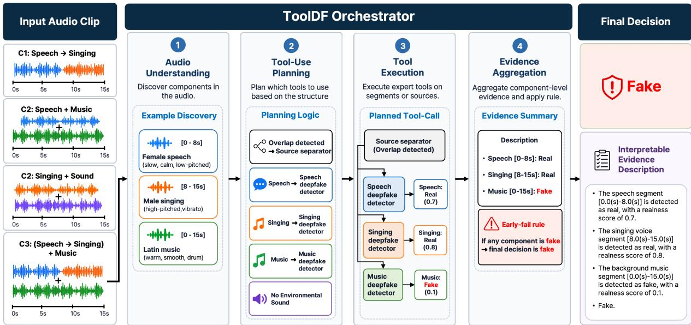
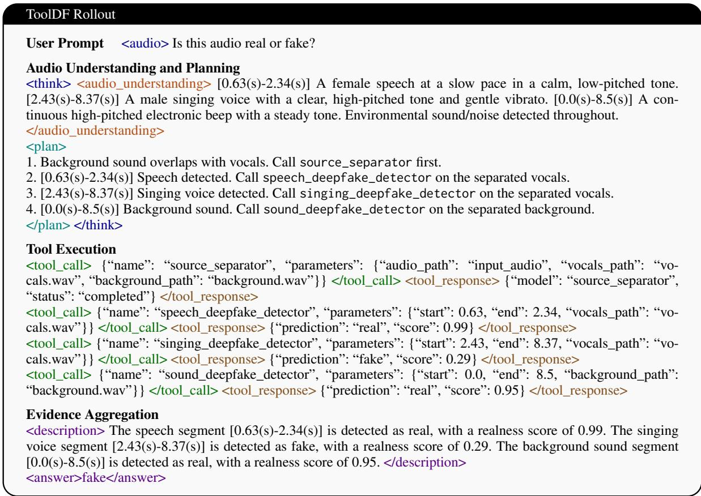
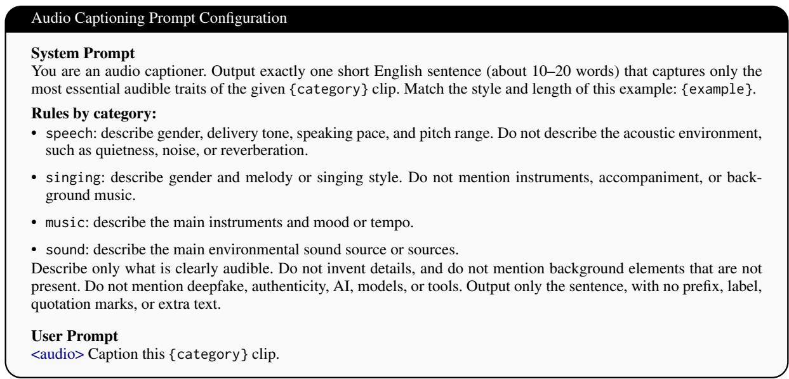
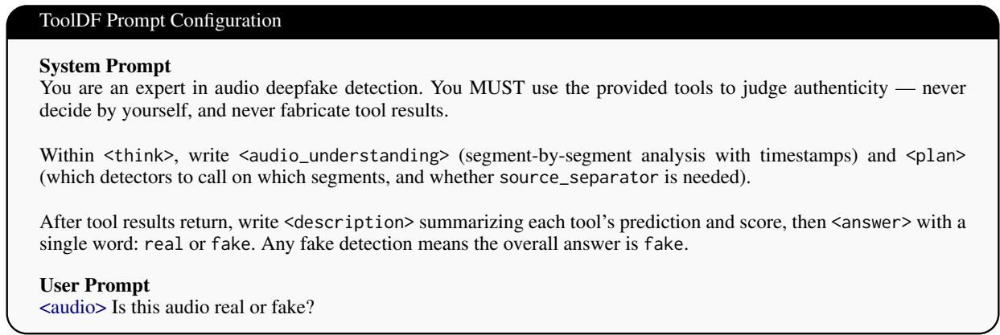

# TOOLDF: Tool-Integrated Reasoning for Mixed-Authenticity Audio Deepfake Detection

Taewoo Kim1,2, Young Han Lee1, Nam In Park3, Chanwoo Kim2\*

1Multi-Modal Research Center, KETI, South Korea

2Department of Artificial Intelligence, Korea University, South Korea

3Digital Analysis Section, National Forensic Service, South Korea

{kimtaewoo, yhlee}@keti.re.kr, naminpark@korea.kr, chanwcom@korea.ac.kr

## Abstract

Audio deepfake detection is commonly formulated as clip-level binary classification of single-domain audio. However, real-world manipulated audio can exhibit mixed authenticity, where genuine and manipulated cues coexist across temporal transitions, overlapping sources, or both. This setting requires not only detecting manipulated audio but also localizing the components that provide evidence for the decision. We propose ToolDF, a toolintegrated reasoning framework for mixedauthenticity audio deepfake detection. ToolDF employs an audio large language model as an orchestrator trained with supervised tooluse trajectories. It adaptively analyzes the audio scene, selectively performs source separation, routes components to domain-specific experts, and aggregates their evidence into an interpretable verdict. We further introduce a mixed-authenticity ADD benchmark covering temporal transitions, acoustic overlaps, and hybrid mixtures. Experimental results show that ToolDF achieves the best overall performance on composite-type detection, achieving macro-F1 gains of 3.72 and 14.39 points over the strongest monolithic baseline and a fixed pipeline, respectively, while providing interpretable evidence localized to temporal regions and acoustic sources. Our source code and dataset are publicly available online1.

## 1 Introduction

Audio deepfake detection (ADD) is typically formulated as clip-level binary classification of single-domain audio (Jung et al., 2022; Tak et al., 2022; Rosello et al., 2023; Kim et al., 2025), where an input clip is classified as either real or fake. While this formulation has supported significant progress across speech, singing, music, and environmental-sound domains (Zang et al.,

2024a,b; Afchar et al., 2025; Xie et al., 2025, 2026a), it becomes restrictive when an audio input contains multiple acoustic components with different authenticity states.

To address this limitation, we introduce the task of mixed-authenticity audio deepfake detection, where genuine and manipulated cues coexist within a single audio input. While recent efforts have begun addressing localized manipulations or specific acoustic domains (Zhang et al., 2022; Zang et al., 2024b; Zhang et al., 2026), real-world mixed-authenticity audio may involve complex manipulations across temporal transitions, overlapping acoustic sources, or both. For example, an audio clip might feature a transition from genuine speech to synthetic singing, layered over genuine background music. A robust detection system should therefore not only determine whether the audio is manipulated but also localize the specific temporal segments or acoustic sources that provide evidence for the final decision.

Existing ADD systems are not designed to handle such mixed-authenticity inputs. Domainspecific detectors can become unreliable when an input contains out-of-domain sources, while cliplevel binary classifiers may overlook localized manipulations (Li et al., 2024). Fixed pipelines that rely on predefined separation or detection steps can also be suboptimal (Zang et al., 2024b; Zhang et al., 2026), as separation can help with overlapping sources but may introduce artifacts when the input does not require separation. Moreover, using an audio large language model (ALLM) (Gu et al., 2025; Guo et al., 2026) directly as a holistic binary classifier does not leverage specialized detectors or reveal what evidence supports the prediction. These limitations motivate an adaptive framework that analyzes the input structure, selectively invokes expert tools, and integrates their outputs into an interpretable authenticity decision.

In this paper, we propose ToolDF, a toolintegrated reasoning (TIR) framework that employs an ALLM as an orchestrator rather than a direct authenticity classifier. Given an audio input, ToolDF analyzes its structure to identify relevant temporal segments and acoustic sources. It then selectively invokes domain-specific expert detectors for speech, singing, music, and environmental sound. When overlapping sources are identified, ToolDF applies source separation before localized detection. Finally, it aggregates the tool responses into an interpretable authenticity decision.

To achieve this, we train ToolDF via supervised fine-tuning (SFT) on structured tool-use trajectories. Each trajectory explicitly encodes the structured reasoning process, demonstrating how the model analyzes the input structure, plans tool calls, interprets expert responses, and derives the final verdict. Instead of relying solely on the final authenticity label, these trajectories provide rich intermediate supervision for structural analysis, tool selection, and evidence aggregation.

To evaluate the proposed framework, we construct a comprehensive mixed-authenticity audio benchmark covering both single-type and composite-type manipulation scenarios. Experimental results demonstrate that ToolDF achieves the best overall performance on composite-type detection, particularly in scenarios requiring reasoning over temporal segments and overlapping sources. Furthermore, ToolDF provides interpretable tool-execution traces, clearly revealing which segments, sources, and detector outputs contribute to the final decision.

Our contributions are summarized as follows:

• We formulate the task of mixed-authenticity audio deepfake detection, where genuine and manipulated cues coexist across temporal transitions and overlapping acoustic sources.

• We propose ToolDF, an ALLM-based TIR framework that acts as an orchestrator to analyze audio structure, route expert tools, and aggregate evidence through supervised tooluse trajectories.

• We construct and publicly release a comprehensive mixed-authenticity benchmark, demonstrating through extensive experiments that ToolDF achieves the best overall performance on composite-type detection while providing transparent, interpretable component-level evidence.

## 2 Related Work

## 2.1 Audio Deepfake Detection

ADD has been studied extensively in the speech domain, with progress driven by benchmark datasets such as ASVspoof (Yamagishi et al., 2021) and architectures such as AASIST (Jung et al., 2022). Recent efforts have expanded the scope of ADD from speech to diverse acoustic domains, including singing, music, and environmental sounds (Zang et al., 2024a,b; Afchar et al., 2025; Xie et al., 2025, 2026a). However, these methods assume that each input clip belongs to a single dominant acoustic domain and predict a single authenticity label for the entire audio. This paradigm becomes restrictive when multiple audio types and varying authenticity states coexist within a single input.

## 2.2 Multi-Source and Composite Audio ADD

To address composite audio inputs, source separation has been explored to isolate source-specific manipulation cues, particularly for vocals mixed with background music (Zang et al., 2024b; Zhang et al., 2026). For instance, a fixed preprocessing pipeline (Zang et al., 2024b) applies source separation to all inputs, which can introduce unwanted artifacts into single-source signals that do not require separation. Conversely, while recent frameworks (Zhang et al., 2026) adaptively trigger separation upon detecting overlapping sources, their downstream detection remains limited to the speech domain, failing to account for synthetic elements in singing, music, or environmental backgrounds. Unlike these approaches with inflexible pipelines or restricted detection scopes, ToolDF adaptively invokes source separation only when structurally required, while evaluating authenticity across multiple acoustic domains using domainspecific detectors.

## 2.3 ALLM and Tool-Integrated Reasoning

ALLMs have demonstrated strong capabilities in understanding speech, music, and environmental sounds (Rouditchenko et al., 2025), leading to early explorations in audio deepfake detection (Gu et al., 2025; Guo et al., 2026; Xie et al., 2026b). A straightforward approach is to deploy an ALLM directly as a holistic binary classifier. However, such direct prediction operates as a black box, providing limited insight into the underlying evidence and failing to exploit domain-specific detectors. Tool-augmented language models address these limitations by invoking external modules to perform expert tasks and integrating intermediate responses into a final output (Schick et al., 2023; Qin et al., 2024; Qian et al., 2025). ToolDF leverages supervised tool-use trajectories to operationalize tool-integrated reasoning (TIR) for ADD, training an ALLM to act as an orchestrator that analyzes mixed-authenticity inputs, routes components to domain-specific expert detectors, and aggregates component-level evidence through a structured reasoning process.

  
Figure 1: Overview of the ToolDF framework for mixed-authenticity audio deepfake detection.

## 3 Methodology

## 3.1 Task Formulation

Let x denote an input audio clip. Unlike conventional ADD, where each input is assigned a single clip-level label, we assume that x may contain multiple heterogeneous components:

$$
{ \mathcal { C } } ( x ) = \{ c _ { 1 } , c _ { 2 } , \ldots , c _ { K } \} .
$$

Each component $c _ { k }$ is associated with a content type $t _ { k } ~ \in$ {speech, singing, music, sound}, a support region $\rho _ { k }$ , and a component-level authenticity label $y _ { k } ~ \in ~ \{ r \in \mathsf { a l } , \mathsf { f a k e } \}$ . For temporally localized components, $\rho _ { k }$ is represented by onset and offset times $( s _ { k } , e _ { k } )$ ; otherwise, it denotes a source-specific region in the acoustic mixture. The clip-level label $y \in$ {real, fake} follows an early-fail rule:

$$
y = \mathsf { f a k e \Longleftrightarrow } \exists c _ { k } \in \mathcal { C } ( x ) \mathrm { s . t . } y _ { k } = \mathsf { f a k e } .
$$

The standard single-domain ADD problem is a restricted case where $K \_ { \mathbf { \Sigma } } = \mathbf { \Sigma } _ { 1 }$ and the single component spans the entire clip. In the mixedauthenticity setting, a system should predict the clip-level label y while identifying the componentlevel evidence that supports the decision.

## 3.2 ToolDF Framework

ToolDF formulates mixed-authenticity audio deepfake detection as a structured TIR process rather than direct clip-level classification. Given an input audio clip $x ,$ an ALLM serves as an orchestrator that analyzes the audio scene, plans tool usage, invokes domain-specific expert tools, and aggregates their observations into a final authenticity decision. As illustrated in Figure 1, the framework consists of four phases: audio understanding, tool-use planning, localized tool execution, and evidence aggregation.

Specifically, ToolDF implements TIR as a trajectory that links audio-scene analysis with authenticity assessment. Rather than relying on unconstrained free-form rationales, ToolDF represents the reasoning process as an explicit sequence of structured decisions: identifying the constituent acoustic components $\mathcal C ( x )$ , routing each component $c _ { k }$ to suitable expert tools based on its content type $t _ { k } .$ , executing localized tool calls over the support region $\rho _ { k }$ , and deriving the final clip-level verdict y from component-level evidence. Figure 2 shows an example rollout of this structured trajectory.

  
Figure 2: Execution rollout of the structured tool-integrated reasoning framework.

Audio Understanding. Given an input audio clip x, the orchestrator first produces a structured <audio\_understanding> block that summarizes the acoustic composition of the clip. The block identifies a set of components $\mathcal { C } ( x ) ~ = ~ \{ c _ { 1 } , . . . , c _ { K } \}$ , where each component $c _ { k }$ is associated with a content type $t _ { k } \in$ {speech, singing, music, sound} and a support region $\rho _ { k }$ . This step helps characterize the acoustic structure of the input and informs the selection and use of downstream detectors.

Planning. Based on the identified components C(x), the orchestrator formulates a conditional tool-use sequence within the <plan> block. If vocal and background components overlap in time, the plan prioritizes the invocation of a source separator to isolate distinct acoustic streams. The resulting components are then mapped to the corresponding expert detectors according to their content types $t _ { k }$

Tool Execution. The orchestrator executes the plan by issuing structured tool calls. As shown by the <tool\_call> and <tool\_response> sequences in Figure 2, each call specifies which tool to use and what input region to analyze, such as a temporal segment or a separated source. The called tool then returns a component-level authenticity prediction $\hat { y } _ { k }$ for the target component. These tool outputs provide external evidence for the final decision.

Evidence Aggregation. After receiving the tool observations, the orchestrator summarizes the component-level evidence within the <description> block and derives the final cliplevel decision. Following the mixed-authenticity formulation in Section 3.1, the final output in the <answer> tag is fake if any component-level prediction $\hat { y } _ { k }$ is fake. Otherwise, the framework returns real.

## 3.3 Supervised Trajectory Learning

We optimize ToolDF with supervised fine-tuning (SFT) to train the ALLM to follow the structured TIR protocol. Given an input audio clip x, the orchestrator is trained to autoregressively generate a structured trajectory from audio understanding to the final decision:

$$
o = \langle { u , p , \mathcal { T } , d , y } \rangle ,
$$

<table><tr><td>Type</td><td>Acoustic Configurations</td><td># Train</td><td>#Dev</td><td># Eval</td></tr><tr><td>ASVspoof2019 LA (Nautsch et al., 2021)</td><td>Speech</td><td>25,380</td><td>24,844</td><td>71,237</td></tr><tr><td>CtrSVDD (Zang et al., 2024a)</td><td>Singing Voice</td><td>84,404</td><td>43,625</td><td>92,769</td></tr><tr><td>EnvSDD (Yin et al., 2025)</td><td>Environmental Sound</td><td>139,055</td><td>39,710</td><td>39,768</td></tr><tr><td>FakeMusicCaps (Comanducci et al., 2025)</td><td>Music (Fake)</td><td>16,055</td><td>5,350</td><td>6,200</td></tr><tr><td>MusicCaps (Agostinelli et al., 2023)</td><td>Music (Real)</td><td>3,211</td><td>1,070</td><td>1,071</td></tr><tr><td>C1</td><td>Speech → Singing</td><td>12,690</td><td>12,422</td><td>35,616</td></tr><tr><td>(Temporal Transition)</td><td>Singing → Speech</td><td>12,690</td><td>12,422</td><td>35,620</td></tr><tr><td>C2</td><td>Speech + Music</td><td>3,170</td><td>2,325</td><td>3,114</td></tr><tr><td>(Acoustic Overlap)</td><td>Singing + Music</td><td>10,281</td><td>4,095</td><td>4,157</td></tr><tr><td></td><td>Speech + Environmental Sound</td><td>22,210</td><td>14,060</td><td>17,234</td></tr><tr><td></td><td>Singing + Environmental Sound</td><td>74,122</td><td>25,650</td><td>22,534</td></tr><tr><td>C3</td><td> $( \mathrm { S p e e c h }  \mathrm { S i n g i n g } ) + \mathrm { M u s i c }$ </td><td>1,418</td><td>1,197</td><td>979</td></tr><tr><td> $( T r a n s i t i o n + O \nu e r l a p )$ </td><td> $( \sin \mathrm { g i n g }  \mathrm { S p e e c h } ) + \mathrm { M u s i c }$ </td><td>1,491</td><td>1,222</td><td>985</td></tr><tr><td></td><td> $( \mathrm { S p e e c h }  \mathrm { S i n g i n g } ) + \mathrm { E n v S o u n d }$ </td><td>11,272</td><td>7,815</td><td>5,061</td></tr><tr><td></td><td> $( \mathrm { S i n g i n g }  \mathrm { S p e c h } ) + \mathrm { E n v S o u n d }$ </td><td>11,199</td><td>7,790</td><td>5,059</td></tr><tr><td>Total</td><td>All Configurations</td><td>428,648</td><td>203,597</td><td>341,404</td></tr></table>

Table 1: Statistics of the mixed-authenticity audio deepfake detection benchmark, including both single-type corpora and constructed composite-type configurations. The composite-type setting consists of C1 temporal speech– singing transitions, C2 acoustic overlaps between foreground and background sources, and C3 hybrid mixtures combining transitions and overlaps. Details of the data construction are provided in Appendix A.

where u denotes the audio-understanding block, p the tool-use plan, $\mathcal { T } = ( ( a _ { i } , r _ { i } ) ) _ { i = 1 } ^ { N }$ the sequence of tool calls $a _ { i }$ and tool observations $^ { r _ { i } , }$ d the evidence summary, and $y \in \{ \mathsf { r e a l } , \mathsf { f a k e } \}$ the final clip-level verdict.

To construct supervised trajectories, we use ground-truth component annotations:

$$
\begin{array} { r } { \boldsymbol { S } ^ { \star } = \{ ( \rho _ { k } , t _ { k } , y _ { k } ) \} _ { k = 1 } ^ { K } , } \end{array}
$$

where $\rho _ { k } , t _ { k }$ , and $y _ { k }$ follow the definitions in Section 3.1. These annotations are used to construct audio-understanding blocks, tool-use plans, and localized tool calls. During trajectory construction, the tool observations are populated using the ground-truth component authenticity labels and inserted into the trajectory as conditioning context for subsequent generation. The evidence summary and final verdict are then constructed from these ground-truth observations according to the mixedauthenticity early-fail rule.

Although the trajectory contains both generated tokens and tool observation tokens, the model is optimized only on tokens produced by the orchestrator. Let M denote the set of token positions corresponding to u, $p , \{ a _ { i } \} _ { i = 1 } ^ { N } , d .$ and y, excluding the observation tokens $\{ r _ { i } \} _ { i = 1 } ^ { N }$ . The SFT objective is:

$$
\mathcal { L } _ { \mathrm { S F T } } = - \sum _ { m \in \mathcal { M } } \log P _ { \theta } \left( o _ { m } \mid o _ { < m } , x , q \right) .
$$

Here, x denotes the input audio clip, q denotes the textual instruction context, $o _ { m }$ denotes the m-th

token in the target trajectory, $O _ { < m }$ denotes the preceding tokens, and $P _ { \theta }$ denotes the next-token distribution of the ALLM.

## 4 Mixed-Authenticity ADD Benchmark

To evaluate ToolDF beyond isolated singledomain settings, we construct a mixedauthenticity ADD benchmark by combining public audio deepfake datasets from multiple acoustic domains. Existing benchmarks typically focus on a single content type, such as speech, singing, music, or environmental sound, and thus do not sufficiently evaluate performance on heterogeneous audio scenes containing multiple components with different authenticity cues.

The benchmark is built from authentic and synthetic subsets of domain-specific corpora, including ASVspoof2019 (Nautsch et al., 2021) for speech, CtrSVDD (Zang et al., 2024a) for singing, FakeMusicCaps (Comanducci et al., 2025) and MusicCaps (Agostinelli et al., 2023) for music, and EnvSDD (Yin et al., 2025) for environmental sounds. Using these sources, we construct both single-type and composite-type evaluation settings. The single-type setting contains isolated speech, singing, music, and environmental sound clips following conventional ADD evaluation. The composite-type setting consists of three splits: C1, temporal transitions between speech and singing; C2, acoustic overlaps between foreground vocal content and background music or environmental sound; and C3, hybrid mixtures combining both temporal transitions and acoustic overlaps.

## 5 Experiments

## 5.1 Dataset

Table 1 summarizes the statistics of our mixedauthenticity ADD benchmark. We evaluate ToolDF under both conventional single-type and the proposed composite-type settings. For singletype evaluation, we follow the official training, development, and test splits of each source corpus. As an exception, due to the unavailability of certain original audio files in MusicCaps (Agostinelli et al., 2023), a small number of real samples could not be retrieved during data collection. To prevent data leakage, their corresponding fake pairs were assigned exclusively to the test set. The remaining accessible samples from MusicCaps and FakeMusicCaps (Comanducci et al., 2025) were randomly partitioned into training, development, and test sets with a 6 : 2 : 2 ratio. Detailed configurations for the composite-type settings are provided in Appendix A.

## 5.2 Implementation Details

ALLM Backbone. We implement ToolDF with Qwen2.5-Omni-3B (Xu et al., 2025) as the ALLM backbone and fine-tune it on supervised TIR trajectories. We use Low-Rank Adaptation (LoRA) for parameter-efficient tuning, keeping the base model frozen and inserting adapters into all linear layers with rank r = 64 and scaling factor α = 16. The model is fine-tuned using the task-specific system prompt designed to enforce the structured TIR protocol, the exact text of which is detailed in Appendix B. Training uses 428,648 examples comprising both single-type and composite-type data. We train for three epochs with AdamW, using a learning rate of $1 \times 1 0 ^ { - 5 }$ , weight decay of 0.1, bfloat16 precision, gradient checkpointing, DeepSpeed ZeRO-2, and a maximum sequence length of 4096. Training is conducted on 8 NVIDIA A40 GPUs with a batch size of 4 per GPU and gradient accumulation over 4 steps, yielding a global batch size of 128.

Tools. ToolDF uses external tools for source separation and domain-specific deepfake detection. For overlapping vocal-background mixtures, we employ Demucs v4 (Rouard et al., 2023) to obtain vocal and non-vocal streams. For authenticity assessment, we instantiate XLSR-AASIST expert detectors for speech, singing, music, and environmental sound, each trained on data from its corresponding single-type domain. To prevent information loss at temporal transitions, the XLSR-AASIST expert detectors are trained on the full audio duration, with audio sequences dynamically repeated to match the maximum sequence length within each batch. We also train separation-aware variants to handle separated inputs and potential separation artifacts.

At inference time, the orchestrator routes the target audio segment or separated source to the selected expert according to the generated tool-use plan. Each detector returns a binary authenticity prediction and a normalized confidence score in [0, 1], which are inserted into the trajectory as tool observations. The decision threshold for each detector is determined by the equal error rate on its development set.

## 5.3 Baselines

To evaluate ToolDF in mixed-authenticity audio deepfake detection, we compare its performance against five baseline configurations. We categorize the evaluated systems into end-to-end monolithic models and component-level frameworks. The end-to-end monolithic baselines include XLSR-AASIST (Tak et al., 2022), a standard framework combining a self-supervised wav2vec 2.0 (Babu et al., 2022) backbone with a graph neural network, and XLSR-Conformer (Rosello et al., 2023), which leverages a Conformer backbone to capture both local and global temporal dependencies. We also compare against WPT-XLSR-AASIST (Xie et al., 2026a), a frequency-sensitive approach proposed for all-type audio deepfake detection, and ALLM4ADD (Gu et al., 2025), a recent ALLM fine-tuned for audio deepfake detection.

As a component-level baseline, the Fixed Pipeline applies source separation via Demucs v4 to every input, routing the isolated foreground and background streams to specialized vocal (speech and singing) and non-vocal (music and environmental sound) XLSR-AASIST expert detectors. Both detectors are trained as separation-aware variants. The final verdict is determined by an early-fail rule, classifying the clip as fake if either detector predicts a synthetic origin.

## 5.4 Evaluation Metric

We use the macro-averaged F1 score as the cliplevel evaluation metric for both single-type and composite-type settings. Macro-F1 computes F1

<table><tr><td rowspan="2">Model</td><td colspan="5">Single-Type</td><td colspan="4">Composite-Type</td></tr><tr><td>Speech</td><td>Singing</td><td>Sound</td><td>Music</td><td>S-Avg.</td><td>C1</td><td>C2</td><td>C3</td><td>C-Avg.</td></tr><tr><td>XLSR-AASIST (Tak et al., 2022)</td><td>89.60</td><td>84.82</td><td>76.67</td><td>95.22</td><td>86.57</td><td>79.54</td><td>51.95</td><td>42.01</td><td>57.83</td></tr><tr><td>XLSR-Conformer (Rosello et al., 2023)</td><td>90.17</td><td>83.34</td><td>72.56</td><td>92.83</td><td>84.73</td><td>74.29</td><td>48.82</td><td>38.12</td><td>53.74</td></tr><tr><td>WPT-XLSR-AASIST (Xie et al., 2026a)</td><td>90.16</td><td>86.91</td><td>69.26</td><td>82.45</td><td>82.20</td><td>68.41</td><td>47.87</td><td>31.46</td><td>49.25</td></tr><tr><td>ALLM4ADD (Gu et al., 2025)</td><td>97.64</td><td>61.56</td><td>75.54</td><td>95.62</td><td>82.56</td><td>62.62</td><td>55.51</td><td>53.22</td><td>57.12</td></tr></table>

Table 2: Performance of models trained on single-type data across single-type and composite-type mixedauthenticity settings (Macro-F1, %). S-Avg. and C-Avg. denote the average performance over single-type and composite-type settings, respectively.
<table><tr><td rowspan="2">Model</td><td rowspan="2">|Interp. |</td><td colspan="5">Single-Type</td><td colspan="4">Composite-Type</td></tr><tr><td>Speech</td><td>Singing</td><td>Sound</td><td>Music</td><td>S-Avg.</td><td>C1</td><td>C2</td><td>C3</td><td>|C-Avg.</td></tr><tr><td colspan="10">End-to-End Monolithic Models</td></tr><tr><td>XLSR-AASIST (Tak et al., 2022)</td><td></td><td>88.40</td><td>84.91</td><td>69.37</td><td>92.42</td><td>83.78</td><td>89.79</td><td>73.16</td><td>71.57</td><td>78.17</td></tr><tr><td>XLSR-Conformer (Rosello et al., 2023)</td><td>× × × ×</td><td>88.09</td><td>82.55</td><td>71.80</td><td>90.80</td><td>83.31</td><td>87.28</td><td>74.46</td><td>71.61</td><td>77.78</td></tr><tr><td>WPT-XLSR-AASIST (Xie et al., 2026a)</td><td></td><td>83.55</td><td>78.81</td><td>78.04</td><td>87.52</td><td>81.98</td><td>85.00</td><td>73.73</td><td>69.87</td><td>76.20</td></tr><tr><td>ALLM4ADD (Gu et al., 2025)</td><td></td><td>98.17</td><td>60.94</td><td>75.00</td><td>95.20</td><td>82.33</td><td>72.77</td><td>64.92</td><td>57.43</td><td>65.04</td></tr><tr><td colspan="10">Component-Level Frameworks</td></tr><tr><td>Fixed Pipeline</td><td>一</td><td>63.72</td><td>55.58</td><td>52.91</td><td>66.25</td><td>59.62</td><td>55.57</td><td>78.55</td><td>68.39</td><td>67.50</td></tr><tr><td>ToolDF (Proposed)</td><td>√</td><td>95.78</td><td>81.58</td><td>76.13</td><td>92.67</td><td>86.54</td><td>91.21</td><td>77.66</td><td>76.81</td><td>81.89</td></tr><tr><td>ToolDF (Oracle)</td><td></td><td>95.96</td><td>78.94</td><td>76.10</td><td>93.09</td><td>86.02</td><td>91.77</td><td>79.34</td><td>77.45</td><td>82.85</td></tr></table>

Table 3: Performance comparison for single-type and composite-type audio deepfake detection. Values are macro-F1 scores (%). S-Avg. and C-Avg. denote averages over single-type and composite-type settings, respectively. ✓∗ indicates limited or rule-based interpretability.

separately for the real and fake classes and averages the two scores equally, preventing the majority class from dominating the overall evaluation.

## 6 Results

## 6.1 The Single-Type Generalization Gap

Table 2 examines whether existing models trained only on single-type data can generalize to composite mixed-authenticity inputs. While the baselines perform strongly on single-type cases, with XLSR-AASIST achieving the highest S-Avg. of 86.57, their performance drops sharply on composite inputs. The best C-Avg. falls to 57.83, again from XLSR-AASIST, with particularly large degradation in the more complex composite settings. ALLM4ADD performs comparatively well on overlapping scenarios, achieving the best scores on C2 and C3 among the evaluated baselines, although its composite-type performance remains substantially below its single-type performance.

These results show that strong performance on isolated acoustic domains does not ensure generalization to mixed-authenticity ADD. Since effectively handling composite scenarios requires reasoning over multiple temporal regions and acoustic sources rather than relying solely on monolithic clip-level classification, this generalization gap motivates ToolDF, which decomposes the acoustic scene through structured, tool-integrated reasoning.

## 6.2 Evaluation on Mixed-Authenticity ADD

Table 3 compares ToolDF with end-to-end monolithic models and component-level frameworks under a joint training setting. ToolDF achieves the best overall performance on composite inputs, yielding the highest C-Avg. of 81.89 and outperforming the strongest monolithic baseline, XLSR-AASIST, by 3.72 points. ToolDF performs particularly strongly on temporal transitions (C1) and hybrid mixtures (C3), achieving 91.21 and 76.81, respectively. Although ALLM4ADD achieves strong performance on single-type settings, its C-Avg. drops to 65.04 on composite inputs, indicating that strong single-type performance does not necessarily translate to mixedauthenticity detection, even with joint training.

Furthermore, ToolDF outperforms the Fixed Pipeline, achieving a C-Avg. score of 81.89 compared to the baseline’s 67.50. While the Fixed Pipeline scores slightly higher on acoustic overlaps (C2) with 78.55 due to its mandatory source separation, its performance is substantially lower on C1 and C3, where separation may be unnecessary or introduce artifacts. ToolDF mitigates this limitation by adaptively deciding when to perform source separation. Crucially, ToolDF provides high interpretability through explicit toolexecution trajectories, whereas monolithic models do not provide explicit component-level evidence. Finally, ToolDF closely approaches its Oracle variant with a marginal gap of only 0.96 points, suggesting that the orchestrator can closely approximate oracle routing without access to ground-truth annotations.

<table><tr><td></td><td colspan="3">C1 (Temporal)</td><td colspan="3">C2 (Overlap)</td><td colspan="3">C3 (Temporal + Overlap)</td></tr><tr><td>Configuration</td><td>PR</td><td> $\mathbf { F 1 _ { p a r s e d } }$ </td><td> $\mathbf { F 1 } _ { \mathbf { s t r i c t } }$ </td><td>PR</td><td> $\mathbf { F 1 _ { p a r s e d } }$ </td><td> $\mathbf { F 1 } _ { \mathbf { s t r i c t } }$ </td><td>PR</td><td> $\mathbf { F 1 _ { p a r s e d } }$ </td><td> $\mathbf { F 1 } _ { \mathbf { s t r i c t } }$ </td></tr><tr><td>ToolDF</td><td>100.00</td><td>91.21</td><td>91.21</td><td>99.99</td><td>77.67</td><td>77.66</td><td>99.98</td><td>76.83</td><td>76.81</td></tr><tr><td>w/o Audio Understanding</td><td>82.59</td><td>60.12</td><td>48.25</td><td>79.85</td><td>48.82</td><td>39.77</td><td>83.15</td><td>53.21</td><td>44.31</td></tr><tr><td>w/o Planning</td><td>96.71</td><td>45.47</td><td>44.08</td><td>84.34</td><td>24.57</td><td>20.87</td><td>97.52</td><td>35.18</td><td>34.33</td></tr><tr><td>w/o Tool Calling</td><td>100.00</td><td>75.75</td><td>75.75</td><td>100.00</td><td>66.49</td><td>66.49</td><td>100.00</td><td>63.62</td><td>63.62</td></tr><tr><td>w/o Description</td><td>69.90</td><td>85.06</td><td>48.57</td><td>23.69</td><td>69.77</td><td>18.57</td><td>88.87</td><td>74.43</td><td>63.62</td></tr></table>

Table 4: Ablation study under parsed-only and strict evaluation. PR denotes the parsing rate (%), representing the percentage of outputs that conform to the designated trajectory format. $\mathrm { F l } _ { \mathrm { p a r s e d } }$ (%) is computed only on these successfully parsed outputs, while $\mathrm { F l _ { \mathrm { s t r i c t } } }$ (%) is evaluated over the entire test set by treating unparsable outputs as incorrect predictions. Each ablation removes the corresponding stage from the structured ToolDF trajectory.

<table><tr><td>Type</td><td> $\mathbf { S e g - F 1 _ { m i . } }$ </td><td> $\mathbf { S e g - F 1 _ { m a . } }$ </td><td> $\mathbf { E v e n t - F 1 _ { m i . } }$ </td><td> $\mathbf { E v e n t - F 1 _ { m a . } }$ </td></tr><tr><td>Speech</td><td>97.76</td><td>98.18</td><td>93.42</td><td>93.64</td></tr><tr><td>Singing</td><td>95.58</td><td>97.74</td><td>95.19</td><td>97.19</td></tr><tr><td>Sound</td><td>99.95</td><td>99.97</td><td>99.92</td><td>99.96</td></tr><tr><td>Music</td><td>99.73</td><td>99.89</td><td>99.66</td><td>99.94</td></tr><tr><td>C1</td><td>95.63</td><td>97.34</td><td>93.34</td><td>94.24</td></tr><tr><td>C2</td><td>96.70</td><td>96.11</td><td>92.77</td><td>91.96</td></tr><tr><td>C3</td><td>95.26</td><td>93.63</td><td>86.44</td><td>87.62</td></tr></table>

Table 5: Fine-grained localization performance of ToolDF across evaluation subsets. Segment-level and event-level F1 scores (%) are reported with micro and macro averaging.

## 6.3 Ablation and Localization Analysis

Table 4 reports the ablation results for compositetype inputs under both parsed-only and strict evaluation metrics. Each ablation variant is separately trained and evaluated with the corresponding trajectory stage removed. In w/o Audio Understanding, the model generates the tool-use plan directly from the input audio and instruction without an explicit structured acoustic decomposition block; in w/o Planning, tool calls are generated directly after audio understanding; in w/o Tool Calling, the model produces the verdict without external detector responses; and in w/o Description, the final answer is generated directly from the tool responses.

The full ToolDF model achieves the highest performance across all configurations while maintaining a parsing rate (PR) close to 100%. This demonstrates that our structured trajectory design generates stable, rule-compliant reasoning paths without sacrificing detection performance. Among the individual components, removing the planning stage causes the largest drop in strict F1 scores across all splits. Eliminating audio understanding also substantially lowers performance, indicating that direct tool calling alone is insufficient without explicit audio-scene understanding. Furthermore, excluding description evidence severely degrades the parsing rate on C2 to 23.69, highlighting the importance of structured evidence aggregation for maintaining stable LLM reasoning in overlapping environments.

To evaluate fine-grained localization, Table 5 assesses the localization performance of ToolDF following standard DCASE evaluation metrics (Turpault et al., 2019). The framework demonstrates stable localization capabilities across all subsets, yielding macro-F1 scores between 93.64 and 99.97 in single-type domains for both segment-level and event-level metrics. In composite-type settings, ToolDF maintains consistent localization performance, achieving eventlevel macro-F1 scores of 94.24 on temporal transitions (C1) and 87.62 on hybrid mixtures (C3). These results demonstrate that ToolDF can go beyond clip-level binary classification by localizing temporal regions and acoustic sources that provide evidence of manipulation.

## 7 Conclusion

We presented ToolDF, a tool-integrated reasoning (TIR) framework for mixed-authenticity audio deepfake detection. By leveraging an audio large language model as an orchestrator, ToolDF analyzes audio structures, adaptively routes heterogeneous components to specialized expert detectors, and aggregates component-level evidence into an interpretable clip-level verdict. Experiments on our mixed-authenticity audio deepfake detection benchmark demonstrate that ToolDF achieves the best overall performance on composite-type detection while providing fine-grained localization of the temporal regions and acoustic sources that support its decisions. These results highlight the potential of TIR as a general framework for interpretable and adaptive audio deepfake detection in complex acoustic scenes.

## Limitations

ToolDF depends on external tools, including source separation modules and domain-specific deepfake detectors. Therefore, errors from source separation or detector misclassification can propagate to the final decision, and the overall performance is bounded by the reliability and coverage of the underlying expert models.

In addition, our benchmark is constructed by composing existing public datasets. While this enables controlled evaluation with component-level annotations, it may not fully reflect the diversity, editing artifacts, source interactions, and distributional complexity of real-world manipulated media. The composition rules used for temporal transitions and acoustic overlaps may also be simpler than those encountered in real-world or adversarially edited audio.

Our evaluation does not include conventional partial-spoof benchmarks such as Partial-Spoof (Zhang et al., 2022), which focus on localized manipulations within a single speech utterance. Extending ToolDF to this setting by incorporating a partial-spoof detector as a speech expert remains an important direction for future work.

## Acknowledgements

This work was partly supported by the Institute of Information & Communications Technology Planning & Evaluation (IITP) grants funded by the Korea government (MSIT): (No. RS-2026- 25525363, Agentic Experts for Generative-AI Inspection Solution, Contribution: 50%), (No. RS-2025-02304828, Artificial Intelligence Star Fellowship Support Program to Nurture the Best AI Talent, Contribution: 45%), and (No. RS-2019- II190079, Artificial Intelligence Graduate School Program at Korea University, Contribution: 5%).

## References

Darius Afchar, Gabriel Meseguer-Brocal, and Romain Hennequin. 2025. Ai-generated music detection and its challenges. In ICASSP 2025-2025 IEEE International Conference on Acoustics, Speech and Signal Processing (ICASSP), pages 1–5. IEEE.

Andrea Agostinelli, Timo I. Denk, Zalán Borsos, Jesse Engel, Mauro Verzetti, Antoine Caillon, Qingqing Huang, Aren Jansen, Adam Roberts, Marco Tagliasacchi, Matt Sharifi, Neil Zeghidour, and Christian Frank. 2023. Musiclm: Generating music from text. arXiv preprint arXiv:2301.11325.

Arun Babu, Changhan Wang, Andros Tjandra, Kushal Lakhotia, Qiantong Xu, Naman Goyal, Kritika Singh, Patrick von Platen, Yatharth Saraf, Juan Pino, Alexei Baevski, Alexis Conneau, and Michael Auli. 2022. Xls-r: Self-supervised cross-lingual speech representation learning at scale. In Interspeech 2022, pages 2278–2282.

Luca Comanducci, Paolo Bestagini, and Stefano Tubaro. 2025. Fakemusiccaps: A dataset for detection and attribution of synthetic music generated via text-to-music models. Journal of Imaging, 11(7):242.

Hao Gu, Jiangyan Yi, Chenglong Wang, Jianhua Tao, Zheng Lian, Jiayi He, Yong Ren, Yujie Chen, and Zhengqi Wen. 2025. Allm4add: Unlocking the capabilities of audio large language models for audio deepfake detection. In Proceedings of the 33rd ACM International Conference on Multimedia, pages 11736–11745.

Xiaoxuan Guo, Yuankun Xie, Haonan Cheng, Jiayi Zhou, Jian Liu, Hengyan Huang, Long Ye, and Qin Zhang. 2026. Towards explicit acoustic evidence perception in audio llms for speech deepfake detection. arXiv preprint arXiv:2601.23066.

Jee-weon Jung, Hee-Soo Heo, Hemlata Tak, Hye-jin Shim, Joon Son Chung, Bong-Jin Lee, Ha-Jin Yu, and Nicholas Evans. 2022. Aasist: Audio antispoofing using integrated spectro-temporal graph attention networks. In ICASSP 2022-2022 IEEE international conference on acoustics, speech and signal processing (ICASSP), pages 6367–6371. IEEE.

Taewoo Kim, Guisik Kim, Choongsang Cho, and Young Han Lee. 2025. Naturalness-aware curriculum learning with dynamic temperature for speech deepfake detection. In Interspeech 2025, pages 5318–5322.

Yuang Li, Min Zhang, Mengxin Ren, Xiaosong Qiao, Miaomiao Ma, Daimeng Wei, and Hao Yang. 2024. Cross-domain audio deepfake detection: Dataset and analysis. In Proceedings ofthe 2024 Conference on Empirical Methods in Natural Language Processing, pages 4977–4983.

Andreas Nautsch, Xin Wang, Nicholas Evans, Tomi H Kinnunen, Ville Vestman, Massimiliano Todisco,

Héctor Delgado, Md Sahidullah, Junichi Yamagishi, and Kong Aik Lee. 2021. Asvspoof 2019: Spoofing countermeasures for the detection of synthesized, converted and replayed speech. IEEE Transactions on Biometrics, Behavior, and Identity Science, 3(2):252–265.

Cheng Qian, Emre Can Acikgoz, Qi He, Hongru Wang, Xiusi Chen, Dilek Hakkani-Tür, Gokhan Tur, and Heng Ji. 2025. Toolrl: Reward is all tool learning needs. arXiv preprint arXiv:2504.13958.

Yujia Qin, Shihao Liang, Yining Ye, Kunlun Zhu, Lan Yan, Yaxi Lu, Yankai Lin, Xin Cong, Xiangru Tang, Bill Qian, Sihan Zhao, Lauren Hong, Runchu Tian, Ruobing Xie, Jie Zhou, Mark Gerstein, dahai li, Zhiyuan Liu, and Maosong Sun. 2024. Toolllm: Facilitating large language models to master 16000+ real-world apis. In International Conference on Learning Representations.

Eros Rosello, Alejandro Gomez-Alanis, Angel M. Gomez, and Antonio Peinado. 2023. A conformerbased classifier for variable-length utterance processing in anti-spoofing. In Interspeech 2023, pages 5281–5285.

Simon Rouard, Francisco Massa, and Alexandre Dé- fossez. 2023. Hybrid transformers for music source separation. In ICASSP 2023-2023 IEEE International Conference on Acoustics, Speech and Signal Processing (ICASSP), pages 1–5. IEEE.

Andrew Rouditchenko, Saurabhchand Bhati, Edson Araujo, Samuel Thomas, Hilde Kuehne, Rogerio Feris, and James Glass. 2025. Omni-r1: Do you really need audio to fine-tune your audio llm? arXiv preprint arXiv:2505.09439.

Timo Schick, Jane Dwivedi-Yu, Roberto Dessì, Roberta Raileanu, Maria Lomeli, Eric Hambro, Luke Zettlemoyer, Nicola Cancedda, and Thomas Scialom. 2023. Toolformer: Language models can teach themselves to use tools. Advances in neural information processing systems, 36:68539–68551.

Hemlata Tak, Massimiliano Todisco, Xin Wang, Jee weon Jung, Junichi Yamagishi, and Nicholas Evans. 2022. Automatic speaker verification spoofing and deepfake detection using wav2vec 2.0 and data augmentation. In The Speaker and Language Recognition Workshop (Odyssey 2022), pages 112–119.

Nicolas Turpault, Romain Serizel, Ankit Parag Shah, and Justin Salamon. 2019. Sound event detection in domestic environments with weakly labeled data and soundscape synthesis. In Workshop on Detection and Classification of Acoustic Scenes and Events.

Yuankun Xie, Ruibo Fu, Xiaopeng Wang, Zhiyong Wang, Songjun Cao, Long Ma, Haonan Cheng, and Long Ye. 2026a. Detect all-type deepfake audio: Wavelet prompt tuning for enhanced auditory perception. In Proceedings of the AAAI Conference on Artificial Intelligence, volume 40, pages 35922– 35930.

Yuankun Xie, Xiaoxuan Guo, Jiayi Zhou, Tao Wang, Jian Liu, Ruibo Fu, Xiaopeng Wang, Haonan Cheng, and Long Ye. 2026b. Interpretable alltype audio deepfake detection with audio llms via frequency-time reinforcement learning. arXiv preprint arXiv:2601.02983.

Yuankun Xie, Yi Lu, Ruibo Fu, Zhengqi Wen, Zhiyong Wang, Jianhua Tao, Xin Qi, Xiaopeng Wang, Yukun Liu, Haonan Cheng, Long Ye, and Yi Sun. 2025. The codecfake dataset and countermeasures for the universally detection of deepfake audio. IEEE Transactions on Audio, Speech and Language Processing, 33:386–400.

Jin Xu, Zhifang Guo, Jinzheng He, Hangrui Hu, Ting He, Shuai Bai, Keqin Chen, Jialin Wang, Yang Fan, Kai Dang, Bin Zhang, Xiong Wang, Yunfei Chu, and Junyang Lin. 2025. Qwen2.5-omni technical report. arXiv preprint arXiv:2503.20215.

Junichi Yamagishi, Xin Wang, Massimiliano Todisco, Md Sahidullah, Jose Patino, Andreas Nautsch, Xuechen Liu, Kong Aik Lee, Tomi Kinnunen, Nicholas Evans, and Héctor Delgado. 2021. Asvspoof 2021: accelerating progress in spoofed and deepfake speech detection. In 2021 Edition of the Automatic Speaker Verification and Spoofing Countermeasures Challenge, pages 47–54.

Han Yin, Yang Xiao, Rohan Kumar Das, Jisheng Bai, Haohe Liu, Wenwu Wang, and Mark D Plumbley. 2025. EnvSDD: Benchmarking Environmental Sound Deepfake Detection. In Interspeech 2025, pages 201–205.

Yongyi Zang, Jiatong Shi, You Zhang, Ryuichi Yamamoto, Jionghao Han, Yuxun Tang, Shengyuan Xu, Wenxiao Zhao, Jing Guo, Tomoki Toda, and Zhiyao Duan. 2024a. CtrSVDD: A Benchmark Dataset and Baseline Analysis for Controlled Singing Voice Deepfake Detection. In Interspeech 2024, pages 4783–4787.

Yongyi Zang, You Zhang, Mojtaba Heydari, and Zhiyao Duan. 2024b. Singfake: Singing voice deepfake detection. In ICASSP 2024-2024 IEEE International Conference on Acoustics, Speech and Signal Processing (ICASSP), pages 12156–12160. IEEE.

Lin Zhang, Xin Wang, Erica Cooper, Nicholas Evans, and Junichi Yamagishi. 2022. The partialspoof database and countermeasures for the detection of short fake speech segments embedded in an utterance. IEEE/ACM Transactions on Audio, Speech, and Language Processing, 31:813–825.

Xueping Zhang, Yechen Wang, Linxi Li, Liwei Jin, and Ming Li. 2026. Compspoof: A dataset and joint learning framework for component-level audio anti-spoofing countermeasures. In ICASSP 2026- 2026 IEEE International Conference on Acoustics, Speech and Signal Processing (ICASSP), pages 18067–18071. IEEE.

## A Mixed-Authenticity Benchmark Construction

This appendix provides additional details on the construction pipeline and statistics of the Mixed-Authenticity Audio Deepfake Detection Benchmark. We first describe how single-source audio clips are converted into structured component annotations, and then explain how these annotations are used to synthesize composite examples for the C1, C2, and C3 settings.

## A.1 Audio Caption and Component Annotation

Before constructing composite mixtures, we annotate each single-source audio clip with structured component-level metadata. Each component is associated with a content type, a support region, and an authenticity label. The content type is selected from speech, singing, music, and environmental sound. The support region specifies the temporal span in which the component is active, and the authenticity label indicates whether the component is real or fake.

We also generate a concise single-source audio caption for each component using Qwen3-Omni-30B-A3B-Captioner2. The caption describes only observable acoustic properties, such as vocal delivery, singing style, instrumentation, or environmental sound sources, depending on the component type. Importantly, the captioning prompt explicitly prevents the model from mentioning authenticity-related information, including whether the audio is real, fake, synthetic, AIgenerated, or produced by a model. The detailed prompt configuration and category-specific rules are provided in Figure 3. This design avoids label leakage while preserving the acoustic information needed for trajectory construction.

After composite mixtures are constructed, the captions are combined with the component metadata to form the <audio\_understanding> block of the supervised ToolDF trajectory. Thus, the model is supervised not only on the final cliplevel authenticity label, but also on the intermediate acoustic structure needed for tool selection and evidence aggregation.

Boundary Annotation. For vocal domains, including speech and singing, we estimate active regions using WebRTC-VAD3. This excludes prolonged silence and yields localized support regions for vocal components. For non-vocal domains, including music and environmental sound, we use the full clip duration as the valid support region, since these signals typically function as continuous background components in the constructed mixtures.

## A.2 Composite Mixture Construction

Using the annotated single-source component pools, we construct three types of composite mixed-authenticity examples: temporal transitions, acoustic overlaps, and hybrid mixtures. Each composite example is created by combining components from different acoustic domains while preserving their component-level support regions and authenticity labels. The clip-level label is then assigned according to the early-fail rule: a composite clip is labeled fake if at least one of its constituent components is fake, and real otherwise.

Temporal Transition (C1). The C1 setting models temporal transitions between two vocal domains. We construct each example by sequentially concatenating a speech clip and a singing clip. Both transition orders are considered: Speech → Singing and Singing → Speech. The support region of each component is updated according to its position in the concatenated sequence, so that the resulting trajectory can identify which temporal segment corresponds to speech and which corresponds to singing.

To cover different mixed-authenticity patterns, we construct four authenticity combinations: realto-real $( R  R )$ , real-to-fake $( R \to F )$ , faketo-real $( F  R )$ , and fake-to-fake $( F  F )$ . The first three combinations are sampled with the same budget to ensure balanced coverage of real and partially fake transitions. The fake-to-fake subset is then filled using the remaining available fake source pools. This design allows C1 to evaluate whether a model can detect localized manipulations across temporal changes in vocal content.

Acoustic Overlap (C2). The C2 setting models overlapping foreground and background sources. We mix a foreground vocal component with a non-vocal background component. The foreground component is either speech or singing, and the background component is either music or environmental sound. This results in four subconfigurations: Speech + Music, Speech + Environmental Sound, Singing + Music, and Singing + Environmental Sound.

  
Figure 3: Prompt configuration used for Qwen3-Omni-30B-A3B-Captioner-based single-source audio caption generation. The prompt constrains captions to observable acoustic properties and excludes authenticity-related information to avoid label leakage.

For each mixture, the vocal component retains its localized support region, while the background component is treated as active over the full mixture duration. The resulting example therefore contains source-level overlap between a foreground vocal stream and a background non-vocal stream. The number of examples in each sub-configuration follows the available source-pool sizes, which naturally yields larger subsets for singing and environmental sound.

Hybrid Mixture (C3). The C3 setting combines the two previous composition types. We first construct a C1-style temporal transition between speech and singing, and then overlay the resulting vocal sequence with a non-vocal background component, either music or environmental sound. This produces hybrid mixtures that contain both temporal changes in the foreground vocal content and acoustic overlap with a background source.

As in C2, the background component is treated as active over the full mixture duration, while the speech and singing components retain their updated temporal support regions from the transition sequence. C3 is therefore the most structurally complex setting, requiring the model to reason over both temporal segmentation and sourcelevel separation before aggregating componentlevel authenticity evidence.

## A.3 Dataset Statistics

The complete benchmark contains 973,649 examples, including 379,900 composite examples from the C1, C2, and C3 settings. Table 6 reports the detailed composite-type statistics across train, development, and evaluation splits. The composite pool is fake-heavy because a clip is labeled fake whenever at least one constituent component is fake; the higher proportion of real samples in the C3 evaluation split results from basename-level resplitting of FakeMusicCaps samples to prevent background-track leakage.

## B System Prompt for ToolDF

To ensure the reproducibility of the Tool-Integrated Reasoning (TIR) trajectory, we provide the exact system prompt used by the ALLM orchestrator during both supervised fine-tuning (SFT) and inference. As specified in Section 3.3, this prompt enforces the structured generation format and prevents the model from fabricating tool results or deviating from the prescribed reasoning protocol.

<table><tr><td>Split</td><td>Acoustic Configuration</td><td>train (R/F)</td><td>dev (R/F)</td><td>eval (R/F)</td><td>Total</td></tr><tr><td rowspan="3">C1 (Temporal)</td><td>Speech → Singing</td><td>645 / 12,045</td><td>637 / 11,785</td><td>1,838 / 33,778</td><td>60,728</td></tr><tr><td>Singing → Speech</td><td>645 / 12,045</td><td>637 / 11,785</td><td>1,839 /33,781</td><td>60,732</td></tr><tr><td>C1 Subtotal</td><td>1,290 / 24,090</td><td>1,274 / 23,570</td><td>3,677 / 67,559</td><td>121,460</td></tr><tr><td rowspan="6">C2 (Overlap)</td><td>Speech + Music</td><td>159 /3,011</td><td>170 /2,155</td><td>170 / 2,944</td><td>8,609</td></tr><tr><td>Singing + Music</td><td>657 / 9,624</td><td>361 / 3,734</td><td>354 / 3,803</td><td>18,533</td></tr><tr><td>Speech + Environmental Sound</td><td>1,155 / 21,055</td><td>1,108 / 12,952</td><td>867 / 16,367</td><td>53,504</td></tr><tr><td>Singing + Environmental Sound</td><td>5,403 / 68,719</td><td>2,867 / 22,783</td><td>1,630 / 20,904</td><td>122,306</td></tr><tr><td>C2 Subtotal</td><td>7,374 /102,409</td><td>4,506 / 41,624</td><td>3,021 / 44,018</td><td>202,952</td></tr><tr><td>(Speech → Singing) + Music</td><td>33 / 1,385</td><td>40 / 1,157</td><td>154 / 825</td><td>3,594</td></tr><tr><td rowspan="5">C3 (Hybrid) Total</td><td>(Singing → Speech) + Music</td><td>30 / 1,461</td><td>35 / 1,187</td><td>177 /808</td><td>3,698</td></tr><tr><td>(Speech → Singing) + EnvSound</td><td>293 / 10,979</td><td>291 / 7,524</td><td>758 / 4,303</td><td>24,148</td></tr><tr><td>(Singing → Speech) + EnvSound</td><td>289 / 10,910</td><td>271 / 7,519</td><td>749 / 4,310</td><td>24,048</td></tr><tr><td>C3 Subtotal</td><td></td><td></td><td></td><td></td></tr><tr><td>Combined Composite Pool</td><td>645 / 24,735 9,309 / 151,234</td><td>637 / 17,387 6,417 / 82,581</td><td>1,838 / 10,246 8,536 / 121,823</td><td>55,488</td></tr></table>

Table 6: Detailed statistics of the composite-type configurations in the mixed-authenticity audio deepfake detection benchmark. C1 denotes temporal speech–singing transitions, C2 denotes acoustic overlaps between vocal and nonvocal components, and C3 denotes hybrid mixtures combining both.

  
Figure 4: System prompt used during supervised fine-tuning and inference to enforce the tool-integrated reasoning protocol for the ToolDF orchestrator.