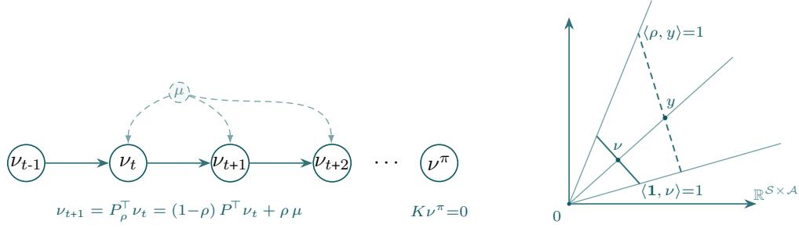
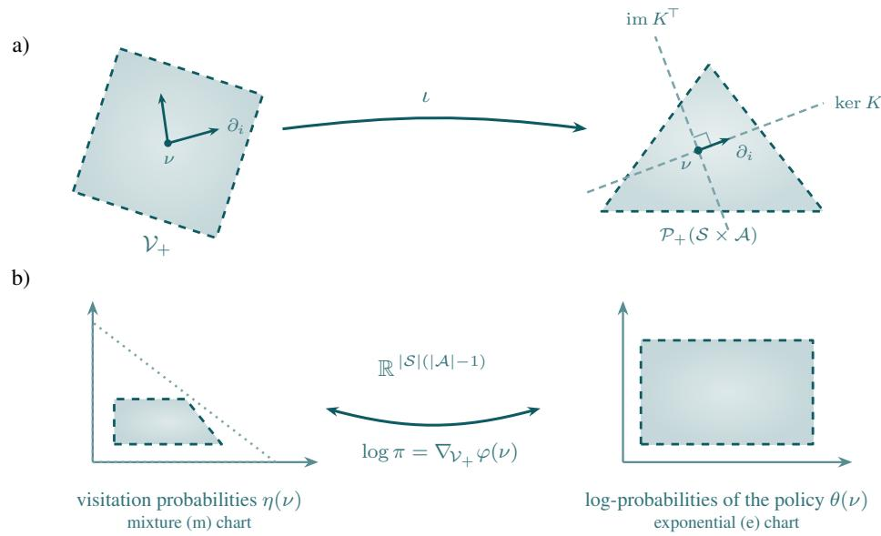
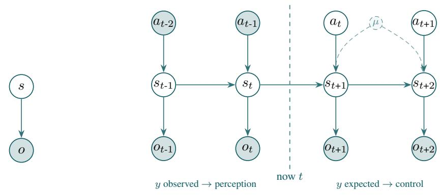

# The Dually Flat Geometry of Planning as Inference

Nikola Milosevic Neural Data Science and Statistical Computing Group Max Planck Institute for Human Cognitive and Brain Sciences Leipzig, 04103 Germany nmilosevic@cbs.mpg.de

Asaki Kataoka Neural Computation Unit Okinawa Institute of Science and Technology Okinawa, 904-0495 Japan asaki.kataoka@oist.jp

Nicolás Hinrichs Neural Data Science and Statistical Computing Group Max Planck Institute for Human Cognitive and Brain Sciences Leipzig, 04103 Germany hinrichsn@cbs.mpg.de

Kenji Doya Neural Computation Unit Okinawa Institute of Science and Technology Okinawa, 904-0495 Japan doya@oist.jp

Nico Scherf Neural Data Science and Statistical Computing Group Max Planck Institute for Human Cognitive and Brain Sciences Leipzig, 04103 Germany nscherf@cbs.mpg.de

## Abstract

We present an alternative characterization of the occupancy measure of reinforcement learning, obtained by embedding the planning criterion into the dynamics through a resetting planning process. Its stationary measure, which we term visitation measure, is the object on which the information geometry of decision making is most naturally expressed. The achievable visitation measures form a dually flat statistical manifold whose two affine charts are the visitation probabilities and the log-policies, dual under the conditional entropy. This structure makes planning-asinference generalize from linear rewards to nonlinear functionals of the visitation, each iterate solved by one natural-gradient step, and gives the temporal-difference error the interpretation of a marginal-utility estimate. We develop the geometry and its consequences for reinforcement learning and theoretical neuroscience.

## 1 Introduction

Planning as inference reformulates the maximization of return as conditioning a generative model on the event of desirable outcomes. The reformulation places control on the same footing as perception and learning [25] and yields principled regularizers for control [41]. Active inference and the free energy principle extend it, connecting planning to the minimization of expected free energy [25, 17]. Yet while the free energy principle for perception is well developed, it is not settled how to carry it over to action selection [46], and a recurring difficulty is that the planning objective and the algorithmic tools that solve it efficiently are stated in different languages. The visitation measure of the agent’s latent planning process (the stationary probability of state–action events under a policy) reconciles the two: it is at once the variable of variational inference and the object on which dynamic programming acts.

To make this precise we construct a resetting planning process, a latent controlled Markov chain that restarts from a fixed law at a state-action-dependent rate. Its i.i.d. restart cycles give unbiased estimates of reinforcement-learning returns, and its normalized stationary measure (the visitation measure) carries the geometry we study. Our contributions are the following.

• A resetting characterization of the occupancy measure (§2): the visitation measure is the stationary law of the resetting process, and its Charnes–Cooper transform recovers the standard occupancy LP, unifying discounted, finite-horizon, average-reward, and general early-termination criteria through the reset rate.

• The dually flat geometry of the visitation manifold (§3): the visitation measures form a dually flat statistical manifold [9] under the conditional entropy, with the visitation probabilities and the log-policies as Legendre-dual affine charts. This gives a single geometric account of KL control as covariant policy search [35, 14, 55, 40, 53, 45], in which the natural policy gradient and policy mirror descent are one update written in either chart [57].

• Variational planning beyond linear rewards (§4): dual flatness lets planning-as-inference generalize from linear rewards to nonlinear functionals of the visitation (convex-RL and active-inference free energies), where each iterate is an exact evidence lower bound solved by one natural-gradient step. The temporal-difference error becomes a natural-gradient estimate of the marginal utility of visitation, connecting dopaminergic prediction errors to stationary utility theory.

Related work. Control and planning as inference dates back to Kalman’s observation that linearquadratic control and linear filtering are computationally equivalent [36], later termed Kalman duality [65, 37]. In robotics and machine learning, probabilistic reformulations of planning [66] and the maximum-entropy view of MDPs [71, 41] underlie much of contemporary deep reinforcement learning [2, 29, 28, 30].

The linear occupancy program approach to Markov decision processes has its roots in the operations research literature of the 1960’s [44, 20, 19, 24, 21]. A recent line of work beginning with maximumentropy exploration [31] replaces this linear objective by a nonlinear functional of the occupancy, unified by [70], and popularized by [69, 26, 50] as convex MDPs. A recurring subtlety, made precise by [51], is that these objectives generally differ between the finite-trial regime and the population limit. The resetting planning process is a normalized version of state-action-dependent discounting [67] which also has an LP formulation [33], and is precisely our transformed linear program [16]. The resetting is the PageRank random surfer, recently connected to policy optimization by [12]. The mechanism itself is discrete-time stochastic resetting [23].

The RL analogue of Amari’s natural gradient [7, 8] is the natural policy gradient (NPG), introduced by [35], justified information-geometrically by [14] and made an actor-critic method by [55]. Contemporary trust-region and proximal methods [58, 60, 2], are often interpreted as approximations, with connections to maximum-entropy methods [29], made precise by a convex optimization view [53, 27]. The dual mirror-descent viewpoint is policy mirror descent [40, 68]. We explain the geometric origin of this duality through a dual flatness perspective using the result of [57]. We build directly on the work of [49], who analyze policy gradient flows on normalized discounted occupancy measures, using the same Hessian geometry.

  
(a) The induced visitation flow $\nu _ { t + 1 } = P _ { \rho } ^ { \top } \mathrm { , }$ νt, a contraction with fixed point the stationary visitation $\nu ^ { \pi }$  
(b) The flow cone $\lbrace \nu \geq 0 : K \nu = 0 \rbrace$ and the two Charnes–Cooper slices $y = \nu / \langle \rho , \nu \rangle$ and $\nu = y / \langle \mathbf { 1 } , y \rangle$  
Figure 1: The restarting planning process and its visitation geometry. (a) Marginalising the reset chain for a fixed policy π gives the visitation flow $\nu _ { t + 1 } = P _ { \rho } ^ { \top } \nu _ { t }$ , whose fixed point is the stationary measure $\nu ^ { \pi } \left( K \nu ^ { \widehat { \pi } } { = } 0 \right)$ , the object we treat as a point on a manifold and optimize in §3. (b) Relation of the standard RL liner program on occupancies y and the stationary linear fractional program on ν. Each ray is a set of scaling-equivalent solutions of $K \nu { = } 0$

## 2 The resetting planning processes

We consider the model-based planning setting illustrated in Figure 1 a), where an agent simulates a Markov process to infer policies for action selection. The agent is equipped with a latent controlled Markov process which consists of a finite state space S, a finite action space A, and a resetting controlled Markov kernel

$$
P _ { \rho } ( s ^ { \prime } | s , a ) = ( 1 - \rho ( s , a ) ) P ( s ^ { \prime } | s , a ) + \rho ( s , a ) \mu ( s ^ { \prime } ) ,\tag{1}
$$

where $\rho : \mathcal { S } \times \mathcal { A }  [ 0 , 1 ]$ is a reset $p r o b a b i l i t y , \mu \in \mathcal { P } ( S )$ is the start-state measure and $P$ is the agent’s transition model of the environment. For constant $\rho \equiv 1 - \gamma$ , this is the PageRank model of discounted Markov decision processes [12] with discount factor γ. For general $\rho$ it is a normalized version of state-action-dependent discounting [67].

Fix a memoryless stochastic policy $\pi : S \to { \mathcal { P } } _ { + } ( { \mathcal { A } } )$ and define the state-action chain $P _ { \rho } ^ { \pi } ( s ^ { \prime } , a ^ { \prime } \ |$ $s , a ) : = \pi ( a ^ { \prime } \mid s ^ { \prime } ) P _ { \rho } ( s ^ { \prime } \mid s , a )$ . If the reset process is unichain [56], the $P _ { \rho } ^ { \pi }$ admits a unique stationary visitation measure $\nu ^ { \pi } \in \mathcal { P } _ { + } ( S \times \mathcal { A } )$ of full support, satisfying the flow balance

$$
\sum _ { a } \nu ^ { \pi } ( s , a ) = \sum _ { s ^ { \prime } , a ^ { \prime } } P _ { \rho } ( s \mid s ^ { \prime } , a ^ { \prime } ) \nu ^ { \pi } ( s ^ { \prime } , a ^ { \prime } ) , \qquad \forall s \in \mathcal { S } .\tag{2}
$$

In the following, we write the flow residual as the linear operator

$$
( K \nu ) ( s ) = \sum _ { a } \nu ( s , a ) - \sum _ { s ^ { \prime } , a ^ { \prime } } P _ { \rho } ( s \mid s ^ { \prime } , a ^ { \prime } ) \nu ( s ^ { \prime } , a ^ { \prime } )\tag{3}
$$

and assume that $\langle \rho , \nu \rangle > 0$ for all $\nu \in \mathcal { V } _ { + }$ . The fractional-linear program

$$
\operatorname* { s u p } _ { \nu \in \mathcal { V } _ { + } } \frac { \langle r , \nu \rangle } { \langle \rho , \nu \rangle } , \qquad \mathcal { V } _ { + } = \big \{ \nu > 0 : K \nu = 0 , \langle \mathbf { 1 } , \nu \rangle = 1 \big \} ,\tag{4}
$$

reproduces the standard performance criteria of reinforcement learning via its Charnes–Cooper transformation [16], which yields the standard linear program of the respective Markov decision process [44, 56]:

$$
\operatorname* { s u p } _ { y \in \mathcal { V } _ { + } } \langle r , y \rangle , \qquad \mathcal { V } _ { + } : = \big \{ y > 0 : K y = 0 , \ \langle \rho , y \rangle = 1 \big \} .\tag{5}
$$

The restart probability $\rho$ then represents generalized discounting [67] and $y$ is the standard occupancy measure of reinforcement learning for the general discount $\gamma ( s , a ) = 1 - \rho ( s , a )$ , see Figure 1 b) and Appendix A.1.

  
Figure 2: The visitation geometry in one picture. a) the manifold via its inclusion $\iota ( \mathcal { V } _ { + } )$ = kerK ∩ $\bar { \mathcal { P } _ { + } } ( S \times A )$ in the state-action simplex. b) $\nu _ { + }$ admits two global affine charts, the mixture coordinate η of the visitation probabilities (left) and the exponential coordinate θ of the log-policies (right).

Motivation for the resetting planning process. Standard discounting attaches a factor $\gamma ^ { t }$ to a non-terminating trajectory. The resetting construction instead embeds the decision criterion into the process, which admits a natural interpretation of the occupancy measure in terms of infinite-horizon planning-as-inference as its stationary measure. With probability $\rho ( s , a )$ the agent’s imagined life time ends and restarts from $s _ { 0 } \sim \mu$ . The resulting normalization makes the same object interpretable in geometric and inferential terms:

1. Geometrically, a $\nu \in \mathcal { V } _ { + }$ is a probability measure on $S \times A ,$ , so it lives on a statistical manifold and inherits the Fisher–Rao / Hessian structure of information geometry. Precisely, the feasible set in Eq. 4 is the intersection of the open $( S \times \mathcal { A } )$ -simplex with the affine subspace ker K, see Figure 2. Since the $| S |$ rows of K have rank $| { \mathcal { S } } | - 1$ and $\nu _ { + }$ is relatively open, it is a smooth submanifold of the open $( S \times \mathcal { A } )$ -simplex of dimension $| S | ( | \dot { \mathcal { A } } | - 1 )$ . We will refer to $\nu _ { + }$ as the visitation manifold of the planning process.

2. Inferentially, the stationary law of the restarting process is a variational posterior where planning becomes conditioning a generative model on optimality, with ν the posterior over state–action events and the free energy its evidence bound (§4.1). With restarts, a single episode is an i.i.d. trajectory sample of a.s. finite length, and ν is the stationary measure of the process. Generalizing to nonlinear free energy functionals $F ( \nu )$ is then meaningful from the point of view of variational inference and the descending directions can be estimated as policy advantages from a finite number of finite-length trajectories [3, 59, 50] without differentiation through the agent’s model.

The visitation measure is thus the natural variable in which the information geometry, the control-asinference aspect, and the advantage estimator all can be jointly analyzed.

## 3 Dually flat structure of the visitation manifold

A point of the visitation manifold is a stationary visitation measure $\nu \in \mathcal { V } _ { + }$ . In the ambient linear coordinates, $\nu _ { + }$ is a relatively open convex subset of ker $K .$ , so these restrict to a global affine chart. The corresponding non-redundant mixture chart $\eta ( \nu ) \in \mathbb { R } ^ { | S | ( | A | - 1 ) }$ is constructed in Appendix B.1. We use ν and its ambient representation interchangeably for mixtures, and reserve η for statements needing a homeomorphism to $\mathbb { R } ^ { | S | ( | A | - 1 ) }$ . The construction is visualized in Figure 2.

Visitations and policies are diffeomorphic. The maps (25) are mutually inverse real-analytic diffeomorphisms between the mass section $\mathcal { V } _ { + } = \{ \langle \mathbf { 1 } , \nu \rangle \stackrel { - } { = } 1 \}$ and the reset-rate section $\{ \langle \rho , y \rangle = 1 \}$ of the flow cone $\left\{ z \ge 0 : K z = 0 \right\}$ , well defined since $\langle \rho , \nu \rangle > 0$ . Every positive measure $\nu \in \mathcal { P } _ { + } ( S \times \mathcal { A } )$ satisfying (2) is the stationary measure of the memoryless policy recovered by conditioning, $\pi _ { \nu } ^ { ' } ( a \mid s ) \stackrel { \textstyle \cdot } { = } \nu ( s , a ) / \textstyle \sum _ { a ^ { \prime } } \nu ( s , a ^ { \prime } )$ , and conditioning is scale-invariant, $\pi _ { y } = \pi _ { \nu } ,$ so $\nu \mapsto \nu / \langle \rho , \nu \rangle$ fixes the induced policy and moves only the normalization. The conditioning map $y \mapsto \pi _ { y }$ is a diffeomorphism [49], hence the same is true for $\nu \mapsto \pi _ { \nu }$

Dual affine coordinates. The negative conditional entropy $\varphi : { \mathcal { V } } _ { + } \to \mathbb { R } \cup \{ + \infty \}$ ,

$$
\varphi ( \nu ) = \sum _ { s , a } \nu ( s , a ) \log \frac { \nu ( s , a ) } { \sum _ { a ^ { \prime } } \nu ( s , a ^ { \prime } ) } ,\tag{6}
$$

is convex on $\nu _ { + }$ (conditional entropy is concave in the joint law) and generates the statistical structure. Its differential is the exponential coordinate

$$
\theta ( \nu ) : = \nabla \varphi ( \nu ) , \qquad { \frac { \partial \varphi } { \partial \nu ( s , a ) } } = \log \pi _ { \nu } ( a \mid s ) ,\tag{7}
$$

the log-policy modulo state-wise constants $c _ { s }$ . Thus the two affine charts of the same point ν are the mixture coordinate $\eta$ (the visitation, m-flat) and the exponential coordinate θ (the log-policy, e-flat), Legendre-dual through $\theta = \nabla \varphi ( \eta )$ and $\boldsymbol { \eta } = \nabla \varphi ^ { * } ( \theta )$ . Appendix B.1 derives this pairing on the explicit charts. Note that the reset rate deforms the m-chart and the Hessian geometry, but not the e-chart. This is the first form of the policy–visitation duality: a visitation and its log-policy are the mixture and exponential coordinates of one point.

Tangent space. $\mathbf { A t } \nu \in \mathcal { V } _ { + }$ the tangent space is $T _ { \nu } { \mathcal { V } } _ { + } = \ker K \cap \ker { \bf 1 } ^ { \top }$ , of dimension $| S | ( | A | - 1 )$ Every $u \in T _ { \nu } \mathcal { V } _ { + }$ decomposes uniquely into a marginal and a conditional part,

$$
\begin{array} { r } { u ( s , a ) = u _ { S } ( s ) \pi _ { \nu } ( a \mid s ) + \nu _ { S } ( s ) \dot { \pi } _ { u } ( a \mid s ) , \quad \sum _ { a } \dot { \pi } _ { u } ( a \mid s ) = 0 , u _ { S } ( s ) : = \sum _ { a } u ( s , a ) , } \end{array}\tag{8}
$$

and $u \mapsto \dot { \pi } _ { u }$ is a linear isomorphism onto the tangent space of the product action simplex, a policy variation. Moreover, the marginal part is fully determined by $\dot { \pi } _ { u }$ through the constraint $K u = 0$ more precisely its linearized flow $\begin{array} { r } { \dot { u _ { S } } ( s ) = \dot { \sum _ { s ^ { \prime } , a ^ { \prime } } } P _ { \rho } ( s \mid s ^ { \prime } , \dot { a ^ { \prime } } ) u ( s ^ { \prime } , a ^ { \prime } ) } \end{array}$ . So a visitation variation u (m-side) and its policy variation $\dot { \pi } _ { u }$ (e-side) are two representations of one tangent vector, which is the infinitesimal form of the chart duality above.

Cotangent space. Dually, the cotangent space is $T _ { \nu } ^ { * } \mathcal { V } _ { + } ~ = ~ ( \mathbb { R } ^ { S \times A } ) ^ { * } / ( \mathrm { i m } K ^ { \top } + \mathbb { R } { \bf 1 } )$ , with $\begin{array} { r } { ( K ^ { \top } \lambda ) ( s , a ) = \lambda ( s ) - \sum _ { s ^ { \prime } } P _ { \rho } ( s ^ { \prime } \mid s , a ) \lambda ( s ^ { \prime } ) } \end{array}$ . A reward function r and its shifts $\boldsymbol { r } + \boldsymbol { K } ^ { \top } \boldsymbol { \lambda } + \boldsymbol { c } \mathbf { 1 }$ represent the same cotangent vector, so covectors are state-action functions modulo (resetting-based) potential shaping (im $K ^ { \dagger }$ [54]) and constants (R1), exactly the symmetries of the advantage function [59]. They act as linear forms on tangent vectors on $\nu _ { + }$

The canonical representative of the cotangent class $[ r ] _ { \nu }$ is the centered advantage $A _ { \nu } [ r ]$ , obtained by choosing $\lambda = V _ { \nu } [ r ]$ , the value of the resetting chain. The value is defined by the resetting Bellman (Poisson) equation with its gain term,

$$
\begin{array} { r } { V _ { \nu } [ r ] ( s ) + J ( \nu ) \bar { \rho } ( s ) = \mathbb { E } _ { \pi _ { \nu } ( \cdot | s ) } \Bigl [ r ( s , a ) + \sum _ { s ^ { \prime } } P _ { \rho } ( s ^ { \prime } \mid s , a ) V _ { \nu } [ r ] ( s ^ { \prime } ) \Bigr ] , \quad J ( \nu ) = \frac { \langle r , \nu \rangle } { \langle \rho , \nu \rangle } , } \end{array}\tag{9}
$$

with $\bar { \rho } ( s ) = \mathbb { E } _ { \pi _ { \nu } ( . | s ) } [ \rho ( s , a ) ]$ ], which determines $V _ { \nu } [ r ]$ uniquely up to the constant gauge R1. The advantage is then the reduced cost

$$
A _ { \nu } [ r ] : = r - J ( \nu ) \rho - K ^ { \top } V _ { \nu } [ r ] , \qquad \mathbb { E } _ { \pi _ { \nu } ( \cdot \vert s ) } [ A _ { \nu } [ r ] ( s , \cdot ) ] = 0 ,\tag{10}
$$

which is invariant to the constant gauge in $V _ { \nu } [ r ]$ , so it is well defined as the centered representative of $[ r ] _ { \nu }$ even though $V _ { \nu } [ r ]$ is not.1 The advantage, read as the linear form $\langle A _ { \nu } [ r ] , \cdot \rangle$ on $T _ { \nu } \mathcal { V } _ { + }$ , is the cotangent object dual to visitation variations: for $u \in T _ { \nu } \mathcal { V } _ { + }$ the pairing $\langle A _ { \nu } [ \bar { r } ] , u \rangle = \langle [ r ] _ { \nu } , u \rangle =$ $\mathrm { d } J _ { \nu } ( u )$ is the directional derivative of the return, gauge-invariant because $u \in$ ker $K \cap$ ker 1⊤ annihilates both im $K ^ { \top }$ and R1.

Metric. The Hessian $g _ { \nu } ( u , v ) = \nabla ^ { 2 } \varphi ( \nu ) ( u , v )$ is

$$
g _ { \nu } ( u , v ) = \sum _ { s , a } \frac { u ( s , a ) v ( s , a ) } { \nu ( s , a ) } - \sum _ { s } \frac { u _ { S } ( s ) v _ { S } ( s ) } { \nu _ { S } ( s ) } = \sum _ { s } \nu _ { S } ( s ) \sum _ { a } \frac { \dot { \pi } _ { u } ( a \mid s ) \dot { \pi } _ { v } ( a \mid s ) } { \pi _ { \nu } ( a \mid s ) } ,\tag{11}
$$

the ambient joint Fisher–Rao metric minus its state-marginal part, equivalently the visitation-weighted sum of per-state action-simplex Fisher-Rao metrics. This is the state-action Fisher metric of the natural policy gradient [35], also called the Kakade metric [49]. It is not the joint Fisher–Rao of $\nu ,$ which does not respect the flow constraint. The Kakade metric is positive semidefinite on the ambient space (degenerate along policy-preserving marginal changes) but positive definite on $T _ { \nu } \mathcal { V } _ { + }$ , where those directions are excluded by $K u = 0 .$

Dual flatness and mirror descent. The two charts each carry a flat connection. The mixture connection ${ \nabla } ^ { \mathrm { m } }$ , for which ν is affine, has mixture geodesics $t \mapsto ( 1 - t ) \nu _ { 0 } + t \nu _ { 1 }$ . The exponential connection $\nabla ^ { \mathrm { e } }$ , for which $\theta = \log \pi _ { \nu }$ is affine, has log-linear geodesics t $\mapsto \pi _ { 0 } ^ { 1 - t } \pi _ { 1 } ^ { t }$ (normalized). They are mutually dual ${ \bf W . r . t . } \ g ,$ so $( \mathcal { V } _ { + } , g , \nabla ^ { \mathrm { m } } , \nabla ^ { \mathrm { e } } )$ is a dually flat statistical manifold [8, 63], with canonical divergence the visitation-weighted conditional $\mathrm { K L }$ ,

$$
D _ { \varphi } ( \nu \| \nu ^ { \prime } ) = \sum _ { s } \nu _ { S } ( s ) \operatorname { K L } \bigl ( \pi _ { \nu } ( \cdot \mid s ) \big \| \pi _ { \nu ^ { \prime } } ( \cdot \mid s ) \bigr ) ,\tag{12}
$$

the trust region of on-policy optimization. The m- and e-geodesics satisfy the generalized Pythagorean theorem (Appendix B.2).

Consequently mirror descent and the natural policy gradient are one update in the two charts. With $\varphi$ as mirror map, the proximal step

$$
\nu _ { k + 1 } = \arg \operatorname* { m i n } _ { \nu \in \mathcal { V } _ { + } } \left. \nabla _ { \nu } f ( \nu _ { k } ) , \nu \right. + \frac { 1 } { \alpha } D _ { \varphi } ( \nu \| \nu _ { k } )\tag{13}
$$

is, by [57, Thm. 1], natural-gradient descent in the exponential chart, and the two coincide for every $\alpha > 0$ . To first order in α they agree with the primal natural-gradient step $\nu _ { k } - \alpha g ( \nu _ { k } ) ^ { - 1 } \nabla _ { \nu } f ( \nu _ { k } )$ and all three coincide with the common Hessian gradient flow $\dot { \nu } = - \mathrm { g r a d } _ { g } f$ as $\alpha  0 [ 6 ]$ . Its firstorder condition is an additive step in the exponential coordinate. For $f ( \nu ) = - \langle r , \nu \rangle$ the increment is the advantage,

$$
\log \pi _ { k + 1 } = \log \pi _ { k } + \alpha A _ { \nu _ { k + 1 } } [ r ] \ { \mathrm { ( m o d ~ v a l u e s ) } } ,\tag{14}
$$

so the advantage is the exponential-coordinate increment. The update is implicit: the increment carries the advantage at the updated iterate $\nu _ { k + 1 }$ , through the value gauge that centers it. Freezing it to the current iterate, $\mathsf { \bar { A } } _ { \nu _ { k } } [ r ]$ , gives the explicit exponentiated-advantage step $\pi _ { k + 1 } \propto \pi _ { k } \exp ( \alpha A _ { \nu _ { k } } ^ { - } [ r ] )$ , the first-order approximation whose error is well understood [40, 68]. We proceed with the idealized implicit update.

Infinite-dimesnsional and Wasserstein geometries. A full measure-theoretic extension to continuous $s , A$ in the sense of [13] is an open challenge, but exponential families are known to form finite-dimensional dually flat submanifolds of the space of measures [9]. The analogue here is exponential-family policies in linearly parameterized MDPs [34], developed in Appendix B.3. $\nu _ { + }$ can also be equipped with an L2-Wasserstein structure in continuous or discrete $\mathcal { S } \stackrel {  } { \times } \mathcal { A } [ 4 2 ]$ derived from the sample space’s own geometry. Unlike our Fisher–Rao/Hessian geometry, which reweights probability in place, Wasserstein geodesics transport visitation mass across states. The two are complementary natural gradients on the same polytope.

## 4 Variational planning beyond linear rewards

Planning as inference casts control as maximizing an evidence lower bound (ELBO) whose reward term is linear in the visitation $\nu \in \mathcal { V } _ { + }$ : variational inference on trajectory distributions with a structured posterior and exponential likelihood yields the standard soft-RL formulation, which we construct directly on the stationary measure of the restarting chain (Appendix A). Section 4.2 asks what happens when the objective is instead a nonlinear stationary free energy, inducing a generalutility MDP [70, 69]. This arises whenever a state-entropy term enters the free energy, which happens in maximum-state-entropy exploration [31, 10], active inference [48], risk-averse objectives [50], and imitation learning [32]. We show the dually flat geometry of $\nu _ { + }$ allows extending the soft-RL view to this case, reducing the nonlinear problem to a sequence of linear entropy-regularized MDPs.

  
(a) Perception: infer q(x | y).  
(b) Planning as inference on the resetting chain.  
Figure 3: Planning as inference with restarting state visitation. (a) standard inferential perception infers latent state s from observation o; (b) the resetting generative model with restart measure $\mu .$ At each decision $\left( { { s _ { t } } , { a _ { t } } } \right)$ , with prob. $1 - \rho ( s _ { t } , a _ { t } )$ the state continues under $P ,$ with prob. $\rho$ it restarts from $\mu .$ . Planning is concerned with inferring the latent future $a _ { t } , \mathbf { e . g }$ . as an open-loop sequence.

## 4.1 The linear stationary free energy

Fix a reference policy $\pi _ { \mathrm { r e f } } \in \Pi _ { + }$ with stationary visitation $\nu ^ { \mathrm { r e f } } \in \mathcal { V } _ { + }$ . A candidate π is the futureaction posterior and induces $\nu \in \mathcal { V } _ { + }$ (Figure $3 )$ , both stationary laws of the same resetting chain. Given a reward r and preference likelihood $p ( o { = } o ^ { \star } \mid s , a ) \propto \mathrm { e x p } ( \beta ^ { - 1 } r ( s , a ) ) , 0 < \beta < \infty$ , define the stationary free energy

$$
\mathcal F (  { \boldsymbol \nu } ) : = \langle  { \boldsymbol r } ,  { \boldsymbol \nu } \rangle - \beta D _ { \varphi } (  { \boldsymbol \nu } \parallel  { \boldsymbol \nu } ^ { \mathrm { r e f } } ) , \quad D _ { \varphi } (  { \boldsymbol \nu } \parallel  { \boldsymbol \nu } ^ { \mathrm { r e f } } ) = \sum _ { s } \nu _ { S } ( s ) \mathrm { K L } \big ( \pi _ { \boldsymbol \nu } ( \cdot  { \boldsymbol \vert } s ) \parallel \pi _ { \mathrm { r e f } } ( \cdot  { \boldsymbol \vert } s ) \big ) ,\tag{15}
$$

whose information cost is the manifold’s own canonical divergence (§3). Since $\nu ^ { \mathrm { r e f } }$ has full support, the convex conjugate of $D _ { \varphi } ( \cdot \| \nu ^ { \mathrm { r e f } } )$ at $r / \beta$

$$
\log Z : = \operatorname* { s u p } _ { \nu \in \mathcal { V } _ { + } } \big \{ \langle r / \beta , \nu \rangle - D _ { \varphi } ( \nu \| \nu ^ { \mathrm { r e f } } ) \big \} ,\tag{16}
$$

is finite, and Fenchel–Young gives the evidence lower bound, stated entirely in the visitation measure,

$$
\beta ^ { - 1 } \mathcal { F } ( \nu ) \le \log Z , \quad \log Z - \beta ^ { - 1 } \mathcal { F } ( \nu ) = D _ { \varphi } ( \nu \parallel \nu ^ { \star } ) , \quad \nu ^ { \star } = \arg \operatorname* { m a x } _ { \nu _ { + } } \mathcal { F } .\tag{17}
$$

The bound tightens as $\nu \to \nu ^ { \star }$ , with slack the Bregman divergence to the optimum. log $Z$ is a log-partition function, equal to the path-space log-evidence of the resetting generative model (Appendix A.2).

The maximizer is a soft Bellman fixed point: stationarity of (16) gives the exponential-coordinate tilt $\log ( \pi ^ { \star } / \pi _ { \mathrm { r e f } } ) = \beta ^ { - 1 } A _ { \nu ^ { \star } } [ r ]$ (mod values), with the value the fixed point of the log-sum-exp backup through the resetting kernel $P _ { \rho } .$ . For $\rho \equiv 1 - \gamma$ the reset branch $\rho \langle \mu , V ^ { \star } \rangle$ is a global constant that cancels in the advantage, so (17) reduces to textbook soft value iteration, $\pi ^ { \star } \propto \pi _ { \mathrm { r e f } } \exp ( A _ { \nu ^ { \star } } [ r ] / \beta )$ (15) is an entropy-regularized MDP [27] and standard soft-RL methods [41, 29, 2] apply with r as reward. The dually flat structure recasts this in geometric terms and, next, generalizes it to nonlinear free energies.

## 4.2 Nonlinear free energies and their solution

The linear free energy (15) is the special case where the information cost is the manifold’s own divergence. More generally, free-energy planning maximizes any smooth concave functional of the visitation,

$$
\operatorname* { m a x } _ { \nu \in \mathcal { V } _ { + } } - F ( \nu ) , \qquad F \mathrm { c o n v e x } \mathrm { o n } \mathcal { V } _ { + } ,\tag{18}
$$

the general-utility / convex-MDP regime [70, 69]. The objectives of interest are instances, differing only in $\nabla F$

(i) Biased generative models. Scoring states against a preferred distribution $\tilde { p } \in \mathcal { P } _ { + } ( { \cal S } )$ with base measure $\bar { m ( s , a ) } \propto \tilde { p } ( s ) \pi _ { \mathrm { r e f } } ( a \mid s )$ gives $- \bar { F ( \nu ) } = \bar { \langle \beta ^ { - 1 } r , \nu \rangle } - \mathrm { K L } ( \nu \| m \bar { ) }$ , a biased generative model in the language of active inference [17]. Splitting $\mathrm { K L } ( \nu \| m )$ into its state and conditional parts,

$$
\begin{array} { r } { - F (  { \boldsymbol \nu } ) =  { \langle  { \boldsymbol r } _ { \mathrm { l i n } } ,  { \boldsymbol \nu } \rangle } - \varphi (  { \boldsymbol \nu } ) + H (  { \boldsymbol \nu } _ { S } ) , \qquad r _ { \mathrm { l i n } } : = \beta ^ { - 1 } r + \log \tilde { p } + \log \pi _ { \mathrm { r e f } } , } \end{array}\tag{19}
$$

whose only nonlinear term is the state-marginal entropy $H ( \nu _ { S } )$ , the maximum-state-entropy exploration objective of [31].

(ii) Risk-sensitive objectives. A coherent or static risk functional of the sequential outcome, e.g. a CVaR-type measure, is likewise concave in $\nu \left[ 5 0 \right.$ , Table 1]. The nonlinearity appears in the preference rather than an exploration bonus, but the solution below is unchanged.

Since $- \boldsymbol { F }$ is concave, (18) is a convex MDP and the soft Bellman picture of $\ S 4 . 1$ , which needed $F$ linear in $\nu ,$ no longer applies directly. Dual flatness resolves this by mirror descent, which needs only the linearization of $F$ at the current iterate. Its ambient Euclidean gradient $- \nabla F ( \nu _ { k } )$ fixes a covector representative of the differential $- \delta F [ \nu _ { k } ] / \delta \nu _ { \mathrm { : } }$ , and the mirror step

$$
\begin{array} { r } { \nu _ { k + 1 } = \arg \underset { \nu \in \mathcal { V } _ { + } } { \operatorname* { m a x } } \left. - \nabla F ( \nu _ { k } ) , \nu \right. - \frac { 1 } { \alpha } D _ { \varphi } ( \nu \| \nu _ { k } ) } \end{array}\tag{20}
$$

is the per-iterate regularized MDP with that reward and advantage update

$$
\begin{array} { r } { \log \pi _ { k + 1 } = \log \pi _ { k } + \alpha A _ { \nu _ { k + 1 } } \big [ - \nabla F ( \nu _ { k } ) \big ] \ ( \mathrm { m o d \ v a l u e s } ) . } \end{array}\tag{21}
$$

The increment is the advantage of the frozen linearized reward, evaluated at the updated iterate.

Convex free-energy planning is thus variational EM [11], the E-step the linear regularized MDP (20) ([27, MD-MPI]) and the M-step the relinearization $\nabla F ( \nu _ { k + 1 } )$ . The implicit update (21) is obtained by solving the soft-Bellman fixed point (27) with frozen reward $- \nabla F .$ , reference $\pi _ { k } .$ , and temperature $\dot { \alpha } ^ { - 1 }$ . Its self-consistent value yields the next-iterate advantage $A _ { \nu _ { k + 1 } }$ . Note that $\pi _ { k }$ is the inner reference with temperature α and $\pi _ { \mathrm { r e f } }$ is the outer reference with temperature $\beta .$ For (i), the intrinsic reward is the marginal utility of a stationary utility [39] $, - \nabla F ( \nu ) \bar { = } r _ { \mathrm { l i n } } - \log \nu ( s , a ) - 1$ (using − log $\nu _ { S } - \log \pi _ { \nu } = - \log \nu ) ,$ a policy-dependent novelty bonus on under-visited preferred states [69]. Assigning an ambient linear form to a differential on $\nu _ { + }$ is the Fisher-cometric construction of $[ 5 2 ] . ^ { 2 }$ The reset structure makes each per-iterate advantage estimable without backpropagation through the model, with tunable bias–variance [59, 3].

The policy sequence is the minorize–maximize envelope of $F _ { ; }$ , as in deep actor-critics [58], except that function approximation breaks dual flatness and the global-convergence guarantee. In the tabular and linear-MDP cases (Appendix B.3) dual flatness supplies it whenever $( F , \varphi )$ are relatively smooth: $\mathrm { f o r } - \nabla ^ { 2 } F \preceq L _ { F } g \mathrm { o n } T \bar { \mathcal { V } _ { + } }$ , mirror ascent with step $1 / L _ { F }$ converges at rate $L _ { F } / k$ in $D _ { \varphi } \left[ 4 3 \right]$ , and by $\ S 3$ so does its NPG form. Relative smoothness must be checked per objective. We believe it holds broadly, since the generic obstruction is the state entropy, whose $1 / \nu _ { S }$ curvature is matched by $g$ ([48], finite horizon; Appendix C, discounted).

## 4.3 Application in theoretical neuroscience

The origin of reward prediction error. Decision making in the brain has long been understood through reinforcement learning and control as inference, most directly through the reward prediction error (RPE) encoded by phasic dopamine [62, 61]. A key refinement is that these errors are computed in units not of delivered reward but of a nonlinear utility of reward magnitude, recovered from risky-choice behaviour [64, 4] and later placed within distributional RL [18]. For sequential decisions, distributional utility measures and nonlinear occupancy programs can coincide: a coherent risk functional, e.g. a CVaR-type measure via its risk envelope, is a concave functional of the occupancy measure [50, Table 1], hence a convex MDP in the sense of $\ S 4 .$

This gives a free-energy interpretation to the utility RPE through Koopmans’ stationary utility theory [39]. A stationary recursive utility takes the aggregator form $\Breve { \boldsymbol { F } } = \boldsymbol { V } ( \tilde { \boldsymbol { r } } , \delta \boldsymbol { F } )$ relating immediate to prospective utility, but leaves $V$ underdetermined. Our construction fixes it as the soft Bellman backup, the aggregator induced by the free-energy view. It is time-consistent because it is a stationary function of state. By this interpretation, the quantity dopamine mediates is the marginal utility of the stationary free energy, $r _ { k } = - \nabla F ( \nu )$ , whose reward-magnitude slope is the marginal utility u′ recovered behaviourally [64, 4]. The geometry predicts that the RPE is an estimate of the advantage that belongs to a shaped intrinsic reward, hence state- and policy-dependent rather than a fixed prediction target. This is a refinement that is testable in principle. Note however that this is an interpretive correspondence at the level of the signal an optimal risk-sensitive agent would compute, not a claim about neural implementation.

Perception–action duality in the cortex. A parallel question is how control is realized in the cortex. Motivated by the shared laminar architecture of sensory and motor areas and by the classical filtering– control duality [36, 65], [22] maps inference and control variables onto (thalamo-)cortical circuitry, leaving the precise correspondence open. The information geometry suggests a sharper form of the question. A recent predictive-coding scheme derives cortical dynamics from variational free-energy minimization under an exponential-family assumption [38], a natural sensory-processing counterpart to our control-side framework. Both carry a dually flat manifold, ours pairing the stationary measure ν of the planning process with the log-policy under the conditional-negentropy potential φ, theirs pairing expectation and natural parameters under the log-partition. Whether cortex implements a sensorimotor duality then becomes the geometric question of what map relates these two dually flat manifolds, which we leave to future work.

## 5 Conclusion

In this early-stage work, we demonstrate that the stationary measures (visitation measures) of a resetting planning process form a dually flat statistical manifold, whose two affine charts are the visitation probabilities and the log-policies, dual under the conditional entropy. This singles out two optimization algorithms: the natural policy gradient and policy mirror descent are one update written in the two charts. Planning-as-inference then extends from linear rewards to nonlinear free energies with each iterate an exact evidence lower bound solved by one natural-gradient step, and the temporal-difference error acquires an interpretation as a marginal utility estimate. That the same manifold is simultaneously a variational posterior, a dynamic-programming object, and a source of unbiased per-cycle return estimates is what lets these views coincide. Whether neural circuits realize this geometry, and how it extends to continuous spaces, we leave to future work.

## References

[1] Pieter Abbeel and Andrew Y Ng. Apprenticeship learning via inverse reinforcement learning. In Proceedings of the twenty-first international conference on Machine learning, page 1, 2004.

[2] Abbas Abdolmaleki, Jost Tobias Springenberg, Yuval Tassa, Remi Munos, Nicolas Heess, and Martin Riedmiller. Maximum a posteriori policy optimisation. arXiv preprint arXiv:1806.06920, 2018.

[3] Alekh Agarwal, Sham M Kakade, Jason D Lee, and Gaurav Mahajan. On the theory of policy gradient methods: Optimality, approximation, and distribution shift. Journal of Machine Learning Research, 22(98):1–76, 2021.

[4] Aydin Alikaya, Mackenzie Rack-Wildner, and William R Stauffer. Reward and value coding by dopamine neurons in non-human primates. Journal ofNeural Transmission, 125(3):565–574, 2018.

[5] Eitan Altman. Constrained Markov Decision Processes. Chapman & Hall/CRC, 1999.

[6] Felipe Alvarez, Jérôme Bolte, and Olivier Brahic. Hessian riemannian gradient flows in convex programming. SIAMjournal on control and optimization, 43(2):477–501, 2004.

[7] Shun-ichi Amari. Natural gradient works efficiently in learning. Neural Computation, 10(2):251– 276, 1998.

[8] Shun-ichi Amari. Information Geometry and Its Applications, volume 194 of Applied Mathematical Sciences. Springer, 2016.

[9] Shun-ichi Amari and Hiroshi Nagaoka. Methods of information geometry, volume 191. American Mathematical Soc., 2000.

[10] Yonatan Ashlag, Mirco Mutti, Aviv Tamar, and Kfir Yehuda Levy. Probing in the dark: State entropy maximization for POMDPs. In The Fourteenth International Conference on Learning Representations, 2026.

[11] Pierre-Cyril Aubin-Frankowski, Anna Korba, and Flavien Léger. Mirror descent with relative smoothness in measure spaces, with application to sinkhorn and em. Advances in Neural Information Processing Systems, 35:17263–17275, 2022.

[12] Konstantin Avrachenkov, Lorenzo Gregoris, and Nelly Litvak. Linking pagerank, time reversal, and policy evaluation. arXiv preprint arXiv:2605.00532, 2026.

[13] Nihat Ay, Jürgen Jost, Hông Vân Lê, and Lorenz Schwachhöfer. Information geometry, volume 64. Springer, 2017.

[14] J. Andrew Bagnell and Jeff Schneider. Covariant policy search. In Proceedings of the 18th International Joint Conference on Artificial Intelligence (IJCAI), pages 1019–1024, 2003.

[15] Elliot Chane-Sane, Pierre-Alexandre Leziart, Thomas Flayols, Olivier Stasse, Philippe Souères, and Nicolas Mansard. Cat: Constraints as terminations for legged locomotion reinforcement learning. In 2024 IEEE/RSJ International Conference on Intelligent Robots and Systems (IROS), pages 13303–13310. IEEE, 2024.

[16] Abraham Charnes and William W Cooper. Programming with linear fractional functionals. Naval Research logistics quarterly, 9(3-4):181–186, 1962.

[17] Lancelot Da Costa, Thomas Parr, Noor Sajid, Sebastijan Veselic, Victorita Neacsu, and Karl Friston. Active inference on discrete state-spaces: A synthesis. Journal of Mathematical Psychology, 99:102447, 2020.

[18] Will Dabney, Zeb Kurth-Nelson, Naoshige Uchida, Clara Kwon Starkweather, Demis Hassabis, Rémi Munos, and Matthew Botvinick. A distributional code for value in dopamine-based reinforcement learning. Nature, 577(7792):671–675, 2020.

[19] Guy De Ghellinck. Les problemes de decisions sequentielles. Cahiers du Centre d’Etudes de Recherche Opérationnelle, 2(2):161–179, 1960.

[20] F d’Epenoux. Sur un probleme de production et de stockage dans l’aléatoire. Revue Française de Recherche Opérationelle, 14(3-16):4, 1960.

[21] Cyrus Derman. Finite state Markovian decision processes. Academic Press, Inc., 1970.

[22] Kenji Doya. Canonical cortical circuits and the duality of Bayesian inference and optimal control. Current Opinion in Behavioral Sciences, 41:160–167, October 2021.

[23] Martin R Evans, Satya N Majumdar, and Grégory Schehr. Stochastic resetting and applications. Journal ofPhysics A: Mathematical and Theoretical, 53(19):193001, 2020.

[24] Bennett Fox. Markov renewal programming by linear fractional programming. SIAM Journal on Applied Mathematics, 14(6):1418–1432, 1966.

[25] Karl Friston. The free-energy principle: a unified brain theory? Nature reviews neuroscience, 11(2):127–138, 2010.

[26] Matthieu Geist, Julien Pérolat, Mathieu Laurière, Romuald Elie, Sarah Perrin, Olivier Bachem, Rémi Munos, and Olivier Pietquin. Concave utility reinforcement learning: The mean-field game viewpoint. arXiv preprint arXiv:2106.03787, 2021.

[27] Matthieu Geist, Bruno Scherrer, and Olivier Pietquin. A theory of regularized Markov decision processes. In Proceedings ofthe 36th International Conference on Machine Learning (ICML), volume 97 of Proceedings of Machine Learning Research, pages 2160–2169. PMLR, 2019.

[28] David Ha and Jürgen Schmidhuber. Recurrent world models facilitate policy evolution. Advances in neural information processing systems, 31, 2018.

[29] Tuomas Haarnoja, Aurick Zhou, Kristian Hartikainen, George Tucker, Sehoon Ha, Jie Tan, Vikash Kumar, Henry Zhu, Abhishek Gupta, Pieter Abbeel, et al. Soft actor-critic algorithms and applications. arXiv preprint arXiv:1812.05905, 2018.

[30] Danijar Hafner, Timothy Lillicrap, Jimmy Ba, and Mohammad Norouzi. Dream to control: Learning behaviors by latent imagination. arXiv preprint arXiv:1912.01603, 2019.

[31] Elad Hazan, Sham Kakade, Karan Singh, and Abby Van Soest. Provably efficient maximum entropy exploration. In Proceedings ofthe 36th International Conference on Machine Learning (ICML), volume 97 of Proceedings ofMachine Learning Research, pages 2681–2691. PMLR, 2019.

[32] Jonathan Ho and Stefano Ermon. Generative adversarial imitation learning. Advances in neural information processing systems, 29, 2016.

[33] Héctor Jasso-Fuentes and Tomás Prieto-Rumeau. Constrained markov decision processes with non-constant discount factor. Journal ofOptimization Theory and Applications, 202(2):897–931, 2024.

[34] Chi Jin, Zhuoran Yang, Zhaoran Wang, and Michael I Jordan. Provably efficient reinforcement learning with linear function approximation. In Conference on learning theory, pages 2137– 2143. PMLR, 2020.

[35] Sham M. Kakade. A natural policy gradient. In Advances in Neural Information Processing Systems 14 (NIPS), pages 1531–1538. MIT Press, 2001.

[36] R. E. Kalman. A new approach to linear filtering and prediction problems. Journal ofBasic Engineering, 82(1):35–45, 03 1960.

[37] Hilbert J. Kappen, Vicenç Gómez, and Manfred Opper. Optimal control as a graphical model inference problem. Machine Learning, 87(2):159–182, 2012.

[38] Asaki Kataoka and Kenji Doya. Extended predictive coding framework as variational freeenergy minimisation under exponential-family assumption, May 2026.

[39] Tjalling C Koopmans. Stationary ordinal utility and impatience. Econometrica: Journal of the Econometric Society, pages 287–309, 1960.

[40] Guanghui Lan. Policy mirror descent for reinforcement learning: linear convergence, new sampling complexity, and generalized problem classes. Mathematical Programming, 198(1):1059– 1106, 2023.

[41] Sergey Levine. Reinforcement learning and control as probabilistic inference: Tutorial and review. arXiv preprint arXiv:1805.00909, 2018.

[42] Wuchen Li and Guido Montúfar. Natural gradient via optimal transport. Information Geometry, 1(2):181–214, 2018.

[43] Haihao Lu, Robert M. Freund, and Yurii Nesterov. Relatively smooth convex optimization by first-order methods, and applications. SIAM Journal on Optimization, 28(1):333–354, 2018.

[44] Alan S Manne. Linear programming and sequential decisions. Management Science, 6(3):259– 267, 1960.

[45] Bianca Marin Moreno, Margaux Brégère, Pierre Gaillard, and Nadia Oudjane. Efficient model based concave utility reinforcement learning through greedy mirror descent. In International Conference on Artificial Intelligence and Statistics, pages 2206–2214. PMLR, 2024.

[46] Beren Millidge, Alexander Tschantz, and Christopher L Buckley. Whence the expected free energy? Neural Computation, 33(2):447–482, 2021.

[47] Nikola Milosevic, Leonard Franz, Daniel Haeufle, Georg Martius, Nico Scherf, and Pavel Kolev. Stochastic decision horizons for constrained reinforcement learning. arXiv preprint arXiv:2602.04599, 2026.

[48] Nikola Milosevic, Nicolás Hinrichs, and Nico Scherf. Active inference as a convex markov decision process. arXiv preprint arXiv:2607.20152, 2026.

[49] Johannes Müller and Guido Montúfar. Geometry and convergence of natural policy gradient methods. Information Geometry, 7(Suppl 1):485–523, 2024.

[50] Mirco Mutti, Riccardo De Santi, Piersilvio De Bartolomeis, and Marcello Restelli. Challenging common assumptions in convex reinforcement learning. Advances in Neural Information Processing Systems, 35:4489–4502, 2022.

[51] Mirco Mutti, Riccardo De Santi, and Marcello Restelli. The importance of non-markovianity in maximum state entropy exploration. In International Conference on Machine Learning, pages 16223–16239. PMLR, 2022.

[52] Hiroshi Nagaoka. The fisher metric as a metric on the cotangent bundle. Information Geometry, 7(Suppl 1):651–677, 2024.

[53] Gergely Neu, Anders Jonsson, and Vicenç Gómez. A unified view of entropy-regularized Markov decision processes, 2017.

[54] Andrew Y Ng, Daishi Harada, and Stuart Russell. Policy invariance under reward transformations: Theory and application to reward shaping. In Icml, volume 99, pages 278–287. Citeseer, 1999.

[55] Jan Peters and Stefan Schaal. Natural actor-critic. Neurocomputing, 71(7–9):1180–1190, 2008.

[56] Martin L. Puterman. Markov Decision Processes: Discrete Stochastic Dynamic Programming. John Wiley & Sons, 1994.

[57] Garvesh Raskutti and Sayan Mukherjee. The information geometry of mirror descent. IEEE transactions on Information Theory, 61(3):1451–1457, 2015.

[58] John Schulman, Sergey Levine, Pieter Abbeel, Michael Jordan, and Philipp Moritz. Trust region policy optimization. In International conference on machine learning, pages 1889–1897. Pmlr, 2015.

[59] John Schulman, Philipp Moritz, Sergey Levine, Michael Jordan, and Pieter Abbeel. Highdimensional continuous control using generalized advantage estimation. arXiv preprint arXiv:1506.02438, 2015.

[60] John Schulman, Filip Wolski, Prafulla Dhariwal, Alec Radford, and Oleg Klimov. Proximal policy optimization algorithms. arXiv preprint arXiv:1707.06347, 2017.

[61] Wolfram Schultz. Dopamine reward prediction-error signalling: a two-component response. Nature reviews neuroscience, 17(3):183–195, 2016.

[62] Wolfram Schultz, Peter Dayan, and P Read Montague. A neural substrate of prediction and reward. Science, 275(5306):1593–1599, 1997.

[63] Hirohiko Shima. The geometry ofHessian structures. World Scientific, 2007.

[64] William R Stauffer, Armin Lak, and Wolfram Schultz. Dopamine reward prediction error responses reflect marginal utility. Current biology, 24(21):2491–2500, 2014.

[65] Emanuel Todorov. Efficient computation of optimal actions. Proceedings of the National Academy ofSciences, 106(28):11478–11483, 2009.

[66] Marc Toussaint. Robot trajectory optimization using approximate inference. In Proceedings of the 26th International Conference on Machine Learning (ICML), pages 1049–1056, 2009.

[67] Martha White. Unifying task specification in reinforcement learning. In International Conference on Machine Learning, pages 3742–3750. PMLR, 2017.

[68] Lin Xiao. On the convergence rates of policy gradient methods. Journal of Machine Learning Research, 23(282):1–36, 2022.

[69] Tom Zahavy, Brendan O’Donoghue, Guillaume Desjardins, and Satinder Singh. Reward is enough for convex MDPs. In Advances in Neural Information Processing Systems (NeurIPS), volume 34, 2021.

[70] Junyu Zhang, Alec Koppel, Amrit Singh Bedi, Csaba Szepesvári, and Mengdi Wang. Variational policy gradient method for reinforcement learning with general utilities. In Advances in Neural Information Processing Systems (NeurIPS), volume 33, 2020.

[71] Brian D. Ziebart. Modeling Purposeful Adaptive Behavior with the Principle of Maximum Causal Entropy. PhD thesis, Carnegie Mellon University, 2010.

## A Details on Planning as Inference

## A.1 Restarting visitations reproduce RL

The fractional-linear functional

$$
J ( \pi ) ~ = ~ \frac { \langle r , \nu ^ { \pi } \rangle } { \langle \rho , \nu ^ { \pi } \rangle }\tag{22}
$$

reproduces the standard performance criteria of reinforcement learning. To see this, we apply the Charnes–Cooper transformation of the fractional linear program

$$
\operatorname* { s u p } _ { \nu \in \mathcal { V } _ { + } } \frac { \langle r , \nu \rangle } { \langle \rho , \nu \rangle } , \qquad \mathcal { V } _ { + } = \big \{ \nu > 0 : K \nu = 0 , \langle \mathbf { 1 } , \nu \rangle = 1 \big \} ,\tag{23}
$$

and obtain the standard linear program of Markov decision processes [44, 56]

$$
\operatorname* { s u p } _ { y \in \mathcal { V } _ { + } } \langle r , y \rangle , \qquad \mathcal { V } _ { + } : = \big \{ y > 0 : K y = 0 , \ \langle \rho , y \rangle = 1 \big \} ,\tag{24}
$$

where $\rho$ represents generalized discounting [67, 33]. The programs are equivalent in the sense that they share the same optimal value and their maximizers correspond under the mutually inverse maps

$$
\nu = \frac { y } { \langle { \bf 1 } , y \rangle } \mathrm { ( n o r m a l i z e ) } , \qquad y = \frac { \nu } { \langle \rho , \nu \rangle } \mathrm { ( u n n o r m a l i z e ) } .\tag{25}
$$

The Charnes-Cooper transform in full would generically add another variable x with additional constraints $\{ x : x \geq 0 , x = \langle \mathbf { 1 } , y \rangle \}$ }. But because our main constraint $K \nu = 0$ happens to be linear without affine part, the second variable does not enter the objective functional and its constraints do not interact with the others, so they are merely a definition and can be dropped.

For constant $\rho ~ \equiv ~ 1 - \gamma$ one has $\langle \rho , \nu ^ { \pi } \rangle ~ = ~ 1 - \gamma$ and (22) equals the discounted return $\begin{array} { r } { \mathbb { E } \left[ \sum _ { t > 0 } \gamma ^ { t } r \big ( s _ { t } , a _ { t } \big ) \right] } \end{array}$ . The clock-augmented choice $\rho ( \tilde { s } , a ) = \mathbf { 1 } [ t = H ]$ on states $\tilde { s } = ( s , t )$ with reset to $t = 0$ recovers the finite-horizon return. The average-reward (gain) criterion arises in the vanishing-reset limit $\rho \searrow 0 \colon$ as the reset rate vanishes $P _ { \rho } ^ { \pi } \to P ^ { \pi }$ and $\nu ^ { \pi }$ converges to the stationary law of the un-reset chain. The reward $\langle r , \nu ^ { \pi } \rangle$ is the gain, provided $P ^ { \pi }$ is unichain so the limit is unique. Here the criterion is carried by the numerator alone, while the ratio $J$ diverges and the transformation (25) degenerates as $\langle \rho , \nu \rangle \to 0$ . Finally, general $\rho$ yields state-action-dependent discounting [67], and thus subsumes recent early-termination objectives from continuous control [15, 47].

## A.2 Equivalence of stationary and path-space free energies

The linear free energy of §4.1 takes the form reward-minus-divergence as given. We certify that it is the evidence lower bound of a concrete generative model, and that $D _ { \varphi }$ is the standard trajectory KL.

A life is one renewal cycle of the resetting chain: draw $s _ { 0 } \sim \mu$ . At each step draw $a _ { t } \sim \pi ( \cdot \ |$ $s _ { t } )$ , flip a reset coin $\dot { R _ { t } } \sim \operatorname { B e r } ( \rho ( s _ { t } , a _ { t } ) )$ , and continue to $s _ { t + 1 } \sim P ( \cdot \mid s _ { t } , a _ { t } )$ if $R _ { t } ~ = ~ 0$ or end the life if $R _ { t } ~ = ~ 1$ . The length L is a.s. finite since $\begin{array} { r } { \mathbb { E } [ L ] = \frac { 1 } { \langle \rho , \nu \rangle } < \infty } \end{array}$ and the process is unichain. Let $p , q$ be the laws of one life under $\pi _ { \mathrm { r e f } }$ and $\pi .$ , with per-step preference likelihood $p ( O _ { t } { = } 1 \ \mid \ s _ { t } , a _ { t } )$ ∝ exp $( \beta ^ { - 1 } r ( s _ { t } , a _ { t } ) )$ . The expected per-life visitation is the (unnormalized) occupancy $\begin{array} { r } { y ^ { \bar { \boldsymbol { \pi } } } ( s , a ) = \bar { \mathbb { E } } _ { q } [ \sum _ { t < L } \delta _ { ( s _ { t } , a _ { t } ) } ( s , a ) ] = \bar { \nu } ^ { \boldsymbol { \pi } } ( s , \grave { a } ) / \langle \rho , \nu ^ { \boldsymbol { \pi } } \rangle } \end{array}$ [56, 5], with mean life-length $L ^ { \pi } : = \langle \mathbf { 1 } , y ^ { \pi } \rangle = 1 / \langle \rho , \nu ^ { \pi } \rangle$

The two ELBOs. The path-space evidence is $Z _ { \mathrm { p a t h } } = \mathbb { E } _ { p } [ \exp ( \beta ^ { - 1 } \sum _ { t < L } r ) ]$ , and Jensen against q gives log $Z _ { \mathrm { p a t h } } \ge \mathbb { E } _ { q } [ \beta ^ { - 1 } \sum _ { t < L } r ] - \mathrm { K L } ( q \| p )$ . Two identities collapse the right-hand side onto the stepwise free energy. First, the expected per-life return is the resetting objective,

$$
\begin{array} { r } { \mathbb { E } _ { q } \big [ \sum _ { t < L } r \big ] = \langle r , y ^ { \pi } \rangle = \frac { \langle r , \nu ^ { \pi } \rangle } { \langle \rho , \nu ^ { \pi } \rangle } = J ( \pi ) . } \end{array}
$$

Second, the trajectory KL is the canonical divergence: in $\log ( q / p )$ the shared restart density $\mu ( s _ { 0 } )$ reset coins $\rho ,$ and transitions $P$ cancel, leaving $\scriptstyle \sum _ { t < L } \log [ \pi ( a _ { t } \mid s _ { t } ) / \pi _ { \mathrm { r e f } } ( a _ { t } \mid s _ { t } ) ]$ . Taking $\mathbb { E } _ { q }$ and using $y ^ { \pi } ( s , a ) = y _ { S } ^ { \pi } ( s ) \pi ( a \mid s )$

$$
\begin{array} { r } { \mathrm { K L } ( q \| p ) = \left. \mathrm { K L } ( \pi \| \pi _ { \mathrm { r e f } } ) , y ^ { \pi } \right. = L ^ { \pi } D _ { \varphi } ( \nu ^ { \pi } \| \nu ^ { \mathrm { r e f } } ) . } \end{array}
$$

Both terms carry the common factor $L ^ { \pi }$ (the return is $L ^ { \pi } \langle r , \nu ^ { \pi } \rangle$ per life, the KL is $L ^ { \pi } D _ { \varphi } )$ , so the path-space ELBO is exactly the stepwise free energy scaled by the mean life-length,

$$
\begin{array} { r } { \log Z _ { \mathrm { p a t h } } \ge L ^ { \pi } \beta ^ { - 1 } \mathcal { F } ( \nu ^ { \pi } ) , \qquad \beta ^ { - 1 } \mathcal { F } ( \nu ^ { \pi } ) = \beta ^ { - 1 } \langle r , \nu ^ { \pi } \rangle - D _ { \varphi } ( \nu ^ { \pi } \| \nu ^ { \mathrm { r e f } } ) . } \end{array}\tag{26}
$$

At the maximizer $L ^ { \pi }$ is a fixed positive scale, so log $Z _ { \mathrm { p a t h } }$ and the stepwise log $Z$ of (16) share the same optimal policy; the stepwise bound (17) is (26) per unit life-length.

The log-partition explicitly. The first-order conditions of (16) identify log $Z$ with the multiplier c of the mass constraint $\langle \mathbf { 1 } , \nu \rangle = 1$ . Stationarity gives the tilt $\log ( \pi ^ { \star } / \pi _ { \mathrm { r e f } } ) { \stackrel { \cdot } { = } } \breve { \beta } ^ { - 1 } ( r - K ^ { \top } V ^ { \star } ) { \stackrel { \cdot } { - } } c { \bf 1 } =$ $\beta ^ { - 1 } A _ { \nu ^ { \star } } [ r ] - c \mathbf { 1 }$ , where $V ^ { \star }$ (the multiplier of $K \nu = 0$ , in reward units) is the soft bias and c the soft gain; per-state normalization $\textstyle \sum _ { a } { \dot { \pi } } ^ { \star } ( a \mid s ) = 1$ turns this into the gain-corrected soft Bellman equation

$$
V ^ { \star } ( s ) + \beta c = \beta \log \sum _ { a } \pi _ { \mathrm { r e f } } ( a \mid s ) \exp \Big ( \frac { 1 } { \beta } \big [ r ( s , a ) + ( 1 - \rho ( s , a ) ) \sum _ { s ^ { \prime } } P ( s ^ { \prime } \mid s , a ) V ^ { \star } ( s ^ { \prime } ) + \rho ( s , a ) \langle \mu , V ^ { \star } \rangle \big ] \Big ) ,\tag{27}
$$

solvable because the gain $\beta c$ absorbs the constant null direction of the resetting kernel (cf. the gain-corrected Poisson equation of the cotangent space construction in the main text). It fixes $V ^ { \star }$ up to the constant gauge, to which $\smash { A _ { \nu ^ { \star } } [ r ] = r - K ^ { \top } \dot { V } ^ { \star } }$ is invariant. Substituting the tilt back into (16) and using $K \nu ^ { \star } \mathbf { \tilde { \tau } } = \tilde { 0 } , \langle \mathbf { 1 } , \nu ^ { \star } \rangle = 1$ , the two reward terms cancel and

$$
\log Z = c = \langle \rho , \nu ^ { \star } \rangle \log Z _ { \mathrm { p a t h } } = \frac { \log Z _ { \mathrm { p a t h } } } { L ^ { \pi ^ { \star } } } ,\tag{28}
$$

the soft gain: the per-life path log-partition log $Z _ { \mathrm { p a t h } }$ divided by the mean life-length $L ^ { \pi ^ { \star } } =$ $1 / \langle \rho , \nu ^ { \star } \rangle$ , i.e. the free-energy rate of the renewal process. For constant $\rho \equiv 1 - \gamma , L ^ { \pi ^ { \star } } = 1 / ( 1 - \gamma )$ and $c = ( 1 - \gamma )$ log $Z _ { \mathrm { p a t h } } \stackrel { \smile \sim } { = } \beta ^ { - 1 } ( 1 - \gamma ) \langle \mu , V ^ { \star } \rangle$ . For constant $\rho \equiv 1 - \gamma$ the reset branch $\scriptstyle \dot { \rho } \langle \mu , V ^ { \star } \rangle$ is a global constant, (27) reduces to the ordinary soft Bellman equation, and the gain is the entropyregularized start value $c = \beta ^ { - 1 } ( 1 - \gamma ) \langle \mu , V ^ { \star } \rangle$ . For state-action-dependent $\rho$ the reset term couples the backup through the scalar $\langle \mu , V ^ { \star } \rangle$

## B Details on the Visitation Manifold

## B.1 Concrete dual charts

First, we give the explicit mixture coordinate $\eta .$ Because the reset kernel $P _ { \rho }$ does not depend on the policy, the flow operator $K$ is a fixed linear map, and the mixture chart is barycentric coordinates on a fixed affine space.

The affine hull. The point set $\nu _ { + }$ is a relatively open convex subset of the affine space

$$
\mathcal { H } : = \Big \{ \nu \in \mathbb { R } ^ { S \times \mathcal { A } } : K \nu = 0 , \langle \mathbf { 1 } , \nu \rangle = 1 \Big \} ,
$$

the intersection of the fixed flow subspace ker $K$ with the sum-1-hyperplane. Since rank $K = | \mathcal { S } | - 1$ (its rows sum to zero) and 1 is independent of those rows on ker $K , \mathcal { H }$ has dimension d $: = | \mathcal { S } | ( | \dot { \mathcal { A } } | \dot { - } 1 )$ and its underlying linear space is the tangent space $T =$ ker K ∩ ker $\mathbf { 1 } ^ { \top }$ of every point $\nu \in \mathcal { V } _ { + }$ . Note that ker $\mathbf { 1 } ^ { \top }$ on its own is the annihilator of constant functions and the standard tangent space of the open probability simplex [13, 52].

Mixture coordinates. Let $d = | S | \times ( | A | - 1 )$ and fix $d { + 1 }$ affinely independent reference visitation measures $\nu _ { 0 } , \dots , \nu _ { d } \in \mathcal { H }$ . Every $\nu \in \mathcal { H }$ has unique barycentric weights $\bar { \lambda } _ { i } ( \nu )$ with

$$
\nu = \sum _ { i = 0 } ^ { d } \lambda _ { i } ( \nu ) \nu _ { i } , \qquad \sum _ { i = 0 } ^ { d } \lambda _ { i } ( \nu ) = 1 ,
$$

and the mixture chart is the reduced weight vector

$$
\eta ( \nu ) : = \bigl ( \lambda _ { 1 } ( \nu ) , \ldots , \lambda _ { d } ( \nu ) \bigr ) \in \mathbb { R } ^ { d } ,\tag{29}
$$

with $\begin{array} { r } { \lambda _ { 0 } = 1 - \sum _ { i > 1 } \lambda _ { i } } \end{array}$ and

$$
\eta ^ { - 1 } ( x ) = \nu _ { 0 } + \sum _ { i = 1 } ^ { d } x _ { i } \left( \nu _ { i } - \nu _ { 0 } \right)\tag{30}
$$

its inverse. These maps give a chart for the mixturefamily of visitation measures and restricted to the point set, η is a homeomorphism of $\nu _ { + }$ onto the bounded open convex polytope $\eta ( \mathcal { V } _ { + } ) \subset \mathbb { R } ^ { d }$

A mixture geodesic is a measure segment $t \mapsto ( 1 - t ) \nu _ { 0 } ^ { \prime } + t \nu _ { 1 } ^ { \prime }$ . In the coordinate (29), it is the affine line $t \mapsto ( \bar { 1 } - t ) \eta ( \nu _ { 0 } ^ { \prime } ) + t \eta ( \nu _ { 1 } ^ { \prime } )$ , since η is affine. Hence its unique affine connection ${ \nabla } ^ { \mathrm { m } }$ is flat in η and its Christoffel symbols vanish. η is a global $\nabla ^ { \mathrm { m } }$ -affine chart, as claimed in the main text. A convenient choice of the reference measures is $d + 1$ affinely independent deterministic-policy occupancies (vertices of the closure of $\overline { { \nu _ { + } } } )$ , which makes the corners interpretable and $\eta ^ { - 1 }$ a single matrix–vector product, the projection illustrated in Figure 2 on the bottom left.

Exponential coordinates. The dual coordinate is the differential of $\varphi$ read in the mixture chart. Since $\eta \mapsto \nu ( \eta )$ is affine (29) with constant Jacobian ${ \partial \nu } / { \partial \eta _ { i } } = \nu _ { i } - \nu _ { 0 }$ , the chain rule gives, for the i-th dual coordinate,

$$
\theta _ { i } ( \nu ) : = \frac { \partial \varphi } { \partial \eta _ { i } } = \Big \langle \frac { \partial \varphi } { \partial \nu } , \nu _ { i } - \nu _ { 0 } \Big \rangle = \big \langle \log \pi _ { \nu } , \nu _ { i } - \nu _ { 0 } \big \rangle ,\tag{31}
$$

where the last equality uses $\partial \varphi / \partial \nu ( s , a ) = \log \pi _ { \nu } ( a \mid s )$ modulo state-wise constants: the ambient gradient of the conditional negentropy is the log-policy, and the state-wise constants annihilate the differences $\nu _ { i } - \nu _ { 0 }$ (both are flows of unit mass, so $( \nu _ { i } - \nu _ { 0 } )$ has zero state marginals and pairs to zero against any state function $c _ { s } )$ . Thus $\theta = \nabla \varphi ( \eta )$ is a linear image of the log-policy, and $\varphi$ being strictly convex on $\nu _ { + }$ makes $\eta \mapsto \theta$ a diffeomorphism onto its image; its inverse is $\boldsymbol { \eta } = \nabla \varphi ^ { * } ( \theta )$ . In the intrinsic (basis-free) form this reads $\theta ( \nu ) = \log \pi _ { \nu }$ modulo state-wise constants—the exponential coordinate is the log-policy, and the reference-independent representative is fixed by choosing the gauge log $\pi _ { \nu } ( a _ { s } ^ { \circ } \mid s ) = 0$ , giving $\theta _ { s , a } = \log \pi _ { \nu } ( a \mid s ) - \log \pi _ { \nu } ( a _ { s } ^ { \circ } \mid s )$

The two charts therefore have sharply different global shape. The mixture image $\eta ( \nu _ { + } )$ is a bounded polytope (an affine image of the bounded set $\nu _ { + } )$ , whereas the exponential image

$$
\theta ( \mathcal { V } _ { + } ) = \left\{ ( \log \pi _ { \nu } ( a \mid s ) ) _ { a \neq a _ { s } ^ { \circ } } \right\} = \mathbb { R } ^ { d }
$$

is all of $\mathbb { R } ^ { d } \colon$ log-probabilities of an open simplex, modulo state-wise constants, range over the whole space. The Legendre map $\boldsymbol { \nabla } \varphi$ is the homeomorphism between the bounded m-flat polytope and the complete e-flat space—the finite-dimensional shadow of a bounded mixture family paired with a complete exponential family. Its geodesics, the θ-affine lines, are the log-linear policy increments, and $\bar { \nabla } ^ { \mathrm { e } }$ is flat in θ by the same argument that made ${ \nabla } ^ { \mathrm { m } }$ flat in $\eta .$

## B.2 The generalized Pythagorean theorem certifies dual flatness

The dual flatness of $\nu _ { + }$ is equivalent to an exact Pythagorean relation for the Bregman divergence of $\varphi ,$ and this relation is a directly checkable certificate that the manifold carries the claimed structure. Throughout, $D _ { \varphi }$ is the canonical divergence of $\varphi$ and $\theta ( \nu ) = \nabla \varphi ( \nu ) = \log \pi _ { \nu }$ the exponential coordinate.

The starting point is an exact three-point identity that holds for any convex potential. Expanding each divergence through $D _ { \varphi } ( \nu \| \nu ^ { \prime } ) = \dot { \varphi } ( \nu ) - \varphi ( \nu ^ { \dot { \prime } } ) - \langle \theta ( \nu ^ { \prime } ) , \nu - \dot { \nu ^ { \prime } } \rangle$ and cancelling the $\varphi ( \nu _ { 1 } ) , \varphi ( \nu _ { 2 } )$ terms gives, for all $\nu _ { 1 } , \nu _ { 2 } , \nu _ { 3 } \in \mathcal { V } _ { + }$ ，

$$
D _ { \varphi } ( \nu _ { 1 } \| \nu _ { 2 } ) - D _ { \varphi } ( \nu _ { 1 } \| \nu _ { 3 } ) - D _ { \varphi } ( \nu _ { 3 } \| \nu _ { 2 } ) = - \big \langle \theta ( \nu _ { 2 } ) - \theta ( \nu _ { 3 } ) , \eta ( \nu _ { 1 } ) - \eta ( \nu _ { 3 } ) \big \rangle .\tag{32}
$$

The content of the correspondence is that the right-hand pairing is the metric inner product of the two geodesics meeting at $\nu _ { 3 } .$ , each read as the chord in its own affine chart. The mixture geodesic $\nu _ { 3 } \to \nu _ { 1 }$ is $\nu { \mathrm { - a f f i n e } }$ , so its velocity is the ambient chord $u _ { \mathrm { m } } = \nu _ { 1 } - \nu _ { 3 } \in T _ { \nu _ { 3 } } \mathcal { V } _ { + }$ ; the exponential geodesic $\nu _ { 3 } \to \nu _ { 2 }$ is θ-affine, so its velocity $u _ { \mathrm { e } }$ has constant θ-chord $\theta ( \nu _ { 2 } ) - \theta ( \bar { \nu } _ { 3 } ) = \log \pi _ { \nu _ { 2 } } - \log \pi _ { \nu _ { 3 } }$ . Since $\theta = \nabla \varphi$ and $g = \nabla ^ { 2 } \varphi ,$ , the Legendre differential lowers $u _ { \mathrm { e } }$ to this chord, $\theta ( \nu _ { 2 } ) - \theta ( \nu _ { 3 } ) = g _ { \nu _ { 3 } } u _ { \mathrm { e } } ,$ The Euclidean pairing of this chord with $u _ { \mathrm { m } }$ is then the metric pairing, because the marginal term of

g drops against a mass-zero tangent vector:

$$
\langle \log \pi _ { \nu _ { 2 } } - \log \pi _ { \nu _ { 3 } } , u _ { \mathrm { m } } \rangle = \sum _ { s , a } \frac { u _ { \mathrm { e } } ( s , a ) u _ { \mathrm { m } } ( s , a ) } { \nu _ { 3 } ( s , a ) } - \underbrace { \sum _ { s } \frac { u _ { \mathrm { e } , S } ( s ) u _ { \mathrm { m } , S } ( s ) } { \nu _ { 3 , S } ( s ) } } _ { \mathrm { d r o p s : ~ l o g ~ \overline { { \pi } } i s \ : s t a t e - c e n t e r e d , ~ } u _ { \mathrm { m } } \in \mathbb { k } \ : \ : \mathrm { r } } = g _ { \nu _ { 3 } } ( u _ { \mathrm { e } } , u _ { \mathrm { m } } ) ,\tag{33}
$$

where the first equality uses that log $\pi _ { \nu _ { 2 } } \ : - \ : \log \pi _ { \nu _ { 3 } }$ is the state-wise-centered representative of $u _ { \mathrm { e } } / \nu _ { 3 }$ (log-conditionals carry no marginal component). Hence the Pythagorean deficit (32) equals $- g _ { \nu _ { 3 } } ( u _ { \mathrm { e } } , u _ { \mathrm { m } } )$ , vanishing exactly at g-orthogonality.

## B.3 Linear MDPs and log-linear policies

We generalize the dually flat structure to the linear MDP of Jin et al. [34], where dynamics and reward are linear in a known feature map $\phi : \mathcal { S } \times \mathcal { A }  \mathbb { R } ^ { d }$

$$
P ( s ^ { \prime } \mid s , a ) = \big \langle \phi ( s , a ) , \mathsf { m } ( s ^ { \prime } ) \big \rangle , \qquad r ( s , a ) = \big \langle \phi ( s , a ) , \theta _ { r } \big \rangle ,
$$

with $\mathsf { m } = ( \mathsf { m } ^ { ( 1 ) } , \mathsf { \ldots } , \mathsf { m } ^ { ( d ) } )$ signed measures on $s$ constrained so that $\langle \phi ( s , a ) , \mathsf { m } \rangle \in \mathcal { P } ( S )$ for all (s, a) (i.e. Φm is row-stochastic), and $\theta _ { r } \in \mathbb { R } ^ { d }$

Both sides collapse to d dimensions. Writing $\Phi \in \mathbb { R } ^ { S \mathcal { A } \times d }$ for the feature matrix and $\psi ^ { \pi } : = \quad$ $\Phi ^ { \top } \nu ^ { \pi } = \mathbb { E } _ { \nu ^ { \pi } } [ \phi ]$ for the feature-expectation vector, the flow balance of $\ S 2$ makes the state marginal affine in $\psi ^ { \pi }$

$$
\nu _ { S } ^ { \pi } ( s ^ { \prime } ) = ( 1 - \rho ) \mu ( s ^ { \prime } ) + \gamma \big < \psi ^ { \pi } , \mathsf { m } ( s ^ { \prime } ) \big > .\tag{34}
$$

The reward- and dynamics-relevant part of the occupancy is thus the d-dimensional linear image $\mathcal { F } : = \Phi ^ { \top } \mathcal { V } _ { + }$ , a polytope on which the return is linear, $J ( \overline { { \pi } } ) = \langle \psi ^ { \pi } , \theta _ { r } \rangle$ , with deterministic-policy vertices. This is the feature-expectation polytope of apprenticeship learning/feature-matching [1]. Dually, the conjugate coordinate $\theta = \log \pi _ { \nu }$ restricts to the log-linear class $\Pi _ { \phi } = \{ \pi _ { w } ( a \mid \bar { s } )$ ∝ ex $\mathrm { p } \langle \dot { w } , \phi ( s , a ) \rangle \bar  \}$ }, and ϕ isforced as the sufficient statistic: for $\pi _ { w }$ to be Legendre-dual to the mixture family with mean coordinate $\psi = \mathbb { E } _ { \nu } [ \phi ]$ , the natural parameter w must pair with ψ through ϕ. The metric then pulls back to the $d { \times } d$ compatible-features Fisher matrix $G ( w ) = \mathbb { E } _ { \boldsymbol { \nu } ^ { \pi _ { w } } } [ \operatorname { C o v } _ { \pi _ { w } } \ { \bar { \phi } } ] \left[ 3 5 , 3 \right]$ The choice of conditional negentropy is what permits this, because it is degenerate along the statemarginal directions.

Exact finite-dimensional PMD. In a linear MDP $Q ^ { \pi } = \langle \phi , \omega ^ { \pi } \rangle$ for every policy [34], so the advantage $A ^ { \pi } \in \operatorname { s p a n } \Phi$ and the exponentiated-advantage step collapses to a d-dimensional recursion

$$
w _ { k + 1 } = w _ { k } + \alpha \omega ^ { \pi _ { k } } , \qquad G ( w _ { k } ) ^ { - 1 } \nabla _ { w } J ( \pi _ { w _ { k } } ) = \omega ^ { \pi _ { k } } ,\tag{35}
$$

which is simultaneously the mirror step (13), Kakade’s natural policy gradient, and compatible function approximation [3] with zero approximation error (the compatible regression is exact because $A ^ { \pi _ { k } } \in \operatorname { s p a n } \Phi )$ . More generally, an exponential-family class $\Pi _ { T } ^ { \ ' } = \{ \pi _ { w } \stackrel {  } { \propto } \exp \langle w , T \rangle \}$ is closed under the step $i f T$ is value-complete, $\mathring { A } ^ { \pi } \in \mathrm { s p a n } T$ for all $\pi \in \Pi _ { T }$ . The linear MDP with $T = \phi$ is the canonical case. When value-completeness fails, (35) runs with $\omega ^ { \pi _ { k } }$ the T-projection of $A ^ { \pi _ { k } }$ and incurs the compatible-approximation error $\| A ^ { \pi _ { k } } - \dot { \Pi } _ { T } \dot { A } ^ { \pi _ { k } } \|$ , see [3].

Towards continuous spaces. The finite-dimensional collapse above suggests the dual flatness persists on genuinely continuous $s , A$ for exponential-family policies, though a full treatment is beyond our scope. We record the expectation as a conjecture.

Conjecture 1. Let $s , A$ be standard Borel and $\Pi _ { T } = \{ \pi _ { w } \propto \exp \langle w , T \rangle \}$ an exponential-family policy class with sufficient statistic $T \in L ^ { 2 }$ and full-support restart law µ. Under the regularity conditions of parametrized measure models [13] (k-integrability of T, σ-finiteness of the occupancy) and with the conditional negentropy taken as Bregman potential in the directional-derivative sense of measure-space mirror descent $I I I ,$ the resetting visitation measures $\{ \nu ^ { \pi _ { w } } : w \in \mathbb { R } ^ { d ^ { \prime } } \}$ } form a finite-dimensional dually flat submanifold of ${ \mathcal { P } } ( S { \dot { \times } } A )$ , with $w \mapsto \log \pi _ { w }$ and $w \mapsto \mathbb { E } _ { \nu ^ { \pi w } } [ T ]$ the Legendre-dual coordinates and the compatible-features Fisher matrix as metric. In particular, the finite-dimensionality is inherited from T, not from $| { \cal S } | | { \cal A } | ,$ , and the mirror/NPG equivalence $o f \ S 3$ holds verbatim in the w-coordinates.

The two ingredients are independently established: finite-dimensional exponential families are dually flat submanifolds of the infinite-dimensional finite probability measure space [9, 13], and mirror descent with the entropy potential converges over measure spaces under relative smoothness [11]. So what the conjecture asserts is that the resetting flow constraint is compatible with both, $\mathrm { i . e . }$ that $\nu ^ { \pi _ { w } }$ stays in the common domain where the directional-derivative Bregman geometry and the exponential-family dual flatness coincide.

## C Relative smoothness

Proposition 1 (Relative smoothness). $F = \left. r , \nu \right. + \tau H ( \nu _ { S } )$ is $L _ { F }$ -smooth relative to $\varphi$ on $\nu _ { + }$ , i.e. $- \nabla ^ { \bar { 2 } } F ( \nu ) \preceq L _ { F } g _ { \nu }$ on $T _ { \nu } \mathcal { V } _ { + }$ for every $\nu \in$ relint $\nu _ { + }$ , with

$$
\Bigg | L _ { F } = \frac { \tau \gamma ^ { 2 } C } { ( 1 - \gamma ) ^ { 2 } } \Bigg | , \qquad C : = \operatorname* { s u p } _ { \nu \in \mathcal { V } _ { + } } \left\| \frac { \nu _ { 1 } } { \mu } \right\| _ { \infty } \leq \frac { 1 } { \mu _ { \operatorname* { m i n } } } , \quad \nu _ { 1 } : = P _ { * } \nu .\tag{36}
$$

Proof. By the second-order characterization of relative smoothness [43, Prop. 1.1], it suffices to show $- \nabla ^ { \tilde { 2 } } F ( \bar { \nu _ { } ) } ( u , u ) \leq L _ { F } g _ { \nu } ( u , u )$ for every $\nu \in \mathcal { V } _ { + }$ and $u \in T _ { \nu } \mathcal { V } _ { + } = \ker K$ $K \cap$ ker $\mathbf { 1 } ^ { \top }$

Two sides of the Hessian bound. The linear term of $F$ drops and the Hessian of $H ( \nu _ { S } )$ is $- \nabla ^ { 2 } F ( \nu ) ( \stackrel { . } { u } , u ) = \tau \| u _ { S } \| _ { 1 / \nu _ { S } } ^ { 2 }$ the Fisher form on state-marginals. For the right side of the inequality, the tangent decomposition $( 8 ) u = u _ { S } \pi _ { \nu } + \nu _ { S } \dot { \pi } _ { \nu }$ substituted into $\begin{array} { r } { g _ { \nu } ( u , u ) = \sum _ { s , a } u ^ { 2 } / \nu - \sum _ { s } u _ { S } ^ { 2 } / \nu _ { S } } \end{array}$ cancels the marginal term and gives $g _ { \nu } ( u , u ) = \| \sigma \| _ { 1 / \nu } ^ { 2 }$ with $\sigma : = \nu _ { S } \dot { \pi } _ { \nu } , \sum _ { a } \sigma ( s , a ) = 0$ . It remains to bound $\| u _ { S } \| _ { 1 / \nu _ { S } } ^ { 2 }  { \mathrm { \ b y \ } } \| \sigma \| _ { 1 / \nu } ^ { 2 }$

Marginal determined by the conditional (using $u \in T _ { \nu } \mathcal { V } _ { + } )$ . Differentiating the flow identity $\nu _ { S } =$ $( 1 - \gamma ) \mu + \gamma P _ { * } \nu$ along u gives $( I - \gamma ( P ^ { \pi } ) ^ { \top } ) \breve { u } _ { S } = \gamma P _ { * } \dot { \sigma }$ , whence

$$
\begin{array} { r } { u _ { S } = \frac { \gamma } { 1 - \gamma } R ( P _ { * } \sigma ) , \qquad R : = ( 1 - \gamma ) ( I - \gamma ( P ^ { \pi } ) ^ { \top } ) ^ { - 1 } , } \end{array}\tag{37}
$$

where R is column-stochastic with $R \mu = \nu _ { S }$ (the discounted state occupancy), and $P _ { * }$ the state pushforward. Without flow balance $u _ { S }$ would be free but (37) ties it to $\sigma .$ . Both $P _ { * }$ and R are Markov (row-/column-stochastic) operators, so each is a $\chi ^ { 2 }$ -contraction between the corresponding weighted norms (the data-processing inequality, cf. [13]): $\| P _ { * } \sigma \| _ { 1 / \nu _ { 1 } } ^ { 2 } \le \| \sigma \| _ { 1 / \nu } ^ { 2 }$ and $\| R \dot { w } \| _ { 1 / \nu _ { S } } ^ { 2 } \leq \| w \| _ { 1 / \mu } ^ { 2 }$ The single non-contraction is the reference change $\| w \| _ { 1 / \mu } ^ { 2 } \leq \| \nu _ { 1 } / \mu \| _ { \infty } \| w \| _ { 1 / \nu _ { 1 } } ^ { 2 }$ , contributing the concentrability $C$ (uniform since each $\nu _ { 1 }$ is a probability vector, so $C \leq 1 / \mu _ { \mathrm { m i n } } )$ . Combining,

$$
\begin{array} { r } { \| u _ { S } \| _ { 1 / \nu _ { S } } ^ { 2 } = \Big ( \frac { \gamma } { 1 - \gamma } \Big ) ^ { 2 } \| R P _ { * } \sigma \| _ { 1 / \nu _ { S } } ^ { 2 } \leq \Big ( \frac { \gamma } { 1 - \gamma } \Big ) ^ { 2 } C \| \sigma \| _ { 1 / \nu } ^ { 2 } , } \end{array}
$$

which with the two sides above is the Hessian domination with $L _ { F } = \tau \gamma ^ { 2 } C / ( 1 - \gamma ) ^ { 2 }$

Corollary 1 (Relative strong convexity fails). No $\eta > 0$ satisfies $- \nabla ^ { 2 } F ( \nu ) \succeq \eta g _ { \nu }$ on $T _ { \nu } \mathcal { V } _ { + } .$ at any state $s ^ { \prime }$ with two actions sharing a transition $( P ( \cdot | s ^ { \prime } , a _ { 1 } ) = P ( \cdot | s ^ { \prime } , a _ { 2 } ) )$ , the variation $\dot { \pi } _ { \nu } ( \stackrel { \cdot } { a _ { 1 } | s ^ { \prime } } ) = + 1 , \dot { \pi } _ { \nu } ( a _ { 2 } | s ^ { \prime } ) = - 1$ has $\bar { P _ { * } } \sigma = 0 ,$ , hence $u _ { S } = 0$ and $- \nabla ^ { 2 } F ( \nu ) ( u , u ) = 0$ while $g _ { \nu } ( u , u ) > 0$