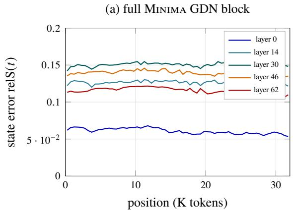
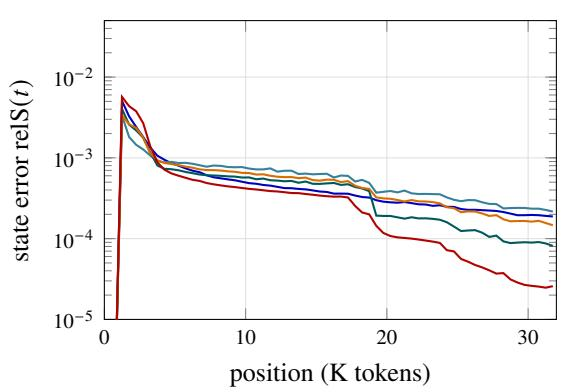
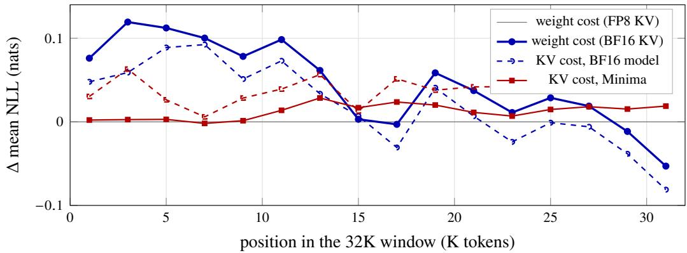

# Why Gated DeltaNet Survives 4-Bit Quantization: NVFP4 W4A4 for the Recurrent Half of a Hybrid 27B LLM

Sergii Kozyrev sergii@mnma.ai

Davyd Maiboroda david@mnma.ai

## Abstract

Hybrid large language models pair softmax attention with linear-attention layers such as Gated DeltaNet (GDN), whose recurrent state summarizes the entire context in fixed size. Early community 4-bit quantizations of Qwen3.8-27B (48 GDN layers, 16 attention layers) uniformly left the GDN block in 8- or 16-bit precision — in particular its decay and write-strength gate projections — on the intuition that errors in a recurrence accumulate over long contexts. We test that intuition by building Minima: NVFP4 W4A4 on all 496 linear layers, GDN included. Across perplexity at 4K/32K, MMLU-Pro, GSM8K, AIME’25, GPQA-Diamond, LiveCodeBench, and RULER retrieval to 64K, Minima matches BF16 within seed noise (5-task average −0.52) while being the smallest (17.5 GiB) and fastest-prefill (+14–19%) of the recipes we compare, and its 32K perplexity gap shrinks with position in the context window. We then explain why with a four-part mechanism study on captured activations: (i) GDN inputs share the residual stream’s extreme outliers, but NVFP4’s 16-element block scaling localizes them, equalizing activation error across all layer roles; (ii) the supposedly fragile gate projections are the least sensitive — their softplus/exponential and sigmoid parameterizations compress a ∼11% GEMM error to a ∼2% output error; (iii) the delta-rule recurrence bounds injected quantization noise at a flat plateau over 32K tokens and forgets a state impulse within hundreds of steps, far faster than its decay-gate horizons, because each write overwrites the state along the current key direction; (iv) end-to-end, the per-token quantization cost washes out with context instead of compounding. Along the way we identify and repair a global-scale mismatch that arises when per-module-calibrated NVFP4 checkpoints are served by kernels that fuse those modules into one GEMM, and we show that calibrated FP8 KV-cache scales are performance-free and recover 83% of the quantized model’s long-context KV penalty. The result is a practical recipe — quantize everything, ship KV scales — and a mechanistic account of why the recurrent half of a hybrid LLM is the easy half to quantize. The quantized checkpoint is released at https://huggingface.co/minima-ai/mnma\_qwen3.8\_27b\_nvfp4.

## 1 Introduction

Serving cost has made 4-bit weights-and-activations (W4A4) inference a practical target: NVFP4 pairs E2M1 4-bit values with an E4M3 scale per 16-element block and runs natively on current accelerators. At the same time, frontier open models are increasingly hybrid: most layers replace softmax attention with linear-attention operators whose state is a fixed-size matrix updated recurrently — in Qwen3.8-27B [12], 48 of 64 layers are Gated DeltaNet [16] and only 16 are full attention.

These two trends have only just begun to meet. Every public 4-bit build of Qwen3.8-27B we examined at the outset — and the model authors’ own FP8 release — quantizes the MLPs aggressively but protects the GDN block: its query/key/value, output, and especially its gate projections (�, controlling the decay $\alpha _ { t }$ , and $b ,$ controlling the write strength $\beta _ { t } )$ stay in 8- or 16-bit. The implicit argument is natural: a recurrence $S _ { t } = \alpha _ { t } S _ { t - 1 } + \beta _ { t } k _ { t } ( \nu _ { t } - S _ { t - 1 } ^ { \top } k _ { t } ) ^ { \top }$ carries its state across tens of thousands of tokens, so a per-step quantization error should compound, and errors in the gates should compound fastest.

This paper shows the intuition is backwards for this architecture, and explains why. Our contributions:

1. A true W4A4-GDN model, evaluated seriously. Minima quantizes all 496 linear layers of Qwen3.8-27B to NVFP4 W4A4, GDN gates included. Under a fixed serving regime (FP8 KV cache, identical harness, per-sample validity checks), it matches BF16 and two community recipes within seed noise on six accuracy suites while being the smallest and the fastest at prefill (§4).

2. A mechanism study of why it works (§5): activation statistics on captured 32K-token inputs, per-projection sensitivity replay, error propagation through the recurrence in lockstep FP32, and a positional decomposition of the perplexity gap. The chain — block scaling localizes outliers, gate nonlinearities squash what remains, the delta rule actively erases state error, and the end-to-end gap shrinks with context — turns “it happens to work” into an architectural account, and shows the protected projections were precisely the safest ones.

3. Serving-stack findings required to measure any of this correctly (§6): a global-scale mismatch between per-module NVFP4 calibration and fused serving GEMMs that silently corrupts the GDN gates (and fakes better long-context perplexity); a multimodal-composite serving path that degrades long-context scoring; and a chat-template pitfall that invalidates raw-completion harnesses for thinking models.

4. A KV-cache recipe (§7): FP8 KV halves KV memory and moves no task score; its one visible cost — a +0.41 perplexity penalty at 32K, 3× larger for the quantized model — is eliminated by calibrated per-layer scales that are free at serving time (83% recovered, throughput unchanged within 0.4%).

## 2 Background

Gated DeltaNet in Qwen3.8-27B. The model interleaves 48 GDN layers with 16 full-attention layers (hidden size 5120). A GDN layer projects the residual stream through four linear maps: in\_proj\_qkv (whose output passes a depthwise causal convolution and SiLU before splitting into $q _ { t } , k _ { t } , \nu _ { t } )$ , an output gate in\_proj\_z, and two scalar-per-head gate projections in\_proj\_a and in\_proj\_b. The gates are parameterized in log space,

$$
g _ { t } \ = \ - \exp ( A _ { \mathrm { l o g } } ) \ \mathrm { s o f t p l u s } ( a _ { t } + \mathrm { d t \_ b i a s } ) ,
$$

$$
\alpha _ { t } = e ^ { g _ { t } } \in ( 0 , 1 ) , \qquad \beta _ { t } = \sigma ( b _ { t } ) \in ( 0 , 1 ) ,\tag{1}
$$

and the per-head state $S _ { t } \in \mathbb { R } ^ { K \times V } \left( K { = } V { = } 1 2 8 \right)$ evolves by the gated delta rule over $\ell _ { 2 }$ -normalized keys and queries:

$$
S _ { t } ~ = ~ \alpha _ { t } S _ { t - 1 } ~ + ~ \beta _ { t } k _ { t } \big ( \nu _ { t } - S _ { t - 1 } ^ { \top } k _ { t } \big ) ^ { \top } , ~ o _ { t } ~ = ~ S _ { t } ^ { \top } \big ( q _ { t } / \sqrt { K } \big ) .\tag{2}
$$

$\alpha _ { t }$ is a per-token forget gate; $\beta _ { t }$ scales a correction: the write replaces what the state currently predicts for key $k _ { t }$ by $\nu _ { t } ,$ , rather than accumulating $\nu _ { t }$ blindly. The output is gated (RMSNorm modulated by �) and mixed back by out\_proj. Five weight matrices per layer are therefore candidates for quantization; the community consensus protects � and � entirely and keeps the rest at 8 bits.

NVFP4. NVFP4 stores values in E2M1 (4 bits) with one E4M3 scale per 16-element block (set to blockmax/6) and one FP32 scale per tensor. W4A4 means both weights and activations are quantized at this granularity, so the GEMM runs on native 4-bit tensor cores. Two consequences matter later: a block’s largest value fixes its scale, so an outlier degrades only its own 15 neighbors; and within a block $\operatorname* { m a x } / \mathbf { R M S } \leq \sqrt { 1 6 } = 4$ , which bounds how “one-hot” a block can be.

## 3 Experimental setup

Checkpoints. All models are served text-only (§6) with vLLM 0.27.1 [8], TP=1, on one RTX PRO 6000 (96 GB, SM120, native NVFP4). BF16 is the unquantized reference, extracted from the multimodal composite. Minima (ours) applies llm-compressor NVFP4 W4A4 to every linear layer — 240 GDN, 64 attention, 192 MLP projections; 496 in total — excluding only lm\_head, embeddings, convolutions, and norms; it is calibrated on a frozen 128-sample × 32K-token set and served after the global-scale harmonization of §6. Unsloth (Dynamic v3) and RadixArk (ModelOpt) are the two public NVFP4 checkpoints: both keep GDN and attention at FP8 W8A8 with �/� in BF16, and quantize only MLPs to NVFP4. Minima+scales is Minima plus calibrated FP8 KV-cache scales (§7), identical in every other tensor; it is the released checkpoint.1

Serving regime and harness. One regime for every number in this paper: FP8 KV cache (§7 ablates it), GPU utilization 0.85, 32K generation cap. Accuracy suites: WikiText-2 perplexity measured at 4K and inside a single 32K request; MMLU-Pro and GSM8K via a chat-template harness with thinking disabled (§6 explains why raw-completion harnesses are invalid for this model); AIME’25 and GPQA-Diamond as pass@1 over four seeds (temperature 0.6, top-p 0.95); LiveCodeBench v6 unit-test graded; RULER [7] NIAH single and multikey at 32K and 64K. Every task run passes per-sample validity gates (empty/unextracted answers, leaked <think> blocks), and truncation statistics are reported alongside scores.

## 4 Main results

Table 1 is the headline. Three observations.

Table 1: Four models, one regime (FP8 KV, vLLM 0.27.1, TP=1, one RTX PRO 6000). Accuracies in %; AIME’25 and GPQA-D are pass@1 over the same 4 seeds for every model (per-seed scores for BF16/Minima in parentheses), LCB v6 single seed; 5-task avg = mean of MMLU-Pro, GSM8K, AIME’25, GPQA-D, LCB. RULER (100 for all four at 32K/64K, single and multikey) is omitted. PPL@32K is measured inside a 32K request. No pair of models is CI-separated on any task. Decode = 1024-in/1024-out at concurrency 32; TTFT = one 32K-token prefill.
<table><tr><td></td><td>BF16</td><td>MINIMA</td><td>Unsloth</td><td>RadixArk</td></tr><tr><td>PPL @4K / @32K ↓</td><td>6.95 / 10.35</td><td>7.67 / 10.84</td><td>7.16/9.91</td><td>7.35 / 9.95</td></tr><tr><td>MMLU-Pro</td><td>80.4</td><td>79.7</td><td>78.9</td><td>79.1</td></tr><tr><td>GSM8K</td><td>95.5</td><td>95.5</td><td>95.4</td><td>95.7</td></tr><tr><td>AIME&#x27;25</td><td>86.7 (.83/.93/.83/.87)</td><td>86.7 (.87/.87/.87/.87)</td><td>87.5</td><td>84.2</td></tr><tr><td>GPQA-Diamond</td><td>86.5</td><td>85.1</td><td>85.0</td><td>85.4</td></tr><tr><td>LiveCodeBench v6</td><td>79.0</td><td>78.5</td><td>79.9</td><td>79.6</td></tr><tr><td>5-task avg / ∆</td><td>85.62</td><td>85.10 / -0.52</td><td>85.34 / -0.28</td><td>84.80 / -0.82</td></tr><tr><td>Weights in VRAM</td><td>50.13 GiB</td><td>17.53 GiB</td><td>20.23 GiB</td><td>18.83 GiB</td></tr><tr><td>Decode tok/s @32</td><td>621</td><td>1,154</td><td>1,132</td><td>1,174</td></tr><tr><td>TTFT @32K</td><td>6.90 s</td><td>4.03 s</td><td>4.49 s</td><td>4.39 s</td></tr></table>

All quantized recipes match BF16 task accuracy within seed noise. Every quantized model sits within seed noise of BF16 on every task: the three quantized recipes span 0.54 points on the 5-task average — less than one AIME problem (3.3 points) — and the largest single-task gap (RadixArk’s AIME −2.5) is inside the BF16 model’s own seed spread (83.3–93.3). Minima matches BF16’s AIME’25 score exactly (26/30 on all four seeds) with all of GDN at 4 bits. Generation behavior is unchanged too: Minima does not “think longer” (mean AIME generation 14,531 vs. 14,532 tokens for BF16) and hits the 32K cap slightly less often.

Quantizing the GDN block yields measurable eficiency gains. Minima is the only checkpoint whose GDN block (5.5B parameters, ∼23% of decode weight bytes) is at 4 bits, and it shows: 2.9× smaller than BF16 in VRAM and on disk, 7–13% smaller than either community NVFP4 build, the largest KV budget (1.81M cacheable tokens on one card), and the fastest prefill (TTFT 6.90 s → 4.03 s at 32K; +14–19% prompt throughput at 8K over Unsloth/RadixArk, whose GDN/attention GEMMs remain FP8). Decode is weight-bandwidth-bound and all three quantized models land within 4% (RadixArk leads by 2–4%; §9).

Perplexity is the honest residual. PPL is the one metric that orders the recipes: Unsloth < RadixArk < Minima at both context lengths, as expected — the community recipes simply quantize less of the model and pay for the headroom in 1.3–2.7 GiB of weights. Minima’s gap to BF16 is +0.72 at 4K but only +0.49 at 32K, it never reaches a task score, and §5 shows it is a short-context, per-token efect that context washes out — the opposite of the error-accumulation the community recipes guard against.

## 5 Why GDN survives 4 bits

Table 1 refutes the community’s caution empirically; this section explains it. We captured the real inputs of all 48 GDN layers while the BF16 model read eight 32K-token documents, re-implemented one GDN layer standalone (verified against the reference implementation to $6 \times 1 0 ^ { - 3 }$ median relative output diference, i.e. BF16 rounding), and used NVFP4fake quantization — quantize, dequantize, continue in high precision — to inject exactly the 4-bit rounding error and nothing else. Four experiments form a chain.

Table 2: Activation and weight statistics at NVFP4 granularity (4×32K captured tokens; median over layers). “1-hot blocks” = share of 16-element blocks with max $/ \mathrm { R M S } > 3$ (one value holds > 56% of block energy). A4/W4 = relative error of quantizing the activation/weight tensor alone.
<table><tr><td>input of</td><td>max/RMS</td><td>kurtosis</td><td>1-hot blocks %</td><td>A4 err %</td><td>W4 err  $\%$ </td></tr><tr><td>GDN qkv/z/a/b</td><td>63.5</td><td>1,564</td><td>10.6</td><td>7.6</td><td>10.6-11.6</td></tr><tr><td>GDN out_proj</td><td>298.1</td><td>609</td><td>32.1</td><td>9.0</td><td>10.8</td></tr><tr><td>attention q/k/v</td><td>71.5</td><td>1,809</td><td>13.9</td><td>7.5</td><td>10.5-11.0</td></tr><tr><td>attention o_proj</td><td>81.2</td><td>39</td><td>23.6</td><td>9.2</td><td>10.7</td></tr><tr><td>MLP gate/up</td><td>47.8</td><td>100</td><td>5.3</td><td>9.2</td><td>11.8-11.9</td></tr><tr><td>MLP down</td><td>368.3</td><td>962</td><td>24.3</td><td>8.9</td><td>11.8</td></tr></table>

## 5.1 The inputs are not the reason

The simplest hypothesis is that GDN sees an easier input distribution than attention. It does not: GDN’s projections read the same residual stream as attention (Table 2). GDN inputs carry extreme outliers (median-layer max/RMS 63.5, kurtosis ∼1,560, hot channels 100× the median channel), and 10–32% of 16-element blocks are dominated by a single value. Yet the actual per-token A4 quantization error is uniform across every layer role — 7.5–9.2% — because block scaling confines each outlier to its 15 neighbors. Weight error (10.5–11.9%, near-Gaussian weights) exceeds activation error everywhere. Both are flat in position over the 32K window. Robustness must therefore come from what the layer does with the error, not from clean data.

## 5.2 The protected projections are the safest ones

We replayed each captured layer with exactly one projection quantized at a time (96 replays over layers and sequences, 8K tokens each) and measured the efect on the layer output � (Table 3). The result inverts the community’s precision map: fully quantizing the gate projections � and � — the two tensors every public recipe keeps in BF16 — moves � by only 2.1% and 2.6%, the two smallest efects, even though their own GEMM errors are 11.0% and 8.5%. The squashing in Eq. (1) is the shield: a ∼11% pre-activation error becomes a 7.5% error on $1 - \alpha$ and a 5.2% error on $\beta ,$ and the recurrence (§5.3) tolerates both. The error Minima actually carries comes from the three plain GEMMs — out (12.7%), qkv (10.4%), z (9.9%). Two further regularities: the five projections’ errors are statistically independent (single-projection � errors combine in quadrature to 19.4% vs. the measured 19.2% for all-at-once), and weights carry more error than activations for every projection $( \mathrm { W } 4 \mathrm { A } 1 6 > \mathrm { W } 1 6 \mathrm { A } 4 )$ , consistent with Table 2. Nothing grows along the sequence (first vs. last quarter: 19.5% vs. 19.7%).

Table 3: Per-projection NVFP4 sensitivity: one projection W4A4 at a time. “gemm”, gate, and � columns: median relative errors in % over 96 (layer, sequence) replays of 8K tokens. State column: relS plateau of the 32K lockstep runs of §5.3 (median over 5 layers); 0 = the projection does not touch the recurrence. ab is the pair the community protects; all is the full Minima GDN block.
<table><tr><td>variant</td><td>gemm</td><td>1 − α</td><td>β</td><td>state S</td><td>output y</td></tr><tr><td>a:W4A4</td><td>11.0</td><td rowspan="3">7.5</td><td></td><td>3.6</td><td>2.1</td></tr><tr><td>b:W4A4</td><td>8.5</td><td>5.2</td><td>3.2</td><td>2.6</td></tr><tr><td>ab:W4A4</td><td></td><td>7.5 5.2</td><td>5.2</td><td>3.6</td></tr><tr><td>qkv:W4A4</td><td>10.6</td><td></td><td>一</td><td>12.1</td><td>10.4</td></tr><tr><td>z:W4A4</td><td>8.3</td><td></td><td></td><td>0</td><td>9.9</td></tr><tr><td>out:W4A4</td><td>12.7</td><td></td><td></td><td>0</td><td>12.7</td></tr><tr><td>all:W4A4</td><td>一</td><td>7.5</td><td>5.2</td><td>12.6</td><td>19.2</td></tr></table>

## 5.3 The recurrence bounds and erases the noise

Does the 12.6% state error of Table 3 grow over a long context? We ran the recurrence in lockstep FP32 — one clean trajectory, eleven perturbed ones on identical inputs — for 32K tokens on five layers spread over depth. The full-Minima state error is flat: relS = 12.96% at token 256 and 12.31% at token 32,768 (plateau 12.6%, max 14.9%; Figure 1a). The recurrence reaches an equilibrium where forgetting balances injection, and holds it for the entire window.

The forgetting is faster than the decay gates alone explain. A one-of 1% state impulse injected at �=1,024 falls to 1/� within 80–1,382 steps and to 1/10 within ∼2,200–2,900 — while the decay-implied horizons $1 / ( 1 - \alpha )$ of the same layers reach 44K–62K tokens. The extra erasure is the delta rule itself: by Eq. (2) every write overwrites the state along the current key direction, so old errors are deleted key by key as new tokens arrive, not merely decayed.

A synthetic-noise arm locates the actual fragility, and thereby the role of the parameterization. The state is very sensitive to relative noise applied directly to �: 0.1% multiplicative noise yields a 22% state error, because with � ≈ 1 a tiny �� is an enormous relative change in the horizon $1 / ( 1 - \alpha )$ . Quantizing � produces only 3.6% state error from an 11% GEMM error because the noise lands on the pre-activation of Eq. (1), where softplus and the exponential compress it before it touches the horizon. The log-space gate parameterization — chosen for training stability — is precisely what makes the gates quantization-proof at serving time. Noise on $\beta$ is harmless outright (1% noise → 0.4% state error): the delta rule’s write is self-correcting, since a mis-scaled correction is itself corrected by later writes.

## 5.4 End to end, context washes the error out

If the mechanism above is right, the served model’s quantization gap should not grow with position — and it should if the community’s accumulation picture were right. We split the per-token NLL of the 32K perplexity runs by position (Figure 2). The weight-quantization gap (Minima−BF16, same KV regime) is +0.081 nats in the first half of the window and +0.011 in the second; in the final 2K tokens Minima scores better than BF16 (−0.053). The 4-bit cost is a short-context, per-token efect that a filled state absorbs.

(b) 1% state impulse at �0=1024  

  
Figure 1: State error of the FP32 lockstep recurrence over 32K tokens, five layers spread over depth (model layer indices). (a) With the full Minima quantization injected at every step, relS(�) plateaus immediately and stays flat — no accumulation. (b) A single 1% state perturbation at � =1,024 (log scale, 512-token bin means): the recurrence erases it within a few hundred to a few thousand steps, orders of magnitude faster than the decay-implied horizons of up to 62K tokens, because the delta rule overwrites the state along each new key.

The FP8-KV cost behaves in exactly the opposite way: it is small, rises with position, and is ∼3× larger for Minima — the signature of an attention-path efect rather than a weight efect. §7 eliminates it with calibrated scales.

Synthesis. Block scaling localizes the residual stream’s outliers (§5.1); the gate nonlinearities compress what reaches the control signals (§5.2); the delta-rule recurrence bounds the remaining noise at a plateau and actively erases it (§5.3); so the end-to-end cost shrinks with context (§5.4). None of this invokes luck or fine-tuning: it is the architecture’s own gating and correction structure. The projections the community protects are exactly the ones the architecture already protects.

## 6 Measuring it correctly: serving-stack findings

Every conclusion above required first repairing the measurement pipeline. We report four findings; each silently corrupted a result before we caught it, and at least the first afects any hybrid-model NVFP4 deployment today.

Per-module calibration vs. fused-GEMM scaling. llm-compressor calibrates one FP32 global scale per linear module; vLLM serves the GDN projections fused — in\_proj\_qkv+z as one NVFP4 GEMM and in\_proj\_b+a as another — taking the maximum of the constituent global scales without rescaling the local ones (the ModelOpt path behaves the same). In our checkpoint the paired scales difer by 1.82× (qkv/z) and 2.75× (b/a) in every one of the 48 layers, so the served model computed the decay and write gates with mis-scaled weights. The corrupted model is deceptively plausible: reasoning degrades moderately (AIME 80.8 vs. 86.7 repaired) while long-context perplexity gets better than BF16 (a flat 6.86 at 32K vs. the true 10.84) — a broken forget gate makes the state hold everything, which happens to help next-token prediction on WikiText. A checkpoint-side repair sufices: rewrite each fused group to the shared global scale and fold the ratio into the per-block E4M3 scales (94 scale sets across the model, worst ratio 2.81×, re-rounding error ≤ 6.2% on afected local scales). A GEMM-level probe confirms the fix (kernel-vs-reference error 0.35/0.57 → 0.002), and every Minima number in this paper is from the repaired checkpoint. The mismatch is invisible on checkpoints that keep fused-adjacent modules at equal scales — audits of the Unsloth and RadixArk checkpoints found their fused groups uniform — which is presumably why it has gone unnoticed: it only bites recipes that quantize the GDN block, which no public recipe had shipped at the time of our audit.

  
Figure 2: The two quantization costs, decomposed by position in the 32K window (2K-token bins; full numbers in Table 4). Blue: weight cost (Minima−BF16 at matched KV precision) — largest at the start, falling to zero and below by the end of the window: the opposite of accumulation. Red: KV-cache cost (FP8−BF16 KV, same checkpoint) — small, rising with position, larger for Minima; this is the component the calibrated scales of §7 remove.

Composite vs. text-only serving path. The hub checkpoint is a multimodal composite; serving it makes vLLM take a multimodal position-encoding path even for pure text, and that path scores long context measurably diferently (PPL@32K 10.04 composite vs. 10.22 text-only for the BF16 model) — and both community checkpoints are also composites. All models in this paper are served from text-only extractions so that quantization is never confounded with the serving path.

Raw-completion harnesses are invalid for thinking models. lm-eval’s local-completions path sends few-shot prompts without a chat template, so “thinking disabled” never reaches the model: on MMLU-Pro it opened <think> on 25–48 of 50 sampled questions and was truncated or self-interrupted, producing per-subject swings of ±40–60 points in both directions (invalid scores of 66.3/58.6 for BF16/Minima vs. the valid 80.4/79.7). All short-tier numbers here use a chat-template harness with thinking disabled and per-sample validity gates.

Context inversion in the base model. BF16 Qwen3.8-27B scores the same tokens worse inside a 32K request than in isolated 4K windows (PPL 6.95 → 10.35; deterministic; reproduced identically in vLLM and in the reference implementation to three decimals; retrieval at 64K remains 100%). This is a property of the model, not of quantization — but it means “PPL@32K” comparisons are only meaningful within one serving path and window protocol, which we hold fixed everywhere.

## 7 KV-cache precision

The 48 GDN layers carry no KV cache; only the 16 attention layers do. Storing their cache in FP8 (scale 1.0) is essentially free on tasks: across BF16 and Minima, four seeds, six suites, no task score moves outside seed spread, and capacity grows 1.8–1.9×. The one systematic cost is perplexity at 32K: +0.13 for BF16 and +0.41 for Minima — 3× larger, plausibly because Minima’s K/V projections are already W4A4, leaving the values less headroom before the cache rounds them again.

Calibrated scales close it. Minima+scales adds llm-compressor’s kv\_cache\_scheme (static per-tensor FP8 scales; 32 tensors on 16 attention layers — exactly what Unsloth ships) to an otherwise byte-identical Minima recipe. PPL@32K drops 10.84 → 10.50, recovering 83% of the penalty; the residual +0.07 is below BF16’s own uncalibrated cost (+0.13). PPL@4K is unchanged, RULER stays 100 at 32K/64K, and throughput matches Minima within 0.4% on every decode and prefill metric — the scales are performance-free. The practical recipe is therefore unconditional: quantize everything, serve FP8 KV, ship calibrated scales.

## 8 Related work

Linear attention and hybrids. Gated DeltaNet [16] combines the parallelizable delta rule [15] with Mamba2-style gating [2, 5]; Qwen3.8-27B deploys it as the dominant mixer in a hybrid stack. Our results speak to the quantizability of this operator class, not to any one checkpoint’s training choices, since the mechanism (§5) rests on the operator’s own gating and correction structure.

Low-bit LLM quantization. Weight-only methods [4, 9] and weight-activation methods [3, 14] established that outlier handling is the central dificulty of W4/W8 inference; block-scaled microformats [13] move the handling into the datatype, and NVFP4 [11] is the hardware-native instance we use. Prior work targets transformer attention and MLPs; quantization of recurrent-state mixers in large hybrids has, to our knowledge, not been studied — the public recipes for this model simply exempt them (§3). Concurrently with this work, QUASAR [1] released a checkpoint of the same model that quantizes all 496 projections, GDN included, via quantization-aware training — the 4-bit weights are learned by distillation from the BF16 teacher.2 It appeared after our measurement campaign closed; its model card reports a brief two-task spot check but no controlled study or account of why the configuration survives; our results show the training is not necessary — calibration-only PTQ reaches BF16-level task accuracy — and §5 explains why. Concurrent engineering work in our group extends the recipe studied here to the full model — embeddings, the language-model head, and the multi-token-prediction head also at NVFP4 W4A4 — and further to 3-bit MLP codebooks with a distillation-healed low-rank residual; notably, the sub-4-bit recipe keeps the GDN and attention projections sealed at 4-bit weights, treating the result established here as its foundation. That variant loads just 12.3 GiB of weights into VRAM — 4.1× smaller than BF16’s 50.1 GiB, versus Minima’s 17.5 GiB — while sustaining over 1,200 output tokens/s at 128-way concurrency on the same single-GPU class; its accuracy evaluation uses diferent protocols and is outside this paper’s scope.

KV-cache compression. Post-training KV quantization [6, 10] targets the dominant memory consumer of long-context attention serving. Hybrids shrink that consumer architecturally (here only 16 of 64 layers cache KV); our contribution is the interaction term — FP8 KV costs a W4A4 model 3× more perplexity than a BF16 model unless calibrated scales are shipped, after which the cost is below the BF16 model’s own (§7).

## 9 Limitations

Scope of evidence. One model family and size (Qwen3.8-27B), one quantization format (NVFP4), evaluated to 32K-token perplexity and 64K retrieval. We did not run longer-context stress tests: the mechanism study answers the accumulation question directly (state error flat over 32K, gap shrinking with position, retrieval perfect at 64K, ∼14.5K-token generations matching BF16 token-for-token), and the bounded-error mechanism predicts longer contexts, but 128K+ behavior is extrapolation. The concurrent QAT checkpoint of Counathe et al. [1] is acknowledged but not benchmarked: it was released after our measurement campaign closed, and it belongs to a diferent recipe class (weights learned under quantization rather than rounded post hoc), so its card’s scores are not comparable to numbers from our harness. Minima+scales task scores are inherited from Minima rather than re-measured, justified by the KV ablation showing no task movement for either model; PPL, RULER, and throughput were re-measured. Decode overhead. Minima trails RadixArk by 2–4% on decode despite fewer weight bytes; profiling attributes this to small-batch NVFP4 activation-quantization overhead, a kernel-level artifact rather than a property of the recipe. Gates on other architectures. The gate-shielding argument (§5.3) depends on the log-space softplus/exponential parameterization; recurrent mixers with linearly-parameterized decay may not enjoy it, and 0.1% direct noise on � demonstrably harms the state.

## 10 Conclusion

We built a fully W4A4 NVFP4 version of a large hybrid LLM by post-training quantization alone — all 496 backbone linear layers, Gated DeltaNet included — and found it matches BF16 across reasoning, knowledge, code, retrieval, and long-context evaluation, while being the smallest and fastest-prefill recipe in its cohort. The mechanism study explains the result architecturally: NVFP4 block scaling neutralizes the residual stream’s outliers, the gate parameterization compresses quantization noise before it reaches the recurrence’s control signals, and the delta rule’s overwrite actively erases state error faster than the decay gates alone would. The community’s protective precision maps guard exactly the projections the architecture already guards. With the serving pipeline measured correctly — harmonized fused scales, text-only path, valid harness, calibrated

KV scales — the practical guidance for hybrid models is short: the recurrent half is the easy half;   
quantize it.

## References

[1] Vincent Counathe, Ben Athiwaratkun, Christopher De Sa, and Tianyi Zhang. QUASAR: Lowering the loss floor of quantization-aware training with loss-aware reconstruction. arXiv preprint arXiv:2608.13966, 2026.

[2] Tri Dao and Albert Gu. Transformers are SSMs: Generalized models and eficient algorithms through structured state space duality. In International Conference on Machine Learning (ICML), 2024. arXiv:2405.21060.

[3] Tim Dettmers, Mike Lewis, Younes Belkada, and Luke Zettlemoyer. LLM.int8(): 8-bit matrix multiplication for transformers at scale. In Advances in Neural Information Processing Systems (NeurIPS), 2022. arXiv:2208.07339.

[4] Elias Frantar, Saleh Ashkboos, Torsten Hoefler, and Dan Alistarh. GPTQ: Accurate posttraining quantization for generative pre-trained transformers. In International Conference on Learning Representations (ICLR), 2023. arXiv:2210.17323.

[5] Albert Gu and Tri Dao. Mamba: Linear-time sequence modeling with selective state spaces. arXiv preprint arXiv:2312.00752, 2023.

[6] Coleman Hooper, Sehoon Kim, Hiva Mohammadzadeh, Michael W. Mahoney, Yakun Sophia Shao, Kurt Keutzer, and Amir Gholami. KVQuant: Towards 10 million context length LLM inference with KV cache quantization. In Advances in Neural Information Processing Systems (NeurIPS), 2024. arXiv:2401.18079.

[7] Cheng-Ping Hsieh, Simeng Sun, Samuel Kriman, Shantanu Acharya, Dima Rekesh, Fei Jia, Yang Zhang, and Boris Ginsburg. RULER: What’s the real context size of your long-context language models? arXiv preprint arXiv:2404.06654, 2024.

[8] Woosuk Kwon, Zhuohan Li, Siyuan Zhuang, Ying Sheng, Lianmin Zheng, Cody Hao Yu, Joseph E. Gonzalez, Hao Zhang, and Ion Stoica. Eficient memory management for large language model serving with PagedAttention. In Symposium on Operating Systems Principles (SOSP), 2023.

[9] Ji Lin, Jiaming Tang, Haotian Tang, Shang Yang, Wei-Ming Chen, Wei-Chen Wang, Guangxuan Xiao, Xingyu Dang, Chuang Gan, and Song Han. AWQ: Activation-aware weight quantization for LLM compression and acceleration. In Proceedings of Machine Learning and Systems (MLSys), 2024. arXiv:2306.00978.

[10] Zirui Liu, Jiayi Yuan, Hongye Jin, Shaochen Zhong, Zhaozhuo Xu, Vladimir Braverman, Beidi Chen, and Xia Hu. KIVI: A tuning-free asymmetric 2bit quantization for KV cache. In International Conference on Machine Learning (ICML), 2024. arXiv:2402.02750.

[11] NVIDIA. Pretraining large language models with NVFP4. arXiv preprint arXiv:2509.25149, 2025.

[12] Qwen Team. Qwen3.8-27b. https://huggingface.co/Qwen/Qwen3.8-27B, 2026. Model release; accessed 2026-08-31.

[13] Bita Darvish Rouhani, Ritchie Zhao, Ankit More, Mathew Hall, Alireza Khodamoradi, Summer Deng, Dhruv Choudhary, Marius Cornea, Eric Dellinger, Kristof Denolf, et al. Microscaling data formats for deep learning. arXiv preprint arXiv:2310.10537, 2023.

[14] Guangxuan Xiao, Ji Lin, Mickael Seznec, Hao Wu, Julien Demouth, and Song Han. SmoothQuant: Accurate and eficient post-training quantization for large language models. In International Conference on Machine Learning (ICML), 2023. arXiv:2211.10438.

[15] Songlin Yang, Bailin Wang, Yu Zhang, Yikang Shen, and Yoon Kim. Parallelizing linear transformers with the delta rule over sequence length. In Advances in Neural Information Processing Systems (NeurIPS), 2024. arXiv:2406.06484.

[16] Songlin Yang, Jan Kautz, and Ali Hatamizadeh. Gated delta networks: Improving mamba2 with delta rule. In International Conference on Learning Representations (ICLR), 2025. arXiv:2412.06464.

## A Kernel-vs-reference numerics

The mechanism study’s instrumented recurrence implements Eq. (2) in pure PyTorch at FP32; the served model uses the fused chunkwise kernel. On identical 32K-token inputs, an FP32 kernel run matches the reference to $7 . 7 \times 1 0 ^ { - 4 }$ median relative output diference — the kernel’s TF32 compute floor (its matmuls fix input\_precision=’tf32’) — flat in position, with final states agreeing to $4 . 4 \times 1 0 ^ { - 4 }$ . The BF16 kernel, as served, sits at its rounding floor: $3 . 8 \times 1 0 ^ { - 3 } \approx 2 ^ { - 8 }$ median. Because that floor exceeds the smallest perturbation the study measures $( 1 0 ^ { - 3 } )$ , all error-propagation comparisons in §5.3 are within-path: clean and perturbed trajectories both run in the FP32 reference. One reproducibility note: the reference must apply the kernel’s default $1 / \sqrt { K }$ query scale — omitting it produces a spurious 91.2% (= 1 − 1/ 128) output diference while final states still agree.

## B Additional tables

## B.1 Perplexity gap by position

Table 4 decomposes the 32K WikiText-2 NLL by 2K-token position bins, separating the weightquantization gap (Minima−BF16, same KV dtype) from the KV-compression gap (FP8−BF16 KV, same checkpoint). Absolute NLL rises with position for every model, BF16 included (context inversion, §6); the Δ columns are the signal. The weight gap falls from +0.081 (first half, FP8 KV) to +0.011 (second half) and turns negative in the last bins; the KV gap is small and rises with position, and is larger for Minima at every bin — the pattern that motivated the calibrated scales of §7.

Table 4: Mean NLL (nats) by position in the 32K window. Anchor: the BF16 model under FP8 KV. ΔW = Minima−BF16 (weight cost, same KV); ΔKV = FP8−BF16 KV (same checkpoint). 0.01 nats ≈ 1% perplexity.
<table><tr><td>position</td><td>BF16 NLL</td><td>∆W (fp8 KV)</td><td>∆W (bf16 KV)</td><td>∆KV BF16</td><td>∆KV MINIMA</td></tr><tr><td>0-2K</td><td>1.925</td><td>+0.076</td><td>+0.048</td><td>+0.002</td><td>+0.030</td></tr><tr><td>2-4K</td><td>1.993</td><td>+0.119</td><td>+0.059</td><td>+0.003</td><td>+0.063</td></tr><tr><td>4-6K</td><td>2.150</td><td>+0.112</td><td>+0.089</td><td>+0.003</td><td>+0.026</td></tr><tr><td>6-8K</td><td>2.074</td><td>+0.100</td><td>+0.092</td><td>-0.002</td><td>+0.006</td></tr><tr><td>8-10K</td><td>2.023</td><td>+0.078</td><td>+0.051</td><td>+0.001</td><td>+0.029</td></tr><tr><td>10-12K</td><td>2.117</td><td>+0.098</td><td>+0.073</td><td>+0.014</td><td>+0.039</td></tr><tr><td>12-14K</td><td>2.110</td><td>+0.062</td><td>+0.034</td><td>+0.029</td><td>+0.057</td></tr><tr><td>14-16K</td><td>2.146</td><td>+0.003</td><td>+0.007</td><td>+0.017</td><td>+0.013</td></tr><tr><td>16-18K</td><td>2.409</td><td>-0.003</td><td>-0.031</td><td>+0.024</td><td>+0.051</td></tr><tr><td>18-20K</td><td>2.456</td><td>+0.059</td><td>+0.041</td><td>+0.020</td><td>+0.038</td></tr><tr><td>20-22K</td><td>2.666</td><td>+0.037</td><td>+0.007</td><td>+0.011</td><td>+0.042</td></tr><tr><td>22-24K</td><td>2.739</td><td>+0.011</td><td>-0.024</td><td>+0.007</td><td>+0.042</td></tr><tr><td>24-26K</td><td>2.697</td><td>+0.029</td><td>-0.001</td><td>+0.015</td><td>+0.045</td></tr><tr><td>26-28K</td><td>2.575</td><td>+0.019</td><td>-0.006</td><td>+0.018</td><td>+0.043</td></tr><tr><td>28-30K</td><td>2.612</td><td>-0.012</td><td>-0.038</td><td>+0.015</td><td>+0.042</td></tr><tr><td>30-32K</td><td>2.700</td><td>-0.053</td><td>-0.081</td><td>+0.019</td><td>+0.047</td></tr><tr><td rowspan="2">first-half mean second-half mean</td><td></td><td>+0.081</td><td>+0.057</td><td>+0.008</td><td>+0.033</td></tr><tr><td></td><td>+0.011</td><td>-0.017</td><td>+0.016</td><td>+0.044</td></tr></table>

## B.2 Throughput

Table 5: Full throughput sweep (one RTX PRO 6000, TP=1, FP8 KV, same serving config as every accuracy number). Decode: 1024-token prompts, 1024 generated tokens, concurrency 1/8/32. Prefill: single request, one output token. Minima+scales difers from Minima only by the 32 KV scale tensors.
<table><tr><td></td><td colspan="3">decode tok/s</td><td colspan="3">TPOT ms</td><td colspan="2">TTFT s</td></tr><tr><td>model</td><td>@1</td><td>@8</td><td>@32</td><td>@1</td><td>@8</td><td>@32</td><td>@8K</td><td>@32K</td></tr><tr><td>BF16</td><td>26</td><td>196</td><td>621</td><td>37.7</td><td>39.8</td><td>49.5</td><td>1.34</td><td>6.90</td></tr><tr><td>MINIMA</td><td>47</td><td>354</td><td>1,154</td><td>21.2</td><td>22.2</td><td>26.9</td><td>0.61</td><td>4.03</td></tr><tr><td>MINIMA+scales</td><td>47</td><td>355</td><td>1,152</td><td>21.2</td><td>22.2</td><td>27.0</td><td>0.61</td><td>4.04</td></tr><tr><td>Unsloth</td><td>49</td><td>364</td><td>1,132</td><td>20.2</td><td>21.6</td><td>27.3</td><td>0.72</td><td>4.49</td></tr><tr><td>RadixArk</td><td>51</td><td>376</td><td>1,174</td><td>19.6</td><td>20.9</td><td>26.3</td><td>0.69</td><td>4.39</td></tr></table>

## B.3 Error propagation, full variant table

Table 6 gives the complete lockstep results behind §5.3 (median over layers 0/14/30/46/62, 32K tokens). Impulse decay per layer: $1 / e$ after 550 / 164 / 281 / 80 / 1,382 steps; 1/10 after 2,937 / 2,233 / 2,270 / 2,239 / 2,693. Gate context: mean $\alpha = 0 . 8 6 2$ ; per-layer mean horizons $1 / ( 1 - \alpha )$ of 43,970 / 1,895 / 4,156 / 8,342 / 61,659 tokens; mean $\beta = 0 . 4 4 7$

Table 6: State error relS(�) vs. the clean FP32 recurrence (%, median over 5 layers) and resulting output errors. alpha/beta-noise rows apply synthetic multiplicative noise directly to the gates; impulse perturbs the state once at �0=1,024 by 1%.
<table><tr><td>variant</td><td>relS@256</td><td>relS@4096</td><td>relS@32768</td><td>plateau</td><td>max</td><td>y median</td></tr><tr><td>minima (all W4A4)</td><td>12.96</td><td>12.09</td><td>12.31</td><td>12.62</td><td>14.94</td><td>17.32</td></tr><tr><td>qkv</td><td>12.51</td><td>12.03</td><td>12.26</td><td>12.14</td><td>14.84</td><td>9.73</td></tr><tr><td>Z</td><td>0</td><td>0</td><td>0</td><td>0</td><td>0</td><td>8.89</td></tr><tr><td>a</td><td>3.11</td><td>3.57</td><td>4.20</td><td>3.55</td><td>6.32</td><td>2.08</td></tr><tr><td>b</td><td>3.01</td><td>3.15</td><td>3.10</td><td>3.18</td><td>5.48</td><td>2.55</td></tr><tr><td>out</td><td>0</td><td>0</td><td>0</td><td>0</td><td>0</td><td>12.70</td></tr><tr><td>ab</td><td>4.55</td><td>5.21</td><td>5.26</td><td>5.15</td><td>8.19</td><td>3.56</td></tr><tr><td>α-noise 0.1%</td><td>2.33</td><td>12.73</td><td>19.65</td><td>22.17</td><td>40.93</td><td>9.50</td></tr><tr><td>α-noise 1%</td><td>21.97</td><td>40.94</td><td>42.83</td><td>46.06</td><td>67.29</td><td>25.63</td></tr><tr><td>β-noise 1%</td><td>0.42</td><td>0.39</td><td>0.40</td><td>0.39</td><td>1.34</td><td>0.46</td></tr><tr><td>impulse 1%</td><td>0</td><td>0.10</td><td>0.01</td><td>0.02</td><td>1.00</td><td>0.10</td></tr></table>

## B.4 Precision maps and statistics notes

Minima quantizes 496 linear tensors to NVFP4 W4A4: per GDN layer in\_proj\_qkv, z, a, b, out\_proj (5 × 48); per attention layer q,k,v,o\_proj (4 × 16); per layer gate,up,down\_proj (3 × 64). Kept in BF16: embeddings, lm\_head, the GDN conv1d, all norms, �log/dt\_bias. Unsloth keeps GDN and attention at FP8 W8A8 with �/� in BF16, NVFP4 in MLPs except layers 56–63 (FP8), lm\_head FP8; RadixArk likewise protects GDN/attention, with NVFP4 MLPs and lm\_head. Seed statistics for Table 1: AIME’25 95% CIs — BF16 [79.2, 94.2], Unsloth [82.4, 92.6], RadixArk [81.5, 86.8]; Minima’s four seeds all scored 26/30, so its interval is degenerate and the per-seed scores are the honest statement. GPQA-D: BF16 [83.1, 89.9], Minima [82.8, 87.4], Unsloth [82.4, 87.5], RadixArk [84.2, 86.5]. Truncation at the 32K cap (AIME / GPQA): BF16 16.7 / 14.6%, Minima 15.8 / 14.6%, Unsloth 16.7 / 15.0%, RadixArk 19.2 / 14.4% — RadixArk’s higher cap-hit rate is the likeliest cause of its AIME dip. Zero request errors in every run.