# Xiaomi-TabLDM: A Tabular Foundation Model Technical Report

Xiaomi-TabLDM Team

We introduce Xiaomi-TabLDM, a tabular large data foundation model for classification and regression via in-context learning, which delivers superior prediction accuracy without requiring task-specific fine-tuning. Pretrained exclusively on synthetic data generated from structural causal models (SCMs), our model enables more flexible context utilization and more eficient capacity scaling.

i) A new performance standard. Strong regression performance across benchmarks: Xiaomi-TabLDM ranks 1st on OpenML-CTR23 and 2nd on regression across TALENT, TabArena, and BCCO, demonstrating consistently strong regression performance across four complementary benchmark suites. Favorable performance–eficiency trade-of : Xiaomi-TabLDM combines strong predictive performance with substantially lower computational cost. For example, on TabArena regression, it achieves the second-highest Elo while using 82% less training time and 68% less prediction time than the top-ranked TabFM.

ii) Large-scale synthetic pretraining. Xiaomi-TabLDM expands the coverage and diversity of synthetic tabular data used for pretraining. We also adopt a three-stage training strategy together with dual-stream feature grouping, lightweight Attention Residual, and sparse Mixture-of-Experts, enabling Xiaomi-TabLDM to learn richer feature interactions and expert specialization across diverse tabular tasks.

iii) Test-time scaling. Xiaomi-TabLDM further extends tabular prediction through test-time compute scaling, where allocating additional computation at inference time consistently improves predictive performance over the base model.

Model Xiaomi-TabLDM

Date September 2026

GitHub https://github.com/xiaomi-research/xiaomi-tabldm Hugging Face https://huggingface.co/occams/Xiaomi-TabLDM

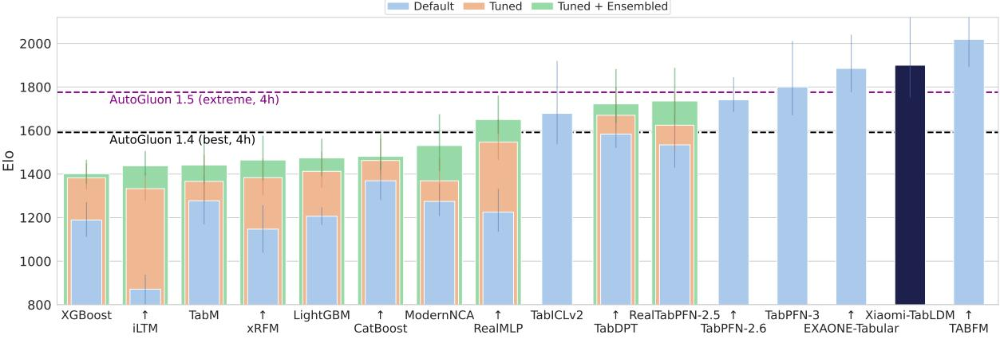  
Figure 1. Regression Elo performance on TabArena (higher is better). Xiaomi-TabLDM ranks 2nd among all evaluated methods

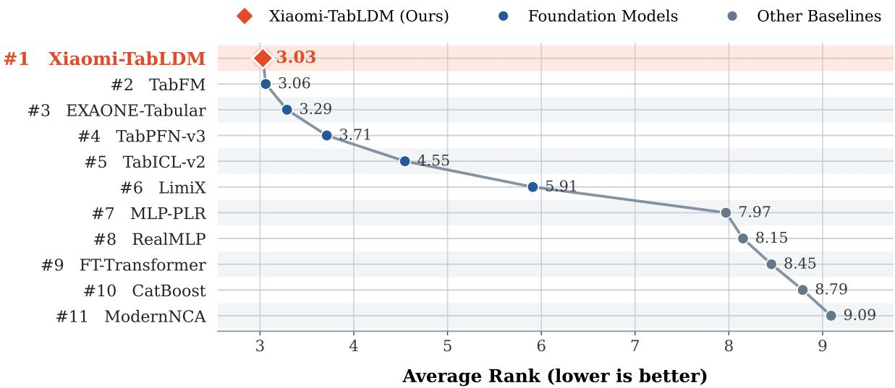

Figure 2. Average-rank comparison on OpenML-CTR23 over 33 regression datasets (lower is better). Xiaomi-TabLDM achieves the best average rank among all evaluated methods.  
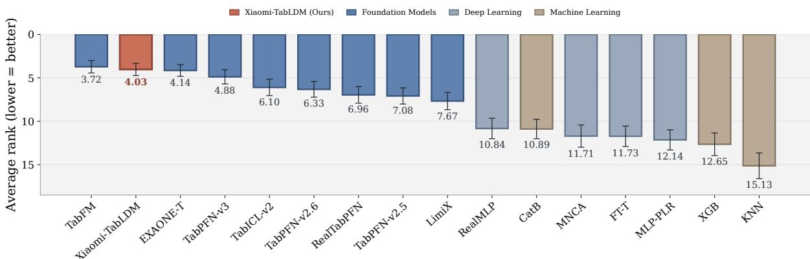  
Figure 3. Regression average-rank performance on TALENT (lower is better). Xiaomi-TabLDM ranks 2nd among all evaluated methods.

## 1 Introduction

Structured data is a foundational modality for scientific analysis and operational decision-making across a wide range of domains, including healthcare, finance, logistics, manufacturing, and public policy [33, 20, 61, 38]. Unlike language or perceptual data, tabular data organizes heterogeneous variables under explicit schemas, preserving numerical scales, missingness patterns, categorical structure, and relationships between features that are essential for reliable prediction and quantitative reasoning. As a result, progress on structured-data modeling remains an important and distinct component of the broader development of general-purpose learning systems.

For decades, prediction on tabular data has been dominated by dataset-specific machine-learning pipelines, particularly gradient-boosted trees and automated ensembles such as XGBoost [10], LightGBM [35], CatBoost [50], and AutoGluon [15]. These methods remain strong and reliable, and extensive empirical studies have shown that boosted trees remain highly competitive with neural networks across diverse tabular problems [43].

Meanwhile, deep learning for tabular data has explored a wide range of architectures, including attentionbased models such as TabNet [2], AutoInt [54], TabTransformer [31], and SAINT [53]; neural decision and feature-interaction models such as NODE [48], DANets [7], DCN-v2 [57], and T2G-Former [59]; and more recent approaches including TANGOS [32], TabCaps [6], Trompt [9], ExcelFormer [8], TabR [24], DNNR [44], and SwitchTab [58]. Despite substantial advances in representation learning, most of these methods still follow the conventional paradigm of training and tuning a separate model for each dataset. Recent surveys have further highlighted the growing interest in adapting large pretrained models and foundation-model paradigms to structured and tabular data [17]. Tabular foundation models [55] provide a diferent route: a single pretrained model learns across a large distribution of synthetic or real tabular tasks and directly performs prediction on unseen datasets through in-context learning, using labeled examples from the target dataset as context rather than retraining model parameters.

TabPFN established this paradigm by showing that a transformer pretrained over synthetic tabular tasks can perform strong prediction in a single forward pass [28]. Subsequent generations have steadily expanded its practical scope. TabPFN v2 [29] improved robustness to larger datasets and heterogeneous feature types, while TabPFN-2.5 [25] further increased the supported number of rows and features and narrowed the gap with heavily tuned machine-learning ensembles. In parallel, TabICL [51], TabDPT [42], LimiX [63], TabFM [37], EXAONE-Tabular [13] and related approaches have explored larger model capacity, broader training distributions, alternative architectures, and scaling to increasingly diverse tabular settings. Together, these developments have shifted tabular prediction from training a specialized model for each dataset toward building reusable pretrained predictors that transfer across datasets and tasks.

Recent progress in tabular foundation models has increasingly come from jointly scaling training data, model capacity, and inference strategies [26, 52]. Following this direction, we explore a broader synthetic prior, more eficient model scaling, and test-time computation within a unified tabular foundation model. We introduce Xiaomi-TabLDM, a new tabular foundation model that follows and extends this direction. Xiaomi-TabLDM is designed to provide more flexible context utilization while eficiently scaling model capacity. Rather than relying on a single fixed representation pathway, the model learns complementary feature interactions across diferent granularities and selectively preserves useful information across layers. Sparse expert computation further expands total model capacity while keeping the amount of activated computation limited. Together, these components allow Xiaomi-TabLDM to improve predictive capability without requiring a proportional increase in inference cost.

Across four public benchmark suites, including TALENT [41], TabArena [16], BCCO [63], and OpenML-CTR23 [19], Xiaomi-TabLDM consistently achieves strong performance across diverse classification and regression tasks. Its strongest and most consistent results are observed on regression: Xiaomi-TabLDM ranks first on OpenML-CTR23 and second on regression across TALENT, TabArena, and BCCO. In particular, on OpenML-CTR23, a benchmark dedicated exclusively to tabular regression, Xiaomi-TabLDM achieves the best average rank among all evaluated methods. On TabArena, Xiaomi-TabLDM achieves the second-highest regression Elo, outperforming strong recent tabular foundation models including TabPFN-3, TabPFN-2.6, and TabICL-v2.

Beyond regression, Xiaomi-TabLDM also remains highly competitive across mixed-task evaluations. On TALENT, it ranks second overall and achieves the best performance on binary classification. On TabArena, it ranks fourth overall across 51 datasets and 816 tasks, while on BCCO it maintains top-tier aggregate performance across classification and regression settings.

Beyond predictive performance, Xiaomi-TabLDM provides a favorable performance–eficiency trade-of. On TabArena regression, Xiaomi-TabLDM achieves the second-highest Elo while requiring 82% less training time and 68% less prediction time than TabFM. At a model scale comparable to TabPFN-3, Xiaomi-TabLDM also achieves stronger predictive performance, with particularly pronounced gains on regression. These results show that Xiaomi-TabLDM combines consistently strong regression performance with competitive overall performance and eficient model scaling.

## 2 Overall Framework

Xiaomi-TabLDM takes a tabular dataset as input and predicts test targets by conditioning on labeled training examples as in-context demonstrations, without task-specific training. Its design centers on three components: large-scale synthetic pretraining, an eficient architecture that combines flexible context utilization with sparse expert specialization, and test-time compute scaling.

## 2.1 Architecture

The full architecture of Xiaomi-TabLDM is shown in Figure 4. Xiaomi-TabLDM is a transformer-based [56] in-context learning (ICL) model that processes a table through three sequential stages: column-wise feature embedding, row-wise aggregation, and in-context learning prediction.

• Column-wise feature embedding. We first organize the input features into a dual-stream feature grouping, which breaks feature symmetries and yields column representations that are more flexible and robust to feature permutation. Each grouped column is then encoded independently by a Set Transformer [39], whose inducing-point attention summarizes it through a small set of learned inducing tokens instead of attending across all rows, producing the final column embeddings.

• Row-wise feature aggregation. For each row, the per-column embeddings are prepended with a set of learnable CLS tokens and processed by a stack of self-attention layers. Within these layers, we introduce lightweight Attention Residual (AttnRes) connections in place of the plain additive residual, where the outputs of the preceding residual blocks are adaptively fused to improve gradient flow and representation reuse across depth. Finally, the CLS tokens query the full sequence, and their concatenated states form one fixed-length vector per row.

• In-context learning prediction. The row embeddings for the training and test sets are jointly passed to a transformer that performs ICL: training rows attend to one another to model intra-set structure, while test rows attend only to the training rows to form their predictions. The same lightweight AttnRes connections are retained here, and the feed-forward sub-layer of selected layers is replaced with a sparse Mixture-of-Experts, strengthening the model’s ability to adapt to heterogeneous datasets.

In the Column-wise feature embedding and In-context learning prediction stages, attention uses the query-aware scalable softmax (QASSMax)[52], which rescales queries by input length to improve length generalization to large training sets. Further stage-specific technical details of Xiaomi-TabLDM’s design are presented below:

• Dual-stream feature grouping. Xiaomi-TabLDM groups each column with two other columns selected by circular shifts over the m feature columns and encodes the triple with a shared linear layer $\mathrm { L i n e a r } ( \mathbb { R } ^ { 3 } \to \mathbb { R } ^ { d } )$ . Given an ofset set $\boldsymbol { S } = ( \delta _ { 1 } , \delta _ { 2 } , \delta _ { 3 } )$ , the embedding of column $j$ is

$$
E [ i , j ] = \operatorname { L i n e a r } \left( x _ { i , ( j + \delta _ { 1 } ) \mathrm { ~ m o d ~ } m } , x _ { i , ( j + \delta _ { 2 } ) \mathrm { ~ m o d ~ } m } , x _ { i , ( j + \delta _ { 3 } ) \mathrm { ~ m o d ~ } m } \right)\tag{1}
$$

Xiaomi-TabLDM runs two such streams that difer only in S. The first stream follows TabICLv2[52] with fixed dyadic ofsets (1, 2, 4), while the second uses width-adaptive ofsets spread geometrically toward a target span $s , ( 1 , \lfloor { \sqrt { s } } \rfloor , s )$ with $s = \operatorname* { m i n } ( s _ { \mathrm { m a x } } , m - 1 )$ , so it stretches as wide as the table allows without wrapping past it. When the table has few columns, distinct ofsets can map to the same column modulo m. Such collisions are resolved by shifting one ofset so that the three grouped columns stay distinct and the two streams remain complementary. The resulting embeddings from the two streams are then summed to form the column-wise input embedding.

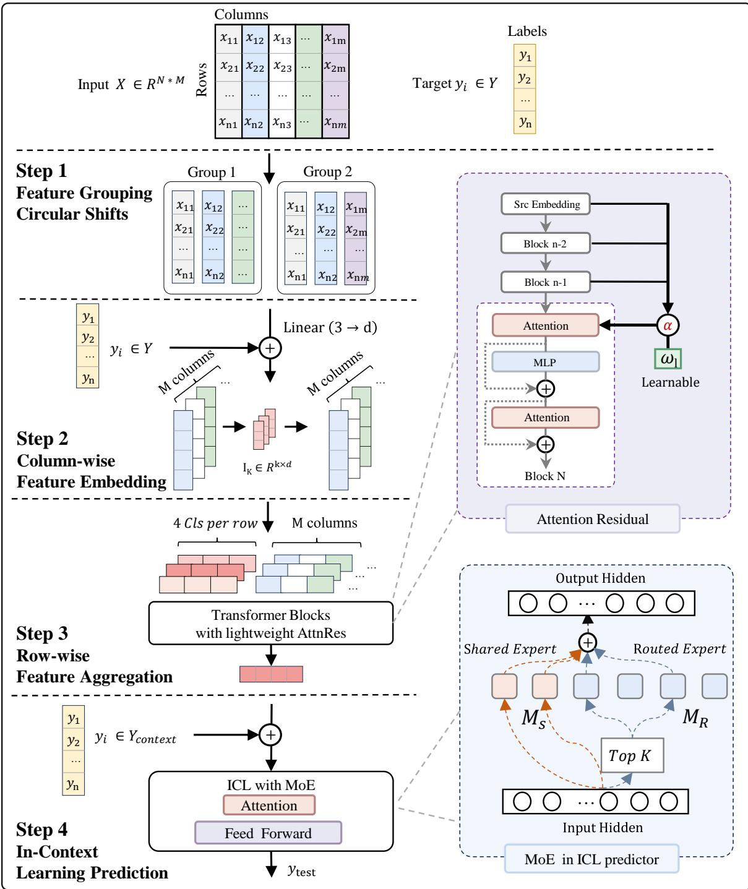  
Figure 4. Overall architecture of Xiaomi-TabLDM, which introduces an ICL architecture with a dual-stream feature grouping scheme, lightweight Attention Residual connections, and a sparse Mixture-of-Experts (MoE) design, where a router activates the top-K of $M _ { R }$ routed experts per token together with $M _ { S }$ shared experts.

• Lightweight AttnRes connections. We introduce a lightweight inter-layer connection that improves how information propagates across depth, inspired by Block AttnRes [36]. A standard residual connection feeds each layer only the previous output, aggregating all earlier outputs with fixed, uniform weights. The lightweight AttnRes replaces this fixed sum with learned, input-dependent weights, letting each layer selectively retrieve the earlier representations it needs. For eficiency, the layers are partitioned into blocks and the mechanism is applied only at a fixed stride in depth, so a layer attends over the completed block representations rather than every prior layer. At layer l, a learnable pseudo-query w scores each candidate block, and a softmax over depth turns these scores into the aggregation weights:

$$
\alpha _ { j } ^ { l } = \frac { \exp \left( w _ { l } ^ { \top } \mathrm { R M S N o r m } ( b _ { j } ) \right) } { \sum _ { i = 0 } ^ { l - 1 } \exp \left( w _ { l } ^ { \top } \mathrm { R M S N o r m } ( b _ { i } ) \right) }\tag{2}
$$

This gives selected layers learned access to both shallow and deep features, improving gradient flow and stabilizing training.

• Sparse Mixture-of-Experts. We redesign the ICL predictor by replacing the feed-forward network of selected layers with a sparse Mixture-of-Experts (MoE)[11, 40] that scales capacity for greater representational flexibility. For each row token, a linear router scores the $M _ { R }$ routed experts and a top-K operator activates the K highest-scoring ones, whose outputs are combined with those of $M _ { S }$ shared experts applied to every token. Since only K experts are activated per token, the parameter count scales with $M _ { R }$ while the per-token cost stays proportional to K feed-forward layers, independent of $M _ { R }$ . The shared experts learn the common transformation reused across all tokens, so that the routed experts, rather than redundantly relearning it, can devote their capacity to specialization.

## 2.2 Pretraining

We pretrain classification and regression models separately on synthetically generated tabular datasets, using a three-stage curriculum that progressively scales the dataset size. The classifier is trained with a cross-entropy loss and the regressor with a pinball loss over 999 quantiles.

• Stage 1. 500K steps for classification and 300K for regression, on datasets of 1,024 samples with 30–90% used for training, a maximum learning rate of 8e-4, and gradient clipping at 10. This stage uses the default feed-forward blocks. Enabling AttnRes stabilizes convergence and accounts for the shorter regression schedule; without it, the model collapses at an earlier step on large datasets (roughly beyond 1,200 samples).

• Stage 2. 40K steps on datasets of 400–10,240 samples (log-uniform), ∼ 80% used for training, a maximum learning rate of 1e-4, and gradient clipping at 10. MoE and its auxiliary losses are enabled from this stage on.

• Stage 3. 10K steps on datasets of 400–60,000 samples (log-uniform), ∼ 80% used for training, a maximum learning rate of 2e-5, and gradient clipping at 1, adapting the model to long-context, large-sample inference.

Optimizer and pre-training cost. We train with the Muon optimizer[34] based on the implementation of TabICLv2[52], together with a cosine learning-rate schedule and a weight decay of 0.01. Pre-training runs on 8 A100 GPUs (80 GB): around 7–10 days for Stage 1, and 2 days each for Stage 2 and Stage 3, with FlashAttention-2[12] enabled from Stage 2 onward.

## 2.3 Synthetic Prior

Following previous tabular foundation models [28, 51], Xiaomi-TabLDM is pretrained entirely on synthetic datasets generated from a structural causal model (SCM) prior [46, 47]. The prior is designed to maximize the diversity of dataset structures, variable types, and functional relationships while retaining learnable predictive signals [64]. Figure 5 summarizes the complete generation pipeline.

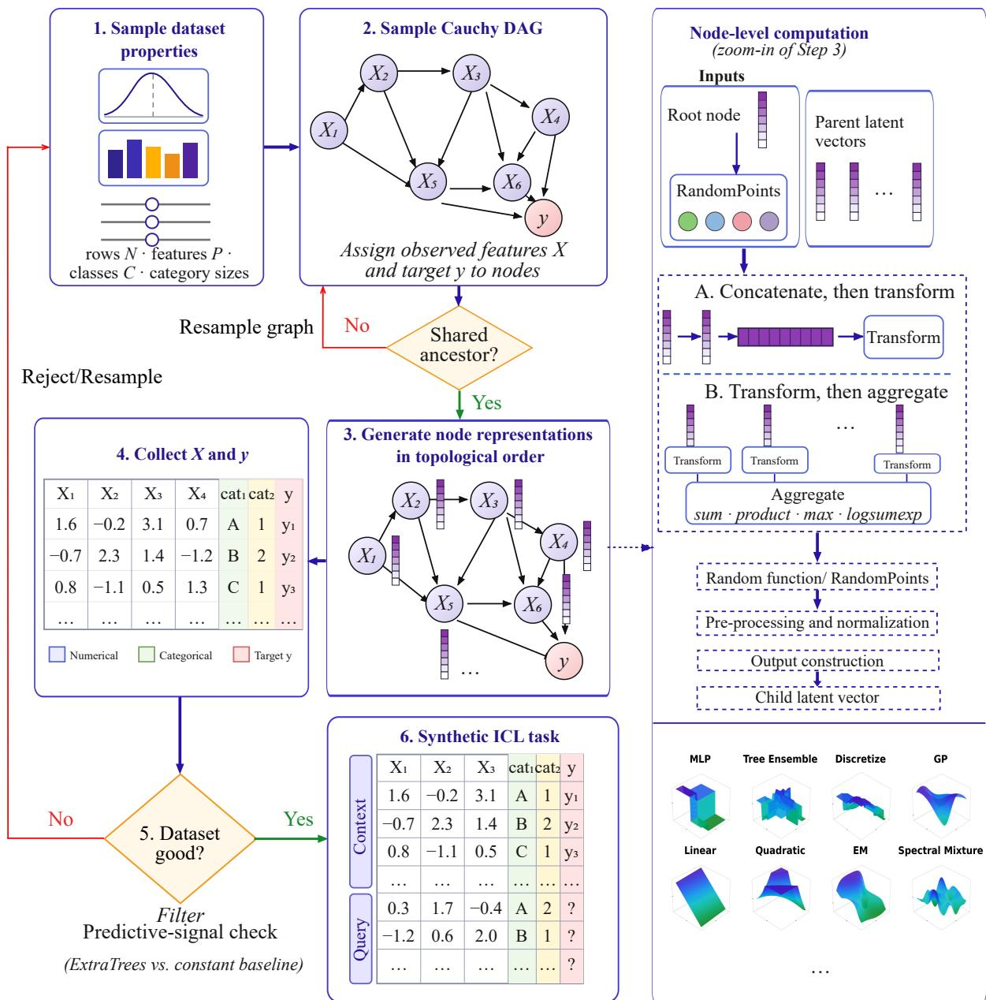  
Figure 5. Schematic overview of the synthetic data generation prior. The dataset-level pipeline samples dataset properties and a Cauchy DAG, checks whether the selected features and target share an ancestor, generates node representations in topological order, and collects the resulting tabular data. Datasets passing the predictive-signal check are split into context and query sets to form synthetic in-context learning tasks. The right panel details the node-level computation and the 12 random-function classes used by the prior.

We organize its main components into the following four stages:

1. Dataset configuration. We first sample the global properties of each task, including its size, numerical and categorical feature counts, categorical cardinalities, target type, and context–query split.

2. Graph-based data generation. We sample a directed acyclic graph using the random Cauchy graph mechanism of TabICL-v2 [52]. Latent representations are propagated through the graph in topological order using the node computations illustrated in the middle row of Figure 5, with additional Gaussian noise injected to increase data diversity and robustness. We also add additional transformation functions to broaden the range of smoothness, sparsity, additivity, and local structure represented by the prior.

3. Tabular data construction. We assign the observed features and target to sampled graph nodes and collect their values after evaluating the graph. Numerical features and regression targets are obtained from continuous latent dimensions, whereas categorical features and classification targets are produced through discretization or categorical sampling. As illustrated in Figure 5, only selected dimensions are observed. The remaining dimensions introduce latent variation. Random scaling further varies the relative importance of features and graph nodes across tasks.

4. Postprocessing and quality filtering. We standardize and randomly permute the resulting tables before removing invalid or uninformative tasks. A graph is resampled when the features and target share no common ancestor. We also reject tasks for which an ExtraTrees model [22] cannot reliably outperform a constant predictor. Finally, we divide each retained dataset into context and query samples for in-context pretraining.

Together, these stages generate diverse classification and regression tasks by varying dataset configurations, dependency structures, functional relationships, and observed feature types.

## 3 Test-Time Scaling

Test-time scaling improves predictive performance by allocating additional inference-time computation while keeping the pretrained model fixed. Recent tabular foundation models have implemented this idea by aggregating predictions across multiple estimators, dataset permutations, and feature transformations [26, 52]. TabFM further combines predictions generated from SVD and cross-feature representations using nonnegative least squares [37]. Building on these approaches, we introduce a context-adaptive framework that enhances inference based on the given context. This allows the inference pipeline to adapt to heterogeneous datasets without updating the pretrained model.

Our test-time scaling strategy consists of the following components:

1. Feature shufling and sampling. Each ensemble member uses a randomly shufled feature order and randomly samples a subset of features for training and inference. This reduces sensitivity to column ordering and specific feature combinations, creates prediction diversity at negligible additional cost, and enhances robustness in high-dimensional scenarios.

2. Diverse preprocessing views. We construct complementary views through diferent normalization schemes, quantile transformation, SVD-based representations, and feature interactions. For regression, we additionally consider target transformations for heavy-tailed outcomes.

3. NNLS-based combination. For both classification and regression, we learn nonnegative weights for the estimators corresponding to the retained inference modes. For large datasets, we use predictions on this single holdout set to estimate the weights. Otherwise, we generate out-of-fold predictions through K-fold cross-validation to obtain a larger and more stable sample for weight estimation. We then fit nonnegative least squares to one-hot labels for classification or continuous targets for regression and use the resulting weights to combine the candidate inference views.

4. Final classification adjustment. The combined class probabilities can be calibrated on validation data to improve probabilistic prediction quality. Final class labels are then obtained by taking the class with the largest adjusted probability.

Overall, the procedure scales inference by increasing the diversity and number of evaluated prediction paths, rather than by modifying the underlying model. The NNLS-based combination step efectively exploits complementary predictions among the diverse inference views, allowing the method to flexibly adapt to heterogeneous datasets. Thus, the approach uses additional test-time computation selectively, harnessing the benefits of ensemble diversity while mitigating the risk of overfitting through the nonnegative constraint on combination weights.

## 4 Evaluation

In this section, we evaluate Xiaomi-TabLDM on four public tabular learning benchmarks, TALENT [41], TabArena [16], BCCO [63], and OpenML-CTR23 [19], covering a broad range of real-world classification and regression tasks.

Table 1 summarizes the benchmark collections used in our evaluation, covering four benchmark suites with complementary task types and dataset scales. TALENT is the largest collection, containing 300 datasets, including 200 classification and 100 regression tasks, while BCCO contains 156 datasets with a similar mixture of classification and regression problems. TabArena provides 51 datasets spanning both task types. In addition, OpenML-CTR23 focuses exclusively on regression. Across these benchmarks, most datasets contain fewer than 10K training examples, with a smaller portion ranging from 10K to 100K; TALENT additionally includes several datasets with more than 100K training instances.

In Section 4.1, we evaluate Xiaomi-TabLDM on TALENT, reporting regression, overall, and binaryclassification performance. In Section 4.2, we report the overall and regression results on TabArena and further analyze performance–eficiency trade-ofs and pairwise model comparisons. We further evaluate Xiaomi-TabLDM on BCCO and OpenML-CTR23 in Sections 4.3 and 4.4, respectively.

Table 1. Statistics of the benchmark suites considered in our evaluation. We report the total number of datasets, task-type composition, classification-task breakdown, and dataset-size distribution for each benchmark collection.
<table><tr><td rowspan="2">Benchmark</td><td rowspan="2"># Datasets</td><td colspan="2">Task Type</td><td colspan="2">Classification Type</td><td colspan="3">Training Set Size</td></tr><tr><td>Cls.</td><td>Reg.</td><td>Binary</td><td>Multiclass</td><td>&lt; 10K</td><td>10K-100K</td><td>&gt; 100K</td></tr><tr><td>TALENT</td><td>300</td><td>200</td><td>100</td><td>120</td><td>80</td><td>218</td><td>78</td><td>4</td></tr><tr><td>BCCO</td><td>156</td><td>106</td><td>50</td><td>71</td><td>35</td><td>128</td><td>28</td><td>–</td></tr><tr><td>TabArena</td><td>51</td><td>38</td><td>13</td><td>30</td><td>8</td><td>36</td><td>15</td><td></td></tr><tr><td>OpenML-CTR23</td><td>33</td><td>-</td><td>33</td><td>-</td><td>-</td><td>23</td><td>10</td><td>=</td></tr></table>

## 4.1 TALENT

TALENT [41] is a unified benchmark and toolbox for evaluating tabular learning methods under consistent preprocessing, hyperparameter tuning, and evaluation protocols. Its benchmark suite contains 300 datasets spanning 120 binary classification, 80 multiclass classification, and 100 regression tasks, covering diverse dataset sizes and application domains. TALENT includes a broad range of classical machine-learning, tree-based, deep tabular, and recent foundation-model approaches, providing a complementary evaluation setting to TabArena for assessing model performance across diferent types of tabular prediction tasks.

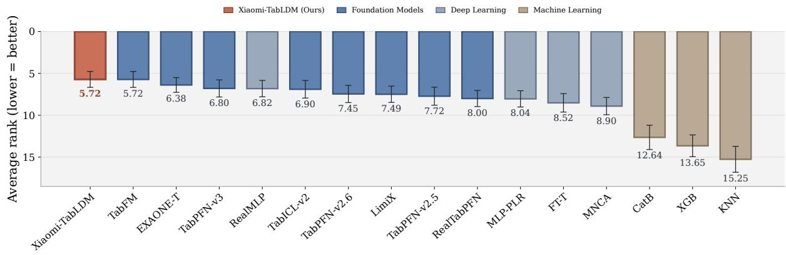

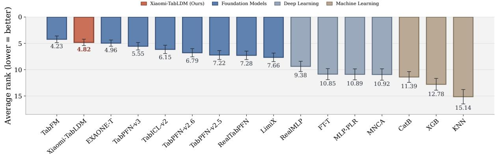  
Figure 6. Performance on the TALENT benchmark following the TabICLv2 evaluation protocol [52]. For methods with missing results on a subset of datasets, the corresponding score entries are imputed using K-nearest-neighbour values following the evaluation protocol. The top panel reports binary-classification performance, while the bottom panel reports overall performance across task types. Results are measured by average rank across datasets (lower is better); error bars indicate 95% bootstrap confidence intervals.

## 4.1.1 Main Results

Regression performance. Xiaomi-TabLDM performs particularly strongly on regression, achieving an average rank of 4.03 across 100 regression datasets and ranking second among all evaluated methods, behind only TabFM (3.72). It outperforms other strong tabular foundation models, including EXAONE-Tabular (4.15), TabPFN-v3 (4.88), TabICL-v2 (6.10), and TabPFN-v2.6 (6.33). Together with its strong results on other regression benchmarks, this demonstrates the consistent regression capability of Xiaomi-TabLDM across diverse tabular datasets.

Overall performance. As shown in Figure 6 (bottom), Xiaomi-TabLDM achieves an average rank of 4.82, ranking second overall, behind only TabFM (4.23). It outperforms other recent tabular foundation models, including EXAONE-Tabular (4.96), TabPFN-v3 (5.55), TabICL-v2 (6.15), and TabPFN-v2.6 (6.79). These results show that the strong regression performance of Xiaomi-TabLDM extends to competitive performance across the broader range of tabular tasks covered by TALENT.

Classification. As shown in Figure 6 (top), Xiaomi-TabLDM also performs strongly on binary classification, achieving an average rank of 5.72 and tying with TabFM for the best performance among all evaluated methods. It further outperforms EXAONE-Tabular (6.38), TabPFN-v3 (6.80), and TabICL-v2 (6.90).

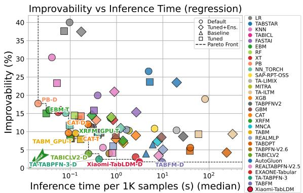  
(a) Inference-eficiency and improvability trade-ofs on regression tasks. Improvability measures how much worse a model is than the best per-dataset model. See § 4.2 for more details.

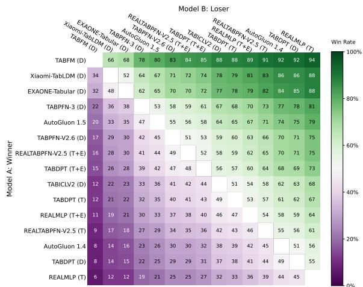  
(b) Pairwise win-rate matrix on the TabArena regression subset. Each entry (i, j) reports the proportion of regression instances on which model i outperforms model j. Diagonal entries denote self-comparison (50% by definition).  
Figure 7. Regression task performance analysis: (left) eficiency-improvability trade-ofs; (right) pairwise model comparisons.

## 4.2 TabArena

We also evaluate Xiaomi-TabLDM on TabArena [16], consisting of 51 datasets and 816 complete tasks, including 38 classification datasets and 13 regression datasets. We use Elo as the primary evaluation metric and additionally report the number of dataset wins, improvability, and training and prediction time. We report both overall and regression performance, and further analyze performance–eficiency trade-ofs and pairwise model comparisons.

Our primary comparisons include leading gradient-boosted tree frameworks, including XGBoost [10], CatBoost [50], and LightGBM [35], as well as strong recent tabular foundation models, including TabICLv2 [52], TabPFN [28], TabPFN-3 [26], RealTabPFN [21], and TabFM [37]. We also compare against AutoGluon [15] as a strong AutoML baseline.

## 4.2.1 Main Results

Regression. On the 13 regression datasets, as shown in Table 2, Xiaomi-TabLDM achieves an Elo score of 1900, ranking second among all evaluated methods by Elo point estimate, behind only TabFM (2019). It outperforms other strong tabular foundation models, including EXAONE-Tabular (1885), TabPFN-3 (1800), TabPFN-2.6 (1741), and TabICLv2 (1679), as well as the heavily tuned AutoGluon 1.5 extreme configuration (1776).

Beyond Elo, Xiaomi-TabLDM achieves 1.8 dataset wins and the second-lowest improvability of 1.7%, only marginally behind TabFM (1.6%). The pairwise win-rate matrix in Figure 7(b) provides a complementary view: Xiaomi-TabLDM wins 67% of pairwise comparisons against AutoGluon 1.5 and 78% against TabICLv2. Together, these results demonstrate strong and consistent regression performance across the TabArena benchmark.

Table 2. Performance on the regression subset of TabArena, covering 13 datasets. We compare models in terms of Elo, number of wins, improvability, and training and prediction time. Here D denotes the default (untuned) model, T the fine-tuned model, and T+E ensembling after fine-tuning. Xiaomi-TabLDM achieves the second-highest Elo while maintaining substantially lower computational cost than most tuned and ensembled baselines.
<table><tr><td>Model</td><td>Elo (↑)</td><td>#wins (↑)</td><td>Improva- bility (↓)</td><td>Train time per 1K [s]</td><td>Predict time per 1K [s]</td></tr><tr><td>TABFM (D)</td><td>2019-127,+181</td><td>3.7</td><td>1.6%</td><td>38.85</td><td>9.67</td></tr><tr><td>Xiaomi-TabLDM (D)</td><td>1900-148,+278</td><td>1.8</td><td>1.7%</td><td>6.99</td><td>3.12</td></tr><tr><td>EXAONE-Tabular (D)</td><td>1885-110,+155</td><td>1.5</td><td>3.0%</td><td>13.71</td><td>2.58</td></tr><tr><td>TabPFN-3 (D)</td><td>1800-131,+211</td><td>0.9</td><td>2.4%</td><td>3.87</td><td>0.42</td></tr><tr><td>AutoGluon 1.5 (extreme, 4h)</td><td>1776-96,+137</td><td>1.3</td><td>3.9%</td><td>335.03</td><td>4.33</td></tr><tr><td>TabPFN-2.6 (D)</td><td>1741-56,+104</td><td>0.1</td><td>4.0%</td><td>8.52</td><td>0.70</td></tr><tr><td>RealTabPFN-2.5 (T+E)</td><td>1736-103,+153</td><td>0.2</td><td>3.4%</td><td>1709.05</td><td>8.12</td></tr><tr><td>TabDPT (T+E)</td><td>1722-90,+160</td><td>1.5</td><td>4.3%</td><td>4786.60</td><td>239.30</td></tr><tr><td>TabICLv2 (D)</td><td>1679-142,+242</td><td>0.5</td><td>4.0%</td><td>2.10</td><td>0.25</td></tr><tr><td>TabDPT (T)</td><td>1670-73,+128</td><td>0.0</td><td>4.7%</td><td>4786.60</td><td>38.50</td></tr><tr><td>RealMLP (T+E)</td><td>1650-67,+111</td><td>0.1</td><td>5.1%</td><td>3995.01</td><td>10.05</td></tr><tr><td>RealTabPFN-2.5 (T)</td><td>1624-117,+154</td><td>0.2</td><td>4.1%</td><td>1709.05</td><td>0.81</td></tr><tr><td>AutoGluon 1.4 (best, 4h)</td><td>1592-90,+117</td><td>0.0</td><td>6.4%</td><td>1866.35</td><td>6.07</td></tr><tr><td>TabDPT (D)</td><td>1584-64,+137</td><td>0.0</td><td>5.6%</td><td>46.62</td><td>39.21</td></tr><tr><td>RealMLP (T)</td><td>1547-82,+105</td><td>0.0</td><td>6.0%</td><td>3995.01</td><td>0.84</td></tr><tr><td>RealTabPFN-2.5 (D)</td><td>1534-106,+141</td><td>0.0</td><td>5.6%</td><td>7.04</td><td>0.51</td></tr><tr><td>ModernNCA (T+E)</td><td>1531-118,+145</td><td>0.6</td><td>7.3%</td><td>3779.70</td><td>7.69</td></tr><tr><td>CatBoost (T+E)</td><td>1482-65,+103</td><td>0.0</td><td>8.0%</td><td>3555.27</td><td>0.96</td></tr><tr><td>LightGBM (T+E)</td><td>1474-83,+89</td><td>0.0</td><td>8.4%</td><td>700.19</td><td>9.32</td></tr><tr><td>xRFM (T+E)</td><td>1464–95,+112</td><td>0.0</td><td>7.5%</td><td>714.50</td><td>1.38</td></tr><tr><td>TabM (T+E)</td><td>1442-85,+130</td><td>0.0</td><td>6.9%</td><td>4160.58</td><td>1.41</td></tr><tr><td>XGBoost (T+E)</td><td>1402-47,+64</td><td>0.0</td><td>9.0%</td><td>834.93</td><td>2.61</td></tr><tr><td>CatBoost (D)</td><td>1369-89,+93</td><td>0.0</td><td>9.7%</td><td>10.89</td><td>0.09</td></tr><tr><td>ModernNCA (D)</td><td>1274-68,+81</td><td>0.0</td><td>10.8%</td><td>15.50</td><td>0.30</td></tr><tr><td>LimiX (D)</td><td>1246-154,+167</td><td>0.1</td><td>10.4%</td><td>74.68</td><td>19.76</td></tr><tr><td>RealMLP (D)</td><td>1226-91,+107</td><td>0.0</td><td>10.5%</td><td>8.90</td><td>1.64</td></tr><tr><td>LightGBM (D)</td><td>1206-41,+41</td><td>0.0</td><td>11.4%</td><td>2.11</td><td>0.27</td></tr><tr><td>XGBoost (D)</td><td>1189-77,+83</td><td>0.0</td><td>12.0%</td><td>2.24</td><td>0.24</td></tr><tr><td>TabPFNv2 (D)</td><td>1184-143,+133</td><td>0.0</td><td>11.1%</td><td>2.80</td><td>0.31</td></tr><tr><td>RandomForest (T+E)</td><td>1162–61,+62</td><td>0.0</td><td>14.0%</td><td>515.75</td><td>0.77</td></tr><tr><td>xRFM (D)</td><td>1147-109,+110</td><td>0.0</td><td>13.8%</td><td>2.45</td><td>0.74</td></tr><tr><td>ExtraTrees (D)</td><td>1069-107,+94</td><td>0.0</td><td>15.3%</td><td>0.47</td><td>0.06</td></tr><tr><td>RandomForest (D)</td><td>1000-71,+44</td><td>0.0</td><td>15.9%</td><td>0.53</td><td>0.06</td></tr><tr><td>FastaiMLP (D)</td><td>864-160,+111</td><td>0.0</td><td>20.0%</td><td>2.60</td><td>0.39</td></tr><tr><td>KNN (D)</td><td>680-246,+170</td><td>0.0</td><td>30.4%</td><td>0.19</td><td>0.04</td></tr><tr><td>Linear (D)</td><td>295-413,+146</td><td>0.0</td><td>40.0%</td><td>0.95</td><td>0.10</td></tr></table>

Overall Performance. Across all 51 datasets and 816 tasks, as shown in Table 11, Xiaomi-TabLDM achieves an Elo score of 1659, ranking fourth by Elo point estimate. Its performance is nearly tied with AutoGluon 1.5 extreme (1662) and surpasses TabPFN-3 (1650), TabPFN-2.6 (1596), RealTabPFN-2.5 with tuning and ensembling (1579), and TabICLv2 (1576). Moreover, Xiaomi-TabLDM achieves 3.1 dataset wins, exceeding TabPFN-3 and other recent tabular foundation models except TabFM and EXAONE-Tabular.

The overall pairwise win-rate matrix in Figure 11 provides an additional view of its relative performance across the full benchmark. Together with its second-place result on regression, these results show that

Xiaomi-TabLDM remains highly competitive across diverse TabArena tasks, with regression emerging as its strongest regime.

## 4.2.2 Performance–Eficiency Trade-ofs

Figure 7(a) further examines the trade-of between regression performance and inference eficiency. Improvability (y-axis, lower is better) measures the relative performance gap to the best-performing method on each dataset, while the x-axis reports median inference time per 1K samples.

Xiaomi-TabLDM achieves an improvability of only 1.7% with an inference time of 3.12 s per 1K samples, placing it in the high-performance region of the trade-of space. Compared with TabFM, which achieves a slightly lower improvability of 1.6%, Xiaomi-TabLDM requires 68% less prediction time (3.12 s vs. 9.67 s). Table 2 further shows that Xiaomi-TabLDM requires 82% less training time (6.99 s vs. 38.85 s).

Compared with TabPFN-3 at a similar model scale, Xiaomi-TabLDM also achieves stronger regression performance, improving Elo from 1800 to 1900 and reducing improvability from 2.4% to 1.7%. Overall, these results show that Xiaomi-TabLDM achieves a favorable performance–eficiency trade-of, approaching the strongest regression performance on TabArena while requiring substantially less computation than TabFM.

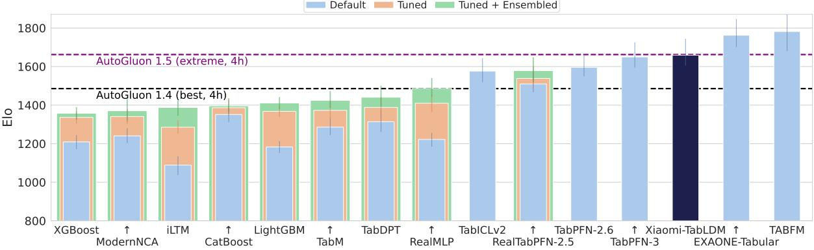  
Figure 8. Overall Elo performance on TabArena (higher is better).

## 4.3 BCCO

We further evaluate Xiaomi-TabLDM on the Balanced Comprehensive Challenging Omni-domain (BCCO) benchmark [63], which consists of two subsets, BCCO-CLS for classification and BCCO-REG for regression. BCCO is constructed from a broad collection of open-source structured datasets after extensive deduplication and cleaning, and is designed to cover heterogeneous real-world prediction settings. Compared with commonly used tabular benchmarks, BCCO contains greater variation in dataset characteristics, including sample size, feature dimensionality, number of classes, categorical-to-numerical feature ratio, sample-to-feature ratio, and missing-value rate. Notably, nearly one-third of the datasets contain missing values, making the benchmark particularly challenging for models that need to generalize across diverse data conditions.

In our evaluation, BCCO-CLS contains 106 classification datasets and BCCO-REG contains 50 regression datasets. The benchmark excludes extremely large datasets with more than 50,000 training samples, 10,000 features, or 10 target classes. Its broad coverage across dataset characteristics enables evaluation over a diverse range of task regimes rather than concentrating on a small subset of dataset types.

Table 3. BCCO mean-rank performance across regression, multiclass classification, and overall evaluations. Lower values are better. Numbers in parentheses denote the ranking position under each metric.
<table><tr><td rowspan="2">Model</td><td colspan="3">Reg</td><td colspan="3">Multi-Cls</td><td colspan="3">Overall</td></tr><tr><td>Accuracy↓</td><td>AUC ↓</td><td>LogLoss ↓</td><td>Accuracy ↓</td><td>AUC ↓</td><td>LogLoss ↓</td><td>Accuracy↓</td><td>AUC↓</td><td>LogLoss ↓</td></tr><tr><td>TabFM</td><td>2.680 (1)</td><td>2.680 (1)</td><td>2.680 (1)</td><td>2.871 (1)</td><td>2.571 (1)</td><td>2.286 (1)</td><td>3.694 (1)</td><td>3.095 (1)</td><td>3.064 (1)</td></tr><tr><td>Xiaomi-TabLDM</td><td>2.940 (2)</td><td>2.940 (2)</td><td>2.940 (2)</td><td>4.171 (2)</td><td>4.257 (4)</td><td>3.971 (2)</td><td>4.451 (3)</td><td>4.154 (3)</td><td>3.819 (3)</td></tr><tr><td>EXAONE-Tabular</td><td>3.400 (3)</td><td>3.400 (3)</td><td>3.400 (3)</td><td>4.757 (4)</td><td>4.186 (3)</td><td>4.086 (4)</td><td>4.436 (2)</td><td>3.731 (2)</td><td>3.625 (2)</td></tr><tr><td>TabPFN-v3</td><td>3.560 (4)</td><td>3.560 (4)</td><td>3.560 (4)</td><td>5.129 (5)</td><td>4.343 (5)</td><td>4.629 (5)</td><td>4.999 (4)</td><td>4.521 (4)</td><td>4.407 (4)</td></tr><tr><td>TabICL-v2</td><td>4.780 (5)</td><td>4.780 (5)</td><td>4.780 (5)</td><td>4.329 (3)</td><td>4.114 (2)</td><td>4.029 (3)</td><td>5.336 (5)</td><td>4.805 (5)</td><td>4.744 (5)</td></tr><tr><td>LimiX</td><td>6.500 (6)</td><td>6.500 (6)</td><td>6.500 (6)</td><td>5.143 (6)</td><td>5.514 (6)</td><td>5.057 (6)</td><td>6.321 (6)</td><td>6.071 (6)</td><td>5.915 (6)</td></tr><tr><td>RealMLP</td><td>8.330 (7)</td><td>8.330 (7)</td><td>8.330 (7)</td><td>9.614 (10)</td><td>10.029 (12)</td><td>9.714 (11)</td><td>7.229 (7)</td><td>8.623 (8)</td><td>8.481 (8)</td></tr><tr><td>CatBoost</td><td>8.960 (8)</td><td>8.960 (8)</td><td>8.960 (8)</td><td>8.800 (8)</td><td>9.000 (9)</td><td>8.229 (7)</td><td>9.400 (11)</td><td>8.591 (7)</td><td>8.249 (7)</td></tr><tr><td>FT-Transformer</td><td>9.030 (9)</td><td>9.030 (9)</td><td>9.030 (9)</td><td>9.257 (9)</td><td>8.943 (8)</td><td>8.886 (10)</td><td>8.121 (8)</td><td>8.815 (9)</td><td>8.555 (9)</td></tr><tr><td>MLP-PLR</td><td>9.640 (10)</td><td>9.640 (10)</td><td>9.640 (10)</td><td>9.700 (11)</td><td>9.986 (11)</td><td>10.171 (12)</td><td>8.346 (10)</td><td>9.414 (11)</td><td>9.509 (11)</td></tr><tr><td>ModernNCA</td><td>9.840 (11)</td><td>9.840 (11)</td><td>9.840 (11)</td><td>8.657 (7)</td><td>8.343 (7)</td><td>8.657 (8)</td><td>8.220 (9)</td><td>9.109 (10)</td><td>9.245 (10)</td></tr><tr><td>LightGBM</td><td>10.920 (12)</td><td>10.920 (12)</td><td>)10.920 (12)</td><td>10.400 (13)</td><td>10.971 (13)</td><td>12.543 (13)</td><td>10.602 (12)</td><td>10.646 (13)</td><td>11.918 (13)</td></tr><tr><td>XGBoost</td><td>11.120 (13)</td><td>11.120 (13) 11.120 (13)</td><td></td><td>10.229 (12)</td><td>9.657 (10)</td><td>8.800 (9)</td><td>10.933 (13)</td><td>10.400 (12)</td><td>9.961 (12)</td></tr><tr><td>KNN</td><td>13.300 (14)</td><td>13.300 (14) 13.300 (14)</td><td></td><td>11.943 (14)</td><td>13.086 (14) 13.943 (14)</td><td></td><td>12.914 (14)</td><td></td><td>13.027 (14) 13.508 (14)</td></tr></table>

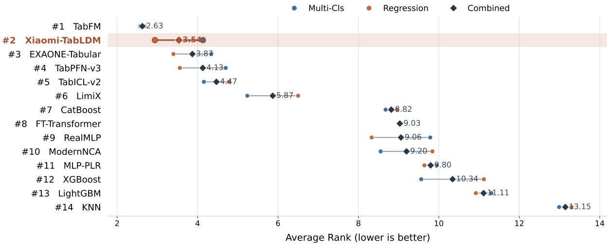  
Figure 9. Average-rank comparison on the BCCO benchmark. Circles denote the average ranks on BCCO-CLS and BCCO-REG, while diamonds denote the combined average rank across the two settings. Models are ordered by the combined average rank; lower is better.

Main Results. Table 3 reports the mean-rank performance on BCCO across regression, multiclass classification, and the overall evaluation. Xiaomi-TabLDM demonstrates particularly strong performance on regression, ranking second under all three metrics, with a mean rank of 2.940 for Accuracy, AUC, and LogLoss. It consistently outperforms other strong tabular foundation models, including EXAONE-Tabular, TabPFN-v3, TabICL-v2, and LimiX, and is surpassed only by TabFM.

On multiclass classification, Xiaomi-TabLDM remains highly competitive, ranking second under both

Accuracy (4.171) and LogLoss (3.971), while achieving fourth place under AUC (4.257). When aggregating across the full BCCO benchmark, Xiaomi-TabLDM consistently ranks third under Accuracy (4.451), AUC (4.154), and LogLoss (3.819). Overall, these results show that Xiaomi-TabLDM achieves robust top-tier performance across heterogeneous BCCO tasks, with a particularly clear advantage on regression while maintaining competitive performance on multiclass classification.

## 4.4 OpenML-CTR23

We further evaluate Xiaomi-TabLDM on the OpenML Curated Tabular Regression benchmarking suite 2023 (OpenML-CTR23), a benchmark specifically designed for tabular regression. The original suite contains 35 regression problems selected according to a set of strict curation criteria, providing a standardized and reliable testbed for comparing regression methods across diverse tabular datasets. In our experiments, we report results on 33 datasets and compare Xiaomi-TabLDM against both tabular foundation models and conventional learning baselines.

Main Results. Figure 2 reports the average-rank results on OpenML-CTR23 [19]. Xiaomi-TabLDM achieves the best average rank of 3.03, ranking first among all evaluated methods. It also consistently ranks ahead of other strong tabular foundation models, including TabPFN-v3 (3.71), TabICL-v2 (4.55), and LimiX (5.91). These results demonstrate the strong regression capability of Xiaomi-TabLDM and its ability to generalize consistently across the diverse tasks covered by OpenML-CTR23.

## 4.5 Embeddings.

Finally, we examine whether Xiaomi-TabLDM learns meaningful representations of tabular samples. We extract the row embeddings produced by Xiaomi-TabLDM and apply PCA to project them into two dimensions for visualization. Figure 10 compares PCA applied directly to the original input features with PCA applied to the learned embeddings across three representative datasets. While the original feature space exhibits relatively difuse and weakly organized structures, the embeddings learned by Xiaomi-TabLDM reveal substantially clearer low-dimensional organization, including coherent curved manifolds and more compact sample structures. This suggests that Xiaomi-TabLDM transforms heterogeneous tabular inputs into representations that better capture the underlying structure of the data.

As shown in Figure 10, Xiaomi-TabLDM learns structured row embeddings from tabular data. The upper plots show 2D PCA applied directly to the original features of three datasets, while the lower plots show PCA applied to the corresponding row embeddings produced by Xiaomi-TabLDM. The learned representations exhibit substantially clearer and more coherent low-dimensional structures than the original feature space.

## 5 Conclusion

In this report, we present Xiaomi-TabLDM, a tabular foundation model designed to achieve strong predictive performance while maintaining an eficient model and inference profile. Across four public benchmark suites covering diverse classification and regression tasks, Xiaomi-TabLDM consistently ranks among the strongest evaluated methods. Its performance is particularly strong on regression, where it achieves top-tier results across TALENT, TabArena, BCCO, and OpenML-CTR23, while remaining competitive across classification settings.

Beyond predictive accuracy, our evaluation also highlights a favorable performance–eficiency trade-of. At a model scale comparable to TabPFN-3, Xiaomi-TabLDM achieves stronger performance in several evaluation regimes, while requiring substantially less computational cost than larger or heavily tuned alternatives such as TabFM and AutoGluon in relevant comparisons. These results indicate that improving tabular foundation models does not necessarily require scaling model size or computational cost alone; efective architectural design and capacity allocation can provide another practical path toward stronger and more eficient tabular learning systems.

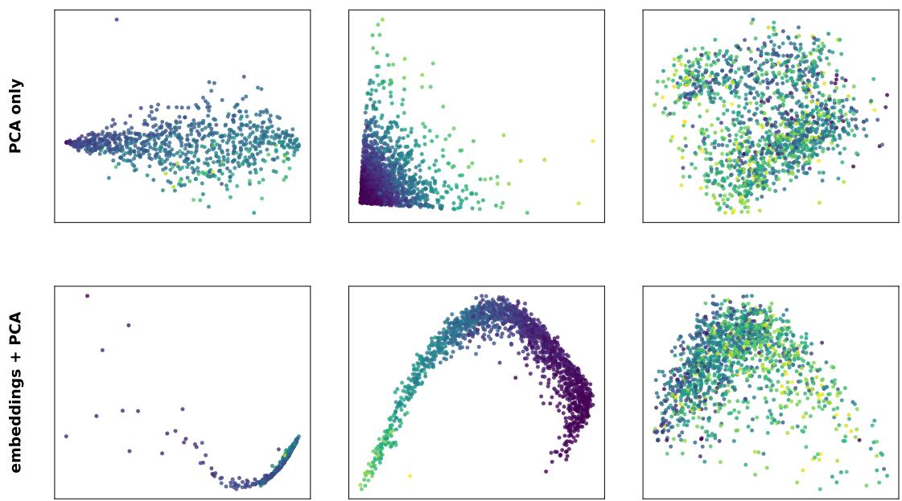  
Figure 10. PCA visualization of the representations learned by Xiaomi-TabLDM on three classification datasets. The top row presents projections of the original feature space, while the bottom row presents projections of the corresponding row embeddings extracted from Xiaomi-TabLDM. Points denote individual samples and colors denote class labels. Compared with the raw inputs, the learned embeddings exhibit more organized structures that better reflect the class distribution.

The results demonstrate that Xiaomi-TabLDM provides a competitive balance of predictive performance, model capacity, and computational eficiency across heterogeneous tabular tasks. We hope these findings provide a useful basis for further exploration of scalable and eficient foundation-model architectures for structured data.

## References

[1] Alan Arazi, Eilam Shapira, and Roi Reichart. TabSTAR: A tabular foundation model for tabular data with text fields. In Advances in Neural Information Processing Systems, volume 38, 2025.

[2] Sercan O. Arik and Tomas Pfister. TabNet: Attentive interpretable tabular learning. Proceedings of the AAAI Conference on Artificial Intelligence, 35(8):6679–6687, 2021.

[3] Daniel Beaglehole, David Holzmüller, Adityanarayanan Radhakrishnan, and Mikhail Belkin. xRFM: Accurate, scalable, and interpretable feature learning models for tabular data. In International Conference on Learning Representations, 2026.

[4] David Bonet, Marçal Comajoan Cara, Alvaro Calafell, Daniel Mas Montserrat, and Alexander G. Ioannidis. iLTM: Integrated large tabular model. In Proceedings of the 32nd ACM SIGKDD Conference on Knowledge Discovery and Data Mining, pages 186–197, 2026.

[5] Mohamed Bouadi, Pratinav Seth, Aditya Tanna, and Vinay Kumar Sankarapu. Orion-MSP: Multi-scale sparse attention for tabular in-context learning, 2025.

[6] Jintai Chen, Kuanlun Liao, Yanwen Fang, Danny Z. Chen, and Jian Wu. TabCaps: A capsule neural network for tabular data classification with BoW routing. In International Conference on Learning Representations, 2023.

[7] Jintai Chen, Kuanlun Liao, Yao Wan, Danny Z. Chen, and Jian Wu. DANets: Deep abstract networks for tabular data classification and regression. Proceedings of the AAAI Conference on Artificial Intelligence, 36(4):3930–3938, 2022.

[8] Jintai Chen, Jiahuan Yan, Qiyuan Chen, Danny Ziyi Chen, Jian Wu, and Jimeng Sun. ExcelFormer: A neural network surpassing GBDTs on tabular data, 2023.

[9] Kuan-Yu Chen, Ping-Han Chiang, Hsin-Rung Chou, Ting-Wei Chen, and Tien-Hao Chang. Trompt: Towards a better deep neural network for tabular data. In Proceedings of the 40th International Conference on Machine Learning, volume 202 of Proceedings of Machine Learning Research, pages 4392–4434. PMLR, 2023.

[10] Tianqi Chen and Carlos Guestrin. XGBoost: A scalable tree boosting system. In Proceedings of the 22nd ACM SIGKDD International Conference on Knowledge Discovery and Data Mining, pages 785–794. ACM, 2016.

[11] Damai Dai, Chengqi Deng, Chenggang Zhao, R.X. Xu, Huazuo Gao, Deli Chen, Jiashi Li, Wangding Zeng, Xingkai Yu, Y. Wu, Zhenda Xie, Y.K. Li, Panpan Huang, Fuli Luo, Chong Ruan, Zhifang Sui, and Wenfeng Liang. DeepSeekMoE: Towards ultimate expert specialization in mixture-of-experts language models. In Proceedings of the 62nd Annual Meeting of the Association for Computational Linguistics (Volume 1: Long Papers), pages 1280–1297. Association for Computational Linguistics, 2024.

[12] Tri Dao. FlashAttention-2: Faster attention with better parallelism and work partitioning. In International Conference on Learning Representations, 2024.

[13] Moonjung Eo, Min-Kook Suh, Hye-Seung Cho, Jiwon Kim, Seoyoon Kim, Sangjun Nam, and Soonyoung Lee. EXAONE Tabular 1.0: Technical report, 2026.

[14] P. Erdös and A. Rényi. On random graphs i. Publicationes Mathematicae Debrecen, 6:290–297, 1959.

[15] Nick Erickson, Jonas Mueller, Alexander Shirkov, Hang Zhang, Pedro Larroy, Mu Li, and Alexander Smola. AutoGluon-Tabular: Robust and accurate AutoML for structured data. In ICML Workshop on Automated Machine Learning, 2020.

[16] Nick Erickson, Lennart Purucker, Andrej Tschalzev, David Holzmüller, Prateek Desai, David Salinas, and Frank Hutter. TabArena: A living benchmark for machine learning on tabular data. In Advances in Neural Information Processing Systems, volume 38, 2025.

[17] Xi Fang, Weijie Xu, Fiona Anting Tan, Ziqing Hu, Jiani Zhang, Yanjun Qi, Srinivasan H. Sengamedu, and Christos Faloutsos. Large language models (LLMs) on tabular data: Prediction, generation, and understanding – a survey. Transactions on Machine Learning Research, 2024.

[18] William Fedus, Barret Zoph, and Noam Shazeer. Switch transformers: Scaling to trillion parameter models with simple and eficient sparsity. Journal of Machine Learning Research, 23(120):1–39, 2022.

[19] Sebastian Felix Fischer, Matthias Feurer, and Bernd Bischl. OpenML-CTR23: A curated tabular regression benchmarking suite. In AutoML Conference 2023 Workshop, 2023.

[20] Andreas Fuster, Paul Goldsmith-Pinkham, Tarun Ramadorai, and Ansgar Walther. Predictably unequal? the efects of machine learning on credit markets. The Journal of Finance, 77(1):5–47, 2022

[21] Anurag Garg, Muhammad Ali, Noah Hollmann, Lennart Purucker, Samuel Müller, and Frank Hutter. Real-TabPFN: Improving tabular foundation models via continued pre-training with real-world data, 2025.

[22] Pierre Geurts, Damien Ernst, and Louis Wehenkel. Extremely randomized trees. Machine Learning, 63(1):3–42, 2006.

[23] Yury Gorishniy, Akim Kotelnikov, and Artem Babenko. TabM: Advancing tabular deep learning with parameter-eficient ensembling. In International Conference on Learning Representations, 2025.

[24] Yury Gorishniy, Ivan Rubachev, Nikolay Kartashev, Daniil Shlenskii, Akim Kotelnikov, and Artem Babenko. TabR: Tabular deep learning meets nearest neighbors. In International Conference on Learning Representations, 2024.

[25] Léo Grinsztajn, Klemens Flöge, Oscar Key, Felix Birkel, Philipp Jund, et al. TabPFN-2.5: Advancing the state of the art in tabular foundation models, 2025.

[26] Léo Grinsztajn, Klemens Flöge, Oscar Key, Felix Birkel, Philipp Jund, Brendan Roof, Mihir Manium, Shi Bin Hoo, Magnus Bühler, Anurag Garg, Dominik Safaric, Jake Robertson, Benjamin Jäger, Simone Alessi, Adrian Hayler, Vladyslav Moroshan, Lennart Purucker, Philipp Singer, Alan Arazi, Julien Siems, Jan Hendrik Metzen, Georg Grab, Nick Erickson, Siyuan Guo, Eliott Kalfon, Simon Bing, David Salinas, Clara Cornu, Lilly Charlotte Wehrhahn, Diana Kriuchkova, Kursat Kaya, Lydia Sidhoum, Marie Salmon, Jerry Chen, Madelon Hulsebos, Yann LeCun, Samuel Müller, Bernhard Schölkopf, Sauraj Gambhir, Noah Hollmann, and Frank Hutter. TabPFN-3: Technical report, 2026.

[27] Dan Hendrycks and Kevin Gimpel. Gaussian error linear units (GELUs), 2016.

[28] Noah Hollmann, Samuel Müller, Katharina Eggensperger, and Frank Hutter. TabPFN: A transformer that solves small tabular classification problems in a second. In International Conference on Learning Representations, 2023.

[29] Noah Hollmann, Samuel Müller, Lennart Purucker, Arjun Krishnakumar, Max Körfer, Shi Bin Hoo, Robin Tibor Schirrmeister, and Frank Hutter. Accurate predictions on small data with a tabular foundation model. Nature, 637(8045):319–326, 2025.

[30] David Holzmüller, Léo Grinsztajn, and Ingo Steinwart. Better by default: Strong pre-tuned mlps and boosted trees on tabular data. In Advances in Neural Information Processing Systems, volume 37, 2024.

[31] Xin Huang, Ashish Khetan, Milan Cvitkovic, and Zohar Karnin. TabTransformer: Tabular data modeling using contextual embeddings, 2020.

[32] Alan Jefares, Tennison Liu, Jonathan Crabbé, Fergus Imrie, and Mihaela van der Schaar. TANGOS: Regularizing tabular neural networks through gradient orthogonalization and specialization. In International Conference on Learning Representations, 2023.

[33] Alistair E. W. Johnson, Tom J. Pollard, Lu Shen, Li-wei H. Lehman, Mengling Feng, Mohammad Ghassemi, Benjamin Moody, Peter Szolovits, Leo Anthony Celi, and Roger G. Mark. MIMIC-III, a freely accessible critical care database. Scientific Data, 3:160035, 2016.

[34] Keller Jordan, Yuchen Jin, Vlado Boza, Jiacheng You, Franz Cesista, Laker Newhouse, and Jeremy Bernstein. Muon: An optimizer for hidden layers in neural networks. Technical blog, 2024.

[35] Guolin Ke, Qi Meng, Thomas Finley, Taifeng Wang, Wei Chen, Weidong Ma, Qiwei Ye, and Tie-Yan Liu. LightGBM: A highly eficient gradient boosting decision tree. In Advances in Neural Information Processing Systems, volume 30, pages 3146–3154, 2017.

[36] Kimi Team, Guangyu Chen, Yu Zhang, Jianlin Su, Weixin Xu, Siyuan Pan, Yaoyu Wang, Yucheng Wang, Guanduo Chen, Bohong Yin, et al. Attention residuals, 2026.

[37] Weihao Kong and Abhimanyu Das. Introducing TabFM: A zero-shot foundation model for tabular data. Google Research Blog, June 2026.

[38] Peter M. Kraft, Meg Young, Michael Katell, Karen Huang, and Ghislain Bugingo. Defining AI in policy versus practice. In Proceedings of the AAAI/ACM Conference on AI, Ethics, and Society, pages 72–78, 2020.

[39] Juho Lee, Yoonho Lee, Jungtaek Kim, Adam Kosiorek, Seungjin Choi, and Yee Whye Teh. Set transformer: A framework for attention-based permutation-invariant neural networks. In Proceedings of the 36th International Conference on Machine Learning, volume 97 of Proceedings of Machine Learning Research, pages 3744–3753. PMLR, 2019.

[40] Dmitry Lepikhin, HyoukJoong Lee, Yuanzhong Xu, Dehao Chen, Orhan Firat, Yanping Huang, Maxim Krikun, Noam Shazeer, and Zhifeng Chen. GShard: Scaling giant models with conditional computation and automatic sharding. In International Conference on Learning Representations, 2021.

[41] Si-Yang Liu, Hao-Run Cai, Qi-Le Zhou, Huai-Hong Yin, Tao Zhou, Jun-Peng Jiang, and Han-Jia Ye. TALENT: A tabular analytics and learning toolbox. Journal of Machine Learning Research, 26(226):1–16, 2025.

[42] Junwei Ma, Valentin Thomas, Rasa Hosseinzadeh, Alex Labach, Jesse C. Cresswell, Keyvan Golestan, Guangwei Yu, Anthony L. Caterini, and Maksims Volkovs. TabDPT: Scaling tabular foundation models on real data. In Advances in Neural Information Processing Systems, volume 38, 2025.

[43] Duncan McElfresh, Sujay Khandagale, Jonathan Valverde, Vishak Prasad C, Benjamin Feuer, Chinmay Hegde, Ganesh Ramakrishnan, Micah Goldblum, and Colin White. When do neural nets outperform boosted trees on tabular data? In Advances in Neural Information Processing Systems, volume 36, pages 76336–76369, 2023.

[44] Youssef Nader, Leon Sixt, and Tim Landgraf. DNNR: Diferential nearest neighbors regression. In Proceedings of the 39th International Conference on Machine Learning, volume 162 of Proceedings of Machine Learning Research, pages 16296–16317. PMLR, 2022.

[45] Harsha Nori, Samuel Jenkins, Paul Koch, and Rich Caruana. InterpretML: A unified framework for machine learning interpretability, 2019.

[46] Judea Pearl. Causality: Models, Reasoning, and Inference. Cambridge University Press, 2 edition, 2009.

[47] Jonas Peters, Dominik Janzing, and Bernhard Schölkopf. Elements of Causal Inference: Foundations and Learning Algorithms. MIT Press, 2017.

[48] Sergei Popov, Stanislav Morozov, and Artem Babenko. Neural oblivious decision ensembles for deep learning on tabular data. In International Conference on Learning Representations, 2020.

[49] Prior Labs. TabPFN-2.6. Model release, 2026. TabPFN model version 2.6.

[50] Liudmila Prokhorenkova, Gleb Gusev, Aleksandr Vorobev, Anna Veronika Dorogush, and Andrey Gulin. CatBoost: Unbiased boosting with categorical features. In Advances in Neural Information Processing Systems, volume 31, pages 6638–6648, 2018.

[51] Jingang Qu, David Holzmüller, Gaël Varoquaux, and Marine Le Morvan. TabICL: A tabular foundation model for in-context learning on large data. In Proceedings of the 42nd International Conference on Machine Learning, volume 267 of Proceedings of Machine Learning Research, pages 50817–50847. PMLR, 2025.

[52] Jingang Qu, David Holzmüller, Gaël Varoquaux, and Marine Le Morvan. TabICLv2: A better, faster, scalable, and open tabular foundation model, 2026.

[53] Gowthami Somepalli, Avi Schwarzschild, Micah Goldblum, C. Bayan Bruss, and Tom Goldstein. SAINT: Improved neural networks for tabular data via row attention and contrastive pre-training. In NeurIPS 2022 Workshops: TRL, 2022.

[54] Weiping Song, Chence Shi, Zhiping Xiao, Zhijian Duan, Yewen Xu, Ming Zhang, and Jian Tang. AutoInt: Automatic feature interaction learning via self-attentive neural networks. In Proceedings of the 28th ACM International Conference on Information and Knowledge Management, pages 1161–1170. ACM, 2019.

[55] Boris Van Breugel and Mihaela Van Der Schaar. Position: Why tabular foundation models should be a research priority. In Proceedings of the 41st International Conference on Machine Learning, volume 235 of Proceedings of Machine Learning Research, pages 48976–48993. PMLR, 2024.

[56] Ashish Vaswani, Noam Shazeer, Niki Parmar, Jakob Uszkoreit, Llion Jones, Aidan N. Gomez, Łukasz Kaiser, and Illia Polosukhin. Attention is all you need. In Advances in Neural Information Processing Systems, volume 30, pages 5998–6008, 2017.

[57] Ruoxi Wang, Rakesh Shivanna, Derek Cheng, Sagar Jain, Dong Lin, Lichan Hong, and Ed H. Chi. DCN V2: Improved deep & cross network and practical lessons for web-scale learning to rank systems. In Proceedings of the Web Conference 2021, pages 1785–1797. ACM, 2021.

[58] Jing Wu, Suiyao Chen, Qi Zhao, Renat Sergazinov, Chen Li, Shengjie Liu, Chongchao Zhao, Tianpei Xie, Hanqing Guo, Cheng Ji, Daniel Cociorva, and Hakan Brunzell. SwitchTab: Switched autoencoders are efective tabular learners. Proceedings of the AAAI Conference on Artificial Intelligence, 38(14):15924–15933, 2024.

[59] Jiahuan Yan, Jintai Chen, Yixuan Wu, Danny Z. Chen, and Jian Wu. T2G-FORMER: Organizing tabular features into relation graphs promotes heterogeneous feature interaction. Proceedings of the AAAI Conference on Artificial Intelligence, 37(9):10720–10728, 2023.

[60] Han-Jia Ye, Huai-Hong Yin, De-Chuan Zhan, and Wei-Lun Chao. Revisiting nearest neighbor for tabular data: A deep tabular baseline two decades later. In International Conference on Learning Representations, 2025.

[61] Wantao Yu, Chee Yew Wong, Roberto Chavez, and Mark A. Jacobs. Integrating big data analytics into supply chain finance: The roles of information processing and data-driven culture. International Journal of Production Economics, 236:108135, 2021.

[62] Yuchen Zeng, Tuan Dinh, Wonjun Kang, and Andreas C. Mueller. TabFlex: Scaling tabular learning to millions with linear attention. In Proceedings of the 42nd International Conference on Machine Learning, volume 267 of Proceedings of Machine Learning Research, pages 74051–74079. PMLR, 2025.

[63] Xingxuan Zhang, Gang Ren, Han Yu, Hao Yuan, Hui Wang, et al. LimiX: Unleashing structured-data modeling capability for generalist intelligence, 2025.

[64] Xiyuan Zhang, Danielle Maddix Robinson, Junming Yin, Nick Erickson, Abdul Fatir Ansari, Boran Han, Shuai Zhang, Leman Akoglu, Christos Faloutsos, Michael W. Mahoney, Tony Hu, Huzefa Rangwala, George Karypis, and Yuyang Wang. Mitra: Mixed synthetic priors for enhancing tabular foundation models. In Advances in Neural Information Processing Systems, volume 38, pages 17831–17876, 2025.

[65] Barret Zoph, Irwan Bello, Sameer Kumar, Nan Du, Yanping Huang, Jef Dean, Noam Shazeer, and William Fedus. ST-MoE: Designing stable and transferable sparse expert models, 2022.

## Appendix

## A Contributions and Acknowledgments

We express our sincere gratitude to all contributors for their dedication to the design, implementation, experimentation, and documentation of Xiaomi-TabLDM. Their collaborative eforts across data construction, model architecture, training, system integration, and empirical evaluation were instrumental to the success of this work and the release of the accompanying model and codebase. The contributors to this work are listed as follows:

Core Contributors: Penghui Wang†, Wei Liu†, Hong Wang, Chengyue Huang, Yuxi Sun, Zirui Wang, Hongming Huang, Quan Wang, Chunxiao Liu∗, Erli Meng, Bin Wang

Contributors: Zhenwei Xin, Ping Hou, Jie Yu

† Equal contribution

∗ Corresponding author

## A.1 Architectural Hyperparameters

The released Xiaomi-TabLDM classifier and regressor checkpoints share all architectural hyperparameters and the sparse MoE configuration, difering only in the task-specific target encoder and the final linear layer of the output decoder. These hyperparameters are summarized in the tables below (Tables 4–8).

Table 4. Column-wise feature embedding.
<table><tr><td>Hyperparameter</td><td>Value</td><td>Description</td></tr><tr><td>embed_dim</td><td>128</td><td>Base embedding dimension used model-wide</td></tr><tr><td>col_feature_group_size</td><td>3</td><td>Features per circular-shift group</td></tr><tr><td>global_dilation</td><td>adaptive</td><td>Offset scheme for the second column stream</td></tr><tr><td>global_max_span</td><td>32</td><td>Target span  $s _ { \mathrm { m a x } }$  for the second stream</td></tr><tr><td>col_num_blocks</td><td>3</td><td>Induced self-attention blocks</td></tr><tr><td>col_nhead</td><td>8</td><td>Attention heads per block</td></tr><tr><td>col_num_inds</td><td>128</td><td>Inducing points per column</td></tr></table>

Table 5. Row-wise feature aggregation.
<table><tr><td>Hyperparameter</td><td>Value</td><td>Description</td></tr><tr><td>row_num_blocks</td><td>3</td><td>Transformer blocks</td></tr><tr><td>row_nhead</td><td>8</td><td>Attention heads per block</td></tr><tr><td>row_num_cls</td><td>4</td><td>CLS tokens aggregated per row</td></tr><tr><td>use_rope</td><td>True</td><td>Rotary positional embeddings (RoPE) enabled</td></tr><tr><td>row_rope_base</td><td>100 000</td><td>RoPE base frequency θ</td></tr><tr><td>block_size</td><td>4</td><td>AttnRes residual block size</td></tr><tr><td>attnres_stride</td><td>4</td><td>Depth stride at which AttnRes is applied</td></tr></table>

## A.2 MoE auxiliary losses

We regularize routing with two auxiliary terms per MoE layer: a Switch-style load-balance loss[18] that spreads tokens evenly over the $M _ { R }$ routed experts, and a router z-loss[65] that keeps the logits bounded. Let $z _ { t , i }$ be the

Table 6. Dataset-wise in-context learning.
<table><tr><td>Hyperparameter</td><td>Value</td><td>Description</td></tr><tr><td>icl_emsize (derived)</td><td>512</td><td>embed_dim × row_num_cls = 128 × 4</td></tr><tr><td>icl_num_blocks</td><td>24</td><td>Transformer blocks</td></tr><tr><td>icl_nhead</td><td>8</td><td>Attention heads per block</td></tr><tr><td>ff_factor</td><td>2</td><td>Feed-forward expansion factor</td></tr><tr><td>block_size</td><td>4</td><td>AttnRes residual block size</td></tr><tr><td>attnres_stride</td><td>4</td><td>Depth stride at which AttnRes is applied</td></tr></table>

Table 7. The output decoder uses a two-layer MLP with a GELU activation [27]. Linear(512, 1024) → GELU → Linear(1024, out\_dim). Only out\_dim and the target encoder difer between the two models.
<table><tr><td>Hyperparameter</td><td>Classifier</td><td>Regressor</td></tr><tr><td>out_dim</td><td>10</td><td>999</td></tr><tr><td>target encoder</td><td>OneHotAndLinear(10, 512)</td><td>Linear(1, 512)</td></tr></table>

Table 8. Sparse MoE. Replaces the dense FFN in selected ICL blocks. Each expert is a 2-layer MLP with the same hidden width as the dense FFN it replaces, icl\_emsize × ff\_factor = 512 × 2 = 1024.
<table><tr><td>Hyperparameter</td><td>Value</td><td>Description</td></tr><tr><td>icl_moe_layers</td><td>last_8</td><td>MoE blocks; final 8 of 24</td></tr><tr><td>icl_moe_num_experts</td><td>2</td><td>Routed experts per layer</td></tr><tr><td>icl_moe_top_k</td><td>1</td><td>Experts activated per token</td></tr><tr><td>icl_moe_num_shared_experts</td><td>1</td><td>Always-on shared expert</td></tr><tr><td>expert_hidden_dim (derived)</td><td>1024</td><td>Per-expert hidden width, icl_emsize ×</td></tr><tr><td>icl_moe_init_from_dense</td><td>True</td><td>ff_factor Experts initialized from the frozen dense FFN</td></tr><tr><td>icl_moe_router_jitter</td><td>0.0</td><td>Router input jitter (disabled)</td></tr></table>

router logit of expert i on row token t and T is the total number of row tokens,

$$
\mathcal { L } _ { \mathrm { b a l } } = M _ { R } \sum _ { i = 1 } ^ { M _ { R } } f _ { i } P _ { i } , \qquad \mathcal { L } _ { z } = \frac { 1 } { T } \sum _ { t = 1 } ^ { T } \Bigl ( \log \sum _ { i = 1 } ^ { M _ { R } } e ^ { z _ { t , i } } \Bigr ) ^ { 2 }\tag{3}
$$

where $f _ { i }$ is the fraction of tokens routed to expert i and Pi its mean gate probability, so $\mathcal { L } _ { \mathrm { b a l } }$ is minimized under uniform load. Summed over MoE layers and scaled by the coeficients in Table 9, they are added to the task loss $\mathcal { L } _ { \mathrm { t a s k } }$ (cross-entropy for the classifier, pinball loss for the regressor),

$$
\mathcal { L } = \mathcal { L } _ { \mathrm { t a s k } } + \lambda ( \alpha _ { \mathrm { b a l } } \mathcal { L } _ { \mathrm { b a l } } + \alpha _ { z } \mathcal { L } _ { z } )\tag{4}
$$

Table 9. MoE auxiliary losses. Both terms are computed per MoE layer, summed over layers, scaled by icl\_moe\_aux\_loss\_weight, and added to the task loss.
<table><tr><td>Hyperparameter</td><td>Symbol</td><td>Value</td><td>Description</td></tr><tr><td>icl_moe_router_z_loss_coef</td><td> $\alpha _ { z }$ </td><td>1e-3</td><td>Router z-loss weight</td></tr><tr><td>icl_moe_load_balance_loss_coef</td><td> $\alpha _ { \mathrm { b a l } }$ </td><td>1e-2</td><td>Load-balance weight</td></tr><tr><td>icl_moe_aux_loss_weight</td><td>λ</td><td>1.0</td><td>Auxiliary loss multiplier</td></tr></table>

## A.3 Model parameter counts

As shown in Table 10, we list the parameter counts of the Xiaomi-TabLDM classification and regression models. Total parameters count all weights, while active parameters count those actually used in a single forward pass, determined by the sparse MoE configuration.

Table 10. Parameter counts of the released Xiaomi-TabLDM checkpoints.
<table><tr><td>Model</td><td> $\mathbf { T y p e }$ </td><td>Total params</td><td>Active params</td></tr><tr><td>classifier</td><td>Classification (max_classes=10)</td><td>70.08M</td><td>61.67M</td></tr><tr><td>regressor</td><td>Regression (quantiles=999)</td><td>71.08M</td><td>62.68M</td></tr></table>

## A.4 Many-class classification

Xiaomi-TabLDM is pretrained with at most max\_classes = 10 classes. For tasks with $C > 1 0$ classes, the mixed-radix ensembling of TabICLv2[52] is applied: the labels are re-encoded into D mixed-radix digits over balanced bases, and the column-wise transformer is run once per digit view with the outputs averaged, thereby supporting an arbitrary number of classes without retraining. Formally, balanced bases $[ k _ { 0 } , \ldots , k _ { D - 1 } ]$ are chosen with every $k _ { i } \leq 1 0$ and $\textstyle \prod _ { i = 0 } ^ { D - 1 } k _ { i } \geq C$ , and each label is rewritten into D mixed-radix digits,

$$
\begin{array} { r } { \boldsymbol { y } ^ { ( i ) } = \left\lfloor \boldsymbol { y } \middle / \prod _ { j > i } k _ { j } \right\rfloor \mathrm { m o d } k _ { i } , \qquad i = 0 , \ldots , D - 1 . } \end{array}\tag{5}
$$

Mixed-radix ensembling acts at the column-wise feature embedding stage, while hierarchical classification at the dataset-wise ICL stage handles the remaining many-class structure.

<table><tr><td></td><td rowspan=1 colspan=1></td><td rowspan=1 colspan=1>53</td><td rowspan=1 colspan=2>67  67</td><td rowspan=1 colspan=1>68</td><td rowspan=1 colspan=1>74</td><td rowspan=1 colspan=1>76</td><td rowspan=1 colspan=1>77</td><td rowspan=1 colspan=1>80</td><td rowspan=1 colspan=1>83</td><td rowspan=1 colspan=2>85  85</td><td rowspan=1 colspan=1>88</td><td rowspan=1 colspan=1>89</td><td rowspan=1 colspan=1>89</td></tr><tr><td></td><td rowspan=1 colspan=1>47</td><td rowspan=1 colspan=1></td><td rowspan=1 colspan=1>64</td><td rowspan=1 colspan=1>64</td><td rowspan=1 colspan=1>66</td><td rowspan=1 colspan=1>72</td><td rowspan=1 colspan=1>74</td><td rowspan=1 colspan=1>74</td><td rowspan=1 colspan=1>78</td><td rowspan=1 colspan=1>81</td><td rowspan=1 colspan=2>83  83</td><td rowspan=1 colspan=1>86</td><td rowspan=1 colspan=1>87</td><td rowspan=1 colspan=1>88</td></tr><tr><td></td><td rowspan=1 colspan=1>33</td><td rowspan=1 colspan=1>36</td><td rowspan=1 colspan=1></td><td rowspan=1 colspan=1>50</td><td rowspan=1 colspan=1>52</td><td rowspan=1 colspan=1>59</td><td rowspan=1 colspan=1>62</td><td rowspan=1 colspan=1>62</td><td rowspan=1 colspan=1>67</td><td rowspan=1 colspan=1>71</td><td rowspan=1 colspan=2>73  73</td><td rowspan=1 colspan=1>78</td><td rowspan=1 colspan=1>80</td><td rowspan=1 colspan=1>81</td></tr><tr><td></td><td rowspan=1 colspan=1>33</td><td rowspan=1 colspan=1>36</td><td rowspan=1 colspan=1>50</td><td rowspan=1 colspan=1></td><td rowspan=1 colspan=1>51</td><td rowspan=1 colspan=1>59</td><td rowspan=1 colspan=1>61</td><td rowspan=1 colspan=1>62</td><td rowspan=1 colspan=1>67</td><td rowspan=1 colspan=1>70</td><td rowspan=1 colspan=2>73  73</td><td rowspan=1 colspan=1>78</td><td rowspan=1 colspan=1>79</td><td rowspan=1 colspan=1>81</td></tr><tr><td></td><td rowspan=1 colspan=1>32</td><td rowspan=1 colspan=1>34</td><td rowspan=1 colspan=1>48</td><td rowspan=1 colspan=1>49</td><td rowspan=1 colspan=1></td><td rowspan=1 colspan=1>58</td><td rowspan=1 colspan=1>60</td><td rowspan=1 colspan=1>60</td><td rowspan=1 colspan=1>66</td><td rowspan=1 colspan=1>69</td><td rowspan=1 colspan=2>72  72</td><td rowspan=1 colspan=1>77</td><td rowspan=1 colspan=1>79</td><td rowspan=1 colspan=1>80</td></tr><tr><td></td><td rowspan=1 colspan=1>26</td><td rowspan=1 colspan=1>28</td><td rowspan=1 colspan=1>41</td><td rowspan=1 colspan=1>41</td><td rowspan=1 colspan=1>42</td><td rowspan=1 colspan=1></td><td rowspan=1 colspan=1>52</td><td rowspan=1 colspan=1>53</td><td rowspan=1 colspan=1>58</td><td rowspan=1 colspan=1>62</td><td rowspan=1 colspan=2>65  65</td><td rowspan=1 colspan=1>71</td><td rowspan=1 colspan=1>73</td><td rowspan=1 colspan=1>74</td></tr><tr><td></td><td rowspan=1 colspan=1>24</td><td rowspan=1 colspan=1>26</td><td rowspan=1 colspan=1>38</td><td rowspan=1 colspan=1>39</td><td rowspan=1 colspan=1>40</td><td rowspan=1 colspan=1>48</td><td rowspan=1 colspan=1></td><td rowspan=1 colspan=1>50</td><td rowspan=1 colspan=1>56</td><td rowspan=1 colspan=1>60</td><td rowspan=1 colspan=1>63</td><td rowspan=1 colspan=1>63</td><td rowspan=1 colspan=1>69</td><td rowspan=1 colspan=1>71</td><td rowspan=1 colspan=1>72</td></tr><tr><td></td><td rowspan=1 colspan=1>23</td><td rowspan=1 colspan=1>26</td><td rowspan=1 colspan=1>38</td><td rowspan=1 colspan=1>38</td><td rowspan=1 colspan=1>40</td><td rowspan=1 colspan=1>47</td><td rowspan=1 colspan=1>50</td><td rowspan=1 colspan=1></td><td rowspan=1 colspan=1>55</td><td rowspan=1 colspan=1>59</td><td rowspan=1 colspan=1>63</td><td rowspan=1 colspan=1>63</td><td rowspan=1 colspan=1>69</td><td rowspan=1 colspan=1>71</td><td rowspan=1 colspan=1>72</td></tr><tr><td rowspan=4 colspan=1>REALTABPFN-V2.5 (T)REALTABPFN-V2.5 (D)REALMLP (T+E)AutoGluon 1.4</td><td rowspan=1 colspan=1>20</td><td rowspan=1 colspan=1>22</td><td rowspan=1 colspan=1>33</td><td rowspan=1 colspan=1>33</td><td rowspan=1 colspan=1>34</td><td rowspan=1 colspan=1>42</td><td rowspan=1 colspan=1>44</td><td rowspan=1 colspan=1>45</td><td rowspan=1 colspan=1></td><td rowspan=1 colspan=1>54</td><td rowspan=1 colspan=1>57</td><td rowspan=1 colspan=1>58</td><td rowspan=1 colspan=1>64</td><td rowspan=1 colspan=1>66</td><td rowspan=1 colspan=1>68</td></tr><tr><td rowspan=1 colspan=1>17</td><td rowspan=1 colspan=1>19</td><td rowspan=1 colspan=1>29</td><td rowspan=1 colspan=1>30</td><td rowspan=1 colspan=1>31</td><td rowspan=1 colspan=1>38</td><td rowspan=1 colspan=1>40</td><td rowspan=1 colspan=1>41</td><td rowspan=1 colspan=1>46</td><td rowspan=1 colspan=1></td><td rowspan=1 colspan=1>53</td><td rowspan=1 colspan=1>53</td><td rowspan=1 colspan=1>60</td><td rowspan=1 colspan=1>62</td><td rowspan=1 colspan=1>64</td></tr><tr><td rowspan=1 colspan=1>15</td><td rowspan=1 colspan=1>17</td><td rowspan=1 colspan=1>27</td><td rowspan=1 colspan=1>27</td><td rowspan=1 colspan=1>28</td><td rowspan=1 colspan=1>35</td><td rowspan=1 colspan=1>37</td><td rowspan=1 colspan=1>37</td><td rowspan=1 colspan=1>43</td><td rowspan=1 colspan=1>47</td><td rowspan=1 colspan=1></td><td rowspan=1 colspan=1>50</td><td rowspan=1 colspan=1>57</td><td rowspan=1 colspan=1>59</td><td rowspan=1 colspan=1>61</td></tr><tr><td rowspan=1 colspan=1>15</td><td rowspan=1 colspan=1>17</td><td rowspan=1 colspan=1>27</td><td rowspan=1 colspan=1>27</td><td rowspan=1 colspan=1>28</td><td rowspan=1 colspan=1>35</td><td rowspan=1 colspan=1>37</td><td rowspan=1 colspan=1>37</td><td rowspan=1 colspan=1>42</td><td rowspan=1 colspan=1>47</td><td rowspan=1 colspan=1>50</td><td rowspan=1 colspan=1></td><td rowspan=1 colspan=1>56</td><td rowspan=1 colspan=1>59</td><td rowspan=1 colspan=1>61</td></tr><tr><td rowspan=1 colspan=1>TABDPT (T+E)</td><td rowspan=1 colspan=1>12</td><td rowspan=1 colspan=1>14</td><td rowspan=1 colspan=1>22</td><td rowspan=1 colspan=1>22</td><td rowspan=1 colspan=1>23</td><td rowspan=1 colspan=1>29</td><td rowspan=1 colspan=1>31</td><td rowspan=1 colspan=1>31</td><td rowspan=1 colspan=1>36</td><td rowspan=1 colspan=1>40</td><td rowspan=1 colspan=1>43</td><td rowspan=1 colspan=1>44</td><td rowspan=1 colspan=1></td><td rowspan=1 colspan=1>52</td><td rowspan=1 colspan=1>54</td></tr><tr><td rowspan=3 colspan=1>TABM (T+E)GBM (T+E)</td><td rowspan=1 colspan=1>11</td><td rowspan=1 colspan=1>13</td><td rowspan=1 colspan=1>20</td><td rowspan=1 colspan=1>21</td><td rowspan=1 colspan=1>21</td><td rowspan=1 colspan=1>27</td><td rowspan=1 colspan=1>29</td><td rowspan=1 colspan=1>29</td><td rowspan=1 colspan=1>34</td><td rowspan=1 colspan=1>38</td><td rowspan=1 colspan=1>41</td><td rowspan=1 colspan=1>41</td><td rowspan=1 colspan=1>48</td><td rowspan=1 colspan=1></td><td rowspan=1 colspan=1>52</td></tr><tr><td rowspan=1 colspan=1>11</td><td rowspan=1 colspan=1>12</td><td rowspan=1 colspan=1>19</td><td rowspan=1 colspan=1>19</td><td rowspan=1 colspan=1>20</td><td rowspan=1 colspan=1>26</td><td rowspan=1 colspan=1>28</td><td rowspan=1 colspan=1>28</td><td rowspan=1 colspan=1>32</td><td rowspan=1 colspan=1>36</td><td rowspan=1 colspan=1>39</td><td rowspan=1 colspan=1>39</td><td rowspan=1 colspan=1>46</td><td rowspan=1 colspan=1>48</td><td rowspan=1 colspan=1></td></tr><tr><td rowspan=1 colspan=2></td><td rowspan=1 colspan=3></td><td rowspan=1 colspan=3></td><td></td><td></td><td></td><td></td><td></td><td></td><td></td></tr></table>

Figure 11. Pairwise win-rate matrix on the full TabArena benchmark. Each entry (i, j) reports the proportion of instances on which model i outperforms model j. Diagonal entries denote self-comparison (50% by definition).

## B Results

Our comparisons cover a broad range of tabular learning approaches. For tabular foundation models, we include TabFM [37], EXAONE-Tabular [13], TabPFN-3 [26], TabPFN-2.6 [49], RealTabPFN [21], TabICLv2 [52], TabDPT [42], LimiX [63], iLTM [4], TabSTAR [1], TabFlex [62], and OrionMSP [5]. We further compare against strong deep and feature-learning methods, including RealMLP [30], ModernNCA [60], TabM [23], and xRFM [3], as well as tree-based and classical baselines such as XGBoost [10], CatBoost [50], LightGBM [35], and EBM [45]. AutoGluon [15] is included as a strong AutoML baseline. The complete set of evaluated methods and configurations, including additional classical and neural baselines, follows the TabArena benchmark [16] and is reported in the appendix.

## B.1 Details of TabArena

## B.1.1 Evaluation Metrics

We reuse the oficial TabArena [16] evaluation metrics and evaluation code for generating the TabArena plots and leaderboard tables.

Elo. Following TabArena, we evaluate models using the Elo rating system. Elo is based on pairwise model comparisons, where the diference between two models’ ratings determines their expected win probability. A 400-point Elo diference corresponds to an expected win probability of approximately 91% for the higher-rated model. Following the oficial TabArena protocol, we calibrate an Elo score of 1000 to the default RandomForest configuration and perform 200 bootstrap rounds to estimate 95% confidence intervals. For task-level comparisons, TabArena uses ROC-AUC for binary classification, log-loss for multiclass classification, and RMSE for regression.

Improvability. We additionally report the Improvability metric introduced in TabArena. For a dataset i, it measures the relative reduction in error required for a method to match the best-performing method on that dataset:

$$
\mathrm { I m p r o v a b i l i t y } _ { i } = \frac { \mathrm { e r r } _ { i } - \mathrm { b e s t \_ e r r } _ { i } } { \mathrm { e r r } _ { i } } \times 1 0 0 \% .\tag{6}
$$

The final Improvability score is averaged across datasets. Lower values are better, with 0% indicating performance equal to the best observed method on every dataset.

Dataset wins. We also report the number of dataset wins, which measures how often a method achieves the best performance among the compared methods. Together with Elo and Improvability, this provides a complementary view of both average performance and task-level dominance.

## B.1.2 Tuning and Eficiency Plots

We follow the oficial TabArena plotting protocol to analyze the efect of tuning and ensembling. For methods with multiple configurations, the plots compare the default configuration with tuned and tuned-and-ensembled variants. The tuning trajectories are constructed from increasingly large ensembles of sampled configurations, following the TabArena evaluation procedure.

In addition to predictive performance, we report computational eficiency using the median training and inference time per 1K samples. These results allow us to compare not only the achievable performance of diferent methods, but also the additional computational cost introduced by dataset-specific tuning and ensembling. In particular, they highlight the trade-of between strong default performance and substantially more expensive tuned pipelines.

## B.1.3 TabArena Leaderboard Tables

Tables 11 and 12 report the detailed TabArena leaderboard results on the full benchmark and the regression subset, respectively.

Across all 51 datasets and 816 tasks, Xiaomi-TabLDM achieves an Elo score of 1659, ranking fourth by Elo point estimate. Its performance is nearly tied with AutoGluon 1.5 extreme (1662) and surpasses strong recent tabular foundation models including TabPFN-3 (1650), TabPFN-2.6 (1596), RealTabPFN-2.5 with tuning and ensembling (1579), and TabICLv2 (1576). Xiaomi-TabLDM also achieves 3.1 dataset wins, exceeding TabPFN-3 and the other recent tabular foundation models except TabFM and EXAONE-Tabular. These results demonstrate that Xiaomi-TabLDM remains highly competitive across the full TabArena benchmark.

The strongest relative performance of Xiaomi-TabLDM is observed on regression. Across the 13 regression datasets, Xiaomi-TabLDM reaches an Elo score of 1900, ranking second behind only TabFM (2019). It outperforms EXAONE-Tabular (1885), TabPFN-3 (1800), AutoGluon 1.5 extreme (1776), TabPFN-2.6 (1741), RealTabPFN-2.5 with tuning and ensembling (1736), and TabICLv2 (1679). In addition, Xiaomi-TabLDM achieves 1.8 dataset wins and an improvability of only 1.7%, the second-best result behind TabFM (1.6%).

Notably, this regression performance is achieved with substantially lower computational cost than TabFM. Xiaomi-TabLDM requires 6.99 s of training time and 3.12 s of prediction time per 1K samples, compared with 38.85 s and 9.67 s for TabFM, corresponding to approximately 82% less training time and 68% less prediction time. Overall, the TabArena leaderboards show that Xiaomi-TabLDM combines competitive performance across the full benchmark with particularly strong regression performance and a favorable performance–eficiency trade-of.

## B.2 Details on TALENT benchmark

We evaluate Xiaomi-TabLDM on TALENT (Tabular Analytics and LEarNing Toolbox) [41], a comprehensive benchmark and evaluation framework for tabular prediction. TALENT brings together a broad range of classical machine-learning and deep-learning methods under a unified evaluation pipeline, with standardized preprocessing and model interfaces to facilitate consistent comparison across heterogeneous tabular datasets. The benchmark covers both classification and regression tasks with substantial variation in dataset size, feature dimensionality, class structure, and feature composition.

For classification, TALENT supports multiple evaluation metrics, including Accuracy, F1-score, Log Loss, and AUC. In our experiments shown in Figure 6, we use Accuracy as the primary classification metric and compute the average rank of each model across datasets based on its per-dataset Accuracy. Thus, the reported classification rank reflects how consistently a model performs relative to other methods across the benchmark, rather than its average Accuracy value alone.

## B.3 Prior visualizations

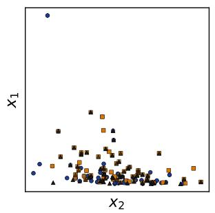

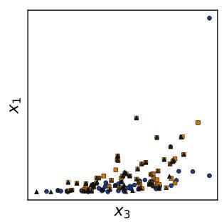

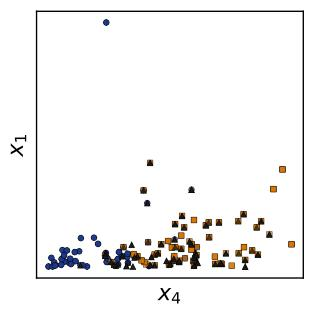

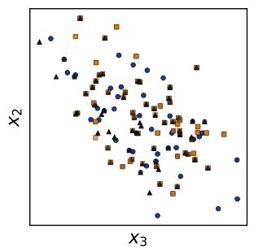

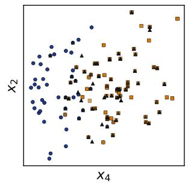

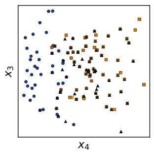  
Figure 12. Example classification dataset sampled from the prior with four covariates. Each subplot in row $i ,$ column j visualizes covariates i and $j + 1$ , with colors denoting the target classes.

To illustrate the functional diversity introduced by our new combiner mechanisms, we visualize representative relationships sampled from the SCM prior in Fig. 13. The individual edge functions in Fig. 13a span a broad range of behaviors, including smooth nonlinear mappings, localized responses, piecewise transitions, and highly irregular surfaces. These functions serve as basic building blocks for constructing dependencies between variables in the sampled SCMs.

More importantly, composing and mixing multiple edge functions further expands the space of functional relationships represented by the prior. As shown in Fig. 13b, the resulting functions can exhibit substantially richer structures, combining sharp transitions, local nonlinearities, and heterogeneous behaviors within a single relationship. This compositional design allows the synthetic prior to cover a wider variety of dependencies than relying on a small set of predefined functional forms alone. Although the actual mechanisms operate on inputs of varying dimensionality, we restrict the visualization to two-dimensional input spaces for clarity.

Table 11. Overall performance on TabArena. We compare models in terms of Elo, number of wins, improvability, and training and prediction time. Here D denotes the default (untuned) model, T the fine-tuned model, and T+E ensembling after fine-tuning.
<table><tr><td>Model</td><td>Elo (↑)</td><td>#wins (↑)</td><td>Improva- bility (↓)</td><td>Train time per 1K [s]</td><td>Predict time per 1K [s]</td></tr><tr><td>TABFM (D)</td><td>1782-102,+109</td><td>21.1</td><td>4.4%</td><td>38.85</td><td>10.52</td></tr><tr><td>EXAONE-Tabular (D)</td><td>1762-61,+85</td><td>5.4</td><td>7.9%</td><td>9.00</td><td>2.10</td></tr><tr><td>AutoGluon 1.5 (extreme, 4h)</td><td>1662-62,+75</td><td>3.6</td><td>8.3%</td><td>289.07</td><td>4.03</td></tr><tr><td>Xiaomi-TabLDM (D)</td><td>1659-55,+86</td><td>3.1</td><td>9.7%</td><td>10.92</td><td>4.18</td></tr><tr><td>TabPFN-3 (D)</td><td>1650-55,+76</td><td>1.8</td><td>9.6%</td><td>4.97</td><td>0.58</td></tr><tr><td>TabPFN-2.6 (D)</td><td>1596-47,+68</td><td>0.3</td><td>11.0%</td><td>5.48</td><td>0.55</td></tr><tr><td>RealTabPFN-2.5 (T+E)</td><td>1579-58,+70</td><td>0.6</td><td>10.7%</td><td>2040.22</td><td>8.91</td></tr><tr><td>TabICLv2 (D)</td><td>1576–58,+67</td><td>1.3</td><td>10.4%</td><td>4.02</td><td>0.38</td></tr><tr><td>RealTabPFN-2.5 (T)</td><td>1538-51,+62</td><td>0.5</td><td>11.4%</td><td>2040.22</td><td>1.22</td></tr><tr><td>RealTabPFN-2.5 (D)</td><td>1510-44,+57</td><td>0.1</td><td>11.9%</td><td>5.81</td><td>0.64</td></tr><tr><td>RealMLP (T+E)</td><td>1486-44,+55</td><td>0.2</td><td>13.2%</td><td>2950.72</td><td>11.97</td></tr><tr><td>AutoGluon 1.4 (best, 4h)</td><td>1486-47,+54</td><td>0.0</td><td>13.1%</td><td>1735.72</td><td>2.56</td></tr><tr><td>TabDPT (T+E)</td><td>1441-48,+60</td><td>1.7</td><td>14.1%</td><td>4910.38</td><td>286.54</td></tr><tr><td>TabM (T+E)</td><td>1425-40,+49</td><td>0.2</td><td>14.5%</td><td>3286.61</td><td>1.47</td></tr><tr><td>LightGBM (T+E)</td><td>1411-31,+32</td><td>0.0</td><td>15.3%</td><td>417.05</td><td>2.64</td></tr><tr><td>RealMLP (T)</td><td>1410-46,+47</td><td>0.1</td><td>14.5%</td><td>2950.72</td><td>0.66</td></tr><tr><td>CatBoost (T+E)</td><td>1396-35,+40</td><td>0.1</td><td>14.9%</td><td>1658.43</td><td>0.65</td></tr><tr><td>TabDPT (T)</td><td>1388-54,+54</td><td>0.2</td><td>15.2%</td><td>4910.38</td><td>39.96</td></tr><tr><td>iLTM (T+E)</td><td>1388-43,+45</td><td>0.1</td><td>15.6%</td><td>12685.08</td><td>464.37</td></tr><tr><td>CatBoost (T)</td><td>1386-39,+39</td><td>0.4</td><td>15.1%</td><td>1658.43</td><td>0.08</td></tr><tr><td>TabM (T)</td><td>1373-41,+48</td><td>0.1</td><td>15.3%</td><td>3286.61</td><td>0.17</td></tr><tr><td>ModernNCA (T+E)</td><td>1370-53,+70</td><td>0.7</td><td>15.9%</td><td>4621.67</td><td>8.14</td></tr><tr><td>LightGBM (T)</td><td>1368-28,+29</td><td>0.0</td><td>15.9%</td><td>417.05</td><td>0.33</td></tr><tr><td>XGBoost (T+E)</td><td>1358-34,+32</td><td>0.0</td><td>16.0%</td><td>693.49</td><td>1.69</td></tr><tr><td>CatBoost (D)</td><td>1351-40,+36</td><td>0.0</td><td>15.8%</td><td>6.83</td><td>0.08</td></tr><tr><td>LimiX (D)</td><td>1347-60,+72</td><td>1.5</td><td>15.8%</td><td>26.46</td><td>6.24</td></tr><tr><td>ModernNCA (T)</td><td>1341-39,+39</td><td>0.3</td><td>16.3%</td><td>4621.67</td><td>0.47</td></tr><tr><td>XGBoost (T)</td><td>1336-33,+31</td><td>0.0</td><td>16.3%</td><td>693.49</td><td>0.31</td></tr><tr><td>xRFM (T+E)</td><td>1335-43,+46</td><td>0.0</td><td>16.6%</td><td>846.89</td><td>2.55</td></tr><tr><td>TabPFNv2 (T+E)</td><td>1328-65,+66</td><td>0.2</td><td>16.9%</td><td>3031.50</td><td>21.44</td></tr><tr><td>Mitra (D)</td><td>1316-65,+62</td><td>0.3</td><td>17.4%</td><td>87.65</td><td>2.50</td></tr><tr><td>TabDPT (D)</td><td>1314-54,+65</td><td>0.1</td><td>17.5%</td><td>47.65</td><td>43.74</td></tr><tr><td>TabICL (D)</td><td>1308-58,+50</td><td>0.0</td><td>17.3%</td><td>6.63</td><td>1.48</td></tr><tr><td>xRFM (T)</td><td>1291-39,+44</td><td>0.1</td><td>17.7%</td><td>846.89</td><td>0.13</td></tr><tr><td>TabM (D)</td><td>1286-42,+47</td><td>0.1</td><td>17.3%</td><td>10.50</td><td>0.13</td></tr><tr><td>iLTM (T)</td><td>1285-33,+38</td><td>0.1</td><td>17.4%</td><td>12685.08</td><td>62.13</td></tr><tr><td>TorchMLP (T+E)</td><td>1275-45,+49</td><td>0.0</td><td>17.4%</td><td>2875.52</td><td>1.95</td></tr></table>

Continued on next page

Table 11 continued from previous page
<table><tr><td>Model</td><td>Elo (↑)</td><td>#wins (↑)</td><td>Improva- bility (↓)</td><td>Train time per 1K [s]</td><td>Predict time per 1K [s]</td></tr><tr><td>SAP-RPT-OSS (D)</td><td>1272-54,+54</td><td>0.8</td><td>18.5%</td><td>14.11</td><td>2.07</td></tr><tr><td>TabPFNv2 (T)</td><td>1272–57,+58</td><td>0.2</td><td>18.4%</td><td>3031.50</td><td>0.46</td></tr><tr><td>BetaTabPFN (D)</td><td>1271–50,+55</td><td>0.1</td><td>18.8%</td><td>205.88</td><td>1.34</td></tr><tr><td>EBM (T+E)</td><td>1256-39,+38</td><td>0.0</td><td>18.9%</td><td>2931.75</td><td>0.42</td></tr><tr><td>TabPFNv2 (D)</td><td>1247-62,+64</td><td>0.3</td><td>19.1%</td><td>3.36</td><td>0.31</td></tr><tr><td>ModernNCA (D)</td><td>1240-38,+40</td><td>0.3</td><td>19.4%</td><td>14.87</td><td>0.31</td></tr><tr><td>EBM (T)</td><td>1222-42,+44</td><td>0.0</td><td>19.6%</td><td>2931.75</td><td>0.05</td></tr><tr><td>RealMLP (D)</td><td>1222-38,+35</td><td>0.1</td><td>18.8%</td><td>10.06</td><td>1.69</td></tr><tr><td>XGBoost (D)</td><td>1209-38,+36</td><td>0.0</td><td>19.0%</td><td>1.94</td><td>0.12</td></tr><tr><td>TorchMLP (T)</td><td>1204-44,+42</td><td>0.0</td><td>19.1%</td><td>2875.52</td><td>0.13</td></tr><tr><td>ExtraTrees (T+E)</td><td>1198-43,+42</td><td>0.1</td><td>20.2%</td><td>183.02</td><td>0.76</td></tr><tr><td>FastaiMLP (T+E)</td><td>1196-54,+49</td><td>0.2</td><td>19.9%</td><td>593.24</td><td>4.47</td></tr><tr><td>EBM (D)</td><td>1192-51,+46</td><td>0.1</td><td>20.5%</td><td>7.33</td><td>0.05</td></tr><tr><td>LightGBM (D)</td><td>1183-32,+31</td><td>0.0</td><td>19.6%</td><td>1.96</td><td>0.14</td></tr><tr><td>RandomForest (T+E)</td><td>1173-43,+51</td><td>0.1</td><td>21.1%</td><td>373.24</td><td>0.77</td></tr><tr><td>ExtraTrees (T)</td><td>1165-47,+42</td><td>0.1</td><td>21.1%</td><td>183.02</td><td>0.09</td></tr><tr><td>FastaiMLP (T)</td><td>1138-53,+50</td><td>0.1</td><td>21.3%</td><td>593.24</td><td>0.31</td></tr><tr><td>RandomForest (T)</td><td>1136-41,+50</td><td>0.2</td><td>21.8%</td><td>373.24</td><td>0.09</td></tr><tr><td>iLTM (D)</td><td>1089-52,+46</td><td>0.2</td><td>23.3%</td><td>296.64</td><td>68.17</td></tr><tr><td>TabSTAR (T)</td><td>1088-80,+74</td><td>0.9</td><td>25.8%</td><td>28729.74</td><td>4.27</td></tr><tr><td>TabSTAR (T+E)</td><td>1087-80,+78</td><td>1.1</td><td>25.8%</td><td>28729.74</td><td>18.81</td></tr><tr><td>OrionMSP (D)</td><td>1087–49,+52</td><td>0.0</td><td>23.9%</td><td>13.12</td><td>2.52</td></tr><tr><td>PerpetualBooster (T+E)</td><td>1087-46,+45</td><td>0.0</td><td>26.6%</td><td>185.31</td><td>0.60</td></tr><tr><td>TorchMLP (D)</td><td>1073-48,+35</td><td>0.1</td><td>23.0%</td><td>9.99</td><td>0.13</td></tr><tr><td>PerpetualBooster (T)</td><td>1050-44,+45</td><td>0.0</td><td>28.0%</td><td>185.31</td><td>0.26</td></tr><tr><td>xRFM (D)</td><td>1038-68,+58</td><td>0.0</td><td>26.7%</td><td>3.23</td><td>0.92</td></tr><tr><td>TabFlex (D)</td><td>1010-69,+60</td><td>0.1</td><td>27.8%</td><td>0.79</td><td>0.12</td></tr><tr><td>FastaiMLP (D)</td><td>1003-60,+55</td><td>0.1</td><td>25.9%</td><td>2.86</td><td>0.37</td></tr><tr><td>RandomForest (D)</td><td>1000-43,+41</td><td>0.0</td><td>26.5%</td><td>0.43</td><td>0.05</td></tr><tr><td>KNN (T+E)</td><td>990-83,+59</td><td>0.2</td><td>28.0%</td><td>129.08</td><td>1.80</td></tr><tr><td>TabSTAR (D)</td><td>988-96,+87</td><td>0.4</td><td>30.7%</td><td>384.75</td><td>5.35</td></tr><tr><td>ExtraTrees (D)</td><td>980-67,+55</td><td>0.0</td><td>27.8%</td><td>0.25</td><td>0.05</td></tr><tr><td>Linear (T+E)</td><td>956-101,+60</td><td>0.1</td><td>33.9%</td><td>237.63</td><td>0.42</td></tr><tr><td>Linear (T)</td><td>931-108,+67</td><td>0.0</td><td>34.4%</td><td>237.63</td><td>0.08</td></tr><tr><td>PerpetualBooster (D)</td><td>930-61,+42</td><td>0.1</td><td>31.9%</td><td>27.32</td><td>0.03</td></tr><tr><td>KNN (T)</td><td>885-95,+61</td><td>0.1</td><td>33.0%</td><td>129.08</td><td>0.18</td></tr><tr><td>Linear (D)</td><td>856-113,+68</td><td>0.1</td><td>37.0%</td><td>1.19</td><td>0.12</td></tr><tr><td>KNN (D)</td><td>644-90,+79</td><td>0.1</td><td>46.1%</td><td>0.19</td><td>0.04</td></tr></table>

Xiaomi

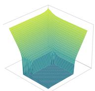

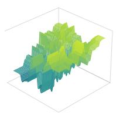

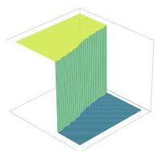

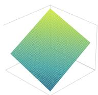

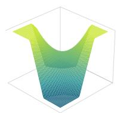

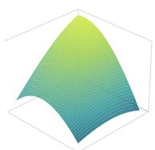

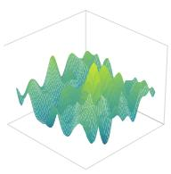

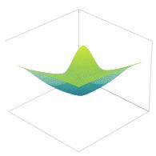

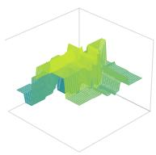

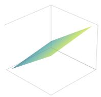

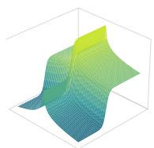

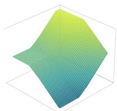

(a) Examples of individual edge functions generated by the new combiner mechanisms.

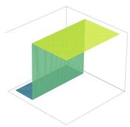

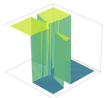

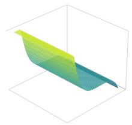

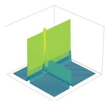

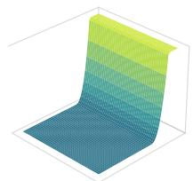

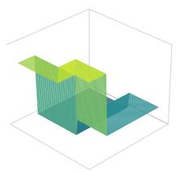

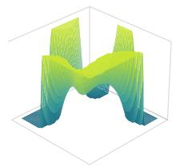

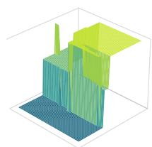

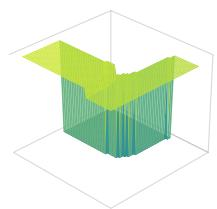

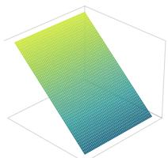

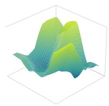

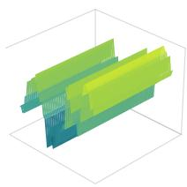

(b) Examples of more complex functional relationships obtained by composing and mixing multiple edge functions.

Figure 13. Visualization of functional relationships generated by the new combiner mechanisms in our SCM prior. The top panel shows individual edge functions, while the bottom panel illustrates more complex relationships constructed by composing and mixing these functions. Although mechanisms in the prior may have varying input dimensionality, we visualize them on a two-dimensional grid for clarity.

Table 12. Performance on the regression subset of TabArena, covering 13 datasets. We compare models in terms of Elo, number of wins, improvability, and training and prediction time. Xiaomi-TabLDM achieves the second-highest Elo while maintaining substantially lower computational cost than most tuned and ensembled baselines. Here D denotes the default (untuned) model, T the fine-tuned model, and T+E ensembling after fine-tuning.
<table><tr><td>Model</td><td>Elo (↑)</td><td>#wins (↑)</td><td>Improva- bility (↓)</td><td>Train time per 1K [s]</td><td>Predict time per 1K [s]</td></tr><tr><td>TABFM (D)</td><td>2019-127,+181</td><td>3.7</td><td>1.6%</td><td>38.85</td><td>9.67</td></tr><tr><td>Xiaomi-TabLDM (D)</td><td>1900-148,+278</td><td>1.8</td><td>1.7%</td><td>6.99</td><td>3.12</td></tr><tr><td>EXAONE-Tabular (D)</td><td>1885-110,+155</td><td>1.5</td><td>3.0%</td><td>13.71</td><td>2.58</td></tr><tr><td>TabPFN-3 (D)</td><td>1800-131,+211</td><td>0.9</td><td>2.4%</td><td>3.87</td><td>0.42</td></tr><tr><td>AutoGluon 1.5 (extreme, 4h)</td><td>1776-96,+137</td><td>1.3</td><td>3.9%</td><td>335.03</td><td>4.33</td></tr><tr><td>TabPFN-2.6 (D)</td><td>1741-56,+104</td><td>0.1</td><td>4.0%</td><td>8.52</td><td>0.70</td></tr><tr><td>RealTabPFN-2.5 (T+E)</td><td>1736-103,+153</td><td>0.2</td><td>3.4%</td><td>1709.05</td><td>8.12</td></tr><tr><td>TabDPT (T+E)</td><td>1722-90,+160</td><td>1.5</td><td>4.3%</td><td>4786.60</td><td>239.30</td></tr><tr><td>TabICLv2 (D)</td><td>1679-142,+242</td><td>0.5</td><td>4.0%</td><td>2.10</td><td>0.25</td></tr><tr><td>TabDPT (T)</td><td>1670-73,+128</td><td>0.0</td><td>4.7%</td><td>4786.60</td><td>38.50</td></tr><tr><td>RealMLP (T+E)</td><td>1650-67,+111</td><td>0.1</td><td>5.1%</td><td>3995.01</td><td>10.05</td></tr><tr><td>RealTabPFN-2.5 (T)</td><td>1624-117,+154</td><td>0.2</td><td>4.1%</td><td>1709.05</td><td>0.81</td></tr><tr><td>AutoGluon 1.4 (best, 4h)</td><td>1592-90,+117</td><td>0.0</td><td>6.4%</td><td>1866.35</td><td>6.07</td></tr><tr><td>TabDPT (D)</td><td>1584-64,+137</td><td>0.0</td><td>5.6%</td><td>46.62</td><td>39.21</td></tr><tr><td>RealMLP (T)</td><td>1547-82,+105</td><td>0.0</td><td>6.0%</td><td>3995.01</td><td>0.84</td></tr><tr><td>RealTabPFN-2.5 (D)</td><td>1534-106,+141</td><td>0.0</td><td>5.6%</td><td>7.04</td><td>0.51</td></tr><tr><td>ModernNCA (T+E)</td><td>1531-118,+145</td><td>0.6</td><td>7.3%</td><td>3779.70</td><td>7.69</td></tr><tr><td>CatBoost (T+E)</td><td>1482-65,+103</td><td>0.0</td><td>8.0%</td><td>3555.27</td><td>0.96</td></tr><tr><td>LightGBM (T+E)</td><td>1474-83,+89</td><td>0.0</td><td>8.4%</td><td>700.19</td><td>9.32</td></tr><tr><td>xRFM (T+E)</td><td>1464–95,+112</td><td>0.0</td><td>7.5%</td><td>714.50</td><td>1.38</td></tr><tr><td>CatBoost (T)</td><td>1462-66,+102</td><td>0.0</td><td>8.1%</td><td>3555.27</td><td>0.10</td></tr><tr><td>TabM (T+E)</td><td>1442-85,+130</td><td>0.0</td><td>6.9%</td><td>4160.58</td><td>1.41</td></tr><tr><td>iLTM (T+E)</td><td>1438-46,+68</td><td>0.0</td><td>9.3%</td><td>12685.08</td><td>321.74</td></tr><tr><td>LightGBM (T)</td><td>1413-75,+91</td><td>0.0</td><td>9.0%</td><td>700.19</td><td>0.97</td></tr><tr><td>XGBoost (T+E)</td><td>1402-47,+64</td><td>0.0</td><td>9.0%</td><td>834.93</td><td>2.61</td></tr><tr><td>xRFM (T)</td><td>1384-81,+89</td><td>0.0</td><td>8.2%</td><td>714.50</td><td>0.10</td></tr><tr><td>XGBoost (T)</td><td>1382-53,+67</td><td>0.0</td><td>9.1%</td><td>834.93</td><td>0.39</td></tr><tr><td>CatBoost (D)</td><td>1369-89,+93</td><td>0.0</td><td>9.7%</td><td>10.89</td><td>0.09</td></tr><tr><td>ModernNCA (T)</td><td>1369-87,+105</td><td>0.0</td><td>9.3%</td><td>3779.70</td><td>0.40</td></tr><tr><td>TabM (T)</td><td>1366–97,+122</td><td>0.0</td><td>7.9%</td><td>4160.58</td><td>0.17</td></tr><tr><td>iLTM (T)</td><td>1333-57,+75</td><td>0.0</td><td>9.3%</td><td>12685.08</td><td>59.10</td></tr><tr><td>TabPFNv2 (T+E)</td><td>1318-116,+163</td><td>0.0</td><td>8.7%</td><td>4223.87</td><td>27.54</td></tr><tr><td>TabM (D)</td><td>1277-109,+113</td><td>0.0</td><td>9.5%</td><td>13.32</td><td>0.13</td></tr><tr><td>ModernNCA (D)</td><td>1274-68,+81</td><td>0.0</td><td>10.8%</td><td>15.50</td><td>0.30</td></tr><tr><td>Mitra (D)</td><td>1264-101,+126</td><td>0.1</td><td>10.3%</td><td>71.06</td><td>1.85</td></tr><tr><td>SAP-RPT-OSS (D)</td><td>1258-140,+144</td><td>0.1</td><td>10.8%</td><td>20.24</td><td>6.62</td></tr><tr><td>LimiX (D)</td><td>1246-154,+167</td><td>0.1</td><td>10.4%</td><td>74.68</td><td>19.76</td></tr><tr><td>TorchMLP (T+E)</td><td>1236-100,+110</td><td>0.0</td><td>11.0%</td><td>4608.59</td><td>1.23</td></tr><tr><td>TabPFNv2 (T)</td><td>1232-127,+153</td><td>0.0</td><td>9.7%</td><td>4223.87</td><td>0.45</td></tr><tr><td>RealMLP (D)</td><td>1226-91,+107</td><td>0.0</td><td>10.5%</td><td>8.90</td><td>1.64</td></tr><tr><td>ExtraTrees (T+E)</td><td>1210-94,+100</td><td>0.0</td><td>13.2%</td><td>158.25</td><td>0.84</td></tr><tr><td>LightGBM (D)</td><td>1206-41,+41</td><td>0.0</td><td>11.4%</td><td>2.11</td><td>0.27</td></tr><tr><td>XGBoost (D)</td><td>1189-77,+83</td><td>0.0</td><td>12.0%</td><td>2.24</td><td>0.24</td></tr><tr><td>TabPFNv2 (D)</td><td>1184-143,+133</td><td>0.0</td><td>11.1%</td><td>2.80</td><td>0.31</td></tr></table>

Continued on next page

Table 12 continued from previous page
<table><tr><td>Model</td><td>Elo (↑)</td><td>#wins (↑)</td><td>Improva- bility (↓)</td><td>Train time per 1K [s]</td><td>Predict time per 1K [s]</td></tr><tr><td>ExtraTrees (T)</td><td>1184-88,+92</td><td>0.0</td><td>13.4%</td><td>158.25</td><td>0.15</td></tr><tr><td>TorchMLP (T)</td><td>1180-96,+95</td><td>0.0</td><td>11.7%</td><td>4608.59</td><td>0.10</td></tr><tr><td>PerpetualBooster (T+E)</td><td>1180-85,+73</td><td>0.0</td><td>13.2%</td><td>162.38</td><td>0.36</td></tr><tr><td>RandomForest (T+E)</td><td>1162-61,+62</td><td>0.0</td><td>14.0%</td><td>515.75</td><td>0.77</td></tr><tr><td>xRFM (D)</td><td>1147-109,+110</td><td>0.0</td><td>13.8%</td><td>2.45</td><td>0.74</td></tr><tr><td>EBM (T+E)</td><td>1144-166,+124</td><td>0.0</td><td>14.5%</td><td>2931.75</td><td>0.29</td></tr><tr><td>PerpetualBooster (T)</td><td>1128-88,+57</td><td>0.0</td><td>14.3%</td><td>162.38</td><td>0.17</td></tr><tr><td>RandomForest (T)</td><td>1120-76,+63</td><td>0.0</td><td>14.5%</td><td>515.75</td><td>0.12</td></tr><tr><td>EBM (T)</td><td>1101-173,+126</td><td>0.0</td><td>15.0%</td><td>2931.75</td><td>0.03</td></tr><tr><td>ExtraTrees (D)</td><td>1069-107,+94</td><td>0.0</td><td>15.3%</td><td>0.47</td><td>0.06</td></tr><tr><td>EBM (D)</td><td>1042-173,+119</td><td>0.0</td><td>15.9%</td><td>8.47</td><td>0.04</td></tr><tr><td>TorchMLP (D)</td><td>1027-115,+81</td><td>0.0</td><td>15.1%</td><td>20.49</td><td>0.08</td></tr><tr><td>FastaiMLP (T+E)</td><td>1026-113,+103</td><td>0.0</td><td>15.3%</td><td>540.14</td><td>2.67</td></tr><tr><td>FastaiMLP (T)</td><td>979-111,+98</td><td>0.0</td><td>15.8%</td><td>540.14</td><td>0.32</td></tr><tr><td>TabSTAR (T+E)</td><td>951–284,+224</td><td>0.1</td><td>23.5%</td><td>28729.74</td><td>19.90</td></tr><tr><td>PerpetualBooster (D)</td><td>943-117,+79</td><td>0.0</td><td>17.7%</td><td>27.32</td><td>0.02</td></tr><tr><td>TabSTAR (T)</td><td>937–294,+225</td><td>0.1</td><td>23.7%</td><td>28729.74</td><td>5.24</td></tr><tr><td>KNN (T+E)</td><td>882-154,+140</td><td>0.0</td><td>21.0%</td><td>92.55</td><td>0.90</td></tr><tr><td>iLTM (D)</td><td>871-108,+67</td><td>0.0</td><td>19.0%</td><td>357.02</td><td>81.61</td></tr><tr><td>FastaiMLP (D)</td><td>864-160,+111</td><td>0.0</td><td>20.0%</td><td>2.60</td><td>0.39</td></tr><tr><td>TabSTAR (D)</td><td>832-345,+237</td><td>0.1</td><td>26.6%</td><td>323.52</td><td>4.93</td></tr><tr><td>KNN (T)</td><td>782-174,+145</td><td>0.0</td><td>23.3%</td><td>92.55</td><td>0.05</td></tr><tr><td>KNN (D)</td><td>680-246,+170</td><td>0.0</td><td>30.4%</td><td>0.19</td><td>0.04</td></tr><tr><td>Linear (T+E)</td><td>502-376,+127</td><td>0.0</td><td>37.4%</td><td>193.98</td><td>0.17</td></tr><tr><td>Linear (T)</td><td>469-447,+147</td><td>0.0</td><td>37.6%</td><td>193.98</td><td>0.07</td></tr><tr><td>Linear (D)</td><td>295-413,+146</td><td>0.0</td><td>40.0%</td><td>0.95</td><td>0.10</td></tr></table>

## C Sensitivity Analysis

Although a number of mature benchmarks now enable systematic comparisons across diferent tabular foundation models, existing evaluation frameworks remain insuficient for fully characterizing how these models respond to external perturbations. To fill this gap, this section focuses on evaluating the robustness of tabular regression models to exogenous noise. In the overall factorial experimental design, we treat graph density and node-level signal-to-noise ratio (SNR) as two explicit and balanced experimental factors. For each matched base configuration, we fix the graph structure, structural functions, SNR vector, and feature permutation, and vary only the noise condition. Performance diferences across noise conditions can therefore be attributed more directly to a model’s sensitivity to exogenous noise, rather than to other uncontrolled variations in the data-generating process. The experimental results show that our proposed model maintains a substantial relative advantage across a wide range of noise distributions, SNR ranges, and graph density conditions, demonstrating strong robustness to exogenous perturbations.

## C.1 Experimental Design and Data Generation

Each dataset is generated by a structural causal model with 32 observed variables. Of these, 31 variables serve as predictive features, and the last node in the sampled topological order serves as the regression target. No latent variables are introduced, so the evaluation is not additionally afected by unobserved variables or latent confounders. Although all variables are observable, the underlying graph structure, structural functions, and noise mechanisms remain unknown to the evaluated models.

Graphs are sampled using an ordered Erdős–Rényi construction [14]. Given a topological order, each candidate forward edge consistent with that order is added to the graph independently with probability $p ,$ so acyclicity is guaranteed by construction. Graph density is the first experimental factor and comprises two levels. In the sparse setting, $p \sim \mathcal { U } [ 0 . 0 4 , 0 . 1 0 ]$ , corresponding to an expected average in-degree of approximately 0.62–1.55 and thus yielding relatively many root nodes. In the dense setting, $p \sim \mathcal { U } [ 0 . 2 5 , 0 . 4 0 ]$ , corresponding to an expected average in-degree of approximately 3.88–6.20, with a substantially smaller number of root nodes. A clear gap is kept between the two intervals, so the sparse and dense settings form two clearly separated structural regimes.

We require the target variable to have at least one parent. If the initially sampled graph assigns no parent to the target variable, one to three nodes are randomly selected from those preceding the target in the topological order and connected to the target node. This correction rule guarantees that the target variable is structurally associated with at least one predictive feature.

For each base configuration, the structural function of every non-root node is sampled from a shared pool of random function generators. Function types and their parameters are sampled independently across nodes and across base configurations, but are held fixed across the fourteen experimental conditions associated with the same base configuration. Root nodes have no parents and are generated solely by exogenous random disturbances.

Let $\operatorname { p a } ( j )$ denote the parent set of node $j .$ All variables are generated sequentially in topological order. For root nodes, $x _ { j } = \varepsilon _ { j } ;$ for non-root nodes, generation follows

$$
x _ { j } = f _ { j } \big ( x _ { \mathrm { p a } ( j ) } \big ) + \sigma _ { j } \varepsilon _ { j } , \qquad \sigma _ { j } = 1 0 ^ { - s _ { j } / 2 0 } ,\tag{7}
$$

where $f _ { j }$ denotes the sampled structural function, $\varepsilon _ { j }$ denotes mutually independent exogenous noise terms, and $s _ { j }$ denotes the SNR of node j in decibels. For every non-root node, the signal term $f _ { j } \left( x _ { \mathrm { p a } \left( j \right) } \right)$ and the raw noise term $\varepsilon _ { j }$ are each standardized before being combined. Under this scheme, $\sigma _ { j } = 1 0 ^ { - s _ { j } / 2 0 }$ ensures that the SNR actually realized at the node equals the specified $s _ { j }$ exactly. The resulting node value $x _ { j }$ is then standardized again before being passed on to its descendants. Because child nodes receive the noisy $x _ { j }$ rather than the denoised, purely structural signal, perturbations introduced at upstream nodes continue to propagate downward along the graph.

SNR is the second experimental factor and comprises four levels, denoted L1, L2, L3, and Lrand. Given an SNR level, each non-root node independently draws its own SNR value. For L1, L2, and L3, respectively,

$$
s _ { j } \stackrel { \mathrm { i . i . d . } } { \sim } \mathcal { U } [ - 5 , 0 ) , \qquad s _ { j } \stackrel { \mathrm { i . i . d . } } { \sim } \mathcal { U } [ 0 , 5 ) , \qquad s _ { j } \stackrel { \mathrm { i . i . d . } } { \sim } \mathcal { U } [ 5 , 1 0 ] .
$$

Table 13. The fourteen experimental conditions. Parameters specified by $\mathcal { U } [ \cdot ]$ are independently resampled for each dataset.
<table><tr><td>Condition</td><td>Distribution</td><td>Parameters</td><td>Characteristic</td></tr><tr><td>Normal</td><td> $\mathcal { N } ( 0 , 1 )$ </td><td>fixed</td><td>symmetric, light-tailed</td></tr><tr><td>Laplace</td><td> $\mathrm { L a p l a c e } ( 0 , 1 )$ </td><td>fixed</td><td>symmetric, heavier-tailed</td></tr><tr><td>Uniform</td><td> $\boldsymbol { \mathcal { U } } [ 0 , 1 ]$ </td><td>fixed</td><td>bounded support</td></tr><tr><td>Student-t</td><td> $t _ { \nu }$ </td><td> $\nu \sim \mathcal { U } [ 2 . 1 , 5 ]$ </td><td>symmetric, heavy-tailed</td></tr><tr><td>Log-normal</td><td> $\mathrm { L o g N o r m a l } ( 0 , 1 )$ </td><td>fixed</td><td>strongly right-skewed</td></tr><tr><td>Gumbel</td><td> $\mathrm { G u m b e l } ( 0 , 1 )$ </td><td>fixed</td><td>moderately right-skewed</td></tr><tr><td>Exponential</td><td> $\mathrm { E x p } ( \lambda )$ </td><td> $\lambda \sim \mathcal { U } [ 0 . 5 , 2 ]$ </td><td>right-skewed</td></tr><tr><td>Chi-squared</td><td> $\chi _ { k } ^ { 2 }$ </td><td> $k \sim \mathcal { U } [ 2 . 1 , 5 ]$ </td><td>right-skewed</td></tr><tr><td>Beta</td><td> $\mathrm { B e t a } ( \alpha , \beta )$ </td><td> $\alpha , \beta \sim \mathcal { U } [ 0 . 5 , 5 ]$ </td><td>bounded, flexible shape</td></tr><tr><td>Gamma</td><td> $\mathrm { G a m m a } ( k , 1 )$ </td><td> $k \sim \mathcal { U } [ 0 . 5 , 5 ]$ </td><td>right-skewed</td></tr><tr><td>Half-normal</td><td> $| \mathcal { N } ( 0 , 1 ) |$ </td><td>fixed</td><td>right-skewed</td></tr><tr><td>Weibull</td><td> $\mathrm { W e i b u l l } ( c { = } 1 )$ </td><td>fixed</td><td>A/A equivalent to exponential</td></tr><tr><td>Mixed</td><td>per-node family choice</td><td>one of the twelve families per node</td><td>heterogeneous across nodes</td></tr><tr><td>Clean</td><td>no non-root additive noise</td><td> $\sigma _ { j } = 0$  for non-root j</td><td>reference condition</td></tr></table>

These three settings confine the node-level SNRs within a graph to narrow intervals of width 5 dB. The three intervals are contiguous and of equal width, jointly forming an equal-width partition of the full range [−5, 10]. For Lrand,

$$
s _ { j } \stackrel { \mathrm { i . i . d . } } { \sim } \mathcal { U } [ - 5 , 1 0 ] ,
$$

so low-SNR and high-SNR nodes can coexist within the same graph. Lrand thereby treats within-graph SNR heterogeneity across nodes as an explicit experimental condition in its own right.

## C.2 Noise Diversity and Experimental Settings

We evaluate fourteen experimental conditions in total (see Table 13): twelve single-noise-distribution conditions, one mixed-noise condition, and one reference condition without additive noise. Under each single-distribution condition, all exogenous noise terms within a dataset are drawn from the same distribution family. Under the mixed condition, each node independently selects one of the twelve noise distribution families. Under the Clean reference condition, additive noise is removed from the structural equations of all non-root nodes by setting $\sigma _ { j } = 0$ while root nodes retain the exogenous random variation required to generate non-degenerate data.

All raw noise samples are standardized before entering the structural equations. Consequently, location and scale diferences play no role when comparing the single-noise-distribution conditions; diferences across conditions arise primarily from the post-standardization distributional shape and, where applicable, from randomly drawn shape parameters. The mixed condition further introduces heterogeneity in the noise distribution family across nodes.

The Exponential and Weibull conditions form a deliberately constructed, distributionally equivalent $\mathrm { A } / \mathrm { A }$ comparison. A Weibull distribution with shape parameter c = 1 is equivalent to an exponential distribution, and the rate parameter of the exponential distribution is eliminated by standardization. The two conditions therefore share the same standardized distribution at the population level, but are generated from mutually independent random samples. The diference between their results serves as an empirical yardstick for the performance fluctuation caused solely by finite-sample randomness, even when the noise laws are exactly equivalent.

The experiment adopts a balanced full factorial design. Graph density has 2 levels and SNR has 4 levels, so crossing them yields 8 experimental combinations. For each combination, we independently sample 20 base configurations. Each base configuration comprises the sampled edge probability and the corresponding graph structure, the function type and function parameters of every non-root node, the node-level SNR vector, and a random permutation of the predictive feature columns. Each base configuration is instantiated once under each of the fourteen experimental conditions, generating a total of $1 6 0 \times 1 4 = 2 , 2 4 0$ datasets.

## C.3 Experimental Results

We compare Xiaomi-TabLDM with Limix and TabICLv2. Across all 2,240 datasets, Xiaomi-TabLDM attains the highest R2 1,575 times, corresponding to a first-place share of 70.3%; by comparison, the first-place shares of LimiX and TabICLv2 are only 16.0% and 13.7%, respectively.

Xiaomi-TabLDM’s relative advantage remains stable across all thirteen non-Clean noise conditions. Its lowest first-place share is still 63.8%, a minimum attained under both the Laplace and Student-t noise conditions, while its highest first-place share reaches 78.1% under the Exponential noise condition. Even under its least favorable noise condition, Xiaomi-TabLDM therefore still ranks first on nearly two-thirds of the datasets. In contrast, LimiX never exceeds a first-place share of roughly 28% under any condition, with its maximum occurring under Student-t noise, while TabICLv2’s highest first-place share is roughly 25%, occurring under the Clean reference condition.

The distributionally equivalent exponential–Weibull pair serves as an internal A/A control. Their first-place shares difer by 5.0 percentage points despite having the same standardized population distribution, indicating that independent sample realizations alone can introduce noticeable variation. This pair therefore provides an empirical reference for the repeatability of the reported condition-wise results.

Under the Clean reference condition, Xiaomi-TabLDM’s first-place share is 65.6%, and under most noisy conditions its first-place share is no lower than this level. This indicates that Xiaomi-TabLDM’s relative competitive advantage does not depend on the absence of additive noise. By contrast, TabICLv2 attains its own highest first-place share under the Clean reference condition, and its relative competitiveness generally declines once additive noise is introduced. Overall, the experimental results show that Xiaomi-TabLDM maintains a stable relative advantage across all tested noise distribution families and perturbation intensities.