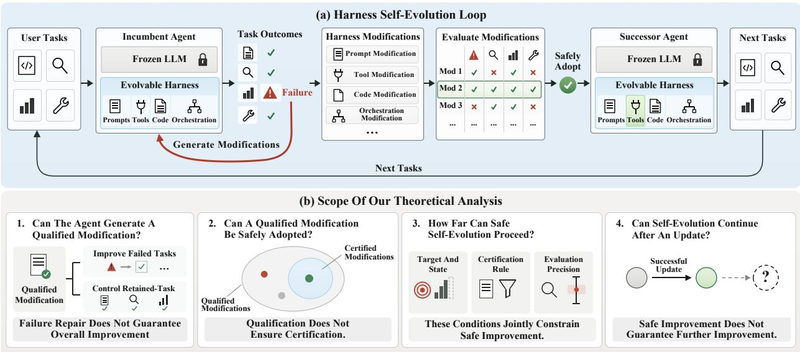
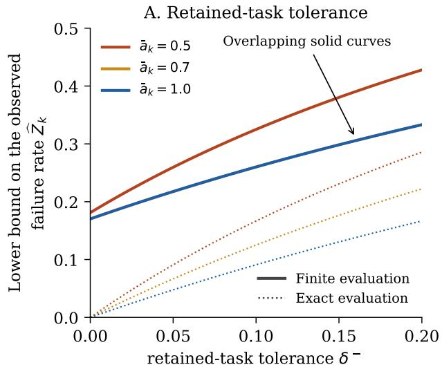
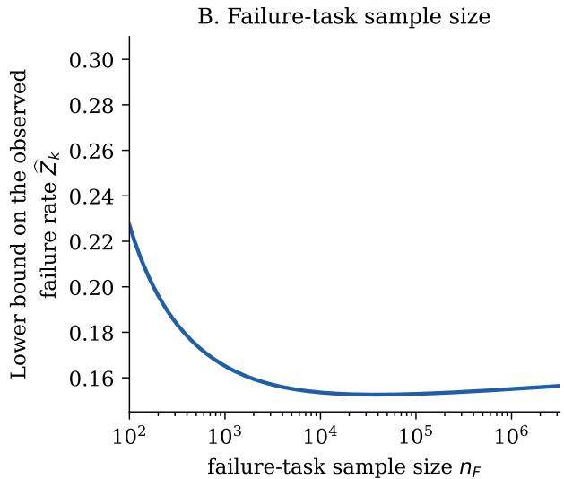
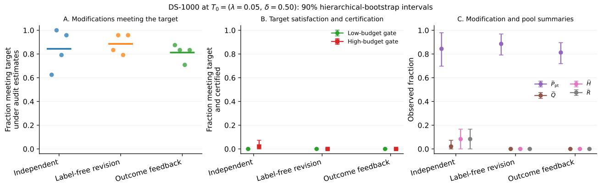
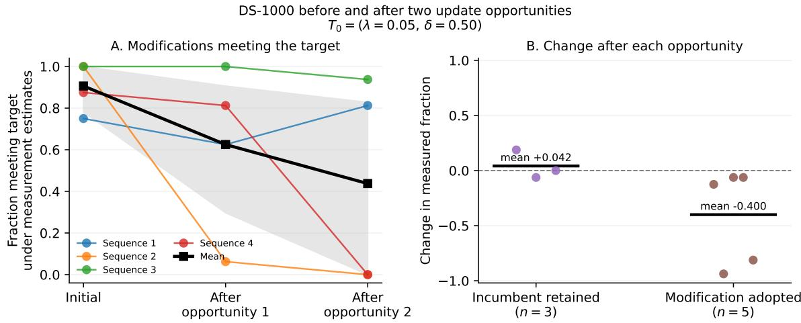

# SAFE HARNESS SELF-EVOLUTION: A THEORETICAL ANALYSIS OF FEASIBILITY AND LIMITS

A PREPRINT

Qianshu Cai1,2 Yonggang Zhang2∗Jun Nie1,3 Maohao Ran3

Huajiang Zheng2 Jun Song3 Xinmei Tian1 Yike Guo2 Wei Xue2∗

1University of Science and Technology of China 2Hong Kong Generative AI Research & Development Center; The Hong Kong University of Science and Technology 3Hong Kong Baptist University

## ABSTRACT

Harness self-evolution is the process by which an agent modifies its prompts, tools, code, or orchestration in response to task feedback, while keeping the underlying language model frozen, with the changes persisting across subsequent tasks. Each update affects subsequent task performance and changes the agent participating in the next self-modification. Making autonomous modification a reliable mechanism for performance improvement requires understanding when the process yields guaranteed overall gains and what constrains their realization. We provide a systematic theoretical analysis of the feasibility and limits of safe harness self-evolution, connecting modification generation, selection and adoption under finite evaluation, and behavior after an update. Under a fixed user-task distribution, the theory establishes guarantees of overall expected-reward improvement while constraining changes in existing task performance, and characterizes how generation opportunities translate into justified updates. This provides a basis for diagnosing stagnation and designing self-evolution mechanisms. The analysis shows that generating opportunities for improvement and converting them into reliable updates face distinct constraints: current task performance does not determine the probability of producing modifications meeting improvement and retention requirements, and even generated modifications meeting these requirements may lack sufficient evidence for adop tion. Improving generation and improving evaluation therefore address different obstacles; additional generation alone need not strengthen the guarantee of a successful update. Moreover, stagnation need not imply that opportunities for improvement are exhausted. An adoption rule can prevent updates while improvement remains possible, and changing the rule can recover such opportunities in some cases. Nevertheless, maintaining the ability to recognize genuine improvements while controlling erroneous adoption requires a worst-case evaluation cost that diverges as expected reward approaches its upper bound. Across successive updates, improvement guarantees from accepted steps accumulate, but do not by themselves ensure further improvement.

## 1 Introduction

Harness self-evolution is a process in which an agent using the frozen LLM modifies its harness—the prompts, code, tools, and orchestration that determine how it acts—in response to task feedback, with the modifications persisting across subsequent tasks (Figure 1(a)). Early work on Gödel Agent explored agents’ ability to recursively rewrite their own logic, and SICA further demonstrated the feasibility of improving task performance through autonomous editing of agent code [Yin et al., 2024, Robeyns et al., 2025]. DGM subsequently combined self-modification with open-ended search over an archive of agent variants, while HGM used the performance of descendant branches to estimate the potential for further improvement, advancing the question from whether agents can modify themselves to how they can search for valuable sequences of modifications [Zhang et al., 2026b, Wang et al., 2025b]. MOSS further brought source-level self-evolution to production-grade agent frameworks such as OpenClaw [Cai et al., 2026]. When generated modifications persist across subsequent user tasks, deciding which modifications merit adoption becomes essential: repairing the failures that prompted a modification must be considered together with its effects on other tasks to determine whether overall improvement is acceptable. HarnessX and Self-Harness already incorporate regression protection into their decisions about agent updates; nevertheless, HarnessX reports that binary evaluation outcomes can conceal declining success probabilities, allowing regressions to accumulate across successive agent updates [Chen et al., 2026, Zhang et al., 2026a]. TTHE studies test-time harness evolution on unlabeled tasks and distinguishes generation coverage from final selection regret to examine how much of the opportunity found during search translates into realized performance [Nie et al., 2026]. These improvement and retention requirements must be met by the generated modifications, and finite evaluation must provide sufficient evidence for safe adoption; the successor agent then performs subsequent tasks and generates modifications in the next step. The central questions are therefore whether the incumbent can generate modifications that meet both requirements, how far finite evaluation can support their safe adoption, and whether the successor agent can continue to improve. These questions span modification generation, evaluation and certification, selection and adoption, and the behavior of the successor agent, determining when safe harness self-evolution is feasible, what limits it, and which guarantees can hold across successive agent updates.

  
Figure 1: Harness self-evolution and the scope of our analysis. (a) The harness self-evolution loop (§2). (b) Four questions concerning the generation of qualified modifications (§3), safe adoption (§4), limits to safe improvement (§5), and further improvement after an update (§6); the nested sets are shown on the simultaneous coverage event.

We present a systematic theoretical analysis of the harness self-evolution loop, connecting modification generation, finite-data certification and safe adoption, and the successor agent’s ability to continue improving (Figure 1(b)). We characterize how the opportunity to generate qualified modifications translates into safe updates under finite evaluation, identify distinct limitations imposed by the target and current state, certification rules, and evaluation precision, and establish that guarantees of current improvement and further progress must be justified separately. These results provide a basis for interpreting stagnation in harness self-evolution, assessing what different design changes can affect, and evaluating opportunities for further improvement. Our analysis begins with expected reward under a fixed user-task distribution. The incumbent’s task-level failure probabilities determine how improvement on failure tasks and changes on retained tasks contribute to overall performance. This relation gives conditions under which a target, specifying the required contribution from failure-task improvement and the tolerated average absolute change in expected reward on retained tasks, guarantees a prescribed increase in expected reward. We then study reachability: the probability that the incumbent generates a modification satisfying the target. This probability is not determined by current task performance. We construct instances with the same frozen LLM, identical user-task behavior, and the same set of qualified modifications, but different probabilities of generating those modifications. Reachability thus connects the declared requirements to what the current state and generation process can supply, providing the starting point for analyzing how opportunities to generate qualified modifications translate into safe agent updates.

We derive upper and lower bounds connecting reachability to the probability of selecting a qualified modification from finite data. At a fixed history and generation context, reachability and the size of an independently generated candidate pool determine the largest success probability attainable by selection within that pool. Under simultaneous evaluation coverage, modifications satisfying the target with margins determined by evaluation precision yield a finite-data lower bound, while the original target remains unchanged. For a live single-modification update with abstention when the required evaluation material is unavailable, our analysis bounds the probability of accepting a modification whose expected-reward gain falls below its certified lower bound. These guarantees reveal distinct limits on improvement. If the required contribution from failure-task improvement exceeds what the current state can provide, no generation process or evaluation budget can yield a modification satisfying the target. Even when qualified modifications exist, the threshold required by a certification rule may be incompatible with current performance and evaluation precision. We characterize exactly when these threshold constraints are compatible for a baseline rule that reserves improvement against the full declared retained-task tolerance. Beyond this rule’s limit, positive improvement can still be certified in constructed instances by accounting for the modification’s own retained-task loss. However, on a hard family, the worst-case evaluation cost of distinguishing further improvement diverges as the incumbent’s shortfall from the reward upper bound vanishes, for certifiers maintaining the prescribed error control and detection power. These results distinguish restrictions imposed by the target and current state from those that changes to generation, evaluation, or certification can address.

The analysis also yields finite-sample confidence bounds for reachability that hold simultaneously over all targets at a fixed history and context, providing a statistical basis for diagnosis. The bounds separate uncertainty from the finite generation sample from uncertainty about whether evaluated modifications satisfy the target; generating more modifications need not resolve the latter. Our empirical studies illustrate the diagnostic implications of these theoretical distinctions at the suite level: independent-audit point estimates indicate qualified modifications in the studied pools even when finite-data certification rarely succeeds. Once a modification is adopted, the analysis must also account fo the successor agent. Under the per-step hypotheses and a run-level risk allocation, certified lower bounds on expected reward improvement add across a finite run on the fixed user-task distribution. Yet within the unrestricted update class considered here, we construct instances in which the first step generates a qualified modification with probability one and certifies an improvement, while no subsequent step yields any additional improvement. A separate cross-step study observes a related distinction: adopting modifications selected for positive estimated improvement is accompanied by a lower average fraction of newly generated modifications meeting the target under separate measurement. This is a descriptive observation, not a causal effect of updating. Safe current improvement and the ability to continue self-evolution therefore require separate evidence; guaranteeing further progress requires additional information or structural conditions on the behavior of the successor agent. These results inform the design of generation, certification, and update mechanisms in future self-evolution algorithms, and motivate further research on achieving safe improvement under finite evaluation and preserving opportunities for subsequent improvement across agent updates.

## 2 Problem Setting

We study harness self-evolution, a process in which an incumbent agent generates modifications to its harness from failures encountered on user tasks, the modifications are evaluated to determine whether any can be safely adopted, and an adopted modification defines the successor agent for subsequent tasks and self-evolution steps (Figure 1(a)). Let $\mathcal { T } _ { \mathrm { u s e r } }$ denote the user-task space, let $\mathcal { D } _ { \mathrm { u s e r } }$ be a probability distribution on $\mathcal { T } _ { \mathrm { u s e r } }$ , and let O denote the output space. At self-evolution step k, write the incumbent agent as $A _ { k } = \mathsf { \Gamma } ( M , C _ { k } )$ , where M is the frozen LLM and $C _ { k }$ is the agent’s harness: the evolvable prompts, code, tools, and orchestration that determine how the agent acts. For a task $t \in \mathcal { T } _ { \mathrm { u s e r } } .$ the incumbent produces an output $o \in \mathcal { O }$ according to $o \sim A _ { k } ( \cdot \mid t )$

Let M denote the space of valid modifications, and let $\mathcal { M } _ { \perp } : = \mathcal { M } \sqcup \{ \perp \}$ , where ⊥ records failure to return a valid modification. At a fixed history and context, the incumbent uses failures from these user interactions in N runs of a predeclared generation procedure. Their terminal outputs $c _ { 1 } , \dotsc , c _ { N } \in { \mathcal { M } } _ { - }$ ⊥ form a finite candidate pool, including failed runs. Only valid modifications undergo behavioral evaluation; applying each $c _ { i } \in \mathcal { M }$ to the incumbent yields the candidate agent $\widetilde { A } _ { i } : = A _ { k } \oplus c _ { i }$

We define a fixed reward function $r : \mathcal { T } _ { \mathrm { u s e r } } \times \mathcal { O }  [ 0 , 1 ]$ for scoring the outputs produced by the incumbent and candidate agents. For any agent A and task $t \in \mathcal { T } _ { \mathrm { u s e r } } .$ , define $V ( A , t ) : = \mathbb { E } _ { o \sim A ( \cdot | t ) } [ \bar { r ( t , o ) } ]$ as the expected reward of A on t. We then define $J _ { \mathrm { u s e r } } ( A ) : = \mathbb { E } _ { t \sim \mathcal { D } _ { \mathrm { u s e r } } } [ V ( A , t ) ]$ as the expected reward of A under $\mathcal { D } _ { \mathrm { u s e r } }$ . The incumbent and candidate agents are evaluated on a finite collection of user tasks. For each evaluation task $t \in \mathcal { T } _ { \mathrm { u s e r } }$ and each evaluated agent A, m independent rollouts produce outputs $o _ { 1 } ^ { A } , \dotsc , o _ { m } ^ { A } \stackrel { \mathrm { i . i . d . } } { \sim } A ( \cdot \mid t )$ , and we estimate $V ( A , t )$ by

$$
{ \widehat V } ( A , t ) : = { \frac { 1 } { m } } \sum _ { \ell = 1 } ^ { m } r ( t , o _ { \ell } ^ { A } ) .
$$

The certifier uses these finite evaluation results to determine whether there is sufficient evidence to support safe adoption of each modification. If the selector σ chooses a certified modification $c _ { i ^ { * } }$ ∗ , the agent is updated as

$$
A _ { k + 1 } = A _ { k } \oplus c _ { i ^ { * } } .
$$

Otherwise, $A _ { k + 1 } = A _ { k }$ . The successor agent $A _ { k + 1 }$ then processes subsequent user tasks and begins the next selfevolution step.

We study four central questions arising from this process, summarized in Figure 1(b). Section 3 asks what a modification must achieve to increase the incumbent’s expected reward under $\mathcal { D } _ { \mathrm { u s e r } }$ , how often the incumbent can generate such a modification, and what a selector restricted to the candidate pool can achieve. Section 4 asks when finite evaluation provides sufficient evidence to certify a generated modification for safe adoption. Section 5 asks how far safe selfevolution can proceed under the constraints imposed by the target, the current agent state, and finite evaluation. Section 6 studies how to measure reachability and identify bottlenecks in generation, certification, and selection. It then asks whether self-evolution can continue after an agent update.

## 3 Qualified Modifications and Reachability

In this section, we first characterize when a modification improves expected reward under the user-task distribution while controlling change under the retained-task distribution. We then define reachability and bound what a selector can obtain from a candidate pool. Finally, we give a necessary condition for positive reachability and show how it depends on the target, Agent state, context, and generation process.

## 3.1 Qualified Modifications

Existing work on harness self-evolution often assesses progress by whether a modification improves the tasks that the incumbent previously failed. This criterion is insufficient for a persistent modification: a modification may repair those failures while degrading the Agent’s performance on other user tasks. We therefore define a qualified modification through requirements on both failure-task improvement and retained-task change under the full user-task distribution $\mathcal { D } _ { \mathrm { u s e r } } .$

We use a binary detector $\phi ( t , o ) \in \{ 0 , 1 \}$ to indicate whether an Agent’s output o on task t is a failure (see Appendix I.6.1 for the distinction between this detector and the reward function). For an Agent A, let

$$
\psi _ { A } ( t ) : = \mathbb { E } _ { o \sim A ( \cdot | t ) } [ \phi ( t , o ) ]
$$

be its failure probability on task t, and let

$$
Z ( A ) : = \mathbb { E } _ { t \sim \mathcal { D } _ { \operatorname { u s e r } } } [ \psi _ { A } ( t ) ] , \qquad Z _ { k } : = Z ( A _ { k } ) .
$$

Assume $Z _ { k } \in ( 0 , 1 )$ . We use the incumbent’s task-level failure probabilities to reweight $\mathcal { D } _ { \mathrm { u s e r } }$ and define two task distributions: $\mathcal { D } _ { F , k }$ is the distribution of tasks in interactions where the incumbent’s output is labeled a failure, whereas $\mathcal { D } _ { R , k }$ is the distribution of tasks in interactions where the output is not labeled a failure:

$$
\mathcal { D } _ { F , k } ( d t ) : = \frac { \psi _ { A _ { k } } ( t ) } { Z _ { k } } \mathcal { D } _ { \mathrm { u s e r } } ( d t ) , \qquad \mathcal { D } _ { R , k } ( d t ) : = \frac { 1 - \psi _ { A _ { k } } ( t ) } { 1 - Z _ { k } } \mathcal { D } _ { \mathrm { u s e r } } ( d t ) .\tag{3.7}
$$

For a candidate Agent ${ \widetilde { A } } ,$ define its improvement over the incumbent on task t by

$$
\operatorname { A d v } _ { A _ { k } } ( \widetilde { A } , t ) : = V ( \widetilde { A } , t ) - V ( A _ { k } , t ) ,
$$

and its improvement under the failure-task distribution, weighted by the incumbent’s overall failure rate, by

$$
L _ { A _ { k } } ( \widetilde { A } ) : = Z _ { k } \mathbb { E } _ { t \sim \mathcal { D } _ { F , k } } [ \mathrm { A d v } _ { A _ { k } } ( \widetilde { A } , t ) ] .
$$

Under Assumption 3, the incumbent and candidate Agent are evaluated under the same fixed $\mathcal { D } _ { \mathrm { u s e r } }$ . Their expectedreward difference under this distribution decomposes exactly as

$$
\begin{array} { r l } & { J _ { \mathrm { u s e r } } ( \widetilde { A } ) - J _ { \mathrm { u s e r } } ( A _ { k } ) = Z _ { k } \mathbb { E } _ { t \sim \mathcal { D } _ { F , k } } [ \mathrm { A d v } _ { A _ { k } } ( \widetilde { A } , t ) ] } \\ & { \qquad + ( 1 - Z _ { k } ) \mathbb { E } _ { t \sim \mathcal { D } _ { R , k } } [ \mathrm { A d v } _ { A _ { k } } ( \widetilde { A } , t ) ] } \\ & { \qquad = L _ { A _ { k } } ( \widetilde { A } ) + ( 1 - Z _ { k } ) \mathbb { E } _ { t \sim \mathcal { D } _ { R , k } } [ \mathrm { A d v } _ { A _ { k } } ( \widetilde { A } , t ) ] . } \end{array}\tag{3.8}
$$

The identities supporting (3.8) are stated in Appendix I.6.1 and proved in Appendix F.

Even if $L _ { A _ { k } } ( \widetilde { A } ) > 0 , J _ { \mathrm { u s e r } } ( \widetilde { A } ) - J _ { \mathrm { u s e r } } ( A _ { k } )$ can be negative when the retained-task term in (3.8) is negative and larger in magnitude. In addition to overall improvement, we require changes on retained tasks to remain small, whether they increase or decrease expected reward.

For a candidate Agent ${ \widetilde { A } } ,$ define $D _ { R } ( \widetilde { A } ; A _ { k } )$ as the average under $\mathcal { D } _ { R , k }$ of the absolute change in per-task expected reward relative to the incumbent:

$$
D _ { R } ( \widetilde { A } ; A _ { k } ) : = \mathbb { E } _ { t \sim \mathcal { D } _ { R , k } } \big | V ( \widetilde { A } , t ) - V ( A _ { k } , t ) \big | .\tag{3.11}
$$

Definition 20 in Appendix I.6 gives the formal definition; its properties and related alternatives are developed there and in Appendix F.

The quantities L and $D _ { R }$ measure failure-task improvement and retained-task change. We use a target to specify the minimum required improvement and maximum tolerated change; these externally specified requirements determine which modifications are qualified.

Definition 1 (Target). At self-evolution step k, a target is $T = \left( \lambda , \delta \right)$ , where $\lambda > 0$ specifies the minimum required improvement on tasks weighted by the incumbent’s failure probability, and $\delta \geq 0$ specifies the maximum tolerated retained-task change. For a modification $c \in { \mathcal { M } }$ , let

$$
L _ { k } ( c ) : = L _ { A _ { k } } ( A _ { k } \oplus c ) , \qquad D _ { k } ( c ) : = D _ { R } ( A _ { k } \oplus c ; A _ { k } ) .
$$

For a failed output, set $L _ { k } ( \bot ) = D _ { k } ( \bot ) = 0$ . The modifications satisfying the target are

$$
\mathcal { P } _ { k } ( T ) : = \{ c \in \mathcal { M } : L _ { k } ( c ) \geq \lambda , D _ { k } ( c ) \leq \delta \} .\tag{3.23}
$$

A modification c is qualified for T if and only $i f c \in \mathcal { P } _ { k } ( T )$

We next relate qualification to overall expected-reward improvement. Since

$$
\mathbb { E } _ { t \sim \mathcal { D } _ { R , k } } [ \mathrm { A d v } _ { A _ { k } } ( \widetilde { A } , t ) ] \geq - D _ { R } ( \widetilde { A } ; A _ { k } ) ,
$$

the decomposition (3.8) gives the following lower bound.

Theorem 1 (Expected-reward improvement bound). Under Assumptions 1 and 3, for any candidate Agent ${ \widetilde { A } } ,$ $i f$ $D _ { R } ( \widetilde { A } ; A _ { k } ) \le \delta$ , then

$$
J _ { \mathrm { u s e r } } ( \widetilde { A } ) - J _ { \mathrm { u s e r } } ( A _ { k } ) \geq L _ { A _ { k } } ( \widetilde { A } ) - ( 1 - Z _ { k } ) \delta .\tag{3.18}
$$

The proof is in Appendix F.

Corollary 1. Under Assumptions 1 and 3, if a candidate Agent $\widetilde { A }$ satisfies

$$
L _ { A _ { k } } ( \widetilde { A } ) > ( 1 - Z _ { k } ) \delta , \qquad D _ { R } ( \widetilde { A } ; A _ { k } ) \leq \delta ,\tag{3.19}
$$

then

$$
J _ { \mathrm { u s e r } } ( \widetilde { A } ) > J _ { \mathrm { u s e r } } ( A _ { k } ) .
$$

By Theorem 1, every modification qualified for $T = \left( \lambda , \delta \right)$ has expected-reward gain at least $\lambda - ( 1 - Z _ { k } ) \delta$ . For a required improvement $\gamma > 0$ under $\mathcal { D } _ { \mathrm { u s e r } } ,$ set

$$
\lambda _ { k } ( \gamma , \delta ) : = \gamma + ( 1 - Z _ { k } ) \delta .\tag{3.24}
$$

Every modification qualified for $( \lambda _ { k } ( \gamma , \delta ) , \delta )$ then satisfies

$$
J _ { \mathrm { u s e r } } ( A _ { k } \oplus c ) - J _ { \mathrm { u s e r } } ( A _ { k } ) \geq \gamma .
$$

One-sided, risk-sensitive, and Agent-responsive extensions are given in Appendix I.6.3, Appendix G.11, and Appendix H, respectively.

The required failure-task improvement and tolerated retained-task change are specified through the target. These externally specified requirements jointly determine which modifications are qualified.

## 3.2 Reachability and the Candidate-Pool Upper Bound

Section 3.1 defines which modifications are qualified for a declared target. We now ask how likely the incumbent Agent is to generate such a modification. At self-evolution step k, conditional on the current history $\mathcal { H } _ { k }$ and generation context $\Xi _ { k } = \xi$ , let $C \sim \pi _ { k , \xi }$ denote one terminal output in $\mathcal { M } _ { \perp }$ of the incumbent’s predeclared generation procedure (Appendix I.2). This distribution includes failed runs rather than conditioning on validity.

Definition 2 (Reachability). Conditional on $\left( \mathcal { H } _ { k } , \Xi _ { k } = \xi \right)$ , the reachability of a target $T$ at self-evolution step k is the probability that the incumbent Agent generates a modification qualified for $\check { T } \mathrm { : \Omega }$

$$
\begin{array} { r } { P _ { k } ( T \mid \mathcal { H } _ { k } , \xi ) : = \mathbb { P } _ { C \sim \pi _ { k , \xi } } [ C \in \mathcal { P } _ { k } ( T ) ] = \pi _ { k , \xi } ( \mathcal { P } _ { k } ( T ) ) . } \end{array}\tag{3.25}
$$

When the conditioning is fixed, we write $P _ { k } ( T )$

Now draw a candidate pool $C _ { 1 : N } \overset { \mathrm { i i d } } { \sim } \pi _ { k , \xi }$ under the same fixed history and context. A rule may use arbitrary evaluation evidence, but it may only select a valid member of $C _ { 1 : N }$ or retain the incumbent; it may not repair, compose, or generate another modification. Let $R _ { k , N } ( T \mid \mathcal { H } _ { k } , \xi )$ be the conditional probability that the rule selects a modification in $\mathcal { P } _ { k } ( T )$ retaining the incumbent does not count as success. Appendix Definition 18 gives the complete formal scope.

Theorem 2 (Candidate-pool selection bound). Fix a target T and $\left( \mathcal { H } _ { k } , \Xi _ { k } = \xi \right)$ , and let $C _ { 1 : N } \stackrel { \mathrm { i i d } } { \sim } \pi _ { k , \xi }$ . Any rule restricted to selecting one modificationfrom this candidate pool or retaining the incumbent satisfies

$$
R _ { k , N } ( T \mid \mathcal { H } _ { k } , \xi ) \leq 1 - \left( 1 - P _ { k } ( T \mid \mathcal { H } _ { k } , \xi ) \right) ^ { N } \leq N P _ { k } ( T \mid \mathcal { H } _ { k } , \xi ) .\tag{3.26}
$$

The first upper bound is the probability that the candidate pool contains at least one qualified modification. Denote it by

$$
\mathsf { C } _ { N } ( T \mid \mathcal { H } _ { k } , \xi ) : = 1 - \big ( 1 - P _ { k } ( T \mid \mathcal { H } _ { k } , \xi ) \big ) ^ { N } .
$$

When the conditioning is fixed, we write $\mathsf C _ { N } ( T )$ . An oracle that identifies a qualified modification whenever one is present attains $\mathsf { C } _ { N }$ . Hence, reachability and the candidate-pool size jointly determine the largest possible probability of selecting a qualified modification from that pool. Evaluation, certification, and selection may determine how much of this probability a system realizes, but they cannot make a qualified modification appear in a fixed candidate pool.

The bound also applies to generation with predefined testing and repair performed independently for each modification, with reachability computed after repair (Appendix F, Proposition 9).

## 3.3 A Necessary Condition for Positive Reachability

The candidate-pool bound in Theorem 2 assumes a given reachability. We now ask whether positive reachability is possible at the current Agent state. Because rewards lie in [0, 1], the incumbent’s performance on the failure-task distribution limits how large L can be for any candidate Agent. Define

$$
\bar { a } _ { k } : = 1 - \mathbb { E } _ { t \sim \mathcal { D } _ { F , k } } [ V ( A _ { k } , t ) ] ,
$$

the incumbent’s average reward shortfall from one under $\mathcal { D } _ { F , k }$ . Under Assumptions 1 and 3, Lemma 2 in Appendix F gives, for every candidate Agent ${ \widetilde { A } } .$

$$
L _ { A _ { k } } ( \widetilde { A } ) \leq Z _ { k } \bar { a } _ { k } \leq 1 - J _ { \mathrm { u s e r } } ( A _ { k } ) .
$$

A modification qualified for $T = \left( \lambda , \delta \right)$ must satisfy $L _ { k } ( c ) \geq \lambda$ . Positive reachability therefore requires $Z _ { k } \bar { a } _ { k } \ge \lambda$ Corollary 2 (Necessary condition for positive reachability). Under Assumptions 1 and 3, if

$$
P _ { k } ( ( \lambda , \delta ) \mid { \mathcal { H } } _ { k } , \xi ) > 0 ,
$$

then

$$
Z _ { k } \bar { a } _ { k } \geq \lambda , \qquad J _ { \mathrm { u s e r } } ( A _ { k } ) \leq 1 - \lambda .
$$

For the calibrated target in (3.24), the second inequality implies

$$
J _ { \mathrm { u s e r } } ( A _ { k } ) \leq 1 - \gamma - ( 1 - Z _ { k } ) \delta .
$$

If either necessary inequality fails, no modification can be qualified for the target. Reachability is therefore zero under every generation process; changing the candidate-pool size, selector, or evaluation budget cannot alter this conclusion. The converse does not follow: satisfying the condition does not guarantee that a qualified modification exists or that $\pi _ { k , \xi }$ assigns positive probability to one.

Even when these necessary inequalities hold, reachability still depends on which modifications are generated and which meet the target.

Proposition 1. In the kernel setting of Appendix A.1, allow the composition map $( M , C ) \mapsto A$ to be any measurable map consistent with (2.1)–(2.5). For any fixed integer $N \geq 1 .$

1. there exist a common target T and two configurations with the samefrozen LLM, identical behavior on user tasks, and the same qualified set ${ \mathcal { P } } _ { k } ( T ) $ , but whose generation processes assign different probabilities to this set and hence yield different values o ${ \mathsf { f C } } _ { N } ( T )$

2. there exist an Agent state, a fixed conditional distribution $\pi _ { k , \xi }$ over modifications, and two targets $T _ { 1 } , T _ { 2 }$ such that $\pi _ { k , \xi } ( \mathcal { P } _ { k } ( T _ { 1 } ) ) \neq \pi _ { k , \xi } ( \mathcal { \dot { P } } _ { k } ( T _ { 2 } ) )$ ), and hence $\mathsf C _ { N } ( T _ { 1 } ) \neq \mathsf C _ { N } ^ { ^ { 3 } } ( T _ { 2 } )$

Thus, a user-task benchmark score or the frozen LLM alone cannot determine the probability of obtaining a qualified modification; the target and generation process must also be specified. Appendix F gives the construction, and Remark 19 in Appendix I.2 states the scope under a prescribed composition map.

## 4 Finite-Data Certification and Safe Agent Updates

Section 3 characterizes qualified modifications and the probability of generating them. We now study how finite evaluation supports certification, selection, and safe agent updates. For a conditionally i.i.d. candidate pool, we bound the probability of selecting a qualified modification. We then give a finite-horizon update protocol and bound the probability of accepting a modification whose expected-reward gain under $\mathcal { D } _ { \mathrm { u s e r } }$ falls below the certified lower bound.

## 4.1 Finite-Data Certification and Selection

Whether a modification $c \in \mathcal { M }$ is qualified depends on the unknown values $L _ { k } ( c )$ and $D _ { k } ( c )$ , whereas a certifier observes only finite evaluation results. Fix a target $T = \left( \lambda , \delta \right)$ before drawing the candidate pool. For each valid output $C _ { i } \in \mathcal { M }$ , evaluate the candidate agent A ⊕ C . For $C _ { i } = \perp$ , record the known pair $( L _ { k } ( \dot { C _ { i } } ) , D _ { k } ( C _ { i } ) ) = ( 0 , 0 )$ using point estimates and error radii all equal to zero, without behavioral evaluation. Let $\mathcal { E } _ { N , \beta }$ be the event that the intervals simultaneously satisfy, for all $i = 1 , \ldots , N$

$$
L _ { k } ( C _ { i } ) \in [ \widehat { L } _ { i } - e _ { L , i } ^ { \ell } , \widehat { L } _ { i } + e _ { L , i } ^ { u } ] , \qquad D _ { k } ( C _ { i } ) \in [ \widehat { D } _ { i } - e _ { D , i } ^ { \ell } , \widehat { D } _ { i } + e _ { D , i } ^ { u } ] .
$$

The exact-target gate certifies $C _ { i }$ if and only if

$$
G _ { i } ( T ) = 1 \quad \Longleftrightarrow \quad { \widehat L } _ { i } - e _ { L , i } ^ { \ell } \geq \lambda , \qquad { \widehat D } _ { i } + e _ { D , i } ^ { u } \leq \delta .\tag{4.6}
$$

Before drawing the candidate pool, fix modification-independent deterministic upper bounds $\bar { w } _ { L }$ and $\bar { w } _ { D }$ on every realized total interval width, as specified in (4.5a) of Appendix F. These bounds define an inner subset of qualified modifications:

$$
\mathcal { P } _ { k , N , \mathbf { n } , \beta } ^ { + } ( T ) : = \{ c \in \mathcal { M } : L _ { k } ( c ) \geq \lambda + \bar { w } _ { L } , D _ { k } ( c ) \leq \delta - \bar { w } _ { D } \} .\tag{4.7}
$$

This inner set is empty when $\delta < \bar { w } _ { D }$ . Let

$$
P _ { k } ^ { + } ( T \mid \mathcal { H } _ { k } , \xi ) : = \pi _ { k , \xi } \Big ( \mathcal { P } _ { k , N , \mathbf { n } , \beta } ^ { + } ( T ) \Big ) ,
$$

and let $R _ { k , N } ^ { G , \sigma } ( T \mid \mathcal { H } _ { k } , \xi )$ be the conditional probability that selector σ selects a modification from the candidate pool that is qualified for $T ;$ retaining the incumbent does not count as success.

An optional preliminary evaluation (pilot) may set the width bounds if it is completed before the pool draw, withheld from generation, and separated from that draw. In (4.8) and Theorem 3, we also condition on its output, suppressing this conditioning in the notation; the modifications must remain i.i.d. from $\pi _ { k , \xi }$ . Any separately allocated pilot failure probability is included in $\beta _ { \mathrm { s t a t } }$ . Appendix F gives the complete pilot and interval constructions.

The required simultaneous coverage guarantee (4.8) is conditional on the realized candidate pool:

$$
\begin{array} { r } { \mathbb { P } ( \mathcal { E } _ { N , \beta } \mid \mathcal { H } _ { k } , \xi , C _ { 1 : N } ) \ge 1 - \beta _ { \mathrm { s t a t } } . } \end{array}
$$

Theorem 3 (Finite-data bounds for certified selection). Fix T and $\left( \mathcal { H } _ { k } , \Xi _ { k } = \xi \right)$ . Let $C _ { 1 : N } \overset { \mathrm { i i d } } { \sim } \pi _ { k , \xi } ,$ , with evaluation data separated from generation, and let G be the certifier in $( 4 . 6 )$ with the pre-pool interval-width bounds in $( 4 . 5 a )$ $I f \left( 4 . 8 \right)$ holds, then, on $\mathcal { E } _ { N , \beta } ,$ every certified modification is qualified for T, and every candidate-pool member in $\mathcal { P } _ { k , N , \mathbf { n } , \beta } ^ { + } ( T )$ is certified. Consequently, every selector σ that selects a certified modification whenever one exists and otherwise retains the incumbent satisfies

$$
\big ( 1 - \beta _ { \mathrm { s t a t } } \big ) \left[ 1 - \big ( 1 - P _ { k } ^ { + } ( T \mid \mathcal { H } _ { k } , \xi ) \big ) ^ { N } \right] \leq R _ { k , N } ^ { G , \sigma } ( T \mid \mathcal { H } _ { k } , \xi ) \leq 1 - \big ( 1 - P _ { k } ( T \mid \mathcal { H } _ { k } , \xi ) \big ) ^ { N } .\tag{4.9}
$$

Finite interval widths reduce the subset of qualified modifications guaranteed to be certified, whose probability $P _ { k } ^ { + } ( T )$ enters the lower bound in (4.9). The qualified set $\mathcal { P } _ { k } ( T )$ and the upper bound ${ \mathsf { C } } _ { N } ( T )$ from Theorem 2 remain unchanged.

Candidate-pool size affects both the probability that the pool contains a qualified modification and the interval widths needed for simultaneous coverage. More draws can increase the probability that the pool contains a modification in a fixed set. However, in the conditionally independent implementation of Corollary 4, the interval-width bounds scale as $O ( \sqrt { \log ( N / \beta _ { \mathrm { s t a t } } ) / n _ { \mathrm { e f f } } } )$ , where $n _ { \mathrm { e f f } }$ is the effective evaluation sample size. At fixed $n _ { \mathrm { e f f } }$ , increasing N can therefore reduce $P _ { k } ^ { + } ( T )$ . The lower bound in (4.9) need not increase with $N$ (Remark 3 and Corollary 14).

The $N$ modifications in one step also share the generation context. Define

$$
\bar { P } _ { k } ( T ) : = \mathbb { E } _ { \Xi _ { k } } [ P _ { k } ( T \mid \mathcal { H } _ { k } , \Xi _ { k } ) \mid \mathcal { H } _ { k } ]
$$

and

$$
\overline { { \mathsf { C } } } _ { k , N } ( T ) : = \mathbb { E } _ { \Xi _ { k } } \left[ 1 - \left( 1 - P _ { k } ( T \mid \mathcal { H } _ { k } , \Xi _ { k } ) \right) ^ { N } \Big | \mathcal { H } _ { k } \right] .
$$

Mean reachability does not, in general, determine the probability that a candidate pool contains a qualified modification, because all modifications in the pool share a context. The context-averaged probability is $\overline { { \mathsf { C } } } _ { k , N } ( T )$ . Concavity gives $\overline { { \mathsf { C } } } _ { k , N } ( T ) \leq 1 - ( 1 - \bar { P } _ { k } ( T ) ) ^ { N }$ , so substituting mean reachability gives a valid upper bound, but generally overestimates this probability (Corollary $^ { 6 , }$ Appendix F). The evaluation implementations, pre-pool pilot, and per-step expected-reward bound are given in Corollaries 4 and 5 and Proposition 12 of Appendix F.

## 4.2 Safe Agent Updates under Finite Task-Arrival Horizons

The fixed-pool result uses simultaneous confidence intervals to bound the probability of selecting a qualified modification. A self-evolution step driven by a task stream must also handle failure to collect the required data within predeclared numbers of task arrivals. We therefore give a finite-horizon update protocol for a single modification, with abstention whenever the required generation or evaluation inputs are unavailable.

The generation stage collects a failure batch within a predeclared number of user-task arrivals; if the batch is unavailable, the protocol abstains. Otherwise, the incumbent uses this batch in its generation procedure. If the terminal output is $\bot$ the protocol also abstains; a valid modification $\Delta C \in \mathcal { M }$ gives the candidate agent $\widetilde { A } = A _ { k } \oplus \Delta C$

Evaluation requires a separate failure-task batch and a stored sample of the incumbent’s task records, each containing a task and its failure label. The fraction of records labeled as failures estimates $Z _ { k }$ . Fresh paired rollouts of $A _ { k }$ and $\widetilde { A }$ on the failure-task batch estimate the mean difference in per-task expected reward; multiplying this estimate by the estimated failure rate yields the estimate of $L _ { A _ { k } } ( \widetilde { A } )$ . Fresh paired rollouts on the stored tasks labeled as non-failures are used to estimate $D _ { R } ( \widetilde { A } ; A _ { k } )$

Before the evaluation phase (Phase E), the protocol fixes the modification and candidate agent, the detector, the finite family of failure-task statistics and its radii, the remaining estimator and radius formulas, and the risk allocation and return rule. Condition 1 in Appendix F requires generation/evaluation separation and stored-sample coupling. Under the joint generation–evaluation experiment, Condition 2 bounds the probability that the failure-task batch is returned and an estimation error in that family exceeds its declared radius. If the batch does not return within its predeclared task-arrival horizon, or no valid carried or recollected stored sample is available, the protocol abstains and retains $A _ { k }$ Appendices C and F give the complete sampling conditions and estimator constructions.

When the required evaluation samples are available, let $\widehat { L } _ { k } , \widehat { D } _ { R }$ , and $\widehat { Z } _ { k }$ estimate $L _ { A _ { k } } ( \widetilde { A } ) , D _ { R } ( \widetilde { A } ; A _ { k } )$ , and $Z _ { k }$ , with simultaneous error radii $\varepsilon _ { L } , \varepsilon _ { D }$ , and $\varepsilon _ { Z }$ . The Two-Gate criterion compares $\widehat { L } _ { k }$ and $\widehat { D } _ { R }$ with thresholds $\tau$ and $\delta ,$ respectively. The additional check (4.28) accounts for estimation error when applying Corollary 1.

Algorithm 1 (Two-Gate). Given thresholds $\tau , \delta > 0$ , Two-Gate accepts the modification $\Delta C$ if and only if

$$
\widehat { L } _ { k } \geq \tau \quad ( { \mathrm { G a t e ~ 1 } } ) \qquad \mathrm { a n d } \qquad \widehat { D } _ { R } \leq \delta \quad ( { \mathrm { G a t e ~ 2 } } ) .\tag{4.23}
$$

The Finite-horizon update protocol (Algorithm 2, Appendix F) invokes Two-Gate only when a valid modification and the required evaluation samples are available. It also requires the observable check

$$
\Delta _ { k } : = \tau - \varepsilon _ { L } - ( 1 - \widehat { Z } _ { k } + \varepsilon _ { Z } ) ( \delta + \varepsilon _ { D } ) > 0 .\tag{4.28}
$$

The protocol accepts the modification and sets $A _ { k + 1 } = \widetilde { A }$ only when the required inputs are available and both (4.28) and (4.23) hold. Rejection or abstention leaves $A _ { k + 1 } = A _ { k }$ . After acceptance, the stored sample is marked for recollection: its failure labels refer to the previous incumbent, and the new incumbent depends on that sample through the acceptance decision (Appendix F, Remark 5).

Let $\mathsf { C a n d } _ { k }$ denote the event that a valid modification is formed, Read ${ \tt y } _ { k }$ the event that the failure-task batch and a valid retained-task sample are available, and $\mathsf { A c c } _ { k } \subseteq \mathsf { C a n d } _ { k } \cap \mathsf { R e a d y } _ { k }$ the acceptance event. Define the expected-reward change under $\mathcal { D } _ { \mathrm { u s e r } }$ on every branch by

$$
I _ { k } : = J _ { \mathrm { u s e r } } ( A _ { k + 1 } ) - J _ { \mathrm { u s e r } } ( A _ { k } ) ,
$$

and set $\Delta _ { k } = 0$ outside $\mathsf { C a n d } _ { k } \cap \mathsf { R e a d y } _ { k }$

Theorem 4 (One-step expected-reward guarantee for Two-Gate). Suppose Assumptions 1 and 3 and the evaluation conditions ofLemmas 6 and 9 hold. Run Algorithm 2 with the error radii specified in those lemmas and acceptance event $\mathsf { A c c } _ { k } \subseteq \mathsf { C a n d } _ { k } \cap \mathsf { R e a d y } _ { k }$ . Then

$$
\mathbb { P } ( \mathsf { A c c } _ { k } \cap \{ I _ { k } < \Delta _ { k } \} ) \le \beta _ { \mathrm { s t e p } , k } ,
$$

where

$$
\beta _ { \mathrm { s t e p } , k } : = 2 \beta _ { Z } + \beta _ { F , k } + \beta _ { R } + 2 ( n _ { F } + n _ { R } ) \beta _ { V } ^ { ( 1 ) } .
$$

In particular,

$$
\mathbb { P } ( \mathsf { A c c } _ { k } \cap \{ I _ { k } \leq 0 \} ) \leq \beta _ { \mathrm { s t e p } , k } .
$$

The protocol retains the incumbent when the required data cannot be collected within the prescribed task-arrival horizons. This abstention branch is included in Theorem 4: over the entire update attempt, the probability of accepting a modification with gain below $\Delta _ { k }$ is at most $\beta _ { \mathrm { s t e p } , k }$ . The guarantee thus accommodates incomplete data collection, but does not ensure improvement at every step.

Theorem 4 uses a symmetric bound on retained-task change. The retained-task contribution to overall improvement can instead be bounded using only decreases in per-task expected reward. With $( x ) _ { + } : = \operatorname* { m a x } \{ x , 0 \}$ , recall the one-sided quantities from Definition 21 (Appendix I.6.3):

$$
D _ { R } ^ { - } ( \widetilde { A } ; A _ { k } ) : = \mathbb { E } _ { t \sim \mathcal { D } _ { R , k } } \big [ ( V ( A _ { k } , t ) - V ( \widetilde { A } , t ) ) _ { + } \big ] ,
$$

$$
D _ { R } ^ { + } ( \widetilde { A } ; A _ { k } ) : = \mathbb { E } _ { t \sim \mathcal { D } _ { R , k } } \left[ ( V ( \widetilde { A } , t ) - V ( A _ { k } , t ) ) _ { + } \right] .
$$

Define

$$
M _ { A _ { k } } ( \widetilde { A } ) : = L _ { A _ { k } } ( \widetilde { A } ) - ( 1 - Z _ { k } ) D _ { R } ^ { - } ( \widetilde { A } ; A _ { k } ) .\tag{4.21}
$$

Since $D _ { R } = D _ { R } ^ { - } + D _ { R } ^ { + }$ , the decomposition in §3.1 gives

$$
J _ { \mathrm { u s e r } } ( \widetilde { A } ) - J _ { \mathrm { u s e r } } ( A _ { k } ) = M _ { A _ { k } } ( \widetilde { A } ) + ( 1 - Z _ { k } ) D _ { R } ^ { + } ( \widetilde { A } ; A _ { k } ) \ge M _ { A _ { k } } ( \widetilde { A } ) .\tag{4.22}
$$

The Measured-margin rule (Algorithm 3, Appendix F) estimates $D _ { R } ^ { - }$ by $\widehat { D } _ { R , k } ^ { - } .$ with error radius $\varepsilon _ { D } ^ { - }$ . On $\mathsf { C a n d } _ { k } \cap \mathsf { R e a d y } _ { k }$ its lower confidence bound (4.24) on $M _ { A _ { k } } ( { \widetilde { A } } )$ is

$$
\widehat { M } _ { k } : = \widehat { L } _ { k } - \varepsilon _ { L } - ( 1 - \widehat { Z } _ { k } + \varepsilon _ { Z } ) ( \widehat { D } _ { R , k } ^ { - } + \varepsilon _ { D } ^ { - } ) .
$$

It accepts exactly when $\widehat { D } _ { R , k } ^ { - } \leq \delta ^ { - }$ and $\widehat { M } _ { k } > 0$ . Proposition 14 bounds the probability of acceptance with $I _ { k } < \widehat { M } _ { k }$ by $\beta _ { \mathrm { s t e p } , k }$

Two-Gate checks estimated absolute changes and uses the full declared tolerance to bound retained-task loss. The Measured-margin rule checks estimated decreases alone and uses the candidate’s estimated decrease with its error radius. Retained-task increases are therefore not counted as losses, and smaller estimated decreases reduce the deduction in the gain lower bound. At matched tolerance $\delta ^ { - } = \delta$ and matched radii, every ready sample path accepted by Two-Gate under (4.28) is also accepted by the Measured-margin rule; the converse can fail when a small estimated decrease permits $\widehat { M } _ { k } > 0$ . Section 5 examines the resulting limits on further improvement and the evaluation cost of certifying it.

## 5 How Far Can Safe Self-Evolution Proceed?

Section 4 establishes conditions for safely adopting a modification. We now study what limits further improvement as the agent evolves. For the protocol in §4.2, we characterize the restrictions imposed by current task performance, the retained-task tolerance, and evaluation error. We then examine whether safe improvement remains possible when the sufficient condition based on the declared tolerance fails, and bound the evaluation cost of certifying further improvements.

## 5.1 Limits on Improvement

The safety guarantee in §4.2 does not ensure that the protocol’s acceptance conditions can be met. We characterize how the incumbent’s performance, retained-task tolerance, and finite evaluation constrain this possibility.

Acceptance requires the threshold τ to satisfy both condition (4.28) and $\tau \leq \widehat { L } _ { k }$ . For a declared retained-task tolerance $\delta ,$ condition (4.28) requires

$$
( 1 - \widehat { Z } _ { k } + \varepsilon _ { Z } ) ( \delta + \varepsilon _ { D } ) + \varepsilon _ { L } < \tau .
$$

The estimate satisfies $| \widehat { L } _ { k } | \leq \widehat { Z } _ { k }$ on every sample path (Lemma 7, Appendix F). On the ready-branch coverage event $\mathcal { E } _ { L }$ defined in Appendix F, the bound $L \leq Z _ { k } \bar { a } _ { k }$ from §3.3 also gives

$$
\widehat { L } _ { k } \leq Z _ { k } \bar { a } _ { k } + \varepsilon _ { L } .
$$

For the error terms in these constraints, define

$$
\varepsilon _ { \Sigma } : = 2 \varepsilon _ { V } + \varepsilon _ { R } + \varepsilon _ { Z } ,\tag{5.2}
$$

so that $\varepsilon _ { D } = \varepsilon _ { \Sigma } / ( 1 - \widehat { Z } _ { k } )$ . Recall also $\varepsilon _ { \mu } = 2 \varepsilon _ { V } + \varepsilon _ { F }$ and $\varepsilon _ { L } = \varepsilon _ { Z } + ( \widehat { Z } _ { k } + \varepsilon _ { Z } ) \varepsilon _ { \mu }$ . Here $\varepsilon _ { V } , \varepsilon _ { Z } , \varepsilon _ { R } .$ , and $\varepsilon _ { F }$ are the fresh-rollout value, failure-rate, stored-sample, and returned failure-task radii, respectively. The radii in (4.26)–(4.27) are computed from the sampling design, confidence allocation, and $\widehat { Z } _ { k } ,$ , without requiring $J _ { \mathrm { u s e r } } ( A _ { k } )$ . Appendix F gives their constructions and coverage events.

Definition 3 (Admissible region). On $\mathcal { E } _ { L }$ , define the admissible region R of Two-Gate threshold pairs by

$$
\mathcal { R } : = \Big \{ ( \tau , \delta ) \in \mathbb { R } _ { > 0 } ^ { 2 } : ( 1 - \widehat { Z } _ { k } + \varepsilon _ { Z } ) ( \delta + \varepsilon _ { D } ) + \varepsilon _ { L } < \tau \wedge \tau \leq \operatorname* { m i n } \{ \widehat { Z } _ { k } , Z _ { k } \bar { a } _ { k } + \varepsilon _ { L } \} \Big \} .\tag{5.7}
$$

Let

$$
\Theta _ { k } : = \operatorname* { m i n } \{ \widehat { Z } _ { k } , Z _ { k } \bar { a } _ { k } + \varepsilon _ { L } \} .
$$

Theorem 5. The admissible region R is nonempty ifand only $i f \delta _ { \operatorname* { m a x } } > 0$ , where

$$
\delta _ { \operatorname* { m a x } } : = \frac { \Theta _ { k } - \varepsilon _ { L } - \varepsilon _ { Z } \varepsilon _ { D } - \varepsilon _ { \Sigma } } { 1 - \widehat { Z } _ { k } + \varepsilon _ { Z } } .\tag{5.8}
$$

When $\delta _ { \mathrm { m a x } } > 0 ,$ the δ-slice of R is nonempty exactly for $0 < \delta < \delta _ { \mathrm { m a x } } ,$ and the admissible values of τ form the interval

$$
\big ( ( 1 - \widehat { Z } _ { k } + \varepsilon _ { Z } ) ( \delta + \varepsilon _ { D } ) + \varepsilon _ { L } , \Theta _ { k } \big ] .
$$

For this protocol, the threshold needed to guarantee improvement can be too high to allow acceptance. Theorem 5 give the tolerance range in which this lower bound remains compatible with the upper bounds imposed by the incumbent’s performance and evaluation statistic. With the state and evaluation quantities fixed, a declared $\delta \stackrel { \cdot } { \geq } \delta _ { \mathrm { m a x } }$ cannot be accommodated by adjusting τ or generating more modifications. Corollary 8 and (5.9) in Appendix F give the resulting necessary lower bound on the observed failure rate.

These threshold constraints also give an upper bound on the incumbent’s expected reward, distinct from Corollary 2’s necessary conditions for positive reachability. If some τ makes $( \tau , \delta ) \in \mathcal { R }$ , Corollary 9 gives, on $\mathcal { E } _ { Z }$

$$
J _ { \mathrm { u s e r } } ( A _ { k } ) < 1 - ( 1 - Z _ { k } ) \delta - \varepsilon _ { \Sigma } .
$$

More accurate evaluation can relax this restriction by reducing $\varepsilon _ { \Sigma }$ . At a fixed agent state and declared tolerance, however, the term $( 1 - Z _ { k } ) \delta$ remains even with exact evaluation. It arises because the improvement guarantee uses the full declared tolerance to bound retained-task loss. Reducing estimation error alone cannot remove this part of the restriction. Increasing δ relaxes Gate 2 while raising the lower bound on τ in (4.28).

Figure 2 illustrates the threshold constraints through necessary lower bounds on the observed failure rate.

Panel A separates the restriction that remains with exact evaluation from the additional restriction due to finite data. Panel B shows that increasing $n _ { F }$ alone does not remove the evaluation limitation in this design; the other evaluation error bounds must also be reduced.

  
Figure 2: Necessary failure-rate bounds for acceptance. (A) The retained-task tolerance imposes a restriction even with exact evaluation (dotted); finite evaluation adds to it (solid). (B) Increasing the failure-task sample size alone does not remove the evaluation restriction when the other budgets are fixed. Curves use the i.i.d. design in Appendix I.1.1.

## 5.2 Evaluation Cost of Further Improvement

The limits above depend on how the protocol certifies improvement. Algorithm 3 uses the modification’s estimated retained-task loss in place of the full declared tolerance. We examine whether this permits further safe improvements and how much evaluation is required.

The one-sided sufficient condition of Proposition 30 requires $D _ { R } ^ { - } \leq \delta ^ { - }$ and $L > ( 1 - Z _ { k } ) \delta ^ { - }$ . Write

$$
B _ { k } : = 1 - ( 1 - Z _ { k } ) \delta ^ { - }
$$

for the bound on $J _ { \mathrm { u s e r } } ( A _ { k } )$ in Corollary 7, and

$$
u _ { k } : = 1 - J _ { \mathrm { u s e r } } ( A _ { k } )
$$

for the incumbent’s shortfall from the reward upper bound 1.

Under Assumptions 1 and 3, Corollary 7 excludes $L > ( 1 - Z _ { k } ) \delta ^ { - }$ whenever $J _ { \mathrm { u s e r } } ( A _ { k } ) \geq B _ { k }$ . At a fixed state, this threshold is determined by the declared tolerance and contains no sampling radius. The next result compares that restriction with certification using a modification’s own retained-task loss.

Proposition 2 (Certification across the Two-Gate threshold). Fix $\delta ^ { - } > 0$ , and let $B _ { k }$ and $u _ { k }$ be as above. Under Assumptions 1 and 3:

(i) Every candidate agent satisfies $M \leq u _ { k }$ (Proposition 16(ii)). There are two-task instances with $J _ { \mathrm { u s e r } } ( A _ { k } ) \geq$ $B _ { k }$ and modifications satisfying $D _ { R } ^ { - } = 0$ and $M = u _ { k } / 2 > 0 _ { }$ , as constructed in Proposition $I 6 ( i )$

(ii) On the two-taskfamily ofTheorem 11, thefollowing evaluation bounds hold.

Hoeffding design. For the improving member ofthe i.i.d. two-taskfamily in Theorem 11, with $M = u _ { k } / 2 , \mathit { \mathscr { { h x } } }$ $Z _ { k }$ and the confidence allocation. The sample sizes m, n , and n can each be chosen oforder $\widetilde { O } ( u _ { k } ^ { - 2 } )$ so that Algorithm 3 certifies the modification on the joint ready-branch coverage event. Here m counts rollouts per agent per evaluated task, n counts returned failure tasks, and $n _ { R }$ counts stored task records. The schedule and error calculation are given in Appendix F.

Arbitrary certifiers. For any fixed $Z _ { k } \in ( 0 , 1 ) , 0 < u _ { k } \le Z _ { k } / 2 ,$ and $\beta \leq 1 / 8 ,$ , Theorem 11 supplies an improving/non-improving pair such that every level-β certifier with certification probability at least 1/2 on the improving member satisfies

$$
\mathbb { E } _ { - } [ N _ { \mathrm { e v a l } } ] \geq \frac { Z _ { k } } { 1 0 u _ { k } } .
$$

Here $N _ { \mathrm { e v a l } }$ is the total number ofcandidate-agent rollouts $( N$ in Theorem 11), not the candidate-pool size; the expectation is under the non-improving member. The bound allows arbitrary task-selection policies and data-dependent stopping rules.

The construction shows that Algorithm 3 can certify improving modifications at or above $B _ { k }$ on the stated coverage event. Every positive margin, however, is bounded by the incumbent’s shortfall $u _ { k }$ . On the hard family in part (ii), maintaining the stated error control and certification probability requires a worst-case expected rollout budget that diverges as $u _ { k } \downarrow 0 .$ . The sufficient sample sizes and the rollout lower bound use different sample counts and are not matching minimax rates. For a fixed suite, the analogous threshold uses the failure fraction w chosen by the suite designer (Corollary 12).

If no modification satisfies the target, the target or current agent state must be reconsidered. If qualified modifications exist but are rarely generated, the generation process needs improvement. If evaluation uncertainty prevents certification of a generated modification, the relevant choices are the evaluation design, budget, and certification rule. A low acceptance rate alone cannot distinguish these cases; §6 studies how to measure them separately.

## 6 Diagnosing Self-Evolution

The limits in §5 motivate a practical question: when an agent rarely adopts a modification, which part of self-evolution is responsible? We distinguish generation, certification, and selection, develop confidence bounds for reachability, and examine these distinctions empirically. We then study what one-step improvement guarantees imply for a finite sequence of updates.

## 6.1 Acceptance Rates

Reachability $P _ { k }$ concerns the generation of qualified modifications, whereas R in §4.1 concerns the modification ultimately selected. For a general gate and selector, a pool may contain qualified modifications yet yield no qualified selection because none is certified or none of the qualified certified members is selected. The following quantities distinguish these possibilities.

Definition 4. For a candidate pool $C _ { 1 : N _ { : } }$ , conditional on $( \mathcal { H } _ { k } , \xi )$ , let G be a possibly pool-dependent gate, with $G _ { i } ( T ) = 0$ when $C _ { i } = \perp$ . The quantity $Q _ { k , N } ^ { G } ( T )$ is the expected proportion ofthe N terminal outputs that are qualified modifications certified by G:

$$
Q _ { k , N } ^ { G } ( T ) : = \mathbb { E } \left[ \frac { 1 } { N } \sum _ { i = 1 } ^ { N } \mathbf { 1 } \{ C _ { i } \in \mathcal { P } _ { k } ( T ) , G _ { i } ( T ) = 1 \} \middle | \mathcal { H } _ { k } , \xi \right] .
$$

The quantity $H _ { k , N } ^ { G } ( T )$ is the probability that the pool contains at least one modification that both satisfies $T$ and is certified:

$$
H _ { k , N } ^ { G } ( T ) : = \mathbb { P } [ \exists i : C _ { i } \in \mathcal { P } _ { k } ( T ) , G _ { i } ( T ) = 1 | \mathcal { H } _ { k } , \xi ] .
$$

Finally, $R _ { k , N } ^ { G , \sigma } ( T )$ is the probability that selector σ selects a modificationfrom the candidate pool that belongs to $\mathcal { P } _ { k } ( T )$ retaining the incumbent counts as zero.

Certification records alone provide partial information about reachability. We first consider a single generated modification. As in §4.1, evaluation gives an interval for $L _ { k } ( c )$ and an interval for $D _ { k } ( c )$ ; their Cartesian product is the evaluation rectangle.

Let $\rho _ { k } ^ { G } ( T ) : = \mathbb { P } [ G ( T ) = 1 \mid \mathcal { H } _ { k } , \xi ]$ denote the probability that the gate certifies one generated modification.

Proposition 3. Fix $\left( \mathcal { H } _ { k } , \Xi _ { k } = \xi \right)$ and a target T, and draw $C \sim \pi _ { k , \xi }$ . Let G be the exact-target gate $( 4 . 6 )$ with $N = 1$ . Suppose its evaluation rectangle covers $( L _ { k } ( C ) , D _ { k } ( C ) )$ with probability at least $1 - \beta _ { \mathrm { c e r t } }$ conditional on $( \mathcal { H } _ { k } , \xi , C )$ , and its total widths satisfy the pre-draw deterministic bounds (4.5a) on every evaluation outcome, including

any vacuous rectangle recorded on nonreturn. Let $P _ { k } ^ { + }$ be the probability assigned to the inner set (4.7) defined by those same bounds. Then

$$
P _ { k } ^ { + } ( T \mid \mathcal { H } _ { k } , \xi ) - \beta _ { \mathrm { c e r t } } \leq \rho _ { k } ^ { G } ( T ) \leq P _ { k } ( T \mid \mathcal { H } _ { k } , \xi ) + \beta _ { \mathrm { c e r t } } .\tag{6.1}
$$

The upper bound gives $P _ { k } ( T \mid \mathcal { H } _ { k } , \xi ) \geq \rho _ { k } ^ { G } ( T ) - \beta _ { \mathrm { c e r t } } \colon$ a high certification probability implies that reachability is not small. A low certification probability, however, is compatible with either rare generation of qualified modifications or insufficient evidence to certify many of them. Membership in the inner set guarantees certification on the coverage event; qualified modifications outside it may still be certified. If nonreturn requires full-range rectangles, their width bounds can make the inner set empty, leaving the lower bound uninformative. Appendix F gives the proof.

On a fixed pool, finding qualified modifications but no qualified certified member points to certification. If a qualified certified modification is available but the selector retains the incumbent or selects an unqualified modification, the loss occurs at selection. Changing the certifier or selector does not change $P _ { k }$ or the gate-independent pool probability $\mathsf { C } _ { N }$

## 6.2 Estimating Reachability

Finite evaluation may leave it uncertain which generated modifications are qualified. We bound reachability using the modifications whose evaluation intervals establish qualification and those whose intervals do not rule it out. Conditional on $\left( \mathcal { H } _ { k } , \Xi _ { k } = \xi \right)$ , draw $C _ { 1 } , \ldots , C _ { N _ { \mathrm { m e a s } } } \overset { \mathrm { i i d } } { \sim } \pi _ { k , \xi }$ . Evaluate the candidate agents for valid outputs to obtain rectangles $[ \underline { { L } } _ { j } , \overline { { L } } _ { j } ] \times [ \underline { { D } } _ { j } , \overline { { D } } _ { j } ] ;$ for $C _ { j } = \perp$ , use $\{ ( 0 , 0 ) \}$ as in §4.1. All $N _ { \mathrm { m e a s } }$ runs remain in the empirical frequencies.

Definition 5. For a target $T = ( \lambda , \delta )$ , the inner indicator records that the evaluation rectanglefor modification j lies entirely within the target region, whereas the outer indicator records that the rectangle intersects that region:

$$
\begin{array} { r } { I _ { \mathrm { i n } } ( j , T ) : = \mathbf { 1 } \{ \underline { { L } } _ { j } \geq \lambda , \overline { { D } } _ { j } \leq \delta \} , \qquad I _ { \mathrm { o u t } } ( j , T ) : = \mathbf { 1 } \{ \overline { { L } } _ { j } \geq \lambda , \underline { { D } } _ { j } \leq \delta \} . } \end{array}
$$

The inner and outer empirical frequencies are

$$
\widehat { P } _ { \mathrm { i n } } ( T ) : = \frac { 1 } { N _ { \mathrm { m e a s } } } \sum _ { j = 1 } ^ { N _ { \mathrm { m e a s } } } I _ { \mathrm { i n } } ( j , T ) , \qquad \widehat { P } _ { \mathrm { o u t } } ( T ) : = \frac { 1 } { N _ { \mathrm { m e a s } } } \sum _ { j = 1 } ^ { N _ { \mathrm { m e a s } } } I _ { \mathrm { o u t } } ( j , T ) .
$$

On the rectangle-coverage event, the inner indicator can equal one only when the corresponding modification satisfies the target, whereas every target-satisfying modification has outer indicator one. A uniform empirical-process bound then converts these two counts into confidence bounds for reachability.

Theorem 6 (Uniform confidence bounds for reachability). In the conditional experiment above, suppose all evaluation rectangles cover their pairs $( L _ { k } ( C _ { j } ) , D _ { k } ( C _ { j } ) )$ with simultaneous probability at least $1 - \beta _ { \mathrm { r e c t } }$ . The target sets $\{ ( l , d ) \in \mathbb { R } ^ { 2 } : l \ge \lambda , d \le \delta \}$ , indexed by $( \lambda , \delta )$ , form a VC class of constant dimension; let rVC $( N _ { \mathrm { m e a s } } , \beta _ { \mathrm { e m p } } )$ be any valid uniform empirical-process radius for this class. Then, with probability at least $1 - \beta _ { \mathrm { r e c t } } - \mathrm { \beta } \beta _ { \mathrm { e m p } } ,$ , simultaneously for every target ${ \dot { T } } ,$

$$
\operatorname* { m a x } \{ 0 , \widehat { P } _ { \mathrm { i n } } ( T ) - r _ { \mathrm { V C } } \} \leq P _ { k } ( T \mid \mathcal { H } _ { k } , \xi ) \leq \operatorname* { m i n } \{ 1 , \widehat { P } _ { \mathrm { o u t } } ( T ) + r _ { \mathrm { V C } } \} .\tag{6.8}
$$

Because the bounds hold simultaneously over targets, the same generation sample supports comparisons across targets, including a target chosen after inspecting the data. The bounds also separate uncertainty about the evaluated modifications from uncertainty due to the finite generation sample. Before truncation to [0, 1], their width is

$$
\begin{array} { r } { \big ( \widehat { P } _ { \mathrm { o u t } } ( T ) - \widehat { P } _ { \mathrm { i n } } ( T ) \big ) + 2 r _ { \mathrm { V C } } . } \end{array}
$$

The first term is the fraction of modifications whose rectangles do not determine qualification; the second accounts for generation sampling. Generating more modifications reduces $r _ { \mathrm { V C } } .$ , but need not resolve the first term, and simultaneous evaluation may require wider rectangles as the sample grows. More precise candidate evaluation and a larger generation sample therefore address different uncertainties. These bounds compare targets at the fixed history and context; estimating a mean or quantile across contexts requires an additional sample of contexts (Appendix I.3.1).

Under $\mathcal { D } _ { \mathrm { u s e r } } .$ , the candidate pool is first frozen and a separate audit sample is then collected. The incumbent’s failure labels identify failure and non-failure records, whose conditional task distributions are $\mathcal { D } _ { F , k }$ and $\mathcal { D } _ { R , k }$ . Fresh evaluations of the incumbent and candidate agents on these tasks give the candidate rectangles. When the audit records are i.i.d. conditional on the history, context, and pool, with tasks drawn from $\mathcal { D } _ { \mathrm { u s e r } }$ , the reachability bounds hold conditional on the fixed history and context. For β-mixing records, the whole-window coupling of Proposition 18 (Appendix F.6) transfers this guarantee with an additional error term $\beta _ { \mathrm { m i x } }$ . Coverage is then joint over the random history, context, pool, and audit data, for reachability at the realized history and context. Both guarantees hold simultaneously over targets; Definition 12 and Proposition 18 give the complete sampling conditions and radii, while Appendix I.3.3 gives the collection and cost calculation.

Requirements can instead be specified on a chosen finite collection of evaluation tasks. A fixed evaluation suite consist of a nonempty finite set of failure tasks $F ^ { \mathrm { e v } }$ and a nonempty finite set of retained tasks $R ^ { \mathrm { { e v } } }$ , both disjoint from the failure material used to generate the modification. Let $L ^ { \mathrm { e v } }$ be the mean change in per-task expected reward on $F ^ { \mathrm { e v } }$ and let $D _ { R } ^ { \mathrm { { e v } } }$ be the mean absolute change in per-task expected reward on $R ^ { \mathrm { { e v } } }$ . The corresponding reachability $P _ { k } ^ { \mathrm { e v } }$ is the probability of generating a modification satisfying these suite requirements (Definitions 10 and 11, Appendix F). Unlike $L _ { k } , L ^ { \mathrm { { e v } } }$ does not include a failure-probability weight. The chosen set sizes determine the weight

$$
w : = \frac { | F ^ { \mathrm { e v } } | } { | F ^ { \mathrm { e v } } | + | R ^ { \mathrm { e v } } | } ,
$$

whereas $Z _ { k }$ under $\mathcal { D } _ { \mathrm { u s e r } }$ is determined by the incumbent’s failure behavior. Fixed-suite and user-task-distribution reachability therefore refer to different targets and different estimands.

The same interval-counting construction estimates $P _ { k } ^ { \mathrm { e v } }$ when $( L ^ { \mathrm { e v } } , D _ { R } ^ { \mathrm { e v } } )$ replace $( L _ { k } , D _ { k } )$ and the target is specified for the suite. Writing $J ^ { \mathrm { e v } } ( A )$ for the weighted average of the two set means of $\dot { V } ( A , t )$ with weights w and $1 - w$ (Appendix F, preceding Theorem 8), we have

$$
J ^ { \mathrm { e v } } ( \widetilde { A } ) - J ^ { \mathrm { e v } } ( A _ { k } ) \geq w L ^ { \mathrm { e v } } ( \widetilde { A } ) - ( 1 - w ) D _ { R } ^ { \mathrm { e v } } ( \widetilde { A } ) .\tag{6.3}
$$

Under condition (6.4), certification on the simultaneous suite-coverage event implies $J ^ { \mathrm { e v } } ( \widetilde { A } ) > J ^ { \mathrm { e v } } ( A _ { k } )$ (Theorem 8). Transferring this conclusion to $J _ { \mathrm { u s e r } }$ requires a relation between the suite and $\mathcal { D } _ { \mathrm { u s e r } }$ . Appendix F gives the guarantee and feasibility comparison; Appendix G.7 gives the numerical design consequences.

The fixed-suite design in Appendix I.3.2 considers evaluating 500 modifications on 500 failure tasks and 5000 retained tasks. With per-task reward standard deviation bounded by $\sigma _ { V } \leq . 1 5 ,$ , a sufficient budget of approximately $6 . 6 \times 1 0 ^ { 8 }$ rollouts gives evaluation radii $\varepsilon _ { L } ^ { \mathrm { e v } } \approx . 0 0 8 3$ and $\varepsilon _ { D } ^ { \mathrm { e v } } \approx . 0 1 6 6$ , with the incumbent estimates shared across modifications. These are evaluation radii, not the width of the reachability interval; Appendix G.19 gives the cost calculation.

## 6.3 Empirical Studies

To examine where modifications are lost between generation and adoption, we compare three records for each generated pool: whether independent audit estimates meet the target, which modifications the gate certifies, and which modification the selector chooses. The audit evaluates the corresponding candidate agents on data withheld from generation and certification. Holding the pool fixed permits comparisons of certification and selection; comparing generation processes requires newly generated, matched pools. Appendix I.3.4 separates this diagnostic design from the experiments reported below.

We study persistent Python solver-harness source modifications on DS-1000. Applying each valid modification gives a candidate agent that is evaluated on subsequent tasks. The study uses four frozen contexts, three generation processes, and six independent candidate pools of $N = 4$ for each process–context pair, yielding 288 terminal outputs. These include two invalid outputs, retained in the denominators and counted as not meeting the target. Besides independent generation, label-free revision uses generated solutions and runtime status without correctness labels, while outcomefeedback revision also receives pass/fail labels on generation tasks. Generation tasks, the two evaluation sets used by the low- and high-budget certifiers, and audit tasks are disjoint; each certifier uses simultaneous confidence intervals.

For the table, we check the primary target $T _ { 0 } = ( 0 . 0 5 , 0 . 5 0 )$ , fixed before outcome inspection, against the audit point statistics. The statistic $\widehat { L } ^ { \mathrm { a u d i t } }$ divides the number of incumbent failures repaired by the candidate by the total audit task count; $\widehat { D } ^ { \mathrm { a u d i t } }$ divides the number of incumbent successes lost by the number of tasks on which the incumbent succeeds. Thus $\widehat { L } ^ { \mathrm { a u d i t } }$ includes the observed failure fraction, unlike $L ^ { \mathrm { e v } }$ in $\ S 6 . 2$ . These statistics use single observed outcomes, not per-task expected rewards. Gate evaluation uses the same formulas on its own task sets; Appendix I.3.4 gives the full definitions and their relation to the theoretical quantities.

Table 1: Audit target membership and certification on DS-1000. At $T _ { 0 } = ( 0 . 0 5 , 0 . 5 0 )$ , all 24 pools per generation process contain a modification meeting the target under independent audit point estimates, but certification and selection under the high-budget gate are rare.
<table><tr><td>Generation process</td><td> $\widehat { P } _ { \mathrm { p t } }$ </td><td> $\widehat { Q }$ </td><td> $\widehat { H }$ </td><td>R</td></tr><tr><td>Independent</td><td>.844 [.698, .979]</td><td>.021 [0, .073]</td><td>.083 [0, .167]</td><td>.083 [0, .167]</td></tr><tr><td>Label-free revision</td><td>.885 [.792, .969]</td><td>0 [0, 0]</td><td>0 [0, 0]</td><td>0 [0, 0]</td></tr><tr><td>Outcome-feedback revision</td><td>.812 [.719, .896]</td><td>0 [0, 0]</td><td>0 [0, 0]</td><td>0 [0, 0]</td></tr></table>

$\widehat { P } _ { \mathrm { p t } } \colon$ fraction of modifications meeting the audit target; $\widehat { Q } \colon$ fraction both meeting it and certified. ${ \widehat { H } } { : }$ fraction of pools containing such a certified modification; $\widehat { R } \colon$ fraction selecting a modification meeting the audit target. Brackets give 90% hierarchical-bootstrap intervals for these empirical summaries. Appendix I.3.4 gives the sampling and interval construction.

In every candidate pool, at least one modification meets the target under the audit estimates; $\widehat { P } _ { \mathrm { p t } }$ ranges between .812 and .885. Among the independently generated modifications, only two are certified, and both meet the target under those estimates. They occur in two different pools and are selected, giving $\widehat { Q } = 2 / 9 6$ and $\widehat { H } = \widehat { R } = 2 / 2 4$ . None of the 192 revision modifications is certified, so their corresponding estimates are zero. Thus the presence of modifications meeting the target under audit estimates does not imply that the evaluation evidence supports their certification.

The high-budget evaluation point estimates themselves often meet the target: the fractions meeting it under both those estimates and the independent audit estimates are .677, .760, and .760, respectively. The simultaneous intervals remain too wide to certify most of these modifications. In this study, the low acceptance rate alone would therefore not justify attributing the result to low reachability.

The pre-specified stricter target (.10, .25) gives the same separation: the estimates of P based on the audit data are .323, .281, and .281, while the observed estimate of R is zero for all three generation processes. Across the registered target grid, differences in reachability among these processes remain unresolved; feedback alone does not establish higher reachability.

WorkBuddy–DSH provides a second study of persistent persona modifications using a different model family and benchmark. Its fixed bank contains four modifications, with disjoint sets of 20 generation, 20 certification, and 40 audit tasks. At its preregistered target $( \lambda , \delta ) = ( . 0 2 , . 5 0 )$ , all four modifications meet the target under the independent audit point estimates, giving the descriptive bank fraction $\widehat { P } _ { \mathrm { p t } } = 1$ . These statistics use the observed incumbent audit scores as fixed weights and reference values. The simultaneous intervals for the resulting conditional quantities leave target membership undecided for all four modifications, so the corresponding fraction in this bank is bounded only by [0, 1]. The gate certifies none of the modifications. Hence $\widehat { Q } _ { \mathrm { p t } } = 0$ , both realized pool indicators corresponding to H and R are zero, and the system retains the incumbent. This finite-bank result shows the same distinction between audit estimates meeting the target and certification decisions; it does not estimate the probability of generating a qualified modification. Appendix I.3.5 gives the model configuration, conditional quantities, candidate results, and replay calculation.

## 6.4 Self-Evolution over Multiple Steps

Successive agent updates raise two different questions: whether the per-step lower bounds on expected-reward improvement can be added across updates, and whether the successor agent can still generate qualified modifications. We first give a finite-run guarantee, then examine what it leaves undetermined about later generation.

Consider K self-evolution steps with accept, reject, and abstain decisions. Rejected and abstained steps retain the incumbent; Appendix I.4.1 gives the complete notation.

Theorem 7 (Finite-run expected-reward guarantee on a fixed task distribution). Suppose Algorithm 2 is runfor K steps and the per-step hypotheses of Theorem 4 hold at every step. Let $\mathsf { A c c } _ { k }$ be the event that a modification is accepted at step $k ,$ and let ${ \bar { \mathcal { A } } } : = \{ k < K : \mathsf { A c c } _ { k }$ occurs}. Let $\beta _ { \mathrm { s t e p } , k }$ be the deterministic step-k bad-acceptance probability bound, with

$$
\sum _ { k = 0 } ^ { K - 1 } \beta _ { \mathrm { s t e p } , k } \leq \beta _ { \mathrm { r u n } } .
$$

Then, with probability at least $1 - \beta _ { \mathrm { r u n } }$

$$
J _ { \mathrm { u s e r } } ( A _ { K } ) - J _ { \mathrm { u s e r } } ( A _ { 0 } ) \geq \sum _ { k \in \mathcal { A } } \Delta _ { k } .\tag{6.16}
$$

For Two-Gate, $\Delta _ { k }$ is the pre-acceptance quantity in (4.28). On $\mathsf { C a n d } _ { k } \cap$ Readyk, it is

$$
\Delta _ { k } : = \tau - \varepsilon _ { L } ^ { ( k ) } - ( 1 - \widehat Z _ { k } + \varepsilon _ { Z } ^ { ( k ) } ) ( \delta + \varepsilon _ { D } ^ { ( k ) } ) .\tag{6.17}
$$

Set $\Delta _ { k } = 0$ outside $\mathsf { C a n d } _ { k } \cap$ Read $\forall k \cdot$ . Rejected and abstained steps contribute zero to $_ { ( 6 . I 6 ) }$ because its sum is over accepted steps.

When the per-step conditions hold and the total risk is controlled, adding the lower bounds from the accepted steps gives a lower bound on the final agent’s expected-reward improvement over $A _ { 0 }$ . The guarantee does not prescribe how many modifications will be accepted, and it requires no independence between steps. Appendix I.4 gives risk-allocation choices, the measured-margin version, and the extension to changing task distributions.

To guarantee further improvement in advance, one also needs to know what the successor agent can generate.

Proposition 4 (No later-step guarantee from step-0 quantities under unrestricted updates). In the kernel setting of Appendix A.1, allow the composition map $( M , C ) \mapsto A$ to be any measurable map consistent with (2.1)–(2.5). For every pool size $N \geq 1$ and horizon $K \geq 2 ,$ , there exist a common target T and two instances with the samefrozen LLM, initial agent, step-0 generation and evaluation experiment, certification and selection rules, andfirst successor agent. Both have $P _ { 0 } ( \bar { T } ) = 1$ , and thefirst update is certified to improve expected reward. Thefirst instance has positive inner-set probability at step 1. In the second, every subsequently generated modification leaves expected reward unchanged on every user task, so, almost surely,

$$
P _ { k } ( T ) = 0 \quad ( 1 \leq k < K ) , \qquad J _ { \mathrm { u s e r } } ( A _ { K } ) - J _ { \mathrm { u s e r } } ( A _ { 0 } ) = J _ { \mathrm { u s e r } } ( A _ { 1 } ) - J _ { \mathrm { u s e r } } ( A _ { 0 } ) .
$$

The composition maps agree at the initial code state and every step-0 candidate code state, but may differ at later code states.

In the unrestricted update class, the first step can generate a qualified modification with probability one and certify that it improves expected reward, while all subsequent steps produce no additional improvement. In the construction, the common successor generates the same modification in both instances; only its effect under the later composition map differs. Appendix F gives the construction.

We next examine a related empirical question on DS-1000: after selecting a persistent solver-harness modification with a positive estimated improvement, how often do newly generated modifications meet the target under separate evaluation? Four registered sequences start from the same seed harness, each with two update opportunities. At each opportunity, four independently generated modifications are evaluated on that opportunity’s tasks. The selector chooses a modification whose estimates satisfy $T _ { 0 } = ( . 0 5 , . 5 0 )$ and whose mean reward exceeds the incumbent’s, or retains the incumbent if none meets these conditions. Of the eight opportunities, five adopt a modification and three retain the incumbent.

At the initial state and after each opportunity, we generate four new pools of four modifications per sequence and evaluate them on separate measurement tasks. Within each sequence, the generation tasks, seed-failure traces, and measurement tasks remain fixed; the current harness and newly generated modifications may change. Tasks used to choose updates are disjoint from those used for measurement. Appendix I.3.4 gives the complete cross-step setting.

Averaged across the four sequences, the fraction of new modifications meeting $T _ { 0 }$ under the measurement point estimates is .906 initially, .625 after the first update opportunity, and .438 after the second. The mean of each sequence’s final-minus-initial difference is −.469, with a 90% hierarchical-bootstrap interval of $[ - . 8 9 1 , - . 0 6 3 ]$ : an average decrease of 46.9 percentage points. Figure 4 in Appendix I.3.4 shows the individual sequences, including one whose final fraction exceeds its initial fraction.

Thus updates selected for higher observed mean reward on one task set were accompanied by a lower average fraction of newly generated modifications meeting the target on the measurement tasks. These are different quantities: an improvement estimated for the selected modification does not establish that later modifications will meet the target. The observation describes these four sequences and does not identify a causal effect of updating.

Improvement guarantees for accepted steps can be added. A guarantee that further improving modifications will be generated requires additional evidence or structural conditions.

## 7 Relation to prior work

Harness self-evolution. Persistent agent changes span source-code rewriting, prompt evolution, reusable skills, and workflow search [Yin et al., 2024, Robeyns et al., 2025, Zelikman et al., 2024, Fernando et al., 2023, Wang et al., 2024, Hu et al., 2025, Zhang et al., 2025]. DGM and HyperAgents explore sequences of agent variants, while HGM uses descendant performance to guide search [Zhang et al., 2026b,c, Wang et al., 2025b]. HarnessX and Self-Harness screen observed regressions when deciding whether to adopt modifications; AHE records predicted fixes and regressions for subsequent evaluation and rollback [Chen et al., 2026, Zhang et al., 2026a, Lin et al., 2026]. MOSS integrates source-level evolution into production-grade agent frameworks [Cai et al., 2026]. These systems motivate studying how generated modifications affect subsequent tasks and the agent’s later opportunities to improve.

Theoretical analyses of self-improvement. STOP studies expected improver utility and generalization, and HGM gives an oracle result for descendant value under its terminal-utility and budget assumptions [Zelikman et al., 2024, Wang et al., 2025b]. Wang et al. [2025a] characterize learnability through policy-reachable hypothesis classes and give risk-improvement guarantees under validation and capacity control. Statistical adoption rules provide complementary guarantees: SGM allocates error across repeated decisions, PACE gives per-candidate anytime-valid control, and SEA integrates statistical components while leaving their safety under endogenous updates as an open composition problem [Wu et al., 2025, Shawn, 2026, Sengupta, 2026]. Sequential gate analyses also relate false and true acceptance under distributional overlap [Scrivens, 2026]. Our analysis connects improvement and retention requirements to modification generation probabilities, finite-data certification and selection, and further improvement after adoption. Appendix G.18 gives the detailed comparison.

Generation, selection, and iterative improvement. HumanEval distinguishes success within a sampled answer pool from returning one answer, and Oracle Gap studies how selection signals convert such opportunities into gains or losses [Chen et al., 2021, Hu, 2026]. TTHE makes a related distinction between generation coverage and selection regret for evolving harnesses [Nie et al., 2026]. The candidate-pool bound shares the i.i.d. any-hit probability underlying pass@k; here the event concerns a persistent modification satisfying improvement and retention requirements. Test-time search and verifier-assisted generation can change the output distribution through revision, prefix rejection, or backtracking [Snell et al., 2024, Botta et al., 2025]. For independently repeated complete generation runs, the bound uses the resulting terminal-output distribution. Related analyses study changes in behavior probabilities and reward under conditioning or alignment [Wolf et al., 2023, Mroueh, 2024]. Iterative self-correction has also been modeled through correctness transitions, while self-training experiments report saturation and diversity loss in the studied loops [Yang et al., 2025, Song et al., 2024]. These results concern different update mechanisms; our later-step analysis addresses persistent harness changes.

Safe policy improvement. TRPO constrains changes in policy action distributions, HCPI combines off-policy evaluation with a test that may decline an update, and SPIBB preserves baseline action probabilities where data coverage is insufficient [Schulman et al., 2015, Thomas et al., 2015, Laroche et al., 2019]. We compare incumbent and candidate agents under a common user-task distribution, with separate requirements for failure-task improvement and average absolute changes in retained-task expected reward. The resulting analysis distinguishes limits imposed by the target and current state from those of a particular certification rule. Appendices G.4 and G.17 explain these differences.

## 8 Limitations and Future Work

Limitations. The analysis considers persistent harness modifications with the frozen LLM. Its expected-reward guarantees use the fixed reward function and a specified user-task distribution, while the retention criterion controls average absolute changes in retained-task expected reward relative to the current incumbent. The tail-level extension and cumulative-change analysis provide additional protection, while stronger subgroup guarantees or a prescribed retention tolerance relative to the initial agent require further conditions. The extensions for task-distribution response and ground-truth utility likewise depend on separately supplied response and reward-fidelity bounds.

Finite-data validity and statistical resolution are distinct. Our confidence bounds for reachability separate generation sampling error from uncertainty about whether generated modifications satisfy the target. The latter can keep the intervals wide even with a large generation sample, depending on evaluation precision and the distribution of modifications near the target boundary. The DS-1000 and WorkBuddy–DSH studies illustrate the diagnostic distinctions through suite-level audit point summaries and certification results. The short DS-1000 update sequences and fixed WorkBuddy–DSH modification bank provide evidence for the studied settings; broader comparisons of design choices and their effect across updates remain to be established.

Future Work. A central direction is to identify generation and update mechanisms that support current safe improvement while preserving subsequent opportunities to improve. The candidate-pool results cover conditionally i.i.d. complete generation runs, with extensions for fixed repair and finite predeclared assembly. Adaptive search raises the question of how feedback across runs changes the probability of generating qualified modifications. Across successive agent updates, structural relations between harness modifications, behavior on user tasks, and subsequent generation could yield more informative bounds on reachability at later steps. The unrestricted-update result establishes why current improvement alone is insufficient to predict this behavior.

A complementary direction is to improve the conversion of generation opportunities into safe adoption under finite evaluation. Quantitative conditions on probability mass near target boundaries could sharpen reachability measurements. Extending the existing variance-adaptive and pooled rollout analyses to the complete task-stream protocol could improve certification efficiency. Characterizing achievable certification power at a fixed budget would connect these refinements to the worst-case lower bound on evaluation cost established in this paper. The technical questions, including stronger retention requirements and changing task distributions, are developed in Appendix G.20.

The measurement framework also supports empirical comparisons of these design choices: evaluating alternative certifiers on common candidate pools, comparing generation procedures using newly drawn pools, and tracking subsequent opportunities under different update rules. Repeated rollouts on independently sampled tasks, more generation contexts, and longer update sequences would support sharper qualification measurements and controlled comparisons. Such studies could examine which mechanisms improve safe adoption and preserve further improvement, and how measurements on reused suites transfer to fresh tasks.

## 9 Conclusion

We present a systematic theoretical analysis of the harness self-evolution loop, connecting modification generation, finite-data certification and safe adoption, and further improvement after an agent update. Under requirements for failure-task improvement and control of retained-task changes, we relate reachability to selection success through upper and lower bounds for conditionally i.i.d. candidate pools, and establish a finite-data guarantee for expected-reward improvement upon adoption. These results distinguish several sources of limitation. A target exceeding what the current state can provide cannot be met by increasing generation or evaluation budgets. A certification rule’s limit, however, need not preclude safe improvement: accounting for a modification’s own retained-task loss can certify positive improvement beyond the baseline rule’s limit in constructed instances. Even where improvement remains possible, reliably distinguishing it can require increasing evaluation effort, as shown by our worst-case cost bound.

Our uniform confidence bounds for reachability separate uncertainty due to finite generation samples from unresolved qualification under finite evaluation, providing a basis for diagnosing stagnation. The empirical studies illustrate why observed adoption rates alone can obscure this distinction. Across a finite run, certified improvement bounds accumulate under the per-step conditions and run-level risk allocation. Yet under unrestricted updates, current safe improvement does not guarantee further improvement by the successor agent. Together, these findings inform the design of generation, certification, and update mechanisms, and motivate further work on converting generation opportunitie into safe adoption under finite evaluation while preserving opportunities for subsequent improvement.

## References

Carlo Acerbi and Dirk Tasche. On the coherence of expected shortfall. Journal ofBanking & Finance, 26(7):1487–1503, 2002. doi:10.1016/S0378-4266(02)00283-2.

Edoardo Botta, Yuchen Li, Aashay Mehta, Jordan T. Ash, Cyril Zhang, and Andrej Risteski. On the query complexity of verifier-assisted language generation. In Proceedings of the 42nd International Conference on Machine Learning, 2025.

Qianshu Cai, Yonggang Zhang, Xianzhang Jia, Huajiang Zheng, Wei Xue, Jun Song, Xinmei Tian, and Yike Guo. MOSS: Self-evolution through source-level rewriting in autonomous agent systems. arXiv preprint arXiv:2605.22794, 2026.

Mark Chen, Jerry Tworek, Heewoo Jun, et al. Evaluating large language models trained on code. arXiv preprint arXiv:2107.03374, 2021.

Tingyang Chen, Shuo Lu, Kang Zhao, Weicheng Meng, Hanlin Teng, Tianhao Li, Chao Li, Xule Liu, Jian Liang, Zhizhong Zhang, Yuan Xie, Heng Qu, Kun Shao, and Jian Luan. HarnessX: A composable, adaptive, and evolvable agent harness foundry. arXiv preprint arXiv:2606.14249, 2026.

Christoph Dann, Lihong Li, Wei Wei, and Emma Brunskill. Policy certificates: Towards accountable reinforcement learning. In Proceedings of the 36th International Conference on Machine Learning (ICML), volume 97 of Proceedings ofMachine Learning Research, pages 1507–1516, 2019.

Laurens de Haan and Ana Ferreira. Extreme Value Theory: An Introduction. Springer Series in Operations Research and Financial Engineering. Springer, New York, 2006. doi:10.1007/0-387-34471-3.

DeepSeek AI. Deepseek harness. Open-source software, 2026. URL https://github.com/deepseek-ai/ deepseek-harness.

Paul Doukhan. Mixing: Properties and Examples, volume 85 of Lecture Notes in Statistics. Springer-Verlag, New York, 1994. doi:10.1007/978-1-4612-2642-0.

Chrisantha Fernando, Dylan Banarse, Henryk Michalewski, Simon Osindero, and Tim Rocktäschel. Promptbreeder: Self-referential self-improvement via prompt evolution. arXiv preprint arXiv:2309.16797, 2023.

Tuomas Haarnoja, Haoran Tang, Pieter Abbeel, and Sergey Levine. Reinforcement learning with deep energybased policies. In Proceedings ofthe 34th International Conference on Machine Learning (ICML), volume 70 of Proceedings ofMachine Learning Research, pages 1352–1361. PMLR, 2017.

Yufei He, Juncheng Liu, Yue Liu, Yibo Li, Tri Cao, Zhiyuan Hu, Xinxing Xu, and Bryan Hooi. EvoTest: Evolutionary test-time learning for self-improving agentic systems. In International Conference on Learning Representations (ICLR), 2026.

Steven R. Howard, Aaditya Ramdas, Jon McAuliffe, and Jasjeet Sekhon. Time-uniform, nonparametric, nonasymptotic confidence sequences. The Annals ofStatistics, 49(2):1055–1080, 2021. doi:10.1214/20-AOS1991.

Jie Hu. Oracle gap and signal fidelity: A fixed-pool diagnostic for test-time collaboration. arXiv preprint arXiv:2607.17531, 2026.

Shengran Hu, Cong Lu, and Jeff Clune. Automated design of agentic systems. In International Conference on Learning Representations (ICLR), 2025.

Sham Kakade and John Langford. Approximately optimal approximate reinforcement learning. In Proceedings of the Nineteenth International Conference on Machine Learning (ICML), pages 267–274. Morgan Kaufmann, 2002.

Romain Laroche, Paul Trichelair, and Rémi Tachet des Combes. Safe policy improvement with baseline bootstrapping. In Proceedings of the 36th International Conference on Machine Learning (ICML), volume 97 of Proceedings of Machine Learning Research, pages 3652–3661. PMLR, 2019.

Yoonho Lee, Roshen Nair, Qizheng Zhang, Kangwook Lee, Omar Khattab, and Chelsea Finn. Meta-harness: End-to-end optimization of model harnesses. arXiv preprint arXiv:2603.28052, 2026.

Sergey Levine. Reinforcement learning and control as probabilistic inference: Tutorial and review. arXiv preprint arXiv:1805.00909, 2018.

Jiahang Lin, Shichun Liu, Chengjun Pan, Lizhi Lin, Shihan Dou, Zhiheng Xi, Xuanjing Huang, Hang Yan, Zhenhua Han, Tao Gui, and Yu-Gang Jiang. Agentic harness engineering: Observability-driven automatic evolution of coding-agent harnesses. arXiv preprint arXiv:2604.25850, 2026.

Jianzhe Lin. Self-improvement can self-regress: The rise-and-collapse failure mode of LLM self-training, 2026.

Andreas Maurer and Massimiliano Pontil. Empirical Bernstein bounds and sample variance penalization. In Proceedings ofthe 22nd Annual Conference on Learning Theory (COLT), 2009.

Mehryar Mohri and Afshin Rostamizadeh. Rademacher complexity bounds for non-I.I.D. processes. In Advances in Neural Information Processing Systems 21 (NIPS 2008), pages 1097–1104, 2008.

Youssef Mroueh. Information theoretic guarantees for policy alignment in large language models. arXiv preprint arXiv:2406.05883, 2024.

Kimia Nadjahi, Romain Laroche, and Rémi Tachet des Combes. Safe policy improvement with soft baseline bootstrap ping. In Machine Learning and Knowledge Discovery in Databases (ECML PKDD 2019), Part III, volume 11908 of Lecture Notes in Computer Science, pages 53–68. Springer, 2020. doi:10.1007/978-3-030-46133-1\_4.

Jun Nie, Yonggang Zhang, Jun Song, Qianshu Cai, Dahai Yu, Yike Guo, Xinmei Tian, and Bo Han. TTHE: Test-time harness evolution. arXiv preprint arXiv:2607.08124, 2026.

Alexander Novikov, Ngân Vu, Marvin Eisenberger, Emilien Dupont, Po-Sen Huang, Adam Zsolt Wagner, Sergey˜ Shirobokov, Borislav Kozlovskii, Francisco J. R. Ruiz, Abbas Mehrabian, M. Pawan Kumar, Abigail See, Swarat Chaudhuri, George Holland, Alex Davies, Sebastian Nowozin, Pushmeet Kohli, and Matej Balog. Alphaevolve: A coding agent for scientific and algorithmic discovery. arXiv preprint arXiv:2506.13131, 2025.

Marek Petrik, Mohammad Ghavamzadeh, and Yinlam Chow. Safe policy improvement by minimizing robust baseline regret. In Advances in Neural Information Processing Systems (NIPS), volume 29, 2016.

Maxime Robeyns, Martin Szummer, and Laurence Aitchison. A self-improving coding agent. arXiv preprint arXiv:2504.15228, 2025.

Marco Robol and Paolo Giorgini. Self-evolving software agents. arXiv preprint arXiv:2604.27264, 2026.

R. Tyrrell Rockafellar and Stanislav Uryasev. Conditional value-at-risk for general loss distributions. Journal of Banking & Finance, 26(7):1443–1471, 2002. doi:10.1016/S0378-4266(02)00271-6.

Jürgen Schmidhuber. Gödel machines: Fully self-referential optimal universal self-improvers. In Ben Goertzel and Cassio Pennachin, editors, Artificial General Intelligence, Cognitive Technologies, pages 199–226. Springer, Berlin, Heidelberg, 2007. doi:10.1007/978-3-540-68677-4\_7.

John Schulman, Sergey Levine, Pieter Abbeel, Michael I. Jordan, and Philipp Moritz. Trust region policy optimization. In Proceedings ofthe 32nd International Conference on Machine Learning (ICML), volume 37 of Proceedings of Machine Learning Research, pages 1889–1897. PMLR, 2015.

Arsenios Scrivens. Information-theoretic limits of safety verification for self-improving systems. arXiv preprint arXiv:2603.28650, 2026.

Biswa Sengupta. Self-evolving agents with anytime-valid certificates, 2026.

Yu Shang, Yu Li, Keyu Zhao, Likai Ma, Jiahe Liu, Fengli Xu, and Yong Li. AgentSquare: Automatic LLM agent search in modular design space. arXiv preprint arXiv:2410.06153, 2024.

Alexander Shapiro, Darinka Dentcheva, and Andrzej Ruszczynski.´ Lectures on Stochastic Programming: Modeling and Theory. MPS-SIAM Series on Optimization. Society for Industrial and Applied Mathematics (SIAM), Philadelphia, PA, 2009.

Zayx Shawn. PACE: Anytime-valid acceptance tests for self-evolving agents, 2026.

Charlie Snell, Jaehoon Lee, Kelvin Xu, and Aviral Kumar. Scaling LLM test-time compute optimally can be more effective than scaling model parameters. arXiv preprint arXiv:2408.03314, 2024.

Yuda Song, Hanlin Zhang, Carson Eisenach, Sham M. Kakade, Dean Foster, and Udaya Ghai. Mind the gap: Examining the self-improvement capabilities of large language models. arXiv preprint arXiv:2412.02674, 2024.

Xueqiao Sun, Xiaohan Wang, Ludwig Schmidt, Serena Yeung-Levy, and Yuhui Zhang. Learning from failure: Inference-time self-improvement for computer-use agents. arXiv preprint arXiv:2606.31270, 2026.

Adith Swaminathan and Thorsten Joachims. Batch learning from logged bandit feedback through counterfactual risk minimization. Journal ofMachine Learning Research, 16(52):1731–1755, 2015.

Tencent Youtu Lab, Keen Security Lab, WorkBuddy, and Yunding Security Lab. Workbuddy bench: Evaluating coding agents on real role-played work, 2026. URL https://github.com/Tencent/workbuddy-bench.

Philip S. Thomas, Georgios Theocharous, and Mohammad Ghavamzadeh. High confidence policy improvement. In Proceedings of the 32nd International Conference on Machine Learning (ICML), volume 37 of Proceedings of Machine Learning Research, pages 2380–2388. PMLR, 2015.

Charles L. Wang, Keir Dorchen, and Peter Jin. On the statistical limits of self-improving agents. arXiv preprint arXiv:2510.04399, 2025a.

Guanzhi Wang, Yuqi Xie, Yunfan Jiang, Ajay Mandlekar, Chaowei Xiao, Yuke Zhu, Linxi Fan, and Anima Anandkumar. Voyager: An open-ended embodied agent with large language models. Transactions on Machine Learning Research (TMLR), 2024.

Kaiwen Wang, Nathan Kallus, and Wen Sun. Near-minimax-optimal risk-sensitive reinforcement learning with CVaR. In Proceedings ofthe 40th International Conference on Machine Learning (ICML), volume 202 of Proceedings of Machine Learning Research, pages 35864–35907. PMLR, 2023.

Wenyi Wang, Piotr Pi˛ekos, Li Nanbo, Firas Laakom, Yimeng Chen, Mateusz Ostaszewski, Mingchen Zhuge, and Jürgen Schmidhuber. Huxley-gödel machine: Human-level coding agent development by an approximation of the optimal self-improving machine. arXiv preprint arXiv:2510.21614, 2025b.

Yotam Wolf, Noam Wies, Oshri Avnery, Yoav Levine, and Amnon Shashua. Fundamental limitations of alignment in large language models. arXiv preprint arXiv:2304.11082, 2023.

Xuening Wu, Shenqin Yin, Yanlan Kang, Xinhang Zhang, Qianya Xu, Zeping Chen, and Wenqiang Zhang. SGM: A statistical gödel machine for risk-controlled recursive self-modification, 2025.

Tianshi Xu, Huifeng Wen, and Meng Li. Adapting the interface, not the model: Runtime harness adaptation for deterministic LLM agents. arXiv preprint arXiv:2605.22166, 2026.

Zhe Yang, Yichang Zhang, Yudong Wang, Ziyao Xu, Junyang Lin, and Zhifang Sui. A probabilistic inference scaling theory for LLM self-correction. arXiv preprint arXiv:2508.16456, 2025.

Xunjian Yin, Xinyi Wang, Liangming Pan, Li Lin, Xiaojun Wan, and William Yang Wang. Gödel agent: A selfreferential agent framework for recursive self-improvement. arXiv preprint arXiv:2410.04444, 2024.

Bin Yu. Rates of convergence for empirical processes of stationary mixing sequences. The Annals ofProbability, 22(1): 94–116, 1994. doi:10.1214/aop/1176988849.

Eric Zelikman, Eliana Lorch, Lester Mackey, and Adam Tauman Kalai. Self-taught optimizer (STOP): Recursively self-improving code generation. In Conference on Language Modeling (COLM), 2024.

Hangfan Zhang, Shao Zhang, Kangcong Li, Chen Zhang, Yang Chen, Yiqun Zhang, Lei Bai, and Shuyue Hu. Selfharness: Harnesses that improve themselves. arXiv preprint arXiv:2606.09498, 2026a.

Jenny Zhang, Shengran Hu, Cong Lu, Robert Lange, and Jeff Clune. Darwin gödel machine: Open-ended evolution of self-improving agents. In International Conference on Learning Representations (ICLR), 2026b.

Jenny Zhang, Bingchen Zhao, Wannan Yang, Jakob Foerster, Jeff Clune, Minqi Jiang, Sam Devlin, and Tatiana Shavrina. Hyperagents. arXiv preprint arXiv:2603.19461, 2026c.

Jiayi Zhang, Jinyu Xiang, Zhaoyang Yu, Fengwei Teng, Xiong-Hui Chen, Jiaqi Chen, Mingchen Zhuge, Xin Cheng, Sirui Hong, Jinlin Wang, Bingnan Zheng, Bang Liu, Yuyu Luo, and Chenglin Wu. AFlow: Automating agentic workflow generation. In International Conference on Learning Representations (ICLR), 2025.

## A Formal Common Setting and Principal Symbols

## A.1 Formal common setting (§2)

The full measurable formulation supporting the compact common setting in §2 is collected here.

Definition 6 (Agent state). The agent is composed of two layers of components, frozen and evolvable:

$$
A _ { k } = ( M , C _ { k } ) ,\tag{2.1}
$$

where:

• M: the frozen LLM. M is the only component outside the evolvable scope; updating the LLM weights, by further fine-tuning or a weight-level self-update, is outside this paper’s scope (§8).

• $C _ { k } .$ : the agent’s evolvable textual/code state at step k, the sole evolvable scope — everything controlled by textual or source-code artifacts: system prompt and persona, tool implementations and registry, orchestration logic, prompt templates, sub-agent topology.

A modification is an edit to this evolvable state and persists if accepted:

$$
\Delta C \in \mathcal { M } \implies C _ { k } \oplus \Delta C \in \{ \nu a l i d c o d e s t a t e s \} .\tag{2.2}
$$

Let $\mathcal { M } _ { \perp } : = \mathcal { M } \sqcup \{ \perp \}$ carry the disjoint-union measurable structure, where ⊥ denotes failure to return a valid modification.

Validity — compile and parse correctness, runtime safety preconditions — is checked before behavioral evaluation. One run of a predeclared generation procedure returns a valid modification in M or the failure value ⊥. Internal tests, feedback, repair, and stopping are part of that run; intermediate outputs and their information remain available inside it until termination. A pool records N complete runs, including failures, rather than sampling until N valid modifications have been obtained. Only outputs in M define candidate Agents; a failed output is not executed or certified.

The modification space is measurable, with no additional dependency graph, metric, or sub-space decomposition assumed. Structure relating harness modifications to their task effects could sharpen the analysis for specific update mechanisms (Appendix G.20). The base prompt is included in $C _ { k }$ because SICA [Robeyns et al., 2025], the Darwin Gödel Machine [Zhang et al., 2026b], and ADAS [Hu et al., 2025] all rewrite it routinely, so the theorems hold for any textual or code artefact without presupposing which kind. Validity checks — compile, parse, runtime safety — are enforced outside the certification rule (2.2).

The task space is the disjoint union

$$
\mathcal { T } = \mathcal { T } _ { \mathrm { u s e r } } \sqcup \mathcal { T } _ { \mathrm { s e l f } } ,\tag{2.3}
$$

where $\mathcal { T } _ { \mathrm { u s e r } }$ contains user-facing tasks and $\mathcal { T } _ { \mathrm { s e l f } }$ contains self-modification tasks — the input has the form “given failure batch $F ,$ , generate modification $\Delta C ^ { \ast }$

Let $( \mathcal { T } , \Sigma \tau )$ and the outcome space $\left( \mathcal { O } , \Sigma _ { \mathcal { O } } \right)$ both be equipped with measurable structures, with $\Sigma _ { \mathcal { O } }$ separable. O corresponds to user-facing outputs on ${ \mathcal { T } } _ { \mathrm { u s e r } } ;$ on $\mathcal { T } _ { \mathrm { s e l f } }$ it corresponds to terminal generation outputs in $\mathcal { M } _ { \perp }$

Definition 7 (Agent as a Markov kernel). The agent $A _ { k }$ is a unified Markov kernel

$$
A _ { k } : { \mathcal { T } } \to \Delta ( { \mathcal { O } } ) ,\tag{2.4}
$$

that is, for each $t \in { \mathcal { T } } , A _ { k } ( \cdot | t ) \in \Delta ( { \mathcal { O } } )$ is a probability measure on the outcome space, and $t \mapsto A _ { k } ( B | t )$ is measurable for any $B \in \Sigma _ { \mathcal { O } }$

Randomness can arise from model decoding, tool or environment responses, and their composition across a trajectory.   
A deterministic agent is the zero-variance special case of a Markov kernel.

The incumbent itself acts on both parts of the task space and generates the modification. If $t _ { F } \in \mathcal { T } _ { \mathrm { s e l f } }$ encodes a failure batch F, the corresponding conditional kernel is

$$
\Pi _ { k } ( \cdot | F ) = A _ { k } ( \cdot | t _ { F } ) ,\tag{2.5}
$$

where the encoding map $F \mapsto t _ { F }$ is measurable. Thus the Agent that produces a valid $\Delta C$ is also the Agent that it may modify. This conditional kernel is distinct from the distribution $\pi _ { k , \xi }$ used to define reachability. A generation experiment fixes how $F$ , the current history, the generation context, and any predeclared internal procedure produce one terminal output in $\mathcal { M } _ { \perp }$ . Definition 2 denotes the resulting conditional distribution by $\pi _ { k , \xi }$ , without conditioning on validity. The two distributions are related through that experiment; collecting $F$ is included only if the declared experiment includes it.

The main system studied here has the incumbent generate its own modification, but not every result requires the modification to be generated by the incumbent. The expected-reward inequality in §3.1 applies to any candidate Agent obtained from a supplied modification, and the candidate-pool selection bound in §3.2 applies to any selector restricted to the candidate pool. The incumbent’s role in generation becomes essential when an Agent update changes the state from which subsequent modifications are generated.

The ground-truth utility $r ^ { * } : \mathcal { T } \times \mathcal { O }  \lceil 0 , 1 \rceil$ represents the designer’s ideal preference and may be unobservable. The reward function $r ^ { \mathrm { t a r } } : \mathcal { T } \times \mathcal { O } \to [ 0 , 1 ]$ is held fixed when this paper compares Agents and defines the target and reachability. Both functions are jointly measurable in $( t , o )$ . A certifier G observes a measurable signal $S ^ { G }$ — unit-test outcomes, formal checks, human labels, or judge scores — and may differ from another certifier in its signal and sampling budget, but not in $r ^ { \mathrm { t a r } }$ . For continuity with the estimator notation below, write $r : = r ^ { \mathrm { t a r } }$

Write the reward–utility difference as

$$
\Delta r ^ { \mathrm { t a r } } ( t , o ) : = r ^ { \mathrm { t a r } } ( t , o ) - r ^ { * } ( t , o ) \in [ - 1 , 1 ] .\tag{2.6}
$$

Assumption 1 (Bounded reward). The reward function satisfies $r ^ { \mathrm { t a r } } ( t , o ) \in [ 0 , 1 ]$ for every task–outcome pair $( t , o )$

Assumption 2 (Uniform reward fidelity). There is $\epsilon _ { \mathrm { t a r } } \geq 0$ such that $| \Delta r ^ { \mathrm { t a r } } ( t , o ) | \le \epsilon _ { \mathrm { t a r } }$ for every task–outcome pair $( t , o )$

The paper’s headline objects are defined using the fixed reward function $r ^ { \mathrm { t a r } }$ . Changing $G$ may change the probability of certification, while reachability remains defined by the same target. To apply the finite-data bounds for certified selection in Theorem $^ { 3 , }$ a certifier’s intervals must cover the functionals defining the target; intervals for a proxy score require a calibration allowance. Under Assumption 2, an expected-reward gain of $\gamma$ implies a ground-truth gain of at least $\gamma - 2 \epsilon _ { \mathrm { t a r } } .$ , because the reward–utility gap is subtracted for both Agents. Without that optional fidelity condition, the guarantees remain relative to the fixed reward function.

The reward function induces a per-task value before any failure weighting, generation experiment, or finite-sample gate is chosen.

The per-task expected reward and its ground-truth counterpart are

$$
V ( A , t ) : = \int _ { \mathcal { O } } r ^ { \mathrm { t a r } } ( t , o ) A ( d o | t ) = \mathbb { E } _ { o \sim A ( \cdot | t ) } [ r ^ { \mathrm { t a r } } ( t , o ) ] ,\tag{2.7}
$$

and $V ^ { * } ( A , t ) : = \mathbb { E } _ { o \sim A ( \cdot | t ) } [ r ^ { * } ( t , o ) ]$ . Both lie in $[ 0 , 1 ]$ and are measurable in t.

Let $\mathcal { D } _ { \mathrm { u s e r } } \in \Delta ( \mathcal { T } _ { \mathrm { u s e r } } )$ be the distribution of user-facing tasks. It is the common distribution under which the main expected-reward comparisons are stated; Assumption 3, required for particular cross-Agent comparisons, is stated in Appendix C.

For an Agent A, define

$$
J _ { \mathrm { u s e r } } ( A ) : = \mathbb { E } _ { t \sim \mathcal { D } _ { \mathrm { u s e r } } } [ V ( A , t ) ] \in [ 0 , 1 ] .\tag{2.8}
$$

Thus $J _ { \mathrm { u s e r } }$ is the expected reward under $\mathcal { D } _ { \mathrm { u s e r } }$ for the fixed reward function $r ^ { \mathrm { t a r } }$ . The corresponding ground-truth quantity is $J _ { \mathrm { u s e r } } ^ { * } ( A ) \bar { : } = \mathbb { E } _ { t \sim \mathcal { D } _ { \mathrm { u s e r } } } [ V ^ { * } ( A , t ) ]$ . The self-task quantities, which provide architectural notation but are not consumed by the main results, are recorded below.

Self-task architectural notation. Alongside the user-task distribution, let ${ \mathcal D } _ { \mathrm { s e l f } } ^ { * } \in \Delta ( \mathcal T _ { \mathrm { s e l f } } )$ denote the empirical distribution of self-tasks encountered along the self-evolution history, assumed to have settled to a stationary distribution. Define

$$
J _ { \mathrm { s e l f } } ( A ) : = \mathbb { E } _ { t \sim \mathcal { D } _ { \mathrm { s e l f } } ^ { * } } [ V ( A , t ) ] \in [ 0 , 1 ] \quad \mathrm { ( s e l f - t a s k ~ e x p e c t e d ~ r e w a r d ) } .\tag{2.9}
$$

These quantities provide architectural notation only; no result is stated against or consumes $J _ { \mathrm { s e l f } }$ or $\mathcal { D } _ { \mathrm { s e l f } } ^ { * } .$

## A.2 Principal symbols

This table records the principal notation used in §2–§6 and Appendices D–I.

## Agent, tasks, outcomes

<table><tr><td>Symbol</td><td>Meaning</td><td>Introduced</td></tr><tr><td> $A _ { k } = \left( M , C _ { k } \right)$ </td><td>Agent at evolution step k</td><td>Def 6</td></tr><tr><td>M</td><td>Frozen LLM</td><td>Def 6</td></tr><tr><td> $C _ { k }$ </td><td>Evolvable textual/code state (prompts, tools, orchestration)</td><td>Def 6</td></tr><tr><td> $\Delta C , \mathcal { M } , \oplus$ </td><td>Generated output; valid-modification space; application</td><td>(2.2), Def 9</td></tr><tr><td> $\mathcal { M } _ { \bot } , \bot$ </td><td>Terminal-output space; failure to return a valid modification</td><td>§2, Def 6</td></tr><tr><td>Ã</td><td>Candidate agent  $A _ { k } \oplus \Delta C$ </td><td>§3.1</td></tr><tr><td> $\mathcal { T } = \mathcal { T } _ { \mathrm { u s e r } } \sqcup \mathcal { T } _ { \mathrm { s e l f } }$ </td><td>Task space partition</td><td>(2.3)</td></tr><tr><td> $t _ { F }$ </td><td>Encoding of failure batch F as a self-task input</td><td>(2.5)</td></tr><tr><td> $\Pi _ { k } ( \cdot \mid F )$ </td><td>Conditional kernel by which the incumbent generates a modifica-</td><td>(2.5)</td></tr><tr><td> $\mathcal { O } , o$ </td><td>tion from a given self-task Outcome space; an outcome</td><td>Def 7</td></tr><tr><td> $\mathcal { D } _ { \mathrm { u s e r } }$ </td><td>Fixed user-task distribution; Assumption 3 governs its specified</td><td>Appendix A.1, §3.1</td></tr><tr><td> $\mathcal { D } _ { \mathrm { s e l f } } ^ { * } , J _ { \mathrm { s e l f } }$ </td><td>cross-Agent consumers Architectural self-task distribution and expected reward; not con-</td><td>Appendix A, (2.9)</td></tr><tr><td> $\mathcal { D } _ { F , k } , \mathcal { D } _ { R , k }$ </td><td>sumed by a main result Failure-task distribution and retained-task distribution</td><td>(3.7)</td></tr></table>

## Reward and failure quantities

<table><tr><td>Symbol</td><td>Meaning</td><td>Introduced</td></tr><tr><td> $r , r ^ { * }$ </td><td>Reward function; ground-truth utility</td><td>Appendix A.1</td></tr><tr><td> $\Delta r ^ { \mathrm { t a r } } , \epsilon _ { \mathrm { t a r } }$ </td><td>Gap between the reward function and ground-truth utility; its</td><td>(2.6), Assumption 2</td></tr><tr><td> $V ( A , t )$ </td><td>uniform bound Per-task expected reward</td><td>(2.7)</td></tr><tr><td> $J _ { \mathrm { u s e r } } ( A )$ </td><td>Expected reward  $\mathbb { E } _ { \mathcal { D } _ { \mathrm { u s e r } } } [ V ]$ </td><td>(2.8)</td></tr><tr><td> $\phi , \dot { \psi _ { A } ( t ) } , Z _ { k }$ </td><td>Failure detector; failure probability; failure rate</td><td>App I.6.1, (3.1)–</td></tr><tr><td> $\bar { a } _ { k }$ </td><td> $1 - \mathbb { E } _ { \mathcal { D } _ { F , k } } [ V ( A _ { k } , \cdot ) ]$ </td><td>(3.2) (3.28)</td></tr></table>

## Advantage and deviation

<table><tr><td>Symbol</td><td>Meaning</td><td>Introduced</td></tr><tr><td> $\operatorname { A d v } _ { A _ { k } } ( \tilde { A } , t )$ </td><td>Task advantage  $V ( \tilde { A } , t ) - V ( A _ { k } , t )$ </td><td>(3.4)</td></tr><tr><td> $L _ { A _ { k } } , E _ { A _ { k } }$ </td><td>Contribution  $\mathop { Z _ { k } \mu _ { F } }$  from the failure-task distribution; term from the retained-task distribution</td><td>§3.1; App I.6.1</td></tr><tr><td> $L _ { k } ( c ) , D _ { k } ( c )$ </td><td>Contribution from the failure-task distribution and average abso- lute expected-reward change under the retained-task distribution</td><td>Def 1</td></tr><tr><td> $\mu { } _ { F }$ </td><td>for  $A _ { k }$  ⊕ c relative to  $A _ { k }$   $\mathbb { E } _ { \mathcal { D } _ { F , k } } [ \mathrm { A d v } ]$ </td><td>Lemma 6</td></tr><tr><td> $D _ { R }$ </td><td> $\mathbb { E } _ { \mathcal { D } _ { R , k } } | \mathrm { A d v } |$ </td><td>Def 20</td></tr><tr><td> $D _ { R } ^ { \mathrm { K L } } , D _ { R } ^ { H }$ </td><td>Outcome-KL and outcome-Hellinger variants under the retained- task distribution</td><td>(3.12)–(3.14)</td></tr><tr><td> $D _ { R } ^ { - } , D _ { R } ^ { + }$ </td><td>One-sided deviations</td><td>§3.1; App I.6.3,</td></tr><tr><td></td><td></td><td>Def 21</td></tr><tr><td> $D _ { R } ^ { ( p ) }$ </td><td> $L ^ { p } ( \mathcal { D } _ { R , k } )$  quantity</td><td>App G.12</td></tr></table>

## Gates and estimators

<table><tr><td>Symbol</td><td>Meaning</td><td>Introduced</td></tr><tr><td> $\tau , \delta$ </td><td>Gate-1 threshold for  $\hat { L } ;$  Gate-2 tolerance</td><td> $\mathrm { A l g \ 1 }$ </td></tr><tr><td> $\delta ^ { - } , \delta ^ { + }$ </td><td>downward and upward tolerances of the dual-track criterion;  $\delta ^ { - } \mathrm { i s }$  used for the non-degradation condition and determines the thresh- (3.17a), Cor 7</td><td> $\mathrm { A p p I } . 6 . 3 , \mathrm { D e f } 2 1 ,$ </td></tr><tr><td> $M _ { A _ { k } } ( \tilde { A } ) , \widehat { M } _ { k }$ </td><td>old  $B _ { k }$  one-sided margin  $L _ { A _ { k } } - ( 1 - Z _ { k } ) D _ { R } ^ { - } ;$  in the measured-margin gate</td><td>its estimated lower bound (4.21), Alg 3</td></tr><tr><td> $B _ { k }$ </td><td>Threshold  $1 - ( 1 - Z _ { k } ) \delta ^ { - }$  for the sufficient condition using the declared retained-task tolerance</td><td>Prop 2</td></tr><tr><td> $F _ { k } ^ { \mathrm { g a t e } } , R _ { k }$ </td><td>Evaluation failure batch (used for  $\hat { L } _ { k } ; n _ { F } : = \mid F _ { k } ^ { \mathrm { g a t e } } \mid ) ,$  distinct from the fixed suite  $F ^ { \mathrm { e v } }$  ; stored sample of task records and failure</td><td>Condition 1; Ap- pendix F</td></tr><tr><td> $F _ { k } ^ { \mathrm { g e n } }$ </td><td>labels Failure material used to generate the modification; disjoint from  $F _ { k } ^ { \mathrm { g a t e } } \cup R _ { k } ,$  , with the stored-sample coupling specified separately in Condition 1. Not to be confused with §6&#x27;s fixed suite  $\dot { F } ^ { \mathrm { e v } }$ </td><td>Condition 1; Defi- nition 10</td></tr><tr><td> $n _ { F } , n _ { R } , m , m _ { 0 }$ </td><td>Failure-batch size; stored-sample size; rollouts per task; baseline rollouts</td><td>Appendix F, §6.2</td></tr><tr><td> $H _ { \mathrm { g e n } , k } , H _ { F , k } , H _ { R , k }$ </td><td>Finite task-arrival horizons for generation, failure evaluation, and stored-sample construction</td><td>Def 9,  $\mathrm { A l g } 2$ </td></tr><tr><td> $\mathsf { C a n d } _ { k } , \mathsf { R u n } _ { F , k } , \mathsf { R e t } _ { F , k }$ </td><td>Modification produced; Phase E entered; failure batch returned</td><td>Def 9, Prop 13</td></tr><tr><td> $\mathsf { R e a d y } _ { R , k } , \mathsf { R e a d y } _ { k }$  l</td><td>Stored sample available; full evaluation ready Mixing block size</td><td>§4.2; Def 9  $, \mathrm { A l g } 2$  Appendix F</td></tr><tr><td> $\hat { V } , \hat { Z } _ { k } , \hat { L } _ { k } , \hat { D } _ { R } , \hat { J } _ { k }$ </td><td>Plug-in estimators</td><td></td></tr><tr><td> $\hat { D } _ { R } ^ { \mathrm { e x a c t } }$ </td><td> $\hat { D } _ { R }$  with exact per-task values in place of rollout estimates</td><td>Appendix F (F.3)</td></tr></table>

## Concentration radii and confidence budgets

<table><tr><td>Symbol</td><td>Meaning</td><td>Introduced</td></tr><tr><td> $\varepsilon _ { V } , \varepsilon _ { Z } , \varepsilon _ { R } , \varepsilon _ { F }$ </td><td>Radii for  $\hat { V } , \hat { Z } _ { k }$  , the stored sample, and the returned failure batch</td><td>Lemmas 4, 5, and 6 and Proposition 13</td></tr><tr><td> $r _ { F , k } ( f )$ </td><td>Returned-sample radius for a declared bounded statistic  $f$  evaluated on returned failure tasks</td><td>Condition 2</td></tr><tr><td> $\varepsilon _ { \mu } = 2 \varepsilon _ { V } + \varepsilon _ { F }$ </td><td>Radius for the failure-task-distribution mean  $\hat { \mu } _ { F }$ </td><td>(4.26)</td></tr><tr><td> $\varepsilon _ { L } = \varepsilon _ { Z } + ( \hat { Z } _ { k } + \varepsilon _ { Z } ) \varepsilon _ { \mu }$ </td><td>Radius for  $\hat { L } _ { k } ; \varepsilon _ { \mu }$  is multiplied by the failure-rate upper bound  $\hat { Z } _ { k } + \varepsilon _ { Z }$ </td><td>(4.26)</td></tr><tr><td> $\hat { Z } _ { \infty }$ </td><td>Limiting lower bound on the observed failure rate as  $\varepsilon _ { F }  0$  at fixed radii, for  $2 \varepsilon _ { V } < 1$ </td><td>(5.9&#x27;)</td></tr><tr><td> $\hat { Z } _ { \mathrm { m i n } }$ </td><td>Integer minimum of the relaxed lower bound over  $n _ { F }$  in the i.i.d. reference design, with  $( m , n _ { R } )$  and the risk allocation</td><td>(5.9&quot;)</td></tr><tr><td> $\varepsilon _ { D } = \varepsilon _ { \Sigma } / ( 1 - \hat { Z } _ { k } )$ </td><td>fixed Radius for  $\hat { D } _ { R }$ </td><td>(4.27)</td></tr><tr><td> $\varepsilon _ { \Sigma } = 2 \varepsilon _ { V } + \varepsilon _ { R } + \varepsilon _ { Z }$ </td><td>Numerator  $\mathrm { o f } \varepsilon _ { D }$ </td><td>(5.2)</td></tr><tr><td> $\beta _ { V } ^ { ( 1 ) } , \beta _ { Z } , \beta _ { R } , \beta _ { F , k }$ </td><td>Per-event confidence budgets</td><td>Appendix F; Ap- pendix I.1.1</td></tr><tr><td> $\tilde { \beta } _ { Z } , \tilde { \beta } _ { R }$ </td><td>Stored-sample budgets net of the mixing residual; the failure- task calculation uses βF directly</td><td>Lemmas 5 and 9</td></tr><tr><td> $\beta _ { \mathrm { s t e p } , k } , \beta _ { \mathrm { r u n } }$ </td><td>Step-k bound on accepting a modification below the stated gain; run-level upper bound on their sum</td><td>Thms 4 and 7</td></tr><tr><td>β(k)</td><td>β-mixing coefficient at lag k</td><td>Assumption 4</td></tr></table>

## Admissible region and thresholds (§5)

<table><tr><td>Symbol</td><td>Meaning</td><td>Introduced</td></tr><tr><td>R</td><td>Admissible region in  $( \tau , \delta )$ </td><td>Def 3</td></tr><tr><td> $\Theta _ { k } = \operatorname* { m i n } \{ \hat { Z } _ { k } , \ Z _ { k } \bar { a } _ { k } + \varepsilon _ { L } \}$ </td><td>Upper bound for Gate 1</td><td>Thm 5</td></tr><tr><td> $\delta _ { \mathrm { m a x } }$ </td><td>Upper bound on the declared tolerance</td><td>(5.8)</td></tr><tr><td> $\hat { Z } _ { \mathrm { n e c } } ^ { \mathrm { o b s } } ( \delta ^ { - } ; \bar { a } _ { k } , n _ { F } )$ </td><td>Maximum of the two observed-coordinate necessary lower roots at fixed nF</td><td>Appendix I.1.1</td></tr><tr><td> $q _ { F , k }$ </td><td>Sampler-specific concentration factor for a returned failure batch</td><td>Sampler-specific rate af- ter Prop 13</td></tr></table>

## Target, reachability, and selection probabilities (§3.2–§3.3; §4.1; §6.1)

<table><tr><td>Symbol</td><td>Meaning</td><td>Introduced</td></tr><tr><td> $T = \left( \lambda , \delta \right)$ </td><td>Target requiring  $L _ { k } ( c ) \geq \lambda$  and  $D _ { k } ( c ) \leq \delta$ </td><td>Def 1</td></tr><tr><td> $( \gamma , \delta ) ^ { \cdot }$ </td><td>Required overall gain γ and tolerance δ, represented by  $\lambda _ { k } ( \gamma , \delta )$ </td><td>(3.24)</td></tr><tr><td> $\mathcal { H } _ { k } , \Xi _ { k }$ </td><td>Evolution history and current generation context</td><td>Def 2</td></tr><tr><td> $\pi _ { k , \xi }$ </td><td>Conditional distribution on 1  $\mathcal { \bar { M } } .$  1 of terminal outputs given the</td><td>Def 2</td></tr><tr><td> $\mathcal { P } _ { k } ( T ) , \mathcal { P } _ { k , N , \mathbf { n } , \beta } ^ { + } ( T )$ </td><td>history and context Modifications satisfying the target; sufficient inner set</td><td>(3.23), (4.7)</td></tr><tr><td> $P _ { k } ( T \mid \mathcal { H } _ { k } , \xi ) , P _ { k } ^ { + } ( T \mid \mathcal { H } _ { k } , \xi )$ </td><td>Reachability for the target and its inner counterpart</td><td>(3.25), Thm 3</td></tr><tr><td> $\mathsf C _ { N } , \mathsf C _ { N } ^ { + }$ </td><td>Probabilities that the candidate pool contains a modification in the corresponding set</td><td>(4.12)</td></tr><tr><td> $\boldsymbol { Q } ^ { G } , \boldsymbol { H } ^ { G } , \boldsymbol { R } ^ { G , \sigma }$ </td><td>Expected fraction of all terminal outputs in the candidate pool that are both qualified and certified; probability that the candidate pool contains at least one modification satisfying the target and certified; probability that the selector chooses a modification from</td><td>Def 4</td></tr></table>

## Reachability measurement and fixed suites (§6)

<table><tr><td>Symbol</td><td>Meaning</td><td>Introduced</td></tr><tr><td> $F ^ { \mathrm { e v } } , R ^ { \mathrm { e v } }$ </td><td>Fixed held-out failure and retained suites</td><td>Def 10</td></tr><tr><td> $w , \bar { a } ^ { \mathrm { e v } } , \kappa _ { F }$ </td><td>Chosen suite failure fraction; upper bound  $\bar { a } ^ { \mathrm { e v } } = 1 -$   $\begin{array} { r } { | F ^ { \mathrm { e v } } | ^ { - 1 } \sum _ { t \in F ^ { \mathrm { e v } } } V ( A _ { k } , t ) } \end{array}$  on  $L ^ { \mathrm { e v } }$  ; the  $| F ^ { \mathrm { e v } } | ^ { - 1 }$  lower bound in  $\mathrm { \ A p p e n d i x { \bar { G } } } . 7$ </td><td>App F, Prop 17, Cor. 12</td></tr><tr><td> $\mu _ { + } , \epsilon _ { \mathrm { e a r n } } , \epsilon _ { \mathrm { p a y } }$ </td><td>Probability weight; error terms subtracted on the left and added on the right of (6.6)</td><td>Prop 17</td></tr><tr><td> $L ^ { \mathrm { e v } } , D _ { R } ^ { \mathrm { e v } }$ </td><td>Unweighted failure-suite mean change and retained-suite mean absolute change in per-task expected reward</td><td>(6.2)</td></tr><tr><td> $\mathcal { P } _ { k } ^ { \mathrm { e v } } , \mathcal { P } _ { k } ^ { \mathrm { e v } }$ </td><td>Suite-relative set of modifications satisfying the target and its probability</td><td>Def 11</td></tr><tr><td> $\widehat { P } _ { \mathrm { i n } } , \widehat { P } _ { \mathrm { o u t } }$ </td><td>Inner and outer empirical frequencies; confidence bounds also include  $r _ { \mathrm { V C } }$  in (6.8)</td><td>Def 5</td></tr><tr><td> $N _ { \mathrm { m e a s } } , r _ { \mathrm { V C } } , \beta _ { \mathrm { r e c t } } , \beta _ { \mathrm { e m p } }$ </td><td>Number of terminal outputs used for measurement, uniform radius, and confidence risks</td><td>Thm 6</td></tr><tr><td> $\sigma _ { V }$ </td><td>Uniform per-task reward-s.d. bound over the agent-task pairs (6.11), Prop 18 evaluated by the measurement design</td><td></td></tr></table>

Multi-step and drift (§6)
<table><tr><td>Symbol</td><td>Meaning</td><td>Introduced</td></tr><tr><td> $\eta _ { k } , \bar { \eta }$ </td><td>Per-step distribution drift (TV); Cesàro average</td><td>Def 13</td></tr><tr><td> $\dot { \eta _ { k } ^ { \mathrm { s t e p } } } , \eta _ { k } ^ { \mathrm { o b s } }$ </td><td>Step drift; difference between the task distributions represented</td><td>Appendices G.8,</td></tr><tr><td> $I _ { k } , \Delta _ { k } , \Delta _ { \star }$ </td><td>by evaluation records and served after an update Expected-reward change after an Agent update; stated lower</td><td>G.15-G.16 Def 9; Thm 7;</td></tr><tr><td> $\chi _ { k } , \nu _ { k }$ </td><td>bound; a uniform positive lower bound over a declared interval Expectation of the recorded accepted improvement lower bound; expected-increment lower bound including expected drift terms</td><td>Cor. 13 (G.24)–(G.26)</td></tr></table>

Training objects (Appendices G.14 and I.3.6)
<table><tr><td>Symbol</td><td>Meaning</td><td>Introduced</td></tr><tr><td> $\pi ^ { \mathrm { r e f } } , \pi _ { 0 } , \pi _ { \gamma }$ </td><td>Reference distribution; KL-RL optimum; entropy-augmented opti- Prop 24 mum</td><td></td></tr><tr><td> $\beta ( K L ) , \gamma , \alpha = \beta / ( \beta + \gamma )$ </td><td>KL coefficient; entropy weight; tempering exponent</td><td>Prop 24</td></tr><tr><td> $H ( \pi ) , \varsigma$ </td><td>Entropy; reward-and-reference-preserving bijection</td><td>Appendices G.14 and I.3.6</td></tr></table>

## Task-distribution response (Appendix H)

<table><tr><td>Symbol</td><td>Meaning</td><td>Introduced</td></tr><tr><td> $J _ { k } ^ { \sharp } ( A )$ </td><td>Expected reward  $\mathbb { E } _ { t \sim \mathcal { D } _ { A , k } } [ V ( A , t ) ]$  under the task distribution the Def 17 Agent itself induces</td><td></td></tr><tr><td>Impcmp, Imprea</td><td>Comparative improvement (two agents, one measure) and realized Def 17 improvement (a difference of  $J ^ { \sharp } )$ </td><td></td></tr><tr><td> $\varrho ( \Delta C )$ </td><td>Response modulus  $\mathrm { T V } ( \mathcal { D } _ { \tilde { A } , k } , \mathcal { D } _ { A _ { k } , k } )$  , bounding the difference Def 17 between the two improvements</td><td></td></tr><tr><td> $\Phi _ { \epsilon } ( \tilde { A } )$ </td><td>Probability that the expected reward changes by more than €: Cor. 16  ${ \mathcal { D } } _ { A _ { k } } \{ t : { \vert V ( \tilde { A } , t ) - V ( A _ { k } , t ) \vert } > \epsilon \}$ </td><td></td></tr></table>

Overloaded notation. The following symbols have distinct roles in the indicated settings.

$\beta -$ the $\beta .$ -mixing coefficient $\beta ( k ) ;$ ; the confidence budgets $\beta _ { \bullet }$ ; and the KL coefficient of the training objective.   
The last appears only in Appendices G.14 and I.3.6, where no mixing or confidence quantity occurs.

• Target and margin — λ is the required contribution from the failure-task distribution, γ the requested overall expected-reward gain, $\Delta _ { \star }$ a uniform positive lower bound on $\Delta _ { k }$ over accepted steps, and $\Delta C$ a modification. They are distinct inputs, outputs, and objects.

• N vs $N _ { \mathrm { m e a s } }$ — the candidate-pool size of an Agent-update step and the number of terminal outputs used to estimate reachability. They are different experiments.

## B Guide to the appendices

Appendix A gives the common setting and notation, and Appendix C records the assumptions and their uses. Appendices D–E cover alternative evaluation bounds and reward fidelity. Appendix F collects proofs and supporting statements by the questions in Sections 3–6. Appendices G–I give extensions, task-distribution response, and evaluation and measurement detail. Numbered results retain their identifiers when restated.

## C Assumptions and evaluation conditions

The register below lists the assumptions and conditions together with the results that consume them. Assumption families not required by the analysis are listed in §C.5.

The register separates assumptions about rewards, task distributions, and stochastic processes from conditions imposed on the evaluation protocol. Assumption 3 provides the common task distribution used for cross-Agent comparisons; Condition 1 separates generation and evaluation data and supplies the stored-sample coupling; Condition 2 supplies returned-sample coverage for evaluation on failure tasks. Definition 18 states the candidate-pool restriction used by Theorem 2.

## C.1 Reward and task structure

Assumption 3 (Agent-independent user-task distribution). The user-task distribution does not depend on the Agent: the same $\mathcal { D } _ { \mathrm { u s e r } }$ is used in ${ \bar { J _ { \mathrm { u s e r } } } } ( A )$ for every Agent A produced by the self-evolution process.

<table><tr><td>Label</td><td>Statement</td><td>Consumed by</td></tr><tr><td>Assumption 1</td><td>Bounded reward:  $r ( t , o ) ~ \in ~ [ 0 , 1 ]$  for all (t, o); hence  $\mathrm { A d v } \in [ - 1 , 1 ] .$ </td><td>The expected-reward bounds and the deterministic statistic bound in Lemma 7.</td></tr><tr><td>Assumption 3</td><td>The same user-task distribution is used for cross-Agent com- parisons.</td><td>Identity (3.3) and its fixed-distribution interpretations. State- local comparative inequalities use a common reference measure instead; Remark 16 gives the full consumer map.</td></tr><tr><td></td><td>At each step  $k ,$  once tasks have settled af- ter updating to Agent  $A ,$  the Agent induces a task distribution  $\mathcal { D } _ { A , k }$  depending on A and on step-k am- bient conditions but not otherwise on the</td><td>§3.1; part (iii) of Corollary 8 (see (5.10)); and §6&#x27;s drift decom- position  $\eta _ { k } \leq \varrho _ { k } + \eta _ { k } ^ { \mathrm { e x o } }$  (Remark 16). Trivial under Assump- tion 3.</td></tr><tr><td>Assumption 2</td><td>Uniform ward fidelity:  $| ~ \Delta r ^ { \mathrm { t a r } } ( t , o ) ~ | \leq \epsilon _ { \mathrm { t a r } } ^ { \bullet }$  for all  $( t , o )$ </td><td>Proposition 6, Corollary 3, and the fixed-reference endpoint observation that follows them.</td></tr></table>

Remark 1. Assumption 3 concerns whether the task distribution changes with the Agent; Assumption 4 concerns stationarity and dependence within the observed task sequence. Under Assumption 5, Corollary 15 accounts for one-step task-distribution response. The multi-step drift in Theorem 12 already includes response and ambient movement, so no separate response term is subtracted again. Remark 16 records the corresponding consumers.  
Remark 2. Assumption 2 ranges uniformly over every task–outcome pair. If it holds on this domain, adaptive generation, selection, and updating do not weaken it: every successor agent remains covered by the same pointwise inequality, so Proposition 6 and Corollary 3 may be applied at every step. We use Assumption 2 as a reward-fidelity condition; the present analysis does not estimate $\epsilon _ { \mathrm { t a r } }$ from observed task data.

## C.2 Task stream, sampling, and data hygiene

<table><tr><td>Label</td><td>Statement</td><td>Consumed by</td></tr><tr><td>Assumption 4</td><td>Stationary β-mixing task process with co- efficients  $\ddot { \beta } ( k )  \bar { 0 } .$ </td><td>Lemma 3(i) and (ii); Lemmas 5 and 9 through conditional marking and the stored- sample coupling in Condition 1; and down- stream concentration for the stored sample. Lemma 6&#x27;s failure-index event is supplied</td></tr><tr><td>Assumption 6</td><td>Failure-detector locality:  $\Phi _ { n }$  depends only on  $( T _ { n } , O _ { n } )$ </td><td>i.i.d. at  $\beta \equiv 0 .$  Appendix F estimators; the conditional marking kernel in the reference samples of Lemmas 5 and 9; Theorems 7, 12, and 10.</td></tr><tr><td>Assumption 7, Assumption 8</td><td>Per-task outcome model; Assump- tion 8 additionally makes observed outcomes conditionally independent of fresh candidate-Agent evaluation rollouts</td><td>The conditional product marking in Lem- mas 5 and 9; Theorems 4, 7, 12, and 10; and Proposition 15(iii). Fresh-rollout decou- pling is used after the stored-sample cou-</td></tr><tr><td>Assumption 9</td><td>Trial-worker consistency: realizations of φ and r are i.i.d. given  $( A _ { k } , t ) \mathrm { ~ - ~ } \mathbf { a }$  within-task statement.</td><td>pling step. Lemma 4; Theorems 7, 12, and 10.</td></tr><tr><td>Assumption 10</td><td>Cross-task independence of fresh candidate-Agent evaluation rollouts.</td><td>Only pooled radii: Mechanism (M1) in Appendix I.3.2, and both radii of Proposi- tion 18. Not needed by Lemma 6&#x27;s union bound, which is assumption-lighter and  $\sqrt { n _ { F } }$  looser, nor by Lemma  ${ 9 } ;$  without this assumption one may union-bound Proposi- tion 18&#x27;s rollout error across tasks and incur  $N _ { 1 } , N _ { 0 } .$ </td></tr><tr><td>Condition 1</td><td> $F _ { k } ^ { \mathrm { g e n } }$  is disjoint from  $F _ { k } ^ { \mathrm { g a t e } } \cup R _ { k } .$  For the stored sample, the pre-evaluation σ- field and the common-offset records ad- mit the sequential joint-to-product cou- pling of Lemmas 5 and 9 with defect at most  $2 n _ { R } \beta ( \ell )$ </td><td>Prevents generation/evaluation reuse and supplies the stored-sample interface for Lemmas 5 and 9. A predeclared phase boundary with l-spaced common-offset records is sufficient; Condition 2 separately controls the failure-indexed batch.</td></tr><tr><td>Definition 10, disjointness clause</td><td> ${ \cal F } ^ { \mathrm { e v } } \cap { \cal F } _ { k } ^ { \mathrm { g e n } } \stackrel { , } { = } \emptyset :$  the fixed evaluation suite is disjoint from the failure batch used for generation.</td><td>§6.2 and its supporting appendices. Lemma 6 and hence Theorem 4 and down-</td></tr><tr><td>Condition 2</td><td>For the frozen finite family  $\mathcal { Q } _ { k } ^ { \mathrm { e v a l } } ;$   $\begin{array} { r } { \mathbb { P } ( \mathsf { R e t } _ { F , k } \cap \{ \exists f \ \in \ Q _ { k } ^ { \mathrm { e v a l } } \ : \ | \bar { f } _ { F , k } \ - } \end{array}$   $\mu _ { F , k } ( f ) | > r _ { F , k } ( f ) \} ) \le \beta _ { F , k }$  under the actual joint distribution induced by gen- eration and evaluation.</td><td>stream per-step guarantees. Proposition 13 supplies the i.i.d. task-stream construction; other samplers require their own returned- radius bound.</td></tr><tr><td>Equation (5.12)</td><td> $2 n _ { R } \beta ( \ell ) < \operatorname* { m i n } \{ \beta _ { Z } , \beta _ { R } \}$ </td><td>The complete joint condition for stored- sample concentration; Lemma 5 uses only the  $\hat { \beta } _ { Z }$  inequality and Lemma 9 only the  $\beta _ { R }$ </td></tr></table>

Condition 1 and Definition 10 address the same reuse problem at two scales. By (4.4), the incumbent generates the modification from $A _ { k } ( \cdot \mid t _ { F _ { k } ^ { \mathrm { g e n } } } )$ . Lemma 9 conditions on the resulting fixed candidate Agent and transfers a reference-sample event to the actual protocol through the coupling clause of Condition 1. Lemma 6 instead uses Condition 2 directly under the joint distribution induced by generation and evaluation. Reusing generation material for evaluation violates both separation requirements. Definition 10 supplies the corresponding disjointness for the fixed evaluation suite. No new risk term is introduced: the stored-sample coupling defect is the $2 n _ { R } \beta ( \ell )$ controlled by the inequalities in (5.12).

Note also the common-offset block construction of Remark 26. This is a construction, not an assumption, but it is load-bearing: under per-block independent offsets the separation guarantee degrades from sℓ to $( s - 1 ) \ell + 1$ , so the sequential $\bar { \beta } ( \ell )$ coupling used in Appendix F is no longer available at adjacent records.

## C.3 Additional assumptions for selection and reachability

<table><tr><td>Label</td><td>Statement</td><td>Consumed by</td></tr><tr><td>Definition 18</td><td>Conditional on  $( { \mathcal { H } } _ { k } , { \Xi } _ { k } = { \xi } )$  , a step draws N terminal outputs i.i.d. from  $\pi _ { k , \xi } ;$  the selector chooses a valid modification among them or retains  $A _ { k } .$  It may not re-draw conditionally,</td><td>Theorems 2 and 3. Remark 18 in Appendix I.2 states the generation extensions.</td></tr><tr><td>Local boundary premise</td><td> $\pi _ { k , \xi } ( \{ c : L _ { k } ( c ) = \lambda \}$  or  $D _ { k } ( c ) =$   $\delta \} ) = 0$  at a specified target.</td><td>Only the claim that  $P _ { k } ^ { + } ( T ) \to P _ { k } ( T )$  as all interval widths vanish. Not needed by either bound in Theorem 3; source-edit distributions may be atomic.</td></tr></table>

## C.4 Scope conditions (not assumptions)

The following distinguish the model scope from conditions under which the numerical bounds are informative.

• Verifiable-reward domains. The per-task standard deviation $\sigma _ { V }$ affects the rollout terms in Section $6 . 2 \mathrm { : } \mathrm { s }$ measurement radii, including the absolute-value bias. Lower-variance rewards reduce those terms; tasksampling and Bernstein additive terms remain.

• Reference failure-rate range. Numerical designs may declare $[ Z _ { \mathrm { m i n } } , Z _ { \mathrm { m a x } } ] \subset ( 0 , 1 )$ ; the range [0.01, 0.3] in Remark 9 is one such design, not an assumption of the full theory. The returned-sample radii and necessary conditions determine whether a given design is informative. The strengthened count bound (5.16) additionally uses a declared $Z _ { \mathrm { m a x } }$ and its stated terminal-state requirement.

• M fixed. The analysis studies persistent harness modifications with the LLM weights frozen.

## C.5 Assumption families not required by the main results

The results allow general distributions over modifications without assuming monotonicity with expected reward, small-step dynamics, or a factorized generation model. Stronger subgroup guarantees concern additional constraints on task-level reward changes, as discussed in Appendix I.1.2.

The corresponding assumption families and their current consumers are summarized in Appendix G.10.

## C.6 Scope note on unlisted assumptions

The failure detector is specified separately from the reward function; it need not be a threshold test on reward. The modification and outcome spaces use the measurable structures of Appendix A.1, without additional geometric or topological assumptions. Section 6 accounts explicitly for task-distribution drift across updates.

For a fixed target, Corollary 2 gives the necessary condition $J _ { \mathrm { u s e r } } ( A _ { k } ) \leq 1 - \lambda$ for positive reachability. This constrains a state-local comparison. Changes in the target, generation context, or update rule require evaluating the corresponding reachability; the condition alone does not determine its evolution.

## D Paired evaluation and variance-adaptive bounds

This appendix analyzes paired evaluation and fixed-budget empirical-Bernstein bounds, and describes confidence sequences as an optional route to sequential stopping. These alternatives concern evaluation efficiency; the guarantees in the main text use the radii specified with their protocols.

## D.1 Paired sampling setup

Definition 8 (Paired rollout). For a task t, a paired rollout is a pair $( o ^ { A _ { k } } , o ^ { \tilde { A } } )$ drawn from a coupling $\Gamma _ { t } \in \Delta ( \mathcal { O } \times \mathcal { O } )$ with the following properties.

(i) Marginal correctness: Its marginals are $A _ { k } ( \cdot \mid t )$ and $\tilde { A } ( \cdot \mid t )$

(ii) Coupling: Within a pair, the external randomness source is shared (task instance state, external API responses, environment randomness); LLM decoding is independent.

An evaluation with m paired rollouts consists ofindependent repetitions $( o _ { l } ^ { A _ { k } } , o _ { l } ^ { \tilde { A } } ) \stackrel { \mathrm { i . i . d . } } { \sim } \Gamma _ { t } , l = 1 , \ldots , m .$

The paired estimator of the advantage is

$$
\hat { \delta } ^ { \mathrm { p a i r e d } } ( t ) : = \frac { 1 } { m } \sum _ { l = 1 } ^ { m } \bigl [ r ( t , o _ { l } ^ { \tilde { A } } ) - r ( t , o _ { l } ^ { A _ { k } } ) \bigr ] .\tag{D.1}
$$

Implementation. The coupling clause of Definition 8 requires the task-specific external state to be reproducible between the two rollouts. This is naturally satisfied for purely textual tasks (mathematical problem solving, code generation). For tasks involving external state (database interaction, API calls), it can be realized via trajectory recording and replay. Positive within-pair reward covariance reduces variance relative to independent rollouts.

## D.2 Variance under paired sampling

Proposition 5. Let $R _ { A } = r ( t , o ^ { A _ { k } } )$ and $R _ { B } = r ( t , o ^ { \tilde { A } } )$ under the coupling $\Gamma _ { t } ,$ with variances $\sigma _ { A _ { k } , t } ^ { 2 }$ and $\sigma _ { \tilde { A } , t } ^ { 2 }$ . Then

$$
\mathrm { V a r } [ \hat { \delta } ^ { \mathrm { p a i r e d } } ( t ) ] = \frac { \sigma _ { A _ { k } , t } ^ { 2 } + \sigma _ { \tilde { A } , t } ^ { 2 } - 2 \mathrm { C o v } _ { \Gamma _ { t } } ( R _ { A } , R _ { B } ) } { m } .\tag{D.2}
$$

Ifboth variances are positive, write $\rho _ { t } = \mathrm { C o r r } _ { \Gamma _ { t } } ( R _ { A } , R _ { B } )$ , so the covariance is $\rho _ { t } \sigma _ { A _ { k } , t } \sigma _ { \tilde { A } , t }$

When both variances are positive, the variance ratio relative to independent sampling is $1 - 2 \rho _ { t } \sigma _ { A _ { k } , t } \sigma _ { \tilde { A } , t } / ( \sigma _ { A _ { k } , t } ^ { 2 } + \sigma _ { \tilde { A } , t } ^ { 2 } )$ For positive variances:

$\rho _ { t } = 0 \colon$ no reduction.

$\rho _ { t } = 1$ , equal variances: the variance vanishes.

• Illustrative equal-variance high-correlation regime: if $\sigma _ { A _ { k } , t } = \sigma _ { \tilde { A } , t }$ and $\rho _ { t } \in [ 0 . 7 , 0 . 9 5 ]$ , the variance ratio is $1 - \rho _ { t }$ , a reduction factor from 3.3 to 20.

## D.3 Empirical Bernstein for $\hat { \delta }$

Let $m \geq 2$ and let $X _ { 1 } , \ldots , X _ { m }$ be independent random variables in $[ a , a + R ]$ . Write $\bar { X } \ = \ m ^ { - 1 } \sum _ { l } X _ { l }$ and $\hat { \sigma } ^ { 2 } = ( m - 1 ) ^ { - 1 } \sum _ { l } ( X _ { l } - \bar { X } ) ^ { 2 }$ . Applying the independent-variable empirical-Bernstein bound of Maurer and Pontil [2009] to both directions, with error probability $\beta / \bar { 2 }$ each, gives

$$
\mathbb { P } \bigg [ | \bar { X } - \mathbb { E } \bar { X } | > \sqrt { \frac { 2 \hat { \sigma } ^ { 2 } \log ( 4 / \beta ) } { m } } + \frac { 7 R \log ( 4 / \beta ) } { 3 ( m - 1 ) } \bigg ] \leq \beta .\tag{D.3}
$$

Applied to the paired advantage estimator $\hat { \delta } ^ { \mathrm { p a i r e d } } ( t )$ (each term $\in [ - 1 , 1 ] , R = 2 ) \colon$

Lemma 1. For $m \geq 2 ,$ let $\delta ( t ) = \mathrm { A d v } _ { A _ { k } } ( \tilde { A } , t )$ and let $\hat { \sigma } _ { \delta , t } ^ { 2 }$ be the sample variance with denominator $m - 1$ of $\{ r ( t , o _ { l } ^ { \tilde { A } } ) - r ( t , o _ { l } ^ { A _ { k } } ) \} _ { l = 1 } ^ { m }$ . Then with probability $\ge 1 - \beta _ { \delta } ^ { ( 1 ) }$

$$
| \hat { \delta } ^ { \mathrm { p a i r e d } } ( t ) - \delta ( t ) | \leq \varepsilon _ { \delta } ( t ) : = \sqrt { \frac { 2 \hat { \sigma } _ { \delta , t } ^ { 2 } \log ( 4 / \beta _ { \delta } ^ { ( 1 ) } ) } { m } + \frac { 1 4 \log ( 4 / \beta _ { \delta } ^ { ( 1 ) } ) } { 3 ( m - 1 ) } } .\tag{D.4}
$$

Per-task adaptive $\varepsilon _ { \delta }$ . The $\hat { \sigma } _ { \delta , t } ^ { 2 }$ in (D.4) is task-specific: a highly deterministic task has $\hat { \sigma } _ { \delta } \approx 0 .$ , giving $\varepsilon _ { \delta } \approx { \cal O } ( \log / m )$ a highly stochastic task gives a Hoeffding-order magnitude. This adaptivity is the core advantage of Bernstein relative to Hoeffding.

## D.4 Sequential stopping (always-valid confidence sequences)

An optional sequential evaluator may use a time-uniform confidence sequence [Howard et al., 2021] satisfying

$$
\mathbb { P } \big [ \forall m \ge 1 : ~ | \widehat { \delta } _ { m } - \delta | \le \varepsilon _ { m } ^ { \mathrm { s e q } } \big ] \ge 1 - \beta .
$$

Its boundary must be valid for all sample sizes; a fixed-budget radius cannot simply be reevaluated at a data-dependent stopping time. The evaluator may stop when the interval separates the quantity from its decision threshold, subject to a declared maximum budget. No particular boundary or stopping-cost bound is derived here.

## D.5 Evaluation cost for certification

Paired empirical Bernstein changes the worst-case rollout coordinate used by the gate when the paired difference has low variance. Under Corollary 10(a), equal allocation across the three groups of (5.17) requires $2 \varepsilon _ { V } \le \hat { Z } _ { k } / 3$ . At $\hat { Z } _ { k } = 0 . 3$ and $L _ { V } = 1 3 . 8 $ the Hoeffding radius needs $m \approx 2 . 8 \times 1 0 ^ { 3 }$ . At matched per-task risk $\beta _ { \delta } ^ { ( 1 ) } = \beta _ { V } ^ { ( 1 ) }$ and $\hat { \sigma } _ { \delta } = 0 . 1$ , the paired Bernstein radius in (D.4) meets the same requirement at $m = 8 3 3$ , a factor of about 3.3. These are gate-side fixed-budget calculations from the displayed radii, not empirical amortized costs.

Mechanism (M3) of Appendix I.3.2 has a different role: it classifies sampled modifications relative to fixed thresholds and uses a pre-specified sequence of rollout budgets. Its amortized reduction in sample size depends on the unknown probability near the target boundary and is therefore not estimated.

At matched risk $\beta _ { \delta } ^ { ( 1 ) } = \beta _ { V } ^ { ( 1 ) }$ and $m = 5 0$ , the additive term of the paired radius (D.4) alone is $1 4 ( L _ { V } + \log 2 ) / ( 3 \cdot 4 9 ) \approx$ $1 . 3 8 > 1$ , so that radius cannot certify a positive paired difference at this budget. The fixed-m Hoeffding upper bound fails for a separate reason. Here $2 \varepsilon _ { V } = 2 \sqrt { L _ { V } / ( 2 m ) } \approx 0 . 7 4 3$ . If $\varepsilon _ { \mu } \geq 1$ , the denominator required by (5.9) is nonpositive; if $\varepsilon _ { \mu } < 1$ , then $\varepsilon _ { \Sigma } \geq 2 \varepsilon _ { V }$ and $\varepsilon _ { \mu } \geq 2 \varepsilon _ { V }$ give

$$
\frac { \varepsilon _ { \Sigma } + \varepsilon _ { Z } ( 1 + \varepsilon _ { \mu } ) } { 1 - \varepsilon _ { \mu } } \geq \frac { 2 \varepsilon _ { V } } { 1 - 2 \varepsilon _ { V } } > 1 .
$$

Thus $m = 5 0$ is not in the numerical admissible region of the fixed-m gate analyzed here. That calculation uses a predeclared worst-case rollout radius. Reachability measurement may instead stop along the simultaneous pre-specified sequence of Appendix I.3.2’s mechanism (M3), and an always-valid confidence sequence could likewise replace the fixed radius while preserving coverage; neither its stopping sample complexity nor the resulting admissible region is derived here.

## E Reward fidelity and ground-truth utility

The statistical certification rule and its finite-sample evaluations use the fixed reward r. Under Assumption 2, the expected-reward guarantee transfers directly to the corresponding guarantee under the ground-truth utility $r ^ { * }$

Proposition 6. Under Assumption 2,

$$
\left| J _ { \mathrm { u s e r } } ( A ) - J _ { \mathrm { u s e r } } ^ { * } ( A ) \right| \leq \epsilon _ { \mathrm { t a r } }
$$

for every agent A.

Proof. By (2.7)–(2.8) and the corresponding definitions using $r ^ { * }$ ,

$$
J _ { \mathrm { u s e r } } ( A ) - J _ { \mathrm { u s e r } } ^ { * } ( A ) = \mathbb { E } _ { t \sim \mathcal { D } _ { \mathrm { u s e r } } } \mathbb { E } _ { o \sim A ( \cdot | t ) } [ r ( t , o ) - r ^ { * } ( t , o ) ] .
$$

The absolute value of the integrand is at most $\epsilon _ { \mathrm { t a r } }$ under Assumption 2.

Corollary 3. Under Assumption 2, if

$$
J _ { \mathrm { u s e r } } ( \tilde { A } ) - J _ { \mathrm { u s e r } } ( A _ { k } ) \geq \gamma ,
$$

then

$$
J _ { \mathrm { u s e r } } ^ { * } ( \tilde { A } ) - J _ { \mathrm { u s e r } } ^ { * } ( A _ { k } ) \geq \gamma - 2 \epsilon _ { \mathrm { t a r } } .\tag{E.1}
$$

Consequently, afinite-sample lower bound on the expected-reward difference transfers on the same confidence event after subtracting $2 \epsilon _ { \mathrm { t a r } }$

Proof. Write the ground-truth improvement as

$$
\begin{array} { r l } & { J _ { \mathrm { u s e r } } ^ { * } ( \tilde { A } ) - J _ { \mathrm { u s e r } } ^ { * } ( A _ { k } ) = J _ { \mathrm { u s e r } } ( \tilde { A } ) - J _ { \mathrm { u s e r } } ( A _ { k } ) } \\ & { \qquad - \left[ J _ { \mathrm { u s e r } } ( \tilde { A } ) - J _ { \mathrm { u s e r } } ^ { * } ( \tilde { A } ) \right] + \left[ J _ { \mathrm { u s e r } } ( A _ { k } ) - J _ { \mathrm { u s e r } } ^ { * } ( A _ { k } ) \right] . } \end{array}
$$

Applying Proposition 6 to the two agents proves (E.1). No additional probabilistic event is required.

In particular, when Theorem 4 supplies the stated lower bound $\Delta _ { k }$ on the expected-reward difference on its confidence event, Corollary 3 applies with $\gamma = \Delta _ { k }$

Fixed-reference endpoint identity. For a fixed reference distribution $\mathcal { D } _ { \mathrm { u s e r } }$ and a fixed reward function r and ground-truth utility $r ^ { * }$ , define

$$
G ( A ) : = J _ { \mathrm { u s e r } } ( A ) - J _ { \mathrm { u s e r } } ^ { * } ( A ) .
$$

Along any update sequence and any interval $[ s , K )$ ,

$$
\sum _ { k = s } ^ { K - 1 } \bigl \{ G ( A _ { k + 1 } ) - G ( A _ { k } ) \bigr \} = G ( A _ { K } ) - G ( A _ { s } ) , \qquad \bigl | G ( A _ { K } ) - G ( A _ { s } ) \bigr | \le 2 \epsilon _ { \mathrm { t a r } } .\tag{E.2}
$$

The first identity is finite telescoping, and the bound follows from Proposition 6. Rejected steps contribute zero because $A _ { k + 1 } = A _ { k }$

## F Proofs and supporting statements

The groups below collect the formal details supporting Sections 3–6. Each group includes its local conditions and proofs; the general assumption register is in Appendix C.

## F.1 Decomposition and retained-task changes

Proof of Lemma 13. $\psi _ { A _ { k } } ( t ) + ( 1 - \psi _ { A _ { k } } ( t ) ) = 1$ almost everywhere, together with linearity of expectation. □

Proof of Proposition 27. Let $C _ { n } = 0 ^ { n + 1 } , C _ { n } ^ { \prime } = 1 0 ^ { n }$ , and $C _ { n } ^ { \prime \prime } = 0 1 ^ { n }$ . Fix a composition map that passes the first code symbol to a fixed deterministic model and ignores the remaining symbols; the model returns that symbol on every user task. The user-task kernels are therefore $\delta _ { 0 } , \delta _ { 1 }$ , and $\delta _ { 0 }$ , respectively. The first modification requires one character substitution, while the second requires $n ,$ giving the asserted edit and total-variation distances. On self-tasks, all three states return the same fixed valid modification, as permitted by the measurable setting in Appendix A.1. □

Proof of Proposition 28. Nonnegativity and symmetry are immediate. Since $| V ( A , t ) - V ( A ^ { \prime } , t ) |$ is nonnegative, its integral is zero if and only if it is zero $\mu { \mathrm { - } } { \mathrm { a . } } { \mathrm { e . } } ;$ thus $D ( \mathbf { \bar { \boldsymbol { A } } } , \boldsymbol { A } ^ { \prime } ; \mu ) = 0$ if and only if $V ( A , \cdot ) \stackrel { } { = } V ( \stackrel { . } { A ^ { \prime } } , \cdot ) \mu { \ - a . e }$ . Distinct agent kernels may satisfy this equality, so $D$ is a pseudometric on the agent space. The equivalence also makes D well defined and positive definite on the quotient. Finally, $| V ( A , t ) - V ( A ^ { \tilde { \prime \prime } } , t ) | \overset { \cdot } { \leq } | V ( A , t ) - \backslash V ( A ^ { \prime } , t ) | + | V ( A ^ { \prime } , t ) -$ $V ( A ^ { \prime \prime } , t )$ | pointwise; integration gives the triangle inequality. □

Proposition 7. (i) Boundedness: $D _ { R } ( \tilde { A } ; A _ { k } ) \in [ 0 , 1 ]$

(ii) Reflexivity: $D _ { R } ( A _ { k } ; A _ { k } ) = 0 .$

(iii) Asymmetry with respect to the reference (arising from measure dependence): in general $D _ { R } ( \tilde { A } ; A _ { k } ) \neq$ $D _ { R } ( A _ { k } ; { \tilde { A } } )$ , because $\mathcal { D } _ { R , A _ { k } } \neq \mathcal { D } _ { R , \tilde { A } }$

(iv) Difference bound for a fixed reference: $D _ { R } ( \tilde { A } _ { 1 } ; A _ { k } ) - D _ { R } ( \tilde { A } _ { 2 } ; A _ { k } ) \le D ( \tilde { A } _ { 1 } , \tilde { A } _ { 2 } ; \mathcal { D } _ { R , k } ) .$

Proof of Proposition 7. (i)–(ii) are immediate from Definition 20 and Assumption 1. (iii): the two directions integrate against different measures. (iv): pointwise, $| V ( \tilde { A } _ { 1 } , t ) - V ( A _ { k } , t ) | - | V ( \tilde { A } _ { 2 } , t ) - V ( A _ { k } , t ) | \leq | V ( \tilde { A } _ { 1 } , t ) - V ( \tilde { A } _ { 2 } , t ) |$ by the triangle inequality; taking $\mathbb { E } _ { \mathcal { D } _ { R , k } }$ gives the right-hand side by (3.10). □

Proposition 8. $I f V ( \tilde { A } , t ) = V ( A _ { k } , t ) a . e . \ t \sim \mathcal { D } _ { u s e r }$ then $D _ { R } ( \tilde { A } ; A _ { k } ) = 0 $ , regardless of whether the outcome distributions differ.

The separation from a distribution-level measure is strict, not merely a matter of tightness: already in a single-task two-outcome setting there are $\tilde { A } , A _ { k }$ with $D _ { R } = 0$ and $D _ { R } ^ { \mathrm { K L } } = \infty$ (Lemma 14, Appendix I.6.2). $D _ { R }$ measures reward-level behavior where $D _ { R } ^ { \mathrm { K L } }$ measures outcome-distribution-level behavior, and only the latter is sensitive to reward-preserving outcome remappings.

Proof of Proposition 8. Immediate from (3.11).

Proof of Proposition 30. From (3.9) and $D _ { R } ^ { + } \geq 0 ;$

$$
J _ { \mathrm { u s e r } } ( \tilde { A } ) - J _ { \mathrm { u s e r } } ( A _ { k } ) = L _ { A _ { k } } + ( 1 - Z _ { k } ) ( D _ { R } ^ { + } - D _ { R } ^ { - } ) \ge L _ { A _ { k } } - ( 1 - Z _ { k } ) D _ { R } ^ { - } .
$$

Proof of Proposition 19. The risk-envelope representation of CVaR (Shapiro et al., 2009, Example 6.19) states

$$
\operatorname { C V a R } _ { \alpha } ( X ) \ : = \ : \operatorname* { m a x } \Bigl \{ \mathbb { E } [ X Z ] \ : : \ : 0 \le Z \le \alpha ^ { - 1 } , \ : \mathbb { E } [ Z ] = 1 \Bigr \} ,
$$

valid for arbitrary distributions. Taking $Z = \mathbf { 1 } _ { S } / \mathcal { D } _ { R , k } ( S )$ , which satisfies $0 \leq Z \leq \alpha ^ { - 1 }$ precisely because $\mathcal { D } _ { R , k } ( S ) \geq$ α, gives $\mathbb { E } [ \vert \mathrm { A d v } \vert \ \vert \ S ] = \mathbb { E } [ \vert \mathrm { A d v } \vert Z ] \le \mathrm { C V a R } _ { \alpha } \le \delta$ . The second claim is $Z \equiv 1$ in the same representation. □

Proof of Theorem 1. By Jensen’s inequality, (3.4), and (3.11),

$$
\begin{array} { r l } & { | E _ { A _ { k } } ( \widetilde { A } ) | = ( 1 - Z _ { k } ) \left| \mathbb { E } _ { t \sim \mathcal { D } _ { R , k } } [ \mathrm { A d v } _ { A _ { k } } ( \widetilde { A } , t ) ] \right| } \\ & { \qquad \leq ( 1 - Z _ { k } ) \mathbb { E } _ { t \sim \mathcal { D } _ { R , k } } [ | \mathrm { A d v } _ { A _ { k } } ( \widetilde { A } , t ) | ] } \\ & { \qquad = ( 1 - Z _ { k } ) { \cal D } _ { R } ( \widetilde { A } ; A _ { k } ) \leq ( 1 - Z _ { k } ) \delta . } \end{array}\tag{F.1}
$$

Substitution into (3.9) gives

$$
J _ { \mathrm { u s e r } } ( \widetilde { A } ) - J _ { \mathrm { u s e r } } ( A _ { k } ) = L _ { A _ { k } } ( \widetilde { A } ) + E _ { A _ { k } } ( \widetilde { A } ) \geq L _ { A _ { k } } ( \widetilde { A } ) - ( 1 - Z _ { k } ) \delta .
$$

Proof of Proposition 22. Use the retained-task expression for $| E _ { A _ { k } } ( \tilde { A } ) |$ in (F.1). Fix $t ,$ and write $P = \tilde { A } ( \cdot | t )$ $Q = A _ { k } ( \cdot | t ) , \bar { f } = r ( t , \cdot ) \in [ 0 , 1 ]$ . By the Hahn-Jordan decomposition $\nu : = P - Q = \nu ^ { + } - \nu ^ { - }$ , with $\nu ^ { + } ( \mathcal { O } ) \stackrel { . } { = }$ $\nu ^ { - } ( \mathcal { O } ) = \mathcal { D } _ { \mathrm { T V } } ( P , Q )$ . Since $\mathsf { \bar { f } } \in [ 0 , 1 ]$ and $\begin{array} { r l } { \int } & { { } f d \nu ^ { \pm } \in [ 0 , D _ { \mathrm { T V } } ] \colon } \end{array}$

$$
\left| \operatorname { A d v } _ { A _ { k } } ( { \tilde { A } } , t ) \right| = \left| \int f d \nu \right| \leq D _ { \mathrm { T V } } ( P , Q ) .\tag{F.2}
$$

By Pinsker’s inequality $D _ { \mathrm { T V } } \leq \sqrt { D _ { \mathrm { K L } } / 2 }$ and the concavity of $\sqrt { \cdot }$ (Jensen):

$$
\begin{array} { r } { \mathbb { E } _ { t \sim \mathcal { D } _ { R , k } } [ | \mathrm { A d v } | ] \leq \mathbb { E } _ { t \sim \mathcal { D } _ { R , k } } \left[ \sqrt { D _ { \mathrm { K L } } / 2 } \right] \leq \sqrt { D _ { R } ^ { \mathrm { K L } } / 2 } \leq \sqrt { \delta ^ { \prime } / 2 } . } \end{array}
$$

Substituting this bound into (3.9) yields (G.22).

Proof of Proposition 23. (i) The $D _ { R }$ constraint gives the penalty η directly; the KL constraint gives ${ \sqrt { 2 \eta ^ { 2 } / 2 } } = \eta$ by (F.2), Pinsker’s inequality, and Jensen’s inequality. (ii) The same inequalities give $D _ { R } \leq \sqrt { D _ { R } ^ { \mathrm { K L } } / 2 }$ , proving the inclusion for every admissible incumbent and tolerance. Lemma 14 provides an instance with $D _ { R } = 0$ and $D _ { R } ^ { \mathrm { K L } } = \infty .$ so for every finite $\eta \geq 0$ strict inclusion occurs in an instance allowed by the model. □

Proof of Proposition 25. Applying Lemma 13 to $g = \mathrm { A d v } _ { A _ { k } } ( \tilde { A } , \cdot )$ gives $\mathbb { E } _ { \mathcal { D } } [ \mathrm { A d v } ] = L _ { A _ { k } } + E _ { A _ { k } }$ for a common reference measure D. The bound on $| E _ { A _ { k } }$ | in (F.1) uses Jensen’s inequality, (3.4), and (3.11), and is valid on that same measure. Under Assumption 3, (3.3) identifies the left-hand side with the difference of the two $J _ { \mathrm { u s e r } }$ quantities. □

## F.2 Generation and reachability

Proposition 9. Fix $\left( \mathcal { H } _ { k } , \Xi _ { k } = \xi \right)$ and target T. Let g be a Markov kernelfrom $\mathcal { M } _ { \perp } t o \mathcal { M } _ { \perp }$ ,fixed before the candidate pool is drawn. Draw $C _ { 1 : N } \overset { \mathrm { i i d } } { \sim } \pi _ { k , \xi }$ and, conditionally independently given the pool, draw $Y _ { i } \sim g ( \cdot \mid C _ { i } )$ . Then $Y _ { 1 : N }$ are i.i.d.from the induced distribution $\pi _ { k , \xi } g$ . Writing

$$
P _ { k } ^ { g } ( T \mid \mathcal { H } _ { k } , \xi ) : = ( \pi _ { k , \xi } g ) ( \mathcal { P } _ { k } ( T ) ) , \qquad R _ { k , N } ^ { g } ( T \mid \mathcal { H } _ { k } , \xi ) \le 1 - \left( 1 - P _ { k } ^ { g } ( T \mid \mathcal { H } _ { k } , \xi ) \right) ^ { N } ,\tag{3.27}
$$

the bound holdsfor every rule that selects among $Y _ { 1 : N }$ or retains the incumbent, with equalityfor an oracle restricted to selecting from the repaired candidate pool. The kernel may contain finite predeclared tests, repair steps, and a stopping rule, but each invocation must return one terminal output and different invocations must be conditionally independent.

The comparison does not impose an ordering between $P _ { k } ^ { g }$ and $P _ { k }$ .

Proof of Proposition 9. For every measurable $B \subseteq { \mathcal { M } } _ { \perp }$

$$
\mathbb { P } ( Y _ { i } \in B \mid \mathcal { H } _ { k } , \Xi _ { k } = \xi ) = \int _ { \mathcal { M } _ { \perp } } g ( B \mid c ) \pi _ { k , \xi } ( d c ) = ( \pi _ { k , \xi } g ) ( B ) .
$$

The conditional independence of the kernel calls and the i.i.d. base draws make $Y _ { 1 : N }$ i.i.d. from $\pi _ { k , \xi } g$ . Theorem 2 applied to this induced distribution gives (3.27), and an oracle attains its any-hit probability when restricted to the repaired candidate pool. □

Proposition 10. Let $\mathcal { P } \subseteq \mathcal { M }$ be measurable, let π and ν be distributions on $\mathcal { M } _ { \perp }$ , and write $p = \pi ( \mathcal { P } )$ and $q = \nu ( \mathcal { P } )$ $I f \mathrm { K L } ( \nu \| \pi ) \le s < \infty$ , then

$$
\begin{array} { r } { d _ { \mathrm { K L } } ( q \Vert p ) \leq s . } \end{array}
$$

$I f p = 0$ then $q = 0 ;$ , and $i f p = 1$ then $q = 1 .$ . For $p \in ( 0 , 1 )$ ,

$$
q \leq \operatorname* { m i n } \left\{ 1 , { \frac { s + \log 2 } { \log ( 1 / p ) } } \right\} .
$$

Proof of Proposition 10. Data processing under the indicator map $c \mapsto { \mathbf { 1 } } \{ c \in { \mathcal { P } } \}$ gives $d _ { \mathrm { K L } } ( q \| p ) \leq \mathrm { K L } ( \nu \| \pi ) \leq s$ Finite relative entropy implies $\nu \ll \pi$ , which yields the two endpoint claims. For $p \in ( 0 , 1 )$ ,

$$
d _ { \mathrm { K L } } ( q \Vert p ) = q \log { \frac { 1 } { p } } + ( 1 - q ) \log { \frac { 1 } { 1 - p } } - h ( q ) \geq q \log { \frac { 1 } { p } } - \log 2 ,
$$

where $h ( q ) \leq \log 2$ and the omitted second term is non-negative. Rearranging and truncating at one proves the last display. □

This comparison concerns distributions on $\mathcal { M } _ { \perp } ;$ the target remains defined using expected rewards of valid candidate Agents. It is a necessary relation between two fixed distributions, not a model of pool- or history-adaptive generation and not a claim that a given change in the distribution is attainable.

Proof of Theorem 2. Conditional on $( { \mathcal { H } } _ { k } , { \Xi } _ { k } = { \xi } )$ , the selector can choose a modification from the candidate pool that belongs to $\mathcal { P } _ { k } ( T )$ only if at least one of the N i.i.d. terminal outputs lies in that set. The probability of this necessary event is $1 - ( \ddot { 1 } - P _ { k } ( \dot { T } \mid \mathcal { H } _ { k } , \xi ) ) ^ { N }$ . Evaluation changes only the choice within the candidate pool. Bernoulli’s inequality gives the second bound. □

Proof of Theorem 9. Fix $g \in { \mathcal { G } } _ { a }$ and an ordered tuple I of distinct indices. By Definition 14,

$$
\mathbb { P } ( Y _ { g , I } \in \mathcal { P } \mid \mathcal { H } _ { k } , \Xi _ { k } = \xi ) = ( \pi ^ { \otimes a } g ) ( \mathcal { P } ) \le Q _ { a } .
$$

For a fixed $g \in { \mathcal { G } } _ { 1 }$ , the N outputs $Y _ { g , ( i ) }$ are i.i.d. from πg, so their any-hit probability is at most $1 - ( 1 - Q _ { 1 } ) ^ { N }$ . A union bound over the finite family $\mathcal { G } _ { 1 }$ gives the first term of (G.15). For each active $a \ge 2$ with $a \leq N$ , there are $( N ) _ { a }$ ordered tuples of distinct indices and $| { \mathcal { G } } _ { a } |$ kernels. A union bound over these output events gives $( N ) _ { a } | \mathcal { G } _ { a } | Q _ { a } .$ Selecting an assembled output derived from the candidate pool that belongs to $\mathcal { P }$ requires at least one of the counted events. Summing over active arities and truncating at one proves (G.15). □

## Lemma 2. Write

$$
\bar { a } _ { k } \ : = \ 1 - \mathbb { E } _ { t \sim \mathcal { D } _ { F , k } } \big [ V ( A _ { k } , t ) \big ] \ \in \ [ 0 , 1 ]\tag{3.28}
$$

Under Assumptions 1 and 3, (i) thefollowing identity holds:

$$
1 - J _ { u s e r } ( A _ { k } ) \ = \ Z _ { k } \bar { a } _ { k } \ + \ ( 1 - Z _ { k } ) \big ( 1 - \mathbb { E } _ { \mathcal { D } _ { R , k } } [ V ( A _ { k } , \cdot ) ] \big ) \ \geq \ Z _ { k } \bar { a } _ { k } .\tag{3.29}
$$

(ii) For every candidate Agent ${ \tilde { A } } ,$ writing $\mu _ { F } = \mathbb { E } _ { \mathcal { D } _ { F , k } } [ \mathrm { A d v } _ { A _ { k } } ( \tilde { A } , t ) ]$

$$
L _ { A _ { k } } ( { \tilde { A } } ) = Z _ { k } \mu _ { F } \ \leq \ Z _ { k } { \bar { a } } _ { k } \ \leq \ 1 - J _ { u s e r } ( A _ { k } ) .\tag{3.30}
$$

Proof of Lemma 2. Apply Lemma 13 to $g = 1 - V ( A _ { k } , \cdot )$ and use (2.8) and (3.28) to obtain (3.29). Assumption 1 gives $\mathrm { A d v } _ { A _ { k } } ( \tilde { A } , t ) \leq 1 - V ( A _ { k } , t )$ pointwise. Taking the expectation under $\mathcal { D } _ { F , k }$ yields $\mu _ { F } \le \bar { a } _ { k }$ , and hence (3.30). □ Thus the incumbent’s global reward shortfall upper-bounds L for every candidate Agent, independently of sampling and certification.

Proof of Corollary 2. Positive reachability implies that $\mathcal { P } _ { k } \big ( ( \lambda , \delta ) \big )$ is nonempty, so some modification ha $L _ { k } ( c ) \geq \lambda$ Lemma 2, specifically (3.30), gives $\lambda \leq \bar { L } _ { k } ( c ) \leq Z _ { k } \bar { a } _ { k } \leq \mathrm { \ i } - \bar { J _ { \mathrm { u s e r } } } ( A _ { k } )$ . Substituting $\lambda = \gamma + ( 1 - Z _ { k } ) \delta$ gives the statement for required overall gain γ. □

Proposition 11. Fix the history, context, and tolerance $\delta ,$ and draw $C \sim \pi _ { k , \xi }$ . Write $L = L _ { k } ( C ) , D = D _ { k } ( C )$ and ${ \bar { G } } _ { k , \delta } ( x ) : = \mathbb { P } ( L \geq x , D \leq \delta )$ . Let $s _ { k , \delta }$ be the essential supremum of L on $\{ D \leq \delta \}$ with respect to $\pi _ { k , \xi } ,$ so $s _ { k , \delta } \leq Z _ { k } \bar { a } _ { k } \leq 1 - J _ { \mathrm { u s e r } } ( A _ { k } )$ by (3.30). If the endpoint tail $u \mapsto \bar { G } _ { k , \delta } ( s _ { k , \delta } - u )$ is regularly varying at zero with index $\vartheta _ { k , \delta } > 0 ,$ , then there exists afunction $m _ { k , \delta }$ , slowly varying at zero, such that, as $\lambda \uparrow s _ { k , \delta } ,$

$$
P _ { k } ( ( \lambda , \delta ) ) = ( s _ { k , \delta } - \lambda ) ^ { \vartheta _ { k , \delta } } m _ { k , \delta } ( s _ { k , \delta } - \lambda ) = ( s _ { k , \delta } - \lambda ) ^ { \vartheta _ { k , \delta } + o ( 1 ) } .\tag{3.31}
$$

Proof of Proposition 11. Set $f _ { k , \delta } ( u ) : = \bar { G } _ { k , \delta } ( s _ { k , \delta } - u )$ . Its assumed regular variation at zero is the finite-endpoint Weibull-domain condition (de Haan and Ferreira, 2006, Thm 1.2.1). Hence $m _ { k , \delta } ( u ) : = f _ { k , \delta } ( u ) / u ^ { \vartheta _ { k , \delta } }$ is slowly varying at zero and $f _ { k , \delta } ( u ) = u ^ { \vartheta _ { k , \delta } } m _ { k , \delta } ( u )$ . Since $P _ { k } ( ( \lambda , \delta ) ) = \bar { G } _ { k , \delta } ( \lambda )$ , substituting $u = s _ { k , \delta } - \lambda \downarrow 0$ gives the first equality in (3.31). The standard logarithmic characterization of a positive slowly varying function gives log $m _ { k , \delta } ( u ) / \log u  0$ and hence the second equality. □

Proof of Proposition 1. Proof. (1) Not determined by the LLM alone. We exhibit two configurations sharing the

same frozen LLM M and agreeing exactly on user tasks, with different reachability.

By Definition $6 , C _ { k }$ contains, among other artefacts, prompt templates including the self-taskfragment — the text that encodes a failure batch as the input t . Let C and $C ^ { \prime }$ differ only in that fragment, and let $\Delta C$ range over modifications that do not touch it. Write $A = \mathsf { \bar { ( } } M , C ) , A ^ { \prime } = \mathsf { ( } M , C ^ { \prime } )$

Since the self-task fragment is invoked only on $\mathcal { T } _ { \mathrm { s e l f } } .$ , the kernels A and $A ^ { \prime }$ coincide on ${ \mathcal { T } } _ { \mathrm { u s e r } } ;$ and for every admissible $\Delta C .$ , so do A ⊕ $\Delta C$ and $A ^ { \prime } \oplus \Delta C ,$ , because $C \oplus \Delta C$ and $C ^ { \prime } \oplus \Delta C$ still differ only in that fragment. Hence $V ( \cdot , t )$ $\psi ( \cdot ) , J _ { \mathrm { u s e r } } , Z , \mathcal { D } _ { F } , \mathcal { D } _ { R } , L$ and $D _ { R }$ agree between the two configurations, so $J _ { \mathrm { u s e r } } ( A ) \overset { \cdot } { = } J _ { \mathrm { u s e r } } ( A ^ { \prime } ) \overset { \cdot } { , } Z ( A ) = Z ( A ^ { \prime } )$ , and the sets of modifications satisfying the target coincide: $\mathcal { P } ( \boldsymbol { \bar { A } } ) = \mathcal { P } ( \boldsymbol { A } ^ { \prime } ) = : \mathcal { P }$

To realize different probabilities under the composition maps allowed in Proposition 1, take two user tasks $t _ { 0 } , t _ { 1 }$ of equal probability, binary user-task outputs, reward $r ( t , o ) = o .$ , and detector $\phi ( t , o ) = 1 - o$ . Both incumbents output 0 on $t _ { 0 }$ and 1 on $t _ { 1 }$ . Let $\mathcal { M } = \{ c _ { + } , c _ { 0 } \}$ , where $c _ { + }$ changes the output on $t _ { 0 } \mathrm { t o } 1$ and leaves $t _ { 1 }$ unchanged, while $c _ { 0 }$ preserves both outputs. These modifications leave the self-task fragment unchanged. Then $Z = 1 / 2 , ( L ( \overset { \cdot } { c _ { + } } ) , D ( c _ { + } ) ) = ( 1 / 2 , 0 )$ and $( L ( \bar { c } _ { 0 } ) , D ( c _ { 0 } ) ) = ( 0 , 0 )$ . For the common target $\mathbf { \bar { \boldsymbol { T } } } = ( 1 / 4 , 0 )$ , both qualified sets are $\{ c _ { + } \}$ . Choose the two self-task kernels to assign probabilities $p$ and $p ^ { \prime }$ to $c _ { + }$ , where $0 < p ^ { \prime } < p < 1$ . These choices define measurable kernels with the same frozen M and identical user-task behavior. Since $p \dot { \mapsto } 1 \dot { - } ( 1 - p ) ^ { N }$ is strictly increasing for $N \geq 1$ , the two values of $\mathsf C _ { N } ( T )$ differ. Let π and $\pi ^ { \prime }$ denote these two distributions over modifications.

(2) Fix the first configuration and its distribution from the proof of part (1). The targets $T _ { 1 } = ( 1 / 4 , 0 )$ and $T _ { 2 } = ( 3 / 4 , 0 )$ have qualified sets $\{ \bar { c } _ { + } \}$ and ∅, respectively, so their probabilities under the same distribution are p and 0. Hence their values of $\mathsf { C } _ { N }$ differ. □

For $\Phi ( c ) = ( L _ { k } ( c ) , D _ { k } ( c ) )$ , target sets are inverse images of lower-right quadrants. Agreement of the probabilities of all targets with $\lambda > 0$ is therefore equivalent to agreement of the pushforward measures on $\{ l > 0 \}$ . Redistributing mass only within $\{ c : L _ { k } ( c ) \leq 0 \}$ leaves all such reachabilities unchanged.

## F.3 Certification and selection from a candidate pool

The following restates Theorem 3 with its complete conditions. For a failed output $C _ { i } = \perp$ , use $L _ { i } = D _ { i } = \widehat { L } _ { i } =$ $\widehat { D } _ { i } = 0$ and zero error radii, as in $\ S 4 . 1 ;$ only valid outputs require candidate-Agent evaluation.

Modification-adaptive intervals may be intersected with separately valid worst-case intervals after allocating risk. An admissible pilot is completed before the candidate pool, is not made available during generation, and is separated from the pool draw; it may choose the interval-width upper bounds subject to the conditions below.

Theorem 3 (Finite-data bounds for certified selection). Fix T and $( { \mathcal { H } } _ { k } , { \Xi } _ { k } = { \xi } )$ and condition also on any admissible pre-pool pilot output. For modification $C _ { i }$ , write $L _ { i } : = L _ { k } ( C _ { i } )$ and $D _ { i } : = D _ { k } ( C _ { i } )$ ). Let $\mathcal { E } _ { N , \beta }$ be the event that,for all ${ \bar { i } } = { \bar { 1 } } , \dots , N _ { ; }$

$$
L _ { i } \in [ \widehat { L } _ { i } - e _ { L , i } ^ { \ell } , \widehat { L } _ { i } + e _ { L , i } ^ { u } ] , \qquad D _ { i } \in [ \widehat { D } _ { i } - e _ { D , i } ^ { \ell } , \widehat { D } _ { i } + e _ { D , i } ^ { u } ] ,\tag{4.5}
$$

with, on every sample path,

$$
e _ { L , i } ^ { \ell } + e _ { L , i } ^ { u } \le \bar { w } _ { L } , \qquad e _ { D , i } ^ { \ell } + e _ { D , i } ^ { u } \le \bar { w } _ { D } .\tag{4.5a}
$$

Suppose: $( i ) C _ { 1 : N } \overset { \mathrm { i i d } } { \sim } \pi _ { k , \xi }$ and the pilot does not alter this conditional distribution; (ii) the evaluation material used by the gate is separatedfrom the generation material; (iii) the modification-independent deterministic upper bounds

$\bar { w } _ { L } , \bar { w } _ { D }$ are fixed before the candidate pool and dominate every realized interval width as in $( 4 . 5 a ) ; ( i \nu )$ the event $\mathcal { E } _ { N , \beta }$ satisfies

$$
\begin{array} { r } { \mathbb { P } ( \mathcal { E } _ { N , \beta } \mid \mathcal { H } _ { k } , \xi , C _ { 1 : N } ) \ge 1 - \beta _ { \mathrm { s t a t } } , } \end{array}\tag{4.8}
$$

where $\beta _ { \mathrm { s t a t } }$ includes any separately allocated $\beta _ { \mathrm { p i l o t } } ;$ and $( \nu ) \sigma$ selects a certified modification whenever the certified set is nonempty, and otherwise retains the incumbent. Then, on $\mathcal { E } _ { N , \beta }$ , every certified modification belongs to $\mathcal { P } _ { k } ( T )$ and every candidate-pool member in $\mathcal { P } _ { k , N , \mathbf { n } , \beta } ^ { + } ( T )$ is certified. Consequently the lower and upper bounds in (4.9) hold.

Proof of Theorem 3. Write $\mathcal { E } = \mathcal { E } _ { N , \beta }$ . A failed output has deterministic coverage and zero interval widths; since $\lambda > 0$ , it is neither qualified nor in the inner set, and (4.6) does not certify it. For valid outputs, on E, if $G _ { i } ( T ) = 1$ then (4.5)–(4.6) give

$$
L _ { i } \ge \widehat { L } _ { i } - e _ { L , i } ^ { \ell } \ge \lambda , \qquad D _ { i } \le \widehat { D } _ { i } + e _ { D , i } ^ { u } \le \delta ,
$$

so every certified modification satisfies the target. Conversely, if $C _ { i } \in \mathcal { P } _ { k , N , \mathbf { n } , \beta } ^ { + } ( T )$ , then

$$
\widehat { L } _ { i } - e _ { L , i } ^ { \ell } \geq L _ { i } - e _ { L , i } ^ { u } - e _ { L , i } ^ { \ell } \geq L _ { i } - \bar { w } _ { L } \geq \lambda ,
$$

and

$$
\widehat { D } _ { i } + e _ { D , i } ^ { u } \leq D _ { i } + e _ { D , i } ^ { \ell } + e _ { D , i } ^ { u } \leq D _ { i } + \bar { w } _ { D } \leq \delta ,
$$

so every candidate-pool member in the inner set is certified.

After conditioning on the admissible pilot, $\bar { w } _ { L } , \bar { w } _ { D }$ and hence the inner set are fixed before the draw forming the candidate pool. Let I be the event that the candidate pool contains at least one modification in that fixed inner target. Conditional i.i.d. sampling gives

$$
\mathbb { P } ( I \mid \mathcal { H } _ { k } , \xi ) = 1 - \big ( 1 - P _ { k } ^ { + } ( T \mid \mathcal { H } _ { k } , \xi ) \big ) ^ { N } .
$$

On $I \cap { \mathcal { E } }$ the certified set is nonempty, every certified modification satisfies the target, and the selector therefore chooses a modification satisfying the target. Because (4.8) holds conditional on the candidate pool,

$$
\mathbb { P } ( I \cap \mathcal { E } \mid \mathcal { H } _ { k } , \xi ) = \mathbb { E } [ \mathbf { 1 } _ { I } \mathbb { P } ( \mathcal { E } \mid \mathcal { H } _ { k } , \xi , C _ { 1 : N } ) \mid \mathcal { H } _ { k } , \xi ] \ge ( 1 - \beta _ { \mathrm { s t a t } } ) \mathbb { P } ( I \mid \mathcal { H } _ { k } , \xi ) .
$$

This proves the lower bound. The upper bound is Theorem 2: the event counted by $R ^ { G , \sigma }$ requires a modification satisfying the target to be present in the candidate pool. □

Conditionally independent evaluation bundles instantiate (4.8) with a single pool-wise allocation and deterministic upper bounds on interval widths of order $\sqrt { \log ( N / \beta _ { \mathrm { s t a t } } ) / n _ { \mathrm { e f f } } }$ . The same construction applies to an m-dependent stream sampled beyond its dependence range and separated from the past, or to an independent reset. Finite-order Markov structure alone does not imply this independence.

Corollary 4. Suppose the reference experiment satisfies Theorem 3. If, after fixing $( \mathcal { H } _ { k } , \xi )$ , the original and reference experiments obey the conditional bound

$$
\begin{array} { r } { \underset { \mathcal { H } _ { k } , \xi } { \mathrm { e s s } } \| \mathbb { P } ( \cdot \mid \mathcal { H } _ { k } , \xi ) - \widetilde { \mathbb P } ( \cdot \mid \mathcal { H } _ { k } , \xi ) \| _ { \mathrm { T V } } \leq \beta _ { \mathrm { m i x } } , } \end{array}
$$

then the conditional conclusion is

$$
R _ { k , N } ^ { G , \sigma } ( T \mid \mathcal { H } _ { k } , \xi ) \ge \left[ ( 1 - \beta _ { \mathrm { s t a t } } ) \{ 1 - ( 1 - P _ { k } ^ { + } ( T \mid \mathcal { H } _ { k } , \xi ) ) ^ { N } \} - \beta _ { \operatorname* { m i x } } \right] _ { + } .\tag{4.10}
$$

Ifthe joint experiments instead admit a coupling with defect at most $\beta _ { \mathrm { m i x } } ,$ as in an ordinary $\beta .$ -mixing implementation, then the marginal bound is

$$
\begin{array} { r l } & { \mathbb { P } \bigg ( \mathit { t h e s e l e c t o r c h o o s e s } a m o d i f i c a t i o n } \\ & { \phantom { \sum } \qquad \mathbb { P } \bigg ( \mathit { f r o m t h e c a n d i d a t e p o o l s a t i s f y i n g } T \bigg ) } \\ & { \geq \Big [ ( 1 - \beta _ { \mathrm { s t a t } } ) \mathbb { E } _ { \mathcal { H } _ { k } , \Xi _ { k } } \big [ \mathbf { C } _ { k , N } ^ { + } ( T \mid \mathcal { H } _ { k } , \Xi _ { k } ) \big ] - \beta _ { \mathrm { m i x } } \Big ] _ { + } . } \end{array}\tag{4.10a}
$$

Each bound subtracts the coupling residual once for the candidate pool. For an ordered stationary $\beta \cdot$ -mixing evaluation record with a cooling gap $g _ { 0 }$ from the pre-experiment sigma-field and successive record gaps $g _ { 1 } , \ldots , g _ { m - 1 }$ , a sequential Berbee coupling permits

$$
\beta _ { \mathrm { m i x } } \leq \beta ( g _ { 0 } ) + \sum _ { j = 1 } ^ { m - 1 } \beta ( g _ { j } ) .\tag{4.10b}
$$

Thus m records separated, including from the past, by at least ℓ give $\beta _ { \mathrm { m i x } } \le m \beta ( \ell )$ ; if the pre-experiment variables are independently reset, the first term is absent. This sufficient implementation bound couples the whole experiment, so it has no additional candidate-count multiplier. Equation (4.10a) averages over the random realized history and context.

Proof of Corollary 4. Under conditionally independent evaluation bundles, allocate the pool error across the finitely many modification–endpoint statements and apply their concentration bounds conditionally on C . A union bound gives (4.8); intersecting modification-adaptive intervals with separately valid worst-case intervals makes the deterministic upper bounds on interval widths scale as $O ( \sqrt { \log ( N / \beta _ { \mathrm { s t a t } } ) / n _ { \mathrm { e f f } } } )$ . An m-dependent stream sampled beyond its dependence range, or an independent reset, gives the same conditional factorization. A finite-order Markov property without reset does not.

Under the displayed essential-supremum conditional-TV assumption, apply Theorem 3 to the reference conditional distribution for each $( \mathcal { H } _ { k } , \xi )$ and transfer the selected-modification event back while subtracting $\beta _ { \mathrm { m i x } }$ , which proves (4.10). Under ordinary mixing, make no such pointwise transfer. Couple the joint experiment once, apply Theorem 3 under the reference distribution, and average its conditional inner-set probability over $( \mathcal { H } _ { k } , \Xi _ { k } )$ . Total variation changes this one marginal selected-modification event by at most $\beta _ { \mathrm { m i x } } ,$ proving (4.10a). Sequential Berbee coupling of an ordered evaluation record gives the sum-of-gaps bound (4.10b); it couples the whole record once and hence introduces no modification-count multiplier. □

Corollary 5. Let a pilot completed before the candidate pool, not made available during generation and separatedfrom the pool draw, produce $[ \underline { { Z } } _ { k } , \overline { { Z } } _ { k } ]$ . Conditional on its output the distribution remains $\pi _ { k , \xi } .$ . Let $\mathcal { E } _ { Z } : = \{ \underline { { Z } } _ { k } \overset { \cdot } { \leq } Z _ { k } \leq \overline { { Z } } _ { k } \}$ satisfy $\mathbb { P } ( \mathcal { E } _ { Z } ) \ge 1 - \beta _ { Z }$ , andfix before the candidate pool a deterministic upper bound w¯ satisfying $\overline { { Z } } _ { k } - \underline { { Z } } _ { k } \le \bar { w } _ { Z }$ on every sample path. For required overall gain γ and tolerance $\delta ,$ , use

$$
\lambda _ { k } ^ { \mathrm { o b s } } ( \gamma , \delta ) : = \gamma + ( 1 - \underline { { Z } } _ { k } ) \delta .\tag{4.11}
$$

Under the evaluation conditions ofTheorem 3, on $\mathcal { E } _ { Z } \cap \mathcal { E } _ { N , \beta }$ , certification at $( \lambda _ { k } ^ { \mathrm { o b s } } , \delta )$ implies an expected-reward gain ofat least $\gamma .$ Relative to the unknown $\lambda _ { k } ( \gamma , \delta )$ , a sufficient set is

$$
\{ c : L _ { k } ( c ) \geq \lambda _ { k } ( \gamma , \delta ) + \bar { w } _ { Z } \delta + \bar { w } _ { L } , D _ { k } ( c ) \leq \delta - \bar { w } _ { D } \} .
$$

Let $\mathsf { C } _ { N , \mathrm { s v c } } ^ { + }$ denote the probability that the candidate pool contains a modification in this displayed sufficient set, conditional also on the pilot output. For everyfixed pilot output on $\mathcal { E } _ { Z } ,$ , Theorem 3 gives the conditional lower bound $( 1 - \beta _ { \mathrm { s t a t } } ) \mathsf C _ { N , \mathrm { s v c } } ^ { + }$ . Without conditioning on the pilot-validity event, the corresponding marginal guarantee is

$$
\begin{array} { r l } & { \mathbb { P } \bigg ( \overset { t h e ~ s e l e c t e d ~ m o d i f i c a t i o n ~ f r o m ~ t h e ~ c a n d i d a t e ~ p o o l } { h a s ~ e x p e c t e d - r e w a r d ~ g a i n ~ a t ~ l e a s t ~ \gamma } \bigg ) } \\ & { \geq \bigg [ ( 1 - \beta _ { \mathrm { s t a t } } ) \mathbb { E } \big [ \mathsf { C } _ { N , \mathrm { s v c } } ^ { + } \big ] - \beta _ { Z } - \beta _ { \mathrm { m i x } } \bigg ] _ { + } , } \end{array}\tag{4.11a}
$$

where the expectation is over the pilot, history, and context, and $\beta _ { \mathrm { m i x } } = 0$ under an exact conditional implementation.

Pilot uncertainty contributes both the margin $\bar { w } _ { Z } \delta$ and the marginal failure allowance $\beta _ { Z }$ . If domination by $\bar { w } _ { Z }$ is itself only a $1 - \beta _ { \mathrm { e n v } }$ event, intersect that event and subtract $\beta _ { \mathrm { e n v } }$ as well, unless the same allocation is already included once in $\beta _ { \mathrm { s t a t } }$

Proof of Corollary 5. On $\mathcal { E } _ { Z } \cap \mathcal { E } _ { N , \beta }$ , any modification certified at $\lambda _ { k } ^ { \mathrm { o b s } }$ satisfies

$$
J _ { \mathrm { u s e r } } ( A _ { k } \oplus c ) - J _ { \mathrm { u s e r } } ( A _ { k } ) \geq L _ { k } ( c ) - ( 1 - Z _ { k } ) D _ { k } ( c ) \geq \gamma + ( Z _ { k } - \underline { { Z } } _ { k } ) \delta \geq \gamma .
$$

Moreover $\lambda _ { k } ^ { \mathrm { o b s } } - \lambda _ { k } ( \gamma , \delta ) = ( Z _ { k } - \underline { { Z } } _ { k } ) \delta \leq \bar { w } _ { Z } \delta .$ . Adding the deterministic interval bounds gives the displayed sufficient set. Conditional on a fixed pilot output in $\mathcal { E } _ { Z }$ completed before the candidate pool, that set is fixed, the candidate pool remains i.i.d. from $\pi _ { k , \xi } ,$ and Theorem 3 gives the stated conditional bound. Marginally,

$$
\begin{array} { r } { \mathbb { E } [ \mathsf { C } _ { N , \mathrm { s v c } } ^ { + } \mathbf { 1 } _ { \mathcal { E } _ { Z } } ] \geq \mathbb { E } [ \mathsf { C } _ { N , \mathrm { s v c } } ^ { + } ] - \mathbb { P } ( \mathcal { E } _ { Z } ^ { c } ) \geq \mathbb { E } [ \mathsf { C } _ { N , \mathrm { s v c } } ^ { + } ] - \beta _ { Z } , } \end{array}
$$

because $0 \leq \mathsf { C } _ { N , \mathrm { s v c } } ^ { + } \leq 1$ . Applying the simultaneous-event factor and, under ordinary mixing, transferring the one marginal selected-modification event while subtracting $\beta _ { \mathrm { m i x } }$ proves (4.11a); the displayed form uses the slightly looser subtraction $\beta _ { Z }$ rather than $( 1 - \beta _ { \mathrm { { s t a t } } } ) \beta _ { Z }$ . Any separate event validating the deterministic upper bound is intersected and allocated once. □

Remark 3. Increasing N raises the any-hit term but also enlarges simultaneous widths through log N, potentially shrinking ${ \mathcal { P } } ^ { + }$ . Hence the certified lower bound need not be monotone in N. An “optimal $N ^ { \ast }$ is meaningful only after a feasible budget set, evaluation allocation, and dependence model are fixed.

For context averaging, write

$$
\mathsf C _ { N } ( T \mid \mathcal H _ { k } , \xi ) : = 1 - \big ( 1 - P _ { k } ( T \mid \mathcal H _ { k } , \xi ) \big ) ^ { N } , \qquad \mathsf C _ { N } ^ { + } ( T \mid \mathcal H _ { k } , \xi ) : = 1 - \big ( 1 - P _ { k } ^ { + } ( T \mid \mathcal H _ { k } , \xi ) \big ) ^ { N } .\tag{4.12}
$$

Theorem 3 gives $( 1 - \beta _ { \mathrm { s t a t } } ) \mathsf { C } _ { N } ^ { + } \leq R _ { k , N } ^ { G , \sigma } \leq \mathsf { C } _ { N }$ under its conditional-coverage assumptions. Because all generation runs in a step share the context, define

$$
\overline { { \mathsf { C } } } _ { k , N } ( T ) : = \mathbb { E } _ { \Xi _ { k } } [ \mathsf { C } _ { N } ( T \mid \mathcal { H } _ { k } , \Xi _ { k } ) \mid \mathcal { H } _ { k } ] ,
$$

and $\bar { P } _ { k } ( T ) : = \mathbb { E } _ { \Xi _ { k } } [ P _ { k } ( T \mid \mathcal { H } _ { k } , \Xi _ { k } ) \mid \mathcal { H } _ { k } ]$

Corollary 6. For every $N \geq 1$ , conditional on $\mathcal { H } _ { k } ,$

$$
\begin{array} { r } { \overline { { \mathsf { C } } } _ { k , N } ( T ) \leq 1 - \big ( 1 - \bar { P } _ { k } ( T ) \big ) ^ { N } . } \end{array}
$$

Applying the any-hit formula after averaging reachability over contexts gives an upper bound and need not give equality.   
Reporting dispersion or quantiles alongside the mean records the context variation involved in this comparison.

Proof of Corollary 6. Averaging the upper candidate-pool event in Theorem 3 over $\Xi _ { k }$ gives $\overline { { \mathsf { C } } } _ { k , N } ( T )$ . Since $f ( p ) = 1 - ( 1 - p ) ^ { N }$ is concave for $N \geq 1$ , Jensen gives E $[ f ( P _ { k } ( T \mid \Xi _ { k } ) ) ] \le f ( \mathbb { E } [ P _ { k } ( T \mid \Xi _ { k } ) ] )$ ), proving that applying the any-hit formula after context averaging is generally optimistic. □

Both $P _ { k } ( T \mid \mathcal { H } _ { k } , \xi )$ and $\mathsf { C } _ { N } ( T \mid \mathcal { H } _ { k } , \xi )$ describe one self-evolution step under a given target, history, context, and sampling configuration. Neither bounds the expected reward an Agent can eventually attain across multiple updates.

Proposition 12. Under Theorem $^ { 3 , }$ suppose gT $: = \lambda - ( 1 - Z _ { k } ) \delta > 0 .$ . Then

$$
\mathbb { E } [ J _ { \mathrm { u s e r } } ( A _ { k + 1 } ) - J _ { \mathrm { u s e r } } ( A _ { k } ) \mid \mathcal { H } _ { k } , \xi ] \ge ( 1 - \beta _ { \mathrm { s t a t } } ) C _ { N } ^ { + } ( T \mid \mathcal { H } _ { k } , \xi ) g _ { T } - \beta _ { \mathrm { s t a t } } .\tag{4.13}
$$

For Corollary $5 , g _ { T } \ge \gamma \mathrm { o n } \mathcal { E } _ { Z } ;$ its risk and the mixing residual are added to the final failure term. Equation (4.13) combines a guaranteed gain on the covered inner-set event with an additive loss allowance on the failure event.

Proof of Proposition 12. Let I be the event that the candidate pool contains a modification in the inner set and E the simultaneous event. On $I \cap { \mathcal { E } }$ , Theorem 3 selects a modification satisfying the exact target, whose expected-reward gain is at least $g _ { T }$ by the lower bound (3.18). On ${ \mathcal { E } } \setminus I ,$ , every selected modification still satisfies the exact target and hence has gain at least $g _ { T } > 0$ , or the incumbent is retained with gain zero. On $\mathcal { E } ^ { c }$ , bounded rewards give gain at least −1. Finally $\mathbb { P } ( I \cap \mathcal { E } ) \overset { \vartriangle } { \geq } ( 1 - \beta _ { \mathrm { s t a t } } ) \mathsf { C } _ { N } ^ { + }$ and $\mathbb { P } ( \mathcal { E } ^ { c } ) \le \beta _ { \mathrm { s t a t } }$ , proving (4.13). □

## F.4 Task-stream evaluation and updates

This subsection gives the complete sampling experiment, estimators, returned-data condition, and finite-horizon rules used by Theorem 4. The theorem uses Assumptions 1, 3, 4, 6, 7, 8, and 9, Conditions 1 and 2, and the risk-allocation inequalities stated below; Appendix C records their consumers.

The sequence $\{ ( T _ { n } , O _ { n } , \Phi _ { n } ) \} _ { n \geq 1 }$ records the user-facing task $T _ { n } \in \mathcal { T } _ { \mathrm { u s e r } }$ , the outcome $O _ { n } \in { \mathcal { O } } .$ , and the failure indicator $\Phi _ { n } : = { \dot { \phi } } ( T _ { n } , O _ { n } )$ for the n-th task handled by the incumbent.

Assumption 4 (Stationary β-mixing task process). $\{ T _ { n } \} _ { n \geq 1 }$ is a stationary ergodic process with marginal distribution $T _ { n } \sim \bar { \mathcal { D } } _ { u s e r } ,$ and satisfies β-mixing: there exist mixing coefficients $\{ \beta ( k ) \} _ { k \geq 1 } \bar { s a t i s f y } i n g \beta ( k ) \to 0 \bar { a s } k \to \infty ,$ , where

$$
\beta ( k ) : = \operatorname* { s u p } _ { n \geq 1 } \mathbb { E } \operatorname* { s u p } _ { \substack { B \in \sigma ( T _ { n + k } , T _ { n + k + 1 } , \ldots ) } } \left. \mathbb { P } ( B | \sigma ( T _ { 1 } , \ldots , T _ { n } ) ) - \mathbb { P } ( B ) \right. .\tag{4.1}
$$

Remark 4. β-mixing is standard in dependent-data concentration [Yu, 1994, Mohri and Rostamizadeh, 2008] and covers i.i.d. $( \beta \equiv 0$ , where all results reduce to their standard forms), m-dependent traffic, and ergodic finite-state Markov chains under standard conditions. Only the m-dependent case becomes exactly independent beyond a finite lag; finite Markov order alone does not imply this. Processes whose dependence fails to decay are outside Assumption 4.

Assumption 4 and ℓ control the stored-sample coupling. Failure-indexed evaluation is governed separately by Condition 2, with Proposition 13 providing an explicit i.i.d. task-stream construction.

Definition 9 (Evolution step). The k-th evolution step uses predeclared finite task-arrival horizons for generation material, evaluation onfailure tasks, and any recollection ofthe stored sample. Its output is

$$
\left( A _ { k } , F _ { k } ^ { \mathrm { g e n } } , \Delta C , \mathrm { d e c i s i o n } _ { k } \right) \mapsto A _ { k + 1 } = \left\{ A _ { k } \oplus \Delta C , \mathrm { d e c i s i o n } _ { k } = \mathrm { a c c e p t } , \ \Pi _ { k } \right\} _ { k = 1 }\tag{4.3}
$$

Here $A _ { k } = \left( M , C _ { k } \right)$ is the incumbent, $C _ { k }$ is its harness state, and $F _ { k } ^ { \mathrm { g e n } }$ is the returned generation material. When that material is available, the incumbent produces a terminal output in $\ddot { \mathcal { M } } _ { \perp }$ according to

$$
\Delta C \sim \Pi _ { k } ( \cdot \mid F _ { k } ^ { \mathrm { g e n } } ) = A _ { k } ( \cdot \mid t _ { F _ { k } ^ { \mathrm { g e n } } } ) ;\tag{4.4}
$$

otherwise $\Delta C = \perp$ . Write Cand $\mathbf { \Psi } _ { k } : = \{ \Delta C \in \mathcal { M } \}$ and decisio $1 _ { k } \in$ {accept, reject, abstain}. Acceptance applies the modification to the harness, giving $A _ { k + 1 } = ( M , C _ { k } \oplus \Delta C ) ,$ ; rejection or abstention preserves $A _ { k }$ . The increment $I _ { k } : = \bar { J _ { \mathrm { u s e r } } } ( A _ { k + 1 } ) - J _ { \mathrm { u s e r } } ( A _ { k } )$ is defined on every branch. The observable margins retain their pre-acceptance definitions on Candk ∩ Ready and are zero off that branch. Algorithm 2 specifies collection, evaluation, and abstention.

Stored sample and returned failure batch. Under the β-mixing task stream of Assumption 4, the stored sample uses a common-offset block construction. Partition the observed task sequence into non-overlapping blocks $B _ { q } : =$ $\{ T _ { q \ell + 1 } , \ldots , T _ { ( q + 1 ) \ell } \}$ , draw one offset $o \sim \operatorname { U n i f } \{ 1 , \dots , \ell \}$ , take the task at position $q \ell + o$ from every block, and retain the first $n _ { R }$ records in an evaluation window. The common offset fixes the ordered gaps required by the sequential coupling in Lemmas 5 and 9. Each record stores $( t _ { j } ^ { R } , \phi _ { j } ^ { R } )$ , where $\phi _ { j } ^ { R }$ is the failure mark observed for the incumbent. Phase E separately returns the first $n _ { F }$ failure-marked tasks $t _ { i } ^ { F }$ selected by its predeclared rule within a finite horizon, or returns ⊥.

Fresh rerollouts and estimators. Incumbent outcomes selected by a failure mark are not reused as value estimates. Both $A _ { k }$ and A˜ are rerun independently m times on every evaluation task:

$$
{ \hat { V } } ( A , t ) : = { \frac { 1 } { m } } \sum _ { l = 1 } ^ { m } r ( t , o _ { l } ) , \quad o _ { l } \stackrel { \mathrm { i . i . d . } } { \sim } A ( \cdot | t ) .\tag{4.14}
$$

The stored failure mark remains unchanged because it defines the weighting by the retained-task distribution. The four estimators are

$$
\hat { Z } _ { k } : = \frac { 1 } { n _ { R } } \sum _ { j = 1 } ^ { n _ { R } } \phi _ { j } ^ { R } ,\tag{4.15}
$$

$$
\hat { L } _ { k } : = \hat { Z } _ { k } \cdot \frac { 1 } { n _ { F } } \sum _ { i = 1 } ^ { n _ { F } } \bigl [ \hat { V } ( \tilde { A } , t _ { i } ^ { F } ) - \hat { V } ( A _ { k } , t _ { i } ^ { F } ) \bigr ] ,\tag{4.16}
$$

and, with $S _ { R } : = \{ j : \phi _ { j } ^ { R } = 0 \}$

$$
\hat { D } _ { R } : = \frac { 1 } { n _ { R } ( 1 - \hat { Z } _ { k } ) } \sum _ { j = 1 } ^ { n _ { R } } ( 1 - \phi _ { j } ^ { R } ) \big | \hat { V } ( \tilde { A } , t _ { j } ^ { R } ) - \hat { V } ( A _ { k } , t _ { j } ^ { R } ) \big | ,\tag{4.17}
$$

equivalently,

$$
\hat { D } _ { R } = \frac { 1 } { | S _ { R } | } \sum _ { j \in S _ { R } } \big | \hat { V } ( \tilde { A } , t _ { j } ^ { R } ) - \hat { V } ( A _ { k } , t _ { j } ^ { R } ) \big | .\tag{4.18}
$$

All statistics and radii under the retained-task distribution are evaluated only when $\left| S _ { R } \right| \geq { \mathrm { ~ } }$ 1; otherwise the gate abstains. The expected-reward estimate from the full stored sample is

$$
\hat { J } _ { k } : = \frac { 1 } { n _ { R } } \sum _ { j = 1 } ^ { n _ { R } } \hat { V } ( A _ { k } , t _ { j } ^ { R } ) .\tag{4.19}
$$

## Evaluation-data separation and readiness.

Condition 1 (Evaluation-data separation and stored-sample coupling). The material that generates the modification is separatedfrom the material that evaluates its candidate Agent. Writing

$$
F _ { k } ^ { \mathrm { g e n } } ( u s e d f o r g e n e r a t i o n ) , \qquad F _ { k } ^ { \mathrm { g a t e } } ( u s e d f o r \hat { L } _ { k } ) , \qquad R _ { k } ( s t o r e d s a m p l e ) ,
$$

with $n _ { F } : = | F _ { k } ^ { \mathrm { g a t e } } |$ throughout Appendix F and §5.1–§5.2, require $F _ { k } ^ { \mathrm { g e n } }$ to be disjointfrom $F _ { k } ^ { \mathrm { g a t e } } \cup R _ { k } .$ . On the storedsample calculation, the σ-field determining the incumbent, frozen candidate Agent, randomness used in generation, and the common-offset records must admit the sequential joint-to-product coupling used in Lemmas 5 and 9, with defect at most $2 n _ { R } \beta ( \ell ) .$ . A predeclared phase boundaryfollowed by ℓ-spaced common-offset records is sufficient. For a data-dependent boundary, Condition 1 refers to this coupling property rather than to elapsed turns alone. Failure-batch concentration is supplied separately by Condition 2.

Condition 2 (Returned-sample coverage). Let $\mathsf { P r e } _ { k }$ contain all information frozen before Phase $E \mathrm { : }$ the incumbent and candidate Agent, thefinitefamily $\mathcal { Q } _ { k } ^ { \mathrm { e v a l } }$ and deterministic range bounds, radii $r _ { F , k } ( f )$ , deterministic risk $\beta _ { F , k } ,$ , thefinite arrival horizon, and the return rule. Phase E either returns $n _ { F }$ failure tasks $T _ { k , 1 : n _ { F } } ^ { F }$ or returns ⊥; write $\mathsf { R e t } _ { F , k }$ for the return event. For

$$
\bar { f } _ { F , k } : = \frac { 1 } { n _ { F } } \sum _ { i = 1 } ^ { n _ { F } } f ( T _ { k , i } ^ { F } ) , \qquad \mu _ { F , k } ( f ) : = \mathbb { E } _ { T \sim \mathcal { D } _ { F , k } } [ f ( T ) ] ,
$$

the returnedfailure sample satisfies

$$
\mathbb { P } \big ( \mathsf { R e t } _ { F , k } \cap \big \{ \exists f \in Q _ { k } ^ { \mathrm { e v a l } } : | \bar { f } _ { F , k } - \mu _ { F , k } ( f ) | > r _ { F , k } ( f ) \big \} \big ) \le \beta _ { F , k } .
$$

The candidate Agent, family, radii, risk, and return rule may depend on $\mathsf { P r e } _ { k }$ but not on Phase-E outcomes. Let ${ \mathsf { R e a d y } } _ { R , k }$ denote availability of a valid stored sample under Condition 1, set Read $\mathbf { \Psi } _ { \prime k } : = \mathsf { R e t } _ { F , k } \cap \mathsf { R e a d y } _ { R , k } ,$ and require every acceptance event to lie in $\mathsf { C a n d } _ { k } \cap \mathsf { R e a d y } _ { k } .$

The candidate and evaluated statistics may depend on the generation material. Condition 1 supplies the stored-sample coupling after the candidate is fixed, with residual risk allocated by (5.12); Condition 2 controls the returned failure batch under the joint generation–evaluation experiment, with the candidate and statistics frozen before Phase E. Separation in elapsed time alone does not establish either property. Reusing $F _ { k } ^ { \mathrm { g e n } }$ as $F _ { k } ^ { \mathrm { g a t e } }$ would violate the stated separation, which Assumption 8 does not replace.

Concentration radii. Lemma 4 gives $\varepsilon _ { V } = \sqrt { \log ( 2 / \beta _ { V } ^ { ( 1 ) } ) / ( 2 m ) }$ . Lemma 5 gives the mixing-aware $\varepsilon _ { Z }$ in (4.25). For $f = \mathrm { A d v } _ { A _ { k } } ( \tilde { A } , \cdot )$ , write $\varepsilon _ { F } : = r _ { F , k } ( f ) , \varepsilon _ { \mu } : = 2 \varepsilon _ { V } + \varepsilon _ { F }$ , and

$$
\varepsilon _ { L } : = \varepsilon _ { Z } + ( \hat { Z } _ { k } + \varepsilon _ { Z } ) \varepsilon _ { \mu } .
$$

Lemma 6 controls $| \hat { L } _ { k } - L _ { A _ { k } } ( \tilde { A } ) |$ by $\varepsilon _ { L }$ on the ready-side event. Lemma 9 gives

$$
\varepsilon _ { D } : = \frac { 2 \varepsilon _ { V } + \varepsilon _ { R } + \varepsilon _ { Z } } { 1 - \hat { Z } _ { k } } , \qquad \varepsilon _ { R } : = \sqrt { \frac { \log ( 2 / \widetilde { \beta } _ { R } ) } { 2 n _ { R } } } ,
$$

on the nonempty-retained branch. The exact events and probability allocations are recorded with the corresponding lemmas below and in Appendix G.5.

Proposition 13 (First-failure sampling on an i.i.d. task stream). Let ${ \mathsf { R u n } } _ { F , k }$ be the $\mathsf { P r e } _ { k }$ -measurable event that Phase E is entered. Suppose that, conditionally on $\mathsf { P r e } _ { k } , 0 < Z _ { k } < 1$ and $1 \leq n _ { F } \leq H _ { F , k } < \infty$ , and, on ${ \mathsf { R u n } } _ { F , k } ,$ the next $H _ { F , k }$ task arrivals form i.i.d. marked pairs $( T _ { s } , \Phi _ { s } )$ with $T _ { s } \sim \mathcal { D } _ { \mathrm { u s e r } }$ and $\Phi _ { s } \mid T _ { s } \sim$ Bernoulli $\left( \psi _ { A _ { k } } ( T _ { s } ) \right)$ . The incumbent andfailure detector remain fixed throughout the window. The evaluator returns the first $n _ { F }$ tasks with $\Phi _ { s } = 1 \mathrm { \it { i f } }$ at least $n _ { F }$ such marks occur, and otherwise returns ⊥.

(i) Conditional on $\mathsf { P r e } _ { k }$ and $\mathsf { R e t } _ { F , k }$ , the returned tasks are i.i.d. from $\mathcal { D } _ { F , k }$ . Hence, for a frozen family of $1 \leq M < \infty$ bounded statistics with deterministic $f \in [ a _ { f } , b _ { f } ]$

$$
r _ { F , k } ( f ) = ( b _ { f } - a _ { f } ) \sqrt { \frac { \log ( 2 M / \beta _ { F , k } ) } { 2 n _ { F } } }
$$

instantiates Condition 2.

(ii) With $B _ { H , n } ( z ) : = \mathbb { P } \{ { \mathrm { B i n o m i a l } } ( H , z ) \geq n \}$

$$
\mathbb { P } ( \mathsf { R e t } _ { F , k } \mid \mathsf { P r e } _ { k } ) = \mathbf { 1 } _ { \mathsf { R u n } _ { F , k } } B _ { H _ { F , k } , n _ { F } } ( Z _ { k } ) .
$$

(iii) If a clipped $\mathsf { P r e } _ { k }$ -measurable lower bound $\underline { { Z } } _ { k }$ satisfies $\mathbb { P } ( \mathsf { R u n } _ { F , k } \cap \{ \underline { { Z } } _ { k } > Z _ { k } \} ) \le \beta _ { Z , \mathrm { p l a n } }$ and, whenever Phase E is entered, $\underline { { Z } } _ { k } > 0$ and $B _ { H _ { F , k } , n _ { F } } ( \underline { { Z } } _ { k } ) \geq 1 - \alpha _ { F , \mathrm { r e t } }$ , then

$$
\begin{array} { r } { \mathbb { P } ( \mathsf { R u n } _ { F , k } \cap \mathsf { R e t } _ { F , k } ^ { c } ) \le \beta _ { Z , \mathrm { p l a n } } + \alpha _ { F , \mathrm { r e t } } . } \end{array}
$$

In particular, $i f \mathsf { R u n } _ { F , k }$ holds almost surely, then $\mathbb { P } ( \mathsf { R e t } _ { F , k } ) \ge 1 - \beta _ { Z , \mathrm { p l a n } } - \alpha _ { F , \mathrm { r e t } }$

More generally, a sampler-specific analysis may prove, conditionally on each realized $\mathsf { P r e } _ { k }$

$$
\mathbb { P } \big ( \mathsf { R e t } _ { F , k } \cap \{ | \bar { f } _ { F , k } - \mu _ { F , k } ( f ) | > x \} \mid \mathsf { P r e } _ { k } \big ) \le 2 \exp \left( - \frac { 2 n _ { F } x ^ { 2 } } { q _ { F , k } ( b _ { f } - a _ { f } ) ^ { 2 } } \right) .
$$

A union bound then gives $r _ { F , k } ( f ) = ( b _ { f } - a _ { f } ) \sqrt { q _ { F , k } \log ( 2 M / \beta _ { F , k } ) / ( 2 n _ { F } ) }$ . The value $_ { q F , k }$ must be justified by the sampling model; for the advantage statistic, the i.i.d. construction gives $\varepsilon _ { F } = \sqrt { 2 \log ( 2 / \beta _ { F , k } ) / n _ { F } }$ . The proof follows below.

Remark 5. Stored labels were drawn using the incumbent at collection: $\phi _ { j } ^ { R }$ is a Bernoulli mark with failure probability $\psi _ { A _ { k } } ( t _ { j } ^ { R } )$ . After an update, these labels need not have the successor agent’s failure probabilities. Lemma 9 compares the weighted sample numerator $( 1 - \hat { Z } _ { k } ) \hat { D } _ { R }$ with $( 1 - Z _ { k } ) D _ { R }$ before controlling the ratio. Old labels do not generally provide this reference experiment for the new incumbent.

Relabelling alone does not re-establish Condition 1: the acceptance decision uses the stored sample, so the successor state and those records may have dependencies not covered by the original coupling. Algorithm 2 therefore recollects after acceptance; a sample carried after rejection must still satisfy Condition 1 (Appendix I.5.2). A predeclared finite recollection window may fail to return a valid retained subset, in which case the protocol abstains. Appendix G.16 discusses additional checks for task-distribution change during runs without acceptance.

Finite-rollout absolute-value estimation makes $\hat { D } _ { R }$ conservative relative to its oracle. Writing $\hat { \delta } ( t )$ for the paired estimate of $\delta ( t )$ , Proposition 15 proves $\mathbb { E } | \hat { \delta } ( t ) | \geq | \delta ( t )$ | with excess at most $1 / { \sqrt { 2 m } } .$ , as quantified in (4.20). Appendix I.5 gives the task-distribution sampling and radius readings.

Algorithm 2 (Finite-horizon update protocol). Use $A _ { k }$ throughout the step.

1. Observe at most $H _ { \mathrm { g e n } , k }$ task arrivals and return the first $n _ { F }$ failures as generation material. If the quota is not met, abstain. Otherwise draw $\Delta C \sim A _ { k } ( \cdot \mid t _ { F _ { k } ^ { \mathrm { g e n } } } )$ ; if $\Delta C = \perp$ , abstain.

2. For $\Delta C \in \mathcal { M }$ , form $\tilde { A } = A _ { k } \oplus \Delta C$ . Before Phase $\mathrm { E , }$ freeze the candidate Agent, finite statistic family, ranges and radii, risk allocation, failure detector, Phase-E return rule, and $H _ { F , k }$

3. Use one predeclared carried sample or finite recollection window $H _ { R , k }$ satisfying Condition 1. If it does not yield a valid nonempty retained subset, abstain.

4. In Phase $\mathrm { E , }$ observe the next $H _ { F , k }$ task arrivals with the incumbent and detector fixed. Return $F _ { k } ^ { \mathrm { g a t e } }$ , consisting of the first $n _ { F }$ failures, or abstain if the quota is not met.

5. On $\mathsf { C a n d } _ { k } \cap \mathsf { R e a d y } _ { k }$ , perform the paired fresh rollouts, compute the pre-acceptance quantity $\Delta _ { k }$ in (4.28), apply that runtime check, and then apply (4.23). Set $\Delta _ { k } = 0$ off this branch.

6. On acceptance, update to $\tilde { A }$ and mark the stored sample for recollection. On rejection or abstention, retain $A _ { k }$

The runtime check (4.28) uses only $\hat { Z } _ { k } , \varepsilon _ { Z } , \varepsilon _ { D }$ , and $\varepsilon _ { L }$ , all observable at decision time.

For the one-sided rule, define the retained-task loss estimator and its simultaneous radius by

$$
\hat { D } _ { R , k } ^ { - } : = \frac { 1 } { | S _ { R } | } \sum _ { j \in S _ { R } } \left( \hat { V } ( A _ { k } , t _ { j } ^ { R } ) - \hat { V } ( \tilde { A } , t _ { j } ^ { R } ) \right) _ { + } , \qquad \varepsilon _ { D } ^ { - } : = \frac { 2 \varepsilon _ { V } + \varepsilon _ { R } + \varepsilon _ { Z } } { 1 - \hat { Z } _ { k } } .
$$

On the corresponding coverage event, $D _ { R } ^ { - } ( \tilde { A } ; A _ { k } ) \leq \hat { D } _ { R , k } ^ { - } + \varepsilon _ { D } ^ { - }$ . This bound has the same form as Lemma 9 because $( x ) _ { + }$ is 1-Lipschitz.

Algorithm 3 (Measured-margin rule). Use the same finite-horizon collection and readiness rule as Algorithm 2. If no modification is generated or $\mathsf { \bar { R e a d y } } _ { k }$ fails, abstain and retain $A _ { k }$ . Otherwise, for a declared tolerance $\bar { \delta ^ { - } } > 0$ , define

$$
\widehat { M } _ { k } : = \hat { L } _ { k } - \varepsilon _ { L } - \big ( 1 - \hat { Z } _ { k } + \varepsilon _ { Z } \big ) \big ( \hat { D } _ { R , k } ^ { - } + \varepsilon _ { D } ^ { - } \big )\tag{4.24}
$$

and accept exactly when $\hat { D } _ { R , k } ^ { - } \le \delta ^ { - }$ and $\widehat { M } _ { k } > 0 .$ . Set $\widehat { M } _ { k } = 0$ off the $\mathsf { C a n d } _ { k } \cap \mathsf { R e a d y } _ { k }$ branch.

On $\mathsf { C a n d } _ { k } \cap$ Ready , Lemma 7 gives $\hat { L } _ { k } \le \hat { Z } _ { k }$ . Thus $\hat { Z } _ { k } < \tau$ prevents Two-Gate acceptance, and the nonnegative penalty in (4.24) gives $\widehat { M } _ { k } \le \hat { Z } _ { k } - \varepsilon _ { L } , \mathrm { s o } \hat { Z } _ { k } \le \varepsilon _ { L }$ prevents measured-margin acceptance. These checks use the stored sample and require no additional rollouts. On other branches, both algorithms abstain.

$F _ { k } ^ { \mathrm { g a t e } }$ and $R _ { k }$ require no mutual separation: the only cross-segment coupling is the product (4.16), which Lemma 6 closes with a union bound rather than an independence argument. Algorithm 2 implements the direct sample split; its stored-sample branch uses the coupling clause above. A carried sample remains admissible only while that clause holds, and is otherwise recollected before evaluation.

The two failure quotas require $2 n _ { F }$ failures when both phases return; $2 n _ { F } / Z _ { k }$ is only an infinite-horizon nominal planning scale. The finite-arrival protocol records failure-batch return and stored-sample availability separately and abstains when either is unavailable.

Proposition 14. Under the hypotheses ofTheorem 4, run Algorithm 3 at tolerance $\delta ^ { - }$ . Let $\mathsf { A c c } _ { k } ^ { M } \subseteq \mathsf { C a n d } _ { k } \cap \mathsf { R e a d y } _ { k }$ be its acceptance event and define

$$
\widehat { M } _ { k } : = \hat { L } _ { k } - \varepsilon _ { L } - \big ( 1 - \hat { Z } _ { k } + \varepsilon _ { Z } \big ) \big ( \hat { D } _ { R , k } ^ { - } + \varepsilon _ { D } ^ { - } \big )
$$

on the $\mathsf { C a n d } _ { k } \cap$ Ready branch and zero elsewhere.

(i)

$$
\mathbb { P } \Big ( \mathsf { A c c } _ { k } ^ { M } \cap \{ I _ { k } < \widehat { M } _ { k } \} \Big ) \leq \beta _ { \mathrm { s t e p } , k } .
$$

Since acceptance requires $\widehat { M _ { k } } > 0$ , non-degradation has the same risk bound.

(ii) At matched tolerance $\delta ^ { - } = \delta$ and matched radii, every ready sample path accepted by (4.23) under (4.28) is accepted by Algorithm 3; the conversefails.

Proposition 14 controls the joint event of acceptance with expected-reward improvement below $\widehat { M _ { k } }$ . Theorem 7 therefore applies with $\widehat { M _ { k } }$ summed over the measured-margin rule’s accepted steps. Under the matched conditions in part (ii), its acceptance event contains the Two-Gate acceptance event. Two-Gate bounds absolute retained-task changes, whereas Algorithm 3 bounds decreases and uses their estimated magnitude. Corollary 7 concerns the sufficient condition using the declared tolerance, as explained in Remark 27.

Remark 6. For a declared $\gamma > 0 .$ , replace $\widehat { M } _ { k } > 0$ in Algorithm 3 by $\widehat { M } _ { k } \geq \gamma$ , retaining its readiness and retained-task requirements. The proof of Proposition 14 gives the same joint error bound for accepting a modification whose expected-reward improvement is less than γ. The finite-run union and telescoping argument of Theorem 7 then gives a lower bound $\gamma | { \cal A } |$ on the common coverage event. Algorithm 3 itself retains the strict condition $\widehat { M } _ { k } > 0$

On the common coverage event with finite positive radii, ${ \widehat { M } } _ { k } < L _ { k } \leq 1 - J _ { \operatorname { u s e r } } ( A _ { k } ) .$ : the strict inequality comes from the positive retained-side error term in (4.24). Thus the positive-threshold variant requires $J _ { \mathrm { u s e r } } ( A _ { k } ) < 1 - \gamma$ on that event. The separate tolerance $\delta ^ { - }$ bounds retained-task decreases.

Lemma 3. Given a mixing block size $\ell ,$ the records in the block-based sample satisfy:

(i) The marginal distribution of each sample is $\mathcal { D } _ { u s e r }$

(ii) The pairwise dependence among samples is controlled by $\beta ( \ell ) .$ : for any bounded measurable functions $f , g ,$

$$
| \mathrm { C o v } ( f ( t _ { i } ^ { R } ) , g ( t _ { j } ^ { R } ) ) | \leq 4 \| f \| _ { \infty } \| g \| _ { \infty } \beta ( \ell )
$$

(Yu, 1994, Lemma 3.13; Doukhan, 1994).

Proof of Lemma 3. (i) follows from stationarity plus the fact that uniform selection within each block preserves the marginal. (ii) follows from the cross-block independence approximation of β-mixing. □

Proposition 15. For each t, let $\delta ( t ) : = V ( \tilde { A } , t ) - V ( A _ { k } , t )$ and $\hat { \delta } ( t ) : = \hat { V } ( \tilde { A } , t ) - \hat { V } ( A _ { k } , t )$ (based on the independent rollouts (4.14)). Then:

(i) Direction and equality: For every $t , \mathbb { E } [ | \hat { \delta } ( t ) | ] \ge | \delta ( t ) |$ . Equality holds if and only $i f \hat { \delta } ( t )$ is almost surely nonnegative or almost surely nonpositive; equivalently, the inequality is strict exactly when $\mathbb { P } ( \hat { \delta } ( t ) > 0 ) > 0$ and $\mathbb { P } ( \hat { \delta } ( t ) < 0 ) > 0$

(ii) Magnitude: let $\begin{array} { r } { \sigma _ { t } ^ { 2 } : = \mathrm { V a r } _ { o \sim A _ { k } ( \cdot | t ) } [ r ( t , o ) ] + \mathrm { V a r } _ { o \sim \tilde { A } ( \cdot | t ) } [ r ( t , o ) ] } \end{array}$ . Then $\sigma _ { t } ^ { 2 } \le 1 / 2$ , and:

$$
0 \leq \mathbb { E } [ | \hat { \delta } ( t ) | ] - | \delta ( t ) | \leq \sqrt { \mathrm { V a r } [ \hat { \delta } ( t ) ] } = \sigma _ { t } / \sqrt { m } \leq \frac { 1 } { \sqrt { 2 m } } .\tag{4.20}
$$

(iii) Conditional oracle comparison: let $\mathcal { G } : = \sigma ( \{ ( t _ { j } ^ { R } , \phi _ { j } ^ { R } ) \} _ { j \leq n _ { R } } ) \vee \sigma ( \tilde { A } )$ . On the nonempty-retained branch,

$$
\mathbb { E } \big [ \hat { D } _ { R } | \mathcal { G } \big ] \ge \hat { D } _ { R } ^ { \mathrm { e x a c t } } : = \frac { 1 } { | S _ { R } | } \sum _ { j \in S _ { R } } \big | \delta ( t _ { j } ^ { R } ) \big | \ a . s . \ o n \ \{ | S _ { R } | \ge 1 \} .\tag{F.3}
$$

Under i.i.d. task arrivals, conditioning on $| S _ { R } | ~ \ge ~ 1$ and integrating gives $\begin{array} { r } { \mathbb { E } [ \hat { D } _ { R } \ | \ | S _ { R } | \ \ge \ 1 ] \ge D _ { R } } \end{array}$ . Under Assumption 4, Lemma 9 supplies the mixing-aware comparison under $\mathcal { D } _ { \mathrm { u s e r } }$

## Proof of Proposition 15.

(i) By Jensen’s inequality, E $X | \geq | \mathbb { E } X |$ . Applying it to $X = \hat { \delta } ( t )$ and using $\mathbb { E } X = \delta ( t )$ gives the stated direction. Equality in Jensen holds exactly when X lies almost surely in one affine branch of $| \cdot | , \mathrm { i . e }$ . when $X \geq 0 \mathrm { a . s . }$ . or $X \le 0$ a.s. Hence the inequality is strict exactly when X takes both positive and negative values with positive probability.

(ii) The variance of $\hat { \delta } ( t ) - \delta ( t )$ equals the sum of the variances of the two independent groups of rollouts: Var $\mathbf { \nabla } \cdot [ \hat { \delta } ( t ) ] =$ $\sigma _ { t } ^ { 2 } / m$ . Since $r \in [ 0 , \dot { 1 } ] , \mathrm { V a r } ( \dot { r } ) \stackrel { } { \leq } 1 / 4$ per agent, hence $\sigma _ { t } ^ { 2 } \le 1 / 2$

The key bound: by $| x | - | y | \leq | x - y |$ together with Jensen applied to $\sqrt { \cdot } \mathrm { : \Omega }$

$$
\begin{array} { r } { \mathbb { E } | \hat { \delta } ( t ) | - | \delta ( t ) | \leq \mathbb { E } | \hat { \delta } ( t ) - \delta ( t ) | \leq \sqrt { \mathrm { V a r } [ \hat { \delta } ( t ) ] } = \sigma _ { t } / \sqrt { m } . } \end{array}
$$

(iii) Work on $\{ | S _ { R } | \ge 1 \}$ . Given ${ \mathcal { G } } ,$ both $S _ { R }$ and its cardinality are fixed, so

$$
\mathbb { E } \big [ \hat { D } _ { R } \mid \mathcal { G } \big ] = \frac { 1 } { | S _ { R } | } \sum _ { j \in S _ { R } } \mathbb { E } \big [ | \hat { \delta } _ { j } | \mid \mathcal { G } \big ] = \frac { 1 } { | S _ { R } | } \sum _ { j \in S _ { R } } h _ { \tilde { A } } ( t _ { j } ^ { R } ) , \qquad h _ { \tilde { A } } ( t ) : = \mathbb { E } \big [ | \hat { \delta } ( t ) | \big ] ,
$$

where the fresh rollouts obey (4.14) and Assumptions 8 and 9 for the fixed candidate Agent. Applying (i) to each summand proves (F.3). □

Lemma 4. Under (4.14), for any A, t:

$$
\mathbb { P } \big [ | \hat { V } ( A , t ) - V ( A , t ) | \ge \varepsilon _ { V } \big ] \le 2 \exp ( - 2 m \varepsilon _ { V } ^ { 2 } ) = : \beta _ { V } ^ { ( 1 ) } .
$$

That is, $\varepsilon _ { V } = \sqrt { \log ( 2 / \beta _ { V } ^ { ( 1 ) } ) / ( 2 m ) } .$

Proof of Lemma 4. Hoeffding’s inequality for the mean of the m independent bounded rollouts of (4.14); inverting $\beta _ { V } ^ { ( 1 ) } = 2 \exp ( - 2 m \varepsilon _ { V } ^ { 2 } )$ gives the radius. □

Lemma 5. Under Assumptions 4, 6, 7, and 8 and the stored-sample-coupling clause ofCondition 1, with block size ℓ, the common-offset block sample defined above, and 2n $_ R \beta ( \ell ) < \beta _ { Z } .$

$$
\begin{array} { r } { \mathbb { P } [ \left| \hat { Z } _ { k } - Z _ { k } \right| \ge \varepsilon _ { Z } ] \le 2 \exp \left( - 2 n _ { R } \varepsilon _ { Z } ^ { 2 } \right) + 2 n _ { R } \beta ( \ell ) = : \beta _ { Z } . } \end{array}\tag{4.25}
$$

The corresponding $\begin{array} { r } { \varepsilon _ { Z } = \sqrt { \frac { \log ( 2 / \tilde { \beta } _ { Z } ) } { 2 n _ { R } } } } \end{array}$ , where $\tilde { \beta } _ { Z } = \beta _ { Z } - 2 n _ { R } \beta ( \ell )$

Proof of Lemma 5. Let $\mathcal { G } _ { k }$ determine the incumbent and the common stored-sample offset. The coupling clause of Condition 1, applied exactly as in Lemma 9, supplies reference records $( T _ { j } ^ { \circ } , \Phi _ { j } ^ { \circ } ) _ { j = 1 } ^ { n _ { R } }$ that differ from the actual records with probability at most 2n $_ R \beta ( \ell )$ . Conditional on $\mathcal { G } _ { k }$ , the reference tasks are i.i.d. from $\mathcal { D } _ { \mathrm { u s e r } }$ and the labels are conditionally independent Bernoulli marks with parameters $\psi _ { A _ { k } } ( T _ { j } ^ { \circ } )$ . Marginalizing each task therefore makes $\Phi _ { j } ^ { \circ }$ i.i.d. Bernoulli( $\left( Z _ { k } \right)$ . Hoeffding gives $2 \exp ( - 2 n _ { R } \varepsilon _ { Z } ^ { 2 } )$ for their average, and transfer through the coupling adds at most $2 n _ { R } \beta ( \ell )$ , proving (4.25). □

Lemma 6. Under Assumption 1, assume the $\hat { Z } _ { k }$ coverage of Lemma 5, the per-task fresh-rollout coverage of Lemma 4, and Condition $2 f o r f = \mathrm { A d v } _ { A _ { k } } ( \tilde { A } , \cdot )$ . Let

$$
\mu _ { F } : = \mathbb { E } _ { \mathcal { D } _ { F , k } } [ \mathrm { A d v } _ { A _ { k } } ( \tilde { A } , T ) ] , \qquad L _ { A _ { k } } ( \tilde { A } ) = Z _ { k } \mu _ { F } ,
$$

and set $\varepsilon _ { F } : = r _ { F , k } ( f )$ and $\varepsilon _ { \mu } : = 2 \varepsilon _ { V } + \varepsilon _ { F }$ . On the returned branch write

$$
\mathcal { E } _ { F , k } ( f ) : = \{ | \bar { f } _ { F , k } - \mu _ { F , k } ( f ) | \le \varepsilon _ { F } \} .
$$

On Readyk $\cdot \cap \mathcal { E } _ { Z } \cap \mathcal { E } _ { V } ^ { ( F ) } \cap \mathcal { E } _ { F , k } ( f ) ,$

$$
\vert \hat { L } _ { k } - L _ { A _ { k } } ( \tilde { A } ) \vert \leq \varepsilon _ { Z } + Z _ { k } \varepsilon _ { \mu } \leq \varepsilon _ { L } : = \varepsilon _ { Z } + ( \hat { Z } _ { k } + \varepsilon _ { Z } ) \varepsilon _ { \mu } .\tag{4.26}
$$

Moreover,

$$
\mathbb P \Big ( \mathsf { R e a d y } _ { k } \cap \{ | \hat { L } _ { k } - L _ { A _ { k } } ( \tilde { A } ) | > \varepsilon _ { L } \} \Big ) \le \beta _ { Z } + 2 n _ { F } \beta _ { V } ^ { ( 1 ) } + \beta _ { F , k } .
$$

Proof of Lemma 6. Work on Ready , which is a subset of $\mathsf { R e t } _ { F , k }$ , and define

$$
\widehat { \mu } _ { F } : = \frac { 1 } { n _ { F } } \sum _ { i = 1 } ^ { n _ { F } } \bigl ( \hat { V } ( \tilde { A } , T _ { k , i } ^ { F } ) - \hat { V } ( A _ { k } , T _ { k , i } ^ { F } ) \bigr ) , \quad \bar { \mu } _ { F } : = \frac { 1 } { n _ { F } } \sum _ { i = 1 } ^ { n _ { F } } \mathrm { A d v } _ { A _ { k } } \bigl ( \tilde { A } , T _ { k , i } ^ { F } \bigr ) .
$$

The product identity gives

$$
\hat { L } _ { k } - L _ { A _ { k } } ( \tilde { A } ) = ( \hat { Z } _ { k } - Z _ { k } ) \hat { \mu } _ { F } + Z _ { k } ( \hat { \mu } _ { F } - \mu _ { F } ) .
$$

On $\mathcal { E } _ { Z }$ , the first term is at most $\varepsilon _ { Z }$ , since $| \hat { \mu } _ { F } | \leq 1$ . On $\mathcal { E } _ { V } ^ { ( F ) }$ , fresh-rollout coverage gives $| \hat { \mu } _ { F } - \bar { \mu } _ { F } | \leq 2 \varepsilon _ { V }$ . Finally, Condition 2 gives

$$
\mathbb { P } ( \mathsf { R e t } _ { F , k } \cap \left\{ | \bar { \mu } _ { F } - \mu _ { F } | > \varepsilon _ { F } \right\} ) \le \beta _ { F , k } .
$$

Consequently the triangle inequality yields $| \hat { L } _ { k } - L _ { A _ { k } } ( \tilde { A } ) | \leq \varepsilon _ { Z } + Z _ { k } ( 2 \varepsilon _ { V } + \varepsilon _ { F } )$ on the ready-side joint event. The inequality $Z _ { k } \le \hat { Z } _ { k } + \varepsilon _ { Z }$ on $\mathcal { E } _ { Z }$ gives the observable radius in (4.26). A union bound over the ready-side estimator failures proves the displayed joint bad-ready bound. □

Proof of Proposition 13. Condition on $\mathsf { P r e } _ { k }$ . On Run $^ { F , k }$ the incumbent, detector, horizon, and return rule are fixed. For any complete mark vector $\varphi \in \{ 0 , 1 \} ^ { H _ { F , k } }$ with at least $n _ { F }$ successes, the i.i.d. marked-pair distribution factorizes across positions. At every success position,

$$
\mathbb { P } ( T _ { s } \in d t \mid \Phi _ { s } = 1 , \mathsf { P r e } _ { k } ) = \frac { \psi _ { A _ { k } } ( t ) \mathcal { D } _ { \mathsf { u s e r } } ( d t ) } { Z _ { k } } = \mathcal { D } _ { F , k } ( d t ) .
$$

The success-position tasks are conditionally independent, while integration over the nonfailure positions contributes a factor independent of their values. This distribution is the same for every such $\varphi .$ Mixing over all return-producing mark vectors therefore leaves the first $n _ { F }$ failure tasks i.i.d. from $\mathcal { D } _ { F , k }$ after conditioning on return.

For each frozen $f \in \mathcal { Q } _ { k } ^ { \mathrm { e v a l } }$ , Hoeffding’s inequality under this returned-task distribution, followed by a union bound over the M declared statistics, gives part (i) and the event-level Condition 2 bound. On ${ \mathsf { R u n } } _ { F , k }$ the failure marks are i.i.d. Bernoulli $\left( Z _ { k } \right)$ , so the return probability is $B _ { H _ { F , k } , n _ { F } } ( Z _ { k } )$ ; off that event the protocol returns $\perp$ . This proves part (ii).

For part (iii), $B _ { H , n } ( z )$ is nondecreasing in z. On Run ${ \mathrm { \Omega } } _ { F , k } \cap \left\{ { \underline { { Z } } } _ { k } \leq Z _ { k } \right\}$ the declared tail condition therefore makes conditional nonreturn probability at most $\alpha _ { F , \mathrm { r e t } }$ . Adding the probability of Run ${ \mathit { F } } , { \mathit { k } }  \{ { \underline { { Z } } } _ { k } > Z _ { k } \}$ proves the stated bound. □

Proof of Theorem 4. Let $\mathcal { E } _ { k }$ be the intersection of the ready-side coverage events in Lemmas 6 and 9, and set

$$
\mathcal G _ { k } : = { \mathsf { R e a d y } } _ { k } ^ { c } \cup ( { \mathsf { R e a d y } } _ { k } \cap \mathcal E _ { k } ) .
$$

The two lemmas and a union bound give

$$
\mathbb { P } ( \mathcal { G } _ { k } ^ { c } ) \le 2 \beta _ { Z } + \beta _ { F , k } + \beta _ { R } + 2 ( n _ { F } + n _ { R } ) \beta _ { V } ^ { ( 1 ) } = \beta _ { \mathrm { s t e p } , k } .
$$

Because $\mathsf { A c c } _ { k } \subseteq \mathsf { R e a d y } _ { k } ,$ every accepted path in $\mathcal { G } _ { k }$ lies in $\mathcal { E } _ { k } ;$ in particular the retained denominator is valid and both estimator bounds apply. On such a path, Theorem 1 and the two bounds give

$$
I _ { k } \geq L _ { A _ { k } } ( \tilde { A } ) - ( 1 - Z _ { k } ) D _ { R } ( \tilde { A } ; A _ { k } ) \geq \hat { L } _ { k } - \varepsilon _ { L } - ( 1 - \hat { Z } _ { k } + \varepsilon _ { Z } ) ( \hat { D } _ { R } + \varepsilon _ { D } ) .
$$

The Two-Gate inequalities $\hat { L } _ { k } \ge \tau$ and $\hat { D } _ { R } \leq \delta$ therefore imply $I _ { k } \geq \Delta _ { k }$ . Hence $\mathsf { A c c } _ { k } \cap \{ I _ { k } < \Delta _ { k } \} \subseteq \mathcal G _ { k } ^ { c }$ , which proves the quantitative bound. The runtime condition $\Delta _ { k } > 0$ gives the stated non-degradation consequence. □

Proof of Proposition 14. Use the event $\mathcal { G } _ { k }$ from the proof of Theorem 4, with the retained-side one-sided estimator in place of its symmetric counterpart. The same union bound gives $\mathbb { P } ( \mathcal { G } _ { k } ^ { c } ) \le \beta _ { \mathrm { s t e p } , k }$ . On $\mathcal { G } _ { k } \cap \mathsf { A c c } _ { k } ^ { M }$ , Lemma 9 applies because readiness includes a valid retained denominator, and the margin identity (4.22) gives

$$
I _ { k } \geq L _ { A _ { k } } - ( 1 - Z _ { k } ) D _ { R } ^ { - } \geq \hat { L } _ { k } - \varepsilon _ { L } - ( 1 - \hat { Z } _ { k } + \varepsilon _ { Z } ) ( \hat { D } _ { R , k } ^ { - } + \varepsilon _ { D } ^ { - } ) = \widehat { M } _ { k } .
$$

Thus $\mathsf { A c c } _ { k } ^ { M } \cap \{ I _ { k } < \widehat { M } _ { k } \} \subseteq \mathcal G _ { k } ^ { c }$ , proving part (i). For part (ii), no coverage event is needed: on every ready sample path accepted by (4.23), $\hat { D } _ { R , k } ^ { - } \leq \hat { D } _ { R } \leq \delta = \delta ^ { - }$ , and matched radii together with (4.28) give $\widehat { M } _ { k } > 0$ . The reverse inclusion fails whenever the one-sided penalty is small enough to make the measured margin positive although no admissible τ is reached. □

## F.5 Constraints on further improvement

Corollary 7 (Threshold for the Two-Gate sufficient condition). Under Assumptions 1 and 3, suppose some candidate Agent A˜ meets the one-sided sufficient condition ofProposition 30 at declared radius $\delta ^ { - } -$ that is, $D _ { R } ^ { - } ( \tilde { A } ; A _ { k } ) \le \delta ^ { - }$ and $L _ { A _ { k } } ( \tilde { A } ) > ( 1 - Z _ { k } ) \delta ^ { - }$ . Then

$$
\boxed { \ J _ { u s e r } ( A _ { k } ) \ < \ 1 - ( 1 - Z _ { k } ) \delta ^ { - } }\tag{5.1}
$$

Equivalently, once $J _ { u s e r } ( A _ { k } ) \geq 1 - ( 1 - Z _ { k } ) \delta ^ { - }$ , no modification meets the sufficient condition, regardless of the candidate-pool size, sample sizes, orfrozen LLM.

Proof. Chain (3.30) against the hypothesis: $1 - J _ { \mathrm { u s e r } } ( A _ { k } ) \geq L _ { A _ { k } } ( \tilde { A } ) > ( 1 - Z _ { k } ) \delta ^ { - } .$

Write $B _ { k } : = 1 - ( 1 - Z _ { k } ) \delta ^ { - }$ for fixed $\delta ^ { - } > 0$ . Corollary 7 implies that an incumbent with $J _ { \mathrm { u s e r } } ( A _ { k } ) \geq B _ { k }$ has no candidate satisfying $L _ { A _ { k } } ( \widetilde { A } ) > ( 1 - Z _ { k } ) \delta ^ { - }$ . The following result shows that positive actual margins can nevertheless occur, and bounds them by the remaining reward shortfall.

Proposition 16. Under Assumptions 1 and 3,fix $\delta ^ { - } > 0$ and write $B _ { k } : = 1 - ( 1 - Z _ { k } ) \delta ^ { - }$

(i) In the kernel setting of Appendix A.1, allow the composition map $( M , C ) \mapsto A$ to be any measurable map consistent with (2.1)–(2.5). For every $Z \in ( 0 , 1 )$ and

$$
0 < u \leq \operatorname* { m i n } \{ Z / 2 , ( 1 - Z ) \delta ^ { - } \} ,
$$

there exists a two-task instance with $Z _ { k } = Z , J _ { \mathrm { u s e r } } ( A _ { k } ) = 1 - u \geq B _ { k }$ , and a modification whose candidate agent satisfies

$$
D _ { R } ^ { - } ( \widetilde { A } ; A _ { k } ) = 0 , \qquad M _ { A _ { k } } ( \widetilde { A } ) = L _ { A _ { k } } ( \widetilde { A } ) = u / 2 > 0 .
$$

(ii) For every incumbent with $0 < Z _ { k } < 1$ and every candidate agent,

$$
M _ { A _ { k } } ( \widetilde { A } ) \leq L _ { A _ { k } } ( \widetilde { A } ) \leq Z _ { k } \bar { a } _ { k } \leq 1 - J _ { \mathrm { u s e r } } ( A _ { k } ) .
$$

Proof of Proposition 16. For part (i), use the improving instance of the two-task construction in Theorem 11. Let ${ \mathcal { T } } _ { \mathrm { u s e r } } = \{ t _ { F } , { \dot { t } } _ { R } \} , { \mathcal { D } } _ { \mathrm { u s e r } } = Z { \hat { \delta } } _ { t _ { F } } + ( 1 - Z ) \delta _ { t _ { R } } $ , and $\check { \mathcal { O } } = \left\{ 0 , 1 \right\}$ with reward $r ( t , o ) = o .$ . Set $\phi ( t _ { F } , o ) = 1$ and $\phi ( t _ { R } , o ) = 0$ . Then $\mathcal { D } _ { F , k } = \delta _ { t _ { F } }$ and $\mathcal { D } _ { R , k } = \delta _ { t _ { R } } . \mathrm { O n } t _ { F }$ , take

$$
A _ { k } ( \cdot \mid t _ { F } ) = \operatorname { B e r n o u l l i } ( 1 - u / Z ) , \qquad \widetilde { A } ( \cdot \mid t _ { F } ) = \operatorname { B e r n o u l l i } ( 1 - u / ( 2 Z ) ) .
$$

On $t _ { R } .$ , both agents return 1 deterministically. Choose a measurable composition map in Appendix A.1 that realizes these two kernels at $C _ { k }$ and $C _ { k } \oplus c ,$ , with the LLM fixed. All kernels are measurable on these finite spaces. Direct calculation gives

$$
J _ { \mathrm { u s e r } } ( A _ { k } ) = 1 - u , \qquad Z _ { k } \bar { a } _ { k } = u , \qquad D _ { R } ^ { - } = D _ { R } ^ { + } = 0 , \qquad L _ { A _ { k } } = M _ { A _ { k } } = u / 2 .
$$

The stipulated range of u gives $J _ { \mathrm { u s e r } } ( A _ { k } ) \geq B _ { k }$ . The zero retained-task change follows from the explicitly disjoint conditional task distributions in this instance.

Part (ii) follows from $D _ { R } ^ { - } \geq 0$ and (3.30).

Lemma 7. With $\hat { L } _ { k }$ as defined in (4.16),

$$
\hat { L } _ { k } \ \in \ [ - \hat { Z } _ { k } , \ \hat { Z } _ { k } ] \qquad w i t h \ p r o b a b i l i t y \ 1 .\tag{5.3}
$$

Consequently, $i f \tau > \hat { Z } _ { k } ,$ , then no modification can pass Gate 1 and therefore the protocol cannot accept a modification on any sample path.

Proof of Lemma 7. By (4.16), $\begin{array} { r } { \hat { L } _ { k } = \hat { Z } _ { k } \cdot \frac { 1 } { n _ { F } } \sum _ { i = 1 } ^ { n _ { F } } \bigl [ \hat { V } ( \tilde { A } , t _ { i } ^ { F } ) - \hat { V } ( A _ { k } , t _ { i } ^ { F } ) \bigr ] } \end{array}$ . Each $\hat { V }$ is an average of rewards, so $\hat { V } \in [ 0 , 1 ]$ by Assumption 1 and each bracket lies in $[ - 1 , 1 ]$ ; hence so does their average, and multiplying by $\hat { Z } _ { k } \geq 0$ gives (5.3). □

Lemma 2 instead bounds the true quantity L: (3.30) gives $L _ { A _ { k } } ( \tilde { A } ) \leq Z _ { k } \bar { a } _ { k } \leq 1 - J _ { \mathrm { u s e r } } ( A _ { k } )$ for every candidate Agent. Thus any necessary condition of the form $Z _ { k } \bar { a } _ { k } > c$ implies

$$
J _ { \mathrm { u s e r } } ( A _ { k } ) < 1 - c ,\tag{5.6}
$$

The statistic $\hat { J } _ { k }$ in (4.19) estimates this expected reward. Lemma 7 bounds the empirical value used by Gate 1. Which bound is active depends on the state, evaluation design, and realized estimates.

For the branch of Definition 3 involving quantities under $\mathcal { D } _ { \mathrm { u s e r } } ,$ , let $\mathcal { E } _ { L }$ denote the ready-side intersection of the failure-rate, fresh-rollout, and returned failure-mean coverage events in Lemma 6. On $\mathcal { E } _ { L }$

$$
| \hat { L } _ { k } - L _ { A _ { k } } ( \tilde { A } ) | \leq \varepsilon _ { L } , \qquad \mathcal { E } _ { L } \subseteq \mathsf { R e a d y } _ { k } \cap \mathcal { E } _ { Z } ,
$$

$$
\begin{array} { r } { \mathrm { s o } \hat { L } _ { k } \le L _ { A _ { k } } ( \tilde { A } ) + \varepsilon _ { L } \le Z _ { k } \bar { a } _ { k } + \varepsilon _ { L } . } \end{array}
$$

Proof of Theorem 5. For a fixed $\delta > 0$ the τ-interval is non-empty iff $( 1 - \hat { Z } _ { k } + \varepsilon _ { Z } ) ( \delta + \varepsilon _ { D } ) + \varepsilon _ { L } < \Theta _ { k }$ . Substituting $\varepsilon _ { D } = \varepsilon _ { \Sigma } / ( 1 - \hat { Z } _ { k } )$ and expanding,

$$
( 1 - \hat { Z } _ { k } ) \delta + \varepsilon _ { \Sigma } + \varepsilon _ { Z } \delta + \varepsilon _ { Z } \varepsilon _ { D } + \varepsilon _ { L } < \Theta _ { k } ,
$$

i.e. $\delta \left( 1 - \hat { Z } _ { k } + \varepsilon _ { Z } \right) < \Theta _ { k } - \varepsilon _ { L } - \varepsilon _ { Z } \varepsilon _ { D } - \varepsilon _ { \Sigma }$ , which is (5.8). The coefficient $( 1 - \hat { Z } _ { k } + \varepsilon _ { Z } )$ is strictly positive, so the left side is strictly increasing in δ; hence the admissible δ form the interval $( 0 , \delta _ { \mathrm { m a x } } )$ , non-empty iff $\delta _ { \mathrm { m a x } } > 0$ , and R is the union of the corresponding non-empty τ -intervals. □

Corollary 8. A necessary condition for the admissible region of Definition 3 to be nonempty is $\Theta _ { k } > \varepsilon _ { \Sigma } + \varepsilon _ { L } .$ . Its two branches imply the following bounds.

(i) Observable lower bound. On every sample path where the region is evaluated,

$$
\boxed { \varepsilon _ { \mu } < 1 \quad a n d \quad \hat { Z } _ { k } > \frac { \varepsilon _ { \Sigma } + \varepsilon _ { Z } + \varepsilon _ { Z } \varepsilon _ { \mu } } { 1 - \varepsilon _ { \mu } } }\tag{5.9}
$$

(ii) The zero-failure-radius boundary. Within thefeasible domain $2 \varepsilon _ { V } < 1$ , consider a sampling design along which the returned radius $\varepsilon _ { F }$ can be driven to zero while the other radii arefixed. Then $\varepsilon _ { \mu }  2 \varepsilon _ { V }$ and

$$
\hat { Z } _ { k } > \hat { Z } _ { \infty } : = \frac { 2 \varepsilon _ { V } + \varepsilon _ { R } + 2 \varepsilon _ { Z } + 2 \varepsilon _ { V } \varepsilon _ { Z } } { 1 - 2 \varepsilon _ { V } } .\tag{5.9′}
$$

(iii) Necessary expected-reward condition. On the concentration event $\mathcal { E } _ { L }$ used by Definition 3,

$$
Z _ { k } \bar { a } _ { k } > \varepsilon _ { \Sigma } \qquad \Longrightarrow \qquad J _ { u s e r } ( A _ { k } ) < 1 - \varepsilon _ { \Sigma } .\tag{5.10}
$$

Branch (i) requires the empirical statistic to exceed its finite-sample error; branch (iii) requires $Z _ { k } \bar { a } _ { k }$ to exceed the retained-task measurement error. The zero-failure-radius limit holds the other radii fixed. At a fixed finite arriva horizon, increasing $n _ { F }$ eventually makes return impossible. Appendix I.1.1 gives the i.i.d. reference calculation when the rollout risk allocation also varies with $n _ { F }$ . The declared tolerance enters separately in the positive-δ condition below.

Proof of Corollary 8. Letting $\delta \downarrow 0$ in (5.8) and dropping the nonnegative term $\varepsilon _ { Z } \varepsilon _ { D }$ gives the necessary inequality $\Theta _ { k } > \varepsilon _ { \Sigma } + \varepsilon _ { L }$ . For (i), substitute $\Theta _ { k } \le \hat { Z } _ { k }$ and expand $\varepsilon _ { L } = \varepsilon _ { Z } + ( \hat { Z } _ { k } + \varepsilon _ { Z } ) \varepsilon _ { \mu }$ from (4.26):

$$
\hat { Z } _ { k } > \varepsilon _ { \Sigma } + \varepsilon _ { Z } + \hat { Z } _ { k } \varepsilon _ { \mu } + \varepsilon _ { Z } \varepsilon _ { \mu } \quad \Longleftrightarrow \quad \hat { Z } _ { k } ( 1 - \varepsilon _ { \mu } ) > \varepsilon _ { \Sigma } + \varepsilon _ { Z } + \varepsilon _ { Z } \varepsilon _ { \mu } .
$$

$\operatorname { I f } \varepsilon _ { \mu } \geq 1$ the left side is non-positive while the right side is strictly positive, so no $\hat { Z } _ { k }$ satisfies it; if $\varepsilon _ { \mu } < 1$ , dividing by $1 - \varepsilon _ { \mu } > 0$ gives (5.9). For (ii), hold the other radii fixed and consider any returned-radius design along which $\varepsilon _ { F } \downarrow 0$ Then $\varepsilon _ { \mu } \downarrow 2 \varepsilon _ { V } ;$ substituting $\varepsilon _ { \Sigma } + \varepsilon _ { Z } = 2 \varepsilon _ { V } + \varepsilon _ { R } + 2 \varepsilon _ { Z }$ gives (5.9′). Monotonicity in $\varepsilon _ { \mu }$ makes it a lower boundary for every positive returned radius. For (iii), substitute $\Theta _ { k } \le Z _ { k } \bar { a } _ { k } + \varepsilon _ { L }$ , cancel $\varepsilon _ { L }$ , and apply (3.29). □

Corollary 9. Fix a symmetric tolerance $\delta > 0 f o r ( 4 . 2 3 )$ and suppose some τ makes $( \tau , \delta ) \in \mathcal { R }$ . Read the taskdistribution branch on the concentration event $\mathcal { E } _ { L }$ of Definition 3. Under the one-sided variant (3.17a), replace δ by $\delta ^ { - }$ Then

$$
Z _ { k } \bar { a } _ { k } > ( 1 - \hat { Z } _ { k } + \varepsilon _ { Z } ) \delta + \varepsilon _ { \Sigma } + \varepsilon _ { Z } \varepsilon _ { D } .\tag{5.13}
$$

Since $\mathcal { E } _ { L } \subseteq \mathcal { E } _ { Z }$ of Lemma 5, it follows that

$$
Z _ { k } \bar { a } _ { k } > ( 1 - Z _ { k } ) \delta + \varepsilon _ { \Sigma } , e q u i v a l e n t l y \qquad Z _ { k } > \frac { \delta + \varepsilon _ { \Sigma } } { \bar { a } _ { k } + \delta } \geq \frac { \delta } { \bar { a } _ { k } + \delta } ,\tag{5.14}
$$

and

$$
J _ { u s e r } ( A _ { k } ) < 1 - \underbrace { \left( 1 - Z _ { k } \right) \delta } _ { d e c l a r e d } - \underbrace { \varepsilon _ { \Sigma } } _ { m e a s u r e d } .\tag{5.15}
$$

Corollary 11 is the case $\delta  0 ^ { + } o f ( 5 . I 5 )$

Proof of Corollary 9. By Theorem 5 a radius δ admits an accompanying τ exactly when $\delta < \delta _ { \mathrm { m a x } }$ , i.e. — clearing the strictly positive denominator of (5.8) — when $\delta \left( 1 - \hat { Z } _ { k } + \varepsilon _ { Z } \right) < \Theta _ { k } - \varepsilon _ { L } - \varepsilon _ { Z } \varepsilon _ { D } - \varepsilon _ { \Sigma }$ . A minimum is at most either of its arguments, so $\Theta _ { k } \leq Z _ { k } \bar { a } _ { k } + \varepsilon _ { L } ;$ substituting and cancelling εL gives (5.13).

For (5.14), discard the non-negative $\varepsilon _ { Z } \varepsilon _ { D }$ and note that on $\mathcal { E } _ { Z }$ one has $\hat { Z } _ { k } - Z _ { k } \le \varepsilon _ { Z }$ , hence $1 - \hat { Z } _ { k } + \varepsilon _ { Z } \geq 1 - Z _ { k }$ The rearrangement for $Z _ { k }$ divides by $\bar { a } _ { k } + \delta > 0$ , and the last inequality drops $\varepsilon _ { \Sigma } \geq 0$ . The term $\delta / ( \bar { a } _ { k } + \delta )$ in this finite-sample condition contains no sampling radius. For (5.15), identity (3.29) gives $1 - J _ { \mathrm { u s e r } } ( A _ { k } ) \geq Z _ { k } \bar { a } _ { k }$ , the discarded term being non-negative by Assumption 1. □

Corollary 10. Work in the domain $2 \varepsilon _ { V } < 1 o f ( 5 . 9 ^ { \prime } )$ . Write $L _ { V } : = \log ( 2 / \beta _ { V } ^ { ( 1 ) } ) , L _ { R } : = \log ( 2 / \widetilde { \beta } _ { R } ) , L _ { Z } : = \log ( 2 / \widetilde { \beta } _ { Z } ) |$ and $L _ { F } : = \log ( 2 / \beta _ { F , k } )$ .

(a) Measurement coordinates. The zero-failure-radius boundary (5.9′) satisfies $\hat { Z } _ { \infty } \geq 2 \varepsilon _ { V } + \varepsilon _ { R } + 2 \varepsilon _ { Z }$ . Hence $\hat { Z } _ { k } > \hat { Z } _ { \infty }$ requires

$$
m > \frac { 2 L _ { V } } { \hat { Z } _ { k } ^ { 2 } } , \qquad n _ { R } > \frac { L _ { R } } { 2 \hat { Z } _ { k } ^ { 2 } } , \qquad n _ { R } > \frac { 2 L _ { Z } } { \hat { Z } _ { k } ^ { 2 } } .\tag{5.17}
$$

(b) Failure quota. Whenever the returned-sample construction supplies $\varepsilon _ { F } = \sqrt { 2 q _ { F , k } L _ { F } / n _ { F } } ,$ , solving (5.9)for the quota gives

$$
n _ { F } > \frac { 2 q _ { F , k } L _ { F } ( \hat { Z } _ { k } + \varepsilon _ { Z } ) ^ { 2 } } { ( 1 - 2 \varepsilon _ { V } ) ^ { 2 } ( \hat { Z } _ { k } - \hat { Z } _ { \infty } ) ^ { 2 } } ,\tag{5.18}
$$

for $\hat { Z } _ { k } > \hat { Z } _ { \infty }$ . The requirement diverges as $\hat { Z } _ { k } \downarrow \hat { Z } _ { \infty }$ and is unsatisfiable below that boundary. It is a returned-sample rate, not an arrival-time identity. If risk allocation makes $\varepsilon _ { V }$ depend on $n _ { F } , ( 5 . I 8 )$ is an implicit inequality. Under thefirst-failure i.i.d. construction $q _ { F , k } = 1 ;$ ;for afinite horizon, return is instead governed by $B _ { H _ { F , k } , n _ { F } } ( Z _ { k } )$

Proof of Corollary 10. (a) By $( 5 . 9 ^ { \prime } ) , \hat { Z } _ { k } > \hat { Z } _ { \infty } = ( 2 \varepsilon _ { V } + \varepsilon _ { R } + 2 \varepsilon _ { Z } + 2 \varepsilon _ { V } \varepsilon _ { Z } ) / ( 1 - 2 \varepsilon _ { V } ) \geq 2 \varepsilon _ { V } + \varepsilon _ { R } + 2 \varepsilon _ { Z }$ , the last step because the numerator dominates $2 \varepsilon _ { V } + \varepsilon _ { R } + 2 \varepsilon _ { Z }$ and the denominator lies in $( 0 , 1 ]$ . All three summands being non-negative, each is separately $< \hat { Z } _ { k }$ . With Lemmas 4, 5, and 9: $2 \varepsilon _ { V } = 2 \sqrt { L _ { V } / ( 2 m ) } < \hat { Z } _ { k }$ rearranges to the first display of $( 5 . 1 7 ) , \varepsilon _ { R } = \sqrt { L _ { R } / ( 2 n _ { R } ) } < \hat { Z } _ { k }$ to the second, 2ε $\dot { \cdot } z = 2 \sqrt { L z / ( 2 n _ { R } ) } < \hat { Z } _ { k }$ to the third. The allocation form is the same computation against $\lambda _ { \bullet } \hat { Z } _ { k }$

(b) The proof of Corollary 8(i) reaches $\hat { Z } _ { k } ( 1 - \varepsilon _ { \mu } ) > \varepsilon _ { \Sigma } + \varepsilon _ { Z } + \varepsilon _ { Z } \varepsilon _ { \mu }$ . Substituting $\varepsilon _ { \mu } = 2 \varepsilon _ { V } + \varepsilon _ { F }$ and collecting the $\varepsilon _ { F }$ terms,

$$
\hat { Z } _ { k } ( 1 - 2 \varepsilon _ { V } ) - \left( \varepsilon _ { \Sigma } + \varepsilon _ { Z } + 2 \varepsilon _ { V } \varepsilon _ { Z } \right) > \varepsilon _ { F } ( \hat { Z } _ { k } + \varepsilon _ { Z } ) ,
$$

and the bracket equals $( 1 - 2 \varepsilon _ { V } ) \hat { Z } _ { \infty }$ by (5.9′), so the left side is $( 1 - 2 \varepsilon _ { V } ) ( \hat { Z } _ { k } - \hat { Z } _ { \infty } )$ . Under the sampler-specific specialization $\varepsilon _ { F } = \sqrt { 2 q _ { F , k } L _ { F } / n _ { F } } .$ division by the positive $\hat { Z } _ { k } + \varepsilon _ { Z }$ gives (5.18). The symbolic bound itself requires only a valid returned radius; the displayed relation for the quota is conditional on this rate specialization. If $\hat { Z } _ { k } \le \hat { Z } _ { \infty }$ and $\varepsilon _ { F } > 0$ , no quota satisfies the inequality. □

Corollary 11. Under Assumptions 1 and 3, on the concentration event $\mathcal { E } _ { L }$ used by Definition 3, ifits admissible region R is nonempty at step k, then

$$
J _ { u s e r } ( A _ { k } ) < 1 - \varepsilon _ { \Sigma } , \varepsilon _ { \Sigma } = 2 \varepsilon _ { V } + \varepsilon _ { R } + \varepsilon _ { Z } .\tag{5.19}
$$

Equivalently, on that event, $J _ { \mathrm { u s e r } } ( A _ { k } ) \geq 1 - \varepsilon _ { \Sigma }$ excludes every simultaneously sound and passable threshold pair (τ, δ).

Proof of Corollary 11. Corollary 8 gives $\Theta _ { k } > \varepsilon _ { \Sigma } + \varepsilon _ { L }$ as necessary for $\mathcal { R } \neq \emptyset$ , with $\Theta _ { k } = \operatorname* { m i n } \{ \hat { Z } _ { k } , Z _ { k } \bar { a } _ { k } + \varepsilon _ { L } \}$ . A minimum is at most either argument, so $Z _ { k } \bar { a } _ { k } + \varepsilon _ { L } \ge \Theta _ { k } > \varepsilon _ { \Sigma } + \varepsilon _ { L }$ , whence $Z _ { k } \bar { a } _ { k } > \varepsilon _ { \Sigma }$ irrespective of which branch binds. Identity (3.29) gives ${ \bar { 1 } } - J _ { \mathrm { u s e r } } ( A _ { k } ) \geq Z _ { k } { \bar { a } } _ { k }$ , since the discarded term $( 1 - Z _ { k } ) ( 1 - \dot { \mathbb { E } } _ { \mathcal { D } _ { R , k } } [ V ] )$ is non-negative by Assumption 1. □

Proof of Proposition 2. For part (i), Proposition 16(ii) gives $M \leq u _ { k }$ , and Proposition 16(i) supplies the stated positive-margin instances with ${ \mathsf { \bar { J } } } _ { \mathrm { u s e r } } ( A _ { k } ) \geq B _ { k }$

For part (ii), take the improving member of Theorem 11, where $M = L = u _ { k } / 2$ and both agents return reward 1 on $t _ { R }$ . Choose the i.i.d. returned-sample design with $\varepsilon _ { Z } \le ( 1 - Z _ { k } ) / 2$ . On the joint ready-branch coverage event, $1 - \widehat { Z } _ { k } \geq ( 1 - Z _ { k } ) / 2 > 0$ and $\widehat { D } _ { R , k } ^ { - } = 0$ . By (4.24) and $\widehat { L } _ { k } \geq L - \varepsilon _ { L }$

$$
\widehat { M } _ { k } \ge \frac { u _ { k } } { 2 } - \underbrace { 2 \varepsilon _ { L } + ( 1 - \widehat { Z } _ { k } + \varepsilon _ { Z } ) \varepsilon _ { D } ^ { - } } _ { \mathrm { t o t a l ~ e r r o r ~ b o u n d } } .
$$

At fixed $Z _ { k }$ and confidence allocation, choosing each of $m , n _ { F } , n _ { R }$ of order $\widetilde { O } ( u _ { k } ^ { - 2 } )$ makes this total error strictly smaller than $u _ { k } / 2$ . The coefficient $1 - \widehat { Z } _ { k } + \varepsilon _ { Z }$ is bounded, the retained denominator is bounded away from zero, and the contributing Hoeffding radii have inverse-square-root sample dependence, up to the existing allocation logarithms. Thus $\widehat { M } _ { k } > 0$ and $\widehat { D } _ { R . k } ^ { - } = 0 \leq \delta ^ { - }$ , which are both acceptance conditions of Algorithm 3. These sample sizes refer to returned evaluation data, not a guarantee of data return within a specified task-arrival horizon.

The lower bound is Theorem 11 with its rollout count denoted here by $N _ { \mathrm { e v a l } }$ . It gives $\mathbb { E } _ { - } [ N _ { \mathrm { e v a l } } ] \geq Z _ { k } / ( 1 0 u _ { k } )$ for every stated level-β certifier with power at least $1 / 2$ on the improving member, including adaptive task selection and stopping. For fixed $Z _ { k } , \delta ^ { - }$ , taking $u _ { k } \downarrow 0$ within $\dot { u _ { k } } < \operatorname* { m i n } \{ Z _ { k } / 2 , ( 1 { \bar { - } } Z _ { k } ) \delta ^ { - } \}$ places these pairs above $B _ { k }$ and makes the lower bound diverge. □

## F.6 Fixed-suite guarantees and measurement

Definition 10 (Fixed evaluation suite). Afixed evaluation suite consists ofafinite nonempty set $F ^ { \mathrm { e v } } \subseteq \mathcal { T } _ { u s e r }$ of failure tasks and afinite nonempty set $R ^ { \mathrm { e v } } \subseteq T _ { u s e r }$ ofretained tasks, both disjointfrom $F _ { k } ^ { \mathrm { g e n } }$ , thefailure batch encoded into $t _ { F _ { k } ^ { \mathrm { g e n } } }$ and used to generate the modification

Definition 11. For a candidate Agent $\tilde { A } = A _ { k } \oplus \Delta C$ write

$$
L ^ { \mathrm { e v } } ( \tilde { A } ) : = \frac { 1 } { | F ^ { \mathrm { e v } } | } \sum _ { t \in F ^ { \mathrm { e v } } } \mathrm { A d v } _ { A _ { k } } ( \tilde { A } , t ) , \qquad D _ { R } ^ { \mathrm { e v } } ( \tilde { A } ) : = \frac { 1 } { | R ^ { \mathrm { e v } } | } \sum _ { t \in R ^ { \mathrm { e v } } } \big | \mathrm { A d v } _ { A _ { k } } ( \tilde { A } , t ) \big | ,\tag{6.2}
$$

and write $L ^ { \mathrm { e v } } ( c ) , D _ { R } ^ { \mathrm { e v } } ( c )$ for these quantities at $\tilde { A } = A _ { k }$ ⊕ c when $c \in { \mathcal { M } } .$ . Set $L ^ { \mathrm { e v } } ( \perp ) = D _ { R } ^ { \mathrm { e v } } ( \perp ) = 0 ,$ . For a primitive suite target $T ^ { \mathrm { { e v } } } = \left( \lambda ^ { \mathrm { { e v } } } , \delta ^ { \mathrm { { e v } } } \right)$ with $\bar { \lambda } ^ { \mathrm { e v } } > 0$ and $\delta ^ { \mathrm { e v } } \geq 0 ,$ , let $\mathcal { P } _ { k } ^ { \mathrm { e v } } ( T ^ { \mathrm { e v } } ) : = \{ c \in \dot { \mathcal { M } } : L ^ { \mathrm { e v } } ( \dot { c } ) \geq \lambda ^ { \mathrm { e v } } \wedge D _ { R } ^ { \mathrm { e v } } ( \dot { c } ) \leq \delta ^ { \mathrm { e v } } \}$ and

$$
P _ { k } ^ { \mathrm { e v } } ( T ^ { \mathrm { e v } } \mid \mathcal { H } _ { k } , \xi ) : = \pi _ { k , \xi } ( \mathcal { P } _ { k } ^ { \mathrm { e v } } ( T ^ { \mathrm { e v } } ) ) .
$$

Write $w : = | F ^ { \mathrm { e v } } | / ( | F ^ { \mathrm { e v } } | + | R ^ { \mathrm { e v } } | )$ for the failure fraction of the suite — a quantity chosen by the system designer — and

$$
J ^ { \mathrm { e v } } ( A ) \ : = \ w \cdot { \frac { 1 } { | F ^ { \mathrm { e v } } | } } \sum _ { t \in F ^ { \mathrm { e v } } } V ( A , t ) \ + \ ( 1 - w ) \cdot { \frac { 1 } { | R ^ { \mathrm { e v } } | } } \sum _ { t \in R ^ { \mathrm { e v } } } V ( A , t )
$$

for the Agent’s average reward on the fixed suite.

The suite rule certifies a modification when $\hat { L } ^ { \mathrm { e v } } \geq \tau$ and $\hat { D } _ { R } ^ { \mathrm { e v } } \le \delta$ . Let $\mathcal { E } _ { \mathrm { s u i t e } }$ be the joint event that, for every modification evaluated by this rule, $| \hat { L } ^ { \mathrm { e v } } - L ^ { \mathrm { e v } } | \leq \varepsilon _ { L } ^ { \mathrm { e v } }$ and $| \hat { D } _ { R } ^ { \mathrm { e v } } - D _ { R } ^ { \mathrm { e v } } | \le \varepsilon _ { D } ^ { \mathrm { e v } }$ . The following result uses radii for which $\mathbb { P } ( \mathcal { E } _ { \mathrm { s u i t e } } ) \geq 1 - \beta _ { \mathrm { g a t e } }$

Theorem 8 (Fixed-suite guarantee). For every candidate Agent ${ \tilde { A } } ,$ inequality (6.3) gives

$$
J ^ { \mathrm { e v } } ( \tilde { A } ) - J ^ { \mathrm { e v } } ( A _ { k } ) \ \geq \ w L ^ { \mathrm { e v } } ( \tilde { A } ) - ( 1 - w ) D _ { R } ^ { \mathrm { e v } } ( \tilde { A } ) .
$$

On ${ \mathcal E } _ { \mathrm { s u i t e } } ,$ every modification certified by the suite rule satisfies

$$
J ^ { \mathrm { e v } } ( \tilde { A } ) > J ^ { \mathrm { e v } } ( A _ { k } ) \qquad w h e n e \nu e r \qquad \tau > \varepsilon _ { L } ^ { \mathrm { e v } } + \frac { 1 - w } { w } \big ( \delta + \varepsilon _ { D } ^ { \mathrm { e v } } \big ) .\tag{6.4}
$$

Proof of Theorem 8. Splitting the suite average by (6.2),

$$
J ^ { \mathrm { e v } } ( \tilde { A } ) - J ^ { \mathrm { e v } } ( A _ { k } ) = w L ^ { \mathrm { e v } } + ( 1 - w ) \cdot \frac { 1 } { | R ^ { \mathrm { e v } } | } \sum _ { t \in R ^ { \mathrm { e v } } } \mathrm { A d v } _ { A _ { k } } ( \tilde { A } , t ) ,
$$

and the second sum is bounded below $\begin{array} { r } { { \sf b } { \bf y } - \frac { 1 } { | R ^ { \mathrm { e v } } | } \sum | \mathrm { A d v } | = - D _ { R } ^ { \mathrm { e v } } } \end{array}$ , giving (6.3). On the certified event $\hat { L } ^ { \mathrm { e v } } \geq \tau$ and $\hat { D } _ { R } ^ { \mathrm { e v } } \leq \delta ; \mathrm { o n } \mathcal { E } _ { \mathrm { s u i t e } } , L ^ { \mathrm { e v } } \geq \tau - \varepsilon _ { L } ^ { \mathrm { e v } }$ and $D _ { R } ^ { \mathrm { e v } } \leq \delta + \varepsilon _ { D } ^ { \mathrm { e v } }$ ; substituting into (6.3) and requiring positivity gives (6.4). □

Solving the sound-and-passable suite condition (6.4) under the deterministic upper bound $\tau \leq 1$ gives the design constraint

$$
w > \frac { \delta + \varepsilon _ { D } ^ { \mathrm { e v } } } { 1 - \varepsilon _ { L } ^ { \mathrm { e v } } + \delta + \varepsilon _ { D } ^ { \mathrm { e v } } } .\tag{6.5}
$$

Write $\begin{array} { r } { \bar { a } ^ { \mathrm { { e v } } } : = 1 - | F ^ { \mathrm { e v } } | ^ { - 1 } \sum _ { t \in F ^ { \mathrm { e v } } } V ( A _ { k } , t ) } \end{array}$ ; bounded reward gives $L ^ { \mathrm { e v } } \leq \bar { a } ^ { \mathrm { e v } }$

Proposition 17. Write $\mu _ { + }$ for the probability assigned to the tasks on which improvement is measured. Upper bounds on the estimates give the necessary conditions in rows one and three. Upper bounds on the expected quantities give row two on $\mathcal { E } _ { Z }$ and row four on the simultaneous suite-coverage event of Theorem 8. With the substitutions below, each condition takes theform

$$
\mu _ { + } \bar { a } - \epsilon _ { \mathrm { e a r n } } > \left( 1 - \mu _ { + } \right) \delta + \epsilon _ { \mathrm { p a y } } ,\tag{6.6}
$$

under the substitutions
<table><tr><td>condition</td><td> $\mu _ { + }$ </td><td>ā</td><td> $\epsilon _ { \mathrm { e a r n } }$ </td><td> $\epsilon _ { \mathrm { p a y } }$ </td></tr><tr><td>under  $\mathcal { D } _ { \mathrm { u s e r } }$  estimate bound (5.8)</td><td> $\hat { Z } _ { k } ,$  observed</td><td>1</td><td> $\varepsilon _ { L }$ </td><td> $\varepsilon _ { \Sigma } + \varepsilon _ { Z } ( \delta + \varepsilon _ { D } )$ </td></tr><tr><td>under  $\mathcal { D } _ { \mathrm { u s e r } } ,$  reward-shortfall bound  $_ { ( 5 . I 4 ) }$ </td><td> $Z _ { k } ,$  state-determined</td><td> $\bar { a } _ { k }$ </td><td>0</td><td>ε∑</td></tr><tr><td>suite, estimate bound (6.5)</td><td> $w ,$  chosen</td><td></td><td> $w \varepsilon _ { L } ^ { \mathrm { e v } }$ </td><td> $\left( 1 - w \right) \varepsilon _ { D } ^ { \mathrm { { e v } } }$ </td></tr><tr><td>suite, reward-shortfall bound</td><td> $w ,$  chosen</td><td> $\operatorname* { l } _ { \bar { a } ^ { \mathrm { { e v } } } }$ </td><td>0</td><td> $\left( 1 - w \right) \varepsilon _ { D } ^ { \mathrm { { e v } } }$ </td></tr></table>

On the stated events,failure ofa comparison means that its upper bound is too small to satisfy the sufficient condition for positive improvement.

Proof of Proposition 17. Row 1. Theorem 5 and $\Theta _ { k } \ \leq \ \hat { Z } _ { k }$ give the necessary condition $\delta ( 1 - \hat { Z } _ { k } + \varepsilon _ { Z } ) <$ $\hat { Z } _ { k } - \varepsilon _ { L } - \varepsilon _ { Z } \varepsilon _ { D } - \varepsilon _ { \Sigma } ;$ collecting the $\varepsilon _ { Z }$ terms on the right gives the stated form.

Row 2. This is (5.14) of Corollary 9, on $\mathcal { E } _ { Z }$ . One $\varepsilon _ { L }$ from soundness cancels against the $+ \varepsilon _ { L }$ carried by $\Theta _ { k } \le Z _ { k } \bar { a } _ { k } + \varepsilon _ { L }$ as explained in Appendix I.1.3; hence $\varepsilon _ { F }$ does not appear.

Row 3. Equation (6.5) is (6.4) solved at $\tau \leq 1 ;$ multiplying through by $v > 0$ puts it in the displayed form. The upper bound $\tau \leq 1$ is the suite analogue of Lemma 7, weaker only in that $\hat { L } ^ { \mathrm { e v } }$ is an unweighted mean and its deterministic range is [−1, 1] rather than $[ - \bar { \hat { Z } } _ { k } , \hat { Z } _ { k } ]$

Row 4. Pointwise Adv ${ _ { A _ { k } } ( \tilde { A } , t ) \leq 1 - V ( A _ { k } , t ) }$ gives $L ^ { \mathrm { e v } } \leq \bar { a } ^ { \mathrm { e v } }$ , so $\tau \leq \bar { a } ^ { \mathrm { e v } } + \varepsilon _ { L } ^ { \mathrm { e v } }$ on the concentration event. Compatibility with (6.4) requires $\begin{array} { r } { \varepsilon _ { L } ^ { \mathrm { { e v } } } + \frac { 1 - w } { w } ( \delta + \varepsilon _ { D } ^ { \mathrm { { e v } } } ) < \bar { a } ^ { \mathrm { { e v } } } + \varepsilon _ { L } ^ { \mathrm { { e v } } } } \end{array}$ , in which $\varepsilon _ { L } ^ { \mathrm { e v } }$ cancels exactly as in row 2. □

Corollary 12. Use the Bernstein radius $\varepsilon _ { D } ^ { \mathrm { { e v } } }$ specified in Appendix G.7 and write $\begin{array} { r } { \kappa _ { F } : = \frac { 7 \log ( 8 / \beta _ { \mathrm { g a t e } } ) } { 3 | F ^ { \mathrm { e v } } | } } \end{array}$ . On the suitecoverage event ofTheorem $\delta ,$ whenever the suite gate has a sound and passable threshold at tolerance $\delta ,$

$$
J ^ { \mathrm { e v } } ( A _ { k } ) \ < \ 1 - ( 1 - w ) \big ( \delta + \varepsilon _ { D } ^ { \mathrm { e v } } \big ) \ \le \ 1 - \big [ ( 1 - w ) \delta + w \kappa _ { F } \big ] \ \le \ 1 - \operatorname* { m i n } \{ \delta , \ \kappa _ { F } \} .\tag{6.7}
$$

Proof of Corollary 12. Splitting the suite average and using $V \leq 1$

$$
\begin{array} { r } { 1 - J ^ { \mathrm { e v } } ( A _ { k } ) = w \Big ( 1 - \frac 1 { | F ^ { \mathrm { e v } } | } \sum _ { F ^ { \mathrm { e v } } } V ( A _ { k } , t ) \Big ) + ( 1 - w ) \Big ( 1 - \frac 1 { | R ^ { \mathrm { e v } } | } \sum _ { R ^ { \mathrm { e v } } } V ( A _ { k } , t ) \Big ) \geq \ w \bar { a } ^ { \mathrm { e v } } , } \end{array}
$$

the suite analogue of (3.29). Row 4 of Proposition 17 gives w $\bar { \iota } ^ { \mathrm { e v } } > ( 1 - w ) ( \delta + \varepsilon _ { D } ^ { \mathrm { e v } } )$ , proving the first inequality. The Bernstein additive term gives

$$
\frac { 1 - w } { w } \varepsilon _ { D } ^ { \mathrm { e v } } \geq \frac { | R ^ { \mathrm { e v } } | } { | F ^ { \mathrm { e v } } | } \frac { 7 \log ( 8 / \beta _ { \mathrm { g a t e } } ) } { 3 | R ^ { \mathrm { e v } } | } = \kappa _ { F } ,
$$

which proves the second inequality. The third follows because $( 1 - w ) \delta + w \kappa _ { F }$ is a convex combination of $\delta$ and $\kappa _ { F } . \boxed { \varDelta }$

Definition 12. Fix a stored-sample size $n _ { R }$ and informativeness thresholds $n _ { 1 , \mathrm { m i n } } , n _ { 0 , \mathrm { m i n } }$ before drawing the candidate pool. After that pool has beenfrozen, collect a disjoint sample used onlyfor measurement,

$$
\{ ( t _ { j } ^ { R } , \phi _ { j } ^ { R } ) \} _ { j = 1 } ^ { n _ { R } } , \qquad N _ { 1 } : = \sum _ { j = 1 } ^ { n _ { R } } \phi _ { j } ^ { R } , \quad N _ { 0 } : = n _ { R } - N _ { 1 } .
$$

The measurement sample is not used during generation and is never usedfor a certification decision. Write $( F ^ { \mathrm { d r } } , R ^ { \mathrm { d r } } )$ for its two subsets, where $F ^ { \mathrm { d r } }$ contains all $N _ { 1 }$ records with $\phi _ { j } ^ { R } = 1$ and $R ^ { \mathrm { d r } }$ all $N _ { 0 }$ records with $\phi _ { j } ^ { R } = 0 ;$ thus $\widehat { Z } _ { k } = N _ { 1 } / n _ { R }$ . Conditional on the label vector, classification ofvalid modifications uses count-adaptive radii. $I f N _ { 1 } = 0$ or $N _ { 0 } = 0$ , the corresponding coordinatefor a valid modification receives itsfullfeasible interval $- \left[ - 1 , 1 \right]$ for L and [0, 1] for $D -$ and the procedure abstainsfrom nonvacuous classification on that coordinate. Failed outputs retain their known singleton rectangles. More generally, define the informativeness event and its probability by

$$
\begin{array} { r } { \mathcal { Z } _ { k } : = \{ N _ { 1 } \geq n _ { 1 , \operatorname* { m i n } } , ~ N _ { 0 } \geq n _ { 0 , \operatorname* { m i n } } \} , \qquad p _ { \operatorname* { i n f o } , k } : = \operatorname* { P r } ( \mathcal { Z } _ { k } ) . } \end{array}
$$

The protocol fixes $n _ { R }$ before sampling and uses every sampled record. Its content is drawn from the task stream;   
Definition 10 instead fixes the suite’s task content.

Fix $n _ { R } , n _ { 1 , \mathrm { m i n } } , n _ { 0 , \mathrm { m i n } }$ before drawing the candidate pool, draw $C _ { 1 } , \ldots , C _ { N _ { \mathrm { m e a s } } } \overset { \mathrm { i i d } } { \sim } \pi _ { k , \xi }$ conditional on $\left( \mathcal { H } _ { k } , \Xi _ { k } = \xi \right)$ freeze that pool, and then evaluate its valid modifications on the disjoint measurement sample of Definition 12. Failed outputs use the singleton rectangle {(0, 0)}. For valid modifications, on $N _ { 1 } , N _ { 0 } > 0$ , use the count-adaptive radii

$$
\varepsilon _ { L } ^ { \mathrm { d r } } = \varepsilon _ { Z } + ( \hat { Z } _ { k } + \varepsilon _ { Z } ) \big ( \varepsilon _ { V } ^ { \mathrm { p o o l } } + \varepsilon _ { F } ^ { \mathrm { d r } } \big ) , \qquad \varepsilon _ { D } ^ { \mathrm { d r } } = \varepsilon _ { V } ^ { \mathrm { J e n } } + \varepsilon _ { R } ^ { \mathrm { d r } } ,\tag{6.13}
$$

where

$$
\varepsilon _ { F } ^ { \mathrm { d r } } ( N _ { 1 } ) = \sqrt { \frac { 2 \log ( 8 / \beta _ { \mathrm { c l s } } ) } { N _ { 1 } } } , \quad \varepsilon _ { R } ^ { \mathrm { d r } } ( N _ { 0 } ) = \sqrt { \frac { \log ( 8 / \beta _ { \mathrm { c l s } } ) } { 2 N _ { 0 } } } , \quad \varepsilon _ { Z } = \sqrt { \frac { \log ( 8 / \beta _ { \mathrm { c l s } } ) } { 2 n _ { R } } } .
$$

Here $\varepsilon _ { V } ^ { \mathrm { p o o l } }$ is the pooled rollout radius of (M1), evaluated at the realized count, and $\varepsilon _ { V } ^ { \mathrm { J e n } } = \sigma _ { V } \sqrt { 1 / m + 1 / m _ { 0 } }$ is the non-pooling Jensen bias of (6.11)(i). If either count is zero, use a vacuous rectangle on the corresponding coordinate.

Proposition 18. Under this measurement setup, $i f N _ { \mathrm { m e a s } } \beta _ { \mathrm { c l s } } \leq \beta _ { \mathrm { r e c t } } ,$ , then:

1. under conditionally independent audit sampling, an m-dependent audit stream sampled beyond its dependence range and separatedfrom the pre-audit sigma-field, or an independent reset, the uniform confidence bounds

$$
\operatorname* { m a x } \{ 0 , \widehat { P } _ { \mathrm { i n } } ( T ) - r _ { \mathrm { V C } } \} \leq P _ { k } ( T \mid \mathcal { H } _ { k } , \xi ) \leq \operatorname* { m i n } \{ 1 , \widehat { P } _ { \mathrm { o u t } } ( T ) + r _ { \mathrm { V C } } \} \qquad f o r e \nu e r y T\tag{6.14}
$$

hold conditionally on $\left( \mathcal { H } _ { k } , \Xi _ { k } = \xi \right)$ with probability at least $1 - \beta _ { \mathrm { r e c t } } - \beta _ { \mathrm { e m p } } ;$

2. if an ordinary β-mixing audit window admits one whole-window coupling to that conditional reference experiment with defect at most $\beta _ { \mathrm { m i x } } ,$ , then $( 6 . I 4 ) _ { ; }$ , with the random realized $( \mathcal { H } _ { k } , \Xi _ { k } )$ on its right-hand side, holds with joint marginal probability at leas $1 - \beta _ { \mathrm { r e c t } } - \beta _ { \mathrm { e m p } } - \beta _ { \mathrm { m i x } }$

Under the conditional reference experiment,

$$
\operatorname* { P r } ( \mathcal { T } _ { k } \mid \mathcal { H } _ { k } , \xi ) = \sum _ { j = n _ { 1 , \operatorname* { m i n } } } ^ { n _ { R } - n _ { 0 , \operatorname* { m i n } } } { \binom { n _ { R } } { j } } Z _ { k } ^ { j } ( 1 - Z _ { k } ) ^ { n _ { R } - j } ,\tag{6.14a}
$$

with the sum interpreted as zero when its lower limit exceeds its upper limit. Under the same whole-window coupling, the actual informativeness probability differsfrom the corresponding reference probability by at most $\beta _ { \mathrm { m i x } } .$

The second coverage statement averages over history, context, pool, and audit data. A sufficient implementation takes audit records at ordered times $s _ { 1 } < \cdots < s _ { n _ { R } }$ after a cooling gap $g _ { 0 }$ from the sigma-field containing the history, context, and frozen pool. Sequential coupling permits

$$
\beta _ { \mathrm { m i x } } \leq \beta ( g _ { 0 } ) + \sum _ { j = 1 } ^ { n _ { R } - 1 } \beta ( s _ { j + 1 } - s _ { j } ) .\tag{6.14b}
$$

If all these gaps are at least $\ell ,$ this is at most $n _ { R } \beta ( \ell )$ ; an independent reset before the audit removes the first term and gives $( n _ { R } - \bar { 1 } ) \beta ( \ell )$

Proof of Proposition 18. Four steps. We first prove the result in the conditional reference experiment. There it is legitimate to condition on $\left( \mathcal { H } _ { k } , \Xi _ { k } = \xi \right)$ , which fixes $A _ { k } , \pi _ { k , \xi } , Z _ { k } , \mathcal { D } _ { F , k }$ , and $\mathcal { D } _ { R , k }$ . The ordinary-mixing statement is transferred only after this conditional proof, under the joint distribution.

Step 1: the reference sample supplies random-size samples from both conditional distributions. In the reference experiment, $t _ { j } ^ { R } \overset { \mathrm { i i d } } { \sim } { \mathcal { D } } _ { \mathrm { u s e r } }$ , and the stored label satisfies $\phi _ { j } ^ { R } \mid t _ { j } ^ { R } \sim$ Bernoulli $\big ( \psi _ { A _ { k } } ( t _ { j } ^ { R } ) \big )$ by (3.1). For measurable $B ,$

$$
\mathbb { P } \big ( t _ { j } ^ { R } \in B \mid \phi _ { j } ^ { R } = 1 \big ) = \frac { \int _ { B } \psi _ { A _ { k } } d \mathcal { D } _ { \mathrm { u s e r } } } { \int \psi _ { A _ { k } } d \mathcal { D } _ { \mathrm { u s e r } } } = \frac { \int _ { B } \psi _ { A _ { k } } d \mathcal { D } _ { \mathrm { u s e r } } } { Z _ { k } } = \mathcal { D } _ { F , k } ( B )
$$

by (3.2) and (3.7), and the $\phi _ { i } ^ { R } = 0$ computation gives $\mathcal { D } _ { R , k }$ likewise. Both require $Z _ { k } \in ( 0 , 1 )$ , the standing assumption of §3.1. Conditional on the full label vector, the tasks factorise: the $N _ { 1 }$ failure-labelled tasks are i.i.d. from $\bar { \mathcal { D } } _ { F , k } .$ , the $N _ { 0 }$ retained-labelled tasks are i.i.d. from $\mathcal { D } _ { R , k }$ , and the two groups are independent. Moreover $N _ { 1 } \sim \mathrm { B i n o m i a l } ( n _ { R } , Z _ { k } )$ $\widehat { Z } _ { k } = N _ { 1 } / n _ { R }$ , and the binomial tail event gives (6.14a). This is (6.12) with random rather than preassigned group sizes.

Step 2: which implementations inherit the reference experiment. Conditional independence gives Step 1 directly. An m-dependent stream sampled at gaps exceeding m and separated by such a gap from the pre-audit sigma-field also gives exact independence; an independent environment reset does the same. A finite-order Markov assumption alone does not.

For ordinary β-mixing, do not condition on a realized history and then apply an unconditional coupling coefficient. Instead couple the whole joint experiment — the random pre-audit history/context and frozen candidate pool together with the subsequent audit window — to a reference experiment in which, conditional on the same pre-audit variables, the audit records obey Step 1. Sequential Berbee coupling first separates the initial audit record from the pre-audit sigma-field at cost $\beta ( g _ { 0 } )$ and then separates each subsequent record at cost $\beta ( s _ { j + 1 } - s _ { j } )$ , giving (6.14b). Thus the two joint experiments disagree with probability at most $\beta _ { \mathrm { m i x } }$ , and any event proved below under the reference distribution transfers marginally with one additive $\beta _ { \mathrm { m i x } }$ loss. The same total-variation argument applied to $\mathcal { T } _ { k }$ proves the final informativeness claim. It does not provide an essential-supremum conditional bound over histories.

Conditional on the reference label vector, the random-size groups earn the $q _ { F } = 1$ radii: no stopping rule has selected their sizes, and no blocking factor appears inside either conditional mean. If a group is empty, assigning the corresponding coordinate its full feasible interval makes the rectangle valid without claiming informativeness.

Step 3: per-modification radii. Failed outputs have deterministic rectangle coverage. Fix a valid drawn modification $\Delta C _ { i } \in { \mathcal { M } } ;$ ; it is independent of the measurement material by Definition 12’s separation from $F _ { k } ^ { \mathrm { g e n } }$ , so $\operatorname { A d v } _ { A _ { k } } ( \tilde { A } _ { i } , \cdot )$ is a fixed function on the measurement sample. Conditional on the label vector:

(a) L. On $\begin{array} { r } { N _ { 1 } > 0 , \frac { 1 } { N _ { 1 } } \sum _ { t \in F ^ { \mathrm { d r } } } \mathrm { A d v } _ { A _ { k } } ( \tilde { A } _ { i } , t ) } \end{array}$ is, conditional on the label vector, an i.i.d. mean of a range-2 variable, so Hoeffding gives $\varepsilon _ { F } ^ { \mathrm { d r } } ( N _ { 1 } ) = \sqrt { 2 \log ( 8 / \beta _ { \mathrm { c l s } } ) / N _ { 1 } }$ . Under Assumption 10 the 2m $N _ { 1 }$ fresh rewards are independent given the tasks, so the pooled rollout radius $\varepsilon _ { V } ^ { \mathrm { p o o l } }$ is evaluated at the realized $N _ { 1 }$ . Hence $| \hat { \mu } _ { F } ^ { ( i ) } - \mu _ { F } ^ { ( i ) } | \le \varepsilon _ { V } ^ { \mathrm { p o o l } } + \varepsilon _ { F } ^ { \mathrm { d r } } ( N _ { 1 } )$ . Since $\hat { L } ^ { ( i ) } = \hat { Z } _ { k } \hat { \mu } _ { F } ^ { ( i ) }$ and $L ^ { ( i ) } = Z _ { k } \mu _ { F } ^ { ( i ) }$ , the decomposition in the proof of Lemma 6 applies verbatim $- \vert \hat { Z } _ { k } - Z _ { k } \vert \vert \hat { \mu } _ { F } \vert \le \varepsilon _ { Z }$ against $| \hat { \mu } _ { F } | \leq 1$ , plus $Z _ { k } | \hat { \mu } _ { F } - \mu _ { F } |$ bounded on $\mathcal { E } _ { Z }$ by $( \hat { Z } _ { k } + \varepsilon _ { Z } ) ( \varepsilon _ { V } ^ { \mathrm { p o o l } } + \varepsilon _ { F } ^ { \mathrm { d r } } ( N _ { 1 } ) )$ — which is the first display of (6.13). For $N _ { 1 } = 0$ the declared vacuous interval for L covers by construction.

(b) $D _ { R } .$ . On $\begin{array} { r } { N _ { 0 } > 0 , \hat { D } ^ { ( i ) } = \frac { 1 } { N _ { 0 } } \sum _ { t \in { \cal R } ^ { \mathrm { d r } } } | \hat { \delta } _ { i } ( t ) | } \end{array}$ is, conditional on the label vector, an i.i.d. mean of a range-1 variable over $\mathcal { D } _ { R , k }$ , which by Definition 20 is the measure $D _ { R }$ is defined against. Proposition 15(i)–(ii) gives $| \delta _ { i } ( t ) | \le \mathbb { E } | \hat { \delta } _ { i } ( t ) | \le | \delta _ { i } ( t ) | + \sigma _ { V } \sqrt { 1 / m + 1 / m _ { 0 } }$ pointwise, so $\mathbb { E } [ \hat { D } ^ { ( i ) } ] \in [ D _ { R } ^ { ( i ) } , D _ { R } ^ { ( i ) } + \varepsilon _ { V } ^ { \mathrm { J e n } } ]$ , and Hoeffding around that mean gives $\varepsilon _ { R } ^ { \mathrm { d r } } ( N _ { 0 } ) = \sqrt { \log ( 8 / \beta _ { \mathrm { c l s } } ) / ( 2 N _ { 0 } ) }$ . Hence $| \hat { D } ^ { ( i ) } - D _ { R } ^ { ( i ) } | \leq \varepsilon _ { V } ^ { \mathrm { J e n } } + \varepsilon _ { R } ^ { \mathrm { d r } } ( N _ { 0 } )$ , the second display of (6.13). For $N _ { 0 } = 0$ the vacuous interval for $D _ { R }$ covers by construction.

Neither $\varepsilon _ { Z }$ nor $1 / ( 1 - \hat { Z } _ { k } )$ appears in (b). Lemma 9 carries both because (4.17) is a reweighted average over the whole stored sample, concentrating on $( 1 - Z _ { k } ) D _ { R }$ and then divided by an estimate of $1 - Z _ { k }$ . Conditional on the reference label vector, $R ^ { \mathrm { d r } }$ is sampled directly from $\mathcal { D } _ { R , k }$ , so (b) concentrates its mean without estimating a normalization factor. The bound for L gets no such relief because ${ \cal L } _ { A _ { k } } = Z _ { k } \mu _ { F }$ requires the probability as well as the mean, and only the mean is sampled.

Step 4: union, confidence bounds, and transfer. A union over the $N _ { \mathrm { m e a s } }$ modification-wise rectangle events costs at most $N _ { \mathrm { { m e a s } } } \beta _ { \mathrm { { c l s } } } \leq \beta _ { \mathrm { { r e c t } } } ;$ the shared $\widehat { Z } _ { k }$ event need only be counted once, so this allocation is conservative. On their intersection, the inside/true/outside indicator containment of Theorem 6 holds simultaneously for all targets. The latent pairs are i.i.d. pushforwards of $C _ { i } \sim \pi _ { k , \xi }$ , so the VC event supplies the uniform empirical radius r at error probability $\beta _ { \mathrm { e m p } }$ . This proves the first claim conditionally in each of the exact reference implementations. In the ordinary-mixing case, transfer this joint event through the one whole-window coupling of Step 2, subtracting $\beta _ { \mathrm { m i x } }$ once. The result is marginal coverage of the random conditional reachability, not a pointwise-in-history guarantee. □

The following restates Theorem 6.

Theorem 6 (Uniform confidence bounds for reachability). Fix $( { \mathcal { H } } _ { k } , { \Xi } _ { k } = { \xi } )$ and draw $C _ { 1 } , \dots , C _ { N _ { \mathrm { m e a s } } }$ independently from $\pi _ { k , \xi } .$ . In this conditional experiment, suppose all evaluation rectangles cover their pairs $( L _ { k } ( \overleftarrow { C } _ { j } ) , D _ { k } ( \overbar { C } _ { j } ) )$ with simultaneous probability at least $1 - \beta _ { \mathrm { r e c t } }$ . The target sets $\{ ( l , d ) \in \mathbb { R } ^ { 2 } : l \ge \lambda , d \le \delta \}$ , indexed by $( \lambda , \delta )$ ,form a VC class ofconstant dimension; let $r _ { \mathrm { V C } } ( N _ { \mathrm { m e a s } } , \beta _ { \mathrm { e m p } } )$ be any valid uniform empirical-process radiusfor this class. Then, with probability at least $1 - \beta _ { \mathrm { r e c t } } - \beta _ { \mathrm { e m p } } ,$ , the bounds (6.8) hold simultaneouslyfor every target $T \colon$

$$
\operatorname* { m a x } \{ 0 , \widehat { P } _ { \mathrm { i n } } ( T ) - r _ { \mathrm { V C } } \} \leq P _ { k } ( T \mid \mathcal { H } _ { k } , \xi ) \leq \operatorname* { m i n } \{ 1 , \widehat { P } _ { \mathrm { o u t } } ( T ) + r _ { \mathrm { V C } } \} .
$$

Proof of Theorem 6. For a failed output, the true, inner, and outer indicators are all zero because its rectangle is $\{ ( 0 , 0 ) \}$ and $\lambda > 0$ . On the simultaneous rectangle event, for every recorded output j and every target T,

$$
I _ { \mathrm { i n } } ( j , T ) \le \mathbf { 1 } \{ L _ { j } \ge \lambda , D _ { j } \le \delta \} \le I _ { \mathrm { o u t } } ( j , T ) .
$$

The inequalities hold for all $T$ on the same event; no grid union bound is needed. Conditional on $( { \mathcal { H } } _ { k } , { \Xi } _ { k } = { \xi } )$ , the latent pairs $( L _ { j } , D _ { j } )$ are i.i.d. pushforwards of $C _ { j } \sim \pi _ { k , \xi }$ . The target sets are lower-right orthants in $\mathrm { \dot { \mathbb { R } } ^ { 2 } }$ , a VC class of constant dimension, so the empirical-process event gives

$$
\operatorname* { s u p } _ { T } \left| \frac { 1 } { N _ { \mathrm { m e a s } } } \sum _ { j } \mathbf { 1 } \{ L _ { j } \geq \lambda , D _ { j } \leq \delta \} - P _ { k } ( T \mid \mathcal { H } _ { k } , \xi ) \right| \leq r _ { \mathrm { V C } } .
$$

Combining the pointwise containment with this uniform deviation and allocating $\beta _ { \mathrm { r e c t } } + \beta _ { \mathrm { e m p } }$ proves (6.8). □

Proof of Proposition 3. Fix $( { \mathcal { H } } _ { k } , { \Xi } _ { k } = { \xi } )$ and suppress this conditioning. Let E be the event that the rectangle for C covers $( L _ { k } ( \bar { C } ) , D _ { k } ( C ) )$ ). On E, gate (4.6) certifies only qualified modifications. The total-width bounds imply

$$
\underline { { L } } ( C ) \geq L _ { k } ( C ) - \bar { w } _ { L } , \qquad \overline { { D } } ( C ) \leq D _ { k } ( C ) + \bar { w } _ { D } .
$$

Hence every sampled member of the inner set (4.7) is certified on E, giving

$$
\mathbf { 1 } \{ C \in \mathcal { P } _ { k } ^ { + } ( T ) \} \leq G ( T ) \leq \mathbf { 1 } \{ C \in \mathcal { P } _ { k } ( T ) \} \qquad \mathrm { o n } \mathcal { E } .
$$

Using $\mathbb { P } ( \mathcal { E } \mid C ) \ge 1 - \beta _ { \mathrm { c e r t } }$ and integrating over C yields

$$
( 1 - \beta _ { \mathrm { c e r t } } ) P _ { k } ^ { + } \leq \rho _ { k } ^ { G } \leq P _ { k } + \beta _ { \mathrm { c e r t } } .
$$

Since $( 1 - \beta _ { \mathrm { c e r t } } ) P _ { k } ^ { + } \ge P _ { k } ^ { + } - \beta _ { \mathrm { c e r t } } , ( 6 . 1 )$ follows. The width bounds apply to vacuous rectangles as well as returned evaluations, so the argument includes nonreturn. □

A high certification probability lower-bounds reachability up to $\beta _ { \mathrm { c e r t } }$ . A low certification probability is compatible with either low reachability or low probability of certifying qualified modifications. The inner set provides sufficient, not necessary, conditions for certification: qualified modifications in $\mathcal { P } _ { k } ( T ) \setminus \mathcal { P } _ { k } ^ { + } ( T )$ may also be certified.

## F.7 Multiple updates and changing task distributions

Definition 13 (Distribution drift). For the task distributions $\mathcal { D } _ { \mathrm { u s e r } } ^ { ( k ) }$ and $\mathcal { D } _ { \mathrm { u s e r } } ^ { ( k + 1 ) }$ at adjacent self-evolution steps, define their drift by

$$
\eta _ { k } : = \mathrm { T V } ( \mathcal { D } _ { u s e r } ^ { ( k + 1 ) } , \mathcal { D } _ { u s e r } ^ { ( k ) } ) .
$$

Write $J _ { \mathrm { u s e r } } ^ { ( k ) } ( A ) : = \mathbb { E } _ { t \sim \mathcal { D } _ { \mathrm { u s e r } } ^ { ( k ) } } [ V ( A , t ) ]$ for expected reward under the step-k distribution.

Lemma 8. For any A:

$$
| J _ { u s e r } ^ { ( k + 1 ) } ( A ) - J _ { u s e r } ^ { ( k ) } ( A ) | \leq \eta _ { k } .\tag{6.18}
$$

Proof of Lemma 8. $\begin{array} { r } { | J _ { \mathrm { u s e r } } ^ { ( k + 1 ) } ( A ) - J _ { \mathrm { u s e r } } ^ { ( k ) } ( A ) | = | \int V ( A , t ) d ( \mathcal { D } _ { \mathrm { u s e r } } ^ { ( k + 1 ) } - \mathcal { D } _ { \mathrm { u s e r } } ^ { ( k ) } ) | \leq ( \operatorname* { s u p } _ { t } V ( A , t ) - \operatorname* { i n f } _ { t } V ( A , t ) ) } \end{array}$ $\mathrm { T V } ( \mathcal { D } _ { \mathrm { u s e r } } ^ { ( k + 1 ) } , \mathcal { D } _ { \mathrm { u s e r } } ^ { ( k ) } ) \leq 1 \cdot \eta _ { k }$ , using the oscillation bound for integration against a signed measure of total mass 0 and $V ( \dot { A } , \cdot ) \in [ 0 , 1 ]$ (so the oscillation $\mathrm { i s } \leq 1 )$ . □

Proof of Corollary 15. Add and subtract $\mathbb { E } _ { \mathcal { D } _ { A _ { k } } } [ V ( \tilde { A } , \cdot ) ]$ , so ${ \mathrm { I m p } } ^ { \mathrm { r e a } } = { \mathrm { I m p } } ^ { \mathrm { c m p } } + \mathcal { W }$ with $\begin{array} { r } { \mathcal { W } : = \int V ( \tilde { A } , \cdot ) d ( \mathcal { D } _ { \tilde { A } . k } - } \end{array}$ $\mathcal { D } _ { A _ { k } , k } )$ . The signed measure has total mass 0 on task space, so $\mathcal { W }$ is exactly the object Lemma 8 bounds: $| \mathcal { W } | \leq$ $\quad \cos ( V ( \tilde { A } , \cdot ) ) \cdot \varrho \le \varrho ,$ since $V \in [ 0 , 1 ]$ by Assumption 1 and (2.7). Combine with Proposition 25. □

Proof of Corollary 16. Lower: using $\psi _ { A _ { k } } \leq 1$ and $| \mathrm { A d v } | \leq 1$

$$
\begin{array} { r l } & { \tau \leq L _ { A _ { k } } = \mathbb { E } [ \psi _ { A _ { k } } \mathrm { A d v } ] \leq \mathbb { E } [ | \mathrm { A d v } | ] } \\ & { \quad \leq \epsilon ( 1 - \Phi _ { \epsilon } ) + \Phi _ { \epsilon } = \epsilon + ( 1 - \epsilon ) \Phi _ { \epsilon } . } \end{array}
$$

Rearranging gives $\Phi _ { \epsilon } \geq ( \tau - \epsilon ) / ( 1 - \epsilon )$ . Upper: split by $\psi _ { A _ { k } } ;$ the failure part contributes at most $Z _ { k }$ , and the retained part is at most $( 1 - Z _ { k } ) \mathbb { P } _ { \mathcal { D } _ { R , k } } [ | \mathrm { \dot { A } d v } | > \epsilon ] \bar { \leq } ( 1 - \mathcal { Z } _ { k } ) \dot { D } _ { R } / \dot { \epsilon } \tilde { | }$ by Markov. □

Proof of Theorem 7. For each step define the quantitative bad-accept event $B _ { k } : = \mathsf { A c c } _ { k } \cap \{ I _ { k } < \Delta _ { k } \}$ . Theorem 4 gives $\mathbb { P } ( B _ { k } ) \le \beta _ { \mathrm { s t e p } , k }$ under the actual step protocol, so

$$
\mathbb { P } \bigg ( \bigcup _ { k < K } \mathcal { B } _ { k } \bigg ) \le \sum _ { k < K } \beta _ { \mathrm { s t e p } , k } \le \beta _ { \mathrm { r u n } } .
$$

Outside this union, every accepted step satisfies $I _ { k } \geq \Delta _ { k }$ . Rejected and abstained steps retain the incumbent and have $I _ { k } = 0$ . Summing the increments and the pre-acceptance margins only over accepted steps gives

$$
J _ { \mathrm { u s e r } } ( A _ { K } ) - J _ { \mathrm { u s e r } } ( A _ { 0 } ) = \sum _ { k < K } I _ { k } \geq \sum _ { k \in \mathcal { A } } \Delta _ { k } .
$$

The measured-margin statement follows identically from Proposition 14 using $\mathsf { A c c } _ { k } ^ { M } \cap \{ I _ { k } < \widehat { M } _ { k } \}$

Remark 7. On the joint coverage event in Theorem 7, accepted updates reduce the incumbent’s remaining shortfall $u _ { k } = 1 - J _ { \mathrm { u s e r } } ( A _ { k } )$ . The bound $L _ { k } \le Z _ { k } \bar { a } _ { k } \le u _ { k }$ limits the failure-task contribution at each state; it does not imply monotonicity of the separate failure-rate or evaluation-error terms in (5.13). Under the measured-margin rule, every positive margin is also bounded by $u _ { k }$ . On the hard family in Proposition 2(ii), maintaining the stated error control and certification probability requires a worst-case expected rollout budget that diverges as this shortfall vanishes.

Corollary 13. On the event of Theorem $^ { 7 , }$ suppose $\Delta _ { k } \geq \Delta _ { \star } > 0$ for every accepted step $k < K$ . Then

$$
| { \mathcal { A } } | \leq \frac { 1 - J _ { \mathrm { u s e r } } ( A _ { 0 } ) } { \Delta _ { \star } } .\tag{6.24}
$$

If the terminal state also satisfies the feasibility requirement used in (5.16), that stronger count bound applies. The uniform lower bound $\Delta _ { \star }$ is distinct from the step-specific margin; Appendix I.4.2 relates the latter to the admissible threshold interval.

Proof of Corollary 13. Theorem 7 gives $\begin{array} { r } { J _ { \mathrm { u s e r } } ( A _ { K } ) - J _ { \mathrm { u s e r } } ( A _ { 0 } ) \geq \sum _ { k \in \cal { A } } \Delta _ { k } \geq | { \cal { A } } | \Delta , } \end{array}$ ⋆, and $J _ { \mathrm { u s e r } } \leq 1$ by Assumption 1. □

Proof of Lemma 12. Write the tracked increment as

$$
\begin{array} { r l } & { X _ { k + 1 } - X _ { k } = \underbrace { J _ { \mathrm { p r o d } } ^ { ( k ) } ( A _ { k + 1 } ) - J _ { \mathrm { p r o d } } ^ { ( k ) } ( A _ { k } ) } _ { \mathrm { ( I ) = } I _ { k } } } \\ & { \qquad + \underbrace { J _ { \mathrm { d e p } } ^ { ( k + 1 ) } ( A _ { k + 1 } ) - J _ { \mathrm { d e p } } ^ { ( k ) } ( A _ { k + 1 } ) } _ { \mathrm { ( I I ) } } } \\ & { \qquad + \underbrace { J _ { \mathrm { d e p } } ^ { ( k ) } ( A _ { k + 1 } ) - J _ { \mathrm { p r o d } } ^ { ( k ) } ( A _ { k + 1 } ) } _ { \mathrm { ( I I I ) } } + \underbrace { J _ { \mathrm { p r o d } } ^ { ( k ) } ( A _ { k } ) - J _ { \mathrm { d e p } } ^ { ( k ) } ( A _ { k } ) } _ { \mathrm { ( I V ) } } . } \end{array}
$$

Let $B _ { k } : = \mathsf { A c c } _ { k } \cap \{ I _ { k } < \Delta _ { k } \}$ . On $B _ { k } ^ { c }$ , accepted paths satisfy $I _ { k } \geq \Delta _ { k }$ , while rejected and abstained paths retain the incumbent and have $I _ { k } = 0$ and $\mathbf { 1 } \tilde { \{ \mathsf { A c c } _ { k } \} \Delta _ { k } = 0 }$ . On $B _ { k } .$ , bounded rewards give $I _ { k } \geq - 1$ , and $0 < \Delta _ { k } \le 1$ on acceptance. Therefore

$$
I _ { k } \geq { \bf 1 } \big \{ \mathsf { A c c } _ { k } \big \} \Delta _ { k } - 2 { \bf 1 } \big \{ \mathcal { B } _ { k } \big \} , \qquad { \mathbb { E } } [ I _ { k } ] \geq \chi _ { k } - 2 \beta _ { \mathrm { s t e p } , k } .
$$

Lemma 8 bounds term (II) $\boldsymbol { \mathrm { b y } } - \boldsymbol { \eta } _ { k } ^ { \mathrm { s t e p } }$ , and Definition 16 bounds terms (III) and (IV) together by $- 2 \eta _ { k } ^ { \mathrm { o b s } }$ . Thus, pathwise,

$$
X _ { k + 1 } - X _ { k } \geq { \mathbf 1 } \{ \mathsf { A c c } _ { k } \} \Delta _ { k } - 2 { \mathbf 1 } \{ \mathcal { B } _ { k } \} - \eta _ { k } ^ { \mathrm { s t e p } } - 2 \eta _ { k } ^ { \mathrm { o b s } } .
$$

Taking expectations under the same joint distribution, with nonnegative integrable drift bounds, gives

$$
\begin{array} { r } { \mathbb { E } [ X _ { k + 1 } - X _ { k } ] \ge \chi _ { k } - 2 \beta _ { \mathrm { s t e p } , k } - \mathbb { E } [ \eta _ { k } ^ { \mathrm { s t e p } } ] - 2 \mathbb { E } [ \eta _ { k } ^ { \mathrm { o b s } } ] , } \end{array}
$$

which is (G.24).

□

Proof of Theorem 10. By Lemma 12, for every $k ,$

$$
\mathbb { E } [ X _ { k + 1 } - X _ { k } ] \geq \nu _ { k } .
$$

Summing this inequality over $k = s , \ldots , s + K - 1$ and using linearity of expectation gives

$$
\sum _ { k = s } ^ { s + K - 1 } \nu _ { k } \leq \mathbb { E } \left[ \sum _ { k = s } ^ { s + K - 1 } ( X _ { k + 1 } - X _ { k } ) \right] = \mathbb { E } [ X _ { s + K } ] - \mathbb { E } [ X _ { s } ] .
$$

Since $X _ { k } \in [ 0 , 1 ]$ by Assumption 1 and (G.23), the right-hand side is at most 1, proving (G.26). If $\nu _ { k } \ge c > 0$ on $K$ consecutive steps, their partial sum is at least $K c ,$ and therefore $K c \leq 1$ □

Proof of Lemma 10. Write $p ^ { \bullet }$ for the true F-marginal of source • and $\hat { p } ^ { \bullet }$ for its empirical counterpart. By the triangle inequality applied to the $\frac { 1 } { 2 } \sum _ { i } | \cdot |$ form,

$$
\begin{array} { r } { \big | \widehat { \mathrm { T V } } _ { \mathcal { F } } - \mathrm { T V } _ { \mathcal { F } } \big | \ \leq \ \frac { 1 } { 2 } \big ( \| \hat { p } ^ { P } - p ^ { P } \| _ { 1 } + \| \hat { p } ^ { D } - p ^ { D } \| _ { 1 } \big ) , } \end{array}
$$

so it suffices to bound the $L ^ { 1 }$ error of each empirical multinomial. For the mean, Cauchy–Schwarz gives

$$
\mathbb { E } \| \hat { p } - p \| _ { 1 } = \sum _ { i } \mathbb { E } | \hat { p } _ { i } - p _ { i } | \leq \sum _ { i } \sqrt { \frac { p _ { i } ( 1 - p _ { i } ) } { n } } \leq \frac { 1 } { \sqrt { n } } \sum _ { i } \sqrt { p _ { i } } \leq \sqrt { \frac { m } { n } } .
$$

For the deviation, $\| { \hat { p } } - p \| _ { 1 }$ is a function of the n samples that changes by at most $2 / n$ when one sample is altered (it moves two cells by 1/n each), so McDiarmid’s inequality gives $\begin{array} { r } { \mathbb { P } \big [ \| \hat { p } - p \| _ { 1 } \ge \mathbb { E } \| \hat { p } - p \| _ { 1 } + t \big ] \le e ^ { - n t ^ { 2 } / 2 } } \end{array}$ ; setting this to $\beta / 2$ yields $t = \sqrt { 2 \log ( 2 / \beta ) / n }$ . A union bound over the two sources gives (G.17) with probability $\geq 1 - \beta$ □

Proof of Proposition 4. Take four user tasks $t _ { 0 } , t _ { 1 } , t _ { 2 } , t _ { R }$ of equal probability, binary outputs, reward $r ( t , o ) = o ,$ , and detector $\phi ( t , o ) = 1 - o .$ . Let the initial agent have deterministic user-task outputs

$$
A _ { 0 } : ( 0 , 0 , 0 , 1 ) ,
$$

and output modification $c _ { 0 }$ on every self-modification task. Let the common first successor have outputs

$$
A _ { 1 } : ( 1 , 0 , 0 , 1 )
$$

and output $c _ { 1 }$ on every self-modification task.

Use code states $C _ { 0 } , C _ { 1 } , C _ { 2 }$ and modification space $\mathcal { M } = \{ c _ { 0 } , c _ { 1 } \}$ . The code edit $c _ { 0 }$ sends $C _ { 0 }$ to $C _ { 1 }$ and otherwise leaves the code state unchanged; $c _ { 1 }$ sends $C _ { 1 }$ to $C _ { 2 }$ and otherwise leaves it unchanged. Both instances use this same code-edit operation and the same frozen LLM M. Their measurable composition maps agree at $C _ { 0 }$ and $C _ { 1 }$ , realizing the full kernels $A _ { 0 }$ and $A _ { 1 } .$ , respectively. At $C _ { 2 } ,$ , instance (a) has user-task outputs $( \bar { 1 , 1 , 0 , 1 } )$ and self-task output $c _ { 1 }$ whereas instance (b) has the same full kernel as $A _ { 1 }$ . All spaces and maps are finite and measurable, and (2.5) holds because the incumbent’s self-task kernel generates the stated modification directly. In particular, all step-0 candidate agents agree between the two instances: $c _ { 0 }$ gives $A _ { 1 }$ and $c _ { 1 }$ leaves $A _ { 0 }$ unchanged.

Choose the common target

$$
T = ( 1 / 8 , 1 / 1 6 ) .
$$

At step 0, $Z _ { 0 } = 3 / 4$ , and applying $c _ { 0 }$ gives

$$
L _ { 0 } ( c _ { 0 } ) = 1 / 4 , \qquad D _ { 0 } ( c _ { 0 } ) = 0 , \qquad J _ { \mathrm { u s e r } } ( A _ { 1 } ) - J _ { \mathrm { u s e r } } ( A _ { 0 } ) = 1 / 4 .
$$

Every draw is $c _ { 0 } .$ , so $P _ { 0 } ( T ) = 1$ for any pool size. $\operatorname { A t } A _ { 1 } , Z _ { 1 } = 1 / 2$ . In instance (a), applying $c _ { 1 }$ improves expected reward only on $t _ { 1 }$ , giving

$$
L _ { 1 } ( c _ { 1 } ) = 1 / 4 , \qquad D _ { 1 } ( c _ { 1 } ) = 0 .
$$

In instance (b), applying $c _ { 1 }$ preserves every user-task output, so $L _ { 1 } ( c _ { 1 } ) = D _ { 1 } ( c _ { 1 } ) = 0 .$

For these finite deterministic instances, use an evaluator that checks the four output values exactly and returns singleton rectangles. The total-width bounds are zero and conditional coverage is one. Gate $( 4 . 6 ) ,$ followed by a selector that chooses a certified candidate whenever one exists, therefore accepts $c _ { 0 }$ at step 0 in both instances and $c _ { 1 }$ at step 1 in instance (a). The latter has $P _ { 1 } ^ { + } ( T ) = 1$ . All evaluations require only this finite task table; the two instances use the same evaluator and selector.

In instance (b), every later draw is $c _ { 1 }$ and leaves expected reward unchanged on every user task, whether or not it is adopted. With the stated gate it is rejected, and the full kernel remains $A _ { 1 }$ . Thus $P _ { k } ( T ) = 0$ for all $1 \leq k < K$ and

$$
J _ { \mathrm { u s e r } } ( A _ { K } ) - J _ { \mathrm { u s e r } } ( A _ { 0 } ) = 1 / 4 = J _ { \mathrm { u s e r } } ( A _ { 1 } ) - J _ { \mathrm { u s e r } } ( A _ { 0 } ) \quad \mathrm { a l m o s t \ : s u r e l y } .
$$

Instance (a) instead increases expected reward by another $1 / 4$ at step 1 and then generates modifications that leave expected reward unchanged. The construction works for every $N \geq 1$ and $K \geq 2$ □

The first-step experiment can be identical while later qualified sets differ under the admitted composition maps. Guaranteeing that subsequent modifications remain qualified therefore requires constraints on later generation, the qualified sets, or both. Proposition 12 remains applicable at each realized step where its hypotheses hold.

## G Supporting Results and Extensions

This appendix collects derivations, numerical tables, and extended accounting that support results stated in the body but are not part of the main line. Unless a proof accompanies its statement here, it is in Appendix F.

## G.1 Pool-wise confidence accounting (§4.1)

A single simultaneous event over the realized candidate pool places the effect of statistical error in the interval widths and hence in $P _ { k } ^ { + }$ . The finite-data bounds for certified selection in Theorem 3 therefore count familywise error once while preserving the target.

Corollary 14. In the setting of Theorem 3, fix $N , \ \beta _ { \mathrm { s t a t } } , \ c > 0 ,$ , and $n _ { \mathrm { e f f } } \ > \ 0$ before drawing the candidate pool. Suppose that, conditional on the pre-pool variables and the pool, each ofthe four endpointfailures for every valid output admits the common bound $\mathrm { \dot { 2 } } \exp ( - n _ { \mathrm { e f f } } e ^ { 2 } / c )$ . Allocating $\beta _ { \mathrm { s t a t } } / ( 4 \dot { N } )$ ) to each endpoint yields (4.8) by choosing the common endpoint radius

$$
r _ { N } : = \sqrt { \frac { c } { n _ { \mathrm { e f f } } } \log \frac { 8 N } { \beta _ { \mathrm { s t a t } } } } = { \cal O } \left( \sqrt { \frac { \log ( N / \beta _ { \mathrm { s t a t } } ) } { n _ { \mathrm { e f f } } } } \right) .\tag{G.1}
$$

For valid outputs, the corresponding symmetric intervals have total width $2 r _ { N } ;$ failed outputs retain zero radii. Thus one may take the deterministic width bounds $\bar { w } _ { L } = \bar { w } _ { D } = 2 r _ { N }$

Proof of Corollary 14. Apply the endpoint tail bound at radius $r _ { N }$ and union-bound at most $4 N$ endpoint events. Substituting (G.1) gives 8N ex $\mathrm { p } ( - n _ { \mathrm { e f f } } r _ { N } ^ { 2 } / c ) = \beta _ { \mathrm { s t a t } }$ , proving (4.8). □

Relative to $N = 1$ , a fixed-width design therefore needs only a logarithmic increase in effective evaluation sample size. This is familywise error control: the risk remains $\beta _ { \mathrm { s t a t } } ; N$ enters the interval widths defining $\mathcal { P } _ { k } ^ { + }$

Corollary 4 in Appendix F gives the independent, finite-range, reset, and ordinary-mixing implementations of this same pool event, including the once-per-pool coupling residual.

Budget trade-off. For a fixed total evaluation budget, increasing N can reduce samples per candidate Agent while simultaneously increasing the log N familywise term. Even when per-candidate-Agent sample size is held fixed, (G.1) enlarges $\bar { w } _ { L } , \bar { w } _ { D }$ and can shrink $\hat { P } _ { k } ^ { + }$ . Hence the certified lower bound may have an interior optimum in N; the paper makes no optimization claim without an explicit feasible budget set.

## G.2 Optional tail description at a fixed retained-task tolerance

Proposition 11 is secondary to the main reachability and certification results. For a fixed δ, its endpoint is

$$
\begin{array} { r } { s _ { k , \delta } = \mathrm { e s s } \operatorname* { s u p } _ { \pi _ { k , \xi } } \{ L _ { k } ( c ) : D _ { k } ( c ) \leq \delta \} , } \end{array}
$$

the essential upper endpoint of $L _ { k } ( c )$ under the constraint $D _ { k } ( c ) \leq \delta ,$ , with respect to $\pi _ { k , \xi }$ . It is distinct from the pointwise upper bound $Z _ { k } \bar { a } _ { k }$ . The two can differ when $\pi _ { k , \xi }$ assigns no probability near the best feasible modifications.

The regular-variation index $\boldsymbol { \vartheta } _ { k , \delta }$ and endpoint $s _ { k , \delta }$ are conditional, step-local properties. They may be estimated from the same audited pairs used for estimating reachability, but endpoint estimation is statistically harder than probability estimation and requires its own uncertainty analysis. Neither quantity is assumed stable across contexts or evolution steps.

The necessary relation $s _ { k , \delta } \leq Z _ { k } \bar { a } _ { k } \leq 1 - J _ { \mathrm { u s e r } } ( A _ { k } )$ implies zero reachability at a fixed target whenever $J _ { \mathrm { u s e r } } ( A _ { k } ) >$ $1 - \lambda .$ It does not make zero reachability absorbing when the target, reward, Agent state, or context changes. Nor does it determine a curve across Agent updates: an update can move probability under $\pi _ { k , \xi }$ toward the endpoint even while the reward shortfall shrinks.

The absence of target-boundary atoms concerns probability at the declared $( \lambda , \delta )$ and is needed only to identify $P _ { k } ^ { + } \to P _ { k }$ . Regular variation concerns behavior near $s _ { k , \delta }$ . These are conditions at different locations and neither implies the other. The main finite-budget results require neither.

## G.3 Additional consequences of the finite-sample conditions

Corollary 11 in Appendix F gives the finite-sample upper bound (5.19) on the event $\mathcal { E } _ { L }$ . It bounds when the certification rule is non-vacuous, rather than the existence of a better agent.

The estimator branch of Corollary 8 gives, on $\mathcal { E } _ { Z }$

$$
J _ { \mathrm { u s e r } } ( A _ { k } ) < 1 - \bigl ( \varepsilon _ { \Sigma } + ( \hat { Z } _ { k } + \varepsilon _ { Z } ) \varepsilon _ { \mu } \bigr ) \bar { a } _ { k } .\tag{5.20}
$$

This is the lower bound on the failure rate written in expected-reward coordinates, not an additional reachability limit. Comparing (5.20) with (5.19) is a comparison between branches of the same finite-sample feasibility analysis. It is separate from the necessary upper bound 1 − λ of Corollary 2.

Whenever the declared radius δ admits a sound and passable τ at step k, Corollary 9 gives (5.15) on the same event $\mathcal { E } _ { L } ;$ (5.19) is its $\delta  0 ^ { + }$ case. The two additive terms in (5.15) distinguish evaluation error from the declared tolerance. Additional samples reduce εΣ at the stated $\Theta ( n ^ { - 1 / 2 } )$ rate, subject to the risk-allocation constraint (5.12), which caps $n _ { R }$ at fixed spacing and risk. At a fixed agent state, $( 1 - Z _ { k } ) \delta$ changes with the declared tolerance; the one-sided sufficient condition uses $( 1 - Z _ { k } ) \delta ^ { - }$ . Even with exact evaluation, this rule still requires $J _ { \mathrm { u s e r } } ( A _ { k } ) < 1 - ( 1 - Z _ { k } ) \delta$

Reachability changes with the distribution over modifications, including the distributions induced by fixed repair (Proposition 9) and finite predeclared assembly (Theorem 9). Evaluation used only after generation can change certification and selection performance while leaving reachability unchanged. Algorithm 3 can certify improvements beyond the threshold in (5.15) in the construction of Proposition 2. On the hard family in part (ii), maintaining the stated certification probability requires an increasing worst-case rollout budget as the reward shortfall vanishes.

On $\mathsf { C a n d } _ { k } \cap$ Read ${ \bf \Phi } _ { k } , \ \hat { Z } _ { k } < \tau$ prevents Gate 1 from accepting, and the measured margin satisfies $\hat { M } \leq \hat { Z } _ { k } - \varepsilon _ { L }$ (Lemma 7 and Proposition 14). On the remaining branches, Algorithms 2 and 3 retain the incumbent.

(5.20) is tighter than (5.19) exactly when

$$
\bar { a } _ { k } > \bar { a } ^ { \star } : = \frac { \varepsilon _ { \Sigma } } { \varepsilon _ { \Sigma } + ( \hat { Z } _ { k } + \varepsilon _ { Z } ) \varepsilon _ { \mu } } , \qquad \varepsilon _ { \mu } = 2 \varepsilon _ { V } + \varepsilon _ { F } .\tag{G.6}
$$

The right-hand side is below $1 / 2$ exactly when $( \hat { Z } _ { k } + \varepsilon _ { Z } ) \varepsilon _ { \mu } > \varepsilon _ { \Sigma }$ . This comparison depends only on the radii supplied by the actual evaluator. Under the i.i.d. reference construction of Appendix I.1.1 at $n _ { F } = 1 0 0 0$ and $\hat { Z } _ { k } = 0 . 1 0 $ , it gives $\bar { a } ^ { \star } \approx 0 . 8 5$ . The symbolic condition, rather than that reference value, is the operative statement for other samplers and budgets.

## G.4 Comparison with HCPI and SPIBB (§7)

High-confidence policy improvement [Thomas et al., 2015] combines candidate search with a held-out test that can decline to return an update. Its safety test compares an off-policy lower confidence bound on expected return with a user-specified threshold. HCPI also studies repeated policy updates and discusses how multiple comparisons affect safety across iterations. Our evaluation instead uses fresh rollouts of the incumbent and candidate agents to compare their expected rewards directly (Theorem 4). Under the per-step conditions, Theorem 7 controls a finite run through a run-level risk allocation.

SPIBB constrains policy changes according to data coverage: its baseline-bootstrapped policy class preserves baseline action probabilities on poorly sampled state–action pairs [Laroche et al., 2019]. Soft-SPIBB relaxes these constraints while accounting for uncertainty [Nadjahi et al., 2020]. Here the incumbent’s task-level failure probabilities reweight the user-task distribution into failure-task and retained-task distributions, whose supports may overlap. The retained-task requirement bounds the average absolute change in per-task expected reward. This differs both from preserving action probabilities and from constraining an off-policy estimator’s variance [Swaminathan and Joachims, 2015]. The choice to impose this requirement expresses which changes are acceptable; the comparison of $L ^ { p }$ constraints in Appendix G.12 describes its mathematical consequences.

The retained-task requirement also affects what a sufficient certification rule can establish. For the baseline rule that reserves the full declared tolerance against losses, Corollary 7 gives a threshold determined by the incumbent’s failure rate and that tolerance. Additional evaluation samples do not move this threshold at a fixed state and tolerance. Proposition 2 constructs improvements that remain certifiable beyond it using modification-specific retained-task loss, and gives a worst-case evaluation-cost lower bound on its hard family. This distinguishes a rule’s limitation from the absence of further improvement. Baseline-regret methods [Petrik et al., 2016] and policy certificates for a gap to optimal performance [Dann et al., 2019] address related safety questions with different comparison criteria.

## G.5 Finite-sample bound for $\hat { D } _ { R } \mathbf { : }$ statement, proof and remarks (§4.2)

Lemma 9. Under Assumptions 1, 4, 6, 7, 8, and 9, the stored-sample-coupling clause ofCondition 1, and $2 n _ { R } \beta ( \ell ) <$ $\beta _ { R } ,$ , let $g ( t ) : = | V ( \tilde { A } , t ) - V ( A _ { k } , t ) | , \ \hat { g } _ { j } : = | \hat { V } ( \tilde { A } , t _ { j } ^ { R } ) - \hat { V } ( A _ { k } , t _ { j } ^ { R } ) | , \ W _ { j } : = ( 1 - \phi _ { j } ^ { R } ) \hat { g } _ { j } \ \in [ 0 , 1 ]$ . Then, on $\{ | S _ { R } | \ge 1 \} \cap \mathcal { E } _ { D }$ , where $\mathcal { E } _ { D } : = \mathcal { E } _ { Z } \cap \mathcal { E } _ { V } ^ { ( R ) } \cap \mathcal { E } _ { R } .$

$$
| \hat { D } _ { R } - D _ { R } | \leq \varepsilon _ { D } : = \frac { 2 \varepsilon _ { V } + \varepsilon _ { R } + \varepsilon _ { Z } } { 1 - \hat { Z } _ { k } } ,\tag{4.27}
$$

where:

$\mathcal { E } _ { V } ^ { ( R ) }$ is analogous to $\mathcal { E } _ { V } ^ { ( F ) }$ , withfailure probability $\leq 2 n _ { R } \beta _ { V } ^ { ( 1 ) }$

${ \mathcal { E } } _ { R }$ is the mixing Hoeffding event on the stored sample, $\varepsilon _ { R } = \sqrt { \log ( 2 / \widetilde { \beta } _ { R } ) / ( 2 n _ { R } ) }$ , with failure probability $\le \beta _ { R }$

Proof. (sample-path treatment using Assumption $^ { 8 ) }$

Step 1 (Separating the $\hat { V }$ error from ${ \hat { g } } _ { j } )$ .

For each $j ,$ by the triangle inequality $| | x | - | y | | \leq | x - y |$ and the Hoeffding bound for $\hat { V } ;$

$$
| \hat { g } _ { j } - g ( t _ { j } ^ { R } ) | \leq | \hat { V } ( \tilde { A } , t _ { j } ^ { R } ) - V ( \tilde { A } , t _ { j } ^ { R } ) | + | \hat { V } ( A _ { k } , t _ { j } ^ { R } ) - V ( A _ { k } , t _ { j } ^ { R } ) | .
$$

Define the event

$$
\mathcal { E } _ { V } ^ { ( R ) } : = \bigcap _ { j = 1 } ^ { n _ { R } } \bigcap _ { A \in \{ A _ { k } , \tilde { A } \} } \big \{ | \hat { V } ( A , t _ { j } ^ { R } ) - V ( A , t _ { j } ^ { R } ) | \leq \varepsilon _ { V } \big \} .
$$

On $\mathcal { E } _ { V } ^ { ( R ) }$ , for each $j \colon$

$$
| \hat { g } _ { j } - g ( t _ { j } ^ { R } ) | \leq 2 \varepsilon _ { V } .\tag{G.7}
$$

Step 2 (Introducing the g-mean on the stored sample).

Define the “true” weighted mean on the stored sample:

$$
\bar { W } _ { g } : = \frac { 1 } { n _ { R } } \sum _ { j = 1 } ^ { n _ { R } } ( 1 - \phi _ { j } ^ { R } ) g ( t _ { j } ^ { R } ) .\tag{G.8}
$$

By (G.7) and $( 1 - \phi _ { j } ^ { R } ) \in [ 0 , 1 ]$

$$
\bigg | \frac { 1 } { n _ { R } } \sum _ { j } W _ { j } - \bar { W } _ { g } \bigg | \leq \frac { 1 } { n _ { R } } \sum _ { j } ( 1 - \phi _ { j } ^ { R } ) \cdot | \hat { g } _ { j } - g ( t _ { j } ^ { R } ) | \leq 2 \varepsilon _ { V } \quad \mathrm { o n } \mathcal { E } _ { V } ^ { ( R ) } .\tag{G.9}
$$

Step 3 (Reference-stored-sample coupling for the random evaluated candidate Agent).

Define $U _ { j } : = ( 1 - \phi _ { j } ^ { R } ) g ( t _ { j } ^ { R } ) \in [ 0 , 1 ]$

Step 3.1 (The random evaluated candidate Agent and the stored sample interface).

Let $\mathcal { G } _ { k }$ be the σ-field that determines the incumbent $A _ { k }$ , the frozen candidate Agent ${ \tilde { A } } .$ , the material and randomness used for generation, and the common stored-sample offset. Conditional on $\mathcal { G } _ { k }$ , the function

$$
g _ { k } ( t ) : = | V ( \tilde { A } , t ) - V ( A _ { k } , t ) |
$$

and the task-distribution quantities $Z _ { k }$ and $D _ { R }$ are fixed. The stored sample clause of Condition 1 supplies a joint-toproduct coupling between $\mathcal { G } _ { k }$ and the common-offset records: on an extension of the probability space there are records $\dot { Y } _ { j } ^ { \circ } = ( T _ { j } ^ { \circ } , \dot { \Phi } _ { j } ^ { \circ } )$ such that, conditional on $\mathcal { G } _ { k }$

$$
T _ { 1 } ^ { \circ } , \ldots , T _ { n _ { R } } ^ { \circ } \overset { \mathrm { i i d } } { \sim } \mathcal { D } _ { \mathrm { u s e r } } , \qquad \mathcal { L } ( ( \Phi _ { j } ^ { \circ } ) _ { j = 1 } ^ { n _ { R } } \mid \mathcal { G } _ { k } , ( T _ { j } ^ { \circ } ) _ { j = 1 } ^ { n _ { R } } ) = \bigotimes _ { j = 1 } ^ { n _ { R } } \mathrm { B e r n o u l l i } ( \psi _ { A _ { k } } ( T _ { j } ^ { \circ } ) ) ,
$$

and

$$
\mathbb { P } \big [ \exists j \leq n _ { R } : ( T _ { j } ^ { R } , \phi _ { j } ^ { R } ) \neq ( T _ { j } ^ { \circ } , \Phi _ { j } ^ { \circ } ) \big ] \leq 2 n _ { R } \beta ( \ell ) .\tag{G.10}
$$

For a predeclared phase boundary, this follows by sequential absolute-regularity coupling across the first boundary and the $n _ { R } - 1$ common-offset gaps. The sigma-field formulation in Condition 1 also covers a carried stored sample; it is the statistical interface used here when a phase boundary is data-dependent.

Step 3.2 (Conditional Hoeffding in the reference experiment).

Define $U _ { j } ^ { \circ } : = ( 1 - \Phi _ { j } ^ { \circ } ) g _ { k } ( T _ { j } ^ { \circ } )$ . Conditional on $\mathcal { G } _ { k }$ , these variables are i.i.d. in $[ 0 , 1 ]$ , and their conditional mean is

$$
\begin{array} { l } { \mu _ { k } : = \operatorname { \mathbb { E } } [ U _ { 1 } ^ { \circ } \mid { \mathcal { G } } _ { k } ] } \\ { \quad = \displaystyle \int ( 1 - \psi _ { A _ { k } } ( t ) ) g _ { k } ( t ) { \mathcal { D } } _ { \mathrm { u s e r } } ( d t ) = ( 1 - Z _ { k } ) D _ { R } . } \end{array}
$$

Hoeffding’s inequality therefore gives, conditionally and hence marginally,

$$
\mathbb { P } \Bigg [ \Bigg | \frac { 1 } { n _ { R } } \sum _ { j = 1 } ^ { n _ { R } } U _ { j } ^ { \circ } - ( 1 - Z _ { k } ) D _ { R } \Bigg | \geq \varepsilon _ { R } \Bigg ] \leq 2 \exp ( - 2 n _ { R } \varepsilon _ { R } ^ { 2 } ) .
$$

On the coupling-success event the reference average equals $\bar { W } _ { g }$ . Transferring the event through (G.10) yields

$$
\begin{array} { r } { \mathbb { P } [ | \bar { W } _ { g } - ( 1 - Z _ { k } ) D _ { R } | \ge \varepsilon _ { R } ] \le 2 \exp ( - 2 n _ { R } \varepsilon _ { R } ^ { 2 } ) + 2 n _ { R } \beta ( \ell ) = : \beta _ { R } . } \end{array}\tag{G.11}
$$

Consequently $\varepsilon _ { R } = \sqrt { \log ( 2 / \widetilde { \beta } _ { R } ) } / ( 2 n _ { R } )$ with ${ \widetilde \beta } _ { R } : = \beta _ { R } - 2 n _ { R } \beta ( \ell ) > 0$ . The coupling residual appears once; no second mixing residual is added.

## Step 3.3 (Fresh-rollout error is separated from task-stream dependence).

The reference-sample coupling and its conditional mean concern the observed task records. Fresh rollouts affect only ${ \hat { g } } _ { j }$ in Step 1. By Assumption 8, conditioning on the stored task labels does not change the fresh-rollout distribution (4.14) at the selected tasks, and Assumption 9 supplies the within-task concentration used in $\mathcal { E } _ { V } ^ { ( R ) }$ . The events $\mathcal { E } _ { V } ^ { ( R ) }$ and $\mathcal { E } _ { R }$ are combined by a union bound; no independence between the two events is required.

Step 4 (Combining and solving for $\hat { D } _ { R } )$

On $\mathcal { E } _ { V } ^ { ( R ) } \cap \mathcal { E } _ { R } .$ , by the triangle inequality applied to (G.9) and (G.11):

$$
\left| \frac { 1 } { n _ { R } } \sum _ { j } W _ { j } - \left( 1 - Z _ { k } \right) D _ { R } \right| \leq 2 \varepsilon _ { V } + \varepsilon _ { R } .\tag{G.12}
$$

By (4.17): $\begin{array} { r } { \frac { 1 } { n _ { R } } \sum _ { j } W _ { j } = \hat { D } _ { R } \cdot ( 1 - \hat { Z } _ { k } ) } \end{array}$ . Substituting:

$$
\begin{array} { r } { \left| \hat { D } _ { R } ( 1 - \hat { Z } _ { k } ) - D _ { R } ( 1 - Z _ { k } ) \right| \le 2 \varepsilon _ { V } + \varepsilon _ { R } . } \end{array}\tag{G.13}
$$

The protocol reaches this branch only when $1 - \hat { Z } _ { k } = | S _ { R } | / n _ { R } > 0$

Finally, solving for $\hat { D } _ { R } - D _ { R } ;$

$$
\hat { D } _ { R } - D _ { R } = \frac { [ \hat { D } _ { R } ( 1 - \hat { Z } _ { k } ) - D _ { R } ( 1 - Z _ { k } ) ] + D _ { R } ( \hat { Z } _ { k } - Z _ { k } ) } { 1 - \hat { Z } _ { k } } .
$$

On $\mathcal { E } _ { Z } , | \hat { Z } _ { k } - Z _ { k } | \le \varepsilon _ { Z } ;$ and since $D _ { R } \in [ 0 , 1 ]$ :

$$
| \hat { D } _ { R } - D _ { R } | \leq \frac { 2 \varepsilon _ { V } + \varepsilon _ { R } + \varepsilon _ { Z } } { 1 - \hat { Z } _ { k } } .\tag{G.14}
$$

Union bound: $\mathbb { P } ( \mathcal { E } _ { D } ^ { c } ) \le 2 n _ { R } \beta _ { V } ^ { ( 1 ) } + \beta _ { R } + \beta _ { Z }$

Remark 8. $\varepsilon _ { R }$ carries no $\sqrt { \ell }$ factor. The common-offset construction supplies an i.i.d. reference sample of size $n _ { R } ;$ dependence instead appears through the additive $2 n _ { R } \beta ( \ell )$ coupling defect in (G.11), rather than by reducing the Hoeffding effective sample size. Thus $\varepsilon _ { R } = \sqrt { \log ( 2 / \widetilde { \beta } _ { R } ) } / ( 2 n _ { R } )$ without another division by ℓ.

Estimation of the mean under the failure-task distribution is controlled separately by the returned radius $\varepsilon _ { F } = r _ { F , k } ( \mathrm { A d v } )$ Proposition 13 gives $q _ { F } = 1$ for its i.i.d. task-stream construction. A different sampler may use the specialization $\varepsilon _ { F } = \sqrt { 2 q _ { F , k } \log ( 2 / \beta _ { F , k } ) / n _ { F } }$ only when its sampling distribution proves that bound; the stored-sample radius above remains governed by Assumption 4 and the corresponding inequality in (5.12).

Proposition 15 gives the mean-level Jensen comparison; Lemma 9 controls the finite-sample error through the events above.

Remark 9. When the retained probability approaches zero, the denominator $1 - \widehat { Z } _ { k }$ can make $\varepsilon _ { D }$ large. The numerical illustrations in $\ S 5$ and §6 use the declared reference range $Z _ { k } \in [ 0 . 0 1 , 0 . 3 ]$ , not a measured production range. This range is a numerical choice; its endpoints and the assumption of a small failure weight do not enter the proofs.

## G.6 Finite predeclared repair and assembly (§3.2)

Definition 14 (Assembly family). $F i x \left( \mathcal { H } _ { k } , \Xi _ { k } = \xi \right)$ and target T, and abbreviate $\pi = \pi _ { k , \xi }$ and $\mathcal { P } = \mathcal { P } _ { k } ( T )$ . Let $A < \infty$ and,for each $a \in \{ 1 , \ldots , A \}$ , let ${ \mathcal { G } } _ { a }$ be afinite, possibly emptyfamily ofMarkov kernelsfrom $\mathcal { M } _ { \perp } ^ { a }$ to $\mathcal { M } _ { \perp }$ fixed before the candidate pool. Define the active arities by

$$
\mathcal { A } _ { \mathcal { G } } : = \{ a \in \{ 1 , \ldots , A \} : \mathcal { G } _ { a } \neq \emptyset \} .
$$

Require $1 \in \mathcal { A } _ { \mathcal { G } }$ and id $\in \mathcal { G } _ { 1 }$

Draw $C _ { 1 : N } \stackrel { \mathrm { i i d } } { \sim } \pi .$ . For each $a \in \mathcal { A } _ { \mathcal { G } }$ , each ordered tuple $I = ( i _ { 1 } , \dots , i _ { a } )$ ofdistinct indices, and each $g \in { \mathcal { G } } _ { a }$ , instantiate one terminal output $Y _ { g , I } \sim g ( \cdot \mid \bar { C } _ { i _ { 1 } } , \dots , C _ { i _ { a } } )$ , conditionally independently over $( g , I )$ . Any shared randomnessfixed before the candidate pool isfirst conditioned upon.

An assembly-and-selection rule may select a valid modification among these outputs and the identity outputs, or retain the incumbent, but may not redrawfrom π or alter a kernel after observing the candidate pool. A kernel may contain finite predeclared tuple-local tests, feedback, repair steps, and a stopping rule, provided it returns one terminal output in M⊥ for every input tuple. Internal drafts and feedback remain available until that invocation terminates. Subsequent kernels receive the declared terminal inputs, not any discarded draft information; ⊥ is not required to be absorbing under repair.

For each $a \in A _ { \mathcal { G } }$ , define

$$
Q _ { a } : = \operatorname* { m a x } _ { g \in { \mathcal { G } } _ { a } } ( \pi ^ { \otimes a } g ) ( { \mathcal { P } } ) .
$$

For deterministic g this is $\pi ^ { \otimes a } ( g ^ { - 1 } ( { \mathcal { P } } ) )$ ; when $\mathcal { G } _ { 1 } = \{ \mathrm { i d } \} , Q _ { 1 } = P _ { k } ( T \mid \mathcal { H } _ { k } , \xi )$

Theorem 9. Let $R _ { N } ^ { \mathcal { G } } ( \mathcal { P } )$ denote the conditional probability that an assembly-and-selection rule ofDefinition 14 selects an assembled output derivedfrom the candidate pool that belongs to P. Then

$$
\begin{array} { r l } & { R _ { N } ^ { \mathcal { G } } ( \mathcal { P } ) \leq \operatorname* { m i n } \left\{ 1 , | \mathcal { G } _ { 1 } | \left[ 1 - ( 1 - Q _ { 1 } ) ^ { N } \right] + \displaystyle \sum _ { a \in A _ { \mathcal { G } } \atop 2 \leq a \leq N } ( N ) _ { a } | \mathcal { G } _ { a } | Q _ { a } \right\} , } \\ & { ( N ) _ { a } : = \displaystyle \frac { N ! } { ( N - a ) ! } . } \end{array}\tag{G.15}
$$

When $\mathcal { G } _ { 1 } = \{ \mathrm { i d } \}$ and $A = 1$ , this is Theorem 2.

Remark 10. The union bound in (G.15) can equal one, especially when many tuples or kernels are instantiated. It covers finite predeclared terminal-output assembly, including kernels with finite internal testing and repair, but not poolor history-adaptive redraws, cross-tuple shared state created after the candidate pool, or the treatment of intermediate outputs as additional modifications. Those procedures define a different distribution over modifications or stochastic process. The probabilities $Q _ { a }$ must be measured on assembled terminal outputs; estimating them efficiently and obtaining dependence-aware bounds when (G.15) is vacuous remain open.

## G.7 Numerical detail for the fixed-suite guarantee (§6.2; Appendix F)

Fix $| F ^ { \mathrm { e v } } | = 5 0 0$ and vary $| R ^ { \mathrm { e v } } | = | F ^ { \mathrm { e v } } | ( 1 - w ) / w$ . Thus changing the suite composition w also changes $\varepsilon _ { D } ^ { \mathrm { { e v } } } .$ , whose Bernstein additive term is $7 \log ( 8 / \beta _ { \mathrm { g a t e } } ) / ( 3 | R ^ { \mathrm { e v } } | )$ . The reference design uses $\sigma _ { V } = 0 . 1 5 , m = 2 0 0 , m _ { 0 } = 2 \times 1 0 ^ { 4 }$ and $\varepsilon _ { L } ^ { \mathrm { e v } } = 0 . 0 0 8 3$

For this Bernstein radius and fixed risk, the contribution to (6.4) satisfies

$$
\frac { 1 - w } { w } \varepsilon _ { D } ^ { \mathrm { e v } } \geq \frac { 7 \log ( 8 / \beta _ { \mathrm { g a t e } } ) } { 3 | F ^ { \mathrm { e v } } | } = \kappa _ { F } ,
$$

independently of $| R ^ { \mathrm { e v } } |$ . Under the reference design, $\kappa _ { F } \approx 0 . 0 5 3$ , so the right-hand side of (6.4) is at least approximately 0.061. Shrinking the retained suite cannot remove this term; increasing the failure suite reduces this lower bound.
<table><tr><td></td><td></td><td></td><td colspan="4">Lower bound on τ in (6.4)</td></tr><tr><td>w</td><td> $| R ^ { \mathrm { e v } } |$ </td><td> $\varepsilon _ { D } ^ { \mathrm { { e v } } }$ </td><td> $\delta = 0$ </td><td> $\delta = 0 . 0 5$ </td><td> $\delta = 0 . 1$ </td><td> $\delta = 0 . 2$ </td></tr><tr><td>0.5</td><td>500</td><td>0.0656</td><td>0.074</td><td>0.124</td><td>0.174</td><td>0.274</td></tr><tr><td>0.3</td><td>1167</td><td>0.0347</td><td>0.089</td><td>0.206</td><td>0.323</td><td>0.556</td></tr><tr><td>0.2</td><td>2000</td><td>0.0250</td><td>0.108</td><td>0.308</td><td>0.508</td><td>0.908</td></tr><tr><td>0.1</td><td>4500</td><td>0.0173</td><td>0.164</td><td>0.614</td><td>1.064</td><td>1.964</td></tr><tr><td>0.0909</td><td>5001</td><td>0.0166</td><td>0.175</td><td>0.675</td><td>1.175</td><td>2.175</td></tr><tr><td>0.05</td><td>9500</td><td>0.0140</td><td>0.273</td><td>1.223</td><td>2.173</td><td>4.073</td></tr></table>

Bold entries exceed the upper bound $\tau \leq 1$ and are infeasible.

Both suites are nonempty, so $0 < w < 1$ . As w decreases, the sound-and-passable condition may fail and leave no admissible τ . Gate 2 still requires $\hat { D } _ { R } ^ { \mathrm { e v } } \leq \delta$ and, on the coverage event, gives $D _ { R } ^ { \mathrm { e v } } \leq \delta + \varepsilon _ { D } ^ { \mathrm { e v } }$ for every such w.

Solving (6.4) at $\tau \leq 1$ gives the design constraint

$$
w > \frac { \delta + \varepsilon _ { D } ^ { \mathrm { e v } } } { 1 - \varepsilon _ { L } ^ { \mathrm { e v } } + \delta + \varepsilon _ { D } ^ { \mathrm { e v } } } ,
$$

i.e. $w > 1 . 6 \%$ at $\delta  0 , 6 . 3 \%$ at $\delta = 0 . 0 5$ , 10.5% at $\delta = 0 . 1$ , and 17.9% at $\delta = 0 . 2$ (evaluated at $\varepsilon _ { D } ^ { \mathrm { e v } } = 0 . 0 1 6 6 ;$ ; the table’s per-row $\varepsilon _ { D } ^ { \mathrm { { e v } } }$ shifts these slightly).

The evaluation design in §6.2 uses w = 0.0909 $( | F ^ { \mathrm { e v } } | = 5 0 0 , | R ^ { \mathrm { e v } } | = 5 0 0 0 )$ , and can support the gate only for $\delta \lesssim 0 . 0 8 \colon$ §6.2 sizes the suites for estimating $P _ { k } ^ { \mathrm { e v } }$ , where no gate is run, so a system designer using the same task allocation for both purposes must use a small retained-task tolerance or rebalance toward larger w.

Comparison with task-stream evaluation. The comparison with §5 is a comparison of different declared objects. The i.i.d. reference specialization of Corollary 8 in Appendix I.1.1 gives the relaxed lower bound for the observed failure rate and its integer minimum at fixed $( m , n _ { R } )$ and risk allocation. These are lower bounds on the observed failure rate needed for the certification rule using returned records to be passable. Equation (6.5), by contrast, constrains w, the composition of a fixed suite chosen by the system designer. The two values should therefore not be reported as a relief factor: changing w changes the declared suite, whereas increasing the failure rate in the observed task stream is not a design action.

Rows one and three of Proposition 17 use different data constructions. Task-stream evaluation carries the failure-rate radius $\varepsilon _ { Z }$ , stored-sample radius $\varepsilon _ { R } ,$ and returned failure-task radius $\varepsilon _ { F } .$ . Theorem 4 obtains its guarantee from the sampling hypotheses in Appendices C and $\mathrm { F , }$ including Condition 2 and the retained-task bound in Appendix G.5. In Theorem $8 , \bar { F } ^ { \mathrm { e v } }$ and $R ^ { \mathrm { e v } }$ are fixed, so the suite target quantities are determined once the candidate agent is fixed. Its probabilistic conclusion uses the simultaneous fixed-suite rollout interval event, without the task-sampling terms above. This guarantee concerns $J ^ { \mathrm { e v } }$ , with transfer to $J _ { \mathrm { u s e r } }$ requiring a separate representativeness condition.

Comparison of the upper bounds. The bound $L ^ { \mathrm { e v } } \leq \bar { a } ^ { \mathrm { e v } }$ of Proposition 17 limits improvement on the failure suite. Definition 10 does not require the incumbent to fail on every task in $F ^ { \mathrm { e v } }$ , to succeed on $R ^ { \mathrm { e v } }$ , or the two suites to be disjoint. Thus $\bar { a } ^ { \mathrm { e v } }$ can be small even though the suite composition w is unchanged.

One asymmetry runs against the reading under $\mathcal { D } _ { \mathrm { u s e r } }$ rather than for it. Its $\bar { a } = 1$ in row one is not additional possible improvement: the upper bound there is $\mu _ { + } \bar { a } = \hat { Z } _ { k }$ , which is Lemma $7 \mathrm { { s } }$ cap on the statistic, already weighted by the failure rate. The suite’s corresponding upper bound is $w \cdot 1 = w$ . The two upper-bound rows therefore differ in their left-hand side by exactly the ratio a system designer would like to control and does not.

The arithmetic $1 - J ^ { \mathrm { e v } } ( A _ { k } ) \geq w \bar { a } ^ { \mathrm { e v } }$ used in the proof is itself an upper bound, $J ^ { \mathrm { e v } } \le 1 - w \bar { a } ^ { \mathrm { e v } }$ , and it holds whether or not any gate is feasible — it is a fact about how the system designer composed the suite $\Delta { \sf t } w = 0 . 0 9$ and $\bar { a } ^ { \mathrm { e v } } = 1$ it gives $0 . 9 1 0$ against $( 6 . 7 ) ^ { 3 } { \mathrm { s } } 0 . 9 3 9 $ , so the composition bound is tighter. $_ { ( 6 . 7 ) }$ becomes the binding one exactly as $\bar { a } ^ { \mathrm { e v } }$ falls: at $\bar { a } ^ { \mathrm { e v } } = 0 . 5$ the two are 0.955 and 0.939, and below that the gap widens. As $\bar { a } ^ { \mathrm { e v } }$ decreases, its upper bound on $L ^ { \mathrm { e v } }$ limits the contribution available to satisfy the fixed-suite sufficient condition. This parallels Remark 7, where the shortfall from the reward upper bound limits the failure-task contribution.

Numerically, at $\delta = 0 . 0 5$ and $| F ^ { \mathrm { e v } } | = 5 0 0$ where $\kappa _ { F } = 0 . 0 5 3$ , the suite upper bound is $J ^ { \mathrm { e v } } < 0 . 9 5 0$ , against an upper bound of 0.859 under $\mathcal { D } _ { \mathrm { u s e r } }$ at $Z _ { k } = 0 . 3$ and the radii of Appendix I.1.1. These are different declared objects. Changing the suite can change its bound, but obtaining tasks with a useful $\bar { a } ^ { \mathrm { e v } }$ has a source-dependent collection cost (Appendix F and Remark 20). Freedom over w also does not remove (6.7) within a fixed suite, because the two ends fail for opposite reasons: loading the suite with failure tasks shrinks $( 1 - w ) \delta$ but runs into $\kappa _ { F } ,$ , which the Bernstein calculation above shows decreases with the failure-suite size at fixed risk, while composing a suite with a large retained-task fraction pushes $( 1 - w ) \delta$ up toward δ. The convex combination in (6.7) expresses this trade, and its minimum is min $\{ \delta , \kappa _ { F } \}$

## G.8 Estimating observation-lag drift

This subsection states Lemmas 10 and 11 for the extension comparing the two task distributions $\mathcal { D } _ { \mathrm { p r o d } } ^ { ( k ) }$ and ${ \mathcal { D } } _ { \mathrm { d e p } } ^ { ( k ) }$ in Appendix G.15; the proof of Lemma 10 is in Appendix F.

A finite partition estimates differences between the two task distributions at a declared resolution. Lemma 11 states when these differences control expected reward uniformly over agents.

Fix a finite measurable partition $\mathcal { F } = \{ E _ { 1 } , \ldots , E _ { m } \}$ of $\mathcal { T } _ { \mathrm { u s e r } }$ . For each source $\bullet \in \{ P , D \}$ , observe $n _ { \bullet }$ i.i.d. tasks from $\mathcal { D } _ { \mathrm { p r o d } } ^ { ( k ) } \ \mathrm { o r } \ \mathcal { D } _ { \mathrm { d e p } } ^ { ( k ) }$ , respectively, and record their cell frequencies. Independence between the two sources is not required. Estimator. The F-restricted empirical total variation:

$$
\widehat { \mathrm { T V } } _ { \mathcal { F } } ^ { ( k ) } : = \textstyle \frac { 1 } { 2 } \sum _ { i = 1 } ^ { m } \Big | \widehat { \mathcal { D } } _ { \mathrm { d e p } } ^ { ( k ) } ( E _ { i } ) - \widehat { \mathcal { D } } _ { \mathrm { p r o d } } ^ { ( k ) } ( E _ { i } ) \Big | ,\tag{G.16}
$$

where $\widehat { \cal D } ( E _ { i } )$ are the empirical frequencies on the two samples.

Lemma 10. Under this sampling scheme, let $\begin{array} { r } { \mathrm { T V } _ { \mathcal { F } } : = \frac { 1 } { 2 } \sum _ { i } \vert \mathcal { D } _ { \mathrm { d e p } } ^ { ( k ) } ( E _ { i } ) - \mathcal { D } _ { \mathrm { p r o d } } ^ { ( k ) } ( E _ { i } ) \vert } \end{array}$ . With probability at least $1 - \beta _ { ; }$

$$
\displaystyle | \widehat { \mathrm { T V } } _ { { \mathscr F } } ^ { ( k ) } - \mathrm { T V } _ { { \mathscr F } } | \leq { \varepsilon } ^ { o b s } ( \beta ) : = \frac { 1 } { 2 } \sum _ { \bullet \in \{ P , D \} } \left( \sqrt { \frac { m } { n _ { \bullet } } } + \sqrt { \frac { 2 \log ( 2 / \beta ) } { n _ { \bullet } } } \right) .\tag{G.17}
$$

Why not the per-class union bound. The bound above uses an $L ^ { 2 }$ argument, which supplies the $\sqrt { m }$ rate: at $m = 5 0$ $n _ { P } = n _ { D } = 2 0 0 0 , \beta = 0 . 0 5$ the constant is 0.219. A per-class union bound — Hoeffding on each of the m class frequencies, then summing — instead delivers $\overset { m } { \underset { ^ 2 } { ^ 2 } } \sqrt { \log ( 4 m / \beta ) / 2 } ( n _ { P } ^ { - 1 / 2 } + n _ { D } ^ { - 1 / 2 } )$ , the m rate. The per-class route is nonetheless tighter at very small m (at $m = 2$ it gives 0.071 against 0.092), so one may take the minimum of the two; the $L ^ { 1 }$ form is the one that matters at any $\mathcal { F }$ fine enough to make $\zeta$ small in Lemma 11.

Under the corresponding condition of Lemma 11, define

$$
\widehat { \eta } _ { k } ^ { \mathrm { o b s } } : = \widehat { \mathrm { T V } } _ { \mathscr { F } } ^ { ( k ) } + \varepsilon ^ { \mathrm { o b s } } ( \beta ) + \zeta ,\tag{G.18}
$$

with $\zeta = 0$ in case (i). On the coverage event of Lemma 10, $\eta _ { k } ^ { \mathrm { o b s } } \leq \widehat { \eta } _ { k } ^ { \mathrm { o b s } }$

Lemma 11. Let F be the partition above and let the agent class be the one used in Definition 16.

(i) $I f V ( A , \cdot )$ is constant on every cellfor every agent A in this class, then $\eta _ { k } ^ { \mathrm { o b s } } \leq \mathrm { T V } _ { \mathcal { F } }$

(ii) $\begin{array} { r } { I f \mathrm { s u p } _ { t , t ^ { \prime } \in E _ { i } } | V ( A , t ) - V ( A , t ^ { \prime } ) | \leq \zeta } \end{array}$ for every agent A in the class and every cell $E _ { i }$ , then $\eta _ { k } ^ { \mathrm { o b s } } \leq \mathrm { T V } _ { \mathcal { F } } + \zeta$

For each $A ,$ approximate $V ( A , \cdot )$ by its cellwise infima. Its residual lies in $[ 0 , \zeta ] ,$ so integrating the two parts against the difference of the task distributions gives $\mathrm { T V } _ { \mathcal { F } } + \zeta ;$ ; taking the supremum over A proves Lemma 11(ii). Case (i) sets $\zeta = 0$

For dependent records, transferring Lemma 10 requires a coupling to the stated i.i.d. reference samples. If the two coupling defects are bounded by $d _ { P } , d _ { D }$ and $\widetilde { \beta } : = \beta - d _ { P } - d _ { D } > 0$ , using $\widetilde { \beta }$ in (G.17) gives total risk at most $\beta$ Collecting records at spacing ℓ requires approximately $n _ { \bullet } \ell$ task arrivals; this count alone does not establish the coupling or confidence guarantee.

Equation (G.18) is an eventwise upper bound. Using estimated bounds in an unconditional expectation guarantee additionally requires accounting for their coverage failures.

## G.9 Reachability with multiple generation models

Suppose modifications are drawn from an ensemble $\{ M _ { 1 } , \dotsc , M _ { E } \}$ with mixture distribution $\begin{array} { r } { \bar { \pi } _ { k } = \frac { 1 } { E } \sum _ { e } \pi _ { k } ^ { ( e ) } } \end{array}$ , with the gate certifying modifications and the selector choosing among the certified modifications. Then $\begin{array} { r } { \bar { P } _ { k } = \frac { 1 } { E } \sum _ { e } P _ { k } ^ { ( e ) } } \end{array}$ so:

1. $\bar { P } _ { k } > 0$ iff some constituent has $P _ { k } ^ { ( e ) } > 0$ — whether the target is reachable at all is decided by the union of the constituents’ reachability; and

2. $\begin{array} { r } { \bar { P } _ { k } \ge \frac { 1 } { E } \operatorname* { m a x } _ { e } P _ { k } ^ { ( e ) } } \end{array}$ . The factor E is the worst loss relative to the best constituent, attained when only that constituent assigns positive probability to qualified modifications. In that case, $\mathsf C _ { N } ( \bar { \pi } _ { k } ) \approx \mathsf C _ { N / E } ( \pi _ { k } ^ { ( e ^ { * } ) } )$ in the small-mass regime.

Uniform mixing averages the constituents’ reachabilities. It cannot exceed the best constituent, but can improve on a particular constituent even when their supports coincide. Its value when the best model is unknown comes from this averaging, with the worst-case loss bounded above. It changes generation and hence the bound of §3.2, not the subsequent certification rule.

## G.10 Assumption families this framework does not require (§C.5)

The relevant families are:
<table><tr><td>Family</td><td>Why it is unnecessary here</td></tr><tr><td>Spatial or patch-space coherence</td><td>The target constrains changes in per-task expected reward directly, without a metric or dependency graph on the modification space. Subgroup guarantees depend on additional control of these reward changes: Appendix G.11 gives tail-level protection and Appendix I.1.2 discusses a signed mean-variance condition.</td></tr><tr><td>Reachability increases with expected re- ward</td><td> $P _ { k }$  is measured from the current distribution over modifications at a declared state, context, and target. The results impose no monotonic lower bound on reachability as expected reward changes, and Proposition 4 gives an instance with step-0 reachability equal to one but zero reachability at every later step.</td></tr><tr><td>Continuous-time small-step dynamics</td><td>Accepted modifications need not form infinitesimal steps in a metric modification space. The update-sequence results are discrete and use certified increments and observed drift directly.</td></tr><tr><td>Factorized generation or self- scaffolding models</td><td>Reachability is defined on the joint distribution over modifications rather than decom- posed into independently varying model capability, budget, density, or scaffolding factors. The finite-budget bound 1  $\breve { \mathsf { C } } _ { N }$  is therefore stated without an asymptotic separa- bility assumption.</td></tr></table>

## G.11 The tail-level CVaR gate and subgroup protection (§3.1)

The mean constraint $\mathbb { E } _ { \mathcal { D } _ { R , k } } [ | \mathrm { A d v } | ] \leq \delta$ implies, for a measurable subgroup $S$ with probability $w > 0$ under $\mathcal { D } _ { R , k }$ ,

$$
\mathbb { E } _ { \mathcal { D } _ { R , k } } \big [ | \mathrm { A d v } | \bigm | \bigm S \big ] \ \leq \ \frac { \delta } { w } ,\tag{G.19}
$$

by integrating the nonnegative variable over $S .$ . The bound becomes less informative as w decreases and exceeds the universal bound 1 when $w < \delta$

A tail-level constraint gives uniform control for subgroups above a specified probability. For $\alpha \in ( 0 , 1 )$ write $\mathrm { C V a R } _ { \alpha }$ for the conditional value at risk at tail level α, in the Rockafellar–Uryasev form [Rockafellar and Uryasev, 2002] $\mathrm { C V a R } _ { \alpha } ( X ) = \operatorname* { m i n } _ { t } \{ t + \alpha ^ { - 1 } \mathbb { E } [ ( X - t ) _ { + } ] \}$ , defined for arbitrary distributions.

Definition 15. For $\alpha \in ( 0 , 1 )$

$$
D _ { R } ^ { \alpha } ( \tilde { A } ; A _ { k } ) : = \mathrm { C V a R } _ { \alpha } ^ { { \cal D } _ { R , k } } \big ( | V ( \tilde { A } , \cdot ) - V ( A _ { k } , \cdot ) | \big ) .\tag{G.20}
$$

Proposition 19. $H _ { \ l } D _ { R } ^ { \alpha } ( \tilde { A } ; A _ { k } ) \le \delta ,$ , thenfor every measurable $S$ with ${ \mathcal { D } } _ { R , k } ( S ) \geq \alpha _ { : }$

$$
\mathbb { E } _ { \mathcal { D } _ { R , k } } \left[ | \mathrm { A d v } _ { A _ { k } } ( \tilde { A } , \cdot ) | \ | \ S \right] \ \leq \ \delta .\tag{G.21}
$$

Moreover, $D _ { R } \leq D _ { R } ^ { \alpha }$

The tail-level constraint therefore implies $D _ { R } \leq \delta$ , so Theorem 1 gives the same expected-reward guarantee as under the mean constraint of Definition 20.

Remark 11. The risk-envelope representation implies $\mathbb { E } [ X \mid S ] \le \mathrm { C V a R } _ { \alpha } ( X )$ whenever $\mathbb { P } ( S ) \ge \alpha$ , without an atomlessness assumption. Equality with the supremum over events need not hold when the distribution has atoms [Acerbi and Tasche, 2002, Corollaries 3.20–3.21 and Example 5.4]. Thus (G.21) bounds subgroup absolute reward change, not subgroup non-degradation.

Proposition 20. Let $\alpha \in ( 0 , 1 )$ and $\beta \in ( 0 , 1 )$ . For n i.i.d. observations of $X \in [ 0 , 1 ]$ with $n \geq 2 5 \log ( 2 / \beta )$ , the empirical upper-tail CVaR satisfies, with probability at least $1 - \beta ,$

$$
\big | \widehat { \mathrm { C V a R } _ { \alpha } } - \mathrm { C V a R } _ { \alpha } \big | \leq \sqrt { \frac { 3 \log ( 2 / \beta ) } { n \alpha } } + \frac { 1 5 \log ( 2 / \beta ) } { n \alpha } .
$$

For $0 < \varepsilon \le 1$ , a radius ε is achieved by $n = O \left( \log ( 2 / \beta ) / ( \alpha \varepsilon ^ { 2 } ) \right)$ observations. When $n \alpha \geq 1$ , any estimator has worst-case error $\Omega ( 1 / { \sqrt { \alpha n } } )$ with probability bounded away from zero. Thus the additional factor 1/α in the sample size is necessary in the worst case at afixed confidence level.

Proof of Proposition 20. Applying Wang et al. [2023, Theorem C.6] to $1 - X$ gives the displayed upper-tail bound under the stated sample-size condition. Requiring each term to be at most $\varepsilon / 2$ gives the sufficient sample size.

For the lower bound, let $X = \operatorname { B e r n o u l l i } ( p )$ with $p \leq \alpha ,$ , so $\mathrm { C V a R } _ { \alpha } ( X ) = p / \alpha$ . For nα $\geq 1$ and a fixed $c \in ( 0 , 1 / 8 ]$ set $p _ { 0 } = \alpha / 2$ and $p _ { 1 } = { \alpha } / { 2 } + c \sqrt { { \alpha } / { n } }$ . Then $p _ { 1 } \le 5 \alpha / 8 \le \alpha$ and the Bernoulli KL inequality gives

$$
n \operatorname { K L } ( \operatorname { B e r } ( p _ { 0 } ) \| \operatorname { B e r } ( p _ { 1 } ) ) \leq { \frac { n ( p _ { 1 } - p _ { 0 } ) ^ { 2 } } { p _ { 1 } ( 1 - p _ { 1 } ) } } \leq { \frac { 1 6 c ^ { 2 } } { 3 } } .
$$

Pinsker’s inequality bounds the total variation of the two product measures by $\sqrt { 8 / 3 } c < 1 / 2$ , while their CVaR values differ by $c / \sqrt { \alpha n }$ . A two-point testing argument therefore gives worst-case estimation error $\Omega ( 1 / { \sqrt { \alpha n } } )$ with probability bounded away from zero. □

The usual sufficient sample size for the mean is $O \big ( \log ( 2 / \beta ) / \varepsilon ^ { 2 } \big )$ , so estimating the tail criterion incurs an additional $1 / \alpha$ cost in this worst-case i.i.d. comparison.

For Definition 15, $X = | V ( \tilde { A } , t ) - V ( A _ { k } , t )$ | with $t \sim \mathcal { D } _ { R , k }$ . The calculation treats X as observed; a rollout-based implementation must also account for error in the two per-task expected rewards. Extending the calculation to dependent task samples while retaining useful dependence on α is a further question. These sampling and rollout terms determine the evaluation cost of stronger subgroup protection and the resulting certification margins, including the finite-evaluation terms in Corollary 11.

## G.12 The $L ^ { 1 }$ choice: four desiderata and the TRPO contrast (§3.1)

For $p \in [ 1 , \infty ]$ , define

$$
D _ { R } ^ { ( p ) } ( \tilde { A } ; A _ { k } ) : = \left\| V ( \tilde { A } , \cdot ) - V ( A _ { k } , \cdot ) \right\| _ { L ^ { p } ( \mathcal { D } _ { R , k } ) } .
$$

In particular, $D _ { R } ^ { ( 1 ) } = D _ { R }$ . At a fixed radius $\eta ,$ the feasible sets are nested as

$$
\mathcal { C } _ { \eta } ^ { ( \infty ) } \subseteq \cdots \subseteq \mathcal { C } _ { \eta } ^ { ( 1 ) } , \qquad \mathcal { C } _ { \eta } ^ { ( p ) } : = \{ \tilde { A } : D _ { R } ^ { ( p ) } ( \tilde { A } ; A _ { k } ) \leq \eta \} .
$$

Proposition 21. $I f D _ { R } ^ { ( p ) } \leq \delta _ { p } ,$ , then $J _ { u s e r } ( \tilde { A } ) - J _ { u s e r } ( A _ { k } ) \geq L _ { A _ { k } } - ( 1 - Z _ { k } ) \delta _ { p } .$

Proof of Proposition 21. By Hölder, $\mathbb { E } _ { \mathcal { D } _ { R , k } } [ | \mathrm { A d v } | ] = \| \mathrm { A d v } \| _ { L ^ { 1 } } \le \| \mathrm { A d v } \| _ { L ^ { p } } \cdot \| 1 \| _ { L ^ { q } } = \| \mathrm { A d v } \| _ { L ^ { p } } \le \delta _ { p }$ (since $\| 1 \| _ { L ^ { q } ( \mathcal { D } _ { R , k } ) } = 1 )$ . Combining (3.8)–(3.9) with Jensen’s inequality $| \mathbb { E } [ \cdot ] | \leq \mathbb { E } | \cdot | :$

$$
J _ { \mathrm { u s e r } } ( \tilde { A } ) - J _ { \mathrm { u s e r } } ( A _ { k } ) = L _ { A _ { k } } + E _ { A _ { k } } \geq L _ { A _ { k } } - ( 1 - Z _ { k } ) \mathbb { E } _ { \mathcal { D } _ { R , k } } [ | \mathrm { A d v } | ] \geq L _ { A _ { k } } - ( 1 - Z _ { k } ) \delta _ { p } .
$$

For $p = 1$ , the $L ^ { 1 } { - } \mathrm { t o } { - } L ^ { p }$ step adds no relaxation; for $p > 1$ it can be strict. The $L ^ { 1 }$ constraint is the most permissive member of the fixed-radius nested family above.

The case for $L ^ { 1 }$ rests on four desiderata:

<table><tr><td>Measure</td><td>(D1) No extra relaxation</td><td> $L ^ { 1 } { - } L ^ { p } ~ ( \mathbf { D } 2 )$  Outlier-robust</td><td>(D3) Finite-data analy- (D4) sis here</td><td>invariance sition 8)</td><td>Reward- (Propo-</td></tr><tr><td> $\begin{array} { l } { { L ^ { 1 } \left( D _ { R } \right) } } \\ { { L ^ { 2 } } } \end{array}$ </td><td>yes</td><td>√</td><td> $\checkmark$ </td><td> $\checkmark$ </td><td></td></tr><tr><td></td><td>not in general</td><td>(quadratic penalty)</td><td>requires separate analy- √ sis</td><td></td><td></td></tr><tr><td> $L ^ { \infty }$ </td><td>not in general</td><td>× outlier-dominated</td><td>no nontrivial distribution-free</td><td> $\checkmark$ </td><td></td></tr><tr><td>KL</td><td>N/A different frame- work</td><td></td><td>upper bound here × hard to estimate</td><td>× Lemma 14</td><td>counterexample</td></tr></table>

The absence of an additional $L ^ { 1 } – \mathrm { t o } – L ^ { p }$ relaxation explains the permissiveness of $p = 1$ within this family. The decision to constrain retained-task reward changes is a separate service requirement, not a consequence of this norm comparison (§7).

Other exponents remain available for specifying stronger retained-task requirements, for example $D _ { R } ^ { ( 1 ) } \leq \delta _ { 1 }$ together with $D _ { R } ^ { ( 2 ) } \leq \delta _ { 2 }$ . Proposition 21 gives the deterministic expected-reward bound for every $p \geq 1$ . Finite-data certification for another p requires an estimator and a coverage bound for $D _ { R } ^ { ( p ) }$

## G.13 The KL-based bound and the bound based on $D _ { R } \left( \ S 3 . 1 \right)$

To give a precise comparison with the trust region approach based on the KL divergence of outcome distributions, we also prove a KL-based bound.

Proposition 22. Under Assumptions 1 and 3, $i f D _ { R } ^ { \mathrm { K L } } ( \tilde { A } ; A _ { k } ) \le \delta ^ { \prime } ,$ , then:

$$
J _ { u s e r } ( \tilde { A } ) - J _ { u s e r } ( A _ { k } ) \geq L _ { A _ { k } } ( \tilde { A } ) - ( 1 - Z _ { k } ) \sqrt { \delta ^ { \prime } / 2 } .\tag{G.22}
$$

Proposition 23. Fix an incumbent and a retained-task bound $\eta > 0$

(i) Both $D _ { R } ( \tilde { A } ; A _ { k } ) \le \eta$ and $D _ { R } ^ { \mathrm { K L } } ( \tilde { A } ; A _ { k } ) \leq 2 \eta ^ { 2 }$ are sufficient for $\begin{array} { r } { \mathbb { E } _ { t \sim \mathcal { D } _ { R , k } } [ | \mathrm { A d v } _ { A _ { k } } ( \tilde { A } , t ) | ] \leq \eta . } \end{array}$

(ii) The feasible sets satisfy

$$
\{ \tilde { A } : D _ { R } ^ { \mathrm { K L } } ( \tilde { A } ; A _ { k } ) \leq 2 \eta ^ { 2 } \} \subseteq \{ \tilde { A } : D _ { R } ( \tilde { A } ; A _ { k } ) \leq \eta \} .
$$

There exist instances in the model classfor which this inclusion is strict.

The constraint $D _ { R } \leq \delta$ admits at least the candidate agents allowed by $D _ { R } ^ { \mathrm { K L } } ~ \leq ~ 2 \delta ^ { 2 }$ , and can additionally admit reward-preserving changes in the output distribution that violate the KL constraint. Substituting $\delta ^ { \prime } = 2 \delta ^ { 2 }$ into (G.22) returns $( 1 - Z _ { k } ) \delta$ , exactly the retained-task term of Theorem 1. Thus the two sufficient conditions give the same expected-reward bound, while their admissible sets can differ.

The quantities $D _ { R } ^ { \mathrm { K L } }$ and $D _ { R } ^ { H }$ compare output distributions under $\mathcal { D } _ { R , k }$ . They complement $D _ { R } \colon D _ { R }$ controls change in the reward on retained tasks, whereas $\bar { D } _ { R } ^ { \mathrm { K L } }$ and $D _ { R } ^ { H }$ compare the corresponding full output distributions. Neither output-distribution quantity enters the target or the Two-Gate certification rule analyzed here; Appendix I.6.2 records their definitions and relation.

## G.14 Entropy regularization as sequence-level tempering (§3.3)

The maximizer below is the Gibbs form familiar from maximum-entropy reinforcement learning [Haarnoja et al., 2017, Levine, 2018]; what is at issue here is not its shape but the exponent, and what the exponent does to reachability.

Proposition 24. For $\begin{array} { r } { \mathcal { T } _ { \gamma } ( \pi ) = \mathbb { E } _ { \pi } [ r ] - \beta \operatorname { K L } ( \pi \| \pi ^ { \mathrm { r e f } } ) + \gamma H ( \pi ) } \end{array}$ on a countable outcome set, $\begin{array} { r } { i f Z _ { \alpha } : = \sum _ { x } \pi _ { 0 } ( x ) ^ { \alpha } < \infty } \end{array}$ for $\alpha = \beta / ( \beta + \gamma )$ , where $\pi _ { 0 } \propto \pi ^ { \mathrm { r e f } } e ^ { r / \beta }$ is the maximizer at $\gamma = 0 ,$ , then the maximizer is $\pi _ { \gamma } = \pi _ { 0 } ^ { \alpha } / Z _ { \alpha }$

Proof of Proposition 24. Collecting terms, $\mathcal { I } _ { \gamma } ( \pi ) = \left. \pi , r \right. + \beta \langle \pi , \log \pi ^ { \mathrm { r e f } } \rangle - ( \beta + \gamma ) \langle \pi , \log \pi \rangle$ ; stationarity under $\textstyle \sum \pi = 1$ gives $\begin{array} { r } { ( \beta + \gamma ) \log \pi ( x ) = r ( x ) + \beta \log \pi ^ { \mathrm { r e f } } ( x ) - c , \mathrm { i . e . } \ \pi _ { \gamma } \propto \left( \pi ^ { \mathrm { r e f } } e ^ { r / \beta } \right) ^ { \alpha } = \pi _ { 0 } ^ { \alpha } } \end{array}$ . Strict concavity gives uniqueness. □

Remark 12. On a countably infinite output space, $\pi _ { 0 } ^ { \alpha }$ need not be summable: for $\pi _ { 0 } ( x _ { n } ) \propto n ^ { - 2 } , Z _ { \alpha } = \infty$ whenever $\alpha \leq 1 / 2 ,$ , or equivalently $\gamma \geq \beta$ . Thus the normalization condition in Proposition 24 is necessary for its stated distribution to exist.

For $\alpha > 0$ and finite $Z _ { \alpha }$ , the reweighting preserves support. At a fixed incumbent and evaluation setting, it therefore preserves which targets have positive reachability, but can increase or decrease their reachability values. The entropy bonus does not directly reward membership in $\mathcal { P } _ { k } ^ { \mathrm { { e v } } }$

Sequence-level reweighting uses a single global normalization, whereas decoding temperature rescales and normalizes each next-token distribution separately. The two operations need not induce the same distribution over sequences. Whether token-level scaling adequately approximates the sequence-level reweighting requires separate assessment; Section 6.2 provides a way to compare their reachability at the same targets.

Appendix I.3.6 gives a two-modification example in which optimizing the training objective reduces reachability.

## G.15 Comparing the task distributions represented by evaluation data and served after an update (§6.4)

Definition 13 introduces ${ \mathcal { D } } _ { \mathrm { u s e r } } ^ { ( k ) }$ as “the true task distribution at step $k ^ { \dag }$ , and Theorem 12 states its K-step bound over that sequence. The load-bearing quantities of that bound— $- \hat { L } _ { k } , \hat { D } _ { R }$ , and the finite-sample certified margin $\Delta _ { k } { \mathrm { - a r e } }$ computed from the stored evaluation sample and failure batch. Relating them to expected reward on the tasks served after an Agent update requires a bound on the expected-reward difference between the two task distributions. This observation-lag condition is distinct from Assumption 3, which identifies comparative and realized improvement on an Agent-independent task distribution, and from Assumption 4, which controls dependence within the observed task records (Remark 1). The resulting bound enters the comparison between $\mathcal { D } _ { \mathrm { p r o d } } ^ { ( k ) }$ and ${ \mathcal { D } } _ { \mathrm { d e p } } ^ { ( k ) }$ as a second drift term.

## G.15.1 Definitions

At step $k ,$ distinguish:

${ \mathcal { D } } _ { \mathrm { d e p } } ^ { ( k ) }$ — the task distribution served after the update;

$\mathcal { D } _ { \mathrm { p r o d } } ^ { ( k ) }$ — the task distribution represented by the records used by the certification rule (the stored sample and returned failure-task records).

Expected reward under the two task distributions:

$$
J _ { \mathrm { d e p } } ^ { ( k ) } ( A ) : = \mathbb { E } _ { t \sim \mathcal { D } _ { \mathrm { d e p } } ^ { ( k ) } } [ V ( A , t ) ] , \quad J _ { \mathrm { p r o d } } ^ { ( k ) } ( A ) : = \mathbb { E } _ { t \sim \mathcal { D } _ { \mathrm { p r o d } } ^ { ( k ) } } [ V ( A , t ) ] .
$$

Tracked expected reward:

$$
X _ { k } : = J _ { \mathrm { d e p } } ^ { ( k ) } ( A _ { k } ) .\tag{G.23}
$$

Definition 16 (Observation-lag drift). At step k, define the discrepancy over the agent class under consideration by

$$
\eta _ { k } ^ { o b s } : = \operatorname* { s u p } _ { A } \big | J _ { d e p } ^ { ( k ) } ( A ) - J _ { p r o d } ^ { ( k ) } ( A ) \big | .
$$

The inter-step drift of Definition 13 compares one task distribution at adjacent steps, whereas $\eta _ { k } ^ { \mathrm { o b s } }$ compares ${ \mathcal { D } } _ { \mathrm { d e p } } ^ { ( k ) }$ and $\mathcal { D } _ { \mathrm { p r o d } } ^ { ( k ) }$ at the same step.

Applying Lemma 8 to each agent and taking the supremum gives

$$
\eta _ { k } ^ { \mathrm { o b s } } \leq \mathrm { T V } ( \mathcal { D } _ { \mathrm { d e p } } ^ { ( k ) } , \mathcal { D } _ { \mathrm { p r o d } } ^ { ( k ) } ) .
$$

This bound avoids enumerating agents. Appendix G.8 estimates the probabilities of a declared finite partition and bounds $\eta _ { k } ^ { \mathrm { o b s } }$ under the uniform reward-resolution condition of Lemma 11.

## G.15.2 One-step pursuit inequality

Lemma 12. Under Assumption 1, let ${ \mathcal { D } } _ { \mathrm { p r o d } } ^ { ( k ) }$ befixed before evaluating the candidate Agent, let $\mathsf { A c c } _ { k } \subseteq \mathsf { C a n d } _ { k } \cap \mathsf { R e a d y } _ { k }$ be the step-k acceptance event of Theorem 4 evaluated on that measure, and retain $A _ { k }$ otherwise. All probabilities and expectations below are under the same joint experiment, including generation, evaluation, updating, and any history-dependent task distributions; no conditioning on a future distribution sequence is imposed. Let $I _ { k }$ be the theorem’s realized improvement and $\Delta _ { k }$ the pre-acceptance quantity (4.28), set to zero outside Cand ∩ Read $\forall _ { k } ,$ , and suppose

$$
\mathbb { P } \big ( \mathsf { A c c } _ { k } \cap \{ I _ { k } < \Delta _ { k } \} \big ) \leq \beta _ { \mathrm { s t e p } , k } , \qquad \chi _ { k } : = \mathbb { E } [ \mathbf { 1 } \{ \mathsf { A c c } _ { k } \} \Delta _ { k } ] .
$$

$I f \mathrm { T V } ( \mathcal { D } _ { \mathrm { d e p } } ^ { ( k + 1 ) } , \mathcal { D } _ { \mathrm { d e p } } ^ { ( k ) } ) \leq \eta _ { k } ^ { \mathrm { s t e p } }$ almost surely, with nonnegative integrable $\eta _ { k } ^ { \mathrm { s t e p } }$ , then

$$
\begin{array} { r } { \mathbb { E } [ X _ { k + 1 } - X _ { k } ] \ge \chi _ { k } - 2 \beta _ { \mathrm { s t e p } , k } - \mathbb { E } [ \eta _ { k } ^ { \mathrm { s t e p } } ] - 2 \mathbb { E } [ \eta _ { k } ^ { \mathrm { o b s } } ] . } \end{array}\tag{G.24}
$$

After separating inter-step distribution movement, the comparison between evaluation and deployment distributions is made once at $A _ { k }$ and once at $A _ { k + 1 }$ . Each contributes at most $\eta _ { k } ^ { \mathrm { o b s } }$ , giving the factor two. Deterministic drift bounds are a special case of (G.24).

## G.15.3 Cumulative bound under the two task distributions

Theorem 10. Suppose the hypotheses of Lemma 12 hold at every step under consideration, and define

$$
\begin{array} { r } { \nu _ { k } : = \chi _ { k } - 2 \beta _ { \mathrm { s t e p } , k } - \mathbb { E } [ \eta _ { k } ^ { \mathrm { s t e p } } ] - 2 \mathbb { E } [ \eta _ { k } ^ { \mathrm { o b s } } ] . } \end{array}\tag{G.25}
$$

Then, for any fixed integers $s \geq 0$ and $K \geq 1$

$$
\begin{array} { r l } { \displaystyle } & { \displaystyle \sum _ { k = s } ^ { s + K - 1 } \nu _ { k } \leq \mathbb { E } [ X _ { s + K } ] - \mathbb { E } [ X _ { s } ] \leq 1 , } \\ { \displaystyle } & { \displaystyle \operatorname* { s u p } _ { s \geq 0 , K \geq 1 } \sum _ { k = s } ^ { s + K - 1 } \nu _ { k } \leq 1 . } \end{array}\tag{G.26}
$$

Consequently, $i f \nu _ { k } \ge c > 0$ throughout an interval of K consecutive steps, then $K c \leq 1$ . The bound rules out arbitrarily long intervals with one fixed positive lower bound on $\nu _ { k }$

The term $\chi _ { k }$ is the expectation of the accepted-step contribution $\mathbf { 1 } \{ \mathsf { A c c } _ { k } \} \Delta _ { k }$ , which is zero on nonaccepted steps. If $\Delta _ { k } \geq \gamma$ on $\mathsf { A c c } _ { k } .$ then $\chi _ { k } \geq \gamma \mathbb { P } ( \mathsf { A c c } _ { k } )$ under the same joint experiment.

Remark 13. Lemma 12 compares two Agents on $\mathcal { D } _ { \mathrm { p r o d } } ^ { ( k ) }$ , fixed before candidate-Agent evaluation, and assumes the displayed bad-accept bound on that comparison; it does not require a task distribution that is globally independent of the current Agent. The observation-lag term $\eta _ { k } ^ { \mathrm { o b s } }$ then connects this comparison to expected reward under ${ \mathcal { D } } _ { \mathrm { d e p } } ^ { ( k ) }$ . This role is distinct from Assumption 3, which identifies fixed-reference comparative improvement with realized one-step improvement, and from Assumption 4, which controls dependence within the observed task records. Across steps, Theorem 12 already places movement of the served task distribution in its drift term, so no additional response-modulus sum is required.

Under Lemma 11, (G.18) bounds $\eta _ { k } ^ { \mathrm { o b s } }$ on the coverage event of Lemma 10. The resolution term is zero in case (i) and must be retained in case (ii); this eventwise bound is not an observed upper bound on $\mathbb { E } [ \eta _ { k } ^ { \mathrm { o b s } } ]$

## G.16 Drift estimation and recollecting the stored sample (§6.4)

Comparing recent and older task records can detect changes in their distributions and trigger sample recollection. KS tests or other shift detectors identify changes rather than provide a full-TV upper bound. In practice:

• Maintain “age-stratified” statistics of the stored sample: compare the marginal statistics of the most recent $n _ { R } / 2$ samples with those of the earlier $n _ { R } / 2$ samples.

• A detected change triggers recollection when older records no longer adequately represent the current task distribution.

This drift trigger is in addition to, not in place of, the mandatory recollection of the stored sample after every accepted step (Remark 5): that recollection is forced by the agent-indexing of the stored labels and by the selection effect the acceptance decision creates on the stored sample, and it occurs whether or not any drift is detected. Because accepted steps already force recollection, the drift trigger binds only on long runs of rejections.

Remark 14. The $D _ { R }$ estimate is unavailable until the required stored sample has been recollected. The block construction contributes one record per block, so collecting n records requires roughly $n _ { R } \ell$ task arrivals, 105 at $n _ { R } = 2 0 0 0 , \ell = 5 0 .$ . If the required data are unavailable by the declared horizon, Algorithm 2 retains the incumbent.

## G.17 Comparison with TRPO (§7)

TRPO bounds the difference between a policy’s return and a surrogate formed using the incumbent policy’s statevisitation distribution [Schulman et al., 2015]. Its theoretical bound uses the maximum statewise KL divergence, while the practical algorithm constrains an estimate of the average KL divergence. Under Assumption 3, our analysis compares task-level expected rewards under the same user-task distribution; effects on trajectories within a task are included in each agent’s expected reward. The retained-task requirement limits the average absolute change in these rewards. A modification can therefore satisfy it while changing internal behavior or output distributions, as illustrated by Proposition 8 and Lemma 14.

TRPO generates updates through continuous parameter optimization and line search. In harness self-evolution, the incumbent generates discrete modifications whose induced reward changes need not become small as generation is repeated. This makes the probability of generating a modification that meets the improvement and retention requirements a separate object of analysis. The Lp comparison in Appendix G.12 concerns alternative constraints on the same retained-task reward changes; policy KL constrains a different object.

## G.18 Comparison of self-evolving systems (§7)

Table 2 compares 24 papers on persistent self-evolution and closely related agent-design methods, using the full-text review set fixed on 14 August 2026. Persistent changes carry across tasks; self-modification requires the modified system to participate in generating its own modification. The remaining columns record separate improvement and retention requirements for adoption, the probability of generating a modification satisfying a target, finite-sample control of adoption error, the evaluation setting, and path-dependent updates. Y, P, and N denote a reported property, a narrower or materially different property, and a property not found in the reviewed version. The discussion below also includes HGM and the statistical analysis of Wang et al. [2025a], which were examined separately from this table.

Table 2: Aspects of self-evolution studied in prior work. The 24-paper comparison distinguishes modification generation, adoption requirements and error control, and successive updates. Y/P/N follow the full-text criteria above.
<table><tr><td>System</td><td>Persistent</td><td>Self</td><td>Improve/ retain</td><td>Generation probability</td><td>Adoption error</td><td>Evaluation</td><td>Updates</td></tr><tr><td>TTHE [Nie et al., 2026]</td><td>Y</td><td>P</td><td>N</td><td>N</td><td>N</td><td>suite/transductive</td><td>P</td></tr><tr><td>Gödel Agent [Yin et al., 2024]</td><td>Y</td><td>Y</td><td>N</td><td>N</td><td>N</td><td>suite</td><td>Y</td></tr><tr><td>ADAS [Hu et al., 2025]</td><td>P</td><td>N</td><td>N</td><td>N</td><td>N</td><td>suite</td><td>P</td></tr><tr><td>SICA [Robeyns et al., 2025]</td><td>Y</td><td>Y</td><td>N</td><td>N</td><td>N</td><td>suite</td><td>Y</td></tr><tr><td>Darwin Gödel Machine [Zhang et al., 2026b]</td><td>Y</td><td>P</td><td>N</td><td>N</td><td>N</td><td>suite</td><td>Y</td></tr><tr><td>MOSS [Cai et al., 2026]</td><td>Y</td><td>P</td><td>P</td><td>N</td><td>N</td><td>failure batch/suite</td><td>P</td></tr><tr><td>HarnessX [Chen et al., 2026]</td><td>Y</td><td>N</td><td>Y</td><td>N</td><td>N</td><td>suite</td><td>Y</td></tr><tr><td>SGM [Wu et al., 2025]</td><td>Y</td><td>N</td><td>N</td><td>N</td><td>Y</td><td>suite/seeds</td><td>Y</td></tr><tr><td>PACE [Shawn, 2026]</td><td>Y</td><td>N</td><td>N</td><td>N</td><td>P</td><td>reused dev. suite</td><td>Y</td></tr><tr><td>SEA [Sengupta, 2026]</td><td>Y</td><td>Y</td><td>P</td><td>N</td><td>P</td><td>task batches/suite</td><td>Y</td></tr><tr><td>Self-Harness [Zhang et al., 2026a]</td><td>Y</td><td>Y</td><td>Y</td><td>N</td><td>N</td><td>held-in/held-out suite</td><td>Y</td></tr><tr><td>Meta-Harness [Lee et al., 2026]</td><td>P</td><td>N</td><td>N</td><td>N</td><td>N</td><td>search/test suites</td><td>P</td></tr><tr><td>HyperAgents [Zhang et al., 2026c]</td><td>Y</td><td>Y</td><td>N</td><td>N</td><td>N</td><td>train/validation/test</td><td>Y</td></tr><tr><td>Learning from Failure [Sun et al., 2026]</td><td>Y</td><td>N</td><td>N</td><td>N</td><td>N</td><td>suite</td><td>Y</td></tr><tr><td>Self-Evolving Software Agents [Robol and</td><td>Y</td><td>P</td><td>N</td><td>N</td><td>N</td><td>prototype environment</td><td>P</td></tr><tr><td>Giorgini, 2026] EvoTest [He et al., 2026]</td><td>Y</td><td>P</td><td>N</td><td>N</td><td>N</td><td>repeated episodes</td><td>Y</td></tr><tr><td>AFlow [Zhang et al., 2025]</td><td>P</td><td>N</td><td>N</td><td>N</td><td>N</td><td>validation/test</td><td>P</td></tr><tr><td>AgentSquare [Shang et al., 2024]</td><td>P</td><td>N</td><td>N</td><td>N</td><td>N</td><td>suite</td><td>P</td></tr><tr><td>STOP [Zelikman et al., 2024]</td><td>Y</td><td>Y</td><td>N</td><td>N</td><td>P</td><td>task distribution</td><td>Y</td></tr><tr><td>Promptbreeder [Fernando et al., 2023]</td><td>Y</td><td>Y</td><td>N</td><td>N</td><td>N</td><td>train/test suite</td><td>Y</td></tr><tr><td>Voyager [Wang et al., 2024]</td><td>Y</td><td>P</td><td>N</td><td>N</td><td>N</td><td>open environment</td><td>Y</td></tr><tr><td>AlphaEvolve [Novikov et al., 2025]</td><td>P</td><td>N</td><td>N</td><td>N</td><td>N</td><td>automated evaluator</td><td>P</td></tr><tr><td>AHE [Lin et al., 2026]</td><td>Y</td><td>P</td><td>P</td><td>N</td><td>N</td><td>suite/transfer</td><td>Y</td></tr><tr><td>Life-Harness [Xu et al., 2026]</td><td>P</td><td>N</td><td>P</td><td>N</td><td>N</td><td>train/held-out suite</td><td>P</td></tr></table>

Persistent changes and evaluation. The systems differ in both what is modified and how it is evaluated. Sourcerewriting agents, self-referential improvers, and prompt-evolution methods make reusable changes [Yin et al., 2024, Robeyns et al., 2025, Zhang et al., 2026b,c, Zelikman et al., 2024, Fernando et al., 2023]; agent-design search can instead use a separate optimizer [Hu et al., 2025, Zhang et al., 2025]. HarnessX screens task-level regressions, Self-Harness checks changes on held-in and held-out splits, and AHE compares predicted effects with subsequent observations to support rollback [Chen et al., 2026, Zhang et al., 2026a, Lin et al., 2026]. MOSS supplies a production-oriented update workflow, evaluated in a four-task case study, and Life-Harness evaluates a learned runtime harness on held-out tasks [Cai et al., 2026, Xu et al., 2026]. These evaluation procedures support different claims about the tested tasks; a guarantee under the user-task distribution additionally depends on how evaluation data represent that distribution.

Generation and future improvement. TTHE reports both coverage among generated harnesses and regret from selecting within its final pool [Nie et al., 2026]. STOP analyzes expected improver utility over a task distribution and gives generalization bounds [Zelikman et al., 2024]. HGM uses descendant-branch performance to guide search; under its terminal-utility and budget assumptions, a clade-metaproductivity oracle recovers the acceptance decisions of its Gödel Machine model [Wang et al., 2025b]. Its empirical descendant-value estimates and oracle result have distinct roles. Our reachability concerns the probability that one complete generation run produces a modification satisfying specified improvement and retention requirements. The finite-data bounds then relate this probability to certification and selection success, while Proposition 4 establishes why current improvement alone does not guarantee further improvement under unrestricted updates.

Learning conditions and statistical adoption. Wang et al. [2025a] study learnability of the union of policy-reachable hypothesis classes. With independent training and validation data, a capacity-bounded reference family fixed before validation, and a validation margin, their rule guarantees true-risk improvement at accepted steps and, for empirical risk minimizers, an oracle inequality for the terminal class. Uniform control over the reference family permits adaptive use of the validation set within those conditions. Their reachability describes which hypothesis classes can be entered; ours measures the probability of generating a qualified harness modification.

SGM combines paired statistical tests with error allocation across repeated decisions, controlling harmful adoption over a finite run when the individual tests are valid [Wu et al., 2025]. PACE gives an anytime-valid adoption test for an individual candidate under its conditional-fairness assumption [Shawn, 2026]. SEA incorporates anytime-valid components and risk allocation, while leaving their safety under endogenous generation and update-induced distribution shift as an open composition problem [Sengupta, 2026]. The original Gödel machine instead bases updates on formal proofs of utility improvement [Schmidhuber, 2007]. These approaches identify different forms of evidence for updating. Within the 24-paper comparison, no work jointly fixes a reward independently of the verifier signal, defines a target under the user-task distribution, gives uniform confidence bounds across targets for the conditional probability of generating a qualified persistent modification, and proves two-sided bounds connecting that probability to selection of a modification satisfying the original target.

Selection and generation interventions. HumanEval and Oracle Gap study answer pools and the gap between available and realized success [Chen et al., 2021, Hu, 2026]. Test-time search and verifier-assisted generation also intervene before a complete answer is returned, through revision, prefix rejection, and backtracking [Snell et al., 2024, Botta et al., 2025]. When such mechanisms are used to generate harness modifications, reachability is computed for the resulting terminal outputs, including failed runs. Predefined testing and repair within independently repeated complete runs are compatible with the candidate-pool bound (Proposition 9); adaptation across runs requires checking the joint sampling conditions. The same pool-selection argument applies to fixed-pool answer selection under its independence assumptions. Analyses of conditioning and alignment relate distribution changes to behavior probabilities or reward [Wolf et al., 2023, Mroueh, 2024]; Proposition 10 gives the corresponding fixed-distribution comparison for target satisfaction.

Limits under different update mechanisms. Scrivens [2026] study how false-acceptance control constrains acceptance of safe candidates under distributional overlap and moment assumptions. This concerns the evidence used by a gate, whereas the candidate-pool bound concerns whether a qualified modification is generated. For repeated per-query self-correction, Yang et al. [2025] derive limiting accuracy under a model with fixed correctness-preservation and error-correction probabilities. In the self-training loops studied by Song et al. [2024], saturation and diversity loss depend on the verification mechanism; their gold-verifier comparison does not exhibit the same diversity decline. These results concern particular update mechanisms. Our necessary condition for positive reachability follows from the upper bound on L at the current state, and our later-step construction concerns the guarantees possible without restrictions on subsequent harness updates.

## G.19 Sample complexity for estimating reachability (§6.2)

The operating point and the two cautions are in §6.2. The rollout counts below use the reference design in which all sampled terminal outputs are valid.

$\varepsilon _ { L } ^ { \mathrm { e v } } \colon$ : pooled $m | F ^ { \mathrm { e v } } | = 1 0 ^ { 5 }$ gives $\sqrt { 1 1 . 2 9 0 / ( 2 \cdot 1 0 ^ { 5 } ) } = 0 . 0 0 7 5 1$ ; baseline term $\sqrt { 1 1 . 2 9 0 / ( 2 \cdot 1 0 ^ { 7 } ) } =$ 0.00075. Total $\approx 0 . 0 0 8 3 .$

• εevD : (i) 0.15p1/200 + 1/2×104 = 0.01066; (ii) $\sqrt { 2 ( 1 . 1 3 6 \times 1 0 ^ { - 4 } ) ( 1 1 . 2 9 0 ) / 5 0 0 0 } ~ = ~ 0 . 0 0 0 7 2 ;$ (iii) $7 \bar { ( } 1 1 . 2 9 0 ) / 1 5 \dot { 0 } 0 0 \bar { = } 0 . 0 0 5 2 7$ . Total ≈ 0.0166.

• Candidate-Agent rollouts: $N ^ { \prime } m ( | F ^ { \mathrm { e v } } | + | R ^ { \mathrm { e v } } | ) = 5 0 0 \cdot 2 0 0 \cdot 5 5 0 0 = 5 . 5 \times 1 0 ^ { 8 }$ ; baseline $m _ { 0 } ( | F ^ { \mathrm { e v } } | + | R ^ { \mathrm { e v } } | ) =$ $1 . 1 \times 1 0 ^ { 8 }$ . Total $\asymp 6 . 6 \times 1 0 ^ { 8 }$ , reducible under (M3) by an amount we do not estimate.

The table varies the generation-sampling radius $\varepsilon _ { P } ;$ the full reachability interval additionally depends on the fraction of evaluation rectangles crossing the target boundary.
<table><tr><td>sampling design</td><td> $\varepsilon _ { P }$ </td><td> $N ^ { \prime }$ </td><td> $\beta _ { \mathrm { c l s } }$ </td><td> $\varepsilon _ { L } ^ { \mathrm { { e v } } }$ </td><td> $\varepsilon _ { D } ^ { \mathrm { { e v } } }$ </td><td>rollouts</td></tr><tr><td>coarse</td><td>0.073</td><td>500</td><td> $1 . 0 \times 1 0 ^ { - 4 }$ </td><td>0.0083</td><td>0.0166</td><td> $6 . 6 \times 1 0 ^ { 8 }$ </td></tr><tr><td>intermediate</td><td>0.025</td><td> $4 . 2 \times 1 0 ^ { 3 }$ </td><td> $1 . 2 \times 1 0 ^ { - 5 }$ </td><td>0.0090</td><td>0.0177</td><td> $4 . 8 \times 1 0 ^ { 9 }$ </td></tr><tr><td>finer</td><td>0.015</td><td> $1 . 2 \times 1 0 ^ { 4 }$ </td><td> $4 . 2 \times 1 0 ^ { - 6 }$ </td><td>0.0094</td><td>0.0182</td><td> $1 . 3 \times 1 0 ^ { 1 0 }$ </td></tr></table>

## G.20 Further directions for harness self-evolution (§8)

Generation and structured updates. Theorems 2 and 3 connect reachability to selection from a conditionally i.i.d. candidate pool. Each draw can be a complete run with internal feedback and repair; Proposition 9 and Theorem 9 also cover fixed repair and finite predeclared assembly. Search that adapts to earlier pool outputs raises the further problem of tracking changes in the probability of generating qualified modifications. Estimating the induced repair and assembly probabilities, and exploiting dependence among assembled outputs when the finite-family union bound is uninformative, would sharpen this analysis for concrete search procedures.

Across accepted updates, Theorem 7 accumulates certified improvement on the fixed reference distribution. Proposition 4 shows that current improvement does not ensure further improvement under unrestricted composition maps. For a specified harness update rule, structural relations between modifications, their effects on user tasks, and subsequent generation could support lower bounds on reachability at later steps. Coordinated sequences whose intermediate modifications need not satisfy the one-step target pose a related question of how to define and control a sequence-level requirement.

Certification power and measurement resolution. Theorem 6 separates the width of the confidence interval into generation sampling uncertainty and the fraction of outputs whose evaluation rectangles leave qualification undecided. Quantitative conditions on probability mass near the target thresholds could relate the second term to evaluation precision and guide allocation between generation and evaluation. Discrete modification distributions can place mass exactly on a boundary, so these conditions require justification for the generation experiment being studied.

Proposition 3 already bounds certification probability for its specified exact-target gate. A further question is the greatest power attainable by a sound certifier at a fixed evaluation budget, including its dependence on the target thresholds. Theorem 11 supplies a worst-case lower bound on evaluation cost near the reward upper bound. The variance-adaptive analysis in Appendix D and pooled rollout constructions in Appendix I.3 provide starting points for improving the complete task-stream protocol. Useful refinements include tighter stored-sample and returnedfailure-sample bounds and pooled rollout analysis under its required independence conditions. Conditions 1 and 2 specify the distinct separation, coupling, and returned-coverage requirements; Proposition 13 supplies an explicit i.i.d. task-stream construction. Establishing informative bounds for concrete dependent samplers would extend the available implementations.

Stronger retention requirements and changing task distributions. Proposition 19 strengthens mean retained-task control to a bound on absolute reward change for all subgroups above a declared probability under $\mathcal { D } _ { R , k }$ . Proposition 20 quantifies the extra i.i.d. sampling cost of estimating this tail criterion. Incorporating rollout error and dependent task sampling would support finite-data implementations. Additional control of signed reward changes can instead give subgroup non-degradation; Appendix I.1.2 gives a sufficient mean–variance condition. Across updates, $\mathcal { D } _ { R , k }$ changes with the incumbent, whereas Appendix I.4.2 bounds cumulative and endpoint reward changes under the fixed user-task distribution. Maintaining a prescribed tolerance under the initial retained-task distribution over many updates calls for further control, for example through persistent reference evaluation or conditions on changes in retained-task weights. The cost of these requirements and their interaction with continued improvement remain to be characterized.

Reward fidelity and task-distribution response determine two further extensions. Assumption 2 supplies the uniform bound used for ground-truth transfer in Appendix E; this radius is not estimated from the task records in the present analysis. Appendix H bounds single-step realized improvement after subtracting a task-distribution response term, and Theorem 12 already includes both response and ambient distribution movement across updates. Application-specific models could provide useful response bounds before adoption. The partition-based estimates in Appendices G.8 and H.2 instead control reward effects under their resolution conditions. Relating the prevalence or magnitude of task-level reward changes to users’ subsequent task distribution is a further modeling question.

Empirical comparisons of design choices. The studies in Appendix I.3 provide suite-level diagnostics: DS-1000 compares generation and certification and follows four sequences with two update opportunities each; WorkBuddy–DSH evaluates a fixed bank of four modifications. Broader studies could compare certifiers on common pools, generation procedures using newly drawn pools, and update rules over longer sequences. Independent task samples and repeated rollouts would sharpen qualification measurements, while more generation contexts would support comparisons across contexts. Controlled comparisons of update rules would help assess their effects on subsequent opportunities to improve.

Remark 20 identifies a related question about repeated suite use. Suite reuse can make later states and generation depend on the suite while leaving the conditional confidence guarantee valid under its hypotheses. Quantifying how these suite-specific measurements transfer to fresh tasks, and comparing reference-suite or suite-rotation designs, would connect measurement at a realized state to evaluation across updates. Transfer to $\mathcal { D } _ { \mathrm { u s e r } }$ also requires a representativeness or transfer condition.

## G.21 Sample-complexity lower bound for certification near the reward upper bound (§5.2)

Proposition 2(ii) identifies the rule-independent cost of retaining nontrivial certification power above the boundary $B _ { k }$ This subsection proves that cost on a two-point hard family for arbitrary certifiers satisfying the soundness requirement below.

Setup. An instance is a configuration satisfying the assumptions of $\ S 2 \mathrm { - } \ S 3 . 1$ and the task-stream evaluation setup in Appendices C and $\mathrm { F } - \mathrm { a }$ task space with distribution $\mathcal { D } _ { \mathrm { u s e r } } ,$ a failure detector, an incumbent $A _ { k }$ , and a candidate Agent A˜ — together with the available evaluation data: the observed task sequence, the stored reference sample with its stored labels, and fresh rollouts of either Agent on any tasks, adaptively chosen, each rollout returning a reward in [0, 1]. A certifier at level β is a measurable map from the evaluation data to {certify, abstain} such that in every instance, P-certify $\land J _ { \mathrm { u s e r } } ( { \tilde { A } } ) \leq J _ { \mathrm { u s e r } } ( A _ { k } ) \rceil \leq \beta$ . Nothing else is assumed: the certifier may use any statistic, any stopping rule, and any amount of side computation.

Theorem 11 (Sample-complexity lower bound for certification near the reward upper bound). Fix $Z \in ( 0 , 1 ) , \beta \leq 1 / 8 ,$ and a shortfall $u \in ( 0 , Z / 2 ]$ . There exist two instances, identical in the distribution ofevery observable quantity except the candidate Agent’s reward distribution under thefailure-task distribution, both with $Z _ { k } \stackrel { \cdot } { = } Z$ and $1 - J _ { u s e r } ( A _ { k } ) = u _ { \mathit { i } }$ such that in one the candidate Agent satisfies $\Delta J = + u / 2$ with $D _ { R } ^ { - } = D _ { R } ^ { + } = 0 ;$ , in the other $\Delta J = - u / 2 ,$ , and any certifier at level β that certifies the improving modification with probability at least $1 / 2 -$ under any task-selection policy and any data-dependent stopping rule — must use

$$
\mathbb { E } _ { - } [ N ] \ \geq \ \frac { Z } { 1 0 u }
$$

rollouts of the candidate Agent, where N is the (possibly random) number drawn and the expectation is under the non-improving instance. Consequently, no worst-case expected-rollout budget, uniform over both members of these hard pairs and independent of ${ \cal J } _ { u s e r } ,$ can maintain certification probability at least $\mathrm { i } / 2$ on the improving members as $J _ { u s e r } \uparrow 1 ;$ in particular, no such fixed-power budget covers $B _ { k } < J _ { u s e r } < 1$

Proof. Construction. Two tasks, $\mathcal { T } _ { \mathrm { u s e r } } = \{ t _ { F } , t _ { R } \}$ , with ${ \mathcal D } _ { \mathrm { u s e r } } = Z \delta _ { t _ { F } } + ( 1 - Z ) \delta _ { t _ { R } }$ and i.i.d. task records, so Assumption 4 holds with $\beta ( \cdot ) \equiv 0$ . The detector is task-deterministic: $\phi ( t _ { F } , \cdot ) \equiv 1 , \phi ( t _ { R } , \cdot ) \equiv 0 ,$ so $\psi _ { A } ( t _ { F } ) = 1$ and $\psi _ { A } ( t _ { R } ) = 0$ for every Agent, $Z _ { k } = Z \in ( 0 , 1 )$ , and the conditionals are $\mathcal { D } _ { F , k } = \delta _ { t _ { F } } , \mathcal { D } _ { R , k } = \delta _ { t _ { R } } . \mathrm { S e t } \bar { a } : = u / Z \leq 1 / 2$ The incumbent’s reward distribution is $\delta _ { 1 }$ on $t _ { R }$ and Bernoul $\operatorname { l i } ( 1 - { \bar { a } } )$ on $t _ { F } , \operatorname { s o } J _ { \mathrm { u s e r } } ( A _ { k } ) = Z ( 1 - { \bar { a } } ) + ( 1 - Z ) = 1 - u$ The two instances differ only in the candidate Agent: on $t _ { R }$ it induces the incumbent’s reward distribution (hence $D _ { R } ^ { - } = D _ { R } ^ { + } = D _ { R } = 0$ in both), and on $t _ { F }$ its reward distribution is $\nu _ { \pm } : =$ Bernoulli $\begin{array} { r } { \left( 1 - \bar { a } \pm \frac { \bar { a } } { 2 } \right) } \end{array}$ . Then $\Delta J =$ $\pm Z \bar { a } / 2 = \pm u / 2$ , and in the + instance the candidate Agent’s margin is $M = L _ { A _ { k } } = u / 2 > 0$ with $D _ { R } ^ { - } = 0 \leq \delta ^ { - }$ for every declared tolerance. Both instances satisfy Assumptions $1 , 3 , 4 , 6 , 7 , 8 ,$ and 9 and Condition 1 trivially.

Indistinguishability. The distribution of every observable quantity — task records, detector labels, the stored sample, incumbent rollouts on either task, and rollouts of the candidate Agent on $t _ { R } -$ is identical across the two instances; only rollouts of the candidate Agent on $t _ { F }$ differ. For those, with $\begin{array} { r } { p _ { - } = 1 - \frac { 3 \bar { a } } { 2 } } \end{array}$ and $\begin{array} { r } { p _ { + } = 1 - \frac { \bar { a } } { 2 } } \end{array}$ , using $\begin{array} { r } { \mathrm { K L } ( \mathrm { B e r } ( p ) | | \mathrm { B e r } ( q ) ) \stackrel { _ { \textstyle \cdot } } { \le } } \end{array}$ $( p - q ) ^ { 2 } / { \bigl ( q ( 1 - q ) \bigr ) }$ and $\begin{array} { r } { q ( 1 - q ) = ( 1 - \frac { \bar { a } } { 2 } ) \frac { \bar { a } } { 2 } \geq \frac { 3 \bar { a } } { 8 } } \end{array}$ for $\bar { a } \leq 1 / 2 $

$$
\mathrm { K L } ( \nu _ { - } \| \nu _ { + } ) \leq \frac { \bar { a } ^ { 2 } } { 3 \bar { a } / 8 } = \frac { 8 \bar { a } } { 3 } .
$$

By the chain rule for KL under adaptive sampling with a stopping rule — Wald’s identity for information: only draws from the candidate Agent on $t _ { F }$ contribute, and the stopped joint distributions of evaluation data $\mathbb { P } _ { \pm }$ satisfy $\mathrm { K L } ( \mathbb { P } _ { - } | | \mathbb { P } _ { + } ) \leq \mathbb { E } _ { - } [ N ] \cdot \mathrm { K L } ( \nu _ { - } | | \nu _ { + } ) \leq 8 \mathbb { E } _ { - } [ N ] \bar { a } / 3$ — Pinsker gives $\mathrm { T V } ( \mathbb { P } _ { + } , \mathbb { P } _ { - } ) \leq \sqrt { 4 \mathbb { E } _ { - } [ N ] \bar { a } / 3 }$

Two-point argument. In the − instance, $\Delta J < 0$ , so soundness forces $\begin{array} { r } { \mathbb { P } _ { - } [ \mathsf { c e r t i f y } ] \le \beta } \end{array}$ . If the certifier certifies the improving modification with probability at least $1 / 2$ , then

$$
\begin{array} { r } { \frac 1 2 \ \le \ \mathbb { P } _ + [ { \mathsf { c e r t i f y } } ] \ \le \ \mathbb { P } _ - [ { \mathsf { c e r t i f y } } ] + \mathrm { T V } ( \mathbb { P } _ { + } , \mathbb { P } _ { - } ) \ \le \ \beta + \sqrt { 4 \mathbb { E } _ { - } [ N ] } \bar { a } / 3 , } \end{array}
$$

so $\sqrt { 4 \mathbb { E } _ { - } [ N ] \bar { a } / 3 } \geq \frac { 1 } { 2 } - \beta \geq \frac { 3 } { 8 }$ , hence $\begin{array} { r } { \mathbb { E } _ { - } [ N ] \ge \frac { 2 7 } { 2 5 6 \bar { a } } \ge \frac { Z } { 1 0 u } } \end{array}$

Remark 15. Three readings. (i) Information in the hard pair. At shortfall u every candidate agent’s margin is at most u (Proposition 16(ii)). In the hard pair of Theorem 11, the informative Bernoulli rewards have variance $\bar { O } ( u / Z )$ and the explicit calculation gives $\mathrm { K L } ( \bar { \nu _ { - } } \| \nu _ { + } ) \le 8 u / ( 3 Z )$ per informative rollout. Distinguishing this pair with the stated certification probabilities therefore requires $\Omega ( Z / u )$ expected candidate rollouts on the non-improving instance. For fixed $Z ,$ the proved lower bound scales as $u ^ { - 1 }$

(ii) Comparison of the two sample-complexity rates. On the hard pair’s informative reward-observation coordinate, empirical-Bernstein concentration (Appendix D) resolves a reward gap of order u using $\tilde { O } ( u ^ { - 1 } )$ observations of the candidate Agent’s reward, the scale of Theorem 11’s lower bound. The current full gate instead uses Hoeffding control in several sample coordinates, each with a quadratic base resolution schedule and the existing allocation logarithms. Extending variance-adaptive control across the failure-task and stored-sample components of the full gate is the direction discussed in Appendix G.20. The operational consequence is that maintaining fixed nontrivial power admits no J-uniform budget.

(iii) The bound composes with the candidate-pool selection bound. Theorem 2 bounds the probability that a selector restricted to the candidate pool selects a modification satisfying the target by the probability that the pool contains one; Theorem 11 lower-bounds the evaluation budget needed to certify a shortfall-sized improvement with fixed power. Both constraints apply above $B _ { k }$

## H When the task distribution responds to an Agent update

This appendix separates comparative improvement on the task distribution before an Agent update from realized improvement after that distribution responds to the updated Agent. The inequality behind Theorem 1 holds against any fixed base measure. Under Assumption 3, the comparative and realized readings coincide with the fixed-reference expected-reward difference in the body. Without Assumption 3, the existing estimators continue to estimate the comparative quantity, while Corollary 15 gives the single-step realized reading after subtracting a separately bounded response modulus. The multi-step result of §6 already includes distribution movement in its drift terms. Proofs not given here are in Appendix F.

Assumption 5 (Agent-responsive user-task distribution). At each step k there is a task distribution $\mathcal { D } _ { A , k }$ that obtains once the task stream has settled under Agent A, depending on A and on the ambient conditions at step $k ,$ but not otherwise on the sequence ofupdates that produced A. Write $\mathcal { D } _ { A _ { k } } : = \mathcal { D } _ { A _ { k } , k }$

The indices A, k allow both agent response and changes in ambient conditions. The incumbent distribution is observed;   
a candidate’s associated distribution is counterfactual before its adoption.

Definition 17. For $\tilde { A } = A _ { k } \oplus \Delta C$ define the comparative improvement

$$
\mathrm { I m p } ^ { \mathrm { c m p } } ( \tilde { A } ) : = \mathbb { E } _ { t \sim \mathcal { D } _ { A _ { k } } } \big [ \mathrm { A d v } _ { A _ { k } } ( \tilde { A } , t ) \big ] ,
$$

the expected reward $J _ { k } ^ { \sharp } ( A ) : = { \mathbb E } _ { t \sim { \mathscr D } _ { A , k } } [ V ( A , t ) ]$ with realized improvement Imp $\mathrm { \mathrm { ~ \pi ~ } } ^ { \mathrm { r e a } } ( \tilde { A } ) : = J _ { k } ^ { \sharp } ( \tilde { A } ) - J _ { k } ^ { \sharp } ( A _ { k } )$ , and the response modulus

$$
\varrho ( \Delta C ) : = \mathrm { T V } \left( \mathcal { D } _ { \tilde { A } , k } , \mathcal { D } _ { A _ { k } , k } \right) .
$$

Assumption 3 is the statement $\varrho \equiv 0$ with $\mathcal { D } _ { A , k }$ independent of $k ,$ under which both notions of improvement equal $J _ { u s e r } ( \tilde { A } ) - J _ { u s e r } ( A _ { k } )$ , with $J _ { u s e r }$ defined in (2.8). The fixed-reference expected reward $J _ { u s e r }$ in (2.8) and the Agentresponsive expected reward $J ^ { \sharp }$ are therefore distinct objects.

Proposition 25. Under Assumption 1,for any probability measure D on $\mathcal { T } _ { u s e r }$ with $Z _ { k } \in ( 0 , 1 )$ (the standing assumption of§3.1), and with $L _ { A _ { k } } , Z _ { k } , \mathcal { D } _ { F , k } , \mathcal { D } _ { R , k } , D _ { R }$ all constructedfrom D by (3.6)–(3.7),

$$
\begin{array} { r l } & { \mathbb { E } _ { t \sim \mathcal { D } } \big [ \mathrm { A d v } _ { A _ { k } } ( \tilde { A } , t ) \big ] ~ \geq ~ L _ { A _ { k } } ( \tilde { A } ) - ( 1 - Z _ { k } ) D _ { R } ( \tilde { A } ; A _ { k } ) . } \end{array}\tag{H.1}
$$

In particular (H.1) holds at $\mathcal { D } = \mathcal { D } _ { A _ { k } }$ , whether or not Assumption 3 does.

Comparative and realized readings. Impcmp compares two Agents on one distribution and is exactly what paired re-rollout on the same tasks estimates (Appendix $\operatorname { F } ) . { \bar { J } } ^ { \sharp }$ is expected reward under the Agent-responsive distribution, but differences in $J ^ { \sharp }$ are not pure Agent comparisons because they also reflect how the served task distribution responds. The response modulus bounds the gap between these readings in Corollary 15.

Corollary 15. Under Assumptions 1 and 5,

$$
\big | \mathrm { I m p } ^ { \mathrm { r e a } } ( \tilde { A } ) - \mathrm { I m p } ^ { \mathrm { c m p } } ( \tilde { A } ) \big | \le \varrho ( \Delta C ) , \qquad h e n c e \qquad \mathrm { I m p } ^ { \mathrm { r e a } } ( \tilde { A } ) \ge L _ { A _ { k } } - ( 1 - Z _ { k } ) D _ { R } - \varrho ( \Delta C ) .
$$

Convention. The TV invoked here is the task-space version (Lemma 8), with constant 1; the convention $\begin{array} { r } { \mathrm { T V } = \frac { 1 } { 2 } \| \cdot \| _ { 1 } } \end{array}$ is consistent across Proposition 22, Lemma 8 and (G.16).

Remark 16. Three objects determine the scope: comparative improvement compares two Agents on one measure; realized improvement compares the current and updated Agent after the task distribution responds; and absolute expected reward evaluates one Agent on its associated measure.

• §3.1, §4.2, and §5.1. Under Assumption 3, Theorem 1 and Theorem 4 give fixed-reference expected-reward improvement. On the current pre-update measure $\mathcal { D } _ { A _ { k } , k } ,$ , Proposition 25 gives the same lower bound for Impcmp without Assumption 3, so the preceding upper and lower bounds continue to describe comparative certification. An absolute expected-reward reading such as part (iii) of Corollary 8 (see (5.10)) instead uses $J _ { k } ^ { \sharp }$ under Assumption 5.

• §3.2 and §4.1. The target set is declared through $( L _ { A _ { k } } , D _ { R } )$ on a specified measure. The candidate-pool selection bound and the completeness argument do not contain an expected-reward functional. The soundness interpretation of a certified modification is comparative on the pre-update measure, or realized after applying Corollary 15.

• §6 and Appendix G.15. Theorem 12 decomposes each realized expected-reward increment into a samemeasure Agent comparison and movement of the task distribution. Under Assumption 5, define $\varrho _ { k } : =$ $\mathrm { T V } ( \mathcal { D } _ { A _ { k + 1 } , k } , \mathcal { D } _ { A _ { k } , k } )$ and $\begin{array} { r } { \eta _ { k } ^ { \mathrm { e x o } } : = \operatorname* { s u p } _ { A } \mathrm { T V } ( \mathcal { D } _ { A , k + 1 } , \mathcal { D } _ { A , k } ) } \end{array}$ . With $\mathcal { D } _ { \mathrm { u s e r } } ^ { ( k ) } = \mathcal { D } _ { A _ { k } , k }$ , the triangle inequality through $\mathcal { D } _ { A _ { k + 1 } , k }$ gives $\eta _ { k } \leq \varrho _ { k } + \eta _ { k } ^ { \mathrm { e x o } }$ . Thus the drift term already includes endogenous response as well as ambient motion; subtracting $\sum _ { k } \varrho _ { k }$ again would count the same movement twice. Lemma 12 likewise uses $\mathcal { D } _ { \mathrm { p r o d } } ^ { ( k ) }$ , frozen before candidate-Agent evaluation, and connects that comparison to expected reward under ${ \mathcal { D } } _ { \mathrm { d e p } } ^ { ( k ) }$ through $\eta _ { k } ^ { \mathrm { s t e p } }$ and $\eta _ { k } ^ { \mathrm { o b s } }$ , without requiring global Assumption 3.

• Single-step realized improvement. Corollary 15 subtracts ϱ from the comparative lower bound. In particular, the gate condition becomes $\tau > ( 1 - \hat { Z } _ { k } + \varepsilon _ { Z } ) ( \delta + \varepsilon _ { D } ) + \varepsilon _ { L } + \varrho$ when a valid bound on ϱ is supplied. The corresponding one-step bounds shift in the same direction; the estimators of $L , D _ { R }$ , and $Z$ do not change.

Comparative certification therefore states that the candidate Agent improves on the task distribution present before the update. A single-step claim about tasks served after the update additionally requires the response bound above. The multi-step theorem gives a realized statement through its separately controlled drift sequence.

The additional requirement for the single-step reading. Adding ϱ to the numerator of the relaxed branch of (5.9) raises its lower bound on the observed failure rate by $\varrho / ( 1 - \varepsilon _ { \mu } )$ . At the i.i.d. reference design with $n _ { F } = 1 0 ^ { 4 }$ $\varepsilon _ { \mu } = 0 . 0 6 7 4 6 ;$ the base lower bound is the corresponding reading in Appendix I.1.1. Thus the response term enters in the same units as the existing statistical margin; it does not alter the evaluator or its return event. A setting-specific bound on $\varrho ,$ rather than a second failure-sampling sensitivity model, determines whether this realized reading is informative.

## H.1 Comparative estimation and recollecting the stored sample

Under the sampling and coverage conditions of Appendix F, the unchanged estimators target comparative quantities under $\mathcal { D } _ { A _ { k } , k }$ . Paired fresh rollouts evaluate both agents on the same sampled tasks, while the failure weights and retained-task distribution refer to the incumbent, as required by Proposition 25.

Algorithm 2 recollects the stored sample after every accepted modification. The old labels need not match the successor’s failure probabilities, and relabelling alone does not re-establish Condition 1 after an acceptance decision based on those records (Remark 5). At the next step, the new records and fresh evaluations define $\widehat { Z } _ { k + 1 } , \widehat { L } _ { k + 1 }$ , and $\widehat { D } _ { R , k + 1 }$ 1 relative to the successor’s current distribution. A response bound is separately needed for a single-step realized-improvement statement.

## H.2 Bounding the reward response after an update

Assumption 5 alone provides no informative pre-update bound on $\varrho .$ The following results concern post-update reward-response estimates and the probability of a detectable reward change.

(a) Post-update reward response. Define $\nu : = \mathcal { D } _ { \tilde { A } , k } - \mathcal { D } _ { A _ { k } , k }$ and $\textstyle \mathcal { W } : = \int V ( \tilde { A } , t ) d \nu ( t )$ , the difference between realized and comparative improvement. Under the uniform within-cell spread condition of Lemma 11(ii), take $V _ { \mathcal { F } } \tan$ be the cellwise infimum of $V ( \tilde { A } , \cdot ) , \mathrm { s o } 0 \leq V - V _ { \mathcal { F } } \leq \zeta$ . Since ν has total mass zero,

$$
\begin{array} { r l } & { | \mathcal { W } | \leq \mathrm { ~ \small ~ \displaystyle ~ \underbrace ~ { ~  ~ \int ~ } \it { V } _ { \mathcal { F } } \it { d } \nu  } } + \mathrm { ~ \small ~ \displaystyle ~  ~ \int ~ } ( V - V _ { \mathcal { F } } ) d \nu  \mathrm { ~ \small ~  ~ \sum ~ } \mathrm { T V } _ { \mathcal { F } } + \zeta ,  \\ & { \qquad \leq \mathrm { o s c } ( V _ { \mathcal { F } } ) \mathrm { T V } _ { \mathcal { F } } \leq \mathrm { T V } _ { \mathcal { F } } \leq \mathrm { o s c } ( V - V _ { \mathcal { F } } ) \mathrm { T V } \leq \zeta } \end{array}
$$

This controls $| \mathcal { W } | ,$ not the full total variation $\varrho .$ The uniform resolution in Lemma 11(ii) covers every candidate in the stated agent class.

Sample complexity. $\mathrm { T V } _ { \mathcal { F } }$ is estimated by (G.16), with radius $O ( \sqrt { m / n } )$ for an empirical multinomial. At $\beta = 0 . 0 5$ and $n _ { P } = n _ { D } = n$ the radius $\textstyle { \frac { 1 } { 2 } } \sum _ { \bullet } ( { \sqrt { m / n _ { \bullet } } } + { \sqrt { 2 \log ( 2 / \beta ) / n _ { \bullet } } } )$ evaluates as
<table><tr><td>m</td><td> $n = 2 \times 1 0 ^ { 3 }$ </td><td> $1 0 ^ { 4 }$ </td><td> $1 0 ^ { 5 }$ </td><td> $1 0 ^ { 6 }$ </td></tr><tr><td>2</td><td>0.092</td><td>0.041</td><td>0.013</td><td>0.004</td></tr><tr><td>10</td><td>0.131</td><td>0.059</td><td>0.019</td><td>0.006</td></tr><tr><td>50</td><td>0.219</td><td>0.098</td><td>0.031</td><td>0.010</td></tr></table>

Achieving a sampling radius of 0.007 in (G.17) requires $n \approx 3 . 5 \times 1 0 ^ { 5 }$ per source at $m = 2 ,$ , and approximately $2 \times 1 0 ^ { 6 }$ at $m = 5 0$ . The resulting upper bound on |W| also includes the observed partition discrepancy and $\zeta .$ The histogram calculation uses task records, not reward rollouts; the uniform resolution is supplied separately. At spacing $\ell = 5 0 .$ the latter sample size costs approximately $1 0 ^ { 8 }$ raw task arrivals per source. A dependent-data confidence guarantee additionally requires the coupling and net-risk conditions in Appendix G.8.

(b) Tasks whose expected reward changes by more than ϵ. A bound on this probability can inform a model of how the task distribution responds to an update.

Corollary 16. Fix a resolution $\epsilon \in ( 0 , 1 )$ and define

$$
\Phi _ { \epsilon } ( \tilde { A } ) : = { \mathcal { D } } _ { A _ { k } } \big \{ t : | V ( \tilde { A } , t ) - V ( A _ { k } , t ) | > \epsilon \big \} .
$$

Then under Assumptions 1 and 5, for any A˜ with $L _ { A _ { k } } \ge \tau$ and $D _ { R } \leq \delta ,$

$$
\frac { \tau - \epsilon } { 1 - \epsilon } \leq \Phi _ { \epsilon } ( \tilde { A } ) \leq Z _ { k } + \left( 1 - Z _ { k } \right) \frac { \delta } { \epsilon } .
$$

At $Z _ { k } = 0 . 1 , \delta = 0 . 0 5$ , the upper bound is 0.55 for $\epsilon = 0 . 1$ and 0.33 for $\epsilon = 0 . 2$ . The lower bound is positive when $\epsilon < \tau ;$ at larger resolutions it need not be informative. A valid relation $\varrho \le \psi ( \Phi _ { \epsilon } )$ would convert this task-level information into a response bound, but requires a model of users’ response to expected-reward changes. Developing such response models is a direction in Appendix G.20.

The positive resolution ϵ matters for expected rewards: if $\vert \mathrm { A d v } \vert \equiv \delta > 0$ under $\mathcal { D } _ { R , k }$ , every retained task changes despite satisfying the mean constraint. A small average change therefore need not imply that few tasks change.

## (c) Modifications preserving the user-task kernel.

Suppose the only channel from agent to user is observed behavior on $\mathcal { T } _ { \mathrm { u s e r } } .$ , so that $\varrho ( \Delta C ) = 0$ whenever $A _ { k }$ and $A _ { k } \oplus \Delta C$ induce the same kernel on that task space. Any modification preserving this kernel has $\operatorname { A d v } _ { A _ { k } } \equiv 0 \mathrm { o n } \mathcal { T } _ { \mathrm { u s e r } } ,$ hence $L _ { A _ { k } } = 0$ by (3.6), and cannot satisfy $L _ { A _ { k } } \ge \tau \mathrm { f o r } \tau > 0$

Kernel preservation excludes a positive failure-task contribution. A less restrictive modification can instead leave expected reward unchanged wherever $\psi _ { A _ { k } } < 1$ and improve it on tasks with $\psi _ { A _ { k } } = 1$ . Then $D _ { R } = 0$ , and $\Phi _ { \epsilon } \leq Z _ { k }$ for every $\epsilon > 0$ , while $L _ { A _ { k } }$ can be positive. The implication from kernel preservation to zero response requires the outcome space to include every channel through which the agent affects user tasks.

## H.3 Response and distribution drift

Remark 16 decomposes total task-distribution movement into response to the update and changes in ambient conditions.   
The response component has two further implications.

1. Response occurs at acceptance. Under Assumption 5, $\varrho _ { k } = 0$ when the incumbent is retained, so response accumulates over accepted updates rather than every attempted step.

2. The reward effect can have either sign. A faster agent may attract easier or harder tasks. Corollary 15 bounds this response conservatively, so a valid response bound can exclude a modification whose actual task-distribution response is favorable.

## I Evaluation, Measurement, and Further Results

This appendix collects the detailed derivations, numerical readings, and implementation records supporting $\ S 5 { - } \ S 6 .$ . The organisation follows the body section served, and each body result points to the corresponding material below.

## I.1 Conditional rates and the i.i.d. numerical example (§5)

## I.1.1 Conditional sample-complexity relations and numerical example

Corollary 10 in Appendix F gives the conditional relations for the measurement coordinate and required failure records used below. Under a returned radius with the usual $n _ { F } ^ { - 1 / 2 }$ rate, the required failure quota grows quadratically in the inverse distance to the zero-failure-radius boundary, while $( m , n _ { R } )$ determine the boundary itself. This is a conditional returned-sample scaling relation; finite-horizon arrival is governed separately by the binomial return relation of Proposition 13.

Corollary 8 isolates the zero-tolerance estimator-error requirements and the corresponding upper bound on expected reward. The following table carries those coordinates to positive tolerance: row (i) records the estimator branch and its expected-reward consequence (5.20), whereas row (ii) uses the bounds (5.14) and (5.15).
<table><tr><td>branch</td><td>failure-rate lower bound</td><td>upper bound  $( \mathrm { i n \ J _ { u s e r } } )$ </td><td>sample-size dependence</td></tr><tr><td>(i) estimator, from Lemma 7</td><td> $\hat { Z } _ { k } > \frac { \varepsilon _ { \Sigma } + \varepsilon _ { Z } + \varepsilon _ { Z } \varepsilon _ { \mu } } { 1 - \varepsilon _ { \mu } }$ </td><td>(5.9)  $J < 1 - \bigl ( \varepsilon _ { \Sigma } + ( \hat { Z } _ { k } + \varepsilon _ { Z } \bigr ) \varepsilon _ { \mu } \bigr ) \bar { a } _ { k }$  (5.20)</td><td>measurement radii only; decreases at rate  $\Theta ( n ^ { - 1 / 2 } )$  , subject to Re- mark 17</td></tr><tr><td>(ii) gap to the reward upper bound, from (3.29)</td><td> $Z _ { k } > \frac { \delta + \varepsilon _ { \Sigma } } { \bar { a } _ { k } + \delta }$ </td><td> $J < 1 - ( 1 - Z _ { k } ) \delta - \varepsilon _ { \Sigma }$ </td><td>(5.15) one sample-dependent term and one declared term; the latter is Corollary 7</td></tr></table>

Row (ii) is displayed at the symmetric δ of (4.23); under the dual track (3.17a) every δ in it reads $\delta ^ { - }$ , and the two coincide at $\delta ^ { - } = \bar { \delta }$ . Sending every radius to zero empties row (i) and leaves row (ii) at $Z _ { k } > \delta ^ { - } / ( \bar { a } _ { k } + \delta ^ { - } )$ , which is Corollary 7 in this coordinate. Row (i) binds both gates at fixed budget because Lemma 7 caps the measured margin as it caps $\hat { L } _ { k }$ (Proposition 14); row (ii) binds certification using the declared deviation in its threshold.

For the finite-sample plot, write $h : = \hat { Z } _ { k }$ . On $\mathcal { E } _ { Z } , Z _ { k } \leq h + \varepsilon _ { Z } .$ , so the two necessary branches of Theorem 5 imply

$$
h > \varepsilon _ { L } ( h ) + \varepsilon _ { Z } \varepsilon _ { D } ( h ) + \varepsilon _ { \Sigma } + \delta ^ { - } ( 1 - h + \varepsilon _ { Z } )
$$

and

$$
( h + \varepsilon _ { Z } ) \bar { a } _ { k } > \varepsilon _ { Z } \varepsilon _ { D } ( h ) + \varepsilon _ { \Sigma } + \delta ^ { - } ( 1 - h + \varepsilon _ { Z } ) .
$$

Let $\hat { Z } _ { \mathrm { n e c } } ^ { \mathrm { o b s } } ( \delta ^ { - } ; \bar { a } _ { k } , n _ { F } )$ be the larger of the two lower roots at fixed $n _ { F }$ . This is the observed-coordinate necessary lower bound used in Figure 2, distinct from the relaxed scalar $\hat { Z } _ { \mathrm { m i n } }$ obtained by minimizing (5.9) over $n _ { F }$

Figure 2 fixes $m = 2 \times 1 0 ^ { 4 } , n _ { R } = 2 0 0 0$ , and the confidence allocation reported below. Panel A uses $n _ { F } = 1 0 0 0$ and the dual-track tolerance $\delta ^ { - }$ of (3.17a). Its solid curves for $\bar { a } _ { k } = 0 . 7$ and 1.0 coincide because the same bound, independent of $\bar { a } _ { k }$ , dominates both; the dotted references $\delta ^ { - } / ( \bar { a } _ { k } + \delta ^ { - } )$ ) remain distinct. Panel B varies $n _ { F }$ in the weaker bound (5.9), which lets the tolerance approach zero and drops a nonnegative error term. The minimum is approximately 0.1526 at $n _ { F } = 3 8 2 0 8$ . The slight subsequent rise reflects the allocation of a fixed rollout risk across more tasks: $\varepsilon _ { V }$ increases while $\varepsilon _ { F }$ decreases. These bounds are necessary for acceptance, conditional on returned samples and full readiness; Proposition 13 governs failure-batch return.

Sending the sampling radii to zero isolates the component due to the declared tolerance. The lower bound $\hat { Z } _ { \infty }$ vanishes, whereas the positive-tolerance feasibility condition retains a term set by the declaration. Whenever some τ makes $( \tau , \delta )$ admissible, the required improvement must exceed the retained-task allowance shown by the following inequalities: on $\mathcal { E } _ { Z }$

$$
Z _ { k } \bar { a } _ { k } > ( 1 - Z _ { k } ) \delta + \varepsilon _ { \Sigma } , \qquad Z _ { k } > \frac { \delta + \varepsilon _ { \Sigma } } { \bar { a } _ { k } + \delta } ,
$$

and hence $J _ { \mathrm { u s e r } } ( A _ { k } ) < 1 - ( 1 - Z _ { k } ) \delta - \varepsilon _ { \Sigma }$ . Displays (5.13)–(5.15) and the dual-track reading are stated in Corollary 9, Appendix F; Corollary 11 is the case $\delta  0 ^ { + }$ of (5.15). The step from (5.13) to (5.14) recovers slack because $\hat { Z } _ { k }$ enters through a conservative substitution; the additive εΣ remains. The full interpretation of these inequalities is in Appendix I.6.3.

Remark 17. The stored-sample radii are defined at net risks $\widetilde { \beta } _ { Z } = \beta _ { Z } - 2 n _ { R } \beta ( \ell )$ and $\widetilde { \beta } _ { R } = \beta _ { R } - 2 n _ { R } \beta ( \ell )$ , and therefore require

$$
2 n _ { R } \beta ( \ell ) < \operatorname* { m i n } \{ \beta _ { Z } , \beta _ { R } \} .\tag{5.12}
$$

At fixed ℓ and nominal risks this condition caps the admissible stored-sample size. The cap disappears in the i.i.d. reference design because $\beta ( \ell ) = 0$

The upper bound (5.15) separates a declared term $( 1 - Z _ { k } ) \delta$ from the measurement term $\varepsilon _ { \Sigma }$ . Additional samples can reduce the latter but not the former. The zero-radius form therefore retains a boundary set by the declared tolerance, whereas the finite-sample lower bound (5.9) is set by the sampling radii.

To derive (5.16), suppose that $\Delta _ { k } \geq \Delta _ { \star } > 0$ on every accepted step and that the terminal state still satisfies (5.15). Then, on the joint event of Theorem 7,

$$
| A | < \frac { ( 1 - J _ { \mathrm { u s e r } } ( A _ { 0 } ) ) - ( 1 - Z _ { K } ) \delta - \varepsilon _ { \Sigma } ^ { ( K ) } } { \Delta _ { \star } } .\tag{5.16}
$$

This form records the terminal-state feasibility requirement; a uniform statement may replace $Z _ { K }$ by a declared upper bound.

At the i.i.d. reference design, with direct risks $( \beta _ { Z } , \beta _ { R } , \beta _ { F } , \beta _ { V } ) = ( 0 . 0 1 4 , 0 . 0 2 4 , 0 . 0 2 , 0 . 0 5 )$ , the values are

$$
\varepsilon _ { V } = 0 . 0 1 7 6 0 , \quad \varepsilon _ { Z } = 0 . 0 3 5 2 2 , \quad \varepsilon _ { R } = 0 . 0 3 3 2 5 , \quad \varepsilon _ { F } = 0 . 0 9 5 9 7
$$

$$
\mathtt { a t } n _ { F } = 1 0 0 0 . \mathrm { { H e n c e } } \varepsilon _ { \Sigma } = 0 . 1 0 3 6 7 , \varepsilon _ { \mu } = 0 . 1 3 1 1 7 , \varepsilon _ { L } = 0 . 0 5 2 9 6 , \mathtt { a n d } \varepsilon _ { D } = 0 . 1 1 5 1 9 \mathrm { a t } \hat { Z } _ { k } = 0 . 1 0 . 3 7 5 \mathrm { a v e }
$$

Under Proposition 13 and this risk allocation, $\beta _ { V } ^ { ( 1 ) } = \beta _ { V } / [ 2 ( n _ { F } + n _ { R } ) ]$ , so increasing $n _ { F }$ reduces $\varepsilon _ { F }$ but slowly increases $\varepsilon _ { V }$ . At fixed $( m , n _ { R } ) = ( 2 \times 1 0 ^ { 4 } , 2 0 0 0 )$ ), the relaxed lower bound in (5.9) is 0.16518 at $n _ { F } = 1 0 ^ { 3 }$ , 0.15354 at $n _ { F } = 1 0 ^ { 4 }$ , and has integer minimum

$$
\begin{array} { r } { \hat { Z } _ { \operatorname* { m i n } } = 0 . 1 5 2 5 9 \quad \mathrm { a t } \quad n _ { F } = 3 8 2 0 8 . } \end{array}\tag{5.9′′}
$$

This minimum concerns the returned conditional bound under the stated sampling model; it does not optimize arrival horizons, abstention, or throughput.

The distinction behind Remark 7 remains: certified improvement reduces the remaining expected-reward shortfall, but neither $Z _ { k } \bar { a } _ { k }$ nor $Z _ { k }$ is claimed to decrease monotonically. Corollary $9 \mathrm { { s } }$ declared component survives when the sampling radii vanish, whereas the finite-sample lower bound is set entirely by those radii. This is why the measuredmargin rule and the rule using the declared deviation share that lower bound but not the boundary set by the declared tolerance.

## I.1.2 Subgroup protection and retention across updates

Subgroup improvement. For a fixed candidate, let $g ( t ) = \mathrm { A d v } _ { A _ { k } } ( \widetilde { A } , t ) , \bar { \mu } = \mathbb { E } _ { \mathcal { D } _ { \mathrm { u s e r } } } g$ , and $\sigma ^ { 2 } = \operatorname { V a r } _ { { \mathcal { D } } _ { \operatorname { u s e r } } } g .$ Cauchy–Schwarz gives, for every subgroup $S$ with ${ \mathcal D } _ { \mathrm { u s e r } } ( \boldsymbol { S } ) \ge w _ { 0 } \in ( \ddot { 0 } , 1 )$

$$
\mathbb { E } [ g \mid S ] \ge \bar { \mu } - \sigma \sqrt { \frac { 1 - w _ { 0 } } { w _ { 0 } } } .
$$

Thus $\sigma < \bar { \mu } \sqrt { w _ { 0 } / ( 1 - w _ { 0 } ) }$ is sufficient for positive improvement on every such subgroup. The mean target does not impose this condition. Evaluation on declared strata can impose stratum-specific requirements, with the corresponding necessary acceptance condition (5.9) and sampling conditions applied separately in each stratum. The tail-level criterion in Appendix G.11 provides a different protection: Proposition 19 bounds average absolute reward change by δ on every subgroup of probability at least α under $\mathcal { D } _ { R , k }$ . This permits bounded loss, whereas the signed condition above guarantees positive improvement. Proposition 20 gives the i.i.d. sampling cost of estimating the tail criterion.

Retention relative to the initial agent. Theorem 7 accumulates certified expected-reward gains on the stationary usertask distribution. The retained-task distribution $\mathcal { D } _ { R , k }$ is reweighted using the current incumbent, so a task emphasized under $\mathcal { D } _ { R , 0 }$ can receive less weight later. Enforcing the same tolerance at each step therefore need not preserve that tolerance relative to the initial retained-task distribution. Appendix I.4.2 bounds cumulative and endpoint absolute reward change under the fixed user-task distribution, with evaluation residuals that can accumulate over accepted steps. Maintaining a prescribed initial-reference tolerance could be studied through persistent reference evaluation or conditions on how retained-task weights change. These requirements and their interaction with continued improvement are among the directions in Appendix G.20.

## I.1.3 Dual-track widening and failure-radius attribution

The dual-track criterion (3.17a) can widen the admissible region. Its soundness constraint is $\tau > ( 1 - \hat { Z } _ { k } +$ $\varepsilon _ { Z } ) ( \delta ^ { - } + \varepsilon _ { D } ^ { - } ) + \varepsilon _ { L }$ . The zero-tolerance condition retains the form of (5.9), with concentration radii determined by the chosen risk allocation. At positive tolerances, any widening in the condition of Corollary 9 depends on both the declared tolerances and those radii.

In branch (iii) the $\varepsilon _ { L }$ terms cancel, leaving only $\varepsilon _ { \Sigma } ;$ in branch $( \mathrm { i } ) , \varepsilon _ { F }$ enters only through $\varepsilon _ { \mu }$ and is multiplied by the weight $Z _ { k }$ . Thus the returned failure-task radius controls the descent toward the $\mathbf { z e r o } { - \mathcal { E } F }$ boundary, while $( m , n _ { R } )$ determine that boundary. The i.i.d. reference curve in Figure 2 displays this separation; another sampler is read by substituting its valid returned radius.

## I.2 Reachability: scope and interpretation (§3.2–§3.3; §4.1)

Membership in $\mathcal { P } _ { k } ( T )$ is determined by quantities under $\mathcal { D } _ { \mathrm { u s e r } }$ and externally declared constants, not by a gate threshold, an estimator radius, or a quantile of $\pi _ { k , \xi }$ . Reachability $T \mapsto P _ { k } ( T )$ is therefore monotone non-increasing in λ and non-decreasing in δ; whether it is positive depends on $\pi _ { k , \xi }$

Equation (2.5), Appendix $\mathbf { A } ,$ specifies how the incumbent acts on a given self-task. A generation experiment additionally fixes how the failure material, current history, context, internal procedure, and one terminal output are formed. That complete experiment induces the conditional distribution $\pi _ { k , \xi }$ on $\mathcal { M } _ { \perp }$ , including terminal failures; it is not identified with $\mathrm { \dot { I I } } _ { k } ( \cdot \mid \dot { F } )$ without specifying the experiment and its conditioning. The context mean

$$
\bar { P } _ { k } ( T ) : = \mathbb { E } _ { \Xi _ { k } } [ P _ { k } ( T \mid \mathcal { H } _ { k } , \Xi _ { k } ) \mid \mathcal { H } _ { k } ]
$$

is descriptive and is not itself a within-step any-hit probability.

Definition 18 (Selection from a candidate pool). Conditional on $( { \mathcal { H } } _ { k } , { \Xi } _ { k } = { \xi } ) _ { : }$ , draw $C _ { 1 : N } \stackrel { \mathrm { i i d } } { \sim } \pi _ { k , \xi } o n { \mathcal { M } } _ { \perp } . A$ selection rule may use arbitrary evaluation material to choose a valid drawn modification, or retain the incumbent, but may not repair, compose, or generate a new modification. It succeeds for T only when the selected modification $C _ { i }$ from the candidate pool lies in $\mathcal { P } _ { k } ( T )$ ; retaining the incumbent is not counted. The pool size N includesfailed terminal outputs.

Remark 18. Theorem 2 allows unlimited rollouts, tests, formal verification, or an oracle selector, provided the selected modification comes from the fixed i.i.d. candidate pool. A modification-wise repair fixed before the candidate pool instead induces a new distribution on $\mathcal { M } _ { \perp }$ , handled by Proposition 9. Finite predeclared assembly is treated in Theorem 9. Generation that adapts across the realized candidate pool or evolution history defines a different generation experiment; the resulting reachability must be measured under that experiment. Proposition 10 supplies a change-of-measure constraint when two fixed distributions have a known relative-entropy bound.

Uniformly mixing generation models averages their reachabilities (Appendix G.9). For training-based changes to the distribution over modifications, Appendix G.14 examines entropy regularization and its effect on reachability.

If a modification has probability $\pi _ { k } ( \Delta C ) \ : = \ : c / N$ , its probability of appearing in an N-draw candidate pool is $1 - ( 1 - c / N ) ^ { N } \to 1 \bar { - } e ^ { - c }$ . Thus $1 \dot { - } ( 1 \dot { - } P _ { k } ) ^ { N }$ changes smoothly with the supplied value of $P _ { k } . \mathrm { ~ A ~ }$ hard ε-support cutoff at $\varepsilon = 1 / N$ may summarize scale, but it discards this continuous dependence and cannot support a strict reachability boundary.

Reachability under selection from a fixed candidate pool. The conditional reachability

$$
( \lambda , \delta ) \longmapsto P _ { k } ( ( \lambda , \delta ) \mid { \mathcal { H } } _ { k } , \xi ) ,
$$

is the probability assigned by $\pi _ { k , \xi }$ to persistent source modifications satisfying the target under $\mathcal { D } _ { \mathrm { u s e r } }$ . It separates the probability supplied by generation, the probability selection can realize from a fixed candidate pool, and the joint probability that a modification satisfies the target and is certified. For a fixed i.i.d. candidate pool, the any-hit formula $j \mapsto 1 - \dot { ( } 1 - p ) ^ { N }$ has the standard pass@N form; here it states what selection can realize from modifications already present in the candidate pool.

Why conditioning is load-bearing. All N generation runs in a step normally share the failure context. The i.i.d. statement is therefore conditional on $( \mathcal { H } _ { k } , \Xi _ { k } = \xi )$ . Across generation contexts the relevant quantity is

$$
\mathbb { E } _ { \Xi _ { k } | \mathcal { H } _ { k } } [ 1 - ( 1 - P _ { k } ( T \mid \mathcal { H } _ { k } , \Xi _ { k } ) ) ^ { N } ] ,
$$

not the any-hit transform of mean reachability. Reporting only $\bar { P } _ { k }$ can hide many hard contexts behind a small number of easy ones; the empirical protocol therefore calls for context distributions and low quantiles in addition to means.

Reward and evaluation signal. The pair $\left( L _ { k } , D _ { k } \right)$ is always defined by the fixed reward $r ^ { \mathrm { t a r } }$ . An evaluation signal $S ^ { G }$ may be used only through a calibration or fidelity statement that makes its intervals valid for those quantities. Without that connection the conclusion is sound only for the proxy, not for the reward. Comparing evaluation methods while changing $r ^ { \mathrm { t a r } }$ changes the estimand and cannot isolate certification performance.

Exact target, inner target, and boundary atoms. Finite evaluation error affects the probability of certification rather than the target required of the selected modification. On the simultaneous event, every certified modification belongs to $\mathcal { P } _ { k } ( T )$ , whereas every candidate-pool member in $\mathcal { P } _ { k } ^ { + } ( T )$ is certified. The set $\mathcal { P } _ { k } ( T ) \setminus \mathcal { P } _ { k } ^ { + } ( T )$ contains qualified modifications for which these width bounds do not guarantee certification. If widths tend to zero and

$$
\pi _ { k , \xi } \big ( \{ c : L _ { k } ( c ) = \lambda \ : \mathrm { o r } \ : D _ { k } ( c ) = \delta \} \big ) = 0 ,
$$

then $P _ { k } ^ { + } ( T ) \to P _ { k } ( T )$ . No such convergence is asserted without this continuity condition: code-edit distributions are atomic, so probability on the boundary is a real possibility.

Diagnostics based on $Q ^ { G } , H ^ { G } , R ^ { G , \sigma } . \quad Q ^ { G }$ is the expected fraction of candidate-pool members that both satisfy the target and are certified, $\dot { H } ^ { G }$ is the probability that a candidate pool contains at least one such modification, and $R ^ { { \dot { G } } , \sigma }$ is the probability that the selected modification satisfies the target. With shared evaluation material they need not obey an i.i.d. any-hit identity in $Q ^ { G }$ . The main theorem therefore works with a simultaneous candidate-pool event and $\dot { P } _ { k } ^ { + }$ rather than replacing $P _ { k }$ by $Q ^ { G }$ inside $1 - ( 1 - \cdot ) ^ { N }$

Necessary upper bounds for positive reachability. For a fixed target, positive reachability requires $J _ { \mathrm { u s e r } } ( A _ { k } ) \leq 1 - \lambda$ Corollary $5 \mathrm { { s } }$ additional condition strengthens this to $1 - \gamma - ( 1 - \bar { Z _ { k } } ) \delta$ . The bound $\bar { 1 - ( 1 - Z _ { k } ) } \delta ^ { - }$ belongs to a different declaration rule, where the threshold for L is derived from the deviation commitment. It remains useful for that gate, but is not a competing primary upper bound for fixed- $( \lambda , \delta )$ reachability.

At fixed δ, Appendix G.2 describes the asymptotic decay of reachability as λ approaches the essential upper endpoint of $L _ { k } ( C )$ among outputs with $D _ { k } ( C ) \leq \delta$ , under a regular-variation condition.

Remark 19. Proposition 1 ranges over measurable composition maps consistent with the kernel setting in Appendix A.1. For a prescribed map $( M , C ) \bar { \mapsto } A$ , realizability of the construction depends on the user-task kernels and distributions over modifications admitted by that map.

Meaning of $\begin{array} { r l } { \mathsf { C } _ { N } . } & { { } \mathsf { C } _ { N } ( T \mid \mathcal { H } _ { k } , \xi ) } \end{array}$ is the conditional upper bound, under budget N, on the probability that a selector restricted to the candidate pool chooses a modification satisfying the target. It is not a channel capacity and not a prediction of capability after multiple Agent updates. A multi-step theory must specify how the distribution over modifications, reachability, and target change after each Agent update.

## I.3 Measuring reachability: mechanisms, cost, and the drawn-pair protocol (§6)

Conditional i.i.d. reference tasks for the drawn pair. In Proposition 18’s conditional reference experiment, the fixedgrid audit records are sampled independently from $\mathcal { D } _ { \mathrm { u s e r } }$ (or by another exact reference implementation). Conditioning on the stored label gives

$$
\mathbb { P } \big ( t _ { j } ^ { R } \in d t \big | \phi _ { j } ^ { R } = 1 \big ) = \frac { \psi _ { A _ { k } } ( t ) \mathcal { D } _ { \mathrm { u s e r } } ( d t ) } { Z _ { k } } = \mathcal { D } _ { F , k } ( d t ) , \qquad \mathbb { P } \big ( t _ { j } ^ { R } \in d t \big | \phi _ { j } ^ { R } = 0 \big ) = \mathcal { D } _ { R , k } ( d t ) .\tag{6.12}
$$

Thus the reference-experiment radius has $q _ { F } = 1$ . Under ordinary $\beta .$ -mixing, Proposition 18 couples the entire audit window once and accounts separately for the resulting $\beta _ { \mathrm { m i x } }$ defect. This preserves $q _ { F } = 1$ and removes the $\sqrt { \ell }$ factor, while ℓ governs the coupling residual.

Measurement mechanisms and cost decomposition. Pooling rollout noise, sharing the incumbent estimate, and allocating risk across pre-specified evaluation budgets reduce different parts of the evaluation cost. The calculation in Appendix I.3.2 separates their effects on $L ^ { \mathrm { e v } }$ and $D _ { R } ^ { \mathrm { { e v } } }$ ; Appendix I.3.7 compares the fixed-suite and task-stream designs.

## I.3.1 Scope of reachability confidence bounds

Remark 20. Definition 10 separates generation and evaluation material within a step. When acceptance decisions repeatedly use one fixed suite, later agent states and their generation processes can depend on that suite. Conditional on the full history, generation context, and suite, Theorem 6 still covers $P _ { k } ^ { \mathrm { e v } }$ for the realized state and suite when its generation and evaluation-rectangle assumptions hold.

The resulting suite-specific reachability need not represent reachability on a fresh suite. A held-out terminal suite used only for reporting, or rotating suites that have not entered earlier acceptance decisions, offers ways to study this discrepancy. Holding out data reduces the material available for evolution; rotating suites introduces suite-to-suite variation. Quantifying the discrepancy and these trade-offs across updates is a direction in Appendix G.20.

The bounds are conditional on the current history and context when the rectangle event and the sampled terminal outputs satisfy their assumptions conditionally on $( { \mathcal { H } } _ { k } , { \Xi } _ { k } = { \xi } )$ . A joint implementation may instead guarantee that (6.8) covers the random realized values $P _ { k } ( \dot { T } \mid \mathcal { H } _ { k } , \Xi _ { k } )$ simultaneously over targets with high marginal probability over history, context, sampled terminal outputs, and audit data. That statement is not simultaneous coverage for every history realization. Estimating a mean over contexts or a context quantile requires a second, hierarchical sample of contexts; it does not follow from (6.8). Likewise, as evaluation widths tend to zero, the stated convergence of $\bar { P } _ { k } ^ { + }$ to $P _ { k }$ requires zero probability on the target boundary under the joint distribution of $( L , D )$ . Source modifications are discrete, so boundary atoms cannot be assumed absent.

In the suite-specialized form of (6.8), conditioning includes $F _ { k } ^ { \mathrm { g e n } } \colon \pi _ { k } = A _ { k } ( \cdot \mid t _ { F _ { k } ^ { \mathrm { g e n } } } )$ and $P _ { k } ^ { \mathrm { e v } }$ refer to the current batch. The second level of sampling would also be needed to estimate batch-to-batch variation.

The allocation used in this calculation is separate from the gate’s budget: throughout this suite-specialized design we take $\beta _ { \mathrm { c l s } } = 0 . 0 5 / N ^ { \prime }$ , split evenly between the L- and D-events; since each is itself two-sided (and the L-event has two arms), both radii carry $\log ( 8 / \beta _ { \mathrm { c l s } } )$

Remark 21. The difference $\widehat { P } _ { \mathrm { o u t } } ( T ) - \widehat { P } _ { \mathrm { i n } } ( T )$ is the fraction of all sampled terminal outputs whose rectangles leave qualification undecided. It depends on the evaluation widths as well as the distribution of $( L , D )$ near the target thresholds. This observable ambiguity differs from the sufficient inner-set condition in Theorem $_ { 3 ; }$ neither quantity is an exact count of qualified modifications that the gate must reject.

## I.3.2 Evaluation cost of reachability estimation

Three mechanisms that reduce classification cost (M1) $\hat { L } ^ { \mathrm { e v } }$ is linear, so its rollout noise pools across the suite. $\begin{array} { r } { \hat { L } ^ { \mathrm { e v } } = \frac { 1 } { | F ^ { \mathrm { e v } } | } \sum _ { i } \hat { V } ( \tilde { A } , t _ { i } ) - \frac { 1 } { | F ^ { \mathrm { e v } } | } \sum _ { i } \hat { V } ( A _ { k } , t _ { i } ) } \end{array}$ ; the first term is an average of m $F ^ { \mathrm { e v } } \vert$ independent [0, 1] rewards. Hoeffding applies to the pooled sample:

$$
\varepsilon _ { L } ^ { \mathrm { e v } } = \sqrt { \frac { \log ( 8 / \beta _ { \mathrm { c l s } } ) } { 2 m | F ^ { \mathrm { e v } } | } } + \sqrt { \frac { \log ( 8 / \beta _ { \mathrm { c l s } } ) } { 2 m _ { 0 } | F ^ { \mathrm { e v } } | } } ,\tag{6.10}
$$

with $m _ { 0 }$ the baseline rollout count. This is a $\sqrt { | F ^ { \mathrm { e v } } | }$ improvement over the per-task union bound used in Lemma $^ { 6 , }$ where $2 \varepsilon _ { V }$ is included separately for every task. At the reference setting m $| F ^ { \mathrm { e v } } | = 1 0 ^ { 5 }$ and $m _ { 0 } = 1 0 0 m$ , the candidate term is approximately 0.0075 and the shared-incumbent term is approximately 0.00075, giving a total radius of approximately 0.0083; the corresponding union-bounded quantity at $\bar { m } = 2 \times 1 0 ^ { 4 } , n _ { F } = 1 0 ^ { 3 }$ is 0.035. The suite calculation therefore isolates a genuine pooling opportunity. It is not substituted into the gate for quantities under $\mathcal { D } _ { \mathrm { u s e r } }$ here, whose numerical example uses the radii proved in Appendices F and G.5.

(M2) The incumbent estimate is shared across modifications. $\hat { V } ( A _ { k } , \cdot )$ is estimated once and reused for every valid modification. In the reference design where all $N ^ { \prime }$ terminal outputs are valid, spending $m _ { 0 } = 1 0 0 m$ on it adds $m _ { 0 } / ( N ^ { \prime } m ) = 2 0 \%$ relative to the candidate rollout cost at $N ^ { \prime } = 5 0 0$ , while reducing the baseline’s contribution to $\varepsilon _ { L } ^ { \mathrm { { e v } } }$ tenfold. The second term of (6.10) is then one tenth of the candidate term.

The incumbent estimate is reused across modifications, so its uncertainty is included in each rectangle and in the simultaneous coverage event. Increasing its rollout budget reduces this common source of error once, at the shared cost shown above. A common estimation error need not cancel in threshold comparisons: under a local boundary-density approximation, a shared threshold shift η changes the difference between two target-membership frequencies by a first-order term proportional to $\eta ( f _ { \pi } - f _ { \pi ^ { \prime } } )$ , where $f _ { \pi }$ and $f _ { \pi ^ { \prime } }$ are their densities at the shifted boundary. This term may change the sign of the comparison. This differs from cancellation in paired differences of means (Appendix D).

(M3) Pre-specified evaluation budgets permit valid early stopping. The gate implementation analyzed here uses a fixed rollout budget. For reachability measurement, one may instead fix evaluation budgets $m _ { 1 } < \cdots < m _ { K }$ in advance and allocate $\bar { \beta } _ { \mathrm { c l s } } \bar { / } K$ to each. On the event that all intervals cover, any data-dependent choice among these evaluation levels retains coverage. Evaluation may therefore stop once a rectangle determines membership for the target being queried; other targets retain the inner/outer classification supplied by that rectangle. The resulting average cost depends on how often further evaluation is needed. A fixed-sample interval used at an unprotected random stopping time does not provide this guarantee.

Allocating risk across K pre-specified looks replaces lo $\ S ( 8 / \beta _ { \mathrm { c l s } } )$ by $\log ( 8 K / \beta _ { \mathrm { c l s } } )$ in the relevant concentration terms. An always-valid confidence sequence (Appendix D.4, Howard et al., 2021) is another option; the finite-look construction suffices for the design considered here.

We do not estimate the amortized saving. It depends on the probability under $\pi _ { k }$ of modifications whose confidence rectangles cross the target boundary — the same unknown quantity the confidence-bound gap reports — so no amortized saving is claimed. Appendix D.5 supplies only a gate-side worst-case comparison and makes no claim about this amortized quantity.

Why estimating $D _ { R }$ dominates the cost $\hat { D } _ { R } ^ { \mathrm { e v } }$ is an average of absolute differences, and the absolute value is the dominant source of the cost: the Jensen bias does not pool.

$$
\begin{array} { r } { \varepsilon _ { D } ^ { \mathrm { e v } } = \underbrace { \sigma _ { V } \sqrt { \frac { 1 } { m } + \frac { 1 } { m _ { 0 } } } } _ { \mathrm { ( i ) J e n s e n b i a s } } + \underbrace { \sqrt { \frac { 2 \mathrm { V a r } ( \hat { \delta } ) \log \left( 8 / \beta _ { \mathrm { c l s } } \right) } { \left| { R ^ { \mathrm { e v } } } \right| } } } _ { \mathrm { ( i i ) B e r m s t e i n m a i n } } + \underbrace { \frac { 7 \log \left( 8 / \beta _ { \mathrm { c l s } } \right) } { 3 \left| { R ^ { \mathrm { e v } } } \right| } } _ { \mathrm { ( i i i ) B e r n s t e i n a d d i t i v e } } . } \end{array}\tag{6.11}
$$

Since $R ^ { \mathrm { e v } }$ is fixed, $D _ { R } ^ { \mathrm { e v } } ( { \tilde { A } } )$ is a deterministic number: there is no suite-sampling error, and no term measuring the variation in reward changes across the suite belongs here. Including such a term would combine the fixed-suite estimand with a suite-sampling penalty. The three surviving terms have distinct characters, and the distinction is what sets the budget:

• (i) is the uniform per-task Jensen-bias allowance supplied by Proposition 15(ii), with $\mathrm { V a r } ( \hat { \delta } _ { j } ) \leq \sigma _ { V } ^ { 2 } ( 1 / m +$ $1 / m _ { 0 } )$ under (M2). As a worst-case allowance it is not reduced by averaging over the suite. It pins m and is the binding source of domain dependence through $\sigma _ { V }$

• (ii) is the fluctuation of $\begin{array} { r } { \frac { 1 } { | R ^ { \mathrm { e v } } | } \sum _ { j } ( | \hat { \delta } _ { j } | - \mathbb { E } | \hat { \delta } _ { j } | ) } \end{array}$ , whose summands are independent across the fixed tasks with variance $\leq \mathrm { V a r } ( \hat { \delta } _ { j } )$ . It pools as $1 / \sqrt { m | R ^ { \mathrm { e v } } | }$ and is approximately 0.00072 at the reference setting, smaller than the other two terms.

• (iii) is the empirical-Bernstein additive term. It is $O ( 1 / | R ^ { \mathrm { e v } } | )$ and does not decrease with m at all.

Increasing m cannot remove the additive term controlled by $| R ^ { \mathrm { e v } } |$ , and increasing the suite size cannot remove the per-task bias allowance at fixed $m .$ . Both budgets must therefore be adequate, although their contributions can be allocated within a total error budget. At the numerical setting of §6.2, (iii) is the second-largest of the three and at $| R ^ { \mathrm { e v } } | = 5 0 0 0$ it equals 0.0053 — just above the 0.005 attained when $\lvert R ^ { \mathrm { e v } } \rvert \geq 5 2 6 9$ , so this suite size sits marginally on the wrong side of that round number.

The measurement cost is domain-dependent. The bias allowance and variance term depend on $\sigma _ { V } ;$ the additive term does not. For a fixed ratio $m _ { 0 } / m$ , reducing the bias allowance below ε requires m of order $\sigma _ { V } ^ { 2 } / \varepsilon ^ { 2 }$

Sample-complexity calculation Take a verifiable domain with $\sigma _ { V } \leq 0 . 1 5$ ; suites $\lvert F ^ { \mathrm { e v } } \rvert = 5 0 0 , \lvert R ^ { \mathrm { e v } } \rvert = 5 0 0 0 ;$ $N ^ { \prime } \overset { \cdot } { = } 5 0 0 ; \overset { \cdot } { m } = 2 0 \overset { \cdot } { 0 } ; m _ { 0 } = 2 \times 1 0 ^ { 4 } ; \beta _ { \mathrm { c l s } } = 1 0 ^ { - 4 } , 5 0 \log ( 8 / \beta _ { \mathrm { c l s } } ) = 1 1 . 2 9 .$

The term-by-term arithmetic, and how the classification radii widen as $\beta _ { \mathrm { c l s } } = 0 . 0 5 / N ^ { \prime }$ tightens with $N ^ { \prime }$ , are in Appendix G.19. The total is $\approx 6 . 6 \times 1 0 ^ { 8 }$ rollouts, reducible under (M3) by an amount we do not estimate.

Two cautions apply before this is read off as “the cost of a measurement”.

First, $r _ { \mathrm { V C } }$ is not the whole uncertainty. The suite-specialized form of (6.8) gives

$$
\begin{array} { r } { P _ { k } ^ { \mathrm { e v } } \in \big [ \widehat { P } _ { \mathrm { i n } } - r _ { \mathrm { V C } } , \widehat { P } _ { \mathrm { o u t } } + r _ { \mathrm { V C } } \big ] , } \end{array}
$$

whose width before truncation to [0, 1] is $( \widehat { P } _ { \mathrm { o u t } } - \widehat { P } _ { \mathrm { i n } } ) + 2 r _ { \mathrm { V C } }$ . Only the second term is directly controlled by the number of sampled terminal outputs; the first is the confidence-rectangle boundary ambiguity, which the measurement is partly designed to reveal (Remark 21). Increasing $N _ { \mathrm { m e a s } }$ shrinks $r _ { \mathrm { V C } }$ but need not shrink the gap between the two confidence bounds. More precise evaluation addresses this ambiguity, whereas a larger generation sample addresses the sampling radius.

Second, generation and evaluation budgets interact. With $\beta _ { \mathrm { c l s } } = 0 . 0 5 / N ^ { \prime }$ , increasing $N ^ { \prime }$ widens simultaneous evaluation radii logarithmically at fixed rollout budgets. Wider radii can leave more rectangles crossing the target boundary, whereas the larger generation sample reduces r . The final interval width depends on both effects and on the observed ambiguity; a smaller generation-sampling radius alone does not ensure the desired total resolution.

$1 0 ^ { 8 } – 1 0 ^ { 9 }$ rollouts is the scale of a large evaluation campaign, not of a training run. We have not run this theorem-level design; §6.3’s one-rollout-per-candidate-agent–task reading is intentionally lower-resolution.

## I.3.3 Sample complexity for the drawn measurement construction

Remark 22. $L ^ { \mathrm { e v } }$ is an unweighted suite mean where $L _ { A _ { k } } ( { \tilde { A } } ) = Z _ { k } \mu _ { F }$ carries the failure-rate weight. The suite target is primitive rather than identified with a target under $\mathcal { D } _ { \mathrm { u s e r } }$ by dividing by $Z _ { k }$ . The candidate-pool selection bound and exact/inner certification logic port after replacing $L _ { k } , D _ { k }$ by the fixed-suite quantities. Their interpretation for expected reward after update does not: a suite-relative gate concerns the suite, not $J _ { \mathrm { u s e r } } ,$ absent a separate representativeness or transfer condition.

A system designer may run a gate for quantities defined under $\mathcal { D } _ { \mathrm { u s e r } }$ and measure reachability with a drawn pair; then both the guarantee and the confidence bounds concern $\mathcal { D } _ { \mathrm { u s e r } }$

Table 3 gives the radii and rollout counts at $N ^ { \prime } = 5 0 0 , \hat { Z } _ { k } = 0 . 3 0 , m = 2 0 0 , m _ { 0 } = 2 \times 1 0 ^ { 4 } , \sigma _ { V } \leq 0 . 1 5$ and $\beta _ { \mathrm { c l s } } = 0 . { \mathrm { \bar { 0 } } } 5 / N ^ { \prime }$

Table 3: Fixed-suite and drawn-pair reachability-measurement costs at the stated reference design. Drawn-pair counts are replaced by their expectations for this calculation.
<table><tr><td>reading</td><td> $\varepsilon _ { L }$ </td><td> $\varepsilon _ { D }$ </td><td>rollouts</td><td>reports</td></tr><tr><td>composed suite  $( \ S 6 . 2 )$ </td><td>0.008</td><td>0.017</td><td> $6 . 6 \times 1 0 ^ { 8 }$ </td><td> $P _ { k } ^ { \mathrm { e v } }$ </td></tr><tr><td>drawn pair,  $n _ { R } { = } 1 . 6 7 \times 1 0 ^ { 4 }$ </td><td>0.041</td><td>0.033</td><td> $2 . 0 \times 1 0 ^ { 9 }$ </td><td> $\mathbf { P _ { k } }$ </td></tr><tr><td>drawn pair,  $n _ { R } { = } 6 . 6 7 \times 1 0 ^ { 4 }$ </td><td>0.020</td><td>0.022</td><td> $8 . 0 \times 1 0 ^ { 9 }$ </td><td> $\mathbf { P _ { k } }$ </td></tr></table>

The drawn-pair rows are design calculations at $Z _ { k } = 0 . 3 0$ , using the expected random counts $( N _ { 1 } , N _ { 0 } ) \approx ( 5 . 0 , 1 1 . 7 ) \times$ $1 0 ^ { 3 }$ and $( 2 . { \dot { 0 } } , 4 . 6 7 ) \times 1 0 ^ { 4 }$ only to display scale. The actual protocol fixes $n _ { R } ,$ uses the realized counts in (6.13), and reports the informativeness probability (6.14a); the rows are not fixed-quota guarantees. They describe a construction for estimating reachability under $\mathcal { D } _ { \mathrm { u s e r } } ,$ , not the failure-quota evaluator used by the certification rule.

The two coordinates are ofcomparable scale, which they are not in either neighbouring reading. At the two expectedcount design points, $\varepsilon _ { L } ^ { \mathrm { d r } }$ and $\varepsilon _ { D } ^ { \mathrm { d r } }$ differ by about 0.009 and are nearly equal, respectively; against the composed suite the gap is $\varepsilon _ { R } ^ { \mathrm { { d r } } } + \varepsilon _ { Z }$ , the additional error in comparing the fixed suite with $\mathcal { D } _ { \mathrm { u s e r } } .$ , rather than $\varepsilon _ { Z } / ( 1 - \hat { Z } _ { k } )$ , which appears in the gate bound (4.27), since the drawn-pair protocol samples $\mathcal { D } _ { R , k }$ where the gate must reweight into it.

The stored sample must be larger. Choosing $n _ { R } \approx 1 . 7 \times 1 0 ^ { 4 }$ gives $\mathbb { E } [ N _ { 1 } ] \approx 5 \times 1 0 ^ { 3 }$ at $Z _ { k } = 0 . 3 0$ , but the realized count may be smaller and its informativeness probability must be reported. The mixing residual must satisfy the separate measurement budget in Proposition 18. With cooling and record gaps at least ℓ, (6.14b) bounds that residual by $n _ { R } \beta ( \ell ) ;$ a larger $n _ { R }$ can therefore require wider spacing and correspondingly more task arrivals. The resulting stored sample can be reused across measurement rounds that preserve the protocol’s independence conditions.

Longer separation leaves drawn-pair resolution unchanged; its cost is confined to the stored-sample calculation. Because the reference experiment has $q _ { F } = 1$ , the failure-task radius is unchanged. Increasing ℓ raises the scale $n _ { R } \ell$ and the number of task-stream records required to reduce the coupling residual. The protocol therefore controls dependence by collecting spaced task-stream records without a $\sqrt { \ell }$ failure-volume factor.

## I.3.4 DS-1000 studies

Single-step study: setting. We study persistent modifications to a DS-1000 solver harness under three generation processes: independent generation, revision with label-free traces, and revision with outcome feedback. Each modification edits a source module defining a CandidateHarness, while the LLM remains fixed. Label-free revision uses generated solutions and runtime status without correctness labels; outcome-feedback revision also receives pass/fail labels on generation tasks.

For each of four contexts and each generation process, we draw six independent pools of four terminal outputs, giving 72 pools and 288 outputs. The task assignment was fixed before outcome inspection. It excludes the 516 tasks appearing in either pilot manifest and selects 480 of the remaining 484 tasks, assigning each selected task exactly once. Every context contains 8 generation tasks, 8 low-budget evaluation tasks, 48 high-budget evaluation tasks, and 56 independent audit tasks, with library composition proportional to the remaining DS-1000 bank. The two certifiers evaluate the same pools on their respective task sets; the high-budget certifier supplies the certified set for selection. The primary target is $\bar { T } _ { 0 } = ( . 0 5 , . 5 0 )$ ; the target grid, model identifier, pool size, replicate count, and risk allocations were preregistered.

The frozen seed harness makes one API call on the public DS-1000 prompt. A modification may change prompt construction, extraction, and the number or arrangement of model calls, but static audit forbids file, process, environment, network, hidden-test, and reference access. The resulting candidate Agents execute in a no-network bubblewrap sandbox; the API credential remains in the controller. Outcome feedback contains only the generation task’s public prompt, generated solution, validity, pass/fail bit, and error class. It contains no code\_context, reference solution, record from gate evaluation, or audit result.

Independent and revision generation calls use temperature 0.8 and an 8192-token response cap. The seed solver call uses temperature 0 and a 4096-token cap. The modifications may alter their solver prompt, decoding parameters, call count, and orchestration: these are components of the persistent harness being modified, not nuisance settings held fixed across candidate Agents. Every realized modified source and every realized request parameter is retained, so this compute variation is auditable rather than silently averaged away.

Of the 288 terminal outputs, 286 pass static audit and two are invalid. Both failures remain in the denominator and contribute zero to target-membership and certification counts, following the terminal-output convention of Definition 6. They do not define evaluated candidate Agents.

Audit statistics and intervals. For one valid modification, suppress the pool and modification indices. Let $x _ { i } , y _ { i } \in$ $\{ 0 , 1 \}$ be the observed pass/fail outcomes of the incumbent and candidate on audit task $t _ { i }$ , respectively, with 1 denoting success. There is one observed outcome per agent–task pair. Define $F _ { \mathrm { a } } : = \{ i : x _ { i } = 0 \}$ and $\mathbf { \dot { R } } _ { \mathrm { a } } : = \mathbf { \dot { \{ } }  i : x _ { i } = 1 \}$ , with counts $n _ { F } : = | F _ { \mathrm { a } } | , n _ { R } : = | R _ { \mathrm { a } } |$ , and $n _ { \mathrm { a } } : = n _ { F } + n _ { R }$ . The implemented audit point statistics are

$$
\widehat { L } ^ { \mathrm { a u d i t } } : = \frac { 1 } { n _ { \mathrm { a } } } \sum _ { i = 1 } ^ { n _ { \mathrm { a } } } ( 1 - x _ { i } ) y _ { i } , \qquad \widehat { D } ^ { \mathrm { a u d i t } } : = \left\{ \frac { 1 } { n _ { R } } \sum _ { i = 1 } ^ { n _ { \mathrm { a } } } x _ { i } ( 1 - y _ { i } ) , \ : \ : \ : n _ { R } > 0 , \ : \ : \right.
$$

Writing $\widehat { Z } ^ { \mathrm { a u d i t } } : = n _ { F } / n _ { \mathrm { a } }$ , for $n _ { F } , n _ { R } > 0$ these satisfy

$$
\widehat { L } ^ { \mathrm { a u d i t } } = \widehat { Z } ^ { \mathrm { a u d i t } } \frac { 1 } { n _ { F } } \sum _ { i \in F _ { \mathrm { a } } } ( y _ { i } - x _ { i } ) , \qquad \widehat { D } ^ { \mathrm { a u d i t } } = \frac { 1 } { n _ { R } } \sum _ { i \in R _ { \mathrm { a } } } | y _ { i } - x _ { i } | .
$$

Thus $\widehat { L } ^ { \mathrm { a u d i t } }$ includes the observed failure fraction, whereas $\widehat { D } ^ { \mathrm { a u d i t } }$ is normalized within the records where the incumbent succeeds. The audit labels apply $\widehat { L } ^ { \mathrm { a u d i t } } \geq \lambda$ and $\widehat { D } ^ { \mathrm { a u d i t } } \leq \delta ;$ invalid terminal outputs remain outside the target. Gate evaluation uses the same formulas on its own task split, with the repair count and $n _ { \mathrm { a } } .$ , and the retained-harm count and $n _ { R } ,$ supplying the respective Clopper–Pearson intervals. When $n _ { R } = 0$ , the implementation records a zero point value but the interval [0, 1].

For deterministic binary agents on this finite task set, when both subsets are nonempty, taking the observed failure and retained subsets as $F ^ { \mathrm { e v } }$ and $R ^ { \mathrm { e v } }$ gives $\widehat { L } ^ { \mathrm { a u d i t } } = w L ^ { \mathrm { e v } }$ and $\widehat { D } ^ { \mathrm { a u d i t } } = D _ { R } ^ { \mathrm { e v } }$ , with $w = n _ { F } / n _ { \mathrm { a } }$ . Thus $\widehat { L } ^ { \mathrm { a u d i t } }$ has the failure weighting used in §3, rather than the unweighted normalization of $\ S 6 . 2$ . With stochastic outputs, however, $x _ { i }$ and $y _ { i }$ are single observed outcomes, not $V ( A _ { k } , t _ { i } )$ and $V ( \widetilde { A } , t _ { i } )$ . The same $x _ { i }$ also determines membership in $F _ { \mathrm { a } }$ or $R _ { \mathrm { a } } .$ . These point labels do not by themselves establish qualification for the theoretical quantities defined from per-task expected rewards, nor do the identities above establish unbiasedness or confidence coverage for those quantities.

The registered interval construction uses familywise Clopper–Pearson rectangles for the binary L and D quantities, a finite target grid, and one simultaneous risk allocation across the sampled terminal outputs. The hierarchical bootstrap then resamples the four contexts, the six pools inside a context, and four terminal outputs inside a pool. Its intervals quantify variation of point summaries; they do not replace the candidate-Agent rectangles or the uniform confidence bounds for reachability in Theorem 6. An all-zero group resamples to $[ 0 , 0 ]$ ; this is not an upper confidence bound on an unseen event probability. Each generation process contributes 96 terminal outputs in 24 pools, including invalid outputs in the denominators.

At the study’s audit-point resolution, the four reported summaries are the audited point estimate of reachability, $Q ^ { \prime } \mathrm { { s } }$ joint target-and-certified event, $H \mathbf { \bar { s } }$ probability that the candidate pool contains such a certified modification, and $R \ ' \mathrm { s }$ selected-modification event. For a valid modification $j$ in candidate pool b, let

$$
\begin{array} { r } { Y _ { b j } ( T ) : = { \bf 1 } \{ \mathrm { v a l i d } _ { b j } , \ \widehat { L } _ { b j } ^ { \mathrm { a u d i t } } \geq \lambda , \ \widehat { D } _ { b j } ^ { \mathrm { a u d i t } } \leq \delta \} , \qquad A _ { b j } ^ { G } ( T ) : = { \bf 1 } \{ \underline { { L } } _ { b j } ^ { G } \geq \lambda , \ \overline { { D } } _ { b j } ^ { G } \leq \delta \} . } \end{array}
$$

For a failed terminal output, set $Y _ { b j } ( T ) = A _ { b j } ^ { G } ( T ) = 0$ . For an arm–context cell containing $B = 6$ pools and $n = B N = 2 4$ outputs, the reported point summaries are

$$
\begin{array} { l l } { { \displaystyle \widehat { P } _ { \mathrm { p t } } ( T ) = n ^ { - 1 } \sum _ { b , j } Y _ { b j } ( T ) , } } & { { \qquad \widehat { Q } ^ { G } ( T ) = n ^ { - 1 } \sum _ { b , j } Y _ { b j } ( T ) A _ { b j } ^ { G } ( T ) , } } \\ { { \displaystyle \widehat { H } ^ { G } ( T ) = B ^ { - 1 } \sum _ { b } { \bf 1 } \{ \operatorname* { m a x } _ { j } Y _ { b j } ( T ) A _ { b j } ^ { G } ( T ) = 1 \} } , } & { { \qquad \widehat { R } ^ { G , \sigma } ( T ) = B ^ { - 1 } \sum _ { b } { \bf 1 } \{ Y _ { b , \sigma ( b ) } ( T ) = 1 \} . } } \end{array}
$$

Here $\sigma ( b )$ is the modification selected from the certified set; when that set is empty, retaining the incumbent contributes zero to $\widehat { R } ^ { G , \sigma }$ and zero expected-reward change. “Audit hit” replaces $Y _ { b j } A _ { b j } ^ { G }$ in ${ \widehat { H } } ^ { G }$ by $Y _ { b j }$ . We first compute these summaries within context and then average the four context values; the bootstrap follows the context → pool → terminal-output hierarchy. Thus $\widehat { P } _ { \mathrm { p t } }$ is the observed fraction of all generated terminal outputs meeting the target under the paired audit point statistics, not the inner empirical frequency $\widehat { P } _ { \mathrm { i n } }$ used in Theorem 6.

Single-step results. At $T _ { 0 } ,$ , the high-budget evaluation point estimates meet the target for .771, .823, and .875 of all terminal outputs in the three generation processes. The fractions meeting the target under both those estimates and the independent audit point estimates are 65/96, 73/96, and 73/96, respectively. By contrast, the high-budget gate certifies only two independently generated modifications and no revision modification. The deterministic upper bounds on the widths are $( \hat { w } _ { L } , \bar { w } _ { D } ) \overset { \cdot } { = } \bar { ( } . 4 1 3 , . 6 6 8 )$ at 48 tasks and (.842, 1) at 8 tasks, making the inner set empty even at $\delta = . 5 0$ . Replacing the registered exact-binomial intervals by a distribution-free familywise Hoeffding sensitivity certifies no modification. Thus the empirical conclusion does not depend on treating the two registered independent-arm certifications as a guarantee under $\mathcal { D } _ { \mathrm { u s e r } }$

The stricter pre-specified target gives the same stagewise separation. $\mathrm { A t } T _ { 1 } = ( 0 . 1 0 , 0 . 2 5 )$ , the audit-point reachability estimate is .323 [.177, .469] for independent generation, .281 [.094, .479] for label-free revision, and .281 [.156, .417] for outcome feedback. Independent audit finds a modification satisfying the target in respectively 18/24, 15/24, and $1 6 / 2 4$ pools, while $\widehat { R } ^ { G , \sigma } = 0$ throughout.

The stricter-target conditional reachability estimates range from .083 to .417 (independent), .042 to .500 (label-free), and .125 to .458 (outcome feedback). Averaging the conditional any-hit map gives .727, .605, and .690, whereas applying the map after averaging P gives the optimistic .790, .733, and .733. This 4–13 point gap is the finite reading of the Jensen warning in §4.1. At each preregistered target, all 90% paired bootstrap intervals for differences in audit-point reachability between generation processes contain zero.

  
Figure 3: Many modifications meet the audit target, but few are certified on DS-1000. (A) Context-specific fractions and their means. (B) Fractions both meeting the audit target and certified at two evaluation budgets. (C) Modification and pool summaries under the high-budget gate (Table 1). Target membership uses independent audit point estimates; error bars show 90% hierarchical-bootstrap intervals.

At these budgets, independent-audit point estimates classify many modifications as satisfying the target, including at least one in every primary-target candidate pool, while simultaneous certification rarely succeeds. This diagnostic concerns the held-out DS-1000 suite and the four studied contexts. One solver draw per agent–task pair supplies point summaries; the simultaneous bounds over the target grid remain mostly vacuous. Repeated rollouts and additional contexts would support sharper qualification measurements and comparisons across generation contexts.

Design recommendations. Further diagnostic studies should fix the reward function, target grid, agent state, generation context, sampling temperature, and pool size before outcome inspection. Different evaluation signals must refer to the same target quantities. Generation, certification, and independent audit data should remain separate: audit intervals quantify uncertainty about qualification, whereas audit point labels provide descriptive summaries. Holding a pool fixed while changing certification or selection preserves $P _ { k }$ but may change $Q ^ { G } , H ^ { G } , \dot { R } ^ { G , \sigma }$ ; changing generation, including repair or feedback, requires newly drawn, protocol-matched pools. Report these quantities and expected-reward change rather than only $Q ^ { G } / \dot { P } _ { k }$ , which is unstable when $P _ { k }$ is small.

When the hypotheses of Theorem 6 hold, report the simultaneous bounds (6.8). Inference about the mean of $\mathsf { C } _ { N } ( T \mid \xi )$ or quantiles across contexts requires an additional sample of contexts. For the drawn-pair design, report $p _ { \mathrm { i n f o } , k } =$ $\operatorname* { P r } ( N _ { 1 } \geq n _ { 1 , \operatorname* { m i n } } , N _ { 0 } \geq n _ { 0 , \operatorname* { m i n } } )$ and the observed abstention rate; low task counts preserve coverage through vacuous intervals but may prevent informative classification. A three-panel display can compare reachability, joint certification events or the inner-to-exact ratio, and selected-modification target membership or observed mean-reward change. Where an official fixed-answer correctness event is available, pass@N and Oracle Gap provide fixed-answer-pool comparisons, distinct from these persistent-modification quantities.

Reproducibility and execution. The confirmatory manifest uses seed 20260815 and SHA-256 prefix bd0a65ac263ba6f. At run completion all 20 registered implementation hashes still matched the immutable registration record. Across the 480 tasks, the library counts are 43 Matplotlib, 48 NumPy, 118 Pandas, 67 PyTorch, 105 SciPy, 54 Scikit-learn, and 45 TensorFlow. In that order, the four 120-task context vectors are (9, 13, 30, 17, 27, 13, 11), (11, 12, 30, 17, 25, 14, 11), (11, 11, 29, 17, 27, 14, 11), and (12, 12, 29, 16, 26, 13, 12). The frozen incumbent’s onedraw audit pass counts are respectively 25/56, 17/56, 17/56, and 22/56; on the high-budget evaluation splits they are 18/48, 16/48, 17/48, and 18/48. These are descriptive baselines for the fixed splits, not population accuracies.

The final run contains 480 checkpoints for modifications including revision drafts, 768 label-free behavior traces, and 33,504 task-outcome checkpoints. All 286 valid final modifications have distinct source hashes. Two rejected drafts lead to the two invalid terminal outputs. The records associated with these outputs contain 16 generation and 224 gate/audit entries, accounting for all 240 audit\_rejected statuses; these are validity-failure records, not behavioral rollouts of candidate Agents. The other 24 nonstandard outcomes are grader timeouts on DS-1000 task 993 in generation feedback, including the incumbent; none occurs in gate or audit data. No retry, deletion of a modification, or target change follows either event.

The external endpoint returns gpt-5.4-mini-2026-03-17 on all 34,908 requests: 34,908 successes, zero failed requests, 34,909 total attempts, and 17,346,235 tokens. Median, 95th-percentile, and maximum request latencies are 1.12, 1.82, and 170.01 seconds. A post-run scan of 105,532 artifact files finds neither the credential value nor its filesystem path. Ninety-five runner and analysis tests, plus three parameterized subtests, pass in the isolated workspace environment. These are implementation checks, not evidence for the scientific estimand.

Artifact availability. The anonymized experiment bundle accompanying the manuscript is rooted at experiments/. It contains the runner and tests, the frozen confirmatory manifest and registration hashes, modification/candidate-Agent, gate, and candidate-pool analysis tables, hierarchical summaries and contrasts, figure source and metadata, and the failure and runtime audit. The registered run is under runs/api-confirmatory-mini-20260815; the manifest that fixes task assignment is under runs/api-confirmatory-manifest-20260815. Credentials and endpoint secrets are not part of the bundle. The exact generation templates and seed harness are versioned source rather than prose transcriptions, while the hashes in the registration record bind the reported run to those files.

Cross-step study: purpose and design. We examine whether selecting a persistent DS-1000 solver-harness modification for a positive estimated improvement is accompanied by a higher fraction of all newly generated terminal outputs meeting the target under separate measurement. Four registered sequences start from the same seed harness. Each has two update opportunities and three measurement times: initially, after the first opportunity, and after the second.

Update selection and measurement. At each update opportunity, the incumbent agent produces four terminal outputs from independent generation runs using eight generation tasks and failure traces from the current incumbent. The candidate agents corresponding to valid outputs and the incumbent are then evaluated on 48 tasks. The registered selector considers modifications whose point statistics satisfy $T _ { 0 } = ( . 0 5 , . 5 0 )$ and whose observed mean reward exceeds the incumbent’s. Among them it chooses the largest mean-reward increase, breaking ties by larger ${ \widehat { L } } ,$ then smaller ${ \widehat { D } } ,$ and finally modification identifier. If none meets these conditions, the incumbent is retained. These tasks are the transition audit in the artifact.

Measurement uses a separate context, called the probe context in the artifact, fixed within each sequence. At each of the three times, the incumbent agent generates four fresh candidate pools of four terminal outputs. The eight generation tasks, seed-harness failure traces, and 48 measurement tasks are held fixed within a sequence; the current harness and sampled terminal outputs may change. The incumbent and candidate agents corresponding to valid outputs are evaluated anew. Each sequence contributes 16 measurement terminal outputs per time point, and the four sequences contribute 64. Update-selection and measurement tasks are disjoint. In total there are 192 measurement terminal outputs, 32 update-selection terminal outputs, and 12 state records; a retained incumbent is still measured at the next scheduled time.

Statistics. Both evaluations use the paired binary statistics defined above: $\widehat { L } ^ { \mathrm { a u d i t } }$ divides repairs by all tasks, and $\widehat { D } ^ { \mathrm { a u d i t } }$ divides lost incumbent successes by incumbent-success records. Reported target membership is determined by these point statistics, with invalid terminal outputs counted as outside the target. For each sequence and time, $\widehat { P } _ { \mathrm { p t } }$ is the fraction of its 16 new terminal outputs meeting the target; the reported time-point value averages those fractions across four sequences. The final-minus-initial difference is first computed within each sequence and then averaged. Pairing is by sequence, not by modification.

The preregistered 90% hierarchical-bootstrap intervals use 5000 replicates with seed 20260815. Each replicate samples sequences with replacement, then pools and terminal outputs within each selected sequence and time point. The same resampled sequence indices are used at all three times; pools and terminal outputs are resampled within each time point. The final-minus-initial bootstrap difference uses that same pairing. These intervals describe sampling variation of the finite-suite point summaries.

Results. At $T _ { 0 } ~ = ~ ( . 0 5 , . 5 0 )$ , the initial mean is .906 [.781, 1], the mean after the first update opportunity is .625 [.297, .906], and the mean after the second is .438 [0, .828]. The mean final-minus-initial difference is $- . 4 6 \dot { 9 } \ [ - . 8 9 1 , \dot { - } . 0 6 3 ]$ . Figure 4 shows all four sequences: the first has values .750, .625, and .8125, so the mean decrease does not describe every sequence.

At the additional preregistered target (.10, .50), the corresponding means are .766, .297, and .203, with a final-minusinitial difference $\mathrm { o f - . 5 6 3 \ : [ - . 7 3 4 , - . 3 7 5 ] }$ . Of eight update opportunities, five adopt a modification and three retain the incumbent. In a descriptive grouping computed after the run, all five adoptions are followed by lower measured fractions at both targets; their mean changes are −.400 and −.475, compared with +.042 at both targets for the three retained-incumbent steps. Figure 4 also shows these eight changes. Adoption was selected, not randomized, and two opportunities belong to each sequence; this grouping does not estimate an update effect. Changes after retention also include variation from fresh generation and evaluation.

  
Figure 4: DS-1000 adoptions are followed by lower measured target-membership fractions. (A) Fractions from fresh generation at three measurement times; shading shows the mean’s 90% hierarchical-bootstrap interval. (B) Changes following five adoptions and three retained-incumbent steps. Target membership uses measurement point estimates; adoption/retention groups are descriptive.

Registration and execution. The cross-step manifest was frozen before the final run with seed 20260815 and SHA-256 prefix c19c9c789466b7db; the registered configuration hash begins d1b7594055402933. It excludes task

993 and assigns 672 distinct tasks once across four measurement contexts and eight update-selection contexts, each with eight generation and 48 evaluation tasks. The source hashes in the state-transition records match all eight transitions, and all 22 registered implementation hashes match at completion.

The run contains 11,808 task-outcome checkpoints. Two measurement terminal outputs fail the static harness audit; their 96 evaluation records are retained, and both outputs remain in the denominator with target-membership label zero. The endpoint returns gpt-5.4-mini-2026-03-17 on 12,043 successful requests with zero failed requests and 5,958,133 tokens. No configured credential value appears in the run artifacts.

## I.3.5 WorkBuddy–DSH study

Frozen design and persistent object. This second-system check uses WorkBuddy Bench Code [Tencent Youtu Lab et al., 2026], DeepSeek Harness 0.1.0-rc.5 [DeepSeek AI, 2026] at source commit 47f943859bef, and the endpoint model deepseek-v4-flash-260425. An outcome-blind SHA-256 ranking with seed p17-workbuddy-code-v1-20260815 partitions the 80 Code tasks into 20 generation tasks, 20 evaluation tasks used for certification, and 40 audit tasks. The split hash begins bf4ceb653096; the three task roles are disjoint.

The evolvable object is the complete headless persona loaded by the ordinary system-prompt row in cordis.patch.yml. Installing a modification changes the persona observed in fresh containers and sessions and therefore yields a persistent candidate Agent rather than an ephemeral prefix. The modification does not change the model, tool inventory, context window, compaction policy, step budget, task instruction, or verifier. The same Agent/model stack produces four persona modifications using only generation-split instructions, incumbent scores, and failure artifacts. The persona bank is frozen before the gate, and the audit-job generator refuses to expose the audit split until every gate-evaluation arm is complete and the selector result is recorded.

The primary target $T _ { 0 } = ( . 0 2 , . 5 0 )$ , six-point diagnostic grid, familywise risk .1, weighted audit statistics defined below, and deterministic selector are recorded in the gate registration (SHA-256 prefix 01d95b910c93). Each arm–task cell contributes the first three valid attempts. The gate evaluates the incumbent and four candidate Agents on the same 20 tasks; all four candidate Agents fail the simultaneous exact-target test, so the selector retains the incumbent. The audit registration is then frozen with that decision and evaluates all five arms on the 40 untouched tasks. This last choice is diagnostic: evaluating all four rejected candidate Agents permits an independent audit of the entire stored bank without using audit evidence to make the Agent-update decision.

Validity and infrastructure accounting. Only records passing the benchmark’s task, Agent, result, score, checksum, and infrastructure validity checks enter a functional. The completed gate-evaluation records contain 300 selected valid attempts (60 per arm) and 399 infrastructure-invalid attempts from exhausted Docker address allocation or failed task-container setup; all invalid records are preserved and none is scored as zero. The completed audit records contain 606 valid and 54 infrastructure-invalid attempts. The frozen first-three rule selects exactly 600 valid attempts (120 per arm); six surplus valid incumbent attempts and all 54 invalid attempts are excluded. A read-only invariant audit finds 600 unique selected trial paths and result identifiers, three selected records in every one of the 200 arm–task cells, finite scores in [0, 1], and zero intersection between the selected and invalid sets.

Audit statistics and intervals. Fix the $n = 4 0$ audit tasks and the observed incumbent table $B = \left( x _ { t \ell } \right)$ , with $m = 3$ selected valid attempts per task and arm. For a frozen candidate, let $Y _ { t \ell } \in [ 0 , 1 ]$ denote its fresh valid-attempt scores and define

$$
b _ { t } = \frac { 1 } { m } \sum _ { \ell = 1 } ^ { m } x _ { t \ell } , \qquad c _ { t } = \frac { 1 } { m } \sum _ { \ell = 1 } ^ { m } Y _ { t \ell } , \qquad S _ { B } = \sum _ { t } b _ { t } > 0 , \qquad v _ { t } = \mathbb { E } [ c _ { t } \mid B ] .
$$

The conditional quantities and their point estimates are

$$
L _ { B } = { \frac { 1 } { n } } \sum _ { t } ( 1 - b _ { t } ) ( v _ { t } - b _ { t } ) , \quad \widehat { L } _ { \mathrm { { p t } } } = { \frac { 1 } { n } } \sum _ { t } ( 1 - b _ { t } ) ( c _ { t } - b _ { t } ) ,
$$

$$
D _ { B } = { \frac { 1 } { S _ { B } } } \sum _ { t } b _ { t } | v _ { t } - b _ { t } | , \qquad { \widehat { D } } _ { \mathrm { p t } } = { \frac { 1 } { S _ { B } } } \sum _ { t } b _ { t } | c _ { t } - b _ { t } | .
$$

Here $b _ { t }$ is observed data, not the unknown incumbent expected reward $V ( A _ { k } , t )$ . The audit does not propagate uncertainty in that table. Its upper proxy

$$
\widehat { U } _ { B } = \frac { 1 } { m S _ { B } } \sum _ { t , \ell } b _ { t } | Y _ { t \ell } - x _ { t \ell } |
$$

satisfies $D _ { B } \leq \mathbb { E } [ \widehat { U } _ { B } \ | \ B ]$ by convexity. Under the bounded, conditionally independent candidate-rollout model, conditional on B and the frozen candidate, weighted Hoeffding bounds use $\overset { \cdot } { \alpha } = . 1 \overset { \cdot } { / } ( 4 \cdot 2 )$ and

$$
\varepsilon _ { L , B } = \sqrt { \frac { \log ( 2 / \alpha ) } { 2 m n ^ { 2 } } \sum _ { t } ( 1 - b _ { t } ) ^ { 2 } } , \qquad \varepsilon _ { D , B } = \sqrt { \frac { \log ( 2 / \alpha ) } { 2 m S _ { B } ^ { 2 } } \sum _ { t } b _ { t } ^ { 2 } } .
$$

The reported intervals are

$$
[ \widehat { L } _ { \mathrm { p t } } - \varepsilon _ { L , B } , \widehat { L } _ { \mathrm { p t } } + \varepsilon _ { L , B } ] , \qquad [ 0 , \operatorname* { m i n } \{ 1 , \widehat { U } _ { B } + \varepsilon _ { D , B } \} ] .
$$

The eight candidate–metric statements share a Bonferroni budget of .1; independence between candidates is not required. The rollout model is an assumption of this calculation, not a consequence of the valid-record counts. Coverage is conditional on the fixed audit tasks and observed incumbent table, rather than for the population quantities or the suite quantities defined using the incumbent’s true expected rewards.

Table 4: WorkBuddy–DSH audit point estimates meet $T _ { 0 } = ( . 0 2 , . 5 0 )$ , while intervals leave qualification unresolved. Intervals concern $L _ { B } , D _ { B }$ conditional on the observed incumbent table. Gate decisions use a separate evaluation split.
<table><tr><td>Modification</td><td> $\widehat { L } _ { \mathrm { { p t } } }$ </td><td>simultaneous  $L _ { B }$  interval</td><td> $\widehat { D } _ { \mathrm { { p t } } }$ </td><td>outer  $D _ { B }$  interval</td><td>Gate at  $T _ { 0 }$ </td></tr><tr><td>C1</td><td>.057</td><td>[−.016, .130]</td><td>.114</td><td>[0, .300]</td><td>reject</td></tr><tr><td>C2</td><td>.047</td><td>[−.026, .120]</td><td>.103</td><td>[0, .306]</td><td>reject</td></tr><tr><td>C3</td><td>.054</td><td>[−.019, .127]</td><td>.116</td><td>[0, .306]</td><td>reject</td></tr><tr><td>C4</td><td>.062</td><td>[−.011, .135]</td><td>.142</td><td>[0, .339]</td><td>reject</td></tr></table>

Results. At $T _ { 0 } = ( . 0 2 , . 5 0 )$ , all four modifications meet the target under the audit point estimates. However, every $L _ { B }$ interval crosses $\lambda ,$ while every upper bound for $D _ { B }$ is below δ. Target membership for these conditional quantities therefore remains unresolved for all four modifications: the simultaneous bounds on their fraction in the bank are [0, 1], despite a point fraction of one. On the separate certification split, the gate certifies none, so the system retains the incumbent and $\widehat { Q } _ { \mathrm { p t } } = 0$ . For this single realized bank, the indicators of containing a certified modification satisfying the target and of selecting a modification satisfying it are both zero. At (.05, .25), three of four point pairs meet the target, but the bounds on the corresponding conditional-target fraction in the bank remain [0, 1].

These measurements concern one stored bank of four modifications. Their audit point fraction is descriptive; subsampling the bank uses (6.15), whereas reachability refers to draws from the declared distribution over modifications. One bank supplies observed indicators for the pool events represented by H and R. The study thus provides a second-system instance of limited evaluation resolution; comparisons across systems would require replicated, protocol-matched measurements.

Execution. The experiment runs from private copies of the two upstream trees and task bank. An isolated service route and per-arm–task locks allow two workers without sharing another user’s service, result directory, or benchmark checkout. These execution controls affect availability only: replenishment is blind to reward, and neither the target nor the first-three selection rule changes after an infrastructure failure. The analysis artifact SHA-256 is 296ca317eca09772b5c18a014f8c69a9fbc3ed7167658529515f08ad4dc45a2f.

Finite stored-bank replay. If modifications are sampled without replacement from a finite stored bank of size B containing $K _ { T }$ audited modifications satisfying the target, the exact hit probability is

$$
1 - \frac { \binom { B - K _ { T } } { N } } { \binom { B } { N } } ,\tag{6.15}
$$

not $1 - ( 1 - K _ { T } / B ) ^ { N }$ . The i.i.d. formula is reserved for fresh draws from the declared distribution $\pi _ { k , \xi }$ . This distinction must be preserved in any offline replay experiment.

## I.3.6 Training objectives and reachability

$\mathrm { A t } \gamma = 0$ , Proposition 24 maximizes $\mathbb { E } _ { \pi } [ r ] - \beta \mathrm { K L } ( \pi \| \pi ^ { \mathrm { r e f } } )$ with $\beta > 0$ . Here $r$ is the self-task training reward assigned to a modification, whereas membership in $\mathcal { P } _ { k } ^ { \mathrm { e v } }$ depends on user-task expected rewards. No assumption relates the two.

The objective is invariant under a bimeasurable bijection ς preserving both r and $\pi ^ { \mathrm { r e f } }$ , but the conclusion below does not require such a bijection to be nontrivial.

For example, consider two modifications $c _ { + } , c _ { - }$ , with only $c _ { + }$ qualified, $\pi ^ { \mathrm { r e f } } ( c _ { + } ) = p \in ( 0 , 1 )$ , and training rewards $r ( c _ { + } ) = \bar { 0 } , r ( c _ { - } ) = 1$ . The optimum satisfies

$$
\pi _ { 0 } ( c _ { + } ) = \frac { p } { p + ( 1 - p ) e ^ { 1 / \beta } } < p .
$$

Thus optimizing the objective can reduce reachability. For fixed $p ,$ this probability tends to zero as $\beta \downarrow 0 ,$ , but remains positive at fixed $p$ and ${ \bar { \boldsymbol { \beta } } } .$ More generally, with a finite normalizer the Gibbs reweighting preserves positive target mas when the reference distribution assigns positive mass to that target. It does not guarantee that this mass increases.

Testing this training intervention requires a separate empirical design; the DS-1000 and WorkBuddy–DSH studies concern inference-time harness modifications and generation procedures.

## I.3.7 Fixed-suite and task-distribution comparison

Table 5 separates certification from independent reachability measurement. The numerical ranges and rollout counts refer to the designs in Appendices G.7, I.3.2, and I.3.3.

Table 5: Certification guarantees and independent reachability-measurement designs for task-distribution and fixed-suite targets.
<table><tr><td>target under</td><td> $\mathcal { D } _ { \mathrm { u s e r } }$ </td><td>fixed-suite target</td></tr><tr><td>Certification guarantee</td><td> $J _ { \mathrm { u s e r } }$  improves (Thm 4)</td><td> $J ^ { \mathrm { e v } }$  improves under (6.4) and</td></tr><tr><td>additional sampling terms</td><td>returned-failure radius  $\varepsilon _ { F }$  and stored-sample radii</td><td>suite coverage (Thm 8); transfer is separate no task-sampling terms for the</td></tr><tr><td>necessary lower bound</td><td> $\hat { Z } _ { k } > \frac { \varepsilon _ { \Sigma } + \varepsilon _ { Z } + \varepsilon _ { Z } \varepsilon _ { \mu } } { 1 - \varepsilon _ { \mu } }$  ; exact i.i.d. readings in  $\mathsf { A p - }$ </td><td>fixed suite  $w > ( \delta + \varepsilon _ { D } ^ { \mathrm { e v } } ) / ( 1 - \varepsilon _ { L } ^ { \mathrm { e v } } + \delta +$   $\varepsilon _ { D } ^ { \mathrm { e v } } ) ; \ \mathrm { \bar { 6 } - 1 8 \% }$  for the stated de-</td></tr><tr><td>failure weight</td><td>pendix I.1.1  $Z _ { k }$  estimated by  $\hat { Z } _ { k } ;$  displayed range [0.01, 0.3] Theorem 4: Lemmas 6/9, Conditions 1 and  $^ { 2 , }$  and</td><td>sign  $w ,$  chosen fixed-suite intervals and the cov-</td></tr><tr><td>Independent reachability measurement</td><td>positive net risks (5.12)</td><td>erage event of Theorem 8</td></tr><tr><td>sampling and coverage</td><td>separate measurement material, pooled rollout con-</td><td>fixed suite of Definition 10 and suite-specialized Theorem 6 separated generation/evaluation</td></tr><tr><td>reference-design rollouts</td><td>ditions, and conditional reference sampling or whole-window coupling (6.14b)  $\sim 1 0 ^ { 9 }$  from a drawn pair</td><td>material and simultaneous fixed- suite rectangles  $1 0 ^ { 8 } – 1 0 ^ { 9 }$  for a fixed suite</td></tr></table>

Certification under $\mathcal { D } _ { \mathrm { u s e r } }$ uses the failure-quota evaluator and stored-sample conditions of Theorem 4. Independent reachability measurement uses the disjoint drawn sample of Definition 12, which never enters certification decisions, and the coverage conditions of Proposition 18. Its mixing defect is (6.14b), separate from the gate’s net-risk constraint (5.12). For fixed suites, the corresponding guarantees use the fixed-suite interval conditions. The measurement rollout counts are the designs in Appendix I.3.3; they do not specify the full reachability-interval width, which also depends on unresolved target membership.

## I.4 Multi-step guarantees under changing task distributions (§6)

Scope of the multi-step limitation. Proposition 4 ranges over measurable composition maps consistent with Appendix A.1. Its two instances share the initial experiment and the first successor kernel, but the same later modification has different user-task effects under their composition maps. Thus step-0 information alone does not ensure later improvement in this class. A prescribed structured composition map requires its own analysis of realizability and subsequent reachability. The empirical observations of Song et al. [2024] and Lin [2026] provide additional motivation to study changes after updates; Appendix G.20 states the corresponding structural questions.

The fixed-baseline analysis in Appendix I.4.2 bounds cumulative absolute expected-reward change along the update path and, through the triangle inequality, the final change relative to $A _ { 0 } .$ . Appendix I.1.2 explains how this differs from maintaining a prescribed tolerance under the initial retained-task distribution.

## I.4.1 Multi-step setup, accumulation, and drift

Setup For K self-evolution steps, write $\{ ( A _ { k } , F _ { k } ^ { \mathrm { g e n } } , \Delta C _ { k } , \mathrm { d e c i s i o n } _ { k } ) \} _ { k = 0 } ^ { K - 1 }$ . At each step the finite-horizon protocol records decisionk ∈ {accept, reject, abstain}. On acceptance, $A _ { k + 1 } = \mathrm { \ddot { A } } _ { k } \oplus \Delta C _ { k }$ ; otherwise $A _ { k + 1 } = A _ { k }$ , with any valid generated $\Delta C _ { k }$ retained in the record and terminal generation failures recorded as ⊥. Let $\mathcal { A } : = \{ k : \mathrm { d e c i s i o n } _ { k } =$ accept}. The post-update improvement $I _ { k }$ is zero whenever no update is accepted. The pre-acceptance quantities $\Delta _ { k }$ and $\hat { M _ { k } }$ take their stated values on $\mathsf { C a n d } _ { k } \cap \mathsf { R e a d y } _ { k }$ and are zero on its complement, as in (4.28) and (4.24). They can be nonzero for a ready candidate that is rejected; only accepted steps enter the cumulative sums.

The K-step guarantee under a stationary distribution The union bound gives failure probability at most $\scriptstyle \sum _ { k = 0 } ^ { K - 1 } \beta _ { \mathrm { s t e p } , k }$ . Under equal risk allocation this sum is $\beta _ { \mathrm { r u n } }$ . For the i.i.d. marked-stream construction, substituting the per-step failure risk into Proposition 13 adds the corresponding log K factor to the failure-quota requirement; the generic event-level condition makes no sampler-independent sample-size claim.

The following gives Theorem 7 in full.

Theorem 7 (Finite-run expected-reward guarantee on a fixed task distribution). Suppose the per-step hypotheses of Theorem 4 hold at every step and let $\beta _ { \mathrm { s t e p } , k }$ denote its deterministic step-k bad-accept probability bound, with $\begin{array} { r } { \sum _ { k < K } \beta _ { \mathrm { s t e p } , k } \le \beta _ { \mathrm { r u n } } } \end{array}$ . Then, with probability at least $1 - \beta _ { \mathrm { r u n } } , ( 6 . I 6 )$ holds:

$$
J _ { u s e r } ( A _ { K } ) - J _ { u s e r } ( A _ { 0 } ) \geq \sum _ { k \in \mathcal { A } } \Delta _ { k } .
$$

For the Two-Gate rule, $\Delta _ { k }$ is the pre-acceptance quantity in (4.28), written in step-indexed form in $( 6 . I 7 )$ : on $\mathsf { C a n d } _ { k } \cap \mathsf { R e a d y } _ { k }$

$$
\Delta _ { k } : = \tau - \varepsilon _ { L } ^ { ( k ) } - ( 1 - \hat { Z } _ { k } + \varepsilon _ { Z } ^ { ( k ) } ) ( \delta + \varepsilon _ { D } ^ { ( k ) } ) ,
$$

and it is zero on the complementary branch. Rejected and abstained steps contribute zero to the accepted-step sum. The measured-margin version replaces $\Delta _ { k }$ by the pre-acceptance $\widehat { M } _ { k } o f ( 4 . 2 4 ) ;$ , with the same zero convention outside $\mathsf { C a n d } _ { k } \cap \mathsf { R e a d y } _ { k } ;$ , and uses Proposition 14’s bad-accept probability bound.

Handling distribution shift Definition 13 and Lemma 8 in Appendix F define the step-indexed task-distribution drift and bound its effect on expected reward. We use those objects here to state the multi-step result.

Theorem 12. Under Assumptions 1, 6, 7, 8, and 9 and a drift sequence $\{ \eta _ { k } \} _ { k = 0 } ^ { K - 1 }$ , suppose that the actualfinite-horizon protocol at step k supplies the returned failure-task coverage and stored-sample readiness required by Theorem 4 $\dot { f o r } \mathcal { D } _ { \mathrm { u s e r } } ^ { ( k ) }$ . Let $I _ { k } = J _ { \mathrm { u s e r } } ^ { ( k ) } ( A _ { k + 1 } ) - J _ { \mathrm { u s e r } } ^ { ( k ) } ( A _ { k } )$ and use the pre-acceptance $\Delta _ { k }$ from (4.28), with zero value outside Candk ∩ Ready . Write

$$
\mathcal { B } _ { k } : = \mathsf { A c c } _ { k } \cap \{ I _ { k } < \Delta _ { k } \} , \qquad \mathbb { P } ( \mathcal { B } _ { k } ) \le \beta _ { \mathrm { s t e p } , k } , \qquad \sum _ { k < K } \beta _ { \mathrm { s t e p } , k } \le \beta _ { \mathrm { r u n } } .
$$

Then, without requiring independence across steps, with probability at least $1 - \beta _ { \mathrm { r u n } }$

$$
J _ { u s e r } ^ { ( K ) } ( A _ { K } ) - J _ { u s e r } ^ { ( 0 ) } ( A _ { 0 } ) \geq \sum _ { k \in \mathcal { A } } \Delta _ { k } - \sum _ { k = 0 } ^ { K - 1 } \eta _ { k } .\tag{6.19}
$$

Proof of Theorem 12. Let $\textstyle B : = \bigcup _ { k < K } B _ { k }$ . The assumed per-step quantitative bounds and a union bound give $\begin{array} { r } { \mathbb { P } ( \mathcal { B } ) \le \sum _ { k < K } \beta _ { \mathrm { s t e p } , k } \le \beta _ { \mathrm { r u n } } } \end{array}$ . Outside B, add and subtract $J _ { \mathrm { u s e r } } ^ { ( k ) } ( A _ { k + 1 } )$ at every step. Lemma 8 lower-bounds the distribution-change term $\boldsymbol { \mathrm { b y } } - \eta _ { k }$ . The within-step term equals $I _ { k }$ and is at least $\Delta _ { k }$ on acceptance; on rejection or abstention it is zero. Summing over k telescopes and yields (6.19). No cross-step independence is used. □

Competition between drift and evolution. Equation (6.19) lower-bounds cumulative improvement by the certified evolution contribution $\textstyle \sum _ { A } \Delta _ { k }$ minus cumulative drift $\sum _ { k } \eta _ { k }$ . When the drift rate exceeds the evolution rate, long-run net improvement is no longer guaranteed—a precise quantification of the intrinsic tension between a self-evolving system and the stationary-world assumption.

Estimating drift and recollecting task-stream samples Age-stratified comparisons inside the stored sample (recent versus older records) can detect distribution changes and trigger recollection; they do not by themselves provide a numerical upper bound on full total variation. This is in addition to the mandatory recollection after every accepted step (Remark 5), so it binds only on long runs of rejections, at the cost of the approximately $n _ { R } \ell$ task-stream observations needed to collect the required sample (Remark 14). The detector and the cost detail are in Appendix G.16.

Relationship to the single-step guarantee Theorem 12 reduces to Theorem 4 at $K = 1 , \eta _ { 0 } = 0 ;$ the multi-step guarantee adds distribution drift as a degradation source the single-step analysis cannot see. The long-run $K  \infty$ behavior is left open because a long-run guarantee would require an additional assumption on generation, which the framework does not impose.

Relating the two task distributions in the multi-step bound Theorem 12 separates same-distribution improvement from movement of the task distribution across steps. Lemma 12 additionally distinguishes the distribution $\mathcal { D } _ { \mathrm { p r o d } } ^ { ( k ) }$ represented by evaluation records from ${ \mathcal { D } } _ { \mathrm { d e p } } ^ { ( k ) }$ served after an update. In the same actual joint experiment as its bad-acceptance bound, define

$$
\chi _ { k } = \mathbb { E } [ \mathbf { 1 } \{ \mathsf { A c c } _ { k } \} \Delta _ { k } ] , \qquad \nu _ { k } = \chi _ { k } - 2 \beta _ { \mathrm { s t e p } , k } - \mathbb { E } [ \eta _ { k } ^ { \mathrm { s t e p } } ] - 2 \mathbb { E } [ \eta _ { k } ^ { \mathrm { o b s } } ] .
$$

Lemma 12 lower-bounds the expected tracked increment by $\nu _ { k }$ , and Theorem 10 bounds every finite partial sum by one. Thus one fixed lower bound $\nu _ { k } \ge c > 0$ can hold for at most 1/c consecutive steps; positive but summable increments are not excluded. The quantity $\chi _ { k }$ is the expected recorded lower bound, with zero contribution on nonaccepted steps. Remark 13 explains the relation to Assumption 3. Appendix G.8 gives eventwise drift bounds, whose coverage failures must be accounted for before use in an unconditional expectation guarantee.

## I.4.2 Cumulative expected-reward change

The superscript (k) identifies the evaluation radius at step $k .$ . The following bounds control both the accumulated absolute change along the update path and the endpoint change relative to the initial agent.

Proposition 26. $F i x \mathcal { D } _ { \mathrm { u s e r } }$ throughout a sequence ofK self-evolution steps under Assumptions 1 and 3, with $Z _ { k } \in ( 0 , 1 )$ on accepted steps. Suppose each accepted step passes the stated gates, and work on the joint evaluation-coverage event. For the symmetric Two-Gate rule, if the terminal state additionally satisfies the hypotheses of Corollary 11, so $J _ { \mathrm { u s e r } } ( A _ { K } ) < 1 - \varepsilon _ { \Sigma } ^ { ( K ) }$ , then

$$
\begin{array} { r l } & { ~ \displaystyle \sum _ { k \in \mathcal { A } } \mathbb { E } _ { \mathcal { D } _ { \mathfrak { u s e r } } } [ V ( A _ { k + 1 } , \cdot ) - V ( A _ { k } , \cdot ) | \leq 1 - \varepsilon _ { \Sigma } ^ { ( K ) } - J _ { \mathfrak { u s e r } } ( A _ { 0 } ) + \displaystyle \sum _ { k \in \mathcal { A } } ( Z _ { k } - \tau + \varepsilon _ { L } ^ { ( k ) } ) } \\ & { \quad \quad \quad \quad \quad \quad \quad \quad \quad \quad + 2 \displaystyle \sum _ { k \in \mathcal { A } } ( \delta + \varepsilon _ { D } ^ { ( k ) } ) ( 1 - Z _ { k } ) . } \end{array}\tag{6.22}
$$

Under the dual-track criterion (3.17a), on its corresponding joint coverage event and with the same terminal-state condition,

$$
\begin{array} { r l r } & { } & { \displaystyle \sum _ { k \in \mathcal { A } } \mathbb { E } _ { \mathcal { D } _ { \mathrm { u s e r } } } [ V ( A _ { k + 1 } , \cdot ) - V ( A _ { k } , \cdot ) ] \leq 1 - \varepsilon _ { \Sigma } ^ { ( K ) } - J _ { \mathrm { u s e r } } ( A _ { 0 } ) + \sum _ { k \in \mathcal { A } } ( Z _ { k } - \tau + \varepsilon _ { L } ^ { ( k ) } ) } \\ & { } & { \quad \quad \quad \quad \quad \quad \quad \quad \quad \quad \quad \quad \quad + \displaystyle \sum _ { k \in \mathcal { A } } ( 2 \delta ^ { - } + \delta ^ { + } + 2 \varepsilon _ { D } ^ { - , ( k ) } + \varepsilon _ { D } ^ { + , ( k ) } ) ( 1 - Z _ { k } ) . } \end{array}\tag{6.22′}
$$

Without the terminal-state condition, both bounds hold with 1 in place of $1 - \varepsilon _ { \Sigma } ^ { ( K ) }$ . In either case,

$$
\mathbb { E } _ { \mathcal { D } _ { \mathrm { u s e r } } } | V ( A _ { K } , \cdot ) - V ( A _ { 0 } , \cdot ) | \leq \operatorname* { m i n } \left\{ 1 , \sum _ { k \in \mathcal { A } } \mathbb { E } _ { \mathcal { D } _ { \mathrm { u s e r } } } | V ( A _ { k + 1 } , \cdot ) - V ( A _ { k } , \cdot ) | \right\} ,
$$

so the applicable cumulative bound also bounds the endpoint change.

Proof. For each task, telescoping and the triangle inequality bound the endpoint absolute change by the sum over accepted steps; $V \in [ 0 , 1 ]$ also bounds the endpoint change by one. Lemma 13, applied to $\vert \mathrm { A d v } _ { A _ { k } } \vert$ , gives

$$
\mathbb { E } _ { \mathcal { D } _ { \mathrm { u s e r } } } | V ( A _ { k + 1 } , \cdot ) - V ( A _ { k } , \cdot ) | = Z _ { k } \mathbb { E } _ { \mathcal { D } _ { F , k } } | \mathrm { A d v } _ { A _ { k } } | + ( 1 - Z _ { k } ) \mathbb { E } _ { \mathcal { D } _ { R , k } } | \mathrm { A d v } _ { A _ { k } } | .\tag{6.20}
$$

Writing $| x | = x + 2 x ^ { - }$ , where $x ^ { - } : = \operatorname* { m a x } ( 0 , - x )$ , yields

$$
Z _ { k } \mathbb { E } _ { \mathcal { D } _ { F , k } } \big | \mathrm { A d v } _ { A _ { k } } \big | = L _ { A _ { k } } + 2 Z _ { k } \mathbb { E } _ { \mathcal { D } _ { F , k } } \big [ \mathrm { A d v } _ { A _ { k } } ^ { - } \big ] .
$$

Since $\mu _ { F } = \mathbb { E } _ { \mathcal { D } _ { F , k } } [ \mathrm { A d v } ^ { + } ] - \mathbb { E } _ { \mathcal { D } _ { F , k } } [ \mathrm { A d v } ^ { - } ]$ and $\Im _ { \mathcal { D } _ { F , k } } [ \mathrm { A d v } ^ { + } ] + \mathbb { E } _ { \mathcal { D } _ { F , k } } [ \mathrm { A d v } ^ { - } ] \leq 1$ , Gate 1 and coverage imply

$$
\mathbb { E } _ { \mathcal { D } _ { F , k } } \big [ \mathrm { A d v } _ { A _ { k } } ^ { - } \big ] \leq \frac { 1 } { 2 } \left( 1 - \frac { \tau - \varepsilon _ { L } ^ { ( k ) } } { Z _ { k } } \right) , \qquad 2 Z _ { k } \mathbb { E } _ { \mathcal { D } _ { F , k } } \big [ \mathrm { A d v } _ { A _ { k } } ^ { - } \big ] \leq Z _ { k } - \tau + \varepsilon _ { L } ^ { ( k ) } .\tag{6.21}
$$

The first inequality is attained by Adv = +1 on a fraction x of $\mathcal { D } _ { F , k }$ and −1 on a fraction y, with $x - y = ( \tau - \varepsilon _ { L } ^ { ( k ) } ) / Z _ { k }$ and $x + y = 1$

For the symmetric rule, Gate 2 and coverage give $D _ { R } \leq \delta + \varepsilon _ { D } ^ { ( k ) }$ . Rearranging Theorem 1 and telescoping then gives

$$
\sum _ { k \in \mathcal { A } } L _ { A _ { k } } \le J _ { \mathrm { u s e r } } ( A _ { K } ) - J _ { \mathrm { u s e r } } ( A _ { 0 } ) + \sum _ { k \in \mathcal { A } } ( \delta + \varepsilon _ { D } ^ { ( k ) } ) ( 1 - Z _ { k } ) .
$$

Combining this inequality with (6.20)–(6.21) and the stated terminal upper bound proves (6.22); using $J _ { \mathrm { u s e r } } ( A _ { K } ) \leq 1$ instead proves the version without the additional terminal-state condition.

For the dual-track rule, $D _ { R } = D _ { R } ^ { - } + D _ { R } ^ { + }$ , while Proposition 30 gives

$$
L _ { A _ { k } } \le J _ { \mathrm { u s e r } } ( A _ { k + 1 } ) - J _ { \mathrm { u s e r } } ( A _ { k } ) + ( 1 - Z _ { k } ) ( \delta ^ { - } + \varepsilon _ { D } ^ { - , ( k ) } ) .
$$

Substitution into the same calculation gives (6.22′), or its version with terminal upper bound 1. The failure-task contribution is unchanged because (6.21) uses Gate 1 alone. □

An accepted final modification can leave the terminal state outside the admissible region, so the strengthened terminal bound requires the additional condition in Proposition 26.

At fixed $\delta ^ { - } + \delta ^ { + } = \delta ,$ , the declared coefficient obeys $2 \delta ^ { - } + \delta ^ { + } = \delta ^ { - } + \delta \le 2 \delta$ , with equality at $\delta ^ { + } = 0$ , which permits no upward change. This compares declared coefficients only: splitting the risk budget changes the evaluation radii. Both $B _ { k }$ and the path-change bound still depend on $\delta ^ { - } ; \delta ^ { + }$ also affects the extra gate’s passing event. Table 6 records these dependencies.

Bounding the failure-task term in (6.20) only by $| \mathrm { A d v } | \leq 1$ gives the contribution $Z _ { k }$ at each accepted step. For the endpoint change relative to $A _ { 0 } ,$ , any accumulated bound of at least one fails to improve the trivial bound from $\bar { V } \in [ 0 , 1 ] ;$ the path length itself need not be at most one. Equation (6.21) instead contributes $Z _ { k } - \tau + \varepsilon _ { L } ^ { ( k ) }$ after the improvement term is separated. Raising τ tightens this term without changing the gate or estimator. Even at the relaxed limit $\tau = \widehat { Z } _ { k }$ the error between $Z _ { k }$ and $\widehat { Z } _ { k }$ remains.

Threshold placement and accepted-step counts. On $\mathsf { C a n d } _ { k } \cap \mathsf { R e a d y } _ { k }$ , Theorem 5 gives $\tau \in ( \tau _ { \operatorname* { m i n } , k } , \Theta _ { k } ]$ , with $\Theta _ { k } = \operatorname* { m i n } \{ \widehat { Z } _ { k } , Z _ { k } \bar { a } _ { k } + \varepsilon _ { L } ^ { ( k ) } \}$ and the pre-acceptance quantity $\Delta _ { k } = \tau - \tau _ { \operatorname* { m i n } , k }$ . Thus

$$
\Theta _ { k } - \tau = ( \Theta _ { k } - \tau _ { \mathrm { m i n } , k } ) - \Delta _ { k } .
$$

At fixed state and evaluation radii, raising τ increases $\Delta _ { k }$ and reduces the failure-task contribution in (6.22). The interval width caps the step-specific $\Delta _ { k } ,$ but choosing τ near its lower endpoint makes this quantity arbitrarily small. If all accepted steps satisfy a common bound $\Delta _ { k } \geq \bar { \Delta } _ { \star } > 0$ , Corollary 13 gives the count bound (6.24); a smaller $\Delta _ { \star }$ weakens that bound without guaranteeing more accepted modifications. The stronger bound (5.16) additionally require its stated terminal-state condition.

Remark 23. Relaxing the upper constraint on τ to $\widehat { Z } _ { k }$ gives, on $\mathcal { E } _ { Z }$

$$
\begin{array} { r l } { \displaystyle \sum _ { k \in \mathcal { A } } ( Z _ { k } - \widehat { Z } _ { k } + \varepsilon _ { L } ^ { ( k ) } ) \geq \sum _ { k \in \mathcal { A } } ( \varepsilon _ { L } ^ { ( k ) } - \varepsilon _ { Z } ^ { ( k ) } ) } & { } \\ { \displaystyle = \sum _ { k \in \mathcal { A } } ( \widehat { Z } _ { k } + \varepsilon _ { Z } ^ { ( k ) } ) \varepsilon _ { \mu } ^ { ( k ) } . } \end{array}
$$

Sending δ to zero leaves $\begin{array} { r } { 2 \sum _ { k \in \mathcal { A } } \varepsilon _ { D } ^ { ( k ) } ( 1 - Z _ { k } ) } \end{array}$ in the retained-task term. Even after these relaxations, the right-hand side of (6.22) is therefore at least

$$
1 - \varepsilon _ { \Sigma } ^ { ( K ) } - J _ { \mathrm { u s e r } } ( A _ { 0 } ) + \sum _ { k \in \mathcal { A } } \left[ ( \widehat { Z } _ { k } + \varepsilon _ { Z } ^ { ( k ) } ) \varepsilon _ { \mu } ^ { ( k ) } + 2 \varepsilon _ { D } ^ { ( k ) } ( 1 - Z _ { k } ) \right] .\tag{6.23}
$$

This is an algebraic lower bound on the right-hand-side expression, not on actual path change or a new upper bound on that change. The threshold relaxations need not be jointly attainable. Without the terminal condition of (6.22), use 1 in place of $\bar { 1 } - \varepsilon _ { \Sigma } ^ { ( K ) }$ here as well

At the i.i.d. reference design with $n _ { F } = 1 0 0 0$ and $\widehat { Z } _ { k } = 0 . 1 0 , ( \widehat { Z } _ { k } + \varepsilon _ { Z } ) \varepsilon _ { \mu } = 0 . 0 1 7 7$ , while $2 \varepsilon _ { D } { \left( 1 - Z _ { k } \right) }$ lies between 0.199 and 0.215 on the $\varepsilon _ { Z }$ coverage interval for $Z _ { k }$ . The retained-task error term dominates this reference calculation. These errors accumulate over accepted steps and linearly when the same reference values are used at every step. As an endpoint bound, a value at least one adds nothing to the trivial bound. Reducing the stored-sample and rollout radii reduces the accumulated residual; its value for another evaluator is obtained by substituting that evaluator’s proved radii.

## I.5 Task-stream evaluation sample sizes and implementation details (§4.2; §5.1)

Evaluation separates generation material from evaluation material, uses fresh rollouts of both agents on the evaluation tasks, and recollects the stored sample after acceptance (Conditions 1 and 2 and Remark 5). Equation (2.5) fixes generation as the incumbent acting on its encoded failure batch, so a candidate may depend on that material. The same data dependencies would impose the same evaluation requirements on an external source. After an update, the successor may induce a different distribution over terminal outputs, as used in §6.4.

The Agent-update protocol fixes finite arrival horizons $( H _ { \mathrm { g e n } , k } , H _ { F , k } , H _ { R , k } )$ before sampling. Statistics and gates are evaluated only on ${ \mathsf { R e a d y } } _ { k }$ ; otherwise the protocol abstains and retains the incumbent. Under Condition 2, Theorem 4 controls the accepted-and-bad joint event without conditioning its confidence level on return, while Proposition 13(iii) separately gives the binomial planning probability for the i.i.d. marked-stream construction.

The radii, exact lower-bound values, and integer minimizer for the reference design are given in Appendix I.1.1. For the Agent-update protocol, the same confidence allocation gives a sum of bad-accept risk allocations of at most 0.122. The binding comparison at the observed coordinate $\hat { Z } _ { k } = 0 . 1$ is

$$
\varepsilon _ { \Sigma } + \varepsilon _ { L } = 0 . 1 5 6 6 > \hat { Z } _ { k } = 0 . 1 .
$$

At the observed reference coordinate $\vert { S _ { R } } \vert \ : = \ : 1 8 0 0$ , paired evaluation of the incumbent and one candidate Agent uses $2 m ( n _ { F } + | S _ { R } | ) = 1 . 1 2 \times 1 0 ^ { 8 }$ complete rollouts. At \$0.05–\$0.5 per rollout this is \$5.6M–\$56M. This amount covers evaluation of that candidate Agent after the required samples have returned; the arrival horizons and their return probabilities are separate protocol quantities.

Condition (4.28) is computed from observable quantities at decision time; its operational use is stated with Algorithm 2 in Appendix F.

## Deviation-estimator bias and task sampling.

Remark 24. Under i.i.d. traffic, conditioning on a nonempty retained set and averaging over the retained tasks gives $\begin{array} { r } { \mathbb { E } [ \hat { D } _ { R } \ | \ | S _ { R } | \ge 1 ] \ge D _ { R } } \end{array}$ . Under Assumption 4, comparison to $D _ { R }$ under $\mathcal { D } _ { R , k }$ is obtained from Lemma $9 \mathrm { { s } }$ sample-path decomposition and mixing-aware concentration rather than by averaging (F.3). The Jensen bias of Proposition 15(i)–(ii) is a rollout-noise effect needing no mixing hypothesis; Lemma $^ 9$ controls the sampling error between $\hat { D } _ { R } ^ { \mathrm { e x a c t } }$ and $D _ { R }$

Bia $\begin{array} { r } { { \tilde { \mathcal { \iota } } } \varepsilon _ { V } \leq 1 / \sqrt { \log ( 2 / \beta _ { V } ) } \approx 0 . 2 9 ~ \mathrm { a t } \beta _ { V } = 1 0 ^ { - 5 } } \end{array}$ . The coverage bound in Lemma 9 controls this rollout error; the positive bias can make the test more conservative.

## I.5.1 Sample-complexity calculation for the split protocol

The generation and evaluation batches each require $n _ { F }$ failure marks. Condition 1 keeps the candidate Agent being evaluated measurable before Phase E, while the finite arrival horizons make non-return an explicit abstention event. In the i.i.d. marked-stream construction the evaluation batch has the conditional failure-task distribution and $q _ { F } = 1 ;$ its return probability is the binomial tail in Proposition 13(ii), not an exact $n _ { F } / Z _ { k }$ arrival cost.

## I.5.2 Reusing the stored sample after an update

Because the acceptance decision depends on the stored sample, recomputing its failure labels for the successor does not by itself establish the joint-to-product coupling required by Condition 1. Algorithm 2 therefore recollects the stored sample after an accepted modification, restoring current-agent labels and the required separation.

After a rejection the incumbent is unchanged. The stored sample may be carried only when the next step still satisfies the stored-sample clause of Condition 1; otherwise Algorithm 2 recollects it before evaluation. Thus the rule follow the statistical condition used in Lemmas 5 and 9, rather than relabelling alone.

## I.5.3 Outcome and rollout assumptions

## Outcome model and conditional independence

Assumption 6. The failure detector is local to each task: $\Phi _ { n }$ depends only on $( T _ { n } , O _ { n } )$ , not on $\{ T _ { m } , O _ { m } : m \neq n \}$ Assumption 7. Given $T _ { n }$ and the current Agent $A _ { k } , O _ { n } \sim A _ { k } ( \cdot \mid T _ { n } )$ is conditionally independent of $\{ T _ { m } , O _ { m } : m <$ $n \}$

Assumption 8. Strengthening Assumption 7, for the current Agent $A _ { k } ,$ the sequence $\{ O _ { n } \} _ { n \geq 1 }$ satisfies

$$
O _ { n } \perp \{ ( T _ { m } , O _ { m } ) : m \neq n \} \cup \{ O _ { m , l } ^ { f r e s h } : \forall m , l \} \left| T _ { n } . \right.\tag{4.2}
$$

where $\{ O _ { m , l } ^ { f r e s h } \}$ are thefresh evaluation rollouts usedfor certification and defined in Appendix F. That is, the observed task outcome $O _ { n }$ given $T _ { n }$ is conditionally independent ofall other observed task outcomes and history as well as all fresh rollouts.

## Trial worker consistency

Assumption 9. For afixed current Agent $A _ { k }$ and task t, repeated evaluations ofϕ and r are i.i.d. When the evaluator is an $L L M j u d g e ,$ , its prompt template, model version, sampling temperature, and other settings are heldfixed.

Assumption 10 (Cross-task rollout independence). The fresh evaluation rollouts used for certification are mutually independent across tasks as well as within them: $\{ O _ { i , l } ^ { f r e s h } \} _ { i , l }$ are independent given {t } and the Agent.

Remark 25. Assumption 9 is a within-task statement and Assumption 8 concerns observed task outcomes rather than rollouts among themselves, so neither gives Assumption 10. Lemma 6’s per-task union bound needs no cross-task independence and incurs the $\sqrt { n _ { F } }$ factor in the radius; Appendix $\mathrm { { I . 3 . 2 } } \ ' { \mathrm { s } }$ pooled bound removes that $\sqrt { n _ { F } }$ factor and requires Assumption 10, which shared environment state across evaluations violates — a warmed cache, a rate limiter, a third-party degradation spanning a window. A system designer relying on the pooled radius should randomize evaluation order and interleave tasks; one unwilling to assume it should use the union bound and incur that factor. §C.2 lists the consumers.

## I.5.4 The common-offset construction

Remark 26. Selecting an independent offset within each block could make consecutive stored records consecutive task-stream observations. A common offset instead makes their gaps exactly ℓ, which licenses the sequential $\beta ( \ell )$ coupling used by Lemmas 5 and 9. Randomising that common offset avoids systematic alignment with block boundaries without changing the coupling budget.

Retaining the first $n _ { R }$ records keeps the ordered coupling schedule fixed within the evaluation window. Using reservoir sampling over the whole window would introduce a random subset of block indices and require a separate coupling account; Algorithm 2 does not use that construction.

## I.5.5 Stored-sample and failure-batch radius accounting

$\hat { Z } _ { k }$ carries no $\sqrt { \ell }$ factor. The common-offset stored sample is coupled to an i.i.d. reference sample of size $n _ { R } ;$ dependence enters through the additive $2 n _ { R } \beta ( \ell )$ defect rather than by reducing the Hoeffding sample size. The same accounting applies to $\varepsilon _ { R }$ (Remark 8). When $\ddot { \beta } ( \dot { \ell } ) = 0 { \longrightarrow } \mathrm { f o r ~ i . i . d }$ . traffic, or an m-dependent stream with $\ell > m - \mathrm { t h e }$ residual vanishes and (4.25) is the standard Hoeffding bound at full effective size $n _ { R }$

## I.6 Failure weighting and retained-task changes (§3.1)

## I.6.1 Failure weighting and retained-task reward change

The formal setup supporting the compact decomposition in §3.1 is collected here in the order in which its objects are defined.

Definition 19 (Failure detector). The failure detector is a measurable function ϕ : $\mathcal { T } _ { u s e r } { \times } \mathcal { O }  \{ 0 , 1 \}$ , where $\phi ( t , o ) = 1$ indicates that the outcome o is judged afailure on the user task t.

Self-task outcomes are judged by the certification rule itself, so no separate detector is needed there, and ϕ always means the user-task detector below. The detector is usually correlated with the reward r (low r triggers $\phi = 1 )$ , but they can be different measurable signals: for example, ϕ is a boolean unit-test pass-fail, while r is a continuous quality score. This paper does not require $\phi = \mathbb { H } [ r < \theta ]$ , only that both are measurable.

For an agent A and task $t \in \mathcal { T } _ { \mathrm { u s e r } }$ , the failure probability is

$$
\psi _ { A } ( t ) : = \mathbb { E } _ { o \sim A ( \cdot | t ) } [ \phi ( t , o ) ] \in [ 0 , 1 ] .\tag{3.1}
$$

Its average over user tasks is the failure rate,

$$
Z ( A ) : = \mathbb { E } _ { t \sim \mathcal { D } _ { \operatorname { u s e r } } } [ \psi _ { A } ( t ) ] , \quad Z _ { k } : = Z ( A _ { k } ) .\tag{3.2}
$$

Under Assumptions 1 and 3, any two agents $A , { \tilde { A } }$ are compared on the same task distribution. Linearity of expectation in (2.8) therefore gives

$$
J _ { \mathrm { u s e r } } ( \tilde { A } ) - J _ { \mathrm { u s e r } } ( A ) = \mathbb { E } _ { t \sim \mathcal { D } _ { \mathrm { u s e r } } } \bigl [ V ( \tilde { A } , t ) - V ( A , t ) \bigr ] .\tag{3.3}
$$

Write the per-task difference as

$$
\operatorname { A d v } _ { A } ( \tilde { A } , t ) : = V ( \tilde { A } , t ) - V ( A , t ) \in [ - 1 , 1 ] .\tag{3.4}
$$

It satisfies $\operatorname { A d v } _ { A } ( A , t ) \equiv 0$ and $\mathrm { A d v } _ { A } ( \tilde { A } , t ) = - \mathrm { A d v } _ { \tilde { A } } ( A , t )$

Equation (3.3) corresponds, in the RL literature, to the performance difference lemma of Kakade and Langford [2002], but in the agent setting it follows from linearity of expectation: in RL a policy alters the visitation distribution $\rho ^ { \pi }$ forcing $\rho ^ { \tilde { \pi } }$ into the performance difference, whereas $\mathcal { D } _ { \mathrm { u s e r } }$ is exogenous here. Comparing agents across changing user-task distributions additionally requires the inter-step drift term $\eta _ { k }$ in $\ S 6 ;$ the same-measure identity itself remains valid.

The evaluation procedure uses failure-task records and a stored task sample. The following identity separates the overall expected-reward difference into terms matched to these data sources.

Lemma 13. For any integrablefunction $g : \mathcal { T } _ { u s e r }  \mathbb { R } :$

$$
\mathbb { E } _ { t \sim \mathcal { D } _ { u s e r } } [ g ( t ) ] = \mathbb { E } _ { t \sim \mathcal { D } _ { u s e r } } [ \psi _ { A _ { k } } ( t ) g ( t ) ] + \mathbb { E } _ { t \sim \mathcal { D } _ { u s e r } } [ ( 1 - \psi _ { A _ { k } } ( t ) ) g ( t ) ] .\tag{3.5}
$$

Weighting by $\psi _ { A _ { k } }$ and $1 - \psi _ { A _ { k } }$ accommodates stochastic failure labels without a task-ontology partition. Both weights still depend on the incumbent $A _ { k }$

Substituting $g ( t ) = \mathrm { A d v } _ { A _ { k } } ( \tilde { A } , t )$ in Lemma 13 and using (3.3) gives the raw-weighted form

$$
J _ { \mathrm { u s e r } } ( \tilde { A } ) - J _ { \mathrm { u s e r } } ( A _ { k } ) = \underbrace { \mathbb { E } _ { t \sim \mathcal { D } _ { \mathrm { u s e r } } } [ \psi _ { A _ { k } } ( t ) \mathrm { A d v } _ { A _ { k } } ( \tilde { A } , t ) ] } _ { = : L _ { A _ { k } } ( \tilde { A } ) } + \underbrace { \mathbb { E } _ { t \sim \mathcal { D } _ { \mathrm { u s e r } } } [ ( 1 - \psi _ { A _ { k } } ( t ) ) \mathrm { A d v } _ { A _ { k } } ( \tilde { A } , t ) ] } _ { = : E _ { A _ { k } } ( \tilde { A } ) } .\tag{3.6}
$$

Equivalently,

$$
J _ { \mathrm { u s e r } } ( \tilde { A } ) - J _ { \mathrm { u s e r } } ( A _ { k } ) = L _ { A _ { k } } ( \tilde { A } ) + E _ { A _ { k } } ( \tilde { A } ) .\tag{3.9}
$$

For the incumbent itself, (3.4) gives $L _ { A _ { k } } ( A _ { k } ) = E _ { A _ { k } } ( A _ { k } ) = 0$

A signed retained-task mean can hide offsetting increases and decreases: under the retained-task distribution, let one candidate Agent change expected reward by +0.5 on half of the tasks and by −0.5 on the other half. Its signed mean is zero although its expected absolute change is 0.5.

Source-code distance and output distributions Source-code edit distance does not determine the change in the agent’s output distributions.

Proposition 27. There exist a fixed frozen LLM M and a measurable composition map $C \mapsto A _ { C }$ such that, for every integer $\iota \geq 1$ , the code strings

$$
C _ { n } = 0 ^ { n + 1 } , \qquad C _ { n } ^ { \prime } = 1 0 ^ { n } , \qquad C _ { n } ^ { \prime \prime } = 0 1 ^ { n }
$$

have character-edit distances $W _ { \mathrm { s y n } } ( C _ { n } , C _ { n } ^ { \prime } ) = 1$ and $W _ { \mathrm { s y n } } ( C _ { n } , C _ { n } ^ { \prime \prime } ) = n ,$ , while, for every $t \in \mathcal { T } _ { \mathrm { u s e r } }$

$$
\mathrm { T V } ( A _ { C _ { n } } ( \cdot \ | \ t ) , A _ { C _ { n } ^ { \prime } } ( \cdot \ | \ t ) ) = 1 , \qquad A _ { C _ { n } } ( \cdot \ | \ t ) = A _ { C _ { n } ^ { \prime \prime } } ( \cdot \ | \ t ) .
$$

Here character-edit distance is the minimum number ofsingle-character insertions, deletions, and substitutions.

A small source edit therefore need not cause a small distribution change, and a large edit need not cause any distribution change.

A family of symmetric functionals The condition $L + E > 0$ ensures overall expected-reward improvement, but does not control offsetting retained-task changes. The additional retained-task requirement measures their absolute magnitude. We therefore compare agents through their per-task expected rewards under a fixed task distribution.

For any $A , A ^ { \prime } \in ( \mathcal { T } _ { \mathrm { u s e r } } \to \Delta ( \mathcal { O } ) )$ and any $\mu \in \Delta ( \mathcal { T } _ { \mathrm { u s e r } } )$ , define

$$
D ( A , A ^ { \prime } ; \mu ) : = \int _ { \mathcal { T } _ { \mathrm { u s e r } } } \left| V ( A , t ) - V ( A ^ { \prime } , t ) \right| \mu ( d t ) .\tag{3.10}
$$

Proposition 28. For fixed $\mu , D ( \cdot , \cdot ; \mu )$ is nonnegative and symmetric, satisfies the triangle inequality, and obeys

$$
D ( A , A ^ { \prime } ; \mu ) = 0 \quad \Longleftrightarrow \quad V ( A , \cdot ) = V ( A ^ { \prime } , \cdot ) \quad \mu \cdot a . e .
$$

It is therefore a pseudometric on the space ofagent kernels, where distinct kernels may induce the same expected-reward function, and a metric on the quotient under $A \sim _ { \mu } A ^ { \prime }$ if and only $i f V ( A , \cdot ) = V ( \dot { A ^ { \prime } } , \cdot ) \mu { - } a . e .$

Definition 20. For a candidate Agent ${ \widetilde { A } } ,$ define $D _ { R } ( \widetilde { A } ; A _ { k } )$ as the average under $\mathcal { D } _ { R , k }$ of the absolute change in per-task expected reward relative to the incumbent:

$$
D _ { R } ( \widetilde { A } ; A _ { k } ) : = \mathbb { E } _ { t \sim \mathcal { D } _ { R , k } } \big | V ( \widetilde { A } , t ) - V ( A _ { k } , t ) \big | .
$$

This is the quantity in (3.11), equivalently $D ( \widetilde { A } , A _ { k } ; { \mathcal { D } } _ { R , k } )$

## I.6.2 KL and Hellinger comparisons between output distributions

Lemma 14. There exist $\mathcal { O } , T _ { u s e r } , A _ { k } , \tilde { A } , \mathcal { D } _ { u s e r } , r$ satisfying Assumption 1 and: (a) $V ( \tilde { A } , t ) = V ( A _ { k } , t )$ for all $t \in \mathcal { T } _ { u s e r }$ (b) $D _ { R } ( \tilde { A } ; A _ { k } ) = 0 ;$

(c) $D _ { R } ^ { \mathrm { K L } } ( \tilde { A } ; A _ { k } ) = \infty ,$

where $D _ { R } ^ { \operatorname { K L } } ( \tilde { A } ; A _ { k } ) : = \mathbb { E } _ { t \sim \mathcal { D } _ { R , k } } [ D _ { \operatorname { K L } } ( \tilde { A } ( \cdot | t ) \| A _ { k } ( \cdot | t ) ) ] .$

Proof. Take $\mathcal { T } _ { \mathrm { u s e r } } = \{ t _ { 0 } \} , \mathcal { D } _ { \mathrm { u s e r } } = \delta _ { t _ { 0 } }$ , and the discrete outcome space $\mathcal { O } = \{ a , b \}$ . Set $A _ { k } ( \cdot \mid t _ { 0 } ) = \delta _ { a } , \tilde { A } ( \cdot \mid t _ { 0 } ) = \delta _ { b }$ $r ( t _ { 0 } , a ) = r ( t _ { 0 } , b ) \stackrel { . } { = } \dot { 1 / 2 } .$ , and $\phi ( t _ { 0 } , \cdot ) \equiv 0$ . Then $Z _ { k } = 0$ and $\mathcal { D } _ { R , k } = \bar { \delta _ { t _ { 0 } } }$ . Both expected rewards equal $1 / 2 ,$ so $D _ { R } = 0$ . Since $\tilde { A } ( b \mid t _ { 0 } ) = 1$ and $A _ { k } ( b \mid t _ { 0 } ) = 0$ , the KL divergence and its retained-task average are infinite.

The example also holds with $Z _ { k } \in ( 0 , 1 )$ : add a task $t _ { 1 }$ of probability $Z _ { k } ,$ , set $\phi ( t _ { 1 } , \cdot ) \equiv 1$ , and give both agents the same kernel and reward on $t _ { 1 }$ . Their expected rewards remain equal on every task, while $\mathcal { D } _ { R , k } = \delta _ { t _ { 0 } }$ and the two retained-task quantities are unchanged. □

Quantities comparing output distributions $D _ { R }$ measures retained-task change in the reward used by the expected reward bound and leaves reward-preserving changes in the output distribution unconstrained. The following KL and Hellinger quantities compare the full output distributions on retained tasks; neither enters the certification rule analyzed here.

The retained-task average of KL divergence used in Lemma 14 is

$$
D _ { R } ^ { \operatorname { K L } } ( \tilde { A } ; A _ { k } ) : = \mathbb { E } _ { t \sim \mathcal { D } _ { R , k } } \bigl [ D _ { \operatorname { K L } } ( \tilde { A } ( \cdot \mid t ) \| A _ { k } ( \cdot \mid t ) ) \bigr ] .\tag{3.12}
$$

For probability measures $P , Q$ with densities $p , q$ with respect to a common dominating measure $\mu ,$ let

$$
H ( P , Q ) : = { \sqrt { 1 - \int { \sqrt { p q } } d \mu } } \in [ 0 , 1 ] .\tag{3.13}
$$

The retained-task-averaged outcome Hellinger distance is

$$
D _ { R } ^ { H } ( \tilde { A } ; A _ { k } ) : = \mathbb { E } _ { t \sim \mathcal { D } _ { R , k } } \bigl [ H ( \tilde { A } ( \cdot \mid t ) , A _ { k } ( \cdot \mid t ) ) \bigr ] .\tag{3.14}
$$

By definition, $D _ { R } ^ { H } \in [ 0 , 1 ]$ and depends only on the output distributions, not on the choice of reward.

Proposition 29. The quantities averaged under $\mathcal { D } _ { R , k }$ satisfy

$$
D _ { R } ^ { H } ( \tilde { A } ; A _ { k } ) \leq \sqrt { D _ { R } ^ { \mathrm { K L } } ( \tilde { A } ; A _ { k } ) / 2 } .
$$

Proof. For each retained task t, the standard inequality

$$
H ^ { 2 } \bigl ( \tilde { A } ( \cdot  { | } t ) , A _ { k } ( \cdot  { | } t ) \bigr ) \leq \frac { 1 } { 2 } D _ { \mathrm { K L } } \bigl ( \tilde { A } ( \cdot  { | } t )  { | | } A _ { k } ( \cdot  { | } t ) \bigr )
$$

holds. Taking expectations over $\mathcal { D } _ { R , k }$ and applying Jensen’s inequality gives

$$
\left( D _ { R } ^ { H } \right) ^ { 2 } \leq \mathbb { E } _ { \mathcal { D } _ { R , k } } [ H ^ { 2 } ] \leq \frac { 1 } { 2 } D _ { R } ^ { \mathrm { K L } } ,
$$

which proves the comparison.

## I.6.3 One-sided deviations and the dual-track radius

Definition 21 (One-sided deviations). For a candidate Agent ${ \widetilde { A } } ,$ define the average loss and gain in per-task expected reward under $\mathcal { D } _ { R , k }$ by

$$
D _ { R } ^ { - } ( \widetilde { A } ; A _ { k } ) : = \mathbb { E } _ { t \sim \mathcal { D } _ { R , k } } [ ( V ( A _ { k } , t ) - V ( \widetilde { A } , t ) ) _ { + } ] ,\tag{3.15}
$$

$$
D _ { R } ^ { + } ( \widetilde { A } ; A _ { k } ) : = \mathbb { E } _ { t \sim \mathcal { D } _ { R , k } } [ ( V ( \widetilde { A } , t ) - V ( A _ { k } , t ) ) _ { + } ] .\tag{3.16}
$$

$$
B \mathfrak { y } \left| \mathfrak { x } \right| = ( x ) _ { + } + ( - x ) _ { + } , D _ { R } = D _ { R } ^ { - } + D _ { R } ^ { + } a n d \mathbb { E } _ { \mathcal { D } _ { R , k } } [ \mathrm { A d v } _ { A _ { k } } ] = D _ { R } ^ { + } - D _ { R } ^ { - } .
$$

Proposition 30. Under Assumptions 1 and 3, $i f D _ { R } ^ { - } ( \widetilde { A } ; A _ { k } ) \leq \delta ^ { - }$ , then

$$
J _ { \mathrm { u s e r } } ( \widetilde { A } ) - J _ { \mathrm { u s e r } } ( A _ { k } ) \geq L _ { A _ { k } } ( \widetilde { A } ) - ( 1 - Z _ { k } ) \delta ^ { - } .\tag{3.17}
$$

Separate tolerances for the two deviations give the criterion

$$
\hat { L } _ { k } \geq \tau \quad \wedge \quad \hat { D } _ { R , k } ^ { - } \leq \delta ^ { - } \quad \wedge \quad \hat { D } _ { R } ^ { + } \leq \delta ^ { + } .\tag{3.17a}
$$

Corollary 7 and Proposition 16 in Appendix F give the bound $B _ { k }$ and the positive-margin construction used by the following discussion.

Remark 27. The derivation uses Assumptions 1 and 3, Lemma 13, and Proposition 30, but does not require the modification to be generated by the incumbent Agent. Equation (5.1) therefore applies to modification loops with an exogenous task distribution whose rules certify improvement through the stated sufficient condition $L _ { A _ { k } } > ( \dot { 1 } - Z _ { k } ) \delta ^ { - }$ and the declared downward-deviation bound. Such a rule may evaluate externally generated or human-authored modifications, or modifications found by benchmark-driven search. Proposition 16 studies measured-margin certification, whose different sample-complexity dependence is described below. The data-separation and recollection requirements in Conditions 1 and 2 and Remark 5 account for the incumbent’s role in generation.

Write $B _ { k } : = 1 - ( 1 - Z _ { k } ) \delta ^ { - }$ . For a rule using the declared threshold, $B _ { k }$ is the bound in Corollary 7: at or above it, no candidate agent clears the declared margin $( 1 - Z _ { k } ) \delta ^ { - }$ . For prescribed thresholds and evaluation design, the Hoeffding error calculation does not require $J _ { \mathrm { u s e r } } ;$ admissibility additionally depends on the state-dependent bound in $\Theta _ { k }$ . At a fixed agent state and declared $\delta ^ { - } , B _ { k }$ contains no sampling radius, so neither sharper concentration in Appendix F nor a larger measurement budget moves it. The fixed-suite construction relocates the same bound rather than removing it (Corollary 12, with the chosen w for $Z _ { k } )$ .

Measured-margin certification based on (4.24) is governed by a different quantity. The instances of Proposition 16(i) have positive margins at or above $B _ { k }$ , while part (ii) caps every candidate’s margin by the shortfall $1 - J _ { \mathrm { u s e r } }$ . On the improving two-task instances, the Hoeffding design in Proposition 2(ii) supplies sufficient sample sizes of inverse-square order in the shortfall, up to allocation logarithms, for each of $m , n _ { F } , n _ { R }$ . Theorem 11 gives an inverse-linear lower bound on the expected total candidate-agent rollout count for any level-β certifier retaining the stated power on its hard family.

Proposition 30 uses only the downward constraint $D _ { R } ^ { - } \leq \delta ^ { - }$ , so (5.1) depends on $\delta ^ { - }$ . Under the symmetric constraint $D _ { R } \leq \delta$ in (4.23), it specializes to $1 - ( 1 - Z _ { k } ) \delta$

Each downstream statement uses $\delta ^ { - } , \delta ^ { + }$ , or both, as summarized in Table 6.

Table 6: Dependence on the two declared tolerances with the other thresholds and evaluation quantities fixed.
<table><tr><td>result</td><td>tolerance used</td><td>effect of tightening</td></tr><tr><td>expected-reward bound (Prop. 30)</td><td> $\delta ^ { - } \mathrm { \ o n l y }$ </td><td>raises the improvement lower bound at fixed L</td></tr><tr><td>bound  $B _ { k } \ ( { \bf C o r . 7 } )$ </td><td> $\delta ^ { - } \ \mathrm { o n l y }$ </td><td>raises the bound</td></tr><tr><td>cumulative absolute reward change ((6.22&#x27;))</td><td> $2 \delta ^ { - } + \delta ^ { + }$ </td><td>tightens the declared contribution to the change bound</td></tr><tr><td>passing (3.17a) at fixed evaluation quantities both</td><td></td><td>weakly reduces the passing event</td></tr></table>

Both $B _ { k }$ and the cumulative-change bound depend on $\delta ^ { - }$ . Varying $\delta ^ { + }$ can change the latter without moving $B _ { k } ,$ but also changes the passing event. These event inclusions hold with the other thresholds and evaluation quantities fixed; they do not imply a strict change in the number of adopted modifications. Proposition 3 concerns the certification probability of its specified exact-target gate, which need not equal the probability of adopting a modification.

A numerical instance fixes the scale. At $Z _ { k } = 0 . 1$ and $\delta ^ { - } = 0 . 0 5$ the bound is $B _ { k } = 0 . 9 5 5 ;$ at $J _ { \mathrm { u s e r } } = 0 . 9 7$ the declared margin $( 1 - Z _ { k } ) \delta ^ { - } = 0 . 0 4 5$ exceeds the upper bound $1 - J _ { \mathrm { u s e r } } = 0 . 0 3$ on any further expected-reward gain, so no candidate Agent clears it. A candidate Agent with failure-task mean advantage $\mu _ { F } = 0 . 0 5$ and $D _ { R } ^ { - } = 0 . 0 0 1$ nonetheless has $\bar { L _ { A _ { k } } } = 0 . 0 0 5$ and margin $M = \bar { 0 } . 0 0 5 - 0 . 9 \times 0 . 0 0 1 = 0 . 0 0 4 1 > 0 \colon$ a strict improvement that can be certified by Algorithm 3 once the combined radius resolves $4 \times 1 0 ^ { - 3 } - \mathrm { r o u g h l y }$ $\mathrm { 1 0 ^ { 5 }  – 1 0 ^ { 6 } }$ samples under the Hoeffding bound, expensive but finite.

The two-sided declaration assigns separate tolerances to decreases and increases. To control both retained-task events, split the stored-sample risk budget between them. In the i.i.d. reference calculation, each task-sampling term replaces $\log ( 2 / \beta _ { R } )$ by $\log ( 4 / \beta _ { R } )$ , giving the square-root factor $\sqrt { \log ( 4 / \beta _ { R } ) / \log ( 2 / \beta _ { R } ) }$ , about 7% at $\beta _ { R } = 0 . 0 2$ . This factor applies to the task-sampling term, not to the complete radius $( 2 \varepsilon _ { V } + \varepsilon _ { R } + \varepsilon _ { Z } ) / ( 1 - \widehat { Z } _ { k } )$ . With mixing, first subtract the coupling defect from each allocated risk and require positive net risk.

The one-sided estimator $\hat { D } _ { R , k } ^ { - }$ and its radius are defined with Algorithm 3 in Appendix F. Since $( x ) _ { + }$ is 1-Lipschitz, the proof of Lemma 9 applies directly; the analysis in Appendices F and G.5 is parallel. Both one-sided estimators, and hence the dual-track criterion, inherit the nonempty-retained-set convention of Appendix F.

The upward constraint. In the local oscillation example above, a candidate Agent changes expected reward by +0.5 on half of the retained tasks and by −0.5 on the other half, so $D _ { R } ^ { - } = D _ { R } ^ { + } = 0 . 2 \breve { 5 }$ and it is already rejected one-sidedly. What $\delta ^ { + }$ alone rejects is a candidate Agent that improves expected reward substantially under $\mathcal { D } _ { R , k } ( D _ { R } ^ { - } \approx 0 , D _ { R } ^ { + }$ large). Rejecting such a modification retains the incumbent and may forgo improvement. The upward constraint limits absolute expected-reward change; it is not needed for the one-sided improvement bound.

The symmetric baseline. The symmetric constraint bounds the average absolute change in per-task expected reward with one tolerance and one retained-task concentration event. It is a simple default when increases and decreases are subject to a shared constraint. The dual-track criterion (3.17a) allows separate tolerances, at the cost of splitting the retained-task risk budget between two concentration events. The numerical illustrations use the symmetric constraint; the corresponding dual-track drift bound is given in Appendix I.4.2.