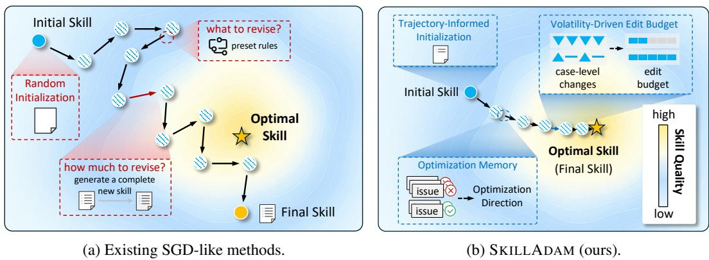
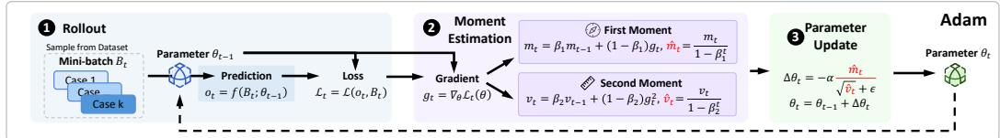
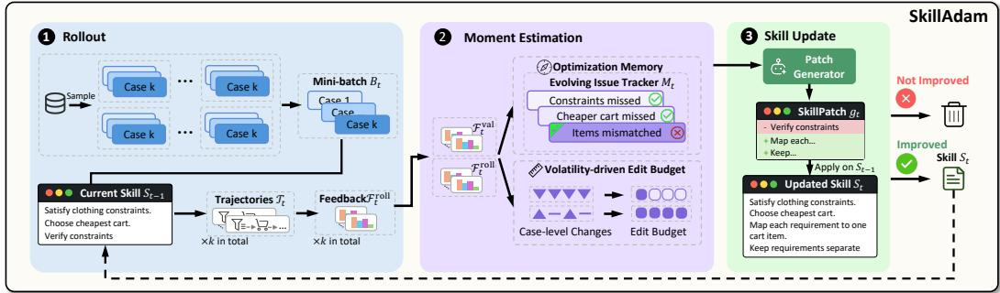
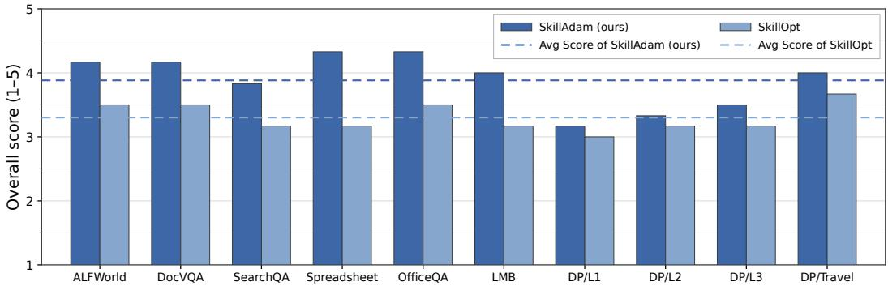
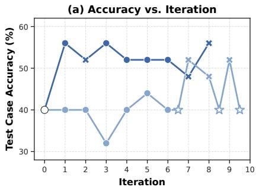
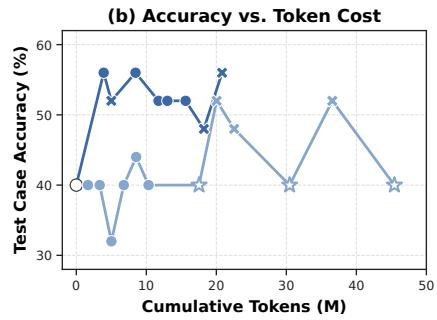

# SKILLADAM: STABLE AND EFFICIENTSKILL EVOLUTION FOR AGENTS

Gaoyuan Li1 Meihao Fan1 Yizhe Liu1 Shaolei Zhang1∗ Ju Fan1 Siyi Wang2 Jiaheng Hou2 Xudong Weng2 Honghan Tian2 Zang Li2

1Renmin University of China 2Tencent

{logey04,fmh1art,liuyizhe2004,zhangshaolei98,fanj}@ruc.edu.cn {skylasywang,marvinhou,steveweng,abeltian,gavinzli}@tencent.com

## ABSTRACT

Agent skills provide a lightweight way to equip frozen language-model agents with domain knowledge and procedural guidance, yet obtaining high-quality skills remains costly and difficult to scale. Expert-written skills require substantial human effort. Recent skill self-evolution methods automate an iterative loop that uses execution feedback to revise skills, but their heuristic update strategies often yield unstable optimization and low iteration efficiency. We identify two challenges in realizing stable and efficient skill self-evolution. Direction Stability requires effective corrections to accumulate rather than be overwritten by iteration-local feedback. Update Adaptivity requires the scope of each revision to reflect the consistency of recent case-level improvements. We introduce SKILLADAM, an Adam-inspired framework for optimizing discrete and non-differentiable skill documents. As a functional analogue of Adam’s first moment, an optimization memory records identified problems and the outcomes of prior solution attempts to stabilize the update direction. As a functional analogue of Adam’s second moment, a volatility-driven edit budget tracks the history-weighted variation of recent case-level improvements and adaptively controls the update magnitude. Across seven benchmarks that span short- and long-horizon tasks, SKILLADAM achieves state-of-the-art performance with more stable optimization dynamics. It also obtains stronger skills with substantially fewer optimization iterations and lower cost than prior methods. Code repository: https://github.com/ruc-datalab/SkillAdam.

## 1 INTRODUCTION

Large language model (LLM) agents have emerged as a powerful paradigm for solving complex real-world tasks through multi-step planning and tool use. Representative tasks include web interaction (Wang et al., 2025a), travel planning (Zhang et al., 2026b), data preparation (Fan et al., 2026; Deng et al., 2026), and data discovery and analysis (Zhang et al., 2025; 2026c; Liu et al., 2026). However, LLM agents often struggle in domain-specific scenarios because their general-purpose capabilities cannot satisfy long-tail domain requirements. For example, planning a multi-city trip requires reasoning about visa regulations, transportation dependencies, and airline-specific booking policies. To address this challenge, recent agent frameworks introduce Agent Skills, defined by Anthropic as modular packages of instructions and supporting resources that equip agents with specialized capabilities (Anthropic, 2025).

However, high-quality Skills are both essential and difficult to obtain. SkillsBench shows that carefully curated Skills can substantially improve agent performance (Li et al., 2026), highlighting the importance of high-quality Skills. In contrast, SkillAxe reports that Skills generated directly by LLMs often remain ineffective without further refinement (Gautam et al., 2026), suggesting that automatically constructing high-quality Skills remains a challenging problem. A common solution is to rely on domain experts to manually author Skills based on their expertise, but this process is time-consuming and labor-intensive. Another line of work employs language models to generate or refine Skills using manually designed prompts or heuristic rules. Although these methods reduce the burden of manual Skill authoring, they still rely heavily on human-designed prompts and task-specific heuristics, limiting their ability to generalize across domains.

  
Figure 1: Conceptual comparison of iterative skill optimization strategies.

To reduce human intervention, recent studies have investigated automated Skill construction from interaction experience. AutoManual incrementally updates structured rules and compiles them into an instruction manual (Chen et al., 2024). Agent Skill Induction learns verified programmatic Skills from web interactions (Wang et al., 2025a), while Trace2Skill synthesizes a unified Skill from a diverse pool of execution traces (Ni et al., 2026). More recently, several studies have formulated automated Skill construction as skill self-evolution. Some methods iteratively refine a Skill document (Gautam et al., 2026; Alzubi et al., 2026; Yang et al., 2026), while others evolve Skill packages or maintain Skill repositories (Zhang et al., 2026a; Ouyang et al., 2026). These approaches re duce manual effort by refining Skills over multiple iterations. As illustrated by the iteration-local optimization path in Figure 1(a), however, existing methods still lack reliable control over what to revise and how much to revise in each iteration.

To address this limitation, we propose SKILLADAM, a stable and efficient framework that aims to preserve effective corrections across iterations while adapting each revision to the reliability of recent evidence. Realizing these properties raises two challenges. The first is Direction Stability. Since each iteration observes feedback from only a limited set of cases, successive revisions may focus on different problems and undo one another. For example, one revision may instruct the agent to minimize the total cost by selecting the cheapest feasible itinerary. A later revision may add more attractions to produce a richer travel plan, but these additions can increase the cost and violate the earlier budget constraint. New revisions must therefore remain consistent with effective corrections accumulated in earlier iterations. The second challenge is Update Adaptivity. The appropriate edit scope should depend on how consistently a recent revision affects the evaluated cases. If one revision improves some cases but degrades others, a broad subsequent edit risks overwriting useful guidance and should therefore be constrained. If the gains are consistent across cases, a broader edit is better supported.

These challenges resemble those in stochastic optimization, where each update is based on partial evidence and the appropriate step size depends on the scale of recent signals. Adam (Kingma & Ba, 2015) provides two complementary design principles: aggregate historical update signals to stabilize direction, and rescale the effective step size using accumulated signal magnitude. SKIL LADAM adopts these principles functionally in the discrete skill space rather than applying Adam numerically.

As illustrated in Figure 1(b), SKILLADAM first constructs a trajectory-informed initial skill from execution trajectories and their evaluation feedback. During self-evolution, an Evolving Issue Tracker records identified problems, their current status, and the outcomes of prior solution attempts, allowing each new update to consider both current feedback and accumulated evidence. In parallel, a volatility-driven edit budget measures how unevenly a candidate changes case-level performance and controls the allowable scope of the next modification. The tracker determines what should be revised, while the budget determines how much may be revised. Together with trajectory-informed initialization, these components produce the more coherent and efficient optimization path shown in Figure 1(b).

  
(a) Adam inspiration. Adam aggregates first- and second-moment estimates to stabilize the update direction and adapt the effective step size.

  
(b) SKILLADAM framework. SKILLADAM uses the Evolving Issue Tracker and a volatility-driven edit budget to provide analogous control over the direction and magnitude of skill updates in the discrete skill space.  
Figure 2: Functional correspondence between Adam and SKILLADAM.

Our contributions are summarized as follows:

• We propose SKILLADAM, an Adam-inspired framework for stable and efficient skill selfevolution.

• We introduce an optimization memory and a volatility-driven edit budget as functional analogues of Adam’s first- and second-moment mechanisms, respectively stabilizing the optimization direction and adapting the update magnitude.

• We conduct extensive experiments on seven benchmarks, where SKILLADAM achieves state-ofthe-art performance while requiring substantially fewer optimization iterations and reducing overall optimization cost.

## 2 RELATED WORK

Agent Skills. We follow Anthropic’s official definition of Agent Skills as modular packages of instructions and supporting resources that equip an agent with specialized capabilities (Anthropic, 2025). Because Skills are stored independently of model parameters, the same package can be distributed to compatible agents without retraining. Earlier work had already externalized reusable capabilities, although it did not share this package definition. Voyager stores executable programs in a library that can be retrieved for later tasks (Wang et al., 2023). AutoManual learns structured rule through interaction and compiles them into a readable instruction manual (Chen et al., 2024). Agent Skill Induction learns and verifies programmatic skills for web agents (Wang et al., 2025a). Skills-Bench provides a common evaluation of package-based Agent Skills and shows that curated Skill improve agent performance across diverse tasks (Li et al., 2026). ExpeL and Agent Workflow Memory instead retain natural-language experience or reusable workflows from past executions (Zhao et al., 2023; Wang et al., 2025b). Our work focuses on Skills whose primary artifact is a natural language instruction document and studies their iterative optimization under task evaluation.

Prompt Optimization. Automatic prompt optimization studies how to improve discrete language artifacts without updating model parameters. OPRO proposes new instructions from previously evaluated candidates and their scores (Yang et al., 2024). ProTeGi turns error feedback into textual gradients and applies search to select prompt edits (Pryzant et al., 2023). TextGrad propagates natural-language feedback through a computation graph to optimize prompts and other textual components (Yuksekgonul et al., 2024). GEPA uses reflective feedback from rollouts to evolve prompts (Agrawal et al., 2026). ERM retains feedback from earlier attempts to support exemplarguided prompt optimization (Yan et al., 2025). They show that evaluation signals can guide discrete textual updates without changing model parameters. Their optimization targets are prompts or components of language-model programs, while SKILLADAM optimizes a reusable Agent Skill used across task instances.

Skill Self-Evolution. Recent work directly automates Agent Skill construction and revision. Trace2Skill analyzes a broad pool of executions and consolidates trajectory-local lessons into a unified skill directory (Ni et al., 2026). SkillAxe iteratively diagnoses and refines LLM-authored skill documents with structured evaluation signals (Gautam et al., 2026). EvoSkill discovers and revises skills through failure analysis, then retains validated candidates through Pareto selection (Alzubi et al., 2026). CoEvoSkills jointly evolves a Skill Generator and a Surrogate Verifier to construct multi-file Skill packages without ground-truth test content (Zhang et al., 2026a). SkillOS trains a curator that updates an external skill repository from accumulated experience (Ouyang et al., 2026). SkillOpt is closest to our setting because it applies bounded textual edits to one skill document and accepts an update only when validation performance improves (Yang et al., 2026). Their optimization targets differ. Some optimize one document, while others construct packages or maintain a repository. Across these settings, existing methods do not jointly maintain persistent optimizer states for the direction and magnitude of successive revisions.

## 3 PRELIMINARIES

## 3.1 SKILL OPTIMIZATION PROBLEM

We consider a skill as a Markdown-formatted natural-language instruction that guides an agent’s behavior in a target domain. In this work, we focus on Skills whose primary artifact is such a structured natural-language instruction document. Let S denote the discrete space of possible skills and $\mathcal { D } = \{ d _ { 1 } , \ldots , d _ { N } \}$ denote a task dataset.

Given a skill $S \in S$ and a task $d \in \mathcal { D }$ , the domain evaluator returns structured case-level evaluation feedback

$$
{ \mathcal { E } } ( S , d ) = ( E ( S , d ) , C ( S , d ) ) ,\tag{1}
$$

where $E ( S , d ) \in \mathbb { R } ^ { m }$ is an m-dimensional vector of domain-specific metrics, and $C ( S , d )$ denotes optional diagnostic information, such as error descriptions or judge rationales. The metric vector E supports numerical aggregation and acceptance decisions, whereas C is retained in $\mathcal { F }$ as languagespace evidence for patch generation and issue tracking. We use

$$
{ \mathcal { F } } ( S , B ) = \{ { \mathcal { E } } ( S , d ) ~ | ~ d \in B \}\tag{2}
$$

to denote the evaluation feedback collected over a task batch $B \subseteq { \mathcal { D } }$

Let Φ be a task-dependent aggregation function that maps task-level metric vectors to a scalar objective. We define

$$
J ( S ) = \Phi \left( \{ E ( S , d ) ~ | ~ d \in \mathcal { D } \} \right) , \qquad S ^ { * } = \arg \operatorname* { m a x } _ { S \in \mathcal { S } } J ( S ) .\tag{3}
$$

The target domain determines the precise forms of $E$ and $C ,$ , and its evaluation protocol determines Φ. Equation 3 aggregates only E because J is numerical; the diagnostic content $\bar { C }$ remains available through $\mathcal { F }$ to the LLM-based update and memory functions.

## 3.2 ADAM OPTIMIZATION

In differentiable optimization, Adam (Kingma & Ba, 2015) maintains exponential moving averages of the first and second moments of stochastic gradients. Let $\nabla _ { t } = \nabla _ { \theta } \mathcal { L } _ { t } ( \mathbf { \dot { \theta } } _ { t - 1 } )$ denote the stochastic gradient of the mini-batch loss at iteration t. Adam updates

$$
m _ { t } ^ { \mathrm { A d a m } } = \beta _ { 1 } m _ { t - 1 } ^ { \mathrm { A d a m } } + ( 1 - \beta _ { 1 } ) \nabla _ { t } ,\tag{4}
$$

$$
v _ { t } ^ { \mathrm { A d a m } } = \beta _ { 2 } v _ { t - 1 } ^ { \mathrm { A d a m } } + ( 1 - \beta _ { 2 } ) \nabla _ { t } ^ { 2 } ,\tag{5}
$$

Here, $m _ { t } ^ { \mathrm { A d a m } }$ and $v _ { t } ^ { \mathrm { A d a m } }$ are the first- and second-moment estimates. The coefficients $\beta _ { 1 } , \beta _ { 2 } \in$ $[ 0 , 1 )$ are exponential decay rates. The square is applied element-wise. Since both moment estimates are initialized at zero, Adam applies bias correction:

$$
\widehat { m } _ { t } ^ { \mathrm { A d a m } } = \frac { m _ { t } ^ { \mathrm { A d a m } } } { 1 - \beta _ { 1 } ^ { t } } , \qquad \widehat { v } _ { t } ^ { \mathrm { A d a m } } = \frac { v _ { t } ^ { \mathrm { A d a m } } } { 1 - \beta _ { 2 } ^ { t } } .\tag{6}
$$

The parameters are then updated as

$$
\theta _ { t } = \theta _ { t - 1 } - \alpha \frac { \widehat { m } _ { t } ^ { \mathrm { A d a m } } } { \sqrt { \widehat { v } _ { t } ^ { \mathrm { A d a m } } } + \epsilon } ,\tag{7}
$$

where $\alpha > 0$ is the base learning rate and $\epsilon > 0$ is a small constant that prevents division by zero and improves numerical stability. The first-moment estimate aggregates gradient information across iterations to stabilize the update direction, while the second-moment estimate rescales the base learning rate according to the recent squared-gradient magnitude, yielding an adaptive effective step size. The ratio

$$
\alpha _ { t } ^ { \mathrm { e f f } } = \frac { \alpha } { \sqrt { \widehat v _ { t } ^ { \mathrm { A d a m } } } + \epsilon }\tag{8}
$$

can be interpreted as the element-wise effective step size.

## 4 METHOD

To enable stable and efficient skill self-evolution in a discrete skill space, we propose SKILLADAM with two Adam-inspired mechanisms: an Evolving Issue Tracker that stabilizes the update direction and a volatility-driven edit budget that adapts the update magnitude. We describe the framework and its components below.

## 4.1 THE SKILLADAM FRAMEWORK

Framework Overview. Figure 2 presents the SKILLADAM cycle. It begins with rollout, after which moment estimation informs the skill update. Before iterative optimization begins, SKIL-LADAM constructs an initial skill $S _ { 0 }$ from execution trajectories and their evaluation feedback. At iteration t, the current skill is executed on a sampled mini-batch, and the optimizer states carried from the previous iteration, $M _ { t - 1 }$ and $\sigma _ { t } .$ guide the generation of a candidate modification. After the candidate has been evaluated, the Evolving Issue Tracker compares the rollout and validation outcomes and evolves the structured issue list that constitutes the optimization memory $M _ { t }$ . The same paired feedback is used to update the improvement-volatility estimate.

The three blocks in Figure 2 describe functional roles. They do not prescribe a strict within-iteration execution order. In particular, the memory and volatility states obtained from the validation outcome of iteration t guide the skill update at iteration $t + 1$ . The complete operational order is given in Algorithm 1, while Table 1 summarizes the functional correspondence between Adam and SKILLADAM.

Rollout. At iteration t, SKILLADAM samples a mini-batch $B _ { t } \subset \mathcal { D }$ and executes the agent with the current skill $S _ { t - 1 } \colon$

$$
\mathcal { T } _ { t } = \operatorname { R o l l o u t } \left( S _ { t - 1 } , B _ { t } \right) ,\tag{9}
$$

where $\mathcal { T } _ { t }$ denotes the collected execution trajectories. The domain evaluator then produces the corresponding case-level evaluation feedback

$$
\mathcal { F } _ { t } ^ { \mathrm { r o l l } } = \mathcal { F } \left( S _ { t - 1 } , B _ { t } \right) ,\tag{10}
$$

as defined in Equation 2. The trajectories record how the agent behaves during execution, while $\mathcal { F } _ { t } ^ { \mathrm { r o l l } }$ contains the resulting metric scores and diagnostic information. Together, $( \overline { { \boldsymbol { \jmath } } } _ { t } , \mathcal { F } _ { t } ^ { \mathrm { r o l l } } )$ provide the iteration-specific optimization signal used to generate the next skill update.

Moment Estimation. SKILLADAM maintains two persistent optimizer states across iterations. The optimization memory is instantiated as an Evolving Issue Tracker (EIT), denoted by $M _ { t }$ , while the volatility estimate $V _ { t } ^ { - }$ controls the magnitude of subsequent updates. Both states are refreshed after the candidate skill has been evaluated and are then carried into the next iteration.

The Evolving Issue Tracker is represented as a collection of structured issue entries:

$$
M _ { t } = \{ I _ { j } \ : | \ : j \in \mathcal { I } _ { t } \} , \qquad I _ { j } = ( p _ { j } , z _ { j } , \mathcal { A } _ { j } ) ,\tag{11}
$$

where $\mathcal { T } _ { t }$ is the set of issue identifiers recorded through iteration t. The pair $( p _ { j } , z _ { j } )$ describes an error pattern and its current status. The set $A _ { j }$ stores previous solution attempts with their observed outcomes. The tracker therefore maintains each issue and its resolution history.

After the candidate skill at iteration t has been evaluated, the tracker directly evolves its state:

$$
M _ { t } = \mathcal { U } _ { \mathrm { E I T } } \left( M _ { t - 1 } , \mathcal { T } _ { t } , \mathcal { F } _ { t } ^ { \mathrm { r o l l } } , g _ { t } , \mathcal { F } _ { t } ^ { \mathrm { v a l } } , a _ { t } \right) .\tag{12}
$$

The LLM-based update function $\mathcal { U } _ { \mathrm { E I T } }$ compares the rollout and validation outcomes to maintain the issue records. It links observed failures to existing issues when possible and creates entries when needed. It also records each attempted modification with its outcome and reopens an issue when the same failure recurs.

The Evolving Issue Tracker serves as a functional analogue of Adam’s first-moment estimate:

$$
m _ { t } ^ { \mathrm { A d a m } } \longleftrightarrow \quad M _ { t } .\tag{13}
$$

Both states integrate current evidence with information accumulated across previous iterations. Adam aggregates numerical gradients. The Evolving Issue Tracker instead accumulates issue histories and solution outcomes to stabilize the update direction.

SKILLADAM additionally estimates how consistently the candidate affects the evaluated cases. Let $\mathcal { E } _ { t , i } ^ { \mathrm { r o l l } }$ and $\mathcal { E } _ { t , i } ^ { \mathrm { v a l } }$ denote the case-level feedback for the current and candidate skills, respectively, on case $d _ { i } \in \bar { B _ { t } }$ . The case-level improvement is

$$
\begin{array} { r } { \delta _ { t , i } = s \big ( \mathcal { E } _ { t , i } ^ { \mathrm { v a l } } \big ) - s \big ( \mathcal { E } _ { t , i } ^ { \mathrm { r o l l } } \big ) , \qquad d _ { i } \in B _ { t } , } \end{array}\tag{14}
$$

where $s ( \cdot )$ extracts the benchmark-specific scalar score used to measure improvement. The mean case-level improvement is

$$
\overline { { \delta } } _ { t } = \frac { 1 } { | B _ { t } | } \sum _ { d _ { i } \in B _ { t } } \delta _ { t , i } .\tag{15}
$$

SKILLADAM estimates the current improvement volatility using

$$
\widehat { V } _ { t } = \frac { 1 } { | B _ { t } | - 1 } \sum _ { d _ { i } \in B _ { t } } \left( \delta _ { t , i } - \overline { \delta } _ { t } \right) ^ { 2 } , \qquad | B _ { t } | \geq 2 .\tag{16}
$$

When fewer than two valid case-level comparisons are available, we set $\widehat V _ { t } \ = \ 0$ . A high value indicates that the candidate produces substantially different effects across cases, while a low value indicates more consistent effects.

The history-weighted volatility estimate is updated as

$$
V _ { t } = \beta _ { 2 } V _ { t - 1 } + ( 1 - \beta _ { 2 } ) \widehat { V } _ { t } , \qquad V _ { 0 } = 0 .\tag{17}
$$

The edit budget for the next iteration is then computed by

$$
\sigma _ { t + 1 } = \operatorname* { m a x } \left( b _ { \operatorname* { m i n } } , \left\lfloor b _ { \mathrm { b a s e } } \left[ 1 - \mathrm { c l i p } \left( \frac { V _ { t } } { V _ { \operatorname* { m a x } } } , 0 , 1 \right) \right] \right\rceil \right) ,\tag{18}
$$

where $b _ { \mathrm { b a s e } }$ is the base edit budget and $b _ { \mathrm { m i n } }$ is the minimum allowable budget. The volatility saturation threshold is $V _ { \mathrm { m a x } }$ . High volatility yields a smaller edit budget, while low volatility permits a broader modification. The budget used at iteration $t , \sigma _ { t } ,$ is determined from the state accumulated through iteration $t - 1$

This mechanism provides the following correspondence:

$$
\begin{array} { r l r l r l } { v _ { t } ^ { \mathrm { A d a m } } } & { { } \longleftrightarrow } & { V _ { t } , } & { } & { { } \alpha _ { t } ^ { \mathrm { e f f } } } & { \longleftrightarrow } & { { } \sigma _ { t + 1 } . } \end{array}\tag{19}
$$

The optimization memory therefore determines which problems should guide the subsequent update, while the volatility-driven edit budget determines how extensively the skill may be modified.

Skill Update. At iteration t, the LLM-based patch generator proposes a skill modification conditioned on the current rollout evidence and the optimizer states carried from the previous iteration:

$$
\begin{array} { r } { g _ { t } = \mathcal { G } _ { \mathrm { L L M } } \left( S _ { t - 1 } , \mathcal { T } _ { t } , \mathcal { F } _ { t } ^ { \mathrm { r o l l } } , M _ { t - 1 } , \sigma _ { t } \right) . } \end{array}\tag{20}
$$

Here, $\mathcal { T } _ { t }$ and $\mathcal { F } _ { t } ^ { \mathrm { r o l l } }$ describe the behavior observed in the current iteration, $M _ { t - 1 }$ provides crossiteration guidance on which problems should be addressed, and $\sigma _ { t }$ controls the allowable scope of the modification.

Applying the generated modification to the current skill produces a candidate:

$$
\widetilde { S } _ { t } = \mathrm { A p p l y } \left( S _ { t - 1 } , g _ { t } \right) .\tag{21}
$$

The candidate is evaluated on the same mini-batch used for the current-skill rollout:

$$
\mathcal { F } _ { t } ^ { \mathrm { v a l } } = \mathcal { F } \left( \widetilde { S } _ { t } , B _ { t } \right) .\tag{22}
$$

Consequently, $\mathcal { F } _ { t } ^ { \mathrm { r o l l } }$ and $\mathcal { F } _ { t } ^ { \mathrm { v a l } }$ provide directly comparable case-level feedback for the current and candidate skills.

A benchmark-specific acceptance gate determines whether the candidate should replace the current skill:

$$
a _ { t } = G _ { \theta } \left( S _ { t - 1 } , \widetilde { S } _ { t } , \mathcal { F } _ { t } ^ { \mathrm { r o l l } } , \mathcal { F } _ { t } ^ { \mathrm { v a l } } \right) \in \{ 0 , 1 \} .\tag{23}
$$

The skill is updated as

$$
S _ { t } = \left\{ \begin{array} { l l } { \widetilde { S } _ { t } , } & { a _ { t } = 1 , } \\ { S _ { t - 1 } , } & { a _ { t } = 0 . } \end{array} \right.\tag{24}
$$

The Evolving Issue Tracker uses each attempted modification and its evaluated outcome to evolve from $M _ { t - 1 }$ to $M _ { t }$ . The same paired feedback is used to compute $\widehat { V } _ { t }$ and $V _ { t }$ . The updated skill and optimizer state are carried into the next iteration, closing the optimization loop shown in Figure 2.

## 4.2 ALGORITHM AND ADAM CORRESPONDENCE

Algorithm 1 presents the operational order of SKILLADAM. The current skill first produces rollout trajectories and evaluation feedback on a sampled mini-batch. The optimizer states carried from the previous iteration then guide the generation of a candidate skill. After the candidate has been evaluated on the same cases, SKILLADAM decides whether to accept it and uses the resulting comparison to evolve the Evolving Issue Tracker and update the volatility estimate. These updated states guide the next iteration.

Figure 2 provides a block-level comparison between Adam and SKILLADAM, while Table 1 makes the correspondence between their optimization quantities explicit. The analogy is functional, not numerical. SKILLADAM does not compute gradients in the discrete skill space. It constructs languagespace states that serve the same optimization roles.

The rollout feedback $\mathcal { F } _ { t } ^ { \mathrm { r o l l } }$ plays a loss-like role by evaluating the current behavior, while the generated patch $g _ { t }$ serves as the gradient-like local update signal in the skill space. The Evolving Issue Tracker $M _ { t }$ accumulates issue histories and solution outcomes across iterations, analogous to Adam’s first moment. Similarly, $V _ { t }$ aggregates recent improvement variability and determines the next edit budget $\sigma _ { t + 1 }$

## 5 EXPERIMENTS

## 5.1 BENCHMARKS

We evaluate SKILLADAM on seven benchmarks that cover knowledge work and interactive planning. Six benchmarks contribute one evaluation slice each. DeepPlanning contributes Shopping Levels 1–3 and Travel EN, giving ten slices in total. Each benchmark uses its native task environ ment, tool interface, and evaluator.

Algorithm 1 SKILLADAM: Adam-Inspired Skill Self-Evolution   
Require: Task dataset ${ \mathcal { D } } ,$ evaluator $\mathcal { E } ,$ mini-batch size $k ,$ maximum iterations $T _ { \mathrm { m a x } }$ , EMA coeffi  
cient $\beta _ { 2 } .$ , budget parameters $b _ { \mathrm { b a s e } } , b _ { \mathrm { m i n } } , V _ { \mathrm { m a x } } ,$ and random seed $\xi$   
Ensure: Optimized skill $S _ { T _ { \mathrm { m a x } } }$   
1: $( \mathcal { T } _ { 0 } , \mathcal { F } _ { 0 } )  \mathrm { C o l l e c t I }$ nitializationData $( \mathcal { D } , \mathcal { E } , \xi )$   
2: $\dot { S } _ { 0 } \gets \mathrm { I n i t i a l i z e } _ { \mathrm { L L M } } ( \mathcal { T } _ { 0 } , \mathcal { F } _ { 0 } )$   
3: $M _ { 0 } \gets \emptyset$   
4: $V _ { 0 }  0$   
5: ${ \sigma _ { 1 } } \gets { b _ { \mathrm { b a s e } } }$   
6: for $t = 1 , 2 , \ldots , T _ { \mathrm { m a x } }$ do   
7: $B _ { t } \gets \mathrm { S a m p l e } ( \overbrace { \mathcal { D } } , \overline { { k } } , \xi + t ) , \quad \mathcal { T } _ { t } \gets \mathrm { R o l l o u t } ( S _ { t - 1 } , B _ { t } ) , \quad \mathcal { F } _ { t } ^ { \mathrm { r o l l } } \gets \mathcal { F } ( S _ { t - 1 } , B _ { t } )$   
8: $g _ { t } \gets \mathscr { G } _ { \mathrm { L L M } } ( S _ { t - 1 } , \mathcal { T } _ { t } , \mathscr { F } _ { t } ^ { \mathrm { r o l l } } , M _ { t - 1 } , \sigma _ { t } ) , \quad \widetilde { S } _ { t } \gets \mathrm { A p p l y } ( S _ { t - 1 } , g _ { t } )$   
9: if $\widetilde { S } _ { t } =$ null then   
10: $S _ { t }  S _ { t - 1 } , \quad M _ { t }  M _ { t - 1 } , \quad V _ { t }  V _ { t - 1 } , \quad \sigma _ { t + 1 }  \sigma _ { t }$   
11: continue   
12: end if   
13: $\mathcal { F } _ { t } ^ { \mathrm { v a l } } \gets \mathcal { F } ( \widetilde { S } _ { t } , B _ { t } ) , \quad a _ { t } \gets G _ { \theta } ( S _ { t - 1 } , \widetilde { S } _ { t } , \mathcal { F } _ { t } ^ { \mathrm { r o l l } } , \mathcal { F } _ { t } ^ { \mathrm { v a l } } )$   
14: if $a _ { t } = 1$ then   
15: $S _ { t } \gets \widetilde { S } _ { t }$   
16: else   
17: $S _ { t } \gets S _ { t - 1 }$   
18: end if   
19: $M _ { t } \gets \mathcal { U } _ { \mathrm { E I T } } \left( M _ { t - 1 } , \mathcal { T } _ { t } , \mathcal { F } _ { t } ^ { \mathrm { r o l l } } , g _ { t } , \mathcal { F } _ { t } ^ { \mathrm { v a l } } , a _ { t } \right)$   
20: $\{ \delta _ { t , i } \} _ { d _ { i } \in B _ { t } }  \Delta ( \mathcal { F } _ { t } ^ { \mathrm { r o l l } } , \mathcal { F } _ { t } ^ { \mathrm { v a l } } )$   
21: $\widehat { V } _ { t } \gets \operatorname { V a r } \left( \{ \delta _ { t , i } \} _ { d _ { i } \in B _ { t } } \right)$   
22: $V _ { t }  \beta _ { 2 } V _ { t - 1 } + ( 1 - \beta _ { 2 } ) \widehat { V } _ { t }$   
23: $\begin{array} { r l } & { \sigma _ { t + 1 }  \operatorname* { m a x } \Big ( b _ { \operatorname* { m i n } } , \Big | b _ { \mathrm { b a s e } } \Big [ 1 - \mathrm { c l i p } ( \frac { V _ { t } } { V _ { \operatorname* { m a x } } } , 0 , 1 ) \Big ] \Big | \Big ) } \end{array}$   
24: end for   
25: return $S _ { T _ { \mathrm { m a x } } }$

Table 1: Core functional correspondence between Adam and SKILLADAM. The correspondence is functional, with evaluation feedback and a language-space patch serving the roles of the loss and gradient.
<table><tr><td>Adam</td><td>SKILLADAM</td><td>Functional role</td></tr><tr><td>Parameters  $\theta _ { t - 1 }$ </td><td>Current skill  $S _ { t - 1 }$   $\mathcal { T } _ { t }$ </td><td>Represent the optimized state Record the execution output</td></tr><tr><td>Prediction  $o _ { t }$ </td><td>Execution trajectories Evaluation feedback  $\mathcal { F } _ { t } ^ { \mathrm { r o l l } }$ </td><td>Evaluate the current behavior</td></tr><tr><td>Loss  $\mathcal { L } _ { t }$ </td><td></td><td></td></tr><tr><td>Gradient  $\nabla _ { t }$ </td><td>Skill patch  $g _ { t }$ </td><td>Provide the local update signal</td></tr><tr><td>First moment  $m _ { t } ^ { \mathrm { A d a m } }$ </td><td>Evolving Issue Tracker  $M _ { t }$ </td><td>Stabilize the update direction</td></tr><tr><td>Second moment  $v _ { t } ^ { \mathrm { A d a m } }$ </td><td>Historical volatility  $V _ { t }$ </td><td>Accumulate update variability</td></tr><tr><td>Effective step size  $\alpha _ { t } ^ { \mathrm { { e f f } } }$ </td><td>Edit budget  $\sigma _ { t + 1 }$ </td><td>Adapt the update magnitude</td></tr><tr><td>Apply  $\Delta \theta _ { t }$ </td><td>Apply and gate  $g _ { t }$ </td><td>Update the optimized state</td></tr><tr><td>Updated parameter  $\theta _ { t }$ </td><td>Accepted skill  $S _ { t }$ </td><td>Carry the state forward</td></tr></table>

We classify five benchmarks as short-horizon, as they require fewer than ten tool calls per task on average. SearchQA (Dunn et al., 2017) evaluates open-domain question answering with noisy retrieved context. SpreadsheetBench (Ma et al., 2024) requires an agent to modify spreadsheets from natural-language instructions. OfficeQA (Opsahl-Ong et al., 2026) evaluates question answering over historical U.S. Treasury Bulletins. DocVQA (Mathew et al., 2021) evaluates visual question answering over document images. LiveMathematicianBench (LMB; also abbreviated as LiveMath in the tables) (He et al., 2026) evaluates reasoning over mathematical theorems and proof sketches. The two long-horizon benchmarks require at least ten tool calls per task on average. ALFWorld (Shridhar et al., 2021) contains text-based embodied household tasks. DeepPlanning (Zhang et al., 2026b) evaluates multi-step shopping and travel planning.

Metrics. We report the standard primary metric for each benchmark. SearchQA, OfficeQA, and LMB use Exact Match. SpreadsheetBench uses hard task success, which requires the complete spreadsheet-editing task to pass. DocVQA uses ANLS-hard. ALFWorld uses episode goalcompletion rate. DeepPlanning reports Shopping Case Accuracy and Travel Case Accuracy. DP-Shopping pools the three shopping levels by case count, with 25, 25, and 10 test cases. DP-Travel contains 60 test cases. We define $\bar { \mathrm { D P } } \mathrm { - A v g } \bar { \mathrm { = } } ( \mathrm { D P } \mathrm { - S h o p p i n g } + \mathrm { D P } \mathrm { - } \mathrm { T r a v e l } ) / 2$ using the unrounded domain-level accuracies. It is not an equal average of the four DeepPlanning slices. All main results are percentages.

## 5.2 BASELINES

We compare SKILLADAM with seven baselines. NoSkill runs the target agent without an injected skill. HumanSkill uses an expert-authored skill, and LLMSkill uses a skill written in one LLM call. The optimization baselines are Trace2Skill (Ni et al., 2026), TextGrad (Yuksekgonul et al., 2024), GEPA (Agrawal et al., 2026), and SkillOpt (Yang et al., 2026).

For the five short-horizon benchmarks, baseline results are taken from the GPT-5.5 no-harness setting reported by SkillOpt. For ALFWorld, the NoSkill result is taken from SkillOpt, and we reproduce the SkillOpt result in our environment. For DeepPlanning, we reproduce both NoSkill and SkillOpt in the task environment used for SKILLADAM. Within each benchmark, the compared methods use the same target-agent configuration, test cases, and evaluator. SKILLADAM and SkillOpt also start from the same initial skill, which is constructed from a fixed set of baseline execution trajectories.

SkillOpt retains its original train and selection split together with its native selection, slow-update, and optimizer-memory procedures. We run SkillOpt for four epochs under this protocol.

## 5.3 SETUP

Common Protocol. All experiments use a no-harness, direct-chat setting. The agent interacts with the native task interface and evaluator of each benchmark without an additional orchestration layer. Skills are injected as natural-language instructions, and the target model remains frozen during optimization. We use GPT-5.5 for the six benchmarks outside DeepPlanning. These runs use medium reasoning effort, a temperature of 1.0, and a maximum output length of 16,384 tokens. DeepPlanning uses Claude Sonnet 4.5 with a temperature of 0.0 and the same output limit. Travel EN uses a separate frozen model to convert the generated plan into the required format before evaluation.

Initialization and Optimization. SKILLADAM and SkillOpt share an initial skill constructed from fixed baseline execution trajectories. For the six benchmarks outside DeepPlanning, SKIL-LADAM merges the original train and selection partitions into one optimization pool. SkillOpt retains the original split. The test partition is unchanged and is used only for final evaluation. DeepPlanning uses an odd-even split by case identifier. Odd-numbered cases are used for optimization, and even-numbered cases are reserved for testing. We use seed 42 for local case sampling, optimization-pool shuffling, and other controlled random operations.

On the six benchmarks outside DeepPlanning, SKILLADAM makes one pass through the optimization pool and uses a benchmark-specific stopping rule. DeepPlanning samples optimization batches at random and uses task-specific stopping criteria. At each iteration, SKILLADAM evaluates the current skill and its proposed revision on the same sampled cases. Their execution trajectories and evaluation feedback are passed to the optimizer states described in Section 4.1.

Acceptance Protocol. The acceptance gate uses the benchmark’s primary and auxiliary metrics. A proposed revision is accepted when at least one designated metric reaches its improvement threshold and every protected metric remains within its regression boundary. An auxiliary metric can therefore support acceptance when the primary metric is unchanged. SKILLADAM does not use an additional validation set for this decision. SkillOpt follows its native selection and slow-update rules.

Evaluation. Each test case is evaluated once with the target-agent configuration specified above.

Table 2: Main results on five short-horizon benchmarks. Baselines follow the GPT-5.5 no-harness results reported by SkillOpt. Scores are percentages. Bold and underlining mark the best and secondbest values.
<table><tr><td>Method</td><td>SearchQA</td><td>Spreadsheet</td><td>OfficeQA</td><td>DocVQA</td><td>LiveMath</td></tr><tr><td>NoSkill</td><td>77.7</td><td>41.8</td><td>33.1</td><td>78.8</td><td>37.6</td></tr><tr><td>HumanSkill</td><td>81.8</td><td>72.9</td><td>66.9</td><td>90.1</td><td>38.4</td></tr><tr><td>LLMSkill</td><td>80.9</td><td>43.2</td><td>51.7</td><td>89.6</td><td>40.0</td></tr><tr><td>Trace2Skill</td><td>82.4</td><td>49.6</td><td>65.7</td><td>90.6</td><td>52.0</td></tr><tr><td>TextGrad</td><td>81.4</td><td>41.1</td><td>42.0</td><td>87.2</td><td>49.2</td></tr><tr><td>GEPA</td><td>84.8</td><td>73.6</td><td>63.9</td><td>89.1</td><td>43.2</td></tr><tr><td>SkillOpt</td><td>87.3</td><td>80.7</td><td>72.1</td><td>91.2</td><td>66.9</td></tr><tr><td>SKILLADAM</td><td>87.5</td><td>81.1</td><td>72.1</td><td>92.3</td><td>67.7</td></tr></table>

Table 3: Main results on ALFWorld with GPT-5.5 and DeepPlanning with Claude Sonnet 4.5. DP-Avg averages the unrounded DP-Shopping and DP-Travel accuracies. Scores are percentages. Bold and underlining mark the best and second-best values.
<table><tr><td>Method</td><td>ALFWorld</td><td>DP-Shopping</td><td>DP-Travel</td><td>DP-Avg</td></tr><tr><td>NoSkill</td><td>83.6</td><td>31.7</td><td>0.0</td><td>15.8</td></tr><tr><td>SkillOpt</td><td>87.3</td><td>41.7</td><td>1.7</td><td>21.7</td></tr><tr><td>SKILLADAM</td><td>89.6</td><td>45.0</td><td>11.7</td><td>28.3</td></tr></table>

## 5.4 MAIN RESULTS

We compare SKILLADAM with all baselines on two categories of benchmarks, i.e., short-horizon benchmarks and long-horizon benchmarks. The results are recorded in Table 2 and Table 3.

Results on Short-Horizon Benchmarks. As illustrated in Table 2, SKILLADAM achieves the overall best performance among all baselines, with four strict wins and one tie on five benchmarks. Specifically, SKILLADAM achieves remarkably better performance compared with HumanSkill and LLMSkill, with an average improvement of 14.45% and 31.20% respectively. This is because SKIL-LADAM adopts iterative skill optimization instead of one-shot skill generation. Thus, it can optimize the skill based on the evaluation result of the immediate agent rollouts, which produces higherquality skills. In addition, compared with the second-best methods, i.e., SkillOpt, SKILLADAM still shows better performance. For example, SKILLADAM achieves higher accuracy on DocVQA and LiveMath, with an improvement of 1.21% and 1.20%. This improvement stems from two technical designs of SKILLADAM, i.e., Optimization Memory and Volatility-driven Edit Budget. With these designs, we can optimize the skills more stably. Thus, we can produce better skills than SkillOpt.

Results on Long-Horizon Benchmarks. Table 3 reports the long-horizon results. As illustrated in the table, the advantages of SKILLADAM are more prominently demonstrated. Specifically, while both NoSkill and SkillOpt nearly fail on DP-Travel, SKILLADAM achieves an accuracy of 11.7%. Moreover, compared with SkillOpt, SKILLADAM improves DP-Avg from 21.7% to 28.3%, a gain of 6.7 percentage points computed from the unrounded accuracies. The results demonstrated that our proposed evolution algorithm can work better on more challenging tasks.

In summary, SKILLADAM achieves the best overall performance compared with other baselines, demonstrating the effectiveness of the proposed skill evolution strategy.

## 5.5 ABLATION STUDIES

We conduct a cumulative ablation study on DeepPlanning to examine the two core mechanisms. Starting from the full framework, we first remove the volatility-driven edit budget and then additionally remove the optimization memory. Thus, each row removes one additional component from the configuration above it. All variants follow the same training and evaluation protocol.

Table 4: Cumulative ablation on DeepPlanning. M and B denote the optimization memory and volatility-driven edit budget. Each row removes one additional component. Scores are percentages, and bold marks the best value in each column.
<table><tr><td>Configuration</td><td colspan="4">DP-Shopping</td><td>DP-Travel DP-Avg</td><td></td></tr><tr><td></td><td>L1</td><td>L2</td><td>L3</td><td>All</td><td></td><td></td></tr><tr><td>SKILLADAM (M + B)</td><td>52.0</td><td>36.0</td><td>50.0</td><td>45.0</td><td>11.7</td><td>28.3</td></tr><tr><td>-B</td><td>48.0</td><td>36.0</td><td>40.0</td><td>41.7</td><td>1.7</td><td>21.7</td></tr><tr><td> $- \mathsf { B } , - \mathsf { M }$ </td><td>56.0</td><td>20.0</td><td>30.0</td><td>36.7</td><td>1.7</td><td>19.2</td></tr><tr><td>NoSkill</td><td>40.0</td><td>24.0</td><td>30.0</td><td>31.7</td><td>0.0</td><td>15.8</td></tr></table>

Table 5: Cross-model transfer from GPT-5.5 to GPT-5.4-mini. Score denotes target-model task performance. Retention measures the percentage of source-model performance preserved after transfer. Both metrics are percentages. Bold marks the better result between SkillOpt and SKILLADAM.
<table><tr><td>Method</td><td>Metric</td><td></td><td>SearchQA DocVQA Spreadsheet ALFWorld LiveMath</td><td></td><td></td><td></td><td></td><td>OfficeQA Average</td></tr><tr><td>NoSkill</td><td>Score</td><td>75.9</td><td>71.4</td><td>36.1</td><td>73.1</td><td>14.7</td><td>22.1</td><td>48.9</td></tr><tr><td>SkillOpt SkillOpt</td><td>Score Retention</td><td>80.8 92.6%</td><td>90.4 99.1%</td><td>61.4 76.1%</td><td>66.4 76.1%</td><td>28.2 42.2%</td><td>51.2 71.0%</td><td>63.1 76.2%</td></tr><tr><td>SKILLADAM SKILLADAM Retention</td><td>Score</td><td>78.9 90.2%</td><td>91.2 98.8%</td><td>65.0 80.1%</td><td>82.8 92.4%</td><td>33.1 48.9%</td><td>55.8 77.4%</td><td>67.8 81.3%</td></tr></table>

As illustrated in Table 4, the full SKILLADAM achieves the best overall result, increasing DP-Avg from 19.2% without both mechanisms to 28.3%. Specifically, with Optimization Memory fixed, adding the Volatility-driven Edit Budget improves DP-Avg by 6.7 percentage points, with the largest gain occurring on DP-Travel. This result supports the importance of Update Adaptivity in longhorizon planning. Specifically, when a revision produces inconsistent effects across cases, reducing the next edit scope can avoid damaging previously correct constraints, whereas consistent improvements permit broader updates.

Optimization Memory provides a complementary benefit. Without the edit budget, adding memory raises DP-Avg from 19.2% to 21.7%, with gains on Shopping L2 and L3 despite a decrease on L1. The concentration of gains on the more difficult levels suggests that recording issue states and prior solution outcomes helps preserve and reconcile multiple corrections across iterations, thereby maintaining a more stable optimization direction. However, because this is a cumulative ablation, it does not independently isolate the effect of memory when the edit budget is enabled or the interaction between the two mechanisms.

## 5.6 CROSS-MODEL TRANSFER

We evaluate whether the optimized skills remain effective when transferred to a different agent backbone. Specifically, the skills produced by SKILLADAM and SkillOpt using GPT-5.5 are deployed verbatim on GPT-5.4-mini without further optimization or adaptation. We conduct this evaluation on six benchmarks supported by both backbones.

Table 5 reports the task score obtained on GPT-5.4-mini and the corresponding retention ratio. Let $s _ { \mathrm { s r c } }$ and $s _ { \mathrm { t g t } }$ denote the scores obtained on GPT-5.5 and GPT-5.4-mini, respectively. We define the retention ratio as $\mathrm { R e t e n t i o n } = s _ { \mathrm { t g t } } / s _ { \mathrm { s r c } }$ . A higher retention ratio indicates that a larger fraction of the skill’s source-model performance is preserved after transfer. No-Skill results on GPT-5.4-mini are included as reference performance and are taken from Yang et al. (2026).

As illustrated in Table 5, SKILLADAM achieves higher target-model scores on five of the six bench marks and higher retention ratios on four of the six benchmarks. Compared with SkillOpt, SKIL LADAM improves the average target-model score from 63.1% to 67.8% and the average retention ratio from 76.2% to 81.3%. The advantage remains after excluding ALFWorld, indicating that the improvement is not driven by a single benchmark; SearchQA is the only target-score exception.

  
Figure 3: Overall skill-quality scores on a 1–5 scale across ten benchmark slices. Each value averages the six dimension medians from three independent calls to the same GPT-5.5 judge. Horizontal markers show the mean across slices.

These results show that the skills optimized by SKILLADAM transfer more effectively across agent backbones. A plausible explanation is that Optimization Memory consolidates recurring problems and evaluated solution attempts across iterations, encouraging the final skill to capture task-level procedures rather than source-model-specific wording. The transfer experiment evaluates the complete framework, however, and therefore does not isolate which component is responsible for the gain.

## 5.7 SKILL QUALITY ANALYSIS

Beyond task performance, we evaluate the optimized skills with a frozen GPT-5.5 judge. The comparison covers ten benchmark slices, including six individual benchmarks and four DeepPlanning slices. Each skill is evaluated through three independent calls to the same judge model. The input does not reveal the method name. Each call assigns a score from 1 to 5 on six dimensions. Task Alignment and Non-Obvious Insight measure relevance. Constraint Handling and Decision Framework measure operational guidance. Cognitive Load and Inference Efficiency measure usability. For each dimension, we take the median of the three scores. The overall score for a skill is the mean of these six medians. We then average the overall scores across the ten benchmark slices.

As illustrated in Figure 3, SKILLADAM obtains a higher skill-quality score than SkillOpt on all ten benchmark slices, increasing the mean score from 3.30 to 3.88. Because every paired comparison favors SKILLADAM, the improvement is consistent across tasks rather than being driven by a small number of benchmarks.

This result complements the task-performance results in Section 5.4. The benchmark metrics measure whether the agent completes the task, whereas the judge evaluates whether the skill provides relevant, operational, and usable guidance. The agreement between the two evaluations suggests that SKILLADAM improves not only downstream execution but also the quality of the skill document itself. This improvement is consistent with Optimization Memory preserving useful constraints and the Volatility-driven Edit Budget limiting uncontrolled revisions. However, the judge experiment evaluates the complete framework, and Figure 3 aggregates all six dimensions; it therefore isolates neither an individual component nor a single quality dimension.

## 5.8 TRAINING COST

We compare optimization-phase API use for SKILLADAM and SkillOpt on the four DeepPlanning slices. Both methods use Claude Sonnet 4.5 and optimize over the same cases. The counts cover the optimization and iteration phase. They exclude initial-skill generation and final test evaluation. Unrelated smoke tests are also excluded. Token counts come from the raw counters returned by the API and do not represent a dollar cost. We report input tokens, output tokens, and API requests together with the resulting DeepPlanning performance.

Table 6: Optimization-phase API use and DeepPlanning test performance. API-use deltas are relative reductions. Performance deltas are absolute percentage-point differences.
<table><tr><td>Metric</td><td>SkillOpt</td><td>SKILLADAM</td><td>Delta</td></tr><tr><td>Input Tokens</td><td>222.1M</td><td>72.5M</td><td>-67.3%</td></tr><tr><td>Output Tokens</td><td>4.5M</td><td>1.5M</td><td>-66.8%</td></tr><tr><td>Total Tokens</td><td>226.6M</td><td>74.0M</td><td>-67.3%</td></tr><tr><td>API Requests</td><td>9,071</td><td>2,830</td><td>-68.8%</td></tr><tr><td colspan="4">Resulting test performance (higher is better)</td></tr><tr><td>DP-Shopping</td><td>41.7%</td><td>45.0%</td><td>+3.3 pp</td></tr><tr><td>DP-Travel</td><td>1.7%</td><td>11.7%</td><td>+10.0 pp</td></tr><tr><td>DP-Avg</td><td>21.7%</td><td>28.3%</td><td>+6.7 pp</td></tr></table>

  
Seed SkillAdam (ours) SkillOpt Accepted Rejected Slow-update  
Figure 4: Optimization dynamics on DeepPlanning Shopping Level 1.

As illustrated in Table 6, SKILLADAM reduces total token consumption by 67.3% and API requests by 68.8% compared with SkillOpt, while improving DP-Avg from 21.7% to 28.3%. Thus, the lower optimization cost is not achieved by sacrificing the quality of the final skill.

The two methods consume a similar number of tokens per request, and SKILLADAM is slightly higher on this measure. Therefore, the reduction does not come from shorter individual calls, but from requiring fewer optimization requests and modification attempts. This result is consistent with the two technical designs of SKILLADAM: Optimization Memory avoids repeatedly rediscovering previously identified failures, while the Volatility-driven Edit Budget reduces broad, weakly supported revisions. Measured by DP-Avg per million optimization tokens, SKILLADAM is approximately four times as efficient as SkillOpt.

## 6 ANALYSES

We analyze SKILLADAM and SkillOpt on DeepPlanning Shopping Level 1. Both methods use Claude Sonnet 4.5 and start from the same initial skill, which has 40% test case accuracy. One iteration denotes one minibatch-level modification attempt. SKILLADAM compares the current skill with its proposed revision on the same sampled optimization cases and applies its multi-metric acceptance gate. SkillOpt follows its native selection and slow-update rules. The markers in Figure 4 therefore record the decision made by each method’s own update protocol.

The figure reports the post-hoc test accuracy of every evaluated modification. Panel (a) uses the minibatch-level iteration index, and Panel (b) uses cumulative token consumption. Test performance is shown only for analysis and does not determine whether a modification is accepted. A modification with a high test score can still be rejected by the cases and metrics used in the corresponding update protocol.

## 6.1 STABILITY

As illustrated in Figure 4(a), SKILLADAM finds a strong revision in the first iteration, and all subsequent accepted skills remain above the initial performance. In contrast, SkillOpt’s accepted regular updates fluctuate around or below its starting performance, while its later high-scoring candidates are not retained. This comparison shows that SKILLADAM produces a more stable accepted optimization path.

The result is consistent with the design of Optimization Memory. By retaining previously identified issues, their status, and the outcomes of prior solutions, SKILLADAM can incorporate new feedback without repeatedly overwriting useful corrections. The acceptance gate further prevents insufficiently supported revisions from replacing the current skill. The rejected SKILLADAM revision at iteration 8 nevertheless has a high post-hoc test score. This does not contradict the stability result because acceptance is determined only by sampled optimization cases and protected metrics, while the test score is used solely for retrospective analysis. Since the figure reports one run and memory operates together with the gate, it characterizes the overall optimization behavior rather than isolating the causal effect of memory alone.

## 6.2 EFFICIENCY

As illustrated in Figure 4(b), SKILLADAM reaches an accepted skill with 56% test accuracy after approximately 4M tokens, whereas SkillOpt first produces a comparably strong candidate after approximately 20M tokens and does not accept it. SKILLADAM therefore reaches and retains a stronger skill with about one fifth of the token cost in this run.

Combined with the similar token cost per request in Table 6, the result shows that the efficiency gain comes from fewer unproductive modification attempts rather than cheaper individual calls. This behavior is consistent with the two core mechanisms: the Volatility-driven Edit Budget restricts broad edits when recent case-level effects are inconsistent, and Optimization Memory prevents repeated rediscovery of earlier failures. Together, they allow SKILLADAM to identify useful revisions with fewer iterations.

## 7 CONCLUSION

We introduced SKILLADAM, a gradient-inspired framework for iterative skill self-evolution that adapts the two principles behind Adam to the skill space. An optimization memory accumulates structured records across iterations to provide stability, and a volatility-driven edit budget scales each update to the reliability of the improvement evidence to provide adaptivity. Across seven benchmarks that span short-horizon and long-horizon agentic tasks, SKILLADAM achieves state-of the-art performance at substantially lower training cost. Its skills also transfer better across models.

## REFERENCES

Lakshya A. Agrawal, Shangyin Tan, Dilara Soylu, Noah Ziems, Rishi Khare, Krista Opsahl-Ong, Arnav Singhvi, Herumb Shandilya, Michael J. Ryan, Meng Jiang, Christopher Potts, Koushik Sen, Alexandros G. Dimakis, Ion Stoica, Dan Klein, Matei Zaharia, and Omar Khattab. GEPA: Reflective prompt evolution can outperform reinforcement learning. In International Conference on Learning Representations (ICLR), 2026. URL https://arxiv.org/abs/2507. 19457. Oral presentation.

Salaheddin Alzubi, Noah Provenzano, Jaydon Bingham, Weiyuan Chen, and Tu Vu. EvoSkill: Automated skill discovery for multi-agent systems. arXiv preprint arXiv:2603.02766, 2026. URL https://arxiv.org/abs/2603.02766.

Anthropic. Introducing Agent Skills, October 2025. URL https://claude.com/blog/ skills.

Minghao Chen, Yihang Li, Yanting Yang, Shiyu Yu, Binbin Lin, and Xiaofei He. AutoManual: Constructing instruction manuals by LLM agents via interactive environmental learning. In Advances in Neural Information Processing Systems, vol-

ume 37, 2024. URL https://papers.nips.cc/paper\_files/paper/2024/hash/ 0142921fad7ef9192bd87229cdafa9d4-Abstract-Conference.html.

Chao Deng, Shaolei Zhang, Ju Fan, and Xiaoyong Du. DataEvolver: Automatic data preparation for large language models through multi-level self-evolving. arXiv preprint arXiv:2606.07001, 2026. URL https://arxiv.org/abs/2606.07001.

Matthew Dunn, Levent Sagun, Mike Higgins, V. Ugur Guney, Volkan Cirik, and Kyunghyun Cho. SearchQA: A new Q&A dataset augmented with context from a search engine. arXiv preprint arXiv:1704.05179, 2017. URL https://arxiv.org/abs/1704.05179.

Meihao Fan, Ju Fan, Yuxin Zhang, Shaolei Zhang, Xiaoyong Du, Jie Song, Peng Li, Fuxin Jiang, Tieying Zhang, and Jianjun Chen. DeepPrep: An LLM-powered agentic system for autonomous data preparation. Proceedings ofthe VLDB Endowment, 19(11):3371–3384, 2026. doi: 10.14778/ 3836663.3836695. URL https://www.vldb.org/pvldb/vol19/p3371-fan.pdf.

Srishti Gautam, Arjun Radhakrishna, and Sumit Gulwani. SkillAxe: Sharpening LLM-authored agent skills through evaluation-guided self-refinement. arXiv preprint arXiv:2606.10546, 2026. URL https://arxiv.org/abs/2606.10546.

Linyang He, Qiyao Yu, Hanze Dong, Baohao Liao, Xinxing Xu, Micah Goldblum, Jiang Bian, and Nima Mesgarani. LiveMathematicianBench: A live benchmark for mathematician-level reasoning with proof sketches. arXiv preprint arXiv:2604.01754, 2026. URL https://arxiv. org/abs/2604.01754.

Diederik P. Kingma and Jimmy Ba. Adam: A method for stochastic optimization. In International Conference on Learning Representations (ICLR), 2015. URL https://arxiv.org/abs/ 1412.6980.

Xiangyi Li et al. SkillsBench: Benchmarking how well agent skills work across diverse tasks. arXiv preprint arXiv:2602.12670, 2026. URL https://arxiv.org/abs/2602.12670.

Yizhe Liu, Shaolei Zhang, and Ju Fan. DA-Studio: An agentic system for end-to-end data analysis. Proceedings of the VLDB Endowment, 19(12):4766–4769, 2026. doi: 10.14778/3827998. 3828117. URL https://www.vldb.org/pvldb/vol19/p4766-liu.pdf.

Zeyao Ma, Bohan Zhang, Jing Zhang, Jifan Yu, Xiaokang Zhang, Xiaohan Zhang, Sijia Luo, Xi Wang, and Jie Tang. SpreadsheetBench: Towards challenging real world spreadsheet manipulation. In Advances in Neural Information Processing Systems (NeurIPS), 2024. URL https://arxiv.org/abs/2406.14991. Spotlight.

Minesh Mathew, Dimosthenis Karatzas, and C.V. Jawahar. DocVQA: A dataset for VQA on document images. In IEEE/CVF Winter Conference on Applications of Computer Vision (WACV), 2021. URL https://arxiv.org/abs/2007.00398.

Jingwei Ni, Yihao Liu, Xinpeng Liu, Yutao Sun, Mengyu Zhou, Pengyu Cheng, Dexin Wang, Erchao Zhao, Xiaoxi Jiang, and Guanjun Jiang. Trace2Skill: Distill trajectory-local lessons into transferable agent skills. arXiv preprint arXiv:2603.25158, 2026. URL https://arxiv. org/abs/2603.25158.

Krista Opsahl-Ong, Arnav Singhvi, Jasmine Collins, Ivan Zhou, Cindy Wang, Ashutosh Baheti, Owen Oertell, Jacob Portes, Sam Havens, Erich Elsen, Michael Bendersky, Matei Zaharia, and Xing Chen. OfficeQA Pro: An enterprise benchmark for end-to-end grounded reasoning. arXiv preprint arXiv:2603.08655, 2026. URL https://arxiv.org/abs/2603.08655.

Siru Ouyang, Jun Yan, Yanfei Chen, Rujun Han, Zifeng Wang, Bhavana Dalvi Mishra, Rui Meng, Chun-Liang Li, Yizhu Jiao, Kaiwen Zha, Maohao Shen, Vishy Tirumalashetty, George Lee, Jiawei Han, Tomas Pfister, and Chen-Yu Lee. SkillOS: Learning skill curation for self-evolving agents. arXiv preprint arXiv:2605.06614, 2026. URL https://arxiv.org/abs/2605. 06614.

Reid Pryzant, Dan Iter, Jerry Li, Yin Lee, Chenguang Zhu, and Michael Zeng. Automatic prompt optimization with “gradient descent” and beam search. In Proceedings of the 2023 Conference on Empirical Methods in Natural Language Processing, pp. 7957–7968. Association for Computational Linguistics, 2023. doi: 10.18653/v1/2023.emnlp-main.494. URL https://aclanthology.org/2023.emnlp-main.494/.

Mohit Shridhar, Xingdi Yuan, Marc-Alexandre Cotˆ e, Yonatan Bisk, Adam Trischler, and Matthew´ Hausknecht. ALFWorld: Aligning text and embodied environments for interactive learning. In International Conference on Learning Representations (ICLR), 2021. URL https://arxiv. org/abs/2010.03768.

Guanzhi Wang, Yuqi Xie, Yunfan Jiang, Ajay Mandlekar, Chaowei Xiao, Yuke Zhu, Linxi Fan, and Anima Anandkumar. Voyager: An open-ended embodied agent with large language models. arXiv preprint arXiv:2305.16291, 2023. URL https://arxiv.org/abs/2305.16291.

Zora Zhiruo Wang, Apurva Gandhi, Graham Neubig, and Daniel Fried. Inducing programmatic skills for agentic tasks. In Conference on Language Modeling, 2025a. URL https: //openreview.net/forum?id=lsAY6fWsog.

Zora Zhiruo Wang, Jiayuan Mao, Daniel Fried, and Graham Neubig. Agent workflow memory. In Proceedings of the 42nd International Conference on Machine Learning, volume 267 of Proceedings of Machine Learning Research, pp. 63897–63911. PMLR, 2025b. URL https://proceedings.mlr.press/v267/wang25bx.html.

Cilin Yan, Jingyun Wang, Lin Zhang, Ruihui Zhao, Xiaopu Wu, Kai Xiong, Qingsong Liu, Guoliang Kang, and Yangyang Kang. Efficient and accurate prompt optimization: The benefit of memory in exemplar-guided reflection. In Proceedings of the 63rd Annual Meeting of the Association for Computational Linguistics, pp. 753–779. Association for Computational Linguistics, 2025. doi: 10.18653/v1/2025.acl-long.37. URL https://aclanthology.org/2025.acl-long. 37/.

Chengrun Yang, Xuezhi Wang, Yifeng Lu, Hanxiao Liu, Quoc V. Le, Denny Zhou, and Xinyun Chen. Large language models as optimizers. In International Conference on Learning Representations, 2024. URL https://arxiv.org/abs/2309.03409.

Yifan Yang, Ziyang Gong, Weiquan Huang, Qihao Yang, Ziwei Zhou, Zisu Huang, Yan Li, Xuemei Gao, Qi Dai, Bei Liu, Kai Qiu, Yuqing Yang, Dongdong Chen, Xue Yang, and Chong Luo. SkillOpt: Executive strategy for self-evolving agent skills. arXiv preprint arXiv:2605.23904, 2026. URL https://arxiv.org/abs/2605.23904.

Mert Yuksekgonul, Federico Bianchi, Joseph Boen, Sheng Liu, Zhi Huang, Carlos Guestrin, and James Zou. TextGrad: Automatic “differentiation” via text. arXiv preprint arXiv:2406.07496, 2024. URL https://arxiv.org/abs/2406.07496.

Hanrong Zhang, Shicheng Fan, Henry Peng Zou, Yankai Chen, Zhenting Wang, Jiayu Zhou, Chengze Li, Wei-Chieh Huang, Yifei Yao, Kening Zheng, Xue Liu, Xiaoxiao Li, and Philip S. Yu. CoEvoSkills: Self-evolving agent skills via co-evolutionary verification. arXiv preprint arXiv:2604.01687, 2026a. URL https://arxiv.org/abs/2604.01687.

Shaolei Zhang, Ju Fan, Meihao Fan, Guoliang Li, and Xiaoyong Du. DeepAnalyze: Agentic large language models for autonomous data science. arXiv preprint arXiv:2510.16872, 2025. URL https://arxiv.org/abs/2510.16872.

Yinger Zhang, Shutong Jiang, Renhao Li, Jianhong Tu, Yang Su, Lianghao Deng, Xudong Guo, Chenxu Lv, and Junyang Lin. DeepPlanning: Benchmarking long-horizon agentic planning with verifiable constraints. arXiv preprint arXiv:2601.18137, 2026b. URL https://arxiv.org/ abs/2601.18137.

Yuxin Zhang, Ju Fan, Meihao Fan, Shaolei Zhang, and Xiaoyong Du. CoDA-Bench: Can code agents handle data-intensive tasks? In Proceedings of the 43rd International Conference on Machine Learning, 2026c. URL https://arxiv.org/abs/2606.15300.

Andrew Zhao, Daniel Huang, Quentin Xu, Matthieu Lin, Yong-Jin Liu, and Gao Huang. ExpeL: LLM agents are experiential learners. arXiv preprint arXiv:2308.10144, 2023. URL https: //arxiv.org/abs/2308.10144.