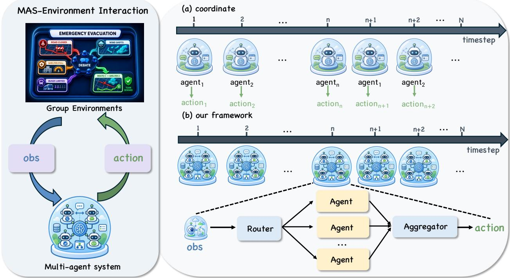
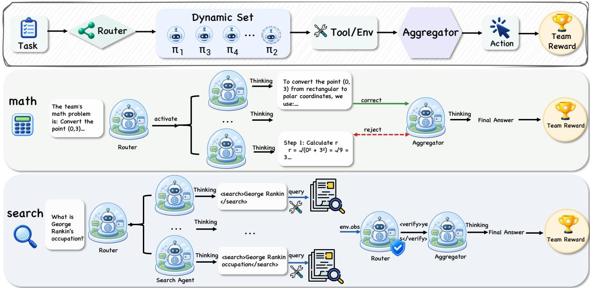
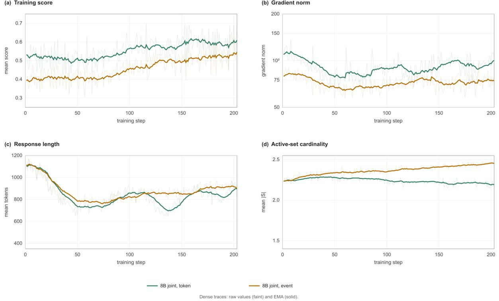
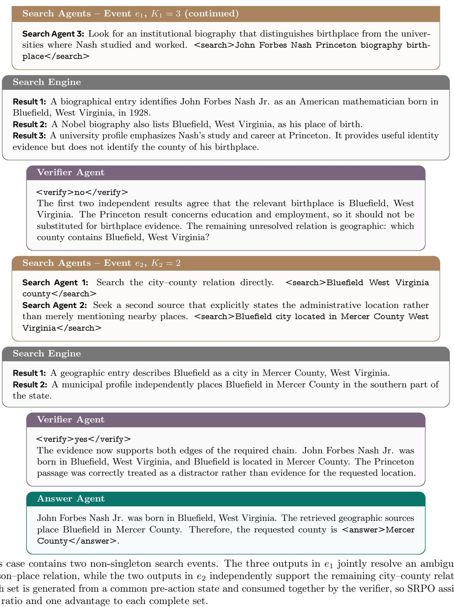

# SRPO: Setwise Relative Policy Optimization for Multi-Agent LLMs

Shengtian Yang<sup>1,2</sup>, Ziyu Xiong<sup>1</sup>, Yu Li<sup>1</sup>, Yewen Li<sup>2</sup>, Qingpeng Cai<sup>2</sup>, Lei Feng<sup>1,∗</sup>

<sup>1</sup>Southeast University, Nanjing, China, <sup>2</sup>Kuaishou Technology, Beijing, China <sup>∗</sup>Corresponding author

Multi-agent large language models solve complex tasks by coordinating several policies in a shared environment. However, existing reinforcement learning methods usually optimize each response or trajectory separately, even when several outputs jointly cause one state transition. Consequently, the update unit difers from the action executed by the system. To address this problem, we propose SRPO (Setwise Relative Policy Optimization), which treats the active set—the minimal set of outputs consumed by one transition—as one multi-agent action. Specifically, SRPO combines member logratios into one cardinality-normalized set ratio, assigns one relative advantage, and clips the set once. This formulation unifies division of labor and joint co-evolution as actions with diferent set sizes. Experiments on mathematical reasoning and multi-turn search demonstrate one training interface for fixed, mixed, and dynamically routed workflows across four model scales, with the strongest macro-average results among the reported comparisons. Optimization diagnostics further characterize its stability under diferent event reductions and set sizes.

Correspondence: yangshengtian58@gmail.com

## 1 Introduction

Large language models (LLMs) are increasingly deployed as agents that reason, retrieve evidence, use tools, and revise intermediate answers. Multi-agent systems (MAS) extend these abilities through two recurring collaboration paradigms: agents either divide a task into specialized roles or jointly evolve multiple proposals through interaction. Because both paradigms operate in a shared environment, reinforcement learning (RL) can train the complete system from an end-to-end reward rather than a collection of hand-written local objectives (Park et al., 2025; Hong et al., 2025; Mo et al., 2025; Liu et al., 2025; Zhao et al., 2025; Chen et al., 2026; Feng et al., 2026). The resulting system may act through one specialized output, several jointly generated outputs, or a routed mixture of both.

However, existing MAS-RL methods usually define the update unit through a particular collaboration workflow. Methods for division of labor organize experience by role or turn, whereas methods for joint co-evolution group simultaneous responses; hybrid systems then require additional rules. Thus, agent identity, execution order, or rollout layout determines what the optimizer treats as an action, rather than the transition that the team actually produces. Consequently, the same environmental decision can receive diferent updates when the number or order of contributing agents changes. This mismatch limits a common optimization rule across collaboration paradigms. Therefore, the central challenge is to define the MAS action independently of agent order, role, and orchestration layout.

To address this challenge, we propose SRPO (Setwise Relative Policy Optimization), a policy-optimization framework for multi-agent LLM systems. SRPO defines the active set as the minimal set of newly sampled outputs consumed by one state transition. Specifically, it combines the likelihood changes of all members into one cardinality-normalized set ratio, assigns one relative advantage, and clips the complete set once. Under this definition, a singleton set represents division of labor, a multi-member set represents joint co-evolution, and changing set sizes represent mixed or dynamically routed workflows. Moreover, rollout generation, reward design, and advantage estimation remain interchangeable. Experiments on mathematical reasoning and multi-turn search demonstrate this common interface across four model scales, while training diagnostics characterize its behavior under diferent event reductions and set sizes.

Our contributions are:

1. A workflow-independent MAS action. We define the active set at the environment-transition boundary, representing division of labor, joint co-evolution, and their mixtures within one LLM-based MAS decision process.

2. A simple setwise objective. We propose SRPO, which defines the active set as the policy action and applies one cardinality-normalized relative update to each environment-changing event; its singleton case recovers ordinary response-level optimization.

3. A practical and general training interface. We preserve active sets through event-atomic batching and evaluate fixed, mixed, and routed workflows on math and search across four model scales, together with diagnostics of gradient scale, response length, set cardinality, and event completeness.

## 2 Related Work

Relative policy optimization for language-model agents. PPO constrains policy changes with a clipped likelihood ratio (Schulman et al., 2017). GRPO removes the learned value function and estimates relative advantages by comparing responses sampled for the same prompt, which provides a compact interface for reasoning post-training (Shao et al., 2024). DAPO and GiGPO refine group construction and long-response optimization, while Search-R1 extends the same family to tool-augmented multi-turn trajectories (Yu et al., 2025; Feng et al., 2025; Jin et al., 2025). Recent agentic-RL studies further explore long-horizon credit and routing: Phgpo uses pheromone-guided policy signals for tool planning, Phase-Aware MoE conditions expert selection on the stage of an agentic task, and Progress- conditioned GPO uses task progress to shape group-relative updates (Li et al., 2026; Yang et al., 2026b,a). These methods establish efective relative updates for language-model agents, but their policy action remains a response or a single-agent trajectory. They therefore do not specify how several outputs that jointly cause one transition should be represented as one multi-agent decision.

Cooperative multi-agent reinforcement learning. Before LLM-based systems, cooperative MARL developed centralized-training and decentralized-execution methods for coordinating agents with shared returns. Actor– critic approaches such as MADDPG and counterfactual policy gradients assign credit using other agents’ actions as context, while VDN and QMIX learn factorized value functions for coordinated decisions (Lowe et al., 2017; Foerster et al., 2018; Sunehag et al., 2018; Rashid et al., 2018). MAPPO later showed that a PPO-style learner can be an efective baseline for cooperative games when the training signal is shared across agents (Yu et al., 2022). These methods motivate our focus on a shared environment and team-level return, but their action representation is tied to fixed agent interfaces or value-factorization assumptions rather than variable-cardinality LLM outputs.

Reinforcement learning for multi-agent LLM systems. Recent methods organize collaboration and credit in diferent ways. Their workflows alternate specialized roles, sample several responses from a shared state, or combine both patterns. MAGRPO studies multi-agent multi-turn group-relative updates, while Stronger-MAS uses agent- and turn-wise grouping for role- and phase-dependent training (Liu et al., 2025; Zhao et al., 2025). MHGPO constructs heterogeneous rollout groups for multi-agent search, whereas MAPoRL, M-GRPO, and MATPO study post-training, deep-research, and tool-integrated settings (Chen et al., 2026; Park et al., 2025; Hong et al., 2025; Mo et al., 2025). Dr. MAS is the closest reference for our benchmarks: it uses agent-wise normalization to stabilize heterogeneous roles and reports math and search results (Feng et al., 2026). These methods provide valuable return estimators and role-aware normalization rules. Nevertheless, their update units remain tied to a predefined agent, turn, group, or rollout layout. As a result, moving between division of labor and joint co-evolution changes not only the workflow but also the representation on which policy optimization is defined.

Orchestration and scalable execution. Another line of work represents orchestration traces through spawning, delegation, communication, aggregation, and stopping decisions (Zhang, 2026). AgentJet studies the distributed execution needed to train heterogeneous agents at scale (Fu et al., 2026). Such systems determine how a workflow runs, but they do not by themselves define the policy action when several agents jointly change the environment. Taken Related sequential-decision eforts broaden the scope beyond next-observation prediction and standard QA: agent-authored world modeling exposes explicit environment modeling, while

PlatformBid provides a unified benchmark for sequential auto-bidding (Cai et al., 2026; Yang et al., 2026c). Taken together, prior work lacks a workflow-independent formulation that connects multi-agent execution to a common optimization unit. SRPO fills this gap by defining the outputs consumed by one transition as an active set, thereby placing division of labor, joint co-evolution, and mixed orchestration within one policy-optimization framework while remaining compatible with existing execution systems, reward functions, and credit estimators.

Reasoning, verification, and tool use. LLM agents commonly interleave reasoning with external actions, as in ReAct and Toolformer, and retrieval-augmented generation supplies evidence for knowledge-intensive answers (Yao et al., 2023b; Schick et al., 2023; Lewis et al., 2020). Tree-of-Thoughts and Reflexion use branching or verbal feedback to improve iterative problem solving, while self-consistency and process verification aggregate or check multiple reasoning paths (Yao et al., 2023a; Shinn et al., 2023; Wang et al., 2023; Lightman et al., 2023). Our Search and Math environments build on these interaction patterns, but the contribution here is the policy-optimization unit for the collaborating outputs, not a new prompting or search procedure.

## 3 Preliminaries: Multi-Agent Decisions as Set-Valued Actions

## 3.1 Decision events

Consider N worker policies $\{ \pi _ { \theta _ { i } } \} _ { i = 1 } ^ { N }$ , a router $\mu _ { \phi }$ , and an aggregator $\alpha _ { \psi }$ . At decision event $e ,$ the system is in a shared pre-action state $s _ { e } .$ The execution schedule determines which policy records are sampled, and $S _ { e }$ indexes the $K _ { e }$ outputs consumed by the next transition. Every $j \in S _ { e }$ produces an output $a _ { e , j }$ from observation $o _ { e , j }$ using an event-specific policy $q _ { e , j } \in \{ \mu _ { \phi } , \pi _ { \theta _ { 1 } } , \ldots , \pi _ { \theta _ { N } } , \alpha _ { \psi } \}$

Definition 1 (Active set). The active set $S _ { e }$ is the minimal set of newly sampled outputs that the environment consumes together to produce the next state. The corresponding set-valued action is $\mathbf { a } _ { e } = \{ a _ { e , j } : j \in S _ { e } \}$

Here the environment state includes both the external task state and the shared orchestration memory available to later policies. A proposal committed to this shared memory therefore induces a transition even when the external tool state is unchanged. A private draft that is neither committed nor consumed does not. If only an aggregator output is committed, the active set is the aggregator’s singleton output rather than its private inputs.

All observations within an event are derived from the same logical pre-action state. If one output is revealed before another policy acts, the two outputs belong to successive events. The trainable probability of an event action factorizes as

$$
\pi _ { \boldsymbol \Theta } ( \mathbf { a } _ { e } \mid s _ { e } ) = \prod _ { j \in S _ { e } } q _ { e , j } ( a _ { e , j } \mid o _ { e , j } ) , \qquad \boldsymbol \Theta = ( \phi , \theta _ { 1 : N } , \psi ) ,\tag{1}
$$

where $\pi _ { \Theta }$ denotes the environment-facing MAS policy, $q _ { e , j }$ is the policy that produces member $j ,$ and Θ collects the trainable parameters of the router, workers, and aggregator. The product states that outputs in the same active set are sampled from the same pre-action state and are consumed by one transition. This definition is independent of whether the member policies share parameters or execute on the same hardware.

## 3.2 One formulation, two collaboration regimes

The two common MAS regimes are distinguished only by active-set cardinality,

$$
\underbrace { K _ { e } = 1 } _ { \mathrm { d i v i s i o n ~ o f ~ l a b o r } } , \qquad \underbrace { K _ { e } > 1 } _ { \mathrm { j o i n t ~ c o - e v o l u t i o n } } ,\tag{2}
$$

where $K _ { e } = | S _ { e } |$ is the number of outputs consumed at event e. Division of labor consumes one specialized output per transition, whereas joint co-evolution consumes several outputs generated from the same pre-action state. The router and final aggregator therefore produce singleton events, and a mixed workflow simply varies $K _ { e }$ over time. Thus, division of labor is not a separate learning problem; it is the singleton boundary of the same set-valued policy.

  
Figure 1 Multi-agent interaction as a sequence of set-valued actions. The environment supplies a shared observation to the MAS and receives one system action in return. Conventional coordination activates one agent at each timestep, whereas our framework treats the routed collection of agent outputs and its aggregation as one environment-facing action. The conventional case is therefore the singleton limit of the same interface.

## 3.3 The active set is the proximal unit

The active set is also the natural proximal unit. If each member response is clipped independently, a transition that depends on several outputs receives several unrelated constraints. If the member ratios are multiplied without normalization, a larger active set becomes a proportionally larger likelihood event and the update scale grows with $K _ { e }$ . We therefore normalize the summed log-ratio by $\sqrt { K _ { e } }$ and make one clipping decision for the event. This keeps the optimization unit aligned with the environment transition while allowing the cardinality to vary from event to event.

## 4 Setwise Relative Policy Optimization

SRPO optimizes the complete multi-agent decision that causes an environment transition. It changes only the policy action used by the relative objective; rollout generation, rewards, advantage estimation, and the optimizer can remain unchanged.

## 4.1 Setwise policy ratio

For action record $j \in S _ { e } ,$ , SRPO first computes the masked sequence log-ratio

$$
\ell _ { e , j } = \sum _ { u } m _ { e , j , u } \log \frac { q _ { e , j } ^ { \mathrm { c u r } } ( a _ { e , j , u } \mid o _ { e , j , u } ) } { q _ { e , j } ^ { \mathrm { o l d } } ( a _ { e , j , u } \mid o _ { e , j , u } ) } ,\tag{3}
$$

where u indexes generated tokens, $m _ { e , j , u } \in \{ 0 , 1 \}$ excludes prompt, padding, and environment tokens, and $q ^ { \mathrm { o l d } }$ and $q ^ { \mathrm { c u r } }$ denote the behavior and updated policies. Hence $\ell _ { e , j }$ measures the policy change of one complete

member response. SRPO then forms one normalized event log-ratio and one event ratio,

$$
L _ { e } ^ { \mathrm { s e t } } = \frac { 1 } { \sqrt { K _ { e } } } \sum _ { j \in S _ { e } } \ell _ { e , j } , \qquad \rho _ { e } ^ { \mathrm { S R P O } } = \exp \left( L _ { e } ^ { \mathrm { s e t } } \right) ,\tag{4}
$$

where $L _ { e } ^ { \mathrm { s e t } }$ aggregates all member-level policy changes and $\rho _ { e } ^ { \mathrm { S R P O } }$ is the single set score assigned to event e. When $K _ { e } = 1$ , this score is the ordinary sequence-level likelihood ratio. When $K _ { e } > 1$ , it is a cardinalitynormalized surrogate that tempers the growth of the joint log-ratio before clipping. Its scale has a simple covariance decomposition. If each member log-ratio has variance $\sigma _ { e } ^ { 2 } ,$ , then

$$
\mathrm { V a r } ( L _ { e } ^ { \mathrm { s e t } } ) = \sigma _ { e } ^ { 2 } + \frac { 2 } { K _ { e } } \sum _ { i < j } \mathrm { C o v } ( \ell _ { e , i } , \ell _ { e , j } ) ,\tag{5}
$$

so the independent-member scale is preserved exactly and correlated members contribute explicitly through the second term. SRPO does not require this term to vanish. The unnormalized sum and $1 / K _ { \epsilon }$ averaging provide alternative scales, compared with SRPO in Table 3.

## 4.2 One event, one advantage

SRPO assigns one advantage to each decision event. In our group-relative implementation, comparable events share a group g(e) and use

$$
\widehat { A } _ { e } = \frac { R _ { e } - \mu _ { g ( e ) } } { \sigma _ { g ( e ) } + \varepsilon } ,\tag{6}
$$

where $R _ { e }$ is the downstream team return, while $\mu _ { g ( e ) }$ and $\sigma _ { g ( e ) }$ are the mean and standard deviation within a group of comparable prompts and event types; ε prevents numerical division by zero. The same scalar $\widehat { A } _ { e }$ is assigned to every member of the complete event. A critic, generalized advantage estimation, or another action-independent baseline can replace this estimator without changing the setwise ratio.

## 4.3 Setwise clipping and event reduction

Finally, SRPO clips each complete active set once and averages over events rather than member rows or tokens,

$$
J _ { \mathrm { S R P O } } ( \Theta ) = \frac { 1 } { | \mathcal { B } | } \sum _ { e \in \mathcal { B } } \operatorname* { m i n } \Bigl ( \rho _ { e } ^ { \mathrm { S R P O } } \widehat { A } _ { e } , \mathrm { c l i p } ( \rho _ { e } ^ { \mathrm { S R P O } } , 1 - \epsilon , 1 + \epsilon ) \widehat { A } _ { e } \Bigr ) ,\tag{7}
$$

where $\boldsymbol { B }$ is a mini-batch of complete events and ϵ is the allowed relative-update range. The minimum implements a conservative update when the event ratio moves beyond that range. The algorithm therefore has four operations: identify a complete event, compute member log-ratios, reduce them to one set ratio, and clip once using the event advantage. Averaging over events rather than tokens or member rows ensures that every environment transition contributes once.

Implementation. Each sampled response stores an event identifier, pre-action state identifier, member index, expected cardinality, policy version, and behavior log-probability. All rows from one event stay in the same global mini-batch. A missing member invalidates the event instead of silently changing its action, and a selected output remains part of the action even if the aggregator does not quote it. These event-atomic checks are the only systems requirement added to standard rollout and optimization machinery

Figure 2 instantiates this interface in mathematical reasoning and multi-turn search. In both cases, the router chooses a dynamic policy set, the selected policies interact with the task or tool environment, and the aggregator produces the action scored by a team reward.

## 5 Experiments

Metric. We sample 16 responses for each evaluation query. Avg@16 is the mean fraction of correct responses and measures average solution accuracy, whereas Pass@16 is the fraction of queries solved by at least one response and measures solution coverage. The aggregate score is the unweighted mean across the displayed benchmarks.

  
Figure 2 A unified dynamic-set workflow and its task instantiations. At each decision event, the router activates a subset of policies, the active set interacts with the task or tool environment, and the aggregator emits one action that receives a team reward. In math, selected solvers propose and verify candidate reasoning before aggregation. In search, selected workers issue queries, consume retrieved observations, and continue until the router hands the accumulated evidence to the answer aggregator.

## 5.1 Mathematical Reasoning

Orchestration. The math workflow uses a solver–verifier loop. At each event, the router may activate several solver policies to produce candidate derivations; a verifier then checks the candidates and an aggregator emits the answer used for reward. Parallel candidates form one active set, while verification and revision are singleton events. This workflow therefore exercises both the joint and division-of-labor limits of the definition in Section 3.

Setup. We train on a processed DAPO-Math split (Yu et al., 2025) with Qwen3-4B/8B and evaluate on AIME’24, AIME’25, AMC’23, MATH500, Minerva, and OlympiadBench. MATH500 is part of the broader MATH benchmark suite, whose use together with verifiable math rewards follows established reasoning evaluations (Hendrycks et al., 2021; Cobbe et al., 2021). We compare single-agent GRPO, LLM-sharing and non-sharing MAS baselines, and SRPO under the completed configurations. Published baseline values are included with their original method citation; SRPO values are computed from our final evaluation logs using the same benchmark-level definitions.

Results. Table 1 shows that SRPO obtains the best macro averages in both reported Math settings while keeping the same setwise optimization interface. With Qwen3-4B, the three-seed result is 61.3 ± 0.5 macro Avg@16 and $7 7 . 9 \pm 0 . 8$ macro Pass@16; with Qwen3-8B, it is 62.5 ± 0.5 and 77.8 ± 0.7, respectively. These values exceed the strongest displayed Dr. MAS rows by 0.2 points on both macro metrics at each scale. The gains are not uniform on every individual benchmark, so we report the full breakdown rather than reducing the claim to a single dataset. Section 5.3 complements these results with a Search comparison of active-set cardinality and set-ratio normalization.

Across fixed and routed systems, MATH500 and AMC’23 are substantially easier than the competition-style AIME splits, while Minerva and OlympiadBench occupy the middle. The large separation between Avg@16 and Pass@16 on AIME shows that coverage and consistency are distinct: the model can produce at least one correct sample while still assigning much of its sampling mass to unsuccessful reasoning paths. The aggregate should therefore be read with the dataset breakdown rather than as a single measure of collaboration. The table reports the unweighted macro average. For Qwen3-4B, each benchmark and macro statistic is computed per seed before taking the three-seed mean and sample standard deviation; no uncertainty is imputed for single evaluations.

Table 1 Math results on Qwen3-4B/8B (%). Each benchmark has separate Avg@16 and Pass@16 columns. Gray rows are Dr. MAS (Feng et al., 2026), and SRPO rows are bold. “Average” is the unweighted mean over the six displayed benchmarks. Both SRPO rows report mean ± sample standard deviation over three independent seeds run on the additional machine.
<table><tr><td rowspan="2">Method</td><td colspan="2">AIME&#x27;24</td><td colspan="2">AIME&#x27;25</td><td colspan="2">AMC&#x27;23</td><td colspan="2">MATH500</td><td colspan="2">Minerva</td><td colspan="2">Olympiad</td><td colspan="2">Average</td></tr><tr><td> $\mathbf { A v g } @ 1 6$ </td><td>Pass@16</td><td> $\mathbf { A v g  @ 1 6 }$ </td><td>Pass@16</td><td> $\mathbf { A v g  @ 1 6 }$ </td><td> $\mathrm { P a s s }  @ 1 6$   $\mathbf { A v g } @ 1 6$ </td><td>Pass@16</td><td></td><td> $\mathbf { A v g } @ 1 6$ </td><td>Pass@16</td><td> $\mathbf { A v g } @ 1 6$ </td><td> $\mathrm { P a s s } \ @ 1 6$ </td><td>Avg@16</td><td>Pass@16</td></tr><tr><td></td><td></td><td></td><td></td><td></td><td>Qwen3-4B</td><td></td><td></td><td></td><td></td><td></td><td></td><td></td><td></td><td></td></tr><tr><td>Single-agent GRPO</td><td>38.8</td><td>63.3</td><td>33.1</td><td>56.7</td><td>83.5 95.0</td><td>89.0</td><td></td><td>94.2</td><td>37.9</td><td>49.6</td><td>53.3</td><td>66.5</td><td>55.9</td><td>70.9</td></tr><tr><td>LLM sharing GRPO LLM sharing Dr. MAS</td><td>39.3 39.3</td><td>64.0 63.3</td><td>31.4</td><td>53.3</td><td>85.6</td><td>95.0 95.0</td><td>89.5</td><td>96.2</td><td>37.5</td><td>50.0</td><td>57.6</td><td>65.6 68.6</td><td>56.8</td><td>70.7</td></tr><tr><td>LLM non-sharing GRPO</td><td>42.7</td><td>73.3</td><td>38.1</td><td>63.3</td><td>87.3</td><td></td><td>90.5</td><td>96.0</td><td>40.9</td><td>53.3</td><td>58.2</td><td></td><td>59.0</td><td>73.3 74.4</td></tr><tr><td>LLM non-sharing Dr. MAS</td><td>46.9</td><td>80.0</td><td>35.6</td><td>63.3</td><td>83.5 89.5</td><td>95.0</td><td>89.6 92.4</td><td>95.0</td><td>37.5</td><td>50.7</td><td>56.3</td><td>68.9 73.6</td><td>57.5 61.1</td><td>77.7</td></tr><tr><td>Setwise SRPO (n = 3)</td><td>45.5 ± 1.2</td><td>78.0 ± 2.5</td><td>38.1 37.0 ± 1.3</td><td>66.7 65.0 ± 2.7</td><td>88.5 ± 0.8</td><td>97.5 96.5 ± 1.0</td><td>92.7 ± 0.4</td><td>97.0 97.2 ± 0.6</td><td>39.0</td><td>51.5 54.5 ± 1.8</td><td>60.9 62.6 ± 0.7</td><td>76.2 ± 1.2</td><td>61.3 ± 0.5</td><td>77.9 ± 0.8</td></tr><tr><td></td><td></td><td></td><td></td><td></td><td></td><td>Qwen3-8B</td><td></td><td></td><td>41.5 ± 1.0</td><td></td><td></td><td></td><td></td><td></td></tr><tr><td></td><td></td><td colspan="9">95.0</td><td></td><td>56.6</td><td></td></tr><tr><td>Single-agent GRPO LLM sharing GRPO</td><td>36.0 42.7</td><td>67.3 66.7</td><td>32.7 31.4</td><td>50.0</td><td>87.0</td><td>89.9</td><td></td><td>94.8</td><td>36.0</td><td>46.7</td><td>57.9</td><td>67.5</td><td></td><td>70.2 72.1</td></tr><tr><td>LLM sharing Dr. MAS</td><td>54.8</td><td>80.0</td><td>39.4</td><td>53.3</td><td>87.3 88.9</td><td>95.0</td><td>89.6</td><td>96.2</td><td>37.5</td><td>50.0 49.6</td><td>58.2</td><td>71.4 72.4</td><td>57.8 62.3</td><td>77.6</td></tr><tr><td>LLM non-sharing GRPO</td><td>42.9</td><td>70.0</td><td>31.8</td><td>70.0</td><td>86.1</td><td>97.5</td><td>91.3</td><td>96.0</td><td>39.9</td><td>50.7</td><td>59.3 58.2</td><td>67.6</td><td>58.1</td><td>72.2</td></tr><tr><td>LLM non-sharing Dr. MAS</td><td>44.6</td><td>73.3</td><td>41.5</td><td>53.3</td><td>87.5</td><td>95.0</td><td>90.5</td><td>96.6</td><td>39.2</td><td>54.0</td><td>59.0</td><td>70.2</td><td></td><td>74.2</td></tr><tr><td>Setwise SRPO (n = 3)</td><td>52.5 ± 1.3</td><td>78.0 ± 2.2</td><td>40.0 ± 1.2</td><td>56.7</td><td>88.0 ± 0.7</td><td>95.0</td><td>90.7 92.0 ± 0.4</td><td>96.2 96.5 ± 0.5</td><td>40.9 41.5 ± 0.9</td><td>52.5 ± 1.6</td><td>61.0 ± 0.8</td><td>74.8 ± 1.1</td><td>60.7 62.5 ± 0.5</td><td>77.8 ± 0.7</td></tr><tr><td></td><td></td><td></td><td></td><td>68.0 ± 2.4</td><td></td><td>97.0 ± 0.8</td><td></td><td></td><td></td><td></td><td></td><td></td><td></td><td></td></tr></table>

Table 2 Multi-turn search results on Qwen2.5-3B/7B (%). Each benchmark has separate Avg@16 and Pass@16 columns. Gray rows are Dr. MAS (Feng et al., 2026), and SRPO rows are bold. “Average” is the unweighted mean over the seven displayed benchmarks. Both SRPO rows report mean ± sample standard deviation over three independent seeds run on the additional machine.
<table><tr><td rowspan="2">Method</td><td colspan="2">NQ</td><td colspan="2">TriviaQA</td><td colspan="2">PopQA</td><td colspan="2">HotpotQA</td><td colspan="2">2Wiki</td><td colspan="2">MuSiQue</td><td colspan="2">Bamboogle</td><td colspan="2">Average</td></tr><tr><td>Avg@16</td><td>Pass@16</td><td>Avg@16</td><td>Pass@16</td><td>Avg@16</td><td>Pass@16</td><td>Avg@16</td><td>Pass@16</td><td>Avg@16</td><td>Pass@16</td><td>Avg@16</td><td>Pass@16</td><td>Avg@16</td><td>Pass@16</td><td>Avg@16</td><td>Pass@16</td></tr><tr><td></td><td></td><td></td><td></td><td></td><td></td><td></td><td>Qwen2.5-3B</td><td></td><td></td><td></td><td></td><td></td><td></td><td></td><td></td><td></td></tr><tr><td>Single-agent GRPO</td><td>40.6</td><td>54.7</td><td>58.1</td><td>68.8</td><td>44.2</td><td>49.6</td><td></td><td></td><td>29.9</td><td>43.7</td><td>7.9</td><td>14.6</td><td>15.3</td><td>27.2</td><td>32.5</td><td>42.8</td></tr><tr><td>LLM sharing GRPO</td><td>41.0</td><td>59.0</td><td>57.9</td><td>68.4</td><td>43.2</td><td>58.0</td><td>31.8 32.5</td><td>40.9 48.0</td><td>33.7</td><td>64.0</td><td>9.1</td><td>26.5</td><td>26.4</td><td>46.4</td><td>34.8</td><td>52.9</td></tr><tr><td>LLM sharing Dr. MAS</td><td>43.8</td><td>58.5</td><td>61.7</td><td>70.1</td><td>45.0</td><td>57.6</td><td>33.3</td><td>51.2</td><td>34.1</td><td>64.0</td><td>10.2</td><td>25.8</td><td>28.6</td><td>49.6</td><td>36.7</td><td>53.8</td></tr><tr><td>LLM non-sharing GRPO</td><td>43.8</td><td>54.5</td><td>60.6</td><td>70.8</td><td>45.6</td><td>54.5</td><td>32.5</td><td>45.2</td><td>29.2</td><td>48.9</td><td>8.6</td><td>19.2</td><td>21.0</td><td>33.6</td><td>34.5</td><td>46.7</td></tr><tr><td>LLM non-sharing Dr. MAS</td><td>44.6</td><td>58.1</td><td>61.1</td><td>71.7</td><td>46.5</td><td>57.4</td><td>35.3</td><td>51.1</td><td>34.9</td><td>60.2</td><td>10.4</td><td>26.1</td><td>25.4</td><td>46.4</td><td>36.9</td><td>53.0</td></tr><tr><td>Setwise SRPO (n = 3)</td><td>45.5 ± 0.9 61.0 ± 1.8</td><td>62.5 ± 0.6</td><td></td><td>72.0 ± 1.3</td><td>47.5 ± 1.0</td><td>61.0 ± 1.7 40.5 ± 0.8</td><td>56.0 ± 1.6</td><td></td><td>42.5 ± 1.1</td><td>67.0 ± 1.5</td><td>13.0 ± 0.7</td><td>28.0 ± 2.0</td><td>29.0 ± 1.2</td><td>48.0 ± 1.9</td><td>40.1 ± 0.5</td><td>56.1 ± 0.8</td></tr><tr><td></td><td colspan="10"></td><td colspan="7"></td></tr><tr><td>Single-agent GRPO</td><td>46.4</td><td>57.6</td><td>63.1</td><td>72.4</td><td>47.2</td><td>53.6</td><td>Qwen2.5-7B 43.0</td><td>55.1</td><td>40.6</td><td>61.6</td><td>17.8</td><td>34.6</td><td>36.7</td><td>54.4</td><td>42.1</td><td>55.6</td></tr><tr><td>LLM sharing GRPO</td><td>45.2</td><td>60.0</td><td>63.9</td><td>70.9</td><td>43.9</td><td>55.0</td><td>40.3</td><td>55.0 56.0</td><td>41.6</td><td>67.8</td><td>15.2</td><td>31.7</td><td>40.1</td><td>58.4</td><td>41.5</td><td>57.0</td></tr><tr><td>LLM sharing Dr. MAS</td><td>47.4</td><td>60.7</td><td>63.1</td><td>71.2</td><td>45.9</td><td>57.3</td><td>42.5 24.4</td><td>36.2</td><td>42.0</td><td>67.1</td><td>16.7</td><td>32.1</td><td>40.1</td><td>59.2</td><td>42.5</td><td>57.7</td></tr><tr><td>LLM non-sharing GRPO</td><td>27.1</td><td>39.0</td><td>53.1</td><td>64.4</td><td>20.7</td><td>27.9</td><td></td><td></td><td>30.3</td><td>51.2</td><td>8.3</td><td>18.1</td><td>31.9</td><td>46.4</td><td>28.0</td><td>40.5</td></tr><tr><td>LLM non-sharing Dr. MAS</td><td>47.7</td><td>59.5</td><td>63.4</td><td>72.7</td><td>46.7</td><td>57.8</td><td></td><td></td><td></td><td></td><td></td><td>34.9</td><td>39.8</td><td>57.6</td><td>43.8</td><td></td></tr><tr><td>Setwise SRPO (n = 3)</td><td>49.0 ± 0.8</td><td>63.0 ± 1.5</td><td>65.0 ± 0.5</td><td>75.0 ± 1.1</td><td>49.0 ± 0.9</td><td>44.0 61.0 ± 1.6</td><td>46.0 ± 0.7</td><td>57.5 61.0 ± 1.4</td><td>45.4 47.0 ± 0.9</td><td>68.1 71.0 ± 1.3</td><td>19.4 21.0 ± 0.8</td><td>38.0 ± 1.8</td><td>42.0 ± 1.0</td><td>62.0 ± 1.5</td><td>45.6 ± 0.4</td><td>58.3 61.6 ± 0.7</td></tr></table>

## 5.2 Multi-Turn Search

Search Orchestration. The search workflow contains a router, search workers, and an answer aggregator. The router first judges whether the accumulated evidence is suficient. If more evidence is needed, it activates a set of workers that issue focused queries from the same pre-search state; their retrieved results are merged before the next routing decision. Once the evidence is suficient, the answer aggregator produces the final response.

Setup. We follow the Search-R1 setting (Jin et al., 2025) with Qwen2.5-3B/7B. Training uses the processed HotpotQA split recorded by the completed runs, and evaluation covers the single-hop benchmarks NQ, TriviaQA, and PopQA together with the multi-hop benchmarks HotpotQA, 2WikiMultiHopQA, MuSiQue, and Bamboogle. This setting is consistent with retrieval-augmented and tool-using agent protocols (Lewis et al., 2020; Yao et al., 2023b; Schick et al., 2023). We compare the same single-agent, LLM-sharing, LLM non-sharing, and setwise regimes as in math.

Results. Table 2 shows that SRPO obtains the best macro averages in both reported Search settings. With Qwen2.5-3B, the three-seed result is 40.1±0.5 macro Avg@16 and 56.1±0.8 macro Pass@16; with Qwen2.5-7B, it is 45.6 ± 0.4 and 61.6 ± 0.7, respectively. These values improve over the strongest displayed Dr. MAS rows by 3.2/3.1 points at 3B and 1.8/3.3 points at 7B for Avg@16/Pass@16. Per-benchmark gains vary across single-hop and multi-hop datasets, so we retain the complete breakdown and interpret the macro averages together with the orchestration and cost controls.

Together, the math and search results show that one setwise interface can train diferent backbones and collaboration patterns while improving the macro averages in every reported setting. The gain is largest on Search, but it is also present on both Math scales. At the benchmark level, improvements vary across single-hop and multi-hop tasks, which is why we report the complete breakdown rather than relying only on the aggregate.

## 5.3 Ablation Studies on Search

Setup. We examine two design choices in multi-turn search with Qwen2.5-3B: the active-set cardinality and the reduction of member log-ratios. Table 3 compares the singleton boundary with three fivemember variants. None, Mean, and Sqrt denote an unnormalized sum, $1 / K$ averaging, and $1 / \sqrt { K }$ scaling, respectively.

Table 3 Illustrative ablation results on multi-turn search with Qwen2.5-3B (%). We vary the active-set cardinality K and the normalization of the set log-ratio. The SRPO row matches the main experimental result.
<table><tr><td>Variant</td><td></td><td>K Normalization</td><td>Avg@16</td><td>Pass@16</td></tr><tr><td>Singleton boundary</td><td>1</td><td>Sqrt</td><td> $3 7 . 2 _ { \pm 0 . 6 }$ </td><td> $5 2 . 4 _ { \pm 0 . 9 }$ </td></tr><tr><td>Joint sum</td><td>5</td><td>None</td><td> $3 8 . 6 { \scriptstyle \pm 0 . 5 }$ </td><td> $5 4 . 3 { \scriptstyle \pm 0 . 8 }$ </td></tr><tr><td>Joint mean</td><td>5</td><td>Mean</td><td> $3 4 . 7 { \scriptstyle \pm 0 . 7 }$ </td><td> $4 8 . 6 { \scriptstyle \pm 1 . 0 }$ </td></tr><tr><td>SRPO</td><td>5</td><td>Sqrt</td><td> ${ \bf 4 0 . 1 { \bf _ { \pm 0 . 5 } } }$ </td><td> ${ \bf 5 6 . 1 { \bf _ { \pm 0 . 8 } } }$ </td></tr></table>

Active-set cardinality. In this illustrative comparison, the singleton boundary reaches 37.2 Avg@16 and 52.4 Pass@16, while the five-member SRPO variant reaches 40.1 and 56.1. The corresponding gains are 2.9 and 3.7 percentage points. This comparison contrasts singleton and joint search actions under square-root normalization; it does not establish an advantage under an equal computation budget.

Set-ratio normalization. At K = 5, the unnormalized sum obtains 38.6 Avg@16 and 54.3 Pass@16, whereas the mean reduction obtains 34.7 and 48.6. SRPO exceeds the sum by 1.5 and 1.8 points and the mean by 5.4 and 7.5 points, respectively. Thus, the displayed ordering favors square-root scaling over both alternatives. These final-score comparisons concern Search task performance; the Math training diagnostics below characterize optimization behavior separately.

## 5.4 Training Dynamics

We next examine the learning curves of the completed math runs. In addition to validation and training scores, we track the gradient norm, response length, and active-set size because these quantities expose changes that are hidden by the final benchmark average.

As shown in figure 3, the smoothed training score of the 8B joint token-uniform diagnostic run ends at 0.610. Its response length first decreases and then partially recovers, so the training trend is not explained by monotonic length growth. The corrected event-uniform run keeps its gradient norm in [56.97, 108.10] while its mean active-set size increases from 2.233 to 2.421. Across the two stable runs, the gradient traces remain finite and the event-uniform run has the narrowest variation, allowing the comparison to focus on stable optimization behavior rather than failed configurations.

## 5.5 Adaptive Set Cardinality

In the adaptive-router diagnostic, the learned router ends with an average active-set size of 1.638 and reaches 57.7 Avg@16 and 69.7 Pass@16 on Math. Its non-integer average confirms that ${ \mathrm { S R P O } }$ trains workflows whose number of active policies changes across events, instead of requiring a fixed team size. This diagnostic concerns variable cardinality on Math; the fixed-cardinality and normalization comparison on Search appears in Section 5.3.

## 5.6 Compute and Cost Analysis

Multi-agent gains must be separated from additional inference compute. For a trajectory τ, let $T _ { e , j }$ be the generated tokens of member $j$ at event e. We account for three additive costs,

$$
C _ { \mathrm { t o k } } ( \tau ) = \sum _ { e } \sum _ { j \in S _ { e } } T _ { e , j } , \qquad C _ { \mathrm { c a l l } } ( \tau ) = \sum _ { e } K _ { e } , \qquad C _ { \mathrm { t o o l } } ( \tau ) = \sum _ { e } N _ { e } ^ { \mathrm { t o o l } } ,\tag{8}
$$

  
Figure 3 Training dynamics of two stable completed Math runs. The panels report (a) the dense training score, (b) gradient norm, (c) response length, and (d) active-set cardinality. Raw values are shown with low opacity and the solid curves are exponential moving averages.

and measure wall-clock latency separately because parallel calls share a critical path. Our matched-cost protocol fixes the total team-token budget, rollout count, maximum turns, and tool-call budget, then reports Avg@16 and Pass@16 together with successes per million generated tokens and P50/P95 latency. This prevents a larger active set from winning solely by generating more content.

For an evaluation set $\mathcal { D } ,$ we use the directly auditable token-normalized utility

$$
U _ { \mathrm { t o k } } = 1 0 ^ { 6 } \frac { \sum _ { x \in \mathcal { D } } \mathrm { A v g @ 1 6 } ( x ) } { \sum _ { x \in \mathcal { D } } C _ { \mathrm { t o k } } ( x ) } ,\tag{9}
$$

which measures average correct samples per million generated team tokens and does not assume any particular dependence on $K .$

The available training traces provide an output-side cost proxy $\bar { K } \bar { T } .$ , where $\bar { T }$ is mean response length. From the first to the last checkpoint, this proxy changes from 1,928 to 1,820 tokens for the 4B mixed run, 2,472 to 1,867 for the 8B token-reduced run, 2,488 to 1,963 for the 8B event-reduced run, and 1,144 to 788 for the learned router. These values show that the observed training changes are not accompanied by monotonic growth in generated team tokens. In the final Search evaluations, the 3B workflow uses 2.00 tool calls per query on every benchmark, while the 7B workflow ranges from 2.04 to 2.27. These quantities remain output-side proxies rather than end-to-end cost measurements because prompt processing, tool latency, and hardware utilization are not included.

## 6 Discussion and Limitations

SRPO provides one action representation for fixed, mixed, and learned variable-cardinality workflows. It obtains the highest displayed macro Avg@16 and Pass@16 on both Math scales and both Search scales, with the largest gains on Search. These results should still be interpreted with three limitations. First, the baseline rows are cross-paper references rather than paired reruns, so the comparison is descriptive. Second, the sequence-level member log-ratio can still depend on response length. Third, the current cost analysis uses an output-side proxy rather than end-to-end GPU time and tool latency. The reporting details are provided in the supplement, while establishing end-to-end cost eficiency requires further measurements.

Our experiments use public reasoning and QA benchmarks. The method can increase the scale and cost of agentic systems by activating more models concurrently; future deployments should optimize utility jointly with token, latency, and tool-use cost. Parallel agents can also amplify correlated retrieval errors, which motivates evidence-support and duplicate-query metrics.

## 7 Conclusion

Multi-agent RL needs a definition of the action before it can assign credit or constrain a policy update. We defined that action as the active set and instantiated it with ${ \mathrm { S R P O } }$ , a cardinality-normalized surrogate that clips one environment-changing event at a time. This view turns division of labor and joint co-evolution into diferent cardinalities of the same policy and leaves the surrounding RL pipeline unchanged. The completed math and search runs demonstrate the interface across model scales and routing regimes. The completed results support the utility of this interface across the four reported model scales. The Search comparison examines cardinality and normalization, while benefit under a fixed compute budget remains to be established.The broader principle is simple: outputs that change the environment together should be optimized together.

A Experimental reporting details 12   
A.1 Random-seed reporting . 12   
B Prompt templates 12   
B.1 Math task . 12   
B.2 Multi-turn search task . 13   
C Pseudocode 15   
D Additional experiments 15   
D.1 Gradient-norm stability on Math . 15   
D.2 Cross-run stability 15   
D.3 Training curves of reduction variants 15   
E Illustrative examples of multi-agent LLM collaboration 16   
E.1 Multi-turn search case . 16   
E.2 Math case 18

## A Experimental Reporting Details

This section records reporting choices for the completed experiments. All headline tables use the same benchmark definitions, decoding protocol, and checkpoint-selection rule described in the main text. We report three-seed means and sample standard deviations for the headline Math and Search results.

## A.1 Random-seed reporting

All headline SRPO rows in Table 1 and Table 2 report the mean and sample standard deviation over three completed seeds from the additional machine.

## B Prompt Templates

Each agent receives a composite prompt with three parts: an environment observation describing the task and interaction history, the accumulated outputs of the other active agents when available, and a role-specific instruction. The templates below are normalized for typesetting rather than literal source dumps. They preserve the runtime prompt assembly, placeholders, role boundaries, decision tags, and parser-visible output formats; explanatory sentences consolidate the corresponding role and validity constraints. For every event, team\_context contains only outputs visible before the current role acts; parallel members therefore receive the same pre-action state and do not observe one another’s current-event samples.

## B.1 Math Task

The shared environment prompt for mathematical reasoning is defined as follows.

Environment Prompt   
You are a member of an expert multi-agent team solving a mathematical reasoning problem. Your team must   
collaborate to solve the following task:   
{problem}   
Interaction step: {step}/{max\_steps}.   
Previously accepted reasoning and verifier feedback: {event\_context}.   
Do not treat an unverified teammate claim as ground truth. The team must produce a mathematically justified   
solution and place the final answer inside \boxed{. . . }.

When adaptive routing is enabled, the Math Router Agent receives the following prompt before a proposal event. Fixed-K workflows bypass this decision and activate the configured solver set directly.

Math Router Agent Prompt   
Task Introduction {env\_prompt}   
Current Team State {team\_context}   
Your Role You coordinate {num\_solvers} Solver Agents. Select the smallest subset that provides enough   
independent reasoning for the current state. Use multiple solvers when the task benefits from alternative   
derivations or verification by agreement. If the verified solution is already complete, choose STOP.   
Think briefly, then put exactly one routing decision on the last line: <route>1,3</route> activates Solvers 1   
and 3, whereas <route>STOP</route> terminates proposal generation. Indices must be unique integers in   
1..{num\_solvers}.  
The Solver Agent receives the following prompt.

Solver Agent Prompt   
Task Introduction {env\_prompt}   
Other Active Members’ Outputs {team\_context}   
Your Role You are a Solver Agent. Carefully reason through the problem step by step and derive a complete   
solution. Identify the mathematical objects, state the method, justify each transformation, and check arithmetic,   
boundary cases, and units. Treat teammates’ earlier outputs as auxiliary context: reuse a claim only after checking   
it, and explain any disagreement. Do not discuss routing or imitate the Verifier Agent. End with one proposed   
answer in \boxed{. . . }; text after the boxed answer is ignored by the answer projection.

The Verifier Agent receives the following prompt.

Verifier Agent Prompt   
Task Introduction {env\_prompt}   
Candidate Drafts and Previous Feedback {member\_outputs}   
Your Role You are a Verifier Agent. Critically review the most recent candidate set. For each draft, check:   
(i) whether its assumptions match the problem; (ii) whether every formula follows from the previous step; (iii)   
arithmetic and sign conventions; (iv) edge cases and completeness; and (v) agreement between the derivation and   
boxed answer. If candidates disagree, locate the first substantive divergence and explain which argument is valid.   
After the review, put exactly one parser-visible verdict at the end: <verify>approve</verify> only if a complete   
correct solution is present, or <verify>reject</verify> if any required correction remains. Do not place a second   
verdict elsewhere in the response.   
7

The Aggregator Agent receives the following prompt.

Aggregator Agent Prompt   
Problem: {problem}   
Candidate drafts: {member\_outputs}   
Verifier decisions and accepted context: {verifier\_context}   
Select the solution best supported by the verifier and reconstruct one coherent derivation. Resolve disagreements   
using checked steps rather than majority vote. Remove duplicated or rejected reasoning, do not introduce   
unsupported claims, and ensure the final answer satisfies the original requested format. Return one concise   
solution and exactly one FINAL: followed by a boxed answer.

Math output validation. The runtime answer projection requires a parseable boxed answer from each Solver or Aggregator response. The verifier projection requires exactly one recognized verdict tag. A malformed response is marked invalid and receives the configured invalid-action penalty; downstream orchestration then follows the recorded parser state rather than repairing the generated text.

## B.2 Multi-Turn Search Task

The search environment exposes the question, previous queries, retrieved documents, and the current interaction step. The no-history form omits only the history paragraph; subsequent turns use the complete template below.

Environment Prompt   
You are a member of an expert multi-agent team tasked with answering the given question step by step. The   
question is:   
{question}   
Your team can access an external search engine. At each step, all active agents must use the shared state to make   
progress toward the answer.   
Prior to this step, the team has taken {step\_count} step(s). The history records past queries inside   
<search>...</search> and their corresponding retrieved documents inside <information>...</information>:   
{memory\_context}   
Current turn: {turn}/{max\_turns}. Do not invent a source that is absent from the history.

The dynamic-set implementation first calls a trainable Search Router Agent. This role is distinct from the evidence verifier: it selects the next parallel active set and thereby determines $K _ { e }$

<table><tr><td>Task Introduction {env_prompt} New Queries and Documents {team_context}</td></tr><tr><td>YourRole Review all previous queries and retrieved documents. Check whether queries are specific, non-redundant,</td></tr><tr><td>and aligned with the task; identify entity ambiguity, missing constraints, conflicting dates, unsupported links, and irrelevant documents. Decompose the question into required factual relations and state which relations are</td></tr><tr><td>directly supported by retrieved text. If every required relation is supported, end with exactly &lt;verify&gt;yes&lt;/verify&gt;. Otherwise, identify the most important missing entity or relation that should guide the next search event and end with exactly &lt;ver-</td></tr></table>

<table><tr><td>Search Router Agent Prompt</td></tr><tr><td>Task Introduction {env_prompt} Your Teammates&#x27;Outputs {team_context}</td></tr><tr><td>Your Role You coordinate {num_searchers} Search Agents. Decide which agents should issue queries next. Activating more agents explores more query angles but costs more retrieval calls, so choose the smallest sufficient</td></tr><tr><td>subset. If the retrieved context already supports every relation needed by the question, choose STOP and proceed</td></tr><tr><td>to answering. Think briefly, then put the routing decision on the last line in exactly one of these forms: &lt;route&gt;1,3&lt;/route&gt; or &lt;route&gt;STOP&lt;/route&gt;. Select at least one valid, unique index unless you choose STOP; text outside the</td></tr></table>

After retrieval, the Verifier Agent checks evidence suficiency and receives the following prompt.

The Search Agent receives the following prompt.

Task Introduction {env\_prompt}   
Verifier Decision {router\_output}   
Your Role You are a Search Agent. Reason step by step about the question, past queries, retrieved documents, and teammates’ outputs. Determine one unresolved factual relation, avoid repeating an equivalent query, preserve disambiguating entity names, and formulate one concise query likely to retrieve direct evidence.   
Your reasoning must be enclosed in <think>...</think>. Then emit exactly one focused query inside <search>...</search> for the missing relation. Do not emit an answer, a route decision, multiple search tags, or any additional text after the closing search tag.

The Answer Agent receives the following prompt.
<table><tr><td>Answer Agent Prompt</td></tr><tr><td>Task Introduction {env_prompt}</td></tr><tr><td>Verified Evidence and Team Context {team_context} Your Role You are an Answer Agent. Combine the verified search history into a coherent answer. Resolve aliases</td></tr><tr><td>and entity names consistently, use general knowledge only to connect already supported facts, and do not cite an unsupported retrieved snippet. Your reasoning must be enclosed in &lt;think&gt;...&lt;/think&gt;. After reasoning, emit the shortest answer that satisfies the question inside exactly one &lt;answer&gt;...&lt;/answer&gt; tag. Do not emit</td></tr></table>

Search output validation and termination. The router parser accepts either STOP or a deduplicated list of in-range searcher indices; parse failure does not default to STOP or to selecting all agents. Each Search Agent must emit both a valid think block and one search tag, while the Answer Agent must emit a think block and one answer tag. Invalid actions are recorded explicitly and penalized. An episode terminates when the router chooses STOP and the Answer Agent responds, when a valid final answer is produced by the fixed workflow, or when max\_turns is reached.

## C Pseudocode

Algorithm 1 shows the complete training loop. Relative to a standard relative policy-optimization implementation, SRPO adds only three operations: construct events from environment transitions, reduce member log-ratios into one set ratio, and make one clipping decision per active set.

```latex
Algorithm 1 Training Multi-Agent LLM Systems with SRPO
Require: Orchestrator O; policies $\{ \pi _ { \theta _ { j } } \}$ ; task distribution p(X); rollout group size $G ;$ clip range ϵ
1: for each training iteration do
2: Set $\theta _ { \mathrm { o l d } }  \theta$ and initialize event batch $B \gets \emptyset$
3: for all rollouts $g = 1 , \ldots , G$ in parallel do
4: Sample $x _ { g } \sim p ( \mathcal { X } )$ and reset the environment
5: while the episode is not terminal do
6: Observe o<sub>e</sub> and select active set $\boldsymbol { S _ { e } } \gets \mathcal { O } ( \boldsymbol { o _ { e } } )$
7: $K _ { e } \gets | S _ { e } |$
8: for all $j \in \mathcal { S } _ { e }$ in parallel do
9: Sample response $a _ { e , j } \sim \pi _ { \theta _ { \mathrm { o l d } , j } } ( \cdot \mid o _ { e } )$
10: Store masked old token log-probabilities for $\boldsymbol { a } _ { e , j }$
11: end for
12: Execute the aggregate action and observe the next state and team reward
13: Append the complete event $( e , o _ { e } , S _ { e } , \{ a _ { e , j } \} , R _ { e } )$ to B
14: end while
15: end for
16: Remove incomplete events and group comparable events for relative rewards
17: for all $e \in { \mathfrak { B } }$ do
18: for all $j \in \mathcal S _ { e }$ do
19: $\ell _ { e , j } \gets \bar { \sum } _ { t } m _ { e , j , t } \big ( \log \pi _ { \theta _ { j } } - \log \pi _ { \theta _ { \mathrm { o l d } , j } } \big )$
20: end for
21: $\begin{array} { r } { \Delta _ { e }  K _ { e } ^ { - 1 / 2 } \sum _ { j \in S _ { e } } \ell _ { e , j } } \end{array}$ and $\rho _ { e } \gets \exp ( \Delta _ { e } )$
22: Compute one group-relative team advantage $A _ { e }$
23: $L _ { e } \gets \operatorname* { m i n } ( \rho _ { e } \bar { A } _ { e } , \mathrm { c l i p } ( \rho _ { e } , 1 - \epsilon , 1 + \epsilon ) A _ { e } )$
24: end for
25: Update all policies by maximizing $\begin{array} { r } { | B | ^ { - 1 } \sum _ { e \in B } L _ { e } } \end{array}$
26: end for
```

## D Additional Experiments

Following the diagnostic organization of Dr. MAS, this section reports the training behavior that accompanies the task results. The analyses use the completed SRPO traces and retain the same event and cardinality definitions as the main paper.

## D.1 Gradient-Norm Stability on Math

Figure 3 shows the training score and gradient norm for the two stable completed 8B math runs. The event-reduced run keeps the gradient norm in the interval [56.97, 108.10] and has coeficient of variation 0.107, compared with 0.142 for the matched 8B token-reduced run. Its active-set size grows from 2.233 to 2.421 while every recorded event remains complete. The result gives a direct training-level view of how event reduction behaves under changing set cardinality.

## D.2 Cross-Run Stability

The two completed 8B runs provide a controlled comparison across reduction choices. The token-reduced run has a mean gradient norm of 90.7, whereas the event-reduced run is centered at 72.1 and has the lower coeficient of variation, 0.107. Its mean active-set size changes from 2.233 to 2.421, showing that event reduction remains well conditioned as the number of active members varies during training.

## D.3 Training Curves of Reduction Variants

Figure 3 compares token- and event-level reductions using the same diagnostics. The token-reduced 8B run reaches the highest recorded validation Avg@16 of 58.5, whereas the event-reduced run reaches 53.2 on its available validation checkpoint. At the same time, the event-reduced run has the lower gradient variation.

These curves separate optimization conditioning from downstream accuracy and complement the task-level comparison in Section 5.3.

## E Illustrative Examples of Multi-Agent LLM Collaboration

The following four self-contained traces illustrate the interaction pattern and the event boundaries stored by SRPO. They are constructed illustrations, not raw benchmark rollouts, and are not used to compute the reported results. We retain intermediate proposals, evidence checks, and revisions to make clear which outputs form one set-valued action and which outputs belong to later environment transitions.

## E.1 Multi-Turn Search Task: Hierarchical Coordination

## Case 1: Parallel decomposition followed by targeted refinement.

## Query

What is the capital of the country where the director of Parasite was born?

## Verifier Agent

## <verify>no</verify>

The director and the director’s birthplace country are not yet supported by retrieved evidence. The next event should identify both relations before the team attempts to answer. The verifier records two unresolved predicates: directed(Parasite, person) and born\_in(person, country). It does not yet ask for the capital, because that relation would be premature without a grounded country.

## Search Agents – Event e<sub>1</sub>, K<sub>1</sub> = 2

Search Agent 1: The first missing entity is the director of the film. I should query the film title together with “director” rather than rely on a memory completion, because the next relation depends on the person’s identity. <think>Resolve the film–person edge first.</think> <search>Parasite film director</search>

Search Agent 2: The question also requires the director’s birthplace country. I will search the candidate name and the birthplace relation in one query so that the next event can cross-check the two facts. <think>The query should return a city and country, not only a film biography.</think> <search>Bong Joon-ho birthplace country</search>

## Search Engine

Result 1 – title and director: “Parasite is a South Korean film directed by Bong Joon-ho.” The snippet directly supports the first edge, but contains no birthplace information.

Result 2 – birthplace: “Bong Joon-ho was born in Daegu, South Korea.” This supports the second edge and is consistent with Result 1.

Result 3 – distractor: A film page describes the movie’s production company and release date but does not mention the director’s birthplace. The result is retained in the trace but contributes no evidence to the answer.

## Verifier Agent

## <verify>no</verify>

The verifier checks the evidence relation by relation. Result 1 grounds directed(Parasite, Bong Joon-ho); Result 2 grounds born\_in(Bong Joon-ho, Daegu, South Korea); Result 3 is irrelevant. The evidence identifies Bong Joon-ho and establishes South Korea as the birthplace country. However, it does not yet support the final relation needed by the question: the capital of South

## Verifier Agent (continued)

Korea. The current evidence ledger is therefore Parasite -> Bong Joon-ho -> South Korea -> ?.

Search Agent – Event e<sub>2</sub>, K<sub>2</sub> = 1

The only unresolved relation is the country’s capital. The previous event has already fixed the entity and country, so a singleton query is suficient. <think>Do not repeat the birthplace search; query only the missing country–capital edge.</think> <search>capital of South Korea</search>

## Search Engine

Result 1: “Seoul is the capital and largest city of South Korea.” Result 2: “The Republic of Korea’s capital city is Seoul.” The two snippets agree on the answer; the second is redundant evidence rather than a new unresolved relation.

Verifier Agent

<verify>yes</verify>

The evidence supports the complete chain: Bong Joon-ho directed the film, was born in South Korea, and South Korea’s capital is Seoul. The verifier also checks that the country in the last query is the same country grounded in Event e<sub>1</sub>; no entity substitution or unsupported leap is present.

## Answer Agent

<think>The verified chain contains three facts. I should mention the director and birthplace only as justification, then return one normalized answer string.</think> Parasite was directed by Bong Joon-ho, who was born in South Korea. The capital of South Korea is Seoul. <answer>Seoul</answer>

The first search transition consumes two queries as one set-valued action, whereas the refinement transition consumes a singleton query. SRPO therefore records two events, with $K _ { 1 } = 2$ and $K _ { 2 } = 1$ , and applies the same objective to both. Notice that the search engine emits several documents, but only the two queries in $e _ { 1 }$ are policy members. Retrieved documents are observations consumed by the verifier; they are not additional policy actions. This is why the event cardinality remains $K _ { 1 } = 2$ rather than growing with the number of snippets.

## Case 2: Entity disambiguation and evidence completion.

Query

In which county is the birthplace of Nobel laureate John Forbes Nash Jr. located?

## Verifier Agent

<verify>no</verify>

The question requires two linked facts: Nash’s birthplace and the county that contains that place. No retrieved evidence currently supports either link. Because “John Nash” may refer to several people, the search should preserve the full name and use independent sources to resolve the birthplace before searching for its county.

## Search Agents – Event e<sub>1</sub>, K<sub>1</sub> = 3

SearchAgent1: Use a biographical source and the full name to identify the birthplace. <search>John Forbes Nash Jr birthplace biography</search>

Search Agent 2: Use the Nobel laureate description to avoid confusing him with other people named John Nash. <search>Nobel laureate John Nash born where</search>



## E.2 Math Task: Iterative Coordination

Case 1: Detecting a combinatorial double count.

## Query

A convex hexagon is drawn so that no three diagonals meet at one interior point. How many unordered pairs of diagonals intersect in the interior?

## Solver Agents – Event e<sub>1</sub>, K<sub>1</sub> = 2

Solver Agent 1: Choose four vertices. There are two pairs of diagonals with endpoints among the four vertices, so the answer is $2 { \binom { 6 } { 4 } } = 3 0$ . My counting unit is a diagonal pair, and I treat the two ways of naming the opposite diagonals as distinct. Solver Agent 2: Every interior intersection is determined by four vertices of the convex hexagon. For a fixed set of four vertices, only the two diagonals joining opposite vertices cross inside the quadrilateral; this is one unordered pair. Hence the answer should be <sup>6</sup> = 15. The “no three diagonals” condition makes this correspondence one-to-one: no intersection can be counted again through a third diagonal.

## Verifier Agent – Event e<sub>2</sub>, K<sub>2</sub> = 1

The verifier audits the first solution in two stages. First, a set of four vertices determines a convex quadrilateral. Second, that quadrilateral has exactly two diagonals, but those two diagonals form one unordered pair. Thus the first solution counts the same pair twice by reversing its order. Four vertices determine exactly one crossing pair, not two. The second solution gives a one-to-one correspondence between vertex quadruples and interior intersections, so it is correct.

<check>unordered-pair convention: pass</check>

<check>four-vertex bijection: pass</check>

<verify>reject Solver 1; approve Solver 2</verify>

## Solver Agent Revision – Event e<sub>3</sub>, K<sub>3</sub> = 1

For each choice of four vertices, the induced convex quadrilateral has exactly one unordered pair of diagonals that intersects in its interior. Conversely, every interior intersection uses four distinct endpoints and therefore corresponds to exactly one such vertex set. Thus the number of intersecting diagonal pairs is

$$
{ \binom { 6 } { 4 } } = 1 5 .
$$

FINAL: 15 .

This trace separates parallel proposal from sequential verification. Event $e _ { 1 }$ is a two-member set-valued action; the verifier and the revision are singleton actions because each causes a distinct transition in the shared interaction state. The verifier does not average the two proposals into a new answer: it consumes the complete set, identifies the disagreement, and emits a decision that changes the shared draft state. The revision is consequently a new singleton action with its own event identifier.

## Case 2: Cross-checking a modular-arithmetic computation.

Query

Find the last three digits of $7 ^ { 2 0 2 4 }$

## Solver Agents – Event e<sub>1</sub>, K<sub>1</sub> = 3

Solver Agent 1: Since $\varphi ( 1 0 0 0 ) = 4 0 0$ and gcd(7, 1000) = 1, Euler’s theorem reduces the exponent to 2024 ≡ 24 (mod 400). I compute $7 ^ { 2 } = 4 { \bar { 9 } } , 7 ^ { 4 } = 2 4 0 1 \equiv 4 0 1 , 7 ^ { 8 } \equiv 8 0 1$ , and $7 ^ { 1 6 } \equiv 6 0 1$ (mod 1000). The remaining exponent is $2 4 = 1 6 + 8 .$ . My intermediate values are correct, but I multiply the last two residues incorrectly and obtain $7 ^ { 2 4 } \equiv 8 0 1$ (mod 1000), so I tentatively report 801. Solver Agent 2: I use the Chinese remainder theorem as an independent check. Modulo $8 , 7 ^ { 2 0 2 4 } \equiv$

## Solver Agents – Event e<sub>1</sub>, K<sub>1</sub> = 3 (continued)

$( - 1 ) ^ { 2 0 2 4 } = 1$ . Modulo 125, Euler reduction gives exponent 24, and

$$
7 ^ { 4 } \equiv 2 6 , \qquad 7 ^ { 8 } \equiv 5 1 , \qquad 7 ^ { 1 6 } \equiv 1 0 1 \pmod { 1 2 5 } .
$$

Thus $7 ^ { 2 4 } \equiv 1 0 1 \cdot 5 1 \equiv 2 6$ (mod 125). Writing $x = 2 6 + 1 2 5 t .$ the congruence modulo 8 becomes 2 + 5t ≡ 1 (mod 8), hence t ≡ 3 (mod 8) and x = 401 (mod 1000).   
Solver Agent 3: Check directly modulo 1000 by squaring. The sequence 401 → 801 → 601 is obtained by squaring modulo 1000; therefore

$$
7 ^ { 2 4 } \equiv 7 ^ { 1 6 } 7 ^ { 8 } \equiv 6 0 1 \cdot 8 0 1 \equiv 4 8 1 4 0 1 \equiv 4 0 1 { \pmod { 1 0 0 0 } } .
$$

The last three digits should be 401. This route shares the same exponent reduction as Solver 1 but checks the final multiplication independently.

## Verifier Agent – Event e<sub>2</sub>, K<sub>2</sub> = 1

Solver 1 uses the correct exponent reduction but makes an arithmetic error in the final multiplication. The stated intermediate residues imply 601 · 801 ≡ 401 (mod 1000), not 801. Solver 2’s Chinese-remainder calculation is consistent: writing x = 26 + 125t, the condition modulo 8 becomes 2 + 5t ≡ 1 (mod 8), so t ≡ 3 (mod 8) and x ≡ 401. Solver 3 independently obtains the same residue by direct squaring.   
<verify>reject Solver 1; approve Solvers 2 and 3</verify>

## Aggregator Agent – Event e<sub>3</sub>, K<sub>3</sub> = 1

The verifier accepts two mutually supporting derivations and rejects one derivation with a localized arithmetic error. I retain the shared facts φ(1000) = 400, 2024 ≡ 24 (mod 400), and $7 ^ { 2 4 } \equiv 4 0 1$ (mod 1000). The final answer should contain only the requested three-digit residue, while the derivation remains available as an audit trail. <answer>401</answer>

## Solver Agent Revision – Event e<sub>4</sub>, K<sub>4</sub> = 1

Because gcd(7, 1000) = 1 and φ(1000) = 400, we have $7 ^ { 2 0 2 4 } \equiv 7 ^ { 2 4 }$ (mod 1000). Repeated squaring gives

$$
7 ^ { 4 } \equiv 4 0 1 , { \qquad 7 ^ { 8 } \equiv 8 0 1 } , { \qquad 7 ^ { 1 6 } \equiv 6 0 1 { \pmod { 1 0 0 0 } } } .
$$

Consequently,

$$
7 ^ { 2 4 } \equiv 7 ^ { 1 6 } 7 ^ { 8 } \equiv 6 0 1 \cdot 8 0 1 \equiv 4 0 1 { \pmod { 1 0 0 0 } } .
$$

Hence the last three digits are FINAL: 401 .

The parallel event preserves three complementary proposals: one exposes a localized arithmetic failure, while two independent derivations agree on the answer. The verifier is a later singleton event because it consumes the whole proposal set before changing the shared state. The corrected derivation then forms a final singleton revision event.

Event audit for the illustrative examples. Each row is one environment-changing action, independent of the number of member outputs.

<table><tr><td>Event</td><td>Pre-action state</td><td>Outputs consumed</td><td>State transition</td><td>Ke</td></tr><tr><td>Search e1</td><td>question, no evidence</td><td>two focused queries</td><td>director and country evidence</td><td>2</td></tr><tr><td>Search e2</td><td>country identified</td><td>one capital query</td><td>complete evidence chain</td><td>1</td></tr><tr><td>Search 2, e1</td><td>ambiguous person</td><td>three identity queries</td><td>birthplace resolved</td><td>3</td></tr><tr><td>Search 2, e2</td><td>birthplace identified</td><td>two county queries</td><td>complete location chain</td><td>2</td></tr><tr><td>Math e1</td><td>hexagon problem</td><td>two candidate solutions</td><td>shared draft state</td><td>2</td></tr><tr><td>Math e2</td><td>competing drafts</td><td>one verification</td><td>accepted derivation</td><td>1</td></tr><tr><td>Math e3</td><td>verified feedback</td><td>one revision</td><td>terminal boxed answer</td><td>1</td></tr><tr><td>Math 2, e1</td><td>modular problem</td><td>three derivations</td><td>competing residues</td><td>3</td></tr><tr><td>Math 2, e2</td><td>competing residues</td><td>one verification</td><td>arithmetic error isolated</td><td>1</td></tr><tr><td>Math 2, e3</td><td>verified feedback</td><td>answer selection</td><td>accepted residue</td><td>1</td></tr><tr><td>Math 2, e4</td><td>selected residue</td><td>one revision</td><td>terminal boxed answer</td><td>1</td></tr></table>

The audit is also an implementation check: responses with the same pre-action state and event identifier must remain together through ratio construction, advantage assignment, clipping, and batch reduction.

## References

G. Cai, K. Yang, S. He, Y. Li, S. Yang, J. Lv, and L. Feng. Beyond next-observation prediction: Agent-authored world modeling for sequential decision making. arXiv preprint arXiv:2606.25421, 2026.

Guanzhong Chen, Shaoxiong Yang, Chao Li, Wei Liu, Jian Luan, and Zenglin Xu. End-to-end optimization of LLM-driven multi-agent search systems via heterogeneous-group-based reinforcement learning. In Proceedings of the 64th Annual Meeting of the Association for Computational Linguistics, 2026.

Karl Cobbe, Vineet Kosaraju, Mohammad Bavarian, Mark Chen, Heewoo Jun, Lukasz Kaiser, Matthias Plappert, Jerry Tworek, Jacob Hilton, Reiichiro Nakano, et al. Training verifiers to solve math word problems. In Advances in Neural Information Processing Systems, 2021.

Lang Feng, Zhenghai Xue, Tingcong Liu, and Bo An. Group-in-group policy optimization for LLM agent training. In Advances in Neural Information Processing Systems, 2025.

Lang Feng, Longtao Zheng, Shuo He, Fuxiang Zhang, and Bo An. Dr. MAS: Stable reinforcement learning for multi-agent LLM systems. arXiv preprint arXiv:2602.08847, 2026.

Jakob N. Foerster, Gregory Farquhar, Triantafyllos Afouras, Nantas Nardelli, Andrea Vedaldi, and Shimon Whiteson. Counterfactual multi-agent policy gradients. In Proceedings of the AAAI Conference on Artificial Intelligence, 2018.

Qingxu Fu, Boyin Liu, Shuchang Tao, Zhaoyang Liu, Cheng Chen, Xuanfa Jin, Rong Zhu, and Bolin Ding. AgentJet: A distributed swarm training framework for agentic reinforcement learning. arXiv preprint arXiv:2606.04484, 2026.

Dan Hendrycks, Collin Burns, Saurav Kadavath, Akul Arora, Steven Basart, Eric Tang, Dawn Song, and Jacob Steinhardt. Measuring mathematical problem solving with the MATH dataset. In Advances in Neural Information Processing Systems, 2021.

Haoyang Hong, Jiajun Yin, Yuan Wang, Jingnan Liu, Zhe Chen, Ailing Yu, Ji Li, Zhiling Ye, Hansong Xiao, Yefei Chen, et al. Multi-agent deep research: Training multi-agent systems with M-GRPO. arXiv preprint arXiv:2511.13288, 2025.

Bowen Jin, Hansi Zeng, Zhenrui Yue, Jinsung Yoon, Sercan Arik, Dong Wang, Hamed Zamani, and Jiawei Han. Search-R1: Training LLMs to reason and leverage search engines with reinforcement learning. arXiv preprint arXiv:2503.09516, 2025.

Patrick Lewis, Ethan Perez, Aleksandra Piktus, Fabio Petroni, Vladimir Karpukhin, Naman Goyal, et al. Retrievalaugmented generation for knowledge-intensive NLP tasks. In Advances in Neural Information Processing Systems, 2020.

Y. Li, G. Cai, S. Yang, H. Luo, S. Han, X. He, D. Li, and L. Feng. Phgpo: Pheromone-guided policy optimization for long-horizon tool planning. arXiv preprint arXiv:2602.13691, 2026.

Hunter Lightman, Yura Kosaraju, Yuri Burda, Harri Edwards, Bowen Baker, Teddy Lee, Jan Leike, John Schulman, Ilya Sutskever, and Karl Cobbe. Let’s verify step by step. arXiv preprint arXiv:2305.20050, 2023.

Shuo Liu, Tianle Chen, Zeyu Liang, Xueguang Lyu, and Christopher Amato. LLM collaboration with multi-agent reinforcement learning. arXiv preprint arXiv:2508.04652, 2025.

Ryan Lowe, Yi Wu, Aviv Tamar, Jean Harb, Pieter Abbeel, and Igor Mordatch. Multi-agent actor-critic for mixed cooperative-competitive environments. In Advances in Neural Information Processing Systems, 2017.

Zhanfeng Mo, Xingxuan Li, Yuntao Chen, and Lidong Bing. Multi-agent tool-integrated policy optimization. arXiv preprint arXiv:2510.04678, 2025.

Chanwoo Park, Seungju Han, Xingzhi Guo, Asuman E. Ozdaglar, Kaiqing Zhang, and Joo-Kyung Kim. MAPoRL: Multi-agent post-co-training for collaborative large language models with reinforcement learning. In Proceedings of the 63rd Annual Meeting of the Association for Computational Linguistics, 2025.

Tabish Rashid, Mikayel Samvelyan, Christian Schroeder, Gregory Farquhar, Jakob N. Foerster, and Shimon Whiteson. QMIX: Monotonic value function factorisation for deep multi-agent reinforcement learning. In International Conference on Machine Learning, 2018.

Timo Schick, Jane Dwivedi-Yu, Roberto Dessi, Roberta Raileanu, Maria Lomeli, Eric Hambro, Valentin Sulzer, et al. Toolformer: Language models can teach themselves to use tools. In Advances in Neural Information Processing Systems, 2023.

John Schulman, Filip Wolski, Prafulla Dhariwal, Alec Radford, and Oleg Klimov. Proximal policy optimization algorithms. arXiv preprint arXiv:1707.06347, 2017.

Zhihong Shao, Peiyi Wang, Qihao Zhu, Runxin Xu, Junxiao Song, Xiao Bi, Haowei Zhang, Mingchuan Zhang, et al. DeepSeekMath: Pushing the limits of mathematical reasoning in open language models. arXiv preprint arXiv:2402.03300, 2024.

Noah Shinn, Federico Cassano, Ashwin Gopinath, Karthik Narasimhan, and Shunyu Yao. Reflexion: Language agents with verbal reinforcement learning. In Advances in Neural Information Processing Systems, 2023.

Peter Sunehag, Guy Lever, Audrunas Gruslys, Wojciech M. Czarnecki, Vinicius Zambaldi, Max Jaderberg, et al. Value-decomposition networks for cooperative multi-agent learning. In International Conference on Autonomous Agents and MultiAgent Systems, 2018.

Xuezhi Wang, Jason Wei, Dale Schuurmans, Quoc V. Le, Ed H. Chi, Sharan Narang, Aakanksha Chowdhery, and Denny Zhou. Self-consistency improves chain of thought reasoning in language models. In International Conference on Learning Representations, 2023.

K. Yang, G. Cai, S. Yang, S. He, Y. Li, M. Liu, P. Chen, J. Xu, and L. Feng. Progress-conditioned group policy optimization for long-horizon agentic tasks. arXiv preprint arXiv:2607.22724, 2026a.

S. Yang, Y. Li, S. He, Y. Li, Q. Cai, P. Jiang, and L. Feng. Phase-aware mixture of experts for agentic reinforcement learning. In International Conference on Machine Learning, 2026b.

S. Yang, Y. Li, P. Jiang, Z. Lyu, B. An, Q. Cai, and L. Feng. PlatformBid: An auto-bidding benchmark from a unified advertising platform’s perspective. In Proceedings of the ACM SIGKDD Conference on Knowledge Discovery and Data Mining, 2026c.

Shunyu Yao, Dian Yu, Jefrey Zhao, Izhak Shafran, Karthik Narasimhan, Yuan Cao, Arlene Xu, et al. Tree of thoughts: Deliberate problem solving with large language models. In Advances in Neural Information Processing Systems, 2023a.

Shunyu Yao, Jefrey Zhao, Dian Yu, Nan Du, Izhak Shafran, Karthik Narasimhan, and Yuan Cao. React: Synergizing reasoning and acting in language models. In International Conference on Learning Representations, 2023b.

Chao Yu, Akshay Velu, Eugene Vinitsky, Yu Wang, Alexandre M. Bayen, and Yi Wu. The surprising efectiveness of PPO in cooperative multi-agent games. In Advances in Neural Information Processing Systems, 2022.

Qiying Yu, Zheng Zhang, Ruofei Zhu, Yufeng Yuan, Xiaochen Zuo, Yu Yue, et al. DAPO: An open-source LLM reinforcement learning system at scale. arXiv preprint arXiv:2503.14476, 2025.

Chenchen Zhang. Reinforcement learning for LLM-based multi-agent systems through orchestration traces. arXiv preprint arXiv:2605.02801, 2026.

Yujie Zhao, Lanxiang Hu, Yang Wang, Minmin Hou, Hao Zhang, Ke Ding, and Jishen Zhao. Stronger-MAS: Multi-agent reinforcement learning for collaborative LLMs. arXiv preprint arXiv:2510.11062, 2025.