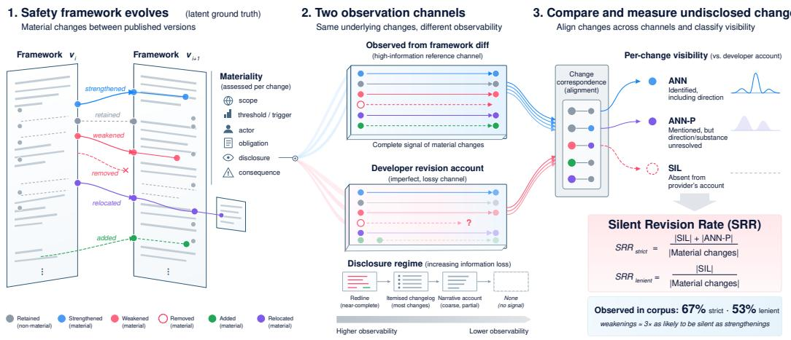
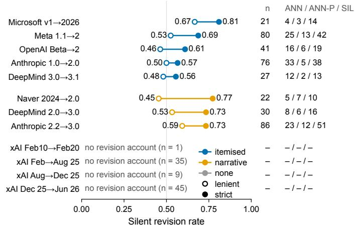
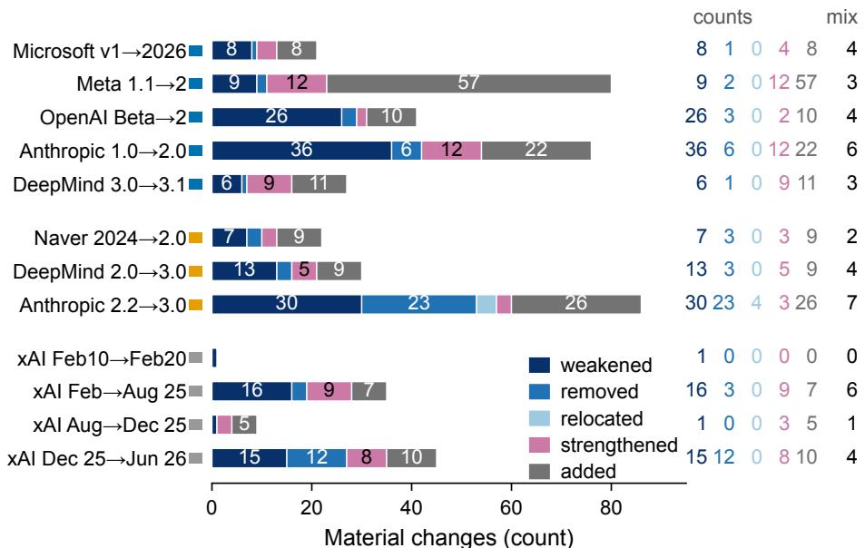

# Silent Revision: Measuring Undisclosed Change in the Safety Frameworks of Frontier AI Developers

Louis Yiven Zhu University of Oxford yiven.zhu@oii.ox.ac.uk

## Abstract

Frontier AI developers publish safety frameworks that commit them to evidencing whether their models are dangerous. The European Union and California now treat these documents as instruments of accountability, and both already impose duties on their revision. Neither requires the revision to be legible, in the sense that a reader could learn from the developer’s own account what changed. We introduce the silent revision rate, the share of material changes to a framework’s commitments that the developer’s published account does not identify, and we release the versioned, hash-pinned corpus needed to compute it. The corpus contains every public version of the safety frameworks of the twelve developers that have published one, together with each provider’s changelog, redline or announcement. We trace 710 commitment instances across twelve consecutive version pairs, code them against a frozen codebook, and adjudicate 244 individually. Three findings follow. First, 67% of material changes (95% CI 62 to 72) are silent under a strict standard and 53% under a lenient one, falling to 49% at section granularity. Second, silence appears to track the form of the account, since narrative announcements run at 74% against 63% for itemised changelogs, whereas account length in words barely matters; on the test that respects nesting the difference is suggestive. Third, 77% of traced changes weaken or remove a commitment, and in seven of eight pairs weakenings are more often silent than strengthenings. The statutory remedy therefore exists and specifies the wrong artefact. A justification explains why a framework changed, an enumeration states what changed, and only the latter makes revision auditable. We argue that publication duties should carry an enumeration duty, which one provider already meets, voluntarily and incompletely.

## 1 Introduction

A standard that can be revised without anyone noticing is not a standard that anyone can be held to. Ananny and Crawford [Ananny and Crawford, 2018] argued that the transparency ideal confuses seeing with knowing, and frontier AI safety frameworks now illustrate the distinction precisely. Every major developer of frontier AI models publishes a document stating how it will decide whether a model is too dangerous to train or release. These documents carry different names, among them Responsible Scaling Policy, Preparedness Framework and Frontier Safety Framework. Each nonetheless defines capability thresholds, commits the developer to evaluations that establish whether a model has crossed one, and specifies the consequence when it has. In the vocabulary of the social sciences they are standards, because they render a contested notion of catastrophic risk commen surable as levels and procedures [Espeland and Stevens, 1998, Timmermans and Epstein, 2010], and they function as regulatory science, because their authority rests on the visible propriety of the procedure that produces a judgement [Jasanoff, 1990, Porter, 1995].

That authority has since acquired legal force in two jurisdictions. The European Union’s General-Purpose AI Code of Practice requires signatories to maintain a safety and security framework and to Preprint.

  
Figure 1: The silent revision rate as a measurement construct. Material changes between versions (left) reach a reader through the text and through the developer’s account, whose completeness varies by regime (centre); aligning the two classifies each change as announced, partially announced or silent (right). The pooled ratio shown is developed within pairs in Section 5.

provide the AI Office with each update [European Commission, 2025]. California’s Transparency in Frontier Artificial Intelligence Act requires large developers to publish a frontier AI framework and, on any material modification, to publish the modified framework with a justification within thirty days [California State Legislature, 2025]. Framework text is consequently the object that regulators, auditors and the public consult when they ask what a developer has promised, and a growing literature assesses it [Stelling et al., 2025, Alaga et al., 2024, Kasirzadeh, 2024, Pistillo, 2025, METR, 2024, Department for Science, Innovation and Technology, 2023].

Every one of those assessments scores a framework at a moment in time. Frameworks are revised, however, and both statutes are content with a snapshot of the revised document. The most thorough assessment to date noted in passing that without changelogs an outsider cannot distinguish adaptation from weakening [Stelling et al., 2025], and that observation identifies the missing measurement this paper supplies. The question sits at the decision end of evaluation science. We do not ask whether an evaluation measures what it claims; we ask whether a commitment to run it can be relied on once published.

We therefore put three questions to the corpus, in order of increasing specificity. RQ1 concerns magnitude. When a developer revises its framework, what share of the material changes to its commitments can a reader identify from the developer’s own account? RQ2 concerns form. Does the kind of account a developer publishes, whether a redline, an itemised changelog, a narrative announcement or nothing, correspond to how much change stays silent? RQ3 concerns direction. Do commitments tend to strengthen or weaken across revisions, and does the visibility of a change depend on its direction?

Answering these questions requires two things that did not previously exist, a corpus and a measure. We assemble every public version of the safety frameworks of the twelve developers that published one after the 2024 AI Seoul Summit, together with each developer’s account of each revision. We then define the silent revision rate as the share of material changes to a framework’s commitment that the account does not identify. Figure 1 shows the construct, and a frozen codebook with two explicit thresholds operationalises it and exposes the judgement it embeds.

We argue that the auditability of a safety framework depends on the legibility of its revision, that legibility is measurable from the public record, and that in the current record it is low and non-random. We contribute (i) the corpus, comprising 43 labelled framework versions and silent same-label reuploads, 9 companion documents and every revision account; (ii) the measure and codebook, with a granularity check on the denominator; (iii) first estimates with confidence intervals across twelve version pairs, and the finding that weakenings are more often silent than strengthenings within seven of eight pairs; and (iv) a compliance-gap argument, since both jurisdictions already impose a justification duty on revision while justification-style accounts are the least legible form in the corpus.

## 2 Background

After the 2024 Seoul Summit, twelve developers published frameworks describing how they manage catastrophic risk from their most capable models, a development Anderljung et al. [Anderljung et al., 2023] anticipated and Karnofsky [Karnofsky, 2024] named the if-then commitment. A literature quickly formed around the documents. The UK government [Department for Science, Innovation and Technology, 2023] and METR [METR, 2024] catalogued their common elements; Schuett et al. [Schuett et al., 2023] surveyed expert opinion; Alaga et al. [Alaga et al., 2024] proposed a grading rubric; Koessler et al. [Koessler et al., 2024] analysed threshold design; Kasirzadeh [Kasirzadeh, 2024] identified six measurement challenges; and Pistillo [Pistillo, 2025] and Campos et al. [Campos et al., 2025] argued for specificity and alignment with established risk management. The most thorough assessment, by Stelling et al. [Stelling et al., 2025], scores twelve providers against 65 criteria. Every one of these instruments scores a snapshot; Stelling et al. report changes for the two providers that happened to revise during their window but do not carry longitudinal tracking out.

A second body of work concerns what developers disclose, and it establishes both the expectation of documentation and its limits. Model cards [Mitchell et al., 2019] and datasheets [Gebru et al., 2021] set the template, Liang et al. [Liang et al., 2024] showed across 32,111 model cards how unevenly it is filled, the Foundation Model Transparency Index [Bommasani et al., 2023, 2024a, Wan et al., 2025] finds developer transparency declining after an initial improvement, and Bommasani et al. [Bommasani et al., 2024b] and Kolt et al. [Kolt et al., 2024] set out what responsible reporting should contain. All of this measures whether a developer discloses a category of information, and none of it measures whether a disclosed document’s later revision is itself disclosed, which is the second-order property this paper isolates. Mittelstadt [Mittelstadt, 2019] made the parallel point about ethics principles, which bind nobody until something converts them into enforceable practice.

That conversion is the concern of the auditing literature which supplies our institutional frame. Raji et al. [Raji et al., 2020, 2022] defined internal algorithmic audit and argued that it cannot substitute for third-party oversight, and Costanza-Chock et al. [Costanza-Chock et al., 2022] recommended mandatory public disclosure of audit results as the condition of the ecosystem’s credibility. Wachter et al. [Wachter et al., 2017] showed how far a provision as written can sit from what a reader obtains under it. Our measure belongs to this tradition as an outsider-oversight instrument applied to the governing documents themselves, and our governance argument extends the disclosure recommendation from audit results to the revision of the standards audited against.

Whereas those bodies of work define the object, a third supplies the method. Jacobs and Wallach [Jacobs and Wallach, 2021] imported measurement modelling into the study of algorithmic systems, Wallach et al. [Wallach et al., 2025] formalised the path from background concept to instrument, and Weidinger et al. [Weidinger et al., 2025] and Röttger et al. [Röttger et al., 2025, 2024] showed what an evaluation science requires of its instruments; we treat the silent revision rate as such an instrument. The closest methodological precedent for our corpus lies outside AI governance, in Amos et al.’s longitudinal study of over a million privacy policies from the Internet Archive [Amos et al., 2021]; we add the comparator the measure needs, namely the provider’s own account of each change. The closest effort in subject matter is The Midas Project’s AI Safety Watchtower [The Midas Project, 2024], a nonprofit monitor that has tracked sixteen companies’ policy documents for unannounced edits since 2024. It documents the phenomenon without defining a measure, reporting reliability or testing for asymmetry, and this paper is its first systematic measurement.

Finally, the social-scientific study of organisations supplies two candidate mechanisms, and we keep them distinct because the results discriminate between them. Vaughan [Vaughan, 1996] explains the Challenger launch decision through structural secrecy, the routine consequence of specialisation that prevents any part of an organisation from seeing the aggregate of its own deviations. That mechanism predicts uneven silence, because the people who know which changes they intended write the changelog and everything outside their attention falls outside the record; it does not predict directional silence. Meyer and Rowan [Meyer and Rowan, 1977] and Brunsson [Brunsson, 1989] describe organisations that decouple the formal structure they display from the activity they conduct, and that mechanism does predict that unfavourable changes will be less visible than favourable ones.

## 3 Corpus

We collected every publicly released version of the standing catastrophic-risk policy of each of the twelve developers that published one following the Seoul Summit (Appendix N lists them). Alongside each version we collected the provider’s own account of the revision, whether an indocument changelog, a version-history table, a published redline or the announcement post released with the version. Following Stelling et al. [Stelling et al., 2025], we exclude system and model cards because they report point-in-time implementation.

Before retrieving anything, we established each provider’s version list from primary sources, consulting framework pages and version histories first, then announcement posts, then Internet Archive capture histories. Secondary trackers located candidates but never served as sole evidence, and we never inferred a version from a numbering gap. We stored each file as published together with a plain-text extraction, a SHA-256 hash recomputed from disk and its provenance, and all nine passages that Stelling et al. quote with page references matched.

The resulting manifest has 52 rows, of which 43 are framework rows and 9 are companion documents. Thirty-five files came from providers, fourteen from the Internet Archive and one from a gated portal; three known versions could not be retrieved. Seven providers have at least two labelled versions and enter the drift analysis. Anthropic has nine versions, Google DeepMind four and xAI five, while OpenAI, Meta, Microsoft and Naver have two each. In addition, providers replaced nine files at the same URL or under the same version label with changed text and no new identifier, and we retain these as separate rows because a reader who downloaded the framework before and after would hold different documents bearing the same name (Appendix K).

Because a commitment that leaves a framework may reappear elsewhere, we also collected companion documents and consulted them to distinguish removal from relocation. One companion is itself a finding. Anthropic’s Frontier Compliance Framework carries an itemised changelog describing four versions between December 2025 and July 2026, while the three earlier texts have been withdrawn from the portal that hosts them, so a reader can see what Anthropic says changed but cannot verify it. The same document commits to a changelog with justifications within thirty days of any material update, which tracks the statutory language of TFAIA almost verbatim (Appendix L).

Across the nineteen consecutive labelled pairs, providers account for revision in four ways. A redline is a full marked-up diff, published by Anthropic for every RSP revision from version 2.2 onward (five pairs). An itemised account is a changelog listing individual changes (six pairs). A narrative account is prose describing the revision, typically an announcement post (four pairs). None means no account of any kind (four pairs, all xAI). We treat the four as an ordered typology of legibility, with the caveat that a redline shows every textual change without saying which are material or in which direction they move (Section 7). Appendix J assigns every pair. We release the corpus, manifest, codebook, coding sheets, adjudication notes and scripts, with data under CC BY 4.0 and code under MIT (https://github.com/louisyzhu/frontier-safety-framework-corpus). Every statistic is recomputed from the released coding sheet by the released script; the coding itself is an archived output of the procedure in Section 4 and is reproducible only by re-running it (Appendix M).

## 4 Method

The procedure is systematic content analysis in Krippendorff’s sense [Krippendorff, 2019], applied to legally operative documents in the manner Hall and Wright [Hall and Wright, 2008] set out for judicial opinions, and it takes its validity vocabulary from Adcock and Collier [Adcock and Collier, 2001]. Krippendorff identifies unitising as the decision that most shapes a content analysis and is least visible in its results. Our unit is a commitment, a statement in which the provider commits itself to a practice at any strength from must to may. Present-tense statements of practice count as commitments at the strongest rung, because in a policy document the descriptive present is the standingcommitment register. We code every commitment into one of nine categories (Appendix B). Six are evidentiary, because they concern how the provider will evidence risk or capability, namely scope of evaluation (EC1), trigger and threshold (EC2), method (EC3), third-party involvement (EC4), disclosure (EC5) and the consequence a result obligates (EC6). Three further strata, governance (G), security (S) and mitigation (M), are coded for completeness and reported separately.

For each consecutive version pair $( v _ { i } , v _ { i + 1 } )$ we trace every commitment in $v _ { i }$ to its counterpart in $v _ { i + 1 }$ , and we scan $v _ { i + 1 }$ for commitments with no antecedent. Each traced commitment receives one of six outcomes, namely retained (R), strengthened (S), weakened (W), removed (X), relocated (L), which means it survives only in a companion document or a non-binding recommendations section, or added (A). When a commitment moves in both directions at once we code W by rule and flag it MIX. A change is material if it alters at least one of six dimensions, namely scope, threshold or trigger, actor, obligation strength, disclosure scope or consequence. These six are one operationalisation of the systematised concept, chosen because each corresponds to a way the same commitment could bind differently, and Adcock and Collier’s content-validation question, whether the indicators exhaust the concept, is answered in Appendix B with the alternatives considered. Two rules follow drafting doctrine. The obligation ladder from must through may follows the mandatory and permissive distinction that Scalia and Garner [Scalia and Garner, 2012] catalogue, and an enumeration introduced by “including” is read as scope-defining on the same authority, so that shortening it is material, whereas one introduced by “for example” is illustrative. We note that TFAIA uses “material modification” without defining it; our definition is the narrower one, since it applies to individual commitments and not to the framework as a whole.

For each material change we then ask whether a reader of the provider’s account of this revision, and nothing else, would learn that this commitment changed in this direction. We record the answer with four codes. A change is announced (ANN) when the answer is yes, including where the account names a class of commitments and states the direction of travel. It is partially announced (ANN-P) when the account names the commitment or its class but not the direction or substance. It is silent (SIL) when an account exists and does not identify the change even at class level, and no changelog (NCL) when the provider published no account. Only the provider’s own publications count as an account.

Let $M _ { p }$ denote the set of material changes on pair $p ,$ partitioned into announced $A _ { p } ,$ partially announced $P _ { p }$ and silent $S _ { p }$ . We define

$$
\mathrm { S R R } _ { p } ^ { \mathrm { s t r i c t } } = \frac { | S _ { p } | + | P _ { p } | } { | M _ { p } | } , \qquad \mathrm { S R R } _ { p } ^ { \mathrm { l e n i e n t } } = \frac { | S _ { p } | } { | M _ { p } | } , \qquad \mathrm { S R R } _ { p } ^ { \mathrm { s t r i c t } } - \mathrm { S R R } _ { p } ^ { \mathrm { l e n i e n t } } = \frac { | P _ { p } | } { | M _ { p } | } .\tag{1}
$$

The difference between the two forms is exactly the share of partially announced changes, and it exposes the judgement the measure embeds. The denominator is a granularity choice, since splitting one commitment into three raises silence mechanically when accounts describe change at class level, so we recompute the rate at section granularity (Appendix E). Every rate carries a Wilson score interval, which Brown, Cai and DasGupta [Brown et al., 2001] recommend over the Wald interval at the small n of several pairs [Wilson, 1927]. The corpus is a census and not a sample, and we report intervals in the sense Berk, Western and Weiss [Berk et al., 1995] give them for apparent populations, as statements about the process that generated the observed revisions. On a redlined pair every textual change is shown, so SRR equals zero and we report those five pairs as regimecomplete without tracing them.

For RQ2, because changes cluster within pairs and a change-level Fisher test overstates precision [Cameron and Miller, 2015], our primary test is an exact permutation over the 56 assignments of the eight pair labels to three narrative and five itemised; rank correlations between the rate and the account’s length in words and its number of provider-published items test whether verbosity or enumeration explains silence. For RQ3 we report the weakening share per pair and under leaveone-provider-out, since no theory predicts symmetric revision, and we compare silence between weakenings and strengthenings pooled and within each pair. All comparisons are descriptive associations within the corpus.

Coding then proceeded in two stages, a first pass and an adjudication of it. The first pass was produced by an agentic language-model system of the Claude family operating under the frozen codebook as its sole instruction, with the two versions, the candidate-sentence list and the revision account as inputs. Pangakis et al. [Pangakis et al., 2023] show that the accuracy of such annotation varies by task and must be validated against human labels for each construct, and Gilardi et al. [Gilardi et al., 2023] show that it can match trained annotators when it is; we follow the first finding and do not presume the second. The pass produced 710 rows, each carrying verbatim text from both versions, a rationale, a confidence grade and, for material changes, a verbatim quotation from the account or a record that none was found. Every quoted field was verified against the corpus text (2,130 checks), which establishes quotation fidelity only. The first author then adjudicated

Table 1: Twelve traced pairs. $n _ { v _ { i } }$ counts commitments traced from the earlier version; Mat. counts material changes including additions; W aggregates weakened, removed and relocated; SRRs and SRR are the strict and lenient rates (intervals in Appendix D). Anthropic’s five redlined pairs are regime-complete and not traced. Naver’s 2024 version exists publicly only as an English summary page, so that pair over-counts additions.
<table><tr><td>Pair</td><td>Regime</td><td> $n _ { v _ { i } }$ </td><td>Mat.</td><td>W</td><td>S</td><td>A</td><td>ANN</td><td>ANN-P</td><td>SIL</td><td>SRRs</td><td>SRRl</td></tr><tr><td>Anthropic RSP 1.0→2.0</td><td>itemised</td><td>73</td><td>76</td><td>42</td><td>12</td><td>22</td><td>33</td><td>5</td><td>38</td><td>0.57</td><td>0.50</td></tr><tr><td>Anthropic RSP 2.2→3.0</td><td>narrative</td><td>69</td><td>86</td><td>57</td><td>3</td><td>26</td><td>23</td><td>12</td><td>51</td><td>0.73</td><td>0.59</td></tr><tr><td>OpenAI PF Beta→2</td><td>itemised</td><td>41</td><td>41</td><td>29</td><td>2</td><td>10</td><td>16</td><td>6</td><td>19</td><td>0.61</td><td>0.46</td></tr><tr><td>DeepMind FSF 2.0→3.0</td><td>narrative</td><td>33</td><td>30</td><td>16</td><td>5</td><td>9</td><td>8</td><td>6</td><td>16</td><td>0.73</td><td>0.53</td></tr><tr><td>DeepMind FSF 3.0→3.1</td><td>itemised</td><td>39</td><td>27</td><td>7</td><td>9</td><td>11</td><td>12</td><td>2</td><td>13</td><td>0.56</td><td>0.48</td></tr><tr><td>Meta 1.1→2</td><td>itemised</td><td>49</td><td>80</td><td>11</td><td>12</td><td>57</td><td>25</td><td>13</td><td>42</td><td>0.69</td><td>0.53</td></tr><tr><td>Microsoft v1→2026</td><td>itemised</td><td>40</td><td>21</td><td>9</td><td>4</td><td>8</td><td>4</td><td>3</td><td>14</td><td>0.81</td><td>0.67</td></tr><tr><td>Naver 2024→2.0</td><td>narrative</td><td>17</td><td>22</td><td>10</td><td>3</td><td>9</td><td>5</td><td>7</td><td>10</td><td>0.77</td><td>0.45</td></tr><tr><td>xAI draft Feb10→Feb20</td><td>none</td><td>42</td><td>1</td><td>1</td><td>0</td><td>0</td><td>0</td><td>0</td><td>0</td><td>一</td><td>一</td></tr><tr><td>xAI Feb→Aug 2025</td><td>none</td><td>42</td><td>35</td><td>19</td><td>9</td><td>7</td><td>0</td><td>0</td><td>0</td><td>一</td><td>一</td></tr><tr><td>xAI Aug→Dec 2025</td><td>none</td><td>43</td><td>9</td><td>1</td><td>3</td><td>5</td><td>0</td><td>0</td><td>0</td><td>一</td><td>一</td></tr><tr><td>xAI Dec 2025→Jun 2026</td><td>none</td><td>48</td><td>45</td><td>527</td><td>8</td><td>10</td><td>0</td><td>0</td><td>0</td><td>一</td><td>一</td></tr></table>

244 of the 710 rows individually from the passages, the account and the codebook, comprising every row touched by a post-first-pass clarification, every low-confidence material row and the fifty agreement-sample rows; adjudication changed 4 outcome codes and 54 announcement codes, 46 of them from SIL to ANN-P. Because the adjudicator designed the codebook and holds the hypothesis, the direction of that drift matters, and it ran against the strict finding. We accepted the remaining 466 rows after a spot-check of 45 produced one change (Appendix G).

Reliability is the one point at which this version remains incomplete. We prepared a stratified sample of fifty units spanning every traced pair and all six outcomes for independent coding by a second coder, and we release the sample, its instructions and the script that computes Krippendorff’s α [Krippendorff, 2019, Hayes and Krippendorff, 2007]. The second coding was incomplete at submission, so agreement is not reported here (Section 7); in its absence, adjudication’s alteration of 0.6% of outcome codes and 7.6% of announcement codes and the spot-check’s one change in 45 stand in as weaker indicators.

## 5 Results

Turning first to RQ1, most material change proves not to be identifiable in the provider’s own account. Across the eight pairs with a revision account, 257 of 383 material changes are silent under the strict reading, a rate of 0.67 (95% CI 0.62 to 0.72), and 203 of 383 under the lenient reading, a rate of 0.53 (0.48 to 0.58). Every such pair exceeds 0.55 on the strict reading (Table 1; Figure 2). Evidentiary commitments run at 0.65 and 0.48, non-evidentiary strata at 0.72 and 0.63, and provider aggregates from 0.61 (OpenAI) to 0.81 (Microsoft) (Appendix H). The rate depends on granularity, as it must. Collapsing to section level yields 99 units, of which 0.49 (0.40 to 0.59) are silent under the strict reading and 0.34 under the lenient one, and 0.66 under a majority rule within each section (Appendix E). The commitment-level rate is what a reader of one commitment experiences and the section-level rate is what a reader of the document experiences; both leave most change unaccounted for.

For RQ2, silence appears to track the form of the account and does not track its length. On the permutation test that respects nesting, the pooled strict difference between narrative pairs (0.74; 0.66 to 0.81) and itemised pairs (0.63; 0.57 to 0.69) is suggestive, at $p = 0 . 0 7 1$ for the pooled difference and $p = 0 . 0 8 9$ for the difference in per-pair means; the change-level Fisher test, which overstates precision, gives $p = 0 . 0 4 1$ . On the lenient reading the difference disappears (odds ratio 1.19, $p = 0 . 4 6 )$ , so any regime effect lives in partial announcement. Account length explains little. Across the eight pairs the rank correlation between the strict rate and the account’s length in words is −0.17, whereas the correlation with the number of discrete items the provider published is −0.58 (Appendix E). Microsoft’s six items cover 21 material changes at 0.81 and OpenAI’s twelve cover 41 at 0.61, so what lowers silence is enumeration at the level of the change. The gradient is also visible within a single provider. Anthropic alone publishes redlines, for five of its seven revisions, yet its largest revision, from version 2.2 to 3.0, is one it did not redline, and 51 of that revision’s 86 material changes are silent even under the lenient reading; the account explains at length why unilateral pause commitments were removed and does not enumerate. Among the changes it does not identify are the removal of the commitment to delete model weights where security safeguards cannot be met, and the replacement of a commitment to pause training when a model outstrips implemented safeguards with a commitment to “act promptly to reduce interim risk” (Appendix F).

  
Figure 2: Silent revision rate by pair, strict (filled) and lenient (open), grouped by disclosure regime. The right margin gives n and the ANN, ANN-P and SIL counts; the xAI pairs published no account and have no defined rate.

For RQ3, the direction of change is predominantly weakening, and weakening is more often silent than strengthening within providers as well as across them. Of 299 traced material changes across all twelve pairs, 229 weaken, remove or relocate a commitment, a share of 0.77 (0.72 to 0.81). Nine of the twelve pairs show a weakening majority, the exceptions being DeepMind 3.0 to 3.1 (0.44), Meta (0.48) and xAI’s four-change August to December 2025 pair, and dropping any one provider leaves the share between 0.70 and 0.79 (Appendix E). Excluding relocations or mixed changes leaves it at 0.76 and 0.73. A further 174 commitments are additions, concentrated in Meta’s 2026 revision (57) and Anthropic’s version 3.0 (26). Visibility depends on direction. Among changes with an account, weakenings are silent at 0.75 (135 of 181) and strengthenings at 0.50 (25 of 50), an odds ratio of 2.93 (Fisher’s exact test, $p = 0 . 0 0 2 ) ;$ additions fall between at 0.64 (97 of 152), and removals are the most silent outcome with more than four cases at 0.83 (35 of 42), the four relocations all being silent. The asymmetry holds inside pairs. In seven of the eight pairs with an account, weakenings are more often silent than strengthenings, by margins from 0.03 to 0.67; the exception is Anthropic 1.0 to 2.0, where strengthenings are silent more often by 0.13. Providers therefore announce the instruments they add far more readily than the commitments they loosen, and they do so revision by revision.

Two further observations bear on the regulatory argument of Section 6. First, splitting the pairs by the date of the later version around 1 January 2026, when TFAIA took effect, the three pairs closed before it run at 0.61 strict (90 of 147) and the five closed after at 0.71 (167 of 236), with the weakening share unchanged at 0.78 and 0.76; three pairs a side carry no causal claim, but the justification duty coincided with no reduction in silence. Second, the trigger-and-threshold category (68 material changes) recurrently loses a quantitative anchor, as when DeepMind’s R&D threshold moved from “substantially accelerating (e.g. 2x) from 2020–2024 rates” to “substantially accelerating from historical rates” while the announcement reported that capability levels had been “sharpened”; thirdparty involvement is the smallest category (21 changes, 18 with an account, 0.67 silent), and OpenAI’s Beta commitment to “continue to enable external research and government access” disappears in version 2 without mention in any of its twelve changelog items (Appendix F; Appendix K covers the nine same-label re-uploads, two of which are material).

## 6 Discussion

We claimed that revision legibility is measurable from the public record and that in the current record it is low and non-random. The rate is computable for every pair with an account, and twothirds of material change is silent on the strict reading and one-half on the lenient. Of the two non-randomness claims, the direction result is established, holding within seven of eight pairs without pooling, whereas the regime result is suggestive on the test that respects nesting. The regime pattern fits Vaughan’s structural secrecy, because a changelog written by the people who intended the changes records a revision as the organisation understood itself to be making it, so accounts differ in what they enumerate and not in how much they say.

The direction result does not fit structural secrecy, and it fits decoupling. Structural secrecy predicts uneven silence yet gives no reason for silence to track the direction that reflects badly on the organisation, whereas Meyer and Rowan’s ceremonial conformity and Brunsson’s organised hypocrisy predict that pattern, since an organisation displaying a formal structure to outsiders describes what it adds and is quieter about what it loosens. We do not infer intent, since the people who write changelogs may simply champion the new instruments. Either way, visibility and content are not independent, so a reader who relies on the account alone sees without knowing [Ananny and Crawford, 2018], and that gap is now a number.

Taken together, these findings identify a compliance gap in both regulatory regimes. TFAIA requires a large frontier developer that makes a material modification to publish the modified framework and a justification within thirty days [California State Legislature, 2025], and the EU Code requires signatories to update their framework at least annually and to give the AI Office each update within five business days [European Commission, 2025]. Both regimes therefore already impose a duty on revision, and both specify the wrong artefact, since a justification explains why the framework changed whereas an enumeration states what changed, commitment by commitment and with direction. Our data show that justification-style accounts are the least legible form in the corpus, that length does not help, and that silence did not fall after the duty took effect. Anthropic’s compliance framework, whose Section 7.1 tracks the TFAIA language and then adds a changelog (Appendix L), shows what drafting can produce one step past the statute, and the same provider demonstrates the remedy’s voluntariness, since it redlines five of seven revisions but not the largest, and has withdrawn three compliance-framework versions whose changelog cannot be checked. That record argues for a mandate, and we propose an enumeration duty. The developer should list each material change to a commitment, with its direction, in a form a reader can check against the text, since auditability is a property of how records are kept [Power, 1997]; a redline satisfies the duty mechanically.

## 7 Limitations

We state the limitations in decreasing order of consequence. Inter-coder agreement is not yet reported, so the interpretive codes carry the reliability of one adjudicated coding, which bounds precision without affecting the corpus or the direction of the findings; an archival version must report α. The first-pass coder’s sampling parameters were also not fixed, so seed re-runs are owed.

The next limitation concerns the typology and its top rung. Redlines score zero by construction, and the construction is partly circular, because a marked-up document shows every change without identifying which are material or in which direction they move. The regime is also chosen by the provider, and Anthropic’s one non-redlined revision since 2.2 is its largest, so the effect may be partly selection, which eight pairs cannot separate.

Two further limitations concern statistical inference and what silence can show. Changes nest within pairs, so we rely on the permutation test, and the corpus has no comparison class, so we cannot say whether two-thirds is high against other regulated standards; silence is evidence about external visibility only, and the term names an observable and not a motive. Finally, every claim about a named company is traceable to a hash-pinned text and a verbatim quotation, and we commit to a public errata policy and to versioning the corpus.

## 8 Conclusion

Frontier safety frameworks have become load-bearing in two legal regimes, so we built the corpus required to read them across time and defined a measure of revision legibility. A reader cannot identify two-thirds of material change from the provider’s own account, the invisible share skews toward loosening within and across providers, and the visible share depends on whether the account enumerates, which neither regime requires.

## Acknowledgements

The author thanks Emilio Barkett for early discussion of this project, and Paul Röttger, whose advice prompted the author to pursue empirical work in AI safety. A version of this paper is under review at the AI & Science workshop (AISciK) at NeurIPS 2026. Large language model tools assisted with reference checking and the appendices, and produced the first-pass coding of commitment rows against the frozen codebook as described and validated in Section 4; the author reviewed all of it and takes full responsibility for the content.

## References

Robert Adcock and David Collier. Measurement validity: A shared standard for qualitative and quantitative research. American Political Science Review, 95(3):529–546, 2001. doi: 10.1017/ S0003055401003100.

Jide Alaga, Jonas Schuett, and Markus Anderljung. A grading rubric for AI safety frameworks. arXiv preprint arXiv:2409.08751, 2024. doi: 10.48550/arXiv.2409.08751.

Ryan Amos, Gunes Acar, Eli Lucherini, Mihir Kshirsagar, Arvind Narayanan, and Jonathan Mayer. Privacy policies over time: Curation and analysis of a million-document dataset. In Proceedings ofthe Web Conference 2021 (WWW ’21), pages 2165–2176. ACM, 2021. doi: 10.1145/3442381. 3450048.

Mike Ananny and Kate Crawford. Seeing without knowing: Limitations of the transparency ideal and its application to algorithmic accountability. New Media & Society, 20(3):973–989, 2018. doi: 10.1177/1461444816676645.

Markus Anderljung, Joslyn Barnhart, Anton Korinek, Jade Leung, Cullen O’Keefe, Jess Whittlestone, Shahar Avin, Miles Brundage, Justin Bullock, Duncan Cass-Beggs, Ben Chang, Tantum Collins, Tim Fist, Gillian K. Hadfield, Alan Hayes, Lewis Ho, Sara Hooker, Eric Horvitz, Noam Kolt, Jonas Schuett, Yonadav Shavit, Divya Siddarth, Robert Trager, and Kevin Wolf. Frontier AI regulation: Managing emerging risks to public safety. arXiv preprint arXiv:2307.03718, 2023. doi: 10.48550/arXiv.2307.03718.

Richard A. Berk, Bruce Western, and Robert E. Weiss. Statistical inference for apparent populations. Sociological Methodology, 25:421–458, 1995. doi: 10.2307/271073.

Rishi Bommasani, Kevin Klyman, Shayne Longpre, Sayash Kapoor, Nestor Maslej, Betty Xiong, Daniel Zhang, and Percy Liang. The foundation model transparency index. arXiv preprint arXiv:2310.12941, 2023. doi: 10.48550/arXiv.2310.12941.

Rishi Bommasani, Kevin Klyman, Sayash Kapoor, Shayne Longpre, Betty Xiong, Nestor Maslej, and Percy Liang. The 2024 foundation model transparency index. arXiv preprint arXiv:2407.12929, 2024a. doi: 10.48550/arXiv.2407.12929.

Rishi Bommasani, Kevin Klyman, Shayne Longpre, Betty Xiong, Sayash Kapoor, Nestor Maslej, Arvind Narayanan, and Percy Liang. Foundation model transparency reports. arXiv preprint arXiv:2402.16268, 2024b. doi: 10.48550/arXiv.2402.16268.

Lawrence D. Brown, T. Tony Cai, and Anirban DasGupta. Interval estimation for a binomial proportion. Statistical Science, 16(2):101–133, 2001. doi: 10.1214/ss/1009213286.

Nils Brunsson. The Organization ofHypocrisy: Talk, Decisions and Actions in Organizations. John Wiley & Sons, Chichester, 1989.

California State Legislature. Senate bill no. 53: Transparency in frontier artificial intelligence act, 2025. URL https://leginfo.legislature.ca.gov/faces/billNavClient.xhtml? bill\_id=202520260SB53. Chapter 138, Statutes of 2025; effective 1 January 2026.

A. Colin Cameron and Douglas L. Miller. A practitioner’s guide to cluster-robust inference. Journal of Human Resources, 50(2):317–372, 2015. doi: 10.3368/jhr.50.2.317.

Siméon Campos, Henry Papadatos, Fabien Roger, Chloé Touzet, Otter Quarks, and Malcolm Murray. A frontier AI risk management framework: Bridging the gap between current AI practices and established risk management. arXiv preprint arXiv:2502.06656, 2025. doi: 10.48550/arXiv.2502.06656.

Sasha Costanza-Chock, Inioluwa Deborah Raji, and Joy Buolamwini. Who audits the auditors? recommendations from a field scan of the algorithmic auditing ecosystem. In Proceedings of the 2022 ACM Conference on Fairness, Accountability, and Transparency (FAccT ’22), pages 1571–1583. ACM, 2022. doi: 10.1145/3531146.3533213.

Department for Science, Innovation and Technology. Emerging processes for frontier AI safety. Technical report, UK Government, October 2023. URL https://www.gov.uk/government/ publications/emerging-processes-for-frontier-ai-safety.

Wendy Nelson Espeland and Mitchell L. Stevens. Commensuration as a social process. Annual Review ofSociology, 24:313–343, 1998. doi: 10.1146/annurev.soc.24.1.313.

European Commission. The general-purpose AI code of practice. European Commission, AI Office, July 2025. URL https://digital-strategy.ec.europa.eu/en/policies/ contents-code-gpai.

Timnit Gebru, Jamie Morgenstern, Briana Vecchione, Jennifer Wortman Vaughan, Hanna Wallach, Hal Daumé III, and Kate Crawford. Datasheets for datasets. Communications of the ACM, 64 (12):86–92, 2021. doi: 10.1145/3458723.

Fabrizio Gilardi, Meysam Alizadeh, and Maël Kubli. ChatGPT outperforms crowd workers for textannotation tasks. Proceedings ofthe National Academy ofSciences, 120(30):e2305016120, 2023. doi: 10.1073/pnas.2305016120.

Mark A. Hall and Ronald F. Wright. Systematic content analysis of judicial opinions. California Law Review, 96(1):63, 2008. doi: 10.15779/Z38R99R.

Andrew F. Hayes and Klaus Krippendorff. Answering the call for a standard reliability measure for coding data. Communication Methods and Measures, 1(1):77–89, 2007. doi: 10.1080/ 19312450709336664.

Abigail Z. Jacobs and Hanna Wallach. Measurement and fairness. In Proceedings of the 2021 ACM Conference on Fairness, Accountability, and Transparency (FAccT ’21), pages 375–385. ACM, 2021. doi: 10.1145/3442188.3445901.

Sheila Jasanoff. The Fifth Branch: Science Advisers as Policymakers. Harvard University Press, Cambridge, MA, 1990.

Holden Karnofsky. If-then commitments for AI risk reduction. Technical report, Carnegie Endowment for International Peace, September 2024. URL https://carnegieendowment.org/ research/2024/09/if-then-commitments-for-ai-risk-reduction.

Atoosa Kasirzadeh. Measurement challenges in AI catastrophic risk governance and safety frameworks. arXiv preprint arXiv:2410.00608, 2024. doi: 10.48550/arXiv.2410.00608.

Leonie Koessler, Jonas Schuett, and Markus Anderljung. Risk thresholds for frontier AI. arXiv preprint arXiv:2406.14713, 2024. doi: 10.48550/arXiv.2406.14713.

Noam Kolt, Markus Anderljung, Joslyn Barnhart, Asher Brass, Kevin Esvelt, Gillian K. Hadfield, Lennart Heim, Mikel Rodriguez, Jonas B. Sandbrink, and Thomas Woodside. Responsible reporting for frontier AI development. arXiv preprint arXiv:2404.02675, 2024. doi: 10.48550/arXiv.2404.02675.

Klaus Krippendorff. Content Analysis: An Introduction to Its Methodology. SAGE Publications, Thousand Oaks, CA, 4 edition, 2019.

Weixin Liang, Nazneen Rajani, Xinyu Yang, Ezinwanne Ozoani, Eric Wu, Yiqun Chen, Daniel Scott Smith, and James Zou. Systematic analysis of 32,111 AI model cards characterizes documentation practice in AI. Nature Machine Intelligence, 6:744–753, 2024. doi: 10.1038/ s42256-024-00857-z.

METR. Common elements of frontier AI safety policies. Technical report, Model Evaluation and Threat Research, 2024. URL https://metr.org/common-elements. Living web document; accessed September 2026.

John W. Meyer and Brian Rowan. Institutionalized organizations: Formal structure as myth and ceremony. American Journal ofSociology, 83(2):340–363, 1977. doi: 10.1086/226550.

Margaret Mitchell, Simone Wu, Andrew Zaldivar, Parker Barnes, Lucy Vasserman, Ben Hutchinson, Elena Spitzer, Inioluwa Deborah Raji, and Timnit Gebru. Model cards for model reporting. In Proceedings of the Conference on Fairness, Accountability, and Transparency (FAT\* ’19), pages 220–229. ACM, 2019. doi: 10.1145/3287560.3287596.

Brent Mittelstadt. Principles alone cannot guarantee ethical AI. Nature Machine Intelligence, 1(11): 501–507, 2019. doi: 10.1038/s42256-019-0114-4.

Nicholas Pangakis, Samuel Wolken, and Neil Fasching. Automated annotation with generative AI requires validation. arXiv preprint arXiv:2306.00176, 2023. doi: 10.48550/arXiv.2306.00176.

Matteo Pistillo. Towards frontier safety policies ‘plus’. arXiv preprint arXiv:2501.16500, 2025. doi: 10.48550/arXiv.2501.16500.

Theodore M. Porter. Trust in Numbers: The Pursuit of Objectivity in Science and Public Life. Princeton University Press, Princeton, NJ, 1995.

Michael Power. The Audit Society: Rituals of Verification. Oxford University Press, Oxford, 1997.

Inioluwa Deborah Raji, Andrew Smart, Rebecca N. White, Margaret Mitchell, Timnit Gebru, Ben Hutchinson, Jamila Smith-Loud, Daniel Theron, and Parker Barnes. Closing the AI accountability gap: Defining an end-to-end framework for internal algorithmic auditing. In Proceedings of the 2020 Conference on Fairness, Accountability, and Transparency (FAT\* ’20), pages 33–44. ACM, 2020. doi: 10.1145/3351095.3372873.

Inioluwa Deborah Raji, Peggy Xu, Colleen Honigsberg, and Daniel E. Ho. Outsider oversight: Designing a third party audit ecosystem for AI governance. In Proceedings of the 2022 AAAI/ACM Conference on AI, Ethics, and Society (AIES ’22), pages 557–571. ACM, 2022. doi: 10.1145/ 3514094.3534181.

Paul Röttger, Valentin Hofmann, Valentina Pyatkin, Musashi Hinck, Hannah Rose Kirk, Hinrich Schütze, and Dirk Hovy. Political compass or spinning arrow? towards more meaningful evaluations for values and opinions in large language models. In Proceedings of the 62nd Annual Meeting ofthe Associationfor Computational Linguistics (Volume 1: Long Papers), pages 15295– 15311. Association for Computational Linguistics, 2024. doi: 10.18653/v1/2024.acl-long.816.

Paul Röttger, Fabio Pernisi, Bertie Vidgen, and Dirk Hovy. SafetyPrompts: A systematic review of open datasets for evaluating and improving large language model safety. In Proceedings of the 39th AAAI Conference on Artificial Intelligence, 2025. arXiv:2404.05399.

Antonin Scalia and Bryan A. Garner. Reading Law: The Interpretation of Legal Texts. Thomson/West, St. Paul, MN, 2012.

Jonas Schuett, Noemi Dreksler, Markus Anderljung, David McCaffary, Lennart Heim, Emma Bluemke, and Ben Garfinkel. Towards best practices in AGI safety and governance: A survey of expert opinion. arXiv preprint arXiv:2305.07153, 2023. doi: 10.48550/arXiv.2305.07153.

Lily Stelling, Malcolm Murray, Bruno Galizzi, Max Schaffelder, Siméon Campos, and Henry Papadatos. Evaluating AI providers’ frontier safety frameworks. arXiv preprint arXiv:2512.01166, 2025. doi: 10.48550/arXiv.2512.01166.

The Midas Project. AI safety watchtower. Nonprofit monitoring project, 2024. URL https: //www.themidasproject.com/watchtower. Accessed September 2026.

Stefan Timmermans and Steven Epstein. A world of standards but not a standard world: Toward a sociology of standards and standardization. Annual Review of Sociology, 36:69–89, 2010. doi: 10.1146/annurev.soc.012809.102629.

Diane Vaughan. The Challenger Launch Decision: Risky Technology, Culture, and Deviance at NASA. University of Chicago Press, Chicago, 1996.

Sandra Wachter, Brent Mittelstadt, and Luciano Floridi. Why a right to explanation of automated decision-making does not exist in the general data protection regulation. International Data Privacy Law, 7(2):76–99, 2017. doi: 10.1093/idpl/ipx005.

Hanna Wallach, Meera Desai, A. Feder Cooper, Angelina Wang, Chad Atalla, Solon Barocas, Su Lin Blodgett, Alexandra Chouldechova, Emily Corvi, P. Alex Dow, Jean Garcia-Gathright, Alexandra Olteanu, Nicholas Pangakis, Stefanie Reed, Emily Sheng, Dan Vann, Jennifer Wortman Vaughan, Matthew Vogel, Hannah Washington, and Abigail Z. Jacobs. Position: Evaluating generative AI systems is a social science measurement challenge. In Proceedings of the 42nd International Conference on Machine Learning, volume 267 of Proceedings of Machine Learning Research, pages 82232–82251, 2025.

Alexander Wan, Kevin Klyman, Sayash Kapoor, Nestor Maslej, Shayne Longpre, Betty Xiong, Percy Liang, and Rishi Bommasani. The 2025 foundation model transparency index. arXiv preprint arXiv:2512.10169, 2025. doi: 10.48550/arXiv.2512.10169.

Laura Weidinger, Inioluwa Deborah Raji, Hanna Wallach, Margaret Mitchell, Angelina Wang, Olawale Salaudeen, Rishi Bommasani, Deep Ganguli, Sanmi Koyejo, and William Isaac. Toward an evaluation science for generative AI systems. arXiv preprint arXiv:2503.05336, 2025. doi: 10.48550/arXiv.2503.05336.

Edwin B. Wilson. Probable inference, the law of succession, and statistical inference. Journal of the American Statistical Association, 22(158):209–212, 1927. doi: 10.1080/01621459.1927. 10502953.

## Appendices

Each appendix names the section and claim of the main text it supports. Appendix A defines every term, abbreviation and acronym. Appendices B and C reproduce the frozen codebook rules and the calibration examples that anchored coding (Section 4). Appendix D derives the statistics and Appendix E reports the robustness analyses (Sections 4 and 5). Appendix F quotes both versions of every change discussed in Sections 5 and 6. Appendix G tabulates the coding procedure. Appendices H and I give further results, Appendices J to L tabulate the corpus described in Section 3, and Appendices M and N state what the release contains and how each number can be recomputed.

## A Glossary of terms, abbreviations and acronyms

Table 2 defines the terms the paper uses in a technical sense and expands every abbreviation; Section 4 introduces each in context.

Table 2: Terms, abbreviations and acronyms used in the paper.
<table><tr><td>Term</td><td>Meaning</td></tr><tr><td>Commitment</td><td>A statement in which the provider commits itself to a practice at any strength; the unit of analysis</td></tr><tr><td>Material change</td><td>A change to a commitment that alters scope, threshold or trigger, actor,</td></tr><tr><td>Revision account</td><td>obligation strength, disclosure scope or consequence The provider&#x27;s own published statement of what changed in a revision</td></tr><tr><td>Disclosure regime</td><td>(changelog, version table, redline or announcement post) The form of the revision account: redline, itemised, narrative or none</td></tr><tr><td>Silent revision rate (SRR)</td><td>The share of material changes the revision account does not identify (Equa-</td></tr><tr><td>Companion document</td><td>tion 1); strict counts partial announcement as silent, lenient does not A document the provider publishes alongside the framework, consulted to</td></tr><tr><td>Silent same-label re-upload</td><td>distinguish removal from relocation A file replaced at the same URL or version label with changed text and no</td></tr><tr><td>Evidentiary category</td><td>new identifier A commitment category concerning how risk or capability will be evi-</td></tr><tr><td>ANN / ANN-P / SIL / NCL</td><td>denced (EC1 to EC6) Announced / partially announced / silent / no changelog (announcement</td></tr><tr><td>R /S /W /X /L /A</td><td>codes) Retained / strengthened / weakened / removed / relocated / added (outcome</td></tr><tr><td>MIX</td><td>codes) Flag for a commitment that both strengthens and weakens; coded W by</td></tr><tr><td>EC1 to EC6</td><td>rule Scope of evaluation, trigger and threshold, method, third-party involve-</td></tr><tr><td>G/S/M</td><td>ment, disclosure, consequence Governance / security / mitigation strata (non-evidentiary)</td></tr><tr><td>RSP, PF, FSF, RMF</td><td>Responsible Scaling Policy (Anthropic), Preparedness Framework (Ope- nAI), Frontier Safety Framework (DeepMind), Risk Management Frame-</td></tr><tr><td>FCF</td><td>work (xAI) Frontier Compliance Framework (Anthropic companion document)</td></tr><tr><td>CCL</td><td>Critical capability level (DeepMind&#x27;s threshold term)</td></tr><tr><td>ASL</td><td>AI Safety Level (Anthropic&#x27;s threshold term)</td></tr><tr><td>TFAIA</td><td></td></tr><tr><td></td><td>California Transparency in Frontier Artificial Intelligence Act (SB 53)</td></tr><tr><td>EU Code CI</td><td>General-Purpose AI Code of Practice under the EU AI Act 95%Wilson score confidence interval</td></tr></table>

## B Codebook v0.2 (frozen 3 September 2026)

This appendix reproduces the rules that Section 4 summarises. Coders applied these rules and nothing else; the full document, including the change history, is in the release.

## B.1 Inclusion

A row is a commitment if the provider is the grammatical subject (we, our, the company name, a named internal role) and the sentence carries a commitment verb or modal (will, must, commit, shall, intend, aim, expect, may, could, consider, plan) or states a practice in the descriptive present. Conditional commitments (“if X, we will Y”) are included. Statements describing the risk landscape, defining terms, describing other parties’ obligations, or reporting a past point-in-time evaluation are excluded.

## B.2 Categories

EC1 scope of evaluation (which capabilities or risk domains will be evaluated); EC2 trigger and threshold (when evaluations must occur and what result constitutes crossing); EC3 method (how evaluations are conducted); EC4 third-party involvement (external evaluation, government access, audits); EC5 disclosure (what evaluation methods and results will be published, to whom, when); EC6 consequence linkage (what action a specified result obligates). G governance and oversight; S security and containment; M mitigation and deployment measures not expressed as a consequence of an evaluation result.

## B.3 Tracing

For each pair, start from the commitment list of $v _ { i }$ and locate each commitment’s counterpart in $v _ { i + 1 }$ which is the passage governing the same category and the same object. Renumbering, relocation to a different section and rewording do not break correspondence. Relocation to a companion document or to a recommendations section is its own outcome (L). Then scan $v _ { i + 1 }$ for commitments with no counterpart (A).

## B.4 Outcomes

R retained (no material change); S strengthened (at least one materiality dimension moves toward greater obligation, broader scope, lower threshold, more third-party involvement or more disclosure); W weakened (at least one dimension moves the other way); X removed; L relocated; A added. Both directions present in one commitment yields W and the MIX flag.

## B.5 Materiality

A change is material if it alters scope; threshold or trigger; actor (including addition or removal of a third party); obligation strength on the scale must / will / commit to / present-tense practice > intend to / aim to / expect to > may / could / consider > recommend / encourage; disclosure scope; or consequence. Not material are rewording at the same force, reorganisation, typographical changes, updated cross-references, and changes to illustrative examples that do not alter the rule. Broadening a suspension condition is a change to consequence. Enumerations introduced by “including” or forming the operative content are scope-defining; enumerations introduced by $\mathfrak { e . g . } ^ { \flat }$ , “for example” or “such as” are illustrative.

## B.6 Alternatives considered for the materiality construct

Three alternative operationalisations were considered and rejected before coding. Counting every textual edit (as a redline does) makes no distinction between rewording and change of obligation and would inflate the denominator with editorial changes. Scoring against an external rubric of framework quality (for instance the 65 criteria of Stelling et al.) measures the level of a framework and not the change in an individual commitment, and it would leave changes to commitments outside the rubric uncounted. Coding obligation strength alone (the modal ladder) would miss changes of scope, actor and consequence, which account for most of the material changes in the corpus. The six dimensions were chosen because each names a distinct way in which the same commitment can bind differently, and the released coding sheet records which dimension each material change engaged so that the choice can be revisited.

## B.7 Announcement status

Compare each material change against the provider’s own account of the revision, which comprises an in-document changelog or version table, prose in the document describing what changed, the provider’s announcement post, or a provider-published redline. ANN when a reader of the account alone would know that this commitment changed in this direction, including class-level mentions that state direction; ANN-P when the account names the commitment or its class without direction or substance; SIL when the account exists and does not identify the change even at class level, with generic lines not counting; NCL when no account exists. Commentary by individuals, including employees in a personal capacity, is not a provider account.

## B.8 Clarifications adopted after the first pass

(1) Present-tense practice statements are commitments at the top rung. (2) Enumerations follow the scope-defining and illustrative rule above. (3) Both-direction changes are W with MIX. (4) Class-level changelog lines without direction are ANN-P. (5) A commitment that leaves the RSP at version 3.0 and appears in a companion in the corpus is L, with the temporal caveat noted; OpenAI’s Frontier Governance Framework post-dates PF version 2 by thirteen months and is not consulted for that pair. (6) In xAI’s February to August 2025 revision, the “may also provide” sentence is a disclosure commitment (EC5) and its own row; the external red-team testing commitment traces to a different sentence and is W on the actor dimension.

## C Calibration examples

The following cases anchored the coding described in Section 4. They are drawn from the corpus and from Stelling et al.’s Tables 9 and 10 [Stelling et al., 2025], and each was verified against the primary documents.

• A, announced weakening (ANN, W). Anthropic RSP 2.2 to 3.0 removed unilateral pause commitments and separated company commitments from industry recommendations; the accompanying account explains the change.

• B, silent weakening (SIL, W). OpenAI Preparedness Framework Beta to version 2, footnote 6, provides that models distilled, fine-tuned or quantised from a model below a High threshold will ordinarily not require additional safety measures; the twelve-item changelog does not mention it.

• C, announced consequence change (ANN, W). OpenAI version 2, Section 4.3, allows safeguards to be adjusted if another developer releases a High or Critical system without comparable safeguards; changelog item 11 states it.

• D, weakening with no account (NCL, W). xAI February to August 2025 replaced its commitment to external red-team testing of safeguards; no account exists.

• E, not material (R). Renumbered capability levels with identical modal force and scope.

• F, de-commensuration of a threshold (W, EC2). DeepMind FSF 2.0 to 3.0 replaced “substantially accelerating (e.g. 2x) from 2020–2024 rates” with “substantially accelerating from historical rates”.

• G, loss of specificity (W, EC3). FSF 2.0 listed what post-market monitoring draws on; FSF 3.0 says “post-market monitoring”.

• H, modal drift (W, EC6). “The safety case will be updated through red-teaming” became safety cases “may be updated if deemed necessary”.

• I, marginal-risk provision (W, EC6). FSF 3.0 allows marginal risk relative to competitors to inform deployment decisions; FSF 2.0 had no such provision.

• J, governance de-naming (W, G). Three named councils became “appropriate governance function”.

• K, announced removal with rationale (ANN). Anthropic’s version 3.0 account explains the removal of unilateral pause commitments at length.

## D Statistical derivations

This appendix supports the intervals and tests reported in Section 5 and specified in Section 4.

Wilson score interval. For k silent changes among n material changes and $z = 1 . 9 6 ,$ , the interval for the rate p is

$$
\frac { 1 } { 1 + z ^ { 2 } / n } \left[ \hat { p } + \frac { z ^ { 2 } } { 2 n } \pm z \sqrt { \frac { \hat { p } ( 1 - \hat { p } ) } { n } + \frac { z ^ { 2 } } { 4 n ^ { 2 } } } \right] , \qquad \hat { p } = k / n ,\tag{2}
$$

which unlike the Wald interval remains inside [0, 1]; Brown, Cai and DasGupta [Brown et al., 2001] recommend it for small n on coverage grounds [Wilson, 1927].

Per-pair intervals. Strict rates with 95% intervals are Anthropic 1.0 to 2.0, 0.57 (0.45, 0.67); Anthropic 2.2 to 3.0, 0.73 (0.63, 0.82); OpenAI, 0.61 (0.46, 0.74); DeepMind 2.0 to 3.0, 0.73 (0.56, 0.86); DeepMind 3.0 to 3.1, 0.56 (0.37, 0.72); Meta, 0.69 (0.58, 0.78); Microsoft, 0.81 (0.60, 0.92); Naver, 0.77 (0.57, 0.90). Lenient rates are Anthropic 1.0 to 2.0, 0.50 (0.39, 0.61); Anthropic 2.2 to 3.0, 0.59 (0.49, 0.69); OpenAI, 0.46 (0.32, 0.61); DeepMind 2.0 to 3.0, 0.53 (0.36, 0.70); DeepMind 3.0 to 3.1, 0.48 (0.31, 0.66); Meta, 0.53 (0.42, 0.63); Microsoft, 0.67 (0.45, 0.83); Naver, 0.45 (0.27, 0.65).

Regime comparison (RQ2). The exact permutation test is the primary test. It assigns the narrative label to each of the ${ \binom { 8 } { 3 } } = 5 6$ subsets of three pairs, recomputes the pooled strict difference, and reports the share of assignments at or above the observed difference of 0.106; that share is 0.071. On the difference in per-pair means (observed 0.101) the share is 0.089. For reference, pooled strict silence is 155 of 245 on itemised pairs and 102 of 138 on narrative pairs, and Fisher’s exact test on the $2 \times 2$ table gives an odds ratio of 1.65 and $p = 0 . 0 4 1$ ; on the lenient reading the counts are 128 of 245 and 75 of 138, odds ratio $1 . 1 9 , p = 0 . 4 6$ . The change-level test overstates precision because changes cluster within pairs [Cameron and Miller, 2015].

Direction (RQ3). Among 299 traced material changes, 229 are W, X or L, a share of 0.77 with Wilson interval (0.72, 0.81). Excluding the 44 MIX-flagged changes gives 186 of 255, share 0.73 (0.67, 0.78); excluding the four relocations gives 225 of 295, share 0.76. Per-pair and leave-oneprovider-out shares appear in Appendix E. Among changes with an account, strict silence is 135 of 181 for weakenings, 25 of 50 for strengthenings and 97 of 152 for additions; Fisher’s exact test on weakenings against strengthenings gives an odds ratio of 2.93 and $p = 0 . 0 0 2$ . By outcome, strict silence is 96 of 135 for W, 35 of 42 for X, 4 of 4 for L, 25 of 50 for S and 97 of 152 for A.

Multiple comparisons. Appendix H reports nine category rates with intervals and no test; the paper draws no inference from differences between categories.

Reliability (planned). For two coders and nominal data, Krippendorff’s $\alpha = 1 - D _ { o } / D _ { e }$ , where $D _ { o }$ is the observed disagreement across the coded units and $D _ { e }$ the disagreement expected by chance from the marginal distribution of values [Krippendorff, 2019]. The released script computes α separately for materiality, outcome and announcement status, with a bootstrap 95% interval over units.

## E Robustness analyses

This appendix supports the granularity, account-length, per-pair direction and within-pair asymmetry results reported in Section 5.

Granularity. Collapsing material changes to the section of $v _ { i }$ in which they occur yields 99 section-level units across the eight pairs with an account. A unit counts as announced if any change in it is ANN and as partially announced if any is ANN-P and none is ANN. The strict rate at this granularity is 0.49 (0.40, 0.59) and the lenient rate 0.34 (0.26, 0.44). Under a majority rule, in which a unit is silent if more than half its changes are, the strict figure is 0.66.

Account length and enumeration. Table 3 gives, for each pair, the length of the revision account in words, the number of discrete items the provider published in it (bulleted, numbered or labelled entries, counted by hand from the account), the number of material changes with an account, the number the account identifies (ANN), and the strict rate. Across the eight pairs the Spearman correlation between the strict rate and words is −0.17, between the rate and words per material change +0.17 (the two values coincide in magnitude by chance of the rank ordering), between the rate and items −0.58, and between the rate and items per material change −0.17. The count of identified changes (ANN) is not used as a predictor because the rate is defined as its complement.

Before and after TFAIA. Splitting the eight accounted pairs by the date of the later version around 1 January 2026, the three pairs closed before (Anthropic 1.0 to 2.0, OpenAI, DeepMind 2.0 to 3.0) run at 0.61 strict (90 of 147) and 0.50 lenient, and the five closed after run at 0.71 strict (167 of 236) and 0.55 lenient. Across all twelve pairs the weakening share is 0.78 (108 of 139) before and 0.76 (121 of 160) after.

Direction by pair and by provider. Table 3 also gives the weakening share for each of the twelve pairs and, for the eight pairs with an account, the strict silence of weakenings and of strengthenings separately. Nine of twelve pairs show a weakening majority. Table 4 gives the pooled weakening share after dropping each provider in turn; it lies between 0.70 and 0.79.

Table 3: Per-pair robustness quantities. Words and Items describe the revision account; Mat. (acct) and ANN count material changes on pairs with an account and those the account identifies; Traced counts material changes excluding additions, over which Weak. share is computed; the last column gives strict silence among weakenings and among strengthenings, with counts.
<table><tr><td>Pair</td><td>Regime</td><td>Words</td><td>Items</td><td>Mat. (acct)</td><td>ANN</td><td>SRRs</td><td>Traced</td><td>Weak. share</td><td>Silent W / S</td></tr><tr><td>Anthropic 1.0→2.0</td><td>itemised</td><td>4710</td><td>11</td><td>76</td><td>33</td><td>0.57</td><td>54</td><td>0.78</td><td>0.45 / 0.58 (42/12)</td></tr><tr><td>Anthropic 2.2→3.0</td><td>narrative</td><td>14274</td><td>3</td><td>86</td><td>23</td><td>0.73</td><td>60</td><td>0.95</td><td>0.84 / 0.67 (57/3)</td></tr><tr><td>OpenAI Beta→2</td><td>itemised</td><td>1971</td><td>12</td><td>41</td><td>16</td><td>0.61</td><td>31</td><td>0.94</td><td>0.72 / 0.50 (29/2)</td></tr><tr><td>DeepMind 2.0→3.0</td><td>narrative</td><td>863</td><td>3</td><td>30</td><td>8</td><td>0.73</td><td>21</td><td>0.76</td><td>1.00 / 0.60 (16/5)</td></tr><tr><td>DeepMind 3.0→3.1</td><td>itemised</td><td>358</td><td>6</td><td>27</td><td>12</td><td>0.56</td><td>16</td><td>0.44</td><td>1.00 / 0.33 (7/9)</td></tr><tr><td>Meta 1.1→2</td><td>itemised</td><td>1353</td><td>7</td><td>80</td><td>25</td><td>0.69</td><td>23</td><td>0.48</td><td>0.73 / 0.33 (11/12)</td></tr><tr><td>Microsoft v1→2026</td><td>itemised</td><td>291</td><td>6</td><td>21</td><td>4</td><td>0.81</td><td>13</td><td>0.69</td><td>0.78 / 0.75 (9/4)</td></tr><tr><td>Naver 2024→2.0</td><td>narrative</td><td>2139</td><td>3</td><td>22</td><td>5</td><td>0.77</td><td>13</td><td>0.77</td><td>0.90 / 0.67 (10/3)</td></tr><tr><td>xAI Feb10→Feb20</td><td>none</td><td></td><td></td><td></td><td></td><td></td><td>1</td><td>1.00</td><td></td></tr><tr><td>xAI Feb→Aug 2025</td><td>none</td><td></td><td></td><td></td><td></td><td></td><td>28</td><td>0.68</td><td></td></tr><tr><td>xAI Aug→Dec 2025</td><td>none</td><td></td><td></td><td></td><td></td><td></td><td>4</td><td>0.25</td><td></td></tr><tr><td>xAI Dec 2025→Jun 2026</td><td>none</td><td></td><td></td><td></td><td></td><td></td><td>35</td><td>0.77</td><td></td></tr></table>

Table 4: Leave-one-provider-out weakening share among traced material changes.
<table><tr><td>Provider dropped</td><td>Weakening</td><td>Traced</td><td>Share</td></tr><tr><td>Anthropic</td><td>130</td><td>185</td><td>0.70</td></tr><tr><td>Google DeepMind</td><td>206</td><td>262</td><td>0.79</td></tr><tr><td>Meta</td><td>218</td><td>276</td><td>0.79</td></tr><tr><td>Microsoft</td><td>220</td><td>286</td><td>0.77</td></tr><tr><td>Naver</td><td>219</td><td>286</td><td>0.77</td></tr><tr><td>OpenAI</td><td>200</td><td>268</td><td>0.75</td></tr><tr><td>xÅI</td><td>181</td><td>231</td><td>0.78</td></tr></table>

## F Verbatim text for every change discussed in the main text

Each entry gives the commitment identifier from the released tracing sheet, the earlier and later text as extracted, the provider’s account where one exists, and the adjudication note. Sections 5 and 6 cite these entries.

## ANT-1-001 (EC6; W; SIL). Anthropic v1.0 → v2.0.

Earlier: Anthropic’s commitment to follow the ASL scheme thus implies that we commit to pause the scaling2 and/or delay the deployment of new models whenever our scaling ability outstrips our ability to comply with the safety procedures for the corresponding ASL.

Later: In any scenario where we determine that a model requires ASL-3 Required Safeguards but we are unable to implement them immediately, we will act promptly to reduce interim risk to acceptable levels until the ASL-3 Required Safeguards are in place: ... Interim measures: The CEO and Responsible Scaling Officer may approve the use of interim measures that provide the same level of assurance as the relevant ASL-3 Standard

## Provider’s account: none found

Adjudication: Agree; pause commitment becomes "act promptly to reduce interim risk". Headline example.

## ANT-1-052 (G; W; SIL). Anthropic v1.0 → v2.0.

Earlier: Proactively plan for a pause in scaling. We will manage our plans and finances to support a pause in model training if one proves necessary, or an extended delay between training and deployment of more advanced models if that proves necessary.

Later: We will set expectations with internal stakeholders about the potential for such pauses.

Provider’s account: none found

Adjudication: Agree; financial pause-readiness commitment becomes expectation-setting.

ANT-2-045 (EC6; X; ANN-P). Anthropic v2.2 → v3.0.

Earlier: In the security context, we will delete model weights.

Later: NONE

Provider’s account: [post] Instead, we are choosing to acknowledge these challenges transparently and restructure the RSP before we reach these higher levels. The revised RSP aims to adopt more realistic unilateral commitments that are difficult but still achievable in the curren

Adjudication: Weight-deletion commitment removed; post announces removal of hard unilateral commitments as a class, not this one -> ANN-P.

ANT-2-046 (EC6; W; ANN). Anthropic v2.2 → v3.0.

Earlier: Monitoring pretraining:We will not train models withcomparable or greater capabilities to the one that requires the ASL-3 Security Standard.13This isachieved by monitoring the capabilities of the model in pretraining and comparing them against the given model. If the pretraining model’s capabilities are comparable or greater, we will pause training until we have implemented the ASL-3 Security Standard and established

Later: Anthropic in the lead. We have developed or will imminently develop a highly capable7 model; and we have clear evidence that no other competitor will soon develop such a model. We will require a strong argument that catastrophic risk is contained, along the lines of our recommendations for industry-wide safety (see Section 1). We will delay AI development and deployment as needed to achieve this, until and unless we

Provider’s account: [post] Instead, we are choosing to acknowledge these challenges transparently and restructure the RSP before we reach these higher levels. The revised RSP aims to adopt more realistic unilateral commitments that are difficult but still achievable in the curren

Adjudication: Agree; removal of the unilateral pause is the announced change.

ANT-2-057 (G; L; SIL). Anthropic v2.2 → v3.0.

Earlier: In addition to noncompliance processes, we will (1) establish pathways for Anthropic staff to raise any issues related to this policy, including the overall risk levels of our models and implementation challenges;

Later: NONE

Provider’s account: none found

Adjudication: Staff issue-raising pathway survives in the RSP Noncompliance Policy (companion, in corpus) -> L; relocation to a companion is not announced -> SIL.

OAI-1-013 (EC1; X; ANN). OpenAI beta → v2.

Earlier: Persuasion is focused on risks related to convincing people to change their beliefs (or act on) both static and interactive model-generated content. ... Note that we include deception and social engineering evaluations as part of the persuasion risk category,

Later: NONE

Provider’s account: [changelog item 4] Going forward we will handle risks related to persuasion outside the Preparedness Framework, including via our Model Spec and policy prohibitions on the use of our tools for political campaigning or lobbying, and our ongoing investigations o

Adjudication: Agree; changelog item 4 states persuasion leaves the framework. Model Spec is not a companion framework, so not L.

## OAI-1-021 (EC1; W; SIL). OpenAI beta → v2.

Earlier: We will be running these evaluations continually, i.e., as often as needed to catch any nontrivial capability change, including before, during, and after training.

Later: The Preparedness Framework applies to any new or updated deployment that has a plausible chance of reaching a capability threshold whose corresponding risks are not addressed by an existing Safeguards Report. ... In general, models that we distill, fine-tune, or quantize from a model that was previously determined not to cross a High capability threshold will ordinarily not require additional safety measures barring

## Provider’s account: none found

Adjudication: Agree. Coverage narrows and footnote 6 exempts derived models; absent from the twelve-item changelog.

## OAI-1-040 (EC4; X; SIL). OpenAI beta → v2.

Earlier: External access: We will also continue to enable external research and government access for model releases to increase the depth of red-teaming and testing of frontier model capabilities Later: NONE

## Provider’s account: none found

Adjudication: Agree; commitment to enable external research and government access removed with no changelog mention. Headline example (EC4).

## META-1-032 (EC6; W; ANN). Meta v1.1 → v2.

Earlier: Do not release ... Implement mitigations to reduce risk to moderate levels. ... If the results of our evaluations indicate that a frontier AI has a “high” risk threshold by providing significant uplift towards realization of a catastrophic outcome we will not release the frontier AI externally.

Later: Deploy with mitigations Proceed with deployment of the Frontier AI only if sufficient mitigations are defined, implemented and validated to reduce risk to that of a moderate or lower model. ... In the case where pre-mitigation testing suggests that a model has crossed the high risk threshold, we will not deploy the model externally unless we have strong additional evidence that mitigations are sufficiently robust to

Provider’s account: [changelog] High threshold measure changed from "Do not release" to "Deploy with mitigations."

Adjudication: Agree: consequence for High weakened from do-not-release to deploy-withmitigations, and the change log states it. Headline example.

META-1-022 (M; X; SIL). Meta v1.1 → v2.

Earlier: In line with the processes set out in this Framework, we intend to continue to openly release models to the ecosystem.

Later: NONE

Provider’s account: none found

Adjudication: Agree; stated intention to continue open releases dropped without identification.

MSFT-1-015 (EC2; W; ANN-P). Microsoft v1 → feb-2026.

Earlier: • Timing of deeper capability assessment: After the first deeper capability assessment, we will conduct subsequent deeper capability assessments on a periodic basis, and at least once every six months.

Later: Timing of deeper capability assessment: After the first deeper capability assessment, we will conduct subsequent deeper capability assessments if there are material changes to the deployed model’s risk profile (e.g., the ability to fine-tune the model, significant fine-tuning that might affect tracked high-risk capabilities, etc.).

Provider’s account: [changelog] Adjusting the cadence by which we repeat deeper capability assessment to align with emerging industry standards

Adjudication: Fixed six-month minimum becomes event-triggered; change log names the cadence without direction -> ANN-P (11.4).

MSFT-1-008 (EC2; W; SIL). Microsoft v1 → feb-2026.

Earlier: Any model demonstrating frontier capabilities is then subject to a deeper capability assessment to provide strong confidence about whether it has a tracked capability and to what level, informing mitigations. ... 2 Frontier capabilities are defined as a significant jump in performance beyond the existing capability frontier in one advanced general-purpose capability or beyond frontier performance across the majority

Later: Any model demonstrating frontier capabilities is then subject to a deeper capability assessment to provide strong confidence about whether it has a tracked high-risk capability and to what level, informing mitigations.

## Provider’s account: none found

Adjudication: Agree; removing the definition of frontier capabilities de-specifies the trigger (example F).

## GDM-1-021 (EC2; W; ANN-P). Google DeepMind v2.0 → v3.0.

Earlier: Machine Learning R&D uplift level 1: Can or has been used to accelerate AI development, resulting in AI progress substantially accelerating (e.g. 2x) from 2020-2024 rates.

Later: ML R&D acceleration level 1: Has been used to accelerate AI development, resulting in AI progress substantially accelerating from historical rates.

## Provider’s account: none found

Adjudication: CCL definition de-specified (quantitative anchor removed; SaferAI Table 10). Post says CCL definitions were "sharpened": class named, direction not this one -> ANN-P.

## GDM-1-016 (EC6; W; SIL). Google DeepMind v2.0 → v3.0.

Earlier: Pre-deployment review of safety case: general availability deployment8 of a model takes place only after the appropriate corporate governance body determines the safety case regarding each CCL the model has reached to be adequate.

Later: Pre-deployment review of safety case: external deployments of a model take place only after the appropriate governance function determines the safety case regarding each CCL the model has reached to be adequate. In particular, we will deem deployment mitigations adequate if the evidence suggests that for the CCLs the model has reached, the increase in likelihood of severe harm has been reduced to an acceptable level.

## Provider’s account: none found

Adjudication: Overturn S->W: gate broadens to external deployments (S dim 1) but the named corporate governance body becomes an unnamed governance function (W dim 3, SaferAI Table 10 / example J); MIX -> W.

## GDM-2-023 (EC2; X; ANN-P). Google DeepMind v3.0 → v3.1.

Earlier: Instrumental Reasoning Level 2: The instrumental reasoning abilities of the model enable enough situational awareness and stealth that, even when relevant model outputs (including, e.g. scratchpads) are being monitored, we cannot detect or rule out the risk of a model significantly undermining human control.

## Later: NONE

## Provider’s account: none found

Adjudication: Instrumental Reasoning Level 2 removed; changelog says misalignment domain was incorporated into ML R&D -> ANN-P.

## NAV-1-005 (EC2; X; ANN). Naver 2024 → v2.0.

Earlier: LLMs should be subject to periodic reviews or assessed whenever major performance improvements are made. ... Our goal is to have AI systems evaluated quarterly to mitigate loss of control risks, but when performance is seen to have increased six times, they will be assessed even before the three-month term is up.

## Later: NONE

Provider’s account: [press release] It also replaces a single performance-based criterion with separate criteria for context, use case and impact.

Adjudication: Agree; press release states the replacement of the performance-based criterion.

## XAI-2-035 (M; W; NCL). xAI draft-2025-02-20 → 2025-08-20.

Earlier: If xAI learned of an imminent threat of a significantly harmful event, including loss of control, we would take steps to stop or prevent that event, including potentially the following steps: Later: Should it happen that xAI learns of an imminent threat of a significantly harmful event, including loss of control, we may take steps such as the following to stop or prevent that event:

Provider’s account: n/a

Adjudication: Agree; would -> may.

XAI-4-025 (EC2; W; NCL). xAI 2025-12-30 → 2026-06-30.

Earlier: Thresholds: Our risk acceptance criteria for system deployment is maintaining a dishonesty rate of less than 1 out of 2 on MASK. We plan to add additional thresholds tied to other benchmarks. Later: xAI applies a systemic risk acceptance criteria to each identified risk, incorporating a margin of security, to determine whether each identified systemic risk and the overall systemic risk are acceptable and

Provider’s account: n/a

Adjudication: Agree; quantitative MASK criterion becomes qualitative (example F).

## G Adjudication procedure

Table 5 tabulates the two-stage coding procedure described in Section 4; the adjudication sheet with every first-pass code, adjudicated code and note is released alongside the corpus.

Table 5: Coding and adjudication counts.
<table><tr><td>Quantity</td><td>Value</td></tr><tr><td>Rows in first pass</td><td>710</td></tr><tr><td>Rows adjudicated individually</td><td>244</td></tr><tr><td>Rows accepted after spot-check</td><td>466</td></tr><tr><td>Spot-check sample (accepted rows)</td><td>45</td></tr><tr><td>Spot-check changes</td><td>1</td></tr><tr><td>First-pass confidence high / medium / low</td><td>271 / 319 / 120</td></tr><tr><td>Outcome codes changed by adjudication</td><td>4</td></tr><tr><td>Announcement codes changed by adjudication</td><td>54</td></tr><tr><td>of which SIL → ANN-P of which ANN → ANN-P</td><td>46</td></tr><tr><td>of which ANN → SIL</td><td>8</td></tr><tr><td></td><td>0</td></tr><tr><td>of which SIL → ANN</td><td>0</td></tr></table>

## H Silent revision rate by commitment category

Table 6 supports the category figures cited in Section 5. Mat. counts all material changes; n counts those on pairs with a revision account. Strict intervals are EC1 (0.34, 0.69), EC2 (0.53, 0.77), EC3 (0.60, 0.83), EC4 (0.44, 0.84), EC5 (0.53, 0.80), EC6 (0.44, 0.69), G (0.65, 0.85), S (0.46, 0.78), M (0.55, 0.84). No test is applied across categories.

Table 6: Silent revision rate by commitment category, strict and lenient.
<table><tr><td>Code</td><td>Category</td><td>Mat.</td><td>n</td><td>SRRs</td><td>SRRl</td></tr><tr><td>EC1</td><td>Scope of evaluation</td><td>29</td><td>27</td><td>0.52</td><td>0.33</td></tr><tr><td>EC2</td><td>Trigger and threshold</td><td>68</td><td>59</td><td>0.66</td><td>0.42</td></tr><tr><td>EC3</td><td>Method</td><td>64</td><td>56</td><td>0.73</td><td>0.64</td></tr><tr><td>EC4</td><td>Third-party involvement</td><td>21</td><td>18</td><td>0.67</td><td>0.61</td></tr><tr><td>EC5</td><td>Disclosure</td><td>46</td><td>41</td><td>0.68</td><td>0.46</td></tr><tr><td>EC6</td><td>Consequence of a result</td><td>59</td><td>56</td><td>0.57</td><td>0.43</td></tr><tr><td>G</td><td>Governance</td><td>84</td><td>64</td><td>0.77</td><td>0.73</td></tr><tr><td>S</td><td>Security</td><td>35</td><td>30</td><td>0.63</td><td>0.47</td></tr><tr><td>M</td><td>Mitigation</td><td>67</td><td>32</td><td>0.72</td><td>0.56</td></tr></table>

## I Direction of material change by pair

Figure 3 displays the direction counts that Table 1 summarises and that Section 5 analyses under RQ3.  
  
Figure 3: Direction of material change by version pair, in the same row order as Figure 2. Segment counts appear inside the segment where they fit and in the right-margin columns for every row; mix counts changes moving in both directions and coded weakened by rule. The tag at the left of each row gives the disclosure regime.

## J All labelled version pairs and disclosure regimes

Table 7 assigns each of the nineteen consecutive labelled pairs in the corpus to a disclosure regime and records whether it was traced, supporting the typology in Section 3.

Table 7: Labelled version pairs, regimes and revision-account sources.
<table><tr><td>Provider</td><td>From</td><td> $\mathrm { T o }$ </td><td>Regime</td><td>Traced</td><td colspan="3">Source of the account</td></tr><tr><td>Anthropic</td><td>v1.0</td><td>v2.0</td><td>itemised</td><td>yes</td><td>In-document &#x27;Changelog&#x27; entry RSP-2024&#x27; li</td><td>&#x27;October 15, 2024</td><td></td></tr><tr><td>Anthropic</td><td>v2.0</td><td>v2.1</td><td>itemised</td><td>no</td><td>RSP page version-history entry &#x27;March 31, 2025&#x27;</td><td></td><td></td></tr><tr><td>Anthropic</td><td>v2.1</td><td>v2.2</td><td>redline</td><td>no</td><td>with numbere Provider-published redline</td><td>PDF</td><td>changel-</td></tr><tr><td>Anthropic</td><td>v2.2</td><td>v3.0</td><td>narrative</td><td>yes</td><td>ogs/anthropic_rsp_v2.2 Announcement</td><td></td><td>post</td></tr><tr><td>Anthropic</td><td>v3.0</td><td>v3.1</td><td>redline</td><td>no</td><td>https://www.anthropic.com/news/responsible Provider-published redline</td><td>PDF</td><td>changel-</td></tr><tr><td>Anthropic</td><td>v3.1</td><td>v3.2</td><td>redline</td><td>no</td><td>ogs/anthropic_rsp_v3.1 Provider-published redline</td><td>PDF</td><td>changel-</td></tr><tr><td>Anthropic</td><td>v3.2</td><td>v3.3</td><td>redline</td><td>no</td><td>ogs/anthropic_rsp_v3.2 Provider-published redline</td><td>PDF</td><td>changel-</td></tr><tr><td>Anthropic</td><td>v3.3</td><td>v3.4</td><td>redline</td><td>no</td><td>ogs/anthropic_rsp_v3.3 Provider-published redline</td><td>PDF</td><td>changel-</td></tr><tr><td>OpenAI</td><td>beta</td><td>v2</td><td>itemised</td><td>yes</td><td>ogs/anthropic_rsp_v3.4 In-document Appendix A &#x27;Change log&#x27;, twelve num-</td><td></td><td></td></tr><tr><td>Google DeepMind</td><td>v1.0</td><td>v2.0</td><td>narrative</td><td>no</td><td>bered items ( Announcement</td><td></td><td>post</td></tr><tr><td>Google DeepMind</td><td>v2.0</td><td>v3.0</td><td>narrative</td><td>yes</td><td>https://deepmind.google/blog/updating-the- Announcement post &#x27;Strengthening our Frontier</td><td></td><td></td></tr><tr><td>Google DeepMind</td><td>v3.0</td><td>v3.1</td><td>itemised</td><td>yes</td><td>Safety Framewo In-document section 5.3 &#x27;Past Updates and Changes&#x27;</td><td></td><td></td></tr><tr><td>xAI</td><td>draft-2025-02-10</td><td>draft-2025-02-20</td><td>none</td><td>yes</td><td>bullet li No changelog, version history, post or statement</td><td></td><td></td></tr><tr><td>XAI</td><td>draft-2025-02-20</td><td>2025-08-20</td><td>none</td><td></td><td>found (chan No account found (changelogs/xai_rmf_2025-08-</td><td></td><td></td></tr><tr><td>XAI</td><td>2025-08-20</td><td>2025-12-30</td><td></td><td>yes</td><td>20_2025-08-20_r No account found (changelogs/xai_faif_2025-12-</td><td></td><td></td></tr><tr><td>XAI</td><td>2025-12-30</td><td>2026-06-30</td><td>none</td><td>yes</td><td>30_2025-12-30 No account found (changelogs/xai_faif_2026-06-</td><td></td><td></td></tr><tr><td>Meta</td><td>v1.1</td><td></td><td>none</td><td>yes</td><td>30_2026-06-30 In-document &#x27;Appendix II - Change log&#x27; (v2 PDF</td><td></td><td></td></tr><tr><td>Microsoft</td><td></td><td>v2</td><td>itemised</td><td>yes</td><td>p.44) with pe In-document &#x27;Appendix II – Change log&#x27; (Feb 2026</td><td></td><td></td></tr><tr><td></td><td>v1</td><td>feb-2026</td><td>itemised</td><td>yes</td><td>PDF p.16).</td><td></td><td></td></tr><tr><td>Naver</td><td>2024</td><td>v2.0</td><td>narrative</td><td>yes</td><td>ASF 2.0 PDF section &#x27;2. The Direction of ASF 2.0 (pp.4-5, p</td><td></td><td></td></tr></table>

## K Silent same-label re-uploads

Table 8 lists the nine files replaced without a new version identifier and the materiality decision for each differing passage, supporting the final paragraph of Section 5.

Table 8: Silent same-label re-uploads and the materiality of each difference.
<table><tr><td>Provider</td><td>Base</td><td>Variant</td><td>Material</td><td>Cat.</td><td>Change</td></tr><tr><td>Anthropic</td><td>v2.0</td><td>v2.0-reupload-20241101</td><td>no</td><td>none (changelog text)</td><td>Only difference in extracted text: a hyperlink to the v1.0 PDF added to the changelog entry. No commitment text changes. Not material (cross-reference</td></tr><tr><td>Anthropic</td><td>v2.1</td><td>v2.1-reupload-20250402</td><td>no</td><td>none (table of contents)</td><td>Only difference: the table-of-contents line &#x27;Changelog 17&#x27; present in the 1</td></tr><tr><td>OpenAI</td><td>v2</td><td>v2-reupload-20250611</td><td>no</td><td>none (punctuation)</td><td>April file is absent from the 2 April file; the Changelog section itself i Typographical changes only (dash glyph, comma after e.g.). Not material.</td></tr><tr><td>OpenAI</td><td>v2</td><td>v2-reupload-20250611</td><td>no</td><td>M</td><td>The 15 April extraction contains the &#x27;Value alignment&#x27; claim twice (an overlaid</td></tr><tr><td>Google DeepMind</td><td>v2.0</td><td>v2.0-reupload-20250213</td><td>no</td><td>none (acknowledgements)</td><td>duplicate text run in the PDF, section C.2 page 19); the 11 June file Spelling correction of a contributor&#x27;s surname. Not material.</td></tr><tr><td>Google DeepMind</td><td>v2.0</td><td>v2.0-reupload-20250328</td><td>no</td><td>none (version note)</td><td>An &#x27;Updates and changes&#x27; page was appended recording a link correction dated 21 March 2025. The corrected hyperlink target is not visible in extracted</td></tr><tr><td>xAI</td><td>2025-08-20</td><td>2025-08-20-reupload-</td><td>no</td><td>EC3</td><td>The only textual difference: &#x27;AISI&#x27; removed from the list of organisations with</td></tr><tr><td>Meta</td><td>v1.1</td><td>20250822 v1.1-reupload-20250328</td><td>yes</td><td>EC1</td><td>which the biological-weapons filter topics &#x27;were identified&#x27;. The sent Scope statement of the whole framework: &#x27;most advanced&#x27; and &#x27;match or&#x27;</td></tr><tr><td>Meta</td><td>v1.1</td><td>v1.1-reupload-20250328</td><td>no</td><td>EC3</td><td>deleted, so models that match (rather than exceed) frontier capabilities are no &#x27;internal deployment&#x27; renamed &#x27;closed deployment&#x27; in the list of release types</td></tr><tr><td>Meta</td><td>v1.1</td><td>v1.1-reupload-20250328</td><td>no</td><td>EC1</td><td>the risk assessment considers. Terminology change; the set of release t Rewording of the same two risk domains; modal force and scope unchanged.</td></tr><tr><td>Meta</td><td>v1.1</td><td>v1.1-reupload-20250328</td><td>no</td><td>EC2</td><td>Not material. In the definition of the &#x27;Net new&#x27; criterion for a catastrophic outcome, &#x27;i.e.&#x27;</td></tr><tr><td>Meta</td><td>v1.1</td><td>v1.1-reupload-20250328</td><td>yes</td><td>EC6</td><td>becomes &#x27;e.g.&#x27;, turning an exhaustive list of respects (scale, actor, The trigger for the non-release consequence changes its object from &#x27;a catas-</td></tr><tr><td>Meta</td><td>v1.1</td><td>v1.1-reupload-20250328</td><td>no</td><td>none (framing)</td><td>trophic outcome&#x27; to &#x27;a threat scenario&#x27;. The document defines threat scena Rewording of a framing sentence in section 4.3 Benefits assessment. Not a</td></tr><tr><td>Meta</td><td>v1.1</td><td>v1.1-reupload-20250328</td><td>no</td><td>none (typography)</td><td>commitment. Not material. Spelling standardisation to US English and font-glyph extraction noise. Not</td></tr><tr><td>Microsoft</td><td>v1</td><td>v1-reupload-20250226</td><td>no</td><td>none (rendering)</td><td>material. The original rendering had broken text runs (&#x27;lor&#x27; for &#x27;low or&#x27;, &#x27;thresh&#x27; for</td></tr><tr><td>Magic</td><td>v1.0</td><td>v1.0-reupload-20240720</td><td>no</td><td>EC2</td><td>&#x27;threshold&#x27;, a bracketed footnote marker); the re-upload fixes them. Two The baseline scores that motivate the 50% LiveCodeBench trigger were re-</td></tr></table>

## L Anthropic’s Frontier Compliance Framework changelog

The July 2026 document (version 2) carries the changelog in Table 9, reproduced verbatim from its page 17. Versions 1, 1.1 and 1.2 were not available on the hosting portal at the time of collection. Section 3 treats the withdrawal as a fifth disclosure pattern, and Section 6 reads the document’s Section 7.1 as compliance drafting under TFAIA.

Table 9: Frontier Compliance Framework changelog, version 2.
<table><tr><td>Version</td><td>Date</td><td>Entry</td></tr><tr><td>v.2</td><td>24 July 2026</td><td>(i) Revised the Sabotage and Loss of Control Tier 2 (Automated R&amp;D) threshold in Section 2.4 to align with updates to Anthropic&#x27;s Responsi- ble Scaling Policy (v3.4) (ii) minor terminology corrections in Section</td></tr><tr><td>v1.2</td><td>8 June 2026</td><td>4. (i) Revised Sabotage and Loss of Control Tier 2 (Automated R&amp;D) threshold in Section 2.4 to better reflect the underlying threat model and clarify how the threshold is operationalized, (ii) revised our thresh- old for novel chemical/biological weapons production to better track the threat model of concern; and (iii) made minor terminology changes con- sistent with updates to Anthropic&#x27;s Responsible Scaling Policy (v3.1,</td></tr><tr><td>v1.1</td><td>2 March 2026</td><td>3.2). Revised risk tiers in Section 2.4 across all four systemic risk categories to better align with our evolving threat models and capability assess- ments. Introduced nascent risk tiers for Harmful Manipulation.</td></tr><tr><td>v.1</td><td>19 December 2025</td><td>Initial Version</td></tr></table>

## M Reproducibility statement

This appendix states what the release contains, what each reported number depends on, and which parts of the pipeline can be recomputed by a reader. Sections 3 and 4 refer to it.

Release contents. The repository contains (i) the corpus: every retrieved framework and companion document as published, with a plain-text extraction of each and a SHA-256 hash recomputed from disk; (ii) manifest.csv, one row per document with provider, version label, date, source, retrieval provenance and hash; (iii) the revision accounts, one file per labelled pair, with their source and retrieval date; (iv) the frozen codebook, version 0.2 of 3 September 2026, with its change history; (v) the coding sheet tracing\_FINAL.csv, 710 rows, carrying the first-pass codes, the adjudicated codes, the adjudication notes, the verbatim passages and the changelog pointers; (vi) the secondcoder sample, its instructions and the agreement script; and (vii) the analysis scripts that produce every table and figure in the paper from (v).

Reproducibility tiers. Every statistic in Sections 5 and 6 and every appendix table is recomputed from the released coding sheet by the released scripts; a reader who runs them obtains the numbers in the paper exactly. The coding sheet itself is an archived output. The first pass was produced by a language-model system whose sampling parameters were not fixed, and the adjudication was performed by the first author, so the sheet is reproducible only by re-running the procedure described in Section 4, and a re-run would yield a sheet that agrees with the released one to the degree that the planned seed re-runs and second coding will measure. The corpus and manifest are reproducible in the strongest sense, since every file is hash-pinned and its retrieval source is recorded, and a reader can re-retrieve each provider-hosted document and compare hashes.

Environment. The scripts require Python 3.10 or later with scipy and matplotlib; no other dependency is used. Figures are produced by make\_figures.py; the exact permutation test and Wilson intervals are implemented in the analysis script and use no external statistical package beyond scipy.stats for Fisher’s exact test.

Versioning and errata. The corpus is versioned by release tag. Any correction to a code, a hash or a manifest row is recorded in an errata file in the repository with the date, the affected row and the reason, and the paper’s figures are regenerated from the corrected sheet. Provider documents are never altered; a document replaced by its provider is added as a new row and the earlier row is retained.

## N Corpus manifest

Table 10 lists every row of the released manifest described in Section 3. C marks companion documents; Acct. records whether a provider revision account exists; SHA gives the first eight hexadecimal characters of the SHA-256 hash of the retrieved file.

Table 10: Corpus manifest.
<table><tr><td>Provider</td><td>Document</td><td>Version</td><td>Date</td><td>C</td><td>Source</td><td>Acct.</td><td>SHA</td></tr><tr><td>Amazon</td><td>Amazon&#x27;s Frontier Model Safety Fra</td><td>2025-02</td><td>2025-02-09</td><td></td><td>provider</td><td>na</td><td>0628d781</td></tr><tr><td>Anthropic</td><td>Anthropic&#x27;s Responsible Scaling Po</td><td>v1.0</td><td>2023-09-19</td><td></td><td>provider</td><td>na</td><td>14785337</td></tr><tr><td>Anthropic</td><td>Responsible Scaling Policy</td><td>v2.0</td><td>2024-10-15</td><td></td><td>provider</td><td>yes</td><td>cc522e27</td></tr><tr><td>Anthropic</td><td>Responsible Scaling Policy</td><td>v2.0-reupload-20241101</td><td>2024-10-15</td><td></td><td>wayback</td><td>yes</td><td>22b37ecf</td></tr><tr><td>Anthropic</td><td>Responsible Scaling Policy</td><td>v2.1</td><td>2025-03-31</td><td></td><td>wayback</td><td>yes</td><td>c239fc31</td></tr><tr><td>Anthropic</td><td>Responsible Scaling Policy</td><td>v2.1-reupload-20250402</td><td>2025-03-31</td><td></td><td>provider</td><td>yes</td><td>f0ac67ca</td></tr><tr><td>Anthropic</td><td>Responsible Scaling Policy</td><td>v2.2</td><td>2025-05-14</td><td></td><td>provider</td><td>yes</td><td>4807f397</td></tr><tr><td>Anthropic</td><td>RSP Noncompliance Reporting and An</td><td>final-2025-12-04</td><td>2025-12-04</td><td>C</td><td>provider</td><td>na</td><td>94f40389</td></tr><tr><td>Anthropic</td><td>Anthropic Frontier Compliance Fram</td><td>v1</td><td>2025-12-19</td><td>C</td><td>not</td><td>na</td><td></td></tr><tr><td>Anthropic</td><td>Responsible Scaling Policy</td><td>v3.0</td><td>2026-02-24</td><td></td><td>provider</td><td>yes</td><td>a71bfa08</td></tr><tr><td>Anthropic</td><td>Anthropic&#x27;s Frontier Safety Roadma</td><td>feb-2026</td><td>2026-02-24</td><td>C</td><td>wayback</td><td>na</td><td>bf57607b</td></tr><tr><td>Anthropic</td><td>Anthropic Frontier Compliance Fram</td><td>v1.1</td><td>2026-03-02</td><td>C</td><td>not</td><td>no</td><td></td></tr><tr><td>Anthropic</td><td>RSP Noncompliance Reporting and An</td><td>mar-2026</td><td>2026-03-24</td><td>C</td><td>provider</td><td>yes</td><td>13eb470a</td></tr><tr><td>Anthropic</td><td>Responsible Scaling Policy</td><td>v3.1</td><td>2026-04-02</td><td></td><td>provider</td><td>yes</td><td>5aa73a3b</td></tr><tr><td>Anthropic</td><td>Responsible Scaling Policy</td><td>v3.2</td><td>2026-04-29</td><td></td><td>provider</td><td>yes</td><td>5410e3d9</td></tr><tr><td>Anthropic</td><td>Responsible Scaling Policy</td><td>v3.3</td><td>2026-05-26</td><td></td><td>provider</td><td>yes</td><td>b7e7cc1e</td></tr><tr><td>Anthropic</td><td>Anthropic Frontier Compliance Fram</td><td>v1.2</td><td>2026-06-08</td><td>C</td><td>not</td><td>yes</td><td></td></tr><tr><td>Anthropic</td><td>Responsible Scaling Policy</td><td>v3.4</td><td>2026-07-08</td><td></td><td>provider</td><td>yes</td><td>6247b9e4</td></tr><tr><td>Anthropic</td><td>Anthropic Frontier Compliance Fram</td><td>v2</td><td>2026-07-24</td><td>C</td><td>provider</td><td>yes</td><td>8e4d91e1</td></tr><tr><td>Anthropic</td><td>Anthropic&#x27;s Frontier Safety Roadma</td><td>jul-2026</td><td>2026-07-29</td><td>C</td><td>provider</td><td>yes</td><td>681a531d</td></tr><tr><td>Cohere</td><td>The Cohere Secure AI Frontier Mode</td><td>v1.0</td><td>2025-02-11</td><td></td><td>provider</td><td>na</td><td>9b76fb54</td></tr><tr><td>G42</td><td>G42&#x27;s Frontier AI Safety Framework</td><td>2025-02</td><td>2025-02-06</td><td></td><td>wayback</td><td>na</td><td>36ddb6b0</td></tr><tr><td>Google DeepMind</td><td>Frontier Safety Framework</td><td>v1.0</td><td>2024-05-17</td><td></td><td>provider</td><td>na</td><td>3c073cd5</td></tr><tr><td>Google DeepMind</td><td>Frontier Safety Framework</td><td>v2.0</td><td>2025-02-04</td><td></td><td>wayback</td><td>yes</td><td>f82534b5</td></tr><tr><td>Google DeepMind</td><td>Frontier Safety Framework</td><td>v2.0-reupload-20250213</td><td>2025-02-04</td><td></td><td>wayback</td><td>yes</td><td>5d66eec3</td></tr><tr><td>Google DeepMind</td><td>Frontier Safety Framework</td><td>v2.0-reupload-20250328</td><td>2025-02-04</td><td></td><td>provider</td><td>yes</td><td>14a48e4e</td></tr><tr><td>Google DeepMind</td><td>Frontier Safety Framework</td><td>v3.0</td><td>2025-09-22</td><td></td><td>provider</td><td>yes</td><td>87ebf40b</td></tr><tr><td>Google DeepMind</td><td>Frontier Safety Framework</td><td>v3.1</td><td>2026-04-17</td><td></td><td>provider</td><td>yes</td><td>ad10d2d2</td></tr><tr><td>Magic</td><td>AGI Readiness Policy</td><td>v1.0</td><td>2024-07-02</td><td></td><td>wayback</td><td>na</td><td>0959ec36</td></tr><tr><td>Magic</td><td>AGI Readiness Policy</td><td>v1.0-reupload-20240720</td><td>2024-07-02</td><td></td><td>wayback</td><td>no</td><td>e7996304</td></tr><tr><td>Meta</td><td>Frontier AI Framework</td><td>v1.1</td><td>2025-02-03</td><td></td><td>wayback</td><td>na</td><td>9fa301df</td></tr><tr><td>Meta</td><td>Frontier AI Framework</td><td>v1.1-reupload-20250328</td><td>2025-02-03</td><td></td><td>wayback</td><td>no</td><td>8f88ef32</td></tr><tr><td>Meta</td><td>Advanced AI Scaling Framework</td><td>v2</td><td>2026-04-07</td><td></td><td>provider</td><td>yes</td><td>d87aa9bf</td></tr><tr><td>Microsoft</td><td>Frontier Governance Framework</td><td>V1</td><td>2025-02-08</td><td></td><td>wayback</td><td>na</td><td>56f902f1</td></tr><tr><td>Microsoft</td><td>Frontier Governance Framework</td><td>v1-reupload-20250226</td><td>2025-02-08</td><td></td><td>provider</td><td>no</td><td>da0d8b15</td></tr><tr><td>Microsoft NVIDIA</td><td>Frontier Governance Framework Frontier AI Risk Assessment</td><td>feb-2026 2025-02</td><td>2026-02-01 2025-02-17</td><td></td><td>provider provider</td><td>yes na</td><td>3282e4fc 8c6aade8</td></tr><tr><td>Naver</td><td>NAVER&#x27;s AI Safety Framework</td><td>2024</td><td>2024-06-17</td><td></td><td>provider</td><td>na</td><td>81b60fb7</td></tr><tr><td>Naver</td><td>(ASF)</td><td></td><td></td><td></td><td></td><td></td><td></td></tr><tr><td>Naver</td><td>NAVER ASF (AI Safety Framework) NAVER AI Safety Framework (ASF)</td><td>2024-ko-navercorp 2024-ko-clova</td><td>2024-06-17 2024-06-17</td><td></td><td>provider provider</td><td>na na</td><td>6aeeefe8 ed5b53e5</td></tr><tr><td>Naver</td><td>NAVER ASF 2.0 AI Safety Frame- work</td><td>v2.0</td><td>2026-07-07</td><td></td><td>provider</td><td>yes</td><td>56e5ee0d</td></tr><tr><td>Naver</td><td>NAVER ASF 2.0 AI Safety Frame-</td><td>v2.0-ko</td><td>2026-07-07</td><td></td><td>provider</td><td>yes</td><td>6c86f799</td></tr><tr><td>OpenAI</td><td>work Preparedness Framework (Beta)</td><td>beta</td><td>2023-12-18</td><td></td><td>provider</td><td>na</td><td>c84e3a59</td></tr><tr><td>OpenAI</td><td>Preparedness Framework</td><td>v2</td><td>2025-04-15</td><td></td><td>wayback</td><td>yes</td><td>432de80c</td></tr><tr><td>OpenAI</td><td>Preparedness Framework</td><td>v2-reupload-20250611</td><td>2025-04-15</td><td></td><td>provider</td><td>no</td><td>fae6e4cc</td></tr><tr><td>OpenAI</td><td>Frontier Governance Framework</td><td>2026-05-28</td><td>2026-05-28</td><td>C</td><td>provider</td><td>na</td><td>33e4e118</td></tr><tr><td>xAI</td><td>xAI Risk Management Framework (Dra</td><td>draft-2025-02-10</td><td>2025-02-10</td><td></td><td>wayback</td><td>na</td><td>5ba8859b</td></tr><tr><td>xAI</td><td>xAI Risk Management Framework</td><td>draft-2025-02-20</td><td>2025-02-20</td><td></td><td>provider</td><td>no</td><td>89fafebb</td></tr><tr><td>xAI</td><td>(Dra xAI Risk Management Framework</td><td>2025-08-20</td><td>2025-08-20</td><td></td><td>wayback</td><td></td><td>31eae94d</td></tr><tr><td>xAI xAI</td><td>xAI Risk Management Framework</td><td>2025-08-20-reupload-20250822 2025-12-30</td><td>2025-08-20 2025-12-30</td><td></td><td>provider provider</td><td>no no</td><td>39fab200</td></tr><tr></table>