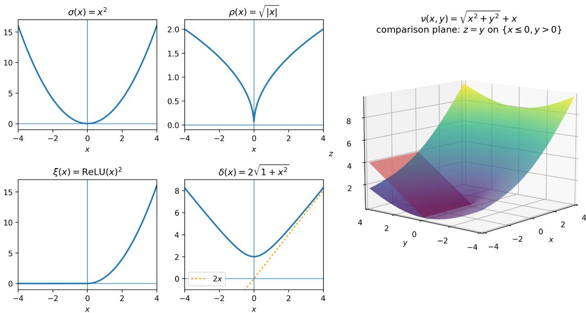
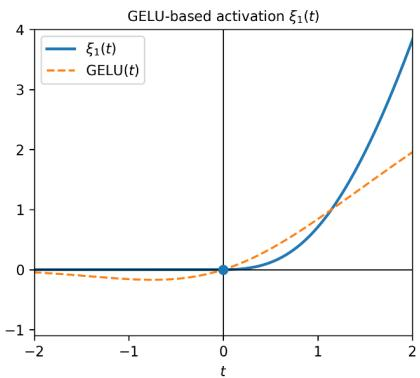
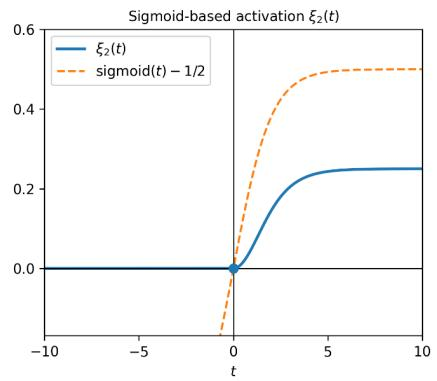
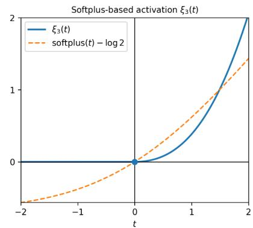

# WHEN CAN ONE OBTAIN CERTIFICATES OF OPTIMALITY USING POSITIVSTELLENSÄTZE?

NAYOON KIM, ALLEN GEHRET, SHENYUAN MA, AND JAKUB MAREČEK

Abstract. We study certificates of positivity and optimality for learning problems whose objectives and constraints need not be polynomial. We isolate an axiomatic core of Fischer’s constructive strict and weak Positivstellensätze and prove the resulting theorems for abstract function algebras over ordered fields. The framework separates two roles that can otherwise be conflated: objective and constraint functions may be built from broad classes of continuous or definable operations, while the auxiliary primitives used to construct a certificate satisfy explicit scalar and closure axioms. We give instances over continuous and definable function algebras, including ordered fields not closed under square roots, derive lower-bound and global-optimality certificates, and analyze both expanded term length and shared computation-graph complexity.

## 1. Introduction

There is substantial interest in guarantees of optimality for neural-network training. Two dificulties arise from activation functions: sigmoid is smooth but non-semialgebraic, whereas ReLU is semialgebraic but nonsmooth. Many available certificates rely on semialgebraicity or smoothness.

Several approaches to such certificates have been developed, including branch-and-bound proof systems [15], cutting-plane proof systems [7, 36], Positivstellensätze, and several others [3, 22, 24, 25, 31] based on convexifications. Branch-and-bound and polyhedral proof systems are also used in ReLU-network verification [15]. Independently, strong lower bounds are known for branching and cutting-plane proof systems on dificult instance classes [8, 13]. A concise representation of a certificate family does not by itself make semantic verification tractable. Positivstellensätze have been developed in real algebraic geometry [29]. Related semialgebraic methods have been used to estimate Lipschitz constants of ReLU networks [5] and to represent and certify Monotone Deep Equilibrium models [6]. The challenge is the computational complexity of obtaining such certificates, which remains prohibitive for many practical applications, even when sparsity [33–35] and nonnegativity [21] are exploited. Here we focus on the Positivstellensatz approach.

More precisely, we ask which Sätze can provide explicit algebraic certificates for deep-learning problems, and how such certificates can be constructed. Many classical Sätze contain a nonconstructive step and therefore do not immediately yield an efective construction. An exception to this is the Positivstellensätze for diferentiable functions by Fischer (2011) [12], a constructive generalization of the earlier Positivstellensatz for definable functions on o-minimal structures by Acquistapace, Andradas, and Broglia (2002) [1]. Fischer’s construction, inspired in part by [1], has an explici structure that permits the present axiomatic formulation.

Two features of Fischer’s formulation [12] make systematic reuse of the construction less direct:

(1) The main theorems and proofs are presented in the setting of (definable families of) definable C<sup>r</sup>-functions on a definably complete real closed field. Fischer also gives Banach-space and Peano-diferentiable variants, explaining that minor variations of the definable proofs yield these results and indicating the required substitutions rather than writing out separate full proofs.

(2) The construction is too reliant on the fact that the scalar field is a real-closed field (such as R). This is mainly because the square-root function $\sqrt { \cdot }$ plays a seemingly essential role.

The first point, 1, suggests a single axiomatic framework containing these settings as special cases. The second, 2, asks how far the construction can be generalized by replacing functions such as $^ { 6 6 } { \sqrt { \cdot } } ^ { \prime \ }$

1.1. Contributions and organization. Sections 3 and 4 introduce the axiomatic setting and state the strict and weak Positivstellensätze (Theorems 4.1 and 4.4). Section 5 gives examples that satisfy the axiomatic Positivstellensatz but are not direct instances of the hypotheses in [12], including examples over fields without square roots, such as $\mathbb { Q } .$ , and examples using variants of common neural-network activation functions. Section 6 gives optimality certificates and a neural-network application. Section 7 analyzes the complexity of Fischer’s construction.

Appendix A gives the universal terms and proof architecture. Appendices B and C contain the proofs of the strict and weak theorems. Appendix D verifies the function-algebra criteria for various examples, including Fischer’s definable $C ^ { r }$ setting. Appendix E derives the exact term-length and shared-graph complexity bounds and discusses the small-arity cases.

## 2. Background

Polynomials that can be written as a sum of squares (SOS) of polynomials are obviously nonnegative; however, the converse is false by Hilbert (1888). The next question is whether all the nonnegative polynomials are SOS of rational functions; this is Hilbert’s 17th problem (1900) which was answered in the afirmative by Artin (1927). This motivates the study of certificates of positivity.

Let $g , f _ { 1 } , \ldots , f _ { k }$ be polynomials in $\mathbb { R } [ X ] = \mathbb { R } [ X _ { 1 } , \ldots , X _ { n } ]$ . The preordering $T ( f _ { 1 } , \dots , f _ { k } )$ generated by $f _ { 1 } , \ldots , f _ { k }$ is the smallest collection of polynomials that contains all squares, each $f _ { i } ,$ , and is closed under addition and multiplication. Any element of this set is tautologically nonnegative on the basic closed semialgebraic set

$$
F = \bigcap _ { 1 \leq i \leq k } \{ f _ { i } ( x ) \geq 0 \} \subseteq \mathbb { R } ^ { n } ,
$$

so it serves as an algebraic witness for nonnegativity. Classical polynomial Positivstellensätze certify positivity (or nonnegativity) of g on F by producing such a witness, or variants thereof.

The Krivine–Stengle Positivstellensatz (1964, 1974) [18, 32] gives a certificate with a multiplier in the preordering: $g \geq 0$ on F if and only if there exist $\mu \in \mathbb { N }$ and $a _ { 1 } , a _ { 2 } \in T ( f _ { 1 } , \dots , f _ { k } )$ such that

$$
( g ^ { 2 \mu } + a _ { 1 } ) g ~ = ~ a _ { 2 } .
$$

Schmüdgen’s Positivstellensatz removes the multiplier under a compactness assumption on $F$ (1991) [30]: if F is compact and $g > 0$ on $F$ , then g belongs to the preordering:

$$
g \ \in \ T ( f _ { 1 } , \ldots , f _ { k } )
$$

Putinar then reduces the structure from a preordering (multiplicative cone) to a quadratic module (additive cone), provided the quadratic module is Archimedean (1993) [28]: if $g > 0$ on F, then:

$$
g \ = \ \sigma _ { 0 } + \sum _ { 1 \leq i \leq k } \sigma _ { i } f _ { i } ( \sigma _ { i } \ \mathrm { S O S } )
$$

Beyond polynomial rings, Gamboa proved a Positivstellensatz for rings of continuous functions [14]. Later, Acquistapace–Andradas–Broglia proved strict and weak Positivstellensätze for definable $C ^ { r } .$ -functions in o-minimal expansions of real closed fields [1]. Fischer subsequently gave an explicit finite construction, preserved definability uniformly in parameters, treated the smooth case, and gave Banach-space variants [12]. We formulate the construction using scalar and function-algebra axioms. The resulting terms are independent of the particular function algebra and scalar field; only verification of the axioms depends on the instance.

Other nonpolynomial positivity results use diferent certificate mechanisms. Dinh and Pham obtain sums-of-squares representations for nonnegative definable C<sup>p</sup>-functions under additional hypotheses on the zero set, with coeficients of class $C ^ { p - 2 }$ [9]. Lasserre–Putinar study positivity and optimization in finitely generated algebras of Borel or semialgebraic functions by lifting to polynomial optimization [20], while Marshall–Netzer use hidden positivity and quadratic modules in real function algebras [23]. These frameworks are complementary to the present closure-axiom approach rather than direct substitutes for the universal constructions below.

## 3. Setup

Throughout, our main running example is the collection $C ^ { 0 } ( U , \mathbb { R } )$ of continuous real-valued functions on an open set $U \subseteq \mathbb { R } ^ { n }$ . Here we have an underlying space $X = U$ , a field of scalars $R = \mathbb { R }$ , and an algebra $A = C ^ { 0 } ( U , \mathbb { R } )$

To obtain further examples, we consider more general choices of space, scalars, and algebra: X is an arbitrary set, R is a model-theoretic structure (cf. [2, Appendix B]) satisfying some first-order axioms, and A is a collection of functions $X  R$ satisfying some closure axioms. In Sections 3 and 4, X is arbitrary.

We often consider a one-sorted first-order language L, an L-structure $\pmb { R } = ( R ; \ldots )$ of “scalars”, and a collection A of R-valued functions $X  R$ . Thus $A \subseteq R ^ { X }$ , and A satisfies the closure properties specified below.

The language L allows us to state and prove Theorems 4.1 and 4.4 independently of a particular function algebra. Interpretations of L-terms also define functions in $R ^ { X }$ uniformly:

Definition 3.1. Suppose $t ( z _ { 1 } , \ldots , z _ { n } )$ is an L-term, $\pmb { R } = ( R ; \ldots )$ is an L-structure, and $f _ { 1 } , \ldots , f _ { n }$ $X  R$ are elements of $R ^ { X }$ ; then we define a new element $t ( f _ { 1 } , \ldots , f _ { n } )$ of $R ^ { X }$ as follows:

$$
t ( f _ { 1 } , \ldots , f _ { n } ) : X \to R , \quad x \mapsto t ( f _ { 1 } , \ldots , f _ { n } ) ( x ) : = t ^ { R } ( f _ { 1 } ( x ) , \ldots , f _ { n } ( x ) )
$$

where $t ^ { R } : R ^ { n }  R$ is the interpretation of the L-term $t ( z _ { 1 } , \ldots , z _ { n } )$ in the L-structure R.

We begin with the language $\mathcal { L } _ { \mathrm { o F } }$ of ordered fields:

$$
\mathcal { L } _ { \mathrm { o F } } : = \{ \leq , 0 , 1 , - , + , \cdot , ( \cdot ) ^ { - 1 } \}
$$

Let $T _ { \mathrm { o F } }$ be the $\mathcal { L } _ { \mathrm { o F } ^ { \mathrm { - t h e o r y } } }$ whose models are precisely the ordered fields $\pmb { R } = ( R ; \leq , + , \cdot )$ where all function symbols have their usual interpretation; we declare 0 to be a default value by setting $0 ^ { - 1 } : = 0$ . Below, all languages we introduce will extend $\mathcal { L } _ { \mathrm { o F } }$ , and all theories will extend $T _ { \mathrm { o F } }$

Suppose $\pmb { R } = ( R ; \ldots )$ is a model of $T _ { \mathrm { o F } }$ . The first two axioms we wish to impose on a collection $A \subseteq R ^ { X }$ of functions $X  R$ are the following:

(A0) The collection A is a unital commutative ring of functions $X  R , \mathrm { i . e . }$

(A0a) the constant functions $X  R , x \mapsto 0 , 1$ are elements of A

(A0b) if $f \in A$ , then $- f \in A$

(A0c) if $f , g \in A ,$ then $f + g , f \cdot g \in A$

(A1) if $f \in A$ , and $\{ f > 0 \} = X$ , then $f ^ { - 1 } \in A .$

Under the axioms (A0) and (A1), the collection A has the natural structure of a Q-algebra, which partly motivates our use of the word algebra. We use the term more broadly below for function rings satisfying the stated closure axioms, and impose (A1) only where it is needed: it is included with the strict axioms $( \mathrm { A s P } )$ , but not the weak axioms (AwP).

Main Example 3.2. Suppose $\pmb { R } = ( \mathbb { R } ; \leq , + , \cdot )$ is the usual ordered field of real numbers, construed as an $\mathcal { L } _ { \mathrm { o l } }$ <sub>F</sub>-structure in a natural way, thus making it a model of $T _ { \mathrm { o F } }$ . Likewise, let $X = U \subseteq \mathbb { R } ^ { n }$ be an open subset of $\mathbb { R } ^ { n }$ , for some $n _ { \ast }$ , and set $A = C ^ { 0 } ( U , \mathbb { R } )$ be the R-algebra of continuous R-valued functions $U \to \mathbb { R }$ . Then A satisfies axioms (A0) and (A1). We prove all claims about this running Main Example in subsection D.3.

Main Non-Example 3.3 (for $\left( \mathrm { A 1 } \right) )$ . Let $n \geq 1$ , suppose $\pmb { R } = ( \mathbb { R } ; \leq , + , \cdot )$ , and consider $A =$ $\mathbb { R } [ X ] = \mathbb { R } [ X _ { 1 } , \ldots , X _ { n } ]$ , the ring of polynomials over R in the indeterminates $X _ { 1 } , \ldots , X _ { n } ;$ we construe $A$ as a collection of functions $\mathbb { R } ^ { n } \to$ R in the usual way. Then A satisfies axiom $( \mathrm { A 0 } )$ but does not satisfy axiom (A1). Indeed, we have $f : = 1 + X _ { 1 } ^ { 2 } + \cdot \cdot \cdot + X _ { n } ^ { 2 } \in A$ and $f > 0 \mathrm { o n } \mathbb { R } ^ { n }$ , however $f ^ { - 1 } \not \in A$ since $f ^ { - 1 }$ is bounded on $\mathbb { R } ^ { n }$ but not constant. Consequently, A cannot satisfy the strict axioms $( \mathrm { A s P } )$ given below, so the Strict Positivstellensatz 4.1 does not apply to this choice of A. We show below in 4.7 that the Weak Positivstellensatz 4.4 also does not apply to this choice of A.

Convention 3.4. If R satisfies $T _ { \mathrm { o F } }$ and $f : X \to R$ , then we set $\{ f \geq 0 \} : = \{ x \in X : f ( x ) \geq 0 \} \subseteq X$ A similar notation is used likewise for $\{ f > 0 \} , \{ f = 0 \} , \{ f \leq 0 \}$ , and $\{ f < 0 \}$

3.1. The languages. We equip the scalar fields with additional primitives. Their intended roles are specified in subsection 3.2; the corresponding language extensions of $\mathcal { L } _ { \mathrm { o F } }$ add the following function symbols:

• a unary function $\sigma ;$ it produces nonnegative values (for example, $| x | , x ^ { 2 } , { \mathrm { o r ~ } } x ^ { 2 d } )$

• a unary function $\rho ;$ it is a partial inverse of $\sigma$ (for example, $\sqrt { x } )$

• a unary function ξ; it is a generalized “positive part” or activation-type function (for example, ${ \mathrm { R e L U } } ( x ) : = \operatorname* { m a x } ( 0 , x ) { \mathrm { ~ o r ~ } } \exp ( - 1 / t ) \cdot 1 \{ t > 0 \} )$

• a unary function $\delta ;$ it is strictly positive and dominates twice its input (for example, $2 { \sqrt { 1 + x ^ { 2 } } }$ or $2 { \mathrm { R e L U } } ( x ) + 1 )$

• a binary function $\nu ;$ it is a partial proxy for the max function: it is positive whenever either input is positive, and is bounded by its second input whenever the first input is nonpositive and the second input is positive (for example, max $( x , y )$ or ${ \sqrt { x ^ { 2 } + y ^ { 2 } } } + x )$

We define extensions of $\mathcal { L } _ { \mathrm { o F } }$ by these function symbols as follows:

$$
\mathcal { L } _ { \mathrm { w P } } : = \mathcal { L } _ { \mathrm { o F } } \cup \{ \sigma , \rho , \xi \} \subseteq \mathcal { L } _ { \mathrm { s P } } : = \mathcal { L } _ { \mathrm { w P } } \cup \{ \delta , \nu \}
$$

Main Example 3.5. To continue with example 3.2, we expand the $\mathcal { L } _ { \mathrm { o F } ^ { - } \mathrm { s t r u c t u r e } }$ $\pmb { R } = ( \mathbb { R } ; \ldots )$ to an $\mathcal { L } _ { \mathrm { s P } ^ { \mathrm { - s t r u c t u r e } } }$ by interpreting the new function symbols in $\mathcal { L } _ { \mathrm { s P } } \backslash \mathcal { L } _ { \mathrm { o F } }$ as follows for every $x , y \in \mathbb { R }$

$$
\sigma ( x ) : = x ^ { 2 } , \quad \rho ( x ) : = { \sqrt { | x | } } , \quad \xi ( x ) : = \mathrm { R e L U } ^ { 2 } ( x ) ,
$$

$$
\delta ( x ) : = 2 \sqrt { 1 + x ^ { 2 } } , \quad \nu ( x , y ) : = \sqrt { x ^ { 2 } + y ^ { 2 } } + x
$$

Figure 1 shows these functions:

3.2. The scalar theories. Let $T _ { \mathrm { w P } }$ be the ${ \mathcal { L } } _ { \mathrm { w P } } .$ -theory extending $T _ { \mathrm { o F } }$ whose models $\pmb { R } = ( R ; \xi , \sigma , \rho )$ satisfy for every $a , b \in R$

(Tξ1) $\xi ( a ) \ge 0$

(Tξ2) $\xi ( a ) > 0 \mathrm { i f f } a > 0$

(Tσ1) $\sigma ( a ) \geq 0$

(Tσ2) if $a , b \geq 0$ , then $\sigma ( a \cdot b ) = \sigma ( a ) \cdot \sigma ( b )$

(Tρ) if $a \geq 0$ , then $\rho ( a ) \geq 0$

(Tσρ) if $a \geq 0$ , then $\sigma ( \rho ( a ) ) = a$

Let $T _ { \mathrm { s P } }$ be the $\mathcal { L } _ { \mathrm { s P ^ { - } t h e o r y } }$ extending $T _ { \mathrm { w P } }$ whose models $\pmb { R } = ( R ; \xi , \sigma , \rho , \delta , \nu )$ additionally satisfy for every $a , b \in R$

(Tδ) $0 < \delta ( a )$ and $2 a \le \delta ( a )$

  
Figure 1. The auxiliary functions $\sigma , \rho , \xi , \delta , \nu$ in Main Example 3.5.

(Tν1) if $a > 0$ or $b > 0$ , then $\nu ( a , b ) > 0$ , and

(Tν2) if $a \leq 0$ and $b > 0$ , then $\nu ( a , b ) \leq b$

Main Example 3.6. The $\mathcal { L } _ { \mathrm { s P } ^ { \mathrm { - s t r u c t u r e } } }$ $\pmb { R } = ( \mathbb { R } ; \ldots )$ from example 3.5 is a model of $T _ { \mathrm { w P } }$ and $T _ { \mathrm { s P } }$

## 4. Main results

4.1. Strict Positivstellensatz. For the Strict Positivstellensatz 4.1 below, we consider a model R of $T _ { \mathrm { s P } }$ as well as the following additional axioms on our algebra $A \subseteq R ^ { X }$ of functions $X  R$

(A2) if $f \in A .$ , then $\xi ( f ) \in A$

(A3s) if $f \in A$ and $\{ f > 0 \} = X$ , then $\sigma ( f ) , \rho ( f ) \in A$

(A4s) if $f , g \in A$ and $\{ f \geq 0 \} \subseteq \{ g \neq 0 \}$ , then:

$$
\xi ( f ) \cdot g ^ { - 1 } \in A
$$

(Aδ) if $f \in A .$ , then $\delta ( f ) \in A$

(Aν) if $f , g \in A$ and $\{ f \leq 0 \} \subseteq \{ g > 0 \}$ , then $\nu ( f , g ) \in A$

(AsP) the conjunction of axioms (A0), (A1), (A2), (A3s), (A4s), (Aδ), and $\left( \mathrm { A } \nu \right)$

Strict Positivstellensatz 4.1. (cf. [12, Theorem 1.1]) For each $k \geq 0$ , there exist $\mathcal { L } _ { \mathrm { s P } ^ { - } } t e r m s$ $\tilde { t } _ { i } ( z _ { 0 } , \ldots , z _ { k } )$ for $i = 0 , \ldots , k$ such that for every R satisfying $T _ { \mathrm { s P } }$ , every $A \subseteq R ^ { X }$ satisfying $( A s P )$ and every $g , f _ { 1 } , \ldots , f _ { k } \in A$ , if

$$
\bigcap _ { 1 \leq i \leq k } \{ f _ { i } \geq 0 \} \ \subseteq \ \{ g > 0 \} ,
$$

then each $t _ { i } : = \tilde { t } _ { i } ( g , f _ { 1 } , \ldots , f _ { k } )$ lies in A, is strictly positive on X, and

$$
\begin{array} { r } { g \ = \ \sigma ( t _ { 0 } ) + \sum _ { 1 \leq i \leq k } \sigma ( t _ { i } ) f _ { i } . } \end{array}
$$

Proof strategy. The strict and weak constructions follow the same pattern. The constraints are first compressed into a single function h satisfying

$$
\bigcap _ { 1 \leq i \leq k } \left\{ f _ { i } \geq 0 \right\} \subseteq \left\{ h \geq 0 \right\} \subseteq \left\{ g > 0 \right\}
$$

in the strict case, with the analogous nonnegative relation in the weak case. The sign analysis then involves only g and h. The ξ-terms distinguish the relevant sign cases for $( g , h )$ . The resulting functions, together with the representation of h in terms of the original constraints, give the certificate. The explicit terms are given in Appendix $\operatorname { A } ;$ Appendices B and C contain the corresponding verifications. □

The statement of 4.1 provides the $\mathcal { L } _ { \mathrm { s P } ^ { - } } \mathrm { t e r m s } \ \tilde { t } _ { i }$ independently of the particular $R , A , g , f _ { 1 } , \ldots , f _ { k } ;$ it requires only $T _ { \mathrm { s P } } , ( \mathrm { A s P } )$ , and $\bigcap _ { 1 \leq i \leq k } \{ f _ { i } \geq 0 \} \subseteq \{ g > 0 \}$

Main Example 4.2. Continuing with example 3.6, the algebra $A = C ^ { 0 } ( U , \mathbb { R } )$ satisfies (AsP).

Example 4.3. Appendix E.3 gives the $k = 0$ terms, the complete $k = 1$ strict and weak identities as formulae, and the expanded lengths for $k = 2$

4.2. Weak Positivstellensatz. For the Weak Positivstellensatz 4.4 below, we consider a model R of $T _ { \mathrm { w P } }$ as well as the following additional axioms on our algebra $A \subseteq R ^ { X }$ of functions $X  R$

(A3w) if $f \in A$ and $\{ f \ge 0 \} = X$ , then $\sigma ( f ) , \rho ( f ) \cdot \xi ( f ) \in A$

(A4w) if $f \in A$ , then $\xi ( - f ) \cdot ( f ) ^ { - 1 } \in A$

(A5w) if $g , h \in A$ and $\{ h \geq 0 \} \subseteq \{ g \geq 0 \}$ , then:

$$
\xi ( g ^ { 2 } ) \cdot \xi ( g + 4 h ) \cdot ( g + h ) ^ { - 1 } ~ \in ~ A
$$

(AwP) the conjunction of $( \mathrm { A 0 } ) , ( \mathrm { A 2 } ) , ( \mathrm { A 3 w } ) , ( \mathrm { A 4 w } )$ , and (A5w).

In particular, the weak theorem does not require axiom (A1), i.e., closure under inverses of all everywhere-positive functions. Proposition C.12 below gives a non-Archimedean example satisfying (AwP) but not (A1), so axiom (A1) is not a consequence of the remaining weak axioms.

Weak Positivstellensatz 4.4. (cf. [12, Theorem 1.2]) For each $k \geq 0$ , there exist ${ \mathcal { L } } _ { \mathrm { w P } }$ -terms $\tilde { t } _ { i } ( z _ { 0 } , \ldots , z _ { k } ) ~ f o r ~ i = - 1 , 0 , \ldots , k$ such that for every R satisfying $T _ { \mathrm { w P } }$ , every $A \subseteq R ^ { X }$ satisfying $( A w P )$ , and every $g , f _ { 1 } , \ldots , f _ { k } \in A$ , if

$$
\begin{array} { r } { F : = \bigcap _ { 1 \leq i \leq k } \{ f _ { i } \geq 0 \} \subseteq \{ g \geq 0 \} , } \end{array}
$$

then we have:

$$
\begin{array} { r } { \sigma ( p ) \cdot g \ = \ \sigma ( t _ { 0 } ) + \sum _ { 1 \leq i \leq k } \sigma ( t _ { i } ) \cdot f _ { i } } \end{array}
$$

where each $t _ { i } : = \tilde { t } _ { i } ( g , f _ { 1 } , \ldots , f _ { k } ) ( i = 0 , 1 , \ldots , k )$ is a nonnegative function in $A ;$ and $p : =$ $\tilde { t } _ { - 1 } ( g , f _ { 1 } , \dots , f _ { k } )$ is a nonnegative function in A satisfying:

$$
\{ p = 0 \} \ = \ \{ g = 0 \}
$$

The proof of 4.4 is given in Appendix C.

Main Example 4.5. Continuing with example 4.2, the algebra $A = C ^ { 0 } ( U , \mathbb { R } )$ also satisfies (AwP).

Example 4.6. The zero-constraint sanity check and the complete one-constraint formulae are given in Appendices A.3 and E.3.

Main Non-Example 4.7 (for (A2)). Continuing with 3.3, we claim that there is no choice of function $\xi : \mathbb { R }  \mathbb { R }$ so that both the structure $( \mathbb { R } ; \leq , + , \cdot , \xi )$ satisfies (Tξ1)-(Tξ2) and the algebra $A = \mathbb { R } [ X _ { 1 } , \ldots , X _ { n } ] ( n \geq 1 )$ satisfies (A2); indeed, otherwise applying (A2) to $f = X _ { 1 }$ , there would be a polynomial $P \in \mathbb { R } [ X _ { 1 } , \ldots , X _ { n } ]$ such that $P ( x _ { 1 } , \ldots , x _ { n } ) = \xi ( x _ { 1 } )$ for all $( x _ { 1 } , \ldots , x _ { n } ) \in \mathbb { R } ^ { n }$

Restricting this identity to tuples $( t , 0 , \ldots , 0 ) \in \mathbb { R } ^ { n }$ yields a univariate polynomial $q ( t )$ such that $q ( t ) = \xi ( t )$ for all $t \in \mathbb { R }$ , contradicting $( \mathrm { T } \xi { 1 } ) – ( \mathrm { T } \xi { 2 } )$ as a univariate polynomial with infinitely many zeros must be identically zero. Consequently, A cannot satisfy the weak axioms (AwP) either, so the Weak Positivstellensatz 4.4 also does not apply to this choice of A.

## 5. Examples

We give several Positivstellensätze that are instances of 4.1 and 4.4. Fischer’s original setting is discussed in Appendix D.5.

5.1. Using the binary step function as ξ. Outside the continuous setting, one may use for ξ the binary step function (with $\xi ( 0 ) = 0 )$ :

$$
R \to R , \qquad x \longmapsto { \left\{ 0 , \quad x \leq 0 , \right. }
$$

Choose any scalar primitives $\sigma , \rho , \xi , \delta , \nu$ on an ordered field R that satisfy the scalar theories $T _ { \mathrm { w P } }$ and $T _ { \mathrm { s P } }$ . Expand the scalar structure by those chosen primitives, let X be a definable set, and take A to be the algebra of all functions $X  R$ definable in that expanded structure. Closure of definability under composition then supplies every algebra axiom used by the two Positivstellensätze.

Corollary 5.1. For any such choice of scalar primitives, the corresponding full definable-function algebra A satisfies axioms $( A s P )$ and $( A w P )$

Thus the framework permits arbitrary, including discontinuous, primitive choices subject to the scalar axioms; the price of this formal freedom is that one works in the full definable-function algebra. Appendix D.1 gives the precise setup and two limiting variants.

5.2. Alternative choices of $\sigma , \rho , \xi , \delta , \nu$ in the main example (activation functions). We consider alternative choices of $\sigma , \rho , \xi , \delta , \nu$ in Main Example 3.5. The following proposition gives suficient conditions:

Proposition 5.2. If the real ordered field R is expanded to a model of $T _ { \mathrm { s P } }$ such that:

(1) $\xi : \mathbb { R } \to \mathbb { R }$ is continuous,

(2) the restrictions of σ and ρ to $( 0 , + \infty )$ are continuous,

(3) $\delta : \mathbb { R }  \mathbb { R }$ is continuous, and

(4) $\nu : D _ { \nu } $ R is continuous, where $D _ { \nu } : = \{ ( a , b ) \in \mathbb { R } ^ { 2 } : i f { a } \leq 0$ , then $b > 0 \}$ 了,

then the algebra $A = C ^ { 0 } ( U , \mathbb { R } )$ satisfies (AsP). If instead R is expanded to a model of $T _ { \mathrm { w P } }$ such that:

(5) $\xi : \mathbb { R } \to \mathbb { R }$ is continuous and $\xi ( t ) \prec t$ at $0 ^ { + } , i . e . , \operatorname* { l i m } _ { t \downarrow 0 } \xi ( t ) / t = 0$

(6) $\sigma : [ 0 , + \infty )  \mathbb { R }$ is continuous, and

(7) $t \mapsto \xi ( t ) \rho ( t ) : [ 0 , + \infty ) \to \mathbb { R }$ is continuous,

then the algebra $A = C ^ { 0 } ( U , \mathbb { R } )$ satisfies (AwP).

Proof. See subsection D.2, in particular Corollaries D.6 and D.11, for more general statements and their proofs. □

Examples of functions $\sigma , \rho , \xi , \delta , \nu$ satisfying the scalar axioms and the conditions of Proposition 5.2 are easy to construct. We consider a few choices of $\xi \colon$

• (Power gates) For any $\alpha \in ( 0 , + \infty )$ , the function $\xi = \mathrm { R e L U } ^ { \alpha }$ satisfies 5.2(1); if moreover α $> 1$ , then ξ additionally satisfies 5.2(5); if instead $\alpha \in ( 0 , 1 ]$ , then condition 5.2(5) fails.

• Let $F : \mathbb { R }  \mathbb { R }$ be continuous, diferentiable at 0, and strictly increasing on $[ 0 , + \infty )$ . Define $\xi _ { F }$ as follows. It satisfies (Tξ1), (Tξ2), and the conditions in $^ { 5 . 2 ( 1 , 5 ) }$

$$
\xi _ { F } : \mathbb { R } \to \mathbb { R } , \quad t \mapsto \xi _ { F } ( t ) : = \left\{ { \begin{array} { l l } { ( F ( t ) - F ( 0 ) ) ^ { 2 } } & { { \mathrm { i f ~ } } t > 0 } \\ { 0 } & { { \mathrm { i f ~ } } t \leq 0 } \end{array} } \right.
$$

Applying this construction to the common activation functions GELU, sigmoid, and softplus (cf. [19]) gives, for $t > 0$ ,

$$
\xi _ { 1 } ( t ) \ : = \ \mathsf { G E L U } ^ { 2 } ( t ) \quad \xi _ { 2 } ( t ) \ : = \ ( \mathsf { s i g m o i d } ( t ) - 1 / 2 ) ^ { 2 } \quad \xi _ { 3 } ( t ) \ : = \ ( \mathsf { s o f t p l u s } ( t ) - \log 2 ) ^ { 2 }
$$





  
Figure 2. Alternative choices of $\xi$ based on common activation functions

5.3. Q-valued continuous functions. In [12], the implicit model R of $T _ { \mathrm { o F } }$ is always a real closed field (cf. D.5). This is primarily because the implicit $\rho , \delta , \nu$ functions there are defined in terms of ${ \sqrt { \cdot } } ,$ a function which an arbitrary ordered field might not support. We give a $C ^ { 0 }$ example over an ordered field that need not be real closed, and state it for $R = \mathbb { Q }$ . This is an exact rational-arithmetic model, or an algebraic idealization of exact computation. It does not model ordinary floating-point or fixed-point arithmetic, where rounding, overflow, exceptional values, and inexact inversion require an error-aware semantics.

Consider the ordered field $( \mathbb { Q } ; \leq , + , \cdot )$ as a model $\pmb { Q } = ( \mathbb { Q } ; \ldots )$ of $T _ { \mathrm { o F } }$ in the natural way. Expand $Q$ to an $\mathcal { L } _ { \mathrm { s P } }$ -structure by interpreting the new function symbols as follows for every x, $y \in \mathbb { Q }$

$$
\sigma ( x ) : = \mathrm { R e L U } ( x ) , \quad \rho ( x ) : = \mathrm { R e L U } ( x ) , \quad \xi ( x ) : = \mathrm { R e L U } ^ { 2 } ( x )
$$

$$
\delta ( x ) \ : = \ 2 \operatorname { R e L U } ( x ) + 1 , \quad \nu ( x , y ) \ : = \ \operatorname* { m a x } ( x , y )
$$

Next, equip $\mathbb { Q }$ with the order topology, and let X be an arbitrary topological space. Let $A = C ^ { 0 } ( X , \mathbb { Q } )$ be the collection of all continuous functions $X \to \mathbb { Q }$ . We have the following (see subsection D.4):

Corollary 5.3. Q satisfies $T _ { \mathrm { s P } }$ and A satisfies axioms $( A s P )$ and $( A w P )$

## 6. Optimality certificates and an application to neural networks

The Positivstellensätze give the following optimization-theoretic reformulation:

Corollary 6.1 (Lower-bound and optimality certificates). Let $g , f _ { 1 } , \ldots , f _ { k } \in A$ and fix $L \in R$ . Set

$$
F : = \bigcap _ { 1 \leq i \leq k } \{ f _ { i } \geq 0 \} .
$$

Assume additionally that every constant function $X  R$ belongs to A.

(Strict case) Suppose R satisfies $T _ { \mathrm { s P } }$ and A satisfies $( A s P )$ . Then the following are equivalent:

(S1) There exists $\eta > 0$ such that:

$$
F ~ \subseteq ~ \{ g - ( L + \eta ) > 0 \}
$$

(S2) There exists $\eta > 0$ and strictly positive functions $t _ { 0 } , \ldots , t _ { k } \in A$ , such that

$$
\begin{array} { r } { g - ( L + \eta ) \ = \ \sigma ( t _ { 0 } ) + \sum _ { 1 \leq i \leq k } \sigma ( t _ { i } ) f _ { i } } \end{array}
$$

For every η witnessing (S1), the functions in (S2) may be chosen uniformly by applying the Strict Positivstellensatz 4.1 to the functions $g - ( L + \eta ) , f _ { 1 } , \dotsc , f _ { k } \in A$

(Weak case) Suppose R satisfies $T _ { \mathrm { w P } }$ and A satisfies (AwP). Then the following are equivalent:

(W1) We have:

$$
F ~ \subseteq ~ \{ g - L \geq 0 \}
$$

(W2) There exist nonnegative functions $p , t _ { 0 } , \ldots , t _ { k } \in A$ such that

$$
\begin{array} { r } { \sigma ( p ) \cdot ( g - L ) \ = \ \sigma ( t _ { 0 } ) + \sum _ { 1 < i < k } \sigma ( t _ { i } ) f _ { i } { a n d } \{ p = 0 \} \ = \ \{ g - L = 0 \} } \end{array}
$$

Under (W1), the functions (W2) may be chosen uniformly by applying the Weak Positivstellensatz $4 { \cdot } 4$ to the functions $g - L , f _ { 1 } , \dotsc , f _ { k } \in A$

If $F \neq \emptyset$ and $g ^ { \star } : = \operatorname* { i n f } _ { x \in F } g ( x )$ exists as an element of R, then (S1) is equivalent to $L < g ^ { \star }$ , while (W1) is equivalent to $L \leq g ^ { \star }$ . In particular, for every $x ^ { \star } \in F$ , the point $x ^ { \star }$ is a global minimizer of g on F if and only if (W2) holds with $L = g ( x ^ { \star } )$

To illustrate the corollary, consider the problem of empirical risk minimization subject to pairwise output-consistency constraints motivated by individual fairness [11, 16, 17]. Let $N _ { \theta } : \mathbb { R } ^ { p }  \mathbb { R } ^ { m }$ be a neural network with fixed architecture and trainable parameters $\theta \in \mathbb { R } ^ { n }$ . Let $\{ ( z _ { j } , y _ { j } ) \} _ { j = 1 } ^ { 4 }$ be four labeled samples, where $( z _ { 1 } , z _ { 2 } )$ and $( z _ { 3 } , z _ { 4 } )$ are designated matched pairs, for example pairs that difer only in a protected attribute. Given a continuous training loss $\ell : \mathbb { R } ^ { m } \times \mathbb { R } ^ { m } \to \mathbb { R } _ { > 0 }$ , a continuous output discrepancy d $l : \mathbb { R } ^ { m } \times \mathbb { R } ^ { m } \to \mathbb { R } _ { \geq 0 }$ , and a user-specified tolerance $\varepsilon > 0$ , define the functions:

$$
g ( \theta ) \ : = \ \frac { 1 } { 4 } \sum _ { j = 1 } ^ { 4 } \ell ( N _ { \theta } ( z _ { j } ) , y _ { j } ) , \qquad f _ { i } ( \theta ) \ : = \ \varepsilon - d ( N _ { \theta } ( z _ { 2 i - 1 } ) , N _ { \theta } ( z _ { 2 i } ) ) , \quad i = 1 , 2
$$

and the feasible region:

$$
F : = \{ f _ { 1 } \geq 0 \} \cap \{ f _ { 2 } \geq 0 \}
$$

Thus the training problem is ${ \mathrm { i n f } } _ { \theta \in F } g ( \theta )$

Suppose the network is built from continuous operations and activations, such as ReLU, GeLU, or Mish. Then $g , f _ { 1 } , f _ { 2 }$ belong to the ambient algebra $A = C ^ { 0 } ( \mathbb { R } ^ { n } , \mathbb { R } )$ of the Main Example. Consequently, for any feasible parameter vector $\theta ^ { \star } \in F$ , Corollary 6.1 implies that $\theta ^ { \star }$ is a global minimizer if and only if there exist nonnegative functions $p , t _ { 0 } , t _ { 1 } , t _ { 2 } \in A$ such that:

$$
p ^ { 2 } \cdot ( g - g ( \theta ^ { \star } ) ) ~ = ~ t _ { 0 } ^ { 2 } + t _ { 1 } ^ { 2 } f _ { 1 } + t _ { 2 } ^ { 2 } f _ { 2 } ~ \mathrm { a n d } ~ \{ p = 0 \} ~ = ~ \{ g = g ( \theta ^ { \star } ) \}
$$

The witnesses may be chosen by substituting $g - g ( \theta ^ { \star } ) , f _ { 1 } , f _ { 2 }$ into the universal terms $\tilde { t } _ { i }$ supplied by the Weak Positivstellensatz 4.4. Here A is an ambient function algebra, not the class of functions represented by the fixed network. The auxiliary primitives $\sigma , \rho , \xi , \delta , \nu$ used to construct the certificates need not be the activation functions used by $N _ { \theta }$ . Likewise, if $L < \operatorname* { i n f } _ { \theta \in F } g ( \theta )$ , then for some $\eta > 0$ there exist strictly positive $t _ { 0 } , t _ { 1 } , t _ { 2 } \in A$ such that:

$$
g - ( L + \eta ) \ = \ t _ { 0 } ^ { 2 } + t _ { 1 } ^ { 2 } f _ { 1 } + t _ { 2 } ^ { 2 } f _ { 2 }
$$

Alternative admissible certificate primitives may be chosen using Proposition 5.2, independently of the activation functions used in $N _ { \theta } ;$ for definable discontinuous networks, one may instead work in the corresponding definable-function algebra of subsection 5.1.

6.1. A rational-valued optimality certificate. We instantiate Corollary 6.1 over the non-realclosed ordered field Q. Let

$$
Q ( x ) : = \left\lfloor x + { \frac { 1 } { 2 } } \right\rfloor \in \mathbb { Z } \subseteq \mathbb { Q }
$$

and consider

$$
\operatorname* { i n f } _ { x \in \mathbb { Q } } Q ( x ) \qquad { \mathrm { s u b j e c t ~ t o } } \qquad f ( x ) : = x - 1 \geq 0 .
$$

The feasible point $x ^ { \star } = 1$ has value $Q ( x ^ { \star } ) = 1$ . Choose the weak certificate primitives from subsection 5.3,

$$
\sigma ( a ) = \rho ( a ) = { \mathrm { R e L U } } _ { \mathbb { Q } } ( a ) , \qquad \xi ( a ) = { \mathrm { R e L U } } _ { \mathbb { Q } } ( a ) ^ { 2 } ,
$$

and let A be the algebra of all functions $\mathbb { Q } \to \mathbb { Q }$ definable in $( \mathbb { Q } ; < , + , \cdot , Q )$ . The functions $Q$ and $f$ belong to A, and $Q ( x ) \geq 1$ whenever $f ( x ) \geq 0$

The $k = 1$ weak construction yields nonnegative $p , t _ { 0 } , t _ { 1 } \in A$ with

$$
p ( x ) ( Q ( x ) - 1 ) = t _ { 0 } ( x ) + t _ { 1 } ( x ) ( x - 1 ) , \qquad \{ p = 0 \} = \{ Q - 1 = 0 \} .
$$

After simplifying the resulting expressions, one obtains

$$
p ( x ) = \left\{ \begin{array} { l l } { ( 1 - Q ( x ) ) ^ { 2 8 } ( 1 - x ) ^ { 4 2 } \bigl ( 1 - Q ( x ) + ( 1 - x ) ^ { 3 } \bigr ) ^ { 1 6 } , } & { x < \frac { 1 } { 2 } , } \\ { 0 , } & { \frac { 1 } { 2 } \le x < \frac { 3 } { 2 } , } \\ { ( Q ( x ) - 1 ) ^ { 7 2 } , } & { x \ge \frac { 3 } { 2 } , } \end{array} \right.
$$

$$
t _ { 0 } ( x ) = \left\{ \begin{array} { l l } { ( 1 - Q ( x ) ) ^ { 2 8 } ( 1 - x ) ^ { 4 5 } \bigl ( 1 - Q ( x ) + ( 1 - x ) ^ { 3 } \bigr ) ^ { 1 6 } , } & { x < \frac { 1 } { 2 } , } \\ { 0 , } & { \frac { 1 } { 2 } \le x < \frac { 3 } { 2 } , } \\ { ( Q ( x ) - 1 ) ^ { 7 3 } , } & { x \ge \frac { 3 } { 2 } , } \end{array} \right.
$$

and

$$
t _ { 1 } ( x ) = \left\{ \begin{array} { l l } { ( 1 - Q ( x ) ) ^ { 2 8 } ( 1 - x ) ^ { 4 1 } \big ( 1 - Q ( x ) + ( 1 - x ) ^ { 3 } \big ) ^ { 1 7 } , } & { x < \frac { 1 } { 2 } , } \\ { 0 , } & { x \geq \frac { 1 } { 2 } . } \end{array} \right.
$$

The identity is checked separately on the three displayed regions, and $\{ p = 0 \} = [ { \textstyle { \frac { 1 } { 2 } } } , { \textstyle { \frac { 3 } { 2 } } } ) \cap \mathbb { Q } =$ $\{ Q - 1 = 0 \}$ . Hence $Q ( x ) \geq 1$ for every feasible x, while $x ^ { \star } = 1$ attains this value. Thus $x ^ { \star }$ is a global minimizer.

## 7. Complexity analysis

We measure the expanded length of the universal terms. Following [2, Appendix B], we construe L-terms as admissible words over an alphabet consisting of the function symbols of ${ \mathcal { L } } ,$ together with an infinite collection of variables $z _ { 0 } , z _ { 1 } , z _ { 2 } , \dotsc$ In particular, an L-term t is a string of symbols from this alphabet and thus has a well-defined length $ { \lvert { \mathsf { h } } ( t ) \in \mathbb { N } ^ { \geq 1 } }$ . The following gives the lengths of the terms provided by Fischer’s construction (see E.1):

Proposition 7.1. Suppose $k \geq 1$ . The length of the term appearing on the right-hand side of 4.1 is:

$$
\begin{array} { r } { \ln \big ( \sigma \big ( \tilde { t } _ { 0 } ( z _ { 0 } , \dots , z _ { k } ) \big ) + \sum _ { 1 \le i \le k } \sigma \big ( \tilde { t } _ { i } ( z _ { 0 } , \dots , z _ { k } ) \big ) \cdot z _ { i } \big ) = 7 2 k ^ { 3 } + 2 3 2 k ^ { 2 } + 2 2 4 k + 5 1 = \Theta ( k ^ { 3 } ) } \end{array}
$$

The lengths of the terms appearing on the $l e f t -$ and right-hand side of $4 . 4$ are:

$$
\mathsf { l h } \big ( \sigma \big ( \tilde { t } _ { - 1 } ( z _ { 0 } , \ldots , z _ { k } ) \big ) \cdot z _ { 0 } \big ) \ = \ 5 3 2 k + 4 6 7 \ = \ \Theta ( k )
$$

$$
\begin{array} { r } { \begin{array} { l } { \ln ( \sigma ( \tilde { t } _ { 0 } ( z _ { 0 } , \dots , z _ { k } ) ) + \sum _ { 1 \leq i \leq k } \sigma ( \tilde { t } _ { i } ( z _ { 0 } , \dots , z _ { k } ) ) \cdot z _ { i } ) \ = \ 7 0 7 k ^ { 2 } + 1 3 7 0 k + 6 4 9 \ = \ \Theta ( k ^ { 2 } ) } \end{array} } \end{array}
$$

Appendix E.3 includes the complete one-constraint identities with every shared subterm inlined. The formulae were produced by maintained symbolic code implementing the recursive constructions rather than transcribed by hand, and are intended to show the resulting expression trees.

7.1. Shared straight-line computation graphs. Expanded term length counts every repeated occurrence of an identical subterm. For the complexity analysis, we use the shared straight-line directed-acyclic-graph model defined precisely in Appendix E.2: all certificate outputs are computed jointly, syntactically identical subexpressions share one node, fan-out is free, each scalar primitive (including inversion) has unit cost, and finite sums and numerals are formed by balanced binary addition trees. This is the standard term-graph model [27].

Proposition 7.2 (Shared-graph complexity). For either the strict or weak construction with k constraints, the universal certificate has a shared straight-line computation graph of size $O ( k )$ and depth $O ( \log ( k + 1 ) )$ , treating $z _ { 0 } , \ldots , z _ { k }$ as inputs and each scalar primitive as a unit-cost operation. If the inputs are themselves represented jointly by graphs of total size $S$ and maximum depth D, the composed certificate graph has size $S + O ( k )$ and depth $D + O ( \log ( k + 1 ) )$ .

Proof. See Appendix E.2, where the cost model and the sharing convention are fixed before the strict and weak constructions are counted. □

These bounds concern evaluation of the explicit universal terms under the specified sharing model. Expanded term length counts every repeated occurrence of a shared subterm, whereas Proposition 7.2 counts each shared subexpression once. Thus the graph bound concerns evaluation of the given terms; it says nothing about finding smaller equivalent terms or deciding equality of arbitrary terms.

These bounds concern evaluation of the fixed universal terms and do not give a polynomial-time method for the associated optimization problems. Pardalos and Schnitger proved that, even for constrained indefinite quadratic programs, deciding whether a given feasible point is a local minimizer and deciding whether a local minimum is strict are NP-hard [26]. In a Euclidean instance with fixed radius $r > 0$ , local optimality can be expressed by adjoining $r ^ { 2 } - \| x - x ^ { \star } \| ^ { 2 } \geq 0$ and certifying nonnegativity of $g - g ( x ^ { \star } )$ on the resulting neighborhood; strictness additionally requires $x ^ { \star }$ to be the only feasible zero. The radius and the required semantic conditions are not supplied by Proposition 7.2.

## 8. Conclusions

We have extracted the formal mechanism of Fischer’s Positivstellensatz construction into scalar and function-algebra axioms. The strict and weak constructions give universal terms under these axioms. The examples include ordered fields that are not real closed, exact rational arithmetic, and variants of standard activation functions.

The complexity analysis separates expanded term length from evaluation using shared computation graphs. For the constructions considered here, the expanded strict certificate has cubic length in the number of constraints, while the shared computation graph has linear size and logarithmic depth. These bounds concern the explicit certificate constructions and do not establish optimality, eficient certificate discovery, or polynomial-time algorithms for the associated optimization problems.

Several questions remain open. The present axioms do not cover $\mathbb { R } [ X ]$ , which is a central setting for classical Positivstellensätze. It remains unknown whether there exists an algebra A satisfying $( ( \mathrm { A w P } ) { \setminus } ( \mathrm { A 5 w } ) ) { + } ( \mathrm { A 5 w } ^ { - } )$ but not (A5w); see Remark C.10. It is open whether analogous constructions exist in the noncommutative setting.

## 9. Acknowledgements

We are grateful to the three anonymous reviewers, whose comments helped improve the paper. This work has received funding from the European Union’s Horizon Europe research and innovation programme under grant agreement No. 101070568. LLM-based tools, primarily $\mathrm { C h a t G P T }$ , were used in preparing this manuscript for brainstorming, checking dependencies, revising exposition, and identifying possible gaps or ambiguities. The human authors assume responsibility for the content of the manuscript, including every mathematical statement, citation, and wording choice.

## Appendix A. Universal terms and proof architecture

The appendices are organized by mathematical role. This appendix gives the term conventions, universal constructions, common sign geometry, and basic scalar consequences. Appendices B and C prove the strict and weak Positivstellensätze. Appendix D verifies the function-algebra examples, including Fischer’s definable $C ^ { r }$ setting. Appendix E gives the compact term-length derivation, the shared-graph model used in the complexity statements, and the small-arity discussion.

## A.1. Term conventions.

Convention A.1. We use the following notational conventions for terms:

• For the binary functions + and ·, we write $s + t$ and $s \cdot t$ (infix notation) instead of $+ ( s , t )$ and $\cdot ( s , t )$ (prefix notation).

• We may write $s - t$ instead of $s + \left( - t \right)$

• Given $k \geq 0$ and terms $t _ { 1 } , \ldots , t _ { k }$ , we define the term $\textstyle \sum _ { 1 \leq i \leq k } t _ { i }$ by recursion on k as follows: if $k = 0$ , then $\textstyle \sum _ { 1 < i < 0 } t _ { i } : = 0$ (the empty sum), if $k = 1$ , then $\textstyle \sum _ { 1 < i < 1 } t _ { i } : = t _ { 1 }$ , and if $k \geq 2$ then $\begin{array} { r } { \sum _ { 1 < i < k } t _ { i } : = \overline { { ( \sum _ { 1 < i < k - 1 } t _ { i } ) + t _ { k } } } } \end{array}$

• We may regard natural numbers $k \geq 2$ as terms via $\begin{array} { r } { k : = \sum _ { 1 \leq i < k } 1 , \ \mathrm { e . g . , ~ 2 ~ = ~ 1 + 1 ~ } } \end{array}$ $3 = ( 1 + 1 ) + 1$ , etc.

• For powers, set $s ^ { 0 } : = 1 , s ^ { 1 } : = s$ , and, for every $m \geq 1$ , define $s ^ { m + 1 } : = s ^ { m } \cdot s$ . Thus positive powers are repeated products with no leading unit; in particular, $z _ { 0 } ^ { 2 }$ abbreviates $z _ { \mathrm { 0 } } \cdot z _ { \mathrm { 0 } }$

• We may denote $s \cdot ( t ) ^ { - 1 }$ as either $s / t \ \mathrm { o r } \ { \frac { s } { t } }$

• Since we will be working always in (extensions of) the ambient theory $T _ { \mathrm { o F } }$ (where addition and multiplication are associative), we may write $s + t + r$ and $s \cdot t \cdot r$ instead of, $\mathrm { e . g . }$ $( s + t ) + r$ and $( s \cdot t ) \cdot r$ as no ambiguity will arise when it comes to evaluating such terms. If disambiguation is necessary, we adhere to a left-associative convention.

## A.2. Universal constructions.

A.2.1. Strict construction. We state directly how the $\mathcal { L } _ { \mathrm { s P } ^ { - } } \mathrm { t e r m s } \ \tilde { t } _ { i }$ are constructed (extracted from the construction in [12]); set $z : = ( z _ { 0 } , \ldots , z _ { k } )$

```lisp
ε˜(z<sub>0</sub>, z<sub>1</sub>, z<sub>2</sub>) := ν(z<sub>0</sub>, z<sub>1</sub>) · (δ(z<sub>2</sub>))<sup>−1</sup>
ψ<sup>˜</sup>(z<sub>1</sub>, . . . , z<sub>k</sub>) := P<sub>1≤i≤k</sub> ξ(−z<sub>i</sub>) · z<sub>i</sub>
ε˜<sub>i</sub>(z) := ˜ε(z<sub>0</sub>, −ψ<sup>˜</sup>(z<sub>1</sub>, . . . , z<sub>k</sub>) · (1 + · · · + 1)<sup>−1</sup>, z<sub>i</sub>) (for i = 1, . . . , k)
{z<sub>k times</sub>
s˜<sub>i</sub>(z) := ρ(ξ(−z<sub>i</sub>) + ˜ε<sub>i</sub>(z)) (for i = 1, . . . , k)
h<sup>˜</sup>(z) := P<sub>1≤i≤k</sub> σ(˜s<sub>i</sub>(z)) · z<sub>i</sub>
φ˜<sub>1</sub>(z) := ξ(z<sub>0</sub> + (1 + 1 + 1 + 1) · h<sup>˜</sup>(z))
φ˜<sub>2</sub>(z) := ξ(−(z<sub>0</sub> + h<sup>˜</sup>(z)))
φ˜<sub>3</sub>(z) := ξ(−z<sub>0</sub> · h<sup>˜</sup>(z))
φ˜(z) := ˜φ<sub>1</sub>(z) + ˜φ<sub>2</sub>(z) + ˜φ<sub>3</sub>(z)
w˜(z) := (z<sub>0</sub> · φ˜<sub>1</sub>(z) · (z<sub>0</sub> + h<sup>˜</sup>(z))<sup>−1</sup> + (z<sub>0</sub> + h<sup>˜</sup>(z)) · φ˜<sub>2</sub>(z) · (h<sup>˜</sup>(z))<sup>−1</sup> + ˜φ<sub>3</sub>(z)) · ( ˜φ(z))<sup>−1</sup>
u˜(z) := z<sub>0</sub> + (−w˜(z) · h<sup>˜</sup>(z))
t<sup>˜</sup><sub>0</sub>(z) := ρ(˜u(z))
t<sup>˜</sup><sub>i</sub>(z) := ρ( ˜w(z)) · s˜<sub>i</sub>(z) (for i = 1, . . . , k)
```

A.2.2. Weak construction. We state directly how the ${ \mathcal { L } } _ { \mathrm { w P ^ { - } } }$ terms $\tilde { t } _ { i }$ are constructed (also extracted from the construction in [12]); set $z : = ( z _ { 0 } , \ldots , z _ { k } )$

$$
\begin{array} { r l } { \mathbb { E } \{ \hat { x } _ { 1 } , \quad \cdots , \hat { x } _ { k } \leq - 2 \leq x _ { 2 } \leq x _ { 3 } \leq x _ { 2 } \leq x _ { 2 } \leq x _ { 3 } ^ { 2 } \leq x _ { 2 } ^ { 3 } , \quad \forall x _ { 2 } ^ { 3 } , } \\ { \leq \frac { \mathbb { E } \{ x } _ { 1 } } { \sqrt { \pi } }  & { = \mathbb { E } \{ x _ { 1 } \leq x _ { 2 } \leq x _ { 3 } ^ { 2 } \leq x _ { 3 } ^ { 2 } \leq x _ { 4 } ^ { 3 } \} , } \\ { \leq \frac { \mathbb { E } \{ x } _ { 1 } } { \sqrt { \pi } }  &  = \mathbb { E } \{ x _ { 1 } \leq x _ { 2 } \leq x _ { 3 } ^ { 2 } \leq x _ { 3 } ^ { 2 } \leq x _ { 4 } ^ { 3 } \leq x _ { 4 } ^ { 3 } \leq x _ { 4 } ^ { 3 } \leq x _ { 4 } ^ { 3 } \leq x _ { 4 } ^ { 3 } \leq x _ { 4 } ^ { 3 } \leq x _ { 4 } ^ { 3 } \leq x _ { 4 } ^ { 3 } \leq x _ { 4 } ^ { 3 } \leq x _ { 4 } ^ { 3 } \leq x _ { 4 } ^ { 3 } \leq x _ { 4 } ^ { 3 } \leq x _ { 4 } ^ { 3 } \leq x _ { 4 } ^ { 3 } \leq x _ { 4 } ^ { 3 } \leq x _ { 4 } ^ { 3 } \leq x _ { 4 } ^ { 3 } \leq x _ { 4 } ^ { 3 } \leq x _ { 4 } ^ { 3 } \leq x _ { 4 } ^ { 3 } \leq x _ { 4 } ^ { 3 } \leq x _ { 4 } ^ { 3 } \leq x _ { 4 } ^ { 3 } \leq x _ { 4 } ^ { 3 } \leq x _ { 4 } ^ { 3 } \leq x _ { 4 } ^ { 3 } \leq x _ { 4 } ^ { 3 } \leq x _ { 4 } ^ { 3 } \leq x _ { 4 } ^ { 3 } \leq x _ { 4 } ^ { 3 } \leq x _ { 4 } ^ { 3 } \leq x _ { 4 } ^ { 3 } \leq x _ { 4 } ^ { 3 } \leq x _ { 4 } ^  \end{array}
$$

Remark A.2 (Uniform term evaluation). A fixed first-order term may be evaluated simultaneously on a parameterized family. If the input functions are jointly definable in $( x , s )$ , then the resulting family is jointly definable because definability is closed under composition. Membership of each fiber in a chosen function algebra is a separate closure question and is checked at the stages listed in the axiom-use map.

## A.3. Zero-constraint sanity check. When $k = 0$ , the strict construction reduces to

$$
g = \sigma ( \rho ( g ) ) .
$$

For the weak construction, the universal identity reduces to

$$
\begin{array} { r } { \sigma ( p ) g = \sigma ( t _ { 0 } ) , } \end{array}
$$

where

$$
\begin{array} { r } { q = \xi ( g ^ { 2 } ) \xi ( g ) ^ { 3 } , \qquad p = \xi ( q g ) \xi ( q ) ^ { 2 } \rho ( q ) , \qquad t _ { 0 } = \xi ( q g ) \rho ( q g ) \xi ( q ) ^ { 2 } . } \end{array}
$$

The weak theorem also gives $\{ p = 0 \} = \{ g = 0 \}$ . These formulas provide a quick boundary-case check on the term conventions and on the leading multiplier in the weak identity.

## A.4. Proof architecture and common sign geometry. Both constructions first compress the constraint list into a single auxiliary function h and then use the same three sign gates. Their dependency patterns are:

$$
\begin{array} { r l } { \mathrm { s t r i c t : } } & { ( g , f _ { 1 } , \ldots , f _ { k } )  ( \psi , \varepsilon _ { i } , s _ { i } )  h \to ( \varphi _ { 1 } , \varphi _ { 2 } , \varphi _ { 3 } , w )  ( u , t _ { i } ) , } \end{array}
$$

weak: $( g , f _ { 1 } , \ldots , f _ { k } )  h \to ( \varphi _ { 1 } , \varphi _ { 2 } , \varphi _ { 3 } , q )  \omega \to u  ( p , t _ { i } ) .$

Lemma A.3 (Common sign geometry). Let $g , h : X \to R$ satisfy $\{ h \geq 0 \} \subseteq \{ g \geq 0 \}$ , and put

$$
U _ { 1 } : = \{ g + 4 h > 0 \} , \qquad U _ { 2 } : = \{ g + h < 0 \} , \qquad U _ { 3 } : = \{ g > 0 \} \cap \{ h < 0 \} .
$$

Then:

(1) on $U _ { 1 }$ one has $g + h > 0$ and $\begin{array} { r } { g + h \ge \frac { 3 } { 4 } g ; } \end{array}$

(2) on $U _ { 2 }$ one has $h < 0$ , hence $( g + h ) / h > 0 ;$

(3) on $U _ { 3 }$ one has $- g h > 0 ,$

(4) $U _ { 1 } \cup U _ { 2 } \cup U _ { 3 } = X \setminus ( \{ g = 0 \} \cap \{ h = 0 \} ) .$

If the stronger inclusion $\{ h \geq 0 \} \subseteq \{ g > 0 \}$ holds, then $U _ { 1 } , U _ { 2 } , U _ { 3 }$ cover all of X.

Proof. On $U _ { 1 }$ , if $h \geq 0$ , then $g \geq 0$ and $g + h > 0$ , while $\begin{array} { r } { g + h \ge g \ge \frac { 3 } { 4 } g } \end{array}$ . If $h < 0$ , then $g + 4 h > 0$ gives $g > 0$ and $h > - g / 4$ , hence $g + h > 3 g / 4$ . If $g + h < 0$ and $h \geq 0$ , the assumed implication gives $g \geq 0$ , a contradiction; this proves (2), and (3) is immediate.

For (4), suppose a point lies outside $U _ { 1 } \cup U _ { 2 } \cup U _ { 3 }$ . Then $g + 4 h \le 0$ and $g + h \ge 0$ , so $3 h \leq 0$ $\mathrm { I f } \ h < 0 .$ then $g + h \ge 0$ forces $g > 0$ , placing the point in $U _ { 3 } ;$ hence $h = 0 .$ . The two displayed inequalities then give $g = 0$ . The converse is immediate. Under the stronger inclusion, $g = h = 0$ is impossible because $h \geq 0$ would imply $g > 0$ □

With

$$
\varphi _ { 1 } : = \xi ( g + 4 h ) , \qquad \varphi _ { 2 } : = \xi ( - ( g + h ) ) , \qquad \varphi _ { 3 } : = \xi ( - g h ) ,
$$

axiom (Tξ2) gives $\{ \varphi _ { j } > 0 \} = U _ { j }$ . Thus Lemma $\mathrm { A . 3 }$ gives the cover used in the strict proof and the denominator-safety estimates used in the weak proof and in the Fischer regularity argument.

The closure axioms enter the constructions at the following stages; all other steps use only ring operations from (A0).
<table><tr><td>Construction</td><td>Purpose</td><td>Non-ring closure axioms</td></tr><tr><td>Strict  $\psi$ </td><td>detect violated constraints</td><td>(A2)</td></tr><tr><td>Strict  $\varepsilon _ { i }$ </td><td>positive correction with a pointwise bound</td><td> $( \mathrm { A } \delta ) , ( \mathrm { A } \nu ) , ( \mathrm { A 1 } )$ </td></tr><tr><td>Strict  $s _ { i }$ </td><td>lift positive coefficients through  $\sigma \circ \rho$ </td><td>(A3s)</td></tr><tr><td>Strict  $w$ </td><td>glue the three sign-region formulas</td><td>(A2), (A4s), (A1)</td></tr><tr><td>Strict  $t _ { i }$ </td><td>take the final positive roots</td><td>(A3s)</td></tr><tr><td>Weak  $h$ </td><td>detect violated constraints</td><td>(A2), (A3w)</td></tr><tr><td>Weak  $\varphi , q$ </td><td>form the sign gates and regularizing factor</td><td>(A2)</td></tr><tr><td>Weak  $\omega _ { 1 }$ </td><td>cancel the common factor  $\varphi$  in  $q$ </td><td>(A2)</td></tr><tr><td>Weak  $\omega _ { 2 }$ </td><td>cancel  $\varphi$  and regularize division by  $h$ </td><td>(A2), (A4w)</td></tr><tr><td>Weak  $\omega _ { 3 }$ </td><td>cancel  $\varphi$  and regularize division by  $g + h$ </td><td>(A2), (A5w)</td></tr><tr><td>Weak  $\psi _ { j } , \Psi _ { j }$ </td><td>Hilbert-17 factorizations of  $u , \omega , q$ </td><td>(A2), (A3w)</td></tr></table>

In the three weak $\omega _ { i }$ rows, the factor $\varphi$ occurring in $q$ cancels pointwise. On $\{ \varphi = 0 \} = \{ g =$ $0 \} \cap \{ h = 0 \}$ , both the raw terms and their cancelled expressions vanish. Thus these steps do not use (A1).

A.5. Scalar consequences and pathologies for σ and $\rho .$ In this subsection we establish in Lemma A.4 some basic properties of σ and $\rho$ needed later. We also construct in Example A.5 a highly pathological example of a $( \sigma , \rho )$ -pair which demonstrates some properties which are not consequences of the axioms.

Lemma A.4. In every model $\pmb { R } = ( R ; \ldots )$ of $T _ { \mathrm { w P } }$ we have for every $a \in R .$

(1) $\sigma ( 1 ) = 1$

(2) $\rho ( 0 ) = 0$

(3) $\sigma ( 0 ) = 0 ,$

(4) $i f a > 0$ , then $\sigma ( a ) > 0$ , and

(5) $i f a > 0 ,$ , then $\rho ( a ) > 0$

Moreover, the restriction $\rho : [ 0 , + \infty )  [ 0 , + \infty )$ is injective, and the restriction $\sigma : [ 0 , + \infty ) $ $[ 0 , + \infty )$ is surjective.

Proof. (1) We have $\rho ( 1 ) \ge 0$ and $\sigma ( \rho ( 1 ) ) = 1$ by (Tρ) and $( \mathrm { T } \sigma \rho )$ . Thus $\left( \mathrm { T } \sigma 2 \right)$ and $( \mathrm { T } \sigma \rho )$ yield:

$$
1 ~ = ~ \sigma ( \rho ( 1 ) ) ~ = ~ \sigma ( \rho ( 1 ) \cdot 1 ) ~ = ~ \sigma ( \rho ( 1 ) ) \cdot \sigma ( 1 ) ~ = ~ 1 \cdot \sigma ( 1 ) ~ = ~ \sigma ( 1 )
$$

(2) If $\rho ( 0 ) > 0$ , then $\rho ( 0 ) ^ { - 1 } > 0 .$ , so by (Tσ2) and $( \mathrm { T } \sigma \rho )$

$$
\sigma ( 1 ) ~ = ~ \sigma ( \rho ( 0 ) \cdot \rho ( 0 ) ^ { - 1 } ) ~ = ~ \sigma ( \rho ( 0 ) ) \cdot \sigma ( \rho ( 0 ) ^ { - 1 } ) ~ = ~ 0
$$

contradicting (1). Thus $\rho ( 0 ) = 0$

(3) By $( \mathrm { T } \sigma \rho )$ we have $\sigma ( \rho ( 0 ) ) = 0$ , and by (2) we have $\rho ( 0 ) = 0$ , hence $\sigma ( 0 ) = 0$

(4) Suppose $a > 0$ . By (1) and (Tσ2) we have:

$$
1 ~ = ~ \sigma ( 1 ) ~ = ~ \sigma ( a \cdot a ^ { - 1 } ) ~ = ~ \sigma ( a ) \cdot \sigma ( a ^ { - 1 } )
$$

Thus $\sigma ( a ) \neq 0$ . Since $\sigma ( a ) \geq 0$ by (Tσ1), this gives $\sigma ( a ) > 0$

(5) Suppose $a > 0$ , thus $\rho ( a ) \geq 0$ and $\sigma ( \rho ( a ) ) = a > 0 \mathrm { b y } \ ( \mathrm { T } \rho )$ and (Tσρ). If $\rho ( a ) = 0$ , then by (3),

$$
a ~ = ~ \sigma ( \rho ( a ) ) ~ = ~ \sigma ( 0 ) ~ = ~ 0
$$

a contradiction. Thus $\rho ( a ) > 0$

Finally, for injectivity of $\rho ,$ suppose $a , b \geq 0$ satisfy $\rho ( a ) = \rho ( b )$ . Applying σ yields $a = \sigma ( \rho ( a ) ) =$ $\sigma ( \rho ( b ) ) = b$ by $( \mathrm { T } \sigma \rho )$ ; the surjectivity of the (restriction of) σ likewise follows by $( \mathrm { T } \sigma \rho )$ □

The axioms $T _ { \mathrm { w P } }$ do not determine whether ρ is surjective, whether σ is injective, or whether either function is monotone on $[ 0 , + \infty )$ . The following example shows this.

Example A.5 (Wild σ and $\rho )$ . We will construct functions $\sigma , \rho : \mathbb { R }  \mathbb { R }$ which satisfy the scalar axioms involving $\sigma , \rho ,$ and such that for every interval $( a , b ) \subseteq [ 0 , + \infty )$

• (ρ nowhere surjective) $( a , b ) \not \subseteq \rho [ ( 0 , + \infty ) ]$

• (σ nowhere injective) the restriction $\sigma | _ { ( a , b ) } : ( a , b )  \mathbb { R }$ is not injective, and

• (σ and ρ nowhere monotone) neither σ nor $\rho$ is monotone (=weakly increasing or weakly decreasing) when restricted to $( a , b )$

The example uses the Axiom of Choice (AC), through the construction below.

Construction. We construct additive maps on R with the required algebraic properties.

Since R is an infinite-dimensional vector space over Q, there exists a Q-linear isomorphism:

$$
H : \mathbb { R } \to \mathbb { R } \oplus \mathbb { R }
$$

Its existence follows, for example, from the existence of a Hamel basis for R over $\mathbb { Q }$

Next, let $\pi _ { 1 } : \mathbb { R } \oplus \mathbb { R } \to \mathbb { R }$ be projection onto the first coordinate, and let

$$
\iota _ { 1 } \ : \ \mathbb { R } \to \mathbb { R } \oplus \mathbb { R } , \quad t \ \mapsto \ ( t , 0 )
$$

be the inclusion of the first summand. Define additive maps:

$$
L : = \pi _ { 1 } \circ H : \mathbb { R } \to \mathbb { R } , \quad M : = H ^ { - 1 } \circ \iota _ { 1 } : \mathbb { R } \to \mathbb { R }
$$

Then:

$L \circ M = \operatorname { i d } _ { \mathbb { R } }$

• L is surjective and not injective, and

• M is injective and not surjective.

First, we claim that L and M are discontinuous. Indeed, a continuous additive map $\mathbb { R } \to \mathbb { R }$ must be of the form $x \mapsto c x$ for some $c \in \mathbb { R }$ (this is a classical fact due to Cauchy which easily follows from the much stronger [4, Theorem 1.1.7]). But such a map is either 0 or bijective.

Next, again by [4, 1.1.7], any additive map $\mathbb { R } \to \mathbb { R }$ which is monotone on a nonempty interval is automatically continuous. Since L and M are discontinuous, it follows that neither L nor M is monotone on any nonempty interval.

We transfer $L , M$ to $( 0 , + \infty )$ via log and exp. Define:

$$
\sigma : \mathbb { R } \to \mathbb { R } , \quad x \mapsto \sigma ( x ) : = { \left\{ \begin{array} { l l } { \exp ( L ( \log ( x ) ) ) } & { { \mathrm { i f ~ } } x > 0 } \\ { 0 } & { { \mathrm { i f ~ } } x \leq 0 } \end{array} \right. }
$$

and

$$
\rho : \mathbb { R } \to \mathbb { R } , \quad x \mapsto \rho ( x ) : = { \left\{ \begin{array} { l l } { \exp ( M ( \log ( x ) ) ) } & { { \mathrm { i f ~ } } x > 0 } \\ { 0 } & { { \mathrm { i f ~ } } x \leq 0 } \end{array} \right. }
$$

We verify the scalar axioms involving $\sigma , \rho \colon$

(Tσ1) This is immediate by definition.

(Tρ) This is immediate by definition.

(Tσ2) Let $a , b \geq 0$ . If $a b = 0$ , then $\sigma ( a b ) = \sigma ( 0 ) = 0$ , while at least one of $\sigma ( a ) , \sigma ( b )$ is also 0, so $\sigma ( a b ) = 0 = \sigma ( a ) \sigma ( b )$ . If both $a , b > 0$ , then by additivity of L:

$$
\sigma ( a b ) ~ = ~ \exp ( L ( \log ( a b ) ) ) ~ = ~ \exp ( L ( \log a + \log b ) ) ~ = ~ \exp ( L ( \log a ) + L ( \log b ) ) ~ = ~ \sigma ( a ) \sigma ( b )
$$

(Tσρ) Let $a \geq 0 .$ . If $a = 0$ , then $\sigma ( \rho ( 0 ) ) = \sigma ( 0 ) = 0 .$ . If $a > 0$ , then:

$$
\sigma ( \rho ( a ) ) ~ = ~ \sigma ( \exp ( M ( \log a ) ) ) ~ = ~ \exp ( L ( M ( \log a ) ) ) ~ = ~ \exp ( \log a ) ~ = ~ a
$$

We verify the three pathologies; let $( a , b ) \subseteq [ 0 , + \infty ) , \mathrm { i . e . , } 0 \leq a < b < + \infty .$

(ρ nowhere surjective) Set $V : = M [ \mathbb { R } ] \subseteq \mathbb { R }$ . Then V is a proper Q-subspace of $\mathbb { R } .$ , and thus V does not contain any open interval. It follows that $\exp [ V ] \subseteq ( 0 , + \infty )$ also contains no open interval. However, for $x > 0$ we have $\rho ( x ) = \exp ( M ( \log x ) ) \in \exp [ V ]$ , hence $\rho [ ( 0 , + \infty ) ] \subseteq \exp ( V )$ , hence also does not contain any open interval.

(σ nowhere injective) Since $\{ 0 \} \subsetneq \ker ( L ) \subsetneq \mathbb { R }$ , it follows that ker(L) is dense in R and co-dense in R $( \mathrm { i . e . , } \mathbb { R } \setminus \ker ( L )$ is dense in R). Thus there exists some $u \in \mathbb { R }$ and $0 \neq k \in \ker ( L )$ such that:

$$
\log ( a ) ~ < ~ u ~ < ~ u + k ~ < ~ \log ( b )
$$

Set $x : = e ^ { u }$ and $y : = e ^ { u + k }$ . Then $x , y \in ( a , b )$ and $x \neq y$ . But:

$$
\sigma ( x ) ~ = ~ \mathrm { e x p } ( L ( u ) ) \quad \mathrm { a n d } \quad \sigma ( y ) ~ = ~ \mathrm { e x p } ( L ( u + k ) ) ~ = ~ \mathrm { e x p } ( L ( u ) + L ( k ) ) ~ = ~ \mathrm { e x p } ( L ( u ) )
$$

since $k \in \ker ( L )$ . Hence $\sigma ( x ) = \sigma ( y )$

(σ and ρ nowhere monotone) Suppose towards a contradiction that σ were monotone on $( a , b )$ Since log : $( a , b ) \to ( \log a , \log b )$ and $\exp : \mathbb { R } \to ( 0 , + \infty )$ are strictly increasing homeomorphisms (using the convention in the interval (log a, log b) that log $0 : = - \infty )$ , the function L = log ◦σ ◦ exp would then be monotone on (log a, log b), contradicting the fact above that L is not monotone on any open interval. Thus σ is not monotone on (a, b).

The same argument applies to $\rho ,$ using M = log ◦ρ ◦ exp on $( \log a , \log b )$ . Hence $\rho$ is not monotone on $( a , b )$ either. □

## Appendix B. Proof of the strict Positivstellensatz

In this appendix we prove the Strict Positivstellensatz 4.1, which will be established as Lemma $\mathrm { B . 5 ( 2 ) }$ and Corollary B.6 below. The overall strategy of the proof is to carry out Fischer’s construction in [12] in the axiomatic setting. This is done by constructing a sequence of functions $X  R \mathrm { : }$

$$
f _ { i } \  \ ( \psi , \varepsilon _ { i } , s _ { i } ) \  \ h \  \ ( \varphi _ { i } , \varphi , w ) \  \ ( u , t _ { i } )
$$

as defined by the sequence of $\mathcal { L } _ { \mathrm { s P ^ { - } t e r m s } }$ presented in the strict construction of subsection A.2, all while checking along the way that they have the desired properties in the axiomatic setting.

First we observe the role of the term $\tilde { \varepsilon } ( z _ { 0 } , z _ { 1 } , z _ { 2 } )$

Lemma B.1. (cf. [12, Lemma 2.1]) Let $ { \boldsymbol { R } }  { \Vdash } T _ { \mathrm { s P } }$ , let $A \subseteq R ^ { X }$ satisfy $( A O ) , ( A 1 ) , ( A \delta ) , ( A \nu )$ , and let $g , \varphi , f \in A$ . Assume

$$
\{ g \leq 0 \} \subseteq \{ \varphi > 0 \}
$$

Then the function $\varepsilon : = \tilde { \varepsilon } ( g , \varphi , f ) = \nu ( g , \varphi ) \cdot ( \delta ( f ) ) ^ { - 1 } : X \to R$ satisfies:

(1) $\varepsilon \in A$

(2) $\varepsilon > 0$ on X, and

(3) $\varepsilon \cdot f < \varphi \ o n \ \{ g \leq 0 \}$

Proof. (1) Since $g , \varphi , f \in A$ , axiom (Aδ) gives $\delta ( f ) \in A$ . By (Tδ) we have $0 < \delta ( f ( x ) )$ for all $x \in X$ so $\delta ( f ) > 0$ on X. Hence $( \delta ( f ) ) ^ { - 1 } \in A \ \mathrm { b y \ ( A 1 ) }$

Next, by assumption $\{ g \leq 0 \} \subseteq \{ \varphi > 0 \}$ so axiom $\left( \mathrm { A } \nu \right)$ applies to the pair $( g , \varphi )$ , and yields $\nu ( g , \varphi ) \in A$ . Therefore $\varepsilon = \nu ( g , \varphi ) \cdot ( \delta ( f ) ) ^ { - 1 } \in A$ by (A0).

(2) Fix $x \in X$ . If $g ( x ) > 0$ , then by (Tν1) we have $\nu ( g ( x ) , \varphi ( x ) ) > 0 ;$ if $g ( x ) \leq 0$ , then by assumption $\varphi ( x ) > 0$ , and again (Tν1) gives $\nu ( g ( x ) , \varphi ( x ) ) > 0$ . Since both $\nu ( g , \varphi ) > 0$ on X and $( \delta ( f ) ) ^ { - 1 } > 0 \mathrm { o n } X$ , it follows that $\varepsilon > 0$ on $X$

(3) Fix $x \in \{ g \leq 0 \}$ . Then $\varphi ( x ) > 0$ by assumption, and by (Tν2):

$$
\nu ( g ( x ) , \varphi ( x ) ) \ \leq \ \varphi ( x )
$$

There are two cases.

Case 1: $( f ( x ) \leq 0 )$ Then:

$$
\varepsilon ( x ) f ( x ) \ \leq \ 0 \ < \ \varphi ( x )
$$

Case 2: $( f ( x ) > 0 )$ Then by (Tδ):

$$
2 f ( x ) \ \leq \ \delta ( f ( x ) )
$$

Since $\delta ( f ( x ) ) > 0$ , we get:

$$
0 ~ < ~ \frac { f ( x ) } { \delta ( f ( x ) ) } ~ \le ~ \frac { 1 } { 2 }
$$

Thus:

$$
\varepsilon ( x ) f ( x ) \ = \ \nu ( g ( x ) , \varphi ( x ) ) \frac { f ( x ) } { \delta ( f ( x ) ) } \ \leq \ \frac { \varphi ( x ) } { 2 } \ < \ \varphi ( x )
$$

For the rest of this subsection, we fix $k \geq 0$ , a model $\pmb { R } \in T _ { \mathrm { s P } }$ , an algebra $A \subseteq R ^ { X }$ s $u t i s f y i n g \ ( A s P )$ and functions $g , f _ { 1 } , \ldots , f _ { k } \in A$ satisfying:

$$
{ \cal F } : = \bigcap _ { 1 \leq i \leq k } \{ f _ { i } \geq 0 \} \subseteq \{ g > 0 \} ,
$$

Our first two lemmas follow the arguments of (the proof of) [12, Lemma 2.2].

First define the following functions $X  R \mathrm { : }$

$$
\psi : = \tilde { \psi } ( f _ { 1 } , \dots , f _ { k } ) = \sum _ { 1 \leq i \leq k } \xi ( - f _ { i } ) \cdot f _ { i }
$$

$$
\varepsilon _ { i } : = \tilde { \varepsilon } _ { i } ( g , f _ { 1 } , \dots , f _ { k } ) = \tilde { \varepsilon } ( g , - \psi / k , f _ { i } ) \quad ( \mathrm { f o r ~ } i = 1 , \dots , k ) 
$$

$$
s _ { i } : = \tilde { s } _ { i } ( g , f _ { 1 } , \ldots , f _ { k } ) = \rho ( \xi ( - f _ { i } ) + \varepsilon _ { i } ) \quad ( \mathrm { f o r ~ } i = 1 , \ldots , k )
$$

The functions $\psi , \varepsilon _ { i } , s _ { i }$ have the following properties:

Lemma B.2. We have:

(1) $\psi \in A , \psi \leq 0$ on X, and $\{ g \leq 0 \} \subseteq \{ \psi < 0 \}$

Moreover, $i f k \geq 1$ , we have for each $i = 1 , \ldots , k \colon$

(2) $\varepsilon _ { i } \in A , \varepsilon _ { i } > 0$ on X, and on $\{ g \leq 0 \}$ we have:

$$
\varepsilon _ { i } f _ { i } < - \psi / k ;
$$

(3) $s _ { i } \in A , s _ { i } > 0$ on X, and

$$
\sigma ( s _ { i } ) ~ = ~ \xi ( - f _ { i } ) + \varepsilon _ { i }
$$

Proof. (1) Since each $f _ { i } \in A$ , axiom (A2) gives $\xi ( - f _ { i } ) \in A$ , hence $\textstyle \psi = \sum _ { 1 \leq i \leq k } \xi ( - f _ { i } ) f _ { i } \in A$ by $( \mathrm { A 0 } )$

Next, fix $x \in X$ . By (Tξ1), for each i we have $\xi ( - f _ { i } ( x ) ) \ge 0$ . Also, by (Tξ2), $\xi ( - f _ { i } ( x ) ) > 0$ if $- f _ { i } ( x ) > 0$ if $f _ { i } ( x ) < 0$ . Therefore, for each i we have $\xi ( - f _ { i } ( x ) ) f _ { i } ( x ) \leq 0 ;$ indeed, if $f _ { i } ( x ) \geq 0$ , then $\xi ( - f _ { i } ( x ) ) = 0$ , and if $f _ { i } ( x ) < 0$ , then $\xi ( - f _ { i } ( x ) ) > 0$ . Summing over i yields $\psi ( x ) \leq 0$

Next suppose $g ( x ) \leq 0$ , which implies $k \geq 1$ . Since $\cap _ { 1 < i < k } \{ f _ { i } \geq 0 \} \subseteq \{ g > 0 \}$ , it is impossible for $f _ { i } ( x ) \geq 0$ for all i since otherwise $x \in F$ . Thus for some i we must have $f _ { i } ( x ) < 0$ , and thus $\xi ( - f _ { i } ( x ) ) f _ { i } ( x ) < 0$ . All other summands $\xi ( - f _ { j } ( x ) ) f _ { j } ( x )$ of ψ(x) are $\leq 0$ , so altogether we have $\psi ( x ) < 0 .$

Assume now $k \geq 1$ , and fix $i \in \{ 1 , \ldots , k \}$

(2) By (1) we have $\{ g \leq 0 \} \subseteq \{ \psi < 0 \}$ , hence $\{ g \leq 0 \} \subseteq \{ - \psi / k > 0 \}$ , since $k > 0$ . Moreover, $- \psi / k \in A$ as a consequence of $( \mathrm { A 0 } )$ and (A1). Thus Lemma B.1 applied with $\varphi : = - \psi / k$ and $f : = f _ { i }$ , shows that $\varepsilon _ { i } = \tilde { \varepsilon } ( g , - \psi / k , f _ { i } ) \in A .$ , that $\varepsilon _ { i } > 0$ on X, and that on $\{ g \ \leq \ 0 \}$ we have $\varepsilon _ { i } f _ { i } < - \psi / k$

(3) Since $- f _ { i } \in A$ , axiom (A2) yields $\xi ( - f _ { i } ) \in A$ ; together with $\varepsilon _ { i } \in A$ from (2) this gives $\xi ( - f _ { i } ) + \varepsilon _ { i } \in A$ . Moreover, $\xi ( - f _ { i } ) \ge 0$ on X by (Tξ1), and $\varepsilon _ { i } > 0$ on X by (2), so $\xi ( - f _ { i } ) + \varepsilon _ { i } > 0$ on X. Hence axiom (A3s) applies and we obtain:

$$
s _ { i } ~ = ~ \rho ( \xi ( - f _ { i } ) + \varepsilon _ { i } ) ~ \in ~ A
$$

Since the input of $\rho$ is strictly positive, Lemma $\mathrm { A . 4 ( 5 ) }$ yields $s _ { i } > 0$ on X. Finally, axiom $( \mathrm { T } \sigma \rho )$ gives:

$$
\sigma ( s _ { i } ) ~ = ~ \sigma ( \rho ( \xi ( - f _ { i } ) + \varepsilon _ { i } ) ) ~ = ~ \xi ( - f _ { i } ) + \varepsilon _ { i }
$$

Next define the following function $X  R \colon$

$$
h : = \tilde { h } ( g , f _ { 1 } , \ldots , f _ { k } ) = \sum _ { 1 \leq i \leq k } \sigma ( s _ { i } ) \cdot f _ { i }
$$

The function h has the following properties:

Lemma B.3. (cf. [12, Lemma 2.2]) The function h belongs to A and satisfies:

$$
h ~ = ~ \psi + \sum _ { 1 \leq i \leq k } \varepsilon _ { i } f _ { i } a n d { \cal F } ~ \subseteq ~ \{ h \geq 0 \} ~ \subseteq ~ \{ g > 0 \}
$$

Proof. There are two cases:

Case 1: $( k = 0 )$ In this case, we have $h = 0 \in A$ by (A0) and $\textstyle \psi + \sum _ { 1 \leq i < k } \varepsilon _ { i } f _ { i } = \psi + 0 = \psi = 0$ (using our empty summation convention), thus the identity holds. Furthermore, in this case we have $\{ h \geq 0 \} = X$ , and the assumption $\cap _ { 1 \leq i \leq k } \{ f _ { i } \geq 0 \} \subseteq \{ g > 0 \}$ reduces to saying $X = \{ g > 0 \}$ . Thus the two inclusion relations follow trivially.

Case $2 \colon \left( k \geq 1 \right)$ Since each $s _ { i } \in A$ and $s _ { i } > 0$ on X by Lemma $\mathrm { B . 2 ( 3 ) }$ , axiom (A3s) gives $\sigma ( s _ { i } ) \in A$ for all $i = 1 , \ldots , k$ . Hence $h \in A$ by (A0).

For the identity note that by Lemma B.2(3):

$$
h = \sum _ { 1 \leq i \leq k } \sigma ( s _ { i } ) f _ { i } = \sum _ { 1 \leq i \leq k } ( \xi ( - f _ { i } ) + \varepsilon _ { i } ) f _ { i } = \sum _ { 1 \leq i \leq k } \xi ( - f _ { i } ) f _ { i } + \sum _ { 1 \leq i \leq k } \varepsilon _ { i } f _ { i } = \psi + \sum _ { 1 \leq i \leq k } \varepsilon _ { i } f _ { i } .
$$

For the first inclusion, suppose $x \in F , \mathrm { i . e . , } f _ { i } ( x ) \geq 0$ for all i. Since $\sigma ( s _ { i } ( x ) ) \geq 0$ for all i (by $( \mathrm { T } \sigma { 1 } ) )$ , it follows that each summand $\sigma ( s _ { i } ( x ) ) f _ { i } ( x ) \geq 0$ , and thus $h ( x ) \geq 0$

We prove the second inclusion by establishing the contrapositive. Let $x \in X$ and suppose $g ( x ) \leq 0$ By Lemma B.2(2), for each i we have $\varepsilon _ { i } ( x ) f _ { i } ( x ) < - \psi ( x ) / k$ . Summing over all i yields:

$$
\sum _ { 1 \leq i \leq k } \varepsilon _ { i } ( x ) f _ { i } ( x ) \ < \ - \psi ( x )
$$

Using the identity for h, we obtain

$$
h ( x ) ~ = ~ \psi ( x ) + \sum _ { 1 \leq i \leq k } \varepsilon _ { i } ( x ) f _ { i } ( x ) ~ < ~ \psi ( x ) - \psi ( x ) ~ = ~ 0
$$

Thus $x \in \{ h < 0 \}$ . This shows the inclusion $\{ h \geq 0 \} \subseteq \{ g > 0 \}$

For Lemmas B.4 and B.5 and Corollary B.6 below, we follow the arguments of (the proof of) [12, Theorem 1.1].

Next define the following functions $X  R { : }$

$$
\varphi _ { 1 } : = \varphi _ { 1 } ( g , f _ { 1 } , \ldots , f _ { k } ) = \xi ( g + 4 h )
$$

$$
\varphi _ { 2 } \ : = \ \tilde { \varphi } _ { 2 } ( g , f _ { 1 } , \ldots , f _ { k } ) \ = \ \xi ( - ( g + h ) )
$$

$$
\varphi _ { 3 } : = \tilde { \varphi } _ { 3 } ( g , f _ { 1 } , \ldots , f _ { k } ) = \xi ( - g h )
$$

$$
\varphi : = \varphi ( g , f _ { 1 } , \ldots , f _ { k } ) = \varphi _ { 1 } + \varphi _ { 2 } + \varphi _ { 3 }
$$

$$
w : = \tilde { w } ( g , f _ { 1 } , \ldots , f _ { k } ) = \left( \frac { g \varphi _ { 1 } } { g + h } + \frac { ( g + h ) \varphi _ { 2 } } { h } + \varphi _ { 3 } \right) / \varphi
$$

The functions $\varphi _ { i } , \varphi ,$ w satisfy the following properties:

## Lemma B.4. We have:

(1) $\varphi _ { 1 } , \varphi _ { 2 } , \varphi _ { 3 } , \varphi \in A$ and $\varphi > 0$ on X,

(2) $w \in A , w > 0$ on X, and:

$$
w ( x ) \ = \ \left\{ { \begin{array} { l l } { \displaystyle g ( x ) } & { { \dot { \imath } } f h ( x ) \geq 0 } \\ { \displaystyle g ( x ) + h ( x ) } & { { \dot { \imath } } f g ( x ) \leq 0 } \\ { \displaystyle { \frac { g ( x ) + h ( x ) } { h ( x ) } } } & { { \dot { \imath } } f g ( x ) \leq 0 } \end{array} } \right.
$$

Proof. Below we will freely use the fact $\{ h \geq 0 \} \subseteq \{ g > 0 \}$ from Lemma B.3 several times.

(1) Since $g , h \in A$ by Lemma B.3, axiom (A0) gives $g + 4 h , - ( g + h ) , - g h \in A$ , hence by (A2) we have $\varphi _ { 1 } , \varphi _ { 2 } , \varphi _ { 3 } \in A$ , and thus also $\varphi \in A$ by (A0).

It remains to show $\varphi > 0$ on X. Let $U _ { 1 } , U _ { 2 } , U _ { 3 }$ be the sign regions from Lemma A.3. By (Tξ2),

$$
\{ \varphi _ { j } > 0 \} = U _ { j } \qquad ( j = 1 , 2 , 3 ) .
$$

The stronger inclusion $\{ h \geq 0 \} \subseteq \{ g > 0 \}$ from Lemma B.3 implies, by Lemma A.3, that $U _ { 1 } \cup U _ { 2 } \cup$ $U _ { 3 } = X$ . Hence at every point at least one $\varphi _ { j }$ is positive. Since all three are nonnegative by (Tξ1), their sum $\varphi$ is strictly positive on X.

(2) First we will show $w \in A$ . This relies on the following two disjointness claims:

$\{ g + 4 h \ge 0 \} \cap \{ g + h = 0 \} = \emptyset$ . Indeed, suppose $x \in X$ is such that $g ( x ) + h ( x ) = 0$ $\mathrm { i . e . , } h ( x ) = - g ( x )$ . Suppose towards a contradiction that $g ( x ) + 4 h ( x ) \geq 0$ , then $- 3 g ( x ) =$ $g ( x ) + 4 h ( x ) \geq 0$ implies $g ( x ) \leq 0$ and thus $h ( x ) \geq 0$ , contradicting $\{ h \geq 0 \} \subseteq \{ g > 0 \}$

$\{ - ( g + h ) \ge 0 \} \cap \{ h = 0 \} = \emptyset$ . Indeed, if $x \in X$ is such that $h ( x ) = 0$ , then $g ( x ) > 0 ;$ thus $\cdot ( g ( x ) + h ( x ) ) = - g ( x ) < 0 , { \mathrm { i . e . , ~ } } x \notin \left\{ - ( g + h ) \geq 0 \right\}$

Thus by (A4s) we get $\xi ( g + 4 h ) ( g + h ) ^ { - 1 } = \varphi _ { 1 } ( g + h ) ^ { - 1 } \in A$ and $\xi ( - ( g + h ) ) h ^ { - 1 } = \varphi _ { 2 } h ^ { - 1 } \in A$ Next, since $\varphi > 0$ on X by (1), we have $\varphi ^ { - 1 } \in A \ \mathrm { b y \ ( A 1 ) }$ . It now follows that $w \in A$ by (A0).

Finally, we must show $w > 0$ on X and the indicated formula for $w ( x )$ . Let $x \in X$ be arbitrary, there are three cases to consider:

Case 1: $h ( x ) \geq 0$ . Then $g ( x ) > 0$ , so $x \in U _ { 1 }$ . Also x ${ \mathrm { : } } \notin U _ { 2 }$ since $g ( x ) + h ( x ) > 0$ , and $x \notin U _ { 3 }$ since $h ( x ) \geq 0$ . Thus $\varphi _ { 1 } ( x ) > 0$ and $\varphi _ { 2 } ( x ) = \varphi _ { 3 } ( x ) = 0$ . Thus:

$$
w ( x ) ~ = ~ \left( \frac { g ( x ) \varphi _ { 1 } ( x ) } { g ( x ) + h ( x ) } \right) / \varphi ( x ) ~ = ~ \frac { g ( x ) } { g ( x ) + h ( x ) }
$$

Since $g ( x ) > 0$ and $h ( x ) \geq 0$ , it follows that $w ( x ) > 0$

Case $2 \colon \ g ( x ) \ \leq \ 0$ Then necessarily $h ( x ) \ < \ 0$ , so $x \ \in \ U _ { 2 }$ Also, $x \notin U _ { 1 }$ , for otherwise $g ( x ) + 4 h ( x ) > 0$ with $h ( x ) < 0$ would imply $g ( x ) > - 4 h ( x ) > 0$ , a contradiction. Furthermore, $x \notin U _ { 3 }$ since $g ( x ) \leq 0$ . Thus $\varphi _ { 2 } ( x ) > 0$ and $\varphi _ { 1 } ( x ) = \varphi _ { 3 } ( x ) = 0$ . Thus:

$$
w ( x ) ~ = ~ \left( \frac { ( g ( x ) + h ( x ) ) \varphi _ { 2 } ( x ) } { h ( x ) } \right) / \varphi ( x ) ~ = ~ \frac { g ( x ) + h ( x ) } { h ( x ) }
$$

Finally, since $g ( x ) + h ( x ) < 0$ and $h ( x ) < 0 ,$ , we get $w ( x ) > 0$

Case 3: $g ( x ) > 0$ and $h ( x ) < 0$ . Then $\varphi _ { 3 } ( x ) > 0$ . We distinguish three subcases:

Subcase 3a: $g ( x ) + h ( x ) < 0$ . First we claim $\varphi _ { 1 } ( x ) = 0 ;$ otherwise, if $g ( x ) + 4 h ( x ) > 0$ we have together with $g ( x ) + h ( x ) < 0$ that $3 h ( x ) > 0$ , a contradiction. Thus $g ( x ) \varphi _ { 1 } ( x ) / ( g ( x ) + h ( x ) ) = 0$ Also $\varphi _ { 2 } ( x ) > 0$ , and thus $( g ( x ) + h ( x ) ) \varphi _ { 2 } ( x ) / h ( x ) > 0$ . It now follows that $w ( x ) > 0$

Subcase 3b: $g ( x ) + h ( x ) = 0 $ . Then $\begin{array} { r } { \frac { g ( x ) \varphi _ { 1 } ( x ) } { g ( x ) + h ( x ) } = 0 } \end{array}$ by definition of $0 ^ { - 1 } = 0$ . Also $( g ( x ) +$ $h ( x ) ) \varphi _ { 2 } ( x ) / h ( x ) = 0$ as well. Thus $w ( x ) > 0$

Subcase 3c: $g ( x ) + h ( x ) > 0$ . Then $\begin{array} { r } { \frac { g ( x ) \varphi _ { 1 } ( x ) } { g ( x ) + h ( x ) } \geq 0 ; \varphi _ { 2 } ( x ) = 0 } \end{array}$ and so $\begin{array} { r } { \frac { ( g ( x ) + h ( x ) ) \varphi _ { 2 } ( x ) } { h ( x ) } = 0 } \end{array}$ . It follows that $w ( x ) > 0$ □

Finally, define the following functions $X  R \colon$

$$
u : = \tilde { u } ( g , f _ { 1 } , \ldots , f _ { k } ) : = g - w h
$$

$$
t _ { 0 } : = \tilde { t } _ { 0 } ( g , f _ { 1 } , \ldots , f _ { k } ) = \rho ( u )
$$

$$
t _ { i } : = \tilde { t } _ { i } ( g , f _ { 1 } , \ldots , f _ { k } ) = \rho ( w ) s _ { i } \quad ( \mathrm { f o r } i = 1 , \ldots , k )
$$

The functions $u , t _ { i }$ satisfy the following properties:

Lemma B.5. We have $f o r i = 0 , \ldots , k \colon$

(1) $u \in A$ and $u > 0$ on X,

(2) $t _ { i } \in A$ and $t _ { i } > 0$ on X, and

(3) $i f i \geq 1$ , then $\sigma ( t _ { i } ) = w \sigma ( s _ { i } )$

Proof. (1) Since $g , w , h \in A$ by Lemmas $\mathrm { { B . 4 ( 2 ) } }$ and B.3, it follows that $u \in A$ since A is a ring by (A0). It remains to show $u > 0$ on X. Let $x \in X$ be arbitrary, there are two cases:

Case 1: $( h ( x ) \geq 0 )$ . Then by Lemma B.4(2) we have in this case:

$$
w ( x ) = \frac { g ( x ) } { g ( x ) + h ( x ) }
$$

hence:

$$
u ( x ) ~ = ~ g ( x ) - w ( x ) h ( x ) ~ = ~ g ( x ) - { \frac { g ( x ) h ( x ) } { g ( x ) + h ( x ) } } ~ = ~ { \frac { g ( x ) ^ { 2 } } { g ( x ) + h ( x ) } }
$$

However, since $\{ h \geq 0 \} \subseteq \{ g > 0 \}$ by Lemma B.3, it follows that $g ( x ) + h ( x ) > 0$ and $g ( x ) ^ { 2 } > 0$ thus $u ( x ) > 0$

Case 2: $( h ( x ) < 0 )$ There are two subcases:

Subcase 2a: $( g ( x ) \leq 0 )$ Then by Lemma B.4(2) we have:

$$
w ( x ) = \frac { g ( x ) + h ( x ) } { h ( x ) } 
$$

and thus

$$
u ( x ) ~ = ~ g ( x ) - w ( x ) h ( x ) ~ = ~ g ( x ) - ( g ( x ) + h ( x ) ) ~ = ~ - h ( x ) ~ > ~ 0
$$

Subcase 2b: $( g ( x ) > 0 )$ Then since $w ( x ) > 0$ by Lemma B.4(2) and $h ( x ) < 0$ , we have:

$$
u ( x ) ~ = ~ g ( x ) - w ( x ) h ( x ) ~ = ~ g ( x ) + w ( x ) ( - h ( x ) ) ~ > ~ 0
$$

(2) Since $u \in A$ and $u > 0$ on X by (1), axiom (A3s) gives $t _ { 0 } = \rho ( u ) \in A$ . Moreover, by Lemma $\mathrm { A . 4 ( 5 ) }$ , we have $t _ { 0 } > 0$ on X.

Likewise, since w $\in A$ and $w > 0$ on X by Lemma B.4(2), axiom (A3s) and Lemma $\mathrm { A . 4 ( 5 ) }$ give $\rho ( w ) \in A$ and $\rho ( w ) > 0$ on X. Thus for $i \geq 1$ we have $t _ { i } = \rho ( w ) s _ { i } \in A$ by (A0), and $t _ { i } > 0$ on X because we also have $s _ { i } > 0$ on X by Lemma $\mathrm { B . 2 ( 3 ) }$

(3) Let $i \geq 1$ . Since $w > 0$ on X by Lemma $\mathrm { B . 4 ( 2 ) }$ , we have $\rho ( w ) > 0$ on X by Lemma $\mathrm { A . 4 ( 5 ) }$ Also we have $s _ { i } > 0$ on X by Lemma B.2(3). Therefore by (Tσ2) and $( \mathrm { T } \sigma \rho )$ we have:

$$
\sigma ( t _ { i } ) ~ = ~ \sigma ( \rho ( w ) s _ { i } ) ~ = ~ \sigma ( \rho ( w ) ) \sigma ( s _ { i } ) ~ = ~ w \sigma ( s _ { i } ) ~
$$

In conclusion, we have:

Corollary B.6.

$$
g \ = \ \sigma ( t _ { 0 } ) + \sum _ { 1 \leq i \leq k } \sigma ( t _ { i } ) f _ { i }
$$

Proof. Note that:

$$
\begin{array} { r l } { \sigma ( t _ { 0 } ) + \displaystyle \sum _ { 1 \leq i \leq k } \sigma ( t _ { i } ) f _ { i } \ = \ \sigma ( \rho ( u ) ) + \displaystyle \sum _ { 1 \leq i \leq k } w \sigma ( s _ { i } ) f _ { i } \ } & { \mathrm { ( b y ~ d e f n i t i o n ~ o f ~ } t _ { 0 } \mathrm { ~ a n d ~ L e m m a ~ B . 5 ( 3 ) ) } } \\ { \displaystyle = \ } & { u + w \displaystyle \sum _ { 1 \leq i \leq k } \sigma ( s _ { i } ) f _ { i } \quad \mathrm { ( b y ~ ( T \sigma \rho ) ~ a n d ~ } u > 0 \mathrm { ~ o n ~ } X \mathrm { ~ b y ~ L e m m a ~ B . 5 ( 1 ) ) } } \\ { \displaystyle = \ u + w h \ \mathrm { ( b y ~ d e f n i t i o n ~ o f ~ } h \mathrm { ) } } \\ { \displaystyle = \ ( g - w h ) + w h \quad \mathrm { ( b y ~ d e f n i t i o n ~ o f ~ } u \mathrm { ) } } \\ { \displaystyle = \ g } \end{array}
$$

In this appendix we prove the Weak Positivstellensatz 4.4, which will be established as Corollary C.9 below. The overall strategy is similar to the proof in the previous Appendix B. Namely, we will construct a sequence of functions in $X  R \colon$

$$
f _ { i } \  \ h \  \ \varphi \  \ q \  \ \omega \  \ u \  \ ( \psi _ { i } , \Psi _ { i } ) \  \ ( p , t _ { i } )
$$

as defined by the sequence of $\mathcal { L } _ { \mathrm { w P ^ { - } t e r m s } }$ presented in the weak construction of subsection A.2, all while checking along the way that they have the desired properties in the axiomatic setting.

First, we have a σ-version of Hilbert’s 17th problem, in the sense that a nonnegative function $f \in A$ can be written as a quotient of σ-values of functions from A in the following sense:

Hilbert–17 Lemma C.1. (cf. [12, Lemma 2.3]) Let $\mathbf { \mathit { R } } \Vdash \mathit { T _ { \mathrm { w P } } }$ , let $A \subseteq R ^ { X }$ satisfy (A0), (A2), and $( A \mathcal { B } w ) _ { i }$ , and let $f \in A . \ I f \ f \geq 0$ on X, then the functions

$$
\psi : = \xi ( f ) a n d \psi : = \rho ( f ) \cdot \xi ( f )
$$

satisfy:

(1) the functions ψ, $, \Psi , \sigma ( \psi ) , \sigma ( \Psi )$ are in A and are nonnegative on $X$

(2) $\sigma ( \psi ) \cdot f = \sigma ( \Psi ) , a n d$

(3) $\{ \psi = 0 \} = \{ \Psi = 0 \} = \{ f = 0 \}$

Proof. (1) Since $f \in A$ , axiom (A2) gives $\psi = \xi ( f ) \in A$ . Also, by (Tξ1), we have $\psi \geq 0$ on X. Since $f \geq 0$ and $f \in A$ , axiom (A3w) applied to f yields $\Psi = \rho ( f ) \cdot \xi ( f ) \in A$ . Moreover, by $( \mathrm { T } \rho )$ and (Tξ1), both $\rho ( f )$ and $\xi ( f )$ are nonnegative on X, hence $\Psi \geq 0$ on X. Finally, axiom (A3w) yields $\sigma ( \psi ) , \sigma ( \Psi ) \in A$ and axiom (Tσ1) gives that they are nonnegative on X.

(2) Fix $x \in X$ . Since $f ( x ) \geq 0$ , we have $\rho ( f ( x ) ) \ge 0 \ \mathrm { b y } \ ( \mathrm { T } \rho )$ , and also $\psi ( x ) = \xi ( f ( x ) ) \ge 0$ by (Tξ1). Hence (Tσ2) applies to $\rho ( f ( x ) ) \psi ( x )$ , giving

$$
\sigma ( \Psi ( x ) ) ~ = ~ \sigma ( \rho ( f ( x ) ) \psi ( x ) ) ~ = ~ \sigma ( \rho ( f ( x ) ) ) \sigma ( \psi ( x ) )
$$

Since $f ( x ) \geq 0$ , axiom (Tσρ) gives $\sigma ( \rho ( \boldsymbol { f } ( \boldsymbol { x } ) ) ) = \boldsymbol { f } ( \boldsymbol { x } )$ . Thus $\sigma ( \Psi ( x ) ) = f ( x ) \sigma ( \psi ( x ) )$ . Since $x \in X$ was arbitrary, this yields $\sigma ( \psi ) \cdot f = \sigma ( \Psi )$

(3) Fix $x \in X$ . Since $f ( x ) \geq 0$ , by (Tξ2) we have $\psi ( x ) = \xi ( f ( x ) ) > 0 { \mathrm { ~ i f ~ } } f ( x ) > 0$ . Because $f ( x ) \geq 0$ , this is equivalent to $\psi ( x ) = 0 { \mathrm { ~ i f f ~ } } f ( x ) = 0$ . Hence $\{ \psi = 0 \} = \{ f = 0 \}$

It remains to prove $\{ \Psi = 0 \} = \{ f = 0 \}$ . If $f ( x ) = 0$ , then $\xi ( f ( x ) ) = \xi ( 0 ) = 0$ , and $\rho ( f ( x ) ) =$ $\rho ( 0 ) = 0$ , hence $\Psi ( x ) = 0$ . Conversely, suppose $\Psi ( x ) = 0$ . Since $f \geq 0$ on X, if $f ( x ) \neq 0$ , then $f ( x ) > 0$ . By (Tξ2) we have $\xi ( f ( x ) ) > 0$ , and by Lemma $\mathrm { A . 4 ( 5 ) }$ we have $\rho ( f ( x ) ) > 0$ . Hence

$$
\Psi ( x ) ~ = ~ \rho ( f ( x ) ) \xi ( f ( x ) ) ~ > ~ 0
$$

a contradiction. Thus $f ( x ) = 0$

For the rest of this subsection, we fix $k \geq 0$ , a model $\mathbf { \mathcal { R } } \models T _ { \mathrm { w P } }$ , an algebra $A \subseteq R ^ { X }$ satisfying $( A w P )$ and functions $g , f _ { 1 } , \ldots , f _ { k } \in A$ satisfying:

$$
F : = \bigcap _ { 1 \leq i \leq k } \{ f _ { i } \geq 0 \} \subseteq \{ g \geq 0 \}
$$

Define the following function $X  R \colon$

$$
h : = \tilde { h } ( f _ { 1 } , \ldots , f _ { k } ) = \sum _ { 1 \leq i \leq k } \sigma ( \xi ( - f _ { i } ) ) f _ { i }
$$

Lemma C.2. The function h belongs to A and satisfies:

$$
h \ \leq \ 0 \ o n \ X , \quad F \ = \ \{ h = 0 \} \ = \ \{ h \geq 0 \} \ \subseteq \ \{ g \geq 0 \}
$$

Proof. First, since $f _ { i } \in A$ , axiom (A2) gives $\xi ( - f _ { i } ) \in A$ . By axiom $( \mathrm { A 3 w } )$ , applied to the nonnegative function $\xi ( - f _ { i } )$ , we obtain $\sigma ( \xi ( - f _ { i } ) ) \in A$ . Hence by (A0) we conclude $h \in A$

Next we will show $h \leq 0 ;$ let $x \in X$ be arbitrary. For each i we have $\xi ( - f _ { i } ( x ) ) \ge 0$ by (Tξ1), hence also $\sigma ( \xi ( - f _ { i } ( x ) ) ) \ge 0 \ \mathrm { b y \ ( T } \sigma 1 )$ . Now consider the sign of the factor $f _ { i } ( x )$

• If $f _ { i } ( x ) \geq 0$ , then $- f _ { i } ( x ) \leq 0$ , so by (Tξ2) we get $\xi ( - f _ { i } ( x ) ) = 0$ , and hence:

$$
\sigma ( \xi ( - f _ { i } ( x ) ) ) f _ { i } ( x ) ~ = ~ 0
$$

• If $f _ { i } ( x ) < 0$ , then $\xi ( - f _ { i } ( x ) ) > 0$ by (Tξ2), and thus $\sigma ( \xi ( - f _ { i } ( x ) ) ) > 0$ by Lemma $\mathrm { { A . 4 } ( 4 ) }$ Since $f _ { i } ( x ) < 0$ we get:

$$
\sigma ( \xi ( - f _ { i } ( x ) ) ) f _ { i } ( x ) ~ < ~ 0
$$

Thus each summand of $h ( x )$ is $\leq 0$ , hence $h ( x ) \leq 0$ . Thus $h \leq 0$ on X, and so $\{ h = 0 \} = \{ h \geq 0 \}$

To show $F \subseteq \{ h = 0 \}$ , suppose $f _ { i } ( x ) \geq 0$ for all i. Then $\sigma ( \xi ( - f _ { i } ( x ) ) ) f _ { i } ( x ) = 0$ for all $i ,$ as indicated above. Summing gives $h ( x ) = 0$

Finally, to show $\{ h = 0 \} \subseteq F \subseteq \{ g \geq 0 \}$ , suppose $h ( x ) = 0$ . Then by the above it must be the case that $f _ { i } ( x ) \geq 0$ for every i, i.e., $x \in F$ . The inclusion $F \subseteq \{ g \geq 0 \}$ is true by assumption. □

Define the following functions X → R:

$$
\begin{array} { r l } & { \varphi _ { 1 } : = \tilde { \varphi } _ { 1 } ( g , f _ { 1 } , \dotsc , f _ { k } ) = \xi ( g + 4 h ) } \\ & { \varphi _ { 2 } : = \tilde { \varphi } _ { 2 } ( g , f _ { 1 } , \dotsc , f _ { k } ) = \xi ( - ( g + h ) ) } \\ & { \varphi _ { 3 } : = \tilde { \varphi } _ { 3 } ( g , f _ { 1 } , \dotsc , f _ { k } ) = \xi ( - g h ) } \\ & { \varphi : = \tilde { \varphi } ( g , f _ { 1 } , \dotsc , f _ { k } ) = \varphi _ { 1 } + \varphi _ { 2 } + \varphi _ { 3 } } \end{array}
$$

Lemma C.3. The functions $\varphi _ { 1 } , \varphi _ { 2 } , \varphi _ { 3 } , \varphi$ satisfy:

(1) $\varphi _ { 1 } , \varphi _ { 2 } , \varphi _ { 3 } \in A ,$

(2) $\varphi _ { 1 } , \varphi _ { 2 } , \varphi _ { 3 } , \varphi \geq 0 \ o n \ X , \ a n d$

(3) $\{ \varphi = 0 \} = \{ g = 0 \} \cap \{ h = 0 \}$

Proof. (1) Since $g \in A$ by assumption and $h \in A$ by Lemma C.2, it follows from (A0) and (A2) that $\varphi _ { 1 } , \varphi _ { 2 } , \varphi _ { 3 } , \varphi \in A$

(2) This is immediate from (Tξ1).

(3) Lemma C.2 gives $\{ h \geq 0 \} = \{ h = 0 \} \subseteq \{ g \geq 0 \}$ , so Lemma A.3 applies. By (Tξ2), the positive sets of $\varphi _ { 1 } , \varphi _ { 2 } , \varphi _ { 3 }$ are precisely the corresponding sign regions $U _ { 1 } , U _ { 2 } , U _ { 3 }$ . Since the $\varphi _ { j }$ are nonnegative,

$$
\varphi ( x ) = 0 \quad \Longleftrightarrow \quad x \notin U _ { 1 } \cup U _ { 2 } \cup U _ { 3 } .
$$

Lemma A.3(4) identifies the latter complement with $\{ g = 0 \} \cap \{ h = 0 \}$

Define the following function $X  R { : }$

$$
q : = \tilde { q } ( g , f _ { 1 } , \ldots , f _ { k } ) = \varphi \cdot \xi ( g ^ { 2 } ) \cdot ( \xi ( - h ) + \xi ( g ) \cdot \xi ( g + h ) )
$$

Lemma C.4. The function q satisfies:

(1) $q \in A ,$

(2) $q \geq 0 \ o n \ X , \ a n d$

(3) $\{ q = 0 \} = \{ g = 0 \}$

Proof. (1) Since $h , \varphi \in A$ by Lemmas C.2 and C.3(1), it follows from (A0) and (A2) that $q \in A$

(2) Since each factor in $q ~ \mathrm { i s } \geq 0$ on X by Lemma C.3(2) and $( \mathrm { T } \xi { 1 } )$ , it follows that $q \geq 0$ on X.

(3) Let $x \in X$ be arbitrary. First, if $g ( x ) = 0$ , then $g ( x ) ^ { 2 } = 0 , \mathrm { s o } \ \xi ( g ( x ) ^ { 2 } ) = 0$ , hence $q ( x ) = 0$ Conversely, suppose $g ( x ) \neq 0$ . Then $g ( x ) ^ { 2 } > 0$ , so $\xi ( g ( x ) ^ { 2 } ) > 0$ by (Tξ2). Also, by Lemma C.3(3), x $\notin \left\{ g = 0 \right\} \cap \left\{ h = 0 \right\} = \left\{ \varphi = 0 \right\}$ implies $\varphi ( x ) > 0$ . It remains to show:

$$
\xi ( - h ( x ) ) + \xi ( g ( x ) ) \xi ( g ( x ) + h ( x ) ) ~ > ~ 0
$$

If $g ( x ) < 0$ , then $h ( x ) \neq 0$ by Lemma $\mathrm { { C . 2 } ; }$ since $h \leq 0$ , this gives $h ( x ) < 0 ,$ , so $\xi ( - h ( x ) ) > 0$ . If $g ( x ) > 0$ , then either $h ( x ) < 0$ , in which case again $\xi ( - h ( x ) ) > 0$ , or $h ( x ) = 0$ , in which case $g ( x ) + h ( x ) = g ( x ) > 0 , \mathrm { { s o } } \xi ( g ( x ) ) ( \xi ( g ( x ) + h ( x ) ) ) > 0 .$

Since every factor in $q ( x ) { \mathrm { ~ i s } } > 0$ , it follows that $q ( x ) > 0$ . Thus $q ( x ) = 0$ implies $g ( x ) = 0$ , and we conclude $\{ q = 0 \} = \{ g = 0 \}$ □

Define the following functions $X  R { : }$

$$
\omega _ { 1 } : = \tilde { \omega } _ { 1 } ( g , f _ { 1 } , \ldots , f _ { k } ) = \frac { q \varphi _ { 3 } } { \varphi }
$$

$$
\omega _ { 2 } : = \tilde { \omega } _ { 2 } ( g , f _ { 1 } , \ldots , f _ { k } ) = \frac { q \varphi _ { 2 } ( g + h ) } { h \varphi }
$$

$$
\omega _ { 3 } : = \tilde { \omega } _ { 3 } ( g , f _ { 1 } , \ldots , f _ { k } ) = \frac { q \varphi _ { 1 } g } { ( g + h ) \varphi }
$$

$$
\omega ~ : = ~ \omega _ { 1 } + \omega _ { 2 } + \omega _ { 3 }
$$

Remark C.5. The function ω plays the same role as “qw extended by $0 ^ { \dag }$ in the proof of [12, Theorem 1.2]. We avoid directly defining a function $^ { 6 } w ^ { \prime }$ as this is not guaranteed to be in the algebra A.

Lemma C.6. The function ω satisfies:

(1) $\omega \in A$

(2) $\omega \geq 0 o n X ,$

(3) $\{ \omega = 0 \} = \{ g = 0 \}$ , and

(4) for every $x \in X$ with $g ( x ) \neq 0 .$

$$
q ( x ) g ( x ) - \omega ( x ) h ( x ) ~ > ~ 0
$$

Proof. (1) First, we observe that the $\omega _ { i }$ are equal to the following functions:

$$
\begin{array} { l } { { \omega _ { 1 } ~ = ~ \xi ( g ^ { 2 } ) ( \xi ( - h ) + \xi ( g ) \xi ( g + h ) ) \varphi _ { 3 } ~ } } \\ { { { } \omega _ { 2 } ~ = ~ \frac { \xi ( g ^ { 2 } ) ( \xi ( - h ) + \xi ( g ) \xi ( g + h ) ) \varphi _ { 2 } ( g + h ) } { h } ~ } } \\ { { { } \omega _ { 3 } ~ = ~ \frac { \xi ( g ^ { 2 } ) ( \xi ( - h ) + \xi ( g ) \xi ( g + h ) ) \varphi _ { 1 } g } { g + h } } } \end{array}
$$

To see this, we do a case distinction on whether $x \in \{ \varphi = 0 \} = \{ g = 0 \} \cap \{ h = 0 \}$ or not; cf. Lemma C.3(3). If $x \in \{ \varphi = 0 \}$ , then each $\omega _ { i } ( x ) = 0$ , and each of the expressions on the right-hand side are also $= 0$ since $g ( x ) = h ( x ) = 0$ . Otherwise, if $\varphi ( x ) \neq 0$ , then in the definition of $\omega _ { i }$ we can expand the definition of $q$ and cancel $\varphi ( x )$ from the numerator and denominator without changing the value of the function. These are pointwise identities under the totalized-inverse convention; they neither assert that $\varphi ^ { - 1 } \in A$ nor use axiom (A1).

By (A0), to show $\omega \in A$ , it sufices to show each $\omega _ { i } \in A$

First, it easily follows from (A0), (A2), and Lemma C.3(1) that $\omega _ { 1 } \in A$

For $\omega _ { 2 } .$ , note first that:

$$
\varphi _ { 2 } \cdot \xi ( g ) \cdot \xi ( g + h ) = 0 
$$

pointwise: if $\varphi _ { 2 } ( x ) > 0$ , then $- ( g ( x ) + h ( x ) ) > 0 .$ , so $g ( x ) + h ( x ) < 0$ , hence $\xi ( g ( x ) + h ( x ) ) = 0$ by (Tξ2); and if $\varphi _ { 2 } ( x ) = 0$ , then the product is 0. Thus:

$$
\omega _ { 2 } \ = \ { \frac { \xi ( g ^ { 2 } ) \xi ( - h ) \varphi _ { 2 } ( g + h ) } { h } }
$$

Now, $\xi ( g ^ { 2 } ) , \xi ( - h ) , \varphi _ { 2 } , g + h \in A$ , and by (A4w) applied to $h ,$ also $\xi ( - h ) / h \in A$ . Hence $\omega _ { 2 } \in A$

For $\omega _ { 3 }$ we will use axiom $( \mathrm { A 5 w } )$ . By Lemma C.2, we have $\{ h \geq 0 \} \subseteq \{ g \geq 0 \}$ , so (A5w) applies to the pair $( g , h )$ and yields:

$$
\frac { \xi ( g ^ { 2 } ) \xi ( g + 4 h ) } { g + h } \ = \ \frac { \xi ( g ^ { 2 } ) \varphi _ { 1 } } { g + h } \ \in \ A
$$

Multiplying this by $g \in A$ and by $\xi ( - h ) + \xi ( g ) \xi ( g + h ) \in A$ , we get $\omega _ { 3 } \in A$

(2) We show each $\omega _ { i } \geq 0$ on X.

For $\omega _ { 1 }$ , this is immediate from the rewritten formula: every factor is $\geq 0$

For $\omega _ { 2 }$ , use from above:

$$
\omega _ { 2 } \ = \ \xi ( g ^ { 2 } ) \xi ( - h ) \varphi _ { 2 } \cdot \frac { g + h } h
$$

If $\varphi _ { 2 } ( x ) = 0$ , then $\omega _ { 2 } ( x ) = 0$ . If $\varphi _ { 2 } ( x ) > 0$ , then $g ( x ) + h ( x ) < 0$ . Since $h \leq 0$ , necessarily $h ( x ) < 0$ so $( g ( x ) + h ( x ) ) / h ( x ) \geq 0$ . Thus $\omega _ { 2 } ( x ) \geq 0$

For ω<sub>3</sub>, if $\varphi _ { 1 } ( x ) = 0$ , then $\omega _ { 3 } ( x ) = 0$ . If $\varphi _ { 1 } ( x ) > 0$ , then $g ( x ) + 4 h ( x ) > 0$ . Since $h ( x ) \leq 0$ , this gives $g ( x ) > 0$ . Also $g ( x ) + h ( x ) > 0 ;$ otherwise $g ( x ) + h ( x ) \leq 0$ and $h ( x ) < 0$ , so

$$
g ( x ) + 4 h ( x ) \ = \ ( g ( x ) + h ( x ) ) + 3 h ( x ) \ < \ 0 ,
$$

a contradiction. Hence $g ( x ) / ( g ( x ) + h ( x ) ) > 0$ , and therefore $\omega _ { 3 } ( x ) \geq 0 . \ ( 3 )$ Let $x \in X$ be arbitrary. $\mathrm { I f } ~ g ( x ) = 0$ , then $q ( x ) = 0$ by Lemma $\mathrm { C . 4 ( 3 ) }$ , so each $\omega _ { i } ( x ) = 0$ , and thus $\omega ( x ) = 0$

Conversely, suppose $g ( x ) \neq 0$ . Then $q ( x ) > 0$ by Lemma $\mathrm { C . 4 ( 2 , 3 ) }$ , and $\varphi ( x ) > 0$ by Lemma $\mathrm { C . 3 ( 2 , 3 ) }$ We show $\omega ( x ) > 0$ . There are two cases.

Case 1: $( g ( x ) < 0 )$ Then $h ( x ) < 0$ by Lemma C.2. Also $\varphi _ { 2 } ( x ) > 0$ , since $g ( x ) + h ( x ) < 0$ . Hence $\omega _ { 2 } ( x ) > 0 , \ : \mathrm { s o } \ : \omega ( x ) > 0$

Case 2: $( g ( x ) > 0 )$ There are two subcases.

Case 2a: $( h ( x ) = 0 )$ Then $\varphi _ { 1 } ( x ) > 0$ and

$$
\omega _ { 3 } ( x ) = \frac { q ( x ) \varphi _ { 1 } ( x ) g ( x ) } { ( g ( x ) + 0 ) \varphi ( x ) } > 0
$$

and so $\omega ( x ) > 0$

Case 2b: $( h ( x ) < 0 )$ Then $\varphi _ { 3 } ( x ) = \xi ( - g ( x ) h ( x ) ) > 0$ , so

$$
\omega _ { 1 } ( x ) \ = \ \frac { q ( x ) \varphi _ { 3 } ( x ) } { \varphi ( x ) } \ > \ 0
$$

which again yields $\omega ( x ) > 0$

(4) Fix $x \in X$ such that $g ( x ) \neq 0 ;$ note that $q ( x ) > 0$ by Lemma $_ \mathrm { C . 4 ( 2 , 3 ) }$ and $\omega ( x ) > 0$ by parts (2) and (3). There are two cases.

Case 1: $( g ( x ) > 0 )$ There are two subcases.

Case 1a: $( h ( x ) = 0 )$ Then $\omega ( x ) h ( x ) = 0 , { \mathrm { s c } }$

$$
q ( x ) g ( x ) - \omega ( x ) h ( x ) \ = \ q ( x ) g ( x ) \ > \ 0 .
$$

because $q ( x ) > 0$

Case 1b: $( h ( x ) < 0 )$ In this case, we have $q ( x ) , g ( x ) , \omega ( x ) , - h ( x ) > 0$ , and thus:

$$
q ( x ) g ( x ) - \omega ( x ) h ( x ) \ = \ q ( x ) g ( x ) + \omega ( x ) ( - h ( x ) ) \ > \ 0
$$

Case 2: $( g ( x ) < 0 )$ Then $h ( x ) < 0$ by Lemma C.2. Moreover, $\varphi _ { 2 } ( x ) > 0$ , while $\varphi _ { 1 } ( x ) = \varphi _ { 3 } ( x ) = 0 ;$ indeed, $g ( x ) + 4 h ( x ) \leq g ( x ) < 0$ , and $- g ( x ) h ( x ) < 0$ . Therefore:

$$
\omega ( x ) ~ = ~ \omega _ { 2 } ( x ) ~ = ~ \frac { q ( x ) \varphi _ { 2 } ( x ) ( g ( x ) + h ( x ) ) } { h ( x ) \varphi ( x ) } ~ = ~ q ( x ) \frac { g ( x ) + h ( x ) } { h ( x ) }
$$

since $\varphi ( x ) = \varphi _ { 2 } ( x )$ . Consequently,

$$
q ( x ) g ( x ) - \omega ( x ) h ( x ) \ = \ q ( x ) g ( x ) - q ( x ) ( g ( x ) + h ( x ) ) \ = \ - q ( x ) h ( x ) \ > \ 0
$$

Define the following function $X  R \colon$

$$
u : = \tilde { u } ( g , f _ { 1 } , \ldots , f _ { k } ) \ = \ q g - \omega h
$$

Lemma C.7. The function u satisfies:

(1) $u \in A ,$

(2) $u \geq 0 \ o n \ X , \ a n d$

(3) $\{ u = 0 \} = \{ g = 0 \}$

Proof. (1) We have $g , q , \omega , h \in A$ by Lemmas $\mathrm { C . 4 ( 1 ) , C . 6 ( 1 ) }$ , and C.2, thus $u \in A$ by (A0).

(2 and 3) Fix $x \in X$ . If $g ( x ) = 0$ , then Lemma C.6(3) gives $\omega ( x ) = 0$ , and hence:

$$
u ( x ) ~ = ~ q ( x ) g ( x ) - \omega ( x ) h ( x ) ~ = ~ q ( x ) \cdot 0 - 0 \cdot h ( x ) ~ = ~ 0
$$

If $g ( x ) \neq 0$ , then by Lemma $\mathrm { C . 6 ( 4 ) }$ we have:

$$
u ( x ) \ = \ q ( x ) g ( x ) - \omega ( x ) h ( x ) \ > \ 0
$$

Thus $u \geq 0$ on X, and moreover $\{ u = 0 \} = \{ g = 0 \}$

Define the following functions $X  R \colon$

$$
\psi _ { 1 } : = \tilde { \psi } _ { 1 } ( g , f _ { 1 } , \ldots , f _ { k } ) = \xi ( u )
$$

$$
\Psi _ { 1 } : = \tilde { \Psi } _ { 1 } ( g , f _ { 1 } , \ldots , f _ { k } ) = \xi ( u ) \rho ( u )
$$

$$
\psi _ { 2 } : = \tilde { \psi } _ { 2 } ( g , f _ { 1 } , . . . , f _ { k } ) = \xi ( \omega )
$$

$$
\Psi _ { 2 } : = \tilde { \Psi } _ { 2 } ( g , f _ { 1 } , . . . , f _ { k } ) = \xi ( \omega ) \rho ( \omega )
$$

$$
\psi _ { 3 } : = \tilde { \psi } _ { 3 } ( g , f _ { 1 } , \ldots , f _ { k } ) = \xi ( q )
$$

$$
\Psi _ { 3 } : = \tilde { \Psi } _ { 3 } ( g , f _ { 1 } , \ldots , f _ { k } ) = \xi ( q ) \rho ( q )
$$

Lemma C.8. We have:

(1) For each $i = { 1 , 2 , 3 }$ , the functions $\psi _ { i } , \Psi _ { i }$ belong to A and are nonnegative on $X$

(2) The following identities hold:

$$
\sigma ( \psi _ { 1 } ) \cdot u \ = \ \sigma ( \Psi _ { 1 } ) , \quad \sigma ( \psi _ { 2 } ) \cdot \omega \ = \ \sigma ( \Psi _ { 2 } ) , \quad \sigma ( \psi _ { 3 } ) \cdot q \ = \ \sigma ( \Psi _ { 3 } )
$$

(3) The following zero-set equalities hold:

$$
\{ \psi _ { 1 } = 0 \} \ = \ \{ \Psi _ { 1 } = 0 \} \ = \ \{ u = 0 \}
$$

$$
\{ \psi _ { 2 } = 0 \} \ = \ \{ \Psi _ { 2 } = 0 \} \ = \{ \omega = 0 \}
$$

$$
\{ \psi _ { 3 } = 0 \} \ = \ \{ \Psi _ { 3 } = 0 \} \ = \ \{ q = 0 \}
$$

Proof. We argue in the same way for each pair $( \psi _ { i } , \Psi _ { i } )$

For $( \psi _ { 1 } , \Psi _ { 1 } )$ , since $u \in A$ and $u \geq 0$ on X by Lemma $\mathrm { C . 7 ( 1 { , } 2 ) }$ , the Hilbert–17 Lemma C.1 applied to $f : = u { \mathrm { ~ y i e l d s } } :$

$\psi _ { 1 } , \Psi _ { 1 } , \sigma ( \psi _ { 1 } ) , \sigma ( \Psi _ { 1 } ) \in A$ and are nonnegative on X,

$\sigma ( \psi _ { 1 } ) \cdot u = \sigma ( \Psi _ { 1 } )$ , and

• {ψ<sub>1</sub> = 0} = {Ψ<sub>1</sub> = 0} = {u = 0}

For $( \psi _ { 2 } , \Psi _ { 2 } )$ , apply Lemma C.1 to $f : = \omega$ , using Lemma $\mathrm { C . 6 ( 1 , 2 ) }$

For $( \psi _ { 3 } , \Psi _ { 3 } )$ , apply Lemma C.1 to $f : = q ,$ using Lemma $\mathrm { C . 4 } ( 1 , 2 )$

These three applications yield exactly (1), (2), and (3).

Finally, define the following functions $X  R \colon$

$$
p : = \tilde { t } _ { - 1 } ( g , f _ { 1 } , . . . , f _ { k } ) = \psi _ { 1 } \psi _ { 2 } \Psi _ { 3 }
$$

$$
t _ { 0 } : = \tilde { t } _ { 0 } ( g , f _ { 1 } , \ldots , f _ { k } ) = \Psi _ { 1 } \psi _ { 2 } \psi _ { 3 }
$$

$$
t _ { i } : = \tilde { t } _ { i } ( g , f _ { 1 } , \ldots , f _ { k } ) = \psi _ { 1 } \Psi _ { 2 } \psi _ { 3 } \xi ( - f _ { i } ) \quad ( \mathrm { f o r ~ } i = 1 , \ldots , k )
$$

The functions $p , t _ { 0 } , t _ { i }$ satisfy the following properties:

Corollary C.9. The functions $p , t _ { 0 } , \ldots , t _ { k }$ belong to A and are nonnegative on $X ,$ moreover,

$$
\{ p = 0 \} \ = \ \{ g = 0 \}
$$

and

$$
\sigma ( p ) g \ = \ \sigma ( t _ { 0 } ) + \sum _ { 1 \leq i \leq k } \sigma ( t _ { i } ) f _ { i } .
$$

Proof. By Lemma C.8(1), for $i = { 1 , 2 , 3 }$ we have that $\psi _ { i } , \Psi _ { i } \in A$ and $\mathrm { a r e } \geq 0$ on X. Since also $\xi ( - f _ { i } ) \in A$ and $\xi ( - f _ { i } ) \ge 0$ on X by (A2) and (Tξ1), it follows from (A0) that the functions $p , t _ { 0 } , \ldots , t _ { k }$ all belong to $A$ and are nonnegative on X.

Next we show $\{ p = 0 \} = \{ g = 0 \}$ . Since

$$
\rho ~ = ~ \psi _ { 1 } \psi _ { 2 } \Psi _ { 3 }
$$

and R is a field, we have:

$$
\{ p = 0 \} \ = \ \{ \psi _ { 1 } = 0 \} \cup \{ \psi _ { 2 } = 0 \} \cup \{ \Psi _ { 3 } = 0 \}
$$

By Lemma C.8(3), this gives:

$$
\{ p = 0 \} \ = \ \{ u = 0 \} \cup \{ \omega = 0 \} \cup \{ q = 0 \}
$$

Using Lemma C.7(3), Lemma C.6(3), and Lemma C.4(3), we obtain:

$$
\{ p = 0 \} \ = \ \{ g = 0 \} \cup \{ g = 0 \} \cup \{ g = 0 \} \ = \ \{ g = 0 \}
$$

Finally we prove the identity; we use that the functions $\psi _ { i } , \Psi _ { i } , \xi ( - f _ { i } )$ are nonnegative on $X$

$$
\begin{array} { r l } { \alpha ( t _ { 0 } ) + \displaystyle \sum _ { k \geq 0 } \alpha ( i _ { 0 } ) t _ { 2 } = \alpha ( t _ { 0 } ) + \displaystyle \sum _ { k \geq 0 } \alpha ( t _ { 1 } ) \cdot \displaystyle \sum _ { k \geq 0 } \alpha ( t _ { 0 } ) \cdot \alpha ( t _ { 2 } ) \delta ( t _ { 2 } ) \cdot \big ( b _ { 0 } ) \mathrm { d e t a n d i t a n o n ~ o f ~ } i _ { 0 } ; } \\ { = \alpha ( t _ { 0 } ) + \displaystyle \sum _ { k \geq 0 } \alpha ( t _ { 0 } ) \cdot \alpha ( t _ { 0 } ) \cdot \alpha ( t _ { 0 } ) \cdot \alpha ( t _ { 0 } ) \cdot \big ( \mathrm { b y ~ ( \gamma ( \tau _ { 0 } ) ) } ) } \\ { = \alpha ( t _ { 0 } ) + \alpha ( t _ { 0 } ) \cdot \alpha ( t _ { 0 } ) \cdot \alpha ( t _ { 0 } ) \cdot \alpha ( t _ { 0 } - t _ { 1 } ) \cdot \beta ( t _ { 0 } ) } \\ { = \alpha ( t _ { 0 } ) + \alpha ( t _ { 0 } ) \cdot \alpha ( t _ { 0 } ) \cdot \lambda ( t _ { 0 } ) \cdot \alpha ( t _ { 0 } ) \cdot \beta ( t _ { 1 } ) \cdot \big ( \mathrm { b y ~ ( \gamma ( \tau _ { 0 } ) ) } ) } \\ { = \alpha ( t _ { 0 } ) \cdot \alpha ( t _ { 0 } ) \cdot \alpha ( t _ { 0 } ) \cdot \alpha ( t _ { 0 } ) \cdot \alpha ( t _ { 0 } ) \cdot \beta ( t _ { 1 } ) \cdot \alpha ( t _ { 0 } ) \cdot \alpha ( t _ { 1 } ) \mathrm { d e t a n d ~ f ~ } i _ { 0 } ; } \\ { = \alpha ( t _ { 0 } ) \alpha ( t _ { 0 } ) \cdot \alpha ( t _ { 0 } ) \cdot \alpha ( t _ { 0 } ) \cdot \alpha ( t _ { 1 } ) \cdot \alpha ( t _ { 0 } ) \cdot \alpha ( t _ { 0 } ) \cdot \alpha ( t _ { 0 } ) \cdot \beta ( t _ { 0 } ) \cdot \big ( \mathrm { b y ~ ( \gamma ( \tau _ { 0 } ) ) } } \\  = \alpha ( t _ { 0 } ) \alpha ( t _ { 0 } ) \cdot \alpha \end{array}
$$

Remark C.10. In the overall proof of 4.4, the axioms (A4w) and (A5w) are only used once each in the proof of Lemma $\mathrm { C . 6 ( 1 ) }$ above to show that $\omega _ { 2 } , \omega _ { 3 } \in A$ . In particular, the Weak Positivstellensatz 4.4 is still true with the same proof if we replace (A4w) and (A5w) with the a priori weaker axioms:

(A4w<sup>−</sup>) if $g , h \in A$ , then:

$$
\xi ( g ^ { 2 } ) \cdot \xi ( - h ) \cdot \xi ( - ( g + h ) ) \cdot ( g + h ) \cdot ( h ) ^ { - 1 } \ \in \ A
$$

(A5w<sup>−</sup>) if $g , h \in A$ and $\{ h \geq 0 \} \subseteq \{ g \geq 0 \}$ , then:

$$
\xi ( g ^ { 2 } ) ( \xi ( - h ) + \xi ( g ) \cdot \xi ( g + h ) ) \cdot \xi ( g + 4 h ) \cdot g \cdot ( g + h ) ^ { - 1 } ~ \in ~ { \cal A }
$$

The potential upside to doing this is to broaden the class of examples. Indeed, if A is an algebra which satisfies (A0) and (A2), then $( \mathrm { A 4 w } ) { \Rightarrow } ( \mathrm { A 4 w } ^ { - } )$ and $( \mathrm { A 5 w } ) { \Rightarrow } ( \mathrm { A 5 w } ^ { - } )$ . If the additional reciprocalclosure axiom (A1) is assumed, Lemma C.11 below shows that no extra generality is gained by considering $( \mathrm { A } 4 \mathrm { w } ^ { - } )$ . Without (A1), we do not claim that $( \mathrm { A } 4 \mathrm { w } ^ { - } )$ implies (A4w). On the other hand, we do not have an example of an algebra which satisfies $( ( \mathrm { A w P } ) { \setminus } ( \mathrm { A 5 w } ) ) { + } ( \mathrm { A 5 w } ^ { - } )$ but not (A5w).

Lemma C.11. Suppose $B \subseteq R ^ { X }$ satisfies $( A O ) , ( A I )$ , and (A2). Then B satisfies $( A \textcircled { 4 } w )$ if and only if B satisfies $( A \text{ } \textcircled { } w ^ { - } )$

Proof. (⇒) Let $g , h \in B$ be arbitrary. By (A4w) applied to h, we have $\xi ( - h ) \cdot h ^ { - 1 } \in B$ . Also, by (A0) and $( \mathrm { A 2 } ) , \xi ( g ^ { 2 } ) , \xi ( - ( g + h ) )$ , and $g + h$ all lie in B. Multiplying all of these together yields:

$$
\xi ( g ^ { 2 } ) \cdot \xi ( - h ) \cdot \xi ( - ( g + h ) ) \cdot ( g + h ) \cdot ( h ) ^ { - 1 } \ \in \ B
$$

(⇐) Let $f \in B$ be arbitrary; we will show $\xi ( - f ) \cdot f ^ { - 1 } \in B$ Consider the pair $( g , h ) =$ $( - ( 1 + f ^ { 2 } ) , f ) \in B ^ { 2 }$ . Note that $g + h = - ( f ^ { 2 } - f + 1 )$ . Set $p : = f ^ { 2 } - f + 1$ , so $p \in B$ by (A0), and $p > 0$ on X; indeed:

$$
p \ = \ \left( f - { \frac { 1 } { 2 } } \right) ^ { 2 } + { \frac { 3 } { 4 } } \ > \ 0
$$

Moreover, $g ^ { 2 } = ( 1 + f ^ { 2 } ) ^ { 2 } > 0$ on X. Hence by (Tξ2) we have $\xi ( g ^ { 2 } ) > 0$ and $\xi ( p ) > 0$ on X. Next define $\beta : = \xi ( g ^ { 2 } ) \cdot \xi ( p ) \cdot p .$ , which is in B by (A0) and (A2); moreover, $\beta > 0$ on X. Thus $\beta ^ { - 1 } \in B$ by (A1). Now, by $( \mathrm { A } 4 \mathrm { w } ^ { - } )$ applied to $( g , h )$ we have:

$$
\xi ( g ^ { 2 } ) \cdot \xi ( - f ) \cdot \xi ( - ( g + f ) ) \cdot ( g + f ) \cdot f ^ { - 1 } \ \in \ B
$$

Using $- ( g + f ) = p$ and $g + f = - p$ yields:

$$
\xi ( g ^ { 2 } ) \cdot \xi ( - f ) \cdot \xi ( p ) \cdot ( - p ) \cdot f ^ { - 1 } \ = \ - \beta \cdot \xi ( - f ) \cdot f ^ { - 1 } \ \in \ B
$$

Finally, multiplying by $- \beta ^ { - 1 }$ yields $\xi ( - f ) \cdot f ^ { - 1 } \in B$

C.1. Independence of reciprocal closure from the weak package. The omission of (A1) from (AwP) is genuine. The following example shows that reciprocal closure for arbitrary everywherepositive functions is not forced by the weak scalar theory together with $( \mathrm { A 0 } ) , ( \mathrm { A 2 } ) , ( \mathrm { A 3 w } ) , ( \mathrm { A 4 w } )$ and (A5w).

Proposition C.12. There exist a model $\mathbf { \mathit { R } } \Vdash T _ { \mathrm { w P } }$ , a set X, and a function ring $A \subseteq R ^ { X }$ satisfying (AwP) but not (A1).

Proof. Let R be a non-Archimedean ordered field, and let

$$
\mathcal { O } : = \{ a \in R : | a | \leq n \mathrm { ~ f o r ~ s o m e ~ } n \in \mathbb { N } \}
$$

be its ring of finite elements. If $| a | \leq m$ and $| b | \leq n .$ , then $| a + b | \leq m + n$ and $| a b | \leq m n .$ , so O is a subring; its definition also makes it convex. It is moreover a valuation ring: if $a \neq 0$ and $a \not \in { \mathcal { O } } _ { : }$ , then $| a | > n$ for every $n \in \mathbb { N } , \mathrm { s o } \ \lvert a ^ { - 1 } \rvert < 1$ and hence $a ^ { - 1 } \in { \mathcal { O } }$

For $a \in R$ , write $a ^ { + } : = \operatorname* { m a x } \{ a , 0 \}$ , and interpret the weak scalar primitives by

$$
\sigma ( a ) = \rho ( a ) = \xi ( a ) : = a ^ { + } .
$$

Then $\pmb { R } = ( R ; \sigma , \rho , \xi )$ satisfies $T _ { \mathrm { w P } }$ . Indeed, the sign axioms for $\xi$ and $\sigma$ are immediate; if $a , b \geq 0$ , then

$$
\sigma ( a b ) = a b = \sigma ( a ) \sigma ( b ) ,
$$

and if $a \geq 0$ , then $\rho ( a ) = a \geq 0$ and $\sigma ( \rho ( a ) ) = a .$

Let $X : = \{ * \}$ , and identify $A : = \mathcal { O }$ with the corresponding ring of constant functions $X  R$ Axiom (A0) holds because O is a unital subring of $R ,$ while (A2) holds because $0 \leq a ^ { + } \leq | a |$ for every $a \in { \mathcal { O } }$ and O is convex. If $a \in { \mathcal { O } }$ is nonnegative, then

$$
\sigma ( a ) = a \in \mathcal { O } , \qquad \rho ( a ) \xi ( a ) = a ^ { 2 } \in \mathcal { O } ,
$$

so (A3w) holds.

For (A4w), totalized inversion gives, for every $a \in { \mathcal { O } }$

$$
\xi ( - a ) a ^ { - 1 } = { \binom { - 1 , \ } { 0 , \ } } a \geq 0 ,
$$

which belongs to $\mathcal { O } .$

It remains to check (A5w). Let $g , h \in \mathcal { O }$ satisfy the singleton version of its side condition, namely $h \geq 0 \Rightarrow g \geq 0$ , and set

$$
E : = \xi ( g ^ { 2 } ) \xi ( g + 4 h ) ( g + h ) ^ { - 1 } = g ^ { 2 } ( g + 4 h ) ^ { + } ( g + h ) ^ { - 1 } .
$$

If $g + 4 h \leq 0$ , then $E = 0$ . Suppose $g + 4 h > 0$ . If $h \geq 0$ , then $g \geq 0$ by the side condition; if $h < 0$ then $g > - 4 h > 0$ . Thus $g \geq 0$ . When $g = 0$ we again have $E = 0$ . When $g > 0$ , either $h \geq 0$ , in which case $g + h \ge g$ , or $h < 0$ , in which case $g + 4 h > 0$ gives $h > - g / 4$ . In either case,

$$
g + h \geq { \frac { 3 } { 4 } } g > 0 .
$$

Consequently,

$$
0 \leq E = \frac { g ^ { 2 } ( g + 4 h ) } { g + h } \leq \frac { 4 } { 3 } g ( g + 4 h ) .
$$

The right-hand side belongs to ${ \mathcal { O } } _ { : }$ , and convexity of O therefore gives $E \in { \mathcal { O } }$ . Hence (A5w) holds, so A satisfies (AwP).

Finally, choose $H \in R$ with $H > n$ for every $n \in \mathbb N .$ , and set $\varepsilon : = H ^ { - 1 }$ . Then $0 < \varepsilon < 1$ , so $\varepsilon \in { \mathcal { O } }$ whereas $\varepsilon ^ { - 1 } = H \not \in { \mathcal { O } }$ . Thus the positive constant function $\varepsilon$ lies in A but its reciprocal does not, and (A1) fails. □

## Appendix D. Function-algebra criteria and examples

This appendix verifies the closure axioms in increasingly structured settings. We begin with the full definable-function algebra because it shows most directly that any scalar primitives satisfying the scalar theories can be used. We then turn to continuous algebras, the real and rational examples, and finally Fischer’s definable $C ^ { r }$ setting.

D.1. Arbitrary definable primitives. Fix any interpretations of $\sigma , \rho , \xi , \delta , \nu$ on an ordered field R that make the scalar expansion a model of $T _ { \mathrm { w P } }$ and $T _ { \mathrm { s P } }$ . Let $\mathcal { L }$ contain the ordered-field language together with symbols for those chosen primitives, let R be the resulting L-structure, let $X \subseteq R ^ { n }$ be a nonempty definable set, and let A be the collection of all definable functions $X  R$

## Corollary D.1. The algebra A satisfies axioms $( A s P )$ and $( A w P )$

Proof. Every expression required by an algebra axiom is obtained from functions in A by composing them with one of the named scalar primitives or with an ordered-field operation. Such compositions are definable. The side conditions in (A1), (A3s), (A4s), (Aν), and (A5w) specify when the

corresponding definable expression is used; they do not alter definability. Hence every required function belongs to A. □

Thus any primitive choices satisfying the scalar theories may be used, including discontinuous choices such as the binary step function for ξ. The scalar axioms must hold, and the algebra considered here is the full definable-function algebra in the expanded structure.

Example D.2 (o-minimal structures). If the expanded scalar structure is o-minimal, every definable function is piecewise $C ^ { r }$ for each fixed $r \in \mathbb N$ by $C ^ { r } \mathrm { - c e l l }$ decomposition [10, Theorem 7.3]. Discontinuous definable primitives, including the binary step function, are permitted.

Example D.3 (All functions). In the maximal expansion that names every subset of every finite Cartesian power of R, the graph of every function $X  R$ is definable. Thus $A = R ^ { X }$

## D.2. Continuous-function algebras. In this subsection we ask the question:

How much freedom do we have in choosing $\sigma , \rho , \xi , \delta , \nu$ in the case of $C ^ { 0 } ( X , R )$ examples?

As an answer we provide suficient conditions in Corollaries D.6 and D.11 below; this yields Proposition 5.2 above as a special case when $R = \mathbb { R }$ and $X = U \subseteq \mathbb { R } ^ { n }$ is open.

In this subsection, fix a scalar model $\pmb { R } = ( R ; \ldots ) \left[ = T _ { \mathrm { o F } } \right.$

We equip R with the order topology, products $R ^ { n }$ with the product topology, and subsets $X \subseteq R ^ { n }$ with the subspace topology. Note that the functions $- : R  R , + , \cdot : R ^ { 2 }  R$ , and $( \cdot ) ^ { - 1 } : R ^ { \neq }  R$ are continuous. Given $- \infty \leq a < b \leq + \infty$ from $R _ { \pm \infty } ,$ define the open interval:

$$
( a , b ) \ : = \ \{ x \in R : a < x < b \} \ \subseteq \ R
$$

We also put $| a | : = \operatorname* { m a x } ( a , - a )$ for $a \in R .$

In the rest of this subsection, we fix an arbitrary topological space X, and fix the algebra $A = C ^ { 0 } ( X , R )$ of all continuous functions $X  R$

The following well-known fact about composition of continuous functions is key to transforming questions about membership in A into questions about functions on R:

Lemma D.4. Let $Y \subseteq R ^ { m }$ , let $H : Y  R$ be continuous, and let $f _ { 1 , . . . , f _ { m } } \in C ^ { 0 } ( X , R )$ be such that $( f _ { 1 } ( x ) , \ldots , f _ { m } ( x ) ) \in Y$ for every $x \in X$ . Then the map:

$$
H ( f _ { 1 } , \ldots , f _ { m } ) \ : \ X \to R , \quad x \ \mapsto \ H ( f _ { 1 } , \ldots , f _ { m } ) ( x ) \ : = \ H ( f _ { 1 } ( x ) , \ldots , f _ { m } ( x ) )
$$

belongs to $C ^ { 0 } ( X , R )$

The next lemma is the key for axiom (A4s). Define the set:

$$
S \ : = \ \{ ( x , y ) \in R ^ { 2 } : { \mathrm { i f ~ } } x \geq 0 , { \mathrm { t h e n ~ } } y \neq 0 \} \ \subseteq \ R ^ { 2 }
$$

Define a function $\Psi = \Psi _ { \xi }$ as follows:

$$
\Psi : S \to R , \quad ( x , y ) \mapsto \Psi ( x , y ) : = \left\{ \begin{array} { l l } { \xi ( x ) } & { \mathrm { i f ~ } y \neq 0 } \\ { y } & { \mathrm { i f ~ } y = 0 } \end{array} \right.
$$

Lemma D.5. Suppose $\xi : R  R$ satisfies $( T \xi 1 )$ and $( T \xi 2 ) . \ J f \ \xi$ is continuous, then Ψ is continuous.

Proof. Let $( x _ { 0 } , y _ { 0 } ) \in S$ be arbitrary. We show that Ψ is continuous at $( x _ { 0 } , y _ { 0 } )$ . There are two cases. Case 1: $( y _ { 0 } \neq 0 )$ Since $( x , y ) \mapsto y$ is continuous, there is an open neighbourhood U of $( x _ { 0 } , y _ { 0 } )$ in $R ^ { 2 }$ such that $y \ne 0$ for all $( x , y ) \in U$ . On $U \cap S$ we have

$$
\Psi ( x , y ) ~ = ~ \frac { \xi ( x ) } { y }
$$

Now $( x , y ) \mapsto x$ is continuous, $\xi$ is continuous by assumption, and inversion is continuous on $R ^ { \neq }$ Hence Ψ is continuous on $U \cap S$ , in particular at $( x _ { 0 } , y _ { 0 } )$

Case 2: $( y _ { 0 } = 0 )$ We have $x _ { 0 } < 0$ by definition of S. Since $( x , y ) \mapsto x$ is continuous, there is an open neighbourhood U of $( x _ { 0 } , y _ { 0 } )$ in $\bar { R ^ { 2 } }$ such that $x < 0$ for all $( x , y ) \in U$ . By (Tξ1) and (Tξ2), we have $\xi ( x ) = 0$ whenever $x \leq 0$ . Hence $\xi ( x ) = 0$ for all $( x , y ) \in U$ , and therefore $\Psi = 0$ on $U \cap S$ . In particular, Ψ is continuous at $( x _ { 0 } , y _ { 0 } )$ □

Corollary D.6. Expand R to a model $o f T _ { \mathrm { s P } }$ such that:

(1) $\xi : R  R$ is continuous,

(2) the restrictions of σ and ρ to $( 0 , + \infty )$ are continuous,

(3) $\delta : R  R$ is continuous, and

(4) $\nu : D _ { \nu }  R$ is continuous, where $D _ { \nu } : = \{ ( a , b ) \in R ^ { 2 } : i f a \leq 0$ , then $b > 0 \}$

Then the algebra $A = C ^ { 0 } ( X , R )$ satisfies the axioms $( A s P )$

Proof. Let $f , g \in A$ be arbitrary. We will use Lemma D.4 in each of the following.

(A0) Since $0 , 1 , - , + ,$ · are continuous on R, it follows that $0 , 1 , - f , f + g , f \cdot g \in A$

(A1) If $f > 0$ on X, then since $( \cdot ) ^ { - 1 } : R ^ { \neq }  R$ is continuous, it follows that $f ^ { - 1 } \in A$

(A2) By assumption $\xi : R  R$ is continuous. Thus $\xi ( f ) \in A$

(A3s) By assumption $\sigma , \rho$ are continuous on $( 0 , + \infty )$ . Thus if $f > 0$ on X, then $\sigma ( f ) , \rho ( f ) \in A$ (A4s) Suppose $\{ f \geq 0 \} \subseteq \{ g \neq 0 \}$ . Then we have $( f ( x ) , g ( x ) ) \in S$ for every $x \in X$ . By assumption $\xi : R  R$ is continuous, and so by Lemma D.5 the function $\Psi _ { \xi } : S  R$ is continuous; thus the function $\Psi _ { \xi } ( f , g ) = \xi ( f ) \cdot g ^ { - 1 }$ lies in A.

(Aδ) By assumption $\delta : R  R$ is continuous, thus $\delta ( f ) \in A$

(Aν) Assume $\{ f \leq 0 \} \subseteq \{ g > 0 \}$ . Then $( f ( x ) , g ( x ) ) \in D _ { \nu }$ for all $x \in X$ . Since $\nu : D _ { \nu }  R$ is continuous by assumption, it follows that $\nu ( f , g ) \in A .$ □

For the weak case, we introduce the following asymptotic relation on functions $R \to R { : }$

Definition D.7. Suppose $f , g : R \to R$ . We say f is strictly dominated by g at $0 ^ { + }$ (notation: $f \prec g \mathrm { a t } 0 ^ { + } )$ if for every $\varepsilon \in ( 0 , + \infty )$ , there exists $\delta \in ( 0 , + \infty )$ such that $| f ( t ) | < \varepsilon | g ( t ) |$ for every $t \in ( 0 , \delta )$

Our next lemma is helpful for axiom (A4w). First define a function $\Theta = \Theta _ { \xi }$ as follows:

$$
\Theta : R  R , x \mapsto \Theta ( x ) : = \{ \begin{array} { l l } { \displaystyle \xi ( - x ) } & { \mathrm { i f } x \neq 0 } \\ { \displaystyle 0 } & { \mathrm { i f } x = 0 } \end{array} 
$$

Lemma D.8. Suppose $\xi : R  R$ satisfies $( T \xi 1 )$ and $( T \xi 2 ) . \ J f \ \xi$ is continuous, then

(1) Θ is continuous on $R ^ { \neq }$ , and

(2) Θ is continuous on R if and only $i f \xi ( t ) \prec t \ a t \ 0 ^ { + }$

Proof. Assume ξ is continuous.

(1) Since inversion is continuous on $R ^ { \neq }$ , the function $x \mapsto { \frac { \xi ( - x ) } { x } }$ is continuous on $R ^ { \neq }$

(2) (⇒) Since $\Theta ( 0 ) = 0$ and Θ is continuous at 0, for every $\varepsilon > 0$ there exists $\delta > 0$ such that

$$
| x | < \delta \quad \Rightarrow \quad | \Theta ( x ) | < \varepsilon
$$

Let $t \in R$ satisfy $0 < t < \delta$ . Then $| - t | < \delta$ so $| \Theta ( - t ) | < \varepsilon$ . But

$$
\Theta ( - t ) ~ = ~ { \frac { \xi ( t ) } { - t } } ~ = ~ - { \frac { \xi ( t ) } { t } }
$$

and since $\xi ( t ) \ge 0$ by (Tξ1), this gives:

$$
\frac { \xi ( t ) } { t } \ = \ | \Theta ( - t ) | \ < \ \varepsilon
$$

Thus $\xi ( t ) < \varepsilon t .$ proving $\xi ( t ) \prec t \mathrm { ~ a t ~ } 0 ^ { + }$

(⇐) Now additionally assume $\xi ( t ) \prec t \mathrm { a t } 0 ^ { + }$ . By (1) it remains to prove that Θ is continuous at 0. Let $\varepsilon > 0$ be arbitrary. Since $\xi ( t ) \prec t \mathrm { ~ a t ~ } 0 ^ { + }$ , there exists $\delta > 0$ such that:

$$
0 < t < \delta \quad \Rightarrow \quad \xi ( t ) < \varepsilon t
$$

Let $x \in R$ satisfy $| x | < \delta$ . It sufices to show $| \Theta ( x ) | < \varepsilon .$

If $x = 0$ , then $\Theta ( x ) = 0$ , so we are done. If $x > 0$ , then $- x < 0 .$ , so by (Tξ1) and $( \mathrm { T } \xi 2 )$ we have $\xi ( - x ) = 0$ . Hence $\Theta ( x ) = 0$ and we are done.

Now suppose $x < 0$ , then $t : = - x$ satisfies $0 < t < \delta .$ , so

$$
\xi ( - x ) \ = \ \xi ( t ) \ < \ \varepsilon t \ = \ \varepsilon ( - x )
$$

Since $x < 0$ , dividing by −x gives:

$$
| \Theta ( x ) | ~ = ~ \left| \frac { \xi ( - x ) } { x } \right| ~ = ~ \frac { \xi ( - x ) } { - x } ~ < ~ \varepsilon
$$

For axiom (A5w), define the following set and function. Define the set:

$$
Q \ : = \ \{ ( x , y ) \in R ^ { 2 } : { \mathrm { i f ~ } } y \geq 0 , { \mathrm { t h e n ~ } } x \geq 0 \} \ \subseteq \ R ^ { 2 }
$$

Given $\xi : R  R$ , define a function $\Phi = \Phi _ { \xi }$ as follows:

$$
\Phi : Q  R , \quad ( x , y ) \mapsto \Phi ( x , y ) : = \{ { \frac { \xi ( x + 4 y ) } { x + y } } \quad { \mathrm { i f ~ } } x + y \neq 0 
$$

Proposition D.9. Suppose $\xi : R  R$ satisfies $( T \xi 1 )$ and $( T \xi 2 ) . \ J f \ \xi$ is continuous, then

(1) Φ is continuous on $Q \setminus \{ ( 0 , 0 ) \}$ , and

(2) Φ is continuous on Q if and only if $\dot { \cdot } \xi ( t ) \prec t \ a t \ 0 ^ { + }$

Proof. Assume ξ is continuous.

(1) Let $( x _ { 0 } , y _ { 0 } ) \in Q \setminus \{ ( 0 , 0 ) \}$ be arbitrary. We will show that Φ is continuous at $( x _ { 0 } , y _ { 0 } )$ . There are two cases.

Case 1: $( x _ { 0 } + y _ { 0 } \neq 0 )$ Since $( x , y ) \mapsto x + y$ is continuous, there is an open neighbourhood U of $( x _ { 0 } , y _ { 0 } )$ in $R ^ { 2 }$ such that $x + y \neq 0$ for every $( x , y ) \in U$ . On $U \cap Q$ we therefore have

$$
\Phi ( x , y ) ~ = ~ { \frac { \xi ( x + 4 y ) } { x + y } }
$$

Now $( x , y ) \mapsto x +$ 4y is continuous, ξ is continuous by assumption, and inversion is continuous on $R ^ { \neq }$ . Hence Φ is continuous on $U \cap Q$ , in particular at $( x _ { 0 } , y _ { 0 } )$

Case 2: $( x _ { 0 } + y _ { 0 } = 0 )$ Then $x _ { 0 } = - y _ { 0 }$ . By definition of Q, we must have $y _ { 0 } \le 0$ and $x _ { 0 } \geq 0$ Hence $y _ { 0 } < 0 < x _ { 0 }$ since $( x _ { 0 } , y _ { 0 } ) \neq ( 0 , 0 )$ . We have $x _ { 0 } + 4 y _ { 0 } = - 3 x _ { 0 } < 0$ . Since $( x , y ) \mapsto x + 4 y$ is continuous, there is an open neighbourhood U of $( x _ { 0 } , y _ { 0 } )$ in $R ^ { 2 }$ such that $x + 4 y < 0$ for all $( x , y ) \in U$ . Now by (Tξ1) and (Tξ2), we have $\xi ( x + 4 y ) = 0$ on U, so $\Phi = 0$ on $U \cap Q$ . Thus $\Phi$ is continuous at $( x _ { 0 } , y _ { 0 } )$

(2) (⇒) Assume Φ is continuous on Q, hence at (0, 0). Since $\Phi ( 0 , 0 ) = 0$ , for every $\varepsilon > 0$ there exists $\delta > 0$ such that whenever $( x , y ) \in Q$ and

$$
| x | < \delta , | y | < \delta ,
$$

we have:

$$
| \Phi ( x , y ) | ~ < ~ \varepsilon
$$

Let $t \in R$ satisfy $0 < t < \delta$ . Then $( t , 0 ) \in Q$ , and

$$
\Phi ( t , 0 ) ~ = ~ { \frac { \xi ( t ) } { t } }
$$

Indeed, $t + 0 \neq 0$ and $t + 4 \cdot 0 = t$ . Therefore:

$$
\frac { \xi ( t ) } { t } \ = \ | \Phi ( t , 0 ) | \ < \ \varepsilon
$$

where we used $\xi ( t ) \ge 0$ by (Tξ1). Hence

$$
\xi ( t ) ~ < ~ \varepsilon t
$$

for all $0 < t < \delta$ . This proves $\xi ( t ) \prec t \mathrm { ~ a t ~ } 0 ^ { + }$

(⇐) Now assume $\xi ( t ) \prec t$ at 0<sup>+</sup>. We will show that $\Phi$ is continuous at (0, 0).

Let $\varepsilon > 0$ be arbitrary. Since $\xi ( t ) \prec t$ at $0 ^ { + }$ , there exists $\delta _ { 0 } > 0$ such that

$$
0 ~ < ~ t ~ < ~ \delta _ { 0 } ~ \Rightarrow ~ \xi ( t ) ~ < ~ \frac { \varepsilon } { 4 } t
$$

Set $\delta : = \delta _ { 0 } / 8$ , and let $( x , y ) \in Q$ satisfy:

$$
| x | < \delta , \quad | y | < \delta
$$

It sufices to show $| \Phi ( x , y ) | < \varepsilon ,$ , which we do now.

If $x + y = 0$ , then $\Phi ( x , y ) = 0 $ by definition, so we are done. Thus suppose $x + y \neq 0$ . If $\xi ( x + 4 y ) = 0$ , then again $\Phi ( x , y ) = 0$ , so we are done. Hence we may also assume $\xi ( x + 4 y ) > 0$ i.e., x + 4y > 0 by (Tξ2). We show x $+ y > 0$ . There are two cases:

$\mathrm { ~ I f ~ } y \ge 0$ , then because $( x , y ) \in Q$ , we have $x \geq 0 , \mathrm { s o } x + y \geq 0$ . Since we are assuming $x + y \neq 0$ , it follows that $x + y > 0$

• If $y < 0 ,$ , then also $x + y > 0 ;$ ; indeed, if $x + y \le 0$ , then $x + 4 y = ( x + y ) + 3 y < 0$ , a contradiction.

Thus $x + y > 0$ . Next, since $| x | < \delta$ and $| y | < \delta$ , we have:

$$
0 ~ < ~ x + 4 y ~ \leq ~ | x | + 4 | y | ~ < ~ 5 \delta ~ < ~ 8 \delta ~ = ~ \delta _ { 0 }
$$

Hence by the choice of $\delta _ { 0 }$ :

$$
\xi ( x + 4 y ) \ < \ \frac { \varepsilon } { 4 } ( x + 4 y )
$$

It remains to compare $x +$ 4y and $x + y$ . We claim that:

$$
x + 4 y ~ \leq ~ 4 ( x + y )
$$

Indeed:

• if $y \geq 0$ , then $x \geq 0$ , so

$$
x + 4 y ~ \leq ~ 4 x + 4 y ~ = ~ 4 ( x + y )
$$

• if $y < 0$ , then:

$$
x + 4 y ~ = ~ ( x + y ) + 3 y ~ < ~ x + y ~ \leq ~ 4 ( x + y )
$$

Combining the above inequalities, we get:

$$
0 \ \leq \ \Phi ( x , y ) \ = \ { \frac { \xi ( x + 4 y ) } { x + y } } \ < \ { \frac { ( \varepsilon / 4 ) ( x + 4 y ) } { x + y } } \ \leq \ { \frac { ( \varepsilon / 4 ) \cdot 4 ( x + y ) } { x + y } } \ = \ \varepsilon
$$

Thus $| \Phi ( x , y ) | < \varepsilon$ whenever $( x , y ) \in Q$ and $| x | , | y | < \delta$

The following lemma gives full continuity of $\rho$ on $[ 0 , + \infty )$ from a priori weaker assumptions:

Lemma D.10. Expand R to a model of $T _ { \mathrm { w P } }$ such that:

(1) ξ is continuous,

(2) the restriction $\sigma : [ 0 , + \infty )  R$ is continuous at 0, and

(3) $t \mapsto \xi ( t ) \rho ( t )$ is continuous on $[ 0 , + \infty )$

Then:

(4) for every $\varepsilon > 0$ , there exists $\eta > 0$ such that $i f y \geq \varepsilon$ , then $\sigma ( y ) \geq \eta$ , and

(5) $\rho$ is continuous on $[ 0 , + \infty )$

Proof. (4) We use Lemma A.4, namely:

$$
\sigma ( 0 ) ~ = ~ 0 , ~ \sigma ( 1 ) ~ = ~ 1 , ~ a > 0 ~ \Rightarrow ~ \sigma ( a ) > 0
$$

Fix $\varepsilon > 0$ . Since $\sigma$ is continuous at 0 and $\sigma ( 0 ) = 0$ , there exists $\delta _ { 0 } > 0$ such that

$$
0 ~ \leq ~ z ~ < ~ \delta _ { 0 } \Rightarrow ~ \sigma ( z ) ~ < ~ 1
$$

Set:

$$
c : = \frac { \varepsilon \delta _ { 0 } } { 2 } \quad \mathrm { a n d } \quad \eta : = \sigma ( c )
$$

Since $c > 0 .$ , Lemma A.4 gives $\eta = \sigma ( c ) > 0 .$

We claim that if $y \geq \varepsilon .$ , then $\sigma ( y ) \ge \eta$ . Suppose not. Then for some $y \geq \varepsilon$ we have $\sigma ( y ) < \eta = \sigma ( c )$ Since $y \ge \varepsilon > 0$ , put $z : = c / y$ . Then:

$$
0 ~ < ~ z ~ = ~ \frac { c } { y } ~ \leq ~ \frac { c } { \varepsilon } ~ = ~ \frac { \delta _ { 0 } } { 2 } ~ < ~ \delta _ { 0 }
$$

and hence $\sigma ( z ) < 1$ by the choice of $\delta _ { 0 }$

On the other hand, since $c > 0$ and $y ^ { - 1 } > 0$ , axiom (Tσ2) gives:

$$
\sigma ( z ) ~ = ~ \sigma ( c y ^ { - 1 } ) ~ = ~ \sigma ( c ) \sigma ( y ^ { - 1 } )
$$

Also:

$$
1 ~ = ~ \sigma ( 1 ) ~ = ~ \sigma ( y y ^ { - 1 } ) ~ = ~ \sigma ( y ) \sigma ( y ^ { - 1 } )
$$

again by (Tσ2). Since $y > 0$ , Lemma A.4 gives $\sigma ( y ) > 0 .$ , so $\sigma ( y ^ { - 1 } ) = 1 / \sigma ( y )$ . Therefore:

$$
\sigma ( z ) ~ = ~ \frac { \sigma ( c ) } { \sigma ( y ) } ~ > ~ 1
$$

contradicting $\sigma ( z ) < 1$

(5) We first prove continuity at 0. By Lemma A.4, we have $\rho ( 0 ) = 0$ . Let $\varepsilon > 0$ . By (4), choose $\eta > 0$ such that:

$$
y ~ \geq ~ \varepsilon ~ \Rightarrow ~ \sigma ( y ) ~ \geq ~ \eta
$$

We claim that:

$$
\delta \_ { } ( t ) < \eta ( \cdot , \Phi ) \leq \rho ( t ) < \varepsilon
$$

Indeed, suppose $0 \leq t < \eta$ and $\rho ( t ) \geq \varepsilon$ . Since $t \geq 0$ , axiom $( \mathrm { T } \rho )$ gives $\rho ( t ) \geq 0$ . Applying the defining property of η to $y : = \rho ( t )$ gives $\sigma ( \rho ( t ) ) \geq \eta$ . But by $( { \mathrm { T } } \sigma \rho ) , \sigma ( \rho ( t ) ) = t ,$ , contradicting $t < \eta$ Hence $\rho ( t ) < \varepsilon$ whenever $0 \leq t < \eta$ . Since also $\rho ( t ) \geq 0$ for $t \geq 0$ , this proves

$$
| \rho ( t ) - \rho ( 0 ) | ~ = ~ \rho ( t ) ~ < ~ \varepsilon
$$

for all $0 \leq t < \eta$ . Thus $\rho$ is continuous at 0.

Now let $a > 0$ be arbitrary. By (Tξ2), $\xi ( a ) > 0$ . Since ξ is continuous, there is a neighbourhood $I \subseteq ( 0 , + \infty )$ of a such that $\xi ( t ) \neq 0$ for every $t \in I$ . On I we have:

$$
\rho ( t ) ~ = ~ { \frac { \xi ( t ) \rho ( t ) } { \xi ( t ) } }
$$

The numerator $\xi ( t ) \rho ( t )$ is continuous by assumption, the denominator $\xi$ is continuous and nonvanishing on $I ,$ and inversion is continuous on $R ^ { \neq }$ . Hence $\rho$ is continuous at a. □

Corollary D.11. Expand R to a model of $T _ { \mathrm { w P } }$ such that:

(1) $\xi$ is continuous and $\xi ( t ) \prec t$ at $0 ^ { + }$

(2) σ is continuous on $[ 0 , + \infty )$ , and

(3) $t \mapsto \xi ( t ) \rho ( t )$ is continuous on $[ 0 , + \infty )$

Then the algebra $A = C ^ { 0 } ( X , R )$ satisfies the axioms $( A w P )$ . Moreover, $\rho$ is continuous on $[ 0 , + \infty )$ and thus A satisfies the stronger axiom:

$( \mathrm { A 3 w ^ { + } } ) \ i f \ f \in A$ and $\{ f \geq 0 \} = X$ , then $\sigma ( f ) , \rho ( f ) \in A$

Proof. Suppose $f , g , h \in A$ . We use Lemma D.4.

Axioms (A0) and (A2) follow as in Corollary D.6. The same argument also proves (A1), although (A1) is not part of (AwP).

(A3w) Suppose $f \geq 0$ on X. By assumption the functions σ and $t \mapsto \rho ( t ) \cdot \xi ( t )$ are continuous on $[ 0 , + \infty )$ . Thus $\sigma ( f ) , \rho ( f ) \cdot \xi ( f ) \in A$

(A4w) By assumption we have $\xi : R  R$ is continuous and $\xi ( t ) \prec t$ at $0 ^ { + }$ . Thus by Lemma D.8 it follows that $\Theta : R \to R$ is continuous. Thus $\Theta ( f ) = \xi ( - f ) \cdot f ^ { - 1 } \in { \cal A }$

(A5w) Suppose $\{ h \geq 0 \} \subseteq \{ g \geq 0 \}$ ; then $( g ( x ) , h ( x ) ) \in Q$ for every $x \in X$ . By Proposition D.9, the function $\Phi : Q  R$ is continuous. Hence $\Phi ( g , h ) = \xi ( g + 4 h ) \cdot ( g + h ) ^ { - 1 } \in A$ . Also $\xi ( g ^ { 2 } ) \in A$ by (A0) and (A2), so multiplication in A gives

$$
\xi ( g ^ { 2 } ) \cdot \xi ( g + 4 h ) \cdot ( g + h ) ^ { - 1 } \in A ,
$$

as required by (A5w).

Finally, Lemma D.10 implies $\rho$ is continuous on $[ 0 , + \infty )$ . Thus if $f \geq 0$ on $X$ , then $\rho ( f ) \in A$ Thus the stronger axiom $\mathrm { ( A 3 w ^ { + } ) }$ holds. □

D.2.1. Some common choices of $\sigma , \rho , \xi , \delta , \nu$ . For the remainder of this subsection, we consider common choices of $\sigma , \rho , \xi , \delta ,$ , ν available over arbitrary ordered fields and verify their basic properties.

First, define the function ${ \mathrm { R e L U } } = { \mathrm { R e L U } } _ { R }$ on R as follows:

$$
{ \mathrm { R e L U ~ } } : \ R \to R , \quad x \ \mapsto \ { \mathrm { R e L U } } ( x ) \ : = \ \operatorname* { m a x } ( 0 , x )
$$

The following lemma gives the corresponding scalar axioms and continuity properties:

Lemma D.12. The function ReLU : $R \to R$ is continuous. Moreover, suppose $s \in \mathbb { N }$ satisfies $s \geq 1$ ， and define the following functions $R  R .$

$$
\xi : = \mathrm { R e L U } ^ { s } , \quad \sigma : = \mathrm { R e L U } , \quad \rho : = \mathrm { R e L U } , \quad \delta : = 2 \mathrm { R e L U } + 1
$$

Then:

(1) axioms $( T \xi 1 ) , ( T \xi 2 ) , ( T \sigma 1 ) , ( T \sigma 2 ) , ( T \rho ) , ( T \sigma \rho ) , ( T \delta ) a l l h o l d ,$

(2) $\xi , \sigma , \rho , \delta$ are all continuous, and

(3) $i f s \geq 2 ,$ , then $\xi ( t ) \prec t \ a t \ 0 ^ { + }$

Proof. Let $r : = \mathrm { R e L U }$ , so:

$$
r ( x ) = \operatorname* { m a x } ( 0 , x ) = { \left\{ 0 \ \ \begin{array} { l l } { \mathrm { i f } \ x \leq 0 } \\ { x } \end{array} \right. } \quad \mathrm { i f } \ x > 0
$$

We first show that r is continuous. Let $a \in R .$ , there are three cases:

Case 1: $( a < 0 )$ Choose $\delta : = ( - a ) / 2 > 0 . \mathrm { ~ H ~ } | x - a | < \delta ,$ then

$$
x \ < \ a + \delta \ = \ a + \frac { - a } { 2 } \ = \ \frac { a } { 2 } \ < \ 0
$$

so $r ( x ) = 0 = r ( a )$ . Thus r is continuous at $a .$

Case 2: $( a > 0 )$ Choose $\delta : = a / 2 > 0 . { \mathrm { ~ H ~ } } | x - a | < \delta$ , then

$$
x \ > \ a - \delta \ = \ { \frac { a } { 2 } } \ > \ 0
$$

so $r ( x ) = x$ . Hence r agrees locally with the identity map near $^ { a , }$ and thus is continuous at $a .$

Case 3: $( a = 0 )$ Given $\varepsilon > 0 .$ , choose $\delta : = \varepsilon . { \mathrm { ~ H ~ } } | x | < \delta$ , then either $x \leq 0$ , in which case $r ( x ) = 0$ or $x > 0$ , in which case $r ( x ) = x < \delta = \varepsilon$ . Thus:

$$
| r ( x ) - r ( 0 ) | ~ = ~ | r ( x ) | ~ < ~ \varepsilon
$$

Thus r is continuous at 0.

(1) Now we check the axioms; in the following let a range over $R .$

(Tξ1) $r ( a ) \geq 0$ , hence $\xi ( a ) = r ( a ) ^ { s } \geq 0 \quad$

(Tξ2) We have

$$
\xi ( a ) ~ > ~ 0 ~ \Leftrightarrow ~ r ( a ) ^ { s } ~ > ~ 0 ~ \Leftrightarrow ~ r ( a ) ~ > ~ 0 ~ \Leftrightarrow ~ a ~ > ~ 0
$$

Indeed, if $r ( a ) = 0 ,$ , then $r ( a ) ^ { s } = 0$ , while if $r ( a ) > 0$ , then $r ( a ) ^ { s } > 0$

(Tσ1) This is clear since $\sigma ( a ) = r ( a ) \geq 0 .$

(Tσ2) Suppose $a , b \geq 0$ . Then $a b \geq 0$ , and hence:

$$
\sigma ( a b ) ~ = ~ r ( a b ) ~ = ~ a b ~ = ~ r ( a ) r ( b ) ~ = ~ \sigma ( a ) \sigma ( b )
$$

(Tρ) If $a \geq 0$ , then $\rho ( a ) = r ( a ) = a \geq 0$

(Tσρ) Moreover, if $a \geq 0$ we have:

$$
\sigma ( \rho ( a ) ) ~ = ~ r ( r ( a ) ) ~ = ~ r ( a ) ~ = ~ a
$$

(Tδ) Since $r ( a ) \geq 0$

$$
\delta ( a ) ~ = ~ 2 r ( a ) + 1 ~ > ~ 0
$$

If $a \geq 0$ , then r(a) = a, so

$$
\delta ( a ) ~ = ~ 2 a + 1 ~ \geq ~ 2 a
$$

If a < 0, then r(a) = 0, so

$$
\delta ( a ) ~ = ~ 1 ~ > ~ 0 ~ > ~ 2 a
$$

(2) Since constant functions, addition, and multiplication are all continuous on $R ,$ it follows that $\xi , \sigma , \rho , \delta$ are all continuous.

(3) Assume $s \geq 2$ . We show that $\xi ( t ) \prec t \mathrm { a t } 0 ^ { + }$ . Let $\varepsilon > 0$ . Choose $\delta : = \varepsilon / ( 1 + \varepsilon )$ . Then $\delta \in ( 0 , 1 )$ , and $\delta < \varepsilon . { \mathrm { ~ I f ~ } } 0 < t < \delta$ , then $0 < t < 1$ and $t < \varepsilon$ . Since $s - 1 \geq 1$ , we have:

$$
0 \ \leq \ t ^ { s - 1 } \ \leq \ t \ < \ \varepsilon
$$

Therefore:

$$
\xi ( t ) ~ = ~ r ( t ) ^ { s } ~ = ~ t ^ { s } ~ = ~ t ^ { s - 1 } t ~ < ~ \varepsilon t
$$

We next consider the choice $\nu = \mathrm { m a x } .$ . in our examples:

Lemma D.13. Define the function $\nu : = \operatorname* { m a x } : R ^ { 2 } \to R$ . Then:

(1) axioms $( T \nu 1 )$ and $( T \nu 2 )$ both hold, and

(2) ν is continuous.

Proof. (1) Let $( a , b )$ range over $R ^ { 2 }$

(Tν1) Suppose $a > 0$ or $b > 0$ . If $a > 0$ , then:

$$
\nu ( a , b ) \ = \ \operatorname* { m a x } ( a , b ) \ \geq \ a \ > \ 0
$$

Likewise, if $b > 0$ , then $\nu ( a , b ) > 0$

(Tν2) Suppose $a \leq 0$ and $b > 0$ . Then $a < b .$ , so:

$$
\nu ( a , b ) = \operatorname* { m a x } ( a , b ) = b
$$

In particular, $\nu ( a , b ) \leq b$

(2) It remains to prove continuity. Note that for every $( x , y )$ we have:

$$
\operatorname* { m a x } ( x , y ) \ = \ y + \operatorname { R e L U } ( x - y )
$$

By Lemma D.12, the ReLU function is continuous, hence so is $\nu = \operatorname* { m a x } : R ^ { 2 } \to R$

In general, the function $x \mapsto x ^ { 2 } : [ 0 , + \infty ) \to [ 0 , + \infty )$ is injective but need not be surjective (e.g., $R = \mathbb { Q } )$ ; in the event that this function is surjective, we define the square root function:

√<sub>·</sub> <sub>:</sub> <sub>[0,</sub> <sub>+∞)</sub> <sub>→</sub> <sub>[0,</sub> <sub>+∞),</sub> <sub>x</sub> <sub>7→</sub> √<sub>x</sub> <sub>:=</sub> <sub>the</sub> <sub>unique</sub> $y \in [ 0 , + \infty )$ such that $y ^ { 2 } = x$

and we say R is closed under square roots. If we choose to use the $\sqrt { \cdot }$ function we have:

Lemma D.14. Suppose R is closed under square roots. Then $\sqrt { \cdot } : [ 0 , + \infty )  [ 0 , + \infty )$ is strictly increasing and continuous. Moreover, define the functions $\sigma , \rho , \delta , \nu$ as follows:

$$
\sigma ( x ) : = x ^ { 2 } , \quad \rho ( x ) : = { \sqrt { | x | } } , \quad \delta ( x ) : = 2 { \sqrt { 1 + x ^ { 2 } } } , \quad \nu ( x , y ) : = { \sqrt { x ^ { 2 } + y ^ { 2 } } } + x
$$

Then:

(1) axioms $( T \sigma 1 ) , ( T \sigma 2 ) , ( T \rho ) , ( T \sigma \rho ) , ( T \delta ) , ( T \nu 1 )$ , and (Tν2) all hold,

(2) $\sigma , \rho$ are continuous,

(3) $\delta : R  R$ is continuous, and

(4) $\nu : R ^ { 2 } \to R$ is continuous.

Proof. First, the square map $x \mapsto x ^ { 2 }$ is strictly increasing on $[ 0 , + \infty )$ ; indeed, if $0 \leq u < v$ , then:

$$
v ^ { 2 } - u ^ { 2 } \ = \ ( v - u ) ( v + u ) \ > \ 0
$$

Since R is closed under square roots, the square map $[ 0 , + \infty )  [ 0 , + \infty )$ is strictly increasing bijective. Hence its inverse $\sqrt { \cdot }$ is also strictly increasing.

Next we prove continuity of ${ \sqrt { \cdot } } .$ Let $a \in [ 0 , + \infty )$ . There are two cases:

Case 1: $( a = 0 )$ Let $\varepsilon > 0$ and set $\eta : = \varepsilon ^ { 2 } > 0$ . If $x \in [ 0 , + \infty )$ and $x < \eta$ , then $0 \leq x < \varepsilon ^ { 2 }$ . By monotonicity of $\sqrt { \cdot }$ , this implies $0 \leq \sqrt { x } < \varepsilon$ . Thus:

$$
| \sqrt { x } - \sqrt { 0 } | ~ < ~ \varepsilon
$$

Case 2: $( a > 0 )$ Put $b : = { \sqrt { a } } > 0$ . Let $\varepsilon > 0$ and set $\eta : = \varepsilon b > 0$ . If $x \in [ 0 , + \infty )$ satisfies $| x - a | < \eta$ , then, using

$$
| x - a | \ = \ | ( { \sqrt { x } } ) ^ { 2 } - b ^ { 2 } | \ = \ | { \sqrt { x } } - b | ( { \sqrt { x } } + b )
$$

and using ${ \sqrt { x } } + b \geq b > 0$ , we obtain:

$$
| { \sqrt { x } } - b | = { \frac { | x - a | } { { \sqrt { x } } + b } } \leq { \frac { | x - a | } { b } } < \varepsilon
$$

Hence:

$$
| { \sqrt { x } } - { \sqrt { a } } | ~ < ~ \varepsilon
$$

(1) Let $a , b$ range over R.

(Tσ1) We have $\sigma ( a ) = a ^ { 2 } \geq 0$

(Tσ2) Note that:

$$
\sigma ( a b ) ~ = ~ ( a b ) ^ { 2 } ~ = ~ a ^ { 2 } b ^ { 2 } ~ = ~ \sigma ( a ) \sigma ( b )
$$

(Tρ) $\mathrm { I f } \ a \geq 0$ , then $| a | = a$ , so:

$$
\rho ( a ) ~ = ~ \sqrt { | a | } ~ = ~ \sqrt { a } ~ \geq ~ 0
$$

(Tσρ) If $a \geq 0$ , then:

$$
\sigma ( \rho ( a ) ) ~ = ~ ( \sqrt { | a | } ) ^ { 2 } ~ = ~ ( \sqrt { a } ) ^ { 2 } ~ = ~ a
$$

(Tδ) Since $1 + a ^ { 2 } > 0$ , we have ${ \sqrt { 1 + a ^ { 2 } } } > 0$ , and therefore:

$$
\delta ( a ) ~ = ~ 2 { \sqrt { 1 + a ^ { 2 } } } ~ > ~ 0
$$

Also $a ^ { 2 } \leq 1 + a ^ { 2 }$ . Since $| a | \geq 0$ and ${ \sqrt { 1 + a ^ { 2 } } } \geq 0$ , monotonicity of the square root gives:

$$
| a | = { \sqrt { a ^ { 2 } } } \leq { \sqrt { 1 + a ^ { 2 } } }
$$

Therefore:

$$
2 a \ \leq \ 2 | a | \ \leq \ 2 { \sqrt { 1 + a ^ { 2 } } } \ = \ \delta ( a )
$$

(Tν1) Suppose $a > 0$ or $b > 0$ . If $a > 0$ , then:

$$
\nu ( a , b ) ~ = ~ \sqrt { a ^ { 2 } + b ^ { 2 } } + a ~ \ge ~ a ~ > ~ 0
$$

If $b > 0$ , then $a ^ { 2 } < a ^ { 2 } + b ^ { 2 }$ , so by monotonicity of the square root:

$$
| a | ~ = ~ { \sqrt { a ^ { 2 } } } ~ < ~ { \sqrt { a ^ { 2 } + b ^ { 2 } } }
$$

Hence:

$$
\nu ( a , b ) \ = \ { \sqrt { a ^ { 2 } + b ^ { 2 } } } + a \ > \ | a | + a \ \geq \ 0
$$

(Tν2) Suppose $a \leq 0 < b$ . Then $b - a > 0$ . We claim that:

$$
{ \sqrt { a ^ { 2 } + b ^ { 2 } } } \leq b - a
$$

Since both sides are nonnegative, it sufices to square. We have:

$$
a ^ { 2 } + b ^ { 2 } \ \leq \ ( b - a ) ^ { 2 } \ = \ a ^ { 2 } + b ^ { 2 } - 2 a b
$$

since $- a b \geq 0$ . Hence ${ \sqrt { a ^ { 2 } + b ^ { 2 } } } \leq b - a$ . Therefore:

$$
\nu ( a , b ) ~ = ~ \sqrt { a ^ { 2 } + b ^ { 2 } } + a ~ \le ~ ( b - a ) + a ~ = ~ b
$$

Finally, the continuity assumptions in (2), (3), and (4) follow from the fact we just established that the square root function is continuous. □

D.3. The main continuous example. In this subsection we verify the claims made about the running Main Example 3.2, 3.5, 3.6, 4.2, and 4.5 as an easy consequence from the material in subsection D.2. The main example is already covered by [12]; the novelty is the axiomatic approach.

First, recall that in the main example, the scalar structure is an $\mathcal { L } _ { \mathrm { s P } ^ { - } \mathrm { s t r u c t u r e } : }$

$$
\pmb { R } = ( \mathbb { R } ; \le , 0 , 1 , - , + , \cdot , ( \cdot ) ^ { - 1 } , \sigma , \rho , \xi , \delta , \nu )
$$

where:

• the $\mathcal { L } _ { \mathrm { o F } ^ { - } \mathrm { r e d u c t } } \left( \mathbb { R } ; \leq , 0 , 1 , - , + , \cdot , ( \cdot ) ^ { - 1 } \right)$ of R is the usual ordered field of real numbers where all symbols have their usual interpretation with the convention $0 ^ { - 1 } : = 0$ , and

• the additional function symbols in $\mathcal { L } _ { \mathrm { s P } } \backslash \mathcal { L } _ { \mathrm { o F } }$ are interpreted as follows for every $x , y \in \mathbb { R } .$

$$
\sigma ( x ) : = x ^ { 2 } , \quad \rho ( x ) : = \sqrt { | x | } , \quad \xi ( x ) : = \mathrm { R e L U } ^ { 2 } ( x ) ,
$$

$$
\delta ( x ) : = 2 \sqrt { 1 + x ^ { 2 } } , \quad \nu ( x , y ) : = \sqrt { x ^ { 2 } + y ^ { 2 } } + x
$$

Corollary D.15. The $\mathcal { L } _ { \mathrm { s P } }$ structure R is a model of $T _ { \mathrm { w P } }$ and $T _ { \mathrm { s P } }$ .

Proof. First, the ${ \mathcal { L } } _ { \mathrm { o F } } .$ -reduct of R is the usual ordered field of real numbers, so $\begin{array} { r } { R \left| \begin{array} { r l } \end{array} \right. = T _ { \mathrm { o F } } } \end{array}$ . Next, axioms (Tξ1) and (Tξ2) follow from Lemma D.12(1). Finally, axioms $( \mathrm { T } \sigma 1 ) , ( \mathrm { T } \sigma 2 ) , ( \mathrm { T } \rho ) , ( \mathrm { T } \sigma \rho )$ 2 (Tδ), (Tν1), and (Tν2) follow from Lemma D.14(1). □

Next, we recall the algebra. Let $U \subseteq \mathbb { R } ^ { n }$ be an open set and define $A : = C ^ { 0 } ( U , \mathbb { R } )$ to be the collection of all continuous function $U \to \mathbb { R }$

Corollary D.16. The algebra $A = C ^ { 0 } ( U , \mathbb { R } )$ satisfies all axioms $( A s P )$ and $( A w P )$

Proof. By Corollary D.15 we know that R is a model of $T _ { \mathrm { w P } }$ and $T _ { \mathrm { s P } }$ . Thus it sufices to check that all the continuity/asymptotic assumptions of Corollaries D.6 and D.11 are satisfied. However, these follow from Lemmas D.12 and D.14. □

D.4. The Q-valued continuous example. In this subsection we verify the claims about the example $\pmb { Q } = ( \mathbb { Q } ; \ldots )$ from subsection 5.3. This example is not a direct instance of the hypotheses in [12], since that construction uses a square-root primitive on the scalar field, whereas the present Q-valued instance uses primitives adapted to $\mathbb { Q }$

We recall the example: first, consider the ordered field $( \mathbb { Q } ; \leq , + , \cdot )$ as a model $\pmb { Q } = ( \mathbb { Q } ; \ldots )$ of $T _ { \mathrm { o F } }$ in the natural way. Expand $Q$ to an $\mathcal { L } _ { \mathrm { s P } }$ -structure by interpreting the new function symbols as follows for every $x , y \in \mathbb { Q }$

$$
\sigma ( x ) : = \mathrm { R e L U } ( x ) , \quad \rho ( x ) : = \mathrm { R e L U } ( x ) , \quad \xi ( x ) : = \mathrm { R e L U } ^ { 2 } ( x )
$$

$$
\delta ( x ) \ : = \ 2 \operatorname { R e L U } ( x ) + 1 , \quad \nu ( x , y ) \ : = \ \operatorname* { m a x } ( x , y )
$$

Corollary D.17. The $\mathcal { L } _ { \mathrm { s P } ^ { - s t r u c t u r e } } Q$ is a model of $T _ { \mathrm { w P } }$ and $T _ { \mathrm { s P } }$ .

Proof. First, the $\mathcal { L } _ { \mathrm { o F } ^ { \mathrm { - r e d u c t } } }$ of Q is the usual ordered field of rational numbers, so $Q \Vdash { T _ { \mathrm { o F } } }$ . Next, axioms $( \mathrm { T } \xi 1 ) , ( \mathrm { T } \xi 2 ) , ( \mathrm { T } \sigma 1 ) , ( \mathrm { T } \sigma 2 ) , ( \mathrm { T } \rho ) , ( \mathrm { T } \sigma \rho )$ , and (Tδ) follow from Lemma $\mathrm { D . 1 2 ( 1 ) }$ . Finally, axioms (Tν1) and $\left( \mathrm { T } \nu 2 \right)$ follow from Lemma D.13(1). □

Now recall the algebra: equip $\mathbb { Q }$ with the order topology, and let X be an arbitrary topological space. Let $A = C ^ { 0 } ( X , \mathbb { Q } )$ be the collection of all continuous functions $X \to \mathbb { Q }$

Corollary D.18. The algebra $A = C ^ { 0 } ( X , \mathbb { Q } )$ satisfies all axioms $( A s P )$ and $( A w P )$

Proof. By Corollary D.17 we know that Q is a model of $T _ { \mathrm { w P } }$ and $T _ { \mathrm { s P } }$ . Thus it sufices to check that all the continuity/asymptotic assumptions of Corollaries D.6 and D.11 are satisfied. However, these follow from Lemmas D.12 and D.13. □

D.5. Fischer’s definable $C ^ { r }$ setting. We recover Fischer’s definable strict and weak theorems from the axiomatic framework, using slightly diferent notation from [12]. The assumptions below are stated in the form used by Fischer rather than derived from stronger background claims.

Fix $r \in \mathbb { N } \cup \{ \infty \}$ and $d , k \in \mathbb { N } ^ { \geq 1 }$ . Let R be a real closed field, let $\mathcal { L }$ extend $\mathcal { L } _ { \mathrm { o F } }$ , and let R be a definably complete L-expansion of R. Here “definable” means definable in R with parameters from R. If $r = \infty$ , assume in addition that R defines a smooth exponential function, as in [12, Section 1]. These hypotheses provide the definable diferential calculus used below.

Fix a definable C<sup>r</sup>-manifold $M \subseteq R ^ { n }$ and a definable index set $S \subseteq R ^ { m }$

By definition, a definable family of definable C<sup>r</sup>-functions $M  R$ is a definable function:

$$
f ~ : ~ { \cal M } \times { \cal S }  { \cal R }
$$

such that for each $s \in S$ , the function:

$$
f _ { s } \ : \ M  R , \quad x \ \mapsto \ f _ { s } ( x ) \ : = \ f ( x , s )
$$

is a definable C<sup>r</sup>-function. We may write $f _ { s }$ to denote either the family or the particular instance.

For the rest of this subsection we fix definable families $g _ { s } , f _ { 1 , s } , \ldots , f _ { k , s }$ of definable C<sup>r</sup>-functions $M  R$ . We also consider the definable set-valued map:

$$
F : S \Longrightarrow M , s \mapsto F _ { s } : = \bigcap _ { 1 \leq i \leq k } \{ f _ { i , s } \geq 0 \}
$$

With this setup, we now state Fischer’s theorems (with proofs below):

Corollary D.19. (Definable Strict Positivstellensatz; [12, Theorem $\it { 1 . 1 / ) }$ Suppose $g _ { s } > 0$ on $F _ { s }$ and $F _ { s } \neq \varnothing$ for each s. Then there exists definable families $v _ { 0 , s } , \ldots , v _ { k , s }$ of definable C<sup>r</sup>-functions $M  R$ such that each $v _ { i , s }$ is strictly positive on M, and:

$$
g _ { s } \ = \ v _ { 0 , s } ^ { 2 d } + \sum _ { 1 \leq i \leq k } v _ { i , s } ^ { 2 d } f _ { i , s } f o r e v e r y s \in S .
$$

Corollary D.20. (Definable Weak Positivstellensatz; [12, Theorem 1.2]) Assume in addition that M has pure dimension n. Suppose $g _ { s } \geq 0$ on $F _ { s }$ and $F _ { s } \neq \varnothing$ for all s. Then there exists definable families $v _ { 0 , s } , \ldots , v _ { k , s } , p _ { s }$ of definable $C ^ { r }$ -functions $M  R$ such that:

$$
p _ { s } ^ { 2 d } g _ { s } \ = \ v _ { 0 , s } ^ { 2 d } + \sum _ { 1 \leq i \leq k } v _ { i , s } ^ { 2 d } f _ { i , s }
$$

and $\{ p _ { s } = 0 \} \subseteq \{ g _ { s } = 0 \}$ for every $s \in S$

We apply the axiomatic framework to Fischer’s theorems. First we expand R to an $\mathcal { L } \cup \mathcal { L } _ { \mathrm { s P } }$ -structure:

• The choices of σ and $\rho$ are determined by d as follows:

$$
\sigma ( x ) ~ : = ~ x ^ { 2 d } , ~ \rho ( x ) ~ : = ~ \sqrt [ 2 d ] { | x | }
$$

• The choice of $\xi$ is determined by r. If $r < \infty$ then we choose:

$$
\begin{array} { r } { \xi ( x ) \ : = \ \mathrm { R e L U } ^ { 2 r + 2 } ( x ) } \end{array}
$$

and if $r = \infty$ , then we choose:

$$
\xi ( x ) \ : = \ \left\{ { \begin{array} { l l } { \exp ( - 1 / x ) } & { { \mathrm { i f ~ } } x > 0 } \\ { 0 } & { { \mathrm { i f ~ } } x \leq 0 } \end{array} } \right.
$$

• Finally we define $\delta , \nu$ by:

$$
\delta ( x ) : = 2 \sqrt { 1 + x ^ { 2 } } , \quad \nu ( x , y ) : = \sqrt { x ^ { 2 } + y ^ { 2 } } + x
$$

Each of these functions $\sigma , \rho , \xi , \delta , \nu$ is definable in the original L-structure R. Moreover, we have:

Lemma D.21. The $\mathcal { L } \cup \mathcal { L } _ { \mathrm { s P } ^ { - } \mathit { s t r u c t u r e } \mathit { R } }$ is a model of $T _ { \mathrm { w P } }$ and $T _ { \mathrm { s P } }$ .

Proof. First we check the ξ-axioms. If $r < \infty$ , then $\xi = \mathrm { R e L U } ^ { 2 r + 2 }$ and thus (Tξ1) and (Tξ2) are already established by Lemma D.12 with $s : = 2 r + 2$

If $r = \infty$ , then $\xi ( x ) = \exp ( - 1 / x )$ for $x > 0$ , and = 0 otherwise. Since $\exp ( x ) > 0$ for all x, we immediately get $\xi ( a ) \ge 0$ and $\xi ( a ) > 0$ if $a > 0$ . Thus (Tξ1) and (Tξ2) also hold in this case as well. Next, (Tδ), (Tν1) and (Tν2) follow from Lemma D.14.

It remains only to check the 2d-analogue of the $\sigma , \rho$ part of Lemma D.14. This is immediate. For every $a \in R , \sigma ( a ) = a ^ { 2 d } \geq 0$ , so (Tσ1) holds. If $a , b \geq 0$ , then:

$$
\sigma ( a b ) ~ = ~ ( a b ) ^ { 2 d } ~ = ~ a ^ { 2 d } b ^ { 2 d } ~ = ~ \sigma ( a ) \sigma ( b )
$$

so (Tσ2) holds. If $a \geq 0$ , then $\rho ( a ) = \sqrt [ 2 d ] { a } \geq 0$ , and $\sigma ( \rho ( a ) ) = ( \sqrt [ 2 d ] { a } ) ^ { 2 d } = a$ . Thus $( \mathrm { T } \rho )$ and (Tσρ) hold as well. □

The next lemma isolates the regularity facts needed to verify axioms (A3w), (A4w), and (A5w) for Fischer’s algebra of definable $C ^ { r }$ functions.

Lemma D.22 (Regularity of the auxiliary functions). Let ρ and ξ be the functions fixed above.

(1) The total function $U : R  R$ given by $U ( t ) : = \rho ( t ) \xi ( t )$ is definable and $C ^ { r }$

(2) The total function $V : R  R$ given by $V ( t ) : = \xi ( - t ) t ^ { - 1 }$ , with $0 ^ { - 1 } = 0$ , is definable and $C ^ { r }$

(3) $I f g , h : M \to R$ are definable $C ^ { r }$ functions satisfying $\{ h \geq 0 \} \subseteq \{ g \geq 0 \}$ , then

$$
W _ { g , h } : = \xi ( g ^ { 2 } ) \xi ( g + 4 h ) ( g + h ) ^ { - 1 }
$$

is a definable $C ^ { r }$ function on $M$

Proof. Definability is immediate, so only regularity at the zero sets requires verification.

Suppose first that $r < \infty$ , so $\xi ( t ) = ( t _ { + } ) ^ { 2 r + 2 }$ . For $t > 0 ,$

$$
U ( t ) = t ^ { 2 r + 2 + 1 / ( 2 d ) } ,
$$

while $U ( t ) = 0$ for $t \leq 0$ . Every derivative through order $r$ on the positive half-line is a constant multiple of $t ^ { 2 r + 2 + 1 / ( 2 d ) - j }$ and tends to 0 as $t \downarrow 0$ . Thus the zero extension is $C ^ { r }$ . Likewise,

$$
V ( t ) = \left\{ { \begin{array} { l l } { - ( - t ) ^ { 2 r + 1 } , } & { t < 0 , } \\ { 0 , } & { t \geq 0 , } \end{array} } \right.
$$

which is $C ^ { r }$ .

For (3), work in a local chart and write $D ^ { \ell }$ for the ℓth derivative. Put $\mathcal { U } : = \{ g + 4 h > 0 \}$ . Away from $\{ g + h = 0 \}$ the conclusion follows from the usual calculus rules. If a point of $\{ g + h = 0 \}$ does not lie in the closure of $u ,$ then $\xi ( g + 4 h )$ , and hence $W _ { g , h }$ , vanishes on a neighborhood of that point. At a point of $\{ g + h = 0 \} \cap { \overline { { \mathcal { U } } } }$ , Lemma A.3 forces $g = h = 0$ and gives

$$
g + h \geq { \frac { 3 } { 4 } } g \geq 0 \quad \mathrm { o n } \mathcal { U } .
$$

On $u ,$ one has $\xi ( g ^ { 2 } ) = g ^ { 4 r + 4 }$ . An induction using the product and reciprocal rules gives, for every $0 \leq \ell \leq r$

$$
D ^ { \ell } \Big ( \frac { g ^ { 4 r + 4 } } { g + h } \Big ) = \frac { g ^ { 4 r + 4 - \ell } } { ( g + h ) ^ { \ell + 1 } } \tau _ { \ell } ,
$$

where $\tau _ { \ell }$ is continuous (tensor-valued in local coordinates). After shrinking the chart, $\tau _ { \ell }$ is bounded, and therefore

$$
\left\| D ^ { \ell } \bigg ( \frac { g ^ { 4 r + 4 } } { g + h } \bigg ) \right\| \le C \ell g ^ { 4 r + 3 - 2 \ell } \longrightarrow 0 \qquad ( 0 \le \ell \le r ) .
$$

By the Leibniz rule, multiplication by the globally $C ^ { r }$ gate $\xi ( g + 4 h )$ preserves the vanishing of every boundary derivative through order r. Extend the function and these derivatives by 0 on the singular set. Induction on the derivative order then shows that the resulting total function is $C ^ { r }$ . This is the derivative estimate used in Fischer’s proof of Theorem 1.2 [12, proof of Theorem 1.2].

Now suppose $r = \infty$ . We use the standard flatness estimate

$$
t ^ { - N } \exp ( - 1 / t ) \longrightarrow 0 \qquad ( t \downarrow 0 )
$$

for every $N { : }$ choosing an integer $m > N$ and using $\exp ( s ) \geq s ^ { m } / m !$ with $s = 1 / t$ gives the claim. Every derivative of $t ^ { 1 / ( 2 d ) } \exp ( - 1 / t )$ for $t > 0$ , and of $\exp ( 1 / t ) / t$ for $t < 0$ , is a finite sum of the same exponential factor times a power of $t ^ { - 1 }$ , so all one-sided derivatives tend to 0 and $( 1 ) - ( 2 )$ follow. For (3), the same product-and-reciprocal induction shows that each derivative on $\mathcal { U }$ is a finite sum bounded near a common zero by

$$
C g ^ { - N } \mathrm { e x p } ( - 1 / g ^ { 2 } )
$$

for some $N _ { ; }$ , using again $g + h \ge 3 g / 4$ . Flatness makes every such bound tend to 0. At singular points outside $\bar { \mathcal { U } }$ the function vanishes locally, and the same derivative-by-derivative pasting argument proves smoothness. This is the smooth analogue of Fischer’s finite-order estimate. □

Next, we define X and $A { : }$

$$
X ~ : = ~ M , ~ A ~ : = ~ \{ h : M \to R : h { \mathrm { ~ i s ~ a ~ d e f i n a b l e ~ } } C ^ { r } { \mathrm { - f u n c t i o n } } \}
$$

Lemma D.23. The algebra A satisfies $( A s P )$ and $( A w P )$

Proof. (A0) The constant functions 0, 1 are definable $C ^ { r }$ . If $f , g \in A$ , then $- f , f + g$ , and $f g$ are also definable $C ^ { r }$ by the usual calculus rules.

(A1) Suppose $f \in A$ and $f > 0$ on M. Then $1 / f$ is definable, and since $f$ has no zeros, the reciprocal rule shows $1 / f$ is $C ^ { r }$ . Hence $f ^ { - 1 } \in A$

(A2) By construction, each $\xi : R  R$ is a definable C<sup>r</sup>-function. Thus if $f \in A$ , then $\xi ( f ) \in A$ (A3s) Suppose $f \in A$ and $f > 0$ on M. Then $\sigma ( f ) = f ^ { 2 d } \in A$ because it is polynomial in f. Also $\rho ( f ) = { \sqrt [ { 2 } d ] { f } } \in A$ because $f$ takes values in $( 0 , + \infty )$ , where $t \mapsto t ^ { 1 / 2 d } ~ \mathrm { i s } ~ C ^ { r }$

(A4s) Follows exactly as in the continuous case since $C ^ { r }$ is a local property (cf. Lemma D.5 and Corollary D.6).

(Aδ) Suppose $f \in A$ . Since $1 + f ^ { 2 } > 0$ on M and the restriction $x \mapsto { \sqrt { x } } : ( 0 , + \infty ) \to R$ is $C ^ { r }$ , it follows that $\delta ( f ) = 2 \sqrt { 1 + f ^ { 2 } } \in A$

(Aν) If $f , g \in A$ is such that $\{ f \leq 0 \} \subseteq \{ g > 0 \}$ , then $f ^ { 2 } + g ^ { 2 } > 0$ on M, it likewise follows that $\nu ( f , g ) = \sqrt { f ^ { 2 } + g ^ { 2 } } + f \in \cal { A }$

(A3w) If $f \in A$ and $f \geq 0$ on M, Lemma D.22(1) gives $\rho ( f ) \xi ( f ) = U ( f ) \in A$ . Also $\sigma ( f ) = f ^ { 2 d } \in A$

$$
\mathrm { D . 2 2 ( 2 ) }
$$

$$
\xi ( - f ) \cdot f ^ { - 1 } = V ( f ) \in A
$$

(A5w) If $g , h \in A$ and $\{ h \geq 0 \} \subseteq \{ g \geq 0 \}$ , Lemma D.22(3) gives

$$
\xi ( g ^ { 2 } ) \xi ( g + 4 h ) ( g + h ) ^ { - 1 } \in { \cal A } .
$$

Proof of Corollaries D.19 and $D . { \mathcal { Q } } 0$ . We first prove Corollary D.19.

Let $\tilde { t } _ { 0 } ( z _ { 0 } , \ldots , z _ { k } ) , \ldots , \tilde { t } _ { k } ( z _ { 0 } , \ldots , z _ { k } )$ be the L<sub>sP</sub>-terms provided by the axiomatic Strict Positivstellensatz 4.1. For $i = 0 , \ldots ,$ k consider the definable function:

$$
\boldsymbol v _ { i } \ : = \ M \times S \to R , \quad ( x , s ) \ \mapsto \ \boldsymbol v _ { i } ( x , s ) \ : = \ \tilde { t } _ { i } ( g _ { s } ( x ) , f _ { 1 , s } ( x ) , \dots , f _ { k , s } ( x ) )
$$

Now let $s \in S$ be arbitrary, and define $v _ { i , s } : M \to R$ by $x \mapsto v _ { i } ( x , s )$ . Note that we do not a priori know that $v _ { i , s }$ is in $A _ { i }$ , i.e., is a $( Y ^ { r } { \mathrm { - f u n c t i o n } }$

However we have $g _ { s } > 0 \mathrm { { o n } } F _ { s }$ by assumption. Thus by Lemmas D.21 and D.23 the collection R, A, and $g _ { s } , f _ { 1 , s } , \ldots , f _ { k , s }$ satisfies the assumptions of the axiomatic Strict Positivstellensatz 4.1. Thus we conclude:

• each $v _ { i , s }$ lies in $A , { \mathrm { i . e . , } } v _ { i , s }$ is a definable C<sup>r</sup>-function $M  R$

• each $v _ { i , s }$ is strictly positive on $X = M$ , and

• the desired positivity certificate holds:

$$
g _ { s } ~ = ~ v _ { 0 , s } ^ { 2 d } + \sum _ { 1 \leq i \leq k } v _ { i , s } ^ { 2 d } f _ { i , s }
$$

For Corollary D.20 the proof is similar. One now considers the terms $\tilde { t } _ { - 1 } , \tilde { t } _ { 0 } , \ldots , \tilde { t } _ { k }$ provided by the axiomatic Weak Positivstellensatz 4.4 and constructs functions $p , v _ { 0 } , \ldots , v _ { k } : M \times S \to R$ . Joint definability follows from Remark A.2. For each fixed $s ,$ membership in the algebra A supplied by Lemmas D.21 and D.23 gives the required fiberwise $C ^ { r }$ regularity. The certificate follows, and the present construction in fact yields the stronger conclusion

$$
\{ p _ { s } = 0 \} = \{ g _ { s } = 0 \}
$$

for every $s \in S$ , which implies Fischer’s published inclusion.

Remark D.24 (Comparison with the source theorem). Fischer’s Theorem 1.2 states $\{ p _ { s } = 0 \} \subseteq \subseteq$ $\{ g _ { s } = 0 \}$ [12, Theorem 1.2]. We have stated that conclusion in Corollary D.20; the equality above is a strengthening furnished by the particular universal multiplier constructed here. The construction follows Fischer’s explicit diferentiable-function construction and the earlier definable-function results of Acquistapace–Andradas–Broglia [1, 12].

## Appendix E. Complexity of the universal constructions

E.1. Expanded term length. We prove Proposition 7.1 by the recursive length rules below. Tables 1 and 2 retain the intermediate lengths and representative calculations, which together give enough information for a direct hand check without printing every repetitive substitution.

Suppose $\mathcal { L }$ is a one-sorted language. Unique readability gives the following recursive definition:

$$
\mathsf { l h } ( z _ { i } ) = 1 , \qquad \mathsf { l h } ( f t _ { 1 } \cdot \cdot \cdot t _ { n } ) = 1 + \sum _ { j = 1 } ^ { n } \mathsf { l h } ( t _ { j } ) .
$$

Thus $\mathsf { I h } ( 0 ) = \mathsf { I h } ( 1 ) = 1$ , unary operations add one node, and each binary operation adds one node to the lengths of its two arguments. For $k \geq 1$ ，

$$
| \mathsf { h } \left( \sum _ { i = 1 } ^ { k } t _ { i } \right) = k - 1 + \sum _ { i = 1 } ^ { k } | \mathsf { h } ( t _ { i } ) , \qquad | \mathsf { h } ( \underbrace { 1 + \cdots + 1 } _ { k : \mathrm { t i m e s } } ) = 2 k - 1 .
$$

Lemma E.1. For $k \geq 1$ , the intermediate strict terms have the lengths in Table $^ { 1 , }$ and consequently the strict certificate’s right-hand side has length

$$
7 2 k ^ { 3 } + 2 3 2 k ^ { 2 } + 2 2 4 k + 5 1 = \Theta ( k ^ { 3 } ) .
$$

Proof. The recursive length rules give the entries in Table 1.

<table><tr><td>Term</td><td>Length</td></tr><tr><td> $\tilde { \psi }$ </td><td> $6 k - 1$ </td></tr><tr><td> $\tilde { \varepsilon } _ { i }$ </td><td> $8 k + 7$ </td></tr><tr><td> $\tilde { s } _ { i }$ </td><td> $8 k + 1 2$ </td></tr><tr><td> $\ddot { h }$ </td><td> $8 k ^ { 2 } + 1 6 k - 1$ </td></tr><tr><td> $\tilde { \varphi } _ { 1 }$ </td><td> $8 k ^ { 2 } + 1 6 k + 1 0$ </td></tr><tr><td> $\tilde { \varphi } _ { 2 } , \tilde { \varphi } _ { 3 }$ </td><td> $8 k ^ { 2 } + 1 6 k + 3$ </td></tr><tr><td> $\tilde { \varphi }$ </td><td> $2 4 k ^ { 2 } + 4 8 k + 1 8$ </td></tr><tr><td> $\tilde { w }$ </td><td> $7 2 k ^ { 2 } + 1 4 4 k + 4 6$ </td></tr><tr><td> $\tilde { u }$ </td><td> $8 0 k ^ { 2 } + 1 6 0 k + 4 9$ </td></tr><tr><td> $\tilde { t } _ { 0 }$ </td><td> $8 0 k ^ { 2 } + 1 6 0 k + 5 0$ </td></tr><tr><td> $\tilde { t } _ { i }$ </td><td> $7 2 k ^ { 2 } + 1 5 2 k + 6 0$ </td></tr></table>

Table 1. Strict intermediate term lengths.

For a representative calculation,

$$
\mathsf { l h } ( \tilde { \psi } ) = ( k - 1 ) + \sum _ { i = 1 } ^ { k } \mathsf { l h } ( \xi ( - z _ { i } ) z _ { i } ) = ( k - 1 ) + 5 k = 6 k - 1 ,
$$

and hence

$$
\mathsf { l h } ( \tilde { h } ) = ( k - 1 ) + \sum _ { i = 1 } ^ { k } \bigl ( 3 + \mathsf { l h } ( \tilde { s } _ { i } ) \bigr ) = 8 k ^ { 2 } + 1 6 k - 1 .
$$

All other rows follow by the same substitution. Finally,

$$
\begin{array} { r l r } {  { \ln \bigg ( \sigma ( \tilde { t } _ { 0 } ) + \sum _ { i = 1 } ^ { k } \sigma ( \tilde { t } _ { i } ) z _ { i } \bigg ) = 4 k + 1 + \mathsf { I h } ( \tilde { t } _ { 0 } ) + k \mathsf { I h } ( \tilde { t } _ { i } ) } } \\ & { } & { = 7 2 k ^ { 3 } + 2 3 2 k ^ { 2 } + 2 2 4 k + 5 1 . } \end{array}
$$

Lemma E.2. For $k \geq 1$ , the intermediate weak terms have the lengths in Table 2. Consequently the $l e f t -$ and right-hand sides of the weak certificate have lengths

$$
5 3 2 k + 4 6 7 = \Theta ( k ) , \qquad 7 0 7 k ^ { 2 } + 1 3 7 0 k + 6 4 9 = \Theta ( k ^ { 2 } ) ,
$$

respectively.

Proof. The same recursion gives the entries in Table 2.

<table><tr><td>Term</td><td>Length</td></tr><tr><td></td><td></td></tr><tr><td> $\tilde { h }$ </td><td> $7 k - 1$ </td></tr><tr><td> $\tilde { \varphi } _ { 1 }$ </td><td> $7 k + 1 0$ </td></tr><tr><td> $\tilde { \varphi } _ { 2 } , \tilde { \varphi } _ { 3 }$ </td><td> $7 k + 3$ </td></tr><tr><td> $\tilde { \varphi }$ </td><td> $2 1 k + 1 8$ </td></tr><tr><td> $\tilde { q }$ </td><td> $3 5 k + 3 1$ </td></tr><tr><td> $\tilde { \omega } _ { 1 } , \tilde { \omega } _ { 2 } , \tilde { \omega } _ { 3 }$ </td><td> $6 3 k + 5 5 , 7 7 k + 5 7 , 7 0 k + 6 6$ </td></tr><tr><td> $\tilde { \omega }$ </td><td> $2 1 0 k + 1 8 0$ </td></tr><tr><td> $\tilde { u }$ </td><td> $2 5 2 k + 2 1 5$ </td></tr><tr><td> $\tilde { \psi } _ { 1 } , \tilde { \Psi } _ { 1 }$ </td><td> $2 5 2 k + 2 1 6 , 5 0 4 k + 4 3 3$ </td></tr><tr><td> $\psi _ { 2 } , \Psi _ { 2 }$ </td><td> $2 1 0 k + 1 8 1 , \ 4 2 0 k + 3 6 3$ </td></tr><tr><td> $\bar { \psi } _ { 3 } , \bar { \Psi } _ { 3 }$ </td><td> $3 5 k + 3 2 , ~ 7 0 k + 6 5$ </td></tr><tr><td> $\tilde { t } _ { - 1 }$ </td><td> $5 3 2 k + 4 6 4$ </td></tr><tr><td> $t _ { 0 }$ </td><td> $7 4 9 k + 6 4 8$ </td></tr><tr><td></td><td></td></tr><tr><td> $\tilde { t } _ { i }$ </td><td> $7 0 7 k + 6 1 7$ </td></tr></table>

Table 2. Weak intermediate term lengths.

Substituting these entries into the two certificate expressions gives

$$
\mathsf { l h } ( \sigma ( \tilde { t } _ { - 1 } ) z _ { 0 } ) = 3 + \mathsf { l h } ( \tilde { t } _ { - 1 } ) = 5 3 2 k + 4 6 7
$$

and

$$
\begin{array} { l } { { \displaystyle | { \bf { \hat { h } } } \left( \sigma ( { \tilde { t } } _ { 0 } ) + \sum _ { i = 1 } ^ { k } \sigma ( { \tilde { t } } _ { i } ) z _ { i } \right) = 4 k + 1 + { \sf I } { \sf h } ( { \tilde { t } } _ { 0 } ) + k { \sf I } { \sf h } ( { \tilde { t } } _ { i } ) } } \\ { = 7 0 7 k ^ { 2 } + 1 3 7 0 k + 6 4 9 . } \end{array}
$$

Lemmas E.1 and E.2 prove Proposition 7.1.

## E.2. Shared straight-line computation graphs.

Definition E.3 (Cost model). A shared straight-line computation graph is a finite directed acyclic graph with input nodes $z _ { 0 } , \ldots , z _ { k }$ , constant nodes 0, 1, and operation nodes labelled by the scalar primitives − $, + , \cdot , ( \cdot ) ^ { - 1 } , \sigma , \rho , \xi , \delta , \nu .$ . All requested certificate outputs are computed jointly. Syntactically identical subexpressions are represented by one node, and the value of a node may feed arbitrarily many later nodes at no additional cost. Each primitive application contributes one node; inversion is a unit-cost primitive. Finite sums and the numeral $k = 1 + \cdots + 1$ are formed by balanced binary addition trees and may themselves be shared. Size is the total number of nodes, including inputs and constants, and depth is the maximum number of operation nodes on a directed path to an output.

Proof of Proposition 7.2. In the strict construction, the balanced sums defining $\tilde { \psi }$ and ${ \tilde { h } } ,$ together with the shared numeral $k ,$ use $O ( k )$ nodes and depth $O ( \log ( k + 1 ) )$ . For each $i ,$ the nodes for $\tilde { \varepsilon } _ { i } , \tilde { s } _ { i }$ and $\tilde { t } _ { i }$ add only a constant amount once the common nodes $\tilde { \psi } , \tilde { h } , \tilde { \varphi } , \tilde { w }$ , u˜ are shared. The final sum is balanced. Thus the joint graph has size $O ( k )$ and depth $O ( \log ( k + 1 ) )$ .

The weak construction is analogous. The balanced sum $\tilde { h }$ and the common nodes $\tilde { \varphi } , \tilde { q } , \tilde { \omega } , \tilde { u } , \tilde { \psi } _ { j } , \tilde { \Psi } _ { j }$ are shared. Each $\tilde { t } _ { i }$ adds only the individual gate $\xi ( - z _ { i } )$ and a constant number of multiplication nodes; the final certificate sum is balanced. Hence the same size and depth bounds hold.

If the input functions are already represented jointly by graphs of total size S and maximum depth D, identify their output nodes with $z _ { 0 } , \ldots , z _ { k }$ . This adds the universal graph’s $O ( k )$ nodes and adds at most $O ( \log ( k + 1 ) )$ operation levels after the deepest input, giving size $S + O ( k )$ and depth $D + O ( \log ( k + 1 ) ) ,$ ). □

E.3. Small-arity expansions. Appendix A.3 gives the boundary case $k = 0$ . The following four formulae give the complete $k = 1$ identities after every shared subterm has been inlined. They were produced by maintained symbolic code implementing the recursive terms, with a separate check of the reported formal lengths. The code is an authoring and regression-checking tool, not a substitute for the proofs above. The formulae show the resulting literal expression trees; in the displays, division is written using the primitive inverse notation of the term language.

Under the length convention of Proposition 7.1, the strict right-hand side has length 579 for $k = 1$ while the weak left- and right-hand sides have lengths 999 and 2726. We continue to omit $k = 2$ the corresponding lengths are 2003 for the strict right-hand side and 1531 and 6217 for the weak left- and right-hand sides. These numbers concern the particular universal constructions used here and are not lower bounds for all possible certificates.

The strict one-constraint identity, fully inlined Formal right-hand-side length: 579

$g = f _ { 1 } \cdot \sigma ( \rho ( ( g \cdot ( f _ { 1 } \cdot \sigma ( \rho ( ( \delta ( f _ { 1 } ) ) ^ { - 1 } \cdot \nu ( g , - f _ { 1 } \cdot \xi ( - f _ { 1 } ) ) + \xi ( - f _ { 1 } ) ) )  )$   
$+ g ) ^ { - 1 } \cdot \xi ( 4 \cdot f _ { 1 } \cdot \sigma ( \rho ( ( \delta ( f _ { 1 } ) ) ^ { - 1 } \cdot \nu ( g , - f _ { 1 } \cdot \xi ( - f _ { 1 } ) ) + \xi ( - f _ { 1 } ) ) ) + g )$   
$+ ( f _ { 1 } \cdot \sigma ( \rho ( ( \delta ( f _ { 1 } ) ) ^ { - 1 } \cdot \nu ( g , - f _ { 1 } \cdot \xi ( - f _ { 1 } ) ) + \xi ( - f _ { 1 } ) ) ) + g ) \cdot ( f _ { 1 } ) ^ { - 1 }$ $\cdot ( \sigma ( \rho ( ( \delta ( f _ { 1 } ) ) ^ { - 1 } \cdot \nu ( g , - f _ { 1 } \cdot \xi ( - f _ { 1 } ) ) + \xi ( - f _ { 1 } ) ) ) ) ^ { - 1 } \cdot \xi ( - f _ { 1 } \cdot$ $\sigma ( \rho ( ( \delta ( f _ { 1 } ) ) ^ { - 1 } \cdot \nu ( g , - f _ { 1 } \cdot \xi ( - f _ { 1 } ) ) + \xi ( - f _ { 1 } ) ) ) - g ) + \xi ( - f _ { 1 } \cdot g \cdot$ $\sigma ( \rho ( ( \delta ( f _ { 1 } ) ) ^ { - 1 } \cdot \nu ( g , - f _ { 1 } \cdot \xi ( - f _ { 1 } ) ) + \xi ( - f _ { 1 } ) ) ) ) \cdot ( \xi ( - f _ { 1 } \cdot g \cdot$ $\sigma ( \rho ( ( \delta ( f _ { 1 } ) ) ^ { - 1 } \cdot \nu ( g , - f _ { 1 } \cdot \xi ( - f _ { 1 } ) ) + \xi ( - f _ { 1 } ) ) ) ) + \xi ( - f _ { 1 } .$ $\sigma ( \rho ( ( \delta ( f _ { 1 } ) ) ^ { - 1 } \cdot \nu ( g , - f _ { 1 } \cdot \xi ( - f _ { 1 } ) ) + \xi ( - f _ { 1 } ) ) ) - g ) + \xi ( 4 \cdot f _ { 1 } . \qquad $   
$\sigma ( \rho ( ( \delta ( f _ { 1 } ) ) ^ { - 1 } \cdot \nu ( g , - f _ { 1 } \cdot \xi ( - f _ { 1 } ) ) + \xi ( - f _ { 1 } ) ) ) + g ) ) ^ { - 1 } ) \cdot \rho ( ( \delta ( f _ { 1 } ) ) ^ { - 1 }$   
$\cdot \nu ( g , - f _ { 1 } \cdot \xi ( - f _ { 1 } ) ) + \xi ( - f _ { 1 } ) ) ) + \sigma ( \rho ( - f _ { 1 } \cdot ( g \cdot ( f _ { 1 } \cdot \sigma ( \rho ( ( \delta ( f _ { 1 } ) ) ^ { - 1 } $ $\begin{array} { r } { \cdot \nu ( g , - f _ { 1 } \cdot \xi ( - f _ { 1 } ) ) + \xi ( - f _ { 1 } ) ) ) + g ) ^ { - 1 } \cdot \xi ( 4 \cdot f _ { 1 } \cdot \sigma ( \rho ( ( \delta ( f _ { 1 } ) ) ^ { - 1 } . } \end{array}$   
$\nu ( g , - f _ { 1 } \cdot \xi ( - f _ { 1 } ) ) + \xi ( - f _ { 1 } ) ) ) + g ) + ( f _ { 1 } \cdot \sigma ( \rho ( \delta ( f _ { 1 } ) ) ^ { - 1 } \cdot \nu ( g , - f _ { 1 }$ $\cdot \xi ( - f _ { 1 } ) ) + \xi ( - f _ { 1 } ) ) ) + g ) \cdot ( f _ { 1 } ) ^ { - 1 } \cdot ( \sigma ( \rho ( ( \delta ( f _ { 1 } ) ) ^ { - 1 } \cdot \nu ( g , - f _ { 1 } .$   
$\xi ( - f _ { 1 } ) ) + \xi ( - f _ { 1 } ) ) ) ) ) ^ { - 1 } \cdot \xi ( - f _ { 1 } \cdot \sigma ( \rho ( ( \delta ( f _ { 1 } ) ) ^ { - 1 } \cdot \nu ( g , - f _ { 1 } \cdot \xi ( - f _ { 1 } ) )$   
$+ \xi ( - f _ { 1 } ) ) ) - g ) + \xi ( - f _ { 1 } \cdot g \cdot \sigma ( \rho ( ( \delta ( f _ { 1 } ) ) ^ { - 1 } \cdot \nu ( g , - f _ { 1 } \cdot \xi ( - f _ { 1 } ) ) +$ $\xi ( - f _ { 1 } ) ) ) ) \cdot ( \xi ( - f _ { 1 } \cdot g \cdot \sigma ( \rho ( ( \delta ( f _ { 1 } ) ) ^ { - 1 } \cdot \nu ( g , - f _ { 1 } \cdot \xi ( - f _ { 1 } ) ) +$   
$\xi ( - f _ { 1 } ) ) ) ) + \xi ( - f _ { 1 } \cdot \sigma ( \rho ( ( \delta ( f _ { 1 } ) ) ^ { - 1 } \cdot \nu ( g , - f _ { 1 } \cdot \xi ( - f _ { 1 } ) ) + \xi ( - f _ { 1 } ) ) ) -$   
$g ) + \xi ( 4 \cdot f _ { 1 } \cdot \sigma ( \rho ( ( \delta ( f _ { 1 } ) ) ^ { - 1 } \cdot \nu ( g , - f _ { 1 } \cdot \xi ( - f _ { 1 } ) ) + \xi ( - f _ { 1 } ) ) ) + g ) ) ^ { - 1 }$ $\cdot \sigma ( \rho ( ( \delta ( f _ { 1 } ) ) ^ { - 1 } \cdot \nu ( g , - f _ { 1 } \cdot \xi ( - f _ { 1 } ) ) + \xi ( - f _ { 1 } ) ) ) + g ) )$

The weak one-constraint identity, fully inlined: left-hand side Formal left-hand-side length: 999

g  σ(ρ((ξ(g)  ξ(f<sub>1</sub> σ(ξ( f<sub>1</sub>)) + g) + ξ( f<sub>1</sub> σ(ξ( f<sub>1</sub>))))   
(ξ( f<sub>1</sub> g  σ(ξ( f<sub>1</sub>))) + ξ( f<sub>1</sub> σ(ξ( f<sub>1</sub>))  g) + ξ(4  f<sub>1</sub>   
σ(ξ( f<sub>1</sub>)) + g))  ξ(g<sup>2</sup>))  ξ((ξ(g)  ξ(f<sub>1</sub> σ(ξ( f<sub>1</sub>)) + g)+ ξ( f<sub>1</sub> σ(ξ( f<sub>1</sub>))))  (ξ( f<sub>1</sub> g  σ(ξ( f<sub>1</sub>))) + ξ( f<sub>1</sub>   
σ(ξ( f<sub>1</sub>))  g) + ξ(4  f<sub>1</sub> σ(ξ( f<sub>1</sub>)) + g))  ξ(g ))  ξ( f<sub>1</sub> (g  (ξ(g)  ξ(f<sub>1</sub> σ(ξ( f<sub>1</sub>)) + g) + ξ( f<sub>1</sub> σ(ξ( f<sub>1</sub>)))) (f<sub>1</sub> σ(ξ( f<sub>1</sub>)) + g)−<sup>1</sup> ξ(g<sup>2</sup>)  ξ(4  f<sub>1</sub> σ(ξ( f<sub>1</sub>)) + g)+   
(f<sub>1</sub> σ(ξ( f<sub>1</sub>)) + g)  (ξ(g)  ξ(f<sub>1</sub> σ(ξ( f<sub>1</sub>)) + g) + ξ( f<sub>1</sub> $\cdot \sigma ( \xi ( - f _ { 1 } ) ) ) \cdot ( f _ { 1 } ) ^ { - 1 } \cdot ( \sigma ( \xi ( - f _ { 1 } ) ) ) ^ { - 1 } \cdot \xi ( g ^ { 2 } ) \cdot \xi ( - f _ { 1 } \cdot$ σ(ξ( f<sub>1</sub>))  g) + (ξ(g)  ξ(f<sub>1</sub> σ(ξ( f<sub>1</sub>)) + g) + ξ( f<sub>1</sub>   
σ(ξ( f<sub>1</sub>))))  ξ(g<sup>2</sup>)  ξ( f<sub>1</sub> g  σ(ξ( f<sub>1</sub>))))  σ(ξ( f<sub>1</sub>)) + g ·<sup>(ξ(g)</sup> · <sup>ξ(f</sup>1 · <sup>σ(ξ(</sup>−<sup>f</sup>1<sup>))</sup> <sup>+</sup> <sup>g)</sup> <sup>+</sup> <sup>ξ(</sup>−<sup>f</sup>1 · <sup>σ(ξ(</sup>−<sup>f</sup>1<sup>))))</sup>·   
<sup>(ξ(</sup>−<sup>f</sup>1 · <sup>g</sup> · <sup>σ(ξ(</sup>−<sup>f</sup>1<sup>)))</sup> <sup>+</sup> <sup>ξ(</sup>−<sup>f</sup>1 · <sup>σ(ξ(</sup>−<sup>f</sup>1<sup>))</sup> − <sup>g)</sup> <sup>+</sup> <sup>ξ(4</sup> · <sup>f</sup>1   
σ(ξ( f<sub>1</sub>)) + g))  ξ(g ))  ξ(g  (ξ(g)  ξ(f<sub>1</sub> σ(ξ( f<sub>1</sub>)) + g)   
$+ \xi { \bigl ( } - f _ { 1 } \cdot \sigma { \bigl ( } \xi { \bigl ( } - f _ { 1 } { \bigr ) } { \bigr ) } { \bigr ) } \cdot { \bigl ( } f _ { 1 } \cdot \sigma { \bigl ( } \xi ( - f _ { 1 } ) { \bigr ) } + g { \bigr ) } ^ { - 1 } \cdot \xi ( g ^ { 2 } ) \cdot \xi ( 4$ $\cdot f _ { 1 } \cdot \sigma ( \xi ( - f _ { 1 } ) ) + g ) + ( f _ { 1 } \cdot \sigma ( \xi ( - f _ { 1 } ) ) + g ) \cdot ( \xi ( g ) \cdot \xi ( f _ { 1 } \cdot$ $\sigma ( \xi ( - f _ { 1 } ) ) + g ) + \xi ( - f _ { 1 } \cdot \sigma ( \xi ( - f _ { 1 } ) ) ) ) \cdot ( f _ { 1 } ) ^ { - 1 } .$   
(σ(ξ( f<sub>1</sub>)))−<sup>1</sup> ξ(g<sup>2</sup>)  ξ( f<sub>1</sub> σ(ξ( f<sub>1</sub>))  g) + (ξ(g)  ξ(f<sub>1</sub> σ(ξ( f<sub>1</sub>)) + g) + ξ( f<sub>1</sub> σ(ξ( f<sub>1</sub>))))  ξ(g<sup>2</sup>)  ξ( f<sub>1</sub> g <sup>σ(ξ(</sup>−<sup>f</sup>1<sup>)))))</sup>

This is the multiplier side $\sigma ( \widetilde t _ { - 1 } ) g .$

The weak one-constraint identity, fully inlined: first square The $\sigma ( \widetilde { t _ { 0 } } )$ summand on the right-hand side

σ(ρ( f<sub>1</sub> (g  (ξ(g)  ξ(f<sub>1</sub> σ(ξ( f<sub>1</sub>)) + g) + ξ( f<sub>1</sub>  
$\sigma ( \xi ( - f _ { 1 } ) ) ) \cdot ( f _ { 1 } \cdot \sigma ( \xi ( - f _ { 1 } ) ) + g ) ^ { - 1 } \cdot \xi ( g ^ { 2 } ) \cdot \xi ( 4 \cdot f _ { 1 } .$   
$\sigma ( \xi ( - f _ { 1 } ) ) + g ) + ( f _ { 1 } \cdot \sigma ( \xi ( - f _ { 1 } ) ) + g ) \cdot ( \xi ( g ) \cdot \xi ( f _ { 1 } \cdot \sigma ( \xi ( - f _ { 1 } ) )$   
$+ g ) + \xi ( - f _ { 1 } \cdot \sigma ( \xi ( - f _ { 1 } ) ) ) ) \cdot ( f _ { 1 } ) ^ { - 1 } \cdot ( \sigma ( \xi ( - f _ { 1 } ) ) ) ^ { - 1 } \cdot \xi ( g ^ { 2 } ) .$   
$\xi ( - f _ { 1 } \cdot \sigma ( \xi ( - f _ { 1 } ) ) - g ) + ( \xi ( g ) \cdot \xi ( f _ { 1 } \cdot \sigma ( \xi ( - f _ { 1 } ) ) + g ) + \xi ( - f _ { 1 }$   
$\cdot \sigma ( \xi ( - f _ { 1 } ) ) ) \cdot \xi ( g ^ { 2 } ) \cdot \xi ( - f _ { 1 } \cdot g \cdot \sigma ( \xi ( - f _ { 1 } ) ) ) ) \cdot \sigma ( \xi ( - f _ { 1 } ) ) + g$   
(ξ(g)  ξ(f<sub>1</sub> σ(ξ( f<sub>1</sub>)) + g) + ξ( f<sub>1</sub> σ(ξ( f<sub>1</sub>))))  (ξ( f<sub>1</sub>  
$\cdot g \cdot \sigma ( \xi ( - f _ { 1 } ) ) ) + \xi ( - f _ { 1 } \cdot \sigma ( \xi ( - f _ { 1 } ) ) - g ) + \xi ( 4 \cdot f _ { 1 } .$   
σ(ξ( f<sub>1</sub>)) + g))  ξ(g ))  ξ((ξ(g)  ξ(f<sub>1</sub> σ(ξ( f<sub>1</sub>)) + g)+  
$\xi ( - f _ { 1 } \cdot \sigma ( \xi ( - f _ { 1 } ) ) ) \cdot ( \xi ( - f _ { 1 } \cdot g \cdot \sigma ( \xi ( - f _ { 1 } ) ) ) + \xi ( - f _ { 1 } \cdot \sigma ( \xi ( - f _ { 1 } ) ) ) )$   
σ(ξ( f<sub>1</sub>)) g) + ξ(4 f<sub>1</sub> σ(ξ( f<sub>1</sub>)) + g)) ξ(g<sup>2</sup>)) ξ( f<sub>1</sub>  
(g  (ξ(g)  ξ(f<sub>1</sub> σ(ξ( f<sub>1</sub>)) + g) + ξ( f<sub>1</sub> σ(ξ( f<sub>1</sub>))))  (f<sub>1</sub>  
σ(ξ( f<sub>1</sub>)) + g)−<sup>1</sup> ξ(g<sup>2</sup>)  ξ(4  f<sub>1</sub> σ(ξ( f<sub>1</sub>)) + g) + (f<sub>1</sub>  
σ(ξ( f<sub>1</sub>)) + g)  (ξ(g)  ξ(f<sub>1</sub> σ(ξ( f<sub>1</sub>)) + g) + ξ( f<sub>1</sub>  
σ(ξ( f<sub>1</sub>))))  (f<sub>1</sub>)−<sup>1</sup> (σ(ξ( f<sub>1</sub>)))−<sup>1</sup> ξ(g<sup>2</sup>)  ξ( f<sub>1</sub>  
σ(ξ( f<sub>1</sub>))  g) + (ξ(g)  ξ(f<sub>1</sub> σ(ξ( f<sub>1</sub>)) + g) + ξ( f<sub>1</sub>  
σ(ξ( f<sub>1</sub>))))  ξ(g<sup>2</sup>)  ξ( f<sub>1</sub> g  σ(ξ( f<sub>1</sub>))))  σ(ξ( f<sub>1</sub>)) + g  
$\cdot ( \xi ( g ) \cdot \xi ( f _ { 1 } \cdot \sigma ( \xi ( - f _ { 1 } ) ) + g ) + \xi ( - f _ { 1 } \cdot \sigma ( \xi ( - f _ { 1 } ) ) ) ) \cdot ( \xi ( - f _ { 1 }$   
$\cdot g \cdot \sigma ( \xi ( - f _ { 1 } ) ) ) + \xi ( - f _ { 1 } \cdot \sigma ( \xi ( - f _ { 1 } ) ) - g ) + \xi ( 4 \cdot f _ { 1 } .$   
$\sigma ( \xi ( - f _ { 1 } ) ) + g ) ) \cdot \xi ( g ^ { 2 } ) ) \cdot \xi ( g \cdot ( \xi ( g ) \cdot \xi ( f _ { 1 } \cdot \sigma ( \xi ( - f _ { 1 } ) ) + g ) +$   
$\xi ( - f _ { 1 } \cdot \sigma ( \xi ( - f _ { 1 } ) ) ) \cdot ( f _ { 1 } \cdot \sigma ( \xi ( - f _ { 1 } ) ) + g ) ^ { - 1 } \cdot \xi ( g ^ { 2 } ) \cdot \xi ( 4 \cdot$   
f<sub>1</sub> σ(ξ( f<sub>1</sub>)) + g) + (f<sub>1</sub> σ(ξ( f<sub>1</sub>)) + g)  (ξ(g)  ξ(f<sub>1</sub>  
$\sigma ( \xi ( - f _ { 1 } ) ) + g ) + \xi ( - f _ { 1 } \cdot \sigma ( \xi ( - f _ { 1 } ) ) ) ) \cdot ( f _ { 1 } ) ^ { - 1 } \cdot ( \sigma ( \xi ( - f _ { 1 } ) ) ) ^ { - 1 }$   
$\cdot \xi ( g ^ { 2 } ) \cdot \xi ( - f _ { 1 } \cdot \sigma ( \xi ( - f _ { 1 } ) ) - g ) + ( \xi ( g ) \cdot \xi ( f _ { 1 } \cdot \sigma ( \xi ( - f _ { 1 } ) ) + g )$   
+ξ( f<sub>1</sub> σ(ξ( f<sub>1</sub>))))  ξ(g<sup>2</sup>)  ξ( f<sub>1</sub> g  σ(ξ( f<sub>1</sub>)))))

Together, the two right-hand summands have formal length 2726.

The weak one-constraint identity, fully inlined: constraint square The $f _ { 1 } \sigma ( \widetilde { t _ { 1 } } )$ summand on the right-hand side

f<sub>1</sub> σ(ρ(g  (ξ(g)  ξ(f<sub>1</sub> σ(ξ( f<sub>1</sub>)) + g) + ξ( f<sub>1</sub> σ(ξ( f<sub>1</sub>))))   
(f<sub>1</sub> σ(ξ( f<sub>1</sub>)) + g)−<sup>1</sup> ξ(g<sup>2</sup>)  ξ(4  f<sub>1</sub> σ(ξ( f<sub>1</sub>)) + g)+   
(f<sub>1</sub> σ(ξ( f<sub>1</sub>)) + g)  (ξ(g)  ξ(f<sub>1</sub> σ(ξ( f<sub>1</sub>)) + g) + ξ( f<sub>1</sub>   
σ(ξ( f<sub>1</sub>))))  (f<sub>1</sub>)−<sup>1</sup> (σ(ξ( f<sub>1</sub>)))−<sup>1</sup> ξ(g<sup>2</sup>)  ξ( f<sub>1</sub>   
σ(ξ( f<sub>1</sub>))  g) + (ξ(g)  ξ(f<sub>1</sub> σ(ξ( f<sub>1</sub>)) + g) + ξ( f<sub>1</sub>   
σ(ξ( f<sub>1</sub>))))  ξ(g<sup>2</sup>)  ξ( f<sub>1</sub> g  σ(ξ( f<sub>1</sub>))))  ξ( f<sub>1</sub>)   
ξ((ξ(g) ξ(f<sub>1</sub> σ(ξ( f<sub>1</sub>)) + g) + ξ( f<sub>1</sub> σ(ξ( f<sub>1</sub>)))) (ξ( f<sub>1</sub>   
g  σ(ξ( f<sub>1</sub>))) + ξ( f<sub>1</sub> σ(ξ( f<sub>1</sub>))  g) + ξ(4  f<sub>1</sub>   
σ(ξ( f<sub>1</sub>)) + g))  ξ(g<sup>2</sup>))  ξ( f<sub>1</sub> (g  (ξ(g)  ξ(f<sub>1</sub> σ(ξ( f<sub>1</sub>))   
+g) + ξ( f<sub>1</sub> σ(ξ( f<sub>1</sub>)))) (f<sub>1</sub> σ(ξ( f<sub>1</sub>)) + g)−<sup>1</sup> ξ(g<sup>2</sup>)   
ξ(4  f<sub>1</sub> σ(ξ( f<sub>1</sub>)) + g) + (f<sub>1</sub> σ(ξ( f<sub>1</sub>)) + g)  (ξ(g)  ξ(f<sub>1</sub>   
σ(ξ( f<sub>1</sub>)) + g) + ξ( f<sub>1</sub> σ(ξ( f<sub>1</sub>))))  (f<sub>1</sub>)−<sup>1</sup>   
(σ(ξ( f<sub>1</sub>)))−<sup>1</sup> ξ(g<sup>2</sup>)  ξ( f<sub>1</sub> σ(ξ( f<sub>1</sub>))  g) + (ξ(g)  ξ(f<sub>1</sub>   
σ(ξ( f<sub>1</sub>)) + g) + ξ( f<sub>1</sub> σ(ξ( f<sub>1</sub>))))  ξ(g<sup>2</sup>)  ξ( f<sub>1</sub> g   
σ(ξ( f<sub>1</sub>))))  σ(ξ( f<sub>1</sub>)) + g  (ξ(g)  ξ(f<sub>1</sub> σ(ξ( f<sub>1</sub>)) + g)+   
ξ( f<sub>1</sub> σ(ξ( f<sub>1</sub>))))  (ξ( f<sub>1</sub> g  σ(ξ( f<sub>1</sub>))) + ξ( f<sub>1</sub>   
σ(ξ( f<sub>1</sub>))  g) + ξ(4  f<sub>1</sub> σ(ξ( f<sub>1</sub>)) + g))  ξ(g<sup>2</sup>))  ξ(g  (ξ(g)   
ξ(f<sub>1</sub> σ(ξ( f<sub>1</sub>)) + g) + ξ( f<sub>1</sub> σ(ξ( f<sub>1</sub>))))  (f<sub>1</sub>   
σ(ξ( f<sub>1</sub>)) + g)−<sup>1</sup> ξ(g<sup>2</sup>)  ξ(4  f<sub>1</sub> σ(ξ( f<sub>1</sub>)) + g) + (f<sub>1</sub>   
<sup>σ(ξ(</sup>−<sup>f</sup>1<sup>))</sup> <sup>+</sup> <sup>g)</sup> · <sup>(ξ(g)</sup> · <sup>ξ(f</sup>1 · <sup>σ(ξ(</sup>−<sup>f</sup>1<sup>))</sup> <sup>+</sup> <sup>g)</sup> <sup>+</sup> <sup>ξ(</sup>−<sup>f</sup>1·   
σ(ξ( f<sub>1</sub>))))  (f<sub>1</sub>)−<sup>1</sup> (σ(ξ( f<sub>1</sub>)))−<sup>1</sup> ξ(g<sup>2</sup>)  ξ( f<sub>1</sub>   
σ(ξ( f<sub>1</sub>))  g) + (ξ(g)  ξ(f<sub>1</sub> σ(ξ( f<sub>1</sub>)) + g) + ξ( f<sub>1</sub>   
<sup>σ(ξ(</sup>−<sup>f</sup>1<sup>))))</sup> · <sup>ξ(g )</sup> · <sup>ξ(</sup>−<sup>f</sup>1 · <sup>g</sup> · <sup>σ(ξ(</sup>−<sup>f</sup>1<sup>)))))</sup>

[1] Francesca Acquistapace, Carlos Andradas, and Fabrizio Broglia. The Positivstellensatz for definable functions on o-minimal structures. Illinois Journal of Mathematics, 46(3):685–693, 2002. doi: 10.1215/ijm/1258130979. URL https://doi.org/10.1215/ijm/1258130979.

[2] Matthias Aschenbrenner, Lou van den Dries, and Joris van der Hoeven. Asymptotic diferential algebra and model theory of transseries, volume 195 of Annals of Mathematics Studies. Princeton University Press, Princeton, NJ, 2017. ISBN 978-0-691-17543-0. doi: 10.1515/9781400885411. URL https://doi.org/10.1515/9781400885411.

[3] Stefan Balauca, Mark Niklas Müller, Yuhao Mao, Maximilian Baader, Marc Fischer, and Martin Vechev. Gaussian loss smoothing enables certified training with tight convex relaxations. Transactions on Machine Learning Research, 2025.

[4] N. H. Bingham, C. M. Goldie, and J. L. Teugels. Regular variation, volume 27 of Encyclopedia of Mathematics and its Applications. Cambridge University Press, Cambridge, 1987. ISBN 0-521-30787-2. doi: 10.1017/CBO9780511721434. URL https://doi.org/10.1017/ CBO9780511721434.

[5] Tong Chen, Jean B Lasserre, Victor Magron, and Edouard Pauwels. Semialgebraic optimization for lipschitz constants of relu networks. In H. Larochelle, M. Ranzato, R. Hadsell, M.F. Balcan, and H. Lin, editors, Advances in Neural Information Processing Systems, volume 33, pages 19189–19200. Curran Associates, Inc., 2020. URL https://proceedings.neurips.cc/paper\_ files/paper/2020/file/dea9ddb25cbf2352cf4dec30222a02a5-Paper.pdf.

[6] Tong Chen, Jean B. Lasserre, Victor Magron, and Edouard Pauwels. Semialgebraic representation of monotone deep equilibrium models and applications to certification. In Marc’Aurelio Ranzato, Alina Beygelzimer, Yann Dauphin, Percy S. Liang, and Jenn Wortman Vaughan, editors, Advances in Neural Information Processing Systems, volume 34, pages 27146–27159. Curran Associates, Inc., 2021. URL https://proceedings.neurips.cc/paper\_files/paper/2021/ file/e3b21256183cf7c2c7a66be163579d37-Paper.pdf.

[7] Susanna F. De Rezende, Noah Fleming, Duri Andrea Janett, Jakob Nordström, and Shuo Pang. Truly supercritical trade-ofs for resolution, cutting planes, monotone circuits, and Weisfeiler–Leman. In Proceedings of the 57th Annual ACM Symposium on Theory of Computing, pages 1371–1382. Association for Computing Machinery, 2025. doi: 10.1145/3717823.3718271. URL https://doi.org/10.1145/3717823.3718271.

[8] Santanu S Dey, Yatharth Dubey, and Marco Molinaro. Lower bounds on the size of general branch-and-bound trees. Mathematical Programming, 198(1):539–559, 2023.

[9] Si Tiep Dinh and Tien Son Pham. Representations of nonnegative functions and global optimality conditions. Optimization, 2026. doi: 10.1080/02331934.2026.2684634. URL https://doi.org/ 10.1080/02331934.2026.2684634. Published online 10 June 2026; preprint arXiv:2105.08278.

[10] Lou van den Dries. Tame topology and o-minimal structures, volume 248 of London Mathematical Society Lecture Note Series. Cambridge University Press, Cambridge, 1998. ISBN 0-521-59838-9. doi: 10.1017/CBO9780511525919.

[11] Cynthia Dwork, Moritz Hardt, Toniann Pitassi, Omer Reingold, and Richard Zemel. Fairness through awareness. In Proceedings of the 3rd innovations in theoretical computer science conference, pages 214–226, 2012.

[12] Andreas Fischer. Positivstellensätze for diferentiable functions. Positivity, 15(2):297–307, 2011. ISSN 1385-1292,1572-9281. doi: 10.1007/s11117-010-0077-5. URL https://doi.org/10.1007/ s11117-010-0077-5.

[13] Noah Fleming, Mika Göös, Russell Impagliazzo, Toniann Pitassi, Robert Robere, Li-Yang Tan, and Avi Wigderson. On the power and limitations of branch and cut. In Valentine Kabanets, editor, 36th Computational Complexity Conference (CCC 2021), volume 200 of

Leibniz International Proceedings in Informatics (LIPIcs), pages 6:1–6:30, Dagstuhl, Germany, 2021. Schloss Dagstuhl–Leibniz-Zentrum für Informatik. doi: 10.4230/LIPIcs.CCC.2021.6. URL https://drops.dagstuhl.de/entities/document/10.4230/LIPIcs.CCC.2021.6.

[14] José M. Gamboa. A positivstellensatz for rings of continuous functions. Journal of Pure and Applied Algebra, 45(3):211–212, 1987. doi: 10.1016/0022-4049(87)90070-3. URL https: //doi.org/10.1016/0022-4049(87)90070-3.

[15] Joey Huchette, Gonzalo Muñoz, Thiago Serra, and Calvin Tsay. When deep learning meets polyhedral theory: A survey. INFORMS Journal on Computing, 2026. doi: 10.1287/ijoc.2024. 0902. URL https://doi.org/10.1287/ijoc.2024.0902. Published online March 12, 2026.

[16] Christopher Jung, Michael Kearns, Seth Neel, Aaron Roth, Logan Stapleton, and Zhiwei Steven Wu. An algorithmic framework for fairness elicitation. arXiv preprint arXiv:1905.10660, 2019.

[17] Andrii Kliachkin, Jana Lepšová, Gilles Bareilles, and Jakub Mareček. Benchmarking stochastic approximation algorithms for fairness-constrained training of deep neural networks. In The Fourteenth International Conference on Learning Representations, 2026. URL https: //openreview.net/forum?id=JxmjzC6syB.

[18] J.-L. Krivine. Anneaux préordonnés. J. Analyse Math., 12:307–326, 1964. ISSN 0021-7670,1565- 8538. doi: 10.1007/BF02807438. URL https://doi.org/10.1007/BF02807438.

[19] Vladimír Kunc and Jiří Kléma. Three decades of activations: A comprehensive survey of 400 activation functions for neural networks. arXiv preprint arXiv:2402.09092, 2024.

[20] Jean B. Lasserre and Mihai Putinar. Positivity and optimization for semi-algebraic functions. SIAM Journal on Optimization, 20(6):3364–3383, 2010. doi: 10.1137/090775221. URL https: //doi.org/10.1137/090775221.

[21] Ngoc Hoang Anh Mai, Victor Magron, Jean-Bernard Lasserre, and Kim-Chuan Toh. Tractable hierarchies of convex relaxations for polynomial optimization on the nonnegative orthant. Computational Optimization and Applications, 94(3):851–905, 2026. doi: 10.1007/s10589-026-00782-4. URL https://doi.org/10.1007/s10589-026-00782-4.

[22] Yuhao Mao, Yani Zhang, and Martin Vechev. Expressiveness of multi-neuron convex relaxations in neural network certification. In The Fourteenth International Conference on Learning Representations, 2026. URL https://openreview.net/forum?id=f07Kf4pD0f.

[23] Murray Marshall and Tim Netzer. Positivstellensätze for real function algebras. Mathematische Zeitschrift, 270(3–4):889–901, 2012. doi: 10.1007/s00209-010-0831-1. URL https://doi.org/ 10.1007/s00209-010-0831-1.

[24] Mark Niklas Müller, Gleb Makarchuk, Gagandeep Singh, Markus Püschel, and Martin Vechev. Prima: general and precise neural network certification via scalable convex hull approximations. Proc. ACM Program. Lang., 6(POPL), January 2022. doi: 10.1145/3498704. URL https: //doi.org/10.1145/3498704.

[25] Alessandro De Palma, Rudy R Bunel, Krishnamurthy Dj Dvijotham, M. Pawan Kumar, Robert Stanforth, and Alessio Lomuscio. Expressive losses for verified robustness via convex combinations. In The Twelfth International Conference on Learning Representations, 2024. URL https://openreview.net/forum?id=mzyZ4wzKlM.

[26] P. M. Pardalos and G. Schnitger. Checking local optimality in constrained quadratic programming is NP-hard. Operations Research Letters, 7(1):33–35, February 1988. doi: 10.1016/0167-6377(88)90049-1. URL https://doi.org/10.1016/0167-6377(88)90049-1.

[27] Detlef Plump. Term graph rewriting. Handbook Of Graph Grammars And Computing By Graph Transformation: Volume 2: Applications, Languages and Tools, pages 3–61, 1999.

[28] Mihai Putinar. Positive polynomials on compact semi-algebraic sets. Indiana Univ. Math. J., 42(3):969–984, 1993. ISSN 0022-2518,1943-5258. doi: 10.1512/iumj.1993.42.42045. URL https://doi.org/10.1512/iumj.1993.42.42045.

[29] Claus Scheiderer. A course in real algebraic geometry—positivity and sums of squares, volume 303 of Graduate Texts in Mathematics. Springer, Cham, 2024. ISBN 978-3-031-69212- 3; 978-3-031-69213-0. doi: 10.1007/978-3-031-69213-0. URL https://doi.org/10.1007/ 978-3-031-69213-0.

[30] Konrad Schmüdgen. The K-moment problem for compact semi-algebraic sets. Math. Ann., 289(2):203–206, 1991. ISSN 0025-5831,1432-1807. doi: 10.1007/BF01446568. URL https: //doi.org/10.1007/BF01446568.

[31] Gagandeep Singh, Timon Gehr, Matthew Mirman, Markus Püschel, and Martin Vechev. Fast and efective robustness certification. In S. Bengio, H. Wallach, H. Larochelle, K. Grauman, N. Cesa-Bianchi, and R. Garnett, editors, Advances in Neural Information Processing Systems, volume 31. Curran Associates, Inc., 2018. URL https://proceedings.neurips.cc/paper\_ files/paper/2018/file/f2f446980d8e971ef3da97af089481c3-Paper.pdf.

[32] Gilbert Stengle. A nullstellensatz and a positivstellensatz in semialgebraic geometry. Math. Ann., 207:87–97, 1974. ISSN 0025-5831,1432-1807. doi: 10.1007/BF01362149. URL https: //doi.org/10.1007/BF01362149.

[33] Jie Wang, Victor Magron, and Jean-Bernard Lasserre. Chordal-tssos: a moment-sos hierarchy that exploits term sparsity with chordal extension. SIAM Journal on optimization, 31(1): 114–141, 2021.

[34] Zi Wang, Bin Hu, Aaron J Havens, Alexandre Araujo, Yang Zheng, Yudong Chen, and Somesh Jha. On the scalability and memory eficiency of semidefinite programs for lipschitz constant estimation of neural networks. In The Twelfth International Conference on Learning Representations, 2024.

[35] Anton Xue, Lars Lindemann, Alexander Robey, Hamed Hassani, George J Pappas, and Rajeev Alur. Chordal sparsity for Lipschitz constant estimation of deep neural networks. In 2022 IEEE 61st Conference on Decision and Control (CDC), pages 3389–3396. IEEE, 2022.

[36] Huan Zhang, Shiqi Wang, Kaidi Xu, Linyi Li, Bo Li, Suman Jana, Cho-Jui Hsieh, and J. Zico Kolter. General cutting planes for bound-propagation-based neural network verification. In S. Koyejo, S. Mohamed, A. Agarwal, D. Belgrave, K. Cho, and A. Oh, editors, Advances in Neural Information Processing Systems, volume 35, pages 1656–1670. Curran Associates, Inc., 2022. URL https://proceedings.neurips.cc/paper\_files/paper/2022/ file/0b06c8673ebb453e5e468f7743d8f54e-Paper-Conference.pdf.

(Nayoon Kim, Allen Gehret, Shenyuan Ma, and Jakub Mareček) Czech Technical University in Prague, Artificial Intelligence Center<sub>,</sub> Charles S<sub>q</sub>uare 13<sub>,</sub> Prague 2<sub>,</sub> Czech Republic Email address, Nayoon Kim, corresponding author: nayoon.kim@fel.cvut.cz