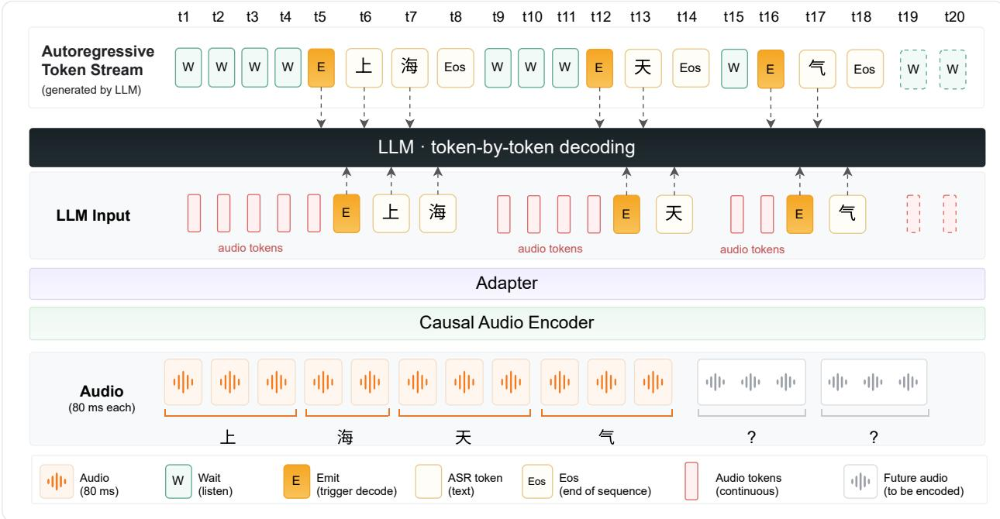
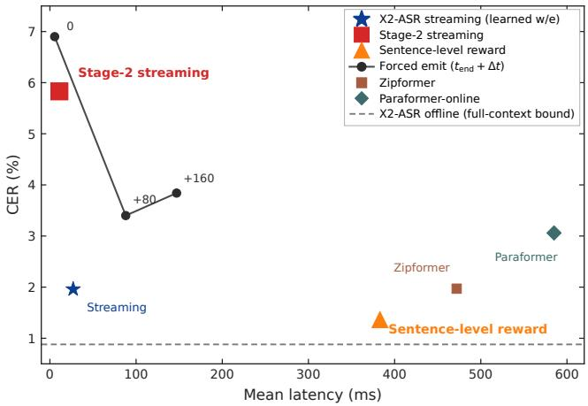

# X2STREAMING-ASR: WAIT WHEN UNCERTAIN, EMIT WHEN READY FOR STREAMING ASR

Zhiwei Lin, Kaiqi Fu, Rime Wen, Zehan Liu, Shawn Qin, Roy Gan, Hao Wang, Qian Wang

X Square Robot

{linzhiwei,wanghao}@x2robot.com

## ABSTRACT

Streaming automatic speech recognition (ASR) for real-time voice agents and full-duplex dialogue must provide accurate partial transcripts with low commit latency. Existing systems commonly use a fixed chunk size, look-ahead, or target delay, or encourage emissions near estimated acoustic boundaries. These approaches do not directly optimize how much additional context to use at each output position under a single-pass, hard-commit constraint. We propose X2Streaming-ASR, which decomposes streaming recognition into when to commit and what to commit. Its three-stage training procedure first establishes streaming recognition ability, then warm-starts the commit policy with automatically probed trajectories, and finally refines the policy using character-level, segment-assigned group-relative rewards for recognition accuracy and latency. Across AISHELL-1/2/3 and WenetSpeech, X2Streaming-ASR achieves a mean character-level commit latency of 27–84 ms relative to forcedaligned character endpoints, compared with 409–585 ms for the evaluated streaming baselines. It achieves the best streaming CER among the evaluated systems on AISHELL-1 and AISHELL-3 with substantially lower latency.

Index Terms— streaming automatic speech recognition, lowlatency ASR, reinforcement learning

## 1. INTRODUCTION

Streaming speech recognition (ASR) requires the system to output corresponding text in real time during speech input, which is the foundational capability for real-time captioning and voice interaction. The main metrics for evaluating streaming ASR systems are recognition accuracy (CER/WER) and latency. This paper focuses on the character-level emission latency of relatively forced alignment: how long it takes from the end of the acoustic boundary of a character to the system outputting it, which measures how long each character waits after the acoustic boundary is reached. For cascaded voice agents, the traditional process requires waiting for offline transcription before starting downstream services. Some works [1] trigger downstream services on streaming identification prefixes, effectively reducing the overall system response time. However, incorrect recognition results will compromise subsequent services, and recognition that arrives too late will delay service startup. Furthermore, recent work on turn-taking introduces streaming ASR so that decisions can use semantic information, not just acoustic information[2, 3]. Therefore, the latency and accuracy of streaming ASR directly determine whether downstream services and turn-taking can be started as early and correctly as possible.

Existing work still struggles to jointly optimize accuracy and emission latency, and falls into three categories. The first approach uses global configuration for streaming recognition, such as fixed chunk decoding and look-ahead or delay[4, 5, 6, 7, 8, 9]. Chunking specifies the decoding unit, while look-ahead and delay determine the amount of future context that is visible. Neither of these methods determines how much future information to wait for based on historical context and current acoustic information. The second approach shifts the emission time during training. FastEmit [10] encourages earlier output, whereas minLT [11, 12, 13] pulls emissions toward the alignment boundary. Unlike a global delay, they do not wait longer where upcoming context is needed for disambiguation. The third[14, 15, 16, 17] emits an unstable or partial hypothesis and later revises it. These designs miss the same fact: the amount of future context needed after acoustics boundary is position-dependent. A position-agnostic knob cannot implement this position-dependent waiting: setting it later delays every position, while setting it earlier exposes every position to the same risk. Treating “emit at the boundary” as the training objective forbids additional wait on hard characters. Revision-based methods reduce latency by correcting earlier output, and are therefore not single-pass hard commit. In this paper, we consider the setting where each character is emitted only once, with no second-pass correction.

Streaming ASR needs to make two decisions: when to commit and what to commit. Supervision learning already handles the second well. The hard one is the first, which depends on acoustics and historical context, and fitting emit times with a supervised target works poorly. On the data side, the first time a character can be committed is not always its acoustic boundary, so aligned $t _ { \mathrm { e n d } }$ is only a proxy for the emit target, not a unique gold time. Teacher-probed “earliest correct” times are also imperfect: they inherit the teacher’s language priors and the probe protocol. On the training side, the cross-entropy loss only fits these labeled times; latency and accuracy are not in the objective. Waiting slightly longer to recognize the character correctly, or emitting correctly earlier than the label, may help the real decision, but both count as deviations from this loss and are penalized.

Reinforcement learning closes both gaps. First, it does not need pre-labeled recognizable points: multiple decision trajectories are sampled from the same audio, so the same character is committed at different times. The consequences of waiting and of committing early appear directly in the reward. Second, it optimizes the true objective: the reward combines the error count and latency, so the beneficial deviations that supervised learning would penalize are rewarded here. We therefore propose X2Streaming-ASR, trained in three stages so that the model waits only where leftover context is still required. Stage 1 trains a streaming ASR that later serves as both a probe and the initialization. Stage 2 uses this model to probe a plausible commit time for each character and applies a supervised warm-start; this preserves recognition quality and yields an initial commit policy, but the probed times are not treated as ground truth.

  
Fig. 1. The X2Streaming-ASR model architecture alternates between listen and decode states. It’s important to note that while the language model is decoding the previous audio segment, the causal audio encoder is simultaneously encoding the current audio; these two processes operate asynchronously.

Stage 3 refines the commit policy with Group Relative Policy Optimization (GRPO). The reward combines errors and latency, with errors taking priority, so the model waits at ambiguities and commits as soon as the evidence is sufficient. In summary, our contributions are as follows:

• We propose X2Streaming-ASR, which replaces global fixed delay with position-dependent commit decisions for adaptive character commitment.

• We introduce a three-stage training framework: supervised learning first establishes the ASR capability, commit-time probing provides a warm start for the commit policy, and character-level GRPO with commit-segment credit assignment directly optimizes recognition accuracy and emission latency.

• Across five test sets, X2Streaming-ASR achieves 27–84 ms mean latency, reducing mean latency by 79–95% compared with streaming baselines, while achieving the best CER on AISHELL-1 and AISHELL-3.

## 2. METHOD

## 2.1. Architecture

As shown in Fig 1, X2Streaming-ASR is built on Voxtral Realtime, which consists of a causal audio encoder, an adapter, and a decoderonly language model. The difference is that Voxtral Realtime uses a global delay τ to conditionalize the language model, and adds text and audio tokens at the same sequence position. X2Streaming-ASR instead allows the model to adaptively decide whether to wait or commit, no longer using τ as a conditional input.

Given a 16kHz waveform, we extract a log-Mel spectrogram and map it to continuous audio tokens $\mathbf { a } _ { 1 : L }$ in the text embedding space. The audio tokens have a frame rate of 12.5Hz, corresponding to 80ms of audio, which are interleaved with other tokens. During streaming recognition, the language model alternates between listening and Decoding states. While Listening, the language model takes the historical interleaved sequence $z ^ { ( t ) }$ and the current audio token at as input, where $z ^ { ( t ) }$ consists $a _ { 1 : t } ,$ previously recognized text tokens and special tokens e. The language model then makes a binary decision:

$$
c _ { t } \sim p _ { \theta } ( c | z ^ { ( t ) } , a _ { t } ) , \quad c \in \{ w , e \} .\tag{1}
$$

Here w means $\ddot { } \mathrm { { \mathbf { w } a i t } } \ddot { } \mathrm { { \mathbf { \xi } } }$ 气, which is not written back; e means ”emit”. If $c _ { t } ~ = ~ w ,$ , the language model stays in listening and reads next audio token $a _ { t + 1 }$ . If $c _ { t } = e $ , the language model will write e back to the input as the starting point for recognition, stop reading new audio token, and perform autoregressive generates text token yk utils ⟨Eos⟩ token, where

$$
y _ { k } \sim p _ { \theta } ( y | z ^ { ( t ) } , a _ { t } , e ) .\tag{2}
$$

Then X2Streaming-ASR return to listen state and ⟨Eos⟩ token is not written back into input.

## 2.2. Training Strategy

To enable X2Streaming-ASR to both determine when to commit and what to commit, we design a three-stage training strategy. The first stage trains a streaming recognition model: given incremental audio, it only recognizes the content where the acoustics have ended. For example, if the input contains acoustic information of two and a half characters, only the first two characters will be recognized. It serves as the initial weights and labeled model for the second stage of training. Specifically, we use Qwen3-ForcedAligner[18] to force alignment of the reference text, obtain the start and end times of each character, and then randomly cut the aligned character sequence into continuous blocks with length $L \in \{ 1 , . . , 6 \}$ . The commit time t of each block is the end time of the last character $t _ { e n d }$ of block plus $\Delta t \in \{ 0$ ms, 80 ms, 160 ms}. If there is a next character, the cut point does not exceed the first half of its duration $d _ { n e x t } .$

$$
\begin{array} { r } { t _ { \mathrm { e m i t } } = \operatorname* { m i n } \bigl ( t _ { \mathrm { e n d } } + \Delta t , t _ { \mathrm { s t a r t } } ^ { \mathrm { n e x t } } + \frac { 1 } { 2 } d _ { \mathrm { n e x t } } \bigr ) . } \end{array}\tag{3}
$$

In the first stage, we mask the loss at the w and e positions and only train the model’s ASR capability.

We then label each reference character’s emit time from left to right with the first-stage model. Probing starts at the end time of the first character. At time t, the model greedily decodes the incremental audio. Let $y _ { 1 : k }$ be the longest reference prefix that matches the decoding result. These k characters share $t _ { e m i t } = t .$ . For the next mismatched reference character $y _ { k + 1 } , \operatorname { i f } t < t _ { e n d } ^ { ( k + 1 ) }$ , the next probe starts at $t _ { e n d } ^ { ( k + 1 ) }$ ; if t has already passed $t _ { e n d } ^ { ( k + 1 ) }$ , probing continues at $t + 8 0 m s$ and never moves backward. If the exploration ends but the submission time of the complete reference text cannot be obtained, discard the sentence. An utterance is discarded if the probe ends but the commit time of the complete reference text can not be obtained, or if any character has $t _ { e m i t } - t _ { e n d } > 6 4 0 m s .$ Labels with such a long wait after the acoustic endpoint teach the model to keep choosing w, and we observed that including them to train can stop the model from triggering e. Stage 2 initializes from the first-stage weights and trains recognition and init commit policy jointly by next-token supervision on these probed $t _ { e m i t }$ labels. During the first and second phases of training, we mixed in offline full-text recognition at a ratio of 0.20 to enable X2Streaming-ASR to have offline recognition capabilities. The third stage refines commit policy with group-relative policy optimization (GRPO). We sample a group of wait–emit trajectories $\{ \hat { \tau } _ { k } \} _ { k = 1 } ^ { K }$ at the sentence level. The action at each frame is $c _ { t } ~ \in ~ \{ w , e \}$ , drawn from $\pi ( \cdot \ | \ z ^ { ( t ) } , a _ { t } )$ If $c _ { t } = e ,$ , the model decodes greedily until ⟨Eos⟩. A commit segment is an e together with the consecutive w that precede it, so a trajectory naturally splits into several commit segments. However, the sampling unit should not be confused with the credit unit. If sentence-level reward are broadcast to every frame-level decision, it is unclear to determine which step caused the inter-sentence discrepancy. When accuracy is prioritized, a more accurate trajectory, though slower, yields a higher sentence-level reward. So broadcasting would reinforce useful waits and superfluous waits equally. The policy would then learn to wait throughout the utterance, rather than to wait only where it must and to emit where it can. Therefore we keep the group-relative comparison on the same reference character and send the advantage back to the corresponding commit segment. Concretely, we align each hypothesis to the forced-aligned reference y1:J and score character $y _ { j }$ on trajectory k by

$$
s _ { k , j } = { \left\{ \begin{array} { l l } { - \lambda d _ { k , j } , } & { { \mathrm { c o r r e c t ~ a l i g n m e n t } } , } \\ { - 1 , } & { { \mathrm { s u b s t i t u t i o n ~ o r ~ d e l e t i o n } } . } \end{array} \right. }\tag{4}
$$

The latency is normalized as

$$
d _ { k , j } = \frac { \operatorname* { m i n } \bigl ( \operatorname* { m a x } ( \ell _ { k , j } , 0 ) , H \bigr ) } { H + 1 } \in [ 0 , 1 ) ,\tag{5}
$$

where $\ell _ { k , j } = t _ { \mathrm { e m i t } } ^ { ( k , j ) } - t _ { \mathrm { e n d } } ^ { ( j ) } , \lambda$ is a latency weight, and H is a truncation cap. Then subtracting the group mean on the same character gives

$$
A _ { k , j } = s _ { k , j } - \bar { s } _ { j } , \qquad \bar { s } _ { j } = \frac { 1 } { K } \sum _ { k = 1 } ^ { K } s _ { k , j } .\tag{6}
$$

Each $A _ { k , j }$ is then accumulated onto the commit segment that produced or missed that character. Since the insertion has no reference character, the error penalty is recorded on the commit segment that produced it, and zero-sum correction is performed within the group. Let the m-th commit segment of trajectory k be $S _ { k , m }$ , the set of reference characters aligned to it be ${ \mathcal { I } } _ { k , m } ,$ and the insertion penalty be $A _ { k , m } ^ { \mathrm { i n s } }$ . Then the advantage of $S _ { k , m }$ is

$$
\hat { A } _ { k , m } = \sum _ { j \in \mathcal { J } _ { k , m } } A _ { k , j } + A _ { k , m } ^ { \mathrm { i n s } } .\tag{7}
$$

Every decision in the segment shares $\hat { A } _ { k , m } .$ Let the commit segment that contains decision step t be $m ( t )$ . Each decision step t inherits the advantage $\hat { A } _ { k , m ( t ) }$ from $S _ { k , m ( t ) }$ . We then optimize the current policy πθ against the sampling policy πold. The importance ratio

$$
\rho _ { t } = { \frac { \pi _ { \theta } { \bigl ( } c _ { t } \mid z ^ { ( t ) } { \bigr ) } } { \pi _ { \mathrm { o l d } } { \bigl ( } c _ { t } \mid z ^ { ( t ) } { \bigr ) } } }\tag{8}
$$

measures the relative change in the probability of the action between the policy. At decision step t we maximize

$$
\mathcal { L } = \mathbb { E } \Bigg [ \operatorname* { m i n } \Big ( \rho _ { t } \hat { A } _ { k , m ( t ) } , \mathrm { c l i p } ( \rho _ { t } , 1 - \varepsilon , 1 + \varepsilon ) \hat { A } _ { k , m ( t ) } \Big ) \Bigg ] ,\tag{9}
$$

which strengthens or suppresses the corresponding $w / e$ actions according to the segment advantage, while keeping $\rho _ { t }$ near 1 so that a single update cannot move too far.

## 3. EXPERIMENTS

## 3.1. Setup

We train Stage 1 on AISHELL-1[19], AISHELL-2[20], AISHELL-3[21], AliMeeting[22], and WenetSpeech[23]. Stage 2 needs commit-time labels. Annotating the full WenetSpeech training set is too costly, so we probe only AISHELL-1/2/3 and the WenetSpeech $L$ and S subsets. Stage 3 uses the same data, so that supervised and RL listen policies are compared on the same labeled pool. Stage 3 rewards need only the reference characters and their $t _ { \mathrm { e n d } }$ , and do not require extra emit-time labels. Evaluation is on the AISHELL-1/2/3 test sets and the WenetSpeech meeting and net tests. For each test utterance, Qwen3-ForceAligner gives character end times $t _ { \mathrm { e n d } } ;$ leftover wait is $\ell = t _ { \mathrm { e m i t } } - t _ { \mathrm { e n d } }$ . We report mean latency and P95 relative to the acoustic boundary, and CER for recognition. We used Zipformer and Paraformer-online as open-sourced streaming baselines, evaluated under their public streaming configurations. MoCha-ASR [13] and Uni-ASR [17] are not open-sourced; we quote CER from their papers and cannot measure leftover-wait latency. Uni-ASR streaming uses the paper’s 1000 ms chunk result. In Stage 3, $K = 8$ trajectories are sampled per utterance at temperature 1.4, with $\lambda = 0 . 3 , H = 2 0 0 0 \mathrm { m s } ,$ and $\varepsilon = 0 . 2 .$ . Stages 1 and 2 train all parameters. Stage 3 freezes the encoder and adapter and fine-tunes the language model with LoRA.

## 3.2. Comparison with Baseline

Table 1 compares X2Streaming-ASR with different models. Across all test sets, X2Streaming-ASR has a mean character-level latency of 27–84 ms, approximately one-tenth of Zipformer and Paraformeronline. The results on P95 indicate that the latency of X2Streaming-ASR is acceptable even in a few extreme cases, while the extreme latency of these two baselines is approaching 1 second. The recognition results show a positive correlation between offline and streaming recognition performance: offline results represent the upper limit of the model’s recognition ability under sufficient context, while streaming recognition performance degrades due to the lack of complete audio. It’s important to note that X2Streaming-ASR and Zipformer use the same checkpoint for both streaming and offline recognition, while the offline and streaming results of Paraformer are derived from the parameter of the corresponding version. MoCha-ASR and Uni-ASR are likewise quoted from the corresponding paper versions; Uni-ASR streaming uses the 1000 ms chunk setting.

Table 1. Corpus CER (%) and character-level mean and P95 latency (ms). X2Streaming-ASR and Zipformer use the same checkpoint for streaming and offline recognition; Paraformer uses a separate offline model. Uni-ASR streaming is the 1000 ms chunk, beam-3 result from the paper; MoCha-ASR numbers are from the paper. Neither reports leftover-wait latency, so those entries are –. Best / second-best among streaming systems are bold / underlined. Best / second-best among offline systems are $^ { \star } \dot { / } ^ { \dagger }$
<table><tr><td></td><td colspan="4">X2Streaming-ASR</td><td colspan="4">Zipformer</td><td colspan="3">Paraformer</td><td colspan="2">Uni-ASR</td><td colspan="2">MoCha-ASR</td></tr><tr><td>Test set</td><td colspan="2">Streaming</td><td></td><td>Off.</td><td colspan="2">Streaming</td><td>Off.</td><td></td><td colspan="2">Streaming</td><td>Off.</td><td>Streaming</td><td>Off.</td><td>Streaming</td><td>Off.</td></tr><tr><td></td><td>CER Mean lat. P95</td><td></td><td></td><td>CER</td><td>CER Mean lat. P95 CER</td><td></td><td></td><td></td><td></td><td></td><td>CER Mean lat. P95 CER</td><td>CER</td><td>CER</td><td>CER</td><td>CER</td></tr><tr><td>AISHELL-1</td><td>1.96</td><td>27</td><td>240 0.88*</td><td></td><td>1.97</td><td>472</td><td>800 1.39†</td><td>3.06</td><td></td><td>585</td><td>880 2.29</td><td>2.15</td><td>1.44</td><td>5.1</td><td>4.9</td></tr><tr><td>AISHELL-2</td><td>4.93</td><td>54</td><td>2403.52</td><td></td><td>4.16</td><td>450</td><td>8003.24</td><td>3.91</td><td></td><td>568</td><td>840 3.02†</td><td>3.25</td><td>2.60*</td><td>5.5</td><td>5.0</td></tr><tr><td>AISHELL-3</td><td>2.68</td><td>44</td><td>240</td><td> $1 . 6 1 ^ { \star } \ 2 . 9 4$ </td><td></td><td>464</td><td>720 2.17†</td><td></td><td>3.60</td><td>576</td><td>8492.76</td><td></td><td></td><td></td><td></td></tr><tr><td>WenetSpeech Meeting 10.73</td><td></td><td>61</td><td>320</td><td>7.87 7.87</td><td></td><td>435</td><td>800 6.24*</td><td></td><td>10.05</td><td>582</td><td>880 6.98</td><td>8.04</td><td> $6 . 3 2 ^ { \dagger }$ </td><td></td><td></td></tr><tr><td>WenetSpeech Net</td><td>9.92</td><td>84</td><td>320</td><td>8.57</td><td>8.67</td><td>409</td><td>720</td><td>7.19</td><td>8.54</td><td>563 880</td><td> $6 . 6 5 ^ { \dagger }$ </td><td>6.44</td><td> $5 . 7 8 ^ { \star }$ </td><td></td><td></td></tr></table>

Table 2. AISHELL-1 listen-policy ablation. CER (%) and characterlevel latency (ms).
<table><tr><td>Model</td><td>Mode</td><td>CER</td><td>Mean lat.</td><td>P95</td></tr><tr><td>Proposed</td><td>Streaming</td><td>1.96</td><td>27</td><td>240</td></tr><tr><td>Stage 2</td><td>Streaming</td><td>5.83</td><td>11</td><td>80</td></tr><tr><td>Stage 2</td><td>Forced  $t _ { \mathrm { e n d } }$ </td><td>7.58</td><td>0.7</td><td>0</td></tr><tr><td>Stage 3 + content KL</td><td>Streaming</td><td>2.58</td><td>33</td><td>160</td></tr><tr><td>Stage 3 + content KL</td><td>Forced  $t _ { \mathrm { e n d } }$ </td><td>7.56</td><td>0.7</td><td>0</td></tr><tr><td>Sentence-level reward</td><td>Streaming</td><td>1.38</td><td>383</td><td>1120</td></tr></table>

Table 3. AISHELL-1 under forced post-boundary delay, natural wait/emit, and offline decoding with same checkpoint. A single emit may cover later characters, which then do not receive their own ∆t.
<table><tr><td>Inference</td><td>CER(%)</td><td>Mean lat.</td><td>P95</td></tr><tr><td>Forced  $t _ { \mathrm { e n d } }$ </td><td>6.90</td><td>0.6</td><td>80</td></tr><tr><td>Forced  $t _ { \mathrm { e n d } } + 8 0 \mathrm { m s }$ </td><td>3.40</td><td>88</td><td>160</td></tr><tr><td>Forced  $t _ { \mathrm { e n d } } { + } 1 6 0 \mathrm { m s }$ </td><td>3.84</td><td>147</td><td>240</td></tr><tr><td>Streaming</td><td>1.96</td><td>27</td><td>240</td></tr></table>

Specifically, X2Streaming-ASR outperforms both Zipformer and Paraformer in both offline and streaming recognition on the AISHELL-1 and AISHELL-3 test sets. On the AISHELL-2 test set and the WenetSpeech net test set, Uni-ASR performs best, followed by Paraformer and Zipformer. On the WenetSpeech meeting test set, Zipformer performs best, followed by Uni-ASR and Paraformer. This is mainly because the X2Streaming-ASR’s upper limit of recognition ability is weaker than the baseline, further leading to similar streaming results. Nevertheless, X2Streaming-ASR still maintains an order-of-magnitude latency advantage.

  
Fig. 2. AISHELL-1 CER vs. mean character-level latency. The polyline is Forced emit at $t _ { \mathrm { e n d } } + \Delta t$ on the Stage-3 checkpoint. The dashed line is the same checkpoint with full-utterance decoding.

## 3.3. Global Post-Boundary Delay

To verify whether X2Streaming-ASR has learned a global wait strategy, we compared the impact of different latency levels on WER on the AISHELL-1 test set with the same Stage-3 checkpoint. Specifically, for reference characters that have not yet been recognized, we forced the model to begin greedy decoding when $t _ { e m i t } = t _ { e n d } + \Delta t .$ where $\Delta t \in \{ 0 , 8 0 , 1 6 0 \} m s ;$ note that when $\Delta t = 1 6 0 m s ,$ temit may overwrite the acoustic information of the next character, thus decoding multiple characters at once.

Table 3 shows that committing immediately at the end of the aligned word is the fastest (5.5 ms), but the CER is as high as 6.90. Increasing the global wait to 80 ms reduced the CER to 3.40, and both the latency and WER were worse than X2Streaming-ASR’s natural online inference. The results in Fig 2 also indicate that X2Streaming-ASR does not choose a compromise point on a fixed delay curve, but waits when uncertain and makes a decision when certain. A further increase to 160 ms does not help (3.84) and raises mean latency to 147 ms. We attribute this mainly to the longer wait makes it easier to bring up the next character, allowing it to be decoded even in the absence of subsequent acoustic information.

To verify the impact of supervised learning on the submission decision, we evaluated the performance of the Stage 2 model on the AISHELL-1 test set. As shown in Table 2 and Fig 2, the results of Stage 2 fall near the poly line, close to the results of force $t _ { e n d } ,$ , indicating that supervised learning tends to be global early. To verify the benefits of commit policy, we trained a Stage 3 model with content-based KL divergence, anchoring the model’s recognition ability to near that of the Stage 2. The results in rows 3 and 5 of Table 2 show that adding content-based KL divergence prevents the model’s recognition ability from drifting. The results in rows 1, 2 and 4 indicate that optimizing commit policy is the main source of CER and latency optimization. Finally, to compare different GRPO strategies, we implemented a reinforcement learning version with sentence-level rewards. The results show that using sentence-level rewards for optimization leads to global waiting, sacrificing waiting latency for improved recognition performance.

## 4. CONCLUSION

This paper proposes X2Streaming-ASR, which decomposes streaming speech recognition into when to commit and what to submit. We use multi-stage training to optimize recognition capability and commit policy separately, enabling the model to wait when uncertain and commit when certain. Experiments show that the average latency is reduced from hundreds of milliseconds to tens of milliseconds. In the future, we will try our method in more languages and consider more real-world scenarios to improve the model’s robustness and recognition performance.

## 5. REFERENCES

[1] Wenhao Zou, Yuwei Miao, Zhanyu Ma, Jun Xu, Jiuchong Gao, Jinghua Hao, Renqing He, and Jingwen Xu, “Lts-voiceagent: A listen-think-speak framework for efficient streaming voice interaction via semantic triggering and incremental reasoning,” arXiv preprint arXiv:2601.19952, 2026.

[2] Ruiqi Yan, Wenxi Chen, Zhanxun Liu, Ziyang Ma, Haopeng Lin, Hanlin Wen, Hanke Xie, Jun Wu, Yuzhe Liang, Yuxiang Zhao, et al., “Soulx-duplug: Plug-and-play streaming state prediction module for realtime full-duplex speech conversation,” arXiv preprint arXiv:2603.14877, 2026.

[3] Kaiqi Fu, Rime Wen, Altman Lin, Shawn Qin, Roy Gan, Hao Wang, and Qian Wang, “X2-turn: Frame-synchronous dualhead modeling for joint streaming asr and turn state prediction,” arXiv preprint arXiv:2608.10878, 2026.

[4] Zengwei Yao, Liyong Guo, Xiaoyu Yang, Wei Kang, Fangjun Kuang, Yifan Yang, Zengrui Jin, Long Lin, and Daniel Povey, “Zipformer: A faster and better encoder for automatic speech recognition,” in International Conference on Learning Representations, 2024, vol. 2024, pp. 44440–44455.

[5] Zhifu Gao, Shiliang Zhang, Ian McLoughlin, and Zhijie Yan, “Paraformer: Fast and accurate parallel transformer for nonautoregressive end-to-end speech recognition,” arXiv preprint arXiv:2206.08317, 2022.

[6] Keyu An, Huahuan Zheng, Zhijian Ou, Hongyu Xiang, Ke Ding, and Guanglu Wan, “Cuside: Chunking, simulating future context and decoding for streaming asr,” arXiv preprint arXiv:2203.16758, 2022.

[7] Wenbo Zhao, Ziwei Li, Chuan Yu, and Zhijian Ou, “Cuside-t: Chunking, simulating future and decoding for transducer based streaming asr,” in 2024 IEEE 14th International Symposium on Chinese Spoken Language Processing (ISCSLP). IEEE, 2024, pp. 11–15.

[8] Alexander H Liu, Andy Ehrenberg, Andy Lo, Chen-Yo Sun, Guillaume Lample, Jean-Malo Delignon, Khyathi Raghavi Chandu, Patrick von Platen, Pavankumar Reddy Muddireddy, Rohin Arora, et al., “Voxtral realtime,” arXiv preprint arXiv:2602.11298, 2026.

[9] Neil Zeghidour, Eugene Kharitonov, Manu Orsini, Vaclav´ Volhejn, Gabriel de Marmiesse, Edouard Grave, Patrick Perez, Laurent Mazar´ e, and Alexandre D´ efossez, “Stream-´ ing sequence-to-sequence learning with delayed streams modeling,” arXiv preprint arXiv:2509.08753, 2025.

[10] Jiahui Yu, Chung-Cheng Chiu, Bo Li, Shuo-yiin Chang, Tara N Sainath, Yanzhang He, Arun Narayanan, Wei Han, Anmol Gulati, Yonghui Wu, et al., “Fastemit: Low-latency streaming asr with sequence-level emission regularization,” in ICASSP 2021- 2021 IEEE International Conference on Acoustics, Speech and Signal Processing (ICASSP). IEEE, 2021, pp. 6004–6008.

[11] Hirofumi Inaguma, Yashesh Gaur, Liang Lu, Jinyu Li, and Yifan Gong, “Minimum latency training strategies for streaming sequence-to-sequence asr,” in ICASSP 2020-2020 IEEE International Conference on Acoustics, Speech and Signal Processing (ICASSP). IEEE, 2020, pp. 6064–6068.

[12] Yusuke Shinohara and Shinji Watanabe, “Minimum latency training of sequence transducers for streaming end-to-end speech recognition,” arXiv preprint arXiv:2211.02333, 2022.

[13] Genshun Wan, Wenhui Zhang, Jing-Xuan Zhang, Shifu Xiong, Jianqing Gao, and Zhongfu Ye, “Streaming speech recognition with decoder-only large language models and latency optimization,” in ICASSP 2026-2026 IEEE International Conference on Acoustics, Speech and Signal Processing (ICASSP). IEEE, 2026, pp. 16367–16371.

[14] Dominik Macha´cek, Raj Dabre, and Ond ˇ ˇrej Bojar, “Turning whisper into real-time transcription system,” in Proceedings of the 13th International Joint Conference on Natural Language Processing and the 3rd Conference of the Asia-Pacific Chapter of the Association for Computational Linguistics: System Demonstrations, 2023, pp. 17–24.

[15] Danni Liu, Gerasimos Spanakis, and Jan Niehues, “Lowlatency sequence-to-sequence speech recognition and translation by partial hypothesis selection,” arXiv preprint arXiv:2005.11185, 2020.

[16] Xian Shi, Xiong Wang, Zhifang Guo, Yongqi Wang, Pei Zhang, Xinyu Zhang, Zishan Guo, Hongkun Hao, Yu Xi, Baosong Yang, et al., “Qwen3-asr technical report,” arXiv preprint arXiv:2601.21337, 2026.

[17] Yinfeng Xia, Jian Tang, Junfeng Hou, Gaopeng Xu, and Haitao Yao, “Uni-asr: Unified llm-based architecture for nonstreaming and streaming automatic speech recognition,” arXiv preprint arXiv:2603.11123, 2026.

[18] Bingshen Mu, Xian Shi, Xiong Wang, Hexin Liu, Jin Xu, and Lei Xie, “Llm-forcedaligner: A non-autoregressive and accurate llm-based forced aligner for multilingual and long-form speech,” in Proceedings of the 64th Annual Meeting of the Association for Computational Linguistics (Volume 1: Long Papers), 2026, pp. 25627–25638.

[19] Hui Bu, Jiayu Du, Xingyu Na, Bengu Wu, and Hao Zheng, “Aishell-1: An open-source mandarin speech corpus and a speech recognition baseline,” in 2017 20th conference of the oriental chapter of the international coordinating committee

on speech databases and speech I/O systems and assessment (O-COCOSDA). IEEE, 2017, pp. 1–5.

[20] Jiayu Du, Xingyu Na, Xuechen Liu, and Hui Bu, “Aishell-2: Transforming mandarin asr research into industrial scale,” arXiv preprint arXiv:1808.10583, 2018.

[21] Yao Shi, Hui Bu, Xin Xu, Shaoji Zhang, and Ming Li, “Aishell-3: A multi-speaker mandarin tts corpus and the baselines,” arXiv preprint arXiv:2010.11567, 2020.

[22] Fan Yu, Shiliang Zhang, Yihui Fu, Lei Xie, Siqi Zheng, Zhihao Du, Weilong Huang, Pengcheng Guo, Zhijie Yan, Bin Ma, Xin Xu, and Hui Bu, “M2MeT: The ICASSP 2022 multi-channel multi-party meeting transcription challenge,” in Proc. ICASSP. IEEE, 2022.

[23] Binbin Zhang, Hang Lv, Pengcheng Guo, Qijie Shao, Chao Yang, Lei Xie, Xin Xu, Hui Bu, Xiaoyu Chen, Chenchen Zeng, et al., “Wenetspeech: A 10000+ hours multi-domain mandarin corpus for speech recognition,” in ICASSP 2022-2022 IEEE International Conference on Acoustics, Speech and Signal Processing (ICASSP). IEEE, 2022, pp. 6182–6186.