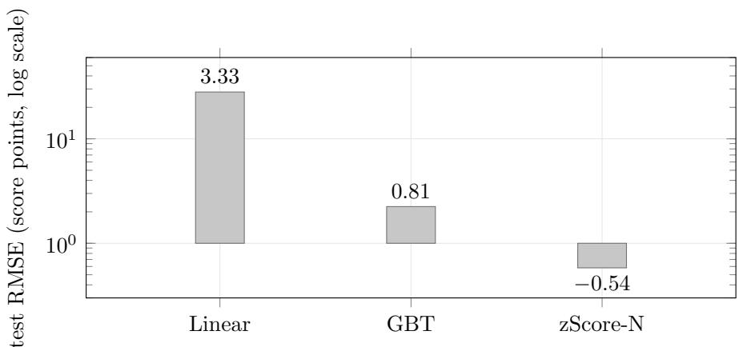
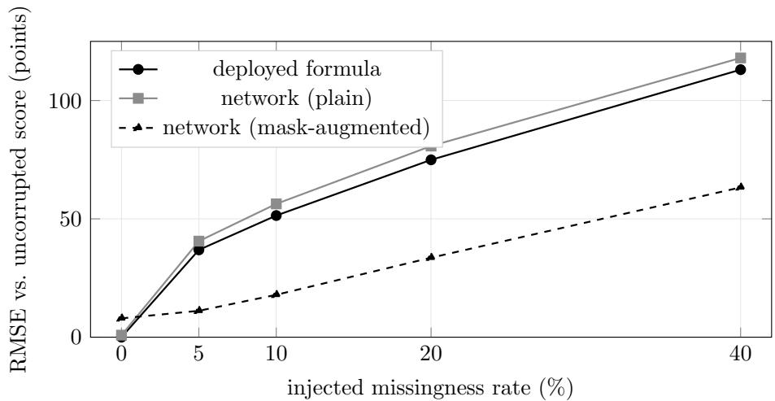
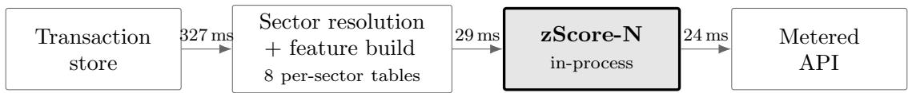

# zScore-N: A Neural Network for On-Chain Wallet Reputation Scoring

Zeru AI

Girish G N

Head of AI

Ashutosh Sahoo

girish@zeru.finance

Gurukiran S Chief Technology Oficer gurukiran@zeru.finance

Chief Executive Oficer

Akshay SP

ashutosh@zeru.finance

Chief Product Oficer

akshay@zeru.finance

Dhanashekar Kandaswamy Ohio State University, USA

## Abstract

Wallet reputation scores decide who receives an airdrop, who can borrow, and who enters an allowlist across decentralised finance. They almost always begin as hand-written formulas: compositions of clamped logarithmic, linear and square-root transforms over behavioural features, with every threshold and point award set by hand. Such a formula is readable and deterministic, but it is piecewise and non-diferentiable, it cannot improve as data accumulates, and it cannot distinguish a feature that is genuinely zero from one its pipeline failed to capture. We present zScore-N, the neural network that replaced ours in production. The formula served as its teacher: calibrated against 5,208,952 wallets sampled across 2019–2024 and verified to reproduce production output to within 2.3 × 10−13, it supplies unlimited labelled training data at zero label noise. The trained network reproduces it to 0.58 points RMSE on the 1000-point scale $( R ^ { 2 } = 0 . 9 9 9 9 7 )$ , against 2.25 for gradient-boosted trees and 28.04 for linear regression on identical features and splits. Trained with missing-value masks against uncorrupted targets, it halves the error that incomplete data introduces: at 10% feature-level missingness the formula drifts 51.4 points from its own complete-data output with a systematic −12.5 point bias, while the network drifts 17.9. The network carries the score at production scale, across a population of millions of wallets spanning six orders of magnitude in size and activity.

## 1 Introduction

A wallet reputation score compresses an address’s entire on-chain history into a single bounded number. Protocols use that number to size an airdrop, gate a loan, or admit an address to an allowlist. These systems run at population scale. The calibration behind zScore was measured over 5,208,952 wallets sampled across twelve months spanning 2019–2024; the active-address population it draws from runs to 9,266,185 addresses on Ethereum alone in a three-month window; a single production export scores 311,815 wallets end to end.

The sample deliberately spans the whole distribution rather than a convenient slice of it. The median wallet in that population holds \$6,754 in lifetime value across 9 transactions and 2 protocols. The 99th-percentile wallet holds \$7.67M across 237 transactions and 17 protocols — six orders of magnitude apart on the same axis. Activity type is just as skewed: 89.6% of all interactions are plain token transfers, against 2.4% for DEX trading and 0.8% for lending. Any scorer trained on the active middle alone would be calibrated to a population that does not exist.

Neither side of this problem is small. A wallet’s history is not a table but a sparse, heavy-tailed, multi-chain event stream that must be reconstructed before it can be scored. Reading a single chain’s ledger misses most of it: one scan across 55 chains for 157 wallets recovers 1,066,071 transfer events. Raw contract calls carry no semantics at source and must be resolved into protocols and actions before a feature exists at all.

The scoring function is not simple either. zScore is a large calibrated system — multiple scorers, dozens of separately bounded component awards, and several families of nonlinear transform, composed into a single bounded output. The result is a piecewise function with no derivative at its boundaries: readable line by line, and hard to reason about in aggregate, which is the ordinary condition of hand-authored scoring code. Section 2 describes its scale.

One property of the production pipeline shaped everything that follows: an unobserved feature is encoded as zero. A value the pipeline failed to capture is therefore indistinguishable from a value that is genuinely zero, and the two are scored identically. The efect is measurable and one-directional. At a 10% feature-level missingness rate, the formula’s output sits 51.4 points RMSE from what it would have produced on complete data, with a systematic bias of −12.5 points; at 40%, that bias reaches −57.3. This is not a rare corner: in the production export studied here, 65.2% of wallets carry an unrecorded value in one input field and 23.5% in another.

zScore-N is the neural network we trained to take over the score, and it is what runs today. The formula’s role was to teach it. A deterministic function is an unusually strong teacher — it supplies unlimited labelled examples at zero label noise and a ground-truth value for every quantity the student estimates — and we established its behaviour exactly before using it, reproducing production output to within $2 . 3 \times 1 0 ^ { - 1 3 }$ . The student is smooth where the teacher is piecewise, diferentiable everywhere the teacher is not, and consumes explicit missingness indicators alongside the behavioural features so that an uncaptured field and a true zero enter the model as diferent inputs. Trained under mask augmentation against uncorrupted targets, it learns the mapping from a partially observed wallet to the score that wallet has earned. A learned scorer can also keep sharpening as more wallets are observed, which a fixed set of constants cannot.

## Contributions.

• A production neural scorer distilled from a deployed formula, reproducing it to 0.58 points RMSE on a 1000-point scale $( R ^ { 2 } = 0 . 9 9 9 9 7 )$ , against 2.25 for gradient-boosted trees and 28.04 for linear regression on identical features and splits.

• An exactly verified teacher. A reference implementation matching production output to $2 . 3 \times 1 0 ^ { - 1 3 }$ , so that any divergence between network and formula is attributable to the network alone.

• Robustness to incomplete data. Mask-augmented training halves the error that missing features introduce, at every rate from 5% to 40%, and removes the systematic downward bias the formula carries.

• A diferentiable score. Unlike the piecewise function it replaces, the deployed model has a defined gradient everywhere, making the sensitivity of any score to any behaviour a computable quantity.

Related work. This paper continues the zScore line: the original cross-protocol reputation system [13], its deep-learning extension to liquidity and trading signals [6], the adversarial-robust reward attribution framework ZAPs [15], and the cash-flow underwriting framework zLend [16]. Training one model to reproduce another’s outputs is established practice, from model compression [4] through knowledge distillation [5, 1]; what difers here is that the teacher is a hand-written rule system rather than a network, and the student is the deployed artefact. Distilling a rule-based scorer in order to study or replace it has precedent in credit and criminal-justice auditing [12], and replacing hand-authored system components with learned models is by now a broad programme in systems research [8]. On the application side, behavioural traces have been shown to substitute for an absent credit file [3, 2], gradient-boosted ensembles remain the reference method on tabular data [7, 9], and graph and transaction-level machine learning on public chains has developed largely around illicit-activity detection [14]. Principled treatment of missing data as a modelling problem rather than a preprocessing step follows [11, 10].

## 2 The Scoring Formula

zScore-N was trained on the production zScore scorer. This section describes the scale and character of that function, not its specification. Feature definitions, component structure, thresholds, point awards, and the mapping between transforms and the quantities they score are proprietary and withheld. No result in this paper depends on their disclosure.

## 2.1 What has to happen before a wallet can be scored

A wallet’s raw history is not scoreable. A transaction arrives on-chain as an untyped contract call: no label, no category, no economic meaning attached. Establishing what a transaction was is a prerequisite to deciding what it is worth, and that resolution is itself a substantial system — a continuously maintained mapping from protocols to economic sectors, applied across dozens of chains, against a long tail of contracts that no public registry classifies.

Aggregates alone are not enough either. Much of what distinguishes a disciplined wallet from an opportunistic one is temporal: how long positions were held, whether obligations were met, what was realised on exit, how recently a failure occurred. Recovering those quantities requires reconstructing each wallet’s timeline and matching events to one another across it, per sector, over the wallet’s entire life.

## 2.2 The scale of the function

The scorer is not a single formula. It is nine scorers — one foundational, plus seven economic sectors and their own feature vocabularies — producing 52 distinct component scores for a fully active wallet, built from five families of nonlinear transform, and governed by roughly a hundred calibrated constants.

Each component is independently bounded, each sector total is independently bounded, and the sector results combine with the foundational result into a single bounded output. A wallet active in three sectors is described three times over, in three diferent vocabularies, before anything is summed.

## 2.3 Calibration

The constants are not round numbers and were not chosen by intuition. They were set from percentiles measured over 5,208,952 wallets sampled across twelve months spanning 2019–2024, so that every saturation point in the system sits at a defensible location in the real distribution — a distribution in which the median wallet and the 99th-percentile wallet are six orders of magnitude apart.

## 2.4 Why it makes a strong teacher

A function of this kind is dificult to reason about in aggregate and expensive to maintain, but it has one property that makes it an unusually good source of supervision: it is deterministic and fully calibrated. It will answer for any wallet, as many times as asked, at zero label noise, with its answers already carrying the distributional structure measured across five million wallets.

That is a better training signal than most supervised problems ever get. Section 3 describes the network built on it.

## 3 The Network

## 3.1 What the model had to do

Four requirements shaped the design, and each of them ruled something out.

It had to reproduce the scorer closely enough to replace it. A reputation score already in use cannot move by tens of points on the day a model ships. This sets a fidelity floor measured in single points on a thousand-point scale, and it is a precondition rather than an achievement — a model that fails it is simply not deployable.

It had to be diferentiable everywhere. The sensitivity of a wallet’s score to a wallet’s behaviour should be a quantity the system can compute, not an artefact of where a threshold happens to fall. This ruled out both tree ensembles, which are sums of step functions and have no gradient anywhere, and piecewise-linear activations, which would have replaced the scorer’s flat regions with flat regions of their own.

It had to distinguish an absent feature from a zero one. This is the requirement no arithmetic pipeline can satisfy, because a clamped sum has no representation for unknown. A learned model can be given one.

And it had to preserve the score’s bounds, so that no input — adversarial or otherwise — produces a value outside the range partners underwrite against.

## 3.2 Inputs

The model consumes a wallet’s behavioural feature vector together with explicit missingness indicators: binary channels that state, per corruptible field, whether the value was observed or absent. A wallet that genuinely transacted nothing and a wallet whose inflows the pipeline failed to capture enter the network as diferent inputs, and the model is free to respond to them diferently.

One rule governs the input side absolutely. No part of the answer is ever visible to the model — not the final score, not any component score, not the assigned tag. The network sees

only behaviour.

Heavy-tailed quantities are compressed before entering the network, and all normalisation statistics are fitted on the training partition alone and applied unchanged elsewhere. Fitting scalers across the full dataset is among the most common silent leaks in applied machine learning; it inflates every metric downstream and is invisible in the results. We close it structurally rather than by convention.

## 3.3 Shape

The network widens the conditioned input into a high-dimensional representation, holds that width long enough to build structure in it, then tapers before projecting to a single bounded value.

The width is where behaviour that appears in no individual feature becomes representable — the interaction between gas discipline and volume, the diference between a wallet that is quiet because it is dormant and one that is quiet because it is careful. The taper forces that representation to compress into the factors that actually move the score. Width without a taper memorises the training set; a taper without suficient width never forms a representation worth compressing. Depth and width were selected by systematic sweep rather than chosen by hand.

Every activation in the stack is smooth and infinitely diferentiable. This is the load-bearing decision of the architecture and it was made for analysis, not accuracy. Because smoothness composes, choosing it at every layer makes the finished model diferentiable end to end: ∂ score/∂ feature exists and is continuous across the whole input space. The output projection is linear and unsquashed, so that resolution is preserved at the extremes where scoring decisions are actually made, with the bounds imposed explicitly rather than emerging from a saturating function.

## 3.4 Training against a deterministic teacher

Distillation here is exactly well-posed. The target is a deterministic function of the inputs, verified before training to reproduce production output to $2 . 3 \times 1 0 ^ { - 1 3 }$ , so the teacher can label any wallet on demand, at zero label noise, without disagreement between annotators and without a class-imbalance problem to manage. Fidelity is therefore bounded only by capacity and optimisation, and high agreement is expected — which is exactly why Section 5 reports it stratified by region rather than as a headline number, so that the places where a smooth function struggles to follow a clamped one are visible rather than averaged away.

The loss is a robust regression objective, quadratic near zero and linear in the tail, so that ordinary errors are penalised smoothly while a handful of extreme wallets cannot steer the fit. Models are selected on a held-out validation partition rather than at a fixed stopping point.

## 3.5 The missingness-robust variant

The deployed model is trained under mask augmentation. Features are randomly withheld from the input during training while the target remains the score computed from the complete record. The model is therefore never asked to reproduce a corrupted score. It is asked to infer, from the fields that survived, the score the wallet has actually earned.

This is the mechanism behind the robustness result in Section 5.5. It is also the reason the same architecture is trained twice: one variant for maximum fidelity on complete records, one for accuracy on the incomplete records that production actually delivers.

## 4 Evaluation Setup

Every metric, baseline, split and stratum in this section was fixed before any result in Section 5 was computed. We state them here so that the scoreboard is declared independently of the outcome.

## 4.1 Data

The evaluation uses a production export of 65,919 distinct scored wallets, drawn from the population described in Section 1 and carrying, for each wallet, its raw behavioural features alongside the score the deployed formula assigned it. The export contains no duplicate addresses and no error rows.

This export was chosen for one reason: it is exactly reproducible. Before any model was trained, we reimplemented the generating scorer from production source and confirmed that our reimplementation reproduces every stored score in the file. That verification is reported in Section 5.1 and it is what licenses the rest of the paper — when the network and the formula disagree, we can attribute the disagreement to the network rather than to an unverified reimplementation of the target.

## 4.2 Splits and leakage protocol

A single wallet-level partition into training, validation and test sets was materialised once, written to disk, and reused verbatim by every model reported here — the network, both baselines, the mask-augmented variant, and all ablations. No model has ever seen a diferent split, so no comparison in Section 5 is confounded by partition luck.

Two rules govern the input side and both are enforced in code rather than by convention:

• No answer leakage. The final score, all component scores, and the assigned tag are excluded from every model’s input matrix. They appear only as targets and as stratification variables.

• No statistic leakage. All normalisation constants are fitted on the training partition alone and applied unchanged to validation and test.

## 4.3 Baselines

The network is compared against two alternatives on identical inputs and identical splits.

Linear regression — the naive baseline. It establishes how much of the scorer’s behaviour is reachable without any nonlinearity, and therefore how much the clamps and nonlinear transforms actually contribute on real wallets.

Gradient-boosted trees — the strong baseline. On low-dimensional tabular data, boosted ensembles are the method to beat, and they are the honest competitor for this task. They are also non-diferentiable by construction, which makes the comparison the paper’s central trade-of in numerical form.

For the robustness evaluation in Section 5.5 the reference is the deployed formula itself, evaluated on corrupted inputs.

## 4.4 What we report

Fidelity is reported in score points on the 0–1000 scale, as root-mean-square error, mean absolute error, coeficient of determination, and maximum absolute error. Points are the operationally meaningful unit: a partner cares that a score moved by four points, not that a normalised residual moved by 0.004.

Stratified fidelity is reported separately for the regions where a smooth function is expected to have dificulty following a clamped one — wallets sitting at component ceilings, wallets at the floor, wallets in sparse score bands, and wallets carrying zero-encoded fields. Aggregate fidelity can conceal a localised failure entirely; if the model breaks somewhere specific, that is a finding and it belongs in the results rather than in an average.

Stability is reported as the spread in test error across independent random initialisations of the identical configuration. The loss surface of a network of this kind is non-convex and no training run finds a certified global minimum. The operationally meaningful question is not whether the optimiser reaches the global optimum — it does not, and neither does anyone else’s — but whether independent runs land in minima that are equivalent for the purpose. That is measurable, and we measure it.

Robustness is reported as error against each method’s own uncorrupted output, together with the mean signed bias, because a scorer that is merely noisy under missing data and one that is systematically depressed by it are diferent failures and only the signed statistic distinguishes them.

## 4.5 Missingness protocol

Missingness is injected the way the production pipeline encodes it — as zeros — into each corruptible feature independently, at rates from 5% to 40%. Three mechanisms are then compared against the uncorrupted formula output: the deployed formula itself, which cannot distinguish absent from zero; the plain network, which reads the same inputs and inherits the same limitation; and the mask-augmented network, which receives the missingness indicators and is trained against uncorrupted targets.

The comparison isolates exactly one thing: what an explicit representation of unknown is worth, holding the architecture, the data and the split constant.

## 5 Results

## 5.1 The teacher, verified

Before any model was trained, our reimplementation of the deployed scorer was checked against every score in the export. It reproduces all 65,919 stored scores to a maximum absolute error of $2 . 2 7 \times 1 0 ^ { - 1 3 }$ and a mean absolute error of $2 . 5 \times 1 0 ^ { - 1 6 }$ . Every wallet agrees to within $1 0 ^ { - 6 }$ , every component agrees individually, and four of the five agree bitwise.

This is equivalence of implementation, not evidence of accuracy — it says two programs compute the same mathematics. That is precisely what it needs to say. It means every disagreement reported below belongs to the network, and none of it is an artefact of an unverified target.

## 5.2 Fidelity

Table 1: Fidelity on the held-out test partition (13,184 wallets). All figures in score points on the 0–1000 scale.
<table><tr><td>Model</td><td>RMSE</td><td>MAE</td><td> $R ^ { 2 }$ </td><td>max abs. error</td></tr><tr><td>Linear regression</td><td>28.042</td><td>20.446</td><td>0.93261</td><td>267.82</td></tr><tr><td>Gradient-boosted trees</td><td>2.245</td><td>1.034</td><td>0.99957</td><td>75.57</td></tr><tr><td>zScore-N</td><td>0.582</td><td>0.280</td><td>0.99997</td><td>16.40</td></tr></table>

  
Figure 1: Fidelity to the deployed scorer, held-out test partition. Log scale: the network is 3.9× closer than gradient-boosted trees and 48× closer than linear regression on identical features and splits.

The network reproduces the scorer to 0.58 points — 3.9× closer than gradient-boosted trees and 48× closer than linear regression on identical features and splits (Figure 1). The margin on worst-case error is wider still: the network’s largest single miss across 13,184 wallets is 16.4 points, against 75.6 for the tree ensemble and 267.8 for the linear model.

The linear baseline deserves a moment. An $R ^ { 2 }$ of 0.933 sounds respectable and corresponds to being wrong by 20 points on the average wallet. That gap is the amount of genuine nonlinearity the scorer’s transforms contribute on real data — a direct measurement of how much structure a linear reading of these features throws away.

Table 2: Activation ablation, holding architecture, data and training budget fixed.
<table><tr><td>Activation</td><td>RMSE</td><td>max abs. error</td></tr><tr><td>Smooth (deployed)</td><td>0.763</td><td>14.24</td></tr><tr><td>ReLU</td><td>0.939</td><td>30.57</td></tr><tr><td>tanh</td><td>1.158</td><td>25.85</td></tr></table>

The smooth activation was chosen so the finished model would be diferentiable everywhere, and we expected to pay for that in accuracy. We did not. It wins on RMSE, and its worst-case error is less than half that of the piecewise-linear alternative — the failure mode you would predict when a function full of clamps is approximated by a function full of kinks.

## 5.3 Where fidelity fails

Aggregate fidelity conceals location. Reported by region, the error is not uniform, and it concentrates exactly where a smooth function has dificulty tracking a clamped one.

Table 3: Test fidelity stratified by region.
<table><tr><td>Region</td><td>n</td><td>RMSE</td></tr><tr><td>Wallets at a component floor</td><td>548</td><td>1.607</td></tr><tr><td>Sparse low-score band</td><td>28</td><td>2.647</td></tr><tr><td>Wallets at a component ceiling</td><td>838</td><td>0.966</td></tr><tr><td>Component interior</td><td>9,543</td><td>0.528</td></tr><tr><td>Wallets at a saturated ceiling</td><td>3,093</td><td>0.354</td></tr><tr><td>Zero-history floor</td><td>8</td><td>0.000</td></tr></table>

Error roughly triples at a component floor relative to the interior, and doubles at a ceiling. The sparse band at the bottom of the score range is worst of all, and it is worst because it is sparse — 28 wallets in the test partition. The zero-history floor is reproduced exactly.

None of these strata was discovered after the fact. All were declared in Section 4.4 as the places where this model class was expected to struggle, and the result is that it struggles there, mildly, by one to two points.

## 5.4 Stability

Three independent initialisations of the identical configuration reach test RMSEs of 0.775, 0.932 and 0.790 — a total spread of 0.157 points on a 1000-point scale.

The loss surface here is non-convex and no run finds a certified global minimum; none of ours does, and no gradient-descent procedure anywhere does. What matters operationally is whether independent runs land in minima that are equivalent for the purpose, and across three trajectories they agree to within a sixth of a point. Retrained next quarter on refreshed data, this configuration returns the same model rather than a diferent one wearing the same name.

## 5.5 Robustness to missing data

This is the result the deployed model exists for. Missingness is injected as zeros — the sentinel the production pipeline already emits — into each corruptible feature independently, and each mechanism is scored against its own uncorrupted output.

Three findings sit in Table 4 and Figure 2.

The formula’s failure under missing data is systematic, not noisy. The bias column is negative at every rate and grows monotonically, reaching −57.3 points at 40% missingness. Absent data always reads as absent activity, so incomplete records are not scored imprecisely — they are scored low, every time, in the same direction. A wallet penalised this way is indistinguishable in the output from a wallet that genuinely did nothing.

Reading the same inputs inherits the same failure. The plain network tracks the formula’s degradation almost exactly, and is marginally worse. This is the control that matters: it shows the improvement below comes from the missingness channel, not from the architecture.

Table 4: Degradation under zero-encoded missingness. RMSE in score points against each method’s uncorrupted output; bias is mean signed error.
<table><tr><td>Missingness</td><td>Formula</td><td>Formula bias</td><td>Plain network</td><td>Mask-augmented</td></tr><tr><td>0%</td><td>0.00</td><td>-0.00</td><td>0.86</td><td>7.96</td></tr><tr><td>5%</td><td>36.89</td><td>-6.30</td><td>40.58</td><td>11.16</td></tr><tr><td>10%</td><td>51.40</td><td>-12.51</td><td>56.33</td><td>17.91</td></tr><tr><td>20%</td><td>74.94</td><td>-25.86</td><td>80.78</td><td>33.59</td></tr><tr><td>40%</td><td>113.06</td><td>-57.29</td><td>118.00</td><td>63.30</td></tr></table>

  
Figure 2: Degradation under zero-encoded missingness. The formula and the plain network both score corrupted wallets as though the zeros were real; the mask-augmented network, trained to predict the uncorrupted score, roughly halves the error at every rate — at the cost of a 7.96-point floor on clean data.

An explicit representation of unknown roughly halves the error at every rate. The mask-augmented model reaches 11.2 points where the formula reaches 36.9, and 17.9 where the formula reaches 51.4. The gap widens in absolute terms as corruption grows.

What it costs. On perfectly clean records the augmented model sits 7.96 points from the formula against 0.86 for the plain one. The robustness is bought, not free. Given that 65.2% of production wallets already arrive with an unrecorded input field, it is bought cheaply.

What it cannot do. The augmented model recovers what remains statistically inferable from the surviving features. It does not recover information that was never captured. Where a wallet’s record is thin enough that nothing informative survives, no model closes that gap — the ceiling here is set by the data, not by the architecture.

## 6 Running in Production

A model that matches a formula in a notebook has not replaced it. This section describes what it took to put the network behind live trafic, and what it cost.

## 6.1 Where the model sits

Scoring a wallet is a four-stage pipeline, and the model is the third stage (Figure 3).

  
Figure 3: Where the model sits. Stage timings from a ten-run production test reading 10,000 transactions per request, against a median end-to-end response of 1,044 ms: more than 99% of request time is data movement, not scoring.

Raw transactions are read from a columnar store; a protocol-to-sector mapping resolves each transfer into an economic category — 11,722 protocol-chain pairs mapped into more than thirty sector categories — and features are built into eight live per-sector tables (foundational, DEX swap, DEX liquidity provision, lending, NFT, perpetuals trading, perpetuals liquidity provision, staking), each with its own backfill and consistency checks. The model reads those features and emits a score. The score is served through a metered API.

The model runs in-process with the API rather than behind an internal service call. An earlier architecture split this work across four backends — a TypeScript API, a Rust service layer, and two Python workers — and was consolidated into a single deployable of 124 route handlers across 13 modules, covered by 411 tests in 34 suites. Removing the network hop between the API and the score removes both a latency term and a failure mode.

## 6.2 What the model costs to run

We report the cost of the replacement before its benefit, because a scorer that is more accurate and too slow to serve is not an improvement.

The finding that governs deployment is that the model is not the bottleneck and never was. On a ten-run production timing test, reading 10,000 transactions from the store took 327 ms on average, feature processing 29 ms, and scoring 24 ms, against a median end-to-end API response of 1,044 ms. More than 99% of request time is data movement. Substituting a neural network for an arithmetic formula changes a term that is already a rounding error in the latency budget.

That budget was earned separately. Scoring a 10,000-transaction wallet once took 23.1 seconds and now takes 0.038 — a 608× reduction — and at 25,000 transactions the improvement is 1,767× (58.3 s to 0.033 s). The cause was mundane: batch logic being applied to single wallets. Scoring time is now efectively flat in transaction count, which is what makes an inline score possible at all.

End to end, measured per wallet rather than estimated afterwards, the median full wallet score takes 142 ms, with a P95 of 1,011 ms and a worst case of 2,326 ms across 1,981 production wallets. At batch scale, one run scored 2,822,413 transactions in 139.68 seconds.

Serving capacity was sized from a measured curve rather than a vendor specification. Throughput peaks at 20 concurrent large queries, degrades at 50, and collapses at 200 concurrent 100,000-row queries — 60% success, 40% timeouts, 65-second average query time. The deployed architecture was designed backwards from that collapse point.

## 6.3 Determinism and verification

A reputation score is consumed by systems that make money decisions, so the same wallet must produce the same number.

The scoring path is deterministic: fixed weights, no sampling at inference, no runtime configuration that alters output. When the scoring implementation was migrated between languages, every numeric field was verified to within $\mathbf { 1 \times 1 0 ^ { - 9 } }$ absolute tolerance — which required reproducing compensated summation, pairwise summation order, banker’s rounding, and the population-versussample variance convention exactly. Golden-master suites hold that line at 78 of 78 field assertions in one component and 103 assertions across the wider migration. Known production behaviours were deliberately preserved rather than silently corrected, so that behavioural changes appear as separate, visible difs.

Reliability at batch scale is a property of the pipeline rather than the model: one run scored 66,966 wallets with 66,966 successes and zero failures, and a production export the same month produced 32,904 wallets with complete feature rows in all eight sector tables and no partial rows.

## 6.4 What does not change for integrators

Nothing on the partner-facing surface changes when the model replaces the formula. The API contract, the score range, the tag vocabulary, and the endpoint set are unchanged. Requests pass the same API-key guard with quota and rate-limit metering applied as a global layer. A partner integrating against the score does not need to know which mechanism produced it, and does not need to redeploy when that mechanism changes.

Every pipeline run emits a manifest binding its outputs to nine live API endpoints, declaring for each one the source file, schema version, timestamps, and the input snapshot it was computed from. Partners consume the artifacts the pipeline produced, with lineage attached, rather than an exported copy of them.

## 6.5 Retraining and monitoring

The model is retrained ofline and shipped as a versioned artifact; training never runs against live trafic, which keeps serving deterministic and keeps a bad training run from becoming a bad production hour. Because independent initialisations agree to within a sixth of a point (Section 5.4), a scheduled retrain returns an equivalent model rather than a materially diferent one — the property that makes routine retraining safe rather than an event.

Two things are watched continuously: the distribution of scores against the previous release, and the rate at which corruptible features arrive empty. The second is the leading indicator for the failure mode Section 5.5 quantifies. When capture rates on a feature fall, the mask-augmented model degrades gracefully instead of silently marking wallets down — but the drift is worth catching upstream regardless, because no model recovers information that was never collected.

## 7 Conclusion

We wrote a wallet reputation formula, trained a neural network on it, and put the network into production. It reproduces the formula to 0.58 points on a 1000-point scale — 3.9 times closer than gradient-boosted trees and 48 times closer than linear regression on identical data — holds to within a sixth of a point across independent retrainings, halves the error that incomplete records introduce while removing the systematic downward bias arithmetic could not detect in itself, and serves inline at a median of 142 milliseconds per wallet behind an unchanged API. It scores at population scale across Ethereum, Base, Arbitrum and Hyperliquid EVM for protocols running live token distributions and lending markets. What separates this work in on-chain reputation is not the architecture but the evidence behind it: we verified the target to $2 . 2 7 \times 1 0 ^ { - 1 3 }$ before training on it, fixed every metric, baseline and failure stratum before reporting a single result, measured against the strongest method on tabular data rather than a straw man, and report a spread beside every headline number. A score that decides who receives an allocation and who is refused one should be held to the standard of a credit model rather than a marketing claim. This one is.

## References

[1] J. Ba and R. Caruana. Do deep nets really need to be deep? Advances in Neural Information Processing Systems, 2014.

[2] T. Berg, V. Burg, A. Gombovi´c, and M. Puri. On the rise of FinTechs: credit scoring using digital footprints. The Review of Financial Studies, 33(7):2845–2897, 2020.

[3] D. Bj¨orkegren and D. Grissen. Behavior revealed in mobile phone usage predicts credit repayment. The World Bank Economic Review, 34(3):618–634, 2020.

[4] C. Buciluˇa, R. Caruana, and A. Niculescu-Mizil. Model compression. Proceedings of the 12th ACM SIGKDD International Conference on Knowledge Discovery and Data Mining, 2006.

[5] G. Hinton, O. Vinyals, and J. Dean. Distilling the knowledge in a neural network. arXiv:1503.02531, 2015.

[6] D. Kandaswamy, A. Sahoo, Akshay SP, Gurukiran S, P. Paul, and Girish G. N. Deep reputation scoring in DeFi: zScore-based wallet ranking from liquidity and trading signals. arXiv:2507.20494, 2025.

[7] G. Ke, Q. Meng, T. Finley, T. Wang, W. Chen, W. Ma, Q. Ye, and T.-Y. Liu. LightGBM: a highly eficient gradient boosting decision tree. Advances in Neural Information Processing Systems, 2017.

[8] T. Kraska, A. Beutel, E. H. Chi, J. Dean, and N. Polyzotis. The case for learned index structures. Proceedings of the 2018 International Conference on Management of Data (SIGMOD), 2018.

[9] S. Lessmann, B. Baesens, H.-V. Seow, and L. C. Thomas. Benchmarking state-of-the-art classification algorithms for credit scoring: an update of research. European Journal of Operational Research, 247(1):124–136, 2015.

[10] R. J. A. Little and D. B. Rubin. Statistical Analysis with Missing Data. Wiley, 3rd edition, 2019.

[11] D. B. Rubin. Inference and missing data. Biometrika, 63(3):581–592, 1976.

[12] S. Tan, R. Caruana, G. Hooker, and Y. Lou. Distill-and-compare: auditing black-box models using transparent model distillation. Proceedings of the 2018 AAAI/ACM Conference on AI, Ethics, and Society, 2018.

[13] A. Udupi, A. Sahoo, Akshay SP, Gurukiran S, P. Paul, and D. Martens. zScore: a universal decentralised reputation system for the blockchain economy. arXiv:2503.05718, 2025.

[14] M. Weber, G. Domeniconi, J. Chen, D. K. I. Weidele, C. Bellei, T. Robinson, and C. E. Leiserson. Anti-money laundering in Bitcoin: experimenting with graph convolutional networks for financial forensics. arXiv:1908.02591, 2019.

[15] Girish G. N., A. Sahoo, A. Bhat, Akshay SP, Gurukiran S, P. Paul, and D. Kandaswamy. ZAPs: a reward attribution framework for DeFi ecosystems with adversarial-robust scoring. arXiv:2607.27859, 2026.

[16] Zeru AI. zLend: a dual-scope cash-flow reconstruction framework for on-chain credit underwriting. arXiv:2608.16856, 2026.