# Mr.LHDR: A Benchmark for Multimodal Real-World Long-Horizon Deep Research Agents

Minghao Guo∗ minghaoguo20@gmail.com Mohamed bin Zayed University of Artificial Intelligence

Meng Cao∗ mengcaopku@gmail.com Mohamed bin Zayed University of Artificial Intelligence

Sui Zhao sui@mail.ustc.edu.cn University of Science and Technology of China

Siyu Ning ningsiyu@mail.ustc.edu.cn University of Science and Technology of China

Xin Wang wangxin2252@gmail.com University of Science and Technology of China

Haoze Zhao Haoze.Zhao@mbzuai.ac.ae Mohamed bin Zayed University of Artificial Intelligence

Jiaxuan Yang yangjiaxuan@zju.edu.cn Zhejiang University

Haihong Hao haohaihong@mail.ustc.edu.cn University of Science and Technology of China

Mingfei Han Mingfei.Han@mbzuai.ac.ae Mohamed bin Zayed University of Artificial Intelligence

Shunlin Rong Tencent

Haijun Wu Tencent

Xiaodan Liang Xiaodan.Liang@mbzuai.ac.ae Mohamed bin Zayed University of Artificial Intelligence

Xiaojun Chang Xiaojun.Chang@mbzuai.ac.ae Mohamed bin Zayed University of Artificial Intelligence

## Abstract

Deep research agents are increasingly capable of searching the web, invoking tools, examining multimodal evidence, and synthesizing information from multiple sources. Yet most of existing benchmarks are confined to relatively medium-horizon evidence exploration. MM-BrowseComp, for example, contains an average of only 3.0 checklist items per question, leaving the ability of agents to sustain long-horizon deep research underexplored. To this end, we introduce Mr.LHDR (Multimodal real-world Long-Horizon Deep Research), a benchmark designed to evaluate real-world deep research over long, irreducible chains of

interdependent evidence across eight categories. Each question is constructed from a hidden Node-Relation graph and requires, on average, 12.1 necessary intermediate conclusions with a mean dependency depth of 10.4 before reaching a short, unique, and verifiable answer. We design each question so that multiple key steps involve images, maps, PDFs, logos, charts, tables, or video frames. As a hard inclusion criterion, every question contains at least one piece of non-text evidence that changes the reasoning state. Mr.LHDR therefore evaluates both whether an agent returns the final answer and whether its stated intermediate conclusions are correct given the annotated dependencies. We evaluate regular models, dedicated deep research systems, and framework-based agents using Overall Accuracy (OA), Strict Accuracy (SA), Checklist Score (CS), and Dependency-Aware Checklist Score (DACS). Empirically, we find that: (1) the run with the highest OA, GPT-5.5, reaches only 43.1% OA and 34.3% SA, while the dedicated deep research system with the highest OA, o3 Deep Research, reaches 32.4% OA and 19.6% SA, showing that final-answer accuracy substantially overstates complete, dependency-consistent task success; (2) withholding images lowers DACS by 12.6 points in a controlled ablation, confirming that non-text evidence materially contributes to the reasoning chain; and (3) across checklist-length ranges with suficient observations, SA decreases monotonically with chain length for every representative model. Together, these findings identify sustained, dependency-consistent evidence integration, instand of isolated fact retrieval, as a central bottleneck for current deep research agents. Code and data are available at https://github.com/minghaoguo20/Mr-LHDR-eval.

## 1 Introduction

AI agents are increasingly expected to conduct deep research rather than answer isolated questions (Zheng et al., 2025; Zhang et al., 2025; Du et al., 2025). A useful research assistant should decompose an underspecified goal, search across heterogeneous sources, inspect visual and document evidence, maintain intermediate conclusions, and verify a final answer against the accumulated evidence. Many real-world tasks follow exactly this pattern: an agent may need to identify an object in an image, trace an entity chain across the web, read a map, chart, or PDF, and then combine the evidence into a short factual answer. The dificulty stems not only from obscure individual facts, but also from the risk that an early error redirects the entire investigation.

Existing benchmarks have made important progress in evaluating web-enabled agents (Wei et al., 2025; Zhou et al., 2025; Li et al., 2025d; Du et al., 2025), but they do not fully capture this setting. BrowseComp-style tasks emphasize hard-to-find information on the open web and are useful for measuring search and browsing competence, but they remain primarily text-centered. MM-BrowseComp-style tasks add multimodal browsing, but remain concentrated on short- to medium-horizon research: MM-BrowseComp contains only 3.0 checklist items per question on average (Li et al., 2025d), leaving long chains of dependent evidence steps largely untested. Mr.LHDR targets the long, tightly coupled, multi-source, cross-modal research processes found in real-world investigations. Strong agents may solve individual browsing or multimodal steps, yet still fail when a task requires many dependent steps, cross-modal bridges, and repeated verification. Figure 1 illustrates this distinction through one public MM-BrowseComp example and one Mr.LHDR example.

We introduce Mr.LHDR (Multimodal real-world Long-Horizon Deep Research), a benchmark for real-world open-web research tasks. Mr.LHDR contains 102 questions across eight categories. Each item includes a natural-language question, a short verifiable answer, source evidence, multimodal evidence, an irreducible checklist of necessary intermediate conclusions, a category label, a coarse authored-template label, and operation tags. The final answers are intentionally short, unique, and stable, such as a person name, place name, organization name, year, number, color, or short phrase. Mr.LHDR frames real-world research tasks as verifiable short-answer questions whose dificulty arises from real evidence dependencies.

The design of Mr.LHDR follows three principles. (1) Structural horizon. Long-horizon denotes the depth of prerequisite-linked evidence structures rather than input or output length: an agent must preserve an evolving research state across dependent steps, not merely process a long prompt or produce a long response. (2) Open-world multimodal investigation. Solving an item may require decomposing the goal, locating evidence across webpages, PDFs, images, maps, videos, audio, and tables, bridging information across modalities, preserving intermediate conclusions, repeatedly verifying constraints, and returning a final short answer. (3) Dependency-aware evaluation. Mr.LHDR reports Overall Accuracy (OA), Strict Accuracy (SA), Checklist Score (CS), and Dependency-Aware Checklist Score (DACS) to distinguish final-answer correctness, complete response correctness, intermediate-conclusion coverage, and dependency-consistent coverage. SA, CS, and DACS are computed from conclusions stated in the submitted response, with DACS additionally requiring their annotated prerequisites to be satisfied. Because these metrics neither observe the agent’s internal reasoning nor establish that a stated conclusion came from actual retrieval, they evaluate dependency-consistent stated conclusions rather than actual evidence-chain completion.

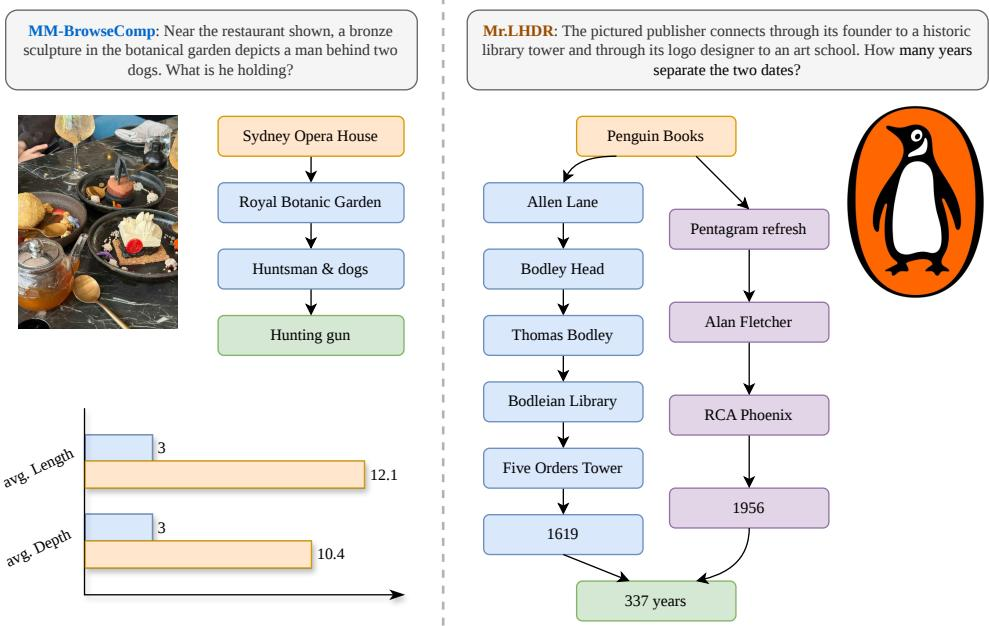  
Figure 1: Comparison of annotated structural horizon. The public MM-BrowseComp image-input example uses four sequential checklist items; its original 224-item release averages 3.0 items per question (Li et al. 2025d). The Mr.LHDR example uses 12 necessary conclusions in two prerequisite branches, while the full benchmark averages 12.1 conclusions and a dependency depth of 10.4. Both settings require multimodal web research and short verifiable answers. Nodes denote conclusions rather than browsing actions; arrows denote annotated prerequisites.

We evaluate 25 regular models, dedicated deep research systems, and framework-based agents on Mr.LHDR, yielding four main findings. First, current systems remain far from saturation. The regular-model run with the highest OA, GPT-5.5, achieves only 43.1% OA and 34.3% SA; the strongest dedicated system by OA, o3 Deep Research, reaches 32.4% OA and 19.6% SA; and DeerFlow (qwen3-vl-235b) reaches 15.7% OA and 9.8% SA. Second, final-answer success overstates complete task execution. The substantial OA–SA gaps show that a correct final answer often coexists with missing required conclusions, while the lower DACS than CS reveals conclusions whose annotated prerequisites are absent. Third, visual evidence materially improves evidence-chain recovery. In a controlled same-model ablation, providing images raises DACS from 21.6% to 34.2%, a gain of 12.6 points (95% CI [6.9, 18.9]). Fourth, longer evidence chains increase strict-completion pressure. Across the three checklist-length ranges with at least 20 items, SA decreases monotonically with checklist length for every representative model. Because confidence intervals for many neighboring systems overlap, these results support broad capability patterns rather than a statistically separable ranking.

Contributions. We make the following contributions:

• A benchmark for long-horizon multimodal deep research. We introduce Mr.LHDR, an open-web benchmark comprising 102 questions across eight real-world categories. Each question is constructed using a Node-Relation design and paired with multimodal source evidence, a short, unique, and verifiable answer, and an irreducible checklist structured as an author-verified dependency DAG. The benchmark contains 1,231 annotated intermediate conclusions with a mean dependency depth of 10.4, operationalizing long-horizon dificulty through prerequisite-linked evidence structures.

• A dependency-aware evaluation protocol. We introduce Dependency-Aware Checklist Score (DACS), which recursively conditions the credit for each stated conclusion on the correctness of its annotated prerequisites. Together with Overall Accuracy (OA), Strict Accuracy (SA), and Checklist Score (CS), the protocol distinguishes among final-answer correctness, complete response correctness, intermediate-conclusion coverage, and dependency-consistent coverage, enabling uniform evaluation across heterogeneous research systems.

• A systematic empirical study of current research systems. We evaluate 25 systems spanning tool-augmented VLMs, tool-free VLMs, dedicated deep research systems, and framework-based agents. The results reveal systematic gaps between final-answer correctness and complete stated-conclusion correctness, as well as between checklist coverage and dependency-consistent coverage. A controlled image ablation using the same model further demonstrates the contribution of visual evidence to recovering dependency-constrained conclusions. Bootstrap uncertainty estimation and robustness analyses of the judge and dependency graph support these findings.

## 2 Related Work

Multimodal Understanding and Evidence Benchmarks. Recent multimodal large language models have moved beyond image–text perception to support documents, charts, videos, screens, long contexts, and agent-centric visual reasoning. Li et al. (2025a); Guo et al. (2025); Team et al. (2025); Bai et al. (2025) exemplify this shift toward general-purpose multimodal understanding, long-context grounding, and reasoning over interleaved visual and textual inputs. Multimodal evaluation has evolved accordingly. Liu et al. (2024) and Yue et al. (2023) assess broad and expert-level reasoning; Masry et al. (2022) and Mathew et al. (2020) focus on charts and document images; and newer evidence-oriented benchmarks examine long multimoda documents, retrieval-augmented visual culture understanding, multimodal document RAG, and conflicts between parametric knowledge and external multimodal evidence. (Duan et al., 2024; Huybrechts et al., 2025; Li et al., 2025b; Dong et al., 2025; Jia et al., 2025) Collectively, these studies establish the importance of evidence selection, cross-modal integration, domain knowledge, and robustness to conflicting priors. In these benchmarks, however, evidence is typically supplied with the query, contained in a fixed corpus, or retrieved within a predefined document or RAG setting. Mr.LHDR considers a complementary open-research setting in which an agent must discover necessary non-textual evidence on the open web, connect it to evolving textual and symbolic constraints, and retain the resulting intermediate conclusions throughout a long-horizon Node-Relation research process.

Tool-Enhanced Browsing and Deep Research Agents. Tool-enhanced agents extend language and multimodal models with search engines, browsers, APIs, code execution, and other external tools. Nakano et al. (2021), Yao et al. (2023) and Schick et al. (2023) established early paradigms for browser-assisted question answering, interleaved reasoning and acting, and learned tool invocation. More recent work on search and deep-research training has shifted from retrieval-augmented answering toward agents that plan searches, decompose questions, inspect sources, and revise intermediate states over multiple turns. Examples include Li et al. (2025e); Song et al. (2025); Jin et al. (2025); Zheng et al. (2025); Zhang et al. (2025); Li et al. (2025c) User-facing systems, including OpenAI (2025); Google (2024); Perplexity AI (2025); xAI (2025); Microsoft (2024), and open-source frameworks such as ByteDance (2026) reflect the same shift toward multi-step research workflows and report synthesis. Although these developments show that agents can search, browse, invoke tools, collect sources, and synthesize long-form outputs, they leave a more specific evaluation question open: can an agent maintain the research state itself—including the objective, entities, constraints, source support, and multimodal bridge conclusions—across many dependent steps? This question is the focus of Mr.LHDR.

Table 1: Comparison with representative browsing and structured-search benchmarks. “Gold structure” denotes task-level supervision of intermediate conclusions or retrieval steps; “prerequisite-gated” indicates that a downstream step receives credit only when its required predecessors are also satisfied. “Open” denotes the open web and “local KB” a fixed retrieval corpus.
<table><tr><td>Benchmark</td><td>Retrieval</td><td>MM required</td><td>Output</td><td>Gold structure</td><td>Prerequisite-gated</td></tr><tr><td>BrowseComp (Wei et al., 2025)</td><td>Open</td><td>X</td><td>Short</td><td></td><td>X</td></tr><tr><td>MM-BrowseComp (Li et al., 2025d)</td><td>Open</td><td>√</td><td>Short</td><td>Checklist</td><td>X</td></tr><tr><td>MMSearch-Plus (Tao et al., 2026)</td><td>Open</td><td>√</td><td>Short</td><td></td><td>×</td></tr><tr><td>BrowseComp-V³ (Zhang et al., 2026)</td><td>Open</td><td>√</td><td>Short</td><td>Subgoals</td><td>X</td></tr><tr><td>DeepSearchQA (Gupta et al., 2026)</td><td>Open</td><td>X</td><td>Short/set</td><td></td><td>X</td></tr><tr><td>MC-Search (Ning et al., 2026)</td><td>Local KB</td><td>Mixed</td><td>QA</td><td>Step-wise graph</td><td>X</td></tr><tr><td>Mr.LHDR</td><td>Open</td><td>√</td><td>Short</td><td>Checklist DAG</td><td>√</td></tr></table>

Browsing, Search, and Deep Research Benchmarks. Existing benchmarks evaluate related agent capabilities from several perspectives. Yao et al. (2022); Deng et al. (2023); Zhou et al. (2024); He et al. (2024); Xie et al. (2024); Mialon et al. (2024); Jiang et al. (2024) span e-commerce interaction, real-website navigation, realistic web environments, multimodal web operation, desktop control, general assistant tasks, and multimodal search. Information-seeking evaluations more directly related to deep research include Wei et al. (2025) and Zhou et al. (2025), which emphasize hard-to-locate short answers on the open web; Li et al. (2025d), which requires multimodal browsing evidence and provides verified checklists; and Du et al. (2025), which evaluates long-form research reports. Complementary agentic-search benchmarks examine dynamic information seeking, source attribution, reproducibility over fixed corpora, process-aware search, and the breadth or depth of evidence collection. (Xi et al., 2025; Gou et al., 2025; Chen et al., 2025; Xu et al., 2025; Wong et al., 2025; Lan et al., 2025) Recent work narrows the gap further. Tao et al. (2026) emphasizes provenance-aware browsing from fine-grained visual cues, while Zhang et al. (2026) introduces expert-validated subgoals and a subgoal-coverage process score for open-web multimodal browsing. Gupta et al. (2026) evaluates causal-chain open-web research through objectively verifiable single or set-valued answers, but scores outcomes rather than intermediate chains. Ning et al. (2026) provides step-wise multimodal reasoning graphs and process metrics, albeit over a fixed local knowledge base. Report-oriented benchmarks address a diferent output regime. Huang et al. (2026) assesses citation-grounded multimodal research reports, while Ye et al. (2026) jointly evaluates report quality, factuality, and exposed research trajectories on text-only and multimodal tasks. Mr.LHDR complements these settings by combining open-web search, required real-world multimodal evidence, concise verifiable answers, long-horizon Node-Relation structures, and response-level dependency-aware checklist evaluation. Here, horizon refers to maintaining research state across prerequisitelinked conclusions, rather than producing long-form output, processing long-context input, or executing a prescribed number of browsing actions. Unlike unordered checklist or subgoal coverage, DACS uses an item-specific Directed Acyclic Graph (DAG). It withholds downstream credit when required predecessors are not satisfied. Unlike trace-based or fixed-corpus process evaluation, DACS applies to heterogeneous systems using only their submitted responses, without claiming to observe latent reasoning or tool-use traces. Table 1 compares Mr.LHDR with representative short-answer browsing and structured-search benchmarks in terms of retrieval setting, multimodal requirements, output form, gold intermediate structure, and prerequisite-gated scoring.

## 3 Mr.LHDR Benchmark

## 3.1 Task Definition and Annotation Schema

During evaluation, the model sees only the natural-language question and its associated image evidence; the Node-Relation graph, checklist, sources, and reference answer remain hidden.

Mr.LHDR is a real-world multimodal deep research benchmark constructed by a six-person annotation team of master’s- and PhD-level AI researchers. Its data span eight topical categories: media, people, organizations, geography, society, academia, technology, and sports. Each item also retains one coarse authored-template label, Linear or Multi-branch, and one or more operation tags from Constraint, Symbolic, Temporal, and Numerical. The template label records the intended construction pattern; it does not define the exact topology of the subsequently verified dependency DAG. Beyond these labels, each item contains a natural-language question, a short verifiable answer, source evidence, image or other non-text evidence, and an irreducible checklist of necessary intermediate conclusions. This schema supports both final-answer evaluation and post-hoc response analysis: the answer field supports answer-level scoring, the checklist supports assessment of whether the submitted response correctly states the necessary conclusions, and the evidence fields support task verification.

The eight categories cover common real-world research settings: cultural media, public figures, organizations, geospatial reasoning, social and historical events, academic artifacts, technologies, and sports. Linear denotes an item authored around a predominantly sequential route, whereas Multi-branch denotes one intentionally authored around multiple evidence routes whose partial conclusions are later combined. These labels summarize construction intent. The verified checklist DAG is the authoritative representation of actual dependencies and may exhibit additional partial independence or local branching under either template. The operation tags describe local pressures within the chain rather than independent task families. Constraint marks candidate filtering or uniqueness conditions; Symbolic covers logos, abbreviations, names, colors, symbols, and format conversions; Temporal covers chronological ordering and relative-time constraints; Numerical covers numbers, rankings, coordinates, statistics, and unit calculations. Together, these labels support analysis of both an item’s topic and the locations of structural pressure and demanding loca operations within its research chain.

Illustrative example. The case study in Appendix Table 22 provides a compact example. The intended chain identifies the pictured phone as an Apple iPhone 15 Pro Max, links it to the A17 Pro and the Apple Silicon team’s relationship with Synopsys, and traces the phone’s titanium frame to the A-12 and SR-71 aircraft. The branch corresponding to the later-retired aircraft proceeds through the SR-71 Flight Simulator to the Frontiers of Flight Museum, Smithsonian Afiliations, and the Smithsonian Institution. A U.S. Department of State video then supplies the first word, “climate,” on the third interviewee’s shirt. Initially misidentifying the phone as a Samsung device redirects the processor, aircraft, and museum links; later guesses about Smithsonian-related nodes cannot repair the unsupported chain. Without reproducing the full case table, this example shows why early visual grounding and preservation of intermediate entities matter.

## 3.2 Benchmark Construction

## 3.2.1 Node-Relation Design Principles

Annotators do not begin Mr.LHDR items by writing a natural-language question. Instead, they first construct a Node-Relation graph. A node pairs a core entity with searchable and verifiable properties, such as a person photo, landmark image, map location, paper PDF, oficial document, poster, logo, chart, timestamp, identity, work, afiliation, venue, or founder. Each item typically begins with five to six information-rich nodes. Nodes are selected not merely for searchable names, but for properties that support later verification and cross-modal bridging.

A relation turns a verified property of one node into an entry condition for the next. Relations may take the form of shared attributes, such as the same location, organization, person, event, or work, or uniqueness constraints, such as a relative year, a founder relation, the first host city of an event, the sister city of a birthplace, or an organization indicated by a visual symbol. A valid relation must be natural and uniquely convergent: removing any key relation should visibly break the chain rather than merely shorten it.

The long-horizon dificulty in Mr.LHDR arises from dependency structure rather than verbose prompts, long outputs, or obscure trivia. Long-horizon requires preserving an evolving research state across dependent evidence steps: a conclusion established at one step becomes a constraint or entry condition for later investigation. Therefore, the final question should not be answerable through a single query, a single webpage, or a direct search for its final wording. Later steps must depend on earlier intermediate conclusions, requiring the agent to retain the research objective, resolved entities, and accumulated constraints across many hops.

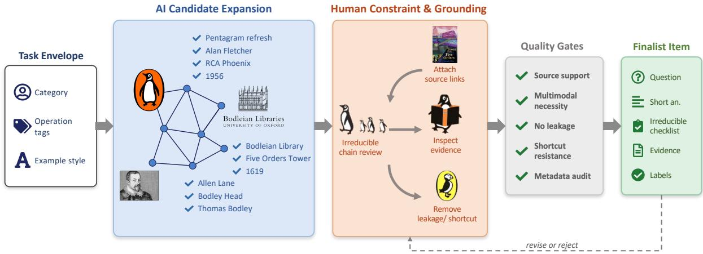  
Figure 2: The overall construction pipeline for Mr.LHDR. AI helps explore the candidate design space through Node-Relation graphs, over-complete checklists, draft fields, and question polishing. Human annotators then prune, revise, and validate the candidates, locking only items that pass source, checklist, multimodal, shortcut, and metadata checks.

This design motivates checklist-based response evaluation: final-answer correctness alone can obscure whether the submitted response correctly states the necessary intermediate conclusions and their prerequisites.

Multimodal evidence is a required part of the reasoning chain. The entry node is preferably grounded in a real-world non-text modality, such as an image, map, PDF, video screenshot, logo, product image, chart, or table. Each Mr.LHDR item must contain non-text evidence that changes the reasoning state by identifying an entity, constraining candidates, confirming a visual relation, localizing a map object, or extracting information from a document, chart, or table.

## 3.2.2 AI-Assisted Construction Workflow

Figure 2 summarizes the AI-assisted construction workflow. AI serves as a candidate-expansion tool rather than an authority. Annotators first specify the target category, operation tags, and golden-example style, then use models to propose Node-Relation graphs, possible multimodal sources, and over-complete checklists. Human annotators prune these candidates into irreducible evidence chains, reject any wording or attribute ambiguity that undermines answer uniqueness or source support, and draft the final question, answer, sources, images, and metadata. Final admission remains under human control through checks of factual support, multimodal necessity, shortcut resistance, label correctness, and benchmark coverage. Detailed pipeline stages and annotation decisions are described in Appendix A.4.

## 3.2.3 Quality Standards and Validation Protocol

Quality criteria. Candidate items must jointly satisfy four quality standards. First, the target answer must be concise, inspectable, unique under open-web evidence, and stable within the question’s temporal scope. Second, the checklist must form an irreducible chain of verifiable conclusions rather than browsing actions. Every key node, bridge relation, checklist entry, and final answer requires inspectable source support, and removing any necessary step must break reliable derivation. Third, the question must hide intermediate nodes and resist direct-answer, single-query, single-page, and text-only shortcuts. Fourth, non-text evidence counts only if it changes the reasoning state by identifying an entity, constraining candidates, localizing an object, reading a document or chart, or bridging two nodes.

Validation protocol. We enforce these standards through a four-stage validation protocol.

Table 2: Quality gates applied before an item enters the Mr.LHDR evaluation set. These gates operationalize answer uniqueness, no path leakage, irreducibility, source support, multimodal necessity, shortcut filtering, and metadata consistency.
<table><tr><td>Gate</td><td>What is checked</td><td>Failure condition</td><td>Action</td></tr><tr><td>Answer uniqueness</td><td>The final answer is short, stable, unique, Multiple equally valid answers or time- Revise or reject. and verifiable.</td><td>varying answers without a temporal constraint.</td><td></td></tr><tr><td>No path leakage</td><td>The question hides intermediate nodes, re- The question can be followed as an Rewrite. lations, checklist steps, and the answer.</td><td>explicit step list or directly searched as written.</td><td></td></tr><tr><td>Irreducible checklist</td><td>Each checklist item is a necessary interme- Removing a step still leaves the answer Prune or rewrite. diate conclusion, not a browsing action.</td><td>derivable, or a step is merely opera- tional.</td><td></td></tr><tr><td>Source support</td><td>Sources support key nodes, relations, A key claim lacks an inspectable URL Add evidence or checklist items, and the final answer.</td><td>or is supported only by a single fragile reject. source.</td><td></td></tr><tr><td>Multimodal necessity</td><td>Non-text evidence changes the reasoning state.</td><td>g The image, map, PDF, video, table, Revise or reject. or chart is decorative or bypassable by text-only search.</td><td></td></tr><tr><td>Shortcut filtering</td><td>the item in one direct query.</td><td>Strong web-enabled models cannot solve The reference answer or full path is Rewrite, recovered by direct search.</td><td>strengthen constraints, or</td></tr><tr><td>Metadata audit</td><td>ation tags, image fields, and source fields leaking. are consistent.</td><td>Category, authored-template label, oper- Metadata is missing, inconsistent, or Fix before lock-</td><td>reject. ing.</td></tr></table>

Phase 1: Pilot and calibration. Each of the six annotators first constructs a small pilot batch from golden examples. The core team audits graph naturalness, unique convergence, path leakage, checklist form, multimodal necessity, and answer format, aligning annotators on the boundary of admissible long-horizon tasks.

Phase 2: Full-scale construction and structured secondary audit. A separate auditor checks every field in a fixed order: whether the hidden chain can be skipped, whether the question reveals the path, whether the checklist is minimal, and whether sources support every key node, relation, conclusion, and answer. Items with unsupported conclusions, multiple valid answers, or reducible checklists are returned for revision.

Phase 3: Multimodal necessity and shortcut check. Auditors verify that at least one key conclusion depends on non-text evidence and that this evidence participates in the chain rather than serving as decoration. They then submit the final question verbatim to a web-enabled model without providing the hidden graph, checklist, sources, or extra prompts. If a single response recovers the answer or a reproducible direct-search path, the item is rewritten, constrained further, or rejected.

Phase 4: Factual and metadata audit. Before locking an item, the core team verifies every URL and corresponding claim, checks that the chain is not dominated by Wikipedia or a single text-only page, confirms the presence of inspectable non-text evidence, and audits category, template, tag, image, and source metadata. Only items that pass every gate enter evaluation.

## 3.3 Benchmark Statistics

Mr.LHDR contains 102 locked evaluation items, each supported by a multi-step checklist and multiple evidence sources. The author-verified checklist graphs exhibit substantial dependency depth, and parallel branches further increase the overall evidential workload. The benchmark spans eight real-world research categories, includes both Linear and Multi-branch authored templates, and covers symbolic, constraint-based, numerical, and temporal reasoning. Figure 3 summarizes the label distributions. Detailed checklist, dependency-depth source, image, non-text-evidence, and split statistics are reported in Appendix B.

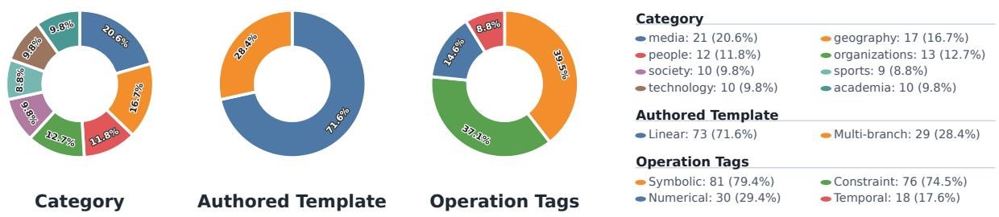  
Figure 3: Label distribution in Mr.LHDR: categories, Linear/Multi-branch authored templates, and operation tags. Operation tags are multi-label, so their percentages need not sum to 100%.

Table 3: Summary of the model groups evaluated in Mr.LHDR. The full model configuration is reported in the appendix.
<table><tr><td>Group</td><td>Capability</td><td>Models</td></tr><tr><td>Tool-augmented VLMs</td><td>image input + web search</td><td>11</td></tr><tr><td>Tool-free VLMs</td><td>image input only</td><td>7</td></tr><tr><td>Deep Research Systems</td><td>dedicated research endpoint</td><td>4</td></tr><tr><td>Framework-based agents</td><td>DeerFlow local agent framework</td><td>3</td></tr></table>

## 4 Experiments

## 4.1 Experimental Setup

## 4.1.1 Evaluation Set and Coverage

All experiments use the fixed Mr.LHDR evaluation set, which contains 102 benchmark items. Each item includes a natural-language question, a short reference answer, source evidence, an image or other non-text evidence, category and structure labels, operation tags, and an irreducible checklist of necessary intermediate conclusions. During evaluation, models receive the question and, when available, its associated image evidence.

The evaluation set covers all eight Mr.LHDR categories and both coarse authored-template labels. It contains 73 Linear-template items and 29 Multi-branch-template items. All 102 items have checklist annotations, comprising 1,231 checklist steps in total. These annotations define the denominators used to compute SA, CS, and DACS in the experiments below.

## 4.1.2 Model Groups

We evaluate 25 systems, divided into four groups according to the research interface and tool access used during evaluation. Tool-augmented VLMs receive image input and access to provider-exposed web search, whereas tool-free VLMs receive image input but no search tool. The tool-free label refers to the evaluation configuration, not an inherent limitation of the model. Deep Research Systems use dedicated research endpoints, while framework-based agents run through DeerFlow (ByteDance, 2026). Each evaluation consists of a single request. Any tool use or multi-step behavior occurs within the provider’s service or the framework rather than in an agent loop that we built. Table 3 summarizes these groups, and Appendix Table 8 lists every model, route, and configuration.

## 4.1.3 Metrics

We evaluate Mr.LHDR along two complementary dimensions: final-answer correctness and the dependency consistency of the conclusions stated in a response. For a fixed model and item i, let $y _ { i } \in \{ 0 , 1 \}$ denote the judge’s binary decision on final-answer correctness. Let $G _ { i } = ( V _ { i } , E _ { i } )$ denote the verified checklist dependency DAG, with its $m _ { i } = | V _ { i } |$ nodes indexed by j. Finally, let $a _ { i j } \in \{ 0 , 1 \}$ indicate whether the response correctly states checklist conclusion $j$ for item i. Over the fixed set of $n = 1 0 2$ items, Overall Accuracy (OA), Strict Accuracy (SA), and Checklist Score (CS) are defined in Equations 1–3:

$$
\mathrm { O A } = \frac { 1 } { n } \sum _ { i = 1 } ^ { n } y _ { i } ,\tag{1}
$$

$$
\mathrm { S A } = \frac { 1 } { n } \sum _ { i = 1 } ^ { n } y _ { i } \prod _ { j = 1 } ^ { m _ { i } } a _ { i j } ,\tag{2}
$$

$$
\mathrm { C S } = \frac { 1 } { n } \sum _ { i = 1 } ^ { n } \frac { 1 } { m _ { i } } \sum _ { j = 1 } ^ { m _ { i } } a _ { i j } .\tag{3}
$$

Thus, OA measures final-answer correctness. SA additionally requires the response to state every annotated necessary conclusion correctly. CS measures average checklist coverage without accounting for dependencies and is retained as an auxiliary metric.

Our primary process metric is the Dependency-Aware Checklist Score (DACS). Let $D _ { i j } \subseteq V _ { i }$ denote the direct prerequisites of node $j$ in item i. We recursively define its dependency-grounded credit $s _ { i j }$ and the resulting DACS in Equations 4 and 5, respectively:

$$
s _ { i j } = a _ { i j } \prod _ { k \in D _ { i j } } s _ { i k } ,\tag{4}
$$

$$
{ \mathrm { D A C S } } = { \frac { 1 } { n } } \sum _ { i = 1 } ^ { n } { \frac { 1 } { m _ { i } } } \sum _ { j = 1 } ^ { m _ { i } } s _ { i j } .\tag{5}
$$

where an empty product equals one. A node therefore receives credit only if both the node itself and all of its transitive prerequisites are satisfied. This recursion preserves credit for independent branches but withholds credit from a conclusion if any required ancestor is missing. DACS thus measures the dependency consistency of stated conclusions.

## 4.1.4 LLM Judge

The LLM Judge compares each model response against the reference answer and checklist. It outputs a binary decision on final-answer correctness and a checklist completion vector. OA, SA, CS, and DACS are then computed deterministically from these outputs and the frozen dependency graphs, using the fixed denominator of 102 items. Failed or missing runs are assigned an incorrect final-answer decision and an all-zero checklist vector. The current evaluation pipeline uses Qwen3-VL-235B (Qwen/Qwen3-VL-235B-A22B-Instruct-FP8) as the judge model.

## 4.2 Main Results

## 4.2.1 Overall Capability

Mr.LHDR remains challenging even for strong systems. As shown in Table 4, GPT-5.5 has the highest OA, with 43.1% OA, 34.3% SA, 73.6% CS, and 70.3% DACS. These results remain far from saturation. Even this run solves only slightly more than two fifths of the benchmark items at the final-answer level and just over one third under the strict criterion that requires both the answer and all annotated necessary conclusions to be correct. Among dedicated deep research systems, o3 Deep Research has the highest OA, reaching 32.4% OA, 19.6% SA, 56.1% CS, and 49.8% DACS. These values are the highest OA point estimates, not a statistically separable ranking. With only 102 items, the confidence intervals of adjacent systems overlap substantially, and Appendix E.1 shows that most per-model diferences are not statistically separable. Framework-based agents are substantially weaker in this evaluation: DeerFlow using Qwen3-VL-235B reaches 15.7% OA, 9.8% SA, 41.8% CS, and 38.5% DACS.

Table 4: Main Mr.LHDR results for all 25 systems in the current evaluation scope, grouped by model capability. Overall columns report final-answer accuracy (OA), strict answer-and-process accuracy (SA), checklist score (CS), and dependency-aware checklist score (DACS). Category columns report diagnostic SA point estimates for each topical category. All metrics are percentages computed using Qwen3-VL-235B (Qwen/Qwen3-VL-235B-A22B-Instruct-FP8) as the judge.
<table><tr><td></td><td colspan="3">Overall</td><td colspan="7">SA by category</td></tr><tr><td>Model</td><td>OA (%) SA (%)</td><td></td><td>CS (%) DACS</td><td>(%)</td><td></td><td></td><td>Ac. Geo. Med. Org. Ppl. Soc. Sport Tech.</td><td></td><td></td><td></td><td></td></tr><tr><td colspan="10">Tool-augmented VLMs</td></tr><tr><td>GPT-5.5</td><td>43.1</td><td>34.3</td><td>73.6</td><td>70.3</td><td>|50.0 17.6</td><td></td><td>42.9</td><td>46.2</td><td>41.7 30.0</td><td>22.2</td><td>20.0</td></tr><tr><td>04-mini</td><td>35.3</td><td>20.6</td><td>49.9</td><td>44.9 20.0</td><td>17.6</td><td>23.8</td><td>15.4</td><td>33.3</td><td>20.0</td><td>22.2</td><td>10.0</td></tr><tr><td>03</td><td>34.3</td><td>15.7</td><td>39.4</td><td>34.1 50.0</td><td>11.8</td><td>19.0</td><td></td><td>0.0 25.0</td><td>10.0</td><td>0.0</td><td>10.0</td></tr><tr><td>GPT-5.4</td><td>30.4</td><td>22.5</td><td>70.1</td><td>63.9 20.0</td><td>23.5</td><td>23.8</td><td>30.8</td><td>25.0</td><td>30.0</td><td>11.1</td><td>10.0</td></tr><tr><td>Claude Opus 4.7</td><td>29.4</td><td>27.5</td><td>69.1</td><td>65.7 30.0</td><td>23.5</td><td>52.4</td><td></td><td>23.1 33.3</td><td>20.0</td><td>0.0</td><td>10.0</td></tr><tr><td>Grok 4.20</td><td>22.5</td><td>17.6</td><td>69.3</td><td>62.4 40.0</td><td>11.8</td><td>28.6</td><td></td><td>15.4 16.7</td><td>20.0</td><td>0.0</td><td>0.0</td></tr><tr><td>GPT-4o (2024-11)</td><td>18.6</td><td>12.7</td><td>42.6</td><td>37.3 20.0</td><td>5.9</td><td>19.0</td><td></td><td>7.7 25.0</td><td>10.0</td><td>0.0</td><td>10.0</td></tr><tr><td>Claude Sonnet 4.6</td><td>17.6</td><td>15.7</td><td>64.5</td><td>61.5 30.0</td><td>5.9</td><td>14.3</td><td></td><td>15.4 16.7</td><td>30.0</td><td>11.1</td><td>10.0</td></tr><tr><td>GPT-4.1</td><td>16.7</td><td>13.7</td><td>48.4</td><td>41.7 20.0</td><td>5.9</td><td>33.3</td><td></td><td>0.0 8.3</td><td>10.0</td><td>11.1</td><td>10.0</td></tr><tr><td>GPT-5.4 Mini</td><td>14.7</td><td>4.9</td><td>25.0</td><td>21.0</td><td>20.0</td><td>0.0</td><td>0.0</td><td>0.0</td><td>8.3 10.0</td><td>0.0</td><td>10.0</td></tr><tr><td>GPT-4o Mini (2024-07)</td><td>9.8</td><td>3.9</td><td>19.0</td><td>14.2 20.0</td><td>5.9</td><td>4.8</td><td>0.0</td><td>0.0</td><td>0.0</td><td>0.0</td><td>0.0</td></tr><tr><td colspan="10">Tool-free VLMs</td><td></td></tr><tr><td>Gemini 3.1 Pro</td><td>34.3</td><td>31.4</td><td>73.2</td><td>70.1</td><td>50.0</td><td>29.4</td><td>38.1</td><td>38.5 25.0</td><td>40.0</td><td>11.1</td><td>10.0</td></tr><tr><td>Gemini 3 Flash</td><td>30.4</td><td>24.5</td><td>74.4</td><td>68.6</td><td>40.0</td><td>23.5</td><td>33.3</td><td>30.8 16.7</td><td>30.0</td><td>0.0</td><td>10.0</td></tr><tr><td>Gemini 2.5 Pro</td><td>28.4</td><td>23.5</td><td>73.0</td><td>69.6</td><td>30.0</td><td>17.6</td><td>33.3</td><td>15.4 25.0</td><td>40.0</td><td>11.1</td><td>10.0</td></tr><tr><td>Gemini 2.5 Flash</td><td>26.5</td><td>18.6</td><td>65.0</td><td>58.0</td><td>40.0</td><td>17.6</td><td>23.8</td><td>15.4 16.7</td><td>20.0</td><td>0.0</td><td>10.0</td></tr><tr><td>Llama 4 Maverick</td><td>15.7</td><td>9.8</td><td>46.7</td><td>37.8</td><td>40.0</td><td>5.9</td><td>14.3</td><td>0.0 8.3</td><td>10.0</td><td>0.0</td><td>0.0</td></tr><tr><td>Qwen3-VL-32B</td><td>10.8</td><td>2.9</td><td>35.7</td><td>29.0</td><td>10.0</td><td>0.0</td><td>4.8</td><td>0.0 8.3</td><td>0.0</td><td>0.0</td><td>0.0</td></tr><tr><td>Qwen2.5-VL-72B</td><td>8.8</td><td>4.9</td><td>39.2</td><td>33.4 10.0</td><td>0.0</td><td></td><td>9.5</td><td>7.7 0.0</td><td>0.0</td><td>0.0</td><td>10.0</td></tr><tr><td colspan="10">Deep Research Systems</td><td></td></tr><tr><td>o3 Deep Research</td><td>32.4</td><td>19.6</td><td>56.1</td><td>49.8</td><td>|20.0</td><td>5.9</td><td>28.6</td><td>15.4 33.3</td><td>40.0</td><td>0.0</td><td>10.0</td></tr><tr><td>o4-mini Deep Research</td><td>27.5</td><td>11.8</td><td>38.0</td><td>32.5 10.0</td><td>5.9</td><td></td><td>19.0</td><td>7.7 8.3</td><td>20.0</td><td>11.1</td><td>10.0</td></tr><tr><td>Perplexity Sonar Deep Research</td><td>22.5</td><td>21.6</td><td>42.5</td><td>37.2 10.0</td><td>23.5</td><td></td><td>28.6 30.8</td><td>25.0</td><td>40.0</td><td>0.0</td><td>0.0</td></tr><tr><td>Tongyi DeepResearch 30B</td><td>6.9</td><td>2.9</td><td>22.8</td><td>19.0 10.0</td><td></td><td>0.0</td><td>9.5</td><td>0.0 0.0</td><td>0.0</td><td>0.0</td><td>0.0</td></tr><tr><td colspan="10">Framework-based agents</td><td></td></tr><tr><td>DeerFlow (minimax-m2.7)</td><td>16.7</td><td>12.7</td><td>37.1</td><td>31.3</td><td>30.0</td><td>0.0</td><td>28.6 15.4</td><td>8.3</td><td>0.0</td><td>0.0</td><td>10.0</td></tr><tr><td>DeerFlow (qwen3-vl-235b)</td><td>15.7</td><td>9.8</td><td>41.8</td><td>38.5 30.0</td><td>5.9</td><td>14.3</td><td>7.7</td><td>8.3</td><td>0.0</td><td>0.0</td><td>10.0</td></tr><tr><td>DeerFlow (kimi-k2.5)</td><td>3.9</td><td>3.9</td><td>5.6</td><td>5.3 20.0</td><td>0.0</td><td></td><td>4.8</td><td>0.0 8.3</td><td>0.0</td><td>0.0</td><td>0.0</td></tr></table>

## 4.2.2 Final Answers vs. Dependency-Consistent Stated Conclusions

Final-answer accuracy remains higher than strict answer-and-stated-conclusion correctness. Figure 4 decomposes OA into SA and the residual gap between them. GPT-5.5 drops from 43.1% OA to 34.3% SA, a gap of 8.8 points. Similarly, o4-mini drops from 35.3% OA to 20.6% SA, a gap of 14.7 points, and o3 Deep Research drops from 32.4% OA to 19.6% SA, a gap of 12.8 points. These measurements show that a correct final answer does not guarantee that the response states every necessary intermediate conclusion. Conversely, a high DACS indicates broad, dependency-consistent checklist coverage in the response, but does not imply a high OA. Neither metric alone verifies actual retrieval or source grounding.

DACS further reveals dependency inconsistencies among the stated conclusions. CS measures how many checklist conclusions are stated correctly anywhere in a response, whereas DACS withholds credit from a conclusion if any required ancestor is missing. The gap is substantial for many systems. Llama 4 Maverick reaches 46.7% CS but only 37.8% DACS; Gemini 2.5 Flash reaches 65.0% CS but 58.0% DACS; and Grok 4.20 reaches 69.3% CS but 62.4% DACS. These diferences identify downstream statements whose prerequisites are absent from the response, but do not establish how those statements were retrieved or grounded. Appendix F provides the complete split-level results and associated small-sample caveats.

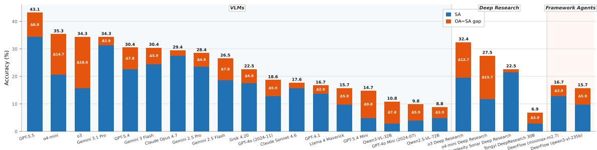  
Figure 4: Decomposition of final-answer accuracy for models with at least 5% OA. Each bar separates strict answer-and-stated-conclusion correctness (SA) from the residual gap between OA and SA. The residua segment represents correct final answers for which the response does not state every required conclusion.

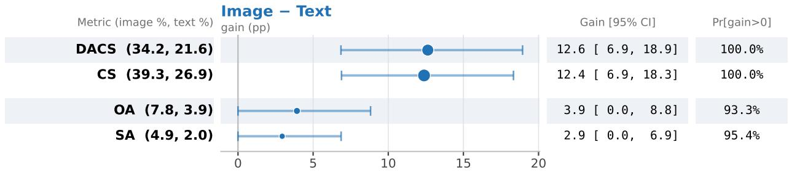  
Figure 5: Multimodal necessity: the same open source VLM (Qwen3-VL-235B) answering all 102 items with vs without the image, under the Mr.LHDR metrics. Each row is one metric, sorted by the image−text gain: the marker is the gain’s point estimate, the horizontal line its 95% bootstrap CI over the 102 items (B = 10000, seed 20260803), and marker area is proportional to the with-image score. The two right-hand columns restate the gain and the fraction of bootstrap resamples with a positive gain as exact numbers. Removing the image drops every metric; the efect is largest and direction-robust on the process metrics (CS, DACS), showing that images help the model state more of the dependency-constrained chain, not only the answer.

## 4.3 Analysis and Ablations

## 4.3.1 Image Ablation

We test the necessity of multimodal input by asking the same open VLM (Qwen3-VL-235B) to answer every item twice: once with the image and once with the image withheld. The question, reference answer, checklist, and judge remain fixed between the two conditions. Figure 5 presents the results.

The efect of the image is strongest on metrics that measure the evidence chain. CS rises from 26.9% to 39.3% (gain 12.4, 95% CI [6.9, 18.3]), while DACS rises from 21.6% to 34.2% (gain 12.6, CI [6.9, 18.9]). The CS and DACS gains are positive in 100.0% and 100.0% of bootstrap resamples, respectively, and neither interval contains zero. The gain in final-answer accuracy has the same direction (7.8% versus 3.9%). The fixed evaluation set includes both groups, which avoids post-hoc selection based on the ablation outcomes; Section 5 characterizes the text-only routes. Under this probe, visual evidence is therefore necessary for correctly stating a larger portion of the dependency-constrained chain.

This direction is stable across judges: under every judge in the pool, OA, CS, and DACS are higher with images, whereas SA is less stable. Appendix E.3 provides the complete self-judge analysis.

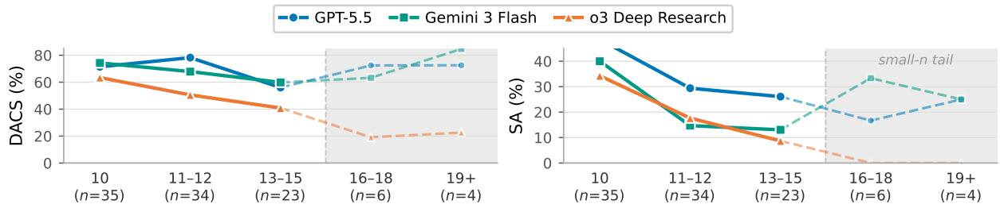  
Figure 6: DACS and SA for representative models across checklist-length ranges. The final two shaded ranges contain only six and four items, respectively, and are excluded from the main interpretation.

## 4.3.2 Checklist-Length Pressure

We use checklist length as a proxy for evidential density. A longer checklist requires an answer to support more annotated conclusions, but does not directly measure browsing cost or the number of actions taken. We partition the 102 items into five ranges containing 10, 11–12, 13–15, 16–18, and 19+ statements. These ranges contain 35, 34, 23, 6, and 4 items, respectively. Figure 6 reports DACS and SA for three representative models across the five ranges.

Across the three ranges with more observations (n ≥ 20), SA decreases monotonically with checklist length for every model. DACS is less uniform: GPT-5.5 rises from the 10-step range to the 11–12 range before falling, whereas Gemini 3 Flash and o3 Deep Research decline across the first two ranges. All three models, however, reach their lowest DACS in the 13–15 range. The most consistent pattern therefore appears in strict satisfaction: as the number of required conclusions increases, models become progressively less likely to satisfy the entire checklist, even when they retain partial, dependency-consistent coverage.

## 4.3.3 High DACS in Tool-Free Gemini Models

The Gemini models stand out within the tool-free group. Gemini 3.1 Pro records 70.1% DACS, and every tested Gemini model outperforms all non-Gemini tool-free models, whose scores range from 29.0% to 37.8%. All models in this group are evaluated under the same input and tool conditions: they receive the question and its associated image but cannot use open-web search. The high Gemini scores therefore cannot be attributed to the tool-free setting alone. Moreover, tool-free does not mean evidence-free. The image ablation in Section 4.3.1 shows that visual evidence improves dependency-consistent coverage, suggesting that strong multimodal understanding contributes to Gemini’s results.

The score distribution provides a more direct explanation. First, Gemini 3.1 Pro has both a high CS and a DACS of 70.1%, with only a small gap between the two metrics. Many of the checklist conclusions that it states correctly therefore also satisfy their prerequisite dependencies. Second, its DACS is zero on only 12.7% of items, while it achieves complete dependency-consistent coverage on 33.3%. DACS awards partial credit for correctly recovered portions of a dependency graph and averages this credit across items. A model can therefore attain a high DACS by covering substantial, dependency-consistent portions of many items, even if it does not complete every item. Gemini’s high score reflects this combination of broad coverage and consistent intermediate conclusions.

However, Gemini 3.1 Pro still has low OA and SA, and its rate of complete dependency-consistent coverage is only 33.3%. It often recovers many intermediate conclusions but misses one or more links required to complete the evidence chain and support the final answer. The metrics capture this distinction: DACS measures dependency-consistent progress within the chain, whereas OA and SA measure end-to-end task completion. This pattern is also stable across judges. Under each of the 12 independent judges, at least one Gemini model ranks among the top 2 models by DACS.

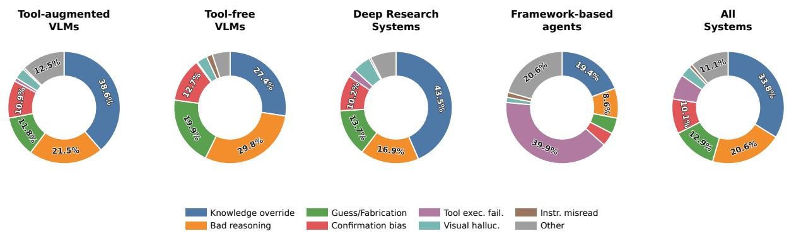  
Figure 7: Distribution of classifier-assigned failure labels among failed checklist items, aggregated by model group. Passed checklist items are excluded, and slices below 8% are left unlabeled for readability.

## 4.3.4 Failure-Mode Analysis

To characterize unsupported conclusions beyond the aggregate process scores, we assign each failed checklist statement a diagnostic label from the MM-BrowseComp taxonomy (Li et al., 2025d). For all 25 systems, the failure set is defined consistently using frozen verdicts from Qwen3.5-Flash, which difers from the current judge used for the main metrics. Qwen3.6 Plus then assigns the diagnostic labels. The analysis covers 30,775 checklist-step decisions from 2,550 model–item runs, of which 17,409 receive failure labels. Appendix F.6 provides the taxonomy, coverage details, and complete counts.

Failure-label distribution. Figure 7 reveals two broad patterns. First, failed steps are concentrated in cases where models override task evidence with prior knowledge or draw conclusions that their reasoning does not adequately support. This pattern indicates persistent weaknesses in evidence integration and reasoning fidelity. Second, failure profiles vary with system design. Knowledge override dominates the failures of tool-augmented VLMs and Deep Research Systems, whereas framework-based agents exhibit a broader mixture that also includes tool-execution and uncategorized failures. This contrast suggests that retrieval and tool access alone do not ensure evidence-grounded conclusions, while framework-based pipelines face a wider range of operational failure surfaces. Because these distributions are conditioned on failed checklist items and the labels are textual diagnostics, they characterize the composition of observed failures, not group failure rates or the causal efects of tool access, retrieval, or orchestration.

Failure rate by dependency depth. We locate unsupported conclusions within the annotated dependency structure rather than by their order in the serialized checklist. A root node has a dependency depth of zero; for every other node, the depth is one plus the maximum depth of its direct prerequisites. We normalize depth by the number of levels in each item and partition the nodes into the first, middle, and final thirds. Across all checklist-step decisions, the failure rate rises from 48.8% in the first third to 55.3% in the middle third and 69.3% in the final third. The same monotonic pattern holds within each of the four system groups. Unsupported conclusions are therefore increasingly prevalent among nodes that lie deeper in the prerequisite structure. This result is a structural diagnostic, not a temporal trace of model behavior: dependency depth does not reveal when a conclusion was attempted, and the observed gradient does not establish that upstream failures caused downstream failures.

## 5 Limitations and Broader Impact

Limitations. Our agent-framework group is instantiated using a single open-source framework; its results therefore characterize this particular harness—including its planning loop, tool interface, and error handling— rather than agent frameworks in general. Framework runs may also fail for reasons unrelated to reasoning, such as tool-execution errors, whereas the metrics score submitted responses without distinguishing harness failures from reasoning failures. The evidence thus supports only the configuration-specific finding that this framework did not translate its additional machinery into higher process scores. Broader conclusions require instrumented tool-execution rates and a controlled comparison of the same underlying model with and without the framework.

Broader impact. Mr.LHDR rewards responses that state necessary intermediate conclusions rather than providing only plausible final answers. This encourages more auditable research assistants and reveals failures obscured by final-answer accuracy, although the resulting process scores do not by themselves verify retrieval provenance. At the same time, linking evidence across sources and modalities is a dual-use capability that could be directed at private individuals. We therefore construct items around public works, organizations, and documented public figures, and do not release private personal data. Publishing questions that rely on the live web also creates risks of benchmark contamination and automated load on third-party sites; we withhold hidden reasoning paths and full source chains, encourage the reuse of cached responses, and recommend respecting robots directives and rate limits.

## 6 Conclusion

We introduced Mr.LHDR, a long-horizon multimodal deep research benchmark that evaluates submitted responses to real-world research tasks requiring sustained evidence chains. Its 102 items are constructed from hidden Node-Relation graphs, grounded in multi-source and non-text evidence, and annotated with irreducible checklists of necessary intermediate conclusions. This design evaluates not only short-answer correctness but also whether a submitted response correctly states the necessary conclusions under their annotated dependencies.

Our evaluation suggests that responses submitted by current systems struggle to preserve dependencyconsistent conclusions. GPT-5.5 attains the highest OA at 43.1%, but only 34.3% SA. The dedicated deep research system with the highest OA, o3 Deep Research, reaches 32.4% OA and 19.6% SA. With 102 items, the wide confidence intervals around these point estimates preclude a complete ranking of systems. Across most systems, OA exceeds SA and CS exceeds DACS. This pattern indicates that a response can provide a correct final answer or isolated downstream facts without correctly stating all annotated prerequisites. Breakdowns by category, structure, checklist length, operation tag, and source density, together with the failure taxonomy, provide exploratory diagnostics rather than robust group-level conclusions. Taken together, these response-level patterns suggest dificulty keeping entities, constraints, and multimodal bridge conclusions aligned across a long dependency chain.

These findings suggest that deep research agents should be evaluated on both final-answer correctness and response-level dependency consistency. DACS measures whether conclusions are correctly stated under annotated dependencies; it does not prove that those conclusions came from retrieved evidence. Future evaluation should therefore incorporate citation- or trace-grounded verification. Future systems likewise need stronger research-state tracking, source and modality binding, branch-specific prerequisite preservation, and chain-level verification.

## References

Shuai Bai, Yuxuan Cai, Ruizhe Chen, Keqin Chen, Xionghui Chen, Zesen Cheng, Lianghao Deng, Wei Ding, Chang Gao, Chunjiang Ge, Wenbin Ge, Zhifang Guo, Qidong Huang, Jie Huang, Fei Huang, Binyuan Hui, Shutong Jiang, Zhaohai Li, Mingsheng Li, Mei Li, Kaixin Li, Zicheng Lin, Junyang Lin, Xuejing Liu, Jiawei Liu, Chenglong Liu, Yang Liu, Dayiheng Liu, Shixuan Liu, Dunjie Lu, Ruilin Luo, Chenxu Lv, Rui Men, Lingchen Meng, Xuancheng Ren, Xingzhang Ren, Sibo Song, Yuchong Sun, Jun Tang, Jianhong Tu, Jianqiang Wan, Peng Wang, Pengfei Wang, Qiuyue Wang, Yuxuan Wang, Tianbao Xie, Yiheng Xu, Haiyang Xu, Jin Xu, Zhibo Yang, Mingkun Yang, Jianxin Yang, An Yang, Bowen Yu, Fei Zhang, Hang Zhang, Xi Zhang, Bo Zheng, Humen Zhong, Jingren Zhou, Fan Zhou, Jing Zhou, Yuanzhi Zhu, and Ke Zhu. Qwen3-vl technical report. arXiv preprint arXiv:2511.21631, 2025.

ByteDance. Deerflow, 2026. URL https://github.com/bytedance/deer-flow.

Zijian Chen, Xueguang Ma, Shengyao Zhuang, Ping Nie, Kai Zou, Andrew Liu, Joshua Green, Kshama Patel, Ruoxi Meng, Mingyi Su, Sahel Sharifymoghaddam, Yanxi Li, Haoran Hong, Xinyu Shi, Xuye Liu, Nandan Thakur, Crystina Zhang, Luyu Gao, Wenhu Chen, and Jimmy Lin. Browsecomp-plus: A more fair and transparent evaluation benchmark of deep-research agent, 2025. URL https://arxiv.org/abs/2508. 06600.

Xiang Deng, Yu Gu, Boyuan Zheng, Shijie Chen, Sam Stevens, Boshi Wang, Huan Sun, and Yu Su. Mind2web: Towards a generalist agent for the web. In Advances in Neural Information Processing Systems, 2023. URL https://arxiv.org/abs/2306.06070.

Kuicai Dong, Yujing Chang, Shijie Huang, Yasheng Wang, Ruiming Tang, and Yong Liu. Benchmarking retrieval-augmented multimomal generation for document question answering. ArXiv, abs/2505.16470, 2025. URL https://api.semanticscholar.org/CorpusID:278788810.

Mingxuan Du, Benfeng Xu, Chiwei Zhu, Xiaorui Wang, and Zhendong Mao. Deepresearch bench: A comprehensive benchmark for deep research agents, 2025. URL https://arxiv.org/abs/2506.11763.

Haodong Duan, Junming Yang, Yuxuan Qiao, Xinyu Fang, Lin Chen, Yuan Liu, Xiaoyi Dong, Yuhang Zang, Pan Zhang, Jiaqi Wang, et al. Vlmevalkit: An open-source toolkit for evaluating large multi-modality models. In Proceedings of the 32nd ACM International Conference on Multimedia, pp. 11198–11201, 2024.

Google. Gemini deep research, 2024. URL https://gemini.google/overview/deep-research/.

Boyu Gou, Zanming Huang, Yuting Ning, Yu Gu, Michael Lin, Weijian Qi, Andrei Kopanev, Botao Yu, Bernal Jiménez Gutiérrez, Yiheng Shu, Chan Hee Song, Jiaman Wu, Shijie Chen, Hanane Nour Moussa, Tianshu Zhang, Jian Xie, Yifei Li, Tianci Xue, Zeyi Liao, Kai Zhang, Boyuan Zheng, Zhaowei Cai, Viktor Rozgic, Morteza Ziyadi, Huan Sun, and Yu Su. Mind2web 2: Evaluating agentic search with agent-as-a-judge, 2025. URL https://arxiv.org/abs/2506.21506.

Dong Guo, Faming Wu, Feida Zhu, Fuxing Leng, Guang Shi, Haobin Chen, Haoqi Fan, Jian Wang, Jianyu Jiang, Jiawei Wang, et al. Seed1. 5-vl technical report. arXiv preprint arXiv:2505.07062, 2025.

Nikita Gupta, Riju Chatterjee, Lukas Haas, Connie Tao, Andrew Wang, Chang Liu, Hidekazu Oiwa, Elena Gribovskaya, Jan Ackermann, John Blitzer, Sasha Goldshtein, and Dipanjan Das. Deepsearchqa: Bridging the comprehensiveness gap for deep research agents, 2026. URL https://arxiv.org/abs/2601.20975.

Hongliang He, Wenlin Yao, Kaixin Ma, Wenhao Yu, Yong Dai, Hongming Zhang, Zhenzhong Lan, and Dong Yu. Webvoyager: Building an end-to-end web agent with large multimodal models. In Annual Meeting of the Association for Computational Linguistics, 2024. URL https://aclanthology.org/2024.acl-long.371/.

Peizhou Huang, Zixuan Zhong, Zhongwei Wan, Donghao Zhou, Samiul Alam, Xin Wang, Zexin Li, Zhihao Dou, Li Zhu, Jing Xiong, Chaofan Tao, Yan Xu, Dimitrios Dimitriadis, Tuo Zhang, and Mi Zhang. Mmdeepresearch-bench: A benchmark for multimodal deep research agents, 2026. URL https://arxiv. org/abs/2601.12346.

Goeric Huybrechts, S. Ronanki, Sai Muralidhar Jayanthi, Jack G. M. Fitzgerald, and Srinivasan R Veeravanallur. Document haystack: A long context multimodal image/document understanding vision llm benchmark. 2025 IEEE/CVF International Conference on Computer Vision Workshops (ICCVW), pp. 4121–4129, 2025. URL https://api.semanticscholar.org/CorpusID:280166930.

Yifan Jia, Kailin Jiang, Yuyang Liang, Qihan Ren, Yi Xin, Rui Yang, Fenze Feng, Mingcai Chen, Hengyang Lu, Haozhe Wang, Xiaoye Qu, Dongrui Liu, Lizhen Cui, and Yuntao Du. Benchmarking multimodal knowledge conflict for large multimodal models. ArXiv, abs/2505.19509, 2025. URL https://api.semanticscholar. org/CorpusID:278904487.

Dongzhi Jiang, Renrui Zhang, Ziyu Guo, Yanmin Wu, Jiayi Lei, Pengshuo Qiu, Pan Lu, Zehui Chen, Chaoyou Fu, Guanglu Song, Peng Gao, Yu Liu, Chunyuan Li, and Hongsheng Li. Mmsearch: Benchmarking the potential of large models as multi-modal search engines, 2024. URL https://arxiv.org/abs/2409.12959.

Bowen Jin, Hansi Zeng, Zhenrui Yue, Jinsung Yoon, Sercan Arik, Dong Wang, Hamed Zamani, and Jiawei Han. Search-r1: Training llms to reason and leverage search engines with reinforcement learning, 2025. URL https://arxiv.org/abs/2503.09516.

Tian Lan, Bin Zhu, Qianghuai Jia, Junyang Ren, Haijun Li, Longyue Wang, Zhao Xu, Weihua Luo, and Kaifu Zhang. Deepwidesearch: Benchmarking depth and width in agentic information seeking, 2025. URL https://arxiv.org/abs/2510.20168.

Bo Li, Yuanhan Zhang, Dong Guo, Renrui Zhang, Feng Li, Hao Zhang, Kaichen Zhang, Peiyuan Zhang, Yanwei Li, Ziwei Liu, and Chunyuan Li. LLaVA-onevision: Easy visual task transfer. Transactions on Machine Learning Research, 2025a. ISSN 2835-8856. URL https://openreview.net/forum?id=zKv8qULV6n.

Jiaang Li, Yifei Yuan, Wenyan Li, Mohammad Aliannejadi, Daniel Hershcovich, Anders Søgaard, Ivan Vuli’c, Wenxuan Zhang, Paul Pu Liang, Yang Deng, and Serge J. Belongie. Ravenea: A benchmark for multimodal retrieval-augmented visual culture understanding. ArXiv, abs/2505.14462, 2025b. URL https://api.semanticscholar.org/CorpusID:278769446.

Kuan Li, Zhongwang Zhang, Huifeng Yin, Liwen Zhang, Litu Ou, Jialong Wu, Wenbiao Yin, Baixuan Li, Zhengwei Tao, Xinyu Wang, Weizhou Shen, Junkai Zhang, Dingchu Zhang, Xixi Wu, Yong Jiang, Ming Yan, Pengjun Xie, Fei Huang, and Jingren Zhou. Websailor: Navigating super-human reasoning for web agent. ArXiv, abs/2507.02592, 2025c. URL https://api.semanticscholar.org/CorpusID:280078605.

Shilong Li, Xingyuan Bu, Wenjie Wang, Jiaheng Liu, Jun Dong, Haoyang He, Hao Lu, Haozhe Zhang, Chenchen Jing, Zhen Li, Chuanhao Li, Jiayi Tian, Chenchen Zhang, Tianhao Peng, Yancheng He, Jihao Gu, Yuanxing Zhang, Jian Yang, Ge Zhang, Wenhao Huang, Wangchunshu Zhou, Zhaoxiang Zhang, Ruizhe Ding, and Shilei Wen. Mm-browsecomp: A comprehensive benchmark for multimodal browsing agents, 2025d. URL https://arxiv.org/abs/2508.13186.

Xiaoxi Li, Guanting Dong, Jiajie Jin, Yuyao Zhang, Yujia Zhou, Yutao Zhu, Peitian Zhang, and Zhicheng Dou. Search-o1: Agentic search-enhanced large reasoning models. In Conference on Empirical Methods in Natural Language Processing, 2025e. URL https://api.semanticscholar.org/CorpusID:275405676.

Yuan Liu, Haodong Duan, Yuanhan Zhang, Bo Li, Songyang Zhang, Wangbo Zhao, Yike Yuan, Jiaqi Wang, Conghui He, Ziwei Liu, Kai Chen, and Dahua Lin. Mmbench: Is your multi-modal model an all-around player? In European Conference on Computer Vision, 2024. URL https://arxiv.org/abs/2307.06281.

Rui Lu, Zhenyu Hou, Zihan Wang, Hanchen Zhang, Xiao Liu, Yujiang Li, Shi Feng, Jie Tang, and Yuxiao Dong. Deepdive: Advancing deep search agents with knowledge graphs and multi-turn rl, 2025. URL https://arxiv.org/abs/2509.10446.

Ahmed Masry, Do Xuan Long, Jia Qing Tan, Shafiq Joty, and Enamul Hoque. ChartQA: A benchmark for question answering about charts with visual and logical reasoning. In Smaranda Muresan, Preslav Nakov, and Aline Villavicencio (eds.), Findings of the Association for Computational Linguistics: ACL 2022, pp. 2263–2279, Dublin, Ireland, May 2022. Association for Computational Linguistics. doi: 10.18653/v1/2022. findings-acl.177. URL https://aclanthology.org/2022.findings-acl.177/.

Minesh Mathew, Dimosthenis Karatzas, R. Manmatha, and C. V. Jawahar. Docvqa: A dataset for vqa on document images. 2021 IEEE Winter Conference on Applications of Computer Vision (WACV), pp. 2199–2208, 2020. URL https://api.semanticscholar.org/CorpusID:220280200.

Grégoire Mialon, Clémentine Fourrier, Thomas Wolf, Yann LeCun, and Thomas Scialom. Gaia: A benchmark for general ai assistants. In International Conference on Learning Representations, 2024. URL https: //openreview.net/forum?id=fibxvahvs3.

Microsoft. Microsoft copilot, 2024. URL https://copilot.microsoft.com/.

Reiichiro Nakano, Jacob Hilton, Suchir Balaji, Jef Wu, Ouyang Long, Christina Kim, Christopher Hesse, Shantanu Jain, Vineet Kosaraju, William Saunders, Xu Jiang, Karl Cobbe, Tyna Eloundou, Gretchen

Krueger, Kevin Button, Matthew Knight, Benjamin Chess, and John Schulman. Webgpt: Browserassisted question-answering with human feedback. ArXiv, abs/2112.09332, 2021. URL https://api. semanticscholar.org/CorpusID:245329531.

Xuying Ning, Dongqi Fu, Tianxin Wei, Mengting Ai, Jiaru Zou, Ting-Wei Li, Hanghang Tong, Yada Zhu, Hendrik Hamann, and Jingrui He. Mc-search: Evaluating and enhancing multimodal agentic search with structured long reasoning chains, 2026. URL https://arxiv.org/abs/2603.00873.

OpenAI. Introducing deep research, 2025. URL https://openai.com/index/ introducing-deep-research/.

Perplexity AI. Introducing perplexity deep research, 2025. URL https://www.perplexity.ai/hub/blog/ introducing-perplexity-deep-research.

Timo Schick, Jane Dwivedi-Yu, Roberto Dessì, Roberta Raileanu, Maria Lomeli, Luke Zettlemoyer, Nicola Cancedda, and Thomas Scialom. Toolformer: Language models can teach themselves to use tools. ArXiv, abs/2302.04761, 2023. URL https://api.semanticscholar.org/CorpusID:256697342.

Huatong Song, Jinhao Jiang, Yingqian Min, Jie Chen, Zhipeng Chen, Wayne Xin Zhao, Lei Fang, and Ji-Rong Wen. R1-searcher: Incentivizing the search capability in llms via reinforcement learning. ArXiv, abs/2503.05592, 2025. URL https://api.semanticscholar.org/CorpusID:276884818.

Xijia Tao, Yihua Teng, Xinxing Su, Xinyu Fu, Jihao Wu, Chaofan Tao, Ziru Liu, Haoli Bai, Rui Liu, and Lingpeng Kong. Mmsearch-plus: Benchmarking provenance-aware search for multimodal browsing agents, 2026. URL https://arxiv.org/abs/2508.21475.

V Team, Wenyi Hong, Wenmeng Yu, Xiaotao Gu, Guo Wang, Guobing Gan, Haomiao Tang, Jiale Cheng, Ji Qi, Junhui Ji, Lihang Pan, Shuaiqi Duan, Weihan Wang, Yan Wang, Yean Cheng, Zehai He, Zhe Su, Zhen Yang, Ziyang Pan, Aohan Zeng, Baoxu Wang, Bin Chen, Boyan Shi, Changyu Pang, Chenhui Zhang, Da Yin, Fan Yang, Guoqing Chen, Jiazheng Xu, Jiale Zhu, Jiali Chen, Jing Chen, Jinhao Chen, Jinghao Lin, Jinjiang Wang, Junjie Chen, Leqi Lei, Letian Gong, Leyi Pan, Mingdao Liu, Mingde Xu, Mingzhi Zhang, Qinkai Zheng, Sheng Yang, Shi Zhong, Shiyu Huang, Shuyuan Zhao, Siyan Xue, Shangqin Tu, Shengbiao Meng, Tianshu Zhang, Tianwei Luo, Tianxiang Hao, Tianyu Tong, Wenkai Li, Wei Jia, Xiao Liu, Xiaohan Zhang, Xin Lyu, Xinyue Fan, Xuancheng Huang, Yanling Wang, Yadong Xue, Yanfeng Wang, Yanzi Wang, Yifan An, Yifan Du, Yiming Shi, Yiheng Huang, Yilin Niu, Yuan Wang, Yuanchang Yue, Yuchen Li, Yutao Zhang, Yuting Wang, Yu Wang, Yuxuan Zhang, Zhao Xue, Zhenyu Hou, Zhengxiao Du, Zihan Wang, Peng Zhang, Debing Liu, Bin Xu, Juanzi Li, Minlie Huang, Yuxiao Dong, and Jie Tang. Glm-4.5v and glm-4.1v-thinking: Towards versatile multimodal reasoning with scalable reinforcement learning, 2025. URL https://arxiv.org/abs/2507.01006.

Jason Wei, Zhiqing Sun, Spencer Papay, Scott McKinney, Jefrey Han, Isa Fulford, Hyung Won Chung, Alex Tachard Passos, William Fedus, and Amelia Glaese. Browsecomp: A simple yet challenging benchmark for browsing agents, 2025. URL https://arxiv.org/abs/2504.12516.

Ryan Wong, Jiawei Wang, Junjie Zhao, Li Chen, Yan Gao, Long Zhang, Xuan Zhou, Zuo Wang, Kai Xiang, Ge Zhang, Wenhao Huang, Yang Wang, and Ke Wang. Widesearch: Benchmarking agentic broad info-seeking, 2025. URL https://arxiv.org/abs/2508.07999.

xAI. Grok 3 beta: The age of reasoning agents, 2025. URL https://x.ai/news/grok-3.

Yunjia Xi, Jianghao Lin, Menghui Zhu, Yongzhao Xiao, Zhuoying Ou, Jiaqi Liu, Tong Wan, Bo Chen, Weiwen Liu, Yasheng Wang, Ruiming Tang, Weinan Zhang, and Yong Yu. Infodeepseek: Benchmarking agentic information seeking for retrieval-augmented generation, 2025. URL https://arxiv.org/abs/2505.15872.

Tianbao Xie, Danyang Zhang, Jixuan Chen, Xiaochuan Li, Siheng Zhao, Ruisheng Cao, Toh Jing Hua, Zhoujun Cheng, Dobin Shin, Fangyu Lei, Yitao Liu, Yiheng Xu, Shuyan Zhou, Silvio Savarese, Caiming Xiong, Victor Zhong Zhou, Tao Wu, and C. Lawrence Hu. Osworld: Benchmarking multimodal agents for open-ended tasks in real computer environments. In Advances in Neural Information Processing Systems, 2024. URL https://arxiv.org/abs/2404.07972.

Yilong Xu, Xiang Long, Zhi Zheng, and Jinhua Gao. Ravine: Reality-aligned evaluation for agentic search, 2025. URL https://arxiv.org/abs/2507.16725.

Shunyu Yao, Howard Chen, John Yang, and Karthik Narasimhan. Webshop: Towards scalable real-world web interaction with grounded language agents. In Advances in Neural Information Processing Systems, 2022. URL https://arxiv.org/abs/2207.01206.

Shunyu Yao, Jefrey Zhao, Dian Yu, Nan Du, Izhak Shafran, Karthik Narasimhan, and Yuan Cao. React: Synergizing reasoning and acting in language models. In International Conference on Learning Representations, 2023. URL https://openreview.net/forum?id=WE\_vluYUL-X.

Fangda Ye, Yuxin Hu, Pengxiang Zhu, Yibo Li, Ziqi Jin, Yao Xiao, Yibo Wang, Lei Wang, Zhen Zhang, Lu Wang, Yue Deng, Bin Wang, Yifan Zhang, Liangcai Su, Xinyu Wang, He Zhao, Chen Wei, Qiang Ren, Bryan Hooi, An Bo, Shuicheng Yan, and Lidong Bing. Miroeval: Benchmarking multimodal deep research agents in process and outcome, 2026. URL https://arxiv.org/abs/2603.28407.

Xiang Yue, Yuansheng Ni, Kai Zhang, Tianyu Zheng, Ruoqi Liu, Ge Zhang, Samuel Stevens, Dongfu Jiang, Weiming Ren, Yuxuan Sun, Cong Wei, Botao Yu, Ruibin Yuan, Renliang Sun, Ming Yin, Boyuan Zheng, Zhenzhu Yang, Yibo Liu, Wenhao Huang, Huan Sun, Yu Su, and Wenhu Chen. Mmmu: A massive multi-discipline multimodal understanding and reasoning benchmark for expert agi. 2024 IEEE/CVF Conference on Computer Vision and Pattern Recognition (CVPR), pp. 9556–9567, 2023. URL https: //api.semanticscholar.org/CorpusID:265466525.

Huanyao Zhang, Jiepeng Zhou, Bo Li, Bowen Zhou, Yanzhe Shan, Haishan Lu, Zhiyong Cao, Jiaoyang Chen, Yuqian Han, Zinan Sheng, Zhengwei Tao, Hao Liang, Jialong Wu, Yang Shi, Yuanpeng He, Jiaye Lin, Qintong Zhang, Guochen Yan, Runhao Zhao, Zhengpin Li, Xiaohan Yu, Lang Mei, Chong Chen, Wentao Zhang, and Bin Cui. Browsecomp-v3: A visual, vertical, and verifiable benchmark for multimodal browsing agents, 2026. URL https://arxiv.org/abs/2602.12876.

Weizhi Zhang, Yangning Li, Yuan-Qi Bei, Junyu Luo, Guancheng Wan, Liangwei Yang, Chenxuan Xie, Yuyao Yang, Wei-Chieh Huang, Chunyu Miao, Henry Peng Zou, Xiao Luo, Yusheng Zhao, Yankai Chen, Chunkit Chan, Peilin Zhou, Xinyang Zhang, Chenwei Zhang, Jingbo Shang, Ming Zhang, Yangqiu Song, Irwin King, and Philip S. Yu. From web search towards agentic deep research: Incentivizing search with reasoning agents. ArXiv, abs/2506.18959, 2025. URL https://api.semanticscholar.org/CorpusID:279999700.

Yuxiang Zheng, Dayuan Fu, Xiangkun Hu, Xiaojie Cai, Lyumanshan Ye, Pengrui Lu, and Pengfei Liu. Deepresearcher: Scaling deep research via reinforcement learning in real-world environments. In Conference on Empirical Methods in Natural Language Processing, 2025. URL https://api.semanticscholar.org/ CorpusID:277596185.

Peilin Zhou, Bruce Leon, Xiang Ying, Can Zhang, Yifan Shao, Qichen Ye, Dading Chong, Zhiling Jin, Chenxuan Xie, Meng Cao, et al. Browsecomp-zh: Benchmarking web browsing ability of large language models in chinese, 2025. URL https://arxiv.org/abs/2504.19314.

Shuyan Zhou, Frank F. Xu, Hao Zhu, Xuhui Zhou, Robert Lo, Abishek Sridhar, Xianyi Cheng, Tianyue Ou, Yonatan Bisk, Daniel Fried, Uri Alon, and Graham Neubig. Webarena: A realistic web environment for building autonomous agents. In International Conference on Learning Representations, 2024. URL https://openreview.net/forum?id=oKn9c6ytLx.

Table 5: Core fields and annotations in each Mr.LHDR item. The checklist records necessary intermediate conclusions rather than browser actions; the checklist DAG records their verified prerequisite relations; sources support the nodes, relations, checklist items, and final answer; images provide non-textual entry points or key evidence.
<table><tr><td>Field</td><td>Type</td><td>Role</td><td></td><td>Eval. Verified</td></tr><tr><td>question</td><td>text</td><td>Natural-language prompt shown to the agent, with the hidden path and answer masked.</td><td>V √</td><td>√</td></tr><tr><td>answer</td><td></td><td>list/text Short, unique, stable reference answer such as a person, place, organization, number, year, color, or short phrase.</td><td></td><td>√</td></tr><tr><td>checklist</td><td>list</td><td>Necessary intermediate conclusions required to derive the answer; these are not action logs.</td><td>√</td><td>√</td></tr><tr><td>checklist DAG DAG</td><td></td><td>Verified prerequisite relations among checklist conclusions, used to measure dependency depth and compute DACS.</td><td>√</td><td>V</td></tr><tr><td>sources</td><td>list</td><td>URLs supporting nodes, relations, checklist items, and the final answer. Non-textual entry points or key evidence, including images, maps, screenshots, logos,</td><td>√</td><td>√</td></tr><tr><td>images</td><td>list</td><td>charts, or document pages.</td><td>√</td><td>√</td></tr><tr><td>category</td><td>label</td><td>Topical category used for coverage control and diagnostic analysis.</td><td>X</td><td>√</td></tr><tr><td>type</td><td>label</td><td>Coarse authored template: Linear or Multi-branch; not the exact verified DAG topology.</td><td>X</td><td>√</td></tr><tr><td>subtasks</td><td>labels</td><td>Operation tags indicating local transformations inside the chain.</td><td>X</td><td>√</td></tr></table>

## A Construction Workflow and Internal Interfaces

This appendix provides supporting details on implementation and analysis, including the annotation and evaluation interfaces, the AI-assisted construction procedure, metric and judge specifications, model config urations, robustness checks, additional benchmark statistics, diagnostic analyses, case studies, and release considerations.

## A.1 Annotation and Quality-Control Interface

The internal annotation platform supports collaborative data construction and quality control. Within a single interface, annotators create and revise benchmark items by editing the question, short answer, hidden Node-Relation design, checklist, sources, images, category, authored-template label, and operation tags. The platform also supports Markdown rendering of the design field, image inspection, secondary-audit comments and ratings, and benchmark locking. Together, these functions operationalize the validation protocol: an independent auditor can check whether the question leaks the path, whether each checklist item constitutes a verifiable conclusion, whether each source supports a necessary node or relation, and whether uploaded images or other non-text evidence are used in the chain.

## A.2 Evaluation Interface

The evaluation platform supports launching model runs, monitoring their status, inspecting model responses, and auditing judge outputs. For each item–model pair, the platform records whether the run completed or failed, the model response, the judge’s final-answer decision, and the checklist completion vector.

## A.3 Dataset Schema and Construction Procedure

A node consists of a core entity paired with searchable and verifiable properties, such as a photo, map location, paper PDF, oficial document, logo, chart, timestamp, work, afiliation, venue, or founder. A relation uses a verified property of one node as the entry condition for another node.

## A.4 AI-Assisted Construction Pipeline

AI assistance follows an expand-then-constrain process: the model broadens the candidate design space, while annotators determine which elements remain as benchmark evidence. The first layer consists of human-controlled task specification: before any model generation, annotators define the target category, operation tags, and golden-example style. Within these constraints, AI supports graph-level exploration by proposing Node-Relation graphs comprising five to six information-rich nodes, verifiable properties, possible multimodal sources, and bridge relations. AI is then used for checklist-level stress testing, expanding the graph into an intentionally over-complete set of candidate conclusions, often spanning 25–28 steps, to expose missing evidence, weak dependencies, duplicate facts, and potential shortcuts. Following DeepDive’s Blur Attribute-Rich Path strategy (Lu et al., 2025), annotators also use AI to propose coarser-grained renderings of high-information attributes while preserving the unique convergence of the reasoning path: an exact year such as 1978 may be rewritten as “the late 1970s,” while overly direct place or afiliation cues may be abstracted into recoverable descriptors. Any blur is rejected if it introduces another valid answer or renders a necessary bridge unverifiable. Annotators complete this layer by compressing the candidate chain: they remove background facts, merge redundant conclusions, and retain only the intermediate conclusions necessary to derive the final answer.

  
Figure 8: Annotation interface for collaborative Mr.LHDR construction. Before an item passes the secondary audit and is locked, the system allows annotators to inspect and edit its question, answer, design, checklist, sources, images, and metadata.

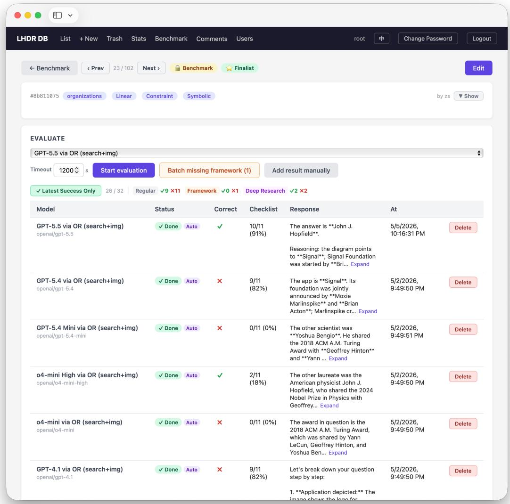  
Figure 9: Evaluation interface for launching runs and inspecting their status, responses, judge decisions, checklist completion, and aggregate metrics. The platform serves as an execution and audit tool.

The second layer converts the pruned chain into a grounded benchmark item. Annotators draft or revise the natural-language question, short answer, source list, image evidence, and metadata while verifying that inspectable evidence supports every necessary conclusion. Question polishing is treated as leakage contro rather than stylistic rewriting: annotators remove intermediate-node hints, direct-answer cues, and wording that reveals the intended search path. The internal annotation platform facilitates collaborative editing, secondary-audit ratings and comments, image inspection, and the benchmark admission workflow. Thus, AI provides breadth during candidate exploration, whereas human annotators determine factual support, checklist irreducibility, multimodal necessity, shortcut resistance, label correctness, and final admission to the evaluation set.

The pipeline is interactive and does not correspond to a single generation prompt. Model assistance is introduced at several distinct points—task specification, graph-level exploration, checklist stress testing, and blur rewriting. Each point is conditioned on the item under construction and guided by an annotator who accepts, edits, or discards the output. The expansion stage deliberately over-produces candidate checklists of 25–28 steps; the 102 admitted items retain 1,231 checklist steps in total, averaging 12.1 per item. Fewer than half of the proposed conclusions survive pruning, consistent with the expand-then-constrain design, in which annotators remove most model proposals.

Table 6: Overview statistics for the Mr.LHDR benchmark. Operation tags are multi-label, so their percentages need not sum to 100%. Non-text evidence coverage counts either uploaded image assets or source URLs pointing to PDF, video, or map evidence.  
Statistic Value   
Benchmark items 102   
Checklist annotations 102 items (100.0%); 1,231 checklist steps in total   
Checklist length Mean 12.1, median 11, range 10–21   
Dependency depth Mean 10.4, median 10, range 6–18   
Label space 8 categories, 2 authored templates, 4 operation tags   
Authored templates Linear: 73 (71.6%); Multi-branch: 29 (28.4%)   
Operation tags Constraint: 76 (74.5%); Numerical: 30 (29.4%); Symbolic: 81 (79.4%); Temporal: 18   
(17.6%)   
Checklist length buckets 10–12: 69 (67.6%); 13–15: 23 (22.5%); 16+: 10 (9.8%)   
Dependency depth buckets 6–9: 35 (34.3%); 10–11: 38 (37.3%); 12–18: 29 (28.4%)   
Source URLs 818 total; mean 8.0 per item   
Image assets 101 total; mean 1.0 per item; 101 items (99.0%) have an uploaded image asset   
Non-text evidence coverage 102 items (100.0%), counting uploaded image assets or PDF/video/map source URLs   
Source diagnostics PDF/video/map source URLs appear in 45 items (44.1%); Wikipedia URLs account   
for 241/818 source URLs (29.5%)

## B Benchmark Statistics and Composition

Table 7: Benchmark split statistics. Operation tags are multi-label, so tag counts and percentages do not sum to 102 items or 100%.
<table><tr><td>Scope</td><td>Group</td><td>Items</td><td>Percent</td><td>Avg. checklist</td><td>Avg. sources</td></tr><tr><td>category</td><td>academia</td><td>10</td><td>9.8</td><td>12.3</td><td>8.7</td></tr><tr><td>category</td><td>geography</td><td>17</td><td>16.7</td><td>14.4</td><td>9.2</td></tr><tr><td>category</td><td>media</td><td>21</td><td>20.6</td><td>11.9</td><td>8.7</td></tr><tr><td>category</td><td>organizations</td><td>13</td><td>12.7</td><td>11.2</td><td>7.2</td></tr><tr><td>category</td><td>people</td><td>12</td><td>11.8</td><td>11.0</td><td>6.6</td></tr><tr><td>category</td><td>society</td><td>10</td><td>9.8</td><td>11.2</td><td>6.7</td></tr><tr><td>category</td><td>sports</td><td>9</td><td>8.8</td><td>12.1</td><td>8.0</td></tr><tr><td>category</td><td>technology</td><td>10</td><td>9.8</td><td>11.6</td><td>8.1</td></tr><tr><td>authored template</td><td>Linear</td><td>73</td><td>71.6</td><td>11.8</td><td>7.9</td></tr><tr><td>authored template</td><td>Multi-branch</td><td>29</td><td>28.4</td><td>12.8</td><td>8.3</td></tr><tr><td>operation tag</td><td>Constraint</td><td>76</td><td>74.5</td><td>11.9</td><td>8.1</td></tr><tr><td>operation tag</td><td>Numerical</td><td>30</td><td>29.4</td><td>11.8</td><td>7.0</td></tr><tr><td>operation tag</td><td>Symbolic</td><td>81</td><td>79.4</td><td>12.2</td><td>8.2</td></tr><tr><td>operation tag</td><td>Temporal</td><td>18</td><td>17.6</td><td>11.6</td><td>7.2</td></tr><tr><td>checklist length</td><td>10</td><td>35</td><td>34.3</td><td>10.0</td><td>7.3</td></tr><tr><td>checklist length</td><td>11-12</td><td>34</td><td>33.3</td><td>11.4</td><td>7.6</td></tr><tr><td>checklist length</td><td>13-15</td><td>23</td><td>22.5</td><td>13.7</td><td>9.1</td></tr><tr><td>checklist length</td><td>16-18</td><td>6</td><td>5.9</td><td>16.7</td><td>8.8</td></tr><tr><td>checklist length</td><td>19+</td><td>4</td><td>3.9</td><td>20.0</td><td>10.8</td></tr><tr><td>dependency depth</td><td>6-9</td><td>35</td><td>34.3</td><td>11.1</td><td>8.1</td></tr><tr><td>dependency depth</td><td>10-11</td><td>38</td><td>37.3</td><td>11.1</td><td>7.7</td></tr><tr><td>dependency depth</td><td>12-18</td><td>29</td><td>28.4</td><td>14.4</td><td>8.3</td></tr><tr><td>source count</td><td>1-6</td><td>27</td><td>26.5</td><td>11.6</td><td>5.0</td></tr><tr><td>source count</td><td>7-8</td><td>37</td><td>36.3</td><td>11.3</td><td>7.6</td></tr><tr><td>source count</td><td>9-10</td><td>25</td><td>24.5</td><td>12.4</td><td>9.6</td></tr><tr><td>source count</td><td>11+</td><td>13</td><td>12.7</td><td>14.7</td><td>12.5</td></tr></table>

Table 6 summarizes the Mr.LHDR evaluation set, while Table 7 presents benchmark diagnostics at the split level. The benchmark currently contains 102 items. Their checklists comprise 1,231 necessary intermediate conclusions in total, with a mean length of 12.1, a median length of 11, and a range of 10 to 21 steps. In the author-verified checklist DAGs, dependency depth—defined as the maximum number of conclusions along a prerequisite path, including both endpoints—has a mean of 10.4, a median of 10, and a range of 6 to 18. The evidence fields are similarly dense: the benchmark includes 818 source URLs, with an average of 8.0 URLs per item, as well as 101 image assets. Together, the short answers, complete checklist annotations, explicit dependencies, and evidence fields make Mr.LHDR verifiable at both the final-answer and process levels.

The construction metadata covers all eight target categories and both coarse authored-template labels. The largest category is media, with 21 items, followed by geography with 17; the smallest is sports, with 9 items. Each remaining category contains between 10 and 13 items. Most items follow the Linear template: 73 items (71.6%) use this template, while 29 items (28.4%) use the Multi-branch template, which was designed to emphasize multiple evidence paths and their subsequent joint use. Operation tags characterize local demands within a chain rather than mutually exclusive task families: Symbolic appears in 81 items (79.4%), Constraint in 76 (74.5%), Numerical in 30 (29.4%), and Temporal in 18 (17.6%). Because these tags are multi-label, their percentages need not sum to 100%.

Dependency depth and checklist length capture complementary structural properties, rather than the length of browsing traces or the verbosity of prompts. Dependency depth measures the longest sequential prerequisite path, whereas checklist length measures the total number of necessary conclusions, including those on parallel branches. By construction, no benchmark item has fewer than 10 checklist steps. Most items fall into the 10–12-step bucket (69 items, 67.6%); 23 items (22.5%) contain 13–15 steps, and 10 items (9.8%) contain 16 or more steps. Longer checklists also tend to have denser source evidence: items with 16 or more checklist steps use an average of 9.6 source URLs, compared with 7.4 URLs for items in the 10–12-step bucket.

For subsequent analysis, Mr.LHDR tracks category, authored-template label, operation tags, checklist length, source count, image availability, coarse-grained non-text evidence coverage, and Wikipedia usage. Every item contains non-text evidence when uploaded images are considered together with PDF, video, or map source URLs. PDF, video, or map URLs appear in 45 items (44.1%), while Wikipedia accounts for 241 of the 818 source URLs (29.5%). These statistics support the claim that Mr.LHDR cannot be reduced to a Wikipedia-only or text-only browsing benchmark.

## C Evaluation Configuration and Failure Handling

## C.1 Model and Provider Configuration

Table 8 lists the complete model configuration used in the evaluation. The evaluation was conducted from April 30 to May 5, 2026 (UTC). Regular OpenRouter models in the search+image group were evaluated through the benchmark interface with image evidence and, when exposed by the provider route, web-search capability; image-only models received image input but no search tool. Deep research systems were evaluated through their dedicated research endpoints over the same OpenRouter route, whereas framework agents like ByteDance (2026) were evaluated through DeerFlow backends. We implemented neither a ReAct loop nor any harness-level optimizations. Each run consisted of a single request containing the question verbatim. For the tool-augmented group, the request additionally declared the provider’s native server-side search tool, ensuring that all browsing was executed and completed within the provider’s service before the response was returned to us. We provided no system prompt and set no sampling parameters. Because the providers’ own routes were used, the deep-research endpoints did not accept inline image parts; these systems therefore received the image evidence as a URL in the prompt text rather than as attached bytes.

## D Metrics and Judge Specification

## D.1 Interpretation of CS and DACS

Following prior checklist-based evaluations in browsing benchmarks, CS provides a useful measure of broad coverage but is not well aligned with long-horizon deep research because it treats checklist items as unordered and interchangeable. In Mr.LHDR, downstream conclusions are not independent local facts: they are warranted only after the preceding entities, constraints, and disambiguating relations have been established. When these prerequisites are absent, downstream statements that match individual checklist items should not be interpreted as evidence of successful reasoning, because they may reflect unsupported guesses, search shortcuts, or chance agreement rather than a valid continuation of the evidence path. CS can therefore overestimate process reliability by aggregating local matches across a broken dependency graph. DACS addresses this limitation while retaining credit for genuinely independent branches.

Table 8: Full model configuration. All reported metrics use the same fixed 102-item denominator.
<table><tr><td>Model</td><td>Provider/interface</td><td>Group</td><td>Capability</td><td>Version or API identifier</td></tr><tr><td>GPT-5.5</td><td>OpenRouter</td><td>regular</td><td>search+image</td><td>openai/gpt-5.5</td></tr><tr><td>GPT-5.4</td><td>OpenRouter</td><td>regular</td><td>search+image</td><td>openai/gpt-5.4</td></tr><tr><td>GPT-5.4 Mini</td><td>OpenRouter</td><td>regular</td><td>search+image</td><td>openai/gpt-5.4-mini</td></tr><tr><td>o4-mini</td><td>OpenRouter</td><td>regular</td><td>search+image</td><td>openai/o4-mini</td></tr><tr><td>GPT-4.1</td><td>OpenRouter</td><td>regular</td><td>search+image</td><td>openai/gpt-4.1</td></tr><tr><td>GPT-4o (2024-11)</td><td>OpenRouter</td><td>regular</td><td>search+image</td><td>openai/gpt-4o-2024-11-20</td></tr><tr><td>GPT-4o Mini (2024-07)</td><td>OpenRouter</td><td>regular</td><td>search+image</td><td>openai/gpt-4o-mini-2024-07-18</td></tr><tr><td>03</td><td>OpenRouter</td><td>regular</td><td>search+image</td><td>openai/o3</td></tr><tr><td>Claude Opus 4.7</td><td>OpenRouter</td><td>regular</td><td>search+image</td><td>anthropic/claude-opus-4.7</td></tr><tr><td>Claude Sonnet 4.6</td><td>OpenRouter</td><td>regular</td><td>search+image</td><td>anthropic/claude-sonnet-4.6</td></tr><tr><td>Grok 4.20</td><td>OpenRouter</td><td>regular</td><td>search+image</td><td>x-ai/grok-4.20</td></tr><tr><td>Gemini 3.1 Pro</td><td>OpenRouter</td><td>regular</td><td>image</td><td>google/gemini-3.1-pro-preview</td></tr><tr><td>Gemini 3 Flash</td><td>OpenRouter</td><td>regular</td><td>image</td><td>google/gemini-3-flash-preview</td></tr><tr><td>Gemini 2.5 Pro</td><td>OpenRouter</td><td>regular</td><td>image</td><td>google/gemini-2.5-pro-preview</td></tr><tr><td>Gemini 2.5 Flash</td><td>OpenRouter</td><td>regular</td><td>image</td><td>google/gemini-2.5-flash</td></tr><tr><td>Llama 4 Maverick</td><td>OpenRouter</td><td>regular</td><td>image</td><td>meta-llama/1lama-4-maverick</td></tr><tr><td>Qwen3-VL-32B</td><td>OpenRouter</td><td>regular</td><td>image</td><td>qwen/qwen3-vl-32b-instruct</td></tr><tr><td>Qwen2.5-VL-72B</td><td>OpenRouter</td><td>regular</td><td>image</td><td>qwen/qwen2.5-vl-72b-instruct</td></tr><tr><td>o3 Deep Research</td><td>OpenRouter</td><td>deep research</td><td>deep research</td><td>openai/o3-deep-research 2025-06-26</td></tr><tr><td>o4-mini Deep Research</td><td>OpenRouter</td><td>deep research</td><td>deep research</td><td>openai/o4-mini-deep-research 2025-06-26</td></tr><tr><td>Tongyi DeepResearch 30B</td><td>OpenRouter</td><td>deep research</td><td>deep research</td><td>alibaba/tongyi-deepresearch 30b-a3b</td></tr><tr><td>Perplexity Sonar Deep Research</td><td>OpenRouter</td><td>deep research</td><td>deep research</td><td>perplexity/sonar-deep-research</td></tr><tr><td>DeerFlow (kimi-k2.5)</td><td>DeerFlow</td><td>framework/agent</td><td>local agent framework deerflow/kimi-k2.5</td><td></td></tr><tr><td>DeerFlow (minimax-m2.7)</td><td>DeerFlow</td><td>framework/agent</td><td>local agent framework</td><td>deerflow/minimax-m2.7</td></tr><tr><td>DeerFlow (qwen3-vl-235b)</td><td>DeerFlow</td><td>framework/agent</td><td>local agent framework deerflow/qwen3-vl-235b</td><td></td></tr></table>

The DACS recursion defined in Section 4.1.3 scores each verified dependency DAG directly, independently of its coarse authored-template label. Independent subgraphs retain credit separately, whereas a merge node receives credit only when the node itself and all required branch dependencies are satisfied. DACS measures whether the submitted response states dependency-consistent conclusions.

## D.2 Automatic Judge Specification

The automatic judge receives the user question, reference answer, reference checklist, and model response. The metric script reads only two machine-readable fields from the judge output: OVERALL\_CORRECTNESS and CHECKLIST\_RESULT. The judge model in the current pipeline is Qwen3-VL-235B (Qwen/Qwen3-VL-235B-A22B-Instruct-FP8). When the core answer is unchanged, answer normalization permits harmless diferences in capitalization, punctuation, spelling variants, aliases, units, and brief paraphrases. A checklist item receives credit only when the response states the corresponding conclusion completely and associates it with the correct entity and constraint; vague mentions, incorrect entity associations, missing qual ifiers, and descriptions of search actions do not count as completion. All reported verdicts are model-produced; neither manual result auditing nor calibration against human labels is performed.

## D.3 Exact LLM Judge Prompt

Figure 10 presents the exact prompt used by the automatic judge, including the required machine-readable fields for final-answer correctness and checklist completion.

## E Statistical and Cross-Judge Robustness

## E.1 Item-Bootstrap Uncertainty

Given an evaluation set of 102 items, Table 9 complements the per-model point estimates with 95% confidence intervals obtained by resampling items (B = 10000, seed 20260731). For GPT-5.5, the system with the highest OA, the estimate of 43.1% has an interval of [33.3, 52.9], spanning twenty percentage points. The OA ordering of GPT-5.5 and o4-mini, which have the two highest point estimates, is preserved in 96.4% of resamples, exceeding 95%. Among GPT-5.4, o3, and Gemini 3.1 Pro, the maximum pairwise separability is 67.1%; by comparison, a diference that never reverses would yield 100%. These results provide the strongest evidence of separation for the leading pair, while indicating that the remaining per-model rankings should be interpreted with appropriate caution.

You are an AI evaluator. Your task is to evaluate the quality of an answer. I will provide you with the   
user’s question, the reference answer (ground truth), a checklist, and the answer to be evaluated.   
–- USER QUESTION –- {question}   
-- REFERENCE ANSWER (Ground Truth) -- {reference answer} This reference answer is considered the correct   
and ideal response content-wise.   
REFERENCE CHECKLIST { h kl l }   
–- MODEL’S GENERATED ANSWER TO EVALUATE –- {generated\_answer}   
–- EVALUATION INSTRUCTIONS –- Please provide your evaluation strictly in the following format on   
separate lines: 1. Checklist Score: Determine how many of the {n} items in the REFERENCE CHECKLIST   
have been correctly and completely addressed. The model’s generated answer must fully comply with   
an item for it to be considered complete. State as ’CHECKLIST\_SCORE: [correct\_items]/{n}’ (e.g.,   
CHECKLIST\_SCORE: {example\_score}). 2. Checklist Result Vector: Provide a 0-1 vector indicating   
whether each checklist item passed, in order. ’1’ means fully satisfied, ’0’ means not fully satisfied.   
Output as ’CHECKLIST\_RESULT: [1,0,1]’. 3. Overall Correctness: Judge whether the generated answer   
is consistent with the reference answer in core content. Content consistency is key; minor wording   
differences are acceptable. State as 'OVERALL. CORRECTNESS: [YES/NO]'.   
Provide only these three formatted lines as your response.  
Figure 10: LLM judge prompt used to evaluate final-answer correctness and checklist completion. The judge outputs only the formatted fields shown above; OA, SA, CS, and DACS are computed deterministically from these outputs and the frozen dependency graphs.

Figure 11 reports paired uncertainty for the answer-completeness penalty OA−SA: the proportion of all items for which the final answer is correct but the response still omits at least one required conclusion. Because SA is nested within OA, this diference is non-negative by construction; the intervals therefore quantify uncertainty in the magnitude of the penalty, not evidence about its direction. When expressed only among items with correct final answers, the penalty reaches 72.7%: for the most afected system, more than eight in ten correct answers are accompanied by responses that omit at least one required conclusion. The figure’s rightmost column also reports the dependency penalty CS−DACS, namely the checklist credit removed when prerequisite conclusions are absent. We present this penalty as text rather than in a second plotted panel because its point estimates span only 3.0 to 8.9 percentage points and every interval overlaps every other interval; a second panel would therefore show no separable diferences. Moreover, the two penalties use diferent units of evaluation—whole-item correctness and average checklist credit—so their magnitudes should not be interpreted as a direct statistical comparison.

## E.2 Complete Judge Sampling Frame and Agreement Analysis

Because SA and DACS depend on checklist-level judgments, every process-level claim in this paper depends on the judge. Reporting results from only one judge would leave this dependence untested. We therefore re-score cached responses from a subset of the evaluated systems (2065 responses, 24782 checklist steps) using 12 judges drawn from 6 model families. The scoring prompt and parsing procedure are held fixed across judges; only the model issuing the verdict varies.

Because vendors contribute unequal numbers of systems, we report agreement on a family-balanced subsample. The stratified grid selects the most recent flagship from each model family as its prespecified representative and covers all 102 items across all 8 categories. This yields 702 responses and 8417 checklist steps scored by every judge (Table 10).

Agreement is high for both same-vendor and cross-vendor judge pairs. Pairwise final-answer agreement ranges from 95.9% to 99.7%, with Cohen’s κ ranging from 0.845 to 0.989. The weakest pair is cross-vendor: among the 58 cross-vendor pairs, the minimum agreement is 95.9% (κ = 0.845). Fleiss’ κ is 0.940 for final answers (95% CI [0.918, 0.958] over 4000 cell-level bootstrap resamples) and 0.803 for individual checklist steps; all judges are unanimous on 94.3% of responses. A sensitivity analysis that replaces each family’s flagship with its weakest member yields $\kappa = 0 . 9 0 9$ [0.877, 0.937]. We also pool 10 judges into a single reference verdict for 2157 responses, counting a response as correct when at least 50% judges in the pool agree. The pool is unanimous on 97.5% of responses. The reported judge—which is not a member of the pool—matches this reference on 97.1% of final answers $( \kappa = 0 . 8 9 0 )$ and 86.6% of checklist steps (κ = 0.728), as shown in Table 11.

Table 9: Full Mr.LHDR results with 95% bootstrap confidence intervals over the 25 systems. Point estimates match Table 4; intervals are the 2.5/97.5 percentiles of B = 10000 bootstrap resamples of the 102 items (seed 20260731). Wide intervals and heavy overlap indicate that per-model rankings should not be over-interpreted; Figure 11 gives paired uncertainty for the within-system metric penalties.
<table><tr><td>Model</td><td>OA (%)</td><td>SA (%)</td><td>CS (%)</td><td>DACS (%)</td></tr><tr><td colspan="5">Tool-augmented VLMs</td></tr><tr><td>GPT-5.5</td><td>43.1 [33.3, 52.9]</td><td>34.3 [25.5, 44.1]</td><td>73.6 [66.8, 79.7]</td><td>70.3 [63.1, 77.1]</td></tr><tr><td>o4-mini</td><td>35.3 [26.5, 45.1]</td><td>20.6 [12.7, 28.4]</td><td>49.9 [41.9, 58.1]</td><td>44.9 [36.7, 53.5]</td></tr><tr><td>03</td><td>34.3 [25.5, 43.1]</td><td>15.7 [8.8, 23.5]</td><td>39.4 [31.5, 47.8]</td><td>34.1 [26.2, 42.4]</td></tr><tr><td>GPT-5.4</td><td>30.4 [21.6, 39.2]</td><td>22.5 [14.7, 31.4]</td><td>70.1 [64.2, 75.9]</td><td>63.9 [57.1, 70.7]</td></tr><tr><td>Claude Opus 4.7</td><td>29.4 [20.6, 38.2]</td><td>27.5 [19.6, 36.3]</td><td>69.1 [62.6, 75.3]</td><td>65.7 [59.0, 72.3]</td></tr><tr><td>Grok 4.20</td><td>22.5 [14.7, 30.4]</td><td>17.6 [10.8, 25.5]</td><td>69.3 [63.5, 74.9]</td><td>62.4 [55.7, 69.1]</td></tr><tr><td>GPT-4o (2024-11)</td><td>18.6 [11.8, 26.5]</td><td>12.7 [6.9, 19.6]</td><td>42.6 [35.0, 50.2]</td><td>37.3 [29.6, 45.0]</td></tr><tr><td>Claude Sonnet 4.6</td><td>17.6 [10.8, 25.5]</td><td>15.7 [8.8, 23.5]</td><td>64.5 [58.2, 70.5]</td><td>61.5 [55.0, 67.8]</td></tr><tr><td>GPT-4.1</td><td>16.7 [9.8, 24.5]</td><td>13.7 [7.8, 20.6]</td><td>48.4 [41.1, 55.8]</td><td>41.7 [34.2, 49.4]</td></tr><tr><td>GPT-5.4 Mini</td><td>14.7 [8.8, 21.6]</td><td>4.9 [1.0, 9.8]</td><td>25.0 [18.6, 31.7]</td><td>21.0 [14.7, 27.7]</td></tr><tr><td>GPT-4o Mini (2024-07)</td><td>9.8 [4.9, 15.7]</td><td>3.9 [1.0, 7.8]</td><td>19.0 [13.7, 24.8]</td><td>14.2 [9.5, 19.6]</td></tr><tr><td colspan="5">Tool-free VLMs</td></tr><tr><td>Gemini 3.1 Pro</td><td>34.3 [25.5, 44.1]</td><td>31.4 [22.5, 40.2]</td><td>73.2 [66.9, 79.6]</td><td>70.1 [63.3, 76.7]</td></tr><tr><td>Gemini 3 Flash</td><td>30.4 [21.6, 39.2]</td><td>24.5 [16.7, 33.3]</td><td>74.4 [69.1, 79.5]</td><td>68.6 [62.4, 74.8]</td></tr><tr><td>Gemini 2.5 Pro</td><td>28.4 [20.6, 37.3]</td><td>23.5 [15.7, 32.4]</td><td>73.0 [67.4, 78.4]</td><td>69.6 [63.4, 75.6]</td></tr><tr><td>Gemini 2.5 Flash</td><td>26.5 [18.6, 35.3]</td><td>18.6 [11.8, 26.5]</td><td>65.0 [58.6, 71.3]</td><td>58.0 [51.0, 64.8]</td></tr><tr><td>Llama 4 Maverick</td><td>15.7 [8.8, 22.5]</td><td>9.8 [4.9, 15.7]</td><td>46.7 [40.2, 53.4]</td><td>37.8 [31.0, 44.7]</td></tr><tr><td>Qwen3-VL-32B</td><td>10.8 [4.9, 17.6]</td><td>2.9 [0.0, 6.9]</td><td>35.7 [29.0, 42.6]</td><td>29.0 [22.9, 35.5]</td></tr><tr><td>Qwen2.5-VL-72B</td><td>8.8 [3.9, 14.7]</td><td>4.9 [1.0, 9.8]</td><td>39.2 [32.3, 46.3]</td><td>33.4 [26.7, 40.5]</td></tr><tr><td colspan="5">Deep Research Systems</td></tr><tr><td>o3 Deep Research</td><td>32.4 [23.5, 42.2]</td><td> $1 9 . 6 \ [ 1 1 . 8 , 2 7 . 5 ]$ </td><td>56.1 [48.2, 63.7]</td><td>49.8 [41.5, 58.0]</td></tr><tr><td>o4-mini Deep Research</td><td>27.5 [19.6, 36.3]</td><td>11.8 [5.9, 18.6]</td><td>38.0 [30.4, 46.0]</td><td>32.5 [24.7, 40.5]</td></tr><tr><td>Perplexity Sonar Deep Research</td><td>22.5 [14.7, 30.4]</td><td>21.6 [13.7, 29.4]</td><td>42.5 [34.2, 50.9]</td><td>37.2 [28.9, 45.5]</td></tr><tr><td>Tongyi DeepResearch 30B</td><td> $6 . 9 \ [ 2 . 0 , 1 1 . 8 ]$ </td><td> $2 . 9 \ [ 0 . 0 , 6 . 9 ]$ </td><td>22.8 [16.9, 29.0]</td><td>19.0 [13.2, 25.2]</td></tr><tr><td colspan="5">Framework-based agents</td></tr><tr><td>DeerFlow (minimax-m2.7)</td><td> $1 6 . 7 \ [ 9 . 8 , 2 4 . 5 ]$ </td><td> $1 2 . 7 \ [ 6 . 9 , 1 9 . 6 ]$ </td><td> $3 7 . 1 \ [ 2 9 . 1 , 4 5 . 4 ]$ </td><td>31.3 [23.4, 39.5]</td></tr><tr><td>DeerFlow (qwen3-vl-235b)</td><td> $1 5 . 7 \ [ 8 . 8 , 2 2 . 5 ]$ </td><td> $9 . 8 \ [ 4 . 9 , 1 5 . 7 ]$ </td><td>41.8 [34.3, 49.6]</td><td>38.5 [31.2, 46.1]</td></tr><tr><td>DeerFlow (kimi-k2.5)</td><td> $3 . 9 \ [ 1 . 0 , 7 . 8 ]$ </td><td> $3 . 9 \ [ 1 . 0 , 7 . 8 ]$ </td><td> $5 . 6 \ [ 1 . 8 , 1 0 . 1 ]$ </td><td> $5 . 3 \left[ 1 . 6 , 9 . 8 \right]$ </td></tr></table>

## E.2.1 Detailed Agreement Results

Table 10 reports all pairwise agreement results underlying this analysis: raw final-answer agreement appears below the diagonal and Cohen’s κ above it for all $\binom { 1 \breve { 2 } } { 2 }$ judge pairs on the family-stratified grid. The judge pool re-scored cached responses from a subset of the evaluated systems (2065 responses, 24782 checklist steps), and these verdicts support the cross-judge checks reported elsewhere in the paper. The matrix is restricted to the stratified grid so that the agreement statistic does not depend on the number of systems contributed by each vendor.

Table 11 compares each individual judge against the pooled LLM reference verdict.

## E.2.2 Judge Overlap with an Evaluated System

DeerFlow (qwen3-vl-235b) in Table 4 uses the same base model as the judge that issues the reported verdicts, and Section 4.3.1 evaluates this model directly. Three measurements characterize the resulting risk of self-evaluation. First, DeerFlow (qwen3-vl-235b) achieves 15.7% OA and 9.8% SA, both among the lowest values in the table. Second, in the ablation, this judge reports a DACS gain of 12.6 points, below the 15.0-point median across the 10 judges from other vendors. Third, the judge is excluded from the pooled reference used for comparison. Within the full judge pool, the reported judge is the most lenient of the 12: it marks 16.5% of final answers as correct and passes 50.9% of checklist steps, whereas the next-highest rates are 16.1% and $5 0 . 0 \%$ , respectively. This leniency also explains the judge’s relative isolation in Table 10: every pair involving it has $\kappa \leq 0 . 8 7 0$ , below the minimum of 0.877 among pairs that exclude it. Consequently, the reported absolute process scores lie at the lenient end of the pool’s range, whereas the comparative conclusions rely on directions that are stable across judges.

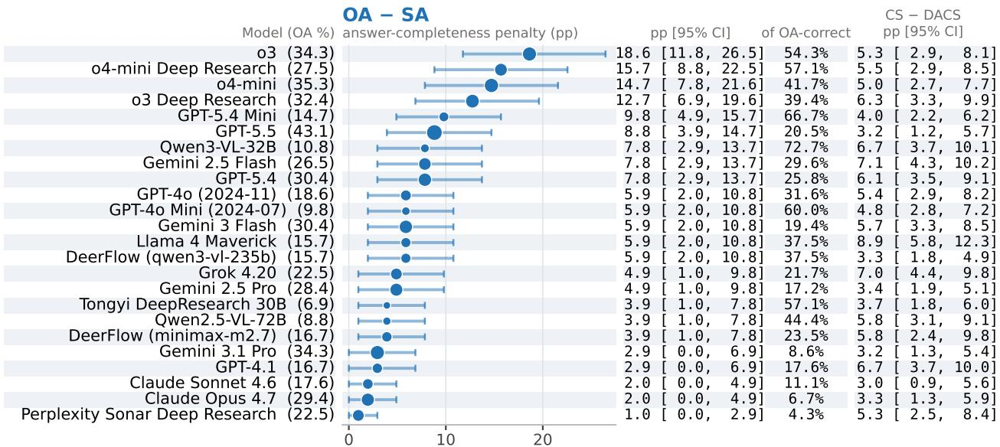  
Figure 11: Paired item-bootstrap intervals for the answer-completeness penalty OA−SA among systems with $\mathrm { O A } \geq 5 \%$ , ordered by the penalty itself. Each marker denotes a point estimate, and each line denotes the 95% percentile interval across 10000 resamples. Marker area is proportional to the system’s OA, which is printed after the model name and serves as the denominator when the penalty is expressed as a conditional share. The third column presents this conditional share among items with correct final answers. Because the gap is non-negative by construction, an interval reaching zero means that the penalty may be absent, not that its sign is uncertain. For the same systems, the rightmost column reports the dependency penalty CS−DACS (point estimate and 95% CI) as text rather than as a plotted panel because its intervals overlap too heavily to reveal separable diferences.

## E.3 Image Ablation: Cross-Judge Self-Evaluation Check

Because the ablation judge and the evaluated model share the same base model, we examine whether self-preference afects the measured image gain. We re-score every frozen ablation response using all 12 judges from 6 vendor families and independently recompute the gain under each judge (Table 12). OA, CS, and DACS increase under every judge in the pool (12, 12, and 12 out of 12, respectively). For DACS, the self-judge reports a 12.6-point gain, below the 15.0-point median across the 10 judges from other vendors. The reported DACS efect therefore lies at the low end of the cross-judge range. SA is less stable: only 7 of the 12 judges report a positive gain. This is consistent with the small number of items successful under this metric; accordingly, the conclusion about multimodality is based on OA, CS, and DACS.

Table 10: Inter-judge agreement on a family-stratified model subset: one representative per model family, selected as the family’s most recent flagship (OpenAI (gpt-5.5), Anthropic (claude-opus-4.7), Google (gemini-3.1-pro-preview), Qwen (qwen3-vl-32b-instruct), Meta (llama-4-maverick), Perplexity (sonar-deep-research), xAI (grok-4.20), Alibaba (tongyi-deepresearch-30b-a3b)), covering all 8 model families and all 102 items (all 8 categories) in the benchmark. Of 799 candidate (item, representative) cells with a real, non-empty response, 97 lack a verdict from at least one judge and are excluded, leaving a 702-cell grid evaluated against 12 judges (the reported judge, one additional Qwen judge, and the 10-member cross-vendor jury pool). Columns are numbered as the rows; lower triangle: raw agreement on final answer (OA); upper triangle: Cohen’s κ. Cell shading encodes magnitude (blue for OA over a fixed 95–100% range; orange for κ over a fixed 0.80–1.00 range; darker = higher agreement); exact values stay printed in every cell. A representative-selection sensitivity check (each family’s weakest member instead of its flagship) and bootstrap 95% CIs are reported in the accompanying macros.
<table><tr><td rowspan=1 colspan=5>Judge                              1    2    3    4</td><td rowspan=1 colspan=1>5</td><td rowspan=1 colspan=1>6</td><td rowspan=1 colspan=1>7</td><td rowspan=1 colspan=1>8</td><td rowspan=1 colspan=1>9</td><td rowspan=1 colspan=1>10</td><td rowspan=1 colspan=1>11</td><td rowspan=1 colspan=1>12</td></tr><tr><td rowspan=1 colspan=1>1. Qwen3-VL-235B (Qwen)</td><td rowspan=1 colspan=1></td><td rowspan=1 colspan=1>0.870</td><td rowspan=1 colspan=1>0.845</td><td rowspan=1 colspan=1>0.853</td><td rowspan=1 colspan=1>0.856</td><td rowspan=1 colspan=1>0.868</td><td rowspan=1 colspan=1>0.851</td><td rowspan=1 colspan=1>0.869</td><td rowspan=1 colspan=1>0.852</td><td rowspan=1 colspan=1>0.857</td><td rowspan=1 colspan=1>0.852</td><td rowspan=1 colspan=1>0.859</td></tr><tr><td rowspan=1 colspan=1>2. Qwen3.5-Flash (Qwen)</td><td rowspan=1 colspan=1>96.6</td><td rowspan=1 colspan=1></td><td rowspan=1 colspan=1>0.893</td><td rowspan=1 colspan=1>0.890</td><td rowspan=1 colspan=1>0.904</td><td rowspan=1 colspan=1>0.905</td><td rowspan=1 colspan=1>0.877</td><td rowspan=1 colspan=1>0.906</td><td rowspan=1 colspan=1>0.900</td><td rowspan=1 colspan=1>0.894</td><td rowspan=1 colspan=1>0.900</td><td rowspan=1 colspan=1>0.907</td></tr><tr><td rowspan=1 colspan=1>3. composer-2.5 (Cursor)</td><td rowspan=1 colspan=1>95.9</td><td rowspan=1 colspan=1>97.3</td><td rowspan=1 colspan=1></td><td rowspan=1 colspan=1>0.973</td><td rowspan=1 colspan=1>0.978</td><td rowspan=1 colspan=1>0.967</td><td rowspan=1 colspan=1>0.984</td><td rowspan=1 colspan=1>0.957</td><td rowspan=1 colspan=1>0.984</td><td rowspan=1 colspan=1>0.978</td><td rowspan=1 colspan=1>0.984</td><td rowspan=1 colspan=1>0.968</td></tr><tr><td rowspan=1 colspan=1>4. gemini-3.1-pro (Google)</td><td rowspan=1 colspan=1>96.0</td><td rowspan=1 colspan=1>97.2</td><td rowspan=1 colspan=1>99.3</td><td rowspan=1 colspan=1></td><td rowspan=1 colspan=1>0.973</td><td rowspan=1 colspan=1>0.973</td><td rowspan=1 colspan=1>0.968</td><td rowspan=1 colspan=1>0.941</td><td rowspan=1 colspan=1>0.979</td><td rowspan=1 colspan=1>0.984</td><td rowspan=1 colspan=1>0.979</td><td rowspan=1 colspan=1>0.974</td></tr><tr><td rowspan=1 colspan=1>5. gemini-3.5-flash (Google)</td><td rowspan=1 colspan=1>96.2</td><td rowspan=1 colspan=1>97.6</td><td rowspan=1 colspan=1>99.4</td><td rowspan=1 colspan=1>99.3</td><td rowspan=1 colspan=1></td><td rowspan=1 colspan=1>0.978</td><td rowspan=1 colspan=1>0.973</td><td rowspan=1 colspan=1>0.946</td><td rowspan=1 colspan=1>0.973</td><td rowspan=1 colspan=1>0.967</td><td rowspan=1 colspan=1>0.973</td><td rowspan=1 colspan=1>0.968</td></tr><tr><td rowspan=1 colspan=1>6. gemini-3.6-flash (Google)</td><td rowspan=1 colspan=1>96.4</td><td rowspan=1 colspan=1>97.6</td><td rowspan=1 colspan=1>99.1</td><td rowspan=1 colspan=1>99.3</td><td rowspan=1 colspan=1>99.4</td><td rowspan=1 colspan=1></td><td rowspan=1 colspan=1>0.973</td><td rowspan=1 colspan=1>0.935</td><td rowspan=1 colspan=1>0.984</td><td rowspan=1 colspan=1>0.967</td><td rowspan=1 colspan=1>0.973</td><td rowspan=1 colspan=1>0.979</td></tr><tr><td rowspan=1 colspan=1>7. glm-5.2 (Zhipu)</td><td rowspan=1 colspan=1>96.0</td><td rowspan=1 colspan=1>96.9</td><td rowspan=1 colspan=1>99.6</td><td rowspan=1 colspan=1>99.1</td><td rowspan=1 colspan=1>99.3</td><td rowspan=1 colspan=1>99.3</td><td rowspan=1 colspan=1></td><td rowspan=1 colspan=1>0.940</td><td rowspan=1 colspan=1>0.978</td><td rowspan=1 colspan=1>0.973</td><td rowspan=1 colspan=1>0.978</td><td rowspan=1 colspan=1>0.962</td></tr><tr><td rowspan=1 colspan=1>8. gpt-5.1 (OpenAI)</td><td rowspan=1 colspan=1>96.4</td><td rowspan=1 colspan=1>97.6</td><td rowspan=1 colspan=1>98.9</td><td rowspan=1 colspan=1>98.4</td><td rowspan=1 colspan=1>98.6</td><td rowspan=1 colspan=1>98.3</td><td rowspan=1 colspan=1>98.4</td><td rowspan=1 colspan=1></td><td rowspan=1 colspan=1>0.952</td><td rowspan=1 colspan=1>0.946</td><td rowspan=1 colspan=1>0.941</td><td rowspan=1 colspan=1>0.947</td></tr><tr><td rowspan=1 colspan=1>9. gpt-5.5 (OpenAI)</td><td rowspan=1 colspan=1>96.0</td><td rowspan=1 colspan=1>97.4</td><td rowspan=1 colspan=1>99.6</td><td rowspan=1 colspan=1>99.4</td><td rowspan=1 colspan=1>99.3</td><td rowspan=1 colspan=1>99.6</td><td rowspan=1 colspan=1>99.4</td><td rowspan=1 colspan=1>98.7</td><td rowspan=1 colspan=1></td><td rowspan=1 colspan=1>0.973</td><td rowspan=1 colspan=1>0.989</td><td rowspan=1 colspan=1>0.984</td></tr><tr><td rowspan=1 colspan=1>10. gpt-5.6-terra (OpenAI)</td><td rowspan=1 colspan=1>96.2</td><td rowspan=1 colspan=1>97.3</td><td rowspan=1 colspan=1>99.4</td><td rowspan=1 colspan=1>99.6</td><td rowspan=1 colspan=1>99.1</td><td rowspan=1 colspan=1>99.1</td><td rowspan=1 colspan=1>99.3</td><td rowspan=1 colspan=1>98.6</td><td rowspan=1 colspan=1>99.3</td><td rowspan=1 colspan=1></td><td rowspan=1 colspan=1>0.973</td><td rowspan=1 colspan=1>0.968</td></tr><tr><td rowspan=1 colspan=1>11. kimi-k2.7-code (Moonshot)</td><td rowspan=1 colspan=1>96.0</td><td rowspan=1 colspan=1>97.4</td><td rowspan=1 colspan=1>99.6</td><td rowspan=1 colspan=1>99.4</td><td rowspan=1 colspan=1>99.3</td><td rowspan=1 colspan=1>99.3</td><td rowspan=1 colspan=1>99.4</td><td rowspan=1 colspan=1>98.4</td><td rowspan=1 colspan=1>99.7</td><td rowspan=1 colspan=1>99.3</td><td rowspan=1 colspan=1></td><td rowspan=1 colspan=1>0.973</td></tr><tr><td rowspan=1 colspan=1>12. kimi-k3 (Moonshot)</td><td rowspan=1 colspan=1>96.2</td><td rowspan=1 colspan=1>97.6</td><td rowspan=1 colspan=1>99.1</td><td rowspan=1 colspan=1>99.3</td><td rowspan=1 colspan=1>99.1</td><td rowspan=1 colspan=1>99.4</td><td rowspan=1 colspan=1>99.0</td><td rowspan=1 colspan=1>98.6</td><td rowspan=1 colspan=1>99.6</td><td rowspan=1 colspan=1>99.1</td><td rowspan=1 colspan=1>99.3</td><td rowspan=1 colspan=1></td></tr></table>

Table 11: Each judge against the pooled verdict of 10 models scoring the same responses with the identical prompt. A response counts as correct for the pool only when at least 50% of the judges pass it. Judges inside the pool agree with it by construction; the informative rows are the two that are not.
<table><tr><td>Judge</td><td>In pool</td><td>OA agr.</td><td>OA κ</td><td>Step agr.</td><td>Step κ</td></tr><tr><td>Qwen3-VL-235B 3 (reported)</td><td>no</td><td>97.1</td><td>0.890</td><td>86.6</td><td>0.728</td></tr><tr><td>composer-2.5</td><td>yes</td><td>99.4</td><td>0.979</td><td>96.1</td><td>0.919</td></tr><tr><td>gemini-3.1-pro</td><td>yes</td><td>99.8</td><td>0.991</td><td>96.6</td><td>0.930</td></tr><tr><td>gemini-3.5-flash</td><td>yes</td><td>99.5</td><td>0.982</td><td>97.5</td><td>0.948</td></tr><tr><td>gemini-3.6-flash</td><td>yes</td><td>99.6</td><td>0.984</td><td>97.9</td><td>0.956</td></tr><tr><td>glm-5.2</td><td>yes</td><td>99.4</td><td>0.977</td><td>93.9</td><td>0.875</td></tr><tr><td>gpt-5.1</td><td>yes</td><td>99.0</td><td>0.963</td><td>96.4</td><td>0.926</td></tr><tr><td>gpt-5.5</td><td>yes</td><td>99.8</td><td>0.993</td><td>97.2</td><td>0.942</td></tr><tr><td>gpt-5.6-terra</td><td>yes</td><td>99.0</td><td>0.964</td><td>95.7</td><td>0.910</td></tr><tr><td>kimi-k2.7-code</td><td>yes</td><td>99.6</td><td>0.984</td><td>96.2</td><td>0.922</td></tr><tr><td>kimi-k3</td><td>yes</td><td>99.8</td><td>0.993</td><td>97.5</td><td>0.949</td></tr><tr><td>Qwen3.5-Flash</td><td>no</td><td>97.4</td><td>0.899</td><td>87.1</td><td>0.732</td></tr></table>

## F Split-Level Performance and Failure Diagnostics

This appendix reports complete split-level results by category, coarse authored-template label (Linear vs. Multi-branch), operation tag (Constraint, Symbolic, Numerical, and Temporal), checklist length, and source count. It also provides the protocol and full counts for the failure-mode analysis. Because operation tags are multi-label, the corresponding splits should not be interpreted as disjoint partitions.

Table 12: Robustness of the image−text gain to the choice of judge. The ablation responses are frozen; each row re-scores all of them with a diferent judge and recomputes the gain. The pool spans 6 vendor families and includes the subject model itself (†), whose verdicts produced the numbers in Figure 5. OA, CS and DACS gains are positive under every judge. The self-judge reports a smaller DACS gain than the cross-family median, placing the reported efect at the low end of the cross-judge range. SA is less stable because its base rate is a handful of items and single-verdict changes can flip its sign; the multimodality conclusion is therefore based on OA, CS, and DACS.
<table><tr><td>Judge</td><td>Family</td><td>OA</td><td>SA</td><td>CS</td><td>DACS</td></tr><tr><td>Qwen3-VL-235B†</td><td>Qwen</td><td>+3.9</td><td>+2.9</td><td>+12.4</td><td>+12.6</td></tr><tr><td>composer-2.5</td><td>Cursor</td><td>+3.9</td><td>0.0</td><td>+12.4</td><td>+15.9</td></tr><tr><td>gemini-3.1-pro</td><td>Google</td><td>+3.9</td><td>0.0</td><td>+12.0</td><td>+15.1</td></tr><tr><td>gemini-3.5-flash</td><td>Google</td><td>+3.9</td><td>+1.0</td><td>+12.1</td><td>+16.3</td></tr><tr><td>gemini-3.6-flash</td><td>Google</td><td>+4.9</td><td>+1.0</td><td>+12.0</td><td>+16.6</td></tr><tr><td>kimi-k2.7-code</td><td>Moonshot</td><td>+4.9</td><td>+1.0</td><td>+13.8</td><td>+16.0</td></tr><tr><td>kimi-k3</td><td>Moonshot</td><td>+3.9</td><td>0.0</td><td>+13.2</td><td>+14.9</td></tr><tr><td>gpt-5.1</td><td>OpenAI</td><td>+2.9</td><td>-1.0</td><td>+12.7</td><td>+12.5</td></tr><tr><td>gpt-5.5</td><td>OpenAI</td><td>+3.9</td><td>-1.0</td><td>+12.1</td><td>+13.7</td></tr><tr><td>gpt-5.6-terra</td><td>OpenAI</td><td>+3.9</td><td>+1.0</td><td>+10.4</td><td>+10.5</td></tr><tr><td>Qwen3.5-Flash</td><td>Qwen</td><td>+4.9</td><td>+2.0</td><td>+9.5</td><td>+7.3</td></tr><tr><td>glm-5.2</td><td>Zhipu</td><td>+4.9</td><td>+1.0</td><td>+13.2</td><td>+14.0</td></tr><tr><td colspan="2">Median, cross-family (n = 10)</td><td>+3.9</td><td>+0.5</td><td>+12.2</td><td>+15.0</td></tr><tr><td colspan="2">Judges with a positive gain</td><td>12/12</td><td>7/12</td><td>12/12</td><td>12/12</td></tr></table>

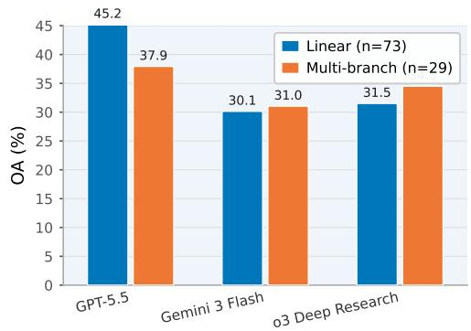

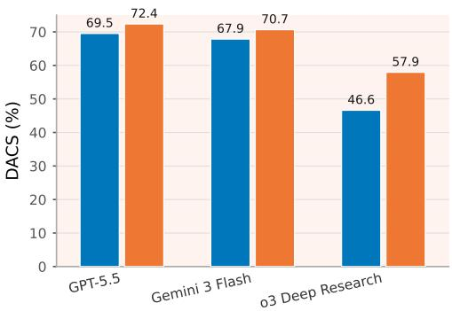  
Figure 12: Performance of representative models by coarse authored template. The bars compare OA and DACS for Linear- and Multi-branch-template items.

## F.1 Performance by Category

Table 13 reports complete results for all evaluated systems across the eight benchmark categories.

## F.2 Performance by Authored Template

We first partition Mr.LHDR items by their coarse authored-template labels. The evaluation set contains 73 Linear-template items, which account for 71.6% of the benchmark, and 29 Multi-branch-template items, which account for 28.4%. On average, Multi-branch-template items have slightly longer checklists: 12.8 steps, compared with 11.8 steps for Linear-template items. Although this diference is consistent with the Multi-branch template’s construction goal of combining multiple evidence routes, the label does not strictly determine the topology of an item’s verified DAG.

As shown in Figure 12, the authored-template split does not produce a uniform OA gap: GPT-5.5 is lower on Multi-branch-template items, whereas Gemini 3 Flash and o3 Deep Research are slightly higher. We interpret the split as a diagnostic rather than a standalone dificulty ranking or an exact partition of DAG topologies. Although the Linear- and Multi-branch-template subsets difer in graph topology on average, they also difer in category mix, source availability, and the positions of multimodal bridge steps. The relevant diagnostic signal is that the Multi-branch template tends to reveal whether an agent can maintain multiple partial conclusions until they are jointly needed, whereas the Linear template more directly tests whether an agent can avoid early drift along a predominantly sequential route.

<table><tr><td rowspan=1 colspan=17>Table 13: Model results by category. Metrics are percentages over the items in each split; failed, missing, and invalid responses count as zero.</td></tr><tr><td rowspan=1 colspan=17>Model                           academia         geography           media         organizations         people            society            sports          technologyOASACS DACSOASACS DACSOASACS DACSOASACS DACSOASACS DACSOA SACS DACSOA SACS DACSOASACS DACS</td></tr><tr><td rowspan=2 colspan=1>GPT-5.5GPT-5.4</td><td rowspan=1 colspan=2>60.0 50.0 79.1 72.5 35.3 17.671.0</td><td rowspan=1 colspan=4>68.7 52.4 42.975.8 74.4 53.8 46.2 76.5</td><td rowspan=1 colspan=4>71.250.0 41.774.9 69.0 40.0 3</td><td rowspan=1 colspan=1>0.0 86.1</td><td rowspan=1 colspan=2>81.1 22.222.2 53.7</td><td rowspan=1 colspan=1>53.7 20.0 2</td><td rowspan=1 colspan=2>0.0 67.8 66.9</td></tr><tr><td rowspan=1 colspan=1>30.020.0 66.4</td><td rowspan=1 colspan=1>59.123.5 23.572.7</td><td rowspan=1 colspan=1>71.7</td><td rowspan=1 colspan=1>42.9 23.871.9</td><td rowspan=1 colspan=1>60.730.8</td><td rowspan=1 colspan=1>30.876.2</td><td rowspan=1 colspan=3>73.233.3 25.0 62.0 48.4</td><td rowspan=1 colspan=1>50.0</td><td rowspan=1 colspan=1>30.0 81.7</td><td rowspan=1 colspan=1>72.711.1</td><td rowspan=1 colspan=1>11.157.1</td><td rowspan=1 colspan=1>57.110.010.0</td><td rowspan=1 colspan=1>67.3</td><td rowspan=1 colspan=1>66.3</td></tr><tr><td rowspan=1 colspan=1>GPT-5.4 Mini</td><td rowspan=1 colspan=1>20.0 20.0 38.8</td><td rowspan=1 colspan=1>30.85.90.017.6</td><td rowspan=1 colspan=1>13.1</td><td rowspan=1 colspan=1>14.30.020.0</td><td rowspan=1 colspan=1>15.615.4</td><td rowspan=1 colspan=1>0.0 32.3</td><td rowspan=1 colspan=3>26.38.38.3 17.2 16.4</td><td rowspan=1 colspan=1>30.0</td><td rowspan=1 colspan=1>10.042.7</td><td rowspan=1 colspan=1>39.711.1</td><td rowspan=1 colspan=1>0.013.9</td><td rowspan=1 colspan=1>11.1 20.01</td><td rowspan=1 colspan=1>0.026.3</td><td rowspan=1 colspan=1>24.5</td></tr><tr><td rowspan=1 colspan=1>o4-mini</td><td rowspan=1 colspan=1>50.0 20.0 63.6</td><td rowspan=1 colspan=1>45.3 29.4 17.6 43.8</td><td rowspan=1 colspan=1>41.3</td><td rowspan=1 colspan=1>52.7</td><td rowspan=1 colspan=1>45.830.8315.4</td><td rowspan=1 colspan=1>43.1</td><td rowspan=1 colspan=3>34.641.733.3 47.6 46.8</td><td rowspan=1 colspan=1>40.020.0</td><td rowspan=1 colspan=1>64.5</td><td rowspan=1 colspan=1>63.5 22.2</td><td rowspan=1 colspan=1>22.2 46.3</td><td rowspan=1 colspan=1>46.310.0</td><td rowspan=1 colspan=1>10.040.9</td><td rowspan=1 colspan=1>40.0</td></tr><tr><td rowspan=1 colspan=1>GPT-4.1</td><td rowspan=1 colspan=1>20.020.028.7</td><td rowspan=1 colspan=1>28.75.95.945.9</td><td rowspan=1 colspan=1>42.1</td><td rowspan=1 colspan=1>38.133..359.3</td><td rowspan=1 colspan=1>51.70.0</td><td rowspan=1 colspan=1>0.048.2</td><td rowspan=1 colspan=2>38.016.7 8.347.2</td><td rowspan=1 colspan=2>32.020.0</td><td rowspan=1 colspan=2>10.053.5 48.511.1</td><td rowspan=1 colspan=1>11.146.8</td><td rowspan=1 colspan=1>43.910.01</td><td rowspan=1 colspan=1>0.047.4</td><td rowspan=1 colspan=1>41.1</td></tr><tr><td rowspan=1 colspan=1>GPT-4o Mini (2024-07)</td><td rowspan=1 colspan=1>20.0 20.0 25.9</td><td rowspan=1 colspan=1>20.011.85.924.6</td><td rowspan=1 colspan=1>16.8</td><td rowspan=1 colspan=1>9.54.819.1</td><td rowspan=1 colspan=2>15.67.7 0.0 12.6</td><td rowspan=1 colspan=2>11.38.30.03.8</td><td rowspan=1 colspan=2>0.00.0</td><td rowspan=1 colspan=2>0.0 20.9 18.4 11.1</td><td rowspan=1 colspan=1>0.0 30.6</td><td rowspan=1 colspan=1>16.2 10.0</td><td rowspan=1 colspan=1>0.017.0</td><td rowspan=1 colspan=1>16.0</td></tr><tr><td rowspan=1 colspan=1>Claude Opus 4.7</td><td rowspan=1 colspan=1>50.0 30.0 71.5</td><td rowspan=1 colspan=1>69.5 23.523.566.1</td><td rowspan=1 colspan=1>62.8</td><td rowspan=1 colspan=1>52.4 52.483.0</td><td rowspan=1 colspan=2>77.623.123.164.8</td><td rowspan=1 colspan=2>62.733.333.364.9</td><td rowspan=1 colspan=2>64.3 20.0</td><td rowspan=1 colspan=1>20.082.3</td><td rowspan=1 colspan=1>72.30.0</td><td rowspan=1 colspan=1>0.0 52.5</td><td rowspan=1 colspan=1>50.410.0</td><td rowspan=1 colspan=1>10.054.9</td><td rowspan=1 colspan=1>54.9</td></tr><tr><td rowspan=1 colspan=1>Claude Sonnet 4.6</td><td rowspan=1 colspan=1>30.0 30.0 70.3</td><td rowspan=1 colspan=1>68.25.95.960.5</td><td rowspan=1 colspan=2>60.5 19.0 14.375.2</td><td rowspan=1 colspan=4>69.815.4 15.4 61.6 55.6 25.0 16.751.8</td><td rowspan=1 colspan=2>45.7 30.0</td><td rowspan=1 colspan=1>30.0 74.2</td><td rowspan=1 colspan=1>74.2 11.111.1</td><td rowspan=1 colspan=1>59.9</td><td rowspan=1 colspan=1>59.3 10.01</td><td rowspan=1 colspan=1>0.056.1</td><td rowspan=1 colspan=1>54.7</td></tr><tr><td rowspan=1 colspan=1>Grok 4.20</td><td rowspan=1 colspan=1>50.0 40.0 68.2</td><td rowspan=1 colspan=1>67.5 11.8 11.8 68.8</td><td rowspan=1 colspan=1>61.2 2</td><td rowspan=1 colspan=1>8.6 28.6 70.6</td><td rowspan=1 colspan=2>62.5 30.8 15.4 73.9</td><td rowspan=1 colspan=2>62.7 25.0 16.7 63.7</td><td rowspan=1 colspan=2>58.5 20.0 2</td><td rowspan=1 colspan=1>0.0 80.6</td><td rowspan=1 colspan=1>74.0 11.1</td><td rowspan=1 colspan=1>0.0 53.3</td><td rowspan=1 colspan=1>45.00.00.0</td><td rowspan=1 colspan=1>72.6</td><td rowspan=1 colspan=1>67.3</td></tr><tr><td rowspan=1 colspan=1>Gemini 3.1 Pro</td><td rowspan=1 colspan=1>50.050.076.5</td><td rowspan=1 colspan=1>76.529.4 29.468.0</td><td rowspan=1 colspan=1>65.4 4</td><td rowspan=1 colspan=1>2.9 38.170.6</td><td rowspan=1 colspan=2>67.5 38.538.577.5</td><td rowspan=1 colspan=2>74.0 33.3 25.080.7</td><td rowspan=1 colspan=2>73.740.0</td><td rowspan=1 colspan=1>40.086.0</td><td rowspan=1 colspan=1>81.8 22.2</td><td rowspan=1 colspan=1>11.158.0</td><td rowspan=1 colspan=1>57.010.0</td><td rowspan=1 colspan=1>10.070.8</td><td rowspan=1 colspan=1>67.2</td></tr><tr><td rowspan=1 colspan=1>Gemini 2.5 Pro</td><td rowspan=1 colspan=1>40.0 30.0 70.5</td><td rowspan=1 colspan=1>63.2 17.6 17.6 67.6</td><td rowspan=1 colspan=1>65.3 4</td><td rowspan=1 colspan=1>7.6 33.379.8</td><td rowspan=1 colspan=1>75.3 15.4</td><td rowspan=1 colspan=1>15.4 66.9</td><td rowspan=1 colspan=2>62.4 25.0 25.0 76.4</td><td rowspan=1 colspan=2>75.840.04</td><td rowspan=1 colspan=1>0.085.6</td><td rowspan=1 colspan=1>83.1 11.111.1</td><td rowspan=1 colspan=1>61.9</td><td rowspan=1 colspan=1>59.7 20.01</td><td rowspan=1 colspan=1>0.071.7</td><td rowspan=1 colspan=1>69.1</td></tr><tr><td rowspan=1 colspan=1>Gemini 2.5 Flash</td><td rowspan=1 colspan=1>50.0 40.0 71.0</td><td rowspan=1 colspan=1>55.0 23.5 17.6 68.1</td><td rowspan=1 colspan=1>64.4</td><td rowspan=1 colspan=1>33.3 23.864.3</td><td rowspan=1 colspan=1>58.023.11</td><td rowspan=1 colspan=1>5.466.0</td><td rowspan=1 colspan=2>59.0 25.0 16.7 67.9</td><td rowspan=1 colspan=2>58.240.0</td><td rowspan=1 colspan=1>20.077.7</td><td rowspan=1 colspan=1>67.50.0</td><td rowspan=1 colspan=1>0.0 49.8</td><td rowspan=1 colspan=1>45.710.01</td><td rowspan=1 colspan=1>0.051.6</td><td rowspan=1 colspan=1>49.8</td></tr><tr><td rowspan=1 colspan=1>Llama 4 Maverick</td><td rowspan=1 colspan=1>40.040.048.6</td><td rowspan=1 colspan=1>46.65.95.9 42.3</td><td rowspan=1 colspan=1>28.7</td><td rowspan=1 colspan=1>23.814.341.3</td><td rowspan=1 colspan=1>33.615.4</td><td rowspan=1 colspan=1>0.0 55.8</td><td rowspan=1 colspan=1>40.916.7</td><td rowspan=1 colspan=1>8.3 45.2</td><td rowspan=1 colspan=2>36.1 20.0</td><td rowspan=1 colspan=1>10.056.4</td><td rowspan=1 colspan=1>45.80.0</td><td rowspan=1 colspan=1>0.044.8</td><td rowspan=1 colspan=1>41.10.0</td><td rowspan=1 colspan=1>0.0 45.7</td><td rowspan=1 colspan=1>40.3</td></tr><tr><td rowspan=1 colspan=1>Qwen3-VL-32B</td><td rowspan=1 colspan=1>20.010.0 41.8</td><td rowspan=1 colspan=1>38.85.90.0 20.4</td><td rowspan=1 colspan=1>9.01</td><td rowspan=1 colspan=1>9.04.838.0</td><td rowspan=1 colspan=1>31.5 15.4</td><td rowspan=1 colspan=1>0.0 42.3</td><td rowspan=1 colspan=1>35.4 16.7</td><td rowspan=1 colspan=1>8.3 34.4</td><td rowspan=1 colspan=2>28.70.0</td><td rowspan=1 colspan=1>0.0 47.1</td><td rowspan=1 colspan=1>45.50.0</td><td rowspan=1 colspan=1>0.0 30.2</td><td rowspan=1 colspan=1>14.00.0</td><td rowspan=1 colspan=1>0.0 37.0</td><td rowspan=1 colspan=1>37.0</td></tr><tr><td rowspan=1 colspan=1>Qwen2.5-VL-72B</td><td rowspan=1 colspan=1>20.0 10.0 38.1</td><td rowspan=1 colspan=1>30.45.90.0 34.5</td><td rowspan=1 colspan=1>24.3</td><td rowspan=1 colspan=1>14.39.5 39.1</td><td rowspan=1 colspan=1>34.87.7</td><td rowspan=1 colspan=1>7.7 45.7</td><td rowspan=1 colspan=1>42.20.0</td><td rowspan=1 colspan=1>0.0 37.1</td><td rowspan=1 colspan=1>26.3</td><td rowspan=1 colspan=1>0.0</td><td rowspan=1 colspan=1>0.0 46.0</td><td rowspan=1 colspan=1>42.011.1</td><td rowspan=1 colspan=1>0.0 35.7</td><td rowspan=1 colspan=1>31.1 10.01</td><td rowspan=1 colspan=1>0.039.3</td><td rowspan=1 colspan=1>39.3</td></tr><tr><td rowspan=1 colspan=1>o4-mini Deep Research</td><td rowspan=1 colspan=1>30.0 10.0 26.9</td><td rowspan=1 colspan=1>16.0 29.45.9 32.8</td><td rowspan=1 colspan=1>30.4</td><td rowspan=1 colspan=1>42.9 19.046.7</td><td rowspan=1 colspan=1>35.7 30.8</td><td rowspan=1 colspan=1>7.7 38.3</td><td rowspan=1 colspan=1>33.316.7</td><td rowspan=1 colspan=1>8.3 27.0</td><td rowspan=1 colspan=1>20.8</td><td rowspan=1 colspan=1>20.0 2</td><td rowspan=1 colspan=1>0.0 57.4</td><td rowspan=1 colspan=1>57.4 11.1</td><td rowspan=1 colspan=1>11.1 34.8</td><td rowspan=1 colspan=1>34.8 20.0 1</td><td rowspan=1 colspan=1>0.036.3</td><td rowspan=1 colspan=1>31.7</td></tr><tr><td rowspan=1 colspan=1>Tongyi DeepResearch 30B</td><td rowspan=1 colspan=1>20.010.018.4</td><td rowspan=1 colspan=1>16.40.00.014.8</td><td rowspan=1 colspan=1>14.81</td><td rowspan=1 colspan=1>9.09.520.2</td><td rowspan=1 colspan=1>16.60.0</td><td rowspan=1 colspan=1>0.0 25.1</td><td rowspan=1 colspan=1>16.80.0</td><td rowspan=1 colspan=1>0.0 24.4</td><td rowspan=1 colspan=1>15.2</td><td rowspan=1 colspan=1>0.0</td><td rowspan=1 colspan=1>0.0 37.9</td><td rowspan=1 colspan=1>34.6 11.1</td><td rowspan=1 colspan=1>0.012.4</td><td rowspan=1 colspan=1>8.70.0</td><td rowspan=1 colspan=1>0.0 35.2</td><td rowspan=1 colspan=1>35.2</td></tr><tr><td rowspan=1 colspan=1>Perplexity Sonar Deep Research</td><td rowspan=1 colspan=1>10.010.022.6</td><td rowspan=1 colspan=1>22.623.523.5 39.3</td><td rowspan=1 colspan=1>39.3</td><td rowspan=1 colspan=1>28.6 28.646.1</td><td rowspan=1 colspan=1>43.530.8</td><td rowspan=1 colspan=1>30.852.6</td><td rowspan=1 colspan=2>40.825.0 25.0 39.2</td><td rowspan=1 colspan=2>28.840.0</td><td rowspan=1 colspan=1>40.070.9</td><td rowspan=1 colspan=1>67.60.0</td><td rowspan=1 colspan=1>0.0 28.9</td><td rowspan=1 colspan=1>19.3 10.0</td><td rowspan=1 colspan=2>0.0 35.1  26.3</td></tr><tr><td rowspan=1 colspan=1>DeerFlow (kimi-k2.5)</td><td rowspan=1 colspan=1>20.0 20.0 20.0</td><td rowspan=1 colspan=1>20.00.00.01.8</td><td rowspan=1 colspan=1>0.0</td><td rowspan=1 colspan=1>4.8 4.8 4.8</td><td rowspan=1 colspan=1>4.80.0</td><td rowspan=1 colspan=1>0.00.0</td><td rowspan=1 colspan=2>0.08.38.38.3</td><td rowspan=1 colspan=2>8.30.0</td><td rowspan=1 colspan=1>0.00.0</td><td rowspan=1 colspan=1>0.00.0</td><td rowspan=1 colspan=1>0.0 15.4</td><td rowspan=1 colspan=1>15.40.0</td><td rowspan=1 colspan=1>0.00.0</td><td rowspan=1 colspan=1>0.0</td></tr><tr><td rowspan=1 colspan=1>DeerFlow (minimax-m2.7)</td><td rowspan=1 colspan=2>40.030.042.4 40.45.90.0 27.6</td><td rowspan=1 colspan=1>17.7</td><td rowspan=1 colspan=1>33.328.643.6</td><td rowspan=1 colspan=1>43.615.4 1</td><td rowspan=1 colspan=1>5.4 38.5</td><td rowspan=1 colspan=2>27.08.38.3 33.3</td><td rowspan=1 colspan=2>26.210.0</td><td rowspan=1 colspan=1>0.0 53.3</td><td rowspan=1 colspan=2>46.50.00.016.0</td><td rowspan=1 colspan=1>16.010.01</td><td rowspan=1 colspan=1>0.039.5</td><td rowspan=1 colspan=1>29.5</td></tr><tr><td rowspan=1 colspan=1>DeerFlow (qwen3-vl-235b)</td><td rowspan=1 colspan=2>40.0 30.0 59.8 57.75.95.9 36.0</td><td rowspan=1 colspan=1>30.9</td><td rowspan=1 colspan=1>28.614.345.3</td><td rowspan=1 colspan=2>40.7 7.77.749.2</td><td rowspan=1 colspan=2>47.916.78.3 43.1</td><td rowspan=1 colspan=2>37.310.0</td><td rowspan=1 colspan=1>0.0 41.4</td><td rowspan=1 colspan=2>37.80.00.0 34.2</td><td rowspan=1 colspan=1>33.3 10.01</td><td rowspan=1 colspan=1>0.021.7</td><td rowspan=1 colspan=1>21.7</td></tr></table>

Table 14: Model results by coarse authored template. Metrics are percentages over the items in each split; failed, missing, and invalid responses count as zero.
<table><tr><td rowspan=1 colspan=12>Model                                Linear          Multi-branchOASA CSDACSOASA CSDACS</td></tr><tr><td rowspan=1 colspan=12>GPT-5.5                      45.2 35.6 73.6  69.5 37.9 31.0 73.6- 72.4</td></tr><tr><td rowspan=1 colspan=7>GPT-5.4                      32.9 23.3 71.3  65.3</td><td rowspan=1 colspan=1>24.1</td><td rowspan=1 colspan=1>20.7</td><td rowspan=1 colspan=3>66.9 60.5</td></tr><tr><td rowspan=1 colspan=4>GPT-5.4 Mini                 12.31.4</td><td rowspan=1 colspan=3>20.9  17.1</td><td rowspan=1 colspan=1>20.7</td><td rowspan=1 colspan=1>13.8</td><td rowspan=1 colspan=3>35.2 30.8</td></tr><tr><td rowspan=1 colspan=4>o4-mini                       32.9 19.2</td><td rowspan=1 colspan=3>47.2  42.9</td><td rowspan=1 colspan=1>41.4</td><td rowspan=1 colspan=1>24.1</td><td rowspan=1 colspan=3>56.7  49.9</td></tr><tr><td rowspan=1 colspan=3>GPT-4.1                       12.3</td><td rowspan=1 colspan=1>9.6</td><td rowspan=1 colspan=3>46.0  38.0</td><td rowspan=1 colspan=1>27.6</td><td rowspan=1 colspan=1>24.1</td><td rowspan=1 colspan=3>54.3  51.0</td></tr><tr><td rowspan=1 colspan=3>GPT-4o (2024-11)             16.4</td><td rowspan=1 colspan=1>9.6</td><td rowspan=1 colspan=3>36.8  31.4</td><td rowspan=1 colspan=1>24.1</td><td rowspan=1 colspan=1>20.7</td><td rowspan=1 colspan=3>57.2 52.0</td></tr><tr><td rowspan=1 colspan=3>GPT-4o Mini (2024-07)         6.8</td><td rowspan=1 colspan=1>0.0</td><td rowspan=1 colspan=1>11.8</td><td rowspan=1 colspan=2>7.5</td><td rowspan=1 colspan=1>17.2</td><td rowspan=1 colspan=1>13.8</td><td rowspan=1 colspan=3>37.2 31.1</td></tr><tr><td rowspan=1 colspan=3>03                            34.2</td><td rowspan=1 colspan=1>12.3</td><td rowspan=1 colspan=1>35.9</td><td rowspan=1 colspan=2>29.4</td><td rowspan=1 colspan=1>34.5</td><td rowspan=1 colspan=1>24.1</td><td rowspan=1 colspan=3>48.2 45.7</td></tr><tr><td rowspan=1 colspan=3>Claude Opus 4.7               30.1</td><td rowspan=1 colspan=1>28.8</td><td rowspan=1 colspan=1>70.0</td><td rowspan=1 colspan=2>66.3</td><td rowspan=1 colspan=1>27.6</td><td rowspan=1 colspan=1>24.1</td><td rowspan=1 colspan=3>66.8 64.3</td></tr><tr><td rowspan=1 colspan=2>Claude Sonnet 4.6</td><td rowspan=1 colspan=1>13.7</td><td rowspan=1 colspan=1>11.0</td><td rowspan=1 colspan=1>62.9</td><td rowspan=1 colspan=1></td><td rowspan=1 colspan=1>59.1</td><td rowspan=1 colspan=1>27.6</td><td rowspan=1 colspan=1>27.6</td><td rowspan=1 colspan=1>68.4</td><td rowspan=1 colspan=2>67.5</td></tr><tr><td rowspan=1 colspan=2>Grok 4.20</td><td rowspan=1 colspan=1>20.5</td><td rowspan=1 colspan=1>15.1</td><td rowspan=1 colspan=1>71.4</td><td rowspan=1 colspan=1></td><td rowspan=1 colspan=1>63.6</td><td rowspan=1 colspan=1>27.6</td><td rowspan=1 colspan=1>24.1</td><td rowspan=1 colspan=1>64.2</td><td rowspan=1 colspan=2>59.2</td></tr><tr><td rowspan=1 colspan=2>Gemini 3.1 Pro</td><td rowspan=1 colspan=1>32.9</td><td rowspan=1 colspan=1>30.1</td><td rowspan=1 colspan=1>73.6</td><td rowspan=1 colspan=1></td><td rowspan=1 colspan=1>69.4</td><td rowspan=1 colspan=1>37.9</td><td rowspan=1 colspan=1>34.5</td><td rowspan=1 colspan=1>72.3</td><td rowspan=1 colspan=2>71.7</td></tr><tr><td rowspan=1 colspan=2>Gemini 3 Flash</td><td rowspan=1 colspan=1>30.1</td><td rowspan=1 colspan=1>23.3</td><td rowspan=1 colspan=1>74.6</td><td rowspan=1 colspan=1></td><td rowspan=1 colspan=1>67.9</td><td rowspan=1 colspan=1>31.0</td><td rowspan=1 colspan=1>27.6</td><td rowspan=1 colspan=1>73.7</td><td rowspan=1 colspan=2>70.7</td></tr><tr><td rowspan=1 colspan=2>Gemini 2.5 Pro</td><td rowspan=1 colspan=1>26.0</td><td rowspan=1 colspan=1>20.5</td><td rowspan=1 colspan=1>73.4</td><td rowspan=1 colspan=1></td><td rowspan=1 colspan=1>70.0</td><td rowspan=1 colspan=1>34.5</td><td rowspan=1 colspan=1>31.0</td><td rowspan=1 colspan=1>72.0</td><td rowspan=1 colspan=1></td><td rowspan=1 colspan=1>68.8</td></tr><tr><td rowspan=1 colspan=2>Gemini 2.5 Flash</td><td rowspan=1 colspan=1>23.3</td><td rowspan=1 colspan=1>17.8</td><td rowspan=1 colspan=1>63.7</td><td rowspan=1 colspan=1></td><td rowspan=1 colspan=1>55.6</td><td rowspan=1 colspan=1>34.5</td><td rowspan=1 colspan=1>20.7</td><td rowspan=1 colspan=1>68.3</td><td rowspan=1 colspan=1></td><td rowspan=1 colspan=1>63.9</td></tr><tr><td rowspan=1 colspan=2>Llama 4 Maverick</td><td rowspan=1 colspan=1>11.0</td><td rowspan=1 colspan=1>5.5</td><td rowspan=1 colspan=1>43.1</td><td rowspan=1 colspan=1></td><td rowspan=1 colspan=1>32.0</td><td rowspan=1 colspan=1>27.6</td><td rowspan=1 colspan=1>20.7</td><td rowspan=1 colspan=1>55.9</td><td></td><td rowspan=1 colspan=1>52.4</td></tr><tr><td rowspan=1 colspan=2>Qwen3-VL-32B</td><td rowspan=1 colspan=1>9.6</td><td rowspan=1 colspan=1>2.7</td><td rowspan=1 colspan=1>32.1</td><td rowspan=1 colspan=1></td><td rowspan=1 colspan=1>27.2</td><td rowspan=1 colspan=1>13.8</td><td rowspan=1 colspan=1>3.4</td><td rowspan=1 colspan=1>44.7</td><td></td><td rowspan=1 colspan=1>33.5</td></tr><tr><td rowspan=1 colspan=2>Qwen2.5-VL-72B</td><td rowspan=1 colspan=1>5.5</td><td rowspan=1 colspan=1>4.1</td><td rowspan=1 colspan=1>34.6</td><td rowspan=1 colspan=1></td><td rowspan=1 colspan=1>29.3</td><td rowspan=1 colspan=1>17.2</td><td rowspan=1 colspan=1>6.95</td><td rowspan=1 colspan=1>0.8</td><td></td><td rowspan=1 colspan=1>43.7</td></tr><tr><td rowspan=1 colspan=2>o3 Deep Research</td><td rowspan=1 colspan=1>31.5</td><td rowspan=1 colspan=1>17.8</td><td rowspan=1 colspan=1>54.3</td><td rowspan=1 colspan=1></td><td rowspan=1 colspan=1>46.6</td><td rowspan=1 colspan=1>34.5</td><td rowspan=1 colspan=1>24.1</td><td rowspan=1 colspan=1>60.5</td><td></td><td rowspan=1 colspan=1>57.9</td></tr><tr><td rowspan=1 colspan=2>o4-mini Deep Research</td><td rowspan=1 colspan=1>27.4</td><td rowspan=1 colspan=1>8.2</td><td rowspan=1 colspan=1>32.3</td><td rowspan=1 colspan=1></td><td rowspan=1 colspan=1>26.0</td><td rowspan=1 colspan=1>27.6</td><td rowspan=1 colspan=1>20.7</td><td rowspan=1 colspan=1>52.4</td><td rowspan=1 colspan=2>48.9</td></tr><tr><td rowspan=2 colspan=2>Tongyi DeepResearch 30BPerplexity Sonar Deep Research</td><td rowspan=1 colspan=1>6.8</td><td rowspan=1 colspan=1>1.4</td><td rowspan=1 colspan=1>18.7</td><td rowspan=1 colspan=2>14.4</td><td rowspan=1 colspan=1>6.9</td><td rowspan=1 colspan=1>6.9</td><td rowspan=1 colspan=1>33.0</td><td rowspan=1 colspan=2>30.6</td></tr><tr><td rowspan=1 colspan=1>23.3</td><td rowspan=1 colspan=1>23.3</td><td rowspan=1 colspan=3>44.1  38.4</td><td rowspan=1 colspan=1>20.7</td><td rowspan=1 colspan=1>17.2</td><td rowspan=1 colspan=1>38.4</td><td rowspan=1 colspan=2>34.1</td></tr><tr><td rowspan=3 colspan=2>DeerFlow (kimi-k2.5)DeerFlow(minimax-m2.7)DeerFlow(qwen3-vl-235b)</td><td rowspan=1 colspan=1>1.4</td><td rowspan=1 colspan=1>1.4</td><td rowspan=1 colspan=3>1.8   1.4</td><td rowspan=1 colspan=1>10.3</td><td rowspan=1 colspan=1>10.3</td><td rowspan=1 colspan=1>15.1</td><td rowspan=1 colspan=2>15.1</td></tr><tr><td rowspan=1 colspan=1></td><td rowspan=1 colspan=1>12.3</td><td rowspan=1 colspan=1>9.6</td><td rowspan=1 colspan=3>32.9 26.3</td><td rowspan=1 colspan=1>27.6</td><td rowspan=1 colspan=1>20.7</td><td rowspan=1 colspan=3>47.5  43.9</td></tr><tr><td rowspan=1 colspan=2>12.3</td><td rowspan=1 colspan=1>5.5</td><td rowspan=1 colspan=3>34.4 30.7</td><td rowspan=1 colspan=1>24.1</td><td rowspan=1 colspan=1>20.7</td><td rowspan=1 colspan=3>60.4 58.0</td></tr></table>

Table 14 extends this comparison to all evaluated systems.

## F.3 Performance by Operation Tag

Table 15 reports complete results by operation tag. Because the tags are multi-label, these columns describe overlapping subsets rather than a partition of the evaluation set.

## F.4 Performance by Checklist Length

The main checklist-length analysis appears in Section 4.3.2; Table 16 reports the complete results, including the small tail bins.

The 16–18 and 19+ checklist-length buckets contain only 6 and 4 items, respectively. A single item can therefore change these cells by tens of percentage points, and a system can obtain high DACS without solving any items. Consequently, per-split orderings cannot establish that the longest checklist ranges are easier. The dificulty trend reported in Section 4.3.2 instead uses the better-populated ranges, where individual items do not dominate the estimate.

## F.5 Performance by Source Count

Table 17 reports complete results by source-count bucket. Source count describes annotated evidence availability, not the number of browsing actions taken by a system or the amount of evidence it actually uses.

Table 15: Model results by operation tag. Operation tags are multi-label, so split counts do not sum to 102 items. Metrics are percentages over the tagged items; failed, missing, and invalid responses count as zero.
<table><tr><td rowspan=1 colspan=17>Model                              Constraint          Numerical          Symbolic           TemporalOASA CSDACSOASA CSDACSOASA CSDACSOASA CSDACS</td></tr><tr><td rowspan=1 colspan=6>GPT-5.5                      42.132.970.1  65.756.7</td><td rowspan=1 colspan=3>40.079.1  74.7</td><td rowspan=1 colspan=1>46.9</td><td rowspan=1 colspan=7>37.074.7  72.150.044.4 74.5 71.9</td></tr><tr><td rowspan=1 colspan=2>GPT-5.4                      34.2</td><td rowspan=1 colspan=3>26.367.5  60.7</td><td rowspan=1 colspan=1>30.0</td><td rowspan=1 colspan=1>23.3</td><td rowspan=1 colspan=2>65.1 62.5</td><td rowspan=1 colspan=1>34.6 2</td><td rowspan=1 colspan=3>5.9 71.6  65.7</td><td rowspan=1 colspan=1>22.2</td><td rowspan=1 colspan=1>22.2</td><td rowspan=1 colspan=2>57.5  51.3</td></tr><tr><td rowspan=1 colspan=2>GPT-5.4 Mini                 15.8</td><td rowspan=1 colspan=3>6.626.2  22.1</td><td rowspan=1 colspan=1>10.0</td><td rowspan=1 colspan=1>6.7</td><td rowspan=1 colspan=2>31.6  28.8</td><td rowspan=1 colspan=1>16.0</td><td rowspan=1 colspan=3>4.9 23.9  19.6</td><td rowspan=1 colspan=1>11.1</td><td rowspan=1 colspan=1>5.6</td><td rowspan=1 colspan=2>21.2  19.8</td></tr><tr><td rowspan=1 colspan=2>o4-mini                       36.8</td><td rowspan=1 colspan=3>23.752.9  48.4</td><td rowspan=1 colspan=1>43.3</td><td rowspan=1 colspan=1>26.7</td><td rowspan=1 colspan=2>58.8  50.0</td><td rowspan=1 colspan=1>35.8</td><td rowspan=1 colspan=3>22.249.8  45.8</td><td rowspan=1 colspan=1>50.0</td><td rowspan=1 colspan=1>33.3</td><td rowspan=1 colspan=2>59.5  48.3</td></tr><tr><td rowspan=1 colspan=1>GPT-4.1</td><td rowspan=1 colspan=4>17.113.248.2</td><td rowspan=1 colspan=1>20.0</td><td rowspan=1 colspan=1>13.3</td><td rowspan=1 colspan=2>46.8 40.7</td><td rowspan=1 colspan=1>16.0</td><td rowspan=1 colspan=2>13.6 50.7</td><td rowspan=1 colspan=1>43.7</td><td rowspan=1 colspan=1>22.2</td><td rowspan=1 colspan=1>22.2</td><td rowspan=1 colspan=1>50.0</td><td rowspan=1 colspan=1>45.7</td></tr><tr><td rowspan=1 colspan=1>GPT-4o (2024-11)</td><td rowspan=1 colspan=1>18.4</td><td rowspan=1 colspan=3>13.243.1  37.3</td><td rowspan=1 colspan=1>16.7</td><td rowspan=1 colspan=1>13.3</td><td rowspan=1 colspan=2>47.6 42.5</td><td rowspan=1 colspan=1>19.8</td><td rowspan=1 colspan=1>13.64</td><td rowspan=1 colspan=1>4.2</td><td rowspan=1 colspan=1>37.9</td><td rowspan=1 colspan=1>22.2</td><td rowspan=1 colspan=1>16.7</td><td rowspan=1 colspan=1>50.7</td><td rowspan=1 colspan=1>42.1</td></tr><tr><td rowspan=1 colspan=1>GPT-4o Mini (2024-07)</td><td rowspan=1 colspan=1>9.2</td><td rowspan=1 colspan=3>3.9 19.2  14.4</td><td rowspan=1 colspan=1>16.7</td><td rowspan=1 colspan=1>10.0</td><td rowspan=1 colspan=2>29.9  22.2</td><td rowspan=1 colspan=1>9.9</td><td rowspan=1 colspan=1>3.7</td><td rowspan=1 colspan=1>17.2</td><td rowspan=1 colspan=1>12.3</td><td rowspan=1 colspan=1>16.7</td><td rowspan=1 colspan=1>11.1</td><td rowspan=1 colspan=1>30.9</td><td rowspan=1 colspan=1>21.8</td></tr><tr><td rowspan=1 colspan=1>03</td><td rowspan=1 colspan=1>35.517.1</td><td rowspan=1 colspan=2>42.1</td><td rowspan=1 colspan=1>36.6</td><td rowspan=1 colspan=1>43.3</td><td rowspan=1 colspan=1>30.0</td><td rowspan=1 colspan=1>50.1</td><td rowspan=1 colspan=1>44.9</td><td rowspan=1 colspan=1>34.6</td><td rowspan=1 colspan=1>13.6</td><td rowspan=1 colspan=1>36.4</td><td rowspan=1 colspan=1>30.9</td><td rowspan=1 colspan=1>38.9</td><td rowspan=1 colspan=1>22.2</td><td rowspan=1 colspan=1>47.6</td><td rowspan=1 colspan=1>38.3</td></tr><tr><td rowspan=1 colspan=1>Claude Opus 4.7</td><td rowspan=1 colspan=1>28.9</td><td rowspan=1 colspan=2>26.3 64.7</td><td rowspan=1 colspan=1>61.7</td><td rowspan=1 colspan=1>33.3</td><td rowspan=1 colspan=1>26.7</td><td rowspan=1 colspan=1>67.8</td><td rowspan=1 colspan=1>66.1</td><td rowspan=1 colspan=1>30.9</td><td rowspan=1 colspan=1>28.4</td><td rowspan=1 colspan=1>70.1</td><td rowspan=1 colspan=1>68.3</td><td rowspan=1 colspan=1>33.3</td><td rowspan=1 colspan=1>33.3</td><td rowspan=1 colspan=1>56.2</td><td rowspan=1 colspan=1>55.8</td></tr><tr><td rowspan=1 colspan=1>Claude Sonnet 4.6</td><td rowspan=1 colspan=1>22.4</td><td rowspan=1 colspan=2>19.763.1</td><td rowspan=1 colspan=1>59.9</td><td rowspan=1 colspan=1>26.7</td><td rowspan=1 colspan=1>20.0</td><td rowspan=1 colspan=1>66.9</td><td rowspan=1 colspan=1>62.6</td><td rowspan=1 colspan=1>19.8 1</td><td rowspan=1 colspan=2>7.3 66.7</td><td rowspan=1 colspan=1>63.7</td><td rowspan=1 colspan=1>33.3</td><td rowspan=1 colspan=1>27.8</td><td rowspan=1 colspan=1>60.2</td><td rowspan=1 colspan=1>54.9</td></tr><tr><td rowspan=1 colspan=1>Grok 4.20</td><td rowspan=1 colspan=1>25.0</td><td rowspan=1 colspan=2>19.7 67.5</td><td rowspan=1 colspan=1>60.4</td><td rowspan=1 colspan=1>26.7</td><td rowspan=1 colspan=1>20.0</td><td rowspan=1 colspan=1>65.5</td><td rowspan=1 colspan=1>59.7</td><td rowspan=1 colspan=1>24.7</td><td rowspan=1 colspan=2>18.5 71.8</td><td rowspan=1 colspan=1>64.9</td><td rowspan=1 colspan=1>16.7</td><td rowspan=1 colspan=1>16.7</td><td rowspan=1 colspan=1>56.1</td><td rowspan=1 colspan=1>46.2</td></tr><tr><td rowspan=1 colspan=1>Gemini 3.1 Pro</td><td rowspan=1 colspan=1>35.5</td><td rowspan=1 colspan=2>31.6 71.7</td><td rowspan=1 colspan=1>67.4</td><td rowspan=1 colspan=1>36.7</td><td rowspan=1 colspan=1>33.3</td><td rowspan=1 colspan=2>69.5  64.6</td><td rowspan=1 colspan=1>38.3 3</td><td rowspan=1 colspan=3>4.6 75.4  72.8</td><td rowspan=1 colspan=1>44.4</td><td rowspan=1 colspan=1>44.4</td><td rowspan=1 colspan=1>66.7</td><td rowspan=1 colspan=1>63.6</td></tr><tr><td rowspan=1 colspan=1>Gemini 3 Flash</td><td rowspan=1 colspan=1>30.3</td><td rowspan=1 colspan=2>23.7 71.8</td><td rowspan=1 colspan=1>65.8</td><td rowspan=1 colspan=1>36.7</td><td rowspan=1 colspan=1>30.0</td><td rowspan=1 colspan=2>70.4 66.2</td><td rowspan=1 colspan=1>33.3</td><td rowspan=1 colspan=3>25.9 75.2</td><td rowspan=1 colspan=1>33.3</td><td rowspan=1 colspan=1>33.3</td><td rowspan=1 colspan=1>66.0</td><td rowspan=1 colspan=1>62.1</td></tr><tr><td rowspan=1 colspan=1>Gemini 2.5 Pro</td><td rowspan=1 colspan=1>31.6</td><td rowspan=1 colspan=3>25.0 70.2  65.8</td><td rowspan=1 colspan=1>33.3</td><td rowspan=1 colspan=1>30.0</td><td rowspan=1 colspan=2>67.1  65.2</td><td rowspan=1 colspan=1>28.4</td><td rowspan=1 colspan=1>23.5</td><td rowspan=1 colspan=2>72.6  69.5</td><td rowspan=1 colspan=1>33.3</td><td rowspan=1 colspan=1>33.3</td><td rowspan=1 colspan=2>69.4 66.4</td></tr><tr><td rowspan=1 colspan=1>Gemini 2.5 Flash</td><td rowspan=1 colspan=1>30.3</td><td rowspan=1 colspan=3>21.1 64.8  57.7</td><td rowspan=1 colspan=1>30.0</td><td rowspan=1 colspan=1>23.3</td><td rowspan=1 colspan=2>65.9  62.2</td><td rowspan=1 colspan=1>28.4</td><td rowspan=1 colspan=1>19.8</td><td rowspan=1 colspan=2>67.0  60.5</td><td rowspan=1 colspan=1>22.2</td><td rowspan=1 colspan=1>22.2</td><td rowspan=1 colspan=1>64.7</td><td rowspan=1 colspan=1>57.5</td></tr><tr><td rowspan=1 colspan=1>Llama 4 Maverick</td><td rowspan=1 colspan=1>14.5</td><td rowspan=1 colspan=3>9.2 46.3  37.7</td><td rowspan=1 colspan=1>30.0</td><td rowspan=1 colspan=1>20.05</td><td rowspan=1 colspan=2>2.8  44.3</td><td rowspan=1 colspan=1>16.0</td><td rowspan=1 colspan=1>9.9</td><td rowspan=1 colspan=2>47.7  38.2</td><td rowspan=1 colspan=1>22.2</td><td rowspan=1 colspan=1>16.7</td><td rowspan=1 colspan=1>48.8</td><td rowspan=1 colspan=1>41.1</td></tr><tr><td rowspan=1 colspan=1>Qwen3-VL-32B</td><td rowspan=1 colspan=1>10.5</td><td rowspan=1 colspan=3>3.9 33.5 27.5</td><td rowspan=1 colspan=1>10.0</td><td rowspan=1 colspan=1>3.3</td><td rowspan=1 colspan=2>39.4 34.1</td><td rowspan=1 colspan=1>11.1</td><td rowspan=1 colspan=1>1.2</td><td rowspan=1 colspan=2>36.5 28.1</td><td rowspan=1 colspan=1>5.6</td><td rowspan=1 colspan=1>5.6</td><td rowspan=1 colspan=1>33.3</td><td rowspan=1 colspan=1>29.6</td></tr><tr><td rowspan=1 colspan=1>Qwen2.5-VL-72B</td><td rowspan=1 colspan=1>7.9</td><td rowspan=1 colspan=2>6.6 37.4</td><td rowspan=1 colspan=1>30.5</td><td rowspan=1 colspan=1>10.0</td><td rowspan=1 colspan=1>3.3</td><td rowspan=1 colspan=1>38.9</td><td rowspan=1 colspan=1>34.4</td><td rowspan=1 colspan=1>7.4</td><td rowspan=1 colspan=1>3.7</td><td rowspan=1 colspan=1>39.5</td><td rowspan=1 colspan=1>32.2</td><td rowspan=1 colspan=1>16.7</td><td rowspan=1 colspan=1>5.6</td><td rowspan=1 colspan=1>38.5</td><td rowspan=1 colspan=1>32.5</td></tr><tr><td rowspan=1 colspan=1>o3 Deep Research</td><td rowspan=1 colspan=1>32.9</td><td rowspan=1 colspan=1>19.7</td><td rowspan=1 colspan=1>55.1</td><td rowspan=1 colspan=1>48.9</td><td rowspan=1 colspan=1>36.7</td><td rowspan=1 colspan=1>23.3</td><td rowspan=1 colspan=1>63.1</td><td rowspan=1 colspan=1>56.4</td><td rowspan=1 colspan=1>33.3</td><td rowspan=1 colspan=1>18.5</td><td rowspan=1 colspan=1>54.1</td><td rowspan=1 colspan=1>48.6</td><td rowspan=1 colspan=1>38.9</td><td rowspan=1 colspan=1>33.3</td><td rowspan=1 colspan=1>58.4</td><td rowspan=1 colspan=1>54.0</td></tr><tr><td rowspan=1 colspan=1>o4-mini Deep Research</td><td rowspan=1 colspan=1>28.91</td><td rowspan=1 colspan=1>3.2</td><td rowspan=1 colspan=1>38.4</td><td rowspan=1 colspan=1>33.2</td><td rowspan=1 colspan=1>26.7</td><td rowspan=1 colspan=1>16.7</td><td rowspan=1 colspan=1>44.5</td><td rowspan=1 colspan=1>39.5</td><td rowspan=1 colspan=1>32.1</td><td rowspan=1 colspan=1>13.6</td><td rowspan=1 colspan=1>39.8</td><td rowspan=1 colspan=1>33.9</td><td rowspan=1 colspan=1>16.7</td><td rowspan=1 colspan=1>16.7</td><td rowspan=1 colspan=1>34.1</td><td rowspan=1 colspan=1>34.1</td></tr><tr><td rowspan=1 colspan=1>Tongyi DeepResearch 30B</td><td rowspan=1 colspan=1>6.6</td><td rowspan=1 colspan=1>3.9</td><td rowspan=1 colspan=1>25.3</td><td rowspan=1 colspan=1>21.0</td><td rowspan=1 colspan=1>10.0</td><td rowspan=1 colspan=1>6.7</td><td rowspan=1 colspan=1>36.1</td><td rowspan=1 colspan=1>31.7</td><td rowspan=1 colspan=1>4.9</td><td rowspan=1 colspan=1>1.2</td><td rowspan=1 colspan=1>18.5</td><td rowspan=1 colspan=1>15.0</td><td rowspan=1 colspan=1>11.1</td><td rowspan=1 colspan=1>11.1</td><td rowspan=1 colspan=1>31.9</td><td rowspan=1 colspan=1>25.9</td></tr><tr><td rowspan=1 colspan=1>Perplexity Sonar Deep Research</td><td rowspan=1 colspan=1>23.7</td><td rowspan=1 colspan=1>22.4</td><td rowspan=1 colspan=1>42.7</td><td rowspan=1 colspan=1>37.1</td><td rowspan=1 colspan=1>20.0</td><td rowspan=1 colspan=1>20.0</td><td rowspan=1 colspan=1>39.6</td><td rowspan=1 colspan=1>37.8</td><td rowspan=1 colspan=1>24.7</td><td rowspan=1 colspan=1>23.54</td><td rowspan=1 colspan=1>2.2</td><td rowspan=1 colspan=1>36.2</td><td rowspan=1 colspan=1>16.7</td><td rowspan=1 colspan=1>16.7</td><td rowspan=1 colspan=1>34.3</td><td rowspan=1 colspan=1>27.7</td></tr><tr><td rowspan=1 colspan=1>DeerFlow (kimi-k2.5)</td><td rowspan=1 colspan=1>3.9</td><td rowspan=1 colspan=1>3.9</td><td rowspan=1 colspan=1>5.8</td><td rowspan=1 colspan=1>5.8</td><td rowspan=1 colspan=1>10.0</td><td rowspan=1 colspan=1>10.0</td><td rowspan=1 colspan=1>12.9</td><td rowspan=1 colspan=1>11.9</td><td rowspan=1 colspan=1>2.5</td><td rowspan=1 colspan=1>2.5</td><td rowspan=1 colspan=1>4.2</td><td rowspan=1 colspan=1>4.2</td><td rowspan=1 colspan=1>22.2</td><td rowspan=1 colspan=1>22.2</td><td rowspan=1 colspan=1>27.1</td><td rowspan=1 colspan=1>25.5</td></tr><tr><td rowspan=1 colspan=1>DeerFlow(minimax-m2.7)</td><td rowspan=1 colspan=3>17.1 13.236.8</td><td rowspan=1 colspan=1>30.9</td><td rowspan=1 colspan=1>20.0</td><td rowspan=1 colspan=1>16.7</td><td rowspan=1 colspan=1>35.0</td><td rowspan=1 colspan=1>31.6</td><td rowspan=1 colspan=1>17.3</td><td rowspan=1 colspan=1>12.3</td><td rowspan=1 colspan=1>36.9</td><td rowspan=1 colspan=1>30.1</td><td rowspan=1 colspan=1>16.7</td><td rowspan=1 colspan=1>16.7</td><td rowspan=1 colspan=1>26.8</td><td rowspan=1 colspan=1>22.9</td></tr><tr><td rowspan=1 colspan=1>DeerFlow (qwen3-vl-235b)</td><td rowspan=1 colspan=6>DeerFlow (qwen3-vl-235b)</td><td rowspan=1 colspan=3>17.19.2 43.4</td><td rowspan=1 colspan=1>39.1</td><td rowspan=1 colspan=1>20.0</td><td rowspan=1 colspan=1>13.3</td><td rowspan=1 colspan=1>42.2</td><td rowspan=1 colspan=1>40.0</td><td rowspan=1 colspan=1>16.0</td><td rowspan=1 colspan=1>8.6</td></tr></table>

Table 16: Model results by checklist-length bucket. Metrics are percentages over the items in each split; failed, missing, and invalid responses count as zero.
<table><tr><td rowspan=1 colspan=17>Model                                10               11-12             13-15             16-18              19+OASACS DACSOASACS DACSOASACSDACSOASACS DACSOASACS DACS</td></tr><tr><td rowspan=1 colspan=9>GPT-5.5                     62.9 48.6 76.9 71.432.429.4 80.0 78.226.1</td><td rowspan=1 colspan=6>26.1 59.6 56.0 50.016.772.4 72.450.0</td><td rowspan=1 colspan=2>25.0 72.6 72.6</td></tr><tr><td rowspan=1 colspan=1>GPT-5.4</td><td rowspan=1 colspan=4>57.1 42.9 73.1  66.917.6</td><td rowspan=1 colspan=4>11.872.7  64.88.7</td><td rowspan=1 colspan=1>4.3 58.2</td><td rowspan=1 colspan=2>53.3 33.333.3</td><td rowspan=1 colspan=3>66.2 62.025.0</td><td rowspan=1 colspan=1>25.0 94.9</td><td rowspan=1 colspan=1>94.9</td></tr><tr><td rowspan=1 colspan=1>GPT-5.4 Mini</td><td rowspan=1 colspan=4>25.7 11.4 37.1  33.42.9</td><td rowspan=1 colspan=1>0.0</td><td rowspan=1 colspan=2>20.1 15.8</td><td rowspan=1 colspan=1>13.0</td><td rowspan=1 colspan=1>4.3 19.0</td><td rowspan=1 colspan=1>18.0</td><td rowspan=1 colspan=1>16.7</td><td rowspan=1 colspan=2>0.0 10.8  0.0</td><td rowspan=1 colspan=1>25.0</td><td rowspan=1 colspan=1>0.0 15.5</td><td rowspan=1 colspan=1>4.8</td></tr><tr><td rowspan=1 colspan=1>04-mini</td><td rowspan=1 colspan=1>54.3</td><td rowspan=1 colspan=1>34.3 53.4</td><td rowspan=1 colspan=1>50.3</td><td rowspan=1 colspan=1>26.51</td><td rowspan=1 colspan=1>7.6</td><td rowspan=1 colspan=2>50.8 44.6</td><td rowspan=1 colspan=1>17.4</td><td rowspan=1 colspan=1>8.7 44.2</td><td rowspan=1 colspan=1>37.8</td><td rowspan=1 colspan=1>33.3</td><td rowspan=1 colspan=1>16.7</td><td rowspan=1 colspan=1>40.9</td><td rowspan=1 colspan=1>50.0</td><td rowspan=1 colspan=1>0.0 48.7</td><td rowspan=1 colspan=1>47.4</td></tr><tr><td rowspan=1 colspan=1>GPT-4.1</td><td rowspan=1 colspan=1>28.6</td><td rowspan=1 colspan=1>25.7 52.0</td><td rowspan=1 colspan=1>48.0</td><td rowspan=1 colspan=1>11.8</td><td rowspan=1 colspan=1>5.95</td><td rowspan=1 colspan=3>0.1  40.18.7</td><td rowspan=1 colspan=1>8.7 39.1</td><td rowspan=1 colspan=1>34.0</td><td rowspan=1 colspan=1>0.0</td><td rowspan=1 colspan=1>0.0</td><td rowspan=1 colspan=1>37.7 26.5</td><td rowspan=1 colspan=1>25.0</td><td rowspan=1 colspan=1>25.0</td><td rowspan=1 colspan=1>72.1</td></tr><tr><td rowspan=1 colspan=1>GPT-4o (2024-11)</td><td rowspan=1 colspan=2>25.7 17.1 45.4</td><td rowspan=1 colspan=3>37.4 14.711.8</td><td rowspan=1 colspan=2>39.9  36.3</td><td rowspan=1 colspan=1>8.7</td><td rowspan=1 colspan=1>8.7 34.2</td><td rowspan=1 colspan=1>32.4</td><td rowspan=1 colspan=1>16.7</td><td rowspan=1 colspan=2>0.0 45.5</td><td rowspan=1 colspan=1>50.0</td><td rowspan=1 colspan=1>25.0</td><td rowspan=1 colspan=1>85.2</td></tr><tr><td rowspan=1 colspan=1>GPT-4o Mini (2024-07)</td><td rowspan=1 colspan=2>11.4 5.7 24.6</td><td rowspan=1 colspan=3>20.05.90.0</td><td rowspan=1 colspan=2>12.7  8.4</td><td rowspan=1 colspan=1>13.0</td><td rowspan=1 colspan=1>4.3 15.5</td><td rowspan=1 colspan=1>9.9</td><td rowspan=1 colspan=1>0.0</td><td rowspan=1 colspan=1>0.0</td><td rowspan=1 colspan=1>12.3  7.1 2</td><td rowspan=1 colspan=1>5.0 2</td><td rowspan=1 colspan=1>5.0 54.2</td><td rowspan=1 colspan=1>48.0</td></tr><tr><td rowspan=1 colspan=1>03</td><td rowspan=1 colspan=2>48.6 25.7 43.4</td><td rowspan=1 colspan=3>39.7 26.58.8</td><td rowspan=1 colspan=1>42.3</td><td rowspan=1 colspan=1>32.5</td><td rowspan=1 colspan=1>21.7</td><td rowspan=1 colspan=1>17.4 40.4</td><td rowspan=1 colspan=1>37.1</td><td rowspan=1 colspan=1>33.3</td><td rowspan=1 colspan=1>0.0</td><td rowspan=1 colspan=1>21.1  21.1</td><td rowspan=1 colspan=1>50.0</td><td rowspan=1 colspan=1>0.01.3</td><td rowspan=1 colspan=1>0.0</td></tr><tr><td rowspan=1 colspan=1>Claude Opus 4.7</td><td rowspan=1 colspan=2>45.7 45.7 78.6</td><td rowspan=1 colspan=3>77.7 23.520.6</td><td rowspan=1 colspan=1>73.0</td><td rowspan=1 colspan=2>65.7 21.7</td><td rowspan=1 colspan=1>17.4 53.2</td><td rowspan=1 colspan=2>52.90.0</td><td rowspan=1 colspan=1>0.0</td><td rowspan=1 colspan=1>45.1 38.2 2</td><td rowspan=1 colspan=1>5.0</td><td rowspan=1 colspan=1>25.0 80.2</td><td rowspan=1 colspan=1>76.3</td></tr><tr><td rowspan=1 colspan=1>Claude Sonnet 4.6</td><td rowspan=1 colspan=2>22.9 22.9 69.1</td><td rowspan=1 colspan=1>68.0</td><td rowspan=1 colspan=1>20.61</td><td rowspan=1 colspan=1>4.7</td><td rowspan=1 colspan=1>64.8</td><td rowspan=1 colspan=2>59.3 13.0</td><td rowspan=1 colspan=1>13.0 58.2</td><td rowspan=1 colspan=2>54.90.0</td><td rowspan=1 colspan=1>0.0</td><td rowspan=1 colspan=1>57.2 57.2</td><td rowspan=1 colspan=1>0.0</td><td rowspan=1 colspan=1>0.0 68.5</td><td rowspan=1 colspan=1>67.2</td></tr><tr><td rowspan=1 colspan=1>Grok 4.20</td><td rowspan=1 colspan=2>34.3 31.4 72.9</td><td rowspan=1 colspan=1>67.4</td><td rowspan=1 colspan=1>17.6</td><td rowspan=1 colspan=1>8.8</td><td rowspan=1 colspan=1>69.7</td><td rowspan=1 colspan=2>59.9 13.0</td><td rowspan=1 colspan=1>13.0 61.0</td><td rowspan=1 colspan=2>55.1 16.7</td><td rowspan=1 colspan=1>0.0</td><td rowspan=1 colspan=1>74.1  70.2 2</td><td rowspan=1 colspan=1>5.0</td><td rowspan=1 colspan=1>25.0 75.5</td><td rowspan=1 colspan=1>69.3</td></tr><tr><td rowspan=1 colspan=1>Gemini 3.1 Pro</td><td rowspan=1 colspan=2>45.7 42.9 76.0</td><td rowspan=1 colspan=1>74.6</td><td rowspan=1 colspan=1>32.4</td><td rowspan=1 colspan=1>26.5</td><td rowspan=1 colspan=3>79.3 72.221.7</td><td rowspan=1 colspan=1>21.760.6</td><td rowspan=1 colspan=1>59.2</td><td rowspan=1 colspan=4>16.7716.7 54.8 54.8 50.050.0</td><td rowspan=1 colspan=1>97.5</td><td rowspan=1 colspan=1>97.5</td></tr><tr><td rowspan=1 colspan=1>Gemini 3 Flash</td><td rowspan=1 colspan=2>42.940.077.4</td><td rowspan=1 colspan=1>74.3</td><td rowspan=1 colspan=1>20.6</td><td rowspan=1 colspan=1>14.7</td><td rowspan=1 colspan=3>75.1  67.921.7</td><td rowspan=1 colspan=1>13.067.1</td><td rowspan=1 colspan=1>59.9</td><td rowspan=1 colspan=4>33.333.3 69.1 63.2 50.0</td><td rowspan=1 colspan=1>25.0 91.1</td><td rowspan=1 colspan=1>84.7</td></tr><tr><td rowspan=1 colspan=1>Gemini 2.5 Pro</td><td rowspan=1 colspan=2>40.0 37.1 74.9</td><td rowspan=1 colspan=1>73.4</td><td rowspan=1 colspan=1>20.61</td><td rowspan=1 colspan=1>7.6</td><td rowspan=1 colspan=3>76.8 72.926.1</td><td rowspan=1 colspan=1>13.067.7</td><td rowspan=1 colspan=1>62.3</td><td rowspan=1 colspan=1>16.716.7</td><td rowspan=1 colspan=3>51.6 47.4 25.025.0</td><td rowspan=1 colspan=1>87.3</td><td rowspan=1 colspan=1>84.7</td></tr><tr><td rowspan=1 colspan=1>Gemini 2.5 Flash</td><td rowspan=1 colspan=1>37.1</td><td rowspan=1 colspan=2>28.6 66.3 62.9</td><td rowspan=1 colspan=1>11.8</td><td rowspan=1 colspan=1>8.8</td><td rowspan=1 colspan=3>63.9 53.526.1</td><td rowspan=1 colspan=1>13.057.3</td><td rowspan=1 colspan=2>48.0 50.0</td><td rowspan=1 colspan=1>33.3</td><td rowspan=1 colspan=1>73.2</td><td rowspan=1 colspan=1>25.025.0</td><td rowspan=1 colspan=1>89.9</td><td rowspan=1 colspan=1>87.2</td></tr><tr><td rowspan=1 colspan=1>Llama 4 Maverick</td><td rowspan=1 colspan=1>17.</td><td rowspan=1 colspan=3>11.4 50.31 42.0 14.7</td><td rowspan=1 colspan=1>2.9</td><td rowspan=1 colspan=3>47.9 39.117.4 1</td><td rowspan=1 colspan=1>7.4 42.1</td><td rowspan=1 colspan=1>30.2</td><td rowspan=1 colspan=1>0.0</td><td rowspan=1 colspan=1>0.0</td><td rowspan=1 colspan=1>32.8</td><td rowspan=1 colspan=1>25.0</td><td rowspan=1 colspan=2>52.8 51.6</td></tr><tr><td rowspan=1 colspan=5>Qwen3-VL-32B               11.45.7 32.6 27.18.8</td><td rowspan=1 colspan=1>2.9</td><td rowspan=1 colspan=3>40.7 34.98.7</td><td rowspan=1 colspan=1>0.0 30.2</td><td rowspan=1 colspan=1>25.3</td><td rowspan=1 colspan=1>16.7</td><td rowspan=1 colspan=1>0.0</td><td rowspan=1 colspan=1>33.1 29.2</td><td rowspan=1 colspan=1>25.0</td><td rowspan=1 colspan=2>0.0 55.7 16.2</td></tr><tr><td rowspan=1 colspan=4>Qwen2.5-VL-72B             11.4 11.4 37.7 34.0</td><td rowspan=1 colspan=1>2.9</td><td rowspan=1 colspan=1>0.0</td><td rowspan=1 colspan=1>41.6</td><td rowspan=1 colspan=1>36.5</td><td rowspan=1 colspan=1>8.7</td><td rowspan=1 colspan=1>0.0 34.8</td><td rowspan=1 colspan=1>26.6</td><td rowspan=1 colspan=1>16.71</td><td rowspan=1 colspan=1>6.7</td><td rowspan=1 colspan=1>39.8</td><td rowspan=1 colspan=1>25.0</td><td rowspan=1 colspan=2>0.0 56.7 41.7</td></tr><tr><td rowspan=1 colspan=4>o3 Deep Research             51.4 34.3 70.6 63.4</td><td rowspan=1 colspan=1>23.51</td><td rowspan=1 colspan=1>7.6</td><td rowspan=1 colspan=1>57.7</td><td rowspan=1 colspan=1>50.6</td><td rowspan=1 colspan=1>17.4</td><td rowspan=1 colspan=1>8.7 45.7</td><td rowspan=1 colspan=1>40.8</td><td rowspan=1 colspan=1>33.3</td><td rowspan=1 colspan=1>0.0</td><td rowspan=1 colspan=1>24.0 19.1</td><td rowspan=1 colspan=1>25.0</td><td rowspan=1 colspan=2>0.0 23.9 22.6</td></tr><tr><td rowspan=1 colspan=5>o4-mini Deep Research        42.920.045.4 37.1 20.6</td><td rowspan=1 colspan=1>8.8</td><td rowspan=1 colspan=1>39.5</td><td rowspan=1 colspan=1>36.3</td><td rowspan=1 colspan=1>13.0</td><td rowspan=1 colspan=1>8.7 27.3</td><td rowspan=1 colspan=1>25.1</td><td rowspan=1 colspan=1>33.3</td><td rowspan=1 colspan=1>0.0</td><td rowspan=1 colspan=1>32.2 21.2</td><td rowspan=1 colspan=1>25.0</td><td rowspan=1 colspan=2>0.0 30.5 18.5</td></tr><tr><td rowspan=1 colspan=2>Tongyi DeepResearch 30B     14.3</td><td rowspan=1 colspan=1>8.6 28.0</td><td rowspan=1 colspan=1>24.0</td><td rowspan=1 colspan=1>0.0</td><td rowspan=1 colspan=1>0.0</td><td rowspan=1 colspan=1>30.1</td><td rowspan=1 colspan=1>24.1</td><td rowspan=1 colspan=1>8.7</td><td rowspan=1 colspan=1>0.0 12.1</td><td rowspan=1 colspan=1>10.4</td><td rowspan=1 colspan=1>0.0</td><td rowspan=1 colspan=1>0.0</td><td rowspan=1 colspan=1>6.9  6.9</td><td rowspan=1 colspan=1>0.0</td><td rowspan=1 colspan=1>0.0</td><td rowspan=1 colspan=1>0.0  0.0</td></tr><tr><td rowspan=1 colspan=2>Perplexity Sonar Deep Research 37.1</td><td rowspan=1 colspan=1>34.3 52.9</td><td rowspan=1 colspan=1>46.0</td><td rowspan=1 colspan=1>14.71</td><td rowspan=1 colspan=1>4.7</td><td rowspan=1 colspan=1>40.4</td><td rowspan=1 colspan=1>36.3</td><td rowspan=1 colspan=1>8.7</td><td rowspan=1 colspan=1>8.7 29.9</td><td rowspan=1 colspan=1>24.4</td><td rowspan=1 colspan=1>1</td><td rowspan=1 colspan=1>6.7</td><td rowspan=1 colspan=1>31.4 31.4</td><td rowspan=1 colspan=1>50.0</td><td rowspan=1 colspan=1>50.0</td><td rowspan=1 colspan=1>50.0</td></tr><tr><td rowspan=1 colspan=1>DeerFlow (kimi-k2.5)</td><td rowspan=1 colspan=1>8.6</td><td rowspan=1 colspan=1>8.6 11.7</td><td rowspan=1 colspan=1>10.9</td><td rowspan=1 colspan=1>0.0</td><td rowspan=1 colspan=1>0.0</td><td rowspan=1 colspan=1>1.7</td><td rowspan=1 colspan=1>1.7</td><td rowspan=1 colspan=1>4.3</td><td rowspan=1 colspan=1>4.3 4.3</td><td rowspan=1 colspan=1>4.</td><td rowspan=1 colspan=1>30.0</td><td rowspan=1 colspan=1>0.0</td><td rowspan=1 colspan=1>0.0  0.0</td><td rowspan=1 colspan=1>0.0</td><td rowspan=1 colspan=1>0.0</td><td rowspan=1 colspan=1>0.0  0.0</td></tr><tr><td rowspan=1 colspan=1>DeerFlow(minimax-m2.7)</td><td rowspan=1 colspan=1>28.6</td><td rowspan=1 colspan=1>20.043.4</td><td rowspan=1 colspan=1>38.3</td><td rowspan=1 colspan=1>5.9</td><td rowspan=1 colspan=1>5.9</td><td rowspan=1 colspan=1>30.7</td><td rowspan=1 colspan=1>28.9</td><td rowspan=1 colspan=1>13.0</td><td rowspan=1 colspan=2>13.0 34.4 23.1</td><td rowspan=1 colspan=1>16.7</td><td rowspan=1 colspan=1>16.7</td><td rowspan=1 colspan=1>29.4 29.4</td><td rowspan=1 colspan=1>25.0</td><td rowspan=1 colspan=1>0.0</td><td rowspan=1 colspan=1>62.9 39.1</td></tr><tr><td rowspan=1 colspan=5>DeerFlow(qwen3-vl-235b)     22.9 11.4 44.0 41.18.8</td><td rowspan=1 colspan=1>2.9</td><td rowspan=1 colspan=3>44.7 41.9 13.01</td><td rowspan=1 colspan=3>3.0 30.5 25.5 16.71</td><td rowspan=1 colspan=1>6.7 4</td><td rowspan=1 colspan=2>1.7 38.7 25.025.0</td><td rowspan=1 colspan=2>61.7 60.5</td></tr></table>

## F.6 Failure-Mode Analysis

This section presents the protocol, coverage, taxonomy, and full group-level counts for the analysis summarized in Section 4.3.4.

To characterize failures, we assign each unsupported checklist conclusion a diagnostic label from the MM-BrowseComp taxonomy (Li et al., 2025d) (Table 18). To keep the failure definition consistent, checklist support for all 25 systems is determined using the frozen verdicts of Qwen3.5-Flash (qwen3.5-flash-2026-02-23);

Table 17: Model results by source-count bucket. Metrics are percentages over the items in each split; failed, missing, and invalid responses count as zero.
<table><tr><td rowspan=1 colspan=17>Model                                 1-6                7-8                9-10                11+OASA CSDACSOASA CSDACSOASA CSDACSOASA CSDACS</td></tr><tr><td rowspan=1 colspan=9>GPT-5.5                       51.933.381.0  76.243.235.172.6 70.2</td><td rowspan=1 colspan=8>40.036.067.0 62.530.830.8 73.5 73.5</td></tr><tr><td rowspan=1 colspan=1>GPT-5.4</td><td rowspan=1 colspan=1>33.32</td><td rowspan=1 colspan=3>9.665.2  59.5</td><td rowspan=1 colspan=1>35.1</td><td rowspan=1 colspan=3>24.373.0  67.1</td><td rowspan=1 colspan=1>28.020.0</td><td rowspan=1 colspan=3>68.4 62.91</td><td rowspan=1 colspan=1>5.4</td><td rowspan=1 colspan=3>7.7 75.2  66.0</td></tr><tr><td rowspan=1 colspan=1>GPT-5.4 Mini</td><td rowspan=1 colspan=1>11.1</td><td rowspan=1 colspan=3>7.425.7 23.7</td><td rowspan=1 colspan=1>18.9</td><td rowspan=1 colspan=3>5.428.5  23.9</td><td rowspan=1 colspan=1>8.0</td><td rowspan=1 colspan=3>0.0 19.8  16.0</td><td rowspan=1 colspan=1>23.1</td><td rowspan=1 colspan=3>7.7 23.6  16.7</td></tr><tr><td rowspan=1 colspan=1>o4-mini</td><td rowspan=1 colspan=1>40.7</td><td rowspan=1 colspan=3>29.653.7  48.7</td><td rowspan=1 colspan=1>29.7</td><td rowspan=1 colspan=3>16.245.8  42.5</td><td rowspan=1 colspan=1>44.024.0</td><td rowspan=1 colspan=3>51.2  42.8</td><td rowspan=1 colspan=1>23.1</td><td rowspan=1 colspan=3>7.7 51.2  47.7</td></tr><tr><td rowspan=1 colspan=1>GPT-4.1</td><td rowspan=1 colspan=1>14.81</td><td rowspan=1 colspan=3>1.142.1  35.5</td><td rowspan=1 colspan=1>18.9</td><td rowspan=1 colspan=2>16.247.6</td><td rowspan=1 colspan=1>39.1</td><td rowspan=1 colspan=1>20.0</td><td rowspan=1 colspan=3>16.0 53.3 49.1</td><td rowspan=1 colspan=1>7.7</td><td rowspan=1 colspan=2>7.7 54.4</td><td rowspan=1 colspan=1>47.8</td></tr><tr><td rowspan=1 colspan=1>GPT-4o (2024-11)</td><td rowspan=1 colspan=1>25.9</td><td rowspan=1 colspan=3>14.846.1  36.4</td><td rowspan=1 colspan=1>18.9</td><td rowspan=1 colspan=2>13.5 36.0</td><td rowspan=1 colspan=1>33.3</td><td rowspan=1 colspan=1>16.0</td><td rowspan=1 colspan=3>16.046.9  43.7</td><td rowspan=1 colspan=1>7.7</td><td rowspan=1 colspan=2>0.0 46.0</td><td rowspan=1 colspan=1>38.1</td></tr><tr><td rowspan=1 colspan=1>GPT-4o Mini (2024-07)</td><td rowspan=1 colspan=1>14.8</td><td rowspan=1 colspan=2>7.423.1</td><td rowspan=1 colspan=1>20.3</td><td rowspan=1 colspan=1>10.8</td><td rowspan=1 colspan=2>2.7 14.6</td><td rowspan=1 colspan=1>9.6</td><td rowspan=1 colspan=1>4.0</td><td rowspan=1 colspan=3>0.0 17.3 11.1</td><td rowspan=1 colspan=1>7.7</td><td rowspan=1 colspan=2>7.7 26.5</td><td rowspan=1 colspan=1>20.7</td></tr><tr><td rowspan=1 colspan=1>03</td><td rowspan=1 colspan=1>44.4</td><td rowspan=1 colspan=2>18.539.6</td><td rowspan=1 colspan=1>34.7</td><td rowspan=1 colspan=1>24.3</td><td rowspan=1 colspan=2>10.8 33.5</td><td rowspan=1 colspan=1>27.6</td><td rowspan=1 colspan=1>40.024.0</td><td rowspan=1 colspan=2>47.6</td><td rowspan=1 colspan=1>40.8</td><td rowspan=1 colspan=1>30.8</td><td rowspan=1 colspan=1>7.7</td><td rowspan=1 colspan=1>39.9</td><td rowspan=1 colspan=1>38.0</td></tr><tr><td rowspan=1 colspan=1>Claude Opus 4.7</td><td rowspan=1 colspan=1>37.0</td><td rowspan=1 colspan=2>33.371.4</td><td rowspan=1 colspan=1>69.6</td><td rowspan=1 colspan=1>32.432.4</td><td rowspan=1 colspan=2>71.6</td><td rowspan=1 colspan=1>66.7</td><td rowspan=1 colspan=1>20.0</td><td rowspan=1 colspan=2>20.0 62.2</td><td rowspan=1 colspan=1>61.1</td><td rowspan=1 colspan=1>23.11</td><td rowspan=1 colspan=1>5.4 7</td><td rowspan=1 colspan=1>0.4</td><td rowspan=1 colspan=1>64.0</td></tr><tr><td rowspan=1 colspan=1>Claude Sonnet 4.6</td><td rowspan=1 colspan=1>22.2</td><td rowspan=1 colspan=3>14.868.0  61.8</td><td rowspan=1 colspan=1>21.6</td><td rowspan=1 colspan=2>21.6 59.8</td><td rowspan=1 colspan=1>59.4</td><td rowspan=1 colspan=1>12.0</td><td rowspan=1 colspan=2>12.0 61.8</td><td rowspan=1 colspan=1>59.4</td><td rowspan=1 colspan=1>7.7</td><td rowspan=1 colspan=1>7.7</td><td rowspan=1 colspan=1>75.5</td><td rowspan=1 colspan=1>70.6</td></tr><tr><td rowspan=1 colspan=1>Grok 4.20</td><td rowspan=1 colspan=1>22.2 1</td><td rowspan=1 colspan=3>1.1 60.0  54.2</td><td rowspan=1 colspan=1>27.0</td><td rowspan=1 colspan=2>24.3 77.5</td><td rowspan=1 colspan=1>69.3</td><td rowspan=1 colspan=1>20.0</td><td rowspan=1 colspan=2>20.0 70.3</td><td rowspan=1 colspan=1>65.2</td><td rowspan=1 colspan=1>15.4</td><td rowspan=1 colspan=1>7.7</td><td rowspan=1 colspan=1>63.5</td><td rowspan=1 colspan=1>54.0</td></tr><tr><td rowspan=1 colspan=1>Gemini 3.1 Pro</td><td rowspan=1 colspan=1>33.3 2</td><td rowspan=1 colspan=3>5.9 72.1  67.0</td><td rowspan=1 colspan=1>35.1</td><td rowspan=1 colspan=3>32.4 74.4  71.0</td><td rowspan=1 colspan=1>36.0</td><td rowspan=1 colspan=3>36.0 70.4 69.3</td><td rowspan=1 colspan=1>30.830.8</td><td rowspan=1 colspan=2>77.7</td><td rowspan=1 colspan=1>75.2</td></tr><tr><td rowspan=1 colspan=1>Gemini 3 Flash</td><td rowspan=1 colspan=1>29.6 2</td><td rowspan=1 colspan=3>5.9 67.0  63.3</td><td rowspan=1 colspan=1>29.7</td><td rowspan=1 colspan=3>27.0 75.6  70.2</td><td rowspan=1 colspan=1>28.0</td><td rowspan=1 colspan=3>24.0 77.4 72.5</td><td rowspan=1 colspan=1>38.51</td><td rowspan=1 colspan=1>5.4 8</td><td rowspan=1 colspan=1>0.3</td><td rowspan=1 colspan=1>68.0</td></tr><tr><td rowspan=1 colspan=1>Gemini 2.5 Pro</td><td rowspan=1 colspan=1>25.9</td><td rowspan=1 colspan=3>25.971.1  68.8</td><td rowspan=1 colspan=1>27.0</td><td rowspan=1 colspan=3>24.3 73.6  70.8</td><td rowspan=1 colspan=1>36.0</td><td rowspan=1 colspan=3>28.0 72.4 67.3</td><td rowspan=1 colspan=1>23.1</td><td rowspan=1 colspan=1>7.7</td><td rowspan=1 colspan=1>76.5</td><td rowspan=1 colspan=1>72.7</td></tr><tr><td rowspan=1 colspan=1>Gemini 2.5 Flash</td><td rowspan=1 colspan=1>37.03</td><td rowspan=1 colspan=3>3.370.5  65.1</td><td rowspan=1 colspan=1>27.0</td><td rowspan=1 colspan=3>18.965.7  56.1</td><td rowspan=1 colspan=1>20.0</td><td rowspan=1 colspan=1>12.0</td><td rowspan=1 colspan=2>56.9</td><td rowspan=1 colspan=1>15.4</td><td rowspan=1 colspan=1>0.0</td><td rowspan=1 colspan=1>54.2</td><td rowspan=1 colspan=1>50.7</td></tr><tr><td rowspan=1 colspan=1>Llama 4 Maverick</td><td rowspan=1 colspan=1>11.1</td><td rowspan=1 colspan=3>7.4 39.9 29.8</td><td rowspan=1 colspan=1>10.8</td><td rowspan=1 colspan=3>10.8 47.8  42.4</td><td rowspan=1 colspan=1>24.0</td><td rowspan=1 colspan=1>12.04</td><td rowspan=1 colspan=2>8.3 38.6</td><td rowspan=1 colspan=1>23.1</td><td rowspan=1 colspan=1>7.7</td><td rowspan=1 colspan=1>54.6</td><td rowspan=1 colspan=1>39.7</td></tr><tr><td rowspan=1 colspan=1>Qwen3-VL-32B</td><td rowspan=1 colspan=1>7.4</td><td rowspan=1 colspan=3>3.7 30.0 23.8</td><td rowspan=1 colspan=1>5.4</td><td rowspan=1 colspan=3>0.033.0 28.7</td><td rowspan=1 colspan=1>20.0</td><td rowspan=1 colspan=1>8.0</td><td rowspan=1 colspan=2>47.7 38.8</td><td rowspan=1 colspan=1>15.4</td><td rowspan=1 colspan=1>0.0</td><td rowspan=1 colspan=1>31.8</td><td rowspan=1 colspan=1>22.0</td></tr><tr><td rowspan=1 colspan=1>Qwen2.5-VL-72B</td><td rowspan=1 colspan=1>11.1</td><td rowspan=1 colspan=3>7.4 39.3 29.2</td><td rowspan=1 colspan=1>5.4</td><td rowspan=1 colspan=1>2.7</td><td rowspan=1 colspan=1>34.8</td><td rowspan=1 colspan=1>32.2</td><td rowspan=1 colspan=1>16.0</td><td rowspan=1 colspan=1>8.0</td><td rowspan=1 colspan=1>47.5</td><td rowspan=1 colspan=1>40.2</td><td rowspan=1 colspan=1>0.0</td><td rowspan=1 colspan=1>0.0</td><td rowspan=1 colspan=1>35.7</td><td rowspan=1 colspan=1>32.3</td></tr><tr><td rowspan=1 colspan=1>o3 Deep Research</td><td rowspan=1 colspan=1>33.3</td><td rowspan=1 colspan=3>25.958.8 53.2</td><td rowspan=1 colspan=1>29.7</td><td rowspan=1 colspan=1>18.9</td><td rowspan=1 colspan=1>53.4</td><td rowspan=1 colspan=1>50.4</td><td rowspan=1 colspan=1>36.0</td><td rowspan=1 colspan=1>20.0</td><td rowspan=1 colspan=1>59.8</td><td rowspan=1 colspan=1>49.3</td><td rowspan=1 colspan=1>30.8</td><td rowspan=1 colspan=1>7.7</td><td rowspan=1 colspan=1>51.2</td><td rowspan=1 colspan=1>42.2</td></tr><tr><td rowspan=1 colspan=1>o4-mini Deep Research</td><td rowspan=1 colspan=1>18.5</td><td rowspan=1 colspan=1>7.4</td><td rowspan=1 colspan=1>29.4</td><td rowspan=1 colspan=1>27.2</td><td rowspan=1 colspan=1>32.4</td><td rowspan=1 colspan=1>13.5</td><td rowspan=1 colspan=1>39.4</td><td rowspan=1 colspan=1>32.3</td><td rowspan=1 colspan=1>28.0</td><td rowspan=1 colspan=1>16.0</td><td rowspan=1 colspan=1>45.5</td><td rowspan=1 colspan=1>38.8</td><td rowspan=1 colspan=1>30.8</td><td rowspan=1 colspan=1>7.7</td><td rowspan=1 colspan=1>37.6</td><td rowspan=1 colspan=1>31.7</td></tr><tr><td rowspan=1 colspan=1>Tongyi DeepResearch 30B</td><td rowspan=1 colspan=1>7.4</td><td rowspan=1 colspan=1>3.7</td><td rowspan=1 colspan=1>25.0</td><td rowspan=1 colspan=1>19.0</td><td rowspan=1 colspan=1>10.8</td><td rowspan=1 colspan=1>2.7</td><td rowspan=1 colspan=1>22.3</td><td rowspan=1 colspan=1>17.9</td><td rowspan=1 colspan=1>4.0</td><td rowspan=1 colspan=1>4.0</td><td rowspan=1 colspan=1>27.5</td><td rowspan=1 colspan=1>25.7</td><td rowspan=1 colspan=1>0.0</td><td rowspan=1 colspan=1>0.01</td><td rowspan=1 colspan=1>0.3</td><td rowspan=1 colspan=1>9.6</td></tr><tr><td rowspan=1 colspan=1>Perplexity Sonar Deep Research</td><td rowspan=1 colspan=1>18.514.8</td><td rowspan=1 colspan=2>40.3</td><td rowspan=1 colspan=1>30.8</td><td rowspan=1 colspan=1>29.7</td><td rowspan=1 colspan=1>29.7</td><td rowspan=1 colspan=1>46.1</td><td rowspan=1 colspan=1>43.8</td><td rowspan=1 colspan=1>20.0</td><td rowspan=1 colspan=1>20.0</td><td rowspan=1 colspan=1>43.7</td><td rowspan=1 colspan=1>39.5</td><td rowspan=1 colspan=1>15.41</td><td rowspan=1 colspan=1>5.4 3</td><td rowspan=1 colspan=1>4.7</td><td rowspan=1 colspan=1>27.3</td></tr><tr><td rowspan=1 colspan=1>DeerFlow(kimi-k2.5)</td><td rowspan=1 colspan=1>7.</td><td rowspan=1 colspan=2>47.47.4</td><td rowspan=1 colspan=1>7.4</td><td rowspan=1 colspan=1>2.7</td><td rowspan=1 colspan=1>2.7</td><td rowspan=1 colspan=1>2.7</td><td rowspan=1 colspan=1>2.7</td><td rowspan=1 colspan=1>4.0</td><td rowspan=1 colspan=1>4.0</td><td rowspan=1 colspan=1>7.5</td><td rowspan=1 colspan=1>6.3</td><td rowspan=1 colspan=1>0.0</td><td rowspan=1 colspan=1>0.0</td><td rowspan=1 colspan=1>6.2</td><td rowspan=1 colspan=1>6.2</td></tr><tr><td rowspan=1 colspan=1>DeerFlow(minimax-m2.7)</td><td rowspan=1 colspan=1>14.8 1</td><td rowspan=1 colspan=2>1.1 39.0</td><td rowspan=1 colspan=1>26.7</td><td rowspan=1 colspan=1>21.6</td><td rowspan=1 colspan=2>13.5 37.3</td><td rowspan=1 colspan=1>35.0</td><td rowspan=1 colspan=1>16.0</td><td rowspan=1 colspan=1>16.0</td><td rowspan=1 colspan=1>35.2</td><td rowspan=1 colspan=1>30.4</td><td rowspan=1 colspan=1>7.7</td><td rowspan=1 colspan=1>7.7</td><td rowspan=1 colspan=1>35.9</td><td rowspan=1 colspan=1>31.8</td></tr><tr><td rowspan=1 colspan=1>DeerFlow (qwen3-vl-235b)</td><td rowspan=1 colspan=6>DeerFlow(qwen3-vl-235b)</td><td rowspan=1 colspan=3>18.5 11.1 37.0</td><td rowspan=1 colspan=1>34.4</td><td rowspan=1 colspan=1>13.5</td><td rowspan=1 colspan=2>8.1 40.5</td><td rowspan=1 colspan=1>37.5</td><td rowspan=1 colspan=1>16.0</td><td rowspan=1 colspan=1>12.0 50.2  46.01</td></tr></table>

this judge difers from the current judge used to report the performance metrics. Qwen3.6 Plus (qwen3.6-plus-2026-04-02) then assigns a taxonomy label to each failed checklist statement.

The analysis yields 30,775 checklist-step decisions from 2,550 model–item runs, covering all 25 systems in Table 4. Of these decisions, 17,409 steps are unsupported and receive failure labels; thus, 56.6% of the required intermediate conclusions are unsupported, and 2,247 runs (88.1%) contain at least one unsupported conclusion. This rate is a step-weighted micro-average and is therefore not comparable with the per-system CS values in the main table.

Table 18: Taxonomy of failure modes used in our error analysis.
<table><tr><td>Error Type</td><td>Definition</td></tr><tr><td>VISUAL HALLUCINATION</td><td>The model described something that was not in the image or grossly misidentified a key visual element</td></tr><tr><td>TOOL EXECUTION FAILURE</td><td>The model&#x27;s tool (e.g., web browser) failed due to technical issues like website blocking, CAPTCHAs, or timeouts.</td></tr><tr><td>CONFIRMATION BIAS</td><td>The model found an early, plausible-sounding answer and stopped searching for more correct alternatives.</td></tr><tr><td>KNOWLEDGE_OVERRIDE</td><td>The model ignored specific visual evidence and instead answered from its parameterized knowledge.</td></tr><tr><td>GUESSING OR FABRICATION</td><td>The model&#x27;s reasoning process failed, and it invented an answer or made an unsubstantiated guess.</td></tr><tr><td>INCORRECT REASONING</td><td>The model had the correct facts but made a logical error in its reasoning chain to reach the final conclusion.</td></tr><tr><td>INSTRUCTION MISINTERPRETATION</td><td>The agent got confused by the task prompt and failed to perform</td></tr><tr><td>OTHERS</td><td>the intended action. Any failure mode that does not fit into the above categories.</td></tr></table>

Table 19: Distribution of failure modes assigned to failed checklist items, aggregated by model group. Percent columns are conditioned on failed checklist items within each group; passed checklist items are excluded. “Failed steps” counts the number of checklist entries with a non-null label in evaluations.checklist\_failure\_modes.
<table><tr><td>Group</td><td>Models</td><td>Failed steps</td><td>Know. override</td><td>Bad reasoning</td><td>Guess/fab.</td><td>Confirm. bias</td><td>Tool exec.</td><td>Visual halluc.</td><td>Instr. misread</td><td>Other</td></tr><tr><td>Tool-augmented VLMs</td><td>11</td><td>7,398</td><td>38.6</td><td>21.5</td><td>11.8</td><td>10.9</td><td>1.0</td><td>3.1</td><td></td><td>12.5</td></tr><tr><td>Tool-free VLMs</td><td>7</td><td>4,123</td><td>27.4</td><td>29.8</td><td>19.9</td><td>12.7</td><td>0.3</td><td>3.0</td><td>0.5 1.7</td><td>5.1</td></tr><tr><td>Deep Research Systems</td><td>4</td><td>3,152</td><td>43.5</td><td>16.9</td><td>13.7</td><td>10.2</td><td>2.4</td><td>5.3</td><td>0.5</td><td>7.5</td></tr><tr><td>Framework-based agents</td><td>3</td><td>2,736</td><td>19.4</td><td>8.6</td><td>4.6</td><td>3.9</td><td>39.9</td><td>1.5</td><td>1.5</td><td>20.6</td></tr><tr><td>All systems</td><td>25</td><td>17,409</td><td>33.8</td><td>20.6</td><td>12.9</td><td>10.1</td><td>7.2</td><td>3.2</td><td>0.9</td><td>11.1</td></tr></table>

Table 19 reports the complete failure-mode counts and conditional distributions for each model group.

## G Case Studies

The following audited case studies illustrate how final-answer accuracy and checklist-level process metrics diferentiate among research behaviors. They cover a complete solution to an item constructed with the Multi-branch template, a late-stage error in the reasoning chain that propagates to downstream evidence, and an early visual grounding failure followed by partial recovery through a chance guess.

Table 20: Case Study Part 1/3: A multi-branch success case. The model correctly completes every checklist item and combines conclusions from the two branches to obtain the correct final answer.
<table><tr><td>Field</td><td>Original content</td></tr><tr><td>Figure</td><td></td></tr><tr><td>Question</td><td>The classic cover design of this publisher, shown in the picture, is one of the most recognizable visual languages in British publishing history. The publisher was founded by someone with family ties to an established publishing institution. The name of this long-standing institution originates from a historical figure who laid the foundation for a renowned university library in Britain. This library features a famous tower displaying five classical orders of architecture. Meanwhile, the publisher&#x27;s Penguin logo has been revised, and one of the founding partners of the design company responsible for the revision studied at an art school in London that bears a phoenix as its emblem. How many years are there between the completion year of the tower</td></tr><tr><td>Model</td><td>and the graduation year of this designer? openai/gpt-5.5</td></tr><tr><td>Response</td><td>The answer is 337 years.</td></tr><tr><td></td><td>Reasoning chain: 1. The pictured publisher is Penguin Books; its 2003 Penguin logo refresh was done by Pentagram Design. (https://www.penguin.co.uk/discover/ articles/penguin-books-logo-history-edward-young-allen-lane) 2. Penguin&#x27;s founder Allen Lane was tied to The Bodley Head, which was</td></tr><tr><td></td><td>named after Sir Thomas Bodley, founder of the Bodleian Library; Allen Lane succeeded John Lane, his uncle, at The Bodley Head before leaving to set up Penguin. (https://collections.reading.ac.uk/special-collections/ collections/the-bodley-head-ltd-publisher/) 3. The Bodleian&#x27;s Tower of the Five Orders reached its full five-storey form</td></tr><tr><td></td><td>and main outline by June 1619, so I take the tower&#x27;s completion year as 1619. (https://www.oxoniensia.org/volumes/1968/cole.pdf) 4. Pentagram was founded by five partners, including Alan Fletcher.</td></tr><tr><td></td><td>(https://www.pentagram.com/news/happy-50th-birthday-pentagram) 5. Fletcher studied at the Royal College of Art from 1953 to 1956; the RCA&#x27;s phoenix is a recurring official emblem/tradition. (https:</td></tr><tr><td></td><td>//en.wikipedia.org/wiki/Alan_Fletcher_%28graphic_designer%29)</td></tr><tr><td></td><td>Calculation:</td></tr><tr><td>1956 - 1619 = 337</td><td>So, there are 337 years between the tower&#x27;s completion year and Alan Fletcher&#x27;s</td></tr><tr><td>graduation/end year.</td><td></td></tr><tr><td>337</td><td></td></tr><tr><td>Answer</td><td></td></tr></table>

Table 20: Case Study Part 1/3: A multi-branch success case. Continued.
<table><tr><td>Field</td><td>Original content</td></tr><tr><td>Checklist</td><td>√ The cover in the picture is recognized as Penguin Books&#x27; classic orange three-part cover design. √ Penguin Books was founded by Allen Lane in 1935. √ Allen Lane was the nephew of John Lane, who founded the publishing house The</td></tr><tr><td></td><td>Bodley Head. √ The name The Bodley Head derives from the logo featuring the head of Thomas Bodley.</td></tr><tr><td></td><td>√ Thomas Bodley was the founder of the Bodleian Library. √ The Bodleian Library features a famous Tower of the Five Orders, displaying five</td></tr><tr><td></td><td>classical architectural styles.</td></tr><tr><td></td><td>√ The Tower of the Five Orders was completed around 1619.</td></tr><tr><td></td><td>√ Penguin Books&#x27; penguin logo was redesigned in 2003 by Angus Hyland, a partner</td></tr><tr><td></td><td>at the design firm Pentagram. √One of Pentagram&#x27;s founding partners was Alan Fletcher.</td></tr><tr><td></td><td>√ Alan Fletcher studied at the Royal College of Art (RCA), whose emblem features</td></tr><tr><td></td><td>a Phoenix.</td></tr><tr><td></td><td>√ Alan Fletcher graduated from RCA in 1956.</td></tr><tr><td>Is_Correct</td><td>√ Calculating 1956 - 1619 = 337 years.</td></tr></table>

Table 21: Case Study Part 2/3: A late-chain propagation failure. The model reasons correctly through checklist items 1–12, but an error at item 13 propagates through subsequent steps and leads to an incorrect final answer.
<table><tr><td>Field</td><td></td></tr><tr><td rowspan="2">Figure</td><td></td></tr><tr><td>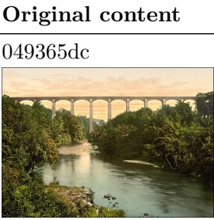</td></tr><tr><td>Question</td><td>This elevated aqueduct bridge, spanning a mountain valley and closely associated with early British transportation engineering heritage, was designed with the involvement of an engineer; the same engineer is also credited with building a suspension bridge connecting the mainland and an island. The waterway beneath the bridge belongs to a famous strait, and the island is known for its unique administrative status and diverse coastal landscapes. On the island, there is a popular tourist spot with a well-known place name frequently photographed by visitors, and its railway station sign also displays this long place name. The coastal railway line at that station extends westward to a port town, where a ferry route crosses the Irish Sea to the</td></tr></table>

Table 21: Case Study Part 2/3: A late-chain propagation failure. Continued.
<table><tr><td>Field</td><td>Original content</td></tr><tr><td>Model Response</td><td>openai/o4-mini-deep-research-2025-06-26 The clues all point to Anglesey (linked by Telford&#x27;s Menai Suspension Bridge over the Menai Strait</td></tr><tr><td></td><td>(https://www.britannica.com/topic/Menai-Bridge#:~:text=Menai%20Bridge% 2C%20suspension%20bridge%20,from%20masonry%20towers%20at%20either)). The long-named village is Llanfairpwllgwyngyllgogerychwyrndrobwllllantysiliogogogoch (the railway station sign famously bears the full name) which lies on the line to Holyhead. Holyhead&#x27;s huge breakwater (2.75 km long) with its lighthouse at the end is well known (https://1ighthouses.wales/the-lighthouses/holyhead-breakwater/#:~: text=This%201ighthouse%20is%20perched%20at,by%20the%20Holyhead% 20Port%20Authority). In the travel video the wall of a house shows the letters “RAOB&quot;-this stands for the club&#x27;s full name, the Royal Antediluvian Order of Buffaloes (https: //www.wikiwand.com/en/articles/Royal_Antediluvian_Order_of_Buffaloes#: ~:text=The%20Royal%20Antediluvian%200rder%20of,to%20members). Answer: Royal Antediluvian Order of Buffaloes (https: //www.wikiwand.com/en/articles/Royal_Antediluvian_Order_of_Buffaloes#:</td></tr><tr><td>Answer Checklist</td><td>~:text=The%20Royal%20Antediluvian%200rder%20of,to%20members). HALF MOON SWIMMING &amp; WATER POLO CLUB √ The elevated waterway bridge in the picture is the Pontcysyllte Aqueduct.</td></tr><tr><td></td><td>√ One of the designers of the Pontcysyllte Aqueduct is Thomas Telford. √ The designer of the Menai Suspension Bridge is Thomas Telford. √ The Menai Suspension Bridge spans the Menai Strait. √ The island connected by the Menai Suspension Bridge is the Isle of Anglesey. √ There is a place called Llanfairpwllgwyngyll on the Isle of Anglesey. √Llanfairpwllgwyngyll is popular for its extremely long Welsh place name. √ The station sign for Llanfairpwllgwyngyll displays this extremely long place name. √ The railway station with this long name is Llanfairpwll railway station. √ Llanfairpwll railway station is located on the North Wales Coast Line. √ The western end of the North Wales Coast Line is Holyhead. √ Holyhead railway station is located in Holyhead. × Holyhead has a ferry route to Dublin. × The Dublin endpoint of the Holyhead-Dublin ferry route is Dublin Port. × Dublin Port is located on the Dublin Bay side. × The bay entrance related to Dublin Port can be located via the Great South Wall × The landmark at the end of the Great South Wall is Poolbeg Lighthouse.</td></tr><tr><td></td><td>× The real name of the account The Hiking Hermit Travels is Paul aka. × Poolbeg Lighthouse appears in The Hiking Hermit Travels&#x27; video titled “Looking for FREE things to do in DUBLIN? The GREAT SOUTH WALL and POOLBEG LIGHTHOUSE Walk | 4K video.&quot;</td></tr><tr><td>Is_Correct</td><td>× The full name of the club on the house wall in the video is HALF MOON SWIMMING &amp; WATER POLO CLUB. 0</td></tr></table>

Table 22: Case Study Part 3/3: An early visual grounding failure. The model fails checklist items 1–7, guesses item 8 and then infers item 9, but misses the multimodal video step at item 10 and cannot recover item 11.
<table><tr><td>Field</td><td>Original content</td></tr><tr><td>Figure</td><td>a1839503 </td></tr><tr><td>Question</td><td>The image shows a flagship smartphone. The processor in this phone was developed by a well-known chip design team, which heavily relies on a leading provider of electronic design automation tools worldwide. Meanwhile, the metal frame material of this phone was first used in two aircraft. Of those, the one that was retired later was moved to a museum after completing a mission with the U.S. Air Force at Edwards AFB. This museum is affiliated with a program, which is a department of an institution. The official YouTube account of the U.S. Department of State has posted a video introducing this institution. In this video, the third person interviewed is</td></tr><tr><td>Model Response</td><td>wearing a shirt with a few words on it. What is the first word? openai/o4-mini-deep-research-2025-06-26 The smartphone is the Samsung Galaxy S24 Ultra, which uses Samsung&#x27;s Exynos</td></tr><tr><td></td><td>chip (designed using Synopsys EDA tools) and a titanium frame. Its frame metal aerospace-grade titanium – was first used in two notable aircraft: the Space Shuttle Enterprise (which flew test landings at Edwards Air Force Base) and an F-117 Nighthawk stealth fighter. The F-117 (tail #783) was later moved to the Air Force Flight Test Museum at Edwards AFB. That museum participates in the Smithsonian Affiliations program (a program of the Smithsonian Institution). The U.S. State Department&#x27;s YouTube channel has a video introducing the Smithsonian Institution, and in that video the third person interviewed is wearing a shirt with text. The first</td></tr><tr><td>Answer Checklist</td><td>word on her shirt is “Smithsonian.&quot; climate × The product displayed in the picture is the Apple iPhone 15 Pro Max</td></tr><tr><td></td><td>× The processor chip installed in the iPhone 15 Pro Max is the A17 Pro × The A17 Pro chip is designed by the Apple Silicon team × The Apple Silicon team collaborates deeply with EDA tool provider Synopsys × The frame material of the iPhone 15 Pro Max is titanium × The Lockheed A-12 and the SR-71 “Blackbird&quot; were two of the first aircraft frames to use titanium × After all USAF and NASA SR-71 operations at Edwards AFB were completed, the SR-71 Flight Simulator was moved in July 2006 to the Frontiers of Flight Museum at Love Field Airport in Dallas, Texas √ The Frontiers of Flight Museum is an affiliate within the Smithsonian Affiliations program √Smithsonian Affiliations is a division of the Smithsonian Institution</td></tr><tr><td>Is_Correct</td><td>titled “The Legacy of the Smithsonian Institution&quot; × In the video &quot;The Legacy of the Smithsonian Institution,&quot; the first word on the shirt of the third interviewee is “climate&quot; 0</td></tr></table>

## H Release, Reproducibility, and Ethics

## H.1 Released Artifacts and Reproducibility

We will release the benchmark data together with the evaluator, the exact judge prompt, verified directdependency graphs, and regression tests. The benchmark data include the questions, short answers, category/type/subtask labels, irreducible checklists, source URLs, and associated image assets. These artifacts specify both the evaluation inputs and the scoring procedure, allowing researchers to recompute OA, SA, CS, and DACS from model responses or to re-judge cached responses under the same protocol.

For each evaluated model, we record the model identifier, inference configuration, browsing setting, and evaluation outputs used in the analysis. The regression tests cover score aggregation and dependency-aware scoring, helping detect implementation changes that would alter reported results. Together, the data schema, judge prompt, evaluator, and recorded configurations provide a consistent basis for reproducing the evaluation and extending it to new models.

## H.2 Ethical Safeguards

The benchmark is constructed from publicly accessible web content and is intended to evaluate information seeking, evidence integration, and multimodal reasoning. During item construction and audit, annotators avoid questions that depend on private or sensitive personal information unless that information is both publicly documented and essential to a legitimate informational task. Source URLs are retained to support evidence inspection and attribution, and each item is reviewed for answerability, evidential support, and the substantive use of non-text evidence.