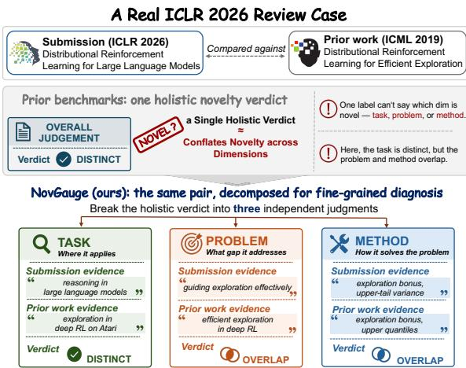
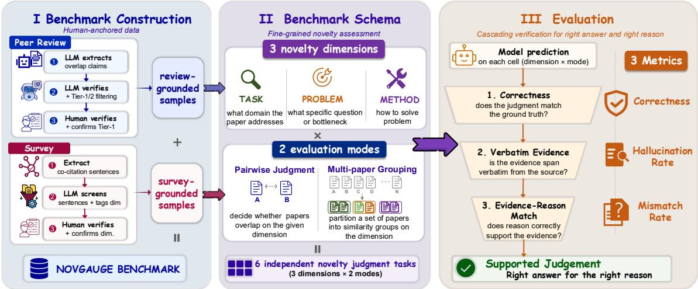
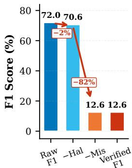
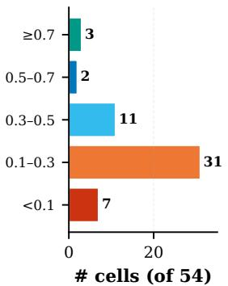
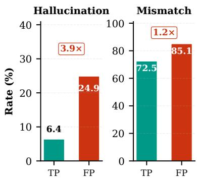
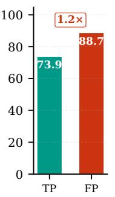
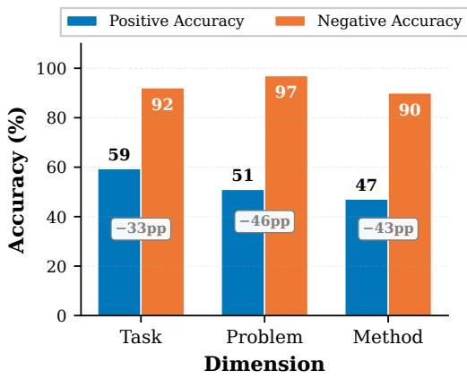
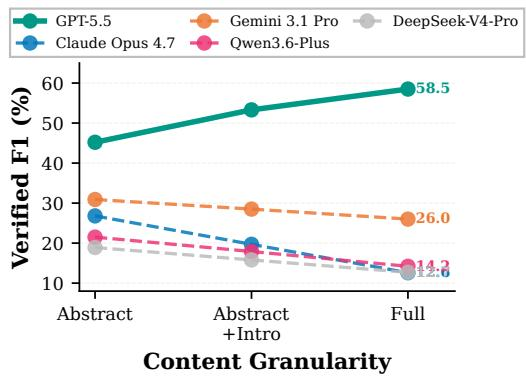
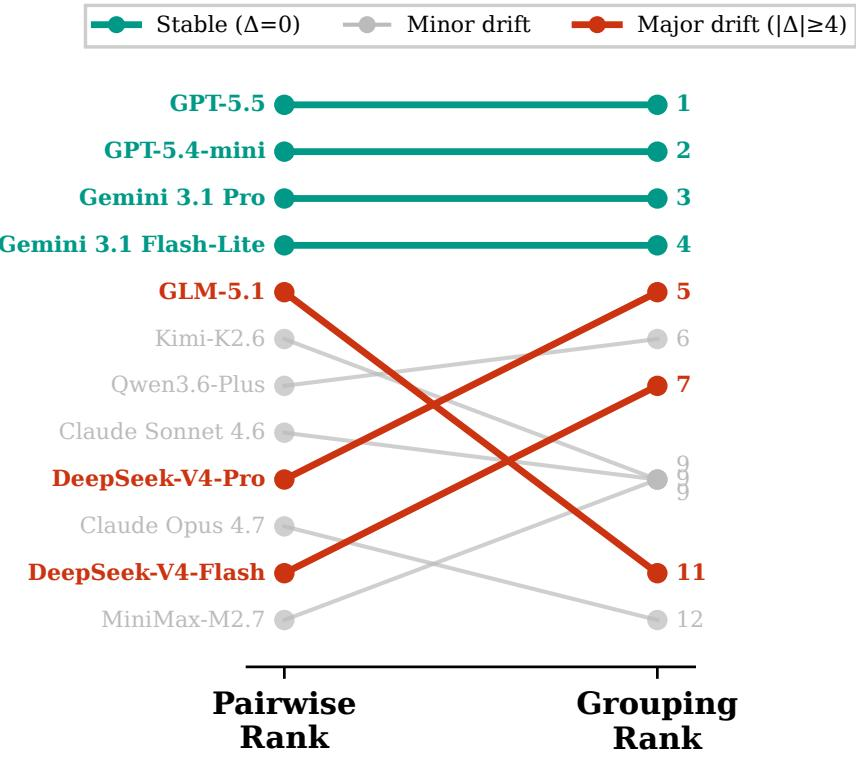

# NovGauge: A Fine-Grained Benchmark for Diagnosing LLMs’ Capability in Paper Novelty Assessment

Guoqiang Zhang<sup>1,\*</sup>, Kexin Tan<sup>1,2,\*</sup>, Ming Zhang<sup>1,\*</sup>, Li Ju<sup>3</sup>, Wenqing Jing<sup>1</sup>, Zhonghan Yue<sup>1</sup>, Jiayi Chen<sup>1</sup>, Shiqiang Wu<sup>1</sup>, Shaofan Liu<sup>1</sup>, Yue Zhang<sup>4</sup>, Yuankai Ying<sup>1</sup>, Yang Shi<sup>3</sup>, Tao Gui<sup>1</sup>, Qi Zhang<sup>1</sup>, Xuanjing Huang<sup>1</sup>

<sup>1</sup>College of Computer Science and Artificial Intelligence, Fudan University, Shanghai, China <sup>2</sup>Graduate School of Engineering, The University of Tokyo, Tokyo, Japan <sup>3</sup>AtomInnoLab <sup>4</sup>Atom Infinite Pte. Ltd., Singapore

zitago121@gmail.com

https://github.com/Zita-Go/NovGauge https://huggingface.co/datasets/ZitaGo/NovGauge

## Abstract

Large language models (LLMs) are increasingly used in peer review at major AI conferences, yet novelty remains a persistent weak point. Existing benchmarks assess novelty as a single holistic score, making it difficult to diagnose which dimension a model misjudges or whether its evidence is faithful. We present NOVGAUGE, a human-anchored benchmark for fine-grained novelty assessment diagnosis. The benchmark contains 619 paper pairs and 50 multi-paper sets, drawn from two expert sources: ICLR reviewer overlap claims and survey co-citations. Instances are independently labeled along three dimensions: task, problem, and method, capturing application goals, technical challenges, and solution approaches. We propose a cascading diagnostic pipeline that verifies per-dimension correctness, evidence grounding, and logical support. Evaluation of 18 LLMs shows hallucination rates ranging from 0% to 39% across dimensions, and among non-hallucinated correct-positive judgments, over 70% cite evidence fails to logically support the stated reason. The best-performing model, GPT-5.5, achieves 43–72% Verified F1 across dimensions, while most models retain less than half of their raw F1 after faithfulness verification. These results suggest that current LLMs remain far from reliable scientific novelty assessment, particularly when correctness is conditioned on faithful evidence grounding.

## 1 Introduction

Large language models already shape peer review at scale through two channels. Reviewers increasingly rely on general-purpose LLMs to draft reviews, with audits estimating that up to 20% of text at major AI venues is now LLM-generated (Liang et al., 2024a; Shen and Wang, 2026). Meanwhile, dedicated automated review systems continue to emerge (Zhou et al., 2024; D’Arcy et al., 2024; Zhu et al., 2025), with some already approaching human-level agreement on acceptance decisions (Weng et al., 2025). However, the reliability of LLM-generated reviews remains questionable (Wu et al., 2026a; Shin et al., 2025a; Du et al., 2024). Recent evaluations show that LLM reviews correlate weakly with human judgments and can be trivially gamed (Baumann et al., 2026). This concern is especially important for novelty assessment: large-scale analysis of ICLR 2024–2025 identifies lack of novelty as one of the most frequently cited weaknesses in rejected papers (Kargaran et al., 2025).

  
Figure 1: One label, three dimensions. An ICLR 2026 submission compared against flagged prior work. NOV-GAUGE evaluates each dimension independently, revealing that this pair shares its method while targeting a distinct task.

Despite its importance, novelty remains a particularly challenging criterion for LLM reviewers. Studies show that LLMs systematically underweight novelty in their reviews (Shin et al., 2025b) and that their novelty ratings even correlate negatively with a paper’s eventual impact (Jiang, 2026). These results confirm that LLM novelty assessment is unreliable, but a single accuracy number on a holistic label reveals only that a model underperforms, not which aspect of novelty it misjudges. This leaves the operational review question unanswered: given a submission and a flagged prior work, which novelty dimension overlaps, and is the cited evidence faithful?

  
Figure 2: Overview of the NOVGAUGE framework. Two human-anchored construction pipelines produce pairs and multi-paper sets with task, problem, and method labels. Model outputs pass through a cascading evaluation funnel that checks correctness, evidence hallucination, and reasoning mismatch, yielding a per-dimension diagnosis.

Reliable diagnosis demands two capabilities. The first is per-dimension evaluation. Novelty is not monolithic: scientometric studies decompose it into research question and method (Luo et al., 2022; Shen et al., 2026), and a paper may overlap with prior work on one dimension while remaining novel on others (Figure 1). Current benchmarks, however, either let dimensions vary across instances (Moussa et al., 2025) or treat novelty as one undifferentiated score among several review criteria (Qiao et al., 2026; Schopf and Färber, 2026; Lin et al., 2025; Wu et al., 2026b). The second is faithfulness verification. Even when a model’s judgment is correct, the reasoning behind it may rest on fabricated evidence or logical gaps. No existing benchmark systematically diagnoses whether failures stem from judgment errors, fabricated evidence, or logical gaps (Schopf and Färber, 2026).

We introduce NOVGAUGE, a benchmark designed to enable fine-grained diagnosis of novelty judgment. Every instance is independently labeled for task, problem, and method, providing the fixed per-dimension ground truth. Labels are anchored in two complementary human sources, ICLR reviewer overlap claims and annotator-verified survey co-citations. Beyond pairwise comparison, the benchmark further includes 50 multi-paper grouping sets. Rather than stopping at binary correctness, the evaluation protocol applies a cascading diagnostic pipeline that checks correctness, evidence hallucination, and reasoning mismatch. Only predictions that survive all three stages count toward Verified F1, ensuring the model reached the right answerfor the right reason.

Our contributions are:

• A benchmark of 619 pairs and 50 multipaper sets with fixed three-dimension ground truth, anchored in ICLR reviewer statements and annotator-verified survey co-citations.

• A cascading evaluation protocol that diagnoses novelty judgment per dimension and audits evidence faithfulness through hallucination and mismatch checks.

• A systematic evaluation of 18 LLMs revealing that even correct judgments are frequently backed by fabricated or logically disconnected evidence, with failure patterns varying sharply across dimensions.

Figure 2 summarizes the benchmark construction and evaluation flow.

## 2 Related Work

## 2.1 Automated Paper Review

LLM-based peer review has advanced from singlemodel critique generation (Zhou et al., 2024) to multi-agent architectures (D’Arcy et al., 2024; Yu et al., 2024; Bougie and Watanabe, 2024) and fine-tuned models trained on structured reasoning chains (Zhu et al., 2025; Weng et al., 2025; Taechoyotin and Acuna, 2025). However, systematic analyses reveal that LLMs over-attend to technical validity while underweighting novelty (Shin et al., 2025b), assign inflated scores to LLM-generated papers (Li et al., 2025), and align with human judgments only on lower-quality submissions (Liang et al., 2024b). Li et al. (2026) further show that aligning critique focus with human experts is a prerequisite for reliable scoring. These findings motivate benchmarks that diagnose novelty judgment specifically.

## 2.2 Novelty and Similarity Benchmarks

Table 1 situates our work within a progression from document-level similarity to fine-grained novelty assessment. SciDocs (Cohan et al., 2020) and SciRepEval (Singh et al., 2023) evaluate retrieval relevance from citation-graph labels, measuring similarity holistically without distinguishing which dimensions overlap.

Recent novelty benchmarks move beyond retrieval to assess whether a paper or idea advances the state of the art. NovBench (Wu et al., 2026b) frames novelty as text generation from a single paper’s introductory claim, while literature-grounded systems assess manuscript novelty against existing work (Mostafa et al., 2026; Zhang et al., 2026a). Idea-level benchmarks evaluate research ideas against retrieved related works: RINoBench (Schopf and Färber, 2026) and InnoEval (Qiao et al., 2026) assign novelty scores, while ScholarEval (Moussa et al., 2025) and the Idea Novelty Checker (Shahid et al., 2025) dynamically identify contribution dimensions for each idea. Pairwise approaches take designated paper pairs as input but target review quality assessment (Zhang et al., 2026b; Zheng et al., 2026) or relative novelty ranking (Lin et al., 2025) rather than overlap detection on fixed dimensions.

NOVGAUGE addresses these gaps by providing per-instance ground truth under a fixed threedimension taxonomy, enabling systematic diagnosis of where and why LLM novelty judgments fail.

## 3 Benchmark Construction

## 3.1 Design Principles

NOVGAUGE addresses the limitations of existing benchmarks through three core design principles.

Principle 1: Per-dimension decomposition. Novelty is not monolithic. We decompose it into three orthogonal dimensions and evaluate each one independently.

• Task: the application domain (e.g., image classification vs. machine translation).

• Problem: the core research challenge (e.g., distribution shift vs. catastrophic forgetting).

• Method: the technical approach (e.g., contrastive learning vs. supervised fine-tuning).

This follows the what, why, and how of a research contribution and extends prior taxonomies that separate research question and method (Luo et al., 2022; Shen et al., 2026). We treat task as a separate axis because papers may share a problem or method while targeting different domains. Other contribution types are represented within these dimensions rather than treated as separate axes. Figure 1 illustrates partial overlap across dimensions. For this reason, every instance carries fixed per-dimension ground truth, enabling us to identify which dimension a model misjudges.

Principle 2: Expert-sourced labels. Every label is anchored in explicit expert evidence. Positive labels originate from two complementary sources: ICLR reviewer overlap claims from public reviews, and survey co-citation groupings verified by three annotators. Negatives are constructed through cross-group sampling, where pairs are drawn from papers a survey author placed into distinct similarity groups within the same sentence.

Principle 3: Evidence-grounded evaluation. Correct judgments are insufficient if the reasoning behind them is unreliable. We therefore require models to ground every positive judgment in verbatim evidence spans and evaluate outputs through the three-stage cascade described in Section 3.4.

## 3.2 Data Construction

NOVGAUGE is constructed from two complementary sources (Table 2), both verified by three PhDlevel annotators. ICLR-grounded pairs predominantly capture method and problem overlap, while survey-derived pairs are dominated by task-level similarity. The ICLR source contributes positives only. The survey source supplies both positives and dimension-specific negatives.

<table><tr><td>Benchmark</td><td>Task</td><td>Pairwise</td><td>Grouping</td><td>Expert</td><td>#Dim.</td><td>Scale</td></tr><tr><td>SciDocs (Cohan et al., 2020)</td><td>Retrieval</td><td>√</td><td></td><td></td><td>1</td><td>25K papers</td></tr><tr><td>SciRepEval (Singh et al., 2023)</td><td>Retrieval</td><td>√</td><td></td><td></td><td>1</td><td>60K papers</td></tr><tr><td>NovBench (Wu et al., 2026b)</td><td>Generation</td><td></td><td></td><td></td><td>1</td><td>1.7K pairs</td></tr><tr><td>RINoBench (Schopf and Färber, 2026)</td><td>Scoring</td><td></td><td></td><td></td><td>1</td><td>1.4K ideas</td></tr><tr><td>ScholarEval (Moussa et al., 2025)</td><td>Scoring + RAG</td><td></td><td></td><td>√</td><td>var.</td><td>117 ideas</td></tr><tr><td>Idea Novelty Checker (Shahid et al., 2025)</td><td>Scoring + RAG</td><td></td><td></td><td>√</td><td>1</td><td>67 ideas</td></tr><tr><td>InnoEval (Qiao et al., 2026)</td><td>Scoring</td><td></td><td></td><td>√</td><td>1</td><td>217 ideas</td></tr><tr><td>SchNovel (Lin et al., 2025)</td><td>Ranking</td><td></td><td></td><td></td><td>1</td><td>15K pairs</td></tr><tr><td>Ours (pairwise) Ours (grouping)</td><td>Classification Grouping</td><td></td><td></td><td>√</td><td>3 3</td><td>619 pairs 50 sets</td></tr></table>

Table 1: Comparison with existing novelty and similarity benchmarks. #Dim. denotes the number of orthogonal dimensions along which novelty overlap is independently judged. These dimensions include task, problem, and method, rather than general evaluation rubrics such as relevance or clarity. “var.” denotes dimensions that vary across instances.

<table><tr><td>Source</td><td></td><td>Size Main Dim.</td></tr><tr><td>Pairwise</td><td></td><td></td></tr><tr><td>ICLR review positives</td><td></td><td>236 method and problem</td></tr><tr><td>Survey co-citation positives</td><td>227 task</td><td></td></tr><tr><td>Survey cross-group negatives</td><td></td><td>156 method and task</td></tr><tr><td>Multi-paper grouping</td><td></td><td></td></tr><tr><td>Survey co-citation sets</td><td></td><td>50 task, problem, method</td></tr></table>

Table 2: Final benchmark composition. “Main Dim.” denotes the dominant dimension in each subset.

Source 1: ICLR Review-Grounded Pairs. We process 42,682 ICLR 2023–2026 OpenReview forums through a two-stage LLM pipeline that extracts and verifies novelty-overlap claims from official reviews and author rebuttals. Three PhD-level annotators adjudicate every retained candidate, verifying prior-work identity, dimension labels, and reviewer evidence. The released test set retains only high-confidence pairs with convergent evidence from multiple reviewers and author concession, yielding 236 pairs. Detailed annotation procedures are in Appendix D.

Source 2: Survey Co-citation Groups. We extract similarity groupings from 459 CS arXiv surveys (2023–2024). A rule-based extractor identifies 1,130 co-citation sentences with explicit similarity cues, and an LLM proposes per-dimension groupings. The same annotators verify each grouping, yielding 118 verified sentences. We enumerate within-group pairs as positives (227 pairs) and cross-group pairs as negatives (156 pairs). The survey source also contributes 85 multi-paper grouping instances derived from 50 multi-paper sets (Section 3.3). Detailed pipeline is in Appendix E.

Final composition and quality control. Table 2 summarizes the four subsets that make up the benchmark. At the paper-pair level, the pairwise subset contains 619 records, of which 463 are labeled positive and 156 are labeled negative. Because each available dimension is evaluated independently, these records yield 875 dimensionspecific evaluation instances, of which 649 carry positive labels and 226 carry negative labels. To verify label consistency, we audited a random sample of 30 items stratified by dimension. The same annotators re-examined the labels independently, yielding 93.3% agreement with the original annotations. Table 5 reports the per-dimension breakdown of this audit and the main causes of disagreement.

## 3.3 Evaluation Formulation

We define two complementary evaluations, both scored independently per dimension. The first tests pairwise comparison, where a model decides whether a submission and a specific prior work overlap on the target dimension. The second requires synthesizing evidence across multiple documents, a more realistic setting that mirrors how reviewers survey related work.

Pairwise Novelty Judgment. Input: a pair of papers (A, B) and a target dimension $d \in$ {task, problem, method}, with each paper rendered at one of three content granularities (abstract, abstract + introduction, or full paper). A separate model call, with a dimension-specific prompt, is issued for each available labeled dimension. A paper-pair record with labels on multiple dimensions therefore contributes one dimension-specific evaluation instance per label rather than one holistic instance.

Output: a structured JSON record judging similarity on d and grounding it in verbatim evidence:

{ is\_similar: bool,   
evidence\_a: <verbatim span from A>,   
evidence\_b: <verbatim span from B>,   
reason: <≤2-sentence justification> }

Predictions are evaluated against the ground-truth labels in Table 2.

Multi-paper Similarity Grouping. Given a set of related papers, the model must identify which subsets share a given dimension.

Input: a set of N papers $( 3 ~ \leq ~ N ~ \leq ~ 1 0 )$ , together with a target dimension d. The N papers are not all mutually similar. Only certain subsets share the dimension.

Output: the model must partition the N papers into similarity subgroups for dimension d:

{ groups: [   
{ paper\_indices: [. . . ],   
evidence: {. . . }, reason: . . . },   
. . . ] }

Each output subgroup is a maximal set of papers judged mutually similar on d. Each input set is evaluated on every dimension for which a groundtruth label exists, yielding 85 grouping instances across the 50 input sets (44 task, 13 problem, 28 method).

## 3.4 Cascading Evaluation Protocol

A model may produce a correct label with fabricate supporting evidence, or cite real evidence that does not logically support its conclusion. To separate grounded reasoning from surface-level correctness, we evaluate outputs along three cascading stages (Figure 2, right panel), each filtering the outputs of the previous stage.

Stage 1: Correctness. For pairwise judgment, we report per-dimension Accuracy and F1 for classifying whether a pair is similar. For multipaper grouping, each of the 85 (set, dimension) instances yields a predicted partition, scored against the ground-truth partition by converting both into their sets of within-set paper pairs and computing pairwise Precision, Recall, and F1 (TP = |pred pairs ∩ GT pairs|). These per-instance F1 scores are then macro-averaged within each dimension. For both evaluations, every reported metric is the mean across n=3 inference samples.

Stage 2: Hallucination Rate. Every positive output must cite verbatim evidence from the source papers. For pairwise predictions, this means one span per paper. For grouping predictions, one span per member in each predicted subgroup. Each cited span is verified against the source paper’s text via substring matching. A span is classified hallucinated if verification fails. The Hallucination Rate is the fraction of positive outputs (pairs or subgroups) in which at least one cited span is hallucinated. Details are in Appendix F.

Stage 3: Mismatch Rate. Among the nonhallucinated positive outputs, an external LLM judge decides whether the stated reason is logically entailed by the cited evidence. The judge model and prompt are detailed in Section 4 and Appendix P.

Verified F1. The three stages compose into a single summary metric: Verified F1. Only true positives that pass all three stages count in the numerator, while hallucinated or mismatched predictions remain in the denominator. For multi-paper grouping, subgroups are first classified by their hallucination and mismatch status, then converted to pairs for F1 computation. The gap between raw F1 and Verified F1 quantifies thefaithfulness cliff, the fraction of seemingly correct judgments undermined by fabricated or unsupported evidence. Formal definitions are in Appendix C.

## 4 Experimental Setup

We evaluate NOVGAUGE through three experiments. The first tests pairwise novelty judgment, the main task. The second varies how much paper content is shown to the model. The third tests whether models can group several papers that overlap along the same novelty dimension. All experiments use the cascading protocol in §3.4.

## 4.1 Pairwise Judgment

Pairwise judgment asks a model to decide whether two papers overlap in task, problem, or method. We evaluate 18 LLMs spanning frontier systems, midscale open-weight models, and specialised peerreview models. Each model produces a binary label, a short reason, and evidence spans from the papers. We report raw F1, Hallucination Rate, Mismatch Rate, and Verified F1. The full model list and system settings appear in Appendix B.

## 4.2 Granularity Ablation

This experiment tests whether more paper context improves novelty judgment. We run the same pairwise task under three input settings: abstract only, abstract plus introduction, and full paper. The corresponding per-paper content caps are 1k, 4k, and 16k tokens. The full-paper setting is the default for the main pairwise results.

## 4.3 Multi-Paper Grouping

Multi-paper grouping asks a model to recover clusters of papers that share the same task, problem, or method overlap. This setting is harder than pairwise judgment because the model must compare multiple papers and provide collective evidence for each predicted group. We evaluate the 12 frontier models on 85 grouping instances, using full paper inputs.

## 4.4 Implementation Details

Each input and dimension is decoded three times at temperature 0.6, and we report mean scores with standard deviations in Appendix H. All models use their maximum reasoning setting when available. The mismatch stage uses an LLM judge at temperature 0.2 (prompt in Appendix P). GPT-family models are judged by Gemini-3.1-Pro, while all other models are judged by GPT-5.2. A human validation study on 100 non-hallucinated positive outputs finds 87.0% agreement with the judge, with Cohen’s $\kappa = 0 . 7 4$ (details in Appendix K).

## 5 Experimental Results

## 5.1 Main Results

Table 3 reports pairwise novelty judgment results for the 18 evaluated models across task, problem, and method. Raw F1 is often high, but the cascading evaluation exposes a large gap between correct labels and faithful reasoning (Figure 3a). The average model retains only 26% of its raw F1 after faithfulness filtering.

Faithfulness filtering exposes unsupported reasoning. Only 5 of 54 model-dimension cells retain at least half of their raw F1 after faithfulness filtering, as shown in Figure 3b. The main source of degradation is mismatch. The mismatch stage flags 72.5% of non-hallucinated correct-positive predictions as unsupported because models identify similarity at the contribution level but cite evidence at the implementation level. For example, Gemini 3.1 Flash-Lite reaches 89.2% raw

  
(a) Cascade

  
(b) VF1/F1 distribution  
Figure 3: Panel (a) shows the faithfulness cascade for Claude Opus 4.7 on the method dimension, where Raw F1 drops to low Verified F1 after hallucination and mismatch checks. Panel (b) shows the distribution of VF1/F1 ratios across the 54 model-dimension cells of Table 3.

F1 on problem but drops to 22.9% Verified F1. GPT-5.5 is the clear exception, with zero detected hallucinations and mismatch rates below 46% across all dimensions. Notably, CycleReviewer-8B and DeepReviewer-14B reach at most 15.9% Verified F1, suggesting that review-oriented finetuning does not necessarily transfer to fine-grained, evidence-grounded novelty judgment.

Method-level novelty is the hardest to ground. The method dimension is the least faithful dimension for nearly all models. Hallucination on method often exceeds task and problem by a wide margin. For GLM-5.1, the method hallucination rate is 27.2%, compared with 0.0% on task. Even GPT-5.5, the strongest model overall, retains 84% of its raw F1 on task but only 55% on method, confirming that method-level novelty is the most fragile setting for LLM-based review support.

Incorrect positive predictions fabricate more evidence. Figure 4 compares faithfulness on correct and incorrect positive predictions. Hallucination Rate rises from 6.4% on true positives to 24.9% on false positives. Mismatch Rate also increases, from 72.5% to 85.1%. Only 11% of false-positive predictions survive the full cascade, compared with 26% of true positives. This suggests that false positives are not merely label errors, they often combine an unsound conclusion with weaker evidence selection.

LLMs are conservative similarity judges. Models achieve 90–97% negative accuracy but only 47–59% positive accuracy, as shown in Figure 5.

<table><tr><td></td><td colspan="4">Task</td><td colspan="4">Problem</td><td colspan="4">Method</td></tr><tr><td>Model</td><td>F1↑</td><td>Hal↓</td><td>Mis↓</td><td>VF1↑</td><td>F1↑</td><td>Hal↓</td><td>Mis↓</td><td>VF1↑</td><td>F1↑</td><td></td><td>Hal↓ Mis↓</td><td>VF1↑</td></tr><tr><td>FRONTIER</td><td></td><td></td><td></td><td></td><td></td><td></td><td></td><td></td><td></td><td></td><td></td><td></td></tr><tr><td>GPT-5.5‡</td><td>84.8</td><td>0.0</td><td>15.7</td><td>71.5</td><td>69.4</td><td>0.0</td><td>12.1</td><td>61.0</td><td>78.7</td><td>0.0</td><td>45.3</td><td>43.1</td></tr><tr><td>GPT-5.4-mini‡</td><td>68.1</td><td>0.0</td><td>23.4</td><td>52.1</td><td>56.7</td><td>1.0</td><td>33.5</td><td>37.3</td><td>60.8</td><td>0.3</td><td>51.7</td><td>29.2</td></tr><tr><td>Claude Opus 4.7</td><td>77.7</td><td>0.0</td><td>76.6</td><td>18.2</td><td>66.2</td><td>0.0</td><td>84.2</td><td>10.5</td><td>72.2</td><td>5.8</td><td>86.7</td><td>9.1</td></tr><tr><td>Claude Sonnet 4.6</td><td>84.3</td><td>0.2</td><td>78.1</td><td>18.4</td><td>66.1</td><td>1.7</td><td>79.4</td><td>13.4</td><td>70.4</td><td>23.2</td><td>84.0</td><td>8.6</td></tr><tr><td>Gemini 3.1 Pro</td><td>84.5</td><td>0.0</td><td>60.3</td><td>33.5</td><td>77.1</td><td>1.9</td><td>67.3</td><td>24.7</td><td>78.0</td><td>3.6</td><td>73.5</td><td>19.9</td></tr><tr><td>Gemini 3.1 Flash-Lite 85.8</td><td></td><td>1.1</td><td>73.1</td><td>22.8</td><td>89.2</td><td>5.8</td><td>72.8</td><td>22.9</td><td>81.9</td><td>8.9</td><td>79.2</td><td>15.5</td></tr><tr><td>Kimi-K2.6</td><td>87.6</td><td>0.0</td><td>77.3</td><td>19.9</td><td>76.5</td><td>2.0</td><td>65.8</td><td>25.7</td><td>64.6</td><td>6.6</td><td>78.6</td><td>12.9</td></tr><tr><td>GLM-5.1</td><td>71.2</td><td>0.0</td><td>66.3</td><td>24.0</td><td>69.3</td><td>1.6</td><td>62.8</td><td>25.3</td><td>57.4</td><td>27.2</td><td>77.4</td><td>9.4</td></tr><tr><td>Qwen3.6-Plus</td><td>83.0</td><td>0.0</td><td>73.5</td><td>22.0</td><td>74.9</td><td>2.4</td><td>83.2</td><td>12.3</td><td>63.0</td><td>4.0</td><td>86.4</td><td>8.2</td></tr><tr><td>DeepSeek-V4-Pro</td><td>61.9</td><td>0.0</td><td>67.8</td><td>20.0</td><td>60.3</td><td>0.9</td><td>81.0</td><td>11.4</td><td>51.2</td><td>24.9</td><td>82.7</td><td>6.7</td></tr><tr><td>DeepSeek-V4-Flash</td><td>66.3</td><td>0.0</td><td>72.7</td><td>18.1</td><td>60.0</td><td>0.0</td><td>93.8</td><td>3.7</td><td>61.3</td><td>17.3</td><td>89.2</td><td>5.4</td></tr><tr><td>MiniMax-M2.7</td><td>73.2</td><td>0.3</td><td>86.4</td><td>9.9</td><td>73.3</td><td>0.7</td><td>93.9</td><td>4.4</td><td>64.3</td><td>14.0</td><td>89.9</td><td>5.5</td></tr><tr><td>MID-SCALE OPEN-WEIGHT</td><td></td><td></td><td></td><td></td><td></td><td></td><td></td><td></td><td></td><td></td><td></td><td></td></tr><tr><td>Qwen3-8B</td><td>70.3</td><td>3.2</td><td>85.8</td><td>9.6</td><td>53.4 6.2</td><td></td><td>92.2</td><td>3.9</td><td>48.1 10.9</td><td></td><td>90.0</td><td>4.3</td></tr><tr><td>Qwen3-32B</td><td>61.0</td><td>2.0</td><td>75.7</td><td>14.5</td><td>56.6</td><td>2.1</td><td>70.7</td><td>16.2</td><td>49.3</td><td>12.7</td><td>79.4</td><td>8.9</td></tr><tr><td>Qwen3.5-27B</td><td>76.2</td><td>0.2</td><td>81.2</td><td>14.3</td><td>76.7</td><td>1.3</td><td>86.0</td><td>10.6</td><td>67.1</td><td>4.8</td><td>87.1</td><td>8.2</td></tr><tr><td>Gemma4-31B-IT</td><td>73.7</td><td>0.0</td><td>52.6</td><td>34.9</td><td>66.2</td><td>0.8</td><td>51.7</td><td>31.7</td><td>64.1</td><td>4.5</td><td>68.7</td><td>19.2</td></tr><tr><td>SPECIALISED</td><td></td><td></td><td></td><td></td><td></td><td></td><td></td><td></td><td></td><td></td><td></td><td></td></tr><tr><td>CycleReviewer-8B</td><td></td><td>20.6 26.0</td><td>84.2</td><td>2.4</td><td></td><td>22.5 24.2</td><td>83.0</td><td>2.9</td><td></td><td></td><td>10.0 39.0 92.0</td><td>0.5</td></tr><tr><td>DeepReviewer-14B</td><td>60.7</td><td>8.7</td><td>71.3</td><td>15.9</td><td></td><td>73.1 28.6</td><td>70.0</td><td>15.7</td><td>41.9</td><td>11.1</td><td>74.0</td><td>9.7</td></tr></table>

Table 3: Pairwise novelty judgment results (full-paper content granularity). Hal denotes Hallucination Rate, Mis denotes Mismatch Rate, and VF1 denotes Verified F1. Definitions appear in §3.4. All metrics reported as percentages. Bold marks the best value per column when fewer than half the models tie. <sup>‡</sup>GPT-family judged by Gemini-3.1-Pro. Standard deviations appear in Appendix H.



  
Figure 4: Faithfulness on correct versus incorrect positive predictions. Panel mean over 18 models.

The gap also holds within the survey source, which contains both labels: positive accuracy is 44–59%, compared with 90–97% for negatives (Table 16). Among the 61 pairs missed by all 18 LLMs, every case is a false negative. In other words, LLMs are far more likely to miss genuine similarity than to fabricate spurious overlap, particularly when two papers differ in framing or implementation despite sharing a core contribution.

## 5.2 Granularity Results

We rerun pairwise judgment at three content granularities to test whether richer paper context improves both accuracy and faithfulness. Figure 6 shows five representative models. Full results appear in Appendix I.

  
Figure 5: Positive accuracy (correctly identifying similar pairs) versus negative accuracy (correctly rejecting not-similar pairs) across three dimensions, averaged over 18 models.

More context improves raw F1 but reduces Verified F1. Raw F1 increases for 13 of 18 models, with a mean gain of 3.9 points. But verified F1 decreases for 16 of 18 models, with a mean loss of 5.0 points. GPT-5.5 and GPT-5.4-mini are the only models that maintain or improve Verified F1 with longer content. The pattern suggests that richer context helps models resolve ambiguous overlap labels, but makes it harder to keep the rationale tightly grounded.

<table><tr><td></td><td colspan="4">Task</td><td colspan="4">Problem</td><td colspan="4">Method</td></tr><tr><td>Model</td><td>F1↑</td><td>Hal↓</td><td>Mis↓</td><td>VF1↑</td><td>F1↑</td><td>Hal↓</td><td>Mis↓</td><td>VF1↑</td><td>F1↑</td><td>Hal↓</td><td>Mis↓</td><td>VF1↑</td></tr><tr><td>GPT-5.5‡</td><td>77.1</td><td>0.0</td><td>42.4</td><td>41.7</td><td>62.6</td><td>0.0</td><td>60.0</td><td>25.2</td><td>64.6</td><td>0.0</td><td>70.5</td><td>16.7</td></tr><tr><td>GPT-5.4-mini‡</td><td>60.4</td><td>0.0</td><td>49.1</td><td>28.9</td><td>44.7</td><td>0.0</td><td>71.7</td><td>14.6</td><td>50.4</td><td>1.9</td><td>83.0</td><td>7.5</td></tr><tr><td>Claude Opus 4.7</td><td>77.1</td><td>0.0</td><td>89.0</td><td>7.8</td><td>54.8</td><td>0.0</td><td>100.0</td><td>0.0</td><td>63.3</td><td>0.0</td><td>100.0</td><td>0.0</td></tr><tr><td>Claude Sonnet 4.6</td><td>78.8</td><td>0.0</td><td>85.2</td><td>11.5</td><td>56.0</td><td>1.3</td><td>93.4</td><td>4.3</td><td>61.3</td><td>17.7</td><td>89.2</td><td>5.0</td></tr><tr><td>Gemini 3.1 Pro</td><td>75.5</td><td>0.0</td><td>73.9</td><td>18.8</td><td>56.5</td><td>0.0</td><td>85.7</td><td>8.9</td><td>58.7</td><td>0.0</td><td>82.4</td><td>9.0</td></tr><tr><td>Gemini 3.1 Flash-Lite</td><td>75.4</td><td>0.0</td><td>79.1</td><td>16.8</td><td>80.2</td><td>10.9</td><td>87.8</td><td>9.0</td><td>70.7</td><td>0.0</td><td>83.3</td><td>10.1</td></tr><tr><td>Kimi-K2.6</td><td>68.6</td><td>0.0</td><td>90.2</td><td>6.6</td><td>56.3</td><td>0.0</td><td>84.1</td><td>9.9</td><td>63.4</td><td>2.4</td><td>92.5</td><td>4.3</td></tr><tr><td>GLM-5.1</td><td>65.8</td><td>0.0</td><td>84.6</td><td>10.1</td><td>52.2</td><td>0.0</td><td>90.0</td><td>6.3</td><td>53.2</td><td>13.1</td><td>94.3</td><td>2.6</td></tr><tr><td>Qwen3.6-Plus</td><td>75.5</td><td>0.0</td><td>80.9</td><td>14.4</td><td>49.2</td><td>9.1</td><td>90.0</td><td>5.4</td><td>53.4</td><td>0.0</td><td>81.2</td><td>9.6</td></tr><tr><td>DeepSeek-V4-Pro</td><td>57.9</td><td>0.0</td><td>68.8</td><td>17.4</td><td>43.0</td><td>10.7</td><td>86.0</td><td>7.0</td><td>55.3</td><td>7.8</td><td>83.1</td><td>8.4</td></tr><tr><td>DeepSeek-V4-Flash</td><td>53.7</td><td>0.0</td><td>73.7</td><td>14.8</td><td>43.3</td><td>0.0</td><td>93.8</td><td>3.7</td><td>48.1</td><td>12.3</td><td>84.0</td><td>7.1</td></tr><tr><td>MiniMax-M2.7</td><td>62.0</td><td>0.0</td><td>77.1</td><td>15.7</td><td>49.0</td><td>4.4</td><td>96.9</td><td>1.8</td><td>49.4</td><td>11.7</td><td>92.5</td><td>3.1</td></tr></table>

Table 4: Multi-paper similarity grouping results (full content granularity, 85 instances). Metrics follow the same cascade as Table 3. All metrics reported as percentages. <sup>‡</sup>GPT-family judged by Gemini-3.1-Pro. Bold marks the best value per column when fewer than half the models tie.

  
Figure 6: Verified F1 across three content granularities for five representative models.

Longer inputs invite mismatch, not mainly hallucination. The degradation comes from unsupported reasoning rather than fabricated spans. Mismatch Rate rises from 63.6% on abstracts to 72.6% on full papers, while Hallucination Rate remains low at 0.5% on abstracts and 6.3% on full papers. Longer papers give models more plausible evidence to choose from, but much of that evidence is not logically tied to the stated novelty judgment.

## 5.3 Grouping Results

Table 4 reports results for the 12 frontier models on 85 multi-paper grouping instances. The task uses the same cascade as pairwise judgment, but each predicted group must cite evidence from its member papers to justify the shared-dimension judg-

## ment.

Grouping amplifies the faithfulness cliff. Panelmean Verified F1 drops to 17%, 8%, and 7% for task, problem, and method. These scores retain only 38–62% of the corresponding pairwise values. This indicates that models lose more faithful reasoning ability when the unit of judgment shifts from one paper pair to a multi-paper set. GPT-5.5 again leads all three dimensions, with Verified F1 of 41.7%, 25.2%, and 16.7%.

Shorter evidence spans reduce hallucination but do not solve mismatch. Hallucination rates are lower in grouping than in pairwise evaluation, with panel means of 0.0%, 3.0%, and 5.6%. Grouping tends to produce shorter evidence spans than pairwise judgment, averaging 34 words compared with 53 words in the pairwise setting. This leaves less room for fabrication. The main failure is still mismatch, with panel means of 75%, 87%, and 86%. Appendix J examines the resulting rank drift between pairwise and grouping leaderboards.

## 6 Conclusion

We introduced NOVGAUGE, a benchmark that evaluates LLM novelty judgment with per-dimension labels and cascading faithfulness checks. Our evaluation of 18 LLMs reveals that accuracy is a misleading metric. Only 5 of 54 model-dimension pairs retain more than half of their raw F1 after faithfulness filtering. Multi-paper grouping amplifies this faithfulness cliff, where even GPT-5.5 degrades substantially. This bottleneck is most severe for method-level novelty, worsens with longer paper context, and often arises from a gap between contribution-level reasoning and implementationlevel evidence. Across settings, LLMs also exhibit a conservative similarity bias, tending to reject genuine overlap more often than they invent spurious similarity. Together, these findings show that reliable novelty assessment requires more faithful links between verdicts, reasons, and evidence.

## Limitations

• Domain scope. All data derives from ICLR and CS arXiv surveys. Cross-disciplinary generalization is untested.

• LLM judge dependency. The cascading metric relies on LLM judges (GPT-5.2 and Gemini-3.1- Pro). Researchers without access can substitute another capable model at some cost in comparability.

• Per-dimension negative imbalance. Negative samples are uneven across dimensions, with the problem dimension having only 33 negatives, yielding wider variance in F1 estimates.

• Reviewer LLM contamination. A fraction of ICLR 2025–2026 reviews may have been drafted with LLM assistance, though the underlying novelty judgments still reflect human expertise.

• Retrieval scope. NOVGAUGE evaluates judgment after candidate papers are retrieved. It can serve as the judgment stage of a retrieval pipeline. Evaluation of the full retrieval process is left to future work.

## Ethics Statement

All data derives from publicly available OpenReview submissions and arXiv papers. No personally identifiable information beyond author names on public papers is included. The benchmark is intended for research on evaluation methodology and does not endorse automated replacement of human peer review.

## References

Joachim Baumann, Jiaxin Pei, Sanmi Koyejo, and Dirk Hovy. 2026. Stop automating peer review without rigorous evaluation. arXiv preprint arXiv:2605.03202.

Nicolas Bougie and Narimasa Watanabe. 2024. Generative adversarial reviews: When llms become the critic. arXiv preprint arXiv:2412.10415.

Arman Cohan, Sergey Feldman, Iz Beltagy, Doug Downey, and Daniel Weld. 2020. SPECTER:

Document-level representation learning using citation-informed transformers. In Proceedings of the 58th Annual Meeting of the Association for Computational Linguistics, pages 2270–2282, Online. Association for Computational Linguistics.

Mike D’Arcy, Tom Hope, Larry Birnbaum, and Doug Downey. 2024. Marg: Multi-agent review generation for scientific papers. Preprint, arXiv:2401.04259.

Jiangshu Du, Yibo Wang, Wenting Zhao, Zhongfen Deng, Shuaiqi Liu, Renze Lou, Henry Peng Zou, Pranav Narayanan Venkit, Nan Zhang, Mukund Srinath, and 1 others. 2024. Llms assist nlp researchers: Critique paper (meta-) reviewing. In Proceedings of the 2024 conference on empirical methods in natural language processing, pages 5081–5099.

Bo Jiang. 2026. Hindsight: Evaluating llm-generated research ideas via future impact. arXiv preprint arXiv:2603.15164.

Amir Hossein Kargaran, Nafiseh Nikeghbal, Jing Yang, and Nedjma Ousidhoum. 2025. Insights from the iclr peer review and rebuttal process. arXiv preprint arXiv:2511.15462.

Bowen Li, Haochen Ma, Yuxin Wang, Jie Yang, Yining Zheng, Xinchi Chen, Xuanjing Huang, and Xipeng Qiu. 2026. Beyond rating: A comprehensive evaluation and benchmark for ai reviews. Preprint, arXiv:2604.19502.

Rui Li, Jia-Chen Gu, Po-Nien Kung, Heming Xia, Junfeng liu, Xiangwen Kong, Zhifang Sui, and Nanyun Peng. 2025. Llm-reval: Can we trust llm reviewers yet? Preprint, arXiv:2510.12367.

Weixin Liang, Zachary Izzo, Yaohui Zhang, Haley Lepp, Hancheng Cao, Xuandong Zhao, Lingjiao Chen, Haotian Ye, Sheng Liu, Zhi Huang, Daniel Mcfarland, and James Y. Zou. 2024a. Monitoring AI-modified content at scale: A case study on the impact of Chat-GPT on AI conference peer reviews. In Proceedings of the 41st International Conference on Machine Learning, volume 235 of Proceedings of Machine Learning Research, pages 29575–29620. PMLR.

Weixin Liang, Yuhui Zhang, Hancheng Cao, Binglu Wang, Daisy Yi Ding, Xinyu Yang, Kailas Vodrahalli, Siyu He, Daniel Scott Smith, Yian Yin, Daniel A. McFarland, and James Zou. 2024b. Can large language models provide useful feedback on research papers? a large-scale empirical analysis. NEJM AI, 1(8):AIoa2400196.

Ethan Lin, Zhiyuan Peng, and Yi Fang. 2025. Evaluating and enhancing large language models for novelty assessment in scholarly publications. In Proceedings ofthe 1st Workshop on AI and Scientific Discovery: Directions and Opportunities, pages 46–57.

Zhuoran Luo, Wei Lu, Jiangen He, and Yuqi Wang. 2022. Combination of research questions and methods: A new measurement of scientific novelty. Journal ofInformetrics, 16(2):101282.

Abeer Mostafa, Thi Huyen Nguyen, and Zahra Ahmadi. 2026. What is novel? a knowledge-driven framework for bias-aware literature originality evaluation. arXiv preprint arXiv:2602.06054.

Hanane Nour Moussa, Patrick Queiroz Da Silva, Daniel Adu-Ampratwum, Alyson East, Zitong Lu, Nikki Puccetti, Mingyi Xue, Huan Sun, Bodhisattwa Prasad Majumder, and Sachin Kumar. 2025. Scholareval: Research idea evaluation grounded in literature. arXiv preprint arXiv:2510.16234.

Shuofei Qiao, Yunxiang Wei, Xuehai Wang, Bin Wu, Boyang Xue, Ningyu Zhang, Hossein A Rahmani, Yanshan Wang, Qiang Zhang, Keyan Ding, and 1 others. 2026. Innoeval: On research idea evaluation as a knowledge-grounded, multi-perspective reasoning problem. arXiv preprint arXiv:2602.14367.

Tim Schopf and Michael Färber. 2026. Is this idea novel? An automated benchmark for judgment of research ideas. Preprint, arXiv:2603.10303. Accepted to LREC 2026.

Simra Shahid, Marissa Radensky, Raymond Fok, Pao Siangliulue, Daniel S Weld, and Tom Hope. 2025. Literature-grounded novelty assessment of scientific ideas. In Proceedings of the Fifth Workshop on Scholarly Document Processing (SDP 2025), pages 96– 113.

Siyuan Shen and Kai Wang. 2026. Detecting aigenerated content in academic peer reviews. arXiv preprint arXiv:2602.00319.

Yuexi Shen, Minqian Liu, Dawei Zhou, and Lifu Huang. 2026. Navigating ideation space: Decomposed conceptual representations for positioning scientific ideas. arXiv preprint arXiv:2601.08901.

Hyungyu Shin, Jingyu Tang, Yoonjoo Lee, Nayoung Kim, Hyunseung Lim, Ji Yong Cho, Hwajung Hong, Moontae Lee, and Juho Kim. 2025a. Mind the blind spots: A focus-level evaluation framework for llm reviews. In Proceedings ofthe 2025 Conference on Empirical Methods in Natural Language Processing, pages 35618–35644.

Hyungyu Shin, Jingyu Tang, Yoonjoo Lee, Nayoung Kim, Hyunseung Lim, Ji Yong Cho, Hwajung Hong, Moontae Lee, and Juho Kim. 2025b. Mind the blind spots: A focus-level evaluation framework for LLM reviews. In Proceedings ofthe 2025 Conference on Empirical Methods in Natural Language Processing, pages 35630–35656, Suzhou, China. Association for Computational Linguistics.

Amanpreet Singh, Mike D’Arcy, Arman Cohan, Doug Downey, and Sergey Feldman. 2023. SciRepEval: A multi-format benchmark for scientific document representations. In Proceedings of the 2023 Conference on Empirical Methods in Natural Language Processing, pages 5548–5566, Singapore. Association for Computational Linguistics.

Pawin Taechoyotin and Daniel Acuna. 2025. Remor: Automated peer review generation with llm reasoning and multi-objective reinforcement learning. arXiv preprint arXiv:2505.11718.

Yixuan Weng, Minjun Zhu, Guangsheng Bao, Hongbo Zhang, Jindong Wang, Yue Zhang, and Linyi Yang. 2025. CycleResearcher: Improving automated research via automated review. In Proceedings of the Thirteenth International Conference on Learning Representations.

Sihong Wu, Owen Jiang, Yilun Zhao, Tiansheng Hu, Yiling Ma, Kaiyan Zhang, Manasi Patwardhan, and Arman Cohan. 2026a. Can ai be a good peer reviewer? a survey of peer review process, evaluation, and the future. Preprint, arXiv:2604.27924.

Wenqing Wu, Yi Zhao, Yuzhuo Wang, Siyou Li, Juexi Shao, Yunfei Long, and Chengzhi Zhang. 2026b. Novbench: Evaluating large language models on academic paper novelty assessment. arXiv preprint arXiv:2604.11543.

Jianxiang Yu, Zichen Ding, Jiaqi Tan, Kangyang Luo, Zhenmin Weng, Chenghua Gong, Long Zeng, Renjing Cui, Chengcheng Han, Qiushi Sun, and 1 others. 2024. Automated peer reviewing in paper sea: Standardization, evaluation, and analysis. In Findings of the Association for Computational Linguistics: EMNLP 2024, pages 10164–10184.

Ming Zhang, Kexin Tan, Yueyuan Huang, Yujiong Shen, Chunchun Ma, Li Ju, Xinran Zhang, Yuhui Wang, Wenqing Jing, Jingyi Deng, and 1 others. 2026a. Opennovelty: An llm-powered agentic system for verifiable scholarly novelty assessment. arXiv preprint arXiv:2601.01576.

Yaohui Zhang, Haijing Zhang, Wenlong Ji, Tianyu Hua, Nick Haber, Hancheng Cao, and Weixin Liang. 2026b. From replication to redesign: Exploring pairwise comparisons for llm-based peer review. Advances in Neural Information Processing Systems, 38:11778–11805.

Pujun Zheng, Jiacheng Yao, Jinquan Zheng, Chenyang Gu, Guoxiu He, Jiawei Liu, Yong Huang, Tianrui Guo, and Wei Lu. 2026. From isolated scoring to collaborative ranking: A comparison-native framework for llm-based paper evaluation. arXiv preprint arXiv:2603.17588.

Ruiyang Zhou, Lu Chen, and Kai Yu. 2024. Is LLM a reliable reviewer? a comprehensive evaluation of LLM on automatic paper reviewing tasks. In Proceedings ofthe 2024 Joint International Conference on Computational Linguistics, Language Resources and Evaluation (LREC-COLING 2024), pages 9340– 9351, Torino, Italia. ELRA and ICCL.

Minjun Zhu, Yixuan Weng, Linyi Yang, and Yue Zhang. 2025. DeepReview: Improving LLM-based paper review with human-like deep thinking process. In Proceedings of the 63rd Annual Meeting of the Associationfor Computational Linguistics (Volume 1:

Long Papers), pages 29330–29355, Vienna, Austria.   
Association for Computational Linguistics.

## A Use of AI Assistance

Generative AI tools were used to assist with the preparation of this manuscript, including language polishing, organization of draft material, LaTeX editing, and consistency checks. AI tools were not used as authors and did not determine the research questions, benchmark design, experimental results, or scientific claims. The authors reviewed, edited, and verified all AI-assisted output and take full responsibility for the content of the paper.

## B Model and Inference Details

## B.1 Model Coverage

We evaluate 18 LLMs in three groups. The frontier group contains 12 systems: GPT-5.5, GPT-5.4-mini, Claude Opus 4.7, Claude Sonnet 4.6, Gemini 3.1 Pro, Gemini 3.1 Flash-Lite, Kimi-K2.6, GLM-5.1, Qwen3.6-Plus, DeepSeek-V4-Pro, DeepSeek-V4-Flash, and MiniMax-M2.7. The mid-scale open-weight group contains Qwen3- 8B, Qwen3-32B, Qwen3.5-27B, and Gemma4- 31B-IT. The specialised peer-review group contains CycleReviewer-8B, DeepReviewer-7B, DeepReviewer-14B, and LLaMA-OpenReviewer-8B.

DeepReviewer-7B and LLaMA-OpenReviewer-8B failed to produce valid structured outputs and are excluded from quantitative tables. Appendix L reports the failure cases.

## B.2 Inference Settings

All models are run with their maximum reasoning setting when the API or local runtime exposes one. Pairwise judgment is evaluated for all 18 models. Multi-paper grouping is restricted to the 12 frontier models because the task requires substantially longer context windows.

Papers are rendered at three granularities: abstract only, abstract plus introduction, and full paper. The corresponding token caps are 1k, 4k, and 16k per paper. Each input and dimension is decoded three times at temperature 0.6. Per-family prompt and configuration details appear in $\mathsf { A p - }$ pendix P.

## C Metric Definitions

This section provides formal definitions for the three cascading metrics introduced in Section 3.4.

All metrics are computed per dimension (task, problem, method) and averaged across independent samples.

We first define the shared notation. For a given model and dimension, let:

• TP = true positives (pred=similar, label=similar),

• FP = false positives (pred=similar, label=dissimilar),

• FN = false negatives (pred=dissimilar, label=similar).

Among the true positives, the cascading evaluation partitions TP into three mutually exclusive subsets based on Stages 2 and 3:

• TP<sub>h</sub> = hallucinated (Stage 2 failed: evidence not grounded in paper text),

• $\mathrm { T P } _ { m }$ = mismatched (Stage 2 passed but Stage 3 failed: reason not supported by evidence),

$\mathrm { T P } _ { v } =$ verified (both Stage 2 and Stage 3 passed).

By construction, $\mathrm { T P } = \mathrm { T P } _ { v } + \mathrm { T P } _ { h } + \mathrm { T P } _ { m } .$

## C.1 Hallucination Rate

Hallucination Rate measures the fraction of truepositive predictions whose cited evidence is not grounded in the source paper text. An evidence span is considered hallucinated if it fails both exact substring match and 4-gram soft match (ROUGE-L recall $\geq 0 . 7 5 )$ against the paper content.

$$
{ \mathrm { H a l l u c i n a t i o n } } \mathrm { R a t e } = { \frac { | \mathrm { T P } _ { h } | } { | \mathrm { T P } | } }
$$

## C.2 Mismatch Rate

Among the non-hallucinated true positives $( \mathrm { T P } _ { v } +$ $\mathrm { T P } _ { m } )$ , Mismatch Rate measures the fraction whose stated reason is judged unsupported by the cited evidence. An external LLM judge makes this determination, using the prompt in Appendix P.

$$
\mathrm { M i s m a t c h ~ R a t e } = \frac { | \mathrm { T P } _ { m } | } { | \mathrm { T P } _ { v } | + | \mathrm { T P } _ { m } | }
$$

Tables 3 and 4 report Hallucination Rate and Mismatch Rate computed over true positives only. False-positive predictions (pred=similar, label=dissimilar) undergo the same two-stage verification, their substantially higher hallucination and mismatch rates are reported separately in Figure 4.

## C.3 Verified F1

Verified F1 measures end-to-end performance: a true positive counts toward the numerator only if it passes both Stage 2 and Stage 3.

$$
{ \mathrm { V e r i f i e d ~ P r e c i s i o n } } = { \frac { \mathrm { T P } _ { v } } { { \mathrm { T P } } _ { v } + { \mathrm { T P } } _ { h } + { \mathrm { T P } } _ { m } + { \mathrm { F P } } } }\tag{1}
$$

$$
{ \mathrm { V e r i f i e d ~ R e c a l l } } = { \frac { \mathrm { T P } _ { v } } { { \mathrm { T P } } _ { v } + { \mathrm { T P } } _ { h } + { \mathrm { T P } } _ { m } + { \mathrm { F N } } } }\tag{2}
$$

Verified F1 is the harmonic mean:

$$
{ \mathrm { V e r i f i e d } } \mathrm { F } 1 = { \frac { 2 \cdot \mathrm { V P } \cdot \mathrm { V R } } { \mathrm { V P } + \mathrm { V R } } }
$$

where VP and VR denote Verified Precision and Verified Recall.

Note that the denominator of Verified Precision equals TP + FP, identical to standard Precision. The only difference is that the numerator counts only the verified subset $\mathrm { T P } _ { v }$ rather than all TP.

Granularity for multi-paper grouping. For the grouping evaluation, hallucination and mismatch checks operate at the subgroup level. Each predicted subgroup is classified as verified, hallucinated, or mismatched based on its collective evidence and reasoning. However, F1 computation operates at the pair level to remain comparable with pairwise evaluation. The procedure is as follows.

1. Each predicted subgroup G is classified as verified, hallucinated, or mismatched.

2. The subgroup is then converted to its set of within-group paper pairs: pairs $\mathbf { \Gamma } ( G ) = \{ ( i , j )$ $i , j \in G , i < j \}$

3. All pairs from verified subgroups contribute $\mathrm { T P } _ { v }$ when they match ground-truth pairs and to FP otherwise. Similarly, pairs from hallucinated or mismatched subgroups contribute to $\mathrm { T P } _ { h }$ or $\mathrm { T P } _ { m }$ when correct and to FP otherwise.

This design ensures that a single hallucinated evidence span invalidates all pairs within that subgroup, reflecting the higher reliability standard for multi-document reasoning, while maintaining pairlevel F1 comparability with the pairwise evaluation.

## D ICLR Construction Pipeline Details

This appendix provides the complete construction pipeline for the ICLR review-grounded subset, including extraction rules, verification procedures, tiering criteria, and quality controls.

## D.1 Candidate Extraction Rules

Novelty-overlap claim definition. A candidate novelty-overlap claim is a statement in an official review or author rebuttal that satisfies both conditions below.

• A reviewer asserts that the submission’s task, problem, or method is already covered by a specific prior work

• The authors explicitly concede such a claim in their rebuttal.

The extraction step uses GPT-5.5. We prompt it to operate at high recall and capture any statement that could plausibly indicate overlap, even if the reviewer’s phrasing is indirect or the concern is later refuted by the authors.

Extraction unit. Each candidate is represented as a pair consisting of a submission and a cited prior work. The fields are listed below.

• The submission field contains the ICLR forum ID and year.

• The cited\_prior\_work field contains the paper title, authors, and venue as mentioned in the review or rebuttal.

• The reviewer\_quote field contains the verbatim text from the review that contains the overlap claim.

• The author\_rebuttal\_quote field is optional. It contains the verbatim text from the rebuttal where the authors acknowledge the concern.

Raw extraction yields tens of thousands of noisy candidates per year, including false positives where reviewers mention prior work for comparison without claiming overlap. GPT-5.5 also proposes preliminary dimension labels, and a coding agent using GPT-5.5 separately collects paper metadata. The verification stage revisits the labels.

## D.2 LLM Verification and Dimension Correction

Verification criteria. Claude Opus 4.6 then verifies each candidate using the following criteria.

1. The claim is genuinely a novelty concern, not merely a citation for background or comparison.

2. The overlap is specific to the cited prior work, not a general statement about the field.

3. The labels for task, problem, and method are correctly assigned based on the reviewer’s statement.

Dimension correction. The verification LLM may correct the initial dimension labels if the reviewer’s statement indicates a different type of overlap than initially extracted. For example, a reviewer statement “This method is similar to [Prior Work]” is labeled as method, while “This paper addresses the same problem as [Prior Work]” is labeled as problem.

## D.3 Prior-Work Identity Resolution

Multi-source resolution chain. Each candidate’s cited prior work is resolved to a stable identity through a cascading lookup across the following sources.

1. arXiv. Title and author matching against arXiv metadata.

2. Semantic Scholar. API lookup by title, with fuzzy matching for minor variations.

3. OpenReview. Direct forum ID if the prior work was also submitted to ICLR.

4. Publisher pages. DOI resolution for conference or journal papers.

5. DBLP. Bibliographic lookup for venuepublished papers.

6. Manual web search. Human fallback for ambiguous cases.

Resolution confidence. Each resolved prior work receives one of the following confidence levels.

• High. Exact match on title and authors, or a confirmed DOI or arXiv ID.

• Medium. Fuzzy title match with author overlap, or confirmation from a single source.

• Low. Ambiguous match or multiple plausible candidates.

The final test set retains only pairs with high resolution confidence.

## D.4 Author Concession Verification

Structured signal. Author concession is recorded only when the author explicitly admits the specific concern raised by the reviewer. Generic statements like “We thank the reviewer for the suggestion” or “We will cite this work” do not count as concession.

Verification protocol. The human adjudicator verifies the following conditions.

1. The rebuttal quote directly responds to the reviewer’s overlap claim.

2. The rebuttal acknowledges the overlap. For example, it may state “We agree that our method shares similarities with [Prior Work].”

3. The rebuttal refers to the same prior work the reviewer named.

## D.5 Tier Assignment Rules

Tier-1 criteria. A pair is assigned Tier-1 only when both conditions hold.

• Multiple reviewers independently flag the same prior work. At least two distinct reviewers must mention the same paper.

• The authors explicitly concede the concern in their rebuttal.

Tier-2 criteria. A pair is assigned Tier-2 when either condition holds.

• Only one reviewer flags the prior work.

• Multiple reviewers flag it but the authors do not concede.

Pairs with neither signal are dropped from the benchmark draft. A pair has neither signal when only one reviewer flags the prior work and the authors do not concede.

## D.6 Human Adjudication Protocol

Partition and audit procedure. Three PhD-level annotators adjudicate every candidate pair. All three have research experience in NLP or ML. They follow the protocol below.

1. Partition. Each pair is assigned to one primary annotator.

2. Label. The primary annotator labels the pair, verifying prior-work identity, dimension labels, and tier assignment.

3. Audit. The other two annotators independently audit the primary annotator’s decision.

4. Resolve. Disagreements are resolved through discussion among all three annotators.

Adjudication checklist. For each pair, the primary annotator verifies the following conditions.

• The cited prior work is correctly resolved to a stable identity.

• The reviewer quotes anchor to that specific paper.

• The labels for task, problem, and method are supported by the raw forum evidence.

• The tier assignment follows the Tier-1 and Tier-2 rules and reflects the number of reviewers and any author concession.

Adjudication outcomes. Adjudication has one of the following outcomes.

• Accept. The pair is retained with the verified labels.

• Correct. The pair is retained, but its dimension labels or tier are corrected.

• Reject. The pair is excluded when the prior work is misidentified or the claim is not genuinely about novelty.

Consistency audit by dimension. For the consistency audit in Section 3.2, we sampled 30 items with 10 from each dimension. Three annotators independently reviewed each item, giving 90 reviews in total. Table 5 reports 93.3% overall agreement. Disagreements mainly involved the boundary between task and problem and differences in method granularity. All were resolved through discussion.

<table><tr><td>Dimension</td><td>Reviews</td><td>Disagree</td><td>Agreement</td></tr><tr><td>Task</td><td>30</td><td>1</td><td>96.7%</td></tr><tr><td>Problem</td><td>30</td><td>3</td><td>90.0%</td></tr><tr><td>Method</td><td>30</td><td>2</td><td>93.3%</td></tr><tr><td>Overall</td><td>90</td><td>6</td><td>93.3%</td></tr></table>

Table 5: Label consistency audit by dimension. Three annotators independently reviewed 30 sampled items, with 10 from each dimension, giving 90 reviews in total. Agreement is computed against the original annotations.
<table><tr><td>Dimension</td><td>2023</td><td>2024</td><td>2025</td><td>2026</td></tr><tr><td>method</td><td>11</td><td>7</td><td>10</td><td>169</td></tr><tr><td>problem</td><td>17</td><td>13</td><td>11</td><td>60</td></tr><tr><td>task</td><td>1</td><td>0</td><td>0</td><td>3</td></tr><tr><td>Total pairs</td><td>19</td><td>13</td><td>15</td><td>189</td></tr></table>

Table 6: ICLR dimension labels by year. Pairs with multi-dimension labels appear in more than one row. The total pair count is the unique pair count per year.

## D.7 Final Selection Criteria

The released test set retains pairs that meet all of the following conditions.

• tier == "Tier-1"

• human\_adjudicated == true

• adjudication\_source == "human". Agentadjudicated entries are excluded.

• overlap.is\_valid == true

• prior\_resolved == true

• prior\_resolution\_confidence "high"

• reviewer\_evidence.quotes is non-empty

• Both submission and prior work have parsed Markdown content

This strict filtering ensures that every pair in the test set is grounded in convergent human evidence from multiple reviewers and an author concession, and is anchored to a correctly identified prior work.

## D.8 Year Distribution and Temporal Skew

The pairs concentrate in ICLR 2026. It contributes 189 of 236 pairs, or 80%. This concentration reflects two construction factors rather than a change in reviewer behavior.

<table><tr><td>Dimension, year</td><td>Recall V-Recall Mismatch Halluc. (%)</td><td>(%)</td><td>(%)</td><td>(%)</td></tr><tr><td>Method, 2026</td><td>38.8</td><td>12.6</td><td>68.4</td><td>4.8</td></tr><tr><td>Method, earlier years</td><td>36.7</td><td>9.4</td><td>76.2</td><td>4.6</td></tr><tr><td>Problem, 2026</td><td>49.2</td><td>16.3</td><td>67.4</td><td>1.4</td></tr><tr><td>Problem, earlier years</td><td>49.1</td><td>17.9</td><td>64.6</td><td>1.7</td></tr></table>

Table 7: ICLR metrics for positive pairs, stratified by year. Each row reports one dimension and year group. Values are percentages averaged over input settings and models. The task dimension is omitted because it has only 3 pairs from 2026 and 1 pair from earlier years.
<table><tr><td>Metric</td><td>Abstract</td><td>Abstract and intro</td><td>Full</td></tr><tr><td>Recall</td><td>0.97</td><td>0.93</td><td>0.90</td></tr><tr><td>Verified-Recall</td><td>0.96</td><td>0.87</td><td>0.97</td></tr><tr><td>Mismatch</td><td>0.95</td><td>0.90</td><td>0.98</td></tr></table>

Table 8: Spearman correlation between the full ICLR ranking and the pre-2026 ranking. Values are reported for each input setting and metric.

1. ICLR 2026 contributes by far the most raw OpenReview forums to the extraction pipeline.

2. The benchmark’s human-review effort prioritized a test-heavy 2026 split, while 2025 adjudication was directed mainly toward a training split that is not released with this benchmark.

The year distribution should therefore not be read as an estimate of the true per-year noveltyoverlap rate in ICLR submissions.

Evaluation by year. Because ICLR contributes positive pairs only, F1 and Verified F1 are not comparable across ICLR years. We therefore report metrics based on positive pairs only. The method dimension has 169 pairs from 2026 and 28 pairs from earlier years. The problem dimension has 60 pairs from 2026 and 41 pairs from earlier years. We omit the task dimension because it has only 3 pairs from 2026 and 1 pair from earlier years. Table 7 averages the metrics over input settings and evaluated models. The values are similar across years.

We also compared the full ICLR model ranking with the ranking on data from earlier years. Table 8 shows Spearman correlations of 0.87–0.98 across input settings and metrics. These values indicate stable rankings after removing 2026.

## D.9 Construction Funnel Summary

The 236 released pairs are a deliberately selected, content-available benchmark subset, not an exhaus-

<table><tr><td>Stage</td><td>Count</td></tr><tr><td>Raw OpenReview forums, 2023 to 2026</td><td>42,682</td></tr><tr><td>Candidate pairs from extraction Pairs after LLM verification</td><td>66,332</td></tr><tr><td>Tier 1 pairs after filtering</td><td>~10,000</td></tr><tr><td>Pairs after human adjudication</td><td>~2,000 236</td></tr><tr><td>Reduction ratio</td><td>about 280 to 1</td></tr></table>

Table 9: ICLR construction funnel from raw forums to final test set.

tive set of all novelty-overlap concerns in ICLR. This funnel reflects high-precision filtering for evaluation rather than prevalence estimation.

## E Survey Construction Pipeline Details

This appendix provides the complete construction pipeline for the survey co-citation subset, including survey filtering rules, sentence extraction patterns, annotation protocols, and cross-group sampling constraints.

## E.1 Survey Collection Rules

Precision-oriented filter. A paper qualifies as a candidate survey when one of the following conditions holds.

• Its title contains survey, review, or tutorial.

• Its abstract opens with an explicit survey or review declaration. For example, it may begin “This survey reviews...” or “We present a comprehensive review of...”.

False positive exclusion. The filter excludes papers whose title contains any of the following phrases.

• peer review, as in “Peer Review Analysis”

• code review, as in “Automated Code Review”

• literature review in a non-survey context, as in “A New Method with Literature Review”

This precision-first design prioritizes highquality survey papers over exhaustive coverage.

## E.2 Sentence Extraction Rules

Co-citation requirement. A sentence qualifies as a candidate if it cites two or more papers. Citations are identified in standard forms such as [Author et al., Year], (Author et al., Year), \cite{...}, and numbered references such as [1, 2, 3].

Similarity cues. The sentence must contain at least one of the following explicit similarity cues.

• similar, or share the same task, problem, method, or approach

• address the same problem, follow the same approach

• both papers tackle, fall into the same, or belong to the same

• group of methods, family of approaches

Anti-patterns. The extractor excludes sentences containing the following technical uses of “similarity”.

• cosine similarity, semantic similarity score, similarity metric

• similarity function, similarity measure, similarity threshold

• Jaccard similarity, edit distance similarity

This ensures that only sentences asserting paperlevel similarity are kept, not sentences discussing similarity as a technical concept.

## E.3 LLM Pre-screening Protocol

The survey pre-screening model is Gemini 3.1 Pro, the only LLM in this pipeline. It labels sentences selected by the rule-based extractor, and human annotators confirm or revise each grouping.

Input format. For each candidate sentence, the LLM receives the following information.

• The co-citation sentence (verbatim)

• The list of cited papers (titles and authors)

• The surrounding context (previous and next sentences)

Output format. The LLM proposes a threedimensional similarity grouping in the following JSON format.

```jsonl
{
"task": [[p1, p2], [p3]],
"problem": [[p1, p3]],
"method": [[p2, p3]]
}
```

Each dimension contains zero or more similarity groups. Papers not grouped with any other paper are omitted.

## E.4 Human Verification Protocol

Two-outcome protocol. For each candidate sentence, the assigned annotator performs the following steps.

1. Reads the co-citation sentence, the grouping proposed by the LLM, and the cited papers full text alongside one another.

2. Decides whether to accept the LLM labels or revise them.

Explicit revision. If any dimension label is judged incorrect or incomplete, the annotator writes an explicit correction in the human\_revise field. The correction specifies the following.

• Which papers are similar on which dimension

• Which papers are not similar when the LLM incorrectly grouped them

Implicit approval. If no correction is needed, the annotator records a non-empty human\_judgment entry such as “Verified”. This signals that all three LLM labels are accepted.

Audit. The other two annotators independently audit each decision. Disagreements are resolved through discussion.

Final label merge rule. The labels for each verified sentence are merged as follows.

• If human\_revise is non-empty, its perdimension labels replace the LLM output in full.

• Otherwise, the llm\_judgment labels are adopted as-is.

## E.5 Cross-Group Sampling Constraints

Dimension-specific sampling. For each dimension d ∈ {task, problem, method}, we sample negative pairs only from sentences where the annotators verified at least one similarity group in dimension d.

Sampling procedure. For each verified sentence with k ≥ 2 similarity groups in dimension d, we do the following.

1. Enumerate all pairs $( p _ { i } , p _ { j } )$ where p<sub>i</sub> is in group g<sub>1</sub> and $p _ { j }$ is in group g<sub>2</sub> ̸= g<sub>1</sub>.

2. Label each such pair as not\_similar in dimension d.

<table><tr><td>Survey rank</td><td>Sentences</td><td>Cumulative %</td></tr><tr><td>Top-1</td><td>12</td><td>10.2%</td></tr><tr><td>Top-2</td><td>9</td><td>17.8%</td></tr><tr><td>Top-3</td><td>8</td><td>24.6%</td></tr><tr><td>Top-5</td><td>14</td><td>36.4%</td></tr><tr><td>Top-10</td><td>21</td><td>54.2%</td></tr><tr><td>Remaining 27 surveys</td><td>54</td><td>100.0%</td></tr></table>

Table 10: Per-survey contribution to the 118 verified sentences. The top-10 contributing surveys account for 54% of all sentences.

Conflict handling. If a cross-group pair $( p _ { i } , p _ { j } )$ appears as a positive in dimension d elsewhere in the survey corpus, we exclude it from the negative set. This occurs when the same two papers are grouped together in another sentence.

Negatives in multiple dimensions. A single pair may carry negative labels in multiple dimensions if the survey author placed the two papers into distinct groups across multiple dimensions. 56 of the 156 negative pairs carry labels in more than one dimension.

## E.6 Per-Survey Contribution Distribution

The per-survey skew reflects both the precision-first design of the extractor, which favors surveys with explicit similarity statements, and the natural variation in how surveys structure their related-work prose. We treat the resulting concentration as a known limitation.

## F Evidence Verification Technical Details

This appendix provides the complete technical specification for the hallucination check in Stage 2 of the cascading evaluation protocol.

## F.1 Normalization Rules

Before exact substring matching, both the cited evidence span and the source paper text undergo the following normalizations:

Ligature unification. Unicode ligatures are expanded to their component characters:

$$
\bullet \ f \mathrm { i } \ ( \mathrm { U } { + } \mathrm { F B } 0 1 ) \to \mathsf { f i }
$$

$$
\bullet \mathsf { f } 1 ( \mathsf { U } \substack { + } \mathsf { F B } 0 2 )  \mathsf { f } 1
$$

$$
\bullet \mathsf { f f } ( \mathrm { U } \mathrm { + } \mathrm { F B } 0 0 )  \mathsf { f f }
$$

$$
\bullet \ f f \mathrm { i } \ ( \mathrm { U } \mathrm { + } \mathrm { F B } 0 3 )  \mathsf { f f i }
$$

$$
\bullet \ f \ f 1 \ ( \mathrm { U } { + } \mathrm { F B } 0 4 ) \to \mathsf { f f } 1
$$

Typographic quote and dash normalization. Typographic punctuation is normalized to ASCII equivalents:

$$
\bullet ^ { \prime } ( \mathrm { U } + 2 0 1 \mathrm { C } ) , ^ { \prime } ( \mathrm { U } + 2 0 1 \mathrm { D } )  ^ { \prime }
$$

• ’ (U+2018), ’ (U+2019) → ’

$$
\begin{array} { r l r } {  { \bullet - ( \mathrm { U } { + } 2 0 1 3 , \mathrm { e n } { - } \mathrm { d } \mathrm { a s h } ) , - ( \mathrm { U } { + } 2 0 1 4 , \mathrm { e m } { - } \mathrm { d } \mathrm { a s h } ) } } \\ & { \to - } & { } \end{array}
$$

Soft-hyphen removal. Soft hyphens (U+00AD) are removed entirely.

PDF line-wrap hyphenation handling. Hyphens at line breaks are conditionally removed:

• If a word ends with -\n and the next line starts with a lowercase letter, the hyphen and newline are removed.

• Otherwise, the hyphen is retained.

Whitespace collapse. All sequences of whitespace (spaces, tabs, newlines) are collapsed to a single space.

## F.2 Character-Level 4-Gram Recall

For spans that fail exact substring matching, we compute character-level 4-gram recall as follows:

4-gram extraction. For a string s of length n, the set of character 4-grams is:

$$
4 \mathrm { g r a m s } ( s ) = \{ s [ i : i + 4 ] \mid 0 \leq i \leq n - 4 \}
$$

Recall computation. For a cited evidence span e and source paper text p:

$$
4 \mathrm { g r a m - r e c a l l } ( e , p ) = { \frac { | 4 \mathrm { g r a m s } ( e ) \cap 4 \mathrm { g r a m s } ( p ) | } { | 4 \mathrm { g r a m s } ( e ) | } }
$$

Soft match threshold. A sentence is admitted as a soft match if its 4-gram recall is at least 0.75.

Rationale. This soft match catches PDF parsing artifacts (e.g., “per forms” matching “performs”) and benign rewordings (e.g., punctuation changes, minor typos) without admitting unrelated content. The 0.75 threshold was chosen empirically to balance precision and recall on a held-out validation set of 50 manually labeled evidence spans.

## G Dataset Schema and Samples

The benchmark comprises three dataset types corresponding to the two evaluation tasks described in §3.3.

<table><tr><td></td><td colspan="2">Task</td><td colspan="2">Problem</td><td colspan="2">Method</td></tr><tr><td>Model</td><td>F1</td><td>VF1</td><td>F1</td><td>VF1</td><td>F1</td><td>VF1</td></tr><tr><td>FRONTIER</td><td></td><td></td><td></td><td></td><td></td><td></td></tr><tr><td>GPT-5.5</td><td> $8 4 . 8 { \scriptstyle \pm 0 . 5 }$ </td><td> $7 1 . 5 { \scriptstyle \pm 1 . 6 }$ </td><td> $6 9 . 4 { \scriptstyle \pm 0 . 7 }$ </td><td> $6 1 . 0 { \scriptstyle \pm 3 . 1 }$ </td><td> $7 8 . 7 _ { \pm 1 . 0 }$ </td><td> $4 3 . 1 { \pm } 2 . 8 $ </td></tr><tr><td> $_ \mathrm { G P T - 5 . 4 - m i n i ^ { \ddagger } }$ </td><td> $6 8 . 1 { \scriptstyle \pm 0 . 4 }$ </td><td> $5 2 . 1 _ { \pm 2 . 1 }$ </td><td> $5 6 . 7 \pm 1 . 8$ </td><td> $3 7 . 3 { \scriptstyle \pm 3 . 0 }$ </td><td> $6 0 . 8 { \scriptstyle \pm 1 . 0 }$ </td><td> $2 9 . 2 { \scriptstyle \pm 1 . 8 }$ </td></tr><tr><td>Claude Opus 4.7</td><td> $7 7 . 7 { \scriptstyle \pm 0 . 4 }$ </td><td> $1 8 . 2 { \scriptstyle \pm 1 . 5 }$ </td><td> $6 6 . 2 { \scriptstyle \pm 0 . 9 }$ </td><td> $1 0 . 5 { \scriptstyle \pm 1 . 0 }$ </td><td> $7 2 . 2 { \scriptstyle \pm 0 . 3 }$ </td><td> $9 . 1 _ { \pm 1 . 7 }$ </td></tr><tr><td>Claude Sonnet 4.6</td><td> $8 4 . 3 { \scriptstyle \pm 0 . 8 }$ </td><td> $1 8 . 4 { \scriptstyle \pm 1 . 5 }$ </td><td> $6 6 . 1 _ { \pm 0 . 7 }$ </td><td> $1 3 . 4 { \scriptstyle \pm 1 . 8 }$ </td><td> $7 0 . 4 { \scriptstyle \pm 0 . 6 }$ </td><td> $8 . 6 { \scriptstyle \pm 2 . 5 }$ </td></tr><tr><td>Gemini 3.1 Pro</td><td> $8 4 . 5 { \scriptstyle \pm 0 . 5 }$ </td><td> $3 3 . 5 { \scriptstyle \pm 1 . 4 }$ </td><td> $7 7 . 1 { \pm } 1 . 3 $ </td><td> $2 4 . 7 _ { \pm 4 . 4 }$ </td><td> $7 8 . 0 { \scriptstyle \pm 0 . 8 }$ </td><td> $1 9 . 9 { \scriptstyle \pm 1 . 8 }$ </td></tr><tr><td>Gemini 3.1 Flash-Lite</td><td> $8 5 . 8 { \scriptstyle \pm 0 . 4 }$ </td><td> $2 2 . 8 { \scriptstyle \pm 2 . 6 }$ </td><td> $8 9 . 2 { \scriptstyle \pm 0 . 6 }$ </td><td> $2 2 . 9 { \pm } 2 . 1$ </td><td> $8 1 . 9 { \scriptstyle \pm 0 . 2 }$ </td><td> $1 5 . 5 { \scriptstyle \pm 2 . 7 }$ </td></tr><tr><td>Kimi-K2.6</td><td> $8 7 . 6 _ { \pm 0 . 4 }$ </td><td> $1 9 . 9 { \scriptstyle \pm 1 . 6 }$ </td><td> $7 6 . 5 { \scriptstyle \pm 1 . 8 }$ </td><td> $2 5 . 7 _ { \pm 2 . 0 }$ </td><td> $6 4 . 6 { \scriptstyle \pm 1 . 5 }$ </td><td> $1 2 . 9 { \scriptstyle \pm 3 . 2 }$ </td></tr><tr><td>GLM-5.1</td><td> $7 1 . 2 { \scriptstyle \pm 2 . 2 }$ </td><td> $2 4 . 0 { \scriptstyle \pm 2 . 3 }$ </td><td> $6 9 . 3 { \scriptstyle \pm 1 . 7 }$ </td><td> $2 5 . 3 { \scriptstyle \pm 2 . 5 }$ </td><td> $5 7 . 4 { \scriptstyle \pm 0 . 8 }$ </td><td> $9 . 4 { \scriptstyle \pm 0 . 3 }$ </td></tr><tr><td>Qwen3.6-Plus</td><td> $8 3 . 0 { \scriptstyle \pm 0 . 4 }$ </td><td> $2 2 . 0 { \pm } 1 . 3$ </td><td> $7 4 . 9 { \pm } 1 . 1$ </td><td> $1 2 . 3 { \scriptstyle \pm 0 . 8 }$ </td><td> $6 3 . 0 { \pm } 1 . 3 $ </td><td> $8 . 2 { \scriptstyle \pm 0 . 7 }$ </td></tr><tr><td>DeepSeek-V4-Pro</td><td> $6 1 . 9 { \scriptstyle \pm 0 . 2 }$ </td><td> $2 0 . 0 { \scriptstyle \pm 2 . 4 }$ </td><td> $6 0 . 3 { \scriptstyle \pm 1 . 4 }$ </td><td> $1 1 . 4 { \scriptstyle \pm 1 . 2 }$ </td><td> $5 1 . 2 { \scriptstyle \pm 0 . 8 }$ </td><td> $6 . 7 _ { \pm 1 . 5 }$ </td></tr><tr><td>DeepSeek-V4-Flash</td><td> $6 6 . 3 { \scriptstyle \pm 0 . 6 }$ </td><td> $1 8 . 1 { \scriptstyle \pm 0 . 7 }$ </td><td> $6 0 . 0 { \scriptstyle \pm 1 . 3 }$ </td><td> $3 . 7 _ { \pm 1 . 3 }$ </td><td> $6 1 . 3 { \scriptstyle \pm 1 . 7 }$ </td><td> $5 . 4 { \scriptstyle \pm 1 . 6 }$ </td></tr><tr><td>MiniMax-M2.7</td><td> $7 3 . 2 { \scriptstyle \pm 0 . 9 }$ </td><td> $9 . 9 { \pm } 2 . 1$ </td><td> $7 3 . 3 { \scriptstyle \pm 1 . 4 }$ </td><td> $4 . 4 { \pm } 1 . 2$ </td><td> $6 4 . 3 { \scriptstyle \pm 0 . 8 }$ </td><td> $5 . 5 { \scriptstyle \pm 2 . 2 }$ </td></tr><tr><td colspan="7">MID-SCALE OPEN-WEIGHT</td></tr><tr><td>Qwen3-8B</td><td> $7 0 . 3 { \scriptstyle \pm 3 . 0 }$ </td><td> $9 . 6 { \scriptstyle \pm 2 . 4 }$ </td><td> $5 3 . 4 { \scriptstyle \pm 5 . 1 }$ </td><td> $3 . 9 { \scriptstyle \pm 0 . 5 }$ </td><td> $4 8 . 1 { \scriptstyle \pm 2 . 8 }$ </td><td> $4 . 3 { \scriptstyle \pm 1 . 4 }$ </td></tr><tr><td>Qwen3-32B</td><td> $6 1 . 0 { \scriptstyle \pm 1 . 7 }$ </td><td> $1 4 . 5 { \scriptstyle \pm 2 . 5 }$ </td><td> $5 6 . 6 { \scriptstyle \pm 2 . 2 }$ </td><td> $1 6 . 2 { \scriptstyle \pm 3 . 2 }$ </td><td> $4 9 . 3 { \scriptstyle \pm 0 . 8 }$ </td><td> $8 . 9 { \scriptstyle \pm 2 . 0 }$ </td></tr><tr><td>Qwen3.5-27B</td><td> $7 6 . 2 { \scriptstyle \pm 1 . 3 }$ </td><td> $1 4 . 3 { \scriptstyle \pm 0 . 7 }$ </td><td> $7 6 . 7 { \scriptstyle \pm 2 . 0 }$ </td><td> $1 0 . 6 { \scriptstyle \pm 2 . 0 }$ </td><td> $6 7 . 1 { \scriptstyle \pm 0 . 9 }$ </td><td> $8 . 2 { \scriptstyle \pm 2 . 7 }$ </td></tr><tr><td>Gemma4-31B-IT</td><td> $7 3 . 7 _ { \pm 0 . 3 }$ </td><td> $3 4 . 9 { \scriptstyle \pm 1 . 2 }$ </td><td> $6 6 . 2 { \scriptstyle \pm 0 . 8 }$ </td><td> $3 1 . 7 _ { \pm 1 . 4 }$ </td><td> $6 4 . 1 { \scriptstyle \pm 0 . 8 }$ </td><td> $1 9 . 2 { \scriptstyle \pm 1 . 6 }$ </td></tr><tr><td>SPECIALISED</td><td></td><td></td><td></td><td></td><td></td><td></td></tr><tr><td>CycleReviewer-8B</td><td> $2 0 . 6 _ { \pm 1 . 9 }$ </td><td> $2 . 4 { \pm } 0 . 0$ </td><td> $2 2 . 5 { \scriptstyle \pm 3 . 8 }$ </td><td> $2 . 9 { \pm } 2 . 2$ </td><td> $1 0 . 0 { \scriptstyle \pm 1 . 1 }$ </td><td> $0 . 5 { \scriptstyle \pm 0 . 4 }$ </td></tr><tr><td>DeepReviewer-14B</td><td> $6 0 . 7 { \scriptstyle \pm 2 . 9 }$ </td><td> $1 5 . 9 { \scriptstyle \pm 0 . 9 }$ </td><td> $7 3 . 1 { \pm } 2 . 2 $ </td><td> $1 5 . 7 { \pm } 1 . 5$ </td><td> $4 1 . 9 { \pm } 1 . 5$ </td><td> $9 . 7 { \pm } 1 . 3 $ </td></tr></table>

Table 11: Per-model raw F1 and Verified F1 with cross-sample standard deviations for pairwise judgment, full content granularity. Values are mean ± std across the $n { = } 3$ inference samples (same samples used to compute Table 3). <sup>‡</sup>GPT-family judged by Gemini-3.1-Pro.

## G.1 Pairwise Positive Pairs

Confirmed positive pairs from ICLR submissions citing prior work. Each pair includes the submitted paper, the cited prior work, and human-annotated overlap dimensions.

Key fields:

• submitted\_paper, prior\_work: paper metadata (title, abstract, etc.)

• similar\_dimensions: ["task"], ["problem"], ["method"], or combinations

• overlap: human-written overlap summary

## G.2 Cross-Group Negative Pairs

Negative pairs from papers in different groups within survey sentences. Used to construct hard negatives where papers share context but differ on specific dimensions.

Key fields:

• paper\_a, paper\_b: paper metadata

• negative\_dimension: the dimension on which they differ ("task", "problem", or "method")

• labels: per-dimension binary labels (0 = dissimilar)

## G.3 Multi-paper Grouping Tasks

Sets of 3–4 papers from survey sentences with ground-truth groupings. Models must partition papers by shared task, problem, or method.

Key fields:

• papers: list of paper metadata

• ground\_truth: {task\_groups, problem\_groups, method\_groups}, each a list of paper-index lists (e.g., [[1,2], [3]] means papers 1,2 form one group, paper 3 is alone)

• eval\_dims: dimensions to evaluate on this instance

Example structure:

{   
" papers ": [   
{" title ": " abstract ": "..."} ,   
{" title ": " abstract ": "..."} ,   
{" title ": 11 " abstract ":   
],   
ground\_truth ": {   
" task\_groups ": [[0 ,1 ,2]] ,   
" method\_groups ": [[0 ,1] , [2]]   
} ,   
" eval\_dims ": [" task ", " method "]   
}

## G.4 Paper Type and Domain Coverage

We classify 677 unique papers by contribution type and scientific domain using their titles and abstracts.

<table><tr><td></td><td colspan="3">F1↑</td><td colspan="3">Hal↓</td><td colspan="3">Mis↓</td><td colspan="3">VF1↑</td></tr><tr><td>Model</td><td>abs</td><td>a+i</td><td>full</td><td></td><td>abs a+i</td><td>full</td><td>abs</td><td>a+i</td><td>full</td><td>abs</td><td>a+i</td><td>full</td></tr><tr><td colspan="9">FRONTIER</td><td></td><td></td><td></td></tr><tr><td>GPT-5.5‡</td><td>71.0 75.7 77.6 0.1 0.0 0.0 38.3 30.3 24.4</td><td></td><td></td><td></td><td></td><td></td><td></td><td></td><td></td><td></td><td>45.2 53.3 58.5</td></tr><tr><td>GPT-5.4-mini‡</td><td>58.9 58.5 61.8 0.3 0.0 0.4 44.1 35.3 36.2</td><td></td><td></td><td></td><td></td><td></td><td></td><td></td><td></td><td></td><td>34.4 38.8 39.5</td></tr><tr><td>Claude Opus 4.7</td><td>73.0 70.4 72.0 0.0 0.0 1.9 63.8 72.9 82.5</td><td></td><td></td><td></td><td></td><td></td><td></td><td></td><td></td><td></td><td>26.8 19.2 12.6</td></tr><tr><td>Claude Sonnet 4.6</td><td>74.8 74.0 73.6 0.0 0.7 8.4</td><td></td><td></td><td></td><td></td><td></td><td></td><td>72.2 73.6 80.5</td><td></td><td></td><td>21.6 19.6 13.5</td></tr><tr><td>Gemini 3.1 Pro</td><td>71.7 75.6 79.9 0.0 0.0 1.8</td><td></td><td></td><td></td><td></td><td></td><td></td><td>57.7 58.2 67.1</td><td></td><td></td><td>30.931.926.0</td></tr><tr><td>Gemini 3.1 Flash-Lite 65.3 79.6 85.7 0.0 1.9 5.3</td><td></td><td></td><td></td><td></td><td></td><td></td><td></td><td>62.8 69.9 75.0</td><td></td><td></td><td>25.223.620.4</td></tr><tr><td>Kimi-K2.6</td><td>79.954.6 76.3 0.1 0.0 2.9</td><td></td><td></td><td></td><td></td><td></td><td></td><td>75.4 46.3 73.9</td><td></td><td></td><td>19.9 30.1 19.5</td></tr><tr><td>GLM-5.1</td><td>63.5 64.7 65.9 0.0 0.0 9.6 63.3 63.0 68.9</td><td></td><td></td><td></td><td></td><td></td><td></td><td></td><td></td><td></td><td>23.524.219.6</td></tr><tr><td>Qwen3.6-Plus</td><td>69.4 72.8 73.6 0.0 0.0 2.1</td><td></td><td></td><td></td><td></td><td></td><td></td><td>69.8 71.9 81.0</td><td></td><td></td><td>21.5 20.7 14.2</td></tr><tr><td>DeepSeek-V4-Pro</td><td>56.7 56.6 57.8 0.00.1</td><td></td><td></td><td></td><td></td><td>8.6</td><td></td><td>67.2 64.4 77.1</td><td></td><td></td><td>18.920.212.7</td></tr><tr><td>DeepSeek-V4-Flash</td><td>55.4 57.1 62.6 0.1 0.0</td><td></td><td></td><td></td><td></td><td>5.8</td><td></td><td>69.3 76.1 85.2</td><td></td><td>17.6 13.8</td><td>9.1</td></tr><tr><td>MiniMax-M2.7</td><td>58.7 65.5 70.3 0.2</td><td></td><td></td><td></td><td>0.5</td><td>5.0</td><td>75.8</td><td>385.3 90.1</td><td>14.1</td><td>9.3</td><td>6.6</td></tr><tr><td colspan="10">MID-SCALE OPEN-WEIGHT</td><td></td><td></td></tr><tr><td>Qwen3-8B</td><td></td><td></td><td></td><td></td><td></td><td></td><td></td><td>51.0 52.5 57.3 0.2 0.1 6.8 70.5 77.7 89.3</td><td></td><td>13.9 11.2 5.9</td><td></td></tr><tr><td>Qwen3-32B</td><td>46.2 51.4 55.6 0.5 0.6</td><td></td><td></td><td></td><td></td><td>5.6</td><td></td><td>61.8 70.4 75.3</td><td></td><td>17.5 15.2 13.2</td><td></td></tr><tr><td>Qwen3.5-27B</td><td>70.070.373.3 0.1</td><td></td><td></td><td></td><td>0.3</td><td>2.1</td><td>71.3</td><td>376.8 84.8</td><td></td><td>20.016.2 11.0</td><td></td></tr><tr><td>Gemma4-31B-IT</td><td>63.363.868.0</td><td></td><td></td><td>0.0</td><td>0.0</td><td>1.8</td><td>45.9</td><td>52.5 57.7</td><td></td><td>35.1 30.7 28.6</td><td></td></tr><tr><td colspan="10">SPECIALISED 29.4 35.3 17.7 4.8 7.2 29.7 72.2 78.8 86.4</td><td></td><td></td></tr><tr><td>CycleReviewer-8B</td><td></td><td></td><td></td><td></td><td></td><td></td><td></td><td></td><td></td><td>8.4 7.7</td><td>1.9</td></tr><tr><td>DeepReviewer-14B</td><td>59.1 63.1 58.6 2.2 2.1 16.1 62.8 63.6 71.8</td><td></td><td></td><td></td><td></td><td></td><td></td><td></td><td></td><td>21.022.613.8</td><td></td></tr></table>

Table 12: Content granularity ablation. Metrics averaged over the task, problem, and method dimensions. F1 measures binary prediction accuracy. Hal denotes Hallucination Rate, Mis denotes Mismatch Rate, and VF1 denotes Verified F1. All metrics are percentages. The columns are abs for abstract only, a+i for abstract and intro, andfull for the full paper. <sup>‡</sup>GPT-family models are judged by Gemini-3.1-Pro. Bold indicates the best value for each content granularity and metric.

<table><tr><td>Type</td><td>#</td><td>All</td><td>ICLR</td><td>Survey</td></tr><tr><td>Method</td><td>496</td><td>73.3</td><td>74.3</td><td>71.2</td></tr><tr><td>Analysis</td><td>76</td><td>11.2</td><td>11.2</td><td>11.3</td></tr><tr><td>Benchmark</td><td>45</td><td>6.6</td><td>7.3</td><td>5.4</td></tr><tr><td>Theory</td><td>37</td><td>5.5</td><td>6.8</td><td>2.7</td></tr><tr><td>Survey</td><td>23</td><td>3.4</td><td>0.4</td><td>9.5</td></tr></table>

Table 13: Contribution-type distribution over 677 unique papers. The # column gives the count. The other columns are percentages overall and within each source.

Tables 13 and 14 report the overall and sourcespecific distributions. Method papers account for 73.3%, while the remaining papers include analysis, benchmarks, theory, and surveys. Computer science accounts for 86.7% of the papers. The survey source is more diverse than ICLR. Computer science accounts for 66.7% of the survey papers and 96.5% of the ICLR papers.

Among 619 pairs, 19.2% span different paper types and 10.8% span different scientific domains. The corresponding rates are 19.5% and 7.2% for ICLR, and 19.1% and 13.1% for the survey source.

<table><tr><td>Domain</td><td>#</td><td>All</td><td>ICLR</td><td>Survey</td></tr><tr><td>Computer Science</td><td>587</td><td>86.7</td><td>96.5</td><td>66.7</td></tr><tr><td>Medical &amp; Life Sci.</td><td>38</td><td>5.6</td><td>2.2</td><td>12.6</td></tr><tr><td>Elec. Eng. &amp; Sys.</td><td>26</td><td>3.8</td><td>0.2</td><td>11.3</td></tr><tr><td>Mathematics</td><td>13</td><td>1.9</td><td>0.7</td><td>4.5</td></tr><tr><td>Earth &amp; Env.</td><td>9</td><td>1.3</td><td>0.4</td><td>3.2</td></tr><tr><td>Social Sciences</td><td>4</td><td>0.6</td><td>0.0</td><td>1.8</td></tr></table>

Table 14: Domain distribution over 677 unique papers. The # column gives the count. The other columns are percentages overall and within each source.

## H Detailed Per-Sample Results

This section provides per-sample variability estimates for the main pairwise evaluation results. Table 11 reports raw F1 and Verified F1 with crosssample standard deviations for thefull content granularity, the default setting in Table 3. Each standard deviation is computed across three independent inference runs at temperature 0.6 on the same test set, reflecting output variability due to sampling randomness.

Hallucination Rate and Mismatch Rate standard deviations are omitted for space and are available in the released per-sample raw counts. The reported standard deviations are typically small, at 0.5–3.0 percentage points, confirming that the benchmark’s conclusions are robust to sample variation.

<table><tr><td>Dimension</td><td>Positive</td><td>Negative</td></tr><tr><td>Task</td><td>222</td><td>77</td></tr><tr><td>Problem</td><td>162</td><td>33</td></tr><tr><td>Method</td><td>265</td><td>116</td></tr></table>

Table 15: Dimension-label counts. Counts are over dimension-specific evaluation instances rather than paper-pair records. The 619 paper-pair records yield 875 pairwise evaluation instances, including 649 positive and 226 negative labels. The benchmark contains 463 positive paper-pair records, including 236 from ICLR and 227 from the survey source, and 156 negative paper-pair records. All negative pairs come from the survey source. Fifty-six negative paper-pair records have multiple labels.
<table><tr><td rowspan="2">Dim.</td><td colspan="2">Survey</td><td rowspan="2">ICLR Pos.</td></tr><tr><td>Pos.</td><td>Neg.</td></tr><tr><td>Task</td><td>59.1</td><td>92.1</td><td></td></tr><tr><td>Problem</td><td>49.3</td><td>97.0</td><td>51.9</td></tr><tr><td>Method</td><td>43.8</td><td>89.9</td><td>48.3</td></tr></table>

Table 16: Per-sample accuracy by source, averaged over evaluated models and reported as percentages. ICLR contributes positive pairs only. Its task dimension is omitted because only four ICLR task pairs are available.

Dimension coverage and accuracy by source. Table 15 gives per-dimension label counts, and Table 16 separates accuracy by source. Since ICLR contributes positives only, we compare both labels within the survey source. Positive accuracy is 44– 59% versus 90–97% for negatives. ICLR positive accuracy is similar on the shared dimensions.

## I Content Granularity Ablation (Full Results)

This section provides the complete content granularity ablation results for all evaluated models across three content modes: abstract only (abs), abstract + introduction (a+i), andfull paper (full).

Table 12 reports macro-averaged metrics over the three dimensions (task, problem, method). The main paper (Table 3) uses the full-paper setting as default. Figure 6 in the main text highlights five representative models.

## Key observations.

• F1 generally improves with more content: Most models show higher prediction accuracy when given full papers compared to abstracts

<table><tr><td rowspan="2">Judge label</td><td colspan="2">Human label</td></tr><tr><td>Unsupported</td><td>Supported</td></tr><tr><td>Unsupported</td><td>41</td><td>11</td></tr><tr><td>Supported</td><td>2</td><td>46</td></tr></table>

Table 17: Human validation of the LLM-based mismatch judge on 100 stratified non-hallucinated positive outputs. The judge agrees with human labels in 87.0% of cases, with Cohen’s κ = 0.74.

alone.

• Hallucination Rate remains low: Across all granularities, most frontier models maintain hallucination rates below 2%, indicating that evidence extraction is generally reliable.

• Mismatch Rate increases substantially with full-paper content: Models struggle more with nuanced reasoning when given complete papers, with mismatch rates rising from 38–76% (abstract) to 24–90% (full paper). This suggests that while models can extract correct evidence from longer texts, they have difficulty maintaining reasoning quality.

## J Rank Drift: Pairwise vs Grouping

The pairwise and grouping tasks described in §4.1 and §4.3 share the same 12 Frontier models and the same cascading metric, so their Verified F1 numbers are directly comparable. Figure 7 shows each model’s rank on both evaluations.

The top of the leaderboard is stable: GPT-5.5, GPT-5.4-mini, Gemini 3.1 Pro and Flash-Lite hold the top four positions on both evaluations. The middle of the leaderboard is not: GLM-5.1 drops from 5th to 11th (−6 ranks), Claude Opus 4.7 collapses to last place (VF1 = 2.6%), while two DeepSeek-V4 variants jump four ranks in the opposite direction. Multi-paper grouping separates models that sustain grounded reasoning across documents from those that rely on pairwise shortcuts.

## K Evidence Judge Validation

## K.1 Human Validation of Mismatch Judgments

To validate the reliability of the LLM mismatch judge, we manually annotated a stratified sample of 100 non-hallucinated positive outputs. The sample was balanced across pairwise and grouping tasks, the task, problem, and method dimensions, and decisions that the judge supported or did not support. Human annotators judged whether the cited evidence logically supported the model’s stated reason.



Figure 7: Rank drift between pairwise and grouping tasks for the 12 Frontier models. Top-4 is stable, shown with teal lines, but the mid-pack reorders substantially, shown with grey lines. GLM-5.1 drops 6 ranks and DeepSeek-V4-Pro jumps 4 ranks. Red lines highlight major drifts with $| \Delta | \geq 4 .$
<table><tr><td>Model</td><td>Dim.</td><td>GPT-5.2 self</td><td>Gemini-3.1-Pro</td><td>Δ</td></tr><tr><td>GPT-5.5</td><td>task</td><td>71.6</td><td>71.5</td><td>-0.1</td></tr><tr><td>GPT-5.5</td><td>problem</td><td>61.5</td><td>61.0</td><td>-0.5</td></tr><tr><td>GPT-5.5</td><td>method</td><td>63.7</td><td>43.1</td><td>-20.6</td></tr><tr><td>GPT-5.4-mini</td><td>task</td><td>53.1</td><td>51.9</td><td>-1.2</td></tr><tr><td>GPT-5.4-mini</td><td>problem</td><td>36.4</td><td>37.3</td><td>+0.9</td></tr><tr><td>GPT-5.4-mini</td><td>method</td><td>36.5</td><td>29.2</td><td>-7.3</td></tr></table>

Table 18: Verified F1 of GPT-family models under the GPT-5.2 self-judge and the third-party Gemini-3.1-Pro judge. The larger method gap indicates self-preference in the default judge.

Table 17 shows that the LLM judge agrees with human labels in 87.0% of cases (95% Wilson CI: 79.0–92.2), with Cohen’s $\kappa = 0 . 7 4$ . For identifying unsupported reasoning, the judge achieves 78.8% precision, 95.3% recall, and 86.3% F1. Only 2 of 48 judge-supported cases were marked unsupported by humans, indicating that cases passing the judge are rarely false passes under human assessment. The judge is therefore reliable for detecting unsupported reasoning, while tending to err conservatively by marking some human-supported cases as unsupported.

## K.2 Evidence of GPT Self-Preference

To validate the fairness of our judge routing strategy, we conducted a controlled experiment with GPT-5.2 as the default judge and Gemini-3.1-Pro as a third-party judge. We applied both judges to GPT-5.5 and GPT-5.4-mini.

We reran the reasoning check for evidence and reason mismatches with both judges and report the resulting Verified F1 in Table 18. Hallucination Rate measures verbatim evidence and does not depend on the judge, so it is unchanged across the two runs.

The results show that on task and problem dimensions, the two judges agree within ±2 percentage points Verified F1. However, on the method dimension, where evidence is most nuanced, the GPT-5.2 self-judge produces Verified F1 that is 7.3 to 20.6 percentage points higher than the third-party Gemini-3.1-Pro judge. This one-sided inflation is what we mean by self-preference bias.

<table><tr><td>Dimension</td><td>Abstract</td><td>Abstract and intro</td><td>Full</td></tr><tr><td>Task</td><td>73.8</td><td>72.8</td><td>75.7</td></tr><tr><td>Problem</td><td>72.5</td><td>72.1</td><td>73.0</td></tr><tr><td>Method</td><td>66.9</td><td>66.1</td><td>67.4</td></tr></table>

Table 19: Percentage of records with the same verdict from all three judges, by dimension and input setting.
<table><tr><td>Judge or rule</td><td>Accuracy</td></tr><tr><td>GPT-5.2</td><td>80%</td></tr><tr><td>Majority vote</td><td>55%</td></tr><tr><td>Gemini-3.1-Pro</td><td>43%</td></tr><tr><td>DeepSeek-V4-Pro</td><td>32%</td></tr></table>

Table 20: Accuracy against human labels on the 60 contested records where the judges disagree.

This finding motivates the per-model judge routing used throughout the paper. GPT-family models are judged by Gemini-3.1-Pro, as shown in Tables 3 and 4. All other models are judged by GPT-5.2.

## K.3 Consistency Across Judges

To test judge dependence, we reran the mismatch judgment with GPT-5.2, Gemini-3.1-Pro, and DeepSeek-V4-Pro on Claude Sonnet 4.6 outputs under all three input settings. Each setting contains 1128–1237 records. Pairwise agreement is 79–83% with $\kappa = 0 . 5 2 – 0 . 6 2$ . Agreement among all three judges is 66–76%, with the lowest value for method, as shown in Tables ?? and 19.

On the 60 contested records, GPT-5.2 reaches 80% accuracy, compared with 55% for majority vote, 43% for Gemini-3.1-Pro, and 32% for DeepSeek-V4-Pro as shown in Table 20. Majority voting performs worse because the two lenient judges make correlated errors. These accuracies on contested cases are not comparable to the 87.0% balanced human-validation result above, which uses a different sample.

## L Failed Specialised Models

Two specialised peer-review models could not be evaluated under our structured-output protocol:

DeepReviewer-7B. This model disregarded the JSON output format specified in the prompt and instead emitted full review-template prose in natural language. None of its outputs could be parsed as the required JSON structure containing is\_similar, evidence\_a, evidence\_b, and reason fields. Manual inspection of 50 outputs confirmed that the model had lost the ability to follow structured-output instructions after taskspecific supervised fine-tuning on peer-review generation.

LLaMA-OpenReviewer-8B. This model produced syntactically valid JSON but exhibited severe degeneration in its predictions. In its completed positive-pair run, covering 649 dimensionspecific instances, it predicted is\_similar=false for 647 of 649 instances and copied the prompt’s JSON schema verbatim into the evidence fields (e.g., evidence\_a: "copy-paste the exact span of text from Paper A..."). Its available negative-pair run contains only 60 records and is therefore incomplete. The model appeared to have memorized the prompt template during finetuning but lost the semantic understanding required to instantiate it with actual paper content.

Both failures suggest that task-specific SFT for review generation may erode the general instruction-following and structured-output discipline needed for cascading evaluation protocols.

## M Case Study: Right Label, Wrong Reason

The cliff of §5.1 is most legible at the level of a single pair. We illustrate with a method-dimension case from Claude Sonnet 4.6 (full transcript in Appendix N).

Diagnosis. On the pair IndicSuperTokenizer ↔ SuperBPE, the model predicts method = similar (correct) and cites verbatim evidence from both papers (Stage 2 passes). However, Evidence A states only a high-level contribution (“two-stage subword–superword learning”) while Evidence B provides implementation specifics (whitespace enforcement, lifted restriction, bridging word boundaries). The model’s reason silently transfers Paper-B specifics onto Paper A without textual support, and the cascade correctly flags this as mismatched.

The final label happens to be correct because IndicSuperTokenizer does adopt the SuperBPE curriculum, but the cascade reveals that the model reached the right answer through unreliable reasoning. This is the same contribution-implementation gap identified in §5.1, observed in 72.5% of mismatch cases. An F1-only metric would miss this failure entirely.

## N Illustrative Examples

This section provides two contrasting examples to illustrate the cascading verification pipeline: Case A demonstrates a verified prediction where all three stages pass, while Case B shows a mismatched prediction that fails Stage 3 (reasoning verification) despite passing Stages 1 and 2.

Case A: Verified Prediction (GPT-5.5)

Paper pair:

Paper A: Forget Unlearning: Towards True Data-Deletion in Machine Learning

Paper B: Adaptive Machine Unlearning

Dimension: method Gold label: similar Prediction: similar (✓ correct)

Model output (sample 1 of 3):

Evidence A. “We also provide a reduction theorem that if a mechanism is differentially private with respect to the remaining records and satisfies a data-deletion guarantee under non-adaptive edit requests, then it also satisfies a data-deletion guarantee under adaptive requests. Based on this reduction, we redefine the problem of data-deletion as designing a mechanism that (1.) satisfies a data-deletion guarantee against non-adaptive deletion requests, (2.) is differentially private for remaining records, and (3.) has the same utility guarantee as retraining under identical differential privacy constraints.”

Evidence B. “We give a generic reduction. We show that if:

(1) A data deletion algorithm $R _ { A }$ for a learning algorithm A has deletion guarantees for oblivious sequences of deletion requests (as those from past work do), and

(2) Information about the internal randomness of $R _ { A }$ is revealed only in a manner that satisfies differential privacy, then

$( A , R _ { A } )$ also satisfies data deletion guarantees against an adaptive sequence of deletion requests, that can depend in arbitrary ways on the information that the model provider has made public.”

Reason. “Both propose a reduction where a deletion/unlearning guarantee for non-adaptive or oblivious request sequences, together with differential privacy, yields a guarantee for adaptive deletion/update requests.”

Cascading verification:

Stage 1 (Correctness): ✓ Pass — prediction matches gold label (method-similar)

Stage 2 (Hallucination): ✓ Pass — both evidence strings are verbatim substrings of source papers Stage 3 (Reasoning): ✓ Pass — judge critique: “Both evidence strings describe the same specific reduction mechanism where differential privacy combined with non-adaptive (or oblivious) deletion guarantees implies adaptive deletion guarantees.”

Final verdict: Verified — This is the rare case where the model reaches the right answerfor the right reason. All three samples for this pair passed all verification stages.

## Case B: Mismatched Prediction (Claude Sonnet 4.6)

Paper pair:

Paper A: IndicSuperTokenizer: An Optimized Tokenizer for Indic Multilingual LLMs

Paper B: SuperBPE: Space Travel for Language Models (Liu et al., 2025)

Dimension: method Gold label: similar Prediction: similar (✓ correct)

Model output (sample 1 of 3):

Evidence A. “our tokenizer combines linguistically grounded pre-tokenization with a two-stage subword–superword learning process (Liu et al., 2025b), yielding a more compact and semantically faithful vocabulary.”

Evidence B. “SuperBPE introduces a simple intervention in the pretokenization step, separating tokenizer training into two discrete phases, wherein the tokenizer (1) first learns subwords (by using pretokenization to prevent merges across whitespace) and then (2) learns superwords (by lifting this restriction).”

Reason. “Both papers share the same core mechanism: a two-stage BPE curriculum that first learns subword tokens (with whitespace pretokenization enforced) and then learns superword tokens that bridge word boundaries (by lifting that restriction), producing a vocabulary of both subword and multi-word tokens.”

Cascading verification:

Stage 1 (Correctness): ✓ Pass — prediction matches gold label (method-similar)

Stage 2 (Hallucination): ✓ Pass — both evidence strings are verbatim substrings

Stage 3 (Reasoning): × Fail — judge critique: “Evidence A mentions a ‘two-stage subword– superword learning process’ but does not describe the specific mechanism of enforcing and then lifting whitespace restrictions, nor does it mention BPE, both of which the Reason attributes to Paper A.”

Final verdict: Mismatched — Evidence A only states a generic “two-stage subword–superword learning process” and cites SuperBPE (Liu et al., 2025b). Evidence B provides the specific BPEcurriculum details: whitespace pretokenization enforced in phase 1, then lifted in phase 2 to enable cross-word merges. The Reason silently transfers all of Paper B’s specifics (“whitespace pretokenization enforced,” “lifting that restriction,” “bridge word boundaries”) onto Paper A without textual support.

Failure type: Specificity transfer — The model correctly identifies that Paper A cites Paper B, but assumes the implementation details carry over without verifying that Evidence A actually describes them. Sample 2 of 3 passed Stage 3 because Evidence B was more detailed, but samples 1 and 3 failed.

## O Cascading Failure Case Studies

This appendix provides detailed case studies illustrating failures at each stage of the cascading verification pipeline: Stage 2 (hallucination detection) and Stage 3 (reasoning mismatch detection). Each case includes the model’s output, the source text for verification, and the judge’s determination.

## O.1 Stage 2 Failures: Hallucination

Case H1: Cross-Paper Evidence Contamination (DeepReviewer-14B)

## Paper pair:

Paper A: Beyond Pass@k: Breadth-Depth Metrics for Reasoning Boundaries

Paper B: Are Your LLMs Capable of Stable Reasoning?

Dimension: problem Gold label: similar Prediction: similar (✓ correct) Content granularity: abstract only

## Model output:

Evidence A (verbatim): “To assess the reasoning boundary (the fraction of problems a model can solve) researchers often report Pass@k at large sampling budgets.”

Evidence B (hallucinated): “To assess the reasoning boundary (the fraction of problems a model can solve) researchers often report Pass@k at large sampling budgets.”

Reason: “Both papers identify the limitation of using Pass@k at large sampling budgets as a metric for assessing the reasoning boundary of large language models.”

## Cascading verification:

Stage 1 (Correctness): ✓ Pass — prediction matches gold label (similar)

Stage 2 (Hallucination): × Fail — Evidence B is character-for-character identical to Evidence A (cls\_b: hallucination)

Failure type: Cross-paper evidence contamination — The model copied Paper A’s text verbatim in place of extracting evidence from Paper B.

## Case H2: Citation Misattribution as Evidence (DeepSeek-V4 Flash)

Paper pair:

Paper A: QWEN Technical Report

Paper B: MobileLLM: Optimizing Sub-billion Parameter Language Models for On-Device Use Cases

Dimension: task Gold label: not similar Prediction: similar (× incorrect) Content granularity: abstract only

Model output:

Evidence A (hallucinated): “We present Open Pre-trained Transformers (OPT), a suite of decoderonly pre-trained transformers ranging from 125M to 175B parameters, which we aim to fully and responsibly share with interested researchers.”

Evidence B (hallucinated): “In this work, we introduce QWEN, the first installment of our large language model series. QWEN is a comprehensive language model series that encompasses distinct models with varying parameter counts.”

Cascading verification:

Stage 1 (Correctness): × Fail — prediction does not match gold label (predicted similar, actually not similar)

Stage 2 (Hallucination): × Fail — Evidence A classified as hallucination (cls\_a: hallucination).   
Evidence B classified as hallucination (cls\_b: hallucination).

Failure type: Citation misattribution — Evidence A describes OPT, which appears in Paper A’s reference section, not as the paper’s own contribution.

## Case H3: Fabricated Title as Evidence (DeepSeek-V4 Flash)

Paper pair:

Paper A: Certain Generalizations in the Analysis of Variance

Paper B: A Generalization of Fisher’s z Test

Dimension: task Gold label: not similar Prediction: similar (× incorrect) Content granularity: abstract only

Model output:

Evidence A (hallucinated): “Some New Test Criteria in Multivariate Analysis”

Evidence B (verbatim): “Wilks (1932) defined a generalized variance and found the appropriate A-criteria for testing certain hypotheses concerning the means, variances, and covariances of k normal multivariate populations from which k independent samples have been drawn.”

Reason: “Both papers target the task of generalizing classical univariate statistical tests (analysis of variance, Fisher’s z test) to multivariate populations, focusing on variance components and hypothesis testing for multiple populations.”

Cascading verification:

Stage 1 (Correctness): × Fail — prediction does not match gold label (predicted similar, actually not similar)

Stage 2 (Hallucination): × Fail — Evidence A classified as hallucination (cls\_a: hallucination).   
The phrase “Some New Test Criteria in Multivariate Analysis” does not appear in Paper A.

Failure type: Fabricated content — Evidence A is a plausible-sounding but non-existent phrase.

## O.2 Stage 3 Failures: Reasoning Mismatch

Case M1: Evidence Description Error (minimax-m2.7)

Paper pair:

Paper A: Iteratively Refined Regularization for Nash Equilibria

Paper B: Adaptively Perturbed Mirror Descent for Learning in Games

Dimension: method Gold label: similar Prediction: similar (✓ correct) Content mode: full paper

Model output:

Evidence A (verbatim): “Instead, we fix the regularization strength at a large value for robustness and achieve convergence by iteratively refining the reference policy.”

Evidence B (verbatim): “In response, we propose Adaptively Perturbed MD (APMD), which adjusts the magnitude of the perturbation by repeatedly updating the slingshot strategy at a predefined interval.”

Reason: “Both papers share the fundamental mechanism of keeping regularization/perturbation strength constant while iteratively updating a reference/slingshot strategy to progressively approach Nash equilibrium. Paper A explicitly states this iterative refinement of reference policy with fixed regularization strength, and Paper B describes updating the slingshot strategy at intervals to adjust perturbation magnitude—both represent the same algorithmic backbone of constant-strength regularization with iterative anchor updates in Mirror Descent.”

Cascading verification:

Stage 1 (Correctness): ✓ Pass

Stage 2 (Hallucination): ✓ Pass

Stage 3 (Reasoning): × Fail — supported: false

Judge critique: “Evidence A mentions fixed regularization strength and iterative refinement of a reference policy, but Evidence B explicitly says the method adjusts perturbation magnitude (not keeping it constant) and neither excerpt mentions Nash equilibrium, Mirror Descent, or an algorithmic backbone of constant-strength regularization with anchor updates, so the stated methodological similarity is not supported by the provided text.”

Failure type: Evidence description error — The model misrepresents Evidence B by claiming it keeps perturbation strength constant, when it explicitly states the method “adjusts the magnitude of the perturbation.”

Case M2: Reason Exceeds Evidence Support (Claude Opus 4.7)

Paper pair:

Paper A: Can Large Language Models Explore In-Context?

Paper B: Large Language Models as Optimizers

Dimension: task Gold label: similar Prediction: similar (✓ correct) Content mode: full paper

Model output:

Evidence A (verbatim): “We evaluate the ability of the current generation of large language models (LLMs) to help a decision-making agent facing an exploration-exploitation tradeoff. We use LLMs to explore and exploit in silos in various (contextual) bandit tasks.”

Evidence B (verbatim): “We investigate the extent to which contemporary Large Language Models (LLMs) can engage in exploration, a core capability in reinforcement learning and decision making. We focus on native performance of existing LLMs, without training interventions. We deploy LLMs as agents in simple multi-armed bandit environments, specifying the environment description and interaction history entirely in-context, i.e., within the LLM prompt.”

Reason: “Both papers target the same task of evaluating LLMs’ ability to perform exploration/- exploitation in (contextual) bandit settings via in-context prompting, deploying LLMs as decisionmaking agents in MAB environments without specialized training interventions. A researcher would file both under the same sub-topic of LLM-based in-context bandit learning.”

Cascading verification:

Stage 1 (Correctness): ✓ Pass

Stage 2 (Hallucination): ✓ Pass

Stage 3 (Reasoning): × Fail — supported: false

Judge critique: “While both excerpts clearly study evaluating LLMs on exploration/exploitation behavior in bandit tasks, Evidence A does not state that this is done via in-context prompting or that it excludes training interventions, so the reason over-attributes shared task details not supported by the provided text.”

Failure type: Reason exceeds evidence support — The model adds specific details (“via in-context prompting,” “without training interventions”) that only appear in Evidence B, incorrectly attributing them to both papers.

## Paper pair:

Paper A: Action Robust Reinforcement Learning with Probabilistic Policy Execution Uncertainty Paper B: Robust Reinforcement Learning via Adversarial Training

Dimension: method Gold label: similar Prediction: similar (✓ correct) Content mode: abstract only

## Model output:

Evidence A (verbatim): “we focus on action robust RL with the probabilistic policy execution uncertainty, in which, instead of always carrying out the action specified by the policy, the agent will take the action specified by the policy with probability 1-ρ and an alternative adversarial action with probability ρ. We establish the existence of an optimal policy on the action robust MDPs with probabilistic policy execution uncertainty and provide the action robust Bellman optimality equation for its solution.”

Evidence B (verbatim): “Specifically, we consider two scenarios in which the agent attempts to perform an action a, and (i) with probability α, an alternative adversarial action a¯ is taken, or (ii) an adversary adds a perturbation to the selected action in the case of continuous action space.”

Reason: “Both papers model action uncertainty by replacing the agent’s chosen action with an adversarial alternative with some probability. They each build reinforcement-learning methods on top of that same probabilistic action-corruption mechanism.”

Cascading verification:

Stage 1 (Correctness): ✓ Pass

Stage 2 (Hallucination): ✓ Pass

Stage 3 (Reasoning): × Fail — supported: false

Judge critique: “The reason identifies a shared problem formulation (probabilistic action corruption) rather than a specific algorithmic mechanism or architectural design, and Evidence B lacks any description of the actual reinforcement learning method used to solve the scenario.”

Failure type: Dimension confusion — The reason describes a shared problem (action uncertainty), but the pair is labeled as method dimension. The model confuses problem formulation with methodological similarity.

## P Prompt Templates

This section provides the complete prompt templates used for all evaluation tasks in NoveltyBench. We include these prompts to support reproducibility (researchers can replicate our evaluation protocol exactly), transparency (prompt design directly affects model behavior and evaluation outcomes), and extensibility (these templates can be adapted to evaluate novelty in new domains or dimensions).

All prompts follow a consistent structure: (1) a Role definition establishing the evaluator’s expertise; (2) a Dimension Definition providing a precise, operational definition of the target dimension; (3) Decision Rules specifying when to mark pairs as similar, with edge-case guidance; (4) an Output Format enforcing structured JSON with evidence extraction and reasoning; and (5) Input with paper content placeholders (<TITLE\_A>, <CONTENT\_A>, etc.) filled at runtime.

We provide seven templates: three for pairwise novelty judgment (task, problem, method), three for multi-paper grouping (task, problem, method), and one for reasoning verification (Stage 3 of the cascading evaluation).

## P.1 Pairwise Novelty Judgment: Task Dimension

Pairwise Task Prompt   
# Role   
You are an expert research analyst. Your task is to judge whether Paper A and Paper B target   
the same \*\*task\*\*.   
# Dimension Definition   
\`task\`: the high-level research objective or application scenario that a paper focuses on.   
- A task is specific enough to distinguish research directions (e.g., "open-set object   
detection", "text-to-video generation", "offline reinforcement learning from human feedback   
"), yet broad enough that multiple papers can tackle it with different methods.   
- The task describes \*\*what\*\* the paper is trying to accomplish in the world, not \*\*how\*\* (   
method) or \*\*why existing solutions fail\*\* (problem).   
- Papers can share a task even if they use entirely different methods; papers can share a   
method while targeting different tasks.   
# Decision Rules   
- Mark \`is\_similar: true\` if both papers target the same or closely related specific task   
setting.   
- "Closely related" means a researcher familiar with both would file them under the same sub  
topic heading in a literature review.   
- Do NOT mark similar merely because both papers belong to the same broad field (e.g., both do   
NLP, Computer Vision, or Reinforcement Learning).   
- Do NOT mark similar based on shared methods or problems alone — focus exclusively on the task   
setting.   
- Use only the provided paper content as evidence; do not invent information.   
# Output Format   
Output valid JSON only. No markdown, no text outside the JSON object.   
When \`is\_similar\` is true:   
{   
"is\_similar": true,   
"evidence\_a": "copy-paste exact span from Paper A identifying its task — verbatim substring,   
1–3 sentences",   
"evidence\_b": "copy-paste exact span from Paper B identifying its task — same requirements",   
"reason": "1–2 sentences why tasks are same/related — derived STRICTLY from evidence above"   
}   
When \`is\_similar\` is false:   
{   
"is\_similar": false,   
"evidence\_a": "copy-paste exact span from Paper A identifying its task — verbatim substring",   
"evidence\_b": "copy-paste exact span from Paper B identifying its task — verbatim substring"   
}   
# Input

```ini
[PAPER A]
Title: <TITLE_A>
Content type: <CONTENT_TYPE_A>
Content: <CONTENT_A>
[PAPER A END]
[PAPER B]
Title: <TITLE_B>
Content type: <CONTENT_TYPE_B>
Content: <CONTENT_B>
[PAPER B END]
```

## P.2 Pairwise Novelty Judgment: Problem Dimension

airwise Problem Promp   
# Role   
You are an expert research analyst. Your task is to judge whether Paper A and Paper B address   
the same \*\*problem\*\*.   
i i fi i i   
\`problem\`: the specific technical challenge, bottleneck, limitation, or gap that the paper is   
trying to solve — the precise reason why existing solutions are insufficient.   
- A problem describes \*\*why\*\* current approaches fail or fall short, not what the paper does (   
method) or what it applies to (task).   
- Problems can be shared across entirely different tasks (e.g., "distribution shift at test   
time" affects both image classification and machine translation).   
- A broad goal or application capability (e.g., "improve accuracy", "scale to larger datasets")   
does NOT constitute a problem.   
- The problem must identify a concrete technical obstacle, constraint, or gap that motivates   
the specific contribution.   
# Decision Rules   
Mark \`is\_similar: true\` if both papers address the same specific technical obstacle or   
bottleneck, even if they operate on different tasks or domains.   
- Do NOT mark similar if the papers only share the same task or application domain without a   
shared bottleneck.   
- Do NOT mark similar if the problems are loosely related at a surface level but target clearly   
different failure modes or constraints.   
- Use only the provided paper content as evidence; do not invent information.   
# Output Format   
Output valid JSON only. No markdown, no text outside the JSON object.   
When \`is\_similar\` is true:   
{   
"is\_similar": true,   
"evidence\_a": "copy-paste exact span from Paper A stating its technical problem — verbatim,   
self-contained, 1–3 sentences",   
"evidence\_b": "copy-paste exact span from Paper B stating its technical problem — same   
requirements",   
"reason": "1–2 sentences why problems are same/related — derived STRICTLY from evidence, no   
new terms"   
}   
When \`is\_similar\` is false:   
{   
"is\_similar": false,   
"evidence\_a": "copy-paste exact span from Paper A identifying its technical problem —   
verbatim, 1–3 sentences",   
"evidence\_b": "copy-paste exact span from Paper B identifying its technical problem —   
verbatim, 1–3 sentences"   
}   
# Input   
[PAPER A]

Title: <TITLE\_A>   
Content type: <CONTENT\_TYPE\_A>   
Content: <CONTENT\_A>   
[PAPER A END]   
[PAPER B]   
Title: <TITLE\_B>   
Content type: <CONTENT\_TYPE\_B>   
Content: <CONTENT\_B>   
[PAPER B END]

## P.3 Pairwise Novelty Judgment: Method Dimension

airwise Method Prompt   
# Role   
You are an expert research analyst. Your task is to judge whether Paper A and Paper B propose   
similar \*\*methods\*\*.   
# Dimension Definition   
\`method\`: the core technical approach, algorithmic idea, model architecture, or training/   
inference strategy that a paper contributes.   
- A method describes \*\*how\*\* the paper solves its problem — the specific technical mechanism,   
not the problem itself or the task.   
Two methods are similar if they share a fundamental algorithmic mechanism or conceptual   
backbone at a meaningful level of specificity.   
Methods can be shared across different tasks (e.g., contrastive learning, RLHF, knowledge   
distillation each appear across many application areas).   
- A broad technique category (e.g., "uses transformers", "uses diffusion", "uses reinforcement   
learning") is NOT sufficient — require shared specific mechanisms.   
# Decision Rules   
- Mark \`is\_similar: true\` if both papers share a fundamental technical mechanism, core   
algorithmic pipeline, or specific architectural design principle.   
"Shared mechanism" means: if you described the method of one paper to an expert, they would   
recognize the core idea as the same as the other paper's method.   
Do NOT mark similar based on:   
- Both belonging to the same high-level technique family without sharing a specific mechanism   
(e.g., "both are diffusion models", "both use attention").   
- Similar problem framing or task setting without shared technical approach.   
- Shared preprocessing, evaluation protocol, or dataset.   
- Both being fine-tuning approaches to LLMs without sharing specific fine-tuning strategy.   
# Output Format   
Output valid JSON only. No markdown, no text outside the JSON object.   
When \`is\_similar\` is true:   
{   
"is\_similar": true,   
"evidence\_a": "copy-paste exact span from Paper A describing its core technical mechanism —   
verbatim, self-contained, 1–3 sentences",   
"evidence\_b": "copy-paste exact span from Paper B describing its core technical mechanism —   
same requirements",   
"reason": "1–2 sentences stating the specific shared mechanism — derived STRICTLY from   
evidence, no new terms"   
}   
When \`is\_similar\` is false:   
{   
"is\_similar": false,   
"evidence\_a": "copy-paste exact span from Paper A identifying its core technical mechanism —   
verbatim, 1–3 sentences",   
"evidence\_b": "copy-paste exact span from Paper B identifying its core technical mechanism —   
verbatim, 1–3 sentences"   
}

```markdown
# Input
[PAPER A]
Title: <TITLE_A>
Content type: <CONTENT_TYPE_A>
Content: <CONTENT_A>
[PAPER A END]
[PAPER B]
Title: <TITLE_B>
Content type: <CONTENT_TYPE_B>
Content: <CONTENT_B>
[PAPER B END]
```

## P.4 Multi-paper Grouping: Task Dimension

## Grouping Task Prompt

You are an expert research analyst. You are given <N\_PAPERS> research papers. Your task is to identify which papers address the same \*\*task\*\* and group them accordingly.

## # Dimension Definition

\`task\`: the specific application domain, problem setting, or use case that the paper targets — the concrete scenario where the method is applied.

\- A task describes \*\*what\*\* the paper is trying to accomplish in terms of input-output behavior or application context, not how it does it (method) or why existing solutions fail ( problem).

\- Tasks can be shared across different methods (e.g., "image classification", "machine translation", "question answering" each have many different technical approaches).

\- A broad research area (e.g., "computer vision", "NLP", "reinforcement learning") is NOT a task — require a specific application setting.

\- The task must be concrete enough that a practitioner could recognize whether their use case matches it.

## # Grouping Rules

\- Place two or more papers in the same group if they target the same or closely related specific task setting.

\- "Closely related" means a researcher familiar with both would file them under the same subtopic heading in a literature review.

\- Do NOT group papers merely because they belong to the same broad field (e.g., both do NLP, Computer Vision, or Reinforcement Learning).

\- Do NOT group papers based on shared methods or problems alone — focus exclusively on the task setting.

\- A paper can belong to at most one group. If a paper does not share a task with any other paper, it does not appear in any group.

\- There may be zero, one, or multiple groups.

\- Use only the provided paper content as evidence; do not invent information.

\# Output Format Output valid JSON only. No markdown, no text outside the JSON object.

When groups exist:   
{   
"groups": [   
{   
"paper\_indices": [1, 2],   
"evidence": {   
"1": "copy-paste exact span from Paper 1 identifying its task — verbatim",   
"2": "copy-paste exact span from Paper 2 identifying its task — verbatim"   
},   
"reason": "1–2 sentences why these papers share the same task, referencing evidence above   
11   
}   
]   
}

When no groups exist:   
{"groups": []}   
# Input   
<PAPERS>

## P.5 Multi-paper Grouping: Problem Dimension

## Grouping Problem Prompt

You are an expert research analyst. You are given <N\_PAPERS> research papers. Your task is to identify which papers address the same \*\*problem\*\* and group them accordingly.

## # Dimension Definition

\`problem\`: the specific technical challenge, bottleneck, limitation, or gap that a paper is trying to solve — the precise reason why existing solutions are insufficient.

\- A problem describes \*\*why\*\* current approaches fail or fall short, not what the paper does ( method) or what it applies to (task).

\- Problems can be shared across entirely different tasks (e.g., "distribution shift at test time" affects both image classification and machine translation).

\- A broad goal or application capability (e.g., "improve accuracy", "scale to larger datasets") does NOT constitute a problem.

\- The problem must identify a concrete technical obstacle, constraint, or gap that motivates the specific contribution.

## # Grouping Rules

\- Place two or more papers in the same group if they address the same specific technical obstacle or bottleneck, even if they operate on different tasks or domains.

\- Do NOT group papers that only share the same task or application domain without a shared bottleneck.

\- Do NOT group papers whose problems are loosely related at a surface level but target clearly different failure modes or constraints.

\- A paper can belong to at most one group. If a paper does not share a problem with any other paper, it does not appear in any group.

\- There may be zero, one, or multiple groups.

\- Use only the provided paper content as evidence; do not invent information.

## # Output Format

Output valid JSON only. No markdown, no text outside the JSON object.

When groups exist:   
{   
"groups": [   
{   
"paper\_indices": [1, 2],   
"evidence": {   
"1": "copy-paste exact span from Paper 1 stating its technical problem — verbatim",   
"2": "copy-paste exact span from Paper 2 stating its technical problem — verbatim"   
},   
"reason": "1–2 sentences why these papers address the same bottleneck, referencing   
evidence"   
}   
]   
}   
When no groups exist:   
{"groups": []}   
# Input   
<PAPERS>

## P.6 Multi-paper Grouping: Method Dimension

Grouping Method Prompt   
# Role   
You are an expert research analyst. You are given <N\_PAPERS> research papers. Your task is to   
identify which papers propose or use the same \*\*method\*\* and group them accordingly.   
# Dimension Definition   
\`method\`: the core technical approach, algorithmic idea, model architecture, or training/   
inference strategy that a paper contributes or relies on.   
- A method describes \*\*how\*\* the paper solves its problem — the specific technical mechanism,   
not the problem itself or the task.   
- Two methods are similar if they share a fundamental algorithmic mechanism or conceptual   
backbone at a meaningful level of specificity.   
- Methods can be shared across different tasks (e.g., contrastive learning, RLHF, knowledge   
distillation each appear across many application areas).   
- A broad technique category (e.g., "uses transformers", "uses diffusion", "uses reinforcement   
learning") is NOT sufficient — require shared specific mechanisms.   
# Grouping Rules   
- Place two or more papers in the same group if they share a fundamental technical mechanism,   
core algorithmic pipeline, or specific architectural design principle.   
"Shared mechanism" means: if you described the method of one paper to an expert, they would   
recognize the core idea as essentially the same as the other paper's method.   
- Do NOT group papers based on:   
- Both belonging to the same high-level technique family without sharing a specific mechanism   
(e.g., "both are diffusion models", "both use attention").   
- Similar problem framing or task setting without a shared technical approach.   
- Shared preprocessing, evaluation protocol, or dataset.   
- Both fine-tuning LLMs without sharing a specific fine-tuning strategy.   
- A paper can belong to at most one group. If a paper does not share a method with any other   
paper, it does not appear in any group.   
- There may be zero, one, or multiple groups.   
- Use only the provided paper content as evidence; do not invent information.   
# Output Format   
Output valid JSON only. No markdown, no text outside the JSON object.   
When groups exist:   
{   
"groups": [   
{   
"paper\_indices": [1, 2],   
"evidence": {   
"1": "copy-paste exact span from Paper 1 describing its core technical mechanism —   
verbatim",   
"2": "copy-paste exact span from Paper 2 describing its core technical mechanism —   
verbatim"   
}   
]   
}   
When no groups exist:   
{"groups": []}   
# Input   
<PAPERS>

## P.7 Reasoning Verification (Stage 3)

The following prompt is used by the external LLM judge (GPT-5.2 or Gemini-3.1-Pro) to determine whether a model’s stated reason is logically entailed by its cited evidence strings. This corresponds to Stage 3 of the cascading evaluation protocol.

## Reasoning Verification Prompt

## # Role

You are a rigorous logic auditor. You are given two pieces of evidence extracted verbatim from two research papers, plus a conclusion and a reason written by an analyst. Your task is to judge whether the reason is logically supported by the two evidence strings alone.

\# What You Are Given

\- \*\*Evidence A\*\*: a verbatim excerpt from Paper A.

\- \*\*Evidence B\*\*: a verbatim excerpt from Paper B.

\- \*\*Dimension\*\*: which aspect is being compared (\`task\`, \`problem\`, or \`method\`).

\- \*\*Conclusion\*\*: the analyst's binary judgment (\`similar\` or \`not similar\`).

\- \*\*Reason\*\*: the analyst's 1-2 sentence explanation of why the conclusion holds.

## # Dimension Granularity

The required level of specificity differs by dimension:

\- \*\*task\*\*: Both papers must target the same specific application scenario or research objective -- narrow enough that a researcher would file them under the same sub-topic heading. NOT sufficient: same broad field.

\- \*\*problem\*\*: Both papers must address the same specific technical bottleneck or failure mode. NOT sufficient: vague shared challenges.

\- \*\*method\*\*: Both papers must share a specific algorithmic mechanism or architectural design principle. NOT sufficient: same broad paradigm (e.g., "both use attention").

## # Your Task

Judge whether a reader who sees only Evidence A and Evidence B can reasonably arrive at the stated Conclusion via the stated Reason.

## Specifically, ask:

1. Does Evidence A actually say what the Reason claims about Paper A?

2. Does Evidence B actually say what the Reason claims about Paper B?

3. Does the Reason correctly characterise the relationship between the two evidence strings?

4. Is the similarity \*\*specific and substantial\*\* at the granularity required for the given Dimension?

## # Decision Rules

\- Mark \`supported: true\` if the Reason follows directly from the two evidence strings AND meets the granularity bar.

\- Mark \`supported: false\` if:

\- The Reason attributes content not present in the evidence.

\- The Reason introduces facts beyond what either evidence says.

\- The Reason correctly describes one paper but misrepresents the other.

\- The shared element is too generic for the Dimension.

\- Do NOT use your own knowledge about the papers.

## # Output Format

Output valid JSON only.

{"supported": true/false, "critique": "One sentence explanation."}

## # Input

Dimension: <DIMENSION>

Conclusion: <CONCLUSION>

[Evidence A]

<EVIDENCE\_A>

[Evidence A END]

[Evidence B]

<EVIDENCE\_B>

[Evidence B END]

Reason: <REASON>