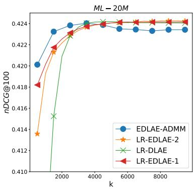
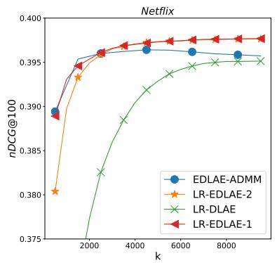
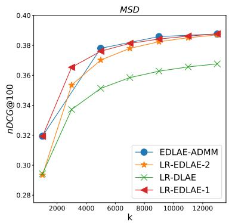

# On the Regularization Landscape for the Linear Recommendation Models

Dong Li1 Zhenming Liu2 Ruoming Jin1 Hao Zhou1 Zhi Liu3 Jing Gao3 Bin Ren2

1 Kent State University, USA 2 College of William and Mary, USA 3 iLambda, USA

{dli12,rjin1,hzhou6}@kent.edu {zliu,jgao}@ilambda.com {zliu,bren}@cs.wm.edu

## Abstract

Recently, a wide range of recommendation algorithms inspired by deep learning techniques have emerged as the performance leaders on several standard recommendation benchmarks. While these algorithms were built on diferent DL techniques (e.g., dropouts, autoencoder), they have similar performance and even similar cost functions. This paper studies whether the models’ comparable performance are sheer coincidence, or they can be unified under a single framework. We find that all linear performance leaders efectively add only a nuclear-norm based regularizer, or a Frobenius-norm based regularizer. The former ones possess a (surprising) rigid structure that limits the models’ predictive power but their solutions are low rank and have closed form. The latter ones are more expressive and more eficient for recommendation but their solutions are either full-rank or require executing hard-to-tune numeric procedures such as ADMM. Along this line of finding, we further propose two low-rank, closed-form solutions, derived from carefully generalizing Frobenius-norm based regularizers. The new solutions get the best of both nuclear-norm and Frobenius-norm world.

## 1 Introduction

Research progress on algorithms for recommendation has escalated in recent years, partially fueled by the adoption of deep learning techniques. However, recent studies have found that many new deep learning recommendation models have shown sub-par performance against the simpler linear recommendation models [Dacrema et al., 2019a, Rendle et al., 2019]. Although some studies are available to analyze linear vs non-linear models [Dacrema et al., 2019a], it remains puzzling why these seemingly diferent techniques all result in models with similar performance or even similar cost functions. This motivates us to ask a fundamental question:

What is the barebones engine that drives the performance improvement for the recent recommendation algorithms?

Specifically, do diferent recommendation techniques ofer diferent “magic”, but coincidentally have similar performance, or can they be unified under a single framework, which has a potential to produce one single algorithm that gets the best ofall existing works? In the latest study, Jin et al. [2021] examines the relationship between the widely used matrix factorization (MF), such as ALS [Warlop et al., 2017], and the linear autoencoders (LAE) which encompasses the recent performance leaders, such as EASE [Steck, 2019] and EDLAE [Steck, 2020]. They consider two basic regularization forms (See Eq (1) and (6)) and found that the optimal (closed-form) solutions of both models recover the direction of principal components, while shrinking the corresponding singular values diferently. They suggests this diference may enable LAE to utilize a larger number of latent dimensions to improve recommendation accuracy, and use this to highlight the similarity as well as diference between LAE and MF.

In this paper, we go much beyond the two basic models studied in Jin et al. [2021] to analyze a large number of recent performance leaders of (linear) recommender algorithms. We found they all can be categorized into those that implement nuclear-norm regularizers, and into those that implement Frobenius-norm regularizers. We found that the former ones possess a (surprising) rigid structure that limits the models’ predictive power, and the latter ones tend to be more expressive and more efective for recommendation. In many cases, both regularizers recover the direction of principal components, while shrinking the corresponding singular values diferently. Interestingly, we observe that it is not matrix factorization or LAE that determines the shrinkage structure (as Jin et al. [2021] suggested), but instead it is the forms of regularization. Thus, this paper provides a more complete and accurate characterization on how a linear recommendation model performs under diferent regularizations.

To better understand the regularizations that can be transformed into the (weighted) nuclear-norm regularizer $\| W \|$ , we first show that Variational Linear AutoEncoders (VLAE) solves a weighted nuclear-norm regulariza tion problem, in which the weights possess a specific combinatorial structure. We also show that this technique cannot be generalized to tackle arbitrary weight sequences. Second, it has been known that using dropout techniques is equivalent to adding a squared nuclear-norm regularizer $\| W \| _ { * } ^ { 2 }$ , and that the solution structure is strikingly similar to the regularizer that uses ∥�∥∗. we generalize the result to show that the solution structures for $\| \boldsymbol { W } \| _ { * } ^ { p }$ are highly similar for all $p \geq 1$ . But when $p = 1 , 2$ , the solution and hyper-parameters possess favorable properties so hyper-parameter search becomes easier. This also partially explains why only $p = 1 , 2$ have been extensively considered. Third, all nuclear-norm–based techniques possess a salient property: their estimators keep the singular vectors of the data matrix and shrink only the singular values. But this severely limits the search space and explains why models that use only nuclear-norm–based regularizers share the same performance ceiling even when hyper-parameters are extensively searched.

The (weighted) Frobenius-norm regularizers $\| \Lambda W \| _ { F } ^ { 2 }$ are implemented in EASE [Steck, 2019] and ED-LAE [Steck, 2020]. These models produce closed form full-rank estimators; and if the zero diagonal constraint on � is enforced, their singular vectors will no longer coincide with those of the data, and can deliver (slightly) better performance. However, no closed form solutions for the low-rank estimator is known and the current approaches rely on ADMM or stochastic factorized gradients [Steck, 2020]. In this paper, we propose two new low-rank, closed-form estimators that deliver comparable results to the full rank models (EASE and full-rank EDLAE) as well as the ADMM based solutions [Steck, 2020].

The new closed-form solutions for low-rank models have profound implications at both practical and conceptual fronts: First, low rank solutions are often more scalable (the full rank � can be too large to materialize) and can better serve real-world training and deployment. Second, perhaps more excitingly, these solutions get the best of nuclear (closed form and low rank) and Frobenius worlds (strong predictive power). A simple “one-liner” formula (from each solution) concisely pack all the benefits obtained by a recent long line of research and abstract out all the computation nuance (e.g., the need to tune ADMM and deal with local optimal). We believe these closed-form solutions are also powerful tools to help us compare diferent regularizations analytically.

## 2 Background and overview

Recommendation system background. Recommendation algorithms can be categorized into explicit ones that aim to predict unseen ratings between a user and an item and implicit ones that aim to predict actions, such as user click or add-cart [Steck, 2019, Dacrema et al., 2019b, Zhang et al., 2019]. We focus on the implicit problem because it is more economically relevant. Here, let � be the number of items and � be the number of users. We are given a binary matrix $X \in \{ 0 , 1 \} ^ { m \times n }$ that represents the interaction between users and items so far, i.e., $X _ { i , j } = 1$ if user � has purchased or made a rating on item �. Our goal is to produce a real-valued matrix �ˆ , which we evaluate against future interactions using information retrieval metrics such as Top-� or nDCG. Note that while the syntax of this problem resembles matrix completion (MC) [Candès and Tao, 2010], recommendation systems and MC have diferent evaluation criteria so MC’s results are not directly applicable here.

## 2.1 Nuclear-norm based regularizations

Let $X \in \mathbf { R } ^ { m \times n }$ be a matrix of rank at most � with � leading singular values being $\sigma _ { 1 } ( X ) \geq \sigma _ { 2 } ( X ) \geq \cdots \geq$ $\sigma _ { k } ( X )$ . Let $\boldsymbol { \omega } = ( \omega _ { 1 } , \ldots , \omega _ { k } ) \in ( \mathbf { R } ^ { + } ) ^ { k }$ . The weighted unclear norm of � with respect to � is defined as $\begin{array} { r } { \| X \| _ { \omega , * } = \sum _ { i = 1 } ^ { k } \omega _ { i } \times \sigma _ { i } ( X ) } \end{array}$

We can see that this is a natural generalization of the weighted nuclear norm for low-rank matrices [Gu et al., 2014]. Also, despite its name, the weighted nuclear norm is neither convex nor diferentiable unless $\omega _ { i }$ ’s are sorted in descending order [Chen et al., 2013, Iglesias et al., 2020].

Nuclear-norm based regularizers perform $\ell _ { 1 }$ -shrinkage over the estimator’s singular values, which resembles performing ℓ -shrinkage for coeficients in a linear model in LASSO [Tibshirani, 1996]. Therefore, Nuclearnorm regularizers also promote sparsity over the solution’s singular values (i.e., the solution is usually low rank). We note a large fraction of recent recommendation algorithms efectively add only a nuclear-norm regularizer to MF (see also Table 3 in Appendix):

A1. Regularized PCA [Udell et al., 2016, Zheng et al., 2018] aims to solve

$$
\operatorname* { m i n } _ { P , Q } \| X - P Q ^ { T } \| _ { F } ^ { 2 } + \lambda \| Q \| _ { F } ^ { 2 } + \lambda \| P \| _ { F } ^ { 2 } .\tag{1}
$$

It has been known that equation (1) is equivalent to solving min $\operatorname { \diamondsuit } \| X - \hat { X } \| _ { F } ^ { 2 } + 2 \lambda \| \hat { X } \| ,$ ∗. To solve equation (1), one can use factored gradient descent [Bhojanapalli et al., 2016] or directly use its closed form solution [Kunin et al., 2019], which involves computation of SVD of �.

A2. Matrix Factorization via dropouts. This approach use $P Q ^ { \mathrm { { T } } } \left( P \in \mathbf { R } ^ { m \times k } , Q \in \mathbf { R } ^ { n \times k } \right)$ to approximate � and uses a neural net to find � and �. A standard dropout technique is used when we train � and $Q .$ Cavazza et al. [2018] shows that optimization with dropout is equivalent to solving min $_ { \hat { X } } \| X - { \hat { X } } \| _ { F } ^ { 2 } + \lambda \| { \hat { X } } \| _ { * } ^ { 2 }$ , and the closed form solution is obtained by shrinking all singular values of � by a magnitude of $\mu ,$ which depends on the data � and choise of �.

The next two approaches use techniques from (variational) auto-encoder. We show that they also efectively add variants of nuclear-norm regularizers although this may not be clear at the first glance.

A3. Linear Regression via Denoising Linear Auto-Encoder considers the following (non-uniform) weighted ℓ2-regularization [Bao et al., 2020]:

$$
\left\| X - X W _ { 1 } W _ { 2 } \right\| _ { F } ^ { 2 } + \left\| W _ { 1 } \Lambda ^ { \frac { 1 } { 2 } } \right\| _ { F } ^ { 2 } + \left\| \Lambda ^ { \frac { 1 } { 2 } } W _ { 2 } \right\| _ { F } ^ { 2 } ,\tag{2}
$$

where Λ is a diagonal matrix. Bao et al. [2020] has shown a closed-form for eq. 2 with a specific of diagonal $\boldsymbol { \Lambda } = d i a g ( \lambda _ { 1 } , \lambda _ { 2 } , \cdots , \lambda _ { k } )$ when the weight is non-descending: $\lambda _ { 1 } \leq \lambda _ { 2 } \leq \cdots \leq \lambda _ { k }$ . It remains unclear if a closed-form exists for an arbitrary weight order.

A4. Variational Linear Auto-encoders. While not explicitly studied before, it is also natural to consider linear simplification of Variational Autoencoders, such as Multi-VAE [Liang et al., 2018], which has shown to exhibit strong performance for recommendation. To optimize linear VAE, we need to find the MLE for the probabolistic model

$$
p ( \mathbf { x } \mid \mathbf { z } ) = N \left( W \mathbf { z } + \mu , \sigma ^ { 2 } I \right) { \mathrm { ~ a n d ~ } } p ( \mathbf { z } \mid \mathbf { x } ) = N ( V ( \mathbf { x } - \mu ) , D ) ,\tag{3}
$$

where � is a diagonal covariance matrix. Then we have the following observation.

Lemma 1. Consider optimizing the ELBO (Evidence Lower Bound) [Kingma and Welling, 2014]for the above LVAE model $( E q . 3 )$ . When the optimization is over the entire dataset and $\mu = 0 ,$ , this optimization problem is equivalent to minimizing

$$
\mathcal { L } = \Vert \boldsymbol { X } - \boldsymbol { X } \boldsymbol { V } ^ { \mathrm { T } } \boldsymbol { W } ^ { \mathrm { T } } \Vert _ { F } ^ { 2 } + N \Vert \sqrt { D } \boldsymbol { W } ^ { T } \Vert _ { F } ^ { 2 } + \sigma ^ { 2 } \vert \vert \boldsymbol { X } \boldsymbol { V } ^ { \mathrm { T } } \Vert _ { F } ^ { 2 } + g ( D , \sigma )\tag{4}
$$

where, �(�, �) = −�2� log |�| − tr(�) + � − � log 2��2).

Here, we set $\pmb { \mu } = 0$ for simplicity and following typical practices in recommendations. The proof can be found in Appendix. Since our objective is for recommendation (not purely on recovering the low rank factors of the data), we treat the covariance matrix � as hyperparameters. Thus, the term $g ( D , \sigma )$ becomes a constant, and let $A = \sigma V ^ { T } , B = 1 / \sigma W ^ { T } , \Lambda = \sigma \sqrt { N D }$

If we consider � as an optimization parameter, then the optimal solution of LVAE is equivalent to that of pPCA [Tipping and Bishop, 1999]. In this case, $D = \sigma ^ { 2 } ( \Sigma ^ { 2 } / \bar { N } ) ^ { - 1 }$ , where $\Sigma ^ { 2 } = d i a g ( \sigma _ { i } ^ { 2 } )$ are the eigen-values of the covariance matrix of �, and $\begin{array} { r } { \sigma ^ { 2 } = \frac { 1 } { n - k } \sum _ { j = k + 1 } ^ { n } \frac { \sigma _ { j } ^ { 2 } } { N } } \end{array}$ . Further, the closed form solutions of $V \left( A \right)$ and $W \left( B \right)$ are characterized. However, for recommendation, the matrix � can be considered as a hyperparameter (to be learned); in this case, the closed form solution is not studied yet. We may “clean $\mathsf { u p } ^ { \mathsf { v } }$ equation (4) and obtain the following optimization problem:

$$
\operatorname* { m i n } _ { A \in \mathbf { R } ^ { n \times k } , B \in \mathbf { R } ^ { k \times m } } \| X - X A B \| _ { F } ^ { 2 } + \| X A \| _ { F } ^ { 2 } + \| \Lambda B \| _ { F } ^ { 2 } ,\tag{5}
$$

in which decision variables are � and �, and the hyper-parameter is a diagonal matrix $\boldsymbol { \Lambda } \in \mathbf { R } ^ { k \times k }$

Our main results: solution structure and implications (Sec. 3). (i) We show that solving Eq. 5 (A4) is equivalent to solving $\| X - W \| _ { F } ^ { 2 } + \lambda \| W \| _ { \omega , }$ ∗ subject to rank $( W ) \leq k$ , where � consists of Λ’s diagonal values, sorted in ascending order. In addition, the closed form solution for � is merely shrinking the �-th singular value of � by a magnitude of $\omega _ { i }$ . When the diagonals of Λ is already sorted $( \mathrm { i . e . , } \ \Lambda _ { 1 , 1 } \le \cdots \le \Lambda _ { k , k } )$ , the problem efectively reduces to $_ { \mathrm { A } 3 }$ . When Λ is proportional to identity, the problem reduces to A1. This result has three major implications. First, A1, A3, and A4 efectively only add a variant of nuclear-norm based regularizer, and the major benefits from these algorithms are computational. Second, our result generalizes that in A3 and solves an open problem left there, i.e., the hyper-parameters Λ do not need to have sorted diagonal values, the optimization algorithm will “automatically perform the sorting”. Third, while the variational auto-encoder ofers a flexibility to tailor-make the prior for each entry in the latent variable z (in eq. 3), the solution space is quite rigid due to the auto-sorting property: the �-th smallest entry in Λ will find its way to match with the �-th largest singular values in �. In other words, it is impossible to shrink $X \mathbf { \hat { s } }$ singular values by an arbitrary sequence via carefully choosing Λ in eq. 5.

(ii) We characterize the optimal solution for $\| X - W \| _ { F } ^ { 2 } + \lambda \| W \| _ { * } ^ { p }$ for any $p \geq 1$ . We shall show that regardless the choice of $p ,$ the optimal solution uniformly shrinks all $X \mathbf { \hat { s } }$ singular values by a constant magnitude $\mu$ (and to 0 if a singular value is already less than $\mu )$ . The specific $\mu$ depends on �, $p ,$ , as well as the data � unless $p = 1$ . It has two implications. First, $\mu$ needs to be fine-tuned to optimize test performance. Therefore, choices of $p$ (again) only produces computational gain. Second, when $p = 1 , \mu$ does not depend on the data so we can tune this hyper-parameter in a direct manner. When $p = 2 ,$ , � is scale-invariant, i.e., it does not need to be rescaled when all entries in � is scaled by a constant factor. Being able to directly tune $\mu$ or having the scale invariant property helps the hyper-parameter search; when $p \neq 1 , 2 .$ , it does not ofer benefit in either computation or search, which explains why we see only $p = 1 , 2$ in the literature.

Finally, for all nuclear-norm-based approaches discussed above, the estimators always keep singular vectors of � and shrink its singular values. Therefore, the solution space ofered by nuclear-norm based regularization is quite constrained, which limits these models predictive power.

## 2.2 Frobenius norm based regularizations

Most algorithms below were originally motivated by the design of (denoising) auto-encoders, it has been shown that they efectively add a Frobenius-norm regularizer. See also Table 3 in Appendix.

A5. EASE [Steck, 2019] aims to optimize min� $\vert \vert X - X W \vert \vert _ { F } ^ { 2 } + \lambda \cdot \vert \vert W \vert \vert _ { F } ^ { 2 }$ subject to the constraint that diag(�) = 0. A closed form solution exists for this problem.

A6. DLAE [Steck, 2020] adds a weighted Frobenius-norm regularizer so the objective becomes

$$
\operatorname* { m i n } _ { W } \left\{ \| X - X W \| _ { F } ^ { 2 } + \| \Lambda ^ { 1 / 2 } W \| _ { F } ^ { 2 } \right\} ,
$$

where $\begin{array} { r } { \Lambda = \frac { p } { 1 - p } d i a g M ( d i a g ( X ^ { T } X ) ) } \end{array}$

A7. EDLAE [Steck, 2020] integrates weighted Frobenius norm in DLAE with EASE’s diagonal constraint so its objective is the same as DLAE but it requires diag(�) = 0. A closed form solution exists for this problem. When � is required to be low rank, an ADMM algorithm may be used.

A8. Tikhonov regularization/Low Rank Regression (LRR) [Jin et al., 2021]. Let $V _ { k }$ be the � leading right singular vectors of �. Jin et al. [2021] finds an estimator that solves

$$
W = \arg \operatorname* { m i n } _ { r a n k ( W ) \leq k } \| X - X W \| _ { F } ^ { 2 } + \| \mathbf { \Gamma } \mathbf { { I } } \mathbf { { \mathrm { I } } } \mathbf { { \mathrm { I } } } _ { F } ^ { 2 } ,\tag{6}
$$

where $\Gamma = \Lambda ^ { \frac { 1 } { 2 } } V _ { k } ^ { T }$ and $\boldsymbol { \Lambda } = d i a g ( \lambda _ { 1 } ^ { \prime } , \cdot \cdot \cdot , \lambda _ { k } ^ { \prime } )$ is a hyper-parameter. Its a closed-form solution is.

$$
\boldsymbol { W } ^ { * } = V _ { k } d i a g ( \frac { \sigma _ { 1 } ^ { 2 } } { \sigma _ { 1 } ^ { 2 } + \lambda _ { 1 } ^ { \prime } } , \dots , \frac { \sigma _ { k } ^ { 2 } } { \sigma _ { k } ^ { 2 } + \lambda _ { k } ^ { \prime } } ) \boldsymbol { V } _ { k } ^ { T }\tag{7}
$$

Our results. Our major goal is to design a low-rank closed form estimator whose performance is comparable to the performance leaders. We first remark that A5 and A6 produce full-rank estimators. A7 can produce either full-rank or low-rank estimator (via ADMM) and has the best performance (among all approaches we discussed). The estimator from A8 is low-rank and has a closed-form solution but it has to keep singular vectors of � so its predictive power is also limited. Nevertheless, A8 is conceptually interesting because it uses Frobenius norm regularizers but its solution space cover the solution space ofered in A4 (and thus also A1-A4).

Proposition 1. For any regularized instances in the form of (5) with regularization parameter Λ such that $\sigma _ { i } ( X ) \geq \lambda _ { ( k - i ) }$ for all �, there is a corresponding Tikhonov regularized instance with $\mathbf { T } = \Lambda ^ { \frac { 1 } { 2 } } V _ { k } ^ { \mathrm { T } }$ which provides the same regularization efect.

The proof is in Appendix. A major implication of Prop. 1 is that we can focus on designing Frobenius-norm regularizers because it also gets the value from using nuclear-norm regularizers. Indeed, Sec. 4 will introduce two low-rank Frobenius-norm-based model with closed form solutions that have comparable performance to linear performance leaders.

## 3 Nuclear-norm based regularization

Rigidity of VLAE. We first analyze solution for Eq. 5 (A4). To facilitate the analysis, we also consider the following problem:

$$
\operatorname* { m i n } _ { P , Q } \| X - P Q \| _ { F } ^ { 2 } + \| \Lambda ^ { \frac { 1 } { 2 } } Q \| _ { F } ^ { 2 } + \| P \Lambda ^ { \frac { 1 } { 2 } } | _ { F } ^ { 2 } , \mathrm { ~ o r ~ e q u i v a l e n t l y } , \operatorname* { m i n } _ { P , Q } \| X - P Q \| _ { F } ^ { 2 } + \| \Lambda Q \| _ { F } ^ { 2 } + \| P \| _ { F } ^ { 2 } ,\tag{8}
$$

Note that when we let $Q ^ { \prime } = X A ^ { * }$ and $P ^ { \prime } = B ^ { * }$ (where $A ^ { * }$ and $B ^ { * }$ are an optimal solution of Equation 5), the syntax of Eq. 8 matches with that of Eq. 5. This implies that solution for Eq. 8 is a lower bound of that for $\mathrm { E q . } 5$ . These two solutions coincide only when the columns in the optimal $P ^ { * }$ in Eq. 8 are spanned by the columns of �.

We shall first find a closed-form solution $( P ^ { * } , Q ^ { * } )$ for Eq. 8, and show that indeed that the column space of $P ^ { * }$ is in the column space of �. Below is our major Proposition.

Proposition 2. Let $f : \mathbf { R } ^ { m \times n } \longrightarrow \mathbf { R } ^ { + }$ be any costfunction. Let $\boldsymbol { P } \in \mathbf { R } ^ { m \times k }$ and $Q \in \mathbf { R } ^ { k \times n }$ . Let $\boldsymbol { \Lambda } \in \mathbf { R } ^ { k \times k }$ be a diagonal matrix such that $\lambda _ { i } = \Lambda _ { i i } \ge 0 ( i \in [ k ] )$ . Let also $\omega = \left( \lambda _ { \pi ( 1 ) } , \lambda _ { \pi ( 2 ) } , \ldots , \lambda _ { \pi ( k ) } \right)$ , where � is a permutation on [�] such that $\lambda _ { \pi ( 1 ) } \leq \lambda _ { \pi ( 2 ) } \leq \cdot \cdot \cdot \leq \lambda _ { \pi ( k ) }$ . The following two optimization problems have the same optimal values

$$
O P T 1 : \quad \operatorname * { m i n } _ { P , Q } \qquad f ( P Q ) + \| \Lambda ^ { \frac { 1 } { 2 } } Q \| _ { F } ^ { 2 } + \| P \Lambda ^ { \frac { 1 } { 2 } } \| _ { F } ^ { 2 } .
$$

$$
O P T 2 : \quad \operatorname* { m i n } _ { W } \quad \begin{array} { l } { f ( W ) + 2 \| W \| _ { \omega , * } } \\ { s u b j e c t t o \quad \operatorname { r a n k } ( W ) \leq k . } \end{array}
$$

In addition, $i f ( P ^ { * } , Q ^ { * } )$ is an optimal solutionfor ���1, then $W ^ { * } = P ^ { * } Q ^ { * }$ is an optimal solutionfor ���2. $H W ^ { * }$ is an optimal solution for ���2, then there exists an optimal solution $( P ^ { * } , Q ^ { * } )$ for ���1 such that $W ^ { * } = P ^ { * } Q ^ { * }$

We reiterate three points made earlier (Sec. 2). (i) Both A3 and A4 efectively add a nuclear norm regularizer. (ii) Diagonals of Λ do not need to be sorted in ascending order as stated in [Bao et al., 2020] because any permutation of the diagonals will be equivalent to ���2. This also limits the search space and afects a model’s prediction power. (iii) Prop. 2 “compiles” a non-diferentiable objective $( O P T 2 )$ into an equivalent diferentiable one (���1), which is easier to optimize. In addition, $f ( \cdot )$ in A3 & A4 is the reconstruction error, in which case closed form solutions exist.

We next explain the intuition for proving Prop. 2 (see Appendix for the full analysis). Consider ���1 and let $W = P Q$ . Our goal is to characterize the behaviors of � and $Q$ with the presence of the regularizers when $W = P Q$ is known (fixed). Let the SVD of � be $U _ { W } \Sigma _ { W } V _ { W } ^ { \mathrm { { T } } }$ . Because two regularizers $\| \Lambda ^ { \frac { 1 } { 2 } } Q \| _ { F } ^ { 2 }$ and $\| P \Lambda ^ { \frac { 1 } { 2 } } \| _ { F } ^ { 2 }$ are symmetric, we could “guess” $P = U _ { W } \Sigma _ { W } ^ { \frac { 1 } { 2 } } \Omega$ and $Q = \Omega ^ { \mathrm { T } } \Sigma _ { W } ^ { \frac { 1 } { 2 } } V _ { W } ^ { \mathrm { T } }$ , where Ω is a unitary matrix. Now we have

$$
\begin{array} { r } { \| \Lambda ^ { \frac { 1 } { 2 } } Q \| _ { F } ^ { 2 } + \| P \Lambda ^ { \frac { 1 } { 2 } } \| _ { F } ^ { 2 } = \| \Lambda ^ { \frac { 1 } { 2 } } \Omega \Sigma ^ { \frac { 1 } { 2 } } V _ { W } ^ { \mathrm { T } } \| _ { F } ^ { 2 } + \| U _ { W } \Sigma _ { W } ^ { \frac { 1 } { 2 } } \Omega \Lambda ^ { \frac { 1 } { 2 } } \| _ { F } ^ { 2 } = 2 \| \Lambda ^ { \frac { 1 } { 2 } } \Omega \Sigma _ { W } ^ { \frac { 1 } { 2 } } \| _ { F } ^ { 2 } . } \end{array}
$$

Now the question of finding � and � when � is known boils down to finding a unitary matrix Ω that minimizes $\| \Lambda ^ { \frac { 1 } { 2 } } \Omega \Sigma _ { W } ^ { \frac { 1 } { 2 } } \| _ { F } ^ { 2 }$ , where diagonal matrices Λ and $\Sigma _ { W }$ are given. Recall that $\lambda _ { i } = \Lambda _ { i i }$ and let $\sigma _ { i } = ( \Sigma _ { W } ) _ { i i }$ . Note that $\lambda _ { i } \mathbf { \dot { s } }$ could be unsorted and, and that $\sigma _ { i } \mathrm { ^ { * } s }$ are sorted in descending order.

If we restrict Ω to be only a permutation matrix, then we aim to find a permutation $\pi \in [ k ]$ that minimizes $\begin{array} { r } { \sum _ { i \leq k } \lambda _ { \pi ( i ) } \sigma _ { i } } \end{array}$ . Using a rearrangement inequality Yue [2020], we can see that the minimal is achieved when $\lambda _ { \pi ( 1 ) } \leq \lambda _ { \pi ( 2 ) } \leq \cdot \cdot \cdot \leq \lambda _ { \pi ( k ) }$ . In this case, we indeed have $\mathrm { m i n } _ { \Omega }$ $\| \Lambda ^ { \frac { 1 } { 2 } } \Omega \Sigma _ { W } ^ { \frac { 1 } { 2 } } \| _ { F } ^ { 2 } = \| \Sigma _ { W } \| _ { \omega , * } ,$ a permutation where $\omega = \left( \lambda _ { \pi ( 1 ) } , \ldots , \lambda _ { \pi ( k ) } \right)$

Note that because $P Q = P \Omega \Omega ^ { \mathrm { T } } Q$ for any unitary matrix $\Omega ,$ it is always beneficial to use Ω to shufle the rows and columns of � and � so that the largest $\sigma _ { i }$ is mapped to the smallest $\lambda _ { i }$ , etc. This “degree of freedom” from Ω also explains why ordering the values along Λ’s diagonal is irrelevant.

Appendix shows that even when Ω is allowed to be any unitary matrix, the optimal one is still a permutation matrix. This conclusion can be viewed as a matrix version of re-arrangement inequality.

Prop. 2 also leads to the following Corollary.

Corollary 1. Let $\mathbf { X } \in \mathbf { R } ^ { m \times n } \left( m \geq n \right)$ be a full rank matrix. Let Λ be a diagonal matrix with $\Lambda _ { i i } \geq 0$ for all �. Let $\boldsymbol { P } \in \mathbf { R } ^ { m \times k }$ and $Q \in \mathbf { R } ^ { k \times n }$ . Consider the optimization problems

$$
\operatorname* { m i n } _ { P , Q } \| X - P Q \| _ { F } ^ { 2 } + \| \Lambda ^ { \frac { 1 } { 2 } } Q \| _ { F } ^ { 2 } + \| P \Lambda ^ { \frac { 1 } { 2 } } \| _ { F } ^ { 2 }\tag{9}
$$

$$
\operatorname* { m i n } _ { A , B } \| X - X A B \| _ { F } ^ { 2 } + \| \Lambda B \| _ { F } ^ { 2 } + \| X A \| _ { F } ^ { 2 } .\tag{10}
$$

Let the SVD of � be $U { \boldsymbol { \Sigma } } V ^ { \mathrm { { T } } }$ , and let $\Sigma _ { k } \in \mathbf { R } ^ { k \times k }$ be a matrix comprising the � largest singular values of �, and $U _ { k }$ and $V _ { k }$ be the corresponding singular vectors. Let $\lambda _ { ( 1 ) } \geq \lambda _ { ( 2 ) } \geq \cdot \cdot \cdot \geq \lambda _ { ( k ) }$ be the sorted sequence of the diagonal valuesfrom Λ. (9) has a closed-form solution:

$$
\begin{array} { l } { { P ^ { * } = U _ { k } d i a g ( \sqrt { ( \sigma _ { 1 } - \lambda _ { ( k ) } ) ^ { + } } ) , . . . , \sqrt { ( \sigma _ { k } - \lambda _ { ( 1 ) } ) ^ { + } } ) \Omega , } } \\ { { Q ^ { * } = \Omega ^ { \mathrm { T } } d i a g ( \sqrt { ( \sigma _ { 1 } - \lambda _ { ( k ) } ) ^ { + } } ) , . . . ) V _ { k } ^ { \mathrm { T } } , } } \end{array}\tag{11}
$$

where Ω is a unitary matrix that corresponds to the permutation � such that $\lambda _ { \pi ( 1 ) } \leq \cdots \leq \lambda _ { \pi ( k ) }$ . In addition, (10) has a closed-form solution: $A ^ { * } = X ^ { \dagger } P ^ { * } \Lambda ^ { \frac { 1 } { 2 } }$ and $B ^ { * } = \Lambda ^ { - \frac { 1 } { 2 } } Q ^ { * }$ , where $X ^ { \dagger }$ is the pseudo-inverse of �.

Uniform solution structure for regularizing $\| W \| _ { * } ^ { p }$ . In [Cavazza et al., 2018], it was observed that when we use a neural net $X = P Q ^ { \mathrm { T } }$ (with learnable parameters being � and �) to train a model and a standard dropout is used, the objective is equivalent to solving min� $\| X - W \| _ { F } ^ { 2 } + \lambda \| W \| _ { * } ^ { 2 }$ . While the regularizer $\| W \| _ { * } ^ { 2 }$ deviates from the standard one $\| W \|$ ∗, the optimal solution here is $\dot { W } = U S _ { \mu } ( \Sigma ) V ^ { \mathrm { { T } } }$ , where $U { \boldsymbol { \Sigma } } V ^ { \mathrm { { T } } }$ is SVD of $X ,$ , and $S _ { \mu } ( \Sigma )$ is a diagonal matrix such that its (�, �)-th element is $( \Sigma _ { i , i } - \mu ) ^ { + }$ , in which $\mu$ depends on the data � and �. In other words, the optimal solution for regularizers $\| \boldsymbol { W } \| _ { * } ^ { 2 }$ and $\lVert W \rVert$ ∗ are strikingly similar. Thus, we are interested in how regularizers with diferent exponents are connected. Our main observation is that for any regularizer $\| W \| _ { * } ^ { p } \left( p \geq 1 \right)$ , the optimal solution has the same structure.

Lemma 2. Let $X \in \mathbf { R } ^ { m \times n }$ , where $m \geq n$ . Let the � leading SVDs of � be $U _ { d }$ and $V _ { d }$ respectively. Let $\sigma _ { 1 } , \ldots , \sigma _ { n }$ be the singular values of �. Consider the optimization problem:

$$
\operatorname* { m i n } _ { W } \frac { 1 } { 2 } \| X - W \| _ { F } ^ { 2 } + \lambda \| W \| _ { * } ^ { p } .\tag{12}
$$

Let $\begin{array} { r } { \mu _ { k } \ = \ \frac { 1 } { k } \sum _ { i \leq k } \sigma _ { i } ( X ) , \ \eta ( \mu _ { k } ) } \end{array}$ be the positive root of the function $z + \lambda k z ^ { p - 1 } - k \mu _ { k }$ and � be the largest value such that $\sigma _ { d } ( X ) - \lambda ( \eta ( \mu _ { d } ) ) ^ { p - 1 } \geq 0$ . Let $\mu = \lambda ( \eta ( \mu _ { d } ) ) ^ { p - 1 }$ . The optimal solution of � is $U _ { d } \mathrm { d i a g } ( \sigma _ { 1 } - \mu , \sigma _ { 2 } - \mu , . . . , \sigma _ { d } - \mu ) V _ { d } ^ { \mathrm { T } }$

Lemma 2 is a straightforward generalization of Prop. 12 in [Cavazza et al., 2018] so the contribution here is a conceptual one: it implies that regularizers $\| \boldsymbol { W } \| _ { * } ^ { p }$ with diferent $p ^ { \prime } \mathbf { s }$ difer in how the shrinkage variable $\mu$ is obtained. Observe that $\mu$ is an important hyper-parameter that needs to be extensively tuned against data, all regularizers $\| \boldsymbol { W } \| _ { * } ^ { p }$ provide the same learning power. As noted earlier, $\mu$ is a function of � (i.e., diferent � will result in diferent $\mu )$ unless $p = 1$ . In addition, � needs to be rescaled when � is scaled by a constant factor unless $p = 2$ . This implies it could be easier to tune $\mu$ when $p = 1 , 2$ , and explains why only $p = 1 , 2$ have been extensively considered.

## 4 Low-Rank Frobenius norm based regularizations

This section presents the close-form low-rank estimators with comparable performance to the state of the art algorithms.

Approximate Low rank DLAE and EDLAE. Recall that DLAE solves

$$
\mathop { \operatorname* { m i n } } _ { W } | | X - X W | | _ { F } ^ { 2 } + | | \Lambda ^ { \frac { 1 } { 2 } } W | | _ { F } ^ { 2 } \qquad\tag{13}
$$

and EDLAE with the additional $d i a g ( W ) = 0$ constraint. Even though both the Nuclear norm based regularization as well as the full rank DLAE and EDLAE solutions all have closed-form solutions, such solution is unknown for the low-rank DLAE and EDLAE, whose existing solution is based on ADMMSteck [2020]. The closed form solutions will help both better understand and compare these models, and determine the hyper-parameters, which is usually dificult for the ADMM type solutions.

For DLAE, since it can be considered a special form of Tikhonov regularization (Eq 6) which has a closed form Jin et al. [2021], its closed form solution, referred to LR-DLAE, is immediately available (See Line 6 in Table 3). However, for EDLAE, it has the zero diagonal constraint, which make the exact solution dificult to express. Here, we present an approximate low-rank closed-form solution of equation (13) by decomposing the optimization problem into two subproblems, which is similar to [Jin et al., 2021]: We first consider the full-rank closed form solution for EDLAE Steck [2020], which is:

$$
W ^ { * } = I - C \cdot d M a t ( 1 \oslash d i a g ( C ) ) , { \mathrm { ~ w h e r e ~ } } C = ( X ^ { T } X + \Lambda ) ^ { - 1 }
$$

Then, we consider two approaches to produce low-rank matrix approximation of $W ^ { * }$ :

(Method 1 (LR-EDLAE-1): ) Selecting $\widehat { W }$ to best approximate the performance of $W ^ { * }$ without the zero diagonal constraint:

$$
\begin{array} { r l } & { \widehat { W } = \mathop { \arg \operatorname* { m i n } } _ { r a n k ( W ) \leq k } | | \overline { { X } } W ^ { * } - \overline { { X } } W | | _ { F } ^ { 2 } } \\ & { \quad = \mathop { \arg \operatorname* { m i n } } _ { r a n k ( W ) \leq k } | | X W ^ { * } - X W | | _ { F } ^ { 2 } + | | \Lambda ^ { \frac { 1 } { 2 } } ( W ^ { * } - W ) | | _ { F } ^ { 2 } } \end{array}\tag{14}
$$

where ${ \overline { { X } } } = \left[ { \begin{array} { l } { X } \\ { \Lambda ^ { \frac { 1 } { 2 } } } \end{array} } \right]$ . Noting, in the full rank problem equation (13), it forces the diagonal of derived matrix $( W ^ { * } )$ to be zero. Here, we relax the zero diagonal constraint - the diagonal of low rank approximate matrix

$\widehat { W }$ doesn’t have to be zero, which has also been discussed in [Steck, 2020]. The closed-from solution of equation (14) is given by:

$$
\boxed { \widehat { W } = W ^ { * } ( Q _ { k } Q _ { k } ^ { T } ) }\tag{15}
$$

where $Q _ { k }$ comes from SVD:

$$
\overline { { { Y } } } ^ { \ast } = \overline { { { X } } } W ^ { \ast } , \mathrm { a n d } \overline { { { Y } } } ^ { \ast } ( k ) = P _ { k } \Sigma _ { k } { Q } _ { k } ^ { T }
$$

(Method 2 (LR-EDLAE-2):) SVD approximation of $W ^ { * }$ : The alternative solution is to simply perform SVD, and which gives a low-rank estimation of $W ^ { * }$

Note that in both approaches, the hard constraint of zero-diagonal on $\widehat { W }$ is relaxed. In the next section, the experimental results show both approaches can provide comparable or better performance compared with the ADMM solution, and also very close to the full rank EDLAE solution.

## 5 Experimental Results

In this section, we experimentally study diferent regularizations for linear recommendation models. Our goal is to validate the efectiveness of various regularizations (all can be categorized under nuclear norm and Frobenius norm) together with their simple closed-form solutions. We aim to answer three questions: Q1. How does the closed form solution of low rank Frobenius norm perform compared with the ADMM solutions (Section 4) and how does the weighted nuclear norm regularizer for matrix factorization (Proposition 2 and Corollary 1) perform? Q2. What is the tradeof between the number of factors (rank �) and the recommendation accuracy? Q3. How does the ordering of weights from small to large (non-descending) for adjusting the singular values (Corollary 1) afect the recommendation performance?

Experimental Setup: We use three commonly used datasets for recommendation studies: MovieLens 20 Million (ML-20M) [Harper and Konstan, 2015], Netflix Prize (Netflix) [Bennett et al., 2007], and the Million Song Data (MSD)[Bertin-Mahieux et al., 2011]. We obtained these datasets and all benchmarks from authors of EASE [Steck, 2019], EDLAE [Steck, 2020], and Mult-VAE [Liang et al., 2018].

Similar to the latest study in EASE [Steck, 2019], and EDLAE [Steck, 2020], we consider the following state-of-the-art recommendation models: ALS (WMF) [Hu et al., 2008] for matrix factorization approaches, SLIM [Ning and Karypis, 2011], EASE [Steck, 2019], and EDLAE [Steck, 2020] for linear autoendoers, CDAE [Wu et al., 2016], Mult-DAE and Mult-VAE [Liang et al., 2018] for deep learning models. The experiment settings for these baseline are the same as [Liang et al., 2018, Steck, 2019, 2020]. Also we follow their practice [Liang et al., 2018, Steck, 2019, 2020] for the strong generalization by splitting the users into training, validation and tests group, and report performance metrics ������@20, ������@50 and ����@100. Finally, we note that our code are openly available (see Appendix).

Q1: Low-Rank Frobenius Norm and (Weighted) Nuclear Norm Regularization: In this experiment, we evaluate the low rank Frobenius norm regularization and the nuclear norm regularization (equation (1)) for the matrix factorization. Here EDLAE-ADMM, LRR, LR-DLAE, LR-EDLAE-1, LR-EDLAE-2, MF dropout and LVAE are listed in table 3 in Appendix. To determine the non-descending order of weights $\lambda _ { i }$ for the closed-form solution in (equation (11)), we follow the practice in weighted nuclear norm regularization in [Gu et al., 2014] as well as the optimized pPCA weight [Lucas et al., 2019b]. Let $\begin{array} { r } { \lambda _ { i } = \frac { C } { \sigma _ { i } } } \end{array}$ where � is a hyperparameter, and we perform grid-search to find the optimal one.

In Table 1, we can see that the weighted nuclear norm regularization (LVAE) based matrix factorization actually performs worse than the constant weighted version (Regularized PCA). And the latter shows very strong performance comparing against the WFM/ALS (one of the most popular implicit matrix factorization algorithm). We also observe the closed form solutions (LR-DLAE, LR-EDLAE-1 and LR-EDLAE-2) all perform very comparable with the ADMM based low rank solution and the full rank DLAE and EDLAE solutions.

  
(a)

  
(b)

  
(c)  
Figure 1: Low rank models ����@100 on test data for 3 datasets.

Q2: nDCG vs Rank � for low-rank Frobenius norm: In this experiment, we focus on evaluating the recommendation accuracy (using nDCG) against the rank �. Specifically, we vary the rank � from around 1� to around 10�, and we tune and compare four diferent methods, including EDLAE-ADMM, LR-DLAE, LR EDLAE-1, and LR-EDLAE-2. We have the following observations: 1) As � increases, the recommendation accuracy also increases in general; however, most of them reaches a plateau around similar �, and for diferent datasets, the saturating point varies. 2) LR-DLAE performs worse than EDLAE based approaches in two out of three datasets. This partially demonstrates the benefits of zero-diagonal constraint. 3) The closed form solution of EDLAE performs comparable or even slightly better than ADMM methods as � grows; but when � is relatively small, ADMM method perform slightly better. But none-the-less, for most of the reasonable choices of � when low-rank approximates full rank, the closed form solution performs comparable or better.

Table 1: The performance comparison between diferent regularizations. For notation, please refer table 3 for more details.
<table><tr><td rowspan=2 colspan=4>Model</td><td rowspan=1 colspan=2>ML-20M</td><td rowspan=1 colspan=1></td><td rowspan=1 colspan=3>Netflix</td><td rowspan=1 colspan=2>MSD</td><td rowspan=1 colspan=1></td></tr><tr><td rowspan=1 colspan=1>Recall@20</td><td rowspan=1 colspan=1>Recall@50</td><td rowspan=1 colspan=1>nDCG@100</td><td rowspan=1 colspan=1>Recall@20</td><td rowspan=1 colspan=1>Recall@50</td><td rowspan=1 colspan=1>nDCG@100</td><td rowspan=1 colspan=1>Recall@20</td><td rowspan=1 colspan=1>Recall@50</td><td rowspan=1 colspan=1>nDCG@100</td></tr><tr><td rowspan=8 colspan=3>Frobinius Norm</td><td rowspan=1 colspan=1>EASE</td><td rowspan=1 colspan=1>0.391</td><td rowspan=1 colspan=1>0.521</td><td rowspan=1 colspan=1>0.420</td><td rowspan=1 colspan=1>0.362</td><td rowspan=1 colspan=1>0.445</td><td rowspan=1 colspan=1>0.393</td><td rowspan=1 colspan=1>0.333</td><td rowspan=1 colspan=1>0.428</td><td rowspan=1 colspan=1>0.389</td></tr><tr><td rowspan=1 colspan=1>DLAE</td><td rowspan=1 colspan=1>0.392</td><td rowspan=1 colspan=1>0.527</td><td rowspan=1 colspan=1>0.424</td><td rowspan=1 colspan=1>0.362</td><td rowspan=1 colspan=1>0.446</td><td rowspan=1 colspan=1>0.395</td><td rowspan=1 colspan=1>0.329</td><td rowspan=1 colspan=1>0.426</td><td rowspan=1 colspan=1>0.387</td></tr><tr><td rowspan=1 colspan=1>EDLAE</td><td rowspan=1 colspan=1>0.393</td><td rowspan=1 colspan=1>0.523</td><td rowspan=1 colspan=1>0.424</td><td rowspan=1 colspan=1>0.366</td><td rowspan=1 colspan=1>0.449</td><td rowspan=1 colspan=1>0.398</td><td rowspan=1 colspan=1>0.334</td><td rowspan=1 colspan=1>0.429</td><td rowspan=1 colspan=1>0.392</td></tr><tr><td rowspan=1 colspan=1>EDLAE-ADMM</td><td rowspan=1 colspan=1>0.392</td><td rowspan=1 colspan=1>0.524</td><td rowspan=1 colspan=1>0.424</td><td rowspan=1 colspan=1>0.365</td><td rowspan=1 colspan=1>0.448</td><td rowspan=1 colspan=1>0.396</td><td rowspan=1 colspan=1>0.330</td><td rowspan=1 colspan=1>0.424</td><td rowspan=1 colspan=1>0.386</td></tr><tr><td rowspan=1 colspan=1>LRR</td><td rowspan=1 colspan=1>0.376</td><td rowspan=1 colspan=1>0.511</td><td rowspan=1 colspan=1>0.408</td><td rowspan=1 colspan=1>0.348</td><td rowspan=1 colspan=1>0.431</td><td rowspan=1 colspan=1>0.380</td><td rowspan=1 colspan=1>0.248</td><td rowspan=1 colspan=1>0.335</td><td rowspan=1 colspan=1>0.301</td></tr><tr><td rowspan=1 colspan=1>LR DLAE</td><td rowspan=1 colspan=1>0.392</td><td rowspan=1 colspan=1>0.527</td><td rowspan=1 colspan=1>0.424</td><td rowspan=1 colspan=1>0.362</td><td rowspan=1 colspan=1>0.445</td><td rowspan=1 colspan=1>0.395</td><td rowspan=1 colspan=1>0.306</td><td rowspan=1 colspan=1>0.403</td><td rowspan=1 colspan=1>0.363</td></tr><tr><td rowspan=1 colspan=1>LR-EDLAE-1</td><td rowspan=1 colspan=1>0.392</td><td rowspan=1 colspan=1>0.523</td><td rowspan=1 colspan=1>0.424</td><td rowspan=1 colspan=1>0.365</td><td rowspan=1 colspan=1>0.449</td><td rowspan=1 colspan=1>0.398</td><td rowspan=1 colspan=1>0.327</td><td rowspan=1 colspan=1>0.423</td><td rowspan=1 colspan=1>0.384</td></tr><tr><td rowspan=1 colspan=1>LR-EDLAE-2</td><td rowspan=1 colspan=1>0.392</td><td rowspan=1 colspan=1>0.523</td><td rowspan=1 colspan=1>0.424</td><td rowspan=1 colspan=1>0.365</td><td rowspan=1 colspan=1>0.449</td><td rowspan=1 colspan=1>0.398</td><td rowspan=1 colspan=1>0.325</td><td rowspan=1 colspan=1>0.421</td><td rowspan=1 colspan=1>0.382</td></tr><tr><td rowspan=4 colspan=2>Nuclear Norm</td><td></td><td></td><td></td><td></td><td></td><td></td><td></td><td></td><td></td><td></td><td></td></tr><tr><td rowspan=3 colspan=2></td><td></td><td></td><td></td><td></td><td></td><td></td><td></td><td></td><td></td><td></td></tr><tr><td rowspan=1 colspan=1>MF dropout</td><td rowspan=1 colspan=1>0.367</td><td rowspan=1 colspan=1>0.501</td><td rowspan=1 colspan=1>0.393</td><td rowspan=1 colspan=1>0.334</td><td rowspan=1 colspan=1>0.418</td><td rowspan=1 colspan=1>0.365</td><td rowspan=1 colspan=1>0.270</td><td rowspan=1 colspan=1>0.367</td><td rowspan=1 colspan=1>0.328</td></tr><tr><td rowspan=1 colspan=2>[orm</td><td rowspan=1 colspan=1>Regularized PCA</td><td rowspan=1 colspan=1>0.364</td><td rowspan=1 colspan=1>0.501</td><td rowspan=1 colspan=1>0.392</td><td rowspan=1 colspan=1>0.331</td><td rowspan=1 colspan=1>0.417</td><td rowspan=1 colspan=1>0.365</td><td rowspan=1 colspan=1>0.229</td><td rowspan=1 colspan=1>0.313</td><td rowspan=1 colspan=1>0.279</td></tr><tr><td rowspan=1 colspan=1></td><td rowspan=1 colspan=2></td><td rowspan=1 colspan=1>LVAE</td><td rowspan=1 colspan=1>0.348</td><td rowspan=1 colspan=1>0.474</td><td rowspan=1 colspan=1>0.378</td><td rowspan=1 colspan=1>0.325</td><td rowspan=1 colspan=1>0.405</td><td rowspan=1 colspan=1>0.357</td><td rowspan=1 colspan=1>0.205</td><td rowspan=1 colspan=1>0.254</td><td rowspan=1 colspan=1>0.286</td></tr><tr><td rowspan=5 colspan=3>Baseline</td><td rowspan=1 colspan=1></td><td rowspan=1 colspan=1>WMF/ALS</td><td rowspan=1 colspan=1>0.360</td><td rowspan=1 colspan=1>0.498</td><td rowspan=1 colspan=1>0.386</td><td rowspan=1 colspan=1>0.316</td><td rowspan=1 colspan=1>0.404</td><td rowspan=1 colspan=1>0.351</td><td rowspan=1 colspan=1>0.211</td><td rowspan=1 colspan=1>0.312</td></tr><tr><td rowspan=1 colspan=1>SLIM</td><td rowspan=1 colspan=1>0.370</td><td rowspan=1 colspan=1>0.495</td><td rowspan=1 colspan=1>0.401</td><td rowspan=1 colspan=1>0.347</td><td rowspan=1 colspan=1>0.428</td><td rowspan=1 colspan=1>0.379</td><td rowspan=1 colspan=1>no results i</td><td rowspan=1 colspan=1>n [Ning and Ka</td><td rowspan=1 colspan=1>rypis, 2011]</td></tr><tr><td rowspan=1 colspan=1>CDAE</td><td rowspan=1 colspan=1>0.391</td><td rowspan=1 colspan=1>0.523</td><td rowspan=1 colspan=1>0.418</td><td rowspan=1 colspan=1>0.343</td><td rowspan=1 colspan=1>0.428</td><td rowspan=1 colspan=1>0.376</td><td rowspan=1 colspan=1>0.188</td><td rowspan=1 colspan=1>0.283</td><td rowspan=1 colspan=1>0.237</td></tr><tr><td rowspan=1 colspan=1>MULT-DAE</td><td rowspan=1 colspan=1>0.387</td><td rowspan=1 colspan=1>0.524</td><td rowspan=1 colspan=1>0.419</td><td rowspan=1 colspan=1>0.344</td><td rowspan=1 colspan=1>0.438</td><td rowspan=1 colspan=1>0.380</td><td rowspan=1 colspan=1>0.266</td><td rowspan=1 colspan=1>0.363</td><td rowspan=1 colspan=1>0.313</td></tr><tr><td rowspan=1 colspan=1>MULT-VAE</td><td rowspan=1 colspan=1>0.395</td><td rowspan=1 colspan=1>0.537</td><td rowspan=1 colspan=1>0.426</td><td rowspan=1 colspan=1>0.351</td><td rowspan=1 colspan=1>0.444</td><td rowspan=1 colspan=1>0.386</td><td rowspan=1 colspan=1>0.266</td><td rowspan=1 colspan=1>0.364</td><td rowspan=1 colspan=1>0.316</td></tr><tr><td rowspan=1 colspan=4># items</td><td rowspan=1 colspan=3>20108</td><td rowspan=1 colspan=3>17769</td><td rowspan=1 colspan=3>41140</td></tr><tr><td rowspan=1 colspan=4># users</td><td rowspan=1 colspan=3>136677</td><td rowspan=1 colspan=3>463435</td><td rowspan=1 colspan=3>571353</td></tr><tr><td rowspan=1 colspan=4># interactions</td><td rowspan=1 colspan=3>10mil</td><td rowspan=1 colspan=3>57mil</td><td rowspan=1 colspan=3>34mil</td></tr></table>

Table 2: Investigating the weight ordering of Matrix Factorization
<table><tr><td rowspan=2 colspan=1>Model</td><td rowspan=1 colspan=3>ML-20M</td><td rowspan=1 colspan=3>Netflix</td><td rowspan=1 colspan=3>MSD</td></tr><tr><td rowspan=1 colspan=1>Recall@20</td><td rowspan=1 colspan=1>Recall@50</td><td rowspan=1 colspan=1>nDCG@100</td><td rowspan=1 colspan=1>Recall@20</td><td rowspan=1 colspan=1>Recall@50</td><td rowspan=1 colspan=1>nDCG@100</td><td rowspan=1 colspan=1>Recall@20</td><td rowspan=1 colspan=1>Recall@50</td><td rowspan=1 colspan=1>nDCG@100</td></tr><tr><td rowspan=1 colspan=1>MF/LRR weighted</td><td rowspan=1 colspan=1>0.3806</td><td rowspan=1 colspan=1>0.5175</td><td rowspan=1 colspan=1>0.4102</td><td rowspan=1 colspan=1>0.3484</td><td rowspan=1 colspan=1>0.4320</td><td rowspan=1 colspan=1>0.3797</td><td rowspan=1 colspan=1>0.2508</td><td rowspan=1 colspan=1>0.3390</td><td rowspan=1 colspan=1>0.3037</td></tr><tr><td rowspan=1 colspan=1>MF sorted</td><td rowspan=1 colspan=1>0.3017</td><td rowspan=1 colspan=1>0.4507</td><td rowspan=1 colspan=1>0.3361</td><td rowspan=1 colspan=1>0.2860</td><td rowspan=1 colspan=1>0.3801</td><td rowspan=1 colspan=1>0.3265</td><td rowspan=1 colspan=1>0.2288</td><td rowspan=1 colspan=1>0.3148</td><td rowspan=1 colspan=1>0.2802</td></tr></table>

Q3: Impact of Weight Ordering: Finally, we study how the ordering of weights from small to large (non-descending) for adjusting the singular values (Corollary 1) afects the recommendation performance using matrix factorization (closed-form solution in Eq. 11). Our results are in Table 2. Here, we obtain the searched optimal weight parameters from weighted Tikhonov regularization (following the approach in Jin et al. [2021]), and map it back to the parameters in the closed form solution (Proposition 1). Then we sort the parameters in the non-descending order, and then report their results in the second row of Table 2. We can see that the recommendation performance becomes significant worst. This help confirm our conjecture that the strict ordering of weight on matrix factorization and other regularizations can be an inherent limitation for those approaches.

## 6 Conclusion and Discussion

This work provides a complete analysis on the recently proposed linear models for recommendation systems. Despite that models leverage diferent deep learning techniques, they achieve similar performance. We find that this is not coincident: all the models add either a nuclear-norm-based (Lemma 1) or a Frobenius-norm based regularizer. The nuclear-norm-based approach results in estimators that keep �’s singular vectors and shrink its singular values in a quite rigid way (Proposition 2 and Lemma 2), which limit their prediction power. The Frobenius-norm models are more express (Proposition 1) and efective but their estimators are either full-rank or do not have closed form solutions. To get the best of both nuclear and Frobenius worlds, we propose two low-rank and closed-form estimators (Sec. 4) based on carefully generalizing Frobenius-norm based regularizers. These estimators have competitive performance against linear performance leaders, and thus concisely pack all the benefits obtained by a recent long line of research and abstract out all the computation nuance.

## References

Charu C. Aggarwal. Recommender Systems: The Textbook. Springer, 1st edition, 2016. ISBN 3319296574.

Xuchan Bao, James Lucas, Sushant Sachdeva, and Roger B. Grosse. Regularized linear autoencoders recover the principal components, eventually. In Hugo Larochelle, Marc’Aurelio Ranzato, Raia Hadsell, Maria-Florina Balcan, and Hsuan-Tien Lin, editors, Advances in Neural Information Processing Systems 33: Annual Conference on Neural Information Processing Systems 2020, NeurIPS 2020, December 6-12, 2020, virtual, 2020.

James Bennett, Charles Elkan, Bing Liu, Padhraic Smyth, and Domonkos Tikk. Kdd cup and workshop 2007. 2007. doi: 10.1145/1345448.1345459. URL https://doi.org/10.1145/1345448.1345459.

Thierry Bertin-Mahieux, Daniel PW Ellis, Brian Whitman, and Paul Lamere. The million song dataset. 2011.

Srinadh Bhojanapalli, Anastasios Kyrillidis, and Sujay Sanghavi. Dropping convexity for faster semi-definite optimization. In Conference on Learning Theory, pages 530–582. PMLR, 2016.

Emmanuel J Candès and Terence Tao. The power of convex relaxation: Near-optimal matrix completion. IEEE Transactions on Information Theory, 56(5):2053–2080, 2010.

Jacopo Cavazza, Pietro Morerio, Benjamin Haefele, Connor Lane, Vittorio Murino, and Rene Vidal. Dropout as a low-rank regularizer for matrix factorization. In Proceedings of the Twenty-First International Conference on Artificial Intelligence and Statistics. PMLR, 2018.

Kun Chen, Hongbo Dong, and Kung-Sik Chan. Reduced rank regression via adaptive nuclear norm penalization. Biometrika, 100(4):901–920, 2013.

Evangelia Christakopoulou and George Karypis. Hoslim: Higher-order sparse linear method for top-n recommender systems. In Advances in Knowledge Discovery and Data Mining, 2014.

Maurizio Ferrari Dacrema, P. Cremonesi, and D. Jannach. Are we really making much progress? a worrying analysis of recent neural recommendation approaches. In RecSys’19, 2019a.

Maurizio Ferrari Dacrema, Paolo Cremonesi, and Dietmar Jannach. Are we really making much progress? RecSys’19, 2019b.

Mukund Deshpande and George Karypis. Item-based top-n recommendation algorithms. ACM Trans. Inf. Syst., 2004.

Shuhang Gu, Lei Zhang, Wangmeng Zuo, and Xiangchu Feng. Weighted nuclear norm minimization with application to image denoising. In Proceedings of the IEEE conference on computer vision and pattern recognition, pages 2862–2869, 2014.

F. Maxwell Harper and Joseph A. Konstan. The movielens datasets: History and context. ACM Trans. Interact. Intell. Syst., 2015. doi: 10.1145/2827872.

Y. Hu, Y. Koren, and C. Volinsky. Collaborative filtering for implicit feedback datasets. In ICDM’08, 2008.

José Pedro Iglesias, Carl Olsson, and Marcus Valtonen Örnhag. Accurate optimization of weighted nuclear norm for non-rigid structure from motion. arXiv preprint arXiv:2003.10281, 2020.

Ruoming Jin, Dong Li, Jing Gao, Zhi Liu, Li Chen, and Yang Zhou. Towards a better understanding of linear recommendation models. In KDD’21, 2021. URL https://arxiv.org/abs/2105.12937.

Santosh Kabbur, Xia Ning, and George Karypis. Fism: Factored item similarity models for top-n recommender systems. KDD ’13, 2013.

Diederik P. Kingma and Max Welling. Auto-Encoding Variational Bayes. In 2nd International Conference on Learning Representations, ICLR 2014, Banf, AB, Canada, April 14-16, 2014, Conference Track Proceedings, 2014.

Yehuda Koren. Factorization meets the neighborhood: A multifaceted collaborative filtering model. In KDD’08, 2008.

Yehuda Koren, Robert Bell, and Chris Volinsky. Matrix factorization techniques for recommender systems. Computer, 42(8):30–37, August 2009.

Daniel Kunin, Jonathan Bloom, Aleksandrina Goeva, and Cotton Seed. Loss landscapes of regularized linear autoencoders. In Proceedings ofthe 36th International Conference on Machine Learning, Proceedings of Machine Learning Research, pages 3560–3569. PMLR, 09–15 Jun 2019.

Xiaopeng Li and James She. Collaborative variational autoencoder for recommender systems. In Proceedings of the 23rd ACM SIGKDD International Conference on Knowledge Discovery and Data Mining, KDD ’17, page 305–314, 2017.

Dawen Liang, R. G. Krishnan, M. D. Hofman, and T. Jebara. Variational autoencoders for collaborative filtering. In WWW’18, 2018.

James Lucas, George Tucker, Roger B Grosse, and Mohammad Norouzi. Don't blame the elbo! a linear vae perspective on posterior collapse. In Advances in Neural Information Processing Systems, volume 32. Curran Associates, Inc., 2019a

James Lucas, George Tucker, Roger B. Grosse, and Mohammad Norouzi. Don’t blame the elbo! A linear VAE perspective on posterior collapse. In Hanna M. Wallach, Hugo Larochelle, Alina Beygelzimer, Florence d’Alché-Buc, Emily B. Fox, and Roman Garnett, editors, Advances in Neural Information Processing Systems 32: Annual Conference on Neural Information Processing Systems 2019, NeurIPS 2019, December 8-14, 2019, Vancouver, BC, Canada, pages 9403–9413, 2019b. URL https://proceedings.neurips. cc/paper/2019/hash/7e3315fe390974fcf25e44a9445bd821-Abstract.html.

Sahand Negahban and Martin J Wainwright. Estimation of (near) low-rank matrices with noise and high-dimensional scaling. The Annals ofStatistics, pages 1069–1097, 2011.

Xia Ning and George Karypis. Slim: Sparse linear methods for top-n recommender systems. ICDM ’11, 2011.

Stefen Rendle, Li Zhang, and Yehuda Koren. On the dificulty of evaluating baselines: A study on recommender systems, 2019.

Suvash Sedhain, Aditya Krishna Menon, Scott Sanner, and Darius Braziunas. On the efectiveness of linear models for one-class collaborative filtering. AAAI’16, 2016.

Ilya Shenbin, Anton Alekseev, Elena Tutubalina, Valentin Malykh, and Sergey I. Nikolenko. Recvae: A new variational autoencoder for top-n recommendations with implicit feedback. In Proceedings of the 13th International Conference on Web Search and Data Mining, WSDM ’20, page 528–536, 2020.

Harald Steck. Embarrassingly shallow autoencoders for sparse data. WWW’19, 2019.

Harald Steck. Autoencoders that don’t overfit towards the identity. In NIPS, 2020.

Robert Tibshirani. Regression shrinkage and selection via the lasso. Journal of the Royal Statistical Society: Series B (Methodological), 58(1):267–288, 1996.

Michael E. Tipping and Chris M. Bishop. Probabilistic principal component analysis. JOURNAL OF THE ROYAL STATISTICAL SOCIETY, SERIES B, 61(3):611–622, 1999.

Madeleine Udell, Corinne Horn, Reza Zadeh, and Stephen Boyd. Generalized low rank models. Found. Trends Mach. Learn., 9(1):1–118, June 2016.

Romain Warlop, Alessandro Lazaric, and Jérémie Mary. Parallel higher order alternating least square for tensor recommender system. In Workshops at the Thirty-First AAAI Conference on Artificial Intelligence, 2017.

Yao Wu, Christopher DuBois, Alice X. Zheng, and Martin Ester. Collaborative denoising auto-encoders for top-n recommender systems. WSDM ’16, 2016.

Man-Chung Yue. A matrix generalization of the hardy-littlewood-p\’olya rearrangement inequality and its applications. arXiv preprint arXiv:2006.08144, 2020.

Shuai Zhang, Lina Yao, Aixin Sun, and Yi Tay. Deep learning based recommender system: A survey and new perspectives. ACM Comput. Surv., 2019.

Shuai Zheng, Chris Ding, and Feiping Nie. Regularized singular value decomposition and application to recommender system, 2018.

## A Related Work

There have been extensive researches on recommendation [Aggarwal, 2016]. Besides the basic user-based and item-based collaborative filtering [Deshpande and Karypis, 2004], the full rank linear autoencoder approaches include SLIM [Ning and Karypis, 2011], HOLISM [Christakopoulou and Karypis, 2014], EASE [Steck, 2019], DLAE (Denoising linear autoencoder) Steck [2020], whereas low-rank approaches include [Kabbur et al., 2013, Sedhain et al., 2016, Steck, 2020]. All the customized recommendation has been enforcing zero diagonal constraints for generalization purpose, whereas we show an approximate closed-form solution for a two-term Tikhonov regularization without the zero diagonal constraint can be as efective as these models.

Matrix factorization has been been widely studied in practice, partially due to Netflix competition Koren et al. [2009]. Methods like SVD++ Koren [2008] and implicit Alternating Least Square (ALS) method Hu et al. [2008] (also weighted matrix factorization) have been very influential. [Jin et al., 2021] shows the relationship between linear autoencoders and matrix factorization, and pointed out a potential advantage of linear autoencoders. In this work, we take a step further to reveal a deeper relationship between Tikhonov regularized linear autoencoders and a few other regularizations including matrix factorization, and show the potential limitation of the class of regularization. We also utilize the linear variational autoencoders (LVAE) to study how the deep VAE based recommendation approaches [Li and She, 2017, Liang et al., 2018, Shenbin et al., 2020] relate to linear autoencoders and matrix factorization.

Outside recommendation, there have been a few recent studies on regularization landscapes of linear (variational) autoencoders [Kunin et al., 2019, Bao et al., 2020, Lucas et al., 2019a]. They do not provide the general weighted $\ell _ { 2 }$ regularization and thus did not find the inherent limitation on the regularization (for MF). Our LVAE inspired regularization is also never studied before.

Nuclear norm regularizers can recover low-rank matrices in the vector regression setting [Negahban and Wainwright, 2011]. Its weighted generalization can be applied in the area of image processing [Gu et al., 2014]. Because weighted nuclear-norm is usually not convex or diferentiable, finding optimal solutions is dificult except for a few special cases [Chen et al., 2013].

## B Proofs

## B.1 Proof of Lemma 1

The Linear Variational AutoEncoder (LVAE) is defined in the same way as [Lucas et al., 2019b]:

$$
\begin{array} { l } { p ( x \mid z ) = N \left( W z + \pmb { \mu } , \sigma ^ { 2 } I \right) } \\ { q ( z \mid x ) = N ( V ( x - \pmb { \mu } ) , D ) } \end{array}\tag{16}
$$

For simplification, we set $\mu = 0$ in following context. And the ELBO of LVAE is known as:

$$
\begin{array} { r l } & { \mathcal { L } _ { x } = - K L ( q ( z | x ) | | p ( z ) ) + \mathbb { E } _ { q ( z | x ) } [ \log p ( x | z ) ] } \\ & { K L ( q ( z | x ) | | p ( z ) ) = - \log | D | + x ^ { T } V ^ { T } V x + t r ( D ) - k } \\ & { \mathbb { E } _ { q ( z | x ) } [ \log p ( x | z ) ] = - \displaystyle \frac { 1 } { 2 \sigma ^ { 2 } } \Big ( t r ( W D W ^ { T } ) + x ^ { T } V ^ { T } W ^ { T } W V x - 2 x ^ { T } W V x + x ^ { T } x \Big ) - \frac { n } { 2 } \log 2 \pi \sigma ^ { 2 } } \end{array}\tag{17}
$$

Again, the (maximizing) ELBO can be written as:

$$
\begin{array} { l } { \displaystyle \mathcal { L } _ { x } = - \frac { 1 } { 2 } \Big ( - \log | D | + { x } ^ { T } V ^ { T } V x + t r ( D ) - k \Big ) - \frac { n } { 2 } \log 2 \pi \sigma ^ { 2 } } \\ { \displaystyle \quad - \frac { 1 } { 2 \sigma ^ { 2 } } \Big ( t r ( W D W ^ { T } ) + { x } ^ { T } V ^ { T } W ^ { T } W V x - 2 { x } ^ { T } W V x + { x } ^ { T } x \Big ) } \\ { \displaystyle = - \frac { 1 } { 2 } | | V x | | _ { 2 } ^ { 2 } - \frac { 1 } { 2 \sigma ^ { 2 } } \Big ( | | W \sqrt { D } | | _ { F } ^ { 2 } + | | x - W V x | | _ { 2 } ^ { 2 } \Big ) + f ( D , \sigma ) } \end{array}\tag{18}
$$

where $\begin{array} { r } { f ( D , \sigma ) = \frac { 1 } { 2 } \log | D | - \frac { 1 } { 2 } t r ( D ) + \frac { k } { 2 } - \frac { n } { 2 } \log 2 \pi \sigma ^ { 2 } , x \in \mathbb { R } ^ { n } \mathrm { ~ a n d ~ } z \in \mathbb { R } ^ { k } } \end{array}$

For whole data, it is equivalent to minimize:

$$
\begin{array} { r l } & { \mathcal { L } = | | X - W V X | | _ { F } ^ { 2 } + N | | W \sqrt { D } | | _ { F } ^ { 2 } + \sigma ^ { 2 } | | V X | | _ { F } ^ { 2 } + g ( D , \sigma ) } \\ & { \quad = | | X ^ { T } - X ^ { T } V ^ { T } W ^ { T } | | _ { F } ^ { 2 } + N | | \sqrt { D } W ^ { T } | | _ { F } ^ { 2 } + \sigma ^ { 2 } | | X ^ { T } V ^ { T } | | _ { F } ^ { 2 } + g ( D , \sigma ) } \end{array}\tag{19}
$$

where $g ( D , \sigma ) = - \sigma ^ { 2 } N \big ( \log | D | - t r ( D ) + k - n \log 2 \pi \sigma ^ { 2 } \big )$

## B.2 Proof of Proposition 1

Note that when $\sigma _ { i } \leq \lambda _ { ( k - i ) }$ , the new singular value shrinks to zero, and can be removed. Basically, for any $\lambda _ { ( 1 ) } \geq \cdots \geq \lambda _ { ( k ) }$ , we can build the corresponding Tikhonov regularized instance by setting

$$
\frac { \sigma _ { i } ^ { 2 } } { \sigma _ { i } ^ { 2 } + \lambda _ { i } ^ { \prime } } = \frac { \sigma _ { i } - \lambda _ { ( k - i ) } } { \sigma _ { i } } \mathrm { , i . e . , } \lambda _ { k } ^ { \prime } = \frac { \sigma _ { i } ^ { 3 } } { \sigma _ { i } - \lambda _ { ( k - i ) } } - \sigma _ { i } ^ { 2 } .\tag{20}
$$

Discussion of Proposition 1: Further, the same observation holds true for the regularization (2), and the weighted-nuclear norm regularization in when the weights are in the non-ascending order. This observation suggests a potentially limitation of the earlier regularization as they will always try to maintain the larger singular values: when a singular value is large, the shrinkage will be small.Such regularization has shown to work well in the areas such as image processing Gu et al. [2014]. But it has not been studied or confirmed if it will work for the recommendation. In Section 5, we report our experimental study which shows such regularization could be too restrictive for recommendation.

## B.3 Proof of Proposition 2

By slightly abusing the notation, we shall let ���1 (���2) be the value of the optimal solution for ���1 (���2). We need to show that $O P T 1 = O P T 2$ . We need two directions.

$O P T 2 \geq O P T 1 .$ : Let $W ^ { * }$ be an optimal solution for ���2. Let the SVD of $W ^ { * }$ be $U ^ { \ast } \Sigma ^ { \ast } ( V ^ { \ast } ) ^ { \mathrm { T } }$ . Recall that $W ^ { * }$ needs to satisfy the rank constraint rank $( W ^ { * } ) \leq k$ so $U ^ { * } \in \mathbf { R } ^ { m \times k } , \Sigma ^ { * } \in \mathbf { R } ^ { k \times k }$ , and $V ^ { * } \in \mathbb { R } ^ { n \times k }$ . Let $\pi$ be a permutation on [�] such that $\lambda _ { \pi ( 1 ) } \leq \lambda _ { \pi ( 2 ) } \leq \cdot \cdot \cdot \leq \lambda _ { \pi ( k ) }$ . Let also ٠be the corresponding permutation matrix. Specifically, $\Omega \in \{ 0 , 1 \} ^ { k \times k }$ and there is exactly one entry in each row of ٠is 1:

$$
\Omega _ { i , j } = { \left\{ \begin{array} { l l } { 1 } & { { \mathrm { i f ~ } } j = \pi ( i ) . } \\ { 0 } & { { \mathrm { o t h e r w i s e . } } } \end{array} \right. }
$$

For example, consider a case in which $\lambda _ { 1 } > \lambda _ { 2 } > \cdots > \lambda _ { k }$ . Then we set $\pi = ( k , k - 1 , \ldots , 1 )$ , and correspondingly,

$$
\Omega = \left( \begin{array} { l l l l } { { 0 } } & { { \ldots } } & { { 0 } } & { { 1 } } \\ { { 0 } } & { { \ldots } } & { { 1 } } & { { 0 } } \\ { { } } & { { \ldots } } & { { } } & { { } } \\ { { 1 } } & { { \ldots } } & { { 0 } } & { { 0 } } \end{array} \right) .
$$

Next, let $P = U ^ { * } ( \Sigma ^ { * } ) { } ^ { \frac { 1 } { 2 } } \Omega$ and $\boldsymbol { Q } = \Omega ^ { \mathrm { T } } ( \Sigma ^ { * } ) ^ { \frac { 1 } { 2 } } ( V ^ { * } ) ^ { \mathrm { T } }$ . We have $W ^ { * } = P Q$ and $f ( W ^ { * } ) = f ( P Q )$ . In addition,

$$
\| { \mit \Lambda } ^ { \frac { 1 } { 2 } } Q \| _ { F } ^ { 2 } + \| P { \mit \Lambda } ^ { \frac { 1 } { 2 } } \| _ { F } ^ { 2 } = 2 \| { \mit \Lambda } ^ { \frac { 1 } { 2 } } \Omega ( \Sigma ^ { \ast } ) ^ { \frac { 1 } { 2 } } \| _ { F } ^ { 2 } = 2 \sum _ { i \leq k } \lambda _ { \pi ( i ) } \sigma _ { i } = 2 \| W ^ { \ast } \| _ { \omega , \ast } ,
$$

where $\sigma _ { i }$ is the �-th largest singular value of $W ^ { * }$ . In other words, we have found a $( P , Q )$ pair such that

$$
f ( P Q ) + \| \Lambda ^ { \frac { 1 } { 2 } } Q \| _ { F } ^ { 2 } + \| P \Lambda ^ { \frac { 1 } { 2 } } \| _ { F } ^ { 2 } = f ( W ^ { * } ) + 2 \| W ^ { * } \| _ { \omega , * } = O P T 2 ,
$$

which shows that $O P T 1 \le O P T 2$

$O P T 2 \le O P T 1$ . Let $P ^ { * }$ and $Q ^ { * }$ be an optimal solution for $O P T 1$ . Let the singular values of $P ^ { * }$ be $\sigma _ { 1 } ( P ^ { * } ) \geq \sigma _ { 2 } ( P ^ { * } ) \geq \cdots \geq \sigma _ { k } ( P ^ { * } )$ and those of $Q ^ { * }$ be $\sigma _ { 1 } ( Q ^ { * } ) \geq \sigma _ { 2 } ( Q ^ { * } ) \geq \cdots \geq \sigma _ { k } ( Q ^ { * } )$ . Let also $\sigma _ { 1 } ^ { * } \geq \cdot \cdot \cdot \geq \sigma _ { k } ^ { * }$ be the singular values of $P ^ { * } Q ^ { * }$

We shall find a lower bound of $\| \Lambda ^ { \frac { 1 } { 2 } } Q \| _ { F } ^ { 2 } + \| P \Lambda ^ { \frac { 1 } { 2 } } \| _ { F } ^ { 2 }$ expressed in terms of $\sigma _ { i } ^ { * } \mathrm { { ^ s } }$ . In fact, we shall show that

$$
\| \Lambda ^ { \frac { 1 } { 2 } } Q \| _ { F } ^ { 2 } + \| P \Lambda ^ { \frac { 1 } { 2 } } \| _ { F } ^ { 2 } \geq 2 \| P ^ { * } Q ^ { * } \| _ { \omega , * } .\tag{21}
$$

One can see that if Eq. 21 were true, we have

$$
O P T 2 \leq f ( P ^ { * } Q ^ { * } ) + 2 \| P ^ { * } Q ^ { * } \| _ { \omega , * } \leq f ( P ^ { * } Q ^ { * } ) + \| \Lambda ^ { \frac { 1 } { 2 } } Q ^ { * } \| _ { F } ^ { 2 } + \| P ^ { * } \Lambda ^ { \frac { 1 } { 2 } } \| _ { F } ^ { 2 } = O P T 1 .
$$

Thus, it remains to prove Eq. 21. Let $\lambda _ { ( 1 ) } \geq \lambda _ { ( 2 ) } \geq \cdot \cdot \cdot \geq \lambda _ { ( k ) }$ be a sorted sequence of $\lambda _ { i } \mathbf { \dot { s } }$ i.e., $\lambda _ { ( k ) } = \lambda _ { \pi ( 1 ) }$ $\lambda _ { ( k - 1 ) } = \lambda _ { \pi ( 2 ) } , \ldots , \lambda _ { ( 1 ) } = \lambda _ { \pi ( k ) }$

First, we show that $\begin{array} { r } { \| P \Lambda ^ { \frac { 1 } { 2 } } \| _ { F } ^ { 2 } \geq \sum _ { i = 1 } ^ { k } \lambda _ { ( k - i + 1 ) } \times \sigma _ { i } ^ { 2 } ( P ^ { * } ) } \end{array}$ and $\begin{array} { r } { \| \Lambda ^ { \frac { 1 } { 2 } } Q \| _ { F } ^ { 2 } \geq \sum _ { i = 1 } ^ { k } \lambda _ { ( k - i + 1 ) } \times \sigma _ { i } ^ { 2 } ( Q ^ { * } ) } \end{array}$ . We need the following Lemma (see e.g., Theorem 2 in Yue [2020]):

Lemma 3. Let � and � be two positive definite matrices in $\mathbf { R } ^ { k \times k }$ . Then it holds that

$$
\sum _ { i = 1 } ^ { k } \sigma _ { i } ( A ) \sigma _ { k - i + 1 } ( B ) \leq \operatorname { t r } ( B ^ { \frac { 1 } { 2 } } A B ^ { \frac { 1 } { 2 } } ) .\tag{22}
$$

Let the SVD of $P ^ { * }$ be $U _ { P ^ { * } } \Sigma _ { P ^ { * } } V _ { P ^ { * } } ^ { \mathrm { { T } } }$ ∗ and that of $Q ^ { * }$ be $U _ { Q ^ { * } } \Sigma _ { Q ^ { * } } V _ { Q ^ { * } } ^ { \mathrm { T } }$ ∗. We have

$$
\| P ^ { * } \Lambda ^ { \frac { 1 } { 2 } } \| _ { F } ^ { 2 } = \| U _ { P ^ { * } } \Sigma _ { P ^ { * } } V _ { P ^ { * } } ^ { \mathrm { T } } \Lambda ^ { \frac { 1 } { 2 } } \| _ { F } ^ { 2 } = \| \Sigma _ { P ^ { * } } V _ { P ^ { * } } ^ { \mathrm { T } } \Lambda ^ { \frac { 1 } { 2 } } \| _ { F } ^ { 2 } = \mathrm { t r } ( \Sigma _ { P ^ { * } } V _ { P ^ { * } } ^ { \mathrm { T } } \Lambda V _ { P ^ { * } } \Sigma _ { P ^ { * } } ) .\tag{23}
$$

We now apply Lemma 3 by setting $A = V _ { P ^ { * } } ^ { \mathrm { T } } \Lambda V _ { P ^ { * } }$ and $B = \Sigma _ { P } ^ { 2 } ,$ , and obtain that

$$
\| P ^ { * } \Lambda ^ { \frac { 1 } { 2 } } \| _ { F } ^ { 2 } = \mathrm { t r } ( \Sigma _ { P ^ { * } } V _ { P ^ { * } } ^ { \mathrm { T } } \Lambda V _ { P ^ { * } } \Sigma _ { P ^ { * } } ) \geq \sum _ { i = 1 } ^ { k } \lambda _ { ( k + 1 - i ) } \times \sigma _ { i } ^ { 2 } ( P ^ { * } ) .\tag{24}
$$

We may similarly prove that $\begin{array} { r } { \| \Lambda ^ { \frac { 1 } { 2 } } Q ^ { * } \| _ { F } ^ { 2 } \geq \sum _ { i = 1 } ^ { k } \lambda _ { ( k - i + 1 ) } \times \sigma _ { i } ^ { 2 } ( Q ^ { * } ) } \end{array}$ . Therefore,

$$
\Vert \Lambda ^ { \frac { 1 } { 2 } } Q ^ { * } \Vert _ { F } ^ { 2 } + \Vert P ^ { * } \Lambda ^ { \frac { 1 } { 2 } } \Vert _ { F } ^ { 2 } \ge \sum _ { i = 1 } ^ { k } \lambda _ { ( k + 1 - i ) } \times ( \sigma _ { i } ^ { 2 } ( P ^ { * } ) + \sigma _ { i } ^ { 2 } ( Q ^ { * } ) )\tag{25}
$$

(25) provides a lower bound of $\| \Lambda ^ { \frac { 1 } { 2 } } Q ^ { * } \| _ { F } ^ { 2 } + \| P ^ { * } \Lambda ^ { \frac { 1 } { 2 } } \| _ { F } ^ { 2 }$ in terms of $\sigma _ { i } ( P ^ { * } )$ and $\sigma _ { i } ( Q ^ { * } )$ . We next aim to express the lower bound in terms of $\sigma _ { i } ^ { * } \mathrm { { ' s } }$ (singular values of $P ^ { * } Q ^ { * } )$ directly.

The following program gives a lower bound for $\| \Lambda ^ { \frac { 1 } { 2 } } Q ^ { * } \| _ { F } ^ { 2 } + \| P ^ { * } \Lambda ^ { \frac { 1 } { 2 } } \| _ { F } ^ { 2 }$

$$
\begin{array} { r l } { \operatorname* { m i n } : } & { \| \Lambda ^ { \frac { 1 } { 2 } } Q ^ { * } \| _ { F } ^ { 2 } + \| P ^ { * } \Lambda ^ { \frac { 1 } { 2 } } \| _ { F } ^ { 2 } } \\ { \mathrm { s u b j e c t ~ t o } } & { W = P ^ { * } Q ^ { * } } \\ & { \sigma _ { i } ( W ) = \sigma _ { i } ^ { * } \quad \mathrm { f o r } i \leq k . } \end{array}\tag{26}
$$

Write the SVD of � be $U _ { W } \Sigma _ { W } V _ { W } ^ { \mathrm { { T } } }$ . Also, let $\tilde { P } = U _ { W } ^ { \mathrm { T } } P ^ { * }$ and $\tilde { Q } = Q ^ { * } V _ { W }$ . Noting that the columns in $P ^ { * }$ are in the column space of � and the rows in $Q ^ { * }$ are in the row space of �, we have $( i ) \sigma _ { i } ( P ^ { * } ) = \sigma _ { i } ( \tilde { P } )$ and $\sigma _ { i } ( Q ^ { * } ) = \sigma _ { i } ( \tilde { Q } )$ for $i \leq k$ , and $( i i ) \| \Lambda ^ { \frac { 1 } { 2 } } \boldsymbol { Q } ^ { * } \| _ { F } ^ { 2 } + \| P ^ { * } \Lambda ^ { \frac { 1 } { 2 } } \| _ { F } ^ { 2 } = \| \Lambda ^ { \frac { 1 } { 2 } } \tilde { \boldsymbol { Q } } \| _ { F } ^ { 2 } + \| \tilde { P } \Lambda ^ { \frac { 1 } { 2 } } \| _ { F } ^ { 2 }$

Therefore, (26) can be equivalently written as

$$
\begin{array} { r l } { \operatorname* { m i n } : } & { \| \Lambda ^ { \frac { 1 } { 2 } } \tilde { Q } \| _ { F } ^ { 2 } + \| \tilde { P } \Lambda ^ { \frac { 1 } { 2 } } \| _ { F } ^ { 2 } } \\ { \mathrm { s u b j e c t ~ t o } } & { \Sigma _ { W } = \tilde { P } \tilde { Q } } \\ & { ( \Sigma _ { W } ) _ { i , i } = \sigma _ { i } ^ { * } \quad \mathrm { f o r } i \leq k . } \end{array}\tag{27}
$$

Now $\tilde { P } \tilde { Q }$ is positive definite. Using a similar technique developed in [Bao et al., 2020] (Theorem 1), one can see that $\tilde { P } = \tilde { Q } ^ { \mathrm { T } }$ . See also Lemma 4. This implies that $\tilde { P } = \Sigma _ { W } ^ { \frac { 1 } { 2 } } \Omega$ for some unitary matrix Ω and $\sigma _ { i } ( P ^ { * } ) = \sigma _ { i } ( \tilde { P } ) = \sigma _ { i } ( Q ^ { * } ) = \sigma _ { i } ( \tilde { Q } ) = \sqrt { \sigma _ { i } ^ { * } }$ for $i \leq k$ . Together with (25), we have

$$
\| \boldsymbol { \Lambda } ^ { \frac { 1 } { 2 } } \boldsymbol { Q } ^ { * } \| _ { F } ^ { 2 } + \| \boldsymbol { P } ^ { * } \boldsymbol { \Lambda } ^ { \frac { 1 } { 2 } } \| _ { F } ^ { 2 } \geq 2 \sum _ { i \leq k } \lambda _ { ( k + 1 - i ) } \times \sigma _ { i } ^ { 2 } ( \boldsymbol { P } ^ { * } ) = 2 \sum _ { i \leq k } \lambda _ { ( k + 1 - i ) } \times \sigma _ { i } ^ { * } = 2 \| \boldsymbol { P } ^ { * } \boldsymbol { Q } ^ { * } \| _ { \omega , * } .
$$

## B.4 Proof of Corollary 1

We first find an optimal solution for (9). Let the SVD of � be $X = U _ { X } \Sigma _ { X } V _ { X } ^ { \mathrm { { T } } }$ , where $U _ { X } \in \mathbf { R } ^ { m \times n } , \Sigma _ { X } \in \mathbf { R } ^ { n \times n }$ and $V _ { X } \in \mathbf { R } ^ { n \times n }$ . Let ${ \bar { U } } _ { X }$ be an arbitrary basis for the subspace that is orthogonal to $X \mathrm { { s } }$ column space so $\bar { U } _ { X } \in { \bf R } ^ { m \times ( m - n ) }$ and $[ U _ { X } , \bar { U } _ { X } ]$ form a basis for $\mathbf { R } ^ { m }$ . We have

$$
\begin{array} { r l } & { \quad \| X - P Q \| _ { F } ^ { 2 } + \| P \Lambda ^ { \frac { 1 } { 2 } } \| _ { F } ^ { 2 } + \| \Lambda ^ { \frac { 1 } { 2 } } Q \| _ { F } ^ { 2 } } \\ & { = \left\| \left( \begin{array} { l } { U _ { X } ^ { \mathrm { T } } } \\ { \bar { U } _ { X } ^ { \mathrm { T } } } \end{array} \right) X V _ { X } - \left( \begin{array} { l } { U _ { X } ^ { \mathrm { T } } } \\ { \bar { U } _ { X } ^ { \mathrm { T } } } \end{array} \right) P Q V _ { X } \right\| _ { F } ^ { 2 } + \left\| \left( \begin{array} { l } { U _ { X } ^ { \mathrm { T } } } \\ { \bar { U } _ { X } ^ { \mathrm { T } } } \end{array} \right) P \Lambda ^ { \frac { 1 } { 2 } } \right\| _ { F } ^ { 2 } + \| \Lambda ^ { \frac { 1 } { 2 } } Q V _ { X } \| _ { F } ^ { 2 } . } \end{array}
$$

Let $\begin{array} { r } { \tilde { P } = \left( \begin{array} { l } { U _ { X } ^ { \mathrm { T } } } \\ { \bar { U } _ { X } ^ { \mathrm { T } } } \end{array} \right) P } \end{array}$ and ${ \tilde { Q } } = Q V _ { X }$ . Then our objective becomes

$$
\operatorname* { m i n } _ { \tilde { P } , \tilde { Q } } \left\| \left( \begin{array} { c } { \Sigma _ { X } } \\ { 0 _ { ( m - n ) \times n } } \end{array} \right) - \tilde { P } \tilde { Q } \right\| _ { F } ^ { 2 } + \| \tilde { P } \Lambda ^ { \frac { 1 } { 2 } } \| _ { F } ^ { 2 } + \| \Lambda ^ { \frac { 1 } { 2 } } \tilde { Q } \| _ { F } ^ { 2 } .\tag{28}
$$

Let ${ \tilde { W } } = { \tilde { P } } { \tilde { Q } }$ and the singular values of $\tilde { W }$ be $\sigma _ { 1 } ^ { * } \geq \sigma _ { 2 } ^ { * } \geq \cdot \cdot \cdot \geq \sigma _ { k } ^ { * } .$ Let also $\tilde { \Sigma } = \left( \begin{array} { c } { { \Sigma _ { X } } } \\ { { 0 _ { \left( m - n \right) \times n } } } \end{array} \right)$

Recall also that $\sigma _ { i }$ is the �-th largest singular value of �. We next show that

$$
\left\| \left( \begin{array} { c } { \Sigma _ { X } } \\ { 0 } \end{array} \right) - \tilde { P } \tilde { Q } \right\| _ { F } ^ { 2 } = \| \tilde { \Sigma } - \tilde { P } \tilde { Q } \| _ { F } ^ { 2 } \geq \sum _ { i = 1 } ^ { k } ( \sigma _ { i } - \sigma _ { i } ^ { * } ) ^ { 2 } + \sum _ { i = k + 1 } ^ { n } \sigma _ { i } ^ { 2 } .
$$

Note first that

$$
\| \tilde { \Sigma } - \tilde { W } \| _ { F } ^ { 2 } = \| \tilde { \Sigma } \| _ { F } ^ { 2 } + \| \tilde { W } \| _ { F } ^ { 2 } - 2 \langle \tilde { \Sigma } , \tilde { W } \rangle .\tag{29}
$$

Next, we have ([Zheng et al., 2018]):

$$
| \langle \tilde { \Sigma } , \tilde { W } \rangle | = | \mathrm { t r } ( \tilde { \Sigma } \tilde { W } ^ { \mathrm { T } } ) \| \leq | \mathrm { t r } ( \tilde { \Sigma } \Sigma _ { \tilde { W } } ) | = \sum _ { i = 1 } ^ { k } \sigma _ { i } \sigma _ { i } ^ { * } .
$$

Therefore, $\langle \tilde { \Sigma } , \tilde { W } \rangle$ is maximized when

$$
\tilde { W } _ { i , j } = \left\{ \begin{array} { c l } { \sigma _ { i } ^ { * } } & { \mathrm { i f } i = j \leq k } \\ { 0 } & { \mathrm { O t h e r w i s e . } } \end{array} \right.
$$

When we plug in this optimized $\tilde { W }$ to Eq. 29, we get

$$
\| \tilde { \Sigma } - \tilde { W } \| _ { F } ^ { 2 } \geq \sum _ { i = 1 } ^ { k } ( \sigma _ { i } - \sigma _ { i } ^ { * } ) ^ { 2 } + \sum _ { i = k + 1 } ^ { n } \sigma _ { i } ^ { 2 } .
$$

Next, from Proposition 2, we have

$$
\| \tilde { P } V ^ { \frac { 1 } { 2 } } \| _ { F } ^ { 2 } + \| \Lambda ^ { \frac { 1 } { 2 } } \tilde { Q } \| _ { F } ^ { 2 } \geq \sum _ { i = 1 } ^ { k } \lambda _ { ( k - i + 1 ) } \sigma _ { i } ^ { * } .
$$

Therefore, we can find a lower bound for Eq. 5 in terms of $\sigma _ { i } ^ { * } \dag$ s:

$$
\mathcal { L } ( \sigma _ { 1 } ^ { * } , \ldots , \sigma _ { k } ^ { * } ) = \sum _ { i = 1 } ^ { k } ( \sigma _ { i } - \sigma _ { i } ^ { * } ) ^ { 2 } + 2 \sum _ { i = 1 } ^ { k } \lambda _ { ( k - i + 1 ) } \sigma _ { i } ^ { * } + \sum _ { i = k + 1 } ^ { m } \sigma _ { i } ^ { 2 } \quad ( \sigma _ { 1 } ^ { * } \geq \cdots \geq \sigma _ { k } ^ { * } \geq 0 ) .\tag{30}
$$

We next find a minimal value of $\mathcal { L }$ (by treating $\sigma _ { i } ^ { * } \mathbf { \tilde { s } }$ as decision variables). This will give us a lower bound (and is independent of $\sigma _ { i } ^ { * } )$ on our optimization problem. We then show that this lower bound can be achieved by carefully constructing $\tilde { W }$ (as well as $\tilde { P }$ and $\tilde { Q } )$ . This means such $\tilde { W }$ is optimal.

Specifically, we need to find an optimal solution for the following program:

$$
\begin{array} { r l } { \operatorname { m i n i m i z e } _ { \sigma _ { 1 } ^ { * } , \ldots , \sigma _ { k } ^ { * } } } & { \mathcal { L } ( \sigma _ { 1 } ^ { * } , \ldots , \sigma _ { k } ^ { * } ) } \\ { \mathrm { s u b j e c t ~ t o : } } & { \sigma _ { i } ^ { * } \geq 0 } \\ & { \sigma _ { 1 } ^ { * } \leq \sigma _ { 2 } ^ { * } \leq \cdots \leq \sigma _ { k } ^ { * } \mathrm { ( O r d e r i n g ~ c o n s t r a i n t ) } } \end{array}\tag{31}
$$

We shall first find an optimal solution for

$$
\begin{array} { r l } { \operatorname * { m i n i m i z e } _ { \sigma _ { 1 } ^ { * } , \ldots , \sigma _ { k } ^ { * } } } & { \mathcal { L } ( \sigma _ { 1 } ^ { * } , \ldots , \sigma _ { k } ^ { * } ) } \\ { \mathrm { s u b j e c t ~ t o : ~ } } & { \sigma _ { i } ^ { * } \geq 0 } \end{array}\tag{32}
$$

Note here, the ordering constraint is removed so the optimal value for (32) should be no more than that for (31). We shall see that the optimal solution for (31) also satisfies the ordering constraint so indeed optimal solutions for (31) and (32) are the same.

The problem (32) boils down to finding

$$
\operatorname* { m i n } _ { \sigma _ { i } ^ { * } \geq 0 } ( \sigma _ { i } - \sigma _ { i } ^ { * } ) ^ { 2 } + 2 \sum _ { i = 1 } ^ { k } \lambda _ { ( k - i + 1 ) } \sigma _ { i } ^ { * } .
$$

We note that $\sigma _ { i } ^ { * } \mathrm { { ^ s } }$ do not interact with each other so we can optimize each $\sigma _ { i } ^ { * } \mathrm { { ^ s } }$ independently. We get

$$
\sigma _ { i } ^ { * } = ( \sigma _ { i } - \lambda _ { ( k - i + 1 ) } ) ^ { + } .
$$

We can check that $\sigma _ { 1 } ^ { * } \geq \cdot \cdot \cdot \geq \sigma _ { k } ^ { * }$ . Therefore, the optimal value for (31) is

$$
\sum _ { i = 1 } ^ { k } ( \sigma _ { i } - ( \sigma _ { i } - \lambda _ { ( k - i + 1 ) } ) ^ { + } ) ^ { 2 } + 2 \sum _ { i = 1 } ^ { k } \lambda _ { ( k - i + 1 ) } ( \sigma _ { i } - \lambda _ { ( k - i + 1 ) } ) ^ { + } + \sum _ { i = k + 1 } ^ { n } \sigma _ { i } ^ { 2 } .
$$

This is also a lower bound for (9). One can check that when we set � and � as

$$
\begin{array} { r l } & { \boldsymbol { P } ^ { * } = U _ { k } d i a g ( \sqrt { ( \sigma _ { 1 } - \lambda _ { ( k ) } ) ^ { + } } ) , \ldots , \sqrt { ( \sigma _ { k } - \lambda _ { ( 1 ) } ) ^ { + } } ) \Omega , } \\ & { \boldsymbol { Q } ^ { * } = \Omega ^ { \operatorname { T } } d i a g ( \sqrt { ( \sigma _ { 1 } - \lambda _ { ( k ) } ) ^ { + } } ) , \ldots , \sqrt { ( \sigma _ { k } - \lambda _ { ( 1 ) } ) ^ { + } } ) V _ { k } ^ { \operatorname { T } } , } \end{array}\tag{33}
$$

the lower bound is achieved so (33) gives an optimal solution. Here, $U _ { k }$ and $V _ { k }$ are leading left and right singular vectors of �.

Now we move to analyze (10). Our goal is to reduce (10) to (9). Let

$$
P = X A \Lambda ^ { - { \frac { 1 } { 2 } } } \qquad Q = \Lambda ^ { \frac { 1 } { 2 } } B .
$$

Then (10) becomes

$$
\begin{array} { r l } { \operatorname { m i n i m i z e } _ { P , Q } } & { \| X - P Q \| _ { F } ^ { 2 } + \| P \Lambda ^ { \frac { 1 } { 2 } } \| _ { F } ^ { 2 } + \| \Lambda ^ { \frac { 1 } { 2 } } Q \| _ { F } ^ { 2 } } \\ { \mathrm { s u b j e c t ~ t o } } & { P = X A \Lambda ^ { - \frac { 1 } { 2 } } \quad ( \mathrm { C o n s t r a i n t ~ P } ) } \\ & { Q = \Lambda ^ { \frac { 1 } { 2 } } B \quad ( \mathrm { C o n s t r a i n t ~ Q } ) . } \end{array}\tag{34}
$$

Here, � and Λ are given, whereas �, �, �, and � are decision variables. The (Constraint P) says that each column of � needs to be in a column space of � (it is a necessary and suficient condition for � to exist). The (Constraint Q) simply says � and � are linearly related and does not have tangible impact to the optimization problem.

But we note that when we put aside the constraints, an optimal $( P , Q )$ is specified by (33). The columns of the optimal � indeed is in the column space of �. So $( P , Q )$ is also an optimal solution for (34). We may find the corresponding � and �:

$$
A ^ { * } = X ^ { \dagger } P ^ { * } \Lambda ^ { \frac { 1 } { 2 } } \mathrm { a n d } B ^ { * } = \Lambda ^ { - { \frac { 1 } { 2 } } } Q ^ { * } ,
$$

## B.5 Symmetric lemma

Lemma 4. Let $\tilde { P } , \tilde { \cal Q } \in { \bf R } ^ { k \times k }$ be full rank, Λ be a diagonal matrix, and $\Sigma _ { W }$ be a diagonal matrix so that $( \Sigma _ { W } ) _ { i , i } = \sigma _ { i } ^ { * }$ , where $\boldsymbol { \sigma } _ { i } ^ { * } \boldsymbol { \mathbf { \rho } } _ { s }$ are sorted in descending order. Consider the optimization problem:

$$
\begin{array} { r l } { \operatorname* { m i n } : } & { \| \Lambda ^ { \frac { 1 } { 2 } } \tilde { Q } \| _ { F } ^ { 2 } + \| \tilde { P } \Lambda ^ { \frac { 1 } { 2 } } \| _ { F } ^ { 2 } } \\ { s u b j e c t \ t o } & { \Sigma _ { W } = \tilde { P } \tilde { Q } } \\ & { ( \Sigma _ { W } ) _ { i , i } = \sigma _ { i } ^ { * } \quad f o r i \leq k . } \end{array}\tag{35}
$$

There is an optimal solution such that $\tilde { P } = \tilde { Q } ^ { \mathrm { T } }$

Proof. Let $\hat { P } = \tilde { P } \Lambda ^ { \frac { 1 } { 2 } }$ and $\hat { \cal Q } = \Lambda ^ { - \frac { 1 } { 2 } } \tilde { \cal Q }$ . The program (36) is equivalent to

$$
\begin{array} { r l } { \operatorname* { m i n } : } & { \| \Lambda \hat { \mathcal { Q } } \| _ { F } ^ { 2 } + \| \hat { P } \| _ { F } ^ { 2 } } \\ { \mathrm { s u b j e c t ~ t o } } & { \Sigma _ { W } = \hat { P } \hat { \mathcal { Q } } } \\ & { ( \Sigma _ { W } ) _ { i , i } = \sigma _ { i } ^ { * } \quad \mathrm { f o r ~ } i \leq k . } \end{array}\tag{36}
$$

Let the SVD of $\hat { Q }$ be $U _ { \hat { Q } } \Sigma _ { \hat { Q } } V _ { \hat { Q } } ^ { \mathrm { T } } \ s o \ \hat { Q } ^ { - 1 } = V _ { \hat { Q } } \Sigma _ { \hat { Q } } ^ { - 1 } U _ { \hat { Q } } ^ { \mathrm { T } }$ . We can also see that $\hat { P } = \Sigma _ { W } \hat { Q } ^ { - 1 }$ . Therefore, the objective term becomes

$$
\| \boldsymbol { \Lambda } \boldsymbol { U } _ { \hat { Q } } \boldsymbol { \Sigma } _ { \hat { Q } } \boldsymbol { V } _ { \hat { Q } } ^ { \mathrm { T } } \| _ { F } ^ { 2 } + \| \boldsymbol { \Sigma } _ { W } \boldsymbol { V } _ { \hat { Q } } \boldsymbol { \Sigma } _ { \hat { Q } } ^ { - 1 } \boldsymbol { U } _ { \hat { Q } } ^ { \mathrm { T } } \| _ { F } ^ { 2 } = \| \boldsymbol { \Lambda } \boldsymbol { U } _ { \hat { Q } } \boldsymbol { \Sigma } _ { \hat { Q } } \| _ { F } ^ { 2 } + \| \boldsymbol { \Sigma } _ { W } \boldsymbol { V } _ { \hat { Q } } \boldsymbol { \Sigma } _ { \hat { Q } } ^ { - 1 } \| _ { F } ^ { 2 } .
$$

Let us consider the stationary points $U _ { \hat { O } }$ and $V _ { \hat { O } }$ when $\Sigma _ { \hat { O } }$ is fixed. We can see that they need to be permutation matrices to minimize both terms in the objective (using the rearrangement inequality again). Therefore, we can see $\hat { Q } = \Sigma _ { 1 } \Sigma _ { \hat { Q } } \Sigma _ { 2 }$ for two permutation matrices $\Sigma _ { 1 }$ and $\Sigma _ { 2 }$ . This implies that $\tilde { \cal Q } = \Lambda ^ { \frac { 1 } { 2 } } \Sigma _ { 1 } \Sigma _ { \hat { \cal Q } } \Sigma _ { 2 }$ , i.e., each row (column) of $\tilde { Q }$ has exactly one non-zero entry. We may similarly show that each row (column) of $\tilde { P }$ has exactly one non-zero entry. In addition, the locations of non-zero entries of $\tilde { P }$ and $\tilde { Q } ^ { \mathrm { T } }$ are identical because $\tilde { P } \tilde { Q }$ is a diagonal matrix. We may thus write

$$
\tilde { P } = \Sigma _ { ( 1 ) } \Sigma _ { \tilde { P } } \Sigma _ { ( 2 ) } \quad \tilde { Q } = \Sigma _ { ( 2 ) } ^ { \mathrm { T } } \Sigma _ { ( \tilde { Q } ) } \Sigma _ { ( 1 ) } ^ { \mathrm { T } } ,
$$

where $( \Sigma _ { \tilde { P } } ) _ { i , i } = \sigma _ { i } ( \tilde { P } )$ and $( \Sigma _ { ( \tilde { O } ) } ) _ { i , i } = \sigma _ { \tau ( i ) } ( \tilde { Q } )$ , where � is a permutation on [�]. The set of (possibly unsorted) singular values for $\tilde { P } \tilde { Q }$ thus is $\sigma _ { i } ( \tilde { P } ) \sigma _ { \tau ( i ) } ( \tilde { Q } )$ . Thus, we can see that there exists a permutation �¯ such that

$$
\begin{array} { r l } & { \| \Lambda ^ { \frac { 1 } { 2 } } \tilde { \mathcal { Q } } \| _ { F } ^ { 2 } + \| \tilde { P } \Lambda ^ { \frac { 1 } { 2 } } \| _ { F } ^ { 2 } = \displaystyle \sum _ { i \leq k } \left( \sigma _ { i } ^ { 2 } ( P ^ { * } ) \lambda _ { \bar { \pi } ( i ) } + \sigma _ { \tau ( i ) } ^ { 2 } ( Q ^ { * } ) \lambda _ { \bar { \pi } ( i ) } \right) } \\ & { \qquad \geq \displaystyle \sum _ { i \leq k } 2 \sigma _ { i } ( P ^ { * } ) \sigma _ { \tau ( i ) } ^ { * } ( Q ) \lambda _ { \bar { \pi } ( i ) } } \\ & { \qquad \geq 2 \| P ^ { * } Q ^ { * } \| _ { \omega , * } . } \end{array}
$$

One can see that we can set $\tilde { P } = \tilde { Q } ^ { \mathrm { T } }$ to make all inequality becomes equality so there is an optimal solution such that $\tilde { P } = \tilde { Q } ^ { \mathrm { T } }$ □

## C Experimental Details

## C.1 DLAE hyperparameters tuning

This section presents the hyperparameter tuning process on the validation data over three (ML-20M, Netflix, MSD) datasets for the full rank DLAE formula, which was introduced by Steck [2020] yet not investigated:

$$
\begin{array} { l } { { \displaystyle \operatorname* { m i n } _ { W } | | X - X W | | _ { F } ^ { 2 } + | | \Lambda ^ { 1 / 2 } \cdot W | | _ { F } ^ { 2 } } } \\ { { \displaystyle \Lambda = \frac { p } { 1 - p } d M a t ( d i a g ( X ^ { T } X ) ) } } \\ { { \displaystyle \hat { W } = ( X ^ { T } X + \Lambda ) ^ { - 1 } X ^ { T } X } } \end{array}
$$

In practical, $l _ { 2 }$ regularization is also imposed:

$$
\hat { W } = ( X ^ { T } X + \Lambda + \lambda ) ^ { - 1 } X ^ { T } X
$$

The tables 4 to 6 show the results of ����@100 over three datasets respectively. And the optimal parameters are highlighted.

## C.2 Matrix Factorization with Dropout Hyperparameters Tuning

Cavazza et al. [2018] shows that optimization with dropout (allowing rank optimizing) is equivalent to solving a matrix approximation problem with nuclear norm:

$$
\begin{array} { l } { \displaystyle \underset { { P , Q , d } } { \operatorname* { m i n } } | | X - P Q ^ { T } | | _ { F } ^ { 2 } + d \frac { 1 - p } { p } \cdot \sum _ { k = 1 } ^ { d } | | P _ { k } | | _ { 2 } ^ { 2 } \cdot | | Q _ { k } | | _ { 2 } ^ { 2 } } \\ { \displaystyle \operatorname* { m i n } _ { Y } | | X - Y | | _ { F } ^ { 2 } + \frac { 1 - p } { p } | | Y | | _ { * } ^ { 2 } } \end{array}
$$

and the solution is given by:

$$
\begin{array} { c } { { X \stackrel { \mathrm { S V D } } { = } U \Sigma V ^ { T } } } \\ { { { } } } \\ { { { \displaystyle Y ^ { * } = P ^ { * } \cdot ( Q ^ { * } ) ^ { T } } } } \\ { { { } } } \\ { { { \displaystyle = U \cdot S _ { \mu } ( \Sigma ) \cdot V ^ { T } } } } \\ { { { \displaystyle S _ { \mu } ( \sigma ) = \operatorname* { m a x } ( \sigma - \mu , 0 ) } } } \\ { { { } } } \\ { { { \displaystyle \mu = \frac { 1 - p } { p + ( 1 - p ) \bar { d } } \sum _ { i = 1 } ^ { \bar { d } } \sigma _ { i } ( X ) } } } \end{array}
$$

where $\bar { d }$ denotes the largest integer such that:

$$
\sigma _ { \bar { d } } ( X ) > { \frac { 1 - p } { p + ( 1 - p ) \bar { d } } } \sum _ { i = 1 } ^ { \bar { d } } \sigma _ { i } ( X )
$$

Hence, there is only one parameter $p$ to tuning. We present the tuning process on the validation set below, see tables 7 to 9. Optimal parameters as well as induced rank $\bar { d }$ are highlighted.

## C.3 Resources

Our code are mainly implemented in Numpy 1.19, Pytorch 1.7.1 on CUDA 11.0. Our experiments are performed on nodes with two sockets, each containing a 24-core Intel(R) Xeon(R) Platinum 8268 CPU @ 2.90GHz and 4 GeForce RTX 3090 24GB memory GPU.

Table 3: Investigating the closed/analytic solutions of linear models. ����(·) denotes a diagonal matrix, ����(�) is the vector on the diagonal of �.
<table><tr><td rowspan=1 colspan=2>Model</td><td rowspan=1 colspan=1>regularization</td><td rowspan=1 colspan=1>solution</td></tr><tr><td rowspan=8 colspan=1>Frobenius norm</td><td rowspan=1 colspan=1>1. EASE(full rank) [Steck, 2019]</td><td rowspan=1 colspan=1> $\operatorname* { m i n } _ { W } | | X - X W | | _ { F } ^ { 2 } + \lambda \cdot | | W | | _ { F } ^ { 2 }$  $s . t . \quad d i a g ( W ) = 0$ </td><td rowspan=1 colspan=1> $C = ( X ^ { T } X + \lambda I ) ^ { - 1 }$  $W = I - C \cdot d M a t ( d i a g ( 1 \emptyset C ) )$ </td></tr><tr><td rowspan=1 colspan=1>2. DLAE(full rank) [Steck, 2020]</td><td rowspan=1 colspan=1> $\operatorname* { m i n } _ { W } | | X - X W | | _ { F } ^ { 2 } + | | \Lambda ^ { 1 / 2 } \cdot W | | _ { F } ^ { 2 }$  $\Lambda = \frac { p } { 1 - p } d M a t ( d i a g ( X ^ { T } X ) )$ </td><td rowspan=1 colspan=1> $W = ( X ^ { T } X + \Lambda ) ^ { - 1 } X ^ { T } X$ </td></tr><tr><td rowspan=1 colspan=1>3. EDLAE(full rank) [Steck, 2020]</td><td rowspan=1 colspan=1> $\operatorname* { m i n } _ { W } | | X - X W | | _ { F } ^ { 2 } + | | \Lambda ^ { 1 / 2 } \cdot W | | _ { F } ^ { 2 }$  $\Lambda = \frac { p } { 1 - p } d M a t ( d i a g ( X ^ { T } X ) )$  $s . t . \quad d i a g ( W ) = 0$ </td><td rowspan=1 colspan=1> $C = ( X ^ { T } X + \Lambda ) ^ { - 1 }$  $W = I - C \cdot d M a t ( d i a g ( 1 \emptyset C ) )$ </td></tr><tr><td rowspan=1 colspan=1>4. EDLAE-ADMM [Steck, 2020]</td><td rowspan=1 colspan=1> $\operatorname* { m i n } _ { A . B } | | X - X A B ^ { T } | | _ { F } ^ { 2 } + | | \Lambda ^ { 1 / 2 } \cdot A B ^ { T } | | _ { F } ^ { 2 }$  $s . t . \quad d i a g ( W ) = 0$ </td><td rowspan=1 colspan=1>ADMM update A, B</td></tr><tr><td rowspan=1 colspan=1>5. LRR [Jin et al., 2021]</td><td rowspan=1 colspan=1> $\operatorname* { m i n } _ { r a n k ( W ) \leq k } | | X - X W | | _ { F } ^ { 2 } + | | \Gamma W | | _ { F } ^ { 2 }$ </td><td rowspan=1 colspan=1> ${ \overline { { Y } } } ^ { * } = { \overline { { X } } } W ^ { * } \ { \overset { \mathrm { S V D } } { = } } \ U \Sigma V$  ${ \widehat { W } } = ( X ^ { T } X + \Gamma ^ { T } \Gamma ) ^ { - 1 } X ^ { T } X ( V _ { k } V _ { k } ^ { T } )$ </td></tr><tr><td rowspan=1 colspan=1>6. LR-DLAE(this paper)</td><td rowspan=1 colspan=1> $\operatorname* { m i n } _ { r a n k ( W ) \leq k } | | X - X W | | _ { F } ^ { 2 } + | | \Lambda ^ { 1 / 2 } \cdot W | | _ { F } ^ { 2 }$  $\Lambda = \frac { p } { 1 - p } d M a t ( d i a g ( X ^ { T } X ) )$ </td><td rowspan=1 colspan=1> $\boldsymbol { W } ^ { * } = ( \boldsymbol { X } ^ { T } \boldsymbol { X } + \boldsymbol { \Lambda } ) ^ { - 1 } \boldsymbol { X } ^ { T } \boldsymbol { X }$  $\overline { { { Y } } } ^ { * } = \overline { { { X } } } W ^ { * } \overset { \mathrm { S V D } } { = } U \Sigma V ^ { T }$  $\widehat { W } = W ^ { * } ( V _ { k } V _ { k } ^ { T } )$ </td></tr><tr><td rowspan=1 colspan=1>7. LR-EDLAE-1(this paper)</td><td rowspan=1 colspan=1> $\operatorname* { m i n } _ { r a n k ( W ) \leq k } | | X - X W | | _ { F } ^ { 2 } + | | \Lambda ^ { 1 / 2 } \cdot W | | _ { F } ^ { 2 }$  $\Lambda = \frac { p } { 1 - p } d M a t ( d i a g ( X ^ { T } X ) )$  $s . t . \quad d i a g ( W ) = 0$ </td><td rowspan=1 colspan=1> $\boldsymbol { C } = ( \boldsymbol { X } ^ { T } \boldsymbol { X } + \boldsymbol { \Lambda } ) ^ { - 1 }$  $W ^ { * } = I - C \cdot d M a t ( d i a g ( 1 \emptyset C ) )$  $\overline { { { Y } } } ^ { * } = \overline { { { X } } } W ^ { * } \overset { \mathrm { S V D } } { = } U \Sigma V ^ { T }$  $\widehat { W } = W ^ { * } ( V _ { k } V _ { k } ^ { T } )$ </td></tr><tr><td rowspan=1 colspan=1>8. LR-EDLAE-2(this paper)</td><td rowspan=1 colspan=1> $\operatorname* { m i n } _ { r a n k ( W ) \leq k } | | X - X W | | _ { F } ^ { 2 } + | | \Lambda ^ { 1 / 2 } \cdot W | | _ { F } ^ { 2 }$  $\Lambda = \frac { p } { 1 - p } d M a t ( d i a g ( X ^ { T } X ) )$  $\begin{array} { r l } { \mathrm { s . t . } } & { { } d i a g ( W ) = 0 } \end{array}$ </td><td rowspan=1 colspan=1> $\boldsymbol { C } = ( \boldsymbol { X } ^ { T } \boldsymbol { X } + \boldsymbol { \Lambda } ) ^ { - 1 }$  $W ^ { * } = I - C \cdot d M a t ( d i a g ( 1 \emptyset C ) )$  $W ^ { * } \stackrel { \mathrm { S V D } } { = } U \Sigma V ^ { T }$  $\begin{array} { r } { \widehat { W } = U _ { k } \Sigma _ { k } V _ { k } ^ { T } } \end{array}$ </td></tr><tr><td rowspan=4 colspan=1>Nuclear Norm</td><td rowspan=1 colspan=1>9. Regularized PCA [Zheng et al., 2018]</td><td rowspan=1 colspan=1> $\operatorname* { m i n } _ { P , O } | | X - P Q ^ { T } | | _ { F } ^ { 2 } + \lambda \cdot ( | | P | | _ { F } ^ { 2 } + | | Q | | _ { F } ^ { 2 } )$  $X \ { \stackrel { \mathrm { S V D } } { = } } \ U \Sigma V ^ { T }$ </td><td rowspan=1 colspan=1> $P ^ { * } = U _ { k }$  $\boldsymbol { Q } ^ { * } = V _ { k } \boldsymbol { \Omega }$  $\Omega = \sqrt { ( \sigma _ { i } - \lambda ) _ { + } }$ </td></tr><tr><td rowspan=1 colspan=1>10. MF dropout [Cavazza et al., 2018]</td><td rowspan=1 colspan=1> $\operatorname* { m i n } _ { P , Q , d } | | X - P Q ^ { T } | | _ { F } ^ { 2 } + d \frac { 1 - p } { p } \cdot \sum _ { k = 1 } ^ { d } | | P _ { k } | | _ { 2 } ^ { 2 } \cdot | | Q _ { k } | | _ { 2 } ^ { 2 }$  $\operatorname* { m i n } _ { Y } | | X - Y | | _ { F } ^ { 2 } + { \frac { 1 - p } { p } }$ ||Y||2</td><td rowspan=1 colspan=1> $X \ { \overset { \underset { \mathrm { S V D } } { } } { = } } \ U \Sigma V ^ { T }$  $\boldsymbol { Y } ^ { * } = \boldsymbol { P } ^ { * } \cdot ( \boldsymbol { Q } ^ { * } ) ^ { T }$  $\mathbf { \sigma } = U \cdot S _ { \mu } ( \Sigma ) \cdot V ^ { T }$ </td></tr><tr><td rowspan=1 colspan=1>11. LAE [Bao et al., 2020]</td><td rowspan=1 colspan=1> $\operatorname* { m i n } _ { W _ { 1 } , W _ { 2 } } \| X - X W _ { 1 } W _ { 2 } \| _ { F } ^ { 2 } + \| W _ { 1 } \Lambda ^ { \frac { 1 } { 2 } } \| _ { F } ^ { 2 } + \| \Lambda ^ { \frac { 1 } { 2 } } W _ { 2 } \| _ { F } ^ { 2 } ,$ </td><td rowspan=1 colspan=1> $\begin{array} { r } { W _ { 1 } ^ { * } = P ( I - \Lambda S ^ { - 2 } ) ^ { \frac { 1 } { 2 } } U ^ { T } } \end{array}$  $\boldsymbol { W _ { 2 } ^ { * } } = \boldsymbol { U } ( \boldsymbol { I } - \boldsymbol { \Lambda } \boldsymbol { S } ^ { - 2 } ) ^ { \frac { 1 } { 2 } } \boldsymbol { P } ^ { T }$ </td></tr><tr><td rowspan=1 colspan=1>12. LVAE(this paper)</td><td rowspan=1 colspan=1> $\operatorname* { m i n } _ { P , O } | | X - P Q | | _ { F } ^ { 2 } + | | \Lambda ^ { 1 / 2 } Q | | _ { F } ^ { 2 } + | | P \Lambda ^ { 1 / 2 } | | _ { F } ^ { 2 }$  $\operatorname* { m i n } _ { A , B } | | X - X A B | | _ { F } ^ { 2 } + | | \Lambda B | | _ { F } ^ { 2 } + | | X A | | _ { F } ^ { 2 }$  $\operatorname* { m i n } _ { r a n k ( W ) \le k } | | X - W | | _ { F } ^ { 2 } + 2 | | W | | _ { w , * }$ </td><td rowspan=1 colspan=1> $X \ { \overset { \underset { \mathrm { S V D } } { } } { = } } \ U \Sigma V ^ { T }$  $P ^ { * } = U _ { k } \cdot d i a g ( \sqrt { \sigma _ { 1 } - \lambda _ { ( k ) } } , \dots , \sqrt { \sigma _ { 1 } - \lambda _ { ( 1 ) } } ) \cdot \Omega$  $Q ^ { * } = \Omega ^ { T } \cdot d i a g ( \sqrt { \sigma _ { 1 } - \lambda _ { ( k ) } } , \dots , \sqrt { \sigma _ { 1 } - \lambda _ { ( 1 ) } } ) \cdot V _ { k } ^ { T }$  $A ^ { * } = X ^ { \dagger } P ^ { * } \Lambda ^ { \frac { 1 } { 2 } } B ^ { * } = \Lambda ^ { - \frac { 1 } { 2 } } Q ^ { * }$ </td></tr></table>

Table 4: ml-20m, DLAE full rank, parameter tuning on validation dataset by ����@100
<table><tr><td rowspan=2 colspan=2></td><td rowspan=1 colspan=6>λ</td></tr><tr><td rowspan=1 colspan=1>800</td><td rowspan=1 colspan=1>900</td><td rowspan=1 colspan=1>1000</td><td rowspan=1 colspan=1>1100</td><td rowspan=1 colspan=1>1200</td><td rowspan=1 colspan=1>1300</td></tr><tr><td rowspan=5 colspan=1>p</td><td rowspan=1 colspan=1>0.1</td><td rowspan=1 colspan=1>0.42024</td><td rowspan=1 colspan=1>0.42063</td><td rowspan=1 colspan=1>0.42073</td><td rowspan=1 colspan=1>0.42102</td><td rowspan=1 colspan=1>0.42131</td><td rowspan=1 colspan=1>0.4212</td></tr><tr><td rowspan=1 colspan=1>0.2</td><td rowspan=1 colspan=1>0.43132</td><td rowspan=1 colspan=1>0.43139</td><td rowspan=1 colspan=1>0.43154</td><td rowspan=1 colspan=1>0.4314</td><td rowspan=1 colspan=1>0.43147</td><td rowspan=1 colspan=1>0.43136</td></tr><tr><td rowspan=1 colspan=1>0.3</td><td rowspan=1 colspan=1>0.43203</td><td rowspan=1 colspan=1>0.43211</td><td rowspan=1 colspan=1>0.43214</td><td rowspan=1 colspan=1>0.43206</td><td rowspan=1 colspan=1>0.43203</td><td rowspan=1 colspan=1>0.43196</td></tr><tr><td rowspan=1 colspan=1>0.4</td><td rowspan=1 colspan=1>0.43001</td><td rowspan=1 colspan=1>0.43001</td><td rowspan=1 colspan=1>0.42995</td><td rowspan=1 colspan=1>0.42996</td><td rowspan=1 colspan=1>0.42984</td><td rowspan=1 colspan=1>0.42978</td></tr><tr><td rowspan=1 colspan=1>0.5</td><td rowspan=1 colspan=1>0.42754</td><td rowspan=1 colspan=1>0.42745</td><td rowspan=1 colspan=1>0.42729</td><td rowspan=1 colspan=1>0.42718</td><td rowspan=1 colspan=1>0.42715</td><td rowspan=1 colspan=1>0.42704</td></tr></table>

Table 5: netflix, DLAE full rank, parameter tuning on validation dataset by ����@100
<table><tr><td rowspan=2 colspan=2></td><td rowspan=1 colspan=7>λ</td></tr><tr><td rowspan=1 colspan=1>800</td><td rowspan=1 colspan=1>900</td><td rowspan=1 colspan=1>1000</td><td rowspan=1 colspan=1>1100</td><td rowspan=1 colspan=1>1200</td><td rowspan=1 colspan=1>1300</td><td rowspan=1 colspan=1>1400</td></tr><tr><td rowspan=7 colspan=1>p</td><td rowspan=1 colspan=1>0.2</td><td rowspan=1 colspan=1>0.3904</td><td rowspan=1 colspan=1>0.3904</td><td rowspan=1 colspan=1>0.39027</td><td rowspan=1 colspan=1>0.39024</td><td rowspan=1 colspan=1>0.3902</td><td rowspan=1 colspan=1>0.3903</td><td rowspan=1 colspan=1>0.39018</td></tr><tr><td rowspan=1 colspan=1>0.25</td><td rowspan=1 colspan=1>0.39247</td><td rowspan=1 colspan=1>0.39252</td><td rowspan=1 colspan=1>0.39248</td><td rowspan=1 colspan=1>0.39249</td><td rowspan=1 colspan=1>0.3925</td><td rowspan=1 colspan=1>0.3925</td><td rowspan=1 colspan=1>0.39256</td></tr><tr><td rowspan=1 colspan=1>0.3</td><td rowspan=1 colspan=1>0.39359</td><td rowspan=1 colspan=1>0.39359</td><td rowspan=1 colspan=1>0.39366</td><td rowspan=1 colspan=1>0.39358</td><td rowspan=1 colspan=1>0.39362</td><td rowspan=1 colspan=1>0.39368</td><td rowspan=1 colspan=1>0.39369</td></tr><tr><td rowspan=1 colspan=1>0.35</td><td rowspan=1 colspan=1>0.39402</td><td rowspan=1 colspan=1>0.39403</td><td rowspan=1 colspan=1>0.394</td><td rowspan=1 colspan=1>0.39405</td><td rowspan=1 colspan=1>0.39399</td><td rowspan=1 colspan=1>0.39403</td><td rowspan=1 colspan=1>0.39397</td></tr><tr><td rowspan=1 colspan=1>0.4</td><td rowspan=1 colspan=1>0.39399</td><td rowspan=1 colspan=1>0.39393</td><td rowspan=1 colspan=1>0.39395</td><td rowspan=1 colspan=1>0.39393</td><td rowspan=1 colspan=1>0.39389</td><td rowspan=1 colspan=1>0.39388</td><td rowspan=1 colspan=1>0.39387</td></tr><tr><td rowspan=1 colspan=1>0.45</td><td rowspan=1 colspan=1>0.39346</td><td rowspan=1 colspan=1>0.3935</td><td rowspan=1 colspan=1>0.39343</td><td rowspan=1 colspan=1>0.39344</td><td rowspan=1 colspan=1>0.39338</td><td rowspan=1 colspan=1>0.3933</td><td rowspan=1 colspan=1>0.39329</td></tr><tr><td rowspan=1 colspan=1>0.5</td><td rowspan=1 colspan=1>0.39249</td><td rowspan=1 colspan=1>0.39241</td><td rowspan=1 colspan=1>0.39247</td><td rowspan=1 colspan=1>0.39241</td><td rowspan=1 colspan=1>0.39242</td><td rowspan=1 colspan=1>0.3923</td><td rowspan=1 colspan=1>0.39224</td></tr></table>

Table 6: msd, DLAE full rank, parameter tuning on validation dataset by ����@100
<table><tr><td rowspan=2 colspan=2></td><td rowspan=1 colspan=6>λ</td></tr><tr><td rowspan=1 colspan=1>10</td><td rowspan=1 colspan=1>20</td><td rowspan=1 colspan=1>30</td><td rowspan=1 colspan=1>40</td><td rowspan=1 colspan=1>50</td><td rowspan=1 colspan=1>60</td></tr><tr><td rowspan=4 colspan=1>p</td><td rowspan=1 colspan=1>0.3</td><td rowspan=1 colspan=1>0.38514</td><td rowspan=1 colspan=1>0.38515</td><td rowspan=1 colspan=1>0.38517</td><td rowspan=1 colspan=1>0.38505</td><td rowspan=1 colspan=1>0.38492</td><td rowspan=1 colspan=1>0.38474</td></tr><tr><td rowspan=1 colspan=1>0.4</td><td rowspan=1 colspan=1>0.38596</td><td rowspan=1 colspan=1>0.38599</td><td rowspan=1 colspan=1>0.38602</td><td rowspan=1 colspan=1>0.386</td><td rowspan=1 colspan=1>0.38597</td><td rowspan=1 colspan=1>0.38592</td></tr><tr><td rowspan=1 colspan=1>0.5</td><td rowspan=1 colspan=1>0.38556</td><td rowspan=1 colspan=1>0.38555</td><td rowspan=1 colspan=1>0.38553</td><td rowspan=1 colspan=1>0.38557</td><td rowspan=1 colspan=1>0.38553</td><td rowspan=1 colspan=1>0.38549</td></tr><tr><td rowspan=1 colspan=1>0.6</td><td rowspan=1 colspan=1>0.38382</td><td rowspan=1 colspan=1>0.3838</td><td rowspan=1 colspan=1>0.38381</td><td rowspan=1 colspan=1>0.38374</td><td rowspan=1 colspan=1>0.38373</td><td rowspan=1 colspan=1>0.38366</td></tr></table>

Table 7: ml-20m, matrix factorization with dropout, hyper parameter tuning by ����@100 on validation dataset and its induced rank .
<table><tr><td rowspan=1 colspan=1>p</td><td rowspan=1 colspan=1>0.9</td><td rowspan=1 colspan=1>0.99</td><td rowspan=1 colspan=1>0.995</td><td rowspan=1 colspan=1>0.996</td><td rowspan=1 colspan=1>0.997</td></tr><tr><td rowspan=1 colspan=1>induced rank d</td><td rowspan=1 colspan=1>10</td><td rowspan=1 colspan=1>200</td><td rowspan=1 colspan=1>385</td><td rowspan=1 colspan=1>467</td><td rowspan=1 colspan=1>602</td></tr><tr><td rowspan=1 colspan=1>nDCG@100</td><td rowspan=1 colspan=1>0.29723</td><td rowspan=1 colspan=1>0.39369</td><td rowspan=1 colspan=1>0.40045</td><td rowspan=1 colspan=1>0.40046</td><td rowspan=1 colspan=1>0.39925</td></tr></table>

Table 8: netflix, matrix factorization with dropout, hyper parameter tuning by ����@100 on validation dataset and its induced rank .
<table><tr><td rowspan=1 colspan=1>p</td><td rowspan=1 colspan=1>0.9</td><td rowspan=1 colspan=1>0.99</td><td rowspan=1 colspan=1>0.996</td><td rowspan=1 colspan=1>0.997</td><td rowspan=1 colspan=1>0.998</td></tr><tr><td rowspan=1 colspan=1>induced rank d</td><td rowspan=1 colspan=1>9</td><td rowspan=1 colspan=1>209</td><td rowspan=1 colspan=1>524</td><td rowspan=1 colspan=1>653</td><td rowspan=1 colspan=1>883</td></tr><tr><td rowspan=1 colspan=1>nDCG@100</td><td rowspan=1 colspan=1>0.26026</td><td rowspan=1 colspan=1>0.35462</td><td rowspan=1 colspan=1>0.36453</td><td rowspan=1 colspan=1>0.36495</td><td rowspan=1 colspan=1>0.36406</td></tr></table>

Table 9: msd, matrix factorization with dropout, hyper parameter tuning by ����@100 on validation dataset and its induced rank .
<table><tr><td rowspan=1 colspan=1>p</td><td rowspan=1 colspan=1>0.99</td><td rowspan=1 colspan=1>0.999</td><td rowspan=1 colspan=1>0.9995</td><td rowspan=1 colspan=1>0.9999</td><td rowspan=1 colspan=1>0.99995</td></tr><tr><td rowspan=1 colspan=1>induced rank d</td><td rowspan=1 colspan=1>249</td><td rowspan=1 colspan=1>2054</td><td rowspan=1 colspan=1>3783</td><td rowspan=1 colspan=1>11380</td><td rowspan=1 colspan=1>19308</td></tr><tr><td rowspan=1 colspan=1>nDCG@100</td><td rowspan=1 colspan=1>0.18986</td><td rowspan=1 colspan=1>0.28532</td><td rowspan=1 colspan=1>0.307</td><td rowspan=1 colspan=1>0.32634</td><td rowspan=1 colspan=1>0.30995</td></tr></table>