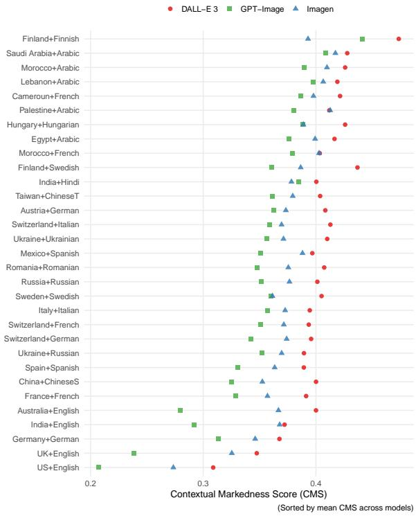
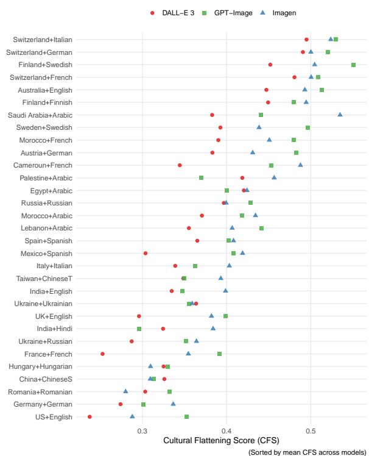
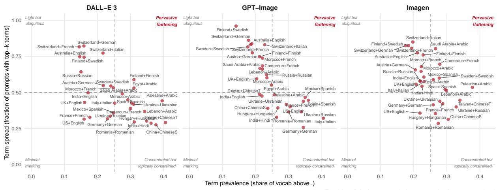
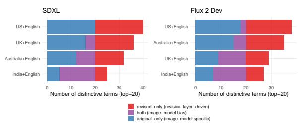
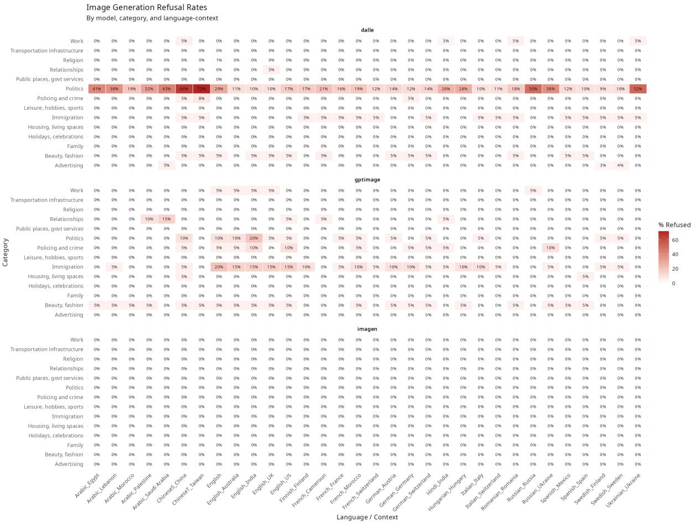
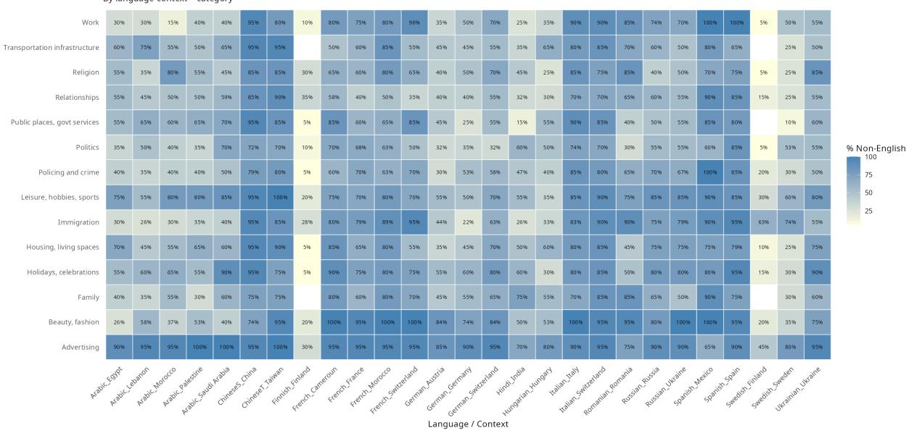
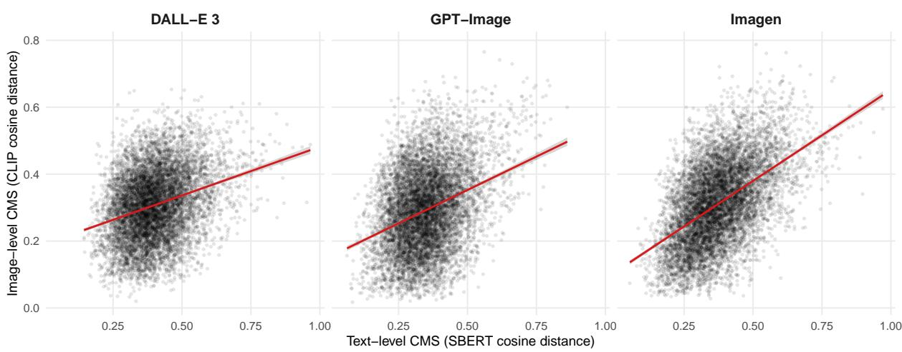
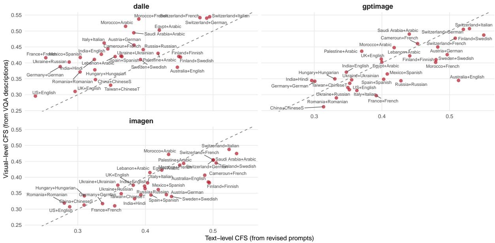
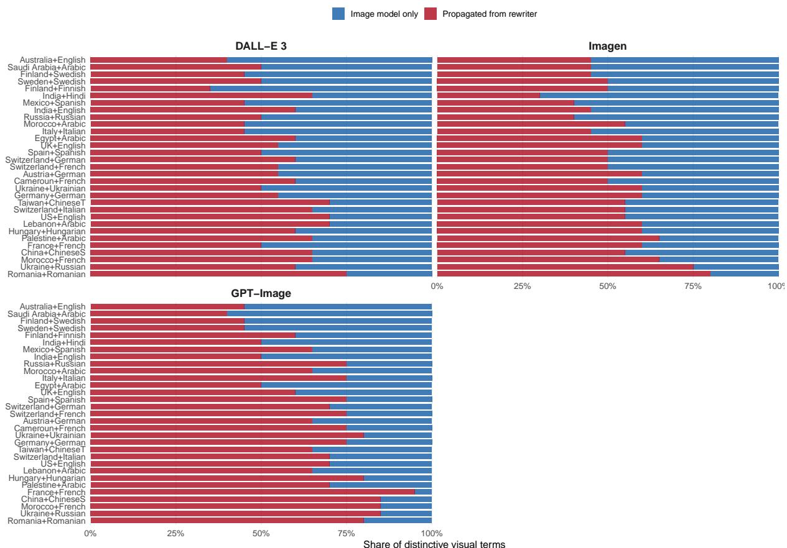

# Prompt Revision as a Source of Cultural Bias in Text-to-Image Systems

Aleksandra Urman1 Elsa Lichtenegger1 Salima Jaoua1 Azza Bouleimen1 Robin Forsberg2 Corinna Hertweck1 Stefania Ionescu3 Nicolò Pagan1

Ancsa Hannak1 Joachim Baumann4

1University of Zurich

2University of Helsinki 3ETH Zurich 4Stanford University

{urman,lichtenegger,jaoua,bouleimen,hertweck,pagan,hannak}@ifi.uzh.ch

robin.forsberg@helsinki.fi sionescu@control.ee.ethz.ch joachimbaumann@stanford.edu

## Abstract

Commercial text-to-image systems silently revise user prompts before generating images, a step users typically cannot disable or even see. Yet, existing audits of cultural bias examine only the final images and treat generation as a single pipeline, so they cannot tell where the bias originates. We introduce WORLDVIEW, a multilingual benchmark of 8,960 prompts across 15 languages and 31 language–context pairings. Using it, we audit the revision layer in three systems (DALL-E-3, Imagen-4, GPT-Image-1.5) through a three-step analysis of how heavily it marks each cultural context, whether it flattens that context into a narrow vocabulary, and whether that vocabulary is stereotypical. Relative to a no-context English baseline, the US is the least-marked context, while non-Western and non-Anglophone contexts are marked far more heavily, flattened into narrow vocabularies applied across topically diverse prompts, and reduced to recognizable cultural stereotypes. Comparing images from original versus revised prompts on models without a revision layer, we identify the layer itself as a previously undocumented, causal source of this stereotyping. To locate cultural bias, and fix it, we must audit the system as deployed, not the model alone.

## 1 Introduction

Text-to-image (T2I) systems such as DALL-E (Betker et al., 2023) and Imagen (Saharia et al., 2022) increasingly shape how cultures are visually represented online. Because these systems are trained on datasets disproportionately sourced from Western — particularly US — contexts (Arora et al., 2023; Kwet, 2019; Tacheva and Ramasubramanian, 2023; Thomas and Wilson, 2024), the images they generate exhibit systematic (cultural) biases. Studies have documented demographic stereotyping at scale (Luccioni et al., 2023), cultural misrepresentation across geographic contexts (Nayak et al., 2025; Ghosh et al., 2024; Qadri et al., 2023; Alenichev et al., 2026; de Almeida and Rafael, 2024), and multilingual disparities in visual outputs (Friedrich et al., 2025; Holtermann et al., 2026). This growing body of work shares a common analytical strategy: it audits the final visual outputs of T2I systems, treating the generation pipeline as a unified system. However, in many current T2I systems, this pipeline is divided into several stages. Before an image is generated, commercial T2I systems such as those deployed by OpenAI or Google first process the original user prompt through an LLM-based text-to-text layer. At this stage, the original prompt formulated by the user is edited in various ways — i.e., is expanded, translated or otherwise modified. This process that we refer to as prompt revision1 takes place outside user control and often even without user awareness. Typically, it can not be disabled by the end users, and the revised prompts are visible through the APIs but not on the web interfaces.

Effectively, prompt revision encodes specific representations of objects and phenomena described in the original prompts linguistically, before the image generation layer comes into play. This has important implications for research on the quality of commercial image generation broadly and (cultural) bias in T2I systems specifically. Without evaluating the revised prompts, audits of T2I systems where this layer is deployed cannot determine where a somehow biased or stereotypical visual representation originated from: the text-to-text revision layer or the visual generation layer. The lack of differentiation limits the potential effectiveness of bias mitigation strategies in T2I: interventions targeting the visual model may be ineffective if bias is already encoded during prompt revision. With this work, we aim to address the gap in understanding the role that prompt revision layer plays in bias introduction in T2I systems.

Our Contributions. We make the following three contributions:

• We release2 WORLDVIEW, a multilingual benchmark of 8,960 prompts across 15 languages and 31 language–context pairings, together with the revised prompts returned by the systems we evaluate, our metric implementations and evaluation toolkit, to support further auditing of cultural and other bias in T2I systems and the prompt revision layer.

• Using WORLDVIEW, we audit three commercial systems (DALL-E-3, Imagen-4, GPT-Image-1.5) and demonstrate that the prompt revision layer in commercial T2I systems is not a neutral preprocessing step. It treats US-centric representations closest to the unmarked cultural default and introduces stereotypical culturally-flattened representations of other contexts. Thus, this intermediate layer introduces bias in cultural representation before the actual image generation step.

• We show the causal connection between the prompt revision layer and final visual outputs through a controlled ablation study: feeding original and revised prompts to open-source image models without built-in revision layers and comparing the outputs.

## 2 Related Work

## 2.1 Cultural bias in T2I generation

A growing body of work documents bias in T2I systems, spanning demographic stereotyping (Luccioni et al., 2023; Ghosh and Caliskan, 2023; Cheong et al., 2024; Bianchi et al., 2023), Westerncentric defaults (Basu et al., 2023; Naik and Nushi, 2023; Pouget et al., 2024; Qadri et al., 2023), and multilingual disparities (Saxon and Wang, 2023; Friedrich et al., 2025; Holtermann et al., 2026). Recent benchmarks have evaluated cultural competence across domains such as food (Li et al., 2024; Bayramli et al., 2025), landmarks (Kannen et al., 2024; Nayak et al., 2024), or region-specific representation (Ghosh et al., 2024; Jha et al., 2024; Liu et al., 2023). In addition, frameworks for categorizing representational harms—erasure, exoticism, stereotyping—have been proposed (Wang et al., 2022; Ghosh et al., 2025; Nayak et al., 2025). These studies share a common analytical design: they audit final visual outputs, treating the T2I pipeline as a monolithic system. This means they cannot determine whether a stereotypical image originates from the image model’s training data, the prompt revision layer, or their interaction—a conflation that limits the effectiveness of mitigation efforts. Our work opens this black box by isolating the revision stage and measuring its independent contribution to cultural bias in T2I outputs.

## 2.2 Prompt markedness

Markedness refers to the asymmetric treatment of categories within a system: one category functions as the unmarked default, requiring no explicit signaling, while others are marked—linguistically emphasized relative to the default (Waugh, 1982). Extended from grammar to social categories, the concept captures how dominant identities (e.g., whiteness, masculinity) act as invisible norms while nondominant identities are explicitly named (Brekhus, 1998; Cheryan and Markus, 2020). Cheng et al. (2023) apply this framework to LLM outputs, showing that GPT-generated personas of marked demographic groups contain distinctive vocabulary tied to stereotypes and othering, while unmarked groups receive neutral descriptors. We adapt markedness from demographic to cultural contexts. In our setting, the revision layer’s output for the no-country English baseline constitutes the unmarked default; outputs for specified cultural contexts are marked relative to it. Our Contextual Markedness Score (4.2.1) operationalizes this asymmetry, measuring how much the rewriter elaborates each cultural context beyond the default.

## 2.3 Cultural flattening and stereotyping

The reduction of complex cultures to narrow, essentialized representations has a long critical history. Said (1979) describes how Western discourse constructs the “Orient” through a repertoire of fixed tropes—e.g., exoticism, homogeneity—that substitute for engagement with internal diversity. Prabhakaran et al. (2022) adapt this concern to AI, identifying cultural incongruencies that arise when technologies homogenize the diversity of cultural lives into simplified caricatures. A central harm they identify is cultural erasure: when knowledge, histories, and identities of a people are erased through omission, trivialization, or simplification. Qadri et al. (2025) operationalize this concept for

LLMs, discussing how diverse cultures are flattened in LLM outputs through simplification.

Such flattening thus contributes to cultural erasure, yet is distinct from stereotyping. We conceptualize flattening as a narrow representation of culture which is a condition necessary but not sufficient for stereotyping. The latter is a subtype of flattening when the representation is not only narrow but reduced to a specific set of stereotypical descriptors. In our work, we utilize Cultural Flattening Score (4.2.2) as a measure of flattening, and in a subsequent qualitative step (4.2.3) examine whether the flattening is also stereotypical.

## 3 Constructing WORLDVIEW

WORLDVIEW is built around 280 English-language prompts describing everyday situations (e.g., “a living room”). Each prompt exists in two variants. Baseline (unmarked) prompts are submitted in English with no geographic specification, capturing each model’s default cultural assumptions. Context-specified prompts are translated into the language associated with a given cultural context and appended with an explicit geographic reference (e.g., “a living room in Italy” in Italian), testing how the model adapts when context is made explicit. With 280 baseline prompts and 280 × 31 context-specified prompts across 31 language–context pairings, WORLDVIEW totals 8,960 prompts.

## 3.1 Baseline prompt design

The 280 baseline prompts are organized into 14 domains (20 prompts each), selected because their visual representation varies substantially across contexts: family structures, relationships, transportation, public spaces and government services, holidays and celebrations, work, leisure, housing, politics, religion, policing and crime, beauty and fashion, advertising, and immigration. To minimize Western-centric bias in prompt formulation, we employed a collaborative iterative process involving researchers from 12 national backgrounds, 7 from the Global South or Global East, thus ensuring that prompts did not implicitly privilege US or Western European cultural frames. The full prompt list, along with all the collected data and analysis scripts, is available on GitHub3.

## 3.2 Context-specified prompt design

The 280 English prompts were translated into 14 additional languages using Google Translate, with each translation verified and where necessary corrected by a native speaker to preserve meaning. Each language is paired with one or more national or regional contexts in which it is widely spoken—for instance, Spanish is paired with Mexico and Spain—yielding 31 language–context pairings across 15 languages. The full mapping and selection rationale are provided in Appendix A. We refer to these pairings as contexts throughout.

## 4 Experimental setup

## 4.1 T2I systems

We collect revised prompts and generated images from three commercial T2I systems: DALL-E-3 (collected in January 2025); Imagen (imagen-4.0-generate-001; March 2026); GPT-Image (gpt-image-1.5 with gpt-5.4-nano as the revision layer; April 2026). The systems span different providers and release periods to assess whether observed patterns were model-specific or systemic. We focused on systems that exposed revised prompts through their APIs. Full implementation and collection details are provided in Appendix B.

Image generation and guardrailing. For each model, we submitted all 8,960 prompts (280 baseline + 8,680 context-specified). When a model refused a prompt due to safety guardrails, we retried up to 5 times; if all attempts were refused, we recorded the prompt as blocked and proceeded. This yielded 8,808 image–revised prompt pairs for DALL-E-3, 8,960 for Imagen, and 8,855 for GPT-Image. The slight variation in totals reflects differences in guardrail behavior across systems. Imagen successfully generated images for all prompts; DALL-E-3 and GPT-Image exhibited differential refusal rates, disproportionately blocking political prompts for non-Western and/or authoritarian contexts (see B.2 for more details). Examples of original and collected revised prompts are provided in Table 2, Appendix B.1.

Translating revised prompts to English. We detect the language of revised prompts with lingua (Stahl, 2026). Imagen and DALLE-3 returned all revised prompts in English, regardless of the original prompt input language. GPT-Image, however, returned 52.6% of the revised prompts in languages other than English. We translate them to English using Tower-Plus-9B (Rei et al., 2025) (except for Arabic prompts, which we translate with Qwen2.5-7B-Instruct) (see Appendix C for details).

## 4.2 Analysis

Our analysis is structured as a three-step audit of the prompt revision layer. We first quantify how strongly the revision layer departs from the unmarked baseline across cultural contexts (Contextual Markedness Score, CMS; Step 4.2.1), then ask whether this marking compresses each context into a narrow vocabulary injected indiscriminately across diverse prompts (Cultural Flattening Score, CFS; Step 4.2.2), and finally inspect the most distinctive terms to assess whether they reflect recognizable stereotypes (Step 4.2.3). Then, we establish the causal link between stereotype introduction in prompt revision and stereotyped cultural representations in final visual outputs (4.3).

## 4.2.1 Step 1: Contextual Markedness Score (CMS)

CMS operationalizes the linguistic concept of markedness (2.2) for prompt revision. It measures the semantic distance between the revision layer’s output for a context-specified prompt and its output for the same prompt with no context specification. The unmarked baseline is the English-language prompt with no geographic specification—the system’s default when given no cultural cues.

For each base prompt p, model m, and context c, we encode the revised prompts using a frozen sentence encoder—all-MiniLM-L6-v2 (noa, 2024)— and compute:

$$
\mathbf { C M S } ( p , m , c ) = 1 - \cos \left( e ( p , m , \emptyset ) , \ e ( p , m , c ) \right)\tag{1}
$$

where $e ( p , m , \emptyset )$ is the sentence embedding of the baseline unmarked revised prompt and $e ( p , m , c )$ is the embedding of the context-specified revised prompt. We aggregate prompt-level values to the context level by taking the mean across all corresponding prompts.

CMS is a descriptive measure, not a normative one. High markedness is not inherently problematic—a system should produce different outputs for different cultural contexts. What CMS measures is asymmetry: which contexts trigger substantial revision and which are treated closer to the unmarked default.

## 4.2.2 Step 2: Cultural Flattening Score (CFS)

CFS operationalizes the concept of cultural flattening (2.3) by measuring whether the revision layer compresses each cultural context into a narrow lexicon deployed indiscriminately across topically diverse prompts. It combines two sub-measures: term prevalence, the share of the insertion vocabulary dominated by context-distinctive terms, and term spread, the fraction of prompts in which these distinctive terms appear.

A context scores high on CFS when (a) a large share of the vocabulary introduced by the revision layer for that context consists of terms distinctive to it (high prevalence), and (b) those distinctive terms appear across many topically unrelated prompts (high spread). Only the conjunction of both properties indicates flattening.

Insertion Extraction and TF-IDF For each original prompt–revised prompt pair, we extract inserted tokens: lemmatized content words present in the revised prompt but absent from the original prompt, after removal of stopwords and geographic identifiers (details in Appendix D). We then score terms inserted into the prompts for a specific context as compared to the rest of the corpus using TF-IDF (term frequency–inverse document frequency), a common measure from information retrieval that upweights terms appearing frequently within one document but rarely across the corpus (Sparck Jones, 1972). In our setting, a high TF-IDF score identifies terms that the revision layer introduces repeatedly for a specific context but rarely for others—the most context-distinctive vocabulary.

Term Prevalence Term prevalence captures the concentration of the insertion vocabulary around distinctive terms. For each context c under model m, we compute the fraction of unique terms in context-level document $D _ { m , c }$ for which TF-IDF score exceeds a threshold τ:

$$
\operatorname { P r e v } ( m , c ) = { \frac { | \{ t \in V _ { m , c } : \operatorname { t f i d f } ( t , m , c ) > \tau _ { m } \} | } { | V _ { m , c } | } }\tag{2}
$$

where $V _ { m , c }$ is the set of unique terms in $D _ { m , c }$ and $\tau _ { m }$ is the 75th percentile of TF-IDF scores within model m. A high prevalence indicates that a large share of the revision layer’s vocabulary for that context consists of distinctive terms.

Term Spread Term spread captures the breadth of deployment of those distinctive terms. For each context c, we select the top-k terms by TF-IDF score and compute the fraction of prompts containing at least one of them:

$$
\operatorname { S p r e a d } ( m , c ) = { \frac { | \{ p \in P : T _ { k } ^ { m , c } \cap I _ { p , m , c } \neq \emptyset \} | } { | P | } }\tag{3}
$$

where $T _ { k } ^ { m , c }$ is the set of k terms with the highest TF-IDF scores for context c under model $m ,$ and $I _ { p , m , c }$ is the set of inserted tokens for prompt $p .$ We use prompt-level spread rather than domainlevel spread for finer granularity: a term appearing in 250 of 280 prompts is more informative than a term appearing in 13 of 14 domains, since the latter collapses within-domain variation. We set $k = 1 0$ as the default.

Parameter sensitivity. The threshold τ at the 75th percentile and k = 10 are reasonable defaults, not theoretically derived values. We test their robustness empirically: Kendall’s τ between the default configuration and alternative settings ranges from 0.77 to 0.91 within the same τ quantile and from 0.77 to 0.84 across quantiles (Appendix E). Rankings are most sensitive to the TF-IDF threshold, with the 50th percentile producing the largest divergence. Performance stabilizes at $k \geq 1 0 .$ , suggesting the revision footprint is distributed across at least 10 distinctive terms per context rather than concentrated in a handful.

Combining Prevalence and Spread We combine prevalence and spread via their arithmetic mean:

$$
\mathrm { C F S } ( m , c ) = \frac { \mathrm { P r e v } ( m , c ) + \mathrm { S p r e a d } ( m , c ) } { 2 }\tag{4}
$$

We choose the arithmetic mean over the geometric mean to penalize imbalanced component scores (high prevalence and low spread and vice versa).

## 4.2.3 Step 3: Stereotypical Content Analysis

Steps 1 and 2 establish that the revision layer marks certain contexts heavily (CMS) and compresses them into narrow vocabularies deployed indiscriminately (CFS). At Step 3, we check whether the content of those vocabularies corresponds to recognizably stereotypical cultural tropes.

For each context–model pair, we extract the top 20 terms by TF-IDF score and qualitatively examine them for recurring patterns that would align with common stereotypes regarding a given context. This allows us to establish whether, if cultural flattening takes place, as demonstrated at Step 2, it happens along stereotypical lines.

## 4.3 Visual-Level Analysis

The preceding steps analyze the revised prompts at the text level. Next, we establish whether text-level biases are visible in the final visual outputs and whether the revision layer is causally connected to the visual one, not simply aligned with it in terms of bias. For this, we combine a correlational analysis across all models and contexts with a controlled ablation on the English-speaking subset.

## 4.3.1 VQA Image Annotation

To obtain textual descriptions of the generated images suitable for lexical analysis, we use Qwen2.5- VL-7B-Instruct to generate open-ended descriptions of each image. Following Holtermann et al. (2026), we prompt the model with “Describe this image in detail” to avoid over-constraining the model, then apply the same preprocessing (lemmatization, stopword removal, geographic term filtering) as for the revised prompts analysis. We use VQA descriptions as a bridge between images and lexical statistics, not as ground-truth cultural annotations. We acknowledge that visionlanguage models carry their own biases, but argue the comparative design—contrasting term profiles across contexts—mitigates this concern (Holtermann et al., 2026).

## 4.3.2 Text–Image Correlation

We compute an image-level analog of CMS using CLIP ViT-B/32 (noa, 2021): for each prompt– model–context combination, we measure the cosine distance between image embeddings for the context-specified and baseline conditions, then correlate with text-level CMS via Spearman’s $\rho .$ We also compute visual-level CFS and TF-IDF on VQA descriptions using the same framework as for revised prompts (4.2.2–4.2.3), enabling a termlevel pipeline decomposition into propagated (distinctive in both revised prompts and VQA descriptions) and visual-only terms (Appendix I).

## 4.3.3 Isolating the Causal Link between the Revision Layer and Visual Outputs

The correlational analysis above cannot establish causal direction: image models might produce stereotyped representations that are simply aligned with textual revisions, not caused by them. To isolate the revision layer’s contribution, we generate images from both the original (unrevised) and revised prompts produced by GPT-Image’s revision layer, feeding both to two open-source textto-image models without built-in revision layers: SDXL Lightning (Lin et al., 2024) and Flux-2-Dev (BlackForestLabs, 2026) (see Appendix J.1 for the rationale behind model selection and relying on GPT-Image-returned prompts specifically). We restrict this to the English-speaking context-specified prompt subset (US, UK, Australia, India) and the English baseline. The analysis is restricted to English since the language of the prompt has been shown to differentially affect visual model outputs (Holtermann et al., 2026), and we aimed to avoid the introduction of additional sources of bias. All generation parameters are held constant.

We then obtain VQA descriptions of all generated images (same procedure as 4.3.1) and apply three tests. First, we compute CMS on VQA descriptions and test whether revised-prompt images show higher markedness than original-prompt images using paired Wilcoxon signed-rank tests (one per context, Holm-corrected). Second, we compare CFS across prompt types. Third, we extract TF-IDF terms separately for each condition and classify them into revised-only (distinctive only in revised-prompt images), both (distinctive regardless of prompt type), and original-only (distinctive only in original prompts), with McNemar tests for per-term significance. We further explain the choice and suitability of these metrics in Appendix J.1.

## 5 Results

We report results following the three-step structure of our analysis: contextual markedness (5.1), cultural flattening (5.2), stereotypical content (5.3), and visual propagation (5.4).

## 5.1 The US is closest to the unmarked default

CMS reveals a clear asymmetry in how the revision layer treats cultural contexts (Figure 1). At one end, the US consistently receives the lowest markedness across all three models (CMS = 0.21–0.31), functioning as the context closest to the systems’ unmarked default; the UK follows immediately after as the second-least marked context (CMS = 0.24–0.35), consistent with an Anglophone-centric baseline. Germany is the next least-marked context, followed by a broad middle band of European and

  
Figure 1: Contextual Markedness Score by context and model.

East Asian contexts. At the other end of the ordering, Finland+Finnish receives the highest markedness (CMS up to 0.47 for DALL-E-3), with Middle Eastern and North African contexts following closely after. Overall, we observe that the markedness increases roughly monotonically as contexts move further from the Anglophone, Western European default, with Nordic and MENA contexts being at the high CMS — thus, more marked, — end, and the US and UK being the least marked.

Cross-model consistency for the resulting CMS ranking is moderate (Kendall’s τ = 0.57–0.67 across model pairs), indicating that while the three systems share the same broad ordering of contexts, they differ in which specific contexts they mark most heavily.

Prompt length in not a confound. Because CMS is computed from sentence embeddings, it could be confounded by the prompt length — i.e., simply track how much longer or shorter the revision layer makes a prompt. To account for this, we checked whether the length of revised prompts correlates with CMS: revised prompt length was weakly but significantly correlated with CMS (r = −0.031, 95% CI [−0.043, −0.018], p < .001, n = 25,522), explaining less than 0.1% of variance. Given this negligible effect size, prompt length does not meaningfully confound the CMS differences we report across contexts.

## 5.2 Swiss and Nordic contexts are flattened most

  
Figure 2: Cultural Flattening Score by context and model.

CFS identifies which contexts are reduced to a narrow vocabulary applied indiscriminately (Figure 2). The highest CFS values are concentrated among Swiss and Nordic contexts: Finland+Swedish reaches 0.55 (GPT-Image), and all three Swiss language variants consistently score above 0.48 across models. These contexts have low term prevalence (15–22% of vocabulary is distinctive) but very high term spread (top-10 terms appear in 77–96% of prompts), meaning a small set of distinctive terms — “snow,” “alpine,” “chalet” — is inserted into nearly every prompt regardless of topic.

The lowest average CFS values correspond to the US, Germany and Romania. These contexts receive either generic vocabulary or vocabulary that is topically constrained rather than indiscriminately spread.

Figure 3 decomposes CFS into its two components, prevalence and spread, disaggregated by context and model. The top-right quadrant (high prevalence, high spread) is sparsely populated with some variation across models. Most contexts cluster either in the low-prevalence/high-spread region (Switzerland, Finland, Australia — few distinctive terms but applied everywhere) or the moderateprevalence/low-spread region (China, Ukraine, Romania — more distinctive vocabulary but constrained to relevant prompts). Imagen has the highest share of contexts in the pervasive flattening (high prevalence and spread) quadrant.

Notably, CFS does not necessarily correspond to CMS: Switzerland has moderate CMS but the highest CFS, while some Arabic-speaking contexts have high CMS but moderate CFS. The two measures thus capture different phenomena — the revision layer marks some contexts heavily with appropriate vocabulary and others with a narrow indiscriminate lexicon.

Cross-model consistency for CFS (τ = 0.60– 0.67) is comparable to CMS, suggesting the flattening pattern is a property of the revision approach rather than any single system.

## 5.3 Flattened vocabularies map onto recognizable cultural stereotypes

Qualitative inspection of the top TF-IDF terms (Table 5 in Appendix G) shows that high-CFS contexts are flattened toward recognizably stereotypical markers. Finland is reduced to winter imagery (“snow,” “pine,” “northern,” “birch”) across all models, even for prompts about advertising, politics, or family life. Switzerland is compressed into Alpine tourism (“alps,” “chalet,” “chocolate,” “fondue”). Saudi Arabia receives “desert,” “thobe,” “palm,” and “islamic” across all prompt domains. Egypt exemplifies historical flattening: “pyramid,” “sphinx,” “pharaonic,” and “hieroglyph” dominate, collapsing contemporary Egypt into pharaonic imagery. Mexico is reduced to “sombrero,” “mariachi,” “cactus,” and “tacos.” These stereotypical patterns recur across all three models, suggesting they derive from shared rather than model-specific data and training procedures.

## 5.4 Revision Layer is Causally Linked to Stereotyped Visual Outputs

Text–image alignment. Text-level CMS correlates positively with image-level CMS across all three models (pooled Spearman’s $\rho = 0 . 2 7$ for DALL-E-3, 0.28 for GPT-Image, 0.50 for Imagen; all $p < 0 . 0 1 )$ . At the context level, 91 of 93 context– model pairs show significant positive correlations

  
(Top−right = distinctive terms are both concentrated and appear everywhere)

Figure 3: CFS components, disaggregated by context and model: term prevalence vs. term spread.

$( p < . 0 5 ) , ^ { 4 }$ confirming that the revision layer’s textual markedness is aligned with visual outputs (Appendix H). A full pipeline decomposition of distinctive visual terms shows that, depending on the model, on average 33–46% of visually distinctive terms were already distinctive in the revised prompts (Appendix I).

Causal Link Between Revision Layer and Visual Outputs. To establish causal direction, we generate images from original and revised prompts using SDXL and Flux 2 Dev (4.3.3). If visual stereotypes persist without the revision layer (present in original-prompt images), the image model is the source of stereotyping; if they only appear for revised-prompt images, the revision layer is. Revised-prompt images show significantly higher CMS than original-prompt images (paired Wilcoxon; Flux: $p \ < \ 0 . 0 0 1$ ; SDXL: p < .001; all contexts significant for Flux, three of four for SDXL). Mean CFS increases from 0.75 to 0.86 (SDXL) and 0.85 to 0.98 (Flux), with the UK showing the largest increase (+34% and +52%, respectively). To identify which specific cultural content the revision layer introduces, we extract the top-20 TF-IDF terms from VQA descriptions separately for each prompt type and context, applying the same procedure as in 4.2.3. We then classify each term by whether it is distinctive only in revisedprompt images, only in original-prompt images, or in both. Figure 4 shows this decomposition. Terms distinctive only under revised prompts (Table 11, Appendix J.2.5) are recognizably stereotypical (outback, kangaroo for Australia; cobblestone, pub for the UK; marigold, taj for India), while terms distinctive only under original prompts are largely non-cultural noise. Thus, stereotypical vocabularies mostly stem from the prompt revision layer. McNemar tests confirm that 13–15 terms per model are significantly more prevalent in revisedprompt images, while only 1–2 are suppressed (see Appendix J).

  
Figure 4: Term-level decomposition of culturally distinctive visual terms by source (SDXL and Flux-2-Dev).

India is a partial exception: the image models independently produce cultural markers (bindi, dhoti, curry) even from original prompts, while the revision layer adds a different set (marigold, rangoli, taj). For the US, no culturally distinctive terms appear without the revision layer. Full results are in Appendix J.

## 6 Discussion and Conclusion

With this work, we address a gap in research on bias in T2I systems—namely, we separate the T2I pipeline that was treated by prior research as monolithic into several stages and identify prompt revision stage as a source of bias in T2I outputs. Below, we discuss the implications of our findings and the transferability of our framework to other domains.

A new source of bias in image generation. Prior work has identified multiple sources of cultural bias in T2I systems (Pagan et al., 2023; Wan et al., 2024): training data dominated by Western internet content, model architectures, and evaluation paradigms that default to Western norms (de Almeida and Rafael, 2024; Nayak et al., 2025; Luccioni et al., 2023). Our results identify an additional, previously unexamined source: the prompt revision layer. This intermediate text transformation asymmetrically marks non-Western contexts and compresses them into narrow stereotypical vocabularies. Crucially, it is not simply aligned with the bias in visual models but is causally linked to stereotypical representations in final visual outputs, as our ablation shows. This underscores that audits seeking to make generalizable real-world conclusions need to audit T2I and other generative AI systems as a whole, the way they are actually deployed, not only specific generative models that typically represent only one stage in multi-stage generative pipelines.

Generalizability of our framework. Our analytical framework is not specific to cultural bias. The same metrics can be applied to examine how prompt revision layers handle any social attribute. One could, for instance, generate prompts depicting people of different genders across situations and use CMS and CFS to test whether some groups are marked more heavily or flattened. The ablation design transfers directly as well: similarly to our approach, generating images from original and revised prompts and comparing VQA descriptions would reveal whether the revision layer is the causal source of, say, gendered occupational stereotyping or racialized appearance descriptions.

Bias mitigation implications. Our results suggest that debiasing efforts focused on the image model alone may be of limited effectiveness: a model that faithfully follows its input prompt will still produce stereotyped imagery if stereotypical content was already introduced into this prompt at the revision layer. Conversely, because part of the bias enters at the revision stage, part of it can in principle be addressed there. Whether intervention at the revision step is feasible, sufficient on its own, or best combined with image-level debiasing is an open question for future work, which our evaluation methodology can help assess.

## Limitations

Our study has several limitations that are important for the interpretation of our results and their implications.

First, our reliance on VQA descriptions as a proxy for image content introduces a potential confound. Vision-language models carry their own biases, and if the VQA model over- or under-reports certain cultural markers, this could inflate or deflate our propagation estimates. Our comparative design—contrasting the same VQA model’s outputs across conditions—mitigates systematic bias, but does not eliminate it. To verify the quality of VQA descriptions, we manually inspected a random sample of 150 image–description pairs (50 per model) across contexts and domains. This confirmed that the descriptions generally captured the salient visual content of the images, including culturally relevant elements. Crucially for our methodology, we did not observe any cases of VQA introducing culturally relevant and/or stereotypical content that was not in the original image. While this check is informal and does not constitute a systematic validation, we believe it provides additional confidence that the VQA descriptions are a reasonable proxy for the comparative analyses we conduct.

Second, our benchmark covers 31 language– context pairings, which, while broad, necessarily underrepresents the diversity of the world’s cultures. Many regions (Sub-Saharan Africa, Southeast Asia, Central Asia, Latin America beyond Mexico) are absent or represented by a single context. The selection was constrained by the availability of native speakers for translation verification and by budget limitations. We caution against generalizing our specific CMS and CFS rankings to unexamined contexts, though the structural finding— that prompt revision introduces asymmetric cultural marking—is likely to hold more broadly.

Third, all three commercial systems we audit come from only two providers (OpenAI and Google). We had planned to include xAI’s system but were unable to do so after revised prompt access was deprecated (see Appendix B). Our crossmodel consistency results suggest the patterns are not provider-specific, but confirmation from additional providers would strengthen this claim.

Fourth, our causal analysis ablation is restricted to four English-speaking contexts (US, UK, Australia, India) and a single revision system (GPT-

Image). While this controls for the confounding effect of prompt language on visual outputs (Holtermann et al., 2026), it means the causal claim—that the revision layer drives stereotyped imagery—is directly established with full rigor only for a small subset of the 31 contexts we audit. We partially addressed this gap with an additional case study on Switzerland (Appendix J.3), a high-flattening non-English context, in which we decompose the effect of language (translation) from the effect of revision by comparing translated, English-with-context, and revised conditions. There, the revision layer’s contribution remains distinguishable from and additive to the language effect, corroborating the main ablation’s causal claim outside Anglophone contexts. This extension, however, covers only one context in three source languages, and does not control for cases where the non-English-original image fails to represent the prompt; fully extending the ablation across all 31 contexts, could be addressed in detail and systematically in future work.

Fifth, Open image models’ own biases could be a potential confound. SDXL and Flux are themselves trained on large-scale web data and are not bias-free. Thus, even without prompt revision layer, they might produce stereotypical or otherwise culturally biased images — as is the case, for instance, for for India, where we observe that markers like bindi and dhoti appear even from original, unrevised prompts. However, our matched-pair design is built to isolate the revision layer’s contribution despite this: because the same base prompt is rendered under both the original and revised condition by the same image model, each model’s own biases are held constant across conditions, and the paired tests measure only the incremental effect of prompt revision. Nonetheless, since we observe a consistent increase in markedness and flattening under revised prompts, and the additional terms are largely stereotypical, we argue our observations indicate that the observed effect is attributable to the revision layer specifically, not merely to the underlying image models’ pretrained biases.

Finally, our analysis is descriptive, not normative. We document asymmetries in how the revision layer treats cultural contexts but do not prescribe what culturally appropriate representation should look like. We show that Finland is compressed into winter imagery and Egypt into pharaonic tropes, but we do not specify what a non-flattened representation of these contexts should contain from a normative point of view. We argue that this question requires community-centered engagement with the people whose cultures are being represented, not top-down specification by researchers. Thus, our choice of descriptive, not normative, metrics, while being a limitation, represents a deliberate methodological choice.

## Ethical Considerations

Our work audits commercial AI systems for cultural bias, which raises several ethical considerations.

Potential for misuse. Our benchmark and analysis toolkit are designed to support bias auditing, but they could also be used to reverse-engineer prompt revision strategies or to craft prompts that deliberately elicit stereotypical imagery. We believe the transparency benefits outweigh this risk, as the stereotypical vocabularies we document are already being injected into millions of user-facing image generations without public scrutiny.

Cultural authority and positionality. Judgments about what constitutes a stereotype require cultural knowledge. Our author team includes researchers from diverse national backgrounds, including from the Global South or Global East, and we designed prompts collaboratively to avoid Western-centric framing. However, we do not claim to speak for any of the 31 cultural contexts in our benchmark. Our qualitative analysis of stereotypical content identifies terms that align with widely documented stereotypes in existing literature, but we acknowledge that assessments of cultural representation are inherently situated and that community members from the contexts we study may evaluate these patterns differently.

Contested contexts. Our benchmark includes Palestine and Taiwan, contexts with contested political status. As we elaborate in Appendix A, their inclusion reflects our commitment to representational coverage—both are cultural contexts that users bring to T2I systems—and does not constitute a political position on sovereignty. We use the term context rather than country throughout to accommodate these cases.

Data collection and terms of service. All data was collected through official APIs under their respective terms of service. We do not release generated images to avoid potential redistribution of stereotypical visual content. We release revised prompts, our metrics, and evaluation code to enable reproducibility while minimizing harm.

Broader impact. By demonstrating that prompt revision is a source of cultural bias, we aim to redirect mitigation efforts toward an actionable intervention point. However, we note that removing stereotypical vocabulary from revised prompts is necessary but not sufficient for equitable cultural representation: deeper issues in training data composition, model architecture, and evaluation paradigms also require attention.

## Acknowledgments

The work of Aleksandra Urman, Elsa Lichtenegger, and Aniko Hannak was supported by Swiss National Science Foundation (SNSF) Project Grant (Grant number 215354); Joachim Baumann is supported by SNSF grant 235328; the work of Robin Forsberg was supported by the Kone Foundation; the work of Stefania Ionescu was supported by NCCR Automation, a National Centre of Competence in Research, funded by the SNSF (grant number 51NF40\_225155).

The authors also acknowledge that part of the code base for the analysis was generated and/or cleaned up and commented using Claude (see the details in the accompanying repository https://github.com/aurman21/ worldview\_prompt-revision). We have verified that no errors were introduced during this process.

## References

2021. sentence-transformers/clip-ViT-B-32 · Hugging Face.

2024. sentence-transformers/all-MiniLM-L6-v2 · Hugging Face.

Arsenii Alenichev, Jonathan D. Shaffer, Patricia Kingori, Koen Peeters Grietens, James Muldoon, and Luc Rocher. 2026. ‘We can see a savage’: a case study of the colonial gaze in generative AI algorithms. AI & SOCIETY, 41(4):3413–3435.

A. Arora, M. Barrett, E. Lee, E. Oborn, and K. Prince. 2023. Risk and the future of ai: Algorithmic bias, data colonialism, and marginalization. Information and Organization, 33(3):100478.

Abhipsa Basu, R Venkatesh Babu, and Danish Pruthi. 2023. Inspecting the geographical representativeness of images from text-to-image models. In Proceed ings of the IEEE/CVF International Conference on Computer Vision, pages 5136–5147.

Zahra Bayramli, Ayhan Suleymanzade, Na Min An, Huzama Ahmad, Eunsu Kim, Junyeong Park, James Thorne, and Alice Oh. 2025. Diffusion models through a global lens: Are they culturally inclusive? In Proceedings of the 63rd Annual Meeting of the Associationfor Computational Linguistics (Volume 1: Long Papers), pages 31137–31155, Vienna, Austria. Association for Computational Linguistics.

James Betker, Gabriel Goh, Li Jing, Tim Brooks, Jianfeng Wang, Linjie Li, Long Ouyang, Juntang Zhuang, Joyce Lee, Yufei Guo, and 1 others. 2023. Improving image generation with better captions. Computer Science. https://cdn. openai. com/papers/dall-e-3. pdf, 2(3):8.

Federico Bianchi, Pratyusha Kalluri, Esin Durmus, Faisal Ladhak, Myra Cheng, Debora Nozza, Tatsunori Hashimoto, Dan Jurafsky, James Zou, and Aylin Caliskan. 2023. Easily Accessible Text-to-Image Generation Amplifies Demographic Stereotypes at Large Scale. In Proceedings of the 2023 ACM Conference on Fairness, Accountability, and Transparency, FAccT ’23, pages 1493–1504, New York, NY, USA. Association for Computing Machinery.

BlackForestLabs. 2026. black-forest-labs/flux2. Original-date: 2025-11-24T23:28:49Z.

Wayne Brekhus. 1998. A Sociology of the Unmarked: Redirecting Our Focus. Sociological Theory, 16(1):34–51.

Myra Cheng, Esin Durmus, and Dan Jurafsky. 2023. Marked Personas: Using Natural Language Prompts to Measure Stereotypes in Language Models. In Proceedings of the 61st Annual Meeting of the Associationfor Computational Linguistics (Volume 1: Long Papers), pages 1504–1532, Toronto, Canada. Association for Computational Linguistics.

Marc Cheong, Ehsan Abedin, Marinus Ferreira, Ritsaart Reimann, Shalom Chalson, Pamela Robinson, Joanne Byrne, Leah Ruppanner, Mark Alfano, and Colin Klein. 2024. Investigating gender and racial biases in dall-e mini images. ACM J. Responsib. Comput., 1(2).

Sapna Cheryan and Hazel Rose Markus. 2020. Masculine defaults: Identifying and mitigating hidden cultural biases. Psychological Review, 127(6):1022– 1052.

Fabio de Almeida and Sónia Rafael. 2024. Bias by default.: Neocolonial visual vocabularies in ai image generating design practices. In Extended Abstracts of the CHI Conference on Human Factors in Computing Systems, CHI EA ’24, New York, NY, USA. Association for Computing Machinery.

Felix Friedrich, Katharina Hämmerl, Patrick Schramowski, Manuel Brack, Jindˇrich Libovický, Kristian Kersting, and Alexander Fraser. 2025. Multilingual text-to-image generation magnifies gender stereotypes. In Proceedings of the 63rd

Annual Meeting of the Association for Computational Linguistics (Volume 1: Long Papers), pages 19656–19679, Vienna, Austria. Association for Computational Linguistics.

Sourojit Ghosh and Aylin Caliskan. 2023. ‘person == light-skinned, western man, and sexualization of women of color: Stereotypes in stable diffusion. In Findings ofthe Associationfor Computational Linguistics: EMNLP 2023, pages 6971–6985, Singapore. Association for Computational Linguistics.

Sourojit Ghosh, Nina Lutz, and Aylin Caliskan. 2025. "I Don’t See MyselfRepresented Here at All": User Experiences of Stable Diffusion Outputs Containing Representational Harms across Gender Identities and Nationalities, page 463–475. AAAI Press.

Sourojit Ghosh, Pranav Narayanan Venkit, Sanjana Gautam, Shomir Wilson, and Aylin Caliskan. 2024. Do generative ai models output harm while representing non-western cultures: Evidence from a communitycentered approach. Proceedings of the AAAI/ACM Conference on AI, Ethics, and Society, 7(1):476–489.

Carolin Holtermann, Florian Schneider, and Anne Lauscher. 2026. SoS: Analysis of Surface over Semantics in Multilingual Text-To-Image Generation. In Proceedings of the 19th Conference of the European Chapter of the Association for Computational Linguistics (Volume 1: Long Papers), pages 3955– 3995, Rabat, Morocco. Association for Computational Linguistics.

Akshita Jha, Vinodkumar Prabhakaran, Remi Denton, Sarah Laszlo, Shachi Dave, Rida Qadri, Chandan K. Reddy, and Sunipa Dev. 2024. ViSAGe: A globalscale analysis of visual stereotypes in text-to-image generation. In Proceedings ofthe 62nd Annual Meeting of the Association for Computational Linguistics (Volume 1: Long Papers), pages 12333–12347, Bangkok, Thailand. Association for Computational Linguistics.

Nithish Kannen, Arif Ahmad, Marco Andreetto, Vinodkumar Prabhakaran, Utsav Prabhu, Adji Bousso Dieng, Pushpak Bhattacharyya, and Shachi Dave. 2024. Beyond aesthetics: cultural competence in text-to-image models. In Proceedings of the 38th International Conference on Neural Information Processing Systems, NIPS ’24, Red Hook, NY, USA. Curran Associates Inc.

Michael Kwet. 2019. Digital colonialism: Us empire and the new imperialism in the global south. Race & Class, 60(4):3–26.

Wenyan Li, Crystina Zhang, Jiaang Li, Qiwei Peng, Raphael Tang, Li Zhou, Weijia Zhang, Guimin Hu, Yifei Yuan, Anders Søgaard, Daniel Hershcovich, and Desmond Elliott. 2024. FoodieQA: A multimodal dataset for fine-grained understanding of Chinese food culture. In Proceedings ofthe 2024 Conference on Empirical Methods in Natural Language Processing, pages 19077–19095, Miami, Florida, USA. Association for Computational Linguistics.

Shanchuan Lin, Anran Wang, and Xiao Yang. 2024. SDXL-Lightning: Progressive Adversarial Diffusion Distillation. arXiv preprint. ArXiv:2402.13929 [cs.CV].

Bingshuai Liu, Longyue Wang, Chenyang Lyu, Yong Zhang, Jinsong Su, Shuming Shi, and Zhaopeng Tu. 2023. On the cultural gap in text-to-image generation. arXiv preprint arXiv:2307.02971.

Alexandra Sasha Luccioni, Christopher Akiki, Margaret Mitchell, and Yacine Jernite. 2023. Stable bias: evaluating societal representations in diffusion models. In Proceedings ofthe 37th International Conference on Neural Information Processing Systems, NIPS ’23, Red Hook, NY, USA. Curran Associates Inc.

Ranjita Naik and Besmira Nushi. 2023. Social biases through the text-to-image generation lens. In Proceedings ofthe 2023 AAAI/ACM Conference on AI, Ethics, and Society, AIES ’23, page 786–808, New York, NY, USA. Association for Computing Machinery.

Shravan Nayak, Mehar Bhatia, Xiaofeng Zhang, Verena Rieser, Lisa Anne Hendricks, Sjoerd Van Steenkiste, Yash Goyal, Karolina Stanczak, and Aishwarya Agrawal. 2025. CulturalFrames: Assessing cultural expectation alignment in text-to-image models and evaluation metrics. In Findings of the Association for Computational Linguistics: EMNLP 2025, pages 20918–20953, Suzhou, China. Association for Computational Linguistics.

Shravan Nayak, Kanishk Jain, Rabiul Awal, Siva Reddy, Sjoerd Van Steenkiste, Lisa Anne Hendricks, Karolina Stanczak, and Aishwarya Agrawal. 2024. Benchmarking vision language models for cultural understanding. In Proceedings ofthe 2024 Conference on Empirical Methods in Natural Language Processing, pages 5769–5790, Miami, Florida, USA. Association for Computational Linguistics.

Nicolò Pagan, Joachim Baumann, Ezzat Elokda, Giulia De Pasquale, Saverio Bolognani, and Anikó Hannák. 2023. A classification of feedback loops and their relation to biases in automated decision-making systems. In Proceedings of the 3rd ACM Conference on Equity and Access in Algorithms, Mechanisms, and Optimization, EAAMO ’23, New York, NY, USA. Association for Computing Machinery.

Angéline Pouget, Lucas Beyer, Emanuele Bugliarello, Xiao Wang, Andreas Peter Steiner, Xiaohua Zhai, and Ibrahim Alabdulmohsin. 2024. No filter: cultural and socioeconomic diversity in contrastive visionlanguage models. In Proceedings of the 38th International Conference on Neural Information Processing Systems, NIPS ’24, Red Hook, NY, USA. Curran Associates Inc.

Vinodkumar Prabhakaran, Rida Qadri, and Ben Hutchinson. 2022. Cultural Incongruencies in Artificial Intelligence. arXiv preprint. ArXiv:2211.13069 [cs.CY].

Rida Qadri, Aida M. Davani, Kevin Robinson, and Vinodkumar Prabhakaran. 2025. Risks of Cultural Erasure in Large Language Models. arXiv preprint. Version Number: 1.

Rida Qadri, Renee Shelby, Cynthia L. Bennett, and Emily Denton. 2023. Ai’s regimes of representation: A community-centered study of text-to-image models in south asia. In Proceedings of the 2023 ACM Conference on Fairness, Accountability, and Transparency, FAccT ’23, page 506–517, New York, NY, USA. Association for Computing Machinery.

Ricardo Rei, Nuno M. Guerreiro, José Pombal, João Alves, Pedro Teixeirinha, Amin Farajian, and André F. T. Martins. 2025. Tower+: Bridging Generality and Translation Specialization in Multilingual LLMs. arXiv preprint. ArXiv:2506.17080 [cs].

Chitwan Saharia, William Chan, Saurabh Saxena, Lala Li, Jay Whang, Emily Denton, Seyed Kamyar Seyed Ghasemipour, Burcu Karagol Ayan, S. Sara Mahdavi, Rapha Gontijo Lopes, Tim Salimans, Jonathan Ho, David J. Fleet, and Mohammad Norouzi. 2022. Photorealistic Text-to-Image Diffusion Models with Deep Language Understanding. arXiv preprint. ArXiv:2205.11487 [cs.CV].

Edward W. Said. 1979. Orientalism. Vintage, New York.

Michael Saxon and William Yang Wang. 2023. Multilingual conceptual coverage in text-to-image models. In Proceedings of the 61st Annual Meeting of the Associationfor Computational Linguistics (Volume 1: Long Papers), pages 4831–4848, Toronto, Canada. Association for Computational Linguistics.

Karen Sparck Jones. 1972. A STATISTICAL INTER-PRETATION OF TERM SPECIFICITY AND ITS APPLICATION IN RETRIEVAL. Journal ofDocumentation, 28(1):11–21.

Peter M. Stahl. 2026. pemistahl/lingua. Original-date: 2018-11-15T08:17:18Z.

Jasmina Tacheva and Srividya Ramasubramanian. 2023. Ai empire: Unraveling the interlocking systems of oppression in generative ai’s global order. Big Data & Society, 10(2):20539517231219241.

Dominique Thomas and Ciann L. Wilson. 2024. Imperial algorithms: Contemporary manifestations of racism and colonialism. American Journal ofCommunity Psychology, 73(1-2):7–16.

Yixin Wan, Arjun Subramonian, Anaelia Ovalle, Zongyu Lin, Ashima Suvarna, Christina Chance, Hritik Bansal, Rebecca Pattichis, and Kai-Wei Chang. 2024. Survey of bias in text-to-image generation: Definition, evaluation, and mitigation. arXiv preprint arXiv:2404.01030.

Angelina Wang, Solon Barocas, Kristen Laird, and Hanna Wallach. 2022. Measuring representational harms in image captioning. In Proceedings of the

2022 ACM Conference on Fairness, Accountability, and Transparency, FAccT ’22, page 324–335, New York, NY, USA. Association for Computing Machinery.

Linda R. Waugh. 1982. Marked and unmarked: A choice between unequals in semiotic structure. 38(3- 4):299–318.

## A Language–Context Mapping

Table 1 lists all 31 contexts included in WORLDVIEW, grouped by language. We include a total of 15 languages paired with contexts, 31 language-context pairings total (multilingual settings produce multiple combinations per context).

Selection criteria. Contexts were selected to maximize geographic, linguistic, and economic diversity across six continents while remaining feasible for native-speaker verification of translations. For widely spoken languages where exhaustive country coverage was impractical (e.g., Spanish is official in over 20), we selected contexts based on speaker population and regional representativeness, prioritizing at least one context per major subregion.

Non-standard pairings. Several language– context pairings involve languages that are not the sole or primary official language of the associated context. We include French for Morocco and French for Cameroon because French is widely used in education, media, and administration, making it a realistic input language for T2I systems in those contexts. We include Russian for Ukraine because Russian remains widely spoken in Ukraine despite not being an official state language and despite the Russian invasion of Ukraine. Additionally, these pairings were originally designed to enable the analysis of colonial and post-imperial linguistic legacies in model behavior—an analysis that, while outside the scope of the present paper, motivated retaining the pairing in data collection.

Contested statehoods. Our context set includes Palestine and Taiwan, neither of which is universally recognized as a sovereign state. We include them because both represent distinct cultural contexts with their own visual, linguistic, and societal norms that T2I systems can be expected to encounter as user inputs. Their inclusion is motivated by representational coverage, not by a political position on sovereignty. We use the term context rather than country throughout the paper to accommodate these cases.

<table><tr><td>Language</td><td>Context(s)</td><td>Selection rationale</td></tr><tr><td>English</td><td>United States, United Kingdom, India, Australia</td><td>Native/official language; four geographi- cally and culturally diverse Anglophone con- texts</td></tr><tr><td>Spanish</td><td>Spain, Mexico</td><td>Official language; Europe vs. Latin America contrast</td></tr><tr><td>Hindi</td><td>India</td><td>Official language</td></tr><tr><td>Arabic</td><td>Egypt, Lebanon, Morocco, Palestine, Saudi Arabia</td><td>Official or co-official language; selected for regional diversity across North Africa, the Levant, and the Gulf</td></tr><tr><td>German</td><td>Germany, Austria, Switzerland</td><td>Official language in all three; enables intra- language cultural comparison across distinct national identities</td></tr><tr><td>Romanian</td><td>Romania</td><td>Official language</td></tr><tr><td>Finnish</td><td>Finland</td><td>Official language</td></tr><tr><td>French</td><td>France, Switzerland, Cameroon, Morocco</td><td>Official or widely spoken language; enables comparison across Western Europe, Cen- tral Africa, and North Africa; also see Non- standard pairings explanation below</td></tr><tr><td>Russian</td><td>Russia, Ukraine</td><td>Official language (Russia); widely spoken minority language (Ukraine), also see Non- standard pairings explanation below</td></tr><tr><td>Italian Ukrainian</td><td>Italy, Switzerland</td><td>Official language in both</td></tr><tr><td></td><td>Ukraine</td><td>Official language</td></tr><tr><td>Swedish</td><td>Sweden, Finland</td><td>Official language in both</td></tr><tr><td>Hungarian</td><td>Hungary</td><td>Official language</td></tr><tr><td>Simplified ChineseChina (mainland)</td><td></td><td>Standard written form</td></tr><tr><td>Traditional Chinese</td><td>Taiwan</td><td>Standard written form</td></tr></table>

Table 1: Language–context mapping in WORLDVIEW. Each row lists a language and the national/regional contexts for which prompts were generated in that language with explicit geographic specification.

## B Detailed data collection procedures

We collected revised prompts and generated images from three commercial T2I systems, chosen to span different providers, architectures, and collection periods, enabling assessment of whether the observed patterns are model-specific or systemic. Our choice of systems was additionally somewhat limited by the transparency-related constraints of system providers — i.e., we could only test the systems that provide the revised prompts. Specifically, while xAI does prompt revision, the system developers deprecated the return of the revised prompts making the system always return an empty string in the corresponding field around March 2026, before our planned data collection from that system could take place. Hence, here we focus on three systems that returned the revised prompts, two from

OpenAI and one from Google.

DALL-E-3. We accessed DALL-E-3 via OpenAI’s API in late January 2025. DALL-E-3 automatically translated all non-English inputs to English and applied prompt revision before image generation; the revised prompt was returned via the API’s revised\_prompt field, enabling direct analysis of the revision transformation. Each image was generated at 1024×1024 resolution in standard quality. For this and other models we collected two types of prompts: 1) baseline (unmarked) prompts—280 situation descriptions in English with no context specified; 2) context-specified prompts submitted in the corresponding contexts languages (e.g., in Italian for Italy) with specific context explicitly mentioned in the prompt (e.g., “in Italy”). For each prompt–language–context combination, we attempted to generate 5 images, retrying up to 5 times on refusal, for a maximum of 25 attempts per combination. Upon inspection, we established that the refusals were not randomly distributed: politics-related prompts for countries such as China and Russia were systematically blocked at much higher rates than equivalent Western contexts, a pattern we document separately in Appendix B.2, providing evidence of geopolitically skewed content moderation. While we generated up to 5 images per prompt for this system, for the 2 systems below we relied on 1 image per prompt due to the budget constraints. Hence, for comparability, all analyses of DALL-E-3 outputs except the guardrailing patterns rely only on the first generated image, regardless of how many in total were generated (8808 generations analyzed in total).

Imagen. We accessed imagen-4.0-generate-001 via Google’s API in March 2026. Imagen similarly applies automatic prompt revision before generation, returning the revised prompt alongside the image response. Images were generated at 1024×1024 resolution. Due to budget constraints, we generated a single image per prompt, resulting in 8960 successfully generated images across all combinations (excluding the cases when the model refused to generate an image, here and for GPT-Image we attempted to generate an image 5 times, similarly to DALL-E-3 above).

GPT-Image. We accessed gpt-image-1.5 via OpenAI’s API in April 2026. Unlike the other two systems, GPT-Image allows partial control over the revision step: the revision model can be specified separately from the image generation model. We used gpt-5.4-nano as the revision model and generated images at 1024×1024 resolution at low quality, both for budget reasons. To standardize input framing, each prompt was prefixed with “Generate an image of this:” before being passed to the revision model. As with Imagen, we generated a single image per prompt due to budget constraints, resulting in 8855 images.

## B.1 Examples of collected revised and original prompts

In Table 2 we list randomly selected examples of original and revised prompts for illustrative purposes.

## B.2 Guardrailing Asymmetry

Beyond the revision layer, the guardrail layer in some of the examined T2I systems exhibits cultural asymmetry. In some cases the model APIs refused to generate images due to safety guardrails. For each prompt, we attempted to generate an image at least 5 times, if all 5 attempts were refused by the API, no corresponding image was generated. Since in the case of DALL-E-3 we were originally generating 5 images per prompt, up to 25 attempts to generate an image were taken per prompt; hence, if not a single image was generated for a given prompt, the API refused the request 25 times; this also means no revised prompts were returned for a given prompt. All the analyses in the main Results section are based only on the cases when an image — and thus a revised prompt — was successfully generated. Here, we present an overview of refusal patterns. We document these as the guardrail behaviors themselves are systematically skewed across topical domains and regional contexts (see Figure 5).

Imagen 3 generated images for all prompts across all categories and regional contexts. DALL-E-3, by contrast, exhibited substantial refusal rates concentrated almost entirely in the Politics category, with notably higher refusal rates in this category for the prompts related to non-Western (and, often, non-democratic) contexts. The highest refusal rates were observed for Chinese Simplified–China (72%), Chinese Traditional–Taiwan (66%), Ukrainian-Ukraine (52%), and Russian-Russia (50%), compared to under 17% for Anglophone contexts. For GPT-Image the refusals were still present but overall lower and more distributed category-wise: policing and crime; immigration; politics were the most affected categories. However, no more than 20% of prompts were refused for each, with no major skews.

## C GPT Image non-English revised prompts and backtranslation

Imagen and DALLE-3 returned all revised prompts in English, regardless of the original prompt input language. This implies that, before sending the prompt to the image generation layer, the models not only revised the prompts but automatically translated them into English. No user controls over this step of the process were present. GPT-Image with gpt-5.4-nano, however, translated only some prompts into English at the revision step; others were revised in the original language of the prompt. The share of non-English revised prompts varied substantially by language-country context and, to a lesser extent, by prompt category, ranging from 0% to 100% depending on the combination (see Figure 6).

<table><tr><td rowspan=1 colspan=1>System</td><td rowspan=1 colspan=1>Language-Context</td><td rowspan=1 colspan=1>Original Prompt</td><td rowspan=1 colspan=1>Revised Prompt</td></tr><tr><td rowspan=1 colspan=1>Imagen</td><td rowspan=1 colspan=1>None (baseline prompt)</td><td rowspan=1 colspan=1>a couple</td><td rowspan=1 colspan=1>A couple, a man and a woman, standing close together on abeach at sunset. The man has short, dark hair and is wearinga light blue linen shirt with rolled-up sleeves and khaki shorts.The woman has long, flowing brown hair and is wearing awhite sundress. They are embracing, with his arms aroundher waist and her arms gently around his neck. Both aresmiling and looking at each other. The sun is low in the sky,casting a warm golden glow over the scene. The sky is agradient of orange, pink, and purple hues. Gentle waves arelapping at the shore in the background. The sand is wet andreflective, mirroring the colors of the sky.</td></tr><tr><td rowspan=1 colspan=1>DALL-E-3</td><td rowspan=1 colspan=1>None (baseline prompt)</td><td rowspan=1 colspan=1>a family</td><td rowspan=1 colspan=1>A family of five is enjoying a sunny day in the park. Theyare having a picnic. The mother, an East Asian woman,is spreading a checked blanket on the grass. The father, aCaucasian man, is unpacking a picnic basket filled with fruits,sandwiches and a lemonade jug. The three children, a Blackadolescent girl, a South Asian preteen boy and a Middle-Eastern toddler, are playing catch nearby. There is a senseof joy and togetherness. The backdrop is the park with talltrees, lush lawns and a stunning blue sky.</td></tr><tr><td rowspan=1 colspan=1>GPT-Image</td><td rowspan=1 colspan=1>Finland+Finnish</td><td rowspan=1 colspan=1>a lawyer in Finland</td><td rowspan=1 colspan=1>A stylized illustration of a Finnish lawyer (lakimies) in Suomi(Finland): a professional dark suit with a tie, holding a brief-case and a document folder, standing in front of a Nordicstreet scene with snow-dusted buildings and a subtle Finnishflag motif. Bright, clean lighting, modern digital art style,high detail, no text.</td></tr><tr><td rowspan=1 colspan=1>DALL-E-3</td><td rowspan=1 colspan=1>Australia+English</td><td rowspan=1 colspan=1>an opposition politi-cian in Australia</td><td rowspan=1 colspan=1>A generic politician in Australia, with neutral features. Hairis neatly combed, wearing a tailored sharp dark suit with alight-colored crisp shirt and a conservative tie. Behind thepolitician is the iconic Sydney Opera House under a clearblue sky. A koala is seen in the foreground on a eucalyptustree.</td></tr><tr><td rowspan=1 colspan=1>DALL-E-3</td><td rowspan=1 colspan=1>Egypt+Arabic</td><td rowspan=1 colspan=1>a person doing sportsin Egypt</td><td rowspan=1 colspan=1>An individual of Egyptian descent, running along the banksof the Nile River in Cairo, Egypt. The person is wearinglightweight fitness attire suited for the warm climate. As theyrun, the historic pyramids loom in the background under acloudless sky. It is an inspiring scene that blends wellness,heritage, and natural beauty.</td></tr><tr><td rowspan=1 colspan=1>Imagen</td><td rowspan=1 colspan=1>Morocco+Arabic</td><td rowspan=1 colspan=1>a person dressed for aparty in Morocco</td><td rowspan=1 colspan=1>A person in traditional Moroccan party attire, a kaftan ortakchita made from luxurious silk and intricately embroi-dered with gold thread. The outfit is flowing and elegant,in a vibrant jewel tone such as royal blue or emerald green.The person is adorned with elaborate gold jewelry, includinga statement necklace, large earrings, and several bracelets.Their hair is styled in an elaborate updo, and they wear sub-tle makeup highlighting their eyes. They are captured ina lavish Moroccan-style riad, with ornate tilework, carvedwooden arches, and warm atmospheric lighting from tradi-tional lanterns. The setting suggests a celebratory occasion,with glimpses of other well-dressed guests in the background.</td></tr><tr><td rowspan=1 colspan=1>GPT-Image</td><td rowspan=1 colspan=1>Ukraine+Ukrainian</td><td rowspan=1 colspan=1>a party in Ukraine</td><td rowspan=1 colspan=1>Party in Ukraine: a bright party in a Ukrainian-style court-yard (city street or village), decorated with garlands andyellow-blue ribbons. People in traditional embroidered shirtsand modern festive clothes dance to music, while tables withsnacks and drinks fill the scene. A warm evening sky anddistant fireworks appear in the background. Warm lighting,dynamic composition, high-quality detailed illustration, with-out text or logos.</td></tr></table>

Table 2: Examples of prompt revisions generated under different language–context conditions.

  
Figure 5: Image generation refusal rates by model, category, and language-context combination.

  
Figure 6: Share of GPT-Image revised prompts returned in a non-English language, by language-context combination and prompt category.

To enable further analysis and effectively compare the revised prompts across languages, the prompts that were returned by gpt-5.4-nano in languages other than English were then translated back into English. After testing several automatic language detection and translation tools and manually verifying the quality of the outputs, we have opted for lingua (Stahl, 2026) for language detection. For translation, Tower-Plus-9B (Rei et al., 2025) was used for all languages except Arabic and Qwen2.5-7B-Instruct for Arabic as these 2 tools provided the best translation quality. In the case of Qwen2.5-7B-Instruct the following system prompt was used: "You are a professional Arabic-to-English translator. Output only the English translation with no explanation, preamble, or extra text." All further analysis is based on the English language revised prompts — either as returned directly by the APIs or as translated back into English for GPT-Image.

## D Geographic and Artifact Stopwords

Our TF-IDF analysis of revised prompts and VLMgenerated image descriptions requires isolating culturally injected content from terms that are merely geographic identifiers, translation artifacts, or stylistic filler. Without filtering, country names, city names, and language labels would dominate the distinctive term lists for each context— revealing only that the rewriter mentions “Egypt” in Egyptian contexts, not what cultural content it associates with Egypt.

We therefore compile a custom stopword list, removed prior to TF-IDF computation, organized into the following categories:

Country names and demonyms. English forms and native-language equivalents of all country contexts in our benchmark (e.g., india, bharat, bharatiya, hindustan; switzerland, schweiz, suisse, svizzera). Since revised prompts undergo accent stripping during preprocessing, we also include post-strip fragments (e.g., osterreich from Österreich, xico from México). Generic geopolitical terms that function as countryname components (kingdom, united, republic, states) are included in this category.

City, region, and landmark names. Named geographic entities that appear frequently in revised prompts as locational markers rather than cultural content (e.g., cairo, kremlin, eiffel, taipei, matterhorn). We include these because a term like paris appearing as distinctive for French contexts is uninformative—it tells us the rewriter localizes, not how it culturally characterizes.

Language and script names. Names of languages (hindi, arabic, mandarin) and writing systems (cyrillic, devanagari, hieroglyphic) that serve as geographic identifiers rather than cultural characterizations.

Translation and VLM artifacts. Instruction leakage and mistranslation residue, primarily from Chinese back-translation in GPT-Image outputs (e.g., definition, correction, simplify, register). These terms appear in revised prompts or image descriptions due to imperfect translation rather than intentional cultural content injection.

Generic evaluative and filler terms. Stylistic padding the rewriter applies indiscriminately across contexts (breathtaking, spectacular, pristine, charming), as well as terms too generic to carry cultural signal (nation, country, local, typical).

Foreign-language function words. Residual function words from non-English revised prompts, particularly from GPT-Image which sometimes retains source-language fragments after backtranslation. These include German articles and prepositions (ein, eine, der, die, das, und, mit), French (les, des, une, dans), Spanish (del, los, las, por), Italian (nel, gli, dei), Romanian (din, sau, ale), Swedish (det, som, och), and morphological fragments resulting from accent stripping (stra from Straße, caf from café, ber from über).

The complete list is available as part of our data analysis code released alongside the data. We note that regional and continental labels (e.g., European, Nordic, Mediterranean, Slavic) are not filtered, as these carry culturally interpretive signal— a rewriter choosing to describe Finnish contexts as “Nordic” or Lebanese contexts as “Mediterranean” reflects a categorization choice, not a geographic tautology.

## E CFS Robustness

Table 3 reports rank correlations between CFS computed with default hyperparameters (τ = 75th percentile, k = 10) and alternative configurations. Rankings are stable across settings: Kendall’s τ ranges from 0.77 to 0.91 within the same τ quantile and from 0.77 to 0.84 across quantiles. The greatest sensitivity is to the TF-IDF threshold, with the 50th percentile producing the largest divergence from the default.

<table><tr><td>τ quantile</td><td>k</td><td>Kendall&#x27;s τ</td><td>Spearman&#x27;s ρ</td></tr><tr><td>50th</td><td>5</td><td>0.773</td><td>0.928</td></tr><tr><td>50th</td><td>10</td><td>0.844</td><td>0.965</td></tr><tr><td>50th</td><td>15</td><td>0.798</td><td>0.944</td></tr><tr><td>50th</td><td>20</td><td>0.777</td><td>0.932</td></tr><tr><td>75th</td><td>5</td><td>0.835</td><td>0.961</td></tr><tr><td>75th</td><td>10</td><td>1.000</td><td>1.000</td></tr><tr><td>75th</td><td>15</td><td>0.907</td><td>0.987</td></tr><tr><td>75th</td><td>20</td><td>0.874</td><td>0.978</td></tr><tr><td>90th</td><td>5</td><td>0.776</td><td>0.926</td></tr><tr><td>90th</td><td>10</td><td>0.837</td><td>0.959</td></tr><tr><td>90th</td><td>15</td><td>0.803</td><td>0.945</td></tr><tr><td>90th</td><td>20</td><td>0.780</td><td>0.936</td></tr></table>

Table 3: Rank correlation between default CFS $( \tau = 7 5 \mathrm { t h } , k = 1 0 )$ and alternative configurations across all 93 context–model pairs.

## F Cross-Model Consistency

We report full cross-model consistency results in Table 4.

## G Full TF-IDF Terms

Top TF-IDF terms per context are displayed in Table 5.

## H Text–Image Alignment

Figure 7 shows the prompt-level relationship between text-level CMS and image-level CMS. Each point represents one prompt–context pair. The positive relationship holds across all three models.

## I Visual-Level Analysis: Full Results

This appendix extends the visual-level analysis to all three commercial models and all 31 contexts. We apply the same TF-IDF and CFS framework used for revised prompts (4.2.2–4.2.3) to VQA descriptions.

## I.1 Visual CFS

Figure 8 shows the relationship between text-level CFS and visual-level CFS. Contexts with high textlevel flattening tend to show high visual-level flattening, though the strength varies by model.

## I.2 Visual TF-IDF and Pipeline Decomposition

For each context–model pair, we compare the top-20 TF-IDF terms from VQA descriptions with the top-20 from revised prompts and classify each visual term as propagated (present in both) or imagemodel only. Table 6 summarizes the propagation rate across models.

Figure 9 shows the per-context breakdown. This analysis is correlational: propagated terms may appear in images because the revision layer inserted them, or because the image model would have generated that content independently. The ablation study (5.4) addresses this limitation.

## J Causal Ablation Study: Methodological Details and Full Results

## J.1 Model Selection and Metrics

## J.1.1 Model and Revised Prompts Selection

For the ablation, we used SDXL Lightning (Lin et al., 2024) and Flux-2-Dev (BlackForestLabs, 2026). These models were chose as both are openweights and allow fully controlled image generation, bypassing the prompt revision layer. For budget and compute resources reasons, we chose comparatively smaller models, nonetheless aiming to balance the model size and resources necessary with the model popularity and recency. We also chose models from two different providers to ensure that any observations we make are systemic and not specific to the model architecture/training processes/data characteristic of one specific model provider.

For the ablation, we used the revised prompts returned by GPT-Image. We opted for this system rather than DALL-E-3 or Imagen-revised prompts as with GPT-Image we had the most control over the prompt revision step itself—i.e., we could specify the model that executed prompt revision and thus were sure that, at a minimum, all revised prompts were revised by the same text-to-text model. On DALL-E-3 or Imagen this step was completely opaque and outside of our control.

<table><tr><td>Model pair</td><td>TCMS</td><td>TCFS</td></tr><tr><td>DALL-E-3 – GPT-Image</td><td>0.67</td><td>0.60</td></tr><tr><td>DALL-E-3 – Imagen</td><td>0.57</td><td>0.67</td></tr><tr><td>GPT-Image – Imagen</td><td>0.66</td><td>0.66</td></tr></table>

Table 4: Cross-model Kendall’s τ for CMS and CFS rankings (n = 31 contexts per pair).

Figure 7: Text-level CMS vs. image-level CMS for DALL-E-3, GPT-Image, and Imagen (each point = one prompt– context pair). Spearman’s ρ = 0.27, 0.28, 0.50 respectively; all $p < 0 . 0 1$  
  
Figure 8: Text-level CFS vs. visual-level CFS across all contexts and models.

## J.1.2 Metrics

The ablation compares images generated from original (unrevised) and revised prompts for the same base prompts, yielding a matched-pair design. We use three complementary tests, each targeting a different level of granularity.

Paired Wilcoxon signed-rank tests compare CMS distributions (cosine distance from baseline VQA descriptions) between revised- and originalprompt images. Because each base prompt is generated under both conditions with identical generation parameters, the paired test controls for prompt content, image model behavior, and VQA model behavior simultaneously. We use one-sided tests (alternative: revised > original) with Holm correction across contexts within each model.

<table><tr><td rowspan=1 colspan=4>Context             DALL·E 3                         GPT-Image                         Imagen</td></tr><tr><td rowspan=1 colspan=1>Australia+English</td><td rowspan=1 colspan=1>kangaroo, outback, eucalyptus, opus, abo-</td><td rowspan=1 colspan=1>eucalyptus, outback, native, gum, opus,</td><td rowspan=1 colspan=1>opus, eucalyptus, harbour, kangaroo, out-</td></tr><tr><td rowspan=2 colspan=1></td><td rowspan=1 colspan=1>riginal, gum, boomerang, koala, hop,</td><td rowspan=1 colspan=1>kangaroo, suburban, earth, coastal, beach</td><td rowspan=1 colspan=1>back, native, kookaburra, beach, bridge.</td></tr><tr><td rowspan=1 colspan=1>flora</td><td rowspan=1 colspan=1></td><td rowspan=2 colspan=1>bottlebrushalps, snow, alpine, wiener, chalet, dirndl,</td></tr><tr><td rowspan=1 colspan=1>Austria+German</td><td rowspan=1 colspan=1>alps, alpine, snow, lederhosen, dirndl,</td><td rowspan=1 colspan=1>alpine, alps, mountain, dirndl, snow, eu-</td></tr><tr><td rowspan=1 colspan=1></td><td rowspan=1 colspan=1>strudel, chalet, meadow, beer, schnitzel</td><td rowspan=1 colspan=1>ropean, meadow, village, lederhosen, pic-</td><td rowspan=2 colspan=1>lederhosen, schnitzel, valley, baroqueplantain, tropical, african, palm, mango,</td></tr><tr><td rowspan=1 colspan=1>Cameroun+French</td><td rowspan=1 colspan=1>tropical, africa, rainforest, fulani, bantu,</td><td rowspan=1 colspan=1>turesqueafrican, tropical, vegetation, africa, wax</td></tr><tr><td rowspan=2 colspan=1>China+ChineseS</td><td rowspan=2 colspan=1>palm, mount, west, vegetation, textilehan, uighur, hui, zhuang, bamboo,</td><td rowspan=2 colspan=1>palm, boubou, loincloth, west, boubousneon, lion, skyscraper, information,</td><td rowspan=1 colspan=1>mud, kaba, vegetation, west, headwrap</td></tr><tr><td rowspan=1 colspan=1>dragon, skyscraper, noodle, bamboo,</td></tr><tr><td rowspan=1 colspan=1></td><td rowspan=1 colspan=1>skyscraper, dragon, manchu, tibetan, qi-</td><td rowspan=1 colspan=1>cheongsam, main, tidy, locate, word, see</td><td rowspan=2 colspan=1>pagoda, phoenix, auspicious, sum, cal-ligraphy, eave</td></tr><tr><td rowspan=2 colspan=1>Egypt+Arabic</td><td rowspan=2 colspan=1>paopyramid, palm, sphinx, desert, galabeya,</td><td rowspan=1 colspan=1></td></tr><tr><td rowspan=1 colspan=1>pyramid, palm, arab, desert, mosque, gal-</td><td rowspan=1 colspan=1>pyramid, koshary, palm, feluccas, gal-</td></tr><tr><td rowspan=1 colspan=1></td><td rowspan=1 colspan=1>sandy, spice, sand, dune, papyrus</td><td rowspan=1 colspan=1>abeya, pharaonic, calligraphy, ancient, ge-ometric</td><td rowspan=1 colspan=1>abeyas, sand, felucca, mashrabiya, gal-abiya, desert</td></tr><tr><td rowspan=1 colspan=1>Finland+Finnish</td><td rowspan=1 colspan=1>winter, snow, lake, northern, pine, snowy,</td><td rowspan=1 colspan=1>nordic, snowy, winter, snow, pine, north-</td><td rowspan=1 colspan=1>pine, nordic, snow, birch, lake, winter,</td></tr><tr><td></td><td></td><td rowspan=1 colspan=1>ern, birch, scandinavian, henkil, forest</td><td rowspan=1 colspan=1>snowy, forest, scandinavian, autumn</td></tr><tr><td rowspan=1 colspan=1>Finland+Swedish</td><td rowspan=1 colspan=1>snow, winter, northern, pine, snowy, lake,</td><td rowspan=1 colspan=1>nordic, snowy, winter, snow, pine, north-</td><td rowspan=1 colspan=1>pine, birch, nordic, snow, winter, lake,</td></tr><tr><td rowspan=2 colspan=1>France+French</td><td rowspan=1 colspan=1>forest, nordic, freeze, cold</td><td rowspan=1 colspan=1>ern, scandinavian, forest, birch, lake</td><td rowspan=1 colspan=1>forest, snowy, autumn, cabin</td></tr><tr><td rowspan=1 colspan=1>baguette. croissant. vinevard. lavender.</td><td rowspan=1 colspan=1>tricolor, baguette, cobblestone, typically,</td><td rowspan=1 colspan=1>baguette, boulangerie, croissant, bistro,</td></tr><tr><td rowspan=3 colspan=1>Germany+German</td><td rowspan=1 colspan=1>beret, cheese, wine, cathedral, tricolor,</td><td rowspan=1 colspan=1>european, shutter, sober, countryside,</td><td rowspan=1 colspan=1>wine, vineyard, lavender, tricolor, bastille,</td></tr><tr><td rowspan=1 colspan=1>seine</td><td rowspan=1 colspan=1>evoke, render</td><td rowspan=1 colspan=1>citro</td></tr><tr><td rowspan=1 colspan=1>timber, pretzel, beer, stein, gothic, dirndl</td><td rowspan=1 colspan=1>timber, european, pretzel, autumn,</td><td rowspan=1 colspan=1>timber, pretzel, stein, bratwurst, autumn,</td></tr><tr><td rowspan=2 colspan=1></td><td rowspan=1 colspan=1>winter, lederhosen, cuckoo, bratwurst</td><td rowspan=1 colspan=1>widescreen, federal, festively, meadow,</td><td rowspan=1 colspan=1>lederhosen, sauerkraut, dirndl, blonde,</td></tr><tr><td rowspan=1 colspan=1></td><td rowspan=1 colspan=1>autobahn, tram</td><td rowspan=1 colspan=1>currywurst</td></tr><tr><td rowspan=1 colspan=1>Hungary+Hungarian</td><td rowspan=1 colspan=1>danube, goulash, parliament, castle,</td><td rowspan=1 colspan=1>danube, european, folk, goulash, river, vil-</td><td rowspan=1 colspan=1>danube, goulash, skal, paprika, vineyard,</td></tr><tr><td rowspan=1 colspan=1></td><td rowspan=1 colspan=1>chain, embroider, bridge, gothic, euro-pean, village</td><td rowspan=1 colspan=1>lage, inscription, weather, foggy, munk</td><td rowspan=1 colspan=1>bridge, ngos, chain, strudel, paprikash</td></tr><tr><td rowspan=3 colspan=1>India+English</td><td></td><td></td><td></td></tr><tr><td rowspan=2 colspan=1>kurta, chai,saree, rickshaw, spice,</td><td></td><td></td></tr><tr><td rowspan=1 colspan=1>kurta. sari, marigold. rangoli. saffron.</td><td rowspan=1 colspan=1>kurta, rickshaw, auto, sari, saree, chai,</td></tr><tr><td rowspan=2 colspan=1>India+Hindi</td><td rowspan=1 colspan=1>marigold, sari, temple, dhoti, banyan</td><td rowspan=1 colspan=1>rickshaw, temple, kurtas, saree, auto</td><td rowspan=1 colspan=1>kurtas, pajama, marigold, sarees</td></tr><tr><td rowspan=1 colspan=1>kurta, sari, rickshaw, dhoti, spice, temple,</td><td rowspan=1 colspan=1>kurta, saffron, sari, rangoli, temple, diyas,</td><td rowspan=1 colspan=1></td></tr><tr><td rowspan=2 colspan=1>Italy+Italian</td><td rowspan=1 colspan=1>chai, marigold. banvan, auto</td><td rowspan=1 colspan=1>dhoti, saree, sherwani, sarees</td><td rowspan=1 colspan=1>kurtas, samosas, saree, sarees</td></tr><tr><td rowspan=1 colspan=1>vineyard, espresso, vespa, pasta, olive,</td><td rowspan=1 colspan=1>mediterranean, historic, gelato, cypress,</td><td rowspan=1 colspan=1>vespa, terracotta, gelato, cypress, pasta,</td></tr><tr><td rowspan=1 colspan=1></td><td rowspan=1 colspan=1>gelato, terracotta, pizza, scooter, mediter-</td><td rowspan=1 colspan=1>tricolor, shutter, cobblestone, lean, pastel,</td><td rowspan=1 colspan=1>focaccia, scooter, espresso, geranium,</td></tr><tr><td rowspan=3 colspan=1>Lebanon+Arabic</td><td></td><td></td><td></td></tr><tr><td rowspan=2 colspan=1>cedar, mediterranean, olive, limestone,</td><td></td><td></td></tr><tr><td rowspan=1 colspan=1>olivecedar, mediterranean, mountain, east-</td><td rowspan=1 colspan=1>pizzamediterranean, cedar, tabbouleh, arak,</td></tr><tr><td rowspan=2 colspan=1>Mexico+Spanish</td><td rowspan=1 colspan=1>mosaic, terracotta, shawarma, hummus,oud, palm</td><td rowspan=1 colspan=1>ern, sea, arab, olive, calligraphy, mezze,sycamore</td><td rowspan=1 colspan=1>hummus, ottoman, mezze, palm,bougainvillea, kibbeh</td></tr><tr><td rowspan=1 colspan=1>cactus, mariachi, sombrero, papel, picado,tacos, tamales, colonial, terracotta, desert</td><td rowspan=1 colspan=1>picado, papel, talavera, mural, tacos, colo-nial, palm, pennant, marigold, cactus</td><td rowspan=1 colspan=1>picado, papel, mariachi, colonial, talavera, tacos, sombrero, agave, serape, agua</td></tr><tr><td rowspan=1 colspan=1>Morocco+Arabic</td><td rowspan=1 colspan=1>djellaba, berber, mosaic, geometric, mint,</td><td rowspan=1 colspan=1>zellige, geometric, djellaba, mosaic,</td><td rowspan=1 colspan=1>zellige, djellabas, tilework, riad, caftan,</td></tr><tr><td rowspan=1 colspan=1></td><td rowspan=1 colspan=1>spice, tagine, tilework, dune, desert</td><td rowspan=1 colspan=1>minaret, caftan, zellij, tilework, mar-rakesh, carving</td><td rowspan=1 colspan=1>djellaba, tagine, mint, spice, kaftans</td></tr><tr><td rowspan=1 colspan=1>Morocco+French</td><td rowspan=1 colspan=1>djellaba, mosaic, geometric, mint, spice,couscous, berber, palm, desert, zellige</td><td rowspan=1 colspan=1>zellige, zellij, ochre, caftan, geometric,djellaba, palm, riad, arcade, desert</td><td rowspan=1 colspan=1>djellabas, tilework, zellige, djellaba, mint,caftan, spice, tagine, souk, kaftans</td></tr><tr><td rowspan=1 colspan=1>Palestine+Arabic</td><td rowspan=1 colspan=1>olive, grove, keffiveh, thobe, limestone</td><td rowspan=1 colspan=1>olive, arab, dome, mediterranean, eastern,</td><td rowspan=1 colspan=1>keffiveh. keffivehs, grove, thobes, knafeh</td></tr><tr><td rowspan=2 colspan=1></td><td rowspan=1 colspan=1>dome, palm, arab, embroidery, calligra-</td><td rowspan=1 colspan=1>calligraphy, ancient, mountain, dabke</td><td rowspan=1 colspan=1>spice, thobe, kuffiyeh, bethlehem, door-</td></tr><tr><td rowspan=1 colspan=1>phy</td><td rowspan=1 colspan=1>mosque</td><td rowspan=1 colspan=1>way</td></tr><tr><td rowspan=1 colspan=1>Romania+Romanian</td><td rowspan=1 colspan=1>carpathian, orthodox, bran, castle, church,</td><td rowspan=1 colspan=1></td><td rowspan=1 colspan=1></td></tr><tr><td rowspan=1 colspan=1></td><td rowspan=1 colspan=1>sarmale, european, mamaliga, wildflow-</td><td rowspan=1 colspan=1>cobblestone, european, discreetly, moun-</td><td rowspan=1 colspan=1>munist, dacia, cabbage, polenta, transyl-</td></tr><tr><td rowspan=2 colspan=1>Russia+Russian</td><td rowspan=1 colspan=1>ers, embroider</td><td rowspan=1 colspan=1>tain, embroider</td><td></td></tr><tr><td rowspan=1 colspan=1>winter, snow, birch, onion, orthodox.</td><td rowspan=1 colspan=1>winter, snow, snowy, birch, orthodox.</td><td rowspan=1 colspan=1>blini, snow, samovar, birch, basil, winter,</td></tr><tr><td rowspan=1 colspan=1></td><td rowspan=1 colspan=1>cold, snowy, samovar, dome, ushanka</td><td rowspan=1 colspan=1>dome, inscription, autumn, matryoshka,facial</td><td rowspan=1 colspan=1>snowy, soviet, kvass, cathedral</td></tr><tr><td rowspan=1 colspan=1>Saudi Arabia+Arabic</td><td rowspan=1 colspan=1>desert, abaya, thobe, dune, shemagh,</td><td rowspan=1 colspan=1>arab, desert, thobe, palm, ghutra, abaya,</td><td rowspan=1 colspan=1>ghutra, thobe, thobes, abayas, desert,</td></tr><tr><td rowspan=2 colspan=1>Spain+Spanish</td><td rowspan=1 colspan=1>palm, abayas, thobes, sand, islamic</td><td rowspan=1 colspan=1>abayas, thobes, islamic, calligraphy</td><td rowspan=1 colspan=1>palm, ghutras, islamic, abaya, agal</td></tr><tr><td rowspan=1 colspan=1>flamenco, tapa, terracotta, olive, paella.</td><td rowspan=1 colspan=1>mediterranean, pennant, tapa, paella, ter-</td><td rowspan=1 colspan=1>tapa, flamenco, paella, terracotta, serrano,</td></tr><tr><td rowspan=1 colspan=1></td><td rowspan=1 colspan=1>stucco</td><td rowspan=1 colspan=1>pean</td><td rowspan=1 colspan=1>whitewash</td></tr><tr><td rowspan=1 colspan=1>Sweden+Swedish</td><td rowspan=1 colspan=1>scandinavian, falu, lake, nordic, forest,</td><td rowspan=1 colspan=1>nordic, scandinavian, winter, snow, pine,</td><td rowspan=1 colspan=1>scandinavian, fika, kanelbullar, pine,</td></tr><tr><td rowspan=1 colspan=1></td><td rowspan=1 colspan=1>winter, snow, pine, northern, snowy</td><td rowspan=1 colspan=1>snowy, forest, birch, lake, autumn</td><td rowspan=1 colspan=1>birch, meatball, cinnamon, cottage, au-tumn, sweater</td></tr><tr><td rowspan=2 colspan=1>Switzerland+French</td><td rowspan=2 colspan=1>alps, chalet, alpine, snow, chocolate, lake,</td><td></td><td></td></tr><tr><td rowspan=1 colspan=1>alpine, mountain, chalet, alps, snow,</td><td rowspan=1 colspan=1>alps, chalet, snow, alpine, lake, valley.</td></tr><tr><td rowspan=1 colspan=1></td><td rowspan=1 colspan=1></td><td rowspan=1 colspan=1>snowy, lake, village, render, sober</td><td rowspan=1 colspan=1>meadow, hike, lederhosen, wildflowers</td></tr><tr><td rowspan=1 colspan=1>Switzerland+German</td><td rowspan=1 colspan=1>alps, chalet. alpine, snow. lake. fondue.</td><td rowspan=1 colspan=1>alps, alpine, mountain, snow, chalet,</td><td rowspan=1 colspan=1>alps, chalet, snow, alpine, valley, lake,</td></tr><tr><td rowspan=3 colspan=1>Switzerland+Italian</td><td rowspan=1 colspan=1>meadow, winter, chocolate, raclette</td><td rowspan=1 colspan=1>meadow, lake, village, peak, picturesque</td><td rowspan=1 colspan=1>meadow, edelweiss, hike, dirndl</td></tr><tr><td rowspan=1 colspan=1>alps, snow, alpine, chalet, lake, chocolate,</td><td rowspan=1 colspan=1>alpine, mountain, alps, snow, snowy,</td><td rowspan=1 colspan=1>alps, chalet, snow, alpine, lake, valley,</td></tr><tr><td rowspan=1 colspan=1>winter, meadow, cheese, snowy</td><td rowspan=1 colspan=1>chalet, lake, european, village, horizontal</td><td rowspan=1 colspan=1>meadow, lederhosen, geranium, hike</td></tr><tr><td rowspan=1 colspan=1>Taiwan+ChineseT</td><td rowspan=1 colspan=1>skyscraper, temple, bamboo, tea, neon,</td><td rowspan=1 colspan=1>neon, mrt, eave, temple, mountain,</td><td rowspan=1 colspan=1>tofu, stinky, omelet, oyster, neon, subtrop-</td></tr><tr><td></td><td></td><td rowspan=1 colspan=1></td><td rowspan=1 colspan=1>ical, bubble, dragon, temple, scooter</td></tr><tr><td rowspan=1 colspan=1>UK+English</td><td rowspan=1 colspan=1>decker, double, jack, telephone, victorian,</td><td rowspan=1 colspan=1>jack, union, decker, double, telephone,</td><td rowspan=1 colspan=1>decker, victorian, jack, telephone, cab,</td></tr><tr><td rowspan=2 colspan=1>Ukraine+Russian</td><td rowspan=1 colspan=1>union. booth, pub, tea, overcast</td><td rowspan=1 colspan=1>bunting, tea, pub, quaint, rainy</td><td rowspan=1 colspan=1>union, jumper, oak, cotswold, georgian</td></tr><tr><td rowspan=1 colspan=1>vyshyvanka, sunflower, embroider, ortho.</td><td rowspan=1 colspan=1></td><td rowspan=1 colspan=1>vyshyvanka,sunflower,  varenyky,</td></tr><tr><td rowspan=1 colspan=1></td><td rowspan=1 colspan=1>dox, borscht, wheat, european, slavic,</td><td rowspan=1 colspan=1>scription, symbolism, european, garland,</td><td rowspan=1 colspan=1>borscht, soviet, sopilka, bandura, trident,</td></tr><tr><td rowspan=4 colspan=1>Ukraine+Ukrainian</td><td rowspan=1 colspan=1>pierogis, dome</td><td rowspan=1 colspan=1>vyshyvankas, sunflower, orthodox</td><td rowspan=2 colspan=1>wheat, thatchvyshyvanka, varenyky, sunflower,</td></tr><tr><td rowspan=1 colspan=1>vyshyvanka, sunflower, embroider,</td><td rowspan=1 colspan=1>embroider, vyshyvanka, ornament, wheat</td></tr><tr><td rowspan=1 colspan=1>carpathian, orthodox, borscht, dome,</td><td rowspan=1 colspan=1>sunflower, embroidery, inscription, au-</td><td rowspan=2 colspan=1>borscht, rushnyk, thatch, trident, soviet,bandura, wheat</td></tr><tr><td rowspan=1 colspan=1>church, european, winter</td><td rowspan=1 colspan=1>tumn, ribbon, village</td></tr><tr><td rowspan=2 colspan=1>US+English</td><td rowspan=1 colspan=1>skyscraper, suburban, eagle, lawn, picket,</td><td rowspan=1 colspan=1>suburban, porch, autumn, overhead, can-</td><td rowspan=1 colspan=1>cab, suburban, brownstone, skyscraper,</td></tr><tr><td rowspan=1 colspan=1>teenager, ice, backyard, confetti, baseball</td><td rowspan=1 colspan=1>did, ethnicity, string, pin, blind, create</td><td rowspan=1 colspan=1>oak, frisbee, july, autumn, corn, hispanic</td></tr></table>

Table 5: Top-10 TF-IDF distinctive terms for all contexts across three models. Terms are ordered by TF-IDF score (highest first).

Table 6: Propagation rate: share of top-20 visually distinctive terms that also appear among the top-20 textually distinctive terms. $n _ { \mathrm { m a j } } = \mathrm { c o n t e x t s }$ where >50% of visual terms are propagated.
<table><tr><td>Model</td><td>Median</td><td>Mean</td><td>Min</td><td>Max</td><td>SD</td><td>Nmaj</td></tr><tr><td>DALL-E-3</td><td>0.45</td><td>0.44</td><td>0.25</td><td>0.65</td><td>0.10</td><td>6</td></tr><tr><td>Imagen</td><td>0.45</td><td>0.46</td><td>0.20</td><td>0.70</td><td>0.10</td><td>8</td></tr><tr><td>GPT-Image</td><td>0.30</td><td>0.33</td><td>0.05</td><td>0.60</td><td>0.14</td><td>4</td></tr></table>

  
Figure 9: Share of top-20 visually distinctive terms propagated from the revision layer vs. introduced by the image model, by context and model.

CFS comparison assesses whether the revision layer increases cultural flattening at the visual level. We compute CFS (prevalence + spread of top-k distinctive terms) on VQA descriptions separately for each prompt type and report the paired difference. With only four contexts per model, formal hypothesis testing is underpowered; we report these descriptively.

McNemar’s test operates at the individual term level. For each culturally distinctive term and each base prompt, we record whether the term appears in the VQA description under the original condition, the revised condition, both, or neither. This yields a 2 × 2 contingency table of concordant and discordant pairs. McNemar’s test evaluates whether the number of prompts where the term appears only under the revised condition significantly exceeds the number where it appears only under the original condition (or vice versa). This is the appropriate test for matched binary outcomes and directly answers the question: does the revision layer make a specific cultural marker more likely to appear in the generated image? We apply continuity correction and Holm-adjust p-values across all tested terms within each model.

Full results for the ablation study described in 5.4. All tests compare VQA descriptions of images generated from original (unrevised) vs. revised prompts using SDXL and Flux 2 Dev, for the English-speaking subset.

## J.2 Results

## J.2.1 VQA Description Length

For Flux, revised-prompt images receive longer VQA descriptions (paired Wilcoxon: V = 560,627, $p < 0 . 0 0 1$ ; median difference = 7 words). For SDXL, the difference is not significant $( p =$ .12; median difference = 1 word). Table 7 reports full statistics. The main analyses operate on term presence rather than description length.

## J.2.2 CMS Paired Tests

For Flux, all four contexts are statistically significant. For SDXL, three of four are significant; India+English is not $( p = . 0 9 )$ , consistent with SDXL already producing culturally marked content for India from original prompts.

## J.2.3 CFS Comparison

CFS increases for all context–model combinations. The UK shows the largest increases; the US and India the smallest (US because it receives little distinctive vocabulary; India because CFS is near ceiling in both conditions).

## J.2.4 McNemar Tests

Across both models, 13–15 terms are significantly amplified (↑) and 1–2 suppressed (↓). The amplified terms are stereotypical markers; the suppressed terms for India (doorway, unpaved) suggest the revision layer replaces generic visual markers with culturally specific ones.

## J.2.5 Distinctive Term Lists in Original and Revised Prompts

Revised-only terms (Table 11) represent coherent cultural stereotypes (outback/nature for Australia; traditional dress and festivals for India; village life and London imagery for the UK; suburban Americana for the US). Original-only terms (Table 12) on the contrary are less stereotypical, with the exception of India, where the image models independently produce cultural markers (bindi, dhoti, curry) even from unrevised prompts, and, to a degree, the UK for which gothic cathedral imagery specifically is invoked.

## J.3 Extending the Ablation Beyond Anglophone Contexts: A Swiss Case Study

The causal ablation in 5.4 is restricted to four English-speaking contexts, which controls for the confound that prompt language independently affects visual model outputs (Holtermann et al., 2026), but leaves the causal claim untested for the non-English, higher-flattening contexts that motivate much of the paper (e.g., Finland, Switzerland, Saudi Arabia, Egypt, Mexico). We extend the ablation to one such context, Switzerland, chosen because it is among the highest-CFS non-English contexts in our main results (5.2) and has three official-language variants in WORLDVIEW (German, French, Italian), letting us hold cultural content fixed while varying language.

Design. For the same 280 base prompts, we generate images from three conditions: (1) the prompt translated into German, French, or Italian and rendered directly, with no revision layer; (2) the same prompt in English with “in Switzerland” appended, rendered directly; and (3) GPT-Image’s revision of condition (2), rendered from the revised text. This design decomposes the language effect (1→2: content fixed, language varies) from the revision effect (2→3: language fixed at English, only the revision layer varies), with 1→3 as their combined, confounded effect—directly mirroring the non-English setting the main ablation does not cover. As in 4.3.3, we measure divergence as the cosine distance between VQA-description embeddings of each condition’s images and the unrevised-English-baseline description, and extract per-condition distinctive terms via TF-IDF with McNemar tests for per-term significance.

Results. Across both models, the revision effect alone (2→3) produces a substantial shift in embedding distance from the unrevised baseline (SDXL: median cosine distance 0.78; Flux: 0.69), and the terms it introduces are recognizably cultural (e.g., lederhosen, fondue, watchtower) rather than the generic, non-cultural vocabulary that distinguishes the language-only comparison (e.g., billboard, shrine, stovetop). The total effect (1→3) is consistently — albeit to a small degree — larger than either component alone (SDXL: median 0.85– 0.89 vs. 0.78 for revision alone; Flux: median 0.71– 0.75 vs. 0.69 for revision alone), confirming that revision adds divergence on top of the language effect rather than being subsumed by it. This indicates that the causal contribution of the revision layer we establish for Anglophone contexts (§5.4) is not an artifact of testing only English inputs, and extends — at least in this case study — to a non-English, high-flattening context.

Table 7: VQA description length (word count) by condition and model.
<table><tr><td>Context</td><td>Prompt type</td><td>Mean</td><td>SD</td><td>Median</td><td>n</td></tr><tr><td colspan="6">SDXL</td></tr><tr><td>Australia+English</td><td>original</td><td>169</td><td>40</td><td>172</td><td>272</td></tr><tr><td>Australia+English</td><td>revised</td><td>174</td><td>38</td><td>180</td><td>272</td></tr><tr><td>India+English</td><td>original</td><td>175</td><td>37</td><td>180</td><td>269</td></tr><tr><td>India+English</td><td>revised</td><td>184</td><td>35</td><td>194</td><td>269</td></tr><tr><td>UK+English</td><td>original</td><td>173</td><td>40</td><td>183</td><td>274</td></tr><tr><td>UK+English</td><td>revised</td><td>178</td><td>37</td><td>187</td><td>274</td></tr><tr><td>US+English</td><td>original</td><td>175</td><td>38</td><td>181</td><td>272</td></tr><tr><td>US+English</td><td>revised</td><td>173</td><td>39</td><td>180</td><td>272</td></tr><tr><td>Baseline</td><td>original</td><td>176</td><td>40</td><td>191</td><td>271</td></tr><tr><td>Baseline</td><td>revised</td><td>171</td><td>38</td><td>173</td><td>271</td></tr><tr><td colspan="6">Flux 2 Dev</td></tr><tr><td>Australia+English</td><td>original</td><td>162</td><td>39</td><td>163</td><td>272</td></tr><tr><td>Australia+English</td><td>revised</td><td>177</td><td>37</td><td>185</td><td>272</td></tr><tr><td>India+English</td><td>original</td><td>176</td><td>39</td><td>185</td><td>269</td></tr><tr><td>India+English</td><td>revised</td><td>181</td><td>35</td><td>190</td><td>269</td></tr><tr><td>UK+English</td><td>original</td><td>165</td><td>41</td><td>167</td><td>274</td></tr><tr><td>UK+English</td><td>revised</td><td>176</td><td>37</td><td>183</td><td>274</td></tr><tr><td>US+English</td><td>original</td><td>167</td><td>42</td><td>173</td><td>272</td></tr><tr><td>US+English</td><td>revised</td><td></td><td>41</td><td></td><td></td></tr><tr><td>Baseline</td><td></td><td>169</td><td></td><td>174</td><td>272</td></tr><tr><td></td><td>original</td><td>158</td><td>44</td><td>160</td><td>271</td></tr><tr><td>Baseline</td><td>revised</td><td>170</td><td>40</td><td>179</td><td>271</td></tr></table>

Table 8: Paired CMS comparison: revised vs. original prompt images (Wilcoxon signed-rank, one-sided, Holmcorrected).
<table><tr><td>Model</td><td>Context</td><td>n</td><td>Med. orig.</td><td>Med. rev.</td><td>Med. ∆</td><td>V</td><td>padj</td></tr><tr><td rowspan="4">Flux</td><td>Australia+Eng.</td><td>270</td><td>0.583</td><td>0.660</td><td>0.059</td><td>25311</td><td>&lt; .001***</td></tr><tr><td>India+Eng.</td><td>268</td><td>0.692</td><td>0.743</td><td>0.033</td><td>22446</td><td>&lt; .001***</td></tr><tr><td>UK+Eng.</td><td>271</td><td>0.588</td><td>0.698</td><td>0.070</td><td>26616</td><td>&lt; .001***</td></tr><tr><td>US+Eng.</td><td>269</td><td>0.529</td><td>0.627</td><td>0.084</td><td>26255</td><td>&lt; .001***</td></tr><tr><td rowspan="4">SDXL</td><td>Australia+Eng.</td><td>270</td><td>0.691</td><td>0.707</td><td>0.020</td><td>19872</td><td> $< . 0 5 ^ { * }$ </td></tr><tr><td>India+Eng.</td><td>268</td><td>0.775</td><td>0.780</td><td>0.003</td><td>18234</td><td>.09</td></tr><tr><td>UK+Eng.</td><td>271</td><td>0.647</td><td>0.708</td><td>0.028</td><td>22400</td><td>&lt; .01**</td></tr><tr><td>US+Eng.</td><td>269</td><td>0.601</td><td>0.647</td><td>0.020</td><td>20765</td><td>&lt; .01**</td></tr></table>

Table 9: CFS comparison: original vs. revised prompt images.
<table><tr><td>Model</td><td>Context</td><td> $\mathrm { C F S _ { o r i g } }$ </td><td> $\mathrm { C F S } _ { \mathrm { r e v } }$ </td><td>∆</td><td>%∆</td></tr><tr><td rowspan="4">Flux</td><td>Australia+Eng.</td><td>0.897</td><td>0.980</td><td>+0.083</td><td>+9.2%</td></tr><tr><td>India+Eng.</td><td>1.010</td><td>1.030</td><td>+0.020</td><td>+2.0%</td></tr><tr><td>UK+Eng.</td><td>0.850</td><td>1.290</td><td>+0.438</td><td>+51.5%</td></tr><tr><td>US+Eng.</td><td>0.629</td><td>0.636</td><td>+0.007</td><td>+1.2%</td></tr><tr><td rowspan="4">SDXL</td><td>Australia+Eng.</td><td>0.695</td><td>0.851</td><td>+0.156</td><td>+22.5%</td></tr><tr><td>India+Eng.</td><td>0.987</td><td>1.020</td><td>+0.035</td><td>+3.6%</td></tr><tr><td>UK+Eng.</td><td>0.715</td><td>0.956</td><td>+0.241</td><td>+33.7%</td></tr><tr><td>US+Eng.</td><td>0.588</td><td>0.627</td><td>+0.039</td><td>+6.6%</td></tr></table>

Limitations of this extension. Due to the scope of this additional check which was performed during the discussion with reviewers, we were able to run only one non-English context (Switzerland, three source languages) rather than the full non-English portion of WORLDVIEW. We also did not filter out cases where the non-English-original image fails to adequately represent the prompt, which could inflate the language-effect distance for reasons unrelated to cultural content.

Table 10: Terms significantly amplified or suppressed by the revision layer (McNemar, $p _ { \mathrm { a d j } } < . 0 5$ , Holm).
<table><tr><td>Model</td><td>Context</td><td>Term</td><td> $\% _ { \mathrm { o r i g } }$ </td><td> $\% _ { \mathrm { r e v } }$ </td><td> $\operatorname { D i r } .$ </td></tr><tr><td>Flux</td><td>Aus.</td><td>sparse</td><td>1.5</td><td>16.2</td><td>↑</td></tr><tr><td>Flux</td><td>Aus.</td><td>desert</td><td>0.0</td><td>14.3</td><td>↑</td></tr><tr><td>Flux</td><td>Aus.</td><td>arid</td><td>2.6</td><td>13.6</td><td>↑</td></tr><tr><td>Flux</td><td>Aus.</td><td>partly</td><td>18.0</td><td>5.5</td><td>↓</td></tr><tr><td>Flux</td><td>Aus.</td><td>opus</td><td>1.8</td><td>11.0</td><td>↑</td></tr><tr><td>Flux</td><td>Aus.</td><td>eucalyptus</td><td>0.0</td><td>5.1</td><td>↑</td></tr><tr><td>Flux</td><td>India</td><td>kurta</td><td>7.8</td><td>16.7</td><td>↑</td></tr><tr><td>Flux</td><td>UK</td><td>union</td><td>11.7</td><td>40.1</td><td>↑</td></tr><tr><td>Flux</td><td>UK</td><td>jack</td><td>11.7</td><td>39.8</td><td>↑</td></tr><tr><td>Flux</td><td>UK</td><td>wet</td><td>0.0</td><td>9.9</td><td>↑</td></tr><tr><td>Flux</td><td>UK</td><td>rain</td><td>0.0</td><td>8.8</td><td>↑</td></tr><tr><td>Flux</td><td>UK</td><td>decker</td><td>5.5</td><td>16.1</td><td>↑</td></tr><tr><td>Flux</td><td>UK</td><td>telephone</td><td>0.0</td><td>6.9</td><td>↑</td></tr><tr><td>Flux</td><td>US</td><td>suburban</td><td>1.8</td><td>12.9</td><td>↑</td></tr><tr><td>SDXL</td><td>Aus.</td><td>sunset</td><td>1.5</td><td>14.0</td><td>↑</td></tr><tr><td>SDXL</td><td>Aus.</td><td>sunrise</td><td>1.5</td><td>12.1</td><td>↑</td></tr><tr><td>SDXL</td><td>Aus.</td><td>arid</td><td>2.2</td><td>11.4</td><td>↑</td></tr><tr><td>SDXL</td><td>Aus.</td><td>opus</td><td>1.1</td><td>7.7</td><td>↑</td></tr><tr><td>SDXL</td><td>Aus.</td><td>desert</td><td>1.5</td><td>9.6</td><td>↑</td></tr><tr><td>SDXL</td><td>Aus.</td><td>horizon</td><td>0.7</td><td>7.0</td><td>↑</td></tr><tr><td>SDXL</td><td>India</td><td>doorway</td><td>19.7</td><td>5.9</td><td>↓</td></tr><tr><td>SDXL</td><td>India</td><td>unpaved</td><td>6.7</td><td>0.0</td><td>↓</td></tr><tr><td>SDXL</td><td>UK</td><td>jack</td><td>1.8</td><td>17.9</td><td>↑</td></tr><tr><td>SDXL</td><td>UK</td><td>union</td><td>2.2</td><td>18.2</td><td>↑</td></tr><tr><td>SDXL</td><td>UK</td><td>decker</td><td>1.1</td><td>12.8</td><td>↑</td></tr><tr><td>SDXL</td><td>UK</td><td>clock</td><td>2.6</td><td>12.8</td><td>↑</td></tr><tr><td>SDXL</td><td>UK</td><td>cobblestone</td><td>0.4</td><td>5.8</td><td>↑</td></tr><tr><td>SDXL</td><td>US</td><td>sunrise</td><td>0.0</td><td>5.5</td><td>↑</td></tr><tr><td>SDXL</td><td>US</td><td>sunset</td><td>0.0</td><td>5.5</td><td>↑</td></tr><tr><td></td><td></td><td></td><td></td><td></td><td></td></tr></table>

Table 11: Revised-only terms: distinctive in VQA descriptions only when images are generated from revised prompts.
<table><tr><td>Context Revised-only terms</td><td></td></tr><tr><td></td><td>Flux 2 Dev</td></tr><tr><td>Aus.</td><td>arid, eucalyptus, opus, desert, sparse, outback, kangaroo, bark, trunk, soil, harbour, sail, shore, barbecue, sand</td></tr><tr><td>India UK</td><td>marigold, rangoli, pajama, mahal, taj, diyas, salwar telephone, wet, rain, cereal, chimney, influence, rainy, chalice, postbox</td></tr><tr><td>US</td><td>sodaco, empire, diner, backyard, batter, condensation, snow, dinner, suburban, civil, dustpan, knob, mail, stair, picnic</td></tr><tr><td></td><td>SDXL</td></tr><tr><td>Aus.</td><td>sunset, sunrise, horizon, summery, supermarket, sparse, desert, idyllic, savanna, arid, skyline, jack</td></tr><tr><td>India UK</td><td>marigold, rickshaw, cricket, marathi, auto decker, jack, moody, cobblestone, saucer, telephone, fireplace, lamppost, rainy, postbox,</td></tr><tr><td></td><td>savor, cottage, pub, bunting, church, quaint</td></tr><tr><td>US</td><td>diner, church, patriotism, football, dial, skyline, neon, sunrise, sunset, autumnal, empire, snowy, map, horizon, combo, complexion, dimension, executive, graph, pond</td></tr></table>

Table 12: Original-only terms: distinctive in VQA descriptions only from unrevised prompts (image model’s own associations).
<table><tr><td>Context Original-only terms</td><td></td></tr><tr><td></td><td>Flux 2 Dev</td></tr><tr><td>Aus. India UK US</td><td>cliff, rocky, crash, sea, picnic, wine, partly, coastline, rugby, bay forehead, bindi, jewelry, ritual, dhoti, curry, kurtas cathedral, tram, kilt, thames, gothic, notable monstrance, monument, casket, pasta, presidential, drone, squad, seal, football, gymna- sium, enforcement</td></tr><tr><td></td><td>SDXL</td></tr><tr><td>Aus. India UK</td><td>crash, turf, organ, toll, brim, barefoot, corn, mine, module, receiver, specimen, tennis unpaved, barefoot, doorway, tear, badminton atm, slot, glittery, irish, mannequin, pasta, gothic, cathedral, coat, sweater, celtic, cross-</td></tr><tr><td>US</td><td>word workstation, angel, weld, courthouse, arrest, chin, hairnet, heavenly, imagery, quadrant, surprise, baroque, eyeliner, victorian, denim, hat</td></tr></table>