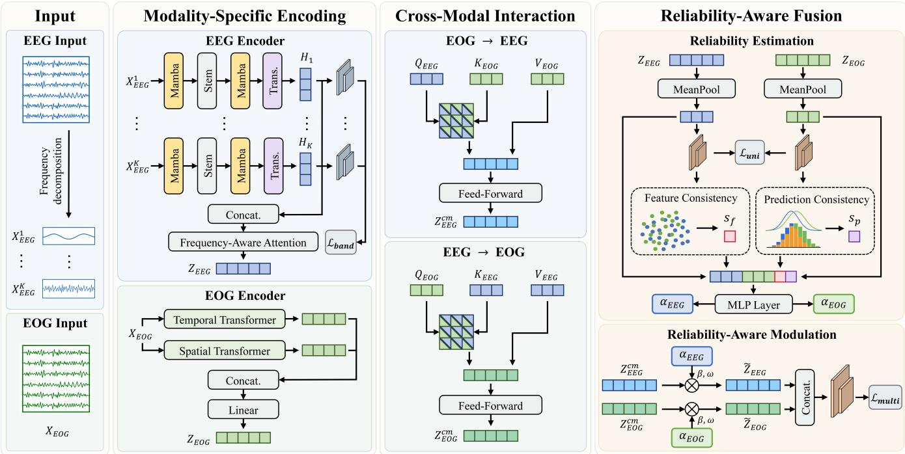
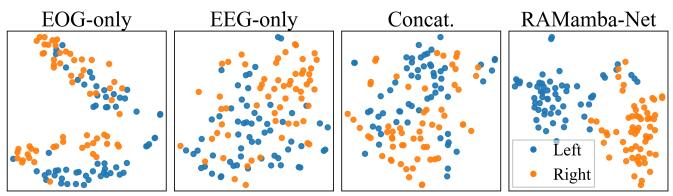
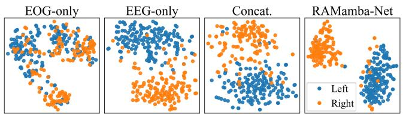
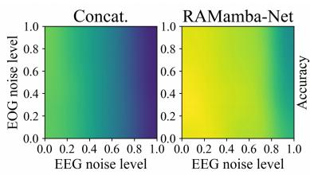
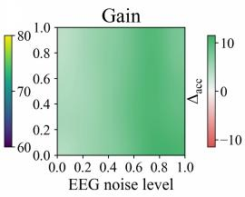
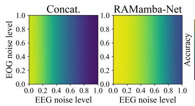
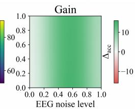
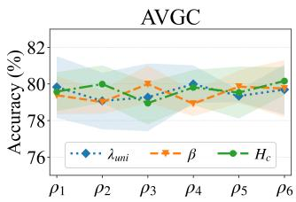
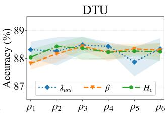

# RAMamba-Net: A Reliability-Aware and Mamba-Based Multimodal Fusion Network for Auditory Attention Detection

Xingyi He1∗, Ziwei Wang1∗, Dongrui Wu1

1School of Artificial Intelligence and Automation, Huazhong University of Science and Technology, China {xyhe, vivi, drwu}@hust.edu.cn

## Abstract

Auditory attention decoding (AAD) identifies the attended speaker from physiological signals, supporting neuro-steered hearing devices and natural human-machine interaction. Electroencephalography (EEG) is the dominant modality for AAD but provides incomplete evidence in naturalistic audio-visual scenes, motivating EEG and electrooculography (EOG) fusion. Existing approaches remain limited by weak cross-modal interaction, ineficient temporal modeling, and low robustness to sample variations. To address the limitations, we propose RAMamba-Net, a reliability-aware Mamba-based multimodal fusion network for AAD. RAMamba-Net employs a Mamba-enhanced band-aware convolutional Transformer to capture band-specific EEG patterns and long-range temporal dynamics. A dual-branch temporal-spatial encoder models EOG temporal and inter-channel dependencies. Crossmodal attention enables explicit modality interaction. Then, a reliability-aware module is introduced to estimate samplewise modality weights for feature and prediction consistency, thereby enhancing multimodal fusion. Experiments on two AAD benchmarks demonstrate that RAMamba-Net efectively exploits complementary EEG-EOG information, yielding accuracy gains of 5.76% over unimodal baselines, together with more robust decoding and discriminative representations. Further analyses show that explicit cross-modal interaction improves multimodal alignment, while the reliability-aware module suppresses unreliable modality evidence and is robust to signal perturbation and parameter variation.

## Introduction

Understanding a target speaker in a crowded acoustic scene remains a major challenge for people with hearing impairment (Wilroth et al. 2025a), commonly known as the cocktail-party problem (Cherry 1953). Auditory attention decoding (AAD) infers the attended speaker from physiological signals (Mesgarani and Chang 2012; Ding and Simon 2012; O’sullivan et al. 2015), supporting neuro-steered hearing devices, target-speaker enhancement, and natural humanmachine interaction (Alickovic et al. 2019; Geirnaert et al. 2021). These applications require reliable decoding under realistic and non-ideal recording conditions.

Electroencephalography (EEG) is the dominant AAD modality. It reflects cortical activity associated with attentional selection. EEG decoders have progressed from convolutional direction localization (Vandecappelle et al. 2021) to spatio-temporal attention modeling (Su et al. 2022) and endto-end cross-subject decoding (Nguyen et al. 2025). However, EEG has a low signal-to-noise ratio, is highly susceptible to artifacts (Somers, Francart, and Bertrand 2018), and often generalizes poorly across subjects and sessions (Pufay et al. 2023). EEG alone may therefore provide incomplete evidence of attentional behavior in naturalistic audio-visual scenes, motivating the integration of complementary physiological signals (Wang, Li, and Wu 2025).

Eye movements provide behavioral information related to auditory attention, while electrooculography (EOG) directly records ocular activity. Prior work has shown that gaze follows attended natural speech (Gehmacher et al. 2024) and that visual speech cues enhance neural tracking of the attended speaker (Fu, Wu, and Chen 2019). These findings suggest that EOG can complement EEG. Nevertheless, ocular activity may introduce confounding patterns and bias spatial-attention decoding (Rotaru et al. 2024). EOG should therefore be explicitly modeled and adaptively integrated with EEG rather than discarded as noise or combined through naïve concatenation.

EEG-EOG fusion for AAD still faces key challenges. First, continuous cross-modal dependencies remain insufficiently modeled. Cross-attention has proven efective in related physiological and multimodal tasks (Lu et al. 2015; Yin et al. 2026; Zhuang et al. 2026; Tsai et al. 2019), yet bidirectional token-wise interaction between EEG and EOG remains underexplored in AAD. Second, eficient temporal modeling remains dificult. Convolutions emphasize local patterns, whereas self-attention incurs high computational cost for long sequences. Mamba provides selective statespace modeling with linear-time complexity (Gu and Dao 2023) and has been introduced into AAD models (Zhang et al. 2024; Fan et al. 2025). However, the band-aware EEG encoder and cross-modal interaction module remain limited. Third, modality quality varies across samples because of artifacts, subject state, and ocular dynamics. Fixed weighting and direct concatenation cannot adapt to these variations, motivating sample-wise reliability estimation.

To address these challenges, we propose RAMamba-Net, a reliability-aware Mamba-based multimodal fusion network for AAD. RAMamba-Net integrates modality-specific encoding, cross-modal interaction, and sample-wise reliability estimation. Our contributions are summarized as follows:

• We propose a unified EEG-EOG multimodal framework for AAD that integrates modality-specific encoding, cross-modal interaction, and reliability-aware fusion into an end-to-end decoding pipeline.

• We design a Mamba-enhanced band-aware EEG encoder that couples band-specific modeling with selective statespace learning to capture spectral patterns and long-range temporal dynamics.

• We introduce cross-modal attention to enable token-wise information exchange between EEG and EOG while preserving their modality-specific characteristics.

• We develop a reliability-aware module (RAM) to estimate sample-wise modality weights from modality preservation and cross-modal consistency in the representation and prediction spaces. Extensive experiments on two AAD benchmarks demonstrate improved decoding accuracy and representation quality, together with robust performance under signal perturbation and parameter variation.

## Related Work

## EEG-Based Auditory Attention Decoding

EEG-based auditory attention decoding has progressed from handcrafted pipelines to end-to-end models that jointly capture spectral, spatial, and temporal neural patterns. MBSSFCC (Jiang, Chen, and Jin 2022) combines multiband diferential-entropy topographies with ConvLSTM for spatio-temporal attention representation. BSAnet (Cai, Li, and Li 2023) adopts a biologically inspired spiking attention network to model attention-related EEG activity. DBP-Net (Ni et al. 2024) employs parallel temporal-attentive and frequency-residual branches to capture dynamic and multi-band spectral-spatial information. DARNet (Yan et al. 2024) integrates spatio-temporal construction with dualattention refinement for spatial distribution and long-range dependency modeling. DHGCN (Zhou et al. 2025) constructs temporal and spatial hypergraphs to learn higherorder dependencies across time points and channels. FAConformer (Wang et al. 2026a) combines band-specific CNN-Transformer encoders, frequency-aware attention, and bandwise supervision to learn within-band representations and adaptive cross-band interactions.

Despite these advances, EEG remains susceptible to low signal-to-noise ratios and environmental artifacts, which hinder stable representation learning under varying recording conditions. Moreover, EEG-only decoding may not fully characterize auditory attention in realistic audio-visual scenes. These limitations motivate multimodal AAD models to exploit complementary information while preserving robust neural representations.

## Multimodal Auditory Attention Decoding

EOG signals provide behavioral evidence complementary to neural activity and have gained increasing attention in multimodal AAD. Gehmacher et al. (Gehmacher et al. 2024) combined eye tracking with magnetoencephalography and showed that gaze followed attended natural speech, and was associated with attention-related neural responses. Wilroth et al. (Wilroth et al. 2025b) inferred attended-speech labels from eye-tracking features to supervise portable EEG-based speech-reconstruction models when ground-truth labels were unavailable. Kosmyna et al. (Kosmyna, Balyan, and Hauptmann 2022) evaluated low-channel EEG/EOG glasses and reported target-speaker detection performance comparable to a research-grade EEG headset. Xu et al. (Xu et al. 2026) further demonstrated that EOG-derived eyeblink sequences contain attention-related information and improve short-window AAD when combined with EEG.

However, existing work remains constrained by indirect eye-movement supervision and simplified EOG modeling. Consequently, the complementary relationship between EEG and EOG signals remains insuficiently modeled. These limitations motivate a unified multimodal AAD framework that explicitly captures modality-specific information and efective cross-modal interactions.

## Method

This section details the proposed RAMamba-Net, a reliability-aware and Mamba-based multimodal fusion network for multimodal auditory attention decoding. We represent the EEG and EOG signals as $\mathbf { X } _ { \mathrm { E E G } } \in \mathbb { R } ^ { K \times \mathbf { \breve { C } } _ { \mathrm { E E G } } \times T }$ and $\mathbf { X } _ { \mathrm { E O G } } \in \mathbb { R } ^ { C _ { \mathrm { E O G } } \times T }$ , respectively, where $K$ is the number of EEG frequency bands, $\bar { C } _ { E E G }$ and $C _ { E O G }$ are the number of channels, and T is the number of time points.

## Model Structure

As illustrated in Figure 1, RAMamba-Net comprises a backbone network and the RAM optimization module. The backbone network contains four components: an EEG encoder, an EOG encoder, a cross-modal fusion module, and classifiers. The two encoders first transform EEG and EOG signals into modality-specific feature representations. The fusion module promotes bidirectional interaction between the two modalities. The final fused feature vectors from each modality are concatenated and fed into the multimodal, unimodal, and band classifiers to identify the attended speaker. This backbone provides the basis for the reliability-aware learning strategy.

EEG Encoder. The EEG encoder takes reference from the band-aware convolution Transformer architecture of FAConformer (Wang et al. 2026a). We further enhance it by introducing the Mamba blocks, thereby constructing a Mambaenhanced FAConformer. For the k-th EEG frequency band, the band-specific representation is obtained by:

$$
\mathbf { H } _ { k } = \mathcal { T } _ { \mathrm { b a n d } } ^ { k } \left( \mathcal { M } _ { \mathrm { m i d } } ^ { k } \left( \mathcal { S } ^ { k } \left( \mathcal { M } _ { \mathrm { f r o n t } } ^ { k } \left( \mathbf { X } _ { \mathrm { E E G } } ^ { k } \right) \right) \right) \right) ,\tag{1}
$$

where $\mathcal { M } _ { \mathrm { f r o n t } } ^ { k } ( \cdot )$ and $\mathcal { M } _ { \mathrm { m i d } } ^ { k } ( \cdot )$ denote the front and middle Mamba blocks, respectively. $S ^ { k } ( \cdot )$ represents the bandspecific stem module, and $\mathcal { T } _ { \mathrm { b a n d } } ^ { k ^ { \star } } ( \cdot )$ is the Transformer encoder.

Given an input sequence $\{ { \bf x } _ { t } \} _ { t = 1 } ^ { T }$ , the Mamba blocks selectively propagate temporal information through:

$$
\mathbf h _ { t } = \bar { \mathbf A } _ { t } \mathbf h _ { t - 1 } + \bar { \mathbf B } _ { t } \mathbf x _ { t } , \ \mathbf y _ { t } = \mathbf C _ { t } \mathbf h _ { t } .\tag{2}
$$

  
α: Modality weight β: Modulation scale ω: Reference level Concat.: Concatenation $\mathcal { L } _ { m u l t i }$ Multimodal classification loss $\mathcal { L } _ { u n i } \mathrm { : }$ Unimodal supervision loss $\mathcal { L } _ { b a n d } \mathrm { : }$ Band-wise auxiliary loss  
Figure 1: Overview of the proposed RAMamba-Net framework.

where $\mathbf { h } _ { t }$ is the hidden state, $\bar { \mathbf { A } } _ { t }$ denotes the discretized state-transition matrix, $\bar { \mathbf { B } } _ { t }$ denotes the discretized input projection matrix, and $\mathbf { C } _ { t }$ denotes the output projection matrix. The front Mamba block $\mathcal { M } _ { \mathrm { f r o n t } } ^ { k } ( \cdot )$ reinforces the temporal structure of the raw band-specific EEG sequence, facilitating stable local spectro-temporal feature extraction by the stem, while the middle block $\dot { \mathcal { M } } _ { \mathrm { m i d } } ^ { k } ( \cdot )$ further enhances high-level feature dynamics to provide the Transformer with contextenriched token representations.

We concatenate the band-specific representations $\{ \mathbf { H } _ { k } \} _ { k = 1 } ^ { K }$ along the band dimension and remap the result into a unified EEG token space:

$$
\mathbf { Z } _ { \mathrm { E E G } } = \mathcal { R } _ { \mathrm { E E G } } \left( \left[ \mathbf { H } _ { 1 } \right] \left. \mathbf { \sigma } \cdot \mathbf { \sigma } \right. \left. \mathbf { H } _ { K } \right] \right) ,\tag{3}
$$

where $\mathcal { R } _ { \mathrm { E E G } } ( \cdot )$ donates the frequency-aware attention module to adaptively determine the contribution of each frequency band to the final decision, promoting the cross-band interaction and dimensionality remapping.

EOG Encoder. The EOG encoder takes reference from DBConformer (Wang et al. 2026b) and comprises parallel temporal and spatial branches. The temporal branch captures fine-grained temporal dependencies through temporal Transformer. The spatial branch models inter-channel dependencies through spatial Transformer. Their outputs are formulated as:

$$
{ \bf Z } _ { \mathrm { E O G } } ^ { \mathrm { t e m p o r a l } } = \mathcal { E } _ { t } \left( { \bf X } _ { \mathrm { E O G } } \right) , \ { \bf Z } _ { \mathrm { E O G } } ^ { \mathrm { s p a t i a l } } = \mathcal { E } _ { s } \left( { \bf X } _ { \mathrm { E O G } } \right) ,\tag{4}
$$

where $\mathcal { E } _ { t } ( \cdot )$ and $\mathcal { E } _ { s } ( \cdot )$ denote the temporal and spatial branches. The temporal and spatial representations are concatenated along the feature dimension and projected into the

shared embedding space:

$$
\mathbf { Z } _ { \mathrm { E O G } } = \left[ \mathbf { Z } _ { \mathrm { E O G } } ^ { \mathrm { t e m p o r a l } } \parallel \mathbf { Z } _ { \mathrm { E O G } } ^ { \mathrm { s p a t i a l } } \right] \mathbf { W } _ { r } + \mathbf { b } _ { r } ,\tag{5}
$$

where $\mathbf { W } _ { r }$ and ${ \bf b } _ { r }$ are learnable projection parameters. This dual-branch design preserves the temporal and spatial inductive biases of EOG while producing dimension-aligned tokens for subsequent cross-modal interaction.

Cross-Modal Interaction. Given the modality-specific representations, we introduce cross-modal attention to establish explicit token-wise interactions between EEG and EOG. For each modality, its tokens serve as queries, while the other modality provides keys and values.

For modality $m ~ \in ~ \{ \mathrm { E E G } , \mathrm { E O G } \}$ , let $\bar { m }$ denote the paired modality. The latent representation of modality m is enhanced by retrieving complementary information from modality $\bar { m } ;$

$$
\mathbf { H } _ { m  \bar { m } } = \mathrm { s o f t m a x } ( \frac { \mathbf { Q } _ { m } \mathbf { K } _ { \bar { m } } ^ { \top } } { \sqrt { d _ { h } } } ) \mathbf { V } _ { \bar { m } } ,\tag{6}
$$

where $d _ { h }$ denotes the dimensionality of each attention head. The query, key, and value projections are defined as

$$
\mathbf { Q } _ { m } = \mathbf { Z } _ { m } \mathbf { W } _ { Q } ^ { m } , ~ \mathbf { K } _ { \bar { m } } = \mathbf { Z } _ { \bar { m } } \mathbf { W } _ { K } ^ { \bar { m } } , ~ \mathbf { V } _ { \bar { m } } = \mathbf { Z } _ { \bar { m } } \mathbf { W } _ { V } ^ { \bar { m } } ,\tag{7}
$$

where $\mathbf { W } _ { Q } ^ { m } , \mathbf { W } _ { K } ^ { \bar { m } }$ , and $\mathbf { W } _ { V } ^ { \bar { m } }$ are learnable projection matrices. The attention output is further refined through residual learning, layer normalization, and a feed-forward network:

$$
{ \bf Z } _ { m } ^ { \mathrm { c m } } = { \bf Z } _ { m } + { \bf H } _ { m  \bar { m } } + \mathrm { F F N } ( \mathrm { L N } ( { \bf Z } _ { m } + { \bf H } _ { m  \bar { m } } ) ) .\tag{8}
$$

The same update is applied in both directions. Each stream retains its modality-specific information while incorporating

complementary evidence from the other modality. This symmetric interaction promotes balanced information exchange and more efective cross-modal alignment.

## RAM Optimization

The backbone enables bidirectional EEG-EOG interaction but does not explicitly account for sample-wise variations in modality quality. RAM therefore infers the relative reliability of EEG and EOG from modality-specific representations that preserve their distinct signal characteristics, and adaptively regulates their contributions prior to classification. For each modality, the token sequence is mean-pooled into a samplelevel descriptor for reliability estimation:

$$
\begin{array} { r } { \mathbf { z } _ { m } = \mathrm { M e a n P o o l } \bigl ( \mathrm { s t o p g r a d } ( \mathbf { Z } _ { m } ) \bigr ) . } \end{array}\tag{9}
$$

Mean pooling summarizes the modality-specific token sequence into a fixed-dimensional representation, while stopgradient decouples reliability estimation from encoder optimization, preventing the RAM objective from directly reshaping the modality representations.

Feature Consistency. Feature consistency measures the semantic agreement between EEG and EOG representations. It is computed from the pooled modality vectors using cosine similarity and normalized to [0, 1]:

$$
s _ { f } = \frac { 1 } { 2 } \left( 1 + \frac { \mathbf { z } _ { E E G } ^ { \top } \mathbf { z } _ { E O G } } { \| \mathbf { z } _ { E E G } \| \| \mathbf { z } _ { E O G } \| } \right) .\tag{10}
$$

A larger $s _ { f }$ indicates stronger feature-level agreement between the two modalities.

Prediction Consistency. The pooled representations are further mapped to modality-specific predictions through lightweight unimodal classifiers $\mathcal { F } _ { m } ^ { u n i } ( \cdot )$

$$
\mathbf P _ { m } = \mathrm { s o f t m a x } \left( \mathcal { F } _ { m } ^ { u n i } ( \mathbf { z } _ { m } ) \right) .\tag{11}
$$

Prediction consistency is derived from Jensen-Shannon divergence:

$$
s _ { p } = 1 - \frac { D _ { \mathrm { K L } } \left( \mathbf { P } _ { E E G } \vert \vert \mathbf { M } \right) + D _ { \mathrm { K L } } \left( \mathbf { P } _ { E O G } \vert \vert \mathbf { M } \right) } { 2 \ln 2 } ,\tag{12}
$$

where $\mathbf { M } = ( \mathbf { P } _ { E E G } + \mathbf { P } _ { E O G } ) / 2$ , and $D _ { \mathrm { K L } } ( \cdot \| \cdot )$ denotes the Kullback-Leibler divergence. A larger $s _ { p }$ indicates stronger decision-level agreement.

Reliability-Aware Fusion. RAM combines the pooled modality-specific descriptors with feature-level and prediction-level consistency scores to construct a samplewise reliability representation:

$$
\mathbf { r } = \left[ \mathbf { z } _ { \mathrm { E E G } } \parallel \mathbf { z } _ { \mathrm { E O G } } \parallel s _ { f } \parallel s _ { p } \right] ,\tag{13}
$$

where $s _ { f }$ and $s _ { p }$ denote the feature and prediction consistency scores, respectively. The resulting representation jointly captures modality-specific information and cross-modal agreement for subsequent reliability estimation. Sample-wise modality weights are then estimated by:

$$
\left[ \alpha _ { E E G } , \alpha _ { E O G } \right] = \mathrm { s o f t m a x } \left( \mathcal { G } _ { \alpha } ( \mathbf { r } ) \right) ,\tag{14}
$$

where $\mathcal { G } _ { \alpha } ( \cdot )$ is a reliability mapping MLP layer. The resulting weights regulate the cross-modally interacted representations:

$$
\tilde { \mathbf { Z } } _ { m } = \mathbf { Z } _ { m } ^ { c m } \cdot \left[ 1 + \beta ( \alpha _ { m } - \omega ) \right] ,\tag{15}
$$

where $\beta$ controls the modulation scale, and ω denotes the reference level. The modulated EEG and EOG representations are directly concatenated and classified:

$$
\hat { \mathbf { y } } = \mathcal { F } _ { c } [ \mathrm { v e c } ( \tilde { \mathbf { Z } } _ { E E G } ) \| \mathrm { v e c } ( \tilde { \mathbf { Z } } _ { E O G } ) \| ,\tag{16}
$$

where $\mathrm { v e c } ( \cdot )$ denotes vectorization, and $\mathcal { F } c ( \cdot )$ is the normconstrained linear classifier.

## Training Objectives

RAMamba-Net is optimized with a composite objective consisting of a multimodal classification loss, a unimodal supervision loss, and a band-wise auxiliary loss. The multimodal classification loss supervises the final prediction obtained after cross-modal interaction and reliability-aware fusion:

$$
\mathcal { L } _ { m u l t i } = \mathrm { C E } ( \hat { \mathbf { y } } , \mathbf { y } ) ,\tag{17}
$$

where y denotes the ground-truth label, and $\operatorname { C E } ( \cdot , \cdot )$ denotes the cross-entropy loss. To preserve the discriminative capability of each modality-specific encoder, the unimodal loss directly supervises the auxiliary predictions from the EEG and EOG branches:

$$
\mathcal { L } _ { u n i } = \mathrm { C E } ( \mathbf { P } _ { E E G } , y ) + \mathrm { C E } ( \mathbf { P } _ { E O G } , y ) .\tag{18}
$$

The band-wise auxiliary loss further supervises each EEG frequency band through the independent lightweight classifier:

$$
\mathcal { L } _ { b a n d } = \frac { 1 } { K } \sum _ { k = 1 } ^ { K } \mathrm { C E } \Big ( \mathcal { F } _ { k } \big ( \mathrm { v e c } ( \mathbf { H } _ { k } ) \big ) , y \Big ) ,\tag{19}
$$

where $\mathcal { F } _ { k } ( \cdot )$ denotes the classifier for the k-th band. The overall training objective is formulated as:

$$
\mathcal { L } = \mathcal { L } _ { m u l t i } + \lambda _ { u n i } \mathcal { L } _ { u n i } + \mathcal { L } _ { b a n d } ,\tag{20}
$$

where $\lambda _ { u n i }$ controls the contribution of unimodal supervision. More specific details about the model structure of RAMamba-Net are provided in the supplementary material.

## Experiments and Results

## Datasets

We evaluate the proposed RAMamba-Net on two commonly used public AAD datasets.

AVGC Dataset. AVGC is a public audio-visual dataset for AAD, comprising multimodal physiological and behavioral recordings (Rotaru et al. 2024). Subjects were required to attend to one of two competing speech streams, with the attended speaker located $\mathrm { a t \pm 9 0 ^ { \circ } }$ . The signals contain 64 EEG channels and 4 EOG channels at 8,192 Hz. Each trial lasted 10 minutes, with the attended direction switching after the first 5 minutes. We excluded subjects without public release permission and subjects with incomplete channel recordings. The final evaluation was conducted on 12 subjects.

DTU Dataset. DTU is a public AAD dataset collected in simulated acoustic environments with diferent reverberation levels (Fuglsang, Dau, and Hjortkjær 2017). It contains recordings from 18 normal-hearing participants listening to two competing speech streams, with two speakers presented from ±60◦ spatial directions. Each participant completed 60 dual-speaker trials, with each trial lasting approximately 50 seconds. The signals were recorded at 512 Hz and include 64-channel EEG and 6-channel periocular EOG. All 18 participants were included in the evaluation.

Preprocessing. For AVGC, the recordings were downsampled to 128 Hz and band-pass filtered within 1-40 Hz. For DTU, EEG signals were high-pass filtered at 0.1 Hz, notch filtered at 50 Hz, and then resampled to 64 Hz. EEG additionally underwent drift removal, artifact attenuation, and average referencing, while the 6 EOG channels were directly aligned with the corresponding EEG samples after temporal preprocessing.

## Experimental Settings

To keep each continuous recording segment within an independent subset, each subject’s signals were chronologically partitioned before windowing. The first 90% formed the training pool, while the remaining 10% were reserved for testing. A validation set equal in size to the test set was then sampled from the training pool, and the remaining data were used for training. After data partition, each subset was independently segmented into 2-second decision windows. This resulted in an approximately 8:1:1 split across training, validation, and testing sets.

Common spatial pattern (Ang et al. 2008) was applied separately to EEG and EOG data to extract modality-specific spatial patterns. The filters were estimated from the training pool and applied to the validation and test sets. Given the Nyquist frequency after downsampling, AVGC and DTU were divided into 7 and 8 frequency bands, respectively. To comprehensively evaluate decoding performance, we report classification accuracy, balanced accuracy (BCA), Macro-F1, and Cohen’s Kappa, covering overall discrimination, class-wise balance, and corrected agreement.

All models were implemented in PyTorch and trained on a single NVIDIA GeForce RTX 3090 GPU. Each experiment was repeated with the seed list {41, 42, 43, 44, 45}. We used Adam with an initial learning rate of $5 \times 1 0 ^ { - 4 }$ and a weight decay of $3 \times 1 0 ^ { - 4 }$ . The batch size was set to 8 for AVGC and 16 for DTU. Each model was trained for up to 200 epochs, using early stopping with a patience of 10. The tradeof parameter $\mathcal { L } _ { u n i }$ was set to 0.8 for both datasets. The reliability module coeficients $\beta$ and ω were set to 0.1 and 0.5, respectively, and the number of Transformer layers and attention heads $H _ { c }$ was set to 2.

## Unimodal Decoding

Before studying EEG-EOG fusion, we first evaluated each modality separately to explore their unimodal discriminative ability. We compared three categories of representative deep AAD models. CNN-based models include EEGNet (Lawhern et al. 2018), SCNN (Schirrmeister et al. 2017), and IFNet (Wang, Yao, and Wang 2023). CNN-Transformer models include CTNet (Zhao et al. 2024), TMSA-Net (Zhao and Zhu 2025), EEGConformer (Song et al. 2022), MSCFormer (Zhao et al. 2025), MSVTNet (Liu et al. 2024), and DBConformer (Wang et al. 2026b). AAD-specific models include DBPNet (Ni et al. 2024), DARNet (Yan et al. 2024), DHGCN (Zhou et al. 2025), and FAConformer (Wang et al. 2026a). In particular, DBPNet is not included in the EOG-only comparison, as it is specifically designed for 64-channel EEG with frequency band branches.

As reported in Table 1, EEG consistently outperformed EOG across datasets and models, confirming its dominant role in AAD, while EOG remained clearly above chance level, indicating complementary attention-related information. FAConformer and DBConformer achieved the best EEG and EOG decoding performance, respectively, suggesting that frequency-aware temporal-spectral modeling better suits EEG, whereas temporal-spatial dual-branch modeling is more efective for EOG.

Overall, EEG provides stronger neural evidence, while EOG captures complementary ocular dynamics. Their distinct characteristics motivate modality-specific rather than shared encoders.

<table><tr><td rowspan="2">Model</td><td colspan="2">AVGC</td><td colspan="2">DTU</td></tr><tr><td>EOG</td><td>EEG</td><td>EOG</td><td>EEG</td></tr><tr><td>EEGNet</td><td> $5 8 . 6 7 _ { \pm 1 . 5 7 }$ </td><td> $6 0 . 3 4 _ { \pm 0 . 9 1 }$ </td><td> $6 0 . 8 1 _ { \pm 0 . 4 8 }$ </td><td> $7 4 . 9 0 _ { \pm 1 . 4 3 }$ </td></tr><tr><td>SCNN</td><td> $6 2 . 5 8 _ { \pm 0 . 8 4 }$ </td><td> $6 7 . 7 4 _ { \pm 0 . 6 2 }$ </td><td> $6 3 . 3 8 { \scriptstyle \pm 0 . 5 4 }$ </td><td>81  $. 4 5 _ { \pm 0 . 3 9 }$ </td></tr><tr><td>IFNet</td><td> $6 1 . 9 4 _ { \pm 0 . 5 3 }$ </td><td> $6 9 . 4 1 _ { \pm 0 . 4 3 }$ </td><td> $6 2 . 7 3 _ { \pm 0 . 3 0 }$ </td><td>82.32±0.34</td></tr><tr><td>CTNet</td><td> $5 8 . 0 5 _ { \pm 1 . 3 2 }$ </td><td> $6 7 . 4 1 _ { \pm 0 . 3 0 }$ </td><td> $6 0 . 4 2 _ { \pm 0 . 4 4 }$ </td><td>74.84±1.04</td></tr><tr><td>TMSA-Net</td><td> $6 4 . 3 6 { \scriptstyle \pm 0 . 5 1 }$ </td><td> $7 3 . 5 8 _ { \pm 0 . 9 7 }$ </td><td>65.04±0.42</td><td>80.47±0.39</td></tr><tr><td>EEGConformer</td><td> $6 3 . 7 0 { \scriptstyle \pm 0 . 4 4 }$ </td><td> $6 9 . 8 4 _ { \pm 0 . 6 8 }$ </td><td> $5 9 . 1 0 { \scriptstyle \pm 0 . 7 6 }$ </td><td>66.24±0.70</td></tr><tr><td>MSCFormer</td><td> $6 0 . 5 9 _ { \pm 0 . 9 2 }$ </td><td> $6 9 . 1 4 _ { \pm 2 . 4 2 }$ </td><td> $5 7 . 6 6 _ { \pm 0 . 5 4 }$ </td><td>65.35±1.51</td></tr><tr><td>MSVTNet</td><td> $6 1 . 3 0 { \scriptstyle \pm 1 . 0 4 }$ </td><td> $7 2 . 1 1 { \scriptstyle \pm 2 . 4 6 }$ </td><td> $5 9 . 6 0 _ { \pm 0 . 3 7 }$ </td><td>72.01±1.80</td></tr><tr><td>DBConformer</td><td> ${ \bf 6 7 . 3 0 { \scriptstyle \pm 1 . 4 3 } }$ </td><td> $6 9 . 0 6 _ { \pm 0 . 6 4 }$ </td><td> ${ \bf 6 5 . 9 8 _ { \pm 0 . 2 3 } }$ </td><td>79.81±0.31</td></tr><tr><td>DARNet</td><td> $6 5 . 3 6 { \scriptstyle \pm 0 . 2 8 }$ </td><td> $7 2 . 8 3 _ { \pm 0 . 6 7 }$ </td><td> $6 5 . 4 2 { \scriptstyle \pm 0 . 5 0 }$ </td><td>82.24±0.24</td></tr><tr><td>DBPNet</td><td></td><td> $\underline { { 7 3 . 9 9 _ { \pm 0 . 9 4 } } }$ </td><td></td><td> $7 9 . 8 3 _ { \pm 0 . 3 0 }$ </td></tr><tr><td>DHGCN</td><td> $5 5 . 2 0 _ { \pm 1 . 9 0 }$ </td><td> $6 3 . 6 1 _ { \pm 0 . 8 0 }$ </td><td> $5 6 . 3 4 _ { \pm 0 . 2 6 }$ </td><td>78.23±0.99</td></tr><tr><td>FAConformer</td><td></td><td></td><td></td><td></td></tr><tr><td></td><td> $5 8 . 7 1 _ { \pm 1 . 0 0 }$ </td><td> $7 4 . 2 3 _ { \pm 1 . 0 7 }$ </td><td> $6 2 . 8 8 _ { \pm 0 . 4 2 }$ </td><td> $\mathbf { 8 7 . 0 3 _ { \pm 0 . 2 8 } }$ </td></tr></table>

Table 1: Average unimodal classification accuracies (%) of 13 deep models on AVGC and DTU datasets.

## Main Results

Table 2 compares RAMamba-Net with four unimodal and multimodal baselines, using DBConformer and FAConformer as the EOG-only and EEG-only backbones, respectively. Concat. directly combines the two modality-specific features, while RAMamba-Net w/o RAM retains crossmodal attention but removes the reliability-aware module.

The results showed that EOG provides useful attentionrelated information, and EEG serves as a strong unimodal reference. Direct concatenation yielded only limited gains, indicating that simple feature fusion cannot fully exploit cross-modal complementary information. In contrast, explicit cross-modal interaction produced more consistent improvements by facilitating information exchange between EEG and EOG.

<table><tr><td rowspan="2">Approach</td><td colspan="4">AVGC</td><td colspan="4">DTU</td></tr><tr><td>Accuracy</td><td>BCA</td><td></td><td>Macro-F1 Cohen&#x27;s Kappa | Accuracy</td><td></td><td>BCA</td><td></td><td>Macro-F1 Cohen&#x27;s Kappa</td></tr><tr><td>EOG-only</td><td> $6 7 . 3 0 { \scriptstyle \pm 1 . 4 3 }$ </td><td> $6 7 . 5 8 { \scriptstyle \pm 1 . 2 3 }$ </td><td> $6 6 . 6 0 { \scriptstyle \pm 1 . 5 6 }$ </td><td> $0 . 3 5 { \scriptstyle \pm 0 . 0 3 }$ </td><td> $6 5 . 9 8 _ { \pm 0 . 2 3 }$ </td><td> $6 5 . 4 7 _ { \pm 0 . 3 2 }$ </td><td> $6 4 . 0 6 { \scriptstyle \pm 0 . 2 8 }$ </td><td> $0 . 3 0 { \scriptstyle \pm 0 . 0 0 }$ </td></tr><tr><td>EEG-only</td><td> $7 4 . 2 3 _ { \pm 1 . 0 7 }$ </td><td> $7 4 . 4 9 _ { \pm 1 . 0 7 }$ </td><td> $7 7 . 0 7 { \scriptstyle \pm 1 . 1 4 }$ </td><td> $0 . 5 8 { \scriptstyle \pm 0 . 0 2 }$ </td><td> $8 7 . 0 3 { \scriptstyle \pm 0 . 2 8 }$ </td><td> $8 7 . 6 2 { \scriptstyle \pm 0 . 4 8 }$ </td><td> $8 7 . 8 2 { \scriptstyle \pm 0 . 3 1 }$ </td><td> $0 . 7 5 { \scriptstyle \pm 0 . 0 1 }$ </td></tr><tr><td>Concat.</td><td> $7 4 . 7 4 _ { \pm 1 . 0 8 }$ </td><td> $7 5 . 0 4 _ { \pm 1 . 1 2 }$ </td><td> $7 7 . 5 9 _ { \pm 1 . 1 5 }$ </td><td> $0 . 5 9 _ { \pm 0 . 0 2 }$ </td><td> $8 7 . 1 9 _ { \pm 0 . 4 2 }$ </td><td> $8 7 . 9 1 _ { \pm 0 . 3 5 }$ </td><td> $8 7 . 9 8 _ { \pm 0 . 4 1 }$ </td><td> $0 . 7 6 _ { \pm 0 . 0 1 }$ </td></tr><tr><td>RAMamba-Net w/o RAM</td><td> $7 7 . 1 6 { \scriptstyle \pm 0 . 9 8 }$ </td><td> $7 7 . 3 7 { \scriptstyle \pm 0 . 9 1 }$ </td><td> $\underline { { 7 9 . 5 5 } } { \pm 0 . 9 6 }$ </td><td> $0 . 6 1 _ { \pm 0 . 0 2 }$ </td><td> $\underline { { 8 7 . 9 0 } } { \scriptstyle \pm 0 . 5 4 }$ </td><td> $8 8 . 4 3 { \scriptstyle \pm 0 . 2 9 }$ </td><td> $8 8 . 7 6 { \scriptstyle \pm 0 . 5 7 }$ </td><td> $0 . 7 8 { \scriptstyle \pm 0 . 0 1 }$ </td></tr><tr><td>RAMamba-Net (Full)</td><td> $\mathbf { 7 9 . 9 9 } _ { \pm 1 . 0 3 }$ </td><td> $\mathbf { 8 0 . 2 3 { \scriptstyle \pm 0 . 6 6 } }$ </td><td> $\mathbf { 8 0 . 5 1 { \scriptstyle \pm 0 . 5 6 } }$ </td><td> ${ \bf 0 . 6 4 } _ { \pm 0 . 0 1 }$ </td><td> $\mathbf { 8 8 . 4 2 _ { \pm 0 . 1 5 } }$ </td><td> $\mathbf { 8 9 . 2 1 { \scriptstyle \pm 0 . 1 6 } }$ </td><td> ${ \bf 8 9 . 0 4 } _ { \pm 0 . 1 8 }$ </td><td> $\mathbf { 0 . 8 0 _ { \pm 0 . 0 0 } }$ </td></tr></table>

Table 2: Average classification performance of diferent approaches on AVGC and DTU.

RAMamba-Net achieved the best results across all metrics and both datasets, with larger gains on AVGC. These results showed that cross-modal interaction and reliabilityaware modulation jointly improve the accuracy, balance, and robustness of AAD by adaptively regulating modality contributions. Paired t-tests with adjusted p-values are provided in the supplementary material to verify statistical significance.

## Feature Visualization

To further examine how multimodal fusion afects representation learning, we visualized the features before classification using t-SNE (Van der Maaten and Hinton 2008). We compared EEG-only, Concat., and RAMamba-Net to cover three representative stages: unimodal decoding, direct multimodal fusion, and reliability-aware multimodal fusion. This comparison can assess whether the proposed interaction and reliability mechanisms yield more discriminative feature distributions. The visualization results on AVGC and DTU are shown in Figure 2.

  
(a) AVGC

  
(b) DTU  
Figure 2: t-SNE visualization of feature distributions on AVGC and DTU.

The EEG-only features exhibited limited separability, with attention samples still mixed in the embedding space. Direct concatenation brings EOG information into the representation, but the feature distributions remained insuficiently organized, indicating weak cross-modal alignment.

RAMamba-Net yielded the clearest class structure on both datasets, with learned features forming more compact intraclass clusters and larger inter-class margins. The improvement was more evident on DTU, where the two attention classes are separated into well-structured regions. This suggests that RAMamba-Net produces more discriminative and robust feature representations than unimodal decoding and direct concatenation, efectively enhancing multimodal representation learning.

## Robustness to Noise Injection

To evaluate robustness to modality degradation, we compared Concat. and RAMamba-Net under diferent EEG and EOG noise levels. The noise level of each modality was varied independently from 0 to 1. A value of 0 denotes a clean signal, while 1 indicates severe corruption with little clean information retained. The first two heatmaps reported classification accuracy under each noise combination. The last heatmap showed the accuracy gain. The results on AVGC and DTU are presented in Figure 3.

(a) AVGC  

  
(b) DTU  
Figure 3: Counterfactual robustness under modality-specific noise perturbations on AVGC and DTU.

With direct feature concatenation, accuracy declined mainly as EEG noise increased. The influence of EOG noise was less pronounced on both datasets. This suggests that the fusion process remains strongly dominated by EEG and is less robust when the primary modality is degraded. In contrast, RAMamba-Net maintained higher accuracy across nearly all noise conditions. The gain maps remained largely positive, even when both modalities were corrupted. This demonstrates that the proposed framework improves not only clean-signal performance but also robustness to changing signal quality. Bidirectional interaction preserves complementary cross-modal information, while RAM suppresses unreliable inputs and adaptively rebalances contributions from each modality. Together, these mechanisms enable more stable decoding under both modality-specific and joint noise perturbations.

<table><tr><td rowspan="2">Dataset</td><td rowspan="2">Modality Preservation</td><td rowspan="2">Feature Consistency</td><td rowspan="2">Prediction</td><td rowspan="2">Accuracy</td></tr><tr><td>Consistency</td></tr><tr><td rowspan="7">AVGC</td><td>× √</td><td>X</td><td>X</td><td> $7 7 . 1 6 { \scriptstyle \pm 0 . 9 8 }$   $7 8 . 4 0 _ { \pm 0 . 8 2 }$ </td></tr><tr><td></td><td>X</td><td>X</td><td></td></tr><tr><td>X</td><td>√</td><td>X</td><td> $7 8 . 5 4 _ { \pm 0 . 6 4 }$ </td></tr><tr><td>×</td><td>X</td><td>√</td><td> $7 7 . 8 9 _ { \pm 0 . 9 6 }$ </td></tr><tr><td>√</td><td>√</td><td>X</td><td> $7 8 . 5 9 { \scriptstyle \pm 1 . 3 3 }$ </td></tr><tr><td>×</td><td>√</td><td>√</td><td> $7 9 . 0 8 _ { \pm 0 . 7 2 }$ </td></tr><tr><td>√ √</td><td>× &gt;</td><td>√ √</td><td> $7 9 . 6 3 { \scriptstyle \pm 0 . 4 5 }$   $\mathbf { 7 9 . 9 9 } _ { \pm 1 . 0 3 }$ </td></tr><tr><td rowspan="7">DTU</td><td>×</td><td>X</td><td></td><td> $8 7 . 9 0 { \scriptstyle \pm 0 . 5 4 }$   $8 8 . 0 5 { \scriptstyle \pm 0 . 4 5 }$ </td></tr><tr><td>√</td><td>×</td><td>X X</td><td rowspan="4"></td></tr><tr><td>X</td><td>√</td><td></td></tr><tr><td></td><td></td><td>X √</td><td> $8 7 . 8 5 _ { \pm 0 . 3 9 }$ </td></tr><tr><td>× √</td><td>X √</td><td></td><td> $8 7 . 9 5 _ { \pm 0 . 4 3 }$   $\underline { { 8 8 . 3 0 } } \pm 0 . 2 7$ </td></tr><tr><td></td><td></td><td></td><td>X √</td><td> $8 8 . 0 3 _ { \pm 0 . 4 1 }$ </td></tr><tr><td rowspan="4"></td><td>×</td><td>√</td><td></td><td> $8 8 . 0 8 { \scriptstyle \pm 0 . 2 3 }$ </td></tr><tr><td>√</td><td>X</td><td>√</td><td></td></tr><tr><td>√</td><td>√</td><td>√</td><td> $\mathbf { 8 8 . 4 2 _ { \pm 0 . 1 5 } }$ </td></tr><tr><td></td><td></td><td></td><td></td></tr></table>

Table 3: Ablation study of the proposed RAM modules on AVGC and DTU.

## Ablation and Sensitivity Analysis

Ablation Study. To examine the contribution of each reliability component in RAM, we conducted an ablation study on modality preservation, feature consistency, and prediction consistency. Table 3 reports the classification accuracy of diferent component combinations on AVGC and DTU.

Modality preservation improved the backbone on both datasets, while the gains from feature and prediction consistency varied across datasets. Feature consistency led to the largest term gain on AVGC, whereas modality preservation remained the most efective on DTU. Pairwise combinations provided further improvements, and the complete RAM module achieved the highest accuracy on both datasets. These results show that the three terms capture complementary information of modality reliability. By preserving modalityspecific information and jointly measuring consistency in the latent and prediction spaces, RAM enables more reliable sample-wise fusion and stronger multimodal AAD.

Sensitivity Analysis. We analysed the sensitivity of RAMamba-Net to three key hyperparameters: the trade-of parameter $\lambda _ { \mathrm { u n i } }$ , the reliability module coeficient $\beta ,$ and the number ofattention heads H in the cross-modal Transformer encoder. Figure 4 presents the parameter sensitivity analysis of RAMamba-Net on AVGC and DTU.

The accuracy curves remain stable across broad parameter ranges on both datasets. Varying $\lambda _ { \mathrm { u n i } }$ caused only moderate fluctuations, suggesting that auxiliary supervision does not require precise tuning. The model also maintained competitive performance across diferent values of $\beta ,$ showing limited sensitivity to the module strength. Similar stability was observed for $H _ { c } ,$ as changing the number of attention heads produces no substantial performance degradation. These results demonstrate that RAMamba-Net is robust to hyperparameter variation and requires little dataset-specific tuning. The selected settings were adopted as representative settings within the stable performance ranges.

  
Figure 4: Sensitivity analysis on AVGC and DTU. The trade-of parameter $\lambda _ { \mathrm { a u x } } \in \mathbf { \Sigma }$ $\{ 0 . 1 , 0 . 2 , 0 . 4 , 0 . 8 , 1 . 2 , 2 . 0 \}$ , the reliability module coeficient $\beta ~ \in ~ \{ 0 . 0 2 5 , \dot { 0 } . 0 5 , 0 . 1 , 0 . 2 , 0 . 4 , 0 . 8 \}$ , and the number of attention heads $H _ { c } \in \{ 1 , 2 , 4 , 8 , 1 6 , \hat { 3 2 } \}$ .

## Conclusion

In this work, we proposed RAMamba-Net, a reliability-aware Mamba-based network for multimodal AAD using EEG and EOG. The model employs modality-specific encoders to preserve the distinct characteristics of the two signals. A Mamba-enhanced band-aware encoder captures continuous EEG dynamics, while a temporal-spatial dual-branch encoder models EOG patterns. Cross-modal attention enables explicit information exchange between the modalities. RAM further estimates sample-wise modality reliability, and uses the resulting weights to regulate fusion. Extensive experiments on AVGC and DTU demonstrate that RAMamba-Net consistently improves decoding performance, robustness, and representation quality through explicit cross-modal interaction and sample-wise reliability modeling. Future work will focus on improving the generalizability of EEG decoding under more challenging distribution shifts, including crosssubject and cross-dataset scenarios with diverse users and recording conditions. Moreover, eficient model adaptation and deployment strategies could be explored to reduce computational costs and enable practical multimodal AAD.

Alickovic, E.; Lunner, T.; Gustafsson, F.; and Ljung, L. 2019. A tutorial on auditory attention identification methods. Frontiers in Neuroscience, 13: 153.

Ang, K. K.; Chin, Z. Y.; Zhang, H.; and Guan, C. 2008. Filter bank common spatial pattern (FBCSP) in brain-computer interface. In Proc. IEEE Int’l Joint Conf. on Neural Networks, 2390–2397. Hong Kong, China.

Cai, S.; Li, P.; and Li, H. 2023. A bio-inspired spiking attentional neural network for attentional selection in the listening brain. IEEE Trans. on Neural Networks and Learning Systems, 35(12): 17387–17397.

Cherry, E. C. 1953. Some experiments on the recognition of speech, with one and with two ears. Journal ofthe Acoustical Society ofAmerica, 25: 975–979.

Ding, N.; and Simon, J. Z. 2012. Emergence of neural encoding of auditory objects while listening to competing speakers. Proc. of the National Academy of Sciences, 109(29): 11854– 11859.

Fan, C.; Zhang, H.; Ni, Q.; Zhang, J.; Tao, J.; Zhou, J.; Yi, J.; Lv, Z.; and Wu, X. 2025. Seeing helps hearing: A multi-modal dataset and a mamba-based dual branch parallel network for auditory attention decoding. Information Fusion, 118: 102946.

Fu, Z.; Wu, X.; and Chen, J. 2019. Congruent audiovisual speech enhances auditory attention decoding with EEG. Journal ofNeural Engineering, 16(6): 066033.

Fuglsang, S. A.; Dau, T.; and Hjortkjær, J. 2017. Noise-robust cortical tracking of attended speech in real-world acoustic scenes. NeuroImage, 156: 435–444.

Gehmacher, Q.; Schubert, J.; Schmidt, F.; Hartmann, T.; Reisinger, P.; Rösch, S.; Schwarz, K.; Popov, T.; Chait, M.; and Weisz, N. 2024. Eye movements track prioritized auditory features in selective attention to natural speech. Nature Communications, 15(1): 3692.

Geirnaert, S.; Vandecappelle, S.; Alickovic, E.; De Cheveigne, A.; Lalor, E.; Meyer, B. T.; Miran, S.; Francart, T.; and Bertrand, A. 2021. Electroencephalographybased auditory attention decoding: Toward neurosteered hearing devices. IEEE Signal Processing Magazine, 38(4): 89–102.

Gu, A.; and Dao, T. 2023. Mamba: Linear-time sequence modeling with selective state spaces. arXiv preprint arXiv:2312.00752.

Jiang, Y.; Chen, N.; and Jin, J. 2022. Detecting the locus of auditory attention based on the spectro-spatial-temporal analysis of EEG. Journal of Neural Engineering, 19(5): 056035.

Kosmyna, N.; Balyan, A.; and Hauptmann, E. 2022. Target speaker detection with EEG/EOG glasses: A pilot study. In Proc. ofthe Future Technologies Conf., 433–446. Vancouver, BC, Canada.

Lawhern, V. J.; Solon, A. J.; Waytowich, N. R.; Gordon, S. M.; Hung, C. P.; and Lance, B. J. 2018. EEGNet: a compact convolutional neural network for EEG-based braincomputer interfaces. Journal of Neural Nngineering, 15(5): 056013.

Liu, K.; Yang, T.; Yu, Z.; Yi, W.; Yu, H.; Wang, G.; and Wu, W. 2024. MSVTNet: Multi-scale vision Transformer neural network for EEG-based motor imagery decoding. IEEE Journal of Biomedical and Health Informatics, 28(12): 7126– 7137.

Lu, Y.; Zheng, W.-L.; Li, B.; and Lu, B.-L. 2015. Combining eye movements and EEG to enhance emotion recognition. In Int’l Joint Conf. on Artificial Intelligence, volume 15, 1170– 1176. Buenos Aires, Argentina.

Mesgarani, N.; and Chang, E. F. 2012. Selective cortical representation of attended speaker in multi-talker speech perception. Nature, 485(7397): 233–236.

Nguyen, N. D. T.; Phan, H.; Geirnaert, S.; Mikkelsen, K.; and Kidmose, P. 2025. AADNet: An end-to-end deep learning model for auditory attention decoding. IEEE Trans. on Neural Systems and Rehabilitation Engineering, 33: 2695–2706.

Ni, Q.; Zhang, H.; Fan, C.; Pei, S.; Zhou, C.; and Lv, Z. 2024. DBPNet: Dual-branch parallel network with temporalfrequency fusion for auditory attention detection. In Int’l Joint Conf. on Artificial Intellignece, 3115–3123. Jeju Island, South Korea.

O’sullivan, J. A.; Power, A. J.; Mesgarani, N.; Rajaram, S.; Foxe, J. J.; Shinn-Cunningham, B. G.; Slaney, M.; Shamma, S. A.; and Lalor, E. C. 2015. Attentional selection in a cocktail party environment can be decoded from single-trial EEG. Cerebral Cortex, 25(7): 1697–1706.

Pufay, C.; Accou, B.; Bollens, L.; Monesi, M. J.; Vanthornhout, J.; Van Hamme, H.; and Francart, T. 2023. Relating EEG to continuous speech using deep neural networks: A review. Journal of Neural Engineering, 20(4): 041003.

Rotaru, I.; Geirnaert, S.; Heintz, N.; Van de Ryck, I.; Bertrand, A.; and Francart, T. 2024. What are we really decoding? Unveiling biases in EEG-based decoding of the spatial focus of auditory attention. Journal of Neural Engineering, 21(1): 016017.

Schirrmeister, R. T.; Springenberg, J. T.; Fiederer, L. D. J.; Glasstetter, M.; Eggensperger, K.; Tangermann, M.; Hutter, F.; Burgard, W.; and Ball, T. 2017. Deep learning with convolutional neural networks for EEG decoding and visualization. Human Brain Mapping, 38(11): 5391–5420.

Somers, B.; Francart, T.; and Bertrand, A. 2018. A generic EEG artifact removal algorithm based on the multi-channel Wiener filter. Journal ofNeural Engineering, 15(3): 036007.

Song, Y.; Zheng, Q.; Liu, B.; and Gao, X. 2022. EEG Conformer: Convolutional Transformer for EEG decoding and visualization. IEEE Trans. on Neural Systems and Rehabilitation Engineering, 31: 710–719.

Su, E.; Cai, S.; Xie, L.; Li, H.; and Schultz, T. 2022. STAnet: A spatiotemporal attention network for decoding auditory spatial attention from EEG. IEEE Trans. on Biomedical Engineering, 69(7): 2233–2242.

Tsai, Y.-H. H.; Bai, S.; Liang, P. P.; Kolter, J. Z.; Morency, L.-P.; and Salakhutdinov, R. 2019. Multimodal Transformer for unaligned multimodal language sequences. In Proc. of the Annual Meeting of the Association for Computational Linguistics, 6558–6569. Florence, Italy.

Van der Maaten, L.; and Hinton, G. 2008. Visualizing data using t-SNE. Journal of Machine Learning Research, 9(11): 2579–2605.

Vandecappelle, S.; Deckers, L.; Das, N.; Ansari, A. H.; Bertrand, A.; and Francart, T. 2021. EEG-based detection of the locus of auditory attention with convolutional neural networks. Elife, 10: e56481.

Wang, J.; Yao, L.; and Wang, Y. 2023. IFNet: An interactive frequency convolutional neural network for enhancing motor imagery decoding from EEG. IEEE Trans. on Neural Systems and Rehabilitation Engineering, 31: 1900–1911.

Wang, Z.; He, X.; Jia, T.; Wang, H.; and Wu, D. 2026a. FAConformer: Frequency-aware convolutional Transformer for auditory attention decoding. arXiv preprint arXiv:2606.14120.

Wang, Z.; Li, S.; and Wu, D. 2025. Canine EEG helps human: Cross-species and cross-modality epileptic seizure detection via multi-space alignment. National Science Review, 12(6): nwaf086.

Wang, Z.; Wang, H.; Jia, T.; He, X.; Li, S.; and Wu, D. 2026b. DBConformer: Dual-branch convolutional Transformer for EEG decoding. IEEE Journal of Biomedical and Health Informatics, 30(5): 4134–4147.

Wilroth, J.; Alickovic, E.; Skoglund, M. A.; Signoret, C.; Rönnberg, J.; and Enqvist, M. 2025a. Improving tracking of selective attention in hearing aid users: The role of noise reduction and nonlinearity compensation. Eneuro, 12(2).

Wilroth, J.; Keding, O.; Skoglund, M. A.; Alickovic, E.; and Enqvist, M. 2025b. Eye tracking-based speech label estimation for auditory attention decoding with portable EEG. In Int’l Conf. on Information Fusion, 1–8. Rio de Janeiro, Brazil.

Xu, X.; Xiao, B.; Wang, B.; Yan, Y.; Wu, X.; Cheng, H.; and Chen, J. 2026. Utilizing eyeblink information to improve EEG-based auditory attention decoding. Biomedical Signal Processing and Control, 123: 110555.

Yan, S.; Fan, C.; Zhang, H.; Yang, X.; Tao, J.; and Lv, Z. 2024. DARNet: Dual attention refinement network with spatiotemporal construction for auditory attention detection. In Advances in Neural Information Processing Systems, volume 37, 31688–31707. Vancouver, BC, Canada.

Yin, H.; Zhang, J.; Dai, R.; Zheng, W.; Lv, Q.; Yi, Z.; and Lu, B. 2026. A multimodal EEG-eye movement model for automatic depression detection. In Proc. of the AAAI Conf. on Artificial Intelligence, volume 40, 2218–2226. Singapore.

Zhang, Z.; Thwaites, A.; Woolgar, A.; Moore, B.; and Zhang, C. 2024. SWIM: Short-window CNN integrated with Mamba for EEG-based auditory spatial attention decoding. In IEEE Spoken Language Technology Workshop, 1031–1038. Macao, China.

Zhao, Q.; and Zhu, W. 2025. TMSA-Net: A novel attention mechanism for improved motor imagery EEG signal processing. Biomedical Signal Processing and Control, 102: 107189.

Zhao, W.; Jiang, X.; Zhang, B.; Xiao, S.; and Weng, S. 2024. CTNet: A convolutional Transformer network for

EEG-based motor imagery classification. Scientific Reports, 14(1): 20237.

Zhao, W.; Zhang, B.; Zhou, H.; Wei, D.; Huang, C.; and Lan, Q. 2025. Multi-scale convolutional Transformer network for motor imagery brain-computer interface. Scientific Reports, 15(1): 12935.

Zhou, J.; Xie, Y.; Fan, C.; Wang, H.; Lv, Z.; and Tao, L. 2025. DHGCN: Dual hypergraph convolutional network for EEG-based auditory attention detection. In Proc. ofthe ACM Int’l Conf. on Multimedia, 612–620. New York, NY, USA.

Zhuang, Y.; Huang, C.; Yu, Z.; Zou, Y.; and Ju, J. 2026. CAT-Net: A cross-attention tone network for cross-subject EEG-EMG fusion tone decoding. In Proc. of the AAAI Conf. on Artificial Intelligence, volume 40, 18090–18098. Singapore.