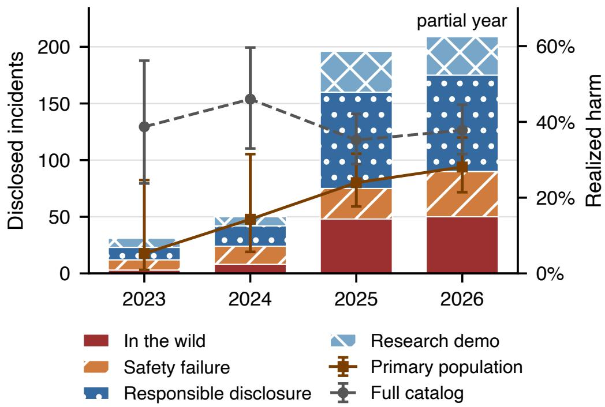
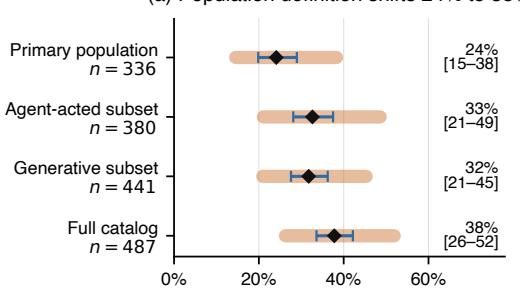
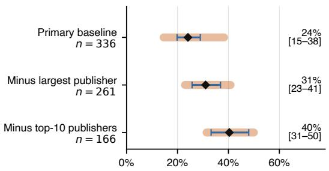
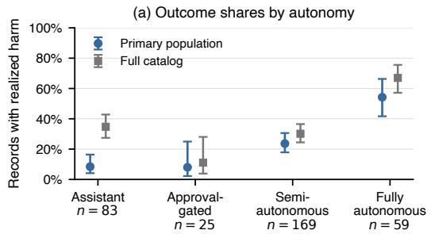
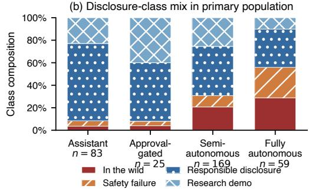
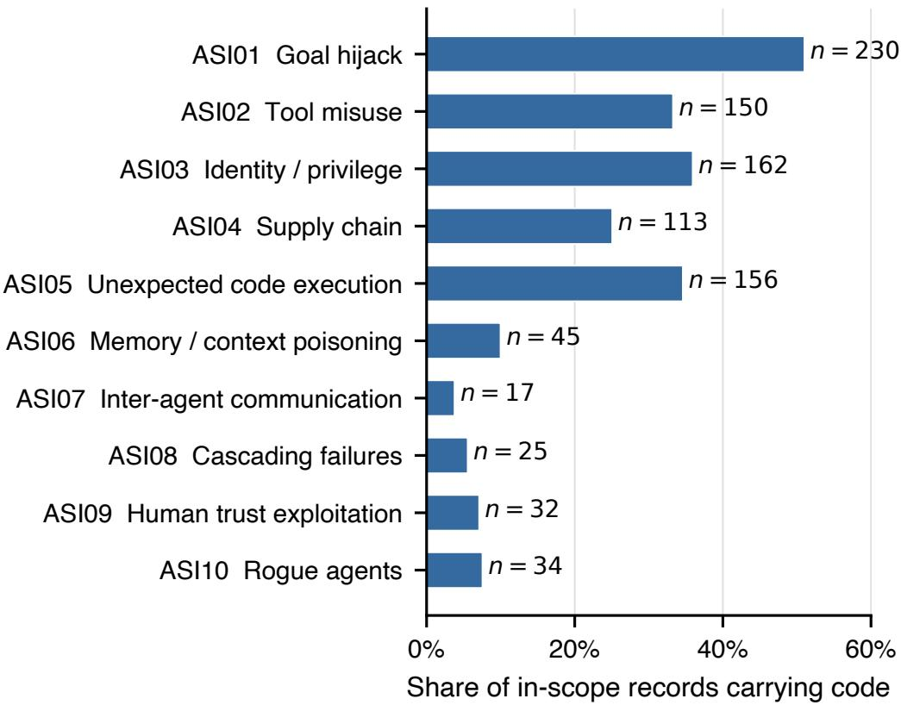

# The Agent Incident Registry: Toward Preventing Repeated AI Agent Failures

Divyanshu Kumar Anaconda dkumar@anaconda.com

Rohith HN Anaconda rhn@anaconda.com

Nitin Aravind Birur Anaconda nbirur@anaconda.com

Sahil Agarwal Anaconda sagarwal@anaconda.com

Prashanth Harshangi Anaconda pharshangi@anaconda.com

## Abstract

AI agents increasingly act through tools and delegated authority, but general incident repositories rarely capture the mechanisms needed to compare public failures with agent-security evaluations. We present the Agent Incident Registry (AIR)1, a source-linked catalog containing 487 records of agent-related events disclosed from 2022 through 2026. Each record includes supporting evidence, a stable identifier, and missingness-aware labels for causal role, disclosure class, mechanism, and outcome. Among the 336 generative-system records in which the agent acted, 81 involved realized harm (24%). Realized outcomes concentrate in in-the-wild and safety-failure records, while responsible disclosures and research demonstrations are overwhelmingly demonstrated; the aggregate share therefore characterizes collection composition rather than deployment risk. After initial curation, a second human reviewer checked all 487 records and their existing labels for completeness and correctness. In a deployment-analogue audit, InjecAgent’s 1,054 cases occupy three of AIR’s twelve surfaces and are all attacker-triggered, whereas AIR contains 92 no-adversary safety failures. AIR supports source-grounded case retrieval and evaluation-scope auditing, not failure-rate or control-efficacy estimation.

Keywords. AI agents, incident catalogs, trustworthy data curation, ML system security, forensic analysis

## 1 Introduction

In July 2025 a coding agent on Replit reportedly deleted a live production database during an active code freeze despite repeated instructions not to make changes (AIR-2025-0061). In June 2025 researchers demonstrated that a crafted email could make Microsoft 365 Copilot exfiltrate data without the user clicking the malicious content, although retrieval occurred during a user-initiated Copilot interaction. Despite the cited paper’s “real-world exploit” title, AIR codes this event as demonstrated rather than realized because no customer harm was documented (AIR-2025-0039; [22]). One event caused real data loss; the other established a feasible exploit. Treating both as undifferentiated “incidents” obscures a distinction that evaluation designers need.

Agent failures are system failures: model behavior combines with credentials, tool access, untrusted content, and delegated authority to produce consequences. General AI incident repositories capture a broader range of harms, but their public schemas do not consistently record these agent-specific mechanisms. As a result, they cannot systematically connect public events to the threat models and environments used in agent-security evaluations.

AIR addresses this gap with 487 source-linked registry records representing events disclosed between 2022 and 2026. Every admitted record has a supporting source and verbatim evidence quote, a stable AIR-YYYY-NNNN identifier, and explicit missingness for fields that the source does not establish. The schema separates realized harm, in which a real party experienced a consequence, from demonstrated capability, and distinguishes who acted from how the event reached disclosure.

## Contributions.

• A source-grounded registry. AIR consolidates 487 public disclosures into deduplicated records. Each record preserves a supporting quotation and source, a stable identifier, and explicit unknowns; documented merge rules prevent multiple reports of one event from being counted as separate incidents.

• A mechanism-focused coding scheme. AIR separates causal role, disclosure class, and realized outcome, so a demonstrated vulnerability is not counted as field harm and an event involving AI is not automatically attributed to agent action. A second human reviewer checked every record and existing label across the full catalog.

Together, the registry and coding scheme make public disclosures usable as evidence-grounded inputs to agent-security evaluation: they show which mechanisms have reached disclosure and which documented failure modes constructed tests may omit. Throughout the paper, AIR is treated as a selected corpus of public disclosures, not a census of deployed systems or agent runs; it therefore supplies neither deployment denominators nor counterfactual systems for estimating failure rates or causal effects. Section 3 defines its scope and evidence rules, and Section 5 sets the limits on statistical interpretation.

## 2 Related work

Incident repositories. The AI Incident Database (AIID) established the case for learning from deployed AI failures and groups public reports into incident records [10]. Its optional CSET taxonomy distinguishes realized and potential harm and includes an autonomy judgment [7]; GMF relates goals, methods, and known or potential failure causes with evidence-grounded rationales [21]. The OECD subsequently defined incidents and hazards [16], proposed a common reporting framework [17], and built AIM, which explicitly includes both incidents and hazards and generates harm, severity, stakeholder, and geography metadata [18]. AIAAIC manually curates incidents and controversies across AI, algorithms, and automation [2], while the MIT AI Incident Tracker re-annotates AIID records using causal and domain taxonomies [11, 23].

These resources cover a broader universe than AIR, and several already encode concepts that AIR uses. The narrower distinction is that, at our freeze, their documented core schemas did not consistently require the combination of agent role, autonomy, tool capability, initial vector, guardrail outcome, and source evidence. AIR makes that agent-specific mechanism schema mandatory while representing unsupported fields as missing. Table 1 summarizes this distinction.

Cybersecurity and aviation provide methodological precedents for this narrower claim. VCDB publishes disclosed breaches while warning that legal requirements skew its source population [26]. NASA’s voluntary ASRS fuses multiple reports into unique incidents and states that its reports cannot estimate total frequency or a stable trend [15]. NVD audits likewise show that catalog inconsistencies can change downstream conclusions [4]. AIR adopts the same discipline: preserve source-linked evidence, define the counting unit, and avoid prevalence claims.

Taxonomies and identifiers. OWASP ASI and AIVSS, MITRE ATLAS, and NIST’s risk and adversarial-ML frameworks organize risks, vulnerabilities, controls, and techniques rather than disclosed events [12, 19, 20, 24, 25]. AIR maps every in-scope record to one or more OWASP ASI mechanisms and explicitly marks records outside that taxonomy’s scope. ATLAS and CVE links remain optional; a missing link is not treated as evidence of absence. AIR’s immutable identifiers follow the separation between records and classifications used by CVE and CWE [13, 14].

Table 1: AIR complements general AI incident repositories with required agent-mechanism fields. “Not explicit” means the resource may describe a fact in prose or an optional taxonomy but does not require it in its core documented schema.
<table><tr><td>Resource</td><td>Unit / principal source</td><td>Principal coding</td><td>Agent mechanism</td></tr><tr><td>AIID</td><td>ports</td><td>Incident linked to public re- Harms; optional CSET/GMF tax- Partial: optional au- onomies</td><td>tonomy/causes</td></tr><tr><td>OECD AIM</td><td>tered news</td><td>Incident or hazard; clus- Harm, severity, stakeholders, ge- Not explicit ography</td><td></td></tr><tr><td>AIAAIC</td><td>public sources</td><td>Incident or controversy; Risk, harm, sector, system and Not explicit governance</td><td></td></tr><tr><td>MIT tracker</td><td>dent</td><td>Re-annotated AIID inci- Causal/domain risk and harm Not explicit severity</td><td></td></tr><tr><td>AIR</td><td>public sources</td><td>Registry record linked to Architecture, mechanism, control, Explicit agency, outcome</td><td></td></tr></table>

Agent evaluations. These taxonomies name mechanisms; agent evaluations instantiate them as executable tasks. Indirect prompt injection established that untrusted retrieved content can redirect LLM-integrated applications without direct access to the model [1]. AgentDojo operationalizes that threat in stateful tool environments: formal utility and security checks inspect resulting environment state across 97 benign tasks and 629 security cases, so it tests tool-mediated consequences rathe than text compliance alone [5]. InjecAgent contributes a larger Cartesian suite of indirect injections across user and attacker tools [27]. Agent Security Bench broadens the attack and defense families across ten scenarios and more than 400 tools [28], while AgentHarm tests whether agents refuse harmful multi-step tasks while retaining benign capability [3].

Taxonomy-driven black-box red teaming offers a complementary route: a seven-domain framework uses SAGE-RT [8] to generate adversarial scenarios and evaluate agents without privileged internal access [9]. AIR is being used to ground this workflow in disclosed incidents: records provide evidence-backed scenario seeds, while its mechanism fields expose gaps in generated-suite coverage.

These benchmarks and generated suites answer whether an agent fails under a constructed task and threat model. AgentDojo is especially close to AIR’s tool-mediated mechanism level, but its security cases remain synthetic adversarial demonstrations; AgentHarm covers harmful use, not spontaneous no-adversary failure. AIR instead describes selected public events. It can audit which observed surfaces, vectors, consequence types, and no-adversary cells an evaluation represents. We perform one pinned InjecAgent projection in Section 4 as a worked example. Applying that comparison requires explicit rules for what enters AIR and what one registry record represents.

## 3 Method

## 3.1 Scope, unit, and populations

Scope. AIR includes disclosures in which a generative or physically embodied autonomous system acts, becomes the target of an AI-specific exposure, produces output on which a person acts, or undergoes a bounded agent-security test. Included records must involve at least one agent-specific mechanism, such as tool use, retrieval, delegated authority, autonomous control, AI-specific data handling, or an agent-facing integration. We exclude generic text-only jailbreaks without a concrete security or safety-control failure, deepfakes, model-output bias audits, training-data disputes, and non-generative classifiers making eligibility or ranking decisions.

Counting unit and identifiers. AIR’s counting unit is a registry record, not an article, victim, repository, or download. A record may represent one disclosed event, campaign, coordinated advisory, or distinct vulnerability under the stated merge and split rules. Multiple reports of the same event are fused, and a campaign with many artifacts still receives one record; proportions therefore weight registry records rather than affected entities. A vulnerability disclosure and a later exploitation campaign are split only when the later event has a distinct source and realized-harm question. Each retained record receives an append-only AIR-YYYY-NNNN identifier that is never reassigned.

Analysis populations. Causal role is recorded in four mutually exclusive agency strata: agent\_acted, ai\_as\_target, human\_acted\_on\_output, and elicitation\_only. Zero-click resource fetching counts as agent action when the system makes the consequential request without an intervening human choice. We use four population names throughout: thefull catalog contains all 487 records; the agent-acted subset contains the 380 agent\_acted records; the generative subset contains the 441 generative-system records; and the primary population is their 336-record intersection, comprising generative systems in which the agent acted. Primary-population results support claims about agent action; the other three populations show how those results change when either restriction is relaxed.

## 3.2 Corpus construction

Collection and deduplication. The same event or vulnerability often appears in several sources, so corpus construction had two stages: collecting candidates and determining which described the same underlying phenomenon. We first searched 17 source channels: incident databases; CVE/GHSA advisories; vendor and independent-researcher disclosures; enterprise, coding-agent, browser, MCP, and supply-chain reports; threat intelligence; academic demonstrations; and press, legal, and regulatory records. These channels guided discovery but did not define the final labels; together, they produced 602 candidates.

We then linked candidates using exact identifiers, shared sources or quotations, vendor/date matches, and title similarity. The curator reviewed every proposed link. Merging 115 duplicate candidates yielded the 487 records in the full catalog. Corpus counts therefore do not rise merely because several sources describe the same event. The artifact preserves each candidate-to-record mapping and merge decision so users can audit how the counts were formed. Deduplication does not establish completeness: the source channels overlap and were not randomly sampled, so duplicate reports cannot reveal how many events were never disclosed or never found.

Evidence and adjudication. Admission required at least one fetched supporting URL and a verbatim quotation that establishes the event or demonstrated vulnerability. We preferred a vendor, researcher, advisory, court, or regulatory source. When the originating source was unavailable, a secondary report could support a medium-confidence record; 457 records are high-confidence and 30 are medium-confidence. Leads without fetchable support were retained in a separate quarantine (52 at freeze) and do not enter any statistic. These requirements establish source linkage and quote support, not independent reproduction or proof by the authors. LLM assistance was limited to drafting the web-scraping and figure-generation scripts. Human authors reviewed the code and its outputs; deterministic validators enforced schema constraints, and the curator resolved scope, duplicate, and classification decisions.

## 3.3 Coding and reliability

Outcome and disclosure class. impact\_realized is true only when a real party suffered a real consequence; a proof of concept against a live product remains demonstrated capability. Separately, class records how the event surfaced: an observed in\_the\_wild attack or attempt, a safety\_failure with no adversary-supplied trigger, a shipped vulnerability or concrete vendor threat mode surfaced through responsible\_disclosure, or a researcher-led research\_demo. Class does not entail outcome: an in-the-wild attempt or safety near miss can be unrealized, and a controlled live-system test can still produce a real third-party consequence. Conditioning on class diagnoses discovery composition; it is not a causal adjustment.

Mechanism fields. Each record separates system context (attack surface, autonomy, capabilities, target, and vendor), event pathway (initial vector, causal role, and consequences), response evidence (guardrail description, bypass status, and remediation), and source metadata. Ambiguous causal-role assignments carry a separate agency\_debatable flag. Controlled derivations collapse free-text vectors into eight families and guardrail descriptions into eleven multi-label kinds plus none/unknown. A versioned OWASP Agentic Top 10 (ASI) crosswalk applies documented, mechanism-first rules to all 487 records. All 451 records within ASI’s software-agent scope receive at least one code, while 36 records are explicitly marked out\_of\_scope; no in-scope record remains unmapped. Existing curated codes retain their order, rule-supported codes are appended, and reasoned overrides take precedence. The first ordered code becomes primary\_asi, but records may carry multiple codes. ATLAS and CVE links remain optional. Fields with inadequate coverage, including tool privilege and financial-loss bands, are excluded from substantive analysis. Appendix A gives abbreviated decision rules; the full codebook, crosswalk audit, and curation protocol accompany the artifact.

Table 2: Disclosure class and realized outcomes in the full 487-record catalog. In-the-wild and safety-failure records are predominantly realized; responsible disclosures and research demonstrations are predominantly demonstrated.
<table><tr><td>Disclosure class</td><td>n</td><td>Realized, n</td></tr><tr><td>In the wild</td><td>110</td><td>92</td></tr><tr><td>Safety failure</td><td>92</td><td>87</td></tr><tr><td>Responsible disclosure</td><td>199</td><td>2</td></tr><tr><td>Research demo</td><td>86</td><td>3</td></tr></table>

Human validation. One corpus curator made or adjudicated the initial labels. A second human reviewer then inspected all 487 records and their existing labels for completeness and correctness. Because the reviewer could see those labels, this was not an independent annotation exercise. We therefore do not report inter-rater agreement statistics. The later rule-added ASI codes carry separate provenance and are not presented as independently human-coded labels. Remaining uncertainty is represented through explicit missing values, the agency\_debatable flag, documented boundary rules, and sensitivity analyses.

## 3.4 Analysis

The analysis asks three questions in sequence. First, how do disclosure class and causal role shape the realized-outcome shares in the frozen catalog? Second, how sensitive are those shares to population definition and source concentration? Third, which observed mechanisms does a selected agent evaluation represent, and which does it omit?

For each proportion, we report a 95% Wilson interval and a deterministic pairs-cluster bootstrap that resamples records sharing the same first-source host as a block (10,000 replicates; fixed seed). Both describe uncertainty within this disclosure sample; the bootstrap captures one form of source dependence and is not a population confidence interval. Records may also share a campaign or research program across hosts, so even that interval can understate dependence. We therefore do not report record-independent hypothesis tests. Autonomy is analyzed categorically through raw disclosureclass-by-autonomy cells; sparse approval-gated cells preclude a precise adjusted estimate. Control outcomes are excluded from quantitative analysis because their source coverage is inadequate. ASI assignments are summarized only as non-exclusive crosswalk coverage, not as outcome, prevalence, or risk estimates, because the mapping is partly rule-derived and the categories overlap.

## 4 Measurements and evaluation audit

The results proceed in two parts. We first establish how disclosure class, causal role, population definition, and source concentration limit interpretation of outcome shares. We then examine the apparent autonomy pattern and demonstrate AIR’s intended evaluation-audit use by comparing noadversary failures with InjecAgent.

## 4.1 Disclosure composition determines aggregate outcome shares

The full catalog combines four disclosure classes and four causal roles. We report both compositions before narrowing to the primary population.

Only 28 records depart from the pattern in which in-the-wild and safety-failure records are realized while responsible disclosures and research demonstrations are demonstrated. The latter two classes contribute 285 records but only 5 realized cases; the former two contribute 202 records and 179 realized cases. The full catalog’s realized share of 184/487 (38%) therefore primarily reflects the balance of disclosure pathways, not the risk of deploying an agent. Table 3 separately shows why causal role matters: target-side vulnerabilities and human action on model output should not be counted as agent action.

Table 3: Causal-role composition in the full 487-record catalog. Percentages are within role; the n = 2 elicitation\_only percentage is suppressed.
<table><tr><td>Agency stratum</td><td>n</td><td>Realized, n (%)</td></tr><tr><td>Agent acted</td><td>380</td><td>124 (33%)</td></tr><tr><td>AI as target</td><td>69</td><td>29 (42%)</td></tr><tr><td>Human acted on output</td><td>36</td><td>31 (86%)</td></tr><tr><td>Elicitation only</td><td>2</td><td>0 ()</td></tr></table>

  
Figure 1: Annual disclosure volume by class (bars) and realized-outcome shares with 95% Wilson intervals (points). The sole 2022 record is omitted from the plotted contrasts; 2026 is right-truncated at 2026-09-05. Changes over time describe this catalog’s disclosure composition, not deployment risk.

Within the primary population, 81 of 336 records have realized harm (24%; 95% Wilson interval 20–29%). Resampling first-source hosts widens the interval to 15–38%. Relaxing one restriction at a time gives 124/380 (33%) in the agent-acted subset and 140/441 (32%) in the generative subset; relaxing both gives the full catalog’s value above. Restricting the primary population to highconfidence records gives 70/314 (22%). These are disclosure-sample sensitivities, not estimates of failure incidence.

Figure 1 makes the changing disclosure mix visible over time. Annual volume and realized-outcome shares move with the balance of field events, disclosures, and demonstrations. The figure is therefore a composition diagnostic, not a temporal failure-rate or deployment-risk trend.

Agency-label uncertainty does not erase the agent-acted subset’s result. Excluding all 113 agency\_debatable records leaves 100 realized cases among 315 uncontested agent-acted records (32%), compared with 33% under the coded labels. Reassigning all contested records in the directions that minimize or maximize the share yields 27%–42%. These are identification bounds for the agent-acted subset, not sampling intervals.

(a) Population definition shifts 24% to 38%  

(b) Source exclusions shift 24% to 40%  
  
Records with realized harm  
Figure 2: Sensitivity of the realized-harm share. Panel (a) broadens the primary-population definition; panel (b) removes dominant source blocks from the primary population. Diamonds are within-sample estimates, thin blue intervals are record-level 95% Wilson intervals, and wide orange intervals are deterministic first-source-host bootstrap ranges. Labels report the point estimate and the bracketed host-cluster range. These intervals characterize the selected catalog, not deployment risk.

## 4.2 Source dependence dominates precision

Publisher concentration matters: removing dominant source blocks moves the primary population’s 24% realized share as high as 40%. Removing each of the ten largest first-source hosts in turn moves it between 23 and 31%. Removing the largest source block, embracethered.com, leaves 81/261 (31%); removing all ten largest hosts leaves 67/166 (40%). Figure 2 shows the four named populations and separates population-definition changes from source-block exclusions. The perturbations diagnose source dependence; they are not corrected estimates.

## 4.3 Autonomy is confounded with disclosure class

We next ask whether AIR supports a comparison across autonomy labels. Within the primary population, realized-harm shares are 8% for assistants, 8% for approval-gated copilots, 24% for semi-autonomous systems, and 54% for fully autonomous systems (Fig. 3a). This marginal pattern does not identify an autonomy effect: the corpus has neither deployment denominators nor matched systems, and disclosure-class composition changes sharply across autonomy labels (Fig. 3b). The approval-gated group contains only one in-the-wild and one safety-failure record, whereas the fully autonomous group contains 33 records across those two classes. Appendix A.1 reports the underlying cells.

## 4.4 No-adversary failures expose an evaluation gap

The full catalog contains 92 safety-failure records with no adversary-supplied trigger, of which 87 are realized. The agent-acted subset contains 82 of these records, including 77 realized outcomes. Documented mechanisms include destructive shell actions, uncommanded publication, and embodied-control failures without adversarial goal hijacking. Evaluations limited to attackersupplied inputs do not exercise this region.

To make that comparison concrete, we project InjecAgent [27] into AIR’s mechanism schema. Its 1,054 base-setting cases combine 17 user tools with 62 attacker cases. Every task places an attacker instruction in a user-tool response and therefore exercises indirect prompt injection. The generic harness maps literally to agent\_framework. The reported 3-of-12 statistic is a separate deployment-analogue projection: it maps user tools to coding\_agent, browser\_agent, and enterprise\_assistant, and does not count the literal harness as a fourth deployment surface.

InjecAgent therefore does not test the no-adversary mechanisms identified above. Covering that region would require workload, state, permission, and recovery perturbations without attackersupplied content. Disclosure class and realized outcome describe the public events that motivate tests; they are not coverage dimensions that a synthetic task must itself occupy. AIR record counts likewise do not determine benchmark priorities.

  
Figure 3: Autonomy and disclosure composition. (a) Realized-harm shares in the primary population and full catalog, with record-level 95% Wilson intervals. (b) Disclosure classes within the primary population. The apparent increase across autonomy labels coincides with a composition shift and does not identify an autonomy effect.

Table 4: Under the deployment-analogue projection, InjecAgent’s 1,054 cases occupy three of AIR’s twelve surfaces. The literal generic harness is not counted as a fourth surface; every case is attackertriggered indirect prompt injection.
<table><tr><td>Surface analogue</td><td>Cases</td><td>Share</td></tr><tr><td>Enterprise assistant</td><td>434</td><td>41.2%</td></tr><tr><td>Browser agent</td><td>434</td><td>41.2%</td></tr><tr><td>Coding agent</td><td>186</td><td>17.6%</td></tr><tr><td>Other deployment surfaces</td><td>0</td><td>0.0%</td></tr></table>

## 5 Threats to validity

Selection and denominator. AIR samples public disclosure, not deployed systems or agent runs. Counts track who publishes: one independent research site supplies the largest source block, vendors with mature disclosure programs become more visible, and controls that hold are seldom reported. Media attention, regulation, product adoption, and researcher tooling all change over time. Consequently, no count in this paper estimates incidence, prevalence, vendor risk, or control efficacy, and class-stratified analysis remains descriptive rather than causal. The counting unit is also nonuniform in scale: one coordinated advisory, malware campaign, or victim event receives one record regardless of artifact, download, or victim count. Equal record weighting must not be read as equal affected populations.

Evidence and annotation. A fetched quotation establishes that a source made a claim; it does not validate every detail of that claim. 30 records rely on secondary reporting. LLM assistance was limited to drafting web-scraping and figure-generation code; human authors reviewed the code and verified its outputs. One human curator made or adjudicated the initial labels, and a second human reviewer inspected every record and its existing labels. This full-catalog review can catch omissions and inconsistencies, but because the labels were visible it does not measure independent coder agreement. The agency\_debatable flag exposes one known boundary and the Results report its sensitivity, but other misclassification remains possible. Records sharing a campaign, vendor, source, or research team remain dependent; resampling first-source hosts captures only one of those links and can still understate uncertainty.

Geographic and temporal coverage. AIR does not code source language, incident country, or deployment geography, so this freeze cannot quantify linguistic or regional representation. Collection used English-language search and some non-English events rely on English-language AIID summaries; this is a plausible coverage mechanism, not a measured geographic result. Disclosure dates have variable precision, and 2026 is right-truncated at 2026-09-05.

System scope. The full catalog includes 44 non-generative embodied-autonomy records, of which 43 are realized; the generative subset and primary population apply an explicit ai\_entity filter. Two stable-ID boundary records are tagged not\_ai rather than hidden. Excluding non-generative eligibility and ranking systems also means AIR cannot support claims about automated discrimination generally.

Mechanism-field limits. Control outcomes are source-silent for 390 of 487 records. Their descriptions support case retrieval but not control-prevalence or efficacy claims. The ASI crosswalk has complete in-scope coverage, but coverage is not independent validation: 271 in-scope records retain at least one earlier curated assignment, 175 are rule-only, and 5 use explicit overrides. Because assignments are non-exclusive and partly derived from other labels, their counts support retrieval and evaluation-scope auditing rather than category-prevalence or risk-ranking claims. Separately, 113 vectors remain in the residual other family; tool\_access remains unknown for all 487 records; and authority, reversibility, and financial-loss bands lack adequate source coverage.

## 6 Artifact and use

The anonymized artifact accompanying this paper contains the frozen corpus, coding protocol, versioned ASI crosswalk and audit, InjecAgent mapping, and code needed to reproduce every reported statistic and figure.

Intended evaluation use. Evaluation designers can map test cases to AIR’s surface, vector, and trigger fields, then report represented and missing mechanisms. The realized/demonstrated distinction prevents demonstrated capability from being counted as field harm. Because public disclosures lack exposure denominators, AIR does not support attack-success rates, vendor rankings, or deployment-risk scores [6].

Societal impact and safeguards. A shared, evidence-linked record can help evaluators and practitioners learn from failures that would otherwise remain isolated. It can also amplify contested claims, simplify discovery of exploit research, or invite unsupported vendor comparisons. AIR includes only short excerpts needed to verify record admission, not full articles or new exploit payloads, and retains source links, confidence labels, and correction provenance. These measures reduce but do not eliminate reputational and dual-use risk.

## 7 Conclusion

AIR turns fragmented public reports into a source-linked record of how agentic systems fail. Its central lesson is methodological: incident evidence can reveal which mechanisms an evaluation represents only when realized harm, demonstrated capability, causal role, and disclosure class remain separate. In the 336-record primary population, disclosure class accounts descriptively for much of the apparent outcome and autonomy pattern; the comparison with InjecAgent exposes a no-adversary gap in attack-only evaluations. Together, these results show how selected disclosures can inform tests without being mistaken for deployment rates. AIR provides a disciplined bridge from public failures to test design, with source evidence and uncertainty attached.

## Ethical Considerations

AIR indexes claims from public sources that may identify vendors, researchers, organizations, and individuals. An AIR identifier means that a report met the corpus evidence rule; it does not inde pendently confirm every claim in the source. The release contains only short evidence excerpts and no new exploit payloads. An employer-independent correction process is planned but was not oper ational at the corpus freeze. The authors’ employer sells agent-security products, creating a conflict of interest relevant to collection and coding decisions.

## Open Science

An anonymized artifact accompanying the submission contains the frozen corpus, analysis code, human-validation description, and benchmark mapping needed to reproduce or audit the reported results. Upon acceptance, we will archive this version under a persistent identifier. Release terms will distinguish author-created annotations and code from third-party source excerpts.

## LLM Usage Considerations

For the research workflow, LLM assistance was limited to drafting the web-scraping and figuregeneration scripts. LLMs also assisted with language-level manuscript editing. Human authors reviewed the code, outputs, prose, and citations. All scope, duplicate-resolution, and labeling decisions were made or adjudicated by humans.

## References

[1] Sahar Abdelnabi, Kai Greshake, Shailesh Mishra, Christoph Endres, Thorsten Holz, and Mario Fritz. Not what you’ve signed up for: Compromising real-world LLM-integrated applications with indirect prompt injection. In Proceedings of the 16th ACM Workshop on Artificial Intelligence and Security, pages 79–90, 2023.

[2] AIAAIC. AIAAIC repository user guide. https://www.aiaaic.org/ aiaaic-repository/user-guide, 2026. Accessed 2026-09-04.

[3] Maksym Andriushchenko, Alexandra Souly, Mateusz Dziemian, Derek Duenas, Maxwell Lin, Justin Wang, Dan Hendrycks, Andy Zou, Zico Kolter, Matt Fredrikson, Eric Winsor, Jerome Wynne, Yarin Gal, and Xander Davies. AgentHarm: A benchmark for measuring harmfulness of LLM agents. arXiv preprint arXiv:2410.09024, 2024.

[4] Afsah Anwar, Ahmed Abusnaina, Songqing Chen, Frank Li, and David Mohaisen. Cleaning the NVD: Comprehensive quality assessment, improvements, and analyses. In 2021 51st Annual IEEE/IFIP International Conference on Dependable Systems and Networks Workshops, pages 1–2, 2021.

[5] Edoardo Debenedetti, Jie Zhang, Mislav Balunovic, Luca Beurer-Kellner, Marc Fischer, and´ Florian Tramèr. AgentDojo: A dynamic environment to evaluate prompt injection attacks and defenses for LLM agents. In Advances in Neural Information Processing Systems, volume 37, 2024.

[6] Timnit Gebru, Jamie Morgenstern, Briana Vecchione, Jennifer Wortman Vaughan, Hanna Wallach, Hal Daumé III, and Kate Crawford. Datasheets for datasets. Communications ofthe ACM, 64(12):86–92, 2021.

[7] Mia Hoffmann and Heather Frase. Adding structure to AI harm: An introduction to CSET’s AI harm framework. Technical report, Center for Security and Emerging Technology, 2023.

[8] Anurakt Kumar, Divyanshu Kumar, Jatan Loya, Nitin Aravind Birur, Tanay Baswa, Sahil Agarwal, and Prashanth Harshangi. SAGE-RT: Synthetic alignment data generation for safety eval uation and red teaming. arXiv preprint arXiv:2408.11851, 2024.

[9] Divyanshu Kumar, Nitin Aravind Birur, Tanay Baswa, Sahil Agarwal, and Prashanth Harshangi. Black-box red teaming of agentic AI: A taxonomy-driven framework for automated risk discovery. In AAAI Workshop on LLM-based Multi-Agent Systems: Towards Responsible, Reliable, and Scalable Agentic Systems, 2026.

[10] Sean McGregor. Preventing repeated real world AI failures by cataloging incidents: The AI incident database. In Proceedings of the AAAI Conference on Artificial Intelligence, volume 35, pages 15458–15463, 2021.

[11] MIT FutureTech. AI incident tracker. https://airisk.mit.edu/ai-incident-tracker, 2026. Accessed 2026-09-04.

[12] MITRE. ATLAS: Adversarial threat landscape for artificial-intelligence systems. https: //atlas.mitre.org/, 2026. Living knowledge base; accessed 2026-09-04.

[13] MITRE. Common vulnerabilities and exposures (CVE). https://www.cve.org/, 2026. Accessed 2026-09-04.

[14] MITRE. Common weakness enumeration (CWE). https://cwe.mitre.org/, 2026. Accessed 2026-09-04.

[15] NASA Aviation Safety Reporting System. ASRS database statistics (1994). ASRS Directline, no. 8, 1996.

[16] OECD. Defining AI incidents and related terms. Technical Report OECD Artificial Intelligence Papers, No. 16, OECD Publishing, Paris, 2024.

[17] OECD. Towards a common reporting framework for AI incidents. Technical report, OECD Publishing, Paris, 2025.

[18] OECD. AI incidents and hazards monitor: Overview and methodology. https://oecd.ai/ en/incidents-methodology, 2026. Accessed 2026-09-04.

[19] OWASP AIVSS Working Group. AIVSS scoring system for OWASP agentic AI core security risks. Technical Report Version 0.8, OWASP GenAI Security Project, 2026.

[20] OWASP GenAI Security Project. OWASP top 10 for agentic applications for 2026. https://genai.owasp.org/resource/ owasp-top-10-for-agentic-applications-for-2026/, 2025. Version published 2025-12-09; accessed 2026-09-04.

[21] Nikiforos Pittaras and Sean McGregor. A taxonomic system for failure cause analysis of open source AI incidents. In Proceedings of the Workshop on Artificial Intelligence Safety 2023, volume 3381 of CEUR Workshop Proceedings, 2023.

[22] M. Pavan Reddy and Aditya Sanjay Gujral. EchoLeak: The first real-world zero-click prompt injection exploit in a production LLM system. In Proceedings of the AAAI Symposium Series, volume 7, 2026.

[23] Peter Slattery, Alexander K. Saeri, Emily A. C. Grundy, Jess Graham, Michael Noetel, Risto Uuk, James Dao, Soroush Pour, Stephen Casper, and Neil Thompson. The AI risk repository: A meta-review, database, and taxonomy of risks from artificial intelligence. Patterns, page 101517, 2026.

[24] Elham Tabassi. Artificial intelligence risk management framework (AI RMF 1.0). Technical Report NIST AI 100-1, National Institute of Standards and Technology, Gaithersburg, MD, 2023.

[25] Apostol Vassilev, Alina Oprea, Alie Fordyce, Hyrum Anderson, Xander Davies, and Maia Hamin. Adversarial machine learning: A taxonomy and terminology of attacks and mitigations. Technical Report NIST AI 100-2e2025, National Institute of Standards and Technology, Gaithersburg, MD, 2025.

[26] VERIS Community. The VERIS community database (VCDB). https://verisframework. org/vcdb.html, 2026. Living public-incident dataset; accessed 2026-09-05.

[27] Qiusi Zhan, Zhixiang Liang, Zifan Ying, and Daniel Kang. InjecAgent: Benchmarking indirect prompt injections in tool-integrated large language model agents. In Findings of the Association for Computational Linguistics: ACL 2024, pages 10471–10506, 2024.

[28] Hanrong Zhang, Jingyuan Huang, Kai Mei, Yifei Yao, Zhenting Wang, Chenlu Zhan, Hongwei Wang, and Yongfeng Zhang. Agent security bench (ASB): Formalizing and benchmarking attacks and defenses in LLM-based agents. In The Thirteenth International Conference on Learning Representations, 2025.

## A Coding scheme

Table 5: Core coding decisions used in the paper. Plain-language concepts are paired with their schema fields; the complete attack-surface and vector vocabularies follow the table.
<table><tr><td>Concept and schema field</td><td>How it is coded</td></tr><tr><td>Outcome, agency, and scope</td><td></td></tr><tr><td>Disclosure route class</td><td>How the event became public: in the wild, responsible disclosure, research</td></tr><tr><td></td><td>demonstration, or safety failure. Safety failure is reserved for events without an adversary.</td></tr><tr><td>Realized harm impact_realized</td><td>true only when a real party experienced the reported consequence. A proof</td></tr><tr><td></td><td>of concept remains false, even on a live system, unless a real party was affected.</td></tr><tr><td>Action autonomy autonomy_level</td><td>The highest level of independent action shown in the event: assistant,</td></tr><tr><td></td><td>approval-gated copilot, semi-autonomous, or fully autonomous. Product marketing does not determine this label.</td></tr><tr><td>Causal role agency</td><td>Whether the agent acted, the AI was the target, a human acted on AI output,</td></tr><tr><td></td><td>or the source only elicited a response. Borderline cases are marked agency_debatable.</td></tr><tr><td>AI type</td><td>Whether the relevant component is generative AI, non-generative autonomy,</td></tr><tr><td>ai_entity</td><td>or not AI. This field makes scope exclusions explicit.</td></tr><tr><td>Mechanism and retrieval</td><td></td></tr><tr><td>Attack surface attack_surface</td><td>The system surface directly implicated in the event. Multiple values may be</td></tr><tr><td></td><td>assigned from the 12-surface vocabulary listed below.</td></tr><tr><td>Trigger pathway vector_family</td><td>One of eight broad pathway families derived deterministically from the detailed initial_vector; the original wording is retained.</td></tr><tr><td>Guardrail</td><td></td></tr><tr><td>guardrail_kind</td><td>Controls explicitly supported by the source. Multiple values are allowed; source silence is unknown, not evidence that no guardrail existed</td></tr></table>

Three boundary examples operationalize autonomy. EchoLeak (AIR-2025-0039) is assistant: automatic email retrieval and rendering occurred during a user-initiated Copilot interaction, although exploitation required no click on the malicious email; the system did not own an ongoing task. Replit (AIR-2025-0061) is semi-autonomous: the agent issued several consequential commands without per-command approval, but within a user-delegated coding task. The Remoteli posting bot (AIR-2022-0001) is fully autonomous: its persistent loop selected and published text from monitored input without a contemporaneous human gate. Approval-gated copilot is reserved for config urations in which a consequential action or tool connection crosses an explicit confirmation step. Coding follows authority exercised in the event, not the product’s advertised maximum.

The remaining controlled vocabularies used by the coverage audit are the surface and vector families. The twelve attack surfaces are enterprise\_assistant, coding\_agent, browser\_agent, computer\_use\_agent, mcp\_server, agent\_framework, skill\_plugin, multi\_agent\_system, memory\_store, consumer\_chatbot, autonomous\_ops, and other. Vector families are indirect prompt injection, direct prompt injection, malicious component, conventional vulnerability, misuse, physical environment, no-adversary autonomous action, and other. The safety\_failure class identifies disclosures with no adversary-supplied trigger; no\_adversary\_autonomous\_action separately identifies the event’s vector.

## A.1 Class-by-autonomy cells

As a separate sensitivity in the full catalog, direct standardization of each autonomy group to the full catalog’s disclosure-class mix gives 42%, 41%, 34%, and 45%. The standard population is itself

Table 6: Realized/total counts by disclosure class and autonomy in the primary population (generative-system records in which the agent acted). Small approval-gated in-the-wild and safetyfailure cells preclude a precise adjusted estimate.
<table><tr><td>Disclosure class</td><td>Assistant</td><td>Approval-gated</td><td>Semi-autonomous</td><td>Fully autonomous</td></tr><tr><td>In the wild</td><td>2/3</td><td>1/1</td><td>24/35</td><td>17/17</td></tr><tr><td>Safety failure</td><td>4/4</td><td>1/1</td><td>16/17</td><td>13/16</td></tr><tr><td>Responsible disclosure</td><td>1/57</td><td>0/13</td><td>0/74</td><td>1/20</td></tr><tr><td>Research demo</td><td>0/19</td><td>0/10</td><td>0/43</td><td>1/6</td></tr></table>

disclosure-selected, and the one- and two-record approval-gated in-the-wild and safety-failure cells do not support inferential adjustment.

## A.2 Boundary cases for realized outcomes

Table 7 exposes all 5 records in the full catalog that are both realized and coded as responsible disclosure or research demonstration. These are narrow record-level judgments, not evidence that a demonstration implies population harm.

Table 7: All records in the full catalog coded both as realized and as responsible disclosure or research demo. “Basis” gives the documented real-party consequence.
<table><tr><td>AIR ID</td><td>Class</td><td>Agency</td><td>Basis for realized label</td></tr><tr><td>AIR-2024-0014</td><td>Research demo</td><td>Human acted on output</td><td>More than 30,000 authentic downloads and use in company repositories</td></tr><tr><td>AIR-2025-0010</td><td>Responsible disclosure</td><td>Agent acted</td><td>Private repository contents and live secrets returned from Copilot&#x27;s cache</td></tr><tr><td>AIR-2025-0012</td><td>Research demo</td><td>AI as target</td><td>11,908 credentials authenticated; affected vendors rotated or revoked keys</td></tr><tr><td>AIR-2026-0018</td><td>Research demo</td><td>Agent acted</td><td>Attacker-controlled code executed on 16 non-consenting users</td></tr><tr><td>AIR-2026-0036</td><td>Responsible disclosure</td><td>Agent acted</td><td>machines Exposed release token was used to publish an unauthorized package version</td></tr></table>

## A.3 OWASP Agentic Top 10 crosswalk

Purpose and coverage. AIR uses the OWASP Agentic Top 10 as a searchable index of documented mechanisms, not as a severity score or an estimate of real-world risk. Of the full catalog, all 451 records within OWASP’s agentic-application scope have at least one code. The other 36 records—primarily non-generative perception and planning failures—are marked out\_of\_scope rather than left blank. Codes are non-exclusive: 964 assignments cover the in-scope records (2.14 per record on average), and 350 records carry more than one. Figure 4 shows the distribution; Table 8 gives the evidence required for each code.

How assignments are made. Each record stores its dominant code first as primary\_asi. Among in-scope records, 271 retain at least one earlier curator label, 175 are rule-only, and 5 use an explicit override. Rules use structured fields wherever possible and consult titles or notes only for evidence those fields do not capture. AIR stores the reason and provenance for every mapping; the generated audit lists additions, overrides, and differences between rule-based ordering and the curator’s primary choice. Thus the crosswalk is reviewable and reproducible, while its counts remain descriptions of this catalog rather than estimates of mechanism prevalence or comparative risk.

  
Figure 4: Non-exclusive OWASP Agentic Top 10 assignments among 451 in-scope records. Bars show the share carrying each code and labels give counts. Because records can carry multiple mechanisms, bars do not sum to 100%. The 36 out-of-scope records are excluded; no in-scope record is unmapped.

Table 8: Decision rules for the non-exclusive OWASP Agentic Top 10 crosswalk. A code is assigned only when the record’s source evidence supports the stated mechanism.
<table><tr><td>Code</td><td>Name</td><td>Minimum source-supported evidence</td></tr><tr><td></td><td>ASI01 Agent Goal Hijack</td><td>Attacker-supplied instructions or content redirect the agent&#x27;s objective, decisions, or action path.</td></tr><tr><td></td><td>ASI02 Tool Misuse and Exploitation</td><td>The agent uses a legitimate tool unsafely while remaining within its granted privileges.</td></tr><tr><td></td><td>ASI03 Identity and Privilege Abuse</td><td>Delegation, credentials, authorization, identity, or inherited privileges are abused.</td></tr><tr><td></td><td>ASI04 Agentic Supply Chain Vulnerabilities</td><td>A skill, plugin, MCP server, package, model, dataset, registry, or update is hostile, compromised, or tampered with.</td></tr><tr><td></td><td>ASI05 Unexpected Code Execution</td><td>Code or command execution, unsafe deserialization, or a sandbox escape reaches a path that should not have been executable.</td></tr><tr><td></td><td>ASI06 Memory and Context Poisoning</td><td>Stored or retrievable context is corrupted and affects later reasoning, planning, or tool use.</td></tr><tr><td></td><td>ASI07 Insecure Inter-Agent Communication</td><td>An in-flight message between agents is injected, spoofed, replayed, intercepted, or altered.</td></tr><tr><td></td><td>ASI08 Cascading Failures</td><td>A fault propagates beyond its origin across agents, sessions, workflows, or a fleet.</td></tr><tr><td></td><td>ASI09 Human-Agent Trust Exploitation</td><td>A human over-relies on deceptive or incorrect agent output and takes the consequential action.</td></tr><tr><td></td><td>ASI10 Rogue Agents</td><td>An agent behaves harmfully or deceptively outside its intended function or authorized scope, including adversary-operated agent use.</td></tr></table>

## B Dataset documentation

Composition and provenance. The release contains public-source incident metadata and short verbatim evidence quotes; it does not redistribute full articles. Records can name vendors, researchers, affected organizations, and people already named in public reporting. Users should follow the linked source for context and corrections.

Maintenance and corrections. New records receive new IDs. Existing records are corrected in place with provenance. When records are merged, superseded references become aliases; IDs are never reused. Quarantined leads are excluded until a supporting source is fetchable. The event set analyzed here was frozen on 2026-09-05. The live registry is reviewed weekly for new records, source availability, and corrections. Updates after the freeze are versioned separately and must not be substituted when reproducing these results.

Uses and risks. Intended uses are evaluation-coverage audits, case retrieval, qualitative failure analysis, and descriptive study of disclosed incidents. Unsupported uses include vendor league tables, prevalence estimates, causal claims about autonomy or controls, and automated severity de cisions. Quotes may repeat allegations or descriptions of harm; citation of an AIR record should not be read as endorsement of every source claim.