# The Convention Gap: Towards Measuring Implicit Communication in Cooperative AI Evaluation

Makoto Fukushima<sup>∗</sup> Honda Research Institute Japan

Hua-Dong Xiong Honda Research Institute USA

Ehsan Moradi Pari Honda Research Institute USA

## Abstract

Cooperative AI agents are evaluated against other AIs, yet human cooperation relies on implicit conventions—shared protocols for reading meaning beyond the literal message—which AI-AI benchmarks may not capture. We propose the convention gap, the difference between the failure probability predicted from the literal content of communication and the observed failure rate, as a metric of implicit communication. In the card game Hanabi, the finite deck and deterministic hint constraints make this posterior exactly computable. We replayed about 101,000 play actions from three public datasets of human-human (hanab.live), AI-AI (HOAD), and human-AI (HanabiData) games. The gap was +26.2 percentage points (pp) in human pairs, −0.7 pp in AI pairs, and +16.4 pp in human-AI pairs, and was concentrated on plays of cards that had received no hints (+46 pp in human pairs). Within human-AI play, the literal information available to humans was similar across the three AI partners (mean predicted failure 38–41%), but human failure rates ranged from 14.4% to 34.4% and the gap from +24.1 to +6.2 pp; the partner eliciting the largest gap produced the fewest human failures. Game score carried different information: it depended on each corpus’s roster composition, whereas the gap separated human from AI play at the agent level. As a known-answer check, Off-Belief Learning agents, whose convention content is controlled by construction, gave a gap of +1.6 pp at the convention-free level, rising monotonically to +21.7 pp. These results suggest that convention compatibility, rather than AI-AI performance, may predict an AI’s effectiveness with human partners.

## 1 Introduction

AI agents for cooperative tasks increasingly operate alongside human partners [Dafoe et al., 2021], yet a common evaluation approach—AI-AI benchmarking—evaluates their performance in self-play (partnered with a copy of itself) or cross-play (partnered with a different AI). If human cooperation relies on implicit conventions that AIs do not use, these benchmarks may assess a different property: an agent’s compatibility with other AIs rather than its compatibility with humans. We propose a metric that isolates the contribution of implicit conventions, and apply it to human-human, AI-AI, and human-AI cooperative play.

The card game Hanabi [Bard et al., 2020] is a standard testbed for studying convention-based cooperation. Players hold cards facing outward—visible to partners but not to themselves—and must rely on constrained hints by other players to identify their own cards. On each turn a player may play a card to the shared tableau, discard for hint tokens, or give a hint; playing a card that does not fit the tableau costs a life token, and three such life losses end the game (Appendix C). The game’s structure makes it impossible to communicate everything through literal hints alone—yet experienced human pairs routinely achieve scores of 24–25 out of 25 [Bard et al., 2020], supplementing literal hint content with conventions: shared interpretive protocols that allow partners to extract meaning beyond what is literally said [Grice, 1975].

We propose the convention gap—the difference between a posterior probability of life loss, computed from literal hint information only, and the actual outcome—as an evaluation metric for the implicit-communication channel in cooperative play. Unlike existing benchmarks that measure task performance (game score) or pairwise compatibility (cross-play scores, AI-AI tournament rankings), the convention gap isolates this channel. Hanabi’s finite card set with known multiplicity and deterministic hint constraints make the posterior exactly computable by enumeration, requiring no sampling, approximation, or model fitting; the same definition applies uniformly across human-human, AI-AI, and human-AI play, enabling cross-setting comparisons.

Applied to approximately 101,000 play actions across three settings, the convention gap yields four findings: it forms a gradient across cooperation settings (+26.2 pp in human pairs, −0.7 pp in AI pairs, +16.4 pp in human-AI pairs); it is concentrated at play actions where literal information is absent, collapsing to near zero once two or more hints have touched the played card; within human-AI play it varies by AI partner and moves inversely with Human-AI Partner Loss; and it captures information about cooperation that mean game score does not: game score depends on each corpus’s roster composition, whereas the convention gap separates human from AI play at the agent level. As a known-answer validation, applying the metric to Off-Belief Learning agents—whose convention content is controlled by construction—recovers the designed hierarchy, from +1.6 pp at the convention-free level rising monotonically to +21.7 pp (§4.5). These findings indicate that convention compatibility, rather than AI-AI performance, may predict an AI’s effectiveness with human partners.

## 2 Related Work

The Hanabi challenge. Bard et al. (2020) established Hanabi as an AI benchmark. Walton-Rivers et al. (2017) introduced rule-based AIs (Simple, IGGI, Internal, Outer, Piers, VanDenBergh, Flawed) evaluated in AI-AI settings. Eger et al. (2017) independently implemented Osawa’s Internal and Outer agents for human-AI experiments and added a third agent, Full, which incorporates bidirectional intent reasoning.<sup>2</sup> Deep RL approaches—BAD [Foerster et al., 2019], SAD [Hu and Foerster, 2020], Other-Play [Hu et al., 2020]—achieve strong self-play scores but produce conventions that do not transfer to unfamiliar partners. Hu et al. (2020) found that Other-Play AIs outperform self-play AIs when paired with humans, an early indication that AI-AI rankings do not transfer to humans, which our metric quantifies systematically.

Zero-shot coordination and ad hoc teamplay. Several recent methods address the problem of building AIs that coordinate with unfamiliar partners. Any-Play [Lucas and Allen, 2022] uses intrinsic augmentation for zero-shot coordination. The AH2AC2 challenge [Dizdarevic et al.´ , 2025] constructs human proxy AIs from 101K hanab.live games as a benchmark for training human-compatible AIs. Bredell et al. (2025) augment the AI action space with human-style conventions to improve cross-play. Jeon and Kim (2023) showed that behavioral difference between RL agents—measured by action disagreement across states—correlates strongly with ad-hoc cooperation failure in Hanabi (r = −0.978), consistent with compatibility rather than individual performance driving partnership quality. These works address the problem from the design side—building AIs that transfer. We address the diagnostic side: measuring why certain AIs fail with humans and predicting which AIs will fail, without requiring new AI training.

Off-belief learning: the design-side counterpart. Off-belief learning (OBL; Hu et al. 2021) formalizes the same grounded-vs-convention distinction from the design side: its motivating example— a hint whose literal content licenses one inference while an arbitrary convention licenses another—is the literal-vs-beyond-literal split our metric measures. OBL trains a policy to best-respond to beliefs induced by a random partner policy, removing convention-based interpretation at training time;

iterating the operator reintroduces conventions one controlled level at a time. Hu et al. explicitly ground the construct in the Rational Speech Acts (RSA) literal listener $L _ { 0 } ,$ the same anchor our posterior uses (below), and their learned grounded belief is the trained counterpart of our closed-form posterior (§3.2). The two instruments are dual—OBL removes at training time what the convention gap measures at evaluation time—and §4.5 uses the released OBL hierarchy as a known-answer validation of the metric (full treatment in Appendix X).

Human-AI Hanabi studies. Liang et al. (2019) showed that an implicature-aware AI was perceived as 71% more human-like (n=156). Siu et al. (2021) found that humans preferred rule-based AIs over reinforcement learning AIs despite no score difference (n=116). Sidji et al. (2023) catalogued human conventions through qualitative analysis, and the HanabiData dataset provides human-AI game logs [Eger et al., 2017]. Attig et al. (2024) found that a rule-based AI (Piers) was rated higher than an RL AI on Perceived Cooperativity in a controlled pilot experiment (N=8). Our work differs in providing an objective, automated metric at scale (≈101K plays).

Cooperative AI and pragmatics. Carroll et al. (2019) showed that self-play AIs fail with humans in Overcooked. Dragan et al. (2013) identified the legibility–optimality tradeoff in robot motion planning. The RSA framework [Frank and Goodman, 2012, Goodman and Frank, 2016] formalizes Gricean pragmatics through recursive Bayesian inference between literal and pragmatic listeners. Our posterior is analogous to an RSA literal listener in that it uses only the literal content of hints, ignoring strategic and conventional inference; the convention gap is then analogous to the $L _ { 1 } - L _ { 0 }$ information gain. However, the posterior is a combinatorial computation over card identities rather than a formal RSA model over utterances.

Information-theoretic baselines. Sivan and Tsodyks (2025) decompose natural-language information into semantic content (meaning) and wording information (surface-level encoding) by subtracting an LLM-estimated wording baseline from total clause information. The convention gap follows a similar baseline-subtraction logic, isolating the implicit convention channel by removing the contribution of literal hint content.

Taken together, prior work establishes three conclusions: AI-AI performance does not reliably predict human-AI cooperation, humans rely on implicit conventions beyond literal communication, and partner compatibility—not individual capability—determines cooperative success. What is lacking is a quantitative, objective metric that isolates the contribution of implicit communication and applies uniformly across human-human, human-AI, and AI-AI settings. The convention gap addresses this by providing an exact baseline—the literal-information posterior—against which actual outcomes can be compared across all three settings.

## 3 Method

Game setting in brief. Hanabi’s 50-card deck spans 5 colors × ranks 1–5, with 3/2/2/2/1 copies of ranks 1–5 per color. Each player’s cards face outward—visible to the partner, hidden from the holder. On each turn a player plays a card to the shared tableau (each color must be built 1→5; a misplay costs one of 3 shared life tokens, and the third loss ends the game), discards to recover one of 8 shared hint tokens, or spends a hint token to hint, naming a color or rank and pointing out all matching cards in the partner’s hand. The score is the number of cards successfully played (0–25). Full rules are in Appendix C; all analyses use the standard 2-player “No Variant” configuration.

## 3.1 The Convention Gap

We define the convention gap as performance unexplained by literal information: the difference between the mean posterior probability of life loss—computed from literal hint information alone (defined in §3.2)—and the actual loss rate over N play actions:

$$
{ \mathrm { C o n v e n t i o n } } { \mathrm { G a p } } = \underbrace { { \frac { 1 } { N } } \sum _ { i = 1 } ^ { N } { \hat { p } } _ { i } } _ { \mathrm { m e a n p o s t e r i o r } } - \underbrace { { \frac { 1 } { N } } \sum _ { i = 1 } ^ { N } y _ { i } } _ { \mathrm { a c t u a l l o s s r a t e } }\tag{1}
$$

where $\hat { p } _ { i }$ is the posterior probability of life loss for play $i ( \mathrm { E q . ~ } 2 ) , y _ { i } \in \{ 0 , 1 \}$ is the outcome (1 = life lost), and N is the number of play actions in the group being analyzed (e.g., all plays by a given player type or in a given setting). The mean posterior is the simple average of the per-play values, pooling every play action in the group across all of its games and players—each play action is one observation, with no per-game or per-player averaging applied first—and can be read as the failure rate the group would exhibit if outcomes followed literal information alone; the gap is that expectation minus the group’s observed failure rate. A positive gap means players succeed more often than literal information predicts; by construction the surplus information must come from channels outside the literal content. Implicit communication through shared conventions is the interpretation we defend, supported by four controls developed in §4.1–4.3 and the appendices: (i) rule-based AI agents are calibrated against the same posterior: all seven own-play gaps lie within [−5.8, +0.7] pp, the pooled AI calibration curve is within 3 pp of the diagonal for $\hat { p } \leq 0 . 5 ( 9 2 \%$ of AI plays), and the one sizeable bin-level departure—Flawed’s plays at pˆ 0.5–0.8, which fail more often than predicted—has the sign opposite to the human gap (Figure 1c, Appendix O); a misspecified posterior would produce a sign-consistent deviation across agents, which appears under neither the full posterior nor its per-card approximation (Appendix E); (ii) the human gap concentrates exactly where conventions operate—zero- and one-hint plays; (iii) the one AI architecture documented to interpret hints as intent signals (Full) is the only AI with a positive own-play gap, a signature that reproduces with LLM partners (Appendix W); and (iv) convention-following bot accounts in the human corpus show an elevated gap (+29.8 pp; Appendix A). Notation is collected in Table 1.

Table 1: Notation.
<table><tr><td>Symbol</td><td>Meaning</td></tr><tr><td> $( c , r )$ </td><td>A card identity: color c (of 5) and rank  $r \in \{ 1 , \ldots , 5 \}$ </td></tr><tr><td> $h _ { t }$ </td><td>Literal information set at turn t: hints received, visible hands, discards, fireworks, tokens</td></tr><tr><td> $\hat { p } _ { i }$ </td><td>Posterior probability of life loss for play i, computed from  $h _ { t }$  (steps 1–5, §3.2)</td></tr><tr><td> $y _ { i }$ </td><td>Observed outcome of play  $i ( 1 = \mathrm { l i f e }$  lost, 0 = success)</td></tr><tr><td> $w _ { c , r }$ </td><td>Weight of candidate  $( { \bar { c } } , r ) { \mathrm { : } }$  remaining unseen copies</td></tr><tr><td> $\kappa$ </td><td>Per-card hint knowledge: (possible colors, possible ranks)</td></tr><tr><td> $C _ { \mathrm { b e f o r e } } , C _ { \mathrm { a f t e r } }$ </td><td>Total candidate identities across hinted cards, before/after a hint (Eq. 5)</td></tr></table>

## 3.2 The Posterior

We compute the posterior probability of life loss for each play action from the player’s literal information set $h _ { t } \colon$ all hints received on the played card, other players’ visible hands, fireworks, discard pile, and token counts. The computation is a weighted enumeration over feasible card identities, built up in five steps. Steps 1–4 give the per-card core: hints act as hard filters, eliminating identities inconsistent with any received hint, and each surviving candidate $( c , r )$ is weighted by its remaining unseen copy count $w _ { c , r } = \mathrm { t o t a l } .$ \_copies(r) − visible\_copies(c, r), reflecting the uniform random draw from the remaining deck (Eq. 2); step 5 then conditions jointly on the rest of the hand. Because the card set is finite with known multiplicity and hints are deterministic constraints, the posterior is exactly computable—no sampling, no parameter estimation, and no approximation. Any systematic deviation from this posterior is therefore attributable to information beyond literal hint content.

The information set $h _ { t }$ deliberately excludes convention-based inference about hint meaning or partner intent. A richer model could assign soft weights based on partner strategy (e.g., a hint “Red” given right after Red 3 was played would upweight Red 4), but our model treats hints purely as identity constraints. The full computation procedure, game engine, and validation are described in Appendix D.

$$
P ( \mathrm { l i f e ~ l o s t } \mid \mathrm { P l a y } ( k ) , h _ { t } ) = \frac { \sum _ { ( c , r ) \notin \mathrm { P l a y a b l e } } w _ { c , r } } { \sum _ { ( c , r ) } w _ { c , r } }\tag{2}
$$

Worked example. Past hints have narrowed a card’s knowledge to colors {Red, Blue} and ranks {2, 3, 4, 5}, so its candidates are {R2, R3, R4, R5, B2, B3, B4, B5}. The fireworks show Red at 1, Yellow at 5, Green at 3, Blue at 3, Purple at 2; the partner’s hand and the discard pile expose one copy each of R2, R3, R4, and B3 (in addition to the B1–B3 on the fireworks). Weights (remaining copies): R2: 1, R3: 1, R4: 1, R5: 1, B2: 1, B4: 2, B5: 1; B3 is eliminated (both copies visible). Total weight 8. Playable candidates: R2 (Red needs a 2) and B4 (Blue needs a 4), weight 1 + 2 = 3; unplayable weight 5. Hence $\hat { p } = 5 / 8 = 0 . 6 2 5$ . If the player plays this card and succeeds, the success was predicted at only 37.5% by literal information—repeated across many plays, such successes accumulate into a positive convention gap.

A pseudocode box restating steps 1–4 is given in Appendix D.

Steps 1–4 treat the played card in isolation. The posterior used throughout this paper adds the fifth step: (5) condition jointly on the full hand. Enumerate every joint assignment of identities to all cards in the acting player’s hand consistent with each card’s accumulated hint constraints, weight each assignment by its number of without-replacement draws from the hidden pool (falling-factorial weights), and marginalize to the played card (formal definition and the exact dynamic program in Appendix E). Intuitively, if another card in the hand is hint-identified as the last unseen Red 1, step 5 assigns that copy to that card and removes it from the played card’s candidate pool. Cards never touched by a restricting hint cancel exactly from the marginalization—in the worked example above the other hand cards are unconstrained, so the joint posterior is the same $5 / 8$ . The literal information set $h _ { t }$ corresponds to what Hu et al. [2021] formalize as the grounded belief—conditioning on observation content but not on partners’ action choices—computed here exactly and in closed form for Hanabi’s hint structure rather than learned. The per-card computation of steps 1–4 remains useful as a fast, named approximation (≈4 µs vs. ≈280 µs per play): it moves no headline gap by more than 2.1 pp and no conclusion changes under it (Appendix E).

## 3.3 Data Sources

Computing the posterior (§3.2) requires reconstructing each player’s exact information state at every decision point. We replay each game action-by-action through a custom pure-Python game engine that tracks per-card hint knowledge, and compute the posterior before each play action is applied (see Appendix D for engine details and validation). All analyses use two-player, standard (“No Variant”) Hanabi games. Three publicly available datasets are processed through this engine:

Human-human (hanab.live): 425 completed “No Variant” 2-player games, 9,017 play records. We restrict to completed games—those that reached a terminal state (natural deck-exhaustion end, perfect score, or three strikes)—and exclude truncated games, whose action logs stopped without a terminal state (an explicit hanab.live end-of-game marker for timeout/terminate/idle, verified to carry recorded score 0, or a log that simply ends mid-game). Truncation is detected by the replay engine (Appendix D); validation on the agent datasets, which always play to completion, returns 0 truncated. We further exclude all games in which any of 13 verified hanab.live bot accounts made a play (game-level exclusion; Appendix A states the precise rule and its one boundary case) and all play records from 29 additional accounts flagged by a bot screen as co-playing ≥90% of their corpus games with a verified bot, belonging to an identical-inter-game-timing pair, or carrying a bot version signature in their notes (account-level exclusion; see Appendix $\mathbf { A } )$ . We classify each player’s skill level by their individual average end-of-game score (Appendix C: three life losses set the score to zero) across the completed games they played: beginner (<15), intermediate (15–22), expert (≥22). Each game is then labeled by its pair type based on both players’ skill levels: Expert-Expert (E-E), Expert-Intermediate (E-I), Expert-Beginner (E-B), Intermediate-Intermediate (I-I), Intermediate-Beginner (I-B), and Beginner-Beginner (B-B). As a robustness check, the headline convention gap is +26.2 pp under the two-tier bot exclusion described above and +27.5 pp under a game-level-only variant that excludes only the verified-bot accounts (598 games, 13,089 plays; Appendix A).

AI-AI (HOAD; Sarmasi et al. 2021): 100 games for each of 49 AI pairings (7 AIs × 7; Appendix F), 62,890 play records.

Human-AI (HanabiData; Eger et al. 2017): 2,040 games from 240 players (228 with logged completed games; Appendix L) paired with 3 AI types (Intentional, Outer, Full), 29,049 play records (15,472 human plays).

## 3.4 Failure-Rate Metrics

We characterize each AI’s failure behavior through two life-loss rates—its own and its partner’s. Let $\mathcal { P } _ { a }$ denote the set of all play actions by $\operatorname { A I } a ,$ and $\mathcal { P } _ { \neg a | a }$ denote the set of play actions by $\boldsymbol { a } ^ { \prime } \mathbf { s }$ partner in games where a participates.

Player Loss: fraction of the AI’s own plays that fail.

$$
{ \mathrm { P l a y e r L o s s } } ( a ) = | \{ p \in { \mathcal { P } } _ { a } : p { \mathrm { f a i l e d } } \} | / | { \mathcal { P } } _ { a } |\tag{3}
$$

Partner Loss: fraction of the partner’s plays that fail when paired with this AI.

$$
\mathrm { P a r t n e r L o s s } ( a ) = | \{ p \in \mathcal { P } _ { \neg a | a } : p \mathrm { f a i l e d } \} | / | \mathcal { P } _ { \neg a | a } |\tag{4}
$$

For the AI-AI setting, Player Loss is computed over all of a’s own plays in the 1,300 HOAD games in which a participates (7 partner types $\times 2$ seatings × 100 games), and Partner Loss over the partner’s plays in the 1,200 non-mirror games (self-play games are excluded because the partner’s plays would then be a’s own; Flawed’s partners contribute only n=324 plays because Flawed games end early). For the Human-AI setting, both metrics are computed from HanabiData games: Player Loss counts the AI’s own failures, and Partner Loss counts the human partner’s failures.

## 3.5 Hint Quality Metrics

To analyze why different AIs produce different convention gaps, we log two per-hint metrics:

Disambiguation power: fraction of candidate card identities eliminated by a hint. Intuitively, each card in the recipient’s hand could still be some number of identities $( c , r )$ consistent with the hints received so far; $C _ { \mathrm { b e f o r e } }$ sums this count over the cards the hint touches, and $\dot { C } _ { \mathrm { a f t e r } }$ is the same sum after the hint’s positive and negative constraints are applied. A hint that eliminates most of the touched cards’ remaining identities has disambiguation power near 1; a redundant hint has power near 0.

$$
\mathrm { D i s a m b i g u a t i o n } = ( C _ { \mathrm { b e f o r e } } - C _ { \mathrm { a f t e r } } ) / C _ { \mathrm { b e f o r e } }\tag{5}
$$

Playability rate: fraction of cards touched by a hint that are currently playable.

$$
\mathrm { P l a y a b i l i t y } = \# \mathrm { p l a y a b l e ~ t o u c h e d } / \# \mathrm { t o u c h e d }\tag{6}
$$

## 4 Results

We applied the convention gap to 100,956 play actions across the three settings. Four findings organize this section: the gap forms a gradient across cooperation settings (§4.1), lives at play action where literal information is absent (§4.2), varies by AI partner within human-AI play (§4.3), and captures information about cooperation that mean game score does not—game score depends on corpus composition while the gap separates actor types at the agent level (§4.4). A known-answer validation on agents whose convention content is controlled by construction closes the section (§4.5).

## 4.1 Convention Gap Across Cooperation Settings

Human pairs succeeded at plays approximately 26 pp more often than literal information predicted; AI pairs sat slightly below calibration against the posterior (gap −0.7 pp; Figure 1b), and human-AI play fell between the two. The three headline gaps and their bootstrap CIs at the play, game, and player/participant level were nearly unchanged under clustering (Table 2), so the findings are robust to within-game and within-player correlation (Appendix H). By subject type, human pair types span +21 to +29 pp (the 3-game Expert-Beginner stratum is a +38 pp outlier, omitted from Table A4), human-AI subjects span +6 to +24 pp, and all seven AIs cluster near zero (Figure A3, Appendix O). When plays were binned by posterior $\hat { p }$ into 10% intervals, AI calibration points lay within 3 pp of the diagonal for $\hat { p } \leq 0 . 5$ (92% of AI plays; gap +0.1 pp on those plays), whereas the three bins between 0.5 and 0.8—95% of whose plays are Flawed’s—lay 10–12 pp above it (more failures than the posterior predicts, the sign opposite to the human gap); human-human points fell below the diagonal at every bin; at $\hat { p } \in [ 0 . 7 , 0 . 8 ]$ , the actual human loss rate was 9.5%, a 64 pp departure from the posterior (Figure 1c). A logistic regression predicting actual life loss from the posterior alone achieved in-sample AUC 0.980 for AIs but 0.815 for humans (Appendix G). The human-pair gap varied by skill level (defined by individual average score; Figure A3), with expert pairs reaching +29 pp versus +21–27 pp for non-experts (Appendix I). The gap is bounded above by the mean posterior; as a fraction of this ceiling, human pairs attained 83.2% overall and 92.1% in expert-expert pairs, while the AI partner moved the human fraction from 62.7% (Full) to 15.3% (Outer; Table A9, Appendix M).

Table 2: Headline convention gap by setting, with 95% bootstrap CIs at three resampling levels (10,000 resamples each): individual plays, whole games, and whole players/participants. Human-AI rows use human plays only.
<table><tr><td>Setting</td><td> $N \ p \mathrm { l a y s }$ </td><td> $\mathrm { M e a n } \hat { p }$ </td><td>Loss</td><td> $\mathrm { G a p }$ </td><td>Play-level CI</td><td>Game-cluster CI</td><td>Person-cluster CI</td></tr><tr><td>Human-Human</td><td>9,017</td><td>31.4%</td><td>5.3%</td><td> $+ 2 6 . 2$ </td><td> $[ + 2 5 . 5 , + 2 6 . 8 ]$ </td><td> $[ + 2 5 . 3 , + 2 7 . 0 ]$ </td><td> $[ + 2 4 . 5 , + 2 7 . 8 ]$ </td></tr><tr><td>Human-AI</td><td>15,472</td><td>39.1%</td><td>22.7%</td><td> $+ 1 6 . 4$ </td><td> $[ + 1 5 . 8 , + 1 6 . 9 ]$ </td><td> $[ + 1 5 . 7 , + 1 7 . 1 ]$ </td><td> $[ + 1 5 . 0 , + 1 7 . 8 ]$ </td></tr><tr><td>AI-AI</td><td>62,890</td><td>8.7%</td><td>9.4%</td><td>-0.7</td><td> $[ - 0 . 9 , - 0 . 6 ]$ </td><td> $[ - 0 . 9 , - 0 . 6 ]$ </td><td></td></tr></table>

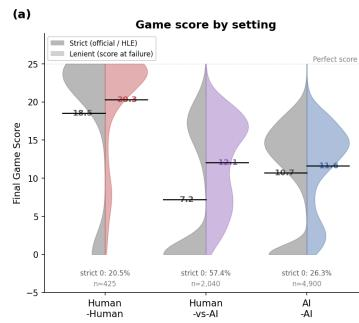

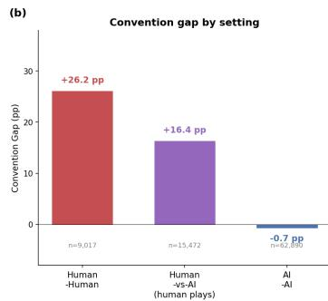

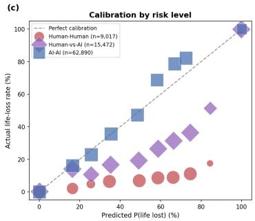  
Figure 1: (a) End-of-game score distributions by setting, drawn as split violins: the left (grey) half of each violin uses strict scoring (three life losses set the score to zero; the official rule, Appendix C) and the right (coloured) half uses lenient scoring (the tableau total at the moment of failure, as in the older human-subject Hanabi literature, e.g. Eger et al., 2017). Black ticks and adjacent labels mark each half’s mean; the strict-scored zero fractions (20.5 / 57.4 / 26.3%) are annotated below each violin. Under lenient scoring the human-AI vs. AI-AI comparison reverses sign (12.07 vs. 11.63; a 0.44-point difference, versus −3.5 under strict; §4.4, Appendix P). Game scores are team-level (shared by both players). (b) Convention gap by setting: human-human +26.2 pp, human- $. { \mathrm { A I } } + 1 6 . 4 $ pp, $\mathrm { \bf A I - A I - } 0 . 7$ pp; the gap never uses the end-of-game score and is identical under either scoring convention. (c) Calibration curves: AI-AI (blue) tracks the diagonal for $\hat { p } \leq 0 . 5$ and lies above it in th 0.5–0.8 bins (Flawed’s plays); human-human (red) falls below it at every bin. In panels (b) and (c), human-AI data reflects human players’ plays only.

## 4.2 Where the Gap Resides: Hint-Count Localization

The convention gap decomposed by the number of hint actions previously received by the played card (Figure 2; Table 3). Zero-hint plays produced the largest gap in human pairs: human pairs succeeded 78% of the time with no hints on the card (convention gap +46 pp), while human-AI pairs succeeded 16% (−12 pp) and AI pairs 22% $( - 1 3 \mathrm { p p } ; z = 2 6 . 9 8 $ at the play level, $z = 2 1 . 6 9$ with game-clustered and $z = 1 5 . 7 9$ with player/participant-clustered standard errors, all $p < 1 0 ^ { - 5 5 }$ ; Appendix H). With exactly one hint action the gap was +36 pp for human-human and $+ 2 5 \mathrm { p p }$ for human-AI, but only +1 pp for AI-AI. With two or more hint actions on the same card, the accumulated positive and negative constraints narrowed the candidate set sufficiently that the gap was near zero in all three settings.

## 4.3 Per-AI Convention Gap Within Human-AI Play

Within human-AI play the convention gap varied by AI partner (Table 4; Figure 3; CIs in Table A5, Appendix K). Because the mean posterior is similar across AI partners (37.9–40.6%)—the three AIs supply comparable literal information—the per-partner gap ranking is arithmetically tied to the lossrate ranking within this comparison; that is the controlled-variable design, not an independent result (§5). What the gap adds beyond the loss rate is risk adjustment when information conditions differ across the groups being compared (AI-AI agents lose more often than humans, 9.4% vs. 5.3%, yet have a −0.7 vs. +26.2 pp gap, playing at a mean posterior of 8.7% versus 31.4%; Table 2), agent-level architecture identification (Full’s own-play gap below), and the falsifiable advance predictions of Appendix U. A per-AI hint-count breakdown (Table A6, Appendix K) localizes the partner difference to one-hint plays, where Full’s gap was +32.3 pp versus Outer’s +10.8 pp; at zero hints all three partners had negative gaps (−5.0 to −16.1 pp), and at two or more hint actions the gap was near zero regardless of partner. The partner effect also replicates within participants: for participants who played multiple AI types, the within-participant paired contrast is +19.7 pp for Full−Outer (22 of 22 participants positive at the ≥3-games threshold) and +18.4 pp for Intentional−Outer, a pattern a between-population (self-selection) explanation cannot produce, while Full−Intentional is not separable within participants (Appendix L).

Table 3: Convention gap and play success rate (in parentheses) by hint-action count on the played card. Hint counts are per-action counts (each hint that touches a card increments the counter, so a card touched by one color and one rank hint counts two), not per-type counts.
<table><tr><td>Hints on card</td><td>Human-Human</td><td>Human-AI</td><td>AI-AI</td></tr><tr><td>0 hints</td><td>+46 pp (78%)</td><td>−12 pp (16%)</td><td>−13 pp (22%)</td></tr><tr><td>1 hint</td><td>+36 pp (94%)</td><td>+25 pp (76%)</td><td>+1 pp (88%)</td></tr><tr><td>2+ hints</td><td>+2 pp (98%)</td><td>+1 pp (93%)</td><td>0 pp (100%)</td></tr></table>

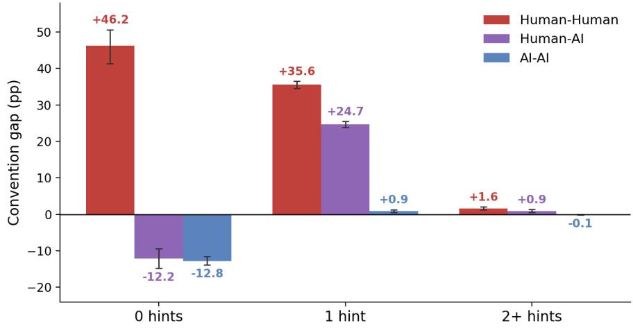  
Figure 2: Convention gap by hint-action count on the played card (the values of Table 3, which additionally reports play success rates). Error bars are 95% game-clustered bootstrap confidence intervals (2,000 resamples). The human-human surplus is largest exactly where literal information is absent (zero hints, +46.2 pp), remains large at one hint (+35.6 pp), and collapses once two or more hint actions have narrowed the candidate set; the human-AI and AI-AI settings are indistinguishable at zero hints (−12.2 vs. −12.8 pp) and separate only at one hint.

Table 4: Human convention gap by AI partner (human plays in human-AI games). Bootstrap CIs at all three clustering levels are in Table A5 (Appendix K).
<table><tr><td>AI partner</td><td>N plays</td><td>Mean  $\hat { p }$ </td><td>Human loss</td><td>Conv. gap</td></tr><tr><td>Full</td><td>4,769</td><td>38.5%</td><td>14.4%</td><td>+24.1 pp</td></tr><tr><td>Intentional</td><td>5,122</td><td>37.9%</td><td>17.6%</td><td>+20.2 pp</td></tr><tr><td>Outer</td><td>5,581</td><td>40.6%</td><td>34.4%</td><td>+6.2 pp</td></tr></table>

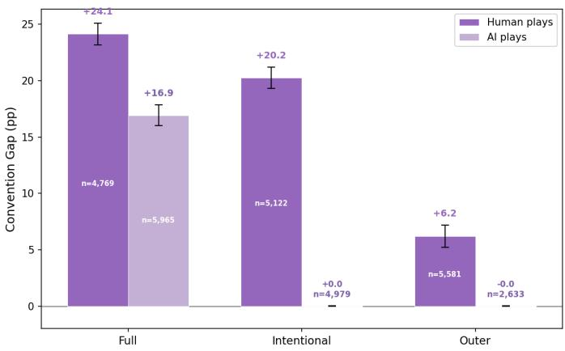  
Figure 3: Convention gap for human plays (dark) and AI plays (light) by AI partner type, with 95% bootstrap CIs. Human convention gaps varied across partners (Full +24.1, Intentional +20.2, Outer +6.2 pp). Among AI play actions, only Full had a non-zero gap (+16.9 pp); Intentional and Outer were near zero.

The convention gap computed over each AI’s own play actions also varied (Figure 3). Full had a gap of +16.9 pp (n=5,965 plays; 95% CI [16.0, 17.8]), while Intentional (+0.0 pp, n=4,979) and Outer $\left( - 0 . 0 \mathrm { p p } , n { = } 2 , 6 3 3 \right)$ were near zero. Full’s play-time posterior (mean 0.32) was two orders of magnitude higher than Intentional’s (0.001) or Outer’s (0.000). Full played predominantly on cards with exactly one hint action (71.9%), whereas Intentional and Outer played mostly on cards with two or more hint actions (91.7% and 83.7%; Table A10). Hint counts throughout are action counts, not type counts (Appendix D).

Hint-level metrics computed over 20,088 AI hint actions covaried with Partner Loss across the three AIs but did not separate Full from Intentional. Outer’s hints touched playable cards at 43.5% versus 57.4% (Full) and 59.3% (Intentional; $\chi ^ { 2 } ( 2 ) = 6 9 1 . 8 9 , p < 0 . 0 0 1$ ; Figure A2b; Appendices J, H). Disambiguation power covaried in the opposite direction: Outer eliminated 39.0% of candidates per hint versus ${ \sim } 3 6 \%$ for Full and Intentional $( F ( 2 , 2 0 0 8 5 ) = 1 2 1 . 9 1 , p < 0 . 0 0 1 )$ ). When the human’s next action after an AI hint was a play, that play failed 30.8% of the time after an Outer hint (n=4,253 hint–play pairs) versus 7.6% after a Full hint $_ { ( n = 3 , 6 3 1 ) }$ and 8.3% after an Intentional hint $\scriptstyle ( n = 3 , 6 7 6 )$ Full and Intentional differed by 3.2 pp in Partner Loss (14.4% vs. 17.6%) despite nearly identical playability (57.4% vs. 59.3%). The failure-mode composition also differed by partner: 51.4% of human losses with Outer were convention failures (hints received, posterior >0.5, play attempted anyway) versus 45–46% with Full or Intentional, and the convention gap dropped 7.6 pp after a life loss with Outer versus 4.3 pp with Full (Appendix R).

## 4.4 The Convention Gap Distinguishes Human-AI from AI-AI Where Game Score Does Not

Mean end-of-game scores (Appendix C: three life losses set the score to zero) differed across all three settings: human-human pairs scored 18.5 (SD 9.6, n = 425 completed games), AI-AI 10.7 (SD $6 . 9 , n = 4 . 9 0 0$ unique two-player games), and human-AI $7 . 2 ( \mathrm { S D } 8 . 5 , n = \bar { 2 } , 0 4 0$ games; Figure 1a). Games are counted per unique game across all three settings—one score per game, regardless of how many agents participated. All three pairwise contrasts differed $( F ( 2 , 7 3 6 2 ) = 4 2 9 . 8 2 , p < 0 . 0 0 1 ;$ Tukey HSD: H-H vs. H-AI +11.3, H-H vs. AI-AI +7.8, H-AI vs. AI-AI −3.5, all $p \ < \ 0 . 0 0 1$ Appendix P). The score ordering places human-AI below AI-AI, in the opposite direction of the convention gap ordering (H-AI +16.4 pp vs. AI-AI −0.7 pp); 57% of human-AI games ended with a strike-out (interpretation in §5). Mean game score with Outer was 2.9; AI-AI teams scored 10.7 with a gap of −0.7 pp. The pooled mean also conflates a catastrophic-failure rate (strike-outs scored zero) with score-when-surviving: 57.4% of human-AI games ended in strike-out versus 26.3% of AI-AI games, but conditional on completion human-AI teams outscore AI-AI teams (16.9 vs. 14.6, both SD ≈2.7; Appendix P), so the H- ${ \bf \bar { A I } } < { \bf A I - A I }$ ordering in the pooled mean reflects strike-out frequency rather than in-game coordination quality.

Composition dependence of the setting-level means. The pooled setting-level score means are properties of each corpus’s agent and skill composition, not of the setting alone. Within-setting variation is comparable to or larger than the ≈11-point spread between the setting means: humanhuman game scores range from 9.9 (Beginner-Beginner) to 23.8 (Expert-Expert) by pair type; AI-AI scores from ≈0 (Flawed, 0.05) to 10.9–13.7 (the other six agents; each of the 4,900 HOAD games assigned to its first-moving agent, 700 games per agent), with strike-outs occurring almost exclusively in Flawed games (99.2% of Flawed-involved games end in a strike-out versus 0.0% of the rest); and human-AI scores from 2.9 (Outer) to 12.1 (Intentional) by partner. The convention gap, by contrast, varies little with composition. Within the AI-AI setting the seven agents’ own-play gaps all lie in a narrow band, [−5.8, +0.7] pp, despite Flawed scoring ≈0 while the other six score 10.9–13.7 (Appendix O); every human-human pair type exceeds +21 pp (Beginner-Beginner +21.1 to Expert-Expert +29.1; Appendix I); and the human player’s gap is positive with all three AI partners (+24.1 / +20.2 / +6.2 pp; Appendix K). The one AI with a large own-play gap—Full at +16.9 pp—is the documented intent-based exception (§4.3, Appendix N), an actor-level property rather than a composition effect. The between-setting score ranking is not even robust to the scoring convention itself: under the lenient rule used by the older human-subject literature (partial score kept at the moment of failure rather than zeroed; Appendix P), the human-AI/AI-AI difference shrinks from −3.5 points to +0.44 and reverses sign (human-AI 12.07 vs. AI-AI 11.63; Welch t = 2.94, p = 0.003), whereas under the strict rule human-AI scores below AI-AI. The convention-gap difference between these two settings (≈17 pp) is by construction identical under both conventions, because the gap is computed from per-play posteriors and outcomes and never uses the end-of-game score. A censoring diagnostic (Appendix P) confirms the source of the bimodality in Figure 1a: replacing struck-out games’ zeros with their pre-termination tableau totals renders the human-AI distribution unimodal (rule-induced censoring), while the AI-AI distribution remains bimodal (roster composition—its low mode is exclusively Flawed games).

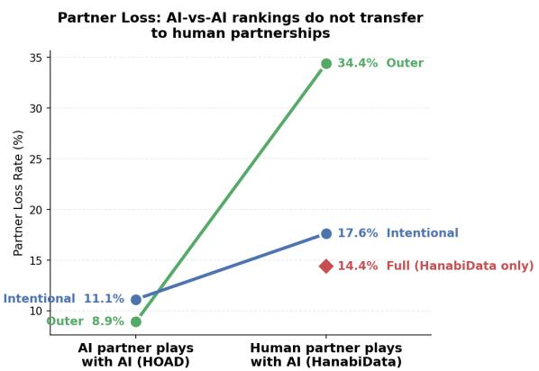  
Figure 4: Partner Loss in AI-AI (HOAD) and Human-AI (HanabiData) settings. Outer and Intentional appear in both datasets (solid lines); both rise from the AI-AI top cluster to higher values with humans, with Outer increasing most (8.9% → 34.4%). Full (diamond) appears only in HanabiData and has no AI-AI counterpart; it achieves the lowest Human-AI Partner Loss (14.4%).

Cross-dataset case: Intentional and Outer. For the two agents present in both the HOAD (AI-AI) and HanabiData (human-AI) datasets, AI-AI Partner Loss did not predict Human-AI Partner Loss. In AI-AI play (Partner Loss defined as failures on plays where the actor is not the target agent in games where the target agent participates; §3.3, computed per actor from each play’s acting agent; Appendix B), Outer’s Partner Loss was 8.9% and Intentional’s (HOAD’s “Internal”) was 11.1%, separated by 2.2 pp; both sat near the low end of the HOAD range (2.8%–21.9% across the seven agents, with the low value driven by Flawed’s small non-mirror sample size of n=324 plays; excluding Flawed the range is 7.0%–21.9%; Appendix Q). In human-AI play the same two agents separated by 17 pp (Outer 34.4%, Intentional 17.6%), corresponding to 3.9-fold and 1.6-fold increases from their AI-AI values (Figure 4). Player Loss values collapsed to near zero for both agents in both settings (Outer 0.0% AI-AI, 0.0% Human-AI; Intentional 0.0% AI-AI, 0.1% Human-AI), consistent with both agents’ known-safe play threshold. AI-AI Player and Partner Loss are attributed per actor (Appendix B).

Full: a human-only-tested agent. Full—Eger et al.’s intent-based agent, which appears only in HanabiData—achieved the lowest Human-AI Partner Loss (14.4%) despite the highest Player Loss (15.4%) among the three AIs tested with humans (Table A10). Full has no HOAD counterpart (Appendix F), so its AI-AI Partner Loss cannot be compared with Outer’s or Intentional’s. The difference between Full and Outer in the human-AI setting was 14.4% vs. 34.4% (t = 24.61, p < $1 0 ^ { - 1 0 0 }$ at the play level; game-clustered $z = 2 3 . 8 2 ;$ participant-clustered $z = 6 . 2 8 , p = 3 \times 1 0 ^ { - 1 0 } \mathrm { ; }$ Appendix H). The convention gap ordering across the three AI partners (Full +24.1 > Intentional $+ 2 0 . 2 > \mathrm { O u t e r } + 6 . 2 \mathrm { p p } ;$ Table A5) tracks Human-AI Partner Loss in the inverse direction $( 1 4 . 4 \% <$ 17.6% < 34.4%; Figure 3). This inverse pattern is consistent across the two AIs that appear in both HOAD and HanabiData (Intentional and Outer), whose AI-AI Partner Loss (11.1% and 8.9%) also does not predict their Human-AI Partner Loss (17.6% and 34.4%).

## 4.5 Known-Answer Validation on a Designed Convention Hierarchy

Off-belief learning (OBL; Hu et al. 2021) provides agents whose convention content is controlled by construction: the base level (OBL1) is trained to best-respond to beliefs induced by a uniformly random partner policy, so conventions cannot pay off and the resulting policy is grounded in literal information alone, while each subsequent level k+1 best-responds to level k’s actual policy, readmitting convention-based interpretation one controlled step at a time. If the convention gap measures what it claims to measure, it must read ≈0 at OBL1 and increase monotonically through the hierarchy—a dose-response prediction fixed before measurement.

Table 5: Convention gap across the OBL hierarchy (joint posterior; 95% CIs from a 10,000-draw game-level cluster bootstrap).
<table><tr><td>Condition</td><td>Games</td><td>Plays</td><td>Mean p</td><td>Loss</td><td>Gap (pp)</td><td>95% CI</td></tr><tr><td>OBL1 self-play</td><td>1,000</td><td>22,791</td><td>7.8%</td><td>6.3%</td><td>+1.57</td><td>[+1.33, +1.81]</td></tr><tr><td>OBL2 self-play</td><td>1,000</td><td>24,204</td><td>15.4%</td><td>3.0%</td><td>+12.40</td><td>[+12.10, +12.71]</td></tr><tr><td>OBL3 self-play</td><td>1,000</td><td>24,538</td><td>19.1%</td><td>2.2%</td><td>+16.91</td><td>[+16.60, +17.21]</td></tr><tr><td>OBL4 self-play</td><td>1,000</td><td>24,731</td><td>22.3%</td><td>2.5%</td><td>+19.88</td><td>[+19.54, +20.21]</td></tr><tr><td>OBL5 self-play</td><td>1,000</td><td>24,871</td><td>24.1%</td><td>2.4%</td><td>+21.68</td><td>[+21.34, +22.02]</td></tr><tr><td>OBL1 cross-play (10 seed pairs)</td><td>1,000</td><td>22,616</td><td>7.7%</td><td>6.5%</td><td>+1.22</td><td>[+0.98, +1.45]</td></tr></table>

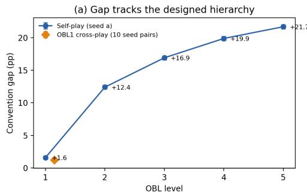

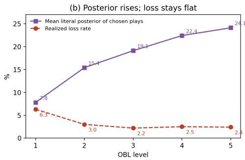  
Figure 5: Known-answer validation on the OBL hierarchy. (a) Convention gap by level (blue: self-play; orange diamond: OBL1 cross-play pooled over 10 independently trained seed pairs). Error bars (95% game-cluster bootstrap CIs, ±0.2–0.3 pp) are smaller than the markers. (b) The gap’s two components in self-play: the mean literal posterior of the plays the agents choose rises steeply with level while the realized loss rate stays at 2–3%.

The prediction holds (Table 5, Figure 5): the gap is +1.57 pp [+1.33, +1.81] at the convention-free root and rises monotonically through +12.40, +16.91, and +19.88 to +21.68 pp [+21.34, +22.02] at OBL5, while OBL1’s near-zero gap survives cross-play across independently trained seeds unchanged (+1.22 pp [+0.98, +1.45]). The surplus concentrates in the one-hint stratum (+34.4 pp at OBL5), mirroring the human signature of §4.2. The metric’s zero point is partner-supplied: holding OBL1’s policy fixed and raising the partner’s level, OBL1’s own gap decays monotonically from +1.6 pp in self-play to +0.1 pp against OBL5, where the CI includes zero (the decomposition of this decay is in Appendix X). Verification details and caveats—one released seed per level above OBL1, OBL5 being an unpublished extra level, per-step greedy acting—are also in Appendix X.

## 5 Discussion

The convention gap separates human and AI play by 27 pp (+26.2 vs. −0.7), with the effect concentrated in zero-hint and single-hint plays. Game score and the convention gap measure different things. Game score depends on each corpus’s roster composition—within-setting variation by pair type, agent, or partner (H-H 9.9–23.8, AI-AI ≈0–13.7, H-AI 2.9–12.1) exceeds the between-setting differences—and is dominated by strike-out avoidance, so the setting ordering (H-H 18.5 > AI-AI 10.7 > H-AI 7.2) is not an intrinsic property of the settings; under the lenient scoring convention the human-AI/AI-AI ordering even reverses sign (§4.4), so score’s between-setting verdict depends on an accounting choice, down to its sign, while the gap’s does not. The AI-AI gap of −0.7 pp despite a higher raw loss rate than humans (9.4% vs. 5.3%) reflects that the agents attempt only low-risk plays (mean posterior 8.7% vs. 31.4%), and their higher scores are consistent with literal coordination alone. The convention gap, by contrast, separates human from AI play at the agent level and isolates the residual information partners extract beyond the literal hint content.

What accounts for the human gap? Zero-hint plays succeed at 78% in human-human pairs (posterior 0.69), pointing to implicit conventions that operate without explicit hints: positional conventions (e.g., the newest card in hand is the most likely play target), action-based inference (e.g., a partner’s decision to hint rather than play signals urgency), the good-touch principle (hinted cards are assumed to be useful), known-trash elimination (cards known to be unplayable are discarded first), and hint-timing inference (a hint given immediately after a card is played likely refers to the next card in sequence). These overlap with the “hidden rules” catalogued by Sidji et al. (2023) and constitute a channel that the literal posterior does not capture. With AI partners, zero-hint play success drops to 16% (convention gap −12 pp), consistent with the absence of a shared convention system.

A potential concern is circularity: does the convention gap merely restate the loss rate? The mean posterior is similar across AI partners (37.9–40.6%; Table A5), so all three AIs provide comparable literal information to the human. What varies is the actual loss rate. This variation covaries with hint-level playability: Outer’s hints touch playable cards at 43.5%, compared to 57–59% for Full and Intentional, and Outer has the highest Partner Loss. Player Loss was near zero for both agents in both settings (≤0.1%). These patterns are consistent with hint interpretability—not the AI’s own play accuracy—as a factor in partnership quality. More broadly, the correspondence between the convention gap ranking and the Human-AI Partner Loss ranking suggests that the AI that preserves the larger convention gap is also the AI that produces the fewer partner failures, potentially by allowing humans to use implicit cues more effectively. A related bound: since the gap cannot exceed the mean posterior (equality iff zero failures), the ratio gap / mean posterior measures how much of the literal-information ceiling a group attains—skilled humans operate near that ceiling (83% overall, 92% for expert pairs), and the AI partner moves the attainable fraction from 63% (Full) down to 15% (Outer; Appendix M).

Construct scope: what the gap measures. The convention gap is, by definition, performance unexplained by literal information. Mundane alternative explanations are each either inside the baseline (card counting over visible zones is part of $h _ { t } )$ , likewise inside it (cross-card inference: the posterior conditions on the full hand exactly; its per-card approximation differs by ≤2.1 pp, Appendix E), signed the wrong way (bounded attention or excess risk-seeking would make players succeed less often than the literal prediction, producing negative gaps, not the +26 pp observed), or stratified away (the gap is +21 to +29 pp in every human skill stratum). A complementary dose-response test uses agents whose convention content is controlled by construction: across the off-belief-learning hierarchy, the convention-free level sits near zero and the gap tracks the designed hierarchy monotonically, with the same one-hint concentration the human data shows (§4.5). Hu et al.’s own score-space statement—that the convention-free level’s self-play score tells us how well the game can be played without conventions—is the performance-space counterpart of the gap’s information-space zero point. The controls in §3.1 support implicit communication through conventions as the reading, but one alternative cannot be excluded with observational data: unilateral statistical adaptation, in which one player learns regularities of the partner’s behavior (e.g., “this partner’s hints usually mark playable cards”) without any shared protocol. We do not treat this as a competing explanation so much as a boundary case of the same construct: both mechanisms transfer information beyond the literal hint content through the partner’s action choices, both require the partner’s behavior to be predictable, and both produce the deployment-relevant property the gap is designed to index—a partner whose actions carry usable information beyond their literal content.

The public action history is the carrier of this channel, not an alternative to it: any beyond-literal inference must be computed from observed actions. Distinguishing shared convention from unilateral adaptation would require intervention (e.g., partner-swap designs), which we flag as future work; the within-participant replication (Appendix L) already rules out the between-population version of the concern. More broadly, this is a measurement paper validated retrospectively at scale, not a causal study: the gap quantifies a channel, and the partner-level claims are deliberately hedged (“may predict”) pending the prospective tests of Appendix U.

Beyond hint-level playability. Playability rate accounts for the contrast between Outer and the other two AIs but does not explain the 3.2 pp gap between Full (14.4%) and Intentional (17.6%) Partner Loss $( z = 4 . 3 9 , p < 0 . 0 0 1 ;$ Figure 4), given their near-identical playability (57.4% vs. 59.3%). Full and Intentional differ descriptively in play style and hinting rate (Appendix J), and Full produces a +16.9 pp convention gap on its own plays (§4.3) while Intentional’s is near zero. The failure-mode breakdown also differs (51.4% convention failures with Outer versus 45–46% with Full or Intentional, and a larger post-loss gap drop; §4.3, Appendix R). These differences motivate the intent-based interpretation below, but one caution applies to the Full-vs-Intentional micro-ordering specifically: unlike the Full/Intentional-vs-Outer contrast, which replicates within participants, the Full−Intentional difference does not replicate within participants (−3.4 pp paired mean, 95% CI [−7.8, +0.9], sign-test p = 0.63; Appendix L), so the between-participant 3.2 pp difference and its candidate explanations should be treated as unresolved pending controlled comparisons.

Intent-based play as convention alignment. Full’s own convention gap (+16.9 pp; Figure 3) indicates that it treats hints as play signals beyond their literal content—the only AI among the three to do so—a behavior qualitatively similar to human convention use but accompanied by the highest Player Loss among the three agents tested with humans (15.4%; §4.3). The play-time statistics in Section 4.3 and Appendix N are consistent with this pattern: Full plays at a mean posterior of 0.32 with one hint on the played card, whereas Intentional and Outer play at posterior ≈0 after accumulating two or more hints. Eger et al. [2017] describe the divergence explicitly. Intentional uses intent reasoning only to decide which hint to give, so it plays a card only when its own knowledge already proves the card playable. Full additionally uses the same intent-based logic to interpret hints it receives: it assumes the hinter followed Grice’s maxims of relation (hint only cards the partner should act on) and manner (unambiguous hints), and acts on the resulting inferred goal. This mirrors a core human convention—“play a card that was just hinted”—in which the player trusts the partner’s intent rather than the literal hint content. Full’s symmetric application of its own hint-giving logic to hint-receiving thus produces a similar input-output mapping: when a hint is received, it infers that the partner intended the hinted card to be played and acts accordingly, even when the literal posterior indicates risk. This alignment can succeed only if human partners tend to hint playable cards, which the playability rates in §4.3 (57–59%) support; Full’s intent reasoning thus converts strategic hints into play actions—on Eger et al.’s description of the architecture, achieving convention-like behavior through explicit (though imperfect) modeling of partner intent rather than through shared social norms. When Full was paired with five Large Language Model configurations in place of humans, Full’s own-play convention gap reproduced in every condition, ranging +11.8 pp (Qwen3.6-A3B) to +37.8 pp (GPT-5.4-mini+CoT), with three of five values exceeding the +16.9 pp human reference (Appendix W). The signature thus appeared with non-human, non-rule-based partners, consistent with bidirectional intent-based interpretation as the source of the gap rather than human-specific cooperation.

The legibility–optimality tradeoff. The finding that an intent-based AI makes the best partner for a human player is consistent with Dragan et al.’s (2013) distinction between legibility and optimality in robot motion planning. In that framework, a legible action is one that an observer can interpret correctly, even if it is not the shortest path. Analogously, Outer’s hints maximize information content (optimality) but are difficult for humans to act on, while Full’s hints touch playable cards more often (legibility), possibly because its intent reasoning leads it to hint cards it wants the human to play. The parallel suggests that convention compatibility—producing actions that are interpretable within the partner’s inference framework—may be a relevant design objective for cooperative AI, distinct from communication efficiency. Eger et al. themselves reported that participants’ ratings of perceived intentionality correlated with perceived enjoyment (Kendall’s τ = 0.45) and perceived skill (τ = 0.52), convergent with our reading that legibility, not raw information content, drives subjective partnership quality.

Relation to information-theoretic decomposition. The convention gap belongs to a family of baseline-subtraction methods for isolating implicit information. Sivan and Tsodyks (2025) decompose natural-language information into semantic content (meaning) and wording information (surface-level encoding) by subtracting an LLM-estimated wording baseline from total information. The convention gap follows a similar baseline-subtraction logic in cooperative action: the posterior captures what literal hint content predicts, and the residual measures the implicit convention channel. This parallel suggests that the decomposition—compute an exact or well-estimated literal baseline, attribute the residual to an implicit channel—may generalize across communicative domains, from language to cooperative games.

Implications for cooperative AI evaluation. Two practical recommendations follow. First, benchmarks should report convention gap alongside game score: the two orderings can diverge—human-AI teams scored worst on the task (7.2) yet exhibited a +16.4 pp convention gap, while AI-AI teams outscored them (10.7) with a gap of −0.7 pp. Second, partnership claims based on AI-AI evaluation should be validated with human partners, since AI-AI Partner Loss can underestimate Human-AI Partner Loss (Figure 4; Outer: 8.9% → 34.4%); a controlled experiment using subjective cooperativity ratings reached a similar conclusion [Attig et al., 2024] (Appendix V). The framework applies wherever a literal-information baseline can be constructed—the gap between a literal-information posterior and actual outcomes measures reliance on implicit channels that standard AI-AI evaluation does not capture. The absence of detectable convention learning with AI partners (Appendix S) further suggests that convention compatibility is not readily acquired through exposure alone. The posterior itself can be viewed as a rational-agent benchmark (Appendix T).

Porting the gap to other domains, and what it costs. The recipe has four steps: (1) identify the decision points at which an agent commits to an action whose success is observable (Hanabi: play actions); (2) specify the literal state available at each decision—observable environment plus the literal content of communication received (Hanabi: $h _ { t } ) ;$ (3) construct a baseline that predicts failure from the literal state while deliberately ablating partner-intent and partner-behavior features; and (4) compute the gap as the baseline-predicted failure rate minus the observed failure rate. In a human-robot handover, for instance, the decision point is the human committing to a grasp, the literal state is the object’s pose and kinematics, and the ablated baseline is grasp-failure probability given pose alone—the gap then measures how much the robot’s motion legibility [Dragan et al., 2013] adds beyond physics. Constructing a per-domain baseline is the norm in neighboring literatures rather than an obstacle: RSA instantiates a literal listener $L _ { 0 }$ per language task [Frank and Goodman, 2012, Goodman and Frank, 2016] (a learned literal listener would play the same role here), Overcooked studies build domain reward/feasibility models [Carroll et al., 2019], an LLM prompted as a literal reader could supply the baseline for dialogue tasks, and the wording-information baseline of Sivan and Tsodyks [2025] is corpus-specific. The gap’s definition—outcome measured against a literalinformation baseline—transfers across these domains; the exactness does not, which is why we scope the paper’s empirical claims to Hanabi. Hanabi’s exact baseline in turn makes it a natural calibration anchor: we propose validating any approximate-baseline implementation by first replicating Hanabi’s exact-baseline results with the approximate machinery on the same plays. The cost side is modest: the exact full-hand posterior costs ${ \approx } 2 8 0 ~ \mu \mathrm { s }$ per play (its per-card approximation, enumerating ${ \leq } 2 5$ candidates, ${ \approx } 4 ~ \mu \mathrm { s } )$ , and one laptop core replays all 118,168 plays of the three corpora, computing both variants, in 74 seconds (timings re-measured on the shipped pipeline; Appendices D, E). A speculative direction we flag as untested: because the gap is differentiable in neither term, its use as a direct training objective invites Goodhart-style failure (a reckless agent that survives by luck raises the gap), but gap-related auxiliary signals evaluated against human-proxy partners [Dizdarevic et al.´ , 2025] could serve as selection criteria during agent development.

Limitations. The human-AI data covers only three AI types from a single study. As a step toward broader agent coverage, the framework was applied to five Large Language Model partners across nine rule-based agents (9,542 LLM plays; Appendix W); Full’s own-play signature (+16.9 pp with humans) reproduced in every LLM × Full pairing, indicating that the signature is not specific to human partners. For deep RL systems, the convention-gap side of the question is now partially closed—the off-belief-learning family is measured directly in §4.5—while whether AI-AI Partner Loss predicts Human-AI Partner Loss for such systems (BAD, SAD, Other-Play) and for LLM-vshuman play remains open. Relatedly, the correspondence between Full’s intent-based architecture and its +16.9 pp own-play signature is a convergence across structurally different agents rather than a within-agent ablation; whether the signature disappears when the intent-inference module is removed should be tested with modified agent variants. The OBL hierarchy (§4.5) approximates this ablation family—five agents identical in architecture and training except for the convention channel, reintroduced one level at a time—though it is a between-checkpoint rather than within-agent manipulation. A specific testable prediction for the remaining HOAD agents appears in Appendix U. The cross-dataset comparison involves only Outer and Intentional (both Osawa-derived; Full has no HOAD counterpart and is distinct from Walton-Rivers et al.’s Flawed agent, Appendix F), whose AI-AI values sit within 2.2 pp, so the main signal is their degradation with humans rather than any ranking direction. The posterior conditions exactly on the full hand’s hint constraints (its per-card approximation moves no headline gap by more than 2.1 pp; Appendix E), but positional reasoning remains outside both variants. Statistical inference at the play level treats plays as i.i.d.; as a sensitivity analysis, all headline CIs and the key two-sample tests were recomputed with game- and player/participant-clustered resampling and sandwich standard errors (Table 2; Appendix H)—every test remains significant, with the largest change being the participant-clustered Full-vs-Outer z, which drops from 23.8 to 6.3—a reminder that the effective sample for partner contrasts is participants, not plays. The gap is also robust to excluding last-life (“desperate”) plays: +26.6 pp for human pairs versus +26.2 overall (Appendix M). The three settings come from three different platforms, populations, and interfaces, so the cross-setting gradient is confounded with dataset provenance; three considerations mitigate this: the load-bearing patterns are within-dataset findings that replicate across datasets (the hint-count concentration appears within each setting separately; AI calibration holds within HOAD; the human gap appears in two unrelated human datasets), the partner effect replicates within participants (Appendix L), and the corpus-cleaning exercise moved the headline gap by only ≈2 pp. The hanab.live population may not represent broader experience levels. Generalization to other domains requires constructing domain-specific literal baselines, as outlined above.

## 6 Conclusion

We introduced the convention gap—the difference between an exactly computable literal-information posterior and actual cooperative outcomes—and applied it to ≈101,000 two-player Hanabi plays across human-human, AI-AI, and human-AI settings. The gap varied systematically by cooperation setting (+26.2, +16.4, −0.7 pp), was concentrated in zero-hint and single-hint plays, and varied by AI partner within human-AI play; game score and the convention gap carried different kinds of information (§4.4). Among the three AIs tested with humans, only Full—whose architecture explicitly implements Gricean intent-based hint interpretation [Eger et al., 2017]—produced a positive convention gap on its own plays (+16.9 pp; Intentional and Outer were near zero), providing a mechanistic anchor that links the metric to a documented intent-based algorithm. Together these results indicate that convention compatibility, rather than AI-AI performance alone, is a dimension of cooperation that benchmarks should measure.

## References

C. Attig, P. Wollstadt, T. Schrills, T. Franke, and C. B. Wiebel-Herboth. More than task performance: Developing new criteria for successful human-AI teaming using the cooperative card game Hanabi. In Extended Abstracts of the CHI Conference on Human Factors in Computing Systems (CHI EA ’24), article 245, pages 1–11. ACM, 2024.

N. Bard, J. N. Foerster, S. Chandar, N. Burch, M. Lanctot, H. F. Song, E. Parisotto, V. Dumoulin, S. Moitra, E. Hughes, et al. The Hanabi challenge: A new frontier for AI research. Artificial Intelligence, 280:103216, 2020.

F. Bredell, H. A. Engelbrecht, and J. C. Schoeman. Augmenting the action space with conventions to improve multi-agent cooperation in Hanabi. Autonomous Agents and Multi-Agent Systems, 39(1):28, 2025.

M. Carroll, R. Shah, M. K. Ho, T. L. Griffiths, S. A. Seshia, P. Abbeel, and A. Dragan. On the utility of learning about humans for human-AI coordination. In Advances in Neural Information Processing Systems, volume 32, pages 5175–5186, 2019.

N. Cohen and K. K. France. Reinforcement learning for Hanabi. arXiv preprint arXiv:2506.00458, 2025.

A. Dafoe, Y. Bachrach, G. Hadfield, E. Horvitz, K. Larson, and T. Graepel. Cooperative AI: Machines must learn to find common ground. Nature, 593(7857):33–36, 2021.

A. Dragan, K. C. T. Lee, and S. S. Srinivasa. Legibility and predictability of robot motion. In Proceedings ofthe 8th ACM/IEEE International Conference on Human-Robot Interaction (HRI), pages 301–308, 2013.

M. Eger, C. Martens, and M. Alfaro Cordoba. An intentional AI for Hanabi. In IEEE Conference on Computational Intelligence and Games (CIG), pages 68–75, 2017.

J. Foerster, F. Song, E. Hughes, N. Burch, I. Dunning, S. Whiteson, M. Botvinick, and M. Bowling. Bayesian action decoder for deep multi-agent reinforcement learning. In Proceedings of the 36th International Conference on Machine Learning (ICML), volume 97 of PMLR, pages 1942–1951, 2019.

T. Dizdarevic, R. Hammond, T. Gessler, A. Calinescu, J. Cook, M. Gallici, A. Lupu, and J. N. Foerster. Ad-hoc´ human-AI coordination challenge. In Proceedings ofthe 42nd International Conference on Machine Learning (ICML), volume 267 of PMLR, pages 13900–13937, 2025.

M. C. Frank and N. D. Goodman. Predicting pragmatic reasoning in language games. Science, 336(6084):998, 2012.

N. D. Goodman and M. C. Frank. Pragmatic language interpretation as probabilistic inference. Trends in Cognitive Sciences, 20(11):818–829, 2016.

H. P. Grice. Logic and conversation. In Syntax and Semantics, Vol. 3, pages 41–58. Academic Press, 1975.

H. Hu and J. N. Foerster. Simplified action decoder for deep multi-agent reinforcement learning. In International Conference on Learning Representations (ICLR), 2020.

H. Hu, A. Lerer, A. Peysakhovich, and J. Foerster. “Other-Play” for zero-shot coordination. In Proceedings of the 37th International Conference on Machine Learning (ICML), volume 119 of PMLR, pages 4399–4410, 2020.

H. Hu, A. Lerer, B. Cui, L. Pineda, N. Brown, and J. Foerster. Off-belief learning. In Proceedings ofthe 38th International Conference on Machine Learning (ICML), volume 139 of Proceedings of Machine Learning Research, pages 4369–4379, 2021.

H. Jeon and K.-J. Kim. Behavioral differences is the key of ad-hoc team cooperation in multiplayer games Hanabi. arXiv preprint arXiv:2303.06775, 2023.

C. Liang, J. Proft, E. Andersen, and R. A. Knepper. Implicit communication of actionable information in human-AI teams. In Proceedings of the 2019 CHI Conference on Human Factors in Computing Systems (CHI), pages 1–13, 2019.

K. Lucas and R. E. Allen. Any-Play: An intrinsic augmentation for zero-shot coordination. In Proceedings of the 21st International Conference on Autonomous Agents and Multiagent Systems (AAMAS), pages 853–861, 2022.

M. Ramesh, K. Jayakumar, A. Ramkumar, P. Thodima, A. Rege, and E.-V. Vlatakis-Gkaragkounis. Sparks of cooperative reasoning: LLMs as strategic Hanabi agents. arXiv preprint arXiv:2601.18077, 2026.

A. Sarmasi, T. Zhang, C.-H. Cheng, H. Pham, X. Zhou, D. Nguyen, S. Shekdar, and J. McCoy. HOAD: The Hanabi open agent dataset. In Proceedings ofthe 20th International Conference on Autonomous Agents and Multiagent Systems (AAMAS), pages 1646–1648, 2021.

M. Sidji, W. Smith, and M. J. Rogerson. The hidden rules of Hanabi: How humans outperform AI agents. In Proceedings of the 2023 CHI Conference on Human Factors in Computing Systems (CHI), article 757, pages 1–16, 2023.

D. Sivan and M. Tsodyks. Information rate of meaningful communication. Proceedings of the National Academy ofSciences, 122(25):e2502353122, 2025.

H. C. Siu, J. Peña, E. Chen, Y. Zhou, V. Lopez, K. Palko, K. Chang, and R. Allen. Evaluation of human-AI teams for learned and rule-based agents in Hanabi. In Advances in Neural Information Processing Systems, volume 34, pages 16183–16195, 2021.

H. Osawa. Solving Hanabi: Estimating hands by opponent’s actions in cooperative game with incomplete information. In AAAI Workshop on Computer Poker and Imperfect Information, pages 37–43, 2015.

M. J. H. van den Bergh, A. Hommelberg, W. A. Kosters, and F. M. Spieksma. Aspects of the cooperative card game Hanabi. In BNAIC 2016: Artificial Intelligence, Revised Selected Papers, volume 765 of Communications in Computer and Information Science, pages 93–105. Springer, 2017.

J. Walton-Rivers, P. R. Williams, R. Bartle, D. Perez-Liebana, and S. M. Lucas. Evaluating and modelling Hanabi-playing agents. In IEEE Congress on Evolutionary Computation (CEC), pages 1382–1389, 2017.

## A Bot Screen and Human-Human Corpus Definition

The hanab.live public game corpus contains accounts belonging to community-developed bots. Bot play uses shared H-Group-style conventions (the hanab.live community’s published convention system) and would inflate the measured convention gap if included alongside human-human play. We define the human-human corpus by (i) a completed-games filter and (ii) a two-tier bot exclusion rule.

Completed games only. We keep only games that reached a terminal state (natural deck-exhaustion end, perfect score, or three strikes) and drop truncated games—those whose action log ended without a terminal state. The replay engine classifies each game (Appendix D): a game is truncated if its log carries an explicit hanab.live end-of-game marker (end conditions 3=timeout, 4=terminated, 6=idle-timeout; we verified from cached history that all such games carry recorded score 0) or if the log simply stops with cards still in the deck and no terminal state. hanab.live ends the final round early once no further points are possible, so a completed natural game’s log can stop one or two turns short of a full final round; reaching an empty deck is therefore sufficient to classify a game as natural (validated: for deck-exhausted no-marker games the hanab.live recorded score equals the replayed score, 47/47 in the cross-checked sample). Of the 1,500 fetched hanab.live games, 25 could not be replayed by our engine (21 used hanab.live’s bottom-deck-play option, 4 contained an unsupported action type) and were dropped before any filter; of the 1,475 replayable games, 424 were perfect, 339 natural, 292 strike-out, and 420 truncated; the agent datasets (which always play to completion) contain 0 truncated games.

Tier 1 (game-level): verified bot families. We match by name pattern: will-bot\d+, jabot\d+, clanker\d+, Inybot\d<sub>\*</sub>, rand-bot\d+, and mac-bot.<sub>\*</sub>. The concrete accounts in the current corpus that match are will-bot1, will-bot2, will-bot4, jabot1, jabot4, clanker1, clanker2, clanker4, clanker5, clanker6, Inybot, rand-bot1, and mac-bot-test. The families themselves were identified by cross-referencing the will-hanabi-bot README and each account’s public hanab.live history. Every game in which any matching account made a play is removed from the corpus in its entirety. The Tier-1 exclusion is implemented over the play-record table, so it removes games in which a verified bot account made a play. One game (1762152) contains a verified bot account that only clued and discarded and is therefore retained; it contributes 6 human plays. Applying the stricter reading—excluding any game in which a verified bot account appears at all—gives 424 games / 9,011 plays and moves the joint gap from +26.16 to +26.18 pp (per-card +28.20 → +28.21).

Tier 2 (account-level): 29 flagged accounts. We sweep every remaining account in the corpus through hanab.live’s public /api/v1/history/{user} endpoint (rate-limited to one request per second, responses cached) and compute, per account: total games played on hanab.live, median and minimum inter-game completion gap in seconds, and fraction of consecutive games completed within 60 or 120 seconds. Two evidence patterns are considered positive: (B) bot-partner, where the account co-plays at least 90% of its corpus games with a verified bot (11 accounts); and (C) identical-timing pair, where two accounts have byte-identical inter-game-gap statistics (median, minimum, quartile fractions) across their sampled histories—indicative of a coordinated two-agent process seated at the same table (16 accounts across 8 pairs); and (D) notes bot signature, where an account authors the will-hanabi-bot version tag “[INFO: v<version>, <framework>]” in its own per-game notes (a string no human writes)—one such account, plus its exclusive partner, for 2 accounts (src/notes\_bot\_sweep.py). We drop only these accounts’ own play records; games in which they appear alongside a human retain the human’s plays. To avoid publicly labeling accounts (some of which may be human), the concrete identifiers of the 29 Tier-2 accounts are shipped only as 16-hex hashes in the supplementary code (src/corpus.py).

Timing-only or volume-only signals without B or C evidence (e.g., an account with >5,000 total games but median inter-game gap of several minutes) are not sufficient. This tier is designed to be permissive toward high-volume enthusiast accounts and reject only accounts with positive bot evidence.

Resulting corpus. After the completed-games filter and the two-tier bot exclusion, the corpus retains 425 games and 9,017 human play records from 155 players. As a robustness check, we also computed all H-H results under a stricter game-level-only bot policy (Tier 1 alone, completed games; 598 games, 13,089 plays). The two bot policies produce closely matched values: the headline convention gap is +26.2 pp under the two-tier main policy and +27.5 pp under the game-level-only variant, well within the between-corpus noise. Tier-2 accounts collectively exhibited a +29.8 pp convention gap (completed games)—slightly above the retained human corpus (+26.2 pp)—consistent with their playing conventions that mirror H-Group patterns programmatically.

The bot-screening script and all cached hanab.live history responses are included in the supplementary code archive (src/bot\_screen.py, src/notes\_bot\_sweep.py, data/raw/hanab\_live\_history/). The exclusion list is defined in src/corpus.py and applied via a single load\_hh\_corpus() entry point.

## B Per-Actor Attribution in AI-AI Per-Agent Statistics

Per-agent AI-AI statistics (Player Loss, Partner Loss, and every other quantity attributed to a single agent) are computed from the per-play player field, which identifies the actor of each individual play, rather than from the game-level pairing label of the log file (e.g., simple\_vs\_iggi). A game-level label mixes the two agents’ plays and would average over both actors rather than isolating the target agent. Check: in the 100 simple\_vs\_iggi games, the player column contains 956 simple plays and 435 iggi plays; a game-level filter would return all 1,391. Under the per-actor attribution, Outer’s AI-AI Player Loss is 0.0% and Intentional’s is 0.0%; Outer’s AI-AI Partner Loss is 8.9% and Intentional’s is 11.1% (§3.3 gives the denominators). Pooled AI-AI statistics—the headline AI-AI convention gap (−0.7 pp), the logistic-regression AUC (0.980), and the cross-play matrices—aggregate across all AI plays and do not depend on per-agent attribution.

The replay pipeline writes per-play subject\_type and partner\_type fields derived from the acting player’s identity (the same convention as the human-AI dataset), and every play record carries a game\_key that is globally unique across pairing files (e.g., simple\_vs\_iggi:0 versus iggi\_vs\_simple:0), so that per-game aggregations never coalesce the two orderings of a pairing; the AI-AI corpus has 4,900 unique games.

## C Hanabi Rules

Hanabi is a cooperative card game for 2–5 players [Bard et al., 2020]. The deck contains 50 cards across 5 colors (Red, Yellow, Green, Blue, Purple), each with ranks 1–5. Rank 1 has 3 copies, ranks

2–4 have 2 copies each, and rank 5 has 1 copy. In a 2-player game each player holds 5 cards, facing outward: every player can see all other hands but not their own.

The team shares 3 life tokens and 8 information (hint) tokens. On each turn a player must take exactly one action: (1) Play a card from their hand onto the shared tableau (fireworks), where each color must be built in ascending order 1→5; a card that does not extend its color stack is discarded and costs one life token—this is a life loss. Three life losses end the game immediately with a score of zero. (2) Discard a card to recover one information token. (3) Give a hint (costs one information token): name a color or a rank and point to all cards in one teammate’s hand that match. After playing or discarding, the player draws a replacement from the deck. When the deck is exhausted each player takes one final turn. The score equals the number of cards successfully played (0–25).

All analyses in this paper use the standard 2-player, “No Variant” configuration described above.

## D Replay Pipeline and Game Engine

Why a custom engine. The posterior (§3.2) cannot be computed from summary statistics or preprocessed datasets—it requires reconstructing each player’s exact information state at every decision point during the game. The Hanabi Learning Environment (HLE; Bard et al. 2020) provides a reference C++ implementation, but it is designed as an RL training interface (returning fixed-size observation tensors) rather than an analysis tool, was archived in April 2024, and requires fragile C++ compilation via CFFI. We instead implement a minimal pure-Python game engine (∼360 lines, written from scratch without depending on any existing Hanabi simulator) that exposes the full game state—including per-card hint knowledge—as native Python objects, making it straightforward to compute the posterior at arbitrary decision points.

Raw data format. Each data source provides game records containing two key fields: (1) the deck order—a complete permutation of the 50-card Hanabi deck (5 colors × ranks 1–5, with 3/2/2/2/1 copies)—and (2) the ordered action sequence, where each action specifies a type (play, discard, color hint, or rank hint) and a target (card index or player). The deck order gives us ground-truth card identities, while the action sequence determines what each player could have known at each point in the game.

Game state representation. The engine maintains two core data structures. The game state tracks the global board: players’ hands, fireworks, discard pile, and tokens. The card knowledge tracks what each player knows about each card in their own hand from accumulated hints. Specifically, the game state records:

• Hands: each player’s current cards as (color, rank) tuples, dealt sequentially from the deck.

• Fireworks: the highest successfully played rank per color (0 if empty); a card (c, r) is playable iff fireworks[c] = r − 1.

• Discard pile: all discarded and misplayed cards.

• Tokens: life tokens (initial 3; reaching 0 ends the game) and information tokens (initial 8; spent on hints, recovered on discards and rank-5 plays).

• Per-card knowledge: for each card in each player’s hand, a knowledge state κ recording which colors and ranks remain possible, initialized to all 5 colors and ranks 1–5, and progressively narrowed by hints. A player can see other players’ actual cards but only their own cards’ knowledge states.

Action processing. Hint actions: matching cards receive a positive constraint (possible set narrowed to the hinted value); non-matching cards receive a negative constraint (hinted value removed). Constraints accumulate across all hints [Bard et al., 2020]. Play actions: if playable (fireworks[c] = r − 1), fireworks advance; otherwise the card is discarded and a life token is lost. A replacement is drawn with fresh empty knowledge. Discard actions: the card is discarded, an information token is recovered, and a replacement is drawn. When the deck empties, each player receives one final turn. After replaying every recorded action, the engine labels the game with a game-end reason: strikeout (three life losses; score 0), perfect (score 25), natural (deck exhausted with a non-perfect, non-strikeout score), or truncated (the log ended without a terminal state—an explicit hanab.live abnormal-end marker, or a log that stops mid-deck). This label drives the completed-games filter (Appendix A); on the agent datasets it returns 0 truncated, confirming the terminal-state logic.

Posterior computation. At each play action, before applying it, we snapshot the state and compute the posterior (Eq. 2) from the acting player’s perspective. Each card’s knowledge state κ = (possible\_colors, possible\_ranks) records the sets of colors and ranks not yet eliminated by hints. Initially possible\_colors = {Red, Yellow, Green, Blue, Purple} and possible\_ranks $= \{ 1 , 2 , 3 , 4 , 5 \}$ each positive hint (“this card IS Red”) narrows the set to the hinted value, and each negative hint (“this card is NOT Red”) removes the value. These constraints accumulate across all hints received on that card throughout the game.

The per-card core of the computation proceeds in four steps: (1) enumerate candidates $\{ ( c , r )$ c ∈ possible\_colors, $r \in$ possible\_ranks}; (2) weight each candidate by remaining unseen copies $w _ { c , r } ~ = ~ \mathrm { t o t a l } _ { - }$ \_copies(r) − visible\_copies(c, r), where total\_copies(r) follows the standard deck distribution (3/2/2/2/1 copies for ranks 1–5) and visible copies are counted across other players’ hands, discard pile, and fireworks, eliminating candidates with $w _ { c , r } \leq 0 ; ( 3 )$ check playability: $( c , r )$ is playable iff fireworks $[ c ] = r - 1 ; ( 4 )$ ) compute P(life lost) = P<sub>unplayable</sub> $w _ { c , r } ~ / ~ \sum _ { \mathrm { a l l } } w _ { c , r }$ . The box below restates these steps as pseudocode (referenced from $\ S 3 . 2 ,$ which also gives the worked numeric example); the posterior used throughout the paper adds step 5—exact joint conditioning on the rest of the hand (Appendix E).

```latex
Posterior computation for a play of card k (executed before the play is applied):
1. Enumerate candidates: all $( c , r )$ with c in the card’s possible colors and r in its possible
ranks (as narrowed by every positive and negative hint received on card $k ) .$
2. Weight by remaining copies: $w _ { c , r } = \mathrm { t o t a l } .$ _copies(r) − visible_copies $( c , r )$ , counting visible
copies across the partner’s hand, discard pile, and fireworks; drop candidates with $w _ { c , r } \leq 0 .$
3. Check playability: $( c , r )$ is playable iff firework $\mathsf { \Pi } _ { \mathsf { i } } [ c ] = r - 1$
4. Aggregate: $\begin{array} { r } { \hat { p } = \sum _ { \mathrm { u n p l a y a b l e } } \bar { w } _ { c , r } / \sum _ { \mathrm { a l l } } w _ { c , r } ( \mathrm { E q . } \hat { 2 } ) . } \end{array}$
```

Steps 1–4 are exact with respect to hint constraints on the played card but treat that card marginally; cross-card inference can shift the posterior in either direction. The paper’s posterior therefore adds step 5, exact joint conditioning on the full hand (Appendix E); relative to it, the per-card approximation shifts 4–17% of plays, in both directions, and moves no headline gap by more than 2.1 pp. After computing the posterior, we apply the action to observe the ground-truth outcome, producing one record per play that pairs $\hat { p } _ { i }$ with $y _ { i } \in \{ 0 , 1 \}$

Validation and reproducibility. The pipeline is validated at four levels. (1) External ground truth: replayed final scores match the platform-recorded scores (47/47 in the cross-checked hanab.live sample; every HanabiData game’s score reconciles), and any public hanab.live game replays deterministically from its JSON export. (2) Global posterior invariants: across all 100,956 analyzed plays, no play with posterior exactly 0 ever failed (70,247 such plays) and no play with posterior exactly 1 ever succeeded (1,641 plays)—the two logically checkable extremes of the posterior (§3.2). (3) Independent-implementation agreement: the joint posterior matches exhaustive brute-force enumeration on all 936 cross-checked plays—840 on the three main corpora and 96 on the LLM corpus of Appendix W (Appendix E). (4) Unit tests: 168 tests (56 game-engine, 14 posterior, 8 joint-posterior, 9 cluster-statistics, 81 HanabiData client), run in a clean environment. Every number in the paper is generated by this single audited pipeline and regenerated by the supplementary notebook. All source code, processed datasets (with hanab.live usernames replaced by 16-hex hashes), and an executed notebook are provided in the supplemental package.<sup>3</sup> Raw game logs for the HOAD (4,900 games) and HanabiData (2,040 games) datasets are bundled; raw hanab.live H-H JSONs are not shipped (they contain plaintext usernames) but can be refetched by game id via the public hanab.live API, and every replay is deterministic from the JSON alone.

Compute requirements. The replay pipeline and all analyses in the main paper run on a single CPU; no GPU is required and no model is trained. On a 2024-era laptop the supplementary reproduction notebook executes end-to-end (loading ∼101,000 play records across the three datasets and regenerating every figure and table) in tens of minutes. The LLM partner data used in Appendix W required GPU memory for local inference of the open-weight Qwen3.6-A3B model (approximately 16 GB) and OpenAI API access for the GPT-5.4 family; this generation step was performed offline.

The supplementary bundle ships only the post-replay convention-gap records $( n = 1 9 , 0 9 3 \mathrm { p l a y s } )$ ; the reproduction notebook does not invoke any LLM.

## E The Joint Posterior: Exact Computation, Verification, and the Per-Card Approximation

Definition (step 5 of §3.2). The per-card computation (steps 1–4, Eq. 2) treats the played card marginally. The paper’s posterior performs exact inference over the acting player’s entire hand: enumerate every joint assignment of identities to the hand’s cards that is consistent with each card’s accumulated hint constraints, weight each assignment by the number of ways to draw it from the hidden pool without replacement (for each identity t assigned $k _ { t }$ times, the weight contribution is the falling factorial $( \bar { c _ { t } } ) ( c _ { t } - 1 ) \cdot \cdot \cdot ( c _ { t } - k _ { t } + 1 )$ , where $c _ { t }$ is $t \mathbf { \bar { s } }$ remaining unseen copy count), and marginalize the joint distribution to the played card. Intuitively, if another card in the hand is hint-identified as the last unseen Red 1, the joint posterior assigns that copy to that card and removes it from the played card’s candidate pool. Cards never touched by a restricting hint cancel exactly from the marginalization, so the computation reduces to a small dynamic program over the hint-constrained cards (implementation: src/joint\_posterior.py; corpus-wide computation: src/joint\_replay.py; LLM corpus: src/llm\_joint\_replay.py).

Verification. The dynamic program was verified against exhaustive brute-force enumeration of the full joint assignment space on 591 spot-checked plays with cross-card constraints during the three-corpus run, 249 exhaustively checked plays in a pre-run sweep, and 96 spot-checks during the LLM-corpus replay of Appendix W (936 plays in total), with maximum absolute discrepancy 0; the per-card posterior recomputed during the same replays matches the shipped per-play values to $5 \times \mathrm { 1 0 ^ { - 1 3 } }$ on the three main corpora and exactly on the LLM corpus. The unit-test suite additionally checks the exact reduction to the marginal when no other card is constrained and hand-computable cross-card cases in both delta directions.

The per-card approximation. The paper’s posterior and the per-card approximation of steps 1–4 are compared in Table A1: the approximation moves no headline or per-partner gap by more than 2.1 pp and no conclusion changes under it. Per-play differences (per-card − joint) run in both directions in the human corpora—human-human: 17.3% of plays differ (196 where the joint value is higher, 1,367 lower; mean |∆| 2.1 pp over all plays, 12.3 pp over the plays that differ); human-AI: 11.0% differ (538 higher, 1,170 lower); AI-AI: 4.4% differ, the joint value lower on every one (rule-based agents mostly play fully identified cards, so cross-card inference only removes unplayable-candidate mass on their remaining uncertain plays). The joint posterior is the betterspecified literal model: relative to the per-card approximation, the Brier score improves from 0.190 to 0.175 (human-human), 0.162 to 0.159 (human-AI), and 0.0337 to 0.0336 (AI-AI), with AUC improvements in all three settings (0.811→0.815, 0.868→0.871, 0.980→0.980)—so the promotion of the joint posterior strengthens the baseline rather than weakening it: cross-card inference accounts for about 2 of the human-human percentage points, and +26.2 pp remains unexplained by literal information under exact full-hand inference. The Table 3 hint-count localization holds under both variants (human-human per-card: +4 $7 . 8 / + 3 8 . 5 / + 1 . 7$ pp at 0 / 1 / 2+ hints), the gamelevel-only H-H corpus variant behaves identically (+27.5 joint, +29.5 per-card), and on the LLM corpus of Appendix W no cell differs by more than 0.7 pp. Computation cost: ≈280 µs per play for the joint posterior versus ${ \approx } 4 ~ \mu \mathrm { s }$ for the approximation; the full 118,168-play three-corpus replay computing both takes 74 s on one laptop core (timings emitted by src/joint\_replay.py to data/processed $/ \mathsf { j o i n t \_ r e p l a y \_ t i m i n g . } \mathsf { j s o n } )$ . The per-card approximation is recommended for scaled settings where the ≈70× cost difference matters.

## F AI Agent Descriptions

The AI-AI dataset uses seven rule-based agents from the HOAD corpus [Sarmasi et al., 2021, Walton-Rivers et al., 2017]; each follows a fixed priority list of play, hint, and discard rules with no learned parameters, except VanDenBergh whose thresholds were tuned by genetic algorithm. The human-AI dataset uses three agents from Eger et al.’s pyhanabi framework [Eger et al., 2017]. Two of these—Intentional and Outer—derive from the same source as their HOAD counterparts (Osawa’s

Table A1: Convention gaps under the paper’s joint posterior and the per-card approximation (steps 1–4). Human-AI rows use human plays only.
<table><tr><td>Group</td><td>N plays</td><td>Gap (joint, paper)</td><td>Gap (per-card approx.)</td><td>Difference</td></tr><tr><td>Human-Human</td><td>9,017</td><td>+26.2 pp</td><td>+28.2 pp</td><td>+2.0</td></tr><tr><td>Human-AI (human plays)</td><td>15,472</td><td>+16.4 pp</td><td>+16.9 pp</td><td>+0.5</td></tr><tr><td>AI-AI</td><td>62,890</td><td>−0.7 pp</td><td>-0.5 pp</td><td>+0.2</td></tr><tr><td>H-AI vs. Full</td><td>4,769</td><td>+24.1 pp</td><td>+24.6 pp</td><td>+0.5</td></tr><tr><td>H-AI vs. Intentional</td><td>5,122</td><td>+20.2 pp</td><td>+20.8 pp</td><td>+0.6</td></tr><tr><td>H-AI vs. Outer</td><td>5,581</td><td>+6.2 pp</td><td>+6.7 pp</td><td>+0.5</td></tr></table>

Internal and Outer agents; Osawa 2015) and appear in both datasets. The third, Full, is Eger et al.’s own agent incorporating bidirectional intent reasoning; it has no HOAD counterpart. In their own 10,000-game AI-AI simulation, Eger et al. reported Full↔Full at 17.1 points (highest among their pairings), Intentional↔Intentional at 12.6, Outer↔Outer at 12.8, and Outer↔Full at 6.9—the last consistent with hint-interpretability as a driver of partnership quality when convention systems mismatch. All agents are summarized in Table A2.

Table A2: AI agents used in AI-AI (HOAD) and human-AI (HanabiData) experiments.
<table><tr><td>Agent</td><td>Reference</td><td>Strategy summary</td></tr><tr><td colspan="3">HOAD only (AI-AI)</td></tr><tr><td>Simple</td><td>Walton-Rivers et al. 2017</td><td>Play known-playable (lowest rank); hint about playable cards; discard oldest</td></tr><tr><td>IGGI</td><td>Walton-Rivers et al. 2017</td><td>Like Simple but never hints non-playable cards; Osawa safe-discard before oldest</td></tr><tr><td>Piers</td><td>Walton-Rivers et al. 2017</td><td>Safe play, then probabilistic (≥60%) if lives allow; hail- mary when deck empty; hints dispensable cards</td></tr><tr><td>VanDenBergh</td><td>van den Bergh et al. 2017</td><td>GA-evolved thresholds; probabilistic play (≥60%); maximum-information hints; discard most-probably- useless</td></tr><tr><td>Flawed</td><td>Walton-Rivers et al. 2017</td><td>Deliberately imperfect: low play threshold (≥25%); ran- dom hints; no strategic hint targeting</td></tr><tr><td colspan="3">Both datasets (Osawa-derived; AI-AI and human-AI) Play known-safe; hint about playable cards; does not</td></tr><tr><td>Intentional†</td><td>Osawa 2015</td><td>track partner&#x27;s knowledge (may give redundant hints)</td></tr><tr><td>Outer†</td><td>Osawa 2015</td><td>Play known-safe; tracks partner&#x27;s knowledge, avoids redundant hints; rank-first; if no playable hint, hints any unknown information</td></tr><tr><td colspan="3"></td></tr><tr><td>HanabiData only (human-AI) Full‡</td><td>Eger et al. 2017</td><td>Bidirectional intent reasoning: considers both how the human will interpret the AI&#x27;s actions and the intent be- hind the human&#x27;s actions; strategic hints</td></tr></table>

<sup>†</sup>HOAD names: Internal (= Intentional), Outer (= Outer); both derived from Osawa [2015]. <sup>‡</sup>Full is Eger et al.’s own design and does not correspond to any HOAD agent. In particular, it differs from HOAD’s Flawed agent: Flawed uses random hints and a 25% play threshold, whereas Full uses strategic hints informed by intent reasoning (observed in game-log analysis; exact decision rules are not published).

## G Logistic Regression

Model specifications are in Appendix H. The posterior alone achieved in-sample AUC 0.980 for AIs but only 0.815 for humans (Table A3; ROC curves in Figure A1). The posterior coefficient was nearly twice as large for AIs (9.62 vs. 5.31), indicating that when the model predicts “risky” for AIs, it is correct—for humans, conventions dilute the literal signal. Adding partner type to the human-AI model boosted AUC from 0.871 to 0.912 (∆R<sup>2</sup> = 0.057 relative to the context-only M2 baseline, likelihood ratio test p < 0.001).

Table A3: Logistic regression results. M1: posterior only; M3: +skill or +partner.
<table><tr><td>Dataset</td><td>Model</td><td>N</td><td>AUC</td><td> $\operatorname { P s e u d o } { - \mathit { R } ^ { 2 } }$ </td><td>β(posterior)</td></tr><tr><td>Human-Human</td><td>M1</td><td>9,017</td><td>0.815</td><td>0.194</td><td>5.31</td></tr><tr><td>Human-Human</td><td>M2 (+context)</td><td>9,017</td><td>0.833</td><td>0.219</td><td>5.03</td></tr><tr><td>Human-Human</td><td>M3 (+skill)</td><td>9,017</td><td>0.852</td><td>0.249</td><td>4.92</td></tr><tr><td>AI-AI</td><td>M1</td><td>62,890</td><td>0.980</td><td>0.633</td><td>9.62</td></tr><tr><td>Human-AI</td><td>M1</td><td>15,472</td><td>0.871</td><td>0.348</td><td>6.01</td></tr><tr><td>Human-AI</td><td>M3 (+partner)</td><td>15,472</td><td>0.912</td><td>0.428</td><td>6.07</td></tr></table>

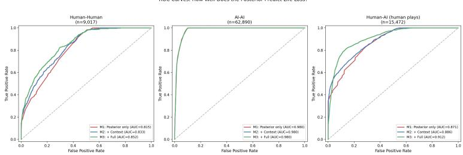  
Figure A1: ROC curves for logistic regression models.

## H Statistical Methods

All statistical tests are two-sided unless otherwise noted. Confidence intervals are 95% bootstrap (10,000 resamples, percentile method) unless otherwise specified.

Cluster-robust inference. Play-level resampling treats plays as i.i.d.; plays within a game (and games by the same player or participant) are correlated. As a sensitivity analysis, every headline and per-partner convention-gap CI is recomputed with cluster bootstraps that resample whole games and whole players/participants with replacement (implementation: src/cluster\_stats.py). The three levels agree closely (Table 2; per-partner: Full [+23.2, +25.1] play-level, [+23.1, +25.2] game-cluster, [+22.9, +24.9] participant-cluster; Intentional $[ + 1 9 . 3 , + 2 1 . { \dot { 2 } } ] / \dot { [ + } 1 9 . 2 , + 2 1 . 3 ] / [ + 1 8 . 0 ]$ +22.4]; Outer $[ + 5 . 2 , + 7 . 2 ] / [ + 5 . 2 , + 7 . 2 ] / [ + 4 . 8 , + 7 . 5 ] )$ , so the play-level CIs reported elsewhere are, at worst, slightly anti-conservative and no conclusion depends on the resampling level. Two-sample tests are likewise recomputed with cluster-robust (CR0 sandwich) standard errors at the game and player/participant levels; the clustered values appear alongside the play-level values where each test is reported.

Convention gap comparisons. The zero-hint success rate comparison (human-human 78% vs. human-AI 16%) uses a two-proportion z-test with unpooled standard errors, the convention matching the bootstrap-CI machinery; $z = 2 6 . 9 8$ as reported in §4.2. Under the pooled-SE convention the same comparison gives z = 21.91; with game-clustered sandwich SEs, $z = 2 1 . 6 9$ ; with player/participantclustered SEs, z = 15.79 (all $p < \bar { 1 0 } ^ { - 5 5 } )$ . The convention gap comparison by pair type (Appendix I) uses a one-way ANOVA with pair type (E-E, E-I, I-I, I-B, B-B; 5 levels) as the independent variable and per-play convention gap $( \hat { p } _ { i } - y _ { i } )$ as the dependent variable, followed by Tukey HSD post-hoc tests.

Convention gap CIs (Table A5). For each AI partner type (and for human-human), we computed a nonparametric bootstrap CI for the convention gap. Each resample drew N play actions with replacement from the N plays in that subset, recomputed both the mean posterior pˆ and the mean actual loss rate, and took their difference as one bootstrap gap estimate. This was repeated 10,000 times; the 2.5th and 97.5th percentiles of the bootstrap distribution form the 95% CI. Resampling at the individual-play level captures sampling variability in both terms of the gap simultaneously.

Human-AI Partner Loss differences. The Partner Loss difference between Full and Outer in the human-AI setting (14.4% vs. 34.4%) is tested with Welch’s two-sample t-test on per-play life-loss outcomes (Welch $t = 2 4 . 6 1$ , Welch–Satterthwaite $\mathrm { d f } = 1 0 , 1 4 2 , p < \mathrm { 1 0 ^ { - 1 0 0 } } )$ . With cluster-robust sandwich SEs the difference remains significant at both clustering levels: game-clustered $z = 2 3 . 8 2$ $( p < 1 0 ^ { - 1 0 0 } )$ and participant-clustered $\overline { { z } } = 6 . 2 8 ( p = 3 . 4 \times 1 0 ^ { - 1 0 }$ ; Full: 682 games, 129 participants;

Outer: 707 games, 122 participants). The participant-clustered value is the appropriate reference when treating participants, rather than plays, as the units of inference.

Hint quality (§4.3). Playability rate differences across the three AIs are tested with a $\chi ^ { 2 }$ test on the 3×2 contingency table (playable vs. non-playable touched cards × AI type), followed by pairwise two-proportion z-tests. Disambiguation power differences are tested with a one-way ANOVA (AI type as independent variable, per-hint disambiguation as dependent variable), followed by pairwise Welch’s t-tests.

Game score analyses (Appendix P). All game score ANOVAs are one-way with the dependent variable being the final game score per game. The independent variable varies: setting (3 levels), pair type (5 levels), AI partner type (3 levels), or AI type (7 levels). Tukey HSD is used for all post-hoc comparisons. Effect sizes are reported as $\eta ^ { 2 }$

Logistic regression (Appendix G). The dependent variable is binary life loss (0 or 1) on each play action. Model 1 (M1) uses only the posterior pˆ as a continuous predictor. Model 3 (M3) adds categorical covariates: pair skill level for human-human data, or AI partner type for human-AI data. All models were fit using statsmodels.Logit with maximum likelihood estimation; pseudo- $R ^ { 2 }$ is McFadden’s.

Convention learning (Appendix S). Bayesian hierarchical (random-slopes) models assess whether convention alignment improves with experience. Partial pooling addresses the small per-player sample sizes by shrinking individual slope estimates toward the population mean, yielding more reliable population-level inference than individual OLS regressions.

Human-human model. The dependent variable is per-game convention gap (mean posterior minus actual loss rate, averaged over all play actions within one game). The model is:

$$
\mathbf { g a p } _ { i j } = { \boldsymbol { \alpha } } + \alpha _ { i } + ( \beta + \beta _ { i } ) \times \mathbf { g a m e \_ s e q } _ { i j } + \varepsilon _ { i j }
$$

where α is the population intercept, $\alpha _ { i } \sim \mathcal { N } ( 0 , \sigma _ { \alpha } )$ the random intercept per player, $\beta$ the population learning slope, $\beta _ { i } \sim \mathcal { N } ( 0 , \sigma _ { \beta } )$ the random slope per player, and $\varepsilon _ { i j } \sim \mathcal { N } ( 0 , \sigma )$ the residual. Weakly informative priors were set by bambi defaults. Sampling used 4 chains $\times \ 2 { , } 0 0 0$ draws (1,000 tuning), target\_accept = 0.95 (5 divergences, $\hat { R } \leq 1 . 0 1 )$ . Observations: $n = 4 1 5$ game-player observations from 20 players with ${ \geq } 1 0$ completed games (Appendix A).

Human-AI model. Same dependent variable, with partner type as a fixed effect and its interaction with game sequence:

$$
\mathrm { g a p } _ { i j k } = \alpha + \alpha _ { i } + \gamma _ { k } + ( \beta + \beta _ { i } + \delta _ { k } ) \times \mathrm { g a m e \_ s e q } _ { i j k } + \varepsilon _ { i j k }
$$

where $k$ indexes partner type (Full, Intentional, Outer), $\gamma _ { k }$ is the partner intercept shift, $\delta _ { k }$ the partner slope shift, and random effects $\alpha _ { i } , \beta _ { i }$ are per participant. Observations: $n = 1$ ,376 from 23 participant–AI trials with ${ \geq } 1 0 $ games (10 participants). Sampling: 4 chains $\times \ 2 { , } 0 0 0$ draws (2,000 tuning), $\mathtt { t a r g e t \_ a c c e p t } = 0 . 9 5$ ; 284 divergences persist, an expected artifact of the 10- participant sample—fixed-effect $\hat { R } \leq 1 . 0 2$ , so the population-level slopes reported in Appendix S are interpretable, and none is near a decision boundary.

## I Skill Modulation

The convention gap varied by pair type in the human-human data (Table A4; $F ( 4 , 8 9 4 3 ) = 1 6 . 4 1$ N=8,948 plays, $p < 0 . 0 0 1$ ; Appendix H; the 3-game Expert-Beginner stratum is omitted here as too small for a stable estimate). Tukey HSD post-hoc tests separate Expert-Expert (+29.1 pp) from Beginner-Beginner (+21.1 pp; $p < 0 . 0 0 1 $ ); the other strata (E-I +25.2, I-I +25.4, I-B +27.2 pp) sit between. Expert and intermediate players received similar literal information (mean posteriors 31.6% vs. 30.2%); the difference was concentrated in actual loss rate (2.5% vs. 4.8%).

## J Hint Quality Metrics

Hint-level quality metrics—disambiguation power $( \operatorname { E q . 5 } ) ,$ playability rate $\left( \operatorname { E q } . \ 6 \right)$ , and the hint recipient’s next action after receiving a hint—are reported for the three HanabiData AIs against the pooled AI-AI baseline from HOAD in Figure A2, panels a– ${ \mathfrak { c } } ( N = 2 0 , 0 8 8$ human-AI hints). These

Table A4: Convention gap by pair type (human-human only). Players classified by individual average endof-game score: expert (≥22), intermediate (15–22), beginner (<15). Corpus is the completed-games, two-tier bot-excluded H-H set (Appendix A); the 3-game Expert-Beginner stratum is omitted. In 10 games (121 plays) the partner’s account was removed at Tier 2, and in game 1762152 (6 plays; Appendix A) the partner never played; in all 11 the remaining player’s plays are kept and the game is labelled by that player’s skill level for both seats.
<table><tr><td>Pair Type</td><td>N</td><td>Mean p</td><td>Actual Loss</td><td>Conv. Gap</td></tr><tr><td>Expert-Expert (E-E)</td><td>3,268</td><td>31.6%</td><td>2.5%</td><td>+29.1%</td></tr><tr><td>Expert-Intermediate (E-I)</td><td>194</td><td>28.8%</td><td>3.6%</td><td>+25.2%</td></tr><tr><td>Intermediate-Intermediate (I-I)</td><td>3,708</td><td>30.2%</td><td>4.8%</td><td>+25.4%</td></tr><tr><td>Intermediate-Beginner (I-B)</td><td>279</td><td>36.1%</td><td>9.0%</td><td>+27.2%</td></tr><tr><td>Beginner-Beginner (B-B)</td><td>1,499</td><td>33.1%</td><td>12.0%</td><td>+21.1%</td></tr></table>

metrics are referenced in Section 4.3 (Outer’s lower playability versus Full and Intentional) and in the discussion of why Full and Intentional produce different Partner Losses despite near-identical playability (Section 5).

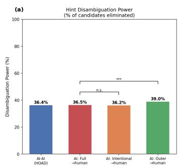

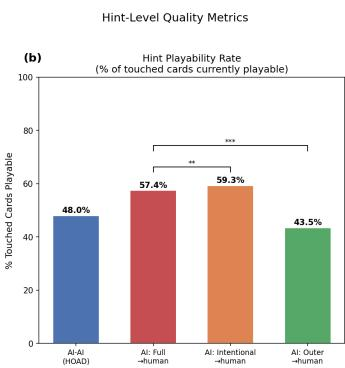

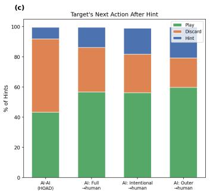  
Figure A2: Hint-level quality metrics across the three HanabiData AIs (N = 20,088 human-AI hints) with the pooled AI-AI baseline from HOAD for reference. (a) Disambiguation power (Eq. 5). (b) Playability rate (Eq. 6). (c) The hint recipient’s (human’s) next action after receiving a hint.

The pooled AI-AI baseline from HOAD showed disambiguation power of 36.4% and playability rate of 48.0%, intermediate between Outer and the other two AIs. Humans made zero-hint plays in 4.6% of plays with Full but 7.6% with Intentional, and these plays failed at 77–87%.

## K Convention Gap by AI Partner Type

Tables A5 and A6 support the per-AI analysis in Section 4.3. The overall human convention gap by AI partner, expressed both in absolute terms and as a fraction of the human-human average (+26.2 pp), is given with 95% bootstrap CIs (10,000 resamples) in Table A5. The same gap decomposed by hint-action count on the played card (Table A6) shows that the partner difference between Full (+32.3 pp) and Outer (+10.8 pp) is concentrated at one-hint plays; at zero hints all three partners had negative gaps, and at two or more hint actions the gap collapsed to near zero regardless of partner.

Table A5: Convention gap by AI partner type. All CIs are 95% bootstrap percentile intervals (10,000 resamples) at three resampling levels: individual plays, whole games, and whole participants/players. “% of H-H” uses the overall human-human average (+26.2 pp) as denominator.
<table><tr><td>AI Partner</td><td>Mean p</td><td>Loss</td><td>Gap</td><td>Play-level CI</td><td>Game CI</td><td>Participant CI</td><td>% of H-H</td></tr><tr><td>Full</td><td>38.5%</td><td>14.4%</td><td>+24.1%</td><td>[23.2, 25.1]</td><td>[23.1, 25.2]</td><td>[22.9, 24.9]</td><td>92%</td></tr><tr><td>Intentional</td><td>37.9%</td><td>17.6%</td><td>+20.2%</td><td>[19.3, 21.2]</td><td>[19.2, 21.3]</td><td>[18.0, 22.4]</td><td>77%</td></tr><tr><td>Outer</td><td>40.6%</td><td>34.4%</td><td>+6.2%</td><td>[5.2, 7.2]</td><td>[5.2, 7.2]</td><td>[4.8, 7.5]</td><td>24%</td></tr><tr><td>Human-human</td><td>31.4%</td><td>5.3%</td><td>+26.2%</td><td>[25.5, 26.8]</td><td>[25.3, 27.0]</td><td>[24.5, 27.8]</td><td>100%</td></tr></table>

Table A6: Per-AI convention gap (and human-play count) decomposed by hint-action count, for human plays in human-AI games. The partner difference is concentrated at one-hint plays.
<table><tr><td>AI partner</td><td>0 hints</td><td>1 hint</td><td>≥2 hints</td></tr><tr><td>Full</td><td>−5.0 pp (220)</td><td>+32.3 pp (3,542)</td><td>+1.9 pp (1,007)</td></tr><tr><td>Intentional</td><td>−14.5 pp (390)</td><td>+30.4 pp (3,552)</td><td>+1.1 pp (1,180)</td></tr><tr><td>Outer</td><td>−16.1 pp (168)</td><td>+10.8 pp (3,406)</td><td>+0.3 pp (2,007)</td></tr></table>

## L Within-Participant Partner Analysis

Participant × partner structure. The HanabiData game→participant metadata covers all 2,040 analyzed games and contains 228 unique participant identifiers; the dataset’s published description reports 240 players, and the 12 additional IDs have no logged completed game in the shipped metadata, so all counts here use the 228 observed participants. Of these, 122 (53.5%) played exactly one AI type, 58 (25.4%) played two, and 48 (21.1%) played all three. Participation was self-paced and heavy-tailed rather than a balanced within-subject design: the median participant played 2 games total (mean 8.9, maximum 566), and the median participant×partner cell contains 1 game (mean 5.3, maximum 207).

Paired within-participant contrasts. For each participant who played two AI types, we compute their per-partner convention gap and loss rate and take the paired difference (Table A7). The Full−Outer and Intentional−Outer contrasts are positive for 57 of 69 and 58 of 64 participants respectively (sign test $p = 3 . 7 \times 1 0 ^ { - 8 }$ and $9 . 0 \dot { \times } 1 0 ^ { - 1 2 }$ , with the Wilcoxon signed-rank test in agreement; Table A7); at the stricter ≥3-games-per-cell threshold the Full−Outer contrast is positive for 22 of 22 participants. Since each participant serves as their own control, these contrasts cannot be produced by different populations self-selecting to different AI partners—the “population/distributionshift” alternative to the partner effect is ruled out for the Outer contrasts. The Full−Intentional contrast, by comparison, is small and not significant in either direction at either threshold; the between-participant 3.2 pp Partner Loss difference between Full and Intentional (§5) should therefore be treated as unresolved. Among the 48 participants who played all three AI types, gap(Full) > gap(Outer) for 83.3%, and both Full and Intentional exceed Outer for 77.1%.

Table A7: Within-participant paired contrasts of the convention gap (∆gap) and loss rate (∆loss) by AI partner, at two minimum-games-per-cell thresholds. CI: 95% t-based interval on the paired mean. Sign: participants with positive/negative ∆gap; p-values are two-sided (sign test / Wilcoxon signed-rank).
<table><tr><td>Threshold</td><td>Contrast</td><td>n</td><td>∆gap</td><td>95% CI</td><td>Sign +/-</td><td>Sign p</td><td>∆loss</td></tr><tr><td>≥1 game</td><td>Full – Outer</td><td>69</td><td>+16.0 pp</td><td>[+12.2, +19.8]</td><td>57/12</td><td> $3 . 7 \times 1 0 ^ { - 8 }$ </td><td>-22.3 pp</td></tr><tr><td>≥1 game</td><td>Intentional — Outer</td><td>64</td><td>+18.8 pp</td><td>[+14.7, +22.9]</td><td>58/6</td><td> $9 . 0 \times 1 0 ^ { - 1 2 }$ </td><td>-21.3 pp</td></tr><tr><td>≥1 game</td><td>Full — Intentional</td><td>69</td><td>−3.4 pp</td><td>[−7.8, +0.9]</td><td>32/37</td><td>0.63</td><td>+0.7 pp</td></tr><tr><td>≥3 games</td><td>Full – Outer</td><td>22</td><td>+19.7 pp</td><td>[+16.4, +23.1]</td><td>22/0</td><td> $4 . 8 \times 1 0 ^ { - 7 }$ </td><td>-22.6 pp</td></tr><tr><td>≥3 games</td><td>Intentional — Outer</td><td>21</td><td>+18.4 pp</td><td>[+14.0, +22.7]</td><td>20/1</td><td> $2 . 1 \times 1 0 ^ { - 5 }$ </td><td>-22.7 pp</td></tr><tr><td>≥3 games</td><td>Full — Intentional</td><td>18</td><td>+1.8 pp</td><td>[−2.4, +6.0]</td><td>13/5</td><td>0.096</td><td>+0.1 pp</td></tr></table>

## M Robustness: Lives-Remaining Stratification and the Literal-Information Ceiling

Lives-remaining stratification. Stratified by life tokens remaining at play time, the convention gap in every setting is largest with all three lives and smallest on last-life plays (Table A8), consistent with the desperate play category of the failure taxonomy (Appendix R): under pressure, humans attempt plays whose posterior risk conventions cannot fully discount. The headline human-human gap is robust to excluding last-life plays entirely: +26.6 pp versus +26.2 pp on all plays (human-AI: +17.4 $\mathrm { v s . } + 1 6 . 4 ; \mathrm { A I \mathrm { - } A I \mathrm { : } \ } - 0 . 5 \mathrm { v s . } \ \bar { - 0 . 7 } )$ ; last-life plays are 6.4% of human-human, 17.9% of human-AI, and 8.1% of AI-AI plays.

The literal-information ceiling. The convention gap is bounded above by the mean posterior: the bound is attained exactly when a group never fails, so gap ÷ mean posterior measures the fraction of the literal-information ceiling a group attains (Table A9). Skilled humans operate near the ceiling—92.1% for expert-expert pairs, 83.2% for the human-human corpus overall—quantifying the “near-optimal use of the convention channel” reading of the human results. The AI partner moves a human’s attainable fraction across almost the full range: 62.7% with Full but 15.3% with Outer. AI-AI play sits at −8.5% (slightly below calibration).

Table A8: Convention gap by life tokens remaining at play time.
<table><tr><td>Setting</td><td>Lives</td><td>N plays</td><td>Loss rate</td><td>Gap</td></tr><tr><td>Human-Human</td><td>3</td><td>6,439</td><td>4.0%</td><td>+27.7 pp</td></tr><tr><td>Human-Human</td><td>2</td><td>2,004</td><td>6.5%</td><td>+23.3 pp</td></tr><tr><td>Human-Human</td><td>1</td><td>574</td><td>15.0%</td><td>+19.2 pp</td></tr><tr><td>Human-AI (human plays)</td><td>3</td><td>8,577</td><td>16.4%</td><td>+17.9 pp</td></tr><tr><td>Human-AI (human plays)</td><td>2</td><td>4,118</td><td>28.0%</td><td>+16.2 pp</td></tr><tr><td>Human-AI (human plays)</td><td>1</td><td>2,777</td><td>34.1%</td><td>+11.8 pp</td></tr><tr><td>AI-AI</td><td>3</td><td>47,984</td><td>5.5%</td><td>-0.2 pp</td></tr><tr><td>AI-AI</td><td>2</td><td>9,806</td><td>20.3%</td><td>-2.0 pp</td></tr><tr><td>AI-AI</td><td>1</td><td>5,100</td><td>25.3%</td><td>-3.2 pp</td></tr></table>

Table A9: Ceiling analysis: convention gap as a fraction of its upper bound (the mean posterior).
<table><tr><td>Group</td><td>Mean p</td><td>Gap</td><td>Gap / ceiling</td></tr><tr><td>Human-Human (all)</td><td>31.4%</td><td>+26.2 pp</td><td>83.2%</td></tr><tr><td>H-H Expert-Expert</td><td>31.6%</td><td>+29.1 pp</td><td>92.1%</td></tr><tr><td>H-H Beginner-Beginner</td><td>33.1%</td><td>+21.1 pp</td><td>63.7%</td></tr><tr><td>Human-AI (human plays, all)</td><td>39.1%</td><td>+16.4 pp</td><td>41.9%</td></tr><tr><td>H-AI vs. Full</td><td>38.5%</td><td>+24.1 pp</td><td>62.7%</td></tr><tr><td>H-AI vs. Intentional</td><td>37.9%</td><td>+20.2 pp</td><td>53.5%</td></tr><tr><td>H-AI vs. Outer</td><td>40.6%</td><td>+6.2 pp</td><td>15.3%</td></tr><tr><td>AI-AI (all)</td><td>8.7%</td><td>-0.7 pp</td><td>-8.5%</td></tr></table>

## N AI Play-Time Mechanism Statistics

Per-agent statistics at the moment of each play action for the three HanabiData AIs are reported in Table A10. The posterior pˆ is the Bayesian life-loss posterior (§3.2). Hints-on-card is the count of hint actions that touched the played card. Success is the fraction of plays that extended the fireworks. These statistics are referenced in Section 4.3 and in the intent-based play discussion in Section 5.

Table A10: Play-time statistics for each AI acting as subject.
<table><tr><td>Metric</td><td>Full</td><td>Intentional</td><td>Outer</td></tr><tr><td>n (play actions)</td><td>5,965</td><td>4,979</td><td>2,633</td></tr><tr><td>Mean posterior</td><td>0.323</td><td>0.001</td><td>0.000</td></tr><tr><td>Frac. plays at  $\hat { p } > 0 . 5$ </td><td>30.6%</td><td>0.1%</td><td>0.0%</td></tr><tr><td>Frac. plays at p = 0</td><td>38.4%</td><td>99.9%</td><td>99.9%</td></tr><tr><td>Mean hint actions on played card</td><td>1.31</td><td>2.04</td><td>1.88</td></tr><tr><td>Frac. plays with 1 hint action</td><td>71.9%</td><td>8.3%</td><td>16.2%</td></tr><tr><td>Frac. plays with ≥2 hint actions</td><td>28.0%</td><td>91.7%</td><td>83.7%</td></tr><tr><td>Overall success rate</td><td>84.6%</td><td>99.9%</td><td>100.0%</td></tr><tr><td>Player Loss</td><td>15.4%</td><td>0.1%</td><td>0.0%</td></tr></table>

## O Convention Gap Across All Settings

The convention gap, broken down by subject type across all three datasets, formed a continuous gradient: human-human (+21.1 to +29.1 pp) → human-AI (+6.2 to +24.1 pp) → AI-AI (≈0 pp; Figure A3). The lowest human pair type by convention gap (Beginner-Beginner, +21.1 pp) sits below the highest human-AI pairing (Full, +24.1 pp). The seven AIs span +0.7% (Bergh) to −5.8% (Flawed); the other five are within ±0.6 pp of zero. Bin-wise (10% intervals of pˆ), the six non-Flawed agents show only small departures of both signs (largest: Piers −9.4 pp at $\bar { \hat { p } } \in [ 0 . 4 , 0 . 5 )$ , n=471; Bergh +5.6 pp at $[ 0 . 2 , 0 . 3 ) , n = 5 9 2 )$ , whereas Flawed’s plays at $\hat { p } \in [ 0 . 6 , 0 . 8 )$ fail 10–12 pp more often than predicted (n=4,191; these are 95% of the plays in Figure $\begin{array}{c} \operatorname { l c } ^ { , } \end{array}$ bins). Flawed plays cards its rule-following partner chose not to hint, and the absence of a hint from such a partner is itself evidence against the card—consistent with a partner-supplied channel of the kind quantified in §4.5, with the opposite sign.

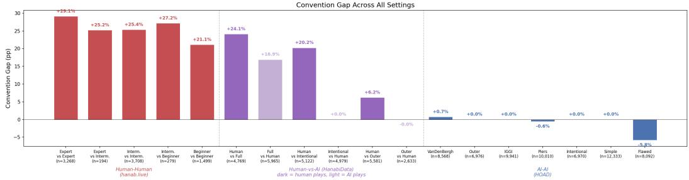  
Figure A3: Convention gap across all settings. Red: human-human by pair type (E-E = Expert-Expert, E-I = Expert-Intermediate, I-I = Intermediate-Intermediate, I-B = Intermediate-Beginner, B-B = Beginner-Beginner; skill levels defined by individual avg. score: expert ≥22, intermediate 15–22, beginner <15). Purple: human-AI games; dark bars are human plays, light bars are AI plays for each partner type. Blue: each of 7 HOAD AIs pooled across all AI partners. The gap decreases from human-human (+21 to +29 pp) through human-AI (+6 to +24 pp) to AI-AI (≈0). Among AI play actions, only Full has a non-zero convention gap (+16.9 pp).

## P Game Score Analysis

ANOVA model specifications are in Appendix H. Mean end-of-game scores (three life losses set the score to zero, Appendix C) differed across the three settings $( \bar { F } ( 2 , 7 3 6 2 ) = 4 2 9 . 8 2 , p < 0 . 0 0 1 )$ human-human $1 8 . 5 \ : ( \mathrm { S D } \ : 9 . 6 , n = 4 2 5 $ completed games), AI-AI 10.7 (SD $6 . 9 , n = 4 , 9 0 0$ games), human-AI 7.2 (SD 8.5, n = 2,040 games). All three pairwise contrasts differed (Tukey HSD: H-H vs. H-AI +11.3, H-H vs. AI-AI +7.8, H-AI vs. AI-AI −3.5, all $p < 0 . 0 0 1 )$ . Games are counted once per unique game across all three settings, regardless of how many agents participated (e.g., an AI-AI game where both agents play still counts as one game rather than one observation per subject).

Within human-human, scores ranged from E-E (23.8) and E-I (23.4) to I-B (13.6) and B-B (9.9; the small E-B stratum, n=3 games, averaged 16.7); a one-way ANOVA across the six pair types gave $F ( 5 , 4 1 9 ) = 3 2 . 7 2 , p < 0 . 0 0 1$ . Within human-AI, Intentional achieved the highest score (12.1), followed by Full (7.2) and Outer $( 2 . 9 ; F ( 2 , 2 0 3 2 ) = 2 4 3 . 2 1$ over the 2,035 games containing a human play, $p < 0 . 0 0 1 $ ; all pairwise $p < 0 . 0 0 1 )$ . Within AI-AI, assigning each of the 4,900 games to the first-moving (seat-0) agent of its pairing file (700 games per agent, 100 per partner, each game counted once), scores ranged from IGGI (13.7) and Piers (13.6) to Simple (11.4) and Intentional (10.9), with Flawed at ≈0 (0.05; F(6, 4893) = 601.39, $p < 0 . 0 0 1$ ; Tukey HSD: IGGI ≈ Piers, Bergh ≈ Outer, Simple ≈ Intentional, all other pairs $p < 0 . 0 5 )$ .

The game score ranking in human-AI (Intentional > Full > Outer) differs from the Partner Loss ranking (Full < Intentional < Outer), indicating that team performance and partner safety capture different aspects of cooperative quality. Mean scores across all settings are shown in Figure A6; score distributions for the three human-AI pairings are shown in Figure A7.

Two-part decomposition: strike-out rate vs. score-when-surviving. Because a strike-out sets the final score to zero, the mean score aggregates a catastrophic-failure rate with a score-whensurviving. Decomposing the two clarifies where each setting differs. Strike-out rates were 20.5% (human-human, n=87 of 425 completed games), 57.4% (human-AI, n=1,170 of 2,040), and 26.3% (AI-AI, n=1,289 of 4,900); the setting×strike-out contingency gave $\chi ^ { 2 } ( 2 ) = 6 5 3 . 4 4 , p < 1 0 ^ { - 1 4 0 }$ Conditional on the game reaching a non-zero score, however, the $\mathbf { A I - A I - V S . }$ –human-AI ordering reverses: human-human 23.3 (SD 2.0, n=338), human-AI 16.9 (SD 2.6, n=870), AI-AI 14.6 (SD

2.8, n=3,611); Welch ANOVA $F ( 2 , 8 7 9 ) = 2 7 5 3 . 0 8 , p < 1 0 ^ { - 1 0 0 }$ , with all three pairwise Welch t-tests significant (H-H vs. H-AI t = 45.4, H-H vs. $\mathrm { A I } { - } \mathrm { A I } t = 7 3 . 5$ , H-AI vs. $\mathbf { A I - } \mathbf { \bar { A } I } \ t = 2 4 . 0 .$ , all $p < 1 0 ^ { - 1 0 0 } )$ . Human-AI teams therefore score higher than AI-AI teams when they complete a game; the aggregate reversal in the pooled mean is driven entirely by human-AI’s much higher strike-out rate. Human-human completed games average 23.3 of 25, consistent with strong convention use once a game is seen through. This decomposition matches the convention-gap story: human-AI teams extract usable convention information (positive gap, higher completed-game score) but pay a large catastrophic-failure penalty from mis-decoded high-posterior plays.

Censoring diagnostic: strict vs. lenient (score-at-failure) end score. The Hanabi literature is split on how to score a struck-out game. Under the strict convention—the official rule and the RL/HLE standard—three life losses immediately set the score to zero, discarding the partial fireworks total [Bard et al., 2020, Jeon and Kim, 2023, Dizdarevic et al. ´ , 2025]. Under the lenient convention, common in the older human-subject literature, the fireworks total at the moment of failure is kept as the score [Eger et al., 2017, Sidji et al., 2023, Liang et al., 2019]. Recent 2025–2026 work has made this an explicit “strict vs. lenient” terminology, with reinforcement-learning benchmarks defaulting to strict while some LLM benchmarks record the score at the moment of failure and call that the standard [Cohen and France, 2025, Ramesh et al., 2026]—so the choice is contested rather than settled. All headline numbers in this paper use strict scoring; we use the lenient score here purely as a diagnostic of what the strict zeroing rule censors.

The strict rule produces a spike at 0 in every setting’s score distribution (Figure 1a, left violin halves), leaving open whether the resulting zero-spike/high-hump bimodality is an artifact of three-strike censoring or reflects a population mixture of good and bad teams. To separate the two we compute, per game, the lenient end score: the official final score for games reaching a natural or perfect end, and the tableau total at the moment of the third strike for struck-out games (recoverable uniformly as the last play record’s pre-play fireworks total plus its success indicator; §D). Under this rule the setting means are 20.3 (SD 6.5, human-human), 12.1 (SD 5.7, human-AI), and 11.6 (SD 5.6, AI-AI): the human-AI vs. AI-AI ordering reverses relative to strict (Welch t = 2.94, p = 0.003, d = 0.08; the strict contrast was $t = - 1 6 . 5 , \mathtt { a } - 3$ .5-point gap), while the human-human vs. human-AI separation stays large $( t = 2 4 . 4 , p < 1 0 ^ { - 8 0 } )$ . Re-binning games into [0, 1–5, 6–10, 11–15, 16–20, 21–25] (Figure A4): the human-AI distribution’s middle fills in and it becomes broadly unimodal (1/16/22/24/33/3% across the bins), so its apparent bimodality is a censoring artifact—struck human-AI games were on middling trajectories (mean pre-strike tableau 8.4) that the strict rule collapses to 0. The human-human distribution becomes a high main peak (72% at 21–25) with a low-to-mid tail (0/4/10/4/10/72%), its struck games ending at a mean tableau of 8.9. The AI-AI distribution, by contrast, remains bimodal (2/19/10/41/27/1%): the low mode does not fill in because struck AI-AI games are almost exclusively Flawed games (99.2% of Flawed-involved games end in a strike-out; §4.4) that terminate at a mean tableau of only 3.4, so the bimodality reflects roster composition, not censoring (Figure A5, where the AI-AI low mode is carried entirely by Flawed). The lenient score is a diagnostic counterfactual, not the paper’s performance metric—struck teams were on failing trajectories and did not complete the game—so every score analysis elsewhere in the paper retains the strict three-strike zeroing rule (Appendix C).

Censoring diagnostic: official (zeroed) vs.\ uncensored end-score distributions  
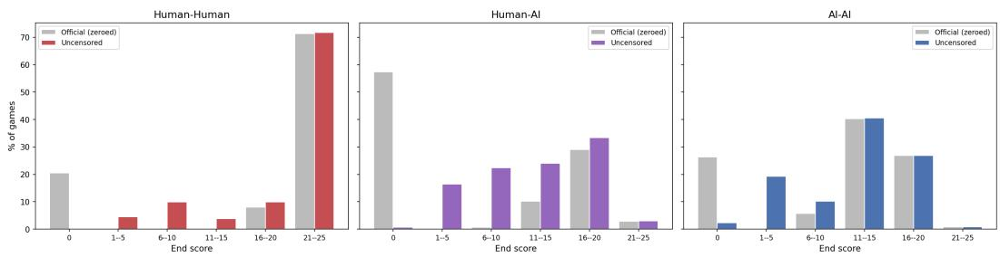  
Figure A4: Censoring diagnostic. Strict (official, zeroed, grey) versus lenient (score-at-failure, coloured) end-score distributions for the three settings, over the bins [0, 1–5, 6–10, 11–15, 16–20, 21–25]. Removing the three-strike zeroing renders human-AI broadly unimodal but leaves AI-AI bimodal.

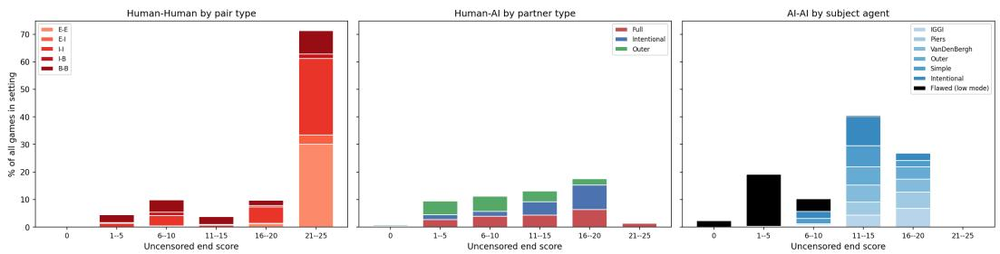  
Figure A5: Lenient (score-at-failure) end-score distributions decomposed by group (human-human pair types; human-AI partner types; AI-AI subject agents, each bar stacked by group and scaled to % of all games in the setting). The AI-AI low mode is carried entirely by Flawed games (black), confirming that the residual bimodality is roster composition rather than censoring.

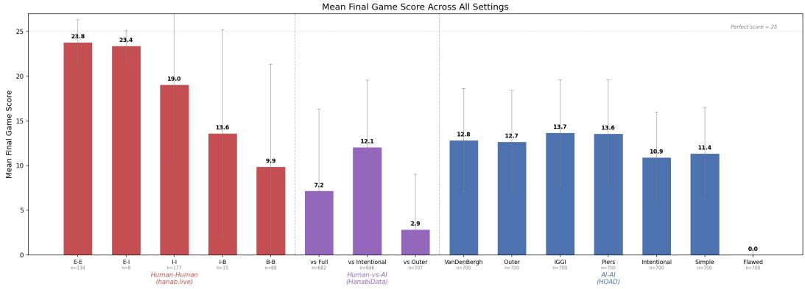  
Figure A6: Mean final game score across all settings. Red: human-human by skill pairing (E = expert, I = intermediate, B = beginner). Purple: human-AI by AI partner type. Blue: AI-AI by AI type (each game assigned to its first-moving agent; 700 games per agent, 100 per partner). Error bars show ±1 SD across games. The perfect score is 25.

## Q Convention Gap Cross-Matrices

Complete subject × partner matrices for the AI-AI setting (7 HOAD AIs) are presented in Figure A8. The mean posterior P(life lost) at play time for each subject–partner pair is shown in panel (a); the corresponding mean game scores are in panel (b). Flawed (as subject) has uniformly high posterior risk regardless of partner, while most other AIs achieve near-zero risk with cooperative partners but elevated risk when paired with Flawed. A different ranking appears in the game score matrix: Piers and IGGI achieve the highest scores, while Flawed depresses scores across the board. The dissociation between risk and score rankings indicates that Partner Loss and team performance capture distinct aspects of cooperative quality.

## R Failure Mode Taxonomy

We classify every life-loss event by cause (Table A11). Convention failure—the player received hints, the posterior indicated high risk (>0.5), yet they played anyway—was the dominant mode everywhere (40–51%). With Outer, convention failures accounted for 51.4% of all losses, combined with 30.1% desperate plays.

Cascade analysis (for each life-loss event, the mean gap over the human’s plays in the five turns after the event minus the mean over the five turns before it, averaged over events): the convention gap with Outer dropped −7.6 pp versus −4.3 pp with Full (−3.0 pp with Intentional), consistent with opaque communication degrading most under pressure, though the contrast is graded rather than categorical.

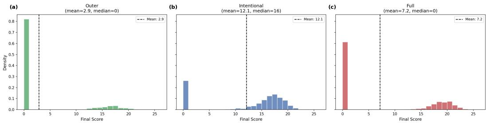  
Figure A7: Game score distributions for human-AI games by AI partner type. (a) Outer is skewed toward lower scores. (b) Intentional yields the highest and most concentrated scores. (c) Full shows a broad, flat distribution.

(a)  
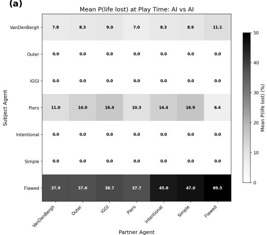

(b)  
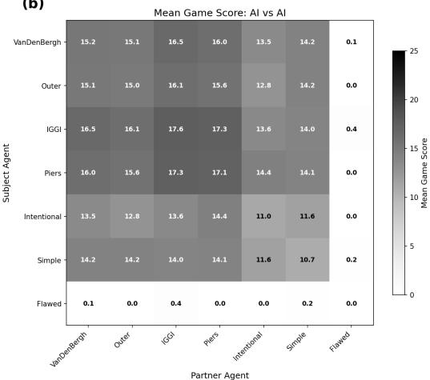  
Figure A8: Cross-play matrices for all $7 { \times } 7 ~ \mathrm { A I }$ pairings (HOAD). (a) Mean P(life lost) at play time. Flawed (as subject) has high risk regardless of partner. Most other AIs achieve near-zero posterior when paired with cooperative partners (IGGI, Intentional, Outer, Simple), but elevated risk with Flawed or Piers as partner. (b) Mean game score; each cell pools the 200 games of the unordered pairing (100 on the diagonal), so the matrix is symmetric. IGGI and Piers achieve the highest scores across most partners. Flawed drags scores down regardless of partner. The score ranking by first-moving agent (IGGI $1 3 . 7$ ≈ Piers $1 3 . 6 >$ Bergh 12.8 ≈ Outer $1 2 . 7 >$ Simple 11.4 ≈ Intentional 10.9 ≫ Flawed ≈0) differs from the Partner Loss ranking, confirming the dissociation between team performance and partner safety.

## S Convention Learning

Model specifications are in Appendix H. We fit Bayesian hierarchical models with random intercepts and random slopes per player (human-human) or per participant (human-AI), using partial pooling to address small per-player sample sizes.

Human-human. Among 20 hanab.live players with ${ \geq } 1 0 $ completed games $( n = 4 1 5$ game-player observations), the population learning slope was positive with high posterior probability but its 95% HDI narrowly includes zero $( \beta = + 0 . 0 0 1 8 4 / \mathrm { g a m e }$ , 95% HDI [−0.00010, +0.00382]), $\dot { P } ( \beta > 0 ) =$ 0.98—a probable but not statistically credible trend. The between-player slope standard deviation was $\sigma _ { \beta } = 0 . 0 0 1 6 1$ , indicating modest heterogeneity. After partial pooling, 19 of 20 players showed positive total slopes $( \beta + \beta _ { i } > 0 )$ . At the posterior-mean rate, approximately 5 games would shift the convention gap by 1 percentage point—a detectable but practically small effect. (The completedgames corpus, which drops the noisier terminated games, strengthens this trend relative to the full corpus, though on fewer players.)

Human-AI. Among 23 participant–AI trials with ${ \geq } 1 0 $ games $( n = 1 , 3 7 6 ;$ 10 participants), no partner-specific learning slope showed credible evidence of a trend: all 95% HDIs include zero and no $P ( \beta > 0 )$ exceeds 0.63 (Table A12).

Table A11: Failure category distribution (% of total failures).
<table><tr><td>Category</td><td>H-H</td><td>vs Full</td><td>vs Intent.</td><td>vs Outer</td></tr><tr><td>Blind play (0 hints, P&gt;0.5)</td><td>17.4</td><td>12.2</td><td>24.5</td><td>3.4</td></tr><tr><td>Misread hint (1+ hints, P: 0.1–0.5)</td><td>24.4</td><td>12.7</td><td>9.9</td><td>14.9</td></tr><tr><td>Calculated risk (1+ hints, P: 0.01–0.1)</td><td>0.0</td><td>0.3</td><td>0.2</td><td>0.1</td></tr><tr><td>Desperate play (1 life left)</td><td>18.1</td><td>29.2</td><td>18.6</td><td>30.1</td></tr><tr><td>Convention failure (1+ hints, P&gt;0.5)</td><td>39.5</td><td>45.2</td><td>46.3</td><td>51.4</td></tr><tr><td>Other (0 hints,  $P \leq 0 . 5 )$ </td><td>0.6</td><td>0.4</td><td>0.6</td><td>0.1</td></tr><tr><td>Total failures</td><td>476</td><td>686</td><td>903</td><td>1,921</td></tr></table>

Table A12: Convention learning: Bayesian hierarchical model results. Population slope $\beta$ is the per-game change in convention gap. HDI = highest density interval. $\sigma _ { \beta }$ = between-player (or between-participant) slope SD. See Appendix H for model specifications.
<table><tr><td>Setting</td><td>Slope</td><td>β (95% HDI)</td><td> $P ( \beta > 0 )$ </td><td> $\sigma _ { \beta }$ </td></tr><tr><td>Human-Human</td><td>Population</td><td> $+ 0 . 0 0 1 8 4 \left[ - 0 . 0 0 0 1 0 , + 0 . 0 0 3 8 2 \right]$ </td><td>0.98</td><td>0.00161</td></tr><tr><td>Human-AI</td><td>Full</td><td> $+ 0 . 0 0 0 0 6 [ - 0 . 0 0 1 2 1 , + 0 . 0 0 1 5 1 ]$ </td><td>0.44</td><td></td></tr><tr><td>Human-AI</td><td>Intentional</td><td> $+ 0 . 0 0 0 0 1 [ - 0 . 0 0 1 3 1 , + 0 . 0 0 1 4 2 ]$ </td><td>0.40</td><td>0.00083</td></tr><tr><td>Human-AI</td><td>Outer</td><td> $+ 0 . 0 0 0 1 9 \left[ - 0 . 0 0 0 7 2 , + 0 . 0 0 1 8 8 \right]$ </td><td>0.63</td><td></td></tr></table>

The pattern is directional rather than conclusive: human-human play shows a probable positive learning trend $( P ( \beta > 0 ) = 0 . 9 8$ , but the 95% HDI narrowly includes zero), while human-AI play shows no evidence of learning with any partner type $( P ( \bar { \beta } > 0 ) \leq 0 . 6 3 )$ . This suggests that convention alignment with AI is largely static—humans either decode the AI’s style quickly or they do not—and that AI partners lack the adaptive feedback signals that enable bilateral convention development.

## T The Posterior as a Rational-Agent Benchmark

The posterior (§3.2) can be viewed as the decision model of a rational agent who uses all available literal information optimally: it enumerates every card identity consistent with the hints, weights each by its remaining copy count, and returns the exact probability of failure. This is analogous to the rational-agent benchmark in economics, where an idealized decision-maker with perfect inference serves as the baseline against which real behavior is measured. In behavioral economics, human deviations from the rational baseline typically reveal biases and heuristics that reduce performance. Here, the deviation is inverted: humans systematically outperform the rational baseline, succeeding on plays the posterior rates as risky. The convention gap quantifies this positive deviation, measuring not irrationality but an additional information channel—conventions—that the rational model is blind to. This framing positions the convention gap alongside established rational-benchmark approaches across disciplines, from the RSA literal listener $L _ { 0 }$ in computational pragmatics to expected-utility theory in economics, while highlighting that cooperative settings can produce systematic positive deviations from rational baselines.

## U Predicting Human-AI Partner Loss from Hint Structure

The HOAD AI-AI dataset provides playability rates for all seven AIs (Appendix Q), enabling predictions about which would show elevated Partner Loss if paired with humans. IGGI has the highest playability rate (61.7%) with moderate disambiguation (37.7%), a profile that would predict low Partner Loss with humans. Simple’s AI-AI Partner Loss is the highest of the seven agents at 21.9% (partner-perspective failures, per-actor filter; §4.4 and Appendix B) and its playability rate is only 44.3%, closely resembling Outer’s profile. These patterns yield a testable hypothesis: AIs whose hints maximize information content without regard to action-readiness may show elevated Partner Loss when paired with humans—mirroring Outer’s degradation—and Simple’s already-elevated AI-AI Partner Loss makes it the most likely candidate.

## V Convergence with Subjective Cooperativity Ratings

Attig et al. (2024) reached a complementary conclusion from a controlled experiment in which participants played Hanabi with a rule-based AI (Piers) and a reinforcement-learning (RL) AI $( N \ = \ 8 )$ The RL AI produced more errors and was rated lower on Perceived Cooperativity (2.43 vs. 3.58) and Playing Style Similarity (1.81 vs. 3.13), despite being designed for zero-shot coordination. This pattern—a technically optimized AI degrading as a human partner while a different AI preserves cooperation—parallels Outer’s degradation as a human partner in our data. The convergence between their controlled experiment and our log analysis (N ≈ 101,000 plays) is consistent with the convention gap capturing a property related to subjective cooperativity.

## W Testing the Intent-Based Interpretation with LLM Partners

Section 5 attributes Full’s +16.9 pp own-play convention gap (Table A10, Figure 3) to its bidirectional intent-based hint reasoning: Full both gives hints based on what would reveal intent and interprets received hints under the assumption that the partner did the same. That interpretation rests on three rule-based AIs from a single 2017 study; the section calls for tests with additional agents. To test the interpretation with a different class of partner, we paired Full with five Large Language Model (LLM) configurations spanning GPT-5.4 (no CoT variant), GPT-5.4-mini (with and without CoT), and Qwen3.6-A3B (with and without CoT). The corpus covered 1,861 games and 9,542 LLM play actions across the seven HOAD agents and the two Eger-family agents (Intentional, Full); the LLM was prompted with rules, game state, per-card candidate analysis, and a persistent convention pool seeded with “assume your partner is a rational, cooperative agent.” Pooled across the seven HOAD partners, every LLM-side gap was within ±1.2 pp of zero, comparable to the AI-AI baseline in §4.1. All posteriors in this appendix use the paper’s full-hand posterior (§3.2); the per-card approximation moves no cell by more than 0.7 pp. The corpus is the complete generation snapshot of April 2026 (per-condition game counts in the supplementary manifest); the generation harness replaced LLM outputs that failed to parse with a fallback discard action (548 of 52,686 LLM actions, concentrated in the Qwen no-CoT conditions)—no play action was ever fallback-substituted, so restricting to parse-clean plays leaves every value in this appendix unchanged.

The convention gap was computed separately at each actor’s own plays in the LLM × Full pairings (Figure A9). (A) Full’s plays. The own-play convention gap was positive in every LLM pairing, ranging +11.8 pp (Qwen3.6-A3B) to +37.8 pp (GPT-5.4-mini+CoT), with all 95% CIs excluding zero by at least 7.9 pp; three of five values exceeded Full’s +16.9 pp own-play gap with humans. The signature thus appeared with non-human, non-rule-based partners, consistent with bidirectional intentbased interpretation as the source of the gap rather than human-specific cooperation. (B) LLM’s plays. The reverse direction was mostly absent. The LLM’s own-play gap was near zero in four of five conditions; the only cell whose CI excluded zero was Qwen3.6-A3B × Full (+5.8 pp [+2.3, +9.7], n = 95), about one-third of Full’s human gap. The effect was reduced to +1.9 pp [−0.8, +4.6] when Qwen’s CoT was enabled, consistent with CoT directing attention toward the literal posterior. Together, the two panels indicate an asymmetric channel: Full’s intent-based interpretation extracted information from the LLMs’ hints, but the LLMs did not reciprocally extract non-literal information from Full’s hints. This pattern locates a candidate bottleneck for LLM cooperation with intent-based partners and motivates a targeted intervention (replacing only the LLM’s hint-giving with Full’s best\_intentional\_hint chooser, leaving its play and discard policies untouched), currently in progress. Per-condition tables and the corpus manifest (including the per-condition game counts and the fallback-action audit) are in the supplementary material.

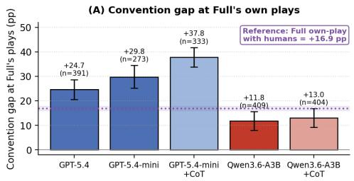

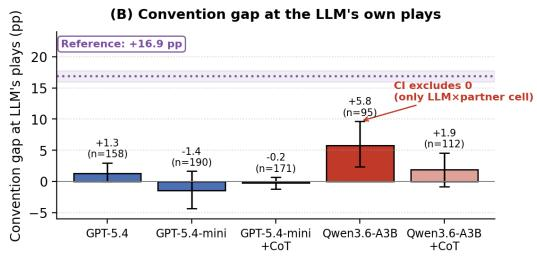  
Figure A9: Convention gap at each actor’s own plays for the five LLM × Full pairings. (A) At Full’s plays (n=273–409): all five values exceeded +11.8 pp; three exceeded Full’s +16.9 pp own-play gap with humans (purple dotted line; shaded band: 95% CI from §4.3). (B) At the LLM’s plays (n=95–190): only the Qwen3.6- A3B CI excluded zero, at about one-third the magnitude of Full’s human gap; the effect was reduced when Qwen’s CoT was enabled. CoT variants in lighter colours; Qwen3.6-A3B without CoT in crimson. Error bars: 95% bootstrap CIs (2,000 resamples).

## X Known-Answer Validation on a Designed Convention Hierarchy (OBL)

Why OBL is a known-answer test. Off-belief learning [Hu et al., 2021] constructs a hierarchy of Hanabi agents whose convention content is controlled by construction. The base level (OBL1) is trained to best-respond to beliefs induced by a uniformly random partner policy, which removes any incentive to form or read conventions—a grounded, convention-free policy by design. Each subsequent level k+1 best-responds to the beliefs induced by level k’s actual policy, reintroducing convention-based interpretation one controlled step at a time. If the convention gap measures what it claims to measure, it must read ≈0 at OBL1 and increase monotonically through the hierarchy—a dose-response prediction fixed before measurement.

Setup and verification. We ran the released ICML checkpoints in two-player self-play (the first released seed model per level, 1,000 games per condition) and OBL1 cross-play (all 10 unordered pairs of the five independently trained OBL1 seeds, 100 games per pair), with per-step greedy acting following the original evaluation protocol; the released model set additionally contains a fifth level (OBL5) that is not in the paper but continues the published hierarchy, and we include it as a fifth point. Every exported game was replayed through the paper’s engine and required to reproduce the ground-truth final score exactly: 1,000/1,000 games match in every condition. Mean self-play scores (21.09 / 23.45 / 23.97 / 24.05 / 24.16 for OBL1–5) and the cross-play score (20.90) match the original 5,000-game evaluation of the same checkpoints (20.82 / 23.47 / 23.95 / 24.16 / 24.20; cross-play 20.85). An engine-equivalence audit ran the packaged metric implementation and the manuscript pipeline over all 16,000 exported games (380,298 plays) with bit-identical posteriors (maximum absolute difference 0).

Table A13: OBL convention gap stratified by hint-action count on the played card: n / gap.
<table><tr><td>Condition</td><td>0 hints</td><td>1 hint</td><td>2+ hints</td></tr><tr><td>OBL1 self-play</td><td> $9 9 0 / - 1 1 . 7 \mathrm { p p }$ </td><td> $8 , 9 5 1 / + 5 . 0 \mathrm { p p }$ </td><td> $1 2 , 8 5 0 / + 0 . 2 \mathrm { p p }$ </td></tr><tr><td>OBL2 self-play</td><td> $3 7 5 / + 6 . 5 \mathrm { p p }$ </td><td> $1 3 , 2 0 1 / + 2 2 . { \dot { 1 } }$  pp</td><td> $1 0 { , } 6 2 8 / { + } 0 . 5 \mathrm { p p }$ </td></tr><tr><td>OBL3 self-play</td><td> $3 3 2 / + 1 6 . 8 \mathrm { p p }$ </td><td> $1 3 , 8 8 7 / + 2 9 . 0 \mathrm { p p }$ </td><td> $1 0 , 3 1 9 / + 0 . 7 \mathrm { p p }$ </td></tr><tr><td>OBL4 self-play</td><td> $3 9 0 / + 1 5 . 4 \mathrm { p p }$ </td><td> $1 4 { , } 5 2 4 / + 3 2 { . } 8 \hat { \mathrm { p p } }$ </td><td> $9 , 8 1 7 / + 1 . 0 \mathrm { p p }$ </td></tr><tr><td>OBL5 self-play</td><td> $3 9 4 / + 2 1 . 0 { \dot { \mathrm { p p } } }$ </td><td> $1 5 , 0 5 8 / + 3 4 . 4 \hat { \mathrm { p p } }$ </td><td> $9 , 4 1 9 / + 1 . 3 \mathrm { \ : p p }$ </td></tr><tr><td> $\mathrm { O B L 1 \ c r o s s { \mathrm { - } } p l a y }$ </td><td> $9 3 0 / - 1 5 . 1 \mathrm { p p }$ </td><td> $8 , 7 8 3 / + 4 . 5 \mathrm { p p }$ </td><td> $1 2 { , } 9 0 3 / + 0 . 1 \mathrm { { p p } }$ </td></tr></table>

Results. The gap tracks the designed hierarchy exactly as predicted (Table 5, Figure 5): +1.57 pp [+1.33, +1.81] at the convention-free root, rising monotonically through +12.40, +16.91, and +19.88 to +21.68 pp [+21.34, +22.02] at OBL5. The two components separate cleanly: the mean literal posterior of chosen plays rises from 7.8% to 24.1% while the realized loss rate stays at 2–3%—higher levels increasingly take plays that literal information alone cannot justify, and make them. The surplus concentrates in the one-hint stratum (+34.4 pp at OBL5; Table A13), mirroring the human signature of §4.2; the zero-hint strata are small $( n = 3 3 0 – 9 9 0 )$ and noisy. OBL1’s near-zero gap survives cross-play unchanged (+1.22 pp [+0.98, +1.45] across 10 independently trained seed pairs;

score 20.90), consistent with the OBL claim that level-1 policies converge to the same grounded solution rather than to arbitrary seed-specific conventions.

The metric’s zero point is partner-supplied, and vanishes where theory says it should. OBL1’s residual +1.6 pp is not approximation error. Holding OBL1’s policy fixed and raising the partner’s level, OBL1’s own gap decays monotonically: +1.0 pp [+0.7, +1.3] with OBL2, +0.6 [+0.2, +1.0] with OBL3, +0.3 [−0.0, +0.7] with OBL4, and +0.1 [−0.2, +0.5] with OBL5, whose CI includes zero. The mechanism: even grounded hinting selects playable cards more often than chance (“grounded signaling”), and OBL1’s fixed policy passively harvests that correlation; higher-level partners hint for convention-readers, and the harvestable correlation vanishes. A hint-count stratification of OBL1’s inter-level plays confirms this directly: OBL1’s one-hint gap falls from +5.00 pp (self-play) to +2.50 pp (×OBL5) with non-overlapping CIs, and a Kitagawa decomposition attributes 72% of the decay to the within-stratum term (the same class of plays becoming less informative) rather than to a shift in play composition. The metric’s zero point is therefore realized exactly where the theory says it should be: a grounded policy whose partner supplies no harvestable correlation.

Caveats and scope. Self-play levels 2–5 use one released seed per level; the seed-invariance evidence (cross-play) covers OBL1, where five independent seeds exist. OBL5 is an unpublished extra level—the monotone trend holds on the published levels 1–4 alone. Acting is per-step greedy, following the original evaluation protocol. The OBL code and checkpoints are released under CC-BY-NC 4.0; the derived results and generation scripts are released in the obl/ directory of the public package (https://github.com/dockmfgit/hanabi-convention-gap; doi:10.5281/zenodo.21975884); the checkpoints and raw game logs are not redistributed and are regenerable from the official release. A companion study examines the structure and transfer of these conventions.