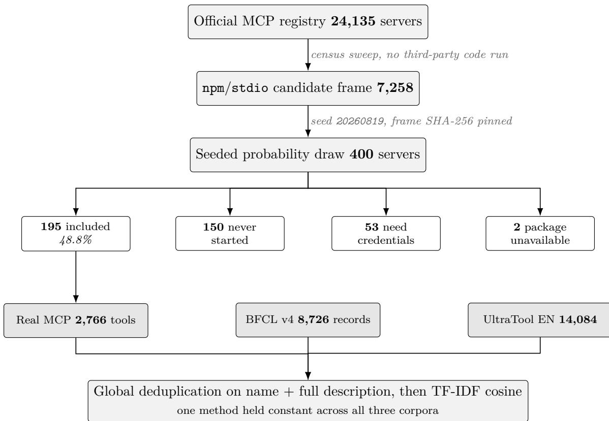
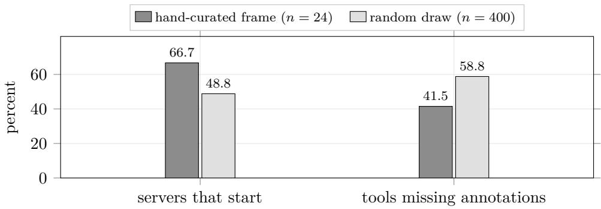
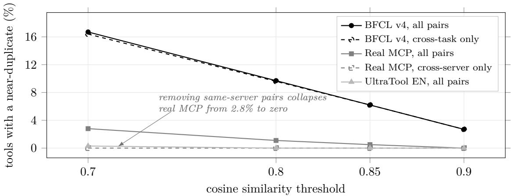

# What a Random Draw from the MCP Registry Contains, and What Tool-Use Benchmarks Contain Instead

Haseeb Mohammed Afsar Independent researcher ORCID: 0009-0000-4038-1272

August 2026

## Abstract

Studies of the Model Context Protocol (MCP) server ecosystem draw their samples in ways that quietly select for servers that work: reference sets, popularity lists, hand-curated frames, or pipelines that repair a server until it starts. We report what an unrepaired probability sample actually contains. From a 24,135-server registry census we draw 400 npm/stdio servers with a published seed and probe each one over the wire. Only 48.8% complete an initialize handshake, against 66.7% for a hand-curated frame measured with the same instrument, and the dominant failure is not missing credentials (13.3%) but servers that never start at all (37.5%). Among the 195 that do run, hard conformance is total: zero fatal JSON Schema violations across 2,766 advertised tools. Optional safety annotations are the real variance, and the tool-level omission rate on a random draw is 58.8% against 41.5% on the curated frame, so curation flatters this figure too. We then compare the tool descriptions these servers advertise against two tool-use benchmark corpora using one method held constant. Real MCP tools show 2.8% near-duplication at cosine 0.70, and all of it lies within single servers: cross-author near-duplication is 0.0% at every threshold tested. BFCL v4 shows 16.7%, of which 16.4 points lie between independently presented tasks. UltraTool shows 0.3%, cleaner than real tools, so this is a property of BFCL and not of synthetic corpora as a class. Separately, 68.8% of raw BFCL rows and 85.6% of raw UltraTool rows are exact name-plus-description repeats, against 0.4% for real MCP, so any statistic computed over these releases without global deduplication measures repetition rather than tools. All figures regenerate from released scripts and a published seed.

## 1 Introduction

The Model Context Protocol (MCP) [1] lets large language model applications discover and call external tools over a uniform JSON-RPC 2.0 interface. Empirical work on the resulting server population has grown quickly, and it now includes registry drift measurement [4], internet-facing security assessment [5], ecosystem-scale runtime analysis [3], and repository-level clone detection [6]. These studies establish scale. This paper asks a narrower question that scale alone does not answer.

Every behavioral MCP study must solve the same problem: most published servers cannot simply be launched and talked to. The solutions in the literature all involve selection. Reference sets and popularity lists select for servers people already use. Curated frames select for servers the curator could get working. MCPZoo [3], the largest such efort, resolves it by repairing servers with a multi-agent framework until they run, turning 64,611 collected servers into 37,288 that support dynamic analysis. Each is a reasonable engineering answer, and each erases the same quantity: how much of the published population is simply dead on arrival.

We measure that quantity by not solving the problem. We draw a probability sample from the registry, probe every draw exactly once with no repair and no credentials, and record an outcome for all 400, included or excluded with a reason.

The second half of the paper turns the same instrument outward. Having collected 2,766 tool descriptions that real, independently authored, deployed servers actually advertise, we can ask how they compare with the tool descriptions that tool-use benchmarks present to models. Existing benchmark criticism has focused on evaluators: Bhat et al. [7] find an 18.5% evaluator-human misalignment rate across four tool-calling benchmark families including BFCL v4, and score spreads of 18.9 points across repeated runs of one setup. We ask a diferent question about the same artifacts, concerning the corpora being scored rather than the machinery scoring them.

## Contributions.

• What an unrepaired random draw contains (Section 4): 48.8% inclusion against 66.7% curated, with the full failure taxonomy. The dominant exclusion is servers that never start, at nearly three times the credential-gated rate.

• What the servers that do run look like (Section 5): zero fatal schema violations across 2,766 tools, and a safety-annotation omission rate that is 17.3 points worse on a random draw than on a curated one.

• Benchmark corpora against real deployed tools (Section 6): one similarity method held constant across three corpora, with the within-unit and cross-unit decomposition that separates a project repeating itself from a benchmark repeating itself.

• A released, seeded, re-runnable pipeline (Section 9). Every number here regenerates from a committed script, a committed seed, and a hash-pinned frame.

## 2 Related work

Registry measurement. Bharti [4] tracks 120 snapshots of the MCP registry over 88.6 days across 19,099 servers, and reports that only 8.6% of servers ever rewrite their descriptions while the most active 5% generate 61% of change events. That work supersedes single-snapshot registry audits on the question of drift. Our census tier is two snapshots and we make no drift claim; we use it only to size the population and to construct a sampling frame.

Behavioral and security measurement. Chen et al. [3] build MCPZoo, the largest runtime collection to date, and use it to show that existing MCP security scanners are unreliable: fewer than half of sampled alerts survive manual validation. Padilla [5] dynamically audits 414 internet-facing MCP servers with a purpose-built framework, finding 68 reportable vulnerabilities and reporting that 41.6% of confirmed servers disappear within three days between measurement runs. Our behavioral sample is two orders of magnitude smaller than MCPZoo’s and we make no security claim. The complementarity is specific: MCPZoo’s repair pipeline is designed to convert non-starting servers into starting ones, and our measurement is of exactly the population that pipeline is built to rescue. Padilla’s three-day disappearance rate is independent corroboration, on the remote tier, of the churn our 37.5% non-start rate implies on the local tier.

  
Figure 1: The measurement pipeline. The census tier executes no third-party code and supplies the sampling frame; the dynamic tier probes each drawn server exactly once, with no repair, no credentials and no retry, and records an outcome for all 400. The selection points that other MCP studies resolve by curation or repair are the two labelled arrows and the four-way split beneath them.

Duplication. Kim et al. [6] measure repository-level cloning across 7,508 MCP repositories and 87,564 tools using lexical and fuzzy-structural similarity, manually verifying 60% of high-Jaccard and 85% of high-ssdeep candidates as true clones. Their unit is source code; ours is the advertised tool interface. Their result and ours are compatible and the tension between them is informative; we treat it as a threat to validity and test it directly in Section 8.

Benchmark validity. Bhat et al. [7] audit the evaluators of four tool-calling benchmark families. To our knowledge no published work measures duplication within these corpora or compares their tool distributions against tools that are actually deployed.

## 3 Method

Figure 1 shows the whole pipeline and the quantity at each stage.

## 3.1 Census tier

A harvester sweeps the entire oficial MCP registry (https://registry.modelcontextprotocol. io/v0/servers) by cursor pagination and records only self-declared metadata: deployment model, package ecosystem, declared transport, lifecycle status, and pinned \$schema revision. No third-party code runs, so this tier scales to the whole published population. The sweep records page count, version-row count, and a sweepComplete flag, so a truncated run is marked a lower bound rather than reported silently.

We report two snapshots, 2026-07-14 and 2026-08-22. Both are complete sweeps. A registry sweep cannot be reconstructed after the fact, because the population moves; each snapshot is therefore released as an aggregate at the moment it was taken.

## 3.2 Sampling

The frame is the npm-published, stdio-declared, active servers the census emits, 7,258 candidates at the 2026-08-22 snapshot. We draw $n = 4 0 0$ without replacement: canonical sort by registry identifier, then partial Fisher–Yates driven by a seeded mulberry32 generator, seed 20260819. The draw manifest records the SHA-256 of the exact frame bytes, so a redraw against a moved frame is detected rather than assumed equivalent.

## 3.3 Probing

Each drawn package is launched over stdio via npx and probed once with mcp-probe, which speaks the MCP wire protocol directly, performs the initialize handshake, enumerates tools via tools/list, and validates each tool’s JSON Schema [2] against the constraints the specification places on tool definitions. No credentials are ever supplied, no side-efecting tool is invoked, no server is repaired or retried, and every draw is recorded with an outcome.

## 3.4 Redundancy measurement

Corpora are compared on one method held constant. The unit is tool name concatenated with full description. Every corpus is globally deduplicated on that exact key before any similarity is computed; this is enforced in code rather than left to discipline, because a per-file deduplication key in an earlier iteration of this work missed cross-file repeats and inflated a measured figure by fourteen points. Vectorisation is TF-IDF over word unigrams and bigrams with sublinear term frequency, fit separately per corpus, never on a shared vocabulary. Similarity is cosine. Redundancy at threshold t is the share of deduplicated tools having at least one other tool at cosine $\geq t ;$ we state the definition because a diferent one yields a diferent number.

We also report the exact-duplicate rate of each raw release, which is a distinct and more consequential quantity than the near-duplicate rate.

## 3.5 Corpora

Real MCP: the 2,766 tools advertised by the 195 included servers. BFCL v4 [9]: every tool definition in every released row’s function list, 8,726 records. Seven of the twenty released files expose no function list at all, including the four multi-turn files and the memory file, whose tool definitions live separately; those contribute nothing here and the multi-turn tool documents are out of scope. UltraTool [10]: every tool in every English-split row’s tools list, development and test together, 14,084 records. Every source file is pinned by SHA-256 in the released provenance record.

## 4 RQ1: what an unrepaired random draw contains

Table 1 gives the outcome of all 400 draws.

<table><tr><td>Outcome</td><td>Count</td><td>Share</td></tr><tr><td>Included (handshake completed)</td><td>195</td><td>48.8%</td></tr><tr><td>Excluded: handshake failed</td><td>150</td><td>37.5%</td></tr><tr><td>Excluded: needs credentials</td><td>53</td><td>13.3%</td></tr><tr><td>Excluded: package unavailable</td><td>2</td><td>0.5%</td></tr></table>

Table 1: Outcome of every draw. No server was dropped silently.

  
Figure 2: Curation flatters both headline numbers, and in opposite directions. The same instrument reports a higher start rate and a lower annotation-omission rate on a hand-curated frame than on a probability sample of the same population.

Two things follow.

First, a random draw includes far less than a curated one. The same instrument, run against a 24-server hand-curated frame of reference and popular community servers, included 16 of 24, or 66.7%. The 17.9-point gap is the size of the selection efect that curation introduces, measured rather than asserted.

Second, the dominant failure mode is not the one the literature anticipates. Credential gating is the standard explanation for why a public MCP server cannot be probed, and it accounts for 53 of 400 draws. Servers that simply do not start account for 150, nearly three times as many. On the frame that behavioral MCP studies actually sample from, roughly two in five published entries are inert.

Figure 2 puts the two curation efects side by side. They run in opposite directions, which is what makes curation hard to correct for after the fact: it raises the apparent health of the population on one axis and lowers it on the other.

This is the quantity that repair-based pipelines are built to eliminate. That is a sound engineering choice for their purposes and it is precisely why their samples cannot report this number.

## 5 RQ2: what the servers that do run look like

The 195 included servers advertise 2,766 tools; 2,759 carry a description. Tool counts per server are highly skewed: minimum 1, median 8, 95th percentile 46, maximum 300. One included server advertises no tools at all.

## 5.1 Hard conformance

Zero of 2,766 tools carry a fatal JSON Schema violation, and zero of 195 servers have any. No missing schema, no invalid type, no malformed properties or required. This replicates a 200-tool result from the earlier curated frame at roughly fourteen times the scale and on a random rather than selected sample, which makes it a structural property rather than a small-sample artifact. The intuition that MCP tool schemas are frequently malformed is not supported.

## 5.2 Safety annotations

Optional annotations (readOnlyHint, destructiveHint, idempotentHint, openWorldHint) tell an agent whether a tool is safe to call before calling it. Of the 194 included servers advertising at least one tool, 72 annotate every tool and 122 annotate none. 1,626 of 2,766 tools (58.8%) carry no annotations.

The curated frame gave 41.5%. Curation therefore flatters this figure by 17.3 points, for the same reason it flatters inclusion: reference servers annotate, and curated frames are full of reference servers. The lower number should not be cited as an ecosystem rate.

The split is close to bimodal at the server level: 194 of 194 servers in this sample are all-ornothing, with no partial server observed. We deliberately do not state this as an absolute. A single sample observing none of a rare category supports an upper bound, not a denial: given 0 of 194, the one-sided 95% upper bound on the prevalence of partial annotation is 1.53%. An earlier unreleased run of this study reported four partial servers at n = 214; the present run does not reproduce that and we report the disagreement without explaining it.

## 5.3 Protocol versions

Four versions were negotiated across 195 servers: 2025-06-18 on 192, and 2024-11-05, 2025-03-26 and 2025-11-25 on one each. The last of these is newer than the baseline our client advertises, so version spread in the deployed population runs in both directions and not only as a lagging tail.

## 6 RQ3: benchmark corpora against real deployed tools

## 6.1 Raw releases are mostly repetition

Table 2 reports exact name-plus-description duplicates in each raw release.

<table><tr><td>Corpus</td><td>Raw records</td><td>Exact duplicates</td><td>Share</td></tr><tr><td>Real MCP (195 servers)</td><td>2,766</td><td>10</td><td>0.4%</td></tr><tr><td>BFCL v4</td><td>8,726</td><td>6,002</td><td>68.8%</td></tr><tr><td>UltraTool EN (dev+test)</td><td>14,084</td><td>12,052</td><td>85.6%</td></tr></table>

Table 2: Exact-duplicate contamination of the raw releases.

Any statistic computed over these files without global deduplication measures how often a benchmark repeats a task, not how many tools it contains. We note that this percentage is sensitive to which files are included, since a benchmark reusing one tool across many rows produces a high rate by construction; the post-deduplication rates below are considerably more stable and the two should be read together.

  
Figure 3: Near-duplication after global deduplication. Solid lines count every pair; dashed lines count only pairs spanning diferent authoring units. BFCL’s redundancy survives the restriction almost unchanged, so it lies between independently presented tasks. Real MCP’s does not survive it at all. The Real MCP cross-server series lies on zero at every threshold.

## 6.2 Near-duplication, and where it lives

Table 3 gives the redundancy rate after global deduplication, decomposed by whether the nearduplicate partner lies inside the same authoring unit or outside it. For real MCP the unit is the server; for the benchmarks it is the task row.

<table><tr><td>Corpus (deduplicated n)</td><td>Pairs counted</td><td>0.70</td><td>0.80</td><td>0.85</td><td>0.90</td></tr><tr><td>Real MCP (2,756)</td><td>all</td><td>2.8%</td><td>1.1%</td><td>0.5%</td><td>0.0%</td></tr><tr><td rowspan="2">BFCL v4 (2,724)</td><td>cross-server</td><td>0.0%</td><td>0.0%</td><td>0.0%</td><td>0.0%</td></tr><tr><td>all</td><td>16.7%</td><td>9.7%</td><td>6.2%</td><td>2.7%</td></tr><tr><td rowspan="2">UltraTool EN (2,032)</td><td>cross-task</td><td>16.4%</td><td>9.6%</td><td>6.2%</td><td>2.7%</td></tr><tr><td>all</td><td>0.3%</td><td>0.0%</td><td>0.0%</td><td>0.0%</td></tr><tr><td></td><td>cross-task</td><td>0.3%</td><td>0.0%</td><td>0.0%</td><td>0.0%</td></tr></table>

Table 3: Redundancy after global deduplication, by cosine threshold.

The decomposition changes the finding. Every near-duplicate among real MCP tools lies inside a single server: the $\sf { 1 i s t \_ x } / \ g e t \_ x \ /$ create\_x families that one project naturally produces. Across independent authors, near-duplication is 0.0% at every threshold tested. BFCL’s redundancy is the opposite kind: 16.4 of its 16.7 points lie between independently presented tasks, and it is the only corpus of the three with near-duplicates surviving at cosine 0.90.

So the claim is not that BFCL is roughly six times more redundant than real tools. It is that BFCL repeats itself across tasks, and real MCP does not repeat itself across authors.

UltraTool is cleaner than real deployed tools, at 0.3% against 2.8%. Two synthetic corpora built for the same purpose give opposite answers, so no claim about synthetic tool corpora as a class is supported by this evidence, and we make none.

## 7 Ecosystem context

The two census snapshots frame the above. The population grew from 16,548 to 24,135 unique servers between 2026-07-14 and 2026-08-22, about 195 net new servers per day, and both sweeps completed.

<table><tr><td>Deployment model</td><td>2026-07-14</td><td>2026-08-22</td><td>Change</td></tr><tr><td>Package-only (installed locally)</td><td>8,340 (50.4%)</td><td>10,530 (43.6%)</td><td>-6.8pp</td></tr><tr><td>Remote-only (hosted HTTP/SSE)</td><td>7,057 (42.6%)</td><td>12,004 (49.7%)</td><td>+7.1pp</td></tr><tr><td>Both</td><td>852 (5.1%)</td><td>1,224 (5.1%)</td><td>-0.1pp</td></tr><tr><td>Neither declared</td><td>299 (1.8%)</td><td>377 (1.6%)</td><td>−0.2pp</td></tr></table>

Table 4: Deployment model at two complete sweeps 39 days apart.

Remote-only overtook package-only in this window, growing 70.1% against 26.3%. Two snapshots cannot establish a trend and we claim none; we report a change between two measured endpoints.

The consequence that matters for this paper is methodological. The npm/stdio slice, which is what a local behavioral instrument can reach, grew in absolute terms from 5,804 to 7,414 servers but fell as a share of the population, from 35.1% to 30.7%. A stdio-only instrument therefore covers a shrinking minority of the ecosystem, and this applies to our behavioral tier as much as to anyone else’s.

## 8 Threats to validity

The handshake filter, tested directly. Kim et al. [6] find pervasive code cloning in the MCP repository population. Our cross-author redundancy of 0.0% would be flattering rather than informative if our probe systematically discarded clones, since we observe only the 48.8% of draws that start. We tested this three ways. First, using the npm-authored package description, which exists for started and non-started servers alike, both groups show 0.0% near-duplication at every threshold; this test has low power, since it reads descriptions rather than code and both groups sit at zero. Second, author-family concentration by npm scope is comparable across the two groups, with the largest family in the sample (7 packages) entirely included and the next (8 packages) entirely excluded. Third, and most directly, the author shipping the most servers that all started contributes 125 tools across 7 servers with a maximum cross-server cosine of 0.623, below the lowest threshold reported. We find no evidence that the filter selects against clones. We cannot exclude the possibility that clones copy implementations while rewriting tool descriptions, which our method would miss and theirs would catch; if that is what is happening, the gap between code-level and interface-level duplication is itself a result worth reporting.

The cross-unit columns are not power-matched. After deduplication BFCL averages 1.8 tools per task row against real MCP’s 14.2 per server, so removing same-unit pairs subtracts far less from BFCL by construction. The BFCL cross-task figure sitting near its all-pairs figure is partly an artifact of this. The real MCP collapse from 2.8% to 0.0% runs in the opposite direction and is not explained by it.

Corpus rate and large servers. Capping the real MCP corpus at 10, 25 and 50 tools per server yields 0.9%, 2.2% and 3.0% at threshold 0.70, bracketing the uncapped 2.8%. The rate is not driven

by the two servers advertising 300 and 122 tools.

Scope of the behavioral tier. npm/stdio only, which is 30.7% of the population and falling. Remote servers, PyPI and OCI packages are out of frame. Inclusion is decided by a single probe attempt with no retry, so transient failures are counted as exclusions and 48.8% is a lower bound on the fraction that could ever start.

Similarity is lexical. TF-IDF cosine measures lexical overlap, not semantic equivalence. Two tools doing the same thing in diferent words are counted as distinct in every corpus. This biases all three rates downward and we have no reason to think it biases them unequally, but we have not shown that.

Census. Registry metadata is self-declared; a server misdeclaring its transport is counted as declared. Two snapshots support a diference, not a trend. A GitHub topic count reported in an earlier version of this work as ecosystem context was unavailable on the second sweep and is not used in any claim.

Timing. Wall-clock times were collected but include first-run npx install cost and were measured under concurrency with a kill timeout. They are not a latency measurement and none is reported.

## 9 Data and code availability

The mcp-probe instrument, the harvester, the seeded draw script, the resumable probe runner, the aggregation script, the redundancy measurement with its self-test, and the threat-test suite are open source at https://github.com/itguruhaseeb/mcp-probe. The tool release and dataset are archived on Zenodo under the concept DOI 10.5281/zenodo.21347997, which always resolves to the latest version [11].

Every figure in this paper regenerates from a committed script plus the published seed 20260819 and the frame hash recorded in the draw manifest. The per-server outcome of all 400 draws is released, so the aggregates can be independently recounted rather than trusted.

## Acknowledgements

We thank the maintainers of the Model Context Protocol specification and its reference server implementations, against which mcp-probe is tested.

## References

[1] Anthropic. Model Context Protocol Specification. Open standard for connecting large language model applications to external tools and data, 2024. https://modelcontextprotocol.io.

[2] A. Wright, H. Andrews, B. Hutton, and G. Dennis. JSON Schema: A Media Type for Describing JSON Documents. IETF Internet-Draft, 2022. https://json-schema.org/specification.

[3] P. Chen, B. An, M. Wu, B. Wan, G. Hong, J. Chen, X. Pan, J. Dai, and M. Yang. Rethinking MCP Security: A Large-Scale Study of Runtime MCP Servers and Security Scanner Reliability. arXiv:2607.11086, 2026. https://arxiv.org/abs/2607.11086.

[4] G. Bharti. Registry Descriptions Go Stale Unevenly: An 89-Day Measurement of Model Context Protocol Drift, and Why Drift-Ranked Re-Auditing Under-Covers It. arXiv:2608.00997, 2026. https://arxiv.org/abs/2608.00997.

[5] N. Padilla. Exposed by Design: A Dynamic Security Assessment of Internet-Facing MCP Servers at Scale. arXiv:2608.00150, 2026. https://arxiv.org/abs/2608.00150.

[6] T. Kim, D. Jiang, Y. Hu, Y. Jia, and N. Gong. Evaluating Tool Cloning in Agentic-AI Ecosystems. arXiv:2605.09817, 2026. https://arxiv.org/abs/2605.09817.

[7] V. Bhat, J. Vaghasiya, M. A. Mohsin, and A. Aali. Benchmarking the Benchmarks: A Validity Audit of Tool-Calling Evaluation. arXiv:2607.02577, 2026. https://arxiv.org/abs/2607. 02577.

[8] S. Yao, N. Shinn, P. Razavi, and K. Narasimhan. τ -bench: A Benchmark for Tool-Agent-User Interaction in Real-World Domains. arXiv:2406.12045, 2024. https://doi.org/10.48550/ arXiv.2406.12045.

[9] Berkeley Function Calling Leaderboard, v4 evaluation data. Gorilla project repository, accessed 2026-08-22. https://github.com/ShishirPatil/gorilla.

[10] UltraTool, English dataset. Repository, accessed 2026-08-22. https://github.com/ JoeYing1019/UltraTool.

[11] H. Mohammed Afsar. mcp-probe: a conformance and reliability checker for Model Context Protocol servers (software and dataset). Zenodo, 2026. https://doi.org/10.5281/zenodo. 21347997.