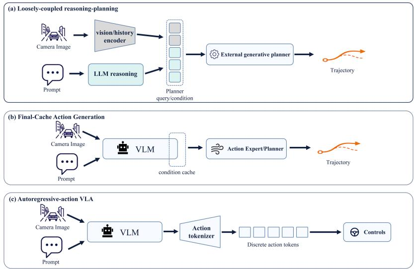
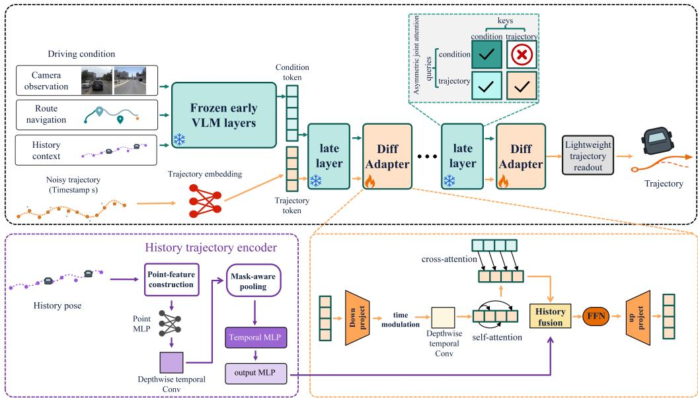
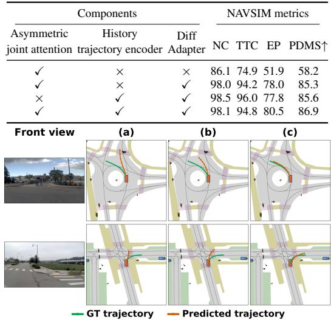
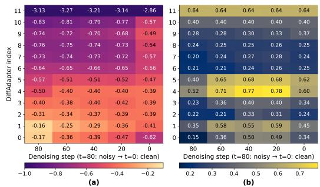
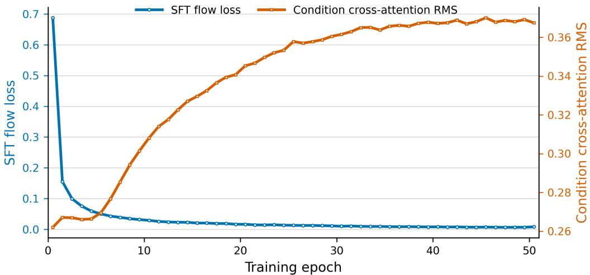
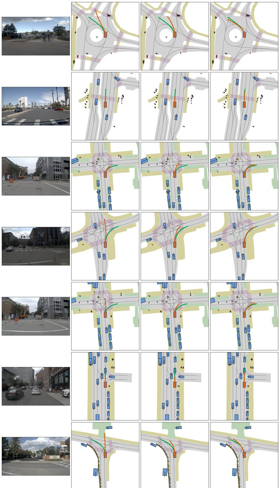
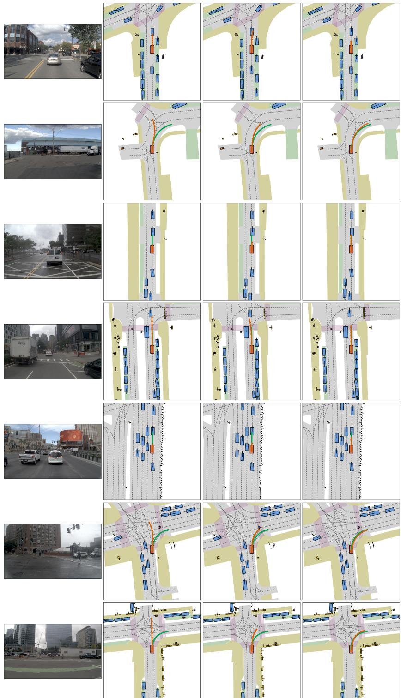
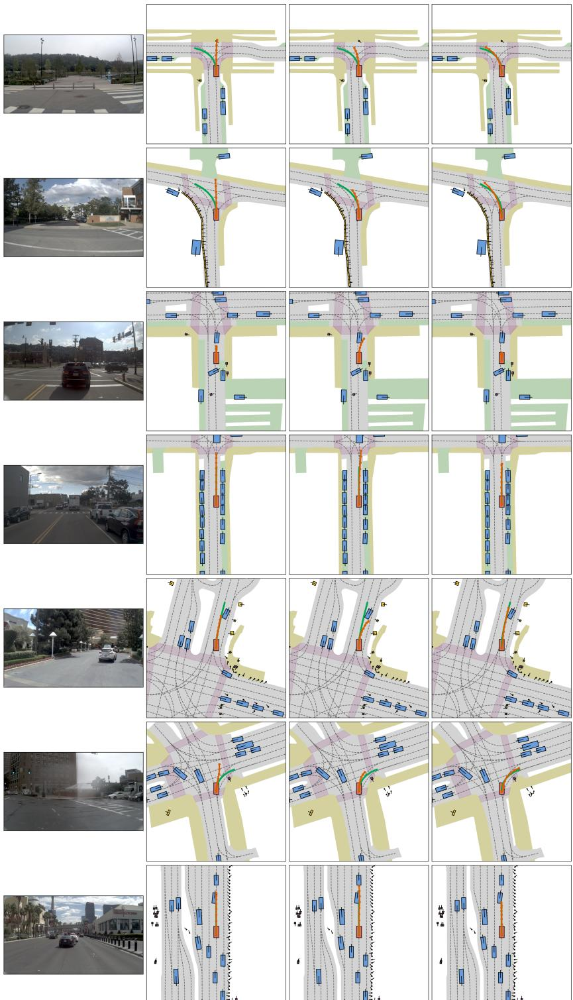

# PLANNING IN THE BACKBONE: DIFFADAPTERVLA FOR NATIVE CONTINUOUS TRAJECTORY GENERATION WITH DRIVING VLMS

Changxin Lu1 Xiaoliang Meng1∗

Yu Wu2 Rui Huang2 Honglin Li2 Tao Chen2 Kaixuan Zhou2 Yadong Shao2

1School of Remote Sensing and Information Engineering, Wuhan University

2Dongfeng Research & Development Institute

{2021302131130,xmeng}@whu.edu.cn

{dfrd-wuyu,tc-huangrui,lihongl,chentao,shaoyadong}@dfmc.com.cn triumphzhou@163.com

## ABSTRACT

Pretrained driving vision-language models (VLMs) integrate visual, route, language, and driving context into rich driving priors, yet their representation objectives remain separated from continuous driving planning. Existing methods typically begin trajectory generation only after the VLM has formed a final condition, leaving depth-wise condition computation outside the stepwise formation of trajectory state. We introduce DiffAdapterVLA, which realizes Planning in the Backbone: it injects explicit trajectory tokens into selected VLM late layers, bringing trajectory state into backbone forward computation, where it co-evolves with driving conditions at different depths. Lightweight layer-wise DiffAdapters organize this computation into recursive trajectory refinement, while asymmetric joint attention preserves directed guidance from the condition stream to trajectory planning. By placing planning within existing backbone computation rather than relying on an independent trajectory planner, DiffAdapterVLA adapts only lightweight trajectory modules to turn existing driving priors into efficient continuous planning capability. NAVSIM results show that it achieves high-quality closed-loop planning with low end-to-end latency using few trainable parameters, and demonstrate that jointly evolving trajectory state and depth-wise driving conditions in VLM late-layer computation effectively realizes continuous trajectory planning.

## 1 INTRODUCTION

As autonomous driving moves toward open and dynamic traffic, end-to-end (E2E) planning has become central to generating safe, executable, and interaction-aware future motion (Chen et al., 2024). By unifying perception, scene modeling, and motion planning, E2E systems have advanced through multimodal inputs, temporal modeling, and closed-loop evaluation (Prakash et al., 2021; Hu et al., 2023; Jiang et al., 2023; Caesar et al., 2021; Dauner et al., 2024). Driving vision-language models (VLMs) further integrate visual, linguistic, and driving knowledge, extending conventional E2E systems toward vision-language-action (VLA) models. As these models produce increasingly rich driving representations, a central challenge is to convert them into precise and efficient continuous motion (Gao et al., 2024; Zhou et al., 2025a; Sima et al., 2024; Shao et al., 2024; Tian et al., 2025; Zhou et al., 2026).

Yet rich pretrained representations do not naturally translate into reliable continuous planning. This gap stems from different modeling objectives: general VLMs learn visual-language semantics through discrete sequence prediction, whereas driving requires geometrically precise, temporally continuous, and dynamically feasible trajectories under real-time constraints. Empirical studies show that VLM initialization can benefit downstream policies, yet general vision-language competence remains a poor predictor of control performance (Zhang et al., 2026); driving research likewise repeatedly identifies the mismatch between semantic reasoning and numerical trajectory spaces (Fu et al., 2025; Li et al., 2026b; Wang et al., 2026). Broader VLA research addresses the same bottleneck by redesigning continuous-action modeling, action representations, and action tokenization (Hou et al., 2025; Wen et al., 2025b; Pertsch et al., 2025). These efforts establish the action interface as a central problem in converting pretrained driving representations into continuous trajectories.

  
Figure 1: Three prevalent interfaces between driving understanding and action generation. (a) Loosely coupled reasoning–planning systems connect separate visual, language, and planning modules through intermediate features or cues. (b) Final-cache action generation passes the condition cache produced by a VLM to an action expert or planner. (c) Autoregressive-action VLAs translate VLM representations into discrete action tokens before producing controls.

Figure 1 summarizes three representative interfaces between driving understanding and action generation. Loosely coupled reasoning–planning systems pass semantic cues from separately encoded visual and language inputs to an independent trajectory planner, coupling the modules only through intermediate interfaces (Pan et al., 2024; Fu et al., 2025). Final-condition methods instead pass final-layer VLM representations, such as hidden states, planning tokens, or condition caches, to a downstream action expert, trajectory regressor, or diffusion planner (NVIDIA et al., 2025; Li et al., 2026b). Autoregressive VLAs serialize actions or trajectories as discrete tokens for next-token prediction (Zhou et al., 2025b; Mao et al., 2023; Huang et al., 2025; Rowe et al., 2025; Hwang et al., 2025). In the first two interfaces, trajectory evolution begins after VLM condition computation; the third reformulates continuous planning as discrete generation. In either case, internal condition computation cannot directly participate in the evolution of a continuous trajectory state.

These interfaces treat trajectory planning as the outcome of scene understanding, even though driving VLM condition representations are formed progressively as visual evidence, route information, language, motion history, and traffic interactions are integrated across layers (Strong et al., 2026; Ding et al., 2024; Sima et al., 2024; Shao et al., 2024; Xu et al., 2025; Wang et al., 2025). When planning consumes only the final output, these depth-evolving driving signals cannot directly participate in forming the trajectory state. To address this limitation, we propose an interface that brings trajectory formation into the representational process itself: early layers retain multimodal condition modeling, while an explicit trajectory state enters selected late layers and evolves jointly with condition information within the backbone computation. We call this interface backbone-native continuous planning, or Planning in the Backbone. The trajectory is no longer only the outcome of scene understanding; it takes shape layer by layer during the latter stages of that computation.

To realize this interface, we introduce DiffAdapterVLA, a lightweight layer-wise architecture that recursively refines continuous trajectory states within selected backbone layers, enabling parameterefficient, low-latency planning without an external trajectory planner.

Our contributions are as follows:

• We establish and validate a backbone-native continuous planning interface in which an explicit trajectory state enters the late-layer computation of a pretrained driving VLM and progressively forms a continuous trajectory from driving conditions at different depths.

• We introduce DiffAdapterVLA, which recursively updates the trajectory state through lightweight layer-wise DiffAdapters, achieving high-performance, low-latency continuous planning with few trainable parameters.

• We introduce condition-preserving asymmetric joint attention, which establishes directed information flow between trajectory denoising and backbone condition computation while preserving the original condition stream.

## 2 RELATED WORK

E2E Driving and Continuous Trajectory Planning. E2E autonomous driving jointly learns perception, scene understanding, and planning for future trajectories. Multimodal fusion, planning oriented joint modeling, and sparse or vectorized scene representations progressively bring these functions into shared feature spaces (Prakash et al., 2021; Hu et al., 2023; Jiang et al., 2023; Jia et al., 2023; Sun et al., 2025; Weng et al., 2024). Generative and latent-world approaches extend this paradigm through structural latent modeling, intention-aware world models, and multi-mode planning distillation (Zheng et al., 2024; 2025; Yu et al., 2025), while nuPlan, NAVSIM, and pseudosimulation assess trajectory feasibility and interaction quality (Caesar et al., 2021; Dauner et al., 2024; Cao et al., 2025). DiffusionDrive and GoalFlow further generate continuous trajectories with truncated diffusion and flow matching, respectively (Liao et al., 2025; Xing et al., 2025). Yet, generation generally remains a head or module after shared scene representations, rather than an evolving state interleaved with a pretrained driving VLM’s late-layer computation.

Driving VLMs and VLAs for Autonomous Planning. Driving VLMs unify visual observations, language, route information, and driving knowledge for semantic understanding and decision making (Sima et al., 2024; Shao et al., 2024; Tian et al., 2025; Zhou et al., 2026). Driving VLAs then connect this representation to planning through reasoning conditions followed by a planner (Pan et al., 2024; Fu et al., 2025), VLM hidden states, planning tokens, or caches passed to downstream action components (NVIDIA et al., 2025; Li et al., 2026b), or autoregressive discrete action and trajectory tokens (Zhou et al., 2025b; Mao et al., 2023; Huang et al., 2025; Rowe et al., 2025). EMMA similarly serializes trajectories and other driving outputs in a shared language-like space (Hwang et al., 2025). Across these interfaces, continuous action generation remains outside the VLM computation boundary or is reformulated as discrete token prediction; DiffAdapterVLA instead evolves a trajectory state within the frozen late-layer stack.

Native Continuous Action Generation in VLAs. Recent robot policies and driving VLAs increasingly use unified generative architectures in which continuous actions or trajectories evolve with visual, linguistic, and historical context. Diffusion-transformer policies model continuous action through multimodal Transformer computation (Liu et al., 2025; Reuss et al., 2024; Yang et al., 2025; Li et al., 2025b; Hou et al., 2025; Wen et al., 2025a), either placing noisy action tokens alongside scene, language, and task tokens or jointly modeling actions with video dynamics and multimodal reasoning (Yang et al., 2025; Li et al., 2025b; Wen et al., 2025a). DITA specifically replaces a small denoising head conditioned on fused embeddings with in-context conditioning on raw visual tokens (Hou et al., 2025); MindVLA-U1 similarly combines autoregressive language generation and flow-matching trajectories under a shared VLM backbone (Huang et al., 2026b).

## 3 PRELIMINARIES

Frozen driving-VLM planning setup. We consider planning as the prediction of a future continuous trajectory from multimodal driving conditions. Given the condition at time t,

$$
\mathbf { c } _ { t } = \big ( \mathbf { I } _ { t } ^ { 1 : M } , \mathbf { r } _ { t } , \mathbf { h } _ { t } \big ) ,\tag{1}
$$

where $\mathbf { I } _ { t } ^ { 1 : M }$ denotes visual observations from M cameras, $\mathbf { r } _ { t }$ denotes route or navigation information, and $\mathbf { h } _ { t }$ denotes vehicle history and other available driving context, the goal is to generate a

  
Figure 2: Overview of DiffAdapterVLA. Frozen early VLM layers encode multimodal driving conditions, while a trajectory token embedding maps a noisy future trajectory to trajectory tokens. Across K late layers, interleaved DiffAdapters recursively refine and write back the trajectory state using the evolving condition stream and encoded motion history; asymmetric joint attention prevents noisy trajectory information from entering the condition stream. The final state is decoded to a denoising prediction.

continuous trajectory of H future waypoints,

$$
\mathbf { x } _ { 0 } = [ \mathbf { p } _ { t + 1 } , \ldots , \mathbf { p } _ { t + H } ] \in \mathbb { R } ^ { H \times d } ,\tag{2}
$$

where $\mathbf { p } _ { t + i }$ is the i-th future waypoint and d is the waypoint state dimension. We denote the training set by $\mathcal { D } = \{ ( \mathbf { c } _ { t } , \mathbf { x } _ { 0 } ) \}$ }.

Let $F _ { \theta }$ be a pretrained driving VLM with L Transformer layers. Its condition tokens propagate through depth as

$$
\mathbf { H } ^ { \ell + 1 } = F _ { \ell } ^ { \ell } ( \mathbf { H } ^ { \ell } ) , \qquad \ell = 0 , \ldots , L - 1 ,\tag{3}
$$

where $\mathbf { H } ^ { 0 }$ is encoded from visual, route, and history conditions, and θ denotes the VLM backbone parameters. We instantiate $F _ { \theta }$ with the Cosmos-Reason2-8B VLM backbone of the released Alpamayo-1.5-10B driving VLA and keep θ frozen throughout adaptation (NVIDIA et al., 2025).

Conditional trajectory denoising. We model the continuous distribution of future trajectories with conditional diffusion. For a clean trajectory $\mathbf { x } _ { 0 } .$ , the forward process adds Gaussian noise at diffusion step $s \in \{ 1 , \ldots , S \}$

$$
\mathbf { x } _ { s } = \sqrt { \bar { \alpha } _ { s } } \mathbf { x } _ { 0 } + \sqrt { 1 - \bar { \alpha } _ { s } } \epsilon , \qquad \epsilon \sim \mathcal { N } ( \mathbf { 0 } , \mathbf { I } ) ,\tag{4}
$$

where $\bar { \alpha } _ { s }$ is determined by a predefined noise schedule. A conditional denoiser receives the noisy trajectory, diffusion step, and driving condition to predict the added noise:

$$
\hat { \epsilon } = \epsilon _ { \phi } ( \mathbf { x } _ { s } , s ; \mathbf { c } _ { t } ) .\tag{5}
$$

It is trained with the standard noise-prediction objective

$$
\mathcal { L } _ { \mathrm { d e n o i s e } } = \mathbb { E } _ { ( \mathbf { c } _ { t } , \mathbf { x } _ { 0 } ) \sim \mathcal { D } , s , \epsilon } \left[ \left\| \epsilon - \epsilon _ { \phi } ( \mathbf { x } _ { s } , s ; \mathbf { c } _ { t } ) \right\| _ { 2 } ^ { 2 } \right] .\tag{6}
$$

At inference, the trajectory state is initialized from Gaussian noise and iteratively recovered through deterministic $x _ { 0 }$ projection. This process uses the DDPM noise-prediction parameterization and follows the reduced-step deterministic sampling principle of DDIM (Ho et al., 2020; Song et al., 2021). Conventional conditional trajectory generation treats the final driving-VLM representation as a fixed condition and performs this process in an external denoiser. The next section describes how DiffAdapterVLA instead maintains trajectory state throughout frozen late-layer computation.

## 4 METHODOLOGY

Figure 2 overviews DiffAdapterVLA. Frozen early VLM layers encode the driving condition $\mathbf { c } _ { t } ,$ while a trajectory token embedding maps $\left( \mathbf { x } _ { s } , s \right)$ to trajectory tokens appended before the selected K late layers. Each frozen late layer updates the joint stream under asymmetric attention, and its layer-specific DiffAdapter uses the resulting condition tokens, diffusion step, and shared history context to update only the trajectory tokens before writing them into the next layer. A lightweight trajectory readout predicts the denoising target from the final state, from which deterministic $x _ { 0 }$ projection iteratively recovers the planned trajectory. We next describe the history trajectory encoder, DiffAdapter, and condition-preserving asymmetric joint attention.

## 4.1 HISTORY TRAJECTORY ENCODER

To explicitly carry motion continuity from the observed past into future trajectory denoising, the history trajectory encoder maps ego-motion history to a compact context vector gt that anchors denoising in the vehicle’s current motion state. Let $\mathbf h _ { t } ^ { \mathrm { e g o } } = [ \mathbf { \widehat { q } } _ { t - T _ { h } + 1 } , \dots , \mathbf { q } _ { t } ] \in \mathbb R ^ { T _ { h } \times 3 }$ denote the ego-position history and let $m _ { i } \in \{ 0 , 1 \}$ indicate whether its i-th position is valid. For each position, we compute the planar displacement $\Delta \mathbf { q } _ { i } ^ { x y } = \mathbf { q } _ { i } ^ { x y } - \mathbf { q } _ { i - 1 } ^ { x y }$ , with a zero displacement at the first position, and form the seven-dimensional descriptor

$$
\mathbf { r } _ { i } = [ \mathbf { q } _ { i } , \Delta \mathbf { q } _ { i } ^ { x y } , m _ { i } , \rho _ { t } ] ,\tag{7}
$$

where $\rho _ { t }$ is a valid-history statistic supplied with the input, or the fraction of valid positions when that statistic is unavailable. This descriptor retains absolute position, local planar motion, and observation validity.

Each $\mathbf { r } _ { i }$ is linearly projected and normalized into the hidden space; invalid positions are then masked. Denoting the projected representation at waypoint i by ${ \bf u } _ { i } ,$ a depthwise temporal convolution with kernel size three produces $\tilde { \mathbf { u } } _ { i }$ by capturing local motion variation without mixing hidden channels:

$$
\tilde { \mathbf { u } } _ { i } = \mathbf { u } _ { i } + \mathrm { D W C o n v _ { 3 } } ( \mathbf { u } ) _ { i } .\tag{8}
$$

We aggregate the resulting sequence by masked mean pooling,

$$
\bar { \bf u } _ { t } = \frac { \sum _ { i = 1 } ^ { T _ { h } } m _ { i } \tilde { \bf u } _ { i } } { \operatorname* { m a x } ( \sum _ { i = 1 } ^ { T _ { h } } m _ { i } , 1 ) } ,\tag{9}
$$

so invalid positions do not contribute to the summary.

Two residual MLPs further transform the pooled motion representation:

$$
\mathbf { v } _ { t } = \bar { \mathbf { u } } _ { t } + f _ { \mathrm { t e m p } } ( \bar { \mathbf { u } } _ { t } ) , \qquad \mathbf { g } _ { t } = \mathbf { v } _ { t } + f _ { \mathrm { o u t } } ( \mathrm { L N } ( \mathbf { v } _ { t } ) ) .\tag{10}
$$

The intermediate state $\mathbf { v } _ { t }$ is refined by a LayerNorm–SiLU MLP, and $f _ { \mathrm { o u t } }$ is a two-layer GELU MLP. The resulting $\mathbf { g } _ { t } \in \mathbb { R } ^ { D }$ is shared by all selected late-layer DiffAdapters, supplying persistent history-dependent motion context to their trajectory-state updates.

## 4.2 DIFFADAPTER

DiffAdapterVLA represents the noisy future trajectory $\mathbf { x } _ { s } ~ \in \mathbb { R } ^ { H \times d }$ with trajectory tokens in the VLM hidden space. For its i-th waypoint, the linear trajectory embedding adds a future-position embedding, a trajectory token-type embedding, and a diffusion step embedding to the projected state:

$$
\begin{array} { r } { \mathbf { z } _ { s , i } ^ { 0 } = W _ { \mathrm { t r a j } } \mathbf { x } _ { s , i } + \mathbf { e } _ { i } ^ { \mathrm { p o s } } + \mathbf { e } ^ { \mathrm { t y p e } } + \mathbf { e } _ { s } ^ { \mathrm { t i m e } } . } \end{array}\tag{11}
$$

The learned projection $W _ { \mathrm { t r a j } }$ maps each waypoint state into the VLM hidden space, while the three additive terms encode its future position, trajectory-token identity, and diffusion step; the last is obtained by passing a sinusoidal timestep embedding through a SiLU MLP. After LayerNorm, the resulting trajectory tokens are appended to the condition tokens. The first $L - K$ frozen VLM layers propagate the multimodal condition $\mathbf { c } _ { t } .$

$$
\mathbf { C } ^ { L - K } = F _ { \theta } ^ { L - K - 1 } \circ \cdots \circ F _ { \theta } ^ { 0 } ( \mathbf { c } _ { t } ) .\tag{12}
$$

Here, $F _ { \theta } ^ { \ell }$ is the ℓ-th frozen VLM layer. These early layers retain the VLM’s original computation for integrating visual observations, route information, and driving context before trajectory tokens enter the network.

The appended tokens then traverse the final K frozen VLM layers. Each selected layer ℓ is followed by an independent DiffAdapter, with a 384-dimensional bottleneck and eight attention heads. Let

$$
[ \tilde { \mathbf { C } } ^ { \ell + 1 } , \tilde { \mathbf { Z } } _ { s } ^ { \ell + 1 } ] = F _ { \theta } ^ { \ell } ( [ \mathbf { C } ^ { \ell } , \mathbf { Z } _ { s } ^ { \ell } ] )\tag{13}
$$

denote the joint-layer output, partitioned into condition and trajectory slices. Tildes mark the states immediately after the frozen VLM layer. DiffAdapter updates only the trajectory slice:

$$
\begin{array} { r } { \mathbf { C } ^ { \ell + 1 } = \tilde { \mathbf { C } } ^ { \ell + 1 } , \qquad \mathbf { Z } _ { s } ^ { \ell + 1 } = \mathcal { A } _ { \ell } ( \tilde { \mathbf { Z } } _ { s } ^ { \ell + 1 } , \tilde { \mathbf { C } } ^ { \ell + 1 } , \mathbf { g } _ { t } , s ) . } \end{array}\tag{14}
$$

The operator $\mathbf { \mathcal { A } } _ { \ell }$ denotes the DiffAdapter assigned to layer $\ell .$ Its output is written into the input of the next frozen VLM layer, whereas the condition slice follows the original VLM propagation. The following asymmetric-attention subsection specifies the mask used for this joint computation.

Within the adapter, the incoming trajectory state is first normalized and projected into a bottleneck space. Because the appropriate update changes with the noise level, a sinusoidal embedding of s is passed through a SiLU MLP to produce affine modulations for temporal mixing and self-attention, together with residual gates for temporal mixing, self-attention, history fusion, and the feed-forward network. The temporal and self-attention stages are then written as

$$
\begin{array} { r } { \begin{array} { c } { \mathbf { u } _ { 0 } = W _ { \mathrm { d o w n } } \mathrm { L N } ( \tilde { \mathbf { Z } } _ { s } ^ { \ell + 1 } ) , } \\ { \mathbf { u } _ { 1 } = \mathbf { u } _ { 0 } + \operatorname { t a n h } ( g _ { \mathrm { t m p } } ( s ) ) \odot \mathrm { D W C o n v } _ { 3 } ( \mathrm { A d a L N } _ { \mathrm { t m p } } ( \mathbf { u } _ { 0 } ; s ) ) , } \\ { \mathbf { u } _ { 2 } = \mathbf { u } _ { 1 } + \operatorname { t a n h } ( g _ { \mathrm { s e l f } } ( s ) ) \odot \mathrm { M u l t i H e a d S e l f A t t e n t i o n } ( \mathrm { A d a L N } _ { \mathrm { s e l f } } ( \mathbf { u } _ { 1 } ; s ) ) . } \end{array} } \end{array}\tag{15}
$$

Both $\mathrm { A d a L N } _ { \mathrm { t m p } } ( \cdot ; s )$ and $\operatorname { A d a L N } _ { \operatorname { s e l f } } ( \cdot ; s )$ use the timestep-dependent affine parameters, while $g _ { \mathrm { t m p } } ( s )$ and $g _ { \mathrm { s e l f } } ( s )$ scale their residual updates. Thus, the depthwise convolution mixes neigh boring future waypoints, while multi-head self-attention captures their long-range dependencies; u1 and $\mathbf { u } _ { 2 }$ are the resulting intermediate trajectory states.

The adapter reads the current condition representation through cross-attention, using trajectory states as queries and projected condition tokens as keys and values:

$$
\mathbf { u } _ { 3 } = \mathbf { u } _ { 2 } + \mathrm { C r o s s A t t n } \Big ( \mathrm { L N } ( \mathbf { u } _ { 2 } ) , W _ { c } \mathrm { L N } ( \tilde { \mathbf { C } } ^ { \ell + 1 } ) , W _ { c } \mathrm { L N } ( \tilde { \mathbf { C } } ^ { \ell + 1 } ) \Big ) ,\tag{16}
$$

The learned projection $W _ { c }$ maps normalized condition tokens into the adapter bottleneck space, and invalid condition positions are excluded as keys. The projected history summary is broadcast to every trajectory token and fused with the current state by a gated GELU MLP, followed by a gated feed-forward MLP. The resulting bottleneck representation is up-projected and added to the adapter input through an outer residual connection. Each layer-specific adapter therefore combines local motion mixing, trajectory-wide coordination, condition reading, and history-dependent refinement.

After K alternating frozen-layer and DiffAdapter updates, the final trajectory tokens are normalized by the VLM’s final normalization layer and decoded by a lightweight linear trajectory readout. Under the DDPM-noise objective, it predicts

$$
\hat { \mathbf { \epsilon } } _ { s } = W _ { \mathrm { o u t } } \mathbf { Z } _ { s } ^ { L } + \mathbf { b } _ { \mathrm { o u t } } .\tag{17}
$$

The learned linear parameters $W _ { \mathrm { o u t } }$ and $\mathbf { b _ { \mathrm { o u t } } }$ map the final trajectory state to the predicted noise $\hat { \epsilon } _ { s }$ at step s. Continuous trajectory generation is consequently realized by recursive denoising updates interleaved with frozen late-layer computation, rather than by an independent planner operating on the final VLM cache.

Denoising Inference and Condition Reuse. Starting from Gaussian noise, we recover the planned trajectory through five equally spaced deterministic $x _ { 0 }$ -projection steps. Each step estimates a clipped clean trajectory from the predicted noise and rescales it to the next noise level; the complete update is given in the appendix. Since the driving condition remains fixed throughout denoising, $\dot { \mathbf { C } } ^ { L - K }$ , its validity mask, and position information can be cached and reused across steps. Each step embeds the current $\mathbf { x } _ { s } ,$ , appends its trajectory tokens to the condition states, and executes the late VLM layers and their layer-specific DiffAdapters. The history encoder likewise computes $\mathbf { g } _ { t }$ once per sample and shares it across all denoising steps and selected late layers.

## 4.3 CONDITION-PRESERVING ASYMMETRIC JOINT ATTENTION

The final K VLM layers receive a joint sequence of condition and trajectory tokens, whose two components have asymmetric read permissions. Let $\mathcal { T } _ { \mathrm { c } }$ and $\mathcal { T } _ { \mathrm { z } }$ denote the index sets of condition and trajectory tokens, respectively. At each late layer, we extend the VLM’s original condition mask with the joint attention mask

$$
\mathbf { M } _ { i j } = \left\{ \begin{array} { l l } { \mathbf { M } _ { i j } ^ { \mathrm { c o n d } } , } & { i , j \in \mathcal { I } _ { \mathrm { c } } , } \\ { - \infty , } & { i \in \mathcal { I } _ { \mathrm { c } } , ~ j \in \mathcal { I } _ { \mathrm { z } } , } \\ { 0 , } & { i \in \mathcal { I } _ { \mathrm { z } } , ~ j \in \mathcal { I } _ { \mathrm { z } } , } \\ { 0 , } & { i \in \mathcal { I } _ { \mathrm { z } } , ~ j \in \mathcal { I } _ { \mathrm { c } } \mathrm { a n d } ~ j ~ \mathrm { i s ~ v a l i d } , } \\ { - \infty , } & { i \in \mathcal { I } _ { \mathrm { z } } , ~ j \in \mathcal { I } _ { \mathrm { c } } \mathrm { ~ a n d } ~ j ~ \mathrm { i s ~ i n v a l i d } . } \end{array} \right.\tag{18}
$$

Here, ${ \bf M } ^ { \mathrm { c o n d } }$ retains the VLM’s causal attention mask on the condition stream. Condition queries are therefore prevented from attending to the noisy trajectory suffix, while trajectory tokens attend to all valid condition tokens and interact bidirectionally with one another. This preserves the condition stream’s original propagation while allowing the trajectory state to use the current-depth driving representation, other future waypoints, and the layer-wise DiffAdapter update. The mask thus defines directed information flow within the shared late-layer stack: driving conditions guide trajectory denoising without noisy trajectory information entering the condition stream.

## 5 EXPERIMENTS

## 5.1 EXPERIMENTAL SETUP

Implementation Details. We build on the Alpamayo-1.5-10B and keep its Cosmos-Reason2-8B driving VLM backbone frozen throughout training (NVIDIA et al., 2025). We train only the linear trajectory embedding, DiffAdapters, history trajectory encoder, and lightweight trajectory readout, comprising 3.05% of the model parameters. DiffAdapterVLA inserts twelve layer-specific DiffAdapters into the final K = 12 VLM layers. We first perform supervised fine-tuning (SFT) of these modules for 80 epochs with the DDPM noise-prediction objective and 100 diffusion steps. Starting from the SFT checkpoint, we apply DiffGRPO for a further 10 epochs to the same trainable modules (Li et al., 2026b). We use five deterministic x0-projection steps at inference; early-layer condition-hidden caching is enabled for efficiency evaluation. All experiments are conducted on eight NVIDIA A800 GPUs; detailed hyperparameter settings are provided in the appendix.

Dataset. We evaluate DiffAdapterVLA on NAVSIM, a planning-oriented autonomous driving benchmark (Dauner et al., 2024). NAVSIM is built on OpenScene, a resampling and curation of nuPlan driving data (Caesar et al., 2021). Its official split comprises navtrain, with 1,192 training scenes, and navtest, with 136 evaluation scenes. Following the NAVSIM planning protocol, the model receives the current front-camera observation, route information, and four historical vehicle states, and predicts eight future ego-pose waypoints at 2 Hz, corresponding to a 4-second planning horizon. We evaluate planning quality using the official Predictive Driver Model Score (PDMS), which jointly measures progress, safety, comfort, and traffic-rule compliance.

## 5.2 MAIN RESULTS AND ABLATION STUDY

Experiments on the NAVSIM Benchmark. Table 1 reports closed-loop performance on NAVSIM navtest. With the driving VLM frozen, DiffAdapterVLA trains only 3.05% of the parameters and attains 88.3 PDMS from supervised trajectory adaptation alone, matching the LiDARequipped WoTE and the camera-only DP-VLA. Its RFT model reaches 90.3 PDMS, exceeding DriveDPO by 0.3 points and DriveVLA-W0 by 0.1 points while using only the front camera. The balanced safety and progress scores show that the trajectory adaptation preserves driving feasibility while maintaining effective closed-loop motion.

Inference Efficiency. As shown in Table 2, with the same Cosmos-Reason2 VLM frozen and only a downstream continuous-generation module trained, DiffAdapterVLA improves PDMS from 71.1 to 88.3 over Alpamayo’s second-stage action expert while reducing end-to-end latency per sample from 1003.8 to 80.4 ms, a 12.5× speedup. Compared with the lightweight DiT planner with LoRA-adapted VLM representations, DiffAdapterVLA operates in a comparable latency regime (80.4 versus 67.6 ms) while improving PDMS by 6.4 points. We further compare representative systems based on an external diffusion planner, an external action expert, and autoregressive action tokens: ReCogDrive (Li et al., 2026b), DriveVLA-W0 (Li et al., 2026a), and OneVL (Lu et al., 2026), respectively. Without sacrificing PDMS, DiffAdapterVLA reduces end-to-end latency per sample by 9.2×, 14.8×, and 15.7×, respectively, while improving PDMS by 1.8, 1.1, and 0.8 points. These cross-paradigm comparisons show that incorporating trajectory refinement into VLM late-layer computation provides a more favorable efficiency–performance trade-off for continuous planning: high-quality trajectories need not be generated solely by an independent module outside the VLM.

Table 1: NAVSIM navtest performance comparison measured by PDMS.
<table><tr><td>Method</td><td>Ref.</td><td>Image</td><td>LiDAR</td><td>NC↑</td><td>DAC↑</td><td>TTC↑</td><td>C↑</td><td>EP↑</td><td>PDMS↑</td></tr><tr><td>Human</td><td></td><td>一</td><td>一</td><td>100.0</td><td>100.0</td><td>100.0</td><td>99.9</td><td>87.5</td><td>94.8</td></tr><tr><td>DrivingGPT (Chen et al., 2025)</td><td>ICCV&#x27;25</td><td>√</td><td></td><td>98.9</td><td>90.7</td><td>94.9</td><td>95.6</td><td>79.7</td><td>82.4</td></tr><tr><td>UniAD (Hu et al., 2023)</td><td>CVPR&#x27;23</td><td>√</td><td>√</td><td>97.8</td><td>91.9</td><td>92.9</td><td>100.0</td><td>78.8</td><td>83.4</td></tr><tr><td>TransFuser (Chitta et al., 2023)</td><td>TPAMI&#x27;23</td><td>√</td><td>√</td><td>97.7</td><td>92.8</td><td>92.8</td><td>100.0</td><td>79.2</td><td>84.0</td></tr><tr><td>LAW (Li et al., 2025c)</td><td>ICLR’25</td><td>√</td><td></td><td>96.4</td><td>95.4</td><td>88.7</td><td>99.9</td><td>81.7</td><td>84.6</td></tr><tr><td>Epona (Zhang et al., 2025)</td><td>ICCV’25</td><td>√</td><td></td><td>97.9</td><td>95.1</td><td>93.8</td><td>99.9</td><td>80.4</td><td>86.2</td></tr><tr><td>ReCogDrive (Li et al., 2026b)</td><td>ICLR&#x27;26</td><td>√</td><td></td><td>98.1</td><td>94.7</td><td>94.2</td><td>100.0</td><td>80.9</td><td>86.5</td></tr><tr><td>DiffusionDrive (Liao et al., 2025)</td><td>CVPR&#x27;25</td><td>√</td><td>√</td><td>98.2</td><td>96.2</td><td>94.7</td><td>100.0</td><td>82.2</td><td>88.1</td></tr><tr><td>WoTE (Li et al., 2025d)</td><td>ICCV’25</td><td>√</td><td>√</td><td>98.5</td><td>96.8</td><td>94.9</td><td>99.9</td><td>81.9</td><td>88.3</td></tr><tr><td>DP-VLA (Liang et al., 2026)</td><td>ICLR&#x27;26</td><td>√</td><td></td><td>98.0</td><td>97.0</td><td>94.3</td><td>100.0</td><td>82.5</td><td>88.3</td></tr><tr><td>OneVL (Lu et al., 2026)</td><td>arXiv&#x27;26</td><td>√</td><td></td><td></td><td></td><td></td><td></td><td></td><td>88.8</td></tr><tr><td>AutoVLA (Zhou et al., 2025b)</td><td>NeurIPS&#x27;25</td><td>√</td><td></td><td>98.4</td><td>95.6</td><td>98.0</td><td>99.9</td><td>81.9</td><td>89.1</td></tr><tr><td>BrainWAM (Zhan et al., 2026)</td><td>arXiv&#x27;26</td><td>√</td><td></td><td>98.1</td><td>97.5</td><td>94.9</td><td>100.0</td><td>83.8</td><td>89.5</td></tr><tr><td>CoWorld-VLA (Huang et al., 2026a)</td><td>arXiv&#x27;26</td><td>√</td><td></td><td>99.2</td><td>96.8</td><td>96.6</td><td>100.0</td><td>83.6</td><td>89.8</td></tr><tr><td>DriveDPO (Shang et al., 2025)</td><td>NeurIPS&#x27;25</td><td>√</td><td>√</td><td>98.5</td><td>98.1</td><td>94.8</td><td>99.9</td><td>84.3</td><td>90.0</td></tr><tr><td>DriveVLA-W0 (Li et al., 2026a)</td><td>ICLR’26</td><td>√</td><td></td><td>98.7</td><td>99.1</td><td>95.3</td><td>99.3</td><td>83.3</td><td>90.2</td></tr><tr><td>DiffAdapterVLA-SFT (ours)</td><td></td><td>√</td><td></td><td>98.7</td><td>96.7</td><td>95.9</td><td>100.0</td><td>80.9</td><td>88.3</td></tr><tr><td>DiffAdapterVLA-RFT (ours)</td><td></td><td>√</td><td></td><td>98.8</td><td>98.1</td><td>96.7</td><td>100.0</td><td>83.0</td><td>90.3</td></tr></table>

Ablation Study on DiffAdapterVLA. Table 3 presents ablations of DiffAdapterVLA’s core components and its asymmetric joint attention mechanism. Omitting both the DiffAdapter and history trajectory encoder reduces PDMS to 58.2, highlighting the importance of explicit trajectory-state updates for continuous planning. With the DiffAdapter retained, removing the history encoder and using bidirectional interaction yield 85.3 and 85.6 PDMS, respectively, both below the full model’s 86.9. The full design also attains the highest EP of 80.5, indicating that motion history and conditionpreserving interaction jointly support trajectory generation.

Qualitative Analysis. Figure 3 compares trajectories from DiffAdapterVLA, OneVL, and ReCog-Drive. Across the two NAVSIM navtest scenes, DiffAdapterVLA more closely follows the groundtruth trajectory, particularly through the curved maneuver in the roundabout scene. Additional visualizations are provided in the appendix.

Does Trajectory Generation Benefit from Backbone Computation? Table 4 examines three ways of using driving conditions for trajectory generation: generating from a final condition only, reading late-layer conditions while keeping trajectory updates outside the VLM, and jointly evolving trajectory tokens with conditions in late-layer computation. Replacing the final condition with layer-wise late-layer conditions raises PDMS from 80.2 to 85.2; incorporating trajectory tokens into the corresponding backbone computation further raises it to 86.9. Thus, continuously using driving conditions from different depths is more effective than decoding a trajectory once from a completed final condition, and joint forward computation of trajectory tokens and conditions yields an additional gain. To examine how this process unfolds at inference, Figure 4 records the trajectory-state update and trajectory-to-condition cross-attention residual of each DiffAdapter at every denoising step: panel (a) reports the base-10 logarithm of update RMS normalized by incoming trajectory-state RMS, and panel (b) reports residual RMS. Both signals vary substantially across depth and denoising time. At the noisy step t=80, adapters 0 and 1 produce relative trajectory updates of about 68% and 70%, respectively; as denoising approaches t=0, the updates of adapters 7–10 grow from about 15–19% to 27–32%. Condition residuals persist throughout the late-layer stack, range from 0.15 to 0.78, and are strongest at intermediate adapters 4–5 during mid-stage denoising. The full model therefore does not decode a trajectory once from a completed condition: driving conditions at different depths contribute to trajectory refinement at different stages of denoising. Placing trajectory tokens in backbone late-layer computation, where they evolve jointly with condition information, provides direct support for backbone-native continuous trajectory planning.

Table 2: Inference speed on NAVSIM under a shared 8-GPU protocol. Model and E2E latency denote mean milliseconds per sample. E2E batch time denotes mean end-to-end latency per batch.
<table><tr><td>Model</td><td>Trajectory generation</td><td>PDMS↑</td><td>Model ms/sample↓</td><td>E2E ms/sample↓</td><td>E2E batch time (s)↓</td></tr><tr><td>Cosmos-Reason2 VLM + DiT (no LoRA)</td><td>External DiT planner</td><td>76.4</td><td>40.2</td><td>67.5</td><td>0.540</td></tr><tr><td>Alpamayo 1.5 (stage-2 training)</td><td>External action expert</td><td>71.1</td><td>1003.0</td><td>1003.8</td><td>8.030</td></tr><tr><td>Cosmos-Reason2 VLM + DiT (LoRA)</td><td>External DiT planner</td><td>81.9</td><td>43.6</td><td>67.6</td><td>0.541</td></tr><tr><td>ReCogDrive Large-IL</td><td>External diffusion planner</td><td>86.5</td><td>722.5</td><td>739.1</td><td>5.913</td></tr><tr><td>DriveVLA-W0 (flow)</td><td>External action expert</td><td>87.2</td><td>1186.8</td><td>1186.8</td><td>9.463</td></tr><tr><td>OneVL AR Answer</td><td>Autoregressive action tokens</td><td>87.5</td><td>1218.3</td><td>1258.8</td><td>10.112</td></tr><tr><td>DiffAdapterVLA (K=12)</td><td>Native diffusion adapters</td><td>88.3</td><td>77.4</td><td>80.4</td><td>0.643</td></tr></table>

Table 3: Ablation study on NAVSIM navtest (50 training epochs).
<table><tr><td colspan="3">Components</td><td colspan="2">NAVSIM metrics</td></tr><tr><td>Asymmetric</td><td>History joint attention trajectory encoder Adapter</td><td>Diff</td><td>NC TTC EP</td><td>PDMS↑</td></tr><tr><td>√</td><td>×</td><td>×</td><td>86.1 74.9 51.9</td><td>58.2</td></tr><tr><td>√</td><td>X</td><td>√</td><td>98.0 94.2 78.0</td><td>85.3</td></tr><tr><td>X</td><td>√</td><td>√</td><td>98.5 96.0 77.8</td><td>85.6</td></tr><tr><td>√</td><td>√</td><td>√</td><td>98.1 94.8 80.5</td><td>86.9</td></tr></table>

  
Figure 3: Qualitative trajectory comparison.

Table 4: Condition access for trajectory generation.
<table><tr><td>Planning interface</td><td>NC</td><td>DAC</td><td>TTC</td><td>C</td><td>EP</td><td>PDMS↑</td></tr><tr><td>Final-cache condition only</td><td>95.7</td><td>90.9</td><td>89.7</td><td>100.0</td><td>76.2</td><td>80.2</td></tr><tr><td>Late-layer conditions trajectory outside VLM</td><td>97.6</td><td>94.5</td><td>93.3</td><td>100.0</td><td>79.3</td><td>85.2</td></tr><tr><td>Late-layer conditions trajectory inside VLM</td><td>98.1</td><td>95.7</td><td>94.8</td><td>100.0</td><td>80.5</td><td>86.9</td></tr></table>

  
Figure 4: Layer-wise trajectory refinement.

## 6 CONCLUSION

We present DiffAdapterVLA, a lightweight adaptation framework that brings continuous trajectory planning into the backbone computation of a driving VLM. Existing VLAs typically separate understanding from planning: the VLM produces a final condition before a subsequent module generates the trajectory, treating pretrained driving priors as inputs to planning rather than participants in trajectory formation. DiffAdapterVLA instead introduces explicit trajectory state into selected late layers, where it evolves with depth-wise driving conditions throughout denoising and turns representation formation into layer-wise trajectory refinement. With lightweight DiffAdapters and directed information exchange, the framework trains only a small set of parameters and achieves high-quality, low-latency continuous planning without an independent trajectory planner. Results on NAVSIM validate its planning performance and efficiency, while showing the benefit of trajectory state participating in backbone condition computation rather than reading the final condition once. DiffAdapterVLA therefore provides a new path between driving understanding and continuous planning, enabling existing driving priors to directly shape future motion through parameterefficient adaptation.

## AI USE STATEMENT

Generative AI tools were used solely as writing assistants to improve grammar, wording, and clarity of the manuscript. They were not used to develop the research methodology, design experiments, implement the proposed method, or interpret experimental results. All AI-assisted text was reviewed and verified by the authors. The authors take full responsibility for the final content of this work.

## REFERENCES

Holger Caesar, Juraj Kabzan, Kok Seang Tan, Whye Kit Fong, Eric M. Wolff, Alex H. Lang, Luke Fletcher, Oscar Beijbom, and Sammy Omari. nuplan: A closed-loop ml-based planning benchmark for autonomous vehicles. In CVPR ADP3 Workshop, 2021. URL https: //arxiv.org/abs/2106.11810.

Wei Cao, Marcel Hallgarten, Tianyu Li, Daniel Dauner, Xunjiang Gu, Caojun Wang, Yakov Miron, Marco Aiello, Hongyang Li, Igor Gilitschenski, Boris Ivanovic, Marco Pavone, Andreas Geiger, and Kashyap Chitta. Pseudo-simulation for autonomous driving. In Proceedings ofthe 9th Conference on Robot Learning, volume 305, pp. 4709–4722. PMLR, 2025.

Canyu Chen, Yuguang Yang, Zhewen Tan, Yizhi Wang, Ruiyi Zhan, Haiyan Liu, Xuanyao Mao, Jason Bao, Xinyue Tang, Linlin Yang, Bingchuan Sun, Yan Wang, and Baochang Zhang. Devil is in narrow policy: Unleashing exploration in driving VLA models. arXiv preprint arXiv:2603.06049, 2026. doi: 10.48550/arXiv.2603.06049. URL https://arxiv.org/abs/2603.06049.

Li Chen, Penghao Wu, Kashyap Chitta, Bernhard Jaeger, Andreas Geiger, and Hongyang Li. Endto-end autonomous driving: Challenges and frontiers. IEEE Transactions on Pattern Analysis and Machine Intelligence, 46(12):10164–10183, 2024. doi: 10.1109/TPAMI.2024.3435937.

Yuntao Chen, Yuqi Wang, and Zhaoxiang Zhang. DrivingGPT: Unifying driving world modeling and planning with multi-modal autoregressive transformers. In Proceedings of the IEEE/CVF International Conference on Computer Vision, pp. 26890–26900, 2025.

Kashyap Chitta, Aditya Prakash, Bernhard Jaeger, Zehao Yu, Katrin Renz, and Andreas Geiger. Transfuser: Imitation with transformer-based sensor fusion for autonomous driving. IEEE transactions on pattern analysis and machine intelligence, 45(11):12878–12895, 2023. doi: 10.1109/TPAMI.2022.3200245.

Daniel Dauner, Marcel Hallgarten, Tianyu Li, Xinshuo Weng, Zhiyu Huang, Zetong Yang, Hongyang Li, Igor Gilitschenski, Boris Ivanovic, Marco Pavone, Andreas Geiger, and Kashyap Chitta. Navsim: Data-driven non-reactive autonomous vehicle simulation and benchmarking. In Advances in Neural Information Processing Systems, volume 37, 2024. doi: 10.52202/ 079017-0902.

Xinpeng Ding, Jianhua Han, Hang Xu, Xiaodan Liang, Wei Zhang, and Xiaomeng Li. Holistic autonomous driving understanding by bird’s-eye-view injected multi-modal large models. In Proceedings ofthe IEEE/CVF Conference on Computer Vision and Pattern Recognition, pp. 13668– 13677, 2024. doi: 10.1109/CVPR52733.2024.01297.

Haoyu Fu, Diankun Zhang, Zongchuang Zhao, Jianfeng Cui, Dingkang Liang, Chong Zhang, Dingyuan Zhang, Hongwei Xie, Bing Wang, and Xiang Bai. Orion: A holistic end-to-end autonomous driving framework by vision-language instructed action generation. In Proceedings of the IEEE/CVF International Conference on Computer Vision, pp. 24823–24834, 2025.

Haoxiang Gao, Zhongruo Wang, Yaqian Li, Kaiwen Long, Ming Yang, and Yiqing Shen. A survey for foundation models in autonomous driving. arXiv preprint arXiv:2402.01105, 2024. doi: 10.48550/arXiv.2402.01105.

Jonathan Ho, Ajay Jain, and Pieter Abbeel. Denoising diffusion probabilistic models. In Advances in Neural Information Processing Systems, volume 33, pp. 6840–6851, 2020.

Zhi Hou, Tianyi Zhang, Yuwen Xiong, Haonan Duan, Hengjun Pu, Ronglei Tong, Chengyang Zhao, Xizhou Zhu, Yu Qiao, Jifeng Dai, and Yuntao Chen. Dita: Scaling diffusion transformer for generalist vision-language-action policy. In Proceedings of the IEEE/CVF International Conference on Computer Vision, pp. 7686–7697, 2025.

Yihan Hu, Jiazhi Yang, Li Chen, Keyu Li, Chonghao Sima, Xizhou Zhu, Siqi Chai, Senyao Du, Tianwei Lin, Wenhai Wang, Lewei Lu, Xiaosong Jia, Qiang Liu, Jifeng Dai, Yu Qiao, and Hongyang Li. Planning-oriented autonomous driving. In Proceedings ofthe IEEE/CVF Conference on Com puter Vision and Pattern Recognition, pp. 17853–17862, 2023.

Minqing Huang, Yujiao Xiang, Zihan Liang, Jiajie Huang, Jingqi Wang, Zhi Xu, Feiyang Tan, Hangning Zhou, Mu Yang, and Gong Che. CoWorld-VLA: Thinking in a multi-expert world model for autonomous driving. arXiv preprint arXiv:2605.10426, 2026a.

Xin Huang, Eric M. Wolff, Paul Vernaza, Tung Phan-Minh, Hongge Chen, David S. Hayden, Mark Edmonds, Brian Pierce, Xinxin Chen, Pratik Elias Jacob, Xiaobai Chen, Chingiz Tairbekov, Pratik Agarwal, Tianshi Gao, Yuning Chai, and Siddhartha Srinivasa. DriveGPT: Scaling autoregressive behavior models for driving. In Proceedings of the 42nd International Conference on Machine Learning, volume 267, pp. 25908–25921, 2025.

Yuzhou Huang, Benjin Zhu, Hengtong Lu, Victor Shea-Jay Huang, Haiming Zhang, Wei Chen, Jifeng Dai, Yan Xie, and Hongsheng Li. MindVLA-U1: Vla beats va with unified streaming architecture for autonomous driving. arXiv preprint arXiv:2605.12624, 2026b.

Jyh-Jing Hwang, Runsheng Xu, Hubert Lin, Wei-Chih Hung, Jingwei Ji, Kristy Choi, Di Huang, Tong He, Paul Covington, Benjamin Sapp, Yin Zhou, James Guo, Dragomir Anguelov, and Mingxing Tan. EMMA: End-to-end multimodal model for autonomous driving. Transactions on Machine Learning Research, 2025.

Xiaosong Jia, Penghao Wu, Li Chen, Jiangwei Xie, Conghui He, Junchi Yan, and Hongyang Li. Think twice before driving: Towards scalable decoders for end-to-end autonomous driving. In Proceedings of the IEEE/CVF Conference on Computer Vision and Pattern Recognition, pp. 21983–21994, 2023.

Bo Jiang, Shaoyu Chen, Qing Xu, Bencheng Liao, Jiajie Chen, Helong Zhou, Qian Zhang, Wenyu Liu, Chang Huang, and Xinggang Wang. Vad: Vectorized scene representation for efficient autonomous driving. In Proceedings of the IEEE/CVF International Conference on Computer Vision, pp. 8340–8350, 2023.

Kailin Li, Zhenxin Li, Shiyi Lan, Yuan Xie, Zhizhong Zhang, Jiayi Liu, Zuxuan Wu, Zhiding Yu, and Jose M. Alvarez. Hydra-MDP++: Advancing end-to-end driving via expert-guided hydradistillation. arXiv preprint arXiv:2503.12820, 2025a. doi: 10.48550/arXiv.2503.12820. URL https://arxiv.org/abs/2503.12820.

Shuang Li, Yihuai Gao, Dorsa Sadigh, and Shuran Song. Unified video action model. In Proceedings ofRobotics: Science and Systems, 2025b. doi: 10.15607/RSS.2025.XXI.074.

Yingyan Li, Lue Fan, Jiawei He, Yuqi Wang, Yuntao Chen, Zhaoxiang Zhang, and Tieniu Tan. Enhancing end-to-end autonomous driving with latent world model. In International Conference on Learning Representations, 2025c.

Yingyan Li, Yuqi Wang, Yang Liu, Jiawei He, Lue Fan, and Zhaoxiang Zhang. End-to-end driving with online trajectory evaluation via BEV world model. In Proceedings of the IEEE/CVF International Conference on Computer Vision, pp. 27137–27146, 2025d.

Yingyan Li, Shuyao Shang, Weisong Liu, Bing Zhan, Haochen Wang, Yuqi Wang, Yuntao Chen, Xiaoman Wang, Yasong An, Chufeng Tang, Lu Hou, Lue Fan, and Zhaoxiang Zhang. DriveVLA-W0: World models amplify data scaling law in autonomous driving. In International Conference on Learning Representations, 2026a.

Yongkang Li, Kaixin Xiong, Xiangyu Guo, Fang Li, Sixu Yan, Gangwei Xu, Lijun Zhou, Long Chen, Haiyang Sun, Bing Wang, Kun Ma, Guang Chen, Hangjun Ye, Wenyu Liu, and Xinggang Wang. Recogdrive: A reinforced cognitive framework for end-to-end autonomous driving. In International Conference on Learning Representations, 2026b.

Ruiming Liang, Yinan Zheng, Kexin Zheng, Tianyi Tan, Jianxiong Li, Liyuan Mao, Zhihao Wang, Guang Chen, Hangjun Ye, Jingjing Liu, Jinqiao Wang, and Xianyuan Zhan. Dichotomous diffusion policy optimization. In International Conference on Learning Representations, 2026.

Bencheng Liao, Shaoyu Chen, Haoran Yin, Bo Jiang, Cheng Wang, Sixu Yan, Xinbang Zhang, Xiangyu Li, Ying Zhang, Qian Zhang, and Xinggang Wang. DiffusionDrive: Truncated diffusion model for end-to-end autonomous driving. In Proceedings ofthe IEEE/CVF Conference on Computer Vision and Pattern Recognition, pp. 12037–12047, 2025. doi: 10.1109/CVPR52734.2025. 01124.

Songming Liu, Lingxuan Wu, Bangguo Li, Hengkai Tan, Huayu Chen, Zhengyi Wang, Ke Xu, Hang Su, and Jun Zhu. RDT-1B: A diffusion foundation model for bimanual manipulation. In International Conference on Learning Representations, 2025.

Jinghui Lu, Jiayi Guan, Zhijian Huang, Jinlong Li, Guang Li, Lingdong Kong, Yingyan Li, Han Wang, Shaoqing Xu, Yuechen Luo, Fang Li, Chenxu Dang, Junli Wang, Tao Xu, Jing Wu, Jianhua Wu, Xiaoshuai Hao, Wen Zhang, Tianyi Jiang, Lingfeng Zhang, Lei Zhou, Yingbo Tang, Jie Wang, Yinfeng Gao, Xizhou Bu, Haochen Tian, Yihang Qiu, Feiyang Jia, Lin Liu, Yigu Ge, Hanbing Li, Yuannan Shen, Jianwei Cui, Hongwei Xie, Bing Wang, Haiyang Sun, Jingwei Zhao, Jiahui Huang, Pei Liu, Zeyu Zhu, Yuncheng Jiang, Zibin Guo, Chuhong Gong, Hanchao Leng, Kun Ma, Naiyang Wang, Guang Chen, Kuiyuan Yang, Hangjun Ye, and Long Chen. OneVL: One-step latent reasoning and planning with vision-language explanation. arXiv preprint arXiv:2604.18486, 2026. URL https://arxiv.org/abs/2604.18486.

Jiageng Mao, Yuxi Qian, Junjie Ye, Hang Zhao, and Yue Wang. Gpt-driver: Learning to drive with gpt. arXiv preprint arXiv:2310.01415, 2023. doi: 10.48550/arXiv.2310.01415. URL https: //arxiv.org/abs/2310.01415.

NVIDIA, Yan Wang, Wenjie Luo, Junjie Bai, Yulong Cao, Tong Che, Ke Chen, Yuxiao Chen, Jenna Diamond, Yifan Ding, Wenhao Ding, Liang Feng, Greg Heinrich, Jack Huang, Peter Karkus, Boyi Li, Pinyi Li, Tsung-Yi Lin, Dongran Liu, Ming-Yu Liu, Langechuan Liu, Zhijian Liu, Jason Lu, Yunxiang Mao, Pavlo Molchanov, Lindsey Pavao, Zhenghao Peng, Mike Ranzinger, Ed Schmerling, Shida Shen, Yunfei Shi, Sarah Tariq, Ran Tian, Tilman Wekel, Xinshuo Weng, Tianjun Xiao, Eric Yang, Xiaodong Yang, Yurong You, Xiaohui Zeng, Wenyuan Zhang, Boris Ivanovic, and Marco Pavone. Alpamayo-R1: Bridging reasoning and action prediction for generalizable autonomous driving in the long tail. arXiv preprint arXiv:2511.00088, 2025.

Chenbin Pan, Burhaneddin Yaman, Tommaso Nesti, Abhirup Mallik, Alessandro Gabriele Allievi, Senem Velipasalar, and Liu Ren. Vlp: Vision language planning for autonomous driving. In Proceedings of the IEEE/CVF Conference on Computer Vision and Pattern Recognition, pp. 14760– 14769, 2024. doi: 10.1109/CVPR52733.2024.01398.

Karl Pertsch, Kyle Stachowicz, Brian Ichter, Danny Driess, Suraj Nair, Quan Vuong, Oier Mees, Chelsea Finn, and Sergey Levine. Fast: Efficient action tokenization for vision-language-action models. In Proceedings ofRobotics: Science and Systems, 2025. doi: 10.15607/RSS.2025.XXI. 012.

Aditya Prakash, Kashyap Chitta, and Andreas Geiger. Multi-modal fusion transformer for end-toend autonomous driving. In Proceedings of the IEEE/CVF Conference on Computer Vision and Pattern Recognition, pp. 7077–7087, 2021. doi: 10.1109/CVPR46437.2021.00700.

Moritz Reuss, Omer Erdinc¸ Ya ¨ gmurlu, Fabian Wenzel, and Rudolf Lioutikov. Multimodal diffusion ˘ transformer: Learning versatile behavior from multimodal goals. In Proceedings of Robotics: Science and Systems, 2024. doi: 10.15607/RSS.2024.XX.121.

Luke Rowe, Rodrigue de Schaetzen, Roger Girgis, Christopher Pal, and Liam Paull. Poutine: Vision-language-trajectory pre-training and reinforcement learning post-training enable robust end-to-end autonomous driving. arXiv preprint arXiv:2506.11234, 2025.

Shuyao Shang, Yuntao Chen, Yuqi Wang, Yingyan Li, and Zhaoxiang Zhang. DriveDPO: Policy learning via safety DPO for end-to-end autonomous driving. In Advances in Neural Information Processing Systems, volume 38, pp. 90460–90480, 2025. doi: 10.52202/085713-2724.

Hao Shao, Yuxuan Hu, Letian Wang, Guanglu Song, Steven L. Waslander, Yu Liu, and Hongsheng Li. Lmdrive: Closed-loop end-to-end driving with large language models. In Proceedings of the IEEE/CVF Conference on Computer Vision and Pattern Recognition, pp. 15120–15130, 2024. doi: 10.1109/CVPR52733.2024.01432.

Chonghao Sima, Katrin Renz, Kashyap Chitta, Li Chen, Hanxue Zhang, Chengen Xie, Jens Beisswenger, Ping Luo, Andreas Geiger, and Hongyang Li. Drivelm: Driving with graph visual question answering. In Proceedings of the European Conference on Computer Vision, pp. 256–274, 2024. doi: 10.1007/978-3-031-72943-0 15.

Jiaming Song, Chenlin Meng, and Stefano Ermon. Denoising diffusion implicit models. In International Conference on Learning Representations, 2021.

Matthew Strong, Wei-Jer Chang, Quentin Herau, Jiezhi Yang, Yihan Hu, Chensheng Peng, and Wei Zhan. Learning to drive is a free gift: Large-scale label-free autonomy pretraining from unposed in-the-wild videos. In Proceedings of the IEEE/CVF Conference on Computer Vision and Pattern Recognition, pp. 32144–32153, 2026.

Wenchao Sun, Xuewu Lin, Yining Shi, Chuang Zhang, Haoran Wu, and Sifa Zheng. Sparsedrive: End-to-end autonomous driving via sparse scene representation. In 2025 IEEE International Conference on Robotics and Automation, pp. 8795–8801, 2025. doi: 10.1109/ICRA55743.2025. 11128800.

Xiaoyu Tian, Junru Gu, Bailin Li, Yicheng Liu, Yang Wang, Zhiyong Zhao, Kun Zhan, Peng Jia, XianPeng Lang, and Hang Zhao. Drivevlm: The convergence of autonomous driving and large vision-language models. In Proceedings of The 8th Conference on Robot Learning, volume 270 of Proceedings ofMachine Learning Research, pp. 4698–4726. PMLR, 2025.

Shihao Wang, Zhiding Yu, Xiaohui Jiang, Shiyi Lan, Min Shi, Nadine Chang, Jan Kautz, Ying Li, and Jose M. Alvarez. OmniDrive: A holistic vision-language dataset for autonomous driving with counterfactual reasoning. In Proceedings of the IEEE/CVF Conference on Computer Vision and Pattern Recognition, pp. 22442–22452, 2025. doi: 10.1109/CVPR52734.2025.02090.

Xinyang Wang, Qian Liu, Wenjie Ding, Zhao Yang, Wei Li, Chang Liu, Bailin Li, Kun Zhan, Xianpeng Lang, and Wei Chen. Unifying language-action understanding and generation for autonomous driving. In Proceedings ofthe IEEE/CVF Conference on Computer Vision and Pattern Recognition, pp. 25193–25203, 2026.

Junjie Wen, Minjie Zhu, Jiaming Liu, Zhiyuan Liu, Yicun Yang, Linfeng Zhang, Shanghang Zhang, Yichen Zhu, and Yi Xu. dVLA: Diffusion vision-language-action model with multimodal chainof-thought. arXiv preprint arXiv:2509.25681, 2025a.

Junjie Wen, Yichen Zhu, Minjie Zhu, Zhibin Tang, Jinming Li, Zhongyi Zhou, Xiaoyu Liu, Chaomin Shen, Yaxin Peng, and Feifei Feng. Diffusionvla: Scaling robot foundation models via unified diffusion and autoregression. In Proceedings of the 42nd International Conference on Machine Learning, volume 267 of Proceedings ofMachine Learning Research, pp. 66558–66574. PMLR, 2025b.

Xinshuo Weng, Boris Ivanovic, Yan Wang, Yue Wang, and Marco Pavone. PARA-Drive: Parallelized architecture for real-time autonomous driving. In Proceedings of the IEEE/CVF Conference on Computer Vision and Pattern Recognition, pp. 15449–15458, 2024. doi: 10.1109/ CVPR52733.2024.01463.

Zebin Xing, Xingyu Zhang, Yang Hu, Bo Jiang, Tong He, Qian Zhang, Xiaoxiao Long, and Wei Yin. GoalFlow: Goal-driven flow matching for multimodal trajectories generation in end-toend autonomous driving. In Proceedings of the IEEE/CVF Conference on Computer Vision and Pattern Recognition, pp. 1602–1611, 2025.

Zhenhua Xu, Yan Bai, Yujia Zhang, Zhuoling Li, Fei Xia, Kwan-Yee K. Wong, Jianqiang Wang, and Hengshuang Zhao. DriveGPT4-V2: Harnessing large language model capabilities for enhanced closed-loop autonomous driving. In Proceedings of the IEEE/CVF Conference on Computer Vision and Pattern Recognition, pp. 17261–17270, 2025. doi: 10.1109/CVPR52734.2025.01609.

URL https://openaccess.thecvf.com/content/CVPR2025/html/Xu\_ DriveGPT4-V2\_Harnessing\_Large\_Language\_Model\_Capabilities\_for\_ Enhanced\_Closed-Loop\_Autonomous\_CVPR\_2025\_paper.html.

Yuyin Yang, Zetao Cai, Yang Tian, Jia Zeng, and Jiangmiao Pang. Gripper pose and object pointflow as interfaces for robotic bimanual manipulation. In Proceedings of Robotics: Science and Systems, 2025. doi: 10.15607/RSS.2025.XXI.160.

Rui Yu, Xianghang Zhang, Runkai Zhao, Huaicheng Yan, and Meng Wang. DistillDrive: End-toend multi-mode autonomous driving distillation by isomorphic hetero-source planning model. In Proceedings of the IEEE/CVF International Conference on Computer Vision, pp. 26188–26197, 2025.

Bing Zhan, Shuyao Shang, Jiahao Gu, Shuo Lu, Yuan Xu, Zhao Wang, Yida Wang, Xueyang Zhang, Kun Zhan, Lue Fan, and Zhaoxiang Zhang. BrainWAM: Action-space coordination of semantic priors and predictive dynamics for autonomous driving. arXiv preprint arXiv:2608.12854, 2026.

Jianke Zhang, Xiaoyu Chen, Yanjiang Guo, Yucheng Hu, and Jianyu Chen. Vlm4vla: Revisiting vision-language-models in vision-language-action models. In International Conference on Learning Representations, 2026. URL https://openreview.net/forum?id=tc2UsBeODW.

Kaiwen Zhang, Zhenyu Tang, Xiaotao Hu, Xingang Pan, Xiaoyang Guo, Yuan Liu, Jingwei Huang, Li Yuan, Qian Zhang, Xiao-Xiao Long, Xun Cao, and Wei Yin. Epona: Autoregressive diffusion world model for autonomous driving. In Proceedings ofthe IEEE/CVF International Conference on Computer Vision, pp. 27220–27230, 2025.

Wenzhao Zheng, Ruiqi Song, Xianda Guo, Chenming Zhang, and Long Chen. GenAD: Generative end-to-end autonomous driving. In European Conference on Computer Vision, pp. 87–104, 2024. doi: 10.1007/978-3-031-73650-6 6.

Yupeng Zheng, Pengxuan Yang, Zebin Xing, Qichao Zhang, Yuhang Zheng, Yinfeng Gao, Pengfei Li, Teng Zhang, Zhongpu Xia, Peng Jia, XianPeng Lang, and Dongbin Zhao. World4Drive: Endto-end autonomous driving via intention-aware physical latent world model. In Proceedings of the IEEE/CVF International Conference on Computer Vision, pp. 28632–28642, 2025.

Xingcheng Zhou, Mingyu Liu, Ekim Yurtsever, Bare Luka Zagar, Walter Zimmer, Hu Cao, andˇ Alois C. Knoll. Vision language models in autonomous driving: A survey and outlook. IEEE Transactions on Intelligent Vehicles, pp. 1–20, 2025a. doi: 10.1109/TIV.2024.3402136.

Xingcheng Zhou, Xuyuan Han, Feng Yang, Yunpu Ma, Volker Tresp, and Alois Knoll. Opendrivevla: Towards end-to-end autonomous driving with large vision language action model. In Proceedings of the AAAI Conference on Artificial Intelligence, volume 40, pp. 13782–13790, 2026. doi: 10.1609/aaai.v40i16.38386.

Zewei Zhou, Tianhui Cai, Seth Z. Zhao, Yun Zhang, Zhiyu Huang, Bolei Zhou, and Jiaqi Ma. Autovla: A vision-language-action model for end-to-end autonomous driving with adaptive reasoning and reinforcement fine-tuning. In Advances in Neural Information Processing Systems, volume 38, 2025b.

Jialv Zou, Shaoyu Chen, Bencheng Liao, Zhiyu Zheng, Yuehao Song, Lefei Zhang, Qian Zhang, Wenyu Liu, and Xinggang Wang. DiffusionDriveV2: Reinforcement learning-constrained truncated diffusion modeling in end-to-end autonomous driving. arXiv preprint arXiv:2512.07745, 2025. doi: 10.48550/arXiv.2512.07745. URL https://arxiv.org/abs/2512.07745.

## A APPENDIX

This appendix provides the full implementation details and evaluation protocol, additional results, the limitations and future directions of the approach, and further qualitative trajectory comparisons.

## B FULL IMPLEMENTATION DETAILS

Evaluation Metric. We use the official Predictive Driver Model Score (PDMS) from NAVSIM to evaluate closed-loop planning. The PDM simulator rolls each predicted trajectory out at 10 Hz and evaluates no-at-fault collision (NC), drivable-area compliance (DAC), time-to-collision (TTC), comfort (C), and ego progress (EP). Let $n , d , \tau , c , e \in [ 0 , \bar { 1 } ]$ denote these quantities. NC is determined by the official collision-responsibility rule, while DAC requires the ego footprint to remain in the drivable area throughout the rollout:

$$
d = \prod _ { t = 1 } ^ { T } \mathbf { 1 } [ \boldsymbol { B } _ { t } \subseteq { \mathcal { D } } ] ,\tag{19}
$$

where $B _ { t }$ is the ego footprint and D is the drivable area. TTC checks for a collision under a shorthorizon extrapolation of the ego motion at each rollout state:

$$
\tau = \prod _ { t = 1 } ^ { T } \mathbf { 1 } [ \mathrm { T T C } _ { t } > 0 ] .\tag{20}
$$

Comfort jointly constrains longitudinal and lateral acceleration, total and longitudinal jerk, yaw acceleration, and yaw rate. With Q denoting these six quantities and $[ l _ { q } , u _ { q } ]$ their official bounds, it is computed as

$$
c = \prod _ { q \in \mathcal { Q } } \prod _ { t = 1 } ^ { T } \mathbf { 1 } [ l _ { q } \leq q _ { t } \leq u _ { q } ] .\tag{21}
$$

The progress term is safety-gated by $g \ = \ n d$ and normalized against the largest gated progress among the prediction and the PDM reference trajectory evaluated in the same scenario:

$$
e = \left\{ \begin{array} { l l } { \displaystyle \frac { g [ \Delta p ] _ { + } } { \operatorname* { m a x } _ { j } \left( g _ { j } [ \Delta p _ { j } ] _ { + } \right) } , } & { \mathrm { m a x } _ { j } \left( g _ { j } [ \Delta p _ { j } ] _ { + } \right) > 5 \mathrm { m } , } \\ { \displaystyle \mathbf { 1 } [ g > 0 ] , } & { \mathrm { o t h e r w i s e } , } \end{array} \right.\tag{22}
$$

where $\Delta p$ is the forward centerline progress and j indexes the two proposals. PDMS combines the resulting terms as

$$
\mathrm { P D M S } = n d \cdot { \frac { 5 e + 5 \tau + 2 c } { 1 2 } } .\tag{23}
$$

All values in the paper are averaged over NAVSIM navtest and reported on a percentage scale. The official scorer also computes driving-direction compliance, whose weight is zero in the NAVSIM configuration used here.

Training Protocol for Main Results. The SFT and RFT models in Table 1 share the same architecture, input protocol, and trainable parameter set. They receive the current front-camera observation, route information, and four historical ego states, and predict eight future ego poses. Following the configuration in the main text, the twelve DiffAdapters operate on the final $K \ : = \ : 1 2$ VLM layers, each with a 384-dimensional bottleneck and eight attention heads. SFT uses the DDPM noise-prediction objective with 100 diffusion steps and an 80-epoch training schedule. It is trained on eight NVIDIA A800 GPUs with bfloat16 precision and ${ \mathrm { Z e R O } } { - 2 }$ optimization, using a per-device batch size of 16, a global batch size of 128, a learning rate of $1 0 ^ { - 5 }$ , 500 warm-up steps, and cosine decay to $1 0 ^ { - 6 }$ . Future poses are normalized using the training-data pose range and clipped during sampling. Starting from SFT, RFT applies DiffGRPO with official PDMS rewards. Eight trajectories are sampled per driving condition for the group-relative update, together with a teacher-chain behavioral-cloning anchor and an SFT reference regularizer weighted by 0.1 and 0.05, respectively. RFT uses a 10-epoch schedule on eight NVIDIA A800 GPUs, with a per-device batch size of $^ { 8 , }$ global batch size of 64, learning rate $\mathrm { \bar { 1 0 } ^ { - 5 } }$ with cosine decay to $1 0 ^ { - 6 }$ , weight decay $1 0 ^ { - 4 }$ , Adam coefficients (0.9, 0.95), and gradient clipping at 1.0.

Deterministic Denoising Process. Given trajectory state $\mathbf { x } _ { s }$ and predicted noise $\hat { \epsilon } _ { s }$ at step s, we estimate the normalized clean trajectory as

$$
\hat { \mathbf { x } } _ { 0 } ^ { ( s ) } = \mathrm { c l i p } \left( \frac { \mathbf { x } _ { s } - \sqrt { 1 - \bar { \alpha } _ { s } } \hat { \epsilon } _ { s } } { \sqrt { \bar { \alpha } _ { s } } } , - 1 , 1 \right) .\tag{24}
$$

For the next scheduled step $s ^ { \prime } < s$ , the trajectory state is updated by

$$
\mathbf x _ { s ^ { \prime } } = \sqrt { \bar { \alpha } _ { s ^ { \prime } } } \hat { \mathbf x } _ { 0 } ^ { ( s ) } .\tag{25}
$$

The final step returns its clean-trajectory estimate. We use five equally spaced steps in the main experiments.

Inference Protocol for Table 2. Table 2 compares trajectory-generation paradigms under a shared eight-GPU NAVSIM protocol. Each system processes the same front-camera planning input with a batch size of 8; measurements use fixed input shapes after warm-up and report a single output trajectory per input. Model ms/sample measures model forward computation and trajectory gener ation, whereas E2E ms/sample additionally includes input preparation, trajectory post-processing, and the evaluation interface. E2E batch time is the mean wall-clock time for one complete batch. DiffAdapterVLA uses five deterministic x -projection steps and reuses condition hidden states computed by the frozen early VLM layers across denoising steps.

Protocols for Component and Interface Studies. All variants in Table 3 are trained on navtrain for 50 epochs with the same inputs, DDPM objective, optimizer configuration, and five-step deterministic x -projection inference. The full model enables asymmetric joint attention, the history trajectory encoder, and DiffAdapter. The history ablation removes the global motion context obtained from historical ego states; the attention ablation replaces directed interaction with bidirectional interaction; and the DiffAdapter ablation removes layer-wise trajectory-state updates. Table 4 keeps the backbone, adapter capacity, training data, and sampling schedule fixed while varying the trajectory–VLM interface. The three settings provide, respectively, only a final condition, layerwise late-layer conditions while trajectory states remain outside VLM layers, and joint late-layer computation of trajectory and condition tokens.

Layer-wise Dynamic Analysis. For Figure 4, we record the trajectory-state update and trajectoryto-condition cross-attention residual of every DiffAdapter at each denoising step. Panel (a) reports the base-10 logarithm of the update RMS normalized by the incoming trajectory-state RMS,

$$
\log _ { 1 0 } \left( \frac { \mathrm { R M S } ( \Delta \mathbf { Z } _ { l , s } ) } { \mathrm { R M S } ( \mathbf { Z } _ { l , s } ^ { \mathrm { i n } } ) } \right) ,\tag{26}
$$

where $\Delta \mathbf { Z } _ { l , s }$ is the update from adapter l at denoising step s. Panel (b) reports the RMS of its trajectory-to-condition cross-attention residual ${ \bf R } _ { l , s } ^ { \mathrm { c r o s s } }$ :

$$
\begin{array} { r } { \mathrm { R M S } \left( \mathbf { R } _ { l , s } ^ { \mathrm { c r o s s } } \right) . } \end{array}\tag{27}
$$

These activation statistics characterize the depth- and timestep-dependent roles of trajectory refinement and condition access during inference.

## C MORE RESULTS

Late-layer Span for Backbone-Native Planning. Table 5 examines how broadly trajectory states should participate in the frozen VLM’s late-layer computation. This directly probes the structural premise of DiffAdapterVLA: continuous planning should neither reduce to one-shot decoding from only a few final representations nor enter backbone computation before multimodal driving conditions are formed. Expanding the selected span from $K \bar { = } 4$ to $K = 1 2$ raises PDMS from 73.0 to 86.9, with EP increasing from 67.0 to 80.5, showing that recursive access to conditions across mul tiple late layers substantially improves effective closed-loop progress and overall planning quality. Extending the span further to $K = 1 6$ and $K = 2 0$ lowers PDMS to 82.1 and 81.1, respectively. Although both retain high NC and TTC, their DAC and EP decline. The strongest planning interval therefore lies in the backbone’s later portion: a sufficiently broad late-layer stack supplies trajectory refinement with progressively structured driving conditions, while leaving earlier layers to form those conditions preserves the intended division of computation.

Table 5: Effect of the number of selected late VLM layers. K denotes the number of final VLM layers equipped with DiffAdapters.
<table><tr><td>K</td><td>Trainable (%)</td><td>NC↑</td><td>DAC↑</td><td>TTC↑</td><td>C↑</td><td>EP↑</td><td>PDMS↑</td></tr><tr><td>4</td><td>2.03</td><td>95.4</td><td>88.1</td><td>85.2</td><td>100.0</td><td>67.0</td><td>73.0</td></tr><tr><td>8</td><td>2.54</td><td>98.4</td><td>93.7</td><td>94.9</td><td>100.0</td><td>75.7</td><td>84.1</td></tr><tr><td>12</td><td>3.05</td><td>98.1</td><td>95.7</td><td>94.8</td><td>100.0</td><td>80.5</td><td>86.9</td></tr><tr><td>16</td><td>3.56</td><td>98.0</td><td>91.5</td><td>94.9</td><td>100.0</td><td>74.2</td><td>82.1</td></tr><tr><td>20</td><td>4.06</td><td>98.8</td><td>91.0</td><td>95.7</td><td>100.0</td><td>71.1</td><td>81.1</td></tr></table>

Quality–Efficiency Trade-off across Denoising Steps. Table 6 varies only the number of deterministic x0-projection steps for the same SFT checkpoint. A single step does not recover a usable trajectory, whereas planning quality improves steadily from two to five steps. The gain then nearly saturates: increasing from five to ten steps changes PDMS from 87.00 to 87.07, while E2E latency rises from 80.8 to 126.8 ms per sample. Five steps therefore provide the operating point used in the main experiments, retaining near-saturated planning quality without the additional iterative cost of ten-step sampling.

Table 6: Quality–efficiency trade-off across deterministic denoising steps; timing follows the Table 2 protocol.
<table><tr><td>Denoising steps</td><td>PDMS↑</td><td>E2E ms/sample↓</td><td>E2E batch time (s)↓</td><td>E2E samples/s↑</td></tr><tr><td>1</td><td>1.92</td><td>74.1</td><td>0.593</td><td>101.8</td></tr><tr><td>2</td><td>82.63</td><td>68.5</td><td>0.548</td><td>112.0</td></tr><tr><td>3</td><td>84.32</td><td>72.1</td><td>0.577</td><td>106.6</td></tr><tr><td>5</td><td>87.00</td><td>80.8</td><td>0.646</td><td>98.0</td></tr><tr><td>10</td><td>87.07</td><td>126.8</td><td>1.014</td><td>62.2</td></tr></table>

Extended Predictive Driver Model Score. Table 7 further compares planning performance under the NAVSIM v2 extended evaluation protocol. In addition to the standard PDMS metrics, the protocol reports Driving Direction Compliance (DDC), Traffic Light Compliance (TLC), Lane Keeping (LK), History Comfort (HC), and Extended Comfort (EC). DiffAdapterVLA achieves an EPDMS of 86.3, outperforming DriveVLA-W0 and ReCogDrive by 0.2 and 2.7 points, respectively. Beyond the aggregate score, the model maintains stable driving progress and safety-related performance, with 88.2 EP, 97.7 TTC, 99.1 DDC, and 99.8 TLC. These results show that the model preserves effective progress while satisfying collision-risk, driving-direction, and traffic-light constraints. To accommodate the cross-frame motion-consistency measure in the extended evaluation, we apply path-preserving temporal calibration to the model output. This operation regularizes only the temporal parameterization along the existing path without changing the predicted spatial polyline or endpoint, thereby retaining the model’s planned driving direction and spatial path. The overall results indicate that DiffAdapterVLA benefits from a balanced combination of driving progress, safety, and rule compliance rather than a single dominant metric.

Table 7: Comparison on NAVSIM v2 with extended planning metrics.
<table><tr><td>Method</td><td>NC↑</td><td>DAC↑</td><td>DDC↑</td><td>TLC↑</td><td>TTC↑</td><td>EP↑</td><td>LK↑</td><td>HC↑</td><td>EC↑</td><td>EPDMS↑</td></tr><tr><td>TransFuser (Chitta et al., 2023)</td><td>97.7</td><td>92.8</td><td>98.3</td><td>99.9</td><td>92.8</td><td>79.2</td><td>67.6</td><td>100.0</td><td>95.3</td><td>77.8</td></tr><tr><td>ReCogDrive (Li et al., 2026b)</td><td>98.3</td><td>95.2</td><td>99.5</td><td>99.8</td><td>97.5</td><td>87.1</td><td>96.6</td><td>98.3</td><td>86.5</td><td>83.6</td></tr><tr><td>Hydra-MDP++ (Li et al., 2025a)</td><td>98.8</td><td>97.8</td><td>99.1</td><td>100.0</td><td>95.3</td><td>84.0</td><td>70.1</td><td>100.0</td><td>96.8</td><td>84.1</td></tr><tr><td>DiffusionDrive (Liao et al., 2025)</td><td>98.2</td><td>95.9</td><td>99.4</td><td>99.8</td><td>97.3</td><td>87.5</td><td>96.8</td><td>98.3</td><td>87.7</td><td>84.5</td></tr><tr><td>Curious-VLA (Chen et al., 2026)</td><td>98.4</td><td>96.9</td><td>99.2</td><td>99.8</td><td>97.9</td><td>88.5</td><td>96.9</td><td>98.1</td><td>81.5</td><td>85.3</td></tr><tr><td>DiffusionDriveV2 (Zou et al., 2025)</td><td>97.7</td><td>96.6</td><td>99.2</td><td>99.8</td><td>97.2</td><td>88.9</td><td>96.0</td><td>97.8</td><td>91.0</td><td>85.5</td></tr><tr><td>DriveVLA-W0 (Li et al., 2026a)</td><td>98.5</td><td>99.1</td><td>98.0</td><td>99.7</td><td>98.1</td><td>86.4</td><td>93.2</td><td>97.9</td><td>58.9</td><td>86.1</td></tr><tr><td>DiffAdapterVLA (ours)</td><td>98.4</td><td>98.0</td><td>99.1</td><td>99.8</td><td>97.7</td><td>88.2</td><td>90.3</td><td>97.8</td><td>61.4</td><td>86.3</td></tr></table>

Condition Interaction during Training. Figure 5 tracks the epoch-wise mean SFT flow loss and the RMS of the trajectory-to-condition cross-attention output. The flow loss falls rapidly at the beginning of training and then gradually converges, while the condition-interaction RMS rises from about 0.28 to 0.36–0.37 and remains stable in later epochs. Thus, condition interaction is not confined to an early transient; it continues to participate in trajectory refinement at a stable scale after the denoising loss has converged.

  
Figure 5: SFT training dynamics. Epoch-wise mean SFT flow loss and condition cross-attention RMS. The two curves use separate vertical axes.

## D LIMITATIONS AND FUTURE WORK

DiffAdapterVLA writes continuous trajectory states into the late-layer computation of a driving VLM, and its planning behavior remains bounded by the condition information available to the backbone. The current conditions combine visual observations, route and language prompts, and motion history; how richer sensor, map, vehicle-to-infrastructure, or long-horizon interaction information can participate in trajectory refinement while preserving the condition stream is an open question. Moreover, the explicit state represents only the ego vehicle’s continuous future motion, while multimodal futures and uncertainty of other traffic participants are primarily implicit in the condition representation. A natural direction is to jointly maintain interactive environment states and ego trajectories within backbone computation, enabling planning to reason explicitly about multiagent prediction, long-horizon decisions, and uncertainty. Finally, NAVSIM provides a rigorous planning-oriented closed-loop evaluation; broader road distributions, sensor degradation, and endto-end system latency remain important settings for assessing real-world deployment.

## E ADDITIONAL QUALITATIVE RESULTS

The following examples are selected from the remaining top-ranked contrastive cases after excluding the two scenes shown in the main paper. Each row compares OneVL, ReCogDrive, and DiffAdapter-VLA against the same ground-truth trajectory.

