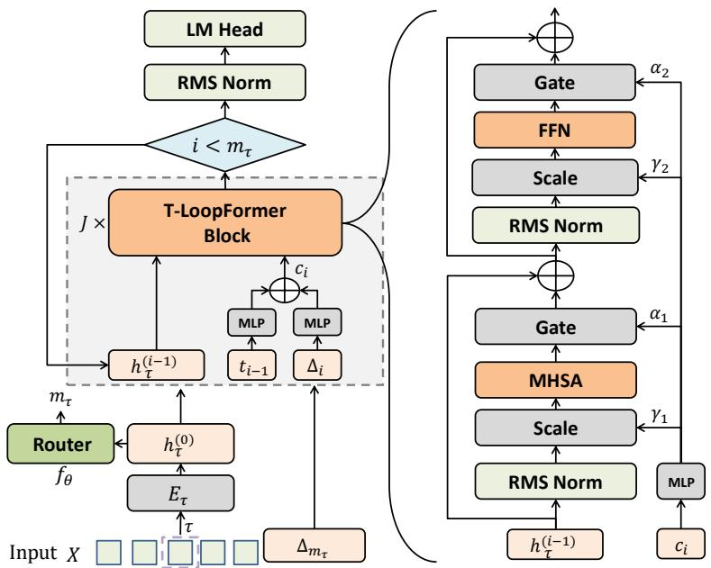
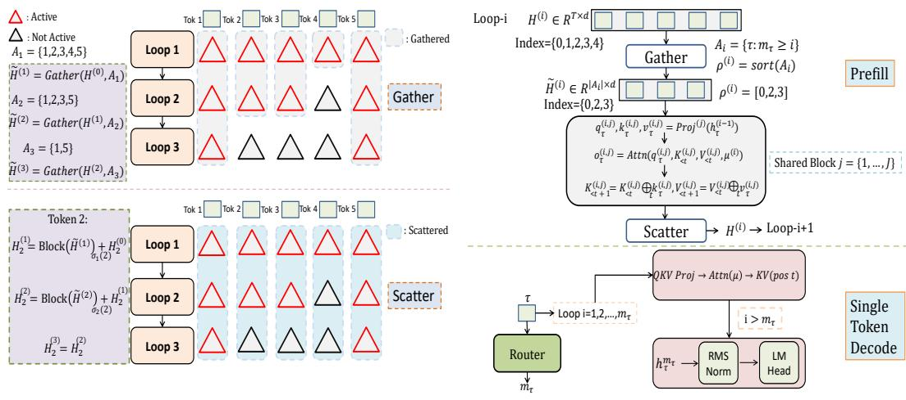
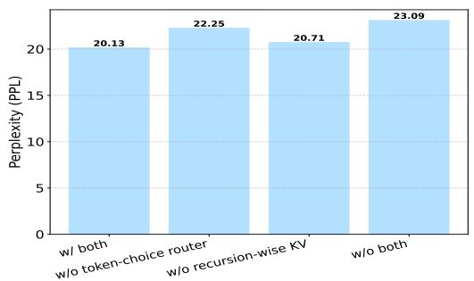
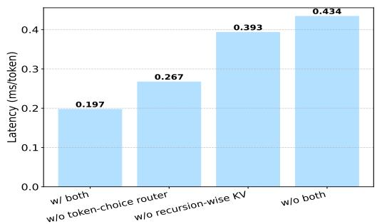
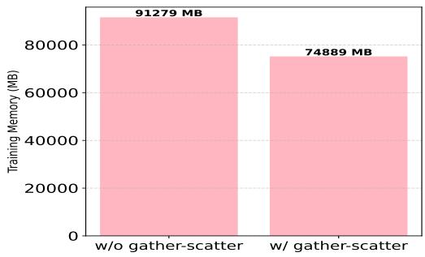
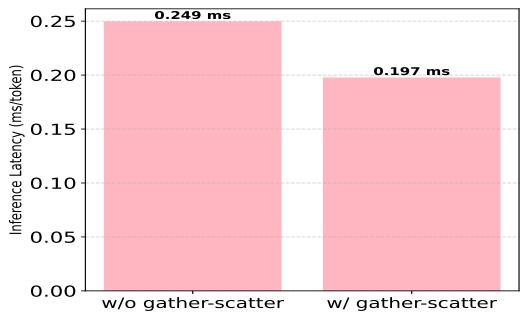
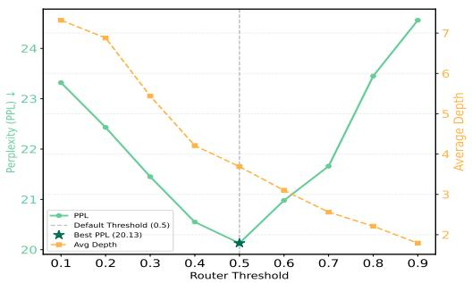
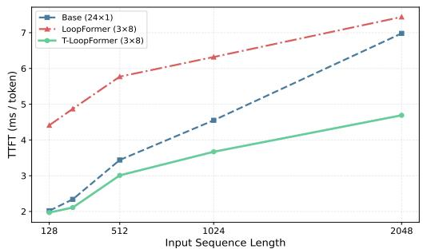

# [PREPRINT]T-LOOPFORMER: TOKEN-LEVEL ELASTIC-DEPTH LOOPED TRANSFORMERS FOR LATENT REASONING WITH DYNAMIC ROUTING UNDER REVIEW AT ICLR 2027

Mingqian Yu1   
1Institute of Automation   
Chinese Academy of Sciences   
Beijing, China   
yumingqian2026@ia.ac.cn

Wenpeng Zhang Independent Reasearcher zhangwenpeng0@gmail.com

Peilin Zhao2,∗   
2School of Artificial Intelligence Shanghai Jiao Tong University Shanghai, China   
peilinzhao@sjtu.edu.cn

  
Figure 1: The architecture of T-LoopFormer, which could achieve token-level elastic-depth through a dynamic token-choice router.

## ABSTRACT

Looped Transformers have recently demonstrated strong performance in both reasoning and language tasks by reusing a shared set of parameters across multiple iterations, achieving parameter efficiency without sacrificing representational power. Besides, looped Transformers perform inference directly in the latent space (latent reasoning) to reduce the number of tokens consumed during inference, thereby achieving improved sample efficiency. However, these models typically apply a fixed recursion depth uniformly to every token, leading to suboptimal compute allocation and leaving significant efficiency gains on the table. In this

work, we propose dynamic token-choice routing for looped transformers, enabling each token to adaptively determine its own number of loop iterations based on its hidden state. We use a dynamic router to decide whether a token should continue recursing or exit early, allowing simple tokens to bypass unnecessary computation while hard tokens receive deeper processing. To ensure that this adaptive mechanism does not compromise decoding efficiency, we further introduce recursion-wise KV caching, which maintains an independent key-value cache for each recursion loop. This design ensures that tokens at different depths only attend to their corresponding cached states, effectively eliminating redundant computations for exited tokens and enabling fast autoregressive decoding. Extensive experiments show that T-LoopFormer reaches the sota performance under the same parameters on PPL and 10 zero-shot reasoning tasks, even surpassing the base model at 24x FLOPs and our model could reach the lowest inference latency, which validate the effectiveness of token-choice router and recursion-wise KV cache. Code: https://github.com/YuMingQian1234/T-LoopFormer.

## 1 INTRODUCTION

Transformers with parameter sharing, often called looped or recurrent Transformers, have emerged as an efficient and capable alternative to deep non–shared stacks across vision and natural language Jeddi et al. (2026); Dehghani et al. (2018); Lan et al. (2019); Geiping et al. (2026). Notably, looped Transformers exhibit strong performance on a broad range of algorithmic and reasoning tasks when applied to language modeling Geiping et al. (2026); Jeddi et al. (2026); Saunshi et al. (2024). These models perform latent reasoning during inference this allows the models to consume fewer tokens at inference time with reduced context-length costs, thereby achieving improved sample efficiency and yielding better results on reasoning benchmarks and other downstream tasks Geiping et al. (2026); Saunshi et al. (2024). However, a fixed unroll loop numbers is nearly always adopted by current approaches during training and inference.

Despite there are methods that could achieve elastics-depth looped Transformers Geiping et al. (2026); Jeddi et al. (2026), they do not provide token-level elastic-depth control over the number of loops. When these models perform reasoning recursively in the latent space, they apply a uniform number of unrolling loops to all tokens, regardless of their individual difficulty Jeddi et al. (2026); Geiping et al. (2026); Prairie et al. (2026); Dehghani et al. (2018); Xu & Sato (2024). This monolithic strategy lacks token-level elasticity, meaning that even trivial tokens are processed with the same loops as complex ones. As a result, the model incurs significant and often unnecessary memory overhead during inference, which is particularly problematic when scaling to longer sequences or resource-constrained settings. Besides, because these models conduct recurrent reasoning in the latent space at inference time, they suffer from reduced inference throughput and consequently higher response latency. To overcome these questions, we propose T-LoopFormer.

T-LoopFormer could achieve token-level elastic-depth through a token-choice router, which could adaptively determine one token should continue to recursive or exit early Rahmath P et al. (2024); Yang et al. (2026). Specifically, a router assigns each token a fixed recursion depth based on its initial hidden state, the token then unrolls the shared block for that many loops before exiting. This preserves autoregressive causality, as decisions depend only on the token itself. To accelerate decoding, T-LoopFormer employs recursion-wise KV caching Shi et al. (2024); Li et al. (2024); Cai et al. (2024). Unlike approaches that retain key-value pairs for all tokens across depths, this strategy selectively caches KV entries only for tokens that remain active at each recursion loop. As tokens progressively exit in deeper recursions, the cache size naturally shrinks. Moreover, attention is restricted exclusively to these locally cached entries, which could accelerate the decoding.

The effectiveness of our T-Loopformer is thoroughly substantiated through extensive experiments. The dynamic token-choice routing mechanism grants the model the flexibility to modulate the number of recursive steps according to each token’s intrinsic complexity, departing from the uniform-depth strategy that applies the same loop count indiscriminately. In addition, the recursion-wise KV caching mechanism effectively accelerates the autoregressive decoding and reduces the accompanying computational expenses. The key contributions of this paper are summarized as follows:

• We propose T-LoopFormer, which could realize token-level elastic-depth through a lightweight dynamic token-choice router. This token-choice router could adaptively determines whether the token should exit early or continue recursing which could improve the sample efficiency.

• We design a recursion-wise KV caching scheme that selectively retains key-value caches only for active recursion loops, which could accelerate autoregressive decoding.

• Extensive experiments on multiple benchmarks demonstrate that T-LoopFormer could achieve the best performance and decoding efficiency compared with baselines of the same parameter under a fixed FLOPs, which validates the effectiveness of the token-choice router and recursion-wise KV cache.

## 2 RELATED WORK

Looped Transformers Parameter sharing provides an orthogonal route to efficiency and effective depth Jeddi et al. (2026). Through the introduction of adaptive computation time, the Universal Transformer establishes that repeatedly reusing a single block can achieve representational performance comparable to that of deep stacks without weight sharing Dehghani et al. (2018). During pretraining, ALBERT further reveals that extensive cross-layer weight tying achieves considerable parameter efficiency, while downstream performance remains uncompromised Lan et al. (2019). Building upon this paradigm, Deep Equilibrium Models (DEQ) define an implicitly deep transformation with tied weights, solved iteratively via fixed-point methods and implicit differentiation Bai et al. (2019). Besides, there are some works that explore looped transformers as programmable computers Giannou et al. (2023) and mechanisms for algorithmic length generalization Fan et al. (2025); Jeddi et al. (2026). What’s more, Time-step-conditioned looping approaches include TMLT (Time-Modulated Looped Transformers) and LoopFormer, TMLT examine the representational capacity of looped Transformers in language modeling and demonstrate that conditioning on the timestep (i.e., the loop index) yields both improved scaling and lower perplexity Xu & Sato (2024). LoopFormer incorporates timestep and step-size conditioning into looped Transformers. Via shortcut-consistency training over variable-length trajectories, it enables elastic-depth inference, where performance scales gracefully with the chosen compute budget Jeddi et al. (2026). However, these methods treat all tokens identically, forcing each of them to undergo the same fixed number of recursion steps regardless of their inherent complexity. Such a uniform strategy fails to account for the varying difficulty across tokens, inevitably leading to wasteful computation on easy tokens and unnecessary latency during inference, as harder tokens rarely benefit from the same depth as simpler ones.

Latent Reasoning looped Transformers possess an inductive bias for reasoning that strengthens with increasing effective computational depth and such abilities are framed as latent reasoning Saunshi et al. (2024; 2025). Unlike explicit chain-of-thought (CoT) prompting Goyal et al. (2024); Cheng & Van Durme (2024); Pfau et al. (2024); Kaissis et al. (2026); Chen et al. (2026); Zhu et al. (2025); Jolicoeur-Martineau (2025), latent reasoning methods like looped transformers circumvent the need for verbalized reasoning steps, which significantly reduces the required context length and token consumption Hao et al. (2024); Saunshi et al. (2025); Jeddi et al. (2026). Simultaneously, both theoretical and empirical researches link reasoning ability with network depth and algorithmic generalization Merrill & Sabharwal (2024). Our method leverages the inductive bias inherent in looped Transformers and extends it to the token-level, enabling dynamic loop unrolling at the token-level latent reasoning. This allows the autoregressive decoding process to operate directly on the hidden states of each individual token.

Dynamic Routing Dynamic routing enhances model efficiency by adapting computation to input complexity. Capsule Networks introduced routing-by-agreement for dynamic part-whole assignment without static pooling Sabour et al. (2017). In Transformers, ITT applies adaptive token-level routing with iterative hidden-state refinement, allowing critical tokens to undergo deeper computa tion while skipping redundant processing for simple tokens Chen et al. (2025). In MoE, difficultyaware routing activates more experts for complex inputs and fewer for easy ones, overcoming fixed top-k selection Huang et al. (2024), while AdaMoE further enables token-adaptive allocation with null experts and differentiable end-to-end training Zeng et al. (2024). Inspired by these, we extend dynamic routing to token-level loop unrolling within a looped Transformer, where each token’s hidden states govern the number of computational loops.

KV Cache The KV cache has become a major memory and bandwidth bottleneck for LLM inference as context lengths grow. Recent compression efforts fall into three categories. Eviction-based methods selectively discard less critical KV pairs: CAKE Qin et al. (2025) frames eviction as a cake-slicing problem that allocates per-layer cache sizes via spatial-temporal attention dynamics, achieving 10× speedup with 3.2% cache; CriticalKV Feng et al. (2025) provides a perturbationconstrained selection algorithm that minimizes worst-case output perturbation, halving compression loss across benchmarks; ForesightKV Dong et al. (2026) learns to predict eviction via supervised training and RL, outperforming prior methods under half the cache budget. Quantization-based methods reduce bit-width: PolarQuant Wu et al. (2026) uses polar transformation to handle key cache outliers, converting query-key inner products into table lookups for decoding acceleration; CommVQ Li et al. (2025) introduces commutative vector quantization with a RoPE-commutative codebook, achieving 87.5% cache reduction with 2-bit quantization. Low-rank methods exploit subspace structure: Palu Chang et al. (2025a) compresses KV via low-rank projection, achieving 50% compression with 1.89× speedup; xKV Chang et al. (2025b) jointly factorizes grouped-layer KV cache into a shared low-rank subspace, delivering up to 8× compression. Motivated by these, we propose a recursion-wise KV caching mechanism for token-level loop unrolling that retains caches only for active recursion loops and discards those for early-exited loops.

## 3 T-LOOPFORMER

We introduce T-LoopFormer (see Figure 1), which is a looped transformer that utilizes a light weight dynamic token-choice router to achieve the token-level elastic-depth and use recursion-wise KV cache during inference to reduce the memory usage and accelerate the autoregressive decoding. We use $X = ( x _ { 1 } , . . . , x _ { K } )$ to denote a sequence of K tokens which are drawn from a vocabulary V. Following loopformer Jeddi et al. (2026), the positional embeddings are added in a one-shot manner for simplicity we use the simplest cycle design, where a stack of J Transformer layers denoted by $\Phi _ { J } ( \cdot )$

## 3.1 LONG AND SHORT TRAJECTORY ALIGNMENT

We align the long and short trajectories produced during autoregressive decoding, ensuring that the model can flexibly adjust its recursion depth in the sequence-level. The establishment of a sentencelevel global inference loops provides a computational upper bound for token-level elastic depth recursion and the number of loops per token is determined by a dynamic token-choice router. Following the work Jeddi et al. (2026), T-LoopFormer uses a user-defined training loops L, the user specifies a step schedule $\Delta _ { L }$ such that $\begin{array} { r } { \sum _ { i = 1 } ^ { L } \Delta _ { i } \ = \ 1 } \end{array}$ T-LoopFormer then applies $\Phi _ { J } ( \cdot )$ for L iterations, conditioning each loop i on the cumulative time $c _ { i - 1 }$ and step size $\Delta _ { i } ,$ where $0 = c _ { 0 } < \cdot \cdot \cdot < c _ { L } = 1$ and $\Delta _ { i } = c _ { i } - c _ { i - 1 }$ . The sequence $\Delta _ { L } = \left( \Delta _ { 1 } , \ldots , \Delta _ { L } \right)$ is referred to as a trajectory, and must satisfy the unit sum constraint. The full trajectory corresponds to the maximum L loops, each with $\Delta _ { i } = 1 / L$ . Besides, T-LoopFormer is a decoder-only looped Transformer in which a single shared stack is applied iteratively. At iteration l, the model conditions on the pair $( c _ { i - 1 } , \Delta _ { i } )$ , where $c _ { i - 1 } \in [ 0 , 1 ]$ is the cumulative normalized time and $\Delta _ { i } \in [ 0 , 1 ]$ is the step size. Encoded with sine–cosine frequency embeddings and projected via small MLPs, the two scalars yield $e _ { c }$ and $e _ { \Delta }$ , and summing them produces $e _ { i } = e _ { c } + e _ { \Delta }$ . Modulation of the T-LoopFormer Block is performed via this signal: an MLP maps $e _ { i }$ to scaling $( \gamma _ { 1 } , \gamma _ { 2 } )$ for the two RMSNorm layers and to gating $\left( \alpha _ { 1 } , \alpha _ { 2 } \right)$ applied immediately before the residual connections of MHSA and FFN. T-LoopFormer uses shortcut conditioning together with an alignment loss $\mathcal { L } _ { a l i g n }$ that drives trajectories of different lengths to align with the complete trajectory of length L. To sample the shortcut trajectory during training, we start from a T-LoopFormer with $L$ (unrolled L times) and a maximum trajectory $\Delta _ { L }$ . In each batch, we first draw a shortcut length $S \sim \mathcal { U } \{ 1 , \dots , L - 1 \}$ , and subsequently sample the step schedule $\Delta _ { S }$ uniformly over [0, 1] subject to $\begin{array} { r } { \sum _ { i = 1 } ^ { S } \Delta _ { i } = 1 } \end{array}$ . The loss objective is:

$$
\begin{array} { r } { \mathcal { L } = \mathcal { L } _ { L } + \lambda _ { 1 } \mathcal { L } _ { S } + \lambda _ { 2 } \mathcal { L } _ { a l i g n } , } \end{array}\tag{1}
$$

where $\mathcal { L } _ { L }$ and $\mathcal { L } _ { S }$ correspond to the next-token prediction losses for the longest and sampled shortcut trajectories, respectively. We set $\lambda _ { 1 } = \lambda _ { 2 } = 0 . 1$ in all experiments.

  
(a) Gather-scatter during training.  
(b) Prefill and decode during inference.  
Figure 2: T-LoopFormer training and inference pipeline. (a): the gather-scatter during training; (b): prefill and decode during inference.

## 3.2 DYNAMIC TOKEN-CHOICE ROUTING

The implementation of token-level elastic depth unroll is based on sequence-level elastic depth expansion. We use a two-layer MLP to serve as the lightweight dynamic token-choice router. Loops are indexed by $i \in \{ 1 , \ldots , M \}$ , where M is the sequence-level maximum recursion depth shared by all tokens (during training, M equals the sampled shortcut length S, or L for the full trajectory; during inference, M is set by the user). Let $h _ { \tau } ^ { ( i ) } \in \mathbb { R } ^ { d }$ denote the hidden state of token τ after i loops, with the initial embedding $h _ { \tau } ^ { ( 0 ) }$ and $( h _ { \tau } ^ { ( 0 ) } = E _ { \tau } + E _ { p o s ( \tau ) } \in \mathbb { R } ^ { d } )$ ; loop i maps $h _ { \tau } ^ { ( i - 1 ) } \{ 0 h _ { \tau } ^ { ( i ) }$ The router $f _ { \theta } : \mathbb { R } ^ { d }  \mathbb { R } ^ { M }$ maps the initial hidden state to a distribution over recursion depths via a softmax layer:

$$
\pi _ { \tau } = \mathrm { s o f t m a x } \left( f _ { \theta } ( h _ { \tau } ^ { ( 0 ) } ) \right) \in \mathbb { R } ^ { M } ,\tag{2}
$$

where $\pi _ { \tau , \ell }$ is the probability that token τ requires depth $\ell , \ell \in \{ 1 , \dots , M \}$ . For each loop i, the router computes the cumulative probability that token τ requires a recursion depth of at least i:

$$
p _ { \tau } ^ { ( i ) } = \sum _ { \ell = i } ^ { M } \pi _ { \tau , \ell } ,\tag{3}
$$

and token τ executes loop i (i.e., remains active) only if $p _ { \tau } ^ { ( i ) } > 0 . 5$

$$
\mathbb { 1 } \left[ \tau \in \mathcal { A } _ { i } \right] = \mathbb { 1 } \left[ p _ { \tau } ^ { ( i ) } > 0 . 5 \right] ,\tag{4}
$$

where $\mathcal { A } _ { i } \subseteq \{ 1 , \dots , T \}$ denotes the set of tokens still active at loop i. Since $p _ { \tau } ^ { ( i ) }$ is non-increasing in i, the active sets are automatically nested, $A _ { 1 } \supseteq A _ { 2 } \supseteq \cdots \hat { \supseteq } A _ { M }$ , and $\mathcal { A } _ { 1 } = \{ 1 , \ldots , T \}$ holds by construction as $p _ { \tau } ^ { ( 1 ) } = 1$ . A token is thus permanently deactivated once dropped (the routing decision is monotone over loops), and each token adaptively determines its own token-level recursion depth:

$$
m _ { \tau } = \operatorname* { m a x } \bigl \{ i \in \{ 1 , \ldots , M \} : \tau \in \mathcal { A } _ { i } \bigr \} , \qquad m _ { \tau } \in \{ 1 , \ldots , M \} ,\tag{5}
$$

where $m _ { \tau } = 1$ means the token traverses only a single pass of the shared block, whereas $m _ { \tau } = M$ indicates the token propagates through all M iterations. The trajectory is $\Delta _ { m _ { \tau } } = ( \Delta _ { m _ { 1 } } , . . . , \Delta _ { m _ { \tau } } )$ and $\begin{array} { r } { \sum _ { i = 1 } ^ { m _ { \tau } } \Delta _ { i } = 1 } \end{array}$ . Equivalently, $\tau \in { \mathcal { A } } _ { i }$ if and only if $m _ { \tau } \geq i \colon$ the token’s depth directly bounds the loops it participates in, with no index offset. As the routing distribution is computed once from the initial hidden state $h _ { \tau } ^ { ( 0 ) }$ , the per-token depth allocation is decided in a single forward evaluation of the lightweight router.

Gather–Scatter computation for training efficiency. Because routing decisions vary per token, a naive implementation would still execute the shared block over the full sequence at every loop, forfeiting any computational savings. We therefore couple the router with a gather-scatter mechanism that performs the lossless sequence compression during training. Let $H ^ { \overline { { ( i - 1 ) } } } \in \mathbb { R } ^ { T \times d }$ collect the loop-i input hidden states of all $T$ tokens. At each loop i, we first gather the hidden states of active tokens into a compacted tensor:

$$
\tilde { H } ^ { ( i ) } = \mathrm { G a t h e r } \Big ( H ^ { ( i - 1 ) } , \mathcal { A } _ { i } \Big ) \in \mathbb { R } ^ { | \mathcal { A } _ { i } | \times d } ,\tag{6}
$$

so that the shared block operates only on $\tilde { H } ^ { ( i ) }$ , and the computation cost of loop i scales with the number of surviving tokens $| \mathcal { A } _ { i } |$ rather than the sequence length T. The updated states are then scattered back to their original positions (this restores H as a full-length tensor in the original sequence order, so that (i) the next loop can gather its own active set $\boldsymbol { A } _ { i + 1 }$ , which differs from $A _ { i } ;$ (ii) token τ in each position retains its latest state at a fixed coordinate for loss alignment; and (iii) gradients can flow back through the indexed assignment to the corresponding rows in the compact tensor):

$$
H _ { \tau } ^ { ( i ) } = \left\{ \begin{array} { l l } { \mathrm { B l o c k } \big ( \tilde { H } ^ { ( i ) } \big ) _ { \sigma _ { i } ( \tau ) } + H _ { \tau } ^ { ( i - 1 ) } , } & { \tau \in \mathcal { A } _ { i } , } \\ { H _ { \tau } ^ { ( i - 1 ) } , } & { \tau \notin \mathcal { A } _ { i } , } \end{array} \right.\tag{7}
$$

where $\sigma _ { i } : { \mathcal { A } } _ { i }  \{ 1 , . . . , | { \mathcal { A } } _ { i } | \}$ is the gather index map. Tokens that exit the recursion simply retain the hidden state from their last executed loop, $h _ { \tau } ^ { ( m _ { \tau } ) }$ , which is passed to the final normalization and language-modeling head.

## 3.3 RECURSION-WISE KV CACHING

During inference, T-LoopFormer employs a recursion-wise KV cache mechanism to retain the KV cache for tokens in active loops while discarding the KV cache for inactive loops, thereby accelerating token generation. For each token, we allocate M independent KV caches, one for each recursion loop $i \in \{ 1 , \ldots , M \}$ . Let $j \in \{ 1 , \dotsc , J \}$ denote the layer index within the shared block, where J is the total number of layers. We define the cache state at recursion loop i, layer j, up to sequence position t − 1 as

$$
K _ { < t } ^ { ( i , j ) } = \left( k _ { \tau } ^ { ( i , j ) } \right) _ { \tau < t , m _ { \tau } \geq i } , \qquad V _ { < t } ^ { ( i , j ) } = \left( v _ { \tau } ^ { ( i , j ) } \right) _ { \tau < t , m _ { \tau } \geq i } ,\tag{8}
$$

Crucially, inference is also executed with the gather−scatter scheme (see Appendix B). The active rows are first gathered into a compact tensor $\tilde { H } ^ { ( i ) }$ (equation 6), where the gather indices are sorted so that the causal order is preserved within the compact sequence. Only $\tilde { H } ^ { ( i ) }$ is passed through the shared block. Importantly, the original sequence positions $\rho ^ { ( i ) } = \mathrm { s o r t } ( \mathcal { A } _ { i } )$ are captured at gather time and propagated through the block to the cache-writing routine: within each attention layer, the newly computed keys and values are written into the loop-i cache at their original positions $\rho ^ { ( i ) }$ rather than at their compact indices. Positional bookkeeping maintains causal alignment via original-position cache references. After the block returns the updated compact states, they are scattered back to their original positions and get $H ^ { ( i ) }$ (equation 7), where scatter overwrites only the rows indexed by $A _ { i } ;$ the hidden states of exited tokens are left untouched. In the single-token decoding case, the scheme degenerates to an early exit: the recursion loop terminates as soon as the current token leaves the active set.

During autoregressive decoding of token τ (arriving at sequence position t, so that $K _ { < t }$ holds exactly the tokens preceding it), its routing depth $m _ { \tau }$ is determined by the router. For each recursion loop i, the token computes its query, key, and value projections at layer j from its incoming state:

$$
q _ { \tau } ^ { ( i , j ) } , k _ { \tau } ^ { ( i , j ) } , v _ { \tau } ^ { ( i , j ) } = \mathrm { P r o j } ^ { ( j ) } \big ( h _ { \tau } ^ { ( i - 1 ) } \big ) .\tag{9}
$$

The attention mechanism queries only the historical keys and values belonging to the same loop i, restricted to the valid entries of that cache:

$$
o _ { \tau } ^ { ( i , j ) } = \mathrm { A t t n } \big ( q _ { \tau } ^ { ( i , j ) } , K _ { < t } ^ { ( i , j ) } , V _ { < t } ^ { ( i , j ) } ; \mu ^ { ( i ) } \big ) ,\tag{10}
$$

where the validity indicator $\mu _ { \tau } ^ { ( i ) } = \mathbb { 1 } [ m _ { \tau } \geq i ]$ excludes the cache slots of tokens that exited before loop i (in batched prefill, a block-causal mask is additionally applied among the currently gathered

tokens). Masking is required to avoid softmax assigning non-negligible mass to zero slots of exited tokens.

Whenever token τ executes loop $i \ ( \mathbf { i . e . , } \ m _ { \tau } \ \geq \ i )$ , its current key and value must be stored, since future tokens that also reach loop i will attend to them. We update the loop-specific cache by writing the new states at the original sequence position:

$$
K _ { < t + 1 } ^ { ( i , j ) } = K _ { < t } ^ { ( i , j ) } \oplus _ { t } k _ { \tau } ^ { ( i , j ) } , \qquad V _ { < t + 1 } ^ { ( i , j ) } = V _ { < t } ^ { ( i , j ) } \oplus _ { t } v _ { \tau } ^ { ( i , j ) } ,\tag{11}
$$

where $\oplus _ { t }$ denotes writing the new state at cache position t. For single-token decoding, this reduces to ordinary sequence concatenation at the tail of the cache; for batched prefill, the writes are indexed by the gathered positions $\rho ^ { ( i ) }$ of all active tokens. If the token exits the recursion after loop $m _ { \tau } \mathrm { ~ ( i . e . ~ }$ for loops $i > m _ { \tau } ) ,$ , it neither computes new projections nor updates any cache. Its final hidden state $h _ { \tau } ^ { ( m _ { \tau } ) }$ is directly passed to the final normalization and LM head, bypassing the remaining shared block iterations.

Table 1: The perplexity comparison on the FineWeb-Edu-100B and OpenWebText validation sets and the accuracy comparison on ten zero-shot reasoning tasks between our model and all baseline models under various FLOPs. The best performance is marked in bold, the second-best is underlined, and our model’s results are highlighted.
<table><tr><td></td><td>| Params</td><td colspan="2">Perplexity ↓</td><td colspan="2"></td><td colspan="8">Language Tasks (Accuracy) ↑</td></tr><tr><td></td><td></td><td>FineWeb-Edu OpenWebText COPA HS</td><td></td><td></td><td></td><td>LB</td><td>OBQA PIQA Race SciQ ARC-C SIQA ARC-E</td><td></td><td></td><td></td><td></td><td></td><td>Avg Acc</td></tr><tr><td colspan="10">FLOPs: 24x</td><td colspan="7"></td></tr><tr><td>Base (24 ⊗ 1)</td><td>24x</td><td>20.17</td><td>19.22</td><td>62</td><td>34.79</td><td>41.98</td><td>27.57</td><td>66.29</td><td>29.78 70.22</td><td></td><td>27.79</td><td>38.83</td><td>38.76</td><td>43.8</td></tr><tr><td>Base-Loop (3 ⊗ 8)</td><td>3x</td><td>23.23</td><td>22.78</td><td>61</td><td>31.65</td><td>35.83</td><td>27.11 64.45</td><td>28.93</td><td>63.79</td><td>25.11</td><td></td><td>38.94</td><td>36.12</td><td>41.29</td></tr><tr><td>TMLT (3 ⊗ 8)</td><td>3x</td><td>22.87</td><td>21.33</td><td>66</td><td>33.22</td><td>40.06</td><td>27.92</td><td>64.11</td><td>30.14</td><td>70.11</td><td>25.55</td><td>37.32</td><td>36.58</td><td>43.1</td></tr><tr><td>Naive-Loop-EE (3 ⊗ 8)</td><td>3x</td><td>25.54</td><td>24.23</td><td>67</td><td>30.78</td><td>31.89</td><td>27.03</td><td>63.42</td><td>29.56</td><td>66.32</td><td>25.88</td><td>36.97</td><td>36.77</td><td>42.91</td></tr><tr><td>Base-Loop-EE-Align (3 ⊗ 8)</td><td>3x</td><td>24.21</td><td>23.25</td><td>67</td><td>31.46</td><td>32.92</td><td>26.9</td><td>63.23</td><td>29.43</td><td>65.29</td><td>26.77</td><td>37.81</td><td>37.83</td><td>41.86</td></tr><tr><td>TMLT-EE (3 ⊗ 8)</td><td>3x</td><td>23.47</td><td>21.98</td><td>67</td><td>32.44</td><td>36.92</td><td>28.4</td><td>64.14</td><td>28.9</td><td>68.1</td><td>26.68</td><td>37.73</td><td>37.66</td><td>42.80</td></tr><tr><td>LoopFormer(3 ⊗ 8) T-LoopFormer(3 ⊗ 8)</td><td>3x 3x</td><td>21.96</td><td>20.09</td><td>68</td><td>32.93</td><td>39.32</td><td>26.7</td><td>64.95</td><td>31.19</td><td>68.44</td><td>27.56</td><td>38.19</td><td>37.49</td><td>43.48</td></tr><tr><td></td><td></td><td>20.13</td><td>19.14</td><td>68</td><td>33.67</td><td>40.18</td><td>27.33</td><td>66.32</td><td>31.88</td><td>68.76</td><td>28.04</td><td>38.68</td><td>39.17</td><td>44.20</td></tr><tr><td colspan="10">FLOPs: 12x</td><td colspan="7"></td></tr><tr><td>Base (12 ⊗ 1)</td><td>12x</td><td>21.69</td><td>21.11</td><td></td><td></td><td></td><td></td><td></td><td></td><td></td><td>26.31</td><td>38.41</td><td>38.17</td><td>43.16</td></tr><tr><td>Naive-Loop-EE (3 ⊗ 4)</td><td></td><td>24.79</td><td>25.12</td><td>68 66</td><td>32.82 29.67</td><td>37.78</td><td>26.28</td><td>64.69</td><td>29.88 69.21</td><td></td><td>25.23</td><td>37.12</td><td>36.24</td><td>40.72</td></tr><tr><td>Base-Loop-EE-Align (3 ⊗ 4)</td><td>3x 3x</td><td>26.01</td><td>25.83</td><td>63</td><td>29.98</td><td>31.69 26.07</td><td>26.19 27.43</td><td>61.95 61.63</td><td>28.53 28.26</td><td>64.56 58.89</td><td>25.25</td><td>36.35</td><td>36.74</td><td>39.36</td></tr><tr><td>TMLT-EE (3 ⊗ 4)</td><td>3x</td><td>26.36</td><td>26.77</td><td>62</td><td>30.6</td><td>27.94</td><td>26.79</td><td>62.31</td><td>28.85</td><td>61.74</td><td>25.72</td><td>36.78</td><td>36.98</td><td>39.97</td></tr><tr><td>LoopFormer(3 ⊗ 4)</td><td>3x</td><td>24.23</td><td>23.69</td><td>68</td><td>31.55</td><td>32.54</td><td>25.68</td><td>63.99</td><td>28.51</td><td>66.73</td><td>26.28</td><td>37.82</td><td>37.14</td><td>41.82</td></tr><tr><td>T-LoopFormer(3 ⊗ 4)</td><td>3x</td><td>23.6</td><td>23.14</td><td>69</td><td>32.33</td><td>33.26</td><td>26.19</td><td>64.82</td><td>28.79</td><td>67.11</td><td>26.96</td><td>38.47</td><td>38.85</td><td>42.58</td></tr><tr><td colspan="10">FLOPs: 6x</td><td colspan="7"></td></tr><tr><td></td><td></td><td>24.84</td><td>24.04</td><td></td><td></td><td></td><td>25.78</td><td></td><td></td><td></td><td>31.16</td><td>36.21</td><td>37.66</td><td>41.77</td></tr><tr><td>Base (6 ⊗ 1) Naive-Loop-EE (3 ⊗ 2)</td><td>6x 3x</td><td>29.03</td><td>28.12</td><td>64 63</td><td>30.58 28.86</td><td>33.78 27.51</td><td>24.82</td><td>62.58 61.78</td><td>28.31 67.61 26.49</td><td>62.38</td><td>30.02</td><td>35.53</td><td>36.13</td><td>39.65</td></tr><tr><td>Base-Loop-EE-Align (3 ⊗ 2)</td><td>3x</td><td>35.07</td><td>34.32</td><td>60</td><td>28.33</td><td>18.88</td><td>25.67</td><td>59.88 25.24</td><td>54.02</td><td></td><td>29.05</td><td>34.79</td><td>36.23</td><td>37.21</td></tr><tr><td>TMLT-EE (3 ⊗ 2)</td><td>3x</td><td>37.31</td><td>37.22</td><td>59</td><td>28.34</td><td>17.45</td><td>25.37</td><td>59.11</td><td>26.51 50.41</td><td></td><td>28.54</td><td>35.16</td><td>36.53</td><td>36.64</td></tr><tr><td>LoopFormer (3 ⊗ 2)</td><td>3x</td><td>32.89</td><td>32.05</td><td>63</td><td>28.81</td><td>26.68</td><td>26.87</td><td>60.67</td><td>26.03</td><td>59.02</td><td>29.67</td><td>35.77</td><td>37.02</td><td>39.35</td></tr><tr><td>T-LoopFormer (3 ⊗ 2)</td><td>3x</td><td>32.03</td><td>31.76</td><td>64</td><td>29.17</td><td>27.03</td><td>27.35</td><td>61.13</td><td>26.5</td><td>59.64</td><td>30.44</td><td>36.46</td><td>38.18</td><td>39.99</td></tr></table>

## 4 EXPERIMENTS

Following Jeddi et al. (2026), we compare a 24-layer, ∼1B-parameter non-looped Transformer with FLOP-matched looped variants. All models use a GPT-style decoder Radford et al. (2019) with NanoGPT configurations. Training is performed on FineWeb-Edu-100B Penedo et al. (2024) for 100B tokens in accordance with Chinchilla scalingHoffmann et al. (2022). See Appendix A for details. Following Jeddi et al. (2026), in terms of model parameters, 24× indicates that the model contains 24 layers. In terms of FLOPS, 24× denotes the product of the number of model layers J and the user-specified inference depth M, $F L O P S \propto J \ ` \otimes M$ , ignoring embedding/unembedding costs.

Evaluation Metrics and Benchmarks. Following Saunshi et al. (2025); Geiping et al. (2026); Jeddi et al. (2026), we report perplexity and downstream zero-shot accuracy. Perplexity is measured on FineWeb-EduPenedo et al. (2024) and OpenWebTextGokaslan & Cohen (2019). For latent reasoning, we report zero-shot accuracy on ten established benchmarks spanning a range of reasoning difficulty: COPA Roemmele et al. (2011), HellaSwag (HS) Zellers et al. (2019), LAM-BADA (LB) Paperno et al. (2016), OpenBookQA (OBQA) Mihaylov et al. (2018), RACE Lai et al. (2017), Social IQA (SIQA) Sap et al. (2019), ARC-Easy (ARC-E), ARC-Challenge (ARC-C) Clark et al. (2018), and SciQ Welbl et al. (2017).

Table 2: TPOT of different models on FineWeb-Edu-100B validation set at 24× FLOPs.
<table><tr><td>Model</td><td>Latency (ms/token)</td></tr><tr><td>Base (24 ⊗ 1)</td><td>0.202</td></tr><tr><td>Base-Loop (3 ⊗ 8)</td><td>0.497</td></tr><tr><td>TMLT (3 ⊗ 8)</td><td>0.389</td></tr><tr><td>Naive-Loop-EE (3 ⊗ 8)</td><td>0.433</td></tr><tr><td>Base-Loop-EE-Align (3 ⊗ 8)</td><td>0.425</td></tr><tr><td>TMLT-EE (3 ⊗ 8)</td><td>0.312</td></tr><tr><td>LoopFormer (3 ⊗ 8)</td><td>0.441</td></tr><tr><td>T-LoopFormer (3 ⊗ 8)</td><td>0.197</td></tr></table>

Table 3: Training memory of different models on FineWeb-Edu-100B training set at 24x FLOPs
<table><tr><td>Model</td><td>Memory (MB)</td></tr><tr><td>Base (24 ⊗ 1)</td><td>634,225</td></tr><tr><td>Base-Loop (3 ⊗ 8)</td><td>93,442</td></tr><tr><td>TMLT (3 ⊗ 8)</td><td>96,594</td></tr><tr><td>Naive-Loop-EE (3 ⊗ 8)</td><td>87,997</td></tr><tr><td>Base-Loop-EE-Align (3 ⊗ 8)</td><td>91,256</td></tr><tr><td>TMLT-EE (3 ⊗ 8)</td><td>98,387</td></tr><tr><td>LoopFormer (3 ⊗ 8)</td><td>97,739</td></tr><tr><td>T-LoopFormer (3 ⊗ 8)</td><td>74,889</td></tr></table>

Table 4: Percentage of loops per token for our model on the FineWeb-Edu-100B validation set at 24× FLOPs.
<table><tr><td>Loops Percentage (%)</td></tr><tr><td>1 0.23</td></tr><tr><td>2 36.85</td></tr><tr><td>3 23.73</td></tr><tr><td>4 8.14</td></tr><tr><td>5 13.87</td></tr><tr><td>6 2.16</td></tr><tr><td>7 11.26</td></tr><tr><td>8 3.77</td></tr></table>

Baselines. We compare T-LoopFormer against two groups of baselines: fixed-depth Models and depth-elastic models. Fixed-depth models include Base: a non-looped Transformer; Base-Loop: a standard looped model; TMLT: a looped model with timestep conditioning. Depth-elastic models include Base-Loop-EE: naive early exiting applied to the basic looped model; TMLT-EE: early exiting and long-short trajectory alignment training applied to TMLT to enable depth elasticity; Base-Loop-EE-Align: augmented with the long-short trajectory alignment during training. LoopFormer: a elastic-depth looped transformers with long-short trajectory alignment.

  
(a) Perplexity (PPL)

  
(b) TPOT  
Figure 3: The influence of token-choice router and recursion-wise KV cache. Tested on FineWeb-Edu-100B validation set and at 24x FLOPs, w/: with, w/o: without. (a): perplexity results and (b): time per output token results.

## 4.1 MAIN RESULTS

Table 1 shows that, under different FLOPs, T-LoopFormer achieves the best performance among models with the same parameter. Moreover, at 24× FLOPs, our model outperforms the non-looped base model with 24× parameter. This demonstrates that the dynamic token-choice routing mechanism designed in our model enables each token to adaptively unroll different number of loops based on its hidden state, and that either excessive or insufficient elastic-depth unrolling may lead to incorrect token outputs. Under 12x and 6x FLOPs, because the maximum number of loops is reduced, some tokens require more loop to unroll, which causes those tokens to be insufficiently reasoned. As a result, T-LoopFormer underperforms the non-looped base model on perplexity and zero-shot reasoning tasks. However, compared with other looped models, it narrows the performance gap with the non-looped base model. In addition to the comparison of model performance, Table 2 shows that our model achieves the lowest decoding latency among all baselines, even lower than the non-looped base model, demonstrating that our model could improve single token decoding efficiency. Moreover, compared with LoopFormer, our model achieves 2.24× decoding speed faster than LoopFormer, which confirms that the dynamic token-choice routing mechanism and the recursion-wise KV cache are effective in improving inference speed. Table 3 validates that T-LoopFormer could achieve the lowest memory usage during training, indicating that it can improve the training efficiency. Table 4 shows the distribution of loop counts per token on the

  
(a) Training memory with/without gather-scatter.

  
(b) TPOT with/without gather-scatter.

  
(c) Perplexity and average depth under different router thresholds.

  
(d) TTFT with different input sequence lengths.  
Figure 4: Ablation studies on key components of T-LoopFormer. (a) and (b): effect of the gather–scatter mechanism on training memory and inference latency; (c): sensitivity analysis of the router threshold; (d): scaling of TTFT with input sequence length.

FineWeb-Edu-100B validation set and most tokens require at most 4 loops, and the overall distribution exhibits a long-tail pattern. This indicates that different tokens indeed need different numbers of loops, validating the effectiveness of token-choice router.

## 4.2 ABLATION STUDY

Influence of Token-Choice Router and Recursion-wise KV Cache. Figure 3 shows the influence of token-choice router and the results are tested on FineWeb-Edu-100B validation set at FLOPs of 24x. Figure 3a exhibits that the token-choice router contributes more to generating correct tokens and figure 3b validates that the recursion-wise contributes more to increasing the inference speed.

Influence of Gather-Scatter during Training and Inference. Figure 4a shows that without gather-scatter during training, memory will increase 21.9%, which validates that the gather-scatter mechanism could improve the training efficiency and figure 4b shows that without gather-scatter during inference, the inference latency will increase 26.4%. These validate that gather-scatter mechanism could improve the autoregressive decoding efficiency.

Influence of Different Router Threshold. Figure 4c shows the influence of different router threshold (tested on FineWeb-Edu-100B validation set at 24x FLOPs),0.5 is the best threshold and the perplexity (PPL) of the model equipped with the token-choice router on the FineWeb-Edu-100B validation set exhibits a U-shaped curve as the threshold varies.

TTFT with Different Input Sequence Length. Figure 4d shows the TTFT (time to first token) with different input sequence lengths (128, 512, 1024, and 2048), we randomly sample 1,000 documents from FineWeb-Edu-100B validation set, each with a raw length exceeding 2,048 tokens. We then truncate each to target lengths 128, 512, 1024, 2048 as the input prompt. while fixing the number of generated tokens to 50. The results show that, as input length grows, T-LoopFormer shows a smaller increase in TTFT than the base model and achieves the lowest latency across all sequence lengths, demonstrating its efficient scaling with input length.

## 5 CONCLUSION

We build T-LoopFormer, a looped Transformer with token-level elastic depth for latent reasoning. A dynamic router adaptively assigns each token a variable number of loops, allowing easy tokens to exit early and hard ones to receive deeper computation. For efficiency, we incorporate a gather–scatter mechanism that restricts each loop to active tokens, reducing training memory and inference latency, and a recursion-wise KV cache that discards caches of exited tokens to further accelerate generation. Together, these designs yield an efficient and flexible architecture. Future work will extend T-LoopFormer to larger-scale pretraining and broader latent-reasoning tasks.

## 6 AI USE STATEMENT

During the preparation of this manuscript, the authors used DeepSeek solely for language polishing and for assisting with data preprocessing, including drafting or refactoring preprocessing code and checking data-cleaning scripts. The tool was not used to generate scientific ideas, formulate methods, conduct experiments, interpret results, or write the core scientific claims. All AI-assisted outputs were carefully reviewed, verified, and edited by the authors, who take full responsibility for the content, integrity, and reproducibility of this work. The final data preprocessing was carried out by deterministic scripts.

## 7 REPRODUCIBILITY STATEMENT

To support reproducibility, we provide a complete description of the proposed method, experimental setup, and evaluation protocol in Section 4 and Appendix A. The source code, hyperparameters, random seeds, and step-by-step instructions for reproducing the main results are available in the anonymous supplementary repository at https://anonymous.4open.science/r/ T-LoopFormer-53BE. We believe these resources are sufficient for reproducing the results reported in this paper.

## REFERENCES

Shaojie Bai, J Zico Kolter, and Vladlen Koltun. Deep equilibrium models. Advances in neural information processing systems, 32, 2019.

Zefan Cai, Yichi Zhang, Bofei Gao, Yuliang Liu, Yucheng Li, Tianyu Liu, Keming Lu, Wayne Xiong, Yue Dong, Junjie Hu, et al. Pyramidkv: Dynamic kv cache compression based on pyramidal information funneling. arXiv preprint arXiv:2406.02069, 2024.

Chi-Chih Chang, Wei-Cheng Lin, Chien-Yu Lin, Chong-Yan Chen, Yu-Fang Hu, Pei-Shuo Wang, Ning-Chi Huang, Luis Ceze, Mohamed Abdelfattah, and Kai-Chiang Wu. Palu: Kv-cache compression with low-rank projection. In International Conference on Learning Representations, volume 2025, pp. 50222–50249, 2025a.

Chi-Chih Chang, Wei-Cheng Lin, Chien-Yu Lin, Hung-Yueh Chiang, Yash Akhauri, Xilai Dai, Huiqiang Jiang, Yucheng Li, Luis Ceze, Kai-Chiang Wu, et al. xkv: Cross-layer kv-cache compression via aligned singular vector extraction. arXiv preprint arXiv:2503.18893, 2025b.

Guanxu Chen, Dongrui Liu, and Jing Shao. Loop as a bridge: Can looped transformers truly link representation space and natural language outputs? arXiv preprint arXiv:2601.10242, 2026.

Yilong Chen, Junyuan Shang, Zhenyu Zhang, Yanxi Xie, Jiawei Sheng, Tingwen Liu, Shuohuan Wang, Yu Sun, Hua Wu, and Haifeng Wang. Inner thinking transformer: Leveraging dynamic depth scaling to foster adaptive internal thinking. In Proceedings of the 63rd Annual Meeting of the Associationfor Computational Linguistics (Volume 1: Long Papers), pp. 28241–28259, 2025.

Jeffrey Cheng and Benjamin Van Durme. Compressed chain of thought: Efficient reasoning through dense representations. arXiv preprint arXiv:2412.13171, 2024.

Peter Clark, Isaac Cowhey, Oren Etzioni, Tushar Khot, Ashish Sabharwal, Carissa Schoenick, and Oyvind Tafjord. Think you have solved question answering? try arc, the ai2 reasoning challenge. arXiv preprint arXiv:1803.05457, 2018.

Mostafa Dehghani, Stephan Gouws, Oriol Vinyals, Jakob Uszkoreit, and Łukasz Kaiser. Universal transformers. arXiv preprint arXiv:1807.03819, 2018.

Zican Dong, Peiyu Liu, Junyi Li, Zhipeng Chen, Han Peng, Shuo Wang, and Wayne Xin Zhao. Foresightkv: Optimizing kv cache eviction for reasoning models by learning long-term contribution. arXiv preprint arXiv:2602.03203, 2026.

Ying Fan, Yilun Du, Kannan Ramchandran, and Kangwook Lee. Looped transformers for length generalization. In International Conference on Learning Representations, volume 2025, pp. 14502–14520, 2025.

Yuan Feng, Junlin Lv, Haoyu Guo, Yukun Cao, S Kevin Zhou, and Xike Xie. Criticalkv: Optimizing kv cache eviction from an output perturbation perspective. arXiv preprint arXiv:2502.03805, 2025.

Jonas Geiping, Sean McLeish, Neel Jain, John Kirchenbauer, Siddharth Singh, Brian Bartoldson, Bhavya Kailkhura, Abhinav Bhatele, and Tom Goldstein. Scaling up test-time compute with latent reasoning: A recurrent depth approach. Advances in Neural Information Processing Systems, 38: 41340–41391, 2026.

Angeliki Giannou, Shashank Rajput, Jy-yong Sohn, Kangwook Lee, Jason D Lee, and Dimitris Papailiopoulos. Looped transformers as programmable computers. In International Conference on Machine Learning, pp. 11398–11442. PMLR, 2023.

Aaron Gokaslan and Vanya Cohen. Openwebtext corpus. http://Skylion007.github.io/ OpenWebTextCorpus, 2019.

Sachin Goyal, Ziwei Ji, Ankit Singh Rawat, Aditya Krishna Menon, Sanjiv Kumar, and Vaishnavh Nagarajan. Think before you speak: Training language models with pause tokens. In International Conference on Learning Representations, volume 2024, pp. 27896–27923, 2024.

Shibo Hao, Sainbayar Sukhbaatar, DiJia Su, Xian Li, Zhiting Hu, Jason Weston, and Yuandong Tian. Training large language models to reason in a continuous latent space. arXiv preprint arXiv:2412.06769, 2024.

Jordan Hoffmann, Sebastian Borgeaud, Arthur Mensch, Elena Buchatskaya, Trevor Cai, Eliza Rutherford, Diego de Las Casas, Lisa Anne Hendricks, Johannes Welbl, Aidan Clark, et al. Train ing compute-optimal large language models. arXiv preprint arXiv:2203.15556, 2022.

Quzhe Huang, Zhenwei An, Nan Zhuang, Mingxu Tao, Chen Zhang, Yang Jin, Kun Xu, Liwei Chen, Songfang Huang, and Yansong Feng. Harder task needs more experts: Dynamic routing in moe models. In Proceedings of the 62nd Annual Meeting of the Association for Computational Linguistics (Volume 1: Long Papers), pp. 12883–12895, 2024.

Ahmadreza Jeddi, Marco Ciccone, and Babak Taati. Loopformer: Elastic-depth looped transformers for latent reasoning via shortcut modulation. arXiv preprint arXiv:2602.11451, 2026.

Alexia Jolicoeur-Martineau. Less is more: Recursive reasoning with tiny networks. arXiv preprint arXiv:2510.04871, 2025.

Georgios Kaissis, David Mildenberger, Juan Felipe Gomez, Martin J Menten, and Eleni Triantafillou. Step-resolved data attribution for looped transformers. arXiv preprint arXiv:2602.10097, 2026.

Guokun Lai, Qizhe Xie, Hanxiao Liu, Yiming Yang, and Eduard Hovy. Race: Large-scale reading comprehension dataset from examinations. In Proceedings of the 2017 conference on empirical methods in natural language processing, pp. 785–794, 2017.

Zhenzhong Lan, Mingda Chen, Sebastian Goodman, Kevin Gimpel, Piyush Sharma, and Radu Soricut. Albert: A lite bert for self-supervised learning of language representations. arXiv preprint arXiv:1909.11942, 2019.

Haoyang Li, Yiming Li, Anxin Tian, Tianhao Tang, Zhanchao Xu, Xuejia Chen, Nicole Hu, Wei Dong, Qing Li, and Lei Chen. A survey on large language model acceleration based on kv cache management. arXiv preprint arXiv:2412.19442, 2024.

Junyan Li, Yang Zhang, Muhammad Yusuf Hassan, Talha Chafekar, Tianle Cai, Zhile Ren, Pengsheng Guo, Foroozan Karimzadeh, Chong Wang, and Chuang Gan. Commvq: Commutative vector quantization for kv cache compression. arXiv preprint arXiv:2506.18879, 2025.

William Merrill and Ashish Sabharwal. The expressive power of transformers with chain of thought. In International Conference on Learning Representations, volume 2024, pp. 7690–7706, 2024.

Todor Mihaylov, Peter Clark, Tushar Khot, and Ashish Sabharwal. Can a suit of armor conduct electricity? a new dataset for open book question answering. In Proceedings of the 2018 conference on empirical methods in natural language processing, pp. 2381–2391, 2018.

Denis Paperno, German Kruszewski, Angeliki Lazaridou, Ngoc-Quan Pham, Raffaella Bernardi,´ Sandro Pezzelle, Marco Baroni, Gemma Boleda, and Raquel Fernandez. The lambada dataset:´ Word prediction requiring a broad discourse context. In Proceedings of the 54th annual meeting ofthe associationfor computational linguistics (volume 1: Long papers), pp. 1525–1534, 2016.

Guilherme Penedo, Hynek Kydl´ıcek, Anton Lozhkov, Margaret Mitchell, Colin Raffel, Leandroˇ Von Werra, Thomas Wolf, et al. The fineweb datasets: Decanting the web for the finest text data at scale. Advances in Neural Information Processing Systems, 37:30811–30849, 2024.

Jacob Pfau, William Merrill, and Samuel R Bowman. Let’s think dot by dot: Hidden computation in transformer language models. arXiv preprint arXiv:2404.15758, 2024.

Hayden Prairie, Zachary Novack, Taylor Berg-Kirkpatrick, and Daniel Y Fu. Parcae: Scaling laws for stable looped language models. arXiv preprint arXiv:2604.12946, 2026.

Ziran Qin, Yuchen Cao, Mingbao Lin, Wen Hu, Shixuan Fan, Ke Cheng, Weiyao Lin, and Jianguo Li. Cake: Cascading and adaptive kv cache eviction with layer preferences. In International Conference on Learning Representations, volume 2025, pp. 89945–89977, 2025.

Alec Radford, Jeffrey Wu, Rewon Child, David Luan, Dario Amodei, Ilya Sutskever, et al. Language models are unsupervised multitask learners. OpenAI blog, 1(8):9, 2019.

Haseena Rahmath P, Vishal Srivastava, Kuldeep Chaurasia, Roberto G Pacheco, and Rodrigo S Couto. Early-exit deep neural network-a comprehensive survey. ACM Computing Surveys, 57(3): 1–37, 2024.

Melissa Roemmele, Cosmin Adrian Bejan, and Andrew S Gordon. Choice of plausible alternatives: An evaluation of commonsense causal reasoning. In AAAI spring symposium: logicalformalizations ofcommonsense reasoning, pp. 90–95, 2011.

Sara Sabour, Nicholas Frosst, and Geoffrey E Hinton. Dynamic routing between capsules. Advances in neural information processing systems, 30, 2017.

Maarten Sap, Hannah Rashkin, Derek Chen, Ronan Le Bras, and Yejin Choi. Social iqa: Commonsense reasoning about social interactions. In Proceedings of the 2019 conference on empirical methods in natural language processing and the 9th international joint conference on natural language processing (EMNLP-IJCNLP), pp. 4463–4473, 2019.

Nikunj Saunshi, Stefani Karp, Shankar Krishnan, Sobhan Miryoosefi, Sashank J Reddi, and Sanjiv Kumar. On the inductive bias of stacking towards improving reasoning. Advances in Neural Information Processing Systems, 37:71437–71464, 2024.

Nikunj Saunshi, Nishanth Dikkala, Zhiyuan Li, Sanjiv Kumar, and Sashank J Reddi. Reasoning with latent thoughts: On the power of looped transformers. In International Conference on Learning Representations, volume 2025, pp. 14855–14881, 2025.

Luohe Shi, Hongyi Zhang, Yao Yao, Zuchao Li, and Hai Zhao. Keep the cost down: A review on methods to optimize llm’s kv-cache consumption. arXiv preprint arXiv:2407.18003, 2024.

Johannes Welbl, Nelson F Liu, and Matt Gardner. Crowdsourcing multiple choice science questions. In Proceedings ofthe 3rd Workshop on Noisy User-generated Text, pp. 94–106, 2017.

Songhao Wu, Ang Lv, Xun Zhang, Guojun Yin, Wei Lin, Rui Yan, et al. Polarquant: Leveraging polar transformation for key cache quantization and decoding acceleration. Advances in Neural Information Processing Systems, 38:50584–50607, 2026.

Kevin Xu and Issei Sato. On expressive power of looped transformers: Theoretical analysis and enhancement via timestep encoding. arXiv preprint arXiv:2410.01405, 2024.

Chenxu Yang, Qingyi Si, Yongjie Duan, Zheliang Zhu, Chenyu Zhu, Qiaowei Li, Minghui Chen, Zheng Lin, and Weipinng Wang. Dynamic early exit in reasoning models. In International Conference on Learning Representations, volume 2026, pp. 88170–88210, 2026.

Rowan Zellers, Ari Holtzman, Yonatan Bisk, Ali Farhadi, and Yejin Choi. Hellaswag: Can a machine really finish your sentence? In Proceedings of the 57th annual meeting of the association for computational linguistics, pp. 4791–4800, 2019.

Zihao Zeng, Yibo Miao, Hongcheng Gao, Hao Zhang, and Zhijie Deng. Adamoe: Token-adaptive routing with null experts for mixture-of-experts language models. In Findings of the Association for Computational Linguistics: EMNLP 2024, pp. 6223–6235, 2024.

Rui-Jie Zhu, Zixuan Wang, Kai Hua, Tianyu Zhang, Ziniu Li, Haoran Que, Boyi Wei, Zixin Wen, Fan Yin, He Xing, et al. Scaling latent reasoning via looped language models. arXiv preprint arXiv:2510.25741, 2025.

## A IMPLEMENTATION DETAILS

Hardware and framework. All models are trained on 8×A100 (80 GB) GPUs using the opensource NanoGPT training stack as a reference implementation.

Data and tokens. Unless otherwise specified, we run each experiment for 200,000 optimizer steps with a global batch size of 48 sequences and block size 1024 (context length). This corresponds to approximately 100B training tokens in total.

Optimization. We use AdamW with weight decay $2 \times 1 0 ^ { - 1 }$ , cosine learning-rate decay (per NanoGPT), peak learning rate $l r = 6 \times 1 0 ^ { - 4 }$ , minimum learning rate min $\_ l r = 6 \times 1 0 ^ { - 5 }$ , and 4,000 warmup steps, which we found important for stability. Similar to observations in Geiping et al. (2026) , we occasionally observe training instabilities at depth; warmup and cosine decay mitigate these in practice. Unless noted, other optimizer and training defaults follow NanoGPT.

Model hyperparameters. Following Saunshi et al. (2025); Jeddi et al. (2026), we use hidden size d = 2048 and nheads = 32 for all configurations. The feed-forward dimension is $d _ { f f } = 5 1 2 0$ with a standard two-layer GELU MLP. All normalizations are RMSNorm. We use learned positional embeddings added to token embeddings (NanoGPT default).

T-LoopFormer Conditioning. We use two embedding modules, one for normalized time $t \in$ [0, 1] and one for step size $\Delta _ { t } \in ( 0 , 1 ]$ . Each maps a scalar input to a d-dimensional conditioning vector via (i) fixed sinusoidal Fourier features (width $D _ { f } = 2 5 6$ , max period 10000), followed by (ii) a 2-layer MLP with hidden size d and SiLU activation:

$$
\phi ( \tau ) = \mathrm { M L P } \left( \left[ \cos ( \tau \omega _ { 1 } ) , \sin ( \tau \omega _ { 1 } ) , \ldots , \cos ( \tau \omega _ { D _ { f } / 2 } ) , \sin ( \tau \omega _ { D _ { f } / 2 } ) \right] \right) \in \mathbb { R } ^ { d }
$$

where $\begin{array} { r } { \omega _ { k } = \exp \left( - \frac { k - 1 } { D _ { f } / 2 } \log 1 0 , 0 0 0 \right) } \end{array}$ for $k = 1 , . . . , D _ { f } / 2$ . Given batchwise scalars t and $\Delta t ,$ we compute $e _ { t } ~ = ~ \phi ( t )$ and $e _ { \Delta } ~ = ~ { \overset { \cdot } { \phi } } ( \Delta t )$ and sum them to obtain the per-iteration conditioning signal $\boldsymbol { c } = \boldsymbol { e } _ { t } + \boldsymbol { e } _ { \Delta } \in \mathbb { R } ^ { d }$ Conditioning is applied inside each LoopFormer block via an AdaLN-style modulator: a small MLP takes c and outputs 4d parameters, which we split into $( \alpha _ { m s a } , \alpha _ { m l p } , \gamma _ { m s a } , \gamma _ { m l p } )$ . We use RMSNorm (with no learned affinity) before MHSA and FFN, and apply multiplicative scaling and residual gating as

$$
x  x + \alpha _ { \mathrm { m s a } } \odot \mathrm { M H S A } \big ( \mathrm { R M S N o r m } ( x ) \odot ( 1 + \gamma _ { \mathrm { m s a } } ) \big ) ,
$$

$$
x  x + \alpha _ { \mathrm { m l p } } \odot \mathrm { F F N } \big ( \mathrm { R M S N o r m } ( x ) \odot ( 1 + \gamma _ { \mathrm { m l p } } ) \big ) ,
$$

the modulator—a SiLU followed by a linear layer of output size 4d—is broadcast over the sequence length and zero-initialized (weights and bias). This guarantees that the initial behavior equals that of the unmodulated backbone and that conditioning is learned stably.

## B THE DIFFERENCE BETWEEN GATHER–SCATTER DURING TRAINING AND INFERENCE.

While the gather–scatter scheme is employed in both training and inference, its role and mechanics differ between the two phases. These differences arise from the distinct objectives of each phase: training must maintain a differentiable computation graph, whereas inference must maintain a consistent KV cache for decoding.

Purpose of the Scatter. Training: The scatter serves as an integral part of the differentiable computation graph. After the shared block processes the compact tensor $\tilde { H } ^ { ( i ) }$ , scattering the results back to their original positions in H accomplishes three things simultaneously: (i) the next loop can gather its own active set $\boldsymbol { A } _ { i + 1 }$ , which generally differs from $A _ { i }$ , from a full-length tensor whose row indices remain the original sequence positions; (ii) each token’s state resides at a fixed coordinate indexed by its position, enabling correct alignment with the loss; and (iii) gradients flow back precisely along the indexed assignment to the corresponding rows of the compact tensor. In short, the scatter in training exists primarily to keep the computation graph consistent and the gradients well-defined.

Inference: No gradients are involved. The scatter instead serves cache management: it updates H with the latest states and, crucially, carries the newly computed keys and values to their designated slots in the loop-wise KV cache. Writing at the correct original positions is essential because future tokens will attend to these entries, and the causal alignment of the cache depends on each entry residing at its true position.

Address Translation via $\rho ^ { ( i ) }$ . Training: The gather indices $\mathbf { \mathcal { A } } _ { i }$ themselves serve as the addresses for the scatter, and no additional bookkeeping is required: a row at compact index $j$ is written back to position $\mathcal { A } _ { i } [ j ]$

Inference: Since the KV caches are indexed by original sequence positions rather than compact indices, the gather-time mapping $\rho ^ { ( i ) } = \mathrm { s o r t } ( \mathcal { A } _ { i } )$ must be captured and propagated through the shared block to the cache-writing routine. The newly computed K/V entries are written into the loopi cache at their original positions $\rho ^ { ( i ) }$ , not at their compact row indices. This positional bookkeeping is an inference-specific burden that training does not incur.

Reading the Cache: the Validity Mask $\boldsymbol { \mu } ^ { ( i ) }$ . Training: No cache reads occur, and no masking against stale entries is needed — inactive tokens are simply not present in the gathered tensor.

Inference: At loop i, attention queries only the loop-i cache, whose slots for tokens with $m _ { \tau } < i$ are empty (zero-valued). Without masking, the softmax would assign non-negligible probability mass to these zero slots. The validity indicator $\mu _ { \tau } ^ { ( i ) } = \mathbb { 1 } [ m _ { \tau } \geq i ]$ (plus a block-causal mask among currently gathered tokens during batched prefill) is therefore mandatory at inference and has no training-time counterpart.

Degeneration during Single-Token Decoding. Training: Every forward pass processes the full sequence, so gather–scatter always operates on a multi-token tensor and never degenerates.

Inference: During autoregressive decoding, only one token is processed at a time. Gathering a single row is an identity operation, and scattering it back is equivalent to writing in place; the scheme therefore degenerates to a pure early exit: the recursion simply terminates once the current token leaves the active set. Cache updates reduce to ordinary tail concatenation $( \oplus _ { t } )$ , and the address translation $\rho ^ { ( i ) }$ collapses to the identity.

In essence, the training-time scatter exists to preserve the integrity of the computation graph — coordinates, alignment, and gradients — while the inference-time scatter exists to preserve the integrity of the KV cache. The former guarantees that learning is correct; the latter guarantees that generation is correct.