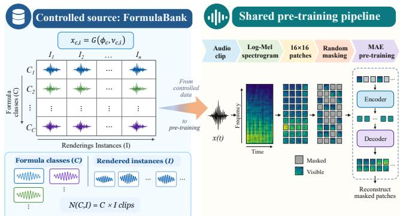
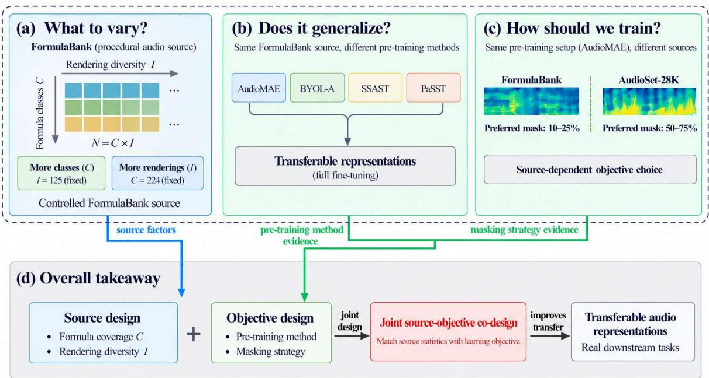
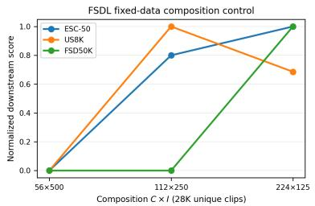
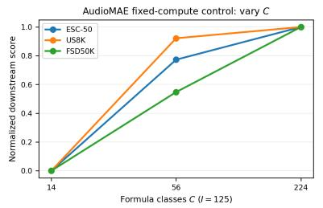
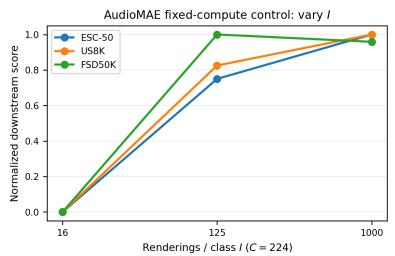
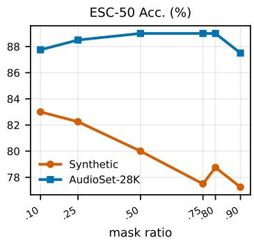
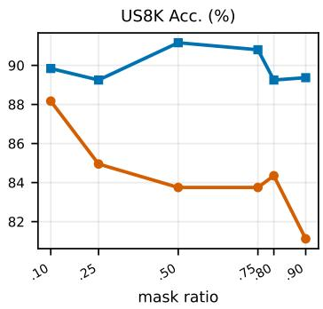
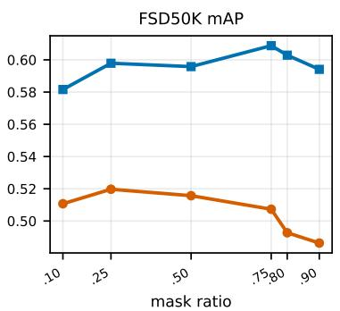

# RETHINKING PROCEDURAL AUDIO PRE-TRAINING: SOURCE SCALING AND OBJECTIVE ADAPTATION

Jiajun Peng1,∗, Fengrui Liu2,∗,‡, Xinyu Liu1, Feng Liu3,†, Senior Member, IEEE

1School of Data Science, University of Science and Technology of China, Hefei 230026, China 2School of Computer Science and Technology, East China Normal University, Shanghai 200062, China 3School of Psychology, Shanghai Jiao Tong University, Shanghai 200030, China ∗Equal contribution. †Corresponding author. ‡Project lead.

## ABSTRACT

Procedural audio has emerged as a viable source for transferable audio representation learning, but its design principles remain unclear.We revisit two questions: how a procedural source should be scaled, and whether training choices developed on natural audio should transfer unchanged to procedural data.Using a controlled source, we separate scale into formula-class coverage C and within-class rendering diversity I.Experiments with FDSL and AudioMAE show that these two forms of scale provide different benefits and depend on the learning formulation and downstream task. A matched AudioMAE study further shows that procedural audio favors low mask ratios (10–25%), whereas AudioSet-28K favors 50–75%. Shared-codebook analysis reveals lower patch diversity and stronger temporal predictability in procedural audio. These results motivate source-aware procedural pretraining, where source scaling and learning configuration are considered jointly.Code is available at https://github. com/Cross-Innovation-Lab/Formula-Bank.

Index Terms— procedural audio, synthetic audio, audio pre-training, masked autoencoders

## 1. INTRODUCTION

Formula-driven and procedural generation provide an alternative route to representation learning without relying entirely on recorded or human-annotated data. FDSL showed that representations can be learned from patterns and labels generated by mathematical formulas [1], while recent work extended this idea to audio, showing that synthetic and procedural signals can support transferable representations [2, 3] and complement real recordings [4]. These studies establish the feasibility of procedural audio for representation learning. We therefore move from asking whether procedural audio can work to how procedural pre-training should be designed.

Unlike recorded datasets, procedural generation explicitly exposes how a source grows. Increasing the number of samples can introduce new generative structures or more acoustic realizations of existing ones, which we denote as formulaclass coverage C and within-class rendering diversity I. Although both increase source size, they need not provide the same learning signal. This raises our first question: should procedural scale be described by sample count alone, or by distinct structural and rendering dimensions?

  
Fig. 1. Overview of the study.

The value of these dimensions may also depend on the learning formulation. As we show 1, FDSL and AudioMAE [5] respond differently to changes in C and I, suggesting an interaction between source composition and the learner. This leads to our second question: should training choices developed on natural audio remain unchanged when the source changes? This is particularly relevant to masked audio pre-training, whose masking strategies are largely developed on natural recordings [5, 6, 7].

To study these questions, we construct FormulaBank, where C and I can be varied independently. We examine the two scaling axes under FDSL and AudioMAE with matcheddata and matched-compute controls, and test the same source across heterogeneous pre-training paradigms [5, 8, 9, 10]. Finally, we conduct a matched FormulaBank–AudioSet-28K [11] study that holds the model, data size, optimization, mask-ratio grid, and downstream evaluation fixed while changing only the pre-training source. The results show that procedural scale is multidimensional and learner-dependent, while the preferred masking regime is strongly sourcedependent.

  
Fig. 2. Controlled procedural source and pre-training pipeline. FormulaBank separates formula-class coverage C from rendering diversity I, with $N ( C , I ) = C \times I$ clips.

Our main contributions are:

• We disentangle procedural source scale into formula-class coverage and within-class rendering diversity, and show that their relative benefits depend on the learning formulation and downstream task.

• We show that the same procedural source supports heterogeneous audio pre-training paradigms, indicating that its utility is not tied to a single learning objective.

• A matched AudioMAE study reveals substantially different preferred masking regimes for procedural audio and AudioSet-28K; shared-codebook statistics further show lower patch diversity and stronger temporal predictability in procedural audio.

## 2. METHODOLOGY

## 2.1. Controlled Procedural Source

We construct FormulaBank from the AudioPG generator [3] to separate two forms of procedural source diversity. 2 Let

$$
x _ { c , i } = G ( \phi _ { c } , \nu _ { c , i } ) ,\tag{1}
$$

where $\phi _ { c }$ denotes the generative structure of formula class $c ,$ and $\nu _ { c , i }$ denotes the rendering variables of its i-th instance. Samples within the same class therefore share the same underlying structure while differing in acoustic realization.

With C formula classes and I renderings per class, the source contains

$$
N ( C , I ) = C I\tag{2}
$$

clips. We use $C$ to represent structural coverage and I to represent within-structure rendering diversity. This construction allows the two forms of procedural scale to be varied independently.

## 2.2. Scaling Procedural Sources

We study the two scaling axes separately:

$$
\begin{array} { r l } & { I = 1 2 5 , \quad C \in \{ 1 4 , 2 8 , 5 6 , 1 1 2 , 2 2 4 \} , } \\ & { C = 2 2 4 , \quad I \in \{ 1 6 , 3 2 , 6 4 , 1 2 5 , 2 5 0 , 5 0 0 , 1 0 0 0 \} . } \end{array}\tag{3}
$$

(4)

The same source configurations are evaluated under FDSL [1] and AudioMAE [5], allowing us to examine whether the value of structural coverage and rendering diversity depends on the learning formulation. We additionally use fixed-data and fixed-compute controls to separate changes in source composition from additional training exposure.

## 2.3. Generality and Source Adaptation

We first test whether the procedural source transfers across different representation-learning paradigms by pre-training AudioMAE [5], BYOL-A [8], SSAST [9], and PaSST [10] on the same FormulaBank source.

Table 1. Scaling formula-class coverage and rendering diversity under FDSL and AudioMAE pre-training. Results within each pre-training setting use the same downstream evaluation protocol.
<table><tr><td rowspan="2">Axis</td><td>Scale</td><td colspan="3">FDSL ESC-50 Acc. ↑ US8K Acc. ↑ FSD50K mAP ↑ SCv2 Acc. ↑ AS-20K mAP ↑|</td><td rowspan="2"></td><td rowspan="2"></td><td colspan="5">AudioMAE ESC-50 Acc. ↑ US8K Acc. ↑ FSD50K mAP ↑ SCv2 Acc. ↑ AS-20K mAP ↑</td></tr><tr><td></td><td></td><td></td><td></td><td></td><td></td><td></td><td></td><td></td></tr><tr><td>Formula-class coverage (I = 125)</td><td></td><td></td><td></td><td></td><td></td><td></td><td></td><td></td><td></td><td></td><td></td></tr><tr><td></td><td>C = 14</td><td>76.50</td><td>76.11</td><td>0.4507</td><td>97.30</td><td>0.1330</td><td>71.75</td><td>78.61</td><td>0.4431</td><td>96.79</td><td>0.1163</td></tr><tr><td></td><td>C = 28</td><td>74.50</td><td>77.54</td><td>0.4599</td><td>97.08</td><td>0.1382</td><td>76.25</td><td>81.12</td><td>0.4854</td><td>96.66</td><td>0.1579</td></tr><tr><td></td><td>C = 56</td><td>76.00</td><td>75.39</td><td>0.4720</td><td>97.42</td><td>0.1310</td><td>78.50</td><td>84.59</td><td>0.4981</td><td>97.21</td><td>0.1657</td></tr><tr><td></td><td>C = 112</td><td>76.25</td><td>80.76</td><td>0.4957</td><td>97.23</td><td>0.1366</td><td>77.50</td><td>83.75</td><td>0.4921</td><td>97.19</td><td>0.1746</td></tr><tr><td></td><td>C = 224</td><td>77.00</td><td>82.92</td><td>0.4919</td><td>97.34</td><td>0.1423</td><td>77.50</td><td>83.99</td><td>0.5073</td><td>97.16</td><td>0.1895</td></tr><tr><td>Rendering diversity (C = 224)</td><td></td><td></td><td></td><td></td><td></td><td></td><td></td><td></td><td></td><td></td><td></td></tr><tr><td></td><td>I = 16</td><td>76.75</td><td>76.22</td><td>0.4742</td><td>97.40</td><td>0.1329</td><td>66.50</td><td>75.51</td><td>0.4365</td><td>96.52</td><td>0.1238</td></tr><tr><td></td><td>I = 32</td><td>76.25</td><td>81.36</td><td>0.4785</td><td>97.22</td><td>0.1373</td><td>72.75</td><td>80.05</td><td>0.4732</td><td>97.04</td><td>0.1549</td></tr><tr><td></td><td>I = 64</td><td>75.50</td><td>81.00</td><td>0.4805</td><td>97.06</td><td>0.1424</td><td>77.75</td><td>84.11</td><td>0.4901</td><td>97.22</td><td>0.1680</td></tr><tr><td></td><td>I = 125</td><td>77.00</td><td>82.92</td><td>0.4919</td><td>97.34</td><td>0.1423</td><td>77.50</td><td>83.99</td><td>0.5073</td><td>97.16</td><td>0.1895</td></tr><tr><td></td><td>I = 250</td><td>77.25</td><td>81.72</td><td>0.4865</td><td>97.18</td><td>0.1506</td><td>82.25</td><td>83.99</td><td>0.5221</td><td>97.42</td><td>0.1966</td></tr><tr><td></td><td>I = 500</td><td>78.50</td><td>80.76</td><td>0.4928</td><td>97.27</td><td>0.1535</td><td>81.25</td><td>85.90</td><td>0.5303</td><td>97.27</td><td>0.2017</td></tr><tr><td></td><td>I = 1000</td><td>77.75</td><td>79.69</td><td>0.4868</td><td>97.07</td><td>0.1480</td><td>82.75</td><td>85.90</td><td>0.5413</td><td>97.23</td><td>0.2006</td></tr></table>

We then isolate the effect of source domain using a matched AudioMAE setup. FormulaBank and a 28K-clip AudioSet subset [11] use the same model, optimization, input representation, and downstream evaluation, while only the pre-training source is changed. For both sources, we sweep

$$
r \in \{ . 1 0 , . 2 5 , . 5 0 , . 7 5 , . 8 0 , . 9 0 \} ,\tag{5}
$$

where r is the fraction of masked spectrogram patches.

## 2.4. Source Statistics

To relate masking behavior to source statistics, we quantize patches from FormulaBank and AudioSet-28K using a shared codebook. Let Z denote the resulting discrete patch code. We measure patch diversity by

$$
H ( Z ) = - \sum _ { k } p ( k ) \log _ { 2 } p ( k ) ,\tag{6}
$$

and local temporal predictability by

$$
H _ { t } = H ( Z _ { t + 1 , f } \mid Z _ { t , f } ) .\tag{7}
$$

Lower $H _ { t }$ indicates stronger predictability between adjacent time patches.

## 3. EXPERIMENTS

## 3.1. Experimental Setup

Datasets and metrics. Pre-training uses FormulaBank as the procedural source and AudioSet-28K [11] as the matched natural-audio control where applicable. Downstream evaluation is conducted on ESC-50 [12], Urban-Sound8K (US8K) [13], FSD50K [14], Speech Commands v2 (SCv2), and AudioSet-20K (AS-20K). We report classification accuracy for ESC-50, US8K, and SCv2, and mean average precision (mAP) for FSD50K and AS-20K.

Implementation details. AudioMAE experiments use 128-bin log-Mel spectrograms of size 1024 × 128 with nonoverlapping 16 × 16 time–frequency patches. FormulaBank scaling and masking experiments use ViT-S, while the crossmethod study retains each method’s native encoder and training recipe. All downstream models are fully fine-tuned using the same protocol for a given downstream dataset.

## 3.2. Multidimensional Procedural Scaling

We first examine how procedural pre-training scales along two controllable source dimensions: formula-class coverage C and within-class rendering diversity I. We fix I = 125 when varying C, and fix $C = 2 2 4$ when varying I, under both FDSL [1] and AudioMAE [5].

Table 1 shows that the two forms of scale are not equivalent. Under FDSL, broader formula-class coverage produces the clearer trend, whereas rendering diversity yields smaller and less consistent changes. AudioMAE shows a different response: coverage gives rapid early gains followed by task-dependent saturation, while rendering diversity provides broader improvements across downstream tasks.

To separate source composition from additional training exposure, we use matched-budget controls: FDSL fixes the source size to 28K clips, while AudioMAE fixes optimization exposure to 7M clip presentations.

Figure 3 shows that these trends persist under controlled budgets, supporting a multidimensional view of procedural scale whose axes depend on both the learning formulation and downstream task.

## 3.3. Generality Across Learning Paradigms

We next test whether the procedural source is tied to a particular pre-training objective. The same FormulaBank source is used with AudioMAE [5], BYOL-A [8], SSAST [9], and PaSST [10], while retaining each method’s native encoder and training recipe.

Table 2 shows that all four learning paradigms produce transferable representations from the same procedural source. Since the architectures and native training recipes differ, this experiment evaluates source compatibility rather than ranking the pre-training methods.

Fig. 3. Controlled-budget scaling trends. Left: FDSL with 28K unique clips, varying source composition from $5 6 \times 5 0 0$ to $2 2 4 \times 1 2 5$ . Middle: AudioMAE with 7M clip presentations, increasing formula-class coverage at $I = 1 2 5$ . Right: AudioMAE under the same compute budget, increasing rendering diversity at $C = 2 2 4$ . Scores are normalized within each downstream task.  

  
Fig. 4. Source-dependent masking under full fine-tuning. FormulaBank favors low masking (.10–.25), whereas the matched AudioSet-28K control favors moderate-to-high masking (.50–.75). The AudioMAE architecture, clip count, mask-ratio grid, and downstream evaluation are held fixed across the two sources.

Table 2. Cross-method transfer from FormulaBank pretraining. Each method uses its native configuration and is evaluated by full fine-tuning.
<table><tr><td>Method</td><td>Encoder</td><td>ESC-50</td><td>US8K</td><td>FSD50K</td><td>SCv2</td><td>AS-20K</td></tr><tr><td>AudioMAE</td><td>ViT-B</td><td>86.25</td><td>85.78</td><td>.5649</td><td>97.77</td><td>.241169</td></tr><tr><td>BYOL-A</td><td>AudioNTT2022-CNN</td><td>75.00</td><td>76.82</td><td>.4660</td><td></td><td>96.70.152646</td></tr><tr><td>SSAST</td><td>ViT-B</td><td>81.00</td><td>81.36</td><td>.5167</td><td></td><td>96.72 .199608</td></tr><tr><td>PaSST-noImageNet</td><td>ViT-B</td><td>75.50</td><td>77.66</td><td>.5156</td><td></td><td>96.81 .179001</td></tr><tr><td>Scratch</td><td>ViT-B</td><td>69.50</td><td>73.36</td><td>.4090</td><td></td><td>96.74.136188</td></tr></table>

## 3.4. Source-Dependent Masking and Source Statistics

We finally ask whether the learning configuration should adapt when the pre-training source changes. FormulaBank and a matched 28K-clip AudioSet subset [11] are compared under the same AudioMAE setup, with architecture, optimization, mask-ratio grid, and downstream evaluation held fixed.

Figure 4 shows a clear source-dependent shift. Formula-Bank performs best at low mask ratios $( r = . 1 0 \mathrm { - } . 2 5 )$ , whereas AudioSet-28K favors $r = . 5 0 \mathrm { - } . 7 5$ . This trend is consistent across downstream tasks and repeated runs. To characterize this difference, we compare the two sources in a shared discrete patch space.Table 3 shows that FormulaBank has lower patch diversity and substantially stronger local temporal predictability than AudioSet-28K. This suggests that the same masking ratio induces different prediction difficulty across source domains, motivating source-dependent masking.

Table 3. Shared-codebook patch entropy in bits. Higher values indicate greater patch diversity or lower short-range predictability.
<table><tr><td>Source</td><td>Marginal H</td><td>Within-clip H</td><td>Temporal  $\overline { { H _ { t } } }$ </td></tr><tr><td>FormulaBank</td><td>3.140</td><td>2.104</td><td>.715</td></tr><tr><td>AudioSet-28K</td><td>6.701</td><td>4.941</td><td>3.807</td></tr></table>

## 4. CONCLUSION

Overall, these results motivate source–objective co-design: masking should be adapted to the statistics of the pre-training source rather than inherited as a source-independent default.

## 5. REFERENCES

[1] Hirokatsu Kataoka, Kazushige Okayasu, Asato Matsumoto, Eisuke Yamagata, Ryosuke Yamada, Nakamasa Inoue, Akio Nakamura, and Yutaka Satoh, “Pre-training without natural images,” International Journal of Computer Vision, vol. 130, pp. 990–1007, 2022.

[2] Yuchi Ishikawa, Tatsuya Komatsu, and Yoshimitsu Aoki, “Pre-training with synthetic patterns for audio,” in Proceedings ofICASSP, 2025.

[3] Fengrui Liu, Ruiyang Huang, Qijian Zheng, Yuanfang Wang, and Feng Liu, From Physics to Representation: Audio Learning with Synthetic Pre-training via Procedural Generation, pp. 595–604, Association for Computing Machinery, New York, NY, USA, 2026.

[4] Fengrui Liu, Ruiyang Huang, Qijian Zheng, Yuanfang Wang, and Feng Liu, “Prp: Procedural-to-real masked pre-training for transferable and interpretable audio representations,” IEEE Transactions on Audio, Speech and Language Processing, vol. 34, pp. 4074–4083, 2026.

[5] Po-Yao Huang et al., “Masked autoencoders that listen,” in Advances in Neural Information Processing Systems, 2022.

[6] Dading Chong, Helin Wang, Peilin Zhou, and Qingcheng Zeng, “Masked spectrogram prediction for self-supervised audio pre-training,” in Proceedings of ICASSP, 2023.

[7] Alan Baade, Puyuan Peng, and David Harwath, “Maeast: Masked autoencoding audio spectrogram transformer,” in Proceedings ofInterspeech, 2022.

[8] Daisuke Niizumi, Daiki Takeuchi, Yasunori Ohishi, et al., “Byol for audio: Self-supervised learning for general-purpose audio representation,” in Proceedings ofIJCNN, 2021.

[9] Yuan Gong, Yu-An Chung, and James Glass, “Ssast: Self-supervised audio spectrogram transformer,” in Proceedings ofAAAI, 2022.

[10] Khaled Koutini, Hamid Eghbal-zadeh, Matthias Dorfer, et al., “Efficient training of audio transformers with patchout,” in Proceedings ofInterspeech, 2022.

[11] Jort F. Gemmeke et al., “Audio set: An ontology and human-labeled dataset for audio events,” in Proceedings ofICASSP, 2017.

[12] Karol J. Piczak, “Esc: Dataset for environmental sound classification,” in Proceedings of ACM Multimedia, 2015.

[13] Justin Salamon, Christopher Jacoby, and Juan Pablo Bello, “A dataset and taxonomy for urban sound research,” in Proceedings ofACM Multimedia, 2014.

[14] Eduardo Fonseca, Xavier Favory, Jordi Pons, Frederic Font, and Xavier Serra, “Fsd50k: An open dataset of human-labeled sound events,” IEEE/ACM Transactions on Audio, Speech, and Language Processing, vol. 30, pp. 829–852, 2022.