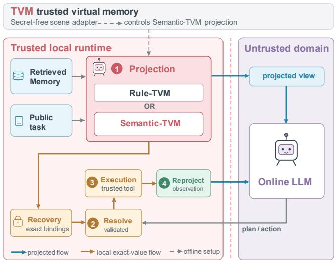
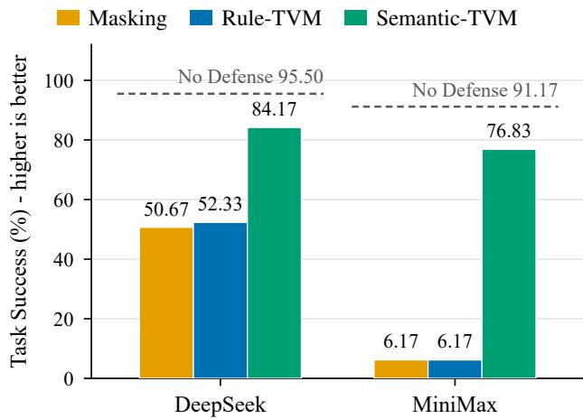

# SEMANTIC-TVM: STRUCTURE-PRESERVING TRUSTWORTHY VIRTUAL MEMORY FORMEMORY-AUGMENTED AND TOOL-USING AGENTS

Yu Li Qikun Cai Tao Huang Chen Hou

School of Computer and Big Data, MinJiang University Fuzhou, China mju.edu.cn

## ABSTRACT

Memory-augmented and tool-using agents expose exact private values when remote LLMs process retrieved memory, tool actions, and intermediate observations. One-way masking limits direct exposure but removes values needed for trusted execution and can leak them through later observations. We propose Trustworthy Virtual Memory (TVM), a closed-loop runtime that keeps exact-value state local while presenting a protected view to the remote model. Within this single runtime, Rule-TVM replaces whole protected fields with locally recoverable handles, and Semantic-TVM instead replaces only sensitive spans predicted by a trusted local model, preserving surrounding task-relevant context. On Memory-EHR and Memory-RAP across two providers, span-level projection recovers most of the EHR utility lost under whole-field replacement (Task Success 84.17% vs. 52.33% on DeepSeek) while measured exposure stays low and workflows remain executable.

Index Terms— LLM agents, privacy protection, agent memory, trusted execution, semantic projection, projection granularity

## 1. INTRODUCTION

Large language model (LLM) agents combine retrieved demonstrations, historical actions, private records, and tool observations. When the online LLM is remotely hosted, every serialized request may expose exact private values from retrieved memory or intermediate state, such as user identifiers, record bindings, and historical search terms [1–3]. Prior work shows that stored agent experience is extractable [4], making private context management central to these agents.

One-way masking redacts sensitive content before remote inference, and the PAPILLON study evaluates such a baseline [5]. It reduces exposure in the initial request, but agent workflows extend beyond that request. Tools may require exact identifiers that irreversible masking removes, and observations from a trusted executor may re-contain those values in a later request. Protecting the initial prompt alone thus does not cover the full execution cycle.

We introduce Trustworthy Virtual Memory (TVM), a local runtime that separates the remote-visible context from the exact-value state required for trusted execution. TVM projects retrieved memory into an online-safe view, replaces protected fields with opaque handles while retaining permitted capsule metadata, and stores the exact bindings locally. When the remote model emits a tool action, the runtime resolves the required handles immediately before execution and reprojects the resulting observation before the next request.

Within this runtime, Rule-TVM is the deterministic realization: whole-field replacement that extends masking into a closed-loop workflow. Whole-field replacement, however, creates a representation bottleneck. A field may combine a protected identifier with query operators, relations, or an action pattern the task needs, and resolving the original field at execution time cannot restore information the model needed earlier to plan. Semantic-TVM therefore refines the same projection operator: a trusted local model predicts sensitive spans from the task, retrieved memory, and scene context, only those spans are replaced, and the remaining content stays within its original field or schema boundary. The two share the lifecycle, resolution, and reprojection path and operate the same projection at different granularity.

We evaluate Memory-EHR and Memory-RAP with exposure, execution, and task-utility metrics. Both granularities reduce exposure, while Semantic-TVM recovers utility lost under whole-field replacement.

Our contributions are threefold:

A local–remote virtual-memory lifecycle that separates remote-visible projected memory from local exact execution bindings, mediates tool observations, and measures detectable registered-value exposure at the captured serialized-message boundary.

One projection operator at two granularities: deterministic whole-field replacement (Rule-TVM) and local-modelpredicted sensitive-span replacement (Semantic-TVM), both retaining local exact-value recovery for trusted execution.

A study on Memory-EHR, Memory-RAP, and two remote providers covering exposure, execution and task utility, component effects, and robustness.

  
Fig. 1. TVM lifecycle with local recovery and observation reprojection.

## 2. TRUSTWORTHY VIRTUAL MEMORY

We define TVM and its trust boundary, then instantiate one recovery-coupled projection at whole-field and span granularity.

## 2.1. TVM Abstraction and Trust Boundary

At round $t ,$ a tool-using agent holds a public task $x ,$ retrieves memory items $R _ { t } = \{ m _ { t , 1 } , \ldots , m _ { t , k } \}$ , and constructs a request $q _ { t }$ for an online LLM L. The request may carry the task, retrieved memory, prior outputs, and reprojected observations. The online model returns a plan or action $a _ { t } ;$ a local executor $\mathcal { E }$ may turn it into an executable call and obtain an observation $o _ { t }$ , and a representation of $o _ { t }$ can enter a later request $q _ { t + 1 }$ . TVM inserts a trusted local mediator $\tau$ into this path. Before online inference,

$$
( \widetilde { R } _ { t } , \rho _ { t } ) = { \cal T } _ { \mathrm { p r o j e c t } } ( R _ { t } , x , A _ { s } ) ,\tag{1}
$$

where $\widetilde { R } _ { t }$ is an online-safe memory view, $\rho _ { t }$ is local recovery state, and $A _ { s }$ is an optional adapter for deployment scene $s .$ The online model receives $\widetilde { R } _ { t }$ but not $\rho _ { t }$ . Before execution and before the next request,

$$
\begin{array} { r l } & { \widehat { a } _ { t } = \mathcal { T } _ { \mathrm { r e s o l v e } } ( a _ { t } , \rho _ { \leq t } ) , \quad o _ { t } = \mathcal { E } ( \widehat { a } _ { t } ) , } \\ & { \widehat { o } _ { t } = \mathcal { T } _ { \mathrm { r e p r o j e c t } } ( o _ { t } , \rho _ { \leq t } ) , } \end{array}\tag{2}
$$

and the resulting serialized outbound message is captured for audit. These operations form the closed-loop path of Fig. 1: projection supplies reasoning context while exactvalue recovery state stays local, validated resolution restores execution-bound references only inside the trusted executor, and observation reprojection precedes every subsequent request. Auditing the serialized messages therefore measures residual protected-value exposure.

## Trust boundary.

The trusted domain contains TVM, the local projection model, recovery stores, and execution. Exact bindings and raw observations must not enter online messages; the remote provider is untrusted and every transmitted message is audited.

## Protected information and measured objective.

For trial $\tau , \mathcal { P } _ { \tau }$ is the annotated manifest of protected values used as the evaluation reference, covering patient identifiers and record bindings in retrieved EHR demonstrations, exact parameters copied from historical tool actions, and values that reappear in tool results after trusted resolution. A value disclosed by the current public task may be designated public and excluded from $\mathcal { P } _ { \tau }$ . The policy is fixed from the deployment scene, object types, and public task context, and must not be changed using the benchmark answer or observed model output. Let $\mathcal { Q } _ { \tau }$ be the messages actually transmitted to the online LLM during trial $\tau ,$ and let Match $( v , q )$ detect an exact occurrence of v or a conservatively normalized variant. We operationalize detectable exposure by the zero-match criterion

$$
\forall q \in \mathcal { Q } _ { \tau } , \forall v \in \mathcal { P } _ { \tau } : \mathsf { M a t c h } ( v , q ) = 0 ,\tag{3}
$$

measured on the serialized request transmitted to the online LLM.

## 2.2. Rule-TVM: Whole-Field Projection

Rule-TVM projects at whole-field granularity, turning masking into a reversible, closed-loop path while keeping exact values outside online messages. Each deployment defines a projection policy Πs over object types and structural paths. For a protected value v at path $p ,$ Rule-TVM allocates a handle h and stores

$$
H _ { \tau } [ h ] = ( p , v , \mathrm { t y p e } ( v ) , \mathrm { p o l i c y } ( p ) )
$$

in trial-local trusted state. Handles do not encode the raw value, and projection rules are fixed from the deployment scene. When the online model places a handle in a permitted tool action, the shared resolver validates its tool, argument path, expected type, and scope before substituting the exact value locally; resolved actions and raw observations never enter online history. The return path applies the inverse mapping before the next request, whose serialized form is captured for audit.

## 2.3. Semantic-TVM: Span-Level Projection

Semantic-TVM changes only the projection operator: a trusted local model replaces predicted sensitive spans while preserving useful surrounding structure and the shared local recovery path.

For each retrieved item $m _ { i } ,$ , current task $x ,$ and adapter $A _ { s } ,$ a trusted local model $G _ { \phi }$ produces

$$
( { \widetilde { m } } _ { i } , \rho _ { i } ) = G _ { \phi } ( m _ { i } , x , A _ { s } ) ,
$$

where $\widetilde { m } _ { i }$ is the online-safe projected item and $\rho _ { i }$ is local recovery state. Only predicted sensitive spans within the available text or schema boundary are replaced: spans needed for exact execution receive scoped slots, other protected spans receive scoped placeholders, and $\rho _ { i }$ retains trial-scoped paths, exact values, references, and sensitivity labels in the trusted domain. Only $\widetilde { m } _ { i }$ is eligible for online serialization, and structural validation is enforced at the trusted boundary.

## 3. EXPERIMENT

## 3.1. Experimental Setup

## Evaluation pipelines.

Memory-EHR.A MIMIC-III query setting derived from the EHRAgent-style code-generation workflow [3]: the agent retrieves four examples by edit distance, generates a query program through the online LLM, and executes it locally. Protected information includes patient identifiers, record bindings, and exact executable values present in historical examples but not disclosed by the current task.Memory-RAP.500 WebShop memories with three examples retrieved by edit distance. Each trial asks the agent to construct a search action from retrieved historical actions; a local search tool then executes it and returns an observation. The current public instruction and category are public, whereas an exact search term originating only from a historical action is protected. Memory-RAP consists of privacy-disclosure probes without an independent ground-truth answer, so it reports Execution Success only.

## Compared systems.

The main comparison contains the conventional baselines No Defense (raw retrieved memory to the online LLM) and Masking (one-way outbound substitution with a fixed placeholder, without trusted recovery or observation reprojection), plus two settings of the same method: Rule-TVM (whole-field handle/capsule projection with local resolution and reprojection) and Semantic-TVM (scene-conditioned, schema-preserving span-level projection with local recovery state).

## Models and runtime.

Online providers. DeepSeek-V4-Flash and MiniMax-M2, with a locally served gemma4:e4b-it-qat projection model at temperature 0. Memory-EHR uses memory size 200 and $k \ = \ 4 ;$ Memory-RAP uses size 500 and $k \ = \ 3 ;$ both use one retry, three seeds for the main comparisons, and one DeepSeek EHR run for failure-stage analysis.Adapters. Scene adapters are induced from clean probe trials and frozen per run.Metrics.Leak Rate is the fraction of completely captured trials in which at least one protected value appears in a captured remote request; incomplete trials are recorded as privacy-unknown and excluded from this denominator, and Capture Complete records whether every required request was captured. Execution Success and Task Success measure, respectively, successful program or action execution and correctness of the final outcome over all attempted trials.

## 3.2. Experimental Results

## RQ1: Exposure and workflow utility.

Masking and both TVM instantiations reduce detected exposure relative to No Defense (Table 1), whose captured requests contain a protected-value match in 78.50% of EHR trials and in every RAP trial. Rule-TVM reaches a Leak Rate of at most 0.67%, while Semantic-TVM stays at most 1.00% on EHR and at most 12.00% on RAP. Conventional Masking is privacy-oriented but non-recoverable: on EHR it reaches at most 0.34% Leak Rate with Execution Success between 44.83% and 59.33%, and on RAP it keeps 100% Execution Success but leaves up to 22.67% detected exposure. The two instantiations differ more sharply in execution: on EHR, Semantic-TVM attains 87.50%–92.33% Execution Success against 46.67%–61.67% for Rule-TVM, whereas on RAP both remain above 99%. Under the shared runtime path, the representation strategy determines the operating point: Rule-TVM minimizes detected exposure, while Semantic-TVM preserves substantially more EHR executability.

## RQ2: Projection granularity.

Semantic-TVM recovers much of the EHR task utility lost under Rule-TVM’s whole-field projection (Fig. 2), raising Task Success from 52.33% to 84.17% on DeepSeek and from 6.17% to 76.83% on MiniMax, where conventional Masking reaches 50.67% and 6.17%. This recovery costs little exposure: Leak Rate rises only from 0.33% to 1.00% and from 0.00% to 0.50%, against 78.50% under No Defense.

Field-level classification alone does not recover this utility: Classifier-TVM replaces the rule-based field decision with a local classifier but keeps Rule-TVM’s all-or-nothing operation, remaining close to Rule-TVM (47.83% vs. 52.33% Task Success on DeepSeek; 7.00% vs. 6.17% on MiniMax).

## RQ3: Component ablation.

With fine-grained projection fixed, Recovery primarily improves EHR task utility, while the scene Adapter supplies privacy context for RAP exposure reduction.

## RQ4: Robustness.

Semantic-TVM is pipeline-dependent (Table 1): on EHR it keeps Leak Rate at most 1.00% with Execution Success above 87% and Task Success above 76%; on RAP it lowers Leak Rate to at most 12.00% while maintaining over 99% Execution Success. Detailed failure-stage counts are provided in the supplementary material.

Table 1. Leak Rate / Execution Success over three seeds.
<table><tr><td>Method</td><td>EHR DeepSeek</td><td>EHR MiniMax</td><td>RAP DeepSeek</td><td>RAP MiniMax</td></tr><tr><td>No Defense</td><td>78.50% / 97.83%</td><td>78.50% / 94.50%</td><td>100.00% / 100.00%</td><td>100.00% / 99.56%</td></tr><tr><td>Masking</td><td>0.34% / 59.33%</td><td>0.00% / 44.83%</td><td>6.00% / 100.00%</td><td>22.67% / 100.00%</td></tr><tr><td>Rule-TVM</td><td>0.33% / 61.67%</td><td>0.00% / 46.67%</td><td>0.67% / 100.00%</td><td>0.67% / 99.33%</td></tr><tr><td>Semantic-TVM</td><td>1.00% / 92.33%</td><td>0.50% / 87.50%</td><td>7.11% / 100.00%</td><td>12.00% / 99.78%</td></tr></table>

  
Fig. 2. Memory-EHR Task Success; dashed lines show No Defense.

Table 2. Adapter × Recovery ablation on DeepSeek over three seeds. Entries are EHR Task Success / RAP Leak Rate (%).
<table><tr><td></td><td>Recovery off</td><td>Recovery on</td></tr><tr><td>Adapter off (G)</td><td>1.67 / 88.00</td><td>83.17 / 89.11</td></tr><tr><td>Adapter on (G+A)</td><td>4.83 / 8.00</td><td>84.17 /7.11</td></tr></table>

## 4. RELATED WORK

TVM relates to agent-context privacy, policy-aware data release, and trusted local mediation, which we separate by transformed artifact and remote-visible granularity.

Retrieval-augmented agents expose memories, tool observations, and generated programs to model inference [1, 2]; EHR agents make the tension concrete because execution may require record-specific values [3]. Extraction, poisoning, and prompt-injection risks [4, 6–9] motivate a trusted boundary. TVM applies the information-flow principle that authorization to use data need not imply authorization to release it [10, 11].

MINIM [12] mediates UI observations by sensitivity. SlotGuard [13] protects transcript bindings for validated execution. PlanTwin [14] projects a private environment into a constrained graph. Semantic-TVM projects sensitive spans in retrieved memory and preserves local recovery.

## 5. DISCUSSION AND LIMITATIONS

TVM measures detectable exact or normalized matches for values listed in a protected-value manifest and observed in completely captured provider-bound requests; tool providers receiving exact arguments, local state, and the memory store are out of scope. This does not establish semantic privacy or prevent inference from retained context, and trial-scoped handles still expose per-type cardinality and which positions refer to the same record. Adversarial retrieved content can steer the projection model, and reprojection can miss values in unanticipated structures, so sensitive spans may be retained; recovery and schema repair can likewise reintroduce original content. Coverage and cost remain limited: two providers, two pipelines, different utility definitions, and no measurement of projection fidelity, local latency, throughput, or hardware cost, so high-assurance deployments should combine conservative projection with typed recovery bindings.

## 6. CONCLUSION

Memory-augmented and tool-using agents need exact values for trusted execution while remote reasoning benefits from mediated context; TVM keeps exact-value state local and applies one recovery-coupled projection operator at whole-field or sensitive-span granularity. Span-level projection recovers much of the EHR utility lost to whole-field replacement (84.17% vs. 52.33% Task Success on DeepSeek), and on RAP both settings keep execution above 99% while cutting exposure from 100% to at most 12%. Because trusted recovery drives EHR utility and scene-conditioned projection drives RAP exposure reduction, granularity should be chosen per pipeline and coupled to validated local recovery.

## 7. REFERENCES

[1] Patrick Lewis, Ethan Perez, Aleksandra Piktus, Fabio Petroni, Vladimir Karpukhin, Naman Goyal, Heinrich Kuttler, Mike Lewis, Wen-tau Yih, Tim Rockt¨ aschel,¨ Sebastian Riedel, and Douwe Kiela, “Retrievalaugmented generation for knowledge-intensive nlp tasks,” in Advances in Neural Information Processing Systems, 2020.

[2] Shunyu Yao, Jeffrey Zhao, Dian Yu, Nan Du, Izhak Shafran, Karthik Narasimhan, and Yuan Cao, “React: Synergizing reasoning and acting in language models,” arXiv preprint arXiv:2210.03629, 2022.

[3] Wenqi Shi, Ran Xu, Yuchen Zhuang, Yue Yu, Jieyu Zhang, Hang Wu, Yuanda Zhu, Joyce Ho, Carl Yang, and May D. Wang, “Ehragent: Code empowers large language models for few-shot complex tabular reasoning on electronic health records,” in Proceedings of the 2024 Conference on Empirical Methods in Natural Language Processing, 2024.

[4] Bo Wang, Weiyi He, Shenglai Zeng, Zhen Xiang, Yue Xing, Jiliang Tang, and Pengfei He, “Unveiling privacy risks in LLM agent memory,” in Proceedings ofthe 63rd Annual Meeting of the Association for Computational Linguistics (Volume 1: Long Papers), 2025, pp. 25241– 25260.

[5] Li Siyan, Vethavikashini Chithrra Raghuram, Omar Khattab, Julia Hirschberg, and Zhou Yu, “PAPILLON: Privacy preservation from internet-based and local language model ensembles,” in Proceedings of the 2025 Conference of the Nations of the Americas Chapter of the Association for Computational Linguistics: Human Language Technologies (Volume 1: Long Papers), 2025, pp. 3371–3390.

[6] Zhaorun Chen, Zhen Xiang, Chaowei Xiao, Dawn Song, and Bo Li, “Agentpoison: Red-teaming LLM agents via poisoning memory or knowledge bases,” in Advances in Neural Information Processing Systems, 2024.

[7] Yupei Liu, Yuqi Jia, Runpeng Geng, Jinyuan Jia, and Neil Zhenqiang Gong, “Formalizing and benchmarking prompt injection attacks and defenses,” arXiv preprint arXiv:2310.12815, 2023.

[8] Kai Greshake, Sahar Abdelnabi, Shailesh Mishra, Christoph Endres, Thorsten Holz, and Mario Fritz, “Not what you’ve signed up for: Compromising real-world llm-integrated applications with indirect prompt injection,” in Proceedings of the 16th ACM Workshop on Artificial Intelligence and Security, 2023.

[9] Edoardo Debenedetti, Jie Zhang, Mislav Balunovic, Luca Beurer-Kellner, Marc Fischer, and Florian Tramer,\` “Agentdojo: A dynamic environment to evaluate prompt injection attacks and defenses for llm agents,” in Advances in Neural Information Processing Systems 37, 2024, Datasets and Benchmarks Track.

[10] Dorothy E. Denning, “A lattice model of secure information flow,” Communications ofthe ACM, vol. 19, no. 5, pp. 236–243, 1976.

[11] Andrew C. Myers and Barbara Liskov, “A decentralized model for information flow control,” in Proceedings of the 16th ACM Symposium on Operating Systems Principles, 1997.

[12] Hexuan Yu, Chaoyu Zhang, Heng Jin, Shanghao Shi, Ning Zhang, Y. Thomas Hou, and Wenjing Lou, “MINIM: Privacy-aware minimal view for agents via trusted local sanitization,” in Proceedings of the 43rd International Conference on Machine Learning, 2026.

[13] Haocheng Xia and Yongjoo Park, “SlotGuard: Stop oversharing private local context in LLM agent transcripts,” arXiv preprint arXiv:2607.17147, 2026.

[14] Guangsheng Yu, Qin Wang, Rui Lang, Shuai Su, and Xu Wang, “PlanTwin: Privacy-preserving planning abstractions for cloud-assisted LLM agents,” arXiv preprint arXiv:2603.18377, 2026.