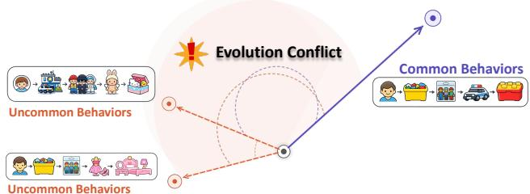
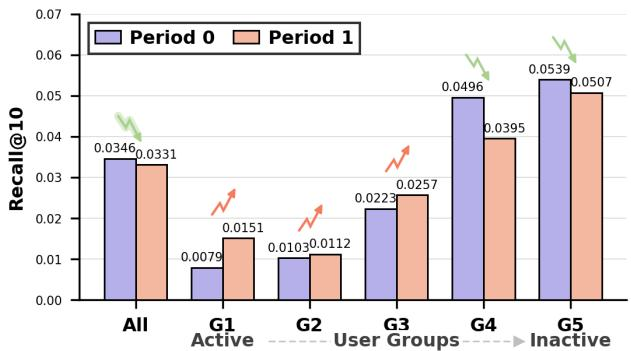
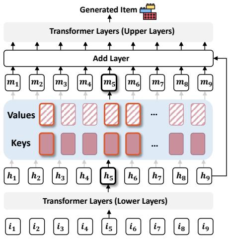
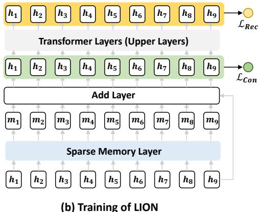
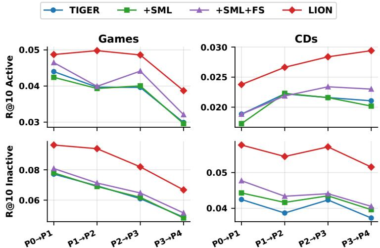
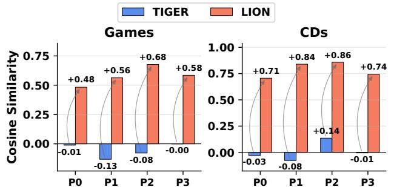
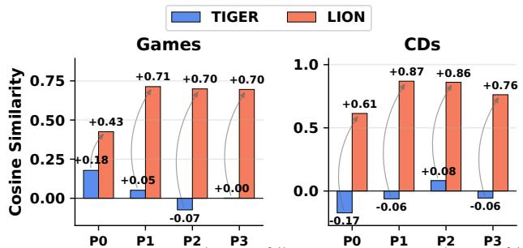
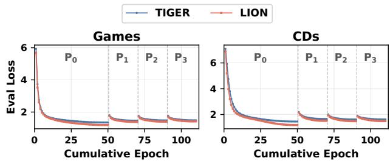

# Self-Evolving Memory for Generative Recommendation

Xinyu Lin1†, Zhuosong Jiang1†, Zixiao Suo1, Siqin Wang1, Hanqing Zeng2, Hanchao Yu2, Yinglong Xia2, Jiang Zhang2, Aashu Singh2, Fei Liu2, Wenjie Wang1, Fuli Feng1, Yang Song2, Qifan Wang2, Tat-Seng Chua1

1National University of Singapore 2Meta AI

†Equal contribution

Generative recommendation has emerged as a promising end-to-end paradigm for personalized recommendation. In real-world recommendation scenarios, however, user preferences continuously evolve over time, making self-evolving an essential capability for generative recommender systems. Existing evolving strategies, such as continual retraining and distillation-based adaptation, directly update the shared model parameters using streaming interactions. Nevertheless, we find that directly applying such strategies to generative recommendation introduces a critical issue, termed evolution conflict. Specifically, heterogeneous preference shifts from diferent users are optimized within a fully shared autoregressive parameter space, causing dominant behavioral patterns to progressively dominate the model evolution process while underrepresented patterns become increasingly overlooked. To address this issue, we propose a self-evolving memory paradigm for generative recommendation, aiming to enable efective evolution across heterogeneous behavioral patterns. We further identify three key principles for efective self-evolving recommendation systems, including isolated memorization, reinforced evolution, and scalable application. Guided by these principles, we develop LION, a simple yet efective framework centered on a sparse Key-Value memory layer. Specifically, LION introduces sparse memory activation to isolate the evolution of diferent behavioral patterns, while a consolidation loss is designed to reinforce the learning of underrepresented preference dynamics during continual adaptation. Extensive experiments on diverse real-world datasets demonstrate the efectiveness of LION under various continual evolution settings (e.g., per-period evaluation, user/item group evaluation, and evolution convergence analysis).

Date: September 15, 2026

Correspondence: Xinyu Lin at xylin1028@gmail.com, Qifan Wang at wqfcr@meta.com

Code: https://github.com/JazyJiang/Self-Evolving-Memory-for-Generative-Recommendation

## 1 Introduction

Generative recommendation has emerged as a compelling paradigm for personalized recommendation, where models directly generate item identifiers in an autoregressive manner to capture user preferences end-toend Geng et al. (2022); Rajput et al. (2023); Wang et al. (2024). Unlike traditional approaches that score a predefined candidate set, generative recommenders unify user history encoding and item generation within a single shared parameter space (e.g., a Transformer backbone), achieving strong performance across diverse recommendation scenarios Rajput et al. (2023); Zhai et al. (2024); Deng et al. (2025). In practice, however, user preferences are not static. They continuously evolve as users discover new interests and shift their consumption patterns over time. This makes self-evolving an essential capability for recommender systems: the model must perpetually adapt to streaming interaction data to align with each user’s current context and intention.

Existing approaches to self-evolving recommendation can be broadly grouped into two categories:

  
Figure 1 Illustration of “evolution conflict” in generative recommender models, where the diferent behavior patterns are evolved in the shared evolving space, i.e., Transformer backbone.

  
Figure 2 Performance of TIGER Rajput et al. (2023) across user groups over two periods on the Toys dataset. During evolution from Period 0 to Period 1, TIGER favors active users with common patterns, improving their performance, while overlooking uncommon patterns from inactive users, undermining their performance and causing an overall drop.

• Continual retraining methods directly fine-tune the model on newly arriving interaction data to track distributional shifts Zhang et al. (2020); Lee et al. (2023). While conceptually straightforward, these approaches risk overwriting previously learned knowledge as the model aggressively adapts to recent data.

• Regularization-based methods measure the degree of preference shift via changes in user representations or ID embeddings Wang et al. (2023); Yoo et al. (2025a). Users with larger shifts are assigned greater update weights, while stable users are updated more conservatively, balancing plasticity and stability. Some methods also leverage replay and distillation techniques as regularization to consolidate the knowledge on existing behavior patterns Wang et al. (2023); Lee et al. (2024); Robins (1995).

Despite the strong efectiveness of existing self-evolving strategies, directly applying them to generative recommendation leads to a critical challenge, namely evolution conflict. In practical recommendation scenarios, user interactions naturally contain both dominant patterns that frequently appear across active users and underrepresented patterns that occur less often or reflect personalized interests. Consequently, when the model continuously adapts to heterogeneous preference shifts from diferent users, their optimization directions may inherently conflict with each other (Figure 1). As continual evolution progresses, dominant behavioral patterns gradually dominate the model evolution process, while underrepresented patterns receive insuficient optimization influence, ultimately hurting recommendation performance (Figure 2). Detailed analysis is provided in Section 3.

To address this issue, the recommender systems should be explicitly organized through a self-evolving memory paradigm, where diferent behavioral patterns can evolve in a more structured and controllable manner. To achieve this, we posit that the self-evolving paradigm should satisfy three key requirements from perspectives of architecture, evolution, and real-world deployment, respectively.

• Isolated memorization. At the architectural level, the model should diferentiate heterogeneous behavioral patterns during continual evolution. As such, we can prevent dominant patterns from overwhelming underrepresented preference dynamics within a shared evolution space.

• Reinforced evolution. During optimization, underrepresented patterns are more dificult to learn during continual adaptation since they appear less frequently in streaming interactions. As such, the evolving process should provide stronger supervision signals to ensure these patterns can still be efectively captured throughout evolution.

• Scalable application. To deploy the evolving paradigm practically, the evolving mechanism should remain eficient and scalable as user populations and streaming interactions continuously grow. In real-world recommendation scenarios, the number of behavioral patterns can become extremely large. As such, the memory mechanism for continual evolution should scale eficiently without introducing prohibitive parameter or computation overhead.

Guided by these principles, we propose LION, a self-evolving generative recommendation framework centered on a personalized sparse memory layer, consisting of Key-Value pairs for evolution. Specifically, to achieve isolated memorization, we introduce a query-driven sparse memory activation mechanism, where each user only activates a subset of memory parameters during continual evolution. To further reinforce underrepresented patterns during continual evolution, we introduce a consolidation loss that encourages the memory layer to capture preference-aware representations from streaming interactions. Moreover, the proposed sparse KV-driven memory mechanism naturally supports large-scale real-world deployment due to its scalable representation capacity. We further provide theoretical analysis of the memory expressiveness in Section 3. Extensive experiments on three real-world datasets demonstrate the efectiveness of LION in improving performance of both dominant and underrepresented behavioral patterns, while maintaining eficient scalability for large-scale continual adaptation. The source codes can be found at https://github.com/JazyJiang Self-Evolving-Memory-for-Generative-Recommendation.

Our main contributions are summarized as follows:

• We identify a critical yet previously overlooked issue in self-evolving generative recommendation, termed evolution conflict, where continual adaptation within a fully shared autoregressive parameter space causes dominant behavioral patterns to overwhelm underrepresented preference dynamics.

• We propose a self-evolving memory paradigm for generative recommendation and formulate three key design principles, including isolated memorization, reinforced evolution, and scalable application, to support robust continual adaptation for heterogeneous behavioral patterns.

• We develop LION, a simple yet efective self-evolving framework based on a KV-driven sparse memory layer. The proposed framework enables isolated memorization through sparse memory activation, reinforces underrepresented patterns via consolidation supervision, and supports scalable application under large-scale recommendation scenarios.

• Extensive experiments on multiple real-world datasets demonstrate the efectiveness of LION across various continual evolution settings.

## 2 Task Formulation

• Generative Recommendation. In generative recommendation, each item $i \in \mathcal { Z }$ is represented by an item identifier (i.e., a token sequence): $\mathbf { c } _ { i } = [ v _ { 1 } , v _ { 2 } , \ldots , v _ { L } ]$ , where $v _ { l } \in \mathcal { V } , L$ is the identifier length, and V is the token vocabulary. Let U and I denote the user set and item set, respectively. Given user $u \in \mathcal { U } \mathrm { { s } }$ historical interaction sequence $\mathcal { S } _ { u } = [ i _ { 1 } , i _ { 2 } , \dots , i _ { N } ]$ , the generative recommender $M _ { \theta } ( \cdot )$ predicts the identifier of the next item $i _ { N + 1 }$ token by token, conditioned on the interaction history and all previously generated tokens:

$$
P ( \mathbf { c } _ { i _ { N + 1 } } \mid \mathcal { S } _ { u } ) = \prod _ { l = 1 } ^ { L } P \big ( v _ { l } \mid \mathbf { c } _ { i _ { N + 1 } , < l } , \mathcal { S } _ { u } ; \theta \big ) ,\tag{1}
$$

where $\mathbf { c } _ { i _ { N + 1 } , < l } = \left[ v _ { 1 } , \dots , v _ { l - 1 } \right]$ denotes the partially generated identifier prefix, and θ denotes the model parameters.

The model is trained by maximizing the log-likelihood of all next-item identifiers over the shared parameters θ:

$$
\underset { \theta } { \operatorname* { m a x } } \sum _ { u \in \mathcal { U } } \sum _ { t = 1 } ^ { N } \sum _ { l = 1 } ^ { L } \log P \left( v _ { l } ^ { ( t + 1 ) } \mid \mathbf { c } _ { i _ { t + 1 } , < l } , \mathcal { S } _ { u } ^ { \leq t } ; \theta \right) ,\tag{2}
$$

where $v _ { l } ^ { ( t + 1 ) }$ is the l-th token of item $\displaystyle i _ { t + 1 } ? \{$ s identifier, and $S _ { u } ^ { \le t } = [ i _ { 1 } , \dots , i _ { t } ]$ is the interaction prefix up to time t. It is noted that generative recommendation paradigm models all user preference transitions through the shared autoregressive parameter space θ.

• Self-Evolving Recommendation. In real-world recommendation scenarios, user interactions continuously evolve over time. Following prior incremental recommendation settings Wang et al. (2023); Yoo et al. (2025a); Shi et al. (2024), we model the streaming interaction data as a sequence of evolving periods:

$$
\{ \mathcal { P } _ { 1 } , \mathcal { P } _ { 2 } , \ldots , \mathcal { P } _ { \tau } , \ldots \} ,\tag{3}
$$

where $\mathcal { P } _ { \tau }$ denotes the interaction data observed during the τ -th period. At each evolving period $\mathcal { P } _ { \tau }$ , the recommender continually updates its parameters based on the streaming interactions:

$$
\theta _ { \tau } = \arg \operatorname* { m i n } _ { \theta } \mathcal { L } _ { r e c } ( \mathcal { P } _ { r } ; \theta _ { \tau - 1 } ) ,\tag{4}
$$

where $\theta _ { \tau - 1 }$ denotes the model parameters inherited from the previous evolving period $\mathcal { P } _ { \tau - 1 }$ , and ${ \mathcal P _ { r } }$ denotes the retraining data used for continual adaptation. Existing self-evolving recommendation strategies mainly adopt two retraining paradigms: 1) continual fine-tuning, where $\mathcal { P } _ { r } = \mathcal { P } _ { \tau }$ only contains the latest streaming interactions; and 2) distillation-based fine-tuning, where $\mathcal { P } _ { r } = \mathcal { P } _ { \leq \tau }$ contains all historical interactions up to the current evolving period. After adaptation at period $\mathcal { P } _ { \tau } .$ , the updated model $\theta _ { \tau }$ is deployed to serve recommendation for the next period $\mathcal { P } _ { \tau + 1 }$

## 3 Identification of Evolution Conflict

As shown in Figure 2, we empirically observe that an evolved model might degrade the performance of some subset of users (e.g., G3-G5). We next analyze why it inevitably introduces evolution conflict among heterogeneous user behavioral patterns.

• Optimization Analysis of Evolution Conflict. The recommendation objective can be decomposed into:

$$
\begin{array} { r } { \mathcal { L } _ { r e c } = \mathcal { L } _ { c } + \mathcal { L } _ { u n c } , } \end{array}\tag{5}
$$

where $\mathcal { L } _ { c }$ and $\mathcal { L } _ { u n c }$ denote the recommendation objectives for common and uncommon behavior patterns, respectively. The corresponding optimization gradients are $g _ { c } = \nabla _ { \theta } \mathcal { L } _ { c }$ and $g _ { u n c } = \nabla _ { \theta } \mathcal { L } _ { u n c }$ . The optimization directions between common and uncommon behaviors can then inherently conflict within the shared parameter space: $g _ { c } ^ { \top } g _ { u n c } \ < \ 0$ . Furthermore, common patterns appear significantly more frequently in streaming interactions, leading to substantially asymmetric gradient magnitudes $\left( i . e . , \parallel g _ { c } \parallel \gg \parallel g _ { u n c } \parallel \right)$ . The continual parameter update at each evolving period $\mathcal { P } _ { \tau }$ thus becomes:

$$
\theta _ { \tau + 1 } = \theta _ { \tau } - \eta ( g _ { c } + g _ { u n c } ) ,\tag{6}
$$

where the update is progressively dominated by $g _ { c } .$ . Combined with the gradient conflict, this leads to a doubly suboptimal outcome: users with common behavior patterns receive suboptimal updates as their gradients are partially canceled by $g _ { u n c } ,$ while users with uncommon patterns sufer progressively worsening performance as their weaker gradients are consistently overwhelmed by $g _ { c }$

• Design Principles for Self-Evolving Memory. The above analysis motivates a structured self-evolving memory mechanism that explicitly organizes the evolving process across heterogeneous behavioral patterns. We posit three key design principles as follows: 1) Isolated memorization: diferent behavioral patterns should evolve through diferentiated optimization pathways; 2) Reinforced evolution: underrepresented patterns should receive stronger supervision signals to ensure efective preservation throughout evolution; 3) Scalable application: the evolving mechanism should remain scalable without introducing prohibitive parameter or computation overhead.

## 4 LION

Based on the analysis in Section 3, we propose LION, a self-evolving generative recommendation framework (Figure 3(a)) centered on a sparse Key-Value memory layer, that achieves isolated memorization (Section 4.1.1) and reinforced evolution (Section 4.1.2). We further provide theoretical analysis of LION on gradient reduction, fast convergence, and scalability (Section 4.2).

  
(a) Architecture of LION

  
Figure 3 Figure (a) illustrates the sparse memory layer, where a subset of Key-Value pairs are activated by the user query, i.e., output hidden states of the lower layers. Figure (b) shows the two training loss of LION, i.e., consolidation loss and recommendation loss.

## 4.1 Self-Evolving Memory Framework

## 4.1.1 Sparse Memory Evolution

To achieve isolated memorization for heterogeneous behavioral patterns, the evolving mechanism should diferentiate diferent user preference dynamics during continual adaptation.

• Motivation for Sparse Memory. A straightforward solution is to introduce explicit user-specific parameters (e.g., user embeddings He et al. (2017) or personalized adapters Hu et al. (2022); Zhang et al. (2024)) to separately model diferent users. However, such dense personalization strategies introduce substantial parameter overhead and become dificult to scale under large-scale recommendation scenarios with continuously growing user populations and behavioral patterns. Alternatively, we propose a sparse memory evolution mechanism, where diferent behavioral patterns are dynamically routed to diferent sparse memory parameters during continual adaptation.

• Sparse Key-Value Memory Layer. We introduce a sparse Key-Value memory layer into the generative recommender backbone. Formally, the memory layer consists of N trainable Key-Value pairs:

$$
\mathcal { M } = \{ ( k _ { i } , v _ { i } ) \} _ { i = 1 } ^ { N } ,\tag{7}
$$

where $k _ { i } \in \mathbb { R } ^ { d }$ denotes the memory key and $v _ { i } \in \mathbb { R } ^ { d }$ denotes the corresponding memory value.

• Sparse Activation. Given the hidden representation h of a Transformer layer, the sparse memory layer first computes the similarity between the user representation and all memory keys: $s _ { i } = h _ { u } ^ { \top } k _ { i }$ . Based on the similarity scores, the memory layer selects the Top-K activated memory slots:

$$
\mathcal { A } = \mathrm { T o p K } ( s _ { 1 } , s _ { 2 } , \dotsc , s _ { N } ) ,\tag{8}
$$

where A denotes the activated memory index set. The corresponding memory values are then aggregated to construct the sparse memory representation:

$$
m _ { u } = \sum _ { i \in \mathcal { A } } \alpha _ { i } v _ { i } ,\tag{9}
$$

where $\begin{array} { r } { \alpha _ { i } = \frac { s _ { i } - \operatorname* { m i n } _ { j \in \mathcal { A } } s _ { j } } { \operatorname* { m a x } _ { j \in \mathcal { A } } s _ { j } - \operatorname* { m i n } _ { j \in \mathcal { A } } s _ { j } } } \end{array}$ denotes the normalized weight of the activated memory slot. Finally, the aggregated memory representation is integrated back into the Transformer hidden states for the subsequent forward process:

$$
\tilde { h } _ { u } = h _ { u } + m _ { u } .\tag{10}
$$

• Full-Sequence Memory Query. The sparse memory layer is designed to capture each user’s behavior pattern, which is best reflected by the complete interaction history $\mathcal { S } _ { u } ^ { \mathrm { f u l l } }$ . However, given that the long-history utilization is limited under the generative recommendation paradigm, existing generative recommenders will only use recent interaction subsequence $S _ { u } ^ { \mathrm { r e c } } = [ i _ { N - h _ { \mathrm { r e c } } + 1 } , \dots , i _ { N } ]$ , where $h _ { \mathrm { r e c } }$ controls the recency window. To bridge this gap, we compute the memory query $h _ { u }$ from $\mathcal { S } _ { u } ^ { \mathrm { f u l l } }$ l, while the Transformer layers before and after the memory layer operate on $S _ { u } ^ { \mathrm { r e c } }$ . This asymmetric design ensures that memory activation is grounded in the user’s full behavioral context, while keeping backbone computation eficient.

## 4.1.2 Reinforced Evolution

To support continual adaptation under streaming interactions, we optimize the proposed framework using two complementary objectives, including a recommendation loss and a consolidation loss (as shown in Figure 3(b)). The recommendation loss supervises the final autoregressive recommendation outputs, while the consolidation loss directly reinforces the preference modeling capability of the sparse memory layer during continual evolution.

• Recommendation Loss. To achieve efective recommendations, we adopt the loss in generative modeling:

$$
\mathcal { L } _ { r e c } = - \sum _ { u \in \mathcal { U } } \sum _ { t = 1 } ^ { L } \log P ( i _ { t + 1 } \mid i _ { \leq t } ; \boldsymbol { \theta } ) .\tag{11}
$$

• Consolidation Loss. To reinforce the memory layer’s preference modeling capability, we impose an auxiliary supervision directly on the memory-enhanced representation $\tilde { h } _ { u } \mathrm { . }$

$$
\mathcal { L } _ { c o n } = - \sum _ { u \in \mathcal { U } } \sum _ { t = 1 } ^ { L } \log P ( i _ { t + 1 } \mid \tilde { h } _ { u } ; \theta ) ,\tag{12}
$$

which ensures underrepresented behavioral patterns receive suficient supervision signals throughout continual evolution.

• Overall Training Objective. The final optimization objective combines the recommendation loss and consolidation loss:

$$
\begin{array} { r } { \mathcal { L } = \mathcal { L } _ { r e c } + \lambda \mathcal { L } _ { c o n } , } \end{array}\tag{13}
$$

where λ controls the strength of the consolidation supervision.

## 4.1.3 Instantiation

We instantiate the proposed framework under the streaming setting in Section 2. The sparse Key-Value memory layer is inserted into the intermediate Transformer layers of the generative recommendation backbone, enabling sparse activation of diferentiated memory slots for heterogeneous behavioral patterns. At each evolving period $\mathcal { P } _ { \tau } .$ , upon arrival of new streaming interactions $\mathcal { P } _ { \tau } .$ , we continually fine-tune both the backbone and memory parameters via the objectives defined in Section 4. The updated model $\theta _ { \tau }$ is then deployed for autoregressive next-item generation to serve the subsequent period $\mathcal { P } _ { \tau + 1 }$

## 4.2 Theoretical Analysis

We provide theoretical justification for the three design principles underlying LION: gradient conflict reduction (Section 4.2.1), faster per-pattern convergence (Section 4.2.2), and parameter eficiency (Section 4.2.3).

## 4.2.1 Gradient Conflict Reduction

At evolving period ${ \mathcal { P } } _ { \tau } ,$ let $\mathcal { A } _ { c } \subseteq [ N ]$ and $\mathcal { A } _ { u n c } \subseteq [ N ]$ denote the activated memory index sets for common and uncommon behavioral patterns, where $| \mathcal { A } _ { c } | = | \mathcal { A } _ { u n c } | = K$ . Define the overlap set $\mathcal { O } = \mathcal { A } _ { c } \cap \mathcal { A } _ { u n c }$ and normalized overlap ratio $\rho = | \mathcal { O } | / K \in [ 0 , 1 ]$ . For memory slot i, let $g _ { i } ^ { c } = \nabla _ { v _ { i } } \mathcal { L } _ { c }$ and $g _ { i } ^ { u n c } = \nabla _ { v _ { i } } \mathcal { L } _ { u n c }$ denote

the gradients contributed by common and uncommon patterns, respectively. We quantify gradient conflict by the total negative inner product across memory parameters:

$$
\mathrm { C o n f i c t } ( \mathcal { A } _ { c } , \mathcal { A } _ { u n c } ) = \sum _ { i = 1 } ^ { N } \operatorname* { m a x } \bigl ( 0 , - \langle g _ { i } ^ { c } , g _ { i } ^ { u n c } \rangle \bigr ) .\tag{14}
$$

We compare against a baseline without sparse activation, where every one of the N slots $( i . e .$ , the full shared parameter space) is jointly updated by both $\mathbf { \mathcal { G } } _ { i } ^ { c }$ and $g _ { i } ^ { u n c }$ , so $\begin{array} { r } { \mathrm { C o n f l i c t { _ { B a s e l i n e } } } = \sum _ { i = 1 } ^ { N } } \end{array}$ max $( 0 , - \langle g _ { i } ^ { c } , g _ { i } ^ { u n c } \rangle )$ .

Theorem 4.1 (Gradient Conflict Reduction). Under LION’s sparse activation, gradient conflict is strictly confined to the overlap region O:

$$
\mathrm { C o n f l i c t } _ { \mathrm { L I O N } } = \sum _ { i \in \mathcal { O } } \operatorname* { m a x } \bigl ( 0 , - \langle g _ { i } ^ { c } , g _ { i } ^ { u n c } \rangle \bigr ) , \qquad \frac { \mathrm { C o n f i c t } _ { \mathrm { L I O N } } } { \mathrm { C o n f i c t } _ { \mathrm { B a s e l i n e } } } \leq \rho = \frac { \vert \mathcal { O } \vert } { K } .\tag{15}
$$

Proof. Slot i receives $\mathbf { \mathcal { G } } _ { i } ^ { c }$ only if $i \in \mathcal { A } _ { c }$ and $g _ { i } ^ { u n c }$ only ${ \mathrm { i f ~ } } i \in { \mathcal { A } } _ { u n c } ,$ so slots outside O see at most one gradient and incur no conflict; bounding conflict to the |O| overlapping directions versus the K activated slots in the baseline gives the ratio. □

Corollary 4.1 (Self-Improving Isolation). As training progresses, routing keys $\{ k _ { i } \}$ tend to specialize toward distinct behavioral patterns, empirically driving $| \mathcal { O } |  0$ and $\rho \to 0$ and thus decreasing gradient conflict. We treat this as an observed training trend rather than a guaranteed outcome, since specialization depends on the data distribution and optimization dynamics; we verify this trend empirically in Section 5.3.3.

## 4.2.2 Convergence Analysis

We model the efective gradient noise variance for pattern c as:

$$
\begin{array} { r } { \sigma _ { c } ^ { 2 } = \underbrace { \sigma _ { 0 } ^ { 2 } } _ { \mathrm { s t o c h a s t i c ~ n o i s e } } + \underbrace { \beta ^ { 2 } \cdot \mathbb { E } \left[ \left. g _ { \bar { c } } \right. ^ { 2 } \right] } _ { \mathrm { c r o s s - p a t t e r n ~ i n t e r f e r e n c e } } , } \end{array}\tag{16}
$$

where $g _ { \bar { c } }$ denotes the aggregate gradient from all patterns other than c, and $\beta \geq 0$ scales the interference strength. Under LION, interference propagates only through O:

$$
\sigma _ { c , \mathrm { L I O N } } ^ { 2 } = \sigma _ { 0 } ^ { 2 } + \rho \cdot \beta ^ { 2 } \cdot \mathbb { E } \big [ \| g _ { \bar { c } } \| ^ { 2 } \big ] , \qquad \rho \ll 1 .\tag{17}
$$

Theorem 4.2 (Faster Per-Pattern Convergence). Under L-smooth $\mathcal { L } _ { c }$ and learning rate $\eta = \mathcal { O } ( 1 / \sqrt { T } )$ , after T gradient steps:

$$
\frac { 1 } { T } \sum _ { t = 1 } ^ { T } \mathbb { E } \big [ \| \nabla \mathcal { L } _ { c } ( \theta _ { t } ) \| ^ { 2 } \big ] \leq \frac { 2 \big ( \mathcal { L } _ { c } ( \theta _ { 0 } ) - \mathcal { L } _ { c } ^ { * } \big ) } { \eta T } + \eta L \sigma _ { c , \mathrm { L I O N } } ^ { 2 } .\tag{18}
$$

Since $\sigma _ { c , \mathrm { L I O N } } ^ { 2 } \leq \sigma _ { c , \mathrm { B a s e l i n e } } ^ { 2 } ,$ , LION reaches ϵ-stationarity in fewer steps, with speedup ratio:

$$
\frac { T _ { \mathrm { L I O N } } } { T _ { \mathrm { B a s e l i n e } } } \leq \frac { \sigma _ { 0 } ^ { 2 } + \rho \beta ^ { 2 } \mathbb E [ \| g _ { \bar { c } } \| ^ { 2 } ] } { \sigma _ { 0 } ^ { 2 } + \beta ^ { 2 } \mathbb E [ \| g _ { \bar { c } } \| ^ { 2 } ] } \leq 1 .\tag{19}
$$

Proof. Follows directly from the standard SGD convergence result for smooth non-convex objectives Ghadimi and Lan (2013) by substituting $\sigma _ { c , \mathrm { L I O N } } ^ { 2 }$ for the noise term. □

Corollary 4.2 (Amplified Benefit for Uncommon Patterns). Uncommon patterns experience lower gradient pressure from common patterns, leading to smaller |O| and thus larger convergence speedup, providing a theoretical explanation for LION’s disproportionate gains on underrepresented behavioral patterns, which we verify empirically in Section 5.2 and Section 5.3.1.

## 4.2.3 Parameter Efficiency and Scalability

LION’s sparse memory requires 2N d parameters regardless of user population |U|, compared to $| U | \cdot d$ for dense per-user personalization. LION is strictly cheaper whenever $| U | > 2 N$ , and adding new users incurs zero additional parameters. Meanwhile, sparse Top-K activation yields $\binom { N } { K }$ distinct memory configurations, satisfying ${ \binom { N } { K } } \geq | U |$ under standard choices of N and $K \ ( e . g . , \ { \binom { 2 5 6 } { 8 } } \approx 1 0 ^ { \bar { 1 5 } } )$ , ensuring unique representations without parameter sharing. Consequently, the parameter ratio satisfies:

$$
\frac { \mathrm { P a r a m s } _ { \mathrm { L I O N } } } { \mathrm { P a r a m s } _ { \mathrm { D e n s e } } } = \frac { 2 N } { | U | }  0 \qquad \mathrm { a s } | U |  \infty ,\tag{20}
$$

achieving scalable evolution without sacrificing representational expressiveness.

## 5 Experiments

We conduct experiments to answer the following research questions. RQ1: How does LION perform compared to existing continual evolution strategies for generative recommendation under streaming data settings? RQ2: How does each component of LION contribute to the overall performance? RQ3: How does LION perform across heterogeneous user groups and item categories with varying behavioral patterns and popularity distributions? RQ4: How efectively and eficiently does LION alleviate the evolution conflict issue during continual adaptation?

## 5.1 Experimental Setting

## 5.1.1 Datasets

We conduct experiments on three representative real-world datasets across diverse domains from the Amazon Review series1. 1) Games, 2) CDs, and 3) Toys, which contain rich interactions on video games, music albums, toys and children’s entertainment products, respectively. We follow previous works Rajput et al. (2023); Shi et al. (2024) and construct each instance as a next-item prediction sample, where the input contains at most 10 previous interactions and the target is the next item.

For each dataset, we sort all instances by target interaction timestamp and split them into five chronological periods (Period 0–4) of equal interaction counts. Users are further divided into five groups $G _ { 1 } – G _ { 5 }$ (from active to inactive), where activity level is measured by maximum history length in the previous period; For Period 0, users are grouped by activity level within that period. The dataset statistics are presented in Appendix Table 6.

## 5.1.2 Evaluation Metrics

To evaluate the evolution ability of diferent methods across periods, we test each method on Periods 1, 2, 3, and 4 after continual adaptation. During inference, the model generates candidate item-token sequences with beam search using beam size 20. We adopt two widely used ranking metrics, Recall@K (R@K) and NDCG@K (N@K), with $K \in \{ 1 0 , 2 0 \}$ . Recall@K measures whether the ground-truth item appears in the top-K generated list, while NDCG@K further considers the hit position. Metrics are computed over each future-period and user-group cell, and group-level scores can be averaged to obtain the period-level performance.

## 5.1.3 Baselines

We compare our method with various competitive baselines, including two main categories. Traditional Continual Learning (CL) methods: 1) TIGER Rajput et al. (2023) is a direct fine-tuning baseline based on the standard T5 encoder-decoder generative recommender, where the model is continually updated at each period using only the current-period data. 2) Replay Robins (1995); Lopez-Paz and Ranzato (2017) mitigates forgetting by replaying historical interactions together with current-period data; for period $t \geq 1$ , the number of sampled historical instances equals $| D _ { t } | . ~ 3 )$ SAIL-PIW Wang et al. (2023) preserves historical knowledge through distillation and learns personalized imitation weights to balance old-knowledge preservation and new-period adaptation. 4) PISA Yoo et al. (2025a) models continual recommendation through plasticity updates and stability-oriented distillation, explicitly controlling the stability-plasticity trade-of across periods. Evolution methods for generative recommendation. 5) RecICL Bao et al. (2025) injects in-context examples into the prompt, enabling dynamic interest adaptation through contextual demonstrations rather than conventional full model retraining. 6) LSAT Shi et al. (2024) uses short- and long-term branches to separately model recent and earlier user histories, and combines their predictions for continual adaptation. 7) PESO Yoo et al. (2026) is a LoRA-based continual adaptation method for LLM-based generative recommendation, which uses a single evolving LoRA adapter with proximal regularization to balance adaptation and preservation. To achieve a fair comparison, we adapt all these baselines to the generative paradigm, i.e., TIGER Rajput et al. (2023) (T5 as backbone).

Table 1 Main results on three Amazon Review datasets. All numbers are sample-weighted micro-average over 4 evaluation periods × 5 user activity quintiles as defined in Section 5.1. “R@K” and “N@K” denote “Recall@K” and “NDCG@K”, respectively.
<table><tr><td rowspan="2">Method</td><td colspan="4">Games</td><td colspan="4">CDs</td><td colspan="4">Toys</td></tr><tr><td>R@10</td><td>N@10</td><td>R@20</td><td>N@20</td><td>R@10</td><td>N@10</td><td>R@20</td><td>N@20</td><td>R@10</td><td>N@10</td><td>R@20</td><td>N@20</td></tr><tr><td>Replay</td><td>0.0616</td><td>0.0386</td><td>0.0819</td><td>0.0437</td><td>0.0405</td><td>0.0297</td><td>0.0475</td><td>0.0316</td><td>0.0551</td><td>0.0400</td><td>0.0651</td><td>0.0425</td></tr><tr><td>SAIL-PIW</td><td>0.0572</td><td>0.0416</td><td>0.0766</td><td>0.0465</td><td>0.0392</td><td>0.0302</td><td>0.0459</td><td>0.0319</td><td>0.0689</td><td>0.0494</td><td>0.0847</td><td>0.0534</td></tr><tr><td>PISA</td><td>0.0407</td><td>0.0245</td><td>0.0597</td><td>0.0293</td><td>0.0217</td><td>0.0128</td><td>0.0298</td><td>0.0149</td><td>0.0630</td><td>0.0395</td><td>0.0865</td><td>0.0454</td></tr><tr><td>RecICL</td><td>0.0686</td><td>0.0470</td><td>0.0904</td><td>0.0525</td><td>0.0352</td><td>0.0263</td><td>0.0425</td><td>0.0282</td><td>0.0530</td><td>0.0409</td><td>0.0637</td><td>0.0436</td></tr><tr><td>LSAT</td><td>0.0492</td><td>0.0344</td><td>0.0631</td><td>0.0379</td><td>0.0358</td><td>0.0259</td><td>0.0435</td><td>0.0278</td><td>0.0648</td><td>0.0421</td><td>0.0865</td><td>0.0475</td></tr><tr><td>PESO</td><td>0.0584</td><td>0.0353</td><td>0.0800</td><td>0.0408</td><td>0.0263</td><td>0.0166</td><td>0.0347</td><td>0.0187</td><td>0.0625</td><td>0.0376</td><td>0.0857</td><td>0.0435</td></tr><tr><td>TIGER</td><td>0.0558</td><td>0.0336</td><td>0.0784</td><td>0.0393</td><td>0.0331</td><td>0.0213</td><td>0.0424</td><td>0.0236</td><td>0.0666</td><td>0.0418</td><td>0.0884</td><td>0.0473</td></tr><tr><td>LION (Ours)</td><td>0.0724</td><td>0.0454</td><td>0.0986</td><td>0.0520</td><td>0.0449</td><td>0.0306</td><td>0.0558</td><td>0.0334</td><td>0.0769</td><td>0.0495</td><td>0.1018</td><td>0.0557</td></tr><tr><td>∆ vs TIGER</td><td>+29.8%</td><td>+35.3%</td><td>+25.8%</td><td>+32.4%</td><td>+35.5%</td><td>+43.7%</td><td>+31.7%</td><td>+41.2%</td><td>+15.6%</td><td>+18.4%</td><td>+15.1%</td><td>+17.8%</td></tr></table>

## 5.1.4 Implementation Details

All experiments are implemented on the TIGER (T5 backbone) Rajput et al. (2023). Unless explicitly specified, we update all model parameters during continual training. We use AdamW with cosine learningrate scheduling, warmup ratio 0.01, weight decay 0.001, and random seed 42. Early stopping monitors validation loss with patience 5 and threshold $1 0 ^ { - 4 }$ after at least 10 epochs, where the validation file follows the current-period training CSV. For CL baselines, we tune learning rate and batch size on Toys and use the best validation configuration for evaluation. For shared hyperparameters, the learning rate is selected from {1e−4, 1.5e−4, 2e−4, 2.5e−4, 3e−4} and the batch size is selected from {16, 24, 32, 48, 64} across baselines. Detailed hyper-parameter settings for the baselines can be found in Appendix A.1.

## 5.2 Overall Performance (RQ1)

Table 1 compares LION against six representative baselines on three Amazon Review datasets, where we report average performance over four evaluation periods (P1-4) and five user groups. From the overall comparison, we can observe that:

• Among all baselines specifically designed for continual learning (from Replay to PESO), LSAT and SAIL-PIW achieve the most competitive performance. This is because LSAT captures both long-term and short-term user interests through separate branches and merges their predictions, which partially isolates recent common patterns from long-tailed ones and partially mitigates evolution conflict. While SAIL-PIW maintains personalized imitation weights per user, enabling more complete isolation of individual behavioral patterns and thus better alleviating gradient interference across users. Other CL-specific methods (PISA, PESO) transfer poorly to streaming generative recommendation, as CL recipes designed for classification or static recommendation introduce severe interference under autoregressive evolution, consistent with the analysis in Section 3.

• Under the same continual fine-tuning setting, LION consistently outperforms TIGER and surpasses all baselines in most cases. This validates the efectiveness of the sparse memory layer and consolidation loss in isolating heterogeneous behavioral patterns and reinforcing underrepresented ones during continual adaptation. We note that the plain continual fine-tuning baseline (TIGER) also achieves competitive overall performance, as the majority of interactions in these datasets still reflect common behavioral patterns, whose dominance during evolution does not severely hurt aggregate metrics. Detailed performance across periods and user groups is presented below.

Table 2 Per-period active $\left( G _ { 1 } { + } G _ { 2 } \right)$ and inactive $\left( G _ { 3 }  – G _ { 4 }  – G _ { 5 } \right)$ Recall@10 across three datasets, comparing competitive baselines against LION. Values are sample-weighted micro-averages within each group and period.
<table><tr><td rowspan="3">Method</td><td colspan="8">Games</td></tr><tr><td colspan="2">P0→P1</td><td colspan="2">P1→P2</td><td colspan="2">P2→P3</td><td colspan="2">P3→P4</td></tr><tr><td>Act</td><td>Inact</td><td>Act</td><td>Inact</td><td>Act</td><td>Inact</td><td>Act</td><td>Inact</td></tr><tr><td>Replay</td><td>0.0363</td><td>0.0792</td><td>0.0398</td><td>0.0865</td><td>0.0386</td><td>0.0750</td><td>0.0275</td><td>0.0551</td></tr><tr><td>SAIL-PIW</td><td>0.0577</td><td>0.0900</td><td>0.0365</td><td>0.0732</td><td>0.0243</td><td>0.0563</td><td>0.0234</td><td>0.0506</td></tr><tr><td>LSAT</td><td>0.0476</td><td>0.0784</td><td>0.0297</td><td>0.0656</td><td>0.0205</td><td>0.0513</td><td>0.0193</td><td>0.0398</td></tr><tr><td>PESO</td><td>0.0403</td><td>0.0741</td><td>0.0425</td><td>0.0694</td><td>0.0444</td><td>0.0667</td><td>0.0362</td><td>0.0566</td></tr><tr><td>TIGER</td><td>0.0440</td><td>0.0772</td><td>0.0397</td><td>0.0695</td><td>0.0396</td><td>0.0610</td><td>0.0299</td><td>0.0488</td></tr><tr><td>LION</td><td>0.0487</td><td>0.0964</td><td>0.0498</td><td>0.0939</td><td>0.0486</td><td>0.0820</td><td>0.0387</td><td>0.0668</td></tr><tr><td></td><td colspan="8">CDs</td></tr><tr><td>Method</td><td>Act</td><td>P0→P1 Inact</td><td>Act</td><td>P1→P2 Inact</td><td>P2→P3 Act</td><td>Inact</td><td>P3→P4 Act</td><td>Inact</td></tr><tr><td>Replay</td><td>0.0148</td><td>0.0495</td><td>0.0207</td><td>0.0587</td><td>0.0177</td><td>0.0555</td><td>0.0221</td><td>0.0481</td></tr><tr><td>SAIL-PIW</td><td>0.0179</td><td>0.0388</td><td>0.0246</td><td>0.0434</td><td>0.0274</td><td>0.0517</td><td>0.0357</td><td>0.0523</td></tr><tr><td>LSAT</td><td>0.0155</td><td>0.0341</td><td>0.0198</td><td>0.0423</td><td>0.0201</td><td>0.0477</td><td>0.0287</td><td>0.0527</td></tr><tr><td>PESO</td><td>0.0116</td><td>0.0268</td><td>0.0182</td><td>0.0283</td><td>0.0192</td><td>0.0349</td><td>0.0234</td><td>0.0341</td></tr><tr><td>TIGER</td><td>0.0188</td><td>0.0425</td><td>0.0222</td><td>0.0387</td><td>0.0216</td><td>0.0423</td><td>0.0211</td><td>0.0373</td></tr><tr><td>LION</td><td>0.0238</td><td>0.0577</td><td>0.0266</td><td>0.0545</td><td>0.0284</td><td>0.0572</td><td>0.0294</td><td>0.0515</td></tr><tr><td></td><td colspan="8">Toys</td></tr><tr><td>Method</td><td>Act</td><td>P0→P1 Inact</td><td>P1→P2 Act</td><td>Inact</td><td>P2→P3 Act</td><td>Inact</td><td>P3→P4 Act</td><td>Inact</td></tr><tr><td>Replay</td><td>0.0388</td><td>0.0708</td><td>0.0378</td><td>0.0767</td><td>0.0198</td><td>0.0705</td><td>0.0145</td><td>0.0525</td></tr><tr><td>SAIL-PIW</td><td>0.0530</td><td>0.0818</td><td>0.0484</td><td>0.0811</td><td>0.0387</td><td>0.0873</td><td>0.0336</td><td>0.0722</td></tr><tr><td>LSAT</td><td>0.0537</td><td>0.0887</td><td>0.0423</td><td>0.0818</td><td>0.0274</td><td>0.0817</td><td>0.0207</td><td>0.0598</td></tr><tr><td>PESO</td><td>0.0479</td><td>0.0791</td><td>0.0442</td><td>0.0735</td><td>0.0328</td><td>0.0730</td><td>0.0319</td><td>0.0670</td></tr><tr><td>TIGER</td><td>0.0505</td><td>0.0903</td><td>0.0482</td><td>0.0810</td><td>0.0313</td><td>0.0785</td><td>0.0251</td><td>0.0672</td></tr><tr><td>LION</td><td>0.0606</td><td>0.1011</td><td>0.0582</td><td>0.0960</td><td>0.0368</td><td>0.0877</td><td>0.0324</td><td>0.0777</td></tr></table>

We further analyze the performance on each period over active $\left( G _ { 1 }  – G _ { 2 } \right)$ and inactive $\left( G _ { 3 } – G _ { 5 } \right)$ user groups (Table 2):

• LION produces consistently larger gains on inactive users than on active users. Across all three datasets and periods, the improvement of LION over competitive baselines is more pronounced on the inactive group $\left( G _ { 3 } – G _ { 5 } \right)$ than on the active group $\left( G _ { 1 }  – G _ { 2 } \right)$ . This is consistent with the design of the sparse memory layer: by routing diferent behavioral patterns through partially isolated memory pathways, LION prevents the evolution of underrepresented patterns from being overwhelmed by the dominant gradient updates of active users, directly addressing the evolution conflict identified in Section 3.

• The gains of LION remain stable across all evolving periods. Rather than concentrating in early or late periods, LION maintains consistent improvements over competitive baselines at every period for both user groups across all datasets. This suggests that the sparse memory mechanism provides a sustained benefit throughout continual adaptation, rather than a one-time initialization advantage that fades over time.

## 5.3 In-depth Analysis

## 5.3.1 Ablation Study (RQ2)

We isolate the contribution of each component of LION by incrementally adding the sparse memory layer (SML), the full-sequence memory query (FS), and the consolidation loss (Con) on top of the TIGER backbone. We further remove sparse memory layer independently $( ^ { 6 6 } + \mathrm { C o n } ^ { 3 3 } )$ and present the results in Table 3. We can find that 1) Simply adding the consolidation loss can even hurt performance. This is because, without the sparse memory layer, the auxiliary loss directly supervises the shared backbone representation, re-exposing it to the same cross-pattern gradient conflict (Section 3) that aflicts the main recommendation loss; consolidation is only beneficial once it supervises the memory-isolated representation $\tilde { h } _ { u }$ instead. 2) The sparse memory layer alone yields only marginal overall improvement. Without direct supervision, the sparse memory layer relies solely on the recommendation loss to specialize its routing keys. On relatively small datasets, the limited interaction diversity makes it dificult for the memory keys to diferentiate behavioral patterns suficiently, resulting in overlapping activations across user groups and limited isolation benefit. 3) Full-sequence routing and consolidation loss on top of SML both contribute positively, with the consolidation loss being the dominant driver. Optimizing only the final recommendation loss is insuficient to capture underrepresented behavioral patterns, as their weak gradient signals are consistently overwhelmed during backpropagation. The consolidation loss directly supervises the memory-enhanced representations, providing stronger and more targeted optimization signals for underrepresented patterns.

Table 3 Ablation study on three datasets (Recall@10, 4-period sample-weighted average).
<table><tr><td>Configuration</td><td>Games</td><td>CDs</td><td>Toys</td></tr><tr><td>TIGER</td><td>0.0558</td><td>0.0331</td><td>0.0666</td></tr><tr><td>+ Con</td><td>0.0532</td><td>0.0310</td><td>0.0559</td></tr><tr><td>+ SML</td><td>0.0558</td><td>0.0342</td><td>0.0654</td></tr><tr><td>+ SML + FS</td><td>0.0586</td><td>0.0358</td><td>0.0687</td></tr><tr><td>+ SML + FS + Con (LION)</td><td>0.0724</td><td>0.0449</td><td>0.0769</td></tr></table>

  
Figure 4 Per-period overall Recall@10 trajectory across the continual chain $P _ { 0 }  P _ { 4 }$ for the four ablation variants on Games (left) and CDs (right). Top row: active group $\left( G _ { 1 } { + } G _ { 2 } \right)$ ; bottom row: inactive group $\left( G _ { 3 } { + } G _ { 4 } { + } G _ { 5 } \right)$ . LION (red) lies strictly above TIGER (blue) in every (dataset, period, group) cell.

• Per-period active/inactive breakdown. To further analyze the efectiveness of each component, we report the performance across diferent behavior patterns and periods in Figure 4. We can find that 1) LION consistently lies strictly above TIGER on every (dataset, group) trajectory in Figure 4. In particular, the late-period active-group gain is comparable to or larger than early periods, suggesting the memory-layer benefit accumulates under continual drift. 2) Inactive users usually yield larger gains compared to active users. This is consistent with our theoretical analysis, i.e., routing keys specialise more rapidly for underrepresented patterns, which also aligns with the observations in Table 2.

## 5.3.2 Effect of λ (RQ2)

To facilitate LION deployment, we analyze the efect of the consolidation loss weight λ. From the results in Table 4, we can observe that increasing λ from 0 yields a clear performance gain, confirming the efectiveness of the consolidation loss. Performance remains consistently strong across $\lambda \in [ 0 . 3 , 1 . 0 ]$ on both datasets, indicating that consolidation is broadly beneficial without hurting recommendation quality; however, the per-dataset optimum varies within this range (Games peaks at $\lambda { = } 1 . 0 .$ , CDs at $\lambda { = } 0 . 5 )$ . Rather than fixing a single global value, we therefore select λ per dataset via validation over {0.1, 0.3, 0.5, 1.0} (Appendix A.1).

Table 4 Efect of λ, i.e., the strength of consolidation loss.
<table><tr><td>Dataset</td><td>λ=0</td><td>λ=0.1</td><td>λ=0.3</td><td>λ=0.5</td><td>λ=1.0</td></tr><tr><td>Games</td><td>0.0586</td><td>0.0653</td><td>0.0691</td><td>0.0712</td><td>0.0724</td></tr><tr><td>CDs</td><td>0.0358</td><td>0.0449</td><td>0.0465</td><td>0.0466</td><td>0.0462</td></tr></table>

  
Figure 5 Per-period cosine similarity between active $( \mathbf { \overline { { { G } } } } _ { 1 } { + } \mathbf { \overline { { { G } } } } _ { 2 } )$ and inactive $\left( G _ { 3 } \mathrm { + } G _ { 4 } \mathrm { + } G _ { 5 } \right)$ gradients on the sparse memory layer.

## 5.3.3 Gradient Conflict Reduction (RQ3)

We directly measure the cross-group gradient cosine on the sparse memory layer predicted by Theorem 4.1. For each post-warm-up checkpoint, we partition users into active $\left( G _ { 1 } { + } G _ { 2 } \right)$ and inactive $\left( G _ { 3 } { + } G _ { 4 } { + } G _ { 5 } \right)$ groups and compute the aggregated cosine cos $( g _ { c } , g _ { u n c } )$ Results are shown in Figure 5. We can find that 1) shared parameters sufer from gradient conflict (TIGER’s results), which confirms that active and inactive group gradients conflict within the shared parameter space. Nevertheless, 2) sparse memory isolates conflict and aligns optimization directions. LION achieves uniformly positive cosine across all periods, satisfying $g _ { c } ^ { \top } g _ { u n c } \ge 0$ and potentially driving the conflict term in Theorem 4.1 to zero. This is because conflicting gradients are absorbed into isolated memory slots, leaving the shared parameters updated in a mutually compatible direction.

## 5.3.4 Item-Side Gradient Alignment (RQ3)

We further analyze the gradient conflict across item groups, i.e., popular (top 60%) vs. long-tailed (tail 40%), using $P _ { 0 }$ interaction counts as the popularity reference. Results are shown in Figure 6. We can find that: 1) Sparse memory mitigates gradient conflict between popular and long-tailed items, which is consistent with the user-side results in Section 5.3.3. This is expected, as long-tailed items naturally correspond to uncommon behavioral patterns, and the memory layer’s isolated pathways prevent their gradients from being overwhelmed by popular items, further validating the efectiveness of sparse memory isolation. 2) Gradient conflict is relatively weaker on Games. One possible reason is that it is a relatively dense dataset, where higher interaction density reduces the popularity gap between popular and long-tailed items, leading to less severe gradient conflict and a smaller isolation benefit.

## 5.3.5 Empirical Convergence Analysis (RQ4)

To verify the faster convergence of LION as stated in Theorem 4.2, we compare the per-epoch evaluation loss of TIGER and LION on Games and CDs. Since ${ \mathcal { L } } _ { \mathrm { c o n } }$ is added only during training, we report pure language-modeling eval loss for a fair comparison. Results are shown in Figure 7. 1) LION consistently converges faster and to a lower converged loss at every period, confirming that the memory layer reduces gradient conflict and improves optimization eficiency, aligning with Theorem 4.2. 2) A loss jump appears at the start of each new period. This is because incoming interactions reflect shifted user behaviors, causing the model’s loss to temporarily rise before re-converging. LION recovers faster after each jump, and the margin over TIGER does not shrink across periods, suggesting the memory-layer benefit accumulates rather than diminishes under continual drift

  
Figure 6 Item-side gradient cosine between popular (top 60%) and long-tailed (tail 40%) item gradients on the sparse memory layer.

  
Figure 7 Per-epoch evaluation loss $( \mathcal { L } _ { \mathrm { R e c } } )$ across the continual chain $P _ { 0 }  P _ { 3 }$ . LION (red) converges faster across all periods and to a lower converged loss at every period on both datasets.

## 5.3.6 Memory Compactness (RQ4)

To further investigate the expressiveness and eficiency of the sparse memory layer, we consistently reduce the memory layer size to see how it afects performance, as shown in Table 5. Reducing the memory size has negligible impact on performance. Across a 16× range in memory vocabulary and a 4× range in K, Recall@10 stays within ±0.4% across all datasets, demonstrating that LION maintains strong representational capacity even under aggressive parameter reduction. This is consistent with the scalability analysis in Section 4.2.3: the combinatorial expressiveness $\binom { N } { K }$ far exceeds the number of behavioral patterns the model needs to distinguish, so shrinking N or K does not become a representational bottleneck. Compared to methods that require per-user embeddings or per-layer LoRA adapters, LION achieves competitive expressiveness with a fixed and compact parameter footprint that does not grow with user population.

## 6 Related Works

• Continual Learning in Recommendation. Continual learning is crucial for recommender systems to adapt to evolving user interests and item distributions Lin et al. (2026); Yoo et al. (2025b). Traditional continual recommendation methods can be broadly categorized into two types. (1) Retraining-based methods periodically update the recommender by either fine-tuning on newly arrived interactions or fully retraining on accumulated historical data Rendle and Schmidt-Thieme (2008); Chandramouli et al. (2011); Diaz-Aviles et al. (2012); Zhang et al. (2020); Lee et al. (2023). Fine-tuning can eficiently absorb recent feedback but may overwrite previous preference knowledge, while full retraining retains historical information at the cost of substantial computation. (2) Regularization-based methods preserve knowledge from previous models while adapting to new-period data Wang et al. (2023); Yoo et al. (2025a); Lee et al. (2024). With the emergence of LLM-based and generative recommendation, continual learning has been revisited under autoregressive recommendation architectures Shi et al. (2024); Bao et al. (2025); Yoo et al. (2026); Shi et al. (2025); Feng et al. (2026). Representative methods usually adopt lightweight adaptation mechanisms to distinguish newly emerging interests from historical preference knowledge Shi et al. (2024); Bao et al. (2025). However, these methods mainly separate new knowledge from old knowledge, or long-term interests from short-term interests. Diferent user behavioral patterns are still optimized through shared generative parameters or shared adaptation modules.

Table 5 Performance (Recall@10) under varying memory vocabulary size $N = n _ { k } ^ { 2 }$ and activation budget K (4-period sample-weighted average).
<table><tr><td>Configuration  $( n _ { k } , K )$ </td><td>Games</td><td>CDs</td><td>Toys</td></tr><tr><td> $n _ { k } = 6 4 , \ K = 3 2$  (4,096 keys)</td><td>0.0649</td><td>0.0439</td><td>0.0763</td></tr><tr><td> $n _ { k } = 1 2 8 , ~ K = 8 ~ ( 1 6 , 3 8 4 ~ \mathrm { k e y s } )$ </td><td>0.0647</td><td>0.0440</td><td>0.0775</td></tr><tr><td> $n _ { k } = 1 2 8 , ~ K = 1 6 ~ ( 1 6 , 3 8 4 ~ \mathrm { k e y s } )$ </td><td>0.0649</td><td>0.0440</td><td>0.0779</td></tr><tr><td> $n _ { k } = 2 5 6 , ~ K = 3 2 ~ ( 6 5 , 5 3 6 ~ \mathrm { k e y s } )$ </td><td>0.0649</td><td>0.0444</td><td>0.0764</td></tr></table>

In contrast, our work identifies the evolution conflict problem in evolving generative recommendation: under shared parameters, dominant user patterns may steer the model evolution direction and suppress underrepresented patterns. To address this issue, we propose an isolated evolution mechanism that enables diferent user patterns to evolve through sparsely activated memory pathways. Related pattern-isolation paradigms $( e . g .$ , multi-LoRA adapters Shi et al. (2024), MoE Dai et al. (2024); Jiang et al. (2024)), have the potential to alleviate evolution conflict. We include LSAT Shi et al. (2024), a representative multi-LoRA adapter baseline for comparison in Section 5. Our core contribution is to establish isolated parameter evolution as a new paradigm for generative recommendation, with the sparse KV memory layer serving as an efective and scalable instantiation. Combining our approach with complementary isolation mechanisms remains a promising direction for future work.

• Generative Recommendation. Generative recommendation has recently become an important paradigm for end-to-end recommendation, which autoregressively generates the next item’s identifier as recommendation, exemplified by representative work such as TIGER Rajput et al. (2023), HSTU Zhai et al. (2024), OneRec Deng et al. (2025), PLUM He et al. (2026), and MTGR Han et al. (2025). Despite their efectiveness, such a user-agnostic modeling design makes continual evolution highly coupled (Section 3). When the recommender is updated with streaming interactions, gradients from heterogeneous user groups may conflict, and frequent patterns can dominate the evolution of the shared generative model. This motivates our work to introduce a self-evolving memory specifically for generative recommendation.

• Memory for Recommendation. Memory mechanisms in recommendation systems can be broadly categorized into three paradigms. The first treats memory as external storage for long interaction histories: given that LLM-based recommenders are constrained by finite context windows, these methods store users’ full interaction histories externally and retrieve relevant entries at inference time Wang et al. (2025), or allow interaction histories to be continuously updated and filtered via a retrieval mechanism Chen (2025); Lin et al. (2026). The second paradigm uses memory as dynamic user preference modeling: rather than storing raw interactions, these methods maintain explicit short- and long-term preference representations, fusing them via attention mechanisms Sabouri et al. $\mathrm { ( 2 0 2 5 a , b ) }$ , or applying forgetting-curve-inspired update rules to decay stale preferences over time Chen et al. (2025); Zhong et al. (2024). The third paradigm, motivated by industrial-scale generative recommendation, treats memory as persistent KV cache for computation reuse: since re-encoding a user’s full interaction sequence at every inference request is prohibitively expensive, systems such as Wang et al. (2026) persist and hierarchically manage per-user KV states across requests, while Chen et al. (2026) avoids KV cache explosion by compressing history into compact preference memory tokens that can be incrementally updated

While prior work uses memory primarily as a means to retain and supply more historical interactions to the model, this work introduces memory for a fundamentally diferent purpose: it maintains a structured representation of distinct user behavioral patterns, enabling the model to diferentiate between users with heterogeneous interaction characteristics, thus efectively evolving its pattern-specific representations continuously as new data arrives.

## 7 Conclusion and Future Work

In this work, we identified a critical yet overlooked issue in self-evolving generative recommendation, termed evolution conflict, where heterogeneous behavioral patterns are optimized within a fully shared autoregressive parameter space, causing dominant patterns to progressively overwhelm underrepresented ones. To address this, we proposed LION, a self-evolving generative recommendation framework centered on a sparse Key-Value memory layer. By routing diferent behavioral patterns through sparsely activated memory pathways and reinforcing underrepresented patterns via a consolidation loss, LION enables structured and efective continual evolution across heterogeneous user populations. Extensive experiments on three real-world datasets validate the efectiveness of LION in improving performance for both common and uncommon behavioral patterns under various continual evolution settings.

This work opens up several promising directions for future exploration. First, extending LION to other generative recommendation backbones beyond T5, such as LLM-based architectures, is a natural next step. Second, the current memory routing relies on fixed $\mathrm { T o p } { - } K$ activation; adaptive routing that dynamically adjusts the activation budget based on behavioral complexity may further improve performance. Third, exploring the interplay between memory-based isolation and explicit user modeling, such as combining sparse memory with lightweight user-specific adapters, could ofer complementary benefits for personalized continual adaptation.

## A Appendix

## A.1 Hyper-parameter Settings of Baselines

For baseline-specific hyperparameters, RecICL fixes the number of in-context examples to 4 and searches epochs in {30, 40, 50, 60, 80}; each example is selected by sliding from recent to earlier target positions in the current user’s complete interaction sequence. LSAT searches the fusion weight α in {0.4, 0.6}, while the main experiment uses α = 0.5 by default. SAIL-PIW searches the stability coeficient in {0.8, 1.2} and clips PIW weights into [0.05, 0.95]. PISA fixes the plasticity ratio to 0.2 and searches (α, β) in {(1.0, 1.0), (1.2, 0.8)}. PESO is implemented following its original continual LoRA adaptation design Yoo et al. (2026), and searches its KL regularization strength in {1.0, 2.0}. For LoRA-based baselines, we jointly train the T5 backbone and LoRA parameters to fully utilize their adaptation capability. For LION, we tune the SML position in {0, 1, 2, 3, 4, 5}, FS recent-history length in {2, 4, 6, 8}, Con weight λ in {0.1, 0.3, 0.5, 1.0}, and SML configurations over $( n _ { k } , \mathrm { T o p } - K ) \in \{ ( 6 4 , 3 2 ) , ( 1 2 8 , 8 ) , ( 1 2 8 , 1 6 ) , ( 2 5 6 , 3 2 ) \}$ , where $n _ { k }$ denotes the number of SML keys per dimension. Based on the cross-dataset hyperparameter analysis, we fix SML layer 5, FS recent-history length $2 , n _ { k } = 6 4$ , and Top-K = 32 as the shared default setting across datasets, while the consolidation weight λ is selected per dataset via validation within {0.1, 0.3, 0.5, 1.0} (Section 5.3.2).

Table 6 Statistics of the datasets.

<table><tr><td rowspan=1 colspan=1>Dataset</td><td rowspan=1 colspan=1>#Users</td><td rowspan=1 colspan=1>#Items</td><td rowspan=1 colspan=1>#Inter.</td><td rowspan=1 colspan=1>#Inter. per Period</td></tr><tr><td rowspan=1 colspan=1>Games</td><td rowspan=1 colspan=1>34,089</td><td rowspan=1 colspan=1>11,037</td><td rowspan=2 colspan=1>252,015185,855140,943</td><td rowspan=2 colspan=1> $5 0 , 4 0 3 \times 5$  $3 7 , 1 7 1 \times 5$  $2 8 , 1 8 8 \times 4 + 2 8 , 1 9 1$ </td></tr><tr><td rowspan=1 colspan=1>CDsToys</td><td rowspan=1 colspan=1>21,34722,158</td><td rowspan=1 colspan=1>14,23911,250</td></tr></table>

## A.2 Hyperparameter Analysis

Recent-history length. Table 7 reports Recall@10 under varying recent-history length $h _ { \mathrm { r e c } }$ . The default $h _ { \mathrm { r e c } } { = } 2$ performs best or tied-best across all datasets, and longer recency windows mildly degrade performance on Toys and CDs. This suggests that very recent interactions are the most informative signal for routing, and extending the window introduces noise rather than additional context.

Position of Memory Layer. Table 8 reports Recall@10 under varying decoder layer position ℓ. Placing the memory layer at ℓ=0 collapses performance across all datasets, as the input token embeddings lack the contextual structure needed for meaningful key routing. From ℓ=1 onward all positions are viable, and the marginal efect of going deeper is small. Layer 5 is tied-or-best on every dataset and is adopted as the default.

Table 7 Recall@10 under varying recent-history length $h _ { \mathrm { r e c } }$ (4-period sample-weighted average). Default: $h _ { \mathrm { r e c } } { = } 2 .$
<table><tr><td>Dataset</td><td> $h _ { \mathrm { r e c } } { = } 2$ </td><td> $h _ { \mathrm { r e c } } { = } 4$ </td><td> $h _ { \mathrm { r e c } } { = } 6$ </td><td> $h _ { \mathrm { r e c } } { = } 8$ </td></tr><tr><td>Games</td><td>0.0653</td><td>0.0651</td><td>0.0634</td><td>0.0632</td></tr><tr><td>Toys</td><td>0.0769</td><td>0.0745</td><td>0.0727</td><td>0.0730</td></tr><tr><td>CDs</td><td>0.0449</td><td>0.0427</td><td>0.0413</td><td>0.0402</td></tr></table>

Table 8 Recall@10 under varying memory layer position ℓ (4-period sample-weighted average).
<table><tr><td>Dataset</td><td>l=0</td><td>l=1</td><td>l=2</td><td>l=3</td><td>l=4</td><td>l=5</td></tr><tr><td>Games</td><td>0.0261</td><td>0.0611</td><td>0.0641</td><td>0.0653</td><td>0.0679</td><td>0.0688</td></tr><tr><td>Toys</td><td>0.0142</td><td>0.0761</td><td>0.0773</td><td>0.0769</td><td>0.0776</td><td>0.0784</td></tr><tr><td>CDs</td><td>0.0104</td><td>0.0439</td><td>0.0437</td><td>0.0449</td><td>0.0436</td><td>0.0467</td></tr></table>

## References

Keqin Bao, Ming Yan, Yang Zhang, Jizhi Zhang, Wenjie Wang, Fuli Feng, and Xiangnan He. Customizing incontext learning for dynamic interest adaption in LLM-based recommendation. In Findings of the Association for Computational Linguistics: ACL 2025, pages 14278–14291, Vienna, Austria, 2025. Association for Computationa Linguistics. doi: 10.18653/v1/2025.findings-acl.735. https://aclanthology.org/2025.findings-acl.735/.

Badrish Chandramouli, Justin J. Levandoski, Ahmed Eldawy, and Mohamed F. Mokbel. Streamrec: A real-time recommender system. In Proceedings of the 2011 ACM SIGMOD International Conference on Management of Data, pages 1243–1246, 2011. doi: 10.1145/1989323.1989465.

Hongqi Chen, Zhiyong Feng, Shizhan Chen, Hongyue Wu, Yingchao Sun, Jingyu Li, Qinghang Gao, and Lu Zhang. Incorporating forgetting curve and memory replay for evolving socially-aware recommendation. Information Processing & Management, 62(3):104070, 2025. doi: 10.1016/j.ipm.2025.104070.

Jiarui Chen. Memory assisted LLM for personalized recommendation system. arXiv preprint arXiv:2505.03824, 2025. doi: 10.48550/arXiv.2505.03824. https://arxiv.org/abs/2505.03824.

Yixiao Chen, Yuan Wang, Yue Liu, Qiyao Wang, Ke Cheng, Xin Xu, Juntong Yan, Shuojin Yang, Meng-Hao Guo, Jun Zhang, Huan Yu, and Jie Jiang. Recurrent preference memory for eficient long-sequence generative recommendation. arXiv preprint arXiv:2602.11605, 2026. doi: 10.48550/arXiv.2602.11605. https://arxiv.org/abs/2602.11605.

Damai Dai, Chengqi Deng, Chenggang Zhao, R.x. Xu, Huazuo Gao, Deli Chen, Jiashi Li, Wangding Zeng, Xingkai Yu, Y. Wu, Zhenda Xie, Y.k. Li, Panpan Huang, Fuli Luo, Chong Ruan, Zhifang Sui, and Wenfeng Liang. DeepSeekMoE: Towards ultimate expert specialization in mixture-of-experts language models. In Proceedings of the 62nd Annual Meeting of the Association for Computational Linguistics (Volume 1: Long Papers), pages 1280–1297, Bangkok, Thailand, 2024. Association for Computational Linguistics. doi: 10.18653/v1/2024.acl-long.70. https://aclanthology.org/2024.acl-long.70/.

Jiaxin Deng, Shiyao Wang, Kuo Cai, Lejian Ren, Qigen Hu, Weifeng Ding, Qiang Luo, and Guorui Zhou. Onerec: Unifying retrieve and rank with generative recommender and iterative preference alignment. arXiv preprint arXiv:2502.18965, 2025. doi: 10.48550/arXiv.2502.18965. https://arxiv.org/abs/2502.18965.

Ernesto Diaz-Aviles, Lucas Drumond, Lars Schmidt-Thieme, and Wolfgang Nejdl. Real-time top-n recommendation in social streams. In Proceedings of the Sixth ACM Conference on Recommender Systems, pages 59–66, 2012. doi: 10.1145/2365952.2365968.

Yuebo Feng, Jiahao Liu, Mingzhe Han, Dongsheng Li, Hansu Gu, Peng Zhang, Tun Lu, and Ning Gu. Drift-aware continual tokenization for generative recommendation. arXiv preprint arXiv:2603.29705, 2026. doi: 10.48550/arXiv. 2603.29705. https://arxiv.org/abs/2603.29705.

Shijie Geng, Shuchang Liu, Zuohui Fu, Yingqiang Ge, and Yongfeng Zhang. Recommendation as language processing (rlp): A unified pretrain, personalized prompt & predict paradigm (p5). In Proceedings of the 16th ACM Conference on Recommender Systems, pages 299–315, 2022. doi: 10.1145/3523227.3546767.

Saeed Ghadimi and Guanghui Lan. Stochastic first- and zeroth-order methods for nonconvex stochastic programming. SIAM Journal on Optimization, 23(4):2341–2368, 2013. doi: 10.1137/120880811.

Ruidong Han, Bin Yin, Shangyu Chen, He Jiang, Fei Jiang, Xiang Li, Chi Ma, Mincong Huang, Xiaoguang Li, Chunzhen Jing, Yueming Han, Menglei Zhou, Lei Yu, Chuan Liu, and Wei Lin. MTGR: Industrial-scale generative recommendation framework in meituan. In Proceedings of the 34th ACM International Conference on Information and Knowledge Management, pages 5731–5738, 2025. doi: 10.1145/3746252.3761565. https://arxiv.org/abs/2505.18654.

Ruining He, Lukasz Heldt, Lichan Hong, Raghunandan Keshavan, Shifan Mao, Nikhil Mehta, Zhengyang Su, Alicia Tsai, Yueqi Wang, Shao-Chuan Wang, et al. Plum: Adapting pre-trained language models for industrial-scale generative recommendations. In Proceedings of the ACM Web Conference 2026, pages 8093–8104, 2026.

Xiangnan He, Lizi Liao, Hanwang Zhang, Liqiang Nie, Xia Hu, and Tat-Seng Chua. Neural collaborative filtering. In Proceedings of the 26th International Conference on World Wide Web, pages 173–182, 2017. doi: 10.1145/3038912. 3052569.

Edward J. Hu, Yelong Shen, Phillip Wallis, Zeyuan Allen-Zhu, Yuanzhi Li, Shean Wang, Lu Wang, and Weizhu Chen. LoRA: Low-rank adaptation of large language models. In International Conference on Learning Representations, 2022. https://openreview.net/forum?id=nZeVKeeFYf9.

Albert Q. Jiang, Alexandre Sablayrolles, Antoine Roux, Arthur Mensch, Blanche Savary, Chris Bamford, Devendra Singh Chaplot, Diego de las Casas, Emma Bou Hanna, Florian Bressand, Gianna Lengyel, Guillaume Bour, Guillaume Lample, Lélio Renard Lavaud, Lucile Saulnier, Marie-Anne Lachaux, Pierre Stock, Sandeep Subramanian, Sophia Yang, Szymon Antoniak, Teven Le Scao, Théophile Gervet, Thibaut Lavril, Thomas Wang, Timothée Lacroix, and William El Sayed. Mixtral of experts. arXiv preprint arXiv:2401.04088, 2024. doi: 10.48550/arXiv.2401.04088. https://arxiv.org/abs/2401.04088.

Gyuseok Lee, SeongKu Kang, Wonbin Kweon, and Hwanjo Yu. Continual collaborative distillation for recommender system. In Proceedings of the 30th ACM SIGKDD Conference on Knowledge Discovery and Data Mining, pages 1495–1505, 2024. doi: 10.1145/3637528.3671924

Hyunsung Lee, Sungwook Yoo, Dongjun Lee, and Jaekwang Kim. How important is periodic model update in recommender system? In Proceedings of the 46th International ACM SIGIR Conference on Research and Development in Information Retrieval, pages 2661–2668, 2023. doi: 10.1145/3539618.3591934.

Xinyu Lin, Yashar Deldjoo, Sunhao Dai, Honghui Bao, Xiaopeng Ye, Fatemeh Nazary, Wenjie Wang, Tommaso Di Noia, Jun Xu, and Tat-Seng Chua. Autonomous information seeking: A roadmap for agentic recommender systems. 2026.

David Lopez-Paz and Marc’Aurelio Ranzato. Gradient episodic memory for continual learning. In Advances in Neural Information Processing Systems, volume 30, 2017. https://proceedings.neurips.cc/paper\_files/paper/2017/hash/ f87522788a2be2d171666752f97ddebb-Abstract.html.

Shashank Rajput, Nikhil Mehta, Anima Singh, Raghunandan Hulikal Keshavan, Trung Vu, Lukasz Heldt, Lichan Hong, Yi Tay, Vinh Q. Tran, Jonah Samost, Maciej Kula, Ed H. Chi, and Maheswaran Sathiamoorthy. Recommender systems with generative retrieval. In Advances in Neural Information Processing Systems, volume 36, pages 10299–10315. Curran Associates, Inc., 2023. https://proceedings.neurips.cc/paper\_files/paper/2023/hash/ 20dcab0f14046a5c6b02b61da9f13229-Abstract-Conference.html.

Stefen Rendle and Lars Schmidt-Thieme. Online-updating regularized kernel matrix factorization models for large-scale recommender systems. In Proceedings of the 2008 ACM Conference on Recommender Systems, pages 251–258, 2008. doi: 10.1145/1454008.1454047.

Anthony Robins. Catastrophic forgetting, rehearsal and pseudorehearsal. Connection Science, 7(2):123–146, 1995. doi: 10.1080/09540099550039318.

Milad Sabouri, Masoud Mansoury, Kun Lin, and Bamshad Mobasher. Efectiveness of LLMs in temporal user profiling for recommendation. In Proceedings of the 25th IEEE International Conference on Data Mining Workshops, pages 2330–2335, 2025a. doi: 10.1109/ICDMW69685.2025.00283.

Milad Sabouri, Masoud Mansoury, Kun Lin, and Bamshad Mobasher. Temporal user profiling with LLMs: Balancing short-term and long-term preferences for recommendations. arXiv preprint arXiv:2508.08454, 2025b. doi: 10.48550/ arXiv.2508.08454. https://arxiv.org/abs/2508.08454.

Haihan Shi, Xinyu Lin, Wenjie Wang, Wentao Shi, Junwei Pan, Jie Jiang, and Fuli Feng. Incremental learning for LLM-based tokenization and recommendation. In Proceedings of the 34th ACM International Conference on Information and Knowledge Management, pages 2643–2652, 2025. doi: 10.1145/3746252.3761385.

Tianhao Shi, Yang Zhang, Zhijian Xu, Chong Chen, Fuli Feng, Xiangnan He, and Qi Tian. Preliminary study on incremental learning for large language model-based recommender systems. In Proceedings of the 33rd ACM

International Conference on Information and Knowledge Management, pages 4051–4055, 2024. doi: 10.1145/3627673. 3679922.

Chengbing Wang, Yang Zhang, Fengbin Zhu, Jizhi Zhang, Tianhao Shi, and Fuli Feng. Leveraging memory retrieval to enhance LLM-based generative recommendation. In Companion Proceedings of the ACM on Web Conference 2025, pages 1346–1350, 2025. doi: 10.1145/3701716.3715596. https://arxiv.org/abs/2412.17593.

Wenjie Wang, Honghui Bao, Xinyu Lin, Jizhi Zhang, Yongqi Li, Fuli Feng, See-Kiong Ng, and Tat-Seng Chua. Learnable item tokenization for generative recommendation. In Proceedings of the 33rd ACM International Conference on Information and Knowledge Management, pages 2400–2409, 2024. doi: 10.1145/3627673.3679569.

Xin Wang, Chi Ma, Shaobin Chen, Pu Wang, Menglei Zhou, Junyi Qiu, Qiaorui Chen, Jiayu Sun, Shijie Liu, Zehuan Wang, Lei Yu, Chuan Liu, Fei Jiang, Wei Lin, Hao Wang, Jiawei Jiang, and Xiao Yan. MTServe: Eficient serving for generative recommendation models with hierarchical caches. arXiv preprint arXiv:2604.22881, 2026. doi: 10.48550/arXiv.2604.22881. https://arxiv.org/abs/2604.22881.

Yuening Wang, Yingxue Zhang, Antonios Valkanas, Ruiming Tang, Chen Ma, Jianye Hao, and Mark Coates. Structure aware incremental learning with personalized imitation weights for recommender systems. In Proceedings of the AAAI Conference on Artificial Intelligence, volume 37, pages 4711–4719, 2023. doi: 10.1609/aaai.v37i4.25595.

Hyunsik Yoo, SeongKu Kang, Ruizhong Qiu, Charlie Xu, Fei Wang, and Hanghang Tong. Embracing plasticity: Balancing stability and plasticity in continual recommender systems. In Proceedings of the 48th International ACM SIGIR Conference on Research and Development in Information Retrieval, pages 2092–2101, 2025a. doi: 10.1145/3726302.3729964.

Hyunsik Yoo, SeongKu Kang, and Hanghang Tong. Continual recommender systems. In Proceedings of the 34th ACM International Conference on Information and Knowledge Management, pages 6857–6860, 2025b.

Hyunsik Yoo, Ting-Wei Li, SeongKu Kang, Zhining Liu, Charlie Xu, Qilin Qi, and Hanghang Tong. Continual low-rank adapters for llm-based generative recommender systems. In International Conference on Learning Representations, 2026. doi: 10.48550/arXiv.2510.25093. https://openreview.net/forum?id=DBCNTM7mot.

Jiaqi Zhai, Lucy Liao, Xing Liu, Yueming Wang, Rui Li, Xuan Cao, Leon Gao, Zhaojie Gong, Fangda Gu, Jiayuan He, Yinghai Lu, and Yu Shi. Actions speak louder than words: Trillion-parameter sequential transducers for generative recommendations. In Proceedings of the 41st International Conference on Machine Learning, volume 235 of Proceedings of Machine Learning Research, pages 58484–58509. PMLR, 2024. https://proceedings.mlr.press/v235/zhai24a.html.

Chunxu Zhang, Guodong Long, Hongkuan Guo, Xiao Fang, Yang Song, Zhaojie Liu, Guorui Zhou, Zijian Zhang, Yang Liu, and Bo Yang. Federated adaptation for foundation model-based recommendations. In Proceedings of the Thirty-Third International Joint Conference on Artificial Intelligence, pages 5453–5461, 2024. doi: 10.24963/ijcai.2024/603.

Yang Zhang, Fuli Feng, Chenxu Wang, Xiangnan He, Meng Wang, Yan Li, and Yongdong Zhang. How to retrain recommender system? In Proceedings of the 43rd International ACM SIGIR Conference on Research and Development in Information Retrieval, pages 1479–1488, 2020. doi: 10.1145/3397271.3401167.

Wanjun Zhong, Lianghong Guo, Qiqi Gao, He Ye, and Yanlin Wang. MemoryBank: Enhancing large language models with long-term memory. In Proceedings of the AAAI Conference on Artificial Intelligence, volume 38, pages 19724–19731, 2024. doi: 10.1609/aaai.v38i17.29946.