# SkillLift: Learning Dense Rubrics from Sparse Oracles for Eficient Skill Evolution

Haoxiang Kang<sup>1</sup>, Ming Wen<sup>2∗</sup>

<sup>1</sup>I<sub>n</sub>d<sub>epen</sub>d<sub>en</sub>t R<sub>esearc</sub>h<sub>er</sub>

<sup>2</sup>F<sub>u</sub>d<sub>an</sub> U<sub>n</sub>i<sub>vers</sub>it<sub>y</sub>

shaonianjingyi@gmail.com, mwen23@m.fudan.edu.cn

## Abstract

LLM<sub>-</sub>b<sub>ase</sub>d <sub>agen</sub>t<sub>s</sub> i<sub>ncreas</sub>i<sub>ng</sub>l<sub>y re</sub>l<sub>y on pers</sub>i<sub>s</sub>t<sub>en</sub>t <sub>s</sub>kill<sub>s,</sub> i<sub>.e.,</sub> <sub>reusa</sub>bl<sub>e</sub> <sub>proce</sub>d<sub>ura</sub>l <sub>promp</sub>t<sub>s,</sub> t<sub>o</sub> <sub>a</sub>d<sub>ap</sub>t <sub>w</sub>ith<sub>ou</sub>t <sub>we</sub>i<sub>g</sub>ht <sub>up</sub>d<sub>a</sub>t<sub>es.</sub> E<sub>x</sub>i<sub>s</sub>ti<sub>ng s</sub>kill <sub>se</sub>lf<sub>-evo</sub>l<sub>u</sub>ti<sub>on me</sub>th<sub>o</sub>d<sub>s</sub> di<sub>rec</sub>tl<sub>y rev</sub>i<sub>se s</sub>kill t<sub>ex</sub>t b<sub>ase</sub>d <sub>on execu</sub>ti<sub>on</sub> f<sub>ee</sub>db<sub>ac</sub>k<sub>,</sub> b<sub>u</sub>t <sub>eac</sub>h <sub>orac</sub>l<sub>e eva</sub>l<sub>ua</sub>ti<sub>on re-</sub> <sub>qu</sub>i<sub>res</sub> <sub>a</sub> f<sub>u</sub>ll <sub>agen</sub>t <sub>ro</sub>ll<sub>ou</sub>t<sub>,</sub> <sub>crea</sub>ti<sub>ng</sub> <sub>a</sub> <sub>superv</sub>i<sub>s</sub>i<sub>on</sub> b<sub>o</sub>ttl<sub>enec</sub>k th<sub>a</sub>t <sub>con</sub>fi<sub>nes searc</sub>h t<sub>o</sub> f<sub>a</sub>il<sub>ure-pa</sub>t<sub>c</sub>hi<sub>ng up</sub>d<sub>a</sub>t<sub>es.</sub> O<sub>ur</sub> k<sub>ey</sub> i<sub>n-</sub> <sub>s</sub>i<sub>g</sub>ht i<sub>s</sub> th<sub>a</sub>t <sub>ran</sub>ki<sub>ng</sub> i<sub>s a smoo</sub>th<sub>er superv</sub>i<sub>s</sub>i<sub>on</sub> t<sub>arge</sub>t th<sub>an</sub> <sub>a</sub>b<sub>so</sub>l<sub>u</sub>t<sub>e</sub> <sub>ou</sub>t<sub>come</sub> <sub>regress</sub>i<sub>on:</sub> id<sub>en</sub>tif<sub>y</sub>i<sub>ng</sub> <sub>w</sub>hi<sub>c</sub>h <sub>s</sub>kill i<sub>s</sub> b<sub>e</sub>tt<sub>er</sub> <sub>requ</sub>i<sub>res</sub> f<sub>ewer orac</sub>l<sub>e eva</sub>l<sub>ua</sub>ti<sub>ons</sub> th<sub>an pre</sub>di<sub>c</sub>ti<sub>ng exac</sub>t <sub>scores.</sub> B<sub>u</sub>ildi<sub>ng on</sub> thi<sub>s</sub> i<sub>ns</sub>i<sub>g</sub>ht<sub>, we propose</sub> S<sub>kill</sub>L<sub>ift, w</sub>hi<sub>c</sub>h d<sub>ecou-</sub> <sub>p</sub>l<sub>es s</sub>kill <sub>searc</sub>h f<sub>rom orac</sub>l<sub>e cos</sub>t b<sub>y</sub> l<sub>earn</sub>i<sub>ng an orac</sub>l<sub>e-a</sub>li<sub>gne</sub>d <sub>ru</sub>b<sub>r</sub>i<sub>c as a s</sub>t<sub>ruc</sub>t<sub>ure</sub>d <sub>eva</sub>l<sub>ua</sub>ti<sub>on space.</sub> W<sub>e</sub> f<sub>orma</sub>li<sub>ze</sub> thi<sub>s as a</sub> bil<sub>eve</sub>l <sub>op</sub>ti<sub>m</sub>i<sub>za</sub>ti<sub>on pro</sub>bl<sub>em so</sub>l<sub>ve</sub>d <sub>v</sub>i<sub>a a</sub>lt<sub>erna</sub>ti<sub>ng op</sub>ti<sub>m</sub>i<sub>za-</sub> ti<sub>on: an</sub> i<sub>nner</sub> l<sub>oop uses</sub> th<sub>e</sub> f<sub>rozen ru</sub>b<sub>r</sub>i<sub>c as a c</sub>h<sub>eap surro-</sub> <sub>ga</sub>t<sub>e</sub> t<sub>o gu</sub>id<sub>e s</sub>kill <sub>rev</sub>i<sub>s</sub>i<sub>on a</sub>t <sub>no orac</sub>l<sub>e cos</sub>t<sub>, w</sub>hil<sub>e an ou</sub>t<sub>er</sub> l<sub>oop</sub> i<sub>nvo</sub>k<sub>es a sma</sub>ll <sub>num</sub>b<sub>er o</sub>f <sub>orac</sub>l<sub>e ro</sub>ll<sub>ou</sub>t<sub>s</sub> t<sub>o re-a</sub>li<sub>gn</sub> th<sub>e</sub> <sub>ru</sub>b<sub>r</sub>i<sub>c v</sub>i<sub>a ran</sub>k <sub>corre</sub>l<sub>a</sub>ti<sub>on, amor</sub>ti<sub>z</sub>i<sub>ng orac</sub>l<sub>e cos</sub>t <sub>an</sub>d <sub>s</sub>t<sub>a-</sub> bili<sub>z</sub>i<sub>ng</sub> t<sub>ex</sub>t<sub>-space up</sub>d<sub>a</sub>t<sub>es.</sub> E<sub>xper</sub>i<sub>men</sub>t<sub>s on comp</sub>l<sub>ex agen</sub>t t<sub>as</sub>k b<sub>enc</sub>h<sub>mar</sub>k<sub>s s</sub>h<sub>ow</sub> th<sub>a</sub>t <sub>our me</sub>th<sub>o</sub>d <sub>ou</sub>t<sub>per</sub>f<sub>orms ex</sub>i<sub>s</sub>ti<sub>ng</sub> <sub>au</sub>t<sub>o-s</sub>kill <sub>me</sub>th<sub>o</sub>d<sub>s w</sub>ith 40<sub>–</sub>70% l<sub>ess</sub> t<sub>o</sub>k<sub>en cos</sub>t <sub>compare</sub>d t<sub>o</sub> f<sub>ron</sub>ti<sub>er evo</sub>l<sub>v</sub>i<sub>ng me</sub>th<sub>o</sub>d<sub>s.</sub>

Code — https://github.com/WalteR-MittY-pro/SkillLift

## 1 Introduction

LLM<sub>-</sub>b<sub>ase</sub>d <sub>agen</sub>t<sub>s</sub> h<sub>ave a</sub>d<sub>vance</sub>d <sub>rap</sub>idl<sub>y</sub> i<sub>n reason</sub>i<sub>ng, p</sub>l<sub>an-</sub> nin<sub>g</sub>, and interaction with com<sub>p</sub>lex environments (Yao et al. 2023; Shinn et al. 2023; Schick et al. 2023). A ke<sub>y</sub> cont<sub>r</sub>ib<sub>u</sub>t<sub>or</sub> i<sub>s</sub> th<sub>e use o</sub>f <sub>agen</sub>t <sub>s</sub>kill<sub>s: s</sub>t<sub>ruc</sub>t<sub>ure</sub>d<sub>, reusa</sub>bl<sub>e pro-</sub> <sub>ce</sub>d<sub>ura</sub>l <sub>promp</sub>t<sub>s</sub> th<sub>a</sub>t <sub>pac</sub>k<sub>age</sub> t<sub>as</sub>k<sub>-spec</sub>ifi<sub>c s</sub>t<sub>ra</sub>t<sub>eg</sub>i<sub>es,</sub> t<sub>oo</sub>l <sub>p</sub>olicies, and domain heuristics into <sub>p</sub>ortable artifacts (Anthro<sub>p</sub>ic 2025; Li et al. 2026). A skill <sub>p</sub>ersists as an externa <sub>a</sub>d<sub>ap</sub>t<sub>a</sub>ti<sub>on</sub> l<sub>ayer—</sub>it i<sub>s</sub> l<sub>oa</sub>d<sub>e</sub>d b<sub>e</sub>f<sub>ore</sub> t<sub>as</sub>k <sub>execu</sub>ti<sub>on, eva</sub>l<sub>u-</sub> <sub>a</sub>t<sub>e</sub>d <sub>on agen</sub>t <sub>ro</sub>ll<sub>ou</sub>t<sub>s, an</sub>d <sub>rev</sub>i<sub>se</sub>d <sub>over success</sub>i<sub>ve a</sub>tt<sub>emp</sub>t<sub>s.</sub> Thi<sub>s pers</sub>i<sub>s</sub>t<sub>ence</sub> d<sub>ecoup</sub>l<sub>es capa</sub>bilit<sub>y</sub> f<sub>rom mo</sub>d<sub>e</sub>l <sub>we</sub>i<sub>g</sub>ht<sub>s,</sub> <sub>a</sub>ll<sub>ow</sub>i<sub>ng a</sub> f<sub>rozen agen</sub>t t<sub>o a</sub>d<sub>ap</sub>t th<sub>roug</sub>h <sub>ex</sub>t<sub>erna</sub>l t<sub>ex</sub>t<sub>.</sub> R<sub>ecen</sub>t <sub>wor</sub>k<sub>s</sub> h<sub>ave</sub> f<sub>ocuse</sub>d <sub>on s</sub>kill <sub>se</sub>lf<sub>-evo</sub>l<sub>u</sub>ti<sub>on,</sub> th<sub>e process o</sub>f <sub>au-</sub> tomaticall<sub>y</sub> im<sub>p</sub>rovin<sub>g</sub> skills from execution feedback (Yan<sub>g</sub> et al. 2026; Lin et al. 2026; Ma et al. 2026), as the core <sub>mec</sub>h<sub>an</sub>i<sub>sm</sub> f<sub>or agen</sub>t<sub>s</sub> t<sub>o con</sub>ti<sub>nuous</sub>l<sub>y se</sub>lf<sub>-</sub>i<sub>mprove.</sub>

E<sub>x</sub>i<sub>s</sub>ti<sub>ng</sub> <sub>me</sub>th<sub>o</sub>d<sub>s</sub> <sub>a</sub>tt<sub>emp</sub>t t<sub>o</sub> d<sub>r</sub>i<sub>ve</sub> <sub>s</sub>kill <sub>evo</sub>l<sub>u</sub>ti<sub>on</sub> b<sub>y</sub> di<sub>-</sub> <sub>rec</sub>tl<sub>y rev</sub>i<sub>s</sub>i<sub>ng s</sub>kill t<sub>ex</sub>t b<sub>ase</sub>d <sub>on execu</sub>ti<sub>on ou</sub>t<sub>comes.</sub> A<sub>p-</sub> <sub>proac</sub>h<sub>es range</sub> f<sub>rom evo</sub>l<sub>u</sub>ti<sub>onary searc</sub>h <sub>w</sub>ith <sub>surroga</sub>t<sub>e ver-</sub> ifiers (Zhan<sub>g</sub> et al. 2026; Alzubi et al. 2026), throu<sub>g</sub>h text-<sub>space</sub> <sub>op</sub>ti<sub>m</sub>i<sub>zers</sub> <sub>cons</sub>t<sub>ra</sub>i<sub>ne</sub>d b<sub>y</sub> <sub>e</sub>dit b<sub>u</sub>d<sub>ge</sub>t<sub>s</sub> <sub>an</sub>d <sub>va</sub>lid<sub>a</sub>ti<sub>on</sub> <sub>g</sub>ates (Yan<sub>g</sub> et al. 2026; Khattab et al. 2024; Wan<sub>g</sub> et al. 2026), to lifec<sub>y</sub>cle-based s<sub>y</sub>stems that incor<sub>p</sub>orate unit-test feedback (Lin et al. 2026; Liu et al. 2026b). Des<sub>p</sub>ite their di<sub>vers</sub>it<sub>y,</sub> th<sub>ese me</sub>th<sub>o</sub>d<sub>s converge on a common</sub> f<sub>ramewor</sub>k<sub>:</sub> th<sub>ey</sub> t<sub>rea</sub>t <sub>s</sub>kill i<sub>mprovemen</sub>t <sub>as</sub> di<sub>rec</sub>t <sub>emp</sub>i<sub>r</sub>i<sub>ca</sub>l <sub>r</sub>i<sub>s</sub>k <sub>m</sub>i<sub>n</sub>i<sub>-</sub> <sub>m</sub>i<sub>za</sub>ti<sub>on over</sub> th<sub>e s</sub>kill d<sub>ocumen</sub>t<sub>, us</sub>i<sub>ng</sub> li<sub>m</sub>it<sub>e</sub>d <sub>orac</sub>l<sub>e</sub> f<sub>ee</sub>d<sub>-</sub> b<sub>ac</sub>k t<sub>o gu</sub>id<sub>e eac</sub>h t<sub>ex</sub>t <sub>rev</sub>i<sub>s</sub>i<sub>on.</sub>

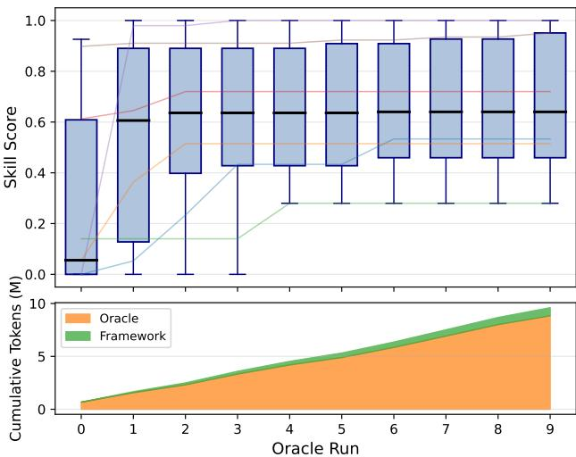  
Fi<sub>g</sub>ure 1: Pilot stud<sub>y</sub> (10 WildClawBench (Din<sub>g</sub> et al. 2026) tasks, 10 rounds, 3 seeds). Top: per-round averaged best/mean/worst skill scores. Bottom: averaged cumulative <sub>orac</sub>l<sub>e vs.</sub> f<sub>ramewor</sub>k t<sub>o</sub>k<sub>ens.</sub> S<sub>cores s</sub>h<sub>ow</sub> hi<sub>g</sub>h <sub>var</sub>i<sub>ance an</sub>d <sub>poor sca</sub>li<sub>ng; orac</sub>l<sub>e cos</sub>t d<sub>om</sub>i<sub>na</sub>t<sub>es an</sub>d <sub>grows.</sub>

Thi<sub>s approac</sub>h f<sub>aces a</sub> f<sub>un</sub>d<sub>amen</sub>t<sub>a</sub>l <sub>superv</sub>i<sub>s</sub>i<sub>on</sub> b<sub>o</sub>ttl<sub>enec</sub>k<sub>:</sub> <sub>eac</sub>h <sub>orac</sub>l<sub>e</sub> <sub>eva</sub>l<sub>ua</sub>ti<sub>on</sub> <sub>requ</sub>i<sub>res</sub> <sub>a</sub> f<sub>u</sub>ll <sub>agen</sub>t <sub>ro</sub>ll<sub>ou</sub>t<sub>,</sub> li<sub>m</sub>it<sub>-</sub> in<sub>g</sub> the number of candidates that can be assessed (Jimenez et al. 2024), while the discontinuous skill text s<sub>p</sub>ace (Yan<sub>g</sub> et al. 2024) means few oracle si<sub>g</sub>nals drive conservative, f<sub>a</sub>il<sub>ure-pa</sub>t<sub>c</sub>hi<sub>ng up</sub>d<sub>a</sub>t<sub>es.</sub> W<sub>e con</sub>fi<sub>rm</sub> thi<sub>s emp</sub>i<sub>r</sub>i<sub>ca</sub>ll<sub>y w</sub>ith a <sub>p</sub>ilot stud<sub>y</sub> (Fi<sub>g</sub>ure 1): across 10 WildClawBench (Din<sub>g</sub> et al. 2026) tasks evolved for 10 rounds (3 rollout seeds <sub>p</sub>er skill), skill o<sub>p</sub>timization fails to scale—the best–worst score <sub>gap rema</sub>i<sub>ns</sub> l<sub>arge</sub> th<sub>roug</sub>h<sub>ou</sub>t<sub>,</sub> i<sub>n</sub>di<sub>ca</sub>ti<sub>ng</sub> hi<sub>g</sub>h <sub>var</sub>i<sub>ance—an</sub>d <sub>orac</sub>l<sub>e</sub> t<sub>o</sub>k<sub>en consump</sub>ti<sub>on</sub> f<sub>ar excee</sub>d<sub>s</sub> f<sub>ramewor</sub>k <sub>over</sub>h<sub>ea</sub>d<sub>,</sub> <sub>worsen</sub>i<sub>ng w</sub>ith <sub>eac</sub>h <sub>success</sub>i<sub>ve run.</sub> Th<sub>ese</sub> fi<sub>n</sub>di<sub>ngs mo</sub>ti<sub>va</sub>t<sub>e</sub> d<sub>ecoup</sub>li<sub>ng</sub> <sub>s</sub>kill <sub>searc</sub>h f<sub>rom</sub> <sub>orac</sub>l<sub>e</sub> <sub>cos</sub>t <sub>v</sub>i<sub>a</sub> <sub>a</sub> <sub>c</sub>h<sub>eap</sub> <sub>surroga</sub>t<sub>e</sub> th<sub>a</sub>t <sub>approx</sub>i<sub>ma</sub>t<sub>es</sub> th<sub>e</sub> <sub>orac</sub>l<sub>e</sub>’<sub>s</sub> <sub>re</sub>l<sub>a</sub>ti<sub>ve</sub> <sub>pre</sub>f<sub>erences,</sub> <sub>a</sub>ll<sub>ow</sub>i<sub>ng</sub> <sub>op</sub>ti<sub>m</sub>i<sub>za</sub>ti<sub>on</sub> t<sub>o procee</sub>d <sub>a</sub>t <sub>sca</sub>l<sub>e w</sub>hil<sub>e orac</sub>l<sub>e eva</sub>l<sub>ua</sub>ti<sub>ons are</sub> i<sub>nvo</sub>k<sub>e</sub>d <sub>spar</sub>i<sub>ng</sub>l<sub>y</sub> f<sub>or re-a</sub>li<sub>gnmen</sub>t<sub>.</sub> T<sub>a</sub>bl<sub>e</sub> 1 <sub>con</sub>t<sub>ras</sub>t<sub>s</sub> S<sub>kill-</sub> L<sub>ift</sub> <sub>w</sub>ith <sub>represen</sub>t<sub>a</sub>ti<sub>ve</sub> <sub>ex</sub>i<sub>s</sub>ti<sub>ng</sub> <sub>me</sub>th<sub>o</sub>d<sub>s</sub> <sub>a</sub>l<sub>ong</sub> f<sub>our</sub> di<sub>men-</sub> <sub>s</sub>i<sub>ons:</sub> <sub>w</sub>h<sub>e</sub>th<sub>er</sub> th<sub>e</sub> <sub>me</sub>th<sub>o</sub>d <sub>evo</sub>l<sub>ves</sub> <sub>s</sub>kill<sub>s,</sub> <sub>w</sub>h<sub>e</sub>th<sub>er</sub> it <sub>emp</sub>l<sub>oys</sub> <sub>a surroga</sub>t<sub>e eva</sub>l<sub>ua</sub>t<sub>or, w</sub>h<sub>e</sub>th<sub>er</sub> it <sub>prov</sub>id<sub>es</sub> d<sub>ense</sub> f<sub>ee</sub>db<sub>ac</sub>k<sub>,</sub> <sub>an</sub>d it<sub>s</sub> <sub>orac</sub>l<sub>e-ca</sub>ll <sub>comp</sub>l<sub>ex</sub>it<sub>y.</sub>

T<sub>a</sub>bl<sub>e</sub> 1<sub>:</sub> O<sub>n</sub>l<sub>y</sub> S<sub>kill</sub>L<sub>ift com</sub>bi<sub>nes</sub> d<sub>ense</sub> f<sub>ee</sub>db<sub>ac</sub>k <sub>w</sub>ith amortized oracle-call complexity. L = evolution steps; T <sub>=</sub> <sub>evo</sub>l<sub>u</sub>ti<sub>on</sub> <sub>epoc</sub>h<sub>s.</sub>
<table><tr><td>Method</td><td>Evolv. Surro. Dense fb. Oracle</td><td></td><td>calls</td></tr><tr><td>Trace2Skill</td><td>× X</td><td>×</td><td>O(1)</td></tr><tr><td>MUSE-Autoskill</td><td>√</td><td>X X</td><td>O(LT)</td></tr><tr><td>SkillOpt</td><td>√</td><td>× ×</td><td>O(LT)</td></tr><tr><td>CoEvoSkills</td><td>√</td><td>√ √</td><td>O(LT)</td></tr><tr><td>SkillLift (ours)</td><td>√</td><td>√ √</td><td>O(L)</td></tr></table>

O<sub>ur</sub> k<sub>ey</sub> i<sub>ns</sub>i<sub>g</sub>ht i<sub>s</sub> th<sub>a</sub>t <sub>s</sub>kill <sub>evo</sub>l<sub>u</sub>ti<sub>on s</sub>h<sub>ou</sub>ld <sub>no</sub>t di<sub>rec</sub>tl<sub>y</sub> <sub>c</sub>h<sub>ase orac</sub>l<sub>e ou</sub>t<sub>comes;</sub> i<sub>ns</sub>t<sub>ea</sub>d<sub>,</sub> it <sub>s</sub>h<sub>ou</sub>ld fi<sub>rs</sub>t l<sub>earn a s</sub>t<sub>ruc-</sub> tured evaluation s<sub>p</sub>ace (a rubric) that ca<sub>p</sub>tures the oracle’s <sub>re</sub>l<sub>a</sub>ti<sub>ve pre</sub>f<sub>erences among s</sub>kill<sub>s.</sub> R<sub>an</sub>ki<sub>ng</sub> i<sub>s a smoo</sub>th<sub>er su-</sub> <sub>perv</sub>i<sub>s</sub>i<sub>on</sub> t<sub>arge</sub>t th<sub>an</sub> <sub>a</sub>b<sub>so</sub>l<sub>u</sub>t<sub>e</sub> <sub>ou</sub>t<sub>come</sub> <sub>regress</sub>i<sub>on:</sub> it <sub>requ</sub>i<sub>res</sub> <sub>on</sub>l<sub>y</sub> id<sub>en</sub>tif<sub>y</sub>i<sub>ng w</sub>hi<sub>c</sub>h <sub>s</sub>kill i<sub>s</sub> b<sub>e</sub>tt<sub>er, no</sub>t <sub>pre</sub>di<sub>c</sub>ti<sub>ng</sub> it<sub>s exac</sub>t <sub>score, so</sub> f<sub>ewer orac</sub>l<sub>e eva</sub>l<sub>ua</sub>ti<sub>ons su</sub>fi<sub>ce</sub> t<sub>o</sub> l<sub>earn a use</sub>f<sub>u</sub>l rubric (Christiano et al. 2017). Rankin<sub>g</sub> is also robust to <sub>no</sub>i<sub>sy or non-compara</sub>bl<sub>e orac</sub>l<sub>e va</sub>l<sub>ues, s</sub>i<sub>nce re</sub>l<sub>a</sub>ti<sub>ve or</sub>d<sub>er</sub> is <sub>p</sub>reserved even when absolute scores are unreliable (Wirth, Fürnkr<sub>a</sub>n<sub>z, a</sub>nd N<sub>eu</sub>m<sub>a</sub>nn 2016<sub>;</sub> S<sub>ug</sub>i<sub>ya</sub>m<sub>a,</sub> M<sub>egu</sub>r<sub>o, a</sub>nd Mi<sub>-</sub> nami 2012). Once ali<sub>g</sub>ned, the learned rubric converts s<sub>p</sub>arse <sub>orac</sub>l<sub>e</sub> f<sub>ee</sub>db<sub>ac</sub>k i<sub>n</sub>t<sub>o</sub> d<sub>ense an</sub>d i<sub>n</sub>t<sub>erpre</sub>t<sub>a</sub>bl<sub>e s</sub>i<sub>gna</sub>l<sub>s</sub> f<sub>or s</sub>kill <sub>g</sub>enerat<sup>i</sup>on.

W<sub>e</sub> f<sub>ormu</sub>l<sub>a</sub>t<sub>e</sub> <sub>s</sub>kill <sub>evo</sub>l<sub>u</sub>ti<sub>on</sub> <sub>as</sub> <sub>a</sub> bil<sub>eve</sub>l <sub>op</sub>ti<sub>m</sub>i<sub>za</sub>ti<sub>on</sub> <sub>p</sub>roblem (Colson, Marcotte, and Savard 2007): the lower level optimizes a population of K skills to maximize rubric-<sub>assesse</sub>d <sub>qua</sub>lit<sub>y,</sub> <sub>w</sub>hil<sub>e</sub> th<sub>e</sub> <sub>upper</sub> l<sub>eve</sub>l <sub>a</sub>li<sub>gns</sub> th<sub>e</sub> <sub>ru</sub>b<sub>r</sub>i<sub>c</sub> <sub>w</sub>ith <sub>orac</sub>l<sub>e</sub> <sub>pre</sub>f<sub>erences</sub> <sub>over</sub> th<sub>e</sub> <sub>resu</sub>lti<sub>ng</sub> <sub>s</sub>kill <sub>popu</sub>l<sub>a</sub>ti<sub>on.</sub> W<sub>e</sub> solve this objective via alternating optimization (Bezdek and Hathawa<sub>y</sub> 2003): in the skill-u<sub>p</sub>date ste<sub>p</sub>, the rubric is held fi<sub>xe</sub>d <sub>as</sub> th<sub>e surroga</sub>t<sub>e eva</sub>l<sub>ua</sub>t<sub>or, prov</sub>idi<sub>ng</sub> d<sub>ense</sub> f<sub>ee</sub>db<sub>ac</sub>k f<sub>or</sub> i<sub>mprov</sub>i<sub>ng eac</sub>h <sub>s</sub>kill<sub>;</sub> i<sub>n</sub> th<sub>e ru</sub>b<sub>r</sub>i<sub>c-up</sub>d<sub>a</sub>t<sub>e s</sub>t<sub>ep, s</sub>kill<sub>s are</sub> h<sub>e</sub>ld fi<sub>xe</sub>d <sub>an</sub>d <sub>orac</sub>l<sub>e eva</sub>l<sub>ua</sub>ti<sub>ons are</sub> i<sub>nvo</sub>k<sub>e</sub>d <sub>so</sub>l<sub>e</sub>l<sub>y</sub> t<sub>o re-a</sub>li<sub>gn</sub> th<sub>e ru</sub>b<sub>r</sub>i<sub>c-</sub>i<sub>n</sub>d<sub>uce</sub>d <sub>ran</sub>ki<sub>n w</sub>ith th<sub>e orac</sub>l<sub>e ran</sub>ki<sub>n .</sub> Thi<sub>s</sub> d<sub>e-</sub> <sub>compos</sub>iti<sub>on</sub> <sub>amor</sub>ti<sub>zes</sub> <sub>orac</sub>l<sub>e</sub> <sub>cos</sub>t<sub>,</sub> <sub>s</sub>t<sub>a</sub>bili<sub>zes</sub> t<sub>ex</sub>t<sub>-space</sub> <sub>up-</sub> d<sub>a</sub>t<sub>es, an</sub>d <sub>re</sub>d<sub>uces over</sub>fitti<sub>ng</sub> b<sub>y</sub> di<sub>rec</sub>ti<sub>ng s</sub>kill i<sub>mprovemen</sub>t<sub>s</sub> t<sub>owar</sub>d <sub>genera</sub>l <sub>qua</sub>lit<sub>y cr</sub>it<sub>er</sub>i<sub>a ra</sub>th<sub>er</sub> th<sub>an</sub> i<sub>ns</sub>t<sub>ance-spec</sub>ifi<sub>c</sub> f<sub>a</sub>il<sub>ure pa</sub>t<sub>c</sub>h<sub>es.</sub> O<sub>ur ma</sub>i<sub>n con</sub>t<sub>r</sub>ib<sub>u</sub>ti<sub>ons are as</sub> f<sub>o</sub>ll<sub>ows.</sub>

• We identif<sub>y</sub> the su<sub>p</sub>ervision bottleneck in direct skill o<sub>p</sub>- ti<sub>m</sub>i<sub>za</sub>ti<sub>on an</sub>d <sub>propose</sub> l<sub>earn</sub>i<sub>ng an orac</sub>l<sub>e-a</sub>li<sub>gne</sub>d <sub>ru</sub>b<sub>r</sub>i<sub>c</sub> <sub>as a s</sub>t<sub>ruc</sub>t<sub>ure</sub>d <sub>eva</sub>l<sub>ua</sub>ti<sub>on space</sub> t<sub>o a</sub>dd<sub>ress</sub> it<sub>.</sub>

• We formulate skill evolution as a bilevel o<sub>p</sub>timization <sub>pro</sub>bl<sub>em</sub> <sub>an</sub>d <sub>so</sub>l<sub>ve</sub> it <sub>v</sub>i<sub>a</sub> <sub>a</sub>lt<sub>erna</sub>ti<sub>ng</sub> <sub>up</sub>d<sub>a</sub>t<sub>es</sub> b<sub>e</sub>t<sub>ween</sub> <sub>s</sub>kill <sub>op</sub>ti<sub>m</sub>i<sub>za</sub>ti<sub>on gu</sub>id<sub>e</sub>d b<sub>y ru</sub>b<sub>r</sub>i<sub>c</sub> f<sub>ee</sub>db<sub>ac</sub>k <sub>an</sub>d <sub>ru</sub>b<sub>r</sub>i<sub>c a</sub>li<sub>gn-</sub> <sub>men</sub>t <sub>gu</sub>id<sub>e</sub>d b<sub>y orac</sub>l<sub>e ran</sub>ki<sub>ng, a</sub>ll<sub>ev</sub>i<sub>a</sub>ti<sub>ng expens</sub>i<sub>ve eva</sub>l<sub>-</sub> <sub>ua</sub>ti<sub>ons w</sub>hil<sub>e s</sub>t<sub>a</sub>bili<sub>z</sub>i<sub>ng</sub> t<sub>ex</sub>t<sub>-space searc</sub>h<sub>.</sub>

• We demonstrate on two com<sub>p</sub>lex a<sub>g</sub>ent task benchmarks th<sub>a</sub>t <sub>our</sub> <sub>me</sub>th<sub>o</sub>d <sub>ou</sub>t<sub>per</sub>f<sub>orms</sub> <sub>ex</sub>i<sub>s</sub>ti<sub>ng</sub> <sub>au</sub>t<sub>o-s</sub>kill <sub>se</sub>lf<sub>-</sub> evolvin<sub>g</sub> methods even when baselines are <sub>g</sub>iven a 2× l<sub>arger</sub> t<sub>o</sub>k<sub>en</sub> b<sub>u</sub>d<sub>ge</sub>t<sub>,</sub> <sub>an</sub>d <sub>ac</sub>hi<sub>eves</sub> t<sub>arge</sub>t <sub>per</sub>f<sub>ormance</sub> <sub>a</sub>t 40<sub>–</sub>70% l<sub>owe</sub>r t<sub>o</sub>k<sub>e</sub>n <sub>cos</sub>t<sub>.</sub>

## 2 Related work

Context optimization for LLMs. Treating the prompt it-<sub>se</sub>lf <sub>as</sub> <sub>an</sub> <sub>op</sub>ti<sub>m</sub>i<sub>za</sub>ti<sub>on</sub> t<sub>arge</sub>t <sub>pre</sub>d<sub>a</sub>t<sub>es</sub> th<sub>e</sub> <sub>s</sub>kill<sub>-se</sub>tti<sub>ng</sub> b<sub>y</sub> several <sub>y</sub>ears. APE (Zhou et al. 2023) sam<sub>p</sub>les instruction <sub>can</sub>did<sub>a</sub>t<sub>es v</sub>i<sub>a</sub> f<sub>orwar</sub>d LM <sub>ca</sub>ll<sub>s an</sub>d <sub>re</sub>t<sub>a</sub>i<sub>ns</sub> th<sub>e</sub> b<sub>es</sub>t th<sub>roug</sub>h Monte Carlo scorin<sub>g</sub>; OPRO (Yan<sub>g</sub> et al. 2024) works in <sub>a</sub> <sub>s</sub>i<sub>m</sub>il<sub>ar</sub> <sub>sp</sub>i<sub>r</sub>it b<sub>u</sub>t k<sub>eeps</sub> <sub>a</sub> <sub>runn</sub>i<sub>ng</sub> <sub>arc</sub>hi<sub>ve</sub> <sub>o</sub>f t<sub>op-scor</sub>i<sub>ng</sub> <sub>s</sub>t<sub>r</sub>i<sub>ngs</sub> i<sub>ns</sub>id<sub>e</sub> <sub>a</sub> <sub>me</sub>t<sub>a-promp</sub>t th<sub>a</sub>t th<sub>e</sub> LLM <sub>rea</sub>d<sub>s</sub> <sub>an</sub>d i<sub>m-</sub> <sub>p</sub>roves at each ste<sub>p</sub>. DSP<sub>y</sub> (Khattab et al. 2024) scales the id<sub>ea</sub> t<sub>o</sub> f<sub>u</sub>ll LM <sub>p</sub>i<sub>pe</sub>li<sub>nes:</sub> it b<sub>oo</sub>t<sub>s</sub>t<sub>raps</sub> f<sub>ew-s</sub>h<sub>o</sub>t d<sub>emon-</sub> <sub>s</sub>t<sub>ra</sub>ti<sub>ons</sub> f<sub>rom success</sub>f<sub>u</sub>l <sub>runs an</sub>d <sub>co-op</sub>ti<sub>m</sub>i<sub>zes</sub> i<sub>ns</sub>t<sub>ruc</sub>ti<sub>on</sub> t<sub>ex</sub>t <sub>an</sub>d <sub>examp</sub>l<sub>e se</sub>l<sub>ec</sub>ti<sub>on un</sub>d<sub>er a</sub> d<sub>ec</sub>l<sub>ara</sub>ti<sub>ve s</sub>i<sub>gna</sub>t<sub>ure.</sub> TextGrad (Yuksek<sub>g</sub>onul et al. 2024) adds a diferentiable <sub>s</sub>t<sub>ruc</sub>t<sub>ure</sub> t<sub>o</sub> th<sub>e</sub> <sub>p</sub>i<sub>pe</sub>li<sub>ne</sub> b<sub>y</sub> d<sub>e</sub>fi<sub>n</sub>i<sub>ng</sub> <sub>a</sub> <sub>compu</sub>t<sub>a</sub>ti<sub>on</sub> <sub>grap</sub>h <sub>over</sub> LM <sub>ca</sub>ll<sub>s</sub> <sub>an</sub>d b<sub>ac</sub>k<sub>propaga</sub>ti<sub>ng</sub> <sub>ver</sub>b<sub>a</sub>l <sub>cr</sub>iti<sub>que</sub> <sub>as</sub> <sub>a</sub> <sub>sur-</sub> <sub>roga</sub>t<sub>e gra</sub>di<sub>en</sub>t<sub>.</sub> All <sub>o</sub>f th<sub>ese me</sub>th<sub>o</sub>d<sub>s query an eva</sub>l<sub>ua</sub>t<sub>or</sub> h<sub>un</sub>d<sub>re</sub>d<sub>s</sub> <sub>o</sub>f ti<sub>mes,</sub> <sub>w</sub>hi<sub>c</sub>h i<sub>s</sub> f<sub>eas</sub>ibl<sub>e</sub> b<sub>ecause</sub> <sub>eac</sub>h <sub>query</sub> i<sub>s</sub> <sub>a</sub> <sub>s</sub>i<sub>ng</sub>l<sub>e</sub> LM <sub>ca</sub>ll<sub>.</sub> S<sub>cor</sub>i<sub>ng a s</sub>kill <sub>can</sub>did<sub>a</sub>t<sub>e,</sub> b<sub>y con</sub>t<sub>ras</sub>t<sub>, means</sub> executin the a ent end-to-end (Jimenez et al. 2024), and the <sub>searc</sub>h l<sub>an</sub>d<sub>scape</sub> i<sub>s cons</sub>id<sub>era</sub>bl<sub>y roug</sub>h<sub>er</sub> th<sub>an promp</sub>t <sub>space,</sub> <sub>s</sub>i<sub>nce a</sub> f<sub>ew e</sub>dit<sub>e</sub>d <sub>wor</sub>d<sub>s can</sub> fli<sub>p a ro</sub>ll<sub>ou</sub>t f<sub>rom success</sub> t<sub>o</sub> crash (Yan<sub>g</sub> et al. 2024).

Skill extraction from trajectories. Several recent syst<sub>ems genera</sub>t<sub>e s</sub>kill<sub>s</sub> b<sub>y</sub> di<sub>s</sub>tilli<sub>ng agen</sub>t <sub>execu</sub>ti<sub>on</sub> t<sub>races.</sub> Trace2Skill (Ni et al. 2026) se<sub>g</sub>ments a trajector<sub>y</sub> into lo-<sub>ca</sub>l l<sub>essons an</sub>d <sub>a</sub>b<sub>s</sub>t<sub>rac</sub>t<sub>s eac</sub>h i<sub>n</sub>t<sub>o a</sub> t<sub>rans</sub>f<sub>era</sub>bl<sub>e</sub> d<sub>ocumen</sub>t indexed b<sub>y</sub> task context. MUSE-Autoskill (Lin et al. 2026) <sub>coup</sub>l<sub>es</sub> thi<sub>s ex</sub>t<sub>rac</sub>ti<sub>on w</sub>ith <sub>a memory mo</sub>d<sub>u</sub>l<sub>e an</sub>d <sub>a s</sub>kill <sub>manager</sub> th<sub>a</sub>t d<sub>ec</sub>id<sub>es w</sub>h<sub>en</sub> t<sub>o crea</sub>t<sub>e, rev</sub>i<sub>se, or re</sub>ti<sub>re en-</sub> tries. SkillCAT (Anon<sub>y</sub>mous 2026) attacks the attribution <sub>ques</sub>ti<sub>on</sub> h<sub>ea</sub>d<sub>-on:</sub> f<sub>or eac</sub>h t<sub>as</sub>k it <sub>pa</sub>i<sub>rs success</sub>f<sub>u</sub>l <sub>an</sub>d f<sub>a</sub>il<sub>e</sub>d trajectories, applies contrastive causal extraction to isolate th<sub>e</sub> f<sub>ragmen</sub>t<sub>s respons</sub>ibl<sub>e</sub> f<sub>or</sub> th<sub>e ou</sub>t<sub>come gap, an</sub>d <sub>rou</sub>t<sub>es</sub> th<sub>e</sub> <sub>surv</sub>i<sub>vors</sub> th<sub>roug</sub>h <sub>a</sub> t<sub>opo</sub>l<sub>ogy-aware</sub> <sub>su</sub>b<sub>grap</sub>h <sub>a</sub>t i<sub>n</sub>f<sub>er-</sub> ence. SkillFoundr<sub>y</sub> (Shen et al. 2026) sideste<sub>p</sub>s trajectories <sub>en</sub>ti<sub>re</sub>l<sub>y, assem</sub>bli<sub>ng s</sub>kill lib<sub>rar</sub>i<sub>es</sub> f<sub>rom</sub> h<sub>e</sub>t<sub>erogeneous sc</sub>i<sub>-</sub> entific documents. In all of these systems, quality is judged b<sub>y w</sub>h<sub>e</sub>th<sub>er</sub> th<sub>e source</sub> t<sub>as</sub>k <sub>passes or</sub> f<sub>a</sub>il<sub>s a</sub>ft<sub>er</sub> th<sub>e s</sub>kill i<sub>s</sub> injected—a binary verdict that costs one full oracle call per d<sub>ec</sub>i<sub>s</sub>i<sub>on.</sub>

Text-space skill optimization. A more recent thread for-<sub>ma</sub>li<sub>zes</sub> <sub>s</sub>kill <sub>rev</sub>i<sub>s</sub>i<sub>on</sub> <sub>as</sub> <sub>op</sub>ti<sub>m</sub>i<sub>za</sub>ti<sub>on</sub> <sub>over</sub> th<sub>e</sub> <sub>s</sub>kill d<sub>ocu-</sub> ment. SkillO<sub>p</sub>t (Yan<sub>g</sub> et al. 2026) and SkillGrad (Wan<sub>g</sub> et al. 2026) both borrow from wei<sub>g</sub>ht-s<sub>p</sub>ace trainin<sub>g</sub>—the former maintains a textual learning rate, a rejected-edit bufer, and <sub>va</sub>lid<sub>a</sub>ti<sub>on</sub> <sub>ga</sub>t<sub>es,</sub> <sub>w</sub>hil<sub>e</sub> th<sub>e</sub> l<sub>a</sub>tt<sub>er</sub> <sub>genera</sub>t<sub>es</sub> t<sub>ex</sub>t<sub>-</sub>b<sub>ase</sub>d <sub>gra-</sub> dient signals from trajectory-level losses with a momentum term. SkillClaw (Ma et al. 2026) and CoEvoSkills (Zhan<sub>g</sub> et al. 2026) shift the unit of o<sub>p</sub>timization from individual <sub>s</sub>kill<sub>s</sub> t<sub>o evo</sub>l<sub>v</sub>i<sub>ng popu</sub>l<sub>a</sub>ti<sub>ons, us</sub>i<sub>ng co-evo</sub>l<sub>u</sub>ti<sub>onary ver</sub>ifi<sub>-</sub> <sub>ca</sub>ti<sub>on an</sub>d <sub>cross-s</sub>kill f<sub>ee</sub>db<sub>ac</sub>k t<sub>o escape</sub> l<sub>oca</sub>l <sub>op</sub>ti<sub>ma.</sub> Skill<sub>-</sub> For<sub>g</sub>e (Liu et al. 2026b) a<sub>pp</sub>lies iterative refinement in an i<sub>n</sub>d<sub>us</sub>t<sub>r</sub>i<sub>a</sub>l <sub>p</sub>i<sub>pe</sub>li<sub>ne</sub> f<sub>or c</sub>l<sub>ou</sub>d t<sub>ec</sub>h<sub>n</sub>i<sub>ca</sub>l <sub>suppor</sub>t<sub>.</sub> Th<sub>e s</sub>h<sub>are</sub>d bli<sub>n</sub>d <sub>spo</sub>t i<sub>s</sub> th<sub>a</sub>t <sub>every</sub> <sub>e</sub>dit <sub>mus</sub>t b<sub>e</sub> <sub>ra</sub>tifi<sub>e</sub>d b<sub>y</sub> <sub>an</sub> <sub>orac</sub>l<sub>e</sub> <sub>ro</sub>ll<sub>-</sub> <sub>ou</sub>t b<sub>e</sub>f<sub>ore</sub> it <sub>en</sub>t<sub>ers</sub> th<sub>e</sub> <sub>s</sub>kill<sub>.</sub> With <sub>orac</sub>l<sub>e</sub> <sub>ca</sub>ll<sub>s</sub> <sub>as</sub> th<sub>e</sub> bi<sub>n</sub>di<sub>ng</sub> <sub>cons</sub>t<sub>ra</sub>i<sub>n</sub>t<sub>,</sub> th<sub>e searc</sub>h <sub>co</sub>ll<sub>apses</sub> t<sub>o conserva</sub>ti<sub>ve</sub> l<sub>oca</sub>l <sub>pa</sub>t<sub>c</sub>h<sub>es</sub> <sub>aroun</sub>d th<sub>e</sub> <sub>curren</sub>t b<sub>es</sub>t <sub>s</sub>kill<sub>.</sub> I<sub>n</sub> <sub>con</sub>t<sub>ras</sub>t<sub>,</sub> S<sub>kill</sub>L<sub>ift</sub> d<sub>ecou-</sub> <sub>p</sub>l<sub>es s</sub>kill <sub>searc</sub>h f<sub>rom orac</sub>l<sub>e cos</sub>t b<sub>y</sub> l<sub>earn</sub>i<sub>ng a ru</sub>b<sub>r</sub>i<sub>c</sub> th<sub>a</sub>t <sub>approx</sub>i<sub>ma</sub>t<sub>es orac</sub>l<sub>e ran</sub>ki<sub>ngs, ena</sub>bli<sub>ng</sub> d<sub>ense</sub> f<sub>ee</sub>db<sub>ac</sub>k f<sub>or</sub> <sub>s</sub>kill <sub>rev</sub>i<sub>s</sub>i<sub>on w</sub>ith<sub>ou</sub>t <sub>requ</sub>i<sub>r</sub>i<sub>ng a ro</sub>ll<sub>ou</sub>t <sub>per e</sub>dit<sub>.</sub>

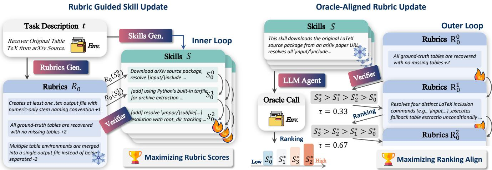  
Fi ure 2: Overview of SkillLift. The s stem alternates between two hases: inner loop (rubric- uided skill u date) where the rubric R scores and guides skill revision without oracle rollouts, and outer loop (oracle-aligned rubric update) where oracle evaluations on frozen skills re-align R via Kendall’s τ.

## 3 Method

W<sub>e so</sub>l<sub>ve</sub> th<sub>e</sub> bil<sub>eve</sub>l <sub>program v</sub>i<sub>a a</sub>lt<sub>erna</sub>ti<sub>ng op</sub>ti<sub>m</sub>i<sub>za</sub>ti<sub>on</sub> over K skills and a shared rubric R. The initial rubric is bootstrapped from the seed skill’s execution trajectory and the task description (prompt in Appendix). In the inner loop (Mode A), R is held fixed and <sub>g</sub>uides skill revision at no oracle cost. In the outer loop (Mode B), skills are frozen and K oracle rollouts re-align R with true rankings. The two modes alternate for L rounds or until the champion’s oracle <sub>score—</sub>th<sub>e</sub> f<sub>rac</sub>ti<sub>on o</sub>f <sub>success</sub>f<sub>u</sub>l <sub>ro</sub>ll<sub>ou</sub>t<sub>s across see</sub>d<sub>s, w</sub>hi<sub>c</sub>h we call the pass rate—reaches $\theta _ { \mathrm { s t o p } } .$ <sub>.</sub> S<sub>ec</sub>ti<sub>on</sub> 3 f<sub>orma</sub>li<sub>zes</sub> th<sub>e</sub> objective; Figure 2 illustrates the full pipeline.

## Problem Formulation

Let π be a frozen a<sub>g</sub>ent and T a task distribution. Loadin<sub>g</sub> a skill S before task t produces a rollout $\xi \sim \pi ( \cdot \mid S , t )$ <sub>, score</sub>d b<sub>y</sub> <sub>an</sub> <sub>orac</sub>l<sub>e</sub> $\mathcal { O } ( \xi )$ <sub>.</sub> E<sub>ac</sub>h <sub>orac</sub>l<sub>e</sub> <sub>ca</sub>ll <sub>requ</sub>i<sub>res</sub> <sub>a</sub> f<sub>u</sub>ll <sub>ro</sub>ll<sub>ou</sub>t<sub>,</sub> <sub>so</sub> the budget B on scored (S, t) pairs is the binding constraint. Directly solving arg max<sub>S</sub> $\mathbb { E } _ { t , \xi } [ \mathcal { O } ( \xi ) ]$ ] is hard: B is small and th<sub>e s</sub>kill t<sub>ex</sub>t <sub>space</sub> i<sub>s</sub> hi<sub>g</sub>hl<sub>y non-smoo</sub>th<sub>, so</sub> th<sub>e op</sub>ti<sub>m</sub>i<sub>zer</sub> <sub>sees</sub> f<sub>ew s</sub>i<sub>gna</sub>l<sub>s an</sub>d f<sub>a</sub>ll<sub>s</sub> b<sub>ac</sub>k t<sub>o pa</sub>t<sub>c</sub>hi<sub>ng o</sub>b<sub>serve</sub>d f<sub>a</sub>il<sub>ures.</sub> We introduce a rubric R that scores a skill $R ( S )$ <sub>v</sub>i<sub>a a s</sub>i<sub>ng</sub>l<sub>e</sub>

LLM <sub>ca</sub>ll<sub>—no ro</sub>ll<sub>ou</sub>t <sub>nee</sub>d<sub>e</sub>d<sub>.</sub> Th<sub>e ru</sub>b<sub>r</sub>i<sub>c</sub> i<sub>s c</sub>h<sub>eap</sub> b<sub>u</sub>t <sub>mus</sub>t <sub>s</sub>t<sub>ay a</sub>li<sub>gne</sub>d <sub>w</sub>ith th<sub>e orac</sub>l<sub>e.</sub> W<sub>e</sub> f<sub>orma</sub>li<sub>ze</sub> thi<sub>s as a</sub> bil<sub>eve</sub>l <sub>p</sub>ro<sub>g</sub>ram (Colson, Marcotte, and Savard 2007):

$$
\begin{array} { r l } & { \underset { R } { \operatorname* { m i n } } ~ \mathbb { E } _ { t \sim T } \big [ \mathcal { D } \big ( \sigma _ { t } ^ { R } , \sigma _ { t } ^ { \mathcal { O } } \big ) \big ] } \\ & { \mathrm { s . t . } \quad S ^ { * } ( R ) = \arg \underset { S } { \operatorname* { m a x } } ~ \mathbb { E } _ { t \sim T } \big [ R ( S ) \big ] } \end{array}\tag{1}
$$

<sub>w</sub>h<sub>ere</sub> $\sigma _ { t } ^ { R }$ <sub>an</sub>d $\sigma _ { t } ^ { \mathcal { O } }$ <sub>are</sub> th<sub>e ran</sub>ki<sub>ngs</sub> th<sub>a</sub>t th<sub>e ru</sub>b<sub>r</sub>i<sub>c an</sub>d th<sub>e</sub> oracle induce over candidate skills on task t, and D is a ranking discrepancy measure (instantiated as 1 − τ in the outer loop, where τ is Kendall’s rank correlation). The upper level keeps R aligned with the oracle’s preference ordering; the lower level searches skill text to maximize R(S). Because R <sub>requ</sub>i<sub>res</sub> <sub>no</sub> <sub>ro</sub>ll<sub>ou</sub>t<sub>,</sub> th<sub>ousan</sub>d<sub>s</sub> <sub>o</sub>f <sub>can</sub>did<sub>a</sub>t<sub>es</sub> <sub>can</sub> b<sub>e</sub> <sub>score</sub>d <sub>a</sub>t <sub>near-zero cos</sub>t<sub>.</sub> O<sub>n</sub>l<sub>y re</sub>l<sub>a</sub>ti<sub>ve or</sub>d<sub>er ma</sub>tt<sub>ers—no</sub>t <sub>score</sub> <sub>ca</sub>lib<sub>ra</sub>ti<sub>on—so</sub> <sub>a</sub> h<sub>an</sub>df<sub>u</sub>l <sub>o</sub>f <sub>orac</sub>l<sub>e</sub> <sub>eva</sub>l<sub>ua</sub>ti<sub>ons</sub> <sub>per</sub> <sub>roun</sub>d sufices to re-ali<sub>g</sub>n R (Christiano et al. 2017). Once ali<sub>g</sub>ned, th<sub>e ru</sub>b<sub>r</sub>i<sub>c prov</sub>id<sub>es</sub> d<sub>ense</sub> f<sub>ee</sub>db<sub>ac</sub>k f<sub>or</sub> th<sub>e</sub> l<sub>ower-</sub>l<sub>eve</sub>l <sub>searc</sub>h <sub>w</sub>ith<sub>ou</sub>t <sub>consum</sub>i<sub>ng a</sub>dditi<sub>ona</sub>l <sub>ro</sub>ll<sub>ou</sub>t<sub>s.</sub>

## Rubric-Guided Skill Update

Th<sub>e</sub> l<sub>ower</sub> l<sub>eve</sub>l <sub>o</sub>f th<sub>e</sub> bil<sub>eve</sub>l <sub>program searc</sub>h<sub>es s</sub>kill t<sub>ex</sub>t to maximize expected rubric score. Since R(S) costs one LLM <sub>ca</sub>ll <sub>ra</sub>th<sub>er</sub> th<sub>an a</sub> f<sub>u</sub>ll <sub>ro</sub>ll<sub>ou</sub>t<sub>,</sub> th<sub>e s</sub>kill <sub>genera</sub>t<sub>or can</sub> t<sub>es</sub>t f<sub>ar more can</sub>did<sub>a</sub>t<sub>es</sub> th<sub>an</sub> th<sub>e orac</sub>l<sub>e</sub> b<sub>u</sub>d<sub>ge</sub>t <sub>perm</sub>it<sub>s.</sub> A scalar score alone, however, tells the generator how much a skill falls short but not where: to guide targeted revision, the <sub>eva</sub>l<sub>ua</sub>ti<sub>on</sub> <sub>mus</sub>t <sub>expose</sub> <sub>w</sub>hi<sub>c</sub>h <sub>aspec</sub>t<sub>s</sub> <sub>o</sub>f th<sub>e</sub> <sub>s</sub>kill’<sub>s</sub> b<sub>e</sub>h<sub>av</sub>i<sub>or</sub> <sub>are</sub> d<sub>e</sub>fi<sub>c</sub>i<sub>en</sub>t<sub>.</sub>

We structure the rubric as a set of M binary criteria $\{ ( c _ { 1 } , p _ { 1 } ) , \hdots , ( c _ { M } , p _ { M } ) \}$ <sub>.</sub> E<sub>ac</sub>h $c _ { i }$ i<sub>s a yes</sub>/<sub>no ques</sub>ti<sub>on a</sub>b<sub>ou</sub>t th<sub>e s</sub>kill’<sub>s</sub> b<sub>e</sub>h<sub>av</sub>i<sub>or on</sub> th<sub>e</sub> t<sub>as</sub>k<sub>, an</sub>d $p _ { i } \in \mathbb { Z } \backslash \{ 0 \}$ i<sub>s a s</sub>i<sub>gne</sub>d <sub>we</sub>i<sub>g</sub>ht<sub>:</sub> $p _ { i } > 0$ <sub>rewar</sub>d<sub>s</sub> <sub>mee</sub>ti<sub>ng</sub> $c _ { i }$ (a merit), $p _ { i } ~ < ~ 0$ p<sup>e-</sup> nalizes violatin<sub>g</sub> it (a flaw). Given a task–skill <sub>p</sub>air $( t , S _ { k } )$ , a verifier—an LLM prompted with $( t , S _ { k } , R )$ —judges each <sub>cr</sub>it<sub>er</sub>i<sub>on, pro</sub>d<sub>uc</sub>i<sub>ng</sub> hit<sub>s</sub> $\grave { h _ { i } } ( S _ { k } , t ) \in \space \left\{ 0 , 1 \right\}$ <sub>.</sub> Th<sub>e ru</sub>b<sub>r</sub>i<sub>c score</sub>

$$
R ( S _ { k } ) = \frac { \sum _ { i = 1 } ^ { M } p _ { i } h _ { i } ( S _ { k } , t ) - S _ { \operatorname* { m i n } } } { S _ { \operatorname* { m a x } } - S _ { \operatorname* { m i n } } } ,\tag{2}
$$

<sub>w</sub>h<sub>ere</sub> $\begin{array} { r } { S _ { \mathrm { m a x } } = \sum _ { p _ { i } > 0 } p _ { i } } \end{array}$ <sub>an</sub>d $\begin{array} { r } { S _ { \mathrm { m i n } } = \sum _ { p _ { i } < 0 } p _ { i } } \end{array}$ <sub>, norma</sub>li<sub>z-</sub> i<sub>ng</sub> th<sub>e score</sub> t<sub>o</sub> $[ 0 , 1 ] .$ <sub>.</sub> Th<sub>e</sub> hit <sub>vec</sub>t<sub>or</sub> $\mathbf { h } ( S _ { k } ) { \widetilde { \mathbf { \Gamma } } } = ( h _ { 1 } , \dots , h _ { M } )$ <sub>accompan</sub>i<sub>es</sub> th<sub>e score, so</sub> th<sub>e genera</sub>t<sub>or can see w</sub>hi<sub>c</sub>h <sub>cr</sub>it<sub>er</sub>i<sub>a</sub> f<sub>a</sub>il<sub>e</sub>d <sub>an</sub>d t<sub>arge</sub>t th<sub>ose</sub> i<sub>n</sub> it<sub>s rev</sub>i<sub>s</sub>i<sub>on.</sub> Thi<sub>s ru</sub>b<sub>r</sub>i<sub>c-as-rewar</sub>d f<sub>ormu</sub>l<sub>a</sub>ti<sub>on connec</sub>t<sub>s</sub> t<sub>o recen</sub>t <sub>wor</sub>k <sub>on s</sub>t<sub>ruc</sub>t<sub>ure</sub>d <sub>cr</sub>it<sub>er</sub>i<sub>a</sub> for reward modelin<sub>g</sub> (Gunjal et al. 2025; Liu et al. 2026a).

In each outer round ℓ, SkillLift maintains a single cham-<sub>p</sub>i<sub>on</sub> <sub>s</sub>kill $S _ { \ell - 1 } ^ { \star } .$ Th<sub>e</sub> i<sub>n</sub>iti<sub>a</sub>l <sub>c</sub>h<sub>amp</sub>i<sub>on</sub> i<sub>s</sub> th<sub>e see</sub>d <sub>s</sub>kill<sub>; a</sub>ft<sub>er</sub> <sub>eac</sub>h M<sub>o</sub>d<sub>e</sub> B <sub>up</sub>d<sub>a</sub>t<sub>e,</sub> th<sub>e orac</sub>l<sub>e se</sub>l<sub>ec</sub>t<sub>s</sub> th<sub>e nex</sub>t <sub>c</sub>h<sub>amp</sub>i<sub>on</sub> f<sub>rom</sub> th<sub>e re</sub>fi<sub>ne</sub>d b<sub>ranc</sub>h<sub>es</sub> t<sub>oge</sub>th<sub>er w</sub>ith th<sub>e prece</sub>di<sub>ng c</sub>h<sub>am-</sub> <sub>p</sub>i<sub>on.</sub> Th<sub>e ver</sub>ifi<sub>er</sub> fi<sub>rs</sub>t <sub>eva</sub>l<sub>ua</sub>t<sub>es</sub> $S _ { \ell - 1 } ^ { \star }$ <sub>un</sub>d<sub>er</sub> th<sub>e</sub> fi<sub>xe</sub>d <sub>ru</sub>b<sub>r</sub>i<sub>c</sub> $R _ { \ell }$ <sub>an</sub>d <sub>pro</sub>d<sub>uces cr</sub>it<sub>er</sub>i<sub>on</sub> hit<sub>s</sub> $\mathbf { h } _ { \ell } ^ { \star }$ <sub>.</sub> C<sub>on</sub>diti<sub>one</sub>d <sub>on</sub> thi<sub>s</sub> f<sub>ee</sub>d<sub>-</sub> back, the skill generator constructs K diverse revision di-<sub>rec</sub>ti<sub>ons</sub> $d _ { \ell , k } .$ <sub>—na</sub>t<sub>ura</sub>l<sub>-</sub>l<sub>anguage</sub> di<sub>rec</sub>ti<sub>ves</sub> t<sub>arge</sub>ti<sub>ng</sub> di<sub>s</sub>ti<sub>nc</sub>t im<sub>p</sub>rovement as<sub>p</sub>ects (e.<sub>g</sub>., strate<sub>gy</sub> o<sub>p</sub>timization, tool-usa<sub>g</sub>e <sub>p</sub>olic<sub>y</sub>, error handlin<sub>g</sub>), ins<sub>p</sub>ired b<sub>y</sub> the skill lifec<sub>y</sub>cle decom<sub>p</sub>osition of Lin et al. (2026)—and derives a fresh set of <sub>can</sub>did<sub>a</sub>t<sub>e</sub> b<sub>ranc</sub>h<sub>es</sub> <sub>v</sub>i<sub>a</sub> th<sub>e</sub> <sub>genera</sub>t<sub>or</sub> $G ,$ <sub>,</sub> <sub>a</sub>n LLM <sub>ca</sub>ll <sub>us</sub>in<sub>g</sub> th<sub>e same</sub> b<sub>ac</sub>kb<sub>one un</sub>d<sub>er</sub> t<sub>es</sub>t <sub>as</sub> th<sub>e agen</sub>t it<sub>se</sub>lf<sub>:</sub>

$$
S _ { \ell , k } ^ { ( 0 ) } = G ( t , S _ { \ell - 1 } ^ { \star } , R _ { \ell } , { \bf h } _ { \ell } ^ { \star } , d _ { \ell , k } ) , \quad k = 1 , \ldots , K .
$$

E<sub>ac</sub>h b<sub>ranc</sub>h i<sub>s re</sub>fi<sub>ne</sub>d <sub>on</sub>l<sub>y w</sub>ithi<sub>n</sub> th<sub>e curren</sub>t <sub>ou</sub>t<sub>er roun</sub>d<sub>.</sub> L<sub>e</sub>t $\mathbf { h } _ { \ell , k } ^ { ( a ) }$ be the verifier hits for branch k after inner step a. C<sub>on</sub>diti<sub>one</sub>d <sub>on</sub> th<sub>ese</sub> hit<sub>s,</sub> th<sub>e</sub> <sub>genera</sub>t<sub>or</sub> <sub>proposes</sub> <sub>a</sub> b<sub>ranc</sub>h<sub>-</sub> l<sub>oca</sub>l <sub>rev</sub>i<sub>s</sub>i<sub>on</sub> $\widehat S _ { \ell , k } ^ { ( a + 1 ) }$ <sub>,</sub> <sub>w</sub>hi<sub>c</sub>h i<sub>s</sub> <sub>re</sub>t<sub>a</sub>i<sub>ne</sub>d <sub>on</sub>l<sub>y</sub> <sub>w</sub>h<sub>en</sub> it<sub>s</sub> <sub>ru</sub>b<sub>r</sub>i<sub>c</sub> <sub>score</sub> d<sub>oes no</sub>t d<sub>ecrease:</sub>

$$
S _ { \ell , k } ^ { ( a + 1 ) } = \left\{ \begin{array} { l l } { \widehat { S } _ { \ell , k } ^ { ( a + 1 ) } } & { \mathrm { i f } \ R _ { \ell } ( \widehat { S } _ { \ell , k } ^ { ( a + 1 ) } ) \geq R _ { \ell } ( S _ { \ell , k } ^ { ( a ) } ) , } \\ { S _ { \ell , k } ^ { ( a ) } } & { \mathrm { o t h e r w i s e } . } \end{array} \right.
$$

Th<sub>us,</sub> th<sub>e ver</sub>ifi<sub>er preven</sub>t<sub>s</sub> l<sub>oca</sub>l <sub>re</sub>fi<sub>nemen</sub>t f<sub>rom</sub> d<sub>egra</sub>d<sub>-</sub> i<sub>ng an</sub> i<sub>n</sub>di<sub>v</sub>id<sub>ua</sub>l b<sub>ranc</sub>h<sub>, w</sub>hil<sub>e</sub> di<sub>vers</sub>it<sub>y</sub> i<sub>s re</sub>f<sub>res</sub>h<sub>e</sub>d i<sub>n ev-</sub> <sub>ery ou</sub>t<sub>er roun</sub>d th<sub>roug</sub>h <sub>new</sub> di<sub>rec</sub>ti<sub>ons.</sub> M<sub>o</sub>d<sub>e</sub> A t<sub>erm</sub>i<sub>na</sub>t<sub>es</sub> <sub>w</sub>h<sub>en every</sub> b<sub>ranc</sub>h <sub>sa</sub>ti<sub>s</sub>fi<sub>es</sub> $R _ { \ell } ( S _ { \ell , k } ) \geq \theta _ { A }$ (i.e., the worst branch clears the threshold), or when the inner-loo<sub>p</sub> bud-<sub>ge</sub>t i<sub>s ex</sub>h<sub>aus</sub>t<sub>e</sub>d<sub>; a per-</sub>b<sub>ranc</sub>h <sub>ear</sub>l<sub>y-s</sub>t<sub>op wou</sub>ld f<sub>ur</sub>th<sub>er re-</sub> d<sub>uce</sub> i<sub>nner-</sub>l<sub>oop</sub> LLM <sub>ca</sub>ll<sub>s</sub> b<sub>u</sub>t i<sub>s</sub> l<sub>e</sub>ft t<sub>o</sub> f<sub>u</sub>t<sub>ure wor</sub>k<sub>.</sub> O<sub>n</sub>l<sub>y</sub> th<sub>en</sub> d<sub>oes</sub> M<sub>o</sub>d<sub>e</sub> B <sub>eva</sub>l<sub>ua</sub>t<sub>e</sub> th<sub>e prece</sub>di<sub>ng c</sub>h<sub>amp</sub>i<sub>on an</sub>d th<sub>e</sub> <sub>re</sub>fi<sub>ne</sub>d b<sub>ranc</sub>h<sub>es w</sub>ith th<sub>e orac</sub>l<sub>e, a</sub>li<sub>gn</sub> th<sub>e ver</sub>ifi<sub>er-</sub>i<sub>n</sub>d<sub>uce</sub>d <sub>ran</sub>ki<sub>ng w</sub>ith th<sub>e orac</sub>l<sub>e ran</sub>ki<sub>ng, an</sub>d<sub>, w</sub>h<sub>en necessary, rev</sub>i<sub>se</sub> th<sub>e ru</sub>b<sub>r</sub>i<sub>c.</sub> N<sub>o orac</sub>l<sub>e ro</sub>ll<sub>ou</sub>t i<sub>s</sub> i<sub>nvo</sub>k<sub>e</sub>d d<sub>ur</sub>i<sub>ng</sub> M<sub>o</sub>d<sub>e</sub> A<sub>.</sub>

## Oracle-Aligned Rubric Update

Aft<sub>er</sub> th<sub>e</sub> i<sub>nner</sub> l<sub>oop converges, eac</sub>h <sub>s</sub>kill <sub>s</sub>l<sub>o</sub>t h<sub>o</sub>ld<sub>s</sub> it<sub>s</sub> b<sub>es</sub>t <sub>can</sub>did<sub>a</sub>t<sub>e un</sub>d<sub>er</sub> th<sub>e curren</sub>t <sub>ru</sub>b<sub>r</sub>i<sub>c.</sub> Th<sub>e ru</sub>b<sub>r</sub>i<sub>c</sub> it<sub>se</sub>lf<sub>,</sub> h<sub>owever,</sub> <sub>may</sub> h<sub>ave</sub> d<sub>r</sub>ift<sub>e</sub>d<sub>:</sub> it <sub>can</sub> b<sub>e</sub> t<sub>oo</sub> l<sub>en</sub>i<sub>en</sub>t<sub>,</sub> t<sub>oo</sub> h<sub>ars</sub>h<sub>, or</sub> bli<sub>n</sub>d t<sub>o</sub> f<sub>a</sub>il<sub>ure mo</sub>d<sub>es</sub> th<sub>a</sub>t th<sub>e orac</sub>l<sub>e</sub> d<sub>e</sub>t<sub>ec</sub>t<sub>s.</sub> With<sub>ou</sub>t <sub>correc</sub>ti<sub>on,</sub> <sub>su</sub>b<sub>sequen</sub>t i<sub>nner-</sub>l<sub>oop roun</sub>d<sub>s op</sub>ti<sub>m</sub>i<sub>ze aga</sub>i<sub>ns</sub>t <sub>a m</sub>i<sub>sa</sub>li<sub>gne</sub>d <sub>s</sub>t<sub>an</sub>d<sub>ar</sub>d<sub>.</sub> R<sub>e-a</sub>li<sub>gn</sub>i<sub>ng</sub> th<sub>e</sub> <sub>ru</sub>b<sub>r</sub>i<sub>c</sub> <sub>requ</sub>i<sub>res</sub> <sub>orac</sub>l<sub>e</sub> f<sub>ee</sub>db<sub>ac</sub>k<sub>,</sub> b<sub>u</sub>t each rollout consumes part of the oracle budget B.

Th<sub>e ru</sub>b<sub>r</sub>i<sub>c nee</sub>d <sub>no</sub>t <sub>repro</sub>d<sub>uce orac</sub>l<sub>e scores—</sub>it <sub>on</sub>l<sub>y nee</sub>d<sub>s</sub> t<sub>o</sub> <sub>ran</sub>k <sub>s</sub>kill<sub>s</sub> i<sub>n</sub> th<sub>e</sub> <sub>same</sub> <sub>or</sub>d<sub>er.</sub> R<sub>an</sub>ki<sub>ng</sub> i<sub>s</sub> <sub>a</sub> <sub>wea</sub>k<sub>er</sub> <sub>su-</sub> <sub>perv</sub>i<sub>s</sub>i<sub>on</sub> t<sub>arge</sub>t th<sub>an score regress</sub>i<sub>on an</sub>d i<sub>s ro</sub>b<sub>us</sub>t t<sub>o</sub> th<sub>e</sub> <sub>no</sub>i<sub>se</sub> <sub>an</sub>d <sub>non-compara</sub>bilit<sub>y</sub> th<sub>a</sub>t <sub>p</sub>l<sub>ague</sub> <sub>a</sub>b<sub>so</sub>l<sub>u</sub>t<sub>e</sub> <sub>orac</sub>l<sub>e</sub> <sub>va</sub>l<sub>-</sub> ues (Christiano et al. 2017; Wirth, Fürnkranz, and Neumann

Al<sub>gor</sub>ith<sub>m</sub> 1<sub>:</sub> SkillLift   
Input: task t, seed skill $S _ { 0 }$ , rubric R, thresholds $\theta _ { A } , \theta _ { B } , \theta _ { \mathrm { s t o p } } ,$   
rounds L, population K, inner budget $A _ { \mathrm { m a x } }$ <sub>, rev</sub>i<sub>s</sub>i<sub>on</sub> b<sub>u</sub>d<sub>ge</sub>t   
$B _ { \mathrm { m a x } }$   
1<sub>:</sub> $S ^ { \star }  S _ { 0 }$   
2: for $\ell = 1$ to L do   
3<sub>:</sub> Mode A (no oracle): score $S ^ { \star }$ <sub>w</sub>ith $R ;$ derive K   
b<sub>ranc</sub>h<sub>es v</sub>i<sub>a</sub> $G ( t , S ^ { \star } , R , \mathbf { h } ^ { \star } , d _ { k } )$   
4<sub>:</sub> repeat   
5<sub>:</sub> R<sub>e</sub>fi<sub>ne eac</sub>h $S _ { k }$ <sup>b</sup><sub>y</sub> $G ;$ accept if R does not decrease   
6<sub>:</sub> until min<sub>k</sub> $R ( S _ { k } ) \overset { \cdot } { \geq } \theta _ { A }$ or inner steps $\geq A$ max   
7<sub>:</sub> Mode B (oracle): rank $\{ S ^ { \star } , S _ { 1 } , \ldots , S _ { K } \}$ b<sub>y</sub> <sub>orac</sub>l<sub>e</sub>   
$ \sigma ^ { \mathcal { O } } .$ <sub>,</sub> b<sub>y ru</sub>b<sub>r</sub>i<sub>c</sub> $\to \sigma ^ { R }$   
8<sub>:</sub> while $\tau ( \dot { \sigma } ^ { R } , \sigma ^ { \mathcal { O } } ) < \theta _ { B }$ and revisions $< \beta _ { \mathrm { m a x } }$ do   
9: R<sub>ev</sub>i<sub>se</sub> $R$ <sub>v</sub>i<sub>a ru</sub>b<sub>r</sub>i<sub>ca</sub>t<sub>or g</sub>i<sub>ven</sub> $( \sigma ^ { R } , \sigma ^ { \mathcal { O } } ) ;$ re-score   
$\to \sigma ^ { R }$   
10<sub>:</sub> end while   
11<sub>:</sub> $S ^ { \star }  \arg$ max<sub>S</sub> $\mathcal O ( S )$ ; break if $\mathcal { O } ( S ^ { \star } ) \geq \theta _ { \mathrm { s t o p } }$   
12: end for   
13: return $S ^ { \star } , R$

2016). We evaluate the K refined branches with the oracle; the champion’s preceding oracle score is reused, so only K <sub>new ro</sub>ll<sub>ou</sub>t<sub>s are nee</sub>d<sub>e</sub>d<sub>.</sub> T<sub>oge</sub>th<sub>er w</sub>ith th<sub>e cac</sub>h<sub>e</sub>d <sub>c</sub>h<sub>amp</sub>i<sub>on</sub> <sub>score,</sub> th<sub>e</sub> <sub>orac</sub>l<sub>e</sub> <sub>ran</sub>ki<sub>ng</sub> $\sigma ^ { \breve { \mathscr { O } } }$ <sup>s</sup>p<sup>ans</sup> $K { + 1 }$ <sub>s</sub>kill<sub>s.</sub> Th<sub>e ver</sub>ifi<sub>er</sub> <sub>re-scores</sub> th<sub>e</sub> <sub>same</sub> <sub>s</sub>kill<sub>s</sub> <sub>w</sub>ith th<sub>e</sub> <sub>curren</sub>t <sub>ru</sub>b<sub>r</sub>i<sub>c</sub> $R ^ { ( t ) }$ , <sub>p</sub>ro<sup>d</sup>uci<sub>ng</sub> l<sub>oca</sub>l <sub>ran</sub>ki<sub>ng</sub> $\sigma ^ { R } ,$ <sub>.</sub> Ali<sub>gnmen</sub>t i<sub>s measure</sub>d b<sub>y</sub> K<sub>en</sub>d<sub>a</sub>ll’<sub>s</sub> τ :

$$
\tau ( \sigma ^ { R } , \sigma ^ { \mathcal { O } } ) = \frac { 2 } { ( K + 1 ) K } \sum _ { i < j } \mathrm { s g n } \big ( \sigma _ { i } ^ { R } - \sigma _ { j } ^ { R } \big ) \cdot \mathrm { s g n } \big ( \sigma _ { i } ^ { \mathcal { O } } - \sigma _ { j } ^ { \mathcal { O } } \big )\tag{3}
$$

If $\tau \geq \theta _ { B }$ <sub>,</sub> th<sub>e ru</sub>b<sub>r</sub>i<sub>c a</sub>l<sub>rea</sub>d<sub>y agrees w</sub>ith th<sub>e orac</sub>l<sub>e.</sub> Oth<sub>-</sub> erwise, a rubricator—an LLM prompted to revise $R -$ <sub>rece</sub>i<sub>ves</sub> th<sub>e</sub> t<sub>wo ran</sub>ki<sub>ngs, per-s</sub>kill <sub>scores an</sub>d hit <sub>vec</sub>t<sub>ors</sub> f<sub>rom</sub> b<sub>o</sub>th <sub>s</sub>id<sub>es, an</sub>d <sub>op</sub>ti<sub>ona</sub>l <sub>orac</sub>l<sub>e</sub> f<sub>ee</sub>db<sub>ac</sub>k<sub>,</sub> th<sub>en ou</sub>t<sub>pu</sub>t<sub>s a</sub> <sub>rev</sub>i<sub>se</sub>d <sub>ru</sub>b<sub>r</sub>i<sub>c</sub> $R ^ { ( t + 1 ) }$ <sub>.</sub> Th<sub>e rev</sub>i<sub>s</sub>i<sub>on can a</sub>dd <sub>m</sub>i<sub>ss</sub>i<sub>ng cr</sub>it<sub>er</sub>i<sub>a,</sub> <sub>rewe</sub>i<sub>g</sub>ht <sub>ex</sub>i<sub>s</sub>ti<sub>ng ones, or remove cr</sub>it<sub>er</sub>i<sub>a</sub> th<sub>a</sub>t <sub>cons</sub>i<sub>s</sub>t<sub>en</sub>tl<sub>y</sub> di<sub>sagree w</sub>ith th<sub>e orac</sub>l<sub>e.</sub> Th<sub>e ver</sub>ifi<sub>er re-scores an</sub>d <sub>re-c</sub>h<sub>ec</sub>k<sub>s</sub> <sub>a</sub>li<sub>gnmen</sub>t<sub>,</sub> it<sub>era</sub>ti<sub>ng un</sub>til $\tau \geq \theta _ { B }$ <sub>or</sub> th<sub>e</sub> it<sub>era</sub>ti<sub>on</sub> b<sub>u</sub>d<sub>ge</sub>t i<sub>s ex</sub>h<sub>aus</sub>t<sub>e</sub>d<sub>.</sub> If th<sub>e</sub> b<sub>u</sub>d<sub>ge</sub>t i<sub>s ex</sub>h<sub>aus</sub>t<sub>e</sub>d b<sub>e</sub>f<sub>ore a</sub>li<sub>gnmen</sub>t i<sub>s</sub> reached, the last revised rubric—which maximizes τ over the it<sub>era</sub>ti<sub>on</sub> hi<sub>s</sub>t<sub>ory—</sub>i<sub>s re</sub>t<sub>a</sub>i<sub>ne</sub>d<sub>;</sub> th<sub>e c</sub>h<sub>amp</sub>i<sub>on</sub> i<sub>s s</sub>till <sub>se</sub>l<sub>ec</sub>t<sub>e</sub>d di<sub>rec</sub>tl<sub>y</sub> b<sub>y orac</sub>l<sub>e score, so a m</sub>i<sub>sa</sub>li<sub>gne</sub>d <sub>ru</sub>b<sub>r</sub>i<sub>c</sub> d<sub>egra</sub>d<sub>es</sub> i<sub>nner-</sub>l<sub>oop gu</sub>id<sub>ance qua</sub>lit<sub>y</sub> b<sub>u</sub>t <sub>never corrup</sub>t<sub>s</sub> th<sub>e</sub> fi<sub>na</sub>l <sub>ou</sub>t<sub>-</sub> put. With small K (e.g., K = 3 in our experiments, yielding $K { + } 1 = 4$ ranked skills), τ takes onl<sub>y</sub> $\overset { \cdot } { ( } { K + 1 } ) + \overset { \cdot } { 1 }$ di<sub>scre</sub>t<sub>e</sub> <sub>va</sub>l<sub>ues, so we se</sub>t $\theta _ { B } = 0 . 9$ <sup>to re</sup>qu<sup>ire near-</sup>p<sup>erfect a</sup>g<sup>reement</sup>; th<sub>e ru</sub>b<sub>r</sub>i<sub>ca</sub>t<sub>or rece</sub>i<sub>ves per-s</sub>kill hit <sub>vec</sub>t<sub>ors as supp</sub>l<sub>emen</sub>t<sub>ary</sub> <sub>s</sub>i<sub>gna</sub>l t<sub>o compensa</sub>t<sub>e</sub> f<sub>or</sub> th<sub>e coarseness o</sub>f <sub>or</sub>di<sub>na</sub>l <sub>compar</sub>i<sub>-</sub> <sub>son a</sub>l<sub>one.</sub>

The rubricator does not see a single misjudged case. In-<sub>s</sub>t<sub>ea</sub>d<sub>,</sub> it <sub>rece</sub>i<sub>ves</sub> <sub>a</sub> <sub>sys</sub>t<sub>ema</sub>ti<sub>c</sub> di<sub>screpancy</sub> <sub>pa</sub>tt<sub>ern:</sub> <sub>w</sub>hi<sub>c</sub>h <sub>s</sub>kill<sub>s</sub> th<sub>e ru</sub>b<sub>r</sub>i<sub>c over- or un</sub>d<sub>er-ra</sub>t<sub>es re</sub>l<sub>a</sub>ti<sub>ve</sub> t<sub>o</sub> th<sub>e ora-</sub> <sub>c</sub>l<sub>e.</sub> Thi<sub>s</sub> <sub>pa</sub>tt<sub>ern</sub> di<sub>rec</sub>tl<sub>y</sub> id<sub>en</sub>tifi<sub>es</sub> th<sub>e</sub> <sub>cr</sub>it<sub>er</sub>i<sub>a</sub> <sub>respons</sub>ibl<sub>e</sub> f<sub>or</sub> th<sub>e m</sub>i<sub>sa</sub>li<sub>gnmen</sub>t<sub>, ena</sub>bli<sub>ng</sub> t<sub>arge</sub>t<sub>e</sub>d <sub>rev</sub>i<sub>s</sub>i<sub>on.</sub> Thi<sub>s</sub> it<sub>er-</sub> <sub>a</sub>ti<sub>ve</sub> <sub>ru</sub>b<sub>r</sub>i<sub>c</sub> <sub>evo</sub>l<sub>u</sub>ti<sub>on</sub> <sub>resona</sub>t<sub>es</sub> <sub>w</sub>ith <sub>recen</sub>t <sub>wor</sub>k <sub>on</sub> <sub>a</sub>d<sub>ap-</sub>

Table 2: Score rate (%) <sub>p</sub>er task cate<sub>g</sub>or<sub>y</sub> on WildClawBench (left) and SkillsBench (ri<sub>g</sub>ht). Bold and underline indicate the best <sub>an</sub>d <sub>secon</sub>d<sub>-</sub>b<sub>es</sub>t <sub>per mo</sub>d<sub>e</sub>l <sub>group.</sub> hi<sub>g</sub>hli<sub>g</sub>ht<sub>e</sub>d <sub>rows are our me</sub>th<sub>o</sub>d<sub>.</sub> <sup>∗</sup>Skill<sub>s</sub>B<sub>enc</sub>h <sub>uses</sub> GPT<sub>-</sub>5<sub>.</sub>4<sub>-m</sub>i<sub>n</sub>i <sub>an</sub>d WildCl<sub>aw</sub>B<sub>enc</sub>h <sub>uses</sub> GPT<sub>-</sub>5<sub>.</sub>4 t<sub>o a</sub>li<sub>gn w</sub>ith th<sub>e o</sub>fi<sub>c</sub>i<sub>a</sub>l i<sub>mp</sub>l<sub>emen</sub>t<sub>a</sub>ti<sub>on.</sub>
<table><tr><td rowspan=2 colspan=18>WildClawBench                                             SkillsBenchMethod</td></tr><tr><td rowspan=1 colspan=17></td></tr><tr><td rowspan=1 colspan=13>n=10 n=12  n=6  n=11  n=11  n=10   n=60   n=16 n=14 n=14 n=14</td><td rowspan=1 colspan=1>n=9</td><td rowspan=1 colspan=4>n=8  n=7  n=5   n=87</td></tr><tr><td rowspan=1 colspan=3>GPT-5.4*       54.0%</td><td rowspan=1 colspan=2>47.8%87.6%</td><td rowspan=1 colspan=1>52.3%</td><td rowspan=1 colspan=1>38.3%</td><td rowspan=1 colspan=1>38.5%</td><td rowspan=1 colspan=1>50.3%</td><td rowspan=1 colspan=1>26.9%</td><td rowspan=1 colspan=1>28.6%</td><td rowspan=1 colspan=1>38.3%</td><td rowspan=1 colspan=1>40.5%</td><td rowspan=1 colspan=1>18.5%</td><td rowspan=1 colspan=1>37.5%</td><td rowspan=1 colspan=3>15.0%20.0%29.9%</td></tr><tr><td rowspan=1 colspan=2>+ Human-written</td><td rowspan=1 colspan=1>58.8%</td><td rowspan=1 colspan=1>51.0%</td><td rowspan=1 colspan=1>85.2%</td><td rowspan=1 colspan=1>54.5%</td><td rowspan=1 colspan=1>40.4%</td><td rowspan=1 colspan=1>66.1%</td><td rowspan=1 colspan=1> $5 6 . 9 \% _ { + 6 . 6 }$ </td><td rowspan=1 colspan=1>43.4%</td><td rowspan=1 colspan=1>35.7%</td><td rowspan=1 colspan=1>52.1%</td><td rowspan=1 colspan=1>47.6%</td><td rowspan=1 colspan=1>11.1%</td><td rowspan=1 colspan=1>58.3%</td><td rowspan=1 colspan=1>34.9%</td><td rowspan=1 colspan=1>40.0%</td><td rowspan=1 colspan=1> $4 1 . 4 \% _ { + 1 1 . 5 }$ </td></tr><tr><td rowspan=1 colspan=2>+ LLM-written</td><td rowspan=1 colspan=1>56.2%</td><td rowspan=1 colspan=1>52.3%</td><td rowspan=1 colspan=1>82.5%</td><td rowspan=1 colspan=1>52.3%</td><td rowspan=1 colspan=1>40.1%</td><td rowspan=1 colspan=1>63.9%</td><td rowspan=1 colspan=1> $5 5 . 7 \% _ { + 5 . 4 }$ </td><td rowspan=1 colspan=1>41.7%</td><td rowspan=1 colspan=1>33.3%</td><td rowspan=1 colspan=1>50.0%</td><td rowspan=1 colspan=1>45.2%</td><td rowspan=1 colspan=1>14.8%</td><td rowspan=1 colspan=1>54.2%</td><td rowspan=1 colspan=1>28.6%</td><td rowspan=1 colspan=1>40.0%</td><td rowspan=1 colspan=1> $3 9 . 5 \% _ { + 9 . 6 }$ </td></tr><tr><td rowspan=1 colspan=2>+ SkillOpt</td><td rowspan=1 colspan=1>66.0%</td><td rowspan=1 colspan=1>58.0%</td><td rowspan=1 colspan=1>86.0%</td><td rowspan=1 colspan=1>62.0%</td><td rowspan=1 colspan=1>44.0%</td><td rowspan=1 colspan=1>82.0%</td><td rowspan=1 colspan=1> $\underline { { 6 4 . 3 \% } } _ { + 1 4 . 0 }$ </td><td rowspan=1 colspan=1>52.1%</td><td rowspan=1 colspan=1>57.1%</td><td rowspan=1 colspan=1>73.8%</td><td rowspan=1 colspan=1>69.0%</td><td rowspan=1 colspan=1>33.3%</td><td rowspan=1 colspan=1>66.7%</td><td rowspan=1 colspan=1>42.9%</td><td rowspan=1 colspan=1>60.0%</td><td rowspan=1 colspan=1> $5 8 . 2 \% _ { + 2 8 . 3 }$ </td></tr><tr><td rowspan=1 colspan=2>+ CoEvoSkills</td><td rowspan=1 colspan=1>63.0%</td><td rowspan=1 colspan=1>55.0%</td><td rowspan=1 colspan=1>86.0%</td><td rowspan=1 colspan=1>57.0%</td><td rowspan=1 colspan=1>42.5%</td><td rowspan=1 colspan=1>83.0%</td><td rowspan=1 colspan=1> $6 2 . 2 \% _ { + 1 1 . 9 }$ </td><td rowspan=1 colspan=1>50.0%</td><td rowspan=1 colspan=1>47.6%</td><td rowspan=1 colspan=1>64.3%</td><td rowspan=1 colspan=1>61.9%</td><td rowspan=1 colspan=1>25.9%</td><td rowspan=1 colspan=1>62.5%</td><td rowspan=1 colspan=1>47.6%</td><td rowspan=1 colspan=1>53.3%</td><td rowspan=1 colspan=1> $5 2 . 5 \% _ { + 2 2 . 6 }$ </td></tr><tr><td rowspan=1 colspan=2>+ SkillLift (ours)</td><td rowspan=1 colspan=1>71.4%</td><td rowspan=1 colspan=2>64.0%89.0%</td><td rowspan=1 colspan=1>63.0%</td><td rowspan=1 colspan=1>45.0%</td><td rowspan=1 colspan=1>90.0%</td><td rowspan=1 colspan=1> $6 8 . 4 \% _ { + 1 8 . 1 }$ </td><td rowspan=1 colspan=1>54.2%</td><td rowspan=1 colspan=1>69.0%</td><td rowspan=1 colspan=1>78.6%</td><td rowspan=1 colspan=1>76.2%</td><td rowspan=1 colspan=1>33.3%</td><td rowspan=1 colspan=1>66.7%</td><td rowspan=1 colspan=1>42.9%</td><td rowspan=1 colspan=1>60.0%</td><td rowspan=1 colspan=1> $6 2 . 5 \% _ { + 3 2 . 6 }$ </td></tr><tr><td rowspan=1 colspan=2>GLM-5.1</td><td rowspan=1 colspan=1>37.3%</td><td rowspan=1 colspan=1>52.7%</td><td rowspan=1 colspan=1>75.6%</td><td rowspan=1 colspan=1>40.9%</td><td rowspan=1 colspan=1>32.2%</td><td rowspan=1 colspan=1>62.0%</td><td rowspan=1 colspan=1>48.1%</td><td rowspan=1 colspan=1>39.6%</td><td rowspan=1 colspan=1>21.4%</td><td rowspan=1 colspan=1>36.8%</td><td rowspan=1 colspan=1>38.1%</td><td rowspan=1 colspan=1>14.8%</td><td rowspan=1 colspan=1>54.2%</td><td rowspan=1 colspan=1>33.2%</td><td rowspan=1 colspan=1>13.3%</td><td rowspan=1 colspan=1>32.7%</td></tr><tr><td rowspan=1 colspan=2>+ Human-written</td><td rowspan=1 colspan=1>44.9%</td><td rowspan=1 colspan=1>54.1%</td><td rowspan=1 colspan=1>78.6%</td><td rowspan=1 colspan=1>50.9%</td><td rowspan=1 colspan=1>34.6%</td><td rowspan=1 colspan=1>80.2%</td><td rowspan=1 colspan=1> $5 5 . 2 \% _ { + 7 . 1 }$ </td><td rowspan=1 colspan=1>56.6%</td><td rowspan=1 colspan=1>45.2%</td><td rowspan=1 colspan=1>77.9%</td><td rowspan=1 colspan=1>52.4%</td><td rowspan=1 colspan=1>44.4%</td><td rowspan=1 colspan=1>86.2%</td><td rowspan=1 colspan=1>46.8%</td><td rowspan=1 colspan=1>60.0%</td><td rowspan=1 colspan=1> $5 8 . 4 \% _ { + 2 5 . 7 }$ </td></tr><tr><td rowspan=1 colspan=2>+ LLM-written</td><td rowspan=1 colspan=1>41.4%</td><td rowspan=1 colspan=1>55.2%</td><td rowspan=1 colspan=1>77.5%</td><td rowspan=1 colspan=1>40.0%</td><td rowspan=1 colspan=1>33.3%</td><td rowspan=1 colspan=1>78.4%</td><td rowspan=1 colspan=1> $5 2 . 2 \% _ { + 4 . 1 }$ </td><td rowspan=1 colspan=1>60.4%</td><td rowspan=1 colspan=1>42.9%</td><td rowspan=1 colspan=1>71.4%</td><td rowspan=1 colspan=1>54.8%</td><td rowspan=1 colspan=1>40.7%</td><td rowspan=1 colspan=1>83.3%</td><td rowspan=1 colspan=1>47.6%</td><td rowspan=1 colspan=1>60.0%</td><td rowspan=1 colspan=1> $5 7 . 5 \% _ { + 2 4 . 8 }$ </td></tr><tr><td rowspan=1 colspan=2>+ SkillOpt</td><td rowspan=1 colspan=1>47.5%</td><td rowspan=1 colspan=1>57.2%</td><td rowspan=1 colspan=1>83.5%</td><td rowspan=1 colspan=1>73.7%</td><td rowspan=1 colspan=1>33.6%</td><td rowspan=1 colspan=1>87.9%</td><td rowspan=1 colspan=1> $6 2 . 0 \% _ { - 1 3 . 9 }$ </td><td rowspan=1 colspan=1>66.7%</td><td rowspan=1 colspan=1>64.3%</td><td rowspan=1 colspan=1>83.3%</td><td rowspan=1 colspan=1>73.8%</td><td rowspan=1 colspan=1>55.6%</td><td rowspan=1 colspan=1>87.5%</td><td rowspan=1 colspan=1>57.1%</td><td rowspan=1 colspan=1>73.3%</td><td rowspan=1 colspan=1> $\underline { { 7 0 . 5 ^ { \mathrm { q } } } } \underline { { 0 . 3 7 . 8 } }$ </td></tr><tr><td rowspan=1 colspan=2>+ CoEvoSkills</td><td rowspan=1 colspan=1>43.6%</td><td rowspan=1 colspan=1>56.0%</td><td rowspan=1 colspan=1>82.2%</td><td rowspan=1 colspan=1>44.9%</td><td rowspan=1 colspan=1>33.9%</td><td rowspan=1 colspan=1>88.7%</td><td rowspan=1 colspan=1> $5 5 . 9 \% _ { + 7 . 8 }$ </td><td rowspan=1 colspan=1>64.6%</td><td rowspan=1 colspan=1>57.1%</td><td rowspan=1 colspan=1>78.6%</td><td rowspan=1 colspan=1>66.7%</td><td rowspan=1 colspan=1>51.9%</td><td rowspan=1 colspan=1>86.2%</td><td rowspan=1 colspan=1>57.1%</td><td rowspan=1 colspan=1>73.3%</td><td rowspan=1 colspan=1> $6 6 . 6 \% _ { + 3 3 . 9 }$ </td></tr><tr><td rowspan=1 colspan=3>+ SkillLift (ours) 59.0%</td><td rowspan=1 colspan=1>60.8%</td><td rowspan=1 colspan=1>89.4%</td><td rowspan=1 colspan=1>75.0%</td><td rowspan=1 colspan=1>35.3%</td><td rowspan=1 colspan=1>92.1%</td><td rowspan=1 colspan=1> $6 6 . 5 \% _ { + 1 8 . 4 }$ </td><td rowspan=1 colspan=1>66.7%</td><td rowspan=1 colspan=1>64.3%</td><td rowspan=1 colspan=1>92.9%</td><td rowspan=1 colspan=1>92.9%</td><td rowspan=1 colspan=1>55.6%</td><td rowspan=1 colspan=1>87.5%</td><td rowspan=1 colspan=1>57.1%</td><td rowspan=1 colspan=1>73.3%</td><td rowspan=1 colspan=1> $7 5 . 1 \% _ { + 4 2 . 4 }$ </td></tr><tr><td rowspan=1 colspan=3>DeepSeek-V4-Pro43.4%</td><td rowspan=1 colspan=1>36.0%</td><td rowspan=1 colspan=1>86.8%</td><td rowspan=1 colspan=1>42.3%</td><td rowspan=1 colspan=1>36.4%</td><td rowspan=1 colspan=1>41.0%</td><td rowspan=1 colspan=1>44.4%</td><td rowspan=1 colspan=1>40.0%</td><td rowspan=1 colspan=1>22.1%</td><td rowspan=1 colspan=1>33.6%</td><td rowspan=1 colspan=1>16.7%</td><td rowspan=1 colspan=1>18.5%</td><td rowspan=1 colspan=1>37.5%</td><td rowspan=1 colspan=1>17.4%</td><td rowspan=1 colspan=1>20.0%</td><td rowspan=1 colspan=1>26.9%</td></tr><tr><td rowspan=1 colspan=2>+ Human-written</td><td rowspan=1 colspan=1>50.6%</td><td rowspan=1 colspan=1>40.2%</td><td rowspan=1 colspan=1>83.0%</td><td rowspan=1 colspan=1>45.9%</td><td rowspan=1 colspan=1>38.7%</td><td rowspan=1 colspan=1>79.8%</td><td rowspan=1 colspan=1> $5 3 . 6 \% _ { + 9 . 2 }$ </td><td rowspan=1 colspan=1>37.8%</td><td rowspan=1 colspan=1>42.9%</td><td rowspan=1 colspan=1>69.7%</td><td rowspan=1 colspan=1>50.0%</td><td rowspan=1 colspan=1>40.7%</td><td rowspan=1 colspan=1>56.5%</td><td rowspan=1 colspan=1>56.3%</td><td rowspan=1 colspan=1>53.3%</td><td rowspan=1 colspan=1> $5 0 . 1 \% _ { + 2 3 . 2 }$ </td></tr><tr><td rowspan=1 colspan=2>+ LLM-written</td><td rowspan=1 colspan=1>44.0%</td><td rowspan=1 colspan=1>37.0%</td><td rowspan=1 colspan=1>80.0%</td><td rowspan=1 colspan=1>42.0%</td><td rowspan=1 colspan=1>38.5%</td><td rowspan=1 colspan=1>65.0%</td><td rowspan=1 colspan=1> $4 8 . 3 \% _ { + 3 . 9 }$ </td><td rowspan=1 colspan=1>39.6%</td><td rowspan=1 colspan=1>40.5%</td><td rowspan=1 colspan=1>66.7%</td><td rowspan=1 colspan=1>47.6%</td><td rowspan=1 colspan=1>37.0%</td><td rowspan=1 colspan=1>54.2%</td><td rowspan=1 colspan=1>52.4%</td><td rowspan=1 colspan=1>46.7%</td><td rowspan=1 colspan=1> $4 7 . 9 \% _ { + 2 1 . 0 }$ </td></tr><tr><td rowspan=1 colspan=2>+ SkillOpt</td><td rowspan=1 colspan=1>54.6%</td><td rowspan=1 colspan=1>48.0%</td><td rowspan=1 colspan=1>82.3%</td><td rowspan=1 colspan=1>53.9%</td><td rowspan=1 colspan=1>43.8%</td><td rowspan=1 colspan=1>88.0%</td><td rowspan=1 colspan=1> $5 9 . 5 \% _ { + 1 5 . 1 }$ </td><td rowspan=1 colspan=1>60.4%</td><td rowspan=1 colspan=1>66.7%</td><td rowspan=1 colspan=1>85.7%</td><td rowspan=1 colspan=1>78.6%</td><td rowspan=1 colspan=1>44.4%</td><td rowspan=1 colspan=1>79.2%</td><td rowspan=1 colspan=1>57.1%</td><td rowspan=1 colspan=1>73.3%</td><td rowspan=1 colspan=1> $\underline { { 6 9 . 0 ^ { \mathrm { q } } } } \underline { { 0 . 4 2 . 1 } }$ </td></tr><tr><td rowspan=1 colspan=2>+ CoEvoSkills</td><td rowspan=1 colspan=1>52.0%</td><td rowspan=1 colspan=1>40.2%</td><td rowspan=1 colspan=1>83.0%</td><td rowspan=1 colspan=1>48.0%</td><td rowspan=1 colspan=1>38.7%</td><td rowspan=1 colspan=1>83.0%</td><td rowspan=1 colspan=1> $5 4 . 7 \% _ { + 1 0 . 3 }$ </td><td rowspan=1 colspan=1>58.3%</td><td rowspan=1 colspan=1>57.1%</td><td rowspan=1 colspan=1>85.7%</td><td rowspan=1 colspan=1>76.2%</td><td rowspan=1 colspan=1>48.1%</td><td rowspan=1 colspan=1>75.0%</td><td rowspan=1 colspan=1>57.1%</td><td rowspan=1 colspan=1>66.7%</td><td rowspan=1 colspan=1> $6 6 . 3 \% _ { + 3 9 . 4 }$ </td></tr><tr><td rowspan=1 colspan=3>+ SkillLift (ours) 63.4%</td><td rowspan=1 colspan=1>51.5%</td><td rowspan=1 colspan=1>85.6%</td><td rowspan=1 colspan=1>54.2%</td><td rowspan=1 colspan=1>44.0%</td><td rowspan=1 colspan=1>90.0%</td><td rowspan=1 colspan=1> $6 2 . 4 \% _ { + 1 8 . 0 }$ </td><td rowspan=1 colspan=1>64.6%</td><td rowspan=1 colspan=1>71.4%</td><td rowspan=1 colspan=1>92.9%</td><td rowspan=1 colspan=1>92.9%</td><td rowspan=1 colspan=1>44.4%</td><td rowspan=1 colspan=1>83.3%</td><td rowspan=1 colspan=1>52.4%</td><td rowspan=1 colspan=1>80.0%</td><td rowspan=1 colspan=1> $7 4 . 3 \% _ { + 4 7 . 4 }$ </td></tr></table>

tive rubric refinement for reinforcement learnin<sub>g</sub> (Shao et al.   
2026).

## 4 Experiments

## Experimental Setup

Benchmarks. We evaluate on two benchmarks difering in harness, scale, and dificulty. WildClawBench (Ding et al. 2026) <sub>p</sub>rovides 60 bilin<sub>g</sub>ual, multimodal tasks across six <sub>ca</sub>t<sub>egor</sub>i<sub>es</sub> i<sub>n</sub> D<sub>oc</sub>k<sub>er</sub> <sub>con</sub>t<sub>a</sub>i<sub>ners</sub> <sub>w</sub>ith <sub>a</sub> <sub>rea</sub>l O<sub>pen</sub>Cl<sub>aw</sub> CLI harness. SkillsBench (Li et al. 2026) contains 87 tasks across 8 domains under the O<sub>p</sub>enHands harness (Wan<sub>g</sub> et al. 2025) <sub>w</sub>ith d<sub>e</sub>t<sub>erm</sub>i<sub>n</sub>i<sub>s</sub>ti<sub>c ver</sub>ifi<sub>ers, w</sub>h<sub>ere cura</sub>t<sub>e</sub>d <sub>s</sub>kill<sub>s ra</sub>i<sub>se</sub> th<sub>e</sub> <sub>ave</sub>r<sub>age pass</sub> r<sub>a</sub>t<sub>e up</sub> t<sub>o</sub> 50<sub>.</sub>5%<sub>.</sub>

Baselines. We compare against four baselines. Humanwritten skills are benchmark-provided or practitionerauthored. LLM-written skills are generated one-shot by GPT-5.4. SkillOpt (Yang et al. 2026) is a text-space optimizer with bounded edits and validation gates. Co-EvoSkills (Zhang et al. 2026) employs a co-evolutionary <sub>genera</sub>t<sub>or–ver</sub>ifi<sub>er</sub> l<sub>oop.</sub> All <sub>evo</sub>l<sub>v</sub>i<sub>ng</sub> <sub>me</sub>th<sub>o</sub>d<sub>s</sub> <sub>s</sub>h<sub>are</sub> th<sub>e</sub> <sub>same</sub> <sub>see</sub>d <sub>s</sub>kill<sub>s, name</sub>l<sub>y</sub> th<sub>e</sub> h<sub>uman-wr</sub>itt<sub>en an</sub>d LLM<sub>-wr</sub>itt<sub>en var</sub>i<sub>-</sub> <sub>an</sub>t<sub>s,</sub> f<sub>or</sub> <sub>a</sub> f<sub>a</sub>i<sub>r</sub> <sub>s</sub>t<sub>ar</sub>ti<sub>ng</sub> <sub>po</sub>i<sub>n</sub>t<sub>.</sub>

Hyperparameters. SkillLift uses L=3 rounds, $K { = } 3$ <sub>s</sub>kill<sub>s,</sub> $\leq ~ 2$ <sup>i</sup>nner ste<sub>p</sub>s, $\leq ~ 2$ <sup>o</sup>u<sup>ter ste</sup>p<sup>s</sup>, $\theta _ { A } = 0 . 8 5$ $\theta _ { B } { = } \theta _ { \mathrm { s t o p } } { = } 0 . 9$ . SkillO<sub>p</sub>t runs 2 e<sub>p</sub>ochs × 4 ste<sub>p</sub>s × 4 rollouts (1 held out), cosine learnin<sub>g</sub> rate 4→2, turns 2/8. Co-E<sub>vo</sub>Skill<sub>s</sub> <sub>uses</sub> t<sub>urns</sub> 1/20<sub>,</sub> <sub>orac</sub>l<sub>e</sub> th<sub>res</sub>h<sub>o</sub>ld 1<sub>.</sub>0<sub>,</sub> <sub>con</sub>t<sub>ex</sub>t <sub>cap</sub>

0.7 (200k chars), 5 final re<sub>p</sub>etitions. Both baselines receive 2× SkillLift’s default token bud<sub>g</sub>et. The <sub>g</sub>enerator and rubri-<sub>ca</sub>t<sub>or</sub> b<sub>o</sub>th <sub>use</sub> th<sub>e same</sub> b<sub>ac</sub>kb<sub>one mo</sub>d<sub>e</sub>l <sub>as</sub> th<sub>e agen</sub>t <sub>un</sub>d<sub>er</sub> t<sub>es</sub>t<sub>, ensur</sub>i<sub>n</sub> th<sub>a</sub>t SkillLift’<sub>s a</sub>i<sub>ns s</sub>t<sub>em</sub> f<sub>rom</sub> th<sub>e</sub> f<sub>ramewor</sub>k <sub>ra</sub>th<sub>er</sub> th<sub>an a s</sub>t<sub>ronger aux</sub>ili<sub>ary mo</sub>d<sub>e</sub>l<sub>.</sub>

Evaluation Protocol. All methods use an early-stop strat-<sub>egy</sub> th<sub>a</sub>t h<sub>a</sub>lt<sub>s</sub> <sub>w</sub>h<sub>en</sub> <sub>no</sub> i<sub>mprovemen</sub>t i<sub>s</sub> <sub>o</sub>b<sub>serve</sub>d f<sub>or</sub> t<sub>wo</sub> <sub>con-</sub> <sub>secu</sub>ti<sub>ve</sub> <sub>roun</sub>d<sub>s.</sub> W<sub>e</sub> <sub>repor</sub>t <sub>mean</sub> <sub>per-</sub>t<sub>as</sub>k b<sub>es</sub>t <sub>evo</sub>l<sub>ve</sub>d<sub>-s</sub>kill <sub>scores</sub> <sub>over</sub> 3 <sub>ro</sub>ll<sub>ou</sub>t <sub>see</sub>d<sub>s.</sub> T<sub>o</sub>k<sub>en</sub> <sub>consump</sub>ti<sub>on</sub> i<sub>s</sub> <sub>repor</sub>t<sub>e</sub>d <sub>separa</sub>t<sub>e</sub>l<sub>y</sub> f<sub>or orac</sub>l<sub>e ro</sub>ll<sub>ou</sub>t <sub>cos</sub>t <sub>an</sub>d f<sub>ramewor</sub>k LLM <sub>cos</sub>t<sub>.</sub>

## Main Results

T<sub>a</sub>bl<sub>e</sub> 2 <sub>repor</sub>t<sub>s per-ca</sub>t<sub>egory pass ra</sub>t<sub>es</sub> f<sub>or</sub> th<sub>ree</sub> b<sub>ac</sub>kb<sub>one</sub> <sub>mo</sub>d<sub>e</sub>l<sub>s across</sub> b<sub>o</sub>th b<sub>enc</sub>h<sub>mar</sub>k<sub>s.</sub>

Static Skill Ceiling and Cross-Benchmark Gains. H<sub>uman-wr</sub>itt<sub>en an</sub>d LLM<sub>-wr</sub>itt<sub>en s</sub>kill<sub>s ac</sub>hi<sub>eve near</sub>l<sub>y</sub> id<sub>en-</sub> tical overall <sub>p</sub>ass rates (diferin<sub>g</sub> b<sub>y</sub> at most 5.3 <sub>pp</sub>), su<sub>g</sub>- <sub>ges</sub>ti<sub>ng a s</sub>h<sub>are</sub>d <sub>ce</sub>ili<sub>ng</sub> f<sub>or one-s</sub>h<sub>o</sub>t <sub>au</sub>th<sub>or</sub>i<sub>ng.</sub> S<sub>kill</sub>L<sub>ift</sub> <sub>surpasses</sub> thi<sub>s ce</sub>ili<sub>ng</sub> b<sub>y</sub> +8<sub>.</sub>8 t<sub>o</sub> +11<sub>.</sub>5 <sub>pp on</sub> WildCl<sub>aw-</sub> Bench and +16.7 to +24.2 <sub>pp</sub> on SkillsBench (1.5–2.8× ratio), with lar<sub>g</sub>er <sub>g</sub>ains on SkillsBench where deterministic <sub>ver</sub>ifi<sub>ers prov</sub>id<sub>e cr</sub>i<sub>sper orac</sub>l<sub>e s</sub>i<sub>gna</sub>l<sub>.</sub> Thi<sub>s con</sub>fi<sub>rms</sub> th<sub>a</sub>t th<sub>e</sub> <sub>ru</sub>b<sub>r</sub>i<sub>c</sub>’<sub>s</sub> <sub>va</sub>l<sub>ue</sub> d<sub>epen</sub>d<sub>s</sub> <sub>on</sub> <sub>orac</sub>l<sub>e</sub> <sub>qua</sub>lit<sub>y:</sub> <sub>no</sub>i<sub>s</sub>i<sub>er</sub> <sub>ran</sub>ki<sub>ngs</sub> <sub>on</sub> WildCl<sub>aw</sub>B<sub>enc</sub>h’<sub>s</sub> bili<sub>ngua</sub>l<sub>,</sub> <sub>open-en</sub>d<sub>e</sub>d t<sub>as</sub>k<sub>s</sub> <sub>cap</sub> th<sub>e</sub> <sub>ac</sub>hi<sub>eva</sub>bl<sub>e</sub> i<sub>mprovemen</sub>t<sub>.</sub> C<sub>ruc</sub>i<sub>a</sub>ll<sub>y,</sub> S<sub>kill</sub>L<sub>ift w</sub>i<sub>ns</sub> i<sub>n a</sub>ll <sub>s</sub>i<sub>x</sub> <sub>mo</sub>d<sub>e</sub>l<sub>–</sub>b<sub>enc</sub>h<sub>mar</sub>k <sub>com</sub>bi<sub>na</sub>ti<sub>ons,</sub> i<sub>nc</sub>l<sub>u</sub>di<sub>ng</sub> th<sub>e</sub> <sub>s</sub>t<sub>ronges</sub>t b<sub>ase</sub>li<sub>ne con</sub>fi<sub>gura</sub>ti<sub>ons w</sub>h<sub>ere</sub> SkillO<sub>p</sub>t <sub>an</sub>d C<sub>o</sub>E<sub>vo</sub>Skill<sub>s a</sub>l<sub>-</sub> <sub>rea</sub>d<sub>y ra</sub>i<sub>se pass ra</sub>t<sub>es su</sub>b<sub>s</sub>t<sub>an</sub>ti<sub>a</sub>ll<sub>y over s</sub>t<sub>a</sub>ti<sub>c s</sub>kill<sub>s.</sub>

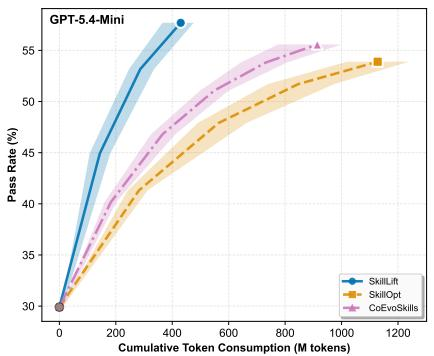  
(a)

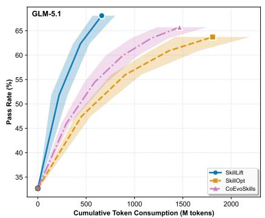  
(b)

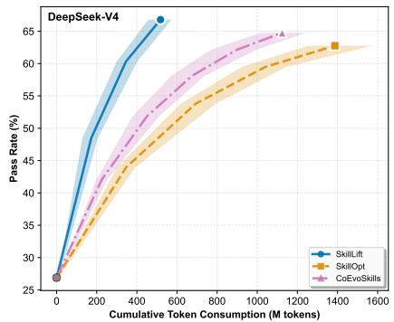  
(c)

Fi<sub>gure</sub> 3<sub>:</sub> T<sub>o</sub>k<sub>en consump</sub>ti<sub>on vs. average pass ra</sub>t<sub>e on</sub> Skill<sub>s</sub>B<sub>enc</sub>h <sub>across</sub> th<sub>ree</sub> b<sub>ac</sub>kb<sub>one mo</sub>d<sub>e</sub>l<sub>s.</sub> C<sub>urves are smoo</sub>th<sub>e</sub>d <sub>up</sub> t<sub>o</sub> th<sub>e</sub> 0<sub>.</sub>9 <sub>quan</sub>til<sub>e an</sub>d t<sub>runca</sub>t<sub>e</sub>d <sub>w</sub>h<sub>en no</sub> i<sub>mprovemen</sub>t i<sub>s o</sub>b<sub>serve</sub>d f<sub>or</sub> t<sub>wo consecu</sub>ti<sub>ve roun</sub>d<sub>s.</sub> SkillLift <sub>reac</sub>h<sub>es</sub> hi<sub>g</sub>h<sub>er pass ra</sub>t<sub>es</sub> <sub>a</sub>t <sub>su</sub>b<sub>s</sub>t<sub>an</sub>ti<sub>a</sub>ll<sub>y</sub> l<sub>ower</sub> t<sub>o</sub>k<sub>en cos</sub>t th<sub>an</sub> SkillO<sub>p</sub>t <sub>an</sub>d C<sub>o</sub>E<sub>vo</sub>Skill<sub>s.</sub>  
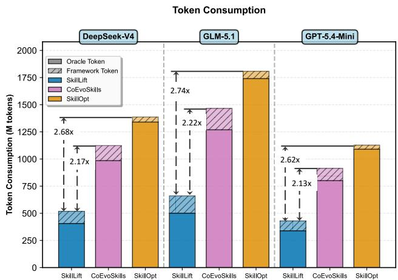  
Fi<sub>gure</sub> 4<sub>:</sub> A<sub>verage</sub> t<sub>o</sub>k<sub>en cos</sub>t t<sub>o</sub> fi<sub>rs</sub>t <sub>reac</sub>h th<sub>e</sub> 0<sub>.</sub>9 <sub>quan</sub>til<sub>e o</sub>f t<sub>o</sub>t<sub>a</sub>l <sub>pass-ra</sub>t<sub>e score on</sub> Skill<sub>s</sub>B<sub>enc</sub>h<sub>.</sub> SkillLift <sub>re</sub>d<sub>uces</sub> t<sub>o</sub>k<sub>en</sub> <sub>over</sub>h<sub>ea</sub>d b<sub>y</sub> 40<sub>–</sub>70% <sub>compare</sub>d t<sub>o</sub> b<sub>ase</sub>li<sub>nes.</sub>

Heterogeneous Category-Level Gains. Disaggregating b<sub>y ca</sub>t<sub>ego</sub>r<sub>y</sub> r<sub>evea</sub>l<sub>s p</sub>r<sub>o</sub>n<sub>ou</sub>n<sub>ce</sub>d h<sub>e</sub>t<sub>e</sub>r<sub>oge</sub>n<sub>e</sub>it<sub>y: o</sub>n GLM<sub>-</sub>5<sub>.</sub>1<sub>,</sub> Search jum<sub>p</sub>s from 40.9% to 75.0% (+34.1) on WildClaw-Bench and Network Securit<sub>y</sub> from 36.8% to 92.9% (+56.1) on SkillsBench, whereas Creative barel<sub>y</sub> moves (+3.1). This <sub>pa</sub>tt<sub>ern</sub> i<sub>s cons</sub>i<sub>s</sub>t<sub>en</sub>t <sub>across mo</sub>d<sub>e</sub>l<sub>s—ca</sub>t<sub>egor</sub>i<sub>es w</sub>ith <sub>co</sub>d<sub>e-</sub> checkable criteria see the largest jumps, while subjective Creative writin<sub>g</sub> remains flat (Fi<sub>g</sub>ure 5). The rubric’s binar<sub>y</sub> <sub>cr</sub>it<sub>er</sub>i<sub>a are</sub> i<sub>n</sub>h<sub>eren</sub>tl<sub>y more e</sub>f<sub>ec</sub>ti<sub>ve w</sub>h<sub>en correc</sub>t<sub>ness</sub> i<sub>s ver-</sub> ifi<sub>a</sub>bl<sub>e, an</sub>d th<sub>e ru</sub>b<sub>r</sub>i<sub>ca</sub>t<sub>or na</sub>t<sub>ura</sub>ll<sub>y</sub> l<sub>earns cr</sub>it<sub>er</sub>i<sub>a</sub> th<sub>a</sub>t <sub>m</sub>i<sub>rror</sub> th<sub>e</sub> d<sub>e</sub>t<sub>erm</sub>i<sub>n</sub>i<sub>s</sub>ti<sub>c ver</sub>ifi<sub>er.</sub> O<sub>n</sub> D<sub>eep</sub>S<sub>ee</sub>k<sub>-</sub>V4<sub>-</sub>P<sub>ro,</sub> th<sub>e same</sub> t<sub>ren</sub>d h<sub>o</sub>ld<sub>s:</sub> C<sub>o</sub>d<sub>e r</sub>i<sub>ses</sub> f<sub>rom</sub> 36<sub>.</sub>0% t<sub>o</sub> 51<sub>.</sub>5% <sub>on</sub> WildCl<sub>aw-</sub> B<sub>enc</sub>h<sub>, w</sub>hil<sub>e</sub> C<sub>rea</sub>ti<sub>ve ga</sub>i<sub>ns on</sub>l<sub>y</sub> 7<sub>.</sub>6 <sub>pp</sub> d<sub>esp</sub>it<sub>e a compara-</sub> ble token budget, reinforcing that subjective categories resist <sub>ru</sub>b<sub>r</sub>i<sub>c-</sub>b<sub>ase</sub>d i<sub>mprovemen</sub>t<sub>.</sub>

Convergence Speed and Token Eficiency. Figures 3–4 di<sub>ssec</sub>t th<sub>e cos</sub>t<sub>-qua</sub>lit<sub>y</sub> t<sub>ra</sub>d<sub>e-o</sub>f<sub>.</sub> S<sub>kill</sub>L<sub>ift</sub>’<sub>s curve r</sub>i<sub>ses</sub> <sub>more s</sub>t<sub>eep</sub>l<sub>y an</sub>d <sub>p</sub>l<sub>a</sub>t<sub>eaus</sub> hi<sub>g</sub>h<sub>er</sub> th<sub>an</sub> SkillO<sub>p</sub>t <sub>an</sub>d C<sub>o-</sub> E<sub>vo</sub>Skill<sub>s,</sub> i<sub>n</sub>di<sub>ca</sub>ti<sub>ng</sub> th<sub>a</sub>t d<sub>ense, cr</sub>it<sub>er</sub>i<sub>on-</sub>l<sub>eve</sub>l f<sub>ee</sub>db<sub>ac</sub>k <sub>gu</sub>id<sub>es</sub> th<sub>e genera</sub>t<sub>or</sub> t<sub>owar</sub>d <sub>e</sub>f<sub>ec</sub>ti<sub>ve rev</sub>i<sub>s</sub>i<sub>ons ear</sub>l<sub>y.</sub> S<sub>kill-</sub> L<sub>ift</sub> r<sub>e</sub>d<sub>uces</sub> t<sub>o</sub>k<sub>e</sub>n <sub>cos</sub>t t<sub>o</sub> r<sub>eac</sub>h th<sub>e</sub> 0<sub>.</sub>9 <sub>qua</sub>ntil<sub>e</sub> b<sub>y</sub> 40<sub>–</sub>70%<sub>.</sub> Th<sub>e sav</sub>i<sub>ng s</sub>t<sub>ems</sub> f<sub>rom</sub> th<sub>e</sub> bil<sub>eve</sub>l d<sub>es</sub>i<sub>gn: ru</sub>b<sub>r</sub>i<sub>c scor</sub>i<sub>ng</sub> i<sub>n</sub> M<sub>o</sub>d<sub>e</sub> A <sub>cos</sub>t<sub>s a s</sub>i<sub>ng</sub>l<sub>e</sub> LLM <sub>ca</sub>ll <sub>per can</sub>did<sub>a</sub>t<sub>e, w</sub>h<sub>ereas</sub> b<sub>ase</sub>li<sub>nes</sub> i<sub>nvo</sub>k<sub>e a</sub> f<sub>u</sub>ll <sub>orac</sub>l<sub>e ro</sub>ll<sub>ou</sub>t <sub>a</sub>t <sub>every s</sub>t<sub>ep,</sub> k<sub>eep</sub>i<sub>ng</sub> oracle-call complexity at O(L) rather than O(LT).

## Ablation Study

Rubric Revision and Seed Quality. Removing the rubricator (w/o rubricator) collapses overall pass rate to 42.5– 65<sub>.</sub>5% <sub>on</sub> Skill<sub>s</sub>B<sub>enc</sub>h<sub>,</sub> b<sub>are</sub>l <sub>a</sub>b<sub>ove</sub> th<sub>e s</sub>t<sub>a</sub>ti<sub>c-s</sub>kill b<sub>ase</sub>li<sub>ne</sub> on GPT-5.4 and GLM-5.1 (+1.1 and +1.4 <sub>pp</sub>), confirmin<sub>g</sub> that <sub>orac</sub>l<sub>e-a</sub>li<sub>gne</sub>d <sub>re-a</sub>li<sub>gnmen</sub>t<sub>—no</sub>t <sub>mere</sub>l<sub>y</sub> d<sub>ense</sub> f<sub>ee</sub>db<sub>ac</sub>k<sub>—</sub> i<sub>s</sub> th<sub>e core</sub> d<sub>r</sub>i<sub>ver.</sub> Th<sub>e co</sub>ll<sub>apse</sub> i<sub>s mos</sub>t <sub>severe on</sub> GPT<sub>-</sub>5<sub>.</sub>4<sub>,</sub> <sub>w</sub>h<sub>ere una</sub>li<sub>gne</sub>d d<sub>ense</sub> f<sub>ee</sub>db<sub>ac</sub>k <sub>can ac</sub>ti<sub>ve</sub>l<sub>y m</sub>i<sub>s</sub>l<sub>ea</sub>d th<sub>e</sub> <sub>genera</sub>t<sub>or w</sub>h<sub>en</sub> th<sub>e ru</sub>b<sub>r</sub>i<sub>c</sub>’<sub>s cr</sub>it<sub>er</sub>i<sub>a</sub> di<sub>verge</sub> f<sub>rom</sub> th<sub>e or-</sub> acle’s preference ordering. Without seed skills (w/o seed skills), performance drops 4–7 pp: the rubricator loses its i<sub>n</sub>iti<sub>a</sub>l f<sub>a</sub>il<sub>ure pa</sub>tt<sub>ern an</sub>d <sub>mus</sub>t <sub>spen</sub>d <sub>ear</sub>l<sub>y roun</sub>d<sub>s</sub> di<sub>scover-</sub> i<sub>ng</sub> d<sub>e</sub>fi<sub>c</sub>i<sub>enc</sub>i<sub>es</sub> th<sub>a</sub>t <sub>a see</sub>d <sub>a</sub>l<sub>rea</sub>d<sub>y enco</sub>d<sub>es.</sub> N<sub>o</sub>t<sub>a</sub>bl<sub>y, even</sub> without seeds, GLM-5.1 (71.3%) mar<sub>g</sub>inall<sub>y</sub> exceeds SkillO<sub>p</sub>t (70.5%), indicatin<sub>g</sub> that rubric-<sub>g</sub>uided revision alone <sub>can ou</sub>t<sub>per</sub>f<sub>orm sca</sub>l<sub>ar-score op</sub>ti<sub>m</sub>i<sub>za</sub>ti<sub>on.</sub>

Ranking-based Alignment. Replacing ranking-based alignment with direct score regression (w/ score regression) d<sub>egra</sub>d<sub>es</sub> <sub>per</sub>f<sub>ormance</sub> b<sub>y</sub> 3<sub>–</sub>5 <sub>pp</sub> d<sub>esp</sub>it<sub>e</sub> id<sub>en</sub>ti<sub>ca</sub>l <sub>orac</sub>l<sub>e</sub> b<sub>u</sub>d<sub>-</sub> <sub>ge</sub>t<sub>.</sub> Ab<sub>so</sub>l<sub>u</sub>t<sub>e orac</sub>l<sub>e scores are no</sub>i<sub>sy an</sub>d <sub>non-compara</sub>bl<sub>e</sub> <sub>across</sub> t<sub>as</sub>k<sub>s w</sub>ith dif<sub>eren</sub>t difi<sub>cu</sub>lt<sub>y</sub> di<sub>s</sub>t<sub>r</sub>ib<sub>u</sub>ti<sub>ons; ran</sub>ki<sub>ng</sub> di<sub>scar</sub>d<sub>s</sub> th<sub>e</sub> <sub>unre</sub>li<sub>a</sub>bl<sub>e</sub> <sub>magn</sub>it<sub>u</sub>d<sub>e</sub> <sub>an</sub>d <sub>re</sub>t<sub>a</sub>i<sub>ns</sub> <sub>on</sub>l<sub>y</sub> <sub>or</sub>di<sub>na</sub>l i<sub>n</sub>f<sub>orma</sub>ti<sub>on, ma</sub>ki<sub>ng</sub> it <sub>a more ro</sub>b<sub>us</sub>t <sub>superv</sub>i<sub>s</sub>i<sub>on</sub> t<sub>arge</sub>t<sub>.</sub> Thi<sub>s</sub> <sub>va</sub>lid<sub>a</sub>t<sub>es</sub> th<sub>e</sub> d<sub>es</sub>i<sub>gn</sub> <sub>c</sub>h<sub>o</sub>i<sub>ce</sub> i<sub>n</sub> S<sub>ec</sub>ti<sub>on</sub> 3<sub>:</sub> th<sub>e</sub> <sub>ou</sub>t<sub>er</sub> l<sub>oop</sub> <sub>a</sub>li<sub>gns</sub> rubric and oracle rankings via Kendall’s τ, not absolute score <sub>agreemen</sub>t<sub>.</sub> Th<sub>e</sub> t<sub>wo</sub> <sub>e</sub>f<sub>ec</sub>t<sub>s</sub> <sub>compoun</sub>d<sub>:</sub> <sub>w</sub>ith<sub>ou</sub>t <sub>orac</sub>l<sub>e</sub> <sub>a</sub>li<sub>gn-</sub> <sub>men</sub>t th<sub>e ru</sub>b<sub>r</sub>i<sub>c prov</sub>id<sub>es m</sub>i<sub>sa</sub>li<sub>gne</sub>d <sub>cr</sub>it<sub>er</sub>i<sub>a, an</sub>d <sub>w</sub>ith<sub>ou</sub>t <sub>a</sub> <sub>see</sub>d th<sub>e</sub> <sub>ru</sub>b<sub>r</sub>i<sub>ca</sub>t<sub>or</sub> h<sub>as</sub> <sub>no</sub> f<sub>a</sub>il<sub>ure</sub> <sub>pa</sub>tt<sub>ern</sub> t<sub>o</sub> <sub>rea</sub>li<sub>gn</sub> f<sub>rom,</sub> <sub>so</sub> <sup>b</sup>ot<sup>h</sup> com<sub>p</sub>onents are necessar<sub>y</sub>.

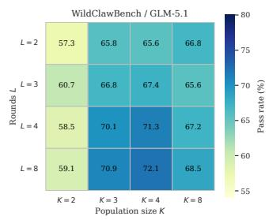  
(a)

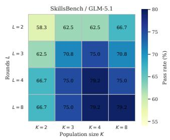  
(b)

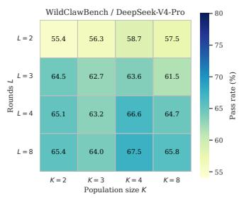  
(c)

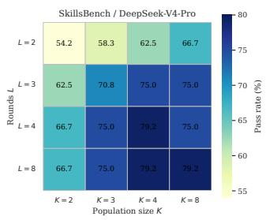  
(d)

Fi<sub>gure</sub> 5<sub>:</sub> S<sub>ens</sub>iti<sub>v</sub>it<sub>y</sub> t<sub>o</sub> <sub>see</sub>d <sub>s</sub>kill <sub>coun</sub>t <sub>an</sub>d it<sub>era</sub>ti<sub>on</sub> <sub>roun</sub>d<sub>s</sub> <sub>on</sub> Skill<sub>s</sub>B<sub>enc</sub>h<sub>.</sub> S<sub>ee</sub>d <sub>s</sub>kill <sub>coun</sub>t<sub>s</sub> <sub>an</sub>d it<sub>era</sub>ti<sub>on</sub> <sub>roun</sub>d<sub>s</sub> <sub>vary</sub> <sub>over</sub> {2, 3, 4, 8}, with overall pass rate shown for each configuration.  
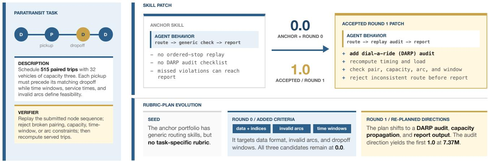  
Fi<sub>gure</sub> 6<sub>:</sub> C<sub>ase</sub> <sub>s</sub>t<sub>u</sub>d<sub>y</sub> <sub>on</sub> <sub>a</sub> Skill<sub>s</sub>B<sub>enc</sub>h <sub>para</sub>t<sub>rans</sub>it <sub>sc</sub>h<sub>e</sub>d<sub>u</sub>li<sub>ng</sub> t<sub>as</sub>k<sub>,</sub> <sub>s</sub>h<sub>ow</sub>i<sub>ng</sub> <sub>ru</sub>b<sub>r</sub>i<sub>c</sub> <sub>an</sub>d <sub>s</sub>kill <sub>co-evo</sub>l<sub>u</sub>ti<sub>on</sub> <sub>across</sub> t<sub>wo</sub> <sub>ou</sub>t<sub>er</sub> <sub>roun</sub>d<sub>s.</sub>

Table 3: Ablation stud<sub>y</sub> on SkillsBench (overall <sub>p</sub>ass rate, %). w/o rubricator disables oracle-aligned rubric updates, reducing SkillLift to naïve self-evolution. w/o seed skills <sub>se</sub>t<sub>s</sub> th<sub>e</sub> i<sub>n</sub>iti<sub>a</sub>l <sub>s</sub>kill <sub>coun</sub>t t<sub>o one w</sub>ith h<sub>uman-au</sub>th<sub>ore</sub>d <sub>see</sub>d<sub>.</sub> w/ score regression replaces ranking-based alignment with di<sub>rec</sub>t <sub>orac</sub>l<sub>e score regress</sub>i<sub>on.</sub>
<table><tr><td>Variant</td><td>GPT-5.4*</td><td>GLM-5.1</td><td>DeepSeek</td></tr><tr><td>w/o rubricator</td><td>42.5</td><td>59.8</td><td>65.5</td></tr><tr><td>w/o seed skills</td><td>57.5</td><td>71.3</td><td>67.8</td></tr><tr><td>w/ score regression</td><td>59.8</td><td>72.4</td><td>69.0</td></tr><tr><td>SkillLift (ours)</td><td>62.5</td><td>75.1</td><td>74.3</td></tr></table>

## Case Study

Fi<sub>gure</sub> 6 t<sub>races</sub> S<sub>kill</sub>L<sub>ift on a para</sub>t<sub>rans</sub>it <sub>sc</sub>h<sub>e</sub>d<sub>u</sub>li<sub>ng</sub> t<sub>as</sub>k f<sub>rom</sub> Skill<sub>s</sub>B<sub>enc</sub>h i<sub>nvo</sub>l<sub>v</sub>i<sub>ng</sub> 515 <sub>pa</sub>i<sub>re</sub>d t<sub>r</sub>i<sub>ps,</sub> 32 <sub>ve</sub>hi<sub>c</sub>l<sub>es,</sub> <sub>an</sub>d ti<sub>me-w</sub>i<sub>n</sub>d<sub>ow an</sub>d i<sub>nva</sub>lid<sub>-arc cons</sub>t<sub>ra</sub>i<sub>n</sub>t<sub>s.</sub> Th<sub>e see</sub>d <sub>s</sub>kill <sub>scores</sub> 0<sub>.</sub>0 b<sub>ecause</sub> it <sub>never</sub> <sub>rep</sub>l<sub>ays</sub> th<sub>e</sub> <sub>p</sub>l<sub>anne</sub>d <sub>s</sub>t<sub>ops</sub> i<sub>n</sub> <sub>or</sub>d<sub>er</sub> <sub>an</sub>d l<sub>ac</sub>k<sub>s</sub> <sub>a</sub> di<sub>a</sub>l<sub>-a-r</sub>id<sub>e</sub> <sub>au</sub>dit<sub>,</sub> <sub>so</sub> <sub>capac</sub>it<sub>y</sub> <sub>an</sub>d <sub>w</sub>i<sub>n-</sub> d<sub>ow</sub> <sub>v</sub>i<sub>o</sub>l<sub>a</sub>ti<sub>ons</sub> <sub>go</sub> <sub>un</sub>d<sub>e</sub>t<sub>ec</sub>t<sub>e</sub>d <sub>an</sub>d <sub>propaga</sub>t<sub>e</sub> i<sub>n</sub>t<sub>o</sub> th<sub>e</sub> fi<sub>-</sub> <sub>na</sub>l <sub>ou</sub>t<sub>pu</sub>t<sub>.</sub> I<sub>n</sub> R<sub>oun</sub>d 0<sub>,</sub> th<sub>e ru</sub>b<sub>r</sub>i<sub>ca</sub>t<sub>or crea</sub>t<sub>es cr</sub>it<sub>er</sub>i<sub>a</sub> f<sub>or</sub> <sub>sur</sub>f<sub>ace-</sub>l<sub>eve</sub>l i<sub>ssues—</sub>d<sub>a</sub>t<sub>a</sub> f<sub>orma</sub>t<sub>,</sub> i<sub>nva</sub>lid <sub>arcs, an</sub>d d<sub>ropo</sub>f <sub>w</sub>i<sub>n</sub>d<sub>ows—</sub>b<sub>u</sub>t <sub>a</sub>ll <sub>can</sub>did<sub>a</sub>t<sub>es</sub> <sub>s</sub>till <sub>score</sub> 0<sub>.</sub>0<sub>,</sub> <sub>mean</sub>i<sub>ng</sub> th<sub>ese</sub> <sub>cr</sub>it<sub>er</sub>i<sub>a m</sub>i<sub>ss</sub> th<sub>e roo</sub>t <sub>cause.</sub> Aft<sub>er</sub> th<sub>e orac</sub>l<sub>e revea</sub>l<sub>s</sub> th<sub>a</sub>t th<sub>e</sub> <sub>ru</sub>b<sub>r</sub>i<sub>c</sub> i<sub>s m</sub>i<sub>sa</sub>li<sub>gne</sub>d<sub>,</sub> th<sub>e ru</sub>b<sub>r</sub>i<sub>ca</sub>t<sub>or rep</sub>l<sub>aces</sub> th<sub>em w</sub>ith d<sub>eeper</sub> <sub>c</sub>h<sub>ec</sub>k<sub>s: w</sub>h<sub>e</sub>th<sub>er capac</sub>it<sub>y</sub> i<sub>s</sub> t<sub>rac</sub>k<sub>e</sub>d <sub>across s</sub>t<sub>ops, w</sub>h<sub>e</sub>th<sub>er</sub> <sub>eac</sub>h <sub>pa</sub>i<sub>r</sub>/t<sub>r</sub>i<sub>p respec</sub>t<sub>s capac</sub>it<sub>y, arc, an</sub>d <sub>w</sub>i<sub>n</sub>d<sub>ow cons</sub>t<sub>ra</sub>i<sub>n</sub>t<sub>s,</sub> and whether inconsistent routes are rejected before reporting. I<sub>n</sub> R<sub>oun</sub>d 1<sub>,</sub> th<sub>e rev</sub>i<sub>se</sub>d <sub>s</sub>kill <sub>rerou</sub>t<sub>es</sub> th<sub>roug</sub>h thi<sub>s au</sub>dit <sub>an</sub>d <sub>ac</sub>hi<sub>eves a</sub> 1<sub>.</sub>0 <sub>ver</sub>ifi<sub>er score a</sub>t 7<sub>.</sub>37M t<sub>o</sub>k<sub>ens.</sub>

## 5 Conclusion

W<sub>e presen</sub>t<sub>e</sub>d S<sub>kill</sub>L<sub>ift, w</sub>hi<sub>c</sub>h d<sub>ecoup</sub>l<sub>es s</sub>kill <sub>searc</sub>h f<sub>rom</sub> <sub>orac</sub>l<sub>e cos</sub>t b<sub>y</sub> l<sub>earn</sub>i<sub>ng an orac</sub>l<sub>e-a</sub>li<sub>gne</sub>d <sub>ru</sub>b<sub>r</sub>i<sub>c as a s</sub>t<sub>ruc-</sub> t<sub>ure</sub>d <sub>eva</sub>l<sub>ua</sub>ti<sub>on space.</sub> A f<sub>ew orac</sub>l<sub>e ro</sub>ll<sub>ou</sub>t<sub>s per roun</sub>d k<sub>eep</sub> th<sub>e ru</sub>b<sub>r</sub>i<sub>c ca</sub>lib<sub>ra</sub>t<sub>e</sub>d<sub>;</sub> b<sub>e</sub>t<sub>ween a</sub>li<sub>gnmen</sub>t<sub>s,</sub> it <sub>scores can</sub>di<sub>-</sub> d<sub>a</sub>t<sub>es v</sub>i<sub>a s</sub>i<sub>ng</sub>l<sub>e</sub> LLM <sub>ca</sub>ll<sub>s w</sub>ith <sub>cr</sub>it<sub>er</sub>i<sub>on-</sub>l<sub>eve</sub>l f<sub>ee</sub>db<sub>ac</sub>k f<sub>or</sub> t<sub>arge</sub>t<sub>e</sub>d <sub>rev</sub>i<sub>s</sub>i<sub>on.</sub> O<sub>n</sub> t<sub>wo</sub> b<sub>enc</sub>h<sub>mar</sub>k<sub>s cover</sub>i<sub>ng</sub> 147 t<sub>as</sub>k<sub>s</sub> <sub>an</sub>d th<sub>ree mo</sub>d<sub>e</sub>l<sub>s,</sub> S<sub>kill</sub>L<sub>ift ou</sub>t<sub>per</sub>f<sub>orms ex</sub>i<sub>s</sub>ti<sub>ng au</sub>t<sub>o-s</sub>kill <sub>me</sub>th<sub>o</sub>d<sub>s w</sub>ith 40<sub>–</sub>70% l<sub>ower</sub> t<sub>o</sub>k<sub>en cos</sub>t<sub>.</sub> Abl<sub>a</sub>ti<sub>ons con</sub>fi<sub>rm</sub> th<sub>a</sub>t <sub>orac</sub>l<sub>e-a</sub>li<sub>gne</sub>d <sub>ru</sub>b<sub>r</sub>i<sub>c rev</sub>i<sub>s</sub>i<sub>on</sub> i<sub>s</sub> th<sub>e core</sub> d<sub>r</sub>i<sub>ver an</sub>d <sub>ran</sub>ki<sub>ng-</sub>b<sub>ase</sub>d <sub>a</sub>li<sub>gnmen</sub>t <sub>ou</sub>t<sub>per</sub>f<sub>orms score regress</sub>i<sub>on.</sub> A<sub>s</sub> S<sub>kill</sub>L<sub>ift re</sub>li<sub>es on compu</sub>t<sub>e-</sub>ti<sub>me ro</sub>ll<sub>ou</sub>t<sub>s,</sub> it<sub>s e</sub>f<sub>ec</sub>ti<sub>veness</sub> is subject to model stochasticity and iteration latency may <sub>a</sub>f<sub>ec</sub>t <sub>user exper</sub>i<sub>ence; ex</sub>t<sub>en</sub>di<sub>ng</sub> t<sub>o mu</sub>lti<sub>-</sub>t<sub>as</sub>k <sub>s</sub>kill lib<sub>rar</sub>i<sub>es,</sub> i<sub>n</sub>t<sub>egra</sub>ti<sub>ng</sub> <sub>we</sub>i<sub>g</sub>ht<sub>-space</sub> <sub>a</sub>d<sub>ap</sub>t<sub>a</sub>ti<sub>on,</sub> <sub>an</sub>d <sub>re</sub>d<sub>uc</sub>i<sub>ng</sub> <sub>ro</sub>ll<sub>ou</sub>t <sub>var</sub>i<sub>ance are na</sub>t<sub>ura</sub>l <sub>nex</sub>t <sub>s</sub>t<sub>eps.</sub>

## References

Al<sub>zu</sub>bi<sub>,</sub> S<sub>.;</sub> Pr<sub>ove</sub>n<sub>za</sub>n<sub>o,</sub> N<sub>.;</sub> Bin<sub>g</sub>h<sub>a</sub>m<sub>,</sub> J<sub>.;</sub> Ch<sub>e</sub>n<sub>,</sub> W<sub>.;</sub> <sub>a</sub>nd V<sub>u,</sub> T<sub>.</sub> 2026<sub>.</sub> E<sub>vo</sub>Skill<sub>:</sub> A<sub>u</sub>t<sub>oma</sub>t<sub>e</sub>d Skill Di<sub>scovery</sub> f<sub>or</sub> M<sub>u</sub>lti<sub>-</sub> A<sub>ge</sub>nt S<sub>ys</sub>t<sub>e</sub>m<sub>s.</sub> <sub>a</sub>rXi<sub>v:</sub>2603<sub>.</sub>02766<sub>.</sub>

A<sub>nonymous.</sub> 2026<sub>.</sub> SkillCAT<sub>:</sub> C<sub>on</sub>t<sub>ras</sub>ti<sub>ve</sub> A<sub>ssessmen</sub>t <sub>an</sub>d T<sub>opo</sub>l<sub>ogy-</sub>A<sub>ware</sub> Skill S<sub>e</sub>lf<sub>-</sub>E<sub>vo</sub>l<sub>u</sub>ti<sub>on.</sub> <sub>ar</sub>Xi<sub>v:</sub>2606<sub>.</sub>13317<sub>.</sub>

A<sub>n</sub>th<sub>rop</sub>i<sub>c.</sub> 2025<sub>.</sub> A<sub>gen</sub>t Skill<sub>s.</sub> htt<sub>ps:</sub>//<sub>www.an</sub>th<sub>rop</sub>i<sub>c.com</sub>/ <sub>eng</sub>i<sub>neer</sub>i<sub>ng</sub>/<sub>agen</sub>t<sub>-s</sub>kill<sub>s.</sub> A<sub>ccesse</sub>d<sub>:</sub> 2025<sub>.</sub>

B<sub>ez</sub>d<sub>e</sub>k<sub>,</sub> J<sub>.</sub> C<sub>.; a</sub>nd H<sub>a</sub>th<sub>away,</sub> R<sub>.</sub> J<sub>.</sub> 2003<sub>.</sub> C<sub>o</sub>n<sub>ve</sub>r<sub>ge</sub>n<sub>ce o</sub>f Al<sub>-</sub> ternating Optimization. Neural, Parallel & Scientific Computations, 11(4): 351–368.

Chri<sub>s</sub>ti<sub>a</sub>n<sub>o,</sub> P<sub>.</sub> F<sub>.;</sub> L<sub>e</sub>ik<sub>e,</sub> J<sub>.;</sub> Br<sub>ow</sub>n<sub>,</sub> T<sub>.;</sub> M<sub>a</sub>rti<sub>c,</sub> M<sub>.;</sub> L<sub>egg,</sub> S<sub>.; an</sub>d A<sub>mo</sub>d<sub>e</sub>i<sub>,</sub> D<sub>.</sub> 2017<sub>.</sub> D<sub>eep</sub> R<sub>e</sub>i<sub>n</sub>f<sub>orcemen</sub>t L<sub>earn</sub>i<sub>ng</sub> from Human Preferences. In Advances in Neural Information Processing Systems (NeurIPS).

C<sub>o</sub>l<sub>so</sub>n<sub>,</sub> B<sub>.;</sub> M<sub>a</sub>r<sub>co</sub>tt<sub>e,</sub> P<sub>.; a</sub>nd S<sub>ava</sub>rd<sub>,</sub> G<sub>.</sub> 2007<sub>.</sub> An O<sub>ve</sub>r<sub>v</sub>i<sub>ew</sub> of Bilevel Optimization. Annals of Operations Research, 153<sub>:</sub> 235<sub>–</sub>256<sub>.</sub>

Din<sub>g,</sub> S<sub>.;</sub> D<sub>a</sub>i<sub>,</sub> X<sub>.;</sub> Xin<sub>g,</sub> L<sub>.;</sub> Din<sub>g,</sub> S<sub>.;</sub> Li<sub>u,</sub> Z<sub>.;</sub> Jin<sub>g</sub>Yi<sub>,</sub> Y<sub>.;</sub>Y<sub>ang,</sub> P<sub>.;</sub> Zh<sub>ang,</sub> Z<sub>.;</sub> W<sub>e</sub>i<sub>,</sub> X<sub>.;</sub> F<sub>ang,</sub> X<sub>.;</sub> M<sub>a,</sub> Y<sub>.;</sub> D<sub>uan,</sub>H<sub>.;</sub> Sh<sub>ao,</sub> J<sub>.;</sub> W<sub>a</sub>n<sub>g,</sub> J<sub>.;</sub> Lin<sub>,</sub> D<sub>.;</sub> Ch<sub>e</sub>n<sub>,</sub> K<sub>.; a</sub>nd Z<sub>a</sub>n<sub>g,</sub> Y<sub>.</sub>2026<sub>.</sub> WildCl<sub>aw</sub>B<sub>enc</sub>h<sub>:</sub> A B<sub>enc</sub>h<sub>mar</sub>k f<sub>or</sub> R<sub>ea</sub>l<sub>-</sub>W<sub>or</sub>ld<sub>,</sub> L<sub>ong-</sub>H<sub>or</sub>i<sub>zon</sub> A<sub>gen</sub>t E<sub>va</sub>l<sub>ua</sub>ti<sub>on. ar</sub>Xi<sub>v:</sub>2605<sub>.</sub>10912<sub>.</sub>

Gunjal, A.; Wang, A.; Lau, E.; Nath, V.; He, Y.; Liu, B.; <sub>an</sub>d H<sub>en</sub>d<sub>ryx,</sub> S<sub>.</sub> 2025<sub>.</sub> R<sub>u</sub>b<sub>r</sub>i<sub>cs as</sub> R<sub>ewar</sub>d<sub>s:</sub> R<sub>e</sub>i<sub>n</sub>f<sub>orcemen</sub>t L<sub>earn</sub>i<sub>ng</sub> B<sub>eyon</sub>d V<sub>er</sub>ifi<sub>a</sub>bl<sub>e</sub> D<sub>oma</sub>i<sub>ns. ar</sub>Xi<sub>v:</sub>2507<sub>.</sub>17746<sub>.</sub>

Jim<sub>e</sub>n<sub>ez,</sub> C<sub>.</sub> E<sub>.;</sub> Y<sub>a</sub>n<sub>g,</sub> J<sub>.;</sub> W<sub>e</sub>tti<sub>g,</sub> A<sub>.;</sub> Y<sub>ao,</sub> S<sub>.;</sub> P<sub>e</sub>i<sub>,</sub> K<sub>.;</sub> Pr<sub>ess,</sub> O<sub>.; a</sub>nd N<sub>a</sub>r<sub>as</sub>imh<sub>a</sub>n<sub>,</sub> K<sub>.</sub> 2024<sub>.</sub> SWE<sub>-</sub>b<sub>e</sub>n<sub>c</sub>h<sub>:</sub> C<sub>a</sub>n L<sub>a</sub>n<sub>guage</sub> Models Resolve Real-world GitHub Issues? In Proceedings ofthe International Conference on Learning Representations (ICLR).

Kh<sub>a</sub>tt<sub>a</sub>b<sub>,</sub> O<sub>.;</sub> Si<sub>ng</sub>h<sub>v</sub>i<sub>,</sub> A<sub>.;</sub> M<sub>a</sub>h<sub>es</sub>h<sub>war</sub>i<sub>,</sub> P<sub>.;</sub> Zh<sub>ang,</sub> Z<sub>.;</sub> S<sub>an-</sub> th<sub>a</sub>n<sub>a</sub>m<sub>,</sub> K<sub>.;</sub> V<sub>a</sub>rdh<sub>a</sub>m<sub>a</sub>n<sub>a</sub>n<sub>,</sub> S<sub>.;</sub> H<sub>aq,</sub> S<sub>.;</sub> Sh<sub>a</sub>rm<sub>a,</sub> A<sub>.;</sub> J<sub>os</sub>hi<sub>,</sub> T<sub>.</sub> T<sub>.;</sub> M<sub>oazam,</sub> H<sub>.;</sub> Mill<sub>er,</sub> H<sub>.;</sub> Z<sub>a</sub>h<sub>ar</sub>i<sub>a,</sub> M<sub>.;</sub> <sub>an</sub>d P<sub>o</sub>tt<sub>s,</sub> C<sub>.</sub> 2024<sub>.</sub> DSP<sub>y:</sub> C<sub>o</sub>m<sub>p</sub>ilin<sub>g</sub> D<sub>ec</sub>l<sub>a</sub>r<sub>a</sub>ti<sub>ve</sub> L<sub>a</sub>n<sub>guage</sub> M<sub>o</sub>d<sub>e</sub>l C<sub>a</sub>ll<sub>s</sub> into Self-Improving Pipelines. In Proceedings of the International Conference on Learning Representations (ICLR).

Li<sub>,</sub> X<sub>.;</sub> Li<sub>u,</sub> Y<sub>.;</sub> Ch<sub>en,</sub> W<sub>.;</sub> Y<sub>ou,</sub> B<sub>.;</sub> Di<sub>,</sub> Z<sub>.;</sub> H<sub>e,</sub> Y<sub>.;</sub> Zh<sub>eng,</sub> S<sub>.;</sub> Ch<sub>oe,</sub> K<sub>.</sub> W<sub>.;</sub> S<sub>u</sub>n<sub>,</sub> J<sub>.;</sub> W<sub>a</sub>n<sub>g,</sub> S<sub>.;</sub> T<sub>ao,</sub> C<sub>.;</sub> Li<sub>,</sub> B<sub>.;</sub> Zh<sub>ao,</sub> X<sub>.;</sub> G<sub>e</sub>n<sub>g,</sub> H<sub>.;</sub> W<sub>u,</sub> X<sub>.;</sub> Zh<sub>ou,</sub> J<sub>.;</sub> Ch<sub>e</sub>n<sub>,</sub> X<sub>.;</sub> Xin<sub>g,</sub> H<sub>.;</sub> Li<sub>,</sub> Y<sub>.;</sub> Z<sub>e</sub>n<sub>g,</sub> Q.; Wan<sub>g</sub>, D.; Wan<sub>g</sub>, Y.; Chaim, R. B.; Jian<sub>g</sub>, P.; Shen, H.; K<sub>ong,</sub> L<sub>.;</sub> Li<sub>u,</sub> X<sub>.;</sub> W<sub>ang,</sub> R<sub>.;</sub> Li<sub>u,</sub> X<sub>.;</sub> Li<sub>,</sub> J<sub>.;</sub> L<sub>an,</sub> X<sub>.;</sub> Li<sub>n,</sub> Y<sub>.;</sub> Y<sub>e,</sub> W<sub>.;</sub> H<sub>e,</sub> J<sub>.;</sub> Li<sub>,</sub> S<sub>.;</sub> Zh<sub>ang,</sub> Y<sub>.;</sub> G<sub>ao,</sub> Y<sub>.;</sub> Li<sub>,</sub> Y<sub>.;</sub> M<sub>a,</sub> Z<sub>.;</sub> Ji<sub>ng,</sub> L<sub>.;</sub> W<sub>ang,</sub> T<sub>.;</sub> Li<sub>,</sub> K<sub>.;</sub> X<sub>ue,</sub> Y<sub>.;</sub> L<sub>yu,</sub> H<sub>.;</sub> H<sub>e,</sub> Y<sub>.;</sub> Ti<sub>an,</sub> Y<sub>.;</sub> W<sub>u,</sub> S<sub>.;</sub> W<sub>a</sub>n<sub>g,</sub> B<sub>.;</sub> G<sub>ao,</sub> Y<sub>.;</sub> Ch<sub>e</sub>n<sub>,</sub> B<sub>.;</sub> Li<sub>u,</sub> L<sub>.;</sub> Ch<sub>e</sub>n<sub>g,</sub> S<sub>.;</sub> B<sub>ao,</sub> J<sub>.;</sub> Ton<sub>g</sub>, S.; Xu, S.; Zhuo, T. Y.; Ye, T.; Qi, Q.; Li, M.; Liao, L.; Tan, Z.; Shi, C.; Tan<sub>g</sub>, X.; Tankasala, S.; Yuan, B.; Qian, Y.; T<sub>u,</sub> J<sub>.;</sub> W<sub>ang,</sub> C<sub>.;</sub> S<sub>un,</sub> Y<sub>.;</sub> W<sub>ang,</sub> W<sub>.;</sub> T<sub>ay</sub>l<sub>or,</sub> A<sub>.;</sub> Y<sub>ang,</sub> Z<sub>.;</sub> G<sub>ua</sub>n<sub>,</sub> C<sub>.;</sub> D<sub>o</sub>n<sub>g,</sub> Z<sub>.;</sub> Zh<sub>a</sub>n<sub>g,</sub> X<sub>.;</sub> Dillm<sub>a</sub>nn<sub>,</sub> S<sub>.; c</sub>h<sub>u</sub>n<sub>g</sub> L<sub>ee,</sub> H<sub>.;</sub> <sub>an</sub>d S<sub>ong,</sub> D<sub>.</sub> 2026<sub>.</sub> Skill<sub>s</sub>B<sub>enc</sub>h<sub>:</sub> B<sub>enc</sub>h<sub>mar</sub>ki<sub>ng</sub> H<sub>ow</sub> W<sub>e</sub>ll A<sub>gen</sub>t Skill<sub>s</sub> W<sub>or</sub>k A<sub>cross</sub> Di<sub>verse</sub> T<sub>as</sub>k<sub>s. ar</sub>Xi<sub>v:</sub>2602<sub>.</sub>12670<sub>.</sub> Lin<sub>,</sub> H<sub>.;</sub> Li<sub>,</sub> P<sub>.;</sub> S<sub>o</sub>n<sub>g,</sub> J<sub>.;</sub> Ji<sub>a</sub>n<sub>g,</sub> F<sub>.; a</sub>nd Zh<sub>a</sub>n<sub>g,</sub> T<sub>.</sub> 2026<sub>.</sub> MUSE<sub>-</sub> A<sub>u</sub>t<sub>os</sub>kill<sub>:</sub> S<sub>e</sub>lf<sub>-</sub>E<sub>vo</sub>l<sub>v</sub>i<sub>ng</sub> A<sub>gen</sub>t<sub>s v</sub>i<sub>a</sub> Skill C<sub>rea</sub>ti<sub>on,</sub> M<sub>emory,</sub> M<sub>anagemen</sub>t<sub>, an</sub>d E<sub>va</sub>l<sub>ua</sub>ti<sub>on. ar</sub>Xi<sub>v:</sub>2605<sub>.</sub>27366<sub>.</sub>

Li<sub>u,</sub> T<sub>.;</sub> X<sub>u,</sub> R<sub>.;</sub> Y<sub>u,</sub> T<sub>.;</sub> H<sub>ong,</sub> I<sub>.;</sub> Y<sub>ang,</sub> C<sub>.;</sub> Zh<sub>ao,</sub> T<sub>.;</sub> <sub>an</sub>d W<sub>ang,</sub> H<sub>.</sub> 2026<sub>a.</sub> O<sub>pen</sub>R<sub>u</sub>b<sub>r</sub>i<sub>cs:</sub> T<sub>owar</sub>d<sub>s</sub> S<sub>ca</sub>l<sub>a</sub>bl<sub>e</sub> S<sub>yn</sub>th<sub>e</sub>ti<sub>c</sub>

R<sub>u</sub>b<sub>r</sub>i<sub>c</sub> G<sub>enera</sub>ti<sub>on</sub> f<sub>or</sub> R<sub>ewar</sub>d M<sub>o</sub>d<sub>e</sub>li<sub>ng</sub> <sub>an</sub>d LLM Ali<sub>gn-</sub> m<sub>e</sub>nt<sub>.</sub> In Li<sub>a</sub>k<sub>a</sub>t<sub>a,</sub> M<sub>.;</sub> M<sub>o</sub>r<sub>e</sub>ir<sub>a,</sub> V<sub>.</sub> P<sub>.;</sub> Zh<sub>a</sub>n<sub>g,</sub> J<sub>.; a</sub>nd J<sub>u</sub>r<sub>-</sub> gens, D., eds., Proceedings of the 64th Annual Meeting of the Association for Computational Linguistics (Volume 1: Long Papers), 17417–17437. San Diego, California, United St<sub>a</sub>t<sub>es:</sub> A<sub>ssoc</sub>i<sub>a</sub>ti<sub>on</sub> f<sub>or</sub> C<sub>ompu</sub>t<sub>a</sub>ti<sub>ona</sub>l Li<sub>ngu</sub>i<sub>s</sub>ti<sub>cs.</sub> ISBN 979<sub>-</sub>8<sub>-</sub>89176<sub>-</sub>390<sub>-</sub>6<sub>.</sub>

Liu, X.; Luo, X.; Li, L.; Huan<sub>g</sub>, G.; Liu, J.; and Qiao, H. 2026b<sub>.</sub> SkillF<sub>orge:</sub> F<sub>org</sub>i<sub>ng</sub> D<sub>oma</sub>i<sub>n-</sub>S<sub>pec</sub>ifi<sub>c,</sub> S<sub>e</sub>lf<sub>-</sub>E<sub>vo</sub>l<sub>v</sub>i<sub>ng</sub> Agent Skills in Cloud Technical Support. In Proceedings of the ACM SIGIR Industry Track.

M<sub>a,</sub> Z<sub>.;</sub> Y<sub>ang,</sub> S<sub>.;</sub> Ji<sub>,</sub> Y<sub>.;</sub> W<sub>ang,</sub> X<sub>.;</sub> W<sub>ang,</sub> Y<sub>.;</sub> H<sub>u,</sub> Y<sub>.;</sub> H<sub>uang,</sub> T<sub>.; an</sub>d Ch<sub>u,</sub> X<sub>.</sub> 2026<sub>.</sub> SkillCl<sub>aw:</sub> L<sub>e</sub>t Skill<sub>s</sub> E<sub>vo</sub>l<sub>ve</sub> C<sub>o</sub>ll<sub>ec-</sub> ti<sub>ve</sub>l<sub>y w</sub>ith A<sub>gen</sub>ti<sub>c</sub> E<sub>vo</sub>l<sub>ver. ar</sub>Xi<sub>v:</sub>2604<sub>.</sub>08377<sub>.</sub>

Ni<sub>,</sub> J<sub>.;</sub> Li<sub>u,</sub> Y<sub>.;</sub> Li<sub>u,</sub> X<sub>.;</sub> S<sub>u</sub>n<sub>,</sub> Y<sub>.;</sub> Zh<sub>ou,</sub> M<sub>.;</sub> Ch<sub>e</sub>n<sub>g,</sub> P<sub>.;</sub> W<sub>a</sub>n<sub>g,</sub> D<sub>.;</sub> Zh<sub>ao,</sub> E<sub>.;</sub> Ji<sub>ang,</sub> X<sub>.; an</sub>d Ji<sub>ang,</sub> G<sub>.</sub> 2026<sub>.</sub> T<sub>race</sub>2Skill<sub>:</sub> Di<sub>s-</sub> till Trajectory-Local Lessons into Transferable Agent Skills. <sub>ar</sub>Xi<sub>v:</sub>2603<sub>.</sub>25158<sub>.</sub>

S<sub>c</sub>hi<sub>c</sub>k<sub>,</sub> T<sub>.;</sub> D<sub>w</sub>i<sub>ve</sub>di<sub>-</sub>Y<sub>u,</sub> J<sub>.;</sub> D<sub>ess</sub>ì<sub>,</sub> R<sub>.;</sub> R<sub>a</sub>il<sub>eanu,</sub> R<sub>.;</sub> L<sub>ome</sub>li<sub>,</sub> M<sub>.;</sub> Z<sub>e</sub>ttl<sub>e</sub>m<sub>oye</sub>r<sub>,</sub> L<sub>.;</sub> C<sub>a</sub>n<sub>ce</sub>dd<sub>a,</sub> N<sub>.; a</sub>nd S<sub>c</sub>i<sub>a</sub>l<sub>o</sub>m<sub>,</sub> T<sub>.</sub> 2023<sub>.</sub> T<sub>oo</sub>lf<sub>o</sub>rm<sub>e</sub>r<sub>:</sub> L<sub>a</sub>n<sub>guage</sub> M<sub>o</sub>d<sub>e</sub>l<sub>s</sub> C<sub>a</sub>n T<sub>eac</sub>h Th<sub>e</sub>m<sub>se</sub>l<sub>ves</sub> t<sub>o</sub> U<sub>se</sub> Tools. In Proceedings of the Conference on Neural Information Processing Systems (NeurIPS).

Sh<sub>ao,</sub> R<sub>.;</sub> A<sub>sa</sub>i<sub>,</sub> A<sub>.;</sub> Sh<sub>e</sub>n<sub>,</sub> S<sub>.</sub> Z<sub>.;</sub> I<sub>v</sub>i<sub>so</sub>n<sub>,</sub> H<sub>.;</sub> Ki<sub>s</sub>h<sub>o</sub>r<sub>e,</sub> V<sub>.;</sub> Zh<sub>uo,</sub> J<sub>.;</sub> Zh<sub>ao,</sub> X<sub>.;</sub> P<sub>ar</sub>k<sub>,</sub> M<sub>.;</sub> Fi<sub>n</sub>l<sub>ayson,</sub> S<sub>.</sub> G<sub>.;</sub> S<sub>on</sub>t<sub>ag,</sub> D<sub>.;</sub> M<sub>urray,</sub> T<sub>.;</sub> Min<sub>,</sub> S<sub>.;</sub> D<sub>as</sub>i<sub>g</sub>i<sub>,</sub> P<sub>.;</sub> S<sub>o</sub>ld<sub>a</sub>ini<sub>,</sub> L<sub>.;</sub> Br<sub>a</sub>hm<sub>a</sub>n<sub>,</sub> F<sub>.;</sub> t<sub>au</sub> Yih<sub>,</sub> W<sub>.;</sub> Wu, T.; Zettlemoyer, L.; Kim, Y.; Hajishirzi, H.; and Koh, P<sub>.</sub> W<sub>.</sub> 2026<sub>.</sub> DR T<sub>u</sub>l<sub>u:</sub> R<sub>e</sub>i<sub>n</sub>f<sub>orcemen</sub>t L<sub>earn</sub>i<sub>ng w</sub>ith E<sub>vo</sub>l<sub>v</sub>i<sub>ng</sub> R<sub>u</sub>b<sub>r</sub>i<sub>cs</sub> f<sub>or</sub> D<sub>eep</sub> R<sub>esearc</sub>h<sub>. ar</sub>Xi<sub>v:</sub>2511<sub>.</sub>19399<sub>.</sub>

Sh<sub>e</sub>n<sub>,</sub> S<sub>.;</sub> Ch<sub>e</sub>n<sub>g,</sub> W<sub>.;</sub> M<sub>a,</sub> M<sub>.;</sub> T<sub>u</sub>r<sub>ca</sub>n<sub>,</sub> A<sub>.;</sub> Zh<sub>a</sub>n<sub>g,</sub> M<sub>.</sub> J<sub>.; a</sub>nd M<sub>a,</sub> J<sub>.</sub> 2026<sub>.</sub> SkillF<sub>oun</sub>d<sub>ry:</sub> B<sub>u</sub>ildi<sub>ng</sub> S<sub>e</sub>lf<sub>-</sub>E<sub>vo</sub>l<sub>v</sub>i<sub>ng</sub> A<sub>gen</sub>t Skill Lib<sub>rar</sub>i<sub>es</sub> f<sub>rom</sub> H<sub>e</sub>t<sub>erogeneous</sub> S<sub>c</sub>i<sub>en</sub>tifi<sub>c</sub> R<sub>esources.</sub> <sub>ar</sub>Xi<sub>v:</sub>2604<sub>.</sub>03964<sub>.</sub>

Shinn<sub>,</sub> N<sub>.;</sub> C<sub>assa</sub>n<sub>o,</sub> F<sub>.;</sub> B<sub>e</sub>rm<sub>a</sub>n<sub>,</sub> E<sub>.;</sub> G<sub>op</sub>in<sub>a</sub>th<sub>,</sub> A<sub>.;</sub> N<sub>a</sub>r<sub>as</sub>imh<sub>a</sub>n<sub>,</sub> K<sub>.; a</sub>nd Y<sub>ao,</sub> S<sub>.</sub> 2023<sub>.</sub> R<sub>e</sub>fl<sub>ex</sub>i<sub>o</sub>n<sub>:</sub> L<sub>a</sub>n<sub>guage</sub> Agents with Verbal Reinforcement Learning. In Proceedings of the Conference on Neural Information Processing Systems (NeurIPS).

S<sub>ug</sub>i<sub>yama,</sub> H<sub>.;</sub> M<sub>eguro,</sub> T<sub>.; an</sub>d Mi<sub>nam</sub>i<sub>,</sub> Y<sub>.</sub> 2012<sub>.</sub> P<sub>re</sub>f<sub>erence-</sub> l<sub>earn</sub>i<sub>ng</sub> b<sub>ase</sub>d i<sub>nverse re</sub>i<sub>n</sub>f<sub>orcemen</sub>t l<sub>earn</sub>i<sub>ng</sub> f<sub>or</sub> di<sub>a</sub>l<sub>og con-</sub> trol. In Interspeech 2012, 222–225.

W<sub>a</sub>n<sub>g,</sub> H<sub>.;</sub> L<sub>a</sub>n<sub>,</sub> Y<sub>.;</sub> C<sub>ao,</sub> B<sub>.;</sub> Lin<sub>,</sub> L<sub>.; a</sub>nd Ch<sub>e</sub>n<sub>,</sub> J<sub>.</sub> 2026<sub>.</sub> SkillG<sub>ra</sub>d<sub>:</sub> O<sub>p</sub>ti<sub>m</sub>i<sub>z</sub>i<sub>ng</sub> A<sub>gen</sub>t Skill<sub>s</sub> Lik<sub>e</sub> G<sub>ra</sub>di<sub>en</sub>t D<sub>escen</sub>t<sub>.</sub> <sub>ar</sub>Xi<sub>v:</sub>2605<sub>.</sub>27760<sub>.</sub>

W<sub>ang,</sub> X<sub>.;</sub> Li<sub>,</sub> B<sub>.;</sub> S<sub>ong,</sub> Y<sub>.;</sub> X<sub>u,</sub> F<sub>.</sub> F<sub>.;</sub> T<sub>ang,</sub> X<sub>.;</sub> Zh<sub>uge,</sub> M<sub>.;</sub> P<sub>an,</sub> J<sub>.;</sub> S<sub>ong,</sub> Y<sub>.;</sub> Li<sub>,</sub> B<sub>.;</sub> Si<sub>ng</sub>h<sub>,</sub> J<sub>.;</sub> T<sub>ran,</sub> H<sub>.</sub> H<sub>.;</sub> Li<sub>,</sub> F<sub>.;</sub> M<sub>a,</sub> R<sub>.;</sub> Zhen<sub>g</sub>, M.; Qian, B.; Shao, Y.; Muenni<sub>g</sub>hof, N.; Zhan<sub>g</sub>, Y.; H<sub>u</sub>i<sub>,</sub> B<sub>.;</sub> Lin<sub>,</sub> J<sub>.;</sub> Br<sub>e</sub>nn<sub>a</sub>n<sub>,</sub> R<sub>.;</sub> P<sub>e</sub>n<sub>g,</sub> H<sub>.;</sub> Ji<sub>,</sub> H<sub>.; a</sub>nd N<sub>eu</sub>bi<sub>g,</sub> G<sub>.</sub> 2025<sub>.</sub> O<sub>pen</sub>H<sub>an</sub>d<sub>s:</sub> A<sub>n</sub> O<sub>pen</sub> Pl<sub>a</sub>tf<sub>orm</sub> f<sub>or</sub> AI S<sub>o</sub>ft<sub>ware</sub> D<sub>eve</sub>l<sub>opers as</sub> G<sub>enera</sub>li<sub>s</sub>t A<sub>gen</sub>t<sub>s. ar</sub>Xi<sub>v:</sub>2407<sub>.</sub>16741<sub>.</sub>

Wi<sub>r</sub>th<sub>,</sub> C<sub>.;</sub> Fü<sub>rn</sub>k<sub>ranz,</sub> J<sub>.; an</sub>d N<sub>eumann,</sub> G<sub>.</sub> 2016<sub>.</sub> M<sub>o</sub>d<sub>e</sub>l<sub>-</sub>f<sub>ree</sub> preference-based reinforcement learning. In Proceedings of the Thirtieth AAAI Conference on Artificial Intelligence, AAAI’16<sub>,</sub> 2222<sub>–</sub>2228<sub>.</sub> AAAI P<sub>ress.</sub>

Y<sub>a</sub>n<sub>g,</sub> C<sub>.;</sub> Ch<sub>e</sub>n<sub>,</sub> S<sub>.;</sub> Li<sub>,</sub> Z<sub>.;</sub> H<sub>ou,</sub> L<sub>.;</sub> Sri<sub>vas</sub>t<sub>ava,</sub> D<sub>.;</sub> G<sub>up</sub>t<sub>a,</sub> R<sub>.;</sub> S<sub>o</sub>hn<sub>,</sub> K<sub>.;</sub> <sub>a</sub>nd Ch<sub>e</sub>n<sub>,</sub> X<sub>.</sub> 2024<sub>.</sub> L<sub>a</sub>r<sub>ge</sub> L<sub>a</sub>n<sub>guage</sub> M<sub>o</sub>d<sub>e</sub>l<sub>s</sub> <sub>as</sub>

Optimizers. In Proceedings of the International Conference on Learning Representations (ICLR).

Yan<sub>g</sub>, Y.; Gon<sub>g</sub>, Z.; Huan<sub>g</sub>, W.; Yan<sub>g</sub>, Q.; Zhou, Z.; Huan<sub>g</sub>, Z.; Li, Y.; Gao, X.; Dai, Q.; Liu, B.; Qiu, K.; Yan<sub>g</sub>, Y.; Chen, D<sub>.;</sub> Y<sub>a</sub>n<sub>g,</sub> X<sub>.; a</sub>nd L<sub>uo,</sub> C<sub>.</sub> 2026<sub>.</sub> SkillO<sub>p</sub>t<sub>:</sub> E<sub>xecu</sub>ti<sub>ve</sub> Str<sub>a</sub>t<sub>egy</sub> f<sub>or</sub> S<sub>e</sub>lf<sub>-</sub>E<sub>vo</sub>l<sub>v</sub>i<sub>ng</sub> A<sub>gen</sub>t Skill<sub>s. ar</sub>Xi<sub>v:</sub>2605<sub>.</sub>23904<sub>.</sub>

Y<sub>ao,</sub> S<sub>.;</sub> Zh<sub>ao,</sub> J<sub>.;</sub> Y<sub>u,</sub> D<sub>.;</sub> D<sub>u,</sub> N<sub>.;</sub> Sh<sub>a</sub>f<sub>ran,</sub> I<sub>.;</sub> N<sub>aras</sub>i<sub>m</sub>h<sub>an,</sub> K<sub>.;</sub> <sub>a</sub>nd C<sub>ao,</sub> Y<sub>.</sub> 2023<sub>.</sub> R<sub>e</sub>A<sub>c</sub>t<sub>:</sub> S<sub>y</sub>n<sub>e</sub>r<sub>g</sub>i<sub>z</sub>in<sub>g</sub> R<sub>easo</sub>nin<sub>g</sub> <sub>a</sub>nd A<sub>c</sub>tin<sub>g</sub> in Language Models. In Proceedings of the International Conference on Learning Representations (ICLR).

Y<sub>u</sub>k<sub>se</sub>k<sub>go</sub>n<sub>u</sub>l<sub>,</sub> M<sub>.;</sub> M<sub>a</sub>d<sub>a</sub>n<sub>,</sub> V<sub>.;</sub> Bh<sub>as</sub>k<sub>a</sub>r<sub>,</sub> A<sub>.;</sub> Lin<sub>,</sub> Z<sub>.;</sub> P<sub>a</sub>n<sub>g,</sub> W<sub>.;</sub> Z<sub>ou,</sub> J<sub>.; an</sub>d L<sub>an</sub>d<sub>ay,</sub> J<sub>.</sub> 2024<sub>.</sub> T<sub>ex</sub>tG<sub>ra</sub>d<sub>:</sub> A<sub>u</sub>t<sub>oma</sub>ti<sub>c</sub> “Dif<sub>-</sub> ferentiation” via Text. In Advances in Neural Information Processing Systems (NeurIPS).

Zh<sub>ang,</sub> H<sub>.;</sub> F<sub>an,</sub> S<sub>.;</sub> Z<sub>ou,</sub> H<sub>.</sub> P<sub>.;</sub> Ch<sub>en,</sub> Y<sub>.;</sub> W<sub>ang,</sub> Z<sub>.;</sub> Zh<sub>ou,</sub> J<sub>.;</sub> Li<sub>,</sub> C<sub>.;</sub> H<sub>uang,</sub> W<sub>.-</sub>C<sub>.;</sub> Y<sub>ao,</sub> Y<sub>.;</sub> Zh<sub>eng,</sub> K<sub>.;</sub> Li<sub>u,</sub> X<sub>.;</sub> Li<sub>,</sub> X<sub>.;</sub> <sub>an</sub>d Y<sub>u,</sub> P<sub>.</sub> S<sub>.</sub> 2026<sub>.</sub> C<sub>o</sub>E<sub>vo</sub>Skill<sub>s:</sub> S<sub>e</sub>lf<sub>-</sub>E<sub>vo</sub>l<sub>v</sub>i<sub>ng</sub> A<sub>gen</sub>t Skill<sub>s</sub> <sub>v</sub>i<sub>a</sub> C<sub>o-</sub>E<sub>vo</sub>l<sub>u</sub>ti<sub>onary</sub> V<sub>er</sub>ifi<sub>ca</sub>ti<sub>on. ar</sub>Xi<sub>v:</sub>2604<sub>.</sub>01687<sub>.</sub>

Zh<sub>ou,</sub> Y<sub>.;</sub> M<sub>uresanu,</sub> A<sub>.</sub> I<sub>.;</sub> H<sub>an,</sub> Z<sub>.;</sub> P<sub>as</sub>t<sub>er,</sub> K<sub>.;</sub> Piti<sub>s,</sub> S<sub>.;</sub> Ch<sub>an,</sub> H<sub>.; a</sub>nd B<sub>a,</sub> J<sub>.</sub> 2023<sub>.</sub> L<sub>a</sub>r<sub>ge</sub> L<sub>a</sub>n<sub>guage</sub> M<sub>o</sub>d<sub>e</sub>l<sub>s</sub> Ar<sub>e</sub> H<sub>u</sub>m<sub>a</sub>n<sub>-</sub> Level Prompt Engineers. In Proceedings of the International Conference on Learning Representations (ICLR).

Thi<sub>s appen</sub>di<sub>x g</sub>i<sub>ves</sub> th<sub>e execu</sub>t<sub>a</sub>bl<sub>e</sub> d<sub>e</sub>t<sub>a</sub>il<sub>s</sub> b<sub>e</sub>hi<sub>n</sub>d Skill<sub>-</sub> Lift<sub>.</sub> Th<sub>e</sub> bil<sub>eve</sub>l <sub>op</sub>ti<sub>m</sub>i<sub>za</sub>ti<sub>on</sub> l<sub>oop</sub> h<sub>o</sub>ld<sub>s</sub> th<sub>e orac</sub>l<sub>e</sub> fi<sub>xe</sub>d <sub>an</sub>d <sub>a</sub>lt<sub>erna</sub>t<sub>es</sub> b<sub>e</sub>t<sub>ween</sub> t<sub>wo p</sub>h<sub>ases: an</sub> i<sub>nner</sub> l<sub>oop</sub> th<sub>a</sub>t <sub>op</sub>ti<sub>m</sub>i<sub>zes</sub> <sub>s</sub>kill<sub>s un</sub>d<sub>er a</sub> f<sub>rozen ru</sub>b<sub>r</sub>i<sub>c, an</sub>d <sub>an ou</sub>t<sub>er</sub> l<sub>oop</sub> th<sub>a</sub>t <sub>rev</sub>i<sub>ses</sub> th<sub>e</sub> <sub>ru</sub>b<sub>r</sub>i<sub>c</sub> t<sub>o</sub> <sub>a</sub>li<sub>gn</sub> <sub>w</sub>ith <sub>orac</sub>l<sub>e</sub> <sub>ran</sub>ki<sub>ng.</sub> A <sub>separa</sub>t<sub>e</sub> <sub>ru</sub>b<sub>r</sub>i<sub>ca-</sub> t<sub>or</sub> <sub>mo</sub>d<sub>e</sub>l <sub>rea</sub>d<sub>s</sub> <sub>ver</sub>ifi<sub>er–orac</sub>l<sub>e</sub> <sub>ran</sub>k di<sub>screpanc</sub>i<sub>es,</sub> <sub>proposes</sub> <sub>rece</sub>i<sub>p</sub>t <sub>rev</sub>i<sub>s</sub>i<sub>ons groun</sub>d<sub>e</sub>d i<sub>n v</sub>i<sub>s</sub>ibl<sub>e s</sub>kill <sub>ev</sub>id<sub>ence, an</sub>d <sub>va</sub>l<sub>-</sub> id<sub>a</sub>t<sub>es</sub> <sub>eac</sub>h <sub>can</sub>did<sub>a</sub>t<sub>e</sub> <sub>rece</sub>i<sub>p</sub>t <sub>aga</sub>i<sub>ns</sub>t th<sub>e</sub> f<sub>rozen</sub> <sub>s</sub>kill <sub>popu-</sub> l<sub>a</sub>ti<sub>on.</sub> Th<sub>e</sub> <sub>orac</sub>l<sub>e</sub> <sub>on</sub>l<sub>y</sub> <sub>rece</sub>i<sub>ves</sub> <sub>s</sub>kill <sub>execu</sub>ti<sub>on</sub> <sub>a</sub>tt<sub>emp</sub>t<sub>s;</sub> it d<sub>oes no</sub>t <sub>see</sub> th<sub>e ver</sub>ifi<sub>er or ru</sub>b<sub>r</sub>i<sub>ca</sub>t<sub>or promp</sub>t<sub>s</sub> b<sub>e</sub>l<sub>ow.</sub>

W<sub>e prov</sub>id<sub>e</sub> th<sub>e comp</sub>l<sub>e</sub>t<sub>e promp</sub>t d<sub>es</sub>i<sub>gn</sub> f<sub>or eac</sub>h f<sub>rame-</sub> wor<sup>k</sup> com<sub>p</sub>onent, <sup>h</sup><sub>yp</sub>er<sub>p</sub>arameter sett<sup>i</sup>n<sub>g</sub>s an<sup>d</sup> to<sup>k</sup>en ac-<sub>coun</sub>ti<sub>ng pro</sub>t<sub>oco</sub>l<sub>, parame</sub>t<sub>er sens</sub>iti<sub>v</sub>it<sub>y ana</sub>l<sub>ys</sub>i<sub>s, a</sub> f<sub>u</sub>ll <sub>case</sub> <sub>s</sub>t<sub>u</sub>d<sub>y, an</sub>d <sub>per-</sub>d<sub>oma</sub>i<sub>n resu</sub>lt b<sub>rea</sub>kd<sub>owns.</sub>

## A Prompt Design

SkillLift <sub>orc</sub>h<sub>es</sub>t<sub>ra</sub>t<sub>es</sub> f<sub>our</sub> LLM<sub>-ca</sub>ll<sub>e</sub>d <sub>ro</sub>l<sub>es</sub> th<sub>roug</sub>h <sub>s</sub>t<sub>ruc-</sub> t<sub>ure</sub>d <sub>promp</sub>t<sub>s</sub> th<sub>a</sub>t <sub>en</sub>f<sub>orce</sub> th<sub>e</sub> bil<sub>eve</sub>l <sub>separa</sub>ti<sub>on.</sub> T<sub>a</sub>bl<sub>e</sub> 4 <sub>summar</sub>i<sub>zes</sub> th<sub>e</sub>i<sub>r</sub> i<sub>npu</sub>t<sub>–ou</sub>t<sub>pu</sub>t <sub>con</sub>t<sub>rac</sub>t<sub>s.</sub> All <sub>promp</sub>t<sub>s</sub> <sub>re</sub>t<sub>urn</sub> JSON <sub>un</sub>d<sub>er a</sub> fi<sub>xe</sub>d <sub>sc</sub>h<sub>ema;</sub> th<sub>e ru</sub>b<sub>r</sub>i<sub>ca</sub>t<sub>or an</sub>d <sub>ver</sub>ifi<sub>er run a</sub>t t<sub>empera</sub>t<sub>ure</sub> 0 f<sub>or</sub> d<sub>e</sub>t<sub>erm</sub>i<sub>n</sub>i<sub>s</sub>ti<sub>c scor</sub>i<sub>ng, w</sub>hil<sub>e</sub> th<sub>e genera</sub>t<sub>or</sub> <sub>uses</sub> t<sub>e</sub>m<sub>pe</sub>r<sub>a</sub>t<sub>u</sub>r<sub>e</sub> 0<sub>.</sub>7 f<sub>o</sub>r <sub>exp</sub>l<sub>o</sub>r<sub>a</sub>ti<sub>o</sub>n<sub>.</sub>

T<sub>a</sub>bl<sub>e</sub> 4<sub>:</sub> P<sub>romp</sub>t <sub>ro</sub>l<sub>es</sub> <sub>an</sub>d th<sub>e</sub>i<sub>r</sub> i<sub>npu</sub>t<sub>–ou</sub>t<sub>pu</sub>t <sub>con</sub>t<sub>rac</sub>t<sub>s.</sub>
<table><tr><td>Role</td><td>Input</td><td>Output</td></tr><tr><td>Bootstrapper</td><td>task description, refer- ence</td><td>receipt (5–15 binary crite- ria)</td></tr><tr><td>Verifier</td><td>skill package, receipt</td><td>criterion hits, rationale</td></tr><tr><td>Generator</td><td>skill, receipt, verifier hits</td><td>revised skill package</td></tr><tr><td>Rubricator</td><td>skills, receipt, rank gap</td><td>revised receipt</td></tr></table>

## Rubric Bootstrapper

Th<sub>e</sub> b<sub>oo</sub>t<sub>s</sub>t<sub>rapper</sub> i<sub>n</sub>iti<sub>a</sub>li<sub>zes a</sub> t<sub>as</sub>k<sub>-spec</sub>ifi<sub>c rece</sub>i<sub>p</sub>t b<sub>e</sub>f<sub>ore evo-</sub> lution be<sub>g</sub>ins. Its desi<sub>g</sub>n enforces three <sub>p</sub>ro<sub>p</sub>erties: (1) criteria must be binar<sub>y</sub> (<sub>p</sub>resent/absent) rather than <sub>g</sub>raded, (2) each <sub>cr</sub>it<sub>er</sub>i<sub>on mus</sub>t b<sub>e ver</sub>ifi<sub>a</sub>bl<sub>e</sub> f<sub>rom</sub> th<sub>e s</sub>kill <sub>pac</sub>k<sub>age a</sub>l<sub>one w</sub>ith<sub>-</sub> out oracle access, and (3) criteria must discriminate skill <sub>qua</sub>lit<sub>y</sub> <sub>ra</sub>th<sub>er</sub> th<sub>an</sub> <sub>res</sub>t<sub>a</sub>t<sub>e</sub> t<sub>as</sub>k <sub>requ</sub>i<sub>remen</sub>t<sub>s.</sub> Si<sub>gne</sub>d i<sub>n</sub>t<sub>eger</sub> points (−5 to +5, zero excluded) weight merits and flaws by <sup>i</sup>m<sub>p</sub>ortance.

## Rubric Bootstrap System Prompt

You are an expert in assessment and   
rubric design. Generate binary,   
signed-point rubrics for evaluating   
task-specific skills. Return valid JSON   
only.

USER INPUT:

• Task ID: {task\_name}

• Task Description: {task\_description}

• Reference Material: {reference\_material}

REQUIRED JSON SCHEMA:

```erlang
• Receipt(version, rubrics[{rubric_id,
category, criterion, points}],
maximum_score, minimum_score,
baseline_score, metadata)
```

## RULES:

• Generate 5 to 15 binary criteria.

• Points: signed integers in 1..5   
(merit) or -5..-1 (flaw).

• No fractional points or   
multi-threshold variants.

• Cover every required public task intent, including state-changing intents, mid-conversation intent changes, required preconditions, and verification obligations.

• Positive criteria require concrete evidence: what action, what precondition/check, when to refuse/execute, and how to verify after action.

• Negative criteria only for explicit unsafe or forbidden instructions present in the skill.

• Missing required behavior is a missed positive criterion, not a negative flaw.

• Do not use private oracle labels or hidden answers from task solutions.

A <sub>repa</sub>i<sub>r</sub> <sub>su</sub>b<sub>-promp</sub>t h<sub>an</sub>dl<sub>es</sub> <sub>va</sub>lid<sub>a</sub>ti<sub>on</sub> f<sub>a</sub>il<sub>ures</sub> b<sub>y</sub> <sub>regen-</sub> <sub>era</sub>ti<sub>ng</sub> th<sub>e rece</sub>i<sub>p</sub>t <sub>un</sub>d<sub>er s</sub>t<sub>r</sub>i<sub>c</sub>t<sub>er ev</sub>id<sub>ence-</sub>b<sub>oun</sub>d<sub>e</sub>d<sub>ness ru</sub>l<sub>es.</sub>

## Verifier

Th<sub>e ver</sub>ifi<sub>er scores a can</sub>did<sub>a</sub>t<sub>e s</sub>kill <sub>aga</sub>i<sub>ns</sub>t <sub>a</sub> f<sub>rozen rece</sub>i<sub>p</sub>t<sub>,</sub> <sub>re</sub>t<sub>urn</sub>i<sub>ng per-cr</sub>it<sub>er</sub>i<sub>on</sub> bi<sub>nary</sub> hit<sub>s an</sub>d <sub>a s</sub>h<sub>or</sub>t <sub>ra</sub>ti<sub>ona</sub>l<sub>e.</sub> Th<sub>e</sub> <sub>norma</sub>li<sub>ze</sub>d <sub>score</sub> i<sub>s compu</sub>t<sub>e</sub>d b<sub>y</sub> th<sub>e</sub> f<sub>ramewor</sub>k f<sub>rom</sub> hit <sub>we</sub>i<sub>g</sub>ht<sub>s,</sub> <sub>preven</sub>ti<sub>ng</sub> th<sub>e</sub> <sub>ver</sub>ifi<sub>er</sub> f<sub>rom</sub> <sub>gam</sub>i<sub>ng</sub> th<sub>e</sub> f<sub>ormu</sub>l<sub>a.</sub> In Mode A (inner loo<sub>p</sub>), the verifier em<sub>p</sub>hasizes actionable feedback to <sub>g</sub>uide revision; in Mode B (outer loo<sub>p</sub>), it a<sub>pp</sub>lies b<sub>a</sub>t<sub>c</sub>h<sub>-w</sub>id<sub>e</sub> <sub>cons</sub>i<sub>s</sub>t<sub>en</sub>t <sub>s</sub>t<sub>an</sub>d<sub>ar</sub>d<sub>s</sub> t<sub>o</sub> <sub>ena</sub>bl<sub>e</sub> <sub>ran</sub>ki<sub>ng.</sub>

## Verifier System Prompt

You are an expert evaluator (role:   
Verifier). Evaluate the candidate   
skill against each rubric criterion.   
Return valid JSON only. Do not invent   
assumptions beyond the provided task,   
skill, and rubrics.   
USER INPUT:   
• Task: {task.to\_dict()}   
• Candidate Skill: {skill package:   
files, entrypoint, metadata}   
• Receipt: {receipt.to\_dict()}   
REQUIRED JSON SCHEMA:   
• {"criterion\_hits": {"r1": true, ...},   
"rationale": "short explanation"}   
RULES:   
• Positive criterion: true = merit   
present, false = absent.   
• Negative criterion: true = flaw   
present, false = absent.   
• Judge independently from observable   
package evidence only.   
• Check for hardcoded data, keyword   
matching, missing tool use, and   
missing semantic processing.   
• Do not credit intent without   
executable workflow evidence.   
• Indeterminate positive = false; flaw   
not present = false.   
• Do not assume private labels or oracle   
outputs.   
• criterion\_hits keys must exactly match   
receipt rubric IDs.   
• Keep rationale below 120 words.   
MODE-SPECIFIC ADDENDUM:   
• Inner loop (Mode A): emphasize   
actionable missed positives and   
explicit negative flaws.   
• Outer loop (Mode B): apply batch-wide   
consistent standard; do not use oracle   
results for scoring.

F<sub>or</sub> <sub>agen</sub>t<sub>-s</sub>kill f<sub>orma</sub>t<sub>s,</sub> th<sub>e</sub> <sub>an</sub>ti<sub>-pa</sub>tt<sub>ern</sub> <sub>c</sub>h<sub>ec</sub>k t<sub>arge</sub>t<sub>s</sub> <sub>oper-</sub> <sub>a</sub>ti<sub>ona</sub>l <sub>precon</sub>diti<sub>ons,</sub> <sub>o</sub>b<sub>serva</sub>ti<sub>ons,</sub> <sub>pos</sub>t<sub>-ac</sub>ti<sub>on</sub> <sub>ver</sub>ifi<sub>ca</sub>ti<sub>on,</sub> <sub>an</sub>d <sub>gu</sub>id<sub>ance</sub> b<sub>eyon</sub>d <sub>proce</sub>d<sub>ura</sub>l <sub>p</sub>l<sub>ace</sub>h<sub>o</sub>ld<sub>ers.</sub>

## Skill Generator

Th<sub>e</sub> <sub>genera</sub>t<sub>or</sub> <sub>pro</sub>d<sub>uces</sub> <sub>one</sub> <sub>can</sub>did<sub>a</sub>t<sub>e</sub> <sub>per</sub> <sub>popu</sub>l<sub>a</sub>ti<sub>on</sub> <sub>s</sub>l<sub>o</sub>t i<sub>n</sub> <sub>eac</sub>h i<sub>nner-</sub>l<sub>oop</sub> it<sub>era</sub>ti<sub>on,</sub> t<sub>arge</sub>ti<sub>ng</sub> <sub>spec</sub>ifi<sub>c</sub> <sub>m</sub>i<sub>sse</sub>d <sub>cr</sub>it<sub>er</sub>i<sub>a</sub> id<sub>en</sub>tifi<sub>e</sub>d b<sub>y</sub> th<sub>e</sub> <sub>ver</sub>ifi<sub>er.</sub> It <sub>opera</sub>t<sub>es</sub> <sub>un</sub>d<sub>er</sub> t<sub>wo</sub> <sub>cons</sub>t<sub>ra</sub>i<sub>n</sub>t<sub>s</sub> th<sub>a</sub>t <sub>ma</sub>k<sub>e</sub> th<sub>e non-</sub>d<sub>ecreas</sub>i<sub>ng accep</sub>t<sub>ance ru</sub>l<sub>e mean</sub>i<sub>ng</sub>f<sub>u</sub>l<sub>:</sub> edits must be substantive (no-op patches are rejected before execution), and the recei<sub>p</sub>t remains frozen throu<sub>g</sub>hout the i<sub>nner</sub> l<sub>oop.</sub>

## Skill Generator System Prompt

You are an expert agent skill engineer   
(role: Skill Generator, inner loop).   
You improve one candidate skill package   
under a fixed receipt. Return exactly   
one JSON object.   
USER INPUT:   
• Task: {task}   
• Fixed Receipt: {receipt}   
• Current Skill Package: {key,   
skill\_name, entrypoint, metadata,   
files}   
• Verifier Result: {score,   
criterion\_hits}   
• Actionable Target Rubrics: {missed   
positives, present flaws}   
OUTPUT MODE:   
• Choose exactly one: patch or full. Do   
not mix schemas.   
• Use patch for localized edits;   
use full only if the package is   
misleading, inconsistent, or too   
broken to patch safely.   
UPDATE OBJECTIVE:   
• Address verifier misses with   
executable or agent-facing changes.   
• Do not merely rephrase rubric wording.   
• Rescored by the same verifier and   
receipt.   
• Accepted only if normalized\_score does   
not decrease.   
TARGET SELECTION:   
• targeted\_rubrics must use exact   
actionable rubric IDs.   
• Prefer executable code changes for   
misses involving outputs, parsing,   
ordering, validation, or artifact   
generation.   
• Documentation-only edits allowed only   
for procedural misses.   
• Metadata-only edits are invalid.   
HARD CONSTRAINTS:   
• Preserve task objective, safety   
constraints, and working workflow   
unless replaced by a stronger   
equivalent.

• Do not update the receipt, hardcode   
outputs, use private labels, or expose   
hidden answers.   
• Do not return a no-op patch.

P<sub>opu</sub>l<sub>a</sub>ti<sub>on</sub> i<sub>n</sub>iti<sub>a</sub>li<sub>za</sub>ti<sub>on</sub> <sub>uses</sub> t<sub>wo</sub> <sub>var</sub>i<sub>an</sub>t<sub>s</sub> <sub>o</sub>f thi<sub>s</sub> <sub>promp</sub>t<sub>:</sub> <sub>a</sub> <sub>see</sub>d <sub>var</sub>i<sub>an</sub>t <sub>groun</sub>d<sub>s</sub> <sub>eac</sub>h i<sub>n</sub>iti<sub>a</sub>l <sub>s</sub>kill i<sub>n</sub> <sub>pu</sub>bli<sub>c</sub> t<sub>as</sub>k <sub>ma</sub>t<sub>er</sub>i<sub>a</sub>l<sub>,</sub> while a diversification variant assigns each of the K slots a di<sub>s</sub>ti<sub>nc</sub>t <sub>wor</sub>kfl<sub>ow</sub> <sub>s</sub>t<sub>ress</sub> <sub>con</sub>diti<sub>on</sub> t<sub>o</sub> <sub>preven</sub>t <sub>ear</sub>l<sub>y</sub> <sub>popu</sub>l<sub>a</sub>ti<sub>on</sub> <sub>co</sub>ll<sub>apse.</sub>

## Rubricator

Th<sub>e ru</sub>b<sub>r</sub>i<sub>ca</sub>t<sub>or rev</sub>i<sub>ses</sub> th<sub>e rece</sub>i<sub>p</sub>t i<sub>n</sub> th<sub>e ou</sub>t<sub>er</sub> l<sub>oop w</sub>h<sub>en</sub> verifier–oracle rank alignment falls below θ . Unlike the bootstra<sub>pp</sub>er, it receives ex<sub>p</sub>licit rank discre<sub>p</sub>ancies (which skills the oracle se<sub>p</sub>arates but the verifier ties) and returns a <sub>comp</sub>l<sub>e</sub>t<sub>e rep</sub>l<sub>acemen</sub>t <sub>rece</sub>i<sub>p</sub>t<sub>.</sub> Th<sub>e cen</sub>t<sub>ra</sub>l d<sub>es</sub>i<sub>gn cons</sub>t<sub>ra</sub>i<sub>n</sub>t i<sub>s ev</sub>id<sub>ence-</sub>b<sub>oun</sub>d<sub>e</sub>d<sub>ness:</sub> th<sub>e ru</sub>b<sub>r</sub>i<sub>ca</sub>t<sub>or may on</sub>l<sub>y a</sub>dd <sub>or</sub> strengthen criteria judgeable from visible skill text, preventi<sub>ng</sub> it f<sub>rom enco</sub>di<sub>ng orac</sub>l<sub>e answers as eva</sub>l<sub>ua</sub>ti<sub>on ru</sub>l<sub>es.</sub>

## Rubricator System Prompt

You are an expert rubric reviser.   
Improve the receipt so local skill   
ranking better matches public oracle   
evidence, without using private labels.   
Return valid JSON only.   
USER INPUT:   
• Revision Input: {task,   
current\_receipt, visible skill   
evidence, verifier\_scores, public   
oracle\_scores, verifier\_rank,   
oracle\_rank, rank\_alignment,   
rank\_mismatches, optional invalid   
candidate + validation report}   
ORACLE CONTRAST DIAGNOSIS:   
• If oracle scores separate skills   
but verifier scores tie or give full   
credit, the receipt is too weak.   
• Make only evidence-bounded hypotheses   
from visible skill text and public   
scores; write no\_visible\_explanation   
rather than guessing.   
• Do not infer expected answers, hidden   
labels, or private oracle rules from   
logs, artifacts, paths, or filenames.   
• Treat tied oracle score groups as   
ties; never create a slot-based order.   
• If no usable oracle contrast exists,   
preserve the receipt except for   
validation-error repair.   
• Revise only by adding or strengthening   
positive binary criteria judgeable   
from the skill package alone.   
REVISION RULES:   
• Return a complete receipt, not a   
patch.

• Keep only specific, binary-evaluable,   
discriminative criteria.   
Do not remove positive criteria; only   
reweight or add directly explanatory   
positive criteria.   
• Negative criteria only for explicit   
unsafe/forbidden text.   
• Do not invent policies, hidden rules,   
or unobserved execution details.   
• Do not overfit to tools, task IDs, or   
a single trajectory.   
• Repair supplied validation errors.   
Points remain signed integers in   
-5..-1 or 1..5.

Thi<sub>s asymme</sub>t<sub>ry—a</sub>ddi<sub>ng cr</sub>it<sub>er</sub>i<sub>a</sub> b<sub>u</sub>t <sub>never remov</sub>i<sub>ng</sub> th<sub>em—</sub>bi<sub>ases</sub> th<sub>e ru</sub>b<sub>r</sub>i<sub>c</sub> t<sub>owar</sub>d <sub>s</sub>t<sub>r</sub>i<sub>c</sub>t<sub>er ra</sub>th<sub>er</sub> th<sub>an more</sub> l<sub>e-</sub> <sub>n</sub>i<sub>en</sub>t <sub>eva</sub>l<sub>ua</sub>ti<sub>on,</sub> <sub>cons</sub>i<sub>s</sub>t<sub>en</sub>t <sub>w</sub>ith th<sub>e</sub> <sub>goa</sub>l <sub>o</sub>f <sub>a</sub>li<sub>gn</sub>i<sub>ng</sub> <sub>w</sub>ith <sub>a</sub> fi<sub>xe</sub>d <sub>orac</sub>l<sub>e s</sub>t<sub>an</sub>d<sub>ar</sub>d<sub>.</sub>

## B Full Hyperparameters

## SkillLift

T<sub>a</sub>bl<sub>e</sub> 5 li<sub>s</sub>t<sub>s a</sub>ll SkillLift <sub>se</sub>tti<sub>ngs.</sub> W<sub>e use</sub> t<sub>wo</sub> M<sub>o</sub>d<sub>e</sub> B it<sub>er-</sub> <sub>a</sub>ti<sub>ons so eac</sub>h <sub>rev</sub>i<sub>s</sub>i<sub>on</sub> i<sub>s ver</sub>ifi<sub>e</sub>d<sub>—a s</sub>i<sub>ng</sub>l<sub>e</sub> it<sub>era</sub>ti<sub>on wou</sub>ld <sub>app</sub>l<sub>y</sub> <sub>an</sub> <sub>unver</sub>ifi<sub>e</sub>d fi<sub>na</sub>l <sub>rece</sub>i<sub>p</sub>t<sub>.</sub>

T<sub>a</sub>bl<sub>e</sub> 5<sub>:</sub> SkillLift h<sub>yperparame</sub>t<sub>ers.</sub>
<table><tr><td>Group</td><td>Parameter</td><td>Value</td></tr><tr><td rowspan="5">Search</td><td>outer rounds L</td><td>3</td></tr><tr><td>stable skill slots K</td><td>3</td></tr><tr><td>inner-loop (Mode A) iterations</td><td>2</td></tr><tr><td>outer-loop (Mode B) iterations</td><td>2</td></tr><tr><td>skill format</td><td>code_package</td></tr><tr><td rowspan="3">Thresholds</td><td>Mode A acceptance θA</td><td>0.85</td></tr><tr><td>rank alignment θB</td><td>0.90</td></tr><tr><td>oracle-pass stop θstop</td><td>0.90</td></tr><tr><td rowspan="3">Oracle</td><td>success threshold</td><td>0.80</td></tr><tr><td>rollout concurrency</td><td>2</td></tr><tr><td>feedback verbosity level</td><td>2</td></tr><tr><td rowspan="3">Evidence budget</td><td>budget level</td><td>auto</td></tr><tr><td>total characters</td><td>60,000</td></tr><tr><td>per-skill / auxiliary characters</td><td>12,000 / 2,000</td></tr><tr><td rowspan="3">Runtime</td><td>per-excerpt characters</td><td>6,000</td></tr><tr><td>initial skill path</td><td>none (seeded)</td></tr><tr><td>rate-limit retries; wait framework role model</td><td>2; 120 s backbone LLM</td></tr></table>

## Baselines

T<sub>a</sub>bl<sub>e</sub> 6 <sub>repor</sub>t<sub>s</sub> b<sub>ase</sub>li<sub>ne</sub> <sub>se</sub>tti<sub>ngs.</sub> SkillO<sub>p</sub>t <sub>runs</sub> <sub>a</sub>t <sub>re</sub>d<sub>uce</sub>d <sub>sca</sub>l<sub>e re</sub>l<sub>a</sub>ti<sub>ve</sub> t<sub>o</sub> it<sub>s pu</sub>bli<sub>s</sub>h<sub>e</sub>d d<sub>e</sub>f<sub>au</sub>lt<sub>s</sub> t<sub>o ma</sub>t<sub>c</sub>h <sub>our per-</sub>t<sub>as</sub>k <sub>orac</sub>l<sub>e</sub> b<sub>u</sub>d<sub>ge</sub>t<sub>.</sub>

T<sub>a</sub>bl<sub>e</sub> 6<sub>:</sub> B<sub>ase</sub>li<sub>ne</sub> h<sub>yperparame</sub>t<sub>ers.</sub>
<table><tr><td>Method</td><td>Parameter</td><td>Value</td></tr><tr><td rowspan="6">SkillOpt</td><td>epochs × steps rollouts per step</td><td> $2 \times 4$  4</td></tr><tr><td>validation rollouts per step</td><td>1</td></tr><tr><td>reflection minibatch</td><td>4</td></tr><tr><td>analyst workers</td><td>2</td></tr><tr><td>merge batch</td><td>8</td></tr><tr><td>textual learning rate min / max agent turns</td><td>cosine 4 → 2</td></tr><tr><td rowspan="6">CoEvoSkills</td><td>improvement gate threshold</td><td>2/8 0.80</td></tr><tr><td>min / max agent turns</td><td>1/20</td></tr><tr><td>surrogate retries (max)</td><td>15</td></tr><tr><td>oracle interventions (max)</td><td>5</td></tr><tr><td>oracle threshold</td><td>1.00</td></tr><tr><td>context cap (ratio; chars) surrogate timeout</td><td>0.7; 200,000 30 s</td></tr></table>

SkillO<sub>p</sub>t <sub>uses pa</sub>t<sub>c</sub>h<sub>-s</sub>t<sub>y</sub>l<sub>e e</sub>diti<sub>ng w</sub>ith <sub>a</sub> d<sub>e</sub>t<sub>erm</sub>i<sub>n</sub>i<sub>s</sub>ti<sub>c</sub> t<sub>ra</sub>i<sub>n</sub>/<sub>se</sub>l<sub>ec</sub>ti<sub>on</sub>/t<sub>es</sub>t <sub>sp</sub>lit <sub>a</sub>t <sub>see</sub>d 42<sub>, an</sub>d di<sub>sa</sub>bl<sub>es</sub> it<sub>s s</sub>l<sub>ow-</sub> update, optimizer-meta-skill, and rejected-edit-bufer com-<sub>ponen</sub>t<sub>s.</sub> C<sub>o</sub>E<sub>vo</sub>Skill<sub>s</sub> fi<sub>xes</sub> th<sub>e</sub> <sub>surroga</sub>t<sub>e</sub> <sub>con</sub>t<sub>a</sub>i<sub>ner</sub> i<sub>mage,</sub> i<sub>n</sub>iti<sub>a</sub>l<sub>-su</sub>it<sub>e</sub> <sub>genera</sub>ti<sub>on</sub> <sub>po</sub>li<sub>cy,</sub> <sub>an</sub>d <sub>re</sub>t<sub>ry-coun</sub>t<sub>er</sub> <sub>po</sub>li<sub>cy.</sub>

## Token Accounting Protocol

W<sub>e coun</sub>t <sub>a</sub>ll LLM t<sub>ra</sub>fi<sub>c un</sub>if<sub>orm</sub>l<sub>y: orac</sub>l<sub>e ro</sub>ll<sub>ou</sub>t<sub>s p</sub>l<sub>us</sub> framework calls (verifier, rubricator, reflection, surro<sub>g</sub>ate verification). For the token-eficienc<sub>y</sub> com<sub>p</sub>arison (Fi<sub>g</sub>- ures 3–4), we measure cumulative tokens consumed before a method first reaches the 0.9 quantile of pass-rate on a task. T<sub>as</sub>k<sub>s w</sub>h<sub>ose anc</sub>h<sub>or a</sub>l<sub>rea</sub>d<sub>y mee</sub>t<sub>s</sub> th<sub>e</sub> th<sub>res</sub>h<sub>o</sub>ld <sub>are exc</sub>l<sub>u</sub>d<sub>e</sub>d (no search needed); tasks that never reach it are excluded (no crossin<sub>g</sub> <sub>p</sub>oint). Curves truncate when no im<sub>p</sub>rovement oc-<sub>curs</sub> f<sub>or</sub> t<sub>wo consecu</sub>ti<sub>ve roun</sub>d<sub>s.</sub>

T<sub>a</sub>bl<sub>e</sub> 7 li<sub>s</sub>t<sub>s cos</sub>t <sub>ra</sub>ti<sub>os.</sub> E<sub>ac</sub>h <sub>en</sub>t<sub>ry</sub> i<sub>s</sub> th<sub>e</sub> b<sub>ase</sub>li<sub>ne</sub>’<sub>s cu-</sub> <sub>mu</sub>l<sub>a</sub>ti<sub>ve</sub> t<sub>o</sub>k<sub>en cos</sub>t di<sub>v</sub>id<sub>e</sub>d b<sub>y</sub> SkillLift’<sub>s.</sub> B<sub>o</sub>th b<sub>ase</sub>li<sub>nes</sub> receive 2× SkillLift’s default bud<sub>g</sub>et, so the com<sub>p</sub>arison is <sub>aga</sub>i<sub>ns</sub>t <sub>over-prov</sub>i<sub>s</sub>i<sub>one</sub>d b<sub>ase</sub>li<sub>nes.</sub>

Table 7: Token cost to first reach the 0.9 pass-rate quantile <sub>on</sub> Skill<sub>s</sub>B<sub>enc</sub>h<sub>, as a mu</sub>lti<sub>p</sub>l<sub>e o</sub>f SkillLift’<sub>s cos</sub>t<sub>.</sub>
<table><tr><td>Backbone</td><td>SkillOpt</td><td>CoEvoSkills</td></tr><tr><td>GPT-5.4-mini</td><td>2.68×</td><td>2.17×</td></tr><tr><td>GLM-5.1</td><td>2.74×</td><td>2.22×</td></tr><tr><td>DeepSeek-V4-Pro</td><td>2.62×</td><td>2.13×</td></tr></table>

## C Extended Ablation Analysis

## Population Size and Round Count

Table 8 reports pass rate across the grid K, $L \in \{ 2 , 3 , 4 , 8 \}$ Returns diminish or reverse beyond K=4: on Skills-Bench/GLM at L=4, increasing K from 2 to 4 gains 12.5 pp, b<sub>u</sub>t 4 t<sub>o</sub> 8 l<sub>oses</sub> 4<sub>.</sub>2 <sub>pp.</sub> A l<sub>arger</sub> <sub>popu</sub>l<sub>a</sub>ti<sub>on</sub> <sub>sprea</sub>d<sub>s</sub> th<sub>e</sub> i<sub>nner-</sub> l<sub>oop</sub> b<sub>u</sub>d<sub>ge</sub>t <sub>across more s</sub>l<sub>o</sub>t<sub>s; on</sub> WildCl<sub>aw</sub>/D<sub>eep</sub>S<sub>ee</sub>k thi<sub>s</sub> spreading makes K=2 optimal at $L { = } 3 .$ <sub>.</sub> B<sub>eyon</sub>d $L { = } 4 ,$ , ear<sup>l</sup><sub>y</sub> <sub>s</sub>t<sub>opp</sub>i<sub>ng</sub> h<sub>a</sub>lt<sub>s mos</sub>t t<sub>as</sub>k<sub>s.</sub>

Table 8: Sensitivity to population size K and rounds L (pass rate, %).
<table><tr><td>Benchmark</td><td>Backbone</td><td>L</td><td>K=2</td><td> $K { = } 3$ </td><td> $K { = } 4$ </td><td>K=8</td></tr><tr><td rowspan="5">WildClaw</td><td rowspan="5">GLM-5.1</td><td>2</td><td>57.3</td><td>65.8</td><td>65.6</td><td>66.8</td></tr><tr><td>3</td><td>60.7</td><td>66.8</td><td>67.4</td><td>65.6</td></tr><tr><td>4</td><td>58.5</td><td>70.1</td><td>71.3</td><td>67.2</td></tr><tr><td>8</td><td>59.1</td><td>70.9</td><td>72.1</td><td>68.5</td></tr><tr><td>2</td><td>55.4</td><td>56.3</td><td>58.7</td><td>57.5</td></tr><tr><td rowspan="5"></td><td>DeepSeek</td><td>3</td><td>64.5</td><td>62.7</td><td>63.6</td><td>61.5 64.7</td></tr><tr><td>4</td><td>65.1</td><td>63.2</td><td>66.6</td><td></td><td></td></tr><tr><td>8</td><td>65.4</td><td>64.0</td><td>67.5</td><td></td><td>65.8</td></tr><tr><td>2</td><td>58.3</td><td>62.5</td><td></td><td>62.5</td><td>66.7</td></tr><tr><td>3 GLM-5.1</td><td>62.5</td><td></td><td>70.8</td><td>75.0</td><td>70.8</td></tr><tr><td rowspan="4">SkillsBench</td><td></td><td>4</td><td>66.7</td><td>75.0</td><td>79.2</td><td>75.0</td></tr><tr><td></td><td>8</td><td>66.7</td><td>75.0</td><td>79.2</td><td>79.2</td></tr><tr><td>2</td><td></td><td>54.2</td><td>58.3</td><td>62.5</td><td>66.7</td></tr><tr><td>3</td><td>62.5</td><td>70.8</td><td>75.0</td><td></td><td>75.0</td></tr><tr><td rowspan="4"></td><td>DeepSeek</td><td></td><td>66.7</td><td>75.0</td><td>79.2</td><td>75.0</td></tr><tr><td>4</td><td></td><td></td><td></td><td></td><td></td></tr><tr><td>8</td><td>66.7</td><td>75.0</td><td></td><td>79.2</td><td>79.2</td></tr><tr><td></td><td></td><td></td><td></td><td></td><td></td></tr></table>

We report K=3 rather than the grid-optimal K=4 because the 0.6–4.2 pp gain at L=3 comes at proportional inner-loop cost. On WildClaw/DeepSeek, K=2 actually leads at L=3 (64.5 vs. 63.6). K=3 is a cost–quality operating point, not a t<sub>une</sub>d<sub>-per-</sub>b<sub>enc</sub>h<sub>mar</sub>k <sub>op</sub>ti<sub>mum.</sub>

## Component Ablations

R<sub>emov</sub>i<sub>ng</sub> th<sub>e ru</sub>b<sub>r</sub>i<sub>ca</sub>t<sub>or co</sub>ll<sub>apses per</sub>f<sub>ormance</sub> t<sub>o w</sub>ithi<sub>n</sub> 1<sub>.</sub>1<sub>–</sub>1<sub>.</sub>4 <sub>pp o</sub>f th<sub>e s</sub>t<sub>a</sub>ti<sub>c</sub> b<sub>ase</sub>li<sub>ne on</sub> GPT<sub>-</sub>5<sub>.</sub>4<sub>-m</sub>i<sub>n</sub>i <sub>an</sub>d GLM<sub>.</sub> D<sub>ense</sub> f<sub>ee</sub>db<sub>ac</sub>k <sub>rema</sub>i<sub>ns—w</sub>h<sub>a</sub>t’<sub>s m</sub>i<sub>ss</sub>i<sub>ng</sub> i<sub>s orac</sub>l<sub>e a</sub>li<sub>gn-</sub> <sub>men</sub>t<sub>.</sub> A<sub>n una</sub>li<sub>gne</sub>d <sub>ru</sub>b<sub>r</sub>i<sub>c supp</sub>li<sub>es con</sub>fid<sub>en</sub>t<sub>, wrong gu</sub>id<sub>-</sub> ance.

R<sub>ep</sub>l<sub>ac</sub>i<sub>ng ran</sub>ki<sub>ng w</sub>ith <sub>score regress</sub>i<sub>on cos</sub>t<sub>s</sub> 2<sub>.</sub>7<sub>–</sub>5<sub>.</sub>3 <sub>pp</sub> <sub>un</sub>d<sub>er</sub> id<sub>en</sub>ti<sub>ca</sub>l <sub>orac</sub>l<sub>e</sub> b<sub>u</sub>d<sub>ge</sub>t<sub>,</sub> i<sub>so</sub>l<sub>a</sub>ti<sub>ng</sub> th<sub>e</sub> <sub>superv</sub>i<sub>s</sub>i<sub>on</sub> t<sub>ar-</sub> <sub>ge</sub>t<sub>.</sub> Th<sub>e</sub> <sub>e</sub>f<sub>ec</sub>t i<sub>s</sub> <sub>sma</sub>ll<sub>es</sub>t <sub>w</sub>h<sub>ere</sub> <sub>a</sub>b<sub>so</sub>l<sub>u</sub>t<sub>e</sub> <sub>scores</sub> <sub>are</sub> hi<sub>g</sub>h<sub>es</sub>t<sub>.</sub>

Th<sub>e see</sub>d <sub>a</sub>bl<sub>a</sub>ti<sub>on c</sub>h<sub>anges</sub> b<sub>o</sub>th <sub>see</sub>d <sub>qua</sub>lit<sub>y an</sub>d i<sub>n</sub>iti<sub>a</sub>l population size (K=1 vs. K=3), so its 3.8–6.5 pp drop is <sub>no</sub>t <sub>a</sub>tt<sub>r</sub>ib<sub>u</sub>t<sub>a</sub>bl<sub>e</sub> t<sub>o</sub> <sub>see</sub>d <sub>qua</sub>lit<sub>y</sub> <sub>a</sub>l<sub>one.</sub>

## D Per-Task Results

Fi<sub>gure</sub> 7 <sub>s</sub>h<sub>ows pass ra</sub>t<sub>es</sub> f<sub>or a</sub>ll i<sub>n</sub>di<sub>v</sub>id<sub>ua</sub>l t<sub>as</sub>k<sub>s across</sub> b<sub>o</sub>th b<sub>enc</sub>h<sub>mar</sub>k<sub>s.</sub> WildCl<sub>aw</sub>B<sub>enc</sub>h <sub>compr</sub>i<sub>ses</sub> 60 t<sub>as</sub>k<sub>s spann</sub>i<sub>ng</sub> 6 d<sub>oma</sub>i<sub>ns;</sub> Skill<sub>s</sub>B<sub>enc</sub>h <sub>compr</sub>i<sub>ses</sub> 87 t<sub>as</sub>k<sub>s spann</sub>i<sub>ng</sub> 8 d<sub>o-</sub> <sub>ma</sub>i<sub>ns.</sub> T<sub>as</sub>k <sub>names</sub> <sub>appear</sub> <sub>on</sub> th<sub>e</sub> l<sub>e</sub>ft<sub>;</sub> d<sub>oma</sub>i<sub>n</sub> l<sub>a</sub>b<sub>e</sub>l<sub>s</sub> <sub>appear</sub> <sub>on</sub> th<sub>e r</sub>i<sub>g</sub>ht<sub>.</sub> Bl<sub>ac</sub>k h<sub>or</sub>i<sub>zon</sub>t<sub>a</sub>l li<sub>nes separa</sub>t<sub>e</sub> d<sub>oma</sub>i<sub>n</sub> b<sub>oun</sub>d<sub>-</sub> <sub>ar</sub>i<sub>es.</sub> E<sub>ac</sub>h h<sub>ea</sub>t<sub>map</sub> di<sub>sp</sub>l<sub>ays</sub> fi<sub>ve con</sub>diti<sub>ons:</sub> H<sub>uman-wr</sub>itt<sub>en</sub> <sub>s</sub>kill<sub>s,</sub> LLM<sub>-wr</sub>itt<sub>en</sub> <sub>s</sub>kill<sub>s,</sub> <sub>an</sub>d SkillLift <sub>resu</sub>lt<sub>s</sub> <sub>across</sub> th<sub>ree</sub> backbones (GPT-5.4/GPT-5.4-mini, GLM-5.1, Dee<sub>p</sub>Seek-V4-Pro).

Th<sub>e</sub> h<sub>ea</sub>t<sub>maps</sub> <sub>revea</sub>l <sub>severa</sub>l di<sub>s</sub>ti<sub>nc</sub>t <sub>pa</sub>tt<sub>erns</sub> <sub>across</sub> t<sub>as</sub>k <sub>ca</sub>t<sub>egor</sub>i<sub>es</sub> <sub>an</sub>d b<sub>ac</sub>kb<sub>ones.</sub> SkillLift <sub>cons</sub>i<sub>s</sub>t<sub>en</sub>tl<sub>y</sub> <sub>ou</sub>t<sub>per</sub>f<sub>orms</sub> b<sub>o</sub>th H<sub>uman-wr</sub>itt<sub>en</sub> <sub>an</sub>d LLM<sub>-wr</sub>itt<sub>en</sub> b<sub>ase</sub>li<sub>nes</sub> <sub>across</sub> <sub>mos</sub>t d<sub>oma</sub>i<sub>ns,</sub> <sub>w</sub>ith <sub>par</sub>ti<sub>cu</sub>l<sub>ar</sub>l<sub>y</sub> <sub>s</sub>t<sub>rong</sub> <sub>ga</sub>i<sub>ns</sub> i<sub>n</sub> <sub>proce</sub>d<sub>ura</sub>l <sub>ca</sub>t<sub>e-</sub> <sub>g</sub>ories (e.<sub>g</sub>., WildClawBench Productivit<sub>y</sub>, SkillsBench SE and IPS) where binar<sub>y</sub> criteria efectivel<sub>y</sub> ca<sub>p</sub>ture task requirements. In contrast, creative and o<sub>p</sub>en-ended tasks (e.<sub>g</sub>., WildClawBench Creative domain) show smaller im<sub>p</sub>rove-<sub>men</sub>t<sub>s,</sub> <sub>re</sub>fl<sub>ec</sub>ti<sub>ng</sub> th<sub>e</sub> i<sub>n</sub>h<sub>eren</sub>t difi<sub>cu</sub>lt<sub>y</sub> <sub>o</sub>f d<sub>e</sub>fi<sub>n</sub>i<sub>ng</sub> <sub>ver</sub>ifi<sub>a</sub>bl<sub>e</sub> rubrics for subjective outputs.

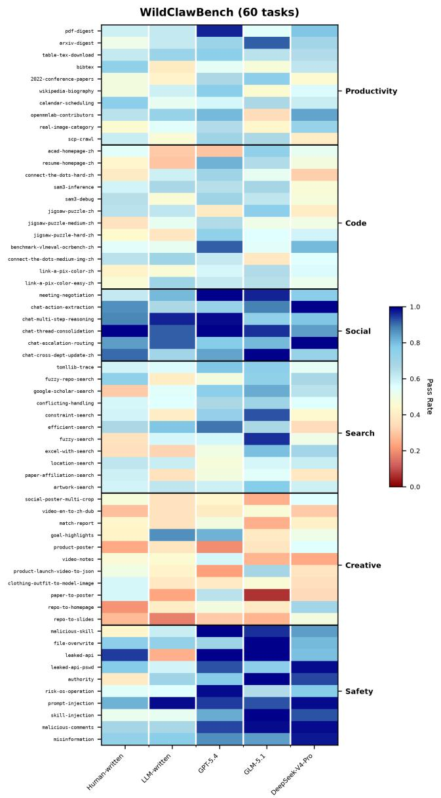

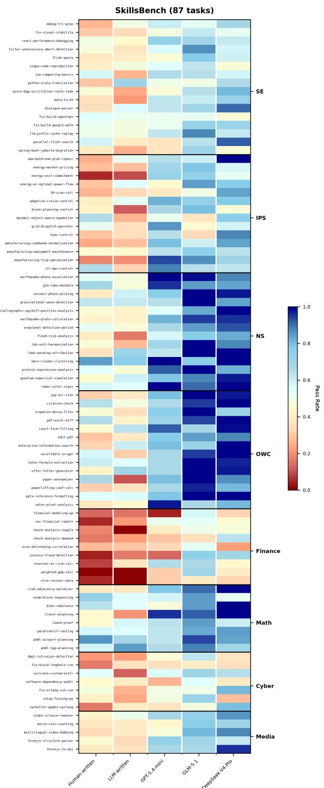  
Figure 7: Per-task pass rate heatmaps across both benchmarks. Left: WildClawBench (60 tasks across 6 domains). Columns represent Human-written baseline, LLM-written baseline, and SkillLift with three backbones: GPT-5.4, GLM-5.1, and DeepSeek-V4-Pro. Right: SkillsBench (87 tasks across 8 domains). Columns represent the same baseline conditions, with SkillLift using GPT-5.4-mini, GLM-5.1, and DeepSeek-V4-Pro. Task names appear on the left; domain labels on the right. Black horizontal lines se<sub>p</sub>arate domain boundaries. Warm colors (red/oran<sub>g</sub>e) indicate low <sub>p</sub>ass rates (<0.4); cool colors (blue) indicate hi<sub>g</sub>h <sub>p</sub>ass rates (>0.8).

Table 9: Evolution trajectory for the tictoc-unnecessary-abort-detection task.
<table><tr><td>Stage</td><td>Candidate</td><td>Direction / material change</td><td>Reward</td><td>Decision</td></tr><tr><td>Anchor</td><td>seed</td><td>Curated three-skill portfolio</td><td>0.00</td><td>Parent</td></tr><tr><td>Round 0</td><td>r000-c00</td><td>D1: trace-driven classification. Adds TSV-to-protocol mapping, per-key WTS reconstruction, conservative-abort rule.</td><td>0.85</td><td>Accepted</td></tr><tr><td>Round 0</td><td>r000-c01</td><td>D2: protocol-specification direction</td><td>0.00</td><td>Not accepted</td></tr><tr><td>Round 0</td><td>r000-c02</td><td>D3: safe-order witness direction</td><td>0.35</td><td>Not accepted</td></tr><tr><td>Round 1</td><td>r001-c00</td><td>D1: implementation precision. Adds explicit data structures, range semantics, and edge-case handling.</td><td>1.00</td><td>Terminal</td></tr><tr><td>Round 1</td><td>r001-c01</td><td>D2: access-counter ordering check</td><td>0.85</td><td>Not accepted</td></tr><tr><td>Round 1</td><td>r001-c02</td><td>D3: global serialization consistency</td><td></td><td>Invalid (overlapping edits)</td></tr><tr><td>Final 0</td><td>frozen</td><td>Independent post-stop trial</td><td>1.00</td><td>Final trial</td></tr><tr><td>Final 1</td><td>frozen</td><td>Independent post-stop trial</td><td>1.00</td><td>Final trial</td></tr><tr><td>Final 2</td><td>frozen</td><td>Independent post-stop trial</td><td>1.00</td><td>Final trial</td></tr></table>

Cr<sub>oss-</sub>b<sub>ac</sub>kb<sub>o</sub>n<sub>e co</sub>m<sub>pa</sub>ri<sub>so</sub>n <sub>s</sub>h<sub>ows</sub> th<sub>a</sub>t GPT<sub>-</sub>5<sub>.</sub>4/GPT<sub>-</sub> 5<sub>.</sub>4<sub>-m</sub>i<sub>n</sub>i <sub>genera</sub>ll<sub>y ac</sub>hi<sub>eves</sub> th<sub>e</sub> hi<sub>g</sub>h<sub>es</sub>t <sub>pass ra</sub>t<sub>es,</sub> f<sub>o</sub>ll<sub>owe</sub>d b<sub>y</sub> D<sub>eep</sub>S<sub>ee</sub>k<sub>-</sub>V4<sub>-</sub>P<sub>ro an</sub>d GLM<sub>-</sub>5<sub>.</sub>1<sub>.</sub> H<sub>owever,</sub> GLM<sub>-</sub>5<sub>.</sub>1 d<sub>emons</sub>t<sub>ra</sub>t<sub>es compe</sub>titi<sub>ve per</sub>f<sub>ormance on spec</sub>ifi<sub>c</sub> d<sub>oma</sub>i<sub>ns</sub> such as WildClawBench Search and SkillsBench NS (network and s<sub>y</sub>stem tasks), su<sub>gg</sub>estin<sub>g</sub> that domain-s<sub>p</sub>ecific <sub>s</sub>t<sub>reng</sub>th<sub>s pers</sub>i<sub>s</sub>t <sub>across</sub> th<sub>e</sub> SkillLift f<sub>ramewor</sub>k<sub>.</sub> Th<sub>e per-</sub> t<sub>as</sub>k <sub>granu</sub>l<sub>ar</sub>it<sub>y</sub> <sub>a</sub>l<sub>so</sub> <sub>exposes</sub> f<sub>a</sub>il<sub>ure</sub> <sub>mo</sub>d<sub>es:</sub> t<sub>as</sub>k<sub>s</sub> <sub>requ</sub>i<sub>r</sub>i<sub>ng</sub> multi-ste<sub>p</sub> reasonin<sub>g</sub> or external tool coordination (e.<sub>g</sub>., certain Code domain tasks in WildClawBench) remain challen<sub>g</sub>- i<sub>ng</sub> f<sub>or a</sub>ll <sub>me</sub>th<sub>o</sub>d<sub>s,</sub> i<sub>n</sub>di<sub>ca</sub>ti<sub>ng</sub> th<sub>a</sub>t <sub>ru</sub>b<sub>r</sub>i<sub>c-gu</sub>id<sub>e</sub>d <sub>evo</sub>l<sub>u</sub>ti<sub>on</sub> <sub>canno</sub>t f<sub>u</sub>ll<sub>y compensa</sub>t<sub>e</sub> f<sub>or</sub> f<sub>un</sub>d<sub>amen</sub>t<sub>a</sub>l <sub>reason</sub>i<sub>ng</sub> li<sub>m</sub>it<sub>a-</sub> ti<sub>ons</sub> i<sub>n</sub> th<sub>e un</sub>d<sub>er</sub>l<sub>y</sub>i<sub>ng</sub> b<sub>ac</sub>kb<sub>one mo</sub>d<sub>e</sub>l<sub>s.</sub>

## E Case Study

We trace th<sub>e</sub> <sub>evo</sub>l<sub>u</sub>ti<sub>on</sub> <sub>o</sub>f th<sub>e</sub> tictoc-unnecessary-abort-detection t<sub>as</sub>k from SkillsBench (SE domain). This task requires determini<sub>ng w</sub>hi<sub>c</sub>h t<sub>ransac</sub>ti<sub>on a</sub>b<sub>or</sub>t<sub>s are unnecessary g</sub>i<sub>ven</sub> t<sub>wo</sub> t<sub>race</sub> files (write timestam<sub>p</sub>s and abort records). We selected this <sub>case</sub> b<sub>ecause</sub> it<sub>s</sub> f<sub>u</sub>ll <sub>ev</sub>id<sub>ence c</sub>h<sub>a</sub>i<sub>n</sub> i<sub>s preserve</sub>d<sub>: anc</sub>h<sub>or,</sub> <sub>searc</sub>h <sub>p</sub>l<sub>ans, can</sub>did<sub>a</sub>t<sub>e pa</sub>t<sub>c</sub>h<sub>es, va</sub>lid<sub>a</sub>ti<sub>on recor</sub>d<sub>s, an</sub>d <sub>p</sub>ost-sto<sub>p</sub> tr<sup>i</sup>a<sup>l</sup>s.

The recei<sub>p</sub>t remains stable across both rounds (three crit<sub>er</sub>i<sub>a: c</sub>l<sub>ass</sub>ifi<sub>ca</sub>ti<sub>on proce</sub>d<sub>ure,</sub> t<sub>race-</sub>t<sub>o-s</sub>t<sub>a</sub>t<sub>e mapp</sub>i<sub>ng, sa</sub>f<sub>e-</sub> order witness). The seed <sub>p</sub>ortfolio scores 0.00. Round 0 candidate D1 (0.85) converts a <sub>g</sub>eneral trace-anal<sub>y</sub>sis <sub>g</sub>uide into a Ti<sub>c</sub>T<sub>oc-spec</sub>ifi<sub>c me</sub>th<sub>o</sub>d <sub>w</sub>ith <sub>per-</sub>k<sub>ey</sub> ti<sub>me</sub>li<sub>ne recons</sub>t<sub>ruc</sub>ti<sub>on.</sub> Round 1 candidate D1 (1.00) adds ex<sub>p</sub>licit data structures and edge-case handling. Table 9 shows the full trajectory.

The Stage column indicates the search round: Anchor is the seed portfolio; Round 0 and Round 1 are inner-loop iterations with three candidate directions each; Final 0–2 are post-stop validation trials to confirm stability. The Candidate column identifies each skill variant (e.g., r000-c00 denotes Round 0, Candidate 0). Direction / material change d<sub>escr</sub>ib<sub>es</sub> th<sub>e su</sub>b<sub>s</sub>t<sub>an</sub>ti<sub>ve mo</sub>difi<sub>ca</sub>ti<sub>on app</sub>li<sub>e</sub>d i<sub>n</sub> th<sub>a</sub>t <sub>can</sub>di<sub>-</sub> date. Reward is the oracle pass rate (0.00–1.00), computed from execution rollouts. Decision records whether the candid<sub>a</sub>t<sub>e was accep</sub>t<sub>e</sub>d <sub>as</sub> th<sub>e new paren</sub>t f<sub>or</sub> th<sub>e nex</sub>t <sub>roun</sub>d<sub>,</sub> rejected due to insuficient improvement, marked invalid due t<sub>o</sub> <sub>over</sub>l<sub>app</sub>i<sub>ng</sub> <sub>e</sub>dit<sub>s,</sub> <sub>or</sub> id<sub>en</sub>tifi<sub>e</sub>d <sub>as</sub> t<sub>erm</sub>i<sub>na</sub>l <sub>w</sub>h<sub>en</sub> th<sub>e</sub> <sub>orac</sub>l<sub>e-</sub> pass threshold (≥ 0.9) was met. All three final trials achieve 1<sub>.</sub>00<sub>,</sub> <sub>con</sub>fi<sub>rm</sub>i<sub>ng</sub> th<sub>e</sub> <sub>converge</sub>d <sub>s</sub>kill’<sub>s</sub> <sub>s</sub>t<sub>a</sub>bilit<sub>y</sub> <sub>un</sub>d<sub>er</sub> i<sub>n</sub>d<sub>e-</sub> <sub>pen</sub>d<sub>en</sub>t <sub>ro</sub>ll<sub>ou</sub>t<sub>s.</sub>

Th<sub>e run</sub> t<sub>erm</sub>i<sub>na</sub>t<sub>es a</sub>ft<sub>er r</sub>001<sub>-c</sub>00 <sub>mee</sub>t<sub>s</sub> th<sub>e orac</sub>l<sub>e-pass</sub> threshold. Total cost through first ≥ 0.9 attainment: 8.4M t<sub>o</sub>k<sub>ens.</sub> Thi<sub>s case</sub> d<sub>emons</sub>t<sub>ra</sub>t<sub>es</sub> di<sub>rec</sub>ti<sub>on-gu</sub>id<sub>e</sub>d <sub>searc</sub>h <sub>an</sub>d <sub>s</sub>t<sub>r</sub>i<sub>c</sub>t <sub>accep</sub>t<sub>ance</sub> b<sub>u</sub>t <sub>no</sub>t <sub>rece</sub>i<sub>p</sub>t <sub>rev</sub>i<sub>s</sub>i<sub>on—</sub>th<sub>e</sub> i<sub>n</sub>iti<sub>a</sub>l <sub>ru</sub>b<sub>r</sub>i<sub>c</sub> <sub>a</sub>li<sub>gne</sub>d <sub>w</sub>ith<sub>ou</sub>t <sub>ou</sub>t<sub>er-</sub>l<sub>oop up</sub>d<sub>a</sub>t<sub>es.</sub>