# TEAR: Table Extraction with Atribute Recommendation from Texts via Large Language Models

Tong Li Hong Kong University of Science and Technology Hong Kong SAR, China tlice@connect.ust.hk

Yongqi Zhang Hong Kong University of Science and Technology (Guangzhou) Guangzhou, China yzhangee@connect.ust.hk

Shuye Ding Hong Kong University of Science and Technology Hong Kong SAR, China sdingah@connect.ust.hk

Shuangyin Li South China Normal University Guangzhou, China shuangyinli@scnu.edu.cn

Bo Li Hong Kong University of Science and Technology Hong Kong SAR, China

Jiachuan Wang<sup>∗</sup> Hong Kong University of Science and Technology Hong Kong SAR, China jwangey@connect.ust.hk

Lei Chen Hong Kong University of Science and Technology Hong Kong SAR, China leichen@cse.ust.hk

## Abstract

Table extraction from texts is an important task for information systems, and recent approaches that prompt large language models (LLMs) with instructions have drawn great attention for their strong performance. Existing works have assumed the input texts to be table descriptions or specialized documents. However, these eforts have largely overlooked another prevalent category of texts, commonly found in news reports and social media: naturally occurring texts. Extracting tabular information from such texts poses two distinct challenges. First, high variability and the absence of explicit structural cues make fixed heuristic LLM prompts limited in precisely delineating extraction boundaries. Second, manually predefined schemas cannot capture open-ended, unseen attributes in naturally occurring text. In this paper, we propose a framework, TEAR, to address these challenges. It comprises two synergistic workflows: a Table Extraction Workflow that dynamically adapts instructions to overcome the limitation of heuristic instructions, and an At tribute Recommendation Workflow that discovers new attributes from texts to complement the heuristic schema. To our knowledge, TEAR is the first framework that supports automated text-driven attribute recommendation, enabling exploratory schema design for table extraction. To evaluate TEAR, we establish the benchmark for table extraction and attribute recommendation on naturally occurring texts, including two real-world datasets, manual annotations,

appropriate metrics, and baseline comparisons. Experiments show that TEAR achieves state-of-the-art performance on both tasks, and the recommended attributes efectively enhance extraction performance in exploratory scenarios.

## CCS Concepts

• Information systems → Information extraction; • Computing methodologies → Information extraction.

## Keywords

table extraction, attribute recommendation, text-to-table, large language models

## ACM Reference Format:

Tong Li, Shuye Ding, Jiachuan Wang, Yongqi Zhang, Shuangyin Li, Lei Chen, and Bo Li. 2026. TEAR: Table Extraction with Attribute Recommendation from Texts via Large Language Models. In Proceedings ofMake sure to enter the correct conference title from your rights confirmation email (Conference acronym ’XX). ACM, New York, NY, USA, 22 pages. https: //doi.org/XXXXXXX.XXXXXXX

## 1 Introduction

Table extraction from texts, also known as text-to-table, is an emerging task focused on identifying semantic values from unstructured texts and organize them into tabular format [67], which unlocks the practical utility of texts for a wide range of downstream applications [26, 31, 43, 76], as well as simplifies data management [20, 71, 75, 77].

Previous works have developed into two lines, focusing on diferent categories of input texts. The first category is table descriptions, which are manually written or artificially generated according to well-defined tables, such as the NBA game summary and their original box scores in Figure 1(a). In this line of research, the tables exist natively, and description text can be obtained in bulk [4, 35, 44, 64]. Thus, with paired (text, table)s, researchers adopt a supervised paradigm, training generation models end-to-end to reconstruct the

(c) Naturally occurring texts.

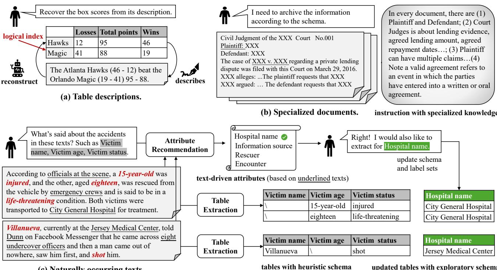  
Figure 1: Table extraction from diferent categories of input texts.

original table from its description [32, 50, 67]. However, their input texts are generated under control and are dominated by the pre-existing tables, which are limited in reflecting the true dificulty of extracting from real-world texts.

The second category is specialized documents, such as legal documents [5, 26] and biographies [5, 28]. These documents do not come with pre-aligned tables and involve more complicated contents, making annotating suficient paired data for supervised learning expensive. Alternatively, researchers have shifted toward agentic extraction [7, 25, 26] powered by large language models (LLMs). This paradigm is known as in-context learning (ICL) [18], where the user depicts the task as instruction prompts that guide the LLMs to locate and extract relevant information without task-specific fine-tuning. The efectiveness of ICL stems not only from LLMs’ general semantic understanding, but also from how these documents are composed to facilitate information retrieval. Specifically, specialized documents usually follow established writing conventions to convey predefined knowledge, ofering structural cues for human readability, which the LLM can also recognize and exploit. For example, in Figure 1(b), the prefix “Plaintif:” or pattern “Party A v. Party B” are reliable cues that help readers and LLMs quickly identify important information.

Ourfocus. Although efective for their assumed input texts, previous works have overlooked the extraction demands for naturally occurring texts [29, 34], the unscripted language produced for daily human communication, pervasive in news reports, social media discourse, and customer service interactions. Ubiquitous naturally occurring texts (n-texts) encapsulate the authentic, unfiltered information that flows through human interaction, a quality inherently absent from curated descriptions or specialized documents. Extracting tables from them, therefore, represents a pivotal advance of the field into realistic scenarios. Unlike previously studied input texts, n-texts are not organized around pre-existing tables or predefined knowledge. Instead, they unfold in a fluid, narrative style, exhibiting less literal consistency, which introduces new challenges for extraction.

Challenge 1. Inefective heuristic instruction. Resorting to LLM-based in-context learning for n-texts is appealing, given its semantic capability and data eficiency. Nevertheless, n-texts lack stable structural templates or cues in contrast to specialized documents. This high variability means that even carefully crafted instructions are often insuficient to delineate all possible extraction boundaries and convey nuanced task requirements [48, 55].

Example 1.1. Consider the attribute “Victim status” in Figure 1(c). Unlike the explicit plaintif name in Figure 1(b), its scope is ambiguous: it may encompass only direct casualties (“injured”), or also extend to relocation (“transported”). Such ambiguity is not resolvable via LLM common sense but requires task specification. Exhaustive enumeration of analogous ambiguities in static instruction is not only impractical, but may instead dilute model attention to cause lost-in-the-middle [36].

Challenge 2. Inadequate heuristic schema. A crucial step in extraction is understanding what information the texts contain, so as to determine the target schema, i.e., the attributes of interest. Existing methods typically work with heuristic schemas provided by human experts [25, 26], which may be satisfactory for their assumed inputs, where experts easily anticipate text contents. However, n-texts do not adhere to a stable informational template. Even if one were to navigate massive volumes of such texts and painstakingly summarize the observed contents into attributes, missing some attributes remains a risk. In other words, users confronting n-texts face an exploratory scenario: initially, they can only list some obvious attributes that immediately come to mind, yet still seek to uncover all the relevant attributes that will emerge from the texts ahead.

Example 1.2. Consider the two texts in Figure 1(c). Though both are news reports about accidents, one details a rescue efort (“emergency crews”), and the other details a sudden, hostile encounter (“eight undercover oficers”). Such contents diverge more sharply compared to those of the judgment in Figure 1(b), where each document follows a stable informational template to mention the plaintif, defendant, case number, etc.

Our proposals. In this paper, we propose a framework TEAR, short for Table Extraction with Attribute Recommendation, to address the above challenges for naturally occurring texts.

To tackle the dilemma of heuristic instructions of Challenge 1, our idea is to dynamically select and insert demonstrative examples into the prompt for each text. These examples complement the ab stract instructions with customized task specifications, enabling the LLM to perform extraction with clearer objectives. Also, retaining a small set of labeled data to supply such examples ofers a practical trade-of between LLM usability and data eficiency [55]. Determining what constitutes an efective demonstration is non-trivial, because general text similarity [54] does not fully reflect the task utility of an example, such as its ability to clarify the extraction boundaries of a particular attribute. To this end, TEAR incorporates a proactive module that first performs a fuzzy prediction of what contents are likely to appear in the target table cells, and then retrieves examples that are informative for the specific extraction.

To overcome the limitations of heuristic schemas discussed in Challenge 2 and support exploratory scenarios, TEAR introduces a novel attribute recommendation task, which automatically discovers new attributes in texts to assist in refining the prior schema, as in Figure 1(c). Although the capabilities of recent LLMs in processing open-ended information [1, 72] render this task possible, naively invoking LLMs and blindly accepting their outputs leaves the system vulnerable. Intuitively, an efective LLM-based attribute recommendation method should possess further abilities to (i) guide the LLM to propose attributes grounded in texts rather than ad-hoc fabrication; (ii) integrate the LLM’s diferently articulated discoveries across multiple texts into a global candidate set; and (iii) prioritize the most salient candidates, shielding users from an undiferentiated, exhaustive list. Accordingly, we equip TEAR with components that operationalize these three intuitions.

Finally, we establish an evaluation methodology tailored to this new setting. Prior work on table descriptions and specialized documents assumes the presence of logical indices to align and compare records [67], which are not applicable to n-texts because they offer no such convenience. We therefore introduce a new metric for extraction that assesses table semantics without relying on indices, along with a dedicated evaluation protocol for the novel attribute recommendation task. We accompany this evaluation with two n-text datasets, comprising 3,375 manually annotated ground-truth tables spanning two domains. Extensive experiments on these datasets demonstrate that TEAR consistently outperforms state-of-the-art baselines on both extraction and recommendation tasks.

To sum up, our main contributions are as follows:

(1) We introduce an LLM-based framework TEAR for table extraction with attribute recommendation from naturally occurring texts. To the best of our knowledge, it is the first framework that could recommend new relevant attributes derived from texts under exploratory scenarios.

(2) For table extraction, we propose a Proactive Demonstration Module that dynamically retrieves examples for adaptive instructions for each text.

(3) For attribute recommendation, we propose a Discovery Mechanism that frames open-ended attribute discovery as table expansion to engage the LLM in proposing faithful new attributes, a Hybrid Integration Strategy that resolves duplicate LLM discoveries via diversity checking and contextualized analysis, and a Schema Coherence Score that ranks candidates by their holistic coherence with the initial schema.

(4) We establish a new and fair evaluation methodology given the emergent evaluation dificulty from table extraction and attribute recommendation from naturally occurring texts.

In the rest of this paper, we begin with a discussion of related work (Section 2) and the formal problem definition (Section 3). We then present TEAR, including an overview (Section 4.1), the table extraction workflow (Section 4.2), and the attribute recommendation workflow (Section 4.3). Next, we elaborate on the new evaluation methodology (Section 5). Lastly, we report the experiment results(Section 6) and conclusion (Section 7).

## 2 Related Works

## 2.1 Table Extraction from Texts

Existing methods can be classified according to whether model parameters are updated. 1. Supervised paradigm. These methods treat table extraction as an end-to-end sequence generation task. They feed the text sequence into a language generation model [30, 56] and design diferent decoding strategies to generate rectangular tables as sequences, including row-by-row generation [67], parallel row generation [32], learnable cell ordering [50], and pointer-based decoding for the medical domain [76]. Researchers collect large amounts of paired (text, table) data and update the model parameters to minimize a loss function. Because these methods rely heavily on the training data distribution, they tend to perform well when the input texts are table descriptions that follow controlled patterns, but they struggle with n-texts, which exhibit higher variability and lack large-scale training data. 2. In-context learning paradigm. Recent works employ LLMs as general-purpose extractors via ICL [13, 38, 47]. Researchers convey the task to the LLM of the task through instructions rather than training it, thereby steering model behavior without any parameter updates. The research focus is on mimicking human-like behavior by decomposing the extraction task into subtasks (e.g., identifying entities, planning layout, and filling cells), and supplying each subtask with a dedicated instruction [1, 25, 26]. These heuristic instructions are coupled with specialized documents and tend to be efective because human experts are themselves proficient at extracting knowledge from such documents. For instance, TKGT [26] translates human expertise in the legal domain into a knowledge graph and uses it to instruct the LLM. However, it is dificult to guarantee the success of this mode for n-texts, as the necessary template consistency and domain-specific heuristics are largely absent.

## 2.2 Open Information Extraction

Our attribute recommendation task is related to Open Information Extraction (OIE) [46, 77]. Among all subareas, the most relevant is novel slot detection [33, 68, 69], since a slot also manifests as a keyvalue pair. However, these works detect the existence of a new type, rather than revealing its semantic identity via canonical naming. Further, the slot types they defined are often distinguishable via surface value (e.g., a date vs. a name), hence are insuficient to represent distinct attributes that share similar values $( \mathrm { e . g . }$ , “Victim name” or “Suspect name”). Other OIE tasks diverge farther from AR. For example, schema induction and event schema learning [6, 22, 37, 39, 72] discover unseen n-ary tuples representing predicates, entities, and relations, instead of extending known tuples with new dimensions; ontology learning [3, 66] establishes terminology, taxonomies, and axioms that are formal and universal rather than specific to input texts.

## 2.3 Other Table Extraction Tasks

Our task aims to identify semantic values in unstructured texts and align them into tables. We acknowledge that several other tasks are also termed “table extraction”, yet their intended application scenarios difer fundamentally from ours. 1. Table extraction by format mining. These methods rely on mining formatting patterns rather than deep semantic understanding, and thus cannot extract attribute values from completely unstructured, free-form texts. For example, web record extraction [9, 11, 58, 78] processes list or detail pages; tables repairing processes CSV files [10, 23] or PDF texts [61] with explicit delimiters; another recent work [2] considers text in heterogeneous data lakes where attributes appear in the fixed form $\operatorname { o f } "$ <name>: <value>". 2. Table extraction by information integration. These works focus on reasoning or calculating for the attributes that are not directly stated in the texts. For instance, some count event occurrences [16]; others derive attributes such as lifespan or zodiac sign from extracted dates [5, 17]. Crucially, these approaches do not address the dificulty of extracting atomic attribute values from raw texts, especially highly variable n-texts. 3. On-demand table extraction. They extract tables in response to individual user queries rather than an overall schema, which maintains a corpus to locate answers [7] or retrieve relevant passages [8]. One advantage of our approach is that the pre-extracted tables enable a broad range of exact SQL-style operations, not only ad-hoc queries.

## 3 Problem Definition

We introduce the related notations. The naturally occurring text � is a vanilla word sequence. A span [19] is a subsequence of its words, with $\mathcal { P } ( W )$ denoting the span space.

Definition 3.1 (Value in Text). From the input text, a valid value for the extracted table is a list of non-overlapping spans. The value

space of the given $W , { \mathcal { A } } ( W )$ , is

$$
\{ \langle a _ { 1 } , a _ { 2 } , \ldots \rangle | \forall i , a _ { i } \in { \mathcal { P } } ( W ) ; \forall i < j , a _ { i } { \mathrm { p r e c e d e s } } a _ { j } \} .\tag{1}
$$

Here, a list of spans is used for a value, instead of a single span, because the mentions can be non-consecutive in the naturally occurring text. Our basic settings keep the raw strings as values, allowing the LLM to tokenize and recognize them. For additional specialized usage, one could further convert raw strings into normalized formats by post-processing [60]. For example, converting "eighteen" to the numerical "18" for actual storing.

Definition 3.2 (Schema). The extraction schema for naturally occurring text is a set of attributes.

$$
{ \cal { S } } = \left\{ s _ { 1 } , s _ { 2 } , . . . , s _ { | S | } \right\}\tag{2}
$$

For each attribute in the schema, its name is a string of regular naturalness [40], which contains complete words or acronyms in common usage, that are easy to understand by ordinary people and general LLMs. Meaningless or obscure symbols like "Column ${ \underline { { 1 } } } "$ or $" \mathrm { R E V } "$ are not qualified.

Definition 3.3 (Table). A table � of � records can be viewed as a list, $D = [ H , R _ { 1 } , . . . , R _ { n } ]$ , where $H = [ h _ { 1 } , h _ { 2 } , . . . , h _ { m } ]$ is the header region that consists of� unique attribute names. $\mathcal { R } = [ R _ { 1 } , . . . , R _ { n } ]$ is the non-header region, where the �-th record ${ R _ { i } } = { [ { A _ { i 1 } } , { A _ { i 2 } } , . . . , { A _ { i m } } ] }$ is a list of� values corresponding to � attributes.

Following previous works [16, 67], we define each table as a rectangular data structure with rows as records and columns as attributes. If the table follows the schema $S ,$ its header names $H \subseteq S .$ If the table is extracted from text $W ,$ each value $A _ { i j } ~ \in ~ \mathcal { A } ( W )$ $i = [ 1 . . n ] , j = [ 1 . . m ]$ . We allow some values in the table to be an empty span list, i.e. $| A _ { i j } | = 0 ;$ , indicating not mentioned. In a valid table �, we assume there is no entirely empty row or column to eliminate dummy structures.

The table extraction (TE) task aims to output stable, task-specific predictions, not only subjectively reasonable ones, which is defined as follows.

Definition 3.4 (Labeled Sample). Given a schema $S ,$ a labeled sample is a pair of text and table $( W ^ { l } , D ^ { l } )$ , where $D ^ { l }$ is extracted from $W ^ { l }$ and follows �.

Definition 3.5 (Table Extraction). Given a schema �, labeled samples $\{ ( W _ { 1 } ^ { l } , D _ { 1 } ^ { l } ) , ( W _ { 2 } ^ { l } , D _ { 2 } ^ { l } ) , . . . \}$ , and unlabeled texts $\{ W _ { 1 } ^ { u } , W _ { 2 } ^ { u } , . . . \}$ the method outputs the tables $\{ D _ { 1 } ^ { u } , D _ { 2 } ^ { u } , . . . \}$ . Let $\{ \hat { D } _ { 1 } ^ { u } , \hat { D } _ { 2 } ^ { u } , . . . \}$ be the ground truth, where $\hat { D } _ { i } ^ { u }$ is extracted from $W _ { i } ^ { u }$ and follows �. Given similarity metric $g ^ { t e }$ of any two tables, Table Extraction aim to maximize $g ^ { t e } ( D _ { i } ^ { u } , \hat { D } _ { i } ^ { u } ) , \forall i$

The attribute recommendation (AR) task is defined as follows.

Definition 3.6 (Atribute Recommendation). Given an inadequate schema �, labeled samples $\{ ( W _ { 1 } ^ { l } , D _ { 1 } ^ { l } ) , ( W _ { 2 } ^ { l } , D _ { 2 } ^ { l } ) , \ldots \}$ , the unlabeled texts $\{ W _ { 1 } ^ { u } , W _ { 2 } ^ { u } , . . . \}$ , and a recommendation budget $k ,$ the method outputs new attributes $S ^ { \prime }$ that $| S ^ { \prime } | = k$ . Let $\hat { S } ^ { \prime }$ be the ground truth relevant set of attributes. Given a recall-based metric $g ^ { a r }$ Attribute Recommendation aim to maximize $g ^ { a r } ( S ^ { \prime } , \hat { S } ^ { \prime } )$

Note that these two tasks share the same input format, except for the recommendation budget �. Given the input, our TEAR framework accomplishes the TE task as other table extraction systems.

Under exploratory scenarios with specified $k ,$ our framework additionally fulfills the AR task in response to the user requirements.

## 4 The TEAR framework

## 4.1 Overview

Figure 2 provides an overview of our dual-workflow framework, which leverages the instruction-following ability of a backbone LLM to perform table extraction with attribute recommendation.

(a) Table Extraction Workflow (TEW): Given an input text, the schema, and the labeled samples, we dynamically select demonstrative examples from the labeled samples and insert them into the prompt for adaptive instruction. (Step a1) We employ a surrogate model to make fuzzy predictions about the target table, generating a header preview and a value preview. (Step a2) For each labeled sample, we compute three utility scores by comparing its text to the input text, its table headers to the header preview, and its table values to the value preview. (Step a3) The most pertinent examples under each score are selected and prompted to the LLM together with the static instruction to obtain the output table.

(b) Attribute Recommendation Workflow (ARW): Our ARW revisits the text to recommend attributes that are not yet present in the extracted table but are closely related to the existing schema. (Step b1) The LLM is instructed to expand the extracted table by adding new columns. (Step b2) We collect the newly expanded column headers from diferent tables, $Z ,$ to deduplicate and consolidate them into a global attribute candidate set $Z ^ { \prime }$ . (Step b3) For each candidate, we compute the semantic coherence of appending it to the heuristic schema to produce a ranked list.

## 4.2 Table Extraction Workflow

Recalling Example 1.1, we posit that demonstrative examples should bridge the gap between the LLM’s general knowledge and task specification. Therefore, we propose a Proactive Demonstration Module that first proactively forecasts what contents are likely to appear in the target table, then uses these forecasts to query the labeled pool for examples that disambiguate their extraction. Specif ically, it forecasts a header preview indicating the likely attribute names, and a value preview suggesting plausible textual spans in the non-header region. Since previews only highlight fuzzy cues to guide example selection, their generation is inherently easier and more noise-tolerant than producing a precise, complete table. We fine-tune a lightweight surrogate model for each dataset to generate them, which demands far fewer resources than end-to-end training.

4.2.1 Proactive previews generation. For the input text $W ^ { u } { } _ { ; }$ , we define its header preview $H ^ { p } \subseteq S ,$ , and its value preview $V ^ { p } \subset \mathcal { P } ( W ^ { u } )$ We use the labeled pool $\{ ( W ^ { l } , D ^ { l } ) \}$ to construct the training data for the surrogate model �.

Specifically, we serialize the table $D ^ { l }$ into a sequence $S e q ( D ^ { l } )$ and optimize � to generate this sequence autoregressively from $W ^ { l }$ with the standard cross-entropy loss [62]. To serialize a table, we introduce three special tokens: ⟨�⟩ separates spans in each value, ⟨�⟩ separates cells in each row, and $\langle n \rangle$ separates rows. Then, the sequence representation of a cell value $A = \left[ a _ { 1 } , a _ { 2 } , . . . , a _ { | A | } \right]$ is:

$$
S e q ( A ) = a _ { 1 } \langle m \rangle a _ { 2 } \langle m \rangle \dots \langle m \rangle a _ { | A | }\tag{3}
$$

The header row sequence is:

$$
S e q ( H ^ { l } ) = h _ { 1 } ^ { l } \left. s \right. h _ { 2 } ^ { l } \left. s \right. . . . \langle s \rangle h _ { m } ^ { l }\tag{4}
$$

The �-th data row sequence is:

$$
S e q ( R _ { i } ^ { l } ) = S e q ( A _ { i 1 } ^ { l } ) \left. s \right. S e q ( A _ { i 2 } ^ { l } ) \left. s \right. . . . \left. s \right. S e q ( A _ { i m } ^ { l } )\tag{5}
$$

The entire table sequence is:

$$
S e q ( D ^ { l } ) = S e q ( H ^ { l } ) \left. n \right. S e q ( R _ { 1 } ^ { l } ) \left. n \right. S e q ( R _ { 2 } ^ { l } ) \left. n \right. \ldots \left. n \right. S e q ( R _ { n } ^ { l } )\tag{6}
$$

During inference, given a new input text $W ^ { u }$ , we obtain the predicted table sequence $M ( W ^ { u } )$ . Instead of reconstructing the full table, we probe it to obtain only $H ^ { p }$ and $V ^ { p } ;$ : for $H ^ { p } , M ( W ^ { u } )$ is truncated at the first $\langle n \rangle$ and split by $\langle s \rangle { \mathrm { ; } }$ for $V ^ { p } { } _ { ; }$ , the sequence after the first $\langle n \rangle$ is split by all special tokens. This yields coarse but informative previews that guide the subsequent example retrieval.

4.2.2 Extraction demonstration. Given the input text $W ^ { u }$ and the generated previews $H ^ { p }$ and $V ^ { p }$ , we dynamically retrieve examples from the labeled pool based on three utility measures: header utility $s c _ { h } ,$ , value utility $s c _ { v } .$ , and semantic utility $s c _ { s }$

Header utility. Samples whose table headers are similar to $H ^ { p }$ illustrate how to structure and populate attributes for the target table. We define the header utility of a labeled sample whose table $D ^ { l }$ has headers $H ^ { l }$ as

$$
s c _ { h } ( H ^ { p } , D ^ { l } ) = | H ^ { p } \cap H ^ { l } | + | H ^ { l } \setminus H ^ { p } | / ( | S | + 1 ) .\tag{7}
$$

The first term prioritizes samples that directly contain the anticipated headers; the second term, always less than 1, breaks ties by favoring samples with more additional headers, which provide broader contextual information. If $H ^ { p } = \varnothing .$ , meaning no header is previewed, Equation 7 reduces to $| H ^ { l } | / ( | S | + 1 )$ , defaulting to retrieving samples with richer headers.

Value utility. Samples whose table value spans are similar to $V ^ { p }$ demonstrate how salient mentions or descriptive phrases are mapped into table cells. Let $V ^ { l } = \cup _ { i \in [ 1 . . n ] , j \in [ 1 . . m ] } A _ { i j } ^ { l }$ be the union of all spans in the labeled table $D ^ { l }$ . We define the value utility as

$$
s c _ { v } ( V ^ { p } , D ^ { l } ) = \mathrm { F } 1 ( V ^ { p } , V ^ { l } ; \mathrm { c h r F } \beta ) ,\tag{8}
$$

where $\operatorname { F } 1 ( \cdot )$ is the standard F1-score (Equation 20) between two sets and chrF� [51, 52] is a widely used metric that measures pattern matching between two strings:

$$
\mathrm { c h r F } \beta = ( 1 + \beta ^ { 2 } ) \frac { \mathrm { c h r P \cdot c h r R } } { \beta ^ { 2 } \mathrm { c h r P } + \mathrm { c h r R } } ,\tag{9}
$$

with chrP and chrR denoting character n-gram precision and recall, where we set $\beta$ by the previous default [53]. If $V ^ { p } = \varnothing $ , meaning no value span is previewed, we will fall back to treating the original text $W ^ { u }$ as a single long span in place of $V ^ { p }$ in Equation 8.

Semantic utility. Samples whose texts are overall semantically similar to $\overline { { W ^ { u } } }$ ofer a comprehensive demonstration in style and content. We compute the semantic utility by the standard dense retrieval practice in RAG [21], where a deep embedding model [41], ���(·), is applied for normalized vectorization:

$$
s c _ { s } ( W ^ { u } , W ^ { l } ) = E m b ( W ^ { u } ) ^ { \mathsf { T } } \cdot E m b ( W ^ { l } ) .\tag{10}
$$

(b) Attribute Recommendation Workflow  
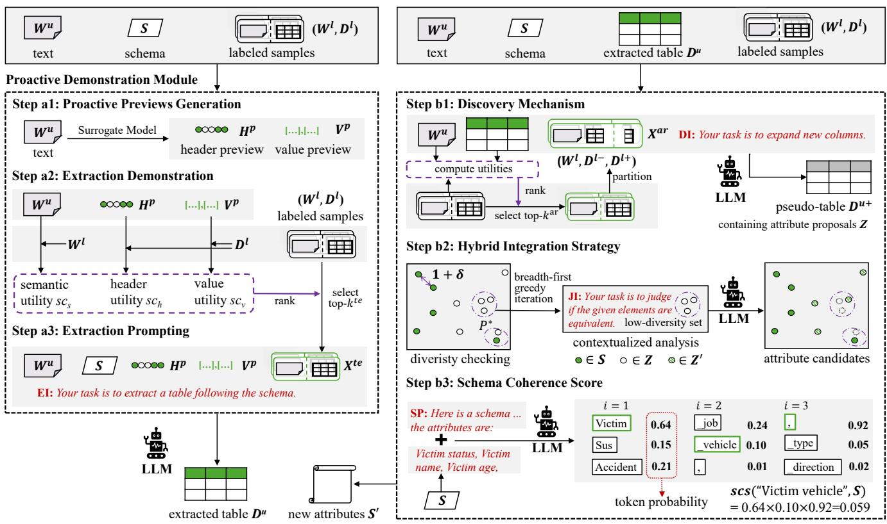  
Figure 2: Overview of TEAR. The LLM instructions are simplified for brevity, and the complete version is in the Appendix A.1.

4.2.3 Extraction prompting. For simplicity, we retrieve an equal number of examples under each utility type. The number $k ^ { t e }$ is a hyperparameter afected by the backbone LLM’s capability and can be tuned via validation performance. Let $\chi _ { h } , \chi _ { v } , \chi _ { s }$ be the top- $- k ^ { t e }$ samples indices according to $s c _ { h } , s c _ { v } , s c _ { s }$ , respectively. The Proactive Demonstration Module outputs demonstration set:

$$
X ^ { t e } = \{ ( W _ { i } ^ { l } , D _ { i } ^ { l } ) \} _ { i \in { \chi _ { h } } \cup { \chi _ { v } } \cup { \chi _ { s } } } .\tag{11}
$$

We then use a natural language template with reasonable instructional phrases and formatting markers to wrap the text, schema, auxiliary previews, and retrieved demonstrations into a single prompt, the Extraction Instruction (EI). Figure 2 shows a conceptualized template, while a complete instantiation is in Appendix A.1. The final table extraction is then performed as

$$
D ^ { u } = L L M ( \operatorname { E I } ( W ^ { u } , S , H ^ { p } , V ^ { p } , X ^ { t e } ) ) .\tag{12}
$$

The above equation emphasizes what to populate the template, instead of the particular languages of EI.

## 4.3 Attribute Recommendation Workflow

We formulate the Attribute Recommendation (AR) task to support the emerging exploratory scenarios for n-texts, where the user provides only a heuristic schema as an initial direction, and the system is responsible for interacting with the texts to return a ranked list of new attributes. Importantly, AR does not produce a conclusive attribute set, but rather exhibits a prioritized list serving as an automatic, intelligent summary of text-driven attributes. We have identified three essential abilities that an efective LLM-based AR method should possess (as in the Introduction), and our ARW instantiates corresponding components, as depicted in Figure 2(b). Briefly, it comprises three core components: a Discovery Mechanism that proposes new attributes from input texts via adaptive demonstration, a Hybrid Integration Strategy that eficiently resolves duplicates among generated proposals, and a Schema Coherence Score that ranks candidates by their relevance to the user’s initial schema. We detail each component in the following subsections.

4.3.1 Discovery Mechanism. To discover new attributes from an input text, we continue the idea of adaptive instruction, demonstrating the desired behavior through examples. Our Discovery Mechanism places attributes back into their naive context as column headers, and guides the LLM to expand the extracted table with new columns by drawing analogies to existing ones. By framing open-ended discovery as table expansion, we ground the LLM’s understanding of attributes in the structure of table columns, thereby preserving their original semantics more faithfully.

The input to the mechanism is the text�<sup>�</sup> and the extracted table $D ^ { u } ,$ , and the output is a pseudo-table $D ^ { u + }$ which contains columns as new attribute proposals. A demonstrative example for this step takes the form (text $W ^ { l }$ , known table $D ^ { l - }$ , new table $D ^ { l + } )$ , which is constructed by splitting the columns of the sample table part $D ^ { l }$

Example 4.1. Suppose a labeled sample $D ^ { l }$ has columns: “Victim name”, “Victim status”. To create a discovery example for an input text whose $D ^ { u }$ has only a column “Victim name”, we split $D ^ { l }$ into $D ^ { l - }$ of column “Victim name”, and $D ^ { l + }$ of “Victim status”.

Note that although the attributes in the demonstrative “new" table belong to the existing schema $S ,$ we do not reveal � to the LLM. This allows us to reuse the same labeled pool originally collected for � to efectively demonstrate an open-ended discovery task. When retrieving the examples, we also update the previews with the header and value views derived from $D ^ { u }$ . Let $\tilde { X } _ { h }$ and $\tilde { X } _ { v }$ be the indices of the updated retrieved samples. The discovery demonstration set is

$$
X ^ { a r } = \{ ( W _ { i } ^ { l } , D _ { i } ^ { l - } , D _ { i } ^ { l + } ) \} _ { i \in \tilde { \cal X } _ { h } \cup \tilde { \cal X } _ { v } \cup \chi _ { s } } .\tag{13}
$$

Like the EI, we then construct the Discovery Instruction (DI), and the pseudo-table extraction is performed as:

$$
D ^ { u + } = L L M ( \operatorname { D I } ( W ^ { u } , D ^ { u } , X ^ { a r } ) ) .\tag{14}
$$

4.3.2 Hybrid Integration Strategy. There can be duplicates among individual discoveries. For instance, conceptually equivalent attributes may appear as "Hospital name" in one pseudo-table and "Medical center name" in another. LLMs are adept at detecting such duplicates through semantic reasoning over attribute names and their textual contexts. [14, 65]. We solicit a binary judgement {True, False} from the LLM over a small set of proposals at each time. This constrained format could efectively prevent the LLM from drifting into verbose or open-ended reasoning [36, 48], thereby preserving controllability.

The input ofthe strategy are schema � and proposals $Z = \cup _ { i } H _ { i } ^ { u + } \backslash$ $S ,$ and the output is a deduplicated subset $Z ^ { \prime } \subseteq Z .$ As � grows, eficiency further draws our attention, as plainly invoking the LLM on all possible combinations becomes prohibitive. Therefore, we first introduce a lightweight diversity checking to identify a few plausible proposal subsets, and only submit those low-diversity subsets to the LLM for contextualized analysis.

Diversity checking. For a group of attributes $p \subseteq Z \cup S ,$ we compute its diversity as the maximum Vendi Score [15, 42] over its subset:

$$
d i v ( p ) = \operatorname* { m a x } _ { q \subseteq p } v d s ( q ) ,\tag{15}
$$

where ��� $( q ) \in [ 1 , | q | ]$ is a continuous number that estimates the efective number of unique elements in �. The collection of lowdiversity subsets $P ^ { * }$ is defined as:

$$
\begin{array} { r l } & { \quad P ^ { * } = \{ \hat { p } \subseteq Z \cup S | | \hat { p } | > 1 , d i v ( \hat { p } ) < 1 + \delta \} , } \\ & { 1 + \delta = \underset { \forall s _ { i } , s _ { j } \in S , s _ { i } \neq s _ { j } } { \operatorname* { m i n } } d i v ( \{ s _ { i } , s _ { j } \} ) . } \end{array}\tag{16}
$$

Here, $1 + \delta$ is the minimum diversity between any two distinct schema attributes. If $d i v ( p ) < 1 + \delta , p$ approximates only a single attribute under the schema’s semantic granularity, and thus may accommodate duplicates. We could use a bottom-up search with pruning to find $P ^ { * }$ given that ��� (·) is monotonic [42](see Appendix A.3).

Contextualized analysis. For each proposal � involved in some low-diversity subset, we obtain its context(�) by prompting the LLM to produce a concise definition [72], based on its native texts and pseudo-tables (Detailed in Appendix A.4). Then, for each � ∈ $P ^ { * }$ a Judge Instruction (JI) is prompted to the LLM,

$$
r s p = L L M ( \mathrm { J I } ( S , \{ ( z , \mathrm { c o n t e x t } ( z ) ) \} _ { z \in p } ) ) , r s p \in \{ \mathrm { T r u e , F a l s e } \} .\tag{17}
$$

If the LLM responds that $\boldsymbol { p }$ is duplicated, then we check whether $\boldsymbol { p }$ contains a known attribute or not. If so, all other proposals are deemed naive repetitions of that known attribute and will be eliminated. If not, we choose the proposal in � with the highest Schema Coherence Score (Section 4.3.3) and discard the rest.

We could use earlier judgment to remove some proposals, so not every $\ b { p } \in \ b { P } ^ { * }$ requires contextualized analysis. We hence design a breadth-first greedy iteration scheduling that dynamically updates $P ^ { * }$ to reduce LLM calls. As in Algorithm 1, each outer iteration selects a cover $Q \subset P ^ { * }$ of all remaining elements, and the inner loop sequentially submits $Q$ to the LLM. This breadth-first design prunes confirmed duplicates early, shrinking $P ^ { * }$ and avoiding unnecessary exploration of nested sets that do not contain genuine duplicates.

Complexity Analysis. We now briefly summarize the computational complexity of the Hybrid Integration Strategy, and refer to Appendix A.3 for detailed discussions and the Table 3 for the experiment report. In diversity checking, the number of candidate sets examined by a bottom-up search scales linearly with the output size $| P ^ { * } |$ . In contextualized analysis, let |�| be the number of elements at the start of an iteration, and $N ^ { \prime }$ be the number of true duplicates. The number of LLM calls in that iteration is bounded by (ln $\left| B \right| + 1 ) \left( \left| B \right| - N ^ { \prime } \right)$ ). More duplicates yield a smaller bound and likely earlier True responses for more aggressive pruning. This property is beneficial: when duplicates are abundant, the algorithm eliminates large groups with few calls; when scarce, it degrades gracefully to exhaustive iteration. Even when the resource cannot aford the exhaustive iteration, early termination incurs little penalty since there are fewer duplicates in the first place.

4.3.3 Schema Coherence Score. It is necessary to prioritize attributes that meaningfully extend the user’s heuristic schema. For example, while “Reporter name” may be informative in a news article, it adds little value when the schema is designed to extract facts about criminal incidents rather than newsroom stafing. To quantify this notion of relevance, we introduce a Schema Coherence Score, which estimates how naturally an attribute candidate completes the description of the existing schema. Based on the language modeling principles [24, 49, 59], we compute this score as the conditional probability of the candidate’s name given the known schema. This formulation captures holistic coherence with the schema context.

Formally, let � be a candidate. We tokenize � and append an end-of-name separator $b _ { 0 }$ (a comma by default):

$$
t k n ( z ) = T o k e n i z e r ( z ) + T o k e n i z e r ( b _ { 0 } ) .\tag{18}
$$

We then prepend a Schema Prefix (SP) that enumerates the known attributes as the condition. As in Figure 2(Step b3), the score is

$$
s c s ( z , S ) = \Pi _ { i } P r o b ( t k n _ { i } ( z ) | \mathrm { S P } ( S ) + t k n _ { : i - 1 } ( z ) ) ,\tag{19}
$$

where $t k n _ { i } ( z )$ is the �-th token and $t k n _ { : i - 1 } ( z )$ denote the tokens before it. Computing this score requires no decoding, only a single

Algorithm 1 breadth-first greedy iteration of $P ^ { * }$   
Require: attribute proposals $Z ,$ schema �, low-diversity set $P ^ { * }$   
Ensure: attribute candidates $Z ^ { \prime }$   
1: $Z ^ { \prime } = \varnothing , B \gets Z \cup S$   
2: while $\left| B \right| > 0 \land \left| P ^ { * } \right| > 0$ do ⊲ Outer loop   
3: $B ^ { \prime } \gets B , Q \gets \emptyset$   
4: while $\left| B ^ { \prime } \right| > 0$ do ⊲ Find a greedy cover of elements.   
5: � = arg ma $\mathbf { x } _ { q \in P ^ { * } } q \cap B ^ { \prime }$   
6: $Q  Q \cup \{ q \} , B ^ { \prime }  B ^ { \prime } \backslash q$   
7: end while   
8: for $q ^ { \prime } \in Q$ do ⊲ Inner loop   
9: $q  q ^ { \prime } \cap B$   
10: if $| q | = 1$ then $Z ^ { \prime } \gets Z ^ { \prime } \cup q$   
11: else   
12: Obtain ��� for � by Equation 17.   
13: $\mathbf { i f } \ r s p$ then   
14: if $q \cap S = \emptyset$ then   
15: $\bar { Z } ^ { \prime }  Z ^ { \prime } \cup$ {arg $\operatorname* { m a x } _ { z \in q }$ ��� (�, �)}   
16: end if ⊲ Exclude elements and sets.   
17: $\begin{array} { r } { B \gets B \setminus q , P ^ { * } \gets \{ p \in P ^ { * } | p \cap q = \emptyset \} } \end{array}$   
18: else $P ^ { * }  P ^ { * } \backslash \{ q \}$   
19: end if   
20: end if   
21: end for   
22: end while   
23: $Z ^ { \prime } \gets Z ^ { \prime } \setminus S$

forward pass through the LLM, making it substantially more efi cient than generating language responses. Eventually, ARW ranks each $z \in Z ^ { \prime }$ by ���(�, �) and presents the top-� to the user.

## 5 Evaluation

Given that previous evaluation methodologies are unsuitable for our focus, we introduce new datasets and applicable metrics.

## 5.1 Datasets and Splits

The input texts of existing table extraction datasets (Appendix A.5) are table descriptions or specialized documents that cannot reflect the distribution of n-texts. To verify our focus, we present two real-world datasets, which together provide a total of 3,375 (text, table) pairs: • Incidents. The texts are gun-violence news reports, and tables capture victims, suspects, and accidents, with attributes such as “Victim name”, “Suspect name”, and “Accident address”. • Weather. The texts are weather forecasts for multiple countries, and tables include attributes such as “Weather frequency” and “Wind speed”. Both texts are news reports scraped by the CACAPO project [63], gathered without any extraction task in mind, and therefore exhibit realistic linguistic variability. The ground truth schema is derived from human responses to the 5W1H aspects (who, what, when, etc.) of each text, reflecting genuine text-driven needs instead of being arbitrarily carved. The original release contains some attribute annotations but lacks complete tables (values are not aligned to form multiple records). We hired university students to annotate complete tables while correcting errors (Appendix A.6).

Tong Li, Shuye Ding, Jiachuan Wang, Yongqi Zhang, Shuangyin Li, Lei Chen, and Bo Li  
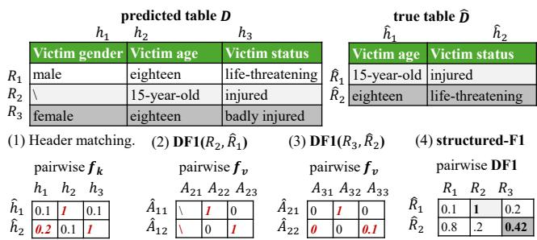  
Figure 3: Evaluation example.

Besides the novel news datasets, we further adapt existing conversational texts, MultiWoz2.4 [70], to our focus: • Conversation. The texts are multi-topic, multi-turn human-human dialogues around services such as attractions, hotels, and restaurants. The dialogue states cover salient contents and can be converted to text-driven attributes, whose values may change as people change their requests or make clarifications. For table extraction, we sample 1000 texts and set ground truth labels as the final agreed-upon attribute values, while value drifts introduce intrinsic semantic noise.

We use Conversation as a controlled stress test on verbosity and noise that does not diminish the contribution of the new datasets. The reason is that the dialogues have natural language patterns yet are oriented to a closed service ontology; thus, it is less variable than the new datasets, of which a statistical examination is in Appendix A.7. Table 1 summarizes the statistics, and the table annotations will be released.

To reflect the application need under data scarcity, we randomly reserve 300 samples as the labeled set for all methods. For TE, we report performance using the full schema (Section 6.2). For AR, we further create three exploratory levels: we first identify low-frequency attributes that appear in <15% of samples, which non-experts would likely miss during heuristic schema design. We then randomly drop such attributes so that the heuristic schema lacks 20%, 35%, or 50% of all attributes. The absent attributes are completely hidden from the system, and the system is also unaware of the exploratory level (Section 6.3). We also evaluate the extracted table under these exploratory settings, comparing it against the table following the full schema (Section 6.4).

## 5.2 Metrics

5.2.1 Table extraction metrics. Let � be the predicted table with headers � and records R, and �<sup>ˆ</sup> be ground truth with �<sup>ˆ</sup> and R<sup>ˆ</sup> . We introduce table extraction metrics with the example in Figure 3.

header-F1. Previous work use header- $\cdot \mathrm { F } 1 { = } \mathrm { F } 1 ( H , \hat { H } ; f )$ to evaluate whether the system correctly identifies the attributes mentioned in the text. Here, F1 is the standard F1-score between two sets, and � is a given similarity function for comparing two elements (e.g., exact match, or soft string similarity). Formally,

Table 1: Benchmark statistics.
<table><tr><td rowspan="2">Datasets</td><td rowspan="2">#Text</td><td colspan="2">#Token</td><td colspan="2">#Record</td><td colspan="2">#Column</td><td rowspan="2"></td><td colspan="3">|s|</td><td colspan="3"> $| \hat { S } ^ { \prime } |$ </td></tr><tr><td>Avg.</td><td>Max.</td><td>Avg.</td><td>Max.</td><td>Avg.</td><td>Max.</td><td>#Attr. Level 1</td><td>Level 2</td><td>Level 3</td><td>Level 1</td><td>Level 2</td><td>Level 3</td></tr><tr><td>Incidents</td><td>1,369</td><td>24.1</td><td>97</td><td>1.6</td><td>6</td><td>3.1</td><td>10</td><td>28</td><td>22</td><td>18</td><td>14</td><td>6</td><td>10</td><td>14</td></tr><tr><td>Weather</td><td>2,006</td><td>22.3</td><td>95</td><td>1.3</td><td>5</td><td>2.9</td><td>7</td><td>19</td><td>15</td><td>12</td><td>9</td><td>4</td><td>7</td><td>10</td></tr><tr><td>Conversation</td><td>1,000</td><td>303</td><td>938</td><td>1</td><td>1</td><td>8.3</td><td>24</td><td>35</td><td>28</td><td>23</td><td>18</td><td>7</td><td>12</td><td>17</td></tr></table>

$$
\mathrm { P } ( X , Y ; f ) = { \frac { 1 } { | X | } } \sum _ { x \in X } \operatorname* { m a x } _ { y \in Y } f ( x , y ) ,
$$

$$
\operatorname { R } ( X , Y ; f ) = { \frac { 1 } { | Y | } } \sum _ { y \in Y } \operatorname* { m a x } _ { x \in X } f ( x , y ) ,\tag{20}
$$

$$
\operatorname { F } 1 ( X , Y ; f ) = 2 / ( \operatorname { P } ( X , Y ; f ) ^ { - 1 } + \operatorname { R } ( X , Y ; f ) ^ { - 1 } ) .
$$

Example 5.1. The header regions are $\scriptstyle { \hat { H } } = \{ { \mathrm { V i c t i m ~ a g e } }$ , Victim status}, �={Victim gender, Victim age, Victim status}. Given extract match $f , \mathrm { P } ( H , \hat { H } ; f ) { = } 0 . 6 7 , \mathrm { R } ( H , \hat { H } ; f ) { = } 1$ , header-F1=F1(�, �<sup>ˆ</sup> ; �)=0.8.

structured-F1. To evaluate whether the values are correctly extracted and aligned into a table, existing works largely follow the approach of Wu et al. [67], flattening a table into (header, index, value) triples. For instance, the table in Figure 1(a) uses team names as the logical index, yielding triples such as “(Losses, Hawks, 12)”. However, n-texts rarely provide a natural index column, and forcing one arbitrarily distorts the table’s native semantics. We therefore adopt a more fundamental view of a table: a set of records, where each record is a self-contained header-to-value dictionary. Under this view, comparing a predicted table to the ground truth reduces to matching two sets, for which standard F1 naturally solves. Crucially, this formulation respects the integrity of each record, and alignment is resolved through record matching, rather than an externally imposed index. We thus propose structured-F1:

$$
\mathrm { s t r u c t u r e d - F } 1 { = } \mathrm { F } 1 ( \mathcal { R } , \hat { \mathcal { R } } ; \mathrm { D F } 1 ) ,\tag{21}
$$

where DF1 (Dictionary F1) measures the similarity between two records. Specifically, each record $R _ { i }$ is a dictionary mapping headers to values, with domain dom $\left( R _ { i } \right) { } = H$ and $R _ { i } ( h _ { j } ) = A _ { i j }$ . DF1 computes the similarity between $R _ { i }$ and $\hat { R } _ { j }$ in two steps: it first aligns headers using a similarity function $f _ { k } ,$ then aggregates the corresponding value similarities via $f _ { v } .$ Formally,

$$
\mathrm { D P } ( R _ { i } , \hat { R } _ { j } ; f _ { k } , f _ { v } ) = \frac { 1 } { | R _ { i } | } \sum _ { h \in H } f _ { v } \Big ( R _ { i } ( h ) , \hat { R } _ { j } ( \arg \operatorname* { m a x } _ { \hat { h } \in \hat { H } } f _ { k } ( h , \hat { h } ) ) \Big ) ,
$$

$$
\mathrm { D R } ( R _ { i } , \hat { R } _ { j } ; f _ { k } , f _ { v } ) = \frac { 1 } { | \hat { R } _ { j } | } \sum _ { \hat { h } \in \hat { H } } f _ { v } \Big ( R _ { i } ( \arg \operatorname* { m a x } _ { h \in H } f _ { k } ( h , \hat { h } ) ) , \hat { R } _ { j } ( \hat { h } ) \Big ) ,
$$

$$
\mathrm { D F } 1 ( R _ { i } , \hat { R } _ { j } ; f _ { k } , f _ { v } ) = 2 / ( \mathrm { D P } ( R _ { i } , \hat { R } _ { j } ; f _ { k } , f _ { v } ) ^ { - 1 } + \mathrm { D R } ( R _ { i } , \hat { R } _ { j } ; f _ { k } , f _ { v } ) ^ { - 1 } ) .\tag{22}
$$

Example 5.2. (1) We first compute the matched header to be invariant to the column order. (2) The matched position (bolded) is applied to aggregate the value similarity. For $R _ { 2 }$ and $\hat { R } _ { 1 }$ , the empty value is ignored: DP=1, DR=1, and $\mathrm { D F } 1 ( R _ { 2 } , \hat { R } _ { 1 } ) = 1 . ( 3 )$ For $R _ { 3 }$ and ${ \hat { R } } _ { 2 } ,$ $\mathrm { D P } { = } ( 0 { + } 1 { + } 0 . 1 ) / 3 { = } 0 . 3 7 , \mathrm { D R } { = } ( 1 { + } 0 . 1 ) / 2 { = } 0 . 5 5 ,$ so DF $1 ( R _ { 3 } , \hat { R } _ { 2 } ) { = } 0 . 4 2 . ( 4 )$ After computing for all 6 record pairs, $\scriptstyle \operatorname { P } ( \mathcal { R } , \hat { \mathcal { R } } ) = ( 0 . 8 + 1 + 0 . 4 2 ) / 3 = 0 . 7 4 .$ $\mathrm { R } ( \mathcal { R } , \hat { \mathcal { R } } ) { = } ( 1 { + } 0 . 4 2 ) / 2 { = } 0 . 7 1$ , structured-F1=0.73.

The complexity of structured-F1 is not higher than the previous evaluation (Appendix A.8). We use the same three string similarities as existing works: Extract Match (EM), chrF� (chrf) [52], and rescaled BERTScore (BS) [74]. For values with multiple spans indicating multiple mentions, the string similarity is first computed span-wise and aggregated via F1.

5.2.2 Atribute Recommendation Metrics. We evaluate AR quality using recall, as is standard in recommendation tasks. Let $S ^ { \prime } = Z ^ { \prime } |$ [: $k ]$ denote the top-� attribute candidates. To aggregate performance across diferent $k ,$ we compute the recall curve $\mathrm { R } ( Z ^ { \prime } [ : k ] , \hat { S } ^ { \prime } , f )$ as a function of $k ,$ and report the Area Under the Curve (recall-AUC) as the overall metric. When comparing curves of diferent lengths, shorter curves are padded with their final value to ensure consistent normalization. A strong recommendation list reaches higher recall earlier, leading to a larger recall-AUC. For the similarity function $f ,$ we use only chrf and BS because asking for an exact match under open-ended discovery is overly stringent for practical use.

## 6 Experiments

We conduct experiments to answer the following questions:

Q1: How is the table extraction performance of TEAR ?

Q2: How is the attribute recommendation performance of TEAR ?

Q3: How do text-driven new attributes benefit table extraction?

Q4: How eficient is TEAR?

Q5: How are the ablation results of TEAR?

## 6.1 Setup

6.1.1 Baselines. For table extraction, we compare baselines from both the supervised and the ICL paradigms. Note that some other ICL approaches rely on knowledge about the specialized documents (e.g., external KGs [26] or type recognizing s [25]) to decompose extraction into subtasks and design dedicated instructions, making them dificult to apply to n-texts.

1. TRE [67] is one of the best supervised methods, which augments the sequence generation model with special table relation embeddings. We use its oficial implementation.<sup>1</sup>.

2. MapMake [1] is a recent ICL method. We implement the one-shot version by selecting the labeled sample with the most headers and carefully writing the required reasoning steps.

3. RAG [41, 73]. We implement a strong baseline of dense RAG that could also dynamically choose examples to contrast with our Proactive Demonstration Module.

As for the novel attribute recommendation task, there lacks existing methods, and we compare against three strong baselines that all prompt the LLM with retrieved examples to obtain attribute proposals, and then adopt diferent integration and ranking strategies.

Table 2: Table extraction performance (%). The best results within each backbone are bolded, and the best in the same row are underlined.
<table><tr><td></td><td></td><td></td><td></td><td colspan="3">Llama-3-8B-Instruct</td><td colspan="3">Qwen2.5-14B-Instruct</td><td colspan="3">Llama-3-70B-Instruct</td></tr><tr><td>Dataset</td><td>Metric</td><td>sim.</td><td>TRE</td><td>MapMake</td><td>RAG</td><td>TEAR</td><td>MapMake</td><td>RAG</td><td>TEAR</td><td>MapMake</td><td>RAG</td><td>TEAR</td></tr><tr><td rowspan="6">Inci- dents</td><td>header-</td><td>EM</td><td>86.7±0.8</td><td>47.4±0.8</td><td>81.5±0.1</td><td>87.8±0.3</td><td>68.1±0.3</td><td>83.3±0.1</td><td>89.1±0.4</td><td>68.1±0.2</td><td>86.8±0.0</td><td>90.3±0.1</td></tr><tr><td>F1</td><td>chrf</td><td>91.2±0.7</td><td>54.8±0.9</td><td>87.9±0.1</td><td>92.5±0.3</td><td>74.9±0.2</td><td>88.2±0.0</td><td>92.8±0.2</td><td>74.3±0.3</td><td>91.6±0.0</td><td>93.9±0.1</td></tr><tr><td></td><td>BS</td><td>91.9±0.7</td><td>55.3±0.9</td><td>88.5±0.1</td><td>93.1±0.3</td><td>75.8±0.2</td><td>88.9±0.0</td><td>93.4±0.2</td><td>75.0±0.1</td><td>92.3±0.0</td><td>94.5±0.1</td></tr><tr><td>struc-</td><td>EM</td><td>64.5±0.1</td><td>25.7±0.4</td><td>61.2±0.2</td><td>69.1±0.2</td><td>40.9±0.4</td><td>62.0±0.0</td><td>70.6±0.1</td><td>44.8±0.3</td><td>69.8±0.0</td><td>73.3±0.0</td></tr><tr><td>tured- F1</td><td>chrf</td><td>74.9±0.5</td><td>34.1±0.3</td><td>73.6±0.1</td><td>79.4±0.1</td><td>54.1±0.2</td><td>76.8±0.0</td><td>82.0±0.2</td><td>56.5±0.1</td><td>80.0±0.0</td><td>82.4±0.1</td></tr><tr><td></td><td>BS</td><td>78.8±0.4</td><td>42.5±0.2</td><td>76.8±0.1</td><td> $\mathbf { 8 2 . 9 2 } 0 . 1$ </td><td> $6 0 . 5 { \pm } 0 . 4 $ </td><td>74.9±0.0</td><td> $\mathbf { 8 2 . 4 \pm 0 . 2 }$ </td><td>61.9±0.2</td><td>81.5±0.0</td><td>84.6±0.1</td></tr><tr><td rowspan="6">Wea- ther</td><td>header-</td><td>EM</td><td>79.1±0.5</td><td>52.2±1.3</td><td>77.3±0.0</td><td>80.3±0.4</td><td>66.1±0.0</td><td>80.4±0.1</td><td>82.6±0.2</td><td>74.3±0.0</td><td>83.9±0.1</td><td>84.1±0.1</td></tr><tr><td>F1</td><td>chrf</td><td>84.9±0.3</td><td>58.9±1.3</td><td>83.5±0.0</td><td>85.6±0.1</td><td>73.8±0.1</td><td>85.7±0.1</td><td>87.2±0.1</td><td>80.1±0.2</td><td>88.0±0.1</td><td>88.4±0.1</td></tr><tr><td></td><td>BS</td><td>89.6±0.3</td><td>68.3±0.9</td><td>88.7±0.0</td><td>90.1±0.0</td><td>82.1±0.0</td><td>89.9±0.1</td><td>91.3±0.1</td><td>86.7±0.0</td><td>91.9±0.1</td><td>92.2±0.1</td></tr><tr><td>struc-</td><td>EM</td><td>44.1±0.5</td><td>25.6±0.4</td><td>46.2±0.1</td><td>51.0±0.4</td><td>39.3±0.3</td><td>50.7±0.1</td><td>53.9±0.4</td><td>43.2±0.3</td><td>54.9±0.1</td><td>56.3±0.1</td></tr><tr><td>tured-</td><td>chrf</td><td>63.7±0.3</td><td>42.1±0.8</td><td>65.4±0.1</td><td>70.1±0.2</td><td>62.0±0.3</td><td>71.3±0.0</td><td>73.4±0.2</td><td>64.5±0.2</td><td>72.1±0.1</td><td>73.3±0.0</td></tr><tr><td>F1</td><td>BS</td><td>63.0±0.3</td><td>42.2±1.3</td><td>64.3±0.1</td><td>67.9±0.4</td><td>57.2±0.1</td><td>66.4±0.0</td><td>69.1±0.5</td><td>62.5±0.2</td><td>70.2±0.1</td><td>71.5±0.0</td></tr><tr><td rowspan="7">Conver- sation</td><td>header-</td><td>EM</td><td>90.0±0.5</td><td>52.7±2.0</td><td>84.6±0.1</td><td>88.7±0.2</td><td>76.3±0.1</td><td>87.4±0.0</td><td>90.7±0.1</td><td>78.9±0.0</td><td>86.8±0.0</td><td>90.1±0.1</td></tr><tr><td>F1</td><td>chrf</td><td>94.7±0.3</td><td>62.2±1.9</td><td>91.9±0.1</td><td>94.5±0.1</td><td>85.3±0.2</td><td>93.4±0.0</td><td>95.3±0.0</td><td>86.3±0.1</td><td>93.4±0.0</td><td>95.1±0.1</td></tr><tr><td></td><td>BS</td><td>94.3±0.3</td><td>61.5±1.9</td><td>91.3±0.1</td><td>93.9±0.0</td><td>84.4±0.1</td><td>92.8±0.0</td><td>94.9±0.1</td><td>85.9±0.1</td><td>92.9±0.0</td><td>94.6±0.1</td></tr><tr><td>struc-</td><td>EM</td><td>80.9±0.6</td><td>44.4±1.9</td><td>76.9±0.1</td><td>82.4±0.1</td><td>66.2±0.1</td><td>81.1±0.0</td><td>85.1±0.2</td><td>69.4±0.0</td><td>80.8±0.0</td><td>84.6±0.1</td></tr><tr><td>tured-</td><td>chrf</td><td>85.4±0.5</td><td>49.3±1.9</td><td>81.2±0.1</td><td>86.1±0.1</td><td>71.5±0.1</td><td>85.1±0.0</td><td>88.3±0.2</td><td>74.8±0.1</td><td>84.6±0.0</td><td>87.8±0.1</td></tr><tr><td>F1</td><td>BS</td><td>87.0±0.3</td><td>53.6±2.1</td><td>83.8±0.2</td><td>88.4±0.1</td><td>75.8±0.2</td><td>87.6±0.0</td><td>90.3±0.1</td><td>77.8±0.0</td><td>86.7±0.0</td><td>89.7±0.2</td></tr><tr><td></td><td></td><td></td><td></td><td></td><td></td><td></td><td></td><td></td><td></td><td></td><td></td></tr></table>

4. Corpus Frequency Ranking (CFR) integrates and ranks attribute proposals according to their global frequency in the corpus. The intuition is that attributes mentioned more frequently across texts are more important.

5. Maximum Schema Similarity (MSS) ranks proposals by their maximum semantic similarity to the known schema attributes, $s i m ( z , S ) = \mathrm { m a x } _ { s \in S } E m b ( \mathrm { c o n t e x t } ( z ) )$ ) · ��� (context(�)). The motivation is that newly discovered attributes should be semantically closer to those already known.

6. Direct LLM Reasoning (DIRECT) prompts an LLM to rank the proposals as the most suitable for extending the known schema, considering relevance and usefulness.

6.1.2 Implementation. For all compared methods, we employ two instruction-tuned open-source LLMs: Llama-3-8B-Instruct<sup>2</sup>, Qwen2.5- 14B-Instruct<sup>3</sup>, and Llama-3-70B-Instruct<sup>4</sup>. We choose medium-sized, open-source LLMs to reflect realistic deployment scenarios where large proprietary models may be too expensive or inaccessible. Notably, the challenges addressed in this work stem from the gap between the generalized capabilities acquired through pretraining and the specialized competencies required for the table extraction task, which cannot be overcome solely by switching to a larger or more capable LLM. The deep embedding model ���(·) is SFR Embedding-Mistral<sup>5</sup> [41], a state-of-the-art open-source embedder. The surrogate model �(·) is BART-Large<sup>6</sup> [30]. For the Schema Pre fix that ends with an enumeration ofknown attributes, we randomly sample 10 diferent permutations, use them to calculate ���(·), and take the maximum score for each candidate. We will elaborate on the robustness of this implementation in Section 6.3.

During validation, 100 samples are held out for early stopping and method tuning, and the remaining samples are used for training and retrieval. At inference, the validation set is also added for retrieval. The final number of shots is $k ^ { t e } = k ^ { a r } = 5$ for Incidents and Weather, 3 for Conversation; the final LLM decoding uses temperature $T ^ { l l m } { = } 5$ and $\mathrm { t o p } { - } p ^ { l l m } { = } 0 . 5$ . All the experiments are conducted on a server equipped with Intel(R) Xeon(R) Gold 6240 CPU and one NVIDIA A800 (80GB Memory) for Llama-8B and Qwen, two NVIDIA A800s for Llama-70B. Each experiment is repeated 3 times with diferent random seeds, and we report the average and standard deviation. Our code is available at ... <sup>7</sup>.

## 6.2 Q1: Table Extraction Results

The TE performance is in Table 2 with the following key observations. (1) TEAR is consistently the best. This demonstrates that our method efectively selects more informative demonstrations by leveraging both textual and tabular characteristics. Among the baselines, RAG dynamically retrieves demonstrations, which is better than MapMake that uses fixed demonstrations, showing the critical role of adaptive demonstrations. (2) ICL paradigm methods exhibit a clear advantage over the supervised method, especially on structured-F1 that evaluates values. This agrees with the intuition that while patterns in header regions are relatively limited and are easier to learn via supervised training, the values in n-texts vary considerably with the input text, requiring a stronger generalization capability for correct extraction. Furthermore, larger LLMs are overall better, and this gap is more pronounced for MapMake and RAG. This indicates that providing well-selected examples with our

TEARcan particularly boost the performance of relatively weaker LLMs. (3) The results also indicate that our new benchmarks are more challenging for the studied extraction systems than Conversation, as it is reported to have generally lower results, and the performance gap between diferent methods is larger. This aligns with our claim that the variability of n-texts is a more urgent challenge for existing systems, instead of the verbosity or value drifts characterized by Conversation.

## 6.3 Q2: Attribute Recommendation Results

The attribute recommendation performance is shown in Figure 4. (1) The results confirm the viability of using LLMs for AR. Particularly, on the Weather dataset, where the recall-AUC reaches an exceptionally high level in some cases, indicating that the LLMrecommended attributes semantically encompass nearly all groundtruth attributes. (2) Our method achieves the best overall performance. Under all comparisons, TEAR is the best on 48 out of 54 comparisons. (3) After our method, the baselines do not have an obvious second best, and the LLM inference, global frequency, and semantic similarity have their own advanced cases.

(4) Trends across exploratory levels difer for diferent datasets. Recall that Levels 1 to 3 aim to discovering the remaining 20%, 35%, and 50% of attributes. On Weather, performance improves from Level 3 to Level 1, indicating that a more complete initial schema makes the task easier. In contrast, Level 1 is the hardest for Incidents. Examining the schema splits, we find that this is due to a few low-frequency attributes (e.g., “Number of rounds fired”) that are particularly dificult to discover precisely; consequently, the task becomes increasingly harder as the schema grows more complete.

## 6.4 Q3: Table Extraction with Text-Driven Attributes

We simulate the process of users expanding the schema with recommended attributes for table extraction, in order to demonstrate the efect of exploratory schema design on the overall informa tion extraction system. Specifically, we take �<sup>′</sup> [: �] ∩ <sup>ˆ</sup>�<sup>′</sup> as the user-accepted text-driven attributes (the "checked" attributes in Figure 1(c)). We numerically estimate � by the elbow point [57] of the ���(·), which reflects a realistic scenario where users only navigate top-ranked attributes instead of the complete list. Moreover, using set intersection to select attributes (i.e., only adopting a recommendation if its name exactly matches the ground truth) is a very conservative simulation. In practice, users would typically accept a recommendation as long as it is semantically close to their interests and appropriately formulated. Under each exploratory scenario, we first evaluate table extraction performance by running TEW. We then execute the ARW, update, and run TEW again to obtain the updated performance, denoted as TEAR\*. Both results are compared against the ground-truth table following the complete schema. Results using Qwen are in Figure 5; those with Llama (Appendix A.9) exhibit similar trends. It shows that TEAR consistently outperforms the baselinem, and the interactive pipeline TEAR\* achieves additional performance gains. Notably, on the Incidents dataset, while other methods degrade as the exploratory level increases, TEAR\* maintains stable performance and even shows improvement in some settings, highlighting the benefits of text-driven attributes.

Table 3: Hybrid Integration Strategy eficiency.
<table><tr><td>Inci.</td><td>|Z|</td><td>|P*|</td><td>1.</td><td>t.(ms)</td><td>#Calls</td><td>True</td><td>False</td></tr><tr><td>1</td><td>207±3</td><td>182±15</td><td>4</td><td>17±10</td><td>81±7</td><td>29±6</td><td>52±4</td></tr><tr><td>2</td><td>203±4</td><td>130±1</td><td>4</td><td>13±8</td><td>79±6</td><td>23±2</td><td>56±7</td></tr><tr><td>3</td><td>218±13</td><td>157±20</td><td>4</td><td>22±11</td><td>91±6</td><td>23±2</td><td>68±6</td></tr><tr><td>Wea.</td><td>|z|</td><td>|P*|</td><td>1.</td><td>t.(ms)</td><td>#Calls</td><td>True</td><td>False</td></tr><tr><td>1</td><td>279±9</td><td>10±3</td><td>3</td><td>12±0</td><td>9±2</td><td>4±1</td><td>5±1</td></tr><tr><td>2</td><td>238±4</td><td>380±124</td><td>4</td><td>37±3</td><td>198±51</td><td>30±3</td><td>167±53</td></tr><tr><td>3</td><td>212±21</td><td>315±122</td><td>4</td><td>28±5</td><td>163±40</td><td>33±5</td><td>130±36</td></tr><tr><td>Con.</td><td>|z|</td><td>|P*|</td><td>1.</td><td>t.(ms)</td><td>#Calls</td><td>True</td><td>False</td></tr><tr><td>1</td><td>94±4</td><td>156±31</td><td>6</td><td>15±2</td><td>10±0</td><td>6±2</td><td>4±1</td></tr><tr><td>2</td><td>128±2</td><td>173±7</td><td>4</td><td>26±4</td><td>13±2</td><td>8±1</td><td>5±1</td></tr><tr><td>3</td><td>134±7</td><td>235±79</td><td>7</td><td>24±3</td><td>25±8</td><td>11±5</td><td>14±6</td></tr></table>

## 6.5 Q4: Eficiency

Figure 6 compares eficiency, where time is measured by running the LLM on a local research server, applying no acceleration, and the Input and Output tokens per text are counted only for LLM methods, For TE, the eficiency order is TRE>RAG>Ours>MapMake. For AR, results are averaged over three exploratory levels, and the eficiency order is CFR>MSS>DIRECT>Ours. The overhead of LLM methods primarily arises from the internals of the backbone, not the methods themselves. Compared to the high cost of fine-tuning or the extensive annotation efort required for supervised extraction models, our approach achieves strong performance with significantly lower demand for labels or computational resources.

We further evaluate the eficiency of the Hybrid Integration Strategy in Table 3, where 1,2,3 are exploratory levels. Here, |�| is #attribute proposals, |�<sup>∗</sup>| is #low-diversity sets, l. is the size of the largest low-diversity set afecting pruning search iterations, t. is the pruning time. |�<sup>∗</sup>| is eficiently small, showing that many proposals are actually far from others and can be quickly excluded from duplicate analysis. And thanks to our breadth-first greedy scheduling (Algorithm 1), the number of LLM calls is even less.

## 6.6 Q5: Ablation Studies

6.6.1 Labeled Pool Size, Split and Intialization. We vary the size, split, and initialization of the labeled pool and report the structured-F1 with Llama3-8B in Figure 7 and Figure 8, while other LLMs and metrics have the same pattern. In Figure 7, we reserve a subset of 200 test samples and progressively enlarge the labeled pools. The upward trend in Incidents gradually saturates, while Weather exhibits continued improvement, indicating a higher demand for labels. In Figure 8, we use the same reserved test set and sample three diferent pools, which lead to similar results, demonstrating the robustness of TEAR against initialization. We further compare our default setting, where the same pool is used for learning � and retrieval, with its disjoint setting, where the pool is split for learning and retrieval. The disjoint setting consistently underperforms our default setting, verifying that allocating a standalone retrievable set is unnecessary under data scarcity.

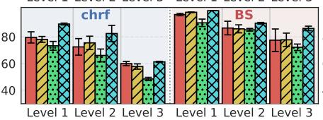

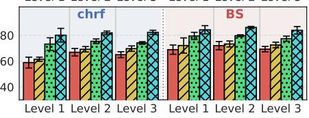

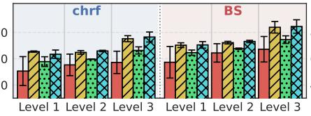

Llama-3-8B-Instruct  
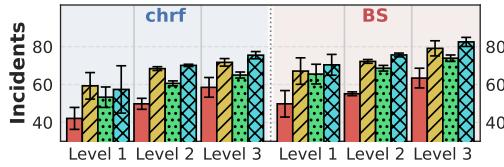

Qwen2.5-14B-Instruct  
Llama-3-70B-Instruct  
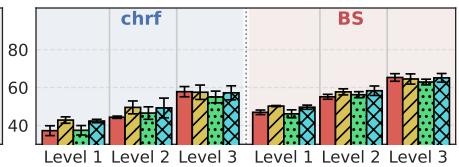

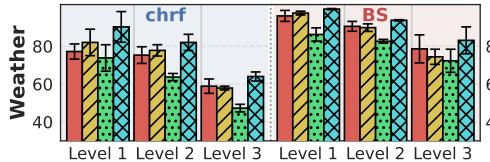

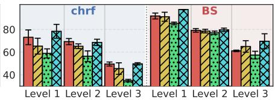

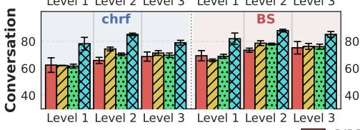

Figure 4: Attribute recommendation recall-AUC (%).  
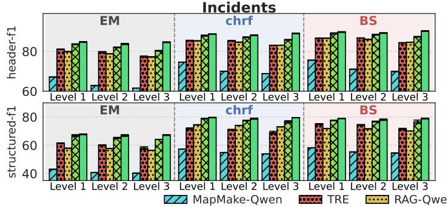

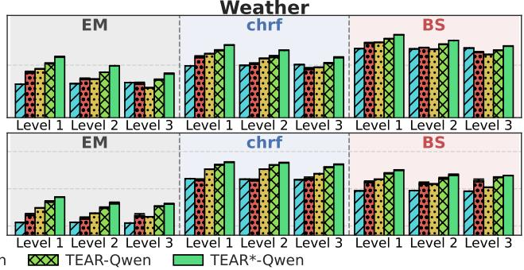  
Figure 5: Table extraction with text-driven attributes with Qwen backbone.

TE Runtime (10<sup>3</sup> s) & Latency (s)  
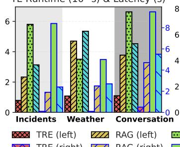

TE Input (10<sup>3</sup>) & Output (10<sup>2</sup>)  
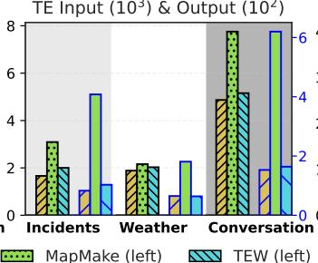

AR Runtime (10<sup>3</sup> s) & Latency (s)  
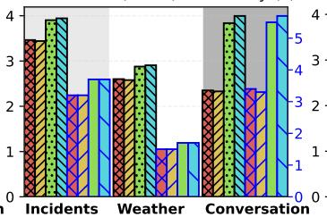

AR Input (10<sup>3</sup>) & Output (10<sup>2</sup>)  
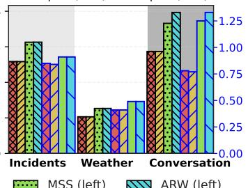

Figure 6: Eficiency comparison with Llama3-8B. Patterns for other LLMs are similar.  
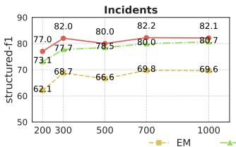

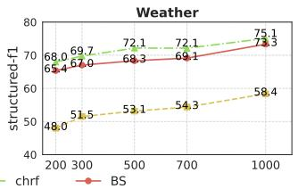  
Figure 7: Labeled pool size ablation with Llama3-8B.

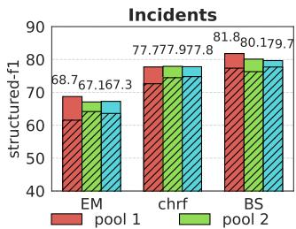

6.6.2 Proactive Demonstration Module. We ablate the demonstrations retrieved by each utility score, and the extraction performance is in Figure 9, showing that the header and value utilities derived by previews are more beneficial than the plain text semantic, and the union of three utilities is the best. We also ablate the number of retrieved examples, �<sup>��</sup> , in Figure 10. Results show that only 1 shot could greatly boost the performance, and the performance reaches a high level after a few shots. The results of other backbones show similar patterns.

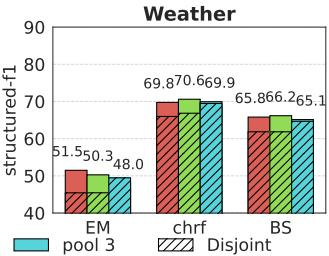  
Figure 8: Diferent labeled pools with Llama3-8B.

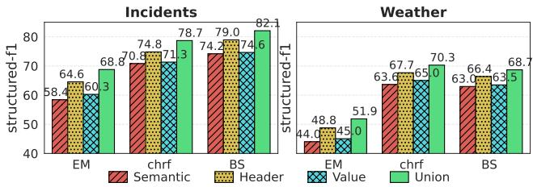

Figure 9: Retrieve utility scores ablation with Llama3-8B.  
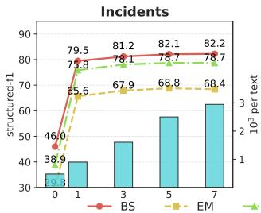

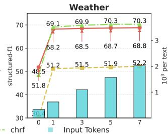  
Figure 10: Retrieve shots ablation with Llama3-8B.

Table 4: Influence of Hybrid Integration Strategy.
<table><tr><td>Qwen</td><td>∆ chrf</td><td>ΔBS</td><td>Ratio (%)</td></tr><tr><td>Incidents Level 1</td><td>0.009±0.004</td><td>0.005±0.011</td><td>16.4±1.9</td></tr><tr><td>Incidents Level 2</td><td>0.007±0.001</td><td>0.002±0.007</td><td>12.9±0.5</td></tr><tr><td>Incidents Level 3</td><td>0.005±0.006</td><td>0.003±0.006</td><td>12.4±1.3</td></tr><tr><td>Weather Level 1</td><td>0.001±0.001</td><td>0.001±0.000</td><td>1.3±0.1</td></tr><tr><td>Weather Level 2</td><td>0.002±0.015</td><td>-0.007±0.009</td><td>13.9±0.6</td></tr><tr><td>Weather Level 3</td><td>-0.001±0.002</td><td>0.005±0.003</td><td>17.1±0.1</td></tr><tr><td>Conversation Level 1</td><td>0.002±0.001</td><td>0.002±0.001</td><td>8.4±3.3</td></tr><tr><td>Conversation Level 2</td><td>0.001±0.000</td><td>0.001±0.000</td><td>8.3±2.7</td></tr><tr><td>Conversation Level 3</td><td>0.001±0.000</td><td>0.001±0.000</td><td>12.0±5.2</td></tr></table>

6.6.3 Hybrid Integration Strategy. We report the end-to-end im provement of Hybrid Integration Strategy and the Ratio of removed attribute proposals. Results with Qwen are in Table 4, and those of other models are similar. It shows that Qwen removes an average of 11% proposals while maintaining comparable recall-AUC, and that ratio for Llama3-8B is 15%, and Llama3-70B 7%. Moreover, we find that the duplicates predominantly occur among low-coherence proposals, which are at the tail of the recommendation list. This explains why integration brings only modest improvement on recall-AUC (Δs). For each setting, we also sample 30 cases and expose the same context to a human, in order to evaluate the alignment between the LLM’s judgment on duplicates with human’s. Results are shown in Figure 12. Based on Cohen’s Kappa [27], Llama3-8B (�=0.43-0.46) and Llama3-70 (�=0.57-0.79) achieve moderate agreement, and Qwen (�=0.73-0.87) achieves substantial agreement. It is hence a pragmatic design to appoint an LLM as the agent for attribute proposal deduplication.

6.6.4 Semantic Coherence Score. To illustrate the quality of the highest-ranked attributes, namely when the budget � is small, we further plot the recall curves for the top-k recommendations with Qwen in Figure 11, and those with Llama (Appendix A.9) show similar patterns. In contrast to the baselines, the results show that our Schema Coherence Score consistently pushes high-quality candidates toward the top of the list, substantially improving early recall, which is ideal for practical short-list applications. This diference is especially evident on the Weather dataset under Levels 1 and 2.

We further study the efect of varying the schema attribute permutations succeeding the SP, shown as the shaded region (e.g., there will be 6 possible permutations for 3 attributes). This sensitivity arises because LLMs tend to attend more strongly to nearby context, the last few attributes, during next-token prediction. To mitigate this sensitivity, our full implementation (coherence-M) samples 10 random permutations and retains the maximum score for each candidate, as detailed in the implementation. This strategy successfully avoids underperforming orders and captures each candidate’s peak coherence across multiple contextualizations.

6.6.5 Manual Evaluation on Structured-F1. We conduct a human evaluation on 200 predictions across all benchmarks. Human evaluators are asked to compare the original prediction with a minimally perturbed version introducing a single semantic diference: either single-value corruption or value swap of two cells. The direction of structured-F1 change aligns closely with human preference (accuracy 90%, 95%, 92.5% for sim.=EM, chrf, BS.).

## 7 Conclusion

We introduce TEAR, a framework that leverages LLM in-context learning for table extraction with attribute recommendation. In the Table Extraction Workflow, we propose a Proactive Demonstration Module to customize demonstrative examples for each input, addressing the inefectiveness ofheuristic instructions by dynamically adapting to the high variability of n-texts. In the Attribute Recommendation Workflow, we design a Discovery Mechanism, a Hybrid Integration Strategy, and a Schema Coherence Score to openly discover, consolidate, and present a ranked list of text-driven new attributes to the user, overcoming the limitations of fixed heuristic schemas. This recommendation capability is the most distinctive feature of our method, tackling the exploratory schema design challenge of naturally occurring texts. We further establish the evaluation benchmarks on n-texts, including two new datasets, appropriate metrics, and a discussion of baselines. Experiments with three open-source LLMs show that TEAR achieves state-of-the-art performance on both tasks, and the recommended attributes efectively enhance table extraction in exploratory scenarios.

## 8 Discussion

1. AR feedback loop. We clarify that AR does not have an inherent convergence point that iterative refinement could reach because the open-ended candidate space is exhaustive if continuously prompted. As the first to establish the task, we focus on single-round quality, which provides known attributes to the system at the beginning. Multi-round interaction would require modeling the relationships among attributes provided across rounds and a more complex benchmark, which could be pursued in future work.

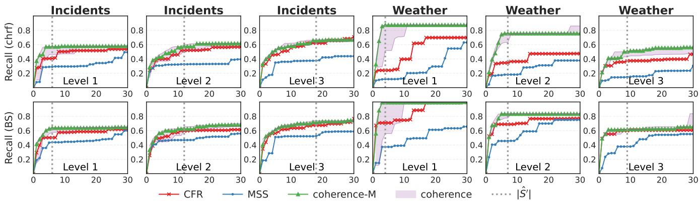

Figure 11: Recommendation recall of diferent ranking methods with Qwen.  
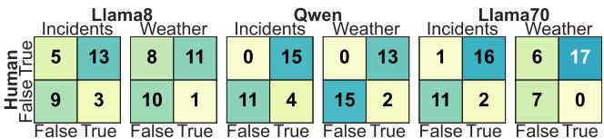  
Figure 12: Agreements between LLMs and humans.

2. LLMs as core components. Leveraging LLMs ofers advantages for our tasks and is a common, well-established choice in recent works. Our contribution then lies in closing the gap between an LLM’s general capability and the task-specific competence, which is a gap that a stronger LLM or better prompts alone cannot close. 3. Design choices. Our design choices are based on standard machine learning, established prior works, or empirical data statistics. Our contribution is not the scripted LLM instructions, but the data-driven components and the framework.

## References

[1] Naman Ahuja, Fenil Bardoliya, Chitta Baral, and Vivek Gupta. 2025. Map&Make: Schema Guided Text to Table Generation. arXiv preprint arXiv:2505.23174 (2025).

[2] Simran Arora, Brandon Yang, Sabri Eyuboglu, Avanika Narayan, Andrew Hojel, Immanuel Trummer, and Christopher Ré. 2023. Language Models Enable Simple Systems for Generating Structured Views of Heterogeneous Data Lakes. Proceedings ofthe VLDB Endowment 17, 2 (2023), 92–105.

[3] Hamed Babaei Giglou, Jennifer D’Souza, and Sören Auer. 2023. LLMs4OL: Large language models for ontology learning. In International semantic web conference. Springer, 408–427.

[4] Junwei Bao, Duyu Tang, Nan Duan, Zhao Yan, Yuanhua Lv, Ming Zhou, and Tiejun Zhao. 2018. Table-to-Text: Describing Table Region with Natural Language. In AAAI. https://www.aaai.org/ocs/index.php/AAAI/AAAI18/paper/download/ 16138/16782

[5] Chengliang Chai, Jiajun Li, Yuhao Deng, Yuanhao Zhong, Ye Yuan, Guoren Wang, and Lei Cao. 2025. Doctopus: Budget-aware structural table extraction from unstructured documents. Proceedings of the VLDB Endowment 18, 11 (2025), 3695–3707.

[6] Hanzhu Chen, Xu Shen, Qitan Lv, Jie Wang, Xiaoqi Ni, and Jieping Ye. 2024. SAC-KG: Exploiting Large Language Models as Skilled Automatic Constructors for Domain Knowledge Graph. In Proceedings of the 62nd Annual Meeting of the Association for Computational Linguistics (Volume 1: Long Papers). 4345–4360.

[7] Jiarui Chen, Shuangyin Li, and Yuncheng Jiang. 2024. A Decomposed-Distilled Sequential Framework for Text-to-Table Task with LLMs. In Pacific Rim International Conference on Artificial Intelligence. Springer, 403–410.

[8] Kaiwen Chen and Nick Koudas. 2024. Unstructured data fusion for schema and data extraction. Proceedings ofthe ACM on Management ofData 2, 3 (2024), 1–26.

[9] Zhijia Chen, Weiyi Meng, and Eduard Dragut. 2022. Web Record Extraction with Invariants. Proceedings ofthe VLDB Endowment 16, 4 (2022), 959–972.

[10] Christina Christodoulakis, Eric B Munson, Moshe Gabel, Angela Demke Brown, and Renée J Miller. 2020. Pytheas: Pattern-based Table Discovery in CSV Files. Proc. VLDB Endow. 13, 11 (2020), 2075–2089.

[11] Xu Chu, Yeye He, Kaushik Chakrabarti, and Kris Ganjam. 2015. Tegra: Table extraction by global record alignment. In Proceedings of the 2015 ACM SIGMOD international conference on management of data. 1713–1728.

[12] Vasek Chvatal. 1979. A greedy heuristic for the set-covering problem. Mathematics ofoperations research 4, 3 (1979), 233–235.

[13] Steven Coyne and Yuyang Dong. 2024. Large language models as generalizable text-to-table systems. In Proceedings of the 30th Annual Conference of the Association for Natural Language Processing (NLP2024). 3243–3252.

[14] Haixing Dai, Zhengliang Liu, Wenxiong Liao, Xiaoke Huang, Yihan Cao, Zihao Wu, Lin Zhao, Shaochen Xu, Fang Zeng, Wei Liu, et al. 2025. AugGPT: Leveraging ChatGPT for Text Data Augmentation. IEEE Transactions on Big Data 11, 03 (2025), 907–918.

[15] Dan Dan Friedman and Adji Bousso Dieng. 2023. The Vendi Score: A Diversity Evaluation Metric for Machine Learning. Transactions on machine learning research (2023).

[16] Zheye Deng, Chunkit Chan, Weiqi Wang, Yuxi Sun, Wei Fan, Tianshi Zheng, Yauwai Yim, and Yangqiu Song. 2024. Text-Tuple-Table: Towards Information Integration in Text-to-Table Generation via Global Tuple Extraction. In Proceedings ofthe 2024 Conference on Empirical Methods in Natural Language Processing. 9300–9322.

[17] Haoyu Dong, Mengkang Hu, Qinyu Xu, Haochen Wang, and Yue Hu. 2024. OpenTE: Open-Structure Table Extraction From Text. In ICASSP 2024-2024 IEEE International Conference on Acoustics, Speech and Signal Processing (ICASSP). IEEE, 10306–10310.

[18] Qingxiu Dong, Lei Li, Damai Dai, Ce Zheng, Jingyuan Ma, Rui Li, Heming Xia, Jingjing Xu, Zhiyong Wu, Baobao Chang, et al. 2024. A survey on in-context learning. In Proceedings ofthe 2024 conference on empirical methods in natural language processing. 1107–1128.

[19] Ronald Fagin, Benny Kimelfeld, Frederick Reiss, and Stijn Vansummeren. 2015. Document spanners: A formal approach to information extraction. Journal of the ACM (JACM) 62, 2 (2015), 1–51.

[20] Ronald Fagin, Benny Kimelfeld, Frederick Reiss, and Stijn Vansummeren. 2016. A relational framework for information extraction. ACM SIGMOD Record 44, 4 (2016), 5–16.

[21] Wenqi Fan, Yujuan Ding, Liangbo Ning, Shijie Wang, Hengyun Li, Dawei Yin, Tat-Seng Chua, and Qing Li. 2024. A survey on rag meeting llms: Towards retrieval-augmented large language models. In Proceedings of the 30th ACM SIGKDD conference on knowledge discovery and data mining. 6491–6501.

[22] Saiping Guan, Xiaolong Jin, Yuanzhuo Wang, and Xueqi Cheng. 2019. Link prediction on n-ary relational data. In The world wide web conference. 583–593.

[23] Mazhar Hameed, Gerardo Vitagliano, Fabian Panse, and Felix Naumann. 2025. Repairing Raw Data Files with TASHEEH. ACM SIGMOD Record 54, 1 (2025), 90–99.

[24] Fred Jelinek, Robert L Mercer, Lalit R Bahl, and James K Baker. 1977. Perplexity—a measure of the dificulty of speech recognition tasks. The journal ofthe Acoustical Society ofAmerica 62, S1 (1977), S63–S63.

[25] Peiwen Jiang, Haitong Jiang, Ruhui Ma, Yvonne Jie Chen, and Jinhua Cheng. 2025. TST: A Schema-Based Top-Down and Dynamic-Aware Agent of Textto-Table Tasks. In Proceedings ofthe 63rd Annual Meeting ofthe Association for Computational Linguistics (Volume 1: Long Papers). 16951–16966

[26] Peiwen Jiang, Xinbo Lin, Zibo Zhao, Ruhui Ma, Yvonne Chen, and Jinhua Cheng. 2024. TKGT: Redefinition and a new way oftext-to-table tasks based on real world demands and knowledge graphs augmented LLMs. In Proceedings ofthe 2024 Conference on Empirical Methods in Natural Language Processing. 16112–16126.

[27] J Richard Landis and Gary G. Koch. 1977. The measurement of observer agreement for categorical data. Biometrics 33 1 (1977), 159–74. https://api.semanticscholar. org/CorpusID:11077516

[28] Rémi Lebret, David Grangier, and Michael Auli. 2016. Neural text generation from structured data with application to the biography domain. In Proceedings of the 2016 conference on empirical methods in natural language processing. 1203–1213.

[29] Jessica Nina Lester, Tom Muskett, and Michelle O’Reilly. 2017. Naturally occurring data versus researcher-generated data. In A practical guide to social interaction research in autism spectrum disorders. Springer, 87–116.

[30] Mike Lewis, Yinhan Liu, Naman Goyal, Marjan Ghazvininejad, Abdelrahman Mohamed, Omer Levy, Veselin Stoyanov, and Luke Zettlemoyer. 2020. BART: Denoising Sequence-to-Sequence Pre-training for Natural Language Generation, Translation, and Comprehension. In Proceedings of the 58th Annual Meeting of the Association for Computational Linguistics. 7871–7880.

[31] Tong Li, Jiachuan Wang, Yongqi Zhang, Shuangyin Li, and Lei Chen. 2025. Adapt ing Pretrained Language Models for Citation Classification via Self-Supervised Contrastive Learning. In Proceedings of the 31st ACM SIGKDD Conference on Knowledge Discovery and Data Mining V. 2. 1541–1552.

[32] Tong Li, Zhihao Wang, Liangying Shao, Xuling Zheng, Xiaoli Wang, and Jinsong Su. 2023. A Sequence-to-Sequence&Set Model for Text-to-Table Generation. In Findings ofthe Association for Computational Linguistics: ACL 2023. 5358–5370.

[33] Chen Liang, Hongliang Li, Changhao Guan, Qingbin Liu, Jian Liu, Jinan Xu, and Zhe Zhao. 2023. Novel slot detection with an incremental setting. In Findings of the Association for Computational Linguistics: EMNLP 2023. 737–746.

[34] Elizabeth D Liddy. 2001. Natural language processing. (2001).

[35] Yupian Lin, Tong Ruan, Jingping Liu, and Haofen Wang. 2023. A survey on neural data-to-text generation. IEEE Transactions on Knowledge and Data Engineering 36, 4 (2023), 1431–1449.

[36] Nelson F Liu, Kevin Lin, John Hewitt, Ashwin Paranjape, Michele Bevilacqua, Fabio Petroni, and Percy Liang. 2024. Lost in the middle: How language models use long contexts. Transactions ofthe Association for Computational Linguistics 12 (2024), 157–173.

[37] Yu Liu, Quanming Yao, and Yong Li. 2021. Role-aware modeling for n-ary relational knowledge bases. In Proceedings ofthe web conference 2021. 2660–2671.

[38] Shayne Longpre, Le Hou, Tu Vu, Albert Webson, Hyung Won Chung, Yi Tay, Denny Zhou, Quoc V Le, Barret Zoph, Jason Wei, et al. 2023. The flan collection: Designing data and methods for efective instruction tuning. In International Conference on Machine Learning. PMLR, 22631–22648.

[39] Haoran Luo, Yuhao Yang, Tianyu Yao, Yikai Guo, Zichen Tang, Wentai Zhang, Shiyao Peng, Kaiyang Wan, Meina Song, Wei Lin, et al. 2024. Text2nkg: Finegrained n-ary relation extraction for n-ary relational knowledge graph construc tion. Advances in Neural Information Processing Systems 37 (2024), 27417–27439.

[40] Kyle Luoma and Arun Kumar. 2025. Snails: Schema naming assessments for improved llm-based sql inference. Proceedings of the ACM on Management of Data 3, 1 (2025), 1–26.

[41] Rui Meng, Ye Liu, Shafiq Rayhan Joty, Caiming Xiong, Yingbo Zhou, and Semih Yavuz. 2024. Sfrembedding-mistral: enhance text retrieval with transfer learning. Salesforce AI Research Blog 3 (2024), 6.

[42] Mikhail Mironov and Liudmila Prokhorenkova. [n. d.]. Measuring Diversity: Axioms and Challenges. In Forty-second International Conference on Machine Learning.

[43] Benjamin Newman, Yoonjoo Lee, Aakanksha Naik, Pao Siangliulue, Raymond Fok, Juho Kim, Daniel S Weld, Joseph Chee Chang, and Kyle Lo. 2024. ArxivDI GESTables: Synthesizing Scientific Literature into Tables using Language Models. In Proceedings ofthe 2024 Conference on Empirical Methods in Natural Language Processing. 9612–9631.

[44] Jekaterina Novikova, Ondrej Dušek, and Verena Rieser. 2017. The E2E Dataset: New Challenges for End-to-End Generation. In Proceedings ofthe 18th Annual Meeting ofthe Special Interest Group on Discourse and Dialogue. Saarbrücken, Germany. https://arxiv.org/abs/1706.09254 arXiv:1706.09254.

[45] Jekaterina Novikova, Oliver Lemon, and Verena Rieser. 2016. Crowd-sourcing NLG Data: Pictures Elicit Better Data.. In Proceedings ofthe 9th International Natural Language Generation conference. 265–273.

[46] Liu Pai, Wenyang Gao, Wenjie Dong, Lin Ai, Ziwei Gong, Songfang Huang, Li Zongsheng, Ehsan Hoque, Julia Hirschberg, and Yue Zhang. 2024. A survey on open information extraction from rule-based model to large language model. Findings of the association for computational linguistics: EMNLP 2024 (2024), 9586– 9608.

[47] Baolin Peng, Chunyuan Li, Pengcheng He, Michel Galley, and Jianfeng Gao. 2023. Instruction tuning with gpt-4. arXiv preprint arXiv:2304.03277 (2023).

[48] Hao Peng, Xiaozhi Wang, Jianhui Chen, Weikai Li, Yunjia Qi, Zimu Wang, Zhili Wu, Kaisheng Zeng, Bin Xu, Lei Hou, et al. 2023. When does in-context learning fall short and why? a study on specification-heavy tasks. arXiv preprint arXiv:2311.08993 (2023).

[49] Fabio Petroni, Tim Rocktäschel, Sebastian Riedel, Patrick Lewis, Anton Bakhtin, Yuxiang Wu, and Alexander Miller. 2019. Language models as knowledge bases?. In Proceedings of the 2019 conference on empirical methods in natural language processing and the 9th international joint conference on natural language processing (EMNLP-IJCNLP). 2463–2473.

[50] Michał Pietruszka, Michał Turski, Łukasz Borchmann, Tomasz Dwojak, Gabriela Nowakowska, Karolina Szyndler, Dawid Jurkiewicz, and Łukasz Garncarek. 2024.

Stable: Table generation framework for encoder-decoder models. In Proceedings of the 18th Conference of the European Chapter of the Association for Computational Linguistics (Volume 1: Long Papers). 2454–2472.

[51] Maja Popović. 2011. Morphemes and POS tags for n-gram based evaluation metrics. In Proceedings of the Sixth Workshop on Statistical Machine Translation. 104–107.

[52] Maja Popović. 2015. chrF: character n-gram F-score for automatic MT evaluation. In Proceedings ofthe tenth workshop on statistical machine translation. 392–395.

[53] Maja Popović. 2016. chrF deconstructed: beta parameters and n-gram weights. In Proceedings of the First Conference on Machine Translation: Volume 2, Shared Task Papers. 499–504.

[54] Nitesh Pradhan, Manasi Gyanchandani, Rajesh Wadhvani, et al. 2015. A Review on Text Similarity Technique used in IR and its Application. International Journal ofComputer Applications 120, 9 (2015), 29–34.

[55] Yunjia Qi, Hao Peng, Xiaozhi Wang, Bin Xu, Lei Hou, and Juanzi Li. 2024. Adelie: Aligning large language models on information extraction. In Proceedings ofthe 2024 Conference on Empirical Methods in Natural Language Processing. 7371–7387.

[56] Colin Rafel, Noam Shazeer, Adam Roberts, Katherine Lee, Sharan Narang, Michael Matena, Yanqi Zhou, Wei Li, and Peter J Liu. 2020. Exploring the limits of transfer learning with a unified text-to-text transformer. Journal ofmachine learning research 21, 140 (2020), 1–67.

[57] Ville Satopaa, Jeannie Albrecht, David Irwin, and Barath Raghavan. 2011. Finding a" kneedle" in a haystack: Detecting knee points in system behavior. In 2011 31st international conference on distributed computing systems workshops. IEEE, 166– 171.

[58] Yuan Kui Shen and David R Karger. 2007. U-REST: an unsupervised record extraction system. In Proceedings ofthe 16th international conference on World Wide Web. 1347–1348.

[59] Damien Sileo, Wout Vossen, and Robbe Raymaekers. 2022. Zero-shot recommendation as language modeling. In European conference on information retrieval. Springer, 223–230.

[60] Mukul Singh, José Cambronero, Sumit Gulwani, Vu Le, Carina Negreanu, Arjun Radhakrishna, and Gust Verbruggen. 2025. Datavinci: Learning syntactic and semantic string repairs. Proceedings of the ACM on Management of Data 3, 1 (2025), 1–26.

[61] Mukul Singh, Gust Verbruggen, Vu Le, and Sumit Gulwani. 2024. Tabularis Revilio: Converting Text to Tables. In Proceedings of the 33rd ACM International Conference on Information and Knowledge Management. 4056–4060.

[62] Ilya Sutskever, Oriol Vinyals, and Quoc V Le. 2014. Sequence to sequence learning with neural networks. Advances in neural information processing systems 27 (2014).

[63] Chris van der Lee, Chris Emmery, Sander Wubben, and Emiel Krahmer. 2020. The CACAPO dataset: A multilingual, multi-domain dataset for neural pipeline and end-to-end data-to-text generation. In Proceedings of the 13th International Conference on Natural Language Generation. 68–79.

[64] Sam Wiseman, Stuart M Shieber, and Alexander M Rush. 2017. Challenges in data-to-document generation. arXiv preprint arXiv:1707.08052 (2017).

[65] Sam Witteveen and Martin Andrews. 2019. Paraphrasing with Large Language Models. In Proceedings ofthe 3rd Workshop on Neural Generation and Translation. 215–220.

[66] Wilson Wong, Wei Liu, and Mohammed Bennamoun. 2012. Ontology learning from text: A look back and into the future. ACM computing surveys (CSUR) 44, 4 (2012), 1–36.

[67] Xueqing Wu, Jiacheng Zhang, and Hang Li. 2022. Text-to-Table: A New Way of Information Extraction. In Proceedings ofthe 60th Annual Meeting ofthe Association for Computational Linguistics (Volume 1: Long Papers). 2518–2533.

[68] Yuxia Wu, Lizi Liao, Xueming Qian, and Tat-Seng Chua. 2022. Semi-supervised new slot discovery with incremental clustering. In Findings ofthe Association for Computational Linguistics: EMNLP 2022. 6207–6218.

[69] Yanan Wu, Zhiyuan Zeng, Keqing He, Hong Xu, Yuanmeng Yan, Huixing Jiang, and Weiran Xu. 2021. Novel slot detection: A benchmark for discovering unknown slot types in the task-oriented dialogue system. In Proceedings ofthe 59th Annual Meeting of the Association for Computational Linguistics and the 11th International Joint Conference on Natural Language Processing (Volume 1: Long Papers). 3484– 3494.

[70] Fanghua Ye, Jarana Manotumruksa, and Emine Yilmaz. 2022. MultiWOZ 2.4: A Multi-Domain Task-Oriented Dialogue Dataset with Essential Annotation Corrections to Improve State Tracking Evaluation. In Proceedings ofthe 23rd Annual Meeting ofthe Special Interest Group on Discourse and Dialogue, Oliver Lemon, Dilek Hakkani-Tur, Junyi Jessy Li, Arash Ashrafzadeh, Daniel Hernández Garcia, Malihe Alikhani, David Vandyke, and Ondřej Dušek (Eds.). Association for Computational Linguistics, Edinburgh, UK, 351–360. doi:10.18653/v1/2022.sigdial-1.34

[71] Gongsheng Yuan, Jiaheng Lu, Zhengtong Yan, and Sai Wu. 2023. A survey on mapping semi-structured data and graph data to relational data. Comput. Surveys 55, 10 (2023), 1–38.

[72] Bowen Zhang and Harold Soh. 2024. Extract, Define, Canonicalize: An LLMbased Framework for Knowledge Graph Construction. In Proceedings ofthe 2024

Conference on Empirical Methods in Natural Language Processing. 9820–9836.

[73] Jiahua Zhang, Meijuan Tan, Jing Zhang, Xiaolu Zhang, Jun Zhou, and Chenliang Li. 2025. Retrieval augmentation for text-to-table generation. Information Processing & Management 62, 4 (2025), 104135.

[74] Tianyi Zhang, Varsha Kishore, Felix Wu, Kilian Q Weinberger, and Yoav Artzi. [n. d.]. BERTScore: Evaluating Text Generation with BERT. In International Conference on Learning Representations.

[75] Zikang Zhang, Wangjie You, Tianci Wu, Xinrui Wang, Juntao Li, and Min Zhang. 2025. A survey of generative information extraction. In Proceedings ofthe 31st International Conference on Computational Linguistics. 4840–4870.

[76] Wang Zhao, Dongxiao Gu, Xuejie Yang, Meihuizi Jia, Changyong Liang, Xiaoyu Wang, and Oleg Zolotarev. 2024. MedT2T: An adaptive pointer constrain generating method for a new medical text-to-table task. Future Generation Computer Systems 161 (2024), 586–600.

[77] Shaowen Zhou, Bowen Yu, Aixin Sun, Cheng Long, Jingyang Li, Haiyang Yu, Jian Sun, and Yongbin Li. 2022. A survey on neural open information extraction: Current status and future directions. arXiv preprint arXiv:2205.11725 (2022).

[78] Jun Zhu, Zaiqing Nie, Ji-Rong Wen, Bo Zhang, and Wei-Ying Ma. 2006. Simultaneous record detection and attribute labeling in web data extraction. In Proceedings ofthe 12th ACM SIGKDD international conference on Knowledge discovery and data mining. 494–503.

## A Appendix

## A.1 LLM instructions

Here are the instruction templates. Under the attribute recommendation setting, the attributes for validation and testing are excluded from the schema and hidden from the LLM.

## Extraction Instruction (EI)

Your task is to analyze the given text, which may be about incidents, weather, or conversation, and extract the information according to the specified JSON structure below. Provide the extracted information in the JSON structure {schema in json}.

Explanations about the JSON structure:

\- Output only the JSON data.

\- For each entity, there are multiple attributes.

- For each attribute, its value is a list of exact substrings of the input text. You should consider every attribute listed in the above structure. If an attribute is not present or cannot be determined, do not include the attribute in the output. {dataset description}   
Here are some examples:   
{examples}   
Here is the input text:   
{text}   
Here are some hints:   
The above text is most likely to contain the attributes: {�<sup>�</sup>}. The above text is most likely to contain the following values: {�<sup>�</sup> }.

The schema of each dataset is in Table 6. The dataset descriptions are:

Incidents - There can be three types of entities mentioned in the texts: Accident, Victim, and Suspect. There is at most one Accident in the text. There can be multiple Victims or Suspects in the text. Weather - There is one type of entity mentioned in the texts: Weather. There can be multiple Weather in the text.

Conversation - Each input text is a multi-turn dialogue, involving at most 5 entities: Attraction, Hotel, Restaurant, Taxi, and Train. You should only extract the final agreed-upon state after each turn, covering all confirmed domains and their relevant attributes.

## Discovery Instruction (DI)

Your task is to analyze the given text and discover new   
information mentioned in the text. Provide the discovered   
information in this JSON structure : {   
"Accident": {   
"0":{   
"⟨ new attribute 1⟩": [],   
"⟨new attribute 2⟩": []   
}   
"Victim": {   
"0":{

```latex
"⟨new attribute $1 \rangle " : [ ] ,$
"⟨new attribute $2 \rangle ^ { \prime \prime } { : } \bar { U }$
$\} ,$
$" _ { 1 } \ " : \{ \ldots \} ,$
...
},
"Suspect": {
$" 0 " : \{$
"⟨new attribute $1 \rangle " : [ ] ,$
"⟨new attribute $2 \rangle ^ { \prime \prime } { : } \bar { U }$
$\} ,$
$" _ { 1 } \ " : \{ \ldots \} ,$
...
},
}
Explanations about the JSON structure:
- Output only the JSON data.
- For each entity, there may be multiple attributes.
- For each attribute, its value is a list of exact substrings of
the input text.
Here are some examples: {examples}
Explanations about the examples:
- Given an input text and the known information, you are
encouraged to discover new information for each entity.
- The new information is qualified as a new attribute if and
only if (1) it is relevant and important to the domain, (2) it
is unique and not overlapped with the known information,
and (3) it has a proper granularity level compared with the
known attributes, which means it is not too high-level or
low-level concepts.
- The new attribute must have a meaningful name and
actual values from the text.
- Output qualified new attributes as many as possible.
Here is the input text: {text}
Here is the known information: {extracted table}
```

For other datasets, the output formatting are altered according to their schema.

## Schema Prefix (SP)

Here is a schema designed to document and manage detailed information and facts about {dataset description}. For each entity, there are multiple attributes. The attributes are unique and in consistent styles. Here are the attributes in this schema:

The dataset descriptions are:

Incidents - criminal incidents or accidents, particularly those involving violence, such as shootings or other crimes. The attributes are organized into three main entities: the accident itself, the victims, and the suspects.

Weather - weather conditions from news reports, particularly those about location, time, temperature, wind, cloud, rain, and snow. The attributes are organized into one main entity: the Weather itself

Conversation - multi-turn dialogues, particularly those booking a service. The attributes are organized into five main entities: Attraction, Hotel, Restaurant, Taxi, and Train.

## Judge Instruction (JI) in Hybrid Integration Strategy

Your task is to analyze the given schema and judge whether   
the given concepts are semantically similar enough to be   
merged as one attribute.   
Here is the schema: {schema}   
Here are the concepts to be judged: {attribute proposals}   
Explanation about the task:   
- The schema includes several unique attributes, which   
show the semantic granularity of attributes.   
- If the above concepts (1) are semantically equivalent, or   
(2) one is semantically contained by the others, or (3) they   
represent a finer granularity compared with the existing   
attributes, they need to be merged into one single attribute.   
Then, output "One".   
- Else, they should be at least two unique attributes, output   
"Two".   
- Output only "Two" or $" \mathrm { O n e " } .$

## A.2 Vendi Score

Vendi Score is the efective rank of the normalized similarity matrix,

$$
v d s ( q ) = \exp ( - \mathrm { t r } ( \frac { \mathcal { K } _ { q \times q } } { \vert q \vert } \log \frac { \mathcal { K } _ { q \times q } } { \vert q \vert } ) ) ,\tag{23}
$$

where $\mathcal { K } _ { q \times q }$ is the similarity matrix of size $| q | \times | q |$ and $\operatorname { t r } ( \cdot )$ means trace. Vendi Score is maximized as |�| $\operatorname { i f } \mathcal { K } ( i , j ) = 0 , \forall i , j \in q , i \neq j ,$ meaning every two elements are totally diferent, and it is minimized as 1 $\mathrm { i f } \mathcal { K } _ { q \times q }$ contains all 1s. Since $q \subseteq Z \cup S = B$ . We could precompute and cache $\mathcal { K } _ { B \times B }$ and acquire submatix $\mathcal { K } _ { q \times q }$ from it. Given $\mathcal { K } _ { q \times q } .$ , the computational complexity of is in $O ( | q | ^ { 3 } )$ [15]. In our experiment, we set $\mathcal { K } ( a , b ) = ( \mathrm { c h r f } \beta ( a , b ) { + } \mathrm { c h r f } \beta ( b , a ) ) / 2 ,$ , to reflect the pattern similarity as in Equation 9.

## A.3 Supplementary Discussion for Hybrid Integration Strategy

A.3.1 Pruned botom-up searchfor low-diversity set. As established by Equation 15, if a set is in $P ^ { * }$ , then all of its subsets must also be in $P ^ { * }$ . In other words, the monotonicity of ��� (·) means $d i v ( p \cup \{ z \} ) \geq$ $d i v ( p ) , \forall z \notin p$ . Leveraging this property, our algorithm computes $P ^ { * }$ in ascending order oftheir size, enabling eficient pruning during the process, as in Algorithm 2.

Specifically, in each iteration of the outer loop, the algorithm examines all qualified sets of size len + 1. A dictionary Br maps each qualified set � of size len to a set of candidate attributes $\operatorname { B r } [ p ] \subseteq$ $Z \cup S$ that may be added to $\boldsymbol { p }$ to form a larger qualified set. Within the inner loop, the algorithm considers a candidate extension $\mathbf { \nabla } p ^ { \prime } = \mathbf { \nabla }$ $p \cup \{ z ^ { \prime } \}$ for some $z ^ { \prime } \in \mathop { \mathrm { B r } } [ \mathop { p } ]$ . It first performs a fast dictionary lookup to verify that replacing any element $z \in { \mathfrak { p } }$ with $z ^ { \prime }$ yields a known qualified set. If this check succeeds, indicating that all proper subsets of $\dot { p } ^ { \prime }$ are already known to be qualified, the algorithm computes the Vendi Score ��� $\left( p ^ { \prime } \right)$ to decide the final answer.

Algorithm 2 Pruned Bottom-up Search for $P ^ { * }$   
Require: attribute proposals $Z ,$ known attributes $S ,$ threshold $\delta$   
Ensure: $P ^ { * }$   
1: $P ^ { * } = \varnothing , \mathrm { { B r \gets \{ \} } }$ , len← 1 ⊲ Initialize dictionary.   
2: for $p \in Z \cup S$ do $\operatorname { B r } [ p ] = Z \cup S \setminus \{ p \}$ ⊲ Start by len=1.   
3: end for   
4: while |Br|> 0∧len< $| Z | + 1$ do ⊲ Outer loop.   
5: nextBr← {}   
6: for $p \in \mathrm { B r } , z ^ { \prime } \in \mathrm { B r } [ e ]$ do ⊲ Inner loop.   
7: valid $ T r u e ,$ activeBr $ \mathrm { B r } [ \boldsymbol { p } ]$   
8: for $z \in \mathcal { P }$ do: ⊲ Check all subset of length |�|   
9: $p ^ { \prime } = p \setminus \{ z \} \cup \{ z ^ { \prime } \}$ ⊲ Replace one element, $\vert p ^ { \prime } \vert = \vert e \vert$   
10: if $p ^ { \prime } \in$ Br then   
11: activeBr ← activeBr ∩ Br[�<sup>′</sup>] ⊲ Prune.   
12: else   
13: valid← �����   
14: Break   
15: end if   
16: end for   
17: if valid = True then $\mathsf { \Delta } \mathsf { \Gamma } \mathsf { \Delta } \mathsf { \Gamma } \mathsf { \Delta } \mathsf { \Gamma } \mathsf { \Delta }$ proper subset of $\dot { \boldsymbol { p } }$ is in $P ^ { * } .$   
18: $p ^ { \prime } = p \cup \{ z ^ { \prime } \}$   
19: if �� $\begin{array} { r } { \mathbf { \nabla } \tilde { s } ( p ^ { \prime } ) < 1 + \delta } \end{array}$ then   
20: $P ^ { * }  P ^ { * } \cup \{ p ^ { \prime } \}$   
21: nextB $\mathrm { r } [ p ^ { \prime } ] \gets$ activeBr   
22: end if   
23: end $\mathbf { i f }$   
24: end for   
25: len←len+1, Br← nextBr ⊲ Search for the larger size   
26: end while

A.3.2 Complexity ofdiversity checking. Let $N = | Z \cup S |$ be the total number of candidate attributes, and let $L = \operatorname* { m a x } _ { p \in P ^ { * } } | p |$ denote the size of the largest low-diversity set returned by the algorithm. For $i \in \{ 1 , . . . , L \}$ , define $M _ { i } = | \{ p \in P ^ { * } : | p | = i \} |$ |, with $M _ { 1 } = N .$ Algorithm 2 constructs �<sup>∗</sup> by attempting to extend each qualified set ofsize � with at most �−� candidate attributes. The total number of examined sets is therefore bounded by

$$
| P ^ { \prime } | \leq \sum _ { i = 1 } ^ { L } ( N - i ) M _ { i } = N \sum _ { i = 1 } ^ { L } M _ { i } - \sum _ { i = 1 } ^ { L } i M _ { i } = N | P ^ { * } | - \sum _ { p \in P ^ { * } } | p | .
$$

Obviously, the number of evaluated sets scales linearly with the output size $| P ^ { * } | , \mathrm { i . e . , } | P ^ { \prime } | = O ( N | P ^ { * } | )$ . Each candidate extension incurs �(�) dictionary lookups, and a small fraction proceed to a Vendi Score computation, yielding an overall time complexity of $O \big ( \textstyle \sum _ { i = 1 } ^ { L } ( N - i ) M _ { i } \cdot ( i + C _ { v d s } ) \big )$

In practice, the pruning step within the inner loop further restricts the branch set $\operatorname { B r } [ p ] ;$ : the number of viable extensions for a set $\boldsymbol { p }$ never exceeds that of any of its subsets, and $\mathrm { B r } [ \boldsymbol { p } ]$ shrinks as $\mathcal { P }$ is extended. Hence, the factor $( N - i )$ can be tightened. Empirically, most candidate attributes are semantically distinct and do not form duplicate pairs with any other proposal; only a small fraction participate in true redundancies. Consequently, the factor is far smaller than $N ,$ and � remains modest (as detailed in the experimental section around Table 3).

A.3.3 Complexity ofcontextualized analysis. Suppose there are $N ^ { \prime }$ duplicates $( \mathrm { i . e . , }$ , elements that can potentially be eliminated by a yes response), and $\vert B \vert - N ^ { \prime }$ non-duplicate elements. Then there must exist sets $q _ { 1 } , q _ { 2 } , . . . , q _ { | B | - N ^ { \prime } }$ in $P ^ { * }$ that together cover all elements, because every duplicate must co-occur with at least one non-duplicate in some set belonging to $P ^ { * } .$ Consequently, for the set cover instance defined by the collection $P ^ { * }$ and the ground set �, the optimal solution size is strictly less than $\left| B \right| - N ^ { \prime } . A$ greedy set cover algorithm achieves an approximation ratio of (ln |�| + 1) [12]. Therefore, the number of LLM calls incurred by � is at most $( \ln | B | + 1 ) ( | B | - N ^ { \prime } )$ Line 10 further eliminates low-diversity sets that contain only a single element, which do not submit for LLM judgment.

Given the same � and $| P ^ { * } | ,$ , in the worst case, the algorithm examines every set in $P ^ { * }$ and receives no for all queries, incurring $\lvert P ^ { * } \rvert$ LLM calls without performing any deduplication. Such a situation is rare because each set in $P ^ { * }$ is already known to be of very low diversity, meaning it plausibly contains duplicates. The analysis above indicates that a greater number of duplicates allows an outer iteration to complete more quickly, which submits each element at least once for duplication. We prioritize preserving the breadth of the search because the ultimate efect of deduplication hinges on whether each duplicate element is eliminated. The greedy set cover actually processes larger sets earlier, which helps the algorithm eliminate confirmed duplicates with few queries and shrinks the search space for subsequent iterations.

A.3.4 Discussion ofHybrid Integration Strategy. Resolving duplicate attribute proposals is essential, but this step lacks ground truth and thus cannot be formulated as a rigorous optimization problem. The reason is that semantic equivalence between attributes is inherently subjective and highly dependent on the context. As with any recommendation system, the user’s ultimate preference may deviate from what the history infers. For instance, given the earlier example of “Medical center name” versus “Hospital name,” it is logical for a method to infer from the existing schema that the user likely intends to merge them. Yet a user might insist on retaining both to preserve fine-grained distinctions, much like a consumer abruptly deviating from past behavior to purchase an entirely diferent product.

Given this inherent uncertainty, our Hybrid Integration Strategy is pragmatic rather than exhaustive: we defer to the diversity metric and LLM’s judgment and perform moderate processing to consolidate obvious duplicates, without pursuing a perfect formulation or solution. Our experiments further support this pragmatic stance (see Section 6.3(2)), which shows that pruning the most conspicuous redundancies already yields substantial gains.

## A.4 Generating Attribute Proposal Definitions

Since each attribute proposal varies in occurrence frequency, number of mentions, and mention length across source texts, directly gathered raw contexts can be highly inconsistent in length and style. This variability introduces bias to the LLM and could result in overly long input that hinders reliable reasoning. To address this, we first normalize each proposal’s context into a concise definition using the LLM itself.

This step produces a standardized context(�) for every attribute proposal � that needs to be judged by the LLM, ensuring consistent style and length and improving fairness. Let $D _ { i _ { 1 } } ^ { u + } , D _ { i _ { 2 } } ^ { u + } , \dots$ . denote the pseudo-tables containing the attribute proposal �. The LLM instruction for generating a standard context is shown below.

Generating context(�) for attribute proposal �.   
Your task is to summarize the context of an attribute and   
write a definition for it.   
Provide the definition in this JSON structure:   
{ "<name>": "<definition>", }   
Explanations about the JSON structure:   
- Output only the JSON data, where the key is the name of   
the attribute and the value is its definition.   
- { dataset description }   
- The name should be concise and in the same style with   
the examples.   
- The name should be of proper granularity. Note that if it   
is too general, it cannot accurately describe the range of   
values; if it is too specific, it cannot cover all the values.   
- The definition should precisely describe the meaning   
and characteristics of the attribute, enabling the reliable   
extraction of the attribute from other texts.   
- The definition should be less than 50 words.   
{ example definition }   
Here is the context of the attribute to be defined:   
In the text $W _ { i _ { 1 } } ^ { u } ,$ <sup>,</sup> <sup>the</sup> <sup>�</sup> <sup>value</sup> <sup>are:</sup> <sup>{</sup> <sup>values</sup> <sup>in</sup> <sub>,</sub> <sub>the</sub> <sub>�</sub> <sub>value</sub> <sub>are:</sub> <sub>{</sub> <sub>values</sub> <sub>in</sub> $D _ { i _ { 1 } } ^ { u + } \left. \right\}$   
In the text $W _ { i _ { 2 } } ^ { \dot { u } } ,$ , the z value are: { values in $D _ { i _ { 2 } } ^ { \dot { u } + } \left. \right\}$   
...

Here, the "dataset description" the same as that in Extraction Intruction, and "example definitions" is the definition for known attributes in the schema, if there are any.

## A.5 Discussion of existing datasets

Table 5 summarizes all open-source datasets used in previous table extraction from text methods in contrast to ours.

## A.6 Data Annotation

We first deduplicate the original texts and remove corrupted texts. Three annotators (A, B, and C) participate in creating the table annotations. For each dataset, the annotation proceeds in three steps. First, the three annotators read the original CACAPO documenta tion and discussed the original attribute set to reach a consensus on the overall schema. Second, we sample 100 texts, which are independently annotated by A, B, and C. During annotation, each annotator is provided with the original attribute-value pairs and the complete table extraction schema. They are asked to fill in missing values, correct errors in the original annotations, and organize the correct values into multiple records (rows) to form a complete table. Disagreements are discussed until consensus is reached. The remaining texts are then split into two parts and assigned to B and C, respectively. From each part, we sample another 100 texts for A to annotate independently. The pairwise agreement between A and B is 88%, and between A and C is 82%.

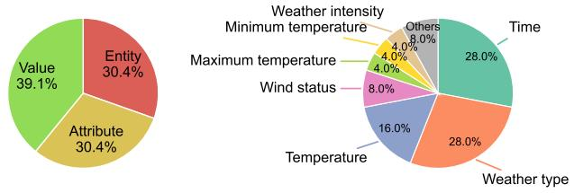

Figure 13: Disagreement type distributions on Weather.  
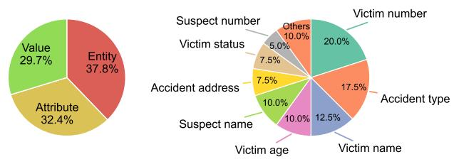  
Figure 14: Disagreement type distributions on Incidents.

We categorize observed pairwise disagreements into three hierarchical levels, from coarse to fine-grained: (1) Entity-level: Disagreements on the presence of entities, corresponding to how many rows a table should contain. (2) Attribute-level: Disagreements on which attributes are instantiated for a given entity, without any Entity-level disagreement. This corresponds to determining the non-empty columns within a table row. (3) Value-level: Disagreements on the value of a specific attribute, without any Entityor Attribute-level disagreement. This corresponds to the cell content. We analyze the distribution of disagreement types and the attribute-level breakdown of where disagreements occur, visualized in Figure 14 and 13.

## A.7 Variability Comparison

We also conduct a statistical examination of the variability of our new benchmark datasets with that of Conversation. We study the variability in two aspects: how an attribute is manifest in the text (Challenge 1) and which attributes are mentioned in a text (Challenge 2).

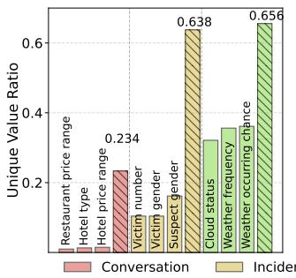

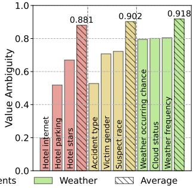  
Figure 15: Attribute-level variability comparison.

To underscore Challenge 1, we compare the attribute-level variability: (1) Unique Value Ratio, ∈ (0, 1]: #unique values / #values.

Table 5: Comparison of datasets. “Multiple” indicates whether each table contains multiple records or a single record.
<table><tr><td>Dataset</td><td>Input texts</td><td>Output table</td><td>Comments</td><td>Multiple</td></tr><tr><td>E2E [44, 45, 67]</td><td>human-written description synthetically</td><td>generated restaurant attributes</td><td>table description</td><td>No</td></tr><tr><td>RotoWire [64, 67]</td><td>human-written game sum- NBA box score mary</td><td></td><td>table description</td><td>Yes</td></tr><tr><td>WikiTableText [4, 67]</td><td>human-written table de- Wikipedia web tables scription</td><td></td><td>table description</td><td>No</td></tr><tr><td>WikiBio [28, 67]</td><td>filtered Wikipedia biogra- Wikipedia web tables phies</td><td></td><td>specialized documents</td><td>No</td></tr><tr><td>CPL [26]</td><td>judgments</td><td>Chinese private lending local tabular views of a KG specialized documents</td><td></td><td>Yes</td></tr><tr><td>Incidents (Ours)</td><td>gun-violence news port [63]</td><td>re- manually-annotated tables naturally occurring text about the victim, suspect and accident</td><td></td><td>Yes</td></tr><tr><td>Weather (Ours)</td><td>weather forecasts news [63]</td><td>in manually-annotated tables naturally occurring text about weather details</td><td></td><td>Yes</td></tr><tr><td>Conversation</td><td>dialogue around services</td><td>state</td><td>aggregated final dialogue naturally occurring text (partially, because the ser- vice ontology is predefined)</td><td>No</td></tr></table>

Table 6: Dataset schema.
<table><tr><td>Dataset</td><td>Entity: Attributes</td></tr><tr><td>Incidents</td><td>Accident: Accident type, Accident date, Accident address, Number of rounds fired, Accident number, Personnel arrived time Victim: Victim number, Victim status, Victim gender, Victim age, Victim based, Hospital name, Victim name, Victim race, Victim occupation, Victim vehicle</td></tr><tr><td>Weather</td><td>Suspect weapon, Suspect vehicle, Suspect occupation, Suspect based, Suspect race, Prison name Weather: Temperature, Snow status, Cloud type, Sunset time, Rain status, Weather area, Time, Weather type, Wind speed, Weather compass direction, Maximum temperature, Weather frequency, Wind status, Minimum temperature, Sunrise time, Weather occurring chance, Wind direction, Location, Cloud status</td></tr><tr><td>Conversation</td><td>Attraction: Attraction name, Attraction area, Attraction type Hotel: Hotel name, Hotel area, Hotel type, Hotel parking, Hotel price range, Hotel internet, Hotel stars, Hotel requested day, Hotel requested people, Hotel requested stay, Hotel confirmed name, Hotel confirmed reference Restaurant: Restaurant name, Restaurant area, Restaurant food, Restaurant price range, Restaurant requested day, Restaurant requested people, Restaurant requested time, Restaurant confirmed name,</td></tr></table>

A higher score means the attribute manifests more unique values among all its mentions in the text. (2) Value Ambiguity ∈ [0, 1]: the normalized entropy of value distribution. A higher score indicates that no single value dominates the corpus, and the attribute lacks a global default interpretation. Figure 15 shows the average and the lowest scores (the “easiest”) for each dataset. The former demonstrates the general dificulty while the latter reveals the lower-bound dificulty. These statistics imply the dificulty order of the datasets: Weather > Incidents > Conversation, aligning with the observation in Table 2.

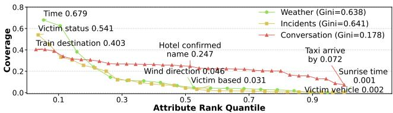  
Figure 16: Attribute Coverage ranked curve.

For Challenge 2, we depict the Attribute Coverage (i.e. the ratio of texts mentioning the attribute) in Figure 16. Apparently, the long-tail phenomenon of our new benchmarks is more significant with higher Gini than the Conversation dataset, reflecting the fact that Incidents and Weather contain more rare attributes.

## A.8 Discussion on Structured-F1

We discuss the computational complexity of structured-F1. Assume � has � rows and � columns while �<sup>ˆ</sup> has �ˆ rows and �ˆ columns.

Let � denote the amortized cost to calculate the similarity between two cell contents. To compute DF1 for some record pair, it requires �(���ˆ ) to get the similarity matrix between header names, as in Figure 3(1), and $O \big ( ( m + \hat { m } ) c \big )$ to average the similarity of matched values. We need to compute DF1 for all ��ˆ record pairs, the �<sub>�</sub> similarity matrix could be reused, so the overall complexity for structured-F1 is $C 1 = O \big ( m \hat { m } c + n \hat { n } \big ( m + \hat { m } \big ) c \big )$

In contrast, if the table is flattened, there are �� and �ˆ �ˆ triples. So, the complexity of comparing triples is $C 2 = O \left( m n { \hat { m } } { \hat { n } } c \right)$

For a reasonable system, the size of � resembles that of �<sup>ˆ</sup> , thus � ≈ �ˆ and � ≈ �ˆ, so $C 1 = O ( m ^ { 2 } c + 2 n ^ { 2 } m c ) , C 2 = O ( m ^ { 2 } n ^ { 2 } c )$ . When $n ^ { 2 } > 1$ and $m > 3 , C 1 \leq C 2$ and structured-F1 is more eficient than triple F1; in other cases, $C 1 \approx C 2$ . In practice, the � and � are usually small integers, so it is fair to say our metric does not increase the evaluation complexity.

## A.9 Other Results

Figure 17 and Figure 18 are the results with Llama-3-8B.

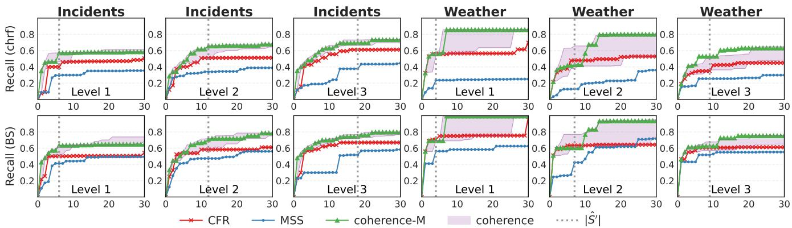

Figure 17: Recommendation recall with Llama-3-8B.  
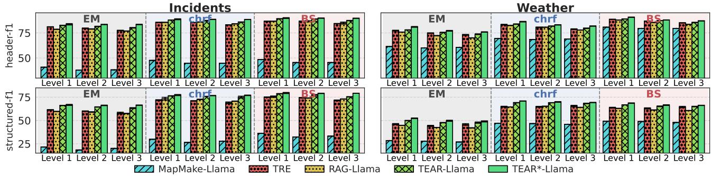  
Figure 18: Table extraction with text-driven attributes, Llama backbone.