# Towards a knowledge-enhanced single-cell foundation model

Hanqing Zhang1,2,†, Jie Bao1,†, Mei Ma1, Shuai Liu1, Jiaying Ma1, Jiaguan Liu1, Jiaxiao Li1, Zhenbo Li2, Wenwen Gong2, Zhijun Cao1,\*

1College of Animal Science and Technology, China Agricultural University, Beijing 100193, China 2College of Information and Electrical Engineering, China Agricultural University, Beijing 100193, China

Corresponding author(s). Email(s): caozhijun@cau.edu.cn †These authors contributed equally to this work.

## Abstract

Single-cell foundation models (scFMs) increasingly rely on large-scale transcriptomic pretraining, yet expanding pretraining data can yield diminishing gains while substantially increasing computational cost. Our data scaling analyses showed that incorporating biological knowledge, including cell-level text annotation and gene-level regulatory information, provided additional scaling dimension than simply increasing data size. Motivated by this observation, we present scKITE, a simple yet efective scFM that integrates cell-annotation and gene-regulatory supervision into a shared transcriptomic Transformer encoder through lightweight auxiliary decoders. These decoders are used only during pretraining and subsequently discarded, yielding a general-purpose encoder enriched with biological knowledge for downstream applications. With only 179,067 pretraining samples, i.e., less than 0.5% of those used by previous strong scFMs, scKITE outperformed these models across diverse downstream tasks, highlighting knowledge-enhanced pretraining as a promising paradigm for biologically grounded scFMs.

## Introduction

Advances in single-cell RNA sequencing (scRNA-seq) have enabled high-resolution profiling of cellular heterogeneity across diverse tissues, developmental stages, disease states and experimental conditions [1, 2]. The resulting large-scale transcriptomic datasets have motivated the development of single-cell foundation models (scFMs), which learn transferable representations of genes and cells and provide a general framework for modeling cellular states from transcriptomic profiles [3].

Scaling the size of pretraining corpora has become a major direction in the development of scFMs. Geneformer established large-scale self-supervised pretraining of single-cell transcriptomes for transferable prediction in network biology, followed by models such as scGPT and scFoundation that extended transcriptomic pretraining toward broader cell- and gene-level applications [4–8]. More recently, updated Geneformer models have expanded the pretraining corpus to include more than 100 million single-cell transcriptomes and increased model capacity to hundreds of millions of parameters, further improving representation quality and zero-shot prediction [9]. Together, these studies have demonstrated that large-scale transcriptomic pretraining can capture substantial transferable information from single-cell data [10–12]. However, continued scaling also introduces substantial computational and practical costs. Pretraining transformer-based scFMs on increasingly large corpora requires specialized hardware and extended training time, making model development progressively more resource intensive. These costs become particularly important when additional training data provide only limited improvements in downstream performance. A recent systematic evaluation showed that current scFMs can reach a performance plateau using only a fraction of the full pretraining corpus, with no clear data-scaling behavior comparable to that observed in large language models [13, 14]. These observations motivate complementary strategies beyond transcriptomic data scaling, including enriching pretraining objectives with biologically meaningful information.

Cellular systems are inherently complex, arising from coordinated interactions among genes and regulatory programs across diverse biological contexts [15]. This complexity has motivated the incorporation of biological knowledge into single-cell foundation models as an additional source of supervision for representation learning. Two complementary and readily accessible forms of knowledge are particularly relevant: natural-language descriptions that encode cell identity and biological context, and regulatory programs that describe transcription factor (TF)-centered regulatory relationships with their target genes within cellular states. Natural-language annotations provide information about cell identity, tissue context and functional state that may not be directly inferred from expression profiles alone, whereas regulatory programs describe the gene-regulatory relationships that shape cellular states. Incorporating these complementary sources of cell- and gene-level information may therefore help scFMs learn representations that better capture both cellular context and underlying regulatory structure. Recent studies have shown that transcriptomic profiles can be linked to biological text descriptions [16–19]. Moreover, GRN (Gene Regulatory Networks) inference tools such as SCENIC and pySCENIC also further provide feasible approaches for inferring regulatory networks at single-cell resolution from transcriptomic data [20–22]. These two knowledge sources potentially ofer complementary information for learning biologically informative transcriptomic representations.

Motivated by this knowledge-enhanced perspective, we systematically characterized data scaling by varying the pretraining corpus size while holding model architecture and evaluation settings fixed. We found that performance gains from increasing data rapidly diminished, whereas knowledge-enhanced pretraining consistently improved performance across data scales, achieving an average 28.8% relative improvement in downstream task performance compared with scKITE without knowledge-enhanced training. These results suggest that biological knowledge can shift the data-scaling curve, reducing reliance on continued expansion of the pretraining corpus. Guided by this observation, we developed scKITE (single-cell Knowledge-Integrated Transformer), a knowledge-enhanced single-cell foundation model that incorporates annotation and regulatory supervision into transcriptomic pretraining. scKITE employs two lightweight auxiliary decoders for annotation and regulon prediction, providing complementary supervision on cellular identity and gene regulation and thereby enriching the shared transcriptomic encoder with biological knowledge. After pretraining, both decoders are discarded, leaving a single knowledge-enhanced encoder that serves as a general-purpose representation model for downstream cell- and gene-level applications.

We demonstrate that knowledge-enhanced pretraining improves transcriptomic representations and downstream performance in scKITE. Using only 179,067 (∼ 0.18M) pretraining samples, less than 0.5% of the data used by representative scFMs, scKITE outperformed existing SOTA scFMs, including Geneformer (∼ 30M pretraining samples), scGPT (∼ 33M pretraining samples) and scFoundation (∼ 50 M pretraining samples), across diverse downstream tasks, and GEARS, a classical perturbation prediction model. Compared with the corresponding scKITE without knowledge enhancement, scKITE achieved substantial improvements at the cell level, including a 64.0% increase in mean zero-shot macro-F1 across five cell type annotation benchmarks and a 22.8% increase in mean batch-integration overall score across four datasets. At the gene level, scKITE reduced Top-20 DE MSE by 19.8% across perturbation-response benchmarks.

In summary, our results establish knowledge-enhanced pretraining as an efective strategy for learning more biologically grounded single-cell representations while reducing reliance on continued data scaling. By efectively integrating two structurally distinct forms of biological knowledge (i.e., cell-level textual annotations and gene-level regulatory relationships) into a shared transcriptomic representation, scKITE achieves strong downstream performance with substantially fewer pretraining samples, highlighting a broader route for advancing scFMs through biologically grounded learning rather than data scale alone.

## Results

## Knowledge-enhanced pretraining improves transcriptomic representations beyond data scaling

scKITE integrates complementary biological knowledge into a shared transcriptomic representation through a two-stage pretraining framework, achieving greater performance than simply scaling the amount of pretraining data.

We demonstrate that performance gains from increasing data rapidly diminished, whereas knowledge-enhanced supervision consistently improved performance across data scales. The pretraining corpus was divided into 358,134 training profiles and a fixed validation set of 18,849 profiles. Across data fractions, scKITE consistently maintained stronger normalized downstream performance than scKITE (w/o knowledge enhancement) across cell type annotation, batch integration and perturbation-response prediction (Fig. 1a). Notably, scKITE (w/o knowledge enhancement) reached a performance plateau after scaling to 50% of the pretraining data, showing limited additional gains from further corpus expansion. However, across four pretraining scales, scKITE achieved an average 28.8% relative improvement in downstream task performance compared with scKITE (w/o knowledge enhancement). We use 179,067 training profiles for scKITE training and performance evaluation in all subsequent experiments.

To provide complementary biological supervision, each transcriptomic profile was paired with annotation and regulatory knowledge (Fig. 1b). The pretraining corpus was derived from the CELLxGENE [23] component of CellWhisperer [17], comprising pseudo-bulk transcriptomic profiles paired with metadata-derived natural-language descriptions of cell identity and biological context. These descriptions were tokenized into annotation knowledge sequences for languagebased supervision. In parallel, pySCENIC [21] was used to infer regulatory activity from each transcriptomic profile (see Supplementary Methods 1.3). Activated regulons were identified, and a subset was sampled and serialized into sequences encoding transcription factor–target relationships. Each transcriptomic profile was therefore associated with two complementary supervision targets: an annotation sequence capturing cellular identity and context, and a regulon sequence capturing underlying regulatory programs.

Integrating two structurally distinct forms of biological knowledge into scFMs is non-trivial. scKITE addresses this challenge through a two-stage pretraining framework comprising transcriptomic self-supervised pretraining followed by knowledge-enhanced pretraining (Fig. 1c). In Stage 1, a Transformer-based encoder is pretrained using a masked-expression reconstruction objective. Stage 2 is initialized from the Stage 1 checkpoint and retains the expression reconstruction objective while introducing annotation and regulon prediction as additional knowledge-enhanced supervision. Two lightweight auxiliary decoders, each connected to the shared encoder through cross-attention, simultaneously predict annotation and regulon knowledge sequences, thereby incorporating complementary biological knowledge into the shared transcriptomic representation. Specifically, Stage 1 is optimized using the masked-expression reconstruction loss $( \mathcal { L } _ { \mathrm { e x p r } } )$ , whereas Stage 2 jointly optimizes the shared encoder using $\mathcal { L } _ { \mathrm { e x p r } }$ together with autoregressive cross-entropy losses for annotation sequence generation $( \mathcal { L } _ { \mathrm { a n n } } )$ and regulon sequence generation $( \mathcal { L } _ { \mathrm { r e g } } )$ (see Supplementary Methods 4.2). Both auxiliary decoders access the full sequence of encoder hidden states through cross-attention and are used only during pretraining. After pretraining, the decoders are discarded, leaving a knowledge-enhanced encoder that can be directly transferred to downstream tasks without requiring annotation or regulon information at inference time. This design preserves a general-purpose transcriptomic representation while enriching it with complementary biological knowledge, enabling the encoder alone to serve as a transferable representation across downstream applications.

The retained scKITE encoder provides reusable representations at both cell and gene levels (Fig. 1d). Cell embeddings support cell type classification, batch integration and cell organization analyses, whereas gene embeddings support perturbation-response prediction, marker-gene analysis and TF-regulon interpretation. Thus, complementary biological knowledge introduced during pretraining is consolidated into a single reusable encoder, providing a unified representation for downstream analyses across both cell- and gene-level tasks.

## Knowledge-enhanced pretraining improves cell identity representation

scKITE improves cell type annotation while better capturing hierarchical immune organization and cross-tissue cell type relationships. We evaluated scKITE across five benchmarks covering standard settings (Human Pancreas and Tabula Sapiens), cross-disease generalization (Multiple Sclerosis), cross-cancer generalization (Tumor-infiltrating Myeloid), and cross-tissue generalization (Crosstissue Immune Cell Atlas). scKITE was compared with scKITE (w/o knowledge enhancement) and representative single-cell foundation models, scGPT and Geneformer, under zero-shot and full-fine-tuning settings. For the zero-shot cell type annotation task, frozen encoder representations were directly used with a nearest-neighbor classifier for cell type assignment. For the full-fine-tuning cell type annotation task, a task-specific neural network classifier was optimized using the pretrained representations as input(see Supplementary Methods 6.1).

In the zero-shot setting, scKITE achieved the best or comparable performance across most evaluated datasets and metrics. Across the five benchmarks, scKITE achieved a mean macro-F1 of 0.500, compared with 0.430 for scGPT and 0.399 for Geneformer. This advantage was largely retained after full fine-tuning, where scKITE achieved the best performance across nearly all evaluated datasets and annotation metrics, with only one metric slightly below scGPT. The mean macro-F1 reached 0.668, compared with 0.561 for scGPT and 0.543 for Geneformer (Fig. 2a). The zero-shot cell embeddings of scKITE in the Tabula Sapiens and Cross-tissue Immune Cell Atlas datasets further illustrated the organization of cell representations (Fig. 2b). The confusion matrix showed strong agreement between predicted and annotated labels across most of the 20 common cell types In the Tabula Sapiens dataset (Fig. 2c).

Knowledge-enhanced pretraining enabled scKITE representations to better capture the hierarchical organization of related immune cell compartments. The Cross-tissue Immune Cell Atlas organizes immune populations into three major compartments, including myeloid cells, T and innate lymphoid cells, and B cells, which represent major functional and developmental branches of the immune system [24]. Hierarchical clustering of cell-type centroids revealed clearer separation among the annotated myeloid, T and innate lymphoid, and B-cell compartments in the scKITE embedding space than in the scKITE (w/o knowledge enhancement) embedding space (Fig. 2d). Agreement between the resulting clusters and the annotated immune compartments increased from an ARI of 0.20 to 0.46 and from an NMI of 0.34 to 0.68. At the individual-cell level, pairwise cosine distances further revealed the hierarchical organization of immune cell relationships (Fig. 2e). Cells from the same cell type showed the smallest distances, followed by diferent cell types within the same immune compartment, whereas cells from diferent compartments showed the largest distances. This separation among the three levels was more pronounced in scKITE embeddings than in the scKITE (w/o knowledge enhancement) representation, indicating that scKITE better captured the hierarchical organization reflected by annotated immune compartments among immune cell types.

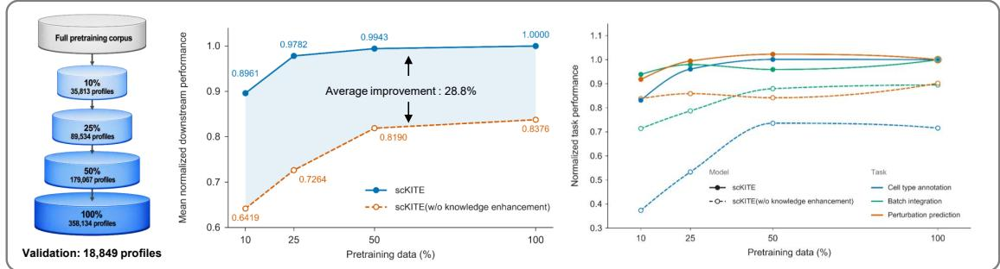  
b

Biological knowledge construction from single-cell profiles  
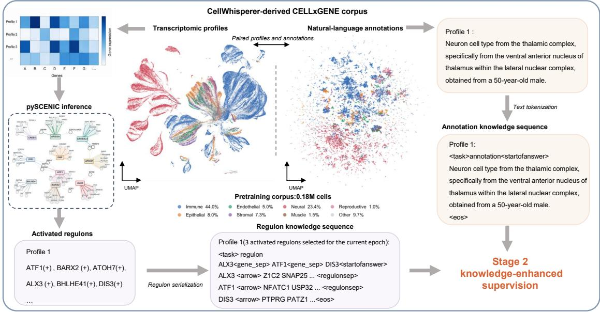

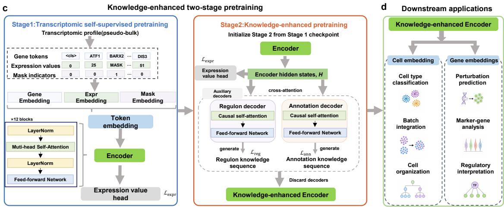  
Fig. 1 | Knowledge-enhanced pretraining strategy of scKITE enables biologically informed single-cell representations. a, Efect of pretraining corpus size and biological knowledge enhancement on scKITE performance. Models pretrained using diferent fractions of the corpus are evaluated across cell-type annotation, batch integration and perturbation-response prediction tasks. b, Construction of complementary biological supervision from the CellWhisperer-processed CELLxGENE corpus. Transcriptomic profiles are paired with natural-language cell annotations and activated regulon programs to generate annotation and regulatory knowledge sequences for Stage 2 knowledge-enhanced pretraining. c, Two-stage pretraining strategy of scKITE. Stage 1 performs transcriptomic self-supervised learning through masked expression modeling. Stage 2 initializes the encoder from Stage 1 and introduces auxiliary annotation and regulon decoders to inject biological knowledge into representation learning. The auxiliary decoders are removed after pretraining, and the knowledge-enhanced encoder is used for downstream tasks. d, Downstream applications of the pretrained scKITE encoder. Cell-level representations support cell-type annotation, batch integration and cell organization analysis, whereas contextual gene representations enable perturbation-response prediction and regulatory interpretation.

Cross-tissue retrieval demonstrated that knowledge-enhanced pretraining improved the ability of scKITE representations to identify cell types across diferent tissues. Across nine lymphoid and non-lymphoid tissues, cell type centroids were matched across tissues within the same immune compartment, with retrieval accuracy defined by whether the nearest target centroid corresponded to the same annotated cell type. Across directional cross-tissue comparisons, scKITE consistently achieved higher Top-1 retrieval accuracy than the scKITE (w/o knowledge enhancement), increasing the overall retrieval accuracy from 42.8% to 66.2% (Fig. 2f). These results show that scKITE more efectively preserves cell identity across distinct tissues.

Together, these results demonstrate that knowledge-enhanced pretraining improves the quality of scKITE cell representations, enabling accurate cell type annotation while preserving hierarchical immune organization and cross-tissue cell type relationships.

## Knowledge-enhanced pretraining improves batch integration

scKITE improves batch integration while preserving biologically meaningful cell type structure across diverse scRNA-seq datasets. We examined four integration benchmarks: Perirhinal cortex (2 batches), COVID-19 (18 batches), Renal (3 batches), and Liver (16 batches). In our benchmarking experiments, we compared scKITE with scKITE (w/o knowledge enhancement) and two representative single-cell foundation models, scGPT and Geneformer. Integration performance was evaluated from two complementary aspects: biological conservation and batch mixing. The AvgBIO score aggregates three cell-type preservation metrics, normalized mutual information (NMI), adjusted Rand index (ARI) and cell-type average silhouette width $( \mathrm { \mathbf { A } S W _ { c e l l } } )$ , whereas the AvgBATCH score summarizes batch-mixing metrics, including batch average silhouette width $( \mathrm { A S W _ { b a t c h } ) }$ and graph connectivity.

Across four batch-integration benchmarks, scKITE consistently outperformed scKITE (w/o knowledge enhancement) and achieved competitive performance compared with existing scFMs (Fig. 3a). Relative to scKITE (w/o knowledge enhancement), mean AvgBIO increased from approximately 0.338 to 0.474 and mean AvgBATCH from approximately 0.836 to 0.938. scKITE also exceeded the strongest external baseline, Geneformer, by 6.5% in AvgBIO and 4.2% in AvgBATCH. Together, these results indicate that scKITE achieves a better balance between biological conservation and batch-efect removal. Metric decomposition further showed broad improvements over scKITE (w/o knowledge enhancement) across the major integration metrics (Fig. 3b). Averaged across the four datasets, scKITE increased NMI by 0.179, ARI by 0.112 and cell-type ASW by 0.118. Graph connectivity increased by 0.134 on average, and batch ASW increased by 0.071. Integration performance was further evaluated within individual cell types. In the representative Perirhinal cortex and Liver datasets, scKITE showed consistently high batch ASW and graph connectivity across most evaluated cell types (Fig. 3c). These results indicate that scKITE maintains efective batch mixing and local connectivity across diverse cell types. Representative scKITE embeddings of the Perirhinal cortex and Liver datasets further showed that cells from diferent batches were well mixed within the same cell types while distinct cell type structures remained preserved (Fig. 3d,e). Overall, scKITE improves batch integration by improving batch mixing while preserving biologically meaningful cell type organization across diverse single-cell datasets.

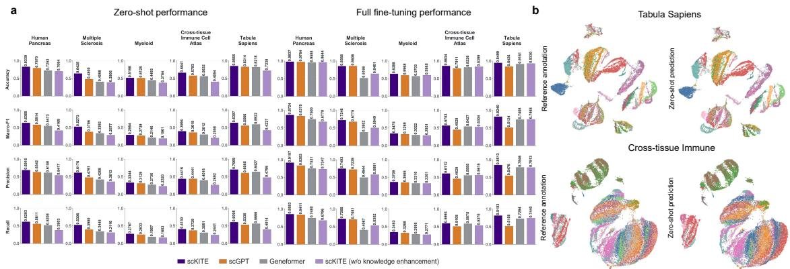  
c

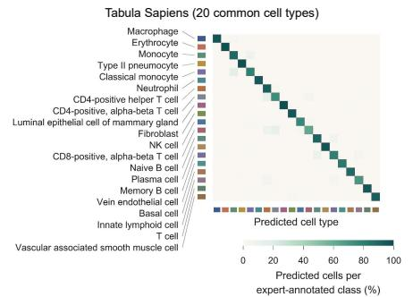  
d

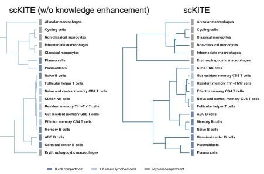

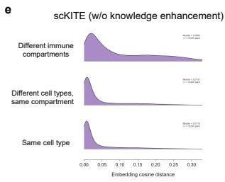

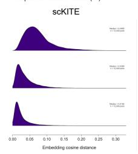  
f

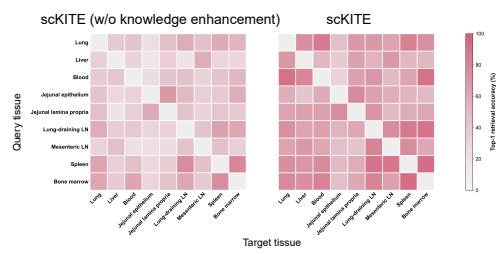  
Fig. 2 | Evaluation of scKITE representations for cell type annotation and biological organization. a, Zero-shot and fine-tuned cell-type annotation performance of scKITE, scKITE (w/o knowledge enhancement), scGPT and Gene former across five benchmark datasets, including Human Pancreas, Multiple Sclerosis, Tumor-infiltrating Myeloid, Cross-tissue Immune Cell Atlas and Tabula Sapiens. b, UMAP visualization of scKITE cell embeddings from the Tabula Sapiens and Cross-tissue Immune Cell Atlas datasets, colored by reference cell types and zero-shot predicted labels. c, Confusion matrix comparing reference annotations and zero-shot predictions for 20 common cell types in the Tabula Sapiens dataset. d, Hierarchical organization of immune cell types captured by scKITE and scKITE (w/o knowledge enhancement). Dendrograms show clustering of cell-type centroids colored by major immune compartments. e, Pairwise cosine-distance distributions in scKITE and scKITE (w/o knowledge enhancement) embeddings for cells across diferent immune compartments, within the same compartment, and within the same cell type. f, Crosstissue retrieval accuracy of scKITE representations across nine lymphoid and non-lymphoid tissues in the Cross-tissue Immune Cell Atlas. Heatmaps show directional Top-1 retrieval accuracy between tissue pairs.

## Knowledge-enhanced pretraining improves gene context embeddings for perturbationresponse prediction

We tested whether the knowledge-enhanced gene context embeddings learned by scKITE improve genetic perturbation-response prediction using two Perturb-seq datasets, Norman[25] and Replogle[26]. Gene context embeddings obtained from scKITE, scGPT and scFoundation were incorporated into a shared GEARS-based prediction framework (Fig. 4a). GEARS combines gene embeddings, perturbation embeddings, gene co-expression graph and Gene Ontology graph to predict post-perturbation gene expression. The original GEARS model with native gene embeddings was included as a baseline.

scKITE gene context embeddings improved perturbation-response prediction performance across perturbation-response datasets and most perturbation generalization settings. scKITE achieved the lowest overall Top-20 DE MSE in both the Norman and Replogle datasets (Fig. 4b), outperforming scKITE (w/o knowledge enhancement), GEARS and the evaluated single-cell foundation-model representations. We next examined prediction performance across diferent perturbation generalization settings in the Norman dataset. MSE was calculated over the perturbationspecific top 20 non-dropout DE genes for Seen 0, Seen 1, Seen 2 and unseen-single conditions. scKITE achieved the lowest MSE in Seen 0, Seen 1 and Seen 2 (Fig. 4c). Under the unseensingle setting, scKITE achieved lower MSE than GEARS, scGPT and scKITE (w/o knowledge enhancement), while scFoundation showed a lower MSE. Prediction performance was further assessed using Pearson correlation between predicted and observed condition-mean expression profiles over the top 20 DE genes. scKITE achieved the highest correlation in Seen 1, Seen 2 and unseen-single conditions, while showing a slightly lower correlation than scGPT in the Seen 0 setting (Fig. 4c). Across all four settings, scKITE outperformed both the original GEARS baseline and scKITE (w/o knowledge enhancement).

Prediction performance was further examined at the individual perturbation level in the Replogle dataset. scKITE achieved lower Top-20 DE MSE than GEARS across all evaluated perturbation conditions, with improvement observed in all 25 perturbations (25/25; Fig. 4d), demonstrating consistent improvement across evaluated perturbation conditions. To further evaluate whether scKITE could recover biologically meaningful perturbation-responsive genes, we quantified the direction-correct recovery of top-20 DE genes in the Norman dataset. Compared with scKITE (w/o knowledge enhancement), scKITE achieved a higher recovery score across 97 held-out perturbation conditions, with a significant improvement measured by a paired Wilcoxon signed-rank test (P = 0.010; Fig. 4e). These results indicate that knowledge enhancement improves the recovery of perturbation-responsive genes and their expression-change directions. To illustrate the predicted perturbation responses, we visualized the representative UBASH3B+PTPN12 combinatorial perturbation in the Norman dataset (Fig. 4f), where scKITE reproduced the observed expression-change patterns across the top 20 DE genes.

a  
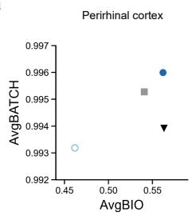

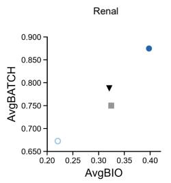

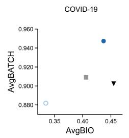

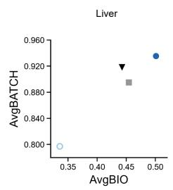  
scKITEscGPT scKITE(w/o knowledge enhancement)geneformer

b  
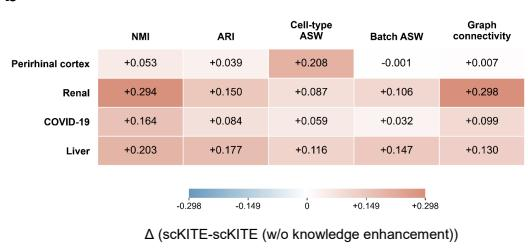

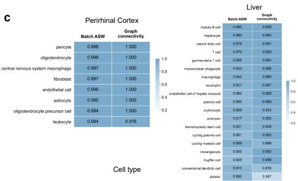

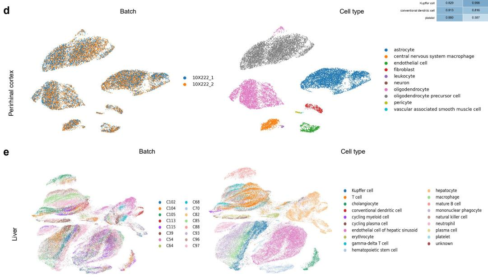  
Fig. 3 | Evaluation of scKITE representations for cross-dataset batch integration. a, Benchmarking of AvgBIO and AvgBATCH scores for scKITE, scKITE (w/o knowledge enhancement), scGPT and Geneformer across the Perirhinal cortex, Renal, COVID-19 and Liver datasets. b, Improvements of scKITE over scKITE (w/o knowledge enhancement) across integration metrics, including NMI, ARI, cell-type ASW, batch ASW and graph connectivity. Values represent the diference between scKITE and the knowledge-ablation model. c, Cell-type-resolved evaluation of batch mixing for scKITE using batch ASW and graph connectivity across individual cell types in the Perirhinal cortex and Liver datasets. d, UMAP visualization of scKITE embeddings for the Perirhinal cortex dataset colored by cell type (right) and assay batch (left). e, UMAP visualization of scKITE embeddings for the Liver dataset colored by cell type (right) and donor batch (left).

Finally, we evaluated whether scKITE could recover genetic interaction strength from predicted perturbation responses. Genetic interaction magnitudes were calculated following the GEARS interaction-analysis framework, and the agreement between predicted and ground-truth magnitudes was assessed using Pearson correlation. scKITE achieved a higher correlation than GEARS (Pearson $r = 0 . 3 3 7$ versus 0.229; Fig. 4g), indicating improved recovery of relative genetic interaction strength for double-gene perturbations. Together, these results demonstrate that knowledge-enhanced gene context embeddings provide transferable representations for predicting transcriptional responses across diverse genetic perturbation settings.

## Biological interpretation of knowledge-enhanced representations

The improved performance of scKITE across cell- and gene-level benchmarks highlights the value of incorporating biological supervision into single-cell pretraining. We therefore investigated how annotation and regulatory supervision were reflected in the shared encoder representation through decoder-to-encoder cross-attention analysis. During Stage 2, both decoders access encoder hidden states through cross-attention, enabling attention patterns to provide an interpretable view of the gene states preferentially accessed during biological target reconstruction (Fig. 5a).

Annotation supervision was assessed by examining whether decoder attention preferentially focused on cell-type marker genes. Marker genes for each of the 198 cell types were identified from the training set using one-versus-rest diferential-expression analysis with a Wilcoxon rank-sum test [27, 28]. These training-derived marker genes were then evaluated in the held-out validation set by comparing their decoder-to-encoder cross-attention percentiles with matched background genes. Attention percentiles were used to quantify the relative ranking of genes based on decoder cross-attention scores (see Supplementary Methods 4.2). Across 198 evaluable cell types, marker genes showed higher attention percentiles than matched background genes in 196 cell types, resulting in strong paired enrichment across cell types $( P = 3 . 7 \times 1 0 ^ { - 3 4 }$ ; Fig. 5b). To further evaluate whether attention rankings recovered established cell identity signals, canonical marker genes for 13 representative cell types were curated from CellMarker 2.0[29]. Representative cell types illustrated that decoder attention preferentially focused on established cell identity markers. In NK cells, markers including GNLY, NKG7, KLRD1 and PRF1 exhibited high median attention percentiles, whereas neutrophil markers including S100A8, S100A9, FCGR3B, CSF3R and CXCR2 showed similar enrichment patterns (Fig. 5c). Across 61 evaluable canonical marker genes from 13 cell types, 22 markers (36.1%) were recovered within the top 10 attention-ranked genes, increasing to 27 (44.3%) and 36 (59.0%) within the top 15 and top 25 genes, respectively (Fig. 5d). Together, these results indicate that annotation supervision directs decoder attention toward cell-type marker genes.

Regulatory supervision was assessed by examining whether decoder attention preferentially accessed genes within externally supported TF regulatory programs. We used CollecTRI[30] to annotate TF-target relationships for 45 active TF programs and compared supported target genes with matched non-target genes using regulon decoder cross-attention. Across the 45 evaluable

a  
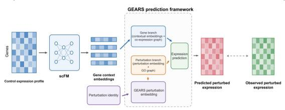

b  
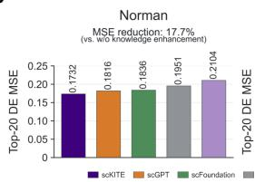  
c  
d

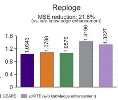

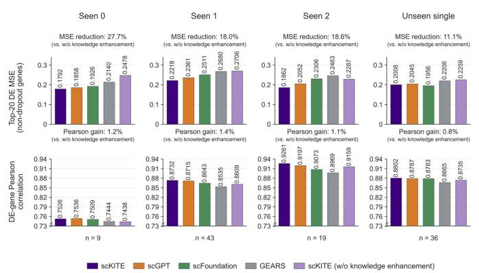

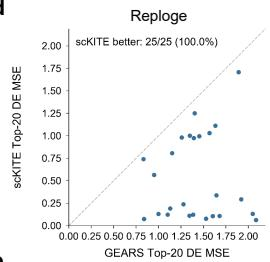

e  
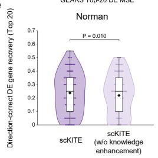

f  
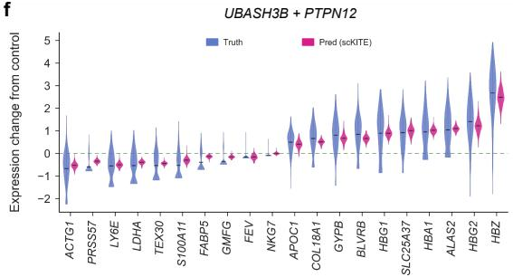

g  
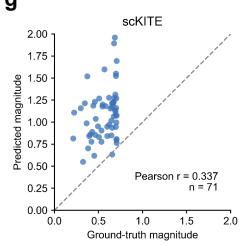

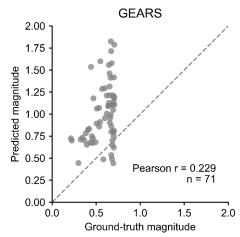  
Fig. 4 | Evaluation of gene context embeddings for genetic perturbation-response prediction. a, Overview of the GEARS-based framework using contextual gene embeddings learned by scKITE for perturbation-response prediction. The pretrained gene embeddings are combined with perturbation information to predict perturbation responses. b, Top-20 DE gene mean squared error (MSE) between predicted and observed expression profiles across the Norman and Replogle datasets. Performance is compared across scKITE, scGPT, scFoundation, GEARS and scKITE (w/o knowledge enhancement). c, Perturbation-response prediction performance under diferent generalization settings in the Norman dataset. Seen0, Seen1 and Seen2 represent increasing levels of perturbation overlap between training and evaluation, whereas unseen single represents unseen single-gene perturbations. d, Perturbation-level comparison of Top-20 DE gene MSE between scKITE and GEARS across evaluated perturbation conditions in the Replogle dataset. Each point represents one perturbation condition. e, Direction-correct recovery of Top-20 DE genes in the Norman dataset. Each point represents one unique perturbation condition in the Norman test set after removing equivalent condition aliases $( n = 9 7 )$ . Violin plots show DE gene recovery score distributions across perturbations, with boxes indicating the interquartile range and black diamonds indicating the mean. scKITE was compared with scKITE (w/o knowledge enhancement) using a two-sided paired Wilcoxon signed-rank test. f, Comparison of predicted and observed expression-change distributions for Top-20 DE genes under the $U B A S H 3 B + P T P N I 2$ combinatorial perturbation. Violin plots show cell-level expression-change distributions, with horizontal lines indicating mean values. g, Recovery of genetic interaction magnitude for held-out double-gene perturbations. Each point represents one doublegene perturbation $( n = 7 1 )$ . Scatter plots compare predicted and ground-truth interaction magnitudes for scKITE and GEARS, with dashed lines indicating perfect agreement $( y = x )$ . Pearson correlations are shown for each model.

TF programs, supported targets showed higher attention than matched non-target genes for 32 TFs, indicating a tendency toward preferential attention to externally supported regulatory targets $( P = 5 . 9 \times 1 0 ^ { - 2 } ;$ ; Fig. 5e). TF-level analysis revealed that regulatory attention patterns varied across TF programs. Several TF programs showed higher attention toward CollecTRI- supported target genes than matched non-target genes (Fig. 5f). In the representative TBX21 regulatory program, highly ranked target genes included both genes overlapping with pretrained regulon targets and external-only targets, indicating that regulon-decoder attention recovered externally supported regulatory targets, including targets absent from the regulons used for pretraining. (Fig. 5g).

Finally, TF-target retrieval patterns varied across cellular contexts. Representative TF programs displayed distinct enrichment patterns across cell types, with TBX21 showing preferential retrieval in NK cells, LEF1 in T-cell-associated populations, and HEY1 in B-lineage populations (Fig. 5h). These context-dependent patterns indicate that regulon supervision enables the encoder representation to retain cell-type-associated regulatory information. Together, these analyses show that annotation and regulatory supervision introduce complementary biological information into the shared scKITE representation. Annotation supervision highlights genes associated with cell identity, whereas regulon supervision supports retrieval of context-dependent TF-associated regulatory programs.

## Discussion

A central implication ofour results is that knowledge-enhanced pretraining shifts the scaling paradigm of single-cell foundation models (scFMs) beyond data expansion alone. Increasing transcriptomic data remains valuable, particularly when it improves biological diversity and coverage; however, our scaling experiments reveal diminishing returns from simply expanding pretraining data. In contrast, incorporating biological supervision consistently improved performance across diferent data scales, enabling scKITE to match or exceed representative large-scale scFMs trained on tens of millions of samples using only around 0.18 million pretraining samples (less than 0.5% of their data). These findings suggest that biological knowledge can improve the data eficiency of foundation model training and provide a complementary direction to conventional scaling strategies.

The efectiveness of knowledge-enhanced pretraining depends on matching biological knowledge with the representations to be learned. In scKITE, cell identity cell-associated annotations and context-specific gene regulatory programs provide complementary supervision at the cell and gene levels, respectively. This design enables the model to capture cellular organization through cell-level knowledge and gene regulatory context through regulatory knowledge, leading to improved representations across cell- and gene-level tasks. More broadly, these findings suggest that future biological foundation models should consider not only whether biological knowledge is incorporated, but also whether the selected knowledge is aligned with the biological properties and downstream capabilities that the model is intended to acquire.

Several limitations should be considered when interpreting these results. Knowledge-enhanced pretraining depends on the quality and coverage of the biological supervision. In this study, cell identity supervision was derived from scalable natural-language cell identity annotations associated with single-cell profiles; however, such descriptions may vary in completeness, specificity and consistency across datasets. Future studies could incorporate richer cell identity knowledge from curated biological literature, expert annotations, and other structured resources to provide more comprehensive supervision. Similarly, the regulatory programs inferred by pySCENIC represent predicted TF–target relationships rather than experimentally established causal regulatory networks. The observed data-eficiency pattern was also obtained within a specific combination of pretraining corpus, model architecture and downstream benchmarks and should therefore not be interpreted as a universal scaling threshold for single-cell foundation models.

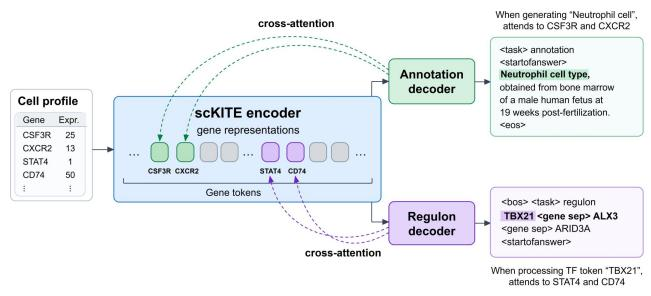

b  
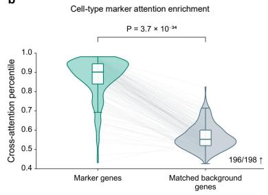

c  
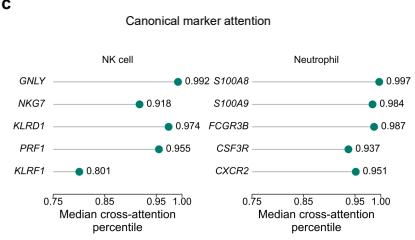  
d

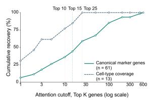  
e

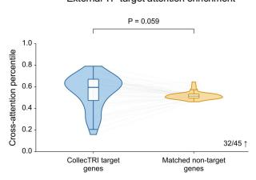

f  
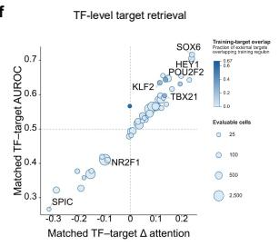

g  
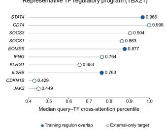

h  
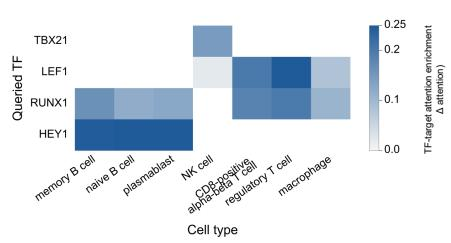  
Fig. 5 | Knowledge-guided pretraining encodes cell identity and gene regulatory information in scKITE representations. a, Overview of the cross-attention-based interpretation strategy for scKITE. Decoder cross-attention between the annotation/regulon decoders and the shared encoder representations enables identification of genes associated with cell identity and transcription factor regulatory programs. b, Enrichment of cell-type marker genes in annotation-decoder cross-attention compared with matched background genes across evaluable cell types. c, Crossattention ranking of canonical marker genes in representative NK-cell and neutrophil populations. d, Recovery of canonical marker genes from annotation-decoder cross-attention rankings. e, Enrichment of CollecTRI-supported TF target genes in regulon-decoder cross-attention compared with matched non-target genes. f, TF-level evaluation of regulatory target retrieval. Each point represents an evaluated TF, with target-discrimination performance summarized by TF-target attention enrichment and AUROC. g, Representative TBX21 regulatory program revealed by regulondecoder cross-attention. Genes are ranked according to their TF-associated attention, with externally supported targets highlighted. h, Cell-type-dependent TF-target attention enrichment across diferent cellular contexts.

Beyond the knowledge sources explored in scKITE, future biological foundation models may benefit from integrating additional biological evidence, including perturbation-derived causal relationships, chromatin accessibility, TF-binding measurements, curated regulatory resources, and more standardized experimentally grounded descriptions of cellular states. Ultimately, the development of biologically informed foundation models will require systematic exploration of both which biological knowledge should be incorporated and how such knowledge should shape representation learning.

## Acknowledgements

This work was supported by the National Natural Science Foundation of China (Grant No. 32673723), the China Agriculture Research System (CARS-35), and the 2115 Talent Development Program of China Agricultural University.

## Author Contributions

Hanqing Zhang led the architecture design and overall study. Jie Bao contributed to model development, computational experiments, downstream task design and algorithmic evaluation. Mei Ma, Shuai Liu, Jiaying Ma, Jiaguan Liu, Jiaxiao Li, Zhenbo Li and Wenwen Gong contributed to data analysis, interpretation and manuscript revision. Zhijun Cao supervised the research and contributed to the overall study design.

## Declaration of Interests

The authors declare no competing interests.

## References

1. Macosko, E. Z. et al. Highly Parallel Genome-wide Expression Profiling of Individual Cells Using Nanoliter Droplets. Cell 161, 1202–1214 (2015).

2. Zheng, G. X. Y., Terry, J. M., Belgrader, P., et al. Massively parallel digital transcriptional profiling of single cells. Nature Communications 8, 14049 (2017).

3. Regev, A., Teichmann, S. A., Lander, E. S., et al. The Human Cell Atlas. eLife 6, e27041 (2017).

4. Theodoris, C. V. et al. Transfer Learning Enables Predictions in Network Biology. Nature 618, 616–624 (2023).

5. Cui, H. et al. scGPT: Toward Building a Foundation Model for Single-Cell Multi-Omics Using Generative AI. Nature Methods 21, 1470–1480 (2024).

6. Hao, M. et al. Large-Scale Foundation Model on Single-Cell Transcriptomics. Nature Methods 21, 1481–1491 (2024).

7. Yang, F. et al. scBERT as a large-scale pretrained deep language model for cell type annotation of single-cell RNA-seq data. Nature Machine Intelligence 4, 852–866 (2022).

8. Wen, H. et al. CellPLM: Pre-Training of Cell Language Model Beyond Single Cells in International Conference on Learning Representations (2024).

9. Chen, H. et al. Scaling and Quantization of Large-Scale Foundation Model Enables Resource-Eficient Predictions in Network Biology. Nature Computational Science 6, 450–463 (2026).

10. Heimberg, G., Kuo, T., DePianto, D. J., et al. A cell atlas foundation model for scalable search of similar human cells. Nature 638, 1085–1094 (2025).

11. Rosen, Y. et al. Universal cell embedding provides a foundation model for cell biology. Nature 656, 183–191 (2026).

12. Gandhi, S. et al. Tahoe-x1: Scaling Perturbation-Trained Single-Cell Foundation Models to 3 Billion Parameters. bioRxiv (2025).

13. DenAdel, A. et al. Evaluating the Role of Pretraining Dataset Size and Diversity on Single-Cell Foundation Model Performance. Nature Methods (2026).

14. Kaplan, J. et al. Scaling Laws for Neural Language Models 2020. arXiv: 2001 . 08361 [cs.LG].

15. Dupire, L. et al. Fifteen challenges for generative AI applications to cell biology. Cell (2026).

16. Chang, Y. et al. Tracing the Rise of Biomedical Foundation Models. Nature Biotechnology, 1–4 (2026).

17. Schaefer, M. et al. Multimodal Learning Enables Chat-Based Exploration of Single-Cell Data. Nature Biotechnology (2025).

18. Zhao, S., Zhang, J., Wu, Y., Luo, Y. & Nie, Z. LangCell: Language-Cell Pre-training for Cell Identity Understanding in Proceedings of the 41st International Conference on Machine Learning 235 (PMLR, 2024), 61159–61185.

19. Levine, D. et al. Cell2Sentence: Teaching Large Language Models the Language ofBiology in Proceedings of the 41st International Conference on Machine Learning 235 (PMLR, 2024), 27299–27325.

20. Aibar, S. et al. SCENIC: Single-Cell Regulatory Network Inference and Clustering. Nature Methods 14, 1083–1086 (2017).

21. Van de Sande, B. et al. A Scalable SCENIC Workflow for Single-Cell Gene Regulatory Network Analysis. Nature Protocols 15, 2247–2276 (2020).

22. Bravo Gonzalez-Blas, C.´ et al. SCENIC+: single-cell multiomic inference of enhancers and gene regulatory networks. Nature Methods 20, 1355–1367 (2023).

23. Chan, Z. et al. The CELLxGENE Census: a large-scale reference dataset for single-cell genomics. Nature Methods 21, 209–218 (2024).

24. Dom´ınguez Conde, C. et al. Cross-Tissue Immune Cell Analysis Reveals Tissue-Specific Features in Humans. Science 376, eabl5197 (2022).

25. Norman, T. M. et al. Exploring Genetic Interaction Manifolds Constructed from Rich Single-Cell Phenotypes. Science 365, 786–793 (2019).

26. Replogle, J. M. et al. A scalable platform for the development of single-cell perturbation screens. Nature Genetics 54, 1418–1429 (2022).

27. Stuart, T. et al. Comprehensive integration of single-cell data. Cell 177, 1888–1902 (2019).

28. Wilcoxon, F. Individual comparisons by ranking methods. Biometrics Bulletin 1, 80–83 (1945).

29. Hu, C. et al. CellMarker 2.0: an updated database of manually curated cell markers in human/mouse and web tools based on scRNA-seq data. Nucleic Acids Research 51, D870– D876 (2023).

30. M¨uller-Dott, S. et al. Expanding the coverage of regulons from high-confidence prior knowledge for accurate estimation of transcription factor activities. Nucleic Acids Research 51, 10934–10949 (2023).

31. Moerman, T. et al. GRNBoost2 and Arboreto: eficient and scalable inference of gene regulatory networks. Bioinformatics 35, 2159–2161 (2019).

32. Tabula Sapiens Consortium. The Tabula Sapiens: A Multiple-Organ, Single-Cell Transcriptomic Atlas of Humans. Science 376, eabl4896 (2022).

33. Luecken, M. D. et al. Benchmarking Atlas-Level Data Integration in Single-Cell Genomics. Nature Methods 19, 41–50 (2022).

34. Schirmer, L. et al. Neuronal Vulnerability and Multilineage Diversity in Multiple Sclerosis. Nature 573, 75–82 (2019).

35. Cheng, S. et al. A Pan-Cancer Single-Cell Transcriptional Atlas of Tumor Infiltrating Myeloid Cells. Cell 184, 792–809.e23 (2021).

36. Siletti, K. et al. Transcriptomic Diversity of Cell Types Across the Adult Human Brain. Science 382, eadd7046 (2023).

37. CZI Cell Science Program, Abdulla, S., Aevermann, B., Assis, P., Badajoz, S., et al. CZ CELLxGENE Discover: A Single-Cell Data Platform for Scalable Exploration, Analysis and Modeling of Aggregated Data. Nucleic Acids Research 53, D886–D900 (2025).

38. Acera-Mateos, M. et al. Systematic Evaluation of Single-Cell Multimodal Data Integration Enhances Cell Type Resolution and Discovery of Clinically Relevant States in Complex Tissues. Genome Biology 27, 64 (2026).

39. Edgar, R. D. et al. Single-Cell Atlas of Human Pediatric Liver Reveals Age-Related Hepatic Gene Signatures. Hepatology Communications 9, e0813 (2025).

40. Lotfollahi, M. et al. Mapping Single-Cell Data to Reference Atlases by Transfer Learning. Nature Biotechnology 40, 121–130 (2022).

41. Wei, Z. et al. Benchmarking algorithms for generalizable single-cell perturbation response prediction. Nature Methods 23, 451–464 (2026).

42. Hie, B., Cho, H., DeMeo, B., Bryson, B. & Berger, B. Geometric Sketching Compactly Summarizes the Single-Cell Transcriptomic Landscape. Cell Systems 8, 483–493.e7 (2019).

43. Loshchilov, I. & Hutter, F. Decoupled Weight Decay Regularization in International Conference on Learning Representations (2019).

44. Traag, V. A., Waltman, L. & van Eck, N. J. From Louvain to Leiden: guaranteeing wellconnected communities. Scientific Reports 9, 5233 (2019).

45. McInnes, L., Healy, J., Saul, N. & Großberger, L. UMAP: Uniform Manifold Approximation and Projection. Journal of Open Source Software 3, 861 (2018).

46. Roohani, Y., Huang, K. & Leskovec, J. Predicting Transcriptional Outcomes of Novel Multigene Perturbations with GEARS. Nature Biotechnology 42, 927–935 (2024).

47. Benjamini, Y. & Hochberg, Y. Controlling the False Discovery Rate: A Practical and Powerful Approach to Multiple Testing. Journal of the Royal Statistical Society: Series B (Methodological) 57, 289–300 (1995).

# Supplementary Methods

## 1 Pretraining data construction

## 1.1 Transcriptomic pretraining corpus

The transcriptomic pretraining corpus was derived from the CELLxGENE component of the CellWhisperer dataset [17]. In the original CellWhisperer pipeline, cells within individual CELLxGENE datasets were grouped according to available metadata and averaged to generate pseudo-bulk transcriptomic profiles, yielding 376,983 human transcriptome–annotation pairs. For scKITE, we extracted the gene identities, corresponding expression values and matched naturallanguage annotations from these profiles. The corpus was divided into 358,134 training profiles and 18,849 profiles retained as a fixed validation set.

## 1.2 Natural-language annotations

Natural-language annotations were obtained directly from the CellWhisperer-derived CELLxGENE corpus [17]; no additional large language model was used to regenerate them. In the original CellWhisperer curation pipeline, metadata associated with each pseudo-bulk profile were condensed into concise biological descriptions containing information such as cell identity, tissue or organ of origin, disease or physiological condition and available donor characteristics. These pre-generated descriptions were used as annotation supervision during Stage 2 pretraining.

## 1.3 Regulatory knowledge construction

Regulatory supervision was constructed using pySCENIC following its standard workflow of co-expression network inference, cis-regulatory motif enrichment and regulon activity scoring [20, 21]. GRNBoost2 was first used to infer candidate transcription factor (TF)–target associations and corresponding interaction importance scores [31]. The resulting regulatory modules were refined using cisTarget motif enrichment. Motif-supported targets associated with the same TF were merged to define a single TF-centered regulon. When the same TF–target relationship was supported by multiple motif-derived sets, the maximum GRNBoost2 importance score was retained. Targets within each regulon were ordered by decreasing interaction importance.

Regulon activity was quantified for each transcriptomic profile using AUCell. A regulonspecific activity threshold was estimated from the distribution of AUCell scores across profiles. Regulon � was considered active in profile � when

$$
\mathrm { A U C } _ { c , r } > \tau _ { r } ,\tag{1}
$$

where $\tau _ { r }$ denotes the regulon-specific activity threshold. Regulons with invariant AUCell scores across profiles were excluded, leaving 530 informative regulons. Each retained regulon was assigned a unique identifier in a global regulon lookup table, and each transcriptomic profile retained its active regulon identifiers and corresponding AUCell scores.

TFs and target genes were mapped to the global gene vocabulary. During Stage 2 data construction, a profile-specific target set was generated for each active regulon by intersecting its globally defined target set with genes expressed in the corresponding transcriptomic profile, while preserving the global interaction-importance ordering. Active regulons with no remaining expressed targets were excluded from decoder supervision for that profile.

During training, up to three eligible active regulons were selected for each profile using an epoch-aware cyclic-without-replacement strategy. For each profile, a stable permutation of eligible regulons was defined, and the selection window was shifted across epochs so that diferent regulons were presented over training without duplication within a given selection. Validation used a fixed deterministic selection.

The TFs of the selected regulons first formed a query sequence separated by <gene sep> tokens. The sequence was preceded by the <task> token and the task identifier regulon, followed by <startofanswer>. The corresponding regulons were then serialized autoregressively, with each TF followed by a <arrow> token and its importance-ranked profile-specific target genes. Individual regulons were separated by <regulon sep>, and the complete sequence terminated with <eos>:

<task> regulon $\mathrm { T F } _ { 1 }$ <gene sep> $\mathrm { T F } _ { 2 }$ <gene sep> $\mathrm { T F } _ { 3 }$ <startofanswer>

$$
\mathrm { T F } _ { 1 } < \mathrm { a r r o w } > g _ { 1 , 1 } , . . . , g _ { 1 , n _ { 1 } } < \mathrm { r e g u l o n } _ { - } s \mathrm { e p } >
$$

$$
\mathrm { T F } _ { 2 } < \mathrm { a r r o w } > g _ { 2 , 1 } , . . . , g _ { 2 , n _ { 2 } } < \mathrm { r e g u l o n } . 5 \mathrm { e p } >
$$

$$
\mathrm { T F } _ { 3 } < \mathrm { a r r o w } > g _ { 3 , 1 } , . . . , g _ { 3 , n _ { 3 } } < \tt e o s > .
$$

When the complete target sequence exceeded the available decoder context, the target-token budget was distributed across the selected regulons in a round-robin manner while preserving the within-regulon interaction-importance ordering.

## 2 Downstream benchmark datasets

## 2.1 Cell type classification datasets

Tabula Sapiens. The Tabula Sapiens dataset was obtained from the publicly available Tabula Sapiens human cell atlas [32]. Cells from blood, bone marrow, lung, mammary and thymus with valid cell type annotations were retained, yielding 143,133 cells across 75 cell types. Cells were stratified by cell type and divided into training, validation and test sets at a ratio of 80%, 10% and 10%, respectively.

Human pancreas. The human pancreas dataset was obtained from a publicly available processed human pancreas single-cell dataset [33], comprising five independent scRNA-seq studies and 16,382 cells across 14 cell types. Cells from two studies were used to construct the training and validation sets, containing 11,705 and 2,347 cells, respectively, whereas cells from the remaining three studies formed the 2,330-cell test set.

Multiple sclerosis. The multiple sclerosis dataset was originally obtained from the EMBL-EBI Single Cell Expression Atlas under accession E-HCAD-35 [34]; we used the preprocessed version released with scGPT [5]. After removal of cell types present only in the MS subset, the dataset contained 21,312 cells across 18 cell types, including 7,844 cells from nine healthy controls and

13,468 cells from 12 individuals with MS. Seven healthy individuals were used for training, two for validation and all 12 MS individuals for testing.

Tumor-infiltrating myeloid. The tumor-infiltrating myeloid dataset was originally obtained from GEO accession GSE154763 [35]; we used the preprocessed version released with scGPT [5]. Six cancer-associated groups (UCEC, PAAD, THCA, LYM, cDC2 and kidney) formed the reference subset and three groups (MYE, OV-FTC and ESCA) formed the query subset. The reference subset contained 9,748 cells and was divided 80:20 into training and validation sets; all 3,430 query cells were retained for testing.

Cross-tissue Immune Cell Atlas. The cross-tissue immune dataset was obtained from the Cross-tissue Immune Cell Atlas [24]. The processed dataset contained 324,458 cells from nine tissue environments and 43 annotated immune-cell types. Six tissues (252,520 cells) were used for training, lung (35,419 cells) for validation, and liver together with mesenteric lymph node (36,519 cells) for testing.

## 2.2 Batch integration datasets

Perirhinal cortex. The perirhinal cortex dataset was derived from the adult human brain transcriptomic atlas of Siletti et al. [36]; we used the processed version released with scGPT [5]. Two assay-defined technical batches, 10X222 1 and 10X222 2, contained 8,465 and 9,070 cells, respectively. The dataset contained 17,535 cells, 59,357 genes and 10 annotated cell types and was used for cross-assay integration.

Renal. The renal dataset was obtained from CZ CELLxGENE Discover [37] for the multimodal renal cortex benchmark [38]. It contained 97,125 cells from 19 donors across 35 annotated cell types. Cells were grouped by assay into 10x 3′ v3, 10x 5′ v1 and 10x multiome batches containing 35,513, 7,813 and 53,799 cells, respectively, and were used for cross-assay integration.

Liver. The liver dataset was obtained from CZ CELLxGENE Discover [37] and corresponds to the human pediatric and adult liver atlas of Edgar et al. [39]. The dataset contained 69,032 cells from 16 donors, including nine pediatric and seven adult donors, across 19 annotated cell types. Donor identity was used as the batch variable for cross-donor integration. Because liver-lobe distribution was imbalanced across donors, results were interpreted as reduction of donor-associated variation while preserving cell type structure rather than complete removal of all donor-related biological diferences.

COVID-19. The COVID-19 dataset was derived from the single-cell reference-mapping dataset assembled by Lotfollahi et al. [40], and we used the processed version released with scGPT [5]. The original integrated dataset contained 274,346 cells and 18,474 genes from lung tissue, PBMCs and bone marrow and was subsampled to 20,000 cells. Following the scGPT benchmark, the processed dataset was organized into 18 distinct study/sample-level batches, which were used as batch identities for integration evaluation.

## 2.3 Perturbation prediction datasets

Norman. The Norman dataset was obtained from the CRISPRa Perturb-seq study of Norman et al. [25]. It contains K562 cells subjected to 105 single-gene and 131 two-gene perturbations, with each perturbation measured in approximately 300–700 cells. Perturbation conditions were partitioned according to the GEARS simulation split for evaluation of seen and unseen perturbations.

Replogle. The Replogle dataset was derived from the single-cell CRISPR-interference perturbation experiments of Replogle et al. [26]. We used the processed version included in the perturbationgeneralization benchmark of Wei et al. [41], which was obtained from the PerturBase database. Replogle represents one of the single-gene perturbation experiments from the original study and contains 105 genetic perturbations and 102,148 cells after benchmark preprocessing. This dataset was used to evaluate model generalization to previously unseen single-gene perturbations.

## 3 Model architecture and representations

## 3.1 Model input

scKITE used a unified global vocabulary containing gene tokens, text tokens and task-specific structural tokens. Gene symbols or Ensembl identifiers were mapped to global gene-token IDs, while natural-language annotations were tokenized with the biomedical text tokenizer and mapped into the same global ID space. Structural tokens included <cls>, <task>, <startofanswer>, <arrow>, <gene sep>, <regulon sep> and <eos>.

For each transcriptomic profile, genes with expression values greater than zero were retained and ordered in descending expression order, with ties resolved by ascending gene-token ID. Up to 2,048 expressed genes were retained and a <cls> token was prepended, yielding a maximum sequence length of 2,049 tokens. Positive expression values were quantile-binned independently within each profile into 50 non-zero levels, with zero reserved for non-expressed values, resulting in 51 expression levels in total.

For masked-expression reconstruction, gene identities were retained at selected positions while their expression values were replaced by a dedicated mask value. The <cls> and padding positions were excluded from masking. The masking probability was 30% in Stage 1 and 10% in Stage 2.

For each input position �, gene identity, expression level and masking status were combined by element-wise addition,

$$
{ \bf x } _ { i } = { \bf e } _ { i } ^ { \mathrm { g e n e } } + { \bf e } _ { i } ^ { \mathrm { e x p r } } + { \bf e } _ { i } ^ { \mathrm { m a s k } } ,\tag{2}
$$

where gene identities were represented by learnable gene embeddings, expression values were projected into the model hidden space by a multilayer value encoder, and a learnable binary mask embedding indicated whether the corresponding expression value had been masked.

## 3.2 Encoder

The scKITE backbone consists of 12 pre-normalization Transformer encoder blocks with a hidden dimension of 512 and eight attention heads. Each block contains multi-head self-attention followed by a position-wise feed-forward network with an intermediate dimension four times the hidden size. Residual connections are applied around both modules, with GELU activation and dropout of 0.1.

A final layer-normalization operation is applied after the last block. For an input sequence X, the encoder produces contextualized hidden states

$$
\mathbf { H } = [ \mathbf { h } _ { \mathrm { c l s } } , \mathbf { h } _ { 1 } , \dots , \mathbf { h } _ { n } ] = \mathrm { E n c o d e r } ( \mathbf { X } ) .\tag{3}
$$

## 3.3 Knowledge decoders

Stage 2 introduces two task-specific autoregressive decoders: a regulon decoder and an annotation decoder. The decoders have the same architecture but independent parameters. Each consists of two Transformer decoder blocks with a hidden dimension of 512 and eight attention heads. Each block contains causal self-attention, encoder–decoder cross-attention and a feed-forward network. Decoder hidden states act as cross-attention queries, whereas the complete encoder hidden-state sequence H provides keys and values. The regulon decoder generates profile-specific TF–target sequences and the annotation decoder generates the paired natural-language description. The two branches use independent positional embeddings and output heads.

## 3.4 Learned representations

The final encoder hidden state corresponding to <cls> was used as the cell representation,

$$
\mathbf { z } _ { \mathrm { c e l l } } = \mathbf { h } _ { \mathrm { c l s } } ,\tag{4}
$$

whereas the hidden state associated with each expressed gene was retained as its contextual gene representation,

$$
\mathbf { z } _ { g _ { i } } = \mathbf { h } _ { i } .\tag{5}
$$

Because token-level hidden states depend on the complete transcriptomic context, the same gene can acquire diferent representations across cellular states. Cell embeddings were used for cell-level analyses, whereas contextual gene embeddings were used for perturbation prediction and gene-level regulatory analyses.

## 4 Two-stage pretraining strategy

## 4.1 Stage 1: transcriptomic self-supervised pretraining

Stage 1 trained the shared Transformer encoder using masked-expression reconstruction alone. For each profile, 30% of valid gene positions were selected for masking. Gene identities were retained, whereas their binned expression values were replaced by the mask value. A regression head predicted the original expression levels from the corresponding encoder hidden states. The reconstruction loss was

$$
\mathcal { L } _ { \mathrm { e x p r } } = \frac { 1 } { \vert \mathcal { M } \vert } \sum _ { i \in \mathcal { M } } ( \hat { x } _ { i } - x _ { i } ) ^ { 2 } ,\tag{6}
$$

where M denotes the masked positions. The resulting Stage 1 encoder checkpoint was used to initialize Stage 2.

## 4.2 Stage 2: knowledge-enhanced pretraining

Stage 2 initialized the encoder from the Stage 1 checkpoint and jointly optimized the trainable encoder, regulon decoder and annotation decoder. Masked-expression reconstruction was retained with the masking probability reduced to 10%. In parallel, the regulon decoder generated profile-specific regulon sequences and the annotation decoder generated paired natural-language descriptions. Both decoder objectives were optimized using autoregressive token-level cross-entropy losses with teacher forcing, and were jointly optimized with the masked-expression reconstruction objective.

For the annotation decoder, the loss was defined as

$$
\mathcal { L } _ { \mathrm { a n n } } = - \frac { 1 } { T _ { \mathrm { a n n } } } \sum _ { t = 1 } ^ { T _ { \mathrm { a n n } } } \log P ( y _ { t } ^ { \mathrm { a n n } } | y _ { < t } ^ { \mathrm { a n n } } , H ) ,\tag{7}
$$

where � denotes encoder hidden states and $y _ { t } ^ { \mathrm { a n n } }$ denotes the �-th annotation token.

Similarly, the regulon decoder objective was defined as

$$
\mathcal { L } _ { \mathrm { r e g } } = - \frac { 1 } { T _ { \mathrm { r e g } } } \sum _ { t = 1 } ^ { T _ { \mathrm { r e g } } } \log P ( y _ { t } ^ { \mathrm { r e g } } | y _ { < t } ^ { \mathrm { r e g } } , H ) ,\tag{8}
$$

where ${ y } _ { t } ^ { \mathrm { r e g } }$ represents the �-th regulon token.

The three objectives were jointly optimized using the following Stage 2 training objective:

$$
\mathcal { L } _ { \mathrm { S t a g e 2 } } = \lambda _ { \mathrm { e x p r } } \mathcal { L } _ { \mathrm { e x p r } } + \lambda _ { \mathrm { r e g } } \mathcal { L } _ { \mathrm { r e g } } + \lambda _ { \mathrm { a n n } } \mathcal { L } _ { \mathrm { a n n } } ,\tag{9}
$$

where $\lambda _ { \mathrm { e x p r } } , \lambda _ { \mathrm { r e g } }$ and $\lambda _ { \mathrm { a n n } }$ control the relative contributions of transcriptomic reconstruction, regulon supervision and annotation supervision, respectively. All loss weights were set to 1 in our experiments.

## 4.3 Encoder extraction after pretraining

The regulon and annotation decoders were used only during Stage 2 pretraining. After pretraining, both decoders were discarded and downstream applications used only the shared scKITE encoder. Consequently, downstream inference requires only transcriptomic input and does not require natural-language annotations or regulon targets.

## 5 Pretraining data scaling analysis

To assess how pretraining data scale afected downstream performance, we constructed a series of nested subsets from the full training pool. The training pool contained 358,134 transcriptomic profiles, while a fixed validation set of 18,849 profiles was held out from all subset construction and used consistently across scaling experiments. We evaluated pretraining fractions of 10%, 25%, 50% and 100%, corresponding to 35,813, 89,534, 179,067 and 358,134 training profiles, respectively.

To reduce transcriptomic redundancy while preserving the global structure of the expression space, subsets were constructed using nested geometric sketching [42]. Raw expression profiles were library-size normalized to $1 0 { , } 0 0 0$ counts per profile and log-transformed. The 4,000 most variable genes were retained, and the expression matrix was projected into a 50-dimensional latent space using truncated singular value decomposition (SVD). Geometric sketching was then applied in this shared space to select representative profiles spanning the transcriptomic manifold. A fixed hierarchy of geometric regions and within-region sample rankings was used to generate strictly nested subsets,

$$
S _ { 1 0 \% } \subset S _ { 2 5 \% } \subset S _ { 5 0 \% } \subset S _ { 1 0 0 \% } .
$$

Thus, increasing the pretraining fraction added new profiles without replacing profiles retained at smaller fractions.

For each data fraction, Stage 1 pretraining was performed independently from random initialization using the corresponding subset. Stage 2 knowledge-enhanced pretraining was then initialized from the matched Stage 1 checkpoint. Model architecture, masking strategy, optimization settings and validation data were held constant across data fractions. Rather than comparing models after an identical number of epochs, training was continued until validation performance approached convergence, reducing the confounding efect of fewer optimization steps in smaller datasets.

Scaling behaviour was evaluated using three representative downstream tasks: cell type annotation, batch integration and genetic perturbation-response prediction. Cell type annotation performance was summarized as the mean of accuracy, macro-F1, precision and recall. Perturbationresponse prediction was summarized using the overall Top-20 diferentially expressed gene mean squared error (Top-20 DE MSE). Batch integration performance was summarized using a composite integration score,

$$
P _ { \mathrm { i n t e g r a t i o n } } = 0 . 6 \mathrm { A v g B I O } + 0 . 4 \mathrm { A v g B A T C H } ,
$$

which assigns greater weight to biological conservation while retaining batch-mixing performance.

To compare scaling trends across tasks with diferent metric ranges and directions, each task-specific score was normalized to the corresponding full-data scKITE result. For metrics in which larger values indicate better performance,

$$
P _ { \mathrm { n o r m } } ( f ) = \frac { P ( f ) } { P _ { \mathrm { s c K I T E , 1 0 0 \% } } } ,
$$

whereas for error metrics in which smaller values indicate better performance,

$$
P _ { \mathrm { n o r m } } ( f ) = \frac { P _ { \mathrm { s c K I T E , 1 0 0 \% } } } { P ( f ) } .
$$

Here, $f$ denotes the fraction of the full pretraining corpus. The same full-data scKITE reference was used for both scKITE and scKITE (w/o knowledge enhancement). The normalized scores from the three downstream tasks were then averaged with equal weight to obtain the mean normalized downstream performance used for scaling analysis. To summarize performance across the three downstream tasks, we further defined the mean normalized downstream performance at each pretraining fraction as

$$
P _ { \mathrm { o v e r a l l } } ( f ) = { \frac { 1 } { 3 } } \left[ P _ { \mathrm { n o r m } } ^ { \mathrm { a n n o t a t i o n } } ( f ) + P _ { \mathrm { n o r m } } ^ { \mathrm { i n t e g r a t i o n } } ( f ) + P _ { \mathrm { n o r m } } ^ { \mathrm { p e r t u r b a t i o n } } ( f ) \right] .
$$

The three tasks were assigned equal weight. This overall score was calculated separately for scKITE and scKITE (w/o knowledge enhancement) at each pretraining fraction, using the full-data

scKITE model as the common normalization reference. The resulting scores were used to generate the two scaling curves shown in Fig. 1a.

## 6 Downstream evaluation

## 6.1 Cell type classification and representation analysis

Cell type annotation was evaluated under zero-shot and full fine-tuning settings using the predefined training, validation and test partitions of each benchmark dataset. The label space was defined by the cell types present in the training split, and validation or test cells with labels absent from the training label space were excluded from evaluation.

For zero-shot annotation, the pretrained encoder was frozen and no trainable classification head or downstream optimization was introduced. The <cls> embedding of each training cell was used as the labeled reference set, whereas test cells were treated as queries. Each query was assigned the majority label among its five nearest reference embeddings using Euclidean distance in the unnormalized embedding space. The validation split was not used in this setting. Here, zero-shot annotation refers to prediction without parameter updates or a trained downstream neural classifier, while labeled training cells were used as references for the non-parametric nearest-neighbor classifier.

For full fine-tuning, a randomly initialized two-layer multilayer perceptron was attached to the <cls> representation, and the pretrained encoder and classification head were jointly optimized using multiclass cross-entropy. The classification head consisted of layer normalization, a linear layer, GELU activation, dropout, a second layer-normalization operation and a final linear classifier. Models were trained for up to 10 epochs using AdamW, mixed precision and gradient clipping [43]. The checkpoint with the lowest validation cross-entropy loss was evaluated once on the held-out test set. Performance under both settings was assessed using accuracy, macro-precision, macro-recall and macro-F1. Macro-averaged metrics were calculated across cell types represented in the test split, with undefined class-level values set to zero.

To further characterize the biological organization captured by the pretrained representations, cell embeddings were extracted from the final encoder <cls> state without task-specific fine-tuning. These analyses used manually curated annotations from the cross-tissue immune dataset, with doublets excluded. scKITE (w/o knowledge enhancement) and scKITE models were evaluated using identical cells and identical analysis procedures. Broad immune-cell categories defined by the dataset annotations are referred to here as immune compartments.

Three annotated immune compartments were considered: the B cell compartment, T and innate lymphoid cells, and the myeloid compartment. Six abundant, manually curated cell types were selected from each compartment, yielding 18 representative cell types. Cell-type centroids were calculated from the corresponding cell embeddings, and pairwise cosine distances between centroids were subjected to hierarchical clustering using average linkage with optimal leaf ordering. Each dendrogram was partitioned into three clusters, and the agreement between the resulting unsupervised clusters and the annotated immune compartments was quantified using adjusted Rand index (ARI) and normalized mutual information (NMI).

At the individual-cell level, cell pairs were grouped into three levels of biological relatedness: cells of the same type, cells of diferent types within the same immune compartment, and cells from diferent immune compartments. Up to 80 cells were randomly sampled from each cell type, and 12,000 cell pairs were sampled for each relationship level using a fixed random seed.

Identical cell pairs were used for both models. Cell embeddings were ℓ -normalized, pairwise cosine distances were calculated, and the resulting distributions were estimated using Gaussian kernel density estimation and visualized as ridgeline plots.

Directional cross-tissue retrieval was further evaluated across the nine tissues represented in the processed cross-tissue immune dataset. For each cell type within each tissue, a centroid was calculated from the corresponding cell embeddings. A cell-type centroid from a source tissue was used as the query and compared with cell-type centroids in a target tissue using cosine similarity. Candidate cell types were restricted to the same annotated immune compartment as the query to evaluate fine-grained cell identity beyond broad compartment separation. Comparisons were retained only when the query cell type was represented in both tissues and at least two candidate cell types were available in the target tissue. Retrieval was considered correct when the most similar target centroid corresponded to the same annotated cell type as the query. Top-1 retrieval accuracy was calculated separately for each directional source–target tissue pair, with self-tissue comparisons excluded.

## 6.2 Batch integration

Batch integration was evaluated to determine whether pretrained representations preserved biological cell type structure while reducing batch-associated variation. The four benchmark datasets covered three sources of unwanted variation: assay-associated variation in the Perirhinal cortex and Renal datasets, donor-associated variation in the Liver dataset, and study/sample-level batch variation in the COVID-19 dataset.

For each pretrained model, only the encoder-side representation modules were used and all model parameters were frozen. No fine-tuning, adversarial batch correction or downstream optimization was performed. Input preprocessing followed the corresponding pretraining procedure, and the final <cls> hidden state was used as the cell embedding. Embeddings were normalized to unit $\ell _ { 2 }$ norm before evaluation, while cell type and batch labels were used only for calculating integration metrics.

Biological conservation was evaluated using a 15-nearest-neighbor graph constructed from the normalized embeddings with Euclidean distance, followed by Leiden clustering at resolution 1.0 [44]. We calculated normalized mutual information (NMI), adjusted Rand index (ARI) and cell type average silhouette width $( \mathsf { A S W } _ { \mathsf { c e l l } } )$ , with silhouette values mapped from [−1, 1] to [0, 1]. These metrics were combined as

$$
\mathrm { A v g B I O } = \frac { \mathrm { N M I } + \mathrm { c l i p } ( \mathrm { A R I } , 0 , 1 ) + \mathrm { A S W } _ { \mathrm { c e l l } } } { 3 } .\tag{10}
$$

Batch mixing was evaluated within individual cell types to avoid rewarding the artificial mixing of biologically distinct populations. Only cell types containing at least 30 cells and represented in at least two batches were included. Within each eligible cell type, batch ASW was defined as

$$
\mathrm { A S W } _ { \mathrm { b a t c h } } = 1 - \left| \mathrm { S i l h o u e t t e } _ { \mathrm { b a t c h } } \right| ,\tag{11}
$$

and graph connectivity was calculated on the same 15-nearest-neighbor graph as the fraction of cells contained in the largest connected component of the corresponding cell type subgraph. Batch ASW and graph connectivity were macro-averaged across eligible cell types and combined as

$$
\mathrm { A v g B A T C H } = \frac { \mathrm { A S W } _ { \mathrm { b a t c h } } + \mathrm { G r a p h C o n n } } { 2 } .\tag{12}
$$

Higher AvgBIO and AvgBATCH indicate stronger biological conservation and batch mixing, respectively. When a single summary metric was required, the overall integration score was calculated as

$$
\mathrm { O v e r a l l S c o r e } = 0 . 6 \times \mathrm { A v g B I O } + 0 . 4 \times \mathrm { A v g B A T C H } .\tag{13}
$$

UMAP projections were generated from the pretrained cell embeddings for qualitative visualization and colored according to cell type and batch annotations [45].

## 6.3 Genetic perturbation-response prediction

Genetic perturbation-response prediction was evaluated using GEARS as a shared downstream framework [46]. Contextual gene embeddings were extracted from frozen scKITE and baseline single-cell foundation models using control-cell expression profiles. These gene embeddings replaced the original gene embeddings in GEARS while keeping the perturbation embeddings, gene co-expression graph, Gene Ontology graph and prediction architecture unchanged. The original GEARS model with native gene embeddings was included as a baseline. All models were evaluated using the same data split and evaluation protocol.

Control-cell expression profiles were used for extracting gene embeddings to avoid information leakage from perturbed states. The extracted gene representations were aligned to the GEARS gene space, and only genes shared between the representation space and perturbation datasets were retained for downstream prediction.

The GEARS simulation splitting procedure was used with a random seed of 1. Initially, 75% of unique perturbation genes were assigned to the seen-gene set. Single-gene perturbations involving the remaining genes formed the unseen single test group. Double perturbations were assigned to combo-seen-0, combo-seen-1 or combo-seen-2 according to whether zero, one or two constituent genes belonged to the initial seen-gene set. For combinations of two seen genes, 75% of conditions were assigned to the initial training pool and the remainder to testing. A validation set was subsequently constructed from the initial training pool using the same splitting procedure with gene and combination retention fractions of 0.9. Evaluation used the saved split and subgroup assignments.

Each downstream model was trained for 15 epochs. The checkpoint with the lowest validation MSE on the top 20 diferentially expressed (DE) genes was selected for final testing.

Predicted and observed expression profiles were averaged separately across cells within each perturbation condition. Mean squared error (MSE) and Pearson correlation were calculated between predicted and observed condition-mean expression profiles over genes. Unless otherwise specified, prediction performance was evaluated using the top 20 DE genes. The benchmark-provided DE gene lists were used throughout; non-dropout analyses used the separately defined top-20 non-dropout DE gene lists. Condition-level metrics were macro-averaged with equal weight per original condition label for the complete test set and each perturbation subgroup.

Direction-correct recovery of top-20 DE genes was evaluated in the Norman dataset to assess whether predicted perturbation-responsive genes matched experimentally observed responses. For each perturbation condition, the observed and predicted top-20 DE gene sets were compared. A gene was considered correctly recovered only when it was shared between the two sets and exhibited the same direction of expression change relative to control. The recovery score was calculated as the fraction of correctly recovered genes among the 20 observed DE genes.

Genetic interaction magnitude analysis was performed following the GEARS interactionanalysis framework. For each double-gene perturbation $A + B$ , expression changes were calculated relative to control cells:

$$
\delta _ { A } = X _ { A } - X _ { c t r l } ,
$$

$$
\delta _ { B } = X _ { B } - X _ { c t r l } ,
$$

$$
\delta _ { A B } = X _ { A B } - X _ { c t r l } .
$$

The double-perturbation response was modeled using robust Theil–Sen regression without an intercept:

$$
\delta _ { A B } = c _ { A } \delta _ { A } + c _ { B } \delta _ { B } + \epsilon .
$$

The genetic interaction magnitude was defined as the Euclidean norm of the regression coeficients:

$$
{ \mathrm { G I ~ m a g n i t u d e } } = { \sqrt { c _ { A } ^ { 2 } + c _ { B } ^ { 2 } } } .
$$

Ground-truth genetic interaction magnitudes were calculated from observed expression profiles, whereas predicted magnitudes were calculated from model predictions. The agreement between predicted and ground-truth magnitudes was assessed using Pearson correlation across held-out double-gene perturbations.

## 7 Mechanistic interpretation

## 7.1 Annotation decoder cross-attention analysis

Marker genes were identified from the training set following commonly used single-cell marker identification strategies. For each cell type, one-versus-rest diferential-expression analysis was performed using a Wilcoxon rank-sum test [27, 28]. Genes were filtered based on Benjamini– Hochberg-adjusted significance [47], log-fold change, and detection frequency, and the top 30 genes were retained as the marker gene set. Expression and detection-frequency statistics used for background matching were calculated exclusively from the training set. Marker gene sets and matching statistics were fixed before evaluation on the validation set.

Decoder-to-encoder cross-attention was quantified in validation cells using the frozen scKITE encoder and annotation decoder without expression masking. For each cell, the cell-type span within the natural-language annotation was identified, and the corresponding decoder-to-encoder cross-attention weights were extracted. For a cell-type span containing � decoder tokens, attention weights were averaged across decoder positions and attention heads to obtain a raw gene-level attention score $s _ { g }$ for each input gene:

$$
s _ { g } = \frac { 1 } { T H } \sum _ { t = 1 } ^ { T } \sum _ { h = 1 } ^ { H } \alpha _ { t , h , g } ,
$$

where $\alpha _ { t , h , g }$ denotes the cross-attention weight from decoder position � and attention head ℎ to gene �, and � denotes the number of attention heads.

Raw attention scores were converted into within-cell percentile ranks to enable comparison among genes within each cell. For each gene �, the attention percentile was calculated as:

$$
p _ { g } = 1 - \frac { \mathrm { r a n k } ( s _ { g } ) - 1 } { N - 1 } ,
$$

where � represents the number of input genes in the cell and rank $\left( s _ { g } \right)$ denotes the descending rank of the raw attention score among all input genes. Higher $p _ { g }$ values indicate higher relative prioritization by the annotation decoder.

For each validation cell, marker-gene attention was summarized as the median attention percentile across available marker genes:

$$
A _ { \mathrm { m a r k e r } } = \mathrm { m e d i a n } \left( \{ p _ { g } | g \in G _ { \mathrm { m a r k e r } } \} \right) ,
$$

where $G _ { \mathrm { m a r k e r } }$ denotes the marker gene set identified from the training partition.

Matched background genes were selected from non-marker genes based on expression levels and detection frequencies calculated from the training set. Genes were independently divided into five groups according to mean expression and five groups according to detection frequency, resulting in a $5 \times 5$ matching grid. For each marker gene, background genes were sampled from the same expression-frequency bin while excluding genes belonging to the marker set. For each background sampling replicate, background attention was summarized as:

$$
A _ { \mathrm { b a c k g r o u n d } } ^ { ( i ) } = \mathrm { m e d i a n } \left( \{ p _ { g } | g \in G _ { \mathrm { b a c k g r o u n d } } ^ { ( i ) } \} \right) ,
$$

where � denotes the background sampling replicate. The final background attention score was calculated as the average across 20 matched-background replicates:

$$
A _ { \mathrm { b a c k g r o u n d } } = \frac { 1 } { 2 0 } \sum _ { i = 1 } ^ { 2 0 } A _ { \mathrm { b a c k g r o u n d } } ^ { ( i ) } .
$$

The attention enrichment score was defined as:

$$
\Delta A = A _ { \mathrm { m a r k e r } } - A _ { \mathrm { b a c k g r o u n d } } .
$$

Marker and matched-background attention scores were subsequently aggregated across cells belonging to the same cell type. Cell types represented by fewer than five evaluable cells were excluded, and paired marker versus matched-background attention values were compared using a two-sided Wilcoxon signed-rank test.

For complementary biological interpretation, canonical marker genes from 14 representative cell populations were manually curated from CellMarker 2.0 [29]. These canonical markers were used exclusively for visualization and interpretation of cell-type-specific attention patterns and were not used for defining training-derived marker genes or calculating the attention enrichment score.

## 7.2 Regulon decoder cross-attention analysis

To quantify regulatory information encoded in the shared representation, Regulon Decoder crossattention was analyzed using the fixed validation set. Active regulons were defined based on regulon activity scores calculated during preprocessing. For each transcriptomic profile, three active regulons were randomly selected from the detected active regulon set using a fixed random seed. Regulon identifiers were mapped to their corresponding transcription factors (TFs) using the regulon reference constructed during pretraining.

For each selected TF, the Regulon Decoder received only the TF query prefix without providing any target gene information:

<bos> <task> regulon TF1 <gene sep> TF2 <gene sep> TF3 <startofanswer>.

Each TF token was analyzed independently. Decoder-to-encoder cross-attention weights were extracted from the final decoder layer at positions corresponding to the queried TF tokens. Attention values were averaged across decoder attention heads and the corresponding TF query position to obtain a raw gene-level regulatory attention score $s _ { g } \mathrm { i }$

$$
s _ { g } = \frac { 1 } { H } \sum _ { h = 1 } ^ { H } \alpha _ { h , g } ,
$$

where $\alpha _ { h , g }$ denotes the cross-attention weight from attention head ℎ to encoder gene $^ { g , }$ , and � represents the number of attention heads.

Because raw attention values are normalized within each query position and depend on the distribution of attention across input genes, gene-level attention scores were converted into within-profile percentile ranks before comparison:

$$
p _ { g } = 1 - \frac { \mathrm { r a n k } ( s _ { g } ) - 1 } { N - 1 } ,
$$

where � represents the number of input genes in the profile and rank $\left( s _ { g } \right)$ denotes the descending rank of gene $g$ according to its regulatory attention score. Higher $p _ { g }$ indicates stronger relative prioritization of gene $g$ during TF query decoding.

External TF–target regulatory interactions were obtained from CollecTRI [30]. These interactions were used exclusively for external evaluation and were independent of the regulon annotations used during scKITE pretraining. For each queried TF, CollecTRI-supported target genes present in the encoder input were defined as external target genes:

$$
G _ { \mathrm { t a r g e t } } = G _ { \mathrm { C o l l e c T R I } } \cap G _ { \mathrm { e n c o d e r } } .
$$

Genes without CollecTRI-supported interactions for the queried TF were considered candidate non-target genes. To reduce potential confounding caused by gene abundance and detectability, expression and detection statistics were calculated exclusively from the training partition. Genes were independently divided into five bins according to mean expression level and five bins according to detection frequency, resulting in a $5 \times 5$ expression–detection matching grid. For each external target gene, an equal number of background genes were randomly sampled from non-target genes within the same expression–detection bin. Genes belonging to the CollecTRI target set, the corresponding pretraining regulon target set, and the queried TF gene itself were excluded from the background candidate pool. Background sampling was performed with replacement when necessary and repeated 20 times to reduce variation introduced by random background selection.

For each profile–TF pair, target-gene attention and matched-background attention were summarized as the median attention percentile across evaluated genes:

$$
A _ { \mathrm { t a r g e t } } = \mathrm { m e d i a n } \left( \{ p _ { g } | g \in G _ { \mathrm { t a r g e t } } \} \right) ,
$$

$$
A _ { \mathrm { b a c k g r o u n d } } ^ { ( i ) } = \mathrm { m e d i a n } \left( \{ p _ { g } | g \in G _ { \mathrm { b a c k g r o u n d } } ^ { ( i ) } \} \right) .
$$

The final matched-background attention score was calculated as:

$$
A _ { \mathrm { b a c k g r o u n d } } = \frac { 1 } { 2 0 } \sum _ { i = 1 } ^ { 2 0 } A _ { \mathrm { b a c k g r o u n d } } ^ { ( i ) } .
$$

Regulatory attention enrichment was defined as:

$$
\Delta A = A _ { \mathrm { t a r g e t } } - A _ { \mathrm { b a c k g r o u n d } } .
$$

Profile-level enrichment scores were subsequently aggregated at the TF level using the median across evaluable profiles:

$$
\Delta A _ { \mathrm { T F } } = \mathrm { m e d i a n } ( \Delta A _ { i } ) .
$$

TFs represented by fewer than 10 evaluable profiles were excluded. External target and matched-background attention values were compared across TFs using a two-sided paired Wilcoxon signed-rank test.

## 7.3 Cell-context-specific regulatory attention

To evaluate whether regulatory attention patterns depended on cellular context, profile-level regulatory enrichment scores were aggregated for each TF–cell type pair using the median across evaluable cells:

$$
\Delta A _ { \mathrm { T F , c e l l t y p e } } = \mathrm { m e d i a n } ( \Delta A _ { i } ) .
$$

TF–cell type combinations represented by fewer than three evaluable cells were excluded. TFs and cell types displayed in the heatmap were selected according to data coverage rather than enrichment magnitude. Positive values indicate preferential attention toward external TF targets compared with matched non-target genes, whereas missing combinations indicate insuficient evaluable profiles and were left uncolored rather than assigned zero values.