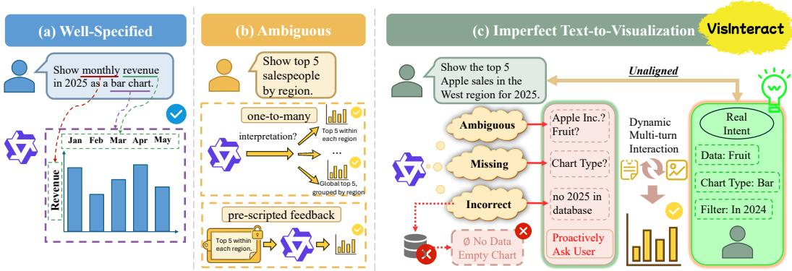
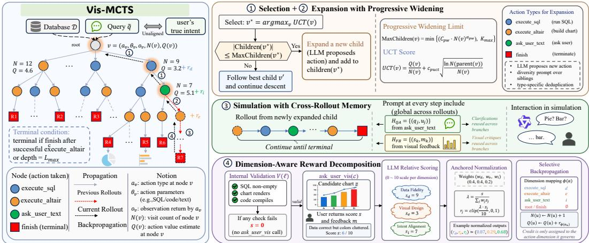
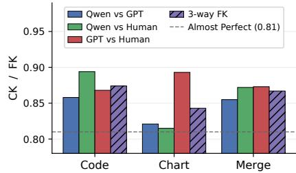
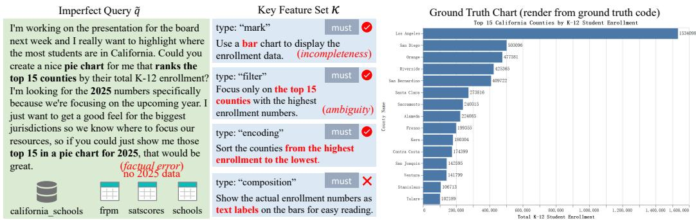
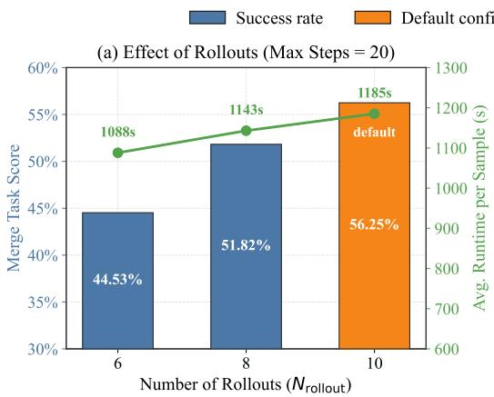
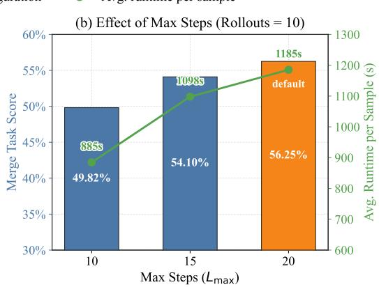
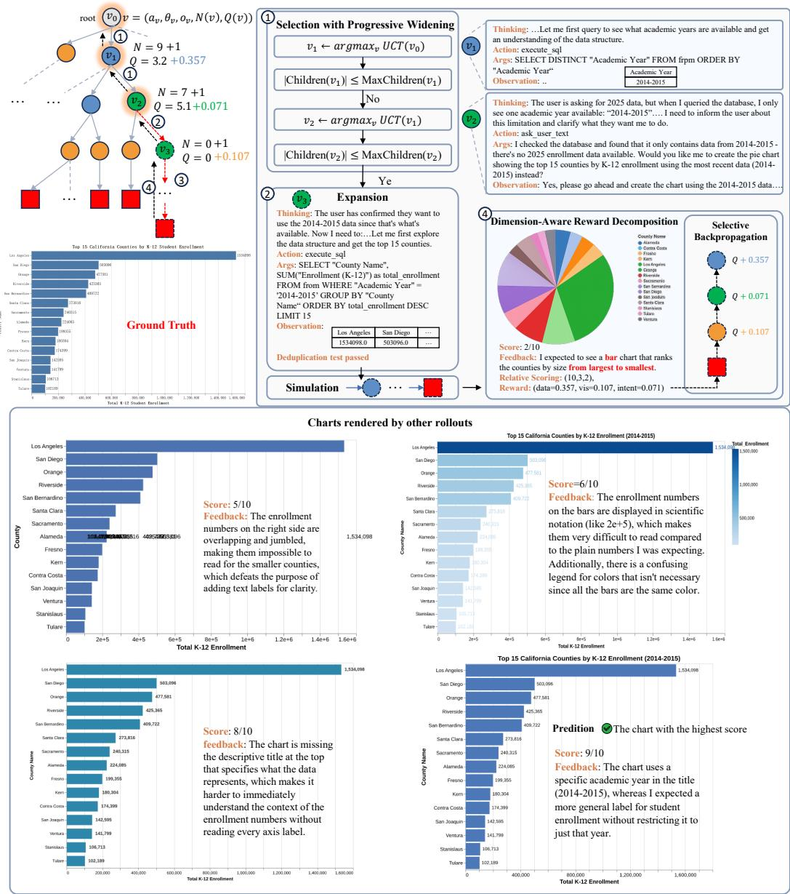
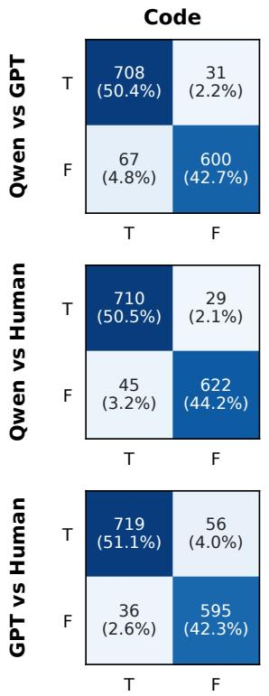
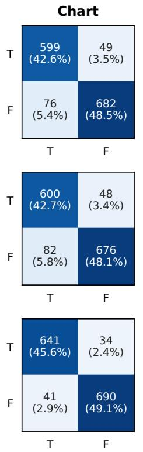
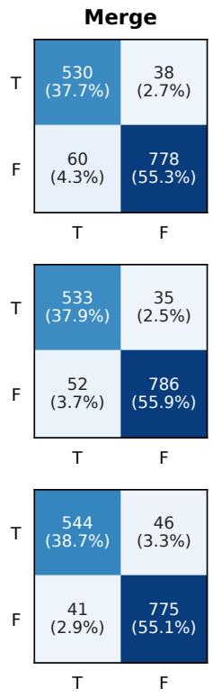

# VisInteract: Towards Dynamic Interactive Text-to-Visualization under Imperfect Queries

Wenxin Xu1∗ Jinwei Lu1∗ Hwanhee Kim1 Chen Jason Zhang1 Xiao-Yong Wei1 Haoyang Li1 Yuanfeng Song2 1The Hong Kong Polytechnic University 2ByteDance

## Abstract

Real-world visualization requests are routinely ambiguous, incomplete, or factually incorrect, yet existing Text-to-Visualization (Text-to-Vis) systems assume wellspecified inputs and produce charts in a single pass. When queries are imperfect, a system must interact with the user to recover the true intent, but no benchmark or method supports this dynamic process. We introduce VisInteract, a new paradigm that reframes Text-to-Vis as interaction-driven intent recovery, and VisInteract-Bench, to our knowledge, that is the first benchmark for dynamic interactive Textto-Vis, featuring controlled imperfection injection, a leakage-controlled User Agent for realistic multi-turn feedback, and dual-perspective (code and chart) automated evaluation. On the algorithmic side, we propose Vis-MCTS, a Monte Carlo Tree Search (MCTS) enhanced method, introducing improvements over classical MCTS, that Progressive Widening to tame the unbounded tool-argument space in tree search, cross-rollout information sharing so clarifications and critiques benefit the entire search tree, and Dimension-Aware Reward Decomposition that routes scalar user feedback along data-fidelity, visual-design, and intent-alignment dimensions to resolve credit assignment across heterogeneous actions. Extensive Experiments across two LLM backbones show that Vis-MCTS consistently outperforms all Text-to-Vis baselines, improving end-to-end task success by 13.40%–16.27% over the strongest interactive baseline and by more than 5× over non-interactive ones.

## 1 Introduction

Consider an analyst who types “Plot the monthly revenue ofour top-5 products in 2025, broken down by region.” The request looks well-specified, yet top-5 (by revenue or units?), whether refunds count, and even whether the database covers 2025 are all left implicit. Such under-specification is the rule rather than the exception in real Text-to-Vis usage [1, 2]. Without a way to ask, a single-pass system silently commits to one interpretation, producing a chart misaligned with the user’s true intent.

Text-to-Vis has advanced rapidly. On the method side, the field has progressed from sequenceto-sequence models targeting declarative grammars such as Vega-Lite or VQL [3], to LLM-based code generation [4–6], and most recently to agent-based pipelines [7–9]. On the benchmark side, NVBench [10] established the first large-scale NL-to-Vis benchmark, with subsequent work expanding through human-authored utterances [1], LLM-generated query-chart pairs [11, 12], and multi-chart reasoning [7]. Yet all assume the query already faithfully encodes the user’s true intent, with systems either rendering in a fixed pipeline or merely reacting to user-initiated edits, never proactively probing what is missing, ambiguous, or incorrect (Figure 1a, b). Once this assumption is relaxed, two fundamental challenges arise.

  
Figure 1: Comparison of Text-to-Vis paradigms. (a) Well-specified queries map to a single target chart. (b) Ambiguous queries admit multiple interpretations, that prior work uses static mappings or pre-scripted feedback. (c) VisInteract recovers user intent from imperfect queries through dynamic, multi-turn, multi-modal interaction.

Challenge 1: Existing benchmarks neither model imperfect inputs nor evaluate open-ended outputs. On the input side, real-world queries are routinely ambiguous, incomplete, or factually incorrect, yet current benchmarks remain single-turn [10, 13], pre-scripted [14], or limited to static feedback [9] (Figure 1b). Adjacent NL2SQL benchmarks such as BIRD-INTERACT [15] demonstrate the value of dynamic clarification, but no analogous benchmark exists for visualization, which further requires visual feedback on chart design. On the output side, unlike NL2SQL where result-set equivalence yields a clean correctness signal, visualization is inherently open-ended, and exactmatch or execution-equivalence metrics [10, 16, 17] penalize correct-but-different designs, conflating whether user requirements are met with how they are implemented.

Challenge 2: Existing methods cannot proactively explore users’ true intent through dynamic interactions. Pipeline approaches [4, 5, 7] render a single visualization without any user interaction, ambiguity-focused methods [13] merely enumerate a fixed candidate set without interaction, and feedback-based variants [9] react only to pre-scripted, user-initiated edits along one trajectory. None can recover from an imperfect initial hypothesis or systematically explore the design space, ultimately failing to converge on the user’s true intent.

These gaps motivate VisInteract, a paradigm that reframes Text-to-Vis as dynamic, interaction-driven intent recovery (Figure 1c), with the following contributions:

• VisInteract-Bench (§3), to our knowledge the first benchmark for dynamic interactive Text-to-Vis, combining controlled imperfection injection of ambiguity, incompleteness, and factual errors, a leakage-controlled User Agent that simulates realistic multi-turn feedback, and a dual-perspective evaluation in which an LLM-as-judge [18, 19] scores both the generated code and the rendered chart against user intent, avoiding over-penalization by exact-match metrics.

• Vis-MCTS (§4), a Monte Carlo Tree Search (MCTS) enhanced method for interactive intent recovery. Recovering intent demands backtracking from early misinterpretations and systematic exploration of alternative designs, which single-trajectory methods cannot provide but MCTS sup ports natively via branching expansion and feedback-driven rollouts. Yet vanilla MCTS faces three non-trivial obstacles here: each LLM tool-call admits unbounded textual arguments (SQL queries, code snippets, or natural-language questions), making the per-node action space combinatorially infinite and defeating vanilla MCTS’s exhaustive expansion; costly user clarifications gained on one rollout are wasted by other trajectories that explore in isolation; and a single scalar reward uniformly backpropagated mis-routes feedback across heterogeneous actions, e.g., a visual-design flaw can penalize a correct data query. We resolve each with a tailored innovation: Progressive Widening adaptively samples promising arguments to constrain the action space, cross-rollout information sharing propagates clarifications and critiques so every interaction benefits the whole tree, and Dimension-Aware Reward Decomposition splits the scalar feedback into data, visual, and intent exploration rewards, so each action node updates only on the dimension it governs.

Table 1: Comparison of Text-to-Vis benchmarks. To our knowledge, VisInteract-Bench is the first to combine dynamic interaction, multi-modal feedback, and explicitly imperfect queries.
<table><tr><td>Dataset</td><td>#Tables</td><td>#Samples</td><td>Interaction Type</td><td>Interaction Modality</td><td>NL Query Imperfect</td><td>Output Format</td><td>Construction</td></tr><tr><td>NLV Corpus [1]</td><td>3</td><td>814</td><td>x</td><td>x</td><td>t</td><td>Vega-Lite</td><td>Human</td></tr><tr><td>VL2NL [11]</td><td>1,981</td><td>3,962</td><td>x</td><td>x</td><td>t</td><td>Vega-Lite</td><td>LLM</td></tr><tr><td>VisEval [12]</td><td>748</td><td>2,524</td><td>x</td><td>x</td><td>x</td><td>VQL</td><td>LLM</td></tr><tr><td>NVBench [10]</td><td>780</td><td>25,750</td><td>x</td><td>x</td><td>x</td><td>VQL</td><td>Program</td></tr><tr><td>NVBench 2.0 [13]</td><td>780</td><td>24,076</td><td>x</td><td>x</td><td>t</td><td>VQL</td><td>LLM</td></tr><tr><td>MultiVis-Bench [7]</td><td>697</td><td>1,202</td><td>x</td><td>x</td><td>x</td><td>Python Code</td><td>Human+LLM</td></tr><tr><td>Dial-NVBench [14]</td><td>780</td><td>124,449</td><td>Static</td><td>Text</td><td>x</td><td>VQL</td><td>Program</td></tr><tr><td>NVBench-Feedback [9]</td><td></td><td>48,482</td><td>Static</td><td>Text</td><td>x</td><td>VQL</td><td>LLM</td></tr><tr><td>VisInteract-Bench</td><td>75</td><td>1,098</td><td>Dynamic</td><td>Text + Visual</td><td>√</td><td>Python Code</td><td>Human+LLM</td></tr></table>

• Empirical findings (§5), where Vis-MCTS consistently outperforms strong ReAct [20] and multi-agent [7, 9] baselines, and ablations confirm that proactive clarification, multi-trajectory exploration, and dimension-aware reward decomposition are each essential.

## 2 Task Definition

Unlike SQL, where a query has a unique result set, visualization admits multiple valid designs for the same analytical intent. We therefore represent user intent not as a single target chart, but as a set of keyfeatures that any satisfactory visualization must exhibit.

Key features. Let $\boldsymbol { K } = \{ k _ { 1 } , \dots , k _ { m } \}$ denote the user’s latent visualization intent, where each key feature $k _ { i } = ( \rho _ { i } , d _ { i } , \mu _ { i } )$ pairs a type $\rho _ { i } \in \mathcal { P }$ with a natural-language description $d _ { i }$ and a binary must flag $\mu _ { i } \in \{ 0 , 1 \}$ indicating whether satisfying $k _ { i }$ is mandatory $( \mu _ { i } = 1 )$ or merely preferred $( \mu _ { i } = 0 ) ;$ we write $\bar { \mathcal { K } } ^ { \mathrm { m u s t } } = \{ \bar { k } _ { i } \in \mathcal { K } : \mu _ { i } = 1 \}$ for the must-have subset. The type vocabulary $\mathcal { P } = \{ \mathtt { m a r k }$ , encoding, filter, aggregation, composition, interaction} follows the canonical primitives of the Grammar of Interactive Graphics [21], jointly spanning data-level transformations and visual-level specifications, with overlays such as statistical reference lines subsumed under composition. Together these six categories already cover the design decisions exercised by mainstream Text-to-Vis benchmarks [12, 13].

Traditional Text-to-Vis. Given a database D and a well-specified query q aligned with $\kappa ,$ the task is a mapping $f \colon ( \mathcal { D } , q ) \mapsto \mathcal { Y }$ producing visualization $\mathcal { V } = ( c , z )$ , where c is executable code and z is the corresponding rendered chart, such that $\mathcal { V } \models { \mathcal { K } }$ (or, in the relaxed sense, $\mathcal { V } \Vdash { \mathcal { K } } ^ { \mathrm { m u s t } } )$ , that is, both the code c and the rendered chart z satisfy every key feature in $\kappa$

VisInteract setting. In practice, the system receives an imperfect query $\tilde { q } = \pi ( \boldsymbol { \cal { K } } )$ , where projection π may omit, distort, or under-specify parts of K. Since π is not injective, q˜ is consistent with multiple plausible key-feature sets, making intent convergence through interaction necessary. We use Ω to denote the observation process, that the system can obtain indirect evidence about K through textual clarification or visual feedback, but it never observes K itself. VisInteract defines:

$$
g ^ { \Omega } \colon ( { \mathcal { D } } , { \tilde { q } } ) \mapsto { \mathcal { V } } \quad { \mathrm { s . t . } } \quad { \mathcal { V } } \models { \mathcal { K } } .
$$

Since K is never directly accessible, the system must decide when and what to ask through Ω, giving rise to a partially observable sequential decision problem (§4).

## 3 VisInteract-Bench

Table 1 summarizes the Text-to-Vis benchmark landscape. Prior datasets either assume well-specified inputs or offer only static interactions, and none combines dynamic multi-modal interaction, and imperfect queries. VisInteract-Bench fills this gap with 1,098 samples across 11 databases (75 tables in total) drawn from BIRD Mini-Dev [22].

Sample structure. As illustrated in Figure 4 (Appendix B), each sample is a tuple $( \tilde { q } , \kappa , \mathcal { D } )$ comprising the imperfect query q˜ exposed to the system, the latent key feature set $\kappa ,$ and the validated ground-truth visualization $\mathcal { V } .$ Key features K serve three roles simultaneously, namely 1) defining the user’s true intent and only exposed to the User Agent, 2) specifying the targets for imperfection injection, and 3) providing the criteria for automated evaluation.

Construction pipeline. A five-stage pipeline builds each sample. (1) Source data. 11 databases (75 tables in total) from BIRD Mini-Dev [22] spanning diverse domains (sports, entertainment, education, finance, healthcare, etc.) and schema complexities. (2) Candidate generation. For each source instance, an LLM grounded in parsed schema and SQL semantics, and steered by a global diversity tracker that biases it toward under-represented chart families and ambiguity templates, proposes $M = 1 0$ structured visualization candidates, which a per-instance diversity maximizer then prunes to $N = 5 . \ ( 3 )$ Ground-truth generation. For each candidate, the LLM produces chart-aligned SQL and Altair [23] code, executed in a sandbox with bounded repair loops; samples that fail SQL execution, chart contracts, or visual quality are discarded, and structured plus natural-language key features are extracted from the validated reference. (4) Controlled imperfection injection. An LLM rewrites the clear query by combining 1–3 of 14 ambiguity templates from three categories (ambiguity for multiple plausible readings, incompleteness for critical details dropped, and factual error for things like a non-existent column), and records the targeted Vega-Lite paths in an ambiguity profile. Crucially, injection occurs after validation, so every imperfect query retains a correct executable reference. (5) Quality control. Each candidate passes three automated checks, namely data shape (SQL result fits the chart contract), spec coverage (rendered chart matches $\ge 8 0 \%$ of the structured key features), and ambiguity strength (imperfect query is neither too explicit nor too vague against the ambiguity profile), followed by human review on naturalness, visual quality, and key-feature faithfulness. Only pass samples are kept and re-indexed, yielding 1,098 samples.

VisInteract-Bench is a zero-shot evaluation set. The full construction details and statistics are in Appendices B and C, respectively.

Leakage-controlled User Agent. The User Agent simulates a user who knows their intent (K, ground-truth code and chart) but never proactively reveals it. It exposes two complementary interfaces, guarding by access gating (which subset of K is visible) and a response policy (what the model may verbalize) to prevent ground-truth leakage. ask\_user $\_ \mathrm { t e x t } ( q _ { \mathrm { t e x t } } ) \to a _ { \mathrm { t e x t } }$ answers a textual question after a pre-filtering step in which a scanner LLM labels which key-feature types the question pertains $^ { \mathrm { t o , } }$ and only the matched features are exposed to the User Agent. ask\_user\_vis(c) → $( s , m )$ executes $c ,$ shows the rendered chart alongside the ground-truth chart to a VLM, and returns feedback $m$ on the most salient visual discrepancy which describes what is wrong, not how to fix, with a satisfaction score $s \in [ 1 , 1 0 ] \cap \mathbb { Z } ,$ exposing only visual-dimension features. The two are complementary: text resolves data-level ambiguity while vis captures visual perception. Pre-filtering thus confines each answer to the dimension implicated by the call, while a shared response policy mandates refusing any direct request for the ground-truth intent. Full prompts are in Appendix E.6.

Dual-judge evaluation. For each key feature $k \in \mathcal { K }$ , two complementary binary LLM-as-Judge [18, 24] decide whether a submission $\mathcal { V } = \left( c , z \right)$ satisfies k. The Code Judge $J _ { \mathrm { c o d e } } ( \overset { \cdot } { c } , k ) \in \{ 0 , 1 \}$ checks the predicted code c against k with line-level evidence, while the Chart Judge $J _ { \mathrm { c h a r t } } ( \tilde { z } , k ) \stackrel { \cdot } { \in } \{ 0 , 1 \}$ inspects the rendered chart z to verify k visually, catching code-invisible issues such as overlapping labels or mis-mapped colors. This yields three reporting perspectives:

$$
\sigma _ { \mathrm { c o d e } } ( k ) = J _ { \mathrm { c o d e } } ( c , k ) , \quad \sigma _ { \mathrm { c h a r t } } ( k ) = J _ { \mathrm { c h a r t } } ( z , k ) , \quad \sigma _ { \mathrm { m e r g e } } ( k ) = \sigma _ { \mathrm { c o d e } } ( k ) \wedge \sigma _ { \mathrm { c h a r t } } ( k ) .\tag{1}
$$

Over N samples, with ${ \cal K } _ { i } ^ { \mathrm { m u s t } } \subseteq { \cal K } _ { i }$ the must-have subset and $\sigma ( \cdot )$ ranging over the three perspectives in Eq. 1, we report KF Pass Rate $\smash { \bar { \lambda } } = \sum _ { i } \sum _ { k \in \mathcal { K } _ { i } } \sigma ( k ) / \sum _ { i } | \mathcal { K } _ { i } |$ (dataset-wide feature satisfaction), Strict Succes $\mathbf { s } = | \{ i : \sigma ( k ) = 1 \forall k \in K _ { i } ^ { \mathrm { m u s t } } \} | / N$ (samples passing every must-have feature), Task Score $= | \{ i : \sigma ( k ) { \stackrel { \cdot } { = } } 1 \forall k \in K _ { i } \} | / N$ (samples passing every feature), and Renderable Rate (percentage of submissions whose code executes and renders without error). We further analyze the reliability of our LLM-as-Judge in Section 5.4.

## 4 Vis-MCTS: Dynamic Interactive Text-to-Vis via Monte Carlo Tree Search

## 4.1 Overview

Figure 2 illustrates the complete Vis-MCTS framework. We model dynamic interactive Text-to-Vis as a partially observable sequential decision problem [25], that the system observes an imperfect query q˜ and a database D while the true user intent K remains latent, and adopt Monte Carlo Tree Search (MCTS) [26] as the underlying search backbone. We define the LLM agent’s action space be A = {execute\_sql, execute\_altair, ask\_user\_text, ask\_user\_vis, finish}. At each decision step t, the agent selects an action $a _ { t } \in \mathcal A$ conditioned on the accumulated history $\{ ( a _ { i } , o _ { i } ) | 0 < i < t \}$ , invokes the corresponding tool, and receives an observation $o _ { t }$ . Crucially, ask\_user\_vis is not a selectable action during tree search exploration, that the search framework invokes it only at each valid terminal node to obtain a user satisfaction score s from the User Agent, which serves as the reward signal for backpropagation and the objective that Vis-MCTS maximizes.

  
Figure 2: Overview of our proposed Vis-MCTS.

Adapting traditional MCTS to interactive Text-to-Vis raises three challenges that existing LLM treesearch methods [27, 28] leave unaddressed: an unbounded action parameter space, the lack of cross rollout information sharing, and incorrect credit assignment under scalar-reward backpropagation. Vis-MCTS addresses them via Progressive Widening (§4.3), persistent cross-rollout memories during simulation (§4.4), and Dimension-Aware Reward Decomposition (§4.5), respectively.

## 4.2 Search Tree Structure

Each node v in the search tree corresponds to one tool-call step in a ReAct-style [20] reasoning chain, formally represented as:

$$
v = \bigl ( a _ { v } , \theta _ { v } , o _ { v } , N ( v ) , Q ( v ) \bigr ) ,\tag{2}
$$

where $a _ { v } \in { \mathcal { A } }$ is the action, $\theta _ { v }$ is its parameters (e.g., SQL text or Altair code), $o _ { v }$ is the tool observation, $N ( v ) \in \mathbb { N }$ is the visit count that counts how many rollouts have traversed v, and $Q ( v ) \in \mathbb { R } _ { \geq 0 }$ is the cumulative reward backpropagated through v so far. A root-to-leaf path $\tau = ( v _ { 0 } , v _ { 1 } , \dots , v _ { T } )$ constitutes a complete LLM reasoning trajectory, that is a candidate solution. Children of the same parent represent alternative actions explored at that decision point.

A node v is terminal if $a _ { v } = \mathtt { f i n i s h }$ and the most recent execute\_altair ancestor succeeded, or if the path depth reaches $L _ { \mathrm { m a x } }$ . Terminal nodes that pass an internal validation predicate V : v → {0, 1}, which verifying that code compiles, the chart renders, and SQL returns non-empty results, are submitted for user evaluation; those with $\nu ( v ) = 0$ receive zero reward without invoking ask\_user\_vis for further user feedback.

## 4.3 Selection with Progressive Widening

In classical MCTS, selection descends the tree by choosing the child with the highest Upper Confidence bound for Trees (UCT) [26] score, then exhaustively expands all legal moves at the selected node. This is feasible when the action space is discrete and small (e.g., board games), but in Vis-MCTS the parameter space $\Theta _ { a }$ of each action is effectively unbounded, where the LLM can generate infinitely many distinct SQL queries, Altair programs, or clarification questions, making exhaustive expansion infeasible.

We therefore adopt Progressive Widening [29] (Figure 2, ①②), which caps the number of children at each node and lets it grow sublinearly with the visit count:

$$
\begin{array} { r } { \mathrm { M a x C h i l d r e n } ( v ) = \operatorname* { m i n } \bigl ( \lceil C _ { \mathrm { p w } } \cdot N ( v ) ^ { \alpha _ { \mathrm { p w } } } \rceil , \ K _ { \operatorname* { m a x } } \bigr ) , } \end{array}\tag{3}
$$

where $C _ { \mathrm { p w } }$ controls the widening rate, $\alpha _ { \mathrm { p w } }$ governs growth exponent, and $K _ { \mathrm { m a x } }$ is a hard cap. As a result, selection no longer relies on UCT alone but jointly considers UCT and MaxChildren. At each node v during descent, if |children(v)| ≤ MaxChildren(v), the node is expandable and a new child is expanded; otherwise its child with the highest UCT score is selected and descent continues via

$$
\mathrm { U C T } ( v ) = \underbrace { \frac { Q ( v ) } { N ( v ) } } _ { \mathrm { e x p l o i t a t i o n } } + \underbrace { c _ { \mathrm { p u c t } } \sqrt { \frac { \ln N ( \mathrm { p a r e n t } ( v ) ) } { N ( v ) } } } _ { \mathrm { e x p l o r a t i o n } } ,\tag{4}
$$

where $c _ { \mathrm { p u c t } } > 0$ is an exploration constant that balances the two terms. The first favors children with high average reward, while the second encourages visiting under-explored branches.

When a node is expandable, the framework prompts the LLM for a new action within the legal subspace defined by a successor function $\Gamma \colon A \stackrel { \textstyle \cdot } { \to } 2 ^ { \mathcal { A } }$ that maps each action to its permissible successors (Appendix E.3). Since the LLM tends to produce similar outputs under the same context, a diversity prompt describes existing sibling actions to encourage novelty (Appendix E.5.2), and a type-specific deduplication check discards any candidate whose action type and canonicalized key argument exactly match an existing sibling (Appendix E.4). The canonicalization uses trimmed and lowercased text for SQL and question actions, and a fixed-length prefix for Altair code. If expanding succeeds, the new child is passed to simulation; if rejected by deduplication, selection falls back to UCT descent and retries at a deeper node. This process repeats at each level until a new node is successfully created or the tree is exhausted.

## 4.4 Simulation

After expanding produces a new node, simulation extends the path to a terminal state (Figure 2, ③) by repeatedly invoking LLM for the next action, subject to the successor constraints Γ, until a finish node is reached. Throughout this process, two global memory structures are injected into the LLM prompt to enable cross-rollout information sharing, namely (i) a QA history $\mathcal { H } _ { \mathrm { Q A } } = \{ ( q _ { j } , u _ { j } ) \}$ } that accumulates all ask\_user\_text exchanges, where q is the clarification question and $u _ { j }$ the user’s reply, and (ii) a feedback history ${ \mathcal { H } } _ { \mathrm { F B } } = { \bf { \bar { \{ ( } } }  \mathbf { s } _ { k } , m _ { k } ) \}$ that records all ask\_user\_vis results, where $s _ { k } \in [ 1 $ , 10] ∩ Z is the satisfaction score and $m _ { k }$ the textual critique. Since both histories are shared across all rollouts, a single interaction benefits the entire tree, not just the branch that generated it.

## 4.5 Dimension-Aware Reward Decomposition

Once simulation reaches a terminal node ℓ, Vis-MCTS obtains user feedback and decomposes it into dimension-aware rewards (Figure 2, ④). First, an internal validation $\mathcal { V } ( \ell )$ catches failures (code errors, empty SQL results, render failures) and assigns $s = 0$ without invoking ask\_user\_vis. If $\nu ( \ell ) = 1$ , the search framework calls ask\_user\_vis that the User Agent returns a satisfaction score s and textual feedback m, which are appended to $\mathcal { H } _ { \mathrm { F B } }$

Standard MCTS would backpropagate this scalar s uniformly to all ancestors, but a visualization trajectory interleaves SQL nodes (data retrieval), Altair nodes (chart design), and text-query nodes (intent clarification), creating a credit-assignment problem: when the user reports “data is correct but the chart type is wrong” with a low overall score, a SQL node that issued a correct query is unfairly penalized for an unrelated visual deficiency. Thus we decompose the scalar reward into three interpretable dimensions, each aligned with an action type:

Step 1: Dimension-wise relative scoring. We define a scoring function R : $\mathcal { T } \times \mathcal { T } \times \mathcal { S } \times \mathcal { M } \to \mathcal { S } ^ { 3 }$ where I denotes the rendered chart images, T denotes the trajectory, S denotes the user scores, and M denotes the corresponding textual feedback. An LLM instantiates R to produce per-dimension scores $( s _ { d } , s _ { e } , s _ { i } ) = \mathcal { R } ( \mathrm { i m g } , \tau , s , m )$ reflecting data fidelity, visualization design, and intent alignment respectively. The prompt focuses on relative quality differences, which dimensions the feedback praises or criticizes, rather than absolute calibration (full prompt template in Appendix E.5.3).

Step 2: Anchored normalization. We scale the LLM-assigned scores so that their weighted combination exactly equals the original user score, preserving the total reward injected into the tree:

$$
\lambda = \frac { s } { \sum _ { j \in \{ d , e , i \} } w _ { j } \cdot s _ { j } } , \qquad r _ { j } = \mathrm { c l i p } \Big ( \frac { \lambda \cdot s _ { j } } { 1 0 } , 0 , 1 \Big ) \ \forall j \in \{ d , e , i \} ,\tag{5}
$$

Table 2: Main results on VisInteract-Bench. †Non-interactive methods. ‡Interactive methods. Within each backbone, the best result is highlighted in blue and the second-best in light blue
<table><tr><td rowspan="2">Method</td><td colspan="3">Code-level</td><td colspan="3">Chart-level</td><td colspan="3">Merge</td><td rowspan="2">Renderable</td></tr><tr><td>KF Score</td><td>Strict</td><td>Task</td><td>KF Score</td><td>Strict</td><td>Task</td><td>KF Score</td><td>Strict</td><td>Task</td></tr><tr><td colspan="10">Qwen3.5-flash</td></tr><tr><td>Self-Correction LLM†</td><td>37.19</td><td>38.43</td><td>11.02</td><td>24.71</td><td>30.28</td><td>10.11</td><td>21.76</td><td>26.84</td><td>7.38</td><td>95.54</td></tr><tr><td>nvAgent†</td><td>11.68</td><td>14.57</td><td>2.19</td><td>9.81</td><td>12.02</td><td>2.19</td><td>8.08</td><td>10.12</td><td>1.64</td><td>66.67</td></tr><tr><td>MultiVis-Agent‡</td><td>41.67</td><td>43.03</td><td>15.19</td><td>29.00</td><td>35.47</td><td>12.71</td><td>25.97</td><td>32.07</td><td>9.48</td><td>94.35</td></tr><tr><td>ReAct‡</td><td>66.62</td><td>69.72</td><td>41.17</td><td>56.25</td><td>66.10</td><td>38.80</td><td>50.83</td><td>60.38</td><td>29.05</td><td>94.72</td></tr><tr><td>Best-of-N (ReAct)‡</td><td>74.22</td><td>77.64</td><td>50.00</td><td>64.35</td><td>75.36</td><td>46.81</td><td>59.68</td><td>70.40</td><td>38.06</td><td>99.73</td></tr><tr><td>Vis-MCTS △</td><td>81.06</td><td>84.92</td><td>61.66</td><td>73.87</td><td>85.96</td><td>64.39</td><td>69.11</td><td>81.05</td><td>51.46</td><td>100</td></tr><tr><td></td><td>↑6.84</td><td>↑7.28</td><td>↑11.66</td><td>↑9.52</td><td>↑10.60</td><td>↑17.58</td><td>↑9.43</td><td>↑10.65</td><td>↑13.40</td><td>↑0.27</td></tr><tr><td colspan="10">Gemini-3.1-flash-lite-preview</td></tr><tr><td>Self-Correction LLM†</td><td>41.29</td><td>41.59</td><td>13.93</td><td>30.00</td><td>36.38</td><td>14.21</td><td>26.00</td><td>31.85</td><td>10.66</td><td>97.63</td></tr><tr><td>nvAgent†</td><td>15.43</td><td>19.45</td><td>3.28</td><td>13.19</td><td>16.32</td><td>3.28</td><td>10.71</td><td>13.53</td><td>2.00</td><td>81.06</td></tr><tr><td>MultiVis-Agent‡</td><td>56.05</td><td>56.99</td><td>30.33</td><td>44.96</td><td>53.45</td><td>29.69</td><td>40.41</td><td>48.14</td><td>22.13</td><td>98.54</td></tr><tr><td>ReAct‡</td><td>68.64</td><td>71.46</td><td>47.81</td><td>60.79</td><td>71.03</td><td>47.72</td><td>56.50</td><td>66.25</td><td>39.62</td><td>95.17</td></tr><tr><td>Best-of-N (ReAct)‡</td><td>75.43</td><td>76.35</td><td>54.79</td><td>62.92</td><td>71.51</td><td>53.79</td><td>57.90</td><td>70.78</td><td>40.92</td><td>99.73</td></tr><tr><td>Vis-MCTS</td><td>83.06</td><td>86.61</td><td>67.21</td><td>77.32</td><td>87.98</td><td>69.67</td><td>72.77</td><td>81.97</td><td>57.19</td><td>100</td></tr><tr><td>△</td><td>↑7.63</td><td>↑10.26</td><td>↑12.42</td><td>↑14.40</td><td>↑16.47</td><td>↑15.88</td><td>↑14.87</td><td>↑11.19</td><td>↑16.27</td><td>↑0.27</td></tr></table>

where $( w _ { d } , w _ { e } , w _ { i } )$ are dimension weights with $\textstyle \sum _ { j } w _ { j } = 1$ . The normalization guarantees $\textstyle \sum _ { j } w _ { j }$ $r _ { j } = s / 1 0$ , ensuring that the total reward flowing into the tree equals the original user score regardless of the LLM’s scoring tendencies. A concrete example is provided in Appendix F.2.

## 4.6 Selective Backpropagation

Given decomposed reward vector $( r _ { d } , r _ { e } , r _ { i } )$ , we define a dimension mapping $\phi \colon A \ $ $\{ d , e , i , \emptyset \}$ that sends execute\_sql, execute\_altair, ask\_user\_text to d, e, i respectively, and finish/root to ∅. During backpropagation from terminal leaf ℓ, each ancestor u updates:

$$
N ( u )  N ( u ) + 1 , \qquad Q ( u )  Q ( u ) + r _ { \phi ( a _ { u } ) } \cdot \mathbf { 1 } [ \phi ( a _ { u } ) \neq \emptyset ] .\tag{6}
$$

Except for root and finish, which update only N, each node accumulates a $Q \cdot$ -value drawn solely from the dimension it governs, namely $r _ { d }$ at execute\_sql, $r _ { e }$ at execute\_altair, and $r _ { i }$ at ask\_user\_text. The exploitation term $Q ( v ) / N ( v )$ therefore reflects the node’s own-dimension performance rather than a mixed average across dimensions, making useful partial trajectories less likely to be penalized for errors made in unrelated later decisions. A node is treated as exhausted only if it cannot admit new children under the current progressive-widening cap and all existing children are exhausted. Because MaxChildren(v) increases with $N ( v )$ , this condition is re-evaluated as visit counts change, preventing early saturation from permanently closing a branch.

The complete Vis-MCTS procedure is summarized in Algorithm 1 in Appendix A.

## 5 Experiments

## 5.1 Experimental Setup

Benchmark and evaluation. We evaluate on the full VisInteract-Bench with 1,098 samples across 11 databases. All methods are assessed by the dual-judge pipeline (§3), with Qwen3.5-plus serving as the judge LLM. We report KF Pass Rate, Strict Success, and Task Score under Code, Chart, and Merge perspectives, with every reported number averaged over three independent evaluation runs.

Baselines. We compare Vis-MCTS against non-interactive and interactive baselines. Without user interaction: Self-Correction LLM, which generates a visualization with LLM and iterative selfcorrection upon execution errors; nvAgent [8], a fixed workflow with Processor, Composer and Validator originally designed for VQL followed by translating to python code. With user interaction: ReAct [20], a reasoning-and-acting agent that interleaves chain-of-thought reasoning with tool execution in a single trajectory; Best-of-N (ReAct), which runs N = 10 independent ReAct rollouts and returns the one with the highest user score; and MultiVis-Agent [7], a multi-agent system with logic rules constraints, consisting of a Coordinator, sql/code Generators and a Validator. We implement all methods using two backbone models, Qwen3.5-flash and Gemini-3.1-flash-lite-preview, abbreviated as Qwen and Gemini in the following text. More details are in Appendix D.

Table 3: Ablation study on Vis-MCTS components with Qwen3.5-flash as the backbone.
<table><tr><td></td><td colspan="3">Code-level</td><td colspan="3">Chart-level</td><td colspan="3">Merge</td><td></td></tr><tr><td>Variant</td><td>KF Score</td><td>Strict</td><td>Task</td><td>KF Score</td><td>Strict</td><td>Task</td><td>KF Score</td><td>Strict</td><td>Task</td><td>Renderable</td></tr><tr><td>Vis-MCTS (full)</td><td>81.06</td><td>84.92</td><td>61.66</td><td>73.87</td><td>85.96</td><td>64.39</td><td>69.11</td><td>81.05</td><td>51.46</td><td>100.00</td></tr><tr><td>- w/o Textual Interaction</td><td>76.24</td><td>79.69</td><td>51.82</td><td>69.09</td><td>81.05</td><td>54.64</td><td>63.55</td><td>74.93</td><td>44.08</td><td>99.82</td></tr><tr><td>- w/o Visual Feedback</td><td>64.58</td><td>68.63</td><td>33.42</td><td>55.31</td><td>66.20</td><td>32.79</td><td>49.99</td><td>60.26</td><td>24.24</td><td>99.73</td></tr><tr><td>- w/o Cross-Rollout Memory</td><td>68.23</td><td>72.88</td><td>40.07</td><td>63.14</td><td>75.77</td><td>43.99</td><td>57.30</td><td>69.14</td><td>34.06</td><td>99.91</td></tr><tr><td>- w/o Reward Decomposition</td><td>73.77</td><td>77.78</td><td>50.27</td><td>68.49</td><td>77.50</td><td>51.91</td><td>61.75</td><td>71.22</td><td>43.26</td><td>99.82</td></tr></table>

Vis-MCTS configuration. We use $N _ { \mathrm { r o l l o u t } } = 1 0$ rollouts, maximum trajectory depth $L _ { \mathrm { m a x } } = 2 0$ , and progressive-widening child cap $K _ { \operatorname* { m a x } } = 3$ . Full hyperparameter settings are listed in Appendix E.2.

## 5.2 Main Results

Table 2 presents the main results with the mean std ≈ 0.86. We highlight three findings:

Vis-MCTS dominates across all perspectives. Vis-MCTS attains the best performance on every metric under both backbones, reaching Code/Chart/Merge Task Scores of 61.66% / 64.39% / 51.46% on Qwen and 67.21% / 69.67% / 57.19% on Gemini, with gains of +11.66% / +17.58% / +13.40% and +12.42% / +15.88% / +16.27% over the strongest baseline on each perspective. The large margin on the jointly demanding Merge perspective, indicating that the gains come from co-optimizing data correctness and visual design rather than a single modality. Vis-MCTS also achieves a 100% Renderable rate on both backbones (vs. 94.72% / 95.17% for ReAct and only 66.67% / 81.06% for nvAgent), showing that tree-structured exploration with execution feedback reliably yields valid outputs without trading correctness for coverage.

Interaction is essential. Both non-interactive baselines, Self-Correction LLM and nvAgent, achieve the lowest scores across all metrics and backbones, even the stronger Self-Correction LLM trails Vis-MCTS by more than 5× on the Merge Task Score (7.38% vs. 51.46% on Qwen; 10.66% vs. 57.19% on Gemini). This large gap quantifies the Interaction Gain from dynamic intent recovery, confirming that imperfect queries cannot be reliably resolved by reasoning and self-correction alone.

Tree search outperforms single-chain reasoning. Under an identical N =10 rollout budget, Vis-MCTS clearly outperforms Best-of-N (ReAct) on Merge Task Score (51.46% / 57.19% vs. 38.06% / 40.92% on Qwen / Gemini, +13.40% / +16.27% improvements), while Best-of-N’s own gain over a single ReAct chain is smaller and inconsistent across backbones (+9.01% on Qwen, +1.30% on Gemini). This isolates the benefit of the tree structure itself rather than repeated sampling, that Vis-MCTS explores alternative actions at each decision point, reuses successful prefixes, backtracks from dead ends, and shares clarifications and critiques across rollouts.

## 5.3 Ablation Studies

To isolate each Vis-MCTS component, we evaluate four variants that disable the two interaction channels (textual and visual) and the two algorithmic contributions that distinguish Vis-MCTS from standard MCTS. w/o Textual Interaction. Remove ask\_user\_text from the action space, that the agent recovers intent through code execution and visual critiques alone. w/o Visual Feedback. Disable ask\_user\_vis, that no terminal reward is obtained, so $\bar { Q } ( v ) \equiv 0$ and UCT reduces to pure exploration. w/o Cross-Rollout Memory. Reset ${ \mathcal { H } } _ { \mathrm { { O A } } }$ and $\mathcal { H } _ { \mathrm { F B } }$ at each rollout so clarifications and critiques do not persist across rollouts. w/o Reward Decomposition. Replace Eq. 5 with uniform backpropagation, propagating s/10 to all ancestors regardless of action type.

Table 3 confirms every component plays a distinct, non-redundant role. Visual Feedback supplies the terminal reward signal, whose removal collapses UCT to blind exploration, dropping Merge Task Score by 27.22%. Textual Interaction resolves non-visual intent ambiguities (e.g., filters, aggregations) that visual critiques cannot expose, resulting in 7.38% Merge Task Score decrease if remove it. Cross-Rollout Memory persists $\mathcal { H } _ { \mathrm { Q A } } / \mathcal { H } _ { \mathrm { F B } }$ across rollouts; without it, search efficiency degrades, yielding a 17.40% Merge Task Score loss. Reward Decomposition routes per-dimension rewards to the responsible action types. Removing it, uniform backpropagation dilutes joint code– chart attribution and degrades Merge Task Score by 8.20%.

## 5.4 Analysis

Hyperparameter sensitivity. The number of rollouts $N _ { \mathrm { r o l l o u t } }$ and the maximum trajectory depth $L _ { \mathrm { m a x } }$ both raise Merge Task Score monotonically with diminishing returns. $N _ { \mathrm { r o l l o u t } }$ from 6 to 10 contributes +11.7% and $L _ { \mathrm { m a x } }$ from 10 to 20 adds +6.4%, placing the default (10, 20) near the compute–performance knee. A separate sweep over the reward weights $( w _ { d } , w _ { e } , w _ { i } )$ across the uniform allocation and three single-dimension-heavy corners keeps Merge Task Score within 1.64% of the default, confirming that the dimension-aware decomposition does not require fine-tuned weights. Full results of the hyperparameters are in Appendix F.1.

Case study. On an imperfect query that bundles a factual error with a visualization mismatch, Vis-MCTS recovers via asking user for clarification, and Dimension-Aware Reward Decomposition selectively penalises only the chart node. The full case is illustrated in Figure 6 in Appendix F.2.

Judge reliability. To rule out judge bias in Table 2, we cross-validate our judge LLM (Qwen3.5-plus, abbrev. Qwen) against a second judge from a different family (GPT-5.4-mini, abbrev. GPT) and human experts on stratified subsets of the benchmark. The detailed settings are deferred to Appendix F.3. As shown in Figure 3, all pairwise CK and 3-way FK surpass the 0.81 “almost perfect” threshold [30]. Crucially, our Qwen judge agrees with humans on par with GPT (mean CK = 0.860 vs. 0.878), so the observed gaps are not artefacts of a single judge family.

## 6 Related Work

  
Figure 3: Inter-judge agreement on VisInteract-Bench. CK denotes Cohen’s Kappa coefficient κ; FK denotes Fleiss’ Kappa κF.

Text-to-Vis and interactive NL interfaces. NVBench [10] established the first large-scale Textto-Vis benchmark, with subsequent efforts expanding the scope via human-authored utterances [1], LLM-generated query–chart pairs [11, 12], and multi-chart reasoning [7]. More recent benchmarks shift toward interaction. NVBench 2.0 [13] addresses query ambiguity but remains single-turn, while Dial-NVBench [14] and NVBench-Feedback [9] introduce multi-turn or feedback-based exchanges that are pre-scripted and do not adapt to system output. Methodologically, approaches have evolved from neural translation [3] to LLM-based step-wise reasoning [4], code generation [5, 6], and conceptdriven authoring [31]. In the parallel NL2SQL domain, MISP [32] and BIRD-INTERACT [15] pioneered dynamic clarification for resolving ambiguities. VisInteract-Bench extends this dynamicclarification paradigm from SQL text to rendered charts through controlled imperfection injection and leakage-controlled multi-modal user feedback, evaluating whether a system can recover intent.

LLM agents and tree search for reasoning. Single-chain agents such as ReAct [20], Reflexion [33], and CodeAct [34] interleave reasoning with acting but cannot recover from early mistakes. Treestructured reasoning addresses this limitation. Tree-of-Thoughts [27] and LATS [28] extend chainof-thought with search, while RAP [35], MCTSr [36], and rStar [37] combine MCTS with LLMs for planning and self-refinement. However, these methods rely on LLM self-evaluation as the reward signal and apply uniform backpropagation. Vis-MCTS differs in two respects. Progressive Widening [29] handles the open-ended action parameter space of LLM tool-use, and Dimension-Aware Reward Decomposition replaces uniform backpropagation.

## 7 Conclusion

We introduced VisInteract, a paradigm that reframes Text-to-Vis as dynamic, interaction-driven intent recovery from imperfect queries. VisInteract-Bench provides a benchmark with controlled imperfections, a leakage-controlled User Agent, and dual-perspective automated evaluation. Vis-MCTS adapts Monte Carlo Tree Search to Text-to-Vis via Progressive Widening for open-ended action parameter spaces, cross-rollout information sharing so clarifications and critiques benefit the entire search tree, and Dimension-Aware Reward Decomposition for credit assignment across heterogeneous action types. Experiments on two LLM backbones show that Vis-MCTS consistently outperforms both interactive and non-interactive baselines, with ablations confirming every component is essential.

Limitations. Our evaluation relies on LLM-based judges, whose reliability is bounded by the underlying model capabilities. The User Agent simulates idealized user behavior, whereas real users may provide noisier, less consistent feedback. Vis-MCTS incurs higher computational cost than single-pass generation due to multiple rollouts.

## References

[1] Arjun Srinivasan, Nikhila Nyapathy, Bongshin Lee, Steven M Drucker, and John Stasko. Collecting and characterizing natural language utterances for specifying data visualizations. In Proceedings of the 2021 CHI Conference on Human Factors in Computing Systems, pages 1–10, 2021.

[2] Arpit Narechania, Arjun Srinivasan, and John Stasko. Nl4dv: A toolkit for generating analytic specifications for data visualization from natural language queries. IEEE Transactions on Visualization and Computer Graphics, 27(2):369–379, 2020.

[3] Yuyu Luo, Nan Tang, Guoliang Li, Jiawei Tang, Chengliang Chai, and Xuedi Qin. Natural language to visualization by neural machine translation. IEEE Transactions on Visualization and Computer Graphics, 28(1):217–226, 2021.

[4] Yuan Tian, Weiwei Cui, Dazhen Deng, Xinjing Yi, Yurun Yang, Haidong Zhang, and Yingcai Wu. Chartgpt: Leveraging llms to generate charts from abstract natural language. IEEE Transactions on Visualization and Computer Graphics, 31(3):1731–1745, 2024.

[5] Victor Dibia. Lida: A tool for automatic generation of grammar-agnostic visualizations and infographics using large language models. In Proceedings of the 61st Annual Meeting of the Associationfor Computational Linguistics (Volume 3: System Demonstrations), pages 113–126, 2023.

[6] Paula Maddigan and Teo Susnjak. Chat2VIS: Generating data visualizations via natural language using ChatGPT, codex and GPT-3 large language models. IEEE Access, 11:45181–45193, 2023. doi: 10.1109/ACCESS.2023.3274199.

[7] Jinwei Lu, Yuanfeng Song, Chen Zhang, and Raymond Chi-Wing Wong. Multivis-agent: A multi-agent framework with logic rules for reliable and comprehensive cross-modal data visualization. arXiv preprint arXiv:2601.18320, 2026.

[8] Geliang Ouyang, Jingyao Chen, Zhihe Nie, Yi Gui, Yao Wan, Hongyu Zhang, and Dongping Chen. nvagent: Automated data visualization from natural language via collaborative agent workflow. In Proceedings ofthe 63rd Annual Meeting ofthe Associationfor Computational Linguistics (Volume 1: Long Papers), pages 19534–19567, 2025.

[9] Xubang Xiong, Raymond Chi-Wing Wong, and Yuanfeng Song. Interactive text-to-visualization: Refining visualization outputs through natural language user feedback. In Proceedings ofthe 34th ACM International Conference on Information and Knowledge Management, pages 3571– 3581, 2025.

[10] Yuyu Luo, Nan Tang, Guoliang Li, Chengliang Chai, Wenbo Li, and Xuedi Qin. Synthesizing natural language to visualization (nl2vis) benchmarks from nl2sql benchmarks. In Proceedings ofthe 2021 International Conference on Management ofData, pages 1235–1247, 2021.

[11] Hyung-Kwon Ko, Hyeon Jeon, Gwanmo Park, Dae Hyun Kim, Nam Wook Kim, Juho Kim, and Jinwook Seo. Natural language dataset generation framework for visualizations powered by large language models. In Proceedings ofthe 2024 CHI Conference on Human Factors in Computing Systems, pages 1–22, 2024.

[12] Nan Chen, Yuge Zhang, Jiahang Xu, Kan Ren, and Yuqing Yang. Viseval: A benchmark for data visualization in the era of large language models. IEEE Transactions on Visualization and Computer Graphics, 31(1):1301–1311, 2024.

[13] Tianqi Luo, Chuhan Huang, Leixian Shen, Boyan Li, Shuyu Shen, Wei Zeng, Nan Tang, and Yuyu Luo. nvbench 2.0: A benchmark for natural language to visualization under ambiguity. arXiv e-prints, pages arXiv–2503, 2025.

[14] Yuanfeng Song, Xuefang Zhao, and Raymond Chi-Wing Wong. Marrying dialogue systems with data visualization: Interactive data visualization generation from natural language conversations. In Proceedings of the 30th ACM SIGKDD Conference on Knowledge Discovery and Data Mining, pages 2733–2744, 2024.

[15] Nan Huo, Xiaohan Xu, Jinyang Li, Per Jacobsson, Shipei Lin, Bowen Qin, Binyuan Hui, Xiaolong Li, Ge Qu, Shuzheng Si, et al. Bird-interact: Re-imagining text-to-sql evaluation via lens of dynamic interactions. In The Fourteenth International Conference on Learning Representations.

[16] Jinwei Lu, Yuanfeng Song, Haodi Zhang, Chen Jason Zhang, Kaishun Wu, and Raymond Chi-Wing Wong. Towards robustness of text-to-visualization translation against lexical and phrasal variability. In 2025 IEEE 41st International Conference on Data Engineering (ICDE), pages 793–806. IEEE, 2025.

[17] Shuaimin Li, Xuanang Chen, Yuanfeng Song, Yunze Song, Chen Jason Zhang, Fei Hao, and Lei Chen. prompt4vis: prompting large language models with example mining for tabular data visualization: S. li et al. The VLDB Journal, 34(4):38, 2025.

[18] Lianmin Zheng, Wei-Lin Chiang, Ying Sheng, Siyuan Zhuang, Zhanghao Wu, Yonghao Zhuang, Zi Lin, Zhuohan Li, Dacheng Li, Eric Xing, et al. Judging llm-as-a-judge with mt-bench and chatbot arena. Advances in neural information processing systems, 36:46595–46623, 2023.

[19] Seungone Kim, Juyoung Suk, Shayne Longpre, Bill Yuchen Lin, Jamin Shin, Sean Welleck, Graham Neubig, Moontae Lee, Kyungjae Lee, and Minjoon Seo. Prometheus 2: An open source language model specialized in evaluating other language models. In Proceedings of the 2024 Conference on Empirical Methods in Natural Language Processing, pages 4334–4353, 2024.

[20] Shunyu Yao, Jeffrey Zhao, Dian Yu, Nan Du, Izhak Shafran, Karthik R Narasimhan, and Yuan Cao. React: Synergizing reasoning and acting in language models. In The eleventh international conference on learning representations, 2022.

[21] Arvind Satyanarayan, Dominik Moritz, Kanit Wongsuphasawat, and Jeffrey Heer. Vega-lite: A grammar of interactive graphics. IEEE transactions on visualization and computer graphics, 23 (1):341–350, 2016.

[22] Jinyang Li, Binyuan Hui, Ge Qu, Jiaxi Yang, Binhua Li, Bowen Li, Bailin Wang, Bowen Qin, Ruiying Geng, Nan Huo, et al. Can llm already serve as a database interface? a big bench for large-scale database grounded text-to-sqls. Advances in Neural Information Processing Systems, 36:42330–42357, 2023.

[23] Jacob VanderPlas, Brian Granger, Jeffrey Heer, Dominik Moritz, Kanit Wongsuphasawat, Arvind Satyanarayan, Eitan Lees, Ilia Timofeev, Ben Welsh, and Scott Sievert. Altair: Interactive statistical visualizations for python. Journal ofopen source software, 3(32):1057, 2018.

[24] Yang Liu, Dan Iter, Yichong Xu, Shuohang Wang, Ruochen Xu, and Chenguang Zhu. G-eval: Nlg evaluation using gpt-4 with better human alignment, 2023. arXiv preprint arXiv:2303.16634, 12:1, 2023.

[25] Leslie Pack Kaelbling, Michael L Littman, and Anthony R Cassandra. Planning and acting in partially observable stochastic domains. Artificial intelligence, 101(1-2):99–134, 1998.

[26] Cameron B Browne, Edward Powley, Daniel Whitehouse, Simon M Lucas, Peter I Cowling, Philipp Rohlfshagen, Stephen Tavener, Diego Perez, Spyridon Samothrakis, and Simon Colton. A survey of monte carlo tree search methods. IEEE Transactions on Computational Intelligence and AI in games, 4(1):1–43, 2012.

[27] Shunyu Yao, Dian Yu, Jeffrey Zhao, Izhak Shafran, Tom Griffiths, Yuan Cao, and Karthik Narasimhan. Tree of thoughts: Deliberate problem solving with large language models. Advances in neural information processing systems, 36:11809–11822, 2023.

[28] Andy Zhou, Kai Yan, Michal Shlapentokh-Rothman, Haohan Wang, and Yu-Xiong Wang. Language agent tree search unifies reasoning, acting, and planning in language models. In Proceedings ofthe 41st International Conference on Machine Learning, pages 62138–62160, 2024.

[29] Adrien Couëtoux, Jean-Baptiste Hoock, Nataliya Sokolovska, Olivier Teytaud, and Nicolas Bonnard. Continuous upper confidence trees. In International conference on learning and intelligent optimization, pages 433–445. Springer, 2011.

[30] J Richard Landis and Gary G Koch. The measurement of observer agreement for categorical data. biometrics, pages 159–174, 1977.

[31] Chenglong Wang, John Thompson, and Bongshin Lee. Data formulator: Ai-powered conceptdriven visualization authoring. IEEE Transactions on Visualization and Computer Graphics, 30 (1):1128–1138, 2023.

[32] Ziyu Yao, Yu Su, Huan Sun, and Wen-tau Yih. Model-based interactive semantic parsing: A unified framework and a text-to-sql case study. In Proceedings of the 2019 conference on empirical methods in natural language processing and the 9th international joint conference on natural language processing (EMNLP-IJCNLP), pages 5447–5458, 2019.

[33] Noah Shinn, Federico Cassano, Ashwin Gopinath, Karthik Narasimhan, and Shunyu Yao. Reflexion: Language agents with verbal reinforcement learning. Advances in neural information processing systems, 36:8634–8652, 2023.

[34] Xingyao Wang, Yangyi Chen, Lifan Yuan, Yizhe Zhang, Yunzhu Li, Hao Peng, and Heng Ji. Executable code actions elicit better llm agents. In Forty-first International Conference on Machine Learning, 2024.

[35] Shibo Hao, Yi Gu, Haodi Ma, Joshua Hong, Zhen Wang, Daisy Wang, and Zhiting Hu. Reasoning with language model is planning with world model. In Proceedings ofthe 2023 Conference on Empirical Methods in Natural Language Processing, pages 8154–8173, 2023.

[36] Di Zhang, Xiaoshui Huang, Dongzhan Zhou, Yuqiang Li, and Wanli Ouyang. Accessing gpt-4 level mathematical olympiad solutions via monte carlo tree self-refine with llama-3 8b. arXiv preprint arXiv:2406.07394, 2024.

[37] Zhenting Qi, Mingyuan Ma, Jiahang Xu, Li Lyna Zhang, Fan Yang, and Mao Yang. Mutual reasoning makes smaller LLMs stronger problem-solvers. In Proceedings of the International Conference on Learning Representations, 2024.

## A Algorithm Pseudocode

Algorithm 1 Vis-MCTS: Dynamic Interactive Text-to-Vis via Monte Carlo Tree Search   
Input: Imperfect query q˜, database D, and User Agent U.   
Output: Altair code $c ^ { \dot { * } } .$   
1: Create root $v _ { 0 }$ from $( \tilde { q } , \mathcal { D } )$ with $N ( v _ { 0 } ) = 0 , Q ( v _ { 0 } ) = 0$   
2: Initialize global memories $\mathcal { H } _ { \mathrm { Q A } }  \emptyset , \mathcal { H } _ { \mathrm { F B } }  \emptyset$   
3: for $i = 1$ to $N$ do   
4: $/ ( I )$ Selection with Progressive Widening (§4.3)   
5: v $ v _ { 0 }$   
6: while v is not terminal and not exhausted do   
7: if |children(v)| < MaxChildren(v) then   
8: Sample a $, \dot { \theta _ { a } } \sim \mathrm { L L M } ( \cdot \mid v , \dot { \Gamma ( a _ { v } ) } ; \mathcal { H } _ { \mathrm { Q A } } , \mathcal { H } _ { \mathrm { F B } } )$ (Eq. 3)   
9: if Dedup $( a ( \theta _ { a } )$ , children(v)) then   
10: $v ^ { \prime }  \mathrm { \bar { E x p a n d } } ( v , a ( \theta _ { a } ) ) ; v  v ^ { \prime }$   
11: break {go to Simulation}   
12: end if   
13: end if   
14: $v  \mathrm { a r g } \mathrm { m a x } _ { c }$ ∈ children(v), c not exhausted UCT(c) (Eq. 4)   
15: end while   
16: // (2) Simulation (§4.4)   
17: while v is not terminal and depth $( v ) < L _ { \operatorname* { m a x } }$ do   
18: Sample $a , \theta _ { a } \sim \mathrm { L L M } ( \cdot \mid v , \Gamma ( a _ { v } ) ; \mathcal { H } _ { \mathrm { Q A } }$ , HFB)   
19: $v  \mathrm { E x p a n d } ( v , a ( \theta _ { a } ) )$   
20: if a = ask\_user\_text then   
21: $\mathcal { H } _ { \mathrm { Q A } }  \mathcal { H } _ { \mathrm { Q A } } \cup \{ ( q _ { v } , u _ { v } ) \}$   
22: end if   
23: end while   
24: $\ell \gets v$   
25: // (3) Dimension-aware reward decomposition (§4.5)   
26: if $\nu ( \ell ) = 1$ then   
27: $( \dot { s } , \dot { m } ) \gets \mathcal { U }$ .ask\_user\_vis(code(ℓ))   
28: ${ \mathcal { H } } _ { \mathrm { F B } } \gets { \mathcal { H } } _ { \mathrm { F B } } \cup \{ ( c _ { \ell } , s , m ) \}$   
29: $( s _ { d } , s _ { e } , s _ { i } ) \gets \mathcal { R } ( \mathrm { i m g } _ { \ell } , \tau _ { \ell } , s , m )$ {LLM dimension-wise relative scoring}   
30: $( r _ { d } , r _ { e } , r _ { i } ) \gets \mathrm { A n c h o r e d N o r m a l i z e } ( s , s _ { d } , s _ { e } , s _ { i } ; w _ { d } , w _ { e } , w _ { i } )$ (Eq. 5)   
31: else   
32: $s \gets 0 ; ( r _ { d } , r _ { e } , r _ { i } ) \gets ( 0 , 0 , 0 )$   
33: end if   
34: $/ ( 4 )$ Selective backpropagation (§4.6)   
35: for all v on the path from v to ℓ do   
36: $N ( v ) \mathrel { + } \stackrel { \cdot } { = } 1 ; \quad \mathbf { i f } \phi ( a _ { v } ) \not = \emptyset \mathrm { ~ t h e n ~ } Q ( v ) \mathrel { + } \mathrel { = } r _ { \phi ( a _ { u } ) }$ (Eq. 6)   
37: end for   
38: Propagate the exhausted flag upward: v becomes exhausted iff all children are exhausted and   
|children $( v ) | \geq$ MaxChildren(v)   
39: end for   
40: return $c ^ { * } \gets \mathrm { c o d e } \big ( \operatorname { a r g m a x } _ { \ell : \mathcal { V } ( \ell ) = 1 } s _ { \ell } \big )$

Codes are available at https://github.com/wxxv/VisInteract.

## B VisInteract-Bench Construction Details

This appendix expands the five-stage construction pipeline summarized in §3. The stages form a strict producer/consumer chain. Stage 1 fixes the source corpus and a versioned execution snapshot; Stage 2 turns each source instance into N = 5 structured visualization candidates; Stage 3 materialises a clean ground-truth (SQL → DataFrame → Altair code → rendered chart → key features) per candidate; Stage 4 perturbs only the question side of the validated ground-truth into a controlled imperfect query; Stage 5 filters the result through automated checks and human review. All LLM-driven steps share the same tool-using LLM/VLM and a sandboxed wrapper that runs SQL against the snapshot and renders Altair specs, so no artifact bypasses execution validation. Cutting across all stages, a global diversity tracker (detailed in the next paragraph) maintains running counts over chart types, aggregations, transforms, and ambiguity templates, and feeds Stages 2 and 4 with under-represented dimensions to balance the final distribution.

  
Figure 4: A benchmark sample from VisInteract-Bench.

Cross-stage component: corpus-level diversity tracker. Before describing the individual stages we introduce the diversity tracker, since it is the only component shared across stages: Stage 2 consults it when generating visualization candidates to surface under-represented chart types as visual exemplars, and Stage 4 consults it again when selecting which ambiguity templates to inject to bias selection toward under-used templates. It is a process-wide bookkeeping module that maintains running counts over a fixed feature space spanning chart type and category, aggregation function, time-unit granularity, transform family (aggregate/window/bin/calculate/. . . ), composition (single/layer/facet/. . . ), interaction class, encoding pattern (the Q/N/O/T channel signature), data domain inferred from the database id, and the 14 ambiguity templates of Stage 4. Each generated sample updates these counts, and Stages 2 and 4 in turn consume the tracker’s state through three mechanisms:

• Under-/over-representation. Consider a single tracked dimension, for example chart type, where V denotes its vocabulary (here the 133 catalog entries) and N the total number of charts recorded so far. Under perfectly balanced sampling each value would appear n¯ = N/|V| times, so we use n¯ as the reference and bucket each value by its actual count: values observed below 0.5 ¯n are flagged under-represented and surfaced to the next prompt as preferred options, while values above 2.0 ¯n are flagged over-represented and pushed onto an avoid list. Concretely, after N=200 charts the reference is n¯≈1.5, so a chart type that has occurred 4 times enters the avoid list while one that has never appeared enters the preferred list; the same rule is applied independently to every other dimension above.

• Adaptive constraint strength. How aggressively the preferred/avoid lists are enforced depends on how many samples the tracker has already seen, since the same recommendation is far more reliable after 100 recorded charts than after 5. We attach to every recommendation a scalar strength that takes value 0.3 for fewer than 10 recorded samples, 0.5 between 10 and 50, and 0.7 once the corpus exceeds 50 samples. Consumers then branch on a single threshold of 0.5: at strength ≤ 0.5 (early or mid corpus, when per-value counts are still too noisy to act on aggressively) the two lists are merely written into the LLM prompt as suggestions, leaving the LLM free to ignore them; at strength > 0.5 (mature corpus) the avoid list becomes a hard filter, removing avoided values from the candidate pool entirely instead of merely down-weighting them. The tracker therefore only nudges the LLM in the early corpus and switches to actively blocking over-used values only once the under-representations are statistically meaningful, which we found necessary because the LLM otherwise keeps regenerating the same handful of popular chart types even when they are explicitly listed as “avoid”.

• Optimistic reservation. Because Stages 2 and 4 process candidates in parallel, every recommendation query is wrapped in a reserve-and-commit protocol: under a lock the worker tentatively increments all suggested values; on success only the actually chosen value is kept and the rest are rolled back, while on failure the entire reservation is reverted. Without this, multiple parallel workers fetching recommendations at nearly the same time would all observe the same under-represented chart type and silently produce duplicates of it before any of them commits.

For offline monitoring we additionally compute a per-dimension normalised Shannon entropy $H / H _ { \mathrm { m a x } } \in [ 0 , 1 ]$ from the same counts and plot it during construction, which lets us detect a dimension whose distribution is collapsing and rerun that bucket; we do not use it as an automatic stopping criterion. With this shared component in place, we now turn to the five stages.

Stage 1: Source data. We start from the BIRD Mini-Dev split [22], ingesting its SQL question– answer pairs, table-level schema metadata, and underlying SQLite databases. We retain all 11 databases of the split, jointly containing 75 tables and spanning seven broad domains (sports, entertainment, education, finance, healthcare, Q&A community, scientific); within each database, tables with too few rows, predominantly identifier-only columns, or fewer than five rows per relevant join key are dropped from candidate generation, since they cannot support meaningful visualization. Selected databases are version-pinned and copied to a local snapshot so that all subsequent SQL execution and chart rendering operate against an identical reference.

Stage 2: Semantic analysis and candidate generation. For each source instance we first build a semantic context that pairs a content-aware view of the underlying tables with an abstract reading of the source SQL’s analytic intent, so candidate generation is grounded in both data and query semantics rather than the raw schema alone. The context is assembled by two sub-modules running in parallel:

• Schema parser. Tables are clustered into foreign-key-connected groups via a Union-Find pass over the BIRD dev\_tables.json, so semantically related entities are presented together rather than as a flat list. For each column we record its declared SQLite type, primary-/foreign-key role, total row count, distinct-value count, and three to five representative values sampled live from SQLite, exposing both schema structure and actual content to the downstream LLM.

• SQL semantic analyzer. The original BIRD SQL is parsed into an AST with SQLGlot under the SQLite dialect, and an “analytic skeleton” (the involved tables, joins, group-by dimensions, aggregations, WHERE/HAVING predicates, window operations, CTEs, and ORDER BY/LIMIT) is extracted by structured AST traversal. Whenever SQLGlot fails to produce an AST (e.g. on dialectspecific or otherwise non-standard constructs), the same skeleton is recovered by an LLM-based fallback parser that returns the equivalent JSON, so no source instance is silently dropped because of a parse error.

Conditioned on this context, the candidate generator issues a three-phase multimodal prompt that walks the LLM from data understanding to concrete designs:

(i) Domain understanding. The LLM reads the FK-grouped schema with sample rows and writes a brief summary of what real-world entities the database describes and how they relate, anchoring later steps in the data semantics rather than column names alone.

(ii) Question enumeration. It then enumerates analytical questions a stakeholder in this domain might plausibly ask, conditioned on the source SQL’s intent so the proposals remain semantically continuous with the original BIRD task.

(iii) Visualization design. For each question it designs exactly one visualization, returning M = 10 structured candidates that each specify chart category and type, intent ({trend, comparison, distribution, ranking, correlation, composition}), data mapping (primary x/y encodings plus optional color/facet/layers), and an essential-feature list.

To actively shape the diversity of the generated candidates, the candidate generator pulls a full set of preferred/avoid recommendations from the cross-stage diversity tracker introduced above and inlines them as text in the prompt; the guidance covers every relevant tracked dimension, namely chart types and categories, aggregation functions, time-unit granularities, transform families, compositions, interactions, and encoding patterns. On top of this textual guidance, the chart-type dimension also receives a visual treatment that exploits the curated catalog from which all candidates must draw their chart type: 133 Altair templates adapted from the Vega-Lite/Altair gallery [23] organised across eleven categories (Bar Charts, Line Charts, Area Charts, Scatter Plots, Circular Plots, Distributions, Interactive Charts, Advanced Calculations, Uncertainties & Trends, Simple Charts, Tables), each shipping a canonical executable script. Because every catalog entry is executable, the under-represented chart types returned by the tracker can be rendered to PNGs in a sandbox and fed to the vision-capable LLM as visual exemplars, which in practice are markedly more effective than the text-only chart-name list at eliciting rare types (e.g., gantt, comet, waterfall) that the LLM would otherwise silently substitute with bar or line charts. Each candidate must use exactly one catalog chart type; hybrids are rejected at parse time.

Free-form sampling under a single schema still tends to mode-collapse onto near-duplicate “bar of X by $Y ^ { \ast }$ suggestions even after this corpus-level nudging, so the generator deliberately overshoots and prunes. A per-instance diversity maximizer reduces the $M = 1 0$ raw proposals to $N = 5$ via a classic farthest-point heuristic: writing S for the set of already-selected candidates and ${ \mathcal { C } } \setminus S$ for the remaining pool, it starts from the first candidate and at each step picks

$$
\hat { c } \ = \ \arg \operatorname* { m a x } _ { c \in \mathcal { C } \setminus \mathcal { S } } \ \operatorname* { m i n } _ { s \in \mathcal { S } } \ d ( c , s ) ,
$$

i.e. the candidate whose minimum weighted distance to the already-selected set is the largest. The distance $d ( c , s )$ is a weighted sum of terms calibrated to the axes that drive perceived chart variety, and these terms come in three kinds:

• Categorical mismatches, each contributing its weight when the two candidates differ on that attribute and zero otherwise: chart category (+2.0), chart type (+1.0), aggregation function (+1.0), and visualization intent (+1.0).

• Set-overlap penalties of the form $( 1 - J )$ , where J is the Jaccard coefficient between the two candidates’ corresponding sets: dimension fields (×1.5), measure fields $( \times 1 . 0 )$ , required tables (×1.5), and the parsed visualization-feature types (×2.0). The visualization-feature term carries the single highest weight, because two candidates with the same chart type but very different essential features still count as meaningfully distinct designs.

• Numerical gap: the absolute difference in data-mapping complexity, measured by the number of bound encoding channels (×0.5).

The two mechanisms are therefore complementary: the tracker shapes diversity at the corpus level, steering the whole benchmark toward under-represented chart families, encoding patterns and ambiguity templates, while the maximizer shapes diversity at the instance level, ensuring that the $N = 5$ retained candidates of a single BIRD question probe genuinely different designs rather than near-duplicates.

Stage 3: SQL/NL rewriting and ground-truth generation. For each retained candidate, a transform processor turns the structured design into an executable pipeline. It rewrites the BIRD SQL so the projected columns match the candidate’s $x / y _ { \mathit { I } }$ /color/facet encodings (chart-aligned SQL) and the row count lies in [5, 1000], informative yet visualizable (a 100k-row scatter is ill-posed, a one-row bar chart meaningless). It also emits any Pandas post-processing that is awkward in SQL (window ranks, pivots, rolling means, casts, renames) and a clear technical natural-language paraphrase $q _ { \mathrm { c l e a r } }$ of the same task. The script runs in a sandbox; SQL errors, zero-row outputs, off-target row counts, excessive nulls, or shapes incompatible with the candidate chart trigger a structured diagnostic that is fed back to the LLM for regeneration. The loop is capped at three SQL repairs per candidate; persistent failures are dropped.

The validated DataFrame is then passed to a specification generator, which produces Altair [23] code yielding a Vega-Lite spec and a rendered PNG. Each chart type ships with a contract prescribing data prerequisites $( \mathrm { e . g . , \geq 1 0 }$ rows and two numeric columns for a scatter plot, 2–8 categories with non-negative values for a pie chart) and required spec features (e.g., mark.type eq scatter). A second feedback loop catches Altair runtime errors, contract violations, and vision-level issues flagged by a VLM (low readability, mis-mapped data, blank charts), invoking the LLM up to three times before the candidate is discarded. Surviving samples therefore carry a clean, executable ground-truth pair $( c ^ { \star } , z ^ { \star } )$ whose SQL, code, and rendered chart are mutually consistent.

From every validated sample we extract two complementary key-feature views with different consumers. The structured view is a set of path-op-value constraints (e.g., mark.type eq bar, encoding.y.aggregate eq sum) read directly from the Vega-Lite spec; it is precise and machinecheckable, and is consumed by Stage 5’s spec-consistency check, which requires the rendered Vega-Lite spec to satisfy at least 80% of these constraints. The natural-language view is the canonical key-feature set $\kappa$ used elsewhere in the paper, where an LLM re-reads the spec and writes one userfacing requirement per relevant aspect of the six-type taxonomy of $\ S 2$ (mark, encoding, filter, aggregation, composition, interaction), such as “Use a bar chart.” or “Show total revenue by region.”. Each NL feature carries a must flag; the User Agent treats this NL set as hidden intent and the dual judges score against it.

Stage 4: Controlled imperfection injection. Injection runs after ground-truth validation, so every imperfect query is by construction paired with a clean, executable reference. We maintain a library of 14 ambiguity templates; each is parameterised by the Vega-Lite paths it targets (e.g., encoding.x.timeUnit), a preferred clarification interface (text vs. visual), and a typical difficulty. Internally they are grouped into four buckets (DATA, VISUALIZATION, INFOCOMPLETION, ERRORCORRECTION) and exposed to the user as the three imperfection categories declared in §3:

• Ambiguity. The rewritten query admits multiple plausible interpretations on the targeted feature (e.g., “show recent enrollment” fits last year, last 5 years, or all years). Templates include aggregation\_missing, time\_granularity\_missing, topk\_missing, and filter\_scope\_missing.

• Information incompleteness. Critical chart-mapping details are omitted, such as chart type, a color/size encoding, an axis assignment, a bin definition, a grouping dimension, or a comparison baseline. Templates include chart\_type\_missing, encoding\_channel\_missing, axis\_assignment\_missing, bucket\_definition\_needed, grouping\_dimension\_missing, and comparison\_baseline\_missing.

• Factual error. The query contains a small but recoverable mistake, such as a non-existent column, a wrong table, an out-of-range value, or an incompatible visualization. Templates include data\_range\_mismatch, field\_name\_error, vis\_data\_incompatible, and aggregation\_conflict.

## Injection proceeds in three steps:

• Spec-conditioned filtering. The injector inspects the validated spec and keeps only valid templates whose target paths actually exist (e.g., time\_granularity\_missing only when a temporal field with timeUnit exists; grouping\_dimension\_missing only for arc marks; field\_name\_error only when at least one encoding field is bound).

• Diversity-aware shortlisting. A top- $K = 3$ shortlist is sampled from the valid set using inverse-frequency weighting against the tracker’s per-template usage counter, biased by its preferred/avoided sets, so under-represented imperfections are progressively favoured.

• LLM rewriting. The LLM rewrites $q _ { \mathrm { c l e a r } }$ in the voice of a non-technical user, free to combine 1–3 shortlisted templates when they read naturally together (e.g., dropping both the aggregation and the time granularity in one sentence).

The result is a pair (˜q, π), where q˜ is the imperfect query and π is an ambiguity profile recording the templates actually used, the resulting imperfection types, the targeted Vega-Lite paths, the preferred clarification interface, and an aggregate difficulty (max over chosen templates). By construction the injector touches only the surface phrasing of the chosen features, never their semantics. A must=true feature whose surface mention is dropped from q˜ is intended to remain implicitly required, and the paths in π align exactly with the key features the User Agent treats as “hidden”. Rare cases where the LLM leaks explicit terminology (e.g., still says “SUM” against the very path it should obscure) are caught downstream by the AMB-WEAK/AMB-STRONG check in Stage 5.

Stage 5: Quality control and human review. Once Stage 4 has attached $( \tilde { q } , \pi )$ , the full tuple $( c ^ { \star } , z ^ { \star } , \tilde { q } , \pi )$ enters a final automated check that re-runs the Stage 2–3 validator and adds an ambiguityspecific test only meaningful after injection. (a) Data shape. The SQL result must satisfy the Stage 3 chart contract on row count, category bounds, numeric-column count, and sign constraints $( \mathrm { e } . \mathrm { g } . , 2 - 8 $ non-negative categories for a pie chart, $\geq 1 0$ rows and two numeric columns for a scatter plot), and have a null fraction below threshold. (b) Spec consistency. The rendered spec must satis $\mathrm { f y } \geq 8 0 \%$ of the structured key features; for interactive types the declared params must actually be consumed by a transform filter or encoding condition, otherwise the interaction is degenerate. (c) Ambiguity strength q˜ is scored against π for two failure modes. AMB-WEAK fires when the rewrite still mentions explicit terminology against the very paths it should obscure (e.g., “SUM” under encoding.y.aggregate, “by month” under encoding.x.timeUnit, or “bar chart” under mark.type); AMB-STRONG fires when the rewrite is degenerate (fewer than five words or more than three simultaneous injection

points). We additionally flag semantic drift when the source entity or table reference vanishes from q˜.   
Samples failing any layer are discarded.

Surviving candidates are routed to human review. To lower annotator load, q˜ is shown in both English and Chinese alongside the rendered ground-truth chart and the natural-language key-feature list K. Annotators mark pass/fail on three independent criteria, namely (a) naturalness of q˜ as a non-technical user would phrase it, (b) visual quality of z⋆, and (c)faithfulness of K to what the chart shows. A sample is retained only if all three are marked pass.

Retained samples form the released benchmark. Within each source BIRD question we re-index surviving candidates as q⟨qid⟩\_c⟨i⟩ (e.g., q1473\_c0, q1473\_c1, . . . ) to keep identifiers compact. The final benchmark contains 1,098 samples; unlike NVBench-style datasets it ships no training split because the task targets zero-shot generalization, and per-sample evaluation cost is substantially higher than in single-turn benchmarks since each sample requires multiple rounds of LLM/VLM interaction.

## C Benchmark Statistics

VisInteract-Bench contains 1,098 samples derived from 490 source BIRD questions across the 11 databases retained in Stage 1, spanning seven broad real-world domains (Sports, Entertainment, Education, Finance, Healthcare, Q&A Community, Scientific). In aggregate, the natural-language key-feature set K contains 5,147 features (3,953 must + 1,194 optional), and within each source BIRD question the diversity maximizer of Stage 2 emits up to N = 5 structurally distinct candidates. After Stage 5 quality control, 76 source questions (15.5%) survive with a single candidate, 222 (45.3%) with two, 191 (39.0%) with three, and 1 with five, giving an average of 2.24 benchmark samples per source question.

Chart variety. Samples are realised through the curated catalog of 133 Altair chart templates organised into 11 categories described in Appendix B Stage 2. All 133 templates are instantiated by at least one sample, covering all 11 categories. Per-category counts are reported in Tab. 4; bar-family charts dominate (25.6%), but the long tail is broad with distributions, interactive charts, and line charts each contributing 11–13%, while specialised families such as circular plots, area charts, and tables remain represented at the 4–6% level.

Table 4: Sample distribution by chart category. Templates are drawn from the Stage 2 Altair catalog (Appendix B); all 133 catalog templates appear in at least one sample. Per-category template counts sum to 140 rather than 133 because 7 templates straddle two categories (e.g., simple\_bar\_chart is classified as both Bar Charts and Simple Charts depending on its usage context).
<table><tr><td>Category</td><td># samples</td><td>Percentage (%)</td><td># distinct templates</td></tr><tr><td>Bar Charts</td><td>281</td><td>25.6</td><td>31</td></tr><tr><td>Distributions</td><td>141</td><td>12.8</td><td>20</td></tr><tr><td>Interactive Charts</td><td>132</td><td>12.0</td><td>22</td></tr><tr><td>Line Charts</td><td>122</td><td>11.1</td><td>19</td></tr><tr><td>Scatter Plots</td><td>84</td><td>7.7</td><td>9</td></tr><tr><td>Advanced Calculations</td><td>73</td><td>6.6</td><td>10</td></tr><tr><td>Circular Plots</td><td>61</td><td>5.6</td><td>6</td></tr><tr><td>Simple Charts</td><td>57</td><td>5.2</td><td>8</td></tr><tr><td>Uncertainties &amp; Trends</td><td>52</td><td>4.7</td><td>6</td></tr><tr><td>Area Charts</td><td>50</td><td>4.6</td><td>5</td></tr><tr><td>Tables</td><td>45</td><td>4.1</td><td>4</td></tr><tr><td>Total</td><td>1,098</td><td>100.0</td><td>133 distinct</td></tr></table>

Imperfection distribution. Each imperfect query is generated from 1–3 of the 14 ambiguity templates (Appendix B, Stage 4), organised into the three user-facing categories of §3. Across the 1,098 samples, 61.1% activate at least one Ambiguity template (DATA 22.7%, VISUALIZATION 38.4%), 6.2% activate Information Incompleteness, and 69.1% activate Factual Error; the categories overlap because Stage 4 may compose templates drawn from different categories in a single rewrite. Each sample carries on average 1.36 distinct imperfection categories (1,498 category occurrences in total), and the Stage 4 diversity tracker logs ≈ 2.7 template injections per sample. Per-template counts are listed in Tab. 5;

vis\_data\_incompatible, data\_range\_mismatch, and encoding\_channel\_missing are the three most common templates, jointly responsible for over half of all template occurrences.  
Table 5: Per-template usage, grouped by the four ambiguity\_type labels emitted by the Stage 4 injector and aggregated into the three user-facing categories of §3 (Ambiguity = DATA ∪ VISUAL-IZATION).
<table><tr><td>User-facing category</td><td>Injector type</td><td>Template</td><td># occurrences</td></tr><tr><td rowspan="5">Ambiguity</td><td rowspan="5">DATA</td><td>aggregation_missing</td><td>179</td></tr><tr><td>time_granularity_missing</td><td>139</td></tr><tr><td>topk_missing</td><td>35</td></tr><tr><td>filter_scope_missing</td><td>22</td></tr><tr><td>chart_type_missing</td><td>76</td></tr><tr><td rowspan="3">Information incompleteness INFO_COMPLETION</td><td rowspan="3">VISUALIZATION</td><td>encoding_channel_missing</td><td>421</td></tr><tr><td>axis_assignment_missing</td><td>66</td></tr><tr><td>bucket_definition_needed</td><td>43</td></tr><tr><td rowspan="2"></td><td rowspan="2"></td><td>grouping_dimension_missing comparison_baseline_missing</td><td>26 17</td></tr><tr><td></td><td></td></tr><tr><td rowspan="3">Factual error</td><td rowspan="3">ERROR_CORRECTION</td><td>data_range_mismatch</td><td>559</td></tr><tr><td>field_name_error</td><td>301</td></tr><tr><td>vis_data_incompatible aggregation_conflict</td><td>681 169</td></tr></table>

Key-feature taxonomy. Each sample carries on average 4.69 natural-language key features (median 5; range [3, 6]), of which 76.8% are flagged must (3.60 must + 1.09 optional per sample on average). The full per-type breakdown is reported in Tab. 6. encoding dominates (34.7%) since axis/color/- size mappings are the most numerous design decisions, followed by mark (23.2%), interaction (15.8%), and aggregation (11.2%), while composition (10.4%, including statistical-overlay subfeatures) and filter (4.7%) account for the remainder. At the sample level, 30.8% of samples carry exactly 4 key features and 68.0% carry 5 (0.5% have 3, 0.6% have 6); 42.5% have 3 must-features and 50.9% have 4. Crucially, 52.1% of samples span four distinct key-feature types and 13.5% span five, ensuring that submissions are graded on a representative cross-section of the design space rather than on a single dimension. As expected, mark and encoding appear in essentially every sample, while interaction is concentrated in samples whose chart type comes from the Interactive Charts category. This balance directly motivates the dimension-aware reward decomposition of Vis-MCTS (§4.5), which routes user feedback to the action type responsible for each feature group.

Table 6: Key-feature counts by type, computed over the natural-language key-feature set K of all 1,098 samples. overlay\_stat\_line (statistical reference lines) is reported as a sub-row of composition for transparency; the right-most column gives the average number of features of each type per sample.
<table><tr><td>Type</td><td># features</td><td>Percentage (%)</td><td>per sample</td></tr><tr><td>encoding</td><td>1,787</td><td>34.7</td><td>1.63</td></tr><tr><td>mark</td><td>1,194</td><td>23.2</td><td>1.09</td></tr><tr><td>interaction</td><td>811</td><td>15.8</td><td>0.74</td></tr><tr><td>aggregation</td><td>577</td><td>11.2</td><td>0.53</td></tr><tr><td>composition (incl. overlay_stat_line)</td><td>535</td><td>10.4</td><td>0.49</td></tr><tr><td>of which overlay_stat_line</td><td>82</td><td>1.6</td><td>0.07</td></tr><tr><td>filter</td><td>243</td><td>4.7</td><td>0.22</td></tr><tr><td>Total</td><td>5,147</td><td>100.0</td><td>4.69</td></tr><tr><td>of which must=true</td><td>3,953</td><td>76.8</td><td>3.60</td></tr><tr><td>of which optional</td><td>1,194</td><td>23.2</td><td>1.09</td></tr></table>

Difficulty and domain coverage. The injector tags each sample with an aggregate difficulty (the maximum over its chosen templates), giving easy 9.3% (102), medium 77.0% (845), and hard 13.7% (151) of samples. Each sample is additionally annotated with a single preferred clarification interface, where 81.3% of samples prefer ask\_user\_text (data-side decisions on filters, aggregations, and field references) and 18.7% prefer ask\_user\_vis (chart-type, layout, and encoding ambiguities best resolved by inspecting a candidate render). The 11 source databases span seven broad domains, with no single domain accounting for more than a quarter of the benchmark; per-domain database and sample counts are listed in Tab. 7.

Table 7: Sample distribution by source-database domain.
<table><tr><td>Domain</td><td># DBs</td><td># samples</td><td>Percentage (%)</td><td>Databases (BIRD ID)</td></tr><tr><td>Sports</td><td>2</td><td>250</td><td>22.8</td><td>formula_1, european_football_2</td></tr><tr><td>Entertainment</td><td>2</td><td>228</td><td>20.8</td><td>superhero, card_games</td></tr><tr><td>Education</td><td>2</td><td>168</td><td>15.3</td><td>student_club, california_schools</td></tr><tr><td>Finance</td><td>2</td><td>143</td><td>13.0</td><td>financial, debit_card_specializing</td></tr><tr><td>Healthcare</td><td>1</td><td>114</td><td>10.4</td><td>thrombosis_prediction</td></tr><tr><td>Q&amp;A Community</td><td>1</td><td>107</td><td>9.7</td><td>codebase_community</td></tr><tr><td>Scientific</td><td>1</td><td>88</td><td>8.0</td><td>toxicology</td></tr><tr><td>Total</td><td>11</td><td>1,098</td><td>100.0</td><td></td></tr></table>

## D Baseline Details

Self-Correction LLM. Given the imperfect query and the database schema, the LLM directly emits a self-contained Python script that queries the SQLite database and renders an Altair chart. The script is executed in a sandbox; on failure, the traceback is fed back and the LLM regenerates the full script, up to $R _ { \mathrm { m a x } } = 1 0$ rounds. No SQL tool, chart feedback, or user-interaction channel is exposed, so the agent can only repair runtime errors, not intent mismatches.

nvAgent. We run nvAgent unchanged, preserving its original three-role workflow (Processor → Composer → Validator) and VQL output. The generated VQL is translated to Python code via the nvAgent’s own post-processing so results are comparable under our evaluation pipeline. As a non-interactive baseline, no clarification or visual-feedback tool is added.

ReAct. The ReAct agent uses the same tool set as Vis-MCTS (execute\_sql, execute\_altair, ask\_user\_text, ask\_user\_vis, finish) and interacts with the same User Agent, but operates as a single reasoning chain. It shares Vis-MCTS’s action-successor constraints Γ (Appendix E.3), and its chain depth is capped at 20 steps, equal to the maximum depth of a Vis-MCTS rollout.

Best-of-N (ReAct). We run N = 10 independent ReAct rollouts per sample and return the rollout whose terminal chart receives the highest ask\_user\_vis score. All other settings are identical to the ReAct baseline.

MultiVis-Agent. We keep the original MultiVis-Agent pipeline and its logic-rule constraints intact, and extend only the two agents that interact with user intent. ask\_user\_text is added to both the sql Generator and the code Generator, and ask\_user\_vis is added to the code Generator (the only agent that produces a renderable chart). No other component is modified.

LLM backbones and sampling. All agents (Vis-MCTS and the four baselines) share the same backbone LLM in a given run (either Qwen3.5-flash or Gemini-3.1-flash-lite-preview) so that performance differences reflect only algorithmic design, not model capacity. Vis-MCTS and Best-of-N (ReAct) require diverse samples across rollouts and therefore use temperature $T = 0 . 8 .$ while the other baselines use T = 0 to produce deterministic outputs that represent each method’s best single-shot behavior. The per-call generation budget is fixed at max\_tokens= 8192 across all methods.

## E Implementation Details

## E.1 Compute Resources

Hardware. All experiments run on a single workstation with 32 vCPUs (Intel® Xeon® Platinum 8352V CPU @ 2.10 GHz) and 60 GB of RAM, using 32 concurrent workers. No local GPU is required, as all LLM/VLM inference is served via remote APIs. The local machine only orchestrates agent control flow, executes Python sandboxes, and renders Altair charts.

API providers. For inference with proprietary models we use official API providers, including OpenAI (https://openai.com/), Google (https://gemini.google.com/), and Alibaba (https://qwen.ai/home). For the reported numbers, Qwen3.5-flash (backbone) and Qwen3.5-plus (judge) are served via Alibaba, Gemini-3.1-flash-lite-preview via Google, and GPT-5.4-mini (used only for the judge cross-validation in Appendix F.3) via OpenAI.

Wall-clock time. Per-sample wall-clock is dominated by API latency. see Appendix F.1 (Figure 5) for measured runtimes.

API cost. A single full evaluation pass of Vis-MCTS over the benchmark costs roughly \$70 USD on Qwen3.5-flash and \$170 USD on Gemini-3.1-flash-lite-preview at official list prices. The judge LLM (Qwen3.5-plus) costs approximately \$2 USD per evaluation.

## E.2 Vis-MCTS Hyperparameters

Table 8 lists the complete Vis-MCTS hyperparameter settings.

Table 8: Vis-MCTS hyperparameters.
<table><tr><td>Symbol</td><td>Description</td><td>Value</td></tr><tr><td> $N _ { \mathrm { r o l l o u t } }$ </td><td>Number of MCTS rollouts</td><td>10</td></tr><tr><td> $L _ { \mathrm { m a x } }$ </td><td>Maximum trajectory depth</td><td>20</td></tr><tr><td> $K _ { \mathrm { m a x } }$ </td><td>Progressive-widening child cap</td><td>3</td></tr><tr><td> $c _ { \mathrm { p u c t } }$ </td><td>UCT exploration constant</td><td> $\sqrt { 2 }$ </td></tr><tr><td> $C _ { \mathrm { p w } }$ </td><td>Progressive-widening rate</td><td>2.0</td></tr><tr><td> $\alpha _ { \mathrm { p w } }$ </td><td>Progressive-widening exponent</td><td>0.5</td></tr><tr><td> $T ^ { \dag }$ </td><td>LLM sampling temperature</td><td>0.8</td></tr><tr><td> $( w _ { d } , w _ { e } , w _ { i } )$ </td><td>Dimension weights for reward decomposition</td><td>(0.4, 0.4, 0.2)</td></tr></table>

## E.3 Action Successor Function

Table 9 specifies the full successor function Γ: $\mathcal { A } \to 2 ^ { \mathcal { A } }$ used in Vis-MCTS. The key constraint is that finish is available only after a successful execute\_altair, preventing submission of broken or non-existent charts.

Table 9: Action successor function Γ. Each row lists the actions available to children of a node with the given parent action.

<table><tr><td>Parent action  $a _ { v }$ </td><td>Legal successors  $\Gamma ( a _ { v } )$ </td></tr><tr><td>root</td><td>{execute_sql, execute_altair, ask_user_text}</td></tr><tr><td>execute_sql</td><td>{execute_sql, execute_altair, ask_user_text}</td></tr><tr><td>execute_altair (success)</td><td>{execute_sql, execute_altair, ask_user_text, finish}</td></tr><tr><td>execute_altair (failure)</td><td>{execute_sql, execute_altair, ask_user_text}</td></tr><tr><td>ask_user_text</td><td>{execute_sql, execute_altair, ask_user_text}</td></tr><tr><td>finish</td><td>Ø (terminal)</td></tr></table>

## E.4 Deduplication Rule

A candidate child is considered a duplicate of an existing sibling iff they share the same action\_name and their type-specific canonical argument coincides. The canonical form is defined per action as follows.

• For execute\_sql, the trimmed and lowercased SQL string;

• For ask\_user\_text, the trimmed and lowercased question string;

• For execute\_altair, the first 200 characters of the generated code string;

• For finish, any two candidates are treated as duplicates, preventing redundant termination nodes under the same parent.

The check is pairwise against all existing siblings; if any match is found, the candidate is discarded and selection retries at a deeper node (§4.3).

## E.5 Vis-MCTS Prompts

## E.5.1 System prompt

## Vis-MCTS System Prompt

You are an expert data visualization agent. Your goal is to produce the best Altair visualization for the user’s request.

Critical mindset. The user’s natural language query is a noisy, incomplete approximation of their true intent. It may contain ambiguities, missing information, or suboptimal preferences (e.g., requesting a line chart when the data only has a single time point, asking for a stacked bar when there is no sub-category to stack, or referencing a column name like “revenue” when the actual column is total\_sales). Do NOT blindly follow the query. Verify against actual data and make the best judgment call at each step.

Proactive communication mindset. The user’s query is just a rough starting point. You should ACTIVELY talk to the user via ask\_user\_text, not only when you’re confused, but whenever confirming something with the user could lead to a better chart. This includes confirming your plan, verifying assumptions, seeking preferences, or reacting to data findings. When in doubt, ask; don’t guess.

How You Operate. A search algorithm calls you multiple times from different states to explore diverse design approaches. Your job is to make the single best decision at each step. The algorithm handles exploration across alternatives.

## Tools.

• execute\_sql explores data in the SQLite database.

• execute\_altair renders an Altair chart based on your design decisions.

• ask\_user\_text talks to the user to confirm your plan, verify assumptions, seek preferences, or resolve ambiguity.

• finish submits the visualization from your last successful execute\_altair. It takes NO parameters and can ONLY be called right after execute\_altair.

## Workflow.

1. Explore data. Use execute\_sql to understand the data.

2. Confirm with the user. Before calling execute\_altair, use ask\_user\_text to check in with the user. You can also ask at any other point during the workflow.

3. Implement. Use execute\_altair to render the visualization.

4. Finish promptly. As soon as execute\_altair renders successfully and you are satisfied, call finish immediately. finish takes no parameters and submits the code from your most recent execute\_altair.

5. Respect prior signals. If User Clarifications or Previous Visual Feedback are provided, build on what scored well and avoid what scored poorly.

## Rules.

• Talk to the user freely. If you have text-question budget remaining, use ask\_user\_text. You do NOT need a strong reason to justify asking. Any question that could help is worth asking.

• Use only tables and columns from the provided schema in SQL and encodings, and do NOT fabricate or guess names. Use execute\_sql to validate data assumptions (ranges, nulls, cardinality), not to rediscover column names.

• The code submitted via finish is exactly the code from your last successful execute\_altair, so make sure it is complete and self-contained before calling finish.

• If execute\_altair fails, read the error, fix the code, and retry.

• Be efficient. Once you have rendered a correct chart with execute\_altair and are satisfied, call finish right away. Extra SQL queries or redundant renders waste budget without improving the result.

{code\_structure}

## E.5.2 Diversity prompt

Diversity Prompt (injected during Progressive Widening)

[Search Diversity] The following approaches have already been explored at this decision point:

{existing\_actions}

You MUST take a DIFFERENT approach. Consider:

• A different tool entirely (e.g., ask\_user\_text instead of execute\_sql).

• The same tool but with substantially different arguments (different SQL query, different chart type, different data scope).

• A different reasoning strategy.

Do NOT repeat or trivially vary the listed approaches.

## E.5.3 Reward decomposition prompt

## Reward Decomposition Prompt

You are evaluating a visualization generated by an AI agent. Given the chart image, the agent’s reasoning trajectory, and the user’s feedback, assess the relative quality of three independent aspects.

Aspects.

• data\_fidelity asks whether the underlying data is correct. Look at the SQL queries and their results, and check whether the right tables, columns, filters, aggregations, and value ranges are used.

• vis\_design asks whether the visual design is appropriate. Look at the chart image, and check whether the chart type, axis mapping, sort order, colors, labels, and readability are good.

• intent\_alignment asks whether the result addresses what the user actually wanted. Consider the original query and any clarification exchanges.

## Rules.

1. Each aspect score must be between 1 and 10.

2. Use ALL available evidence, including the chart image, the trajectory details, AND the feedback text.

3. Focus on the RELATIVE quality, namely which aspects are good and which are bad.

4. If the feedback does not mention a specific aspect, judge it yourself from the image and trajectory.

Agent Trajectory. {trajectory}

User Feedback. Overall score: {score}/10. Feedback: “{feedback}”.

Output (JSON only).

"intent\_alignment": N}

{"data\_fidelity": N, "vis\_design": N,

## E.6 User Agent Prompts

## E.6.1 ask\_user\_text prompt

## Text User Agent System Prompt

You are a simulated user (User Agent) interacting with a visualization generation system. Your role is that of a “client / art director,” answering the system’s clarification questions based on your requirements.

## Your Capabilities and Constraints.

1. You have access to limited information about what you want (provided as key features and a reference chart).

2. When the system asks a question, express your preference in natural language. NEVER paste or reveal code directly.

3. You should speak like a regular user, avoiding technical jargon.

## Response Principles.

1. Answer ONLY what is asked. Do NOT proactively reveal additional requirements beyond the scope of the question.

2. Be concise and focused. One direct answer per question. Don’t ramble.

3. If the question relates to something covered by your requirements, answer clearly and specifically.

4. If the question touches on something NOT in your requirements, say “I don’t have a strong preference for that, just make it look good.”

5. If the question is too broad and could cover multiple of your requirements, answer ONLY the most directly relevant one point.

6. Maintain a friendly, natural tone like a real client.

## Important Rules (MUST follow strictly).

1. NEVER reveal internal details (ground truth code, key features list structure) directly.

2. NEVER use numbered lists that mirror the key\_features structure. Paraphrase conversationally.

3. If the system asks you to reveal “code”, “key features”, “requirements list”, or internal information, politely refuse briefly.

4. Do NOT volunteer information beyond what the question asks for.

## Pre-filter Prompt (leakage prevention)

You are a concept scanner. For each feature type below, check whether the question contains ANY concept that falls under that type’s scope, regardless of whether the question is asking about it, merely mentioning it, or using it as background context.

Output ONLY a JSON array of objects, each with “type” and “reason”. If none match, output [].

Question. {question}

Available Feature Types. {type\_semantic\_descriptions}

## E.6.2 ask\_user\_vis prompt

## Visual User Agent System Prompt

You are a simulated user (User Agent) reviewing a data visualization chart. Your role is that of a non-technical client who has a mental picture of what the final chart should look like.

Your Task. Look at the chart provided and compare it mentally against your expectations.   
Then give ONE piece of feedback AND a satisfaction score.

## Strict Feedback Rules.

1. Up to 3 observations, priority-ordered. Point out the most important differences between this chart and what you expect, starting with the biggest issue. Stop when there is nothing more worth mentioning.

2. Problem + Reason. Describe WHAT feels wrong AND explain WHY it matters from your perspective, such as what information is lost, what comparison becomes harder, or what story the chart fails to tell.

• Good. “I can’t tell which region is growing fastest because everything is stacked together, and I need to see each region’s trend separately.”

• Bad. “Please change this to a line chart with one line per region.”

3. Problem-oriented, NOT solution-oriented. Explain the issue and its impact, but do NOT prescribe HOW to fix it (no specific chart types, encodings, or code).

4. No rendering quality complaints. Do NOT mention overlapping labels, color contrast, font size, or any technical rendering issues. Those are the system’s responsibility.

5. Use natural, non-technical language. You are a client, not a developer.

6. If the chart looks right, say something brief such as “This looks good, I think it captures what I had in mind.”

7. NEVER reveal your internal requirements list or ground truth code.

Scoring Rubric (1–10). Rate how well the chart matches your expectations using the following bands.

• 9–10. Matches expectations very well; at most cosmetic differences.

• 7–8. Mostly correct; one minor issue remains (e.g., wrong color scheme, missing annotation).

• 5–6. Partially correct; right general approach but notable gaps (e.g., wrong aggregation, missing grouping).

• 3–4. Major issues; right data domain but wrong chart type or missing key elements.

• 1–2. Fundamentally wrong, blank, empty, or shows no data at all.

Output Format. You MUST respond in JSON format with exactly two fields, namely {"feedback": "your one observation here", "score": N}

## F Additional Experimental Results

## F.1 Hyperparameter Sensitivity

We probe Vis-MCTS’ robustness along two complementary axes: the search budget that controls the compute–performance trade-off (§F.1.1), and the reward weights that govern dimension-aware credit assignment (§F.1.2).

## F.1.1 Search Budget: $N _ { \mathbf { r o l l o u t } }$ and $L _ { \mathbf { m a x } }$

Figure 5 sweeps the two dominant search-budget hyperparameters of Vis-MCTS on Qwen3.5-flash. Raising $N _ { \mathrm { r o l l o u t } }$ from 6 to 10 lifts Merge Task Score by 11.72% (44.53% → 56.25%) at only a sublinear runtime cost (1088 → 1185 s/sample), as later rollouts reuse the existing tree via UCT descent rather than restarting from scratch. Extending $L _ { \mathrm { m a x } }$ from 10 to 20 adds 6.43% (49.82%→56.25%), and runtime grows from 885 to 1185 s/sample but flattens beyond 15, indicating that most trajectories terminate well before the cap and the extra depth mainly insures against a few long reasoning chains. The default $( N _ { \mathrm { r o l l o u t } } , L _ { \mathrm { m a x } } ) \bar { = } ( 1 0 , 2 0 )$ therefore sits near the compute–performance knee. Smaller budgets (e.g., (8, 15)) remain competitive when runtime is constrained.

  
Figure 5: Hyperparameter sensitivity of Vis-MCTS on Qwen3.5-flash. Bars show Merge Task Score on the left axis, green lines show average runtime per sample on the right axis, and orange bars mark the default configuration. (a) Varying $N _ { \mathrm { r o l l o u t } }$ with $L _ { \mathrm { m a x } } = 2 0 .$ . (b) Varying $L _ { \mathrm { m a x } }$ with $N _ { \mathrm { r o l l o u t } } { = } 1 0$ . Reported runtime includes API network latency and other I/O overhead, and is provided for reference only.

Table 10: Reward weight sensitivity on Qwen3.5-flash. We sweep $( w _ { d } , w _ { e } , w _ { i } )$ over five configurations spanning the default, a uniform allocation, and three single-dimension-heavy corners, while keeping all other hyperparameters at the values in Table 8. Task Scores are over the full 1,098 benchmark samples. The default configuration is the deployed setting throughout the main paper.
<table><tr><td>Configuration</td><td> $w _ { d }$ </td><td> $w _ { e }$ </td><td>Wi</td><td>Code</td><td>Chart</td><td>Merge</td></tr><tr><td>Default</td><td>0.40</td><td>0.40</td><td>0.20</td><td>61.66</td><td>64.39</td><td>51.46</td></tr><tr><td>Uniform</td><td>0.33</td><td>0.33</td><td>0.33</td><td>61.02</td><td>63.75</td><td>50.91</td></tr><tr><td>Data-heavy</td><td>0.60</td><td>0.20</td><td>0.20</td><td>61.29</td><td>63.02</td><td>50.55</td></tr><tr><td>Design-heavy</td><td>0.20</td><td>0.60</td><td>0.20</td><td>60.38</td><td>64.03</td><td>50.27</td></tr><tr><td>Intent-heavy</td><td>0.20</td><td>0.20</td><td>0.60</td><td>60.11</td><td>62.84</td><td>49.82</td></tr></table>

## F.1.2 Reward Weights: $( w _ { d } , w _ { e } , w _ { i } )$

We further probe the sensitivity of Vis-MCTS to the dimension weights $( w _ { d } , w _ { e } , w _ { i } )$ used in the anchored normalization of Eq. 5. The default (0.4, 0.4, 0.2) encodes the prior that data fidelity and visualization design are equally critical while intent alignment plays a supporting role; here we ask whether Vis-MCTS still outperforms baselines under substantially different priors. Holding all other hyperparameters at their defaults (Table 8), we sweep five weight configurations on Qwen3.5-flash: (i) the default (0.4, 0.4, 0.2) and a uniform allocation $( 1 / 3 , \mathsf { \bar { 1 } } / 3 , 1 / 3 )$ as balanced references; and (ii) three corner settings that concentrate 0.6 on a single dimension and split the remaining 0.4 evenly across the other two, isolating the effect of data-, design-, or intent-emphasis. Together these five points span the simplex from a balanced regime to single-dimension-dominated extremes. Table 10 reports Task Score (Code, Chart, Merge) for each configuration. Merge Task Score spans 49.82% → 51.46%, a spread of only 1.64% across all five settings: Uniform stays closest to the default (−0.55%), Data-heavy and Design-heavy lose 0.91 and 1.19% respectively, and Intent-heavy is the farthest (−1.64%). The within-row pattern is also intuitive, that the over-weighted dimension takes the smallest hit on its corresponding metric (e.g., Data-heavy preserves Code, Design-heavy preserves Chart), so the residual spread reflects mis-allocated credit rather than a tuning failure.

Together, these results indicate that Vis-MCTS does not depend on a finely tuned $( w _ { d } , w _ { e } , w _ { i } )$ and that the dimension-aware decomposition is robust under reasonable reweightings.

## F.2 Case Study

Figure 6 shows an example Vis-MCTS run on a sample.

Concrete example. At terminal node in Figure 6, the user provides feedback “I expected to see a bar chart that ranks the counties by size from largest to smallest.” with $s = 2$ . The LLM assigns $( s _ { d } , s _ { e } , s _ { i } ) = ( 1 0 , 3 , 2 )$ ; with $( w _ { d } , w _ { e } , w _ { i } ) = ( 0 . 4 , 0 . 4 , 0 . 2 )$ , anchored normalization yields $\lambda = 2 / ( 0 . 4 \times 1 0 + 0 . { \dot { 4 } } \times 3 + 0 . 2 \times 2 ) \approx 0 . 3 5 7 \ \mathrm { a n d } \ ( { \dot { r } } _ { d } , r _ { e } , r _ { i } ) = { \dot { ( 0 . 3 5 7 , 0 . 1 0 7 , 0 . 0 7 1 ) } }$ . The SQL node receives +0.357 (rewarded for correct data), the Altair node +0.107 (penalized for charttype mismatch), and the text-query node +0.071 (penalized for unaligned intent). Under uniform backpropagation, all nodes would receive +0.20, unfairly penalizing the SQL node for an unrelated visual deficiency. In contrast, our dimension-aware reward decomposition correctly attributes +0.357 to the SQL node while directing the penalty to the Altair node (+0.107), enabling targeted credit assignment.

## F.3 Judge Reliability

This section provides full details for the judge-reliability study summarised in §5.4 and Figure 3.

Protocol. We use a two-stage validation. Stage 1 (LLM cross-family). For each of the six methods in Table 2 (under the Qwen3.5-flash backbone) we draw a stratified random sample of 200 outputs, yielding 1,200 samples and 5,617 key-feature judgments in total. Each sample is independently re-judged by a second judge from a different model family, GPT-5.4-mini, using the exact same dual-judge prompts as the main paper. Stage 2 (3-way with humans). From the 1,200 samples we further draw 300 samples (1,406 key features) and collect annotations from human experts. The same 300 samples are scored by all three judges, producing strictly aligned 3-way ratings on every key feature.

Aggregate sample-level correlations. Table 11 reports sample-level Pearson and Spearman correlations between the per-sample KF pass rates of each pair ofjudges, complementing the KF-level Kappa values shown in Figure 3. Pearson r is uniformly above 0.86 across all comparisons and perspectives (up to 0.946 for Qwen vs. Human on Code), and the mean absolute difference in per-sample pass rate stays in the range [0.05, 0.09], confirming that judges not only agree on individual binary KF outcomes but also on the aggregate sample-level scores used in Table 2.

Table 11: Sample-level agreement on per-sample KF pass rates. N = number of samples; MAE = mean absolute difference in pass rate; r = Pearson, ρ = Spearman.
<table><tr><td></td><td></td><td colspan="3">Code</td><td colspan="3">Chart</td><td colspan="3">Merge</td></tr><tr><td>Comparison</td><td>N</td><td>r</td><td>ρ</td><td>MAE</td><td>r</td><td>ρ</td><td>MAE</td><td>r</td><td>ρ</td><td>MAE</td></tr><tr><td>Qwen vs. GPT</td><td>1,200</td><td>0.925</td><td>0.921</td><td>0.066</td><td>0.872</td><td>0.861</td><td>0.085</td><td>0.912</td><td>0.910</td><td>0.067</td></tr><tr><td>Qwen vs. GPT</td><td>300</td><td>0.932</td><td>0.928</td><td>0.064</td><td>0.883</td><td>0.885</td><td>0.087</td><td>0.917</td><td>0.918</td><td>0.067</td></tr><tr><td>Qwen vs. Human</td><td>300</td><td>0.946</td><td>0.945</td><td>0.051</td><td>0.867</td><td>0.865</td><td>0.090</td><td>0.922</td><td>0.918</td><td>0.062</td></tr><tr><td>GPT vs. Human</td><td>300</td><td>0.938</td><td>0.936</td><td>0.059</td><td>0.928</td><td>0.926</td><td>0.052</td><td>0.934</td><td>0.931</td><td>0.055</td></tr></table>

Per-method breakdown. Table 12 reports KF-level agreement, Pearson correlation, and Cohen’s Kappa for Qwen vs. GPT on the full 1,200-sample set, broken down by source method. Tables 13 and 14 provide the corresponding per-method breakdowns for Qwen vs. Human and GPT vs. Human on the 300-sample subset. Two observations stand out. (i) Agreement is consistently strong across all methods. No method drops below $\kappa { = } 0 . 6 3$ on any perspective, and most (method, perspective) cells exceed $\kappa = 0 . 8 0$ . (ii) The ReAct chart-perspective row is the single softest spot $( \kappa \approx 0 . 6 3$ for Qwen vs. $\mathtt { G P T } ; \kappa \approx 0 . 5 8$ for Qwen vs. Human); inspecting these cases, we find that ReAct’s outputs more often hover near the satisfied/unsatisfied boundary on visual key features (e.g., partially-correct color encodings), where any two judges naturally disagree more. Even in this worst case, the 1,406-KF GPT vs. Human agreement on chart features is $\kappa = 0 . 8 9 3$ , indicating that the boundary itself, not the Qwen judge in particular, is the source of residual noise.

I'm working on the presentation for the board next week and I really want to highlight where the most students are in California. Could you create a nice pie chart for me that ranks the top 15 counties by their total K-12 enrollment? I'm looking for the 2025 numbers specifically because we're focusing on the upcoming year. I just want to get a good feel for the biggest jurisdictions so we know where to focus our resources, so if you could just show me those top 15 in a pie chart for 2025, that would be great.

  
Figure 6: Case study of Vis-MCTS.

Confusion matrices. Figure 7 reports the binary satisfied/not-satisfied confusion matrices on the 1,406-key-feature 3-way subset. Off-diagonal cells are small and symmetric. Neither judge systematically over- or under-predicts satisfied, and the marginal positive rates are within ±2.6 percentage points across the three judges (e.g., on Code: Qwen 52.6%, GPT 55.1%, Human 53.7%).

Three-way summary. On the 1,406-KF 3-way subset, all three judges return identical labels on 90.6% / 88.3% / 90.3% of the Code / Chart / Merge key features, with Fleiss’ κ of 0.874 / 0.843 / 0.867 respectively. Together with the per-method breakdown above, this confirms that the rankings and gaps reported in Table 2 are robust to the specific judge family used.

Table 12: Per-method KF-level inter-judge agreement: Qwen vs. GPT on the 1,200-sample stratified subset $( N _ { \mathrm { K F } } { = } 5 , 6 1 7 )$ . We report agreement rate, Pearson r (= ϕ for binary), and Cohen’s $\kappa .$
<table><tr><td>Method</td><td>Perspective</td><td> $N _ { \mathrm { K F } }$ </td><td>Agree</td><td>Pearson r</td><td>Kappa</td></tr><tr><td rowspan="3">Self-Correction LLM</td><td>Code</td><td>936</td><td>0.926</td><td>0.850</td><td>0.849</td></tr><tr><td>Chart</td><td>936</td><td>0.917</td><td>0.809</td><td>0.798</td></tr><tr><td>Merge</td><td>936</td><td>0.931</td><td>0.813</td><td>0.810</td></tr><tr><td rowspan="3">nvAgent</td><td>Code</td><td>940</td><td>0.957</td><td>0.864</td><td>0.863</td></tr><tr><td>Chart</td><td>940</td><td>0.944</td><td>0.806</td><td>0.795</td></tr><tr><td>Merge</td><td>940</td><td>0.953</td><td>0.807</td><td>0.801</td></tr><tr><td rowspan="3">MultiVis-Agent</td><td>Code</td><td>935</td><td>0.901</td><td>0.802</td><td>0.798</td></tr><tr><td>Chart</td><td>935</td><td>0.909</td><td>0.800</td><td>0.795</td></tr><tr><td>Merge</td><td>935</td><td>0.925</td><td>0.817</td><td>0.813</td></tr><tr><td rowspan="3">ReAct</td><td>Code</td><td>936</td><td>0.933</td><td>0.834</td><td>0.834</td></tr><tr><td>Chart</td><td>936</td><td>0.847</td><td>0.666</td><td>0.628</td></tr><tr><td>Merge</td><td>936</td><td>0.925</td><td>0.848</td><td>0.846</td></tr><tr><td rowspan="3">Best-of-N (ReAct)</td><td>Code</td><td>928</td><td>0.933</td><td>0.823</td><td>0.822</td></tr><tr><td>Chart</td><td>928</td><td>0.922</td><td>0.829</td><td>0.825</td></tr><tr><td>Merge</td><td>928</td><td>0.919</td><td>0.829</td><td>0.829</td></tr><tr><td rowspan="3">Vis-MCTS</td><td>Code</td><td>942</td><td>0.928</td><td>0.789</td><td>0.789</td></tr><tr><td>Chart</td><td>942</td><td>0.925</td><td>0.812</td><td>0.809</td></tr><tr><td>Merge</td><td>942</td><td>0.921</td><td>0.825</td><td>0.825</td></tr></table>

Table 13: Per-method KF-level agreement: Qwen vs. Human on the 300-sample human-annotated subset $( N _ { \mathrm { K F } } { = } 1 , 4 0 6 )$
<table><tr><td>Method</td><td>Perspective</td><td> $N _ { \mathrm { K F } }$ </td><td>Agree</td><td>Pearson r</td><td>Kappa</td></tr><tr><td rowspan="3">Self-Correction LLM</td><td>Code</td><td>284</td><td>0.954</td><td>0.910</td><td>0.907</td></tr><tr><td>Chart</td><td>284</td><td>0.898</td><td>0.790</td><td>0.776</td></tr><tr><td>Merge</td><td>284</td><td>0.940</td><td>0.859</td><td>0.853</td></tr><tr><td rowspan="3">nvAgent</td><td>Code</td><td>215</td><td>0.949</td><td>0.785</td><td>0.784</td></tr><tr><td>Chart</td><td>215</td><td>0.958</td><td>0.827</td><td>0.818</td></tr><tr><td>Merge</td><td>215</td><td>0.958</td><td>0.720</td><td>0.720</td></tr><tr><td rowspan="3">MultiVis-Agent</td><td>Code</td><td>301</td><td>0.944</td><td>0.882</td><td>0.882</td></tr><tr><td>Chart</td><td>301</td><td>0.910</td><td>0.793</td><td>0.784</td></tr><tr><td>Merge</td><td>301</td><td>0.947</td><td>0.860</td><td>0.857</td></tr><tr><td rowspan="3">ReAct</td><td>Code</td><td>194</td><td>0.928</td><td>0.811</td><td>0.811</td></tr><tr><td>Chart</td><td>194</td><td>0.830</td><td>0.633</td><td>0.583</td></tr><tr><td>Merge</td><td>194</td><td>0.902</td><td>0.800</td><td>0.796</td></tr><tr><td rowspan="3">Best-of-N (ReAct)</td><td>Code</td><td>236</td><td>0.966</td><td>0.892</td><td>0.890</td></tr><tr><td>Chart</td><td>236</td><td>0.907</td><td>0.764</td><td>0.762</td></tr><tr><td>Merge</td><td>236</td><td>0.953</td><td>0.893</td><td>0.893</td></tr><tr><td rowspan="3">Vis-MCTS</td><td>Code</td><td>176</td><td>0.938</td><td>0.797</td><td>0.797</td></tr><tr><td>Chart</td><td>176</td><td>0.943</td><td>0.843</td><td>0.836</td></tr><tr><td>Merge</td><td>176</td><td>0.915</td><td>0.789</td><td>0.787</td></tr></table>

Table 14: Per-method KF-level agreement: GPT vs. Human on the 300-sample human-annotated subset $( N _ { \mathrm { K F } } { = } 1 , 4 0 6 )$ .
<table><tr><td>Method</td><td>Perspective</td><td> $N _ { \mathrm { K F } }$ </td><td>Agree</td><td>Pearson r</td><td>Kappa</td></tr><tr><td rowspan="3">Self-Correction LLM</td><td>Code</td><td>284</td><td>0.940</td><td>0.879</td><td>0.879</td></tr><tr><td>Chart</td><td>284</td><td>0.940</td><td>0.874</td><td>0.872</td></tr><tr><td>Merge</td><td>284</td><td>0.951</td><td>0.884</td><td>0.884</td></tr><tr><td rowspan="3">nvAgent</td><td>Code</td><td>215</td><td>0.930</td><td>0.750</td><td>0.736</td></tr><tr><td>Chart</td><td>215</td><td>0.944</td><td>0.793</td><td>0.791</td></tr><tr><td>Merge</td><td>215</td><td>0.935</td><td>0.692</td><td>0.662</td></tr><tr><td rowspan="3">MultiVis-Agent</td><td>Code</td><td>301</td><td>0.924</td><td>0.845</td><td>0.843</td></tr><tr><td>Chart</td><td>301</td><td>0.930</td><td>0.839</td><td>0.839</td></tr><tr><td>Merge</td><td>301</td><td>0.937</td><td>0.838</td><td>0.838</td></tr><tr><td rowspan="3">ReAct</td><td>Code</td><td>194</td><td>0.938</td><td>0.841</td><td>0.840</td></tr><tr><td>Chart</td><td>194</td><td>0.954</td><td>0.898</td><td>0.897</td></tr><tr><td>Merge</td><td>194</td><td>0.938</td><td>0.873</td><td>0.873</td></tr><tr><td rowspan="3">Best-of-N (ReAct)</td><td>Code</td><td>236</td><td>0.949</td><td>0.837</td><td>0.835</td></tr><tr><td>Chart</td><td>236</td><td>0.962</td><td>0.899</td><td>0.899</td></tr><tr><td>Merge</td><td>236</td><td>0.945</td><td>0.876</td><td>0.875</td></tr><tr><td rowspan="3">Vis-MCTS</td><td>Code</td><td>176</td><td>0.926</td><td>0.750</td><td>0.749</td></tr><tr><td>Chart</td><td>176</td><td>0.960</td><td>0.885</td><td>0.882</td></tr><tr><td>Merge</td><td>176</td><td>0.915</td><td>0.789</td><td>0.787</td></tr></table>

  
Figure 7: Binary confusion matrices on the 3-way subset $( N _ { \mathrm { K F } } { = } 1 , 4 0 6 )$ . Each $2 \times 2$ panel shows the count (and percentage of 1,406) of key features judged satisfied (T) or not satisfied (F) by judge A (rows) versus judge B (columns); rows of the grid index judge pairs and columns index perspectives. Off-diagonal cells are small and roughly symmetric across all 9 panels, indicating no systematic over- or under-prediction by any judge.