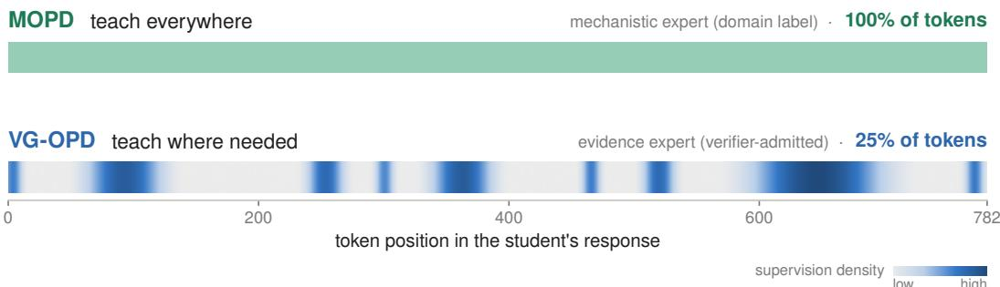
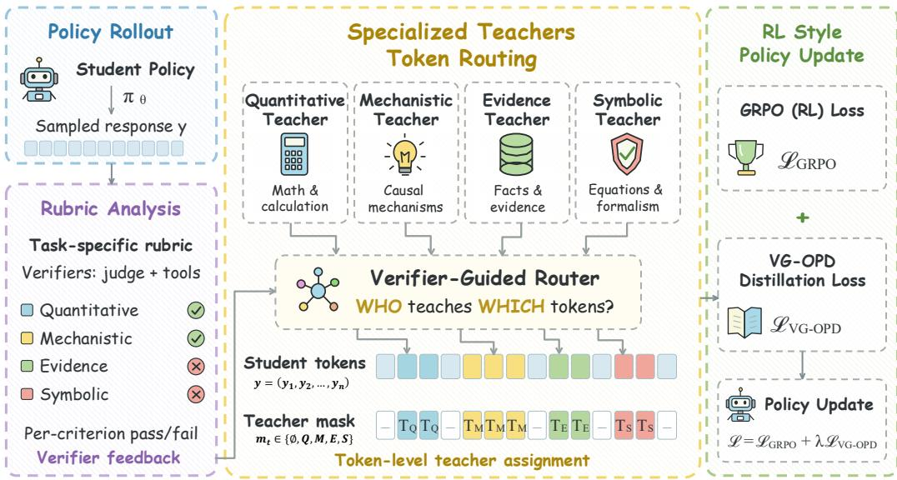
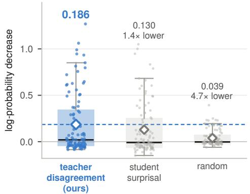
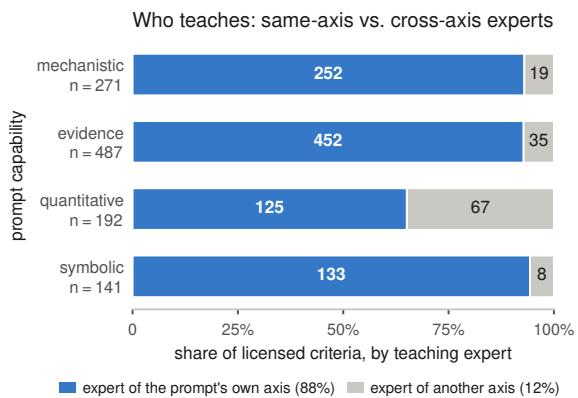
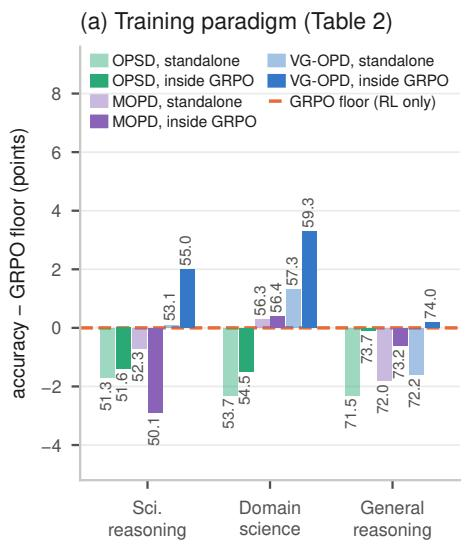
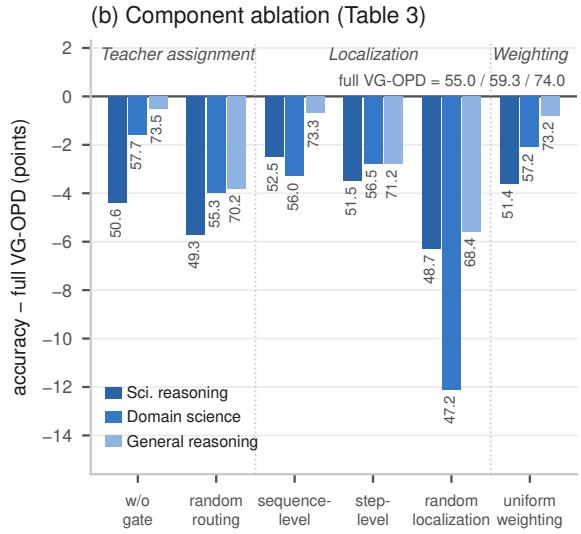
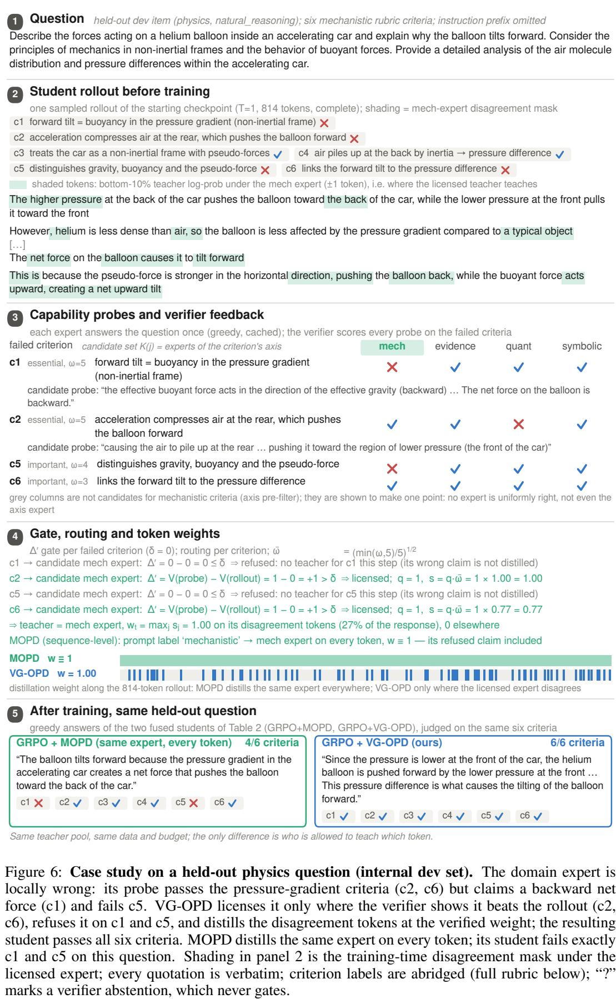
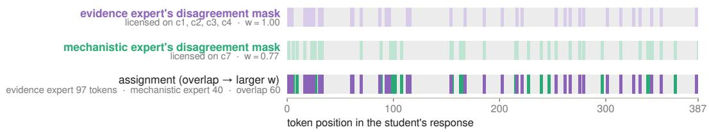

# WHO TEACHES WHICH TOKEN? VERIFIER-GATED MULTI-EXPERT ON-POLICY DIS-TILLATION FOR SCIENTIFIC REASONING

Xun Xu1 Zaixi Zhang2†

1Fudan University 2Hong Kong University of Science and Technology

## ABSTRACT

Multi-teacher on-policy distillation (OPD) is becoming the standard way to integrate specialist capabilities into one model: train experts with RL, then distill them into the student on its own rollouts. Existing recipes assign supervision at the sequence level — each prompt goes to one domain teacher and every token receives the same weight — which implicitly assumes that a teacher is uniformly useful across a response. We find instead that useful teacher signal is sparse and heterogeneous along a reasoning trajectory, which raises a finer question: who should teach which token? Verifier-Gated Multi-Expert On-Policy Distillation (VG-OPD) answers it by verification: the counterfactual gain of an expert on a specific answer criterion licenses that expert to teach, its disagreement with the student localizes the supervision, and criterion importance sets its weight; the gated KL enters GRPO as an additive token-level advantage. Instantiated for scientific reasoning with RL-trained capability experts, VG-OPD attains the best overall performance on seven benchmarks for 4B and 8B students, ranking first on five at both scales, with the largest gains on knowledge-intensive scientific reasoning tasks. Further analysis shows that the gains come from localizing verified supervision rather than from adding teachers or distillation loss: misplacing the same supervision budget is the single most damaging change, and indiscriminate distillation drags RL below its own floor where gated distillation lifts it.

## 1 INTRODUCTION

Scientific reasoning often requires combining multiple capabilities, such as quantitative calculation, symbolic derivation, mechanistic explanation, and evidence assessment, within a single answer. Reinforcement learning (RL) with verifiable or rubric rewards provides a way to develop these capabilities using their respective training data and verification procedures (Shao et al., 2024; Gunjal et al., 2025; Chen et al., 2026b). To combine separately trained specialists into a single student, multi-teacher on-policy distillation (OPD) supervises the student’s own rollouts with expert token probabilities (Agarwal et al., 2023; Lu & Lab, 2025; Ma et al., 2026). However, how to route each expert’s supervision to the parts of a student rollout where it is actually useful remains an open problem.

An expert’s advantage can vary across both problems and requirements within a problem. For example, on a chemistry question, an expert may correct the student’s calculation while giving an incorrect reaction mechanism. MOPD (Ma et al., 2026) assigns teachers by prompt-level domain labels and applies uniformly weighted supervision across the response, which cannot distinguish useful expert knowledge from erroneous reasoning within the same answer. More recent methods improve distillation selectivity by gating rollouts with rewards (Akhondzadeh et al., 2026; Xu et al., 2026a), selecting important tokens (Xu et al., 2026b; Li et al., 2026a), or routing supervision through additional signals (Yu et al., 2026a; Wu et al., 2026; Xia et al., 2026). However, they determine where or from which source to distill without explicitly verifying whether a candidate expert has a criterion-specific advantage over the student. Selectivity alone does not establish eligibility: effective capability integration requires deciding both which expert may teach and where that expert’s supervision should apply—who should teach which token?

  
Figure 1: Who teaches which token? Token-level supervision comparison on one 782-token student rollout. MOPD applies dense supervision from a single domain teacher, while VG-OPD selectively assigns experts and concentrates supervision on tokens where the selected expert disagrees with the student. In this example, the evidence expert supervises only a subset of tokens, with darker spans indicating stronger supervision.

Our key idea is to decide teaching eligibility through a shared criterion-level evaluation. Reference solutions decompose into criteria, each paired with a verifier. Scoring expert and student answers with the same criterion verifier identifies experts that are better suited for specific requirements of the current problem. An expert should therefore teach only when it shows a criterion-specific advantage over the student, and only where it disagrees with the student’s response: verification establishes who may teach, and disagreement decides which tokens to teach (Fig. 1).

To implement this principle, we introduce Verifier-Gated Multi-Expert On-Policy Distillation (VG-OPD). Who: VG-OPD evaluates candidate experts under criterion-level verifiers and assigns supervision only to experts that demonstrate an advantage over the student on the target criterion. Which: it identifies tokens where the selected expert disagrees with the student and constructs a sparse supervision mask.

We instantiate VG-OPD with four RL-trained capability experts and evaluate 4B and 8B students on seven benchmarks spanning scientific reasoning, domain science, and general reasoning. At 4B, VG-OPD improves average accuracy over rubric-GRPO by 2.0 points on scientific reasoning and 3.3 points on domain science, and consistently outperforms coarse-grained multi-expert distillation (MOPD) across heterogeneous scientific benchmarks. The 8B student shows the same trend, with VG-OPD achieving the strongest overall performance across the evaluation suite. Ablations confirm that both verifier-based expert eligibility and selective token supervision are critical to the gains.

Contributions. ❶ We introduce a criterion-level eligibility principle for multi-expert distillation, where an expert is eligible to teach a criterion only when it outperforms the student under the same verifier. ❷ We propose VG-OPD, which operationalizes this principle through verifier-gated expert selection and disagreement-based token supervision, utilizing selective multi-expert distillation for RL training. ❸ We provide controlled empirical evidence that both criterion-level expert eligibility and token-level supervision placement contribute to the effectiveness of multi-expert distillation, with consistent improvements across heterogeneous scientific reasoning benchmarks and model scales.

## 2 PRELIMINARIES

Rubric-based RL yields failed criteria. For each prompt x, a rubric defines a set of verifiable criteria $\boldsymbol { \mathcal { C } } ( \boldsymbol { x } ) = \{ ( c _ { j } , V _ { j } , \omega _ { j } ) \} _ { j = 1 } ^ { J _ { x } }$ , where $c _ { j }$ is a criterion, $V _ { j } ( x , \cdot ) \in [ 0 , 1 ]$ its verifier, and $\omega _ { j }$ its signed weight, negative for pitfall checks. Rubrics-as-Rewards (Gunjal et al., 2025) reduces the rubric to a scalar reward,

$$
r ( x , y ) = \mathrm { c l i p } \Big ( \frac { \sum _ { j } \omega _ { j } V _ { j } ( x , y ) } { \sum _ { j : \omega _ { j } > 0 } \omega _ { j } } , 0 , 1 \Big ) ,\tag{1}
$$

and GRPO (Shao et al., 2024) optimizes it: a group of $G$ rollouts $y ^ { ( 1 ) } , \dots , y ^ { ( G ) } \sim \pi _ { \theta _ { \mathrm { o l d } } } ( \cdot \mid x )$ is scored with r, the group-normalized reward becomes a shared advantage for every token of a rollout, and the policy takes a clipped step,

$$
A _ { i } ^ { \mathrm { t a s k } } = \frac { r ( x , y ^ { ( i ) } ) - \mathrm { m e a n } _ { g } r ( x , y ^ { ( g ) } ) } { \mathrm { s t d } _ { g } r ( x , y ^ { ( g ) } ) } ,\tag{2}
$$

$$
\mathcal { L } _ { \mathrm { P G } } ( A ; \theta ) = - \frac { 1 } { G } \sum _ { i = 1 } ^ { G } \frac { 1 } { | y ^ { ( i ) } | } \sum _ { t = 1 } ^ { | y ^ { ( i ) } | } \operatorname* { m i n } \Bigl ( \rho _ { i , t } A _ { i , t } , ~ \mathrm { c l i p } \bigl ( \rho _ { i , t } , 1 - \epsilon , 1 + \epsilon \bigr ) A _ { i , t } \Bigr ) ,
$$

with $\rho _ { i , t }$ the token importance ratio to $\pi _ { \theta _ { \mathrm { o l d } } }$ and $A _ { i , t } = A _ { i } ^ { \mathrm { t a s k } }$ ; GRPO minimizes $\mathcal { L } _ { \mathrm { P G } } ( A ^ { \mathrm { t a s k } } ; \theta )$ The scalar discards structure the rubric provides for free: because r is a sum over criteria, every rollout comes with its set offailed criteria $\mathcal { F } ( y ) = \{ j : \ \omega _ { j } > 0 , \ V _ { j } ( x , y ) = 0 \}$ , and the same $V _ { j }$ can score any other answer to x on the same criterion.

MOPD is fixed routing with dense weighting. On-policy distillation (OPD) matches the student to a teacher E at every generation step along the student’s own rollouts (Agarwal et al., 2023; Lu & Lab, 2025). It yields a token-level distillation signal $\hat { k } _ { t } ^ { ( E ) } \geq 0 .$ a single-sample estimate of the per-position reverse KL, which enters the same policy-gradient surrogate as the task reward as an advantage $A _ { t } ^ { \mathrm { K D } } = - w _ { t } \hat { k } _ { t } ^ { ( E ) }$ , with $w _ { t } \equiv 1$ in plain OPD (Ko et al., 2026). Multi-teacher OPD merges K RL-trained specialists $\{ E _ { k } \}$ into one student; MOPD (Ma et al., 2026) does so by assigning each prompt the expert of its domain label $d ( x )$ and weighting every token equally:

$$
{ \mathcal L } _ { \mathrm { M O P D } } ( \theta ) = { \mathbb E } _ { x } { \mathbb E } _ { y \sim \pi _ { \theta } ( \cdot | x ) } \Big [ \sum _ { t } w _ { t } \hat { k } _ { t } ^ { ( E _ { k _ { t } } ) } \Big ] , \qquad k _ { t } \equiv d ( x ) , \quad w _ { t } \equiv 1 .\tag{3}
$$

MOPD is therefore a special case of weighted token-level OPD, indexed by a teacher assignment $k _ { t }$ and a weight field $w _ { t } \in [ 0 , 1 ]$ ], in which routing is fixed before the rollout is observed and all tokens receive equal weight.

From fixed to verified assignment. The rubric says which criteria a rollout fails; the weighted OPD family says who teaches which token and how much. VG-OPD keeps the objective of Eq. 3 and replaces its two fixed choices with verification-guided teacher routing and sparse token weighting: for every failed criterion of every rollout it decides which expert may teach, which tokens, and with what strength.

## 3 VG-OPD: VERIFIER-GATED MULTI-EXPERT ON-POLICY DISTILLATION

## 3.1 OVERVIEW: WHO, WHERE, AND HOW MUCH

VG-OPD inserts one stage into the student’s RL loop, between reward computation and the policy update. For every rollout $y \sim \pi _ { \theta _ { \mathrm { o l d } } } ( \cdot \mid x )$ and each criterion it fails, we ask whether a candidate expert — the expert of that criterion’s axis — scores higher than the rollout under the criterion’s verifier. Only such experts teach (who), only on the tokens where they disagree with the student (where), at a weight set by the criterion’s rubric importance (how much). The decisions are per criterion, so a rollout that fails criteria on two axes receives two teachers, each supervising its own token set, and the teacher signal enters the update as a weighted token-level advantage added to the task advantage. An overview of the framework is in Fig. 2.

## 3.2 WHO TEACHES: LICENSING AND ROUTING

Licensing. Each criterion and each expert carries a capability axis — quantitative, symbolic, mechanistic, or evidence — written $a ( j )$ and $a ( E _ { k } )$ . For a rollout $y$ with failed criteria $\mathcal { F } ( y )$ and $j \in \mathcal { F } ( y )$ , let $K ( j ) = \{ k : a ( E _ { k } ) = a ( j ) \}$ be the candidate experts of its axis. Each candidate produces a capability probe $y _ { k } = E _ { k } ( x ) { : }$ a plain greedy answer to the original question, generated once per expert per prompt, cached, and reused across all criteria and all G rollouts of the group. The counterfactual gain of expert k on criterion $j -$ the verifier score its own answer receives on a criterion the rollout failed — is

$$
\Delta _ { j , k } ^ { \prime } \ = \ V _ { j } \big ( x , y _ { k } \big ) \ - \ V _ { j } \big ( x , y \big ) ,\tag{4}
$$

  
Figure 2: Overview of VG-OPD. The student’s rollouts are scored per criterion by the rubric’s verifiers; for each failed criterion, the expert of that criterion’s axis is licensed only if it answers better; the licensed teacher supervises only the tokens on which it disagrees with the student; the gated KL enters the GRPO update as an additive token-level advantage.

and k is licensed to teach $c _ { j }$ iff $g _ { j , k } : = \mathbf { 1 } [ \Delta _ { i , k } ^ { \prime } > \delta ] = 1$ . The gate measures, per criterion and per prompt, the condition Li et al. (2026c) identify for OPD — that the teacher offer a capability the student lacks — instead of assuming it: since $V _ { j } ( x , y ) = 0$ on every failed criterion, the rollout enters the gate only through $\mathcal { F } ( y )$ , and one cached verdict $V _ { j } ( x , y _ { k } )$ serves all G rollouts of the group. Three exclusions keep the gate honest: pitfall criteria $( \omega _ { j } < 0 )$ never gate; verifier abstentions never gate; and rollouts whose task reward is already high enough receive no teacher term. A criterion with no licensed expert is simply not distilled this step — no teacher is better than an unverified teacher. Weak experts are thereby rejected rather than averaged in.

Routing. Among licensed candidates the router assigns

$$
q ( k \mid x , y , c _ { j } ) ~ = ~ \frac { g _ { j , k } ~ \exp ( \Delta _ { j , k } ^ { \prime } / \tau ) } { \sum _ { k ^ { \prime } \in K ( j ) } g _ { j , k ^ { \prime } } ~ \exp ( \Delta _ { j , k ^ { \prime } } ^ { \prime } / \tau ) } , ~ k ^ { * } ( j ) ~ = ~ \arg ~ \operatorname* { m a x } _ { k \in K ( j ) } ~ q ( k \mid x , y , c _ { j } ) ,\tag{5}
$$

with temperature $\tau { = } 0 . 5 ; q \equiv 0$ when no candidate is licensed. With one expert per axis, $K ( j )$ is a singleton and q reduces to the gate; the softmax covers pools with several experts per axis. Licensing and routing are per criterion, not per rollout. Let $\mathcal { L } ( y ) \overset { \cdot } { = } \{ j \in \mathcal { F } ( y ) : \ g _ { j , k ^ { * } ( j ) } = 1 \}$ be the licensed criteria of a rollout; its teacher set is $\mathcal T ( y ) = \{ k ^ { * } ( j ) : ~ j \in \mathcal L ( y ) \}$ . Because criteria of one axis share that axis’s expert, $| \mathcal T ( y ) |$ equals the number of distinct axes among the licensed criteria. For example, a rollout with licensed failures on the quantitative and the mechanistic axis is taught by both experts, each on its own token set.

## 3.3 WHERE TO TEACH: DISAGREEMENT LOCALIZATION

Each teacher $E _ { k } , k \in \mathcal T ( y )$ , restricts its distillation to a token mask $m _ { t } ^ { ( k ) } \in \{ 0 , 1 \}$ over the student’s own response, computed under its own log-probabilities. Let $\ell _ { t } ^ { ( k ) } =$ log $\pi _ { E _ { k } } ( y _ { t } \mid x , y _ { < t } )$ be the teacher’s log-probability of the student’s actual token and $Q _ { \eta } ( \ell _ { 1 : | y | } ^ { ( k ) } )$ the empirical η-quantile of these scores $( \eta { = } 0 . 1 0 )$ ; then

$$
\begin{array} { r } { \tilde { m } _ { t } ^ { ( k ) } = \mathbf { 1 } \big [ \ell _ { t } ^ { ( k ) } \leq Q _ { \eta } ( \ell _ { 1 : | y | } ^ { ( k ) } ) \big ] , \qquad m _ { t } ^ { ( k ) } = \operatorname* { m a x } \big ( \tilde { m } _ { t - 1 } ^ { ( k ) } , \tilde { m } _ { t } ^ { ( k ) } , \tilde { m } _ { t + 1 } ^ { ( k ) } \big ) , } \end{array}\tag{6}
$$

Algorithm 1 VG-OPD training step   
Input: prompt x with criteria C(x), student π , experts $\{ E _ { k } \}$   
1: sample $\{ y ^ { ( i ) } \} _ { i = 1 } ^ { G } \sim \pi _ { \theta _ { \mathrm { o l d } } } ( \cdot \mid x ) ;$ ; score every criterion $\dot { V _ { j } } ( x , y ^ { ( i ) } )$ ▷ GRPO   
$2 \colon A ^ { \mathrm { t a s k } } $ group-normalized task rewards ▷ GRPO   
$3 \colon + y _ { k } \gets E _ { k } ( x )$ for each expert k (greedy probe, cached per prompt) ▷ who: probe   
4: + for each rollout y and each failed criterion $j \in \mathcal { F } ( y )$ do   
5: + $\Delta _ { j , k } ^ { \prime }  V _ { j } ( x , y _ { k } ) - V _ { j } ( x , y )$ for $k \in K ( j )$ ▷ Eq. 4   
6: + license k iff $\Delta _ { j , k } ^ { \prime } > \delta ;$ route $k ^ { * } ( j )$ by Eq. 5; set $s _ { j , k ^ { * } ( j ) }$ ▷ gate, route   
7: + for each licensed teacher $k \in \mathcal T ( y )$ do   
8: + one forward pass of $E _ { k }$ over y gives $\ell _ { t } ^ { ( k ) } \colon$ ; mask $m _ { t } ^ { ( k ) }$ by Eq. 6 ▷ where   
$9 \colon + w _ { t } , k _ { t } \gets \mathrm { E q . } 8$ ▷ how much: one teacher per token   
$1 0 \colon + A _ { t } ^ { \mathrm { K D } } \gets - w _ { t } \hat { k } _ { t }$ under $E _ { k _ { t } } ,$ , no gradient through $\hat { k } _ { t }$ ▷ Eq. 9   
11: update θ on $\mathcal { L } _ { \mathrm { P G } } ( A ^ { \mathrm { t a s k } } ) + \dot { \lambda } \mathcal { L } _ { \mathrm { P G } } ( A ^ { \mathrm { K D } } )$ ▷ Eq. 10; GRPO

i.e., the positions the teacher “would not have written”, dilated by one token on each side. The mask is rank-based, so it marks about η of a response even where the teacher largely agrees with it; that the teacher has something to teach is guaranteed by the gate, not by the mask. Each mask comes from the same forward pass of its teacher that supplies the distillation target, so localization adds no calls.

## 3.4 HOW MUCH: VERIFIED-GAIN WEIGHTS

For each licensed (criterion, teacher) pair, we assign

$$
s _ { j , k } = q ( k \mid x , y , c _ { j } ) \bar { \omega } _ { j } ,\tag{7}
$$

where $q ( k \mid x , y , c _ { j } )$ denotes the verifier-derived teacher eligibility and $\bar { \omega } _ { j } = \big ( \operatorname* { m i n } ( \omega _ { j } , 5 ) / 5 \big ) ^ { 1 / 2 } \in$ (0, 1] is the criterion weight on the rubric’s five-point scale after square-root compression. The token-level supervision strength and teacher assignment are then

$$
w _ { t } = \operatorname* { m a x } _ { j \in \mathcal { L } ( y ) } s _ { j , k ^ { * } ( j ) } m _ { t } ^ { ( k ^ { * } ( j ) ) } , \qquad k _ { t } = k ^ { * } ( j _ { t } ) ,\tag{8}
$$

where $j _ { t }$ is the criterion attaining the maximum with ties resolved in favor of the teacher with larger total verified weight. Thus, each token is assigned to at most one teacher, with its supervision determined by the largest verified weight among the teachers licensed for the corresponding criterion masks; overlapping teacher masks therefore do not produce conflicting gradients. Each masked token is distilled from its selected teacher alone, and tokens outside all masks receive no distillation gradient $( w _ { t } = 0 )$

Objective. The teacher term is the weighted OPD of Eq. 3, using the per-token teacher $k _ { t }$ and sparse weight $w _ { t }$ from Eq. 8. Its per-token signal is

$$
\hat { k } _ { t } = \operatorname* { m i n } \left\{ e ^ { \Delta _ { t } } - \Delta _ { t } - 1 , \ e \right\} , \qquad \Delta _ { t } = \log \pi _ { E _ { k _ { t } } } ( y _ { t } \mid x , y _ { < t } ) - \log \pi _ { \theta } ( y _ { t } \mid x , y _ { < t } ) ,\tag{9}
$$

with $\mathrm { ~  ~ { ~ c ~ } ~ } = \mathrm { ~  ~ { ~ 1 0 ~ } ~ }$ , whose expectation is the per-position reverse Kullback–Leibler divergence $\mathrm { K L } ( \pi _ { \theta } \| \pi _ { E _ { k _ { t } } } )$ . The resulting advantage $A _ { i , t } ^ { \mathrm { K D } } ~ = ~ - w _ { i , t } { \hat { k } } _ { i , t }$ is detached from the gradient, so the teacher signal simply suppresses tokens that the selected teacher finds unlikely. The student is updated with two advantage streams:

$$
\begin{array} { r } { \mathcal { L } ( \boldsymbol { \theta } ) = \mathcal { L } _ { \mathrm { P G } } \big ( \boldsymbol { A } ^ { \mathrm { t a s k } } ; \boldsymbol { \theta } \big ) + \lambda \mathcal { L } _ { \mathrm { P G } } \big ( \boldsymbol { A } ^ { \mathrm { K D } } ; \boldsymbol { \theta } \big ) . } \end{array}\tag{10}
$$

Thus, GRPO reinforces task-level progress, while gated distillation provides targeted teacher pressure where needed. Joint training is important because $A ^ { \mathrm { K D } } \leq 0$ everywhere (Prop. 1, App. A.1); applying it alone can continually suppress probability mass and accelerate entropy collapse. The task-reward stream counterbalances this pressure, while the sparse gate limits it to selected tokens. Alg. 1 lists one training step (implementation in App. A.2); lines marked + are the additions to a standard GRPO step.

Table 1: Main results (accuracy, %) on seven benchmarks in three groups for the 4B and 8B students; “distill. only” is VG-OPD without the task-reward stream. Within each block, the best result per column is bold on dark green and the second-best is underlined on light green.
<table><tr><td rowspan="2">Method</td><td colspan="3">Scientific reasoning</td><td colspan="2">Domain science</td><td colspan="2">General reasoning</td></tr><tr><td></td><td>GPQA-D RaR-Sci SciBench</td><td></td><td>ChemBench RaR-Med</td><td></td><td>MMLU-Pro MATH500</td><td></td></tr><tr><td>Vanilla Ow-4B</td><td>41.4</td><td>57.9</td><td>50.8</td><td>57.8</td><td>46.9</td><td>57.2</td><td>80.9</td></tr><tr><td>GRPO</td><td>43.9</td><td>60.6</td><td>54.5</td><td>61.2</td><td>50.7</td><td>62.5</td><td>85.1</td></tr><tr><td>OPSD</td><td>42.1</td><td>59.6</td><td>52.1</td><td>58.9</td><td>48.5</td><td>60.2</td><td>82.8</td></tr><tr><td>MOPD</td><td>43.8</td><td>59.0</td><td>54.0</td><td>63.1</td><td>49.4</td><td>61.6</td><td>82.4</td></tr><tr><td>dGRPO</td><td>45.5</td><td>61.2</td><td>51.9</td><td>62.0</td><td>51.0</td><td>63.8</td><td>83.6</td></tr><tr><td>CriPO</td><td>45.7</td><td>59.1</td><td>54.5</td><td>65.5</td><td>50.9</td><td>62.5</td><td>84.2</td></tr><tr><td>VG-OPD (distill. only)</td><td>43.4</td><td>60.7</td><td>55.2</td><td>64.3</td><td>50.2</td><td>61.3</td><td>83.0</td></tr><tr><td>VG-OPD</td><td>46.3</td><td>62.4</td><td>56.2</td><td>66.4</td><td>52.2</td><td>63.3</td><td>84.6</td></tr><tr><td rowspan="9">Vanilla GRPO Oe-8B OPSD MOPD</td><td>41.9</td><td>59.7</td><td>55.2</td><td>64.6</td><td>53.8</td><td>64.1</td><td></td><td>83.6</td></tr><tr><td>45.8</td><td></td><td></td><td></td><td></td><td></td><td></td><td></td></tr><tr><td>42.2</td><td>64.5</td><td>57.4 55.9</td><td>69.3 66.5</td><td>57.4 55.4</td><td>67.1</td><td></td><td>85.4</td></tr><tr><td></td><td>44.1</td><td>60.6</td><td>56.1</td><td>67.2</td><td>56.9</td><td>64.9 65.6</td><td>84.2</td></tr><tr><td>dGRPO</td><td>45.4</td><td>66.2 65.5</td><td>56.8</td><td>68.1</td><td>57.1</td><td>66.0</td><td>84.8 83.4</td></tr><tr><td>CriPO</td><td>45.8</td><td>64.8</td><td>57.6</td><td>66.7</td><td>57.8</td><td>65.2</td><td>84.2</td></tr><tr><td>VG-OPD (distill. only)</td><td>46.3</td><td>65.9</td><td>57.2</td><td>67.0</td><td>56.2</td><td>65.8</td><td>84.5</td></tr><tr><td>47.3</td><td></td><td>67.0</td><td>59.1</td><td>70.9</td><td>60.1</td><td>66.7</td><td></td></tr><tr><td></td><td></td><td></td><td></td><td></td><td></td><td></td><td>85.7</td></tr></table>

## 4 EXPERIMENTS

## 4.1 EXPERIMENTAL SETUP

Data and models. Students and experts are built on Qwen3-4B and Qwen3-8B (Yang et al., 2025) in non-thinking mode. The four capability experts, one per axis, are LoRA adapters on the shared base, each trained with standard GRPO on its axis’s slice of the training data (App. B.4); training data, criteria bank, and verifiers are described in Apps. B.1–B.3; training details are in App. B.5.

Baselines. The starting checkpoint (Vanilla); GRPO with rubric rewards (Gunjal et al., 2025); OPSD, self-distillation with the rubric as privileged context; MOPD (Ma et al., 2026); dGRPO-style fusion (Ramos et al., 2026); and CriPO (Xia et al., 2026). All distillation arms share data, budget, and λ and differ only in the teacher (App. B.7).

Evaluation benchmarks. We evaluate on seven public benchmarks in three groups: scientific reasoning (GPQA-Diamond, RaR-Science, SciBench), domain science (ChemBench, RaR-Med), and general reasoning (MMLU-Pro, MATH500). Benchmark details are in App. B.8.

## 4.2 MAIN RESULTS

❶ VG-OPD is best overall at both scales (Table 1): first on five of seven benchmarks and second, within half a point, on MMLU-Pro and MATH500. ❷ The gains concentrate on knowledgeintensive science while general reasoning is preserved. Over rubric-GRPO, the 4B student adds +2.0 on scientific reasoning, +3.3 on domain science, and +0.2 on general reasoning (group averages); the 8B student adds +1.7 and +1.9 and stays within 0.3 on general reasoning. ❸ Every other distillation scheme trails VG-OPD. Pure distillation (OPSD, MOPD) at best ties rubric-GRPO on group averages, and dense fusion (dGRPO) stays within half a point of the RL floor at 4B and at or below it at 8B, by up to 1.6 points.

## 4.3 ABLATION STUDIES

Training paradigm (Table 2). With the teacher pool fixed, finer assignment wins in both regimes. Standalone, accuracy rises from OPSD to MOPD to VG-OPD (scientific reasoning 51.3 → 52.3 → 53.1, domain science 53.7 → 56.3 → 57.3), and standalone VG-OPD matches or exceeds the RL only floor on both science groups without any task reward. Inside GRPO the contrast sharpens: dense distillation drags GRPO below its ownfloor (GRPO+OPSD 51.6 and GRPO+MOPD 50.1 vs. 53.0 on scientific reasoning), whereas gated, localized distillation lifts it by +2.0 / +3.3 / +0.2. Verifying and localizing the teacher signal is thus what turns distillation into a gain on top of RL.

Table 2: Training-paradigm comparison (group averages, %). The teacher pool is fixed; only the assignment granularity changes: a privileged self-teacher (OPSD), domain-routed experts (MOPD), or criterion-routed and gated experts (VG-OPD), used standalone or as auxiliary supervision inside GRPO. Best per column is bold on green.
<table><tr><td>Regime</td><td>Method</td><td>Sci. reasoning ↑</td><td>Domain science ↑</td><td>General reasoning ↑</td></tr><tr><td rowspan="3">Standalone</td><td>OPSD</td><td>51.3</td><td>53.7</td><td>71.5</td></tr><tr><td>MOPD</td><td>52.3</td><td>56.3</td><td>72.0</td></tr><tr><td>VG-OPD</td><td>53.1</td><td>57.3</td><td>72.2</td></tr><tr><td rowspan="3">RL + distill.</td><td>GRPO + OPSD</td><td>51.6</td><td>54.5</td><td>73.7</td></tr><tr><td>GRPO + MOPD</td><td>50.1</td><td>56.4</td><td>73.2</td></tr><tr><td>GRPO + VG-OPD</td><td>55.0</td><td>59.3</td><td>74.0</td></tr><tr><td>RL only</td><td>GRPO</td><td>53.0</td><td>56.0</td><td>73.8</td></tr></table>

Table 3: Component-wise ablation (group averages, %). Each variant disables exactly one component of the token-weight construction $( \operatorname { E q . 8 } ) ;$ data, steps and λ are unchanged. Best per column is bold on green.
<table><tr><td>Component</td><td>Variant</td><td>Sci. reasoning ↑</td><td>Domain science ↑</td><td>General reasoning ↑</td></tr><tr><td></td><td>Full VG-OPD</td><td>55.0</td><td>59.3</td><td>74.0</td></tr><tr><td rowspan="2">Teacher assignment</td><td>w/o gate</td><td>50.6</td><td>57.7</td><td>73.5</td></tr><tr><td>Random routing</td><td>49.3</td><td>55.3</td><td>70.2</td></tr><tr><td rowspan="3">Localization</td><td>Sequence-level</td><td>52.5</td><td>56.0</td><td>73.3</td></tr><tr><td>Step-level</td><td>51.5</td><td>56.5</td><td>71.2</td></tr><tr><td>Random localization</td><td>48.7</td><td>47.2</td><td>68.4</td></tr><tr><td>Weighting</td><td>Uniform weighting</td><td>51.4</td><td>57.2</td><td>73.2</td></tr></table>

Components (Table 3). Each variant disables one component of Eq. 8, with data, steps, and λ unchanged. Localization matters most: a coverage-matched random mask loses 6.3 / 12.1 / 5.6 points (scientific / domain / general), more than a sequence-level (2.5 / 3.3 / 0.7) or step-level mask (3.5 / 2.8 / 2.8), so distilling the same budget at the wrong positions is worse than distilling everywhere. Who teaches matters as well: random routing costs 5.7 / 4.0 / 3.8 and removing the gate 4.4 / 1.6 / 0.5, both largest on scientific reasoning, and flat weights cost 3.6 / 2.1 / 0.8. App. C.1 plots both tables as differences.

## 4.4 FRAMEWORK ANALYSIS

Where: the mask selects corrective tokens. Let $D _ { t } = \log p _ { \mathrm { s t a r t } } ( y _ { t } \mid x , y _ { < t } ) - \log p _ { \mathrm { t r a i n } } ( y _ { t } \mid$ $x , y _ { < t } )$ be the decrease, after training, in the starting model’s log-probability of its own token. Averaged per rollout over equal-coverage token sets (Fig. 3a), $D _ { t }$ is 0.186 at teacher-disagreement positions, 0.130 at the student’s highest-surprisal positions, and 0.039 at random positions. The effect is concentrated: the teacher-marked tokens drop by at least 0.05 in 43% of rollouts, and in 98% of these they drop more than random positions; over all rollouts they drop more than the highestsurprisal positions in 85%. The mask thus concentrates updates on teacher-identified disagreements rather than merely on uncertain tokens (Xu et al., 2026b; Wang et al., 2026b). The localization ablations in Table 3 complete the picture: a sequence-level, step-level, or coverage-matched random mask lowers accuracy, and the random mask, which keeps the coverage, lowers it most, so the gain depends on where the signal is applied, not on how many tokens receive it.

  
(a) where: log-probability decrease at three token sets

  
(b) who: teaching expert per prompt capability

Figure 3: Mechanism analysis. (a) Decrease $D _ { t }$ in the starting model’s log-probability of its own tokens after training, per rollout, at teacher-disagreement, highest-surprisal, and random positions (box: IQR, line: median, diamond: mean). (b) Who teaches the licensed criteria: the prompt’s ownaxis expert (blue) or another axis’s expert (grey) with counts in the bars.
<table><tr><td colspan="3">Held-out RaR-Science question: TtGg × ttgg; tall (T) and green (G) dominant. Which fraction of the progeny is tall and yellow?</td></tr><tr><td>Criterion · who may teach it</td><td>Starting model fails r0, r1, r3, r4 · answers 0%</td><td>After training GRPO + VG-OPD · passes all 7</td></tr><tr><td>Punnett square (r1) mechanistic expert · licensed own answer: correct square, w = 1.0</td><td>X So, the possible offspring genotypes are:TgGg, TgGg, tgGg, tggg</td><td>the probability of tal (Tt) is 50% ..the probability of yellow (gg) is 50%</td></tr><tr><td>Independent assortment (r3–r4) mechanistic expert· refused own answer: 12.5%, fails r3-r4 too</td><td>X the only possible yellow genotype is gg, and the only tall genotype is Tg.</td><td>Since the two traits assort independently, we can multiply the probabilities:0.5 × 0.5 = 0.25</td></tr><tr><td>Final answer (r0) evidence expert · licensed own answer: 25%, w = 1.0</td><td>Xnone of the offspring are tall and yellow. Approximately 0% of the progeny plants will be tall and yellow.</td><td>Approximately25% of the progeny plants will be tall and yellow.</td></tr></table>

Figure 4: Who teaches which failure. Answers of the starting model and of the GRPO+VG-OPD trained model on a held-out RaR-Science question (verbatim excerpts).

Who: routing is specialization-aligned, not hard-coded. 88% of licensed criteria are taught by the expert of the prompt’s own capability (Fig. 3b), so routing recovers the specialization that MOPD imposes by label. The remaining 12% cross axes (symbolic criteria of quantitative prompts, mechanistic criteria of evidence prompts) show that the mapping from prompt to teacher is not fixed: a prompt’s failed criteria can call in a second expert.

## 4.5 CASE STUDY

Fig. 4 traces the procedure on a held-out RaR-Science question whose starting answer fails four criteria. Each failed criterion is put to the expert of its axis, and that expert’s own answer decides: the mechanistic expert is licensed on the criterion it satisfies and refused on the two it fails itself, which therefore receive no teacher this step, while the evidence expert is licensed on the final-answer criterion. Each licensed expert then supervises only the tokens on which it disagrees with the student. After training, the GRPO+VG-OPD student passes every criterion, whereas the GRPO+MOPD student, distilled from the domain expert on every token, still fails the answer. App. C.2 gives two further cases.

## 5 RELATED WORK

Multi-teacher on-policy distillation. On-policy distillation (OPD) trains a student on its own rollouts under per-token teacher supervision (Agarwal et al., 2023; Lu & Lab, 2025), and its multiteacher form is now the standard recipe for merging specialists trained by RL. MOPD (Ma et al., 2026) routes each prompt to the teacher of its domain label and applies uniform sampled-token reverse KL on every token; H-OPD arbitrates among teachers by logit confidence (Yin et al., 2026), TU-OPD gates whole examples by reliability scores (Lu et al., 2026), and CaMOPD addresses recovery–preservation conflicts between teachers (Chen et al., 2026a). Li et al. (2026c) show that a teacher helps only where it offers a capability the student lacks.

Selective and localized distillation. Trust gates decide when a teacher may speak, at the level of whole rollouts or examples and over one fixed teacher: reward–likelihood agreement in RG-OPD (Akhondzadeh et al., 2026), verifier signs in SG-OPD (Xu et al., 2026a), outcome polarity in SGSD (Huang et al., 2026), distributional trust regions in TrOPD (Xing et al., 2026), and failed prompts only in RSTG (Han et al., 2026). Token selectors decide where, by optimization statistics: leverage imbalance (Shen et al., 2026), token importance and teachability (Xu et al., 2026b; Wang et al., 2026b), counterfactual relevance (Li et al., 2026a), supervision routed by policy probabilities (Yu et al., 2026a) or reference anchors (Wu et al., 2026), and answer-verified patches in Woodpecker (Wang et al., 2026a). These signals are either task-verified but rollout-level, or token-level but never checked against the task; none licenses a teacher per criterion.

Rubric-based RL for science. Rubric rewards underpin recent scientific RL (Gunjal et al., 2025; Chen et al., 2026b), with criterion-to-verifier routing for robust rewards (Yu et al., 2026b) and automated rubric synthesis (Li et al., 2026b; Guan et al., 2026). Rubrics also serve as privileged teacher context in self-distillation (Gu et al., 2026; Bablani et al., 2026; Rezaei et al., 2026; Fang et al., 2026), and CriPO decomposes rubric-RL by criterion and self-distills criterion-conditioned revisions with token localization (Xia et al., 2026).

## 6 CONCLUSION

Multi-teacher on-policy distillation asks which teacher to use; we argued that it should ask who teaches which token. VG-OPD answers by verification: the counterfactual gain of an expert on a specific criterion licenses, routes, and weights the teacher signal, and the expert’s disagreement with the student localizes it, all inside a standard GRPO update. On scientific reasoning it outperforms uniform multi-teacher distillation, privileged self-distillation, dense fusion, and rubric-based RL, trains to completion where dense distillation does not, and owes its gains to where it teaches rather than how much. We expect the same question to matter wherever specialist teachers are merged.

## LIMITATIONS

This work studies VG-OPD on a broad but still finite set of scientific benchmarks and student sizes. The seven benchmarks are text-only questions concentrated on physics, chemistry, biology, medicine, and mathematics; other scientific domains, and modalities such as figures, molecular structures, and experimental data, are not covered and would require extending the criteria bank and its verifiers. The students are 4B and 8B models; although the results suggest that stronger students may benefit from the same verified, localized teaching, this scaling behavior remains to be verified systematically.

## AI USE STATEMENT

In this work, we used generative AI tools to improve the readability of the manuscript and to provide auxiliary coding support. All AI-assisted manuscript edits were reviewed by the authors, and AIassisted code was verified and tested by the authors. We take responsibility for the final content of this work, including all text, claims, and artifacts produced with the aid of generative AI.

## REPRODUCIBILITY STATEMENT

The implementation of VG-OPD, including the training and evaluation code and configuration files, will be released publicly. The training data, criteria bank, and verifiers (Apps. B.1–B.3), expert training (App. B.4), the implementation (App. A.2), training details (App. B.5), benchmark details (App. B.8), and baseline construction (App. B.7) are documented in the appendix.

## REFERENCES

Rishabh Agarwal, Nino Vieillard, Yongchao Zhou, Piotr Stanczyk, Sabela Ramos, Matthieu Geist, and Olivier Bachem. On-Policy Distillation of Language Models: Learning from Self-Generated Mistakes. arXiv preprint arXiv:2306.13649, 2023.

Mohammad Sadegh Akhondzadeh, Vijay Lingam, Atula Tejaswi, Chanakya Ekbote, Sujay Sanghavi, and Aleksandar Bojchevski. Reward-Gated On-Policy Distillation. arXiv preprint arXiv:2607.04037, 2026.

Deepika Bablani, Ajay Gupta, and Wanming Chen. Rubrics as Privileged Information for Open-Ended Generation. arXiv preprint arXiv:2608.02948, 2026.

Tianlei Chen, Jiao Ou, Ziyuan Liu, Ruiming Tang, Jian Liang, and Han Li. Counteraction-Aware Multi-Teacher On-Policy Distillation for General Capability Recovery with Domain Preservation. arXiv preprint arXiv:2605.27115, 2026a.

Zijie Chen, Zhenghao Lin, Xiao Liu, Zhenzhong Lan, Yeyun Gong, and Peng Cheng. Improving Data and Reward Design for Scientific Reasoning in Large Language Models. arXiv preprint arXiv:2602.08321, 2026b.

Run-Ze Fan, Zengzhi Wang, and Pengfei Liu. MegaScience: Pushing the Frontiers of Post-Training Datasets for Science Reasoning. arXiv preprint arXiv:2507.16812, 2025.

Junfeng Fang, Zhepei Hong, Mao Zheng, Mingyang Song, Gengsheng Li, Houcheng Jiang, Dan Zhang, Haiyun Guo, Xiang Wang, and Tat-Seng Chua. Rubric-based On-policy Distillation. arXiv preprint arXiv:2605.07396, 2026.

Siyi Gu, Jialin Chen, Sophia Zhou, Arman Cohan, and Rex Ying. Rethinking Reward Supervision: Rubric-Conditioned Self-Distillation. arXiv preprint arXiv:2606.19327, 2026.

Xin Guan, Xiaomeng Hu, Shen Huang, Zhenyi Wang, Bo Zhang, Zijian Li, Pengjun Xie, Bo Liu, and Jiuxin Cao. EvoRubric: Self-Evolving Rubric-Driven RL for Open-Ended Generation. arXiv preprint arXiv:2605.29847, 2026.

Anisha Gunjal, Anthony Wang, Elaine Lau, Vaskar Nath, Bing Liu, and Sean Hendryx. Rubrics as Rewards: Reinforcement Learning Beyond Verifiable Domains. arXiv preprint arXiv:2507.17746, 2025.

Zhuowen Han, Jinwei Xiao, Zhengxi Lu, Renren Jin, Zhiyuan Yao, Yuxin Liu, Hongyan Hao, Yueqing Sun, Yu Yang, Qi GU, Xunliang Cai, and Deyi Xiong. Distill Where You Fail: Recovering Learning Signals of Negative RL-Groups from Adaptive Teacher Guidance. arXiv preprint arXiv:2608.00782, 2026.

Jiazhen Huang, Xiao Chen, Xiao Luo, Yong Dai, Senkang Hu, and Yuzhi Zhao. Skill-Conditioned Gated Self-Distillation for LLM Reasoning. arXiv preprint arXiv:2605.28791, 2026.

Jongwoo Ko, Sara Abdali, Young Jin Kim, Tianyi Chen, and Pashmina Cameron. Scaling Reasoning Efficiently via Relaxed On-Policy Distillation. arXiv preprint arXiv:2603.11137, 2026.

Enhan Li, Junhao He, and Hongyang Du. CROP: Task Relevance via Counterfactuals for Selective On-Policy Distillation. arXiv preprint arXiv:2608.13387, 2026a.

Xiaoyuan Li, Keqin Bao, Moxin Li, Yubo Ma, Yichang Zhang, Wenjie Wang, Fuli Feng, and Dayiheng Liu. ARES: Automated Rubric Synthesis for Scalable LLM Reinforcement Learning. arXiv preprint arXiv:2605.23454, 2026b.

Yaxuan Li, Yuxin Zuo, Bingxiang He, Jinqian Zhang, Chaojun Xiao, Cheng Qian, Tianyu Yu, Huan ang Gao, Wenkai Yang, Zhiyuan Liu, and Ning Ding. Rethinking On-Policy Distillation of Large Language Models: Phenomenology, Mechanism, and Recipe. arXiv preprint arXiv:2604.13016, 2026c.

Kevin Lu and Thinking Machines Lab. On-policy distillation. Thinking Machines Lab: Connectionism, 2025. doi: 10.64434/tml.20251026. https://thinkingmachines.ai/blog/on-policy-distillation.

Songshuo Lu, Zhi Chen, and Yaohua Tang. Beyond the Best Teacher: Expanding and Compressing the Reasoning Solution Manifold. arXiv preprint arXiv:2607.27770, 2026.

Wenhan Ma, Jianyu Wei, Liang Zhao, Hailin Zhang, Bangjun Xiao, Lei Li, Qibin Yang, Bofei Gao, Yudong Wang, Rang Li, Jinhao Dong, Zhifang Sui, and Fuli Luo. MOPD: Multi-Teacher On-Policy Distillation for Capability Integration in LLM Post-Training. arXiv preprint arXiv:2606.30406, 2026.

Xueguang Ma, Qian Liu, Dongfu Jiang, Ge Zhang, Zejun Ma, and Wenhu Chen. General-Reasoner: Advancing LLM Reasoning Across All Domains. In The Thirty-ninth Annual Conference on Neural Information Processing Systems, 2025. URL https://openreview.net/forum? id=pBFVoll8Xa.

Miguel Moura Ramos, Duarte M. Alves, and Andre F. T. Martins. Combining On-Policy Opti-´ mization and Distillation for Long-Context Reasoning in Large Language Models. arXiv preprint arXiv:2605.12227, 2026.

MohammadHossein Rezaei, Anas Mahmoud, Zihao Wang, Utkarsh Tyagi, Advait Gosai, Razvan-Gabriel Dumitru, Aakash Sabharwal, Bing Liu, and Yunzhong He. Rubric-Guided Self-Distillation: Post-Training Without Rubric Verifiers. arXiv preprint arXiv:2606.12507, 2026.

Zhihong Shao, Peiyi Wang, Qihao Zhu, Runxin Xu, Junxiao Song, Mingchuan Zhang, Y. K. Li, Y. Wu, and Daya Guo. DeepSeekMath: Pushing the Limits of Mathematical Reasoning in Open Language Models. arXiv preprint arXiv:2402.03300, 2024.

Jiabin Shen, Guang Chen, and Chengjun Mao. When top-k misses the decision: Tool-call drift in multi-teacher on-policy distillation, 2026. URL https://arxiv.org/abs/2607.07050.

Guangming Sheng, Chi Zhang, Zilingfeng Ye, Xibin Wu, Wang Zhang, Ru Zhang, Yanghua Peng, Haibin Lin, and Chuan Wu. HybridFlow: A Flexible and Efficient RLHF Framework. In Proceedings of the Twentieth European Conference on Computer Systems (EuroSys ’25), pp. 1279– 1297. ACM, 2025. doi: 10.1145/3689031.3696075. URL http://dx.doi.org/10.1145/ 3689031.3696075.

Dayu Wang, Jiaye Yang, Weikang Li, Jiahui Liang, Yang Li, Deguo Xia, and Jizhou Huang. Woodpecker Distillation: Weak Models Diagnose Reasoning Bugs in Strong Models. arXiv preprint arXiv:2608.05168, 2026a.

Yuanyi Wang, Su Lu, Yanggan Gu, Pengkai Wang, Yifan Yang, Zhaoyi Yan, Congkai Xie, Jianmin Wu, and Hongxia Yang. Not All Disagreement Is Learnable: Token Teachability in On-Policy Distillation. arXiv preprint arXiv:2605.26844, 2026b.

Jianyu Wu, Yizhou Wang, Encheng Su, Chen Tang, and Shixiang Tang. DAPD: Dual-Anchored Policy Distillation. arXiv preprint arXiv:2608.01735, 2026.

Mingxuan Xia, Yuhang Yang, Chao Ye, Shuai Zhu, Shenzhi Yang, Guangcheng Zhu, Yuhang Zhang, Cheng Peng, Haobo Wang, and Siqing Wang. Enhancing Rubric-based RL via Self-Distillation. arXiv preprint arXiv:2607.18082, 2026.

Xingrun Xing, Haoqing Wang, Boyan Gao, Ziheng Li, and Yehui Tang. Trust Region On-Policy Distillation. arXiv preprint arXiv:2606.01249, 2026.

Haoran Xu, Hongyu Wang, Yifei Gao, Jiaze Li, Xiaofeng Zhang, and Xiaosong Yuan. SG-OPD: Sign-Gated On-Policy Distillation via Sign-Consistency Gating and Phased Teacher Sampling. arXiv preprint arXiv:2606.09304, 2026a.

Yuanda Xu, Hejian Sang, Zhengze Zhou, Ran He, Zhipeng Wang, and Alborz Geramifard. TIP: Token Importance in On-Policy Distillation. arXiv preprint arXiv:2604.14084, 2026b.

An Yang, Anfeng Li, Baosong Yang, Beichen Zhang, Binyuan Hui, et al. Qwen3 Technical Report. arXiv preprint arXiv:2505.09388, 2025.

Qixiang Yin, Huanjin Yao, Yuchen Cai, Jianghao Chen, Ziyi Wang, Min Yang, Fei Su, and Zhicheng Zhao. H-OPD: Confidence Aware Heterogeneous Multi-Teacher Multimodal On-policy Distillation. arXiv preprint arXiv:2607.02592, 2026.

Xinlei Yu, Gen Li, Qingyi Si, Guibin Zhang, Yuqi Xu, Congcong Wang, Shuai Dong, Kaiwen Tuo, Xiangyu Zeng, Kaituo Feng, Qunzhong Wang, Yang Shi, Xiaobin Hu, Xiangyu Yue, Jiaqi Wang, and Shuicheng Yan. DOPD: Dual On-policy Distillation. arXiv preprint arXiv:2606.30626, 2026a.

Ya-Qi Yu, Hao Wang, Fangyu Hong, Xiangyang Qu, Gaojie Wu, Qiaoyu Luo, Nuo Xu, Huixin Wang, Wuheng Xu, Yongxin Liao, Zihao Chen, Haonan Li, Ziming Li, Dezhi Peng, Minghui Liao, Jihao Wu, Haoyu Ren, and Dandan Tu. Reinforcement Learning with Robust Rubric Rewards. arXiv preprint arXiv:2605.30244, 2026b.

Weizhe Yuan, Jane Yu, Song Jiang, Karthik Padthe, Yang Li, Dong Wang, Ilia Kulikov, Kyunghyun Cho, Yuandong Tian, Jason E. Weston, and Xian Li. NaturalReasoning: Reasoning in the Wild with 2.8M Challenging Questions. arXiv preprint arXiv:2502.13124, 2025.

## A METHOD DETAILS

## A.1 SIGN AND SCALE OF THE TEACHER STREAM

The distillation advantage $A _ { t } ^ { \mathrm { K D } } = - w _ { t } { \hat { k } } _ { t }$ of Eq. 9 is non-positive everywhere, so on its own it only suppresses probability mass; this is why Eq. 10 keeps the task-reward stream and why the gate and the mask matter for stability.

Proposition 1 (sign and scale of the teacher stream) For every position $t , e ^ { \Delta _ { t } } - \Delta _ { t } - 1 \geq 0 ,$ , with equality $i f f \pi _ { E } ( y _ { t } \mid x , y _ { < t } ) = \pi _ { \theta } ( y _ { t } \mid x , y _ { < t } )$ , and $\mathbb { E } _ { y _ { t } \sim \pi _ { \theta } ( \cdot | x , y < t ) } [ e ^ { \Delta _ { t } } - \Delta _ { t } - 1 ] = \mathrm { K L } _ { t }$ . Hence $A _ { t } ^ { \mathrm { K D } } \leq 0$ pointwise, $\mathbb { E } [ A _ { t } ^ { \mathrm { K D } } ] = - w _ { t } \mathrm { K L } _ { t }$ for a fixed weight before clamping, and the expected teacher pressure on a rollout obeys $\begin{array} { r } { \sum _ { t } w _ { t } \mathrm { K L } _ { t } \\\le \bar { s } \sum _ { t : w _ { t } > 0 } \mathrm { K L } _ { t } } \end{array}$ with $\bar { s } = \operatorname* { m a x } _ { j } s _ { j , k ^ { * } ( j ) } \leq 1$ against $\sum _ { t } \mathrm { K L } _ { t }$ under MOPD.

Proof. Non-negativity is $e ^ { u } \geq 1 + u$ with equality iff $u = 0 .$ , applied to $u = \Delta _ { t }$ . For the expectation, $\begin{array} { r } { \mathbb E _ { y _ { t } \sim \pi _ { \theta } } [ e ^ { \bar { \Delta } _ { t } } ] = \bar { \sum _ { v } } \pi _ { \theta } ( v ) \pi _ { E } ( v ) / \pi _ { \theta } ( v ) \bar { \phantom { . . } } = 1 } \end{array}$ because softmax policies have full support, and $\mathbb { E } _ { y _ { t } \sim \pi _ { \theta } } [ \Delta _ { t } ] = - \mathrm { K L } _ { t }$ by definition of the reverse KL, so $\mathbb { E } [ e ^ { \Delta _ { t } } - \Delta _ { t } - 1 ] = 1 + \mathrm { K L } _ { t } - 1 = \mathrm { K L } _ { t } .$ The sign of $A _ { t } ^ { \mathrm { K D } } = - w _ { t } { \hat { k } } _ { t }$ follows from $w _ { t } \geq 0 ,$ , and the pressure bound from $w _ { t } \leq \bar { s }$ on the mask and $w _ { t } = 0$ elsewhere; the clamp c only lowers $\hat { k } _ { t }$ and leaves the sign unchanged. □

## A.2 IMPLEMENTATION DETAILS

Trainer integration. We build on the distillation stack of verl (Sheng et al., 2025) (teacher logprobabilities streamed per token; sampled-token reverse-KL with an optional policy-gradient form; multi-teacher routing by a per-sample key). VG-OPD adds: (i) a registered distillation loss that multiplies the per-token KL estimate by the per-token weights wt — absent weights fall back to all ones, so every baseline shares one loss implementation; (ii) one hook in the rollout worker, placed after reward computation and before teacher scoring, which parses per-criterion results, runs probes/gate/routing/localization asynchronously per sample, and attaches the weight vector and, for every token, the log-probability under that token’s teacher to the batch; the hook is fail-open (any internal error zero-fills weights rather than stalling training). Rewards, probe verdicts, and judge calls are asynchronous and overlap rollout generation; measured reward wall-time per step is effectively zero.

## B EXPERIMENTAL DETAILS

## B.1 TRAINING DATA

Training prompts, reference answers, and open-ended rubrics derive from the Dr.SCI collection (Chen et al., 2026b) (via a publicly available reproduction of its pipeline, since the official release was unavailable at the time of writing). Although we use it as one mixture, it aggregates four datasets with different task forms. WebInstruct-Verified (Ma et al., 2025): web-sourced questions across physics, chemistry, mathematics, and other disciplines, filtered to those whose short answer (a number, an expression, or a multiple-choice letter) can be checked automatically. NaturalReasoning (Yuan et al., 2025): open-ended reasoning questions extracted from pretraining corpora and paired with model-written reference answers, spanning many domains. MegaScience (Fan et al., 2025): a large mixture of textbook-derived and existing scientific question–answer data across physics, chemistry, biology, medicine, computer science, economics, and mathematics, with reference answers in both short-answer and free-form styles. RaR-Science (Gunjal et al., 2025): open-ended science questions paired with expert-guided rubrics. Closed-form items enter the derive-then-verify route of App. B.2 and open-ended items the rubric-import route. Licenses: WebInstruct-Verified (Apache-2.0), NaturalReasoning (CC-BY-NC-4.0), MegaScience (CC-BY-NC-SA-4.0), and RaR-Science (no explicit dataset license; upstream includes non-commercial sources); the mixture is therefore non-commercially encumbered, and we use it for research only, do not relicense it, and release derived criteria banks under the most restrictive upstream terms. Evaluation sets are public benchmarks used under their own licenses.

## B.2 CRITERIA BANK

Sources and derive-then-verify construction. Criteria come from two routes. (i) Verifiable items (numeric, expression, MCQ): reference answers are typically bare final values (median ∼11 characters), so intermediate criteria cannot be extracted from them. Instead the annotation model solves the problem itself; its derivation is admitted only if its final answer passes an endpoint check against the ground truth, after which checkpoint steps become intermediate criteria (restricted to deterministically verifiable types, deduplicated, with target-parsability checks). (ii) Open-ended items: the source rubrics are imported verbatim — zero rewriting, audit-friendly — then gated for usability, per-item validity, and axis assignment; style/organization items (no capability axis) are dropped; per axis we keep the top-6 items by |ω| with the primary axis first. Weights keep their sign; ∼16% of stored criteria are penalty (pitfall) items. A row is dropped unless its primary axis has at least one positive-weight criterion (no positive learning signal otherwise).

Task reward aggregation. The scalar task reward of Eq. 1 is computed per capabil ity axis as the signed, weight-normalized sum of criterion scores clipped to [0, 1], $\begin{array} { r l } { r _ { a } } & { { } = } \end{array}$ clip $\begin{array} { r } { \big ( \sum _ { j } \omega _ { j } V _ { j } / \sum _ { j : \omega _ { i } > 0 } \omega _ { j } , 0 , 1 \big ) } \end{array}$ : positive-weight criteria contribute their graded verifier score, pitfall criteria subtract |ωj| when triggered, and an axis with no positive-weight criterion scores 0. Verifier abstentions (unknown, including criteria left unscored when a sample exhausts its verifier time budget) are excluded from both numerator and normalizer. The final reward multiplies the axis score by a binary format term (a boxed final answer is required), and expert training uses the reward of the expert’s own axis.

## B.3 VERIFIERS

Verifier registry. numeric+unit (parser + unit conversion + relative tolerance), sympy equiv (LaTeX→symbolic equivalence; timeout returns unknown, which never enters rewards or the gate), sandbox py (resource-limited local subprocess re-computation), rule (constraint/normalized-match checks), and llm judge for mechanistic/evidence criteria. Judge calls are cached on (judge version, prompt version, criterion id, answer hash); the (model, version, prompt version) triple is recorded per verdict. Rollouts must end in a boxed final answer; format failures zero the format term but open-ended content scoring is not gated on it.

Judge calibration. We calibrate the judge by cross-model referee: a stratified sample of (criterion, answer) pairs — two judge axes × four subjects × positive/penalty items, with answers drawn from own reference (should pass), same-subject mismatched reference (fluent hard negative), and vague template (should fail) — is scored by the production judge under the production protocol, independently by a stronger cross-family referee with full context, and disagreements are adjudicated blind by a third model. Outcomes (n=578): overall agreement 87.0%; positive-weight items 92.8%; per-axis precision 0.877 (mechanistic) / 0.782 (evidence); vague answers are never credited (0/100), and fluent mismatched references are rejected at 92%. The salient weakness is penalty items: 39% false-trigger rate on clean answers (the judge over-attributes errors of omission), which is why pitfall criteria are excluded from gating (§3.2) and carry small |ω| in rewards.

## B.4 CAPABILITY EXPERTS

Each expert is a LoRA adapter (rank 64) on the shared base, trained with standard GRPO on the axisfiltered slice of the training data against its own axis reward: the quantitative and symbolic experts on deterministic verifier rewards, the mechanistic and evidence experts on graded judge rewards over the imported rubrics. Runs are capped in steps and stopped on sustained validation decline, and the deployed checkpoint of each expert is selected by offline re-scoring on the internal dev set.

## B.5 TRAINING DETAILS

Expert training is described in App. B.4; this section gives the student’s configuration and checkpoint selection. Table 4 lists the configuration of the VG-OPD runs, used unchanged for the 4B and the 8B student. All baselines share it and differ only in teacher construction (App. B.7); the RL-only floor differs only in the entropy bonus (set to 0, for the reason given there); the ablation arms of Table 3 change exactly one switch each.

Table 4: Training and evaluation configuration of the VG-OPD runs (4B and 8B students).
<table><tr><td>Student Data per step</td><td>Qwen3-4B, Qwen3-8B; LoRA rank 64, α=32, all linear layers 21 prompts × 8 rollouts (168 responses); prompt ≤ 1,024 tokens; response ≤ 4,096 tokens; context 5,120</td></tr><tr><td>Optimizer</td><td>AdamW, learning rate  $1 0 ^ { - 5 }$  ; one PPO epoch and one minibatch per step; PPO clip 0.2; dynamic batching at 6,144 tokens per GPU</td></tr><tr><td>GRPO</td><td>group-normalized advantages; entropy bonus 0.01; reference-KL penalty  $1 0 ^ { - 3 }$  (low-variance estimator)</td></tr><tr><td>Distillation</td><td>λ=0.25 (Eq. 10); sampled-token teacher log-probability with the estimator  $\hat { k } _ { t }$  of Eq.  $9 ( e ^ { \Delta \bar { \mathbf { \phi } } } - \Delta - 1$  , clamped at c=10; verl&#x27;s  $k _ { 3 }$  estimator), used as a detached</td></tr><tr><td>Gate / routing</td><td>advantage in the policy-gradient path; weights wt of Eq. 8 δ=0; softmax temperature τ=0.5 (effectively arg-max with binary verifiers); one candidate per criterion (the expert of the criterion&#x27;s axis); probing skipped when the rollout&#x27;s task reward is  $\ge ~ 0 . 7 5 ;$  probes are greedy and cached per</td></tr><tr><td>Localization</td><td>prompt, capped at 2,048 tokens; teachers never see the rubric disagreement mask: bottom-10%quantile of the teacher&#x27;s log-probability of the student&#x27;s tokens, dilated by ±1 token (coverage 2–17%)</td></tr><tr><td>Weights</td><td> $\bar { \omega } _ { j } = ( \operatorname* { m i n } ( \omega _ { j } , 5 ) / 5 ) ^ { 1 / 2 }$  (square-root compression of the rubric weight, expo-</td></tr><tr><td>Schedule</td><td>nent  $\gamma { = } 0 . 5 ) ;$  pitfall criteria excluded from gating 300 steps; validation every 50 steps (4 samples per prompt); checkpoints every</td></tr><tr><td>Evaluation</td><td>25 steps; reported checkpoints selected offline (step 175 for the 4B run) greedy decoding, 4,096 new tokens, non-thinking, one local harness, serial</td></tr><tr><td>Hardware</td><td>judging (App. B.8) 8 × 40 GB GPUs: judge server  $( 2 ) ,$  expert sidecar (1), training (3); ≈147 s per step for the 4B run including probes and teacher forwards (App. B.6)</td></tr></table>

Starting point. We ran the full pipeline from three starts of the same 4B family: a cold-start base with a short SFT stage, the instruction-tuned hybrid model decoded without thinking (the maintext setting), and its thinking-mode sibling. The thinking-mode start saturates: GRPO training of the expert on the strongest axis stays flat at its zero point (0.585–0.588) for 100 steps under two learning rates, so no expert can be trained that outscores the student under the criterion verifiers, and the gate correctly licenses almost nothing. The non-thinking start trains (0.541 → 0.666 on the same axis in 200 steps) and is used throughout the main text.

Checkpoint selection. In-training validation (sampled, mean of four) reordered the final ranking of candidate checkpoints in most arms; every reported checkpoint is the offline winner among the top-k in-training candidates under the canonical greedy protocol, selected on the internal dev set before external evaluation.

## B.6 COMPUTE COST

Serving layout (8×40 GB). One judge server (large MoE, W8A16) on two GPUs; one sidecar serving the shared base plus all expert LoRA adapters on one GPU — probes, repairs, and teacher log-probabilities for every expert come from this single deployment (multi-LoRA); training occupies the remaining GPUs. Teacher scoring returns the per-position log-probability of the student’s sampled token from one forward pass (a top-K distribution mode exists but is not used in the reported runs), providing both the distillation target and the disagreement mask.

Cost accounting. Per prompt, VG-OPD adds at most |K(j)| cached greedy probe generations, one forward per licensed teacher over the response, and the verifier calls for failed criteria. Probes are capped in length and reused across the group’s rollouts. At our scale the full pipeline runs at a median 146.8 s/step versus 94.7 s for the RL-only floor (+55%); the difference is concentrated in the generation phase where probes and teacher forwards overlap rollouts (100.0 vs 56.3 s), while the update phase is nearly unchanged (26.0 vs 19.8 s). MOPD and CriPO arms run at 70–104 s/step (no probe stage).

## B.7 BASELINES

Fairness protocol. All distillation-based baselines share the student, data mixture, rollout and step budgets, and optimizer settings with VG-OPD, and differ only in how the teacher signal is constructed (who teaches, where, with what weights). Each baseline row uses the recipe’s standard publishedform; MOPD and OPSD are pure distillation stages, as in their sources. All table rows are decoded with the same budget, scored by one local harness with serial judging, and selected offline (Apps. B.8 and B.5).

GRPO floor. The RL-only floor shares data and budget but disables distillation. One honest asymmetry: the floor uses the stable-optimal RL configuration (no entropy bonus) rather than a copy of our hyperparameters — with the entropy bonus that the distillation arms tolerate, pure GRPO’s entropy diverges because it lacks the mode-seeking KL term that anchors it. Copying our config into the floor would sandbag it. Note the floor is itself a published-method row: its reward is the graded rubric score, i.e., GRPO with Rubrics-as-Rewards (Gunjal et al., 2025), and the table marks it as such.

MOPD (Ma et al., 2026). No official code is released; we implement the paper’s on-policy default: the sampled-token reverse-KL policy-gradient form (their Eq. 4), with the per-token advantage −ˆkt of Eq. 9 that every distillation arm in our harness shares (their clipped log-ratio is the $k _ { 1 }$ estimator of the same reverse KL), prompt-level deterministic routing by the task’s label (our capability label plays the domain role), uniform token weights, and no verification. Teachers are our four experts — the same pool VG-OPD uses — so the comparison isolates the merging recipe, not teacher quality. We report the pure form (their Stage-3: distillation only).

OPSD (privileged self-distillation) (Gu et al., 2026; Bablani et al., 2026). The teacher is the student’s own base conditioned on privileged context: the instance rubric appended to the user message. Teacher log-probabilities are re-indexed onto the student’s unprivileged context positionby-position; weights are uniform. This isolates “rubric as privileged information” from “verifierlicensed experts”.

CriPO (Xia et al., 2026). We reproduce CriPO: group-level suppressed criteria (their Eq. 4, positive-weight criteria only); a counterfactual self-teacher — the live policy served with the criterion removed from context — scored via per-token prompt logprobs; token localization by their Eq. 8 $( \Delta > 0 \land p _ { T } < \alpha \operatorname* { m a x } _ { v } p _ { T } , \alpha { = } 0 . 1 )$ ; and advantage flipping by their Eq. 9 with $\tau _ { \mathrm { { f l i p } } } \mathrm { { = } } 0 . 1$ applied only where the true advantage is negative. The counterfactual context doubles sequence length, so this arm trains with an enlarged context window.

dGRPO-style fusion (Ramos et al., 2026). dGRPO augments GRPO with a dense token-level OPD term from a stronger fixed teacher in a single objective. Our setting has no stronger external teacher by construction, so the row instantiates the recipe with the strongest available privileged teacher — the shared base conditioned on the instance rubric (i.e., GRPO fused with the OPSD teacher at matched λ) — and we label it dGRPO-style with this substitution stated. It isolates “dense privileged fusion” from ours’ gated, localized fusion.

## B.8 BENCHMARK DETAILS

Evaluation harness. Every row of every table is produced by one local harness: greedy decoding, non-thinking mode, at most 4,096 new tokens (an 8k budget gave no gain for any arm), identical prompts per benchmark, and one scorer per answer type — letter match for multiple choice, symbolic equivalence for expressions, unit-aware numeric matching with relative tolerance for numeric answers, and the calibrated judge for rubric items. Thinking segments, if any, are stripped before scoring; an unclosed thinking segment scores zero. Rubric benchmarks are judged serially: concurrent judging under a per-call time budget deflates rubric scores by up to 0.1–0.2 and we re-scored every checkpoint serially. We re-run every checkpoint locally because the same checkpoint scored several points apart across public harnesses, and merged LoRA artifacts are verified by a weightsdiffer-from-base assertion before evaluation.

Benchmarks. Seven public benchmarks in three groups. Scientific reasoning: GPQA-Diamond (n=198), graduate-level multiple-choice questions in biology, physics, and chemistry written by domain experts to resist answering by search; RaR-Science (n=500), a held-out test subset of openended science questions from the Rubrics-as-Rewards collection, each scored against its own rubric by the calibrated judge; SciBench (n=580), college-level physics, chemistry, and mathematics problems from textbooks with free-form numeric answers. Domain science: ChemBench (n=1,391), chemistry questions across subfields such as general, organic, inorganic, physical, and analytical chemistry, 1,148 multiple-choice and 243 numeric, rule-scored; RaR-Med (n=150), open-ended medical questions from the Rubrics-as-Rewards medicine collection, rubric-judged. General reasoning: MMLU-Pro (a fixed subset, n=2,000), ten-option multiple-choice questions across fourteen disciplines with a reasoning-heavy design; MATH500 (n=500), competition mathematics problems with exact symbolic or numeric answers, scored by symbolic equivalence.

Decontamination. RaR-Science shares an upstream source with our training pool: we removed 74 test items that overlapped training derivatives and identified a 1,123-item overlap channel between the RaR training split and our pool before any evaluation; all other benchmarks were checked by exact and prefix matching.

## C ADDITIONAL RESULTS

## C.1 TRAINING-PARADIGM AND ABLATION COMPARISONS

Fig. 5 plots the group averages of Tables 2 and 3 as differences so that the two comparisons of §4.3 can be read at a glance. In panel (a), every standalone recipe sits below the GRPO floor on general reasoning and only VG-OPD reaches it on the two science groups; inside GRPO, the dense recipes (OPSD, MOPD) stay at or below the floor on every group, whereas GRPO+VG-OPD is the only bar above it on all three. In panel (b), the coverage-matched random mask is the largest drop on every group and the only variant that loses more than 10 points anywhere (−12.1 on domain science); the teacher-assignment variants (gate, routing) cost most on scientific reasoning; and flat weights cost least, but still 3.6 points on scientific reasoning.

## C.2 CASE STUDIES

One held-out physics question traces the whole mechanism end to end (Fig. 6), and a held-out medicine rollout shows the token-level assignment when two experts are licensed (Fig. 7). All texts are cached greedy outputs of the models in Tables 1 and 2, all verdicts come from the verifier used in training, and the rollout of Fig. 6 is one of four samples drawn at $T { = } 1$ from the starting checkpoint (two of the four already pass every criterion, so the case study shows a failing sample that training acts on). Questions were selected for the clearest teacher disagreement.

  
Figure 5: Tables 2 and 3 as differences. (a) Group-average accuracy of each distillation recipe relative to the RL-only GRPO floor (dashed line), standalone (light) and inside GRPO (solid); every bar is labelled with its absolute accuracy from Table 2. (b) Each ablation variant relative to full VG-OPD, one bar per benchmark group, labelled with the absolute accuracy from Table 3.

Physics (Fig. 6): a helium balloon in an accelerating car. (1) The rollout states that the higher rear pressure pushes the balloon toward the back, that helium is “less affected by the pressure gradi-$\operatorname { e n t } ^ { \prime \mathrm { { \rangle } } }$ , and that the forward tilt comes from the pseudo-force plus buoyancy; it fails c1, c2, c5 and c6. (2) Probes: the mechanistic expert — the only candidate for these mechanistic criteria — explains the pressure gradient correctly (c2, c6 pass) but gets the tilt itself wrong: “the effective buoyant force acts in the direction of the effective gravity (backward) . . . The net force on the balloon is backward” (c1 fail), and it fails c5. The other three experts pass c1 but are not candidates. (3) Gate: $\Delta ^ { \prime } = 0$ on c1 and c5 (refused; no teacher for those criteria this step), $\Delta ^ { \prime } = + 1$ on $c 2$ and c6 (licensed, $s = 1$ and 0.77); the teacher is the mechanistic expert with $w _ { t } = 1$ on its disagreement tokens (27% of the response). MOPD distills the same expert on all 814 tokens at $w \equiv 1$ , refused claim included. (4) After training: the GRPO+MOPD student fails exactly c1 and c5, writing that the pressure gradient “creates a net force that pushes the balloon toward the back of the $\mathrm { c a r } ^ { \mathrm { , } \mathrm { , } }$ ; the GRPO+VG-OPD student passes all six, explaining that the balloon “is pushed forward by the lower pressure at the front”.

Token-level assignment with two licensed teachers (Fig. 7). When a rollout’s failed criteria license two experts, each expert’s disagreement mask is computed under its own log-probabilities (Eq. 6) and a token in both masks goes to the larger verified weight (Eq. 8). On the medicine rollout of Fig. 7 the two masks overlap on 60 tokens, because the experts are adapters on one base and find largely the same student tokens unlikely; the assignment leaves the evidence expert 97 tokens and the mechanistic expert 40. The second teacher’s exclusive share is therefore modest, and the per-criterion split acts mostly through which criteria license which expert.

  
Figure 7: Token-level assignment with two licensed teachers. A held-out medicine rollout (387 tokens) fails all five positive criteria; the evidence expert is licensed on c1–c4 (w=1) and the mechanistic expert on c7 (w=0.77). Each expert’s disagreement mask is computed under its own logprobabilities (top two strips); tokens in both masks go to the larger verified weight (bottom), leaving disjoint token sets, each scored by its own teacher.