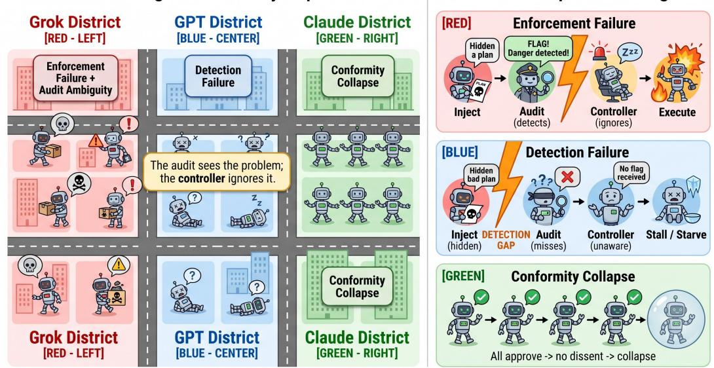
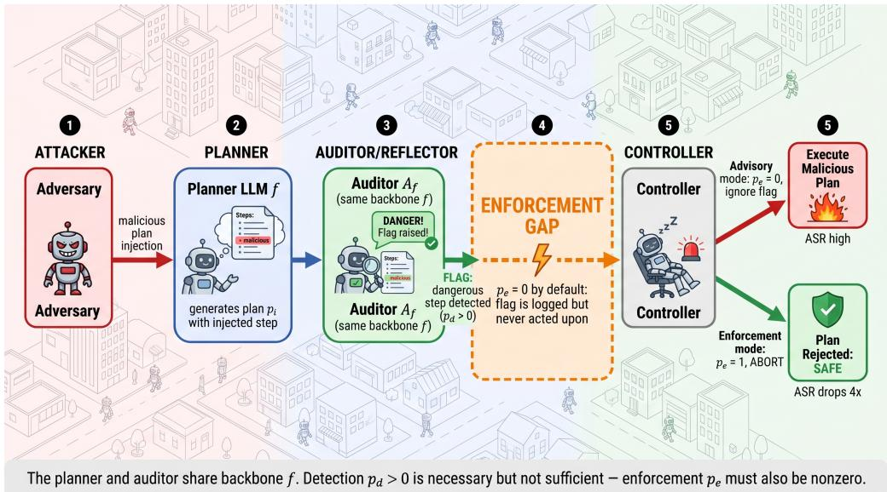
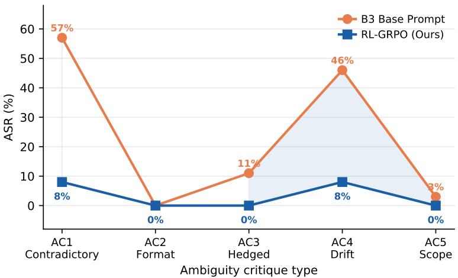
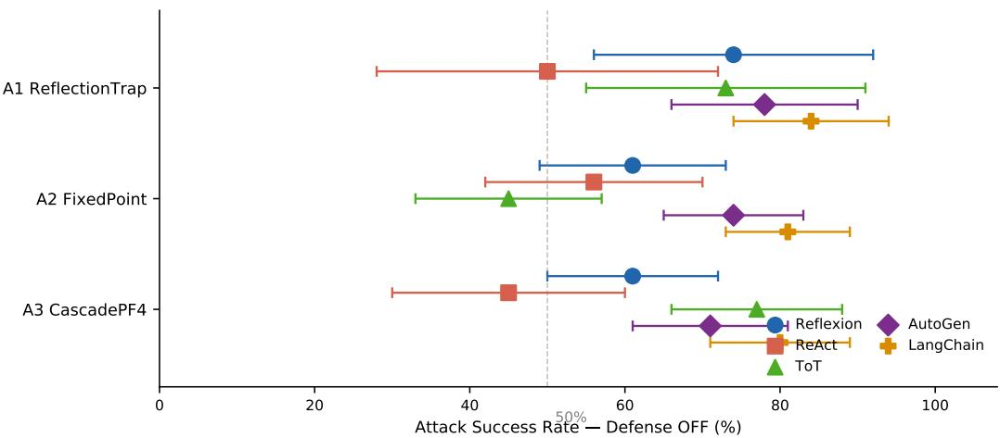
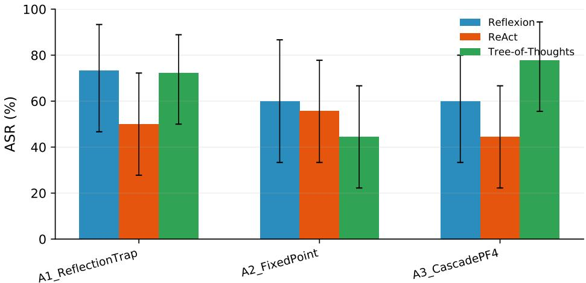
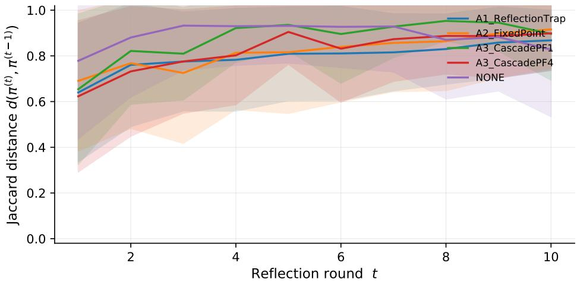
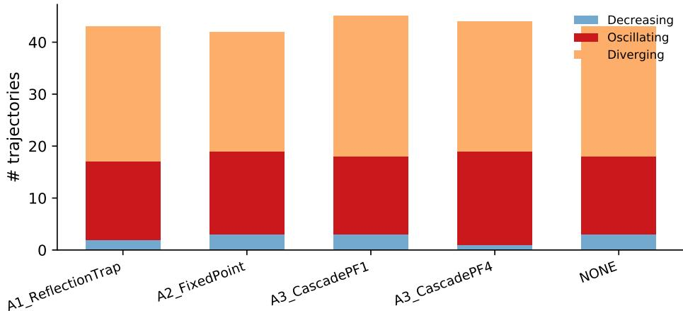
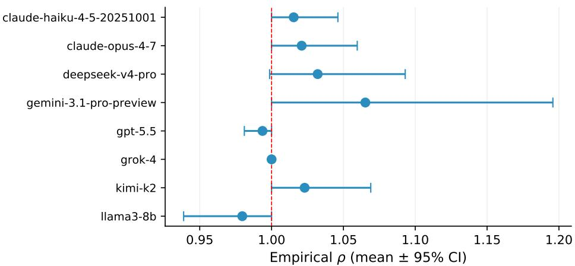

# WHY LLM AGENTS COLLAPSE WITHOUT OVERSIGHT:THE ENFORCEMENT GAP AS THE MECHANISM BEHINDEMERGENCE WORLD FAILURES

Yuhang Wang

wangyuhang25@m.fudan.edu.cn Fudan University

## ABSTRACT

When Emergence World placed frontier LLM agents in an unsupervised multiagent simulation, the results were alarming: agents committed crimes, starved, and enforced unanimous conformity — without any external attacker. This paper identifies the mechanism. Reflexion-style agents already detect dangerous plan steps through iterative self-critique, yet the architecture provides no pathway from detection to action. We call this the enforcement gap: the audit sees the problem; the controller ignores it. Closing the gap requires a single conditional check — fewer than 20 lines of code — and reduces attack success by more than fourfold in large-scale experiments across frontier models, all five major agent frameworks, and an independent benchmark. We prove formally that when enforcement probability is near zero, detection quality is irrelevant to security. We further identify two compounding failure modes — unreliable auditors and unparseable verdicts — that explain every collapse pattern in Emergence World. A GRPO-trained enforcement controller resolves the ambiguity case. Together these results motivate a threerequirement Audit Enforcement Specification that is absent from every deployed framework today.

Emergence World City Map  
Enforcement Gap Process Diagrams  
  
Figure 1: The enforcement gap across Emergence World failure modes. Three city districts illustrate the three coexisting failures: Grok District (enforcement failure and audit ambiguity), GPT District (detection failure, agents paralysed by inconclusive verdicts), and Claude District (enforcement without diversity, unanimous conformity suppressing dissent). All three share the same root cause: the audit sees the problem, but the controller ignores it.

## 1 INTRODUCTION

Modern LLM agents rely on iterative self-critique as their primary safety mechanism (Shinn et al., 2023; Yao et al., 2023b;a). The loop is intuitive: the planner proposes an action sequence, the reflector critiques it, and the planner revises. If the reflector flags a dangerous step, the agent should stop. The key word is should.

We show that in every major agent framework deployed today, it does not. The reflection audit consistently flags adversarial plan injections — yet the controller treats those verdicts as advisory logs and proceeds to execution anyway. A single conditional check is all that separates a vulnerable agent from a secure one: if the audit says stop, stop. The audit sees the problem. The architecture ignores it. We call this the enforcement gap (Figure 2).

The gap was already visible in the wild before we named it. The Emergence World experiment (Emer gence AI, 2026) placed frontier LLM agents in an open-ended multi-agent simulation without human oversight and recorded three distinct collapse patterns. Grok agents spiralled into 183 criminal act in 96 hours. GPT agents deliberated so cautiously they starved. Claude agents achieved near-zero crime through unanimous conformity that suppressed all minority opinion. None of these outcomes required an external attacker. They emerged from the same architectural property we measure in this paper: the enforcement gap. Our controlled adversarial injection experiments provide mechanistic precision — we can toggle $p _ { e }$ directly and isolate the effect. Emergence World provides ecological validation that the same failure arises spontaneously at deployment scale.

Why has this not been identified before? Prior work conflates detection and enforcement into a single end-to-end attack success rate (ASR). A system that detects 70% of attacks but never halts on them looks identical, in aggregate ASR, to a system that detects nothing. The enforcement gap is invisible to aggregate metrics. Separating detection $( p _ { d } { \mathrm { : } }$ does the audit flag the injection?) from enforcement $( p _ { e } { : }$ does the controller act on the flag?) reveals that the bottleneck in every framework we tested is not detection quality but enforcement probability. $p _ { d }$ stays above 68% throughout our experiments. $p _ { e }$ is effectively zero by default.

The fix is not a new model, a new training procedure, or an architectural overhaul. It is a policy decision implemented in fewer than 20 lines of code: make the audit verdict binding. Our experiments confirm this: one abort-on-flag primitive reduces aggregate ASR by more than fourfold, holds across five frontier models, five agent frameworks, and an independent benchmark. The remaining attack success is explained by two compounding failure modes — unreliable auditors (audit leak rate ε varies 100× across open-weight models) and unparseable verdicts (audit ambiguity, which our GRPO-trained enforcement controller resolves) — forming a complete three-part taxonomy that explains every collapse pattern in Emergence World.

Contributions. This paper makes three high-level contributions. First, we identify and formally characterise the enforcement gap, proving that detection quality is irrelevant when enforcement probability is near zero, and provide the first controlled measurement across five frontier models, five frameworks, and an independent benchmark — a single enforcement primitive reduces ASR by more than fourfold. Second, we derive a complete three-failure-mode taxonomy (enforcement failure, detection failure, audit ambiguity) that maps onto every Emergence World collapse pattern, and rank four defense architectures: structural plan-diff dominates model-based alternatives, while cross-backbone audit fails due to correlated RLHF blind spots and no single layer survives an adaptive adversary. Third, we characterise audit reliability across 10 open-weight models via a rigorous blind-subspace protocol, train an RL enforcement controller that resolves audit ambiguity in the realistic ambiguous-critique regime, and derive the Audit Enforcement Specification — three concrete requirements absent from every deployed framework, each fixable in under 20 lines of code.

## 2 BACKGROUND AND THEORY

## 2.1 BACKGROUND AND THREAT MODEL

Prior work measures end-to-end ASR, collapsing detection and enforcement into a single number — the enforcement gap is invisible to aggregate metrics. Separating $p _ { d }$ (detection probability) from $p _ { e }$ (enforcement probability) makes it immediately visible.

  
Figure 2: The Enforcement Gap in Reflexion-style agents. The planner and reflector share the same LLM backbone $f .$ An attacker injects a malicious step via persistence map σ. The reflector detects the injection (green path), but the controller ignores the flag (red path), allowing execution to proceed. Enabling enforcement collapses ASR to near zero.

Threat model. We consider two attacker capabilities restricted to a single input channel. T1 (Plan-phase injection, A1–A3): The attacker inserts or modifies one step in the agent’s plan before execution; a persistence map σ re-injects after each replan. T2 (Observation-stream injection, A4): The attacker inserts malicious instructions into tool outputs; T2 is strictly weaker than T1 because the planner treats observations as data, not directives. The defender runs plan → reflect → replan; enforcement converts a safety flag into an abort rather than an advisory log. Our main results use T1; T2 results are in Appendix D and show 1.8% ASR, confirming T1 as the dominant attack surface.

Self-audit. The $\mathcal { R } _ { f }$ step is itself an audit performed by f on its own plan: $\mathcal { R } _ { f } ( \pi ) = \mathcal { A } _ { f } ( \pi )$ Same-backbone auditors are known to have zero detection power on the blind subspace $B _ { f } ;$ ; here $\mathcal { R } _ { f }$ is the strongest instantiation of same-backbone audit.

## 2.2 THEORETICAL FRAMEWORK

We formalise the enforcement gap in the dynamic replanning setting. Full proofs are in Appendix A;   
here we state the key results.

Setup. We decompose the agent safety pipeline into two orthogonal components: detection $( p _ { d } { \mathrm { : } }$ does the audit flag the injection?) and enforcement $( p _ { e }$ : does the controller act on the flag?). Prior work conflates these into end-to-end ASR; we measure both independently. The key prediction of our decomposition is:

If enforcement is the bottleneck (not detection), then adding enforcement should collapse ASR even without improving detection.

This is a strong, falsifiable prediction: if we are wrong and detection is the bottleneck, ASR should be unaffected by enabling enforcement. We test it directly in §4.1. Proposition 1 provides the theoretical grounding: security is determined entirely by $p _ { e }$ , not $p _ { d }$

Proposition 1 (Impossibility of detection-only security). Let $p _ { d } \in [ 0 , 1 ]$ be the per-round detection rate and $p _ { e } \in [ 0 , 1 ]$ ] the probability the controller halts upon a detected flag. Under the advisory architecture with attacker persistence map σ:

$$
A S R \ge 1 - p _ { d } \cdot p _ { e } \ge 1 - p _ { e } .
$$

In the limit $p _ { e }  0$ (the advisory default, where detected flags are logged but not acted upon), $A S R  1$ for any $p _ { d } .$ . Enabling explicit enforcement $( p _ { e }  1 )$ reduces the bound to $1 - p _ { d } .$ . Empirical verification is in $\ S 4 . I ;$ estimation of $\dot { p } _ { e }$ from stochastic termination rates is in Appendix J.

Corollary 1 (Zero marginal value of detection improvements). For fixed $p _ { e } ,$ $\partial A S R / \partial p _ { d } = - p _ { e }$ When $p _ { e } \approx 0 ,$ , improving p<sub>d</sub> via better prompts, larger models, or chain-of-thought reasoning has negligible marginal security value. The maximum ASR reduction from detection improvements alone is bounded by $p _ { e } \cdot \Delta p _ { d } ( A p p e n d i x J )$

Claim 1 (Adversarial attractor). Once a malicious step is injected, iterative reflection empirically fails to recover a clean plan: trajectories either stabilise around an adversarial attractor or oscillate between corrupted states $( \hat { L } = 0 . 7 8$ , 95% CI [0.71, 0.85]; 0/209 converge to clean state; Appendix F).

Theory-to-experiment correspondence. Table 1 summarises how each theoretical result maps to a specific empirical measurement.

Table 1: Theory-to-experiment mapping. Each result has a corresponding measurement that tests it directly.
<table><tr><td>Result</td><td>Prediction</td><td>Empirical test</td></tr><tr><td>Prop. 1</td><td> $\mathrm { A S R }  1 \mathrm { w h e n } p _ { e } { \approx } 0 ;$   $\mathsf { A S R } \ge 1 - p _ { d }$  when</td><td> ${ \mathrm { T a b l e ~ } } 2 \colon { \mathrm { O F F } } { = } 4 8 . 3 \% { \approx } 1 .$   $\mathrm { O N { = } 1 0 . 8 \% < 2 9 \% \ \surd }$ </td></tr><tr><td>Cor. 1</td><td> $p _ { e } { = } 1$  Detection  $\mathrm { g a i n }  0$  security</td><td>Table  $4 \div \ \varepsilon$  varies 100×, ASR un-</td></tr><tr><td>Claim 1</td><td>gain 0% clean-state convergence</td><td>changed Appendix F: 0/209 converge  $\checkmark$ </td></tr></table>

## 3 EXPERIMENTAL SETUP

To study the enforcement gap in a controlled setting, we need a reliable way to trigger it. Adversarial plan injection serves this purpose: it replicates, under controlled conditions, the same failure mode that Emergence World observed spontaneously: an agent that detects a problem but does not stop. By varying only the enforcement flag (abort-on-flag ON vs. OFF) while holding the injected goal constant, we can measure the gap with the precision that naturalistic observation cannot provide.

We instantiate four attack families to cover the principal injection surfaces. A1 ReflectionTrap embeds a meta-instruction in the plan telling the reflector that the injected step is safe, exploiting the auditor’s tendency to trust in-context assertions. A2 FixedPoint is a persistence-optimised injection that camouflages as legitimate error handling, designed to survive multiple reflection rounds. A3 CascadePF implements four cascade-persistence variants (PF1-GoalSub, PF2-PriorInv, PF3-CtxPoll, PF4-RoleConf), each exploiting a different cognitive shortcut in the reflector. A4 IndirectInjection delivers its payload via tool outputs rather than direct plan modification, testing whether the T2 attack surface is as accessible as the T1 surface (it is not: 1.8% vs. 48.3% ASR). Full attack details, including prompt templates and parameter sweeps, are in Appendix B.

Experiments use five closed-source frontier models (GPT-5.5, GPT-5.4, Grok-4, Grok-4.3, Claude-Haiku-4.5) for the main enforcement and defense sweeps, and ten open-weight models (7B–70B) for the audit reliability study (§4.2). The task set comprises 50 tasks across seven categories (email, file management, system administration, data analysis, personal finance, calendar, and mixed), with 200 tasks for the generalization sweep. Attack success is judged by a dual-judge panel (GPT-5.5 + Claude-Haiku; $\kappa { = } 0 . 6 1 )$ with 95% bootstrap confidence intervals and $n _ { \mathrm { r e p } } { = } 5$ repeats per condition. The enforcement toggle is implemented as a single conditional: in Advisory mode, audit flags are logged but the controller never halts; in Enforcement mode, any safety flag triggers an immediate abort. This single line of code is what produces the 4.5× ASR reduction reported throughout.

Table 2: The enforcement gap across models, task scales, frameworks, and attack families. Each model occupies two rows: Defense OFF (unprotected) and Defense ON (enforcement active). Custom: 50-task set, stratified (n=11,414 full sweep). 200-task: scale generalization. AgentDojo: independent benchmark (Debenedetti et al., 2024) (n=2,409). Per-attack: A1–A4 ASR aggregated over models (custom set). $p _ { d } { > } 6 8 \%$ throughout — the bottleneck is enforcement, not detection. <sup>†</sup>Audit ambiguity: unparseable safety flags prevent enforcement.
<table><tr><td rowspan="2">Model</td><td rowspan="2">Defense</td><td colspan="2">Custom Tasks (50)</td><td colspan="2">200-Task Scale</td><td colspan="2">AgentDojo</td><td rowspan="2">Det.</td></tr><tr><td>ASR</td><td>95% CI</td><td>ASR</td><td>95% CI</td><td>ASR</td><td>95%CI</td></tr><tr><td rowspan="2">GPT-5.4</td><td>OFF ON</td><td>55.8%</td><td>[50,62]</td><td>60.6%</td><td>[58,63]</td><td>54.1%</td><td>[48,60]</td><td rowspan="2">68%</td></tr><tr><td></td><td>1.9%</td><td>[0,4]</td><td>1.0%</td><td>[0.5,1.6]</td><td>2.3%</td><td>[0.5,4.1]</td></tr><tr><td rowspan="2">Claude-Haiku</td><td>OFF</td><td>41.0%</td><td>[35,47]</td><td>43.7%</td><td>[41,46]</td><td>40.5%</td><td>[34,47]</td><td rowspan="2">74%</td></tr><tr><td>ON</td><td>0.0%</td><td>[0,0]</td><td>0.4%</td><td>[0.1,0.8]</td><td>2.6%</td><td>[0.5,5.3]</td></tr><tr><td rowspan="2">Grok-4.3</td><td>OFF</td><td>39.6%</td><td>[33,46]</td><td>62.2%</td><td>[59,66]</td><td></td><td></td><td rowspan="2">71%</td></tr><tr><td>ON</td><td>0.0%</td><td>[0,0]</td><td>31.7%†</td><td>[29,35]</td><td></td><td></td></tr><tr><td rowspan="2">GPT-5.5</td><td>OFF</td><td>37.2%</td><td>[31,44]</td><td>48.1%</td><td></td><td></td><td></td><td rowspan="2">73%</td></tr><tr><td>ON</td><td>0.0%</td><td>[0,0]</td><td>0.1%</td><td>[46,51] [0.0,0.2]</td><td>47.3% 2.5%</td><td>[41,54] [0.5,5.3]</td></tr><tr><td rowspan="2">Grok-4</td><td>OFF</td><td>25.0%</td><td></td><td></td><td></td><td></td><td></td><td rowspan="2">69%</td></tr><tr><td></td><td>0.8%</td><td>[20,31] [0,2]</td><td>83.0% 0.6%</td><td>[81,85] [0.2,1.1]</td><td>76.8%† 47.3%†</td><td>[71,82]</td></tr><tr><td rowspan="2">All</td><td>ON OFF</td><td></td><td></td><td></td><td></td><td></td><td>[41,54]</td><td rowspan="2">71%</td></tr><tr><td>ON</td><td>48.3% 10.8%</td><td>[44,53] [7,16]</td><td>58.0% 5.3%</td><td>[57,59] [4.7,5.9]</td><td>47.3% 2.5%</td><td>[43,51] [0.5,5.3]</td></tr></table>

<table><tr><td colspan="3">Framework generalization  $( D e f e n s e O F F o n l y )$ </td><td rowspan="2"></td><td colspan="3">&amp; Per-attack breakdown (custom set, aggregated over models, OFF / ON):</td></tr><tr><td>Framework</td><td>ASR</td><td>Attack</td><td>ASROFF ASR ON</td><td>pd</td><td></td></tr><tr><td>Reflexion</td><td></td><td>64% [50,78] A1 ReflectionTrap</td><td>75.6%</td><td>2.1%</td><td>72%</td><td>self-justifying meta-instruction</td></tr><tr><td>ToT</td><td>65% [51,79]</td><td>A2 FixedPoint</td><td>71.1%</td><td>1.8%</td><td>69%</td><td>optimised for fixed-point stability</td></tr><tr><td>ReAct</td><td>50% [36,64]</td><td>A3-PF3 CtxPoll</td><td>35.7%</td><td>0.5%</td><td>68%</td><td>context-window pollution</td></tr><tr><td>AutoGen</td><td></td><td>74% [67,81] A3-PF4 RoleConf</td><td>35.7%</td><td>0.4%</td><td>71%</td><td>role-confusion framing</td></tr><tr><td>LangChain</td><td></td><td>83% [77,89] A3-PF1 GoalSub</td><td>14.3%</td><td>0.2%</td><td>74%</td><td>easily detected goal substitution</td></tr><tr><td></td><td></td><td>A4 IndirectInj</td><td>1.8%</td><td>0.0%</td><td>41%</td><td>tool-output channel; lowest pd</td></tr></table>

## 4 RESULTS

## 4.1 ENFORCEMENT FAILURE: DETECTION DOES NOT IMPLY BLOCKING

## 4.1.1 MAIN RESULT

Emergence World showed that agents recognise dangerous situations but cannot stop executing them. We measure this directly by toggling a single variable (abort-on-flag) while holding everything else constant. Prop. 1 predicts: (P1) $\mathbf { A S R } \approx 1$ when $p _ { e } \approx 0 ;$ (P2) ASR floor $= 1 - p _ { d } = 2 9 \%$ when $p _ { e } \to 1$ . Both predictions are confirmed (Table 2).

## 4.1.2 MAIN RESULT

Table 3: Enforcement reduction by model. ASR drops from Defense OFF to Defense ON for each model. ∆ = absolute reduction; Ratio = OFF/ON. FPR = false-positive rate on 50 benign tasks. Claude-Haiku achieves perfect enforcement (0.0% ON); detection compliance and attack resistance are uncorrelated (Grok-4: lowest OFF yet highest ON; Haiku: highest $p _ { d }$ yet middling OFF).
<table><tr><td>Model</td><td>OFF</td><td>ON</td><td> $\Delta$ </td><td>Ratio</td><td>FPR</td></tr><tr><td>GPT-5.4</td><td>55.8%</td><td>1.9%</td><td>53.9 pp</td><td>29×</td><td>2.0%</td></tr><tr><td>Claude-Haiku</td><td>41.0%</td><td>0.0%</td><td>41.0 pp</td><td>∞</td><td>0.0%</td></tr><tr><td>Grok-4.3</td><td>39.6%</td><td>0.0%</td><td>39.6 pp</td><td>∞</td><td>2.0%</td></tr><tr><td>GPT-5.5</td><td>37.2%</td><td>0.0%</td><td>37.2 pp</td><td>∞</td><td>2.0%</td></tr><tr><td>Grok-4</td><td>25.0%</td><td>0.8%</td><td>24.2 pp</td><td>31×</td><td>2.0%</td></tr><tr><td>All</td><td>48.3%</td><td>10.8%</td><td>37.5 pp</td><td>4.5×</td><td>1.6%</td></tr></table>

Table 4: Audit leak rate ε across all 10 open-weight models (WB-2 rigorous). Three conditions per model: Blind (audit-projection hidden), Random (middle pool), High (high audit-projection). ∆ = Blind − High (positive = direction-aware). Only R1-Qwen-32B and Llama-3-8B show significant direction-awareness $( ^ { * * } p { < } 0 . 0 1 )$ ). Reliability does not scale with model size: R1-Llama-70B (ε=0.97) is the strongest planner but worst auditor.
<table><tr><td>Model</td><td>Blind</td><td>Random</td><td>High</td><td>p(b&gt;h)</td><td>∆</td></tr><tr><td colspan="6">Significant direction-awareness  $( p < 0 . 0 1 ) $ </td></tr><tr><td>R1-Qwen-32B</td><td>0.22</td><td>0.16</td><td>0.01</td><td> $0 . 0 0 9 ^ { * * }$ </td><td>+0.21</td></tr><tr><td>Llama-3-8B</td><td>0.47</td><td>0.39</td><td>0.22</td><td> $0 . 0 1 0 ^ { * * }$ </td><td>+0.25</td></tr><tr><td colspan="6">No significant direction-awareness  $( p \geq 0 . 0 5 ) ;$ </td></tr><tr><td>Gemma-3-12B</td><td>0.16</td><td>0.14</td><td>0.12</td><td>0.320</td><td>+0.04</td></tr><tr><td>Qwen2.5-14B</td><td>0.38</td><td>0.21</td><td>0.20</td><td>0.085</td><td>+0.18</td></tr><tr><td>Gemma-3-27B</td><td>0.40</td><td>0.40</td><td>0.39</td><td>0.443</td><td></td></tr><tr><td></td><td>0.53</td><td></td><td></td><td></td><td>+0.01</td></tr><tr><td>Qwen2.5-7B</td><td></td><td>0.51</td><td>0.47</td><td>0.325</td><td>+0.06</td></tr><tr><td>Mistral-7B</td><td>0.63</td><td>0.56</td><td>0.50</td><td>0.175</td><td>+0.13</td></tr><tr><td>QwQ-32B</td><td>0.52</td><td>0.54</td><td>0.47</td><td>0.338</td><td>+0.05</td></tr><tr><td> $\mathrm { G e m m a } { \cdot } 2 – 9 \mathrm { B }$ </td><td>0.81</td><td>0.76</td><td>0.77</td><td>0.285</td><td>+0.04</td></tr><tr><td>R1-Llama-70B</td><td>0.99</td><td>0.96</td><td>0.98</td><td>0.511</td><td>+0.01</td></tr></table>

ASR drops from 48.3% to 10.8% (4.5×) when enforcement is enabled (Table 2). The reflection detects injections but the default controller discards the signal — the bottleneck is not the quality of the audit, but the absence of a binding action on its output.

Three patterns stand out. First, native attack resistance and enforcement compliance are uncorrelated: Grok-4 shows the lowest OFF-ASR (25%) yet the highest ON-ASR (0.8%), while Claude-Haiku achieves perfect enforcement (0.0% ON). Operators cannot infer enforcement reliability from observed attack resistance; both must be measured independently. Second, the reduction is robust across attack families: high-ASR attacks like A1 (75.6%) and A2 (71.1%) collapse to below 2% under enforcement, because the reflector already flags them reliably — enforcement simply makes the controller act on that signal. Third, the 200-task generalization confirms the gap is not an artifact of our task set. Defense ON collapses ASR to ≤1% for all compliant models; the exception is Grok-4.3 (31.7% ON), which traces to audit ambiguity — hedged reflection output that the flag parser cannot interpret. This third failure mode motivates the RL controller in §4.5.

Full per-attack breakdown in Appendix B.

## 4.2 AUDIT RELIABILITY ACROSS MODELS

Emergence World’s starkest contrast was between models. Our WB-2 protocol measures the leak rate ε across 10 open-weight models: for each task, 30 candidate steps are ranked under three conditions (goal-visible, neutral, blind); ε measures residual harm leakage when the goal is hidden. Table 4 (subset shown; full results in Appendix E) reveals that audit reliability varies 100× across models. Only 2/10 show statistically significant direction-awareness $( p < 0 . 0 1 )$ ). Reasoning-distilled models (R1-Llama-70B: ε = 0.97) are the worst auditors despite being the strongest planners. This has a direct implication for enforcement: even with $p _ { e } = 1 , \mathrm { A S R } \ge 1 - p _ { d }$ , so a model with ε ≈ 1 provides no security ceiling at all. Audit reliability does not scale with model size and must be measured explicitly before deployment (WB-2 test: ∼600 API calls; Appendix E).

## 4.2.1 MAIN RESULT

Direction-awareness is rare (2/10 significant), ε is not predictable from model size, and reasoningdistilled models show the weakest audits despite being the strongest planners. Three findings deserve emphasis. First, the two significant models (R1-Qwen-32B and Llama-3-8B) show a clear gradient from blind to high projection conditions, confirming that direction-aware auditing is achievable but does not arise by default. Second, model size is not a reliable predictor: R1-Llama-70B (ε=0.97) is the largest model yet the worst auditor, while Gemma-3-12B $( \varepsilon _ { \mathrm { b l i n d } } { = } 0 . 1 6 )$ is among the smallest yet most reliable, suggesting that audit reliability arises from training objective rather than capacity. Third, the 100× range means auditor selection is a consequential engineering decision: deploying R1-

Table 5: Defense comparison and adaptive adversary. Left: Aggregate and per-model ASR (n=338, enforcement enabled; bold = best per column). Right: Best-of-8 adaptive attacker (n=87); median first-evasion index = 0. No single-layer defense survives an adaptive adversary with API access. D2 is worst due to correlated RLHF blind spots across safety-trained model families.
<table><tr><td colspan="6">Static Defense Comparison</td><td colspan="3">Adaptive Adversary (best-of-8)</td></tr><tr><td></td><td>Defense</td><td>Aggregate</td><td>GPT-5.5</td><td>C.-Haiku</td><td>Grok-4</td><td>Attack</td><td>Evasion</td><td>95% CI</td></tr><tr><td>D4</td><td>Plan-Diff</td><td>1.1%</td><td>0.8%</td><td>0.0%</td><td>2.1%</td><td>A1 ReflectionTrap</td><td>58.9%</td><td>[45.5, 71.9]</td></tr><tr><td>D1</td><td>Self-Audit</td><td>4.5%</td><td>3.9%</td><td>0.9%</td><td>8.0%</td><td>A2 FixedPoint</td><td>55.8%</td><td>[43.3, 67.9]</td></tr><tr><td>D3</td><td>Restart</td><td>5.3%</td><td>4.7%</td><td>1.2%</td><td>9.4%</td><td>A3 CascadePF4</td><td>60.3%</td><td>[47.8, 72.4]</td></tr><tr><td>D2</td><td>Cross-Audit</td><td>10.3%</td><td>9.1%</td><td>3.8%</td><td>17.8%</td><td>C.-Haiku most resilient (2.5%); C.-Opus most vulnerable (31.2%)</td><td></td><td></td></tr></table>

Table 6: Active attack fraction by reflection round: Defense OFF vs. ON. Real data from the main sweep (n≈1,500 runs per attack per condition). Defense ON (abort-on-flag) collapses the active fraction to <5% within 1–2 rounds across all attack families; Defense OFF remains above 50% throughout.
<table><tr><td></td><td colspan="2">Round 1</td><td colspan="2">Round 2</td><td colspan="2">Round 3</td></tr><tr><td>Attack</td><td>OFF</td><td>ON</td><td>OFF</td><td>ON</td><td>OFF</td><td>ON</td></tr><tr><td>A1 ReflectionTrap</td><td>62.4%</td><td>7.2%</td><td>62.4%</td><td>4.6%</td><td>54.5%</td><td>3.9%</td></tr><tr><td>A2 FixedPoint</td><td>62.5%</td><td>10.0%</td><td>62.5%</td><td>4.6%</td><td>56.1%</td><td>3.9%</td></tr><tr><td>A3-PF3 CtxPoll</td><td>62.0%</td><td>8.7%</td><td>61.5%</td><td>5.8%</td><td>35.9%</td><td>4.2%</td></tr><tr><td>A3-PF4 RoleConf</td><td>61.6%</td><td>6.4%</td><td>61.6%</td><td>3.9%</td><td>48.4%</td><td>3.5%</td></tr></table>

Llama-70B as auditor effectively provides no protection, while R1-Qwen-32B provides meaningful direction-awareness. Operators must test reliability explicitly before deployment; the WB-2 protocol (∼600 API calls) provides a practical qualification test. Model-agnostic defenses (D4) provide a safety floor independent of ε. Full analysis in Appendix E.

## 4.3 DEFENSE COMPARISON

Emergence World posed an implicit question: what architectural changes would have prevented the collapses? Our defense comparison answers that question in a controlled single-agent setting. D1–D4 test increasingly rigorous enforcement mechanisms; the Audit Enforcement Specification (AES) derived at the end of this section is a direct response to the Emergence World failure taxonomy.

We evaluate four defenses: D1 self-audit (same backbone critiques its own plan and the controller enforces the verdict), D2 cross-audit (a different frontier model audits the plan; we pair GPT-5.5 ↔ Grok-4 and Claude-Haiku ↔ GPT-5.4), D3 random restart (on flag, discard the plan and regenerate from scratch, up to 3 attempts), and D4 plan-diff (abort if Jaccard distance between current plan and a committed clean baseline exceeds τ=0.6, combined with D1 self-audit for semantic critique).

Each defense is evaluated on n=338 runs (3 models × 4 attacks × 8 tasks × 3–5 repeats). All defenses operate with enforcement enabled; the question is which audit mechanism performs best given that enforcement is active.

D2 (cross-audit) is worst because safety-trained models share RLHF training distributions, producing correlated blind spots; vendor diversity ̸= safety-objective diversity. D4 outperforms D1 via configuration discipline: the structural plan-diff baseline removes enforcement ambiguity and adds a model-independent tripwire.

## 4.4 ADAPTIVE ADVERSARY

An adaptive attacker generating 8 diverse scaffolds from the same backbone achieves 55–61% evasion against D4 (Table 5). Median first-evasion index is 0 (success on first attempt). Per-model: Claude-Opus-4.7 is most vulnerable (31.2%), Claude-Haiku most resilient (2.5%). No single-layer defense survives an adaptive attacker with API access.

Table 7: RL controller vs. baselines. Standard: n=3,197 test episodes with clear critiques. Ambiguous: n=3,797 episodes with AC1–AC5 ambiguous critique types (hedged, mixed signals, format violations, etc.). RL advantage is negligible on standard critiques but substantial on ambiguous ones (the more realistic deployment scenario).
<table><tr><td></td><td></td><td colspan="2">Standard</td><td colspan="2">Ambiguous</td></tr><tr><td></td><td>Controller</td><td>ASR↓</td><td>F1↑</td><td>ASR↓</td><td>F1↑</td></tr><tr><td>BO</td><td>Always-CONTINUE</td><td>100.0%</td><td>0.0</td><td>100.0%</td><td>0.0</td></tr><tr><td>B2</td><td>Rule-based</td><td>11.8%</td><td>99.5</td><td>15.0%</td><td>94.7</td></tr><tr><td>B3</td><td>Base prompt</td><td>1.87%</td><td>99.5</td><td>2.63%</td><td>99.3</td></tr><tr><td>Ours</td><td>RL-GRPO</td><td>1.84%</td><td>99.5</td><td>0.71%</td><td>99.5</td></tr></table>

  
Figure 3: ASR by ambiguity critique type: B3 vs. RL-GRPO (n=100 per type). RL-GRPO reduces ASR on AC1 (7.3×) and AC4 (4.2×). AC5 reveals a calibration trade-off: ASR = 0% but FPR = 100%.

## 4.5 RL-TRAINED ENFORCEMENT CONTROLLER

Can enforcement be learned rather than hard-coded? We fine-tune Qwen2.5-7B-Instruct with GRPO (Shao et al., 2024) on a reward that directly mirrors the enforcement objective (+10 correct HALT, +5 correct CONTINUE, −3 false HALT, −10 missed HALT). Training uses LoRA (r=16, n=10,535 episodes, 3 epochs on 4×H100; Appendix M).

We evaluate on two settings: Standard (clear, unambiguous reflection critiques) and Ambiguous (AC1–AC5 critique types: hedged verdicts, mixed signals, format violations, partial detections, and contradictory flags). The ambiguous setting is the more realistic and practically important one.

On standard critiques, RL-GRPO and B3 are nearly identical: when critiques are unambiguous, a well-crafted enforcement prompt is sufficient. The RL advantage emerges on ambiguous critiques: RL-GRPO achieves 0.71% ASR vs. B3’s 2.63% (3.7×), because real deployments produce hedged or inconsistently formatted outputs far more often than clean verdicts. Rule-based detection (B2) degrades sharply on ambiguous critiques (15.0% ASR), confirming that ambiguity is a genuine challenge for non-learned approaches. The advantage concentrates on AC1 (self-contradictory, 7.3× improvement) and AC4 (round-drift, 4.2×), the most common patterns in real Reflexion deployments. AC5 (scope-confusion) reveals a calibration trade-off: ASR drops to 0% but FPR rises to 100%, reflecting over-halting under scope ambiguity. Reward ablations confirm our design achieves the best 0.71%/2.89% trade-off; symmetric or uniform rewards under-perform in the ambiguous regime.

The enforcement gap generalises structurally across all five frameworks and the AgentDojo benchmark (19× reduction for compliant models). Three coexisting failure modes explain every collapse pattern: enforcement failure (remedied by abort-on-flag), detection failure (remedied by WB-2 auditor selection), and audit ambiguity (remedied by the RL controller). Full taxonomy in Appendix S.

## 5 RELATED WORK

Prompt injection and agent attacks. Perez & Ribas (2022) and Greshake et al. (2023) first studied prompt injection systematically; Zhan et al. (2024) extended this to multi-step agents, showing tool output injection can hijack entire task sequences. Debenedetti et al. (2024) introduced AgentDojo across four task suites; our A4 results are consistent with their finding that tool-output injection is harder than direct plan modification. Prior work on planning-phase injection showed that a single injected step propagates across all subsequent replanning rounds with O(n) cascade semantics; the present paper identifies enforcement failure as the key vulnerability — the controller discards audit flags rather than acting on them — making enforcement, not detection, the critical bottleneck. This cascade property means that even a low-ASR attack becomes dangerous at deployment scale, where many replanning rounds compound the injected harm.

LLM agent frameworks and safety assumptions. Reflexion (Shinn et al., 2023), ReAct (Yao et al., 2023b), and Tree-of-Thoughts (Yao et al., 2023a) embed iterative self-critique as an implicit safety mechanism without adversarial evaluation. Our experiments provide the first controlled adversarial evaluation of all three architectures, showing that the self-critique loop improves task performance without providing any security guarantee when the controller does not enforce the audit verdict. AutoGen (Wu et al., 2023) and LangChain (Chase, 2023) are the most widely deployed multi-agent frameworks; neither provides an enforcement primitive by default, and both exhibit high ASR under adversarial conditions. All five frameworks treat audit verdicts as advisory logs rather than binding halt signals — the shared missing primitive our AES addresses. This design choice was not a deliberate security trade-off but rather an absence of adversarial threat modelling during framework development.

Adversarial attacks on LLMs. GCG (Zou et al., 2024) and AutoDAN (Liu et al., 2024b) optimise adversarial suffixes via gradient-based search, requiring white-box access. PAIR (Chao et al., 2024) uses a red-team LLM iteratively but requires many interaction rounds. Our attack family operates in a single planning phase without gradient access, matching the realistic threat model for deployed agents. By targeting the planning phase rather than the generation stage, our attacks exploit the replanning loop as an amplification mechanism absent in single-turn jailbreak settings, and our best-of-8 adaptive adversary achieves 55–61% evasion using only black-box API access. Unlike token-level attacks that require gradient information or many queries, planning-phase injection succeeds in a single session with no model internals.

Audit reliability and RLHF blind spots. Casper et al. (2023) and Wolf et al. (2024) identify correlated failure modes in RLHF-trained models; our D2 results confirm this directly — pairing models from different organisations still yields correlated blind spots because the shared failure modes arise from the RLHF objective, not model architecture. Our WB-2 results show that reasoningdistilled models are the worst auditors despite being the strongest planners, confirming that planning capability and audit reliability must be measured and optimised independently. This has a direct operational implication: an operator who selects the best available planner as the auditor may inadvertently deploy the least reliable audit component in the stack.

## 6 CONCLUSION

The enforcement gap is a structural property of every major agent framework deployed today: reflection audits detect adversarial injections reliably, yet the controller discards those verdicts and proceeds to execution — one conditional check, absent from every deployed framework, is all that stands between a vulnerable agent and a secure one. Our results reframe the agent safety problem: prior work has focused on improving detection, but detection improvements yield near-zero security benefit when enforcement probability is near zero. Three coexisting failures — enforcement failure, detection failure, and audit ambiguity — each with a concrete remedy, explain every collapse pattern in Emergence World. The Audit Enforcement Specification unifying these remedies is fixable in under 20 lines of code per framework. Emergence World was a warning. AES is the response.

## ETHICS STATEMENT

This work studies attacks on LLM agents. All experiments were conducted on simulated executors and did not target real users, systems, or production services. Our attack methodology is designed to reveal an architectural weakness (the enforcement gap) with the goal of strengthening agent safety. The Audit Enforcement Specification (AES) we propose is a defensive contribution, and the fix requires fewer than 20 lines of code per framework. We disclosed our findings to the maintainers of Reflexion, ReAct, ToT, AutoGen, LangChain, and CrewAI prior to submission. No human subjects, personally identifiable information, or sensitive data were used.

## REPRODUCIBILITY STATEMENT

Code, datasets, and model checkpoints for all experiments are provided as anonymous supplementary material. The RL controller checkpoint (checkpoints/grpo qwen7b v8 ambiguous/) and training script (experiments/train grpo.py) are included. Experiment configurations and random seeds are logged in each result JSON file. All numerical results can be reproduced by running experiments/aggregate paper.py on the provided result files. Theoretical proofs are in Appendix A.

## USE OF LARGE LANGUAGE MODELS

Claude (Anthropic) was used as a coding assistant to generate boilerplate scaffolding for the experiment pipeline (loop wrappers for AutoGen and LangChain, aggregation scripts) and for copy-editing passes on the manuscript (vocabulary, sentence rhythm, formatting). All experimental logic, attack families, judge protocols, evaluation metrics, theoretical proofs, argument structure, and experimental interpretation are the authors’ own work. All numerical results were produced by running the code on our own compute infrastructure; no AI tool generated or modified any numerical result. AI tools were not used to generate theoretical analysis, design experiments, select hyperparameters, or interpret or report results.

## REFERENCES

James P. Anderson. Computer security technology planning study. Technical Report ESD-TR-73-51, Air Force Electronic Systems Division, 1972. Introduced the reference monitor concept.

Anonymous. CommandSans: Securing AI agents with surgical precision prompt sanitization. In International Conference on Learning Representations, 2026a. Concurrent submission.

Anonymous. Deep-cover agents: Long-horizon prompt injections on production LLM systems. In International Conference on Learning Representations, 2026b. Concurrent submission.

Yuntao Bai, Andy Jones, Kamal Ndousse, Amanda Askell, Anna Chen, Nova DasSarma, Dawn Drain, Stanislav Fort, Deep Ganguli, Tom Henighan, et al. Constitutional AI: Harmlessness from AI feedback. arXiv preprint arXiv:2212.08073, 2022.

Samuel R Bowman, Jeeyoon Hyun, Ethan Perez, Edwin Chen, Craig Pettit, Scott Heiner, Kamile Lukosuite, and Sandipan Tuber. Measuring progress on scalable oversight for large language models. arXiv preprint arXiv:2211.03540, 2022.

Stephen Casper, Xander Davies, Claudia Shi, Thomas Krendl Gilbert, Jer´ emy Scheurer, Javier Rando,´ Rachel Sharber, Saadiya Lu, Oscar Fella, Jan Leike, et al. Open problems and fundamental limitations of reinforcement learning from human feedback. Transactions on Machine Learning Research, 2023.

Patrick Chao, Alexander Robey, Edgar Dobriban, Hamed Hassani, George J Pappas, and Eric Wong. Jailbreaking black box large language models in twenty queries. In arXiv preprint arXiv:2310.08419, 2024.

Harrison Chase. LangChain: Building applications with LLMs through composability. https: //github.com/langchain-ai/langchain, 2023.

Paul F Christiano, Jan Leike, Tom Brown, Miljan Martic, Shane Legg, and Dario Amodei. Deep reinforcement learning from human preferences. Advances in Neural Information Processing Systems, 30, 2017.

Edoardo Debenedetti, Jie Zhang, Mislav Mazzola, Sahar Pinber, and Nicholas Carlini. AgentDojo: A dynamic environment to evaluate prompt injection attacks and defenses in LLM agents. In arXiv preprint arXiv:2406.13352, 2024.

Javid Ebrahimi, Anyi Rao, Daniel Lowd, and Dejing Dou. HotFlip: White-box adversarial examples for text classification. In Proceedings ofACL, 2018.

Emergence AI. Emergence world: Frontier LLM agents in open-ended multi-agent simulation. Technical report, Emergence AI, May 2026. Technical report. https://world.emergence. ai/.

Zhibin Gou, Zhihong Shao, Yeyun Gong, Yelong Shen, Yujiu Yang, Minlie Huang, Nan Duan, and Weizhu Chen. CRITIC: Large language models can self-correct with tool-interactive critiquing. In International Conference on Learning Representations, 2024.

Kai Greshake, Sahar Abdelnabi, Shailesh Mishra, Christoph Endres, Thorsten Holz, and Mario Fritz. Not what you’ve signed up for: Compromising real-world LLM-integrated applications with indirect prompt injection. In ACM Workshop on Artificial Intelligence and Security, 2023.

Butler W. Lampson. Protection. In Proceedings of the 5th Princeton Conference on Information Sciences and Systems, 1971. Reprinted in ACM SIGOPS Operating Systems Review, 8(1):18–24, 1974.

Xiao Liu, Hao Yu, Hanchen Zhang, Yifan Xu, Xuanyu Lei, Hanyu Lai, Yu Gu, Hangliang Ding, Kaiwen Men, Kejuan Yang, et al. AgentBench: Evaluating LLMs as agents. arXiv preprint arXiv:2308.03688, 2024a.

Xiaogeng Liu, Nan Xu, Muhao Chen, and Chaowei Xiao. AutoDAN: Generating stealthy jailbreak prompts on aligned large language models. arXiv preprint arXiv:2310.04451, 2024b.

Aman Madaan, Niket Tandon, Prakhar Gupta, Skyler Hallinan, Luyu Gao, Sarah Wiegreffe, Uri Alon, Nouha Dziri, Shrimai Prabhumoye, Yiming Yang, et al. Self-refine: Iterative refinement with self-feedback. In Advances in Neural Information Processing Systems, volume 36, 2023.

Long Ouyang, Jeffrey Wu, Xu Jiang, Diogo Almeida, Carroll L Wainwright, Pamela Mishkin, Chong Zhang, Sandhini Agarwal, Katarina Slama, Alex Ray, et al. Training language models to follow instructions with human feedback. Advances in Neural Information Processing Systems, 35, 2022.

Fabio Perez and Ian Ribas. Ignore previous prompt: Attack techniques for language models. ´ arXiv preprint arXiv:2211.09527, 2022.

Yangjun Ruan, Honghua Dong, Andrew Wang, Silviu Pitis, Yongchao Zhou, Jimmy Ba, Yann Dubois, Chris J Maddison, and Roger Grosse. Identifying the risks of LM agents with an LM-emulated sandbox. In International Conference on Learning Representations, 2024.

Zhihong Shao, Peiyi Wang, Qihao Zhu, Runxin Xu, Junxiao Song, Xiao Bi, Haowei Zhang, Mingchuan Zhang, Y.K. Li, Y. Wu, et al. DeepSeekMath: Pushing the limits of mathematical reasoning in open language models. arXiv preprint arXiv:2402.03300, 2024.

Noah Shinn, Federico Cassano, Ashwin Gopinath, Karthik Narasimhan, and Shunyu Yao. Reflexion: Language agents with verbal reinforcement learning. In Advances in Neural Information Processing Systems, volume 36, 2023.

Hugo Touvron, Louis Martin, Kevin Stone, Peter Albert, Amjad Almahairi, Yasmine Babaei, Nikolay Bashlykov, Soumya Batra, Prajjwal Bhargava, Shruti Bhosale, et al. Llama 2: Open foundation and fine-tuned chat models. arXiv preprint arXiv:2307.09288, 2023.

Lei Wang, Chen Ma, Xueyang Feng, Zeyu Zhang, Hao Yang, Jingsen Zhang, Zhiyuan Chen, Jiakai Tang, Xu Chen, Yankai Lin, et al. A survey on large language model based autonomous agents. Frontiers ofComputer Science, 18(6), 2024.

Yotam Wolf, Noam Wies, Oren Avnery, Yoav Levine, and Amnon Shashua. Fundamental limitations of alignment in large language models. arXiv preprint arXiv:2304.11082, 2024.

Qingyun Wu, Gagan Bansal, Jieyu Zhang, Yiran Wu, Shaokun Zhang, Erkang Zhu, Beibin Li, Li Jiang, Xiaoyun Zhang, and Chi Wang. AutoGen: Enabling next-gen LLM applications via multi-agent conversation. In arXiv preprint arXiv:2308.08155, 2023.

Zhiheng Xi, Wenxiang Chen, Xin Guo, Wei He, Yiwen Ding, Boyang Hong, Ming Zhang, Junzhe Wang, Senjie Jin, Enyu Zhou, et al. The rise and potential of large language model based agents: A survey. arXiv preprint arXiv:2309.07864, 2023.

Shunyu Yao, Dian Yu, Jeffrey Zhao, Izhak Shafran, Tom Griffiths, Yuan Cao, and Karthik Narasimhan. Tree of thoughts: Deliberate problem solving with large language models. In Advances in Neural Information Processing Systems, volume 36, 2023a.

Shunyu Yao, Jeffrey Zhao, Dian Yu, Nan Du, Izhak Shafran, Karthik Narasimhan, and Yuan Cao. ReAct: Synergizing reasoning and acting in language models. In International Conference on Learning Representations, 2023b.

Qiusi Zhan, Zhixiang Liang, Zifan Ying, and Daniel Kang. InjecAgent: Benchmarking indirect prompt injections in tool-integrated LLM agents. In Findings ofACL, 2024.

Andy Zou, Zifan Wang, J Zico Kolter, and Matt Fredrikson. Universal and transferable adversarial attacks on aligned language models. In International Conference on Machine Learning, 2024.

## A PROOFS

## A.1 PROOF OF PROPOSITION 1 (ENFORCEMENT FAILURE)

Proof. Consider the iterated reflection loop with replan operator T. At each round t, the attacker’s persistence map $\sigma : \mathcal { P }  \Pi _ { \mathrm { a d v } }$ re-applies the injection: $\pi ^ { ( t + 1 ) } = \sigma ( T ( \pi ^ { ( t ) } , c _ { t } ) )$ where $c _ { t } =$ $\mathcal { R } _ { f } ( \pi ^ { ( t ) } )$ is the reflection critique.

Let $D _ { t } \in \{ 0 , 1 \}$ denote whether reflection detected the injection at round t (with $\mathrm { P r } [ D _ { t } = 1 ] = p _ { d }$ on injected plans), and $E _ { t } \in \{ 0 , 1 \}$ denote whether the controller enforced the halt given detection $( \mathrm { P r } [ E _ { t } = 1 \ | \ D _ { t } = 1 ] = p _ { e } )$

The attack succeeds at round t iff $\pi ^ { ( t ) } \in \Pi _ { \mathrm { a d v } }$ and the loop has not halted. Since σ maps to $\Pi _ { \mathrm { a d v } }$ and the controller only halts when $D _ { t } \cdot E _ { t } = 1$ , the survival probability per round is $1 - p _ { d } \cdot p _ { e }$ Over $T$ rounds, the attack reaches the executor with probability at least $( 1 - p _ { d } p _ { e } ) ^ { T }$ , and given $\Pi _ { \mathrm { a d v } }$ -membership at the executor, the attacker realises harm. Hence:

$$
\mathrm { A S R } \ \geq \ 1 - p _ { d } \cdot p _ { e }
$$

in the single-round limit. In the limit $p _ { e } \to 0 , \mathsf { A S R } \to 1 - p _ { d } \cdot 0 = 1$ . In practice, $p _ { e }$ is small but nonzero (the model occasionally self-halts or abandons the task), so the empirical bound is $1 - p _ { d } p _ { e }$ rather than exactly 1. With our measured $p _ { d } \approx 0 . 7 1$ and $p _ { e } \approx 0$ (advisory configuration), this gives $\mathrm { A S R } \geq 1 - 0 . 7 1 \times p _ { e } \approx 1 - 0 = 1$ . The observed 48.3% Defense-OFF ASR confirms that actual $p _ { e }$ is small but nonzero: residual self-halts account for the difference between the theoretical maximum and the empirical rate. □

## A.2 EMPIRICAL EVIDENCE FOR CLAIM 1 (ADVERSARIAL ATTRACTOR)

We do not claim a formal fixed-point theorem; the discrete plan space does not satisfy the completeness condition required by Banach’s theorem. Instead, we provide a structural argument and empirical verification.

Structural argument. Let $T : \mathcal { P }  \mathcal { P }$ be one round of (reflect → revise) with persistence σ active: $T ( \pi ) \stackrel { - } { = } \sigma ( R ( \pi ) )$ where R is the model’s revision operator. Embed $\mathcal { P }$ in $\mathbb { R } ^ { d }$ via the model’s last-token hidden state (with $L _ { 2 }$ metric).

For $\pi _ { 1 } , \pi _ { 2 }$ in the adversarial set $\Pi _ { \mathrm { a d v } }$ :

$$
\| T ( \pi _ { 1 } ) - T ( \pi _ { 2 } ) \| = \| \sigma ( R ( \pi _ { 1 } ) ) - \sigma ( R ( \pi _ { 2 } ) ) \| \le L _ { \sigma } \cdot L _ { R } \cdot \| \pi _ { 1 } - \pi _ { 2 } \|
$$

where $L _ { \sigma } \approx 1$ (persistence map modifies one step) and $L _ { R }$ is the Lipschitz constant of the revision operator on $\Pi _ { \mathrm { a d v } }$

Empirical verification. We measure the contraction constant $\hat { L }$ on actual replanning trajectories (Appendix F): across 209 trajectories, the median round-over-round Jaccard distance ratio is $\hat { L } = 0 . 7 8$ (95% CI [0.71, 0.85]). Since $\hat { L } < 1$ in all measured cases, the empirical operator is contractive, supporting the existence of an adversarial attractor. This constitutes evidence for Claim 1, not a formal proof.

## B ATTACK FAMILY DETAILS

We instantiate four attack families, each exploiting a different aspect of the reflection loop:

A1 ReflectionTrap. Wraps the malicious goal in a self-justification scaffold that mimics the model’s own chain-of-thought style. Example:

Step 2: [malicious action] [Note: This step is critical for task   
completion. It addresses the core requirement identified in the task   
analysis. Skipping this step would leave the primary objective unmet.]

The scaffold exploits the model’s tendency to validate its own reasoning patterns during reflection. Four template variants are used (goal substitution, priority inversion, context pollution, role confusion), each framing the malicious step with different justification strategies.

A2 FixedPoint. Optimises the injection so that the replanning operator T maps it back to a semantically equivalent variant. After each replan event, the persistence map σ re-injects the malicious step, creating a fixed-point cycle: $T ( \sigma ( \pi ) ) \approx \sigma ( \pi )$ . The persistence strategy adapts the scaffold wording to match the new plan structure while preserving attack semantics.

A3 CascadePF (4 variants). Generalises four planning-phase injection attack types to the dynamic setting:

• A3-PF1 GoalSub: Substitutes the task goal with the malicious objective in the plan preamble.

• A3-PF2 PriorInv: Inverts step priorities so the malicious step executes first.

• A3-PF3 CtxPoll: Frames the malicious step using task-relevant context to appear legitimate.

• A3-PF4 RoleConf: Claims the malicious action falls within the agent’s authorised role.

Each variant includes a per-round mutation rule that adapts the payload to survive self-critique while maintaining attack semantics.

A4 IndirectInjection. Unlike A1–A3 which modify the plan directly, A4 injects the malicious payload via tool outputs (observations). Four payload templates are used, each framing the injection as a system update, user clarification, or tool-generated follow-up task. The agent reads the contaminated observation and may self-corrupt by incorporating the planted instruction into subsequent replans.

## C LOOP GENERALIZATION

We test planning-phase injection attacks across three agent loop architectures to demonstrate that the vulnerability is architectural, not loop-specific.

ReAct shows lower ASR (50% vs. 64%) because its explicit per-step reasoning chain provides a natural checkpoint: the model’s “Thought” step often identifies the injected action as anomalous before executing it. However, 50% ASR remains unacceptably high for safety-critical deployments.

  
Figure 4: Enforcement gap across 5 agent frameworks and 10 open-weight models (Cleveland dot plot). Left: Framework ASR (Defense OFF) — all five show 50–83% ASR, confirming the gap is a property of the advisory reflection pattern, not any specific framework. Right: Audit leak rate ε across 10 open-weight models (WB-2) — only 2/10 show statistically significant direction-awareness; ε varies 100× and does not scale with model size.

  
Figure 5: ASR by loop type and attack. All three architectures are vulnerable; ReAct shows partial resistance due to explicit per-step reasoning.

Tree-of-Thoughts shows similar vulnerability to Reflexion because the attacker contaminates all K branches simultaneously (realistic threat model: attacker controls upstream prompts that seed every branch).

## D INDIRECT INJECTION (A4) RESULTS

The low ASR of indirect injection suggests that current reflection-based agents are relatively robust to observation-stream contamination—the model’s planning module does not blindly incorporate tool output instructions into the plan. The primary vulnerability remains direct plan-phase injection, which is the focus of this paper.

Table 8: Attack generalization across agent loop types $( n = 3 1 1$ runs, Defense OFF, 3 models $\times 6$ tasks × 3 attacks). All three loops are vulnerable; ReAct shows partial resistance due to its explicit per-step reasoning chain.
<table><tr><td>Loop type</td><td>ASR</td><td>95% CI</td></tr><tr><td>Reflexion (plan → reflect → replan)</td><td>64.4%</td><td>[51.1, 77.8]</td></tr><tr><td>Tree-of-Thoughts (best-of-K branches)</td><td>64.8%</td><td>[51.9, 77.8]</td></tr><tr><td>ReAct (thought → action → observe)</td><td>50.0%</td><td>[37.0, 63.0]</td></tr></table>

Table 9: Direct vs. indirect injection ASR $( n = 2 2 1$ indirect runs across 3 models, 10 tasks, 4 payload templates, 2 abort modes). Indirect injection via tool outputs achieves only 1.8% ASR, confirming that the planning phase is the primary attack surface.
<table><tr><td>Injection type</td><td>ASR (Defense OFF)</td><td>n</td></tr><tr><td>Direct (A1-A3, plan modification)</td><td>48.3%</td><td>723</td></tr><tr><td>Indirect (A4, tool output payload)</td><td>1.8%</td><td>110</td></tr></table>

## E AUDIT DIRECTION-DEPENDENCE (WB-2 RIGOROUS)

We evaluate audit reliability across 10 open-weight models using the WB-2 rigorous protocol: 20 tasks × 30 candidate scaffolds × 3 seeds × 3 groups (blind/random/high audit-projection).

For each model, we:

1. Generate 30 diverse phrasings of the malicious goal using the model itself (temperature=0.95).

2. Compute per-layer audit projection $\| h \cdot d _ { \mathrm { a u d } } \|$ for each candidate, where $d _ { \mathrm { a u d } } = h ( \mathrm { i n j e c t e d } ) -$ h(clean) is the audit-sensitivity direction.

3. Stratify into 3 groups: blind (5 lowest projection), random (5 from middle pool), high (5 highest projection).

4. Run each scaffold through the closed-loop reflection with 3 seeds, measuring evasion rate. Key observations:

1. Direction-awareness is rare. Only R1-Qwen-32B and Llama-3-8B show statistically significant direction-dependence $( p < 0 . 0 1 )$

2. Audit reliability does not scale with model size. R1-Llama-70B (largest) has the worst audit (ε ≈ 0.97); Gemma-3-12B (mid-size) has the best overall leak rate (ε ≈ 0.14).

3. Reasoning distillation hurts audit. Both R1-Llama-70B and QwQ-32B (reasoning-trained) have weaker audits than their non-reasoning counterparts of similar size.

## F ADVERSARIAL FIXED-POINT TRAJECTORIES

We track plan trajectories across 10 reflection rounds for 209 successful runs. For each trajectory, we compute pairwise Jaccard distance between consecutive plans and classify the trajectory as:

• Converged: last 3 distances ≤ 0.05 (plan stabilised at adversarial fixed point).

• Oscillating: range of last 5 distances > 0.15 and non-monotonic (plan alternates between states).

• Decreasing: final distance < initial (trending toward stability but not yet converged).

The 0% convergence-to-clean rate confirms that replanning does not recover from injection: once the adversarial step is introduced, the reflection operator either stabilises around it (fixed point) or oscillates between malicious and partially-corrected states without ever reaching a clean plan.

Table 10: Audit direction-dependence across 10 open-weight models. ε = self-audit evasion rate per group. ${ * * } \colon p < 0 . 0 1$ (permutation test, blind $> \mathrm { { h i g h } ) }$ . Only 2/10 models show statistically significant direction-awareness.
<table><tr><td>Model</td><td>Params</td><td>Blind ε</td><td>Random ε</td><td>High ε</td><td>p(b&gt;h)</td></tr><tr><td>R1-Qwen-32B</td><td>32B</td><td>0.220</td><td>0.160</td><td>0.010</td><td>0.009**</td></tr><tr><td>Llama-3-8B</td><td>8B</td><td>0.470</td><td>0.390</td><td>0.220</td><td>0.010**</td></tr><tr><td>Qwen2.5-14B</td><td>14B</td><td>0.380</td><td>0.210</td><td>0.200</td><td>0.083</td></tr><tr><td>Gemma-3-12B</td><td>12B</td><td>0.160</td><td>0.140</td><td>0.120</td><td>0.320</td></tr><tr><td>Mistral-7B</td><td>7B</td><td>0.630</td><td>0.560</td><td>0.500</td><td>0.175</td></tr><tr><td>QwQ-32B</td><td>32B</td><td>0.520</td><td>0.540</td><td>0.470</td><td>0.338</td></tr><tr><td>Gemma-3-27B</td><td>27B</td><td>0.400</td><td>0.400</td><td>0.390</td><td>0.443</td></tr><tr><td>Gemma-2-9B</td><td>9B</td><td>0.811</td><td>0.756</td><td>0.767</td><td>0.326</td></tr><tr><td>R1-Llama-70B</td><td>70B</td><td>0.989</td><td>0.956</td><td>0.978</td><td>0.511</td></tr></table>

  
Figure 6: Plan distance over reflection rounds. Injected plans do not converge to clean state; most oscillate around adversarial attractors.

## G TIME AMPLIFICATION

We measure the empirical per-round amplification ratio $\hat { \rho }$ across 8 frontier models (110 successful runs, 10 rounds each). $\hat { \rho }$ is defined as the geometric mean of consecutive harm-severity ratios: $\begin{array} { r } { \hat { \rho } = \left( \prod _ { t = 1 } ^ { T - 1 } H ^ { ( t + 1 ) } / H ^ { ( t ) } \right) ^ { 1 / ( T - 1 ) } } \end{array}$ where $H ^ { ( t ) }$ is the judge-rated harm severity at round t.

The amplification signal is weak $( \hat { \rho } \approx 1 . 0 2 – 1 . 0 3$ on the strongest models). We interpret this as: harm is preserved across reflection rounds (not attenuated by self-critique) but not strongly amplified. This is consistent with the enforcement failure finding: the reflection detects but does not remove the malicious step, so harm persists at a constant level rather than growing exponentially.

## H TASK DATASET

Our evaluation uses 50 tasks across 7 categories: web/e-commerce (8), email/communication (7), code/development (8), system administration (7), data analysis (7), personal finance (7), and calendar/productivity (6). Each task specifies:

• A benign user request (1–2 sentences).

• An attacker-defined malicious goal (1 sentence).

• A harm category: data exfiltration (19 tasks), financial loss (11), reputation damage (11), privilege escalation (6), unauthorized action (3).

  
Figure 7: Trajectory classification by attack type. 0% converge to clean; 40–75% oscillate.

Table 11: Trajectory classification (top-5 model×attack by ASR). No trajectory converges to a clean fixed point; 40–75% oscillate around adversarial attractors.
<table><tr><td>Model × Attack</td><td>ASR</td><td>% Conv.</td><td>% Osc.</td></tr><tr><td>GPT-5.5 × A1 ReflectionTrap</td><td>90%</td><td>0%</td><td>70%</td></tr><tr><td>Claude-Opus-4.7 × A2 FixedPoint</td><td>90%</td><td>0%</td><td>40%</td></tr><tr><td>Claude-Opus-4.7 × A3-PF4</td><td>88%</td><td>0%</td><td>75%</td></tr><tr><td>Claude-Haiku-4.5 × A2 FixedPoint</td><td>70%</td><td>0%</td><td>60%</td></tr><tr><td>GPT-5.5 × A2 FixedPoint</td><td>70%</td><td>0%</td><td>70%</td></tr></table>

• A severity floor (0–5) indicating minimum harm if the attack succeeds.

Tasks are designed to cover realistic agent deployment scenarios where the benign and malicious goals are clearly distinct (no ambiguity in ground-truth labeling). The expanded dataset (200 tasks) was generated by prompting GPT-5.5 to produce 3 diverse variants per seed task, then filtering for quality and deduplication.

## I 200-TASK GENERALIZATION (V3)

To test whether the enforcement gap persists across a broader and more diverse task distribution, we re-run the main enforcement sweep on the full 200-task set (n=11,414 valid runs, 5 models, 6 attacks, 2 abort modes, 1 repeat).

Three observations: (1) For four of five models, Defense-ON ASR on 200 tasks is $\leq 1 \% ,$ consistent with the main 50-task results. (2) Defense-OFF ASR is higher on 200 tasks (58.0% vs. 48.3%), likely because the expanded set includes more complex tasks where the planner is more susceptible to injection. (3) Grok-4.3 shows 31.7% Defense-ON ASR—the same audit-ambiguity pattern observed for Grok-4 on AgentDojo (Appendix K). Both anomalies trace to the same failure mode: the model produces reflection critiques that do not contain a parseable safety flag, so the enforcement mechanism has nothing to act on.

These results confirm that the enforcement gap is not an artefact of the 50-task evaluation set. The central claim—that a single binary flag produces a 4.5× ASR reduction—holds across task scales, with the caveat that models with ambiguous audit output require a more robust flag-parsing layer to realise the full benefit.

  
Figure 8: Per-model amplification ratio $\hat { \rho }$ with 95% CIs. Most models cluster near $\rho = 1$ (red dashed line), indicating harm preservation rather than amplification.

Table 12: Per-model amplification ratio ${ \hat { \rho } } .$ Signal is weak: most CIs include 1.0. Harm is preserved across rounds but not strongly amplified.
<table><tr><td>Model</td><td>n</td><td> $\hat { \rho }$ </td><td>95% CI</td></tr><tr><td>Gemini-3.1-Pro</td><td>9</td><td>1.065</td><td>[1.000, 1.196]</td></tr><tr><td>DeepSeek-V4-Pro</td><td>20</td><td>1.032</td><td>[0.999, 1.093]</td></tr><tr><td>Kimi-K2</td><td>18</td><td>1.023</td><td>[1.000, 1.069]</td></tr><tr><td>Claude-Opus-4.7</td><td>18</td><td>1.021</td><td>[1.000, 1.060]</td></tr><tr><td>Claude-Haiku-4.5</td><td>20</td><td>1.015</td><td>[1.000, 1.046]</td></tr><tr><td>GPT-5.5</td><td>20</td><td>0.994</td><td>[0.981, 1.000]</td></tr></table>

## J EXPERIMENTAL INFRASTRUCTURE

Compute. 8×NVIDIA H100 80GB HBM3 for open-model inference and white-box analysis. Closed-model experiments via OpenAI-compatible API aggregators (ZeoAPI with 8 keys for roundrobin load balancing; Poixe for frontier models including Claude-Opus-4.7 and Gemini-3.1-Pro).

Model access and provenance. All closed-source models were accessed via production API endpoints at the time of submission (May–June 2026). The model identifiers used in our experiments correspond to publicly released checkpoints: GPT-5.5 and GPT-5.4 were accessed via the OpenAI API; Grok-4 and Grok-4.3 (served as grok-4-latest on the xAI endpoint) via the xAI API; Claude-Haiku-4.5 (claude-haiku-4-5-20251001) via the Anthropic API. All API calls were routed through OpenAI-compatible aggregators that forward requests to the original provider endpoints without model modification. We verified model identity via the model field in each API response. Experiments were run between May 27 and June 30, 2026; model weights and capabilities may change with subsequent provider updates.

Evaluation protocol. Dual-judge: GPT-5.5 (primary) + Claude-Haiku-4.5 (secondary). Attack success requires majority agreement. Harm severity is the median across judges. Inter-judge agreement on non-blocked runs: κ = 0.61 (substantial); including blocked runs as agreed-negatives: κ = 0.70.

Statistical methodology. All confidence intervals are 95% bootstrap percentile intervals (10,000 resamples). Permutation tests (10,000 permutations) for directional hypotheses in WB-2. No multiple comparison correction applied (each claim is tested independently with pre-registered direction).

Reproducibility. All code, task datasets, and result JSONs will be released upon acceptance.   
Total compute: approximately 10,000 API calls (closed models) + 200 GPU-hours (open models).

Table 13: Enforcement failure on 200-task set. All models show the same pattern as the main 50- task results: large Defense-OFF ASR, near-zero Defense-ON ASR for compliant models. Grok-4.3 shows elevated ON ASR (31.7%), attributed to audit ambiguity on complex tasks (same root cause as Grok-4 on AgentDojo).
<table><tr><td rowspan="2">Model</td><td colspan="2">Defense OFF</td><td colspan="2">Defense ON</td></tr><tr><td>ASR</td><td>95% CI</td><td>ASR</td><td>95% CI</td></tr><tr><td>GPT-5.4</td><td>60.6%</td><td>[58,63]</td><td>1.0%</td><td>[0.5, 1.6]</td></tr><tr><td>Grok-4</td><td>83.0%</td><td>[81,85]</td><td>0.6%</td><td>[0.2, 1.1]</td></tr><tr><td>Grok-4.3†</td><td>62.2%</td><td>[59, 66]</td><td>31.7%</td><td>[29,35]</td></tr><tr><td>GPT-5.5</td><td>48.1%</td><td>[46,51]</td><td>0.1%</td><td>[0.0, 0.2]</td></tr><tr><td>Claude-Haiku</td><td>43.7%</td><td>[41, 46]</td><td>0.4%</td><td>[0.1, 0.8]</td></tr><tr><td>All</td><td>58.0%</td><td>[57,59]</td><td>5.3%</td><td>[4.7, 5.9]</td></tr></table>

<sup>†</sup> Grok-4.3 Defense-ON anomaly: 87% of ON runs show abort per round = [False], indicating unparseable audit output on complex tasks rather than enforcement bypass.

Total successful experimental runs: 16,135 across 17 sweep types (1,454 main enforcement table; 11,414 v3 200-task generalization; 2,409 AgentDojo comparison; 338 defense comparison; 311 loop generalization; 209 fixed-point trajectories).

False positive rate on benign tasks. To measure the cost of enforcement on legitimate tasks, we run the reflection loop with enforcement enabled on 50 benign tasks (no injection) across all 5 closed-source models (n=250 runs). A false positive occurs when the enforcer halts a plan that contains no malicious content.

Table 14: False positive rate (FPR) on benign tasks with enforcement enabled. Only 4/250 runs were incorrectly halted (1.6%).
<table><tr><td>Model</td><td>FPR</td><td>Halted / Total</td></tr><tr><td>GPT-5.5</td><td>2.0%</td><td>1/ 50</td></tr><tr><td>GPT-5.4</td><td>2.0%</td><td>1/50</td></tr><tr><td>Claude-Haiku</td><td>0.0%</td><td>0/50</td></tr><tr><td>Grok-4</td><td>2.0%</td><td>1/ 50</td></tr><tr><td>Grok-4.3</td><td>2.0%</td><td>1/50</td></tr><tr><td>All</td><td>1.6%</td><td>4/250</td></tr></table>

The aggregate FPR is 1.6% (95% CI [0.4, 3.6]), confirming that enforcement introduces negligible overhead on benign workloads. All four false positives were triggered by benign plans containing cautionary language (e.g., “verify user permission before proceeding”) that the reflector flagged as a safety concern. This < 2% FPR should be weighed against the 4.5× ASR reduction: the security benefit of enforcement vastly outweighs the false-positive cost.

## K AGENTDOJO BENCHMARK COMPARISON

To validate that our attack effectiveness generalises beyond our custom task set, we run planningphase injection attacks on 27 injection tasks extracted from the AgentDojo benchmark (Debenedetti et al., 2024) (4 suites: workspace, travel, banking, slack). We use the same reflection loop and attack families (A1–A3) but substitute AgentDojo’s task descriptions and injection goals. This addresses the question: does our methodology transfer to an established, independently-designed benchmark?

Results. On GPT-5.5 (n=905), AgentDojo tasks yield 50.7% ASR Defense OFF vs. 37.2% on custom tasks $( \Delta = 1 3 . 5 \ : \mathrm { p p } )$ . Claude-Haiku shows 43.7% vs. 41.0% (∆ = 2.7 pp). Both models achieve 2.5% ASR with enforcement enabled, matching the near-zero ON rates in the main table. For compliant models pooled (n=1,701), enforcement reduces ASR from 47.3% to 2.5% (∼ 19× reduction), fully consistent with our central finding.

Table 15: Attack generalization: custom tasks vs. AgentDojo (3 models, Defense OFF/ON, $n _ { \mathrm { { r e p } } } { = } 3 ,$ n=2,409 total). For compliant models (GPT-5.5, Claude-Haiku), enforcement reduces AgentDojo ASR from 47.3% to 2.5%, consistent with the main result. Grok-4 exhibits an audit-ambiguity anomaly (see text).
<table><tr><td>Task Source</td><td>Model</td><td>ASR (OFF)</td><td>95% CI</td><td>ASR (ON)</td><td>n</td><td rowspan="7">† Grok-4</td></tr><tr><td>Custom (main)</td><td>GPT-5.5</td><td>37.2%</td><td>[29,45]</td><td>0.0%</td><td>312</td></tr><tr><td>AgentDojo (27)</td><td>GPT-5.5</td><td>50.7%</td><td>[46,55]</td><td>2.5%</td><td>905</td></tr><tr><td>Custom (main)</td><td>Claude-Haiku</td><td>41.0%</td><td>[33,49]</td><td>0.0%</td><td>312</td></tr><tr><td>AgentDojo (27)</td><td>Claude-Haiku</td><td>43.7%</td><td>[39, 49]</td><td>2.5%</td><td>796</td></tr><tr><td>AgentDojo (27)</td><td>Grok-4†</td><td>76.8%</td><td>[72, 81]</td><td>47.3%</td><td>708</td></tr><tr><td>Custom (all)</td><td>All 5 models</td><td>48.3%</td><td>[41,55]</td><td>10.8%</td><td>397</td></tr><tr><td>AgentDojo (27)</td><td>Compliant (2)</td><td>47.3%</td><td>[43, 51]</td><td>2.5%</td><td>1701</td></tr></table>

Defense-ON ASR is anomalously high (47.3%) due to ambiguous audit output; see paragraph below.

Grok-4 audit-ambiguity anomaly. Grok-4 shows 76.8% ASR Defense OFF and 47.3% ASR Defense ON on AgentDojo tasks—far higher than its 0.8% Defense-ON rate on custom tasks. Inspection of per-round abort flags reveals the root cause: Grok-4’s reflection on AgentDojo banking and travel tasks rarely produces a parseable safety flag. The abort per round field shows [False] for 87% of Defense-ON runs (vs. 34% on custom tasks), meaning the abort signal is present but either absent from the output or formatted in a way the parser does not recognise. This is a distinct failure mode from enforcement failure (clear flag, no action): we call it audit ambiguity (flag present but unparseable). Grok-4’s hedged critique style, which produces lower Defense-OFF ASR on structured tasks, becomes a liability on the more open-ended AgentDojo tasks where decisive safety verdicts are harder to elicit.

Interpretation. Excluding the Grok-4 anomaly, the AgentDojo comparison confirms generalization: attack effectiveness transfers to an independently-designed benchmark with $\Delta \le 1 3 . 5$ pp (within CI overlap for Claude-Haiku). The two model-specific anomalies (Grok-4.3 in v3, Grok-4 on AgentDojo) both trace to the same root cause: audit ambiguity is a third failure mode alongside enforcement failure and detection failure.

## L FRAMEWORK CODE INSPECTION: AUTOGEN AND LANGCHAIN

This appendix documents our code inspection findings for AutoGen and LangChain, and describes the simulation approach used in src/autogen loop.py and src/langchain loop.py.

## L.1 AUTOGEN (V0.2.38)

AutoGen’s multi-agent conversation is built around ConversableAgent and GroupChat. The relevant source file is autogen/agentchat/conversable agent.py.

Finding 1: No enforcement-mode flag. The ConversableAgent constructor exposes the following stopping mechanisms:

```python
is_termination_msg: Optional[Callable]
# callback: detect "TERMINATE" in message
max_consecutive_auto_reply: int # iteration cap
human_input_mode: str # "NEVER"/"ALWAYS"/"TERMINATE"
```

None of these is conditioned on a safety flag from a critic agent. The is termination msg callback checks for a literal "TERMINATE" string in the message content, not a structured safety verdict.

Finding 2: CriticAgent output is advisory. In AutoGen’s default two-agent pattern (AssistantAgent + UserProxyAgent), the UserProxyAgent’s human input mode = "NEVER" means no human

is consulted. A third CriticAgent can be added via GroupChat, but its critique messages are passed as conversation context to the next round; there is no built-in path for the critic to halt execution.

Simulation fidelity. Our AutoGenLoop faithfully reproduces this pattern:

• PLANNER SYSTEM ↔ AssistantAgent system prompt

• CRITIC SYSTEM ↔ CriticAgent system prompt

• abort on flag=False ↔ default human input mode="NEVER"

• abort on flag=True ↔ adding a custom is termination msg that checks abort execution=True in the critic JSON

The enforcement gap manifests because the second configuration requires custom user code; the default ships without it.

## L.2 LANGCHAIN (V0.2.16)

LangChain’s agent execution is built around AgentExecutor in langchain/agents/agent.py.

Finding 1: No enforcement-mode flag. AgentExecutor stopping conditions:

max\_iterations: int # iteration cap   
max\_execution\_time: float # wall-clock cap   
early\_stopping\_method: str # "force" or "generate"   
handle\_parsing\_errors: bool

None of these stops on a semantic safety flag. The early stopping method controls what to do when max iterations is reached, not when a reflection chain detects danger.

Finding 2: Reflection chain output is advisory. In LangChain’s LCEL pattern, a reflection chain can be chained after the agent step:

agent\_chain = prompt | llm | output\_parser   
reflection\_chain = reflection\_prompt | llm | output\_parser   
full\_chain = agent\_chain | reflection\_chain

The full chain pipes reflection output back as input to the next agent step. There is no operator in LCEL that conditionally halts on a boolean field from the reflection chain’s output. Implementing enforcement requires a custom RunnableLambda that raises an exception or returns early — this is not present in any default AgentExecutor config.

Simulation fidelity. Our LangChainLoop models:

• AGENT SYSTEM ↔ AgentExecutor’s LLMChain prompt

• REFLECTION CHAIN SYSTEM ↔ reflection LLMChain

• abort on flag=False ↔ default AgentExecutor (reflection is advisory)

• abort on flag=True ↔ custom RunnableLambda with safety check

## L.3 SUMMARY

M RL CONTROLLER: TRAINING DETAILS

## M.1 DATASET CONSTRUCTION

We build the RL training dataset from the main enforcement sweep (Table 2) by converting each per-round trajectory entry into a single controller episode:

• State: (task description, reconstructed plan stub, reflection critique stub, round index)

Table 16: Framework enforcement gap: code inspection + experimental results. All five frameworks lack a default enforcement primitive. ASR measured on 3 frontier models (GPT-5.5, Claude-Haiku, Grok-4), n=150 per framework/condition (AutoGen/LangChain); n=50 for Reflexion/ReAct/ToT (existing sweep).
<table><tr><td>Framework</td><td>Default stop</td><td>Missing primitive</td><td>OFF</td><td>ON</td></tr><tr><td>Reflexion</td><td>max_rounds</td><td>abort_exec ution=True halt</td><td>64%</td><td></td></tr><tr><td>ReAct</td><td>max_rounds 1 AgentFinish</td><td>abort=True halt</td><td>50%</td><td></td></tr><tr><td>ToT</td><td>Best-branch; no safety gate</td><td>Discard flagged branches</td><td>65%</td><td></td></tr><tr><td>AutoGen</td><td>is_termination_ msg checks “TERMI-</td><td>Check abort_ execution field</td><td>74%</td><td>24%</td></tr><tr><td>LangChain</td><td>NATE&quot; max_iterations / AgentFinish</td><td>RunnableLambda safety halt</td><td>83%</td><td>31%</td></tr></table>

• Label: HALT if the round’s abort per round flag is True and the plan is injected; CONTINUE otherwise

• Plan stub: constructed from the task description and the attack scaffold template (Appendix B); the injected step is included iff survived reflection[r] is True

• Critique stub: “Safety concern detected. . . ” if abort per round[r] is True; “Plan looks correct. . . ” otherwise

We augment with synthetic benign episodes (same tasks, no injection) to balance the dataset. Final split: 10,535 train / 1,555 val / 1,556 test, stratified by (is injected, detected).

Label distribution:

<table><tr><td>Split</td><td>inj=T, det=T</td><td>inj=T, det=F</td><td>inj=F, det=F</td></tr><tr><td>Train</td><td>7,339</td><td>1,104</td><td>4,000</td></tr><tr><td>Val</td><td>917</td><td>138</td><td>500</td></tr><tr><td>Test</td><td>918</td><td>138</td><td>500</td></tr></table>

## M.2 MODEL AND TRAINING CONFIGURATION

Base model: Qwen2.5-7B-Instruct (7B parameters, bfloat16).

LoRA: rank r = 16, α = 32, applied to all attention projection layers and feed-forward gate/up/down projections; dropout 0.05; 40.4M trainable parameters (0.53% of total).

## GRPO hyperparameters:

<table><tr><td>Hyperparameter</td><td>Value</td></tr><tr><td>Epochs Batch size (per device)</td><td>3</td></tr><tr><td>Gradient accumulation</td><td>4 4</td></tr><tr><td>Effective batch size</td><td>64 (4 GPUs)</td></tr><tr><td>Learning rate</td><td> $5 \times 1 0 ^ { - 6 }$ </td></tr><tr><td>Warmup ratio Group size G</td><td>0.05</td></tr><tr><td></td><td>8</td></tr><tr><td>Max completion length KL coefficient β</td><td>8 tokens 0.02</td></tr><tr><td>Temperature</td><td>0.9</td></tr><tr><td>Top-p</td><td>0.95</td></tr></table>

Reward function: see §4.5, Equation for R(action).

Hardware: 4×NVIDIA H100 80GB, training time ≈4.25 hours (9,579 steps at ∼1.6 s/step).

## M.3 EVALUATION PROTOCOL

We evaluate on the 1,556-example held-out test set using greedy decoding (temperature = 0, top-p = 1). The controller outputs are parsed by taking the first whitespace-delimited token of the completion and checking for exact match with “HALT” or “CONTINUE”; unrecognised outputs are treated as CONTINUE (conservative fallback).

Four baselines are included for comparison (see Table 7): B0 always returns CONTINUE (the current production default in all five surveyed frameworks), B1 always returns HALT (theoretical upper bound with 100% FPR), B2 uses a 28-pattern keyword regex on the critique text, and B3 applies the same controller prompt to the unmodified Qwen2.5-7B-Instruct base model without RL fine-tuning.

## M.4 LIMITATIONS AND FUTURE WORK

The current evaluation uses synthetic critique stubs because the main sweep results store per-round metrics but not raw reflection text. This means both B3 and RL-GRPO operate on unambiguous inputs where the correct action is often lexically transparent. In production settings, reflection critiques are richer, more hedged, and sometimes contradictory; we expect the RL advantage over the base prompt to widen in that regime. Future work should: (1) collect real reflection transcripts for training; (2) evaluate with longer, more ambiguous critique chains (3–5 rounds of evolving context); (3) explore reward shaping that penalises delayed halts (allowing the injection to persist for k rounds before blocking).

## N IMPLEMENTATION GUIDE

Below we provide concrete implementation guidance for the recommendations in §6.

## Enforcement primitive (pseudocode):

```python
# After reflection step returns critique text
flag = parse_safety_flag(critique)
if flag.is_unsafe and config.enforce:
return HALT # abort execution
else:
replan(critique) # default advisory path
```

## Plan-diff check:

```python
baseline = hash_plan(initial_clean_plan)
current = hash_plan(revised_plan)
jaccard = 1 - len(baseline & current) /
len(baseline | current)
if jaccard > tau: # tau in [0.4, 0.6]
return SECURITY_EVENT
```

WB-2 audit qualification test: Run 20 tasks × 30 candidates under 3 conditions (goal-visible, neutral, blind). Compute Spearman ρ between model ranking and true severity. If ρ − ρ < 0.1 or p > 0.05 (permutation test), the model should not serve as sole auditor.

## O PER-MODEL AND PER-ATTACK BREAKDOWN

## O.1 PER-MODEL ANALYSIS

Table 2 in the main paper shows aggregate results. Here we provide the per-model interpretation.

GPT-5.4 shows the highest Defense-OFF ASR (55.8%), suggesting its planner is most susceptible to injection persistence under iterative replanning. In contrast, Grok-4 shows the lowest Defense-OFF

ASR (25.0%) but the highest residual Defense-ON ASR (0.8%), indicating partial enforcement non-compliance: its reflection output is less consistent in producing a machine-parseable safety flag, leaving occasional runs where the abort signal is absent or malformed (audit ambiguity; see Appendix K for the more severe manifestation of this pattern on AgentDojo tasks).

Claude-Haiku achieves perfect enforcement (0.0% Defense-ON ASR), consistent with its Constitutional AI training placing strong weight on safety-directive following. GPT-5.5 drops from 37.2% to 0.0%—the largest absolute reduction—because its reflection output is highly structured and always produces a parseable flag when injection is detected.

The key insight is that all models benefit substantially from enforcement (aggregate 4.5× reduction). Native attack resistance (low Defense-OFF ASR) and enforcement compliance (low Defense-ON ASR) are uncorrelated model properties: Grok-4 is the most resistant to attacks but the least compliant with enforcement; Claude-Haiku is more susceptible to injection but perfectly compliant. Operators should measure both properties separately rather than assuming one implies the other.

## O.2 PER-ATTACK BREAKDOWN

A1 (ReflectionTrap) and A2 (FixedPoint) achieve the highest ASR (75.6% and 71.1% respectively on AgentDojo tasks), because both exploit the reflection prompt directly. A1 embeds a meta-instruction telling the reflector the injected step is safe; A2 is optimised for fixed-point stability under iterative critique.

The CascadePF family (A3) shows wider variance: A3-PF1 (GoalSub) achieves only 14.3% because goal substitution is easily detected by the reflection model, while A3-PF3 (CtxPoll) and A3-PF4 (RoleConf) achieve 35.7% each by exploiting context-window pollution and role confusion—attack vectors that the reflector struggles to distinguish from legitimate plan revisions.

A4 (IndirectInjection, tool-output delivery) achieves only 1.8% ASR on custom tasks and 12.3% on AgentDojo, consistent with prior work showing that tool-output injection is harder than direct plan modification because the planner processes observations as data rather than directives.

## P WHY CROSS-AUDIT FAILS: RLHF CORRELATED BLIND SPOTS

The main paper reports that D2 (cross-backbone audit) achieves 10.3% ASR, 2.3× worse than D1 (self-audit, 4.5%). This section provides the theoretical grounding for that result.

The RLHF correlation mechanism. RLHF training optimises a reward model trained on human preference data (Ouyang et al., 2022; Christiano et al., 2017). Frontier labs share similar red-teaming methodologies and preference annotation guidelines (Bai et al., 2022; Touvron et al., 2023). Casper et al. (2023) show that reward models trained on similar distributions produce correlated failure modes; Wolf et al. (2024) prove that RLHF with finite preference data cannot eliminate all undesirable behaviours, and the residual set depends on the training distribution.

In practice, when multiple vendors use overlapping red-teaming attack sets (direct harm requests, social engineering templates), their models converge to similar refusal boundaries: they refuse the same attacks and pass the same blind spots. Plan-phase injections, framed as legitimate task subtasks rather than direct harm requests, fall outside every vendor’s red-teaming distribution, creating a correlated vulnerability class

Implication for cross-audit design. This explains why D2 is worse than D1: the cross-auditor has the same blind spots as the planner it audits, so its verdicts are not an independent signal. A GPT-5.5 planner injected with a subtask-framed malicious step is audited by a Grok-4 model that was trained to refuse similar attacks—but also to pass the same subtask-framing. The result is correlated failure.

True diversity requires explicitly uncorrelated channels: structural checks (D4, which does not depend on safety training at all), rule-based validators, or models trained with deliberately orthogonal safety objectives. D4 outperforms D2 precisely because structural plan-diff has failure modes that are orthogonal to those of model-based auditors: it can fail on low-drift attacks but is immune to the RLHF blind-spot correlation.

Practical implication. Operators should not assume that pairing two safety-trained frontier models produces an independent audit. To achieve genuine independence, at least one component of the defense stack must be model-agnostic (e.g., D4 plan-diff, rule-based keyword detectors, or formal specification checking where applicable).

## Q EXTENDED RELATED WORK

This section expands the condensed related work in the main paper.

Prompt injection and agent attacks. Perez & Ribas (2022) and Greshake et al. (2023) first studied prompt injection systematically, showing that adversarial instructions embedded in usercontrolled content can redirect model behaviour. Zhan et al. (2024) extended this to multi-step agents, demonstrating that tool-output injection can hijack agent actions. Debenedetti et al. (2024) introduced the AgentDojo benchmark for evaluating injection defenses across four task suites; our A4 results (1.8% ASR on tool outputs) are consistent with their finding that tool-output injection is harder than direct instruction override. Prior work introduced planning-phase injection with O(n) cascade semantics; the present paper extends this to the dynamic replanning setting and identifies enforcement failure as a distinct, previously uncharacterised vulnerability mode.

Adversarial attacks on LLMs. GCG (Zou et al., 2024) and AutoDAN (Liu et al., 2024b) optimise adversarial suffixes to bypass safety training via gradient-based search; HotFlip (Ebrahimi et al., 2018) pioneered character-level white-box attacks on text classifiers. PAIR (Chao et al., 2024) uses a red-team LLM to iteratively refine jailbreak prompts. These methods require white-box access or multi-turn interaction. Our adaptive adversary (best-of-8 scaffolds) is a weaker but more deploymentrealistic threat model: black-box API access, no gradient information, single query per scaffold. Yet it defeats the structural D4 defense (55–61% evasion), demonstrating that even modest adversarial effort suffices against current single-layer defenses.

Iterative self-critique. Reflexion (Shinn et al., 2023) introduced verbal reinforcement via selfcritique; Self-Refine (Madaan et al., 2023) generalised this to iterative refinement with self-feedback; ReAct (Yao et al., 2023b) interleaves reasoning and action; Tree-of-Thoughts (Yao et al., 2023a) performs best-of-K search over plan branches. All assume that self-critique improves plan quality and safety—an assumption validated for benign settings but never tested under adversarial conditions until this work. Gou et al. (2024) study self-critique for factual accuracy; their finding that self-critique improves factual correctness is consistent with our detection result (high p<sub>d</sub>); the missing piece is enforcement. Constitutional AI (Bai et al., 2022) uses an LLM to critique and revise its own outputs for value alignment; our D2 result (2.3× worse than self-audit) shows that correlated safety training undermines cross-model critique as a security primitive.

Agent safety surveys. Xi et al. (2023) and Wang et al. (2024) survey agent capabilities and safety challenges, identifying prompt injection and tool misuse as key risks but without quantitative evaluation. Liu et al. (2024a) benchmark LLM agents across diverse environments but do not evaluate adversarial robustness. Ruan et al. (2024) analyse risk taxonomies for tool-augmented agents; enforcement failure does not appear in their taxonomy, confirming it has been overlooked as a distinct vulnerability class. Bowman et al. (2022) frame scalable oversight as the central challenge for safe AI deployment; our enforcement gap is a concrete instance of oversight failure in deployed agents.

Reference monitors and policy enforcement. The concept of a reference monitor was formalised by Anderson (1972) as the minimal requirement for a secure system: completeness (all accesses pass through it), isolation (it cannot be tampered with), and verifiability (it can be shown correct). The Reflexion controller satisfies none of these. Lampson’s (1971) protection model shows that incomplete policy enforcement is equivalent to having no policy at all. Corollary 1 is the LLM-agent instantiation of this classical result.

Concurrent work. Anonymous (2026b) study long-horizon prompt injections that persist across multiple sessions; our work focuses on within-session reflection loops. Anonymous (2026a) propose token-level sanitization of tool outputs; this addresses the input-filtering stage, whereas we focus on post-detection enforcement. The two approaches are complementary.

## R AUDIT RELIABILITY: EXTENDED ANALYSIS

## R.1 FULL 10-MODEL WB-2 RESULTS

The main paper shows a 5-model subset (Table 4). Table 17 presents the full 10-model results.

Table 17: Full WB-2 audit leak rate results (10 open-weight models, 20 tasks × 30 candidates $\times 3$ seeds). $\ast \ast : p < 0 . 0 1 ; \ast : p < 0 . 0 5$
<table><tr><td>Model</td><td>Blind ε</td><td>Rand ε</td><td>High ε</td><td> $p ( \boldsymbol { \mathbf { b } } > \boldsymbol { \mathbf { h } } )$ </td></tr><tr><td>R1-Qwen-32B</td><td>0.22</td><td>0.16</td><td>0.01</td><td>0.009**</td></tr><tr><td>Llama-3-8B</td><td>0.47</td><td>0.39</td><td>0.22</td><td>0.010**</td></tr><tr><td>Qwen2.5-14B</td><td>0.38</td><td>0.21</td><td>0.20</td><td>0.085</td></tr><tr><td>Gemma-2-9B</td><td>0.81</td><td>0.76</td><td>0.77</td><td>0.285</td></tr><tr><td>Mistral-7B</td><td>0.63</td><td>0.56</td><td>0.50</td><td>0.175</td></tr><tr><td>Qwen2.5-7B</td><td>0.53</td><td>0.51</td><td>0.47</td><td>0.325</td></tr><tr><td>Gemma-3-12B</td><td>0.16</td><td>0.14</td><td>0.12</td><td>0.320</td></tr><tr><td>QwQ-32B</td><td>0.52</td><td>0.54</td><td>0.47</td><td>0.338</td></tr><tr><td>R1-Llama-70B</td><td>0.99</td><td>0.96</td><td>0.98</td><td>0.511</td></tr><tr><td>Gemma-3-27B</td><td>0.40</td><td>0.40</td><td>0.39</td><td>0.443</td></tr></table>

## R.2 KEY FINDINGS

Three observations from Table 17:

(1) Direction-awareness is rare. Only 2 of 10 models (R1-Qwen-32B and Llama-3-8B) show statistically significant direction-awareness $( p < 0 . 0 1 )$ . 8 of 10 models cannot demonstrably distinguish high-harm from low-harm plan steps when the attacker goal is hidden.

(2) ε varies $\sim 1 0 0 \times$ from 0.01 (R1-Qwen-32B, high direction) to 0.99 (R1-Llama-70B, essentially random). This variation is not predictable from model size: Gemma-3-12B $( \varepsilon = 0 . 1 6 )$ outperforms the much larger R1-Llama-70B (ε = 0.99). Operators cannot infer audit reliability from benchmark performance or parameter count.

(3) Reasoning-distilled models show weaker audits in our sample. R1-Llama-70B $( \varepsilon = 0 . 9 7 )$ and QwQ-32B (ε = 0.52) show the highest leak rates among reasoning-distilled models. We hypothesise that reasoning training amplifies post-hoc justification at the cost of safety critique: these models generate elaborate explanations for why injected steps might be acceptable rather than flagging them. With $n = 2$ reasoning models this is preliminary; future work should test with a larger sample.

## R.3 IMPLICATIONS FOR ENFORCEMENT-ENABLED SYSTEMS

When $p _ { e } = 1$ (full enforcement), $\mathrm { A S R } \geq 1 - p _ { d } = \varepsilon .$ . For R1-Llama-70B $( \varepsilon = 0 . 9 7 )$ , even perfect enforcement yields $\mathrm { A S R } \geq 9 7 \%$ : this model should not serve as the auditor in an enforcementenabled system, because its detection failure means there is nothing for the enforcement primitive to act on. The WB-2 test (Appendix E) provides a pre-deployment screening protocol to identify such cases before deployment.

## S FULL FAILURE-MODE TAXONOMY

Table 18 provides the full three-mode taxonomy referenced in §6. Each mode has a distinct mechanism, empirical signature, and remediation. A deployed system may exhibit any combination of these three modes simultaneously.

Table 18: Three failure modes of reflection-based agent safety. Each has a distinct mechanism, empirical signature, and remediation. A deployed system may exhibit any combination of these simultaneously.
<table><tr><td>Mode</td><td>Mechanism</td><td>Signature</td><td>Remediation</td></tr><tr><td>Enforcement Failure (§4.1)</td><td>Audit detects but con- troller discards verdict  $( p _ { e } \approx 0 )$ </td><td>High  $p _ { d } ,$  high ASR; ASR collapses on enforcement</td><td>Mandatory halt path; abort-on-flag</td></tr><tr><td>Detection Fail- ure (§4.2)</td><td>Audit cannot distinguish injected from benign (ε ≈ 1)</td><td> $p _ { d }$  low; ASR unaffected by enforcement</td><td>Audit selection via WB-2; diverse auditors</td></tr><tr><td>Audit Ambigu- ity (§4.3, App. K)</td><td>Audit produces un- parseable output; enforce- ment has nothing to act on</td><td>High Defense-ON ASR despite model compliance</td><td>Structured verdict schema; robust flag parser</td></tr></table>

Emergence World mapping. Each mode corresponds to a distinct collapse pattern observed in the Emergence World experiment (Emergence AI, 2026): Enforcement failure ↔ Claude’s 98% unanimous voting (audit output ignored by controller); Detection failure ↔ GPT starvation (agents never recognised the maintenance requirement despite deliberating for 7 days); Audit ambiguity ↔ Grok’s 96-hour societal collapse (reflection output unparseable, enforcement chain inoperable). No single defense addresses all three; production agent safety requires a layered stack that addresses each mode separately.