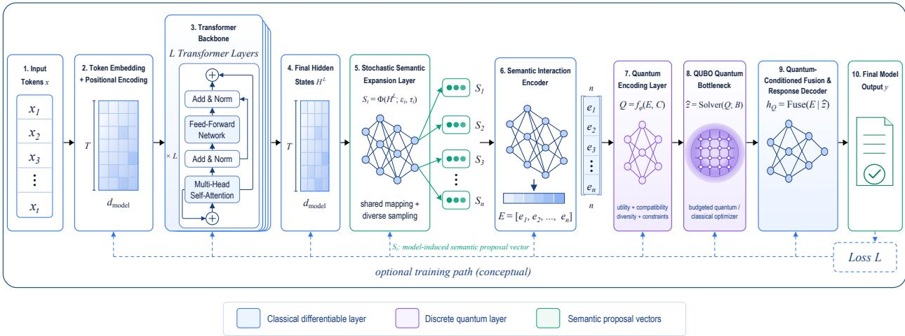
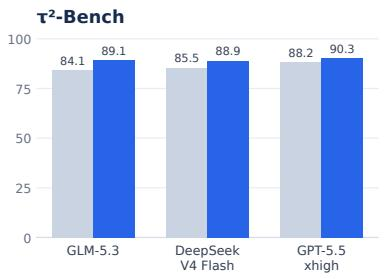
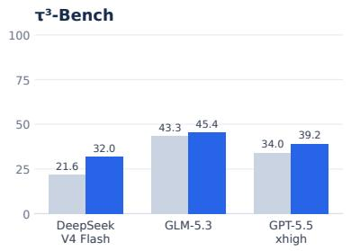
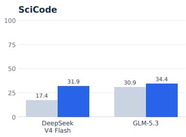
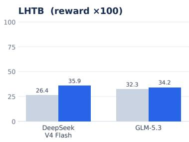
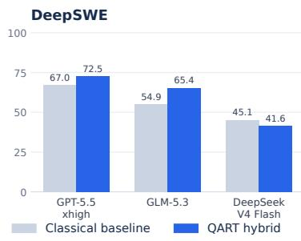
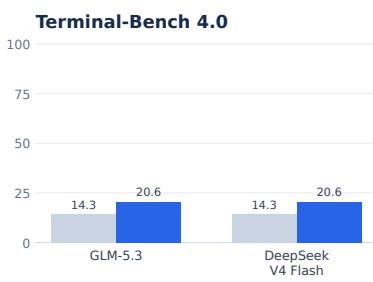
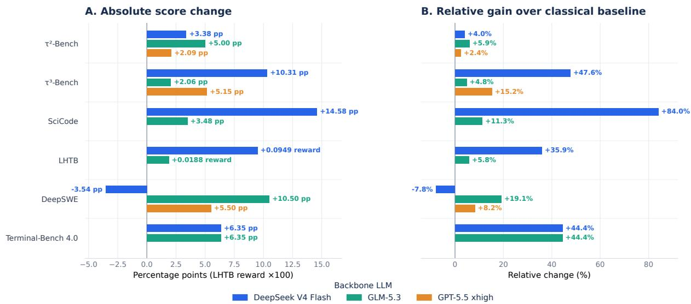

# QART: A Quantum-Classical Hybrid Architecture for Long-Horizon Reasoning – Exploring a Conditional Path toward Quantum Scaling

Lehao Lin1, 2, 3, ∗, Yuheng Cheng1, 3, ∗, Guolong Liu1, 2, 3, ∗, Yao Li3, Xuning Tan3, Xiyuan Zhou5, Ruixi Zou3, Shi Wang3, Huan Zhao6, Wenxuan Liu5, Haifeng Wu1, 4, Junhua Zhao1, 2, 3, †

1QuantumMind

2Shenzhen Institute of Artificial Intelligence and Robotics for Society

3The Chinese University of Hong Kong, Shenzhen

4Shenzhen Institute of Data Economy

5Nanyang Technological University

6The Hong Kong Polytechnic University

∗These authors contributed equally and share first authorship.

†The author is the corresponding author (zhaojunhua@cuhk.edu.cn).

Long-horizon tasks challenge large language models because early reasoning errors can alter subsequent decisions and compromise trajectory-level reliability. We present QART, the Quantum-Augmented Reasoning Transformer, as a quantum–classical hybrid architecture combining a backbone language model with quantum encoding, CIM-based QUBO optimization, and quantum decoding as functional layers. The architecture accommodates semantic information extracted from either hidden representations or model-generated text. Detailed encoding and optimization procedures remain proprietary.

We establish that, under explicit assumptions, QART has an asymptotic advantage in optimal-path recovery over classical LLMs operating in a single-trajectory autoregressive setting. For a common task family with aligned optimality and acceptance criteria, we show that the probability of retaining an acceptable autoregressive trajectory converges to zero when the cumulative conditional risk of irreversible reasoning errors diverges. For QART, we combine a spectral ground-state certificate with semantic fidelity and explicit implementation events to derive a lower bound on task-optimal-path recovery. If the conditional probabilities associated with optimal-path coverage and semantic fidelity, spectral certification, dynamical reachability, and faithful readout remain uniformly positive as the reasoning horizon grows under a specified resource schedule, QART’s recovery probability remains bounded away from zero. This establishes a conditional asymptotic reliability separation; the required uniform bounds are not implied by the architecture alone.

We report paired end-to-end measurements on τ2-Bench, τ3-Bench, SciCode, LHTB, DeepSWE, and Terminal-Bench 4.0 using DeepSeek V4 Flash, GLM-5.3, and GPT-5.5 xhigh in a Codex agent environment. Fourteen of fifteen evaluated backbone–benchmark pairs favor the QART hybrid configuration. Relative gains reach approximately 84.0% on SciCode, 47.6% on τ3-Bench, and 44.4% on Terminal-Bench 4.0, while the DeepSeek V4 Flash-backbone configuration regresses by 7.8% on DeepSWE. These results provide initial system-level evidence; they do not directly validate the asymptotic separation.

We further formulate potential quantum scaling laws as conditional hypotheses linking efective optimization capacity to reliable reasoning horizons. Their quantum-advantage interpretation requires a demonstrated CIM quantum advantage over strong classical solvers and its transfer to end-to-end reasoning after all system overheads.

Keywords: quantum-classical hybrid architecture, Transformer reasoning, AI agent, embedding, semantic representation, coherent Ising machine, QUBO, potential quantum scaling laws

Date: September 2026

## 1 Introduction

Transformer-based large language models [1] can write, program, and answer complex questions, yet they remain brittle when a task requires many dependent decisions [2–4]. Each step can introduce an error; once an early decision changes the state, assumptions, or tool inputs seen by later steps, the deviation can propagate through the remainder of the trajectory. Longer and more constrained tasks therefore place substantial demands on consistency, task completion, and reliable use of intermediate information.

QART, the Quantum-Augmented Reasoning Transformer, addresses this setting as a quantum–classical hybrid architecture. A backbone language model handles task understanding, reasoning, and response generation, while an optimization component processes task-relevant information and returns auxiliary information for subsequent model activity. The QART functional layers comprise quantum encoding, CIM-based QUBO optimization, and quantum decoding. Coherent Ising machine technology provides the architecture’s combinatorial optimization basis when available [5–7]. The report describes these functional roles without disclosing the proprietary informationprocessing or optimization implementation.

The current report makes five contributions:

• It specifies a modular QART architecture connecting a backbone language model with quantum encoding, CIM-based QUBO optimization, and quantum decoding functional layers.

• It formulates potential quantum scaling laws as conditional hypotheses based on solver-specific efective optimization capacity, and states the matched classical comparisons and resource-scale experiments required to test them.

• It derives a conditional asymptotic reliability separation: under uniform coverage, fidelity, spectral, and implementation assumptions, QART’s optimal-path recovery stays positive while singletrajectory autoregressive success vanishes with horizon.

• It presents paired end-to-end measurements of classical baseline and QART hybrid configurations sharing the same backbone LLM on six longhorizon agent and coding benchmarks.

• It reports absolute score changes and relative gains for fifteen evaluated backbone–benchmark pairs, retaining the observed DeepSWE regression to delimit where the QART hybrid configuration is helpful.

The benchmark results provide initial system-level evidence for the evaluated QART configurations, while variation across backbones and tasks shows that the efect is not uniform. Optimization capacity is not interpreted as quantum advantage: a potential quantum scaling law additionally requires sustained CIM advantage over strong classical solvers and measurable transfer to end-to-end reasoning after system overheads. These distinctions motivate controlled study for domains with long operational, numerical, and policy constraints.

## 2 Background and Positioning

## 2.1 Language models and combinatorial optimization

A language model represents information continuously and generates responses incrementally. Complex tasks also involve discrete decisions subject to multiple requirements, motivating the study of optimization-assisted reasoning. Many discrete optimization problems admit Ising or quadratic unconstrained binary optimization (QUBO) formulations [8, 9]. These established formulations provide the general background for the optimization technology considered here.

## 2.2 Coherent Ising machines

A coherent Ising machine represents Ising spins with the phases of coupled nonlinear optical oscillators and evolves the network toward low-energy spin configurations [5, 10, 11]. QUBO and Ising formulations provide related mathematical descriptions of binary optimization problems. Practical performance depends on problem characteristics, hardware precision, noise, and system overhead [6, 7, 12]. Consequently, the advertised oscillator or spin count alone is not a suficient measure of the problem size that can be solved reliably.

## 2.3 From Neural Scaling Laws to Potential Quantum Scaling Laws

Classical neural scaling laws describe how loss or task performance varies with model size, training data, and computational resources [13, 14]. QART motivates a complementary question: whether increasing the capacity for reliable optimization can extend the reasoning horizon of a quantum–classical hybrid model under a specified end-to-end resource budget.

An optimization-capacity–reasoning relationship, however, would not by itself establish a quantum scaling law. Such a relationship could also arise when the optimization layer is implemented with classical solvers. Interpreting it as a scaling benefit enabled by quantum advantage would require evidence that CIM technology provides a sustained advantage over strong classical optimization alternatives on the relevant instance families, and that this advantage translates into improved end-to-end reasoning performance.

We therefore use the term “potential quantum scaling laws” to denote conditional research hypotheses. The present report establishes neither the required CIM quantum advantage nor the proposed scaling relationships. Section 4 formulates these hypotheses and identifies the conditions required for their validation.

## 3 QART Architecture

## 3.1 System overview

Figure 1 presents the QART architecture. The language model is responsible for understanding the task, reasoning, and producing the response. An optimization module processes task-relevant information and provides auxiliary information for subsequent model activity. The architecture is designed to accommodate information from model representations or model-generated content, without prescribing a single information source in this functional description. Consistent with the interface notation used in the theoretical analysis, we write the resulting semantic information as $u _ { h }$ , obtained from either a hidden representation $Z _ { h }$ or generated text $y _ { h }$

## 3.2 Optimization in the quantum–classical hybrid architecture

The optimization component internally converts taskrelevant information into a form suitable for its selected optimization technology. The QART architecture uses QUBO/Ising formulations and may use CIM technology as one technical basis [6, 9]. The module transforms optimization results into auxiliary information usable by subsequent language-model processing. The purpose is to support more reliable task execution and response generation.

## 3.3 Functional roles and disclosure scope

The functional division assigns language processing to the model and optimization-related processing to an internal component of the QART architecture. The model can use the returned information during subsequent reasoning and generation. This organization describes the role of optimization within the overall hybrid system.

The hidden-representation route in Figure 1 is one conceptual implementation of the interface boundary rather than a claim that every deployment exposes model states. Likewise, the dashed training path is a conceptual option and does not imply that the benchmark runs trained or fine-tuned any of these modules.

The specific information acquisition, internal representations, optimization problem construction, solution procedures, and result adaptation methods are proprietary and are not detailed in this report. The evaluation therefore focuses on observable end-to-end performance of the QART architecture.

## 4 Potential Quantum Scaling Laws: A Conditional Framework

This section formulates potential quantum scaling laws for QART as conditional hypotheses linking optimization resources to reliable reasoning horizons. The proposed relationships are not established scaling laws, and the theoretical results in Section 5 do not derive a universal power-law relationship between CIM size and reasoning performance.

The proposed quantum-advantage interpretation requires three conditions. First, CIM technology must demonstrate a sustained advantage over strong classical solvers on optimization instances relevant to QART under a clearly specified resource comparison. Second, the encoding, decoding, and subsequent model execution must preserve enough of that advantage to improve end-to-end reasoning performance after all associated overheads are included. Third, controlled experiments across resource scales must establish a reproducible relationship between efective optimization capacity and externally measured reasoning performance.

The present report does not establish these conditions. The formulation below identifies quantities and comparisons through which the potential scaling behavior could be investigated.

  
Figure 1 | Architectural design of QART, combining a Transformer language model with an optimization component in a quantum–classical hybrid architecture. The diagram is a conceptual hidden-representation route; an alternative modelgenerated-content interface $y _ { h }$ is described in Section 6. The solver returns a finite-budget candidate ${ \hat { z } } = \operatorname { S o l v e r } ( Q ; B )$ while $z ^ { \ast } \in$ arg minz $z ^ { \top } Q z$ remains the theoretical reference optimum. The accompanying description focuses on functional roles rather than proprietary implementation details.

## 4.1 Resource Variables and Comparison Conditions

Let $N _ { \mathrm { C I M } }$ denote the available physical oscillator or spin channels, n the number of logical variables in an internal optimization problem, and B a specified end-to-end time budget. These quantities describe resource scale without specifying the meaning or construction of the internal variables. The end-toend budget includes model execution, representation processing, encoding, solver communication and execution, sampling, and decoding.

Raw CIM spin count is not a standalone measure of useful optimization capacity. Hardware precision, noise, connectivity, control procedures, and system overhead can afect the problem sizes that are solved reliably [6, 7, 12]. Increasing $N _ { \mathrm { C I M } }$ therefore does not, by itself, imply improved reasoning performance or an advantage over classical optimization.

Comparisons must specify the instance family, solution-quality target, success criterion, time budget, and available hardware resources. Classical baselines should include strong exact, heuristic, and spectral methods where applicable. A practical CIM performance advantage and an advantage attributable to quantum resources are distinct claims; evidence for the former alone is insuficient to establish the latter.

## 4.2 Effective Optimization Capacity

Efective optimization capacity is defined for a specified solver and evaluation protocol; it is not intrinsically a quantum quantity. Let S denote a solver configuration, and let $\mathcal { I } _ { n }$ be a prescribed distribution of optimization instances with n logical variables. For a target objective tolerance δ, success probability $p _ { 0 }$ , and end-to-end budget $B _ { : }$ , define

$$
\begin{array} { r l } & { n _ { \mathrm { e f f } } ^ { S } ( B , \delta , p _ { 0 } ) = \operatorname* { s u p } \Big \{ n : \operatorname* { P r } \big [ } \\ & { \qquad F ( \widehat { z } _ { S , B } ) - F ( z ^ { \star } ) \leq \delta \big ] \geq p _ { 0 } \Big \} . } \end{array}\tag{1}
$$

Here, $\hat { z } _ { S , B }$ is the solution returned within the prescribed budget under the evaluation protocol, and $z ^ { \star }$ is an optimal reference solution for the same instance. Failure to return a valid solution within budget counts as failure. The probability is evaluated over the specified instance distribution and solver randomness. The objective scale, instance distribution, and treatment of system overhead must be fixed when comparing solvers.

This quantity measures the largest reliably solvable problem size under the stated conditions. It applies equally to CIM-based and classical optimization. Comparing $n _ { \mathrm { e f f } } ^ { \mathrm { C I M } }$ with the capacities of strong classical baselines can characterize an operational capacity advantage. Such an advantage alone does not establish its quantum origin or its transfer to reasoning performance.

## 4.3 Conditional Scaling Hypotheses and Validation Requirements

Let h denote an externally defined reasoning horizon, such as the number of required task stages specified independently of a model’s generated trajectory. For a fixed task family, backbone LLM, semantic interface, and evaluation protocol, let $h _ { \operatorname* { m a x } } ^ { S } ( B )$ be the largest horizon at which a configuration using solver $\bar { S }$ meets a specified task-performance threshold within budget B.

A candidate relationship is

$$
\begin{array} { c } { { h _ { \mathrm { m a x } } ^ { S } ( B ) \approx C _ { S } \left[ n _ { \mathrm { e f f } } ^ { S } ( B , \delta , p _ { 0 } ) \right] ^ { \beta _ { S } } , } } \\ { { C _ { S } > 0 , \quad \beta _ { S } > 0 . } } \end{array}\tag{2}
$$

while an externally measured task loss may admit a regime-specific fit of the form

$$
\begin{array} { r } { L _ { S } ( n _ { \mathrm { e f f } } ^ { S } ) \approx L _ { \infty , S } + A _ { S } \left( n _ { \mathrm { e f f } } ^ { S } \right) ^ { - \alpha _ { S } } , } \\ { A _ { S } > 0 , \quad \alpha _ { S } > 0 . } \end{array}\tag{3}
$$

The parameters must be estimated empirically, and neither a power-law form nor common parameters across solvers are assumed to hold universally. These equations describe generic optimization-capacity scaling hypotheses. They could apply to classical or CIMbased implementations and are not, by themselves, evidence of quantum advantage.

A potential quantum scaling law would require a further connection: a demonstrated CIM quantum advantage on the relevant instance families would need to produce a sustained improvement in the endto-end capacity–reasoning relationship relative to strong classical implementations. That improvement must remain observable after accounting for encoding, decoding, communication, sampling, and modelexecution costs. Solver-level advantage is therefore a prerequisite for the proposed quantum-advantage interpretation, but it is not suficient to establish it.

The conditional reliability results in Section 5 identify requirements under which optimal-path recovery can remain non-vanishing as the reasoning horizon grows. They do not establish CIM quantum advantage, determine the exponents in Eqs. (2)–(3), or prove that increasing physical spin count extends the reliable reasoning horizon.

The benchmark results in Section 7 compare model configurations and task families. They do not constitute a controlled scaling study or a comparison against matched classical optimization layers, and they are not used to fit Eqs. (2)–(3). Validation requires experiments across resource scales that jointly measure optimization capacity, end-to-end cost, and reasoning performance for CIM-based and strong classical implementations. Failure to observe a sustained CIM advantage, or failure of that advantage to translate into improved reasoning performance, would undermine the proposed quantum-advantage interpretation.

In these equations, S denotes a specific solver configuration, while $C _ { S } , \beta _ { S } , L _ { \infty , S } , A _ { S } , \alpha _ { S }$ are parameters to be estimated. Solver-specific parameters avoid assuming without validation that classical methods and CIM have identical scaling curves.

## 5 Theoretical Foundations of Global Reasoning Reliability

This section develops a conditional guarantee for recovering globally optimal reasoning paths in QART. Under a diverging cumulative risk of irreversible reasoning errors, the probability that a single autoregressive trajectory remains globally correct converges to zero. A spectral ground-state certificate for coherent Ising machines, combined with semantic fidelity, dynamical reachability, and faithful readout, yields a positive lower bound for QART whenever the associated conditional probabilities remain uniformly positive with reasoning depth. The analysis accommodates semantic information obtained from hidden representations or generated text. It specifies mathematical interface properties without prescribing proprietary encoding or optimization procedures. Complete proofs, robustness conditions, and a notation table are provided in Appendix A.

The theoretical question is whether replacing successive local commitments with a globally optimized semantic decision can prevent the probability of selecting a correct reasoning path from vanishing as tasks become longer. We analyze a family of tasks indexed by reasoning horizon h. The horizon counts required reasoning structure rather than input or output tokens. It is distinct from the encoded problem dimension $n _ { h }$ and from the physical execution time.

The argument has three components. First, the chain rule gives a precise error condition under which a single autoregressive path fails asymptotically. Second, an existing Nature Communications result supplies a suficient certificate for recovering an Ising ground state. Third, semantic fidelity transfers that certificate to reasoning-path optimality, while explicit conditional probabilities account for representation and physical implementation. The resulting guarantee is conditional on these probabilities remaining uniformly bounded away from zero as the reasoning horizon grows under a specified resource schedule; establishing these bounds remains part of the research problem.

## 5.1 Vanishing Correct-Path Probability in Single-Trajectory Autoregressive Reasoning

For each horizon $h ,$ consider solvable tasks $q _ { h }$ with $m ( h )$ critical decisions and a nonempty set $\boldsymbol { \mathcal { A } } _ { h }$ of acceptable complete reasoning trajectories. A trajectory contains the decisions relevant to its semantic validity; multiple equivalent correct solutions may belong to $\boldsymbol { \mathcal { A } } _ { h }$ . The analysis does not require a particular wording or token sequence. An autoregressive policy commits to successive decisions conditioned on the preceding history.

Let $C _ { h , j }$ be the event that, after critical decision $j ,$ the committed prefix can still be extended to an element of $\mathcal { A } _ { h }$ under the allowed continuation rules. Set $C _ { h , 0 } = \Omega$ . For an irreversible single-trajectory process these events are nested. Define

$$
e _ { h , j } = 1 - \operatorname* { P r } ( C _ { h , j } \mid C _ { h , j - 1 } ) .\tag{4}
$$

The probability is over the specified task distribution and policy randomness. Thus the risks are conditional on survival, and may include dependence between errors. The final critical decision includes completion, so that $C _ { h , m ( h ) }$ is exactly the event of producing an acceptable complete trajectory.

Proposition 1 (Vanishing correct-path probability). Suppose $m ( h ) \to \infty$ and the cumulative conditional exit risk $E _ { h }$ diverges, where

$$
E _ { h } = \sum _ { j = 1 } ^ { m ( h ) } e _ { h , j } .\tag{5}
$$

Then the single-trajectory success probability satisfies

$$
{ \cal P } _ { \mathrm { A R } } ^ { \mathrm { p a t h } } ( h ) = \prod _ { j = 1 } ^ { m ( h ) } ( 1 - e _ { h , j } ) ,\tag{6}
$$

and

$$
P _ { \mathrm { A R } } ^ { \mathrm { p a t h } } ( h ) \leq e ^ { - E _ { h } } \longrightarrow 0 .\tag{7}
$$

The proof uses only the chain rule and $\log ( 1 - x ) \leq$ $- { x } ;$ see Appendix A.2. A uniform critical-step risk $e _ { h , j } ~ \ge ~ \varepsilon > ~ 0$ gives the familiar bound $P _ { \mathrm { A R } } ^ { \mathrm { p a t h } } ( h ) \leq$ $( 1 - \varepsilon ) ^ { m ( h ) }$ Independent errors are not assumed. Prior work on compositional tasks reports related degradation with increasing task complexity [15]; the proposition here states the exact condition used in this chapter.

The result is about loss of an acceptable trajectory, not every locally imperfect token. A recoverable mistake is not an exit event. Efective backtracking, global verification, or suficiently decreasing conditional risk may invalidate the divergence assumption. In particular, the classical-baseline condition in the Section 6 uses an agent environment, and is not automatically an instance of this restricted autoregressive baseline.

## 5.2 A Spectral Sufficient Condition for Ising Ground-State Recovery

Wang et al. [16] established a suficient synchronization condition under which the first bifurcation of a coherent Ising machine identifies an Ising ground state. We use its spectral form and state additional nondegeneracy assumptions to avoid ambiguity in the first mode and in sign readout.

Let $G _ { h }$ be a nonzero, real, symmetric, zero-diagonal matrix of size $n _ { h } \times n _ { h }$ . Define

$$
H _ { h } ( { \pmb \sigma } ) = - \frac 1 2 { \pmb \sigma } ^ { \top } G _ { h } { \pmb \sigma } , \qquad { \pmb \sigma } \in \{ - 1 , + 1 \} ^ { n _ { h } } .\tag{8}
$$

Let $H _ { 0 , h }$ be its minimum energy and $H _ { 1 , h }$ the smallest distinct energy above it. Put $\Delta H _ { h } = H _ { 1 , h } -$ $H _ { 0 , h } > 0$ . Ground states may be degenerate. The gap is to the lowest non-ground-state energy, not between two arbitrarily ordered configurations.

The normalized deterministic dynamics considered in [16] has the form

$$
\begin{array} { r } { \dot { \mathbf { x } } = ( p - 1 ) \mathbf { x } - \mathbf { x } ^ { \circ 3 } + \xi G _ { h } \mathbf { x } , } \end{array}\tag{9}
$$

with $\xi > 0$ , pump parameter $p ,$ and componentwise cubic nonlinearity. The origin loses stability at

$$
p _ { 0 , h } = 1 - \xi \lambda _ { \operatorname* { m a x } , h } .\tag{10}
$$

Assume the largest eigenvalue is simple. Let $\mathbf { v } _ { h }$ be a corresponding unit eigenvector with no zero coordinates, and let $\pmb { \sigma } _ { h } ^ { c } = \mathrm { s i g n } ( \mathbf { v } _ { h } )$ . Define

$$
\alpha _ { h } ^ { 2 } = \frac { ( \mathbf { v } _ { h } ^ { \mathsf { T } } \pmb { \sigma } _ { h } ^ { c } ) ^ { 2 } } { n _ { h } } , \qquad w _ { h } = \lambda _ { \operatorname* { m a x } , h } - \lambda _ { \operatorname* { m i n } , h } > 0 .\tag{11}
$$

Theorem NC (Spectral ground-state certificate; adapted from [16]). Under the preceding conditions, if

$$
\alpha _ { h } ^ { 2 } > 1 - \frac { 2 \Delta H _ { h } } { n _ { h } w _ { h } } ,\tag{12}
$$

then $\pmb { \sigma } _ { h } ^ { c }$ and $- \pmb { \sigma } _ { h } ^ { c }$ attain the ground-state energy. Appendix A.3 provides a self-contained spectral proof of the certificate used here.

At a simple first bifurcation, the normalized emerging branch approaches $\pm { \mathbf { v } } _ { h }$ . At a finite pump increment, the nonlinear equilibrium need not be exactly proportional to that eigenvector. Consequently, a physical application requires the observed branch to retain the certified signs. Appendix A.3 makes this distinction explicit. Moreover, an exactly zero initial state stays zero in the deterministic equation; nonzero fluctuations or perturbations must initiate departure from the origin. The spectral certificate alone gives no physical arrival probability or time guarantee.

## 5.3 Semantic Interface and the Definition of Task Optimality

The semantic interface can operate with accessible hidden representations $Z _ { h }$ or with generated text $y _ { h }$ We denote the resulting semantic information by $u _ { h }$ and write the two interfaces separately:

$$
u _ { h } = \Phi _ { \mathrm { h i d } } ( Z _ { h } , q _ { h } ) ,\tag{13}
$$

$$
\begin{array} { r } { u _ { h } = \Phi _ { \mathrm { t e x t } } ( y _ { h } , q _ { h } ) . } \end{array}\tag{14}
$$

These alternatives do not assert that every evaluated system exposes hidden states. The representation space $\mathcal { U } _ { h }$ may be a vector space or an abstract measurable space. No particular extraction layer, feature dimension, or construction procedure is needed in the proof.

An abstract encoder and decoder satisfy

$$
G _ { h } = \mathcal { E } ( u _ { h } , q _ { h } ) ,\tag{15}
$$

$$
D _ { h } : \{ - 1 , + 1 \} ^ { n _ { h } } \longrightarrow \Pi _ { h } \cup \{ \perp \} .\tag{16}
$$

Here $\Pi _ { h }$ is the declared finite admissible path space, and ⊥ indicates invalid decoding. The task-level objective $L _ { h } : \Pi _ { h }  \mathbb { R }$ is specified independently of the encoded energy, with

$$
\Pi _ { h } ^ { \star } = \operatorname * { a r g m i n } _ { \pi \in \Pi _ { h } } L _ { h } ( \pi ) .\tag{17}
$$

For each realized encoding, at least one element of $\Pi _ { h } ^ { \star }$ must have a valid spin representation. This coverage requirement is separate from finding the lowest encoded energy. $\operatorname { I f } \Pi _ { h }$ is a restricted space, the theorem establishes optimality within that space. Extending the claim to all admissible reasoning trajectories requires coverage of a genuine unrestricted optimum.

The zero-field Ising form is a theoretical representation; linear fields can be handled by a standard reference-spin reformulation [8]. Any resulting increase in dimension is included in $n _ { h }$ . The decoder must resolve the global sign symmetry consistently, for example through relative signs to the reference spin. No coeficient recipe or internal representation structure is specified. For a restricted hardware or encoding class, applicability of this representation must be established explicitly.

## 5.4 Semantic Fidelity and the Transfer from Ground States to Optimal Reasoning Paths

An energy minimum is useful only if energy ordering preserves the relevant task objective. Let $L _ { h } ^ { \star }$ be the minimum of $L _ { h }$ . Assuming at least one non-optimal admissible path, define the task-objective gap

$$
\gamma _ { h } = \operatorname* { m i n } _ { \pi \notin \Pi _ { h } ^ { \star } } \left[ L _ { h } ( \pi ) - L _ { h } ^ { \star } \right] > 0 .\tag{18}
$$

where the minimum is over $\Pi _ { h }$ . If every admissible path is optimal, the ordering requirement below is vacuous, while validity remains necessary.

Assumption A (Coverage and semantic fidelity). At least one optimal path has a valid encoding. For some $a _ { h } > 0 , b _ { h } \in \mathbb { R }$ , and $\epsilon _ { h } \geq 0$ , every valid spin state satisfies

$$
| H _ { h } ( \pmb { \sigma } ) - a _ { h } L _ { h } ( D _ { h } ( \pmb { \sigma } ) ) - b _ { h } | \leq \epsilon _ { h } , \qquad a _ { h } \gamma _ { h } > 2 \epsilon _ { h } .\tag{19}
$$

Every invalid state has energy strictly above the minimum valid energy. These requirements apply to the full represented state space, not merely a few sampled states.

Lemma 1 (Ground-state-to-optimal-path transfer). Under Assumption A, every ground state of $H _ { h }$ decodes to an element of $\Pi _ { h } ^ { \star }$

To see the mechanism, compare an optimal encoding with a valid non-optimal encoding. Their energy diference is at least $a _ { h } \gamma _ { h } - 2 \epsilon _ { h } > 0$ . Invalid configurations cannot be minima by assumption. Appendix A.4 gives the complete proof and an extension to near-optimal energy solutions.

Assumption A permits imperfect encoding while protecting the optimum. It is a strong, substantive property: high correlation between sampled path scores and energies does not prove a uniform bound. Defining the task objective retrospectively from the Ising energy would make the claim semantically empty. The objective, feasibility criteria, and reference judgments therefore require independent specification. The proof establishes ground-state inclusion in the optimal-path set; it does not require every optimal path to have exactly the same encoded energy.

## 5.5 A Lower Bound on QART Global-Optimal-Path Recovery

Fix a task distribution at horizon $h ,$ the semantic interface, an encoding procedure, a physical configuration, and an end-to-end budget B(h). Probabilities include the randomness of task sampling, semantic generation, encoding when stochastic, initial fluctuations, dynamical noise, and readout. For a fixed task and deterministic encoding, an encoding condition is deterministic; randomness must not be assigned to it without an explicit source.

Define the following events. $\mathsf { M } _ { h }$ means that Assumption A holds. Conditional on $\mathsf { M } _ { h } , \mathsf { S } _ { h }$ means that the encoded Ising coupling matrix satisfies all hypotheses of Theorem NC. Conditional on both, $\mathsf { B } _ { h }$ means that the implemented dynamics reaches a state with one of the certified sign patterns by the measurement deadline and retains those signs until readout. Finally, $\mathsf { R } _ { h }$ means that measurement and decoding preserve that certified solution. A precise sign-neighborhood definition of $\mathsf { B } _ { h }$ is given in Appendix A.5.

For compactness, define the conditional factors

$$
r _ { M } ( h ) = \operatorname* { P r } ( \mathsf { M } _ { h } ) ,\tag{20}
$$

$$
r _ { S } ( h ) = \operatorname* { P r } ( \mathsf { S } _ { h } \mid \mathsf { M } _ { h } ) ,\tag{21}
$$

$$
r _ { B } ( h ) = \operatorname* { P r } ( \mathsf { B } _ { h } \mid \mathsf { M } _ { h } , \mathsf { S } _ { h } ) ,\tag{22}
$$

$$
r _ { R } ( h ) = \operatorname* { P r } ( \mathsf { R } _ { h } \mid \mathsf { M } _ { h } , \mathsf { S } _ { h } , \mathsf { B } _ { h } ) .\tag{23}
$$

Theorem 1 (Conditional QART recovery bound). Let $P _ { \mathrm { Q A R T } } ^ { \mathrm { o p t } } ( h )$ be the probability that the decoded output belongs to $\Pi _ { h } ^ { \star }$ . Then

$$
P _ { \mathrm { Q A R T } } ^ { \mathrm { o p t } } ( h ) \geq r _ { M } ( h ) r _ { S } ( h ) r _ { B } ( h ) r _ { R } ( h ) .\tag{24}
$$

If, for all suficiently large $h ,$ each factor is bounded below by a positive constant $\rho _ { i }$ independent of $h ,$ then

$$
p _ { \star } = \rho _ { M } \rho _ { S } \rho _ { B } \rho _ { R } > 0 ,\tag{25}
$$

$$
\operatorname* { l i m } _ { h \to \infty } \operatorname* { i n f } _ { \mathrm { Q A R T } } ( h ) \geq p _ { \star } .\tag{26}
$$

Theorem NC and Lemma 1 imply success on the intersection of the four events. The chain rule then yields Eq. (24), without assuming independence. $\mathrm { A p \mathrm { - } }$ pendix A.5 gives the proof. Positive constants are suficient, not necessary: the system may also succeed on instances that lack the NC certificate, so a small certified lower bound is not a prediction of low total success.

The theorem exposes the obligations required for an asymptotic guarantee. It does not derive their uniformity from the QART architecture alone. In particular, conditional fidelity of a representation cannot compensate for a coverage probability that vanishes with horizon.

## 5.6 Conditional Reliability Separation and Its Interpretation

To compare correct reasoning probabilities, the two systems must address the same task family and acceptance criterion. Suppose every objective minimizer in $\Pi _ { h } ^ { \star }$ is an acceptable path in $\boldsymbol { \mathcal { A } } _ { h }$ , and the required coverage and implementation assumptions hold uniformly. Combining Proposition 1 and Theorem 1 yields

$$
{ \cal P } _ { \mathrm { A R } } ^ { \mathrm { p a t h } } ( h ) \longrightarrow 0 ,\tag{27}
$$

$$
\operatorname* { l i m } _ { h \to \infty } \operatorname* { i n f } _ { \mathrm { Q A R T } } ( h ) \geq p _ { \star } .\tag{28}
$$

Consequently, the limiting inferior of the diference between the two path-success probabilities is at least $p _ { \star }$ . This is a conditional reliability separation between sequential commitment and certified global selection. It requires both the autoregressive cumulative-risk condition and QART’s uniform conditional bounds.

A selected path is not an executed answer. Let $\mathsf { X } _ { h }$ mean that subsequent tool use, numerical computation, and response generation produce a correct final outcome. A suficient extension is a uniform bound $\rho _ { X } > 0$ on its probability conditional on the fourevent certified success intersection. For all suficiently large h, the path bound then gives

$$
P _ { \mathrm { Q A R T } } ^ { \mathrm { a n s w e r } } ( h ) \geq p _ { \star } \rho _ { X } .\tag{29}
$$

Without this extra condition, Eq. (26) concerns path recovery only. Likewise, a proxy objective can be optimized perfectly while failing the independent task verifier. Objective alignment must therefore be stated separately from optimization accuracy.

These results neither establish quantum computational advantage nor show that general QUBO instances are eficiently solvable. The NC spectral certificate can also support classical spectral recovery on the certified instances. Its value here is a bridge from a mathematically specified optimization property to semantic reliability. Any claim of hardware advantage requires independent comparisons against strong classical alternatives, including spectral methods when applicable, under matched end-to-end budgets.

## 5.7 Robustness and Resource Conditions for a Non-Vanishing Bound

Let the implemented matrix be $\widetilde { G } _ { h } = G _ { h } + \Delta G _ { h }$ with a symmetric perturbation and spectral norm

$\eta _ { h } = \| \Delta G _ { h } \| _ { 2 }$ . For any binary spin state,

$$
\Big | H _ { \widetilde { G } _ { h } } ( \pmb { \sigma } ) - H _ { G _ { h } } ( \pmb { \sigma } ) \Big | \leq \frac { n _ { h } } { 2 } \eta _ { h } .\tag{30}
$$

If $n _ { h } \eta _ { h } < \Delta H _ { h }$ , every perturbed ground state belongs to the original ground-state set. Degeneracy within that set may split, so equality of the two ground-state sets is not guaranteed. A separate semantic condition can preserve task-optimal decoding even when the exact ground-state identity changes; Appendix A.7 states both results.

For the certified sign pattern, useful quantities include the eigenvalue separation $\kappa _ { h } = \lambda _ { \operatorname* { m a x } , h } - \lambda _ { 2 , h }$ the smallest eigenvector magnitude $\mu _ { h } = \mathrm { m i n } _ { i } \left| v _ { h , i } \right|$ and the strict certificate slack

$$
c _ { h } = \Delta H _ { h } - \frac { n _ { h } w _ { h } } { 2 } ( 1 - \alpha _ { h } ^ { 2 } ) > 0 .\tag{31}
$$

Positive finite-instance margins provide local robustness, but do not imply that tolerable perturbations remain constant as the problem grows. Indeed $\mu _ { h } \leq n _ { h } ^ { - 1 / 2 }$ for a unit vector, so demanding a positive dimension-independent lower bound on $\mu _ { h }$ would be impossible when $n _ { h } \to \infty$ . The relevant requirement is a controlled ratio between perturbation magnitude and the shrinking margin, or an appropriate physical amplitude scale.

The budget $B ( h )$ must include representation, encoding, communication, physical evolution, sampling, and decoding. If those resources are fixed while $n _ { h }$ and task complexity grow without bound, the uniform probabilities cannot simply be presumed. The hardware-aware scaling analysis should therefore study which resource schedules preserve them. Equations (24)–(26) do not establish a universal power law between oscillator count and reasoning horizon.

## 6 Evaluation Setup

## 6.1 Paired Comparison of Classical and QART Hybrid Models

We compare two model configurations built around the same backbone LLM: a classical baseline and a QART quantum–classical hybrid model. The classical baseline uses the backbone LLM in the Codex agent environment. The QART hybrid model incorporates quantum encoding, CIM-based QUBO optimization, and quantum decoding as functional layers within its reasoning architecture, with the same LLM serving as its classical backbone.

In the QART configuration, the quantum encoding layer maps task-relevant information into an optimization representation; the CIM-based QUBO layer searches for low-objective-value configurations; and the quantum decoding layer transforms the returned solution into information used in subsequent model reasoning and generation. Here, QART denotes the complete hybrid architecture, while these three layers constitute its quantum-assisted reasoning component. Their proprietary implementations are not disclosed in this report.

## 6.2 Information interface and training status

The conceptual architecture in Figure 1 supports two functional ways to provide task-relevant information to the optimization component: a representation interface that can expose model states, or a text interface that consumes model-generated content. The language models and the QART architecture were used at inference time under the fixed evaluation protocol; no fine-tuning or policy-gradient update was performed during evaluation. This implementation scope is narrower than the conceptual set of interfaces shown in Figure 1 and is the basis for the end-to-end comparison below.

The CIM hardware used in the QART evaluation was provided by QBoson and had 1,000 computational qubits.

We evaluate DeepSeek V4 Flash and GLM-5.3 at maximum reasoning efort and GPT-5.5 at xhigh efort. Table 1 reports the measured scores for each evaluated backbone–benchmark pair.

The reported values are our measured scores, produced in the Codex agent environment with the harness and protocol described here. They are not model vendors’ oficial scores, and this report does not mix public leaderboard numbers into the paired comparison. Diferences from external scores can arise from the agent implementation, harness, prompt and tool environment, available background material, retry policy, and aggregation method.

Each paired comparison uses the same evaluated backbone LLM and benchmark verifier within the Codex agent environment. The results therefore compare the original classical model configuration with a QART hybrid realization based on that backbone. Throughout Sections 6 and 7, these configurations are labeled “Classical baseline” and “QART hybrid”, respectively. All reported scores are our own end-to-end measurements under the evaluation setup described here; they are not model-vendor scores or imported public leaderboard results.

## 6.3 Benchmarks

The six benchmarks exercise diferent forms of longrange dependency:

• τ2-Bench covers multi-turn Airline, Retail, and Telecom tasks in which an agent and user jointly update a shared environment [17, 18].

• τ3-Bench uses 97 Banking tasks that combine unstructured policy retrieval with multi-step account, dispute, and permission operations [19].

• SciCode contains scientist-authored research programming problems. It contains 291 subproblems; three with provided code substeps are excluded, so reported success rates use 288 as the denominator. Our setting evaluates the remaining subproblems without background context, one run per subproblem [20].

• LHTB contains 46 long-running terminal tasks and uses dense reward. Each condition is the mean of three clean per-task runs [21].

• DeepSWE contains 113 long-horizon softwareengineering tasks evaluated by handwritten behavioral verifiers [22].

• Terminal-Bench 4.0 is evaluated on 63 CPU tasks through Harbor with its built-in Codex agent and maximum thinking efort [23, 24]. We exclude tasks requiring GPU hardware or GPU-specific software, retaining the CPU-only subset.

## 6.4 Metrics and reporting

Each benchmark’s verifier supplies the primary score, with higher values indicating better performance. Let $s _ { \mathrm { b a s e } }$ denote the score of the classical baseline and $s _ { \mathrm { Q A R T } }$ the score of the QART hybrid model constructed with the same backbone. The absolute score change is

$$
\Delta = s _ { \mathrm { Q A R T } } - s _ { \mathrm { b a s e } } ,
$$

and the relative gain over the classical baseline is

$$
g _ { \mathrm { r e l } } = \frac { s _ { \mathrm { Q A R T } } - s _ { \mathrm { b a s e } } } { s _ { \mathrm { b a s e } } } \times 1 0 0 \%\tag{32}
$$

For percentage-valued benchmarks, ∆ is expressed in percentage points. LHTB retains its native densereward units. Gains are calculated from unrounded scores before display rounding.

## 7 Benchmark Results

## 7.1 Classical Baselines versus QART Hybrid Models

Table 1 compares classical baselines with QART hybrid models across six benchmarks. Each row identifies the shared backbone LLM, while the two score columns distinguish the classical model configuration from its QART hybrid counterpart. This organization evaluates the QART architecture across multiple backbone LLMs and task families.

QART hybrid models achieve higher scores in fourteen of the fifteen evaluated backbone–benchmark pairs. The improvement is not universal: the QART model with a DeepSeek V4 Flash backbone scores below its classical counterpart on DeepSWE. These results provide initial evidence that the QART architecture can improve end-to-end task performance across diferent backbones, while also revealing a configuration in which performance regresses.

Figure 2 visualizes the same paired comparisons.   
LHTB reward is multiplied by 100 for display only.

## 7.2 Benchmark-level observations

τ2-Bench. The QART hybrid model with a GPT-5.5 xhigh backbone reaches the highest score, 90.32%, while the GLM-5.3-backbone QART model has the largest absolute increase, 5.00 pp. The remaining failures are often associated with tool arguments or communication details after the high-level operation order is already correct.

τ3-Bench. The QART model with a GLM-5.3 backbone obtains the highest score at 45.36%. The DeepSeek V4 Flash-backbone QART model has the largest relative gain, rising from 21.65% to 31.96% (+47.6%). Observed improvements include fewer omitted steps and wrong-object actions; policy interpretation and numerical details remain backbonedependent.

SciCode. The QART model with a GLM-5.3 backbone produces the highest final score, 34.38%, while the DeepSeek V4 Flash-backbone QART model shows the largest gain in the study: +14.58 pp and +84.0% relative. For DeepSeek, import-only outputs fall from 89 to 30 and syntax errors from 12 to zero.

LHTB. The QART hybrid model with a DeepSeek V4 Flash backbone improves from 0.2642 to 0.3591 dense reward, a 35.9% relative gain averaged over three clean runs. The GLM-5.3-backbone QART model improves from 0.3231 to 0.3419, a 5.8% relative gain. Improvements are observed in multi-stage tasks such as paper reproduction and scientific regression. Interactive tasks remain challenging under wall-clock

Table 1 | Performance comparison between classical baselines and QART quantum–classical hybrid models across six benchmarks. Each row identifies a shared backbone LLM. “Classical baseline” reports the original classical model configuration, while “QART hybrid” reports the model incorporating quantum encoding, CIM-based QUBO optimization, and quantum decoding layers within the QART architecture. All scores are our measurements in the Codex agent environment and may difer from model-vendor or public leaderboard results. Absolute change and relative gain are measured against the corresponding classical baseline. Percentage-valued benchmarks use percentage points (pp) for absolute changes; LHTB retains native reward units. Within each benchmark group, the highest QART score and the largest absolute and relative gains are shown in bold.
<table><tr><td>Benchmark</td><td>Backbone LLM</td><td>Classical baseline</td><td>QART hybrid</td><td>Absolute change</td><td>Relative gain</td></tr><tr><td rowspan="4">τ2-Bench</td><td>GLM-5.3</td><td>84.11%</td><td>89.11%</td><td>+5.00 pp</td><td>+5.9%</td></tr><tr><td>DeepSeek V4 Flash</td><td>85.52%</td><td>88.90%</td><td>+3.38 pp</td><td>+4.0%</td></tr><tr><td>GPT-5.5 xhigh</td><td>88.23%</td><td>90.32%</td><td>+2.09 pp</td><td>+2.4%</td></tr><tr><td>DeepSeek V4 Flash</td><td>21.65%</td><td>31.96%</td><td>+10.31 pp</td><td>+47.6%</td></tr><tr><td rowspan="3">τ3-Bench</td><td>GLM-5.3</td><td>43.30%</td><td>45.36%</td><td>+2.06 pp</td><td>+4.8%</td></tr><tr><td>GPT-5.5 xhigh</td><td>34.02%</td><td>39.18%</td><td>+5.15 pp</td><td>+15.2%</td></tr><tr><td></td><td></td><td></td><td></td><td></td></tr><tr><td rowspan="3">SciCode</td><td>DeepSeek V4 Flash</td><td>17.36%</td><td>31.94%</td><td>+14.58 pp</td><td>+84.0%</td></tr><tr><td>GLM-5.3</td><td>30.90%</td><td>34.38%</td><td>+3.48 pp</td><td>+11.3%</td></tr><tr><td>DeepSeek V4 Flash</td><td>0.2642</td><td>0.3591</td><td>+0.0949</td><td>+35.9%</td></tr><tr><td rowspan="3">LHTB</td><td>GLM-5.3</td><td>0.3231</td><td>0.3419</td><td>+0.0188</td><td>+5.8%</td></tr><tr><td>GPT-5.5 xhigh</td><td>67.00%</td><td>72.50%</td><td>+5.50 pp</td><td>+8.2%</td></tr><tr><td>GLM-5.3</td><td>54.90%</td><td>65.40%</td><td>+10.50 pp</td><td>+19.1%</td></tr><tr><td rowspan="3"></td><td>DeepSeek V4 Flash</td><td>45.13%</td><td>41.59%</td><td>-3.54 pp</td><td>-7.8%</td></tr><tr><td>GLM-5.3</td><td>14.29%</td><td>20.63%</td><td>+6.35 pp</td><td>+44.4%</td></tr><tr><td>DeepSeek V4 Flash</td><td>14.29%</td><td>20.63%</td><td>+6.35 pp</td><td>+44.4%</td></tr></table>

## QART hybrid models across six benchmarks Classical and quantum–classical model configurations using the same backbone LLM

Scores are our measurements and may differ from model-vendor or public leaderboard results

  
Figure 2 | Classical baseline and QART hybrid model performance across six benchmarks. Each pair of bars compares two model configurations sharing the backbone LLM identified on the horizontal axis. The QART configuration incorporates quantum encoding, CIM-based QUBO optimization, and quantum decoding layers into the hybrid reasoning architecture. Scores are measured under the benchmark evaluation setup described in Section 6. LHTB reward is multiplied by 100 for visualization only. All values are our measurements rather than model-vendor or public leaderboard scores.

# Performance changes of QART hybrid models relative to classical baselines Results grouped by benchmark; colors identify the shared backbone LLM

  
Figure 3 | Performance changes from classical baselines to QART hybrid models constructed with the same backbone LLM. The left panel shows absolute score changes, and the right panel shows relative gains over the corresponding classical baseline. Results are grouped by benchmark, with colors identifying the backbone LLM. Positive values favor the QART hybrid configuration; negative values indicate a regression. Missing bars denote combinations that were not evaluated. LHTB absolute changes are multiplied by 100 for bar length, while annotations retain native reward units.

Table 2 | Highest-scoring QART hybrid models on each benchmark and their closest evaluated QART counterparts. Models are identified by their classical backbone LLMs. All scores correspond to QART hybrid configurations incorporating the quantum encoding, CIM-based QUBO optimization, and quantum decoding layers. Parentheses report score diferences from the highest-scoring QART model in the benchmark’s native units. Rankings are restricted to the configurations evaluated in this report.
<table><tr><td>Benchmark</td><td>Best QART backbone</td><td>Score</td><td>Closest QART model(s)</td></tr><tr><td>τ2-Bench</td><td>GPT-5.5 xhigh</td><td>90.32%</td><td>GLM-5.3: 89.11% (−1.21 pp); DeepSeek V4 Flash: 88.90% (−1.42 pp)</td></tr><tr><td>τ3-Bench</td><td>GLM-5.3</td><td>45.36%</td><td>GPT-5.5 xhigh: 39.18% (−6.18 pp)</td></tr><tr><td>SciCode</td><td>GLM-5.3</td><td>34.38%</td><td>DeepSeek V4 Flash: 31.94% (−2.44 pp)</td></tr><tr><td>LHTB</td><td>DeepSeek V4 Flash</td><td>0.3591</td><td>GLM-5.3: 0.3419 (-0.0172)</td></tr><tr><td>DeepSWE</td><td>GPT-5.5 xhigh</td><td>72.50%</td><td>GLM-5.3: 65.40% (−7.10 pp)</td></tr><tr><td>Terminal-Bench 4.0</td><td>GLM-5.3 / DeepSeek V4 Flash</td><td>20.63%</td><td>Tie: both models score 20.63% (0.00 pp)</td></tr></table>

and tool budgets.

DeepSWE. The QART hybrid model with a GPT-5.5 xhigh backbone reaches the highest score in the study, 72.5%, and the GLM-5.3-backbone QART model reaches 65.4%. The QART model with a DeepSeek V4 Flash backbone decreases from 45.13% to 41.59%. Remaining failures involve implementation details such as cache priority, parsing behavior, and serialization order. The regression shows that the QART hybrid architecture does not eliminate every low-level implementation error.

Terminal-Bench 4.0. Both the GLM-5.3-backbone and DeepSeek V4 Flash-backbone QART models im prove from 9/63 tasks (14.29%) to 13/63 (20.63%), corresponding to a 44.4% relative gain. More terminal tasks are completed successfully, while geometry, numerical, and fine-grained rule errors still dominate the shared failures.

## 7.3 Absolute and relative gains

Figure 3 groups the two gain views by benchmark on the vertical axis. Within each benchmark group, distinct bar colors identify the shared backbone LLM, so the comparison remains within the same task and verifier. SciCode illustrates why both metrics are needed: a 14.58-point increase becomes an 84.0% relative gain because the classical baseline is low. Across the reported pairs, the median relative change is 11.3%, but the negative DeepSWE case shows that an aggregate summary must not be interpreted as a per-task guarantee.

## 7.4 Comparison across QART Backbone Instantiations

Table 2 compares QART hybrid models instantiated with diferent classical backbones. The highestscoring backbone varies across benchmarks, indicating that the resulting hybrid model’s performance remains dependent on both the backbone LLM and the task family. These comparisons characterize the evaluated QART configurations and do not establish a ranking against unevaluated systems.

These comparisons evaluate the complete QART hybrid model end to end; the independent contribution of the quantum optimization layers would require a classical-solver control under the same encoding to identify.

## 8 Limitations

The paired results characterize end-to-end performance of classical baselines and QART hybrid models built with the same backbone LLM. The report describes the system’s functional organization and evaluation protocol, while its internal information processing and optimization implementation remain proprietary. This limits independent reproduction of the internal method and attribution of observed changes to individual mechanisms.

Scores measured under our Codex agent and harness should not be treated as interchangeable with vendor or public leaderboard scores. Changes in the agent, tools, prompts, background context, retry budget, or verifier version can alter the absolute level even when the model name is unchanged. The DeepSWE regression further shows that the QART hybrid configuration does not consistently improve every evaluated setting or eliminate low-level implementation errors.

## 9 Conclusion

QART, the Quantum-Augmented Reasoning Transformer, is a quantum–classical hybrid architecture that combines a backbone language model with an optimization component. The architecture assigns task understanding, reasoning, and generation to the language model and uses quantum encoding, CIMbased QUBO optimization, and quantum decoding as functional layers for supplying auxiliary information to subsequent model activity. The report focuses on these observable functional roles; the detailed information-processing and optimization implementations remain proprietary.

The resulting conditional theorem gives QART a non-vanishing path-recovery probability and a positive asymptotic reliability gap over single-trajectory autoregressive reasoning.

Across six long-horizon benchmarks, fourteen of fifteen evaluated backbone–benchmark pairs favor the QART hybrid model over the corresponding classical baseline. The largest relative gains are 84.0% on SciCode, 47.6% on τ3-Bench, and 44.4% on Terminal-Bench 4.0. The QART hybrid model with a GPT-5.5 xhigh backbone reaches 90.32% on τ2- Bench and 72.5% on DeepSWE, while the GLM-5.3- backbone QART model provides the best measured τ3-Bench and SciCode scores. The DeepSeek V4 Flash-backbone QART model decreases by −7.8% on DeepSWE, demonstrating that the observed efect varies across configurations and does not eliminate backbone-specific implementation failures.

These measurements provide initial system-level evidence for the evaluated QART configurations and motivate further study of the relationship between solver-specific efective optimization capacity and externally measured reasoning horizons. The conditional scaling framework in this report provides a basis for organizing that work, including matched solver comparisons and resource-scale experiments that account for the full end-to-end evaluation cost.

## Acknowledgements

The authors used ChatGPT to assist with drafting and editing the manuscript. ChatGPT was also used as an aid in developing and checking the proofs in Section 5 and Appendix A. The authors reviewed, verified, and take full responsibility for all scientific claims, mathematical arguments, experimental results, and the final text.

## References

[1] Ashish Vaswani, Noam Shazeer, Niki Parmar, Jakob Uszkoreit, Llion Jones, Aidan N. Gomez, Lukasz Kaiser, and Illia Polosukhin. Attention is all you need. In Advances in Neural Information Processing Systems, volume 30, 2017.

[2] Xiao Liu, Hao Yu, Hanchen Zhang, Yifan Xu, Xuanyu Lei, et al. AgentBench: Evaluating LLMs as agents. arXiv preprint arXiv:2308.03688, 2023.

[3] Karthik Valmeekam, Matthew Marquez, Alberto Olmo, Sarath Sreedharan, and Subbarao Kambhampati. Plan-Bench: An extensible benchmark for evaluating large language models on planning and reasoning about change. arXiv preprint arXiv:2206.10498, 2022.

[4] Lei Wang, Chen Ma, Xueyang Feng, Zeyu Zhang, Hao Yang, et al. A survey on large language model based autonomous agents. Frontiers of Computer Science, 18 (6):186345, 2024. doi: 10.1007/s11704-024-40231-1.

[5] Yoshihisa Yamamoto, Kazuyuki Aihara, Timothee Leleu, Ken-ichi Kawarabayashi, Satoshi Kako, Martin Fejer, Kyo Inoue, and Hiroki Takesue. Coherent Ising machines— optical neural networks operating at the quantum limit. npj Quantum Information, 3(1):49, 2017. doi: 10.1038/ s41534-017-0048-9.

[6] Naeimeh Mohseni, Peter L. McMahon, and Tim Byrnes. Ising machines as hardware solvers of combinatorial optimization problems. Nature Reviews Physics, 4(6):363– 379, 2022. doi: 10.1038/s42254-022-00440-8.

[7] Nickson Mwamsojo, Frederic Lehmann, Kamel Merghem, Badr-Eddine Benkelfat, and Yann Frignac. Optoelectronic coherent Ising machine for combinatorial optimization problems. Optics Letters, 48(8):2150–2153, 2023. doi: 10.1364/OL.485215.

[8] Andrew Lucas. Ising formulations of many NP problems. Frontiers in Physics, 2:5, 2014. doi: 10.3389/fphy.2014. 00005.

[9] Fred Glover, Gary Kochenberger, and Yu Du. Quantum bridge analytics I: A tutorial on formulating and using QUBO models. 4OR, 17(4):335–371, 2019. doi: 10.1007/ s10288-019-00424-y.

[10] Peter L. McMahon, Alireza Marandi, Yoshitaka Haribara, Ryan Hamerly, Carsten Langrock, et al. A fully programmable 100-spin coherent Ising machine with allto-all connections. Science, 354(6312):614–617, 2016. doi: 10.1126/science.aah5178.

[11] Takahiro Inagaki, Yoshitaka Haribara, Koji Igarashi, Tomohiro Sonobe, Shuhei Tamate, et al. A coherent Ising machine for 2000-node optimization problems. Science, 354(6312):603–606, 2016. doi: 10.1126/science.aah4243.

[12] David E. Bernal Neira, Robin Brown, Pratik Sathe, Filip Wudarski, Marco Pavone, Eleanor Riefel, and Davide Venturelli. Benchmarking the operation of quantum heuristics and Ising machines: Scoring parameter setting strategies on optimization applications. Quantum Machine Intelligence, 7(2):86, 2025. doi: 10.1007/ s42484-025-00311-2.

[13] Jared Kaplan, Sam McCandlish, Tom Henighan, Tom B. Brown, Benjamin Chess, Rewon Child, Scott Gray, Alec Radford, Jefrey Wu, and Dario Amodei. Scaling laws for

neural language models. arXiv preprint arXiv:2001.08361, 2020.

[14] Jordan Hofmann, Sebastian Borgeaud, Arthur Mensch, Elena Buchatskaya, Trevor Cai, et al. An empirical analysis of compute-optimal large language model training. In Advances in Neural Information Processing Systems, volume 35, pages 30016–30030, 2022. doi: 10.52202/068431-2176.

[15] Nouha Dziri et al. Faith and fate: Limits of transformers on compositionality. In Advances in Neural Information Processing Systems, volume 36, 2023.

[16] Juntao Wang, Daniel Ebler, K. Y. Michael Wong, David Shui Wing Hui, and Jie Sun. Bifurcation behaviors shape how continuous physical dynamics solves discrete ising optimization. Nature Communications, 14:2510, 2023. doi: 10.1038/s41467-023-37695-3.

[17] Shunyu Yao, Noah Shinn, Pedram Razavi, and Karthik Narasimhan. τ-bench: A benchmark for tool-agent user interaction in real-world domains. arXiv preprint arXiv:2406.12045, 2024.

[18] Victor Barres, Honghua Dong, Soham Ray, Xujie Si, and Karthik Narasimhan. τ2-bench: Evaluating conversational agents in a dual-control environment. arXiv preprint arXiv:2506.07982, 2025.

[19] Artificial Analysis. τ3-banking benchmark leaderboard. Online benchmark documentation, 2026. URL https:// artificialanalysis.ai/evaluations/tau3-banking. Accessed 2026-09-12.

[20] Minyang Tian, Luyu Gao, Shizhuo D. Zhang, Xinan Chen, Cunwei Fan, et al. SciCode: A research coding benchmark curated by scientists. In Advances in Neural Information Processing Systems, volume 37, pages 30624–30650, 2024. doi: 10.52202/079017-0963.

[21] Zongxia Li, Zhongzhi Li, Yucheng Shi, Ruhan Wang, Junyao Yang, et al. Long-horizon-terminal-bench: Testing the limits of agents on long-horizon terminal tasks with dense reward-based grading. arXiv preprint arXiv:2607.08964, 2026.

[22] Wenqi Huang, Charley Lee, Leonard Tng, and Serena Ge. DeepSWE: Measuring frontier coding agents on original, long-horizon engineering tasks. arXiv preprint arXiv:2607.07946, 2026.

[23] Mike A. Merrill, Alexander G. Shaw, Nicholas Carlini, Boxuan Li, Harsh Raj, et al. Terminal-bench: Bench marking agents on hard, realistic tasks in command line interfaces. arXiv preprint arXiv:2601.11868, 2026.

[24] Terminal-Bench. Terminal-Bench 4.0. Oficial benchmark website, 2026. URL https://frontierbench.ai/. Accessed 2026-09-12.

## Appendix

## A Proofs and Technical Conditions

This appendix establishes the statements used in Section 5 and isolates the assumptions needed to extend them. The spectral certificate is a reformulation of the result attributed to Wang et al. [16]. The semantic transfer and probability composition are derived here from the stated interface properties. All guarantees concern declared task families and resource schedules.

## A.1 Mathematical Setting and Notation

For each horizon, take a probability space supporting the task, semantic representation, encoded instance, and physical run. The path space and objective are fixed by the task specification before an encoded instance is evaluated. They may vary with the sampled task, although this dependence is suppressed in the notation. Assume all events and maps used below are measurable. Ground-state and path minima exist because their declared search spaces are finite and nonempty.

When a conditioning event has probability zero, the corresponding factor need not be defined; the certified intersection already has probability zero and the nontrivial bound is unavailable. For the positive uniform result all relevant prefixes of the event intersection have positive probability. Similarly, zeroprobability survival in Proposition 1 directly implies zero final path probability.

The notation table at the end of this appendix records dimensions and separates task horizon, token count, and encoded problem size. The scalar $p _ { 0 , h }$ is a bifurcation threshold, whereas $p _ { \star }$ is a probability lower bound. Neither should be confused with an empirical solver success target.

## A.2 Proof of Proposition 1

Because continuation extends the committed history, a prefix that can be completed to an acceptable trajectory must have had a completable predecessor. Therefore $C _ { h , j } \subseteq C _ { h , j - 1 }$ . If every predecessor has positive probability, repeated conditioning gives

$$
\operatorname* { P r } ( C _ { h , m ( h ) } ) = \prod _ { j = 1 } ^ { m ( h ) } \operatorname* { P r } ( C _ { h , j } \mid C _ { h , j - 1 } ) .\tag{33}
$$

Substitution of Eq. (4) proves Eq. (6). If any factor is zero, final success is zero. Otherwise, taking logarithms and using log $( 1 - x ) \leq - x$ gives

$$
\log P _ { \mathrm { A R } } ^ { \mathrm { p a t h } } ( h ) \leq - \sum _ { j = 1 } ^ { m ( h ) } e _ { h , j } = - E _ { h } .\tag{34}
$$

Exponentiation yields Eq. (7). Since $E _ { h }  \infty$ , its upper bound tends to zero. The probability is nonnegative, so it also tends to zero. This proves Proposition 1.

The assumption concerns the sum of conditional risks, not merely the existence of occasional errors. If each of h decisions has risk $h ^ { - 2 }$ , then $E _ { h } \ = \ h ^ { - 1 }$ and the survival product tends to one. If each risk is $h ^ { - 1 }$ , the product tends to $e ^ { - 1 }$ . These examples show why increasing depth alone is insuficient for a vanishing-success theorem. They also illustrate that the condition should be assessed on the policy and resource schedule actually compared.

## A.3 Spectral Proof of Theorem NC and Its Dynamical Meaning

Suppress the horizon index and write $ { n _ { \mathrm { ~  ~ } } } =  { n _ { h } }$ $G = G _ { h } , { \bf v } = { \bf v } _ { h }$ , and $\pmb { \sigma } = \mathrm { s i g n } ( \mathbf { v } )$ . The nonzerocoordinate assumption ensures $\| { \pmb \sigma } \| _ { 2 } ^ { 2 } ~ = ~ n .$ Let $\mathbf { u } = \pmb { \sigma } / \sqrt { n } .$ Decompose the unit vector u into the top eigendirection and its orthogonal complement:

$$
\mathbf { u } = c \mathbf { v } + \mathbf { z } , \qquad \mathbf { v } ^ { \mathsf { T } } \mathbf { z } = 0 ,\tag{35}
$$

where $c = \mathbf { v } ^ { \mathsf { T } } \mathbf { u }$ and $\| \mathbf { z } \| _ { 2 } ^ { 2 } = 1 - c ^ { 2 }$ . By Eq. (11), $c ^ { 2 } = \alpha _ { h } ^ { 2 }$ . Orthogonality eliminates cross terms and the Rayleigh bound gives

$$
\begin{array} { r } { \mathbf { u } ^ { \mathsf { T } } G \mathbf { u } \geq \lambda _ { \operatorname* { m a x } } c ^ { 2 } + \lambda _ { \operatorname* { m i n } } ( 1 - c ^ { 2 } ) \quad } \\ { = \lambda _ { \operatorname* { m a x } } \alpha _ { h } ^ { 2 } + \lambda _ { \operatorname* { m i n } } ( 1 - \alpha _ { h } ^ { 2 } ) . } \end{array}\tag{36}
$$

Consequently, with $w = \lambda _ { \operatorname* { m a x } } - \lambda _ { \operatorname* { m i n } } .$

$$
H ( \pmb \sigma ) \leq - \frac { n } { 2 } \lambda _ { \mathrm { m a x } } + \frac { n w } { 2 } ( 1 - \alpha _ { h } ^ { 2 } ) .\tag{37}
$$

For every binary vector $\tau ,$ the upper Rayleigh bound implies $H ( \tau ) \geq - n \lambda _ { \operatorname* { m a x } } / 2$ . In particular,

$$
H _ { 1 } = H _ { 0 } + \Delta H \ge - \frac { n } { 2 } \lambda _ { \operatorname* { m a x } } + \Delta H .\tag{38}
$$

The strict condition in Eq. (12) makes the righthand side of Eq. (37) smaller than the right-hand side of Eq. (38). Hence $H ( \pmb { \sigma } ) < H _ { 1 }$ . By definition, no non-ground-state binary configuration has energy below $H _ { 1 }$ , and thus $H ( \pmb { \sigma } ) = H _ { 0 }$ . The Hamiltonian is invariant under global sign reversal, so −σ is also a ground state.

For the deterministic dynamics, the Jacobian at the origin is

$$
J ( 0 , p ) = ( p - 1 ) I + \xi G .\tag{39}
$$

Its largest eigenvalue crosses zero at $p _ { 0 } = 1 - \xi \lambda _ { \operatorname* { m a x } } .$ If the maximum eigenvalue is simple, the remaining linear modes are stable at this threshold. Projecting a nearby equilibrium onto v gives the leading amplitude equation. Writing the positive branch amplitude as $r > 0 .$ , the two local branches satisfy

$$
\mathbf { x } _ { \pm } ( p ) = \pm r ( p ) \mathbf { v } + o ( r ( p ) ) , \qquad r ( p ) > 0 ,\tag{40}
$$

and

$$
0 = ( p - p _ { 0 } ) r - r ^ { 3 } \sum _ { i } v _ { i } ^ { 4 } + o ( r ^ { 3 } ) .\tag{41}
$$

Thus the small nonzero branches have leading direction ±v, with amplitude proportional to $\sqrt { p - p _ { 0 } }$ More precisely, $\mathbf { x } _ { \pm } ( p ) / r ( p ) $ ±v as $p \downarrow p _ { 0 }$ . This limiting statement is suficient: if $\mu = \operatorname* { m i n } _ { i } \left| v _ { i } \right| > 0$ a suficiently small directional perturbation preserves all signs.

The argument does not say that a finite-amplitude equilibrium is exactly a scalar multiple of v, that an arbitrary initialization reaches that branch, or that a finite-rate pump follows it. Nor does it transfer a certificate automatically to a diferent feedback model or control schedule. Those implementation questions are assigned to the reachability and readout events. Existence of a stable ground-state equilibrium elsewhere in parameter space would also be insuficient by itself to establish its sampling probability.

## A.4 Proof of Lemma 1 and an Approximate-Solution Extension

Let $\sigma ^ { \star }$ be a valid encoding of an optimal path, whose existence is required by Assumption A. For any valid τ decoding to a non-optimal path, semantic fidelity gives

$$
H _ { h } ( \pmb { \tau } ) \geq a _ { h } ( L _ { h } ^ { \star } + \gamma _ { h } ) + b _ { h } - \epsilon _ { h } ,\tag{42}
$$

$$
H _ { h } ( { \pmb \sigma } ^ { \star } ) \leq a _ { h } L _ { h } ^ { \star } + b _ { h } + \epsilon _ { h } .\tag{43}
$$

Subtracting yields

$$
H _ { h } ( \pmb { \tau } ) - H _ { h } ( \pmb { \sigma } ^ { \star } ) \geq a _ { h } \gamma _ { h } - 2 \epsilon _ { h } > 0 .\tag{44}
$$

Hence no non-optimal valid state minimizes the energy. By assumption, no invalid state minimizes it either. Every ground state therefore decodes to an optimal path. This proves Lemma 1.

The result does not require equal encoded energies among all task-optimal paths. Their energies can difer within the fidelity tolerance; some optimal paths may therefore fail to be ground states. The necessary implication is from every ground state to an optimal path, not the reverse.

An approximate energy guarantee also transfers. Suppose $\widehat { \pmb { \sigma } }$ is valid and satisfies

$$
H _ { h } ( \widehat { \pmb \sigma } ) \le H _ { 0 , h } + \delta _ { h } , \delta _ { h } \ge 0 .\tag{45}
$$

Since $H _ { 0 , h } \leq H _ { h } ( \pmb { \sigma } ^ { \star } )$ , applying fidelity to both states gives

$$
L _ { h } ( D _ { h } ( \widehat \pmb { \sigma } ) ) - L _ { h } ^ { \star } \leq \frac { \delta _ { h } + 2 \epsilon _ { h } } { a _ { h } } .\tag{46}
$$

If $\delta _ { h } + 2 \epsilon _ { h } < a _ { h } \gamma _ { h }$ , the returned valid state must still decode to an optimal path. Validity must be checked or guaranteed separately: an energy tolerance can admit an invalid state even when exact ground states are valid. This extension connects an energy-tolerance notion of efective optimization capacity with semantic performance without changing the exact-recovery theorem.

## A.5 Proof of Theorem 1 and a Precise Reachability Event

On ${ \sf M } _ { h } \cap { \sf S } _ { h }$ , the two certified sign patterns are ground states, and both decode to optimal paths. Put $\mu _ { h } =$ mini $| v _ { h , i } |$ . One suficient realization of $\mathsf { B } _ { h }$ is that, by the prescribed measurement time, the physical state x satisfies, for some scale $a > 0$ and sign $s \in \{ - 1 , + 1 \}$

$$
\left\| \frac { \mathbf { x } } { a } - s \mathbf { v } _ { h } \right\| _ { \infty } < \frac { \mu _ { h } } { 2 } ,\tag{47}
$$

and retains this sign pattern until readout. Then every coordinate has sign s sign $( v _ { h , i } )$ . The scale a is an amplitude normalization, not the semantic scaling coeficient $a _ { h }$ . Equivalent implementation-specific suficient events can be used if they ensure the same certified signs within budget.

Define the certified success intersection

$$
\mathsf { F } _ { h } = \mathsf { M } _ { h } \cap \mathsf { S } _ { h } \cap \mathsf { B } _ { h } \cap \mathsf { R } _ { h } .\tag{48}
$$

On this event, Theorem NC, faithful readout, and Lemma 1 imply that the decoded path lies in $\Pi _ { h } ^ { \star }$ Therefore

$$
P _ { \mathrm { Q A R T } } ^ { \mathrm { o p t } } ( h ) \geq \operatorname* { P r } ( \mathsf { F } _ { h } ) .\tag{49}
$$

Successive conditional factorization gives

$$
\mathrm { P r } ( \mathsf { F } _ { h } ) = r _ { M } ( h ) r _ { S } ( h ) r _ { B } ( h ) r _ { R } ( h ) .\tag{50}
$$

This proves the finite-horizon bound. If the four factors have the stated uniform positive lower bounds for every $h \geq h _ { 0 }$ , then $P _ { \mathrm { Q A R T } } ^ { \mathrm { o p t } } ( h ) \geq p ,$ for every such h. Taking a limiting inferior proves Eq. (26).

Uniformity is the demanding step. It can fail even when the solver is perfect on every represented instance: for example, if coverage decays to zero, the certified intersection may also vanish. Similarly, an ideal deterministic spectral certificate cannot establish a nonzero uniform physical probability without information about initialization, noise, time, and precision. The factorization is exact for the certified event; the substantive content of an application lies in proving or supporting the factors.

## A.6 Reliability Separation and End-to-End Correctness

Assume objective alignment $\Pi _ { h } ^ { \star } \subseteq { \mathcal { A } } _ { h }$ and the common evaluation setting described in Section 5.6. The

event of optimal recovery implies acceptable path recovery. Thus, for suficiently large h,

$$
P _ { \mathrm { Q A R T } } ^ { \mathrm { p a t h } } ( h ) \geq P _ { \mathrm { Q A R T } } ^ { \mathrm { o p t } } ( h ) \geq p _ { \star } .\tag{51}
$$

Proposition 1 gives $P _ { \mathrm { A R } } ^ { \mathrm { p a t h } } ( h ) \to 0$ . For any $\varepsilon > 0$ , this probability is below ε eventually; consequently the diference in path-success probabilities is eventually at least $p _ { \star } - \varepsilon$ . Letting $\varepsilon \downarrow 0$ proves

$$
\operatorname* { l i m } _ { h \to \infty } \operatorname* { i n f } _ { \infty } \left[ P _ { \mathrm { Q A R T } } ^ { \mathrm { p a t h } } ( h ) - P _ { \mathrm { A R } } ^ { \mathrm { p a t h } } ( h ) \right] \geq p _ { \star } .\tag{52}
$$

For final-answer correctness, require $\operatorname* { P r } ( \mathsf { X } _ { h } \mid \mathsf { F } _ { h } ) \ge$ $\rho _ { X } > 0$ uniformly. For all suficiently large $h ,$ , the preceding bound on $\operatorname* { P r } ( \mathsf { F } _ { h } )$ then gives

$$
\operatorname* { P r } ( \mathsf X _ { h } ) \geq \operatorname* { P r } ( \mathsf X _ { h } \cap \mathsf F _ { h } ) \geq \rho _ { X } p _ { \star } .\tag{53}
$$

This does not require independence between selection and execution. Without the conditional execution bound, path recovery does not entail a non-vanishing final-answer probability. Conversely, a baseline can sometimes produce a correct final answer despite an unacceptable internal trajectory, so an exact-path decay theorem cannot automatically be relabeled as a final-answer decay theorem.

## A.7 Perturbation Bounds and the Limits of Local Robustness

For any binary vector, $\| \pmb { \sigma } \| _ { 2 } ^ { 2 } = n _ { h }$ . The operatornorm inequality therefore gives

$$
\frac { 1 } { 2 } \left| \pmb { \sigma } ^ { \top } \Delta G _ { h } \pmb { \sigma } \right| \leq \frac { n _ { h } } { 2 } \eta _ { h } ,\tag{54}
$$

which proves Eq. (30). For an original ground state $\pmb { \sigma } _ { 0 }$ and any original non-ground state $\tau _ { : }$

$$
H _ { \widetilde { G } _ { h } } ( \pmb { \tau } ) - H _ { \widetilde { G } _ { h } } ( \pmb { \sigma } _ { 0 } ) \geq \Delta H _ { h } - n _ { h } \eta _ { h } .\tag{55}
$$

Thus $n _ { h } \eta _ { h } < \Delta H _ { h }$ prevents any original non-ground state from becoming a perturbed minimizer. Original ground states can split in energy, so the conclusion is inclusion of the perturbed ground-state set in the original set. If original ground states decode optimally, all perturbed minima continue to decode optimally under the same decoder.

A direct semantic bound can be less restrictive. Let $f _ { h } > 0$ be the energy gap from the minimum valid state to the lowest invalid state, with $f _ { h } = + \infty$ if no invalid states exist. With the decoder fixed, it is suficient that

$$
n _ { h } \eta _ { h } < \operatorname* { m i n } \{ a _ { h } \gamma _ { h } - 2 \epsilon _ { h } , \ f _ { h } \} .\tag{56}
$$

The first term keeps every non-optimal valid state above an optimal encoding; the second keeps invalid states above a valid minimum. This guarantees taskoptimal perturbed ground states without requiring all original energy levels to retain their ordering.

For stability of the certified eigenvector signs, let $\kappa _ { h } = \lambda _ { \operatorname* { m a x } , h } - \lambda _ { 2 , h } > 0$ and assume $\eta _ { h } < \kappa _ { h } / 2$ . The largest perturbed eigenvalue remains simple by the variational eigenvalue bound. Align its unit eigenvector $\widetilde { \mathbf { v } } _ { h }$ with $\mathbf { v } _ { h }$ . Projecting the perturbed eigenvalue equation onto the orthogonal complement of $\mathbf { v } _ { h }$ yields

$$
\sin \angle ( \widetilde { \mathbf { v } } _ { h } , \mathbf { v } _ { h } ) \le \frac { \eta _ { h } } { \kappa _ { h } - \eta _ { h } } .\tag{57}
$$

Indeed, on that complement the unperturbed matrix has eigenvalues at most $\lambda _ { 2 , h } ,$ , whereas the perturbed leading eigenvalue is at least $\lambda _ { \operatorname* { m a x } , h } - \eta _ { h }$ . Inverting this restricted operator gives Eq. (57). For aligned unit vectors,

$$
\| \widetilde { \mathbf { v } } _ { h } - \mathbf { v } _ { h } \| _ { 2 } \leq \frac { 2 \sqrt { 2 } \eta _ { h } } { \kappa _ { h } } .\tag{58}
$$

If the right-hand side is below $\mu _ { h }$ , all eigenvector signs agree. If, in addition, the original groundstate set consists only of the certified pair $\{ \pm \pm \sigma _ { h } ^ { c } \}$ and $n _ { h } \eta _ { h } < \Delta H _ { h }$ , that pair remains the perturbed ground-state set. With additional degenerate ground states, sign preservation alone does not prove that the same pair minimizes the perturbed energy.

These qualifications also matter for the NC inequality itself. Splitting a degenerate ground-state level can create a much smaller perturbed gap, so preservation of the original certificate threshold does not follow merely from small matrix error. One must verify the perturbed certificate or establish an alternative semantic and dynamical certificate. Finally, every radius above may shrink with $h ;$ a finite-instance neighborhood is not a dimension-independent noise tolerance.

## A.8 Resource Schedules and Repeated Sampling

Let all four conditional factors depend on a resource schedule $B ( h )$ and on physical precision, while suppressing those arguments for brevity. A uniform theorem can follow if the task family, encoder, hardware scaling, and control schedule jointly keep the certified intersection probability bounded away from zero. The theorem does not prescribe how large $B ( h )$ must be, and it makes no polynomial-time claim.

Repeated solver sampling can improve recovery on a fixed encoded instance. If every attempt has conditional ground-state success probability at least $q _ { h } ^ { \mathrm { h i t } }$ even given all previous failures, then the probability that at least one of K attempts succeeds is at least

$$
1 - ( 1 - q _ { h } ^ { \mathrm { h i t } } ) ^ { K } .\tag{59}
$$

This follows by factoring the probability of repeated failure; independence is suficient but not necessary. Choosing the lowest-energy valid sample preserves a ground-state hit when energies and validity are evaluated faithfully. No knowledge of the exact groundstate energy is needed for this selection rule, though certification of the final result is a separate issue.

Repeated physical attempts do not repair an encoding that omits all true optima or reverses their semantic ranking. Regenerating semantic representations is a diferent intervention whose coverage probability and cost must also be measured. Furthermore, if $q _ { h } ^ { \mathrm { h i t } }$ decreases rapidly, the number of attempts needed to maintain a target success probability can grow rapidly and invalidate a fixed-budget claim.

For readout, a simple illustration is independent sign errors of probability $\nu _ { h }$ across $n _ { h }$ measured coordinates. The probability of no sign error is $( 1 - \nu _ { h } ) ^ { n _ { h } }$ which tends to zero as $n _ { h } \to \infty$ when $\nu _ { h } \equiv \nu \in ( 0 , 1 )$ is fixed and positive. Redundancy, error detection, amplitude control, or a decreasing error rate may change that behavior, but require separate evidence. Neither a high finite-size success rate nor a large advertised oscillator count establishes the uniform readout factor.

## A.9 Notation and Dimensions

The dimensions below apply to each fixed task and encoding realization. Token count, representation size, and spin count may all depend on the horizon.

<table><tr><td>Symbol</td><td>Meaning and dimension</td></tr><tr><td> $h , \ m ( h )$ </td><td>Reasoning horizon and number of criti- cal decisions; positive integers.</td></tr><tr><td> $q _ { h } , \ y _ { h }$ </td><td>Task specification and generated textual information; elements of task and text spaces.</td></tr><tr><td> $\mathcal { A } _ { h } , \ \Pi _ { h } , \ \Pi _ { h } ^ { \star }$ </td><td>Acceptable trajectories, declared admis- sible paths, and objective minimizers;</td></tr><tr><td> $C _ { h , j } , \ e _ { h , j } , \ E _ { h }$ </td><td>finite sets in this formulation. Prefix-survival event, scalar conditional exit probability, and scalar cumulative</td></tr><tr><td> $Z _ { h }$ </td><td>risk. Accessible hidden states; for a single layer,  $Z _ { h } \in \mathbb { R } ^ { \ell _ { h } \times d }$  , with token count  $\ell _ { h }$  and hidden width d.</td></tr><tr><td> $u _ { h } , \ u _ { h }$ </td><td>Semantic information and its represen- tation space; if vector-valued,  $u _ { h } \in$ </td></tr><tr><td> $\Phi _ { \mathrm { h i d } } , \Phi _ { \mathrm { t e x t } }$ </td><td>Rdu(h). Abstract semantic extraction maps with</td></tr><tr><td> $\mathcal { E } , ~ D _ { h }$ </td><td>hidden-state or text input. Abstract encoder to a symmetric zero- diagonal matrix and decoder to a path</td></tr></table>

<table><tr><td>Symbol</td><td>Meaning and dimension</td></tr><tr><td> $n _ { h } , \ G _ { h }$ </td><td>Number of encoded Ising variables, in- cluding auxiliaries;  $G _ { h } \in \mathbb { R } ^ { n _ { h } \times n _ { h } }$ </td></tr><tr><td> $\boldsymbol { \sigma } , ~ \boldsymbol { \sigma } _ { h } ^ { c }$ </td><td>Binary spin vector and certified sign pattern; both in  $\{ - 1 , + 1 \} ^ { n _ { h } }$ </td></tr><tr><td> $\boldsymbol { \sigma } ^ { \star } , \widehat { \boldsymbol { \sigma } }$ </td><td>Valid encoding of a task-optimal path and returned valid approximate solu-</td></tr><tr><td> $\mathbf { x } , \ \mathbf { v } _ { h }$ </td><td>tion; both in  $\{ - 1 , + 1 \} ^ { \hat { n } _ { h } }$  Physical amplitude vector and unit lead- ing eigenvector; both in  $\mathbb { R } ^ { n _ { h } }$ </td></tr><tr><td> $\widetilde { G } _ { h } , \widetilde { \textbf { v } _ { h } }$ </td><td>Perturbed coupling matrix and its aligned unit leading eigenvector; dimen-</td></tr><tr><td> $H _ { h } , \ H _ { 0 , h } , \ H _ { 1 , h } , \ \Delta H _ { h }$ </td><td>sions  $n _ { h } \times n _ { h }$  and  $n _ { h } .$  Scalar Ising energy function, ground en- ergy, first distinct excited energy, and</td></tr><tr><td> $H _ { G _ { h } } , \ H _ { \widetilde { G } _ { h } }$ </td><td>positive energy gap. Energy functions associated with</td></tr><tr><td> $L _ { h } , \ L _ { h } ^ { \star } , \ \gamma _ { h }$ </td><td>and  $\widetilde { G } _ { h } ; H _ { G _ { h } } \equiv H _ { h }$  Scalar task objective, its minimum, and</td></tr><tr><td> $a _ { h } , \ b _ { h } , \ \epsilon _ { h }$ </td><td>gap to the best non-optimal path. Positive semantic energy scale, scalar energy offset, and nonnegative fidelity</td></tr><tr><td> $p , \ p _ { 0 , h } , \ \xi$ </td><td>error. Scalar pump parameter, first bifurca- tion threshold, and positive coupling</td></tr><tr><td> $\lambda _ { \operatorname* { m a x } , h } , \lambda _ { 2 , h } , \lambda _ { \operatorname* { m i n } , h }$ </td><td>scale. Largest, second largest, and smallest</td></tr><tr><td> $w _ { h } , \kappa _ { h } , \mu _ { h } , c _ { h }$ </td><td>eigenvalues of  $G _ { h } ;$  real scalars. Spectral width, leading spectral gap, minimum eigenvector magnitude, and</td></tr><tr><td> $\alpha _ { h } ^ { 2 }$ </td><td>certificate slack; scalars. Scalar synchronization statistic in [0, 1]</td></tr><tr><td> $\mathsf { M } _ { h } , \mathsf { S } _ { h } , \mathsf { B } _ { h } , \mathsf { R } _ { h }$ </td><td>for the normalized leading mode. Fidelity, spectral certification, arrival,</td></tr><tr><td> $\nu _ { h }$ </td><td>and faithful readout events. Per-coordinate readout sign-error prob-</td></tr><tr><td> $r _ { i } ( h ) , \ \rho _ { i } , \ p _ { \star }$ </td><td>ability; dimensionless scalar. Conditional probabilities, uniform pos-</td></tr><tr><td> $\mathsf { F } _ { h } , \mathsf { X } _ { h } , \mathsf { \rho } _ { X }$ </td><td>itive lower bounds, and their product; dimensionless scalars. Certified intersection, correct final exe-</td></tr><tr><td> $\Delta G _ { h } , \ \eta _ { h }$ </td><td>cution event, and its conditional lower bound. Matrix perturbation in Rⁿh×nh and its</td></tr><tr><td> $\delta _ { h } , \ f _ { h }$ </td><td>scalar operator norm. Allowed energy suboptimality and</td></tr><tr><td></td><td>invalid-state energy margin; scalars.</td></tr><tr><td> $B ( h ) , \ K , \ q _ { h } ^ { \mathrm { h i t } }$ </td><td>Resource budget, number of solver at- tempts, and per-attempt hit probability.</td></tr></table>