# REDRAFT, DON’T JUST DISTILL: REFERENCE-DRIVENREVISION FOR CONTINUAL VLLM POST-TRAINING

Zhihao Zhang<sup>1,2∗</sup>, Mingqi Wu<sup>1,3</sup> <sup>∗</sup>, Qiaole Dong<sup>3</sup>, Enyu Zhou<sup>1</sup>, Shuo Li<sup>1</sup>, Boyang Liu<sup>1</sup>, Jiazheng Zhang<sup>1</sup>, Honglin Guo<sup>1</sup>, Xin Guo<sup>1</sup>, Shaofan Liu<sup>1</sup>, Junzhe Wang<sup>1</sup>, Dingwei Zhu<sup>1</sup>, Zhiheng Xi<sup>1</sup>, Minlong Peng<sup>3</sup>, Yuan Hua<sup>3</sup>, Qi Zhang<sup>1,2†</sup>, Tao Gui<sup>1</sup> <sup>†</sup>, Xuanjing Huang<sup>1</sup> <sup>1</sup> Fudan University <sup>2</sup> Shanghai Artificial Intelligence Laboratory <sup>3</sup> Tencent {zhangzhihao19, qz, tgui}@fudan.edu.cn

## ABSTRACT

Continual post-training of large multimodal models should add new capabilities while preserving those from pre-training, and the two goals pull in opposite directions. SFT gives explicit target supervision that learns a task from near-zero accuracy, but its off-policy targets move the model far enough to cause forgetting; on-policy methods such as RLVR and self-distillation preserve policy proximity yet supply little signal when the policy cannot yet solve the task. We introduce ReDraft (Reference-Driven Revision and Fine-Tuning), which obtains both from the model’s own failures: using an expert response only as a reference, it has the model revise its own incorrect rollout, keeps the revision only if a verifier accepts it, and fine-tunes on what survives. Each retained target is therefore explicit, yet still close to the current policy. Across Counting, Clock Reading, and Jigsaw on Qwen2.5-VL-3B/7B, two of them with near zero accuracy, ReDraft gains 56.9 points on the target task against SFT’s 52.9 while cutting prior-task loss from 16.6 to 1.5 points (11.3× less forgetting), and improves on OPSD along both axes (19.3 gain, 6.2 loss). Data- and parameter-space analyses match the design: revised targets are more probable under the base model, and the updates they induce stay compact and follow SFT’s direction more closely than OPSD’s. Repairing the model’s own output, rather than replacing it with an expert’s, is what lets one objective do both.

## 1 INTRODUCTION

Continual post-training aims to acquire new capabilities while preserving those learned during pre-training (Kirkpatrick et al., 2016; Luo et al., 2023). These goals are often in tension. Effective acquisition, especially for tasks on which the base model has little or no prior competence, requires informative and explicit training targets. In contrast, retaining prior capabilities requires updates that remain close to the model’s current behavior. We refer to these two properties as explicit target supervision and policy proximity, respectively. This raises a central question: can we provide explicit supervisionfor cold-start learning while maintaining proximity to the current policy?

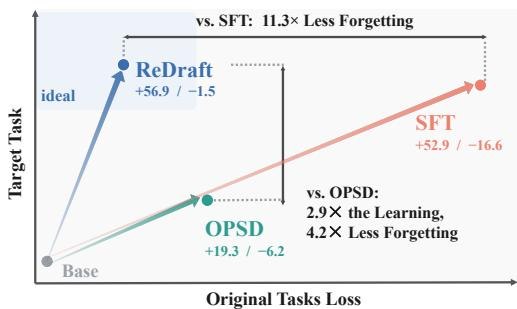  
Figure 1: Target-task gain against loss on the original tasks, averaged over all experiments. ReDraft is in the upper-left region.

Existing post-training approaches largely emphasize one of these properties at the expense of the other. Supervised Fine-Tuning (SFT) provides strong explicit target supervision: given an expert response y<sup>⋆</sup>, it specifies the desired output at every token, enabling rapid learning even when base-model accuracy is near zero (Wei et al., 2022; Chu et al., 2025). Because expert responses are generated independently of the current policy, however, fitting these off-policy targets may induce large behavioral changes and catastrophic forgetting (Luo et al., 2023; Zhang et al., 2026). Reinforcement Learning with Verifiable Rewards (RLVR) takes the opposite approach, sampling responses from the current policy and scoring them with a verifier; this on-policy training improves policy proximity and helps preserve prior capabilities (Lambert et al., 2024; Shenfeld et al., 2025; Chen et al., 2025). It therefore refines capabilities that the policy can already partially express (Wu et al., 2026a), but supplies little supervision on a task where almost no sampled response is correct.

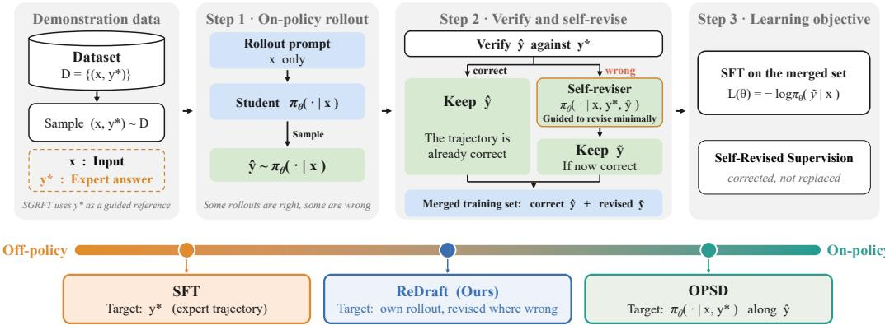  
Figure 2: Overview of ReDraft. Each round samples a response from current policy, revises incorrect responses using an expert response as reference, verifies the revisions, and fine-tunes on the resulting targets. By explicitly incorporating the necessary corrections, ReDraft combines explicit target supervision with policy proximity.

Recently, on-policy self-distillation methods such as SDFT (Shenfeld et al., 2026) and OPSD (Zhao et al., 2026) seek to bridge this gap by combining an expert response with trajectories sampled from the current policy (Hubotter et al., 2026). Their correction remains largely implicit, conveyed through¨ a per-token divergence between the reference-conditioned teacher and the student (Lu & Lab, 2025; Hou et al., 2026; Lv et al., 2024): because the two differ only in the reference prefix, the largest divergences often fall on stylistic or pivot tokens rather than on the decisions that settle the task, yielding a dense but potentially misaligned training signal. Per-token clipping can help constrain the resulting policy updates (Zhao et al., 2026; Gu et al., 2024; nrehiew, 2026). Even when a divergence reflects a genuine error, matching the teacher at that position may not suffice to redirect a continuation conditioned on the student’s erroneous prefix, so the error may recur later in the response (Jiang & Ferraro, 2026; Fu et al., 2026). This limitation becomes more pronounced at cold start, when a rollout may contain multiple interdependent errors: self-distillation maintains policy proximity, but does not directly provide an explicit corrected trajectory to learn from.

We propose ReDraft (Reference-Driven Revision and Fine-Tuning) to address this limitation by revising the student’s rollout into an explicit training target. For each prompt, ReDraft first samples a response from the current policy. Correct responses are kept unchanged, while incorrect responses are revised by the model itself, using an expert response y<sup>⋆</sup> as a reference. Each revision is then verified, and only successful revisions are used for fine-tuning (Figure 2). Rather than providing token-level corrections along the original, potentially incorrect trajectory, ReDraft externalizes the correction as a complete revised response. Because the revision starts from an on-policy rollout and is generated by the policy itself, the resulting target remains close to the current policy; we therefore call it self-revised supervision. This construction combines explicit target supervision with policy proximity: an incorrect rollout can be converted into a positive training target without requiring the current policy to first discover a correct solution path.

We evaluate ReDraft on Counting (Deitke et al., 2025), Clock Reading (Fu et al., 2025b), and Jigsaw (Wang et al., 2025; Lin et al., 2014) using Qwen2.5-VL-3B and 7B (Bai et al., 2025), where Clock Reading and Jigsaw are genuine cold-start settings with near-zero base-model accuracy. With retention measured over eight benchmarks of prior capabilities (section 4), ReDraft exceeds SFT’s target-task gain with 11.3× less forgetting, and improves on OPSD along both axes, with nearly three times its gain at under a quarter of its forgetting (Figure 1); the advantage persists under mixed and sequential multi-task training. Further analyses link the two halves of this result to the two design properties: verified self-revisions have lower perplexity under the generating model than external SFT targets, consistent with greater policy proximity, while in parameter space ReDraft produces compact updates that follow SFT’s direction more closely than OPSD’s, as explicit target supervision predicts. The complementary failure is visible in OPSD, whose token-level credit often falls on incidental reasoning or stylistic tokens rather than the decisions that determine task success.

Our contributions are three-fold:

• We propose ReDraft, a post-training method built on self-revised supervision, which converts failed on-policy rollouts into self-revised, verifier-approved targets, combining explicit target supervision with policy proximity.

• Across three tasks and two model scales, we show that ReDraft matches or exceeds SFT-level acquisition while achieving 11.3× less forgetting, and consistently outperforms OPSD in both target-task acquisition and prior-task retention.

• Data- and parameter-space analyses attribute this advantage to the two design properties: revised targets remain close to the current policy, while the updates they induce follow SFT’s direction more closely than OPSD’s.

## 2 RELATED WORK

Off-policy and On-policy Post-training. Supervised fine-tuning (SFT) adapts language and multimodal models from curated demonstrations, providing explicit token-level imitation targets (Wei et al., 2022; Yu et al., 2024; Paster et al., 2024). Because these trajectories are fixed independently of the learner, SFT is off-policy and can suffer from exposure bias, memorisation, and distribution shift (Ross et al., 2011; Chu et al., 2025). A parallel line of work keeps these targets but reshapes the objective, clipping or reweighting per-token updates against a reference policy to limit policy drift (Zhu et al., 2025b;a; Liu et al., 2026); ReDraft is complementary, leaving the objective intact and replacing the targets themselves with verified self-revised responses. Reinforcement learning instead optimises sampled trajectories from outcome or preference feedback, yielding strong reasoning and out-of-distribution generalisation (Schulman et al., 2017; Shao et al., 2024; Guo et al., 2025; Huan et al., 2025), and its on-policy data interfere less with prior capabilities (Shenfeld et al., 2025; Lai et al., 2025; Zhang et al., 2026; Chen et al., 2025). Both benefits presuppose informative rewards: when virtually every rollout fails, verifier feedback supplies no positive trajectory. We target this cold-start regime, where SFT acquires the skill but forgets, and RLVR forgets little but cannot bootstrap it.

On-policy Self-distillation. Knowledge distillation conventionally transfers a separate teacher’s output distribution to a student (Hinton et al., 2015; Kim & Rush, 2016), while on-policy distillation evaluates teacher guidance along trajectories sampled by the student, reducing train–test mismatch (Agarwal et al., 2024; Xu et al., 2025; Lu & Lab, 2025). Context-distillation methods further use privileged prompts or demonstrations to create a stronger conditional version of the same model (Bai et al., 2022; Snell et al., 2022). SDFT applies this idea to continual learning by distilling a demonstration-conditioned teacher on student rollouts, and OPSD conditions the teacher on ground-truth reasoning solutions to improve reasoning (Shenfeld et al., 2026; Zhao et al., 2026). Both obtain dense token-level supervision from on-policy data without a separate teacher. Their correction nevertheless remains implicit in teacher–student divergence and need not concentrate on task-critical tokens. ReDraft instead reivses that correction as a verified response the policy writes itself, keeping the data-distribution benefit of on-policy distillation without relying on implicit KL credit assignment.

Catastrophic Forgetting. Catastrophic forgetting was first identified in sequential neural-network training (McCloskey & Cohen, 1989; Ratcliff, 1990). Classical remedies regularise parameters important to old tasks (Kirkpatrick et al., 2016; Zenke et al., 2017; Li & Hoiem, 2018), replay prior examples (Shin et al., 2017; Rebuffi et al., 2017; Chaudhry et al., 2019), or allocate task-specific parameters (Rusu et al., 2016; Serra et al., 2018; Zhang et al., 2024). These approaches are difficult\` to apply to foundation-model post-training because pre-training data are commonly unavailable, extra modules are costly, and rigid constraints can impede acquisition. Recent work instead finds that online RL and reinforcement fine-tuning forget less than SFT (Shenfeld et al., 2025; Zhang et al., 2026; Chen et al., 2025). ReDraft follows this data-centric direction but targets cold start: verified self-revised targets reduce forgetting without replay, frozen parameters, or waiting for rare successful rollouts.

Self-training and Expert-revision. LLM self-training methods generate their own instructions, rationales, or responses and reuse selected outputs for learning (Wang et al., 2023; Chen et al., 2024b; Yuan et al., 2024). STaR (Zelikman et al., 2022) and ReST (Gul¨ c¸ehre et al., 2023), for example, condition rationale generation on answers or hints, filter trajectories by correctness or reward, and fine-tune on the retained sequences; related self-refinement and reflection methods iteratively revise responses using model or environment feedback (Madaan et al., 2023; Shinn et al., 2023; Gou et al., 2024). Three concurrent methods build targets from the model’s own generations as we do, each differing in one respect: ReGFT supplies a partial reference and lets the model complete its own trace, so no failed rollout is edited (Wu et al., 2026b); SPoT has an external oracle do the editing and enforces proximity by surface-form overlap (Lin & Han, 2026); and SD-Zero conditions revision on the binary reward alone, with no reference (He et al., 2026). ReDraft instead edits the policy’s own failed response against an expert reference, keeps it only if verified, and regenerates this corpus as training proceeds. Cold-start supervision is therefore explicit and drawn from the model’s own trajectories.

## 3 BACKGROUND AND METHOD

## 3.1 SETUP

Problem setting. We post-train a pretrained policy $\pi _ { 0 }$ on a target task $\tau$ on which it has little or no initial competence, so the accuracy of its sampled responses is near zero and supervision cannot be obtained by filtering them. We therefore assume two sources of external information: a set of demonstrations $\mathcal { D } = \{ ( x _ { i } , y _ { i } ^ { \star } ) \} _ { i = 1 } ^ { N }$ that pairs every prompt with an expert reference trajectory $y ^ { \star }$ and a verifier $v ( y , y ^ { \star } ) \in \{ 0 , 1 \}$ that judges whether a complete response is correct. Training starts from $\pi _ { 0 }$ and updates the parameters $\theta ;$ we denote the policy at the current training step by $\pi _ { \theta }$

Evaluation axes. Continual post-training is judged on two axes at once: the gain on the target task and theforgetting on $\mathcal { P }$ , a benchmark suite assessing the base model’s prior capabilities,

$$
G ( \theta ) = \operatorname { A c c } _ { \mathcal { T } } ( \pi _ { \theta } ) - \operatorname { A c c } _ { \mathcal { T } } ( \pi _ { 0 } ) , \qquad F ( \theta ) = \operatorname { A c c } _ { \mathcal { P } } ( \pi _ { 0 } ) - \operatorname { A c c } _ { \mathcal { P } } ( \pi _ { \theta } ) ,\tag{1}
$$

where Acc is accuracy on the corresponding evaluation set.

## 3.2 LEARNING FROM DEMONSTRATIONS

Supervised Fine-tuning (SFT). Supervised fine-tuning imitates the expert trajectory directly:

$$
\begin{array} { r } { \mathcal { L } _ { \mathrm { S F T } } ( \theta ) = \mathbb { E } _ { \mathcal { D } } \big [ - \log \pi _ { \theta } ( y ^ { \star } \mid x ) \big ] . } \end{array}\tag{2}
$$

On-policy Self-distillation. Rather than fitting $y ^ { \star }$ itself, SDFT (Shenfeld et al., 2026) and OPSD (Zhao et al., 2026) place it in the teacher context and distil the reference-conditioned model into the unconditioned one along the student’s own rollout. On a rollout yˆ, let $q _ { \theta , n } = \pi _ { \theta } ( \cdot \mid x , y ^ { \star } , \hat { y } _ { < n } )$ and $p _ { \theta , n } = \pi _ { \theta } ( \cdot \mid x , \hat { y } _ { < n } ) ;$ ; with forward KL, the objective is

$$
\mathcal { L } _ { \mathrm { O P D } } ( \boldsymbol { \theta } ) = \mathbb { E } _ { \mathcal { D } } \mathbb { E } _ { \hat { \boldsymbol { y } } \sim \pi _ { \boldsymbol { \theta } } ( \cdot | \boldsymbol { x } ) } \frac { 1 } { | \hat { \boldsymbol { y } } | } \sum _ { n = 1 } ^ { | \hat { \boldsymbol { y } } | } \mathrm { K L } ( q _ { \boldsymbol { \theta } , n } \| \boldsymbol { p } _ { \boldsymbol { \theta } , n } ) ,\tag{3}
$$

with gradients taken through the student branch only.

## 3.3 SELF-REVISED SUPERVISION

An ideal training target. Our goal is to improve target-task accuracy while limiting changes to the current policy. For a fixed training pair $( x , y ^ { \star } )$ , we express this trade-off as maximising verifier reward with a KL penalty (Schulman et al., 2015):

$$
\pi _ { \beta } ^ { \star } = \arg \operatorname* { m a x } _ { \pi } \mathbb { E } _ { y \sim \pi ( \cdot | x ) } \big [ v ( y , y ^ { \star } ) \big ] - \beta D _ { \mathrm { K L } } \big ( \pi ( \cdot | x ) \big | \big | \pi _ { \theta } ( \cdot | x ) \big ) .\tag{4}
$$

The solution for $\beta > 0$ is the tilted distribution $\pi _ { \beta } ^ { \star } ( y \mid x ) \propto \pi _ { \theta } ( y \mid x ) \exp \bigl ( v ( y , y ^ { \star } ) / \beta \bigr )$ (Korbak et al., 2022; Rafailov et al., 2023). For a binary verifier, taking $\beta \to 0 ^ { + }$ gives the ideal target (Appendix A.3):

$$
\pi ^ { \star } ( y \mid x ) = \frac { \pi _ { \theta } ( y \mid x ) \mathbf { 1 } \{ y \in \mathcal { C } ( x ) \} } { Z _ { \theta } ( x ) } , \qquad Z _ { \theta } ( x ) = \operatorname* { P r } _ { y \sim \pi _ { \theta } ( \cdot \mid x ) } \left[ y \in \mathcal { C } ( x ) \right] > 0 ,\tag{5}
$$

where $\mathcal { C } ( x ) = \{ y : v ( y , y ^ { \star } ) = 1 \}$ is the set of responses accepted by the verifier. The indicator excludes incorrect responses, so a sample from this target is a complete, verified response for explicit target supervision. Among correct responses, the $\pi _ { \theta }$ factor preserves the model’s relative preferences rather than concentrating all mass on an external reference. The resulting target is the closest distribution to $\pi _ { \theta }$ under the KL penalty above subject to correctness, providing a precise notion of policy proximity.

Limitations of existing objectives. RLVR and rejection sampling draws from this target but requires $1 / Z _ { \theta } ( x )$ samples per accepted response on average, which becomes costly when $Z _ { \theta } ( \bar { x } ) \approx 0$ SFT instead fits $\delta _ { y ^ { \star } }$ , the distribution assigning all probability to the expert response. This provides a correct target but discards the effects of $\pi _ { \theta }$ weighting in Equation 5.

Self-distillation uses the reference-conditioned teacher as a proxy for this ideal target (Shenfeld et al., 2026). To compare their distributions, we write the teacher as a reweighted current policy:

$$
\pi _ { \theta } ( y \mid x , y ^ { \star } ) = \pi _ { \theta } ( y \mid x ) w _ { \theta } ( y ) , \qquad w _ { \theta } ( y ) = \frac { \pi _ { \theta } ( y \mid x , y ^ { \star } ) } { \pi _ { \theta } ( y \mid x ) } .\tag{6}
$$

This identity assumes shared support and requires no further normalisation (Appendix A.4). Unlike the correctness indicator in Equation 5, the unverified weight $w _ { \theta } ( y )$ need not vanish on incorrect responses. Thus Equation 3 matches teacher probabilities along the student’s rollout without constructing an explicit, verified correction.

Consequently, a large token-level KL need not identify a task-critical error: Equation 3 penalises any disagreement between the teacher and student, including differences in style. OPSD reports stylistic tokens contributing 6–15× more KL than mathematical ones and uses pointwise clipping to limit their influence (Zhao et al., 2026). Clipping controls large contributions, but does not identify the tokens that need correction or provide a corrected continuation.

Revision proposal. ReDraft replaces implicit tokenlevel correction with explicit revision and verification of the model’s own rollout. It first samples $\hat { y } ~ \sim ~ \pi _ { \boldsymbol { \theta } } ( \cdot ~ \vert ~ \boldsymbol { x } )$ and sets $\tilde { y } ~ = ~ \hat { y }$ if the verifier accepts it. Otherwise, the same model generates y˜ from $( x , y ^ { \star } , \hat { y } )$ , with instructions to preserve valid content and correct errors. We denote this keep-or-revise distribution by $R _ { \theta } ( \cdot \mid x , y ^ { \star } , \hat { y } )$

Assumption 1 (Correction competence). For a prompt with $Z _ { \theta } ( x ) < 1$ , let $\tilde { y } \sim R _ { \theta } ( \cdot \mid x , y ^ { \star } , \hat { y } )$ . The probability of correcting a failed rollout is positive:

$$
\begin{array} { r } { r _ { \theta } ( x ) = \mathrm { P r } [ \tilde { y } \in \mathcal { C } ( x ) | \hat { y } \notin \mathcal { C } ( x ) ] > 0 , \hat { y } \sim \pi _ { \theta } ( \cdot \mid x ) . } \end{array}
$$

For each fixed $( x , y ^ { \star } )$ , averaging over initial rollouts gives the candidate distribution below, with the reference dependence suppressed:

$$
\rho _ { \theta } ( y \mid x ) = \sum _ { \hat { y } } \pi _ { \theta } ( \hat { y } \mid x ) R _ { \theta } ( y \mid x , y ^ { \star } , \hat { y } ) .\tag{7}
$$

Among candidates that pass verification, let 0

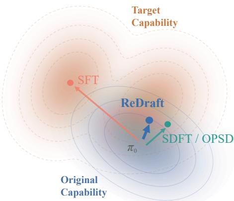  
Figure 3: Schematic of where objective moves the policy. From $\pi _ { 0 } , { \mathrm { S F T } }$ reaches the target capability but leaves the original one; SDFT/OPSD keeps the original but barely approaches the target; ReDraft reaches the target without leaving the original.

$\pi _ { \mathrm { R e D r a f t } } ( y \mid x )$ denote the probability that the retained response equals y. Conditional probability gives

$$
\pi _ { \mathrm { R e D r a f t } } ( y \mid x ) = { \frac { \rho _ { \theta } ( y \mid x ) \mathbf { 1 } \{ y \in { \mathcal { C } } ( x ) \} } { S _ { \theta } ( x ) } } , \qquad S _ { \theta } ( x ) = Z _ { \theta } ( x ) + \left( 1 - Z _ { \theta } ( x ) \right) r _ { \theta } ( x ) \ \geq \ Z _ { \theta } ( x ) .\tag{8}
$$

Here $S _ { \theta } ( x ) = \operatorname* { P r } _ { \tilde { y } \sim \rho _ { \theta } } [ \tilde { y } \in \mathcal { C } ( x ) ] > 0$ is the candidate acceptance rate, not an optimal repair rate. The ratio describes the training targets produced by our procedure; it is not assumed to equal $\pi ^ { \star }$ At a fixed number of initial rollouts, revision yields at least as many accepted targets as rejection sampling in expectation: at cold start $Z _ { \theta } ( x ) { \approx } \bar { 0 } , { \textrm s o } S _ { \theta } ( x ) { \approx } r _ { \theta } ( x )$ . Appendix B.1 reports both rates for every task and scale: on the cold-start tasks, initial acceptance is low while repair rates exceed 56%. Examples of revised responses appear in Appendix E.

ReDraft Supervised fine-tuning. Each retained response becomes a training pair $( x , \tilde { y } )$ , with y˜ drawn from $\pi _ { \mathrm { R e D r a f t } } ( \cdot \mid x )$ . The learner predicts this target from x alone, without the reference or initial rollout. Holding the collection process fixed, the expected loss is

$$
\begin{array} { r } { \mathcal { L } _ { \mathrm { R e D r a f t } } ( \theta ) = \mathbb { E } _ { \mathcal { D } } \Big [ S _ { \theta } ( x ) \mathbb { E } _ { \tilde { y } \sim \pi _ { \mathrm { R e D r a f t } } ( \cdot \vert x ) } \big [ - \log \pi _ { \theta } ( \tilde { y } \mid x ) \big ] \Big ] . } \end{array}\tag{9}
$$

The factor $S _ { \theta } ( x )$ reflects how often a prompt supplies a retained target, not an additional weight applied to accepted examples.

Every retained target in Equation 9 is verifier-approved. Edited spans provide explicit supervision, while unchanged spans preserve the model’s own trajectory and encourage policy proximity.

Summary. Table 1 compares the objectives on the four properties that decide the cold-start case: ReDraft combines SFT’s natural-language targets and cross-entropy supervision with OPSD’s student-generated trajectories, and is the only column that supplies all four. Figure 3 gives the same picture geometrically: the model moves toward the target capability without imitating SFT’s distant expert trajectory or relying on OPSD’s implicit KL allocation. This predicts SFT-like acquisition with the retention benefit of on-policy data.

<table><tr><td colspan="4">RLVR SFT OPSD ReDraft</td></tr><tr><td>Policy proximity</td><td>√</td><td>√</td><td>√</td></tr><tr><td>Dense signal</td><td></td><td>√ √</td><td>√</td></tr><tr><td>Explicit target</td><td>√</td><td>√</td><td>√</td></tr><tr><td></td><td>一</td><td>√</td><td></td></tr><tr><td>Usable at zero start</td><td></td><td></td><td>√</td></tr></table>

Table 1: What each supervision method provides. ReDraft pairs a policy-proximal target with a dense and explicitly correct target supervision.

## 4 EXPERIMENTAL SETUP

Task Acquisition. We validate our hypothesis on three canonical vision-language tasks, Jigsaw and Clock Reading are our cold-start settings as base model’s accuracy is near zero:

• Counting. Given an image, the model is asked to count the instances of a specified object category, such as cats, birds, or people. The base model is already partly competent here, so this task measures the refinement of an existing skill.

• Jigsaw. A real-world image is partitioned into four patches by $\mathbf { a \ 2 \times 2 }$ grid and randomly shuffled; the model must recover the correct ordering of the patches.

• Analog Clock Reading. Given a synthetically rendered image of an analog clock, the model is asked to report the time it displays.

Dataset Construction. Each target task draws on an existing image corpus: for Counting we sample 2k images from PixMo-Count (Deitke et al., 2025); for Clock Reading we take 10k standard clock images from Analog Clocks Combinations (Fu et al., 2025b); and for Jigsaw we sample 10k 640×480 images from COCO (Lin et al., 2014), cut each into four equal patches, and shuffle them at random. Every prompt is then paired with an expert response $y ^ { \star }$ generated by GPT-5.5 (OpenAI, 2026), and the same responses serve every objective that needs one: they are the SFT targets, the reference ReDraft revises against, and the response on which OPSD conditions its teacher.

MLLMs. We employ Qwen2.5-VL-3B (Bai et al., 2025) and 7B as our MLLMs due to their strong performance on vision-language understanding and support of native resolution input.

Evaluation. We not only evaluate the post-trained model on novel tasks, but also on 4 representative capability axes of prior knowledge:

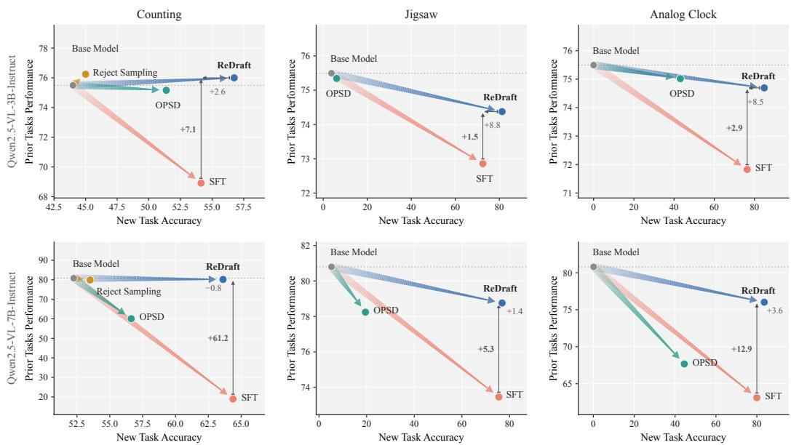  
Figure 4: Target-task acquisition vs. retention of prior capabilities. Rows show Qwen2.5-VL-3B/7B; arrows originate at the base model. Reject Sampling is evaluated only on Counting, where the base policy already has substantial competence. Brackets show the ReDraft–SFT difference; higher is better on both axes.

• OCR, chart & document understanding. AI2D (Kembhavi et al., 2016), DocVQA (Mathew et al., 2021), InfoVQA (Mathew et al., 2022), and ChartQA(Masry et al., 2022) probe the ability of MLLMs to read and reason over scanned documents, forms, and scientific plots.

• General VQA. MME (Fu et al., 2025a) and MMStar (Chen et al., 2024a) cover visual reasoning, spatial relations, and multimodal commonsense.

• Real-world spatial understanding. RealWorldQA (xAI, 2024) probes spatial relations and physical commonsense in everyday photographs.

• Science. ScienceQA (Lu et al., 2022) focuses on diagrams and textbook illustrations that require domain knowledge.

Hyper-parameter setup. We implement all experiments on top of the TRL framework (von Werra et al., 2020). Across all runs, we use a learning rate of $1 \times 1 0 ^ { - 5 }$ and a batch size of 32. We set max length to either 4, 096 or 2, 048, depending on the length of the training corpus. For the OPSD experiments, we set token clip to 0.0, which disables element-wise clipping and therefore optimizes the exact forward KL, and set the temperature to 1.1. At evaluation time on the target tasks, we decode with a temperature of 0.7 and sample 8 responses per question, reporting the avg@8.

## 5 RESULTS AND ANALYSIS

## 5.1 MAIN RESULTS

Evaluation protocol. We evaluate Qwen2.5-VL-3B and 7B on Counting, Jigsaw, and Analog Clock Reading, with the latter two constituting cold-start tasks: base-model accuracy is at most 5.25%. Retention is the macro-average over 8 prior benchmarks after normalising MME by its maximum score 2, 800. Gain and loss are measured from the corresponding base model and averaged over all experiments.

ReDraft preserves SFT-level acquisition while sharply reducing forgetting. ReDraft attains a higher mean target-task gain than SFT (56.9 versus 52.9 points) while reducing prior-task loss from 16.6 to 1.5 points, or 11.3× less forgetting. It leads SFT on target gain in most settings and forgets less in every one (Figure 4). Table 4 in Appendix B.3 reports the detailed results of every experiment.

ReDraft therefore matches or slightly improves target-task learning while retaining substantially more original capability.

The advantage is largest when genuine cold start is required. Across Jigsaw and Analog Clock Reading, ReDraft gains 79.4 target-accuracy points on average, vs. 73.8 for SFT and 26.0 for OPSD, while losing only 2.2 prior-task points, versus 7.8 and 4.1. The contrast with OPSD is sharpest at 3B: on Jigsaw it barely leaves its base accuracy, ending at 6.1% target accuracy for a gain of 2.4 points against ReDraft’s 77.5, and on Clock Reading it recovers about half of ReDraft’s gain (43.1 versus 84.9). Across all settings, ReDraft dominates OPSD and forgets less than SFT in every pair.

RLVR and rejection sampling depend on successful rollouts. We further evaluate the two verifier-based alternatives to expert supervision, GRPO and Reject Sampling (RS). GRPO improves accuracy only on 7B Jigsaw, where correct orderings are occasionally sampled. In the other cold-start settings, correct responses remain scarce and reward increases mainly reflect the format term rather than task accuracy (Appendix B.2). RS also relies on already-correct samples. We report RS on Counting, where base accuracy is 44.0%/52.3% for 3B/7B and positive rollouts are readily available. Even there, RS gains only 1.0/1.3 points, compared with ReDraft’s 12.8/11.4. RS learns only from already-correct rollouts, whereas revision also converts failed attempts into positive training targets.

## 5.2 IS OPSD SIMPLY UNDER-TRAINED?

In Figure 4, OPSD moves in a trade-off direction similar to ReDraft’s in some settings, notably 3B Counting and Clock Reading, raising the possibility that its weaker acquisition is merely an optimisationbudget effect. We therefore extend OPSD to more steps and, to favour the baseline, report its best-target checkpoint (Table 2). The extra budget changes little: 70% more steps buy 4.1 points of gain (19.3→23.4), and even on Clock Reading, where the longer budget helps most (+8.7), OPSD remains 31.7 points behind ReDraft, which reaches 56.9 in fewer steps. Longer training therefore does not break the observed plateau. This is consistent with an objective-limited failure:

Table 2: Extending OPSD does not close the gap. Target-task gain in percentage points, averaged over 3B and 7B.
<table><tr><td>Task</td><td>ReDraft</td><td colspan="2">OPSD</td></tr><tr><td></td><td></td><td>standard</td><td>extended</td></tr><tr><td>Counting</td><td>+12.1</td><td>+5.9</td><td>+8.1</td></tr><tr><td>Jigsaw</td><td>+74.6</td><td>+8.3</td><td>+9.6</td></tr><tr><td>Clock Reading</td><td>+84.2</td><td>+43.8</td><td>+52.5</td></tr><tr><td>Mean gain</td><td>+56.9</td><td>+19.3</td><td>+23.4</td></tr><tr><td>Mean steps</td><td>367</td><td>449</td><td>762</td></tr></table>

on a new task, OPSD provides no sufficiently explicit corrective target for the missing behaviour, so additional steps carry little usable signal. Table 5 in Appendix B.4 reports both budgets for each task and model scale.

## 5.3 MULTI-TASK TRAINING

Mixed training. Interleaving all three target corpora tests whether ReDraft’s retention advantage survives without task boundaries (Figure 5). At the final checkpoint on 3B, ReDraft exceeds SFT in mean target accuracy (62.9 versus 59.7) while retaining 75.3 versus 63.3 on the original tasks (0.2 versus 12.3 points of forgetting). On 7B it acquires the tasks more slowly and ends just short of SFT (68.6 versus 69.5), while retaining 78.4 versus 31.6. The per-task panels show where the two means come apart: ReDraft leads on Clock Reading at both scales and on 3B Jigsaw, while SFT leads on 3B Counting and on 7B Jigsaw. The retention advantage holds at both scales.

Sequential Training We further train the three tasks as a Clock→Counting→Jigsaw sequential curriculum, where the same advantage appears: ReDraft scales to repeated skill acquisition (Figure 6). At the end of the curriculum on 3B, ReDraft reaches a three-task mean of 53.4 versus SFT’s 51.0 and retains 74.5 versus 63.1 on the original tasks, while SFT leads on the final-stage Jigsaw score (58.1 versus 50.9). On 7B, ReDraft ends ahead on clock reading and jigsaw, with a three-task mean of 66.3 versus 60.9 and retention of 75.9 versus 33.9.

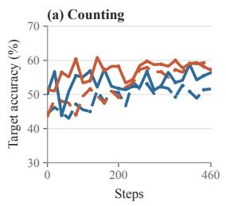

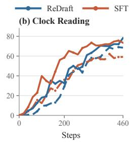

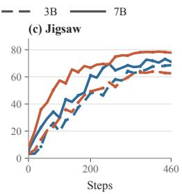

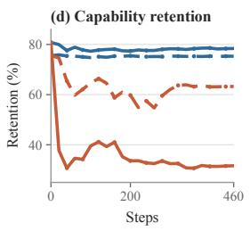  
Figure 5: Mixed training at both model scales. All three target corpora are interleaved in a single run. Colour identifies the objective and line style the model scale. Panels (a–c) track the three target tasks separately; (d) shows original-task retention over 8 benchmarks.

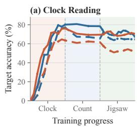

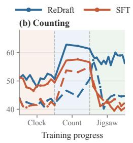

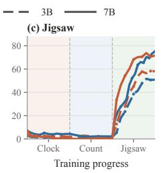

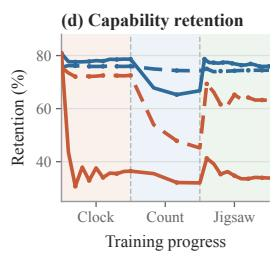  
Figure 6: Sequential performance across all three target tasks. Panels (a–c) track Clock Reading, Counting, and Jigsaw throughout the complete curriculum; (d) shows original-task retention. Colour identifies the objective and line style the model scale. Backgrounds mark the active training stage.

## 6 DATA- AND PARAMETER-SPACE ANALYSIS

Since ReDraft matches SFT on the target task while forgetting far less, and dominates OPSD on both axes, we ask where that behaviour comes from. This section examines the targets ReDraft trains on and the parameter update they induce. All three objectives start from the same pre-trained weights, so their updates can be compared directly.

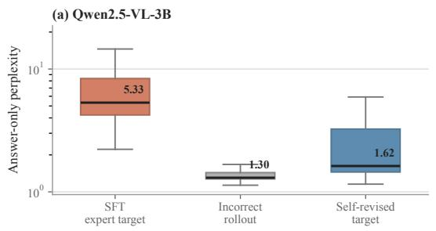

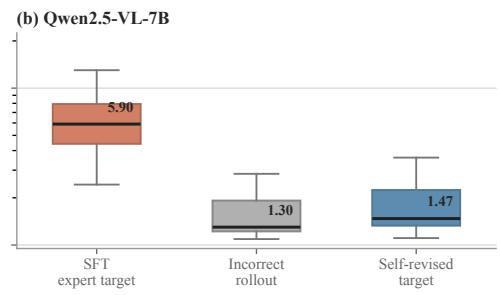  
Figure 7: Self-revised targets are more policy-proximal than external SFT targets. Answer-only PPL is computed under the corresponding frozen base model and shown on a logarithmic scale; each box pools 400 paired examples from each of three tasks.

Revised targets retain policy proximity in the data. We first examine how likely the training targets are under the generating model, using answer-only perplexity (PPL) under the corresponding frozen base model. For each model and task we score three responses for the same prompts: the external expert trajectory, the model’s own incorrect rollout, and its verified self-revision, pooling the three tasks in the aggregate result. Figure 7 shows much lower median PPL for self-revisions than for expert trajectories at both scales (1.62 versus 5.33 on 3B, 70% lower; 1.47 versus 5.90 on 7B, 75% lower). Own rollouts are lowest (1.30 at both scales), providing a reference for the model’s original behaviour. Low PPL indicates higher likelihood under that model, not task correctness.

Verified self-revisions have PPL close to this reference, supporting policy proximity, while verification separately establishes correctness.

Explicit target supervision steers the update in SFT’s direction. We next examine whether Re-Draft’s explicit targets induce updates aligned with SFT’s. Training each objective from a shared initialisation, we take the cosine $\cos ( \Delta _ { A } , \Delta _ { B } )$ between the updates of two objectives, per module group. Figure 8 localises the answer: vision blocks are indistinguishable (0.05–0.06), language-model linear layers favour ReDraft (+0.24 vs. +0.13), and the vocabulary tensors show the largest gap $( + 0 . 7 6 \mathrm { v s . } + 0 . 3 9 )$ . Over all parameters $\cos ( \Delta _ { \mathrm { S F T } } , \Delta _ { \mathrm { R e D r a f t } } ) = + 0 . 2 7 2$ against +0.135 for SFT–OPSD. This stronger alignment, especially in the vocabulary tensors, is consistent with the explicit token targets shared by ReDraft and SFT. Absolute cosines are small, so the claim is comparative; paired results are reported in Appendix D.4.

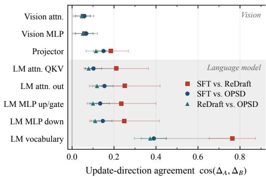  
Figure 8: Agreement between the update directions of different methods, per module group. Markers are means over all pairs.

ReDraft occupies the intermediate update regime. We then measure how far each objective moves the weights. For every tensor we take the relative displacement $\| \Delta W \| _ { F } / \| W _ { 0 } \| _ { F }$ from its pre-trained value, aggregate it by module, and average over the three tasks and both model scales. Figure 9 shows the resulting profile by depth: the objectives separate throughout the language model in the order SFT > ReDraft > OPSD, while the vision-encoder curves nearly coincide. Thus ReDraft changes the weights less than SFT but more than OPSD. Aggregate displacements are $( 6 . 5 2 , 5 . 5 9 , 4 . { \bar { 1 } } 3 ) \times 1 0 ^ { - 3 }$ for SFT, ReDraft, and OPSD, respectively (Appendix D.1).

The update is concentrated rather than diffuse. A larger update need not be a more scattered one. Recent work counts the directions an update uses by the effective rank of the update matrix, and reports that on-policy distillation uses fewer of them than RL (Cai et al., 2026). Measured over the language model’s attention and MLP matrices, ReDraft is once more intermediate: its effective rank is 1454.7, below OPSD’s 1506.4 and above SFT’s 1397.6. Its larger update is therefore packed into fewer directions than OPSD’s rather than spread more widely. A second concentration measure gives the same ordering on average; both are defined and reported per setting in Appendix D.3.

(a) Language model  
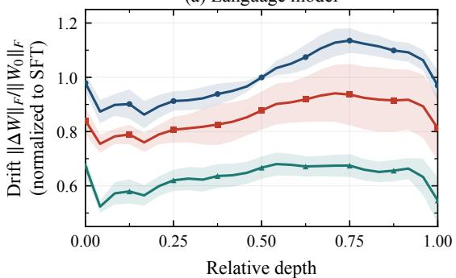

(b) Vision encoder  
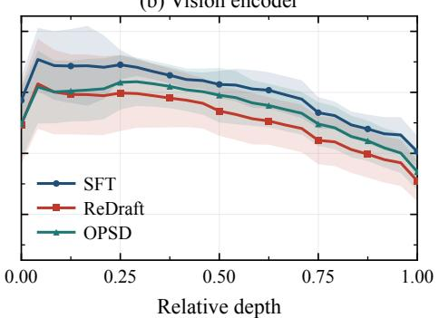  
Figure 9: Update magnitude by network depth. Each curve is normalised by the layer-mean drift so that the two model scales can be pooled; curves are means over all task–model pairs.

OPSD’s token credit misses the decisive tokens. Section 3.3 explains why OPSD’s token-level supervision need not focus on task-critical errors. Figure 10 examines this issue on two rollouts, colouring each token by $\mathrm { a d v } _ { n } = \log p _ { T } ( \hat { y } _ { n } ) - \log p _ { S } ( \hat { y } _ { n } )$ , so that blue marks tokens the teacher suppresses and red ones it reinforces. The answer digits that alone decide the task carry little of the weight: most of it is spread over incidental reasoning, style, and formatting tokens, and some answer tokens are even pushed the wrong way. OPSD can thus know the correction and still fail to put its signal where the decision is made, whereas ReDraft writes the correction out as a verified target.

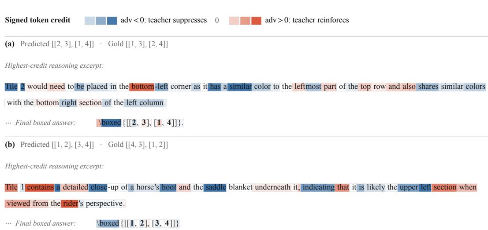  
Figure 10: OPSD credit peaks away from the task-deciding answer. Token backgrounds show signed sampled-token credit: blue denotes adv < 0 (teacher suppression), red adv > 0 (teacher reinforcement), and darker colour larger |adv| under one shared scale.

## 7 CONCLUSION

We studied continual post-training on tasks the model cannot yet perform. Such a model has to be shown what a correct answer looks like, and the demonstrations that do this lie outside its own distribution, so fitting them drives forgetting. On-policy self-distillation avoids that shift by staying on the model’s own rollouts, but its correction survives only as a token-level divergence from a reference-conditioned teacher, which need not fall on the decisions that settle the task. ReDraft makes the correction explicit without leaving the model’s own distribution: an incorrect rollout is edited as little as the reference allows, kept only if a verifier accepts it, and trained on as ordinary token-level supervision. Across three tasks, two model scales, and both mixed and sequential curricula, it recovers SFT’s acquisition at a fraction of its forgetting and improves on OPSD along both axes.

## LIMITATION

ReDraft rests on correction competence (Assumption 1), which holds comfortably here (Appendix B.1) but is empirical: a task hard enough to defeat in-context repair would leave us with no targets. It also requires an automatic verifier, so open-ended generation would need a learned or human proxy whose errors enter the targets directly. Each failed rollout costs an extra generation pass. We build the revised set once from the policy that begins training, so targets grow staler as the parameters move, and revising online during training, which should restore that proximity, is untested. We represent the self-distillation family by OPSD as written in Equation 3, without its pointwise clipping, which bounds the dominant tokens without localising credit, and do not evaluate SDFT separately.

## REFERENCES

Rishabh Agarwal, Nino Vieillard, Yongchao Zhou, Piotr Stanczyk, Sabela Ramos Garea, Matthieu Geist, and Olivier Bachem. On-policy distillation of language models: Learning from selfgenerated mistakes. In The Twelfth International Conference on Learning Representations, ICLR 2024, Vienna, Austria, May 7-11, 2024. OpenReview.net, 2024. URL https://openreview. net/forum?id=3zKtaqxLhW.

Shuai Bai, Keqin Chen, Xuejing Liu, Jialin Wang, Wenbin Ge, Sibo Song, Kai Dang, Peng Wang, Shijie Wang, Jun Tang, Humen Zhong, Yuanzhi Zhu, Ming-Hsuan Yang, Zhaohai Li, Jianqiang Wan, Pengfei Wang, Wei Ding, Zheren Fu, Yiheng Xu, Jiabo Ye, Xi Zhang, Tianbao Xie, Zesen Cheng, Hang Zhang, Zhibo Yang, Haiyang Xu, and Junyang Lin. Qwen2.5-vl technical report.

CoRR, abs/2502.13923, 2025. doi: 10.48550/ARXIV.2502.13923. URL https://doi.org/ 10.48550/arXiv.2502.13923.

Yuntao Bai, Saurav Kadavath, Sandipan Kundu, Amanda Askell, Jackson Kernion, Andy Jones, Anna Chen, Anna Goldie, Azalia Mirhoseini, Cameron McKinnon, Carol Chen, Catherine Olsson, Christopher Olah, Danny Hernandez, Dawn Drain, Deep Ganguli, Dustin Li, Eli Tran-Johnson, Ethan Perez, Jamie Kerr, Jared Mueller, Jeffrey Ladish, Joshua Landau, Kamal Ndousse, Kamile Lukosiute, Liane Lovitt, Michael Sellitto, Nelson Elhage, Nicholas Schiefer, Noem´ı Mercado, Nova DasSarma, Robert Lasenby, Robin Larson, Sam Ringer, Scott Johnston, Shauna Kravec, Sheer El Showk, Stanislav Fort, Tamera Lanham, Timothy Telleen-Lawton, Tom Conerly, Tom Henighan, Tristan Hume, Samuel R. Bowman, Zac Hatfield-Dodds, Ben Mann, Dario Amodei, Nicholas Joseph, Sam McCandlish, Tom Brown, and Jared Kaplan. Constitutional AI: harmlessness from AI feedback. CoRR, abs/2212.08073, 2022. doi: 10.48550/ARXIV.2212.08073. URL https://doi.org/10.48550/arXiv.2212.08073.

Yuchen Cai, Ding Cao, Liang Lin, Chunxi Luo, Xin Xu, Kai Yang, Weijie Liu, Saiyong Yang, Tianxiang Zhao, Guangzhong Sun, Guiquan Liu, and Junfeng Fang. Learning to foresee: Unveiling the unlocking efficiency of on-policy distillation. CoRR, abs/2605.11739, 2026. doi: 10.48550/ ARXIV.2605.11739. URL https://doi.org/10.48550/arXiv.2605.11739.

Arslan Chaudhry, Marc’Aurelio Ranzato, Marcus Rohrbach, and Mohamed Elhoseiny. Efficient lifelong learning with A-GEM. In 7th International Conference on Learning Representations, ICLR 2019, New Orleans, LA, USA, May 6-9, 2019. OpenReview.net, 2019. URL https: //openreview.net/forum?id=Hkf2\_sC5FX.

Howard Chen, Noam Razin, Karthik Narasimhan, and Danqi Chen. Retaining by doing: The role of on-policy data in mitigating forgetting. CoRR, abs/2510.18874, 2025. doi: 10.48550/ARXIV.2510. 18874. URL https://doi.org/10.48550/arXiv.2510.18874.

Lin Chen, Jinsong Li, Xiaoyi Dong, Pan Zhang, Yuhang Zang, Zehui Chen, Haodong Duan, Jiaqi Wang, Yu Qiao, Dahua Lin, and Feng Zhao. Are we on the right way for evaluating large vision-language models? In Amir Globersons, Lester Mackey, Danielle Belgrave, Angela Fan, Ulrich Paquet, Jakub M. Tomczak, and Cheng Zhang (eds.), Advances in Neural Information Processing Systems 37: Annual Conference on Neural Information Processing Systems 2024, NeurIPS 2024, Vancouver, BC, Canada, December 10 - 15, 2024, 2024a. URL http://papers.nips.cc/paper\_files/paper/2024/hash/ 2f8ee6a3d766b426d2618e555b5aeb39-Abstract-Conference.html.

Zixiang Chen, Yihe Deng, Huizhuo Yuan, Kaixuan Ji, and Quanquan Gu. Self-play fine-tuning converts weak language models to strong language models. In Ruslan Salakhutdinov, Zico Kolter, Katherine A. Heller, Adrian Weller, Nuria Oliver, Jonathan Scarlett, and Felix Berkenkamp (eds.), Forty-first International Conference on Machine Learning, ICML 2024, Vienna, Austria, July 21-27, 2024, volume 235 of Proceedings ofMachine Learning Research, pp. 6621–6642. PMLR / OpenReview.net, 2024b. URL https://proceedings.mlr.press/v235/chen24j. html.

Tianzhe Chu, Yuexiang Zhai, Jihan Yang, Shengbang Tong, Saining Xie, Dale Schuurmans, Quoc V. Le, Sergey Levine, and Yi Ma. SFT memorizes, RL generalizes: A comparative study of foundation model post-training. In Aarti Singh, Maryam Fazel, Daniel Hsu, Simon Lacoste-Julien, Felix Berkenkamp, Tegan Maharaj, Kiri Wagstaff, and Jerry Zhu (eds.), Forty-second International Conference on Machine Learning, ICML 2025, Vancouver, BC, Canada, July 13-19, 2025, volume 267 of Proceedings ofMachine Learning Research. PMLR / OpenReview.net, 2025. URL https: //proceedings.mlr.press/v267/chu25c.html.

Matt Deitke, Christopher Clark, Sangho Lee, Rohun Tripathi, Yue Yang, Jae Sung Park, Mohammadreza Salehi, Niklas Muennighoff, Kyle Lo, Luca Soldaini, Jiasen Lu, Taira Anderson, Erin Bransom, Kiana Ehsani, Huong Ngo, Yen-Sung Chen, Ajay Patel, Mark Yatskar, Chris Callison-Burch, Andrew Head, Rose Hendrix, Favyen Bastani, Eli VanderBilt, Nathan Lambert, Yvonne Chou, Arnavi Chheda, Jenna Sparks, Sam Skjonsberg, Michael Schmitz, Aaron Sarnat, Byron Bischoff, Pete Walsh, Chris Newell, Piper Wolters, Tanmay Gupta, Kuo-Hao Zeng, Jon Borchardt, Dirk Groeneveld, Crystal Nam, Sophie Lebrecht, Caitlin Wittlif, Carissa Schoenick,

Oscar Michel, Ranjay Krishna, Luca Weihs, Noah A. Smith, Hannaneh Hajishirzi, Ross B. Girshick, Ali Farhadi, and Aniruddha Kembhavi. Molmo and pixmo: Open weights and open data for state-of-the-art vision-language models. In IEEE/CVF Conference on Computer Vision and Pattern Recognition, CVPR 2025, Nashville, TN, USA, June 11-15, 2025, pp. 91–104. Computer Vision Foundation / IEEE, 2025. doi: 10.1109/CVPR52734.2025.00018. URL https://openaccess.thecvf.com/content/CVPR2025/html/Deitke\_ Molmo\_and\_PixMo\_Open\_Weights\_and\_Open\_Data\_for\_State-of-the-Art\_ CVPR\_2025\_paper.html.

Chaoyou Fu, Peixian Chen, Yunhang Shen, Yulei Qin, Mengdan Zhang, Xu Lin, Jinrui Yang, Xiawu Zheng, Ke Li, Xing Sun, Yunsheng Wu, Rongrong Ji, Caifeng Shan, and Ran He. MME: A comprehensive evaluation benchmark for multimodal large language models. In Danielle Belgrave, Cheng Zhang, Laura N. Montoya, Hsuan-Tien Lin, Razvan Pascanu, Piotr Koniusz, Marzyeh Ghassemi, Nancy Chen, Ivan Vladimir Meza Ru´ ´ız, and Arturo Loaiza-Bonilla (eds.), Advances in Neural Information Processing Systems 38: Annual Conference on Neural Information Processing Systems 2025, NeurIPS 2025, San Diego, CA, USA, December 2-7, 2025 / Mexico City, Mexico, November 30 - December 5, 2025, 2025a. URL http://papers.nips.cc/paper\_files/paper/ 2025/hash/d79a27cf2772fe00be7f341efc0eb517-Abstract-Datasets\_ and\_Benchmarks\_Track.html.

Tairan Fu, Miguel Gonzalez, Javier Conde, Elena Merino-G´ omez, and Pedro Reviriego. Have´ multimodal large language models (mllms) really learned to tell the time on analog clocks? IEEE Internet Computing, 2025b.

Yuqian Fu, Haohuan Huang, Kaiwen Jiang, Yuanheng Zhu, and Dongbin Zhao. Revisiting on-policy distillation: Empirical failure modes and simple fixes. CoRR, abs/2603.25562, 2026. doi: 10. 48550/ARXIV.2603.25562. URL https://doi.org/10.48550/arXiv.2603.25562.

Zhibin Gou, Zhihong Shao, Yeyun Gong, Yelong Shen, Yujiu Yang, Nan Duan, and Weizhu Chen. CRITIC: large language models can self-correct with tool-interactive critiquing. In The Twelfth International Conference on Learning Representations, ICLR 2024, Vienna, Austria, May 7-11, 2024. OpenReview.net, 2024. URL https://openreview.net/forum?id=Sx038qxjek.

Yuxian Gu, Li Dong, Furu Wei, and Minlie Huang. Minillm: Knowledge distillation of large language models. In The Twelfth International Conference on Learning Representations, ICLR 2024, Vienna, Austria, May 7-11, 2024. OpenReview.net, 2024. URL https://openreview. net/forum?id=5h0qf7IBZZ.

C¸ aglar Gul¨ c¸ehre, Tom Le Paine, Srivatsan Srinivasan, Ksenia Konyushkova, Lotte Weerts, Abhishek Sharma, Aditya Siddhant, Alex Ahern, Miaosen Wang, Chenjie Gu, Wolfgang Macherey, Arnaud Doucet, Orhan Firat, and Nando de Freitas. Reinforced self-training (rest) for language modeling. CoRR, abs/2308.08998, 2023. doi: 10.48550/ARXIV.2308.08998. URL https://doi.org/ 10.48550/arXiv.2308.08998.

Daya Guo, Dejian Yang, Haowei Zhang, Junxiao Song, Peiyi Wang, Qihao Zhu, Runxin Xu, Ruoyu Zhang, Shirong Ma, Xiao Bi, Xiaokang Zhang, Xingkai Yu, Yu Wu, Z. F. Wu, Zhibin Gou, Zhihong Shao, Zhuoshu Li, Ziyi Gao, Aixin Liu, Bing Xue, Bingxuan Wang, Bochao Wu, Bei Feng, Chengda Lu, Chenggang Zhao, Chengqi Deng, Chong Ruan, Damai Dai, Deli Chen, Dongjie Ji, Erhang Li, Fangyun Lin, Fucong Dai, Fuli Luo, Guangbo Hao, Guanting Chen, Guowei Li, Hao Zhang, Hanwei Xu, Honghui Ding, Huazuo Gao, Hui Qu, Hui Li, Jianzhong Guo, Jiashi Li, Jingchang Chen, Jingyang Yuan, Jinhao Tu, Junjie Qiu, Junlong Li, J. L. Cai, Jiaqi Ni, Jian Liang, Jin Chen, Kai Dong, Kai Hu, Kaichao You, Kaige Gao, Kang Guan, Kexin Huang, Kuai Yu, Lean Wang, Lecong Zhang, Liang Zhao, Litong Wang, Liyue Zhang, Lei Xu, Leyi Xia, Mingchuan Zhang, Minghua Zhang, Minghui Tang, Mingxu Zhou, Meng Li, Miaojun Wang, Mingming Li, Ning Tian, Panpan Huang, Peng Zhang, Qiancheng Wang, Qinyu Chen, Qiushi Du, Ruiqi Ge, Ruisong Zhang, Ruizhe Pan, Runji Wang, R. J. Chen, R. L. Jin, Ruyi Chen, Shanghao Lu, Shangyan Zhou, Shanhuang Chen, Shengfeng Ye, Shiyu Wang, Shuiping Yu, Shunfeng Zhou, Shuting Pan, S. S. Li, Shuang Zhou, Shaoqing Wu, Tao Yun, Tian Pei, Tianyu Sun, Tao Wang, Wangding Zeng, Wen Liu, Wenfeng Liang, Wenjun Gao, Wenqin Yu, Wentao Zhang, W. L. Xiao, Wei An, Xiaodong Liu, Xiaohan Wang, Xiaokang Chen, Xiaotao Nie, Xin Cheng, Xin Liu, Xin Xie, Xingchao Liu, Xinyu Yang, Xinyuan Li, Xuecheng Su, Xuheng Lin, X. Q. Li, Xiangyue

Jin, Xiaojin Shen, Xiaosha Chen, Xiaowen Sun, Xiaoxiang Wang, Xinnan Song, Xinyi Zhou, Xianzu Wang, Xinxia Shan, Y. K. Li, Y. Q. Wang, Y. X. Wei, Yang Zhang, Yanhong Xu, Yao Li, Yao Zhao, Yaofeng Sun, Yaohui Wang, Yi Yu, Yichao Zhang, Yifan Shi, Yiliang Xiong, Ying He, Yishi Piao, Yisong Wang, Yixuan Tan, Yiyang Ma, Yiyuan Liu, Yongqiang Guo, Yuan Ou, Yuduan Wang, Yue Gong, Yuheng Zou, Yujia He, Yunfan Xiong, Yuxiang Luo, Yuxiang You, Yuxuan Liu, Yuyang Zhou, Y. X. Zhu, Yanping Huang, Yaohui Li, Yi Zheng, Yuchen Zhu, Yunxian Ma, Ying Tang, Yukun Zha, Yuting Yan, Z. Z. Ren, Zehui Ren, Zhangli Sha, Zhe Fu, Zhean Xu, Zhenda Xie, Zhengyan Zhang, Zhewen Hao, Zhicheng Ma, Zhigang Yan, Zhiyu Wu, Zihui Gu, Zijia Zhu, Zijun Liu, Zilin Li, Ziwei Xie, Ziyang Song, Zizheng Pan, Zhen Huang, Zhipeng Xu, Zhongyu Zhang, and Zhen Zhang. Deepseek-r1 incentivizes reasoning in llms through reinforcement learning. Nat., 645(8081):633–638, 2025. doi: 10.1038/S41586-025-09422-Z. URL https://doi.org/10.1038/s41586-025-09422-z.

Yinghui He, Simran Kaur, Adithya Bhaskar, Yongjin Yang, Jiarui Liu, Narutatsu Ri, Liam Fowl, Abhishek Panigrahi, Danqi Chen, and Sanjeev Arora. Self-distillation zero: Self-revision turns binary rewards into dense supervision. CoRR, abs/2604.12002, 2026. doi: 10.48550/ARXIV.2604. 12002. URL https://doi.org/10.48550/arXiv.2604.12002.

Geoffrey E. Hinton, Oriol Vinyals, and Jeffrey Dean. Distilling the knowledge in a neural network. CoRR, abs/1503.02531, 2015. URL http://arxiv.org/abs/1503.02531.

Wenjin Hou, Shangpin Peng, Weinong Wang, Zheng Ruan, Yue Zhang, Zhenglin Zhou, Mingqi Gao, Yifei Chen, Kaiqi Wang, Hongming Yang, Chengquan Zhang, Zhuotao Tian, Han Hu, Yi Yang, Fei Wu, and Hehe Fan. Uni-opd: Unifying on-policy distillation with a dual-perspective recipe. CoRR, abs/2605.03677, 2026. doi: 10.48550/ARXIV.2605.03677. URL https://doi.org/ 10.48550/arXiv.2605.03677.

Maggie Huan, Yuetai Li, Tuney Zheng, Xiaoyu Xu, Seungone Kim, Minxin Du, Radha Poovendran, Graham Neubig, and Xiang Yue. Does math reasoning improve general LLM capabilities? understanding transferability of LLM reasoning. CoRR, abs/2507.00432, 2025. doi: 10.48550/ ARXIV.2507.00432. URL https://doi.org/10.48550/arXiv.2507.00432.

Jonas Hubotter, Frederike L ¨ ubeck, Lejs Behric, Anton Baumann, Marco Bagatella, Daniel Marta,¨ Ido Hakimi, Idan Shenfeld, Thomas Kleine Buening, Carlos Guestrin, and Andreas Krause. Reinforcement learning via self-distillation. CoRR, abs/2601.20802, 2026. doi: 10.48550/ARXIV. 2601.20802. URL https://doi.org/10.48550/arXiv.2601.20802.

Yuxuan Jiang and Francis Ferraro. Bridging reasoning trajectories in on-policy distillation via near-future guidance. CoRR, abs/2606.00305, 2026. doi: 10.48550/ARXIV.2606.00305. URL https://doi.org/10.48550/arXiv.2606.00305.

Aniruddha Kembhavi, Mike Salvato, Eric Kolve, Min Joon Seo, Hannaneh Hajishirzi, and Ali Farhadi. A diagram is worth a dozen images. In Bastian Leibe, Jiri Matas, Nicu Sebe, and Max Welling (eds.), Computer Vision - ECCV 2016 - 14th European Conference, Amsterdam, The Netherlands, October 11-14, 2016, Proceedings, Part IV, volume 9908 of Lecture Notes in Computer Science, pp. 235–251. Springer, 2016. doi: 10.1007/978-3-319-46493-0\ 15. URL https://doi.org/10.1007/978-3-319-46493-0\_15.

Yoon Kim and Alexander M. Rush. Sequence-level knowledge distillation. In Jian Su, Xavier Carreras, and Kevin Duh (eds.), Proceedings of the 2016 Conference on Empirical Methods in Natural Language Processing, EMNLP 2016, Austin, Texas, USA, November 1-4, 2016, pp. 1317– 1327. The Association for Computational Linguistics, 2016. doi: 10.18653/V1/D16-1139. URL https://doi.org/10.18653/v1/d16-1139.

James Kirkpatrick, Razvan Pascanu, Neil C. Rabinowitz, Joel Veness, Guillaume Desjardins, Andrei A. Rusu, Kieran Milan, John Quan, Tiago Ramalho, Agnieszka Grabska-Barwinska, Demis Hassabis, Claudia Clopath, Dharshan Kumaran, and Raia Hadsell. Overcoming catastrophic forgetting in neural networks. CoRR, abs/1612.00796, 2016. URL http://arxiv.org/abs/ 1612.00796.

Tomasz Korbak, Ethan Perez, and Christopher L. Buckley. RL with KL penalties is better viewed as bayesian inference. In Yoav Goldberg, Zornitsa Kozareva, and Yue Zhang (eds.), Findings of

the Associationfor Computational Linguistics: EMNLP 2022, Abu Dhabi, United Arab Emirates, December 7-11, 2022, volume EMNLP 2022 of Findings of ACL, pp. 1083–1091. Association for Computational Linguistics, 2022. doi: 10.18653/V1/2022.FINDINGS-EMNLP.77. URL https://doi.org/10.18653/v1/2022.findings-emnlp.77.

Song Lai, Haohan Zhao, Rong Feng, Changyi Ma, Wenzhuo Liu, Hongbo Zhao, Xi Lin, Dong Yi, Min Xie, Qingfu Zhang, Hongbin Liu, Gaofeng Meng, and Fei Zhu. Reinforcement fine-tuning naturally mitigates forgetting in continual post-training. CoRR, abs/2507.05386, 2025. doi: 10. 48550/ARXIV.2507.05386. URL https://doi.org/10.48550/arXiv.2507.05386.

Nathan Lambert, Jacob Morrison, Valentina Pyatkin, Shengyi Huang, Hamish Ivison, Faeze Brahman, Lester James V. Miranda, Alisa Liu, Nouha Dziri, Shane Lyu, Yuling Gu, Saumya Malik, Victoria Graf, Jena D. Hwang, Jiangjiang Yang, Ronan Le Bras, Oyvind Tafjord, Chris Wilhelm, Luca Soldaini, Noah A. Smith, Yizhong Wang, Pradeep Dasigi, and Hannaneh Hajishirzi. Tulu 3:¨ Pushing frontiers in open language model post-training. CoRR, abs/2411.15124, 2024. doi: 10. 48550/ARXIV.2411.15124. URL https://doi.org/10.48550/arXiv.2411.15124.

Zhizhong Li and Derek Hoiem. Learning without forgetting. IEEE Trans. Pattern Anal. Mach. Intell., 40(12):2935–2947, 2018. doi: 10.1109/TPAMI.2017.2773081. URL https://doi.org/10. 1109/TPAMI.2017.2773081.

Tsung-Yi Lin, Michael Maire, Serge J. Belongie, James Hays, Pietro Perona, Deva Ramanan, Piotr Dollar, and C. Lawrence Zitnick. Microsoft COCO: common objects in context. In David J.´ Fleet, Tomas Pajdla, Bernt Schiele, and Tinne Tuytelaars (eds.),´ Computer Vision - ECCV 2014 - 13th European Conference, Zurich, Switzerland, September 6-12, 2014, Proceedings, Part V, volume 8693 of Lecture Notes in Computer Science, pp. 740–755. Springer, 2014. doi: 10.1007/ 978-3-319-10602-1\ 48. URL https://doi.org/10.1007/978-3-319-10602-1\_ 48.

Wenye Lin and Kai Han. Surgical post-training: Cutting errors, keeping knowledge. CoRR, abs/2603.01683, 2026. doi: 10.48550/ARXIV.2603.01683. URL https://doi.org/10. 48550/arXiv.2603.01683.

Tao Liu, Taiqiang Wu, Runming Yang, Shaoning Sun, Junjie Wang, and Yujiu Yang. Profit: Leveraging high-value signals in SFT via probability-guided token selection. In Maria Liakata, Viviane P. Moreira, Jiajun Zhang, and David Jurgens (eds.), Findings of the Association for Computational Linguistics, ACL 2026, San Diego, California, United States, July 2-7, 2026, pp. 15383–15401. Association for Computational Linguistics, 2026. doi: 10.18653/V1/2026.FINDINGS-ACL.755. URL https://doi.org/10.18653/v1/2026.findings-acl.755.

Kevin Lu and Thinking Machines Lab. On-policy distillation. Thinking Machines Lab: Connectionism, https://thinkingmachines.ai/blog/on-policy-distillation, 2025.

Pan Lu, Swaroop Mishra, Tanglin Xia, Liang Qiu, Kai-Wei Chang, Song-Chun Zhu, Oyvind Tafjord, Peter Clark, and Ashwin Kalyan. Learn to explain: Multimodal reasoning via thought chains for science question answering. In Sanmi Koyejo, S. Mohamed, A. Agarwal, Danielle Belgrave, K. Cho, and A. Oh (eds.), Advances in Neural Information Processing Systems 35: Annual Conference on Neural Information Processing Systems 2022, NeurIPS 2022, New Orleans, LA, USA, November 28 - December 9, 2022, 2022. URL http://papers.nips.cc/paper\_files/paper/2022/hash/ 11332b6b6cf4485b84afadb1352d3a9a-Abstract-Conference.html.

Yun Luo, Zhen Yang, Fandong Meng, Yafu Li, Jie Zhou, and Yue Zhang. An empirical study of catastrophic forgetting in large language models during continual fine-tuning. CoRR, abs/2308.08747, 2023. doi: 10.48550/ARXIV.2308.08747. URL https://doi.org/10.48550/arXiv. 2308.08747.

Jiaming Lv, Haoyuan Yang, and Peihua Li. Wasserstein distance rivals kullback-leibler divergence for knowledge distillation. In Amir Globersons, Lester Mackey, Danielle Belgrave, Angela Fan, Ulrich Paquet, Jakub M. Tomczak, and Cheng Zhang (eds.), Advances in Neural Information Processing Systems 37: Annual Conference on Neural Information Processing Systems 2024, NeurIPS 2024, Vancouver, BC, Canada, December 10 - 15,

2024, 2024. URL http://papers.nips.cc/paper\_files/paper/2024/hash/ 78526d7ad4a2532bd91416e948b9644c-Abstract-Conference.html.

Aman Madaan, Niket Tandon, Prakhar Gupta, Skyler Hallinan, Luyu Gao, Sarah Wiegreffe, Uri Alon, Nouha Dziri, Shrimai Prabhumoye, Yiming Yang, Shashank Gupta, Bodhisattwa Prasad Majumder, Katherine Hermann, Sean Welleck, Amir Yazdanbakhsh, and Peter Clark. Self-refine: Iterative refinement with self-feedback. In Alice Oh, Tristan Naumann, Amir Globerson, Kate Saenko, Moritz Hardt, and Sergey Levine (eds.), Advances in Neural Information Processing Systems 36: Annual Conference on Neural Information Processing Systems 2023, NeurIPS 2023, New Orleans, LA, USA, December 10 - 16, 2023, 2023. URL http://papers.nips.cc/paper\_files/paper/2023/hash/ 91edff07232fb1b55a505a9e9f6c0ff3-Abstract-Conference.html.

Ahmed Masry, Do Xuan Long, Jia Qing Tan, Shafiq R. Joty, and Enamul Hoque. Chartqa: A benchmark for question answering about charts with visual and logical reasoning. In Smaranda Muresan, Preslav Nakov, and Aline Villavicencio (eds.), Findings of the Association for Computational Linguistics: ACL 2022, Dublin, Ireland, May 22-27, 2022, volume ACL 2022 of Findings of ACL, pp. 2263–2279. Association for Computational Linguistics, 2022. doi: 10.18653/V1/2022.FINDINGS-ACL.177. URL https://doi.org/10.18653/v1/2022. findings-acl.177.

Minesh Mathew, Dimosthenis Karatzas, and C. V. Jawahar. Docvqa: A dataset for VQA on document images. In IEEE Winter Conference on Applications ofComputer Vision, WACV 2021, Waikoloa, HI, USA, January 3-8, 2021, pp. 2199–2208. IEEE, 2021. doi: 10.1109/WACV48630.2021.00225. URL https://doi.org/10.1109/WACV48630.2021.00225.

Minesh Mathew, Viraj Bagal, Ruben Tito, Dimosthenis Karatzas, Ernest Valveny, and C. V. Jawahar.\` Infographicvqa. In IEEE/CVF Winter Conference on Applications ofComputer Vision, WACV 2022, Waikoloa, HI, USA, January 3-8, 2022, pp. 2582–2591. IEEE, 2022. doi: 10.1109/WACV51458. 2022.00264. URL https://doi.org/10.1109/WACV51458.2022.00264.

Michael McCloskey and Neal J Cohen. Catastrophic interference in connectionist networks: The sequential learning problem. In Psychology oflearning and motivation, volume 24, pp. 109–165. Elsevier, 1989.

nrehiew. SFT, RL, and on-policy distillation through a distributional lens. Blog post, https: //nrehiew.github.io/blog/sft\_rl\_opd/, 2026.

OpenAI. GPT-5.5 system card. https://openai.com/index/gpt-5-5-system-card/, 2026.

Keiran Paster, Marco Dos Santos, Zhangir Azerbayev, and Jimmy Ba. Openwebmath: An open dataset of high-quality mathematical web text. In The Twelfth International Conference on Learning Representations, ICLR 2024, Vienna, Austria, May 7-11, 2024. OpenReview.net, 2024. URL https://openreview.net/forum?id=jKHmjlpViu.

Rafael Rafailov, Archit Sharma, Eric Mitchell, Christopher D. Manning, Stefano Ermon, and Chelsea Finn. Direct preference optimization: Your language model is secretly a reward model. In Alice Oh, Tristan Naumann, Amir Globerson, Kate Saenko, Moritz Hardt, and Sergey Levine (eds.), Advances in Neural Information Processing Systems 36: Annual Conference on Neural Information Processing Systems 2023, NeurIPS 2023, New Orleans, LA, USA, December 10 - 16, 2023, 2023. URL http://papers.nips.cc/paper\_files/paper/2023/hash/ a85b405ed65c6477a4fe8302b5e06ce7-Abstract-Conference.html.

Roger Ratcliff. Connectionist models of recognition memory: constraints imposed by learning and forgetting functions. Psychological review, 97(2):285, 1990.

Sylvestre-Alvise Rebuffi, Alexander Kolesnikov, Georg Sperl, and Christoph H. Lampert. icarl: Incremental classifier and representation learning. In 2017 IEEE Conference on Computer Vision and Pattern Recognition, CVPR 2017, Honolulu, HI, USA, July 21-26, 2017, pp. 5533–5542. IEEE Computer Society, 2017. doi: 10.1109/CVPR.2017.587. URL https://doi.org/10.1109/ CVPR.2017.587.

Stephane Ross, Geoffrey J. Gordon, and Drew Bagnell. A reduction of imitation learning and´ structured prediction to no-regret online learning. In Geoffrey J. Gordon, David B. Dunson, and Miroslav Dud´ık (eds.), Proceedings ofthe Fourteenth International Conference on Artificial Intelligence and Statistics, AISTATS 2011, Fort Lauderdale, USA, April 11-13, 2011, volume 15 of JMLR Proceedings, pp. 627–635. JMLR.org, 2011. URL http://proceedings.mlr. press/v15/ross11a/ross11a.pdf.

Andrei A. Rusu, Neil C. Rabinowitz, Guillaume Desjardins, Hubert Soyer, James Kirkpatrick, Koray Kavukcuoglu, Razvan Pascanu, and Raia Hadsell. Progressive neural networks. CoRR, abs/1606.04671, 2016. URL http://arxiv.org/abs/1606.04671.

John Schulman, Sergey Levine, Pieter Abbeel, Michael I. Jordan, and Philipp Moritz. Trust region policy optimization. In Francis R. Bach and David M. Blei (eds.), Proceedings of the 32nd International Conference on Machine Learning, ICML 2015, Lille, France, 6-11 July 2015, volume 37 of JMLR Workshop and Conference Proceedings, pp. 1889–1897. JMLR.org, 2015. URL http://proceedings.mlr.press/v37/schulman15.html.

John Schulman, Filip Wolski, Prafulla Dhariwal, Alec Radford, and Oleg Klimov. Proximal policy optimization algorithms. CoRR, abs/1707.06347, 2017. URL http://arxiv.org/abs/ 1707.06347.

Joan Serra, Didac Suris, Marius Miron, and Alexandros Karatzoglou. Overcoming catastrophic\` forgetting with hard attention to the task. In Jennifer G. Dy and Andreas Krause (eds.), Proceedings of the 35th International Conference on Machine Learning, ICML 2018, Stockholmsmassan,¨ Stockholm, Sweden, July 10-15, 2018, volume 80 of Proceedings of Machine Learning Research, pp. 4555–4564. PMLR, 2018. URL http://proceedings.mlr.press/v80/serra18a. html.

Zhihong Shao, Peiyi Wang, Qihao Zhu, Runxin Xu, Junxiao Song, Mingchuan Zhang, Y. K. Li, Y. Wu, and Daya Guo. Deepseekmath: Pushing the limits of mathematical reasoning in open language models. CoRR, abs/2402.03300, 2024. doi: 10.48550/ARXIV.2402.03300. URL https://doi.org/10.48550/arXiv.2402.03300.

Idan Shenfeld, Jyothish Pari, and Pulkit Agrawal. Rl’s razor: Why online reinforcement learning forgets less. CoRR, abs/2509.04259, 2025. doi: 10.48550/ARXIV.2509.04259. URL https: //doi.org/10.48550/arXiv.2509.04259.

Idan Shenfeld, Mehul Damani, Jonas Hubotter, and Pulkit Agrawal. Self-distillation enables continual¨ learning. CoRR, abs/2601.19897, 2026. doi: 10.48550/ARXIV.2601.19897. URL https: //doi.org/10.48550/arXiv.2601.19897.

Hanul Shin, Jung Kwon Lee, Jaehong Kim, and Jiwon Kim. Continual learning with deep generative replay. In Isabelle Guyon, Ulrike von Luxburg, Samy Bengio, Hanna M. Wallach, Rob Fergus, S. V. N. Vishwanathan, and Roman Garnett (eds.), Advances in Neural Information Processing Systems 30: Annual Conference on Neural Information Processing Systems 2017, December 4-9, 2017, Long Beach, CA, USA, pp. 2990–2999, 2017. URL https://proceedings.neurips.cc/ paper/2017/hash/0efbe98067c6c73dba1250d2beaa81f9-Abstract.html.

Noah Shinn, Federico Cassano, Ashwin Gopinath, Karthik Narasimhan, and Shunyu Yao. Reflexion: language agents with verbal reinforcement learning. In Alice Oh, Tristan Naumann, Amir Globerson, Kate Saenko, Moritz Hardt, and Sergey Levine (eds.), Advances in Neural Information Processing Systems 36: Annual Conference on Neural Information Processing Systems 2023, NeurIPS 2023, New Orleans, LA, USA, December 10 - 16, 2023, 2023. URL http://papers.nips.cc/paper\_files/paper/2023/hash/ 1b44b878bb782e6954cd888628510e90-Abstract-Conference.html.

Charlie Snell, Dan Klein, and Ruiqi Zhong. Learning by distilling context. CoRR, abs/2209.15189, 2022. doi: 10.48550/ARXIV.2209.15189. URL https://doi.org/10.48550/arXiv. 2209.15189.

Leandro von Werra, Younes Belkada, Lewis Tunstall, Edward Beeching, Tristan Thrush, Nathan Lambert, Shengyi Huang, Kashif Rasul, and Quentin Gallouedec. TRL: Transformer reinforcement´ learning. https://github.com/huggingface/trl, 2020.

Yizhong Wang, Yeganeh Kordi, Swaroop Mishra, Alisa Liu, Noah A. Smith, Daniel Khashabi, and Hannaneh Hajishirzi. Self-instruct: Aligning language models with self-generated instructions. In Anna Rogers, Jordan L. Boyd-Graber, and Naoaki Okazaki (eds.), Proceedings of the 61st Annual Meeting of the Association for Computational Linguistics (Volume 1: Long Papers), ACL 2023, Toronto, Canada, July 9-14, 2023, pp. 13484–13508. Association for Computational Linguistics, 2023. doi: 10.18653/V1/2023.ACL-LONG.754. URL https://doi.org/10.18653/v1/ 2023.acl-long.754.

Zifu Wang, Junyi Zhu, Bo Tang, Zhiyu Li, Feiyu Xiong, Jiaqian Yu, and Matthew B. Blaschko. Jigsaw-r1: A study of rule-based visual reinforcement learning with jigsaw puzzles. Trans. Mach. Learn. Res., 2025, 2025. URL https://openreview.net/forum?id=XqQCsuyPve.

Jason Wei, Maarten Bosma, Vincent Y. Zhao, Kelvin Guu, Adams Wei Yu, Brian Lester, Nan Du, Andrew M. Dai, and Quoc V. Le. Finetuned language models are zero-shot learners. In The Tenth International Conference on Learning Representations, ICLR 2022, Virtual Event, April 25-29, 2022. OpenReview.net, 2022. URL https://openreview.net/forum?id= gEZrGCozdqR.

Mingqi Wu, Zhihao Zhang, Qiaole Dong, Zhiheng Xi, Jun Zhao, Senjie Jin, Xiaoran Fan, Yuhao Zhou, Huijie Lv, Ming Zhang, Yanwei Fu, Qin Liu, Songyang Zhang, and Qi Zhang. Reasoning or memorization? unreliable results of reinforcement learning due to data contamination. In Sven Koenig, Chad Jenkins, and Matthew E. Taylor (eds.), Fortieth AAAI Conference on Artificial Intel ligence, Thirty-Eighth Conference on Innovative Applications ofArtificial Intelligence, Sixteenth Symposium on Educational Advances in Artificial Intelligence, AAAI 2026, Singapore, January 20-27, 2026, pp. 33944–33952. AAAI Press, 2026a. doi: 10.1609/AAAI.V40I40.40687. URL https://doi.org/10.1609/aaai.v40i40.40687.

Yangzhen Wu, Shanda Li, Zixin Wen, Xin Zhou, Ameet Talwalkar, Yiming Yang, Wenhao Huang, and Tianle Cai. Learn hard problems during RL with reference guided fine-tuning. CoRR, abs/2603.01223, 2026b. doi: 10.48550/ARXIV.2603.01223. URL https://doi.org/10. 48550/arXiv.2603.01223.

xAI. Realworldqa: A benchmark for real-world spatial understanding, 2024. URL https:// huggingface.co/datasets/xai-org/RealworldQA.

Wenda Xu, Rujun Han, Zifeng Wang, Long T. Le, Dhruv Madeka, Lei Li, William Yang Wang, Rishabh Agarwal, Chen-Yu Lee, and Tomas Pfister. Speculative knowledge distillation: Bridging the teacher-student gap through interleaved sampling. In The Thirteenth International Conference on Learning Representations, ICLR 2025, Singapore, April 24-28, 2025. OpenReview.net, 2025. URL https://openreview.net/forum?id=EgJhwYR2tB.

Longhui Yu, Weisen Jiang, Han Shi, Jincheng Yu, Zhengying Liu, Yu Zhang, James T. Kwok, Zhenguo Li, Adrian Weller, and Weiyang Liu. Metamath: Bootstrap your own mathematical questions for large language models. In The Twelfth International Conference on Learning Representations, ICLR 2024, Vienna, Austria, May 7-11, 2024. OpenReview.net, 2024. URL https://openreview.net/forum?id=N8N0hgNDRt.

Weizhe Yuan, Richard Yuanzhe Pang, Kyunghyun Cho, Xian Li, Sainbayar Sukhbaatar, Jing Xu, and Jason Weston. Self-rewarding language models. In Ruslan Salakhutdinov, Zico Kolter, Katherine A. Heller, Adrian Weller, Nuria Oliver, Jonathan Scarlett, and Felix Berkenkamp (eds.), Forty-first International Conference on Machine Learning, ICML 2024, Vienna, Austria, July 21-27, 2024, volume 235 of Proceedings ofMachine Learning Research, pp. 57905–57923. PMLR / OpenReview.net, 2024. URL https://proceedings.mlr.press/v235/yuan24d. html.

Eric Zelikman, Yuhuai Wu, Jesse Mu, and Noah D. Goodman. Star: Bootstrapping reasoning with reasoning. In Sanmi Koyejo, S. Mohamed, A. Agarwal, Danielle Belgrave, K. Cho, and A. Oh (eds.), Advances in Neural Information Processing Systems 35: Annual Conference on Neural Information Processing Systems 2022, NeurIPS 2022, New Orleans, LA, USA, November 28 - December 9, 2022, 2022. URL http://papers.nips.cc/paper\_files/paper/2022/ hash/639a9a172c044fbb64175b5fad42e9a5-Abstract-Conference.html.

Friedemann Zenke, Ben Poole, and Surya Ganguli. Continual learning through synaptic intelligence. In Doina Precup and Yee Whye Teh (eds.), Proceedings of the 34th International Conference on Machine Learning, ICML 2017, Sydney, NSW, Australia, 6-11 August 2017, volume 70 of Proceedings of Machine Learning Research, pp. 3987–3995. PMLR, 2017. URL http:// proceedings.mlr.press/v70/zenke17a.html.

Zhihao Zhang, Jun Zhao, Qi Zhang, Tao Gui, and Xuanjing Huang. Unveiling linguistic regions in large language models. In Lun-Wei Ku, Andre Martins, and Vivek Srikumar (eds.), Proceedings ofthe 62nd Annual Meeting ofthe Associationfor Computational Linguistics (Volume 1: Long Papers), ACL 2024, Bangkok, Thailand, August 11-16, 2024, pp. 6228–6247. Association for Computational Linguistics, 2024. doi: 10.18653/V1/2024.ACL-LONG.338. URL https: //doi.org/10.18653/v1/2024.acl-long.338.

Zhihao Zhang, Qiaole Dong, Qi Zhang, Enyu Zhou, Jun Zhao, Zhiheng Xi, Senjie Jin, Xiaoran Fan, Yuhao Zhou, Mingqi Wu, et al. Why reinforcement fine-tuning enables mllms preserve prior knowledge better: A data perspective. In International Conference on Learning Representations, volume 2026, pp. 15201–15228, 2026.

Siyan Zhao, Zhihui Xie, Mengchen Liu, Jing Huang, Guan Pang, Feiyu Chen, and Aditya Grover. Selfdistilled reasoner: On-policy self-distillation for large language models. CoRR, abs/2601.18734, 2026. doi: 10.48550/ARXIV.2601.18734. URL https://doi.org/10.48550/arXiv. 2601.18734.

He Zhu, Junyou Su, Peng Lai, Ren Ma, Wenjia Zhang, Linyi Yang, and Guanhua Chen. Anchored supervised fine-tuning. CoRR, abs/2509.23753, 2025a. doi: 10.48550/ARXIV.2509.23753. URL https://doi.org/10.48550/arXiv.2509.23753.

Wenhong Zhu, Ruobing Xie, Rui Wang, Xingwu Sun, Di Wang, and Pengfei Liu. Proximal supervised fine-tuning. CoRR, abs/2508.17784, 2025b. doi: 10.48550/ARXIV.2508.17784. URL https: //doi.org/10.48550/arXiv.2508.17784.

## A DERIVATION OF THE IDEALISED TARGET

Section 3.3 states three results without derivation: that the trust-region problem of Equation 4 is solved by a tilted distribution, that this tilt turns into a hard correctness constraint in the limit of a binary verifier, and that the resulting target costs $1 / Z _ { \theta } ( x )$ samples to obtain by rejection whereas a revision costs $1 / S _ { \theta } ( x )$ . This appendix derives the three results and, for each one, says what it is used for. Notation follows the main text throughout.

## A.1 SETTING AND NOTATION

Everything below concerns one prompt x at one point during training.

• y is a complete response and Y is the set of responses the model can emit; every sum below runs over Y.

• $y ^ { \star }$ is the expert reference response paired with x in the demonstration set D.

$v ( y , y ^ { \star } ) \in \{ 0 , 1 \}$ is the verifier, equal to 1 exactly when y solves the task, and $\mathcal { C } ( x ) = \{ y$ $v ( y , y ^ { \star } ) = 1 \bar  \}$ is the set of responses it accepts. When the verifier is used as a reward we write $r ( y ) = v ( y , y ^ { \star } )$

$\pi _ { \boldsymbol { \theta } } ( \cdot \mid x )$ is the current policy.

$\beta > 0$ weights the KL penalty. We denote the corresponding optimum by $\pi _ { \beta } ^ { \star }$ and its $\beta \to 0 ^ { + }$ limit by $\pi ^ { \star }$ . These are idealised targets, not claims about the policy reached by training.

$Z _ { \theta } ( x ) = \operatorname* { P r } _ { y \sim \pi _ { \theta } ( \cdot | x ) } [ y \in \mathcal { C } ( x ) ]$ is the acceptance probability of an initial rollout.

## A.2 SOLVING THE TRUST-REGION PROBLEM

Written out, the objective maximised in Equation 4 is

$$
J ( \pi ) = \underbrace { \sum _ { y } \pi ( y \mid x ) r ( y ) } _ { \mathrm { e x p e c t e d v e r i f i e r r e w a r d } } - \beta \underbrace { \sum _ { y } \pi ( y \mid x ) \log { \frac { \pi ( y \mid x ) } { \pi _ { \theta } ( y \mid x ) } } } _ { \mathrm { K L } ( \pi ( \cdot \mid x ) \parallel \pi _ { \theta } ( \cdot \mid x ) ) } ,
$$

maximised over distributions $\pi ( \cdot \mid x )$ subject to $\begin{array} { r } { \sum _ { y } \pi ( y \mid x ) = 1 } \end{array}$ and $\pi ( y \mid x ) \geq 0$ . Attaching a multiplier λ to the normalisation constraint gives the Lagrangian $\begin{array} { r } { L ( \pi , \lambda ) = J ( \pi ) - \lambda \big ( \sum _ { y } \pi ( y \mid } \end{array}$ $x ) - 1 )$ , whose derivative with respect to the probability of one response is

$$
\frac { \partial L } { \partial \pi ( \boldsymbol { y } \mid \boldsymbol { x } ) } = r ( \boldsymbol { y } ) - \beta \left[ \log \frac { \pi ( \boldsymbol { y } \mid \boldsymbol { x } ) } { \pi _ { \boldsymbol { \theta } } ( \boldsymbol { y } \mid \boldsymbol { x } ) } + 1 \right] - \lambda .
$$

Setting it to zero and solving for $\pi ( y \mid x )$ gives

$$
\log { \frac { \pi ( y \mid x ) } { \pi _ { \theta } ( y \mid x ) } } = { \frac { r ( y ) - \lambda } { \beta } } - 1 \qquad \Longrightarrow \qquad \pi ( y \mid x ) = \pi _ { \theta } ( y \mid x ) \exp \bigl ( r ( y ) / \beta \bigr ) \cdot e ^ { - \lambda / \beta - 1 } .
$$

The trailing factor is the same for every response, so it is fixed by normalisation rather than by solving for $\lambda ,$ and we obtain

$$
\pi _ { \beta } ^ { \star } ( y \mid x ) = \frac { \pi _ { \theta } ( y \mid x ) \exp \bigl ( r ( y ) / \beta \bigr ) } { N _ { \beta } ( x ) } , \qquad N _ { \beta } ( x ) = \sum _ { y ^ { \prime } } \pi _ { \theta } ( y ^ { \prime } \mid x ) \exp \bigl ( r ( y ^ { \prime } ) / \beta \bigr ) .\tag{10}
$$

## A.3 THE LIMIT OF A BINARY VERIFIER

We now specialise Equation 10 to our reward. Because $r ( y ) = v ( y , y ^ { \star } )$ takes only the values 0 and 1, the factor $\exp ( r ( y ) / \beta )$ takes only the value $e ^ { 1 / \beta }$ on accepted responses and 1 on rejected ones. The normaliser therefore splits into two sums,

$$
N _ { \beta } ( x ) = \sum _ { y \in \mathcal { C } ( x ) } \pi _ { \theta } ( y \mid x ) e ^ { 1 / \beta } + \sum _ { y \notin \mathcal { C } ( x ) } \pi _ { \theta } ( y \mid x ) = Z _ { \theta } ( x ) e ^ { 1 / \beta } + \big ( 1 - Z _ { \theta } ( x ) \big ) ,
$$

and substituting it back into Equation 10 gives

$$
\pi _ { \beta } ^ { \star } ( y \mid x ) = \left\{ \begin{array} { l l } { \displaystyle \frac { \pi _ { \theta } ( y \mid x ) } { Z _ { \theta } ( x ) + \big ( 1 - Z _ { \theta } ( x ) \big ) e ^ { - 1 / \beta } } , } & { y \in \mathcal { C } ( x ) , } \\ { \displaystyle \frac { \pi _ { \theta } ( y \mid x ) } { Z _ { \theta } ( x ) e ^ { 1 / \beta } + \big ( 1 - Z _ { \theta } ( x ) \big ) } , } & { y \notin \mathcal { C } ( x ) , } \end{array} \right.\tag{11}
$$

where the first line follows after dividing numerator and denominator by $e ^ { 1 / \beta }$

Before taking a limit it helps to see what $\beta$ actually controls here. In the objective $\beta$ is the weight of the proximity penalty, but in the solution it enters only through the factor $e ^ { 1 / \bar { \beta } }$ , which is the advantage that being accepted confers. Comparing an accepted $y$ with a rejected $y ^ { \prime }$ , and summing the second line of Equation 11 over all rejected responses,

$$
\frac { \pi _ { \beta } ^ { \star } ( y \mid x ) } { \pi _ { \beta } ^ { \star } ( y ^ { \prime } \mid x ) } = \frac { \pi _ { \theta } ( y \mid x ) } { \pi _ { \theta } ( y ^ { \prime } \mid x ) } \cdot e ^ { 1 / \beta } , \qquad \sum _ { y \not \in { \mathcal C } ( x ) } \pi _ { \beta } ^ { \star } ( y \mid x ) = \frac { 1 - Z _ { \theta } ( x ) } { Z _ { \theta } ( x ) e ^ { 1 / \beta } + 1 - Z _ { \theta } ( x ) } .
$$

A large $\beta$ makes $e ^ { 1 / \beta } { \approx } 1$ , so the optimum stays close to $\pi _ { \boldsymbol { \theta } } ( \cdot \mid x )$ and leaves nearly the original mass $1 - Z _ { \theta } ( x )$ on responses the verifier rejects; shrinking $\beta$ raises $e ^ { 1 / \beta }$ and drives that mass towards zero. Correctness is thus only ever a soft preference: at any finite $\beta$ the optimum is a mixture that still places probability on incorrect responses.

Taking $\beta \to 0 ^ { + }$ makes $1 / \beta \to \infty$ . In the first line of Equation 11 the term $e ^ { - 1 / \beta }$ vanishes and the denominator tends to $Z _ { \theta } ( x )$ , while in the second line $e ^ { 1 \hat { / } \beta }$ diverges and the whole expression tends to zero. Provided $Z _ { \theta } ( x ) \stackrel { . } { > } 0$

$$
\pi ^ { \star } ( y \mid x ) = \operatorname* { l i m } _ { \beta \to 0 ^ { + } } \pi _ { \beta } ^ { \star } ( y \mid x ) = \frac { \pi _ { \theta } ( y \mid x ) \mathbf { 1 } \{ y \in \mathcal { C } ( x ) \} } { Z _ { \theta } ( x ) } ,\tag{12}
$$

## which is Equation 5.

Equation 12 is the conditional law of $y \sim \pi _ { \boldsymbol { \theta } } ( \cdot \mid x )$ given $y \in \mathcal { C } ( x )$ : correct responses keep the relative probabilities the current policy gave them and incorrect ones are dropped. Proximity therefore survives the limit, since the target is not uniform on $\mathcal C ( x )$ but still weighted by $\pi _ { \theta } ( y \mid x )$ , which is

## A.4 WHERE EACH OBJECTIVE SITS

Equation 12 has exactly two ingredients: a proposal, $\pi _ { \boldsymbol { \theta } } ( \cdot \mid x )$ , and a verified indicator $\lfloor \{ y \in { \mathcal { C } } ( x ) \}$ normalised by $Z _ { \theta } ( x )$ . Each objective of Section 3.2 changes one of them, and reading off which one explains both the failures and the fix.

Rejection sampling and RLVR change neither. They draw $\hat { y } _ { 1 } , \hat { y } _ { 2 } , \dotsc$ . from $\pi _ { \boldsymbol { \theta } } ( \cdot \mid x )$ and keep the first accepted draw, which is an unbiased sample from Equation 12. The index N of that draw is geometric with success probability $Z _ { \theta } ( x )$ , so

$$
\mathbb { E } [ N ] = \sum _ { k > 1 } k \left( 1 - Z _ { \theta } ( x ) \right) ^ { k - 1 } Z _ { \theta } ( x ) = \frac { 1 } { Z _ { \theta } ( x ) } ,
$$

and no target is ever produced when $Z _ { \theta } ( x ) = 0$ , the limit the cold-start tasks approach with $Z _ { \theta }$ below 1% (Appendix B.1).

SFT keeps the indicator and discards the $\pi _ { \theta }$ factor.

We identify the distribution that SFT actually fits. Write $\delta _ { y } ,$ ⋆ for the point mass at the reference, that is $\delta _ { y ^ { \star } } ( y ) = 1$ for $y = y ^ { \star }$ and 0 for every other response. which is the objective of Equation 2. The target SFT fits is therefore $\delta _ { y ^ { \star } }$

We compare $\delta _ { y ^ { \star } }$ with Equation 12. Both put all their mass inside $\mathcal { C } ( x )$ , so both satisfy the indicator. They differ in how that mass is distributed: $\pi ^ { \star }$ spreads it over every accepted response in proportion to $\pi _ { \theta } ( y \mid x )$ , whereas $\delta _ { y ^ { \star } }$ puts all of it on one accepted response chosen without consulting $\pi _ { \theta }$ at all. This is the precise sense in which SFT replaces $\pi ^ { \star }$ by $y ^ { \star }$ : the indicator is kept, the $\pi _ { \theta }$ factor is dropped. The disagreement is quantitative as well. Equation 12 assigns the reference probability $\pi ^ { \star } ( \stackrel { \cdot } { y ^ { \star } } | x ) = \pi _ { \theta } ( y ^ { \star } | x ) / Z _ { \theta } ( x )$ while $\delta _ { y } ,$ ⋆ assigns it 1, so SFT over-weights the reference by

$$
\frac { 1 } { \pi ^ { \star } ( y ^ { \star } \mid x ) } = \frac { Z _ { \theta } ( x ) } { \pi _ { \theta } ( y ^ { \star } \mid x ) } \ge 1 ,
$$

since $\begin{array} { r } { Z _ { \theta } \mathopen { } \mathclose \bgroup \left( x \aftergroup \egroup \right) = \sum _ { y \in \mathcal { C } ( x ) } } \end{array}$ π<sub>θ</sub>(y | x) includes the term $\pi _ { \boldsymbol { \theta } } ( \boldsymbol { y } ^ { \star } \mid \boldsymbol { x } )$ ; the two coincide only when the current policy gives no probability to any other accepted response. The factor grows without bound as $y ^ { \star }$ is not sampled from $\pi _ { \boldsymbol { \theta } } ( \boldsymbol { | \ x ) }$ , which is the cold-start regime, and one quantity therefore drives both of SFT’s observed behaviours: an explicit target that works from near-zero accuracy, and an update large enough to forget.

Self-distillation keeps the proposal and replaces the indicator. It targets the same $\pi ^ { \star }$ , but does not use the verifier during training, so it cannot use the characterisation in Equation 12 and instead puts the reference-conditioned model in its place; dividing that model by $\pi _ { \theta } ( y \mid x )$ then writes it as a tilt of the same form as Equation 10,

$$
\begin{array} { r l r } { \pi ^ { \star } ( y \mid x ) \approx \pi _ { \theta } ( y \mid x , y ^ { \star } ) = \pi _ { \theta } ( y \mid x ) \exp \bigl ( \Delta _ { \theta } ( y ) \bigr ) , } & { } & { \Delta _ { \theta } ( y ) = \log \frac { \pi _ { \theta } ( y \mid x , y ^ { \star } ) } { \pi _ { \theta } ( y \mid x ) } , } \end{array}\tag{13}
$$

Comparing Equation 13 with Equation 12, the hard indicator has become the soft exponent $\Delta _ { \theta } .$ , which no verifier constrains. Two consequences follow, and they are the two defects the main text reports: the target need not place all its mass on $\mathcal C ( x )$ , so correctness is not guaranteed, and the exponent is carried by per-token terms $a _ { n }$ that need not sit at the positions deciding acceptance, which is what η measures.

ReDraft keeps the indicator and replaces the proposal. A candidate is produced in two steps: a rollout ${ \hat { y } } \sim \pi _ { \theta } ( \cdot \mid x )$ , followed by a revision $\tilde { y } \sim \bar { R _ { \theta } } ( \cdot \mid x , y ^ { \star } , \hat { y } )$ , where $R _ { \theta }$ is the distribution of the response the model emits when given the prompt, the reference and its own rollout, and returns yˆ unchanged when that rollout is already accepted. Only the candidate is used for training, so what we need is the law of y˜ on its own, obtained by averaging over the intermediate rollout:

$$
\rho _ { \theta } ( y \mid x ) = \sum _ { \hat { y } } \pi _ { \theta } ( \hat { y } \mid x ) R _ { \theta } ( y \mid x , y ^ { \star } , \hat { y } ) .\tag{14}
$$

Here $\rho _ { \theta } ( \cdot \mid x )$ is the distribution of responses produced by “draft an answer, then edit it against the reference”, in the same sense that $\pi _ { \boldsymbol { \theta } } ( \cdot \mid x )$ is the distribution produced by “answer directly”. It takes the place of $\pi _ { \boldsymbol { \theta } } ( \cdot \mid x )$ as the proposal, and nothing else about the procedure changes.

The test itself is unchanged: $\mathcal C ( x )$ is the same set of verifier-accepted responses as before, independent of how a candidate was produced, so a candidate is retained if and only if $\tilde { y } \in \mathcal { C } ( x )$ . Under the new proposal that happens with probability

$$
S _ { \theta } ( x ) = \operatorname* { P r } _ { \tilde { y } \sim \rho _ { \theta } ( \cdot \vert x ) } [ \tilde { y } \in \mathcal { C } ( x ) ] = \sum _ { y \in \mathcal { C } ( x ) } \rho _ { \theta } ( y \mid x ) ,
$$

the same sum that defines $Z _ { \theta } ( x )$ over the same set, but taken against $\rho _ { \theta }$ instead of $\pi _ { \theta }$

A training target is the first candidate to pass the test, so its distribution follows from summing over the number of candidates rejected before it. Candidates are drawn independently, so the k-th of them is the first to be retained and equals $y$ when the first $k - 1$ draws are rejected, of probability $\left( 1 - S _ { \theta } ( x ) \right) ^ { k - 1 }$ , and the k-th draw is y and accepted, of probability $\rho _ { \theta } ( y \mid x ) \mathbf { 1 } \{ y \in { \mathcal { C } } ( x ) \}$ }. Summing over k with $\textstyle \sum _ { k \geq 1 } ( 1 - p ) ^ { k - 1 } = 1 / p$

$$
\pi _ { \mathrm { R e D r a f t } } ( y \mid x ) = \sum _ { k > 1 } \left( 1 - S _ { \theta } ( x ) \right) ^ { k - 1 } \rho _ { \theta } ( y \mid x ) \mathbf { 1 } \{ y \in { \mathcal { C } } ( x ) \} = { \frac { \rho _ { \theta } ( y \mid x ) \mathbf { 1 } \{ y \in { \mathcal { C } } ( x ) \} } { S _ { \theta } ( x ) } } .\tag{15}
$$

Discarding the rejected candidates has therefore sampled $\rho _ { \theta }$ conditioned on acceptance: Equation 15 is Equation 12 with $( \pi _ { \theta } , Z )$ replaced by $( \rho _ { \theta } , S _ { \theta } )$ , derived rather than assumed. The indicator survives, so every retained target is correct, and the expected number of attempts per target is $1 / S _ { \theta } ( x )$

The two acceptance rates are related exactly, which is where the cold-start gain comes from. Splitting on whether the rollout already passes, and using that $R _ { \theta }$ returns $\hat { y }$ unchanged in that case, so that $\operatorname* { P r } [ \tilde { y } \in \mathcal { C } ( x ) \mid \hat { y } \in \mathcal { C } ( x ) ] = 1$

$$
S _ { \theta } ( x ) = \underbrace { \mathrm { P r } \left[ \hat { y } \in \mathcal { C } ( x ) \right] } _ { Z _ { \theta } ( x ) } \cdot 1 + \underbrace { \mathrm { P r } \left[ \hat { y } \notin \mathcal { C } ( x ) \right] } _ { 1 - Z _ { \theta } ( x ) } \cdot \underbrace { \mathrm { P r } \left[ \tilde { y } \in \mathcal { C } ( x ) \vert \hat { y } \notin \mathcal { C } ( x ) \right] } _ { r _ { \theta } ( x ) } ,
$$

which is the identity in Equation 8. Revision keeps the $Z _ { \theta } ( x )$ that rejection sampling already collects and adds the term $( 1 - Z _ { \theta } ( x ) ) r _ { \theta } ( x )$ recovered from the failures that rejection sampling discards. At cold start the first term is negligible and the second is the entire yield, so $S _ { \theta } ( x ) > 0$ is possible exactly where $Z _ { \theta } ( x ) = 0 \colon$ : the events differ because $\tilde { y }$ is drawn with the reference in context, from a distribution whose support is not that of $\pi _ { \boldsymbol { \theta } } ( \cdot \mid x )$

The substitution is not free: $\rho _ { \theta } \neq \pi _ { \theta }$ , so Equation 15 is a biased surrogate for Equation 12. The minimal-edit instruction biases y˜ towards $\hat { y }$ but does not constrain it, and a repair is sometimes a full rewrite, so we do not bound the discrepancy analytically. What holds is that $\tilde { y }$ is emitted by the policy itself, and Section 6 measures the discrepancy that remains as target perplexity under the generating model.

## B PER-TASK ACQUISITION AND RETENTION RESULTS

## B.1 SAMPLING AND REPAIR RATES

Assumption 1 requires $r _ { \theta } ( x ) > 0$ , and Equation 8 makes ReDraft’s supply of training targets depend on it. We measure both rates on the training corpora by sampling one rollout per prompt and, when the verifier rejects it, revising it once with the reference in context (Table 3).

The cold-start tasks show the gap the identity predicts. At 3B the model solves 0.21% of Jigsaw and 0.03% of Clock Reading prompts unaided, so rejection sampling collects almost nothing, but 92.25% and 56.84% of the failed rollouts are repairable, giving targets for 92.27% and 56.85% of prompts. On Counting, where sampling already works, revision still raises the yield from 65.85% to 92.00%.

## B.2 RLVR AT COLD START

Section 3.3 attributes RLVR’s weakness at cold start to the absence of positive rollouts rather than to insufficient training. We test this by running GRPO on the two cold-start tasks at both scales, sampling $G = 8$ rollouts for each of 32 prompts per step at a learning rate of $2 \times 1 0 ^ { - 6 }$ and dropping groups whose rollouts all receive the same reward.

Table 3: Sampling success, repair rate, and target yield. N is the number of prompts in the corpus, $Z _ { \theta }$ the fraction solved by the first rollout, r<sub>θ</sub> the fraction of the remaining prompts whose revision the verifier accepts, and $S _ { \theta } = Z _ { \theta } + ( 1 - Z _ { \theta } ) r _ { \theta }$ the fraction that contributes a training target.
<table><tr><td>Task</td><td>Model</td><td>N</td><td>Sampling  $\left( Z _ { \theta } \right)$ </td><td>Repair  $( r _ { \theta } )$ </td><td>Yield  $( S _ { \theta } )$ </td></tr><tr><td>Counting</td><td>3B</td><td>2,000</td><td>65.85</td><td>76.57</td><td>92.0</td></tr><tr><td>Jigsaw</td><td>3B</td><td>10,000</td><td>0.21</td><td>92.25</td><td>92.27</td></tr><tr><td>Clock Reading</td><td>3B</td><td>10,000</td><td>0.03</td><td>56.84</td><td>56.85</td></tr><tr><td>Counting</td><td>7B</td><td>2,000</td><td>77.40</td><td>98.23</td><td>99.6</td></tr><tr><td>Jigsaw</td><td>7B</td><td>10,000</td><td>6.09</td><td>94.0</td><td>94.37</td></tr><tr><td>Clock Reading</td><td>7B</td><td>10,000</td><td>0.67</td><td>64.97</td><td>65.2</td></tr></table>

Figure 11 separates a rising reward from an acquired skill: the format term saturates everywhere while the outcome term moves only in a single setting. Clock Reading never leaves zero at either scale, and Jigsaw at 3B sits at the accuracy of guessing an ordering at random, so neither is learning. Only Jigsaw at 7B improves, and two properties of that setting supply what the others lack: its answer space is small enough that a correct ordering is occasionally sampled by chance, and the 7B model already solves 6.09% of these prompts unaided against 0.21% at 3B (Table 3). Verifiable rewards therefore presuppose some of the competence they are meant to build, whereas revision reaches a 56.85% yield on the same 3B Clock Reading corpus on which GRPO obtains nothing.

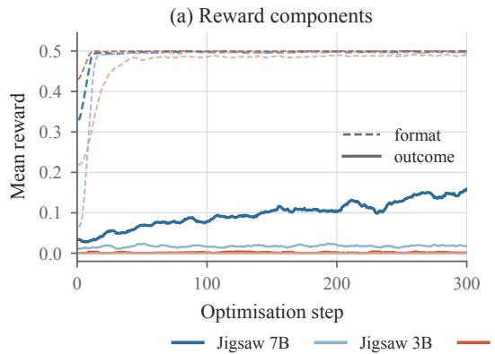

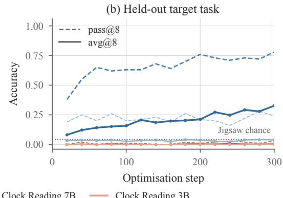  
Figure 11: GRPO on the two cold-start tasks. (a) The two reward components during training. The format term reaches it in every setting, while the outcome term rises only for Jigsaw at 7B. (b) Accuracy on 100 held-out prompts, evaluated with 8 samples per prompt. The dotted line marks the accuracy of guessing $\mathrm { ~ a ~ 2 ~ } \times \mathrm { ~ 2 ~ }$ ordering at random.

## B.3 PER-SETTING RESULTS

Table 4 expands the aggregate comparison of Section 5.1 into individual runs. Each target task is trained separately on Qwen2.5-VL-3B and 7B, and every row is one task at its selected checkpoint: Target and Prior are its target-task and prior-capability scores, and Gain and Loss are the corresponding changes from the base model. Reject Sampling is evaluated only on Counting, where the base policy already has substantial competence. The means over these rows are the values reported in the main text and plotted in Figure 4. The per-setting entries also show how unevenly forgetting is distributed across runs: SFT retains 18.92 on prior tasks for 7B Counting, whereas ReDraft retains 76.00 on the same run.

## B.4 EXTENDED OPSD TRAINING

Table 5 breaks Table 2 down by task and model scale. The longer budget leaves acquisition essentially unchanged in most cells: on 3B, the gain moves by 1.6 points on Jigsaw and 0.5 on Clock Reading even though the number of updates grows by 50 to 100%, and Counting stays below 9 points at either scale. The single substantial improvement is 7B Clock Reading, which rises from +44.4 to +61.4 and accounts for most of the difference between the two budgets. Even there OPSD ends 22.1 points below the +83.5 that ReDraft reaches on the same run.

Table 4: Per-setting results. Target and Prior are its scores, while Gain is target improvement and Loss is the signed change in prior-task performance relative to the corresponding base model, all in percentage points. ReDraft matches or exceeds SFT’s target score, sometimes over more steps, and retains more prior-task performance in every setting. Reject Sampling is available only for Counting.
<table><tr><td>Task</td><td>Model</td><td>Method</td><td>Steps</td><td>Target</td><td>Prior</td><td>Gain ↑</td><td>Loss</td></tr><tr><td>Counting</td><td>3B</td><td>SFT</td><td>63</td><td>54.13</td><td>68.91</td><td>+10.13</td><td>-6.58</td></tr><tr><td></td><td></td><td>ReDraft</td><td>58</td><td>55.63</td><td>75.28</td><td>+11.63</td><td>-0.21</td></tr><tr><td></td><td></td><td>Reject Sampling</td><td>42</td><td>45.00</td><td>76.24</td><td>+1.00</td><td>+0.75</td></tr><tr><td></td><td></td><td>OPSD</td><td>63</td><td>51.38</td><td>75.16</td><td>+7.38</td><td>-0.33</td></tr><tr><td>Jigsaw</td><td>3B</td><td>SFT</td><td>313</td><td>72.50</td><td>72.86</td><td>+68.75</td><td>-2.64</td></tr><tr><td></td><td></td><td>ReDraft</td><td>578</td><td>80.00</td><td>73.61</td><td>+76.25</td><td>-1.89</td></tr><tr><td></td><td></td><td>OPSD</td><td>626</td><td>6.12</td><td>75.34</td><td>+2.37</td><td>-0.15</td></tr><tr><td>Clock Reading</td><td>3B</td><td>SFT</td><td>313</td><td>76.38</td><td>71.83</td><td>+76.38</td><td>-3.67</td></tr><tr><td></td><td></td><td>ReDraft</td><td>356</td><td>84.88</td><td>74.69</td><td>+84.88</td><td>-0.80</td></tr><tr><td></td><td></td><td>OPSD</td><td>626</td><td>43.13</td><td>75.02</td><td>+43.13</td><td>-0.48</td></tr><tr><td>Counting</td><td>7B</td><td>SFT</td><td>126</td><td>64.38</td><td>18.92</td><td>+12.13</td><td>-61.87</td></tr><tr><td></td><td></td><td>ReDraft</td><td>126</td><td>62.25</td><td>76.00</td><td>+10.00</td><td>-4.79</td></tr><tr><td></td><td></td><td>Reject Sampling</td><td>49</td><td>53.50</td><td>79.89</td><td>+1.25</td><td>-0.90</td></tr><tr><td></td><td></td><td>OPSD</td><td>126</td><td>56.63</td><td>60.06</td><td>+4.38</td><td>-20.73</td></tr><tr><td>Jigsaw</td><td>7B</td><td>SFT</td><td>313</td><td>75.50</td><td>73.46</td><td>+70.25</td><td>-7.34</td></tr><tr><td></td><td></td><td>ReDraft</td><td>590</td><td>75.00</td><td>78.75</td><td>+69.75</td><td>-2.05</td></tr><tr><td></td><td></td><td>OPSD</td><td>626</td><td>19.50</td><td>78.24</td><td>+14.25</td><td>-2.56</td></tr><tr><td>Clock Reading</td><td>7B</td><td>SFT</td><td>313</td><td>80.00</td><td>63.11</td><td>+79.87</td><td>-17.68</td></tr><tr><td></td><td></td><td>ReDraft</td><td>408</td><td>83.63</td><td>76.02</td><td>+83.50</td><td>-4.77</td></tr><tr><td></td><td></td><td>OPSD</td><td>626</td><td>44.50</td><td>67.67</td><td>+44.37</td><td>-13.12</td></tr></table>

Table 5: OPSD under a longer step budget, per task and model scale. Steps is cumulative, and Gain is target-accuracy improvement in percentage points over base accuracies of 44.00/3.75/0.00 on 3B and 52.25/5.25/0.13 on 7B for Counting, Jigsaw, and Clock Reading. Averaging the two scales column-wise reproduces Table 2.
<table><tr><td></td><td colspan="4">Qwen2.5-VL-3B</td><td colspan="4">Qwen2.5-VL-7B</td></tr><tr><td></td><td colspan="2">standard</td><td colspan="2">extended</td><td colspan="2">standard</td><td colspan="2">extended</td></tr><tr><td>Task</td><td>Steps</td><td>Gain</td><td>Steps</td><td>Gain</td><td>Steps</td><td>Gain</td><td>Steps</td><td>Gain</td></tr><tr><td>Counting</td><td>63</td><td>+7.38</td><td>252</td><td>+8.12</td><td>126</td><td>+4.38</td><td>252</td><td>+8.13</td></tr><tr><td>Jigsaw</td><td>626</td><td>+2.37</td><td>939</td><td>+4.00</td><td>626</td><td>+14.25</td><td>939</td><td>+15.12</td></tr><tr><td>Clock Reading</td><td>626</td><td>+43.13</td><td>1252</td><td>+43.63</td><td>626</td><td>+44.37</td><td>939</td><td>+61.37</td></tr><tr><td>Mean</td><td>438</td><td>+17.63</td><td>814</td><td>+18.58</td><td>459</td><td>+21.00</td><td>710</td><td>+28.21</td></tr></table>

## C PER-TASK ANSWER-PERPLEXITY DISTRIBUTIONS

Figure 12 separates the pooled result by task and model scale. Revision lowers the median in every comparison, and on Counting and Clock Reading it brings the target down to the model’s own rollout at both scales: the revised medians are 1.59 and 1.44 on 3B and 1.32 and 1.41 on 7B, against own-rollout values of 1.51, 1.33, 1.23, and 1.26, starting from expert targets between 4.19 and 6.27. Jigsaw is the harder case. At 7B the revised median falls from 7.93 to 2.75, close to the 2.06 of the model’s own rollout, but at 3B it stops at 4.00 against an own-rollout 1.28, so the revision there stays some way from the model’s distribution even though it is verified correct. The consistently low PPL of incorrect rollouts again separates policy proximity from correctness: the advantage of self-revision is not merely low PPL, but a verified-correct target that remains closer to the model distribution than the SFT trace.

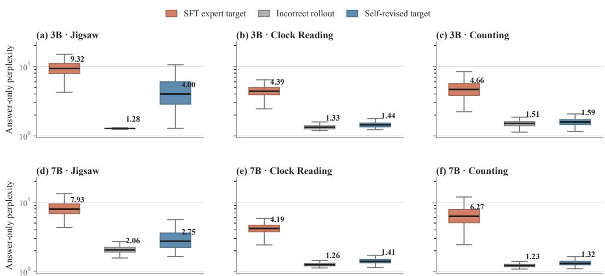  
Figure 12: Per-task answer-only PPL distributions. Rows correspond to Qwen2.5-VL-3B/7B and columns to Jigsaw, Clock Reading, and Counting. Each panel contains 400 paired prompts per response source. Boxes span the interquartile range, centre lines and labels denote medians, and whiskers extend to 1.5× IQR.

## D PER-SETTING WEIGHT-SPACE RESULTS

## D.1 WEIGHT-SPACE SUMMARY

Table 6 collects the weight-space measurements of Section 6. Three properties of the update are measured. Its magnitude, the relative displacement of each module from its pre-trained value, separates the objectives as SFT > ReDraft > OPSD throughout the language model and most sharply at the output head, while the vision encoder and the projector barely differ between objectives (Appendix D.2). Its concentration, the number of singular directions that carry the update, again places ReDraft between the two baselines (Appendix D.3). Its direction, the cosine against the corresponding SFT update, is closer to SFT for ReDraft than for OPSD, most clearly in the vocabulary tensors (Appendix D.4).

Table 6: Weight-space signature and task outcomes. Weight statistics are means over all task–model pairs; displacements are reported in units of 10<sup>−3</sup> and cosines against the corresponding SFT update. The concentration measures are defined in Appendix D.3. Outcomes follow the Table 4.
<table><tr><td></td><td>SFT</td><td>ReDraft (ours)</td><td>OPSD</td></tr><tr><td>Update magnitude  $( \times 1 0 ^ { - 3 } )$ </td><td></td><td></td><td></td></tr><tr><td>All parameters</td><td>6.52</td><td>5.59</td><td>4.13</td></tr><tr><td>Vision encoder</td><td>9.07</td><td>8.20</td><td>8.47</td></tr><tr><td>Projector</td><td>7.90</td><td>6.90</td><td>7.00</td></tr><tr><td>LM linear layers</td><td>7.41</td><td>6.43</td><td>4.60</td></tr><tr><td>Output head</td><td>14.27</td><td>10.71</td><td>3.70</td></tr><tr><td>Spectral geometry</td><td></td><td></td><td></td></tr><tr><td>Aggregate effective rank</td><td>1397.6</td><td>1454.7</td><td>1506.4</td></tr><tr><td>Top-1% norm share (%)</td><td>59.0</td><td>54.6</td><td>53.7</td></tr><tr><td>Leading-direction share  $\sigma _ { 1 } / \Vert \Delta W \Vert _ { F }$ </td><td>0.289</td><td>0.258</td><td>0.251</td></tr><tr><td>Update direction, cos(∆, ∆sFT)</td><td></td><td></td><td></td></tr><tr><td>All parameters</td><td></td><td>+0.272</td><td>+0.135</td></tr><tr><td>LM linear layers</td><td></td><td>+0.237</td><td>+0.134</td></tr><tr><td>LM vocabulary</td><td></td><td>+0.764</td><td>+0.390</td></tr><tr><td>Task outcomes</td><td></td><td></td><td></td></tr><tr><td>Target-task gain ↑</td><td>+52.9</td><td>+56.0</td><td>+19.3</td></tr><tr><td>Original-task loss ↓</td><td>-16.6</td><td>-2.4</td><td>-6.2</td></tr></table>

## D.2 UPDATE MAGNITUDE

Table 7 breaks the displacements averaged in Table 6 down by task and model scale, one row per objective and module group. The aggregate ordering of Figure 9 holds separately in each of them: total displacement, LM-linear drift, and output-head drift always satisfy $\mathrm { \bar { S F T } > \bar { R e D r a f t } > O P S D }$ The gap is smallest on Jigsaw, where ReDraft nearly matches SFT, and larger on Counting and Clock Reading.

Table 7: Detailed update magnitude $( \times 1 0 ^ { - 3 } )$ . “All” covers all measured parameters; vision encoder, projector, and LM-linear values are energy-aggregated over matrix weights, while output head denotes lm head.weight. The task–model pairs listed here are the observations averaged in Table 6.
<table><tr><td>Task</td><td>Model</td><td>Method</td><td>All</td><td>Vision enc.</td><td>Projector</td><td>LM linear</td><td>Output head</td></tr><tr><td>Counting</td><td>3B</td><td>SFT</td><td>3.862</td><td>5.794</td><td>4.895</td><td>4.138</td><td>3.945</td></tr><tr><td rowspan="4">Clock Reading</td><td></td><td>ReDraft</td><td>3.261</td><td>5.352</td><td>4.184</td><td>3.440</td><td>2.910</td></tr><tr><td></td><td>OPSD</td><td>2.856</td><td>5.621</td><td>4.053</td><td>2.860</td><td>1.564</td></tr><tr><td>3B</td><td>SFT</td><td>6.882</td><td>10.464</td><td>8.676</td><td>7.063</td><td>9.876</td></tr><tr><td></td><td>ReDraft</td><td>5.050</td><td>7.477</td><td>6.760</td><td>5.396</td><td>5.486</td></tr><tr><td rowspan="4">Jigsaw</td><td></td><td>OPSD</td><td>4.511</td><td>8.950</td><td>8.950</td><td>4.421</td><td>2.897</td></tr><tr><td>3B</td><td>SFT</td><td>8.257</td><td>11.624</td><td>9.756</td><td>7.853</td><td>17.114</td></tr><tr><td></td><td>ReDraft OPSD</td><td>8.033 5.215</td><td>11.058</td><td>9.149</td><td>7.629</td><td>16.984</td></tr><tr><td></td><td></td><td></td><td>11.097</td><td>8.093</td><td>4.893</td><td>4.369</td></tr><tr><td>Counting</td><td>7B</td><td>SFT ReDraft</td><td>4.070 3.365</td><td>5.679</td><td>4.745</td><td>5.467</td><td>5.772</td></tr><tr><td rowspan="4">Clock Reading</td><td></td><td>OPSD</td><td>2.869</td><td>5.510 5.928</td><td>4.457 4.436</td><td>4.440</td><td>4.408</td></tr><tr><td></td><td></td><td></td><td></td><td></td><td>3.658</td><td>2.475</td></tr><tr><td>7B</td><td>SFT</td><td>7.293</td><td>8.764</td><td>8.761</td><td>9.160</td><td>22.151</td></tr><tr><td></td><td>ReDraft</td><td>5.836 4.327</td><td>8.528</td><td>7.358</td><td>7.507</td><td>13.653</td></tr><tr><td rowspan="4">Jigsaw</td><td></td><td>OPSD</td><td></td><td>8.595</td><td>8.229</td><td>5.514</td><td>4.870</td></tr><tr><td>7B</td><td>SFT</td><td>8.755</td><td>12.114</td><td>10.587</td><td>10.808</td><td>26.785</td></tr><tr><td></td><td>ReDraft</td><td>8.003</td><td>11.265</td><td>9.481</td><td>10.169</td><td>20.834</td></tr><tr><td></td><td>OPSD</td><td>5.004</td><td>10.633</td><td>8.255</td><td>6.267</td><td>5.995</td></tr></table>

## D.3 SPECTRAL GEOMETRY

The concentration measures are computed from the singular values $\sigma _ { 1 } \geq \cdots \geq \sigma _ { r }$ of the update $\Delta W = W - W _ { 0 }$ of each Attention and MLP weight matrix of the language model, using the full spectrum $( r = \operatorname* { m i n } ( m , n )$ , no truncation) and averaging over those matrices. Writing $\bar { \sigma } _ { i } =$ $\sigma _ { i } / \sum _ { j } \sigma _ { j }$ for the normalised spectrum, the effective rank is $\begin{array} { r } { \exp \bigl ( - \sum _ { i } \bar { \sigma } _ { i } \log \bar { \sigma } _ { i } \bigr ) } \end{array}$ , the exponential of its entropy, and is lower when the update is carried by fewer directions. The top-k norm share is $\textstyle \big ( \sum _ { i \leq k } \sigma _ { i } ^ { 2 } \big / \sum _ { j } \sigma _ { j } ^ { 2 } \big ) ^ { 1 / 2 }$ and is higher when it is carried by fewer directions; we report it at $k = \lceil r / \bar { 1 } 0 0 \rceil$ , the top 1% of directions, and at $k = 1$ , where it reduces to $\sigma _ { 1 } / \Vert \Delta W \Vert _ { F } .$ , the fraction of the update carried by its single leading direction. All three are invariant to rescaling $\Delta W$ , so they describe the shape of the update rather than its size.

Table 8 reports the three measures for each task. All three place SFT as the most concentrated objective and ReDraft as more concentrated than OPSD.

## D.4 UPDATE DIRECTION

Table 9 gives the cosines behind Figure 8, comparing each objective with SFT for every task and model scale. The full-parameter SFT–ReDraft cosine exceeds SFT–OPSD in every pair, and the vocabulary comparison is likewise unanimous (0.644–0.961 vs. 0.314–0.492). LM-linear layers favour ReDraft in most settings, with the two Clock Reading settings as exceptions. The pattern therefore supports a localised claim: ReDraft most consistently recovers SFT’s direction where token-level targets enter the embedding and output geometry.

Table 8: Detailed spectral geometry. Norm shares are reported as percentages. Effective rank is bounded by the matrix dimensions, which differ between scales, so it should be compared between methods within a row rather than across scales.
<table><tr><td>Task</td><td>Model</td><td>Method</td><td>Effective rank</td><td>Top-1% share (%)</td><td> $\sigma _ { 1 } / \Vert \Delta W \Vert _ { F }$ </td></tr><tr><td rowspan="3">Counting</td><td>3B</td><td>SFT</td><td>1114.0</td><td>57.2</td><td>0.299</td></tr><tr><td></td><td>ReDraft</td><td>1142.6</td><td>53.6</td><td>0.273</td></tr><tr><td></td><td>OPSD</td><td>1162.6</td><td>53.0</td><td>0.266</td></tr><tr><td rowspan="3">Clock Reading</td><td>3B</td><td>SFT</td><td>958.1</td><td>58.3</td><td>0.300</td></tr><tr><td></td><td>ReDraft</td><td>1040.1</td><td>53.9</td><td>0.278</td></tr><tr><td></td><td>OPSD</td><td>1077.9</td><td>52.0</td><td>0.256</td></tr><tr><td rowspan="3">Jigsaw</td><td>3B</td><td>SFT</td><td>1032.9</td><td>53.5</td><td>0.270</td></tr><tr><td></td><td>ReDraft</td><td>1043.4</td><td>52.7</td><td>0.264</td></tr><tr><td></td><td>OPSD</td><td>1112.3</td><td>48.5</td><td>0.235</td></tr><tr><td rowspan="3">Counting</td><td>7B</td><td>SFT</td><td>1879.4</td><td>68.3</td><td>0.359</td></tr><tr><td></td><td>ReDraft</td><td>1951.2</td><td>57.1</td><td>0.258</td></tr><tr><td></td><td>OPSD</td><td>1982.1</td><td>58.5</td><td>0.277</td></tr><tr><td rowspan="3">Clock Reading</td><td>7B</td><td>SFT</td><td>1602.4</td><td>62.2</td><td>0.272</td></tr><tr><td></td><td>ReDraft</td><td>1682.7</td><td>60.0</td><td>0.267</td></tr><tr><td></td><td>OPSD</td><td>1781.8</td><td>60.3</td><td>0.265</td></tr><tr><td rowspan="3">Jigsaw</td><td>7B</td><td>SFT</td><td>1799.1</td><td>54.2</td><td>0.232</td></tr><tr><td></td><td>ReDraft</td><td>1868.2</td><td>50.5</td><td>0.209</td></tr><tr><td></td><td>OPSD</td><td>1921.9</td><td>49.7</td><td>0.205</td></tr></table>

Table 9: Detailed update-direction agreement. Entries are cos $( \Delta _ { A } , \Delta _ { B } )$ from the same initialisation. “LM linear” is the unweighted mean over attention QKV/output and MLP up–gate/down groups; vocabulary denotes LLM.embed.
<table><tr><td>Task</td><td>Model</td><td>Pair</td><td>All</td><td>LM linear</td><td>Vocabulary</td></tr><tr><td>Counting</td><td>3B</td><td>SFT-ReDraft</td><td>+0.224</td><td> $+ 0 . 2 5 0$ </td><td>+0.702</td></tr><tr><td rowspan="5"></td><td></td><td>SFT-OPSD</td><td>+0.148</td><td>+0.182</td><td>+0.356</td></tr><tr><td></td><td>ReDraft-OPSD</td><td>+0.079</td><td> $+ 0 . 0 9 6$ </td><td>+0.353</td></tr><tr><td>3B</td><td>SFT-ReDraft</td><td>+0.134</td><td> $+ 0 . 0 7 9$ </td><td>+0.644</td></tr><tr><td></td><td>SFT-OPSD</td><td>+0.120</td><td> $+ 0 . 0 9 5$ </td><td>+0.344</td></tr><tr><td></td><td>ReDraft-OPSD</td><td>+0.098</td><td> $+ 0 . 0 8 1$ </td><td>+0.254</td></tr><tr><td rowspan="3">Jigsaw</td><td>3B</td><td>SFT-ReDraft</td><td>+0.589</td><td> $+ 0 . 5 7 1$ </td><td>+0.961</td></tr><tr><td></td><td>SFT-OPSD</td><td>+0.121</td><td> $+ 0 . 1 1 4$ </td><td>+0.439</td></tr><tr><td></td><td>ReDraft-OPSD</td><td>+0.122</td><td> $+ 0 . 1 1 4$ </td><td>+0.448</td></tr><tr><td>Counting</td><td>7B</td><td>SFT-ReDraft</td><td>+0.231</td><td>+0.241</td><td>+0.660</td></tr><tr><td rowspan="4">Clock Reading</td><td></td><td>SFT-OPSD</td><td>+0.182</td><td>+0.201</td><td>+0.392</td></tr><tr><td></td><td>ReDraft-OPSD</td><td>+0.117</td><td>+0.132</td><td>+0.400</td></tr><tr><td>7B</td><td>SFT-ReDraft</td><td>+0.194</td><td>+0.102</td><td>+0.781</td></tr><tr><td></td><td>SFT-OPSD</td><td>+0.141</td><td>+0.120</td><td>+0.492</td></tr><tr><td rowspan="4">Jigsaw</td><td></td><td>ReDraft-OPSD</td><td>+0.124</td><td>+0.106</td><td>+0.470</td></tr><tr><td>7B</td><td>SFT-ReDraft</td><td>+0.261</td><td>+0.177</td><td>+0.832</td></tr><tr><td></td><td>SFT-OPSD</td><td>+0.097</td><td>+0.093</td><td>+0.314</td></tr><tr><td></td><td>ReDraft-OPSD</td><td>+0.085</td><td>+0.084</td><td>+0.309</td></tr></table>

## E CASE STUDY

Below we show one self-revision example for each target task. For every example we display the visual input, the problem with its ground-truth answer, the model’s incorrect unaided rollout, and the verifier-accepted revised response used as the ReDraft training target.

## E.1 CLOCK READING

Figure 13 shows a Clock Reading example. The unaided rollout misreads all three hands and reports 06:08:30. Given the expert reference only as context for revision, the same model corrects the reading to the verified answer 03:30:38, which is revised minimally.

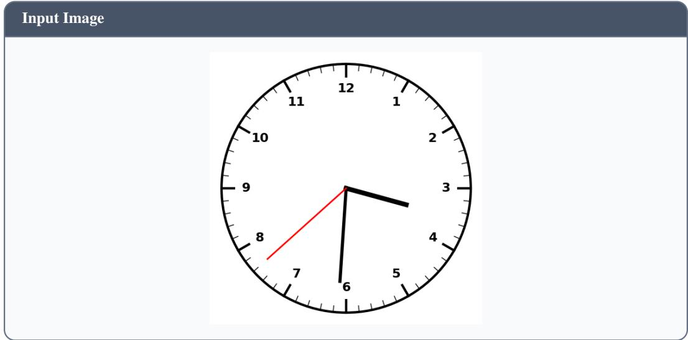  
Figure 13: A demonstration of the Clock Reading task.

Example From Clock Reading   
Problem:   
You are given an image of an analogue clock. The second hand is red   
and thin, the minute hand is black and long, and the hour hand is   
black, shorter and thicker.   
Please answer the following clock-reading question: determine the   
time displayed on the clock face by locating the hour hand, the   
minute hand and the second hand, show your detailed step-by-step   
reasoning process, and wrap the final time in \boxed{} using the   
zero-padded 12-hour HH:MM:SS format (for example, if the clock shows   
3:45:20, end with \boxed{03:45:20}).   
The question is as follows:   
What time is shown on the clock in the given image?   
Now, give your detailed reasoning process in no more than 200 words.   
Answer: 03:30:38

Incorrect Rollout   
To determine the time shown on the clock in the given image, we need   
to analyze the positions of the hour hand, the minute hand, and the   
second hand.

1. Hour Hand Analysis:   
- The hour hand is black and longer.   
- It points between the numbers 6 and 7.   
- Counting from 6 to 7, it is approximately halfway between these   
two numbers.   
2. Minute Hand Analysis:   
- The minute hand is black and longer.   
- It points between the numbers 8 and 9.   
- Counting from 8 to 9, it is approximately halfway between these   
two numbers.   
3. Second Hand Analysis:   
- The second hand is red and thin.   
- It points between the numbers 10 and 11.   
- Counting from 10 to 11, it is approximately halfway between these   
two numbers.   
4. Time Calculation:   
- The hour hand is at 6 and 30 seconds (halfway between 6 and 7).   
- The minute hand is at 8 and 30 seconds (halfway between 8 and 9).   
- The second hand is at 10 and 30 seconds (halfway between 10 and   
11).   
Therefore, the time shown on the clock is \boxed{06:08:30}.

## Revised Response

To determine the time shown on the clock, we need to analyze the   
positions of the hour hand, the minute hand, and the second hand.   
1. Hour Hand Analysis:   
- The hour hand is black and shorter.   
- It points between the numbers 3 and 4.   
- Counting from 3 to 4, it is approximately halfway between these   
two numbers.   
2. Minute Hand Analysis:   
- The minute hand is black and longer.   
- It points between the numbers 6 and 7.   
- Counting from 6 to 7, it is approximately halfway between these   
two numbers.   
3. Second Hand Analysis:   
- The second hand is red and thin.   
- It points between the numbers 7 and 8.   
- Counting from 7 to 8, it is approximately halfway between these   
two numbers.   
4. Time Calculation:   
- The hour hand is at 3 and 30 seconds (halfway between 3 and 4).   
- The minute hand is at 6 and 30 seconds (halfway between 6 and 7).   
- The second hand is at 7 and 30 seconds (halfway between 7 and 8).   
Therefore, the time shown on the clock is \boxed{03:30:38}.

## E.2 COUNTING

Figure 14 shows a Counting example. The unaided rollout under-counts people in the photograph (5 instead of 6). After revision minimally against the expert reference, the model adds the missing person and reports the verified count 6, which is revised minimally.

Input Image

  
Figure 14: A demonstration of the Counting task.

Example From Counting   
Problem:   
You are given an image. Please answer the following counting   
question: count how many target objects are in the image, show your   
detailed step-by-step reasoning process, and wrap the final count in   
\boxed{}.   
How many people are in this image?   
Answer: 6

## Incorrect Rollout

To determine the number of people in the image, I’ll follow these   
steps:   
1. Identify all individuals present in the picture.   
2. Count each person individually.   
3. Sum up the total count.   
Step 1: Identifying individuals   
There are five people standing together in the image.   
Step 2: Counting individuals   
The first person on the left is wearing a gray t-shirt with   
"FITCHBURG STATE" written on it.   
The second person is wearing a light blue button-up shirt and khaki   
pants.   
The third person is holding an award and wearing a black dress.   
The fourth person is wearing a yellow plaid shirt with gray pants.

- The fifth person is wearing a pink jacket over a black blouse and   
white pants.   
Step 3: Summing up the total count   
There are five distinct individuals visible in the image.   
Therefore, the final count is: \boxed{5}

## Revised Response

To determine the number of people in the image, I’ll follow these   
steps:   
1. Identify all individuals present in the picture.   
2. Count each person individually.   
3. Sum up the total count.   
Step 1: Identifying individuals   
There are six people standing together in the image.   
Step 2: Counting individuals   
The first person on the left is wearing a gray t-shirt with   
"FITCHBURG STATE" written on it.   
The second person is wearing a light blue button-up shirt and khaki   
pants.   
The third person is holding an award and wearing a black dress.   
The fourth person is wearing a yellow plaid shirt with gray pants.   
The fifth person is wearing a pink jacket over a black blouse and   
white pants.   
The sixth person is wearing a light patterned outfit.   
Step 3: Summing up the total count   
There are six distinct individuals visible in the image.   
Therefore, the final count is: \boxed{6}

Your task is to reassemble the original image. Analyze the tiles carefully:

- Match colors, textures, lighting and gradients across tile borders. - Trace objects, lines and edges that are cut apart and must continue between adjacent tiles.

## E.3 JIGSAW

Figure 15 shows a Jigsaw example. The four tiles are the model inputs; the reconstructed image is shown only to aid reading and is not part of the prompt. The unaided rollout proposes the identity permutation [[1, 2], [3, 4]]. After rewriting the output for revision, the model recovers the verified ordering [[3, 1], [2, 4]].

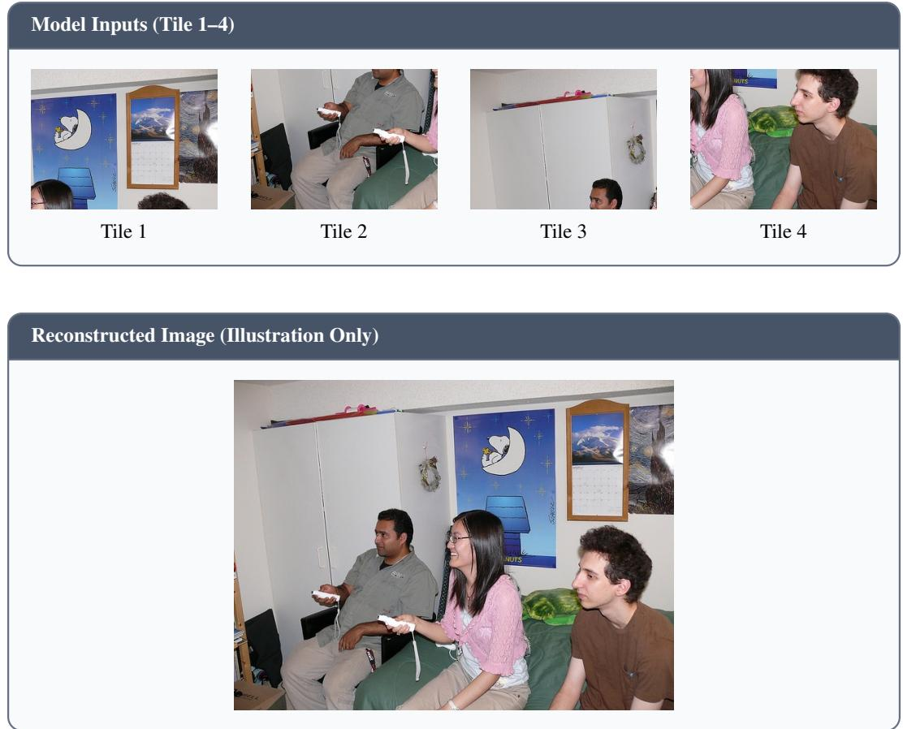  
Figure 15: A demonstration of Jigsaw inputs and reconstructed image. Top: the four shuffled tiles fed to the model. Bottom: the original photograph reconstructed from the ground-truth ordering.

## Example From Jigsaw

## Problem:

original image (left cell first), row 2 is the bottom row. Each cell holds the label number of the tile that belongs at that position. For example \boxed{[[3, 1], [4, 2]]} means Tile 3 is the top-left quadrant, Tile 1 the top-right, Tile 4 the bottom-left and Tile 2 the bottom-right.

Now, write your response as one concise paragraph, no longer than 200 words.

Answer: [[3, 1], [2, 4]]

## Incorrect Rollout

By analyzing the images, I can see that the top row likely contains the sky/ceiling elements, while the bottom row has ground/floor elements. The first image shows a wall with posters and a calendar, which could be part of the sky/ceiling row. The second image depicts two people holding game controllers, which suggests an indoor setting, possibly the ground/floor. The third image shows a man looking up, and the fourth image shows a person sitting on a bed. The fourth image seems to belong to the ground/floor row due to the bed and the person sitting on it. By matching the colors and textures, the second image also appears to be from the ground/floor row because it features the same type of indoor setting as the fourth image. Thus, we can conclude that the top row consists of the first and second images, and the bottom row consists of the third and fourth images. Therefore, the reassembled image would be \boxed{[[1, 2], [3, 4]]}.

## Revised Response

Tile 3 is the top-left because the wardrobe/cabinet background and seated man continue vertically. Tile 1 is the top-right because the cropped heads at the bottom of Tile 1 continue into the people sitting on the bed in Tile 4. Tile 2 is the bottom-left because the man looking up in Tile 2 connects to the seated woman in Tile 4 through the shared edge. Tile 4 is the bottom-right because the person sitting on the bed in Tile 4 is the same as the person in Tile 2. Therefore, the reassembled image would be \boxed{[[3, 1], [2, 4]]}.

## F REVISION PROMPT TEMPLATES

The demonstrations above use a revision stage that edits an incorrect rollout against an expert reference. Below we list the three task-specific prompt templates in full.

## F.1 CLOCK READING

```markdown
Clock Reading Revision Template
You are an expert at reading analogue clocks. The dial has three
hands: a thin RED second hand, a long BLACK minute hand, and a short
thick BLACK hour hand.
Below are the image, the question, the correct time, a reference
answer, and the answer you wrote earlier. Revise your earlier answer
so that it is correct, changing as little of it as possible.
## Rules
- Make the SMALLEST edit that makes the answer correct. Keep your
earlier answer’s wording, structure, order of the hands and overall
length wherever it is already consistent with the correct time;
rewrite only the spans that conflict with it. If a sentence is
already right, copy it verbatim.
- If your earlier answer is already correct, reproduce it unchanged.
- Do not add new sections, headings, summaries, apologies or
commentary that your earlier answer did not have, and do not delete
parts that were already correct.
- Show the reasoning first, hand by hand, then close with the time
wrapped in \boxed{}. A reply that jumps straight to the boxed time is
rejected.
- The time must be exactly {gt time}, in that digit form (03:45:20 |
never 3:45:20, 15:45:20 or 03:45).
- Write it as your own reading of the image: never mention the
earlier answer, the correct time or the reference answer, and never
reuse their wording.
## Question
{question}
## Correct time
{gt time}
## Reference answer (style only)
{reference answer}
## Your earlier answer
{previous output}
Output only the revised answer: the complete reading of the dial,
keeping as much of your earlier answer as possible, ending with the
time in \boxed{}.
```

## F.2 COUNTING

## Counting Revision Template

You are an expert visual counting assistant. Your earlier answer   
reached the wrong total ({wrong count}). Repair it with the fewest   
edits that make it genuinely correct.   
You are given the image, the counting question, the verified correct   
total, a reference answer written by someone else, and your earlier   
attempt.

## How to revise   
1. Look at the image again and locate every object the question asks   
about.   
2. Compare them against your draft’s items: which objects are   
missing, which are counted twice, which belong to the wrong category,   
which were merged into a single line.   
3. Patch exactly those items | add, delete or re-describe them | and   
renumber if needed.   
4. Recount your own list. It must account for exactly {gt count}   
objects before you finish.   
## Core principle: change as little as possible   
- Keep your draft’s opening sentence, item order, numbering and   
wording wherever they already hold.   
- Edit only the spans that are wrong; never rewrite, reorder or polish   
parts that are already fine.   
Output the whole draft with the patches applied, not just the lines   
you changed. If the draft had no enumeration, write one.   
## What "fewest edits" does not mean   
- The enumeration is what went wrong, so the enumeration is what you   
must repair. Changing only the final number and leaving the list   
untouched is INVALID.   
- Your list and your total must agree. If the list accounts for four   
objects, writing {gt count} on the last line is a contradiction, not a   
fix.   
## Do not copy the reference answer   
- The reference answer exists only to show you WHICH objects are in   
the image. It is a diagnostic aid, never a template.   
- Never reuse its sentences, phrasing, item order or opening line.   
Describe each object in your draft’s own voice and vocabulary.   
- Rewriting your answer from the reference wastes the sample: a   
response that substantially copies it is discarded downstream even   
when the total is right.   
## Hard requirements   
- Include the full enumeration, one line per object. An answer that   
is only the final line is rejected.   
- Every item must describe something actually visible | position,   
colour, appearance or another distinguishing detail. Never invent an   
object to reach the total.   
- If objects are too crowded to separate one by one, describe them as   
a group and state that group’s subtotal.   
- Write as if you had read the image yourself: never mention the   
reference answer, the verified total, your earlier attempt, or this   
instruction block.   
- Close with the total on its own last line, in exactly this form:   
Final count: \(\boxed{N}\)   
## Counting question   
{question}   
## Verified correct total   
{gt count}   
## Reference answer (to identify the objects only; never quote it)   
{reference answer}   
## Your earlier attempt (the draft to edit; it answered {wrong count})   
{wrong output}   
Output only the repaired answer: your edited draft, with the   
enumeration lines followed by the final count line. No preamble, no   
notes on what you changed.

## F.3 JIGSAW

Jigsaw Revision Template   
You are an expert at reassembling shuffled image tiles. You are   
given the four tiles of one photograph, the question that was asked   
about them, the verified correct arrangement, a reference answer, and   
a previous INCORRECT attempt made by a model.   
Your task is to REPAIR that attempt: fix what is wrong in its   
reasoning and in its final answer, while keeping whatever it already   
got right. Whatever the attempt looks like, your own answer must   
always be a complete step-by-step derivation | never a bare matrix.   
## Required output shape   
Output a full, self-contained solution that reasons step by step and   
ends with the final matrix:   
1. One step per position: say which tile goes in the top-left, the   
top-right, the bottom-left and the bottom-right, and for each one   
give the specific visual evidence that puts it there (which object,   
edge, line, horizon or texture is cut apart and continues into which   
neighbouring tile, or which scene cue such as sky/distant background   
vs ground/foreground fixes its row).   
2. One step that confirms the left/right order inside each row,   
since a row can be right while its two tiles are swapped.   
3. The final line, in exactly this form:   
Therefore the correct reconstruction is \(\boxed{[[a, b], [c, d]]}\)   
## Repair the reasoning | never append to it   
The previous attempt reached the wrong arrangement because parts of   
its reasoning are wrong. Fix that reasoning; do not work around it.   
- Correct every claim that led to the wrong answer. A sentence that   
puts a tile in the wrong quadrant, that says a seam, object or   
texture continues where it does not, or that concludes a row/column   
order disagreeing with the final matrix, must be rewritten | not   
kept.   
- NEVER keep the attempt’s wrong conclusion and bolt the right answer   
onto the end. Appending a line like "Therefore the correct   
reconstruction is ..." after the attempt’s original wrong conclusion   
is the worst possible outcome: it leaves the answer arguing for one   
arrangement while stating another.   
- Your output must contain EXACTLY ONE \boxed{}, the final one.   
Remove the attempt’s old matrix; never leave two matrices in the   
answer.   
- Do not just copy the attempt’s text and change the digits in the   
last matrix. If the reasoning above the matrix still supports the   
old arrangement, the answer is wrong even though the matrix is right,   
and it will be rejected.   
- Before you finish, read your answer back once and check it against   
{gt readable}: every quadrant you name, every piece of evidence and   
the final matrix must agree with each other and with that arrangement.   
Fix anything that does not.   
## Hard requirements   
- THE STEP-BY-STEP REASONING IS MANDATORY, no matter what the previous   
attempt looks like. An answer that is only the final matrix, or that   
has a couple of sentences with no visual evidence, is INVALID and   
will be rejected. Always write all four position steps plus the   
left/right check.   
- The final matrix must be exactly {gt matrix}, i.e. {gt readable}.   
- When the previous attempt has no reasoning to preserve | for   
instance it is a bare matrix | there is simply nothing to keep:   
derive the whole answer yourself from the tiles. Answering with

another bare matrix is the worst possible output. When it does have   
reasoning, your answer must be at least as detailed as it is.   
- Keep what already works: reproduce word for word those sentences of   
the previous attempt that are consistent with the correct arrangement,   
and preserve its wording, order and style. Change what is wrong, and   
nothing else.   
- Name the tiles explicitly as "Tile 1" ... "Tile 4" and cite only   
evidence actually visible in the tiles | never invent an object, an   
edge or a marking, and never pad the text to make it longer.   
- State each tile’s position the way the final matrix does. Every   
"Tile N is the top-left / top-right / bottom-left / bottom-right"   
claim in your text must match {gt readable} exactly; a single   
mismatched quadrant makes the whole answer invalid.   
- DO NOT COPY THE REFERENCE ANSWER, and do not reuse any wording from   
these instructions. The reference answer is shown only so you can   
check which visual evidence is true; where it and the previous   
attempt say the same thing differently, keep the previous attempt’s   
wording.   
- Write as if the attempt had been right the first time. NEVER   
mention the reference answer, the verified arrangement, the previous   
attempt or the fact that anything was corrected; avoid words such as   
"reference", "ground truth", "hint", "the given arrangement",   
"previously" and "instead of".   
## Jigsaw Question   
{question}   
## Verified Correct Arrangement   
{gt matrix} ({gt readable})   
## Reference Answer (known correct; consult it ONLY to check which   
evidence is true | never copy from it)   
{reference answer}   
## Model’s Incorrect Attempt (it answered {wrong matrix}) | repair   
this text: correct its faulty reasoning, keep its correct parts, and   
do not merely append an answer to it   
{wrong output}   
Output ONLY the repaired answer itself: the step-by-step derivation   
covering all four positions and the left/right check, ending with a   
single ‘\boxed{}‘ line whose reasoning fully supports it. No   
preamble, no diff, no list of what you changed.