# Scaling-Score Conformal Prediction for Multi-Target Regression

Sylvain Rousseau Soundouss Messoudi

Université de Technologie de Compiègne, CNRS, Heudiasyc, Compiègne, France sylvain.rousseau@hds.utc.fr, soundouss.messoudi@hds.utc.fr

## Abstract

Multi-target regression requires a model to simultaneously predict several related outputs. Conformal prediction provides distribution-free, finite-sample marginal coverage guarantees, but extending these to joint multi-dimensional regions in a model-agnostic, sample-efficient manner remains challenging: max-aggregation ignores scale differences, copula-based methods are only asymptotically valid, rectangular methods typically split the calibration set, and quantile- or density-based methods require training a specialised model beyond a plain point predictor. We propose the scaling-score conformal method, which is model-agnostic (requires only componentwise absolute residuals), uses a single calibration set, and yields four nested output types: an outer rectangle (SCO) with valid joint coverage, the exact set $\mathcal { R } _ { \alpha }$ a staircase $\mathrm { ( S C ^ { 2 } ) }$ overapproximation of $\mathcal { R } _ { \alpha }$ , and an inner rectangle (SCI). A single hyperparameter $\gamma \in ( 0 , 1 )$ controls the base-rectangle quantile level independently of α. We prove downward-closedness and a rectangular sandwich bound and derive a closed-form outer rectangle. Experiments on 29 realworld datasets confirm valid joint coverage; $\mathrm { S C ^ { 2 } }$ with $\gamma = 1 - \alpha$ consistently achieves competitive volume relative to baselines, with the advantage growing with output dimension d.

Keywords: conformal prediction, multi-target regression, joint prediction regions, uncertainty quantification, nonconformity score

## 1 Introduction

Modern applications increasingly require the simultaneous prediction of several correlated response variables. Such settings arise whenever the response is intrinsically multivariate: energy systems, environmental monitoring, finance, and supply chains all produce outputs whose components must be predicted jointly. In all these settings, downstream decisions depend on the joint distribution of the outputs, making a marginal error bar for each target individually insufficient. The relevant object is a prediction region $\mathcal { C } ( \boldsymbol { x } ) \subseteq \mathbb { R } ^ { d }$ that simultaneously covers all d components with a specified probability.

Conformal prediction (Vovk et al., 2005) provides prediction regions with a finite-sample, distribution-free coverage guarantee: under exchangeability of the calibration and test data, $\mathbb { P } [ Y _ { n + 1 } \in$ $\mathcal { C } ( X _ { n + 1 } ) ] \geq 1 - \alpha$ for any miscoverage level $\alpha \in ( 0 , 1 )$ , irrespective of the data-generating distribution. The method is model-agnostic: it wraps any point predictor, and the guarantee requires no distributional assumption beyond exchangeability. Extending these guarantees to d-dimensional outputs in a simultaneously valid, model-agnostic, and sample-efficient way is non-trivial, and current methods each suffer from at least one key weakness.

The simplest multi-target approach, max aggregation, takes the maximum of per-target absolute residuals; it yields valid coverage but produces axis-aligned hypercubes that are over-conservative when targets have heterogeneous scales. Copula-based methods (Messoudi et al., 2021) model the joint dependence structure through a copula and directly construct a prediction region; coverage guarantees are at best asymptotic. CHR (Sampson and Chan, 2024) achieves valid rectangular regions with per-target width adaptation, but requires splitting the calibration set in two, reducing the effective sample size for the conformal quantile. Transductively Standardized Conformal Prediction (Fan and Sesia, 2025) is valid and model-agnostic with a single calibration set, but standardizes by the empirical mean and standard deviation of calibration residuals, which implicitly assumes these moments are well-defined and well-estimated; normalizing by calibration quantiles instead avoids this assumption, since a quantile depends only on the relative order of the observations rather than on every calibration point. Methods based on conformalized quantile regression (Romano et al., 2019), conditional density estimation (Izbicki et al., 2020), or normalizing flows require a trained model beyond a plain point predictor.

We introduce a scaling score that, for a given residual vector, measures the minimum factor by which a per-target base vector must be scaled to contain it. The base vector is derived from per-target calibration quantiles at a tunable level, encoding the relative scale of each output coordinate. The base vector is defined transductively: it depends on the test residual through a clamping formula, so that all calibration and test scores share the same base and exchangeability is preserved. From a single calibration set, our method simultaneously produces four nested output types (Figure 2(b)): an outer rectangle (SCO), a single axis-aligned hyperrectangle that is valid but conservative; the exact prediction set $\mathcal { R } _ { \alpha }$ , which is the tightest valid prediction set but defined implicitly via a cell decomposition; a staircase region $\mathrm { ( S C ^ { 2 } ) }$ , a union of at most $2 ^ { d }$ axis-aligned hyperrectangles that is a valid over-approximation of ${ \mathcal { R } } _ { \alpha } ,$ computable at calibration time; and an inner rectangle (SCI), the most compact of the four, tighter even than $\mathcal { R } _ { \alpha }$ , but without a formal coverage guarantee.

Our contributions are threefold. First, we propose a model-agnostic, single-calibration-set conformal score for multi-target regression that simultaneously produces four nested output types, three of which carry valid joint coverage guarantees. Second, we derive an exact cell-based analytical characterisation of the prediction region, rectangular sandwich bounds with closed-form expressions, and a proof of downward-closedness. Third, experiments on 29 real-world datasets confirm valid joint coverage and competitive efficiency across a range of target dimensions.

Section 2 reviews conformal prediction and existing multi-target methods. Section 3 establishes notation and problem setup. Section 4 develops the scaling-score method. Section 5 reports experiments on 29 real-world datasets. Section 6 concludes. Proofs are collected in Appendix A; dataset details appear in Appendix ${ \mathrm { B } } ;$ full experimental figures appear in Appendix C.

## 2 Background and Related Work

## 2.1 Conformal prediction for regression

Let $( X _ { 1 } , Y _ { 1 } ) , \ldots , ( X _ { n } , Y _ { n } ) , ( X _ { n + 1 } , Y _ { n + 1 } )$ be exchangeable random variables taking values in $\mathcal { X } \times \mathbb { R } ^ { d }$ Given a pre-trained predictor $\hat { f } : \mathcal X \to \mathbb R ^ { d }$ , a nonconformity score $s ( x , y )$ measures how poorly $\hat { f } ( x )$ predicts y. In split (inductive) conformal prediction (Papadopoulos et al., 2002; Vovk et al., 2005), the predictor is fitted on training data and the score evaluated on a held-out calibration set $\mathcal { D } _ { \mathrm { c a l } } = \{ ( X _ { i } , Y _ { i } ) \} _ { i = 1 } ^ { n }$ . Setting $s _ { i } = s ( X _ { i } , Y _ { i } )$ , the conformal quantile is

$$
\hat { q } _ { 1 - \alpha } = \lceil ( 1 - \alpha ) ( n + 1 ) \rceil \mathrm { - t h ~ s m a l l e s t ~ v a l u e ~ i n ~ } \{ s _ { 1 } , \ldots , s _ { n } , + \infty \} ,
$$

and the prediction region $\mathcal { C } ( x ) = \{ y : s ( x , y ) \leq \hat { q } _ { 1 - \alpha } \}$ satisfies $\mathbb { P } [ Y _ { n + 1 } \in \mathcal { C } ( X _ { n + 1 } ) ] \ge 1 - \alpha$ by a simple rank argument (Lei et al., 2018).

Standard nonconformity scores for univariate regression include the absolute residual $| y - { \hat { f } } ( x ) |$ and the conformalized quantile regression score (Romano et al., 2019). Normalized scores (Papadopoulos et al., 2002; Lei et al., 2018) divide the residual by a local scale estimate to improve conditional coverage.

## 2.2 Conformal prediction for multi-target regression

With d-dimensional outputs, the joint coverage event $\{ Y _ { n + 1 } \in \mathcal { C } ( X _ { n + 1 } ) \}$ requires the entire response vector to lie within the prediction region $\mathcal { C } ( X _ { n + 1 } ) \subseteq \mathbb { R } ^ { d }$ . Achieving at least $1 - \alpha$ joint coverage while keeping the region small is harder than marginal coverage of each component individually.

The simplest approach uses the Max $( \ell ^ { \infty } )$ score $s ( x , y ) = \mathrm { m a x } _ { k \in [ d ] } | y ^ { ( k ) } - \hat { f } ^ { ( k ) } ( x ) |$ , which is valid by the standard conformal argument and produces a hypercube of radius $\hat { q } _ { 1 - \alpha }$ centered at $\hat { f } ( x )$ However, the hypercube is driven by the coordinate with the largest residuals; when targets have heterogeneous scales, the resulting region is over-conservative for the other targets. The Bonferroni correction applied coordinate-wise achieves $1 - d \alpha ^ { \prime }$ joint coverage at level $\alpha ^ { \prime } = \alpha / d$ per dimension, but this is even more conservative.

Copula-based methods (Messoudi et al., 2021) model the joint dependence structure of the residuals directly. Parametric copulas assume a specific family for the joint distribution of errors: the empirical copula instead uses the rank transform, mapping each error coordinate $e _ { i } ^ { ( k ) }$ through its marginal ECDF $\hat { F } _ { k }$ to place all targets on a common [0, 1] scale. Both approaches produce axisaligned rectangular regions. However, neither defines a nonconformity score in the split-conformal sense, so finite-sample coverage is not guaranteed. The empirical copula achieves only asymptotic validity as $n \to \infty ;$ parametric copulas additionally require that the residuals follow the assumed copula distribution.

CHR (Sampson and Chan, 2024) (Conformal Multi-Target Hyperrectangles) is a valid splitconformal method. It uses a two-stage calibration: a first portion of the calibration set estimates per-target prediction intervals (capturing scale differences across targets), and a second portion computes a scaled nonconformity score on top of the estimated intervals. The method achieves finite-sample joint coverage and asymptotic balance (equal marginal coverage across targets). The main limitation is that the required calibration split reduces the effective sample size available for the conformal quantile, which can inflate the prediction region when n is moderate or d is large.

TSCP and TSCP-R (Fan and Sesia, 2025) (Transductively Standardized Conformal Prediction) standardize the residual vector by the empirical mean and standard deviation of calibration residuals in a transductive fashion, preserving exchangeability. Both are valid, model-agnostic, and use a single calibration set. The TSCP-R variant restricts to a rectangular output region. These methods are the closest antecedent to our work; the key difference is that TSCP standardizes by location and scale $( \mathrm { m e a n } \pm \mathrm { s t d } )$ , while our method normalizes purely by calibration quantiles, giving more direct control over the coverage level of the base rectangle.

Density-based conformal methods (Izbicki et al., 2020) can produce non-rectangular regions that capture correlation geometry, and may therefore achieve smaller volume than rectangular methods. However, they require learning a conditional density estimator in addition to a point predictor, which adds modeling complexity. Non-rectangular regions are also harder to interpret and communicate than simple axis-aligned boxes. Dheur et al. (2025) provide a unified comparative study of several such methods.

## 3 Problem Setup and Notation

Let X be a feature space and $Y \in \mathbb { R } ^ { d }$ the response, and let $\hat { f } : \mathcal X \to \mathbb R ^ { d }$ be a pre-trained point predictor. We observe a calibration set $\mathcal { D } _ { \mathrm { c a l } } = \{ ( X _ { i } , Y _ { i } ) \} _ { i = 1 } ^ { n }$ and assume that $\{ ( X _ { i } , Y _ { i } ) \} _ { i = 1 } ^ { n + 1 }$ are exchangeable, the sole assumption underlying all validity guarantees.

Define the component-wise absolute calibration errors

$$
e _ { i } = | Y _ { i } - { \hat { f } } ( X _ { i } ) | \in \mathbb { R } _ { + } ^ { d } , \quad i = 1 , \dots , n .
$$

For a candidate test response $\boldsymbol { y } \in \mathbb { R } ^ { d }$ define $e _ { n + 1 } = e _ { n + 1 } ( y ) = | y - { \hat { f } } ( X _ { n + 1 } ) |$ . The goal is to construct a prediction region $\mathcal { C } ( X _ { n + 1 } ) \subseteq \mathbb { R } ^ { d }$ such that $\mathbb { P } [ Y _ { n + 1 } \in \mathcal { C } ( X _ { n + 1 } ) ] \ge 1 - \alpha$

Write $[ d ] = \{ 1 , \dotsc , d \}$ . For a vector $a \in \mathbb { R } ^ { d }$ , we write $a ^ { ( k ) }$ for its k-th coordinate; the same convention applies to $b , e , Y$ , and all other vectors throughout. For $a , b \in \mathbb { R } ^ { d }$ , write $a \preceq b$ for the component-wise partial order: $a ^ { ( k ) } \leq b ^ { ( k ) }$ for all $k \in [ d ]$ . Let $e _ { ( j ) } ^ { ( k ) }$ denote the j-th order statistic of $\{ e _ { 1 } ^ { ( k ) } , \ldots , e _ { n } ^ { ( k ) } \}$

## 4 The Scaling-Score Method

Our method constructs a rectangular prediction region from a per-target base rectangle whose side lengths encode the relative scale of each output. The base rectangle is then inflated by the smallest scaling factor (Figure 1(a)) that covers a $1 - \alpha$ fraction of the calibration points. The main subtlety is that the base rectangle depends on the test error through a clamping formula, and handling this dependency correctly while preserving exchangeability is the central challenge of the construction. We describe the construction in four steps: the scaling score (Section 4.1), the lower and upper base rectangles (Section 4.2), the cell decomposition (Section 4.3), and the prediction region characterisation and its properties (Section 4.4).

## 4.1 Scaling score

Given a base vector $b \in \mathbb { R } _ { + + } ^ { d }$ , the scaling score measures the minimum factor by which b must be scaled to contain a residual e (Figure 1(a)).

Definition 1 (Scaling score) For a base vector $b \in \mathbb { R } _ { + + } ^ { d }$ and any $e \in \mathbb { R } _ { + } ^ { d }$ , the scaling score is the minimum dilation factor needed to fit e inside the base rectangle $\Pi _ { k = 1 } ^ { d } [ 0 , b ^ { ( k ) } ]$ :

$$
\sigma ( e ; b ) = \operatorname* { m a x } _ { k \in [ d ] } \frac { e ^ { ( k ) } } { b ^ { ( k ) } } .\tag{1}
$$

Geometrically, bounding $\sigma ( e ; b )$ by a threshold λ is equivalent to requiring that e lies in the axis-aligned rectangle obtained by scaling b coordinate-wise by λ:

$$
\sigma ( e ; b ) \leq \lambda \Longleftrightarrow e \preceq \lambda b \Longleftrightarrow e \in \prod _ { k = 1 } ^ { d } \big [ 0 , \lambda b ^ { ( k ) } \big ] .\tag{2}
$$

## 4.2 Lower and upper base rectangles

Fix a level $\gamma \in ( 0 , 1 )$ and set $m ^ { \prime } = \lceil \gamma ( n + 1 ) \rceil$ . Define the lower and upper base rectangles via their per-coordinate bounds

$$
L _ { k } = e _ { ( m ^ { \prime } - 1 ) } ^ { ( k ) } , \qquad U _ { k } = e _ { ( m ^ { \prime } ) } ^ { ( k ) } , \quad k \in [ d ] .\tag{3}
$$

We require $2 \leq m ^ { \prime } \leq n$ so that $L _ { k } = e _ { ( m ^ { \prime } - 1 ) } ^ { ( k ) }$ is a well-defined order statistic $( m ^ { \prime } \geq 2 )$ and $U _ { k } = e _ { ( m ^ { \prime } ) } ^ { ( k ) }$ is finite $( m ^ { \prime } \leq n )$ ; in practice we clip $m ^ { \prime } = \mathrm { c l i p } ( \lceil \gamma ( n + 1 ) \rceil , 2 , n )$ . By construction $0 \leq L _ { k } \leq U _ { k }$ for all k.

The base rectangle is constructed transductively: its side lengths (each in $[ L _ { k } , U _ { k } ] )$ depend on the test residual $e _ { n + 1 }$ through the rank it would occupy in the augmented calibration set, keeping all scores exchangeable.

Definition 2 (Transductive base vector) The base vector $b _ { n + 1 } \in \mathbb { R } _ { + + } ^ { d }$ is the $m ^ { \prime } { - } t h$ order statistic of the pooled set in each coordinate:

$$
b _ { n + 1 } ^ { ( k ) } = m ^ { \prime } { \cdot } t h ~ o r d e r ~ s t a t i s t i c ~ o f ~ \{ e _ { i } ^ { ( k ) } \} _ { i = 1 } ^ { n + 1 } , ~ k \in [ d ] .
$$

The associated base rectangle is $\begin{array} { r } { B _ { n + 1 } = \prod _ { k = 1 } ^ { d } [ 0 , b _ { n + 1 } ^ { ( k ) } ] } \end{array}$

The base vector depends on $e _ { n + 1 }$ only through the rank of $e _ { n + 1 } ^ { ( k ) }$ relative to the calibration values. Specifically,

$$
b _ { n + 1 } ^ { ( k ) } = \left\{ { \begin{array} { l l } { L _ { k } } & { { \mathrm { i f ~ } } e _ { n + 1 } ^ { ( k ) } \leq L _ { k } , } \\ { e _ { n + 1 } ^ { ( k ) } } & { { \mathrm { i f ~ } } L _ { k } < e _ { n + 1 } ^ { ( k ) } \leq U _ { k } , } \\ { U _ { k } } & { { \mathrm { i f ~ } } e _ { n + 1 } ^ { ( k ) } > U _ { k } , } \end{array} } \right.\tag{4}
$$

SO $L _ { k } \leq b _ { n + 1 } ^ { ( k ) } \leq U _ { k }$ for all $e _ { n + 1 }$ . Figure 1(b) illustrates the thresholds $L _ { k }$ and $U _ { k }$ , the resulting cell structure for $d = 2$ , and the clamping relationship between $e _ { n + 1 }$ and $b _ { n + 1 }$

In the transductive setting, all $n + 1$ scores share the same base $b _ { n + 1 } { \mathrm { : } }$

$$
\sigma _ { i } ( e _ { n + 1 } ) = \sigma ( e _ { i } ; b _ { n + 1 } ) , \quad i = 1 , \ldots , n + 1 .
$$

The following theorem is the main coverage guarantee of the method. It states that the prediction region defined via a conformal quantile achieves the desired joint marginal coverage, under the sole assumption of exchangeability.

Theorem 3 (Validity) Let $q = \lceil ( 1 - \alpha ) ( n + 1 ) \rceil$ and let $\hat { \lambda } ( e _ { n + 1 } )$ denote the $q \ – t h$ smallest value in $\{ \sigma _ { 1 } ( e _ { n + 1 } ) , \ldots , \sigma _ { n } ( e _ { n + 1 } ) , + \infty \}$ . Define the prediction region in error space

$$
\mathcal { R } _ { \alpha } = \{ e _ { n + 1 } \in \mathbb { R } _ { + } ^ { d } : \sigma _ { n + 1 } ( e _ { n + 1 } ) \leq \hat { \lambda } ( e _ { n + 1 } ) \} .
$$

$I f \left( e _ { 1 } , \ldots , e _ { n } , e _ { n + 1 } \right)$ are exchangeable, then $\mathbb { P } ( e _ { n + 1 } \in \mathcal { R } _ { \alpha } ) \geq 1 - \alpha$

Proof See the proof in Appendix A.

The validity guarantee in Proposition 3 establishes that $\mathcal { R } _ { \alpha }$ achieves the desired coverage, but the definition $\mathcal { R } _ { \alpha } = \{ e _ { n + 1 } : \sigma _ { n + 1 } ( e _ { n + 1 } ) \leq \hat { \lambda } ( e _ { n + 1 } ) \}$ is an implicit equation: the construction is transductive, meaning the base vector $b _ { n + 1 }$ depends on $e _ { n + 1 }$ through the clamping formula (4), so every candidate test error induces a different calibration ranking and, potentially, a different quantile threshold. Computing $\mathcal { R } _ { \alpha }$ explicitly therefore requires a dedicated analysis. To handle this, we decompose $\mathbb { R } _ { + } ^ { d }$ into a finite collection of cells and treat each cell separately: conditioned on the test error $e _ { n + 1 }$ belonging to a given cell, the base vector $b _ { n + 1 }$ is constant throughout that cell, so the calibration scores and the conformal quantile can be computed analytically

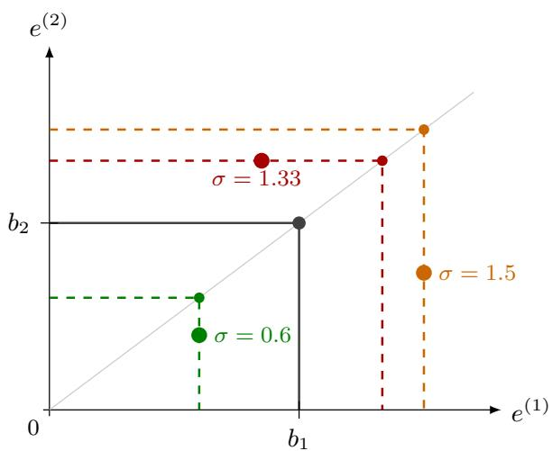

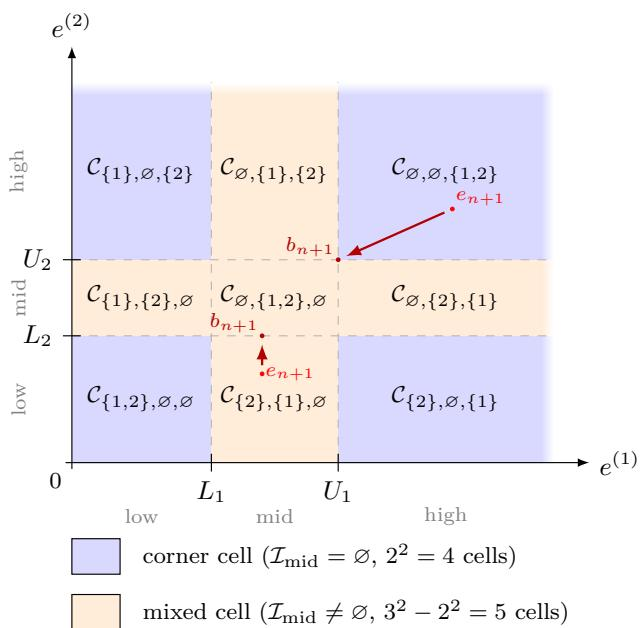  
(a) Scaling score for three residuals $( d \ = \ 2 ,$ base vector $\left( b _ { 1 } , b _ { 2 } \right) )$ . The score $\sigma$ is the smallest factor by which the base rectangle must be scaled to contain the point. All scaled-rectangle corners lie on the ray through $( b _ { 1 } , b _ { 2 } )$ (gray line).  
(b) The $3 ^ { 2 } \ = \ 9$ cells of the decomposition for $d \ = \ 2$ The thresholds $L _ { 1 } , U _ { 1 }$ and $L _ { 2 } , U _ { 2 }$ divide $\mathbb { R } _ { + } ^ { 2 }$ into a $3 \times 3$ grid. Corner cells (blue) have $I _ { \mathrm { m i d } } = \emptyset ;$ mixed cells (red) have $| I _ { \mathrm { m i d } } | ~ \geq ~ 1$ The clamping relationship between $e _ { n + 1 }$ and $b _ { n + 1 }$ is also visible: each coordinate of $b _ { n + 1 }$ equals the clamp of the corresponding coordinate of $e _ { n + 1 }$ to the interval $[ L _ { k } , U _ { k } ]$  
Figure 1: Scaling score and cell decomposition $( d = 2 )$

## 4.3 Cell decomposition and scores

The thresholds $L _ { k }$ and $U _ { k }$ partition the k-th coordinate axis into three intervals: below $L _ { k }$ (lower region), between $L _ { k }$ and $U _ { k }$ (middle region), and above $U _ { k }$ (upper region). Taking the product over all d coordinates yields a partition of $\mathbb { R } _ { + } ^ { d }$ into $3 ^ { d }$ cells. Each cell is characterised by specifying, for every coordinate $k \in [ d ]$ , whether that coordinate falls in the lower, middle, or upper interval. We encode this by a triple $( I _ { \mathrm { l o w } } , I _ { \mathrm { m i d } } , I _ { \mathrm { h i g h } } )$ , a partition of [d], where $I _ { \mathrm { l o w } }$ collects the coordinates in the lower region, $I _ { \mathrm { m i d } }$ those in the middle region, and $I _ { \mathrm { h i g h } }$ those in the upper region. Figure 1(b) illustrates the $3 ^ { 2 } = 9$ cells for $d = 2 .$ This is captured formally by the following definition.

Definition 4 (Cells) For a partition $( I _ { \mathrm { l o w } } , I _ { \mathrm { m i d } } , I _ { \mathrm { h i g h } } )$ of [d], the corresponding cell is

$$
\mathcal C _ { I _ { \mathrm { l o w } } , I _ { \mathrm { m i d } } , I _ { \mathrm { h i g h } } } = \left\{ \begin{array} { c c c } { e ^ { ( k ) } \le L _ { k } , } & { \forall k \in I _ { \mathrm { l o w } } , } \\ { e \in \mathbb { R } _ { + } ^ { d } : \begin{array} { l l } { L _ { k } < e ^ { ( k ) } \le U _ { k } , } & { \forall k \in I _ { \mathrm { m i d } } , } \\ { e ^ { ( k ) } > U _ { k } , } & { \forall k \in I _ { \mathrm { h i g h } } } \end{array} } \right\} . \end{array}
$$

Assuming the test error $e _ { n + 1 }$ belongs to cell $\mathcal { C } _ { I _ { \mathrm { l o w } } , I _ { \mathrm { m i d } } , I _ { \mathrm { h i g h } } }$ , the base vector (4) is fully determined by the partition: $b _ { n + 1 } ^ { ( k ) } = L _ { k }$ for $k \in I _ { \mathrm { l o w } } , b _ { n + 1 } ^ { ( k ) } = e _ { n + 1 } ^ { ( k ) }$ for $k \in I _ { \mathrm { m i d } }$ , and $b _ { n + 1 } ^ { ( k ) } = U _ { k }$ for $k \in I _ { \mathrm { h i g h } }$ Figure 1(b) illustrates how $b _ { n + 1 }$ depends on $e _ { n + 1 }$ in the three-region partition for each coordinate.

Cells with $I _ { \mathrm { m i d } } = \emptyset$ are called corner cells: the base vector does not depend on the test error throughout the cell, and we denote its value $b _ { I _ { \mathrm { l o w } } , I _ { \mathrm { h i g h } } }$ . Cells with $I _ { \mathrm { m i d } } \neq \emptyset$ are mixed cells. There are $2 ^ { d }$ corner cells and $3 ^ { d } - 2 ^ { d }$ mixed cells. Figure 1(b) illustrates both types for $d = 2$

Given the scaling score $\sigma ( e ; b ) = \operatorname* { m a x } _ { k } e ^ { ( k ) } / b ^ { ( k ) }$ and the cell formula for $b _ { n + 1 }$ , the scores $\sigma _ { n + 1 }$ and $\sigma _ { i }$ take a simple explicit form on each cell, as summarised in the following lemma

Lemma 5 (Scores in any cell) Let $e _ { n + 1 } \in \mathcal { C } _ { I _ { \mathrm { l o w } } , I _ { \mathrm { m i d } } , I _ { \mathrm { h i g h } } }$ . With the convention max $z : = 0$

$$
\sigma _ { n + 1 } ( e _ { n + 1 } ) = \operatorname* { m a x } \biggl ( \operatorname* { m a x } _ { k \in I _ { \mathrm { l o w } } } \frac { e _ { n + 1 } ^ { ( k ) } } { L _ { k } } , \operatorname* { m a x } _ { k \in I _ { \mathrm { m i d } } } 1 , \operatorname* { m a x } _ { k \in I _ { \mathrm { h i g h } } } \frac { e _ { n + 1 } ^ { ( k ) } } { U _ { k } } \biggr ) ,\tag{5}
$$

$$
\sigma _ { i } ( e _ { n + 1 } ) = \operatorname* { m a x } \bigg ( \operatorname* { m a x } _ { k \in { I _ { \mathrm { l o w } } } } \frac { e _ { i } ^ { ( k ) } } { L _ { k } } , \ \operatorname* { m a x } _ { k \in { I _ { \mathrm { m i d } } } } \frac { e _ { i } ^ { ( k ) } } { e _ { n + 1 } ^ { ( k ) } } , \ \operatorname* { m a x } _ { k \in { I _ { \mathrm { h i g h } } } } \frac { e _ { i } ^ { ( k ) } } { U _ { k } } \bigg ) , \quad i \leq n .\tag{6}
$$

When $e _ { n + 1 }$ belongs to a corner cell $( I _ { \mathrm { m i d } } = \emptyset ) , \sigma _ { i } ( e _ { n + 1 } )$ is constant on the cell. When $e _ { n + 1 }$ belongs to a mixed cell $( I _ { \mathrm { m i d } } \neq \emptyset ) , \sigma _ { n + 1 } ( e _ { n + 1 } ) \geq 1$ , and the mid terms in $\sigma _ { i } ( e _ { n + 1 } )$ are non-increasing in each $e _ { n + 1 } ^ { ( k ) } , k \in I _ { \mathrm { m i d } }$

Proof See the proof in Appendix A.

## 4.4 Prediction region characterisation

Having partitioned $\mathbb { R } _ { + } ^ { d }$ into cells, we now characterise $\mathcal { R } _ { \alpha }$ by working one cell at a time. The key observation is the following: assuming the test error $e _ { n + 1 }$ belongs to a given cell, the base vector $b _ { n + 1 }$ is fully determined and remains constant for all test errors confined to that cell (in corner cells) or depends on $e _ { n + 1 }$ only through an explicit formula (in mixed cells). As a consequence, all calibration scores $\{ \sigma _ { i } ( e _ { n + 1 } ) \} _ { i = 1 } ^ { n }$ are determined, the conformal quantile $\hat { \lambda } ( b _ { n + 1 } )$ can be computed analytically. For corner cells, the base vector is fixed and the region boundary has an explicit closed form. For mixed cells, the base vector still depends on $e _ { n + 1 }$ through its mid coordinates, so the boundary retains an implicit form; we characterise it analytically and provide sandwich bounds. We treat corner cells and mixed cells in turn.

## 4.4.1 Corner cells

When the test error $e _ { n + 1 }$ belongs to a corner cell $\mathcal { C } _ { I _ { \mathrm { l o w } } , \mathcal { O } , I _ { \mathrm { h i g h } } } ,$ the base vector $b _ { I _ { \mathrm { l o w } } , I _ { \mathrm { h i g h } } }$ does not depend on the test error, so all calibration scores

$$
\sigma _ { i } ^ { I _ { \mathrm { l o w } } , I _ { \mathrm { h i g h } } } = \operatorname* { m a x } \Bigl ( \operatorname* { m a x } _ { k \in I _ { \mathrm { l o w } } } \frac { e _ { i } ^ { ( k ) } } { L _ { k } } , \operatorname* { m a x } _ { k \in I _ { \mathrm { h i g h } } } \frac { e _ { i } ^ { ( k ) } } { U _ { k } } \Bigr )
$$

are independent of $e _ { n + 1 }$ , and the conformal quantile $\hat { \lambda } _ { I _ { \mathrm { l o w } } , I _ { \mathrm { h i g h } } }$ is a fixed number.

Proposition 6 (Exact region on corner cells) Let $\hat { \lambda } = \hat { \lambda } _ { I _ { \mathrm { l o w } } , I _ { \mathrm { h i g h } } }$ . The exact prediction region restricted to the corner cell is

$$
\mathcal { R } _ { \alpha } \cap \mathcal { C } _ { I _ { \mathrm { l o w } } , \emptyset , I _ { \mathrm { h i g h } } } = \prod _ { k \in I _ { \mathrm { l o w } } } \left[ 0 , \operatorname* { m i n } ( \hat { \lambda } , 1 ) L _ { k } \right] \ \times \ \prod _ { k \in I _ { \mathrm { h i g h } } } \left( U _ { k } , \ \hat { \lambda } U _ { k } \right] ,\tag{7}
$$

with the convention that $( U _ { k } , \hat { \lambda } U _ { k } ] = \emptyset$ when $\hat { \lambda } \le 1$

Proof See the proof in Appendix A.

Two boundary cases of Proposition 6 are worth noting. When $I _ { \mathrm { h i g h } } \neq \emptyset$ , the intersection (7) is non-empty if and only if $\hat { \lambda } > 1$ : the conformal region extends beyond $U _ { k }$ only when the quantile exceeds 1. When $I _ { \mathrm { h i g h } } = \emptyset$ (all-low corner cell), the region always contains the origin and equals the full cell $\textstyle \prod _ { k = 1 } ^ { d } [ 0 , L _ { k } ]$ if and only if $\hat { \lambda } \geq 1$

## 4.4.2 Mixed cells

When the test error $e _ { n + 1 }$ belongs to a mixed cell $\mathcal { C } _ { I _ { \mathrm { l o w } } , I _ { \mathrm { m i d } } , I _ { \mathrm { h i g h } } }$ (with $I _ { \mathrm { m i d } } \neq \emptyset )$ , the base vector $b _ { n + 1 }$ depends on $e _ { n + 1 }$ through the mid coordinates (since $b _ { n + 1 } ^ { ( k ) } = e _ { n + 1 } ^ { ( k ) }$ for $k \in I _ { \mathrm { m i d } } )$ . As a consequence, the calibration scores $\{ \sigma _ { i } ( e _ { n + 1 } ) \}$ and the conformal quantile also depend on $e _ { n + 1 }$ , but only through its $I _ { \mathrm { m i d } }$ coordinates; we write $\bar { \lambda } ( e _ { n + 1 } ^ { ( I _ { \mathrm { m i d } } ) } )$ to make this dependence explicit.

Proposition 7 (Exact region on mixed cells) Assuming the test error $e _ { n + 1 }$ belongs to a mixed cell $\mathcal { C } _ { I _ { \mathrm { l o w } } , I _ { \mathrm { m i d } } , I _ { \mathrm { h i g h } } } .$

1. $I f I _ { \mathrm { h i g h } } = \emptyset \colon \sigma _ { n + 1 } ( e _ { n + 1 } ) = 1$ , and

$$
\mathcal { R } _ { \alpha } \cap \mathcal { C } _ { I _ { \mathrm { l o w } } , I _ { \mathrm { m i d } } , \emptyset } = \big \{ e _ { n + 1 } \in \mathcal { C } _ { I _ { \mathrm { l o w } } , I _ { \mathrm { m i d } } , \emptyset } : \hat { \lambda } ( e _ { n + 1 } ^ { ( I _ { \mathrm { m i d } } ) } ) \geq 1 \big \} .
$$

$\begin{array} { r } { \mathrm { ? . ~ } I f I _ { \mathrm { h i g h } } \ne \emptyset \mathrm { : ~ } \sigma _ { n + 1 } ( e _ { n + 1 } ) = \operatorname* { m a x } _ { k \in I _ { \mathrm { h i g h } } } e _ { n + 1 } ^ { ( k ) } / U _ { k } , } \end{array}$ and

$$
\mathcal { R } _ { \alpha } \cap \mathcal { C } _ { I _ { \mathrm { l o w } } , I _ { \mathrm { m i d } } , I _ { \mathrm { h i g h } } } = \big \{ e _ { n + 1 } \in \mathcal { C } _ { I _ { \mathrm { l o w } } , I _ { \mathrm { m i d } } , I _ { \mathrm { h i g h } } } : e _ { n + 1 } ^ { ( k ) } \le \widehat \lambda ( e _ { n + 1 } ^ { ( I _ { \mathrm { m i d } } ) } ) U _ { k } \forall k \in I _ { \mathrm { h i g h } } \big \} .
$$

In both cases, the low coordinates are unconstrained within the cell: for $k \in I _ { \mathrm { l o w } }$ , cell membership already forces $e _ { n + 1 } ^ { ( k ) } \leq L _ { k } = b _ { n + 1 } ^ { ( k ) }$ , so the low terms $e _ { n + 1 } ^ { ( k ) } / b _ { n + 1 } ^ { ( k ) } \leq 1$ never drive $\sigma _ { n + 1 }$ , and $\sigma _ { n + 1 } \leq \hat { \lambda }$ imposes no further constraint on them beyond $e _ { n + 1 } ^ { ( k ) } \leq L _ { k }$

Proof See the proof in Appendix A.

Item 1 of Proposition $7 \left( I _ { \mathrm { h i g h } } = \emptyset \right)$ reduces to the single condition $\hat { \lambda } ( e _ { n + 1 } ^ { ( I _ { \mathrm { m i d } } ) } ) \geq 1$ : since $\sigma _ { n + 1 } = 1$ throughout this cell, inclusion in $\mathcal { R } _ { \alpha }$ depends only on whether the conformal quantile reaches 1. In item $2 \ ( I _ { \mathrm { h i g h } } \neq \emptyset )$ , the condition additionally constrains the high coordinates via $\hat { \lambda } ( e _ { n + 1 } ^ { ( I _ { \mathrm { m i d } } ) } )$ Both cases are implicit: $\hat { \lambda } ( e _ { n + 1 } ^ { ( I _ { \mathrm { m i d } } ) } )$ depends on $e _ { n + 1 }$ through the mid coordinates, and there is in general no closed-form description of $\mathcal { R } _ { \alpha }$ on mixed cells. Nevertheless, $\hat { \lambda } ( e _ { n + 1 } ^ { ( I _ { \mathrm { m i d } } ) } )$ can be bracketed analytically, as the following proposition shows.

Proposition 8 (Monotonicity and interpolation) On a mixed cell $\mathcal { C } _ { I _ { \mathrm { l o w } } , I _ { \mathrm { m i d } } , I _ { \mathrm { h i g h } } } .$

1. $\hat { \lambda } ( e _ { n + 1 } ^ { ( I _ { \mathrm { m i d } } ) } )$ is non-increasing in each mid coordinate.

2. At the boundary $e _ { n + 1 } ^ { ( k ) } \to L _ { k } ^ { + }$ for all $k \in I _ { \mathrm { m i d } } \colon \hat { \lambda }  \hat { \lambda } _ { I _ { \mathrm { l o w } } \cup I _ { \mathrm { m i d } } , I _ { \mathrm { h i g h } } } .$

3. At $e _ { n + 1 } ^ { ( k ) } = U _ { k }$ for all $k \in I _ { \mathrm { m i d } } \colon \hat { \lambda } = \hat { \lambda } _ { I _ { \mathrm { l o w } } , I _ { \mathrm { m i d } } \cup I _ { \mathrm { h i g h } } }$

Hence $\hat { \lambda } _ { I _ { \mathrm { l o w } } , I _ { \mathrm { m i d } } \cup I _ { \mathrm { h i g h } } } \le \hat { \lambda } ( e _ { n + 1 } ^ { ( I _ { \mathrm { m i d } } ) } ) \le \hat { \lambda } _ { I _ { \mathrm { l o w } } \cup I _ { \mathrm { m i d } } , I _ { \mathrm { h i g h } } }$ throughout the cell.

Proof See the proof in Appendix A.

Propositions 7 and 8 together imply that the boundary of $\mathcal { R } _ { \alpha }$ is continuous across cell boundaries: items 2 and 3 of Proposition 8 show that $\hat { \lambda }$ matches the corner-cell values at each face, so no jump can occur when crossing from one cell to an adjacent one.

Together, Propositions 6, 7 and 8 give a complete analytical picture of $\mathcal { R } _ { \alpha }$ : on corner cells it reduces to an explicit rectangle, and on mixed cells it is characterised by the two-item structure of Proposition 7. While $\mathcal { R } _ { \alpha }$ is not itself a hyperrectangle, it can be sandwiched between two axisaligned hyperrectangles (the inner and outer rectangles of Section 4.5), making it both principled and tractable.

## 4.4.3 Structural properties

Assembling the cell-by-cell characterisations above gives the full prediction region $\begin{array} { r } { \mathcal { R } _ { \alpha } = \bigcup _ { ( I _ { \mathrm { l o w } } , I _ { \mathrm { m i d } } , I _ { \mathrm { h i g h } } ) } \big ( \mathcal { R } _ { \alpha } \cap } \end{array}$ $\mathcal { C } _ { I _ { \mathrm { l o w } } , I _ { \mathrm { m i d } } , I _ { \mathrm { h i g h } } } )$ . A key global property of this union is that it is downward-closed with respect to the component-wise order. Intuitively, if a residual $e _ { n + 1 }$ is already within the conformal region, then any smaller residual $\boldsymbol { e } ^ { \prime } \preceq \boldsymbol { e } _ { n + 1 }$ must also lie within it. This follows from the monotonicity of the score ratio $x \mapsto x /$ clamp(x, L, U), which is non-decreasing on $\mathbb { R } _ { + }$ for any fixed $0 < L \leq U$ (the proof is immediate by case analysis on the three branches of the clamp).

Proposition 9 (Downward-closedness) $\mathcal { R } _ { \alpha }$ is downward-closed with respect to $\preceq \ i f \ e _ { n + 1 } \ \in$ $\mathcal { R } _ { \alpha }$ and $e ^ { \prime } \preceq e _ { n + 1 }$ , then $e ^ { \prime } \in \mathcal { R } _ { \alpha }$

Proof See the proof in Appendix A.

## 4.5 Nested prediction regions

From a single calibration run, our method produces four related prediction regions with different trade-offs between validity, tightness, and computational cost (Proposition 12); see Figure $2 ( b )$ for an illustration.

The inner rectangle is the most compact prediction region our method produces. It is contained inside $\mathcal { R } _ { \alpha }$ but carries no formal coverage guarantee. The exact region $\mathcal { R } _ { \alpha }$ is the tightest valid prediction set, but it is defined implicitly and costly to characterise on mixed cells. The staircase is a valid over-approximation of $\mathcal { R } _ { \alpha }$ given as an explicit union of at most $2 ^ { d }$ hyperrectangles, each computable at calibration time using the corner-cell quantiles. The outer rectangle is the most conservative: a single valid hyperrectangle, but the largest of the four.

Outer rectangle (SCO) — valid. The outer rectangle is obtained by being doubly conservative: scores are computed relative to the lower base rectangle $( L _ { k }$ sides), which yields the largest possible calibration scores and therefore the largest possible quantile $\hat { \lambda } _ { \mathrm { u b } } ;$ it then builds the confidence region using the largest possible base rectangle $\left( U _ { k } \ \mathrm { s i d e s } \right)$ . The resulting hyperrectangle is guaranteed to contain $\mathcal { R } _ { \alpha }$ and hence achieves valid joint coverage, at the cost of being conservative. Assume $L _ { k } > 0$ for all k. Formally, define upper-bound scores

$$
\sigma _ { i } ^ { \mathrm { u b } } = \operatorname* { m a x } _ { k \in [ d ] } \frac { e _ { i } ^ { ( k ) } } { L _ { k } } , \qquad \hat { \lambda } _ { \mathrm { u b } } = q \mathrm { - t h ~ o r d e r ~ s t a t i s t i c ~ o f ~ } \{ \sigma _ { i } ^ { \mathrm { u b } } \} _ { i = 1 } ^ { n } .
$$

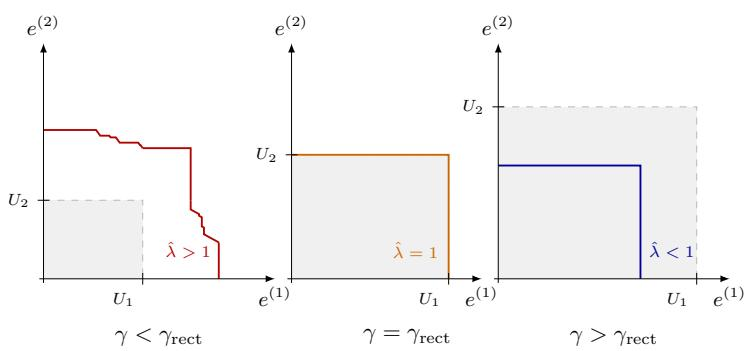

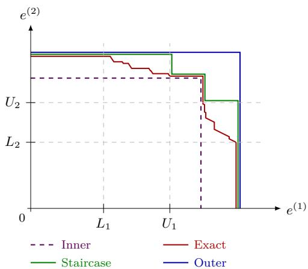  
(a) Effect of $\gamma$ on $\mathcal { R } _ { \alpha }$ for fixed $1 - \alpha \ ( d = 2 )$ . The dashed box is the rectangle $\Pi _ { k } [ 0 , U _ { k } ]$ , which grows with $\gamma .$ Left $( \gamma < \gamma _ { \mathrm { r e c t } } )$ : base rectangle too small, $\hat { \lambda } > 1 , \mathcal { R } _ { \alpha }$ extends beyond it. Centre $( \gamma = \gamma _ { \mathrm { r e c t } } )$ $\hat { \lambda } = 1 , \mathcal { R } _ { \alpha }$ coincides with the base rectangle. Right $( \gamma > \gamma _ { \mathrm { r e c t } } )$ $\hat { \lambda } < 1 , \mathcal { R } _ { \alpha }$ strictly inside the base rectangle.  
(b) Prediction boundaries for $d \ = \ 2$ The exact set $\mathcal { R } _ { \alpha }$ (red, zigzag) and its staircase approximation (green) are both valid. The outer rectangle (blue) is conservative. The inner rectangle (violet, dashed) lacks a coverage guarantee. Boundaries are slightly offset for visual clarity.

Figure 2: Effect of $\gamma$ on the prediction region shape, and the four nested region types $( d = 2 )$

Proposition 10 (Rectangular outer bound) Assume $U _ { k } > 0$ for all $k \in [ d ]$ . The exact prediction region is contained in the following closed-form hyperrectangle:

$$
{ \mathcal R } _ { \alpha } \subseteq \prod _ { k = 1 } ^ { d } [ 0 , \hat { \lambda } _ { \mathrm { u b } } U _ { k } ] .\tag{8}
$$

The region $\begin{array} { r } { \prod _ { k } [ 0 , \hat { \lambda } _ { \mathrm { u b } } U _ { k } ] } \end{array}$ achieves joint coverage $\geq 1 - \alpha$

Proof See the proof in Appendix A.

Algorithm 1 gives the calibration and prediction procedures for the outer rectangle.

Inner rectangle (SCI) — no formal validity guarantee. The inner rectangle is doubly optimistic: scores are computed relative to the upper base rectangle $( U _ { k }$ sides), which yields the smallest possible calibration scores, giving the lowest possible quantile $\hat { \lambda } _ { \mathrm { l b } } ;$ it then uses the smallest possible base rectangle $( L _ { k }$ sides) to build the confidence region. The result is tight but not guaranteed to be valid. Formally, define lower-bound scores

$$
\sigma _ { i } ^ { \mathrm { l b } } = \operatorname* { m a x } _ { k \in [ d ] } \frac { e _ { i } ^ { ( k ) } } { U _ { k } } , \qquad \hat { \lambda } _ { \mathrm { l b } } = q \mathrm { \cdot t h ~ o r d e r ~ s t a t i s t i c ~ o f ~ } \{ \sigma _ { i } ^ { \mathrm { l b } } \} _ { i = 1 } ^ { n } .
$$

Algorithm 2 gives the calibration and prediction procedures for the inner rectangle.

Algorithm 1: SCO: Scaling-Score Outer-Bound Predictor   
Input: Calibration errors $\{ e _ { i } \} _ { i = 1 } ^ { n } \subset \mathbb { R } _ { + } ^ { d }$ , miscoverage level $\alpha \in ( 0 , 1 )$ , base-rectangle level   
$\gamma \in ( 0 , 1 )$   
Output: Half-widths $h _ { 1 } , \ldots , h _ { d } \geq 0$   
— Calibration phase (run once) —   
$m ^ { \prime } \gets \mathrm { c l i p } ( \lceil \gamma ( n + 1 ) \rceil , 2 , n ) ;$   
for $k = 1 , \ldots , d$ do   
$L _ { k } \gets e _ { ( m ^ { \prime } - 1 ) } ^ { ( k ) } , \quad U _ { k } \gets e _ { ( m ^ { \prime } ) } ^ { ( k ) } ;$   
end   
for $i = 1 , \ldots , n$ do   
$\begin{array} { r l } { \Big | } & { { } \sigma _ { i } ^ { \mathrm { u b } } \gets \operatorname* { m a x } _ { k \in [ d ] } e _ { i } ^ { ( k ) } / L _ { k } ; } \end{array}$   
end   
$q  \lceil ( 1 - \alpha ) ( n + 1 ) \rceil$   
$\hat { \lambda } _ { \mathrm { u b } } \gets q \mathrm { - }$ th order statistic of $\{ \sigma _ { i } ^ { \mathrm { u b } } \} _ { i = 1 } ^ { n } ;$   
for $k = 1 , \ldots , d$ do   
1 $h _ { k } \gets \hat { \lambda } _ { \mathrm { u b } } \cdot U _ { k } ;$   
end   
— Prediction phase (per test point $X _ { n + 1 } ) \_$   
Compute $\hat { y } \gets \hat { f } ( X _ { n + 1 } )$   
return $\begin{array} { r } { \prod _ { k = 1 } ^ { d } [ \hat { y } ^ { ( k ) } - h _ { k } , \ \hat { y } ^ { ( k ) } + h _ { k } ] } \end{array}$

Exact region $\mathcal { R } _ { \alpha }$ (valid, tightest but implicit). The exact prediction region $\mathcal { R } _ { \alpha }$ is characterised cell by cell via Propositions 6 and 7: on corner cells and all-low-mid mixed cells it has an explicit form, but on mixed cells with $I _ { \mathrm { h i g h } } \neq \emptyset$ the boundary is only implicitly defined through $\hat { \lambda } ( e _ { n + 1 } ^ { ( I _ { \mathrm { m i d } } ) } )$ , which depends on the test error. Although $\mathcal { R } _ { \alpha }$ is the tightest possible valid region, its boundary forms broken decision lines that are difficult to characterise explicitly and whose computation requires evaluating all calibration scores for every query.

Staircase $\mathrm { ( S C ^ { 2 } ) } \ -$ valid, union of at most $2 ^ { d }$ rectangles. The staircase is a valid overapproximation of $\mathcal { R } _ { \alpha }$ that replaces the implicit mixed-cell boundary by the upper-bounding cornercell quantile from Proposition 8. This turns every cell boundary into a fixed rectangle that is independent of the test error. The result is an explicit union of $2 ^ { d }$ hyperrectangles, one per subset $S \subseteq [ d ]$ , all computable at calibration time (Algorithm 3). The staircase is valid since it contains $\mathcal { R } _ { \alpha }$ , and it is tight in the sense that the $2 ^ { d }$ rectangles each touch the boundary of $\mathcal { R } _ { \alpha }$ at their corner points, as the following proposition shows.

Proposition 11 (Staircase: union of hyperrectangles) Assume $U _ { k } > 0$ for all $k \in [ d ]$ . For each $S \subseteq [ d ]$ , define the corner point

$$
e _ { S } ^ { \ast ( k ) } = \left\{ \begin{array} { l l } { \hat { \lambda } _ { \bar { S } , S } U _ { k } } & { k \in S , } \\ { U _ { k } } & { k \notin S , } \end{array} \right.
$$

where $\bar { S } = [ d ] \setminus S$ and $\hat { \lambda } _ { \bar { S } , S }$ is the conformal quantile of the corner cell $\mathcal { C } _ { \bar { S } , \emptyset , S }$ . Then

$$
{ \mathcal { R } } _ { \alpha } \subseteq \bigcup _ { S \subseteq [ d ] } \prod _ { k = 1 } ^ { d } [ 0 , e _ { S } ^ { * ( k ) } ] .
$$

Algorithm 2: SCI: Scaling-Score Inner-Bound Predictor   
Input: Calibration errors $\{ e _ { i } \} _ { i = 1 } ^ { n } \subset \mathbb { R } _ { + } ^ { d }$ , miscoverage level $\alpha \in ( 0 , 1 )$ , base-rectangle level   
$\gamma \in ( 0 , 1 )$   
Output: Half-widths $h _ { 1 } ^ { \mathrm { l b } } , \ldots , h _ { d } ^ { \mathrm { l b } } \geq 0$ (not a valid prediction region)   
— Calibration phase —   
Compute $m ^ { \prime } , L _ { k } , U _ { k }$ as in Algorithm 1;   
for $i = 1 , \ldots , n$ do   
$\sigma _ { i } ^ { \mathrm { { l b } } } \gets \operatorname* { m a x } _ { k \in [ d ] } e _ { i } ^ { ( k ) } / U _ { k } ;$   
end   
$q \gets \lceil ( 1 - \alpha ) ( n + 1 ) \rceil ;$   
$\hat { \lambda } _ { \mathrm { l b } } \gets q \mathrm { - }$ th order statistic of $\{ \sigma _ { i } ^ { \mathrm { l b } } \} _ { i = 1 } ^ { n }$   
for $k = 1 , \ldots , d$ do   
$h _ { k } ^ { \mathrm { l b } } \gets \hat { \lambda } _ { \mathrm { l b } } \cdot L _ { k } ;$   
end

Proof See the proof in Appendix A.

The staircase $\textstyle \bigcup _ { S } \prod _ { k } [ 0 , e _ { S } ^ { * ( k ) } ]$ is valid (it contains $\mathcal { R } _ { \alpha } )$ , and all $2 ^ { d }$ corner rectangles are computable at calibration time: each $\hat { \lambda } _ { \bar { S } , S }$ requires one pass over calibration scores. In practice, a simple post-processing step retains only the Pareto-optimal rectangles (those not dominated componentwise by any other), which often reduces the number of active rectangles well below $2 ^ { d }$ (empirically quantified in Section 5.2, Table 3).

The four prediction regions are related by the following chain of containments.

Proposition 12 (Rectangular sandwich) Assume $U _ { k } > 0$ for all $k \in [ d ]$ . Combining Proposition 10 with the cell-based analysis, whenever $\hat { \lambda } _ { \mathrm { u b } } \geq 1$ (the regime that arises in practice), the four prediction regions form the nested chain

$$
\underbrace { \prod _ { k = 1 } ^ { d } \left[ 0 , \widehat { \lambda } _ { \mathrm { l b } } L _ { k } \right] } _ { i n n e r \ : r e c t a n g l e } \subseteq \underbrace { \mathcal { R } _ { \alpha } } _ { e x a c t \ : r e g i o n } \subseteq \bigcup _ { s \subseteq [ d ] _ { k = 1 } ^ { k = 1 } } \prod _ { \substack { s t a i r c a s e } } ^ { d } [ 0 , e _ { S } ^ { * ( k ) } ] \subseteq \underbrace { \prod _ { k = 1 } ^ { d } \left[ 0 , \widehat { \lambda } _ { \mathrm { u b } } U _ { k } \right] } _ { o u t e r \ : r e c t a n g l e } .\tag{9}
$$

In the edge case $\hat { \lambda } _ { \mathrm { u b } } < 1$ , the staircase need not be contained in the outer rectangle, but the inner sandwich

$$
\prod _ { k = 1 } ^ { d } \left[ 0 , \hat { \lambda } _ { \mathrm { l b } } L _ { k } \right] \ \subseteq \ \mathcal { R } _ { \alpha } \ \subseteq \ \bigcup _ { S \subseteq [ d ] } \prod _ { k = 1 } ^ { d } [ 0 , e _ { S } ^ { * ( k ) } ]\tag{10}
$$

still holds, and Proposition 10 provides $\begin{array} { r } { \mathcal { R } _ { \alpha } \subseteq \prod _ { k } [ 0 , \hat { \lambda } _ { \mathrm { u b } } U _ { k } ] } \end{array}$ as a separate over-approximation.

Proof See the proof in Appendix A.

The inner rectangle is the most compact but offers no coverage guarantee; it may under-cover since it is strictly contained in $\mathcal { R } _ { \alpha }$ . Both the staircase and the outer rectangle are valid prediction regions (they contain $\mathcal { R } _ { \alpha } )$ . The full chain (9) holds in the typical regime $\hat { \lambda } _ { \mathrm { u b } } \geq 1$ . When $\hat { \lambda } _ { \mathrm { u b } } < 1$ which can occur at large $\gamma _ { : }$ the outer rectangle shrinks below $[ 0 , U ]$ , while the staircase still contains $[ 0 , U ]$ via its empty-subset corner $e _ { \emptyset } ^ { * } = U$ , so the two regions become incomparable. These four objects are illustrated in Figure 2(b).

Algorithm 3: $\mathrm { S C ^ { 2 } } ;$ Staircase Construction (Calibration Phase)   
Input: Calibration errors $\{ e _ { i } \} _ { i = 1 } ^ { n } \subset \mathbb { R } _ { + } ^ { d }$ , miscoverage level $\alpha \in ( 0 , 1 )$ , base-rectangle level   
$\gamma \in ( 0 , 1 )$   
Output: Pareto-optimal staircase rectangles $\{ [ 0 , e _ { S } ^ { * } ] \} _ { S \in \mathcal { P } }$   
Compute $m ^ { \prime } , U _ { k }$ as in Algorithm 1;   
$q \gets \lceil ( 1 - \alpha ) ( n + 1 ) \rceil ;$   
for each $S \subseteq [ d ]$ do   
Compute scores $\sigma _ { i } ^ { S , S } \gets$ - ma $\mathrm { x } _ { k \in S } e _ { i } ^ { ( k ) } / U _ { k }$ for $i = 1 , \ldots , n ;$   
$\hat { \lambda } _ { \bar { S } , S }  q { \mathrm { - t h } }$ order statistic of $\{ \sigma _ { i } ^ { \bar { S } , S } \} _ { i = 1 } ^ { n } \}$   
Set corner point $e _ { S } ^ { * ( k ) } \gets \left\{ \begin{array} { l l } { \hat { \lambda } _ { \bar { S } , S } U _ { k } } & { k \in S , } \\ { U _ { k } } & { k \notin S . } \end{array} \right.$ •2   
end   
Retain only Pareto-optimal rectangles:   
${ \mathcal { P } } \gets \{ S \subseteq [ d ] : \sharp S ^ { \prime }$ s.t. $e _ { S ^ { \prime } } ^ { * ( k ) } \leq e _ { S } ^ { * ( k ) }$ ∀k, strictly for some $k \}$ 2   
return $\{ [ 0 , e _ { S } ^ { * } ] \} _ { S \in \mathcal { P } }$

## 4.6 Choice of $\gamma$

The hyperparameter $\gamma \in \mathsf { \Gamma } ( 0 , 1 )$ determines the marginal quantile level at which the thresholds $U _ { k } = e _ { ( m ^ { \prime } ) } ^ { ( k ) }$ are set. Choosing $\gamma$ too small or too large both degrade performance, though for different réasons.

When $\gamma$ is small, the thresholds $U _ { k } = e _ { ( m ^ { \prime } ) } ^ { ( k ) }$ sit at low marginal quantiles of the calibration errors. The base rectangle then under-represents the scale of large errors on each target: the outer quantile $\hat { \lambda }$ must compensate by expanding the region uniformly, which dilutes the per-target scale adaptation that is the key advantage of the method.

When $\gamma$ is large, the thresholds $U _ { k }$ are set by the most extreme calibration errors, making them sensitive to outliers. Moreover, once $\gamma > \gamma _ { \mathrm { r e c t } }$ the base rectangle already covers more than $1 - \alpha$ of calibration points, so $\hat { \lambda } < 1$ and the prediction region shrinks to a rectangle strictly inside the base rectangle, losing the non-rectangular staircase structure.

We define $\gamma _ { \mathrm { r e c t } }$ as the value of $\gamma$ for which the base rectangle covers exactly a fraction $1 - \alpha$ of calibration errors. The base rectangle $\Pi _ { k } [ 0 , U _ { k } ]$ has the equal-marginal-quantile property: each side sits at ECDF level $\gamma .$ Because joint domination is strictly harder than marginal domination when targets are not perfectly co-monotone, γrect $\geq 1 - \alpha$ in general, with equality only under perfect positive dependence. When $\gamma = \gamma _ { \mathrm { r e c t } } , \ : \dot { \lambda } _ { \mathrm { l b } } \approx 1$ and the inner rectangle approximates the empirical copula rectangle (with equality in the limit $L _ { k } \to U _ { k }$ , i.e. when the $m ^ { \prime } { \mathrm { - t h } }$ and $( m ^ { \prime } - 1 )$ -th calibration order statistics coincide), while the outer rectangle provides a finitely valid conformal guarantee that the empirical copula lacks.

We recommend targeting $\gamma < \gamma _ { \mathrm { r e c t } }$ , so that the staircase retains its non-rectangular structure and $\hat { \lambda } > 1$ provides a meaningful scale signal. The choice $\gamma = 1 - \alpha$ is a natural default: it is tied to the coverage level, always satisfies $\gamma \leq \gamma _ { \mathrm { r e c t } }$ in practice, and our experiments confirm that it consistently matches or outperforms other values of $\gamma$ across datasets and dimensions (see Section 5.2).

## 5 Experiments

## 5.1 Protocol

We use a random forest base model (100 trees) throughout. Each dataset is split into 60% train / 15% calibration / 25% test. Results are averaged over 20 random seeds. We evaluate at $\alpha \in$ {0.05, 0.10}.

Baselines.

• Max: max-aggregation score producing an axis-aligned hypercube.

• CHR (Sampson and Chan, 2024): valid rectangular regions with per-target width adaptation, at the cost of splitting the calibration set in two.

• TSCP (Fan and Sesia, 2025): Transductively Standardized Conformal Prediction, valid and model-agnostic with a single calibration set.

Our method. We evaluate the $\mathrm { S C ^ { 2 } }$ prediction set under three choices of the hyperparameter γ, and SCO with $\gamma = 1 - \alpha \colon$

$\mathrm { S C ^ { 2 } } , \gamma = 1 - \alpha { : }$ a natural default tied to the coverage level.

$\mathrm { S C } ^ { 2 } , \gamma = 0 . 8 \colon$ a fixed, coverage-level-agnostic choice, and a lower bound on all $1 - \alpha$ levels considered in our experiments $( 0 . 8 0 \leq 0 . 9 0 , 0 . 9 5 , 0 . 9 9 )$

${ \mathrm { S C } } ^ { 2 } , \gamma _ { \mathrm { r e c t } } \colon$ chosen on the calibration set so that exactly a fraction 1 - α of calibration points are dominated by the base rectangle (i.e. all their residuals fall within the base half-widths); see Section 4.6.

$\mathrm { S C O } , \gamma = 1 - \alpha \mathrm { : }$ the closed-form valid outer rectangle.

Datasets. We evaluate on 29 real-world datasets spanning $d \in \{ 2 , 3 , 4 , 6 , 8 , 1 2 , 1 4 , 1 6 \}$ targets, covering a wide range of sample sizes and output dimensions. See Appendix B for the full list with sample sizes and sources.

Metrics. We evaluate each method on two metrics. Joint coverage: the fraction of test points whose full d-dimensional response falls inside the prediction region (target: at least $1 - \alpha )$ . Volume: the $\log _ { 1 0 }$ volume of the prediction region, lower being better for a fixed coverage level.

## 5.2 Results

Coverage. Table 1 reports joint coverage at $\alpha = 0 . 1 0$ . All methods achieve valid coverage close to the nominal $1 - \alpha = 0 . 9 0$ level across all datasets, confirming the finite-sample guarantee. The one exception is $\mathrm { S C ^ { 2 } }$ with $\gamma = 0 . 8$ on Births $2 \ ( d = 4 )$ : the random forest predicts one target near-perfectly, so more than 80% of calibration residuals on that target are exactly zero, yielding $U _ { k } = 0$ and violating the assumption of Propositions 11 and 10. The same degenerate case arises for Solar Flare 1 at $\alpha = 0 . 0 5$ (see Appendix C). Choosing $\gamma \geq 1 - \alpha$ (all other $\mathrm { S C ^ { 2 } }$ and SCO variants) avoids this failure: ${ \mathrm { i f ~ } } \gamma \geq 1 - \alpha$ and $U _ { k } = 0$ , then more than 1 - α of calibration residuals are zero, the transductive quantile remains finite, and coverage is maintained.

<table><tr><td rowspan="2">Dataset</td><td rowspan="2">d</td><td rowspan="2">Max</td><td rowspan="2">CHR</td><td rowspan="2">TSCP</td><td rowspan="2">SCO</td><td colspan="3"> $\mathrm { S C ^ { 2 } }$ </td></tr><tr><td>γ=1-α</td><td>γ=0.8  $\gamma { = } 1 { - } \alpha$ </td><td>γrect</td></tr><tr><td>ANSUR-II</td><td>2</td><td>0.903</td><td>0.897</td><td>0.904</td><td>0.908</td><td>0.906</td><td>0.906</td><td>0.907</td></tr><tr><td>Bio</td><td>2</td><td>0.899</td><td>0.900</td><td>0.900</td><td>0.900</td><td>0.900</td><td>0.900</td><td>0.900</td></tr><tr><td>Births-1</td><td>2</td><td>0.899</td><td>0.897</td><td>0.897</td><td>0.896</td><td>0.895</td><td>0.895</td><td>0.896</td></tr><tr><td>Blog</td><td>2</td><td>0.901</td><td>0.901</td><td>0.902</td><td>0.901</td><td>0.901</td><td>0.901</td><td>0.902</td></tr><tr><td>CalCOFI</td><td>2</td><td>0.899</td><td>0.900</td><td>0.900</td><td>0.901</td><td>0.900</td><td>0.901</td><td>0.901</td></tr><tr><td>EDM</td><td>2</td><td>0.905</td><td>0.929</td><td>0.929</td><td>0.936</td><td>0.927</td><td>0.922</td><td>0.906</td></tr><tr><td>ENB</td><td>2</td><td>0.915</td><td>0.926</td><td>0.908</td><td>0.917</td><td>0.910</td><td>0.911</td><td>0.922</td></tr><tr><td>House</td><td>2</td><td>0.900</td><td>0.902</td><td>0.900</td><td>0.900</td><td>0.899</td><td>0.900</td><td>0.901</td></tr><tr><td>Taxi</td><td>2</td><td>0.901</td><td>0.902</td><td>0.901</td><td>0.901</td><td>0.901</td><td>0.901</td><td>0.902</td></tr><tr><td>Wage</td><td>2</td><td>0.899</td><td>0.902</td><td>0.903</td><td>0.902</td><td>0.899</td><td>0.901</td><td>0.902</td></tr><tr><td>Jura</td><td>3</td><td>0.918</td><td>0.937</td><td>0.912</td><td>0.914</td><td>0.911</td><td>0.910</td><td>0.945</td></tr><tr><td>SCPF</td><td>3</td><td>0.902</td><td>0.912</td><td>0.909</td><td>0.913</td><td>0.909</td><td>0.908</td><td>0.911</td></tr><tr><td>SF1</td><td>3</td><td>0.932</td><td>0.946</td><td>0.932</td><td>0.935</td><td>0.854</td><td>0.925</td><td>0.962</td></tr><tr><td>SF2</td><td>3</td><td>0.905</td><td>0.889</td><td>0.906</td><td>0.872</td><td>0.868</td><td>0.870</td><td>0.907</td></tr><tr><td>Student</td><td>3</td><td>0.909</td><td>0.904</td><td>0.916</td><td>0.917</td><td>0.911</td><td>0.910</td><td>0.930</td></tr><tr><td>Births-2</td><td></td><td>40.896</td><td>0.906</td><td>0.902</td><td>0.905</td><td>0.789</td><td>0.905</td><td>0.903</td></tr><tr><td>Households</td><td>4</td><td>0.899</td><td>0.899</td><td>0.901</td><td>0.902</td><td>0.901</td><td>0.901</td><td>0.902</td></tr><tr><td>Stock</td><td>4</td><td>0.900</td><td>0.902</td><td>0.911</td><td>0.912</td><td>0.908</td><td>0.910</td><td>0.922</td></tr><tr><td>Air</td><td>6</td><td>0.899</td><td>0.899</td><td>0.900</td><td>0.898</td><td>0.899</td><td>0.898</td><td>0.902</td></tr><tr><td>ATP1d</td><td>6</td><td>0.902</td><td>0.908</td><td>0.890</td><td>0.908</td><td>0.896</td><td>0.899</td><td>0.916</td></tr><tr><td>ATP7d</td><td>6</td><td>0.915</td><td>0.929</td><td>0.910</td><td>0.921</td><td>0.915</td><td>0.910</td><td>0.923</td></tr><tr><td>RF1</td><td>8</td><td>0.899</td><td>0.902</td><td>0.899</td><td>0.900</td><td>0.900</td><td>0.900</td><td>0.899</td></tr><tr><td>RF2</td><td>8</td><td>0.903</td><td>0.903</td><td>0.904</td><td>0.905</td><td>0.904</td><td>0.905</td><td>0.906</td></tr><tr><td>OSales</td><td>12</td><td>0.902</td><td>0.907</td><td>0.891</td><td>0.901</td><td>0.905</td><td>0.899</td><td>0.918</td></tr><tr><td>WQ</td><td>14</td><td>0.887</td><td>0.898</td><td>0.899</td><td>0.902</td><td>0.895</td><td>0.897</td><td>0.895</td></tr><tr><td>OES10</td><td>16</td><td>0.914</td><td></td><td>0.897</td><td>0.904</td><td>0.900</td><td>0.900</td><td>0.910</td></tr><tr><td>OES97</td><td>16</td><td>0.914</td><td>0.922 0.923</td><td>0.916</td><td>0.914</td><td>0.907</td><td>0.907</td><td>0.920</td></tr><tr><td>SCM1d</td><td>16</td><td>0.902</td><td>0.902</td><td>0.900</td><td>0.900</td><td>0.901</td><td>0.900</td><td>0.903</td></tr><tr><td>SCM20d</td><td>16</td><td>0.903</td><td>0.905</td><td>0.905</td><td>0.905</td><td>0.904</td><td>0.905</td><td>0.907</td></tr><tr><td></td><td></td><td></td><td></td><td></td><td></td><td></td><td></td><td></td></tr></table>

Table 1: Joint coverage on real-world datasets (random-forest base model, $\alpha = 0 . 1 0 )$ . Mean over 20 seeds. Target: $\geq 1 - \alpha = 0 . 9 0$

Volume. Table 2 reports $\log _ { 1 0 }$ volume. $\mathrm { S C ^ { 2 } }$ with $\gamma = 1 - \alpha$ achieves the best mean rank across the seven evaluated methods (mean rank $2 . 0 3 )$ and ranks first on 12 of 29 datasets; the volume advantage over Max grows consistently with d. Among hyperrectangular methods, our SCO variant achieves a mean rank strictly better than all baselines (Max, CHR, TSCP), making it the strongest fully rectangular option. TSCP is competitive at low d but falls behind at high d. The $\mathrm { S C ^ { 2 } \ \gamma _ { r e c t } }$ variant, which corresponds to the valid version of the copula-based construction (see Section 4.6), does not improve consistently over the default $\gamma = 1 - \alpha$ , suggesting it offers no systematic advantage.
<table><tr><td rowspan="2">Dataset</td><td rowspan="2"> $d$ </td><td rowspan="2">Max</td><td rowspan="2">CHR</td><td rowspan="2">TSCP</td><td>SCO</td><td colspan="3"> $\mathrm { S C ^ { 2 } }$ </td></tr><tr><td> $\gamma { = } 1 { - } \alpha$ </td><td> $\gamma { = } 0 . 8$ </td><td> $\gamma { = } 1 { - } \alpha$ </td><td> $\gamma _ { \mathrm { r e c t } }$ </td></tr><tr><td>ANSUR-II</td><td>2</td><td> $3 . 4 0 { \scriptstyle \pm 0 . 0 1 }$ </td><td> $\mathbf { 3 . 3 3 2 0 . 0 1 }$ </td><td> $3 . 3 4 { \pm } 0 . 0 1$ </td><td> $3 . 3 5 { \pm } 0 . 0 1$ </td><td> $3 . 3 4 { \pm } 0 . 0 1$ </td><td> $3 . 3 4 { \pm } 0 . 0 1$ </td><td> $3 . 3 5 { \pm } 0 . 0 1$ </td></tr><tr><td>Bio</td><td>2</td><td> $6 . 0 8 { \scriptstyle \pm 0 . 0 0 }$ </td><td> $\mathbf { 4 . 0 1 } { \scriptstyle \pm 0 . 0 0 }$ </td><td> $4 . 2 4 { \scriptstyle \pm 0 . 0 1 }$ </td><td> $4 . 0 1 { \scriptstyle \pm 0 . 0 0 }$ </td><td> $4 . 0 1 { \scriptstyle \pm 0 . 0 0 }$ </td><td> $4 . 0 1 { \scriptstyle \pm 0 . 0 0 }$ </td><td> $4 . 0 1 { \scriptstyle \pm 0 . 0 0 }$ </td></tr><tr><td>Births-1</td><td>2</td><td> $6 . 4 2 { \scriptstyle \pm 0 . 0 0 }$ </td><td> $4 . 0 5 { \scriptstyle \pm 0 . 0 1 }$ </td><td> $4 . 0 5 { \scriptstyle \pm 0 . 0 1 }$ </td><td> $4 . 0 4 { \scriptstyle \pm 0 . 0 0 }$ </td><td> $4 . 0 4 { \scriptstyle \pm 0 . 0 0 }$ </td><td> $\mathbf { 4 . 0 4 } \pm \mathbf { 0 . 0 0 }$ </td><td> $4 . 0 4 { \scriptstyle \pm 0 . 0 0 }$ </td></tr><tr><td>Blog</td><td>2</td><td> $3 . 3 3 { \pm } 0 . 0 1$ </td><td> $3 . 3 4 { \pm } 0 . 0 1$ </td><td> $3 . 5 7 { \scriptstyle \pm 0 . 0 1 }$ </td><td> $3 . 3 3 { \pm } 0 . 0 1$ </td><td> $3 . 3 4 { \pm } 0 . 0 1$ </td><td> $\mathbf { 3 . 3 3 \pm 0 . 0 1 }$ </td><td> $3 . 4 2 { \scriptstyle \pm 0 . 0 1 }$ </td></tr><tr><td>CalCOFI</td><td>2</td><td> $1 . 5 9 { \scriptstyle \pm 0 . 0 0 }$ </td><td> $\mathbf { 0 . 9 4 } \pm 0 . 0 0$ </td><td> $0 . 9 4 { \scriptstyle \pm 0 . 0 0 }$ </td><td> $0 . 9 4 { \scriptstyle \pm 0 . 0 0 }$ </td><td> $0 . 9 4 { \scriptstyle \pm 0 . 0 0 }$ </td><td> $0 . 9 4 { \scriptstyle \pm 0 . 0 0 }$ </td><td> $0 . 9 4 { \scriptstyle \pm 0 . 0 0 }$ </td></tr><tr><td>EDM</td><td>2</td><td> $0 . 4 7 { \scriptstyle \pm 0 . 0 3 }$ </td><td> $0 . 5 6 { \scriptstyle \pm 0 . 0 7 }$ </td><td> $0 . 4 1 { \scriptstyle \pm 0 . 0 5 }$ </td><td> $0 . 5 6 { \scriptstyle \pm 0 . 0 7 }$ </td><td> $0 . 5 1 { \scriptstyle \pm 0 . 0 6 }$ </td><td> $0 . 4 5 { \scriptstyle \pm 0 . 0 6 }$ </td><td> $\mathbf { 0 . 3 8 { \scriptstyle \pm 0 . 0 4 } }$ </td></tr><tr><td>ENB</td><td>2</td><td> $1 . 7 4 { \pm } 0 . 0 2$ </td><td> $1 . 3 8 { \pm } 0 . 0 4$ </td><td> $1 . 3 2 { \pm } 0 . 0 2$ </td><td> $1 . 3 4 { \pm } 0 . 0 2$ </td><td> $1 . 3 3 { \pm } 0 . 0 2$ </td><td> ${ \bf 1 . 3 2 \pm 0 . 0 2 }$ </td><td> $1 . 3 6 { \pm } 0 . 0 2$ </td></tr><tr><td>House</td><td>2</td><td> $1 1 . 1 7 { \scriptstyle \pm 0 . 0 0 }$ </td><td> $5 . 2 3 { \scriptstyle \pm 0 . 0 1 }$ </td><td> $5 . 2 7 { \scriptstyle \pm 0 . 0 1 }$ </td><td> $5 . 2 2 { \scriptstyle \pm 0 . 0 1 }$ </td><td> ${ \bf 5 . 2 2 \pm 0 . 0 1 }$ </td><td> $5 . 2 2 { \scriptstyle \pm 0 . 0 1 }$ </td><td> $5 . 2 4 { \scriptstyle \pm 0 . 0 1 }$ </td></tr><tr><td>Taxi</td><td>2</td><td> $- 1 . 6 4 { \pm } 0 . 0 0$ </td><td> $- 1 . 6 3 { \pm } 0 . 0 1$ </td><td> $- 1 . 6 3 { \pm } 0 . 0 0$ </td><td> $- 1 . 6 4 { \pm } 0 . 0 0$ </td><td> $\mathbf { - 1 . 6 4 } \pm 0 . 0 0$ </td><td> $- 1 . 6 4 { \pm } 0 . 0 0$ </td><td> $- 1 . 6 4 { \pm } 0 . 0 0$ </td></tr><tr><td>Wage</td><td>2</td><td> $\mathbf { 0 . 5 4 } \pm \mathbf { 0 . 0 0 }$ </td><td> $0 . 5 5 { \scriptstyle \pm 0 . 0 1 }$ </td><td> $0 . 5 6 { \scriptstyle \pm 0 . 0 0 }$ </td><td> $0 . 5 5 { \scriptstyle \pm 0 . 0 0 }$ </td><td> $0 . 5 4 { \scriptstyle \pm 0 . 0 0 }$ </td><td> $0 . 5 5 { \scriptstyle \pm 0 . 0 0 }$ </td><td> $0 . 5 6 { \scriptstyle \pm 0 . 0 0 }$ </td></tr><tr><td>Jura</td><td>3</td><td> $4 . 5 0 { \scriptstyle \pm 0 . 1 0 }$ </td><td> $3 . 6 7 { \scriptstyle \pm 0 . 1 1 }$ </td><td> $3 . 3 8 { \pm } 0 . 0 6$ </td><td> $3 . 3 5 { \scriptstyle \pm 0 . 0 7 }$ </td><td> $3 . 3 3 { \scriptstyle \pm 0 . 0 8 }$ </td><td> $\mathbf { 3 . 3 1 } { \scriptstyle \pm 0 . 0 7 }$ </td><td> $3 . 6 6 \pm 0 . 0 7$ </td></tr><tr><td>SCPF</td><td>3</td><td> $5 . 1 0 { \scriptstyle \pm 0 . 0 7 }$ </td><td> $2 . 8 8 { \scriptstyle \pm 0 . 0 8 }$ </td><td> $2 . 7 8 { \scriptstyle \pm 0 . 0 5 }$ </td><td> $2 . 8 3 { \scriptstyle \pm 0 . 0 6 }$ </td><td> $2 . 9 4 { \scriptstyle \pm 0 . 0 7 }$ </td><td> $\mathbf { 2 . 7 6 { \scriptstyle \pm 0 . 0 6 } }$ </td><td> $2 . 7 9 2 0 . 0 5$ </td></tr><tr><td>SF1</td><td>3</td><td> $1 . 0 7 { \scriptstyle \pm 0 . 0 7 }$ </td><td> $1 . 9 0 { \scriptstyle \pm 0 . 2 7 } $ </td><td> $\mathbf { 1 . 0 4 \pm 0 . 0 8 }$ </td><td> $1 . 4 4 { \pm } 0 . 1 3$ </td><td> $1 . 2 8 { \pm } 0 . 1 9$ </td><td> $1 . 1 1 { \pm } 0 . 1 2$ </td><td> $1 . 4 1 { \pm } 0 . 0 9$ </td></tr><tr><td>SF2</td><td>3</td><td> $1 . 2 5 { \pm } 0 . 0 5$ </td><td> $\mathbf { - 0 . 7 2 { \scriptstyle \pm 0 . 4 3 } }$ </td><td> $0 . 1 1 { \scriptstyle \pm 0 . 0 9 }$ </td><td> $0 . 5 1 { \scriptstyle \pm 0 . 0 4 }$ </td><td> $0 . 4 5 { \scriptstyle \pm 0 . 0 5 }$ </td><td> $0 . 4 7 { \scriptstyle \pm 0 . 0 4 }$ </td><td> $0 . 0 3 { \scriptstyle \pm 0 . 1 5 }$ </td></tr><tr><td>Student</td><td>3</td><td> $\mathbf { 3 . 4 6 { \scriptstyle \pm 0 . 0 3 } }$ </td><td> $3 . 4 8 { \scriptstyle \pm 0 . 0 5 }$ </td><td> $3 . 5 3 { \scriptstyle \pm 0 . 0 3 }$ </td><td> $3 . 5 2 { \scriptstyle \pm 0 . 0 3 }$ </td><td> $3 . 4 9 { \scriptstyle \pm 0 . 0 3 }$ </td><td> $3 . 4 9 { \scriptstyle \pm 0 . 0 3 }$ </td><td> $3 . 6 1 { \scriptstyle \pm 0 . 0 4 }$ </td></tr><tr><td>Births-2</td><td>4</td><td> $1 2 . 4 5 { \scriptstyle \pm 0 . 0 1 }$ </td><td> $3 . 1 4 { \pm } 0 . 0 4$ </td><td> $3 . 5 1 { \pm } 0 . 0 3$ </td><td> $3 . 0 7 { \scriptstyle \pm 0 . 0 4 }$ </td><td> $3 . 9 9 { \scriptstyle \pm 0 . 0 5 }$ </td><td> $3 . 0 7 { \scriptstyle \pm 0 . 0 4 }$ </td><td> $\mathbf { 2 . 7 7 \pm 0 . 0 2 }$ </td></tr><tr><td>Households</td><td>4</td><td> $1 9 . 3 2 { \scriptstyle \pm 0 . 0 2 }$ </td><td> $\mathbf { 1 7 . 6 9 } { \scriptstyle \pm 0 . 0 2 }$ </td><td> $1 7 . 7 2 { \scriptstyle \pm 0 . 0 1 }$ </td><td> $1 7 . 7 1 { \scriptstyle \pm 0 . 0 1 }$ </td><td> $1 7 . 7 1 { \scriptstyle \pm 0 . 0 1 }$ </td><td> $1 7 . 7 0 { \scriptstyle \pm 0 . 0 1 }$ </td><td> $1 7 . 7 2 { \scriptstyle \pm 0 . 0 1 }$ </td></tr><tr><td>Stock</td><td>4</td><td> $2 . 5 3 { \scriptstyle \pm 0 . 0 3 }$ </td><td> $2 . 4 2 { \scriptstyle \pm 0 . 0 4 }$ </td><td> $2 . 4 4 { \pm } 0 . 0 3$ </td><td> $2 . 4 2 { \scriptstyle \pm 0 . 0 3 }$ </td><td> $2 . 4 1 { \pm } 0 . 0 3$ </td><td> $\mathbf { 2 . 4 0 { \scriptstyle \pm 0 . 0 3 } }$ </td><td> $2 . 5 2 { \scriptstyle \pm 0 . 0 2 }$ </td></tr><tr><td> $\operatorname { A i r }$ </td><td>6</td><td> $9 . 4 7 { \scriptstyle \pm 0 . 0 2 }$ </td><td> $4 . 5 9 { \scriptstyle \pm 0 . 0 3 }$ </td><td> $4 . 6 5 { \scriptstyle \pm 0 . 0 1 }$ </td><td> $4 . 5 7 { \scriptstyle \pm 0 . 0 1 }$ </td><td> $4 . 6 4 \pm 0 . 0 2$ </td><td> ${ \bf 4 . 5 7 { \scriptstyle \pm 0 . 0 1 } }$ </td><td> $4 . 6 5 { \scriptstyle \pm 0 . 0 2 }$ </td></tr><tr><td>ATP1d</td><td>6</td><td> $1 5 . 8 8 { \scriptstyle \pm 0 . 1 7 }$ </td><td> $1 5 . 9 7 { \scriptstyle \pm 0 . 1 8 }$ </td><td> ${ \bf 1 5 . 5 2 } { \scriptstyle \pm 0 . 1 5 }$ </td><td> $1 5 . 7 9 { \scriptstyle \pm 0 . 1 7 }$ </td><td> $1 5 . 6 5 { \scriptstyle \pm 0 . 1 5 }$ </td><td> $1 5 . 6 1 { \scriptstyle \pm 0 . 1 6 }$ </td><td> $1 5 . 9 7 { \scriptstyle \pm 0 . 1 2 }$ </td></tr><tr><td>ATP7d</td><td>6</td><td> $1 5 . 2 4 { \scriptstyle \pm 0 . 1 9 }$ </td><td> $1 5 . 8 5 { \scriptstyle \pm 0 . 2 5 }$ </td><td> $1 5 . 3 4 { \scriptstyle \pm 0 . 2 3 }$ </td><td> $1 5 . 2 7 { \scriptstyle \pm 0 . 2 8 }$ </td><td> $1 5 . 1 4 { \scriptstyle \pm 0 . 2 6 }$ </td><td> $\mathbf { 1 5 . 1 0 { \scriptstyle \pm 0 . 2 7 } }$ </td><td> $1 5 . 6 9 { \scriptstyle \pm 0 . 1 7 }$ </td></tr><tr><td>RF1</td><td>8</td><td> $5 . 5 6 { \scriptstyle \pm 0 . 0 4 }$ </td><td> $3 . 5 4 { \pm } 0 . 0 7$ </td><td> $4 . 5 1 { \pm } 0 . 1 4$ </td><td> $3 . 4 7 { \scriptstyle \pm 0 . 0 5 }$ </td><td> $3 . 6 2 { \scriptstyle \pm 0 . 0 4 }$ </td><td> $\mathbf { 3 . 4 6 { \scriptstyle \pm 0 . 0 5 } }$ </td><td> $3 . 5 4 { \pm } 0 . 0 5$ </td></tr><tr><td>RF2</td><td>8</td><td> $5 . 8 6 { \scriptstyle \pm 0 . 0 5 }$ </td><td> $\mathbf { 3 . 9 4 } \pm \mathrm { 0 . 0 8 }$ </td><td> $4 . 8 7 { \scriptstyle \pm 0 . 1 6 }$ </td><td> $3 . 9 6 { \scriptstyle \pm 0 . 0 6 }$ </td><td> $4 . 0 8 { \scriptstyle \pm 0 . 0 6 }$ </td><td> $3 . 9 5 { \scriptstyle \pm 0 . 0 6 }$ </td><td> $4 . 0 3 { \pm } 0 . 0 5$ </td></tr><tr><td>OSales</td><td>12</td><td> $5 8 . 1 4 { \scriptstyle \pm 0 . 4 0 }$ </td><td> $5 2 . 7 3 { \scriptstyle \pm 0 . 5 0 }$ </td><td> $5 1 . 9 4 { \scriptstyle \pm 0 . 3 5 }$ </td><td> $5 1 . 9 0 { \scriptstyle \pm 0 . 3 7 }$ </td><td> $5 2 . 0 8 { \scriptstyle \pm 0 . 3 6 }$ </td><td> ${ \bf 5 1 . 6 9 } { \scriptstyle \pm 0 . 3 5 }$ </td><td> $5 3 . 3 6 { \scriptstyle \pm 0 . 2 8 }$ </td></tr><tr><td>WQ</td><td>14</td><td> $1 2 . 7 6 { \scriptstyle \pm 0 . 0 4 }$ </td><td> $1 3 . 6 1 { \scriptstyle \pm 0 . 1 4 }$ </td><td> $\mathbf { 1 2 . 4 7 { \scriptstyle \pm 0 . 0 4 } }$ </td><td> $1 3 . 3 4 { \scriptstyle \pm 0 . 0 7 }$ </td><td> $1 3 . 2 8 { \scriptstyle \pm 0 . 0 6 }$ </td><td> $1 3 . 2 1 { \scriptstyle \pm 0 . 0 7 }$ </td><td> $1 2 . 5 9 { \scriptstyle \pm 0 . 0 4 }$ </td></tr><tr><td>OES10</td><td>16</td><td> $5 6 . 8 0 { \scriptstyle \pm 0 . 5 0 }$ </td><td> $5 5 . 9 0 { \scriptstyle \pm 0 . 8 5 }$ </td><td> $5 4 . 2 5 { \scriptstyle \pm 0 . 4 2 }$ </td><td> $5 3 . 7 2 { \scriptstyle \pm 0 . 4 7 }$ </td><td> $5 4 . 2 6 { \scriptstyle \pm 0 . 4 7 }$ </td><td> ${ \bf 5 3 . 4 1 { \scriptstyle \pm 0 . 4 5 } }$ </td><td> $5 6 . 4 4 { \scriptstyle \pm 0 . 6 3 }$ </td></tr><tr><td>OES97</td><td>16</td><td> $5 9 . 8 2 { \scriptstyle \pm 0 . 2 6 }$ </td><td> $5 8 . 5 0 { \scriptstyle \pm 0 . 6 2 } $ </td><td> $5 7 . 4 8 { \scriptstyle \pm 0 . 4 2 }$ </td><td> $5 6 . 8 9 { \scriptstyle \pm 0 . 3 9 }$ </td><td> $5 6 . 8 9 { \scriptstyle \pm 0 . 3 1 }$ </td><td> ${ \bf 5 6 . 5 1 } { \scriptstyle \pm 0 . 3 8 }$ </td><td> $5 8 . 6 6 { \scriptstyle \pm 0 . 5 1 }$ </td></tr><tr><td>SCM1d</td><td>16</td><td> $4 4 . 2 8 { \scriptstyle \pm 0 . 0 6 }$ </td><td> $4 3 . 9 3 { \scriptstyle \pm 0 . 0 6 }$ </td><td> $4 3 . 8 9 { \scriptstyle \pm 0 . 0 5 }$ </td><td> $4 3 . 8 8 { \scriptstyle \pm 0 . 0 5 }$ </td><td> $4 3 . 8 8 { \scriptstyle \pm 0 . 0 6 }$ </td><td> $\mathbf { 4 3 . 8 7 \pm 0 . 0 5 }$ </td><td> $4 4 . 0 1 { \scriptstyle \pm 0 . 0 5 }$ </td></tr><tr><td>SCM20d</td><td>16</td><td> $4 5 . 2 2 { \scriptstyle \pm 0 . 0 6 }$ </td><td> $4 4 . 9 3 { \scriptstyle \pm 0 . 0 7 }$ </td><td> $4 4 . 9 1 { \scriptstyle \pm 0 . 0 6 }$ </td><td> $4 4 . 8 9 { \scriptstyle \pm 0 . 0 5 }$ </td><td> $\mathbf { 4 4 . 8 6 } \mathrm { \pm 0 . 0 6 }$ </td><td> $4 4 . 8 8 { \scriptstyle \pm 0 . 0 5 }$ </td><td> $4 5 . 0 1 { \scriptstyle \pm 0 . 0 6 }$ </td></tr><tr><td>Mean rank</td><td></td><td>5.66</td><td>4.24</td><td>4.24</td><td>3.83</td><td>3.31</td><td>2.03</td><td>4.69</td></tr></table>

Table 2: $\log _ { 1 0 }$ volume on real-world datasets (random-forest base model, $\alpha = 0 . 1 0 )$ . Mean over 20 seeds. Bold: lowest value per row.

Staircase compactness. Table 3 reports the fraction of the $2 ^ { d }$ staircase corner rectangles that survive Pareto pruning (Algorithm 3), i.e. the proportion of the $\mathrm { S C ^ { 2 } }$ candidate set that is not dominated and therefore stays part of the region. For the default $\gamma = 1 - \alpha$ , this fraction falls from a mean of 0.57 at $d = 2$ to 0.28 at $d \in \{ 3 , 4 \}$ , 0.05 at $d \in \{ 6 , 8 \}$ , and below 0.001 at $d \geq 1 2 \colon$ although the number of candidate rectangles grows as $2 ^ { d } .$ pruning keeps the active set small in practice, so $\mathrm { S C ^ { 2 } }$ remains cheap to evaluate at the dimensions considered here.

The $\gamma _ { \mathrm { r e c t } }$ column illustrates the boundary case discussed in Section 4.6: when the base rectangle covers a fraction $1 - \alpha$ of calibration points, $\hat { \lambda } _ { \bar { S } , S } \leq 1$ for every $S \neq \emptyset$ and the staircase collapses to its single empty-subset corner, $1 / 2 ^ { d }$ of the candidate set. This holds on 25 of the 29 datasets. It fails on ATP1d, ATP7d, OES10, and OES97, most severely on OES10 and OES97, where $d = 1 6$ but the calibration set has only $n = 5 0$ to 60 points, too few for any rectangle, even the loosest one, to jointly cover $1 - \alpha$ of calibration points across all 16 targets. Up to several thousand of the 65,536 candidate rectangles then survive pruning.

<table><tr><td rowspan="2">Dataset</td><td rowspan="2"> $d$ </td><td colspan="3"> $\mathrm { S C ^ { 2 } }$ </td></tr><tr><td>γ=0.8</td><td>γ=1-α</td><td> $\gamma _ { \mathrm { r e c t } }$ </td></tr><tr><td>ANSUR-II</td><td>2</td><td>0.537</td><td>0.613</td><td>0.250</td></tr><tr><td>Bio</td><td>2</td><td>0.562</td><td>0.662</td><td>0.250</td></tr><tr><td>Births-1</td><td>2</td><td>0.450</td><td>0.512</td><td>0.250</td></tr><tr><td>Blog</td><td>2</td><td>0.537</td><td>0.525</td><td>0.250</td></tr><tr><td>CalCOFI</td><td>2</td><td>0.600</td><td>0.613</td><td>0.250</td></tr><tr><td>EDM</td><td>2</td><td>0.500</td><td>0.550</td><td>0.250</td></tr><tr><td>ENB</td><td>2</td><td>0.613</td><td>0.613</td><td>0.250</td></tr><tr><td>House</td><td>2</td><td>0.550</td><td>0.588</td><td>0.250</td></tr><tr><td>Taxi</td><td>2</td><td>0.575</td><td>0.650</td><td>0.250</td></tr><tr><td>Wage</td><td>2</td><td>0.400</td><td>0.362</td><td>0.250</td></tr><tr><td>Jura</td><td>3</td><td>0.338</td><td>0.381</td><td>0.125</td></tr><tr><td>SCPF</td><td>3</td><td>0.287</td><td>0.381</td><td>0.125</td></tr><tr><td>SF1</td><td>3</td><td>0.250</td><td>0.344</td><td>0.125</td></tr><tr><td>SF2</td><td>3</td><td>0.231</td><td>0.256</td><td>0.125</td></tr><tr><td>Student</td><td>3</td><td>0.350</td><td>0.338</td><td>0.125</td></tr><tr><td>Births-2</td><td>4</td><td>0.078</td><td>0.081</td><td>0.062</td></tr><tr><td>Households</td><td>4</td><td>0.228</td><td>0.231</td><td>0.062</td></tr><tr><td>Stock</td><td>4</td><td>0.212</td><td>0.169</td><td>0.062</td></tr><tr><td>Air</td><td>6</td><td>0.048</td><td>0.070</td><td>0.016</td></tr><tr><td>ATP1d</td><td>6</td><td>0.059</td><td>0.080</td><td>0.017</td></tr><tr><td>ATP7d</td><td>6</td><td>0.052</td><td>0.055</td><td>0.054</td></tr><tr><td>RF1</td><td>8</td><td>0.011</td><td>0.015</td><td>0.004</td></tr><tr><td>RF2</td><td>8</td><td>0.011</td><td>0.019</td><td>0.004</td></tr><tr><td>OSales</td><td>12</td><td>0.001</td><td>0.001</td><td>0.001</td></tr><tr><td>WQ</td><td>14</td><td>0.000</td><td>0.000</td><td>0.000</td></tr><tr><td>OES10</td><td>16</td><td>0.000</td><td>0.000</td><td>0.004</td></tr><tr><td>OES97</td><td>16</td><td>0.000</td><td>0.000</td><td>0.007</td></tr><tr><td>SCM1d</td><td>16</td><td>0.000</td><td>0.000</td><td>0.000</td></tr><tr><td>SCM20d</td><td>16</td><td>0.000</td><td>0.000</td><td>0.000</td></tr></table>

Table 3: Fraction of the $2 ^ { d }$ staircase corner rectangles that survive Pareto pruning (random-forest base model, $\alpha = 0 . 1 0 )$ . Mean over 20 seeds. Lower values mean the staircase collapses to fewer active rectangles.

Runtime. Table 4 reports mean calibration time and formal complexity, for the methods compared in Table 2, on synthetic calibration errors at $d = 8 , n _ { \mathrm { c a l i b } } = 3 0 0$ (prediction is negligible for every method, well under one microsecond per point, and is omitted). Max and our SCO variant reduce to a handful of order-statistic computations and take a fraction of a millisecond; CHR has the same $O ( n d \log n )$ complexity but a larger constant from its two-stage calibration split. The staircase variants with fixed $\gamma \ ( \mathrm { S C } ^ { 2 } , \gamma \in \{ 1 - \alpha , 0 . 8 \} )$ enumerate up to $2 ^ { d }$ candidate corner rectangles and prune the dominated ones with a pairwise comparison, costing under 3 ms at $d = 8 ;$ the calibration-adaptive $\gamma _ { \mathrm { r e c t } }$ variant additionally scans $O ( n )$ candidate base-rectangle levels, each requiring an $O ( n d )$ pass over the calibration set, which raises its calibration time to about $7$ ms. TSCP enumerates all partition cells in principle $( O ( n ^ { d } ) )$ , but falls back to an $O ( d n \log n )$ coordinate-wise search once $d$ exceeds a small cutoff, which is the regime at $d = 8$ and explains why its time is comparable to the staircase variants despite the worst-case exponent. All calibration costs remain on the order of milliseconds or less at this scale, well within the cost of fitting the base regressor.
<table><tr><td>Method</td><td>Calib. time (ms)</td><td>Complexity</td></tr><tr><td>Max</td><td>0.034</td><td> $O ( n d + n \log n )$ </td></tr><tr><td>CHR</td><td>0.096</td><td> $O ( n d \log n )$ </td></tr><tr><td>TSCP</td><td>4.654</td><td> $O ( \operatorname* { m i n } ( n ^ { d } , d n \log n ) )$ </td></tr><tr><td> $\mathrm { S C O } \ ( \gamma = 1 - \alpha )$ </td><td>0.059</td><td> $O ( n d \log n )$ </td></tr><tr><td> $\mathrm { S C } ^ { 2 } \ ( \gamma { = } 0 . 8 )$ </td><td>2.756</td><td> $O ( 2 ^ { d } n \log n + 4 ^ { d } )$ </td></tr><tr><td> $\mathrm { S C } ^ { 2 } \ ( \gamma { = } 1 { - } \alpha )$ </td><td>2.770</td><td> $O ( 2 ^ { d } n \log n + 4 ^ { d } )$ </td></tr><tr><td> $\mathrm { S C } ^ { 2 } \left( \gamma _ { \mathrm { r e c t } } \right)$ </td><td>7.291</td><td> $O ( n ^ { 2 } d + 2 ^ { d } n \log n + 4 ^ { d } )$ </td></tr></table>

Table 4: Mean calibration time and formal complexity $( n = n _ { \mathrm { c a l i b } } , d = \mathrm { n u m b e r }$ of targets) for the methods compared in Table 2. Timings measured at $d = 8 , n _ { \mathrm { c a l i b } } = 3 0 0 , \alpha = 0 . 1$ , synthetic errors, 10 seeds.

## 6 Conclusion

We introduced the scaling-score method for conformal multi-target regression. The method wraps any point predictor, requires only component-wise absolute residuals, and uses a single calibration set to produce four nested prediction regions: an inner rectangle (SCI, tight but without formal coverage guarantee), the exact set $\mathcal { R } _ { \alpha }$ (valid and tightest, characterised cell by cell), the staircase $\mathrm { ( S C ^ { 2 } }$ , a valid union of at most $2 ^ { d }$ hyperrectangles, computable at calibration time), and the outer rectangle (SCO, a single closed-form valid hyperrectangle). All output types share a single calibration run and a single hyperparameter $\gamma ,$ for which $\gamma = 1 - \alpha$ is a natural and empirically reliable default. On the theoretical side, we gave an exact cell-by-cell characterisation of ${ \mathcal { R } } _ { \alpha } ,$ proved downward-closedness, and derived closed-form sandwich bounds.

Experiments on 29 real-world datasets spanning $d \in \{ 2 , \ldots , 1 6 \}$ targets confirm valid joint coverage throughout. $\mathrm { S C ^ { 2 } }$ consistently matches or outperforms all baselines in volume, with the advantage over max-aggregation growing systematically with $d ,$ and the closed-form SCO outperforms all hyperrectangular baselines in mean rank. Future directions include extending the method to conditional coverage guarantees, to non-exchangeable settings such as time series, and to datadriven selection of γ.

## References

Annika Camehl, Dennis Fok, and Kathrin Gruber. On superlevel sets of conditional densities and multivariate quantile regression. Journal of Econometrics, 249:105807, May 2025. ISSN 0304-4076. doi: 10.1016/j.jeconom.2024.105807.

Domagoj Cevid, Loris Michel, Jeffrey Näf, Peter Bühlmann, and Nicolai Meinshausen. Distributional random forests: Heterogeneity adjustment and multivariate distributional regression. Journal of Machine Learning Research, 23(333):1–79, 2022.

Eustasio del Barrio, Alberto Gonzalez Sanz, and Marc Hallin. Nonparametric Multiple-Output Center-Outward Quantile Regression, April 2022.

Victor Dheur, Matteo Fontana, Yorick Estievenart, Naomi Desobry, and Souhaib Ben Taieb. Multi-Output Conformal Regression: A Unified Comparative Study with New Conformity Scores, January 2025.

Sašo Džeroski, Damjan Demšar, and Jasna Grbović. Predicting chemical parameters of river water quality from bioindicator data. Applied Intelligence, 13(1):7–17, 2000.

Yunjie Fan and Matteo Sesia. Interpretable Multivariate Conformal Prediction with Fast Transductive Standardization, December 2025.

Shai Feldman, Stephen Bates, and Yaniv Romano. Calibrated multiple-output quantile regression with representation learning. Journal of Machine Learning Research, 24(24):1–48, 2023.

Pierre Goovaerts. Geostatistics for Natural Resources Evaluation. Oxford university press, 1997.

Rafael Izbicki, Gilson T. Shimizu, and R. Stern. CD-split and HPD-split: Efficient conformal regions in high dimensions. Journal of Machine Learning Research, 23:87:1–87:32, 2020.

Aram Karalič and Ivan Bratko. First Order Regression. Machine Learning, 26(2-3):147–176, February 1997. ISSN 0885-6125, 1573-0565. doi: 10.1023/A:1007365207130.

Jing Lei, Max G'Sell, Alessandro Rinaldo, Ryan J. Tibshirani, and Larry Wasserman. Distribution-Free Predictive Inference for Regression. Journal of the American Statistical Association, 113 (523):1094–1111, July 2018. ISSN 0162-1459. doi: 10.1080/01621459.2017.1307116.

Soundouss Messoudi, Sébastien Destercke, and Sylvain Rousseau. Copula-based conformal prediction for Multi-Target Regression. arXiv:2101.12002 /cs, stat], January 2021.

Harris Papadopoulos, Kostas Proedrou, Volodya Vovk, and Alex Gammerman. Inductive confidence machines for regression. In European Conference on Machine Learning, pages 345–356. Springer, 2002.

Yaniv Romano, Evan Patterson, and Emmanuel J. Candès. Conformalized Quantile Regression. In Hanna M. Wallach, Hugo Larochelle, Alina Beygelzimer, Florence d'Alché-Buc, Emily B. Fox, and Roman Garnett, editors, Advances in Neural Information Processing Systems 32: Annual Conference on Neural Information Processing Systems 2019, NeurIPS 2019, December 8-14, 2019, Vancouver, BC, Canada, pages 3538–3548, 2019.

Max Sampson and Kung-Sik Chan. Conformal Multi-Target Hyperrectangles. Statistical Analysis and Data Mining: The ASA Data Science Journal, 17(5):e11710, October 2024. ISSN 1932-1864, 1932-1872. doi: 10.1002/sam.11710.

Athanasios Tsanas and Angeliki Xifara. Accurate quantitative estimation of energy performance of residential buildings using statistical machine learning tools. Energy and buildings, 49:560–567, 2012.

Grigorios Tsoumakas, Eleftherios Spyromitros-Xioufis, Jozef Vilcek, and Ioannis Vlahavas. Mulan: A java library for multi-label learning. The Journal of Machine Learning Research, 12:2411–2414, 2011.

Vladimir Vovk, Alex Gammerman, and Glenn Shafer. Algorithmic Learning in a Random World Springer Science & Business Media, 2005.

Zhendong Wang, Ruijiang Gao, Mingzhang Yin, Mingyuan Zhou, and David M. Blei. Probabilistic Conformal Prediction Using Conditional Random Samples, June 2022.

## A Proofs

Proof [Proof of Theorem 3] Both $b _ { n + 1 }$ and the scores $\sigma _ { i } ( e _ { n + 1 } )$ depend only on the multiset $\{ e _ { 1 } , \ldots , e _ { n } , e _ { n + 1 } \}$ and are symmetric in the indices $\{ 1 , \ldots , n + 1 \}$ . Under exchangeability, the rank of $\sigma _ { n + 1 }$ among $\{ \sigma _ { 1 } , \ldots , \sigma _ { n + 1 } \}$ is uniformly distributed on $\{ 1 , \ldots , n + 1 \}$ . Hence $\mathbb { P } ( \sigma _ { n + 1 } ( e _ { n + 1 } ) \le$ $\hat { \lambda } ( e _ { n + 1 } ) ) \geq 1 - \alpha$ , which is exactly $\mathbb { P } ( e _ { n + 1 } \in \mathcal { R } _ { \alpha } ) \geq 1 - \alpha$

Proof [Proof of Lemma 5] Substitute the cell formula for $b _ { n + 1 } ^ { ( k ) }$ into $( 1 ) \colon$ each coordinate contributes $e _ { n + 1 } ^ { ( k ) } / L _ { k } , e _ { n + 1 } ^ { ( k ) } / e _ { n + 1 } ^ { ( k ) } = 1 , \mathrm { { o r } } e _ { n + 1 } ^ { ( k ) } / U _ { k } \mathrm { { t o } } \sigma _ { n + 1 }$ , and $e _ { i } ^ { ( k ) } / L _ { k } , e _ { i } ^ { ( k ) } / e _ { n + 1 } ^ { ( k ) } , \mathrm { o r } e _ { i } ^ { ( k ) } / U _ { k }$ to $\sigma _ { i }$ . Non-increase of $e _ { i } ^ { ( k ) } / e _ { n + 1 } ^ { ( k ) }$ in $e _ { n + 1 } ^ { ( k ) }$ is immediate. ■

Proof [Proof of Proposition 6] The intersection requires, for each coordinate:

$k \in I _ { \mathrm { l o w } } \colon e _ { n + 1 } ^ { ( k ) } \leq L _ { k }$ (cell) and $e _ { n + 1 } ^ { ( k ) } \leq \hat { \lambda } L _ { k }$ (rectangle), giving $e _ { n + 1 } ^ { ( k ) } \leq \operatorname* { m i n } ( \hat { \lambda } , 1 ) L _ { k }$

$k \in I _ { \mathrm { h i g h } } \colon e _ { n + 1 } ^ { ( k ) } > U _ { k }$ (cell) and $e _ { n + 1 } ^ { ( k ) } \leq \hat { \lambda } U _ { k }$ (rectangle), giving $e _ { n + 1 } ^ { ( k ) } \in ( U _ { k } , { \hat { \lambda } } U _ { k } ]$ , non-empty iff $\hat { \lambda } > 1$

Proof Proof of Proposition 8| Each $\begin{array} { r } { \sigma _ { i } ( e _ { n + 1 } ) = \operatorname* { m a x } ( D _ { i } , \operatorname* { m a x } _ { k \in I _ { \mathrm { m i d } } } e _ { i } ^ { ( k ) } / e _ { n + 1 } ^ { ( k ) } ) } \end{array}$ , where $D _ { i } = \operatorname* { m a x } ( \operatorname* { m a x } _ { k \in I _ { \mathrm { l o w } } } e _ { i } ^ { ( k ) } / L _ { k } ,$ is constant on the cell. Since $e _ { i } ^ { ( k ) } / e _ { n + 1 } ^ { ( k ) }$ is decreasing in $e _ { n + 1 } ^ { ( k ) } , \sigma _ { i }$ is non-increasing in each mid coordinate, and so is the q-th order statistic. The boundary values follow by substituting $e _ { n + 1 } ^ { ( k ) } = L _ { k }$ (resp. $U _ { k } )$ in the mid terms, which gives $e _ { i } ^ { ( k ) } / L _ { k } \left( \mathrm { r e s p . ~ } e _ { i } ^ { ( k ) } / U _ { k } \right)$ : the scores then match those of the corner cell $( I _ { \mathrm { l o w } } \cup I _ { \mathrm { m i d } } , \emptyset , I _ { \mathrm { h i g h } } ) \ ( \mathrm { r e s p . } \ ( I _ { \mathrm { l o w } } , \emptyset , I _ { \mathrm { m i d } } \cup I _ { \mathrm { h i g h } } ) )$ . Since $\hat { \lambda }$ is the quantile of these scores, it too matches the adjacent corner-cell value at each face, so the boundary of $\mathcal { R } _ { \alpha }$ is continuous across cell boundaries. ■

Proof [Proof of Proposition 7] The test score formula follows from Lemma $5 { : }$ on the cell, the low terms $e _ { n + 1 } ^ { ( k ) } / L _ { k } \leq 1$ and the mid terms equal 1, so $\sigma _ { n + 1 } = \operatorname* { m a x } ( 1 , \operatorname* { m a x } _ { k \in I _ { \mathrm { h i g h } } } e _ { n + 1 } ^ { ( k ) } / U _ { k } )$

For item 1: $\sigma _ { n + 1 } = 1 , \mathrm { s o } \ \sigma _ { n + 1 } \leq \hat { \lambda } \ \mathrm { i f f } \ \hat { \lambda } \geq 1$ . The low coordinates satisfy $e _ { n + 1 } ^ { ( k ) } \leq L _ { k }$ automatically.

For item 2: $\sigma _ { n + 1 } \leq \hat { \lambda } \mathrm { i f f } e _ { n + 1 } ^ { ( k ) } \leq \hat { \lambda } U _ { k }$ for all $k \in I _ { \mathrm { h i g h } }$ . Combined with $e _ { n + 1 } ^ { ( k ) } > U _ { k }$ , this requires $\hat { \lambda } > 1$ ■

Proof [Proof of Proposition 9] Base vector. From (4), $b ^ { ( k ) } ( e ) \ = \ \mathrm { c l a m p } ( e ^ { ( k ) } , L _ { k } , U _ { k } )$ is nondecreasing in $e ^ { ( k ) }$ , so $e ^ { \prime } \preceq e _ { n + 1 } \Rightarrow b ( e ^ { \prime } ) \preceq b ( e _ { n + 1 } )$

Test score. Since $x / \operatorname { c l a m p } ( x , L , U )$ is non-decreasing (each branch $x / L , 1 , x / U$ is non-decreasing); for each k: $e ^ { \prime ( k ) } / b ^ { ( k ) } ( e ^ { \prime } ) \leq e _ { n + 1 } ^ { ( k ) } / b ^ { ( k ) } ( e _ { n + 1 } )$ . Taking the max: $\sigma _ { n + 1 } ( e ^ { \prime } ) \leq \sigma _ { n + 1 } ( e _ { n + 1 } )$

Calibration quantile. Since $b ( e ^ { \prime } ) \preceq b ( e _ { n + 1 } )$ , each calibration score satisfies $\sigma _ { i } ( e ^ { \prime } ) \geq \sigma _ { i } ( e _ { n + 1 } )$ for all $i \leq n , \mathrm { s o } \ \hat { \lambda } ( b ( e ^ { \prime } ) ) \geq \hat { \lambda } ( b ( e _ { n + 1 } ) )$

Conclusion. $\sigma _ { n + 1 } ( e ^ { \prime } ) \leq \sigma _ { n + 1 } ( e _ { n + 1 } ) \leq \hat { \lambda } ( b ( e _ { n + 1 } ) ) \leq \hat { \lambda } ( b ( e ^ { \prime } ) )$ , where the middle inequality uses $e _ { n + 1 } \in \mathcal { R } _ { \alpha }$ . Hence $e ^ { \prime } \in \mathcal { R } _ { \alpha }$

Proof [Proof of Proposition 10] Since $b _ { n + 1 } ^ { ( k ) } \geq L _ { k }$ , for each $\begin{array} { r } { i \leq n \colon \sigma _ { i } ( e _ { n + 1 } ) = \operatorname* { m a x } _ { k } e _ { i } ^ { ( k ) } / b _ { n + 1 } ^ { ( k ) } \leq } \end{array}$ max ${ \bf \nabla } _ { k } e _ { i } ^ { ( k ) } / L _ { k } = \sigma _ { i } ^ { \mathrm { u b } }$ . Hence $\hat { \lambda } ( b _ { n + 1 } ) \leq \hat { \lambda } _ { \mathrm { u b } }$ . For any $e _ { n + 1 } \in \mathcal { R } _ { \alpha }$ , by definition $\sigma _ { n + 1 } ( e _ { n + 1 } ) \leq \hat { \lambda } ( e _ { n + 1 } )$ 2 SO: $\sigma _ { n + 1 } ( e _ { n + 1 } ) \leq \hat { \lambda } ( b _ { n + 1 } ) \leq \hat { \lambda } _ { \mathrm { u b } }$ . By equation (2): $e _ { n + 1 } ^ { ( k ) } \leq \hat { \lambda } _ { \mathrm { u b } } b _ { n + 1 } ^ { ( k ) } \leq \hat { \lambda } _ { \mathrm { u b } } U _ { k }$ for all k. ■

Proof [Proof of Proposition 12] Inner ⊆ exact. Let $e _ { n + 1 } ^ { ( k ) } \leq \hat { \lambda } _ { \mathrm { l b } } L _ { k }$ for all k. Since $b _ { n + 1 } ^ { ( k ) } \geq L _ { k } ;$

$$
\sigma _ { n + 1 } ( e _ { n + 1 } ) = \operatorname* { m a x } _ { k } \frac { e _ { n + 1 } ^ { ( k ) } } { b _ { n + 1 } ^ { ( k ) } } \leq \operatorname* { m a x } _ { k } \frac { e _ { n + 1 } ^ { ( k ) } } { L _ { k } } \leq \hat { \lambda } _ { \mathrm { l b } } .
$$

Since $b _ { n + 1 } ^ { ( k ) } \leq U _ { k }$ , for each $i \le n \colon \sigma _ { i } ( e _ { n + 1 } ) \ge \operatorname* { m a x } _ { k } e _ { i } ^ { ( k ) } / U _ { k } = \sigma _ { i } ^ { \mathrm { l b } }$ . Taking the q-th order statistic: $\hat { \lambda } ( b _ { n + 1 } ) \geq \hat { \lambda } _ { \mathrm { l b } }$ . Combining: $\sigma _ { n + 1 } ( e _ { n + 1 } ) \le \hat { \lambda } _ { \mathrm { l b } } \le \hat { \lambda } ( b _ { n + 1 } )$ , i.e. $e _ { n + 1 } \in \mathcal { R } _ { \alpha }$

Exact ⊆ staircase. This is Proposition 11.

This proves (10).

Staircase ⊆ outer rectangle (under $\hat { \lambda } _ { \mathrm { u b } } \geq 1 )$ . Each corner rectangle satisfies $e _ { S } ^ { * ( k ) } \leq \hat { \lambda } _ { \mathrm { u b } } U _ { k } ;$ for $k \in S , \hat { \lambda } _ { \bar { S } , S } \leq \hat { \lambda } _ { \mathrm { u b } }$ since $\sigma _ { i } ^ { \mathrm { u b } } \geq \sigma _ { i } ^ { \bar { S } , S }$ for k ∉ S, $U _ { k } \le \hat { \lambda } _ { \mathrm { u b } } U _ { k }$ because $\hat { \lambda } _ { \mathrm { u b } } \geq 1$ . Hence the union is contained in $\begin{array} { r } { \prod _ { k } [ 0 , \hat { \lambda } _ { \mathrm { u b } } U _ { k } ] } \end{array}$ , yielding (9) together with Proposition 10. The hypothesis $\hat { \lambda } _ { \mathrm { u b } } \geq 1$ is necessary: if $\hat { \lambda } _ { \mathrm { u b } } < 1$ , then $\hat { \lambda } _ { \mathrm { u b } } U _ { k } < U _ { k } = e _ { \emptyset } ^ { * ( k ) }$ in every coordinate, so the empty-subset corner $e _ { \emptyset } ^ { * } = U$ of the staircase already lies strictly outside the outer rectangle.

Proof [Proof of Proposition 11] Let $e \in \mathcal { R } _ { \alpha }$ and set $S = \{ k : e ^ { ( k ) } > U _ { k } \}$ . For k ∉ S: $e ^ { ( k ) } \leq$ $U _ { k } = e _ { S } ^ { * ( k ) }$ by definition. For $k \in S \colon e$ belongs to a cell with $I _ { \mathrm { h i g h } } = S$ and $I _ { \mathrm { l o w } } \cup I _ { \mathrm { m i d } } = \bar { S }$ . When $I _ { \mathrm { m i d } } = \emptyset$ , Proposition 6 gives $e ^ { ( k ) } \leq \hat { \lambda } _ { \bar { S } , S } U _ { k }$ . When $I _ { \mathrm { m i d } } \neq \emptyset$ , Proposition 8 gives $\hat { \lambda } ( e ^ { ( I _ { \mathrm { m i d } } ) } ) \leq \hat { \lambda } _ { \bar { S } , S } ;$ the exact-region formula for mixed cells then gives $e ^ { ( k ) } \leq \hat { \lambda } ( e ^ { ( I _ { \mathrm { m i d } } ) } ) U _ { k } \leq \hat { \lambda } _ { \bar { S } , S } U _ { k }$ . In either case $e ^ { ( k ) } \leq \hat { \lambda } _ { \bar { S } , S } U _ { k } = e _ { S } ^ { * ( k ) }$ . Hence $e \preceq e _ { S } ^ { * }$ and e lies in the box indexed by S.

## B Dataset Details

Table 5: Real-world datasets used in the experiments. Split: 60 % train / 15% calibration / 25 % test averaged over 20 random seeds.
<table><tr><td>Dataset</td><td> $d$ </td><td>n</td><td> $n _ { \mathrm { t r a i n } }$ </td><td> $n _ { \mathrm { c a l i b } }$ </td><td> $n _ { \mathrm { t e s t } }$ </td><td>Source</td></tr><tr><td>EDM</td><td>2</td><td>154</td><td>92</td><td>23</td><td>39</td><td>Karalič and Bratko (1997)</td></tr><tr><td>ENB</td><td>2</td><td>768</td><td>460</td><td>115</td><td>193</td><td>Tsanas and Xifara (2012)</td></tr><tr><td>ANSUR II</td><td>2</td><td>1,986</td><td>1,191</td><td>297</td><td>498</td><td>del Barrio et al. (2022)</td></tr><tr><td>Births 1</td><td>2</td><td>10,000</td><td>6,000</td><td>1,500</td><td>2,500</td><td>Cevid et al. (2022)</td></tr><tr><td>Wage</td><td>2</td><td>10,000</td><td>6,000</td><td>1,500</td><td>2,500</td><td>Cevid et al. (2022)</td></tr><tr><td>Blog Feedback</td><td>2</td><td>20,000</td><td>12,000</td><td>3,000</td><td>5,000</td><td>Feldman et al. (2023)</td></tr><tr><td>House Prices</td><td>2</td><td>21,613</td><td>12,967</td><td>3,241</td><td>5,405</td><td>Feldman et al. (2023)</td></tr><tr><td>NYC Taxi</td><td>2</td><td>30,000</td><td>18,000</td><td>4,500</td><td>7,500</td><td>Wang et al. (2022)</td></tr><tr><td>Bio</td><td>2</td><td>45,730</td><td>27,438</td><td>6,859</td><td>11,433</td><td>Feldman et al. (2023)</td></tr><tr><td>CalCOFI</td><td>2</td><td>50,000</td><td>30,000</td><td>7,500</td><td>12,500</td><td>del Barrio et al. (2022)</td></tr><tr><td>Solar Flare 1</td><td>3</td><td>323</td><td>193</td><td>48</td><td>82</td><td>UCI ML Repository</td></tr><tr><td>Jura</td><td>3</td><td>359</td><td>215</td><td>53</td><td>91</td><td>Goovaerts (1997)</td></tr><tr><td>Student Perf.</td><td>3</td><td>395</td><td>237</td><td>59</td><td>99</td><td>UCI ML Repository</td></tr><tr><td>Solar Flare 2</td><td>3</td><td>1,066</td><td>639</td><td>159</td><td>268</td><td>UCI ML Repository</td></tr></table>

(continued on next page)

Random forest, $\alpha = 0 . 1 0$
<table><tr><td>Dataset</td><td> $d$ </td><td>n</td><td> $n _ { \mathrm { t r a i n } }$ </td><td> $n _ { \mathrm { c a l i b } }$ </td><td> $n _ { \mathrm { t e s t } }$ </td><td>Source</td></tr><tr><td>SCPF</td><td>3</td><td>1,137</td><td>682</td><td>170</td><td>285</td><td>Kaggle</td></tr><tr><td>Stock</td><td>4</td><td>950</td><td>570</td><td>142</td><td>238</td><td>Wang et al. (2022)</td></tr><tr><td>Households</td><td>4</td><td>7,207</td><td>4,324</td><td>1,081</td><td>1,802</td><td>Camehl et al. (2025)</td></tr><tr><td>Births 2</td><td>4</td><td>10,000</td><td>6,000</td><td>1,500</td><td>2,500</td><td>Cevid et al. (2022)</td></tr><tr><td>ATP 7D</td><td>6</td><td>296</td><td>177</td><td>44</td><td>75</td><td>Tsoumakas et al. (2011)</td></tr><tr><td>ATP 1D</td><td>6</td><td>337</td><td>202</td><td>50</td><td>85</td><td>Tsoumakas et al. (2011)</td></tr><tr><td>Air Quality</td><td>6</td><td>10,000</td><td>6,000</td><td>1,500</td><td>2,500</td><td>Cevid et al. (2022)</td></tr><tr><td>River Flow 2</td><td>8</td><td>7,679</td><td>4,607</td><td>1,151</td><td>1,921</td><td>Tsoumakas et al. (2011)</td></tr><tr><td>River Flow 1</td><td>8</td><td>9,005</td><td>5,403</td><td>1,350</td><td>2,252</td><td>Tsoumakas et al. (2011)</td></tr><tr><td>Online Sales</td><td>12</td><td>556</td><td>333</td><td>83</td><td>140</td><td>Kaggle</td></tr><tr><td>Water Quality</td><td>14</td><td>1,060</td><td>636</td><td>159</td><td>265</td><td>Džeroski et al. (2000)</td></tr><tr><td>OES 1997</td><td>16</td><td>334</td><td>200</td><td>50</td><td>84</td><td>Tsoumakas et al. . (2011)</td></tr><tr><td>OES 2010</td><td>16</td><td>403</td><td>241</td><td>60</td><td>102</td><td>Tsoumakas et al. (2011)</td></tr><tr><td>SCM 20-day</td><td>16</td><td>8,966</td><td>5,379</td><td>1,344</td><td>2,243</td><td>Tsoumakas et al. (2011)</td></tr><tr><td>SCM 1-day</td><td>16</td><td>9,803</td><td>5,881</td><td>1,470</td><td>2,452</td><td>Tsoumakas et al. (2011)</td></tr></table>

## C Full Experimental Results

Each figure row below corresponds to a group of datasets sharing the same number of targets d. The title of each panel follows the format Dataset name (d targets, $n _ { \mathrm { t r a i n } }$ train, $n _ { \mathrm { c a l i b } }$ calib, $n _ { \mathrm { t e s t } }$ test). The left plot shows joint coverage (dashed line: nominal $1 - \alpha )$ and the right plot shows $\log _ { 1 0 }$ volume, both as a function of the method. Four groups of figures are included: random forest with $\alpha = 0 . 1 0$ , random forest with $\alpha = 0 . 0 5$ , linear model with $\alpha = 0 . 1 0$ , and linear model with $\alpha = 0 . 0 5$ . Within each panel, methods are listed in decreasing order of performance, so the method at the top is the best performer for that particular dataset.

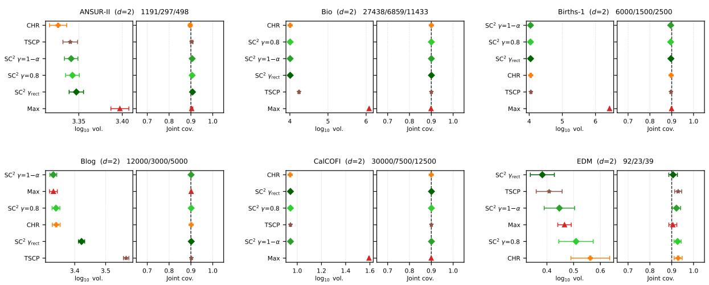

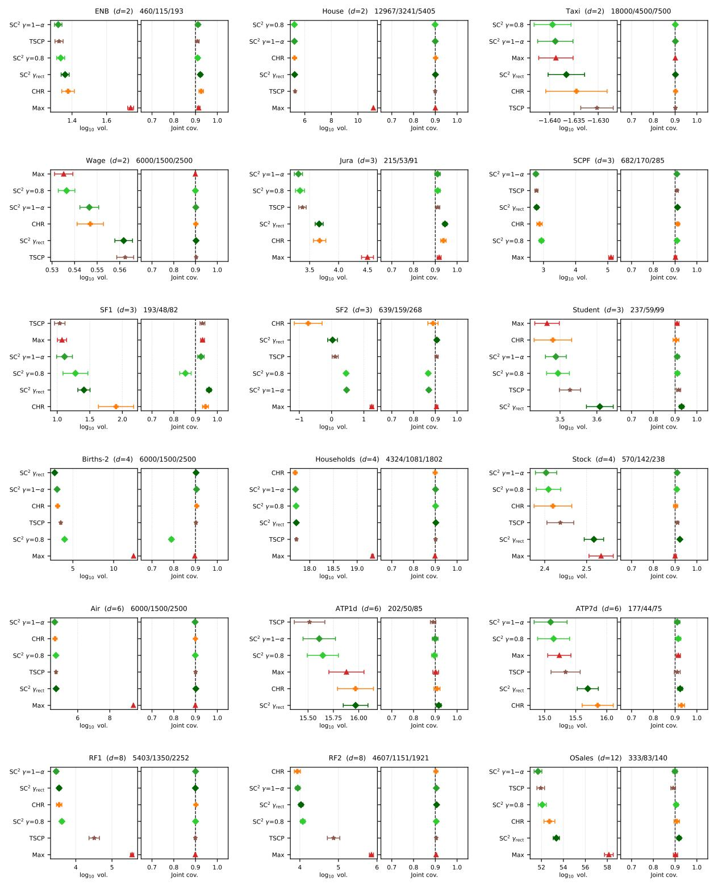

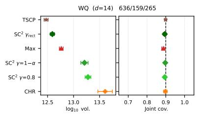

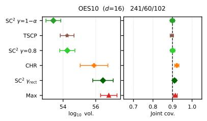

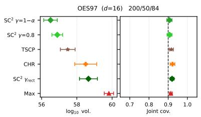

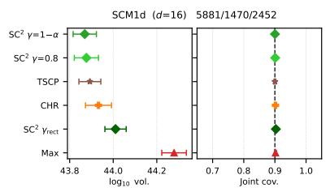

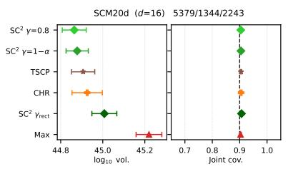

## Random forest, α = 0.05

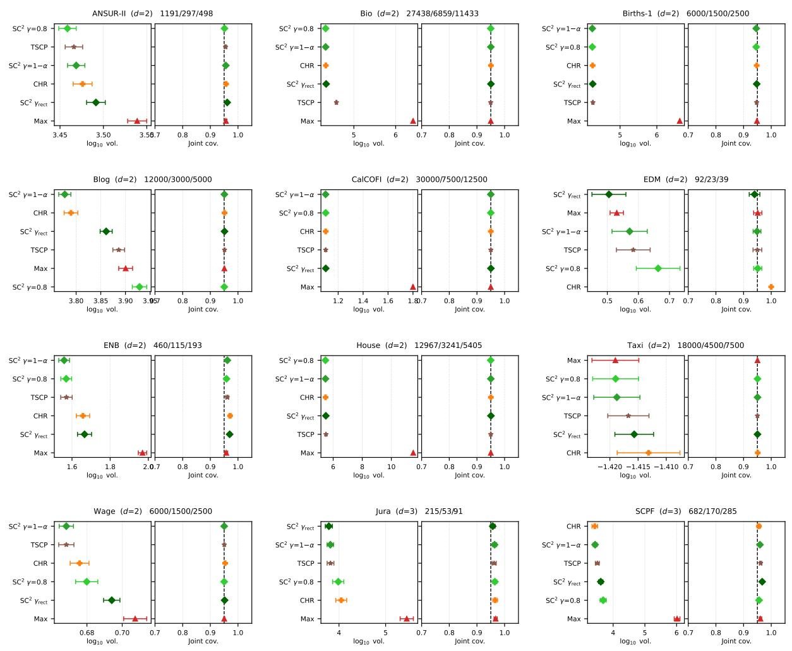

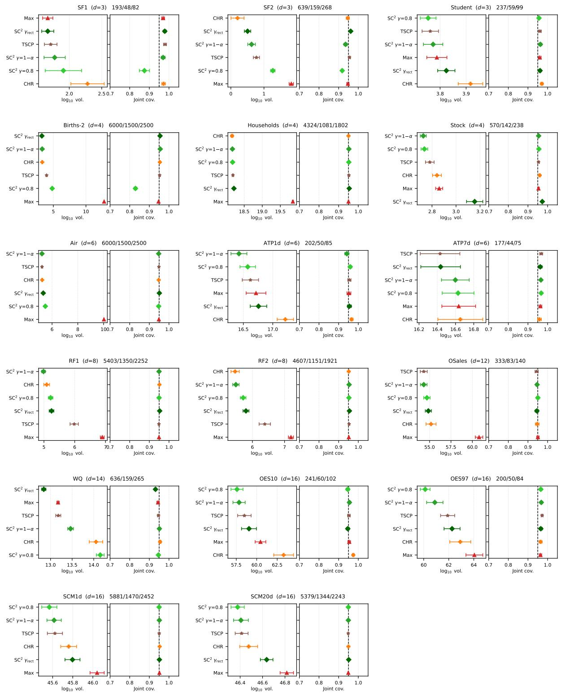

Linear model, α = 0.10  
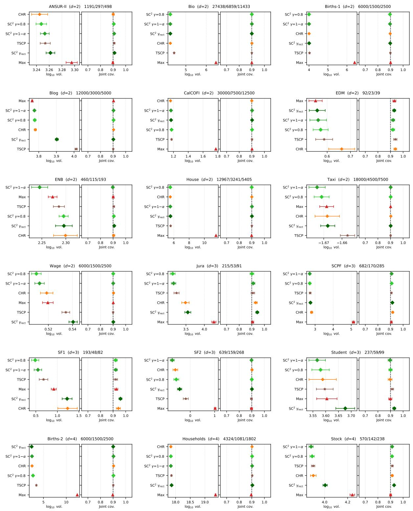

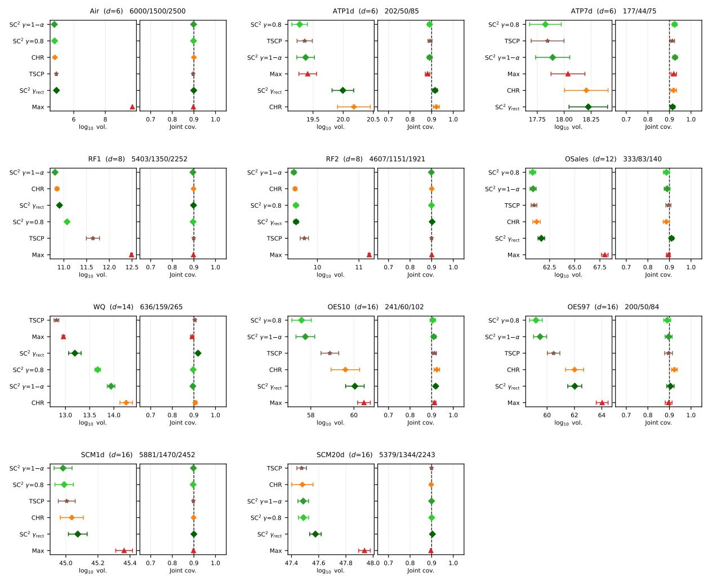

Linear model, α = 0.05  
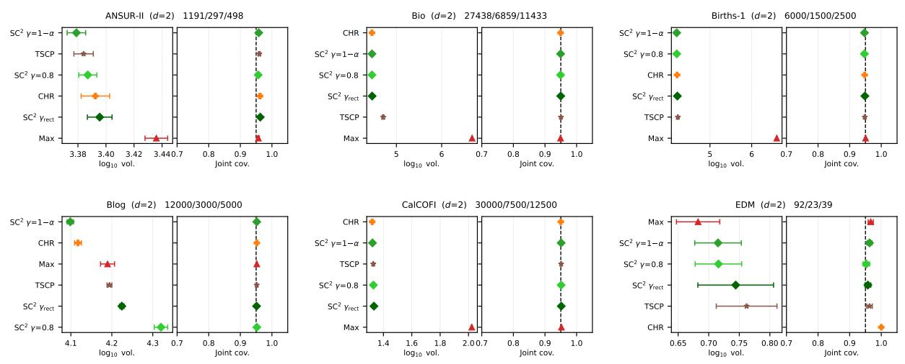

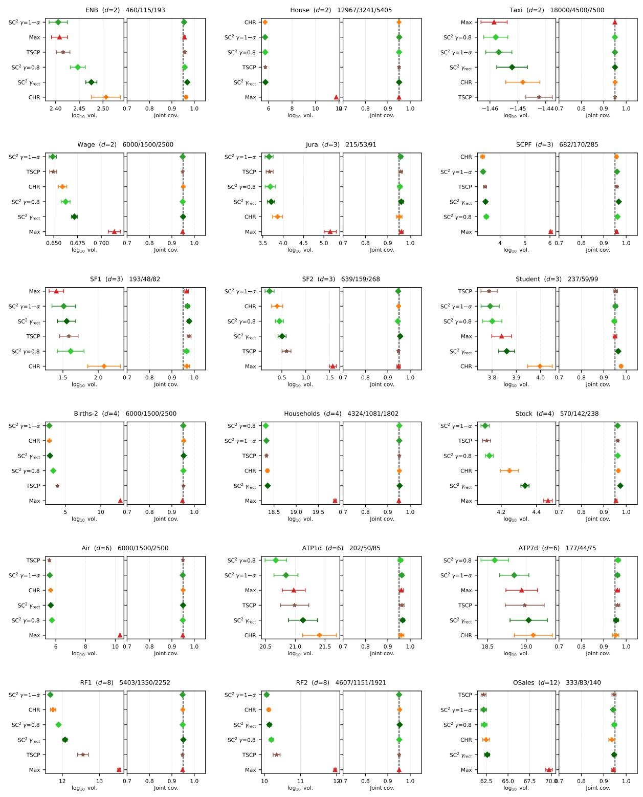

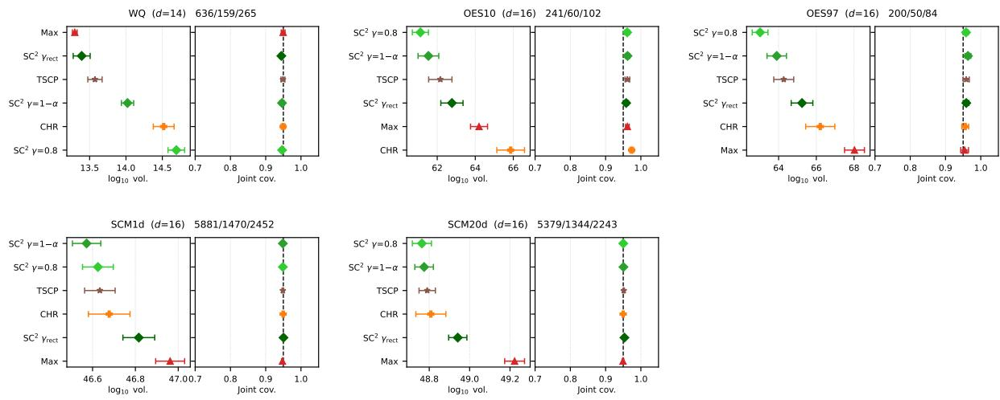