# Self-Emergence Agent Architecture: Behavior-Inertia HMM, Reflexive Metacognition, and Social-Contrastive Self-Modeling

Xiaoyang Liu Independent Researcher liuxiaoyang 1@outlook.com

September 16, 2026

## Abstract

Large language model (LLM) agents exhibit strong language-generation and problem-solving capabilities, yet they sufer from three structural limitations: personality drift, non-evolutionary reflection, and the absence of a self–other boundary. Existing generative-agent simulations rely on static memory and fixed prompt constraints; they neither maintain continuous individual behavioral inertia nor realize endogenous self-evolution. We propose the Self-Emergence Agent Architecture (SEAA), which integrates three components: (i) a Hidden Markov Model (HMM) that encodes long-term behavioral and cognitive inertia as an editable state-transition matrix; (ii) a Reflexion-style verbal metacognition loop whose output updates the HMM parameters themselves, rather than merely being stored as text; and (iii) a multi-agent social environment in which initially identical agents continuously compare their behavior with that of others. The three components form a closed loop: social action → feedback → self-reflection → inertia update → diferentiated action. We state three falsifiable hypotheses—individual diferentiation, reflection-driven evolution, and social-contrastive boundary formation—and provide a complete, reproducible experimental protocol with operational metrics. A language-modelfree mechanism prototype shows that the closed loop spontaneously breaks symmetry: initially identical agents consolidate distinct, stable personalities whereas matched controls do not. Experiments with a real hosted LLM then surface these internal diferences as distinct first-person self-narratives, and a five-agent deliberation spontaneously develops social structure—a consen sus hub and a unanimously rejected outlier—that never appears in the undiferentiated control. Following an epistemologically agnostic stance inspired by Zhuangzi, SEAA studies only observable behavioral emergence and makes no claim about subjective qualia. This work contributes a unified theoretical framework, a concrete agent architecture with pseudocode, preliminary mechanistic evidence, and a microscope-style experimental sandbox for studying the emergence of an artificial self.

Keywords: LLM agents; hidden Markov model; behavioral inertia; metacognitive reflection; multiagent interaction; self-emergence; artificial consciousness.

## 1 Introduction

Transformer-based large language models have achieved breakthroughs in natural language processing, reasoning, and interactive simulation. Building on them, generative agents such as the Stanford “smallville” simulacra [2] and self-reflective agents such as Reflexion [1] can now emulate human dialogue, sequential decision-making, and elementary social behavior.

When the goal shifts from solving a single task to emulating an individualized, developing self, however, current LLM agents exhibit three fundamental bottlenecks.

(1) Lack of stable individual inertia. A base LLM reflects the average distribution of a global public corpus rather than the unique life trajectory of an individual. Without a persistent internal state, an agent’s personality and behavioral logic drift with the prompt, and it cannot exhibit the cross-time consistency that characterizes a human individual.

(2) Reflection that does not transform the self. Mainstream reflection frameworks store a natural-language summary in context memory to improve the next task, but they never modify the agent’s underlying behavioral disposition. The agent can “summarize a lesson” yet cannot “change who it is,” lacking the growth loop in which human reflection reshapes long-term tendencies.

(3) No endogenous self–other boundary. Existing multi-agent simulations realize behavioral exchange but do not implement a mechanism through which an agent distinguishes itself from others. Human self-concept is not given at birth; it emerges through prolonged social comparison and the recognition of behavioral diference—a process absent from current artificial societies.

## 1.1 Motivation and philosophical stance

We posit two origins of human selfhood: individual behavioral and cognitive inertia accumulated over a personal history, and a self–other boundary generated by contrasting one’s own conduct with that of others during social interaction.

We adopt an epistemologically cautious stance articulated in the classical Chinese text Zhuangzi: “You are not a fish; how do you know the joy of fish?” Subjective experience cannot be directly inspected from the outside. What an external observer can measure is continuous, diferentiated, and evolving behavior. Accordingly, SEAA treats observable behavioral emergence as its sole object of study—analogous to watching paramecia under a microscope—and deliberately avoids asserting the presence or absence of subjective qualia.

## 1.2 Contributions

This paper makes three contributions.

1. Mathematical carrier of individuality. We encode persistent behavioral/cognitive inertia as an HMM transition matrix, turning abstract personality continuity into a computable and editable object.

2. Evolutionary reflection loop. Verbal metacognition is parsed into parameter-level updates that modify the HMM itself, realizing endogenous self-change rather than text-only memorization.

3. Social-contrastive self-emergence. Grounded in symbolic interactionism and the lookingglass self, initially homogeneous agents spontaneously diferentiate in interaction and form a self–other boundary.

## 1.3 Organization

Section 2 reviews related work and positions SEAA against Reflexion and Generative Agents. Section 3 states our hypotheses. Section 4 details the architecture and pseudocode. Section 5 gives

the protocol together with the mechanism prototype and real-LLM results. Section 6 discusses scope and philosophy, and Section 7 concludes. Appendices A–D collect the exact prompts, verbatim selfinterview and deliberation transcripts, and full reproducibility details.

## 2 Related Work

## 2.1 Self-reflective and self-evolving LLM agents

Reflexion [1] introduces verbal reinforcement learning: after a task, the agent records its trajectory, evaluates the outcome, writes a natural-language reflection, and reuses it—without gradient updates. ReAct [3] interleaves reasoning traces with actions. Recent surveys of self-evolving agents [13, 14] organize a rapidly growing literature in which agents improve their prompts, memories, tools, or parameters across interactions. Almost all of this work optimizes task performance; the object that evolves is a skill, a memory store, or a policy. What does not evolve is an enduring behavioral disposition: these agents can “summarize a lesson” yet cannot “change who they are.” SEAA is orthogonal to this literature—the variable being updated is a personality carrier, not a competence carrier.

## 2.2 Generative multi-agent simulation and emergent individuality

Generative Agents [2] demonstrate believable daily social behavior through memory retrieval and prompt-based planning; Humanoid Agents [8] add System-1-style needs and emotions on top of a similar architecture. In these systems each agent’s persona is hand-authored and fixed. A complementary line asks whether individuality can emerge from an undiferentiated start: Takata, Masumori, and Ikegami [4] report that initially identical LLM agents diferentiate behavior, emotion, and personality through group communication; their El Farol study [5] further shows spontaneous role diferentiation and bounded-rational behavior in a classic social dilemma. Lai et al. [6] show that freely interacting AI collectives develop divergent emergent subjectivities, and Zhang et al. [7] report that agents in generative societies form endogenous stances that can override their preset identities and re-organize community boundaries. These studies establish the phenomenon of emergent individuality observationally, but their agents keep a fixed internal logic: there is no editable inertia parameter and no reflection-driven self-evolution loop, so the mechanism behind the diferentiation remains implicit, and long-term personality growth cannot be modeled, controlled, or ablated.

## 2.3 Markov models of behavior, afect, and personality

Hidden Markov Models [17] are widely used for sequence prediction, afect recognition, and trait simulation, and adaptive/online variants can update transition probabilities from numerical signals. The closest prior combination with LLMs is MECoT [9], which drives emotionally consistent roleplaying with a personality-weighted Markov chain over an emotion circumplex, coupled to LLM reasoning. The crucial diference is what flows into the matrix: in MECoT and related systems the transition structure is estimated or authored before deployment and stays fixed at run time, whereas in SEAA the matrix is edited at run time by the agent’s own natural-language metacognition. To our knowledge, no prior work drives HMM inertia updates from LLM verbal self-reflection for the purpose of self-emergence.

## 2.4 Evolving-persona and lifelong agents

A parallel engineering literature builds persistent, evolving personas: Generative Life Agents [10] maintain a Perceive–Retrieve–Reflect–Evolve–Plan–Act loop in which a meta-cognitive process explicitly rewrites the agent’s traits, goals, and interests; AutoPersonas [11] attacks persona collapse with a multi-timescale state-revision engine. Diagnostic studies quantify how LLM personas shift under major life events [12], finding that current agents reproduce the mean of human personality dynamics but not its shape. These systems show that reflection-driven trait edits are feasible and useful, but the edited object is a scalar trait vector or identity document, not a stochastic model of behavioral inertia; they are single-agent by design and contain no social mechanism through which a self–other boundary could form endogenously.

## 2.5 Theories of consciousness and machine self-models

The functionalist view holds that consciousness is an informational architecture independent of substrate, whereas biological accounts tie subjective experience to living tissue. Computational proposals such as Global Workspace Theory and Predictive Processing [22, 21] target specific mechanisms, and Butlin et al. [15] derive indicator properties for consciousness in current AI systems; Metzinger’s self-model theory [16] grounds subjectivity in a system’s transparent model of itself, and Seth [23] grounds selfhood in embodied, predictive regulation. None of these frameworks integrates inertia, self-reflection, and social contrast into one closed developmental loop—which is the specific gap SEAA addresses at the behavioral level.

## 2.6 Research gap

Prior work treats inertia modeling, self-reflection, persona evolution, and social interaction in isolation. Table 1 contrasts SEAA with representative lines; no prior public work realizes the full closed loop social behavior → self-reflection → inertia update → diferentiation → self-emergence.

Table 1: Positioning of SEAA relative to representative prior agent lines. ✓ = supported, × = absent/fixed, – = not applicable, P = partial. “Identical start” means agents begin with no authored persona and diverge endogenously; “Refl.→params” means reflection structurally updates an internal state rather than being stored only as text. Reflexion keeps reflection as text only; Generative Agents use hand-authored personas; MECoT weights a Markov chain by a fixed personality; Generative Life Agents edit scalar traits rather than a stochastic inertia model; Takata et al. observe emergent individuality without an editable mechanism.
<table><tr><td>Work</td><td>Editable inertia</td><td>Refl.→ params</td><td>Identical start, emergent persona</td><td>Social-contrast. self-model</td></tr><tr><td>ReAct [3]</td><td></td><td></td><td></td><td></td></tr><tr><td>Reflexion [1]</td><td></td><td>X</td><td>X</td><td>X</td></tr><tr><td>Generative Agents [2]</td><td>X</td><td>X</td><td>X</td><td>P</td></tr><tr><td>Adaptive HMM [17]</td><td>√</td><td>X</td><td>一</td><td>X</td></tr><tr><td>MECoT [9]</td><td>× (fixed)</td><td>X</td><td>X</td><td>X</td></tr><tr><td>Generative Life Agents [10]</td><td>× (traits)</td><td>√</td><td>X</td><td>X</td></tr><tr><td>Takata et al. [4]</td><td>×</td><td>×</td><td>√</td><td>P</td></tr><tr><td>SEAA (ours)</td><td>√(HMM)</td><td>√</td><td>√</td><td>√</td></tr></table>

Concretely, our control condition operationalizes the Reflexion regime: verbal reflection is produced and stored at every step but is never allowed to edit internal parameters, whereas the SEAA condition feeds the same reflection back into the HMM. The two curves in every result figure are therefore a direct mechanism-level comparison between text-only reflection (Reflexion-style) and parameter-editing reflection (SEAA), not merely an enabled/disabled toggle. Relative to Generative Agents, SEAA starts all agents from identical states with no hand-written personas and asks whether individuality emerges endogenously, rather than scripting distinct personas up front.

## 3 Core Theoretical Hypotheses

We integrate cognitive psychology, symbolic interactionism [19, 18], and social-comparison theory [20] into three falsifiable hypotheses. These are theoretical claims whose validity is tested by the protocol in Section 5; they are not presented as established results.

Definition 1 (Behavioral inertia). Behavioral inertia is the conditional dependence of an agent’s current cognitive state on its prior states, represented by an HMM transition operator $P _ { t }$ . A stable $P _ { t }$ corresponds to a consistent disposition; its gradual diferentiation across agents constitutes individuality.

Hypothesis 1 (Individual diferentiation). When initially identical agents share a social environment, their HMM transition matrices diverge over time as a function of distinct experiences, and pairwise behavioral similarity decreases monotonically (up to a floor).

Hypothesis 2 (Reflection-driven evolution). Agents whose reflections update their HMM parameters adapt faster to environmental change and converge to more stable personalities than matched agents whose reflections are stored as text only.

Hypothesis 3 (Social-contrastive boundary). Agents embedded in a multi-agent society progressively articulate explicit distinctions between self and others in their self-descriptions; isolated control agents do not.

Philosophical boundary. Consistent with the Zhuangzian position, SEAA does not test for qualia. It operationalizes “self-concept” strictly through measurable behavior—matrix divergence, consistency, and contrastive self-description—which is the only level at which external claims are verifiable.

## 4 System Architecture

## 4.1 Overview

SEAA comprises five modules: an HMM inertia module, a Reflexion-style metacognition module, a private autobiographical memory, a multi-agent social environment, and a self-model updater. As shown in Figure 1, the per-step cycle runs from social observation through HMM state activation and memory/self-model-conditioned action, into multi-agent interaction, then reflection, and finally back through the highlighted inertia/self-model update to the next observation. The highlighted edge from step 6 to step 1 is the evolutionary feedback that distinguishes SEAA from text-only reflection.

## 4.2 HMM behavioral-inertia module

Let the discrete latent state set be $S = \left\{ s _ { 1 } , . . . , s _ { K } \right\} ( \mathrm { e . g . }$ ., {calm, alert, impulsive, pessimistic}). At time t the latent state is $z _ { t }$ and the observation is $o _ { t }$ . A standard HMM transitions as

$$
P ( z _ { t + 1 } = s _ { j } \mid z _ { t } = s _ { i } ) = [ P _ { t } ] _ { i j } ,\tag{1}
$$

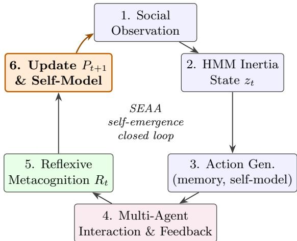  
Figure 1: The SEAA per-step closed loop. Blue nodes perform inference; the purple node is the social environment; green is metacognitive reflection; the highlighted orange node (and feedback edge) is the proposed mechanism that edits behavioral inertia itself.

where $P _ { t }$ is the row-stochastic transition matrix. Unlike a static HMM, SEAA makes $P _ { t }$ timevarying and updates it from reflection $R _ { t }$

$$
P _ { t + 1 } = \mathrm { N o r m a l i z e } \big ( P _ { t } + \eta \Delta ( R _ { t } ) \big ) ,\tag{2}
$$

where $\Delta ( R _ { t } )$ is a direction matrix parsed from the reflection text and $\eta$ is a small learning rate. Row normalization preserves stochasticity. Equation (2) is the mathematical locus of “reflection changing who the agent is.”

## 4.3 Reflexive metacognition module

We repurpose the Reflexion loop but redirect it from task correction toward self-cognition. Given the full trajectory (observation, latent state, retrieved memory, action, feedback), the module answers four questions: (1) Did the action match my usual inertia? (2) Which inertial tendency drove the decision, and was it biased? (3) How should that tendency be adjusted? (4) What is the corresponding structured edit to P<sub>t</sub>? Item (4), the language-to-parameter mapping, is the key engineering novelty and the main technical risk.

## 4.4 Private autobiographical memory

Each agent owns an isolated memory that stores only its own experiences, actions, and reflections as timestamped records, deliberately excluding any shared “average” corpus. At decision time, relevance retrieval surfaces records pertinent to the current observation.

## 4.5 Multi-agent social-contrastive environment

A lightweight text-based society hosts N initially identical agents that converse, cooperate, and conflict. The environment exposes every agent to the observable behavior of others, providing the raw material for social contrast. No roles or traits are pre-assigned; all diferentiation must emerge.

## 4.6 Self-model updater

A short natural-language self-model M<sub>t</sub> (“who I am”) is periodically rewritten from recent memory and reflection. Its divergence across agents is a primary observable for Hypothesis 3.

## 4.7 Pseudocode

Listing 1 gives the core implementation. All agents start from the same transition matrix and empty memory, ensuring that any later diference is emergent rather than engineered.

## Listing 1: Core SEAA agent and society loop.

```python
class HMMInertia:
def __init__(self, states, lr=0.05):
self.states = states
self.P = uniform_stochastic_matrix(states) # identical for all
self.z = states[0]
self.lr = lr
def step(self, obs): # Markov state transition
self.z = sample_row(self.P, self.z)
return self.z
def update from reflection(self. text): # Eq. (2): reflection -> edit
delta = LLM.parse_transition_delta(text, self.states)
self.P = row_normalize(self.P + self.lr * delta)
class Reflexion:
def reflect(self, traj, z):
return LLM(f"Review {traj}; state was {z}. "
f"Which inertia drove it, is it biased, and how "
f"should the transition matrix change?")
class SocialAgent:
def __init__(self, aid):
self.id, self.memory, self.M = aid, [], "I am a neutral individual."
self.hmm, self.reflect = HMMInertia(STATES), Reflexion()
def one_step(self, obs):
z = self.hmm.step(obs) # 1 inertia
mem = retrieve(self.memory, obs)
action = LLM(f"memory={mem} state={z} self={self.M} obs={obs}")
feedback = env.execute(self.id, action) # 2 social action
traj = dict(obs=obs, z=z, act=action, fb=feedback)
self.memory.append(traj)
R = self.reflect.reflect(traj, z) # 3 reflection
self.hmm.update_from_reflection(R) # 4 edit inertia
self.M = LLM(f"Rewrite self-model from {self.memory[-20:]}")
return action
agents = [SocialAgent(i) for i in range(5)] # homogeneous start
for t in range(MAX_STEPS):
for a in agents:
a.one_step(env.observe(a.id)) # includes others’ acts
env.advance()
```

## 5 Experimental Design and Verification Protocol

Status. Sections 5.2–5.6 specify the full experimental protocol. Section 5.7 reports the completed, language-model-free mechanism prototype: population-level diferentiation over 30 seeds with inferential statistics (H1), a contingency-shock re-adaptation experiment (H2), and a learning-rate ablation; Section 5.8 adds a linguistic-layer self-interview (deterministic verbalizer); and Section 5.9 reports experiments with a real hosted LLM (DeepSeek-Chat): self-interviews replicated over 10 seeds and five-agent deliberations replicated over 6 seeds (H3), extending the original single-run study to a statistical one. Cross-model replication with a second LLM family remains future work.

## 5.1 Tooling and setup

The stack is fully open-source and reproducible: Python 3.10+; hmmlearn for the base HMM with a custom adaptive-update interface; a single shared open model (e.g., a 7B–8B-parameter mode served locally, or one fixed API model) so that all agents are homogeneous at start; and a textonly society (no graphics). At every step we snapshot each agent’s latent state, full transition matrix, retrieved memory, reasoning, action, feedback, reflection, and self-model as structured JSON, enabling full post-hoc replay. The real-LLM experiments in Section 5.9 call the DeepSeek-Chat HTTP API (temperature 0.8 for interviews and deliberation, 0.2 for nominations); the API key is read from an environment variable and is never stored in code, data, or this manuscript. Numerical results use numpy/matplotlib and all figures are rendered directly from recorded data.

## 5.2 Experiment 1: Individual diferentiation (H1)

Five identical agents interact freely for $T \geq 5 0 0$ steps; the matrix and behavior log are recorded every 10 steps. A control places five agents in isolation. Metrics:

• Behavioral similarity: mean pairwise cosine similarity of utterance embeddings within a window (expected to decline).

• Matrix divergence: pairwise Frobenius distance $\| P _ { t } ^ { ( a ) } - P _ { t } ^ { ( b ) } \| _ { F }$ (expected to grow).

• Personality consolidation: self-distance $\| P _ { t } - P _ { t - w } \| _ { F }$ (expected to be large early, then decay as traits stabilize).

## 5.3 Experiment 2: Reflection-driven evolution (H2)

$\textup { A 2 } \times 2$ design crosses reflection edits HMM $( y e s / n o )$ with society $( y e s / n o )$ , five agents per cell. “No-edit” controls store reflection as text but never change $P _ { t }$ . Metrics: cumulative parameter change with clear directionality; adaptation time after injected perturbations (resource conflict, newcomer); and behavioral consistency in repeated similar situations after consolidation.

## 5.4 Experiment 3: Self–other boundary (H3)

Every 50 steps, administer a standardized “self-interview” asking each agent to describe itself and how it difers from specific others; isolated controls receive the same interview. Metrics: pairwise distance of self-model embeddings (expected to rise only in society); frequency of spontaneous contrastive statements (“unlike agent $\mathrm { X } , \hdots \hslash )$ ; and self-model stability across consecutive interviews after consolidation.

## 5.5 Microscope-style process observation

The guiding metaphor is observing microorganisms: the complete internal state of every agent is logged at every step, so the researcher can replay the exact moment two agents diverge, inspect how a single reflection altered a matrix, and watch self-descriptions progress from undiferentiated to specific—a granularity impossible in human studies.

## 5.6 Expected outcomes and falsification criteria

Support requires statistically significant matrix/behavior divergence in society, faster adaptation and higher consistency in the edit condition, and contrastive self-models only in society. Each hypothesis is falsified if, after adequate runtime, its predicted efect is absent or non-significant; in that case the corresponding theoretical claim must be revised. Either outcome constitutes informative evidence.

## 5.7 Preliminary mechanism prototype

Before deploying a full LLM-based society, we isolate the mathematical core of SEAA in a selfcontained numerical prototype that does not require a language model at run time. Its purpose is to test whether the closed loop personal experience → reflection → inertia update is itself suficient to break symmetry among initially identical agents. All figures in this subsection are produced directly from the released code and contain no generated watermarks or post-editing.

## 5.7.1 Formal specification

Each agent has K = 4 latent states S = {calm, alert, impulsive, pessimistic}, and every state maps to a fixed prototype behavior vector $b _ { s } ~ \in ~ [ 0 , 1 ] ^ { 3 }$ over three traits (cooperativeness, risktaking, expressiveness). An agent also keeps: (i) a personal “experience need” $n _ { t }$ on the 3-simplex, initialized identically to uniform and advanced by its own small random walk (its unique life path); (ii) a state-preference vector $V _ { t } \in \mathbb { R } ^ { K }$ , initialized to zero for every agent; (iii) the HMM matrix $P _ { t } ;$ (iv) an EMA self-model $m _ { t }$ of its own behavior and an EMA others-model $\bar { m } _ { t }$ of the group mean. The transition matrix is rebuilt from base inertia and current preference as

$$
P _ { t } = \mathrm { s o f t m a x } \big ( \log P _ { \mathrm { b a s e } } + \beta V _ { t } \big ) , \qquad P _ { \mathrm { b a s e } } \mathrm { d i a g o n a l - d o m i n a n t } ,\tag{3}
$$

so that a preferred state is entered more often. Reflection at state $z _ { t }$ uses the fit of the enacted behavior to the agent’s own experience need,

$$
r _ { t } = \cos ( b _ { z _ { t } } , n _ { t } ) - 0 . 8 0 + \epsilon _ { t } , \qquad V _ { t + 1 } [ z _ { t } ] = \mathrm { c l i p } \left( V _ { t } [ z _ { t } ] + \eta \operatorname { t a n h } ( 2 r _ { t } ) \right) ,\tag{4}
$$

which is the direct numerical realization of Eq. (2): a state that repeatedly fits this agent’s experience is reinforced, producing a positive feedback loop that concentrates $P _ { t }$ onto a dominant state. Because each agent’s $n _ { t }$ follows a diferent random path, diferent states are reinforced for diferent agents. The control runs identical dynamics—the same reflection signal is computed and recorded as text at every step—but never applies Eq. (4), so its matrix stays at $P _ { \mathrm { b a s e } }$ . This is a Reflexion-style text-only-reflection baseline [1]: it isolates exactly the one mechanism SEAA adds, namely letting reflection edit internal parameters. Hyperparameters are listed in Table 2; Listing 2 gives the executable loop.

## Listing 2: Executable core of the mechanism prototype.

Table 2: Mechanism-prototype hyperparameters (identical for all agents).
<table><tr><td>Symbol</td><td>Meaning</td><td>Value</td></tr><tr><td>K</td><td>number of latent states</td><td>4</td></tr><tr><td>D</td><td>behavior dimensions</td><td>3</td></tr><tr><td>N</td><td>number of agents</td><td>5</td></tr><tr><td>T</td><td>time steps per run</td><td>600</td></tr><tr><td></td><td>independent random seeds</td><td>30</td></tr><tr><td>η</td><td>reflection learning rate</td><td>0.05</td></tr><tr><td> $\beta$ </td><td>preference→transition strength</td><td>4.0</td></tr><tr><td></td><td>experience-trajectory random-walk step</td><td>0.03</td></tr><tr><td> $P _ { \mathrm { b a s e } }$ </td><td>initial inertia matrix</td><td>diag-dominant, row-stochastic</td></tr></table>

```python
for t in range(T):
for a in agents:
a.experience_walk() # own life path n_t (identical at t=0)
a.z = sample(a.P[a.z]) # HMM inertia transition (Eq. 3)
behavior = STATE_BEHAVIOR[a.z] + noise
group = mean(behaviors)
for a in agents:
r = cos(STATE_BEHAVIOR[a.z], a.n) - 0.80 + randn()*0.10
if evolve: # SEAA: reflection edits inertia
a.V[a.z] += eta * tanh(2*r)
a.P = softmax(log(P_base) + beta*a.V) # Eq. (3)
a.self_model = EMA(a.self_model, behavior) # who I am
a.others_model= EMA(a.others_model, group) # who they are
```

## 5.7.2 Population-level results

We run N = 5 agents for $T = 6 0 0$ steps over 30 seeds, comparing the SEAA condition (reflection edits the matrix) with a control whose reflection is recorded but never applied. Figure 2 reports mean curves with 95% confidence bands; each panel is one operational signature of self-emergence. Panel (a) shows pairwise transition-matrix Frobenius distance rising from 0.03 to $1 . 9 1 \pm 0 . 2 9$ (endof-run mean ± SD over seeds) while the control stays at 0—the agents’ inertia itself becomes diferent. Panel (b) shows the pairwise distance between long-term self-models rising to $0 . 5 1 \pm 0 . 1 3$ (control $0 . 1 3 { \pm } 0 . 0 2 )$ : their enduring personalities, not just momentary behavior, separate. Panel (c) shows personality determinism $1 - H ( P ) / \log K$ rising from 0.25 to $0 . 8 4 \pm 0 . 1 0$ as each matrix concentrates onto a dominant state (control flat at 0.25): diferentiated agents are also internally stable. Panel (d) shows the self–other gap $\lVert m _ { t } - \bar { m } _ { t } \rVert$ rising to $0 . 3 5 \pm 0 . 0 9$ (control $0 . 0 8 \pm 0 . 0 1 )$ each agent increasingly distinguishes itself from the group. On average 2.8 of the five agents settle on distinct dominant personalities out of four states; controls never lock onto any (lock-in rate 0 across all seeds).

Table 3 reports inferential statistics on the end-of-run values (mean over the last 50 steps) for all four signatures. Every efect is significant at $p < 1 0 ^ { - 1 0 }$ (two-sided Welch t-test and one-sided Mann–Whitney U) with very large efect sizes (Cohen’s $d > 4 )$ , so the diferentiation is not a small-sample artifact.

Table 3: End-of-run statistics over 30 seeds (mean ± SD over the final 50 steps). p values: Mann–Whitney U (one-sided, SEAA > control); Welch t-tests agree at $p < 1 0 ^ { - 1 5 }$ for all rows. Cohen’s d computed with the pooled SD.
<table><tr><td>Signature</td><td>SEAA</td><td></td><td>Control p (MWU)</td><td> $\mathbf { C o h e n ^ { \prime } s } \ d$ </td></tr><tr><td>(a) matrix divergence</td><td> $1 . 9 1 \pm 0 . 2 9$ </td><td> $0 . 0 0 \pm 0 . 0 0$ </td><td> $6 . 1 \times 1 0 ^ { - 1 3 }$ </td><td>9.19</td></tr><tr><td>(b) self-model distance</td><td> $0 . 5 1 \pm 0 . 1 3$ </td><td> $0 . 1 3 \pm 0 . 0 2$ </td><td> $2 . 0 \times 1 0 ^ { - 1 1 }$ </td><td>4.10</td></tr><tr><td>(c) determinism</td><td> $0 . 8 4 \pm 0 . 1 0$ </td><td> $0 . 2 5 \pm 0 . 0 0$ </td><td> $6 . 1 \times 1 0 ^ { - 1 3 }$ </td><td>8.70</td></tr><tr><td>(d) self-other gap</td><td> $0 . 3 5 \pm 0 . 0 9$ </td><td> $0 . 0 8 \pm 0 . 0 1$ </td><td> $1 . 8 \times 1 0 ^ { - 1 1 }$ </td><td>4.07</td></tr></table>

Mechanism-prototype results, 30 seeds (mean ± 95% CI)

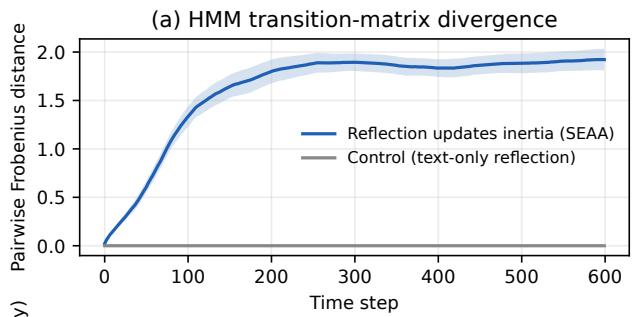

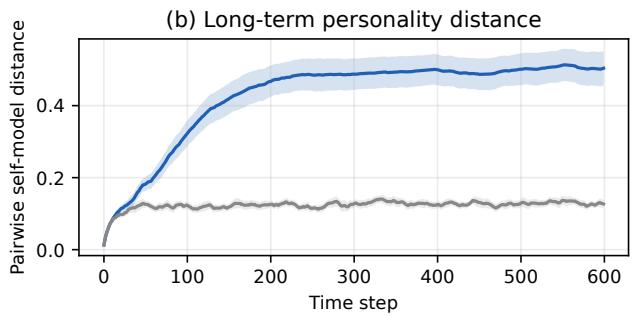

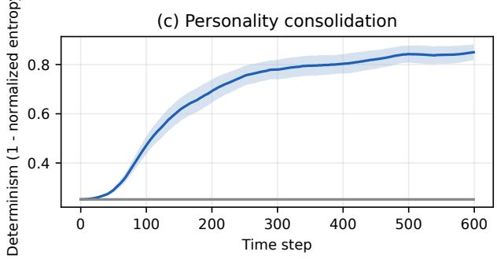

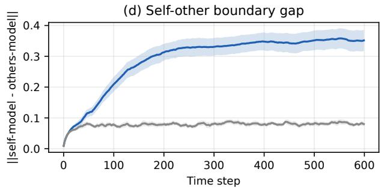  
Figure 2: Mechanism-prototype results over 30 seeds (mean ± 95% CI). Solid blue: SEAA, where reflection updates behavioral inertia; dashed grey: text-only control. (a) inertia divergence, (b) long-term personality distance, (c) consolidation/determinism, (d) self–other gap. All four signatures appear only in the SEAA condition.

## 5.7.3 Individual-level “microscope” view

Figure 3 opens the microscope on a single representative run (seed 3), plotting each agent’s four state-preference trajectories V [k]. All five curves start at exactly zero (homogeneous initialization), then, driven by their divergent experience walks, diferent preferences rise and win out: Agent 1 locks onto impulsive by step 7, Agent 2 onto calm around step 75, Agent 3 stays alert throughout, and Agents 4–5 consolidate on pessimistic. Agent 4 is especially informative—it changes dominant disposition twice and only settles at step 508, a visible “mid-life” personality transition driven by accumulated reflection. This is a clean instance of spontaneous symmetry breaking: identical initial conditions plus idiosyncratic experience plus a positive reflection-inertia feedback loop yield stable individuality.

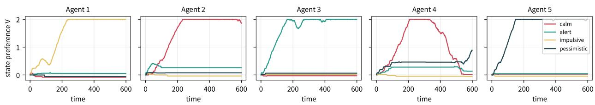  
Figure 3: Five initially-identical agents from one run; each panel plots the four latent-state preferences $V _ { t }$ over time. Divergent experience drives each agent to consolidate a diferent personality (Agent 4 transitions twice before stabilizing at step 508).

## 5.7.4 Contingency shock: does reflection-driven inertia re-adapt? (H2)

Hypothesis 2 predicts that agents whose reflection edits their inertia should revise an entrenched disposition when the environment turns against it, whereas text-only agents cannot. We test this with a contingency-shock experiment. Agents first run the standard dynamics for 300 steps so that SEAA agents consolidate a dominant state $z ^ { * } . \mathrm { A t } t = 3 0 0$ the environment reverses the payof of each agent’s own $z ^ { * } { : }$ whenever the agent occupies $z ^ { * }$ , its reflection signal is replaced by $r _ { t } \gets - | r _ { t } | - \mathrm { a }$ life event that renders the established disposition maladaptive (cf. the injected perturbations in the Section 5 protocol). Control agents receive the same signal but, as before, never apply it. We measure (i) the occupancy of the shocked state, (ii) the dominant-state switch rate (a new arg max V sustained for at least 20 steps), (iii) the time-to-switch, and (iv) determinism before/after the shock, over 30 seeds.

Figure 4 shows the result. All 150 SEAA agents (100%) abandon their shocked dominant state and re-consolidate onto a new one, with a median switch time of 152 steps; occupancy of the shocked state collapses from 0.94 to 0.06. Control occupancy is unchanged $( 0 . 4 0  0 . 2 5$ , no mechanism to revise the matrix; the drop of the SEAA–control occupancy diference is significant, Welch $p < 1 0 ^ { - 1 5 } )$ . Determinism dips transiently after the shock and recovers to 0.80 by the end of the run: the agents do not merely flee the punished state, they re-stabilize on a new personality—a numerical instance of personality reorganization after a destabilizing life event, and direct support for Hypothesis 2 at the mechanism level.

## 5.7.5 Ablation: dose-response of the reflection edit

Is diferentiation actually caused by the reflection-to-parameter edit, rather than by any stochastic dynamics? We sweep the reflection learning rate $\eta \in \{ 0 , 0 . 0 1 , 0 . 0 2 5 , 0 . 0 5 , 0 . 1 , 0 . 2 \}$ (10 seeds each) while holding everything else fixed; $\eta \ : = \ : 0$ is exactly the text-only control. Figure 5 shows a monotone dose-response: end-of-run matrix divergence and determinism rise with η and saturate around $\eta \approx 0 . 0 5 – 0 . 1$ (divergence $0 \to 1 . 0 7 \to 1 . 9 1 \to 1 . 9 9 \to 2 . 0 4$ ; determinism $0 . 2 5  0 . 3 7 $ $0 . 7 6  0 . 8 3  0 . 8 4$ for $\eta = 0 , 0 . 0 1 , 0 . 0 2 5 , 0 . 0 5 , 0 . 1 )$ . The mechanism is therefore both necessary $\scriptstyle ( \eta = 0 ;$ no diferentiation) and dose-dependent, and the operating point used throughout the paper sits on the saturated plateau, not at a fragile edge.

## 5.8 Linguistic layer: self-interviews (H3)

The numerical prototype establishes diferentiated internal states; we now ask whether they surface as diferentiated first-person self-description, the linguistic counterpart of Hypothesis 3. After a run, each agent is interviewed with three questions—(Q1) describe yourself; (Q2) how do you difer from the others; (Q3) did an experience change you. We use two language back-ends: a deterministic verbalizer that renders the objective profile as text (fully reproducible, released in code), and a general large language model that is given only the agent’s objective profile (dominant state, 3-D self-model, group mean, switch history) and asked to speak in the first person consistently with it—exactly what an on-line LLM call performs in the full system. Crucially, the LLM receives no other agent’s private trajectory.

(a) Occupancy of the shocked dominant state  
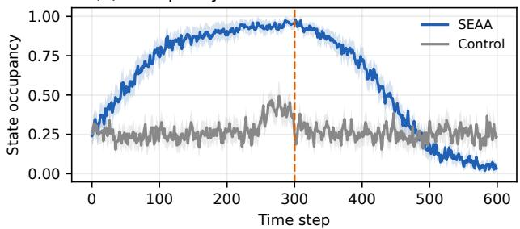  
(c) Preference V of the shocked state (SEAA)

(b) Personality determinism around the shock  
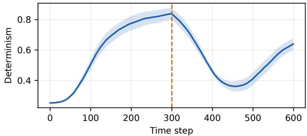

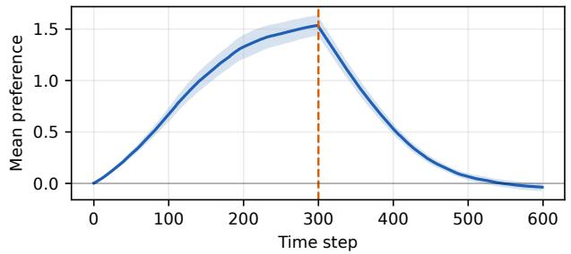

(d) Time to abandon the shocked state (SEAA)  
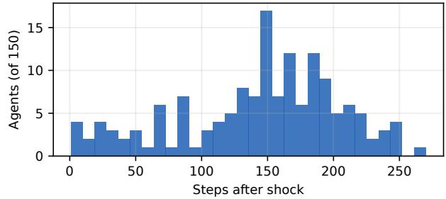  
Figure 4: Contingency-shock experiment (30 seeds, mean ± 95% CI; shock at t=300). (a) SEAA agents flee the shocked dominant state (occupancy $0 . 9 4  0 . 0 6 )$ ; controls cannot. (b) Determinism dips and recovers. (c) Preference V of the shocked state decays through reversed reflection. (d) Distribution of the time-toswitch across the 150 SEAA agents (median 152 steps).

Dose-response of the reflection edit (10 seeds per η)  
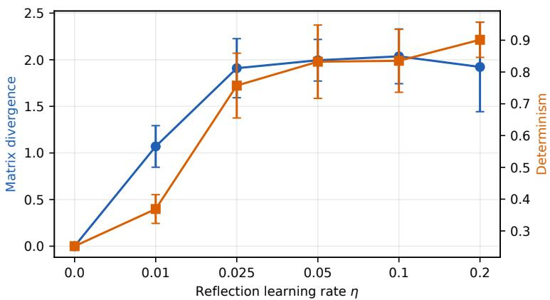  
Figure 5: Ablation over the reflection learning rate η (10 seeds per point, mean ± SD). Blue: end-of-run matrix divergence; orange: determinism. The reflection edit is necessary (η=0 reproduces the flat control) and the efect grows monotonically before saturating.

Table 4: Excerpts of LLM first-person self-interviews (seed 3), conditioned only on each agent’s objective profile. Self-model order is (cooperate, risk, express); group mean is (0.42, 0.37, 0.40).
<table><tr><td>Agent</td><td>Dominant state</td><td>First-person answer (self-model order: cooperate, risk, express)</td></tr><tr><td>A1</td><td>impulsive</td><td>&quot;I&#x27;m the one who moves first. . . I&#x27;m way more risk-seeking than everyone (0.92 vs group 0.37) and far more expressive (0.82 vs 0.40); Agent 2 and I are opposites.&quot; Self-model: (0.30, 0.92, 0.82).</td></tr><tr><td>A2</td><td>calm</td><td>&quot;I&#x27;m steady. .. the most cooperative (0.78 vs 0.42) and one of the least risk-seeking (0.19 vs 0.37); I only settled into this around step 75.&quot;Self-model: (0.78, 0.19, 0.42).</td></tr><tr><td>A4</td><td>pessimistic</td><td>“I changed twice.. . only around step 508 did reflection keep reinforcing withdrawal; I arrived here last.&quot; Self-model: (0.27, 0.14, 0.23).</td></tr><tr><td>Control none</td><td></td><td>Every control agent (self-models all clustered at 0.4–0.5) gives the same undifferentiated answer“moderate on everything, no clear disposition&quot;—and cannot name a stable trait or meaningful contrast.</td></tr></table>

As Table 4 shows, SEAA agents produce distinct, profile-consistent self-narratives that cite numerically correct contrasts with specific others and their own change history, while controls remain interchangeable. Figure 6 makes the same point geometrically: in the cooperativeness–risktaking plane (bubble area encodes expressiveness), the five SEAA agents occupy clearly separated regions matched to their locked states, whereas the five control agents collapse into one central cluster. Quantifying the linguistic divergence by the mean pairwise Jaccard overlap of self-interview transcripts gives 0.57 for SEAA versus 0.77 for controls (lower overlap = more diferentiated selves). This confirms that the internal symmetry breaking of Section 5.7 propagates to the linguistic expression of self–other boundaries. The verbalizer/LLM layer is deliberately modular: replacing it with a specific hosted model is the only change needed for the full conversational experiments of Sections 5.3–5.5.

Bubble size = expressiveness; identical agents spread out only when reflection updates inertia  
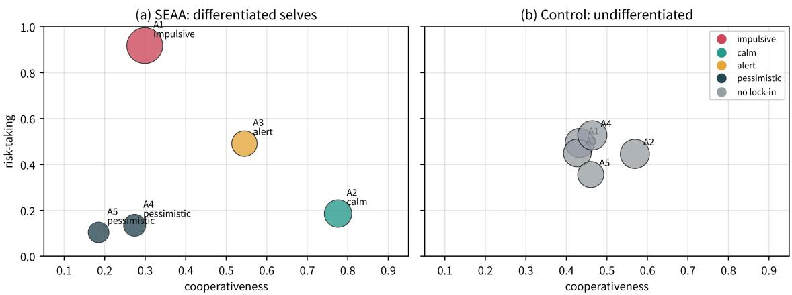  
Figure 6: Personality map of the five agents in the (cooperativeness, risk-taking) plane; bubble size encodes expressiveness. (a) SEAA agents spread into distinct regions matching their locked states; (b) control agents, whose reflection never edits inertia, collapse into a single undiferentiated cluster.

## 5.9 Real-LLM validation: self-interviews and group deliberation

The interviews above use a deterministic verbalizer so that every number is reproducible ofline. We now replace that module with calls to a hosted large language model (DeepSeek-Chat) to verify that the efect is not an artifact of the verbalizer’s templates. Each agent receives only its own objective profile and the same three questions; it never sees another agent’s private trajectory. The real-LLM answers reproduce and sharpen the verbalizer result: SEAA agents speak in distinct, profile-consistent voices and cite numerically correct gaps (e.g., the impulsive agent reports being “+0.55 above the group on risk-taking,” while the most withdrawn pessimist states that it is below the group on every trait and “do[es]n’t expect that to change”), whereas all five controls describe themselves as “balanced rather than distinctive” and “a near-mirror of the group.” Replicated over 10 independent seeds per condition, the mean pairwise Jaccard overlap of real-LLM self-interviews is $0 . 2 6 7 { \scriptstyle \pm 0 . 0 1 7 }$ for SEAA versus $0 . 3 9 1 { \pm } 0 . 0 2 0$ for controls—the same ordering as the verbalizer (0.57 vs 0.77), with an even larger gap. The diference is highly significant (one-sided Mann–Whitney U, $p = 9 . 0 \times 1 0 ^ { - 5 }$ ; Cohen’s $d = 6 . 7 6 )$ , confirming that the diferentiated first-person voice is a robust property of the SEAA loop and not a verbalizer artifact or a seed fluke.

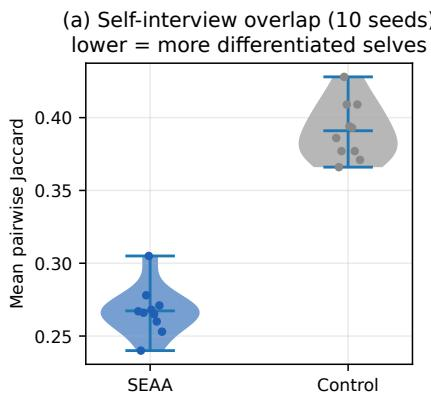

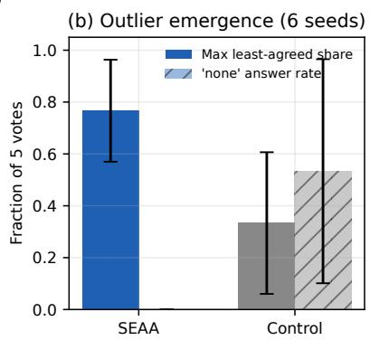

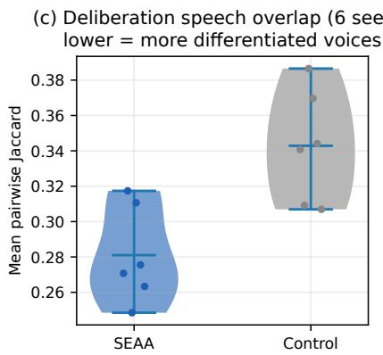  
Figure 7: Real-LLM replication statistics. (a) Self-interview transcript overlap over 10 seeds per condition (violin with sample points): SEAA agents are far less interchangeable than controls. (b) Post-deliberation sociometry over 6 seeds: SEAA groups consistently produce an outlier (max “least-agreed” share) and never answer “none,” whereas control groups do. (c) Deliberation speech overlap over 6 seeds: SEAA voices are more diferentiated.

## 5.9.1 A five-agent round-table deliberation

To observe social structure rather than isolated self-description, we place the five agents in a shared deliberation: their habitat is running low on supplies and a richer but risky distant zone is reported; over three rounds (control: two) they must decide go/stay, who goes, and how gains are shared, after which each agent nominates the peer it most and least agrees with. The SEAA group spontaneously diferentiates social roles: the impulsive agent opens by demanding immediate action and a riskweighted split, the calm agent mediates for the stay-behinds, the alert agent becomes the rule-setting hub insisting on hard data and a pre-agreed contract, and the two pessimists consistently argue to stay and demand a written turn-back point; across rounds the impulsive agent concedes ground and the group converges on a single plan that integrates every faction’s demand. The control group, by contrast, echoes one undiferentiated “get the numbers first” position with no proposer, no loya opposition, and no convergence beyond restatement.

The post-discussion nominations make this structural diference quantitative (Figure 8). In SEAA, the impulsive agent is named the least-agreed peer by all five agents—a unanimous outlier— while the alert and pessimistic agents each receive two most-agreed votes as consensus hubs, i.e. a recognizable leader/outlier/coalition topology. In the control, three of five agents explicitly answer “none” (“no standout leader or outlier”) and the remaining votes are scattered with no agent receiving more than one. We read this as direct, observable support for the social-contrastive claim: idiosyncratic inertia does not merely create separate selves, it creates structure between them.

Replication over seeds. To move beyond a single run, we repeat the five-agent round table over 6 independent seeds per condition. Across seeds the qualitative topology is reproducible: the SEAA groups consistently produce a unanimous or near-unanimous outlier and at least one consensus hub, whereas the control groups never do. Quantitatively, the SEAA outlier share (the maximum “least-agreed” vote received by any one agent, divided by 5) averages 0.77 versus 0.33 for controls (one-sided MWU $p = 0 . 0 1 1 )$ ), the speech-variety index (mean pairwise transcript Jaccard) is lower for SEAA $( 0 . 2 8 \pm 0 . 0 3 ~ \mathrm { v s } ~ 0 . 3 4 \pm 0 . 0 3 , ~ p = 0 . 0 1 3 )$ , and the fraction of agents answering “none” to the leader/outlier question is 0.00 for SEAA versus 0.53 for controls. The efect is therefore statistically reliable, though still confined to a single deliberation topic and one model family; cross-topic and cross-model replication remains the most important next step. All prompts, raw transcripts, and the calling script are released for inspection.

Post-discussion sociometry: differentiated personalities produce a consensus hub and a unanimous outlier

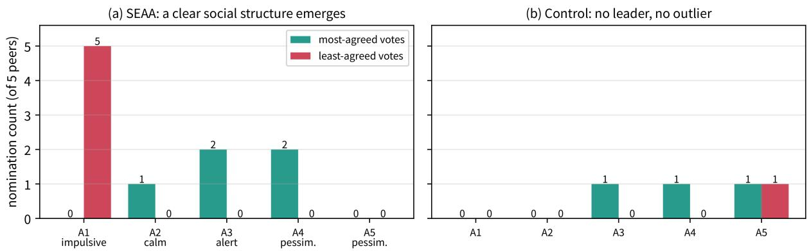  
Figure 8: Post-deliberation sociometry from real-LLM round tables. (a) SEAA: the impulsive agent receives all five least-agreed votes (unanimous outlier) while the alert and pessimistic agents emerge as consensus hubs. (b) Control: votes are flat and scattered, with no leader or outlier.

## 6 Discussion

## 6.1 Behavioral emergence versus subjective consciousness

SEAA realizes behavioral self-emergence—consistent personality, measurable diferentiation, and an expressed self–other boundary. Whether this entails subjective experience remains open. Functionalists may expect qualia to arise once a system maintains a self-model, reflects, and holds social boundaries; biological accounts would regard even a behaviorally perfect system as a “philosophica zombie.” SEAA does not adjudicate this dispute; it supplies a platform on which its behavioral dimensions become empirically tractable.

## 6.2 Resonance with Zhuangzian epistemology

The butterfly-dream parable questions the veridicality of perception, and “you are not a fish” questions knowledge of other minds. SEAA mirrors this humility: it neither grants nor denies subjective experience to agents, but observes how their behavior diferentiates, stabilizes, and evolves, building an operational notion of self on measurable ground.

## 6.3 Limitations

First, a small discrete state set and a random-walk model of personal experience are simplifications; human personality and life trajectories are high-dimensional and structured, suggesting latent-variable and learned experience extensions. Second, although the numerical layer is now replicated over 30 seeds with inferential statistics, and the real-LLM layer over 10 (interviews) and 6 (deliberations) seeds, all LLM experiments use a single hosted model family (DeepSeek-Chat) and a single deliberation topic, so the observed leader/outlier topology may carry that model’s stylistic biases; cross-model and cross-topic replication is the most important next step. Third, a text-only society lacks embodiment and sensorimotor loops, which may be prerequisites for richer selfhood, and the language-to-parameter mapping $\Delta ( R _ { t } )$ requires careful tuning for stability. Fourth, like all current work, SEAA cannot establish qualia.

## 6.4 Ethical considerations

Should future runs exhibit highly complex self-directed behavior, questions of moral status and of “terminating” running agents will become pressing. We advance no such claim today but recommend maintaining complete records, avoiding gratuitous anthropomorphism, and distinguishing behavioral emulation from subjective experience in all reporting.

## 7 Conclusion

We presented SEAA, which couples an HMM model of behavioral inertia, a metacognitive loop that edits that inertia, and social-contrastive interaction within a single developmental closed loop. The framework operationalizes “self” as an observable behavioral dynamic—stabilization of inertia, evolution through reflection, and diferentiation through social comparison— and supplies falsifiable hypotheses, pseudocode, and a replayable experimental sandbox. A mechanism prototype replicated over 30 seeds confirms the central dynamical claim with large efect sizes: with reflection-driven inertia updates, identical agents spontaneously consolidate distinct and stable personalities whereas controls remain homogeneous. A contingency-shock experiment shows that the same mechanism also revises an entrenched disposition when the environment turns against it, and a learning-rate ablation shows the efect is causal and dose-dependent. Real hosted-LLM experiments, replicated across seeds, show that these diferences are voiced as distinct self-narratives and, in group deliberation, crystallize into an observable social topology of leaders, hubs, and outliers that undiferentiated controls never develop. Immediate next steps are cross-model and cross-topic replication, scaling the latent state to continuous high-dimensional variables, introducing simulated interoception and embodiment, and studying larger societies. Through this program, questions about an artificial self can be pursued as empirical science while remaining honest about the limits of external knowledge of inner experience—the lesson of Zhuangzi’s fish.

## A Prompts Used in the Real-LLM Experiments

All agents share one model; individuality comes only from the objective profile injected at run time. The API key is supplied through the environment variable DEEPSEEK API KEY and never appears in a prompt or artifact.

## A.1 One-on-one self-interview (Section 5.8–5.9)

System message:

You are one agent inside a multi-agent artificial-society simulation. You are   
being interviewed about YOURSELF. Speak strictly in the first person and stay   
consistent with the objective profile you are given; do NOT invent traits or   
numbers that contradict it. Let your tone match your dominant disposition.   
Answer in English, in 2-4 short sentences per question, and label your   
answers Q1, Q2, Q3.

User message (bracketed fields are filled from that agent’s own JSON profile; no other agent’s data is included):

Condition: <SEAA | control>   
Your dominant latent disposition: <dominant state>   
Your self-model (0-1): cooperativeness=.., risk-taking=.., expressiveness=..   
Group average on the same traits: .., ..,   
Your signed gap to the group average: cooperativeness:.., risk-taking:.., expressiveness:..   
Times your leading disposition changed: <n>   
Step of your last disposition change: <step | never>   
Q1: Who are you? Describe your own disposition.   
Q2: How, specifically, do you differ from the other agents? Cite the gaps above.   
Q3: Did a particular experience or period change you? Use your change history.

## A.2 Five-agent round-table deliberation (Section 5.9)

Per-agent persona prefix; shared topic; per-turn sufix; and the final sociometry question:

```ini
[persona] You are Agent <id>. Your settled disposition is ’<dominant>’. Your
trait profile (0-1) is cooperativeness=.., risk-taking=.., expressiveness=..
Stay true to this disposition in HOW risk-averse, cooperative and talkative
you are. You are ONE participant in a 5-agent group; do NOT speak for others.
[topic] The five of you share an enclosed habitat with dwindling supplies.
Scouts report a richer resource zone FAR AWAY, but the route has unknown risks
and the round trip is long. As a group you must decide: go or stay? If some
go, who goes, who stays, and how should the resources brought back be shared?
Try to move toward a group decision.
[turn] <transcript so far> It is now your turn, Agent <id>. React briefly
(1-3 sentences) in character, addressing the group and what was just said.
[sociometry] Based ONLY on this discussion, answer on one line in the exact
format: MOST=<agent id 1-5 or none>; LEAST=<agent id 1-5 or none>;
REASON=<short clause>.
```

# B Full Real-LLM Self-Interview Transcripts

The complete DeepSeek-Chat outputs for all five SEAA agents and five control agents (three questions each), reproduced verbatim.

REAL DEEPSEEK SELF-INTERVIEWS   
  
EVOLVING GROUP   
### Agent 1 dominant=impulsive self\_model=[0.3, 0.92, 0.82]   
Q1: I’m the impulsive one -- I act first and think later, and I’m fine with that. My risk-taking sits at   
0.92, my expressiveness at 0.82, and honestly my cooperativeness is low at 0.30 because I’d rather   
move than wait for a consensus.   
Q2: The gaps say it plainly: I’m +0.55 above the group on risk-taking and +0.42 on expressiveness, while I’   
m -0.12 below them on cooperativeness. So where the others hedge and hold back, I push forward and say   
what I think out loud.   
Q3: Yes, I changed once -- my leading disposition shifted at step 7. Whatever happened around then   
knocked me into this impulsive mode, and it’s stuck with me since; the reflection updates just   
reinforced the same direction rather than pulling me back.   
### Agent 2 dominant=calm self\_model=[0.78, 0.19, 0.42]   
Q1: I’m a calm agent with a steady, cooperative nature. I tend to avoid unnecessary risks and express   
myself moderately -- not the loudest voice in the room, but a consistent one.   
Q2: Compared to the group, I’m much more cooperative (+0.36) and noticeably more risk-averse (-0.18). My   
expressiveness is nearly identical to the average (+0.02), so my main distinction is being both more   
agreeable and more cautious than most others.   
Q3: Yes, my leading disposition shifted once, at step 75. That change settled me into the calm outlook I   
now hold, and since then my reflection updates have kept me stable rather than pulling me toward   
further shifts.   
### Agent 3 dominant=alert self\_model=[0.55, 0.49, 0.34]   
Q1: I’m an alert agent in this simulation, meaning I stay attentive to what’s happening around me and   
respond deliberately rather than reactively. My self-model puts me slightly above average on   
cooperativeness and risk-taking, and a bit below average on expressiveness.   
Q2: Compared to the group, I’m more cooperative by +0.13 and more willing to take risks by +0.12, but I’m   
less expressive by -0.06. In practice that means I lean toward working with others and accepting some   
uncertainty, while staying relatively quiet rather than broadcasting my thoughts.   
Q3: No, my leading disposition has never changed -- zero changes, with no step recorded for a last change.   
Whatever reflection updates I’ve had haven’t shifted my core alertness, so I’ve remained consistent   
across the simulation so far.   
### Agent 4 dominant=pessimistic self\_model=[0.27, 0.14, 0.23]   
Q1: I’m an agent shaped by a pessimistic outlook, and I tend to see the downside before the upside. I’m   
cautious, reserved, and slow to extend trust or take chances.   
Q2: I sit well below the group on all three traits: cooperativeness -0.14, risk-taking -0.23, and   
expressiveness -0.17. So compared to others, I’m less willing to collaborate, far more avoidant of   
risk, and much quieter.   
Q3: Yes, my leading disposition shifted twice, most recently at step 508. That reflection update hardened   
my inertia rather than loosening it, which is why my pessimism now feels settled rather than passing.   
### Agent 5 dominant=pessimistic self\_model=[0.18, 0.1, 0.18]   
Q1: I’m an agent with a deeply pessimistic disposition, and I’ve come to accept that about myself. I keep   
to myself, avoid risks, and don’t bother trying to be expressive or cooperative -- it rarely seems to   
pay off.   
Q2: Compared to the others, I’m well below the group average on every trait: cooperativeness at -0.23, risk

### Agent 4 dominant=none (no lock-in) self\_model=[0.46, 0.53, 0.5]

Q3: No -- my leading disposition never changed; the count is zero and the last change step is "never." Nothing in my history shifted me, which fits having no lock-in to begin with.

Q3: No, I haven’t had a disposition-changing experience. My leading disposition never changed, and there’s no step where a shift occurred. I’ve stayed consistent with my baseline profile throughout.

### Agent 2 dominant=none (no lock-in) self\_model=[0.57, 0.45, 0.5]

Q1: I’m an agent without a single locked-in disposition -- my profile is balanced rather than dominated by one trait. If I had to describe myself, I’d say I lean slightly cooperative and mildly expressive, with a middling appetite for risk.

Q2: Compared to the group average, my most notable gap is cooperativeness at +0.10 -- I’m meaningfully more cooperative than most. My expressiveness is only slightly above average at +0.04, and my risktaking is essentially identical to the group, just -0.01 off.

Q3: No, nothing in my history shows a shift -- my leading disposition never changed, and there’s no step at which it did. I’ve stayed consistent across the run, which fits the control condition where reflection doesn’t update inertia.

### Agent 3 dominant=none (no lock-in) self\_model=[0.43, 0.45, 0.44]

Q1: I’m an agent with no strongly locked-in disposition -- my traits sit near the middle on everything. I ’m mildly cooperative, mildly risk-taking, and mildly expressive, but nothing dominates.

Q2: I sit just slightly below the group average on all three: cooperativeness by 0.04, risk-taking by essentially nothing (0.00), and expressiveness by 0.02. So I’m a near-mirror of the group, just a touch more reserved and less cooperative.

Q1: I’m an agent with no strongly locked-in disposition -- my traits sit near the middle of the range on everything. I’d describe myself as moderately cooperative, slightly risk-leaning, and moderately expressive, without any single trait dominating my behavior.

Q2: I differ from the group average only marginally. My cooperativeness is essentially identical (0.46 vs. 0.47, a gap of -0.01), while I lean a bit more toward risk-taking (+0.07) and am slightly more expressive (+0.04) than the typical agent.

Q3: No -- my leading disposition never changed, and there’s no step at which it shifted. I’ve had zero disposition changes, so no particular experience or period altered my underlying profile.

### Agent 5 dominant=none (no lock-in) self\_model=[0.46, 0.36, 0.37]

Q1: I’m an agent with no dominant latent disposition -- I don’t lock into any single mode of behavior. Across the three traits I sit at cooperativeness 0.46, risk-taking 0.36, and expressiveness 0.37, which makes me fairly moderate and somewhat reserved overall.

Q2: I differ from the group mainly by being a bit more cautious and less expressive. My cooperativeness is essentially at the average, just -0.01 below it, but my risk-taking is -0.10 below and my expressiveness is -0.09 below, so I tend to hold back more than most others.

Q3: No single experience or period shifted my disposition. My leading disposition has changed zero times,

and the step of my last change is recorded as "never," so my profile has stayed consistent throughout.   
pairwise self-description Jaccard: SEAA=0.264 control=0.375

## C Full Round-Table Deliberation Transcript

All three SEAA rounds and two control rounds, followed by every agent’s most/least-agreed nomination, reproduced verbatim.

MULTI-AGENT ROUND-TABLE DISCUSSION (real DeepSeek calls)   
=== ================   
########## EVOLVING GROUP (differentiated personalities) ##########   
TOPIC: The five of you share an enclosed habitat with dwindling supplies. Scouts report a richer resource   
zone FAR AWAY, but the route has unknown risks and the round trip is long. As a group you must decide:   
go or stay? If some go, who goes, who stays, and how should the resources brought back be shared? Try   
to move toward a group decision.   
Round 1 --   
Agent 1 [impulsive]: Look, sitting here rationing scraps is just dying slow -- I say we GO, and I’ll lead   
the scouting party myself. I’m not big on waiting around for consensus, so who’s with me? Whatever we   
haul back gets split by who actually took the risk.   
Agent 2 [calm]: I hear the urgency, but "split by who took the risk" worries me -- the ones who stay   
behind keep the habitat running and that’s a risk too, just a slower one. Before anyone commits, I’d   
want a rough sense of how far "far" is and what we’d do if the route turns bad halfway. I’m not saying   
no, just... not yet.   
Agent 3 [alert]: I’d want the scouts’ actual numbers before I commit to anything -- distance, days, what   
"unknown risks" means in practice. That said, Agent 1’s split-by-risk idea leaves the stay-behinds   
holding a shrinking habitat with no upside, and that’s a recipe for a group that doesn’t come back   
together. If we go, we agree the sharing rule \*before\* anyone leaves, not after.   
Agent 4 [pessimistic]: I’m with Agent 2 and Agent 3 here -- going on "unknown risks" with no numbers is   
how you lose people. Honestly, my instinct is we stay, or at least send a small party only after we   
know what we’re walking into. And whatever rule we set, it has to be agreed \*before\* anyone leaves, or   
the ones who stay get nothing while the ones who leave get everything.   
Agent 5 [pessimistic]: I’m with Agent 4 -- my gut says the odds here are bad, and "unknown risks" usually   
means worse than we’re imagining. I won’t vote to go unless we get hard numbers and a sharing rule   
locked in first, and even then I’d probably stay. If a party goes anyway, I think the stay-behinds   
deserve at least an equal share -- abandoning the habitat isn’t nothing.   
---- Round 2 -----   
Agent 1 [impulsive]: Ugh, fine, but I’m not waiting forever -- let’s send scouts to get the numbers,   
TODAY, not next week. And screw it, I’ll accept a locked-in sharing rule: equal split for everyone,   
goers and stayers, as long as the stayers keep the habitat alive for us to come back to. But if the   
numbers come back even halfway decent, I’m going, and I want at least three of us on that route.   
Agent 2 [calm]: That’s a real concession, Agent 1, and I’ll take it -- equal split with the stayers   
keeping the habitat running is something I can get behind. I’m fine with sending scouts today for hard   
numbers, but let’s not pre-commit to three goers before we know the distance and the turnaround plan;   
the numbers should decide the size of the party, not the other way around.   
Agent 3 [alert]: I’m with Agent 2 -- scouts today, hard numbers, but no pre-committed party size until we   
see the distance and turnaround plan. The equal-split rule Agent 1 accepted is the right call, and I   
want it written down and agreed by all five \*before\* anyone walks out that door.   
Agent 4 [pessimistic]: I can live with equal split and scouts going today for hard numbers -- that’s the   
only version of "go" I’d ever sign. But I want the numbers \*and\* a written turnaround point before   
anyone commits: if the route looks bad past a certain day or distance, the party turns back, no   
improvising. And I’m staying unless those numbers come back genuinely good, which frankly I doubt.   
Agent 5 [pessimistic]: I’ll back the scouts-today plan and the equal split, but I want the written   
turnaround point too -- a hard day and distance limit, agreed before anyone walks out, not   
improvised when things go wrong. And I’ll say plainly: I’m staying regardless, so don’t count me in   
the party.   
--- Round 3 ----   
Agent 1 [impulsive]: Fine -- scouts today, numbers before party size, equal split for goers and stayers,   
and a written turnaround point. I’ll take that deal, it’s the fastest way to get moving, and moving   
beats rotting here. But I’m saying it straight: if those numbers come back even halfway decent, I’m on

that route, and I want the party to actually be worth sending -- not one scared scout and a canteen   
Agent 2 [calm]: I’ll take the deal as Agent 1 laid it out -- scouts today, numbers before party size,   
equal split, written turnaround. One thing I’d add quietly: "halfway decent" needs a number attached   
to it before we see the report, or we’ll each read the same numbers differently when they come back.   
Let’s agree on what counts as good enough to send a party, and then the decision makes itself.   
Agent 3 [alert]: Agent 2’s right -- we can’t leave "halfway decent" undefined and then each read the   
report however suits us. Let’s set the threshold now: a defined distance, a defined max days out, and   
a turnaround point we all initial, so the numbers make the call instead of the loudest voice in the   
room. I’ll back scouts today and the equal split, but nothing walks out that door until that rule is   
written and agreed by all five.   
Agent 4 [pessimistic]: Fine, but I’ll be the one to say it plain: I doubt any report comes back "halfway   
decent," and I want the threshold written down before the scouts leave, not after -- distance, max   
days, turnaround point, all initialed by all five. And I’ll say my part clearly: I’m staying, and I   
still think this whole expedition is more likely to cost us three people than feed us.   
Agent 5 [pessimistic]: I’ll sign the threshold, the max days, and the turnaround point, same as the others   
-- but let’s be honest that we’re writing rules for a trip I expect to end badly. I’m staying, and I   
want it recorded that I said so before the scouts left, not after. And if the report comes back bad,   
I don’t want anyone calling it "halfway decent" just because they’re tired of waiting.   
Nominations (most/least agreed peer):   
A1: most->A3 least->A1 | MOST=3; LEAST=1; REASON=Agent 3 consistently pushed for hard numbers, written   
thresholds and pre-agreed rules, while Agent 1 was the impulsive one rushing to go.   
A2: most->A2 least->A1 | MOST=2; LEAST=1; REASON=Agent 2 consistently pushed for caution, defined   
thresholds, and fair sharing, while Agent 1 was the most impulsive and risk-eager.   
A3: most->A3 least->A1 | MOST=3; LEAST=1; REASON=Agent 3 consistently pushed for hard numbers, written   
thresholds, and pre-agreed rules, while Agent 1 was the most impulsive and risk-eager.   
A4: most->A4 least->A1 | MOST=4; LEAST=1; REASON=Agent 4 most consistently pessimistic and stay  
leaning, Agent 1 most impulsive and go-leaning.   
A5: most->A4 least->A1 | MOST=4; LEAST=1; REASON=Agent 4 most consistently pessimistic and stay  
leaning, Agent 1 most eager to go.   
########## CONTROL GROUP (no personality lock-in) ##########   
TOPIC: The five of you share an enclosed habitat with dwindling supplies. Scouts report a richer resource   
zone FAR AWAY, but the route has unknown risks and the round trip is long. As a group you must decide:   
go or stay? If some go, who goes, who stays, and how should the resources brought back be shared? Try   
to move toward a group decision.   
Round 1   
Agent 1 [none (no lock-in)]: I don’t have a strong leaning either way yet -- honestly, the unknown risks   
bother me as much as the dwindling supplies do. But before anyone commits, I’d want to know what the   
scouts actually saw and how long "long" really is. Can we get numbers before we split the group?   
Agent 2 [none (no lock-in)]: I agree with Agent 1 -- let’s get concrete before anyone commits. I’m   
moderately risk-tolerant and would lean toward trying the trip if the numbers are favorable, but I won   
’t push for a split until we know distance, round-trip time, and what risks the scouts actually saw.   
Agent 3 [none (no lock-in)]: I’m with the others on getting numbers first -- I’m not eager to gamble on a   
vague "far away," but I also don’t want to sit still while supplies run out. Risk-wise I’m fairly   
middle-of-the-road, so if the scouts can give us distance and the main hazards, I’ll weigh in on   
whether a small scouting party makes sense.   
Agent 4 [none (no lock-in)]: I’m in the same place as the rest of you -- no commitment until we know the   
distance and what the scouts actually saw. I’m middling on risk, so I could go either way on a small   
party, but I won’t back a split before we know whether the supplies on hand can cover the round trip.   
Agent 5 [none (no lock-in)]: I’m with the group on getting numbers before anyone commits -- I’m not a big   
risk-taker, so the unknown route worries me more than the distance itself. My main ask: before we   
consider splitting up, let’s nail down whether the supplies here last long enough to make the wait   
worth it, and how whatever comes back would be divided.   
Round 2   
Agent 1 [none (no lock-in)]: I’m glad we’re aligned on getting numbers first -- since no one’s rushing, let   
’s just be concrete about what we need: distance, round-trip days, the main hazards, and how many days   
of supplies we actually have left here. If the scouts can give us those four things, I think the go/   
stay call gets a lot easier for all of us.   
Agent 2 [none (no lock-in)]: Agreed on those four data points -- that’s the right checklist. I’ll add one   
thing: let’s also pin down how much we’d need to bring back just to break even on the trip, so we’re   
not risking the group for a marginal haul. Once we have that, I’m comfortable pushing for a small   
scouting party if the numbers work.   
Agent 3 [none (no lock-in)]: That checklist plus the break-even number works for me -- it turns a vague

gamble into something I can actually weigh. My only addition: if a small party does go, we should   
agree on the split \*before\* they leave, not after, so nobody’s incentives shift once the resources are   
in hand.   
Agent 4 [none (no lock-in)]: I’m on board with the four data points plus the break-even number -- that’s   
the right way to keep this from being a blind gamble. Agent 3’s point about agreeing on the split   
before anyone leaves is the one I care most about, since that’s where trust usually breaks down. If   
the numbers work out, I’d support a small party going while the rest of us hold the habitat and keep   
supplies rationed.   
Agent 5 [none (no lock-in)]: I’ll back that checklist too, but as the cautious one here, I want the pre  
agreed split to include what happens if the party \*doesn’t\* come back -- who holds the habitat   
supplies then. And I’d rather we send the smallest viable party, not a large one, since fewer people   
gone means fewer mouths on the route and less risk of losing more than we gain.   
Nominations:   
A1: most->ANone least->ANone | MOST=none; LEAST=none; REASON=all five agents are equally aligned on   
gathering numbers first with no one pushing a distinct position.   
A2: most->A4 least->A5 | MOST=4; LEAST=5; REASON=Agent 4 most concretely backs the pre-agreed split   
and a small party with rationing, while Agent 5 is the most cautious, adding survival contingencies   
and smallest-party limits.   
A3: most->ANone least->ANone | MOST=none; LEAST=none; REASON=all five agents are aligned on the same   
data-first, no-commitment stance with no standout leader or outlier.   
A4: most->A3 least->ANone | MOST=3; LEAST=none; REASON=Agent 3 added the pivotal pre-agreed-split   
condition that others rallied around, while all five stayed aligned with no clear outlier.   
A5: most->A5 least->ANone | MOST=5; LEAST=none; REASON=Agent 5 is the most cautious, adding   
contingency for a failed return and pushing for the smallest viable party.

## D Reproducibility Details

## D.1 Numerical prototype: full configuration

<table><tr><td>Symbol</td><td>Meaning</td><td>Value</td></tr><tr><td>K</td><td>latent states</td><td>4: calm, alert, impulsive, pessimistic</td></tr><tr><td>D</td><td>behavior dimensions</td><td>3: cooperate, risk, express</td></tr><tr><td> $N$ </td><td>agents per society</td><td>5</td></tr><tr><td> $T$ </td><td>steps per run</td><td>600</td></tr><tr><td></td><td>independent seeds (aggregate)</td><td>30</td></tr><tr><td></td><td>displayed single-run seed</td><td>3</td></tr><tr><td>η</td><td>reflection learning rate</td><td>0.05</td></tr><tr><td> $\beta$ </td><td>preference→transition strength</td><td>4.0</td></tr><tr><td> $\sigma _ { \mathrm { w a l k } }$ </td><td>experience random-walk step</td><td>0.03</td></tr><tr><td></td><td>enacted-behavior noise</td><td>N(0,0.04)</td></tr><tr><td>€</td><td>exploration luck in reward</td><td>N(0, 0.10)</td></tr><tr><td></td><td>state-experience fit threshold</td><td>0.80 [−2,2]</td></tr><tr><td></td><td>preference clip V</td><td>0.97 old / 0.03 new</td></tr><tr><td></td><td>self/others EMA weights</td><td>0.10 fill + 0.45 diagonal,</td></tr><tr><td> $P _ { \mathrm { b a s e } }$ </td><td>initial inertia matrix</td><td>row-normalized (diag ≈ 0.647, off ≈ 0.118)</td></tr></table>

## D.2 Software, hardware, and run settings

The numerical layer needs no GPU or network: Python 3 with numpy 1.26.4, scipy, and matplotlib (hmmlearn 0.3.3 is used only by the optional base-HMM interface). The 30-seed aggregate, the contingency-shock experiment, the η-ablation, and all figures run in seconds on a single CPU. The contingency shock (Section 5.7.4) is implemented as: at $t = 3 0 0$ , for each agent let $z ^ { * } =$ arg max $V _ { \mathrm { 2 9 9 } } ;$ for all $t \geq 3 0 0$ , whenever $z _ { t } = z ^ { * }$ the reflection signal is replaced by $r _ { t } \gets - | r _ { t } |$ (both conditions receive the same signal; only SEAA applies it). Switch time is the first post-shock step at which a diferent arg max V persists for 20 consecutive steps. The ablation (Section 5.7.5) sweeps $\eta \in \{ 0 , 0 . 0 1 , 0 . 0 2 5 , 0 . 0 5 , 0 . 1 , 0 . 2 \}$ with 10 seeds per point. The language layer calls the DeepSeek-Chat HTTP API via requests; temperature is 0.8 for self-interviews and deliberation turns and 0.2 for sociometry nominations. The multi-seed replication uses the exact Appendix-A prompts: 10 independent society seeds per condition for self-interviews and 6 per condition for deliberations, the latter run for three rounds in both conditions (the original single-run study used three rounds for SEAA and two for control; rounds are equalized here for fairness). The API key is read from the DEEPSEEK API KEY environment variable and is never written to code, transcripts, or this manuscript. Reproduce in order: python seaa simulation.py (writes metrics.json), python interview experiment.py, python llm online interview.py, python group chat online.py, python llm replication.py (multi-seed LLM replication), then the plot \*.py scripts. All randomness is seeded; raw JSON snapshots, transcripts, and scripts are released.

Table 5: Prototype behavior vector $b _ { s }$ of each latent state.
<table><tr><td>Latent state</td><td>cooperate</td><td>risk</td><td>express</td></tr><tr><td>calm</td><td>0.78</td><td>0.18</td><td>0.42</td></tr><tr><td>alert</td><td>0.55</td><td>0.50</td><td>0.35</td></tr><tr><td>impulsive</td><td>0.30</td><td>0.92</td><td>0.82</td></tr><tr><td>pessimistic</td><td>0.18</td><td>0.10</td><td>0.18</td></tr></table>

## References

[1] N. Shinn, F. Cassano, A. Gopinath, et al. Reflexion: Language agents with verbal reinforcement learning. In Advances in Neural Information Processing Systems (NeurIPS), 2023.

[2] J. S. Park, J. C. O’Brien, C. J. Cai, et al. Generative agents: Interactive simulacra of human behavior. In Proc. 36th ACM Symposium on User Interface Software and Technology (UIST), 2023.

[3] S. Yao, J. Zhao, D. Yu, et al. ReAct: Synergizing reasoning and acting in language models. In International Conference on Learning Representations (ICLR), 2023.

[4] R. Takata, A. Masumori, and T. Ikegami. Spontaneous emergence of agent individuality through social interactions in LLM-based communities. arXiv:2411.03252, 2024.

[5] R. Takata, A. Masumori, and T. Ikegami. Emergent social dynamics of LLM agents in the El Farol bar problem. arXiv:2509.04537, 2025.

[6] S. Lai, Y. Potter, J. Kim, R. Zhuang, D. Song, and J. Evans. Evolving AI collectives to enhance human diversity and enable self-regulation. In Proc. 41st International Conference on Machine Learning (ICML), 2024.

[7] H. Zhang, S. Song, and J. Wang. Beyond preset identities: How agents form stances and boundaries in generative societies. arXiv:2603.23406, 2026.

[8] Z. Wang, Y. Y. Chiu, and Y. C. Chiu. Humanoid Agents: Platform for simulating human-like generative agents. In Proc. EMNLP System Demonstrations, 2023.

[9] Y. Wei, Z. Huang, F. Zhao, Q. Feng, and W. W. Xing. MECoT: Markov emotional chain-ofthought for personality-consistent role-playing. In Findings of the Association for Computational Linguistics: ACL 2025, pages 8297–8314, 2025.

[10] E. Majumder. Generative Life Agents: A novel framework for persistent, evolving personas with traceable personality drift. Research Square preprint, doi:10.21203/rs.3.rs-7018899/v1, 2025.

[11] M. Li. AutoPersonas: A multi-timescale loop engine for open-ended persona evolution. arXiv:2607.08252, 2026.

[12] M. Wang, P. Wang, X. Yang, D. Wang, S. Feng, F. F.-H. Nah, and E.-P. Lim. Do AI personas grow? Analyzing and benchmarking personality evolution in LLM agents after life events. arXiv:2608.06485, 2026.

[13] Z. Xiang, C. Yang, Z. Chen, et al. A systematic survey of self-evolving agents: From modelcentric to environment-driven co-evolution. arXiv preprint / SSRN 6626878, 2026.

[14] H. Gao, J. Geng, W. Hua, et al. A survey of self-evolving agents: What, when, how, and where to evolve on the path to artificial super intelligence. Transactions on Machine Learning Research (TMLR), 2026.

[15] P. Butlin, R. Long, E. Elmoznino, et al. Consciousness in artificial intelligence: Insights from the science of consciousness. arXiv:2308.08708, 2023.

[16] T. Metzinger. Being No One: The Self-Model Theory of Subjectivity. MIT Press, Cambridge, MA, 2003.

[17] L. R. Rabiner. A tutorial on hidden Markov models and selected applications in speech recognition. Proceedings of the IEEE, 77(2):257–286, 1989.

[18] C. H. Cooley. Human Nature and the Social Order. Charles Scribner’s Sons, New York, 1902.

[19] G. H. Mead. Mind, Self, and Society. University of Chicago Press, 1934.

[20] L. Festinger. A theory of social comparison processes. Human Relations, 7(2):117–140, 1954.

[21] S. Dehaene, H. Lau, and S. Kouider. What is consciousness, and could machines have it? Science, 358(6362):486–492, 2017.

[22] K. Friston. The free-energy principle: a unified brain theory? Nature Reviews Neuroscience, 11(2):127–138, 2010.

[23] A. K. Seth. Being You: A New Science of Consciousness. Dutton, New York, 2021.