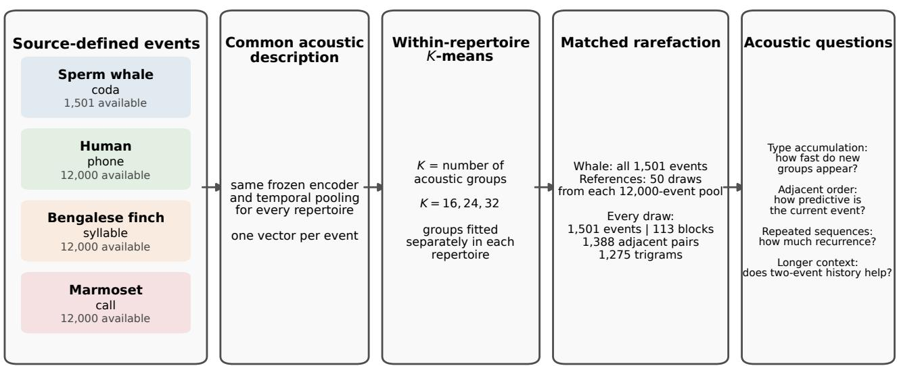
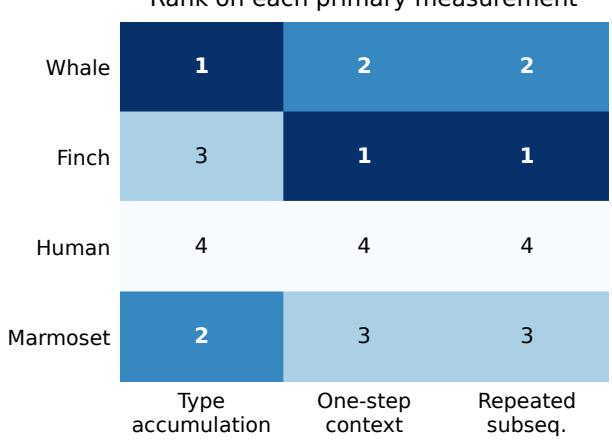
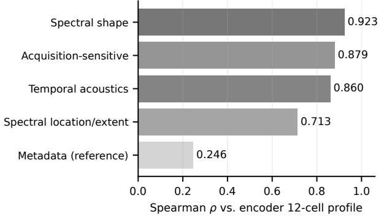
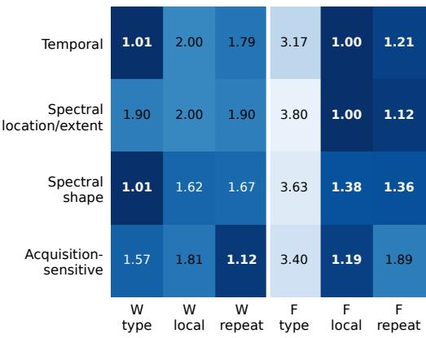
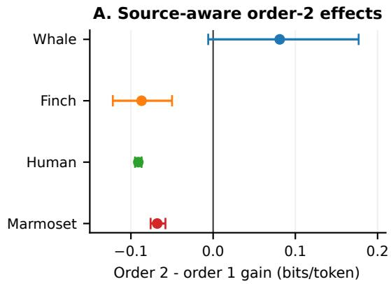
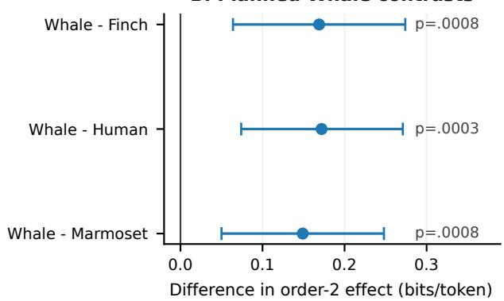

# Structure Across Voices: Comparing acoustic-event type accumulation and sequence dependence across four vocal repertoires using frozen audio encoders

Mudit Sinhaa and Sanika Chavanb

Independent Researcher, San Bruno, California 94066, United States

(Dated: 5 September 2026)

Vocal repertoires can difer in acoustic-event type accumulation and temporal organization, yet direct comparison is dificult because corpora use diferent native events and unequal amounts of sequence. We compare sperm whale codas, human speech phones, Bengalese finch syllables, and common marmoset calls using the same frozen-audio-encoder procedure while matching event count and local sequence opportunity. Whale shows the fastest type accumulation; Finch shows the strongest immediate dependence and repeated-subsequence recurrence. Physically interpretable acoustics recover complementary parts of this profile, continuous analyses without clustering support broad Whale acoustic coverage, and source- and position-preserving nulls retain both Finch order effects. Extending predictive context shifts the comparison toward Whale. Thus repertoire diferences depend on the acoustic property and temporal scale measured rather than forming a single hierarchy.

©2026 Acoustical Society of America.

[https://doi.org(DOI number)]

[XYZ]

## I. INTRODUCTION

Vocal repertoires contain recurring acoustic events, but the event itself difers across corpora: sperm-whale codas, human speech phones, Bengalese-finch syllables, and commonmarmoset calls. These units difer in duration and internal complexity; imposing equalduration segments would introduce a diferent assumption about where meaningful events begin and end. We therefore preserve each corpus’s annotated event scale and ask what remains comparable after matching the opportunity to observe diversity and order. This matching is necessary because the corpora also difer greatly in size and contiguous sequence length.

We ask two linked questions: how quickly do new acoustic-event groups continue to appear, and how strongly does temporal context constrain the event stream? Temporal organization is examined through immediate dependence, repeated-subsequence recurrence, and the

Pages: 1–12

additional predictive value of the event two positions back. We do not assume the native units are biologically homologous; we compare them using a common procedure for describing recorded acoustic events and matched observation opportunity.

Whale is limiting at 1,501 codas. We retain all Whale events and sample each 12,000- event reference pool into the same 1,501-event, 113-block profile, equalizing both event count and opportunities for adjacent pairs and trigrams. Frozen encoders then describe every event under the same signal-processing procedure, while groups are formed separately within each repertoire. Physical-acoustic and continuous analyses test whether the resulting profile exists outside the learned representation; source- and position-aware controls test alternative explanations; longer-context prediction and a Whale click-timing perturbation test temporal scale and a concrete physical timing contribution.

## II. RELATED WORK

Comparative vocal-sequence studies use entropy, transition statistics, and recurrence to quantify event dependence in dolphin whistles, humpback whale song, birdsong, and speech (Kershenbaum et al., 2016; McCowan et al., 1999; Morita et al., 2021; Sainburg et al., 2019; Suzuki et al., 2006). Such measurements depend on both event definition and available sequence: changing the observation unit changes the types and transitions that can be estimated. Type accumulation asks a complementary question— how rapidly observed categories continue to expand—for which we use the Heaps–Herdan formulation (Heaps, 1978), treating “types” as operational acoustic groups rather than biological categories.

The four corpora package acoustic structure at diferent native scales, and duration alone does not identify a uniquely correct crossspecies unit. We therefore retain source-defined events and equalize observation opportunity rather than impose common-duration segmentation (Kershenbaum et al., 2016; Sainburg et $a l .$ 2019). Sperm-whale codas additionally provide a physically interpretable timing variable: their inter-click intervals vary across social units, clans, and contexts, and can be altered while retaining the recorded clicks (Gero et al., 2016; Sharma et al., 2024; Watkins and Schevill, 1977).

Learned acoustic representations can reveal structure in animal vocalizations (Morfi et al., 2021; Sainburg et al., 2020), but here frozen encoders are only a common description procedure; clustering remains repertoire-specific. We therefore pair them with direct temporal and spectral measurements, continuous acoustic analyses without clustering, source-aware controls, and the Whale timing intervention. The comparative gap is whether heterogeneous native event streams remain distinguishable when observation opportunity and analysis procedure are matched.

## III. METHODS

The comparison preserves each corpus’s native acoustic event while equalizing the factors that would otherwise change the opportunity to observe acoustic diversity or event order: signalprocessing procedure, clustering resolution, total event count, and block-length profile (Fig. 1).

## A. Corpora and source-defined acoustic events

We retain each corpus’s native annotation rather than impose a common segmentation. Whale contains 1,501 sperm-whale codas, bounded click sequences conventionally described by ICI pattern (Gero et al., 2016; Sharma et al., 2024); hand-assigned coda type and timing metadata are used only for interpretation. Reference pools contain 12,000 Buckeye conversational phones, 12,000 annotated Bengalesefinch syllables, and 12,000 MarmAudio calls (Koumura and Okanoya, 2016; Lamothe et $a l .$ 2025; Pitt et al., 2007). Native order is retained within recording tracks (Human), birds/songs (Finch), and recording days (Marmoset; caller identity unavailable). Table I separates available pools from the 1,501 events used per matched draw.

TABLE I. Source corpora and matched sampling. Each reference pool contributes 1,501 events per draw in the Whale 113-block profile.
<table><tr><td>Repertoire (native event)</td><td>Available pool</td><td>Per matched draw</td><td>Source block</td></tr><tr><td>Sperm whale (coda)</td><td>1,501</td><td>1,501 (all)</td><td>Date × Unit</td></tr><tr><td>Human (phone)</td><td>12,000</td><td>1,501</td><td>recording track</td></tr><tr><td>Bengalese finch (syllable)</td><td>12,000</td><td>1,501</td><td>individual bird</td></tr><tr><td>Common</td><td>12,000</td><td>1,501</td><td>recording day</td></tr><tr><td>marmoset (call)</td><td></td><td></td><td></td></tr></table>

## B. Common acoustic representation and within-repertoire clustering

Eleven frozen configurations from VampNet, HuBERT, AVES-family, wav2vec 2.0, and Open-BEATs span speech-, general-audio-, music-, and bioacoustic-trained models (Baevski et al., 2020; Bharadwaj et al., 2025; Flores Garcia et al., 2023; Hagiwara, 2023; Hsu et al., 2021). Within a configuration, front-end treatment, temporal pooling, and encoder settings are identical across corpora, yielding one vector per event.

K-means groups these vectors separately within each repertoire; K is the number of groups allowed, and $K ~ \in ~ \{ 1 6 , 2 4 , 3 2 \}$ tests grouping resolution. Cluster identities are never aligned across corpora. Spherical and pooledcenter alternatives test clustering sensitivity (Supplementary Material). The groups are operational: in Whale they agree only weakly with historical CodaType and covary modestly with click count, duration, and normalized ICI, motivating the direct acoustic validations below.

  
Matching event count and block lengths gives every repertoire the same amount of local sequence evidence. Native event definitions and recorded acoustic/acquisition differences remain corpus-specific and are analyzed separately.  
FIG. 1. Matched comparison. Native events are described with the same frozen-encoder procedure and clustered independently within repertoire. Every matched draw contains 1,501 events in 113 blocks, giving 1,388 adjacent pairs and 1,275 trigrams before breadth and sequence measurements are evaluated.

## C. Matching event count and sequence opportunity

Matching event count alone is insuficient because longer uninterrupted streams mechanically provide more transitions, trigrams, and repeated-subsequence opportunities. Whale’s 1,501 codas are divided into 113 contiguous blocks of at most 16 events. Each of 50 reference draws realizes the same block-length vector with non-overlapping spans inside native source groups; blocks never cross sources or duplicate events. Every comparison therefore contains 1,501 events, 113 blocks, 1,388 adjacent pairs, and 1,275 trigrams. Duration, spectrum, source composition, propagation, and recording hardware remain corpus properties and are addressed separately.

## D. Primary measurements

With observation opportunity matched, we quantify two aspects of the acoustic event streams: how quickly distinct acoustic groups continue to accumulate and how strongly temporal order constrains those groups. Type accumulation measures the rate at which occupancy spreads across the fixed acoustic grouping as more events are observed. Immediate sequence dependence measures local, one-event predictive constraint. Subsequence recurrence measures repeated multi-event ordering. Table II summarizes the scientific meaning of each quantity before the estimator details below.

a. Type accumulation. Let $V ( n )$ be the number of distinct acoustic clusters observed after n events. The Heaps–Herdan exponent $\beta$ summarizes $V ( n ) \propto n ^ { \beta }$ under the same accumulation convention, event budget, and K in every corpus (Heaps, 1978). Larger $\beta$ means that new clusters continue to appear more rapidly as events accumulate.

TABLE II. Primary measurements and their acoustic interpretation. Type accumulation quantifies how quickly new acoustic groups continue to appear. The two sequence measurements ask whether observed event order carries more local predictability or repeated subsequence structure than a withinblock shufle of the same recorded events and acoustic-group frequencies.
<table><tr><td>Quantity</td><td>Estimator</td><td>Acoustic question</td></tr><tr><td>Type accu- mulation</td><td>Heaps-Herdan β</td><td>How quickly do previously unseen acoustic groups continue to appear as more events are observed?</td></tr><tr><td>Immediate sequence depen- dence</td><td>Observed- minus- shuffled first-order gain</td><td>How much does the current acoustic group improve prediction of the next one beyond randomized order with the same recordings</td></tr><tr><td>recurrence</td><td>Subsequence Observed/shuffled Does the observed order compression ratios</td><td>and group frequencies? reuse multi-event subsequences more than randomized order containing the same acoustic groups?</td></tr></table>

b. Immediate sequence dependence. We ask how much the current cluster assignment improves prediction of the next one beyond the same assignments in randomized order. Raw first-order context gain is the reduction in uncertainty about the next assignment after conditioning on the current assignment; the entropy terms use Miller–Madow finite-sample correction (Miller, 1955). We subtract the corresponding gain after shufling assignments within blocks. Larger positive values therefore indicate more one-step predictive information in the observed order than in a sequence with the same assignment frequencies and block boundaries.

c. Subsequence recurrence. We ask whether the observed event sequence contains more recurring subsequences than the same assignments in shufled order. RePair, Lempel–Ziv (LZ), and DEFLATE provide three observed/shufled compression ratios (Deutsch, 1996; Larsson and Moffat, 2000; Ziv and Lempel, 1977). Ratios below one indicate that repeated subsequences make the observed sequence more compressible than its shufle. The three compression readouts are treated together for the cross-corpus rank summary.

d. Cross-measurement profile. Because the three measurements have diferent numerical scales, their main cross-corpus comparison is the three-dimensional rank profile: each repertoire is ranked separately for type accumulation, shufleadjusted immediate dependence, and the mean of the three compression ranks. We do not use an aggregate rank to define an overall winner in the main text. An equal-weight mean-rank summary is retained only as a secondary descriptive quantity in the Supplementary Material for sensitivity checks across analysis variants.

## E. Within-block shufle baseline and uncertainty

For order-sensitive measurements, cluster assignments are shufled within each matched block. This preserves the recorded events, cluster counts, block boundaries, and marginal frequencies while removing observed order, so static source and recording properties are shared by observed and null sequences. Position-varying acquisition or behavior can remain and is tested separately; type accumulation is unchanged by shufling.

Analytical stability is assessed across encoder choice, K, reference draw, coarsening, clustering geometry, RMS normalization, and alternative cluster constructions. Source uncertainty is kept separate by resampling the highest available native source block: Whale Date × Unit, Human track, Finch bird, and Marmoset recording day (Supplementary Material).

## F. Physical acoustic validation beyond the learned representation

a. Physical-acoustic family decomposition. To ask which interpretable signal dimensions reproduce the encoder-derived profile, we analyze four acoustic families separately on the same 1,501-event, 113-block matched shell. Temporal acoustics include duration, temporal centroid and spread, and envelope modulation. Spectral location and extent include peak frequency, centroid, bandwidth, and rollof. Spectral shape includes spectral slope, flatness, and entropy. Acquisition-sensitive level measurements include RMS, peak level, clipping, and an SNR proxy. Spectral descriptors use the shared physical support from 0 to 8 kHz, the maximum band available in every corpus. Each family is grouped and scored separately with the same three primary measurements. Spearman ρ across the 12 repertoire-by-measurement mean-rank cells is used descriptively to ask whether a physical family preserves the whole encoder-derived profile rather than only one leading repertoire. Corpus metadata is retained as a non-acoustic comparison; no naive p-value is assigned to the 12 dependent rank cells.

b. Continuous acoustic analyses without clustering. A complementary analysis stays in continuous physical-descriptor space. For acoustic coverage, 250 held-out query events are compared with reference sets of 25, 50, 100, 200, 400, 800, and 1,200 events. Descriptor dimensions are standardized on a pooled reference in which species contribute equally; nearest-neighbor distance is divided by the square root of feature dimension, and area under the distance-versus-log-samplesize curve summarizes how sparsely the acoustic space is covered. A second version removes native-source means before the same calculation. These two standardizations are interpreted separately rather than by comparing their absolute AUC scales. For local continuous prediction, a leave-one-native-source-out multi-output ridge model predicts the next descriptor vector from the current vector. Scaling and fitting use training sources only, and held-out predictive $R ^ { 2 }$ is compared with both within-block and sourceby-position-preserving order nulls. Full estimator details and results are reported in the Supplementary Material because these continuous quantities are related to, but are not the same estimands as, discrete type accumulation and categorical recurrence.

## G. Source, acquisition, and conditioned-order controls

a. Between- and within-source variation. Agreement at the corpus level does not show whether the measured variation lies between recording sources or among events from the same source. We therefore use two source-aware tests. The first measures how strongly each saved recorded-signal measurement set difers among source blocks with null-adjusted PER-MANOVA $R ^ { 2 }$ on exact 1,501-event samples. The narrow “simple acoustics” set contains duration, spectral centroid, and bandwidth; the archived channel, padding, and all-descriptor sets are retained for the source-localization audit. Larger values indicate greater separation of the measured properties among source blocks after null adjustment.

The second removes source-block means from the acoustic measurements and asks whether cluster membership remains associated with differences among events from the same source. Assignment permutations are restricted within source blocks. For both tests, the saved cluster assignments weight encoder families equally and are formed without using sequence order; K = 32 is primary and K = 16, 24 are sensitivity checks. Each cell uses 500 permutations, and results are averaged across 50 alternative cluster constructions (Supplementary Material, Acoustic variation across source blocks and withinsource cluster association).

b. Cluster distribution across source blocks. A separate source-block test asks whether the same cluster assignments are distributed across native source blocks more unevenly than expected. The assignments are reallocated across blocks while preserving the exact block sizes. We then compare between-block Jensen–Shannon divergence and the number of distinct clusters within blocks with the corresponding reallocation baselines (Supplementary Material, Distribution of distinct clusters across source blocks).

c. Source- and position-conditioned order nulls. Within-stream position can itself carry stereotyped sequence structure. We therefore repeat both immediate dependence and repeatedsubsequence recurrence against a stricter null that preserves native source identity and normalized stream position simultaneously. Acousticcluster assignments are permuted only within native-source × position-bin strata, preserving event slots, matched sequence boundaries, sequence lengths, global occupancy, source-specific inventories, and position-bin cluster counts. Eight position bins with K = 32 are primary; 4 and 16 bins and K = 16, 24 are sensitivity conditions, with 500 restricted permutations per cell. For first-order dependence, the reported quantity is observed Miller–Madow-corrected entropy reduction minus the conditioned-null mean. For recurrence, compressor size is divided by the conditioned-null mean; ratios below one indicate repeated order beyond source identity and positional composition.

d. Short-event boundary sensitivity. Events shorter than the 0.175-s encoder window require padding. We record padding fraction and rerun the complete panel with symmetric-reflect rather than right-zero padding to test whether the main repertoire profile depends on this corpus-specific boundary treatment (Supplementary Material, Measurement sensitivities and acoustic source analysis).

## H. Longer predictive context and same-signal timing validation

a. Longer predictive context. The primary local-order measurement uses only the immediately preceding event. To ask whether one additional event of history contributes predictive information, held-out models compare oneevent with two-event context. Acoustic clusters are reconstructed separately inside each training split so that sequence outcomes cannot influence how events are grouped. Within each split, encoder vectors are standardized, reduced by principal components, and clustered independently. The encoder-specific clusterings are then combined according to how often pairs of events are grouped together, with equal weight for each encoder family (Strehl and Ghosh, 2002). This produces a single K = 32 grouping. All preprocessing, clustering, combination of clusterings, and assignment of held-out events use training source blocks only.

Two transition models score the same heldout events: an order-1 model uses the immediately preceding event, and an order-2 model uses the two preceding events. When a longer context is sparse, both models fall back recursively to shorter contexts within the matched 113-block profile. The reported effect is order-2 minus order-1 held-out log likelihood in bits/token. Positive values mean that the event two positions back improves prediction beyond the immediately preceding event. Uncertainty is estimated by resampling the highest available source block and aggregating over 50 alternative train-only cluster constructions within each bootstrap replicate. The three planned Whale-minus-reference contrasts are Holm-adjusted and accompanied by simultaneous 95% source-bootstrap confidence intervals. Order 3 tests whether one additional preceding event adds predictive value.

Rank on each primary measurement  
  
FIG. 2. Ranks on the three primary measurements (1 = strongest, 4 = weakest). Whale is top-two on all three; Finch leads the two order-sensitive measurements.

b. Within-coda timing. Whale codas permit an additional physical test that is not available in the same form for the other native event definitions: their within-event timing can be changed while the constituent recorded clicks are held fixed. We therefore re-encode the same clicks after three changes to inter-click-interval (ICI) arrangement: local jitter, replacement from the global ICI distribution, and within-coda ICI permutation. Each perturbation changes temporal arrangement within the coda without replacing the click waveforms, providing a within-Whale test of whether coda timing contributes to the measured profile.

## IV. RESULTS

## A. Matched primary measurements reveal diferent repertoire profiles

The matched comparison yields diferent profiles rather than one ordering (Table III; Fig. 2). Whale leads type accumulation (β = 0.124) and is the only repertoire in the top two on all three primary measurements, ranking 1,2,2. Finch ranks 3,1,1, leading shufle-adjusted immediate dependence (0.737 versus 0.365 Whale) and Re-Pair/LZ recurrence; DEFLATE is nearly tied (0.964 Finch, 0.965 Whale). Marmoset ranks 2,3,3 and Human 4,4,4. The three-dimensional profile, not an aggregate score, is the principal result.

The profile is stable across analytical choices: Whale is top-two in 98.2% of encoder/K/reference cells and Finch in 90.5%. Source-block bootstrap separately supports the Whale Heaps direction in 22/33 settings versus Finch and 26/33 versus Human and Marmoset, and the Finch immediate-dependence direction in 24/33 Whale–Finch settings; DEFLATE remains unresolved (Supplementary Material).

TABLE III. Means over the matched encoder/selection/K panel. Lower compression ratios indicate greater recurrence.
<table><tr><td>Measurement</td><td>Whale</td><td>Finch</td><td>Human</td><td>Marmoset</td></tr><tr><td>Heaps-Herdan  $\beta$ </td><td>0.124</td><td>0.045</td><td>0.034</td><td>0.050</td></tr><tr><td>Raw first-order gain</td><td>1.873</td><td>1.230</td><td>0.189</td><td>0.733</td></tr><tr><td>Shuffle-adjusted gain</td><td>0.365</td><td>0.737</td><td>0.065</td><td>0.129</td></tr><tr><td>RePair ratio</td><td>0.928</td><td>0.862</td><td>0.991</td><td>0.981</td></tr><tr><td>LZ ratio</td><td>0.945</td><td>0.914</td><td>0.995</td><td>0.988</td></tr><tr><td>DEFLATE ratio</td><td>0.965</td><td>0.964</td><td>0.999</td><td>0.991</td></tr></table>

## B. Physical acoustics recover complementary parts of the profile

a. Physical acoustic dimensions. The first question is whether the encoder-based profile is visible in physically interpretable measurements of the recordings. It is, but diferent acoustic families recover diferent parts of the profile (Fig. 3). Whole-profile agreement across the 12 repertoire-by-measurement cells is highest for spectral shape $( \rho = 0 . 9 2 3 )$ , followed by acquisition-sensitive level measurements (0.879), temporal acoustics (0.860), and spectral location/extent (0.713). Metadata is much less similar $( \rho ~ = ~ 0 . 2 4 6 )$ Whale’s type-accumulation placement is recovered almost exactly by temporal acoustics (mean rank 1.013) and spectral shape (1.007), whereas Finch’s local-dependence and repeated-order placement is recovered most strongly by spectral location/extent (1.000 and 1.124) and also by spectral shape (1.380 and 1.364). Thus complementary temporal and spectral dimensions recover complementary parts of the encoder result rather than one opaque coordinate. The strong acquisition-sensitive agreement is retained rather than dismissed: these archival signals contain both production-related and recording-related variation.

b. Continuous acoustics without K-means. The acoustic-breadth result also appears without assigning events to discrete types. Over the full continuous coverage curve, Whale has the largest mean AUC in pooled physical-descriptor space (0.308; Human 0.281, Marmoset 0.229, Finch 0.219) and after native-source means are removed (0.482; Human 0.459, Marmoset 0.420, Finch 0.343). Whale is not uniformly largest at every reference-set size: at $n = 1 2 0 0$ , Whale and Human are nearly tied in the pooled analysis (0.196 and 0.195), and Human is slightly larger after source-mean removal (0.330 versus 0.324). The supported claim is therefore broader whole-curve continuous acoustic coverage for Whale, not dominance at every sampling scale. A separate leave-one-source-out analysis predicts the next continuous acoustic vector from the current one. All four repertoires remain above both order nulls; under the sourceby-position-conditioned null excess held-out $R ^ { 2 }$ is 0.305 Whale, 0.206 Finch, 0.140 Marmoset, and 0.131 Human. Continuous vector prediction and recurrence of discrete acoustic types are different estimands, so this Whale-leading continuous result complements rather than contradicts Finch’s categorical order advantage (Supplementary Material).

A. Whole-profile acoustic agreement  

B. Family-specific placement  
  
FIG. 3. Physical-acoustic decomposition of the encoder-derived profile. A: whole-profile agreement with the frozen-encoder pattern. B: family-specific mean ranks for Whale and Finch on the three primary measurements (lower is stronger). Metadata is a non-acoustic reference.

These representation-independent checks establish that the primary profile has direct physical-acoustic counterparts. They do not yet show where the Whale accumulation pattern lies across recording sources or whether source and stream position can account for the categorical order efects.

## C. Source and position analyses locate the remaining variation

Part of Whale type accumulation lies across sources. Under blockwise redistribution, Finch shows the larger between-block divergence ratio (3.152 versus 1.758 at $K \ = \ 3 2 )$ whereas Whale shows the stronger within-block richness deficit (0.502 versus 0.735), indicating that more of its pooled inventory is distributed across Date × Unit blocks. Direct acoustics agree: simpleacoustic source separation is largest for Whale $( R ^ { 2 } = 0 . 5 4 3 ;$ Finch 0.071, Human 0.042, Marmoset 0.239). Yet after source means are removed, cluster membership remains associated with within-source simple acoustics in every repertoire $( R ^ { 2 } ~ = ~ 0 . 1 6 \bar { 3 }$ Whale, 0.633 Finch, 0.459 Human, 0.372 Marmoset). Whale type accumulation is therefore source-structured but not reducible to between-source diferences alone (Supplementary Material).

Position also matters but does not explain Finch’s order advantage away. Under the stricter source-by-position null, Finch retains the largest source-aware first-order excess and recurrence efect, with Whale second on both (Table IV). Finch exceeds Whale by +0.872 bits/token [0.520, 1.223] in first-order dependence; the Finch/Whale recurrence-ratio quotient is 0.935 [0.888, 0.989]. At the primary setting, Finch, Whale, and Marmoset beat the restricted recurrence null in every tokenizer construction, whereas Human’s efect is negligible in magnitude despite a narrow source-aware interval. Thus Finch’s categorical order is positionally structured but not reducible to source identity or fixed stream position.

Short-event padding is highly asymmetric, but replacing right-zero with symmetric-reflect padding preserves the secondary Whale/Finch ordering (1.419/1.698 versus 1.448/1.682; Supplementary Material). With source, position, and boundary efects bounded, we next ask whether extending temporal history changes the comparison.

TABLE IV. Source-aware discrete order beyond source and normalized position. Larger first-order excess and smaller recurrence ratio indicate stronger residual order.
<table><tr><td>Repertoire</td><td>First-order excess</td><td>Recurrence family ratio</td></tr><tr><td>Finch</td><td>1.352 [1.033, 1.672]</td><td>0.842 [0.816, 0.878]</td></tr><tr><td>Whale</td><td>0.480 [0.337, 0.602]</td><td>0.900 [0.867, 0.938]</td></tr><tr><td>Marmoset</td><td>0.182 [0.141, 0.224]</td><td>0.971 [0.964, 0.978]</td></tr><tr><td>Human</td><td>0.017 [0.007, 0.026]</td><td>0.998 [0.997, 0.999]</td></tr></table>

## D. Temporal scale changes the comparison; coda timing provides a same-signal validation

Extending discrete predictive context by one event shifts the comparison toward Whale. The order-2 minus order-1 increment is more positive for Whale than Finch by +0.169 bits/token (95% simultaneous interval [0.064, 0.274]), Human by +0.172 [0.074, 0.271], and Marmoset by +0.149 [0.050, 0.248]; all three Holm-adjusted comparisons satisfy $p \leq 0 . 0 0 0 8 4$

Whale’s own efect is +0.081 bits/token with source-aware interval $\left[ - 0 . 0 0 6 , \ 0 . 1 7 7 \right] \ ( p \ =$ 0.1361), so the supported result is comparative rather than a positive Whale-alone efect. Finch, Human, and Marmoset have mean efects of - 0.087, -0.091, and -0.068 bits/token, with sourceaware intervals wholly below zero. The direction persists in 49/50 train-only cluster constructions while all references are negative in all 50; equal weighting of individual encoder configurations also preserves the direction, and order 3 adds no supported gain (Supplementary Material).

Finally, codas permit a same-signal physical test: recorded clicks are held fixed while only their ICI arrangement changes. Observed-coda values exceed all three perturbed versions across five readouts for 10/11 encoder configurations (AVES2 excepted), establishing sensitivity of the Whale profile to observed inter-click timing.

B. Planned Whale contrasts  
  
FIG. 4. Held-out two-event context. A: order-2 minus order-1 gain with 95% source-bootstrap intervals. B: planned Whale-minus-reference contrasts with simultaneous family-wise 95% intervals and Holm-adjusted p-values.

## V. DISCUSSION

A. The repertoires difer in profile rather than along a single ordering

Matching event count and local sequence opportunity reveals that type accumulation and temporal organization do not produce one common ordering. Whale leads type accumulation and is the only repertoire in the top two on all three primary measurements. Finch instead leads both order-sensitive measurements but ranks third in type accumulation. Marmoset is second in type accumulation and third on both order-sensitive measurements, while Human is fourth across the three. The scientific result is this three-dimensional profile, not an aggregate ranking of repertoire structure.

This comparison is defined at the native event scale of each corpus: phone for Human, coda for Whale, syllable for Finch, and call for

Marmoset. These units need not have equal durations or internal complexity to be the relevant source-defined events in their respective corpora. Equal event counts and matched block lengths make the opportunity to observe type accumulation and local order comparable without asserting that the units are biologically homologous or forcing them into an arbitrary common-duration segmentation.

## B. Physical acoustics provide representation-independent coun terparts

The encoder-derived profile is not confined to a learned representation. Spectral shape, temporal acoustics, and spectral location/extent each recover substantial portions of the complete cross-repertoire pattern, and they do so in complementary ways: Whale’s type accumulation is recovered most strongly by temporal and spectral-shape measurements, whereas Finch’s categorical local dependence and recurrence are especially prominent under spectral location/extent and spectral shape. Acquisitionsensitive measurements also recover much of the pattern, so these archival recordings retain acquisition as well as production-related variation. The physically interpretable decomposition therefore establishes grounding in multiple recorded-signal dimensions without implying nuisance-free biological identification.

The continuous analyses strengthen that interpretation without relying on K-means. Whale has the broadest whole-curve continuous acoustic coverage both before and after nativesource means are removed, although Human approaches it at the largest reference-set size. Continuous next-event prediction, however, is strongest for Whale rather than Finch. That diference is informative: categorical recurrence asks how strongly discrete acoustic types repeat or constrain one another, whereas continuous prediction asks how predictable the next physical acoustic vector is. The two need not produce the same repertoire ordering, reinforcing the paper’s central point that temporal organization is multidimensional.

## C. Source and position refine, but do not erase, the primary profile

Source structure still matters. Whale has strong between-source acoustic heterogeneity and fewer pooled clusters within its native blocks than expected under redistribution, so part of the pooled Whale type accumulation is distributed across Date × Unit source blocks in the sampled corpus of three social units. At the same time, cluster membership remains associated with acoustic diferences among events within the same source block. The Whale result is therefore source-structured but not reducible to between-source diferences alone.

The Finch position result is likewise refined rather than dismissed. A position-only description can generate a Finch-like ordering, showing that sequence position carries real structure. Yet when acoustic-cluster assignments are randomized only among events from the same source and normalized position stratum, Finch retains the largest source-aware excess first-order dependence and the strongest repeated-order recurrence, with Whale second on both conditioned analyses. Finch’s categorical order is therefore positionally structured but not explained away by source identity or a fixed positional template. Short-event padding remains highly asymmetric across corpora, but changing the padding convention preserves the main profile.

## D. Temporal scale changes which repertoire stands out

The discrete local-order measurements, continuous next-event prediction, and held-out longer-context test distinguish diferent aspects of temporal organization. Finch shows the strongest immediate dependence and subsequence recurrence of discrete acoustic types even after source and position are preserved in the null, whereas Whale shows the strongest continuous next-event acoustic prediction. Extending the discrete predictive context by one additional event also shifts the comparison toward Whale: the order-2 increment is more positive for Whale than for each reference repertoire. Whale’s standalone interval includes zero and order 3 adds no supported gain, so the identified higher-order result is comparative rather than evidence for a positive order-2 efect within Whale alone.

A final same-signal intervention links the Whale profile to coda timing. Holding the recorded clicks fixed while changing only withincoda timing makes the observed-coda values exceed all three perturbed versions across the five perturbation readouts for 10 of 11 encoder configurations. This physical validation is distinct from the order-2 comparison: it shows timing sensitivity within Whale and is not available in the same form for the other native event definitions used here.

## E. Scope and next tests

The results compare four recorded corpora at their source-defined event scales; they do not identify a species-wide ordering independent of acquisition. Within-repertoire analyses spanning smaller and larger source-defined units can test how type accumulation and sequence dependence change with observation scale. Acquisition-matched recordings with controlled microphones, source–receiver distances, environments, and acquisition systems can test whether the observed source-block concentration and cross-corpus profile persist when recording heterogeneity is experimentally constrained.

## VI. CONCLUSION

Under matched event counts and local sequence opportunities, the four repertoires occupy diferent acoustic profiles rather than one hierarchy. Whale shows the fastest discrete type accumulation and broadest whole-curve continuous acoustic coverage, whereas Finch shows the strongest categorical immediate dependence and repeated-subsequence recurrence even after source and normalized position are preserved in the null. Direct temporal and spectral measurements recover complementary parts of this profile, while source analyses locate part of Whale’s accumulation across recording blocks.

Temporal organization itself is nonequivalent across representations and scales: continuous next-event prediction favors Whale, extending discrete history shifts the comparative efect toward Whale, and same-click ICI perturbations show a physical timing contribution within codas. The central result is therefore a separation among acoustic-event diversity, categorical order, continuous acoustic predictability, and longer-context efects.

## SUPPLEMENTARY MATERIAL

See supplementary material at [URL will be inserted by AIP] for estimator definitions, full sensitivity and source-aware results, continuous

analyses, conditioned-order nulls, higher-order analyses, and Whale timing controls.

## ACKNOWLEDGMENTS

We thank the maintainers of the source corpora. This research received no external funding.

## AUTHOR DECLARATIONS

Conflict of interest. The authors have no conflicts to disclose.

Ethics approval. This secondary analysis uses publicly released recordings and metadata; approvals for the original collections are described by the source publications.

Use of AI-assisted tools. An AI-assisted language tool was used for editorial restructuring and language refinement. The authors reviewed and verified all scientific content, results, citations, interpretations, and final wording.

## DATA AVAILABILITY

Source corpora are available from their original distributors. Derived manifests, results, and analysis scripts are available during peer review and will be archived publicly before publication; audio and embeddings remain subject to source licenses.

## REFERENCES

Baevski, A., Zhou, H., Mohamed, A., and Auli, M. (2020). “wav2vec 2.0: A framework for self-supervised learning of speech representations,” in Advances in Neural Information Processing Systems, Vol. 33, pp. 12449–12460.

Bharadwaj, S., Cornell, S., Choi, K., Fukayama, S., Shim, H.-j., Deshmukh, S., and Watanabe, S. (2025). “Openbeats: A fully open-source general-purpose audio encoder” arXiv:2507.14129.

Deutsch, L. P. (1996). “Deflate compressed data format specification version 1.3,” RFC 1951, doi: 10.17487/ RFC1951.

Flores Garcia, H., Seetharaman, P., Kumar, R., and Pardo, B. (2023). “Vampnet: Music generation via masked acoustic token modeling,” in Proceedings of the 24th International Society for Music Information Retrieval Conference, pp. 359–366.

Gero, S., Whitehead, H., and Rendell, L. (2016). “Individual, unit and vocal clan level identity cues in sperm whale codas,” Royal Society Open Science 3(1), 150372, doi: 10.1098/rsos.150372.

Hagiwara, M. (2023). “Aves: Animal vocalization encoder based on self-supervision,” in IEEE International Conference on Acoustics, Speech and Signal Processing, pp. 1–5, doi: 10.1109/ICASSP49357.2023.10095642.

Heaps, H. S. (1978). Information Retrieval: Computational and Theoretical Aspects (Academic Press, New York).

Hsu, W.-N., Bolte, B., Tsai, Y.-H. H., Lakhotia, K., Salakhutdinov, R., and Mohamed, A. (2021). “Hubert: Self-supervised speech representation learning by masked prediction of hidden units,” IEEE/ACM Transactions on Audio, Speech, and Language Processing 29, 3451–3460, doi: 10.1109/TASLP.2021.3122291.

Kershenbaum, A., Blumstein, D. T., Roch, M. A., Akcay, C., Backus, G., Bee, M. A., Bohn, K., Cao, Y., Carter, G., Cesar, C., Coen, M., DeRuiter, S. L., Doyle, L., Edelman, S., Ferrer-i Cancho, R. et al. (2016). “Acoustic sequences in non-human animals: A tutorial review and prospectus,” Biological Reviews 91(1), 13–52, doi: 10.1111/brv.12160.

Koumura, T., and Okanoya, K. (2016). “Automatic recognition of element classes and boundaries in the birdsong with variable sequences,” PLoS ONE 11(7), e0159188, doi: 10.1371/journal.pone.0159188.

Lamothe, C., Obliger, M., Best, P., Trapeau, R., Ravel, S., Artieres, T., Marxer, R., and Belin, P. (2025). “Marmaudio: A large annotated dataset of vocalizations by common marmosets” Zenodo, doi: 10.5281/ zenodo.15017207.

Larsson, N. J., and Mofat, A. (2000). “Of-line dictionary-based compression,” Proceedings of the IEEE 88(11), 1722–1732, doi: 10.1109/5.892708.

McCowan, B., Hanser, S. F., and Doyle, L. R. (1999). “Quantitative tools for comparing animal communication systems: Information theory applied to bottlenose dolphin whistle repertoires,” Animal Behaviour 57(2), 409–419, doi: 10.1006/anbe.1998.1000.

Miller, G. A. (1955). “Note on the bias of information estimates,” in Information Theory in Psychology: Problems and Methods II-B, edited by H. Quastler (Free Press, Glencoe, Illinois), pp. 95–100.

Morfi, V., Lachlan, R. F., and Stowell, D. (2021). “Deep perceptual embeddings for unlabelled animal sound events,” Journal of the Acoustical Society of America 150(1), 2–11, doi: 10.1121/10.0005475.

Morita, T., Koda, H., Okanoya, K., and Tachibana, R. O. (2021). “Measuring context dependency in birdsong using artificial neural networks,” PLoS Computational Biology 17(12), e1009707, doi: 10.1371/journal. pcbi.1009707.

Pitt, M. A., Dilley, L., Johnson, K., Kiesling, S., Raymond, W., Hume, E., and Fosler-Lussier, E. (2007). “Buckeye corpus of conversational speech, second release” Department of Psychology, Ohio State University.

Sainburg, T., Theilman, B., Thielk, M., and Gentner, T. Q. (2019). “Parallels in the sequential organization of birdsong and human speech,” Nature Communications 10, 3636, doi: 10.1038/s41467-019-11605-y.

Sainburg, T., Thielk, M., and Gentner, T. Q. (2020). “Finding, visualizing, and quantifying latent structure across diverse animal vocal repertoires,” PLoS Computational Biology 16(10), e1008228, doi: 10.1371/ journal.pcbi.1008228.

Sharma, P., Gero, S., Payne, R., Gruber, D. F., Rus, D., Torralba, A., Andreas, J. et al. (2024). “Contextual and combinatorial structure in sperm whale vocalisations,” Nature Communications 15, 3617, doi: 10.1038/s41467-024-47221-8.

Strehl, A., and Ghosh, J. (2002). “Cluster ensembles— a knowledge reuse framework for combining multiple

partitions,” Journal of Machine Learning Research 3, 583–617.

Suzuki, R., Buck, J. R., and Tyack, P. L. (2006). “Information entropy of humpback whale songs,” Journal of the Acoustical Society of America 119(3), 1849–1866, doi: 10.1121/1.2161827.

Watkins, W. A., and Schevill, W. E. (1977). “Sperm whale codas,” Journal of the Acoustical Society of America 62(6), 1485–1490, doi: 10.1121/1.381678.

Ziv, J., and Lempel, A. (1977). “A universal algorithm for sequential data compression,” IEEE Transactions on Information Theory 23(3), 337–343, doi: 10.1109/ TIT.1977.1055714.