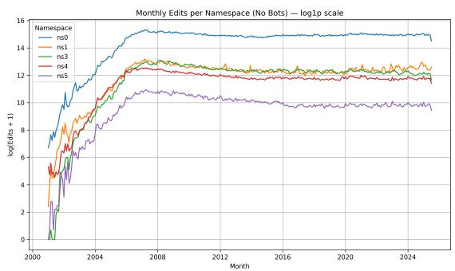
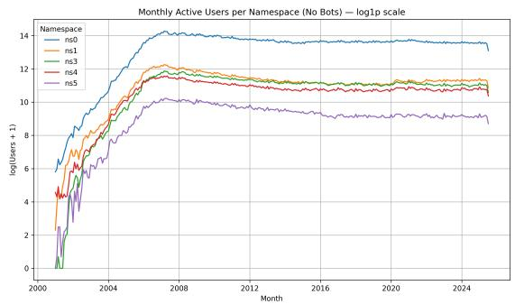
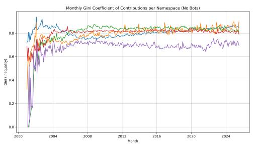
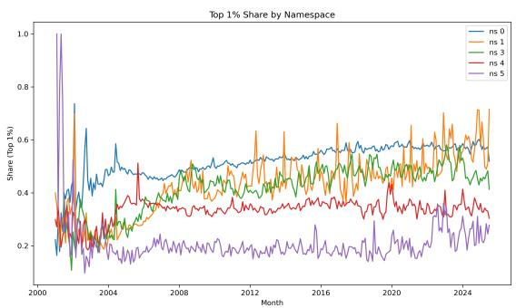
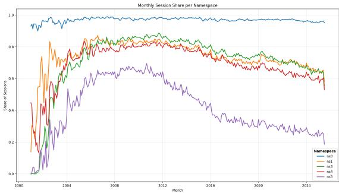
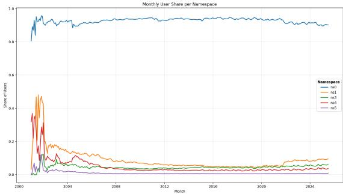
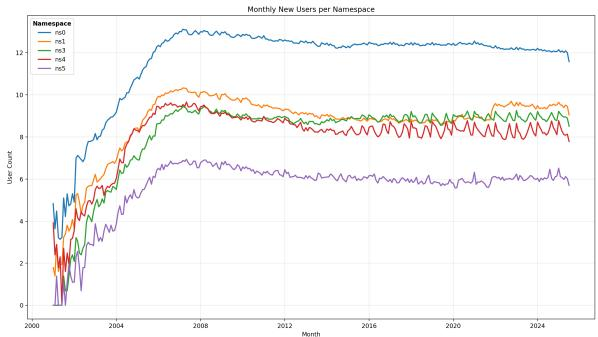
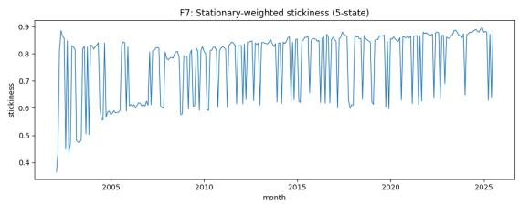
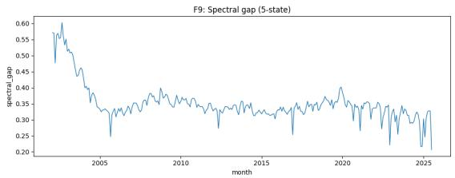
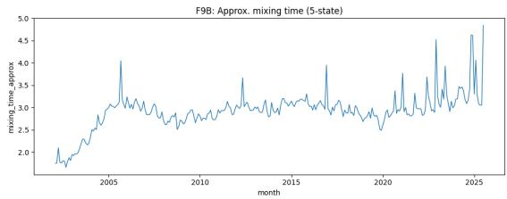

# The Evolution of Coordination in a Collective Intelligence System: 25 Years of English Wikipedia and the Emergence of Generative AI

NEAL REEVES, King’s College London, United Kingdom

MAJA ŚWIECZKOWSKA, King’s College London, United Kingdom

AMY RECHKEMMER, King’s College London, United Kingdom

ELENA SIMPERL, King’s College London, United Kingdom

English Wikipedia is one of the largest examples of collective intelligence on the Web, sustained not only by article production but also by volunteer coordination and governance. While prior research has examined coordination work in Wikipedia, less attention has been paid to how participation in these spaces has evolved over time. Drawing on a longitudinal analysis spanning nearly 25 years of English Wikipedia, we examine editing patterns across five namespaces covering content, discussion, and governance. We find that participation in coordination spaces has declined relative to content production, particularly in governance areas, with a shrinking core of editors performing an increasing share of this work. Using Markov-based session metrics, we also find that editing has become more specialised, with editors moving less frequently between namespaces. Motivated by recent governance debates around generativ AI, we conclude by investigating whether the availability of LLMs has altered these long-term trends. While short-term changes are visible, we find little evidence that generative AI fundamentally changed existing trajectories of coordination and participation.

CCS Concepts: • Human-centered computing → Empirical studies in HCI; Empirical studies in collaborative and social computing; Wikis.

Additional Key Words and Phrases: Wikipedia, Longitudinal Analysis, Articulation Work, LLMs, Markov Metrics

## ACM Reference Format:

Neal Reeves, Maja Świeczkowska, Amy Rechkemmer, and Elena Simperl. 2025. The Evolution of Coordination in a Collective Intelligence System: 25 Years of English Wikipedia and the Emergence of Generative AI. 1, 1 (September 2025), 16 pages. https: //doi.org/XXXXXXX.XXXXXXX

## 1 Introduction

Wikipedia is one of the largest examples of human collaborative efort on the Internet with over 65 million articles 1 in over 340 languages 2 as of 2025. Founded in 2001 on the principle that “anyone can edit” content [44], Wikipedia is maintained by a dedicated volunteer user base [44]. As well as serving as a crucial information gathering resource, prior research has highlighted the important role that Wikipedia content plays in other online peer-production communities [42]. Moreover, Wikipedia’s importance to web infrastructure and role as a “gateway to the web” have been well documented [30], and the platform is now seen as a case study of “good faith collaboration” in online spaces [32].

Wikipedia’s collaborative eforts can be classified as either direct or indirect coordination, with both forms contributing to the success of the platform. This coordination takes place across various environments for engagement, known as namespaces, that serve diferent purposes and allow for coordination in diferent ways. Within the main article editing namespace, for example, indirect coordination can be found in the form of stigmergy [1]. This is shown through increased engagement as editors are driven to directly contribute to the content – or digital traces – provided by others [47]. Meanwhile in other namespaces, direct coordination takes place through talk pages of editor discussions regarding articles and governance of Wikipedia as a whole. These discussions often represent editing suggestions [2], playing a crucial role in guiding and shaping article content. As such, these are often classified as a form of articulation work3 on the platform. Though not directly contributing to article content, articulation work on Wikipedia is considered a valuable, yet under-appreciated service by editors [23], and it has been found to contribute positively to article quality [7].

Despite the importance of this coordination layer, we know relatively little about how it has changed as English Wikipedia has matured. Recent research has highlighted the lack of longitudinal analyses exploring the evolution of Wikipedia’s coordination activities [34]. While Wikipedia’s declining user base is well documented, what this means for articulation and coordination work – as well as how the editing community has responded to it – is less clear [38]. A further question is how this coordination work has evolved in response to changes in the platform. Among the develop ments in Wikipedia in recent years, the emergence of Large Language Models (LLMs) is among the most consequential, contributing to the transformation of content and user engagement [27, 33]. Concerns surrounding editor engagement on the platform have prompted discussions about the ways in which LLM usage could impact the relationships within the closely collaborative environment, highlighting that writing bots may decrease contributions [43], which could have downstream efects across namespaces. Editors have engaged in a long and at times heated series of discussions around the use of LLM content in Wikipedia, culminating with the decision to block such content from English Wikipedia in March 20264.

To that end, we present – to our knowledge – the first longitudinal evaluation of Wikipedia engagement across five namespaces covering main article editing, coordinated collaboration and governance. We characterise these namespaces as articulation spaces [3] where direct and indirect coordination of work takes place.

We frame our evaluation around the following research questions:

(1) How has the scale of coordination changed relative to content editing over Wikipedia’s history?

(2) How do session-level editing behaviours reveal specialisation and transitions across collaboration spaces?

(3) How has the emergence of LLMs reshaped engagement in articulation spaces compared to content spaces?

By considering article editing patterns as edit sessions, we explore how the relationship between engagement in diferent namespaces has evolved, as well as how editors have transitioned within and between namespaces over almost 25 years of Wikipedia. Additionally, by using an Interrupted Time Series Diference-in-Diferences approach, we explore how engagement in coordination namespaces has changed relative to engagement in the main article namespace following the release of ChatGPT on October the 31st 2022.

The Evolution of Coordination in a Collective Intelligence System: 25 Years of English Wikipedia and the Emergence of Generative AI 3

## 2 Related Work

In this section, we outline prior research across three key topics: coordination in Wikipedia, Wikipedia engagement, and the impact of LLMs on Wikipedia.

## 2.1 Articulation Work in Online Spaces

Articulation work describes the meta-activities that facilitate the functionality of socio-technical systems [19]. This work is typically characterised as “invisible” labour [13] that is necessary for moderating and managing content [29]. Findings from virtual Citizen Science communities have highlighted the important role that recognition can play in motivating continued participation in both articulation and core work [4].

We note work which has focused on Wikipedia moderation and articulation tasks. Tran et al. [40] explored prepublication moderation of Wikipedia articles across 17 language editions and found only a moderate impact on engagement. Houtti et al. [17] explored discussions and methods for prioritising and evaluating Wikipedia article through namespace discussions. These methods contribute to directing and coordinating editor efort, but fall prey to tensions between individual and collective priorities. Im et al. [20] analysed 7,316 Wikipedia Requests for Comments (RfCs) as a key form of governance decision-making. Their findings suggest that many RfCs are less efective than they could be due to editors lacking confidence in closing and acting on these requests.

While these works all provide insight into coordination work within Wikipedia, they each focus on specific subtypes of coordination. We build on this existing body of work by taking a broader, longitudinal lens and exploring the relationship between coordination namespaces and overall edit activity over time.

## 2.2 Coordination on Wikipedia

Wikipedia’s role as a dispersed knowledge repository has prompted eforts to study the ways in which users coordinate work. Stigmergic collaboration has been examined using clustering to visualise where editors are ’excited’ by each other’s contributions and return to build on them in the future [47]. Both Zheng et al. [47] and Crowston and Rezgui [7] demonstrate the improvement of article quality in environments where stigmergic collaboration was high. Thi form of collaboration has also been seen to provoke opinion clashes, leading to edit wars, where editors overwrite other user’s edits to submit their version of a change to an article [6]. The dynamic of these edit wars has been researched by looking at revision histories of notable controversial articles and their number of edits, reverts per revision [15], and amount of content removed [6].

Although direct collaboration through talk pages linked to articles has shown a smaller increase in quality compared to stigmergic collaboration [7], clustering articles based on quality and using metrics measuring explicit and implicit collaboration [45] revealed that higher quality article pages often had active talk pages, noting the importance of explicit collaboration further down the life cycle of an article. A mixed methods approach to studying the Wikiprojects pages pointed out that projects with higher relationships, measured by the amount of messages, often signified higher quality end products within those projects [36]. Network analysis of contributors on both low and high quality articles also revealed high quality articles contain more nodes with more than one connection to other author nodes [10]. Although the form of collaboration is not explicit, the relationship between close collaboration and article quality is clear.

## 2.3 Wikipedia Editor Engagement

Lanamäki and Lindman [24] performed a longitudinal analysis of group formation and behaviours among Wikipedia editors, while Das et al. [9] performed a longitudinal evaluation of quality change in Wikipedia articles finding that 50% of all articles experience no long-term improvement in quality. Similar to our focus on Wikipedia change over time, Matei and Britt [28] analysed how Wikipedia had evolved, identifying key trends and distinct stages in this evolution. However, we note that each of these sources focuses largely on the main article namespace. Our work provides further insight into Wikipedia’s evolution by surfacing the relationship between article editing and coordination work as wel as exploring how use of these namespaces has changed over time.

## 2.4 The Impact of LLMs on Wikipedia

Page views analysed through Diference-in-Diferences methods [27, 37], loosely suggest a decrease for articles after the release of ChatGPT. Pages classified as having similar outputs to ChatGPT often experienced a decrease, compared to pages with dissimilar outputs [27]. Both studies suggested further investigation to solidify the results, giving the opportunity for analysis of these metrics utilising diferent methodologies. In addition, Huang et al. [18] analysed page views across diferent topics on Wikipedia such as Art and Computer Science, revealing minor recent drops in views across some scientific topics, however, noting that the direct impact of LLMs is still uncertain. A feedback mode was suggested that links viewing and contribution to Wikipedia’s asset value and search trends [43], identifying the increase in non-human viewers and editors, predicting their further increase post the mainstream use of LLMs for content generation.

Interviews with Wikipedia editors and domain experts involved with Wikimedia, have suggested that content generation tools may improve productivity, but also proliferate misinformation [11] and threaten Wikipedia’s collaborative environment [41]. Such mixed results are also reflected in community participation [48], where LLMs lower entry barriers for new editors while at the same time raising the standards of contributions. These outcomes prompt further research into the influence of LLMs on Wikipedia’s collaborative ecosystem, to understand how editor behaviour has changed since, and the evolving balance of work on the platform

## 3 Data and Methods

## 3.1 Data

To perform our analysis, we used Wikipedia dump files consisting of a total of 18,241,443,327 edits made across the entire lifespan of the English Wikipedia starting on the 21st of January 2001 and ending on the 21st of July 2025.

## 3.2 User Processing and Bots

As well as human users, Wikipedia has relied heavily on the engagement of bots which support editors by completing tasks ranging from fixing and protecting articles to generating article content [46]. Bots make approximately 15% of al Wikipedia contributions although a small number of bots make disproportionately large numbers of edits [34]. Their inclusion has been noted to dramatically distort analyses of human edit behaviours [16].

To identify bots we used four sources:

(1) The user-groups dump made available by the Wikimedia Foundation;

(2) The former user-groups dump;

Manuscript submitted to ACM

The Evolution of Coordination in a Collective Intelligence System: 25 Years of English Wikipedia and the Emergence of Generative AI 5

(3) A list of unflagged bots maintained by Wikipedia users5;

(4) The Wikipedia category “All Wikipedia Bots”6.

We used the Wikipedia SQL instance7 to convert usernames to user IDs. We recognise this list is unlikely to be exhaustive and we also noted discrepancies in resources. For example, while 2,164 bots are listed on the Wikipedia page for the “All Wikipedia Bots” category, only 1,710 user IDs could be retrieved from the system, perhaps because some had been exhausted or because accounts had not visited English Wikipedia.

## 3.3 Session Definition

To identify edit sessions, we grouped edits in chronological order for each user. We grouped edits into sessions with a new session determined to start when the period between edits exceeded 1 hour in line with prior work by Geiger and Halfaker [12]. Edit sessions are reported based on the date and time of the first edit in a session in case of sessions spanning boundaries between months or years. To identify edit sessions, we required indications of Wikipedia users and therefore removed a total of 233,029,000 anonymous submissions representing 1.28% of all edits.

## 3.4 Namespace Selection

Wikipedia features many diverse namespaces8. For this analysis, we focus on the relationship between main article edits (namespace 0) and the most commonly used coordination and governance spaces as summarised in Table 1. For brevity and clarity, we refer to ns 4 as governance and ns 5 as governance discussion as these largely reflect the main purpose of these spaces.

Table 1. Namespaces included in our analysis.
<table><tr><td>Namespace</td><td>ID</td><td>Role in analysis</td><td>Purpose</td></tr><tr><td>Main</td><td>0</td><td>Content</td><td>Encyclopaedic articles</td></tr><tr><td>Talk</td><td>1</td><td>Articulation</td><td>Discussion of individual articles</td></tr><tr><td>User talk</td><td>3</td><td>Articulation</td><td>Communication between editors</td></tr><tr><td>Project</td><td>4</td><td>Governance</td><td>Policies, guidelines, Requests for Comment, WikiProjects</td></tr><tr><td>Project talk</td><td>5</td><td>Governance discussion</td><td>Discussion of policies and project pages</td></tr></table>

We exclude namespace 2 (user pages) as these pages include a sandbox functionality intended to allow editors to learn how to update Wikipedia. Unlike other namespaces, many edits are therefore not intended to be public-facing. Remaining namespaces primarily support technical infrastructure or functionality rather than coordinating editing work and were therefore deemed to be outside the scope of this research.

## 3.5 Analysis

3.5.1 Gini Coeficient. The Gini Coeficient is a measure of resource inequality that can be understood as the percentage inequality in the share of a resource (in our case, edits) in a population (in our case, Wikipedia editors) [5]. The higher the coeficient value, the greater the inequality in the system such that 0 represents perfect equality and 1 represents perfect inequality. We calculate this metric using the following formula:

$$
G \ = \ { \frac { \sum _ { i = 1 } ^ { n } \sum _ { j = 1 } ^ { n } \left| x _ { i } - x _ { j } \right| } { 2 n ^ { 2 } { \bar { x } } } }
$$

Where $x _ { i }$ represents the observed values $( { \mathrm { i . e . } }$ , edits per user), �¯ is the mean and � is the number of observations $( { \mathrm { i . e . } }$ number of users).

3.5.2 Session Level Markov Metrics. The questions we pose in $\mathrm { R Q 2 }$ are properties of transitions as opposed to edit volumes. Factors such as whether editors move freely between content, discussion and governance activities or remain consigned to a single namespace are largely invisible to edit counts. Instead, they require consideration of the extent to which and order in which namespaces are visited. To capture this, we operationalise edit sessions as a sequence of namespace states and analyse the resulting transition structure. In contrast to prior work using focused at the whole session level (e.g., [12]), we focus on analysing the within-session sequence of transitions.

We operationalise edit sessions as Markov chains9 where each edit in a session corresponds to a state in the chain. From these chains, we calculate three metrics: stationary-weighted self-transition probability, spectral gap and mixing time.

For each metric, $\{ X _ { t } \} _ { t \ge 0 }$ represents a finite Markov chain, where the state space is represented by $s$ and the transition matrix is $P = ( p _ { i j } )$ , where $p _ { i j } = \operatorname* { P r } ( X _ { t + 1 } = j \mid X _ { t } = i )$ . � denotes the stationary distribution of the chain.

Stationary-Weighted Self-Transition Probability. . This metric describes the probability that the chain will remain in the same state upon transition (i.e., that a user will continue to edit within the same namespace). For conciseness, we describe this metric using the term “stickiness” to represent how a user may get ‘stuck’ within a given namespace during edit sessions. We calculate this probability using the formula:

$$
P r o b a b i l i t y = \sum _ { i \in S } \pi _ { i } \ : p _ { i i } .
$$

Spectral Gap. The spectral gap is a measure of difusion within a system and represents the time taken to converge to the stationary distribution. In the case of our analysis, this represents the time taken for a chain of edits to converge with the longer-term distribution of edits across namespaces. The larger the spectral gap, the faster the convergence towards the stationary distribution. We calculate the spectral gap using:

$$
\gamma ~ = ~ 1 - \left| \lambda _ { 2 } \right|
$$

Where $\lambda _ { 2 }$ represents the second largest eigenvalue of the transition matrix P.

Mixing Time. The mixing time $\tau ( \varepsilon )$ is the lowest (or first) time t at which the distribution of a chain starting from any initial state i is below the total variation distance � of the stationary distribution �. In essence, the mixing time represents the number of transitions in the chain before the chain aligns with the long-term distribution of the overall state space (regardless of starting state). In our case, this represents the number of edits within a session before the session can be considered to reflect the overall distribution of namespace activity (regardless of the namespace in which a user starts). We calculate this metric using the formula:

$$
\tau ( \varepsilon ) \ = \ \operatorname* { m i n } \biggl \{ t \ : \ \operatorname* { m a x } _ { i \in S } \left\| P ^ { t } ( i , \cdot ) - \pi \right\| _ { \mathrm { T V } } \leq \varepsilon \biggr \}
$$

The Evolution of Coordination in a Collective Intelligence System: 25 Years of English Wikipedia and the Emergence of Generative AI 7

3.5.3 Interrupted Time-Series. To calculate the impact that the release of ChatGPT may have had on engagement across namespaces in Wikipedia, we use two complementary Diference-in-Diferences (DiD) approaches. We evaluate four metrics designed to understand impacts on engagement: edit counts, editor counts, new user counts and share of edit sessions. For edit counts, editor counts and new users, we perform a logarithmic transformation of $\log ( Y _ { i t } + 1 )$ where Y is the monthly outcome for namespace � in month �. This transformation is intended to allow comparison between namespaces with otherwise highly diverse levels of participation. We perform no transformation for edit session shares as these are already relative percentages.

We centre time at the intervention month which we define as December 2022 following the launch of ChatGPT on the 30th of November 2022. We define ��� $\scriptstyle \cdot 0 _ { t } = t - t _ { 0 }$ such that the intervention is a dummy variable 0 where ����0� is less than 0 and 1 where it is 0 or more. Based on this, in November 2022, ����0 is -1 and December 2022 has ����0 of 0.

Level DiD-ITS. To capture the immediate shock or change that the release of ChatGPT may have had on Wikipedia engagement, we fit the following model:

$$
\begin{array} { l } { { { \cal Y } _ { i t } ^ { * } \ = \ \alpha + \beta _ { 1 } \ \mathrm { t i } \mathrm { m } { \Theta } \theta _ { t } + \beta _ { 2 } \ \mathrm { i } \mathrm { n t e r v e n t ~ i } \mathsf { o n } _ { t } + \beta _ { 3 } \mathrm { p o s t t r e n d } _ { t } } } \\ { { \displaystyle \quad \quad + \sum _ { j \neq 0 } \gamma _ { j } \ 1 \big [ i = j \big ] + \sum _ { j \neq 0 } \delta _ { j } \ 1 \big [ i = j \big ] \cdot \mathrm { i } \mathrm { n t e r v e n t i o n } _ { t } } } \\ { { \displaystyle \quad \quad + \sum _ { m = 2 } ^ { 1 2 } \mu _ { m } \ { \bf 1 } \big [ \mathrm { m o n t h } = m \big ] + { \bf X } _ { i t } ^ { \top } \theta + \varepsilon _ { i t } } } \end{array}
$$

Where $1 [ i = j ]$ are namespace indicators with �=0 as the reference. We interpret $\beta _ { 2 }$ as the immediate change in the level of engagement for namespace 0 in December 2022 with $\delta _ { j }$ as the DiD level efect for a namespace � relative to the baseline namespace 0. For those inputs with logarithmic transformations, we report efect sizes by conversion through $\mathcal { I } _ { 0 } \Delta \approx 1 0 0 \big ( e ^ { \hat { \beta } } - 1 \big )$ . For session shares, coeficients are reported as percentage points.

First-diference Δ� DiD for long-term efects. To identify longer-term post-period efects and to allow for diferences between namespaces, we estimate a DiD model on the first diference of the transformed outputs using the following model:

$$
\Delta Y _ { i t } ^ { * } = \pi _ { 0 } + \pi _ { 1 } \mathrm { i n t e r v e n t i o n } _ { t } + \sum _ { j \neq 0 } \kappa _ { j } \mathbf { 1 } [ i = j ] + \sum _ { j \neq 0 } \lambda _ { j } \mathbf { 1 } [ i = j ] \cdot \mathrm { i n t e r v e n t i o n } _ { t } + \sum _ { m = 2 } ^ { 1 2 } \rho _ { m } \mathbf { 1 } [ \mathrm { m o n t h } = m ] + \Delta \mathbf { X } _ { i t } ^ { \top } \phi + u _ { i t }
$$

Where $\pi _ { 1 }$ is the post gradient - pre gradient for namespace 0 and $\lambda _ { j }$ is the additional change in the gradient observed for a namespace � relative to namespace 0. Once again, we report transformed measures through conversion per month and report gradient changes in percentage points per month.

## 4 Results

We detail each of our research questions in the order set out in the introduction. We begin by exploring how coordination has changed relative to article editing before exploring how behaviours and transitions at the edit session level reveal specialisation across Wikipedia. Finally, we present the results of our Diference-in-Diferences analysis to detail how LLMs are reshaping engagement in Wikipedia’s articulation spaces.

Manuscript submitted to ACM

4.1 RQ 1 – How has the scale of coordination changed relative to content editing over Wikipedia’s history?  
  
(a) Monthly Edits per Namespace

  
(b) Monthly Users per Namespace  
Fig. 1. Longitudinal Analysis of Edits (Left) and Users (Right) per Namespace

  
(a) Gini Coeficient of Monthly Contributions

  
(b) Share of Edits Made by Top 1% of Wikipedia Editors  
Fig. 2. Gini Coeficient and Share of Edits Made by Most Active Wikipedia Editors Each Month as a Proportion of Total Changes.

4.1.1 Edit Counts. Monthly edit counts for all namespaces can be seen in Figure 1a. Edit counts initially grew rapidly before reaching their peak around 2007. We calculated percentage changes based on the logarithm of edits (plus one) for each namespace. Article discussions experienced the lowest decline (-45.41%) followed by main namespace articles (-55.35%), namespace 4 (-67.81%), 3 (-76.67%) and the largest decline was seen in namespace 5 (-78.01%). On the whole, coordination namespaces have experienced a larger decline than main article edits, although the similar decline in namespace 1 and 0 suggests that the level of direct coordination required to maintain Wikipedia has remained largely consistent.

4.1.2 Active Users. Similarly to edit counts, monthly active user counts have declined across namespaces. This decline was lower in namespace 0 (-68.99%) followed by namespaces 4 (-69.90%), 3 (-72.76%), 1 (-74.97%) and 5 (-78.43%). We note a significant disparity in the rate of decline for users relative to edits in namespace 1. This would suggest that Manuscript submitted to ACM

The Evolution of Coordination in a Collective Intelligence System: 25 Years of English Wikipedia and the Emergence of Generative AI 9

although the number of users in these namespaces has fallen, they have taken on a greater volume of work and thereby partially mitigated a fall in edit counts.

4.1.3 Equality. Figure 2a shows the Gini Coeficient of contributions across namespaces each month, corresponding to the equality of edit counts across editors. On launch, the coeficient was low, with editing work distributed relatively evenly among editors. However, equality increased quickly reaching a peak of ∼0.94 (approaching perfect inequality) in 2002 for the main namespace edits. From 2005 onwards, coeficients have remained relatively stable at ∼0.8 for namespaces 0 through 4 and ∼0.7 for namespace 5. We further plotted the share of edits completed by the top 1% of active users in each namespace each month as shown in Figure 2. This has grown in all namespaces except for namespace 4, suggesting that the most active users have taken on increasing levels of editing and coordination work.

  
(a) Monthly Share of Sessions per Namespace

  
(b) Monthly Share of Active Users per Namespace  
Fig. 3. Monthly Share of Sessions (Left) and Active Users (Right) as Proportion of Total

4.1.4 Share ofSessions. Figure 3a details the share of sessions per month which involve edits to each namespace. Since sessions can involve multiple namespaces, shares do not sum to 1. Perhaps unsurprisingly, namespace 0 attracts the highest proportion of edit sessions and engagement in this namespace has remained consistent over time. However, only 99% of sessions involve edits to the main namespace, suggesting the existence (albeit rare) of edit sessions focused exclusively on other namespaces

The share of sessions involving namespaces outside of the main article space has fallen significantly over time. At their peak in 2011, the vast majority of sessions involved participation in the talk, user talk and governance namespaces (85%, 87% and 83%) with 67% of all sessions involving engagement in governance discussion. By 2025, this had fallen to 65%, 63% and 61% respectively with 25% of sessions involving engagement in governance discussion. Conversely, in namespace 0 the proportion of sessions fell from 99% to 96%.

4.1.5 Share of Active Users. Figure 3b shows the monthly share of active users for each namespace. As with the session shares, we see evidence of a decline in the share of active users who participate in each namespace. At their peak, talk, user talk and governance namespaces attracted engagement from approximately 10% of all active users (9.7%, 9.3% and 9.7% respectively) while governance discussions attracted 7% of active users. By June 2025, user talk attracted just 5.6% with 3.5% active in governance and 0.8% active in governance discussions. Talk participation somewhat avoided this decline, falling only slightly to 9.2% and actually increasing somewhat in the years following 2022.

  
Fig. 4. New Users per Namespace. We define New Users as Users Contributing to a Given Namespace in Their First Month of Wikipedia Editing

4.1.6 New Users. Finally, Figure 4 shows the number of new users contributing to each namespace over time. We define a new user as any user in their first month of Wikipedia editing regardless of namespace edited. New user counts have declined across all namespaces over time, although this has levelled out for all coordination namespaces and newcomer participation in talk has actually increased since early 2022. The rate of decline in new user participation has been greater in the main edit namespace. Nevertheless, we caution that our analysis considers only the edit paths of new users and accounts for neither the frequency nor length of time for which individuals contributed.

## 4.2 RQ 2 – How do session-level editing behaviours reveal specialisation and transitions across collaboration spaces?

To understand how edit patterns and transitions between Wikipedia namespaces have evolved over time, we plot and present Markov metrics. Since diferent namespaces launched on diferent dates, we report all metrics from the start of the second year of Wikipedia (January 2002) at which point all of the analysed namespaces had been created.

4.2.1 Self-Transition Probability. The ‘stickiness’ over time can be seen in Figure 5a. This metric has peaked in recen years reaching a high of 0.89 in November 2024. However, it is highly volatile and the probability has repeatedly fallen to approximately 0.6 throughout the lifespan of Wikipedia. Further analysis suggests that while this fall happens at least once a year, there is no consistency in the period between – or the months which – the observed fall. Periods where a fall is observed are typically fleeting and consist of just a single month, although a four month fall was observed between October 2017 and January 2018.

4.2.2 Spectral Gap. Figure 5b shows the spectral gap across all edit chains over time. Between 2006 and approximately 2019, the spectral gap remained relatively stable despite some volatility before declining sharply following a peak in 2020 aligning with the start of the global coronavirus pandemic. It has continued to fall since and reached its lowest ever point in July 2025.

4.2.3 Mixing Time. Figure 5c shows that the complementary mixing time has trended correspondingly higher, rising from under 2 months in the earliest days of Wikipedia to over 5 months in 2025. Taken together, these metrics suggest that edit sessions have become increasingly specialised following Wikipedia’s initial period of growth, reaching a broad equilibrium that held until 2020. This trend briefly reversed at the time of the coronavirus pandemic where Manuscript submitted to ACM

The Evolution of Coordination in a Collective Intelligence System: 25 Years of English Wikipedia and the Emergence of Generative AI 11

  
(a) Stationary-Weighted Self-Transition Probability (Stickiness) Over Time Across Edit Session Chains

  
(b) Spectral Gap Over Time Across Edit Session Chains

  
(c) Mixing Time Over Time Across Edit Session Chains  
Fig. 5. Markov Metrics for Edit Sessions Over Time

sessions became more generalist, perhaps reflecting increased coordination demands or more free time for editors, but specialisation has since resumed and intensified.

4.2.4 Implications. Our findings suggest that editing behaviours have become increasingly compartmentalised over time. Once editors enter a namespace, they are increasingly likely to remain there and when they do transition, they tend to do so in more predictable ways. Taken alongside our analysis of contribution equality, this suggests an editing ecosystem that is increasingly siloed and dominated by a small minority of editors.

## 4.3 RQ 3 – How has the emergence of LLMs reshaped engagement in articulation spaces compared to content spaces?

For research question three, we explored the impact that the availability and potential use of LLMs may have had on engagement across namespaces. Using a DiD analysis, we compare each namespace against namespace 0 (main content) as a baseline control and report all coeficients and statistical significance ratings accordingly.

4.3.1 Edit Counts. The release of ChatGPT was associated with an immediate reduction in monthly edit counts relative to namespace 0 in namespaces 4 (p<0.001; efect =-22%) and 5 (p<0.001; efect =-25%) with a very weakly statistically significant increase relative to the baseline in namespace 1 (p=0.033; efect =+10.8%). We find no evidence of a long-term trend in any of the namespaces. Model fit was relatively high for the Diference-in-Diferences model $\scriptstyle ( R ^ { 2 } = 0 . 8 2 7 )$ but much lower in the slope comparison $\scriptstyle \left( R ^ { 2 } = 0 . 0 8 1 \right)$ . This is typical for first diference models, but we can confidently conclude that we find no evidence of long-term changes.

4.3.2 Editors. Similar to edit counts, the release of ChatGPT was associated with an immediate reduction in monthly editor numbers relative to the baseline of namespace 0 in namespaces 4 (p=0.006; efect size=-12.9%) and 5 (p<0.001; efect size = -21.1%). Additionally, a very weakly statistically significant reduction was seen in namespace 1 (p=0.037;

efect size = -8.0%). When observing longer-term trends, however, we find no evidence of a statistically significant trend in any namespace. Model fit was relatively high for the Diference-in-Diferences model $( R ^ { 2 } { = } 0 . 8 2 )$ , while it was significantly lower for the slope comparison $( R ^ { 2 } { = } 0 . 1 1 )$ .

4.3.3 New Editors. New user counts grew significantly relative to namespace 0 in namespace 1 (p<0.001; efect $\mathrm { s i z e } { = } { + } 4 3 . 5 \% )$ and $\scriptstyle \left( \mathrm { p } < 0 . 0 0 1 ; \right.$ ; efect size=+52.9%). Conversely, a significant fall was seen in namespace 4 $\left( \mathrm { p { = } } 0 . 0 0 7 ; - 1 9 . 6 \% \right)$ and no statistically significant adjustment was observed in namespace 5. Once again, no long-term trend was observed beyond that of the baseline. Model fit was of a similar strength $( R ^ { 2 } { = } 0 . 8 6 9 ; 0 . 1 1 3 )$

4.3.4 Share of Sessions. We find evidence of a strong decline in the share of edit sessions which involved changes to each namespace. All namespaces saw a statistically significant reduction in edit share on the release of ChatGPT relative to namespace 0 (p<0.001; efect-size 1: -7.21%, 3: -5.32%, 4: -8.70% & 5: -16.62%). Only namespace 3 showed a statistically significant long-term change and this was weak $\scriptstyle ( \mathrm { p } = 0 . 0 4 1 ;$ efect-size=-0.63% per month). Model fit was weaker in comparison with other models $( R ^ { 2 } { = } 0 . 6 6 1 ; 0 . 0 2 3 )$ .

## 5 Discussion

## 5.1 Longitudinal Trends

Our analysis shows that the prevalence of talk and user talk coordination relative to article edits has remained broadly stable. Conversely, governance engagement has diminished (particularly discussion) and overall engagement in all namespace activities is on the decline. While this has been partially mitigated by an increased workload among the top 1% of editors, we also see a shift towards specialisation in collaborative activities across Wikipedia. Core contributors within namespaces are therefore increasingly assuming responsibility for governance, article maintenance or discussion co-ordination.

Prior research has highlighted the tendency of new users to spread their contributions across many namespaces and thereby potentially hasten their departure [31]. At the same time, contributions have become more centralised [14, 39] due to declining engagement as well as low newcomer retention. To some extent, then, this increased specialisation and reduction in efort across namespaces is to be expected.

Nevertheless, these trends matter for Wikipedia because they increase the potential vulnerability of its collaboration system. If core contributors choose to leave the platform, a large portion of work could be disrupted, placing additional pressure and workload to remaining users. This may lead to saturation of work in the community, taking attention away from certain coordination activities, reducing cross-boundary collaboration as contributors limit their attention to specific namespaces or areas of work. Prior evaluation of Indian-language Wikipedia communities has highlighted the challenges for engagement that can be caused by the reliance on a small community of users for governance [22]. The loss of editors not only reflects a loss of volunteer manpower, but also a loss of critical expertise and perspectives [8]. Even should editors choose not to leave, they may risk burn-out from the increasing workload, while the shrinking community of experienced editors in a namespace may lead to bottlenecks forming in decision making or oversight tasks.

This observation of a small core of users who take increasing responsibility for managing an ever growing coordination workload is not unique to Wikipedia. For example, moderators in the online community Reddit take on a high workload of predominantly invisible work with high levels of heterogeneity [26]. A similar phenomenon has been observed in open source software communities where most coordination tasks are experienced by a small core of participants [21]. Manuscript submitted to ACM

The Evolution of Coordination in a Collective Intelligence System: 25 Years of English Wikipedia and the Emergence of Generative AI 13

However, Wikipedia notably difers in that many user could engage in these processes – unlike in Reddit, there are no power dynamic restrictions that limit the pool who can coordinate and all tasks are visible to all users. Even so, we would expect these observations and implications to be applicable to other large scale peer-production communities beyond the Wikipedia context.

## 5.2 Namespace Transitions

Our findings suggest that engagement within and across namespaces has remained reasonably consistent for much of Wikipedia’s lifespan. While engagement has consistently fallen in all namespaces with the exception of namespace 3, this disparity was low, suggesting that the volume of articulation work and the coordination overheads associated with editing have largely remained consistent. Nevertheless, our findings suggest that on the whole, editors have become increasingly siloed within specific namespaces as Wikipedia has evolved.

One potential concern this surfaces is that decisions and suggestions from one namespace may fail to transition to other namespaces as the community of users who could act on them shrinks. For example, as previously noted, article talk pages are regularly used in English Wikipedia to gather and discuss suggested revisions to articles [2], but as Im et al. [20] have highlighted, the efectiveness of such discussions is limited by the failure of editors to close (and thereby act) on discussions. Choosing not to edit a namespace does not, of course, indicate that a user is not aware of it, but prior research suggests most users only choose to read the main namespace [34]. In essence, there is a risk that as the community becomes more specialised and siloed, it also becomes fragmented. This could negatively impact both Wikipedia’s growth and the quality of articles and further exacerbate the limited change in quality across article lifespans [9].

## 5.3 Impact of LLMs

While we found evidence of an immediate ‘shock’ upon the release of ChatGPT associated with a fall in engagement across namespaces, we found no evidence of long-term changes in engagement trends for articulation namespaces (beyond what might be expected based on changes in main article edits). Being purely quantitative and descriptive, our analysis does not specifically allow us to identify why such a shock might have been experienced. However, we note relevant observations from prior work focusing on the impact of LLMs on the main article namespace. Wagner and Jiang [43] found a significant relationship between Wikipedia readership and contributor levels, which may suggest that a fall in trafic coinciding with the release of ChatGPT could have diverted efort and attention away from Wikipedia While Reeves et al. [33] found no impact on page views at an aggregate level, a more nuanced evaluation by Lyu et al. [27] suggests greater impacts in newer pages than others as well as topic-related facts. Our analysis was by necessity topic-independent, largely due to the lack of a universal topic model covering diferent namespaces.

On the one hand, this can be seen as a positive for Wikipedia. While our use of namespace 0 as a control means we cannot comment specifically on any impact on article edits, our findings suggest that in the longer-term, editors have continued to contribute to articulation work in discussion and governance spaces at a broadly similar rate. Nevertheless, we caution that this interpretation assumes that the level of discussion and governance remained static following the launch of LLMs. There is ample scope for LLMs to have a negative impact on the quality of Wikipedia content through, for example, introducing false or unsourced claims into article edits [41].

Moreover, we highlight that impacts on individual namespaces appear to have been mixed. While namespace 1 experienced a relative increase in editing activity despite its fall in editor numbers, namespaces 4 and 5 experienced a much greater reduction in edits than their editor numbers. This is perhaps particularly surprising as in the wake of Manuscript submitted to ACM

ChatGPT’s release, we might expect a greater than usual focus on governance and defining policy. If the distribution of work beyond the main namespace has remained largely the same, then this might suggest that engagement in crucial correction or governance activities related to LLM use and content has either been overlooked or has drawn attention away from other namespace responsibilities.

## 5.4 Future Work

Our analysis opens several directions for future research. Firstly, since talk page use is highly language-dependent (see for example, [2]), future work could extend this work to other Wikipedia language editions. Similarly, our analysis focused only on quantiative measures and this could be extended through analysis of namespace content to further explore usage patterns.

Thirdly, future research could use interviews to explore user motivations in moving between namespaces. Finally, while we focused on what we viewed to be the most significant and relevant namespaces, future work could benefit from exploring additional namespaces and how they contribute to Wikipedia’s system of collaboration.

## 5.5 Limitations

We note four main limitations of our study. Firstly, while we have aimed to minimise the risk of bot contributions in our dataset, we recognise the risk that some bots may not be flagged or identified. Secondly, although only representing 1.28% of edits, the decision to exclude anonymous users may have influenced engagement dynamics. Thirdly, our operationalisation of edit sessions as Markov chains is subject to the Markov property, which assumes that the future state depends solely on the present state rather than the full history of past states. We believe that a first-order Markov chain is suficient to capture general transitions between namespaces, but note that higher-order chains may be more appropriate for analysing longer-range edit dynamics. Finally, although our definition of an edit session as one hour aligns with prior work (e.g., [12]), this may distort edits from lower intensity editors and future work could consider alternative session cut-of times.

## 6 Conclusion

In this paper, we provided a longitudinal analysis of almost 25 years of coordination in English Wikipedia. Our findings ofer a nuanced perspective on the balance between coordination and production work: on the one hand, participation in most namespaces has fallen relative to article edits with participation becoming more siloed and fragmented. On the other, we observe that a dedicated core of users has mitigated the impact of these changes. Moreover, despite a decreasing focus on coordination activities, we find that LLMs have had no significant long-term efects on the balance and trajectories of coordination and production. Nevertheless, we caution that our analysis was inherently quantitative, and we do not attempt to point to any specific root causes. Moreover, we did not consider impacts on accuracy, and we do not claim that all activity in the studied namespaces represents coordination or articulation work. Even so, we believe that our findings suggest a stable balance between coordination and production, albeit one that may be somewhat fragile in the longer-term

## References

[1] Ofer Arazy, Aron Lindberg, Shakked Lev, Kexian Wu, and Alex Yarovoy. 2020. Emergent Routines in Peer-Production: Examining the Temporal Evolution of Wikipedia’s Work Sequences. ACM Transactions on Social Computing 3, 1 (2020), 1–24.

Manuscript submitted to ACM

[2] Taryn Bipat, David W McDonald, and Mark Zachry. 2018. Do we all talk before we type? Understanding collaboration in Wikipedia language editions. In Proceedings ofthe 14th International Symposium on Open Collaboration. 1–11

[3] Alexander Boden, Frank Rosswog, Gunnar Stevens, and Volker Wulf. 2014. Articulation spaces: bridging the gap between formal and informal coordination. In Proceedings ofthe 17th ACM conference on Computer supported cooperative work & social computing. 1120–1130.

[4] Ashley Boone, Annabel Rothschild, Xander Koo, Grace Pfohl, Alyssa Sheehan, Betsy DiSalvo, Christopher A Le Dantec, and Carl DiSalvo. 2024 Reimagining meaningful data work through citizen science. Proceedings ofthe ACM on Human-Computer Interaction 8, CSCW2 (2024), 1–26.

[5] Michael T Catalano, Tanya L Leise, and Thomas J Pfaf. 2009. Measuring resource inequality: The Gini coeficient. Numeracy 2, 2 (2009), 4.

[6] Anamika Chhabra, Rishemjit Kaur, and SRS Iyengar. 2020. Dynamics of edit war sequences in Wikipedia. In Proceedings ofthe 16th Internationa symposium on open collaboration. 1–10.

[7] Kevin Crowston and Amira Rezgui. 2020. Efects of stigmergic and explicit coordination on Wikipedia article quality. In Proceedings ofthe Annual Hawaii International Conference on System Sciences

[8] Paramita Das, Bhanu Prakash Reddy Guda, Debajit Chakraborty, Soumya Sarkar, and Animesh Mukherjee. 2021. When expertise gone missing: Uncovering the loss of prolific contributors in Wikipedia. In International Conference on Asian Digital Libraries. Springer, 291–307.

[9] Paramita Das, Bhanu Prakash Reddy Guda, Sasi Bhushan Seelaboyina, Soumya Sarkar, and Animesh Mukherjee. 2022. Quality change: Norm or exception? Measurement, analysis and detection of quality change in Wikipedia. Proceedings of the ACM on Human-Computer Interaction 6, CSCW1 (2022), 1–36.

[10] Baptiste de La Robertie, Yoann Pitarch, and Olivier Teste. 2015. Measuring article quality in Wikipedia using the collaboration network. In Proceedings ofthe 2015 IEEE/ACM International Conference on Advances in Social Networks Analysis and Mining 2015. 464–471.

[11] Heather Ford and Michael Davis. [n. d.]. Implications of generative AI for knowledge integrity on Wikipedia. ([n. d.]).

[12] R Stuart Geiger and Aaron Halfaker. 2013. Using edit sessions to measure participation in Wikipedia. In Proceedings of the 2013 conference on Computer supported cooperative work. 861–870.

[13] Katarzyna Gruszka and Madeleine Böhm. 2022. Out of sight, out of mind?(In) visibility of/in platform-mediated work. new media & society 24, 8 (2022), 1852–1871.

[14] Aaron Halfaker, R Stuart Geiger, Jonathan T Morgan, and John Riedl. 2013. The rise and decline of an open collaboration system: How Wikipedia’s reaction to popularity is causing its decline. American behavioral scientist 57, 5 (2013), 664–688.

[15] Aaron Halfaker, Aniket Kittur, and John Riedl. 2011. Don’t bite the newbies: how reverts afect the quantity and quality of Wikipedia work. In Proceedings ofthe 7th international symposium on wikis and open collaboration. 163–172

[16] Andrew Hall, Loren Terveen, and Aaron Halfaker. 2018. Bot detection in wikidata using behavioral and other informal cues. Proceedings ofthe ACM on Human-Computer Interaction 2, CSCW (2018), 1–18

[17] Mo Houtti, Isaac Johnson, Joel Cepeda, Soumya Khandelwal, Aviral Bhatnagar, and Loren Terveen. 2022. " We Need a Woman in Music": Exploring Wikipedia’s Values on Article Priority. Proceedings ofthe ACM on Human-Computer Interaction 6, CSCW2 (2022), 1–28.

[18] Siming Huang, Yuliang Xu, Mingmeng Geng, Yao Wan, and Dongping Chen. 2025. Wikipedia in the Era of LLMs: Evolution and Risks. arXiv preprint arXiv:2503.02879 (2025).

[19] Linda Huber and Casey Pierce. 2023. Navigating the empty shell: the role of articulation work in platform structures. Journal ofComputer-Mediated Communication 28, 4 (2023).

[20] Jane Im, Amy X Zhang, Christopher J Schilling, and David Karger. 2018. Deliberation and resolution on wikipedia: A case study of requests for comments. Proceedings ofthe ACM on Human-Computer Interaction 2, CSCW (2018), 1–24

[21] Mitchell Joblin, Sven Apel, and Wolfgang Mauerer. 2017. Evolutionary trends of developer coordination: A network approach. Empirical Software Engineering 22, 4 (2017), 2050–2094.

[22] Sejal Khatri, Aaron Shaw, Sayamindu Dasgupta, and Benjamin Mako Hill. 2022. The social embeddedness of peer production: A comparative qualitative analysis of three Indian language Wikipedia editions. In Proceedings of the 2022 CHI Conference on Human Factors in Computing Systems. 1–18.

[23] Travis Kriplean, Ivan Beschastnikh, and David W McDonald. 2008. Articulations of wikiwork: uncovering valued work in wikipedia through barnstars. In Proceedings of the 2008 ACM conference on Computer supported cooperative work. 47–56.

[24] Arto Lanamäki and Juho Lindman. 2018. Latent groups in online communities: a longitudinal study in wikipedia. Computer Supported Cooperative Work (CSCW) 27, 1 (2018), 77–106.

[25] Charlotte P Lee and Drew Paine. 2015. From The matrix to a model of coordinated action (MoCA) A conceptual framework of and for CSCW. In Proceedings ofthe 18th ACM conference on computer supported cooperative work & social computing. 179–194.

[26] Hanlin Li, Brent Hecht, and Stevie Chancellor. 2022. All that’s happening behind the scenes: Putting the spotlight on volunteer moderator labor in reddit. In Proceedings ofthe International AAAI Conference on Web and Social Media, Vol. 16. 584–595.

[27] Liang Lyu, James Siderius, Hannah Li, Daron Acemoglu, Daniel Huttenlocher, and Asuman Ozdaglar. 2025. Wikipedia Contributions in the Wake of ChatGPT. In Companion Proceedings ofthe ACM on Web Conference 2025. 1176–1179.

[28] Sorin Adam Matei and Brian C Britt. 2017. Wikipedia Evolution: Trends and Phases. In Structural Diferentiation in Social Media: Adhocracy, Entropy, and the" 1% Efect". Springer, 125–142

[29] John Meluso, Amanda Casari, Katie McLaughlin, and Milo Z Trujillo. 2024. Invisible Labor in Open Source Software Ecosystems. arXiv preprint arXiv:2401.06889 (2024).

[30] Tiziano Piccardi, Miriam Redi, Giovanni Colavizza, and Robert West. 2021. On the Value of Wikipedia as a Gateway to the Web. In Proceedings ofthe Web Conference 2021. 249–260.

Manuscript submitted to ACM

[31] Xiangju Qin, Derek Greene, and Pádraig Cunningham. 2014. A latent space analysis of editor lifecycles in wikipedia. In International Workshop on Modeling Social Media. Springer, 46–69.

[32] Joseph Michael Reagle. 2010. Good faith collaboration: The culture ofWikipedia. MIT press.

[33] Neal Reeves, Wenjie Yin, and Elena Simperl. 2025. Exploring the impact of ChatGPT on Wikipedia engagement (To Appear). Collective Intelligence (2025).

[34] Yuqing Ren, Haifeng Zhang, and Robert E Kraut. 2023. How did they build the free encyclopedia? A literature review of collaboration and coordination among Wikipedia editors. ACM Transactions on Computer-Human Interaction 31, 1 (2023), 1–48.

[35] Sheldon M Ross. 2014. Introduction to probability models. Academic press.

[36] Agnieszka Rychwalska, Szymon Talaga, Karolina Ziembowicz, and Dariusz Jemielniak. 2021. Communication networks and group efectiveness: th case of English Wikipedia. arXiv preprint arXiv:2107.03506 (2021).

[37] Vivek Kumar Singh, Srikar Velichety, and Sen Li. 2024. Impact of Generative AI on the Value of Peer Produced Content-Evidence from Wikipedia (2024).

[38] C Estelle Smith, Bowen Yu, Anjali Srivastava, Aaron Halfaker, Loren Terveen, and Haiyi Zhu. 2020. Keeping community in the loop: Understanding wikipedia stakeholder values for machine learning-based systems. In Proceedings of the 2020 CHI Conference on Human Factors in Computing Systems. 1–14.

[39] Nathan TeBlunthuis, Aaron Shaw, and Benjamin Mako Hill. 2018. Revisiting" The rise and decline" in a population of peer production projects. In Proceedings ofthe 2018 CHI Conference on Human Factors in Computing Systems. 1–7.

[40] Chau Tran, Kaylea Champion, Benjamin Mako Hill, and Rachel Greenstadt. 2022. The risks, benefits, and consequences of prepublication moderation: Evidence from 17 Wikipedia language editions. Proceedings ofthe ACM on Human-Computer Interaction 6, CSCW2 (2022), 1–25.

[41] Matthew A Vetter, Jialei Jiang, and Zachary J McDowell. 2025. An endangered species: how LLMs threaten Wikipedia’s sustainability. AI & SOCIETY (2025), 1–14.

[42] Nicholas Vincent, Isaac Johnson, and Brent Hecht. 2018. Examining Wikipedia with a broader lens: Quantifying the value of Wikipedia’s relationship with other large-scale online communities. In Proceedings ofthe 2018 CHI Conference on Human Factors in Computing Systems. 1–13.

[43] Christian Wagner and Ling Jiang. 2025. Death by AI: Will large language models diminish Wikipedia? Journal ofthe Association for Information Science and Technology 76, 5 (2025), 743–751.

[44] Alex Yarovoy, Yiftach Nagar, Einat Minkov, and Ofer Arazy. 2020. Assessing the contribution of subject-matter experts to Wikipedia. ACM Transactions on Social Computing 3, 4 (2020), 1–36

[45] Haifeng Zhang, Yuqin Ren, and Robert E Kraut. 2020. Mining and Predicting Temporal Patterns in the Quality Evolution of Wikipedia Articles.. In HICSS. 1–10.

[46] Lei Zheng, Christopher M Albano, Neev M Vora, Feng Mai, and Jefrey V Nickerson. 2019. The roles bots play in Wikipedia. Proceedings ofthe ACM on Human-Computer Interaction 3, CSCW (2019), 1–20

[47] Lei Zheng, Feng Mai, Bei Yan, and Jefrey V Nickerson. 2023. Stigmergy in Open Collaboration: An Empirical Investigation Based on Wikipedia Journal ofManagement Information Systems 40, 3 (2023), 983–1008

[48] Moyan Zhou, Soobin Cho, and Loren Terveen. 2025. LLMs in Wikipedia: Investigating How LLMs Impact Participation in Knowledge Communities arXiv:2509.07819 [cs.HC] https://arxiv.org/abs/2509.07819

Received 15 June 2026