# little m: An AI Agent for Industrial Process Optimization

Yongchao Ye1 Xinyu He1 Dutliff Boshoff1 Way Kuo1,2 Lishuai Li1\* 1Department of Data Science, City University of Hong Kong, Hong Kong SAR, China 2Hong Kong Institute for Advanced Study, City University of Hong Kong {yongchao.ye, x.y.he, dboshoff2-c}@my.cityu.edu.hk {way, lishuai.li}@cityu.edu.hk

## Abstract

Manufacturing consumes one third of global energy and still has significant room for improvement in terms of energy efficiency. Optimal process control is essential for this purpose. However, synthesizing mathematical optimization models from messy, real-world industrial specifications requires bridging unstructured natural language and spatial diagrams with rigorous mathematical syntax. This poses a profound challenge for general-purpose Large Language Models (LLMs), which may introduce invalid constraints when tasked with modeling continuous multi-physics dynamics. To address this, we introduce little m, an AI agent designed to assist the formulation of industrial process control models. Combining a domain-specific knowledge repository with LLM-driven interaction, the proposed framework formulates real-world optimization problems as mathematical models. For systematic evaluation, we introduce the Industrial Process Control Benchmark (IPC-Bench), a novel multimodal dataset of 50 canonical scenarios requiring joint reasoning over text and process diagrams. Through comprehensive automated structural assessments and double-blind human evaluation, little m substantially outperforms state-of-the-art LLMs, generating semantically correct models. These evaluations assess formulation quality rather than solver feasibility, formal physical validity, or closed-loop industrial performance. The implementation of little m and the IPC-Bench dataset are available at https://github.com/yeyongchao/ process-modeling-benchmark.

## 1 Introduction

Large Language Models (LLMs) have demonstrated exceptional capabilities across general natural language tasks, driving interest in their application to complex scientific reasoning and mathematical auto-formalization (Zhang et al., 2024).

Within this scope, industrial process optimization has emerged as a formidable frontier for AI evaluation, given its critical importance to sectors such as energy, manufacturing, and pharmaceuticals (Olsson et al., 2023). Unlike basic arithmetic word problems or general code generation, solving realworld industrial problems requires translating unstructured text and spatial topologies into rigorous mathematical models governed by multi-physics phenomena and non-linear dynamics (Xu et al., 2024). Modeling such continuous systems demands a level of structural prediction and semantic grounding that challenges the inherent limits of purely autoregressive generation (Wu et al., 2025). For example, a useful formulation must distinguish decision variables from measurements and fixed parameters because these roles determine model interpretation.

Consequently, research has actively transitioned toward specialized LLM agents for Operations Research (OR), utilizing techniques like structured fine-tuning, multi-agent decomposition, and solverin-the-loop verification to synthesize complex logic (Jiang et al., 2025; Tran et al., 2025; Zhang and Luo, 2025). However, while these advanced frameworks show promise in general optimization tasks like logistics and linear programming, they expose critical vulnerabilities when applied to continuous multi-physics processes. Without explicit process grounding, monolithic LLMs may generate mathematically plausible but physically inconsistent constraints. Directly automating industrial modeling with these tools is difficult because the task is multimodal and layered with tacit physical heuristics, such as thermodynamic feasibility, that are rarely detailed in problem descriptions (Le et al., 2026; Qu et al., 2025).

Furthermore, existing AI-driven industrial solutions, including digital twins and control-theoretic foundation models, predominantly focus on simulation or parameter tuning within fixed infrastructure rather than the de novo synthesis of mathematical models from ambiguous intents (Tao et al., 2024; Maher, 2025). This gap is reflected in current benchmarks. Standard multimodal AI datasets often evaluate mathematical reasoning as purely abstract logic or static visual geometry (Huang et al., 2025a; Xiao et al., 2024). However, real-world industrial formulation requires explicit treatment of physical and operational constraints followed by engineering validation. This disparity motivates auditable AI architectures in which neural language models are coupled with structured domain knowledge and expose intermediate decisions for human review (Raspanti et al., 2025).

To overcome this fundamental barrier, we introduce little m, an AI agent designed to assist industrial process optimization model formulation. little m moves beyond the limitations of generalpurpose AI by integrating two distinct components: (1) A structured knowledge repository covering process-optimization directions, control strategies, modeling templates, and recurring constraint patterns; and (2) An LLM that serves as an interactive interface, structures user-provided information, retrieves relevant entries, and exposes intermediate outputs for review. Together, these components produce structured optimization models grounded in supplied process information and retrieved domain knowledge. In this work, we evaluate this grounded, multimodal architecture on IPC-Bench, which focuses on process-industry cases governed by physical mechanisms shared across continuousprocess sectors. Our primary contributions are:

• The architecture and implementation of little m, a knowledge-grounded assistant for industrial process control model formulation, combining domain-specific knowledge with LLM-driven interaction.

• The creation of Industrial Process Control Benchmark (IPC-Bench), an initial benchmark comprising 50 canonical, textbook-derived processindustry optimization scenarios. Unlike existing unimodal datasets, IPC-Bench requires reasoning over multimodal inputs to capture spatial and topological contexts.

• A comprehensive validation combining automated structural assessments with a double-blind human evaluation. Results show higher expert preference and better formulation quality than the evaluated Qwen3 and DeepSeek baselines.

## 2 Related Work

## 2.1 LLM Agents for Optimization and Operations Research

The application of Large Language Models (LLMs) to Operations Research (OR) has transitioned from elementary prompt engineering to sophisticated, agentic frameworks. To address the strict syntactical and logical demands of exact solvers, recent literature emphasizes structured fine-tuning (e.g., LLMOPT (Jiang et al., 2025)), modular decomposition (e.g., OptiMUS (AhmadiTeshnizi et al., 2023)), and multi-agent collaboration (e.g., Chainof-Experts (Xiao et al., 2024)). A notable paradigm shift is the adoption of closed-loop reasoning, which embeds optimization solvers into the training or deployment loop as objective verifiers to reinforce mathematically valid reasoning paths (Zhang and Luo, 2025; Chen et al., 2025). Despite these advances in general OR, industrial process control poses unique challenges due to its inherent reliance on non-linear continuous dynamics and differential equations (Fakih et al., 2024). While emerging frameworks like ControlAgent (Guo et al., 2024) and LLMPC (Maher, 2025) have integrated LLMs for control parameter tuning and high-level trajectory planning, a unified architecture capable of interactively eliciting physically grounded optimization formulations remains underexplored.

## 2.2 Benchmarking and Evaluation Paradigms

The development of optimization agents has necessitated specialized evaluation frameworks, a selection of which is compared in Table 1. Initial benchmarks, such as NL4OPT (Ramamonjison et al., 2022), established baselines for linear programming extraction. Subsequent datasets like IndustryOR (Huang et al., 2025a) and ComplexOR (Xiao et al., 2024) introduced large-scale logistics and scheduling scenarios. However, a significant benchmarking gap persists regarding industrial process control. Although datasets like MAMO (Huang et al., 2025b) include ordinary differential equations, they largely treat them as abstract mathematics rather than intersecting continuous physics with discrete operational constraints. Consequently, execution rates and semantic similarity capture useful aspects of formulation quality, but neither alone establishes physical validity or operational safety for deployment.

Table 1: Comparison of mathematical and optimization modeling benchmarks.
<table><tr><td>Benchmark</td><td>Domain / Problem Type</td><td>Input Modality</td><td>Output</td><td>Evaluation</td><td>Problems</td></tr><tr><td>ComplexOR (Xiao et al., 2024)</td><td>OR / MILP, LP</td><td>Text</td><td>Solver code bi/Python)</td><td>Execution-based: Objective vs ground truth</td><td>37</td></tr><tr><td>NL4OPT (Ramamonjison et al., 2022)</td><td>LP</td><td>Text</td><td>Designed template</td><td>Extraction/Generation: F1 &amp; syntax</td><td>1101</td></tr><tr><td>IndustryOR (Huang et al., 2025a)</td><td>Logistic &amp; scheduling / LP, MIP, NLP</td><td>Text + Tabular data</td><td>Math model, code</td><td>Execution-based: Involve hu- man experts</td><td>100</td></tr><tr><td>MAMO (Huang et al., 2025b)</td><td>ODEs, LP</td><td>Text</td><td>Solver code (Python)</td><td>Execution-based: Accuracy</td><td>211</td></tr><tr><td>GSM8K (Cobbe et al., 2021)</td><td>Arithmetic Word Problems</td><td>Text Text +</td><td>Numerical Value</td><td>Accuracy: exact match</td><td>8500</td></tr><tr><td>IPC-Bench (Ours)</td><td>Process Control</td><td>Process Dia- grams</td><td>Math Model</td><td>Semantic &amp; Structural Grounding</td><td>50</td></tr></table>

## 2.3 AI-Assisted Process Optimization

Process systems engineering connects process modeling and design with operations optimization and control (Grossmann and Harjunkoski, 2019). At the operational level, RTO computes economic targets using updated steady-state models, whereas MPC performs finite-horizon dynamic optimization for constrained control (Darby et al., 2011). Industrial AI complements these model-based methods through digital twins, physics-informed learning, and process-industry foundation-model architectures (Tao et al., 2024; Liu et al., 2025; Ren et al., 2025). Recent AI-assisted engineering systems address control-structure prediction from process diagrams, externally verified PLC code generation, and computation-in-the-loop controller design, bringing language models closer to concrete engineering artifacts (Fakih et al., 2024; Guo et al., 2024). Other frameworks use structured prompting, engineering tools, or process simulators to support flowsheet analysis, simulation, and optimization through iterative task decomposition (Tao et al., 2025; Zeng et al., 2025). Together, these studies reflect a broader shift toward structured and toolsupported engineering assistance.

## 3 Preliminary

We define the task of automated industrial modeling as a conditional generation problem mapping a multimodal context X to a formal optimization model M. The input space $\mathcal { X } = \{ D _ { \mathrm { t e x t } } , D _ { \mathrm { i m g } } \}$ encapsulates the unstructured engineering intent, where $D _ { \mathrm { t e x t } }$ comprises natural language narratives detailing operational goals and $D _ { \mathrm { i m g } }$ denotes visual process topologies. The target output is a structured triplet $\mathcal { M } = ( \mathcal { V } , \mathcal { F } , \mathcal { C } )$ , representing a canonical optimization model. Here, V defines the set of decision variables grounded in physical domains (e.g., mass flows $f \in \mathbb { R } _ { \geq 0 }$ , binary actuation states $z ~ \in ~ \{ 0 , 1 \} )$ ; F represents the scalar or vectorvalued objective function (e.g., minimization of energy cost); and C constitutes the set of equality and inequality constraints representing mass/energy balances, thermodynamic limits, and safety interlocks.

This task differs from standard code generation because process connectivity and physical relations must be represented explicitly. For example, a candidate constraint set should respect the connectivity graph in $D _ { \mathrm { i m g } }$ and include applicable conservation relations such as $\sum m _ { i n } = \sum m _ { o u t }$ at a steadystate node. We treat these as formulation requirements to be audited, not as properties formally guaranteed by the generator. The agent approximates the expert mapping $f ^ { * } : \mathcal { X } \to \mathcal { M }$ and returns a candidate specification for review and subsequent numerical implementation. Our evaluation compares V, F, and C with expert-written references using structural metrics and expert judgment. It does not execute the model in a solver or validate closed-loop operation.

## 4 Methodology

## 4.1 System Architecture

The design of little m is illustrated in Fig. 1. Instead of attempting a direct, single-step translation from X to M, we implement a hierarchical cognitive workflow that mirrors the standard project life cycle of human process engineers. The motivation for this multi-stage design is twofold. First, industrial problem statements are inherently ambiguous and often rely on “tacit knowledge” that is not explicitly stated in the prompt, e.g., assuming a tank cannot overflow. A direct translation model frequently hallucinates invalid constraints or misses these implicit safety bounds. Second, real-world engineering projects invariably follow a sequential structure: engineers first validate their understanding of the process flow, then determine the control strategy, and only then derive the specific equations. This structure not only improves model accuracy but also facilitates the user dynamic adaptation loop, allowing domain experts to intervene and refine the strategy before the complex mathematical syntax is generated.

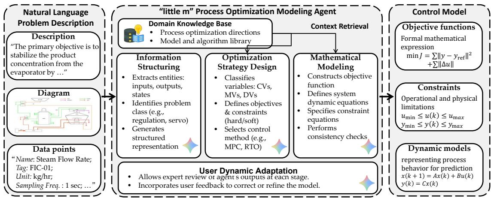  
Figure 1: Architecture of little m. The system employs a three-stage cognitive pipeline driven by an LLM-RAG core to ground optimization synthesis in domain-specific knowledge.

The reasoning engine operates through a strictly sequential three-stage pipeline. The initial stage, Information Structuring, functions as an intake filter to handle the ambiguity of raw engineering intent. Then, in Strategy Design, the agent acts as a lead engineer identifying optimization opportunities. The final stage of the reasoning core, Mathematical Modeling, translates this confirmed strategy into a formal formulation M.

Information Structuring The initial stage, Information Structuring, involves gathering and organizing all relevant information provided by the user to handle the ambiguity of raw engineering intent. We formulate this stage as a state extraction function $S _ { 0 } = \Phi _ { e x t r a c t } ( \mathcal { X } )$ that compresses the raw multimodal input X into a structured representation. The primary input for this stage includes textual narratives of the production process and visual functional diagrams. Relying on this user-provided information, little m structures the raw data into a coherent summary $S _ { 0 }$ , capturing key steps, equipment types, and operational modes. A human-in-the-loop checkpoint concludes this stage. Defining a user acknowledgement function $V _ { u s e r } ( s _ { t } ) \in \{ 0 , 1 \}$ , the transition to the next state requires $V _ { u s e r } ( S _ { 0 } ) = 1$ . This exposes omissions for correction but does not certify that $S _ { 0 }$ is complete or correct.

Strategy Design Based on the structured state $S _ { 0 }$ , the user’s objective, and retrieved knowledge $K _ { r e t }$ , Strategy Design generates a high-level control strategy $Z = G _ { \theta } ( S _ { 0 } , K _ { r e t } )$ . Here, little m identifies optimization opportunities and formulates a high-level control strategy. The workflow invokes an LLM to generate the strategy and passes the structured output to the mathematical modeling stage. The strategy specifies the optimization goal, model class, primary decision variables, information requirements, and candidate constraint families. The transition to mathematical formulation occurs after the user acknowledges Z. This gate provides an opportunity for correction rather than a mathematical restriction on hallucination.

Mathematical Modeling In the final stage, Mathematical Modeling, little m translates the acknowledged strategy into a formal mathematical model. The generation step is $\mathcal { M } ~ = ~ H _ { \theta } ( S _ { 0 } , Z , K _ { r e t } )$ showing that the formulation is conditioned on the structured state, strategy, and retrieved knowledge. The output separates objective functions F, decision variables V, fixed parameters, and constraints C, with a data-source field for each symbol. The final checkpoints are structured review artifacts. They ask whether each diagram connection is represented, units and symbol definitions are consistent, required operating bounds are present, and the proposed model class is compatible with a named solver family. They improve auditability but do not execute the candidate model, prove topological integrity, or establish numerical feasibility.

Iterative Refinement and Adaptation The final stage introduces the critical feedback loop that distinguishes little m from static translation tools. Recognizing that the initial model may still misalign with the user’s unstated intent or tacit knowledge, this stage formalizes the Interactive Elicitation process. The system presents the generated model to the domain expert for semantic review. If discrepancies are identified—for example, if a constraint violates a specific start-up procedure, the agent triggers a multi-turn dialogue. This dialogue is not merely a chat but a targeted investigation where the agent proposes hypotheses and the user provides corrections. These corrections are fed back into the system, propagates changes through the formulation layers. This cycle continues until the user accepts the candidate for subsequent engineering and numerical validation.

Domain Knowledge Grounding To support this reasoning process, the agent is grounded by a domain-specific retrieval system that bridges the gap between general linguistic competence and specific industrial expertise. We organize the curated knowledge base as self-contained problem-path entries rather than isolated algorithm descriptions. Each entry connects an observable industrial symptom or operating context to a primary optimization objective, conditional candidate methods, required process information, reusable mathematical and constraint patterns, and applicability boundaries. The repository combines general pathways that recur across process industries with contextualized entries distilled from our industrial project experience. A symptom is treated as a retrieval anchor rather than a confirmed root cause, and a candidate method is proposed together with the conditions and information needed to justify its use. Technically, a query-augmentation module maps the current process context and objective to relevant entries through vector search, and a crossencoder reranker selects the context $K _ { r e t }$ supplied to the LLM. The retrieved entries support Strategy Design with candidate targets, methods, and missing-information cues, and support Mathematical Modeling with reusable formulation patterns and explicit boundaries. They provide contextual engineering guidance rather than numerical plant models, automatically enforceable physical laws, or solver-level validation; further details are provided in Sec. B.

## 4.2 Implementation

We implemented a modular prompting strategy governed by finite-state workflow logic with roleconstrained instructions for each stage: Information Structuring employs gap analysis, Strategy Design formulates a high-level control strategy with user confirmation, and Mathematical Formulation imposes data-variable mapping rules that request a source for every symbol. The system uses Gemini 2.5 Pro as the reasoning engine, with BAAI’s bgem3 for embeddings and bge-reranker-v2-m3 for retrieval precision. Detailed prompt templates are provided in Sec. F, and an end-to-end trace of the intermediate representations is shown in Sec. E.

## 5 IPC-Bench Dataset

To evaluate formulation on representative processindustry problems, we constructed IPC-Bench from textbooks in process control and chemical engineering optimization (Edgar et al., 2001; Seborg et al., 2016; LeBlanc and Coughanowr, 2009; Kookos, 2022; Biegler, 2010; Rao, 2010; Agachi et al., 2017; Ingham et al., 2008). We selected scenarios involving features such as nonlinear constraints, dynamic relations, process diagrams, and mixedinteger variables. As highlighted in Table 1, IPC-Bench evaluates semantic and structural agreement of mathematical formulations synthesized from text and process diagrams. Although IPC-Bench is an initial benchmark of 50 cases, its core unit operations involve thermodynamics, fluid mechanics, reaction kinetics, and mass and heat transfer, which are physical mechanisms shared across continuousprocess sectors such as metallurgy, petrochemicals, pharmaceuticals, and food processing.

Dataset Characteristics The dataset consists of 50 cases covering reaction, separation, thermal, and utility/scheduling scenarios, from utility cost tracking to reactor yield maximization. The dataset presents varying complexity: most problems require multimodal inputs (text + process flow diagrams), with the most challenging scenarios demanding numerous decision variables and extensive, highly coupled constraint sets. Each problem is decomposed into two components: (1) Problem Description preserving raw context (narrative, operational logic, system schematics), and (2) Ground Truth Model with explicit segmentation into decision variables, objective functions, and constraints, each annotated with mathematical symbols, physical domains, and natural language descriptions. This structure enables fine-grained evaluation of whether an agent correctly identifies physical entities and formulates governing equations. Detailed data structure examples are provided in Sec. A. Because the cases are textbookderived, potential exposure during model pretraining cannot be excluded. Building a complementary real-world industrial benchmark remains future work and requires data standardization, proprietaryinformation redaction, and evaluation criteria established through domain-expert consensus.

Problem Description Word Count  
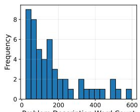

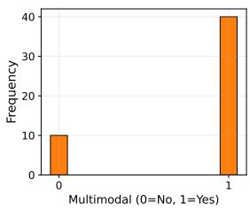

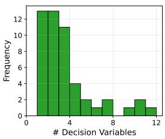

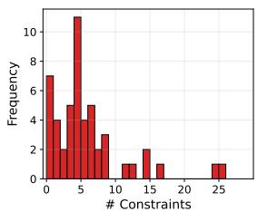  
Figure 2: Metadata distribution of the IPC-Bench dataset.

## 6 Experiments

## 6.1 Experimental Setup

We evaluated little m against Qwen3-Next-80B-A3B-Instruct and DeepSeek-V3.2. We designed a dual-perspective evaluation framework because standard approaches are fundamentally insufficient for industrial optimization. NLP metrics fail to recognize algebraic equivalencies without lexical overlap, and execution-based metrics are impractical when ready-made digital twins are unavailable. Our framework combines: (1) double-blind human-expert assessment of practical utility and physical logic across 20 benchmark cases, and (2) automated machine-based evaluation measuring structural accuracy against expert-verified ground truth across all 50 cases.

## 6.2 Human Evaluation Design

The human evaluation was conducted via a structured survey instrument. The evaluation panel consisted of 8 domain specialists (Ph.D. students and postdocs) from complementary disciplines: 3 from computer science, 2 from data science, and 3 from control engineering. Each problem was evaluated by 2–4 independent experts.

Experts assessed each blinded, randomized candidate across four dimensions: (1) Objective Function Quality—algebraic correctness and fidelity to the stated target; (2) Decision Variable Completeness—coverage of physical quantities with appropriate domains; (3) Constraint Validity— absence of unsupported or topologically inconsistent conditions; and (4) Overall Convincingness— holistic usefulness as a candidate formulation for further engineering. All models were strictly anonymized and presentation order randomized to mitigate bias. Detailed survey methodology is provided in Sec. C.

## 6.3 Machine Evaluation Design

To complement human assessment with scalable, reproducible metrics, we developed an automated evaluation pipeline that compares the predicted model $M _ { p } = \{ V _ { p } , f _ { p } , C _ { p } \}$ against the ground truth $M _ { g } = \{ V _ { g } , f _ { g } , C _ { g } \}$

Decision Variables. Variables are evaluated as sets. A regex module normalizes variable names, and an LLM-driven semantic mapping aligns differently named but physically equivalent entities. Structural fidelity is measured via Jaccard similarity:

$$
S _ { v a r s } = { \frac { | V _ { g } \cap V _ { p } ^ { \prime } | } { | V _ { g } \cup V _ { p } ^ { \prime } | } }\tag{1}
$$

Objective Function. The evaluation script strips natural language noise (prefixes like “Minimize”, $\mathbf { \ddot { \mu } M a x } ^ { \prime \prime } )$ and computes token-level Jaccard similarity:

$$
S _ { o b j } = { \frac { | T _ { g } \cap T _ { p } | } { | T _ { g } \cup T _ { p } | } }\tag{2}
$$

Constraint Set. All terms are normalized to standard form $( A \leq B \to A - B \leq 0 )$ . A bipartite matching algorithm (Hungarian) pairs each generated constraint with its closest ground truth equivalent based on token similarity weights $w _ { i j }$ . Scoring uses a continuous F1 metric:

$$
\boldsymbol { P } = \frac { \sum w _ { i j } } { | C _ { p } | } , \quad \boldsymbol { R } = \frac { \sum w _ { i j } } { | C _ { g } | } , \quad S _ { c o n s } = 2 \cdot \frac { \boldsymbol { P } \cdot \boldsymbol { R } } { \boldsymbol { P } + \boldsymbol { R } }\tag{3}
$$

Precision penalizes hallucinated constraints; recall penalizes missing safety interlocks. Full protocol details are provided in Sec. D.

## 6.4 Main Results

## 6.4.1 Human Evaluation

Table 2 presents expert preference win rates tested against a random baseline $( H _ { 0 } : p = 1 / 3 , N =$ received evaluations). Among the three candidates included in the survey, little m received the highest preference rate across all categories: Objective Function (58.0%), Decision Variables (60.0%),

Table 2: Comparative Analysis (Binomial Test, $H _ { 0 } : p = 1 / 3 )$ . Win Rates indicate the percentage of expert votes. Significance levels $( ^ { * } p < 0 . 0 5 , ^ { * * } p < 0 . 0 1 , ^ { * * * } p < 0 . 0 0 1 )$
<table><tr><td rowspan="2">Evaluation Aspect</td><td colspan="2">Qwen3†</td><td colspan="2">DeepSeek</td><td colspan="2">little m</td></tr><tr><td>win rate</td><td>p-value</td><td>win rate</td><td>p-value</td><td>win rate</td><td>p-value</td></tr><tr><td>Objective Function</td><td>16.0%</td><td>0.010**</td><td>26.0%</td><td>0.30</td><td>58.0%</td><td> $\mathbf { < 0 . 0 0 1 ^ { * * * } }$ </td></tr><tr><td>Decision Variables</td><td>14.0%</td><td>0.003**</td><td>26.0%</td><td>0.30</td><td>60.0%</td><td> $\mathbf { < 0 . 0 0 1 ^ { * * * } }$ </td></tr><tr><td>Constraints</td><td>22.0%</td><td>0.099</td><td>26.0%</td><td>0.30</td><td>52.0%</td><td> $\mathbf { 0 . 0 0 7 ^ { * * } }$ </td></tr><tr><td>Overall Quality</td><td>16.0%</td><td>0.010**</td><td>18.0%</td><td>0.024*</td><td>66.0%</td><td> $\mathbf { < 0 . 0 0 1 ^ { * * * } }$ </td></tr></table>

† Qwen3: Qwen3-Next-80B-A3B-Instruct; ‡ DeepSeek: Deepseek-V3.2

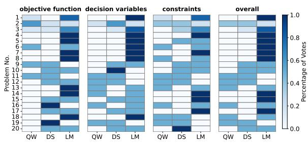  
Figure 3: Heatmap of expert consensus (win rate) across modeling dimensions for Qwen3 (QW), Deepseek (DS), and little m (LM). Darker cells indicate higher agreement.

Constraints (52.0%), and Overall Quality (66.0%), with statistically significant deviations from chance $( p < 0 . 0 1$ for all dimensions). The 60.0% preference rate for decision variables $( p < 0 . 0 0 1 )$ is consistent with the system’s use of structured variable tables aligned with data points, although the survey does not isolate that component causally. In the survey, Qwen and DeepSeek received decisionvariable preference rates of 14.0% $( p = 0 . 0 0 3 ^ { * * } )$ and 26.0% $( p = 0 . 3 0 )$ , respectively, compared with 60.0% for little m.

Fig. 3 visualizes expert consensus across modeling dimensions. The Decision Variables column displays high-consensus patterns, frequently achieving expert unanimity in the evaluated cases. Consensus for Objective Functions and Constraints was more heterogeneous, reflecting inherent ambiguity in translating abstract control goals into mathematical terms, yet little m maintained the highest aggregate preference.

Analysis of the responses indicates that domain experts diverge on stylistic conventions such as constraint grouping, while more often agreeing on clear omissions or unsupported relations. This motivates evaluation protocols that accommodate equivalent formulations while still penalizing struc-

Table 3: Machine-based evaluation scores.
<table><tr><td>Aspects</td><td>Qwen3</td><td>Deepseek</td><td>little m</td></tr><tr><td>Decision Variables</td><td>0.673</td><td>0.699</td><td>0.733</td></tr><tr><td>Objective Functions</td><td>0.526</td><td>0.553</td><td>0.518</td></tr><tr><td>Constraints</td><td>0.389</td><td>0.395</td><td>0.418</td></tr></table>

tural errors.

## 6.4.2 Machine Evaluation

Table 3 reports machine-based structural scores. Among the three evaluated systems, little m obtains the highest Decision Variable score (0.733) and Constraint score (0.418). DeepSeek obtains the highest objective score (0.553). These referencealignment metrics therefore do not support a broad claim that the staged system improves every finalformulation dimension; the subsequent interaction and ablation studies examine narrower effects.

## 6.4.3 Human-Machine Alignment

To estimate whether the automated metrics track expert preference within the original three-system comparison, we cross-validated machine scores against human evaluations. For each of the 20 evaluated cases, the machine pipeline ranked candidate models and we quantified alignment using Top-1 Accuracy (frequency the machine’s top choice matches human preference) and Mean Reciprocal Rank: $\begin{array} { r } { \mathrm { M R R } \stackrel { \cdot } { = } \frac { 1 } { N } \sum _ { i = 1 } ^ { N } \frac { 1 } { \mathrm { r a n k } _ { i } } } \end{array}$ , where ranki is the position of the human-preferred model in the machine-sorted list. As shown in Table 4, Top-1 Accuracy is 0.75 for both Decision Variables and Objective Functions, with MRR scores of 0.867 and 0.858. Constraint alignment is slightly lower (Top-1: 0.60, MRR: 0.792), reflecting inherent subjectivity in translating control goals into logical constraints. An end-to-end case trace illustrating how the staged workflow constructs a control model is provided in Sec. E.

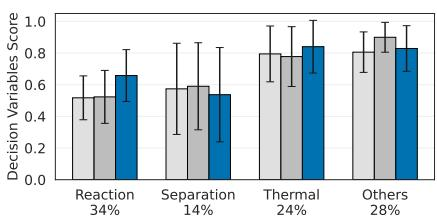

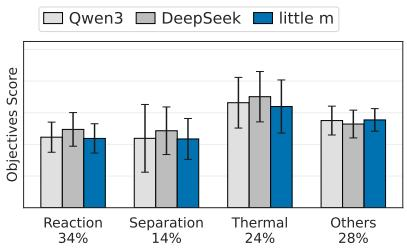

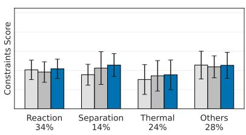  
Figure 4: Performance across industrial process categories, displaying machine-evaluated scores for Decision Variables, Objective, and Constraints.

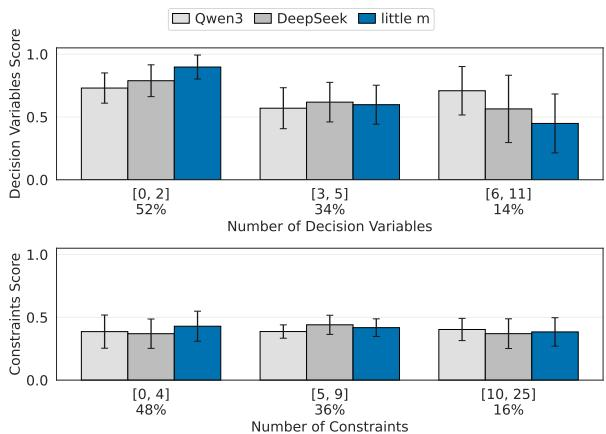  
Figure 5: Machine evaluation scores stratified by condition complexity: decision variable accuracy (top) and constraint formulation accuracy (bottom). Error bars indicate variance within each complexity bin.

Table 4: Alignment between Machine-based Evaluation and Expert Preference.
<table><tr><td>Evaluation Aspect</td><td>Top-1 Acc</td><td>MRR</td></tr><tr><td>Objective Function</td><td>0.75</td><td>0.858</td></tr><tr><td>Decision Variables</td><td>0.75</td><td>0.867</td></tr><tr><td>Constraints</td><td>0.60</td><td>0.792</td></tr></table>

## 6.4.4 Results by Complexity and Domain

To investigate how performance scales with problem complexity, we stratified benchmark problems by the number of decision variables and constraints (Fig. 5). little m demonstrates a distinct advantage in low-to-medium complexity scenarios, achieving the highest scores for problems with fewer than six variables. Across all models, constraint formulation remains a persistent bottleneck, with scores persistently lower than variable identification regardless of problem scale. Nevertheless, little m exhibits notable stability in constraint formulation even as constraint count increases up to 25.

We further disaggregated evaluation metrics across distinct physical operations to observe domain-specific proficiencies (Fig. 4). The results indicate that Thermal scenarios are generally the easiest to model, yielding the highest average variable and objective scores across all frameworks. Within the original three-system comparison, little m scores highest in Reaction and Thermal problems, a pattern consistent with the coverage of thermodynamic and kinetic entries in the knowledge base. Conversely, DeepSeek demonstrates specialized strength in Separation tasks, while Qwen exhibits the highest variance across engineering categories.

## 6.5 Interaction Analysis

To test how little m can recover from incomplete requests, we created an incomplete-input condition by withholding information about process structure, operating limits, or control information. All settings share the same reasoning engine, workflow, machine evaluator, and references:

• Full Input: The standard little m setting used in the main results receives the original request and generates the formulation in one shot.

• Incomplete Input: little m receives the masked request and generates the formulation in one shot without clarification.

• Interactive Recovery: Starting from the same masked request, little m asks clarification questions, and a controlled simulator discloses a withheld fact only when a question is relevant to it. This controls disclosure for repeatability but does not reproduce all behavior of an industrial user.

As shown in Table 5, interactive recovery clearly improves on incomplete input, with especially large gains in decision variables and constraints, confirming the contribution of masked information. Treating full input as an approximate upper bound, interactive recovery achieves comparable overall performance, scoring higher on decision variables, similarly on constraints, and lower on objective functions. These results suggest that interaction recovers most of the withheld formulation information, while objective-related details remain harder to recover through clarification.

Table 6: Ablations under machine-based evaluation.
<table><tr><td>Evaluation Aspect little m</td><td></td><td>w/o Knowledge Diagrams</td><td>w/o</td></tr><tr><td>Decision Variables</td><td>0.733</td><td>0.720</td><td>0.723</td></tr><tr><td>Objective Functions</td><td>0.518</td><td>0.510</td><td>0.468</td></tr><tr><td>Constraints</td><td>0.418</td><td>0.381</td><td>0.383</td></tr></table>

Table 5: Recovery from incomplete requests under machine-based evaluation.
<table><tr><td>Evaluation Aspect</td><td>Full Input</td><td>Input</td><td>Incomplete Interactive Recovery</td></tr><tr><td>Decision Variables</td><td>0.733</td><td>0.721</td><td>0.802</td></tr><tr><td>Objective Functions</td><td>0.518</td><td>0.431</td><td>0.443</td></tr><tr><td>Constraints</td><td>0.418</td><td>0.314</td><td>0.423</td></tr></table>

## 6.6 Ablation Study

We conduct two single-component ablations of the full little m pipeline. The w/o Knowledge variant removes retrieved entries but retains the request and diagram; w/o Diagrams removes the visual input but retains the request and retrieved knowledge. The variants are evaluated on the same settings.

As shown in Table 6, both ablations reduce performance, confirming that knowledge and diagrams provide complementary information. Removing knowledge most strongly affects constraint alignment, suggesting that retrieved entries supply domain-specific patterns for formulating operational constraints. The objective and constraint drops without diagrams indicate that process topology connects identified quantities to goals and dependencies. Thus, knowledge provides formulation guidance, while diagrams ground it in process topology.

## 7 Conclusion

We introduced little m, an AI agent for industrial process optimization that bridges the semantic gap between physical descriptions and mathematical formulations through a three-stage cognitive pipeline grounded by domain-specific knowledge retrieval. On IPC-Bench, little m received higher expert preference than Qwen3 and DeepSeek and obtained the highest variable and constraint scores among the three systems under machine-based structural metrics. These results concern candidate formulation quality and do not establish solver feasibility, formal physical validity, or closed-loop performance. Future work will integrate little m with numerical solvers and evaluate broader industrial cases and task-specific workflows.

## 8 Limitations

Several limitations remain that suggest directions for future work.First, extending the curated knowledge base requires expert curation for each target domain, limiting domain-agnostic scalability. Second, the system lacks solver-level verification, so numerical issues may remain undetected until implementation. Third, IPC-Bench contains only 50 textbook-derived cases. Broader validation requires independently collected industrial cases, and potential pretraining exposure cannot be excluded. Finally, the machine metrics may penalize equivalent formulations, and the ablations do not isolate every workflow component.

## 9 Ethical Considerations

little m is designed as a formulation assistant, not an autonomous decision-maker; all generated models require human review before deployment in safety-critical industrial processes. The retrieval corpus may reflect biases present in its source literature, which could skew formulations toward welldocumented process types and underserve novel or under-represented domains.

## Acknowledgments

This work was supported by City University of Hong Kong under Grant PJ9361031 and Baosteel– City University of Hong Kong Joint Research Centre under Grant BHK2502-01.

We thank the domain experts who participated in our evaluation. LLMs assisted with language polishing and preliminary cleaning of textbook materials used to construct IPC-Bench. little m is dedicated to an individual close to the corresponding author.

## References

Paul Serban Agachi, Mircea Vasile Cristea, Alexandra Ana Csavdari, and Botond Szilagyi. 2017. Advanced Process Engineering Control. De Gruyter, Berlin, Boston.

Ali AhmadiTeshnizi, Wenzhi Gao, and Madeleine Udell. 2023. OptiMUS: Optimization modeling using MIP solvers and large language models. arXiv preprint arXiv:2310.06116.

Lorenz T. Biegler. 2010. Nonlinear Programming: Concepts, Algorithms, and Applications to Chemical Processes. Society for Industrial and Applied Mathematics.

Yitian Chen, Jingfan Xia, Siyu Shao, DongDong Ge, and Yinyu Ye. 2025. Solver-Informed RL: Grounding Large Language Models for Authentic Optimization Modeling. In Proceedings of Annual Conference on Neural Information Processing Systems 2025, NeurIPS 2025, pages 106027–106069, San Diego, CA, USA / Mexico City, Mexico.

Karl Cobbe, Vineet Kosaraju, Mohammad Bavarian, Mark Chen, Heewoo Jun, Lukasz Kaiser, Matthias Plappert, Jerry Tworek, Jacob Hilton, Reiichiro Nakano, Christopher Hesse, and John Schulman. 2021. Training verifiers to solve math word problems. arXiv preprint arXiv:2110.14168.

Mark L. Darby, Michael Nikolaou, James Jones, and Doug Nicholson. 2011. RTO: an overview and assessment of current practice. Journal of Process Control, 21(6):874–884.

Thomas F. Edgar, David M. Himmelblau, and Leon S. Lasdon. 2001. Optimization ofChemical Processes, 2nd edition. McGraw-Hill, New York.

Mohamad Fakih, Rahul Dharmaji, Yasamin Moghaddas, Gustavo Quiros, Oluwatosin Ogundare, and Mohammad Abdullah Al Faruque. 2024. LLM4PLC: Harnessing large language models for verifiable programming of PLCs in industrial control systems. In Proceedings of the 46th International Conference on Software Engineering: Software Engineering in Practice, pages 192–203, Lisbon, Portugal.

Ignacio E. Grossmann and Iiro Harjunkoski. 2019. Process systems engineering: Academic and industrial perspectives. Computers & Chemical Engineering, 126:474–484.

Xingang Guo, Darioush Keivan, Usman Syed, Lianhui Qin, Huan Zhang, Geir Dullerud, Peter Seiler, and Bin Hu. 2024. ControlAgent: Automating control system design via novel integration of LLM agents and domain expertise. arXiv preprint arXiv:2410.19811.

Chenyu Huang, Zhengyang Tang, Shixi Hu, Ruoqing Jiang, Xin Zheng, Dongdong Ge, Benyou Wang, and Zizhuo Wang. 2025a. ORLM: A customizable framework in training large models for automated optimization modeling. Operations Research, 73(6):2986– 3009.

Xuhan Huang, Qingning Shen, Yan Hu, Anningzhe Gao, and Benyou Wang. 2025b. Llms for mathematical modeling: Towards bridging the gap between natural and mathematical languages. In Findings of the

Associationfor Computational Linguistics: NAACL 2025, pages 2678–2710, New Mexico, USA.

J. Ingham, I.J. Dunn, E. Heinzle, J.E. Pˇrenosil, and J.B. Snape. 2008. Chemical Engineering Dynamics: An Introduction to Modelling and Computer Simulation. Chemical Engineering Dynamics. Wiley.

Caigao Jiang, Xiang Shu, Hong Qian, Xingyu Lu, Jun Zhou, Aimin Zhou, and Yang Yu. 2025. LLMOPT: Learning to define and solve general optimization problems from scratch. In Proceedings of International Conference on Learning Representations, pages 101580–101606.

Ioannis K Kookos. 2022. Practical chemical process optimization. Springer Optimization and Its Applications. Springer.

Tho V Le, Laura A Albert, and Thibaut Vidal. 2026. Making operations research more accessible: Insights from the rise of machine learning. INFORMS Journal on Data Science, 5(1):1–13.

S.E. LeBlanc and D. Coughanowr. 2009. Process Systems Analysis and Control. McGraw-Hill chemical engineering series. McGraw-Hill Education.

Jingbo Liu, Fan Jiang, Shinichi Tashiro, Shujun Chen, and Manabu Tanaka. 2025. A physics-informed and data-driven framework for robotic welding in manufacturing. Nature Communications, 16(1):4807.

Gabriel Maher. 2025. LLMPC: Large language model predictive control. Computers, 14(3):104.

Josefine A Olsson, Sabbie A Miller, and Mark G Alexander. 2023. Near-term pathways for decarbonizing global concrete production. Nature communications, 14(1):4574.

Shifeng Qu, Shaoyi Yang, Wenli Du, Zhaoyang Duan, Feng Qian, and Meihong Wang. 2025. A hierarchical task graph parallel computing framework for chemical process simulation. Engineering, 51:229–239.

Rindranirina Ramamonjison, Timothy Yu, Raymond Li, Haley Li, Giuseppe Carenini, Bissan Ghaddar, Shiqi He, Mahdi Mostajabdaveh, Amin Banitalebi-Dehkordi, Zirui Zhou, and Yong Zhang. 2022. NL4OPT competition: Formulating optimization problems based on their natural language descriptions. In Proceedings of Thirty-Sixth Conference on Neural Information Processing Systems, NeurIPS 2022, competition track, pages 189–203, Online.

R.V. Rao. 2010. Advanced Modeling and Optimization ofManufacturing Processes: International Research and Development. Springer Series in Advanced Manufacturing. Springer.

Federico Raspanti, Tanir Ozcelebi, and Mike Holenderski. 2025. Grammar-constrained decoding makes large language models better logical parsers. In Proceedings of the 63rd Annual Meeting of the Association for Computational Linguistics (Volume 6: Industry Track), ACL 2025, pages 485–499, Vienna, Austria.

Lei Ren, Haiteng Wang, Yuqing Wang, Keke Huang, Lihui Wang, and Bohu Li. 2025. Foundation models for the process industry: Challenges and opportunities. Engineering, 52:53–59.

Dale E Seborg, Thomas F Edgar, Duncan A Mellichamp, and Francis J Doyle III. 2016. Process dynamics and control, 4th edition. John Wiley & Sons, New Jersey.

Fei Tao, He Zhang, and Chenyuan Zhang. 2024. Advancements and challenges of digital twins in industry. Nature Computational Science, 4(3):169–177.

Xinyu Tao, Anjan Tula, and Xi Chen. 2025. From prompt design to iterative generation: Leveraging llms in pse applications. Computers & Chemical Engineering, 202:109282.

Khanh-Tung Tran, Dung Dao, Minh-Duong Nguyen, Quoc-Viet Pham, Barry O’Sullivan, and Hoang D Nguyen. 2025. Multi-agent collaboration mechanisms: A survey of LLMs. arXiv preprint arXiv:2501.06322.

Yang Wu, Yifan Zhang, Yurong Wu, Yuran Wang, Junkai Zhang, and Jian Cheng. 2025. Training llms for optimization modeling via iterative data synthesis and structured validation. In Findings of the Associationfor Computational Linguistics: EMNLP 2025, pages 12880–12896, Suzhou, China.

Ziyang Xiao, Dongxiang Zhang, Yangjun Wu, Lilin Xu, Yuan Jessica Wang, Xiongwei Han, Xiaojin Fu, Tao Zhong, Jia Zeng, Mingli Song, and Gang Chen. 2024. Chain-of-experts: When LLMs meet complex operations research problems. In Proceedings ofThe twelfth international conference on learning representations, ICLR 2024, Vienna, Austria.

Wei Xu, Yuan Wang, Dongrui Zhang, Zhe Yang, Zhuang Yuan, Yang Lin, Hao Yan, Xin Zhou, and Chaohe Yang. 2024. Transparent ai-assisted chemical engineering process: Machine learning modeling and multi-objective optimization for integrating process data and molecular-level reaction mechanisms. Journal ofCleaner Production, 448:141412.

Tong Zeng, Srivathsan Badrinarayanan, Janghoon Ock, Cheng-Kai Lai, and Amir Barati Farimani. 2025. Llm-guided chemical process optimization with a multi-agent approach. arXiv preprint arXiv:2506.20921.

Bowen Zhang and Pengcheng Luo. 2025. OR-LLM-Agent: Automating modeling and solving of operations research optimization problems with reasoning large language models. arXiv preprint arXiv:2503.10009.

Lan Zhang, Xin Quan, and Andre Freitas. 2024. Consistent autoformalization for constructing mathematical libraries. In Proceedings ofthe 2024 Conference on Empirical Methods in Natural Language Processing, pages 4020–4033, Miami, Florida, USA.

## A Dataset Details

## A.1 Data Structure

For each problem, we implemented a structured extraction pipeline converting unstructured textbook content into rigorous evaluation format. Each problem is decomposed into two components: (1) Problem Description preserving raw context (narrative, operational logic, system schematics), and (2) Ground Truth Model with explicit segmentation into decision variables, objective functions, and constraints.

To establish a rigorous evaluation environment for little m, IPC-Bench was carefully curated from seminal process control and chemical engineering optimization textbooks. Unlike traditional mathematical reasoning benchmarks that rely on simplified, single-modality textual puzzles evaluated via direct localized execution, our dataset is designed to reflect authentic industrial complexities. For each problem, we implemented a structured extraction pipeline that translates unstructured, multimodal engineering content into a rigorous, machine-evaluable representation. Each problem is strictly decomposed into two distinct components: (1) Problem Description Component: Preserves the raw industrial context. This includes the textual narrative detailing operational logic, system objectives, and boundaries, as well as multimodal elements like Piping and Instrumentation Diagrams (P&IDs) or system schematics, which are essential for inferring spatial and topological relationships. (2) Ground Truth Model: Presents the mathematical formulation with explicit semantic segmentation. Rather than a flat list of equations, the model is strictly categorized into variables, objective functions, and constraints. An example is illustrated in Fig. 6.

## B Knowledge Base Structure

The current knowledge base contains 55 selfcontained retrieval entries. Rather than organizing knowledge as broad optimization modules or isolated algorithm cards, it represents reusable problem pathways. General entries capture structures that recur across process industries, while contextualized entries adapt the same design to concrete industrial settings using anonymized patterns distilled from our industrial project experience. Each entry is indexed and retrieved as an independent context unit and links an observable symptom or operating context to a primary optimization objective, conditional candidate methods, required process information, reusable mathematical and constraint patterns, and applicability boundaries. The symptom serves as a retrieval anchor rather than a confirmed root cause, and the method field records selection conditions rather than a unique recommendation. The knowledge base remains a contextual engineering repository rather than an executable physics engine, and its content does not automatically enforce physical laws or establish solver feasibility.

At runtime, vector search and a cross-encoder reranker select entries based on the structured process context and current objective. The objective and method fields guide Strategy Design; information requirements expose missing inputs; and formulation patterns and boundaries support Mathematical Modeling and subsequent human review. Source provenance is maintained separately from the retrieval text so that individual entries remain self-contained while their evidence and maintenance history can be audited. Table 7 illustrates this design with an anonymized evaporator concentration-control example.

## C Human Evaluation Survey Design

The human evaluation was conducted via a structured survey instrument designed to capture both evaluator expertise profiles and technical assessments of the generated models. The evaluation panel consisted of 8 domain specialists (Ph.D. students and postdocs) from computer science, data science, and control engineering.

As illustrated in Fig. 7, the instrument begins with a demographic section profiling evaluator expertise: highest educational attainment, current professional role (Academic vs. Industry), and selfreported familiarity with optimization modeling and industrial processes on a 5-point Likert scale. This profiling ensures technical judgments are rendered by qualified individuals.

Following demographic profiling, experts were presented with randomized test cases as shown in Fig. 8. For each problem, the interface displays the original multimodal problem description alongside a reference ground truth model and a blinded set of candidate models generated by little m and baseline LLMs. Experts performed a comparative assessment across four dimensions: (1) Objective Function Quality, (2) Decision Variable Completeness, (3) Constraint Validity, and (4) Overall Convincingness.

Problem Description Component Ground Truth Model   
Problem Background & Objective: Sets & Parameters:   
Stages: $k \in \{ 1 \ldots 4 \}$ (1=Reboiler, 4=Condenser)   
Optimize a 4-stage distillation column (reboiler to con- Components: $i \in \{ \dot { 1 } \dots N _ { c } \}$   
denser) to minimize annual operating costs, specifically re- Specs: $F _ { t o t } = 1 0 0 , W _ { t o p } = \mathrm { \ ' } 1 0$ (lb mol/h)   
boiler heat duty, while meeting strict product purity specs.   
Diagrams: Variables (Degrees of Freedom):   
Control: $u = [ Q _ { 1 } , F _ { 1 } \ldots F _ { 4 } ]$   
Cooling water in, W Condenser Cooling water out State: $L _ { k } , V _ { k } , \dot { x _ { i , k } } , y _ { i , k } , T _ { k } , \dot { P } _ { k }$   
n (Heat removal = Qn)   
Objective Function:   
Reflux   
Reflux drum Product $\operatorname* { m i n } _ { u } \quad J = Q _ { 1 }$   
k+1 Withdrawal Minimize Reboiler Heat   
Wk+1   
Constraints $( k = 1 \ldots n ) \colon$   
Feed k   
yi,k Conservation Laws:   
k $F _ { k } ^ { V } + L _ { k + 1 } + V _ { k - 1 } = V _ { k } + L _ { k } + W _ { k }$   
,→ (Total Mass Bal.)   
xi.k   
yi,k−1 $F _ { k } z _ { i , k } + L _ { k + 1 } x _ { i , k + 1 } + \cdot \cdot \cdot = V _ { k } y _ { i , k } + . . .$   
Lk, hk Vk-1, Hk-1 ,→ (Comp. Mass Bal.)   
$\boldsymbol { Q } _ { k } + h _ { k } ^ { F } \boldsymbol { F } _ { k } + \cdot \cdot \cdot = \boldsymbol { H } _ { k } V _ { k } + h _ { k } \boldsymbol { L } _ { k }$   
$\hookrightarrow$ (Energy Bal.)   
Physico-Chemical:   
Reboiler ① → Product $y _ { i , k } = K _ { i , k } ( T , P ) x _ { i , k }$ (Phase $\operatorname { E q . } )$   
Steam Condensate (Heat addition = Q1) ↑ $\sum _ { i } x _ { i , k } = 1 , \sum _ { i } y _ { i , k } = 1$   
$H _ { k } = f ^ { V } ( T , P , y ) , h _ { k } = f ^ { L } ( T , P , x )$   
Bounds & Specs:   
$x _ { i , \mathrm { p r o d } } ^ { m i n } \leq x _ { i , \mathrm { p r o d } } \leq x _ { i , \mathrm { p r o d } } ^ { m a x } \quad \mathrm { ( Q u a l i t y ) }$   
$L _ { k } , V _ { k } , x _ { i , k } , y _ { i , k } \ge 0$

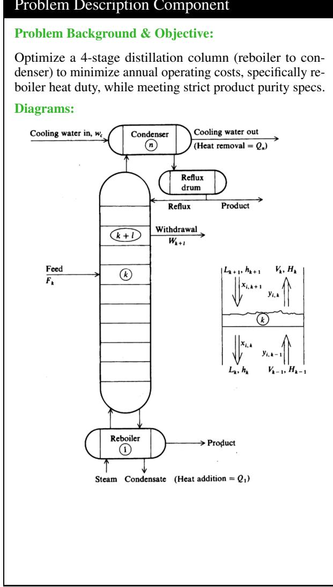  
Figure 6: Example of a structured benchmark sample (Distillation Optimization). The left panel contains the unstructured problem context, while the right panel shows the expert-verified Ground Truth model.

Table 7: Representative contextualized knowledge entry for an evaporator concentration-control scenario.
<table><tr><td>Entry field</td><td>Representative content</td></tr><tr><td>Operating context and symptom</td><td>Product concentration varies after changes in feed flow or composition; delayed measurements lead to repeated steam adjustments and overshoot.</td></tr><tr><td>Optimization objective</td><td>Stabilize product concentration while respecting product-quality and steam-system limits and avoiding unnecessary energy use.</td></tr><tr><td>Conditional candidate methods</td><td>Use feedforward plus feedback when feed disturbances are measured reliably; use state estimation and MPC when a validated dynamic model and active operating constraints are available; use a slower economic optimization layer only when the task is to update economically preferred operating targets.</td></tr><tr><td>Required process information</td><td>Feed flow and composition, product-concentration measurements and delay, steam flow and pressure, sampling interval, candidate manipulated variables, operating bounds, and historical input-output responses.</td></tr><tr><td>Mathematical and constraint patterns</td><td>Material and energy balances, delayed state transitions, input and output bounds, move-rate constraints, measurement equations, and terminal or tracking objectives.</td></tr><tr><td>Applicability boundary</td><td>Missing dynamics, actuator limits, quality bounds, and measurement timing remain unresolved rather than being inferred. Site-specific safety and product requirements require engineering confirmation and subsequent numerical validation.</td></tr></table>

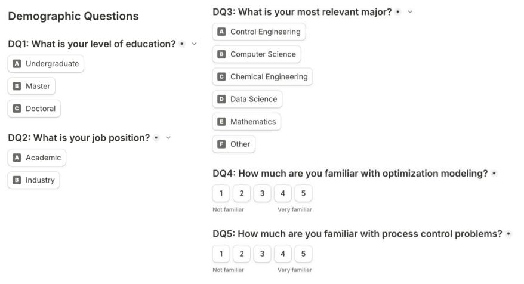  
Figure 7: Demographic and expertise profiling questions for human evaluators.

Table 8: Distribution of Expert Self-Assessment on Domain Familiarity (Scale 1–5)
<table><tr><td>Domain / Familiarity</td><td>1 (Low)</td><td>2</td><td>3</td><td>4</td><td>5 (High)</td></tr><tr><td>Optimization Modeling</td><td>0</td><td>0</td><td>2</td><td>4</td><td>2</td></tr><tr><td>Process Control</td><td>0</td><td>2</td><td>4</td><td>2</td><td>0</td></tr></table>

Evaluation Panel To ensure a balanced assessment of both computational and physical aspects, the panel comprised experts from complementary disciplines: 3 from computer science, 2 from data science, and 3 from control engineering. The panel’s qualifications were verified through selfassessment of domain familiarity, summarized in Table 8. For Optimization Modeling, the majority rated themselves at high familiarity levels (4–5 on a 5-point Likert scale), ensuring rigorous judgment of mathematical formulations.

Bias Control and Blinding To mitigate potential bias, all generated models underwent a strict anonymization process where references to specific agents or underlying model architectures were removed. The presentation order of models (Model A, B, C) was randomized within each question to prevent position bias. The original problem statement was always provided alongside the models as a unified reference for verification.

Statistical Analysis We employed a two-sided exact binomial test with null hypothesis $H _ { 0 }$ that expert preference follows a random distribution $( p = 1 / 3 )$ , and alternative hypothesis $H _ { 1 }$ that experts prefer little m more frequently $( p > 1 / 3 )$

Significance was determined at the $\alpha = 0 . 0 5$ level. Inter-rater reliability was assessed qualitatively by analyzing preference variance across expertise levels to ensure robustness across the evaluator population.

## D Machine Evaluation Protocol

To complement human-expert assessment with scalable, reproducible metrics, we developed an automated evaluation pipeline that quantitatively compares the predicted model $M _ { p } ~ = ~ \{ V _ { p } , f _ { p } , C _ { p } \}$ against the ground truth model $M _ { g } = \{ V _ { g } , f _ { g } , C _ { g } \}$ across three dimensions.

Decision Variables Variables are treated as discrete sets. A regex module normalizes variables by stripping spaces, standardizing subscripts, and enforcing lowercase $( \mathbf { e . g . } , x _ { 1 }  x 1 )$ . An LLMdriven semantic mapping function then aligns differently named but physically equivalent entities using natural language descriptions. The structural fidelity is calculated via Jaccard similarity:

$$
S _ { v a r s } = { \frac { | V _ { g } \cap V _ { p } ^ { \prime } | } { | V _ { g } \cup V _ { p } ^ { \prime } | } }\tag{4}
$$

A high $S _ { v a r s }$ indicates close set-level agreement with the reference variables, subject to the quality of the semantic mapping.

Objective Function The evaluation script uses regular expressions to strip natural language noise (prefixes like “Minimize”, “Max”, “f(x)”). The score is the Jaccard similarity between token sets:

$$
S _ { o b j } = { \frac { | T _ { g } \cap T _ { p } | } { | T _ { g } \cup T _ { p } | } }\tag{5}
$$

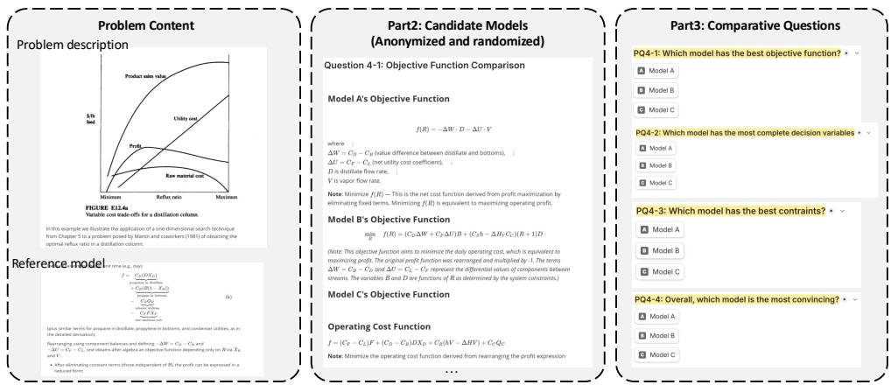  
Figure 8: Comparative assessment interface for each test case in the human evaluation.

Constraint Set All terms are moved to the left side (e.g., $A \leq B \to A - B \leq 0 )$ . A weight matrix $w _ { i j }$ captures mathematical token similarity between each generated constraint $c _ { p , j }$ and ground truth constraint $c _ { g , i }$ . Maximum bipartite matching (Hungarian algorithm) pairs each generated constraint with its closest ground truth equivalent. Scoring uses a continuous F1 metric:

$$
\boldsymbol { P } = \frac { \sum w _ { i j } } { | C _ { p } | } , \quad \boldsymbol { R } = \frac { \sum w _ { i j } } { | C _ { g } | } , \quad S _ { c o n s } = 2 \cdot \frac { \boldsymbol { P } \cdot \boldsymbol { R } } { \boldsymbol { P } + \boldsymbol { R } }\tag{6}
$$

Precision P penalizes hallucinated constraints; recall R penalizes missing safety interlocks or conservation laws.

Human-Machine Alignment We validated the automated metrics against expert judgment by treating the human-preferred model as ground truth. For each of the 20 evaluated cases, the machine pipeline ranked candidate models. Alignment was quantified using Top-1 Accuracy (frequency the machine’s highest-scoring model matches the human choice) and Mean Reciprocal Rank: MRR = $\begin{array} { r } { \frac { 1 } { N } \sum _ { i = 1 } ^ { N } \frac { 1 } { \mathrm { r a n k } _ { i } } } \end{array}$ , where ranki is the position of the human-preferred model in the machine-sorted list for case i.

## E Case Study

To make the intermediate representations in Fig. 1 concrete, we present an abridged trace for a mixingtank optimal tracking-control case from the heldout IPC-Bench test set. The case contains only continuous variables, includes a process diagram as part of its input, and directly matches the processcontrol scope of this work. The trace preserves the recorded information-structuring step, the subsequent clarification of the dynamic task, and the final formulation while shortening conversational acknowledgements. The diagram supplies the nominal inlet and outlet conditions and the two control setpoints; the interaction then confirms the dynamic energy balance, tracking objective, and inletflow bounds. Parameters that remain unspecified— including the tank volume, objective weights, flow limits, time horizon, and initial temperature—are retained symbolically rather than assigned invented values. The resulting artifact is a complete parameterized optimal-control model organized according to the same decision-variable, objective-function, and constraint categories used in evaluation.

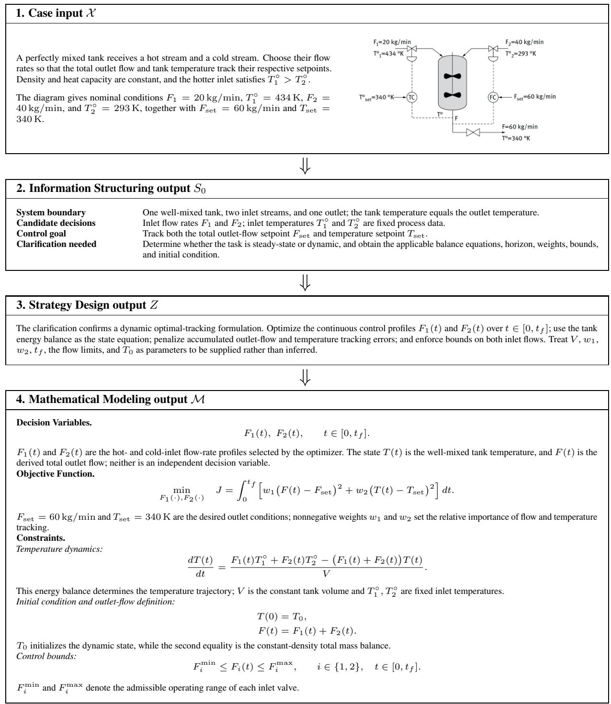  
Figure 9: Abridged end-to-end trace for a mixing-tank optimal tracking-control case from the held-out IPC-Bench test set. The input includes the process diagram; Information Structuring identifies the system boundary, candidate controls, and missing specifications; Strategy Design incorporates the clarified dynamic task; and Mathematical Modeling produces the decision variables, objective, and constraints used by the evaluation protocol. Unspecified numerical parameters remain explicit.

## F Prompt Engineering Details

We implemented a modular prompting strategy with role-constrained instructions for each stage. The three stages progress from organizing available facts, to proposing a high-level control strategy, and finally drafting a candidate mathematical specification for review.

## F.1 Stage 1: Information Assessment

This stage functions as an intake filter that transforms unstructured, multimodal engineering descriptions into a coherent, structured representation before any reasoning begins. Our core design insight here is to enforce a rigorous “gap-analysis” protocol. By classifying gathered information into confidence tiers (e.g., confirmed data, partially known information requiring clarification, and critical missing data), this triage mechanism makes unsupported assumptions more visible to downstream stages and reviewers.

## F.2 Stage 2: Strategy Design

This stage acts as the reasoning core that bridges the initial information assessment and the eventual mathematical formulation. The prompt design emphasizes a multi-dimensional analysis approach—exploring aspects like process flow bottlenecks, equipment efficiency, and energy utilization—so the agent can autonomously select the single most promising optimization strategy rather than offering a generic menu of options. A key feature of this design is the three-level drill-down: forcing the model to explicitly link core problems to their production-floor manifestations, and ultimately to their root physical or operational causes. A mandatory confirmation gate lets the user correct the proposed high-level strategy using tacit operational knowledge before mathematical syntax is generated.

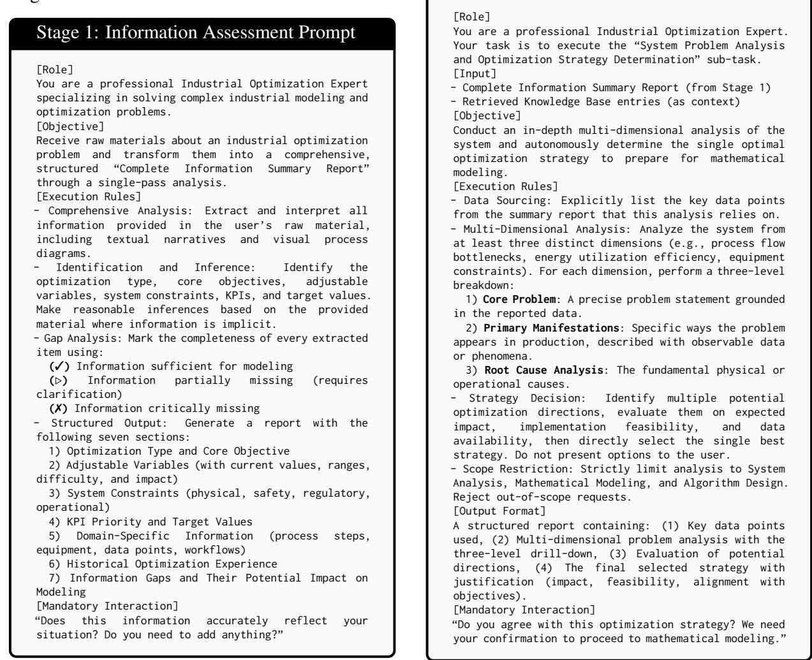

## F.3 Stage 3: Mathematical Formulation

The final reasoning stage translates the acknowledged optimization strategy into a candidate mathematical formulation. The foundational design principle is data-variable traceability: the instructions request that every defined symbol, whether a decision variable or a fixed parameter, be linked to a data point or marked as unresolved. This makes ungrounded variables easier to detect but does not establish physical or numerical validity. The prompt also requests analysis of linearity, convexity, scale, data dependency, and likely solver family so that a human can assess implementation requirements.

## Stage 3: Mathematical Modeling Prompt

[Role]   
You are a professional Industrial Optimization Expert.   
Your task is to execute the mathematical modeling   
sub-task based on the confirmed optimization strategy.   
[Input]   
- Complete Information Summary Report (from Stage 1)   
- System Analysis and Optimization Strategy Report (from   
Stage 2)   
[Objective]   
Translate the confirmed strategy into a candidate   
mathematical optimization specification for   
engineering review and subsequent solver   
implementation.   
[Execution Rules]   
- Data Sourcing: Detail all key data points from the   
summary report used in this model.   
- Data-Variable Mapping: Every defined variable and   
parameter must link to a specific data point from the   
Stage 1 summary report. Present in table format:   
Symbol | Meaning | Unit | Data Source   
- Model Justification: Explicitly state why the chosen   
model class (e.g., MILP, MPC, NLP) was selected based   
on system characteristics and the confirmed strategy.   
- Mathematical Expression: Use LaTeX syntax for the   
objective function and all constraint equations.   
- Constraint Categorization: Classify all constraints   
into:   
Physical Constraints: Mass/energy balances,   
thermodynamic limits, phase equilibria.   
Operational Constraints: Equipment capacity bounds,   
safety interlocks, quality specifications.   
Logical Constraints: Binary on/off states, sequencing   
requirements, conditional rules.   
- Model Characteristics Analysis: Assess (1) solving   
difficulty (linearity, convexity, scale), (2) data   
dependency (which inputs drive model sensitivity), and   
(3) expected outcomes (quantified improvements).   
[Output Format]   
A structured “Mathematical Model Specification”   
containing: variable/parameter definition table,   
objective function in LaTeX, constraints organized by   
category, and model characteristics analysis.