# Topology-Stratified Materials Discovery with A Flow-Based Generative Model

Jingyi Zhou1, Oyshee Chowdhury1, Noah Oyeniran1, Chongze Hu1,2\*

1\*Department of Aerospace Engineering and Mechanics, University of Alabama, Tuscaloosa, 35487, Alabama, United States.

2Alabama Materials Institute, The University of Alabama, Tuscaloosa, 35487, Alabama, United States.

\*Corresponding author(s). E-mail(s): hucz@ua.edu;

## Abstract

Accurate generation of crystal structures is the foundation to the discovery of high-performance materials for extreme-environment applications, such as aerospace, additive manufacturing, and fusion energy systems. Although generative modeling has emerged as a promising approach for crystal design, its performance remains limited by the complex crystal structures and diverse chemical compositions. In this work, we develop UFO-MGen, a universal flow-based generative model that learns topological features of Wyckof representations and leverages this information to accurately generate crystals across vast structural and chemical spaces. Compared with state-of-the-art generative models, UFO-MGen achieves the highest crystal generation success rate under a rigorous multi-stability evaluation framework, the highest SUN (stable, unique, novel) rate, and a remarkable extrapolation capability that has not been reported by previous models. Furthermore, a fine-tuning module is implemented to UFO-MGen for property-constrained crystal generation, enabling the inverse materials design toward target properties. The UFO-MGen opens a new avenue for accelerated materials discovery and providing a foundation for universal materials intelligence.

Keywords: Crystal structure generation, generative models, Wychof Representation, Topology, Inverse Materials Design

## 1 Introduction

As humanity moves toward the middle of $2 1 ^ { \mathrm { s t } }$ century, the development of highperformance, low-cost, and sustainable materials has become a top research priority across nearly all advanced technologies, including hypersonic vehicles [1], smart manufacturing [2, 3], and fusion energy [4, 5]. The rise of artificial intelligence (AI) and data-driven techniques has transformed materials discovery from a traditional trial-and-error Edison explorations into an era of intelligent design [6–8]. Although hundreds of thousands of materials are predicted by AI-driven framework each year, with many experimentally validated [9–11], these design strategies still concentrate on expanding the compositional and structural spaces of existing material systems. The vast landscape of unexplored material systems still hold enormous potential for developing next-generation materials toward superior stability, properties, and performance [12, 13].

Accurate generation of previously unknown crystal structures is the foundation for discovering innovative materials with exceptional properties [14–19]. However, generating unknown crystals remains notoriously challenging because of the enormous number of crystallographic configurations, diverse chemical environments, and stringent physical constrains (e.g., crystal symmetry) in real material systems [20, 21]. Although generative models have emerged as a powerful technique for navigating the highly irregular and constrained crystallographic space, their ability to generate physically reliable crystals remains very limited [22], particularly for complex crystal structures with large unit cells. Moreover, existing crystal generative models have primarily demonstrated strong interpolation capability for the crystal structures sampled in the training data, while their ability to extrapolate beyond the learned crystallographic space remains limited. This poor extrapolation capability fundamentally restricts their potential to discover truly novel materials beyond the existing domain knowledge.

In this work, we present UFO-MGen (Universal Flow Omni-Materials Generation), a flow matching-based generative model capable of accurately generating previously unknown crystals across broad crystallographic and chemical spaces (Fig. 1). To rigorously evaluate the quality of generated structures, we further propose a physically rigorous multi-stability evaluation (MSE) framework based on thermodynamic, latticedynamic, and thermal stabilities (Fig. 2). Benchmark results show that UFO-MGen outperforms all existing crystal generative models under the MSE criteria while also achieving the highest SUN (stable, unique, novel) rate (Fig. 3). More importantly, UFO-MGen has demonstrated superior extrapolation capability that has never been reported in any prior generative models (Fig. 3). Compared with traditional difusion models, UFO-MGen achieves higher accuracy and faster convergence speed due to two unique mechanisms: (i) unified Wyckof representation and (ii) flow-matching generation engine (Fig. 4). Finally, a fine-tuning module is also introduced to UFO-MGen for property-constrained generation, enabling the inverse design of materials with exceptional properties for targeted engineering applications (Fig. 5).

## 2 Results

## 2.1 Unified Wyckof representation

Generative crystal modeling requires a precise representation of crystal structures in a low-dimensional yet physically unified space [23]. Among existing methods, the Wyckof representation [24] is one of the most widely used, as shown in Fig. 1(a). It provides a compact description of periodic crystal through its space group (G), lattice parameters $( \ell )$ , the number of Wyckof orbits $( K )$ , Wyckof letters $\left( \omega _ { 1 : K } \right)$ and chemical species $\left( s _ { 1 : K } \right)$ for each $K .$ , and Wyckof coordinates $( x ^ { o r b } )$ [25], see Supplementary Section 1.1. For generation purpose, all Wyckof information must be incorporated within a unified generative space. However, the Wyckof representation includes both discrete features $( \mathrm { e . g . } , G , K , \omega , s _ { 1 : K } )$ and continuous components (e.g., ℓ and $x ^ { o r b } )$ , which belong to distinct mathematical domains and therefore require diferent modeling strategies. Unfortunately, existing models [25–27] overlook this fundamental diference and instead directly combine these heterogeneous features within a single generative framework. As such, a physically consistent unification of discrete and continuous Wyckof information is essential for accurate crystal generation.

The mathematical unification of discrete and continuous information can be traced to the concept of fiber bundles in topology [28]. Inspired by this theory, we adopt the analogous terms “scafold” (c) and $\mathrm { \ " { f i b e r } } ^ { \prime \prime } \left( { \mathcal F } \right)$ to denote the discrete and continuous features of the Wyckof representation, respectively (Supplementary Section 1.2). Accordingly, a scafold is expressed as $c = ( G , K , \omega _ { 1 : K } , s _ { 1 : K } )$ , which encodes the key structural information $( \mathrm { e . g . }$ , symmetry) and thus dominates the complexity of crystal generation. We introduce two parameters to quantify the dimensionality of a scafold: the intrinsic dimension, $D _ { \mathrm { r e p } }$ and the compression ratio, $\rho .$ Specifically, $D _ { \mathrm { r e p } }$ defines a reduced-dimensional space that stratifies crystal structures according to their intrinsic structural complexity. Since $D _ { \mathrm { r e p } }$ is always smaller than the $3 N { + 6 }$ degrees of freedom (DOFs) of a periodic crystal containing N atoms, $\rho = D _ { \mathrm { r e p } } / ( 3 N + 6 )$ is defined to quantify the dimensionality reduction relative to the original crystal representation. By calculating the scafold parameters $( D _ { \mathrm { r e p } }$ and $\rho )$ for all 154,875 crystal structures in the Materials Project (MP) database [29], we identify 32,550 trainable structures spanning 35 distinct space groups. Further analysis of these structures demonstrates that the proposed scafold parameters efectively capture intrinsic complexity of diverse crystal structures in the $\mathrm { M P }$ database (Supplementary Section 1.3).

Although scafolds encode key structural information, continuous fibers also play critical roles in crystal generation, as they preserve the symmetry changes associated with special Wyckof positions within a given $D _ { \mathrm { r e p } }$ . These special positions typically correspond to high-symmetry Wyckof coordinates that reduce the DOFs of a periodic crystal. However, traditional generative models learn these special features on a fixeddimensional space along with other Wyckof information [25–27], thus overlooking the key scafold features associate with these special positions. To address this limitation, we treat these special positions as shared boundaries between continuous fibers with distinct $D _ { \mathrm { r e p } } .$ thereby providing a unified description of fibers across diferent scafolds and enabling structural transitions throughout the entire stratified Wyckof space (Supplementary Section 2.1). By processing the fibers of all 32,550 trainable structures, we construct a new crystal database with a unified Wyckof representation (Supplementary Section 2.2).

## 2.2 Hierarchical UFO-MGen

Building on the stratified feature of Wyckof space, UFO-MGen is designed as a hierarchical generative framework that separately models the discrete and continuous Wyckof representation for crystal structure generation, as shown in Fig. 1. The UFO-MGen architecture includes the three sequential stages: Stage I, hierarchical topology selection (HTS); Stage II, chemical occupancy module (COM); and Stage III, structured Wyckof-aware generation (SWG). A detailed description of UFO-MGen is provided in Supplementary Section 3.

Stage I of UFO-MGen begins by sampling a crystal scafold that determines their Wyckof topology $( \mathrm { e . g . } , G , K$ , and $\omega _ { 1 : K } )$ , and define a topology scafold $\tau = ( G , K$ $\omega _ { 1 : K } )$ in Fig. 1(b) (Supplementary Section 3.1). Next, Stage II determines the chemical occupancy of the predefined τ by assigning chemical species $\left( { { s _ { 1 : K } } } \right)$ to the Wyckof orbit in τ under a set of chemical constrains (Supplementary Section 3.2). This assignment constructs the full scafold $c = ( G , K , \omega _ { 1 : K } , s _ { 1 : K } )$ , as illustrated in Fig. 1(c). Stage III uses flow matching [30] to generate the continuous Wyckof information $\left( i . e . , \ell \right.$ and $x ^ { o r b } )$ within a predetermined scafold (c) (Fig. 1(d), Supplementary Section 3.3). Finally, the complete crystal structure is reconstructed by inserting these continuous variables into the corresponding Wyckof templates and applying the associated spacegroup symmetry operations (Fig. 1(e)).

Using the unified database of all 32,550 trainable structures, UFO-MGen is trained to generate previously unreported crystal structures. Detailed training objectives and sampling processes for each stage are provided in Supplementary Sections 3.4-3.6. The generated crystals are then subjected to rigorous stability evaluations to assess the performance of UFO-MGen.

## 2.3 Multi-stability evaluation

Traditional evaluations of crystal stability primarily rely on the formation energy $( \Delta E _ { f } )$ or energy above the convex hull $( \Delta E _ { \mathrm { h u l l } } )$ at zero K [31]. However, $\Delta E _ { f }$ and $\Delta E _ { h u l l }$ only measure thermodynamic stability and do not capture other important physical stability, such as lattice-dynamic stability or finite-temperature thermal stability [32, 33]. Therefore, a more comprehensive and rigorous stability evaluation is required to examine the stability of generated crystal structures.

In this work, we propose a multi-stability evaluation (MSE) framework based on three physically rigorous criteria: thermodynamic, lattice-dynamical, and thermal stability (Fig. 1(e)). The thermodynamic stability is evaluated using the conventional criteria of $\Delta E _ { f } ,$ where structures with $\Delta E _ { f } < 0$ are considered thermodynamically stable $\left( \mathrm { F i g . \ 2 ( a ) } \right)$ . The lattice-dynamical stability is assessed from the phonon spectrum and density of states (DOS), where the structures without significant imaginary frequencies are considered lattice-dynamically stable (Fig. 2(a)). In this work, the structures with an integral of negative DOS below 0.05 phonon mode are considered as lattice-dynamically stable. Finally, thermal stability is further examined using molecular dynamics (MD) simulations at 300 K, where structures that retain their original structures over 10 ps canonical ensemble (NVT) simulations are considered thermally stable, see example of $\mathrm { C e S _ { 2 } }$ in Fig. 2(b). To ensure robust and consistent evaluations, MSE screening is performed using three universal machine-learning interatomic potentials (uMLIPs), including CHGNet [34], MACE [35], and MatterSim [36].

Next, we use UFO-MGen to unconditionally generate 50,000 crystal structures and then evaluate their stability using the MSE framework. The MSE screening results show that all structures satisfy the thermodynamic stability criterion $( \Delta E _ { f } < 0 )$ while 13,326, 24,165, and 23,541 structures are identified as lattice-dynamically stable by CHGNet, MACE, and MatterSim, respectively (Fig. 2(a)). Subsequent MD simulations at 300 K identify 12,744, 22,738, and 22,064 thermally stable structures using these three uMLIPs, corresponding to overall MSE rates of 25.5%, 45.5%, and 44.1%. Chemical coverage analysis of these MSE-screened stable crystals reveal that they span nearly all elements across the periodic table, as shown in Fig. 2(c). Furthermore, their space-group distribution covers 34 of the 35 space groups represented in the training dataset (Fig. 2(d)). These results demonstrate that UFO-MGen not only generate crystals with rigorous physical stability but also produces chemically and structurally diverse structures.

## 2.4 Extrapolation capability and validation

The large number of 195 space groups absent from our unified dataset provides a unique opportunity to evaluate the extrapolation capability of UFO-MGen. Since Stage I of UFO-MGen fixes the topology scafold, we bypass this stage and use the well-trained model to generate 33,439 crystal structures with previously unseen crystal scafolds. Following MSE screening, 5,921 generated crystals are fully stable, and subsequent structural analysis shows that they span 107 of the 195 space groups absent from the training set (bottom panel in Fig. 2(e)). To the best of our knowledge, such extrapolation capability has not been demonstrated by existing crystal generative models. These results suggest that extrapolation performance should be regarded as a critical benchmark for evaluating the “true intelligence” of crystal generative models.

To validate the accuracy and physical stability of the generated crystals, firstprinciples density functional theory (DFT) calculations [37, 38] were performed to independently assess the MSE criteria of these structures from both interpolation and extrapolation groups of UFO-MGen. Figure 2(f) summarizes six representative crystals, three from interpolation and three from extrapolation, with diferent $D _ { \mathrm { r e p } }$ values (i.e., scafold complexity). DFT structural relaxations show that the optimized lattice parameters of these generated crystals are in excellent agreement with those predicted by UFO-MGen (Supplementary Section 4.1). Moreover, DFT-calculated $\Delta E _ { f } ,$ phonon spectra, and ab initio MD-simulated energy profiles are all consistent with the MSE screening using uMLIPs (Supplementary Sections 4.1-4.3). Additional DFT validations of other generated crystals also show excellent agreement with UFO-MGen predictions (Supplementary Section 4.4). The strong agreement with quantum-accuracy DFT calculations demonstrates the high accuracy and reliability of the UFO-MGen predictions and further validates its ability to generate physically stable crystal structures.

## 2.5 Performance comparison

Using the more rigorous MSE framework, we benchmark UFO-MGen against several state-of-the-art crystal generative models, including MatterGen [14], DifCSP [21, 39], FlowMM [40], SymmCD [27], and CDVAE [41]. To ensure a fair comparison, we retrain UFO-MGen using MP20 dataset that was used to train prior generative models. We then generate 300 crystal structures from each model and evaluate their stability using the same MSE framework. As shown in Fig. 3(a), UFO-MGen achieves the highest MSE success rate for every individual stability criteria, as well as the the highest overall success rate, demonstrating its superior performance in generating physically stable crystals. In addition to MSE, we further evaluate UFO-MGen using the widely adopted SUN metric [14] based on 10,000 generated structures that satisfy the first MSE criteria $( \Delta E _ { f } < 0 )$ . Fig. 3(b) shows that UFO-MGen again exhibits the highest SUN score of 31.2% among all models, which is also the highest reported SUN score to date. More comprehensive benchmarks using other public metrics are presented in Supplementary Section 5, where UFO-MGen consistently outperforms existing generative models.

Because UFO-MGen has demonstrated superior extrapolation capability, it is also interesting to compare this capability against existing generative models. Diferent from our processed database with unified Wyckof representation, the original MP20 database contains 177 space groups, of which 53 are absent from this dataset. Next, we regenerate 10,000 crystal structures for each generative model and quantify only the coverage of space groups that are present (interpolation) and absent (extrapolation) in the training data. Fig. 3(c) indicates that UFO-MGen achieves not only the highest interpolation coverage rate, but also the highest extrapolation coverage rate of 45.3% by generating 24 unseen space groups. In contrast, existing generative models exhibit little or no extrapolation capability (Fig. 3(c)). This comparison further demonstrates the superior performance of UFO-MGen in intelligent crystal generation.

To better understand the extrapolation capability of UFO-MGen, we performed a t-SNE analysis [42] of the scafold features based on all 10,000 generated crystals. Crystal clusters belonging to known and unknown space groups exhibit large overlap in the latent space (Fig. 3(d)), indicating that they share similar scafold features, such as Wyckof positions, crystal systems, and lattice parameters. Owing to this large overlap, structural information can be easily transferred between distinct scafolds through their continuous fibers, as schematically illustrated in Fig. 3(d), which possibly explains the extrapolation capability of UFO-MGen.

## 2.6 Key Mechanisms of UFO-MGen

The superior performance of UFO-MGen can be ascribed to two unique mechanisms:(i) the unified Wyckof representation and (ii) the use of a flow-matching model. To quantitatively evaluate the importance of these mechanisms, we perform ablation studies using three additional comparative models: (i) a flow-matching model trained on the original MP database, (ii) a difusion model trained on the original MP database, and (iii) a difusion model trained on our processed database with unified Wyckof representation.

Figure 4 compares the generation trajectories and associated energy profiles of two representative material systems for the three ablation models and the full UFO-MGen. For the simple $\mathrm { Z n N i _ { 3 } }$ crystal with $D _ { \mathrm { r e p } } = 3$ , the energy profile in $\mathrm { F i g . 4 ( a ) }$ shows that the full UFO-MGen generates a physically reliable crystal structure from the first generation step, followed by a smooth and nearly flat trajectory through the remaining steps. In contrast, when trained on the original MP database, the energy profile first increases and then decreases, indicating a less stable generation process. Although the difusion models eventually converge to a crystal structure similar to UFO-MGen, their intermediate structures remain highly unrealistic during the early stages of generation. The schematic 3D energy landscapes and the corresponding principal component (PC) trajectories in Fig. 4(b-c) clearly illustrate how UFO-MGen rapidly identifies the physically accurate crystals and converges to the target structure, whereas other three ablation models exhibit lower performance.

Furthermore, the advantages of UFO-MGen becomes even pronounced when generating the more complex $\mathrm { A l _ { 3 } C r P _ { 4 } }$ crystal with $D _ { \mathrm { r e p } } = 1 7 ~ ( \mathrm { F i g . ~ 4 ( d ) } )$ , as it directly generates a physically reliable structure from the initial step and rapidly converges to a low-energy state. The schematic 3D energy profile and corresponding PC projection shown in $\mathrm { F i g . ~ 4 ( e { - } f ) }$ illustrate the eficiency of UFO-MGen in identifying the initial structure and faster converging to the target structure. In contrast, the three ablation models fail to generate initial structures and do not converge to the correct final configurations. These ablation studies demonstrate that the combination of the unified Wyckof representation and flow-matching framework provides an efective strategy for accurate and eficient crystal structure generation. Additional ablation tests are provided in Supplementary Section 6, all of which demonstrate the advantages of the hierarchical architecture of UFO-MGen.

## 2.7 Inverse materials design

Another key capability of start-of-the-art generative models is property-constrain generation for inverse materials design [14]. To this end, we introduce a fine-tuning module to UFO-MGen and then evaluate its performance to generate crystal structures with target properties. Since mechanical properties are important factors in the design of next-generation materials for extreme environments [43, 44], we focus on three mechanical properties: bulk modulus, shear modulus, and Young’s modulus. To quantify the efective of fine-tuning, we use the base model to generate 540 crystals and adopt fine-tuned UFO-MGen to generate 370 crystals with targeted high mechanical properties. Further details of the fine-tuning architectures and procedures are provided in Supplementary Sections 7.1-7.2.

Figure 5(a) compares the distributions of crystals generated by the base UFO-MGen and its fine-tuned version (i.e., UFO-Mech), using the mechanical extreme score (Supplementary Section 7.2). A pronounced shift toward higher scores is observed for the fine-tuned model, indicating an enhanced capability to generate target crystal structures with superior mechanical properties. This improvement is further supported by the shear-bulk modulus diagram in Fig. 5(b), where crystals generated by UFO-Mech form a distinct red cluster with substantially higher bulk and shear moduli. Compared with the existing materials known for their exceptional high mechanical properties, such as cubic boron nitride (c-BN) [45], tungsten carbide (WC) [46], and titanium diboride $\left( \mathrm { T i B _ { 2 } } \right)$ [47], predicted crystals located in the upper-right region reaches values comparable to those of the benchmark materials. Extensive DFT calculations further validate the accuracy of UFO-Mech in predicting the mechanical properties of generated crystals (Supplementary Section 7.3). Together, these results demonstrate the strong potential of the UFO-MGen for the inverse design of mechanically robust materials.

More interestingly, we find that scafold features play an important role in influencing mechanical properties of materials. For instance, we extract one of the most common scafold feature, c = (Imm2, 4, 4d, 4d, 4d, 4d), from crystals within the red cluster in Fig. 5(b) and impose this scafold on 50 diferent materials to computer their mechanical properties. As shown in Fig. 5(c), crystals adopting this scafold exhibit enhanced bulk, shear, and Young’s moduli, with average improvements ranging from 45% to 60% relative to their original structures. A representative example is $\mathrm { B C _ { 3 } }$ which exhibits exceptionally high mechanical properties (Fig. 5(b)). Notably, its scaffold is very similar to that of WC, one of the strongest materials, indicating that the exceptional mechanical properties of $\mathrm { B _ { 3 } C }$ may originate from these specific scafold characteristics (Fig. 5(d)).

We also test three additional scafold features selected from the red cluster in Fig. 5(b) and find that they can significantly enhance mechanical properties across diferent materials (Supplementary Section 7.4). These results further demonstrate the critical roles of crystal scafolds in governing materials properties and inspire future studies into scafold-property relationships. Finally, although the present fine-tuning model is designed to target mechanical properties, it can be easily extended to other material properties. This capability highlights the broad applicability of UFO-MGen as a general framework for property-constrained inverse materials design.

Supplementary information. Supplementary information is available.

Acknowledgments. J.Z. and C.H acknowledge the support of the National Science Foundation under Grant No. 2556184. This research used resources of the National Energy Research Scientific Computing Center (NERSC), a DOE Ofice of Science User Facility supported by the Ofice of Science of the U.S. Department of Energy under Contract No. DE-AC02-05CH11231 using NERSC awards ERCAP0031213 and ERCAP0035988. This work was also supported by a user project at the CNMS, a US DOE Ofice of Science User Facility, operated at Oak Ridge National Laboratory.

Contribution. J.Z. developed UFO-MGen model, performed the ablation studies, and fine-tuned the model for inverse materials design. O.C. and N.O. performed DFT calculations to validate the predictions of UFO-MGen. C.H. supervised this work. All authors contributed to the writing of the manuscript and agreed for publication.

Data availability. The UFO-MGen model and datasets developed in this work are available through our Github repository: https://github.com/huhuhhhh/UFO-MGen.

## Declarations

The authors declare no conflict of interests.

## References

[1] Peters, A.B., Zhang, D., Chen, S., Ott, C., Oses, C., Curtarolo, S., McCue, I., Pollock, T.M., Eswarappa Prameela, S.: Materials design for hypersonics. Nat. Commun. 15(1), 3328 (2024)

[2] Ren, J., Zhang, Y., Zhao, D., Chen, Y., Guan, S., Liu, Y., Liu, L., Peng, S., Kong, F., Poplawsky, J.D., et al.: Strong yet ductile nanolamellar high-entropy alloys by additive manufacturing. Nature 608(7921), 62–68 (2022)

[3] Zhu, Y., Zhang, K., Meng, Z., Zhang, K., Hodgson, P., Birbilis, N., Weyland, M., Fraser, H.L., Lim, S.C.V., Peng, H., et al.: Ultrastrong nanotwinned titanium alloys through additive manufacturing. Nat. Mater. 21(11), 1258–1262 (2022)

[4] Zinkle, S.J., Snead, L.L.: Designing radiation resistance in materials for fusion energy. Annu. Rev. Mater. Res. 44(1), 241–267 (2014)

[5] Zinkle, S.J., Busby, J.T.: Structural materials for fission & fusion energy. Mater. Today 12(11), 12–19 (2009)

[6] Butler, K.T., Davies, D.W., Cartwright, H., Isayev, O., Walsh, A.: Machine learning for molecular and materials science. Nature 559(7715), 547–555 (2018)

[7] Horton, M.K., Huck, P., Yang, R.X., Munro, J.M., Dwaraknath, S., Ganose, A.M., Kingsbury, R.S., Wen, M., Shen, J.X., Mathis, T.S., et al.: Accelerated datadriven materials science with the Materials Project. Nat. Mater. 24(10), 1522– 1532 (2025)

[8] Griesemer, S.D., Xia, Y., Wolverton, C.: Accelerating the prediction of stable materials with machine learning. Nat. Comput. Sci. 3(11), 934–945 (2023)

[9] Cheng, M., Fu, C.-L., Okabe, R., Chotrattanapituk, A., Boonkird, A., Hung, N.T., Li, M.: Artificial intelligence-driven approaches for materials design and discovery. Nat. Mater., 1–17 (2026)

[10] Lin, W., Jin, L., Jiang, Z., Cai, M., Lai, Z., Yurchenko, D., Yan, B., Zhou, S., Novoselov, K.S., Liao, W.-H., et al.: Machine learning-based inverse design for functional materials: Methods, challenges, and engineering applications. Adv. Funct. Mater. 36(40), 75070 (2026)

[11] Pyzer-Knapp, E.O., Pitera, J.W., Staar, P.W., Takeda, S., Laino, T., Sanders, D.P., Sexton, J., Smith, J.R., Curioni, A.: Accelerating materials discovery using artificial intelligence, high performance computing and robotics. npj Comput. Mater. 8(1), 84 (2022)

[12] Merchant, A., Batzner, S., Schoenholz, S.S., Aykol, M., Cheon, G., Cubuk, E.D.: Scaling deep learning for materials discovery. Nature 624(7990), 80–85 (2023)

[13] Shen, J., Griesemer, S.D., Gopakumar, A., Baldassarri, B., Saal, J.E., Aykol, M., Hegde, V.I., Wolverton, C.: Reflections on one million compounds in the Open Quantum Materials Database (OQMD). J. Phys. Mater. 5(3), 031001 (2022)

[14] Zeni, C., Pinsler, R., Z¨ugner, D., Fowler, A., Horton, M., Fu, X., Wang, Z., Shysheya, A., Crabb´e, J., Ueda, S., et al.: A generative model for inorganic materials design. Nature 639(8055), 624–632 (2025)

[15] Okabe, R., Cheng, M., Chotrattanapituk, A., Mandal, M., Mak, K., C´ordova Carrizales, D., Hung, N.T., Fu, X., Han, B., Wang, Y., et al.: Structural constraint integration in a generative model for the discovery of quantum materials. Nat. Mater. 25(2), 223–230 (2026)

[16] Cheng, M., Luo, W., Tang, H., Yu, B., Cheng, Y., Xie, W., Li, J., Kulik, H.J., Li, M.: Enhancing materials discovery with valence-constrained design in generative modeling. Nat. Comput. Sci., 1–10 (2026)

[17] Park, H., Walsh, A.: Guiding generative models to uncover diverse and novel crystals via reinforcement learning. Nat. Mach. Intell., 1–13 (2026)

[18] Luo, X., Wang, Z., Gao, P., Lv, J., Wang, Y., Chen, C., Ma, Y.: Deep learning generative model for crystal structure prediction. npj Comput. Mater. 10(1), 254 (2024)

[19] Luo, X., Wang, Z., Wang, Q., Shao, X., Lv, J., Wang, L., Wang, Y., Ma, Y.: Crystalflow: a flow-based generative model for crystalline materials. Nat. Commun. 16(1), 9267 (2025)

[20] Kelvinius, F.E., Andersson, O.B., Parackal, A.S., Qian, D., Armiento, R., Lindsten, F.: WyckofDif: A generative difusion model for crystal symmetry. Preprint at https://arxiv.org/abs/2502.06485 (2025)

[21] Jiao, R., Huang, W., Lin, P., Han, J., Chen, P., Lu, Y., Liu, Y.: Crystal structure prediction by joint equivariant difusion. Preprint at https://arxiv.org/abs/2309.04475 (2023)

[22] Metni, H., Ruple, L., Walters, L.N., Torresi, L., Teufel, J., Schopmans, H., Ostreicher, J., Zhang, Y., Neubert, M., Koide, Y., ¨ et al.: Generative models for crystalline materials. Adv. Mater. 38(18), 23620 (2026)

[23] Court, C.J., Yildirim, B., Jain, A., Cole, J.M.: 3-d inorganic crystal structure generation and property prediction via representation learning. J. Chem. Inf. Model. 60(10), 4518–4535 (2020)

[24] Hahn, T. (ed.): International Tables for Crystallography, Volume A: Space-Group Symmetry, 5th edn. Springer, Dordrecht (2005)

[25] Kazeev, N., Nong, W., Romanov, I., Zhu, R., Ustyuzhanin, A.E., Yamazaki, S., Hippalgaonkar, K.: Wyckof Transformer: Generation of symmetric crystals. Preprint at https://arxiv.org/abs/2503.02407 (2025)

[26] Chang, R., Pak, A., Guerra, A., Zhan, N., Richardson, N., Ertekin, E., Adams, R.: Space group equivariant crystal difusion. NeurIPS 38, 72772–72805 (2026)

[27] Levy, D., Panigrahi, S.S., Kaba, S.-O., Zhu, Q., Lee, K.L.K., Galkin, M., Miret, S., Ravanbakhsh, S.: Symmcd: Symmetry-preserving crystal generation with difusion models. Preprint at https://arxiv.org/abs/2502.03638 (2025)

[28] Steenrod, N.: The Topology of Fibre Bundles. Princeton Mathematical Series, vol. 14. Princeton University Press, Princeton, New Jersey (1951)

[29] Jain, A., Ong, S.P., Hautier, G., Chen, W., Richards, W.D., Dacek, S., Cholia, S., Gunter, D., Skinner, D., Ceder, G., Persson, K.A.: Commentary: The Materials Project: A materials genome approach to accelerating materials innovation. APL Mater. 1(1), 011002 (2013)

[30] Lipman, Y., Chen, R.T.Q.C., Ben-Hamu, H., Nickel, M., Le, M.: Flow matching for generative modeling. Preprint at https://arxiv.org/abs/2210.02747 (2022)

[31] Ma, J., Hegde, V.I., Munira, K., Xie, Y., Keshavarz, S., Mildebrath, D.T., Wolverton, C., Ghosh, A.W., Butler, W.H.: Computational investigation of half-heusler compounds for spintronics applications. Phys. Rev. B 95, 024411 (2017)

[32] Oyeniran, N., Das, S., Dumitrica, T., Ganesh, P., Sumpter, B.G., Huang, J., Kent, P.R., Jakowski, J., Chen, Z., Unocic, R.R., et al.: First-principles investigation of structure-property relationships in stable and metastable mxenes. Phys. Rev. Mater. 10(6), 064001 (2026)

[33] Gu, J., Zhao, Z., Huang, J., Sumpter, B.G., Chen, Z.: MX anti-MXenes from non-van der waals bulks for electrochemical applications: the merit of metallicity and active basal plane. ACS Nano 15(4), 6233–6242 (2021)

[34] Deng, B., Zhong, P., Jun, K., Riebesell, J., Han, K., Bartel, C.J., Ceder, G.: CHGNet as a pretrained universal neural network potential for charge-informed atomistic modelling. Nat. Mach. Intell. 5, 1031–1041 (2023)

[35] Batatia, I., Kov´acs, D.P., Simm, G.N.C., Ortner, C., Cs´anyi, G.: MACE: Higher order equivariant message passing neural networks for fast and accurate force fields. In: Advances in Neural Information Processing Systems, vol. 35, pp. 11423– 11436 (2022)

[36] Yang, H., Hu, C., Zhou, Y., Liu, X., Shi, Y., Li, J., Li, G., Chen, Z., Chen, S., Zeni, C., Horton, M., Pinsler, R., Fowler, A., Z¨ugner, D., Xie, T., Smith, J., Sun, L., Wang, Q., Kong, L., Liu, C., Hao, H., Lu, Z.: MatterSim: A deep

learning atomistic model across elements, temperatures and pressures. Preprint at https://arxiv.org/abs/2405.04967 (2024)

[37] Kresse, G., Furthm¨uller, J.: Eficiency of ab-initio total energy calculations for metals and semiconductors using a plane-wave basis set. Comput. Mater. Sci. 6(1), 15–50 (1996)

[38] Kresse, G., Hafner, J.: Ab initio molecular dynamics for liquid metals. Phys. Rev. B 47(1), 558 (1993)

[39] Jiao, R., Huang, W., Liu, Y., Zhao, D., Liu, Y.: Space group constrained crystal generation. Preprint at https://arxiv.org/abs/2402.03992 (2024)

[40] Miller, B.K., Chen, R.T.Q., Sriram, A., Wood, B.M.: FlowMM: Generating materials with Riemannian flow matching. Preprint at https://arxiv.org/abs/2406.04713 (2024)

[41] Xie, T., Fu, X., Ganea, O.-E., Barzilay, R., Jaakkola, T.: Crystal difusion variational autoencoder for periodic material generation. In: International Conference on Learning Representations (2022)

[42] Maaten, L.V.D., Hinton, G.: Visualizing data using t-SNE. J. Mach. Learn. Res. 9(Nov), 2579–2605 (2008)

[43] Eswarappa Prameela, S., Pollock, T.M., Raabe, D., Meyers, M.A., Aitkaliyeva, A., Chintersingh, K.-L., Cordero, Z.C., Graham-Brady, L.: Materials for extreme environments. Nat. Rev. Mater. 8, 81–88 (2023)

[44] Wyatt, B.C., Nemani, S.K., Hilmas, G.E., Opila, E.J., Anasori, B.: Ultra-high temperature ceramics for extreme environments. Nat. Rev. Mater. 9, 773–789 (2024)

[45] Zhang, J.S., Bass, J.D., Taniguchi, T., Goncharov, A.F., Chang, Y.-Y., Jacobsen, S.D.: Elasticity of cubic boron nitride under ambient conditions. J. Appl. Phys. 109(6), 063521 (2011)

[46] Brown, H.L., Armstrong, P.E., Kempter, C.P.: Elastic properties of some polycrystalline transition-metal monocarbides. J. Chem. Phys. 45(2), 547–549 (1966)

[47] Ledbetter, H., Tanaka, T.: Elastic-stifness coeficients of titanium diboride. J. Res. NIST 114(6), 333–339 (2009)

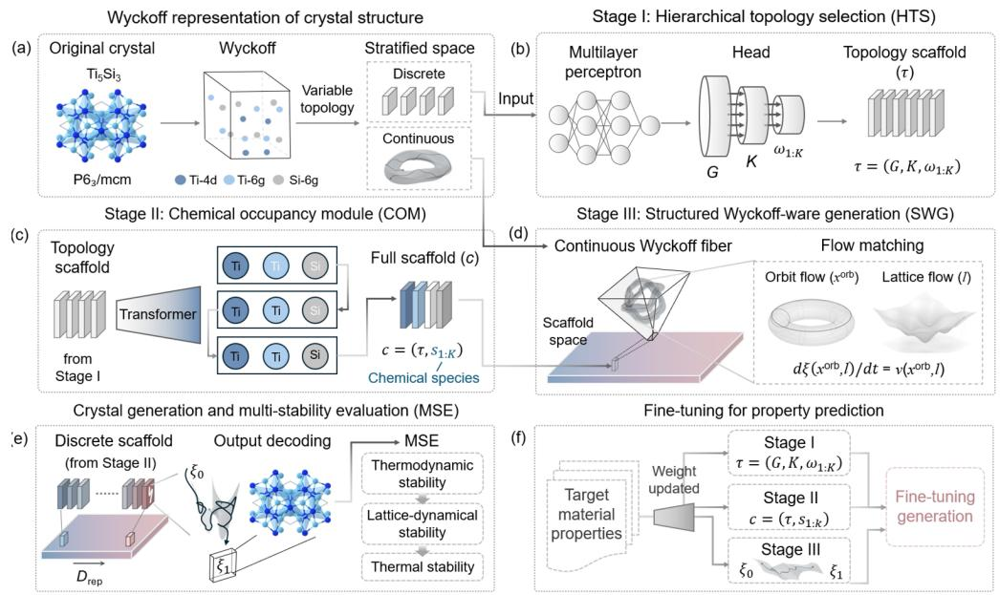  
Fig. 1 Workflow of UFO-MGen for generating accurate crystal structures and predicting their associated properties. (a) Wyckof representation of crystal structure in latent space. (b) Stage I: hierarchical topology section (HTS) for classifying crystal structures based on discrete information: space group (G), number of Wyckof orbits (K), and Wyckof letter sequence $\left( \omega _ { 1 : K } \right)$ using multilayer perceptron (MLP) network. The topology scafold (τ) is a fused representation of G, K and $\omega _ { 1 : K } .$ . (c) Stage II: chemical occupancy module (COM) for assigning chemical species $\left( s _ { 1 : K } \right)$ to each τ to form complete scafold $c = ( \tau , s _ { 1 : K } )$ using chemical constrains. (d) Stage III: structured Wyckof-aware generation (SWG) for embedding the discrete scafold and continuous fibers into hierarchical flow matching model to predict the velocity. (e) Crystal structure generation by decoding the output and multi-stability evaluation (MSE). (f) Fine-tuning of the UFO-MGen model for propertyconstrained generation and inverse materials design.

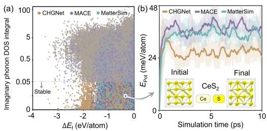

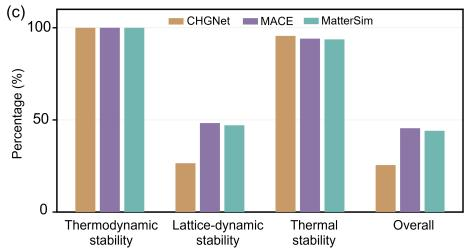

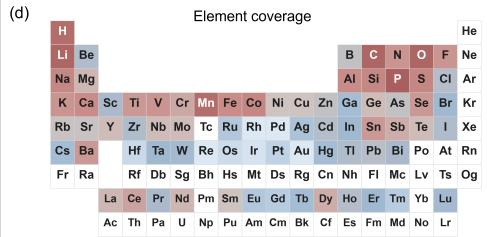

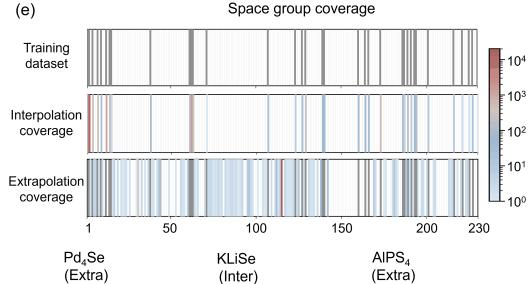

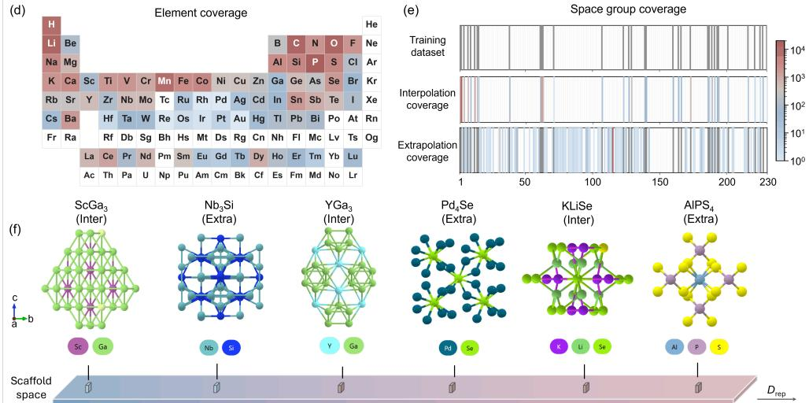  
Fig. 2 Mutli-stability evaluation (MSE) and extrapolation capability of UFO-MGen. (a) Distribution of generated crystal structure according to their thermodynamic and lattice-dynamical stabilities, screened using three universal machine learning interatomic potentials $\mathrm { ( M L I P s ) }$ . Thermodynamically stable structures are identified by negative formation energies $( \Delta E _ { \mathrm { f } } < 0 )$ , and lattice-dynamically stable structures are identified by the absence of imaginary phonon frequencies, quantified by an integral of imaginary phonon density of states (DOS) below 0.05 phonon modes. (b) Thermal stability assessment of all stable structures that satisfy the first two stability criteria using MLIP-based molecular dynamics (MD) simulations. Structures that maintain their initial configurations throughout the 10 ps NVT simulations at 300 K are classified as thermally stable structure, with $\mathrm { C e S _ { 2 } }$ shown as a representative example. (c) Success rates for each MSE criteria and the overall MSE success rate obtained using the three MLIPs. (d) Distribution of chemical elements represented in the fully stable crystals predicted by CHGNet. (e) Distribution of space group represented in the unified database, and in the interpolation and extrapolation predictions generated by UFO-MGen. (f) Representative generated crystals with diferent complexity dimension $D _ { \mathrm { r e p } }$ values, all of which are validated by DFT calculations in Supplementary Section 4.1.

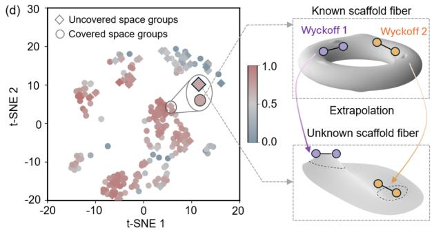

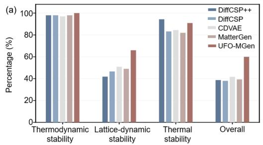

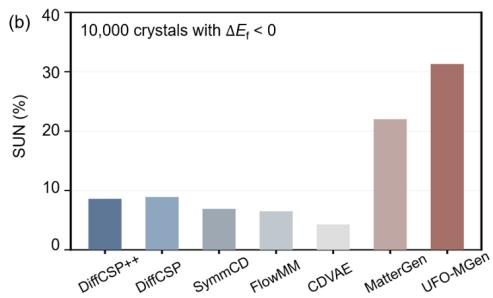

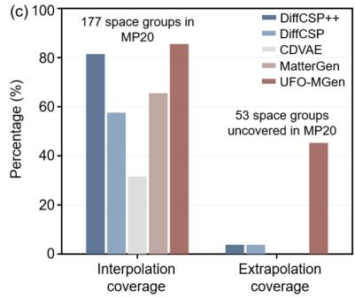  
Fig. 3 Performance comparison between UFO-MGen and other generative models. (a) Comparison of the MSE success rates achieved by UFO-MGen and other generative models. (b) Comparison of the SUN rates achieved by UFO-MGen and other generative models. (c) Comparison of the interpolation and extrapolation capabilities among diferent generative models. (d) Similarity analysis of the scafold features of 10,000 generated crystals visualized using t-SNE. The red color represents the high similarity and blue color means low similarity. The right schematic illustrates the extrapolation mechanism of UFO-MGen, in which crystals are generated by transferring similar Wyckof features across neighboring scafold fibers associated with diferent space groups.

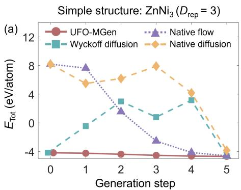

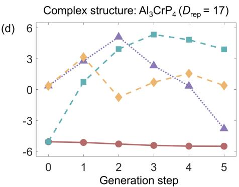

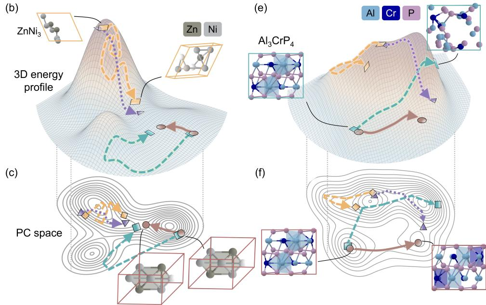  
Fig. 4 Ablation studies on the performance of UFO-MGen for the importance of unified Wyckof representation and flow-matching. (a) Evolution of the total energy during the generation of a representative ZnNi3 system with a relatively simple crystal structure. Four generative methods are compared: UFO-MGen, a difusion model based on Wyckof space, a flow-matching model in native crystal space, and a difusion model in native crystal space. The corresponding schematics of three-dimensional (3D) energy trajectories and two-dimensional (2D) principal component (PC) projections are shown on the right side of panel. (b) Evolution of the total energy during the generation of a representative $\mathrm { A l _ { 3 } C r P _ { 4 } }$ system with a more complex crystal structure using the same four generative methods. The corresponding 3D energy profile and 2D PC projections are shown on the right side of the panel.

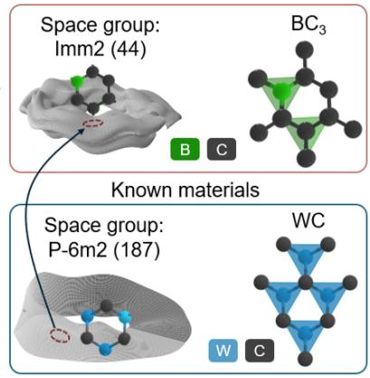  
UFO-predicted

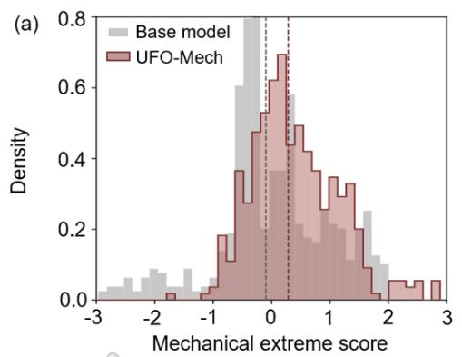

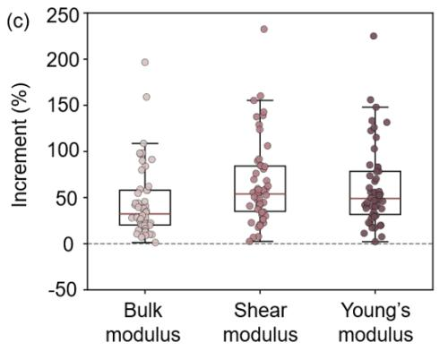

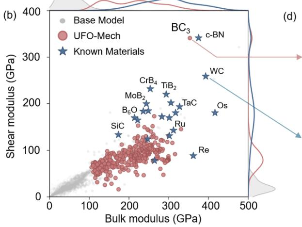  
Fig. 5 Fine-tuning of UFO-MGen for property-constrained generations. (a) Distribution of crystal structures generated by the base UFO-MGen model and the fine-tuned model (UFO-Mech), evaluated using the mechanical extreme score defined based on the bulk modulus, shear modulus, and Young’s modulus. (b) Distribution of crystal structures generated by both base and fine-tuned models in the shear-bulk modulus diagrams, compared with representative known materials exhibiting exceptional mechanical properties. To avoid inconsistencies between experimental measurements and computational predictions, the mechanical properties of the known materials are recalculated using the MatterSim for consistent comparison. (c) Percentage improvements in the mechanical properties of 50 selected materials after imposing one of the most common scafold features identified from the red cluster in panel (b). (d) Schematic comparison of the scafolds of two representative materials with high mechanical properties: $\mathrm { B C } _ { 3 } ,$ , predicted by UFO-Mech, and WC, an existing materials known for its high mechanical performance.

# Supplementary Information

Topology-Stratified Materials Discovery with A Flow-based Generative Model

Jingyi Zhou1, Oyshee Chowdhury1, Noah Oyeniran1, Chongze Hu1,2

1. Department of Aerospace Engineering and Mechanics, The University of Alabama, Tuscaloosa, Alabama 35487, United States

2. Alabama Materials Institute, The University of Alabama, Tuscaloosa, Alabama 35487, United States

## Contents

S1 Wyckof Representation of Crystal Structures 3   
S1.1 Original presentation of Wyckof points . 3   
S1.2 Crystal scafolds and associated parameters 4   
S1.3 Database analysis using scafold parameters 6   
S2 Stratified Wyckof Space and Unification 9   
S2.1 Wyckof-stratified parameter space 9   
S2.2 Unification of Wyckof representation 11   
S3 UFO-MGen Architecture and Training Objective 13   
S3.1 Stage I: Hierarchical topology selection (HTS) 14   
S3.2 Stage II: Chemical occupancy module (COM) 16   
S3.3 Stage III: Structured Wyckof-aware generation (SWG) . 17   
S3.4 Training objective and loss decomposition 20   
S3.5 Sampling procedure 21   
S3.6 Training and sampling pseudocode 22   
S4 DFT Validation of UFO-MGen Prediction 23   
S4.1 DFT structural optimization and thermodynamic stability . 23   
S4.2 DFT validation of lattice-dynamic stability 24   
S4.3 AIMD validation of thermal stability 24   
S4.4 DFT validation of additional generated crystals 27   
S4.5 Comparison with Baseline Generative Models 27   
S5 Evaluation Metrics 30   
S5.1 Public metrics . 30   
S5.2 Interpolation and extrapolation metrics 32   
S6 Ablation Studies of UFO-MGen Performance 34   
S6.1 Ablation test for Stage I: HTS . 34   
S6.2 Ablation test for Stage II: COM . 34   
S6.3 Ablation test for Stage III: SWG 34   
S7 Inverse Materials Design 36   
S7.1 Fine-tuning architecture 36   
S7.2 Mechanical property datasets 36   
S7.3 DFT validation of UFO-Mech . 37   
S7.4 Scafold efect on mechanical properties 38

## S1 Wyckof Representation of Crystal Structures

The dificulty in crystal generation lies not merely in the joint modeling of atomic species, lattice parameters, and fractional coordinates, but in the fact that the generation of real crystals does not occur within a smooth, natural coordinate space [1, 2, 3]. Traditional representations depict a crystal containing N atoms as a concatenation of lattice parameters and the coordinates of all atoms; however, this approach sufers from two fundamental issues: (1) Due to symmetry, unit-cell choices, origin choices, and atom-index permutations, a single physical crystal can correspond to a multitude of distinct coordinate descriptions [4]; and (2) the orbit space corresponding to special positions is not a smooth subset of ordinary Euclidean space, but rather exhibits hierarchical and singular structures induced by site-symmetry enhancement and Wyckof-position specialization [5]. Consequently, directly learning the generative distribution within this $3 N + 6 { \mathrm { - d i m e n s i o n a l } }$ degrees of freedom (DOFs) space mixes symmetry equivalences, singular boundaries, and true DOF [6, 7, 8].

This paper addresses these challenges by mapping the naive crystal representation into a Wyckof representation based on the International Tables for Crystallography and standard crystallographic orbit conventions [9, 10]. The advantages of this approach are twofold: it treats the independent orbits—defined under the crystal’s space group—as the primary objects of interest, retaining only the elemental species, Wyckof letters, and free coordinates associated with each orbit [1, 9, 10]. This efectively compresses the dimensionality of the continuous representation from $3 N + 6$ to a lower dimension, which is dominated by the number of independent orbits. Furthermore, by leveraging space group operations to naturally preserve crystal symmetry, this method allows for the reconstruction of the complete crystal structure while shifting the metric of “complexity” away from a simple count of atoms and toward the degrees of freedom that truly reflect the inherent dificulty of the generative process [11, 12].

## S1.1 Original presentation of Wyckof points

A periodic crystal can be defined as:

$$
\begin{array} { r } { \mathcal { C } = \left( \mathbf { M } , \{ ( s _ { i } , x _ { i } ) \} _ { i = 1 } ^ { N } \right) , } \end{array}\tag{1}
$$

where $\mathbf { M } \in \mathbb { R } ^ { 3 \times 3 }$ is the lattice matrix, $s _ { i }$ is the atomic species of atom $i ,$ and $x _ { i } \in \mathbb { T } ^ { 3 } = [ 0 , 1 ) ^ { 3 }$ is its fractional coordinate [1]. If the lattice matrix M is replaced by lattice parameters $\ell = ( a , b , c , \alpha , \beta , \gamma )$ the system has $3 N + 6$ continuous degrees of freedom. However, for a given structure, the action of the space group introduces significant redundancy through many equivalent coordinate sets; furthermore, the arrangement of equivalent atoms within an orbit introduces additional internal arrangement redundancy [9].

To eliminate this redundancy, we employ the concept of symmetry orbits under a space group $G .$ For a point $x ,$ its orbit under the space group $G$ is

$$
{ \mathrm { O r b } } _ { G } ( x ) = \{ g ( x ) { \mathrm { ~ m o d ~ } } \Lambda : \ g \in G \} ,\tag{2}
$$

and its stabilizer is given by:

$$
\operatorname { S t a b } _ { G } ( x ) = \{ g \in G : \ g ( x ) \equiv x { \pmod { \Lambda } } \} .\tag{3}
$$

A Wyckof position is characterized by its site multiplicity $( m _ { k } )$ , which is determined by:

$$
m _ { k } = { \frac { | G _ { 0 } | } { | \mathrm { S t a b } _ { G } ( x _ { k } ) | } } ,\tag{4}
$$

where k is Wyckof orbit and $x _ { k }$ is representative coordinate of the k-th Wyckof orbit. Its number of free parameters, $d _ { k }$ , can be defined as:

$$
d _ { k } = 3 - \dim \bigl ( \operatorname { F i x } ( \operatorname { S t a b } _ { G } ( x _ { k } ) ) \bigr ) ,\tag{5}
$$

where $d _ { k } \in \{ 0 , 1 , 2 , 3 \}$ can be explained by the number of independent continuous parameters that must be explicitly specified for that Wyckof orbit k [5]. General Wyckof positions typically exhibit higher $d _ { k }$ values, whereas highly symmetric special positions often lead to $d _ { k } = 0$ . For instance, Fig. S1.1(a) shows that the NaCl structure has $d _ { k } = 0$ for both Na and Cl because both atoms occupy fixed high-symmetry Wyckof positions. In contrast, Fig. S1.1(b) shows a more complex material system, CaSn $\mathrm { P _ { 2 } O _ { 7 } }$ with $P 2 _ { 1 } / c$ space group. In this structure, the symmetry-independent atoms occupy general Wyckof positions whose coordinate templates contain three free fractional parameters (i.e., x, y and $z ,$ see Fig. S1.1(b)). As a result, the corresponding Wyckof orbits have $d _ { k } = 3$ , leading to a higher-dimensional Wyckof representation than the highly symmetric NaCl crystal.

Following above procedures, we re-encode the original atom crystal representation into a Wyckof representation:

$$
\phi ( \mathcal { C } ) = \Big ( G , \ell , \{ ( w _ { k } , s _ { k } , x _ { k } ^ { \mathrm { f r e e } } ) \} _ { k = 1 } ^ { K } \Big ) ,\tag{6}
$$

where G is the space group, ℓ denotes the symmetry-constrained lattice parameters, K is the number of symmetry-independent Wyckof orbits [10], $w _ { k }$ is the Wyckof letter, $s _ { k }$ is the species assigned to orbit $k ,$ and $x _ { k } ^ { \mathrm { f r e e } } \in \mathbb { T } ^ { d _ { k } }$ are the free coordinates of that Wyckof orbit.

## S1.2 Crystal scafolds and associated parameters

The Wyckof representation in Eq. 6 contains both discrete Wyckof information $( \mathrm { e . g . } , G , K , \omega _ { 1 : K }$ $s _ { 1 : K }$ , and others) and continuous parameters (e.g., ℓ and $x _ { k } ^ { \mathrm { f r e e } } )$ . To separate the discrete and continuous information, we define a crystal scafold (c) to only represent the discrete Wyckof information only, and thus c can be expressed as:

$$
c = ( G , K , w _ { 1 : K } , s _ { 1 : K } )\tag{7}
$$

which specifies the space group (G), the number of Wyckof orbits $( K )$ , the Wyckof-letter sequence $\left( \omega _ { 1 : K } \right)$ , and chemical species $\left( s _ { 1 : K } \right)$ to each Wyckof orbit (k).

Using this scafold representation, we introduce a parameter, called scafold intrinsic dimension

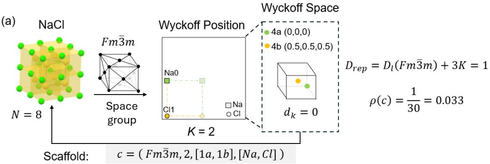

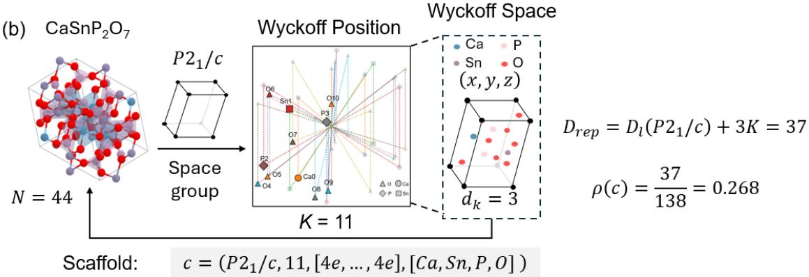  
Figure S1.1: Workflow of transforming a three-dimensional crystal structure into the Wyckof-space encoded representation: (a) Wyckof representation of cubic NaCl with space group $F m \bar { 3 } m$ . The high symmetry of NaCl crystal has 2 representative points $\left( K = 2 \right)$ , 0 degrees of freedom $( d _ { k } = 0 )$ , and a lower $D _ { \mathrm { r e p } }$ value of 1. (b) Wyckof representation of monoclinic $\mathrm { C a S n P _ { 2 } O _ { 7 } }$ with space group $P 2 _ { 1 } / c$ . The more complex $\mathrm { C a S n P _ { 2 } O _ { 7 } }$ crystal has 11 representative points $( K = 1 1 )$ , 3 degrees of freedom $( d _ { k } = 3 )$ , and a higher $D _ { \mathrm { r e p } }$ value of 37.

$( D _ { \mathrm { r e p } } )$ , to describe the space and complexity of a certain scafold c:

$$
D _ { \mathrm { r e p } } ( c ) = D _ { \ell } ( G ) + \sum _ { k = 1 } ^ { K } d _ { k } ,\tag{8}
$$

where $D _ { \ell } ( G )$ is the number of independent lattice degrees of freedom allowed by the crystal system of G. According to the ITA lattice constraints [1], $D _ { \ell }$ has following relations: $D _ { \ell } = 1$ for cubic systems, $D _ { \ell } = 2$ for tetragonal, hexagonal, and trigonal systems, $D _ { \ell } = 3$ for orthorhombic systems, $D _ { \ell } = 4$ for monoclinic systems, and $D _ { \ell } = 6$ for triclinic systems. Since $D _ { \mathrm { r e p } }$ directly quantifies the number DOFs of a certain crystal structure in Wyckof space, this parameter can be considered as a core measure of the complexity of a crystal scafold.

Based on the value of $D _ { \mathrm { r e p } }$ , we can introduce another scafold parameter, called compression ratio (ρ) as:

$$
\rho ( c ) = \frac { D _ { \mathrm { r e p } } ( c ) } { 3 N + 6 } ,\tag{9}
$$

This quantity describes the extend to which crystal symmetry reduces the dimensionality of the naive coordination representation. Accordingly, the Wyckof representation reframes the concept of “complexity”—shifting it from “how many atoms are present” to “how many independent orbits exist, how many free parameters are associated with each orbit, and how many degrees of freedom remain within the lattice itself.”

## S1.3 Database analysis using scafold parameters

To evaluate the eficiency of the proposed Wyckof parameters $( D _ { \mathrm { r e p } }$ and $\rho )$ for representing the crystal structures, we calculated both quantities for all structures in the Materials Project database (v2026.03.15) [13]. This database contains 154,875 crystal structures with unit cells ranging from 1 to 444 atoms and their compositions spanning 89 chemical elements. It is worth noting that although the MP database covers most of the chemical elements in periodic table, the element occurrence is highly uneven, as shown in Fig. S1.2. For instance, common inorganic constituents such as O, Li, Na, K, Ca, Fe, Si, F and Cl appear in many structures, whereas noble gases, radioactive elements and several rare elements are weakly represented or absent.

After classifying these data points based on their $D _ { r e p }$ and $\rho$ values, the total MP dataset yields 18,074 distinct scafolds across 35 diferent space groups. We further select the trainable data points based on three criteria: First, the corresponding structures can be successfully standardized and encoded using the Wyckof representation. Second, the scafold contains no failed, duplicated, or unstable encodings. Third, each scafold has enough training examples. In the expanded setting, we use trainable quantity $n _ { \mathrm { t r a i n } } \geq 1 0 0$ as the minimum support threshold. These criteria yield 32,550 crystal structures with 119 trainable scafold features.

Based on these trainable scafolds, we further analyze their structural characteristics and their coverage of crystal structures and chemical elements. Figure S1.3(a) shows the scafold-size distribution, where a small number of scafolds contain hundreds to thousands of structures, whereas most scafolds are represented by only a few configurations. The 119 scafolds used for training are selected from the left region in Fig. S1.3(a), as they contain suficient examples to reliably train the UFO-MGen. In contrast, the remaining scafolds contain insuficient examples for stable scafoldspecific flow training and are therefore retained for dataset statistics and coverage analyses but are not used as primary routes for continuous flow training.

The crystal structure distribution of the trainable scafold is further analyzed in Fig. S1.3(b), where the scafolds are mapped onto the $D _ { \mathrm { r e p } } - \rho$ space and colored based on their crystal systems. Grey points denote all canonical scafolds, while colored points denote the scafolds selected for training. The selected set covers all seven crystal systems and spans a broad range of representation complexity and Wyckof density. Thus, the trainable scafold pool is not limited to the simplest cases; it also includes high-complexity and weakly compressed regions, especially in monoclinic and triclinic systems. Such a diverse distribution demonstrates that $D _ { \mathrm { r e p } }$ and $\rho$ parameters can efectively capture the complexity of crystal structures in Wyckof space, making them efective descriptors for representing crystal structures in latent space.

Finally, we analyze the space-group distribution of the trainable scafolds. Figure S1.3(c) summarizes the distribution of the 119 trainable scafolds across space groups. Although the training dataset covers only 35 space groups, these space groups are broadly distributed across the full crystallographic range from No. 1 to No. 230. This broad distribution ensures that Stage III is trained across diverse symmetry regimes rather than being restricted to a narrow subset of common space groups.

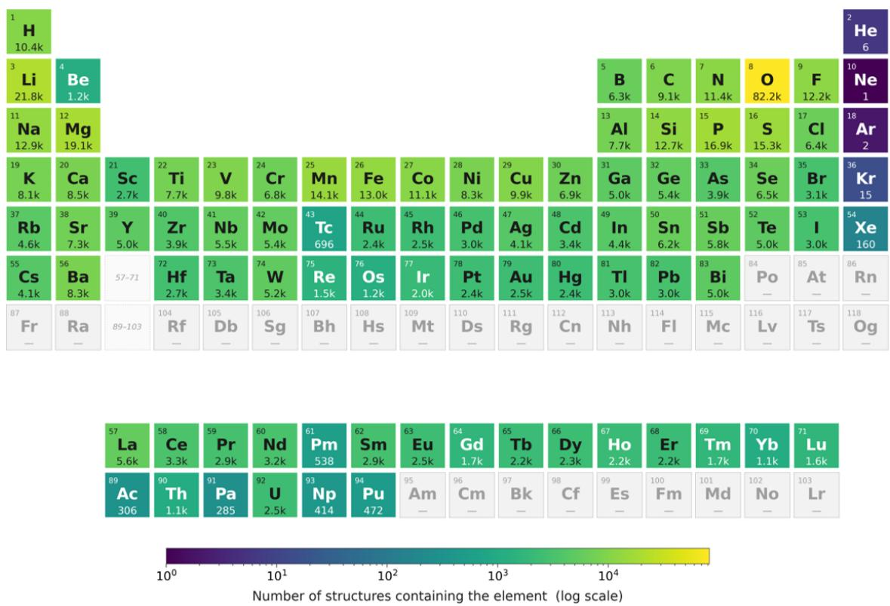  
Figure S1.2: Element coverage in the Materials Project dataset containing 154,875 crystal structures. The dataset covers 89 elements, but the distribution is strongly imbalanced, with common inorganic elements appearing much more frequently than noble gases, radioactive elements, and several rare elements. Colors are shown on a logarithmic scale: dark blue indicates elements appearing in only a few structures, green indicates intermediate-frequency elements, and yellow indicates highly frequent elements appearing in tens of thousands of structures. Gray cells indicate elements absent from the dataset.

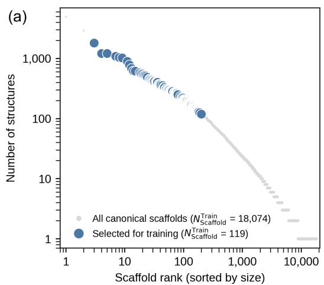

(b)  
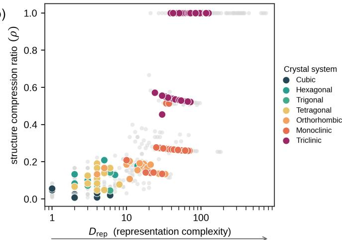

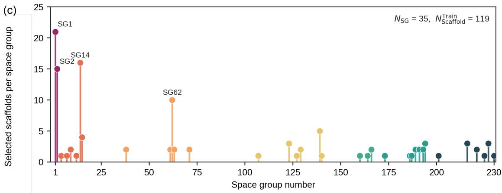  
Figure S1.3: Trainable scafold pool and long-tailed scafolds distribution. (a) Scafold-support distribution after Wyckof encoding and canonicalization. The expanded corpus contains 18,074 canonical scafolds, but most scafolds are weakly supported, meaning that they contain only a small number of structures. The 119 scafolds selected for training lie in the high-support region and satisfy the minimum support threshold $n _ { \mathrm { t r a i n } } \geq 1 0 0 .$ . (b) Coverage of the trainable scafolds in the $D _ { \mathrm { r e p } } - \rho$ complexity space. Grey points denote all canonical scafolds, while colored points denote the selected trainable scafolds. Colors indicate crystal systems. The selected scafolds span both low- and high-complexity regions and cover all seven crystal systems. (c) Distribution of the selected scafolds over space groups. The trainable scafold pool covers 35 space groups, with 119 selected scafolds in total. The vertical bars show the number of selected scafolds associated with each space group, and colors again indicate crystal systems.

## S2 Stratified Wyckof Space and Unification

This section explains why crystal generation in Wyckof space is not naturally defined on a single smooth manifold. The key point is that high-symmetry atomic positions create lower-dimensional geometric limits, while diferent scafolds induce diferent continuous fibers. Together, these three facts motivate the formulation of UFO-MGen as a multi-stage frameworks to handle the non-smooth manifold of crystal structure generation in Wyckof space.

## S2.1 Wyckof-stratified parameter space

Conventional generative modeling is typically formulated on a fixed-dimensional smooth space, such as an Euclidean space or a single Riemannian manifold [14, 15]. However, this assumption is not valid for crystal generation. This is because even when the space group and the scafold are fixed, the Wyckof crystal parameter space is not globally smooth. As continuous Wyckof coordinates approach special positions, the local site symmetry increases and the number of free degrees of freedom decreases, leading to changes in the dimensionality of the representation space. As a result, the Wyckof representation space is more appropriate to define as a union of multiple smooth manifolds with diferent dimensions, rather than a single smooth manifold. Accordingly, the efective Wyckof representation for a fixed scafold (c) can be expressed as:

$$
{ \mathcal { W } } ( c ) = { \mathcal { W } } _ { \mathrm { r a w } } ( c ) \setminus \left( { \mathcal { W } } _ { \mathrm { s p e c } } ( c ) \cup { \overline { { { \mathcal { W } } _ { \mathrm { c o l l } } ( c ) } } } \right) ,\tag{10}
$$

where $\mathcal { W } _ { \mathrm { r a w } }$ is the raw Wyckof space, $\mathcal { W } _ { \mathrm { s p e c } }$ denotes the special subset of $\mathcal { W } _ { \mathrm { r a w } } .$ , and $\mathcal { W } _ { \mathrm { c o l l } }$ denotes the the collision subset of ${ \mathcal { W } } _ { \mathrm { r a w } }$ . More specifically, the $\mathcal { W } _ { \mathrm { s p e c } }$ corresponds to cases where free parameters at special positions with high symmetry $( \mathrm { e . g . , } x = 0 \ \mathrm { o r } \ x = y )$ . The $\mathcal { W } _ { \mathrm { c o l l } }$ corresponds to cases where orbit distances are too short and hence can consider atoms collide.

The continuous nature of Wyckof space has important implications for generative modeling of crystal structures, as special Wyckof positions must be treated explicitly. For instance, Fig. S2.1(a) shows that when the entire Wyckof space is treated as an ordinary Euclidean space [2], symmetryinduced singularities may be incorrectly interpreted as noise, thereby obscuring the physical significance of special Wyckof positions such as $( x = 0 . 5$ and $y = 0 . 5 )$ . Figure S2.1(b) further illustrates the physical constraint that atoms cannot overlap or approach each other too closely, thereby excluding physically invalid configurations from the accessible Wyckof space.

To address this issue, we adopt a stratified framework for continuous generation, which transforms the continuous Wyckof parameters from a base distribution to the data distribution within a fixed scafold (c). The resulting dynamics are defined only on the smooth and physically valid region of each scafold parameter space, while the excluded lower-dimensional subsets are interpreted as geometric limits corresponding to symmetry-specialized Wyckof strata or physically invalid collision configurations.

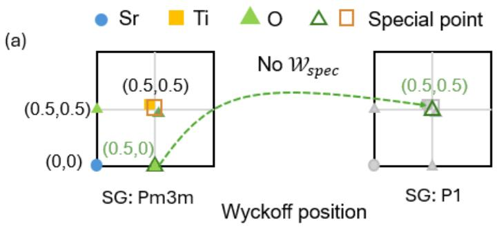

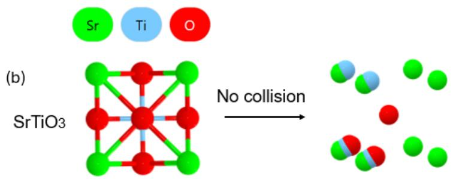  
Figure S2.1: Representation of discontinuous features in Wyckof space that needs a stratified framework to treat discontinuous and continuous features. (a) Special position treatment. (b) Collision treatment.

## S2.2 Unification of Wyckof representation

Conventional generative models, such as difusion and flow matching [3, 8, 16, 17], generally assume that crystal structures can be represented on a single smooth manifold. However, this assumption does not hold true for the Wyckof representation, where diferent scafolds have diferent number of continuous DOFs and are connected through discontinuous symmetry transitions. For instance, statistical analysis of the distribution of $D _ { \mathrm { r e p } }$ of all crystal structures in MP data suggest that about 89% of sampled scafold pairs have diferent representation dimensions. This clearly demonstrates that a single fixed-dimensional intrinsic manifold is not a good model for the crystal generation process, which also demonstrates the importance of adopting Wyckof unification to process the crystal data [8].

In this work, we introduce the concept of “unified Wyckof representation” that provides a coherent description of the stratified Wyckof space. Specifically, each scafold (c) defines a loca continuous manifold, referred as a fiber (F), that contains all continuous crystal structure information, such as lattice variables (ℓ) and free Wyckof coordinates $( x ^ { o r b } )$ . Since fibers corresponding to diferent scafolds generally have diferent dimensions, they need to be connected through lowerdimensional boundary regions representing special Wyckof positions. Rather than treating these special configurations as disconnected states, the topological fiber bundle theory [18] provides a natural framework for interpreting them as boundary connections between neighboring fibers of different dimensions. A rigorous mathematical formulation and proof of this concept will be presented in a separate study. Briefly speaking, this process unifies the description of both continuous structural variations within a scafold and discrete transitions between diferent scafolds, enabling crysta structures with diferent crystallographic representations to be modeled within a single framework, see Fig. S2.2.

Beyond crystallographic constraints, physical constraints such as atomic overlap, geometric validity, and energy stability further modify the topology of each fiber by excluding physically inaccessible regions. We refer to these topology changes as physically variable topology. Within each valid fiber, local structural variations are described using a Riemannian metric that measures how infinitesimal changes in lattice parameters and Wyckof coordinates afect the crystal geometry. Together, the global unification framework captures the connectivity among diferent crystallographic manifolds, while the local Riemannian geometry characterizes structural variations within each manifold, providing a unified mathematical description of crystal generation in Wyckof space.

The critical role of the unified Wyckof representation have been systematically evaluated through ablation studies, as shown in main-text Fig. 4. For isntance, the UFO-MGen significantly outperforms its counterparts trained on the MP databases without the unified Wyckof representation.

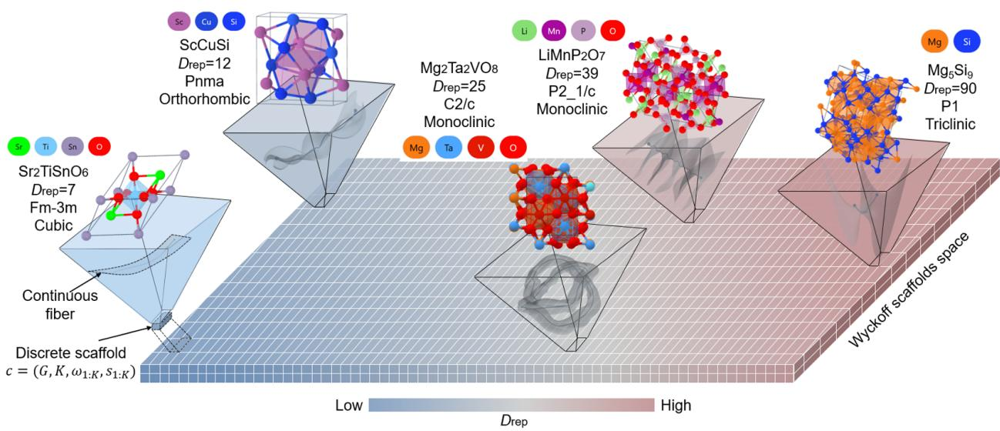  
Figure S2.2: Unification of Wyckof space. For each scafold, the special positions in its continuous fibers will be processed as the boundary of the fibers and connect with other fibers more smoothly. Such an unification can be extended to the entire Wyckof space characterized by the $D _ { \mathrm { r e p } }$ values.

## S3 UFO-MGen Architecture and Training Objective

Architecture of UFO-MGen: Owing to the stratified Wyckof space, we design the UFO-MGen as a hierarchical crystal generation process consisting of three stages: (i) Stage I: hierarchical topology selection (HTS), (ii) Stage II: chemical occupancy module (COM), and (iii) Stage III: Structured Wyckof-aware generation (SWG), as illustrated in Fig. S3.1. We briefly discuss the three stages below.

Universal Flow Omni-Materials Generation (UFO-MGen) model  
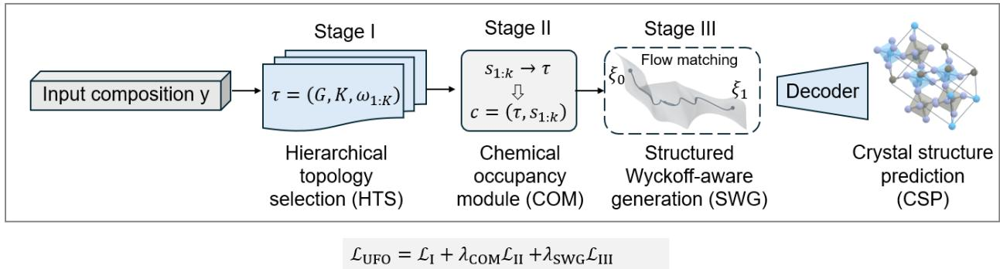  
Figure S3.1: Workflow of UFO-MGen with three key stages: Stage I: hierarchical topology selection (HTS) for topology-fixed scafold (τ) prediction; Stage II: chemical occupancy module (COM) for assigning chemical species to $\tau$ to generate complete scafold (c); and Stage III: Structured Wyckofaware generation (SWG) for using flow matching model to generate the continues lattice parameters and Wyckof coordination that was finally used for crystal structure predictions (CSP).

Stage I is motivated by the stratified features of Wyckof space, in which the crystallographic topology is determined before chemical species are assigned to each Wyckof orbit. Specifically, discrete Wyckof parameters such as space group (G), number of Wyckof orbits (K), Wyckof letter $\left( \omega _ { 1 : K } \right)$ , define a topology-only scafold, while the chemical species $\left( s _ { 1 : K } \right)$ are introduced later in Stage II. Since the full scafold defined in Eq. (7) contains both crystallographic topology and orbit-level chemistry, we separate its topology-only part $( \tau )$ as:

$$
\tau = ( G , K , w _ { 1 : K } ) .\tag{11}
$$

The motivation to define $\tau$ is that, once the scafold c is determined, the continuous variables lie in the corresponding smooth fiber ${ \mathcal { W } } _ { 0 } ( c )$ , which contains the valid ℓ and $x _ { k } ^ { \mathrm { f r e e } }$ for that scafold. This geometric decomposition motivates the design of hirarchical design of UFO-MGen: the model first selects a discrete scafold $c ,$ thereby selecting the target fiber, and then learns a continuous flow only within $\mathcal { W } _ { 0 } ( c )$ . In this way, UFO-MGen avoids learning a single continuous flow over a mixture of fibers with diferent dimensions and topological structures.

Stage II applies a chemical constrains based on the species occupancy on each orbits to improve the accuracy. The species assignment follows several physical and chemical constrains, such as charge balance, neural balance, and others to ensure the reasonable chemical occupation at each specific Wyckof orbit site.

Stage III integrates lattice variables together with the Wyckof free coordinates to define the continuous crystal geometry. Flow-matching is incorporated in Stage III to generate continuous fibers, which are then combined with the complete scafolds obtained from Stage II to reconstruct the corresponding 3D crystal structures.

Probability propagation in UFO-MGen: Based on the architecture of UFO-MGen discussed above, the overall probability $p ( \tau , s _ { 1 : k } , \xi \mid y )$ can be defined using the three-stage factorization:

$$
p ( \tau , s _ { 1 : K } , \xi \mid y ) = \pi _ { \alpha } ( \tau \mid y ) p _ { \phi } ( s _ { 1 : K } \mid \tau , y ) p _ { \theta } ( \xi \mid \tau , s _ { 1 : K } , y ) .\tag{12}
$$

Here $y$ is the the input for UFO-MGen as shown in Fig. S3.1, which contains basic information of a crystal, such as chemical species $\left( s _ { 1 : K } \right)$ , total number of atoms $( N )$ , and others. Stage I learns $\pi _ { \alpha } ( \tau \mid y )$ , the route-aware topology selector. Stage II learns $p _ { \phi } ( s _ { 1 : K } \mid \tau , y )$ , the chemical occupancy module (COM). Stage III learns $p _ { \theta } ( \xi \mid \tau , s _ { 1 : K } , y )$ , the structured Wyckof-aware generator, and $\xi$ is the coordination representation that combines ℓ and $x ^ { o r b }$

$$
\xi = ( \ell , x ^ { \mathrm { o r b } } )\tag{13}
$$

Loss functions of UFO-MGen: Based on the Fig. S3.1, the overall loss of the entire framework can be simply expressed as:

$$
\mathcal { L } _ { \mathrm { U F O } } = \mathcal { L } _ { \mathrm { I } } + \lambda _ { \mathrm { C O M } } \mathcal { L } _ { \mathrm { I I } } + \lambda _ { \mathrm { C F M } } \mathcal { L } _ { \mathrm { I I I } } .\tag{14}
$$

where $\mathcal { L } _ { \mathrm { I } } , ~ \lambda _ { \mathrm { C O M } } \mathcal { L } _ { \mathrm { I I } }$ , and $\lambda _ { \mathrm { C F M } } \mathcal { L } _ { \mathrm { I I I } }$ are the loss of Stage I (Eq. 17), II (Eq. 20), and III (Eq. 25), respectively. In the following sections, we described the detailed architecture of each stage and the corresponding loss functions used to train models.

## S3.1 Stage I: Hierarchical topology selection (HTS)

## S3.1.1 Architecture of Stage I

The main target of Stage I is to predict the topology scafold, $\tau \ \mathrm { ( E q . \ 1 1 ) }$ , of a crystal in the Wyckof parameter space from the input composition $y ,$ where y is a 125-dimensional feature vector constructed from the target chemical formula:

$$
y = [ f _ { \mathrm { e l e m } } , \log ( 1 + n _ { \mathrm { a t o m s } } ) , b _ { \mathrm { a t o m s } } ]\tag{15}
$$

where $f _ { \mathrm { e l e m } } \in \mathbb { R } ^ { 1 2 0 }$ is the element-fraction vector over the fixed element vocabulary, $\log ( 1 + n _ { \mathrm { a t o m s } } )$ is a scalar that represents the total number of atoms, and $b _ { \mathrm { a t o m s } } \in \mathbb { R } ^ { 4 }$ is a one-hot atom-count bucket feature.

In addition to predicting τ , Stage I is designed to use a two-layers MLP with hidden dimension of 256 to learn the basic structural relationships among crystal scafolds underlying the unified Wyckof parameter space. By learning this unified space, UFO-MGen distinguishes crystals with diferent $D _ { \mathrm { r e p } }$ values and learns their corresponding topological features, providing a shared feature

Stage I: Hierarchical topology selection (HTS)

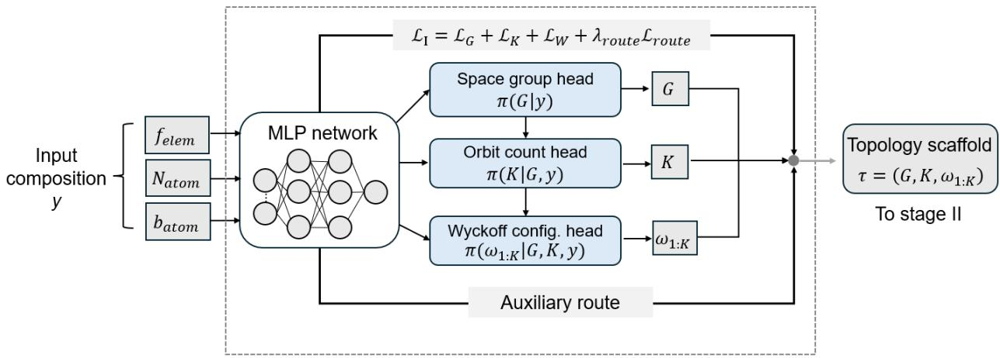  
Figure S3.2: Workflow of UFO-MGen Stage I for hierarchical topological selection (HTS).

space for the hierarchical prediction of the topology scafold $\tau .$ . Therefore, it is more eficient than learning within the traditional atom-by-atom learning space.

The topology labels used for training are obtained from dataset unification process, as discussed in Section S2. During this step, topology scafold features belonging to the special $\mathcal { W } _ { \mathrm { s p e c } }$ are examined according to hierarchical ordering $G  K  w _ { 1 : K }$ , with following hierarchical factorization:

$$
\pi _ { \alpha } ( \tau \mid y ) = \pi _ { \alpha } ( G \mid y ) \pi _ { \alpha } ( K \mid G , y ) \pi _ { \alpha } ( w _ { 1 : K } \mid G , K , y ) ,\tag{16}
$$

where $\pi _ { \alpha }$ is a conditional distribution. If the re-encoding criteria are satisfied, a boundary configuration associated with a high-dimensional topology scafold is re-encoded as the corresponding low-dimensional topology scafold. Otherwise, the structure is labeled as boundary-ambiguous. The resulting canonicalized topology scafolds serve as the training targets for Stage I.

The MLP learns the mapping from the input composition to the topology features used to predict G, K, and $\omega _ { 1 : K }$ . The auxiliary route helps separate diferent topology scafolds in the feature space and improves scafold predicted ability.

## S3.1.2 Loss function of Stage I

Based on the architecture of Stage I shown in Fig. S3.2, the overall loss function of stage I (LI) can be determined as:

$$
{ \mathcal { L } } _ { \mathrm { I } } = { \mathcal { L } } _ { G } + { \mathcal { L } } _ { K } + { \mathcal { L } } _ { w } + \lambda _ { \mathrm { s t a t e } } { \mathcal { L } } _ { \mathrm { s t a t e } } + \lambda _ { \mathrm { s p e c } } { \mathcal { L } } _ { \mathrm { s p e c } } + \lambda _ { \mathrm { a m b } } { \mathcal { L } } _ { \mathrm { a m b } }\tag{17}
$$

where $\mathcal { L } _ { \mathrm { s t a t e } }$ is the model explicitly distinguishes between the three states, $\mathcal { L } _ { \mathrm { s p e c } }$ is used for mapping to low-dimensional topology scafolds, ${ \mathcal { L } } _ { \mathrm { a m b } }$ handles boundary structures.

## S3.2 Stage II: Chemical occupancy module (COM)

## S3.2.1 Architecture of Stage II

Stage II is a Chemical Occupancy Module (COM) that assigns chemical species $s _ { 1 : K }$ to the Wyckof orbits of the specific topology scafold τ . This assignment is designed to satisfy the target composition, the Wyckof multiplicities $( m _ { k } )$ , and basic chemical priors. Once COM is complete, the full scafold, $^ { c , }$ as defined in Eq. (7) is obtained. The completed scafold c is then passed to Stage III, where it identifies the corresponding Wyckof fiber $\mathcal { F } _ { c }$ and serves as the basis for generating the geometric features of the crystal.

Stage II: Chemical occupancy module (COM)  
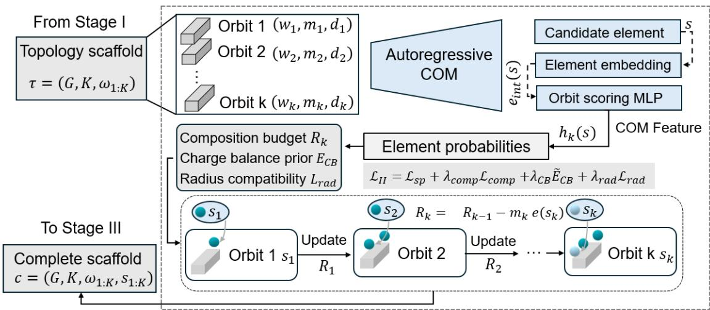  
Figure S3.3: Workflow of UFO-MGen Stage II for chemical occupancy module (COM). This stage is designed to assign the chemical species at each Wyckof orbit on the top of the scafold.

Fig. S3.3 illustrates the detailed architecture of Stage II for COM. Conditioned on the topologyonly scafold ${ \tau } = ( G , K , w _ { 1 : K } )$ predicted by Stage I, COM assigns $s _ { 1 : K }$ to the Wyckof orbits in an autoregressive manner, thereby constructing the full scafold $c = \left( \tau , s _ { 1 : K } \right)$ . Accordingly, the conditional probability distribution learned by COM $\left( p _ { \phi } \right)$ is factorized as:

$$
p _ { \phi } ( s _ { 1 : K } \mid \tau , y ) = \prod _ { k = 1 } ^ { K } p _ { \phi } ( s _ { k } \mid s _ { 1 : k - 1 } , \tau , y , R _ { k - 1 } ) ,\tag{18}
$$

where $R _ { k - 1 }$ is the residual composition budget after assigning the first k − 1 orbits. If Wyckof orbit k has multiplicity $m _ { k }$ , assigning species $s _ { k }$ contributes $m _ { k }$ atoms of that element to the unit-cell composition.

To determine the chemical occupancy of each Wyckof orbit, COM integrates three groups of information, including (i) global composition feature y, (ii) topology features, such as $G , K , w _ { 1 : K }$ $m _ { k }$ , and orbit degrees of freedom, and (iii) autoregressive history and residual budget $R _ { k - 1 }$ . For each candidate chemical species (s), it can be represented by a hybrid element embedding:

$$
e _ { \mathrm { i n t } } ( s ) = [ e _ { \mathrm { l e a r n } } ( s ) \parallel f _ { \mathrm { p h y s } } ( s ) ] ,\tag{19}
$$

where $e _ { \mathrm { l e a r n } } ( s )$ is a a trainable element embedding learned during Stage-II training, $f _ { \mathrm { p h y s } } ( s )$ contains fixed chemical descriptors such as periodic-table group, electronegativity, common oxidation states, ionic or covalent radius, and valence information. These descriptors are used as statistical chemical priors that guide the occupancy assignment, rather than imposing explicit quantum-mechanical constraints.

## S3.2.2 Loss functions of Stage II

Based on the COM architecture shown in Fig. S3.3, the overall loss function of COM is defined as:

$$
\mathcal { L } _ { \mathrm { I I } } = \mathcal { L } _ { \mathrm { s p } } + \lambda _ { \mathrm { c o m p } } \mathcal { L } _ { \mathrm { c o m p } } + \lambda _ { \mathrm { C B } } \widetilde { E } _ { \mathrm { C B } } + \lambda _ { \mathrm { r a d } } \mathcal { L } _ { \mathrm { r a d } }\tag{20}
$$

where the first term $\mathcal { L } _ { \mathrm { s p } }$ is the species-assignment negative log-likelihood, which can be determined by $\mathcal { L } _ { \mathrm { s p } } = - \log p _ { \phi } ( s _ { 1 : K } \mid \tau , y )$ ; the second term $\mathcal { L } _ { \mathrm { c o m p } }$ is penalizes violations; the third term $\lambda _ { \mathrm { C B } } \widetilde { E } _ { \mathrm { C B } }$ is a relaxed charge-balance penalty; and last term $\lambda _ { \mathrm { { r a d } } } \mathcal { L } _ { \mathrm { { r a d } } }$ is a weak radius-compatibility penalty, which is determined by $\begin{array} { r } { \mathcal { L } _ { \mathrm { r a d } } = \sum _ { k = 1 } ^ { K } E _ { \mathrm { r a d } } ( s _ { k } , w _ { k } ) } \end{array}$

## S3.2.3 Chemical constrains

The charge-balance prior is based on:

$$
\sum _ { k = 1 } ^ { K } m _ { k } q _ { k } = 0 ,\tag{21}
$$

where $q _ { k }$ is an oxidation state assigned to species $s _ { k }$ . This should not be treated as a universal hard rule. It is useful for many ionic compounds, but it may not apply cleanly to metals, intermetallics, or strongly covalent systems. We therefore use the relaxed form:

$$
\widetilde { E } _ { \mathrm { C B } } = \operatorname* { m i n } _ { \widetilde { q } _ { 1 } , \dots , \widetilde { q } _ { K } } \left( \sum _ { k = 1 } ^ { K } m _ { k } \widetilde { q } _ { k } \right) ^ { 2 } + \lambda _ { \mathrm { o x } } \sum _ { k = 1 } ^ { K } \operatorname* { m i n } _ { q \in \mathrm { O x S t a t e s } ( s _ { k } ) } ( \widetilde { q } _ { k } - q ) ^ { 2 } .\tag{22}
$$

Here $\tilde { q } _ { k }$ is a continuous relaxed oxidation state and $\mathrm { O x S t a t e s } ( s _ { k } )$ is the candidate oxidation-state set for element $s _ { k }$ . The weight $\lambda _ { \mathrm { C B } }$ can be reduced or set to zero for systems where oxidation-state models are not appropriate.

## S3.3 Stage III: Structured Wyckof-aware generation (SWG)

## S3.3.1 Architecture of Stage III

Stage III is responsible for generating the continuous Wyckof parameters $\xi ,$ defined in Eq. (12), based on the complete scafold c. Once the discrete scafold has been determined by Stage I and II, the corresponding Wyckof fiber $\mathcal { F } _ { c }$ is uniquely specified, and the remaining task is to generate the continuous parameter distribution associated with each scafold lies on a smooth manifold, while diferent scafolds correspond to diferent fibers with distinct topologies. To model these heterogeneous continuous distribution eficiently, Stage III employs a share neural network whose latent space is conditioned by the discrete scafold.

The continuous parameters ξ are generated using conditional flow matching [17, 19], a generative framework that learns a continuous-time transport from a simple base distribution to the target data distribution by regressing a velocity field along interpolation paths. In this framework, the flow model learns a time-dependent velocity field $v _ { \theta } ( \xi _ { t } , t , c , y )$ that transports samples from the base distribution to the data distribution of continuous Wyckof parameters associated with the fixed scafold. The corresponding continuous dynamics are given by:

$$
\frac { d \xi _ { t } } { d t } = v _ { \theta } ( \xi _ { t } , t , c , y ) , \qquad t \in [ 0 , 1 ] ,\tag{23}
$$

The scafold c conditions the velocity field by specifying the target Wyckof fiber, while $\xi _ { t }$ evolves only through the continuous lattice and orbit-coordinate variables. As a result, Stage III is only used to generate continuous features of the crystal (ℓ and $x ^ { o r b } )$ , while keep all the discrete features of a crystal fixed. The important modes included in Stage III are discussed below.

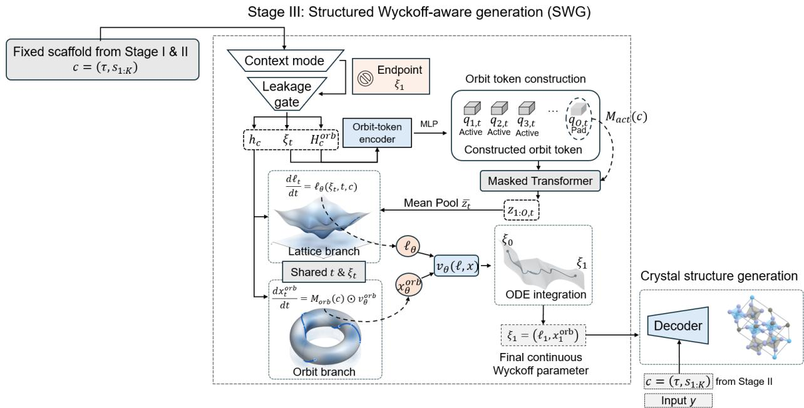  
Figure S3.4: Workflow of UFO-MGen Stage III for structured Wyckof-aware generation (SWG) using flow matching generative model.

Because diferent scafolds contain diferent numbers of Wyckof orbits and diferent numbers of free coordinates per orbit, the padded state representation contains many entries that do not correspond to real continuous variables. To enable a single neural network to process all scafolds, Stage III introduces scafold-specific masks that identify the valid degrees of freedom while ignoring padded entries. As a result, the same fixed-size tensor can represent crystals with diferent intrinsic dimensions.

Stage III employs two complementary masks. The orbit activity mask, $( M _ { \mathrm { { a c t } } } ( c ) ~ \in ~ 0 , 1 ^ { O } )$ identifies which padded orbit slots correspond to real Wyckof orbits in scafold (c). This mask is applied in the Transformer so that attention is computed only among active orbits, while padded or inactive orbits are completely ignored. The orbit coordinate mask, $( M _ { \mathrm { o r b } } ( c ) ~ \in ~ 0 , 1 ^ { O \times d _ { \mathrm { m a x } } } )$

specifies which coordinate dimensions are valid free parameters for each active orbit. During velocity prediction, this mask forces all invalid or padded coordinates to have zero velocity and excludes them from the training loss.

For example, a fixed Wyckof position has no free coordinates and therefore an all-zero coordinate mask, whereas an orbit with one or three free coordinates activates only the corresponding entries. Consequently, diferent Wyckof positions can be represented using the same padded tensor without introducing invalid degrees of freedom. Together, the activity and coordinate masks allow a shared Stage III architecture to operate eficiently across all scafolds while ensuring that only physically meaningful continuous variables participate in prediction and optimization.

## S3.3.2 Relation to the Wyckof fiber

For a fixed scafold $c ,$ the active part of $\xi _ { t }$ is a point in the padded coordinate chart of scafoldspecific fiber $\mathcal { W } _ { 0 } ( c )$ at certain time t. Throughout the ODE trajectory, Stage III remains confined to this fiber and does not move samples between diferent fibers in the total Wyckof Space, W(c). Therefore, the vector field only evolves on the continuous coordinates that are valid for the selected scafold.

This design difers from atom-wise crystal generators that predict all atomic coordinates in the full unit cell [6, 8]. In contrast, Stage III in our UFO-MGen framework predicts the independent orbit-level free coordinates $( x ^ { o r b } )$ and then reconstructs the full crystal using Wyckof coordinate templates and space-group operations. As a result, crystal symmetry is imposed by the representation during generation, rather than recovered after unconstrained atom-wise generation.

## S3.3.3 Decoding for crystal structure prediction

The output of Stage III is the final continuous parameter $\xi _ { 1 } = ( \ell _ { 1 } , x _ { 1 } ^ { \mathrm { o r b } } )$ , see Fig. S3.4. Together with the scafold c from Eq. (7), this parameter is decoded into a crystal structure. The lattice variables are mapped back to physical lattice parameters. The orbit-level free coordinates are inserted into the corresponding Wyckof coordinate templates. Space-group operations then generate the full set of atoms in the unit cell.

Because the ODE is integrated with a finite number of steps, small numerical deviations can occur. Lattice projection and symmetry refinement are applied as numerical cleanup. These steps are not additional generative stages; they only enforce numerical consistency of the decoded structure.

## S3.3.4 Loss functions of Stage III

Stage III is trained with a flow-matching velocity regression loss, following the structured vector field in Fig. S3.4. For a sampled flow time (t), the target velocity is decomposed into lattice and orbit-coordinate components:

$$
u = ( u ^ { \ell } , u ^ { \mathrm { o r b } } )\tag{24}
$$

corresponding to the same decomposition $\xi = ( \ell , x ^ { \mathrm { o r b } } )$ . The overall Stage-III loss is

$$
\mathcal { L } _ { \mathrm { I I I } } = \mathcal { L } _ { \ell } + \mathcal { L } _ { \mathrm { o r b } }\tag{25}
$$

The reported runs use equal weight for the lattice and orbit terms. Thus no additional coeficient is placed between $\mathcal { L } _ { \ell }$ and $\mathcal { L } _ { \mathrm { o r b } }$ . The lattice loss is

$$
\begin{array} { r } { \mathcal { L } _ { \ell } = \Big \| \dot { \ell } _ { \theta } ( \xi _ { t } , t , c , y ) - u ^ { \ell } \Big \| _ { 2 } ^ { 2 } . } \end{array}\tag{26}
$$

The orbit loss is masked:

$$
\mathcal { L } _ { \mathrm { o r b } } = \frac { \left| \left| M _ { \mathrm { o r b } } ( c ) \odot \left( \dot { x } _ { \theta } ^ { \mathrm { o r b } } ( \xi _ { t } , t , c , y ) - u ^ { \mathrm { o r b } } \right) \right| \right| _ { 2 } ^ { 2 } } { \left\| M _ { \mathrm { o r b } } ( c ) \right\| _ { 1 } + \epsilon } .\tag{27}
$$

Here $\epsilon = 1 0 ^ { - 6 }$ . This normalization keeps the loss scale comparable across scafolds with diferent numbers of active orbit degrees of freedom.

## S3.4 Training objective and loss decomposition

Since UFO-MGen adopts a hierarchical architecture (Fig. S3.1), the three stages can be trained independently or jointly fine-tuned after pretraining. As a result, the overall objective in Equation (14) of ${ \mathcal { L } } _ { \mathrm { U F O } }$ does not require every training run to backpropagate through all three stages at once.

For Stage I, the objective is to learn the topology selector $\pi _ { \alpha } ( \tau \mid y )$ . It is trained with supervised classification losses for the space group, orbit count, and Wyckof sequence, together with an auxiliary route-role loss. For Stage II, the objective is to learn the chemical occupancy distribution $p _ { \phi } ( s _ { 1 } \mid \tau , y )$ . COM is trained with the species-assignment loss and auxiliary penalties enforcing composition consistency and weak chemical priors. For Stage III, a training sample is $( c , \xi _ { 1 } )$ , where $\xi _ { 1 } = ( \ell _ { 1 } , x _ { 1 } ^ { \mathrm { o r b } } )$ . We draw $t \sim U ( 0 , 1 )$ and a base sample $\xi _ { 0 } = ( \ell _ { 0 } , x _ { 0 } ^ { \mathrm { o r b } } )$ .

The lattice bridge uses a Gaussian base and Euclidean interpolation in normalized lattice space:

$$
\ell _ { 0 } \sim { \mathcal { N } } ( 0 , I ) , \qquad \ell _ { t } = ( 1 - t ) \ell _ { 0 } + t \ell _ { 1 } , \qquad u ^ { \ell } = \ell _ { 1 } - \ell _ { 0 } .\tag{28}
$$

This interpolation is an engineering choice in normalized lattice-parameter space. It is not claimed to be a geodesic on the full lattice manifold.

The orbit bridge uses a uniform base on the torus:

$$
x _ { 0 } ^ { \mathrm { o r b } } \sim U [ 0 , 1 ) ,\tag{29}
$$

with wrapped displacement

$$
\Delta _ { \mathrm { w r a p } } ( x _ { 1 } , x _ { 0 } ) = \mathrm { w r a p } _ { [ - 1 / 2 , 1 / 2 ) } ( x _ { 1 } - x _ { 0 } ) .\tag{30}
$$

The interpolated orbit state and target velocity are

$$
x _ { t } ^ { \mathrm { o r b } } = \mathrm { w r a p } _ { [ 0 , 1 ) } \left( x _ { 0 } ^ { \mathrm { o r b } } + t \Delta _ { \mathrm { w r a p } } ( x _ { 1 } , x _ { 0 } ) \right) , \qquad u ^ { \mathrm { o r b } } = \Delta _ { \mathrm { w r a p } } ( x _ { 1 } , x _ { 0 } ) .\tag{31}
$$

This bridge is defined for free fractional coordinates. The discontinuity at the wrap boundary is a

measure-zero issue and is not observed as a practical training problem.

## S3.5 Sampling procedure

Given a composition-side condition y, UFO-MGen samples in three stages. First, Stage I samples or ranks topology-fixed scafolds $\tau$ as:

$$
\tau \sim \pi _ { \alpha } ( \tau \mid y ) .\tag{32}
$$

The auxiliary route role can be used for ranking or filtering, but it is not part of the scafold. Second, Stage II samples species assignments using Eq. (18), which gives:

$$
s _ { k } \sim p _ { \phi } ( s _ { k } \mid s _ { 1 : k - 1 } , \tau , y , R _ { k - 1 } ) .\tag{33}
$$

After assigning $s _ { k }$ , the residual budget is updated as:

$$
R _ { k } = R _ { k - 1 } - m _ { k } e ( s _ { k } ) ,\tag{34}
$$

where $e ( s _ { k } )$ is the one-hot count vector for element $s _ { k }$ . A hard composition mask can be used to prevent choices that make impossible.

After Stage II, the full scafold $c = ( \tau , s _ { 1 : K } )$ is fixed. Stage III initializes

$$
\ell _ { 0 } \sim { \mathcal { N } } ( 0 , I ) , \qquad x _ { 0 } ^ { \mathrm { o r b } } \sim U [ 0 , 1 ) .\tag{35}
$$

The ODE is then integrated as

$$
\frac { d \ell _ { t } } { d t } = \dot { \ell } _ { \theta } ( \xi _ { t } , t , c ) ,\tag{36}
$$

$$
\frac { d x _ { t } ^ { \mathrm { o r b } } } { d t } = M _ { \mathrm { o r b } } ( c ) \odot \dot { x } _ { \theta } ^ { \mathrm { o r b } } ( \xi _ { t } , t , c ) .\tag{37}
$$

The current implementation uses 48-step explicit Euler integration. With $\Delta t = 1 / 4 8$ , the update is

$$
\ell _ { t + \Delta t } = \ell _ { t } + \Delta t { \dot { \ell } } _ { t } ,\tag{38}
$$

$$
x _ { t + \Delta t } ^ { \mathrm { o r b } } = \mathrm { w r a p } _ { [ 0 , 1 ) } \left( x _ { t } ^ { \mathrm { o r b } } + \Delta t M _ { \mathrm { o r b } } ( c ) \odot \dot { x } _ { t } ^ { \mathrm { o r b } } \right) .\tag{39}
$$

The modulo-one wrapping in Eq. (39) is applied after every step. Inactive dimensions are kept fixed by the mask.

The final state $\xi _ { 1 } = ( \ell _ { 1 } , x _ { 1 } ^ { \mathrm { o r b } } )$ is decoded together with scafold c to form a crystal structure. Lattice projection and symmetry refinement may be applied as numerical cleanup. They are not additional generative stages.

## S3.6 Training and sampling pseudocode

Algorithm S3.1 UFO-MGen training procedure   
Input: training set $\mathcal { D } _ { \mathrm { t r a i n } }$   
Output: trained parameters $\alpha , \phi , \theta$   
1: Encode each crystal as $\left( y , \tau , s _ { 1 : K } , c , \xi _ { 1 } \right)$ , where $c = ( \tau , s _ { 1 : K } )$ and $\xi _ { 1 } = ( \ell _ { 1 } , x _ { 1 } ^ { \mathrm { o r b } } )$   
2: for mini-batches $B \subset \mathcal { D } _ { \mathrm { t r a i n } }$ do   
3: Predict $( \hat { G } , \hat { K } , \hat { \omega } _ { 1 : \hat { K } } , \hat { r } ) \gets f _ { \alpha } ( y ) .$   
4: Compute ${ \mathcal { L } } _ { \mathrm { I } }$ using Eq. (17).   
5: Update α using AdamW on ${ \mathcal { L } } _ { \mathrm { { I } } } .$   
6: end for   
7: for mini-batches $B \subset D _ { \mathrm { t r a i n } }$ do   
8: for all $( \tau , y , s _ { 1 : K } ) \in B$ do   
9: Initialize $R _ { 0 }  R ( y )$   
10: for $k = 1 , \ldots , K$ do   
11: Evaluate $p _ { \phi } ( s _ { k } \mid s _ { 1 : k - 1 } , \tau , y , R _ { k - 1 } )$ with teacher forcing.   
12: Update $R _ { k } \gets R _ { k - 1 } - m _ { k } e ( s _ { k } )$   
13: end for   
14: end for   
15: Compute ${ \mathcal { L } } _ { \mathrm { I I } }$ using $\operatorname { E q . } \ ( 2 0 ) .$   
16: Update $\phi$ using AdamW on $\mathcal { L } _ { \mathrm { { I I } } } .$   
17: end for   
18: for mini-batches $\boldsymbol { B } = \{ ( c _ { i } , \xi _ { i , 1 } ) \} _ { i = 1 } ^ { B }$ do   
19: Sample $t _ { i } \sim U ( 0 , 1 )$ and $\xi _ { i , 0 } \sim p _ { 0 } ^ { c _ { i } }$   
20: Build $\xi _ { i , t }$ and target velocities using Eqs. (28)–(31).   
21: Evaluate $\hat { v } _ { i } \gets v _ { \theta } ( \xi _ { i , t } , t _ { i } , c _ { i } )$   
22: Compute ${ \mathcal { L } } _ { \mathrm { I I I } }$ using Eq. (25).   
23: Update θ using AdamW on $\mathcal { L } _ { \mathrm { I I I } }$   
24: end for   
25: return $\alpha , \phi , \theta .$

Algorithm S3.2 UFO-MGen sampling procedure   
Input: composition-side condition $y ,$ trained parameters $\alpha , \phi , \theta$   
Output: generated crystal structure $\hat { \mathcal { C } }$   
1: Sample or rank $\tau = ( G , K , w _ { 1 : K } )  \mathrm { S e l e c t } ( \pi _ { \alpha } ( \tau \mid y ) )$   
2: Initialize residual composition budget $R _ { 0 }  R ( y )$   
3: for $k = 1 , \ldots , K$ do   
4: Sample $s _ { k } \sim p _ { \phi } ( s _ { k } \ \vert \ s _ { 1 : k - 1 } , \tau , y , R _ { k - 1 } )$   
5: Update $R _ { k } \gets R _ { k - 1 } - m _ { k } e ( s _ { k } )$   
6: end for   
7: Form the complete scafold $c  ( \tau , s _ { 1 : K } )$   
8: Sample $\ell _ { 0 } \sim \mathcal { N } ( 0 , I )$ and $x _ { 0 } ^ { \mathrm { o r b } } \sim U [ 0 , 1 )$   
9: Set $\xi _ { 0 } \gets ( \ell _ { 0 } , x _ { 0 } ^ { \mathrm { o r b } } )$ and $\Delta t \gets 1 / T .$   
10: for $i = 0 , \dots , T - 1$ do   
11: Set $t _ { i } \gets i / T .$   
12: Evaluate $( \dot { \ell } _ { i } , \dot { x } _ { i } ^ { \mathrm { o r b } } ) \gets v _ { \theta } ( \xi _ { . t _ { i } } , t _ { i } , c )$   
13: Update $\ell _ { t _ { i + 1 } } \gets \ell _ { t _ { i } } + \Delta t \dot { \ell } _ { i } .$   
14: Update $x _ { t _ { i + 1 } } ^ { \mathrm { o r b } } \gets \mathrm { w r a p } _ { [ 0 , 1 ) } ( x _ { t _ { i } } ^ { \mathrm { o r b } } + \Delta t M _ { \mathrm { o r b } } ( c ) \odot \dot { x } _ { i } ^ { \mathrm { o r b } } )$   
15: Set $\xi _ { t _ { i + 1 } } \gets ( \ell _ { t _ { i + 1 } } , x _ { t _ { i + 1 } } ^ { \mathrm { o r b } } )$   
16: end for   
17: Decode C ←ˆ Decode(c, ξ1).   
18: Apply lattice projection and symmetry refinement as numerical cleanup.   
19: return Cˆ.

## S4 DFT Validation of UFO-MGen Prediction

First-principles density functional theory (DFT) calculations are performed to validate the predictive performance of UFO-MGen. All DFT calculations are performed using Vienna Ab initio Simulation Package (VASP) [20, 21]. The projector augmented-wave (PAW) method was employed together with the Perdew–Burke–Ernzerhof (PBE) exchange–correlation functional within the generalized gradient approximation (GGA) [22, 23]. A plane-wave energy cutof of 500 eV is employed for all DFT calculations, together with a dense Γ-centered k-point mesh to ensure numerical convergence. Full structural optimization are performed by relaxing the lattice parameters and atomic positions until the total energy and atomic force satisfy the specific convergence criteria of $1 \times 1 0 ^ { - 5 }$ eV and 0.1 eV $\mathrm { ~ \AA ^ { - 1 } }$ , respectively. Using the DFT-optimized structures, physical stability calculations are subsequently carried out for the generated crystal structures from both the extrapolation and interpolation groups following the multi-stability evaluation (MSE) framework discussed in maintext Section 2.3.

## S4.1 DFT structural optimization and thermodynamic stability

We first validate the generated candidates from both the interpolation and extrapolation groups presented in the main text by comparing their lattice parameters and formation of energy $( \Delta E _ { f } )$ Table S4.1 summaries the DFT-optimized lattice parameters and $\Delta E _ { f }$ with the corresponding UFO-MGen predictions for the six representative material systems shown in main-text Fig. 2(f).

Table S4.1: DFT-calculated formation energy $( \Delta E _ { f } )$ and optimized lattice parameters $( a , b , c , \alpha , \beta , \gamma )$ of the six representative crystals shown in main-text Fig. 2(f), compared with the corresponding UFO-MGen predictions.
<table><tr><td>Materials</td><td> $\Delta E _ { f }$ </td><td> $a ~ \mathrm { ( \AA ) }$ </td><td> $b ~ ( \mathrm { \AA } )$ </td><td> $c \ ( \textup { \AA } )$ </td><td> $\alpha \ ( ^ { \circ } )$ </td><td> $\beta \ ( ^ { \circ } )$ </td><td> $\gamma \ ( ^ { \circ } )$ </td></tr><tr><td>ScGa3 (UFO-MGen)</td><td>-0.516</td><td>4.12</td><td>4.12</td><td>4.12</td><td>90.00</td><td>90.00</td><td>90.00</td></tr><tr><td>ScGa3 (DFT)</td><td>-0.492</td><td>4.13</td><td>4.13</td><td>4.13</td><td>90.00</td><td>90.00</td><td>90.00</td></tr><tr><td>YGa3 (UFO-MGen)</td><td>-0.559</td><td>6.26</td><td>6.26</td><td>4.62</td><td>90.00</td><td>90.00</td><td>120.00</td></tr><tr><td> $\mathrm { Y G a _ { 3 } }$  (DFT)</td><td>-0.545</td><td>6.27</td><td>6.27</td><td>4.59</td><td>90.00</td><td>90.00</td><td>120.00</td></tr><tr><td>KLiSe (UFO-MGen)</td><td>-1.213</td><td>4.53</td><td>4.53</td><td>7.30</td><td>90.00</td><td>90.01</td><td>90.00</td></tr><tr><td>KLiSe e (DFT)</td><td>-1.221</td><td>4.53</td><td>4.53</td><td>7.29</td><td>90.00</td><td>90.00</td><td>90.00</td></tr><tr><td> $\mathrm { N b _ { 3 } S i }$  (UFO-MGen)</td><td>-0.438</td><td>5.13</td><td>5.13</td><td>5.13</td><td>90.00</td><td>90.00</td><td>90.00</td></tr><tr><td> $\mathrm { N b _ { 3 } S i }$  (DFT)</td><td>-0.361</td><td>5.11</td><td>5.11</td><td>5.11</td><td>90.00</td><td>90.00</td><td>90.00</td></tr><tr><td> $\mathrm { P d } _ { 4 } \mathrm { S e }$  (UFO-MGen)</td><td>-0.121</td><td>5.33</td><td>5.33</td><td>5.69</td><td>90.00</td><td>90.00</td><td>90.00</td></tr><tr><td> $\mathrm { P d } _ { 4 } \mathrm { S e } \ \mathrm { ( D F T ) }$ </td><td>-0.143</td><td>5.33</td><td>5.33</td><td>5.70</td><td>90.00</td><td>90.00</td><td>90.00</td></tr><tr><td> $\mathrm { A l P S _ { 4 } } ~ \mathrm { ( U F O  – M G e n ) }$ </td><td>-0.603</td><td>5.73</td><td>5.73</td><td>10.55</td><td>90.01</td><td>89.99</td><td>90.00</td></tr><tr><td>(DFT)  $\mathrm { { A l P S _ { 4 } } }$ </td><td>-0.597</td><td>5.72</td><td>5.72</td><td>10.46</td><td>90.00</td><td>90.00</td><td>90.00</td></tr></table>

Based on Table S4.1, the DFT-calculated $\Delta E _ { f }$ and optimized lattice parameters show excellent agreement with those of the original structures generated by UFO-MGen, indicating that the generated crystals are not only thermodynamically stable, but also already close to their locally optimized configurations, requiring only minimal structural relaxation. This agreement also demonstrates the high structural accuracy and efectiveness of the UFO-MGen generation process.

## S4.2 DFT validation of lattice-dynamic stability

To validate the second MSE criteria, namely the lattice-dynamical stability of the generated crystals, DFT-based phonon calculations were carried out using the finite-diference method as implemented in the Phonopy package [24, 25, 26]. The energy cutof, energy convergence, and force convergence criteria were set to the same values as those used in structural optimizations. The high-symmetry points and corresponding reciprocal-space paths for the phonon dispersions were automatically determined for each crystal structure using SeeK-path [27]. Atomic displacements in $2 \times 2 \times 2$ supercells were used for the phonon calculations. The calculated phonon spectra and corresponding density of state (DOS) are used to assess the lattice-dynamic stability of the generated crystals. The structures with “clean” phonon spectrum or only minor imaginary models are considered latticedynamically stable. Here, we define minor imaginary modes as those for which the integrated phonon DOS in the negative region is less than 0.05 phonon modes.

Figure S4.1 presents the phonon dispersion relations of six representative crystal structures generated by UFO-MGen, selected from both the interpolation and extrapolation groups. The DFTcalculated phonon dispersions show excellent agreement with the corresponding uMLIP predictions, with no imaginary phonon frequencies observed for these structures. These results confirm the lattice-dynamic stability of the UFO-MGen-generated crystals and also validate the reliability of the uMLIP for predicting the phonon properties of the generated materials.

## S4.3 AIMD validation of thermal stability

For the final MSE criteria, we further ab initio molecular dynamics (AIMD) simulations to validate the thermal stability of all six representative crystals at 300 K. All AIMD simulations were performed under the NVT ensemble for 10 ps, consistent with the uMLIP-based MD simulations. Fig. S4.2 shows that the energy profiles remain stable throughout the AIMD simulations, with no structural instabilities or phase transitions observed for any of the representative crystals. Moreover, MD simulations using three uMLIPs for the same 10 ps duration yield consistent results, further supporting the thermal stability of these structures. Together, the AIMD and uMLIP-based MD results demonstrate that the UFO-MGen-generated crystals remain structurally stable at finite temperature.

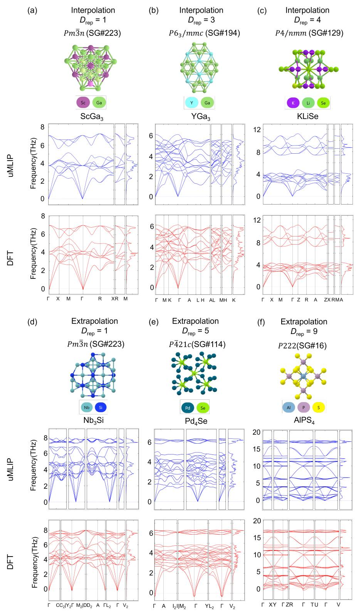  
Figure S4.1: DFT validation of phonon dispersion relations for the six representative crystal structures from UFO-MGen-predicted interpolation and extrapolation groups.

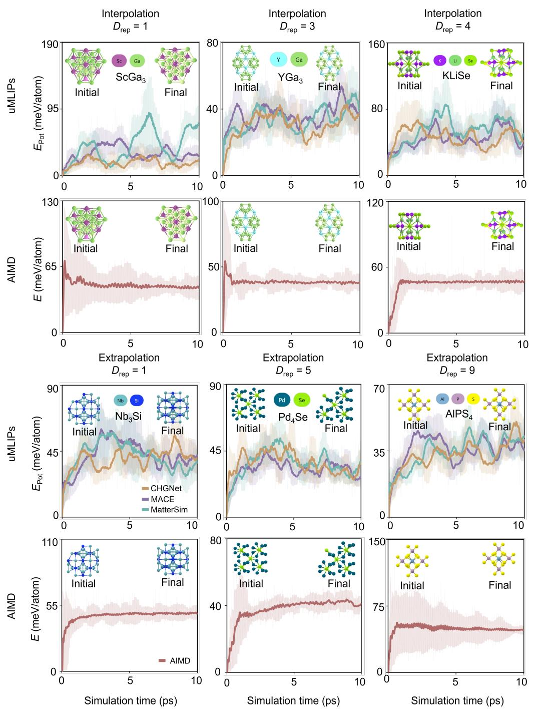  
Figure S4.2: AIMD validation of thermal stability of six representative crystal structures from UFO-MGen-predicted interpolation and extrapolation groups, respectively.

## S4.4 DFT validation of additional generated crystals

In addition to the six representative generated structures shown in main-text Fig. 2(f), we performed extensive validation on additional crystal structures for further validate the predictive capability of UFO-MGen and associated uMLIP prediction accuracy. For instance, Table S4.2 compares the DFT-optimized lattice parameters of additional 21 crystal structures with the corresponding UFO-MGen predictions. The perfect agreement between the DFT calculations and UFO-MGen predictions further demonstrates the high structural accuracy of the generated crystal structures.

Furthermore, extensive DFT-based phonon calculations were performed to validate the latticedynamic stability of the generated crystals. Fig. S4.3 shows that both DFT-calculated phonon spectra of 5 additional crystals exhibit no imaginary frequencies, consistent with the corresponding uMLIP-calculated spectra. These results confirm the lattice-dynamical stability of these generated crystals. In addition, the excellent agreement between the DFT and uMLIP results further demonstrate the high accuracy of uMLIPs in predicting lattice-dynamical stability, supporting the reliability and eficiency of the MSE framework proposed in this work.

Finally, we performed AIMD simulations to further validate the thermal stability of other crystal structures. As shown in Fig. S4.4, the AIMD-simulated energy profiles remain stable thorough the 10 ps simulations, with no significant structural transitions or distortion observed. This indicates that all examined crystals remain thermally stable at elevated temperatures, which is also consistent with uMLIP-based MD simulations. Consequently, these extensive DFT and AIMD validations demonstrate that the crystals generated by UFO-MGen can successfully pass the rigorous MSE screening framework, highlighting the superior performance of UFO-MGen in generating crystal structures.

## S4.5 Comparison with Baseline Generative Models

Using the MSE criteria, we further evaluated the performance of baseline crystal generative models and compared their results with UFO-MGen. As described in the main text, UFO-MGen was retrained on the MP20 dataset to ensure a fair comparison. Each generative model was then used to generate 300 crystal structures, all of which were subjected to the same MSE screening framework based on the three stability criteria. As shown in Table S4.3, the success rates for each MSE criterion are summarized and compared across all models.

UFO-MGen consistently yields the largest number of stable candidates under each MSE criterion, achieving the highest overall success rate of 59.3%. In contrast, the other generative models exhibit substantially lower success rates, demonstrating the superior performance of UFO-MGen in generating physically stable and valid crystal structures.

Table S4.2: DFT-calculated optimized lattice parameters $( a , b , c , \alpha , \beta , \gamma )$ of additional 21 crystals, compared with the corresponding UFO-MGen predictions.
<table><tr><td>Formula</td><td>a (Å)</td><td> $b ~ ( \mathrm { \AA } )$ </td><td> $c \ ( \textup { \AA } )$ </td><td> $\alpha \ ( ^ { \circ } )$ </td><td> $\beta ~ ( ^ { \circ } )$ </td><td> $\gamma \ ( ^ { \circ } )$ </td></tr><tr><td>CeSe2 (UFO-MGen)</td><td>4.88</td><td>4.88</td><td>13.79</td><td>90.00</td><td>90.00</td><td>90.00</td></tr><tr><td>CeSe2 ( (DFT)</td><td>4.09</td><td>7.08</td><td>8.42</td><td>90.00</td><td>110.53</td><td>90.00</td></tr><tr><td>TiAIV₂ (UFÓ-MGen)</td><td>4.44</td><td>4.44</td><td>6.06</td><td>90.00</td><td>90.00</td><td>90.00</td></tr><tr><td> $\mathrm { T i A l V _ { 2 } }$  (DFT)</td><td>4.39</td><td>4.40</td><td>6.09</td><td>90.00</td><td>90.00</td><td>90.00</td></tr><tr><td>GaAs (UFO-MGen)</td><td>4.07</td><td>4.07</td><td>5.76</td><td>89.99</td><td>90.00</td><td>90.00</td></tr><tr><td>GaAs (DFT)</td><td>4.08</td><td>4.07</td><td>5.79</td><td>90.00</td><td>90.00</td><td>90.00</td></tr><tr><td> $\mathrm { M o _ { 2 } C }$  (UFO-MGen)</td><td>4.76</td><td>6.04</td><td>5.21</td><td>90.00</td><td>90.00</td><td>90.00</td></tr><tr><td> $\mathrm { M o _ { 2 } C }$  (DFT)</td><td>4.71</td><td>6.08</td><td>5.24</td><td>90.00</td><td>90.00</td><td>90.00</td></tr><tr><td> $\mathrm { N b _ { 4 } C o S i \ ( U F O \mathrm { - } M G e n ) }$ </td><td>6.22</td><td>6.22</td><td>5.03</td><td>90.00</td><td>90.00</td><td>90.00</td></tr><tr><td> $\mathrm { N b _ { 4 } C o S i }$  (DFT)</td><td>6.19</td><td>6.19</td><td>5.02</td><td>90.00</td><td>90.00</td><td>90.00</td></tr><tr><td>KLiTe (UFO-MGen)</td><td>4.85</td><td>4.85</td><td>7.78</td><td>90.00</td><td>90.01</td><td>90.00</td></tr><tr><td>KLiTe (DFT)</td><td>4.84</td><td>4.84</td><td>7.78</td><td>90.00</td><td>90.00</td><td>90.00</td></tr><tr><td> $\mathrm { Z r _ { 3 } O \ ( U F O  – M G e n ) }$ </td><td>5.65</td><td>5.65</td><td>5.21</td><td>90.00</td><td>90.00</td><td>120.01</td></tr><tr><td> $\mathrm { Z r _ { 3 } O }$  (DFT)</td><td>5.66</td><td>5.66</td><td>5.21</td><td>90.00</td><td>90.00</td><td>120.00</td></tr><tr><td> $\mathrm { L i S c I _ { 3 } \ ( U F O - M G e n ) }$ </td><td>7.48</td><td>7.48</td><td>6.74</td><td>90.00</td><td>90.00</td><td>120.00</td></tr><tr><td>LiScI3 (DFT)</td><td>7.40</td><td>7.40</td><td>6.71</td><td>90.00</td><td>90.00</td><td>120.00</td></tr><tr><td>NiAsSe (UFÓ-MGen)</td><td>7.41</td><td>5.86</td><td>4.81</td><td>90.00</td><td>90.00</td><td>90.00</td></tr><tr><td>NiAsSe (DFT)</td><td>7.43</td><td>5.85</td><td>4.84</td><td>90.00</td><td>90.00</td><td>90.00</td></tr><tr><td> $\mathrm { V _ { 6 } S i O s \ ( U F O  – M G e n ) }$ </td><td>4.75</td><td>4.75</td><td>4.75</td><td>90.00</td><td>90.00</td><td>90.00</td></tr><tr><td> $\mathrm { V _ { 6 } S i O s \ ( D F T ) }$ </td><td>4.73</td><td>4.73</td><td>4.73</td><td>90.00</td><td>90.00</td><td>90.00</td></tr><tr><td> $\mathrm { C r N _ { 2 } \ ( U F O  – M G e n ) }$ </td><td>4.75</td><td>4.75</td><td>4.75</td><td>90.00</td><td>90.00</td><td>90.00</td></tr><tr><td> $\mathrm { C r N _ { 2 } }$  (DFT)</td><td>4.69</td><td>4.69</td><td>4.69</td><td>90.00</td><td>90.00</td><td>90.00</td></tr><tr><td> $\mathrm { B C _ { 3 } \ ( U F O - M G e n ) }$ </td><td>5.01</td><td>4.53</td><td>2.57</td><td>90.01</td><td>104.87</td><td>116.88</td></tr><tr><td> $\mathrm { B C _ { 3 } }$  (DFT)</td><td>5.04</td><td>4.55</td><td>2.61</td><td>89.99</td><td>105.02</td><td>116.78</td></tr><tr><td> $\mathrm { M n V _ { 2 } C _ { 3 } \ ( U F O - M G e n ) }$ </td><td>4.82</td><td>4.82</td><td>5.29</td><td>90.00</td><td>90.00</td><td>120.00</td></tr><tr><td> $\mathrm { M n V _ { 2 } C _ { 3 } }$  (DFT)</td><td>4.84</td><td>4.84</td><td>5.21</td><td>90.00</td><td>90.00</td><td>120.00</td></tr><tr><td> $\mathrm { M n M o _ { 2 } C _ { 3 } }$  (UFO-MGen)</td><td>4.96</td><td>4.96</td><td>5.57</td><td>90.00</td><td>90.00</td><td>120.00</td></tr><tr><td> $\mathrm { M n M o _ { 2 } C _ { 3 } \ ( D F T ) }$ </td><td>4.94</td><td>4.94</td><td>5.53</td><td>90.00</td><td>90.00</td><td>119.99</td></tr><tr><td> $\mathrm { V C o _ { 2 } C _ { 3 } \ ( U F O - M G e n ) }$ </td><td>4.66</td><td>4.66</td><td>5.25</td><td>90.00</td><td>90.00</td><td>119.99</td></tr><tr><td> $\mathrm { V C o _ { 2 } C _ { 3 } }$  (DFT)</td><td>4.65</td><td>4.65</td><td>5.28</td><td>90.00</td><td>90.00</td><td>120.00</td></tr><tr><td> $\mathrm { V _ { 3 } C _ { 3 } N \ ( U F O - M G e n ) }$ </td><td>8.90</td><td>2.90</td><td>9.92</td><td>90.00</td><td>90.00</td><td>90.00</td></tr><tr><td> $\mathrm { V _ { 3 } C _ { 3 } N }$  (DFT)</td><td>8.84</td><td>2.91</td><td>9.90</td><td>90.00</td><td>90.00</td><td>90.00</td></tr><tr><td> $\mathrm { V _ { 2 } S i C _ { 2 } \ ( U F O  – M G e n ) }$ </td><td>4.06</td><td>4.06</td><td>6.81</td><td>90.00</td><td>90.00</td><td>90.00</td></tr><tr><td> $\mathrm { V _ { 2 } S i C _ { 2 } }$  (DFT)</td><td>4.04</td><td>4.04</td><td>6.89</td><td>90.00</td><td>90.00</td><td>90.00</td></tr><tr><td> $\mathrm { T i _ { 2 } C r C _ { 2 } N \ ( U F O - M G e n ) }$ </td><td>6.00</td><td>4.21</td><td>9.03</td><td>90.00</td><td>90.00</td><td>90.00</td></tr><tr><td> $\mathrm { T i _ { 2 } C r C _ { 2 } N \ ( D F T ) }$ </td><td>6.03</td><td>4.19</td><td>9.05</td><td>90.00</td><td>90.00</td><td>90.00</td></tr><tr><td> $\mathrm { V C r C _ { 2 } \ ( U F O - M G e n ) }$ </td><td>2.91</td><td>7.04</td><td>7.69</td><td>69.43</td><td>90.34</td><td>88.64</td></tr><tr><td> $\mathrm { V C r C _ { 2 } \ ( D F T ) }$ </td><td>2.91</td><td>7.04</td><td>7.66</td><td>68.39</td><td>90.70</td><td>88.67</td></tr><tr><td> $\mathrm { T i N i C _ { 2 } \ ( U F O - M G e n ) }$ </td><td>3.29</td><td>3.29</td><td>8.11</td><td>90.00</td><td>90.00</td><td>90.00</td></tr><tr><td> $\mathrm { T i N i C _ { 2 } \ ( D F T ) }$ </td><td>3.32</td><td>3.32</td><td>8.18</td><td>90.00</td><td>90.00</td><td>90.00</td></tr><tr><td> $\mathrm { C r _ { 4 } C _ { 3 } \ ( U F O - M G e n ) }$ </td><td>7.84</td><td>2.79</td><td>11.77</td><td>90.00</td><td>90.00</td><td>90.00</td></tr><tr><td> $\mathrm { { C r } _ { 4 } C _ { 3 } }$  (DFT)</td><td>7.87</td><td>2.81</td><td>11.64</td><td>90.00</td><td>90.00</td><td>90.00</td></tr></table>

Table S4.3: Baseline comparison under the UFO-MGen-MP20 downstream screening protocol. Screening-stage results are reported within the shortlisted candidates, while the final column reports stable candidates normalized per 10,000 generated structures.
<table><tr><td>Model</td><td>Shortlist</td><td>Thermodynamic</td><td>Lattice-dynamic</td><td>Thermal</td><td>overall MSE</td></tr><tr><td>CDVAE</td><td>300</td><td>291 (97.0%)</td><td>148 (49.3%)</td><td>125 (84.5%)</td><td>41.7%</td></tr><tr><td>DiffCSP</td><td>300</td><td>294 (98.0%)</td><td>137 (45.7%)</td><td>114 (83.2%)</td><td>38.0%</td></tr><tr><td>DiffCSP++</td><td>300</td><td>294 (98.0%)</td><td>123 (41.0%)</td><td>116 (94.3%)</td><td>38.7%</td></tr><tr><td>MatterGen</td><td>300</td><td>294 (98.0%)</td><td>144 (48.0%)</td><td>118 (81.9%)</td><td>39.3%</td></tr><tr><td>UFO-MGen</td><td>300</td><td>300 (100%)</td><td>196 (65.3%)</td><td>178 (90.9%)</td><td>59.3%</td></tr></table>

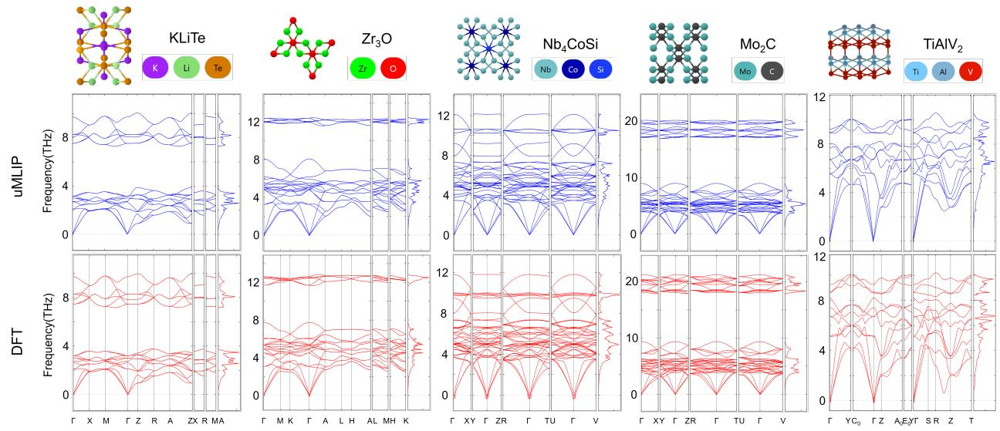  
Figure S4.3: DFT validation of the phonon dispersion relations for an additional 5 crystal structures generated by UFO-MGen model, compared with the corresponding uMLIP-calculated phonon spectra.

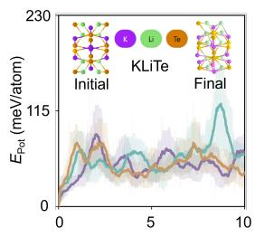

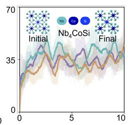

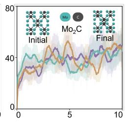

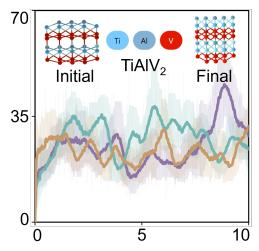

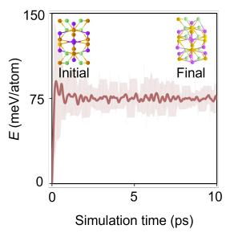

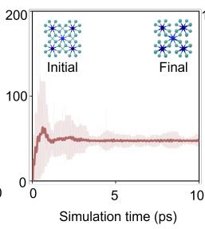

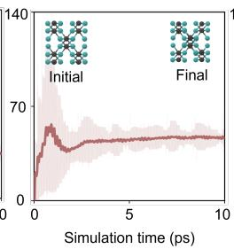

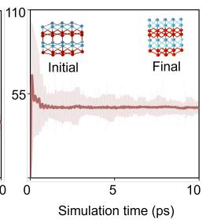  
Figure S4.4: AIMD validation of the thermal stability for an additional 4 crystal structures generated by UFO-MGen model, compared with the corresponding uMLIP-calculated energy profiles

## S5 Evaluation Metrics

## S5.1 Public metrics

In addition to validating the MSE criteria discussed in Section S4, we conducted another round of comprehensive evaluation of UFO-MGen on the ab initio crystal generation using established public metrics, including structural validity, compositional validity, coverage of the reference set, distributional agreement, stability–uniqueness–novelty (SUN), and geometric error [6, 8, 28]. Unless stated otherwise, these metrics are computed with the public evaluator adopted by the corresponding benchmark.

For baseline methods, we report values from the original papers or from released evaluation scripts when a matched re-evaluation is not available. Metrics that are not reported, or not computed under the same protocol, are marked as “/”. Higher values indicate better performance for validity, coverage, and SUN, whereas low values are preferred for distribution distances and root mean square derivation (RMSD). The evaluation using these public metrics is conducted separately from the MSE validation and screening based on uMLIPs and DFT calculations.

## S5.1.1 Validity, coverage and distribution metrics

We evaluate generated crystals using validity, coverage, and distributional alignment metrics following the public benchmark protocols [6, 8]. All metric definitions and thresholds are kept consistent with the public evaluator, and we do not introduce additional validity or matching criteria in this work.

Validity metrics. Structural validity is denoted as Val-Struct, measures the fraction of generated crystals that pass basic structural checks, including valid lattice parameters, positive cell volume, valid periodic coordinates, and the absence of severe atomic overlap. Compositional validity, denoted as Val-Comp, measures the fraction of generated crystals with chemically valid compositions under the benchmark rules, such as element validity, charge or valence sanity checks, and allowed stoichiometry.

Coverage metrics. Coverage metrics evaluate whether the generated structures can recover the reference crystal distribution under the benchmark structure matcher and a distance threshold. We report both COV-R and COV-P. COV-R measures the fraction of reference structures covered by the generated set, while COV-P measures the fraction of generated structures that can be matched to the reference set.

Distributional alignment metrics. We further compare generated and reference crystals using distributional distances computed over scalar or categorical properties of the full generated set, rather than over individual matched structures. Lower values indicate better agreement with the reference distribution. Specifically, we report the density distance $d _ { \rho }$ , the energy-related distance $d _ { E }$ , the elemental distance $d _ { \mathrm { e l e m } }$ , and the space-group distance $d _ { \mathrm { s g } }$ . The space-group distance is especially relevant for UFO-MGen, since the model explicitly generates the symmetry scafold before sampling continuous Wyckof parameters.

## S5.1.2 Stability, uniqueness and novelty (SUN) metric

We report the SUN rate [28] as the fraction of generated structures that are stable, unique and novel at the same time. This metric is more restrictive than stability alone, since a structure must also be non-duplicated within the generated set and absent from the reference database.

Stability: A generated structure is counted as stable if it satisfies the energetic-stability criterion used in the corresponding evaluation protocol. Because diferent crystal generative models may use diferent relaxation pipelines, energy models, and stability thresholds, we report SUN under the protocol aligned with MatterGen [28] for direct comparison. Specifically, energetic stability is evaluated after structural relaxation and is defined by the near-hull criterion:

$$
\Delta E _ { \mathrm { h u l l } } \le 0 . 1 \ \mathrm { e V / a t o m } ,\tag{40}
$$

where $\Delta E _ { \mathrm { h u l l } }$ is the energy above the convex hull. For baseline models, the reported SUN are taken from the published results rather than recomputed in our workflow. This choice avoids mixing diferent stability-evaluation pipelines and ensures that the comparison follows the same reported benchmark convention.

Uniqueness: A generated structure is counted as unique if it does not match any earlier structure in the same generated set. Matching is performed with the structure matcher used by the public evaluator. The standard pymatgen StructureMatcher [29] is used, we use the default tolerance setting.

Novelty: A generated structure is counted as novel if it does not match any structure in the training set or reference database under the same structure matcher. In this work, novelty is evaluated after reducing the structure to the same representation used by the benchmark matcher.

The three conditions are applied jointly. Thus, a structure with low energy is not counted as SUN if it is a duplicate of another generated structure or if it matches a known training/reference structure. Because SUN depends on the energy estimator, relaxation settings, structure matcher and novelty database, we use it as a summary metric but report the underlying stable, unique and novel rates whenever possible.

## S5.1.3 RMSD and relaxed RMSD

Root mean square deviation (RMSD) measures the geometric diference between a generated crystal structure and a reference state by comparing their local atomic coordination. This metric can be defined as:

$$
\mathrm { R M S D } = \sqrt { \frac { 1 } { N } \sum _ { i = 1 } ^ { N } \left\| \boldsymbol { r } _ { i } - \boldsymbol { \hat { r } } _ { \pi ( i ) } \right\| ^ { 2 } } ,\tag{41}
$$

where $r _ { i }$ is the Cartesian coordinate of atom i in the reference structure, $\hat { r } _ { \pi ( i ) }$ is the matched atom in the generated structure, and π is the atom mapping from the structure matcher. Due to ordered and periodic nature of crystal structures, RMSD must account for periodic boundary conditions (PBCs), local atom ordering, species matching, and possible cell choices. We therefore rely on the benchmark matcher rather than direct coordinate subtraction.

## S5.1.4 Comparison with MP-20 baseline

Table S5.1 summarizes the public benchmark metrics of the baseline models and UFO-MGen for the ab initio crystal generations using MP20 database. All public metrics are evaluated based on 10,000 crystal structures generated by each model. It clearly shows that the UFO-MGen exhibits the best performance in both Validity and SUN rate among the 12 mainstream generative models.

Table S5.1: Comparison of crystal generation performance on MP-20 under public evaluation metrics. Values marked with † are literature-reported rows. Values marked with ‡ are UFO-MGen rows from the current evaluation logs. A slash indicates that the metric is not yet available under the same protocol.
<table><tr><td>Model</td><td>Val-Struct.</td><td>Val-Comp.</td><td>COV-R</td><td>COV-P</td><td> $d _ { \rho } \downarrow$ </td><td> $d _ { E } \downarrow$ </td><td> $d _ { \mathrm { e l e m } } .$ </td><td> $d _ { \mathrm { s g } } \downarrow$ </td><td>SUN</td><td>RMSD</td></tr><tr><td>CDVAE [6]†</td><td>100.0</td><td>86.70</td><td>99.15</td><td>99.49</td><td>0.6875</td><td>0.2778</td><td>1.432</td><td>0.69</td><td>4.26 [30]</td><td></td></tr><tr><td>DiffCSP [8]†</td><td>100.0</td><td>83.25</td><td>99.71</td><td>99.76</td><td>0.3502</td><td>0.1247</td><td>0.3398</td><td></td><td>8.92 [30]</td><td></td></tr><tr><td>DiffCSP++ [31]†</td><td>99.94</td><td>85.12</td><td>99.73</td><td>99.59</td><td>0.2351</td><td>0.0574</td><td>0.3749</td><td></td><td>8.62 [30]</td><td></td></tr><tr><td>FlowMM [3]†</td><td>96.85</td><td>83.19</td><td>99.49</td><td>99.58</td><td>0.239</td><td>0.083</td><td></td><td></td><td>6.49 [30]</td><td></td></tr><tr><td>SymmCD [30]†</td><td>94.32</td><td>85.85</td><td>99.64</td><td>98.87</td><td>0.0901</td><td>0.1166</td><td>0.3990</td><td>0.0899</td><td>6.89 [30]</td><td></td></tr><tr><td>MatterGen [28]†</td><td>100.0</td><td>82.60</td><td></td><td></td><td>0.2059</td><td></td><td>0.2416</td><td>0.4331</td><td>22.0</td><td>0.11</td></tr><tr><td>SGEquiDiff [32]†</td><td>99.81</td><td>84.06</td><td></td><td></td><td>0.6247</td><td></td><td>0.1988</td><td>0.1769</td><td>12.47</td><td></td></tr><tr><td>WyFormer [33]†</td><td>99.56</td><td>80.44</td><td>98.67</td><td>96.72</td><td>0.74</td><td>0.053</td><td>0.097</td><td>0.223</td><td>6.9</td><td></td></tr><tr><td>OMatG [34]†</td><td>99.64</td><td>87.02</td><td>99.39</td><td>99.86</td><td>0.0834</td><td></td><td>0.0784</td><td></td><td>18.58</td><td>0.294</td></tr><tr><td>CrystalFlow [35]†</td><td>99.55</td><td>81.96</td><td>98.21</td><td>99.84</td><td>0.169</td><td>0.259</td><td></td><td></td><td>3.7</td><td></td></tr><tr><td>FlowLLM [36]†</td><td>99.94</td><td>90.84</td><td>96.95</td><td>99.82</td><td>1.14</td><td></td><td>0.15</td><td></td><td>4.92</td><td>0.023</td></tr><tr><td>UFO-MGen (MP20)</td><td>100.0</td><td>91.30</td><td>96.58</td><td>99.45</td><td>0.2049</td><td>0.3214</td><td>0.4754</td><td>0.099</td><td>31.3</td><td>0.29</td></tr></table>

## S5.2 Interpolation and extrapolation metrics

Space groups are one of most fundamental descriptors of crystal structures, with a total of 230 distinct space groups. As discussed in main-text Section 2.4, examining whether generated crystals cover the space groups represented in the training data provides a measure of their ability to generate structures within the domain knowledge. On the other hand, the ability to generate unprecedented crystal structures belonging to space groups absent from the training dataset represent an important measure of the models’ capability of extrapolation. As such, we introduce two metrics: interpolation rate and extrapolation rate, to evaluate the generative capability of models.

To evaluate these two capabilities, we used each generative model to generate 10,000 crystals and then calculate interpolation and extrapolation rates. Since existing generative models were trained on the MP20 database, we also retrained UFO-MGen using MP20 database and generated 10,000 crystals under the same setting for a fair comparison. During retaining, we only adopted Stages II and III for crystal generation, as Stage I fixes the crystal scafold and thus limits the exploration of space groups beyound those represented in the training dataset. Because the MP20 database covers 177 space groups, leaving 53 space groups absent from the training set, the interpolation and extrapolation rates can be easily determined by calculating the percentage of generated crystals belonging to space groups within and beyound the training set, respectively.

Table S5.2 summarizes the interpolation and extrapolation rates of leading generative models and our UFO-MGen. Once again, UFO-MGen exhibits the highest coverage for both interpolation and extrapolation among all evaluated generative models. These results further demonstrate the strong capability of UFO-MGen to generate chemically and structurally diverse crystal structures within and beyond the space groups represented in the training domain.

Table S5.2: Model performance comparison on coverage and extrapolation rate.
<table><tr><td>Model</td><td>Interpolation rate (%)</td><td>Extrapolation rate (%)</td></tr><tr><td>DiffCSP++</td><td>81.4</td><td>3.8</td></tr><tr><td>DiffCSP</td><td>57.6</td><td>3.8</td></tr><tr><td>CDVAE</td><td>31.6</td><td>0.0</td></tr><tr><td>MatterGen</td><td>65.5</td><td>0.0</td></tr><tr><td>UFO-MGen</td><td>85.5</td><td>45.3</td></tr></table>

## S6 Ablation Studies of UFO-MGen Performance

Ablation tests are commonly adopted to evaluate how individual components, layers, or features contribute to the overall performance of a machine-learning model. In main-text Fig. 4, we perform a series of ablation studies on revealing the key mechanisms underlying UFO-MGen, where diferent types of database and difusion-based models are adopted to systematically compare their crystal generation performance with UFO-MGen. In addition, we conduct another round of ablation study to understand which components of UFO-MGen actually dominate its overall performance. Rather than treating all ablation experiments as equally important, we categorize them according to the specific model components and capabilities they are designed to evaluate. Since main performance of UFO-MGen primarily comes from three components: Stage I, Stage II, and Stage III, our ablation tests primarily focus on quantifying the contribution of each state to the overall model performance.

## S6.1 Ablation test for Stage I: HTS

Stage I constrains the crystal topology scafold prior to generation, thereby guiding the model toward more stable and physically plausible structures. However, because Stage I is trained on datasets containing only 35 trainable space groups, it also restricts the generated crystals to these space groups and limits the model’s ability to explore beyond the training domain. Table S6.1 summarizes the results obtained after removing Stage I. Although the overall stability decreases, the model gains substantial extrapolation capability, enabling it to explore beyond the training domain and generate crystals across 52 previously unseen space groups that successfully pass the MSE screening framework.

## S6.2 Ablation test for Stage II: COM

Stage II enables diverse chemical occupancies and elemental compositions, allowing UFO-MGen to explore novel compositional spaces within physically reasonable crystal scafolds. When Stage II is removed, the generated distribution shifts toward more frequently occurring and inherently stable elemental assignments, making the generation process more deterministic and primarily focused on generating continuous structural features within familiar scafolds. Consequently, in terms of the physical stability of generated crystals, the ablated model exhibits a higher success rate than UFO-MGen-Full. However, further evaluation using the SUN metric (Table S6.1) reveals that, although most generated crystals are physically valid and stable, the ablated model tends to reproduce known structures rather than discover unique ones. These results demonstrate that Stage II plays a critica role in expanding the chemical diversity and novelty of UFO-MGen-generated crystals.

## S6.3 Ablation test for Stage III: SWG

Stage III determines whether a discrete scafold design can be realized as a geometrically valid three-dimensional crystal structure. Although the thermodynamic and lattice-dynamic stabilities of crystals generated without Stage III show only minor diferences after structural relaxation, their reduced AIMD stability indicates that removing Stage III leads to less physically reasonable lattice parameters and atomic coordinates, resulting in atomic drift and eventual scafold collapse. Compared with UFO-MGen-Full, UFO-MGen without Stage III generates one stable structure that is classified as belonging to an unexplored space group (Table S6.1). However, this structure does not represent true extrapolation, as it is assigned to a diferent space group only after minor structural changes during relaxation. Therefore, the importance of Stage III is further reflected in its ability to generate geometrically valid structures that preserve their crystallographic symmetry during structural relaxation.

In conclusion, our ablation studies demonstrate that each component of UFO-MGen plays a critical role in determining the overall model performance. These results further highlight the importance of the hierarchical architecture of UFO-MGen and demonstrate the efectiveness of its three-stage design.

Table S6.1: Ablation study of each stage in UFO-MGen. The symbol “ \*” denotes an extrapolated space group whose symmetry changes during structural optimization.
<table><tr><td>Model Variant</td><td>Thermodynamic and lattice stability (%)</td><td>Thermal stability (%)</td><td>MSE (%)</td><td>SUN (%)</td><td>Extrapolated SG</td></tr><tr><td>UFO-MGen-Full</td><td>29.5</td><td>93.3</td><td>27.5</td><td>20.3</td><td>0</td></tr><tr><td>No Stage I</td><td>28.7</td><td>90.7</td><td>26.0</td><td>19.8</td><td>52</td></tr><tr><td>No Stage II</td><td>32.0</td><td>95.8</td><td>30.7</td><td>6.5</td><td>0</td></tr><tr><td>No Stage III</td><td>29.2</td><td>89.4</td><td>26.1</td><td>18.8</td><td>1*</td></tr></table>

## S7 Inverse Materials Design

## S7.1 Fine-tuning architecture

Property-constrained crystal generation is a critical step toward inverse materials design. To enable this capability, we introduce property-guided tasks into UFO-MGen and fine-tune all three stages toward targeted material properties. Figure S7.1 illustrates the three-stage conditional decomposition of UFO-MGen, in which property guidance is independently incorporated into the selection of crystal topology scafolds, elemental occupancy, and continuous geometric degrees of freedom.

Specifically, property-based fine-tuning is applied throughout all three generation stages by assigning larger training weights to structures with stronger target properties. In Stage I, the model learns from predictor high score and the extreme scafold distributions of the training set labels, guiding the UFO-MGen to a extreme performance generative space. In Stage II, property-weighted training guides element selection and orbit occupancy, while COM-ALLOWED further constrains the sampled chemical space to elements related to extreme properties. In Stage III, the flow-matching objective is weighted by the same property scores, encouraging the generation of crystal geometries that better support the target performance.

## S7.2 Mechanical property datasets

In this work, we select mechanical properties as the target material properties for fine-tuning UFO-MGen, and we refer this specialized model as UFO-Mech. The mechanical property predictor is trained on elastic data collected from multiple sources. The main dataset is obtained from JARVIS-DFT [37], where 8,753 cleaned samples are used for elastic-label training. Materials Project [13] elasticity adds 4,933 samples, and the de Jong Scientific Data 2015 dataset [38] provides 1,181 samples for external validation. After removing duplicates across databases, the final labeled dataset contains 13,686 crystals, which are split into 10,948 training samples, 1,369 validation, and 1,369 test samples. The prediction targets include bulk modulus, shear modulus, Young’s modulus, and Poisson’s ratios. During training, samples exhibiting extreme mechanical properties are assigned higher weights to bias the model toward mechanically robust materials. The mechanical-extreme score, $S _ { \mathbf { m e c h } }$ , is defined as jointly considering high bulk modulus, shear modulus, and high Young’s

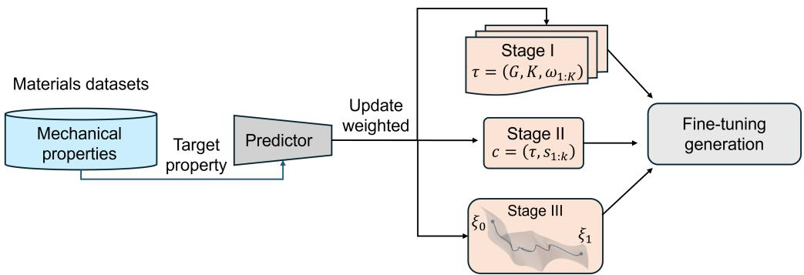  
Figure S7.1: Workflow of fine-tuning architecture in UFO-MGen for predicting materials properties of generated crystal structures with target mechanical properties .

modulus:

$$
S _ { \mathbf { m e c h } } = z ( l o g ( \mathrm { B u l k } ) ) + z ( l o g ( \mathrm { S h e a r } ) ) + z ( l o g ( \mathrm { Y o u n g ' s } ) ) - P _ { \mathbf { u n s t a b l e } }\tag{42}
$$

where z is standard normalization, log(Bulk), log(Shear), and log(Young’s) are the logarithmically transformed bulk modulus, shear modulus, and Young’s modulus, respectively, and $P _ { \mathbf { u n s t a b l e } }$ is an additional penalty for structural instability.

## S7.3 DFT validation of UFO-Mech

To fully evaluate the performance of UFO-Mech, we first use the this fine-tuned model to generate a series of new crystal structures and predict their associated mechanical properties. Next, DFT calculations are performed to independently validate both the generated crystal structures and their predicted mechanical properties. For each fully optimized structure, the elastic constants are calculated using the finite-diference method, in which small lattice distortions are applied and the resulting stress response is used to determine the elastic stifness tensor, $C _ { i j }$ , within the linear elastic regime [38]. The calculated elastic constants are expressed as a $6 \times 6$ stifness matrix in Voigt notation. The corresponding elastic compliance tensor, S, is obtained by inversion of the stifness tensor:

$$
S _ { i j } = C _ { i j } ^ { - 1 }\tag{43}
$$

The bulk modulus and shear modulus are determined using the Voigt–Reuss–Hill (VRH) approximation [39]. The Voigt estimates [40] are calculated from the elastic stifness constants as:

$$
B _ { V } = \frac { C _ { 1 1 } + C _ { 2 2 } + C _ { 3 3 } + 2 ( C _ { 1 2 } + C _ { 1 3 } + C _ { 2 3 } ) } { 9 } ,\tag{44}
$$

$$
G _ { V } = \frac { C _ { 1 1 } + C _ { 2 2 } + C _ { 3 3 } - ( C _ { 1 2 } + C _ { 1 3 } + C _ { 2 3 } ) + 3 ( C _ { 4 4 } + C _ { 5 5 } + C _ { 6 6 } ) } { 1 5 } ,\tag{45}
$$

where $B _ { V }$ and $G _ { V }$ are the Voigt bulk and shear moduli, respectively. The corresponding Reuss estimates [41] are calculated from the elastic compliance constants as:

$$
B _ { R } = \frac { 1 } { S _ { 1 1 } + S _ { 2 2 } + S _ { 3 3 } + 2 ( S _ { 1 2 } + S _ { 1 3 } + S _ { 2 3 } ) } ,\tag{46}
$$

$$
G _ { R } = \frac { 1 5 } { 4 ( S _ { 1 1 } + S _ { 2 2 } + S _ { 3 3 } ) - 4 ( S _ { 1 2 } + S _ { 1 3 } + S _ { 2 3 } ) + 3 ( S _ { 4 4 } + S _ { 5 5 } + S _ { 6 6 } ) } ,\tag{47}
$$

where $B _ { R }$ and $G _ { R }$ are the Reuss bulk and shear moduli, respectively. The final bulk and shear moduli are obtained using the Hill approximation by taking the arithmetic average of the corresponding Voigt and Reuss estimates:

$$
\mathrm { B u l k ~ m o d u l u s } = \frac { B _ { V } + B _ { R } } { 2 } ,\tag{48}
$$

$$
\mathrm { S h e a r ~ m o d u l u s } = { \frac { G _ { V } + G _ { R } } { 2 } } .\tag{49}
$$

Finally, Young’s modulus is calculated from the Hill-averaged bulk and shear moduli according

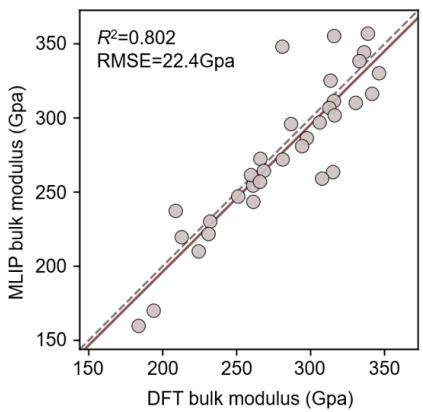

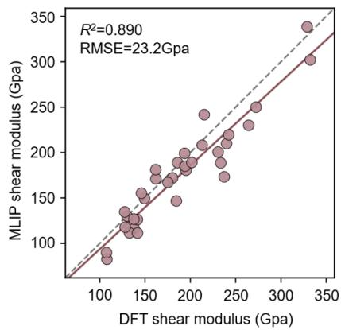

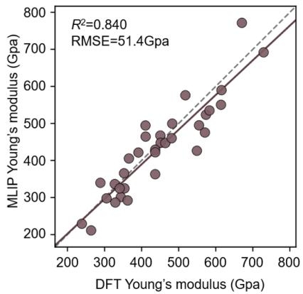  
Figure S7.2: DFT validation of mechanical properties predicted by UFO-Mech.

to the following equation:

$$
\mathrm { Y o u n g ' s ~ m o d u l u s } = \frac { 9 \times \mathrm { B u l k ~ m o d u l u s } \times \mathrm { S h e a r ~ m o d u l u s } } { 3 \times \mathrm { B u l k ~ m o d u l u s } + \mathrm { S h e a r ~ m o d u l u s } } .\tag{50}
$$

The resulting DFT-derived bulk, shear, and Young’s moduli are used to evaluate the mechanicalproperty predictions of UFO-Mech. Figure S7.2 presents parity plots comparing the three mechanical properties predicted by UFO-Mech with those calculated by DFT for 33 generated crystal structures. The strong linear correlations demonstrate the high accuracy of UFO-Mech in predicting these mechanical properties. Moreover, the structural diversity of the generated candidates indicates that UFO-Mech does not rely on a single preferred structural motif to achieve property optimization. Instead, it generates diverse stable crystal structures that exhibit exceptional mechanical properties.

## S7.4 Scafold efect on mechanical properties

As discussed in the main-text Section 2.7, scafold features play a critical role in governing mechanical properties of materials. For instance, main-text Fig. 5(c) shows that imposing a specific scafold feature on 50 material systems can significantly enhance their mechanical properties. To further validate this efect, we select additional three common scafold features among the crystal structures located in the red cluster in Fig. 5(b), including $c = ( P - 1 , 2 i , 2 i ) , ( C 2 / c , 4 e * 4 , 4 f * 4 )$ ， and (P4/mbm, 2a, 4g, 4h, 8i). Each scafold is then imposed on 50 new crystal structures, and their mechanical properties are subsequently calculated and compared with those of the corresponding original structures. Figure S7.3 shows that all three scafold can significantly improve the mechanical properties of the tested crystals, with improvements of 31.08%, 37.33%, and 32.08%, respectively. These additional tests further demonstrate the critical roles of crystal scafolds in governing the mechanical properties of materials. Since our UFO-MGen can be easily fine-tuned to target other materials properties, we anticipate that scafold features may also play an important role in governing a broad range of materials properties.

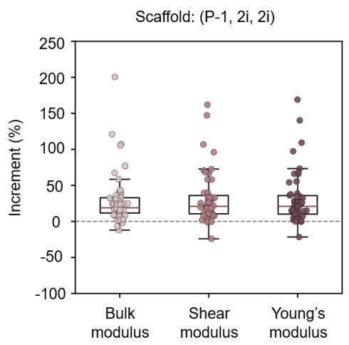

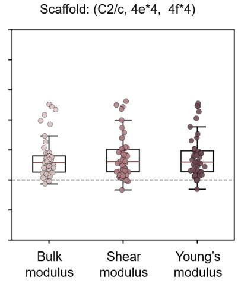

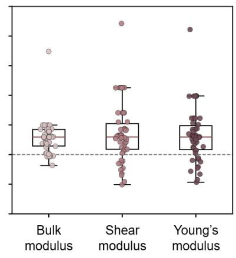  
Figure S7.3: Additional tests of three specific scafold features identified within the red clusters in main-text Fig. 5(b) to afect the three key mechanical properties of materials.

## References

[1] Theo Hahn, editor. International Tables for Crystallography, Volume A: Space-Group Symmetry. Springer, Dordrecht, 5th edition, 2005.

[2] Ryan P. Adams and Peter Orbanz. Representing and learning functions invariant under crystallographic groups. arXiv preprint arXiv:2306.05261, 2023.

[3] Benjamin Kurt Miller, Ricky T. Q. Chen, Anuroop Sriram, and Brandon M. Wood. FlowMM: Generating materials with Riemannian flow matching. Preprint at https://arxiv.org/abs/2406.04713, 2024.

[4] Keith J. McGill, Mojgan Asadi, Maria Toneva Karakasheva, Lawrence C. Andrews, and Herbert J. Bernstein. The geometry of niggli reduction iii: SAUC – search of alternate unit cells. arXiv preprint arXiv:1307.1811, 2013.

[5] Hans Wondratschek and Ulrich Mueller, editors. International Tables for Crystallography, Volume A1: Symmetry Relations Between Space Groups. John Wiley & Sons, Chichester, 2 edition, 2010.

[6] Tian Xie, Xiang Fu, Octavian-Eugen Ganea, Regina Barzilay, and Tommi Jaakkola. Crystal difusion variational autoencoder for periodic material generation. In International Conference on Learning Representations, 2022.

[7] Youzhi Luo, Chengkai Liu, and Shuiwang Ji. Towards symmetry-aware generation of periodic materials. arXiv preprint arXiv:2307.02707, 2023.

[8] Rui Jiao, Wenbing Huang, Peijia Lin, Jiaqi Han, Pin Chen, Yutong Lu, and Yang Liu. Crystal structure prediction by joint equivariant difusion. Preprint at https://arxiv.org/abs/2309.04475, 2023.

[9] Mois I. Aroyo, J. Manuel Perez-Mato, Cesar Capillas, Eli Kroumova, Svetoslav Ivantchev, Gotzon Madariaga, Asen Kirov, and Hans Wondratschek. Bilbao crystallographic server: I. databases and crystallographic computing programs. Zeitschrift für Kristallographie - Crystalline Materials, 221(1):15–27, 2006.

[10] Atsushi Togo, Kohei Shinohara, and Isao Tanaka. Spglib: a software library for crystal symmetry search. arXiv preprint arXiv:1808.01590, 2018.

[11] Zhendong Cao, Xiaoshan Luo, Jian Lv, and Lei Wang. Space group informed transformer for crystalline materials generation. Preprint at https://arxiv.org/abs/2403.15734, 2024.

[12] Filip Ekström Kelvinius et al. Wyckofdif – a generative difusion model for crystal symmetry. In Proceedings of the 42nd International Conference on Machine Learning, volume 267, pages 15130–15147, 2025.

[13] Anubhav Jain et al. Commentary: The materials project: A materials genome approach to accelerating materials innovation. APL Mater., 1:011002, 2013.

[14] Diederik P. Kingma and Max Welling. Auto-encoding variational bayes. In International Conference on Learning Representations, 2014.

[15] Emile Mathieu and Maximilian Nickel. Riemannian continuous normalizing flows. In Advances in Neural Information Processing Systems, volume 33, pages 2503–2515, 2020.

[16] Jonathan Ho, Ajay Jain, and Pieter Abbeel. Denoising difusion probabilistic models. In Advances in Neural Information Processing Systems, volume 33, pages 6840–6851, 2020.

[17] Yaron Lipman, Ricky T. Q. Chen, Heli Ben-Hamu, Maximilian Nickel, and Matt Le. Flow matching for generative modeling. In International Conference on Learning Representations, 2023.

[18] Dale Husemoller. Fibre Bundles, volume 20 of Graduate Texts in Mathematics. Springer, New York, 3 edition, 1994.

[19] Alexander Tong et al. Improving and generalizing flow-based generative models with minibatch optimal transport. Trans. Mach. Learn. Res., 2023.

[20] Georg Kresse and Jürgen Furthmüller. Eficiency of ab-initio total energy calculations for metals and semiconductors using a plane-wave basis set. Comput. Mater. Sci., 6(1):15–50, 1996.

[21] Georg Kresse and Jürgen Hafner. Ab initio molecular dynamics for liquid metals. Phys. Rev. B, 47(1):558, 1993.

[22] Peter E. Blöchl. Projector augmented-wave method. Phys. Rev. B, 50:17953–17979, 1994.

[23] Stefan Grimme. Semiempirical gga-type density functional constructed with a long-range dispersion correction. J. Comput. Chem., 27:1787–1799, 2006.

[24] Atsushi Togo, Laurent Chaput, Terumasa Tadano, and Isao Tanaka. Implementation strategies in phonopy and phono3py. J. Phys. Condens. Matter, 35:353001, 2023.

[25] Atsushi Togo and Isao Tanaka. First principles phonon calculations in materials science. Scr. Mater., 108:1–5, 2015.

[26] Atsushi Togo. First-principles phonon calculations with phonopy and phono3py. J. Phys. Soc. Jpn., 92:012001, 2023.

[27] Yoyo Hinuma, Giovanni Pizzi, Yu Kumagai, Fumiyasu Oba, and Isao Tanaka. Band structure diagram paths based on crystallography. Comput. Mater. Sci., 128:140–184, 2017.

[28] Claudio Zeni et al. A generative model for inorganic materials design. Nature, 639:624–632, 2025.

[29] Shyue Ping Ong et al. Python materials genomics (pymatgen): A robust, open-source python library for materials analysis. Comput. Mater. Sci., 68:314–319, 2013.

[30] Daniel Levy, Siba Smarak Panigrahi, Sékou-Oumar Kaba, Qiang Zhu, Kin Long Kelvin Lee, Mikhail Galkin, Santiago Miret, and Siamak Ravanbakhsh. Symmcd: Symmetry-preserving crystal generation with difusion models. Preprint at https://arxiv.org/abs/2502.03638, 2025.

[31] Rui Jiao, Wenbing Huang, Yu Liu, Deli Zhao, and Yang Liu. Space group constrained crystal generation. In International Conference on Learning Representations, 2024.

[32] Rees Chang et al. Space group equivariant crystal difusion. In Advances in Neural Information Processing Systems, volume 38, 2025.

[33] Nikita Kazeev et al. Wyckof transformer: Generation of symmetric crystals. In Proceedings of the 42nd International Conference on Machine Learning, volume 267, pages 29495–29526, 2025.

[34] Philipp Höllmer and Stefano Martiniani. Open materials generation with inference-time reinforcement learning. In Forty-third International Conference on Machine Learning, 2026.

[35] Xiaoshan Luo et al. Crystalflow: a flow-based generative model for crystalline materials. Nat. Commun., 16:9267, 2025.

[36] Anuroop Sriram, Benjamin Kurt Miller, Ricky T. Q. Chen, and Brandon M. Wood. Flowllm: Flow matching for material generation with large language models as base distributions. In Advances in Neural Information Processing Systems, volume 37, pages 46025–46046, 2024.

[37] Kamal Choudhary et al. The joint automated repository for various integrated simulations (jarvis) for data-driven materials design. npj Comput. Mater., 6:173, 2020.

[38] Maarten de Jong et al. Charting the complete elastic properties of inorganic crystalline compounds. Sci. Data, 2:150009, 2015.

[39] Richard Hill. The elastic behaviour of a crystalline aggregate. Proc. Phys. Soc. A, 65:349–354, 1952.

[40] W. Voigt. Lehrbuch der Kristallphysik. B. G. Teubner, Leipzig and Berlin, 1928.

[41] András Reuß. Berechnung der fließgrenze von mischkristallen auf grund der plastizitätsbedingung für einkristalle. Z. Angew. Math. Mech., 9:49–58, 1929.