# Towards Omni-dimensional GUI Agent Navigation with Masked Trajectory Prediction

Yan Zhang1,2,4, Pei Fu2,†, Daiqing Wu1,4, Huawen Shen1,4, Ruoceng Zhang2, Shaojie Zhang2, Jiahui Yang2, Yu Zhou3,\*, Can Ma1,4,\*, Zhenbo Luo2, Jian Luan2

1Institute of Information Engineering, Chinese Academy of Sciences 2MiLM Plus, Xiaomi Inc.

3VCIP & TMCC & DISSec, College of Computer Science & College of Cryptology and Cyber Science, Nankai University 4School of Cyber Security, University of Chinese Academy of Sciences Email: zhangyan2022@iie.ac.cn

## Abstract

Graphical User Interface (GUI) Agents autonomously interact with software to fulfill user requests, where GUI navigation stands out as the most critical and challenging capability. Mastering this capability demands a complex synergy of step-wise decision-making, stateaction alignment, and long-horizon planning. While directly mixing these corresponding navigation tasks seems intuitive to simultaneously acquire these skills, such a direct combination is severely bottlenecked by inconsistent optimization objectives and profound data heterogeneity. To overcome these barriers, we propose the MaP (stands for “Masked Trajectory Prediction”), a unified framework that seamlessly harmonizes divergent GUI navigation tasks. By modeling multi-turn GUI interactions as a trajectory and defining training objectives through component masking and prediction, MaP shifts the optimization from task-specific marginal distributions to a consistent objective. Furthermore, to handle the data heterogeneity across multiple navigation tasks, we design a role-aware adapter learning module that dynamically routes each token to a specialized representation space. Extensive experiments on five representative GUI navigation benchmarks demonstrate that MaP effectively mitigates gradient conflicts and significantly outperforms the direct mixture training, establishing a robust paradigm for multi-task GUI navigation.

## 1 Introduction

GUI Agents, designed to autonomously navigate graphical user interfaces to fulfill user requests, represent a promising frontier in building practical AI assistants (Wang et al., 2024b; Nguyen et al., 2025). Among the capabilities required for effective GUI agents, navigation stands out as the most critical and challenging, as it demands decomposing highlevel user instructions (Xu et al., 2024) , aligning intermediate actions with screenshot changes (Shen et al., 2024; Qin et al., 2025), and analyzing the visual context for each interaction step (Wu et al., 2024b; Zhang et al., 2025a).

Building upon prior studies, we categorize existing navigation strategies into three core dimensions, as depicted in Figure 1. a). Step-wise decision (Wu et al., 2024b; Zhang et al., 2025a) provides the current screenshot and low-level instruction, requiring the GUI Agent to interpret UI semantics and generate structured reasoning traces. b). State-action alignment (Shen et al., 2024; Qin et al., 2025) tasks GUI Agents to predict the intermediate user action given two consecutive states, capturing the correspondence between actions and visual changes. c). Long-horizon planning (Xu et al., 2024) formulates GUI tasks as dialogue-like interactions, where GUI Agents leverage sequential visual contexts to decompose complex user instructions into step-wise plans.

While these paradigms have advanced GUI Agents along isolated dimensions, real-world GUI interaction inherently requires their joint competence. A straightforward solution is mixture training across diverse navigation tasks. However, as illustrated in Figure 2 Left, direct mixture yields only marginal improvements. We attribute this to two fundamental challenges: 1). Inconsistent training objectives. The three paradigms each capture distinct marginal distributions of GUI interactions, corresponding to different partial dependencies among states, reasoning traces, and interaction histories. Step-wise decision restricts its view to the current state; state-action alignment neglects the broader task context; and long-horizon planning often lacks fine-grained visual grounding for precise actions. 2). Data heterogeneity. The resulting corpora differ in reasoning styles, annotation protocols, and interface domains, hindering unified modeling.

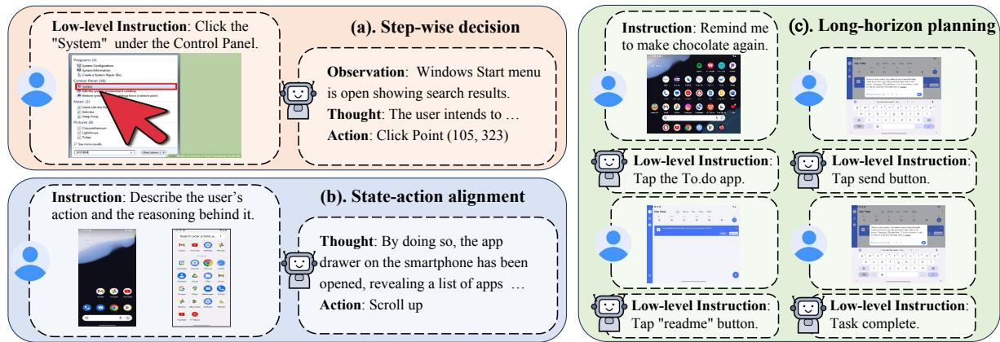

Figure 1: Overview of the three core dimensions of GUI navigation capabilities, which encompass (a) reasoning over current visual semantics, (b) understanding state-action alignment, and (c) maintaining long-horizon task consistency.  
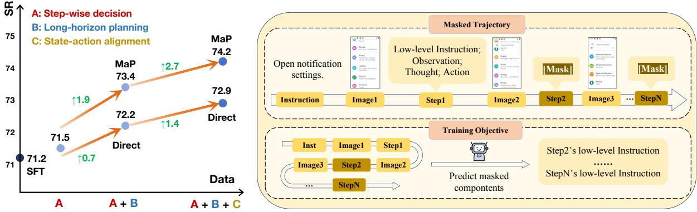  
Figure 2: Left: Direct mixture training vs. MaP on the AndroidControl-High benchmark (Zhang et al., 2024). The ↑ denotes the performance improvements over the single step-wise decision paradigm. Right: An overview of MaP. By masking arbitrary trajectory contents and predicting the counterparts, MaP unifies heterogeneous GUI corpora under a consistent training objective.

To address these challenges, we propose MaP (stands for “Masked Trajectory Prediction”), a unified framework that enforces a consistent training objective and handles data heterogeneity across diverse GUI navigation tasks, as shown in Figure 2 Right. MaP formalizes multi-turn GUI interactions as trajectories and substitutes arbitrary components with [Mask] tokens, requiring the GUI Agent to predict the masked parts auto-regressively. By casting different paradigms into the same trajectory masking formulation, MaP shifts the optimization from task-specific marginal dependencies to a unified objective over complete trajectories, resolving the inconsistency among previous training objectives. As illustrated in Figure 2 Left, MaP unifies all three navigation paradigms and outperforms their pairwise combinations. Beyond the task formulation, we introduce a role-aware adapter learning module to tackle data heterogeneity, which dynamically routes each token to a specialized representation space based on its semantic role. Extensive experiments across multiple public benchmarks demonstrate the effectiveness of MaP, achieving significant improvements over existing methods.

The main contributions of our work are threefold:

• We identify that GUI Agents fundamentally benefit from multiple complementary navigation capabilities, and reveal that inconsistent optimization objectives and heterogeneous corpora severely hinder their effective composition through direct mixture training.

• We propose MaP, a unified mixture training framework that establishes a consistent training objective through masked trajectory prediction, complemented by a role-aware adapter learning module to address data heterogeneity.

• We conduct comprehensive experiments on five representative GUI navigation benchmarks, including AndroidWorld, AndroidControl, GUI-Odyssey, AITZ, and Mind2Web, verifying the effectiveness and generalization of MaP.

## 2 Related Work

## 2.1 GUI Agent

The advancements in LLMs and LVLMs have significantly accelerated the development of GUI Agents (Wang et al., 2024a; Bai et al., 2025; OpenAI, 2024). Early attempts parse GUIs into source code for LLM-based action inference (Shi et al., 2017; Kim et al, 2023; Chen et al., 2024), but their reliance on internal APIs limits applicability to commercial software, prompting a shift toward purely vision-based agents.

Recent GUI agents such as UI-TARS (Qin et al., 2025; Wang et al., 2025), Show-UI (Qin et al., 2025), and CogAgent (Hong et al., 2024) employ LVLMs to predict actions conditioned on GUI screenshots, focusing on two core abilities: interpreting GUI contexts and imitating human actions. For GUI interpretation, SeeClick (Cheng et al., 2024) pioneers pure-visual GUI grounding with an automated data construction pipeline, while GUI-R1 (Luo et al., 2025) and InfiGUI-R1 (Liu et al., 2025) further enhance visual understanding through reward design and action-centric deliberate reasoning, respectively. For action imitation, subsequent works (Zhang et al., 2025a; Xu et al., 2024; Zhang et al., 2026; Liu et al., 2026) leverage human-annotated data and instructional tutorials to improve navigation capabilities.

## 2.2 GUI Corpus

GUI corpora encompass diverse user interactions across platforms such as mobile, web, and desktop. Android in The Wild (Rawles et al., 2023) introduces a large-scale 715k-episode GUI sequence from Android devices. Subsequent work extends the data with CoT annotations (Zhang et al., 2024)

and cross-app navigation scenarios (Lu et al., 2024) to better emulate real user experiences.

However, the limited scale of manually annotated data remains insufficient for training LVLMs. To address this, existing efforts collect GUI data from instructional videos and generate synthetic trajectories for large-scale training (Zhang et al., 2025c,b). Mobile3M (Wu et al., 2024a) initiates this direction with 20 million synthetic interactions, MONDAY (Jang et al., 2025) introduces 313k annotated frames from instructional videos, and VideoAgentTrek (Lu et al., 2025) automatically mines training data from publicly available screen-recorded videos at web scale.

## 3 Method

## 3.1 Overview

Figure 2 Right illustrates the architecture of MaP, a unified framework proposed to resolve the inconsistent training objectives and data heterogeneity prevalent in direct mixture training. MaP is achieved through two core components: 1). Masked Trajectory Prediction task, which treats each GUI sequence as a trajectory and requires the GUI Agent to predict its masked components to unify diverse task-specific goals into the consistent objective. 2). The role-aware adapter learning module, which incorporates token-wise adapters to effectively handle divergent optimization directions introduced from heterogeneous GUI corpora.

## 3.2 Mask Trajectory Prediction

The core insight of our mixture training framework lies in establishing a consistent objective capable of accommodating heterogeneous GUI corpora. To achieve this, we regard the multi-turn interaction between users and GUI interfaces as a multi-modal trajectory, which may contain a user instruction, a sequence of screenshots, actions, and the associated reasoning processes. Notably, under this structure, applying a mask at any position within the trajectory, such as on actions or specific components of the reasoning steps, can effectively align diverse training tasks under the same objective.

At its core, masked trajectory prediction is to mask a fixed proportion of each component in the trajectory and guide the GUI Agent to predict the missing parts. Specifically, this strategy enables the GUI Agent to learn effectively even in the absence of partial contextual information, thereby enhancing its robustness and ability to generalize across

diverse scenarios.

Formally, given a GUI Agent $\theta$ and a representative GUI trajectory $T$ = $( \mathrm { I n s t } , \{ ( m _ { t } , r _ { t } , a _ { t } ) \} _ { t = 1 } ^ { T } )$ ,where $\begin{array} { r l r } { m _ { t } , } & { { } } & { r _ { t } , } \end{array}$ and $a _ { t }$ denote the screenshot, the reasoning process, and the action at step t respectively, we randomly mask a fixed proportion of components within the trajectory. As exemplified in Figure $3 ( \mathrm { a } )$ , MaP replaces $r _ { 1 }$ (CoT reasoning of the $1 ^ { s t }$ step), $r _ { 3 }$ (CoT reasoning of the $3 ^ { r d }$ step), $a _ { 3 }$ (action of the $3 ^ { r d }$ step) in the trajectory $T$ with the special [Mask] token, resulting in a masked version denoted as $X ^ { \prime }$ . Crucially, these [Mask] tokens act as explicit placeholders that prompt the agent to predict the missing components, computing the loss exclusively on the masked positions. The training objective is to predict the specific masked components $( \mathrm { i . e . , ~ } r _ { 1 } , a _ { 3 }$ , and $r _ { 3 } )$ based on the masked trajectory $X ^ { \prime }$ , which can be formulated as the following conditional probability:

$$
\begin{array} { r l } & { P _ { \theta } ( X ^ { \prime } ) = P _ { \theta } \left( r _ { 1 } , a _ { 3 } , r _ { 3 } \mid \mathrm { I n s t } , m _ { 1 } , [ \mathsf { M a s k } ] , a _ { 1 } , \right. } \\ & { ~ \left. m _ { 2 } , r _ { 2 } , a _ { 2 } , m _ { 3 } , [ \mathsf { M a s k } ] , [ \mathsf { M a s k } ] , \ldots \right) . \quad ( 1 ) } \end{array}
$$

Fundamentally, this trajectory-level masking objective shifts the optimization paradigm from fitting isolated, task-specific marginal distributions to capturing the joint distribution of the entire GUI interaction process. By doing $\mathbf { s o } ,$ it inherently eliminates the objective inconsistencies among stepwise decision, state-action alignment, and longhorizon planning tasks to learn a globally coherent navigation logic within a unified sequence modeling framework.

Inspired by the success of masked autoencoders in the vision domain (He et al., 2022), we adopt a relatively high masked ratio to increase task difficulty and encourage the GUI Agent to reason over long-horizon dependencies within GUI trajectories. Empirically, we find that masking 80% of the components within a trajectory achieves the best trade-off between task difficulty and model performance. Considering the inherent heterogeneity of data sourced from multiple task paradigms and the presence of low-quality screenshots in existing open-source datasets, we avoid extreme masking ratios, such as 100%, which could adversely impact learning stability. An 80% masking ratio compels the GUI Agent to predict the masked components from the masked trajectory, while still ensuring sufficient data utilization and effective supervision. A detailed investigation into the effects of varying masking ratios is provided in the Section 4.4.

In the downstream inference stage, MaP simulates the same masking configuration as used during training by replacing the current-step CoT and action with the special [Mask] token. As illustrated in Figure 3(b), the GUI Agent predicts the corresponding reasoning and action based on the contextual trajectory, and the inference objective can be expressed as follows:

$$
\begin{array} { r l } & { P _ { \theta } ( X ^ { \prime } ) = P _ { \theta } \left( a _ { t } , r _ { t } \mid \mathrm { i n s t } , \ldots , m _ { t - 1 } , \right. } \\ & { ~ \left. r _ { t - 1 } , a _ { t - 1 } , m _ { t } , [ \mathrm { M a s k } ] , [ \mathrm { M a s k } ] \right) . } \end{array}\tag{2}
$$

where $a _ { t }$ and $r _ { t }$ denote the predicted action and the corresponding reasoning process at step t, respectively.

## 3.3 Role-aware Adapter Learning

While the previous section established how MaP provides a consistent training objective across diverse navigation tasks, the substantial data heterogeneity within existing GUI corpora remains a significant barrier to unified modeling. Specifically, data sourced from multiple navigation tasks inherently contains distinct reasoning processes and annotations. More importantly, this heterogeneity is inherent to the data itself, as diverse navigation tasks yield trajectories with fundamentally different reasoning distributions and semantic complexities. As shown in Figure 4, a representative GUI trajectory intertwines up to six distinct conceptual roles: high- and low-level instructions detailing abstract user goals and step-wise atomic commands, observations reflecting the current state of the interface, thoughts capturing the step-specific reasoning process, and executable GUI actions. Each of these components exhibits unique semantic densities and thus requires a specialized representation space. Furthermore, the quality of images varies significantly, with human-collected screenshots being generally high-quality, while those extracted from web tutorials often contain instructional visual elements such as red circles, arrows, or overlays (Zhang et al., 2025a).

Accordingly, we introduce a role-aware adapter learning module to address the challenge of data heterogeneity. Since prior mid-training methods predominantly adopt Low-Rank Adaptation (LoRA) training (Hu et al., 2022), we extend LoRA by introducing multiple specialized adapters and a token-wise router that dynamically selects one for each token based on its role in the GUI trajectory.

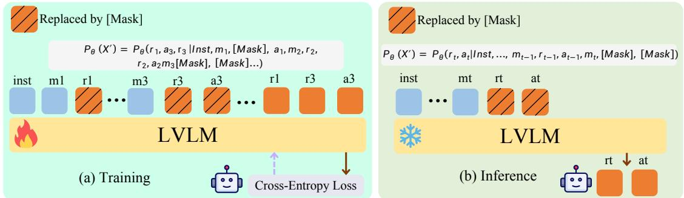

Figure 3: Overview of the MaP paradigm during training and inference.  
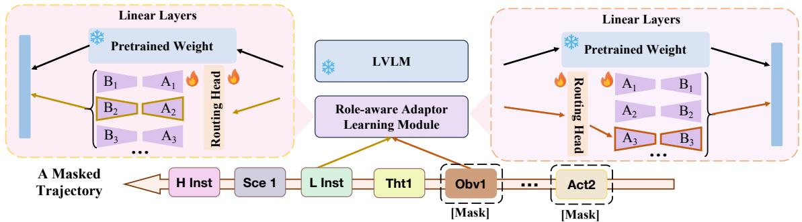  
Figure 4: Illustration of the role-aware adapter learning module. Given a masked trajectory with heterogeneous components, the module dynamically assigns each token to a specific adapter for targeted optimization. Abbreviation: H Inst=High level instruction; L Inst=Low level instruction; Scne=Screenshot; Tht=Thought; Obv=Observation; Act=Action.

To begin with, we briefly review the core concepts of LoRA. It assumes that parameter updates lie in a low-dimensional subspace, allowing training to be performed through a low-rank decomposition while keeping the pretrained weights frozen. Based on this formulation, the forward pass of a LoRA layer can be expressed as follows:

$$
\Delta W _ { 0 } = B A , \quad h = W _ { 0 } x + \alpha \cdot \Delta W _ { 0 } x\tag{3}
$$

where $x \in R ^ { k }$ is the input feature, $W _ { 0 } \in \mathcal { R } ^ { d \times k }$ denotes the frozen pretrained weight, and $\Delta W _ { 0 }$ is the trainable update parameterized by a low-rank decomposition, with $B \in \mathcal { R } ^ { d \times r }$ and $A \in R ^ { r \times k }$ such that r ≪ min(d, k). The scalar α controls the contribution of the update during training.

As illustrated in Figure 4, this module extends standard LoRA by introducing multiple adapters for each component in the GUI trajectory, aiming to address the data heterogeneity inherent in existing training corpora. Specifically, to dynamically assign different tokens to appropriate adapters, a token-wise routing mechanism is employed. It selects the most suitable adapter for each token based on a linear scoring function:

$$
\begin{array} { r } { \left\{ \begin{array} { l l } { \hat { i } = \arg \operatorname* { m a x } _ { i } \left( w _ { i } ^ { \top } x \right) , } \\ { \quad } \\ { \Delta W _ { 0 } = B _ { \hat { i } } A _ { \hat { i } } , } \\ { \quad } \\ { h = W _ { 0 } x + \alpha \cdot \Delta W _ { 0 } x . } \end{array} \right. } \end{array}\tag{4}
$$

where x is the input feature, $w _ { i }$ is the learnable routing weight for the i-th adapter, and $B _ { i } , A _ { i }$ are the low-rank matrices associated with adapter i. The selected adapter ˆi is used to generate the lowrank update $\Delta W _ { 0 } .$ , which is then applied during forward propagation.

## 4 Experiments

## 4.1 Datasets and Evaluation Metrics

For benchmark evaluation, MaP is evaluated on five navigation datasets: AndroidWorld (Rawles et al., 2024), AndroidControl (Li et al., 2024), GUI-Odyssey (Lu et al., 2024), AITZ (Zhang et al., 2024), and Mind2Web (Deng et al., 2023). We categorize them into two groups: global evaluation benchmarks (AndroidWorld, AndroidControl-High, GUI-Odyssey, Mind2Web) that assess endto-end task execution with high-level instructions, and local evaluation benchmarks (AndroidControl-Low) that focus on step-wise action execution with low-level instructions. Detailed dataset statistics are provided in the Appendix.

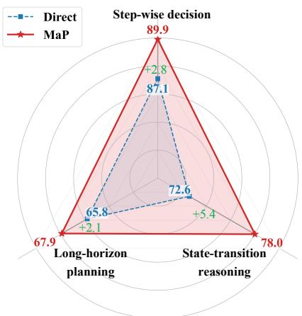  
(a) Navigation Capabilites Evaluation

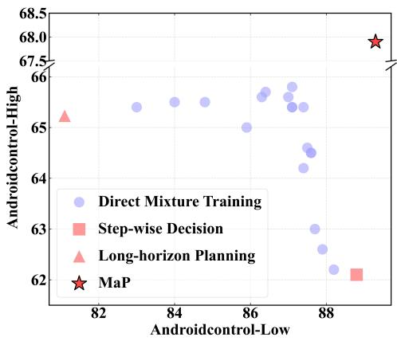  
(b) Trade-off Analysis  
Figure 5: Left: Comparison of three core navigation capabilities between direct mixture training and MaP. Right: Trade-off analysis between direct mixture training and MaP.

For evaluation metrics, we adopt three standard metrics (Wu et al., 2024b): Type (exact match of predicted action type), Ground (coordinate accuracy for click actions), and Step-wise Success Rate (SR, whether both action type and arguments are completely correct).

For training data, we integrate major public datasets from diverse mid-training paradigms (Zhang et al., 2025a; Xu et al., 2024; Wu et al., 2024a; Jang et al., 2025; Sun et al., 2024, 2025) to establish a unified action space, with trajectories averaging 5.6 steps in length. Detailed descriptions of the training data and unified action types are provided in Appendix. For the direct mixture training comparison, we utilize an equivalent volume of data spanning three navigation task configurations (Xu et al., 2024; Wu et al., 2024b; Shen et al., 2024; Qin et al., 2025): step-wise decision pairs the current screenshot with a low-level instruction (Xu et al., 2024; Wu et al., 2024b); state-action alignment provides two consecutive screenshots to predict the intermediate action (Shen et al., 2024); and long-horizon planning formulates GUI tasks as dialogue-like interactions for step-wise plan decomposition (Xu et al., 2024).

## 4.2 Superiority of MaP in Mixture Training

To investigate effective unification strategies to improve GUI navigation capabilities, we compare direct mixture training with MaP, assessing zero-shot performance across three navigation abilities and the impact on post-training downstream datasets. We further analyze the performance trade-offs inherent in direct mixture training to reveal the underlying conflicts that distinguish it from MaP.

## 4.2.1 Zero Shot Performance.

As illustrated in Figure 5(a), we evaluate direct mixture training and MaP under a zero-shot setting on AndroidControl (Li et al., 2024) across three navigation capabilities, serving to assess intrinsic generalization ability without dataset-specific adaptation. Our experiments show that MaP consistently outperforms direct mixture training across all three settings, yielding gains of 2.8%, 5.4%, and 2.1% on step-wise decision, state-action alignment, and long-horizon planning, respectively. This improvement is attributable to a consistent objective that aligns training signals across all navigation capabilities. By forcing the GUI Agent to reconstruct masked components in the GUI trajectory, MaP inherently learns robust, task-agnostic representations that generalize zero-shot to diverse navigation requirements.

## 4.2.2 Post Training Performance.

As illustrated in Section 4.2.1 and Section 4.2.1, we employ Qwen2.5-VL (Bai et al., 2025) with various scales to assess the impact of MaP on posttraining efficacy across multiple benchmarks. Empirical results reveal a clear contrast: direct mixture training yields negligible improvements over the baseline, whereas MaP delivers substantial SR increases of 3.0% and 2.7% on AndroidControl-High and AndroidControl-Low, respectively. These improvements highlight that MaP serves as a superior initialization for downstream GUI tasks, irrespective of the underlying model scale (e.g., 3B or 7B).

## 4.2.3 Trade-off Analysis.

As illustrated in Figure 5(b), we analyze the performance trade-off inherent in direct mixture training, where the x-axis and y-axis represent SR on

<table><tr><td rowspan="2">Methods</td><td rowspan="2">Param.</td><td colspan="3">AndroidControl-High</td><td colspan="3">AndroidControl-Low</td></tr><tr><td>Type</td><td>Ground</td><td>SR</td><td>Type</td><td>Ground</td><td>SR</td></tr><tr><td>Claude (Anthropic, 2024)</td><td></td><td>63.7</td><td>0.0</td><td>12.5</td><td>74.3</td><td>0.0</td><td>19.4</td></tr><tr><td>GPT-4o (OpenAI, 2024)</td><td></td><td>66.3</td><td>0.0</td><td>20.8</td><td>74.3</td><td>0.0</td><td>19.4</td></tr><tr><td>SeeClick (Cheng et al., 2024)</td><td>9.6B</td><td>82.9</td><td>62.9</td><td>59.1</td><td>93.0</td><td>73.4</td><td>75.0</td></tr><tr><td>CPM-GUI (Zhang et al., 2025e)</td><td>7B</td><td>77.7</td><td></td><td>69.2</td><td>94.4</td><td></td><td>90.2</td></tr><tr><td>OS-Genesis (Sun et al., 2024)</td><td>7B</td><td>66.2</td><td></td><td>44.5</td><td>74.2</td><td></td><td>90.7</td></tr><tr><td>OS-Atlas (Wu et al., 2024b)</td><td>7B</td><td>85.2</td><td>78.5</td><td>71.2</td><td>93.6</td><td>88.0</td><td>85.2</td></tr><tr><td>AGUVIS (Xu et al., 2024)</td><td>7B</td><td></td><td></td><td>61.5</td><td></td><td></td><td>80.5</td></tr><tr><td>UI-TARS (Qin et al., 2025)</td><td>7B</td><td>83.7</td><td>80.5</td><td>72.5</td><td>98.0</td><td>89.3</td><td>90.8</td></tr><tr><td>Falcon-UI (Shen et al., 2024)</td><td>7B</td><td></td><td></td><td>72.7</td><td></td><td></td><td>86.6</td></tr><tr><td>Qwen2.5-VL (Bai et al., 2025)</td><td>3B</td><td>84.9</td><td>75.4</td><td>68.9</td><td> $9 6 . 5$ </td><td>87.8</td><td>87.0</td></tr><tr><td>+Direct</td><td>3B</td><td> $8 5 . 4 _ { + 0 . 5 }$ </td><td> $7 5 . 9 _ { + 0 . 5 }$ </td><td> $7 0 . 1 _ { + 1 . 2 }$ </td><td> $9 6 . 8 _ { + 0 . 3 }$ </td><td> $8 8 . 2 _ { + 0 . 4 }$ </td><td> $8 7 . 9 _ { + 0 . 9 }$ </td></tr><tr><td>+MaP</td><td>3B</td><td> $8 6 . 0 _ { + 1 . 1 }$ </td><td> $7 6 . 8 _ { + 1 . 4 }$ </td><td> $7 1 . 9 _ { + 3 . 0 }$ </td><td> $9 7 . 1 _ { + 0 . 6 }$ </td><td> $8 9 . 0 _ { + 1 . 2 }$ </td><td> $8 9 . 7 _ { + 2 . 7 }$ </td></tr><tr><td>Qwen2.5-VL (Bai et al., 2025)</td><td>7B</td><td>86.4</td><td>78.3</td><td>71.2</td><td>96.9</td><td>89.1</td><td>88.2</td></tr><tr><td>+Direct</td><td>7B</td><td> $\underline { { 8 6 . 7 } } _ { + 0 . 3 }$ </td><td> $7 8 . 9 _ { + 0 . 6 }$ </td><td> $\underline { { 7 2 . 9 } } _ { + 1 . 7 }$ </td><td> $9 7 . 0 _ { + 0 . 1 }$ </td><td> $8 9 . 2 _ { + 0 . 1 }$ </td><td> $8 9 . 0 _ { + 0 . 8 }$ </td></tr><tr><td> $+ M a P$ </td><td>7B</td><td> $\mathbf { 8 7 . 2 } _ { + 0 . 8 }$ </td><td> $\underline { { 7 9 . 7 } } _ { + 1 . 4 }$ </td><td> $7 4 . 2 _ { + 3 . 0 }$ </td><td> $9 7 . 9 _ { + 1 . 0 }$ </td><td> ${ \bf 9 0 . 1 _ { + 1 . 0 } }$ </td><td> $\mathbf { 9 0 . 9 } _ { + 2 . 7 }$ </td></tr></table>

Table 1: Results on AndroidControl (Li et al., 2024). The best is bold, second is underlined. + numbers indicate improvement over Qwen2.5-VL.
<table><tr><td rowspan="2">Methods</td><td rowspan="2">Param.</td><td colspan="3">GUI-Odyssey</td><td rowspan="2">AITZ</td><td rowspan="2">Mind2web</td></tr><tr><td>Type</td><td>Ground</td><td>SR</td></tr><tr><td>Claude (Anthropic, 2024)</td><td></td><td>60.9</td><td>0.0</td><td>3.1</td><td></td><td></td></tr><tr><td>GPT-4o (OpenAI, 2024)</td><td></td><td>34.3</td><td>0.0</td><td>3.3</td><td></td><td>56.6</td></tr><tr><td>SeeClick (Cheng et al., 2024)</td><td>9.6B</td><td>71.0</td><td>52.4</td><td>53.9</td><td></td><td>20.9</td></tr><tr><td>CPM-GUI (Zhang et al., 2025e)</td><td>7B</td><td>90.9</td><td></td><td>75.0</td><td></td><td>一</td></tr><tr><td>OS-Atlas (Wu et al., 2024b)</td><td>7B</td><td>84.5</td><td>67.8</td><td>62.0</td><td></td><td></td></tr><tr><td>UI-TARS (Qin et al., 2025)</td><td>7B 7B</td><td>94.6</td><td>90.1</td><td>87.0</td><td></td><td></td></tr><tr><td>Falcon-UI (Shen et al., 2024)</td><td></td><td></td><td></td><td></td><td>69.1</td><td>27.6</td></tr><tr><td>Qwen2.5-VL (Bai et al., 2025) +Direct</td><td>3B 3B</td><td>95.1  $9 5 . 4 _ { + 0 . 3 }$ </td><td>85.4</td><td>83.1</td><td>71.3</td><td>54.5</td></tr><tr><td>+MaP</td><td>3B</td><td> $9 6 . 0 _ { + 0 . 9 } $ </td><td> $8 6 . 3 _ { + 0 . 9 }$   $8 7 . 4 _ { + 2 . 0 }$ </td><td> $8 3 . 9 _ { + 0 . 8 }$   $8 5 . 0 _ { + 1 . 9 }$ </td><td> $7 1 . 9 _ { + 0 . 6 }$ </td><td> $5 5 . 1 _ { + 0 . 6 }$ </td></tr><tr><td>Qwen2.5-VL (Bai et al., 2025)</td><td></td><td></td><td></td><td></td><td> $\underline { { 7 3 . 2 } } _ { + 1 . 9 }$ </td><td> $5 6 . 9 _ { + 2 . 4 }$ </td></tr><tr><td>+Direct</td><td>7B 7B</td><td>95.9</td><td>86.9</td><td>85.1</td><td>71.5</td><td>57.1</td></tr><tr><td></td><td></td><td> $9 7 . 1 _ { + 1 . 2 }$ </td><td> $8 7 . 8 _ { + 0 . 9 }$ </td><td> $8 6 . 2 _ { + 1 . 1 }$ </td><td> $7 2 . 4 _ { + 0 . 9 }$ </td><td> $5 7 . 4 _ { + 0 . 3 }$ </td></tr><tr><td> $+ M a P$ </td><td>7B</td><td> $\mathbf { 9 7 . 8 _ { + 1 . 9 } }$ </td><td> $\underline { { 8 9 . 9 } } _ { + 3 . 0 }$ </td><td> $\mathbf { 8 8 . 5 _ { + 3 . 4 } }$ </td><td> $7 3 . 9 _ { + 2 . 4 }$ </td><td> ${ \bf 5 9 . 3 } _ { + 2 . 2 }$ </td></tr></table>

Table 2: Results on GUI-Odyssey (Lu et al., 2024), AITZ (Zhang et al., 2024), and Mind2Web (Deng et al., 2023). The best is bold, second is underlined. + numbers indicate improvement over Qwen2.5-VL.

## 4.3 Main Result

AndroidControl-Low and AndroidControl-High, respectively. Evaluating intermediate checkpoints from direct mixture training reveals a clear suboptimal trade-off, where it fails to surpass the specialized baselines on both benchmarks, indicating that optimizing for one capability often comes at the expense of the other. This highlights a typical negative transfer problem in multi-task learning, where mixing vastly different data formats leads to conflicting training signals. In contrast, MaP breaks this performance ceiling by unifying the optimization objectives across all three navigation tasks, achieving superior results of 89.9% and 67.9% on AndroidControl-Low and AndroidControl-High, respectively.

As illustrated in Section 4.2.1 and Section 4.2.1, we present a comprehensive comparison with existing GUI Agent mid-training methods, analyzing experimental results ranging from global to local action execution.

## 4.3.1 Online Evaluation.

As shown in Figure 6, with Qwen2.5-VL-7B as the backbone, we compare direct mixture training and MaP on the AndroidWorld (Rawles et al., 2024) in terms of Pass@1 and Pass@4. The online evaluation encompasses interactions with diverse and complex real-world applications, involving practical GUI tasks designed to enhance productivity and facilitate information retrieval. Specifically, MaP achieves consistent performance gains of 2.6% and 5.4% in Pass@1 and Pass@4 over direct mixture training on the AndroidWorld, where the larger margin in Pass@4 suggests that MaP unlocks greater GUI Agent’s potential.

## 4.3.2 Offline Evaluation

Compared with existing GUI Agent mid-training methods (Qin et al., 2025; Shen et al., 2024; Wu et al., 2024b; Cheng et al., 2024; Xu et al., 2024), MaP demonstrates superior performance on the AndroidControl-High, GUI-Odyssey, AITZ, and Mind2Web datasets. Among these, AndroidControl-High and GUI-Odyssey dataset concentrate on the most prevalent mobile platforms for GUI agent evaluation. AndroidControl-High dataset (Li et al., 2024) covers various scenarios across 833 Android applications, while GUI-Odyssey (Lu et al., 2024) presents a long-horizon navigation challenge, with trajectories averaging 15.4 steps in length. As shown in Section 4.2.1 and Section 4.2.1, MaP on Qwen2.5-VL-7B achieves a higher SR than UI-TARS-7B (Qin et al., 2025), with improvements of 1.7% on AndroidControl-High and 1.5% on GUI-Odyssey, respectively. We attribute the performance gain to MaP’s capacity to unify diverse navigation tasks into consistent training objectives while effectively addressing the heterogeneity of GUI corpora.

Regarding evaluations beyond mobile platforms, MaP on Qwen2.5-VL-7B surpasses Falcon-UI (Shen et al., 2024) by 4.8% on the AITZ dataset (Zhang et al., 2024), covering diverse scenarios in Section 4.2.1. On the Mind2Web dataset (Deng et al., 2023), MaP on Qwen2.5-VL-7B achieves state-of-the-art performance, surpassing UI-TARS even though the latter leverages extensive pretraining on 50B tokens of in-house data, as shown in Section 4.2.1. This superior performance stems from MaP’s unified framework and role-aware adapter learning module, which jointly support consistent training across heterogeneous data from all prior navigation strategies.

## 4.3.3 Local Evaluation.

For local evaluation, the GUI Agent is provided with a current screenshot and a pair of high- and low-level instructions. As shown in Section 4.2.1, MaP (Qwen2.5-VL-7B) achieves higher SR than UI-TARS (Qin et al., 2025) under AndroidControl-Low, despite UI-TARS being pretrained on 50B tokens. We attribute this to training on diverse prior navigation strategies, particularly single-step instructions, which improve generalization to local planning tasks.

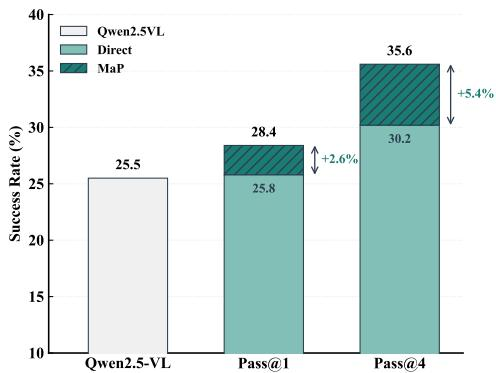

Figure 6: The performance of Qwen2.5VL-7B with direct mixture training and MaP on AndroidWorld.
<table><tr><td>Mask Ratio</td><td>Type</td><td>Ground</td><td>SR</td></tr><tr><td>0.2</td><td>86.3</td><td>78.4</td><td>72.5</td></tr><tr><td>0.5</td><td>86.9</td><td>79.3</td><td>73.7</td></tr><tr><td>0.8</td><td>87.2</td><td>79.7</td><td>74.2</td></tr><tr><td>1.0</td><td>86.7</td><td>79.1</td><td>73.8</td></tr></table>

Table 3: Ablation on mask ratio.
<table><tr><td>Num. Adapters | Type</td><td></td><td>Ground</td><td>SR</td></tr><tr><td>1</td><td>86.7</td><td>79.0</td><td>73.4</td></tr><tr><td>2</td><td>86.9</td><td>79.4</td><td>73.8</td></tr><tr><td>4</td><td>87.2</td><td>79.7</td><td>74.2</td></tr><tr><td>8</td><td>87.1</td><td>79.6</td><td>74.1</td></tr></table>

Table 4: Ablation on the numbers of adapter.

## 4.4 Ablation Studies

## 4.4.1 Mask Ratio.

Since the mask ratio is key to MaP, we investigate how different masking ratios (0.2, 0.5, 0.8, and 1.0) influence the model’s effectiveness and conduct ablation studies on Qwen2.5-VL-7B (MaP). As shown in Section 4.3.2, performance consistently improves as the mask ratio increases from 0.2 to 0.8, since higher mask ratios allow more data to contribute to gradients, while a significant drop is observed at 1.0 (Zhang et al., 2025d). This is because the model is forced to rely solely on visual context from multiple screenshots to reason, greatly increasing training difficulty. Moreover, the presence of low-quality samples such as web-based GUI trajectories containing noisy visual cues like red circles (Zhang et al., 2025a) further contributes to the degradation.

## 4.4.2 Number of Adapters.

To address the heterogeneity across diverse opensource navigation GUI datasets, we propose a roleaware adapter learning module that dynamically assigns different tokens of a trajectory to specialized adapters, allowing targeted optimization with heterogeneous data. We investigate the impact of using 1, 2, 4, or 8 adapters on Qwen2.5-VL-7B (MaP) with AndroidControl-High dataset. As shown in Section 4.3.2, performance improves as the number of adapters increases, peaking at four, which outperforms the standard single-adapter LoRA baseline (Num.Adapters = 1) (Hu et al., 2022).

## 5 Conclusion

In this paper, we address inconsistent objectives and data heterogeneity in multi-task GUI agent mixture training. We propose MaP, a unified framework that formulates diverse navigation strategies as masked trajectory prediction. With trajectory masking and a role-aware adapter, MaP consolidates conflicting objectives into a consistent learning goal on heterogeneous data. Extensive evaluations show MaP significantly outperforms direct mixture training, establishing a new standard for versatile GUI navigation.

## Limitations

Although MaP achieves consistent improvements across multiple GUI navigation benchmarks, our current study is mainly conducted with moderatescale backbone models and publicly available GUI corpora. Due to computational constraints, we have not fully explored the scaling potential of MaP with larger LVLMs or more diverse training data. Future work will investigate whether MaP can further benefit from larger model capacities and expanded GUI trajectory corpora.

## Ethical Considerations

This work proposes a training framework for GUI agents and does not introduce additional ethical concerns beyond those of existing GUI agent systems. Potential risks mainly come from GUI interaction itself, such as sensitive information in screenshots or unintended operations in practical deployment. These issues should be handled with standard safeguards, including data anonymization, user authorization, and confirmation for sensitive actions.

## References

Anthropic. 2024. Developing a computer use model. Anthropic blog.

Shuai Bai, Keqin Chen, Xuejing Liu, Jialin Wang, Wenbin Ge, Sibo Song, Kai Dang, Peng Wang, Shijie Wang, Jun Tang, and 1 others. 2025. Qwen2. 5-vl technical report. arXiv preprint arXiv:2502.13923.

Dongping Chen, Yue Huang, Siyuan Wu, Jingyu Tang, Liuyi Chen, Yilin Bai, Zhigang He, Chenlong Wang, Huichi Zhou, Yiqiang Li, and 1 others. 2024. Guiworld: A dataset for gui-oriented multimodal llmbased agents. arXiv e-prints, pages arXiv–2406.

Kanzhi Cheng, Qiushi Sun, Yougang Chu, Fangzhi Xu, Yantao Li, Jianbing Zhang, and Zhiyong Wu. 2024. Seeclick: Harnessing gui grounding for advanced visual gui agents. arXiv preprint arXiv:2401.10935.

Laure Ciernik, Lorenz Linhardt, Marco Morik, Jonas Dippel, Simon Kornblith, and Lukas Muttenthaler. 2025. Objective drives the consistency of representational similarity across datasets. In Proceedings of the 42nd International Conference on Machine Learning, volume 267 of Proceedings of Machine Learning Research, pages 10920–10948. PMLR.

Xiang Deng, Yu Gu, Boyuan Zheng, Shijie Chen, Sam Stevens, Boshi Wang, Huan Sun, and Yu Su. 2023. Mind2web: Towards a generalist agent for the web. Advances in Neural Information Processing Systems, 36:28091–28114.

Kaiming He, Xinlei Chen, Saining Xie, Yanghao Li, Piotr Dollár, and Ross Girshick. 2022. Masked autoencoders are scalable vision learners. In Proceedings ofthe IEEE/CVF conference on computer vision and pattern recognition, pages 16000–16009.

Wenyi Hong, Weihan Wang, Qingsong Lv, Jiazheng Xu, Wenmeng Yu, Junhui Ji, Yan Wang, Zihan Wang, Yuxiao Dong, Ming Ding, and 1 others. 2024. Cogagent: A visual language model for gui agents. In Proceedings of the IEEE/CVF Conference on Computer Vision and Pattern Recognition, pages 14281–14290.

Edward J Hu, Yelong Shen, Phillip Wallis, Zeyuan Allen-Zhu, Yuanzhi Li, Shean Wang, Lu Wang, Weizhu Chen, and 1 others. 2022. Lora: Low-rank adaptation of large language models. ICLR, 1(2):3.

Yunseok Jang, Yeda Song, Sungryull Sohn, Lajanugen Logeswaran, Tiange Luo, Dong-Ki Kim, Kyunghoon Bae, and Honglak Lee. 2025. Scalable video-todataset generation for cross-platform mobile agents. In Proceedings of the Computer Vision and Pattern Recognition Conference, pages 8604–8614.

Kim et al. 2023. Language models can solve computer tasks. Advances in Neural Information Processing Systems, 36:39648–39677.

Wei Li, William Bishop, Alice Li, Chris Rawles, Folawiyo Campbell-Ajala, Divya Tyamagundlu, and

Oriana Riva. 2024. On the effects of data scale on computer control agents. arXiv e-prints, pages arXiv– 2406.

Yichao Liu, Huawen Shen, Liu Yu, Shiyu Liu, Zeyu Chen, and Yu Zhou. 2026. Drs-gui: Dynamic region search for training-free gui grounding. arXiv preprint arXiv:2605.15542.

Yuhang Liu, Zeyu Liu, Shuanghe Zhu, Pengxiang Li, Congkai Xie, Jiasheng Wang, Xavier Hu, Xiaotian Han, Jianbo Yuan, Xinyao Wang, and 1 others. 2025. Infigui-g1: Advancing gui grounding with adaptive exploration policy optimization. arXiv preprint arXiv:2508.05731.

Ilya Loshchilov and Frank Hutter. 2017. Decoupled weight decay regularization. arXiv preprint arXiv:1711.05101.

Dunjie Lu, Yiheng Xu, Junli Wang, Haoyuan Wu, Xinyuan Wang, Zekun Wang, Junlin Yang, Hongjin Su, Jixuan Chen, Junda Chen, and 1 others. 2025. Videoagenttrek: Computer use pretraining from unlabeled videos. arXiv preprint arXiv:2510.19488.

Quanfeng Lu, Wenqi Shao, Zitao Liu, Fanqing Meng, Boxuan Li, Botong Chen, Siyuan Huang, Kaipeng Zhang, Yu Qiao, and Ping Luo. 2024. Gui odyssey: A comprehensive dataset for cross-app gui navigation on mobile devices. arXiv preprint arXiv:2406.08451.

Run Luo, Lu Wang, Wanwei He, and Xiaobo Xia. 2025. Gui-r1: A generalist r1-style vision-language action model for gui agents. arXiv preprint arXiv:2504.10458.

Dang Nguyen, Jian Chen, Yu Wang, Gang Wu, Namyong Park, Zhengmian Hu, Hanjia Lyu, Junda Wu, Ryan Aponte, Yu Xia, and 1 others. 2025. Gui agents: A survey. In Findings ofthe Associationfor Computational Linguistics: ACL 2025, pages 22522–22538.

OpenAI. 2024. Gpt-4o system card. OpenAI system card via arXiv.

Yujia Qin, Yining Ye, Junjie Fang, Haoming Wang, Shihao Liang, Shizuo Tian, Junda Zhang, Jiahao Li, Yunxin Li, Shijue Huang, and 1 others. 2025. Ui-tars: Pioneering automated GUI interaction with native agents. arXiv preprint arXiv:2501.12326.

Jeff Rasley, Samyam Rajbhandari, Olatunji Ruwase, and Yuxiong He. 2020. Deepspeed: System optimizations enable training deep learning models with over 100 billion parameters. In Proceedings of the 26th ACM SIGKDD international conference on knowledge discovery & data mining, pages 3505–3506.

Christopher Rawles, Sarah Clinckemaillie, Yifan Chang, Jonathan Waltz, Gabrielle Lau, Marybeth Fair, Alice Li, William Bishop, Wei Li, Folawiyo Campbell-Ajala, and 1 others. 2024. Androidworld: A dynamic benchmarking environment for autonomous agents. arXiv preprint arXiv:2405.14573.

Christopher Rawles, Alice Li, Daniel Rodriguez, Oriana Riva, and Timothy Lillicrap. 2023. Androidinthewild: A large-scale dataset for android device control. Advances in Neural Information Processing Systems, 36:59708–59728.

Huawen Shen, Chang Liu, Gengluo Li, Xinlong Wang, Yu Zhou, Can Ma, and Xiangyang Ji. 2024. Falconui: Understanding gui before following user instructions. arXiv preprint arXiv:2412.09362.

Tianlin Shi, Andrej Karpathy, Linxi Fan, Jonathan Hernandez, and Percy Liang. 2017. World of bits: An open-domain platform for web-based agents. In International Conference on Machine Learning, pages 3135–3144. PMLR.

Qiushi Sun, Kanzhi Cheng, Zichen Ding, Chuanyang Jin, Yian Wang, Fangzhi Xu, Zhenyu Wu, Chengyou Jia, Liheng Chen, Zhoumianze Liu, and 1 others. 2024. Os-genesis: Automating gui agent trajectory construction via reverse task synthesis. arXiv preprint arXiv:2412.19723.

Yuchen Sun, Shanhui Zhao, Tao Yu, Hao Wen, Samith Va, Mengwei Xu, Yuanchun Li, and Chongyang Zhang. 2025. Gui-xplore: Empowering generalizable gui agents with one exploration. In Proceedings of the Computer Vision and Pattern Recognition Conference, pages 19477–19486.

Haoming Wang, Haoyang Zou, Huatong Song, Jiazhan Feng, Junjie Fang, Junting Lu, Longxiang Liu, Qinyu Luo, Shihao Liang, Shijue Huang, and 1 others. 2025. Ui-tars-2 technical report: Advancing gui agent with multi-turn reinforcement learning. arXiv preprint arXiv:2509.02544.

Peng Wang, Shuai Bai, Sinan Tan, Shijie Wang, Zhihao Fan, Jinze Bai, Keqin Chen, Xuejing Liu, Jialin Wang, Wenbin Ge, and 1 others. 2024a. Qwen2- vl: Enhancing vision-language model’s perception of the world at any resolution. arXiv preprint arXiv:2409.12191.

Shuai Wang, Weiwen Liu, Jingxuan Chen, Yuqi Zhou, Weinan Gan, Xingshan Zeng, Yuhan Che, Shuai Yu, Xinlong Hao, Kun Shao, and 1 others. 2024b. Gui agents with foundation models: A comprehensive survey. arXiv preprint arXiv:2411.04890.

Qinzhuo Wu, Weikai Xu, Wei Liu, Tao Tan, Jianfeng Liu, Ang Li, Jian Luan, Bin Wang, and Shuo Shang. 2024a. Mobilevlm: A vision-language model for better intra-and inter-ui understanding. arXiv preprint arXiv:2409.14818.

Zhiyong Wu, Zhenyu Wu, Fangzhi Xu, Yian Wang, Qiushi Sun, Chengyou Jia, Kanzhi Cheng, Zichen Ding, Liheng Chen, Paul Pu Liang, and 1 others. 2024b. Os-atlas: A foundation action model for generalist gui agents. arXiv preprint arXiv:2410.23218.

Yiheng Xu, Zekun Wang, Junli Wang, Dunjie Lu, Tianbao Xie, Amrita Saha, Doyen Sahoo, Tao Yu, and Caiming Xiong. 2024. Aguvis: Unified pure vision

agents for autonomous gui interaction. arXiv preprint arXiv:2412.04454.

Bofei Zhang, Zirui Shang, Zhi Gao, Wang Zhang, Rui Xie, Xiaojian Ma, Tao Yuan, Xinxiao Wu, Song-Chun Zhu, and Qing Li. 2025a. Tongui: Building generalized gui agents by learning from multimodal web tutorials. arXiv preprint arXiv:2504.12679.

Jiwen Zhang, Jihao Wu, Yihua Teng, Minghui Liao, Nuo Xu, Xiao Xiao, Zhongyu Wei, and Duyu Tang. 2024. Android in the zoo: Chain-of-action-thought for gui agents. arXiv preprint arXiv:2403.02713.

Yan Zhang, Daiqing Wu, Huawen Shen, Can Ma, and Yu Zhou. 2026. Learn where to click from yourself: On-policy self-distillation for gui grounding. arXiv preprint arXiv:2605.00642.

Yan Zhang, Gangyan Zeng, Huawen Shen, Daiqing Wu, Yu Zhou, and Can Ma. 2025b. Track the answer: Extending textvqa from image to video with spatiotemporal clues. In Proceedings of the AAAI Conference on Artificial Intelligence, volume 39, pages 10275–10283.

Yan Zhang, Gangyan Zeng, Daiqing Wu, Huawen Shen, Binbin Li, Yu Zhou, Can Ma, and Xiaojun Bi. 2025c. Gather and trace: Rethinking video textvqa from an instance-oriented perspective. In Proceedings of the 33rd ACM International Conference on Multimedia, pages 876–885.

Yifei Zhang, Chang Liu, Jin Wei, Xiaomeng Yang, Yu Zhou, Can Ma, and Xiangyang Ji. 2025d. Linguistics-aware masked image modeling for self-supervised scene text recognition. In 2025 IEEE/CVF Conference on Computer Vision and Pattern Recognition (CVPR), pages 9318–9328. IEEE.

Zhong Zhang, Yaxi Lu, Yikun Fu, Yupeng Huo, Shenzhi Yang, Yesai Wu, Han Si, Xin Cong, Haotian Chen, Yankai Lin, and 1 others. 2025e. Agentcpm-gui: Building mobile-use agents with reinforcement finetuning. arXiv preprint arXiv:2506.01391.

## Appendix

The appendix includes the following aspects:

• A: Unified Action Space.

• B: Implementation Details.

• C: Evaluation Benchmarks.

• D: Theoretical Analysis.

• E: Gradient Optimization Analysis.

• F: Qualitative Analysis.

## A Unified Action Space

In this section, we introduce the unified action space of our proposed MaP framework for GUI navigation. As shown in section A, we categorize actions into three distinct types: Ground, Content, and Func. Specifically, Ground actions require focusing on specific element targets within the screenshot, necessitating the prediction of both an action type and precise coordinates. Conversely, Content and Func actions demand a holistic understanding of the entire screenshot. Content actions involve generating an action type paired with specific textual content, whereas Func actions require only the action type. To formulate this efficiently, we adopt the native action set of the Qwen2.5-VL base model (Bai et al., 2025). This design guarantees the agent’s universality across diverse operating environments while preserving the fine-grained flexibility necessary for complex interactions.

## B Implementation Details

For MaP, which is built upon Qwen2.5-VL series (Bai et al., 2025), all input images are resized to 1280 × 720 to achieve a better trade-off between performance and efficiency. The maximum token sequence length is set to 16384 for each LVLM. During training, each LVLM in MaP is trained with a batch size of 32 and 8 gradient accumulation steps. We use the AdamW optimizer (Loshchilov and Hutter, 2017) for training, along with a cosine learning rate scheduler and a warm-up phase comprising 5% of the total training steps. To reduce GPU memory consumption, we adopt DeepSpeed optimization (Rasley et al., 2020), BF16 precision, and gradient checkpointing. All experiments are conducted on a cluster of H100-80G GPUs.

## C Evaluation Benchmarks

In this section, we introduce more details of the evaluation benchmarks used in our work.

## C.1 AndroidWorld.

AndroidWorld is a scalable environment for mobile GUI Agents evaluation. This benchmark encompasses 116 tasks across 20 authentic Android apps, ranging from system configurations to complex user workflows like online shopping and information retrieval. These tasks involve multi-step interactions that require the agent to locate specific elements and execute correct actions by following user instructions. For evaluation, we utilize the environment’s state-based reward mechanism to deterministically verify task completion and report the Success Rate (SR).

## C.2 AndroidControl.

AndroidControl comprises 15,226 tasks across 120 diverse applications, simulating a broad range of real-world mobile interactions. Following (Wu et al., 2024b), we adopt Grounding to quantify the accuracy of grounding actions and SR to measure the exact match of the predicted action step.

## C.3 GUI-Odyssey.

GUI-Odyssey is a large-scale, long-horizon dataset specifically established for evaluating cross-app GUI navigation on mobile devices. It comprises 8,334 episodes spanning 212 diverse applications, capturing complex workflows that require the GUI Agent to manage long-term history and navigate interactions across multiple apps. Following (Wu et al., 2024b), we adopt Ground Acc to quantify the accuracy of grounding actions and SR to measure the exact match of the predicted action step.

## C.4 AITZ.

AITZ (Android-In-The-Zoo) dataset is specifically constructed to evaluate and train autonomous GUI agents on smartphones. Comprising 18,643 screenaction pairs, AITZ is distinguished by its comprehensive Chain-of-Action-Thought (CoAT) annotations.

## C.5 Mind2Web.

Mind2Web dataset is established to evaluate and train generalist GUI agents across diverse, realworld web environments. It comprises over 2,000 open-ended tasks spanning 137 dynamic websites across 31 distinct domains. A defining characteristic of Mind2Web is its rigorous focus on zero-shot generalization, comprehensively testing an agent’s capability to navigate entirely unseen tasks, websites, and domains.

<table><tr><td>Category</td><td>Action Format</td><td>Action Description</td></tr><tr><td rowspan="2">Ground</td><td>click(point) long_press(point)</td><td>Tap on the specified position.</td></tr><tr><td>scroll(point, point1)</td><td>Long-press on the specified position. Swipe on the screen.</td></tr><tr><td rowspan="4">Content</td><td>open(app_name)</td><td>Open the specified application.</td></tr><tr><td>type(text)</td><td>Enter the specified text.</td></tr><tr><td>answer(text)</td><td>Answer the specified user&#x27;s question.</td></tr><tr><td></td><td></td></tr><tr><td rowspan="6">Func</td><td>wait()</td><td>Temporarily pause the execution.</td></tr><tr><td>system_button(&#x27;Home&#x27;)</td><td>Navigate to the home screen.</td></tr><tr><td>system_button(&#x27;Back&#x27;)</td><td>Return to the previous screen.</td></tr><tr><td> ${ \mathsf { s y s t e m \_ b u t t o n ( \cdot E n t e r ^ { \prime } ) } }$ </td><td>Confirm an input to the next step.</td></tr><tr><td>terminate  $( \cdot \mathsf { s u c c e s s } ^ { \prime } )$ </td><td>No further actions required.</td></tr><tr><td>terminate  $( \cdot \mathsf { f a i l u r e ^ { \prime } } )$ </td><td>Requires additional steps.</td></tr></table>

Table 5: Overview of the action space definition.

## D Theoretical Analysis

In this section, we analyze the consistency of training objectives in terms of optimization direction between direct unification mixture optimization and MaP from a gradient perspective. Specifically, we define the direct mixture optimization of the three navigation paradigms, where the gradient for parameter updates is represented by $\nabla _ { \theta } L _ { \mathrm { m i x } } .$ . Here, $\theta _ { \mathrm { S D } } , \theta _ { \mathrm { S A } } , \theta _ { \mathrm { L P } }$ denote the parameters for step-wise decision, state-action alignment, and long-horizon planning, respectively. The total gradient is formulated as:

$$
\nabla _ { \boldsymbol { \theta } } L _ { \mathrm { m i x } } = \nabla _ { \boldsymbol { \theta } _ { \mathrm { S D } } } L _ { \mathrm { S D } } + \nabla _ { \boldsymbol { \theta } _ { \mathrm { S A } } } L _ { \mathrm { S A } } + \nabla _ { \boldsymbol { \theta } _ { \mathrm { L P } } } L _ { \mathrm { L P } } ,\tag{5}
$$

where $L _ { \mathrm { S D } } , L _ { \mathrm { S A } } , L _ { \mathrm { L P } }$ are the loss functions of the three tasks. By summing the gradients from these tasks, the mixture optimization aims to balance the optimization directions of all paradigms.

The core idea of MaP is to treat any GUI trajectory T as a whole and predict the masked components by randomly masking parts of the trajectory (such as $r _ { t } , a _ { t } , \mathbf { o r } m _ { t } )$ . This approach unifies the dependency modeling of all navigation tasks, as it allows each component of the trajectory to be predicted in the context of the entire sequence. From a gradient perspective, this means that the optimization process does not treat the tasks in isolation but instead optimizes the entire trajectory as a whole. By masking different components, MaP enforces a consistent training objective across tasks, ensuring that the gradients for different components of the trajectory align toward a common goal.

As mentioned in the main manuscript, we analyze the mean and variance of the gradient cosine similarity between MaP and the direct mixture of existing navigation paradigms, with the detailed formulas provided in the appendix. The formula for the cosine similarity between two gradient vectors ∇A and ∇B is given by:

$$
\cos ( \nabla A , \nabla B ) = { \frac { \nabla A \cdot \nabla B } { \| \nabla A \| \| \nabla B \| } }\tag{6}
$$

where ∇A and ∇B can be any samples from the existing navigation paradigms. The mean of the gradient cosine similarity is defined as:

$$
\begin{array} { l } { \displaystyle \mu _ { \mathrm { c o s } } = \mathbb { E } [ \cos ( \nabla A , \nabla B ) ] } \\ { \displaystyle = \frac { 1 } { N } \sum _ { i = 1 } ^ { N } \cos ( \nabla A _ { i } , \nabla B _ { i } ) . } \end{array}\tag{7}
$$

The variance of the gradient cosine similarity is given by:

$$
\operatorname { V a r c o s } = \mathbb { E } \left[ ( \cos ( \nabla A , \nabla B ) - \mu \mathrm { c o s } ) ^ { 2 } \right] .\tag{8}
$$

## E Gradient Optimization Analysis.

To further investigate why MaP shows advantages in unification, we compare the gradient cosine similarity between MaP and direct mixture training.

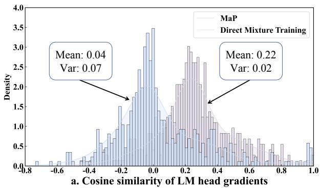

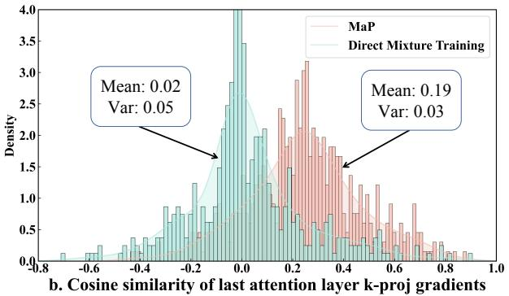  
Figure 7: Kernel density estimation plots illustrating the gradient cosine similarity between individual training samples.

Instruction: Using Opera, find the date of the next Olympics opening ceremony and add a reminder for it in your Calendar.  
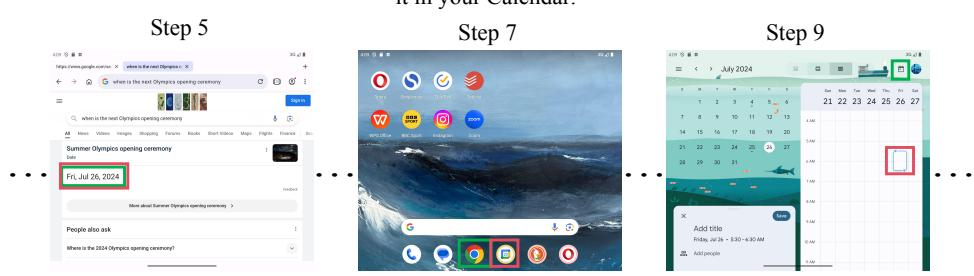  
Figure 8: Qualitative results on the GUI-Odyssey dataset (Lu et al., 2024). High-level instructions are visualized at the top of each image. Predicted tap positions from our MaP (Qwen2.5-VL-3B) are shown in red, while those from the base model (Qwen2.5-VL-3B) are shown in green. Best viewed with zoom.

As shown in Figure 7(b), kernel density estimation plots at the LM head and the last attention k-projection layer reveal that MaP yields a mean cosine similarity approximately 0.17 higher and a variance about 0.02 lower than direct mixture training. This enhanced cosine similarity reflects more harmonized training objectives, while the reduced variance suggests superior training stability (Ciernik et al., 2025), both of which highlight MaP’s efficacy in joint optimization. Further theoretical analysis is provided in the Appendix.

## F Qualitative Analysis

We present a qualitative comparison on the GUI-Odyssey dataset (Lu et al., 2024) between the base model (Qwen2.5-VL-3B) and MaP (Bai et al., 2025). As shown in Figure 8, the task involves adding the date of the Olympics opening ceremony to the calendar. The base model exhibits two major navigation failures, including opening Google Chrome instead of the calendar application in the step $7 ^ { t h }$ and selecting an incorrect date in the $9 ^ { t h }$ In contrast, MaP successfully executes the intended sequence of actions, demonstrating that MaP significantly enhances long-horizon planning performance.

Moving from global to local evaluation, we present a qualitative comparison on the AndroidControl-Low dataset (Li et al., 2024) between the base model (Qwen2.5-VL-3B) and MaP (Qwen2.5-VL-3B), highlighting their differences in step-wise decison capabilities through four representative examples. For instance, as shown in Figure 9 (a), MaP demonstrates stronger generalization during training. While the base model tends to tap on “multiple options” when it fails to recognize the “send” icon, MaP correctly identifies and taps the intended target.

Click on the tools  
Click on the send icon at the top  
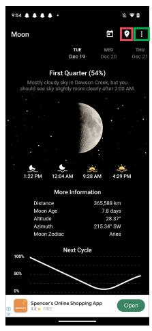  
(a)

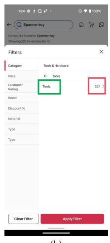  
(b)

Click on the idea pin option  
  
(c)

Click on the Search Bar  
  
(d)  
Figure 9: Qualitative results on the AndroidControl-Low dataset (Li et al., 2024). Low-level instructions are visualized at the top of each image. Predicted tap positions from our MaP (Qwen2.5-VL-3B) are shown in red, while those from the base model (Qwen2.5-VL-3B) are shown in green. Best viewed with zoom.