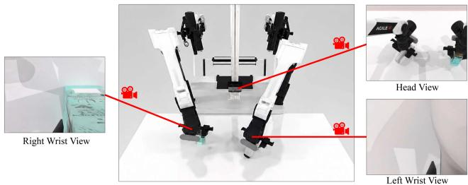
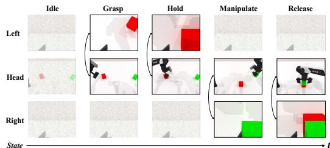

# TriWorldBench: A Tri-View Consistency Perspective on Embodied World Models

Xuanyi Liu1 Haofeng Wang1 Ruiqi Li1 Danni Yu2 Rui Wan2 Ruixu Zhang2 Siyu Tao3 Xue Yang4 Shaofeng Zhang5 Zicheng Zhang6 Jiaqi Zhang1 Siwei Ma1

1Peking University 2Tsinghua University 3Beihang University 4Shanghai Jiao Tong University

5University of Science and Technology of China 6Shanghai AI Laboratory

## Abstract

Embodied world models predict the outcomes of robot actions to support learning and planning. For robots equipped with head and wrist cameras, this requires complementary views: the head view captures the overall task, while wrist views reveal local gripper–object interactions. However, evaluating these views independently cannot determine whether they describe the same action and object state. We introduce TRIWORLDBENCH, a benchmark for evaluating embodied world models through synchronized head, left-wrist, and right-wrist videos. It contains 500 episodes across 50 bimanual manipulation tasks and uses 19 metrics to assess tri-view consistency, task alignment, physical and 3D coherence, motion quality, temporal consistency, and visual quality. By combining cross-view checks with measurements tailored to each camera, the benchmark evaluates whether plausible individual videos also form a consistent prediction of the intended task. We summarize overall performance with TWB-Score and retain perview results to identify where predictions fail. This extends world-model evaluation beyond single-view visual quality. Code, data, and metric definitions are available at https://github.com/TriWorldBench/TriWorldBench.

## 1. Introduction

A world model predicts how an environment evolves and can support robot learning and planning [1, 8, 26]. Actionconditioned video models make these predictions available as synthetic training trajectories, policy rollouts, or visual subgoals [7]. These uses require more than convincing images: a predicted grasp that looks plausible but violates object contact can provide misleading supervision or guide a planner toward an infeasible action. Evaluation must therefore connect visual quality to the manipulation event a video claims to predict.

The camera setup changes what this evaluation must establish. In the head-and-wrist configuration of Figure 1, the head camera provides workspace context and the wrist cameras reveal local geometry and gripper–object contact [9, 14].

  
Figure 1. Complementary views of one manipulation event. The head camera provides workspace context; the wrist cameras reveal local geometry and gripper–object contact. TRIWORLDBENCH evaluates both the quality of each predicted view and agreement across the three views.

Their evidence is complementary, not interchangeable: a slipped grasp may be visible only at a wrist, while a close-up may hide which object or arm the task requires. Recent world models predict multiple camera streams jointly [7, 19]. Yet even three individually plausible videos may disagree about whether an object is held, released, or transferred. Singleview quality cannot establish this shared state [18, 23]. Conversely, different appearances do not necessarily imply inconsistency: wide camera baselines, wrist motion, and occlusion naturally change what is visible. The relevant question is whether all views are compatible with the same event, not whether they look alike.

TRIWORLDBENCH makes this distinction explicit by treating a synchronized triplet as one prediction. Building on embodied world-model evaluation [15, 21, 22, 27], it asks three complementary questions: is each view plausible, do the views agree, and does the prediction match the task? Cross-view consistency is a dedicated dimension, not a substitute for task or visual quality. Metrics use the cameras best suited to their evidence, and reference action phases distinguish expected stillness from missing motion. The contribution is thus to assess the relationship between views while preserving the different information each camera provides. This helps distinguish predictions that merely look coherent from those whose views jointly support the intended robot behavior. Table 1 summarizes the 19 metrics and the camera views used to compute each score.

Table 1. The 19 metrics reported by TRIWORLDBENCH, grouped into six dimensions. H, L, and R denote the head, left-wrist, and right-wrist cameras; “H + wrist” denotes a comparison between the head view and the wrist view of the acting arm; “joint” denotes a measurement over the triplet as a whole. H/L/R metrics are computed separately in each view before aggregation. Pixel and structural comparisons use the corresponding ground-truth camera, not a different viewpoint.
<table><tr><td>Dimension</td><td>Metric</td><td>What it measures</td><td>Cameras</td></tr><tr><td rowspan="6">Tri-view consistency</td><td>Normalized PSNR</td><td>Pixel-level agreement with the corresponding ground-truth camera</td><td>H/L/R</td></tr><tr><td>SSIM</td><td>Structural similarity to the corresponding ground-truth camera</td><td>H/L/R</td></tr><tr><td>VLM Consistency I</td><td>Compatibility-first head-to-wrist check of robot state, phase, and object state; occluded evidence tolerated</td><td>H+ wrist</td></tr><tr><td>VLM Consistency II</td><td>Verification-first check: criteria not verifiable from both views receive a deduction</td><td>H+ wrist</td></tr><tr><td>VLM Consistency III</td><td>Exemplar-calibrated against labeled cases of blur, wrong held object, and wrong acting arm</td><td>H+ wrist</td></tr><tr><td>VQA Consistency</td><td>Accuracy on a question bank frozen in advance from the reference triplet and phases</td><td>joint</td></tr><tr><td rowspan="4">Task alignment</td><td>Instruction Following</td><td>Whether the rollout uses the required arm and object and reaches the goal state</td><td>H</td></tr><tr><td>Semantic Alignment JEPA Similarity</td><td>Similarity between generated and reference head-video captions in text embedding space</td><td>H</td></tr><tr><td></td><td>Feature similarity to the reference triplet under a frozen video encoder, camera order preserved</td><td>joint</td></tr><tr><td>Interaction Quality</td><td>Plausibility of contact, grasp stability, object response, and freedom from penetration</td><td>H/L/R</td></tr><tr><td rowspan="3">3D coherence</td><td></td><td>Depth-consistent scale, occlusion ordering, shape stability, and camera geometry</td><td>H/L/R</td></tr><tr><td>Perspective</td><td></td><td></td></tr><tr><td>State Alignment Flow Score</td><td>Agreement with the moving or static pattern expected for each view in the reference phase Optical-flow magnitude [24], indicating visible motion in each view</td><td>H/L/R H/L/R</td></tr><tr><td rowspan="3"></td><td>Trajectory Accuracy</td><td>Agreement of predicted and reference end-effector paths under time warping</td><td>H</td></tr><tr><td>Subject Consistency</td><td></td><td>H/L/R</td></tr><tr><td>Background Consistency</td><td>Stability of robot and object identity and appearance across frames Stability of background features across frames</td><td>H/L/R</td></tr><tr><td rowspan="3"></td><td>Photometric Smoothness</td><td>Motion-aligned appearance stability; penalizes flicker and texture drift</td><td>H/L/R</td></tr><tr><td>Image Quality</td><td>Frame clarity: blur, noise, exposure, compression [13]</td><td>H/L/R</td></tr><tr><td>Aesthetic Quality</td><td>Frame-level visual appeal, reported separately from task correctness</td><td>H/L/R</td></tr></table>

## 2. Related Work

Embodied world models. World models support robot learning and planning [1, 26]. EnerVerse-AC, Genie Envisioner, DreamDojo, and Motus predict action-conditioned robot video [2, 6, 12, 16]. PAVXploreRL further uses physical, action, and visual criteria as post-training rewards [25]. As predictions become training data and decision inputs, evaluation must assess task behavior and agreement across cameras.

Multi-view prediction and consistency. Multi-view models explicitly represent camera relationships. Ctrl-World predicts external and wrist views jointly [7], geometry-aware video generation aligns views through point maps [19], and ReViWo learns representations robust to camera disturbance [20]. In image and video generation, shared priors, 3D-aware attention, and geometric distillation promote geometric consistency [17, 18, 23]. TRIWORLDBENCH tests whether such predictions describe compatible robot and object states despite motion and occlusion.

Video and world-model benchmarks. Benchmarks distinguish visual fidelity from useful prediction. VBench evaluates perceptual and temporal dimensions [10]; World-Score evaluates controllability, quality, and dynamics [5]. WorldModelBench tests instruction following and physical laws [15], while EWMBench separates scene consistency, motion correctness, and semantic alignment [27]. WorldSim-Bench combines human-aligned perceptual judgments with action-level evaluation [21]. WorldArena further connects perceptual assessment to functional utility, evaluating world models as data engines, policy evaluators, and action planners [22]. This motivates separating visual appeal from task alignment. RBench evaluates robot-oriented task correctness and physical plausibility [4], while RoboWM-Bench tests whether generated behaviors translate into executable manipulation [11]. TRIWORLDBENCH adapts these dimensions to complementary camera roles and explicitly evaluates agreement between synchronized views.

## 3. Benchmark Overview

Task and data. Each episode provides three synchronized initial frames, a natural-language instruction, and an action sequence. A model predicts a head-view video and two wrist-view videos covering the same time span; corresponding timestamps denote the same instant of the task. The test set contains 500 episodes spanning the 50 bimanual manipulation tasks of RoboTwin 2.0 [3], including pick-andplace, stacking, pouring, handover, switch actuation, and tool use. Tasks are recorded under clean and domain-randomized background conditions, introducing appearance variation alongside task diversity. A separate 100-episode validation split with reference videos and state annotations supports local development.

Reference-derived action states. Reference states provide a shared temporal context for evaluation. Fixed rules over gripper opening and end-effector displacement segment each reference trajectory into coarse phases, including idle, approach, grasp, hold, manipulation, release, and completion. The annotations identify the acting arm and support the expected moving or static pattern for each view. They also select phase-level keyframes and the active head-to-wrist pair (Figure 2). These are heuristic action labels, not verified task-success labels. Derived only from the reference trajectory, the boundaries remain fixed across candidate models, so a model’s own failure cannot redefine the phase against which it is judged.

## 4. Evaluation Protocol

The 19 metrics in Table 1 separate within-view quality from cross-view agreement and task alignment. The protocol combines reference-based comparisons with judgments of the generated videos themselves. Four design choices adapt these measurements to synchronized robot cameras.

Tri-view world consistency. Consistency is assessed both indirectly through the ground truth and directly across views. Normalized PSNR and SSIM compare each generated stream with its corresponding ground-truth stream. Because the reference triplet is synchronized and internally consistent, proximity to it provides an indirect consistency signal. It is not proof of agreement, however, and a valid alternative execution may differ from the reference. Complementary vision-language model (VLM) judgments compare the head and active wrist views. Three rubrics distinguish compatibility despite occlusion, explicit verification in both views, and calibration against labeled examples. Reporting them separately makes their different treatment of uncertain evidence explicit. Visual question answering (VQA) further tests the triplet using questions fixed from the reference and its phases. Together, these checks ask whether the views describe compatible robot and object states without requiring identical appearance across cameras.

Camera-specific evidence. Camera selection follows what a metric needs to observe. Instruction Following uses the head view for task context; Semantic Alignment compares VLM-generated descriptions of the generated and reference head videos in text embedding space. Trajectory Accuracy also uses the head view, where arm paths are more reliably visible than in wrist close-ups. By contrast, JEPA Similarity compares the generated and reference triplets through a frozen video encoder with camera order preserved. Interaction Quality and Perspective are evaluated separately in all three views, capturing local contact and geometry as well as the wider scene. Per-view scores retain these differences instead of treating every camera as an equally reliable observer of every property. For example, a wrist view can reveal a slipping grasp despite plausible head-view object motion.

  
Figure 2. Reference-derived action phases select synchronized keyframes and head-to-wrist pairs (arcs). They also provide context for evaluating the expected motion in each view.

State-conditioned motion. Temporal stability is meaningful only relative to expected motion. State Alignment checks each view’s moving or static pattern; Flow Score measures optical-motion magnitude; Trajectory Accuracy compares head-view end-effector paths with the reference under time warping. More motion is not necessarily more correct motion. Phase-conditioned penalties also adjust subject, background, and photometric consistency when expected motion is missing or unexpected motion appears. This discounts frozen predictions during active phases while preserving legitimate stillness.

Task-grounded visual quality. Visual appeal and task correctness are complementary, not interchangeable. Image and aesthetic scores are therefore accompanied by penaltyadjusted versions that discount quality when head-view trajectory accuracy or cross-view consistency is low. This reduces credit for attractive but unreliable predictions while keeping raw visual quality separate from the task and consistency evidence used to qualify it.

Aggregation. Metrics are averaged within each dimension, and the six dimension scores are combined into TWB-Score. Dimension-level, per-view, head-to-wrist, and joint scores remain available: the aggregate summarizes performance, while the detailed scores help distinguish poor appearance, task mismatch, and cross-view conflict.

## 5. Conclusion

TRIWORLDBENCH evaluates triple-view world models through the event their videos jointly describe. Its central distinction is between a view that looks plausible, views that agree, and a prediction that matches the task. Camera-aware measurement and reference-derived phases make these questions explicit across 19 metrics, with TWB-Score providing a compact summary. The resulting framework makes crossview consistency measurable without reducing world-model quality to consistency alone. It supports targeted diagnosis of failures in triple-view predictions for robot learning and planning.

## References

[1] Mido Assran, Adrien Bardes, David Fan, Quentin Garrido, Russell Howes, Mojtaba Komeili, Matthew Muckley, Ammar Rizvi, Claire Roberts, Koustuv Sinha, et al. V-JEPA 2: Self-supervised video models enable understanding, prediction and planning. arXiv preprint arXiv:2506.09985, 2025. 1, 2

[2] Hongzhe Bi, Hengkai Tan, Shenghao Xie, Zeyuan Wang, Shuhe Huang, Haitian Liu, Ruowen Zhao, Yao Feng, Chendong Xiang, Yinze Rong, Hongyan Zhao, Hanyu Liu, Zhizhong Su, Lei Ma, Hang Su, and Jun Zhu. Motus: A unified latent action world model. arXiv preprint arXiv:2512.13030, 2025. 2

[3] Tianxing Chen, Zanxin Chen, Baijun Chen, Zijian Cai, Yibin Liu, Zixuan Li, Qiwei Liang, Xianliang Lin, Yiheng Ge, Zhenyu Gu, et al. RoboTwin 2.0: A scalable data generator and benchmark with strong domain randomization for robust bimanual robotic manipulation. arXiv preprint arXiv:2506.18088, 2025. 2

[4] Yufan Deng, Zilin Pan, Hongyu Zhang, Xiaojie Li, Ruoqing Hu, Yufei Ding, Yiming Zou, Yan Zeng, and Daquan Zhou. Rethinking video generation model for the embodied world. arXiv preprint arXiv:2601.15282, 2026. 2

[5] Haoyi Duan, Hong-Xing Yu, Sirui Chen, Li Fei-Fei, and Jiajun Wu. WorldScore: A unified evaluation benchmark for world generation. arXiv preprint arXiv:2504.00983, 2025. 2

[6] Shenyuan Gao, William Liang, Kaiyuan Zheng, Ayaan Malik, Seonghyeon Ye, Sihyun Yu, Wei-Cheng Tseng, Yuzhu Dong, Kaichun Mo, Chen-Hsuan Lin, et al. DreamDojo: A generalist robot world model from large-scale human videos. arXiv preprint arXiv:2602.06949, 2026. 2

[7] Yanjiang Guo, Lucy Xiaoyang Shi, Jianyu Chen, and Chelsea Finn. Ctrl-World: A controllable generative world model for robot manipulation. In International Conference on Learning Representations, 2026. 1, 2

[8] David Ha and Jurgen Schmidhuber. World models. ¨ arXiv preprint arXiv:1803.10122, 2018. 1

[9] Kyle Hsu, Moo Jin Kim, Rafael Rafailov, Jiajun Wu, and Chelsea Finn. Vision-based manipulators need to also see from their hands. In International Conference on Learning Representations, 2022. 1

[10] Ziqi Huang, Yinan He, Jiashuo Yu, Fan Zhang, Chenyang Si, Yuming Jiang, Yuanhan Zhang, Tianxing Wu, Qingyang Jin, Nattapol Chanpaisit, et al. VBench: Comprehensive benchmark suite for video generative models. In Proceedings of the IEEE/CVF Conference on Computer Vision and Pattern Recognition, pages 21807–21818, 2024. 2

[11] Feng Jiang, Yang Chen, Kyle Xu, Yuchen Liu, Haifeng Wang, Zhenhao Shen, Jasper Lu, Shengze Huang, Yuanfei Wang, Chen Xie, and Ruihai Wu. RoboWM-Bench: A benchmark for evaluating world models in robotic manipulation. arXiv preprint arXiv:2604.19092, 2026. 2

[12] Yuxin Jiang, Shengcong Chen, Siyuan Huang, Liliang Chen, Pengfei Zhou, Yue Liao, Xindong He, Chiming Liu, Hongsheng Li, Maoqing Yao, and Guanghui Ren. EnerVerse-AC: Envisioning embodied environments with action condition. arXiv preprint arXiv:2505.09723, 2025. 2

[13] Junjie Ke, Qifei Wang, Yilin Wang, Peyman Milanfar, and Feng Yang. MUSIQ: Multi-scale image quality transformer. In Proceedings of the IEEE/CVF International Conference on Computer Vision, pages 5148–5157, 2021. 2

[14] Alexander Khazatsky, Karl Pertsch, Suraj Nair, Ashwin Balakrishna, Sudeep Dasari, Siddharth Karamcheti, Soroush Nasiriany, Mohan Kumar Srirama, Lawrence Yunliang Chen, Kirsty Ellis, et al. DROID: A large-scale in-the-wild robot manipulation dataset. In Robotics: Science and Systems, 2024. 1

[15] Dacheng Li, Yunhao Fang, Yukang Chen, Shuo Yang, Shiyi Cao, Justin Wong, Michael Luo, Xiaolong Wang, Hongxu Yin, Joseph E. Gonzalez, Ion Stoica, Song Han, and Yao Lu. WorldModelBench:

Judging video generation models as world models. arXiv preprint arXiv:2502.20694, 2025. 1, 2

[16] Yue Liao, Pengfei Zhou, Siyuan Huang, Donglin Yang, Shengcong Chen, Yuxin Jiang, Yue Hu, Jingbin Cai, Si Liu, Jianlan Luo, Liliang Chen, Shuicheng Yan, Maoqing Yao, and Guanghui Ren. Genie envisioner: A unified world foundation platform for robotic manipulation. arXiv preprint arXiv:2508.05635, 2025. 2

[17] Xuanyi Liu, Deyi Ji, Liqun Liu, Lanyun Zhu, Xuhang Chen, Qianxiong Xu, Peng Shu, Huan Yu, Jie Jiang, Feng Gao, and Siwei Ma. CamGeo: Sparse camera-conditioned image-to-video generation with 3d geometry priors. arXiv preprint arXiv:2605.30895, 2026. 2

[18] Yuan Liu, Cheng Lin, Zijiao Zeng, Xiaoxiao Long, Lingjie Liu, Taku Komura, and Wenping Wang. SyncDreamer: Generating multiviewconsistent images from a single-view image. In International Conference on Learning Representations, 2024. 1, 2

[19] Zeyi Liu, Shuang Li, Eric Cousineau, Siyuan Feng, Benjamin Burchfiel, and Shuran Song. Geometry-aware 4d video generation for robot manipulation. In International Conference on Learning Representations, 2026. 1, 2

[20] Jing-Cheng Pang, Nan Tang, Kaiyuan Li, Yuting Tang, Xin-Qiang Cai, Zhen-Yu Zhang, Gang Niu, Masashi Sugiyama, and Yang Yu. Learning view-invariant world models for visual robotic manipulation. In International Conference on Learning Representations, 2025. 2

[21] Yiran Qin, Zhelun Shi, Jiwen Yu, Xijun Wang, Enshen Zhou, Lijun Li, Zhenfei Yin, Xihui Liu, Lu Sheng, Jing Shao, Lei Bai, Wanli Ouyang, and Ruimao Zhang. WorldSimBench: Towards video generation models as world simulators. arXiv preprint arXiv:2410.18072, 2024. 1, 2

[22] Yu Shang, Zhuohang Li, Yiding Ma, Weikang Su, Xin Jin, Ziyou Wang, Lei Jin, Xin Zhang, Yinzhou Tang, Haisheng Su, et al. WorldArena: A unified benchmark for evaluating perception and functional utility of embodied world models. arXiv preprint arXiv:2602.08971, 2026. 1, 2

[23] Yichun Shi, Peng Wang, Jianglong Ye, Mai Long, Kejie Li, and Xiao Yang. MVDream: Multi-view diffusion for 3d generation. In International Conference on Learning Representations, 2024. 1, 2

[24] Zachary Teed and Jia Deng. RAFT: Recurrent all-pairs field transforms for optical flow. In European Conference on Computer Vision, pages 402–419, 2020. 2

[25] Han Wang, Zijun Wang, Shuoshuo Xue, Rui Cao, Fengjiao Cheng, Xiaodan Liang, and Roy Ka-Wei Lee. PAVXploreRL: Physical-actionvisual world model reinforcement learning with action exploration. arXiv preprint arXiv:2607.16602, 2026. 2

[26] Sherry Yang, Yilun Du, Kamyar Ghasemipour, Jonathan Tompson, Leslie Pack Kaelbling, Dale Schuurmans, and Pieter Abbeel. Learning interactive real-world simulators. In International Conference on Learning Representations, 2024. 1, 2

[27] Hu Yue, Siyuan Huang, Yue Liao, Shengcong Chen, Pengfei Zhou, Liliang Chen, Maoqing Yao, and Guanghui Ren. EWMBench: Evaluating scene, motion, and semantic quality in embodied world models. arXiv preprint arXiv:2505.09694, 2025. 1, 2