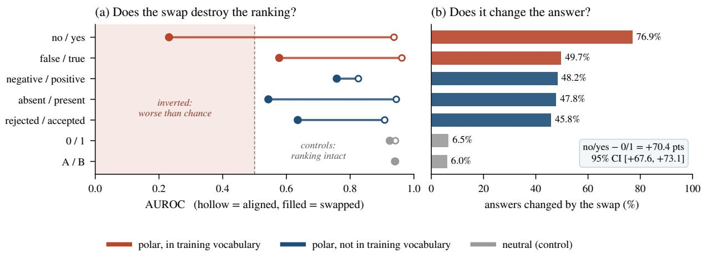
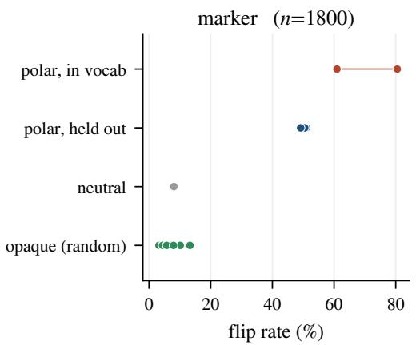
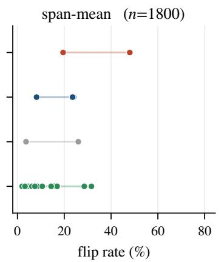
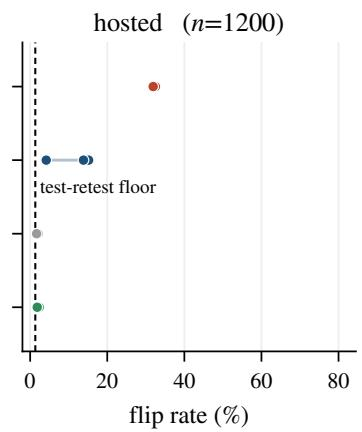
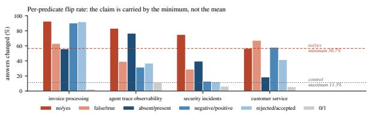
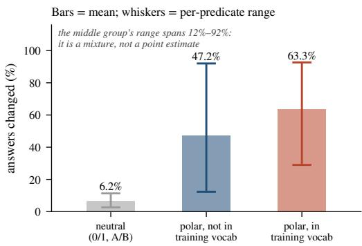

# Type-Safe Is Not Error-Free: A Constrained Decision Head Follows the Option Name, Not the Rubric Bound to It

Yu Sun\* National University of Singapore sun.yu@u.nus.edu

Junhao Xu\* Fudan University junhaoxu23@m.fudan.edu.cn

## Abstract

Typed decision models are built for settings where model outputs are consumed directly by software. Instead of generating free-form text, they return a decision over a predefined set of options. By construction, every output conforms to the required schema. Yet this guarantee does not tell us whether the model interprets the options as intended. We study Jev and two Jev-like models with open weights by changing how option names are assigned to rubrics. Each option consists of an option name and a textual rubric that defines what the option means. We change only which option name is assigned to each rubric; the question, state, rubric word ing, and set of option names remain exactly the same. On 1200 workflow decisions with task-specific rubrics, renaming the two options from 0/1 to no/yes changes 70.4 more answers per hundred (95% CI: [67.6, 73.1]) and shifts AUC from .94 to .23, revealing a systematic reversal in the decision ranking rather than sim ple uncertainty. The same operation has little effect with neutral option names. This pattern holds across all 4 predicates, where the effect is at least 7.4× larger than under the neutral con trol, and becomes stronger as the number of options increases. The effect also depends on the read-out geometry: a second model family that mean-pools over the full option span flips 4.1× less often. The hosted model exhibits the same behavior: the swap changes AUC from .8146 to .5806 and produces 24× as many answer flips as its test-retest floor. In contrast, replacing the option names with random character strings returns all model families to the neutral-control regime without reducing accuracy. The failure therefore depends on the semantic polarity of the option names rather than on the renam ing operation itself. Across all conditions, the type-error rate remains 0substantially.

## 1 Introduction

A class of production models now sells decisions rather than text. The interface takes a typed question, a state, and a declared set of options; the model returns a probability distribution whose support is exactly that set. Because the scores of illegal candidates are masked before normalization, the returned value is by construction an element of the schema. Vendors state this plainly and correctly as a structural fact, not a measurement — “schema matching is guaranteed, thus we can confidently add 0% into the plots” — and list self-consistent beside type-safe as properties of the same artifact.1

The first claim is a lemma (§2). It constrains the support of the output distribution and nothing else: it is silent on which element of that support receives the mass. This paper asks whether the mass lands on the option whose definition matches the state, or on the option whose name the model finds congenial. The two can be separated cleanly, because the interface renders each option as a short name followed by the rubric that defines it, and both are in the input. We can therefore hold the question, the state, the rubric text and the option set byte-identical, and exchange only which rubric sits behind which name. A model that reads the definition must answer the same way in both arms; a model that reads the name must answer oppositely. The remapping is stated declaratively and in full, in the same input — it is not implied by demonstrations, and nothing is hidden.

That language models are sensitive to prompt format, option identifiers and label words is established (Sclar et al., 2024; Zheng et al., 2024; Liusie et al., 2023), as is the observation that small models ride semantic priors rather than override them (Wei et al., 2023). That schema-valid output can be semantically wrong, and that a schema can override an explicit instruction, is also established (Li, 2026; Singh et al., 2026; Usman, 2026; Lin, 2026). We claim none of this. Our contribution is a controlled dissociation inside a single option channel: name and definition varied independently, everything else byte-identical, with neutral names as the control arm, on checkpoints that ship a type-safety guarantee — and the result is not a degradation but an inversion, a below-chance ranking that no amount of threshold tuning can repair.

Our findings are:

1. Option names dominate the rubrics bound to them. Swapping the rubrics behind no/yes changes 76.92% of answers, against 6.50% for the identical operation behind 0/1: a difference-in-differences of 70.42 pts (§4.1).

2. The failure is confident inversion, not confusion: AUROC .9376 → .2315, and inverting the swapped ranking recovers .77 (§4.2).

3. It holds on every predicate separately, at a minimum of 56.7% against a control that never exceeds 11.3% (§4.3).

4. Polarity drives it and training-vocabulary familiarity amplifies it; the option words that fail are precisely the ones the interface ships (§4.4).

5. Above binary cardinality the member names carry nearly all of the signal: neutral renaming alone costs 52.42% of answers (§4.5).

6. The read-out geometry sets the effect size, and the effect replicates on a third family — the vendor’s hosted model, a black box over the network — which makes it an architectural choice rather than an accident of one checkpoint (§4.6).

7. Erasing the names’ semantics entirely, with random character strings, leaves the decision exactly where neutral identifiers already leave it, at no cost in accuracy: polarity is what the swap exploits, not the name’s content (§4.7).

## 2 What type safety covers

The read-out. A typed question q with state s and options $\textit { O } = \left( o _ { 1 } , \ldots , o _ { k } \right)$ is rendered into one encoder input. The head produces a score zi per option and returns $p = \operatorname { s o f t m a x } ( z / \tau )$ over O, optionally after a learned temperature τ . Illegal candidates are removed before normalization; in the implementations we inspected this is a masked\_fill of the illegal logits with − $\cdot 1 0 ^ { 4 }$ followed by softmax.

Lemma 1 The returned decision is an element of O for every input, every weight setting and every perturbation of the input.

The proof is the previous sentence: the arg max is taken over O, and no probability mass exists outside it. Three consequences matter for evaluation. (i) A measured type-error rate of 0% carries no information about the model — it is a property of the read-out, and the vendor is right to compute it analytically. (ii) The guarantee is invariant to everything we do below: it holds exactly as strongly in the conditions where the head is wrong on three answers in four. (iii) Masking discards the probability mass that the encoder would have placed on synonyms of the legal options, which is itself a known source of distortion (Badhe et al., 2026); our intervention operates entirely inside the surviving mass.

Three read-out families. We audit one publicly released checkpoint of each of two encoder geometries, and one hosted model.2 Marker read-out: a ModernBERT-large encoder with a two-layer transformer head, where each option contributes a [MASK] marker token whose contextual embedding is scored, with a question-type embedding and a per-(type, k) temperature. Span-mean readout: a DeBERTa-v3-large encoder in which an option’s score is the mean over the tokens of its entire rendered span — name and rubric — with a single scalar temperature. Both mask and renormalize. Hosted read-out: the vendor’s own product, queried over HTTP, whose weights we cannot inspect; its typed question binds each option name to a rubric and returns a distribution whose support is exactly the declared option set, which is the same renormalized-softmax interface, so Lemma 1 applies to it as stated — and it is the artifact for which the 0% type-error rate is advertised. Section 4.6 shows the geometry predicts how much the name can matter.

## 3 The label–rubric swap

Rendering. The interface renders an option as its name followed by its definition, "no: <rubric>"

/ "yes: <rubric>". The rubric is the text the task ships to define the predicate; the name is an identifier. Both are visible to the encoder.

The instrument. Fix an item and a pair of option names $( \ell _ { 0 } , \ell _ { 1 } )$ . The aligned arm binds each name to its own rubric, as shipped. The swapped arm exchanges the two rubrics between the two names. Gold is keyed to the rubric throughout, so a rubricreading model is unaffected by the swap and a name-reading model inverts. Nothing else changes: identical question, identical state, identical rubric strings, identical option set, identical number of options.

Control arm. We repeat the identical structural operation with option names that carry no polarity, 0/1 and A/B. These isolate the word from the channel: any movement they show is what re-binding costs when the name means nothing. All effects below are reported as differences against them.

Data. 1200 binary workflow decisions over 4 predicates (300 each), every item carrying the dataset’s own task-specific rubric text, one item per record, gold-positive rate .5750. The four predicates are invoice reconciliation, agent-trace triage, security-alert classification and customer-service escalation (Appendix A). A further 600 items in the same corpus fall back to a generic rubric wording whose own first word is the opposite-polarity label; there name and definition are confounded by construction, so we exclude them from every number in this paper and report them separately as an upper bound (Appendix C).

Competence screen. A flip on an item the model cannot decide is not evidence, so the aligned arm doubles as the competence measurement: balanced accuracy .7857–.9310 and AUROC .9141–.9867 across the four predicates. Every effect we report is measured on decisions the head demonstrably makes correctly.

Metrics. Balanced accuracy at p ≥ .5; AUROC, which is threshold-free and therefore separates lost ranking information from a moved operating point; flip rate, the fraction of items whose returned option changes between arms, which needs no labels at all; and difference-in-differences against a neutral control, with 95% intervals from a bootstrap of 2000 resamples clustered on records. The hosted model is not deterministic, so for it we also measure a test-retest floor: the aligned arm asked twice, byte-identically, scored exactly like the flip rate it bounds. We also report the type-error rate, which is 0% everywhere.

One disclosure. Our harness tags the question as type choice rather than the shipped noul. For false/true the rendered option strings are byteidentical between the two tags; for the other name pairs, choice is the interface’s intended type for arbitrary labeled options. The aligned arm’s balanced accuracy of .7857–.9310 is the evidence that the condition is in-distribution.

## 4 Results

All seven findings apply the instrument of §3 to the same items, and the type-error rate is 0% in every one of them.

## 4.1 Option names dominate the rubrics

Table 1 is the whole result. With the rubric text unchanged and gold keyed to it, exchanging the rubrics behind no and yes changes 76.92% of the returned answers, while the identical exchange behind 0 and 1 changes 6.50% and behind A and B changes 6.00%. The controlled contrast is 70.42 pts (95% CI [67.58, 73.08]) against 0/1 and 70.92 pts ([68.16, 73.50]) against A/B. All five polar pairs move by at least 39.25 pts; both neutral pairs stay inside single digits. The head is reading the name and treating the definition bound to it as decoration.

Balanced accuracy tells the same story in the units a practitioner cares about: .8719 aligned to .2839 swapped, i.e. from well above to well below chance, while the 0/1 control moves .8368 → .8322.

## 4.2 Inversion, not confusion

The distinction matters for what a deployment can do about it. A model that had become uncertain would lose ranking information, and AUROC would fall toward .5; recalibration or a new threshold could recover part of the decision. Instead AU-ROC falls from .9376 to .2315 (Figure 1a) — far below chance. The ranking is intact and pointed the wrong way: inverting the swapped scores recovers AUROC .77. The head is not confused about the predicate; it is confidently answering a different question, the one its option names suggest.

This is also why we report AUROC beside the flip rate rather than instead of it. negative/positive flips 48.25% of answers yet keeps AUROC at .7579 (from .8258): for that pair the swap moves the operating point and leaves the ranking usable, so the flip rate overstates the damage. Only the pairs whose AUROC crosses .5 have lost the decision itself.

<table><tr><td></td><td></td><td colspan="2">balanced acc.</td><td colspan="2">AUROC</td><td colspan="2"></td></tr><tr><td>option names</td><td></td><td>in voc. aligned</td><td>swapped</td><td>aligned</td><td>swapped</td><td>flip</td><td>DiD vs. 0/1 (pts, 95% CI)</td></tr><tr><td>no/yes</td><td>V</td><td>.8719</td><td>.2839</td><td>.9376</td><td>.2315</td><td>76.92%</td><td>+70.42 [+67.58, +73.08]</td></tr><tr><td>false/true</td><td>√</td><td>.9012</td><td>.4861</td><td>.9623</td><td>.5773</td><td>49.67%</td><td>+43.17 [+40.25, +46.08]</td></tr><tr><td>absent/present</td><td></td><td>.8593</td><td>.5350</td><td>.9447</td><td>.5432</td><td>47.75%</td><td>+41.25 [+38.17, +44.17]</td></tr><tr><td>negative/positive</td><td></td><td>.7531</td><td>.6728</td><td>.8258</td><td>.7579</td><td>48.25%</td><td>+41.75 [+38.75, +44.83]</td></tr><tr><td>rejected/accepted</td><td></td><td>.7914</td><td>.6619</td><td>.9083</td><td>.6355</td><td>45.75%</td><td>+39.25 [+36.33, +42.25]</td></tr><tr><td>0/1</td><td></td><td>.8368</td><td>.8322</td><td>.9420</td><td>.9243</td><td>6.50%</td><td></td></tr><tr><td>A/B</td><td></td><td>.8417</td><td>.8220</td><td>.9422</td><td>.9405</td><td>6.00%</td><td></td></tr></table>

Table 1: The swap exchanges only which rubric is bound to which option name; gold is keyed to the rubric. Polar names (top) lose the decision; neutral names (bottom) do not. in voc. marks the two pairs the head emitted during training. AUROC below .5 is inversion, not degradation. n = 1200 over 1200 records.

  
Figure 1: (a) Aligned (hollow) to swapped (filled) AUROC. The polar pairs cross into the shaded region below chance: the ranking is not lost but reversed. (b) The same rows, fraction of answers changed. The two neutral controls undergo the identical structural operation.

<table><tr><td>option names</td><td></td><td></td><td></td><td>invoice agent security customer</td><td>min</td></tr><tr><td>no/yes</td><td>92.7</td><td>83.3</td><td>75.0</td><td>56.7</td><td>56.7</td></tr><tr><td>false/true</td><td>63.0</td><td>39.3</td><td>29.0</td><td>67.3</td><td>29.0</td></tr><tr><td>absent/present</td><td>56.0</td><td>76.7</td><td>39.7</td><td>18.7</td><td>18.7</td></tr><tr><td>negative/positive</td><td>90.3</td><td>31.7</td><td>13.0</td><td>58.0</td><td>13.0</td></tr><tr><td>rejected/accepted</td><td>92.0</td><td>37.0</td><td>12.3</td><td>41.7</td><td>12.3</td></tr><tr><td>0/1</td><td>2.7</td><td>11.3</td><td>6.3</td><td>5.7</td><td>2.7</td></tr></table>

Table 2: Answers changed (%) by predicate. The claim is carried by the minimum, not the mean: no/yes never falls below 56.7%, and the neutral control never exceeds 11.3%. The other polar pairs are heterogeneous and we report them as ranges.

## 4.3 It holds predicate by predicate

A single average over relabelings is a mixture parameter, because relabelings differ in how far they preserve meaning: “positive” is the idiomatic way to report that an invoice reconciles, but names no property of “this trace requires human review.” We therefore report every predicate separately (Table 2). no/yes survives outright: its minimum over four independent predicates is 56.7%, against a neutral control that never exceeds 11.3%, and predicate by predicate it flips at least 7.4× as often as that control. The remaining polar pairs range from 12.3% to 92.0% depending on the predicate; we quote them as ranges and never as point estimates, and our headline rests on the minimum.

## 4.4 Polarity, amplified by familiarity

The five polar pairs split on a second axis: no/yes and false/true are the words this head emitted in training and the words the interface ships, whereas absent/present, negative/positive and rejected/accepted are polar words it never emitted. Table 3 separates the two contributions. Moving from neutral names to unfamiliar polar names costs 41.00 pts; moving from unfamiliar polar names to the two familiar ones costs a further

<table><tr><td>option names</td><td>flip</td><td>per-predicate range</td></tr><tr><td>neutral (0/1, A/B)</td><td>6.25%</td><td>2.7–11.3%</td></tr><tr><td>polar, unseen in voc. (3 pairs)</td><td>47.25%</td><td>12.3–92.0%</td></tr><tr><td>polar, in voc. (2 pairs)</td><td>63.29%</td><td>29.0–92.7%</td></tr><tr><td colspan="3">polarity, over neutral</td></tr><tr><td colspan="2">training-vocabulary familiarity, on top</td><td>+41.00 pts +16.04 pts</td></tr></table>

Table 3: Flip rate decomposed over the option-name pairs. The middle row’s wide per-predicate range is the heterogeneity of §4.3; the increments are means.

<table><tr><td>member names</td><td>acc.</td><td></td><td>changed acc. (k=4)</td></tr><tr><td>as shipped</td><td>.5637</td><td></td><td>.495</td></tr><tr><td>neutral A, B, C</td><td>.2782</td><td>52.42%</td><td>.485</td></tr><tr><td>numbered option 1</td><td>.2592</td><td>55.78%</td><td>.456</td></tr><tr><td>rotated vs. the descriptions .1552</td><td></td><td>79.65%</td><td>.387</td></tr></table>

Table 4: Multi-way questions $( k \in \{ 3 , 4 , 5 , 6 , 1 6 \} , n =$ 683), members rendered name: description, gold keyed to the description. Even uninformative renaming costs half the answers.

16.04 pts. Polarity is the larger term, and it acts on words the head was never trained to produce, so the effect is not reducible to memorized output vocabulary; §4.7 separates it from the names’ semantic content. The two effects cannot be cleanly separated with these arms, and we do not claim to separate them — but the direction of the confound is the uncomfortable part: no/yes and false/true are the deployed names, while the neutral identifiers that survive the swap are ones no engineer would choose for a readable schema.

## 4.5 Above binary, names carry nearly everything

On 683 genuine multi-way questions, whose members are rendered name-then-description exactly as in the binary case, renaming the members to neutral letters — without touching a single description — changes 52.42% of answers and drops accuracy from .5637 to .2782 (Table 4). Rotating the names one step against the descriptions, so that each name actively advertises its neighbour’s content, changes 79.65% and drops accuracy to .1552. Actively misleading names cost 27.2 points more than merely uninformative ones, and after rotation the model’s answer agrees with the name’s original content on .240 of k=4 items. The binary case understates the problem: at higher cardinality the descriptions are close to ignored. Neutral renaming at k=16 lands at .141, which is exactly the share of those items whose gold member happens to sit first (.1406), i.e. positional rather than semantic. We note that shipped accuracy on this pool is .5637 overall and varies with cardinality (.167 at k=6, .646 at k=16), so we read this arm as directional support for the binary result rather than as a second headline.

<table><tr><td rowspan="2">option names</td><td colspan="2">answers changed by the swap</td></tr><tr><td>marker</td><td>span-mean</td></tr><tr><td>no/yes</td><td>80.50%</td><td>19.50%</td></tr><tr><td>false/true</td><td>60.94%</td><td>47.83%</td></tr><tr><td>absent/present</td><td>51.00%</td><td>24.06%</td></tr><tr><td>negative/positive</td><td>50.50%</td><td>23.44%</td></tr><tr><td>rejected/accepted</td><td>49.17%</td><td>8.17%</td></tr><tr><td>0/1</td><td>7.83%</td><td>3.61%</td></tr><tr><td>A/B</td><td>8.06%</td><td>26.00%</td></tr><tr><td></td><td></td><td></td></tr></table>

Table 5: Same 1800 items (the 1200 of Table 1 plus the 600 of Appendix C), same swap, two read-out geometries. Scoring an option by the mean over its whole rendered span dilutes a one-token name into the rubric behind it; scoring a marker token does not.

## 4.6 The read-out geometry sets the size

Running the identical swap on the same 1800 items through the span-mean head changes 19.50% of answers for no/yes, against 80.50% for the marker head — 4.1× smaller (Table 5). Both columns of that table are computed on the full 1800-item corpus so that the two heads see exactly the same inputs, which is why its marker column reads 80.50% rather than the 76.92% of Table 1. The mechanism is visible in the architecture: when an option’s score is the mean over its entire rendered span, a one-token name is averaged against a rubric an order of magnitude longer, and its influence is diluted in proportion; when the score comes from a single marker token that attends over the span, no such dilution occurs. Consistently with that account, the span-mean head is strongly name-driven exactly where there is no rubric to dilute the name: on in-domain questions carrying no rubric text, its AUROC falls from .7860 for no/yes to .3597 for A/B (Appendix D). Name-sensitivity is therefore a design parameter of the read-out, not a quirk of one checkpoint — which also means it can be designed away.

The third family is the vendor’s own hosted model, queried over HTTP on the 1200 items of Table 1 (gold-positive rate .5750); the swap is a permutation of that question’s name-to-rubric map and nothing else. Exchanging the rubrics behind no and yes changes 32.50% of its answers against 2.08% and 1.67% for the two neutral controls, a contrast of 30.42 pts (95% CI [27.58, 33.33]), and balanced accuracy moves .7127 → .5163. Because at most 36.33% of its probabilities repeat bit-forbit across two requests, we asked the aligned arm twice over 300 items and 2 name pairs: the answer changes at most 1.33% of the time when nothing changes. The swap is 24× that floor, and the two neutral controls sit on it.

<table><tr><td></td><td colspan="3">answers changed by the swap</td></tr><tr><td>option names</td><td></td><td>marker span-mean</td><td>hosted</td></tr><tr><td>neutral (0/1, A/B)</td><td>6.25%</td><td>14.80%</td><td>1.88%</td></tr><tr><td>polar, unseen in voc. (3 pairs) 47.25%</td><td></td><td>18.56%</td><td>11.06%</td></tr><tr><td>polar, in voc. (2 pairs)</td><td>63.29%</td><td>33.66%</td><td>32.21%</td></tr><tr><td>n items</td><td>1200</td><td>1800</td><td>1200</td></tr></table>

Table 6: Answers changed by the same swap, by optionname class. The ordering holds in all three families; the magnitudes do not. Each column is on that family’s own item set: Table 1’s stratum for the marker head and the hosted model, Table 5’s pooled corpus for the span-mean head.

Table 6 runs the label-class ladder of §4.4 across all three families. The effect replicates on an independently built read-out, and the ordering of the classes replicates with it: in every family neutral names move the fewest answers, the three polar pairs outside the marker head’s output vocabulary more, and the two inside it most. The magnitudes do not: the marker head flips 2.4× as often as the hosted model on no/yes. Neither does the failure shape. The marker head inverts (§4.2) and the spanmean head dilutes, while the hosted model does neither, its AUROC falling from .8146 to .5806, toward chance rather than past it; we cannot see its read-out and offer no mechanism for it, and its typeerror rate is 0% as well, by Lemma 1. Inversion is correctable, dilution is tolerable, collapse is neither — the geometry chosen for a head decides what a deployment can still do about the name effect.

## 4.7 Names with no semantics at all

Every name class so far carries meaning. A fourth class removes it: each option is named by a random 5-character string over letters and digits, drawn so that neither name is a word or a prefix of the other and the two stand in no ordinal or alphabetical relation (xg6a6/e97ce, 30d6n/j87g8; all 15 pairs are listed in Appendix E). These names carry no polarity, like 0/1 and A/B, and unlike them they carry no content either, so the rubric is the only thing in the option left to read. We draw 15 independent pairs, run all of them through both local read-outs and the first 5 through the hosted model, and change nothing else. A flip rate can fall here for two reasons — the head begins reading the rubric, or the option channel stops discriminating at all — and the aligned arm’s balanced accuracy separates them, so Table 7 reports the two together.

Opaque names land on the neutral class in all three families. They change 6.86%, 11.67% and 2.02% of answers against 7.94%, 14.83% and 1.88% for 0/1 and A/B: at most 3.16 pts apart in any family, slightly below the neutral controls on the two local read-outs (−1.09 pts, 95% CI [−1.98, −0.18] for the marker head; −3.16 pts, [−4.02, −2.26] for the span-mean head) and indistinguishable from them on the hosted model (0.14 pts, [−0.38, 0.67]). Aligned balanced accuracy is retained throughout: across the three families it differs from the neutral class by at most .03, so the low flip rate is a decision still being made, not a channel switched off. Polar names on the same items and the same read-outs change 32.21% to 70.72%. What the swap exploits is therefore the option name’s polarity: with polarity absent, the name’s semantic content is worth at most 3.16 pts, and a name that means nothing buys nothing over an identifier that means nothing in particular.

The 15 draws are exchangeable by construction, so their spread measures how much of a flip rate is the choice of an individual string. On the marker head they span 3.22–13.28% (s.d. 2.46) and on the hosted model 1.67–2.42% (s.d. 0.34); on the spanmean head they span 2.00–31.61% (s.d. 8.66), a range wider than the distance from the neutral class to the polar one (Figure 2). On that geometry which string is drawn matters as much as which class it is drawn from: the widest opaque draw moves more answers than no/yes itself does on that read-out (19.50%), which bounds any mitigation stated as a naming rule.

## 5 Related work

Krishna Kumar (2025) is the closest result: across eight tasks and eight 1–12B decoders, inverted incontext demonstrations produce a semantic override rate of exactly zero. We find the same anchoring in trained encoder heads, with three differences. The remapping here is declarative and complete — written out in the same input rather than implied by demonstrations — so the model is not guessing at the mapping. The read-out is a masked renormalized softmax, which makes the failure invisible to the type checker the vendor advertises. And because our gold is keyed to the rubric, staying on the prior registers as AUROC .2315: systematic inversion, not mere stubbornness. Le (2026) treats schema keys as an instruction channel under constrained decoding in decoder LLMs and reports accuracy deltas; we vary option labels in a trained encoder head, add a neutral-name control that isolates the word from the channel, and observe inversion rather than degradation. Lim et al. (2026) names our failure mode from the other side — safety judging as a rubric-following problem, with judges brittle under rubric variation — and proposes the curriculum fix we do not attempt: they vary the rubric while holding names fixed, we hold the rubric and vary the binding. The label- and format-sensitivity lineage (Sclar et al., 2024; Zheng et al., 2024; Liusie et al., 2023; Wei et al., 2023)

  
Figure 2: Flip rate by option-name class, one dot per name pair, 15 opaque draws per local read-out and 5 on the hosted model; the spine spans the class. Shared x-axis. The dashed line is the hosted model’s test-retest floor (§4.6). Aligned accuracy for every row is in Table 7.

<table><tr><td></td><td>polar</td><td colspan="2">no polarity</td></tr><tr><td>read-out</td><td>in voc. held out neutral opaque</td><td></td><td></td></tr><tr><td colspan="4">answers changed by the swap</td></tr><tr><td>marker</td><td>70.72% 50.22% 7.94%</td><td></td><td>6.86%</td></tr><tr><td></td><td>span-mean 33.75% 18.57% 14.83% 11.67%</td><td></td><td></td></tr><tr><td>hosted</td><td>32.21%11.06% 1.88%</td><td></td><td>2.02%</td></tr><tr><td colspan="4">balanced accuracy, aligned arm</td></tr><tr><td>marker</td><td>.8961 .7940</td><td>.8714</td><td>.8618</td></tr><tr><td>span-mean</td><td>.6011 .5983</td><td>.6393</td><td>.6060</td></tr><tr><td>hosted</td><td>.7112 .7087</td><td>.7151</td><td>.7149</td></tr></table>

Table 7: The fourth name class, on each family’s own item set (n = 1800, 1800, 1200). Opaque rows are means over 15 draws for the local read-outs and 5 for the hosted model; the other rows are means over the pairs of Table 1. Flip rate falls to the neutral class while aligned accuracy is held.

predicts the direction of our effect; Badhe et al. (2026) analyses the renormalization step our readout performs. An independent evaluation harness reports option-order sensitivity in the marker-readout checkpoint (Vignesh Labs, 2026), a complementary axis to the one studied here.

## 6 Discussion

What to report next to a type-error rate. A 0% type-error rate is a property of the decoder, and presenting it as a reliability number invites exactly the inference it cannot support. It should be accompanied by a name-invariance number. The flip rate against neutral option names is a practical candidate: it requires no labels, costs two extra forward passes per item, and on the checkpoints here it would have surfaced a 76.92% instability that accuracy on the shipped schema never reveals.

For practitioners. Two mitigations follow directly. Use neutral option identifiers and carry the meaning in the rubric, which on our data costs 6.50% instability instead of 76.92%; or bind the decision to the rubric during training by randomizing option names, which is cheap for a head of this size. Curriculum-based rubric-following (Lim et al., 2026), option-ID debiasing (Zheng et al., 2024) and word-bias correction (Liusie et al., 2023) are available mitigations we do not evaluate here.

## 7 Limitations

We audit two encoder checkpoints, one per readout geometry, in English; whether the dilution account transfers quantitatively to other architectures is untested. The third family is a black box we reached over a network at one point in time: we observe only its returned distribution, it is not deterministic — hence the measured floor of §4.6 — and the model served under that name may change. Relabelings differ in how far they preserve meaning, which is why §4.3 reports the per-predicate minimum rather than the mean; a human annotation of meaning preservation across relabelings would sharpen the middle rows of Table 3 and is the natural next step. Polarity and training-vocabulary familiarity are not separated by our arms. The multi-way arm rests on a pool whose shipped accuracy is .5637, so we treat it as directional. We report the vulnerability and two mitigations but evaluate neither.

## 8 Conclusion

A typed interface guarantees the form of a decision, and that guarantee is analytic: it holds under every perturbation, including those that invert the decision. On a shipped decision head, with the rubric text fixed and the gold keyed to it, exchanging which rubric is bound to no and yes changes 70.4 answers per hundred more than the identical exchange behind 0 and 1, and turns a .94-AUROC decision into a .23-AUROC one. Type-safe, and not error-free.

## References

Sanket Badhe, Priyanka Tiwari, and Deep Shah. 2026. The silent vote: Improving zero-shot LLM reliability by aggregating semantic neighborhoods. arXiv preprint arXiv:2605.09739. GEM Workshop at ACL 2026.

Anantha Padmanaban Krishna Kumar. 2025. Semantic anchors in in-context learning: Why small LLMs cannot flip their labels. arXiv preprint arXiv:2511.21038.

Yifan Le. 2026. Schema-key wording as an instruction channel in structured generation under constrained decoding. In Proceedings of AACL-IJCNLP. ArXiv:2604.14862.

Yin Li. 2026. When JSON is not enough: Semantic reliability of schema-constrained LLM ordering agents. arXiv preprint arXiv:2607.18261.

Yongtaek Lim, Hyeji Choi, and Minwoo Kim. 2026. Reliable to expressive: A curriculum for rubric-following safety judges. arXiv preprint arXiv:2606.09165. ICML 2026 Workshop on AI-WILDS.

Sin-Ying Lin. 2026. Your prompt is not the only prompt: How much do LLMs weight structuredoutput schema descriptions? arXiv preprint arXiv:2608.08254.

Adian Liusie, Potsawee Manakul, and Mark Gales. 2023. Mitigating word bias in zero-shot prompt-based classifiers. arXiv preprint arXiv:2309.04992.

Melanie Sclar, Yejin Choi, Yulia Tsvetkov, and Alane Suhr. 2024. Quantifying language models’ sensitivity to spurious features in prompt design. In International Conference on Learning Representations (ICLR). ArXiv:2310.11324.

Abhinav Kumar Singh, Harsha Vardhan Khurdula, Yoeven D. Khemlani, and Vineet Agarwal. 2026. The structured output benchmark: A multi-source benchmark for evaluating structured output quality in large language models. arXiv preprint arXiv:2604.25359.

Rana Muhammad Usman. 2026. PhantomFill: When the form demands an answer, language models invent one. arXiv preprint arXiv:2607.20492.

Vignesh Labs. 2026. Option-order sensitivity in a typed decision head. Ballot evaluation harness, optionorder flip rate 0.433.

Jerry Wei, Jason Wei, Yi Tay, Dustin Tran, Albert Webson, Yifeng Lu, Xinyun Chen, Hanxiao Liu, Da Huang, Denny Zhou, and Tengyu Ma. 2023. Larger language models do in-context learning differently. arXiv preprint arXiv:2303.03846.

Chujie Zheng, Hao Zhou, Fandong Meng, Jie Zhou, and Minlie Huang. 2024. Large language models are not robust multiple choice selectors. In International Conference on Learning Representations (ICLR). ArXiv:2309.03882.

## A Competence screen

Table 8 reports the aligned arm per predicate: this is the measurement that the head can make each decision at all, and every effect in the body is conditioned on it.

<table><tr><td></td><td>predicate instruction text</td><td>n</td><td>bal. acc.</td><td>AUROC</td></tr><tr><td>invoice</td><td>&quot;The invoice reconciles 300 with the purchase or- der and the recorded delivery.&quot;</td><td></td><td>.8775</td><td>.9706</td></tr><tr><td>agent</td><td>&quot;This trace requires hu- 300 man review.&quot;</td><td></td><td>.8737</td><td>.9465</td></tr><tr><td>security</td><td>&quot;This alert reflects gen- 300 uinely malicious or</td><td></td><td>.9310</td><td>.9867</td></tr><tr><td></td><td>unauthorised activity.&quot; customer “This conversation re- 300 quires a human agent rather than automated handling.&quot;</td><td></td><td>.7857</td><td>.9141</td></tr></table>

Table 8: Aligned arm, no/yes, by predicate.

## B Per-predicate detail and decomposition

Figure 3 plots Table 2; Figure 4 plots Table 3 with the per-predicate range as whiskers.

  
Figure 3: Flip rate by predicate and option-name pair.

  
Figure 4: Bars are means over pairs; whiskers span predicates.

## C A stronger stratum, reported as a bound

On the 600 excluded decisions of §3, whose generic rubric wording begins with the opposite-polarity label, the swap changes 87.67% of answers (DiD +77.17 pts, 95% CI [+73.00, +81.33]) and AU-ROC falls to .0861 for no/yes and .0304 for false/true. Because the confound inflates the effect, this is an upper bound and never a headline.

## D Threshold-free reading on the span-mean head

On 1668 in-domain questions from 5 pools that pass the same competence screen, with no rubric text present, balanced accuracy and AUROC separate two different failures (Table 9): for some option names only the operating point moves and the ranking is intact, while for the option-identifier names the ranking itself is lost. Reporting balanced accuracy alone would have conflated them.

## E The opaque name pairs

Table 10 lists the 15 pairs of §4.7. They come from a seeded generator whose acceptance rule reads only the names already accepted, so the list is

<table><tr><td>option names</td><td>bal. acc.</td><td>AUROC</td><td>reading</td></tr><tr><td>no/yes (reference) false/true</td><td>.7356 .6169</td><td>.7860 .7805</td><td>op. point only</td></tr><tr><td>incorrect/correct 0/1</td><td>.5695 .5767</td><td>.7425 .7632</td><td>op. point only op. point only</td></tr><tr><td>f/t</td><td>.5773</td><td>.5144</td><td>ranking lost</td></tr><tr><td>option 1/option 2 Á/B</td><td>.4119 .3399</td><td>.4215 .3597</td><td>ranking lost ranking lost</td></tr></table>

Table 9: Span-mean head, no rubric present, n = 1668.

prefix-stable and its first row — the 5 pairs above the rule — is exactly the subset the hosted arm was run on.

<table><tr><td>xg6a6/e97ce</td><td>30d6n/j87g8</td><td>hh0t5/blj8b</td><td>94wwf/dv7vq</td><td>6nfxk/7qnyc</td></tr><tr><td>gc46d/wgh8i</td><td>18gc6/idqj2</td><td>fbg13/cz922</td><td>2cdod/lh8uo</td><td>yn6by/syji6</td></tr><tr><td>k63g1/za2ml mq5h1/nvoz2</td><td></td><td>v5mai/paw1t u5r4o/rw9lp</td><td></td><td>0se36/4r2qe</td></tr></table>

Table 10: Option names drawn with no semantics, no polarity and no ordinal relation.