# VideoX-Qwen: Data-Centric Instruction-Based Video Editing

Jiahang Li<sup>1</sup> Dingbao Shao<sup>1</sup> Xinyu Chen<sup>1</sup> Song Wu<sup>2</sup> Jiang Lin<sup>1</sup> Duo Li<sup>1</sup> Yuhang Liu<sup>1</sup> Jiaxin Hu<sup>1</sup> Shengrong Gu<sup>1</sup> Ying Tai<sup>1</sup> Zili Yi<sup>1,†</sup>

<sup>1</sup>School of Intelligence Science and Technology, Nanjing University <sup>2</sup>Jiutian Research

## Abstract

Progress in general-purpose video editing depends on two closely connected capabilities: constructing large-scale, high-quality paired supervision and efectively adapting powerfu video-generation backbones to instruction-driven editing. Unlike video generation, video editing requires each training example to specify a precise visual transformation while preserving the scene, subjects, motion, and temporal continuity that should remain unchanged. We present VideoX-Qwen, an integrated data-construction and model-training framework for general instruction-based video editing. On the data side, we develop a scalable production pipeline that organizes specialized generation and understanding models into complementary routes for addition, removal, replacement, and attribute editing, followed by unified quality screening and instruction enrichment. The pipeline produces more than 1.2 million directional video-editing records, including over 400,000 records in each major task group, with an overall automatic acceptance rate of 89%. These records provide broad and structured coverage of common editing operations through a unified source–instruction–target interface. On the model side, we develop a unified Qwen–Wan editor that combines multimodal semantic conditioning with dense source-video latent guidance. A progressive image–video training strategy first aligns the multimodal instruction interface, then jointly adapts the video generator to source-conditioned editing, and finally refines output quality using selected high-resolution data. In a 100-example comparison with two representative video-editing systems, UniVideo and Kling O1, VideoX-Qwen achieves the best mean result on nine of eleven reported metrics, covering instruction following, editing quality, content preservation, structural similarity, perceptual similarity, and video-distribution quality. Together, the large-scale data-production system and unified training framework provide a practical and extensible foundation for developing more capable instruction-driven video-editing systems.

Keywords: instruction-based video editing; large-scale paired-video data; multimodal conditioning; source-video guidance; progressive training.

## 1 Introduction

An instruction such as “remove the person beside the car” specifies a local change, but the desired output is a complete video: the person should disappear while the car, background, camera motion, and temporal evolution remain coherent. Training such an editor therefore requires more than semantic correspondence. It requires a source–target pair in which the requested transformation is visible and unrelated content remains suficiently aligned to teach preservation.

Progress toward general video editors is constrained by two closely connected bottlenecks. The first is supervision. Ordinary video–caption data do not provide an aligned before–after relationship, while independently generated videos may satisfy similar descriptions but difer in pose, composition, geometry, or timing. Large-scale paired editing data must therefore encode both the intended transformation and the content that should remain stable.

The second bottleneck is model adaptation. A pretrained video generator contains strong appearance and motion priors, but it is not designed to jointly understand a source video, interpret an edit instruction, preserve dense source structure, and synthesize only the requested change. Efective editing requires both an interface between multimodal understanding and video generation and a training strategy that introduces editing conditions without discarding the capabilities of the pretrained components.

We study instruction-only video editing. Given a source video S and a natural-language instruction T, the editor produces an output Y<sup>ˆ</sup> . Masks, edited first frames, and expert generators may be used to manufacture training targets, but inference requires only (S, T). This distinction lets specialized tools create supervision for a single, general editing interface.

We address both bottlenecks through an integrated data-construction and model-training framework. A task-routed production pipeline combines specialized understanding and generation models and converts their outputs into a common training interface (S, T, Y ). A unified Qwen–Wan editor then combines multimodal semantic guidance with dense source-video structure. Progressive image–video training aligns the multimodal interface, learns source-conditioned editing, and refines output quality.

This organization supports three concrete contributions:

1. A scalable multi-task video-editing data pipeline. We organize specialized models into complementary production routes and unify their outputs through quality screening and instruction enrichment, turning fragmented editing capabilities into repeatable large-scale supervision.

2. A large and structured paired-video corpus. We construct more than 1.2 million di rectional editing records, including over 400,000 records in each major task group. A shared source–instruction–target representation allows all task groups to train one general editor.

3. A unified architecture and progressive training framework. We connect multimodal instruction understanding, dense source-video guidance, and a pretrained Wan generator through staged image–video adaptation. The resulting model achieves the best mean result on nine of eleven reported metrics in comparison with UniVideo and Kling O1.

Together, the data-production system and training framework form one extensible technical capability. Stronger expert models can expand the supervision produced by the pipeline, while the unified editor can absorb the resulting tasks through the same interface. This combination provides a practical route toward broader, more controllable, and more capable video-editing systems.

## 2 Related Work

## 2.1 Synthetic Paired Supervision for Video Editing

Synthetic data have become an important source of supervision for instruction-based video editing. Ditto [1] explores scalable construction of synthetic editing pairs, while Se˜norita [2] employs task-specific video specialists to generate diverse editing examples. AnyV2V [3] combines firstframe editing with subsequent video generation, and InsViE [4] introduces staged filtering for edited frames and propagated videos. InstructX [5] constructs addition and removal supervision by assigning opposite editing directions to object-present and object-removed video pairs, while ReCo [6] further combines reversed editing pairs with filtering and instruction re-description.

Building on these developments, we establish a unified large-scale production pipeline that integrates source-video selection, target identification, region localization, task-specific synthesis, temporal propagation, quality screening, and instruction enrichment. The pipeline incorporates SAM3 [7], Minimax-Remover [8], Qwen-Image-Edit [9], and Wan-Animate [10] as specialized components for diferent stages and editing operations. By organizing these capabilities through a common source–instruction–target interface, the system produces more than 1.2 million directional editing records covering addition, removal, replacement, and attribute editing. This unified organization enables supervision generated by diferent expert models to be directly combined for training a general instruction-driven video editor.

## 2.2 Multimodal and Source-Conditioned Video Editors

Wan [11], HunyuanVideo [12], and CogVideoX [13] provide the video-generation backbones and latent generative formulations on which editing systems build. VACE [14] studies unified creation and editing conditions, and UniVideo [15] combines video understanding, generation, and editing. InstructX [5] closely relates to the use of an MLLM, learned queries, a connector, and joint image– video supervision. OpenVE [16] combines large-scale multitask construction with an MLLM and source-latent channel conditioning.

Building on these foundations, our editor integrates a Qwen multimodal encoder with a pretrained Wan generator. Sparse source frames and the edit instruction form a compact semantic condition, while full source-video latents provide dense structural context directly to the DiT. This design connects instruction understanding, source preservation, and video synthesis within one trainable editing framework.

## 2.3 Our Positioning

Our work treats data construction and model training as two parts of the same system. The production pipeline scales several editing operations into one structured corpus, while the model architecture and progressive training recipe convert that corpus into a unified editing capability. Training further combines the constructed video records with Ditto video data and GPT-IMAGE and NHR image-editing supervision, allowing spatial editing knowledge from images and temporal editing knowledge from videos to reinforce one another.

## 3 Large-Scale Paired-Video Data Construction

Each training record is represented as (S, T, Y ), where S is the source video, T is the editing instruction, and Y is the target video. The construction pipeline contains a shared source-processing stage, two task-specific synthesis routes, visual-quality filtering, and instruction enrichment.

## 3.1 Source Processing and Task Routing

Qwen3-VL-235B [17] first selects videos containing a visible and unambiguous editing target. For each accepted source video, it generates an object description and a simple instruction $T _ { 0 }$ . The

object description is used for target localization, while $T _ { 0 }$ specifies the requested replacement or attribute change.

The source is then assigned to one of two routes:

• addition and removal through object masking and video removal;

• replacement and attribute editing through first-frame editing and video propagation.

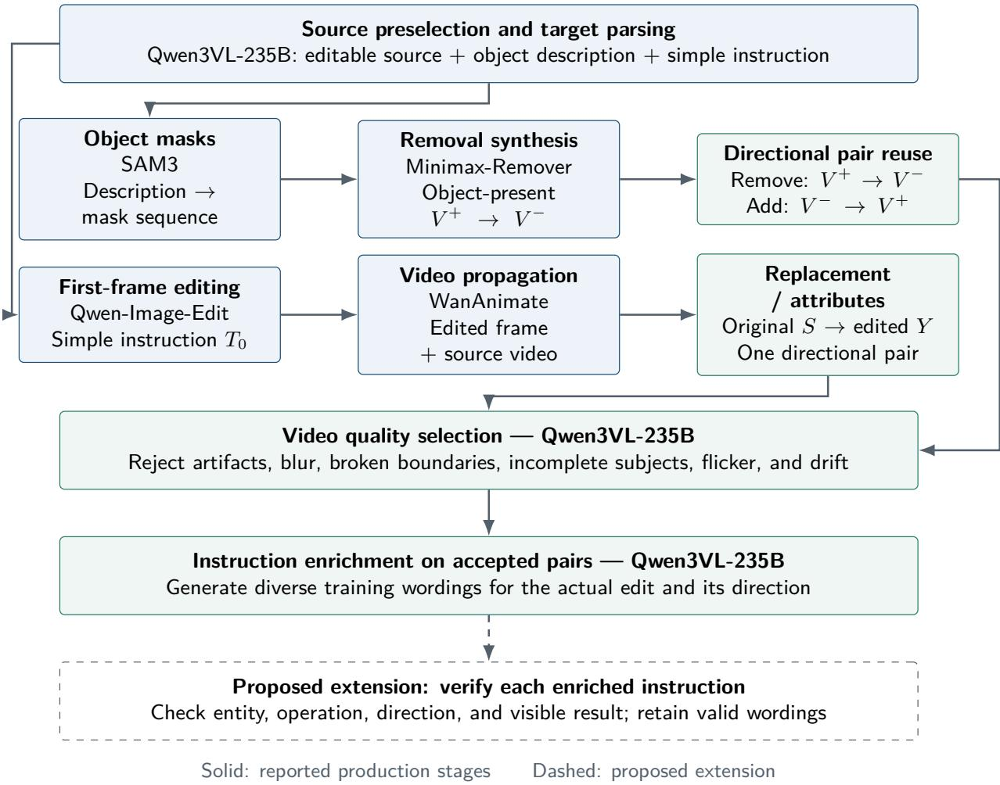  
Figure 1. Paired-video construction pipeline. Qwen3VL-235B performs source selection and target parsing. Addition and removal use SAM3 and Minimax-Remover, while replacement and attribute editing use Qwen-Image-Edit and WanAnimate. Generated videos are filtered before instruction enrichment.

## 3.2 Addition and Removal

For an original video $V ^ { + }$ containing object $^ { O , }$ Qwen3-VL-235B produces the target description $d _ { o }$ SAM3 [7] converts the description into a mask sequence $M _ { o } .$ , and Minimax-Remover [8] generates an object-absent video $V ^ { - }$ :

$$
M _ { o } = \mathrm { S A M 3 } ( V ^ { + } , d _ { o } ) , \qquad V ^ { - } = \mathrm { M i n i m a x R e m o v e r } ( V ^ { + } , M _ { o } ) .\tag{1}
$$

After quality filtering, the accepted pair is assigned to two editing directions:

$$
{ \mathcal D } _ { \mathrm { r e m o v e } } \ni ( V ^ { + } , T _ { \mathrm { r e m o v e } } , V ^ { - } ) , \qquad { \mathcal D } _ { \mathrm { a d d } } \ni ( V ^ { - } , T _ { \mathrm { a d d } } , V ^ { + } ) .\tag{2}
$$

The removal instruction describes the object that disappears from $V ^ { + }$ , while the addition instruction describes the object, appearance, and location introduced when transforming V<sup>−</sup> into $V ^ { + }$ . The two directions share one physical video pair but are stored as separate directional editing records.

## 3.3 Replacement and Attribute Editing

For replacement and attribute editing, Qwen-Image-Edit [9] applies instruction $T _ { 0 }$ to the first source frame $V _ { 1 }$ and produces an edited frame $I ^ { * }$ . Wan-Animate [10] propagates the edited appearance through the source video:

$$
I ^ { * } = \mathrm { Q w e n I m a g e E d i t } ( V _ { 1 } , T _ { 0 } ) , \qquad Y ^ { * } = \mathrm { W a n A n i m a t e } ( V , I ^ { * } ) .\tag{3}
$$

The resulting training record is $( S , T , Y ) = \left( V , T , Y ^ { * } \right)$ . Replacement instructions specify both the original and requested objects. Attribute-editing instructions specify the target object and the attribute to be changed.

## 3.4 Quality Filtering and Instruction Enrichment

Qwen3VL-235B evaluates each generated video after synthesis. Candidates are rejected if they contain any of the following:

• the requested edit is missing or incomplete;

• the wrong object or attribute is edited;

• unrelated background or foreground content changes;

• object boundaries are broken or local structures are deformed;

• objects disappear, flicker, or drift across frames;

• the generated video contains severe blur or visual artifacts.

Quality filtering is applied to the complete generated video rather than only the first frame. For addition and removal pairs, both editing directions must correspond to the visible transition.

After a pair passes filtering, Qwen3VL-235B generates multiple instructions describing the accepted edit. The instruction set contains direct commands, detailed attribute descriptions, and longer natural-language expressions. Instruction enrichment is performed after visual filtering so that all generated instructions correspond to an accepted source–target pair.

## 3.5 Constructed Dataset

The constructed dataset contains more than 1.2 million directional video-editing records. It includes over 400,000 addition records, over 400,000 removal records, and over 400,000 replacement and attribute-editing records. Each record follows the unified format (S, T, Y), where S is the source video, $T$ is the editing instruction, and $Y$ is the target video. The overall automatic acceptance rate of the data-construction pipeline is 89%.

Table 1. Scale of the constructed paired-video corpus.
<table><tr><td>Task group Directional editing records</td></tr><tr><td>Addition &gt; 400K</td></tr><tr><td>Removal &gt; 400K</td></tr><tr><td>Replacement and attribute editing &gt; 400K</td></tr><tr><td>Total &gt; 1.2M</td></tr></table>

## 4 Unified Video-Editing Architecture

The data pipeline produces a common triple $( S , T , Y )$ regardless of which expert route generated the target. We design one editor to absorb this heterogeneous supervision through complementary semantic and structural conditions. The semantic branch determines what transformation is requested, while the structural branch preserves the dense visual and temporal context required to apply that transformation to the source video.

## 4.1 Task Definition

Let $S \in \mathbb { R } ^ { F \times H \times W \times 3 }$ be the source video, $T$ the editing instruction, $Y$ the edited training target, and $\hat { Y }$ the generated output. The model learns $p _ { \theta } ( Y \mid S , T )$ . A frozen video VAE encoder $E$ maps the source and target to latent representations, and decoder D reconstructs the generated output:

$$
\begin{array} { r } { z _ { s } = E ( S ) , \qquad z _ { y } = E ( Y ) , \qquad \hat { Y } = D ( \hat { z } _ { y } ) . } \end{array}\tag{4}
$$

## 4.2 Dual-Condition Architecture

Figure 2 shows two paths from the source video to the generator. The semantic path gives a multimodal language model a sparse set of source frames together with instruction T. Learnable queries extract generator-facing features, and a connector maps them to conditional tokens. The structural path encodes the complete source clip with the frozen VAE and injects its latents at the DiT input. Sparse visual-language tokens identify the requested change; dense source latents retain layout, appearance, and motion context.

## 4.3 Multimodal Semantic Condition

Let $\cal { S } _ { K } ( \cal { S } )$ sample K source frames and let $Q \in \mathbb { R } ^ { M \times d _ { m } }$ contain learnable queries. Multimodal encoder $F _ { \phi }$ and connector $P _ { \psi }$ produce

$$
h _ { Q } = F _ { \phi } ( S _ { K } ( S ) , T , Q ) \mid _ { Q } , \qquad c = P _ { \psi } ( h _ { Q } ) \in \mathbb { R } ^ { M \times d _ { c } } .\tag{5}
$$

The query readout gives the video generator a compact representation of the joint visual and linguistic context without requiring an intermediate natural-language description. The connector adapts feature dimensionality and representation statistics, and the DiT uses c through conditional attention. The MLLM is adapted with LoRA [18], while the connector and query embed dings are optimized jointly. The implementation uses 256 image queries and 512 video queries.

(a) Semantic and structural conditioning  
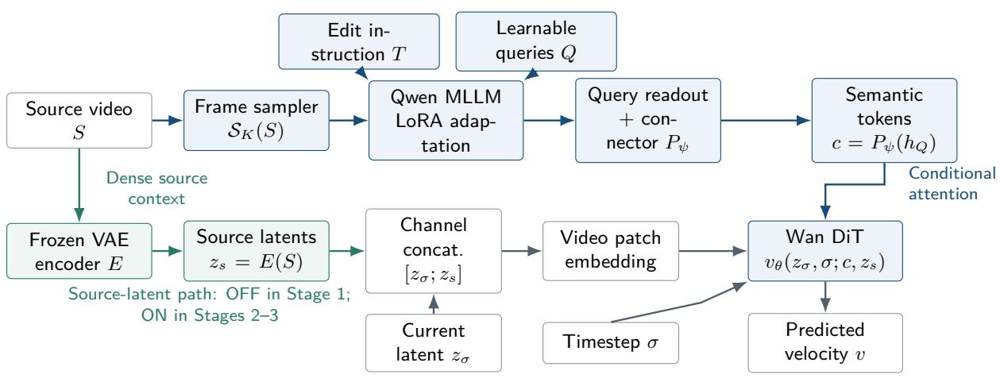

(b) Distinct training and inference paths  
```perl
Training only: paired edited target $Y$
Predict v with (a); regress to $v ^ { * } = \epsilon - z _ { y }$
Optimize stage-specific parameters with $\mathcal { L } _ { \mathrm { F M } }$
```  
Figure 2. Dual-condition instruction-based video editor. The semantic branch combines sampled source frames and the edit instruction through an MLLM, learnable queries, and a connector. The structural branch concatenates source-video latents with noisy target latents before DiT patch embedding. Training constructs noisy target latents from paired target $Y ;$ inference requires only source $S$ and instruction $T$ and starts from Gaussian noise.

$$
\sigma = 0 .
$$

$$
\hat { Y } = D ( \hat { z } _ { y } )
$$

## 4.4 Dense Source-Video Condition

At training time, noisy target latents $z _ { \sigma }$ and source-video latents $z _ { s }$ are concatenated along the channel dimension before the initial DiT patch embedding:

$$
x _ { \sigma } = \operatorname { C o n c a t } _ { \operatorname { c h a n n e l } } ( z _ { \sigma } , z _ { s } ) , \qquad u _ { 0 } = \operatorname { P a t c h E m b e d } ( x _ { \sigma } ) .\tag{6}
$$

This input supplies frame-level source structure while leaving the requested operation to the semantic condition. The two conditions divide a dificult editing problem into complementary roles: multimodal features identify the target and operation, while source latents anchor layout, appearance, and motion throughout generation. The source-latent path is disabled during semantic alignment and enabled during subsequent editing stages.

## 4.5 Flow-Matching Training and Inference

In the frozen VAE latent space, sample $\epsilon \sim \mathcal { N } ( 0 , I )$ and interpolation coeficient $\sigma \in [ 0 , 1 ]$ :

$$
z _ { \sigma } = ( 1 - \sigma ) z _ { y } + \sigma \epsilon , \qquad v ^ { * } = \epsilon - z _ { y } .\tag{7}
$$

The model predicts the latent velocity under semantic and structural conditions:

$$
\mathcal { L } _ { \mathrm { F M } } = \mathbb { E } \left[ w ( \sigma ) \| v _ { \theta } ( z _ { \sigma } , \sigma ; c , z _ { s } ) - ( \epsilon - z _ { y } ) \| _ { 2 } ^ { 2 } \right] .\tag{8}
$$

This follows flow matching [19]. During inference, sampling starts from $z _ { 1 } \sim \mathcal { N } ( 0 , I )$ and follows the scheduler toward decreasing noise. Classifier-free guidance combines conditional and unconditional predictions,

$$
v _ { \mathrm { c f g } } = v _ { u } + s ( v _ { c } - v _ { u } ) ,\tag{9}
$$

where both branches share source-video context. The final latent is decoded as $\hat { Y } = D ( \hat { z } _ { y } )$ . No target video, mask, or edited first frame is required at inference.

## 5 Progressive Image–Video Training

The unified editor must connect three capabilities that are not naturally aligned at initialization: multimodal instruction understanding, source-video preservation, and high-quality video generation. We use progressive image–video training to develop these capabilities in sequence, moving from semantic alignment to source-conditioned generation and finally to high-resolution refinement.

## 5.1 Training Stages

Table 2 summarizes the reported configuration, and Figure 3 shows how the trainable components and source conditions change across stages.

Table 2. Reported three-stage training recipe. All stages use global batch size 64 and learning rate $1 0 ^ { - 5 }$ Stages 2–3 use EMA decay 0.9995.
<table><tr><td>Setting</td><td>Stage 1: semantic alignment</td><td>Stage 2: joint adaptation Stage 3: refinement</td><td></td></tr><tr><td>Training records</td><td>Approx. 3.0M</td><td>Approx. 2.6M</td><td>30K videos</td></tr><tr><td>Training steps</td><td>21,000</td><td>27,000</td><td>500</td></tr><tr><td>Global batch</td><td>64</td><td>64</td><td>64</td></tr><tr><td>Learning rate</td><td> $1 0 ^ { - 5 }$ </td><td> $1 0 ^ { - 5 }$ </td><td> $1 0 ^ { - 5 }$ </td></tr><tr><td>Resolution</td><td>480-832</td><td>480-832</td><td>720-1280</td></tr><tr><td></td><td>MLLM-side updates Queries, LoRA, connector Continue adaptation</td><td></td><td>Continue adaptation</td></tr><tr><td>DiT</td><td>Frozen</td><td>Trainable</td><td>Trainable</td></tr><tr><td>Source-video latents</td><td>Disabled</td><td>Enabled</td><td>Enabled</td></tr><tr><td>EMA</td><td>Disabled</td><td>0.9995</td><td>0.9995</td></tr></table>

Stage 1: semantic-interface alignment. The first stage establishes communication between multimodal understanding and video generation. The VAE and DiT remain frozen while the learnable queries, MLLM LoRA parameters, and connector are optimized through the generation objective. The MLLM reads sampled source frames and the instruction, while the dense sourcelatent path remains disabled. This stage learns a compact editing condition while preserving the pretrained generator.

Stage 2: source-conditioned joint adaptation. The second stage converts semantic control into full video-editing capability. Starting from Stage 1, the source-video latent path is enabled and the DiT is unfrozen. The generator learns to execute the instruction while following the layout, appearance, and motion of the source sequence. Joint image–video supervision combines high-quality spatial transformations with temporally coherent editing examples.

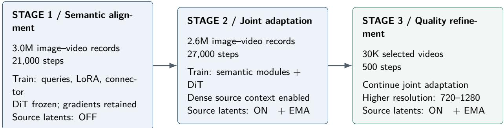  
Frozen VAE throughout; source frames remain available to the MLLM in every stage.  
Figure 3. Progressive adaptation of the shared editor. Stage 1 aligns semantic conditions while the DiT remains frozen. Stage 2 enables dense source-video latents and jointly adapts the generator. Stage 3 refines the editor on selected higher-resolution videos.

Stage 3: selected-data refinement. The final stage concentrates model capacity on output quality after broad editing behavior has been established. It performs 500 higher-resolution updates on 30,000 manually selected videos, improving local detail and naturalness without rebuilding the editing interface from scratch.

## 6 Evaluation

We evaluate whether the large-scale supervision and progressive training framework produce a model that can simultaneously execute diverse instructions, preserve source content, and maintain video quality. We compare UniVideo [15], Kling O1 [20], and Ours on 100 video-editing examples. Every method receives the same source videos and instructions, and all outputs enter the same automatic evaluation pipeline.

## 6.1 Evaluation Metrics

We evaluate the generated videos using eleven metrics. Qwen2.5-VL-7B [21] scores instruction following, editing quality, and content preservation on a 1–10 scale based on the source video, editing instruction, and generated video. VBench [22] provides background consistency, aesthetic quality, and imaging quality. VFID-I3D and VFID-ResNeXt [23] measure the feature-distribution distance between generated and reference videos, with lower values indicating better performance.SSIM [24] measures structural similarity, while LPIPS [25] measures perceptual feature distance; higher SSIM and lower LPIPS indicate closer agreement with the target video. Kiwi-Edit Score [26] evaluates the completion quality of replacement, removal, and addition tasks, with higher values indicating better editing performance.

## 6.2 Main Quantitative Results

VideoX-Qwen has the favorable numerical value in nine rows, while Kling O1 leads on aesthetic and imaging quality. Relative to UniVideo, instruction following increases by 0.79 points, SSIM by 0.1935, and LPIPS decreases by 0.0433. These correspond to 11.43%, 33.81%, and an 18.05% reduction, respectively, when calculated from the table’s rounded values. Compared with Kling O1, the instruction-score diference is 0.09 points and the Kiwi-Edit diference is 0.018.

Table 3. Results on 100 video-editing examples. Bold marks the best mean in each row.
<table><tr><td>Metric</td><td></td><td>UniVideo Kling O1 VideoX-Qwen</td><td></td></tr><tr><td>Instruction following ↑</td><td>6.91</td><td>7.61</td><td>7.70</td></tr><tr><td>Editing quality ↑</td><td>7.11</td><td>7.69</td><td>7.86</td></tr><tr><td>Content preservation ↑</td><td>7.01</td><td>7.51</td><td>7.70</td></tr><tr><td>Background consistency ↑</td><td>0.9512</td><td>0.9455</td><td>0.9535</td></tr><tr><td>Aesthetic quality ↑</td><td>0.5098</td><td>0.5248</td><td>0.5067</td></tr><tr><td>Imaging quality ↑</td><td>0.6130</td><td>0.6973</td><td>0.6294</td></tr><tr><td>Kiwi-Edit Score ↑</td><td>3.797</td><td>3.942</td><td>3.960</td></tr><tr><td>VFID-I3D↓</td><td>26.5066</td><td>36.2155</td><td>25.9629</td></tr><tr><td>VFID-ResNeXt↓</td><td>1.3501</td><td>1.0782</td><td>0.9253</td></tr><tr><td>SSIM ↑</td><td>0.5723</td><td>0.6701</td><td>0.7658</td></tr><tr><td>LPIPS ↓</td><td>0.2399</td><td>0.2367</td><td>0.1966</td></tr></table>

The results show that VideoX-Qwencombines strong instruction execution with source-content preservation rather than improving one at the expense of the other. It achieves the best mean result on all three model-judge editing dimensions and on the target-agreement metrics, while also obtaining the strongest background-consistency score. Kling O1 remains stronger on aesthetic and imaging quality, indicating that further gains in visual polish are possible. Overall, the broad improvement across complementary metrics demonstrates the practical value of combining the constructed corpus with the unified architecture and progressive training strategy.

## 6.3 Qualitative Evidence and Visible Limits

Figures 4 and 5 show six representative examples. Each comparison includes the source video, UniVideo, Kling O1, and Ours, covering subject replacement, color editing, object addition, compound instructions, and local attribute changes.

Local color edits make unintended changes to pose, layout, and background easier to inspect. Replacement additionally requires plausible anatomy, occlusion, and motion. Multi-region editing should distinguish complete execution from partial success. The displayed frames are drawn from the first 49 frames of each result; full-video metrics complement the frame-level comparison.

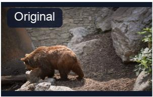  
Instruction change the bear into a horse

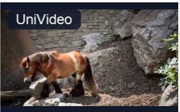

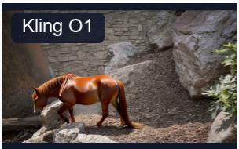

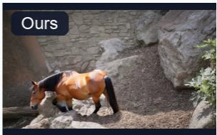

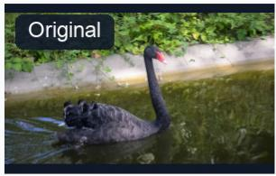  
Instruction turn the blackswan into pink

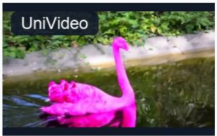


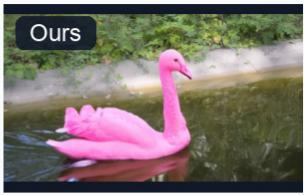

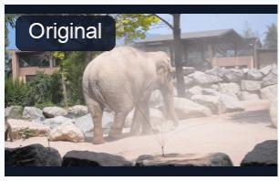  
Instruction change the elephant with a giraffe

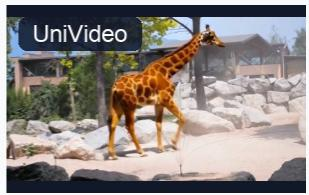

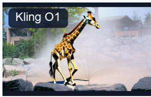

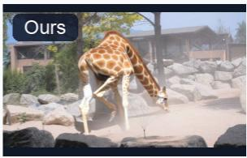  
Figure 4. Qualitative comparisons on subject replacement and color editing. Top: replace a bear with a horse. Middle: change a black swan to pink. Bottom: replace an elephant with a girafe.

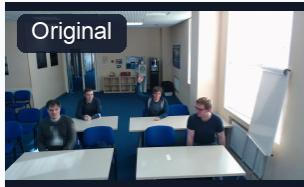  
Instruction

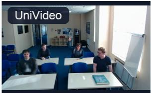

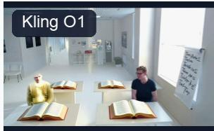

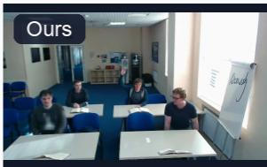  
Place an open book on all the tables, and add some random text on the whiteboard.

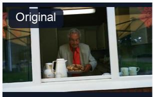  
Instruction Change shirt color from red to purple.

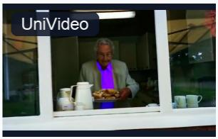

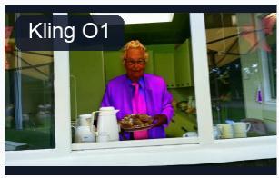

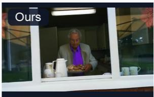

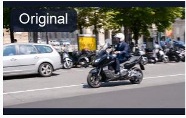  
Instruction turn the motorbike into red

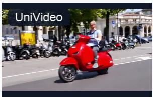

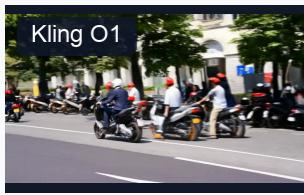

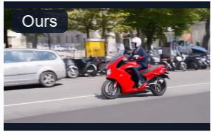  
Figure 5. Qualitative comparisons on compound and attribute editing. Top: add open books to the tables and text to the whiteboard. Middle: change the clothing color from red to purple. Bottom: change the motorcycle color to red.

## 7 Discussion

The central value of VideoX-Qwenlies in the combination of a scalable data-production capability and a unified model-training capability. The data pipeline turns specialist models into producers of reusable supervision rather than isolated editing tools. Addition, removal, replacement, and attribute editing require diferent intermediate operations, but their results are normalized into one source–instruction–target representation. This makes it possible to grow task coverage and data volume without redesigning the final training interface for every new editing operation.

The scale of the resulting corpus changes the role of synthetic data in the system. With more than 1.2 million directional records and over 400,000 records in each major task group, the constructed data form a principal training resource rather than a small auxiliary dataset. Directional reuse improves the utilization of accepted video pairs, while instruction enrichment exposes the model to varied natural-language expressions of the same visual operation.

The training framework is equally important. Multimodal query conditioning gives the editor a semantic representation of the source and requested change, while dense source-video latents preserve the spatial and temporal information required for faithful editing. Progressive training connects these conditions to the pretrained generator in stages, allowing image and video su pervision to contribute complementary editing knowledge. The improvement across instruction following, preservation, structural similarity, perceptual similarity, and video-distribution metrics indicates that these components work together as one efective editing system.

## 8 Conclusion

We presented VideoX-Qwenas an integrated data-construction and model-training framework for scaling instruction-based video editing. Its data-production system organizes specialized models into repeatable synthesis routes and converts addition, removal, replacement, and attribute transformations into a common source–instruction–target interface. This process yields more than 1.2 million directional editing records and turns fragmented expert capabilities into a substantial source of supervision for general video editing. On the training side, a unified editor combines multimodal semantic queries with dense source-video latents and progressively adapts the Qwen–Wan components to execute instructions while preserving source content.

The complete system obtains the best mean result on nine of eleven metrics in a 100-example comparison with UniVideo and Kling O1. These results demonstrate the value of combining large-scale structured supervision with multimodal source-conditioned training. More broadly, VideoX-Qwenprovides an extensible mechanism for transforming advances in specialist visual models into reusable data and then absorbing that data into one general editor. It ofers a practical foundation for continued expansion in task coverage, data volume, and instructiondriven video-editing capability.

## References

[1] Qingyan Bai, Qiuyu Wang, Hao Ouyang, et al. Scaling instruction-based video editing with a high-quality synthetic dataset. arXiv:2510.15742, 2025. URL https://arxiv.org/abs/ 2510.15742. Ditto / Editto; data-source reference.

[2] Bojia Zi, Penghui Ruan, Marco Chen, Xianbiao Qi, et al. Se˜norita-2m: A high-quality instruction-based dataset for general video editing by video specialists. arXiv preprint arXiv:2502.06734, 2025. URL https://arxiv.org/abs/2502.06734.

[3] Max Ku, Cong Wei, Weiming Ren, Harry Yang, and Wenhu Chen. Anyv2v: A tuning-free framework for any video-to-video editing tasks. arXiv preprint arXiv:2403.14468, 2024. URL https://arxiv.org/abs/2403.14468.

[4] Yuhui Wu, Liyi Chen, Ruibin Li, Shihao Wang, Chenxi Xie, and Lei Zhang. Insvie-1m: Efective instruction-based video editing with elaborate dataset construction. arXiv preprint arXiv:2503.20287, 2025. URL https://arxiv.org/abs/2503.20287.

[5] Chong Mou, Qichao Sun, Yanze Wu, et al. Instructx: Towards unified visual editing with mllm guidance. arXiv preprint arXiv:2510.08485, 2025. URL https://arxiv.org/abs/25 10.08485.

[6] Zhongwei Zhang, Fuchen Long, Wei Li, Zhaofan Qiu, Wu Liu, Ting Yao, and Tao Mei. Region-constraint in-context generation for instructional video editing. arXiv preprint arXiv:2512.17650, 2025. URL https://arxiv.org/abs/2512.17650.

[7] Nicolas Carion, Laura Gustafson, Yuan-Ting Hu, Shoubhik Debnath, et al. Sam 3: Segment anything with concepts. arXiv preprint arXiv:2511.16719, 2025. URL https://arxiv.or g/abs/2511.16719.

[8] Bojia Zi, Weixuan Peng, Xianbiao Qi, Jianan Wang, Shihao Zhao, Rong Xiao, and Kam-Fai Wong. Minimax-remover: Taming bad noise helps video object removal. arXiv preprint arXiv:2505.24873, 2025. URL https://arxiv.org/abs/2505.24873.

[9] Qwen Team. Qwen-image-edit: Image editing with higher quality and eficiency. Oficial release article, August 19, 2025, 2025. URL https://qwenlm.github.io/blog/qwen-ima ge-edit/.

[10] Gang Cheng, Xin Gao, Li Hu, Siqi Hu, et al. Wan-animate: Unified character animation and replacement with holistic replication. arXiv preprint arXiv:2509.14055, 2025. URL https://arxiv.org/abs/2509.14055.

[11] Wan Team. Wan: Open and advanced large-scale video generative models. arXiv preprint arXiv:2503.20314, 2025. URL https://arxiv.org/abs/2503.20314.

[12] Weijie Kong, Qi Tian, Zijian Zhang, et al. Hunyuanvideo: A systematic framework for large video generative models. arXiv preprint arXiv:2412.03603, 2024. URL https://arxiv.or g/abs/2412.03603.

[13] Zhuoyi Yang, Jiayan Teng, Wendi Zheng, et al. Cogvideox: Text-to-video difusion models with an expert transformer. arXiv preprint arXiv:2408.06072, 2024. URL https://arxiv. org/abs/2408.06072.

[14] Zeyinzi Jiang, Zhen Han, Chaojie Mao, Jingfeng Zhang, Yulin Pan, and Yu Liu. Vace: Allin-one video creation and editing. arXiv preprint arXiv:2503.07598, 2025. URL https: //arxiv.org/abs/2503.07598.

[15] Cong Wei, Quande Liu, Zixuan Ye, et al. Univideo: Unified understanding, generation, and editing for videos. arXiv preprint arXiv:2510.08377, 2025. URL https://arxiv.org/abs/ 2510.08377.

[16] Haoyang He, Jie Wang, Jiangning Zhang, Zhucun Xue, Xingyuan Bu, Qiangpeng Yang, Shilei Wen, and Lei Xie. Openve-3m: A large-scale high-quality dataset for instructionguided video editing. arXiv preprint arXiv:2512.07826, 2025. URL https://arxiv.org/ab s/2512.07826.

[17] Shuai Bai, Yuxuan Cai, Ruizhe Chen, Keqin Chen, et al. Qwen3-vl technical report. arXiv preprint arXiv:2511.21631, 2025. URL https://arxiv.org/abs/2511.21631.

[18] Edward J. Hu, Yelong Shen, Phillip Wallis, Zeyuan Allen-Zhu, Yuanzhi Li, Shean Wang, Lu Wang, and Weizhu Chen. Lora: Low-rank adaptation of large language models. In International Conference on Learning Representations, 2022. URL https://arxiv.org/ab s/2106.09685.

[19] Yaron Lipman, Ricky T. Q. Chen, Heli Ben-Hamu, Maximilian Nickel, and Matt Le. Flow matching for generative modeling. arXiv preprint arXiv:2210.02747, 2022. URL https: //arxiv.org/abs/2210.02747.

[20] Kling Team. Kling-omni technical report. arXiv preprint arXiv:2512.16776, 2025. URL https://arxiv.org/abs/2512.16776.

[21] Shuai Bai, Keqin Chen, Xuejing Liu, Jialin Wang, et al. Qwen2.5-vl technical report. arXiv preprint arXiv:2502.13923, 2025. URL https://arxiv.org/abs/2502.13923.

[22] VBench Contributors. Vbench: Background consistency evaluation implementation. Oficial source code, 2026. URL https://github.com/Vchitect/VBench/blob/master/vbench/ background\_consistency.py. Accessed 2026-08-31; source code semantics.

[23] Thomas Unterthiner, Sjoerd van Steenkiste, Karol Kurach, Raphael Marinier, Marcin Michalski, and Sylvain Gelly. Towards accurate generative models of video: A new metric and challenges. arXiv preprint arXiv:1812.01717, 2018. URL https://arxiv.org/abs/ 1812.01717.

[24] Zhou Wang, Alan C. Bovik, Hamid R. Sheikh, and Eero P. Simoncelli. Image quality assessment: From error visibility to structural similarity. IEEE Transactions on Image Processing, 13(4):600–612, 2004. doi: 10.1109/TIP.2003.819861.

[25] Richard Zhang, Phillip Isola, Alexei A. Efros, Eli Shechtman, and Oliver Wang. The unreasonable efectiveness of deep features as a perceptual metric. In Proceedings of the IEEE Conference on Computer Vision and Pattern Recognition, pages 586–595, 2018.

[26] Yiqi Lin, Guoqiang Liang, Ziyun Zeng, Zechen Bai, Yanzhe Chen, and Mike Zheng Shou. Kiwi-edit: Versatile video editing via instruction and reference guidance. arXiv preprint arXiv:2603.02175, 2026. URL https://arxiv.org/abs/2603.02175.