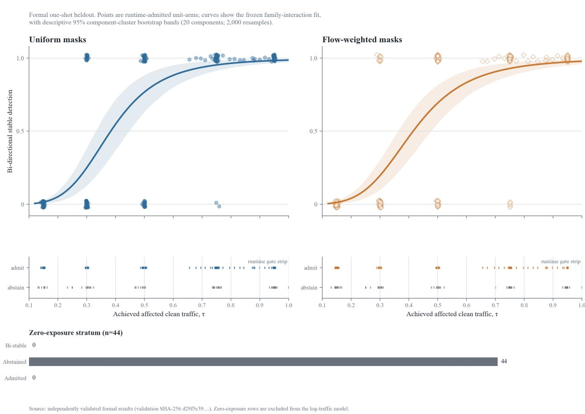

# When Are Aggregate Agent Traces Diagnosable? Trafic-Governed Interpretation and Calibrated Abstention

Peiying Zhu\*   
peiying@blossomai.co   
Blossom AI   
San Francisco, CA, USA

Sidi Chang\* †

schang@blossomai.co

Blossom AI

San Francisco, CA, USA

## Abstract

Runtime traces are often treated as transparent evidence about an agent, but a closed-loop policy determines which states are visited and therefore which failures can become visible. We study a simulated hotel-pricing agent whose policy maps time, inventory, and market state to discrete price actions under varying demand regimes. A fault may leave no aggregate trace when the policy rarely visits its afected cells. We treat entry into aggregate-only fault interpretation as a diagnosability decision that precedes scoring or localization. A reference-map gate requires repeated clean-policy support; a matched runtime gate then requires joint support in clean and current streams. Stable signal analysis occurs only after both gates pass. We calibrate false admission on a disjoint clean stream at the physical-component level and model detection by afected clean trafic rather than nominal cell coverage.

In a frozen one-shot heldout, 55/72 (76.4%) regime-component units were reference-admitted, representing 20 physical components; 54/55 then passed matched runtime admission, and the rejected unit abstained. Stable false admission was 0/20, with one-sided exact 95% upper bound 0.1391, meeting the frozen 0.20 criterion. Across 540 repeated unit-arm rows nested in those 20 clusters, afected clean trafic reduced negative log likelihood by 29.3% relative to cell coverage, a gain of 0.1264 nats per row (cluster-bootstrap 95% interval [0.0593, 0.1918]). Adding mask family and its interaction improved log loss by only 0.0015 nats per row (one-sided upper bound 0.0066), below the frozen 0.01 practical-suficiency margin. A development audit also found that exact minimum hitting set and greedy selection chose identical supports in 12/12 scenarios because singleton evidence had already resolved the conflicts. The result is a bounded rule for interpreting aggregate agent behavior: first establish exposure, then score change, and abstain when the trace cannot support the claim.

Keywords: agent behavior, runtime traces, closed-loop systems, fault diagnosis, diagnosability, abstention, trafic exposure

## 1 Introduction

Agent evaluation is moving from final-task scores toward trajectories: tool calls, intermediate states, recovery behavior, and long-horizon traces [18, 19, 20]. These records are richer than an outcome, but they are not neutral windows into the system. Closed-loop agents act on state, and those actions change which states will be observed next. A component can therefore fail without producing a visible aggregate change when the policy rarely visits the afected region. Demand shift can also change visitation and action summaries without any component fault. No diagnosis algorithm can recover information absent from its measurements [3]; trace interpretation that ignores exposure can turn missing evidence into reassurance or ordinary drift into a fault.

The system is a simulated hotel-pricing agent whose policy maps time, inventory, and market state to discrete price actions under varying demand regimes. Its target policy is partitioned into 24 behavioral components, and the interpreter receives typed aggregate trajectories rather than the planted fault identity or every internal decision. Earlier versions treated exact, risk-calibrated minimum hitting set (MHS) as the main contribution. Conflictdirected diagnosis maps conflicts to hitting-set candidates [1, 2], but our audit changed that conclusion: exact MHS and weighted greedy selected the same support in all 12 development scenarios. Exact-scope predicates and one-component probes had already introduced plantedcomponent singletons, leaving no residual ambiguity after propagation.

This negative result redirects the question upstream. If a trace compiler already reveals the answer, a stronger optimizer cannot demonstrate a localization advantage. If policy trafic never exposes the afected region, neither exact nor approximate optimization can recover it. The consequential interpretive decision is whether the current trace contains evidence about the claimed component at all.

Our workflow uses two gates. The reference-map gate asks whether a component is repeatedly visited in a clean stream. The runtime gate asks whether clean and current streams are jointly supported in matched partitions. Only then is stable signal evaluated. Clean-versus-clean false admission is calibrated separately, and the physical component, not each repeated regime arm or simulator trajectory, is the safety sampling unit.

We also measure fault severity in the coordinates that generate the traces. A mask may change many unvisited cells or a few high-trafic cells, so cell count need not predict signal strength. We define afected clean trafic as the fraction of clean visits falling in changed cells, compare it with afected cell count, and test whether trafic remains practically suficient across uniform and flow-weighted masks.

A frozen shift detector separately triggers map recomputation rather than declaring a fault or an abstention. This keeps distribution change, support loss, and stable fault signal as distinct events.

The paper makes four bounded contributions to interpreting agent behavior:

1. We operationalize trace diagnosability with reference and matched-runtime support gates that return explicit abstentions.

2. We define afected clean trafic as a behavior-grounded exposure variable and test it against nominal edit size.

3. We pre-register independent false-admission calibration and family-robustness criteria at the physicalcomponent level.

4. We report a negative optimizer result that exposes a verifier artifact: exact MHS showed no advantage over propagation-aware greedy selection in this benchmark.

The heldout confirms gates, abstention, and traficindexed signal behavior. It does not confirm localization accuracy.

## 2 Related work and conceptual position

Interactive-agent benchmarks increasingly retain trajectories and environment state rather than only final answers [18, 19, 20]. Such benchmarks establish tasks and observable records; they do not automatically establish that a particular trace statistic identifies a component-level failure. Our contribution is complementary: it asks when an aggregate trajectory is eligible to support a fault interpretation in the first place.

Conflict-directed model-based diagnosis derives candidates as hitting sets of conflicts [1], and exact methods improve search eficiency [2]. These solvers are conditional on the compiled conflict family; they do not establish whether upstream observations distinguish the represented physical faults. Diagnosability work instead asks whether faults can be distinguished from available measurements [3, 4, 5]. Our gates are a finite-sample operationalization for aggregate closed-loop traces, not a general diagnosability theorem.

Selective prediction trades coverage against error by rejecting unsupported inputs [6, 7, 8, 16]. Overlap analysis and ofline reinforcement learning similarly avoid inference where state-action coverage is weak [9, 10, 11, 12]. We apply this support-first principle before trace interpretation, with fault visibility rather than treatment efect or policy value as the estimand. Dataset-shift and conformal methods motivate a separate drift-to-refresh path [13, 14, 15]. Recent work interprets runtime behavior through pointwise temporal-logic diagnostics [21] and trajectory-level competence and visualization tools for LLM agents [22]; complementary theory establishes limits on predicting agents from behavior alone [23]. Our narrower question is whether an aggregate trace is eligible to support a component-level fault interpretation. Our contribution is the empirical synthesis in a pre-localization pipeline: support gates, component-level false-admission calibration, and trafic-indexed signal analysis. We do not claim to originate diagnosability, abstention, overlap analysis, shif detection, or behavioral diagnostics.

## 3 Problem setting

## 3.1 Components, regimes, and aggregate traces

Let C be the set of 24 disjoint target-policy components. Each component is indexed by a time quarter, inventory half, and market third. The simulator is evaluated under three separately fitted demand regimes, lambda0 in {5, 7, 9}. A regime-component pair is a unit, giving 72 units before admission.

For each unit and evaluation partition, the system records typed aggregate traces. The signal calculation uses two existing summaries:

• region\_d1, a regional distribution distance; and

• mean\_action\_gap, the mean reference-current action diference.

The diagnostic does not observe the planted fault identity when deciding admission or signal stability.

## 3.2 Fault masks and directions

A formal fault changes a deterministic subset of directionchangeable target-field cells by one action bucket. Each selected subset is tested in outward and inward directions. Two nested mask families are used:

• uniform, a seeded random ordering of changeable cells; and

• flow\_weighted, a seeded weighted-withoutreplacement ordering in which frequently visited clean cells tend to enter earlier.

The two families can have the same selected cell fraction but very diferent afected trafic.

## 3.3 Afected clean trafic

For component cell $c ,$ let $o _ { c }$ be its clean reference visit count. For a directional fault selecting cells $S _ { d } ,$ define

$$
\tau _ { d } = \frac { \sum _ { c \in S _ { d } } O _ { c } } { \sum _ { c \in \mathrm { c o m p o n e n t } } O _ { c } } .
$$

The primary exposure is

$$
\tau = ( \tau _ { \mathrm { o u t w a r d } } + \tau _ { \mathrm { i n w a r d } } ) / 2 .
$$

For the matched cell-count model, directional coverage is the selected fraction of direction-changeable cells, and the bi-directional covariate is the arithmetic mean

$$
f _ { \mathrm { c e l l } } = ( f _ { \mathrm { o u t w a r d } } + f _ { \mathrm { i n w a r d } } ) / 2 .
$$

If component occupancy is zero, tau is zero. Zeroexposure cases are reported separately and are not shifted by an arbitrary constant before logging.

## 3.4 Diagnosability as a state, not a hidden assumption

For a unit u, a reference stream R, and a current stream $\mathsf { Q } ,$ the diagnostic state is:

$$
\begin{array} { r l } & { \mathrm { R E F E R E N C E \mathrm { _ - } A B S T A I N }  \mathrm { R U N T I M E \mathrm { _ - } A B S T A I N } } \\ & { \qquad \mathrm { S I G N A L \mathrm { _ - } E L I G I B L E } } \\ & { \qquad \{ \mathrm { D E T E C T E D , N O T \mathrm { _ - } D E T E C T E D } \} . } \end{array}
$$

The arrows denote tests, not a temporal guarantee that every unit progresses. A unit that fails the first gate never reaches the second. A unit that fails the second never reaches signal interpretation. This ordering distinguishes “no usable comparison” from “usable comparison with no stable signal.”

## 4 Why MHS is downstream

Given conflicts and component costs, exact MHS finds the minimum-cost set intersecting every conflict. Its guarantee remains conditional on the conflict family and does not establish physical-fault identification. In 12 audited development scenarios, exact MHS and propagation-aware greedy selection chose identical supports and achieved identical exact recovery (9/12). The instances were not devoid of combinatorial structure: non-singleton conflicts comprised 55.5% of the conflict collection, and conflicts overlapped in all 12 scenarios. A follow-up audit found planted-component singleton conflicts in 9/9 exact-anchor and $9 / 9$ hard-probe cases, with $0 / 9$ nonempty residual conflict families after propagation.

The mechanism is upstream. Classical GDE selects a next measurement to discriminate among diagnoses by expected entropy reduction [17]. The hard probe here instead changed exactly one component and paired that intervention with a predicate scoped to the same component, converting the local response into a planted-component singleton. Propagation therefore forced the choice before exact and greedy solvers could difer. This does not show that MHS is wrong; it shows that the evidence construction does not test optimizer advantage. We retain MHS only as an optional downstream risk-cost optimizer and make no formal localization claim.

## 5 Diagnosability method

## 5.1 Reference-map gate

A component has partition support when its existing support count is at least 12. A regime-component unit enters the formal reference map when at least 14 of 15 clean reference partitions have support. All 72 units are screened; none is excluded by identity or development eligibility.

The admitted proportion over 72 units is the primary coverage description. The number of distinct physical components represented is also reported. A low admission rate is a limitation of the observable system, not a reason to change the gate.

## 5.2 Runtime two-stream gate

A runtime partition is supported only when reference and current support are both at least 12 in that same partition. Runtime admission requires at least 14 such joint partitions out of 15. For a bi-directional fault observation, both directions must pass.

This intersection matters because separate aggregate counts can hide mismatched evidence: 14 well-supported reference partitions and 14 well-supported current partitions do not guarantee 14 usable comparisons if they occur in diferent partitions.

## 5.3 Stable aggregate signal

For each matched reference-current partition pair, define

$$
z = \mathrm { { m a x } } \left( { \frac { \mathrm { { r e g i o n } } _ { - } \mathrm { { d } } 1 } { 0 . 2 0 } } , { \frac { \left| { \mathrm { { m e a n } } } _ { - } \mathrm { { a c t i o n } } _ { - } \mathrm { { g a p } } \right| } { 0 . 3 5 } } \right) .
$$

A partition signals when $z ~ > = ~ 1 . 5 0$ . After the unitlevel runtime gate passes, direction stability is counted over all 15 matched pairs rather than over a supportsignal intersection; a direction is stable at 14/15 signaling partitions, and a unit-arm is bi-directionally stable only when both directions are stable. Signal values for an arm that fails either support gate remain sealed validation fields and cannot enter a power endpoint. Threshold 1.50 was selected before formal execution from the fixed grid {1.00, 1.25, 1.50, 1.75, 2.00}. It is not tuned on the formal null.

## 5.4 Three separate failure quantities

We separate:

1. reference-map invalidation: a developmentadmitted reference unit fails the initial formal reference-only rule;

2. runtime two-stream rejection: the formal reference passes but the matched current-reference comparison fails joint support; and

3. stable false admission: a runtime-admitted cleanversus-clean unit produces a stable signal.

Combining them would obscure whether the problem is a changed reference map, insuficient concurrent evidence, or a noisy signal. Each is reported separately at unit and physical-component-cluster levels. Reference invalidation and runtime rejection are descriptive coverage endpoints with no frozen population-rate threshold; each afected unit still abstains. The only ≤ 0.20 population claim is stable false admission.

## 5.5 Drift and refresh

A frozen split-conformal detector summarizes each cleannull partition and raises an alarm above a precommitted threshold. Alarms request atomic map recomputation; they do not declare a fault or an abstention. Passing units return to MAP\_VALID, while units failing the refreshed reference rule enter REFERENCE\_ABSTAIN. The formal endpoint is only a state-machine smoke test because every refresh reuses the same frozen reference bufer; it does not show that future data can repair a stale map.

## 6 Frozen confirmatory design

## 6.1 Seed separation

Formal seeds 200000..202399 form 15 clean reference partitions of 160 episodes. Disjoint seeds 202400..204799 form 15 current/fault partitions. Seeds 204800..204999 remain unused. Common random numbers pair conditions within the experiment, while inference clusters repeated observations by physical component.

An episode is one simulator trajectory used to form a partition-level aggregate; it is not an independent statistical unit. The 3,456,000 scheduled fault-stream episodes describe Monte Carlo workload, not an efective sample size. The design begins with 24 physical components repeated across three regimes, producing 72 coverage units. After admission, safety and bootstrap inference operate on 20 represented physical-component clusters. The primary structural fit contains 540 unit-arm rows nested within those clusters.

## 6.2 Formal mask construction

For each regime, component, direction, and family, a SHA-256-derived seed produces a deterministic cell ordering under master seed 2026082370. Nested prefixes target trafic near 0.15, 0.30, 0.50, 0.75, and 0.95; achieved trafic enters analysis. The clean stream determines occupancy and masks before fault outcomes are opened, and selectedcell, trafic, cell-fraction, and policy hashes are sealed.

## 6.3 Formal endpoints

Endpoints cover admission, component-level reference invalidation and runtime rejection, component-level stable false admission, stable-signal power versus achieved trafic, trafic-versus-cell log-loss, practical family suficiency, aggregate monotonicity, and state-machine execution. MHS output and planted localization accuracy are excluded.

## 6.4 Statistical analysis

Reference invalidation and runtime rejection use component-level two-sided exact 95% Clopper-Pearson intervals as descriptive coverage endpoints; they have no population-rate pass threshold. Stable false admission alone uses the component-level one-sided exact 95% upper bound and is labeled SAFETY CONFIRMED only when that bound is at most 0.20. Regime-unit rates are secondary because regimes reuse the same physical components.

The safety rule has coarse resolution: at 20 admitted components, 0/20 gives upper bound 0.1391 and passes, while 1/20 gives 0.2161 and fails.

Power rates use Wilson 95% intervals. The primary model fits stable signal against log(tau) on positiveexposure units that pass both support gates. A matched cell model uses log(cell\_fraction). Trafic is superior only if the component-bootstrap two-sided 95% lower bound on per-unit-arm-row negative-log-likelihood improvement, NLL(cell) - NLL(traffic), is greater than zero.

The family model adds mask family and its interaction with log(tau). Trafic is practically suficient across the two frozen families only if the component-bootstrap one-sided 95% upper bound on augmented-model log-loss improvement is below 0.01 nats per unit-arm row. A nonsignificant family coeficient is not an equivalence result.

The bootstrap samples physical components, not unitarm rows. A fixed generator produces 2,000 draws; finite singular and one-class replicates are retained, and no replicate is redrawn. Empty or nonfinite analyses return NOT ESTIMABLE rather than a favorable verdict.

The exact-binomial safety statement is conditional on the frozen working assumption that distinct physicalcomponent indicators are exchangeable independent Bernoulli trials given the policies and shared seed schedule. Common random numbers can induce residual crosscomponent dependence, so this is not an unconditional new-population guarantee.

## 6.5 Development separation

Development data motivated trafic as the primary axis but did not establish family suficiency. They were not pooled with the formal heldout. A pre-run projection from 20 to 15 partitions and the withdrawn cell-coverage heuristic were development-only; neither is a formal endpoint.

## 7 Formal results

## 7.1 Sampling frame, admission, and abstention

Of 72 regime-component units, 55/72 passed formal reference admission, representing 20/24 distinct components. Relative to the development reference map, invalidation was 0/20 at component grain and 0/55 at regime-unit grain; the component-level descriptive two-sided exact 95% interval was [0.0%, 16.8%]. On the clean current stream, 1/20 component clusters had a runtime two-stream rejection, with descriptive interval [0.1%, 24.9%]. These two rates quantify coverage loss and have no population pass threshold; every afected unit abstained.

Among the 20 runtime-admitted components, 0/20 produced a stable clean-versus-clean signal. The one-sided exact 95% upper bound was 0.1391, satisfying the frozen <=0.20 safety rule. The corresponding regime-unit result was 0/54 and remains descriptive.

## 7.2 Trafic-indexed power

The conditional denominator is the 54 runtime-admitted units; the operational denominator is the 55 referenceadmitted units and counts the one runtime abstention as no actionable diagnosis. Both families were saturated at 0/54 and $5 4 / 5 4$ at the endpoints; only the middle-target family gaps $( + 4 , + 2 , + 3$ , uniform minus flow-weighted) are empirically informative. Monotonicity passed but is a weak shape check, not evidence of family equivalence. All 44 zero-exposure scheduled observations abstained and none was stable.

## 7.3 Trafic versus cell coverage and family suficiency

Across 540 repeated unit-arm rows nested in 20 represented physical-component clusters, the trafic model achieved negative log likelihood 164.9866 (0.3055 per row), compared with 233.2453 (0.4319 per row) for the cell-count model. The diference was 0.1264 nats per unit-arm row, a 29.3% reduction relative to the cell-model negative log likelihood, with component-bootstrap 95% interval [0.0593,

0.1918]. The lower bound was above zero, so trafic was confirmed as the better primary axis.

The family-plus-interaction model improved log loss by 0.0015 nats per unit-arm row. Its one-sided componentbootstrap 95% upper bound was 0.0066, which was below the frozen 0.01 margin. Trafic therefore met the practical family-suficiency criterion. The trafic-plus-family coeficient was -0.3618 with component-bootstrap interval [-0.8617, 0.0367] and secondary likelihood-ratio p-value 0.2019.

The largest observed family gaps occurred in the [0.30, 0.45) and [0.75, 0.90) trafic bins. They are small in aggregate log-loss terms (0.0015 nats per row) but are not excluded on the odds scale, consistent with the coeficient interval above. The 0.0034-nat margin is narrow, and the percentile cluster-bootstrap uses only 20 represented components. The suficiency label is therefore limited to the two frozen mask families and the precommitted 0.01-nat criterion.

An operational sensitivity counting runtime abstention as zero gave the same decisions: trafic-over-cell improvement 0.1164 [0.0512, 0.1835] and family-plus-interaction gain 0.0014 with upper bound 0.0060.

## 7.4 Drift, refresh, and decision summary

The detector was quiet in its matched lambda0=7 regime (0/15 alarms) and active under demand shifts at lambda0=5 (15/15) and lambda0=9 (14/15). These are descriptive state-machine inputs, not a 29/45 false-alarm estimate. Five refresh operations reproduced the frozen map over 120 evaluations; because they reuse the same bufer, this does not show that refresh can repair a stale map.

There is no combined scientific verdict. Execution, operational safety, descriptive coverage, and the three structural hypotheses retain separate labels and interpretations.

## 8 Discussion

## 8.1 Interpretation is fixed by the endpoint pattern

The endpoint pattern fixes a bounded interpretation: stable false admission supports only the component-cluster 0.20 upper-bound statement; reference invalidation and runtime rejection remain descriptive coverage losses with abstention; and a single trafic curve is practically suficient only within admitted units and the two frozen mask families. Nondecreasing counts are a weak shape check, not family equivalence.

Table 1: Formal admission, abstention, and false-admission endpoints.
<table><tr><td>Grain</td><td>Endpoint</td><td>Result</td><td>Interval / bound</td><td>Interpretation</td></tr><tr><td>regime-</td><td>reference admission</td><td>55/72 (76.4%)</td><td>descriptive</td><td>addressable units</td></tr><tr><td>component physical component</td><td>reference</td><td>20/24 (83.3%)</td><td>descriptive</td><td>addressable components</td></tr><tr><td>physical component</td><td>representation reference invalidation</td><td>0/20</td><td>95% CI [0.0%, 16.8%]</td><td>descriptive; abstain</td></tr><tr><td>physical component</td><td>runtime rejection</td><td></td><td>1/20 95% CI [0.1%, 24.9%]</td><td>descriptive; abstain</td></tr><tr><td>physical component</td><td>stable false admission</td><td></td><td>0/20 one-sided 95% upper 0.1391</td><td>SAFETY CONFIRMED</td></tr></table>

Table 2: Conditional and operational bi-directional stable detections.
<table><tr><td>Family</td><td>Traffic target 0.15</td><td>0.30</td><td>0.50</td><td>0.75</td><td>0.95</td></tr><tr><td>uniform, conditional</td><td>0/54</td><td>17/54</td><td>37/54</td><td>52/54</td><td>54/54</td></tr><tr><td>uniform, operational</td><td>0/55</td><td>17/55</td><td>37/55</td><td>52/55</td><td>54/55</td></tr><tr><td>flow-weighted, conditional</td><td>0/54</td><td>13/54</td><td>35/54</td><td>49/54</td><td>54/54</td></tr><tr><td>flow-weighted, operational</td><td>0/55</td><td>13/55</td><td>35/55</td><td>49/55</td><td>54/55</td></tr></table>

## 8.2 What the work changes conceptually

Optimization and observability are distinct: exact MHS may be optimal for a compiled objective without identifying the physical fault, while a simple method can look perfect when singleton evidence already reveals the answer. Neither shows whether a trace reveals failure under a diferent trafic regime.

The two-gate workflow makes that dependency explicit. Reference admission asks what the policy normally exposes; runtime admission asks whether a matched comparison is possible; signal admission asks whether change is stable; and localization comes last. This is an applicationspecific synthesis of diagnosability analysis [3, 4], local support characterization [9], and selective abstention [6, 7, 16].

Trafic exposure provides a mechanism for why maps move with environment. Higher demand consumes inventory more quickly, transferring visitation from highinventory to low-inventory regions later in the episode. Pooled component ranks can therefore fall even when direction-specific movement is predictable. A map may rotate along a known inventory axis rather than become arbitrary. The operational consequence is to refresh the map when drift is detected, not to permanently reject the diagnostic.

## 8.3 Why abstention is part of the result

Admission below 100% defines the supported portion of the component universe, not merely lost sample size. Reporting conditional power alongside operational power, with abstention counted as no action, distinguishes a narrow high-performing method from a broader moderate one.

## 9 Limitations and claim boundaries

The formal study uses one simulator and one-bucket targetfield shifts; other magnitudes, interactions, persistence patterns, and non-target-field faults may yield diferent curves. Occupancy comes from a clean reference policy, so systems without such a stream need another maintenance design. Only 24 physical clusters are available. The exactbinomial statement is coarse and remains conditional on the exchangeable-independent component working model despite common seeds. Percentile cluster-bootstrap intervals from about 20 represented clusters may undercover in directions favorable to both structural findings. The falseadmission bound is 0.20, not 0.05, and the study confirms pre-localization signal behavior, not planted-fault localization. Practical suficiency applies only to the two frozen mask families and the 0.01-nat margin. The intended benefit is to prevent unsupported fault claims; the corresponding risk is false assurance if simulator-specific gates or thresholds are transferred to deployed or human-facing agents without new calibration.

## 10 Conclusion

Aggregate traces should be interpreted only after establishing component exposure. The two gates admitted 55/72 reference units and 54/55 matched runtime units; stable false admission was 0/20 (one-sided 95% upper 0.1391). Afected trafic outperformed cell coverage and met the 0.01-nat suficiency criterion within the two frozen families. Exact MHS did not improve localization over propagation-aware greedy selection; behavior under genuinely ambiguous traces remains open.

  
Figure 1: Bi-directional stable-signal probability versus achieved afected clean trafic. Points and pre-registered family-interaction curves are shown separately for uniform and flow-weighted masks. Shaded bands are descriptive 95% component-cluster bootstrap intervals from 20 represented components and 2,000 resamples. Runtime admission is shown below each curve; all 44 zero-exposure observations appear separately.

## References

[1] R. Reiter. A theory of diagnosis from first principles. Artificial Intelligence, 32(1):57–95, 1987. https:// doi.org/10.1016/0004-3702(87)90062-2.

[2] P. Rodler. Memory-limited model-based diagnosis. Artificial Intelligence, 305:103681, 2022. https://do i.org/10.1016/j.artint.2022.103681.

[3] D. Wang, F. Fu, W. Li, Y. Tu, C. Liu, and W. Liu. A review of the diagnosability of control systems with applications to spacecraft. Annual Reviews in Control, 49:212–229, 2020. https://doi.org/10.1016/j.ar control.2020.03.004.

[4] F. Fu, D. Wang, L. Li, W. Li, and Z. Wu. Datadriven method for the quantitative fault diagnosability analysis of dynamic systems. IET Control Theory & Applications, 13(8):1197–1203, 2019. https: //doi.org/10.1049/iet-cta.2018.5378.

[5] N. Bertrand, S. Haddad, and E. Lefaucheux. A tale of two diagnoses in probabilistic systems. Information and Computation, 269:104441, 2019. https://doi. org/10.1016/j.ic.2019.104441.

[6] Y. Geifman and R. El-Yaniv. SelectiveNet: A deep neural network with an integrated reject option. In Proceedings of the 36th International Conference on Machine Learning, PMLR 97:2151–2159, 2019. https: //proceedings.mlr.press/v97/geifman19a.htm l.

Table 3: Pre-registered structural tests.
<table><tr><td>Test</td><td>Estimate</td><td>Cluster interval / bound</td><td>Criterion</td><td>Result</td></tr><tr><td>cell minus traffic NLL, nats/row</td><td>0.1264</td><td>95% [0.0593, 0.1918]</td><td>lower &gt; 0</td><td>PASS</td></tr><tr><td>family+interaction gain, nats/row</td><td>0.0015</td><td>one-sided upper 0.0066</td><td>upper &lt; 0.01</td><td>PASS</td></tr></table>

Table 4: Frozen decision summary.
<table><tr><td>Layer</td><td>Item</td><td>Formal result</td><td>Label</td></tr><tr><td>execution</td><td>frozen protocol and validator</td><td>56 checks; 1,440 cases; 21,600 partition rows</td><td>EXECUTED</td></tr><tr><td>safety</td><td>stable false-admission upper &lt;=0.20</td><td>0/20; upper 0.1391</td><td>CONFIRMED</td></tr><tr><td>coverage</td><td>reference invalidation/ runtime rejection</td><td>0/20 / 1/20</td><td>DESCRIPTIVE</td></tr><tr><td>structure</td><td>traffic over cell coverage</td><td>0.1264 [0.0593, 0.1918]</td><td>PASS</td></tr><tr><td>structure</td><td>family practical sufficiency</td><td>0.0015; upper 0.0066</td><td>PASS</td></tr><tr><td>structure</td><td>aggregate monotonicity (weak shape check)</td><td>nondecreasing; endpoints saturated</td><td>PASS</td></tr></table>

[7] A. Gangrade, A. Kag, and V. Saligrama. Selective classification via one-sided prediction. In Proceedings of the 24th International Conference on Artificial Intelligence and Statistics, PMLR 130:2179–2187, 2021. https://proceedings.mlr.press/v130/gangrad e21a.html.

[8] S. Bates, A. N. Angelopoulos, L. Lei, J. Malik, and M. I. Jordan. Distribution-free, risk-controlling prediction sets. Journal of the ACM, 68(6):43:1–43:34, 2021. https://doi.org/10.1145/3478535.

[9] M. Oberst, F. Johansson, D. Wei, T. Gao, G. Brat, D. Sontag, and K. Varshney. Characterization of overlap in observational studies. In Proceedings of the 23rd International Conference on Artificial Intelligence and Statistics, PMLR 108:788–798, 2020. https:// proceedings.mlr.press/v108/oberst20a.html.

[10] A. D’Amour, P. Ding, A. Feller, L. Lei, and J. Sekhon. Overlap in observational studies with highdimensional covariates. Journal of Econometrics, 221(2):644–654, 2021. https://doi.org/10.101 6/j.jeconom.2019.10.014.

[11] Y. Jin, Z. Yang, and Z. Wang. Is pessimism provably eficient for ofline RL? In Proceedings of the 38th International Conference on Machine Learning, PMLR 139:5084–5096, 2021. https://proceedings.mlr. press/v139/jin21e.html.

[12] S. Levine, A. Kumar, G. Tucker, and J. Fu. Ofline reinforcement learning: Tutorial, review, and perspectives on open problems. arXiv:2005.01643, 2020. https://arxiv.org/abs/2005.01643.

[13] S. Rabanser, S. Günnemann, and Z. C. Lipton. Failing loudly: An empirical study of methods for detecting dataset shift. In Advances in Neural Information Processing Systems 32, 2019. https://papers.neurips .cc/paper/8420-failing-loudly-an-empirical -study-of-methods-for-detecting-dataset-shi ft.

[14] J. Lei, M. G’Sell, A. Rinaldo, R. J. Tibshirani, and L. Wasserman. Distribution-free predictive inference for regression. Journal of the American Statistical Association, 113(523):1094–1111, 2018. https://do i.org/10.1080/01621459.2017.1307116.

[15] V. Vovk, I. Petej, I. Nouretdinov, E. Ahlberg, L. Carlsson, and A. Gammerman. Retrain or not retrain: Conformal test martingales for change-point detection. In Proceedings of the Tenth Symposium on Conformal and Probabilistic Prediction and Applications, PMLR 152:191–210, 2021. https://proceedi ngs.mlr.press/v152/vovk21b.html.

[16] H. Liang, L. Peng, and J. Sun. Selective classification under distribution shifts. Transactions on Machine Learning Research, October 2024. https://openre view.net/forum?id=dmxMGW6J7N.

[17] J. de Kleer and B. C. Williams. Diagnosing multiple faults. Artificial Intelligence, 32(1):97–130, 1987. ht tps://doi.org/10.1016/0004-3702(87)90063-4.

[18] X. Liu et al. AgentBench: Evaluating LLMs as agents. International Conference on Learning Representations, 2024. https://openreview.net/forum?id= zAdUB0aCTQ.

[19] S. Zhou et al. WebArena: A realistic web environment for building autonomous agents. International Conference on Learning Representations, 2024. https://openreview.net/forum?id=oKn9c6ytLx.

[20] S. Yao, N. Shinn, P. Razavi, and K. Narasimhan. Taubench: A benchmark for tool-agent-user interaction in real-world domains. International Conference on Learning Representations, 2025. https://openrevi ew.net/forum?id=roNSXZpUDN.

[21] N. Brindise, A. Posada Moreno, C. Langbort, and S. Trimpe. Pointwise-in-time diagnostics for reinforcement learning during training and runtime. In Proceedings of the 6th Annual Learning for Dynamics & Control Conference, PMLR 242:694–706, 2024. https://proceedings.mlr.press/v242/brind ise24a.html.

[22] T. Ou, W. Guo, A. Gandhi, G. Neubig, and X. Yue. AgentDiagnose: An open toolkit for diagnosing LLM agent trajectories. In Proceedings of the 2025 Conference on Empirical Methods in Natural Language Processing: System Demonstrations, pages 207–215, 2025. https://doi.org/10.18653/v1/2025.emnlp -demos.15.

[23] A. Bellot, J. Richens, and T. Everitt. The limits of predicting agents from behaviour. In Proceedings of the 42nd International Conference on Machine Learning, PMLR 267:3623–3658, 2025. https://pr oceedings.mlr.press/v267/bellot25a.html.