# When Quantum Meets AI: Quantum Methods for Machine Learning and Machine Learning Methods for Quantum Systems

Tak Hur

Department of Statistics and Data Science

Graduate School

Yonsei University

# When Quantum Meets AI: Quantum Methods for Machine Learning and Machine Learning Methods for Quantum Systems

Advisor : Prof. Daniel K. Park

A Dissertation Submitted

to the Department of Statistics and Data Science

and the Committee of the Graduate School

of Yonsei University in Partial Fulfillment of the

Requirements for the Degree of

Doctor of Philosophy

Tak Hur

August 2026

## ACKNOWLEDGEMENTS

I sincerely thank all the friends, colleagues, collaborators, and mentors whom I met during my PhD journey. Looking back, what remains most valuable to me is not the results or achievements, but the memories of struggle and joy I shared with the people around me. I would especially like to thank my advisor, Daniel K. Park, who not only guided me through the research, but also helped me grow to be a better person. I feel fortunate to have first met him when I was still an undergraduate. I have learned so much from him in the years since, and I can only hope to one day pass on to others what he has given me.

I also thank my family, who have supported me throughout my life. Although I don’t express it often, knowing that you are proud of what I do means more to me than I can say. I would not be who I am today without your endless love and support.

Finally, I thank my wife and best friend, Eun Hee. You have been by my side throughout my academic journey, from London to Seoul to Paris. The ups and downs we have shared along the way are among my most precious memories. I am excited for our next chapter together, wherever it may take us. If this thesis had a coauthor, it would be you.

## TABLE OF CONTENTS

List of Figures vi   
List of Tables . . xiii   
Abstract . . . xiv   
I Quantum for AI 1   
Chapter 1: Introduction to Quantum Machine Learning . . . 2   
1.1 Background . . 2   
1.1.1 Introduction to Quantum Computing . 2   
1.1.2 Introduction to Machine Learning . 6   
1.2 Quantum Machine Learning 9   
1.2.1 History . 9   
1.2.2 Quantum Neural Networks . 10   
1.2.3 Quantum Kernels . . 14   
1.3 Summary 19   
Chapter 2: Neural Quantum Embedding . 23   
2.1 Theoretical Background . 24   
2.1.1 Empirical Risk and Trace Distance . 24   
2.1.2 Limitations of Deterministic Embeddings 26   
2.2 Neural Quantum Embeddings . 29   
2.2.1 The NQE Framework . 30   
2.2.2 Training via Implicit Fidelity Loss 31   
2.2.3 Experimental Results . 33   
2.2.4 Generalization, Expressibility, and Trainability 37   
2.3 Optimization via DQC1 40   
2.3.1 The DQC1 Model 41   
2.3.2 NQE Loss Function via Hilbert–Schmidt Inner Product . 43   
2.3.3 Experimental Demonstration 45   
2.4 Summary 49   
Chapter 3: Generalization in Quantum Machine Learning 51   
3.1 Theoretical Background . 52   
3.1.1 Generalization Bounds for Finite Hypothesis Classes 52   
3.1.2 Complexity Measures for Infinite Hypothesis Classes 54   
3.1.3 Margin Theory 57   
3.2 Generalization Bounds for Quantum Models . 59   
3.2.1 Uniform Generalization Bounds 59   
3.2.2 Limitations of Uniform Bounds 60   
3.3 Margin-Based Generalization for Quantum Neural Networks 61   
3.3.1 Multiclass Classification with Quantum Neural Networks . 61   
3.3.2 Margin Generalization Bound 62   
3.3.3 Experimental Validation 65   
3.3.4 Connection to Quantum State Discrimination 70   
3.4 Summary 73   
I AI for Quantum 74   
hapter 4: Neural Decoders for Quantum Error Correction 75   
4.1 Introduction to Quantum Error Correction 76   
4.1.1 Surface Codes 77   
4.1.2 The Decoding Problem 78   
4.2 Neural Decoders 81   
4.2.1 Overview of Neural Decoder Literature 82   
4.2.2 AlphaQubit 83   
4.3 Mamba Decoder 85   
4.3.1 Mamba and State Space Models 85   
4.3.2 Architecture and Training 88   
4.3.3 Experimental Results 91   
4.4 Summary 96   
Chapter 5: Neural Quantum States . 98   
5.1 Neural Quantum States and Stochastic Reconfiguration 99   
5.2 SR as Statistical Spectral Filtering 102   
5.3 Evidence Across System Scales . 105   
5.4 Multi-Shift Stochastic Reconfiguration 108   
5.5 Summary 114   
Chapter 6: Conclusion . 115   
References 117   
Appendix A: Supplementary Technical Details for Main Contributions . . . . . . 136   
A.1 Additional Details for Neural Quantum Embedding 136   
A.1.1 Implicit Fidelity Loss and Trace Distance 136   
A.2 Additional Details for Margin Generalization 141   
A.2.1 Proof Structure and Mixed-State Extension 141   
A.2.2 Experimental Protocol Notes . 143   
A.3 Additional Details for Stochastic Reconfiguration as Spectral Filtering . . . . . 144   
A.3.1 Fixed-Checkpoint Regression Identities 144   
Appendix B: Related Non-First-Author Contributions . . . . 148   
B.1 Quantum Embeddings for Ligand-Based Virtual Screening . . . . 149   
B.2 Multi-Channel Convolutional Neural Quantum Embedding . . . . . . . . . . . 151

## LIST OF FIGURES

1.1 Schematics of the two dominant paradigms in near-term quantum machine learn  
ing. (a) A quantum neural network uses a parameterized quantum circuit $U ( \theta )$   
trained via a classical optimizer. (b) A quantum kernel method uses a fixed   
quantum feature map to compute kernel entries, which are then processed by a   
classical algorithm such as an SVM. . 11   
1.2 Schematic of a quantum convolutional neural network (QCNN). The circuit al  
ternates between convolutional layers (two-qubit unitaries with shared parame  
ters across neighboring pairs) and pooling layers, until a small number of qubits   
remain for the final measurement. 13   
2.1 Trace distance between class-averaged data ensembles $D _ { \mathrm { t r } } ( \rho ^ { - } , \rho ^ { + } )$ for the con  
ventional ZZ feature map and Neural Quantum Embedding on the balanced   
MNIST binary classification task (digits 0 vs. 1, 4 qubits). The blue dashed ref  
erence line indicates the trace distance obtained by the conventional ZZ feature   
map without NQE. Results obtained on IBM quantum hardware (ibmq\_toronto). 29   
2.2 Overview of the NQE training procedure. A classical neural network �(x, w)   
transforms input data into rotation angles for the quantum embedding circuit �.   
The resulting quantum state $| \mathbf { x } \rangle = V ( g ( \mathbf { x } , \mathbf { w } ) ) | 0 \rangle ^ { \otimes n }$ is used to compute the im  
plicit fidelity loss via an overlap circuit $V ^ { \dagger } ( g ( \mathbf { x } _ { j } , \mathbf { w } ) ) V ( g ( \mathbf { x } _ { i } , \mathbf { w } ) ) | 0 \rangle ^ { \otimes n }$ by mea  
suring the probability of the all-zero outcome. The classical parameters w are   
updated to maximize the distinguishability between classes. . 31

2.3 QCNN training loss histories for balanced 4-qubit MNIST binary classification (digits 0 vs. 1). Blue solid, red dashed, and green dash-dotted lines represent the conventional ZZ feature map, PCA-NQE, and NQE, respectively. Thick lines indicate the theoretical lower bounds from Equation (2.11). Shaded regions represent one standard deviation over five (noiseless) or three (noisy) independent trials. Left: noiseless simulation. Right: IBM quantum hardware (ibmq\_jakarta, ibmq\_toronto, ibmq\_perth). . .

2.4 Comparison of NQE against trainable unitary embeddings with one, two, and three trainable layers, using 8-qubit circuits on MNIST (top row) and Fashion-MNIST (bottom row) under noiseless (left column) and noisy (right column) simulation. The noisy simulations use the IBM Qiskit FakeGuadalupe environment. Noiseless runs use 1000 iterations, learning rate 0.01, and batches of 128 samples per iteration. Noisy runs use 200 iterations, learning rate 0.05, and batches of 15 samples per iteration. Classification accuracies are evaluated on held-out sets of 2115 (MNIST) and 2000 (Fashion-MNIST) samples, and the loss histories show the mean and one standard deviation over five independent trials.

2.5 Generalization diagnostics for embeddings with and without NQE. (a) Local effective dimension of a four-qubit QNN with (solid green) and without (dashed purple) NQE, as a function of the number of data. NQE yields a smaller effective model complexity, and hence a tighter generalization bound, across all dataset sizes (averaged over 200 experiments—10 artificial datasets, each with 20 random parameter initializations. Shaded regions denote one standard deviation). (b) Weight-norm complexity $G = \| W ^ { * } \| _ { F } / \sqrt { N }$ , which controls the datadependent term of the quantum-kernel generalization bound Equation (2.25), as a function of the regularization weight �. PCA-NQE (red circles) and NQE (green triangles) both lower � relative to the conventional ZZ feature map without NQE (blue squares) at every � (mean and one standard deviation over five independent draws of 1000 MNIST samples). In both panels, lower values correspond to better expected generalization.

2.6 Expressibility and trainability diagnostics for embeddings with and without NQE. (a) Deviation from a unitary 2-design, $\epsilon = \sqrt { \mathrm { T r } ( A ^ { \dagger } A ) }$ from Equation (2.26), on training (filled) and test (open) MNIST data. A larger deviation indicates lower expressibility. Both NQE variants are markedly less expressive than the conventional embedding. (b) Variance of the of-diagonal quantumkernel elements, computed from 1000 MNIST samples (mean and one standard deviation over five iterations). The larger variance under NQE indicates that the kernel entries are not exponentially concentrated, improving the trainability of the quantum kernel method.

2.7 Experimental NQE-DQC1 circuit. A single probe qubit is acted upon by Hadamard gates, while the remaining register implements the controlled feature-map unitary and its Hermitian conjugate. Measurement of $\sigma _ { z }$ on the probe yields the Hilbert–Schmidt inner product required for the NQE-DQC1 loss.

2.8 NQE-DQC1 training on the NMR platform. (a) Schematic of the NMR DQC1 circuit: the probe qubit C1 controls the application of $V ^ { \dagger } ( g ( \mathbf { x } _ { j } ) ) V ( g ( \mathbf { x } _ { i } ) )$ ) on qubits C2–C4. (b) Training loss versus iteration for NMR experiments (markers) and numerical simulation (solid line). (c) Trace distance between class ensembles for the training set (circles) and test set (triangles) across NQE training iterations.

2.9 Cross-platform training loss of the downstream PQC classifier with and without NQE. The classifier is optimized on the NQE-enhanced embedding (blue) and on the conventional ZZ feature map (red, “without NQE”). Dashed lines denote noiseless simulation, filled circles the NMR experiment, and asterisks the IBM superconducting hardware.

2.10 Classification results with and without NQE. (a) Per-sample classification outputs using the ZZ feature map alone (top) versus the NQE-enhanced embedding (bottom). (b) Scatter plot of predicted labels for all 500 MNIST test images (digits 0 vs. 1). . .

3.1 Tukey box-and-whisker plots of margin distributions for optimized 8-qubit QC-NNs on the QPR task. Results are shown for QCNNs with one, five, and nine layers, under varying degrees of label randomization: 0% (left), 50% (middle), and 100% (right). Each legend entry reports the test accuracy with the corresponding generalization gap in parentheses. As randomization increases, the margin distributions shift to the left and the generalization gap widens, consistent with poorer generalization under the margin-sensitive bound in Equation (3.18). . . .

3.2 Comparison of the generalization gap, median margin (a margin-based metric), and efective parameters with threshold $1 0 ^ { - 2 }$ (a parameter-based metric) as a function of: (a) the number of QCNN layers, (b) the percentage of randomized labels, and (c) the choice of variational ansatz. Since margins are inversely correlated with the generalization gap (Equation (3.18)), the inverse median margin is plotted. The margin more closely tracks the generalization gap in these experiments, while efective parameters show inconsistent or opposite trends. . .

3.3 Mutual information (solid) and Kendall rank correlation coeficient (shaded) between the generalization gap and various metrics. The first three columns represent margin-based metrics (lower quartile, median, and mean of the margin distribution), while the last three represent parameter-based metrics (total parameters, efective parameters at thresholds $1 0 ^ { - 1 }$ and $1 0 ^ { - 2 } )$ . Margin-based metrics show stronger correlations with the generalization gap than parameter-based metrics in these experiments. .

3.4 Tukey box-and-whisker plots of margin distributions for optimized 8-qubit QC-NNs on binary classification tasks using three quantum embedding schemes: fixed ZZ feature map (left), trainable quantum embedding (middle), and Neural Quantum Embedding (right). Results are shown for MNIST (bottom), Fashion-MNIST (middle), and Kuzushiji-MNIST (top). Each legend entry reports the test accuracy with the corresponding generalization gap in parentheses. The black cross indicates the margin mean, and the red circle indicates the unweighted trace distance between class ensembles. Higher trace distances correspond to larger attainable margins and higher test accuracies—while the generalization gap remains small throughout—in these experiments, consistent with the connection established in Equation (3.23). .

4.1 Spacetime view of surface-code syndrome extraction for recurrent neural decoding. Each quantum error-correction (QEC) cycle produces stabilizer measurements and detection events, which are embedded as spatial features, processed recurrently over time, and decoded into a logical-error probability. . . . . .

4.2 Architecture of the Mamba decoder. (a) The Stabilizer Embedder converts raw measurements and detection events into $d _ { \mathrm { m o d e l } }$ -dimensional embeddings via linear projections, positional encodings, and a ResNet. (b) The RNN Core processes each QEC cycle through $L = 3$ Syndrome Mixer layers with scaled skip connections. (c) Each Syndrome Mixer contains a Mamba-based mixer block, gated dense block, and dilated 2D convolutions. (d) The Readout Network maps the final hidden state to the logical-error probability $P _ { L }$

4.4 Real-time decoding performance. Main: Logical error per round (LER) for Mamba and Transformer decoders under simulated real-time conditions with decoder-induced noise proportional to computational complexity. Inset: LER without decoder-induced noise, showing comparable baseline accuracy. . . .

4.5 Finite-size efective threshold under this latency model. Each panel shows logical error per round versus physical error rate for code distances $d = 3$ and $d = 5$ The efective threshold is identified where the $d \ : = \ : 5$ curve crosses above the $d = 3$ curve. Under the assumed decoder-induced-noise model, the Transformer decoder yields $p _ { \mathrm { t h } } \approx 0 . 0 0 9 7$ , while the Mamba decoder yields $p _ { \mathrm { t h } } \approx 0 . 0 1 0 4 .$

5.1 Exact amplitude-regression diagnostics for the 4 × 4 Heisenberg graph of Equation (5.22), with 32 nearest-neighbor and 24 diagonal bonds. At $N _ { s } = 4 0 9 6$ and $\lambda = 1 0 ^ { - 9 }$ , matched noise exposes ViT overfitting at comparable amplitude-gap variance, while matched state shows lower gap variance and excess risk for the ViT. The plotted predictions and risks exclude the phase channel. . . . . .

5.2 Large-scale fixed-checkpoint diagnostics for the $L = 1 0 0$ transverse-field Ising model family using a foundation NQS. The validation residual exhibits a Ushaped dependence on the SR diagonal shift, while the multi-batch variance decreases with stronger regularization, as predicted by the noisy-ridge interpretation in Equation (5.17). .

5.3 Checkpoint-local MS-SR ablations at $K = 4$ . Bars show raw validation residuals and multi-batch variances averaged over fixed source checkpoints, with one standard error across checkpoints. Standard SR uses $\lambda _ { \mathrm { t r a i n } } = 1 0 ^ { - 4 }$ . Bagging is shown at both the training shift and an oracle shift selected on the reporting data. All multi-shift methods use the same NTK-quantile grid. Values retain the doubled-target convention and, for $J _ { 1 } { - } J _ { 2 }$ , Pauli Hamiltonian units. . . . .

5.4 Online SR and MS-SR training on the $8 \times 8 ~ J _ { 1 } – J _ { 2 }$ model. Five paired continuations start from a single shared SR checkpoint; energies per site are in Pauli units. (a) Training curves show means of traces binned in intervals of 20 nominal SR-equivalent updates, with ±1 across-continuation sample standard deviation. Diamonds mark independent endpoint means. The horizontal axis counts one candidate per SR step and four per MS-SR step; the historical implementation’s extra solve and sampled batches are excluded from this nominal count. (b) Independent endpoint energies for the same five pairs. Bold marks the lower energy. Diferences are $\Delta = ( E _ { \mathrm { M S - S R } } - E _ { \mathrm { S R } } ) / 6 4$ . Diferences and individual $\pm$ values are in units of $1 0 ^ { - 5 }$ , with the latter combining the two Monte Carlo standard errors in quadrature. The across-pair confidence interval is given in the text. . .

A.1 NQE-DQC1 training results for the three alternative Hamiltonian-inspired feature maps $( H _ { X Y } , H _ { Y Z } , H _ { X Y Z } )$ on MNIST (left four columns) and Fashion-MNIST (right four columns). For each ansatz row, the left panel of each dataset shows the NQE loss $L _ { \mathrm { N Q E } }$ with the class trace distance during training in the inset; the right panel shows the downstream PQC loss $L _ { \mathrm { P Q C } }$ with (solid) and without (dashed) NQE. All ansatzes use circuit depth $M = 4$ . The consistent decrease in $L _ { \mathrm { N Q E } }$ and improvement in $L _ { \mathrm { P Q C } }$ confirm that the NQE benefit is not specific to the �� $( H _ { X Z } )$ feature map. . .

B.1 Trace-distance increase obtained by NQE training with the ZZ feature map on LIT-PCBA targets. The plot compares trace distances before and after NQE training for balanced (1:1) and imbalanced (1:6) activator/inactivator settings, separately for training and test sets. The log scale highlights that the untrained embeddings produce nearly indistinguishable class ensembles, while NQE raises the class separation by several orders of magnitude for many targets. . . . .

B.2 Relationship between class trace distance and QCNN classification accuracy across CNQE configurations on CIFAR-10 and Tiny ImageNet binary tasks. Each point corresponds to a choice of dataset, classical-to-quantum interface, loss function, and embedding circuit. The positive trend supports the use of trace distance as an embedding-quality diagnostic for multi-channel NQE. . . . 152

## LIST OF TABLES

2.1 Summary of NQE results for balanced 4-qubit MNIST binary classification (dig  
its 0 vs. 1). Noiseless accuracy is from statevector simulation, while noisy ac  
curacy is from the IBM quantum hardware runs. The lower bound on empirical   
risk is computed as $L _ { S } \ge ( 1 - D _ { \mathrm { t r } } ) / 2$ 34   
4.1 Decoder hyperparameters. Top: model-specific parameters for Transformer and   
Mamba variants in Sycamore memory experiments (Syc.) and real-time decod  
ing simulations (RT). Bottom: shared training and architecture parameters. . . . 90   
5.1 Steady-state update-construction cost on the TFIM foundation NQS using one   
H100 80GB GPU. Values are medians over three paired device/seed settings,   
each with two warm-ups and five synchronized timed repetitions. Bagged SR   
uses the training shift and excludes the cost of shift tuning. . 114   
A.1 Selected reproducibility details for the NQE experiments in Hur et al. [48]. . . . 138   
A.2 Selected reproducibility details for the margin-generalization experiments. . . . 143   
A.3 Selected protocol details for the SR spectral-filtering experiments. . . . 147   
B.1 Summary of non-first-author contributions related to the main thesis. . . . . . . 148

# ABSTRACT

# When Quantum Meets AI: Quantum Methods for Machine Learning and Machine Learning Methods for Quantum Systems

Tak Hur

Department of Statistics and Data Science

The Graduate School, Yonsei University

This thesis studies the intersection of quantum computing and artificial intelligence in two directions. The first direction, Quantum for AI, asks how quantum models can be used for machine learning. The second direction, AI for Quantum, asks how machine learning can help solve problems that arise in quantum error correction and quantum many-body physics.

The Quantum for AI part begins with background on quantum computing, supervised learning, quantum neural networks, and quantum kernels. It then presents Neural Quantum Embedding, a method for learning the data embedding used before quantum classification. The trace distance between embedded class ensembles sets a floor on the empirical risk achievable by the downstream classifier. And learning the embedding substantially raises this distinguishability, markedly improving classification accuracy on noisy quantum hardware. A DQC1-compatible training objective based on the Hilbert–Schmidt inner product extends the method to ensemble quantum systems and is demonstrated on an NMR quantum processor. The next contribution turns to generalization in quantum machine learning. It establishes a margin-based generalization bound for quantum neural networks, shows empirically that margin distributions predict generalization more reliably than parameter-count metrics, and links achievable margins to the trace distance between class ensembles, connecting generalization to quantum state discrimination.

The AI for Quantum part applies neural methods to two quantum problems. For quantum error correction, the thesis develops a Mamba-based neural decoder for the surface code whose inference cost scales quadratically rather than quartically with code distance. The decoder matches the accuracy of a

Transformer baseline in memory experiments on simulated and real hardware data. In real-time decoding under an explicit decoder-induced-noise model, the Mamba decoder outperforms the Transformer baseline, achieving lower logical error rates and a higher efective error threshold. For neural quantum states, the thesis analyzes stochastic reconfiguration, a standard optimization method in variational Monte Carlo. It shows that the diagonal shift acts as a statistical spectral filter that trades bias against sampling variance under finite Monte Carlo sampling. A multi-shift variant combines independent regularized SR solves to reduce checkpoint-local validation residuals and update variance relative to standard SR at the training shift, at additional computational cost.

Together, these contributions position the intersection of quantum computing and machine learning not as a one-way application of techniques, but as a bidirectional exchange in which each field supplies principled tools for the other’s hardest problems.

Part I

Quantum for AI

## CHAPTER 1

## INTRODUCTION TO QUANTUM MACHINE LEARNING

## 1.1 Background

This chapter develops the technical background needed for the Quantum for AI direction, while also introducing notation and machine learning concepts that reappear in Part II. Readers already familiar with quantum computing may skip Section 1.1.1, and those with a background in machine learning may skip Section 1.1.2.

## 1.1.1 Introduction to Quantum Computing

Quantum computing exploits the principles of quantum mechanics—superposition, entanglement, and interference—to process information in ways that difer fundamentally from classical computation. This section reviews the essential building blocks of quantum computation used in the subsequent chapters. For a comprehensive treatment, we refer the reader to Nielsen and Chuang [1].

## Qubits and Quantum States

The fundamental unit of quantum information is the qubit, a two-level quantum system. Unlike a classical bit, which takes a definite value 0 or 1, a qubit can exist in a superposition of both

computational basis states:

$$
| \psi \rangle = \alpha | 0 \rangle + \beta | 1 \rangle , \quad \alpha , \beta \in \mathbb { C } , \quad | \alpha | ^ { 2 } + | \beta | ^ { 2 } = 1 .\tag{1.1}
$$

The state $| \psi \rangle$ is a unit vector in a two-dimensional complex Hilbert space $\mathcal { H } \cong \mathbb { C } ^ { 2 }$ , and $\alpha , \beta$ are called probability amplitudes.

A system of � qubits lives in the tensor product space $\mathcal { H } ^ { \otimes n } \cong \mathbb { C } ^ { 2 ^ { n } }$ . A general �-qubit state can be written as

$$
| \psi \rangle = \sum _ { x \in \{ 0 , 1 \} ^ { n } } c _ { x } | x \rangle , \quad \sum _ { x } | c _ { x } | ^ { 2 } = 1 ,\tag{1.2}
$$

where |�⟩ denotes a computational basis state. The dimension of the state space grows exponentially with �, meaning that describing a general quantum state requires an exponentially large number of complex amplitudes—a feature that lies at the heart of the potential power of quantum computation.

An important consequence of this tensor product structure is entanglement: multi-qubit states that cannot be written as a product of individual qubit states. For example, the Bell state $\begin{array} { r } { | \Phi ^ { + } \rangle = \frac { 1 } { \sqrt { 2 } } ( | 0 0 \rangle + | 1 1 \rangle ) } \end{array}$ exhibits correlations between qubits that have no classical explanation and serve as a key resource in many quantum algorithms and communication protocols.

## Quantum Gates and Circuits

The evolution of a closed quantum system is described by unitary operators. A unitary operator � satisfies $U ^ { \dagger } U = U U ^ { \dagger } = I ,$ , which ensures that quantum states remain normalized under evolution. In the circuit model of quantum computation, algorithms are constructed by composing elementary unitary operations called quantum gates.

Common single-qubit gates include the Pauli operators and the Hadamard gate:

$$
X = { \left( \begin{array} { l l } { 0 } & { 1 } \\ { 1 } & { 0 } \end{array} \right) } , \quad Y = { \left( \begin{array} { l l } { 0 } & { - i } \\ { i } & { 0 } \end{array} \right) } , \quad Z = { \left( \begin{array} { l l } { 1 } & { 0 } \\ { 0 } & { - 1 } \end{array} \right) } , \quad H = { \frac { 1 } { \sqrt { 2 } } } { \left( \begin{array} { l l } { 1 } & { 1 } \\ { 1 } & { - 1 } \end{array} \right) } .\tag{1.3}
$$

Other important single-qubit gates include parameterized rotation gates $R _ { P } ( \theta ) ~ = ~ e ^ { - i \theta P / 2 }$ for $P \in \{ X , Y , Z \}$ . Multi-qubit entangling gates, such as the controlled-NOT (CNOT) gate, are essential for creating entanglement:

$$
\mathrm { C N O T } = | 0 \rangle \langle 0 | \otimes I + | 1 \rangle \langle 1 | \otimes X .\tag{1.4}
$$

A fundamental result in quantum computing is that any unitary operation on � qubits can be decomposed into a sequence of single-qubit gates and CNOT gates, forming a universal gate set [1].

A quantum circuit is a sequence of quantum gates applied to a register of qubits, typically initialized in the state |0⟩⊗�. The circuit model provides a convenient framework for designing and analyzing quantum algorithms, and it is the computational model used throughout this thesis.

## Measurement

Quantum measurement extracts classical information from a quantum system. In the standard computational basis measurement, measuring an �-qubit state $\begin{array} { r } { | \psi \rangle = \sum _ { x } c _ { x } | x \rangle } \end{array}$ yields outcome � with probability

$$
p ( x ) = | c _ { x } | ^ { 2 } ,\tag{1.5}
$$

as dictated by the Born rule. After the measurement, the state collapses to the observed basis state |�⟩, destroying the superposition. This probabilistic and irreversible nature of measurement means that quantum algorithms must be carefully designed so that the desired answer is obtained with high probability, often by exploiting constructive and destructive interference among the amplitudes.

More generally, measurements can be described by a set of measurement operators $\{ M _ { m } \}$ satisfying the completeness relation $\begin{array} { r } { \sum _ { m } M _ { m } ^ { \dagger } M _ { m } = I , } \end{array}$ , where outcome � occurs with probability $p ( m ) = \langle \psi | M _ { m } ^ { \dagger } M _ { m } | \psi \rangle$ . In this thesis, we primarily work with computational basis measurements and expectation values of observables �, computed as $\langle { \cal O } \rangle = \langle \psi | { \cal O } | \psi \rangle$

## The Promise of Quantum Computation

The exponentially large state space of � qubits does not, by itself, guarantee computational advantage—after all, measurement collapses the state and yields only a single classical outcome. The power of quantum computing lies in the ability to orchestrate interference and entanglement so that useful answers emerge with high probability.

This principle has led to quantum algorithms that provably outperform the best known classical algorithms for specific problems. Shor’s algorithm [2] factors integers in polynomial time, an exponential speedup over known classical methods. Grover’s algorithm [3] searches an unstructured database of � items in $O ( \sqrt { N } )$ queries, a quadratic improvement over the classical $O ( N )$ lower bound. These results demonstrate that quantum computers can, in principle, solve certain problems that are intractable for classical machines.

In the near term, fully fault-tolerant quantum computers remain out of reach. Current devices, known as noisy intermediate-scale quantum (NISQ) devices [4], contain tens to hundreds of qubits with limited coherence times and noisy gate operations. This has motivated the development of hybrid quantum-classical approaches that use shallow parameterized circuits amenable to near-term hardware, which we discuss in Section 1.2.

## 1.1.2 Introduction to Machine Learning

Machine learning, broadly defined, is the study of algorithms that improve their performance on a task through experience [5]. While the field encompasses a wide range of paradigms—including unsupervised, reinforcement, and self-supervised learning—this thesis focuses primarily on supervised learning, where a model learns a mapping from inputs to outputs given a labeled training dataset. This section traces the key developments in machine learning that motivate the quantum extensions discussed in the remainder of this thesis.

## From Classical Methods to Deep Learning

Early machine learning research focused on models with strong theoretical foundations but limited representational capacity. Linear classifiers, decision trees, and nearest-neighbor methods formed the initial toolkit. A major advance came with support vector machines (SVMs) [6], which use the kernel trick to implicitly map data into high-dimensional feature spaces where linear separation becomes possible. SVMs ofered strong generalization guarantees grounded in statistical learning theory [7] and dominated many benchmarks through the 2000s. Kernels and the margin theory of SVMs appear twice in this thesis: first in Section 1.2.3, where we introduce their quantum generalization, and later in Chapter 3, where we leverage margin-based arguments from SVM theory to derive generalization bounds for quantum neural networks.

The deep learning revolution was catalyzed by convolutional neural networks (CNNs). Although the core ideas date back to the neocognitron [8] and LeNet [9], the breakthrough came in 2012 when AlexNet [10] won the ImageNet Large Scale Visual Recognition Challenge by a decisive margin, demonstrating that deep CNNs trained on GPUs could dramatically outperform hand-engineered feature pipelines. The key architectural principles—local connectivity, weight sharing, and hierarchical feature extraction—enabled CNNs to scale to high-dimensional image data while keeping the parameter count manageable. Subsequent architectures such as VG-GNet [11], GoogLeNet [12], and ResNet [13] continued to push performance by increasing depth and introducing structural innovations like skip connections.

Beyond computer vision, recurrent neural networks (RNNs) and their gated variants—Long Short-Term Memory (LSTM) [14] and Gated Recurrent Units (GRU) [15]—became the standard for sequential data, powering advances in machine translation, speech recognition, and natural language understanding.

## The Transformer Era

The introduction of the Transformer architecture [16] marked a major shift across machine learning. By replacing recurrence with a self-attention mechanism that computes pairwise interactions among all elements of a sequence in parallel, Transformers resolved the sequential bottleneck of RNNs and enabled eficient training on massive datasets. This architecture gave rise to large language models such as GPT [17] and BERT [18], and has since been adopted well beyond natural language processing—including computer vision (Vision Transformer [19]), protein structure prediction (AlphaFold [20]), and scientific computing. Transformer-based architectures now form an important part of the modern machine learning toolkit, especially for sequence modeling and large-scale representation learning.

The Transformer paradigm also plays a central role in Part II of this thesis. In Chapter 4, we build on the AlphaQubit architecture, a Transformer-based neural decoder for quantum error correction, and propose a Mamba-based decoder that replaces the attention mechanism with a state-space model for improved scalability. In Chapter 5, transformer and foundation neural quantum states provide the parameter-rich setting in which we analyze stochastic reconfiguration as a statistical spectral filter for variational Monte Carlo.

A recurring theme in these developments is that architectural design—the choice of hypothesis class—plays a decisive role in model performance. CNNs succeeded because their inductive biases match the structure of image data; Transformers succeeded because self-attention captures long-range dependencies that recurrent models struggle with. This observation motivates a central question of this thesis: can quantum computing ofer new model classes with inductive biases that are advantageous for certain learning problems?

## Sources ofPrediction Error

To reason about the performance of any learning algorithm, it is useful to decompose the prediction error into distinct components [21]. Consider a supervised learning problem where we seek a function that maps inputs $x \in \mathcal X$ to outputs $y \in \mathcal { Y }$ . Let $\mathcal { R } ( f ) : = \mathbb { E } _ { ( x , y ) \sim \mathcal { D } } [ \ell ( f ( x ) , y ) ]$ denote the risk (expected loss) of a function $f$ with respect to the true data distribution $\mathcal { D }$ , and let $\begin{array} { r } { \widehat { \mathcal { R } } ( f ) : = \frac { 1 } { n } \sum _ { i = 1 } ^ { n } \ell ( f ( x _ { i } ) , y _ { i } ) } \end{array}$ denote the empirical risk computed over � training examples. In practice, we do not have access to $\mathcal { R }$ . Instead, we can only minimize $\widehat { \mathcal { R } }$ over a chosen hypothesis class $\mathcal { F } . \operatorname { L e t } f ^ { * }$ denote a population-risk minimizer over the unrestricted target class, let $\begin{array} { r } { f _ { \mathcal { F } } ^ { * } \in \arg \operatorname* { m i n } _ { f \in \mathcal { F } } \mathcal { R } ( f ) } \end{array}$ denote the best-in-class predictor for the population risk, let $\hat { f } _ { \mathcal { F } } \in$ arg min $_ { f \in \mathcal { F } } \widehat { \mathcal { R } } ( f )$ denote an empirical-risk minimizer, and le $\cdot \hat { f }$ denote the function returned by the actual training algorithm. The excess risk of $\hat { \boldsymbol f }$ can then be decomposed as:

$$
\begin{array} { r } { \mathcal { R } ( \widehat { f } ) - \mathcal { R } ( f ^ { * } ) = \underbrace { \mathcal { R } ( f _ { \mathcal { F } } ^ { * } ) - \mathcal { R } ( f ^ { * } ) } _ { \mathrm { a p p r o x i m a t i o n } } + \underbrace { \mathcal { R } ( \widehat { f } _ { \mathcal { F } } ) - \mathcal { R } ( f _ { \mathcal { F } } ^ { * } ) } _ { \mathrm { e s t i m a t i o n / \ g e n e r a l i z a t i o n } } + \underbrace { \mathcal { R } ( \widehat { f } ) - \mathcal { R } ( \widehat { f } _ { \mathcal { F } } ) } _ { \mathrm { o p t i m i z a t i o n } } . } \end{array}\tag{1.6}
$$

Each term captures a distinct source of error:

• Approximation error: residual risk from the limited expressivity of $\mathcal { F }$

• Estimation error: the cost of learning from finite data (generalization).

• Optimization error: suboptimality from non-convex training.

This decomposition provides a useful organizing framework for Part I of the thesis. Specifically, the following chapters study how quantum embeddings set a representation-induced floor on achievable training loss and how margins afect generalization in quantum machine learning.

## 1.2 Quantum Machine Learning

## 1.2.1 History

Quantum machine learning has been an important area of quantum computing research for over a decade. An influential early result in this direction was the HHL algorithm [22], proposed by Harrow, Hassidim, and Lloyd in 2009, which solves a system of linear equations �x = b in time logarithmic in the dimension under assumptions on sparsity, conditioning, and quantum state preparation. This result suggested that quantum computers could accelerate core linear algebra subroutines underlying many machine learning methods.

Building on $\mathrm { H H L } ,$ a wave of quantum machine learning algorithms emerged in the early 2010s. Rebentrost et al. [23] proposed a quantum support vector machine (QSVM) that performs classification in �(log �) time by leveraging quantum linear algebra to solve the least-squares formulation of SVMs. Similarly, Lloyd et al. [24] introduced quantum principal component analysis (QPCA), which extracts eigenvalues and eigenvectors of a density matrix exponentially faster than classical PCA. These results generated significant optimism that quantum computers could accelerate machine learning workloads under strong data-access and state-preparation assumptions.

However, these algorithms share a critical assumption: they require eficient quantum access to classical data, typically through a quantum random access memory (QRAM) that can prepare arbitrary quantum states encoding the input data in superposition. Constructing a practical QRAM remains a major open challenge—the hardware overhead required to maintain coherent access to � classical data entries may negate the very speedup that the algorithms promise [25]. Without QRAM, the cost of loading classical data into quantum states can dominate the total runtime, reducing the practical advantage to at best polynomial.

A more fundamental challenge to these early speedup claims came from a series of dequantization results by Tang [26], who demonstrated a classical algorithm for recommendation systems that matches the quantum algorithm’s performance up to polynomial factors, assuming only classical sample and query access to the input data. This work was followed by the dequantization of quantum PCA [27], which showed that much of the claimed exponential speedup was an artifact of the strong input model (quantum state preparation) rather than a genuine computational advantage of quantum mechanics. Together, these results established that quantum speedups built on the HHL framework are far more fragile than initially believed.

The QRAM bottleneck and the dequantization barrier shifted the focus of the field from fault-tolerant quantum linear-algebra subroutines toward models that can be run on noisy intermediate-scale quantum (NISQ) devices [4]. This shift did not remove the need for rigorous advantage claims. Rather, it changed the practical emphasis toward trainability, representation, finite samples, and hardware noise. Within this NISQ-era setting, two supervised-learning paradigms are central for this thesis: quantum neural networks and quantum kernel methods. They are illustrated in Figure 1.1 and discussed in the following subsections.

## 1.2.2 Quantum Neural Networks

The term parameterized quantum circuit covers a broad family of trainable circuits used in variational quantum algorithms, including VQE for energy minimization [28] and QAOA for combinatorial optimization [29]. In this thesis, the term quantum neural network (QNN) refers more narrowly to supervised-learning trainable quantum models built from such parameterized circuits [30]. In a typical supervised QNN, a data encoding circuit �(x) first embeds classical input x into a quantum state, followed by a trainable circuit $U ( \theta )$ with parameters �. The prediction is obtained by measuring an observable �:

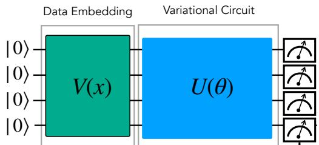  
(a) Quantum Neural Network (QNN)

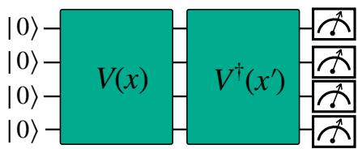  
(b) Quantum Kernel Method (QKM)  
† 2 Figure 1.1: Schematics of the two dominant paradigms in near-term quantum machine learning. (a) A quantum neural network uses a parameterized quantum circuit �(�) trained via a classical optimizer. (b) A quantum kernel method uses a fixed quantum feature map to compute kernel \*Note Quantum Embedding: ( ) | 0⟩\*Note Quantum Embedding: = | ⟩entries, which are then processed by a classical algorithm such as an SVM.

$$
f ( { \bf x } ; \theta ) = \langle 0 | V ^ { \dagger } ( { \bf x } ) U ^ { \dagger } ( \theta ) { \cal O } U ( \theta ) V ( { \bf x } ) | 0 \rangle .\tag{1.7}
$$

When the input is quantum data (e.g., a quantum state $\rho$ from a physical system), the encoding circuit �(x) is replaced by the quantum state itself, and the QNN acts directly on the given state. A classical optimizer iteratively updates � to minimize a loss function computed from the measurement outcomes. One example of the trainable circuit $U ( \theta )$ is the hardware-eficient ansatz (HEA) [31], consisting of � layers of single-qubit rotation gates followed by entangling two-qubit gates:

$$
U ( \theta ) = \prod _ { \ell = 1 } ^ { L } W _ { \mathrm { e n t } } \cdot \bigotimes _ { i = 1 } ^ { n } R ( \theta _ { i } ^ { ( \ell ) } ) ,\tag{1.8}
$$

where $R ( \theta ) = R _ { Z } ( \theta _ { 1 } ) R _ { Y } ( \theta _ { 2 } ) R _ { Z } ( \theta _ { 3 } )$ represents a general single-qubit rotation (up to global phase), and $W _ { \mathrm { e n t } }$ denotes a fixed entangling layer such as a ladder of CNOT gates matching the hardware topology. Beyond generic hardware-eficient circuits, QNNs also include structured ansatz families that build architectural bias into the circuit.

## Structured QNNs: Quantum Convolutional Neural Networks

A widely studied structured QNN architecture is the quantum convolutional neural network (QCNN), introduced by Cong et al. [32] for classifying quantum phases of matter. QCNNs draw direct inspiration from classical CNNs by combining local receptive fields, shared parameters, and hierarchical pooling. The architecture alternates between convolutional and pooling layers, progressively reducing the system size until only a few qubits remain for measurement:

$$
U _ { \mathrm { Q C N N } } = U _ { \mathrm { c o n v } } ^ { ( L ) } \circ \mathrm { P o o l } ^ { ( L - 1 ) } \circ \cdots \circ U _ { \mathrm { c o n v } } ^ { ( 2 ) } \circ \mathrm { P o o l } ^ { ( 1 ) } \circ U _ { \mathrm { c o n v } } ^ { ( 1 ) } ,\tag{1.9}
$$

where � denotes the number of convolutional layers. As illustrated in Figure 1.2, each convolutional layer applies a translationally invariant two-qubit parameterized unitary $U ( \theta ) _ { i , i + 1 }$ across all neighboring qubit pairs, with shared parameters analogous to the weight-sharing mechanism in classical CNNs. Each pooling layer then halves the number of active qubits by measuring a subset and applying conditioned unitaries on the remaining qubits. After log2(�) pooling operations, only �(1) qubits remain for the final classification measurement.

Although QCNNs were originally designed for quantum data, prior work also applied them to classical data classification by prepending a data encoding circuit [33], where they serve as compact, parameter-sharing QNN classifiers.

QCNNs enjoy several favorable properties as QNN architectures. Their hierarchical structure and local operations provably avoid barren plateaus [34], enabling eficient training even for large system sizes. On the other hand, several local, hierarchical QCNN architectures admit eficient classical simulation or tensor-network contraction under additional structural assumptions [35].

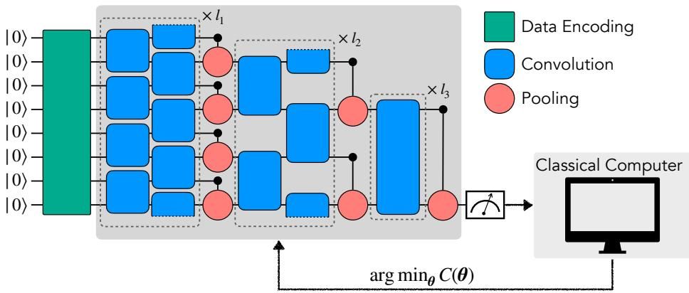  
tum data encoding (green rectangle), convolutional filters (blue rounded rectangle), and pooling (red circle). The quFigure 1.2: Schematic of a quantum convolutional neural network (QCNN). The circuit alter-encoding is fixed in a given structure of QCNN, while the convolutional filter and pooling use parameterized qunates between convolutional layers (two-qubit unitaries with shared parameters across neighbor-ters for ith layer is denoted by l . In each layer, the convolutional filter applies the same two-qubit ansatz toing pairs) and pooling layers, until a small number of qubits remain for the final measurement.

## lculate the user-defined cost function. The classical computer is used to cGradient Computation: The Parameter-Shift Rule

Training QNNs requires computing gradients of the cost function with respect to the circuit pa-he optimization of the gate parameters can be car- classical input data x into a quantum state. In thisrameters. Unlike classical neural networks, where backpropagation provides an eficient route to he gradient of the cost function until some condi- with several di↵erent quantum data encoding technexact gradients, quantum circuits do not admit direct diferentiation—measurements collapse the ient can be calculated classically or by using a quan-quantum state and prevent the propagation of gradient information. Recent work has explored quantum analogues of backpropagation [36], showing that achieving backpropagation-like scaling requires access to multiple copies of the quantum state via shadow tomography.

) runs. This encoding scheme is known as the amplitudeA key insight enabling gradient-based optimization of QNNs is the parameter-shift rule [37, 38]. For gates of the form $R _ { P } ( \theta ) ~ = ~ e ^ { - i \theta P / 2 }$ of x where $P ^ { 2 } \ = \ I$ )T of dimension N = 2n as amp(such as Pauli rotation gates), the partial derivative of the expectation value can be computed exactly using only two circuit X into a di↵evaluations:

$$
\frac { \partial } { \partial \theta } f ( \theta ) = \frac { 1 } { 2 } \left[ f \left( \theta + \frac { \pi } { 2 } \right) - f \left( \theta - \frac { \pi } { 2 } \right) \right] ,\tag{tate. C(1.10}
$$

datorywhere $f ( \theta ) = \mathrm { T r } [ \rho U ^ { \dagger } ( \theta ) { \cal O } U ( \theta ) ]$ learning onfor an input state $\rho .$ . This formula provides the exact an-

alytical gradient (not a finite-diference approximation) using only shifted circuit evaluations, making it naturally compatible with quantum hardware where only expectation values can be measured.

The parameter-shift rule forms the foundation for gradient-based training of QNNs, enabling the use of optimizers such as gradient descent, Adam, and their variants.

## The Barren Plateau Problem

A major obstacle to training QNNs is the barren plateau phenomenon [39], wherein the variance of the cost function gradient vanishes exponentially with the number of qubits �:

$$
\operatorname { V a r } _ { \boldsymbol { \theta } } \left[ { \frac { \partial C } { \partial \theta _ { k } } } \right] \leq F ( n ) \cdot 2 ^ { - n } ,\tag{1.11}
$$

where $F ( n )$ is a polynomial factor. When the gradient variance is exponentially small, an exponential number of measurement shots is required to distinguish the gradient from statistical noise, negating any potential quantum advantage. Barren plateaus can arise from various sources, including excessive circuit depth, global cost functions, noise, and high entanglement. Recent work has provided a unified understanding of barren plateaus through the lens of the dynamical Lie algebra (DLA) of the circuit generators [40, 41]. These results show that the gradient variance scales inversely with the dimension of the DLA, establishing that circuits with a polynomially scaling DLA can escape barren plateaus, while those with an exponentially scaling DLA cannot. We refer the reader to Larocca et al. [42] for a comprehensive review.

## 1.2.3 Quantum Kernels

Kernel methods ofer an alternative paradigm for quantum machine learning, one that trades the parameterized circuits of QNNs for a fixed quantum feature map and classical post-processing.

This approach provides strong theoretical guarantees, and in constructed supervised-learning settings it has yielded rigorous separations under explicit computational assumptions. We begin with a brief review of classical kernel methods before introducing their quantum generalization.

## Classical Kernel Methods

In classical machine learning, kernel methods [6, 7] address the fundamental challenge of learning nonlinear decision boundaries by implicitly mapping data into a high-dimensional feature space. Given a feature map $\phi : \mathcal { X } \to \mathcal { F }$ that embeds inputs $\mathbf { x } \in \mathcal X$ into a (possibly infinitedimensional) Hilbert space $\mathcal { F }$ , a kernel function computes inner products in this feature space without explicitly constructing the embedding:

$$
K ( \mathbf { x } , \mathbf { x } ^ { \prime } ) = \langle \phi ( \mathbf { x } ) , \phi ( \mathbf { x } ^ { \prime } ) \rangle _ { \mathcal { F } } .\tag{1.12}
$$

This kernel trick enables algorithms like support vector machines to operate eficiently in feature spaces of exponential or even infinite dimension. The representer theorem further guarantees that the optimal predictor in a kernel-regularized learning problem can be expressed as a linear combination of kernel evaluations on the training data:

$$
f ^ { * } ( { \bf x } ) = \sum _ { i = 1 } ^ { N } \alpha _ { i } K ( { \bf x } , { \bf x } _ { i } ) .\tag{1.13}
$$

This elegant structure motivates the question: can quantum computers realize feature maps that are computationally intractable for classical machines, while remaining eficiently estimable?

## Quantum Feature Maps

A quantum feature map encodes classical data x into a quantum state by applying a unitary transformation to an initial state [43]:

$$
| \phi ( \mathbf { x } ) \rangle = V ( \mathbf { x } ) | 0 \rangle ^ { \otimes n } .\tag{1.14}
$$

The quantum states $| \phi ( \mathbf { x } ) \rangle$ live in the $2 ^ { n }$ -dimensional Hilbert space of � qubits, and the quantum kernel is defined as the squared overlap between embedded states:

$$
K ( \mathbf { x } , \mathbf { x } ^ { \prime } ) = | \langle \phi ( \mathbf { x } ) | \phi ( \mathbf { x } ^ { \prime } ) \rangle | ^ { 2 } = | \langle 0 | ^ { \otimes n } V ^ { \dagger } ( \mathbf { x } ) V ( \mathbf { x } ^ { \prime } ) | 0 \rangle ^ { \otimes n } | ^ { 2 } .\tag{1.15}
$$

This kernel can be estimated on a quantum computer by preparing the state $V ^ { \dagger } ( { \mathbf { x } } ) V ( { \mathbf { x } } ^ { \prime } ) | 0 \rangle ^ { \otimes n }$ and measuring the probability of obtaining the all-zeros outcome. The key insight is that if $V ( \mathbf { x } )$ generates states with classically intractable correlations, the resulting kernel may be hard to compute classically, yet remain eficiently estimable on quantum hardware.

## The ZZ Feature Map

A concrete realization of this idea is the $Z Z .$ feature map introduced by Havlicek et al. [43]. This feature map applies � repetitions of a data-encoding unitary:

$$
V ( \mathbf { x } ) = \left[ \exp \left( i \sum _ { i < j } ( \pi - x _ { i } ) ( \pi - x _ { j } ) Z _ { i } Z _ { j } \right) \exp \left( i \sum _ { i } x _ { i } Z _ { i } \right) H ^ { \otimes n } \right] ^ { D } ,\tag{1.16}
$$

where $H ^ { \otimes n }$ denotes Hadamard gates on all qubits, $Z _ { i }$ is the Pauli-� operator on qubit $i ,$ and $\mathbf { x } ~ = ~ ( x _ { 1 } , \ldots , x _ { n } )$ is the input vector. The two-qubit �� interactions create entanglement that depends on the input data, embedding classical features into quantum correlations.

The structure of the ZZ feature map is designed so that the resulting kernel involves multiqubit correlations that are believed to be classically hard to compute. While computing the kernel exactly incurs a cost that scales exponentially in the number of qubits classically, a quantum computer can estimate it in polynomial time using the overlap measurement circuit.

## Constructed Quantum Advantage Results

The question of whether quantum kernels can provide a computational advantage over classical methods was rigorously addressed by Liu et al. [44] in a constructed problem setting. Their work constructs a learning problem whose labels are defined through the discrete logarithm problem, an instance of the abelian hidden subgroup problem that Shor’s algorithm solves in polynomial time but for which no eficient classical algorithm is known. The key result is the existence of a data distribution � such that:

1. A quantum kernel classifier can learn to classify samples from � with high accuracy.

2. No polynomial-time classical learner can classify significantly better than random guessing, assuming the discrete logarithm problem is classically intractable; the barrier is computational rather than a lack of training data.

This provides a rigorous separation between quantum and classical learning under the stated distributional and computational assumptions. Importantly, the separation is shown to survive the finite-sampling (shot) noise incurred when the kernel entries are estimated from a finite number of measurements, addressing earlier concerns about the fragility of quantum speedup claims. This establishes that a provable quantum advantage with quantum kernels is possible in principle. However, whether such an advantage extends to natural, real-world datasets remains an open question.

## Relationship to Quantum Neural Networks

A fundamental connection between quantum kernels and QNNs was established by Schuld and Killoran [45]. They showed that QNNs with fixed data encodings are equivalent to linear models in the quantum feature space. Specifically, for a QNN with output

$$
f ( \mathbf { x } ) = \langle \phi ( \mathbf { x } ) | O | \phi ( \mathbf { x } ) \rangle = \operatorname { T r } [ \rho ( \mathbf { x } ) \cdot O ] ,\tag{1.17}
$$

where $\rho ( \mathbf { x } ) = | \phi ( \mathbf { x } ) \rangle \langle \phi ( \mathbf { x } ) |$ is the density matrix of the embedded state and � is the observable, the prediction is linear in $\rho ( \mathbf { x } )$ . This places QNNs within the framework of kernel methods in a reproducing kernel Hilbert space (RKHS).

The representer theorem implies that the optimal observable for minimizing the training error can be written as:

$$
O ^ { * } = \sum _ { i = 1 } ^ { N } \alpha _ { i } \vert \phi ( \mathbf { x } _ { i } ) \rangle \langle \phi ( \mathbf { x } _ { i } ) \vert ,\tag{1.18}
$$

where the coeficients $\alpha _ { i }$ are determined by the training data. This yields an important insight: under the corresponding loss and regularization setting, the kernel formulation can search over a larger linear hypothesis class associated with the same encoding than a fixed parameterized observable family.

However, this does not imply that kernel methods are universally superior. The larger hypothesis class of kernel methods may lead to poorer generalization—the model may overfit the training data. QNNs, by constraining the observable to have a specific parameterized form, effectively regularize the model. This trade-of between expressivity and generalization is a central theme in Chapter 3.

## Data Re-uploading and Model Expressivity

The equivalence between QNNs and kernel methods breaks down when data is re-uploaded multiple times during the circuit [46]. In a data re-uploading circuit, input data x is encoded into multiple layers:

$$
U ( \mathbf { x } , \theta ) = U _ { D } ( \theta _ { D } ) V ( \mathbf { x } ) \cdots U _ { 1 } ( \theta _ { 1 } ) V ( \mathbf { x } ) ,\tag{1.19}
$$

where $V ( \mathbf { x } )$ encodes the data and $U _ { \ell } ( \theta _ { \ell } )$ are trainable layers. Pérez-Salinas et al. [46] showed that data re-uploading circuits can act as universal function approximators, expressing arbitrary continuous functions of the input.

The relationship between re-uploading circuits and kernel methods was clarified by Jerbi et al. [47]. They proved that mapping a �-layer data re-uploading circuit to an equivalent kernel model requires $\Omega ( D )$ additional ancilla qubits. This result has important implications for the design of quantum machine learning models: while single-encoding QNNs are equivalent to kernel methods and their advantage must come from the kernel itself, re-uploading circuits can leverage their depth to access richer function classes. Understanding when and how this additional expressivity translates to practical advantages remains an active area of research.

## 1.3 Summary

This chapter has laid the foundations for the quantum machine learning investigations that follow in Part I. We began with the essential building blocks of quantum computation—qubits, quantum gates, and measurement—and reviewed the key developments in classical machine learning that motivate quantum extensions, from kernel methods and support vector machines to deep learning and the transformer revolution.

A central organizing principle introduced in this chapter is the error decomposition (Equa-

tion (1.6)), which partitions prediction error into three components:

• Approximation error: determined by the expressivity of the hypothesis class.

• Optimization error: the gap between the achieved and optimal training loss.

• Generalization error: the discrepancy between training and test performance.

This framework provides a unified lens through which to analyze and improve quantum machine learning models, and it guides the structure of the subsequent chapters.

We traced the evolution of quantum machine learning from early HHL-based algorithms, whose speedup claims depend on strong input-access assumptions, to NISQ-era approaches based on parameterized circuits and quantum feature maps. Variational quantum algorithms such as VQE and QAOA use parameterized quantum circuits for optimization problems in quantum chemistry, many-body physics, and combinatorial optimization. The supervised-learning focus of this thesis uses related circuit technology in two main forms:

1. Quantum Neural Networks (QNNs): Supervised-learning models that combine data encoding, trainable parameterized circuits, and measurement-based prediction. Key challenges include the barren plateau phenomenon, in which the gradient variance vanishes exponentially in deep or highly expressive circuits.

2. Quantum Kernel Methods (QKMs): Fixed quantum feature maps combined with classical kernel algorithms. Constructed QKM problems provide rigorous supervised-learning separations under explicit assumptions, while the kernel framework also clarifies when QNNs behave as linear models in quantum feature space.

The relationship between these approaches reveals a trade-of between expressivity, optimization, and generalization: QKMs use a fixed quantum feature map with classical kernel learning, while QNNs restrict the trainable observable or circuit family and can thereby impose useful inductive bias. Data re-uploading circuits bridge these paradigms by adding expressivity beyond the simplest fixed-kernel picture.

Concepts introduced in Chapter 1 and where they are used later.
<table><tr><td rowspan=1 colspan=1>Concept</td><td rowspan=1 colspan=1>Later use in the dissertation</td></tr><tr><td rowspan=1 colspan=1>Quantum embedding andfeature maps</td><td rowspan=1 colspan=1>Trace-distance empirical-risk bounds and Neural QuantumEmbedding in Chapter 2.</td></tr><tr><td rowspan=1 colspan=1>QCNN</td><td rowspan=1 colspan=1>Background architecture for downstream NQE classifiers andQPR experiments.</td></tr><tr><td rowspan=1 colspan=1>Barren plateaus andtrainability</td><td rowspan=1 colspan=1>Motivation for structured circuits and embedding-aware QNNdesign in Chapters 2 and 3.</td></tr><tr><td rowspan=1 colspan=1>Quantum kernel methods</td><td rowspan=1 colspan=1>Alternative supervised-QML paradigm and kernel interpretationof embeddings in Chapter 2.</td></tr><tr><td rowspan=1 colspan=1>Sequence models andself-attention</td><td rowspan=1 colspan=1>Hardware-aware QEC decoding and the Mamba/Transformercomparison in Chapter 4; the attention-based ViT ansatz forneural quantum states in Chapter 5.</td></tr></table>

Roadmap for Part I. The concepts introduced in this chapter set the stage for Part I of this thesis, which explores how quantum computing can enhance machine learning:

• Chapter 2: Neural Quantum Embedding addresses the embedding-induced trainingloss limit in quantum supervised learning. Rather than using fixed feature maps, we train neural networks to learn embeddings that increase the distinguishability of quantum states from diferent classes.

• Chapter 3: Generalization in Quantum Machine Learning addresses the generalization side by developing margin-based bounds for quantum neural networks. Margins provide a statistical-control lens for finite training data and connect the trace-distance representation view to state discrimination.

Roadmap for Part II. Part II of this thesis reverses the direction, exploring how artificial intelligence techniques can address challenges in quantum computing:

• Chapter 4: Neural Decoders for Quantum Error Correction develops neural networkbased decoders for quantum error correcting codes and studies their accuracy–latency trade-of in real-time decoding benchmarks.

• Chapter 5: Neural Quantum States explores the use of neural networks to represent quantum many-body states and analyzes the optimizer that makes these representations practical. We recast stochastic reconfiguration as tangent-space ridge regression, identify the expressivity gap as finite-sample residual noise, and develop multi-shift stochastic reconfiguration as a richer spectral filter.

## CHAPTER 2

## NEURAL QUANTUM EMBEDDING

The results in this chapter are based on Neural Quantum Embedding: Pushing the Limits of Quantum Supervised Learning [48] and Neural Quantum Embedding via Deterministic Quantum Computation with One Qubit [49]. Code is available at https: //github.com/takh04/neural-quantum-embedding.

In the previous chapter, we saw that the performance of quantum machine learning classifiers depends critically on how classical data is encoded into quantum states. In this chapter, we formalize this intuition by showing that, for binary classification under the linear loss $\begin{array} { r } { ( \ell = \frac { 1 } { 2 } ( 1 - y f ( \mathbf x ) ) , } \end{array}$ ), the empirical risk is lower bounded by the trace distance between embedded data ensembles, a quantity determined by the choice of data embedding. This trace-distance limit is not the entire optimization problem, but it identifies a representation-induced floor on the training loss that no downstream classifier circuit can overcome. We then show that conventional deterministic embedding schemes—amplitude encoding, angle encoding, and the ZZ feature map—do not guarantee that this trace distance will be large for a given dataset. This motivates Neural Quantum Embedding (NQE), a data-driven approach that uses classical neural networks to learn an embedding that increases the distinguishability of quantum states representing diferent classes. In practice, NQE is trained using fidelity and Hilbert–Schmidt losses, which serve as tractable surrogates for the trace distance.

## 2.1 Theoretical Background

## 2.1.1 Empirical Risk and Trace Distance

We consider a quantum binary classification task. Given a labeled dataset

$$
S = \{ ( \mathbf { x } _ { i } ^ { - } , - 1 ) \} _ { i = 1 } ^ { N ^ { - } } \cup \{ ( \mathbf { x } _ { i } ^ { + } , + 1 ) \} _ { i = 1 } ^ { N ^ { + } } ,\tag{2.1}
$$

with $N = N ^ { - } + N ^ { + }$ samples, a quantum embedding circuit � maps each classical input $\mathbf { x } \in \mathbb { R } ^ { m }$ to a quantum state:

$$
| \mathbf { x } \rangle = V ( \mathbf { x } ) | 0 \rangle ^ { \otimes n } .\tag{2.2}
$$

A parameterized quantum circuit $U ( \theta )$ is then applied, followed by measurement of an observable �, yielding a prediction function:

$$
f ( { \bf x } ; \theta ) = \langle { \bf x } | U ^ { \dagger } ( \theta ) O U ( \theta ) | { \bf x } \rangle .\tag{2.3}
$$

This prediction process can be recast as a quantum state discrimination problem [50]. Let � be a Hermitian observable with eigenvalues ±1 (equivalently, $O ^ { 2 } \ = \ I )$ , which is the case for the Pauli observables used below. We define two positive operator-valued measure (POVM) elements parameterized by �:

$$
E _ { \pm } ( \theta ) = \frac { I \pm U ^ { \dagger } ( \theta ) O U ( \theta ) } { 2 } ,\tag{2.4}
$$

which satisfy $E _ { + } ( \theta ) + E _ { - } ( \theta ) = I$ and $E _ { + } ( \theta ) \geq 0$ . The probability of obtaining outcome ±1 given input x is:

$$
P ( E _ { \pm } ( \theta ) | \mathbf { x } ) = \langle \mathbf { x } | E _ { \pm } ( \theta ) | \mathbf { x } \rangle .\tag{2.5}
$$

The natural loss function for classification is then the misclassification probability:

$$
\ell ( f ( \mathbf { x } ; \theta ) , y ) = P ( E _ { \bar { y } } ( \theta ) | \mathbf { x } ) ,\tag{2.6}
$$

where $\bar { y }$ denotes the complement of $y ,$ i.e., if $y = + 1$ then $\bar { y } = - 1$ and vice versa. Let $f ( \mathbf { x } ) =$ $\langle \mathbf { x } | U ^ { \dagger } ( \theta ) O U ( \theta ) | \mathbf { x } \rangle \in [ - 1 , 1 ]$ be the prediction. The loss then takes the equivalent linear form

$$
\ell ( f ( \mathbf { x } ; \theta ) , y ) = { \frac { 1 } { 2 } } \left( 1 - y f ( \mathbf { x } ) \right) .\tag{2.7}
$$

Lower bound of empirical risk. The empirical risk over the training set � can be written as:

$$
L _ { S } = \frac { 1 } { N } \left[ \sum _ { i = 1 } ^ { N ^ { - } } P ( E _ { + } ( \theta ) | \mathbf { x } _ { i } ^ { - } ) + \sum _ { i = 1 } ^ { N ^ { + } } P ( E _ { - } ( \theta ) | \mathbf { x } _ { i } ^ { + } ) \right] .\tag{2.8}
$$

Minimizing $L _ { S }$ is therefore equivalent to minimizing the probability of misclassification in a quantum state discrimination problem, for which the minimum achievable error probability is known exactly: the Helstrom bound [50]. Applying this bound, the empirical risk is lower bounded by:

$$
\boxed { L _ { S } \ge \frac { 1 } { 2 } - D _ { \mathrm { t r } } ( p ^ { - } \rho ^ { - } , p ^ { + } \rho ^ { + } ) , }\tag{2.9}
$$

where

$$
\rho ^ { \pm } = \frac { 1 } { N ^ { \pm } } \sum _ { i = 1 } ^ { N ^ { \pm } } | \mathbf { x } _ { i } ^ { \pm } \rangle \langle \mathbf { x } _ { i } ^ { \pm } |\tag{2.10}
$$

are the class-averaged density matrices (data ensembles), $p ^ { \pm } = N ^ { \pm } / N$ are the class priors, and $D _ { \mathrm { t r } } ( \rho , \sigma ) = { \textstyle \frac { 1 } { 2 } } \| \rho - \sigma \| _ { \textstyle \cdot }$ 1 denotes the trace distance. For balanced binary datasets, where $p ^ { + } =$ $p ^ { - } = 1 / 2$ , this bound can equivalently be written as

$$
L _ { S } \ge \frac { 1 } { 2 } \left( 1 - D _ { \mathrm { t r } } ( \rho ^ { - } , \rho ^ { + } ) \right) .\tag{2.11}
$$

This unweighted form is the one used for the balanced experiments and figures below.

This result has a direct implication: the best possible misclassification probability over all binary measurements is controlled by the trace distance between the two data ensembles ${ p } ^ { - } { \rho } ^ { - }$ and $p ^ { + } \rho ^ { + }$ . This quantity is fixed once the embedded states have been prepared and is not improved by the subsequent parameterized unitary $U ( \theta )$ . Thus, even an expressive trainable circuit cannot overcome poor class distinguishability created at the embedding stage.

Furthermore, the minimum loss is achieved when the POVM $\{ E _ { - } ( \theta ) , E _ { + } ( \theta ) \}$ forms a Helstrom measurement—the measurement that optimally discriminates between the two quantum state ensembles. The training of a quantum neural network can therefore be viewed as a process of finding this optimal Helstrom measurement.

Contractive property of trace distance. The importance of the embedding is further underscored by the contractive property of the trace distance. For quantum channels, which are completely positive and trace preserving (CPTP), trace distance is contractive. More generally, the same contractivity holds for positive trace-preserving (PTP) maps on Hermitian operators [51, 52]:

$$
D _ { \mathrm { t r } } ( \Lambda ( \rho ) , \Lambda ( \sigma ) ) \leq D _ { \mathrm { t r } } ( \rho , \sigma ) .\tag{2.12}
$$

Subsequent quantum operations after the embedding, including the parameterized circuit $U ( \theta )$ and quantum noise channels, are described by CPTP maps. This is particularly relevant for NISQ devices, where hardware noise can further reduce the trace distance between quantum states.

## 2.1.2 Limitations of Deterministic Embeddings

We now examine commonly used deterministic quantum embedding schemes and explain why they do not guarantee a large trace distance for a given dataset.

Amplitude embedding encodes a normalized classical vector $\mathbf { x } \in \mathbb { R } ^ { 2 ^ { n } }$ directly into the amplitudes of an �-qubit state:

$$
| \mathbf { x } \rangle = \sum _ { i = 0 } ^ { 2 ^ { n } - 1 } x _ { i } | i \rangle .\tag{2.13}
$$

This is maximally qubit-eficient $( 2 ^ { n }$ features with � qubits) but requires circuit depth $\mathcal { O } ( 2 ^ { n } )$ [53]. The fidelity reduces to the classical inner product $| \langle { \bf x } | { \bf x } ^ { \prime } \rangle | ^ { 2 } = | { \bf x } \cdot { \bf x } ^ { \prime } | ^ { 2 }$ , so the quantum feature space inherits the geometry of the input space without additional structure.

Angle embedding encodes each feature as a rotation angle on a dedicated qubit:

$$
| \mathbf { x } \rangle = \bigotimes _ { j = 1 } ^ { n } R _ { P } ( x _ { j } ) | 0 \rangle ,\tag{2.14}
$$

where $R _ { P } ( \theta ) = e ^ { - i \theta P / 2 }$ for $P \in \{ X , Y , Z \}$ . This produces only product states with no entanglement.

ZZ feature map introduces entanglement through two-qubit $Z Z$ interactions:

$$
V ( \phi ( \mathbf { x } ) ) = \left[ \exp \left( i \sum _ { k } \phi _ { k } ( \mathbf { x } ) Z _ { k } + i \sum _ { k < l } \phi _ { k , l } ( \mathbf { x } ) Z _ { k } Z _ { l } \right) H ^ { \otimes n } \right] ^ { L } ,\tag{2.15}
$$

where $L \geq 1$ is the number of repetitions [43]. The standard choices $\phi _ { k } ( { \mathbf x } ) = x _ { k }$ and $\phi _ { k , l } ( { \bf x } ) =$ $( \pi - x _ { k } ) ( \pi - x _ { l } ) / 2$ are made without data-dependent justification. Although Suzuki et al. [54] show that the choice of $\phi$ significantly impacts performance, no guidelines exist for selecting it for a given problem.

The limitation of fixed embeddings. All three schemes are data-agnostic: their structure is fixed independently of the training data, and there is no guarantee that they produce a large trace distance between data ensembles for a given classification task. A natural idea to address this is to introduce trainable parameters within the quantum circuit. In a trainable unitary embedding [55], a parameterized unitary $U _ { \mathrm { t r a } } ( \theta )$ is applied before the data encoding:

$$
\begin{array} { r } { | \mathbf { x } ; \theta \rangle = V ( \mathbf { x } ) { U _ { \mathrm { t r a } } ( \theta ) }  { | 0 \rangle } ^ { \otimes n } . } \end{array}\tag{2.16}
$$

However, the maximum achievable trace distance is upper bounded by the diamond distance [48]:

$$
\operatorname* { m a x } _ { \theta } D _ { \mathrm { t r } } \bigl ( p ^ { + } \rho ^ { + } ( \theta ) , p ^ { - } \rho ^ { - } ( \theta ) \bigr ) \leq D _ { \diamond } \bigl ( p ^ { + } \mathcal { E } ^ { + } , p ^ { - } \mathcal { E } ^ { - } \bigr ) ,\tag{2.17}
$$

where $\mathcal { E } ^ { \pm }$ are quantum channels with Kraus operators $K _ { i } ^ { \pm } = V ( \mathbf { x } _ { i } ^ { \pm } ) / \sqrt { N ^ { \pm } }$ , determined entirely by the embedding circuit �. The trainable unitary $U _ { \mathrm { t r a } } ( \theta )$ does not improve this upper bound. A related restriction applies to data re-uploading [46], since such circuits can be transformed into a form where the embedding component is separated from the trainable parameters by introducing ancilla qubits [47]. Thus, trainable quantum layers alone do not remove the need for an embedding that separates the classes well.

Experimental evidence. Figure 2.1 compares the trace distance achieved by the conventional ZZ feature map against a data-driven embedding on the balanced MNIST binary classification task (digits 0 vs. 1, 4 qubits); the embedding itself is developed in Section 2.2 and we defer its details until then. The ZZ feature map achieves a trace distance of only $D _ { \mathrm { t r } } \approx 0 . 2 7$ , which by Equation (2.11) implies a lower bound on the empirical risk of $L _ { S } \ge 0 . 3 6$ . The data-driven embedding, by contrast, achieves $D _ { \mathrm { t r } } \approx 0 . 8 4$ , reducing the lower bound to $L _ { S } \ge 0 . 0 8$ . The same pattern holds on Fashion-MNIST across diferent qubit counts (4, 8, 12), and becomes even more pronounced under hardware noise, where the contractive property further degrades already-low trace distances.

These results motivate a data-driven approach that increases the trace distance before the data become quantum states, thereby sidestepping the PTP contractive constraint. We develop this next as Neural Quantum Embedding.

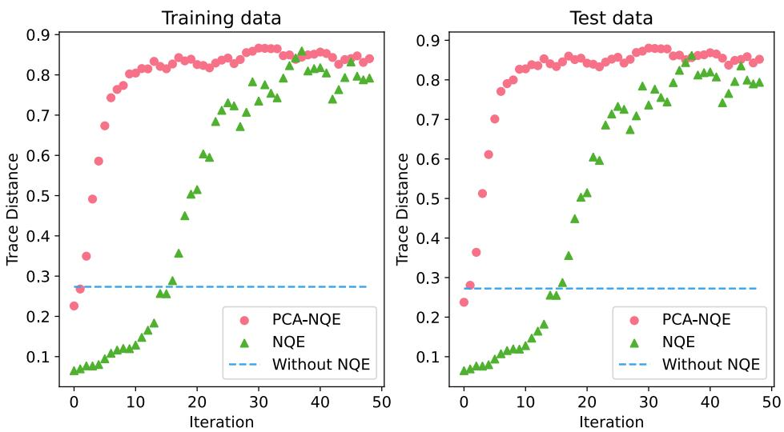  
Figure 2.1: Trace distance between class-averaged data ensembles $D _ { \mathrm { t r } } ( \rho ^ { - } , \rho ^ { + } )$ for the conventional ZZ feature map and Neural Quantum Embedding on the balanced MNIST binary classification task (digits 0 vs. 1, 4 qubits). The blue dashed reference line indicates the trace distance obtained by the conventional ZZ feature map without NQE. Results obtained on IBM quantum hardware (ibmq\_toronto).

## 2.2 Neural Quantum Embeddings

The preceding analysis reveals a bottleneck: the trace distance between data ensembles is fixed by the embedding circuit, and subsequent quantum processing cannot increase it. Neural Quantum Embedding (NQE) [48] addresses this limitation by operating before the quantum domain, n the experiments. The green rectangle indicates the Neural Quantumusing a classical neural network to learn a data-dependent preprocessing that increases the trace distance.

## 2.2.1 The NQE Framework

The core idea of NQE is to place a classical neural network $g : \mathbb { R } ^ { m } \times \mathbb { R } ^ { r } \to \mathbb { R } ^ { m ^ { \prime } }$ in front of the quantum embedding, so that the data are mapped to the rotation angles that yield the most discriminative feature map. The NQE mapping is

$$
| \mathbf { x } \rangle = V ( g ( \mathbf { x } , \mathbf { w } ) ) | 0 \rangle ^ { \otimes n } ,\tag{2.18}
$$

where � is a fixed quantum embedding circuit (e.g., the ZZ feature map of Equation (2.15)), $g$ is a classical neural network with trainable parameters $\textbf { w } \in \ \mathbb { R } ^ { r }$ , and $m ^ { \prime } \leq m$ allows for dimensionality reduction.

Because � transforms the classical input parameters before any quantum state exists, NQE escapes the contractive bound that constrains the trainable-unitary embedding of Equation (2.16). There, the trainable unitary acts on a fixed data-dependent channel ensemble and remains subject to the diamond-distance bound of Equation (2.17). Here, the achievable trace distance is determined by the chosen feature-map family, the Hilbert-space dimension, the class priors, and the capacity, optimization, and training data used to fit $g$

For the ZZ feature map specifically, NQE supplies the guidance that Equation (2.15) lacks for choosing $\phi \colon$ the fixed angle functions $\phi _ { k }$ and $\phi _ { k , l }$ are replaced by learned functions $g _ { k } ( \mathbf { x } , \mathbf { w } )$ and $g _ { k , l } ( \mathbf { x } , \mathbf { w } )$ . The NQE framework is not tied to this choice. It applies to any embedding circuit $V ,$ including amplitude and angle encoding. Whenever $g$ can represent the original preprocessing map, the fixed embedding is recovered as a special case, and any improvement beyond it reflects the added expressivity of the learned map.

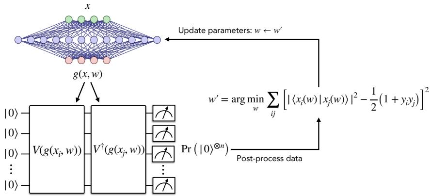  
sical neural network denoted by (� , �), where � represents trainable parameters. The resulting quFigure 2.2: Overview of the NQE training procedure. A classical neural network $g ( \mathbf { x } , \mathbf { w } )$ te is |��trans-))|0⟩ . The goal of the training is to produce mapping functions that can separate the two classes of data into two ortforms input data into rotation angles for the quantum embedding circuit �. The resulting quan-.tum state $\mathbf { \left| x \right. } = V ( g ( \mathbf { x } , \mathbf { w } ) ) \mathbf { \left| 0 \right. } ^ { \otimes n }$ is used to compute the implicit fidelity loss via an overlap circuit $V ^ { \dagger } ( g ( \mathbf { x } _ { j } , \mathbf { w } ) ) V ( g ( \mathbf { x } _ { i } , \mathbf { w } ) ) | 0 \rangle ^ { \otimes n }$ by measuring the probability of the all-zero outcome. The classical parameters w are updated to maximize the distinguishability between classes.

## titions of each QCNN training with random initial- sta2.2.2 Training via Implicit Fidelity Loss

The ideal training objective for NQE would directly maximize $D _ { \mathrm { t r } } ( p ^ { - } \rho ^ { - } , p ^ { + } \rho ^ { + } )$ , since by Equation (2.9) this directly lowers the empirical risk bound. However, computing the trace distance nts, as demonstrated by reduced empirical risks and 2. NQE versus Trainable Unitary Embeddingrequires full tomography of the class-averaged density matrices, which is computationally pro-accuracies are expected as NQE embeds the training We also conduct numerical comparisons betweenhibitive. Instead, NQE employs an implicit fidelity loss derived from pairwise state fidelities.

state distinguishability is maximiFor a pair of training samples $( \mathbf { x } _ { i } , y _ { i } )$ lo-and $( \mathbf { x } _ { j } , y _ { j } )$ of NQE. Trainable unitary embedding utiliz, the implicit fidelity loss is defined as:

$$
\ell _ { \mathrm { f i d } } \big ( ( \mathbf { x } _ { i } , y _ { i } ) , ( \mathbf { x } _ { j } , y _ { j } ) \big ) = \left[ \left| \langle \mathbf { x } _ { i } | \mathbf { x } _ { j } \rangle \right| ^ { 2 } - \frac { 1 } { 2 } \left( 1 + y _ { i } y _ { j } \right) \right] ^ { 2 } ,\tag{⊗�(2.19}
$$

where $| \langle \mathbf { x } _ { i } | \mathbf { x } _ { j } \rangle | ^ { 2 }$ iteration.is the fidelity between the embedded quantum states. The target value $\frac { 1 } { 2 } ( 1 + y _ { i } y _ { j } )$ 2(d) presents the mean QCNN traequals 1 when the labels agree $( y _ { i } = y _ { j } )$ histo- �and 0 when they disagree $( y _ { i } \neq y _ { j } )$ . The NQE training

objective is therefore:

$$
\mathbf { w } ^ { * } = \mathop { \mathrm { a r g } } \underset { \mathbf { w } } { \mathrm { m i n } } \sum _ { i , j } \ell _ { \mathrm { f i d } } \big ( ( \mathbf { x } _ { i } , y _ { i } ) , ( \mathbf { x } _ { j } , y _ { j } ) \big ) .\tag{2.20}
$$

Train/test separation. The NQE preprocessing network is trained only from labeled pairs drawn from the training split. After this embedding is fixed, the downstream quantum classifier is trained on the training split using the learned embedding. Held-out test data are used only for final evaluation and for post hoc diagnostics such as test-set trace distance.

The connection between this pairwise fidelity loss and the trace distance operates through two complementary mechanisms:

Same-class pairs $( y _ { i } = y _ { j } )$ . The loss drives the fidelity $| \langle \mathbf { x } _ { i } | \mathbf { x } _ { j } \rangle | ^ { 2 } \to 1$ for pairs within the same class. This directly increases the purity of the class-averaged density matrices:

$$
\mathrm { T r } \Big [ ( \rho ^ { \pm } ) ^ { 2 } \Big ] = \frac { 1 } { ( N ^ { \pm } ) ^ { 2 } } \sum _ { i , j = 1 } ^ { N ^ { \pm } } \Big | \langle \mathbf { x } _ { i } ^ { \pm } | \mathbf { x } _ { j } ^ { \pm } \rangle \Big | ^ { 2 } .\tag{2.21}
$$

When $\operatorname { T r } [ ( \rho ^ { \pm } ) ^ { 2 } ] = 1$ , the density matrix $\rho ^ { \pm }$ is a pure state, meaning all same-class data points are mapped to the same quantum state. Higher purity corresponds to tighter clustering within each class in the quantum feature space.

Cross-class pairs $( y _ { i } \neq y _ { j } )$ . The loss drives the fidelity $| \langle \mathbf { x } _ { i } ^ { + } | \mathbf { x } _ { j } ^ { - } \rangle | ^ { 2 }  0$ for pairs from diferent classes. For a balanced dataset with paired examples, convexity of the trace distance gives

$$
D _ { \mathrm { t r } } ( \rho ^ { - } , \rho ^ { + } ) \leq \frac { 1 } { N } \sum _ { i = 1 } ^ { N } \sqrt { 1 - | \langle \mathbf { x } _ { i } ^ { + } | \mathbf { x } _ { i } ^ { - } \rangle | ^ { 2 } } ,\tag{2.22}
$$

so reducing the cross-class fidelities relaxes this upper bound and, together with the same-class clustering that drives each ensemble toward a pure representative, makes a large trace distance attainable. Together, these two efects push the embedded quantum states toward a configuration where the two classes are represented by nearly pure states that are nearly orthogonal—precisely the condition that maximizes the trace distance and thus minimizes the lower bound on empirical risk. The full derivation is given in Section A.1.1.

Practical computation. The fidelity $| \langle \mathbf { x } _ { i } | \mathbf { x } _ { j } \rangle | ^ { 2 }$ between two embedded states can be measured on a quantum computer by preparing the overlap circuit

$$
V ^ { \dagger } ( g ( \mathbf { x } _ { j } , \mathbf { w } ) ) V ( g ( \mathbf { x } _ { i } , \mathbf { w } ) ) | 0 \rangle ^ { \otimes n }\tag{2.23}
$$

and measuring the probability of the all-zero outcome $\mathrm { P r } ( | 0 \rangle ^ { \otimes n } )$ ), which equals the fidelity. This pure-state fidelity can also be computed via the swap test [56]. In Section 2.3, we introduce a DQC1-compatible variant in which the training loss is written in terms of Hilbert–Schmidt inner products between feature-map unitaries.

## 2.2.3 Experimental Results

We now present experimental results demonstrating the efectiveness of NQE across multiple metrics. All experiments use binary classification of MNIST digits (0 vs. 1) with a 4-qubit QCNN (reviewed in Section 1.2.2), unless otherwise noted. We consider two NQE architectures that difer in how they handle high-dimensional inputs. In PCA-NQE, PCA first reduces the input to � features, which are then passed through a fully connected neural network (two hidden layers, ReLU activations) that outputs 2� rotation angles for the ZZ feature map. In NQE (direct), a 2D convolutional neural network processes the full-resolution input (e.g., 28 × 28 images) with max pooling layers, bypassing PCA to learn nonlinear feature extraction end-to-end.

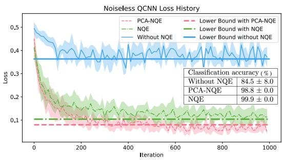

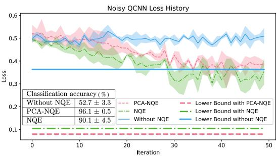  
Figure 2.3: QCNN training loss histories for balanced 4-qubit MNIST binary classification (digmbedding (NQE), which transforms classical data �� into a quantum state �� . The blue rectangles represent two-qubit parameteriits 0 vs. 1). Blue solid, red dashed, and green dash-dotted lines represent the conventional ZZ feature map, PCA-NQE, and NQE, respectively. Thick lines indicate the theoretical lower bounds vice, compared to the trace distance from conventional quantum embedding without NQE. (c) Noiseless QCNN simulation results. (d) Tfrom Equation (2.11). Shaded regions represent one standard deviation over five (noiseless) or present the mean training loss histories for conventional ZZ feature embedding, PCA-NQE, and NQE, respectively. The shaded regionsthree (noisy) independent trials. Left: noiseless simulation. Right: IBM quantum hardware e figure represent one standard deviation from the mean. These(ibmq\_jakarta, ibmq\_toronto, ibmq\_perth).

Table 2.1: Summary of NQE results for balanced 4-qubit MNIST binary classification (digits 0 E          vs. 1). Noiseless accuracy is from statevector simulation, while noisy accuracy is from the IBM emb(·), without any guarantee that the diamond distance will guishability. Furthermore, emploquantum hardware runs. The lower bound on empirical risk is computed as $L _ { S } \ge ( 1 - D _ { \mathrm { t r } } ) / 2$
<table><tr><td>Method</td><td> $D _ { \mathrm { t r } }$ </td><td>Lower bound</td><td>Noiseless acc. (%)</td><td>Noisy acc. (%)</td></tr><tr><td>ZZ (no NQE)</td><td>0.273</td><td>0.364</td><td> $8 4 . 5 \pm 8 . 0$ </td><td> $5 2 . 7 \pm 3 . 3$ </td></tr><tr><td>PCA-NQE</td><td>0.840</td><td>0.080</td><td> $9 8 . 8 \pm 0 . 0$ </td><td> $9 6 . 1 \pm 0 . 5$ </td></tr><tr><td>NQE</td><td>0.792</td><td>0.104</td><td> $9 9 . 9 \pm 0 . 0$ </td><td> $9 0 . 1 \pm 4 . 5 $ </td></tr></table>

l the trainable unitaries follow the quantum embedding cir- trainable unitary embedding we used following parameterizConvergence to theoretical bounds. Figure 2.3(a) shows the noiseless QCNN training loss e embedding can be expressed as histories for the conventional ZZ feature map, PCA-NQE, and NQE. For all three embedding �=1 � �, �methods, the QCNN training loss approaches the respective theoretical lower bounds predicted �(�(�))          � �by Equation (2.9), indicating that the trained QCNN approximates the corresponding Helstrom measurement in these experiments. The critical diference lies in the lower bounds themselves: NQE methods achieve substantially lower theoretical limits, translating into higher classification accuracy. Table 2.1 summarizes the key results: the conventional ZZ feature map achieves 84.5± 8.0% noiseless accuracy, while PCA-NQE and NQE achieve $9 8 . 8 \pm 0 . 0 \% \ \mathrm { a n d } \ 9 9 . 9 \pm 0 . 0 \%$ respectively.

NQE vs. trainable unitary embedding. We compare NQE against trainable unitary embeddings with $L = 1 , 2 , 3$ layers on both MNIST and Fashion-MNIST datasets using 8-qubit circuits (Figure 2.4). In both noiseless and noisy environments, NQE consistently achieves lower training loss and higher classification accuracy than all trainable unitary variants. Trainable unitary embedding adds parameterized quantum gates that increase the overall circuit depth, making the model more susceptible to hardware noise and barren plateaus [39]. Under noisy simulation (IBM FakeGuadalupe), the advantage of NQE becomes even more pronounced: the trainable unitary embedding’s deeper circuits sufer greater noise-induced degradation, while NQE’s classical preprocessing adds no quantum circuit depth.

Robustness on real quantum hardware. Figure 2.3(b) presents the QCNN training loss histories obtained on IBM quantum hardware (ibmq\_jakarta, ibmq\_toronto, and ibmq\_perth). The contractive property (Equation (2.12)) provides a direct explanation for the dramatic diference in noise robustness between conventional and NQE-enhanced embeddings. Hardware noise constitutes a PTP map that can only reduce trace distance:

• Small ${ \cal D } _ { \mathrm { t r } } \left( { \bf Z } { \bf Z } \approx 0 . 2 7 \right)$ : Even modest noise pushes the already-close quantum states past the decision boundary, collapsing classification accuracy to $5 2 . 7 \pm 3 . 3 \%$ —barely above random guessing.

• Large $D _ { \mathrm { t r } } \left( \mathbf { P C A - N Q E } \approx 0 . 8 4 \right)$ : Noise reduces the trace distance, but the states remain well-separated and classification remains robust, achieving $9 6 . 1 \pm 0 . 5 \%$ (PCA-NQE) and $9 0 . 1 \pm 4 . 5 \% \mathrm { ( N Q E ) }$ on real hardware.

In these experiments, the noisy empirical risk achieved by NQE on real quantum hardware falls below the noiseless theoretical lower bound of the conventional ZZ feature map. Thus, NQE with real hardware noise achieves a lower empirical risk than the best possible Helstrom limit e NQE methods achieves a notably lower training loss thanassociated with the unoptimized ZZ feature map in a noiseless setting. This result, summarized f NQE in improving data separability (by increasing the trace this advancement enhances the ability to learn from data,in Table 2.1, shows that improving the embedding can matter more than reducing moderate hardware noise for this task.

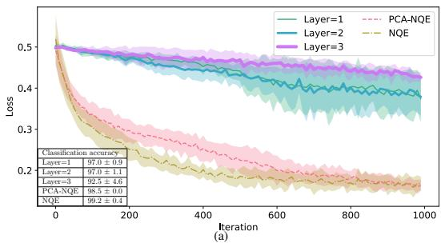

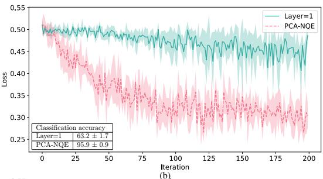

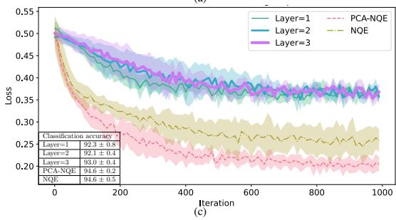

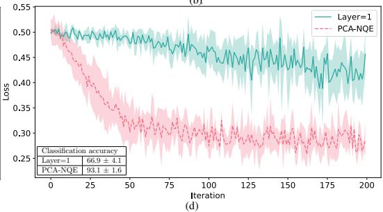  
G. 3. Comparative analysis between Neural Quantum Embeddings and Trainable Unitary Embeddings with one, two and three trainFigure 2.4: Comparison of NQE against trainable unitary embeddings with one, two, and three NIST (bottom) datasets. For noiseless simulations, we used 1000 iterations, a learning rate of 0.01 learning rate, and batches of 128 dtrainable layers, using 8-qubit circuits on MNIST (top row) and Fashion-MNIST (bottom row) under noiseless (left column) and noisy (right column) simulation. The noisy simulations use ze of 2115 and 2000 data points for the MNIST and Fashion-MNIST datasets, respectively. The mean and one standard deviation fromthe IBM Qiskit FakeGuadalupe environment. Noiseless runs use 1000 iterations, learning rate 0.01, and batches of 128 samples per iteration. Noisy runs use 200 iterations, learning rate 0.05, and batches of 15 samples per iteration. Classification accuracies are evaluated on held-out sets 1   2  of 2115 (MNIST) and 2000 (Fashion-MNIST) samples, and the loss histories show the mean NIST ( 0, 1 ) and Fashion-MNIST ( T-shirt/Top, Trouser )and one standard deviation over five independent trials.

T and Fashion-MNIST datasets, respectively. A single-      in the previous section indicate an improvement in predictBeyond these training-loss improvements, NQE also afects two properties that are not vis- QE. The choice of a single layer was based on its minimal this section, we provide additional evidence of improved gible in the training loss alone: the generalization of the trained model to unseen data and its he results indicate NQE are more e”ective in enhancing data (ED) [15, 5trainability. We examine both in the following subsection.

## 2.2.4 Generalization, Expressibility, and Trainability

The trace-distance analysis of Section 2.1.1 concerns only the training loss. A low training loss does not by itself guarantee good performance on unseen inputs, nor does it indicate how readily the model can be trained. In this subsection we present numerical evidence that NQE improves two further, distinct properties of the resulting models. The first is generalization—the ability to predict well on unseen data—which we quantify through the local efective dimension of the quantum neural network and the weight-norm complexity of the quantum kernel model. The second is trainability, which is governed by the expressibility of the embedding and which we probe through the deviation from a unitary 2-design and the variance of the quantum kernel entries. Here, a high expressibility is detrimental, as it induces barren plateaus and kernel concentration that impede optimization. These two axes are addressed separately below. Unless noted otherwise, the experiments use the same PCA-NQE and NQE networks introduced above (optimized on ibmq\_toronto; see Section 2.2.3) and binary MNIST (digits 0 vs. 1).

Efective dimension of the quantum neural network. The efective dimension measures how many parameters of a model are “active” in the sense that they meaningfully influence its output, and it acts as a capacity measure that upper bounds the generalization error of a statistical model [57]. We use the local efective dimension (LED), which is better matched to a specific learned model than the global efective dimension. The LED is positively correlated with the generalization error, so a smaller LED indicates better expected generalization. Figure 2.5(a) reports the LED of a four-qubit QNN as a function of the number of data, averaged over 200 instances (10 artificial datasets × 20 random parameter initializations), with and without NQE. Across the entire range of dataset sizes, the NQE-enhanced model has a substantially lower efective dimension (rising from ≈ 10.4 to ≈ 13.5) than the conventional embedding (which plateaus near ≈ 18.5), and the reduction holds in all 200 instances. Because the efective dimension can also be read as the volume of solution space the model class occupies, the smaller value under NQE indicates a more constrained hypothesis class, consistent with the improved test accuracy reported above.

Generalization in the quantum kernel method. The benefit of NQE is not confined to quantum neural networks; it also tightens a generalization bound for the quantum kernel method (QKM). Given the embedding, the quantum kernel is $k ^ { Q } ( \mathbf { x } _ { i } , \mathbf { x } _ { j } ) = | \langle \mathbf { x } _ { i } | \mathbf { x } _ { j } \rangle | ^ { 2 }$ , and a kernel model predicts $f ( \mathbf { x } ; W ) \ = \ \operatorname { T r } [ W | \mathbf { x } \rangle \langle \mathbf { x } | ]$ , with � obtained by minimizing a regularized least-squares cost,

$$
\boldsymbol { W ^ { * } } = \underset { W \in \mathbb { C } ^ { 2 ^ { n } \times 2 ^ { n } } } { \arg \operatorname* { m i n } } \frac { 1 } { N } \sum _ { i = 1 } ^ { N } \left( f ( \mathbf { x } _ { i } ; W ) - h ( \mathbf { x } _ { i } ) \right) ^ { 2 } + \lambda \| W \| _ { F } ^ { 2 } ,\tag{2.24}
$$

where ℎ is the target function, $\| \cdot \| _ { F }$ is the Frobenius norm, and � is a regularization weight that trades training error for generalization. For this estimator, the generalization gap obeys [58]

$$
\left| R ( W ) - R _ { N } ( W ) \right| \leq \mathcal { O } \left( \frac { \| W ^ { * } \| _ { F } } { \sqrt { N } } + \sqrt { \frac { \log ( 1 / \delta ) } { N } } \right)\tag{2.25}
$$

with probability at least $1 - \delta$ , where � and $R _ { N }$ denote the true and empirical risks. The datadependent term is governed by the weight-norm complexity $G = \| W ^ { * } \| _ { F } / \sqrt { N }$ . Because NQE changes both the kernel matrix $K ^ { Q }$ and the embedded states |x⟩, it directly afects �. Figure 2.5(b) plots � for binary MNIST $( N = 1 0 0 0 )$ across regularization weights $\lambda \in [ 0 . 1 , 0 . 9 ]$ Both PCA-NQE and NQE yield a markedly smaller � than the conventional embedding at every �—that is, a tighter upper bound on the generalization error—with PCA-NQE giving the smallest values.

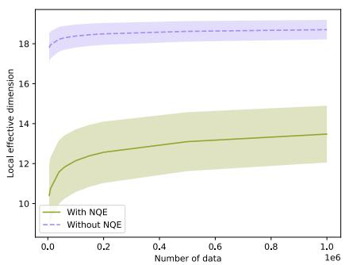  
imen(a)

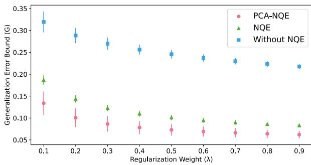  
is o (b)  
epetitions with random initialization of parameters. The reported performance enhancement – lower generalization error bound – whenFigure 2.5: Generalization diagnostics for embeddings with and without NQE. (a) Local efecregularization term with a hyperparameter �. The purpose of        tive dimension of a four-qubit QNN with (solid green) and without (dashed purple) NQE, as a positive correlation with the generalization error, allowing for        tion error at the expense of the training error. Specifically,methods. PCA-NQE and NQE were optimized on the ibmq torontofunction of the number of data. NQE yields a smaller efective model complexity, and hence a traightforward interpretation of the results: a smaller LED    �(�) = E� | � (� �) ↘ �(�)| �quantum hardware. The error bound � was determined based on fivetighter generalization bound, across all dataset sizes (averaged over 200 experiments—10 artifi- Our numerical investigation employs a four-qubit QNN (see generalization error is upper-bounded as       cial datasets, each with 20 random parameter initializations. Shaded regions denote one standard figure, the green solid and purple dashed lines represent thedeviation). (b) Weight-norm complexity $G = \| W ^ { * } \| _ { F } / \sqrt { N } .$ & ||�||F 'log(1/�) (, which controls the data-dependent and without NQE, respectively. The mean values are com- �term of the quantum-kernel generalization bound Equation (2.25), as a function of the regularwith probability at least 1 ↘ � (see Ref [32] Supplementary|| → ||F/    || ||F   ization weight �. PCA-NQE (red circles) and NQE (green triangles) both lower � relative to the as �↓ = %�=1 %�=1 �(��)(�� + ��)↘�,� |� �→↑� � |. Here, the em- || ||F  "� "� #( + ) ( + ) \$ �, � �  �conventional ZZ feature map without NQE (blue squares) at every � (mean and one standard ulation results unequivocally demonstrate that NQE consis-       | �→  the quantum embedding.       deviation over five independent draws of 1000 MNIST samples). In both panels, lower values wide range of training data sizes, signifying an improvement prescorrespond to better expected generalization.

class can encompass. A smaller e!ective dimension in a QML ing the generalization error bound with and without NQE. Thewere examined across various regularization parameters �.Expressibility and trainability. Both the QNN and QKM frameworks face a trade-of beels with smaller e!ective dimensions are less prone to en- detailed in Appendix A 1. During the dataset loading phase,the upper bound of the generalization error in quantum kerneltween expressibility and trainability: highly expressive circuits tend to exhibit barren plateaus— zation performance but also improves the trainability of the { }        in Appendix A 1, both PCA-NQE and the conventional quan-exponentially vanishing gradients that obstruct training [39, 42]—and, in the kernel setting, they the original 28x28 image datasets. Subsequently, three quan-F. Expressibility and Trainabilityinduce an exponential concentration of the kernel entries, so that exponentially many measure- ments are needed to resolve $K ^ { Q }$ (�, �)   quantum kernel corresponds to � , the fidelity overlapIn both QNN and QKM, there exists a trade-o! between ex-[59]. NQE mitigates both efects by deliberately limiting the cused on its application within the context of quantum neural overlap was computed using Pennylane [57] numerical simu-pressive quantum circuits often leads to barren plateaus, char-expressibility of the embedding, exploiting the prior that an embedding with large class distinhinders the trainability oguishability already sufices to approximate the target function.

kernel matrix whose elements exhibit an exponential concen-We quantify expressibility in two complementary ways. First, Figure 2.6(a) reports the

Hilbert–Schmidt norm $\epsilon = \sqrt { \mathrm { T r } ( A ^ { \dagger } A ) }$ of the deviation from a unitary 2-design,

$$
{ \cal A } = \int _ { \mathrm { H a r } } \left( | \psi \rangle \langle \psi | \right) ^ { \otimes 2 } d \psi ~ - ~ \int _ { \mathcal { E } } \left( | \phi \rangle \langle \phi | \right) ^ { \otimes 2 } d \phi ,\tag{2.26}
$$

where the first integral is over the Haar measure and the second is over the ensemble ℰ of dataembedded states, evaluated on 12,665 training and 2,115 test MNIST samples. A small � marks a highly expressive embedding (close to a 2-design). Both NQE variants have a substantially larger deviation $( \epsilon \approx 0 . 3 7 )$ than the conventional embedding $( \epsilon \approx 0 . 1 3 )$ , on both training and test data, confirming that NQE produces a less expressive embedding. Second, Figure 2.6(b) shows the variance of the of-diagonal quantum-kernel entries (from 1000 MNIST samples): the NQE variants exhibit far larger kernel variance $( \approx ~ 0 . 1 9$ for $\mathrm { P C A - N Q E } , \approx 0 . 1 3$ for NQE) than the conventional embedding $( \approx 0 . 0 2 )$ . A larger variance means the kernel entries are not exponentially concentrated, so the kernel matrix can be estimated reliably with far fewer circuit executions. Together, the two panels show that NQE trades a controlled reduction in expressibility for improved trainability in both frameworks. These diagnostics indicate that NQE improves not only the achievable training loss but also the generalization and trainability of the resulting models.

## 2.3 Optimization via DQC1

The NQE training procedure described in Section 2.2.2 relies on measuring the fidelity $| \langle \mathbf { x } _ { i } | \mathbf { x } _ { j } \rangle | ^ { 2 }$ between pairs of embedded quantum states, which requires preparing all � qubits in the pure state $| 0 \rangle ^ { \otimes n }$ . While this is straightforward on gate-based quantum computers such as superconducting and trapped-ion platforms, it is not naturally matched to ensemble quantum systems—most notably nuclear magnetic resonance (NMR) quantum processors [60]—where the thermal equilibrium state is highly mixed and preparing a global pure state across all qubits is impractical. In deviation from five independent iterations are shown. For both (a)this section, we show that NQE can be reformulated using the Hilbert–Schmidt inner product in place of fidelity, and that this quantity can be computed eficiently using the deterministic quantum computation with one qubit (DQC1) model [61]. This reformulation extends NQE to ensemble quantum platforms and demonstrates its experimental viability on an NMR quantum processor.

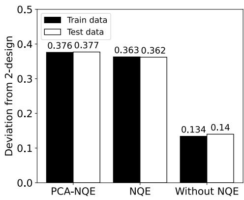  
(a)

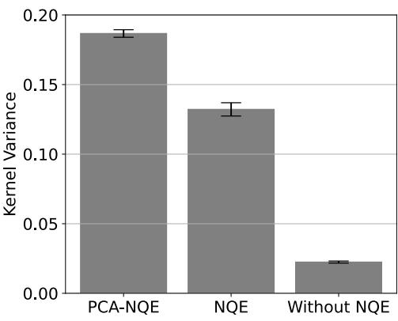  
(b)  
Figure 2.6: Expressibility and trainability diagnostics for embeddings with and without NQE. (a) Deviation from a unitary 2-design, $\epsilon = \sqrt \mathrm { T r } ( A ^ { \dagger } A )$ from Equation (2.26), on training (filled) and test (open) MNIST data. A larger deviation indicates lower expressibility. Both NQE a smaller deviation indicates higher expressibility. The deviation isvariants are markedly less expressive than the conventional embedding. (b) Variance of the derived from 12,665 (2,115) MNIST training (test) data results. (b)of-diagonal quantum-kernel elements, computed from 1000 MNIST samples (mean and one A comparative analysis of the variance of quantum kernel elementsstandard deviation over five iterations). The larger variance under NQE indicates that the kerwith and without NQE models. The variance was computed from thenel entries are not exponentially concentrated, improving the trainability of the quantum kernel method.

## bedding to ensure2.3.1 The DQC1 Model

The DQC1 model, introduced by Knill and Laflamme [61], is a restricted model of quantum provement is achieved by exploiting the prior knowledge thatcomputation that uses one probe qubit with nonzero polarization alongside � qubits in the max-

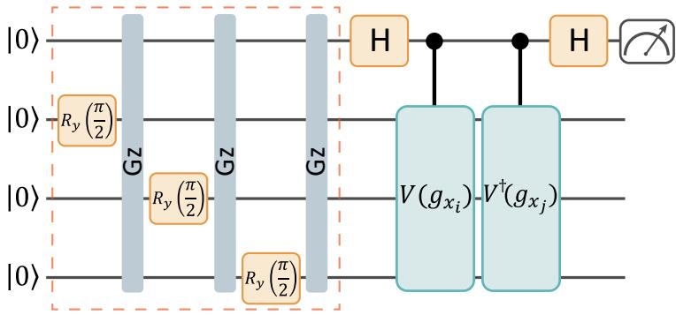  
Figure 2.7: Experimental NQE-DQC1 circuit. A single probe qubit is acted upon by Hadamard 1.0egates, while the remaining register implements the controlled feature-map unitary and its Her-nmitian conjugate. Measurement of $\sigma _ { z }$ on the probe yields the Hilbert–Schmidt inner product trequired for the NQE-DQC1 loss.

aimally mixed state. In DQC1 framework, the initial state of the $( n + 1 )$ )-qubit system is:

$$
\rho _ { 0 } = | 0 \rangle \langle 0 | \otimes { \frac { I } { 2 ^ { n } } } ,\tag{2.27}
$$

where the first qubit (the probe) is prepared as a clean qubit and the remaining � qubits are in the maximally mixed state $I / 2 ^ { n }$

The DQC1 circuit proceeds as follows: a Hadamard gate � is applied to the probe qubit, followed by a controlled-� gate (with the probe as control and the � mixed qubits as targets), and finally another Hadamard gate on the probe. Measuring the Pauli $\sigma _ { z }$ observable on the probe ialize thequbit yields:

$$
\langle \sigma _ { z } \rangle = { \frac { \operatorname { R e } \{ { \mathrm { T r } } ( U ) \} } { 2 ^ { n } } } .\tag{2.28}
$$

�  ��By replacing the final Hadamard with a phase gate $S ^ { \dagger } H$ , one can similarly extract Im $\{ \operatorname { T r } ( U ) \} / 2 ^ { n }$ thereby obtaining the full normalized trace ${ \mathrm { T r } } ( U ) / 2 ^ { n }$

Despite its limited initial resources, the DQC1 model is believed to ofer computational power beyond classical simulation. Shor and Jordan [62] showed that estimating the Jones polynomial—a problem related to knot invariants—is complete for the DQC1 complexity class. Moreover, Poulin et al. [63] demonstrated an exponential quantum speedup for estimating fidelity decay in quantum chaos using DQC1. The quantum correlations responsible for this computational power arise not from entanglement in the conventional sense, but from quantum discord between the probe and the mixed register [64].

Crucially for our purposes, the DQC1 model is a natural fit for NMR quantum processors. In NMR, the quantum state at thermal equilibrium is close to the maximally mixed state, with only a small polarization on each spin. Through spatial averaging techniques, one can prepare an efective DQC1 state with a polarized probe and a maximally mixed encoding register, which realizes the structure idealized in Equation (2.27).

## 2.3.2 NQE Loss Function via Hilbert–Schmidt Inner Product

We now reformulate the NQE training objective in terms of a quantity that DQC1 can directly measure. The Hilbert–Schmidt (HS) inner product between two unitary operators $U _ { 1 }$ and $U _ { 2 }$ is defined as:

$$
\langle U _ { 1 } , U _ { 2 } \rangle _ { \mathrm { H S } } = \frac { \mathrm { T r } ( U _ { 1 } ^ { \dagger } U _ { 2 } ) } { 2 ^ { n } } .\tag{2.29}
$$

This quantity is directly related to the normalized Frobenius distance between the two unitaries:

$$
\frac { 1 } { 2 ^ { n } } \| V ( g ( \mathbf { x } _ { i } , \mathbf { w } ) ) - V ( g ( \mathbf { x } _ { j } , \mathbf { w } ) ) \| _ { F } ^ { 2 } = 2 - 2 \operatorname { R e } \left\{ \mathrm { T r } \Big [ V \big ( g ( \mathbf { x } _ { i } , \mathbf { w } ) \big ) V ^ { \dagger } ( g ( \mathbf { x } _ { j } , \mathbf { w } ) ) \Big ] \right\} / 2 ^ { n } ,\tag{2.30}
$$

where $V ( g ( { \bf x } , { \bf w } ) )$ is the quantum embedding circuit parameterized by the neural network output, as in Equation (2.18). Minimizing this normalized Frobenius distance for same-class pairs and

increasing it for cross-class pairs is analogous to the fidelity-based objective of Equation (2.19), but now expressed entirely in terms of the HS inner product.

The NQE-DQC1 loss function is defined as:

$$
L _ { \mathrm { N Q E } } = \sum _ { i , j } \left[ \frac { 1 } { 2 ^ { n } } \mathrm { R e } \left\{ \mathrm { T r } \Big [ V ( g ( \mathbf { x } _ { i } , \mathbf { w } ) ) V ^ { \dagger } ( g ( \mathbf { x } _ { j } , \mathbf { w } ) ) \Big ] \right\} - \frac { 1 + y _ { i } y _ { j } } { 2 } \right] ^ { 2 } .\tag{2.31}
$$

The target value $( 1 + y _ { i } y _ { j } ) / 2$ is identical to the fidelity-based loss: it equals 1 for same-class pairs and 0 for diferent-class pairs. The key diference is that the fidelity $| \langle \mathbf { x } _ { i } | \mathbf { x } _ { j } \rangle | ^ { 2 }$ has been replaced by the measured real part of the HS inner product

$$
{ \frac { \mathrm { T r } [ V ( g ( \mathbf { x } _ { i } , \mathbf { w } ) ) V ^ { \dagger } ( g ( \mathbf { x } _ { j } , \mathbf { w } ) ) ] } { 2 ^ { n } } } .\tag{2.32}
$$

The crucial observation is that this HS inner product is precisely what DQC1 measures. Setting

$$
U = V ( g ( \mathbf { x } _ { i } , \mathbf { w } ) ) V ^ { \dagger } ( g ( \mathbf { x } _ { j } , \mathbf { w } ) )\tag{2.33}
$$

in Equation (2.28), the DQC1 measurement on the probe qubit yields:

$$
\langle \sigma _ { z } \rangle = \frac { \operatorname { R e } \bigl \{ \operatorname { T r } \bigl [ V ( g ( \mathbf { x } _ { i } , \mathbf { w } ) ) V ^ { \dagger } ( g ( \mathbf { x } _ { j } , \mathbf { w } ) ) \bigr ] \bigr \} } { 2 ^ { n } } ,\tag{2.34}
$$

which directly provides the real part of the HS inner product needed for the loss function (Equation (2.31)). The loss drives same-class pairs toward an HS inner product of 1 (similar unitaries) and diferent-class pairs toward low HS overlap, providing an HS-compatible class-separation surrogate.

The classical neural network $g ( \mathbf { x } , \mathbf { w } )$ is optimized via standard gradient descent. Each loss evaluation is estimated from repeated DQC1 probe-qubit measurements. As in the original NQE framework, the embedding circuit � can be any fixed quantum circuit, such as the ZZ feature map (Equation (2.15)) with �(x) replaced by the learned function $g ( \mathbf { x } , \mathbf { w } )$

## 2.3.3 Experimental Demonstration

NMR platform and initialization. The NQE-DQC1 protocol was experimentally demonstrated on a Bruker 300 MHz NMR spectrometer using 13C-labeled trans-crotonic acid dissolved in d6-acetone [49]. The molecule provides four carbon nuclear spins: C1 serves as the probe qubit, while C2–C4 serve as the three encoding qubits $( n = 3 )$ . The initial state is prepared via spatial averaging as an efective DQC1 state $\rho _ { 0 } ~ = ~ \vert 0 \rangle \langle 0 \vert \otimes I / 2 ^ { 3 }$ , matching the structure of Equation (2.27). The quantum embedding circuit uses the ZZ feature map (Equation (2.15)) with � = 1 repetition, and the classical input data is preprocessed via PCA to reduce the dimensionality to five principal components before being fed to the neural network �.

NQE-DQC1 training results. The training was performed on 500 MNIST images (binary classification of digits 0 vs. 1), with 15 training iterations and 10 randomly sampled data pairs per iteration. For each pair $( \mathbf { x } _ { i } , \mathbf { x } _ { j } )$ , the DQC1 circuit implements the unitary $U = V ^ { \dagger } ( g ( \mathbf { x } _ { j } , \mathbf { w } ) ) V ( g ( \mathbf { x } _ { i } , \mathbf { w } ) )$ controlled by the probe qubit to measure the HS inner product via Equation (2.34). Figure 2.8(b) shows the training loss as a function of iteration: the loss converges to approximately zero by iteration 10, and the NMR experimental results closely match the numerical simulations, confirming the practical feasibility of the DQC1-based approach. Figure 2.8(c) demonstrates that the trace distance between class ensembles increases for both the training and test sets across iterations, consistent with the HS surrogate being aligned with improved distinguishability in this experiment.

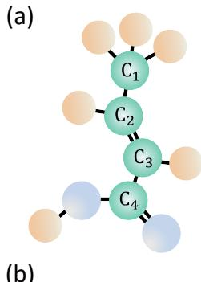  
(b)

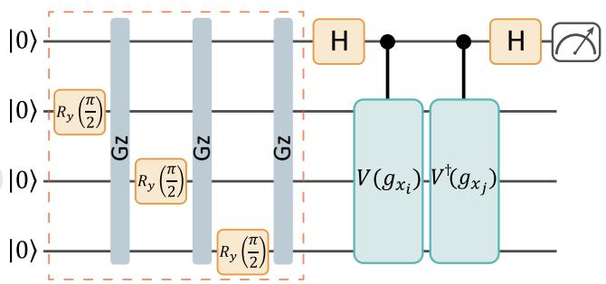

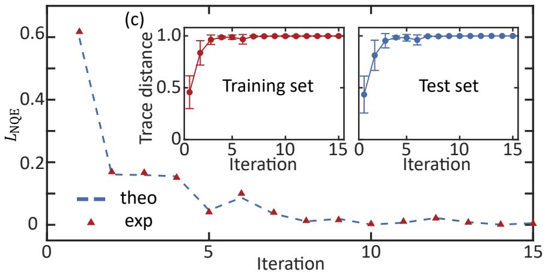  
he        Figure 2.8: NQE-DQC1 training on the NMR platform. (a) Schematic of the NMR DQC1 n     circuit: the probe qubit C1 controls the application of $V ^ { \dagger } ( g ( \mathbf { x } _ { j } ) ) V ( g ( \mathbf { x } _ { i } ) )$ on qubits C2–C4. e         (b) Training loss versus iteration for NMR experiments (markers) and numerical simulation box initialize the system to |0⟩⟨0| ⊗ /2 with � = 3. The gray(solid line). (c) Trace distance between class ensembles for the training set (circles) and test bar represents a 1 ms �-gradienset (triangles) across NQE training iterations.

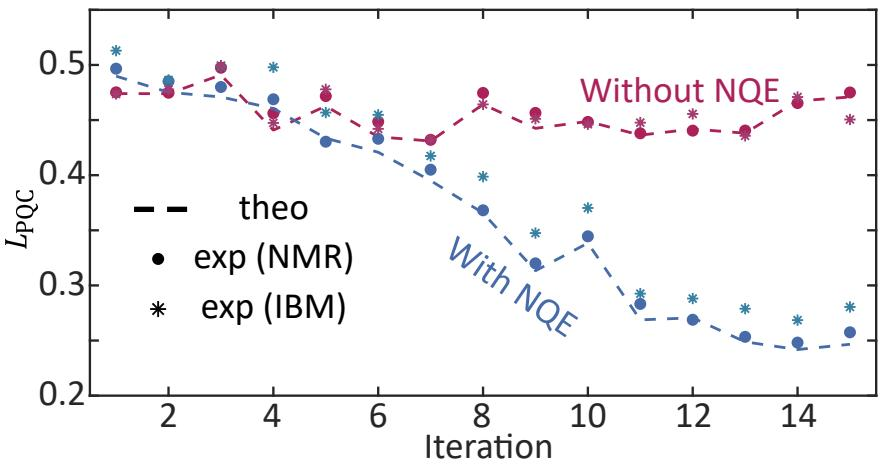  
Figure 2.9: Cross-platform training loss of the downstream PQC classifier with and without NQE. The classifier is optimized on the NQE-enhanced embedding (blue) and on the conventional ZZ feature map (red, “without NQE”). Dashed lines denote noiseless simulation, filled circles the NMR experiment, and asterisks the IBM superconducting hardware.

dots, and dashed lines correspond to the loss � from numericalClassification results. After NQE training, a parameterized quantum circuit (PQC) classifier is deployed on the NQE-enhanced embedding. The classifier uses 2 circuit layers with 4 trainable t embedding (without NQE) and with NQE encoding, respectively.rotation parameters and 2 CNOT gates, and classification is performed by measuring $\langle \sigma _ { z } \rangle$ on the third qubit. Without NQE (using the raw ZZ feature map), the classifier achieves 54% accuracy ,on the 500-sample dataset, which is close to random guessing and consistent with the low trace Subsequently, the neural network � is optimized using thedistance of the unoptimized embedding. With NQE preprocessing, the accuracy reaches 98%.

(a)  
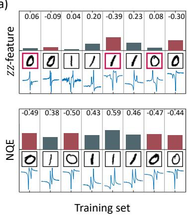

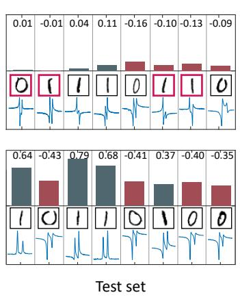

(b)  
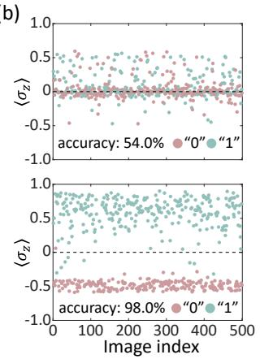  
FIG. 4. Experimental classification results after processing through the PQC circuit for � �-feature and NQE encoding. (a) The top and bottomFigure 2.10: Classification results with and without NQE. (a) Per-sample classification outputs the height of the color bars serves as a visual representation (red for negative values and green for positive). Additionally, NMR peaks provideusing the ZZ feature map alone (top) versus the NQE-enhanced embedding (bottom). (b) Scatter incorrect classifications. These results clearly highlight the substantial improvement in classification accuplot of predicted labels for all 500 MNIST test images (digits 0 vs. 1).

Cross-platform extendability. An important feature of the NQE-DQC1 approach is crossplatform transferability. The neural network $g ( \mathbf { x } , \mathbf { w } )$ trained through the NMR-compatible Classification results—We further substantiate the efec- tion tasks on other physical systems. This highlights an addi-DQC1 protocol was deployed on IBM cloud superconducting quantum processors without tum circuit (PQC) and implementing classification tasks. The DQC1 is specifically designed for ensemble systems, makingretraining, and the experimental trends agreed with the numerical simulations (Figure 2.9) [49]. while the second part trains the PQC to eficiently classify the tasks can also be executed on other quantum platforms. As aThis is possible because NQE training produces a set of classical neural network parameters $\mathbf { W } ^ { * }$ , we apply a double-layer PQC with four parameters of �that define a data preprocessing function $g ( \mathbf { x } , \mathbf { w } ^ { * } )$ cessors, and the corresponding results are depicted in, which is independent of the hardware parameter-shift rule [46–49], and further experimental details experimental trends align well with numerical simulations, al-used to evaluate the training loss. The DQC1 protocol is used during the NQE training phase to We compare the classification performance of the traditional This further demonstrates the extendability of the NQE-DQC1evaluate the loss function. Once training is complete, the optimized preprocessing can be paired � 1 1        with another platform that implements the same embedding circuit �. Additional validation on qubit, and � is the label of the image (� = −1 for digit “0” and tum states via NQE before being processed through the trainedFashion-MNIST and satellite image datasets supports the applicability of the approach across PQC measured, and these values are used to determine the classifi-the tested data domains [49]. Further supplementary analyses on feature-map ansatz robustness merical simulations with and without NQE, respectively. The the digit “0,” while a positive ⟨��⟩ (green bar) or an upwaand multi-class extensions, together with reproducibility details, are collected in Section A.1.

## 2.4 Summary

In this chapter, we addressed a central question in quantum machine learning: how does the data embedding constrain the achievable performance of a quantum classifier? We established three main results.

First, we showed that the empirical risk of the binary quantum classifier under the linear loss is lower bounded by the trace distance between embedded data ensembles (Equation (2.9)), a quantity determined by the data embedding. The contractive property of trace distance under quantum channels (Equation (2.12)) further implies that subsequent noisy quantum processing cannot increase this distinguishability. We demonstrated that conventional deterministic embeddings (amplitude encoding, angle encoding, and the ZZ feature map) are data-agnostic and ofer no guarantee of producing a large trace distance for a given classification task, and that trainable quantum embedding strategies remain constrained by the distinguishability allowed by the embedding construction.

Second, we introduced Neural Quantum Embedding (NQE), which avoids the contractive constraint by inserting a classical neural network between the raw data and the quantum embedding circuit. Because the neural network operates on classical parameters rather than quantum states, it is not subject to the quantum-state contractive inequality at this preprocessing stage. The implicit fidelity loss (Equation (2.19)) provides a tractable training objective that simultaneously clusters same-class states and separates cross-class states in the quantum feature space. In the reported IBM hardware experiments on binary MNIST, PCA-NQE raises the trace distance $\mathrm { f r o m } \approx 0 . 2 7 \mathrm { t o } \approx 0 . 8 4$ , improving classification accuracy from 52.7% to 96.1% under real hardware noise and achieving a lower empirical risk than the noiseless Helstrom limit associated with the conventional ZZ feature map.

Third, we showed that NQE can be extended to ensemble quantum systems by replacing the fidelity-based loss with the Hilbert–Schmidt inner product, which is directly measurable via the DQC1 model using a single probe qubit and a mixed encoding register. This reformulation was experimentally validated on an NMR quantum processor, where it achieved 98% classification accuracy on MNIST compared to 54% without NQE. The deployment of the learned neural network parameters on superconducting quantum processors further shows that the preprocessing learned through the DQC1 protocol can be transferred across platforms that implement the same embedding circuit.

Throughout this chapter, we focused on a representation-induced source of training error in quantum machine learning: the achievable training loss can be reduced only if the embedding makes the class ensembles suficiently distinguishable. However, low training error does not automatically guarantee good performance on unseen data. In the next chapter, we turn to the complementary question of generalization: under what conditions does a quantum classifier trained on a finite dataset maintain its performance on new, previously unseen inputs? We will show that the trace-distance perspective also connects naturally to margin-based generalization analysis.

## CHAPTER 3

## GENERALIZATION IN QUANTUM MACHINE

## LEARNING

The results in this chapter are based on Understanding Generalization in Quantum Machine Learning with Margins [65]. Code is available at https://github.com/takh04/ Q-margin.

In the previous chapter, we studied a representation-induced limit on quantum supervised learning. Neural Quantum Embedding increases the trace distance between embedded data ensembles and thereby lowers the achievable training loss. However, achieving low training error is only part of the challenge: a model that memorizes its training data without learning the underlying pattern will fail on new, unseen inputs. This chapter turns to the complementary question of generalization—the ability of a model to maintain its performance beyond the training set.

As discussed in Section 1.1.2, the generalization error is the discrepancy between the true risk and the empirical risk, arising because the model is trained on a finite sample rather than the full data distribution. Controlling this error requires understanding the complexity of the hypothesis class. In classical machine learning, uniform generalization bounds based on complexity measures such as VC dimension and Rademacher complexity have been the primary theoretical tools. However, recent work has shown that such bounds are often too vacuous to explain empirical comparisons between models that generalize and models that memorize data, both in classical deep learning [66] and in quantum machine learning [67].

In this chapter, we develop a margin-based generalization framework for quantum neural networks that responds to these limitations. Drawing inspiration from the classical margin theory of Bartlett et al. [68], we establish a high-probability bound for multiclass QNN classifiers that remains a function-class bound, but is margin-sensitive through the empirical margin loss. We experimentally show that margin-based metrics are stronger predictors of generalization performance than parameter-based metrics in the studied QPR setting. Furthermore, we connect the margin to quantum state discrimination, showing that quantum embeddings with large trace distances—such as those produced by NQE (Chapter 2)—can support larger margins and thus tighter margin-based generalization bounds when the other bound parameters are comparable.

## 3.1 Theoretical Background

This section reviews the key concepts from classical generalization theory that form the foundation for our quantum margin bounds. We build the theory progressively: starting from the simplest case of finite hypothesis classes, moving to the tools needed for infinite classes, and finally arriving at margin theory. We assume a supervised learning setting as established in Section 1.1.2: given a hypothesis class $\mathcal { H }$ and a training set $S ~ = ~ \{ ( x _ { i } , y _ { i } ) \} _ { i = 1 } ^ { m }$ drawn i.i.d. from an unknown distribution $\mathcal { D }$ , we seek to bound the diference between the true risk $\begin{array} { l l } { { R ( h ) } } & { { = } } \end{array}$ $\mathbb { E } _ { ( x , y ) \sim \mathcal { D } } [ \mathbb { 1 } ( \arg \operatorname* { m a x } _ { j } h ( x ) _ { j } \neq y ) ]$ and the empirical risk $\begin{array} { r } { \hat { R } ( h ) = m ^ { - 1 } \sum _ { i = 1 } ^ { m } } \end{array}$ 1 $( \mathrm { a r g } \operatorname* { m a x } _ { j } h ( x _ { i } ) _ { j } \neq$ $y _ { i } )$ for any hypothesis $h \in { \mathcal { H } }$

## 3.1.1 Generalization Bounds for Finite Hypothesis Classes

We begin with the simplest setting: a hypothesis class ℋ containing finitely many hypotheses. Even this restricted case reveals the core tension in generalization theory—the gap between controlling error for a singlefixed hypothesis and controlling error for the best hypothesis selected from data.

Concentration for a single hypothesis. Consider a single, fixed hypothesis ℎ. Since the training samples $( x _ { 1 } , y _ { 1 } ) , \dots , ( x _ { m } , y _ { m } )$ are drawn i.i.d., the empirical risk $\hat { R } ( h )$ is an average of � independent bounded random variables, each taking values in [0, 1]. Hoefding’s inequality [21] gives a sharp concentration bound:

$$
\operatorname* { P r } \bigl [ | R ( h ) - \hat { R } ( h ) | > \epsilon \bigr ] \leq 2 \exp ( - 2 m \epsilon ^ { 2 } ) .\tag{3.1}
$$

Thus, for any fixed hypothesis, the empirical risk converges exponentially fast to the true risk as the sample size � grows. If we could specify which hypothesis to evaluate before seeing the data, generalization would be straightforward.

The selection problem. In practice, however, we do not fix ℎ in advance. Instead, we use the training data to select the hypothesis with the lowest empirical risk: ${ \hat { h } } = \arg \operatorname* { m i n } _ { h \in { \mathcal { H } } } { \hat { R } } ( h )$ This data-dependent selection invalidates the direct application of Equation (3.1), because the selected hypothesis is correlated with the training sample. A hypothesis that happens to perform well on the training set may do so by chance rather than by capturing the true pattern.

Union bound over ℋ. When ℋ is finite, we can resolve this by applying Hoefding’s inequality to every $h \in \mathcal H$ simultaneously and taking a union bound. The probability that any hypothesis deviates by more than � is at most:

$$
\operatorname* { P r } \bigl [ \exists h \in \mathcal { H } : | R ( h ) - \hat { R } ( h ) | > \epsilon \bigr ] \leq \sum _ { h \in \mathcal { H } } 2 \exp ( - 2 m \epsilon ^ { 2 } ) = 2 | \mathcal { H } | \exp ( - 2 m \epsilon ^ { 2 } ) .\tag{3.2}
$$

Setting this probability to � and solving for $\epsilon _ { : }$ , we obtain thefinite hypothesis class bound: with probability at least $1 - \delta$ , for all $h \in { \mathcal { H } }$ simultaneously,

$$
R ( h ) \leq \hat { R } ( h ) + \sqrt { \frac { \ln { | \mathcal { H } | } + \ln ( 2 / \delta ) } { 2 m } } .\tag{3.3}
$$

This result has an appealing interpretation: the “price” of selecting the best hypothesis from $| \mathcal { H } |$ candidates is only logarithmic in the class size. Even if $| \mathcal { H } |$ is astronomically large, the generalization penalty grows slowly.

Limitation. The finite hypothesis class bound breaks down when $| { \mathcal { H } } | = \infty { \longrightarrow } \mathbf { a s }$ is the case for hypothesis classes parameterized by continuous parameters. Neural networks, support vector machines, and quantum circuits all define infinite hypothesis classes, rendering Equation (3.3) vacuous. This motivates the development of complexity measures that can handle infinite classes, which we turn to next.

## 3.1.2 Complexity Measures for Infinite Hypothesis Classes

When the hypothesis class is infinite, we can no longer enumerate its elements. Instead, we need complexity measures that capture the “efective size” of ℋ—how richly it can fit arbitrary patterns—without requiring finiteness.

## VC Dimension

The Vapnik–Chervonenkis $( V C )$ dimension [7] was the first such measure. A hypothesis class ℋ shatters a set of � points if, for every possible labeling of those points, there exists an $h \in { \mathcal { H } }$ that realizes that labeling. The VC dimension $d _ { \mathrm { V C } }$ is the largest � such that some set of � points can be shattered by ℋ.

The fundamental theorem of PAC learning [7, 21] establishes that $d _ { \mathrm { V C } }$ characterizes learnability: a binary hypothesis class is PAC-learnable if and only if its VC dimension is finite. Moreover, the VC generalization bound states that with high probability,

$$
R ( h ) \leq \hat { R } ( h ) + O \left( \sqrt { \frac { d _ { \mathrm { V C } } } { m } } \right) .\tag{3.4}
$$

While the VC dimension elegantly extends the finite class bound to infinite classes (note the structural similarity between Equations (3.3) and (3.4), with ln $| \mathcal { H } |$ replaced by $d _ { \mathrm { V C } } )$ , it has a significant limitation for modern models: the VC dimension of a neural network scales with its number of parameters, producing bounds that are vacuous for overparameterized models that nonetheless generalize well in practice.

## Rademacher Complexity

Rademacher complexity [69] provides a data-dependent measure of hypothesis class complexity. For a sample ${ \cal { S } } = \{ z _ { i } \} _ { i = 1 } ^ { m }$ and a function class $\mathcal { F }$ , the sample Rademacher complexity is defined as:

$$
\Re ( \mathcal { F } | _ { S } ) = \mathbb { E } _ { \sigma } \left[ \operatorname* { s u p } _ { f \in \mathcal { F } } \frac { 1 } { m } \sum _ { i = 1 } ^ { m } \sigma _ { i } f ( z _ { i } ) \right] ,\tag{3.5}
$$

where $\sigma _ { 1 } , \ldots , \sigma _ { m }$ are independent Rademacher random variables taking values $\pm 1$ with equal probability. Intuitively, the Rademacher complexity measures how well functions in $\mathcal { F }$ can correlate with random noise—a class that can fit random labels has high Rademacher complexity and is prone to overfitting.

A fundamental result connects Rademacher complexity to generalization [69, 21]: for any $\delta > 0$ , with probability at least $1 - \delta$ over the random draw of an i.i.d. sample � of size $m ,$ , the

following holds for all $h \in { \mathcal { H } }$

$$
R ( h ) \leq \hat { R } ( h ) + 2 \Re ( \mathcal { H } | _ { S } ) + 3 \sqrt { \frac { \ln ( 2 / \delta ) } { 2 m } } .\tag{3.6}
$$

This bound is uniform—it holds simultaneously for all hypotheses in ${ \mathcal { H } } .$ —and becomes tighter as the sample size � increases or the Rademacher complexity decreases. Compared to the VC bound, the Rademacher bound has the advantage of being data-dependent: the sample Rademacher complexity depends on the specific data points, not just the abstract hypothesis class.

## Covering Numbers and Dudley’s Entropy Integral

In practice, computing the Rademacher complexity directly can be challenging. A powerful technique for bounding it uses covering numbers, which bridge the gap between infinite and finite by discretizing function classes at progressively finer resolutions.

The �-covering number of a set � with respect to a norm $\| \cdot \| ,$ , denoted $\mathcal { N } ( A , \epsilon , \| \cdot \| )$ , is the minimum number of balls of radius � needed to cover �. The key idea is that even an infinite function class can be approximated to precision � by a finite set of size $\mathcal { N } ( A , \epsilon , \| \cdot \| )$ —efectively reducing the problem to the finite case at each resolution scale.

The connection between covering numbers and Rademacher complexity is established through Dudley’s entropy integral [21]:

$$
\Re ( A ) \leq \operatorname* { i n f } _ { \alpha \geq 0 } \left( { \frac { 4 \alpha } { \sqrt { m } } } + { \frac { 1 2 } { m } } \int _ { \alpha } ^ { \sqrt { m } } { \sqrt { \ln { \mathcal { N } } ( A , \beta , \| \cdot \| _ { 2 } ) } } d \beta \right) .\tag{3.7}
$$

This integral aggregates the covering numbers across all scales $\beta .$ Fine scales (small $\beta )$ capture local complexity, while coarse scales (large $\beta )$ capture global structure. Dudley’s entropy in-

tegral is the key technical tool we will use in Section 3.3.2 to derive our margin generalization bound for QNNs.

## 3.1.3 Margin Theory

The complexity measures discussed above—VC dimension, Rademacher complexity, covering numbers—all provide uniform bounds that depend on the hypothesis class ℋ as a whole. Margin theory introduces a complementary, hypothesis-dependent perspective: the generalization bound depends on how confidently the specific learned hypothesis classifies the training data. The concept of margin has been central to generalization theory since the early days of support vector machines [6].

## Classical Margin Bounds

For binary classification, the margin of a classifier � on a sample $( x , y )$ is defined as $y \cdot f ( x )$ where $y \in \{ - 1 , + 1 \}$ . The sample is correctly classified with margin $\gamma \operatorname { i f } y \cdot f ( x ) \geq \gamma > 0$

For multiclass classification with � classes, the margin is generalized through the margin operator:

$$
\mathcal { M } ( \nu , y ) = { \nu } _ { y } - \mathop { \operatorname* { m a x } } _ { i \neq y } { \nu } _ { i } ,\tag{3.8}
$$

where $\nu = ( \nu _ { 1 } , \ldots , \nu _ { k } )$ is the output vector of the classifier and � is the true label. A positive margin $\mathcal { M } ( \nu , y ) > 0$ indicates correct classification, and a larger margin corresponds to a more confident prediction.

To incorporate margins into generalization bounds, one replaces the hard 0-1 loss with a Lipschitz surrogate such as the ramp loss $l _ { \gamma } : \mathbb { R }  \mathbb { R } ^ { + }$ , parameterized by the margin threshold

� > 0:

$$
l _ { \gamma } ( x ) = { \left\{ \begin{array} { l l } { 0 , } & { { \mathrm { i f ~ } } x > \gamma , } \\ { } & { } \\ { 1 - x / \gamma , } & { { \mathrm { i f ~ } } 0 \leq x \leq \gamma , } \\ { } & { } \\ { 1 , } & { { \mathrm { i f ~ } } x < 0 . } \end{array} \right. }\tag{3.9}
$$

The ramp loss upper bounds the 0-1 loss while remaining Lipschitz, which makes it suitable for Rademacher-complexity arguments. The theorem below is stated in terms of the empirical margin error,

$$
\hat { R } _ { \gamma } ( h ) = \frac { 1 } { m } \sum _ { i = 1 } ^ { m } \mathbb { 1 } \big ( \mathcal { M } ( h ( x _ { i } ) , y _ { i } ) \leq \gamma \big ) ,\tag{3.10}
$$

which counts both misclassified samples and correctly classified samples whose margin is at most $\gamma$

## Margin Boundsfor Deep Networks

A landmark result by Bartlett et al. [68] established spectrally-normalized margin bounds for deep neural networks. Their key insight was that the margin distribution, normalized by the spectral norms of the weight matrices, is strongly correlated with generalization performance. This represented a significant advance over classical uniform bounds, which depend on the number of parameters or the VC dimension and often provide vacuous estimates for overparameterized networks.

Specifically, for a deep network with weight matrices $W _ { 1 } , \dots , W _ { L }$ , the generalization bound scales as:

$$
R ( h ) \leq \hat { R } _ { \gamma } ( h ) + \tilde { O } \left( \frac { \prod _ { \ell = 1 } ^ { L } \| W _ { \ell } \| _ { \sigma } } { \gamma \sqrt { m } } \right) ,\tag{3.11}
$$

where $\| W _ { \ell } \| _ { \sigma }$ denotes the spectral norm of the ℓ-th weight matrix. Unlike parameter-count bounds, this bound becomes tighter when the model achieves larger margins. Subsequent work

confirmed that margin-based metrics are among the strongest predictors of generalization in deep learning [70, 71, 72, 73].

Our contribution in this chapter is to extend this margin-based framework from classical neural networks to quantum neural networks, adapting the covering number techniques to the quantum setting.

## 3.2 Generalization Bounds for Quantum Models

We now review the existing approaches to understanding generalization in quantum machine learning. These approaches predominantly rely on uniform bounds—bounds that hold for all hypotheses within the function class—and we discuss their strengths and limitations.

## 3.2.1 Uniform Generalization Bounds

A growing body of work has established uniform generalization bounds for quantum models using various complexity measures.

Parameter-based bounds. The most widely adopted approach is based on the number of trainable parameters. Caro et al. [74] proved that the generalization gap of a QNN with � trainable gates, trained on � samples, is bounded by:

$$
| R ( h ) - \hat { R } ( h ) | \leq O \left( \sqrt { \frac { T } { m } } \right) ,\tag{3.12}
$$

with high probability. When only a subset of parameters undergo substantial change during training, the bound improves to scale with the number of efective parameters rather than the total parameter count. This result has become a standard tool in the QML community, providing a simple and interpretable estimate of generalization.

Efective dimension. Abbas et al. [57] introduced the efective dimension of a QML model as a measure of its complexity, connecting it to the Fisher information matrix. Models with smaller efective dimension are expected to generalize better, as they occupy a smaller efective volume in the hypothesis space.

Quantum Rademacher and statistical complexity. Bu et al. [75] derived bounds on the Rademacher complexity of quantum circuits, relating the generalization capability to properties of the quantum circuit architecture. Subsequent work [76, 77] extended this analysis to study the efects of quantum resources and noise on the statistical complexity of quantum models.

Information-theoretic approaches. Banchi et al. [78] analyzed QML generalization from a quantum information standpoint, connecting the generalization gap to information-theoretic quantities such as the mutual information between the training data and the learned hypothesis. More recently, Caro et al. [79] established information-theoretic generalization bounds for learning from quantum data, providing a complementary perspective to the complexity-based approaches.

## 3.2.2 Limitations of Uniform Bounds

Despite the theoretical elegance of the bounds reviewed above, they share a limitation for the comparisons studied here: they are uniform bounds that hold for all hypotheses in the function class simultaneously. In classical deep learning, a seminal study by Zhang et al. [66] demonstrated that modern neural networks can easily memorize datasets with completely randomized labels, achieving zero training error on random noise. Since uniform bounds must hold for all functions in the hypothesis class—including those that memorize random labels—they can be too vacuous to distinguish a model that has learned meaningful patterns from one that has merely memorized the training data in many practical settings [80, 81].

Building on this observation, Gil-Fuster et al. [67] demonstrated that the same phenomenon occurs in QML: quantum neural networks, including QCNNs, can overfit randomized labels on quantum datasets. Despite the small number of qubits and parameters, QNNs are expressive enough to fit random labels, showing that uniform bounds can also be too vacuous for QML memorization regimes.

These findings motivate a shift from uniform bounds toward data-dependent and hypothesis-dependent generalization measures. In classical deep learning, this shift led to the discovery that margin-based metrics are among the strongest predictors of generalization [71, 72, 73]. In the next section, we extend this margin-based perspective to quantum neural networks.

## 3.3 Margin-Based Generalization for Quantum Neural Networks

We now present our main contribution, a margin-based generalization bound for multiclass classification with quantum neural networks. We begin by formalizing the QNN classification setup, derive the margin bound, and validate it experimentally.

## 3.3.1 Multiclass Classification with Quantum Neural Networks

Consider a �-class classification task where the input is an �-qubit quantum state $\rho \in \mathbb { C } ^ { N \times N }$ with $N \ = \ 2 ^ { n }$ , and the label $y \in [ k ] \ = \ \{ 1 , \ldots , k \}$ . A QNN performs classification using a parameterized unitary circuit $U ( \theta ) \in \mathbb { U } _ { \mathrm { Q N N } }$ and a set of positive operator-valued measurements (POVMs) $\{ E _ { i } \} _ { i = 1 } ^ { k }$ satisfying $\textstyle \sum _ { i = 1 } ^ { k } E _ { i } = I$ and $E _ { i } \geq 0$ . The QNN maps an input quantum state to

a �-dimensional probability vector:

$$
h _ { \theta } ( \rho ) = \left\{ \mathrm { T r } \Big ( U ( \theta ) \rho U ^ { \dagger } ( \theta ) E _ { i } \Big ) \right\} _ { i = 1 } ^ { k } ,\tag{3.13}
$$

where each component $h _ { \theta } ( \rho ) _ { i }$ represents the probability of assigning the input to class �.

Given � training samples $S = \{ ( \rho _ { i } , y _ { i } ) \} _ { i = } ^ { m }$ drawn i.i.d. from an unknown distribution $\mathcal { D }$ , the goal is to find optimal parameters $\theta ^ { * }$ that minimize the true error:

$$
R ( h ^ { * } ) = \mathbb { E } _ { ( \rho , y ) \sim \mathcal { D } } \left[ \mathbb { 1 } \left( \arg \operatorname* { m a x } _ { j } h ^ { * } ( \rho ) _ { j } \neq y \right) \right] .\tag{3.14}
$$

The generalization gap $g ( h ) = R ( h ) - \hat { R } ( h )$ measures the discrepancy between the true error and the empirical error on the training set.

## 3.3.2 Margin Generalization Bound

We now derive the margin-based generalization bound for QNNs. The key idea is to bound the Rademacher complexity of the margin loss function class in terms of the quantum channel components.

For a margin threshold $\gamma > 0$ , the margin loss function class is:

$$
\mathcal { F } _ { \gamma } = \left\{ ( \rho , y ) \mapsto l _ { \gamma } ( \mathcal { M } ( h ( \rho ) , y ) ) : h \in \mathcal { H } \right\} ,\tag{3.15}
$$

where ℳ is the margin operator (Equation (3.8)) and $l _ { \gamma }$ is the ramp loss (Equation (3.9)). Applying the Rademacher generalization bound (Equation (3.6)) to $\mathcal { F } _ { \gamma }$ , we obtain:

$$
\operatorname* { P r } _ { ( \rho , y ) \sim \mathcal { D } } \left[ \arg \operatorname* { m a x } _ { i } h ( \rho ) _ { i } \neq y \right] \leq \hat { R } _ { \gamma } ( h ) + 2 \Re ( \mathcal { F } _ { \gamma } | _ { S } ) + 3 \sqrt { \frac { \ln ( 2 / \delta ) } { 2 m } } ,\tag{3.16}
$$

for all $h \in { \mathcal { H } }$ , with probability at least $1 - \delta$

The central technical contribution is an analytic bound on the Rademacher complexity $\Re ( \mathcal { F } _ { \gamma } | _ { S } )$ in terms of the quantum channel components. This derivation proceeds in three steps:

Step 1: Lipschitz continuity. We first establish the Lipschitz properties of the function class. The margin loss $l _ { \gamma } ( \mathcal { M } ( \cdot , y ) )$ is 2/�-Lipschitz with respect to the $l _ { p }$ norm for any $p \geq 1$ . The quantum measurement function $g ( x ) = \{ x ^ { \dagger } E _ { i } x \} _ { i = 1 } ^ { k }$ (for pure state inputs $\rho = | x \rangle \langle x | \mathrm { w i t h } x \in \mathbb { C } ^ { N } )$ is 2�-Lipschitz, where $\begin{array} { r } { E = \sqrt { \sum _ { i } \| E _ { i } \| _ { \sigma } ^ { 2 } } } \end{array}$ and $\| \cdot \| _ { \sigma }$ denotes the spectral norm. This result follows from each measurement function $g _ { i }$ being $2 \| E _ { i } \| _ { \sigma }$ -Lipschitz for normalized quantum states.

Step 2: Covering number bound. Using the Lipschitz continuity, we reduce the covering number of $\mathcal { F } _ { \gamma }$ restricted to the sample � to the covering number of the set $\{ U X : U \in \mathbb { U } _ { \mathrm { Q N N } } \}$ , where $X \in \mathbb { C } ^ { N \times m }$ is the data matrix whose columns are the quantum state vectors:

$$
\ln \mathcal { N } \big ( ( \mathcal { F } _ { \gamma } ) | _ { S } , \epsilon , \| \cdot \| _ { 2 } \big ) \leq \left\lceil \frac { 3 2 m b ^ { 2 } E ^ { 2 } } { \epsilon ^ { 2 } \gamma ^ { 2 } } \right\rceil \ln 4 N ^ { 2 } ,\tag{3.17}
$$

where � is a distance bound such that $\lVert U - U _ { \mathrm { r e f } } \rVert _ { 2 , 1 } \leq b$ for all $U \in \mathbb { U } _ { \mathrm { Q N N } }$ , with $U _ { \mathrm { r e f } }$ serving as a reference unitary matrix. This bound is derived using matrix covering techniques originally introduced by Bartlett et al. [68] and Zhang [82], adapted to the complex-valued setting of quantum circuits. Here $\| A \| _ { 2 , 1 }$ denotes the sum of Euclidean norms of the columns of �. The parameter � measures the radius of the accessible unitary family around the reference unitary in this matrix norm.

Step 3: Dudley’s entropy integral. Finally, we bound the Rademacher complexity using Dudley’s entropy integral (Equation (3.7)) with the covering number bound from Step 2. This yields our main result:

Theorem 3.1 (Margin Generalization Bound for QNNs). Consider an �-qubit QNN with unitary $U \in \mathbb { U } _ { \mathrm { Q N N } }$ and POVMs $\{ E _ { i } \} _ { i = 1 } ^ { k } f o r$ �-class classification. Let � be a distance bound such that $\lVert U - U _ { \mathrm { r e f } } \rVert _ { 2 , 1 } \leq b$ for any $U \in \mathbb { U } _ { \mathrm { Q N N } }$ . Then, for any $\delta > 0$ and $\gamma > 0 ,$ , with probability at least $1 - \delta$ over the random draw of an i.i.d. sample � of size �, the following holds for all $h \in { \mathcal { H } }$

$$
R ( h ) \leq \hat { R } _ { \gamma } ( h ) + \tilde { O } \left( \frac { b } { \gamma } \sqrt { \frac { n } { m } \sum _ { i = 1 } ^ { k } \| E _ { i } \| _ { \sigma } ^ { 2 } } + \sqrt { \frac { \ln ( 1 / \delta ) } { m } } \right) ,\tag{3.18}
$$

where $\tilde { O }$ hides logarithmic factors in �, �, �, $\gamma ,$ and $m .$

Interpreting the quantities in the bound. The parameter � is the number of qubits, so $N = 2 ^ { n }$ sets the Hilbert-space dimension entering the covering argument. The number of classes is $k ,$ the sample size is $m ,$ and $\delta$ is the failure probability of the high-probability statement. The margin threshold $\gamma$ controls the trade-of between empirical margin loss and complexity: larger $\gamma$ is more demanding on the training margins but reduces sensitivity to small confidence gaps. The term $b = \lVert U - U _ { \mathrm { r e f } } \rVert _ { 2 , 1 }$ is a radius of the reachable unitary family around a fixed reference unitary. Finally, $\textstyle \sum _ { i } \| E _ { i } \| _ { \sigma } ^ { 2 }$ measures how the POVM can amplify perturbations of the quantum state into perturbations of class probabilities.

This bound has several important properties that distinguish it from the uniform bounds discussed in Section 3.2:

Dependence on margin. Unlike parameter-count or norm-only uniform bounds, the margin bound contains an empirical margin term evaluated on the learned classifier. The first term $\hat { R } _ { \gamma } ( h )$ measures the fraction of training samples with margin at most $\gamma .$ , and the second term scales as $1 / \gamma$ . A model that achieves large margins on the training data will have a small $\hat { R } _ { \gamma } ( h )$ for a reasonably large $\gamma$ , resulting in a tighter bound. In the randomized-label experiments below, memorizing models are reflected by smaller margins and looser margin bounds, which is precisely the behavior missing from parameter-count bounds.

Role of measurement operators. The bound depends on the spectral norms of the POVMs $\textstyle \sum _ { i } \| E _ { i } \| _ { \sigma } ^ { 2 }$ , which quantifies the influence of the measurement choice on generalization. This is a uniquely quantum feature: the generalization performance depends not only on the circuit architecture but also on how information is extracted from the quantum state.

## Corollary for projective measurements.

When the POVMs are projective measurements—a common choice in QML models—the bound simplifies significantly:

Corollary 3.2. Under the conditions of Theorem 3.1, suppose the POVMs $\{ E _ { i } \} _ { i = 1 } ^ { k }$ are projective measurements, i.e., $E _ { i } ^ { 2 } = E _ { i }$ and $E _ { i } E _ { j } = 0$ for all $i \neq j$ . Then:

$$
R ( h ) \leq \hat { R } _ { \gamma } ( h ) + \tilde { O } \left( \frac { b } { \gamma } \sqrt { \frac { n k } { m } } + \sqrt { \frac { \ln ( 1 / \delta ) } { m } } \right) .\tag{3.19}
$$

For projective measurements, $E _ { i } ^ { 2 } = E _ { i }$ implies $\| E _ { i } \| _ { \sigma } = 1$ , so $\begin{array} { r } { \sum _ { i } \| E _ { i } \| _ { \sigma } ^ { 2 } = k } \end{array}$ . The bound is therefore independent of the specific measurement operators, depending only on the number of classes �.

## 3.3.3 Experimental Validation

We now validate our theoretical framework through extensive experiments on the quantum phase recognition $( \mathrm { Q P R } )$ task—a quantum data classification problem of significant physical relevance.

## Quantum Phase Recognition

Quantum phase recognition (QPR) [83, 84] is a classification task aimed at identifying quantum phases of matter, a problem of fundamental importance in condensed matter physics [85, 86, 87]. We consider the generalized cluster Hamiltonian:

$$
H ( J _ { 1 } , J _ { 2 } ) = \sum _ { j = 1 } ^ { n } \left( Z _ { j } - J _ { 1 } X _ { j } X _ { j + 1 } - J _ { 2 } X _ { j - 1 } Z _ { j } X _ { j + 1 } \right) ,\tag{3.20}
$$

where $X _ { j }$ and $Z _ { j }$ are Pauli operators acting on site $j ,$ and $J _ { 1 } , J _ { 2 }$ are tunable parameters controlling the interaction strengths. Depending on the values of $J _ { 1 }$ and $J _ { 2 }$ , the ground state falls into one of four distinct phases: (1) ferromagnetic, (2) antiferromagnetic, (3) symmetry-protected topological (SPT), or (4) trivial. Determining the phase of a given ground state with unknown interaction parameters constitutes a four-class classification problem.

We use 8-qubit QCNNs [32, 33] for this task, training on 20 data points evenly split across the four classes and evaluating test accuracy on 1,000 held-out samples. The small training set is deliberately chosen to explore the overfitting regime, following the methodology of Gil-Fuster et al. [67]. To test the models’ ability to distinguish genuine patterns from noise, we introduce label randomization at varying levels: 0% (pure labels), 50% (half random), and 100% (fully random). The QCNNs are trained using Adam with learning rate 0.001 and full-batch updates, train for up to 5,000 iterations with early stopping based on convergence of interval-averaged losses, and average the margin-distribution plots over 15 repetitions with diferent training samples.

## Margin Distribution and Generalization Performance

Figure 3.1 presents the margin distributions of optimized QCNNs using Tukey box-and-whisker plots, along with the corresponding test accuracies and generalization gaps, for models with one,

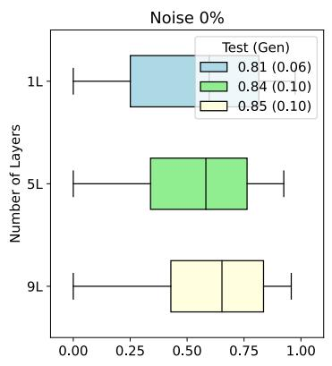

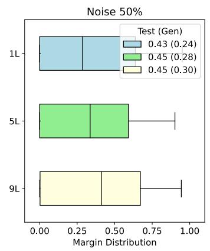

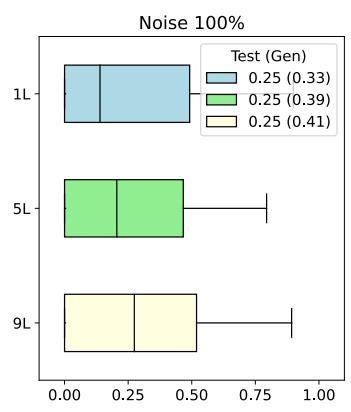  
e 1. A Tukey box-and-whisker plot depicting the margin distributions of optimized 8-qubit Quantum Convolutional Neural NeFigure 3.1: Tukey box-and-whisker plots of margin distributions for optimized 8-qubit QCNNs on the QPR task. Results are shown for QCNNs with one, five, and nine layers, under varying ). The experiment was performed with varying degrees of label noise: QPR dataset with pure labels (left), half randomly ldegrees of label randomization: 0% (left), 50% (middle), and 100% (right). Each legend entry et (middle), and full randomly labelled datasets (right). As the noise (randomization) level increases, the margin distributioreports the test accuracy with the corresponding generalization gap in parentheses. As random- ization increases, the margin distributions shift to the left and the generalization gap widens, consistent with poorer generalization under the margin-sensitive bound in Equation (3.18).

## five, and nine QCNN layers.

rgin distributions and generalization performance. response to variations in the nuThe results reveal a clear and consistent pattern across all configurations:

ntages over traditional uniform bounds. generalization gap (as shown in Theorem 3.1), the i• A right-skewed margin distribution (larger margins) is associated with higher test accu-(2022) showed that the generalization gap in lowing the results of Caro et al. (2022), we plot the sracy and a tighter generalization bound, as indicated by the smaller right-hand side of Equation (3.18).

s undergoes substantial change during training, vary with the number of QCNN layers—1, 3, 5, 7,• Increasing label randomization shifts the margin distributions to the left, reflecting that the fective parameters that undergo significant up- slightly decreasing. While the effective parameters inmodel assigns lower confidence to randomly labeled data. This leftward shift is accom- panied by a larger measured generalization gap (reported in the legend) and a larger genthe effectiveness of margins in estimating the rising generalization gap as the percentage of randoeralization bound, correctly capturing the deteriorating generalization under label noise.

• When labels are not fully randomized, deeper QCNNs (more layers) tend to achieve higher mine both the total number of parameters and QCNN with shared parameters (Cong et al., 2019; Hutest accuracy and rightward-shifted margin distributions, suggesting that increased ex-ng optimization. Specifically, we define effec- 2020), arranged in decreasingpressibility helps the model find hypotheses closer to the optimal one.

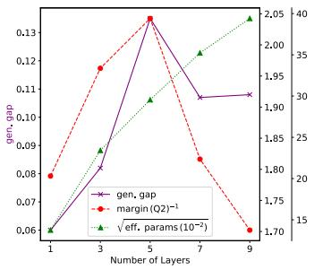  
(a)

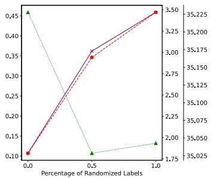  
(b)

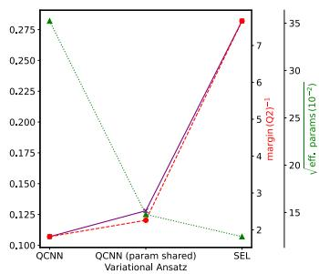  
(c)  
Figure 2: Illustration of how the generalization gap, median of the margin distribution (a margin-Figure 3.2: Comparison of the generalization gap, median margin (a margin-based metric), and efective parameters with threshold $1 0 ^ { - 2 }$ (a parameter-based metric) as a function of: (a) the number of QCNN layers, (b) the percentage of randomized labels, and (c) the choice of variational ansatz. Since margins are inversely correlated with the generalization gap (Equarics, we examine both the total number of parameters and the count of effective parameters thattion (3.18)), the inverse median margin is plotted. The margin more closely tracks the gen-undergo substantial change during optimization. Specifically, we define effective parameters usingeralization gap in these experiments, while efective parameters show inconsistent or opposite trends.

shold) change in response to variations in the number of QCNN layers, the percentage of ran-These observations support the margin distribution as an informative indicator of generalizageneralization gap (as shown in Equation (5)), the inverse of the median margin is plotted instead.tion performance in the studied settings, even in scenarios where the model can overfit random effective parameters.labels—precisely the regime where uniform bounds fail.

## reaches its peaks at five layers before slightly decreasing. While the effectPredicting the Generalization Gap: Margins vs. Parameters

A key question is whether margin-based metrics ofer a practical advantage over parameter-based metrics for predicting the generalization gap. To address this, we compare three margin-based et al., 2019; Hur et al., 2022), and Strongly Entangling Layers (Bergholm et al., 2020), arranged inmetrics (lower quartile, median, and mean of the margin distribution) against three parameterlocal parameterized unitaries within the convolutional layers to share identical parameter valubased metrics (total parameter count, and efective parameters at thresholds 10−1 and 10−2).

ctive parameters show an inverse trend.Figure 3.2 compares these metrics across three experimental axes: (a) varying the number of QCNN layers, (b) varying the percentage of randomized labels, and (c) varying the variational ansatz (QCNN, QCNN with shared parameters [32, 33], and Strongly Entangling Layers [88]). The results show that:

• The margin reliably captures variations in the generalization gap across all three hyperparameters. For example, the generalization gap peaks at five layers before slightly decreasing, and the inverse median margin accurately tracks this non-monotonic behavior.

• Efective parameters fail to capture the generalization gap in several settings and sometimes show the opposite trend. For instance, the efective parameters increase monotonically with the number of layers, failing to capture the peak in generalization gap at five layers.

For a more comprehensive comparison, we compute both the mutual information and the Kendall rank correlation coeficient between each metric and the generalization gap across all hyperparameter configurations simultaneously.

The mutual information $I ( g ; \mu )$ quantifies the reduction in uncertainty about the generalization gap � given the metric $\mu .$ The Kendall rank correlation coeficient � measures the ordinal association between the generalization gap and the metric—specifically, whether the ranking of models by the metric agrees with their ranking by generalization performance:

$$
\tau _ { G , M } = \frac { 1 } { n ( n - 1 ) } \sum _ { i < j } \left[ 1 + \mathrm { s g n } ( g _ { i } - g _ { j } ) \mathrm { s g n } ( \mu _ { i } - \mu _ { j } ) \right] ,\tag{3.21}
$$

where $G = [ g _ { 1 } , \dots , g _ { n } ]$ and $M = [ \mu _ { 1 } , \ldots , \mu _ { n } ]$ are lists of generalization gaps and corresponding metrics. This coeficient ranges from 0 to 1, where $\tau = 1$ indicates perfect agreement between the two rankings (all pairs concordant), and $\tau = 0$ perfect disagreement (all pairs discordant).

Figure 3.3 shows that margin-based metrics are more strongly correlated with the generalization gap than parameter-based metrics in both evaluation methods. This supports the use of margin-based quantities not only as theoretically motivated terms in Theorem 3.1, but also as practical diagnostics for evaluating the generalization performance of QML models.

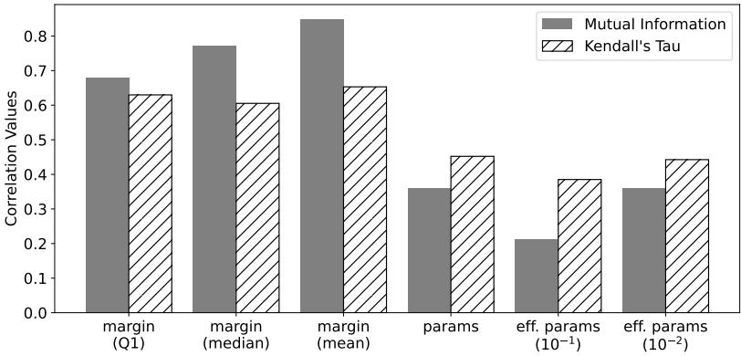  
Figure 3: Comparative analysis of mutual information (solid) and Kendall rank correlation coeffiFigure 3.3: Mutual information (solid) and Kendall rank correlation coeficient (shaded) between cients (shaded) between the generalization gap and various metrics. The first three columns representhe generalization gap and various metrics. The first three columns represent margin-based met-margin-based metrics, while the last three columns represent parameter-based metrics.rics (lower quartile, median, and mean of the margin distribution), while the last three represent parameter-based metrics (total parameters, efective parameters at thresholds $1 0 ^ { - 1 }$ and $1 0 ^ { - 2 } )$ . Margin-based metrics show stronger correlations with the generalization gap than parameter-and µ(λ) as functions of this vectbased metrics in these experiments.

## of g given µ, indicating the remaining uncertainty about the gen3.3.4 Connection to Quantum State Discrimination

We now establish a connection between the margin and quantum state discrimination, bridging sociation between two variables. For pairs of generalization gap and metric values, (g(λ1)our generalization analysis with the quantum embedding theory developed in Chapter 2.

the metric µ effectively predicts relative generalization, with lower µ values corresponding to betteMargin mean and trace distance. For binary classification, the margin mean can be expressed as as:

$$
\mu _ { \mathrm { m e a n } } = \frac { 1 } { m } \sum _ { i } 2 \operatorname { T r } ( U \rho ( x _ { i } ) U ^ { \dagger } E _ { y _ { i } } ) - 1 ,\tag{3.22}
$$

where � is the optimized unitary and $E _ { y _ { i } }$ is the POVM element corresponding to class $y _ { i }$ . g and µ (all pairs are concordanDefining the efective POVM $E _ { \pm 1 } ^ { * } ~ = ~ U ^ { \dagger } E _ { \pm 1 } U$ and the class-averaged density matrices $\rho ^ { \pm } \ =$ $\begin{array} { r } { \frac { 1 } { m ^ { \pm } } \sum _ { i } \rho ( x _ { i } ^ { \pm } ) } \end{array}$ generalization gap and vario, the margin mean becomes:

$$
\mu _ { \mathrm { m e a n } } = 2 \mathrm { T r } ( p ^ { + } \rho ^ { + } E _ { + 1 } ^ { * } ) + 2 \mathrm { T r } ( p ^ { - } \rho ^ { - } E _ { - 1 } ^ { * } ) - 1 ,\tag{s large(3.23}
$$

where $p ^ { \pm }$ are the class priors. Using $E _ { + 1 } ^ { * } + E _ { - 1 } ^ { * } = I$ , the success-probability term symmetrizes as:

$$
\mathrm { T r } ( p ^ { + } \rho ^ { + } E _ { + 1 } ^ { * } ) + \mathrm { T r } ( p ^ { - } \rho ^ { - } E _ { - 1 } ^ { * } ) = \frac { 1 } { 2 } + \frac { 1 } { 2 } \mathrm { T r } \big [ ( p ^ { + } \rho ^ { + } - p ^ { - } \rho ^ { - } ) ( E _ { + 1 } ^ { * } - E _ { - 1 } ^ { * } ) \big ] .\tag{3.24}
$$

Maximizing over binary POVMs $\{ E _ { \pm 1 } ^ { * } \}$ recovers the Helstrom measurement for discriminating $p ^ { + } \rho ^ { + }$ from $p ^ { - } \rho ^ { - } \left[ 5 0 \right]$ , which yields:

$$
\mu _ { \mathrm { m e a n } } \leq 2 D _ { \mathrm { t r } } ( p ^ { + } \rho ^ { + } , p ^ { - } \rho ^ { - } ) ,\tag{3.25}
$$

where $D _ { \mathrm { t r } }$ is the trace distance, as in Chapter 2, and the inequality becomes an equality if and only if $\{ E _ { \pm 1 } ^ { * } \}$ is the Helstrom measurement.

Thus, the trace distance serves as an upper bound on the achievable margin mean. Quantum embeddings that produce a large trace distance between class ensembles—such as those obtained through NQE (Chapter 2)—raise the ceiling on the margin, which can lead to tighter bounds in Theorem 3.1. This provides a theoretical explanation for the empirically observed relationship between large trace distances and improved generalization [48, 89, 90]: these embeddings make larger classification margins attainable.

Experimental validation. We empirically examine this connection by comparing QCNNs with three diferent quantum embedding schemes on classical datasets (MNIST [91], Fashion-MNIST [92], and Kuzushiji-MNIST [93]): (1) a fixed ZZ feature map, (2) trainable quantum embedding (TQE) [89], and (3) Neural Quantum Embedding (NQE) [48]. These three schemes produce progressively increasing initial trace distances.

Figure 3.4 supports the theoretical prediction: the trace distance (red dots) increases progressively from the fixed embedding to TQE to NQE, accompanied by a corresponding increase in been shown to significantly enhance test accuracy, thereby      8-qubit QCNN with various quantum embedding schemethe margin mean (black crosses) and rightward shift of the margin distribution. Larger margin ive relationship between a large initial trace distance and fects the margin distribution and the model’s generalizatiomeans, coupled with right-skewed margin distributions, are associated with higher test accu- theoretical explanation for this relationship was previously ployed to vary the initial trace distance: the fixed quanturacies while the generalization gap stays small across all three embeddings, aligning with the cal basis, as the trace distance serves as an upper bomargin-based generalization framework.

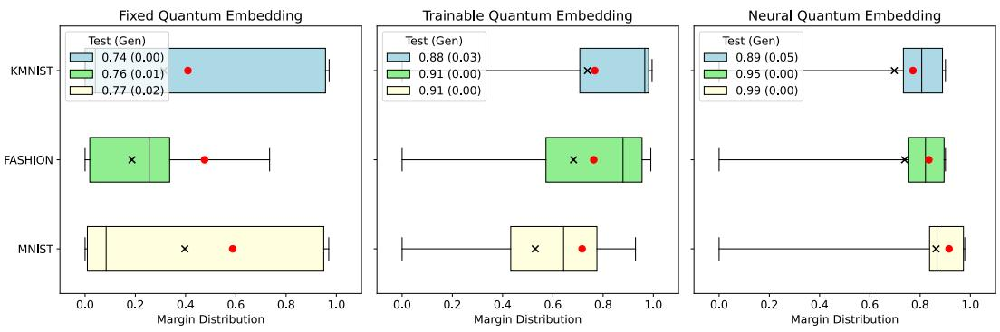  
Figure 4. A Tukey box-and-whisker plot illustrating the margin distributions of optimized 8-qubit Quantum Convolutional Neural NetworkFigure 3.4: Tukey box-and-whisker plots of margin distributions for optimized 8-qubit QCNNs on binary classification tasks using three quantum embedding schemes: fixed ZZ feature map (middle), and Kuzushiji-MNIST (top) datasets. In addition to the margin distributions, the mean of the margins is indicated by a blac(left), trainable quantum embedding (middle), and Neural Quantum Embedding (right). Results are shown for MNIST (bottom), Fashion-MNIST (middle), and Kuzushiji-MNIST (top). Each legend entry reports the test accuracy with the corresponding generalization gap in parentheses. The black cross indicates the margin mean, and the red circle indicates the unweighted trace highlighted the inherent limitations of TQE in maximizing perspective on generalization enables a systematic optimizdistance between class ensembles. Higher trace distances correspond to larger attainable margins race distance and empirically demonstrated that NQE can tion of the generalization performance of QML models band higher test accuracies—while the generalization gap remains small throughout—in these experiments, consistent with the connection established in Equation (3.23).

nary classification, the margin mean simplifies to gressively increasing trace distance (indicated by a red doThis result connects the training-loss and generalization perspectives: NQE (Chapter 2) reoptimized unitary of QNN after the training. By defining This increase in trace distance corresponds to higher margiduces the achievable training loss by increasing the trace distance, and the same increased trace distance can support larger classification margins. The margin-based perspective thus links state 2 N + N   using an optimal quantumdistinguishability and generalization through the quantum embedding.

## 3.4 Summary

In this chapter, we developed a margin-based framework for understanding generalization in quantum machine learning. Our main contributions are:

1. Margin generalization bound for QNNs (Theorem 3.1): We established a generalization bound for multiclass classification with QNNs that depends on the margin distribution. Unlike parameter-count bounds that are often too vacuous for the empirical memorization comparisons studied here, the margin bound yields tighter estimates when the model classifies training data with large margins.

2. Empirical comparison of margin-based metrics: Through experiments on the quantum phase recognition task, we found that margin-based metrics (lower quartile, median, and mean of the margin distribution) are stronger predictors of generalization performance than parameter-based metrics in the tested settings, as measured by both mutual information and the Kendall rank correlation coeficient.

3. Connection to quantum state discrimination: We showed that the margin mean is upper bounded by the trace distance between class ensembles (Equation (3.25)). This establishes a theoretical link between the generalization framework of this chapter and the trace-distance framework of Chapter 2: embeddings with large trace distances make larger margins attainable.

In Part II, we reverse the direction and explore how artificial intelligence techniques can address fundamental challenges in quantum computing, beginning with neural decoders for quantum error correction in Chapter 4.

Part II

AI for Quantum

## CHAPTER 4 NEURAL DECODERS FOR QUANTUM ERROR CORRECTION

The results in this chapter are based on Scalable Neural Decoders for Practical Real-Time Quantum Error Correction [94]. The numerical data underlying the real-time decoding results for the Transformer and Mamba decoders are publicly available in the GitHub repository at https://github.com/qDNA-yonsei/NeuralDecoder\_v1.

In Part I of this thesis, we explored how quantum computing can enhance machine learning— from neural quantum embeddings (Chapter 2) to generalization theory for quantum neural networks (Chapter 3). In Part II, we reverse this direction and ask: how can artificial intelligence help solve quantum problems? The two Part II chapters examine this question at complementary levels: Chapter 4 studies real-time quantum error correction, while Chapter 5 studies neural representations and optimizers for quantum many-body ground states.

A central bottleneck on the path to fault-tolerant quantum computation is quantum error correction decoding—the classical inference task of identifying and correcting errors from noisy syndrome measurements. As quantum processors scale to hundreds and eventually thousands of physical qubits, decoders must provide throughput comparable to the syndrome-generation rate while maintaining high accuracy, so that the classical backlog remains bounded [95]. This chapter presents a neural decoder based on the Mamba architecture [96], a state-space model that replaces the attention mechanism of Transformer-based decoders with a selective scan of $\mathcal { O } ( d ^ { 2 } )$ complexity, where � is the code distance. The experiments show that this architectural choice preserves comparable decoding accuracy relative to the reproduced Transformer baseline in the tested settings while improving the asymptotic scaling relative to the $\mathcal { O } ( d ^ { 4 } )$ attention mechanism used by Transformer decoders such as AlphaQubit [97]. Under the simulated latency model introduced in this chapter, this improved scaling yields a higher finite-size efective threshold.

The chapter is organized as follows. Section 4.1 introduces the basics of quantum error correction, focusing on surface codes and the computational challenges of decoding. Section 4.2 surveys neural network approaches to decoding, with particular attention to AlphaQubit and its limitations. Section 4.3 presents our Mamba-based decoder—its architecture, training procedure, and experimental results on both hardware data and simulated real-time scenarios. Section 4.4 summarizes the chapter.

## 4.1 Introduction to Quantum Error Correction

Quantum information is inherently fragile: interactions with the environment, imperfect gate operations, and faulty measurements introduce errors that accumulate rapidly during a computation. Unlike classical bits, which can be copied and checked, quantum states cannot be cloned [1], making direct error detection impossible without carefully designed encoding schemes.

Quantum error correction (QEC) overcomes this obstacle by encoding a logical qubit redundantly across many physical qubits, so that errors can be detected and corrected without destroying the encoded quantum information [98, 99, 100, 101]. The field has matured from early theoretical proposals to experimental demonstrations of error suppression in regimes relevant to fault tolerance [102], yet a critical classical bottleneck remains: the decoder that interprets syndrome measurements and prescribes corrections must keep pace with syndrome production—a challenge that grows with code size.

## 4.1.1 Surface Codes

Among the many families of quantum error-correcting codes, the surface code [103, 104, 105] stands out as the leading candidate for near-term fault-tolerant quantum computing. Its appeal rests on three properties: (i) it requires only nearest-neighbor interactions on a two-dimensional lattice; (ii) under standard circuit-noise assumptions it has one of the highest known faulttolerance thresholds, approximately 1% per physical gate [104, 105]; and (iii) syndrome extraction requires only local measurements.

Stabilizer formalism. The surface code is defined within the stabilizer formalism [101]. An $[ [ n , k , d ] ]$ stabilizer code encodes � logical qubits into � physical qubits and can detect any error acting on fewer than � qubits, where � is the code distance. The code is specified by an Abelian stabilizer group $\begin{array} { r } { \mathcal { S } ~ = ~ \langle g _ { 1 } , g _ { 2 } , \dotsc , g _ { n - k } \rangle ~ \subset ~ \mathcal { P } _ { n } } \end{array}$ , where ${ \mathcal P } _ { n }$ is the �-qubit Pauli group. The codespace is the simultaneous +1 eigenspace of all stabilizer generators:

$$
{ \mathcal { C } } = \{ | \psi \rangle \in ( \mathbb { C } ^ { 2 } ) ^ { \otimes n } : g _ { i } \left| \psi \right. = \left| \psi \right. \ \forall i \} .\tag{4.1}
$$

An error $E \in \mathcal { P } _ { n }$ is detectable if it anticommutes with at least one stabilizer generator, producing a −1 measurement outcome that flags the error without revealing the encoded information.

Rotated surface code. Throughout this chapter we focus on the rotated surface code [106], the variant used in the experimental benchmarks below and in current superconducting-qubit demonstrations. A distance-� rotated patch encodes a single logical qubit using $2 d ^ { 2 } - 1$ physical qubits: �2 data qubits and $d ^ { 2 }$ $d ^ { 2 } - 1$ measurement (ancilla) qubits that mediate stabilizer readout.

Its stabilizers come in two types, �-type and �-type. Logical operators are Pauli strings that commute with all stabilizers but are not themselves in $\mathcal { S }$ . On the surface code, logical $\bar { X } ( \bar { Z } )$ is a chain of � (�) operators spanning the lattice from one boundary to the opposite boundary.

Syndrome measurement. In a QEC cycle, every stabilizer generator is measured once, yielding a binary outcome $s _ { i } \in \{ 0 , 1 \}$ for each generator. The collection $\mathbf { s } = ( s _ { 1 } , s _ { 2 } , \ldots , s _ { n - k } )$ is called the syndrome. In an ideal setting, $s _ { i } = 0$ for all � indicates no detectable error.

In practice, syndrome measurements are themselves noisy—ancilla qubits and measurement gates are imperfect. To reliably extract the syndrome, the measurement is repeated � times (matching the code distance), creating a three-dimensional spacetime volume of syndrome data. A detection event is defined as a change in a stabilizer outcome between consecutive rounds:

$$
\delta _ { i , t } = s _ { i , t } \oplus s _ { i , t - 1 } ,\tag{4.2}
$$

where $s _ { i , t }$ is the outcome of stabilizer � at round � and ⊕ denotes addition modulo 2. Detection events, rather than raw syndromes, form the input to modern decoders because they are invariant to the initial syndrome configuration and directly encode the locations of faults in spacetime.

## 4.1.2 The Decoding Problem

Given a syndrome history $\mathbf { s } = \{ s _ { i , t } \}$ , the task of the decoder is to infer a correction operator ℛ that returns the system to the codespace. Because many diferent physical errors can produce the same syndrome (they difer by elements of $\mathcal { S } )$ , the decoder only needs to identify the correct equivalence class of the error, not the exact physical error.

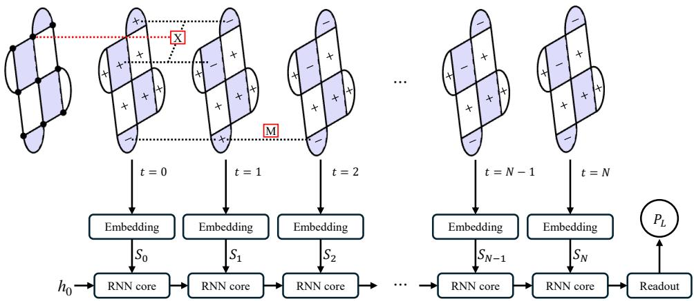  
Figure 4.1: Spacetime view of surface-code syndrome extraction for recurrent neural decoding. Each quantum error-correction (QEC) cycle produces stabilizer measurements and detection error. Further details on the architecture and notations are provided in the Methods section.events, which are embedded as spatial features, processed recurrently over time, and decoded into a logical-error probability.

correlations in the syndrome data. Meanwhile, more exhaustive approaches like tensor-networMaximum likelihood decoding. The optimal decoding strategy is maximum likelihood (ML) less strong bond-dimension truncations are applied, which in turn degrade accuradecoding, which selects the equivalence class with the highest total probability:

$$
\hat { c } = \underset { c \in \{ 0 , 1 \} } { \arg \operatorname* { m a x } } \sum _ { E \in c } \operatorname* { P r } ( E \mid \mathbf { s } ) ,\tag{decod(4.3}
$$

where � labels the equivalence class (trivial or logical error). ML decoding is #P-hard in general [107], motivating the development of eficient approximate decoders.

Decoder taxonomy. A variety of decoding algorithms have been developed, broadly categorized as follows:

onstrates how machine learning can push QEC decoding beyond the limits of human-designe• Matching-based decoders. Minimum-weight perfect matching (MWPM) [108, 109] maps the syndrome to a graph problem and finds the minimum-weight set of edges 2connecting detection events. MWPM runs in $\mathcal { O } ( n ^ { 3 } )$ 4 worst-case time and has been the →        4workhorse decoder for surface codes. Standard matching formulations are most direct for independent graphlike error models. Extensions such as correlated MWPM [110] and belief matching [109] incorporate correlations between � and � errors at the cost of increased complexity.

• Tensor network decoders. By contracting a tensor network representation of the error model, these decoders can approximate ML decoding with tunable accuracy [111, 107]. However, the bond dimension required for accuracy grows with code distance, limiting scalability.

• Neural decoders. Machine learning models trained on syndrome–error pairs can learn complex noise correlations directly from data [112, 113, 97]. Their accuracy can match or exceed traditional decoders, but inference latency is a concern for real-time operation (discussed in Section 4.2).

Real-time constraints. In a fault-tolerant quantum computer, error correction operates continuously as each QEC cycle produces new syndrome information. For memory experiments and Cliford operations, Pauli-frame updates can often be deferred, so the decoder does not always need to finish strictly before the next cycle. Nevertheless, a scalable processor still requires decoding throughput comparable to the syndrome-generation rate so that the backlog remains bounded [95]. Latency becomes especially consequential when classical feedforward is needed, and delayed corrections can be modeled as an additional efective noise source. This latency constraint makes decoding speed an essential companion to accuracy for practical QEC.

Data-driven decoding. A recent paradigm for decoder design is the data-driven approach [97, 114]: a neural decoder is pretrained on large synthetic datasets generated from a calibrated noise model, then fine-tuned on experimental hardware data. This two-stage pipeline allows the decoder to learn the specific noise characteristics of the target device—including cross-talk, leakage, and measurement-induced errors—without requiring an explicit analytical noise model.

Performance metrics. The quality of a decoder is measured by the logical error rate (LER), denoted �, which is the probability of a logical error per QEC cycle. The LER is estimated by fitting the measured logical fidelity �(�) after � cycles to the model

$$
\log F ( n ) = \log F _ { 0 } + n \log ( 1 - 2 \varepsilon ) ,\tag{4.4}
$$

where $F _ { 0 }$ accounts for state preparation and measurement errors [97]. A good code–decoder pair is usually characterized by an error threshold $p _ { \mathrm { t h } } \colon$ the maximum physical error rate below which increasing the code distance � exponentially suppresses the LER in an asymptotic setting. The error suppression ratio $\Lambda = \varepsilon ( d ) / \varepsilon ( d + 2 )$ quantifies how much benefit each increase in code distance provides.

## 4.2 Neural Decoders

The idea of using neural networks for QEC decoding dates back to 2017, when the earliest decoders ranged from generative Boltzmann machines [112] to feedforward networks for small codes [115]. Since then, the field has grown rapidly, with architectures ranging from simple multilayer perceptrons to recurrent transformers. For a broader review of machine learning approaches to decoding topological quantum codes, see Lee et al. [116]. This section surveys the neural decoder literature (Section 4.2.1) and then discusses AlphaQubit (Section 4.2.2), a high-performing Transformer-based decoder that motivates our Mamba-based approach.

## 4.2.1 Overview of Neural Decoder Literature

Early feedforward approaches. Torlai and Melko [112] introduced one of the first neural decoders, using a restricted Boltzmann machine to decode the toric code, demonstrating that unsupervised generative models could learn the error distribution from syndrome data. Concurrently, Krastanov and Jiang [113] proposed a deep neural network probabilistic decoder for stabilizer codes that could handle depolarizing noise. Varsamopoulos et al. [115] systematically studied feedforward networks for small surface codes, followed by comparisons across architectures [117] and distributed decoder designs [118].

Recurrent and specialized architectures. Baireuther et al. [119] applied recurrent neural networks to decode correlated qubit errors in a topological code, showing that temporal correlations across QEC cycles could be exploited. This was extended to color codes with circuit-level noise [120]. Chamberland and Ronagh [121] designed deep neural decoders specifically for near-term fault-tolerant experiments, while Maskara et al. [122] demonstrated the versatility of neural-network decoding for various topological codes. Ni [123] scaled neural decoders to largedistance 2D toric codes, and Liu and Poulin [124] introduced neural belief-propagation decoders that combined neural networks with message-passing algorithms.

Modern approaches. More recently, Gicev et al. [125] developed a scalable artificial neural network syndrome decoder optimized for speed. Lange et al. [114] applied graph neural networks (GNNs) to QEC decoding, exploiting the natural graph structure of stabilizer codes. Sweke et al. [126] formulated decoding as a reinforcement learning problem, and Cao et al. [127] used generative pre-trained transformers for decoding. Egorov et al. [128] proposed equivariant neural decoders that respect the symmetries of the code, improving sample eficiency. Further work has explored hardware cost-performance tradeofs [129], symmetry-aware architectures [130], and deep reinforcement-learning decoders [131].

Despite this progress, a persistent tension remains between accuracy and latency. Highly accurate neural decoders tend to use large models with expensive inference, while lightweight decoders sacrifice accuracy for speed. The breakthrough of AlphaQubit showed that neural decoders can be highly competitive with strong traditional decoders on important benchmarks, but at a computational cost that challenges real-time operation.

## 4.2.2 AlphaQubit

AlphaQubit [97] is a recurrent Transformer-based neural decoder developed by Google Deep-Mind and Google Quantum AI. It represents a landmark in neural decoding: it demonstrated that a data-driven neural decoder can achieve highly competitive performance on real hardware data from Google’s Sycamore processor.

Architecture. AlphaQubit follows a recurrent encoder architecture with three components (cf. Figure 4.2):

1. Stabilizer Embedder: At each QEC cycle �, raw stabilizer measurements, detection events, and optionally analog I/Q readout values and leakage flags are embedded into $d _ { \mathrm { m o d e l } }$ -dimensional feature vectors ${ \bf s } _ { n , i }$ for each stabilizer �, via linear projections combined with positional encodings and processed through a small ResNet.

2. RNN Core: The sequence of stabilizer embeddings $S _ { n } = \{ \mathbf { s } _ { n , i } \} _ { i = 1 } ^ { | \mathcal { S } | }$ is processed recurrently across QEC cycles. At each cycle, the core updates a hidden state:

$$
h _ { n + 1 } = f _ { \mathrm { c o r e } } ( h _ { n } , S _ { n } ) ,\tag{4.5}
$$

where $f _ { \mathrm { c o r e } }$ consists of multiple Syndrome Mixer layers. In AlphaQubit, each Syndrome

Mixer uses multi-head attention (MHA) [16] as the core mixing operation, followed by gated dense layers and dilated 2D convolutions.

3. Readout Network: After the final cycle, the hidden state $h _ { N }$ is scattered onto a 2D grid, converted to the data qubit lattice via convolutions, and passed through a deep ResNet to produce the logical error probability $P _ { L }$

The multi-head attention in the Syndrome Mixer computes:

$$
{ \mathrm { A t t e n t i o n } } ( Q , K , V ) = { \mathrm { s o f t m a x } } \left( { \frac { Q K ^ { \top } } { \sqrt { d _ { k } } } } \right) V ,\tag{4.6}
$$

where �, �, $V \in \mathbb { R } ^ { n _ { s } \times d _ { k } }$ are the query, key, and value matrices derived from the $n _ { s } ~ = ~ | { \mathcal { S } } |$ stabilizer embeddings, and $d _ { k }$ is the head dimension. This allows the model to learn arbitrary pairwise correlations between stabilizers.

Training. AlphaQubit employs a two-stage data-driven training pipeline. In pretraining, the model is trained on large synthetic syndrome datasets generated from a detector error model (DEM) calibrated using cross-entropy benchmarking (XEB) data from the Sycamore processor. In fine-tuning, the pretrained model is then adapted on real experimental data from Sycamore memory experiments, allowing it to learn hardware-specific noise patterns including cross-talk, leakage, and correlated errors.

Results on Sycamore data. On distance-3 and distance-5 surface codes, AlphaQubit achieved logical error rates competitive with the strongest tested decoders: $\varepsilon = 2 . 9 0 1 \times 1 0 ^ { - 2 }$ at distance 3 and $\varepsilon = 2 . 7 4 8 \times 1 0 ^ { - 2 }$ at distance 5, corresponding to an error suppression ratio of $\Lambda = 1 . 0 5 6$ The full AlphaQubit result outperformed both matching-based and tensor-network decoders on the Sycamore data.

The latency bottleneck. Despite its accuracy, AlphaQubit has a fundamental scalability limitation rooted in its attention mechanism. The self-attention operation in Equation (4.6) computes pairwise interactions between all $n _ { s }$ stabilizers, with complexity $\mathcal { O } ( n _ { s } ^ { 2 } )$ per layer. For a distance-� surface code, the number of stabilizers scales as $n _ { s } \propto d ^ { 2 }$ , giving an overall per-cycle complexity of $\mathcal { O } ( d ^ { 4 } )$

AlphaQubit’s latency is already approximately 40 $\mu \mathrm { s }$ at distance 9—an order of magnitude slower than the ∼ 1 $\mu \mathrm { s }$ QEC cycle time of superconducting qubits. This latency bottleneck motivates the central contribution of this chapter: replacing the attention mechanism with a Mambabased selective state-space model that achieves $\mathcal { O } ( d ^ { 2 } )$ complexity—a quadratic improvement— while preserving comparable accuracy.

## 4.3 Mamba Decoder

We now present the Mamba decoder [94], a neural decoder that replaces the multi-head attention in AlphaQubit’s Syndrome Mixer with a Mamba module—a selective state-space model with linear complexity. We first introduce state-space models and the Mamba architecture (Section 4.3.1), then describe the decoder architecture and training (Section 4.3.2), and finally present experimental results (Section 4.3.3).

## 4.3.1 Mamba and State Space Models

State-space models (SSMs) are a class of sequence models inspired by continuous-time dynamical systems. They have recently emerged as a compelling alternative to Transformers for modeling long sequences, ofering linear-time complexity while maintaining competitive performance across language, audio, and genomics tasks [132, 96].

Continuous-time SSM. A linear time-invariant (LTI) state-space model maps an input signal $x ( t ) \in \mathbb { R }$ to an output $y ( t ) \in \mathbb { R }$ through a latent state $h ( t ) \in \mathbb { R } ^ { N }$

$$
h ^ { \prime } ( t ) = A h ( t ) + B x ( t ) ,\tag{4.7}
$$

$$
y ( t ) = C h ( t ) ,\tag{4.8}
$$

where $A \in \mathbb { R } ^ { N \times N }$ is the state transition matrix, $\boldsymbol { B } \in \mathbb { R } ^ { N \times 1 }$ is the input projection, and $C \in \mathbb { R } ^ { 1 \times N }$ is the output projection.

Discretization. To process discrete sequences, the continuous system is discretized using a step size $\Delta > 0$ . Under the zero-order hold (ZOH) assumption:

$$
\bar { \cal A } = \exp ( \Delta { \cal A } ) ,\tag{4.9}
$$

$$
\bar { B } = ( \Delta A ) ^ { - 1 } ( \exp ( \Delta A ) - I ) \cdot \Delta B ,\tag{4.10}
$$

yielding the discrete recurrence:

$$
h _ { k } = \bar { A } h _ { k - 1 } + \bar { B } x _ { k } ,\tag{4.11}
$$

$$
y _ { k } = C h _ { k } .\tag{4.12}
$$

This recurrence can be computed in $\mathcal { O } ( L )$ time for a sequence of length �. Alternatively, unrolling the recurrence yields a convolution $y = \bar { K } * x$ with kernel $\bar { K } = ( C \bar { B } , C \bar { A } \bar { B } , C \bar { A } ^ { 2 } \bar { B } , . . . )$ which can be computed in $\mathcal { O } ( L$ log �) via the Fast Fourier Transform. This dual view— recurrence for inference, convolution for training—is a key advantage of SSMs.

S4: Structured State Spaces. The S4 model [132] introduced structured initialization of the state matrix � using the HiPPO (High-order Polynomial Projection Operator) framework, enabling SSMs to capture long-range dependencies that challenge RNNs and even Transformers. S4 demonstrated state-of-the-art performance on the Long Range Arena benchmark, but its LTI nature means that the same dynamics are applied regardless of input content—the model cannot selectively attend to or ignore parts of the sequence.

Mamba: Selective State Spaces. Mamba [96] addresses this limitation by making the SSM parameters input-dependent. Specifically, the matrices �, �, and the step size $\Delta$ are computed as functions of the input:

$$
B _ { k } = \mathrm { L i n e a r } _ { B } ( x _ { k } ) , \qquad C _ { k } = \mathrm { L i n e a r } _ { C } ( x _ { k } ) , \qquad \Delta _ { k } = \mathrm { s o f t p l u s } ( \mathrm { L i n e a r } _ { \Delta } ( x _ { k } ) ) .\tag{4.13}
$$

This selective mechanism allows the model to perform content-aware filtering: it can dynamically decide which information to propagate through the hidden state and which to discard, analogous to the gating mechanisms in LSTMs [14] but within the SSM framework.

The input-dependent parameters break the LTI structure, precluding the use of the convolution mode during training. Mamba compensates with a hardware-aware parallel scan. The key observation is that the linear recurrence $h _ { k } = \bar { A } _ { k } h _ { k - 1 } + \bar { B } _ { k } x _ { k }$ is associative: each step can be written as a pair $( \bar { A } _ { k } , \bar { B } _ { k } x _ { k } )$ composed under the rule $( A _ { 2 } , b _ { 2 } ) \circ ( A _ { 1 } , b _ { 1 } ) = ( A _ { 2 } A _ { 1 } , A _ { 2 } b _ { 1 } + b _ { 2 } )$ ， so the entire sequence can be evaluated with a parallel prefix scan [133] in $\mathcal { O } ( \log L )$ parallel depth rather than � sequential steps. This recovers parallelism across the time dimension even though the parameters are now time-varying. The implementation is hardware-aware: because the selective SSM expands each input channel to an �-dimensional state, naïvely storing all intermediate states in the GPU’s high-bandwidth memory (HBM) would make the operation memory-bandwidth bound. Mamba instead fuses discretization, the scan, and the output projection into a single kernel that keeps the expanded states in fast on-chip SRAM and writes only the final outputs back to HBM—similar in spirit to FlashAttention [134]—yielding near-linear scaling in sequence length in practice.

Mamba block. The Mamba block processes its input through two parallel paths:

1. SSM path: The input is linearly projected to an expanded dimension, passed through a 1D convolution for local feature extraction, activated by SiLU (Sigmoid Linear Unit), and then processed by the selective SSM.

2. Gating path: A parallel linear projection with SiLU activation provides a multiplicative gate.

The two paths are combined via element-wise multiplication and projected back to the original dimension:

$$
\mathbf { M a m b a B l o c k } ( x ) = \mathbf { L i n e a r } _ { \mathrm { o u t } } \big ( \mathrm { S S M } ( \mathrm { C o n v } \mathbf { l D } ( \mathrm { L i n e a r } _ { 1 } ( x ) ) ) \odot \mathrm { S i L U } ( \mathrm { L i n e a r } _ { 2 } ( x ) ) \big ) .\tag{4.14}
$$

## 4.3.2 Architecture and Training

The Mamba decoder shares the same overall recurrent structure as AlphaQubit (Figure 4.2)— a Stabilizer Embedder, an RNN Core with Syndrome Mixer layers, and a Readout Network (described in Section 4.2.2). The key diference is the replacement of multi-head attention with a Mamba module in each Syndrome Mixer.

Hyperparameters. Table 4.1 lists the hyperparameters for both the Transformer and Mamba decoder variants across the two experimental settings (Sycamore memory experiments and realtime decoding simulations).

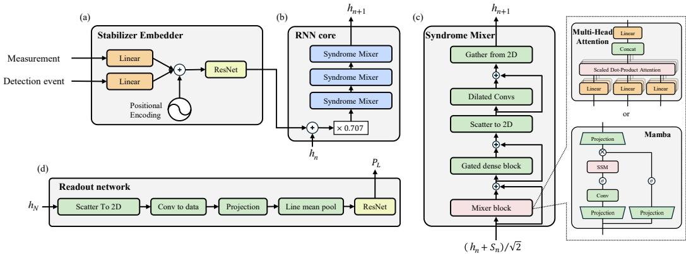  
Figure 5: (a) Stabilizer Embedder: Raw stabilizer measurements and detection events are passedFigure 4.2: Architecture of the Mamba decoder. (a) The Stabilizer Embedder converts raw through linear layers and combined withmeasurements and detection events into $d _ { \mathrm { m o d e l } }$ nal encodings before being processed by a ResNet-dimensional embeddings via linear projections, n            positional encodings, and a ResNet. (b) The RNN Core processes each QEC cycle through � = 3 Syndrome Mixer layers with scaled skip connections. (c) Each Syndrome Mixer contains updated state h . A scaled skip connection is used. (c) Syndrome Mixer: This is the centrala Mamba-based mixer block, gated dense block, and dilated 2D convolutions. (d) The Readout processing unit. The input is first processed by a Mixer Block, whicNetwork maps the final hidden state to the logical-error probability $P _ { L }$

capturing spatial correlations. (d) Readout Network: The final decoder’s hidden state hN is prTraining procedure. The training procedure difers between the two experimental settings:

Sycamore memory experiments. Following AlphaQubit, we employ a two-stage training pipeline:

e Mamba decoder achieved a higher threshold of 0.0104 compared to 0.0097 for the Transformer,1. Pretraining: We generate up to 100 million synthetic syndrome samples from a detector rectly translates to more lenient hardware noise requirements for achieving fault tolerance. Inerror model (DEM) whose parameters are derived from a Pauli noise model calibrated us-cality of QEC.ing cross-entropy benchmarking (XEB) data from the Sycamore processor. The pretrain-all, our results suggest that attention-free architectures represeing dataset includes QEC sequences of varying cycle counts $r \in \{ 1 , 3 , \ldots , 2 5 \}$ , covering cture—exploring model scaling, advanced training regimes, and hyperparameter tuning—toboth �- and �-basis memory experiments. We employ a curriculum learning strategy: the model initially trains on shorter sequences $r \in \{ 1 , 3 , 5 , 7 , 9 \}$ , and every 150,000 iterations the training set is expanded to include four additional cycle counts, eventually covering the full range up to � = 25.

The Lion optimizer [135] is used with an initial learning rate of $5 \times 1 0 ^ { - 6 }$ and weight decay of $1 \times 1 0 ^ { - 5 }$ . The learning rate follows a cosine annealing schedule. We apply gradient clipping with a maximum norm of 1 and maintain an exponential moving average (EMA) of model weights with a decay rate of 0.9999.

Table 4.1: Decoder hyperparameters. Top: model-specific parameters for Transformer and Mamba variants in Sycamore memory experiments (Syc.) and real-time decoding simulations (RT). Bottom: shared training and architecture parameters.
<table><tr><td colspan="3">Transformer-specific</td><td colspan="2">Mamba-specific</td></tr><tr><td>Param.</td><td>Syc.</td><td>RT Param.</td><td>Syc.</td><td>RT</td></tr><tr><td> $d _ { \mathrm { m o d e l } }$ </td><td>320</td><td>256  $d _ { \mathrm { m o d e l } }$ </td><td>320</td><td>256</td></tr><tr><td>H</td><td>4</td><td>4  $d _ { \mathrm { s t a t e } }$ </td><td>16</td><td>16</td></tr><tr><td> $d _ { b }$ </td><td>48</td><td>48  $d _ { \mathrm { c o n v } }$ </td><td>4</td><td>4</td></tr><tr><td> $d _ { \mathrm { a t t n } }$ </td><td>32</td><td>32  $w _ { \mathrm { m a m b a } }$ </td><td>1</td><td>1</td></tr><tr><td> $d _ { \mathrm { m i d } }$ </td><td>32</td><td>32</td><td></td><td></td></tr><tr><td colspan="5">Shared Hyperparameters</td></tr><tr><td>Param.</td><td>Sycamore</td><td>Param.</td><td></td><td>Real-time</td></tr><tr><td> $L _ { \mathrm { s t a b } }$ </td><td>2</td><td> $L _ { \mathrm { s t a b } }$ </td><td></td><td>2</td></tr><tr><td> $L _ { \mathrm { r e s } }$ </td><td>16</td><td> $L _ { \mathrm { r e s } }$ </td><td></td><td>16</td></tr><tr><td> $d _ { \mathrm { r e a d } }$ </td><td>64</td><td> $d _ { \mathrm { r e a d } }$ </td><td></td><td>48</td></tr><tr><td> $w _ { \mathrm { g a t e } }$ </td><td>5</td><td></td><td> $w _ { \mathrm { g a t e } }$ </td><td>5</td></tr><tr><td> $D _ { \mathrm { c o n v } } \left( d = 3 \right)$ </td><td>[1, 1, 1]</td><td></td><td> $D _ { \mathrm { c o n v } } \left( d = 3 \right)$ </td><td>[1, 1, 1]</td></tr><tr><td></td><td></td><td></td><td></td><td></td></tr><tr><td> $D _ { \mathrm { c o n v } } \left( d = 5 \right)$ </td><td>[1,1,2]</td><td></td><td> $D _ { \mathrm { c o n v } } \left( d = 5 \right)$ </td><td>[1,1,2]</td></tr><tr><td></td><td></td><td></td><td> $D _ { \mathrm { c o n v } } \left( d = 7 \right)$ </td><td>[1,2,4]</td></tr></table>

2. Fine-tuning: The pretrained decoder is adapted on the actual Sycamore experimental dataset (50% train / 50% evaluation split) for 10 epochs with a reduced learning rate of $2 \times 1 0 ^ { - 6 }$ and increased weight decay of $7 \times 1 0 ^ { - 5 }$

Real-time decoding experiments. For the simulated real-time setting, we train decoders from scratch on synthetic data generated on-the-fly using the Superconducting-Inspired Circuit Depolarizing Noise (SI1000) model [136] via the Stim circuit simulator [137]. Separate models are trained for code distances $d \in \{ 3 , 5 , 7 \}$ at a base physical error rate of $p \ : = \ : 0 . 0 0 2$ . Training runs for 500,000 iterations with a batch size of 256, using the Lion optimizer with cosine annealing.

For finite-size efective threshold analysis under the specified latency model, we fine-tune the baseline models (trained at $p \ = \ 0 . 0 0 2 )$ at higher physical error rates $p \in \{ 0 . 0 0 6 , 0 . 0 0 8$ 0.010, 0.012} for 250,000 iterations each, using a transfer learning approach that significantly reduces the computational cost of training models at multiple noise levels.

## 4.3.3 Experimental Results

We evaluate the Mamba decoder across two experimental settings: memory experiments on real hardware data (Section 4.3.3) and simulated real-time decoding with decoder-induced noise (Section 4.3.3).

## Memory Experiments on Sycamore Data

We benchmark our Mamba decoder against Transformer-based, matching-based, and tensor network decoders using the Sycamore memory experiment dataset from AlphaQubit [97, 102]. This publicly available dataset was obtained on the 72-qubit Sycamore superconducting processor comprising four distance-3 surface code blocks and a single distance-5 block. Both �- and �-basis memory experiments were conducted for up to 25 QEC cycles, with 50,000 experiments performed for each odd-numbered cycle count $n \in \{ 1 , 3 , \ldots , 2 5 \}$ . The logical error rate is estimated by fitting the measured fidelity to Equation (4.4). Figure 4.3a summarizes the results.

Our Mamba decoder achieves LERs of approximately $2 . 9 8 \times 1 0 ^ { - 2 }$ at distance 3 and 3.03 × $1 0 ^ { - 2 }$ at distance 5, closely tracking the reproduced Transformer baseline. At distance 3, the reproduced neural baselines are competitive with the strongest listed decoders. At distance 5, that balances the need to model complex error chains with the stringent low-laboth reproduced neural baselines underperform the tensor network decoder $( \varepsilon = 2 . 9 1 5 \times 1 0 ^ { - 2 } )$ o, while outperforming the matching-based decoders. We attribute this gap in part to the size of Sycamore memory experiments, a key benchmark for quantum error correction. Using the publiclSycamore memory experiments, a key benchmark for quantum error correction. Using the publicthe pretraining dataset: while AlphaQubit is described as being pretrained on up to 1 billion on real-world experimental data. In this setting, our Mamba decoder’s performance matches thaon real-world experimental data. In this setting, our Mamba decoder’s performance matches thsamples, our models were pretrained on 100 million samples due to computational constraints. not come at the cost of performance. Second, we shift our focus to the more practicalnot come at the cost of performance. Second, we shift our focus to the more practicalWith a larger pretraining dataset, the neural baselines might reduce this remaining gap.

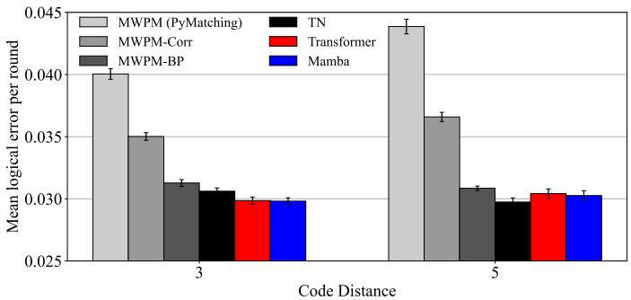  
(a)

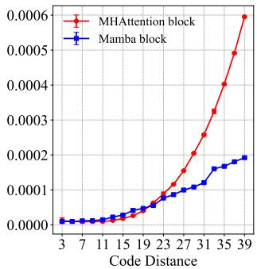  
b(b)  
Figure 2: (a) Logical error per round on the Sycamore dataset for various decoders at code distanceFigure 2: (a) Logical error pe set for various decoders at code distancFigure 4.3: Accuracy and speed of the Mamba decoder. (a) Logical error per round on the 3 and 5. (b) A comparison of inference time for a Mamba block versus a Multi-Head A3 and 5. (b) A comparison      ba block versus a Multi-Head Sycamore memory experiment dataset for various decoders at code distances � = 3 and $d = 5 ;$ (MHA) block as code distance increases, measured on a local RTX 4090 GPU.(MHA) block as code distanc    cal RTX 4090 GPU.Mamba tracks the reproduced Transformer baseline while replacing multi-head attention with a Mamba block. (b) Wall-clock inference time for a single Mamba block versus a Multi-Head Attention (MHA) block as a function of code distance, measured on a local RTX 4090 GPU.

h the noise strength scaling according to the decoder’s computational complexity—O(d ) fothe noise strength scaling according to the decoder’s computational complexity— (d2) fThe key takeaway from the memory experiments is that replacing multi-head attention with simulations, using the SI1000 noise model, the Mamba decoder outperforms the Transformer fosimulations, using the SI1000 noise model, the Mamba decoder outperforms the Transformer fa Mamba module preserves comparable decoding accuracy. This is a necessary condition for we find that the Mamba decoder exhibits a significantly higher threshold (0.0104) compared to thwe find that the Mamba decoder exhibits a significantly higher threshold (0.0104) compared to ththe Mamba decoder to be useful: its speed advantage matters only if the accuracy remains close a compelling choice for scalable, real-tia compelling choice for scalable, real-tito the reproduced Transformer baseline.

## RESULTSRInference Speed

MEMORY EXPERIMENTSTo quantify the computational advantage of the Mamba block over multi-head attention, we To evaluate the performance of our Mamba-based decoder, we benchmark it against Transformemeasure wall-clock inference time on an NVIDIA RTX 4090 GPU as a function of code distance phaQubit [29].(Figure 4.3b).

The measured inference times track the complexity of the two blocks. The curves deviate near $d \approx 2 1$ , beyond which the Mamba block becomes increasingly faster, reaching roughly 3× the speed of the MHA block at $d = 3 9$ and widening further as � grows. This is highly relevant as fault-tolerant algorithms targeting practical applications are expected to require substantially larger code distances [105], precisely the regime in which the quadratic vs. quartic scaling gap translates into large latency reductions. The Mamba block is thus better positioned than attention for the long-sequence decoding demanded by future large-distance processors.

## Real-Time Decoding with Decoder-Induced Noise

Experimental setup. We simulate real-time decoding for surface codes of distance $d \in$ {3, 5, 7} using the SI1000 noise model [136] with a base physical error rate of $p = 0 . 0 0 2$ . Each model is trained on sequences of $2 d + 1 \mathrm { Q E C }$ cycles and evaluated over $8 d + 4$ cycles (four repetitions of the training-length block). To simulate the efect of decoder latency, decoder-induced noise is injected after every $2 d + 1$ cycles.

Decoder-induced noise model. The strength of the decoder-induced noise is calibrated to reflect each architecture’s computational complexity. For large code distances $( d > 2 0 )$ , the overall inference time is dominated by the most computationally intensive component: the MHA block (for the Transformer) or the Mamba block. We model the decoder-induced error probability as:

$$
\begin{array} { r } { p _ { \mathrm { d e c } } = \left\{ \begin{array} { l l } { \alpha \cdot d ^ { 4 } } & { ( \mathrm { T r a n s f o r m e r } ) , } \\ { } \\ { \alpha \cdot d ^ { 2 } } & { ( \mathrm { M a m b a } ) , } \end{array} \right. } \end{array}\tag{4.15}
$$

where $\alpha = 7 . 6 2 3 \times 1 0 ^ { - 6 }$ is a scaling constant based on AlphaQubit’s reported ∼ 40 �s latency at $d = 9$ . At this distance, $\alpha d ^ { 4 } \approx 2 5 p$ for the base physical error rate $p = 0 . 0 0 2$ . Since the SI1000 e robust, as it can achieve fault tolerance with noisier physical qubits, a significant advantageFinite-size efective threshold analysis. Here, we estimate a finite-size efective threshold al noise channel—decoder-induced noise—which effectively lowers this threshold. Therefunder the specified decoder-induced-noise/latency model, rather than the asymptotic surfacephysical error rate at which each decoder architecture can still provide effective error suppres-code threshold. Decoder-induced noise can shift this finite-size crossover by adding an additional ployed a fine-tuning strategy. Starting with the baseline mnoise channel proportional to the decoder’s modeled latency.

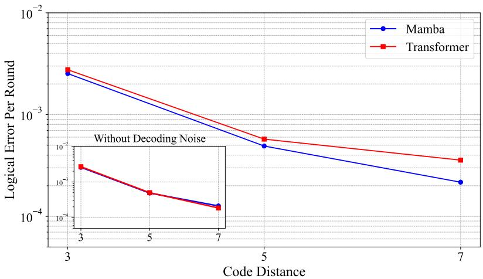  
re 3: (a) Experimental scheme for real-time decoding simulation. The evaluation runs for 8dFigure 4.4: Real-time decoding performance. Main: Logical error per round (LER) for Mamba es, structured as four repetitions of a 2d + 1 cycle block. After each block, decoding noiand Transformer decoders under simulated real-time conditions with decoder-induced noise pro- R    portional to computational complexity. Inset: LER without decoder-induced noise, showing comparable baseline accuracy.  
model assigns measurement error probability $5 p$ , this corresponds to a Transformer-induced error rate five times larger than the physical measurement-error rate.  
Results. As a baseline, we first compare the two decoders without decoder-induced noise (Figure 4.4, inset). In this setting, the Mamba and Transformer decoders exhibit nearly identical logical error rates at all distances, confirming that the Mamba architecture does not sacrifice acrs, causing a significant degradation in its LER as the code distance increases. In contrast,curacy when latency is not a factor. When decoder-induced noise is included (Figure 4.4, main cy-induced errors allows it to substapanel), the two architectures diverge. $\mathrm { A t } d = 3$ utperform the Transformer, confirming its supe, both decoders experience mild noise penalties, with comparable LERs. At $d = 5 ,$ , the Transformer’s LER begins to degrade more rapidly. At $d = 7$ S OF THE ERROR THRESHOLD UNDER REA, the Transformer’s LER rises to approximately $1 0 ^ { - 1 }$ ME DECODING, while the Mamba decoder maintains itical metric for any quanan LER of approximately $1 0 ^ { - 2 }$ error correction scin this simulation.

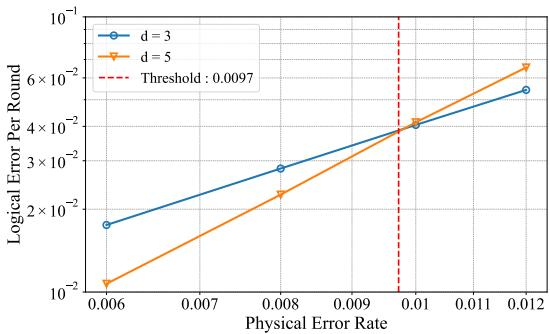  
(a)

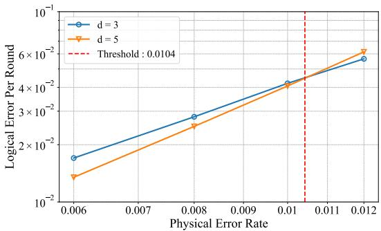  
(b)  
Figure 4: Analysis of the effective error threshold under real-time decoding with decoder-inducedFigure 4.5: Finite-size efective threshold under this latency model. Each panel shows logical error per round versus physical error rate for code distances $d = 3$ and $d = 5$ . The efective threshold is identified where the $d = 5$ curve crosses above the � = 3 curve. Under the assumed The Transformer-based decoder, showing a threshold of 0.0097decoder-induced-noise model, the Transformer decoder yields $p _ { \mathrm { t h } } \approx 0 . 0 0 9 7$ mba-based decoder,, while the Mamba showing a highdecoder yields $p _ { \mathrm { t h } } \approx 0 . 0 1 0 4$

{0.006, 0.008, 0.010, 0.012}.To estimate the finite-size efective threshold under this latency model, we fine-tune both decoders at physical error rates $p \ \in \ \{ 0 . 0 0 6 , 0 . 0 0 8 , 0 . 0 1 0 , 0 . 0 1 2 \}$ and compare the LERs at distances $d = 3$ and $d = 5$ L   . The estimate is the crossover point where increasing code distance th ≈      no longer helps in this finite-size comparison under the assumed latency-induced noise.

As shown in (Figure 4.5), the Transformer reaches $p _ { \mathrm { t h } } ~ \approx ~ 0 . 0 0 9 7$ , while the Mamba decoder reaches $p _ { \mathrm { t h } } \approx 0 . 0 1 0 4$ . A higher finite-size efective threshold means that, under the assumed decoder-induced noise scaling, the decoder can tolerate a larger physical error rate before increasing the code distance ceases to help. Moreover, as code distance increases, the Transformer’s $\mathcal { O } ( d ^ { 4 } )$ decoder-induced noise would degrade the model-dependent efective threshold Transformer decoders, while highlfaster than the Mamba decoder’s $\mathcal { O } ( d ^ { 2 } )$ ate, suffer from a computational complexity that scales as noise, making the scaling advantage increasingly im-In this work, we introduceportant at larger distances.

## 4.4 Summary

In this chapter, we introduced a neural decoder for quantum error correction based on the Mamba architecture—a selective state-space model that replaces the attention mechanism of Transformer-based decoders with a linear-complexity alternative. Our investigation established three key findings:

1. Comparable accuracy to the reproduced Transformer baseline. In memory experiments on real hardware data from Google’s Sycamore processor, the Mamba decoder achieved logical error rates of $\varepsilon \approx 2 . 9 8 \times 1 0 ^ { - 2 }$ (distance 3) and $\varepsilon \approx 3 . 0 3 \times { 1 0 ^ { - 2 } }$ (distance 5), closely tracking the reproduced Transformer-based decoder in this comparison.

2. Faster inference with growing advantage. Wall-clock benchmarks on an RTX 4090 GPU showed that inference time tracks the $\mathcal { O } ( d ^ { 2 } ) \mathrm { v s . } \mathcal { O } ( d ^ { 4 } )$ complexity of the two blocks: the curves deviate near $d \approx 2 1$ , beyond which the Mamba block pulls increasingly ahead, reaching roughly 3× faster at $d = 3 9$ and widening further as � grows. Constant-factor overhead masks this advantage at the small distances accessible today $( d ~ \leq ~ 5 )$ , so its significance is asymptotic, favoring the Mamba architecture at the larger code distances relevant for future processors.

3. Higher finite-size efective threshold under this latency model. Under simulated realtime decoding conditions with decoder-induced noise, the Mamba decoder achieved a finite-size efective threshold of $p _ { \mathrm { t h } } ~ \approx ~ 0 . 0 1 0 4$ , compared to $p _ { \mathrm { t h } } ~ \approx ~ 0 . 0 0 9 7$ for the Transformer—a 7% improvement under the assumed latency model. This higher threshold reflects the benefit of lower decoder-induced noise in that model and suggests that latency scaling could become more important as code distance increases.

In the next chapter, we turn from classical neural networks that assist quantum hardware to neural networks that represent quantum states directly.

## CHAPTER 5

## NEURAL QUANTUM STATES

The results in this chapter are based on Tak Hur, Stochastic Reconfiguration as Statistical Filtering for Overparameterized Neural Quantum States [138]. Code is available at https://github.com/takh04/sr\_filter.

In Chapter 4, neural networks were used to process syndrome data for quantum error correction. This chapter studies how neural networks can serve as variational representations of quantum many-body wave functions. Neural quantum states (NQS) combine expressive neuralnetwork ansatzes with variational Monte Carlo (VMC), making it possible to search for ground states in Hilbert spaces far beyond exact diagonalization.

The chapter focuses on stochastic reconfiguration (SR), the standard optimizer for NQS. For modern NQS, the number of parameters can greatly exceed the number of Monte Carlo samples used in one optimization step. In this parameter-rich regime, we show that the diagonal shift in SR is more than a numerical safeguard: it plays a statistical role, controlling how well the optimizer generalizes from a finite number of Monte Carlo samples. This perspective motivates a multi-shift variant of SR (MS-SR), which combines several diferently shifted updates to make better use of the available samples.

The chapter is organized as follows. Section 5.1 introduces the NQS-VMC workflow and SR. Section 5.2 develops the fixed-checkpoint regression view and the bias-variance role of the shift. Section 5.3 summarizes the exact and large-scale diagnostics supporting this view. Section 5.4 presents MS-SR and the main empirical evidence for the method. Section 5.5 summarizes the chapter.

## 5.1 Neural Quantum States and Stochastic Reconfiguration

The central obstacle in quantum many-body physics is the exponential size of the Hilbert space. A system of $N \ { \mathrm { s p i n - } } { \frac { 1 } { 2 } }$ degrees of freedom has basis states |�⟩ indexed by bit strings $x \in \{ \pm 1 \} ^ { N }$ 2 so a generic state requires 2� complex amplitudes. Tensor-network methods such as density $2 ^ { N }$ matrix renormalization group exploit low entanglement and are highly efective in many onedimensional systems [139, 140]. However, frustrated and higher-dimensional systems often require more flexible representations. NQS address this by parameterizing the wave-function amplitude $\psi _ { \boldsymbol \theta } ( \boldsymbol { x } )$ with a neural network. Since the RBM construction of Carleo and Troyer [141], NQS have expanded to recurrent, fermionic, transformer-based, and foundation-style wave functions [142, 143, 144, 145, 146, 147].

VMC approximates the ground state of a Hamiltonian $\hat { H }$ by minimizing the Rayleigh quotient

$$
E ( \theta ) = \frac {  \psi _ { \theta } | \hat { H } | \psi _ { \theta }  } {  \psi _ { \theta } | \psi _ { \theta }  } , \qquad | \psi _ { \theta } \rangle = \sum _ { x } \psi _ { \theta } ( x ) | x  .\tag{5.1}
$$

The energy is estimated by sampling configurations from the Born distribution

$$
\pi _ { \theta } ( x ) = { \frac { | \psi _ { \theta } ( x ) | ^ { 2 } } { \sum _ { x ^ { \prime } } | \psi _ { \theta } ( x ^ { \prime } ) | ^ { 2 } } }\tag{5.2}
$$

and averaging the local energy

$$
H _ { \mathrm { l o c } } ( x ) = \frac { \langle x | \hat { H } | \psi _ { \theta } \rangle } { \langle x | \psi _ { \theta } \rangle } = \sum _ { x ^ { \prime } } \left. x | \hat { H } | x ^ { \prime } \right. \frac { \psi _ { \theta } ( x ^ { \prime } ) } { \psi _ { \theta } ( x ) } .\tag{5.3}
$$

The resulting training loop is conceptually simple: sample from $| \psi _ { \theta } | ^ { 2 }$ , evaluate local energies

and wave-function derivatives, and update the parameters.

Ordinary gradient descent treats the parameter vector as Euclidean, but the same Euclidean movement can correspond to very diferent changes in the represented quantum state. SR corrects this mismatch by using the geometry induced by the variational state manifold [148, 149, 150]. Let

$$
O _ { c } (  { \boldsymbol { { x } } } ) = \nabla _ { \theta } \log \psi _ { \theta } (  { \boldsymbol { { x } } } ) - \mathbb { E } _ { \pi _ { \theta } } [ \nabla _ { \theta } \log \psi _ { \theta } ]\tag{5.4}
$$

denote centered tangent features. For real wave functions and real parameters, the quantum geometric tensor (QGT) and SR force are

$$
S = \mathbb { E } _ { \pi _ { \theta } } \big [ O _ { c } ( x ) O _ { c } ( x ) ^ { T } \big ] , \qquad g = \mathbb { E } _ { \pi _ { \theta } } \big [ O _ { c } ( x ) H _ { \mathrm { l o c } , c } ( x ) \big ] ,\tag{5.5}
$$

where $H _ { \mathrm { l o c } , c } ( x ) = H _ { \mathrm { l o c } } ( x ) - E ( \theta )$ . SR updates parameters by solving

$$
S \delta = g , \qquad \theta ^ { + } = \theta - \eta \delta .\tag{5.6}
$$

Geometrically, this is a natural-gradient step; physically, it is the projection of imaginary-time evolution onto the tangent space of $\left| \psi _ { \theta } \right.$ [151, 152].

In practice, the exact expectations defining � and � are unavailable and are replaced by Monte Carlo averages over a batch of $N _ { s }$ samples $\{ x _ { j } \}$ . Stacking the centered features as rows of $O \in$ $\mathbb { R } ^ { N _ { s } \times P }$ , with row $j$ equal to $O _ { c } ( x _ { j } ) ^ { T }$ , and collecting the centered local energies in h $\in \mathbb { R } ^ { N _ { s } }$ with $h _ { j } = H _ { \mathrm { l o c } , c } ( x _ { j } )$ , the empirical QGT and force are

$$
\hat { S } = \frac { 1 } { N _ { s } } \sum _ { j = 1 } ^ { N _ { s } } O _ { c } ( x _ { j } ) O _ { c } ( x _ { j } ) ^ { T } = \frac { 1 } { N _ { s } } O ^ { T } O , \qquad \hat { g } = \frac { 1 } { N _ { s } } \sum _ { j = 1 } ^ { N _ { s } } O _ { c } ( x _ { j } ) H _ { \mathrm { l o c } , c } ( x _ { j } ) = \frac { 1 } { N _ { s } } O ^ { T } \mathbf { h } .\tag{5.7}
$$

Because $\hat { S }$ is rank-deficient and ill-conditioned when estimated from a finite batch, SR regular-

izes the linear system with a diagonal shift �, giving the ridge solution

$$
\hat { \delta } _ { \lambda } = ( \hat { S } + \lambda I ) ^ { - 1 } \hat { g } .\tag{5.8}
$$

MinSR. The computational regime has changed with modern NQS. Classical VMC and early RBM calculations often had fewer parameters than samples. Transformer and foundation-style NQS can instead have � larger than the sample count $N _ { s }$ by one to three orders of magnitude [153, 146, 147]. In this regime, forming and inverting the $P \times P$ matrix $\hat { S } + \lambda I$ of equation (5.8) becomes prohibitive. Kernel-form SR, often called minSR, instead solves in sample space using the empirical neural tangent kernel

$$
\hat { T } = \frac { 1 } { N _ { s } } O O ^ { T } \in \mathbb R ^ { N _ { s } \times N _ { s } } .\tag{5.9}
$$

By the push-through identity, the ridge solution of equation (5.8) is obtained equivalently as

$$
\hat { \delta } _ { \lambda } = \frac { 1 } { N _ { s } } O ^ { T } ( \hat { T } + \lambda I ) ^ { - 1 } \mathbf { h } ,\tag{5.10}
$$

which inverts an $N _ { s } \times N _ { s }$ system with the same shift � rather than the full $P \times P \mathrm { Q G T }$ . This reduces the linear-algebra dimension from $P \times P$ to $N _ { s } \times N _ { s }$ , but forming the dense kernel still costs $\mathcal { O } ( N _ { s } ^ { 2 } P )$ and solving it costs $\mathcal { O } ( N _ { s } ^ { 3 } )$ . Increasing the batch size therefore remains expensive, and each SR update is still estimated from a small random batch relative to a very expressive tangent space.

## 5.2 SR as Statistical Spectral Filtering

The key simplification is to analyze one SR step at a fixed checkpoint �. At this checkpoint, the wave function, sampling distribution, tangent features, and local energies are fixed. For notational clarity, we present the case of real wave functions and Hamiltonians in the sampling basis. For complex wave functions, the regression uses modulus-squared residuals, with $Q =$ $\mathbb { E } _ { \pi _ { \theta } } [ \overline { { O _ { c } } } O _ { c } ^ { T } ]$ and $f = \mathbb { E } _ { \pi _ { \theta } } [ \overline { { O _ { c } } } H _ { \mathrm { l o c } , c } ]$ . Real parameter increments then satisfy $\operatorname { R e } ( Q ) \delta = \operatorname { R e } ( f )$ , equivalently a regression with stacked real and imaginary residuals.

At a fixed checkpoint, SR fits tangent predictions $O _ { c } ( x ) ^ { T } \delta$ to centered local energies.

The ideal population SR direction is the least-squares solution

$$
\delta ^ { * } = S ^ { \dagger } g \in \arg \operatorname* { m i n } _ { \delta } \mathbb { E } _ { \pi _ { \theta } } \left[ \left( O _ { c } ( x ) ^ { T } \delta - H _ { \mathrm { l o c } , c } ( x ) \right) ^ { 2 } \right] .\tag{5.11}
$$

The centered local energy is not generally representable exactly by the current tangent features. The population residual of the best tangent-space fit is the expressivity gap

$$
\epsilon ( x ) = H _ { \mathrm { l o c } , c } ( x ) - O _ { c } ( x ) ^ { T } \delta ^ { * } .\tag{5.12}
$$

The normal equations imply

$$
{  { \mathbb E } } _ { \pi _ { \theta } } [ O _ { c } ( x ) \epsilon ( x ) ] = 0 , \qquad \sigma _ { \mathrm { g a p } } ^ { 2 } = {  { \mathbb E } } _ { \pi _ { \theta } } [ \epsilon ( x ) ^ { 2 } ] = \operatorname { V a r } _ { \pi _ { \theta } } ( H _ { \mathrm { l o c } } ) - g ^ { T } S ^ { \dagger } g .\tag{5.13}
$$

Physically, this gap is the component of imaginary-time evolution that the current tangent space cannot express. Statistically, it behaves like residual noise: it is orthogonal to the tangent features in population, but finite Monte Carlo batches contain sampled values of $\epsilon ( x )$ that an overparameterized empirical solve can fit.

This regression view clarifies the role of the diagonal shift. The target is $\delta ^ { * }$ , while the empirical ridge update $\hat { \delta } _ { \lambda }$ of equation (5.8) depends on a random batch. The relevant excess risk is

$$
\mathcal { E } _ { \lambda } = \mathbb { E } _ { D } \left[ \Vert \hat { \delta } _ { \lambda } - \delta ^ { * } \Vert _ { S } ^ { 2 } \right] .\tag{5.14}
$$

This �-seminorm excess risk is physically meaningful because it is directly related to the $i n f i -$ $d e l i t y$ , a standard distance between quantum states. For normalized states, bounded updates, and a small step size �,

$$
I _ { \theta } ( \delta , \delta ^ { \prime } ) = 1 - | \langle \psi _ { \theta - \eta \delta } | \psi _ { \theta - \eta \delta ^ { \prime } } \rangle | ^ { 2 } = \eta ^ { 2 } \| \delta - \delta ^ { \prime } \| _ { S } ^ { 2 } + O ( \eta ^ { 3 } ) ,\tag{5.15}
$$

so $\mathcal { E } _ { \lambda }$ controls the expected local infidelity between the ideal population update and the empirical SR update, up to the factor $\eta ^ { 2 }$ and higher-order terms.

The excess risk has the exact decomposition

$$
\mathcal { E } _ { \lambda } = \left\| \mathbb { E } _ { D } [ \widehat { \delta } _ { \lambda } ] - \delta ^ { * } \right\| _ { S } ^ { 2 } + \mathbb { E } _ { D } \bigg [ \left\| \widehat { \delta } _ { \lambda } - \mathbb { E } _ { D } [ \widehat { \delta } _ { \lambda } ] \right\| _ { S } ^ { 2 } \bigg ] .\tag{5.16}
$$

Writing $S = V \mathrm { d i a g } ( s _ { i } ) V ^ { T }$ on the non-null QGT subspace and $\beta _ { i } ^ { * } = ( V ^ { T } \delta ^ { * } ) _ { i }$ , a spectral approximation for random-design ridge regression [154] gives the bias–variance proxy

$$
\mathcal { E } _ { \lambda } \approx \underbrace { \sum _ { i } s _ { i } \left( \frac { \lambda } { s _ { i } + \lambda } \right) ^ { 2 } ( \beta _ { i } ^ { * } ) ^ { 2 } } _ { \mathrm { s h r i n k a g e b i a s } } + \underbrace { \frac { \sigma _ { \mathrm { g a p } } ^ { 2 } } { N _ { s } } \sum _ { i } \left( \frac { s _ { i } } { s _ { i } + \lambda } \right) ^ { 2 } } _ { \mathrm { f i n i t e - s a m p l e ~ v a r i a n c e } } .\tag{5.17}
$$

This approximation replaces the empirical inverse by $( S + \lambda I ) ^ { - 1 }$ and approximates the residualnoise covariance $\mathbb { E } _ { \pi _ { \theta } } [ O _ { c } O _ { c } ^ { T } \epsilon ^ { 2 } ]$ by $\sigma _ { \mathrm { g a p } } ^ { 2 } S$ . It therefore isolates a noise mechanism rather than giving an exact finite-sample risk formula; the held-out identities below do not require this scalar-

noise approximation. The same scalar filter

$$
f _ { \lambda } ( s ) = \frac { s } { s + \lambda }\tag{5.18}
$$

controls both terms. Increasing � damps noisy small-eigenvalue directions and reduces variance, but it also shrinks useful components of $\delta ^ { * }$ and increases bias. The diagonal shift is therefore a statistical regularizer, not only a numerical tolerance.

For small Hilbert spaces, $S , \delta ^ { * } ,$ , and $\sigma _ { \mathrm { g a p } } ^ { 2 }$ can be computed by exact summation. For large NQS, the population quantities are unavailable, so we introduce held-out tangent predictions. For an independent validation set $D _ { \mathrm { v a l } }$ ，

$$
R _ { \mathrm { v a l } } ( \delta ) = \frac { 1 } { | D _ { \mathrm { v a l } } | } \sum _ { x \in D _ { \mathrm { v a l } } } \left( O _ { c } ( x ) ^ { T } \delta - H _ { \mathrm { l o c } , c } ( x ) \right) ^ { 2 } ,\tag{5.19}
$$

with expectation

$$
\begin{array} { r } { \mathbb { E } _ { D _ { \mathrm { v a l } } } [ R _ { \mathrm { v a l } } ( \delta ) ] = \| \delta - \delta ^ { * } \| _ { S } ^ { 2 } + \sigma _ { \mathrm { g a p } } ^ { 2 } . } \end{array}\tag{5.20}
$$

Thus validation residual tracks excess risk plus the irreducible expressivity-gap term. A complementary diagnostic measures how much the update varies across independent training batches. Given � SR updates $\hat { \delta } _ { \lambda , j }$ obtained from independently resampled batches at the same checkpoint, with mean $\begin{array} { r } { \bar { \delta } _ { \lambda } = m ^ { - 1 } \sum _ { j } \hat { \delta } _ { \lambda , j } , } \end{array}$ the multi-batch variance is

$$
\mathcal { V } _ { \mathrm { m b } } ( \boldsymbol { \lambda } ) = \frac { 1 } { m - 1 } \sum _ { j = 1 } ^ { m } \frac { 1 } { | D _ { \mathrm { v a l } } | } \sum _ { \boldsymbol { x } \in D _ { \mathrm { v a l } } } \left( O _ { c } ( \boldsymbol { x } ) ^ { T } ( \hat { \delta } _ { \boldsymbol { \lambda } , j } - \bar { \delta } _ { \boldsymbol { \lambda } } ) \right) ^ { 2 } .\tag{5.21}
$$

This is the sample variance of the tangent predictions $O _ { c } ( x ) ^ { T } \hat { \delta } _ { \lambda , j }$ across the independent updates, evaluated on held-out configurations. Because the average over $x \in D _ { \mathrm { v a l } }$ approximates the QGT seminorm, $\mathcal { V } _ { \mathrm { m b } }$ isolates the batch-to-batch fluctuation of the update and, as � and $| D _ { \mathrm { v a l } } |$ grow, converges to the variance component of the excess risk in Equation (5.14). Like the validation residual, it requires only held-out tangent-feature predictions, so it remains practical at large scale. The filtering view predicts a U-shaped validation residual as � varies and a monotone decrease in $\mathcal { V } _ { \mathrm { m b } }$ as finite-batch noise is suppressed.

## 5.3 Evidence Across System Scales

Small-scale test. The first test uses an exactly tractable $4 \times 4 ~ \mathrm { s p i n } { - \frac { 1 } { 2 } }$ Heisenberg graph,

$$
\hat { H } = J _ { 1 } \sum _ { ( i , j ) \in \mathcal { B } _ { 1 } } \hat { S } _ { i } \cdot \hat { S } _ { j } + J _ { 2 } \sum _ { ( i , j ) \in \mathcal { B } _ { 2 } } \hat { S } _ { i } \cdot \hat { S } _ { j } , \qquad J _ { 1 } = 1 , \quad J _ { 2 } = 0 . 5 .\tag{5.22}
$$

Here $\hat { \bf S } _ { i } = \sigma _ { i } / 2$ . The graph has 32 periodic nearest-neighbor bonds, but only 24 diagonal bonds: the historical constructor omits the eight diagonals across one periodic seam. The reported data therefore concern this graph, rather than the fully periodic $J _ { 1 } { - } J _ { 2 }$ lattice. All $2 ^ { 1 6 } = 6 5 { , } 5 3 6$ basis states are included without a magnetization restriction, allowing exact Born-weighted population sums. The experiment compares an underparameterized RBM with $P / N _ { s } = 0 . 2 7$ against an overparameterized Vision Transformer with $P / N _ { s } = 3 . 2 8$ , using $N _ { s } = 4 0 9 6$ and a near-ridgeless shift $\lambda = 1 0 ^ { - 9 }$

The networks represent complex wave functions, but these ofline diagnostics score only the real-amplitude regression: tangent features are $\nabla _ { \theta }$ Re log $\psi _ { \theta }$ , and targets are Re $H _ { \mathrm { l o c } } .$ each Born-centered. The complex state is retained in the Born distribution and local energy. Phase derivatives and the imaginary local-energy target are excluded, so the following gap and risk values describe this restricted regression, rather than the complete complex-SR error or local infidelity. The excess-risk estimates are means with standard errors over 100 independent Bornresampled batches for matched noise and 10 for matched state.

Two protocols separate the two efects of overparameterization. In the matched-noise comparison, RBM and ViT checkpoints are selected with comparable gap variance, $\sigma _ { \mathrm { g a p } } ^ { 2 } \approx 0 . 8$ . The RBM remains close to the population-optimal amplitude direction, with excess risk approximately $0 . 5 3 \pm 0 . 0 8$ . The ViT has comparable gap variance but much larger excess risk, approximately $3 . 3 9 \pm 0 . 7 3$ , because its larger tangent space gives the empirical solve more directions in which to fit finite-sample residuals. In the matched-state comparison, a ViT is fit to represent the same wave function as a partially converged RBM checkpoint, reaching fidelity $F \geq 0 . 9 8$ Now the represented state is nearly fixed while the tangent space changes. The ViT reduces the gap variance from 1.95 to 0.816 and lowers excess risk from approximately $2 . 5 3 \pm 0 . 1 9$ to $1 . 5 9 \pm 0 . 0 8$ . Thus overparameterization helps when it reduces the expressivity gap, but it can hurt when a comparable gap remains and finite-sample SR overfits it.

Large-scale test. The large-scale test asks whether the same noisy-ridge mechanism appears in a modern NQS setting. The system is a periodic one-dimensional transverse-field Ising family,

$$
\hat { H } ( h ) = - h \sum _ { i = 1 } ^ { L } \hat { X } _ { i } - \sum _ { i = 1 } ^ { L } \hat { Z } _ { i } \hat { Z } _ { i + 1 } , \qquad L = 1 0 0 , \quad h \in [ 0 . 8 , 1 . 2 ] .\tag{5.23}
$$

A single foundation neural quantum state represents the conditional wave function log $\psi _ { \boldsymbol { \theta } } ( x ; h )$ across the Hamiltonian family [147]. The model has $P = 1 9 8 { , } 1 4 4$ trainable parameters, while each SR step uses $N _ { s } = 1 2 { , } 0 0 0$ samples, organized as 6000 training fields with two spin configurations per field.

The diagnostic protocol holds the wave function fixed and varies only the solve-time shift. Ten late-training checkpoints from a run trained with $\lambda _ { \mathrm { t r a i n } } = 1 0 ^ { - 4 }$ are reused. For each checkpoint and each $\lambda \ \in \ \{ 1 0 ^ { - 8 } , 1 0 ^ { - 7 } , \ldots , 1 0 ^ { - 1 } \} , m \ = \ 1 0 0$ independent standard-SR updates are recomputed from fresh batches. Validation uses 120,000 held-out samples, arranged as 6000 held-out fields disjoint from the training fields with 20 spin configurations per field. Predictions

$$
\sigma _ { \mathrm { g a p } } ^ { 2 } \approx 0 . 8
$$

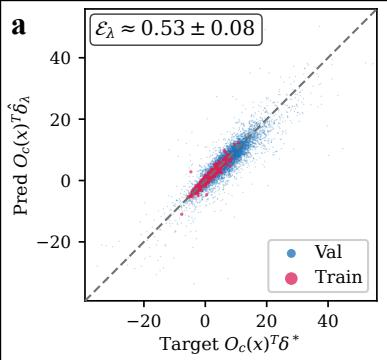

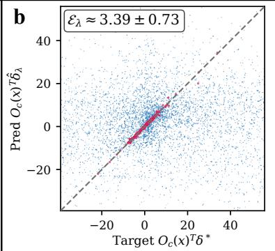

$$
\sigma _ { \mathrm { R B M } } ^ { 2 } = 1 . 9 5
$$

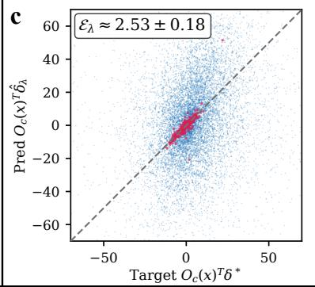

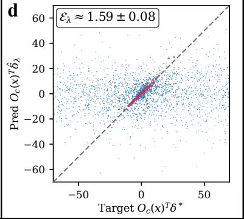  
	  	 Figure 5.1: Exact amplitude-regression diagnostics for the 4 × 4 Heisenberg graph of Equation (5.22), with 32 nearest-neighbor and 24 diagonal bonds. At $N _ { s } ~ = ~ 4 0 9 6$ and $\lambda ~ = ~ 1 0 ^ { - 9 }$ matched noise exposes ViT overfitting at comparable amplitude-gap variance, while matched state shows lower gap variance and excess risk for the ViT. The plotted predictions and risks exclude the phase channel.

and local energies are centered separately within each field. Figure 5.2 shows the predicted pattern: the validation residual is U-shaped in the solve-time shift, while the multi-batch variance decreases as $\lambda$ increases. Because all shifts are evaluated at the same fixed checkpoints, this isolates the statistical efect of the ridge filter rather than comparing diferent training trajectories. The large-scale implementation uses the energy-gradient target $2 H _ { \mathrm { l o c } , c }$ and doubled update directions, so the raw residual and variance values in the large-scale figures are four times those under the normalization of Equations (5.19) and (5.21). This common factor leaves relative comparisons and shift selection unchanged.

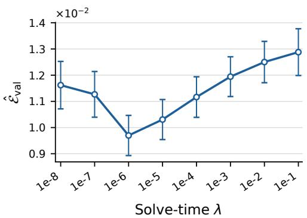

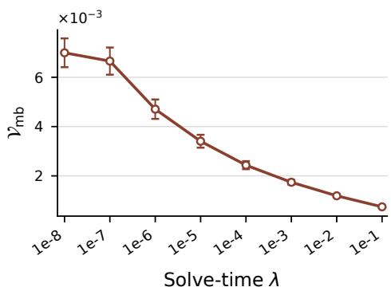  
Figure 5.2: Large-scale fixed-checkpoint diagnostics for the $L = 1 0 0$ transverse-field Ising model family using a foundation NQS. The validation residual exhibits a U-shaped dependence on the SR diagonal shift, while the multi-batch variance decreases with stronger regularization, as predicted by the noisy-ridge interpretation in Equation (5.17).

## 5.4 Multi-Shift Stochastic Reconfiguration

The spectral-filtering view suggests the importance of the diagonal shift in SR. Single-shift SR applies the one-parameter filter $\cdot f _ { \lambda } ( s ) = s / ( s + \lambda )$ ) to every QGT eigendirection. MS-SR replaces this with a mixture of shifted solves computed on independent batches.

For fixed shifts and weights, the population spectral approximation of MS-SR has the filter

$$
f _ { w , \lambda } ( s ) = \sum _ { k = 1 } ^ { K } w _ { k } \frac { s } { s + \lambda _ { k } } .\tag{5.24}
$$

This filter family is richer than any single shifted SR solve. Independent-batch candidates have diferent empirical QGTs, so their average is not exactly a filter of one empirical matrix. Diferent shifts can suppress noisy low-eigenvalue directions while preserving useful high-eigenvalue directions more flexibly than a single �. Independent batches provide a complementary variance reduction: for fixed shifts and weights, independent candidate errors contribute $\textstyle \sum _ { k } w _ { k } ^ { 2 } V _ { k }$ to the mixture variance, where $V _ { k }$ is the variance of candidate � in the QGT seminorm. Uniform weights give a factor-� reduction relative to the average candidate variance in this ideal independent-batch limit. Data-dependent shifts and weights, as well as sampling correlations, require empirical assessment. Computationally, � independent minSR solves of size $N _ { s }$ cost $\mathcal { O } ( K N _ { s } ^ { 3 } )$ ) and can be parallelized, whereas one solve on a batch of size $K N _ { s }$ costs $\mathcal { O } ( K ^ { 3 } N _ { s } ^ { 3 } )$ ). MS-SR is most worthwhile when finite-batch variance is a visible bottleneck and multiple solve-time shifts cover distinct useful parts of the empirical spectrum.

Algorithm 1 Multi-Shift Stochastic Reconfiguration (MS-SR)   
Require: Parameters $\theta _ { t } ,$ batch size $N _ { s } ,$ number of shifts �, NTK quantiles $\{ q _ { k } \} _ { k = 1 } ^ { K }$ , learning   
rate �   
1: Draw independent batches $D _ { 1 } , \dots , D _ { K } \sim \pi _ { \theta _ { t } }$ , each of size $N _ { s }$   
2: Use the positive NTK spectrum of $D _ { 1 }$ to choose shifts $\lambda _ { k }$ from quantiles $\{ q _ { k } \} _ { k = 1 } ^ { K }$   
3: for $k = 1 , \dots , K$ do   
4: Solve the shifted minSR system on $D _ { k }$ to obtain $\hat { \delta } _ { k } \gets \mathrm { m i n S R } ( D _ { k } , \lambda _ { k } )$   
5: end for   
6: Evaluate leave-one-batch-out tangent-space residuals for the candidate updates   
7: Fit simplex-constrained stacking weights $w \in \Delta ^ { K - 1 }$ from the held-out residuals   
8: Apply $\begin{array} { r } { \bar { \theta } _ { t + 1 }  \theta _ { t } - \eta \sum _ { k = 1 } ^ { K } w _ { k } \hat { \delta } _ { k } } \end{array}$

In the experiments, $K = 4$ and the shifts are chosen from positive empirical NTK-spectrum quantiles {0.9, 0.7, 0.4, 0.1}. The weights are fit by leave-one-batch-out stacking. Writing $O _ { j }$ and ${ \bf h } _ { j }$ for the centered feature matrix and local-energy vector on batch $D _ { j }$ , the objective is

$$
\operatorname* { m i n } _ { w \in \Delta ^ { K - 1 } , w _ { j } < 1 } \sum _ { j = 1 } ^ { K } \left\| \sum _ { i \neq j } \frac { w _ { i } } { 1 - w _ { j } } O _ { j } \hat { \delta } _ { i } - \mathbf { h } _ { j } \right\| ^ { 2 } .\tag{5.25}
$$

Each held-out prediction excludes the candidate fitted on that batch and renormalizes the remaining weights. The resulting mixture is convex, but this objective is not generally a convex function of the weights; numerical fitting from uniform weights does not guarantee a global minimum.

Checkpoint-local ablations. We evaluate the ingredients of MS-SR on the $L \ = \ 1 0 0$ TFIM foundation NQS of Section 5.3 and an $8 \times 8$ periodic $J _ { 1 } { - } J _ { 2 }$ ViT at $J _ { 2 } / J _ { 1 } ~ = ~ 0 . 5$ . The latter uses Pauli interactions $\sigma _ { i } \cdot \sigma _ { j }$ , 128 bonds of each type, and the zero-magnetization sector. Its raw energies are four times those of the spin-operator convention in Equation (5.22); squared diagnostics retain the corresponding Pauli units. The ViT has $P = 1 4 7 , 2 1 6$ real parameters, and its source training progressively adds translations and $C _ { 4 }$ rotations. Ten fixed source checkpoints per system and 20 resampling repeats per checkpoint are used for the ablations. The NTK quantile grid is estimated on a separately seeded reference batch once per checkpoint and reused across repeats.

Standard SR uses one batch and the training shift $\lambda _ { \mathrm { t r a i n } } ~ = ~ 1 0 ^ { - 4 }$ . Bagged SR uniformly averages four independent candidates at one common shift, isolating independent-batch averaging. Shared-batch multi-shift SR fits four shifts on shared data and uses uniform weights; its stacked counterpart fits weights on held-out samples using the same candidates. Independentbatch multi-shift SR uses four independent fitting batches with uniform weights, and full MS-SR learns the weights by Equation (5.25). The shared-batch TFIM comparison uses an independent weight-fit batch; the $J _ { 1 } { - } J _ { 2 }$ shared-batch variants reserve one quarter of their sampled batch for weight fitting. All multi-shift methods use the same quantile grid.

Bagging is evaluated both at $\lambda _ { \mathrm { t r a i n } }$ and at a checkpoint-specific $\lambda _ { \mathrm { { t u n e d } } }$ selected by an eightpoint sweep over $\lbrace 1 0 ^ { - 8 } , \dots , 1 0 ^ { - 1 } \rbrace$ . The latter minimizes the bagged residual on the reporting data and is therefore an oracle reference requiring additional solves and validation, rather than an independently tuned baseline. Relative to standard SR at the training shift, MS-SR reduces the validation residual and multi-batch variance by approximately $3 9 \%$ and 43% on TFIM, and by 14% and 66% on $J _ { 1 } { - } J _ { 2 }$ . Oracle-tuned bagging reduces them by $45 \%$ and $4 9 \%$ , and by 18% and 80%, respectively, giving lower mean values than MS-SR in both systems. Shared-batch multi-shift SR reduces the TFIM residual by 17%, but increases the $J _ { 1 } { - } J _ { 2 }$ residual by 2%.

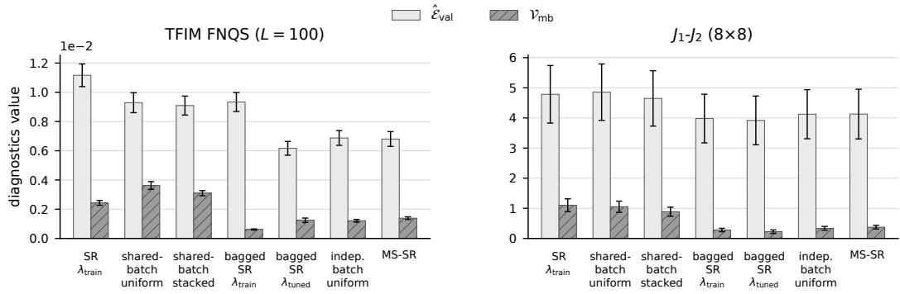  
Figure 5.3: Checkpoint-local MS-SR ablations at $K = 4$ . Bars show raw validation residuals and multi-batch variances averaged over fixed source checkpoints, with one standard error across checkpoints. Standard SR uses $\lambda _ { \mathrm { t r a i n } } = 1 0 ^ { - 4 }$ . Bagging is shown at both the training shift and an oracle shift selected on the reporting data. All multi-shift methods use the same NTK-quantile grid. Values retain the doubled-target convention and, for $J _ { 1 } { - } J _ { 2 }$ , Pauli Hamiltonian units.

On TFIM, MS-SR has 27% lower residual than bagging at the training shift, with the same ordering on all ten checkpoints. Training-shift bagging has lower variance but higher total residual, illustrating the cost of shrinkage bias. Bagging near $1 0 ^ { - 6 } – 1 0 ^ { - 7 }$ achieves a lower residual than MS-SR, showing that a well-chosen single shift can sufice. On $J _ { 1 } { - } J _ { 2 }$ , the mean residuals are 3.98 for training-shift bagging, 3.92 for oracle-tuned bagging, and 4.13 for MS-SR. Thus the benefit of MS-SR is adaptation across regularization scales without a separate validation-based shift search; the results do not establish uniform superiority over well-tuned bagging.

Robustness checks with $K \in \{ 2 , 3 , 4 , 5 \}$ reduce the TFIM MS-SR residual from 0.00854 to 0.00638 as � grows, with diminishing gains and one extra batch and solve per candidate. MS-SR beats training-shift bagging at each �, while oracle-tuned bagging remains better. Two alternative quantile grids change the residual by at most 3.4%, and checkpoints trained at shifts $1 0 ^ { - 3 }$ and $1 0 ^ { - 5 }$ give near-parity with the corresponding bagged baseline.

Online training comparisons. The main online comparison uses five paired continuations from one shared SR checkpoint at iteration 2500 of the $8 \times 8 ~ J _ { 1 } { - } J _ { 2 }$ model. This is a separate ViT setup from the symmetry-ramp ablations: it has depth 8, embedding dimension 72, and 12 attention heads, without explicit lattice-translation or rotation symmetrization. Both methods use Cholesky solves, $N _ { s } = 8 1 9 2$ samples per batch, and constant learning rate $\eta \ : = \ : 0 . 0 1$ The Hamiltonian and energy values use the same Pauli convention and zero-magnetization sector as the large-scale $J _ { 1 } { - } J _ { 2 }$ ablations. The comparison concerns later refinement after initial standard-SR training.

Standard SR uses $\lambda = 1 0 ^ { - 4 }$ . The historical MS-SR implementation instead uses four fixed shifts $\{ 1 0 ^ { - 2 } , 1 0 ^ { - 3 } , 1 0 ^ { - 4 } , 1 0 ^ { - 5 } \}$ on independent candidate batches and fits stacking weights on an additional independent batch. It therefore difers from the NTK-quantile, leave-one-batchout algorithm above. Figure 5.4a plots progress in nominal SR-equivalent updates: one SR step counts as one unit and one four-candidate MS-SR step as four, so 500 SR steps and 125 MS-SR steps both reach 500 units. This axis counts candidates and does not equate actual compute budgets. The historical callback also performs a base-driver SR solve on another batch, giving five solves and six sampled batches per MS-SR step: 625 solves and 750 batches for the MS-SR continuation, versus 500 of each for SR.

Each final state is evaluated independently using two fresh-chain replicas, with 8,388,608 retained samples in total. Figure 5.4b reports the endpoint energies and paired diferences $\Delta = ( E _ { \mathrm { M S - S R } } - E _ { \mathrm { S R } } ) / N _ { \mathrm { : } }$ with � = 64. MS-SR gives lower energy in three of five pairs, with mean $\overline { { \Delta } } = - 1 . 7 8 \times 1 0 ^ { - 5 }$ and paired 95% Student-� interval $[ - 7 . 0 5 , 3 . 5 0 ] \times 1 0 ^ { - 5 }$ . The interval includes zero and measures continuation variability conditional on this single source state. These measurements therefore support a qualified online comparison, without establishing a reliable final-energy advantage across independently trained source states or at equal wall time.

(a) Training history  
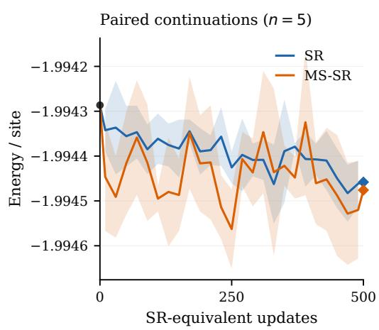

(b) Endpoint energies per site
<table><tr><td>Pair</td><td>SR</td><td>MS-SR</td><td> $\Delta ~ ( 1 0 ^ { - 5 } )$ </td></tr><tr><td></td><td>1 -1.9944675</td><td> $- 1 . 9 9 4 4 3 0 7$ </td><td> $+ 3 . 6 9 \pm 1 . 0 9$ </td></tr><tr><td></td><td> $2 \_ 1 . 9 9 4 4 4 5 0$ </td><td> $\mathbf { - 1 . 9 9 4 5 1 6 0 }$ </td><td> $- 7 . 1 0 \pm 1 . 0 7$ </td></tr><tr><td></td><td> $\begin{array} { r l r } { { 3 } } & { { } } & { - 1 . 9 9 4 4 7 3 3 } \end{array}$ </td><td> $- 1 . 9 9 4 4 7 2 2$ </td><td> $+ 0 . 1 1 \pm 1 . 1 1$ </td></tr><tr><td></td><td> $4 - 1 . 9 9 4 4 5 9 3$ </td><td> $\mathbf { - 1 . 9 9 4 4 6 6 8 }$ </td><td> $- 0 . 7 5 \pm 1 . 0 4$ </td></tr><tr><td></td><td> $5 ^ { \mathrm { ~ ~ } } - 1 . 9 9 4 4 4 5 1$ </td><td> $\mathbf { - 1 . 9 9 4 4 9 3 4 }$ </td><td> $- 4 . 8 3 \pm 1 . 0 2$ </td></tr><tr><td>Mean</td><td> $- 1 . 9 9 4 4 5 8 0 - 1 . 9 9 4 4 7 5 8$ </td><td></td><td>-1.78</td></tr></table>

Figure 5.4: Online SR and MS-SR training on the $8 { \times } 8 J _ { 1 } { \ - } J _ { 2 }$ model. Five paired continuations start from a single shared SR checkpoint; energies per site are in Pauli units. (a) Training curves show means of traces binned in intervals of 20 nominal SR-equivalent updates, with ±1 across-continuation sample standard deviation. Diamonds mark independent endpoint means. The horizontal axis counts one candidate per SR step and four per MS-SR step; the historical implementation’s extra solve and sampled batches are excluded from this nominal count. (b) Independent endpoint energies for the same five pairs. Bold marks the lower energy. Diferences are $\Delta = ( E _ { \mathrm { M S - S R } } - E _ { \mathrm { S R } } ) / 6 4$ . Diferences and individual ± values are in units of $1 0 ^ { - 5 }$ , with the latter combining the two Monte Carlo standard errors in quadrature. The acrosspair confidence interval is given in the text.

Update-construction cost. A separate benchmark at the TFIM step-2000 checkpoint measures the NTK-quantile, leave-one-batch-out implementation of MS-SR on one H100 80GB GPU, with $N _ { s } = 1 2 { , } 0 0 0$ and $K = 4$ . All methods use the same eigendecomposition-based pseudoinverse solver. Timing includes sampling, local energies, candidate solves, and construction of the final direction, with parameters held fixed. The first NTK eigendecomposition supplies the quantile shifts and is reused for the first candidate solve; stacking reuses the four candidate batches. The medians over three paired device/seed settings are shown in Table 5.1. MS-SR takes about four times as long as one SR update and adds approximately 1.03% over bagged SR in this implementation.

<table><tr><td>Method</td><td>Batches/solves</td><td>Time (s)</td><td>Relative to SR</td></tr><tr><td>SR</td><td>1/1</td><td>13.38</td><td>1.00×</td></tr><tr><td>Bagged SR</td><td>4/4</td><td>53.55</td><td>4.00×</td></tr><tr><td>MS-SR</td><td>4/4</td><td>54.09</td><td>4.04×</td></tr></table>

Table 5.1: Steady-state update-construction cost on the TFIM foundation NQS using one H100 80GB GPU. Values are medians over three paired device/seed settings, each with two warm-ups and five synchronized timed repetitions. Bagged SR uses the training shift and excludes the cost of shift tuning.

## 5.5 Summary

This chapter analyzed SR in a regime increasingly common for modern NQS: expressive, overparameterized networks trained from finite Monte Carlo samples. The main conclusion is that SR should be viewed as statistical spectral filtering. At a fixed wave function, SR is ridge regression from tangent features to centered local energy. The tangent-space expressivity gap is orthogonal to the tangent space in population, but finite batches make it behave as residual noise that empirical SR can fit. The diagonal shift therefore controls a bias-variance tradeof: it suppresses variance from sampled gap residuals while shrinking useful components of the ideal tangent-space update.

The experiments support this mechanism across scales. Exact 4 × 4 amplitude-regression experiments separate the two efects of overparameterization: a larger tangent space helps when it reduces the expressivity gap, but it can hurt when it overfits a comparable gap. Large-scale foundation-NQS diagnostics show the predicted U-shaped validation residual and decreasing multi-batch variance as the solve-time shift increases. Finally, the filtering view leads to MS-SR, whose independent multi-shift solves reduce validation residuals and update variance relative to fixed-shift SR.

## CHAPTER 6

## CONCLUSION

This thesis studied the interface between quantum computing and artificial intelligence from two directions. Part I asked how quantum models can be made useful for supervised learning; Part II asked how machine learning can help with quantum problems such as real-time decoding and quantum many-body physics. Each chapter addressed a diferent bottleneck at this interface: representation, generalization, decoding latency, and finite-sample optimization.

In Part I, Chapter 2 showed that the data embedding sets an empirical-risk floor for any downstream quantum classifier, and that Neural Quantum Embedding can lower this floor by reshaping the representation before the data enter the quantum circuit: on binary MNIST the trace distance between class ensembles increased from approximately 0.27 to 0.84, translating into classification accuracy improving from 52.7% to 96.1% on IBM hardware. The DQC1/NMR extension reached 98% accuracy on an NMR quantum device, compared to 54% without NQE. Chapter 3 addressed the complementary finite-data question: margin-based metrics predicted generalization in quantum phase recognition more reliably than parameter-based metrics, and the connection between margin mean and trace distance links the two chapters—embeddings with larger state distinguishability can make larger margins attainable.

In Part II, Chapter 4 used machine learning for quantum error correction, where the bottleneck is real-time inference under physical timing constraints. On Sycamore memory-experiment data, the Mamba decoder matched the accuracy of the reproduced Transformer baseline while its inference cost scales as $\mathcal { O } ( d ^ { 2 } )$ rather than $\mathcal { O } ( d ^ { 4 } )$ in the code distance. Under simulated real-time decoding with decoder-induced noise, this latency advantage became an accuracy advantage, improving the finite-size efective threshold from $p _ { \mathrm { t h } } \approx 0 . 0 0 9 7 : \mathrm { t o } p _ { \mathrm { t h } } \approx 0 . 0 1 0 4$

Chapter 5 studied neural quantum states, where the bottleneck is finite-sample optimization. At a fixed wave function, stochastic reconfiguration is tangent-space ridge regression from sampled features to centered local energies, and the diagonal shift acts as a statistical spectral filter rather than only a numerical stabilizer. At fixed large-system checkpoints, multi-shift stochastic reconfiguration (MS-SR) reduced the validation residual and multi-batch variance relative to standard SR at the training shift by approximately 39%/43% on TFIM and 14%/66% on $J _ { 1 } { - } J _ { 2 }$ In five paired online continuations from one shared $8 \times 8 J _ { 1 } – J _ { 2 }$ checkpoint, independent endpoint evaluations favored MS-SR in three pairs, with mean energy diference per site $- 1 . 7 8 \times 1 0 ^ { - 5 }$ and paired 95% Student-� confidence interval $[ - 7 . 0 5 , 3 . 5 0 ] \times 1 0 ^ { - 5 }$

The overall conclusion of this thesis is that quantum computing and AI benefit from a twoway exchange, in which each field supplies principled tools for the other’s hardest problems. Quantum computing challenges AI to operate with new mathematical objects and physical constraints; AI challenges quantum computing to adopt data-driven representations, scalable architectures, and statistical regularization for problems such as real-time decoding and many-body physics. Meeting these challenges together will define the next generation of both quantum technology and machine intelligence.

## REFERENCES

1M. A. Nielsen and I. L. Chuang, Quantum computation and quantum information: 10th anniversary

edition (Cambridge University Press, 2010).

2P. W. Shor, “Algorithms for quantum computation: discrete logarithms and factoring”, in Proceedings

35th annual symposium on foundations of computer science (IEEE, 1994), pp. 124–134.

3L. K. Grover, “A fast quantum mechanical algorithm for database search”, in Proceedings of the twenty-

eighth annual acm symposium on theory of computing (ACM, 1996), pp. 212–219.

4J. Preskill, “Quantum computing in the NISQ era and beyond”, Quantum 2, 79 (2018).

5T. M. Mitchell, Machine learning (McGraw-Hill, 1997).

6C. Cortes and V. Vapnik, “Support-vector networks”, Machine Learning 20, 273–297 (1995).

7V. N. Vapnik, The nature of statistical learning theory (Springer, 1995).

8K. Fukushima, “Neocognitron: a self-organizing neural network model for a mechanism of pattern

recognition unafected by shift in position”, Biological Cybernetics 36, 193–202 (1980).

9Y. LeCun, L. Bottou, Y. Bengio, and P. Hafner, “Gradient-based learning applied to document recog-

nition”, Proceedings of the IEEE 86, 2278–2324 (1998).

10A. Krizhevsky, I. Sutskever, and G. E. Hinton, “ImageNet classification with deep convolutional neural networks”, in Advances in neural information processing systems, Vol. 25 (2012).

11K. Simonyan and A. Zisserman, “Very deep convolutional networks for large-scale image recognition”, arXiv preprint arXiv:1409.1556 (2015).

12C. Szegedy, W. Liu, Y. Jia, P. Sermanet, S. Reed, D. Anguelov, D. Erhan, V. Vanhoucke, and A. Rabinovich, “Going deeper with convolutions”, in Proceedings of the ieee conference on computer vision and pattern recognition (2015), pp. 1–9.

13K. He, X. Zhang, S. Ren, and J. Sun, “Deep residual learning for image recognition”, in Proceedings of the ieee conference on computer vision and pattern recognition (2016), pp. 770–778.

14S. Hochreiter and J. Schmidhuber, “Long short-term memory”, Neural Computation 9, 1735–1780 (1997).

15K. Cho, B. van Merriënboer, C. Gulcehre, D. Bahdanau, F. Bougares, H. Schwenk, and Y. Bengio, “Learning phrase representations using RNN encoder-decoder for statistical machine translation”, arXiv preprint arXiv:1406.1078 (2014).

16A. Vaswani, N. Shazeer, N. Parmar, J. Uszkoreit, L. Jones, A. N. Gomez, Ł. Kaiser, and I. Polosukhin, “Attention is all you need”, in Advances in neural information processing systems, Vol. 30 (2017).

17A. Radford, K. Narasimhan, T. Salimans, and I. Sutskever, “Improving language understanding by generative pre-training”, OpenAI preprint (2018).

18J. Devlin, M.-W. Chang, K. Lee, and K. Toutanova, “BERT: pre-training of deep bidirectional transformers for language understanding”, arXiv preprint arXiv:1810.04805 (2019).

19A. Dosovitskiy, L. Beyer, A. Kolesnikov, D. Weissenborn, X. Zhai, T. Unterthiner, M. Dehghani, M. Minderer, G. Heigold, S. Gelly, J. Uszkoreit, and N. Houlsby, “An image is worth 16x16 words: transformers for image recognition at scale”, arXiv preprint arXiv:2010.11929 (2021).

20J. Jumper, R. Evans, A. Pritzel, T. Green, M. Figurnov, O. Ronneberger, K. Tunyasuvunakool, R. Bates, A. Žídek, A. Potapenko, et al., “Highly accurate protein structure prediction with AlphaFold”, Nature 596, 583–589 (2021).

21S. Shalev-Shwartz and S. Ben-David, Understanding machine learning: from theory to algorithms (Cambridge University Press, 2014).

22A. W. Harrow, A. Hassidim, and S. Lloyd, “Quantum algorithm for linear systems of equations”, Physical Review Letters 103, 150502 (2009).

23P. Rebentrost, M. Mohseni, and S. Lloyd, “Quantum support vector machine for big data classification”, Physical Review Letters 113, 130503 (2014).

24S. Lloyd, M. Mohseni, and P. Rebentrost, “Quantum principal component analysis”, Nature Physics 10, 631–633 (2014).

25S. Jaques and A. G. Rattew, “QRAM: a survey and critique”, arXiv preprint arXiv:2305.10310 (2023).

26E. Tang, “A quantum-inspired classical algorithm for recommendation systems”, Proceedings of the 51st Annual ACM Symposium on Theory of Computing, 217–228 (2019).

27E. Tang, “Quantum principal component analysis only achieves an exponential speedup because of its state preparation assumptions”, Physical Review Letters 127, 060503 (2021).

28A. Peruzzo, J. McClean, P. Shadbolt, M.-H. Yung, X.-Q. Zhou, P. J. Love, A. Aspuru-Guzik, and J. L. O’Brien, “A variational eigenvalue solver on a photonic quantum processor”, Nature Communications 5, 4213 (2014).

29E. Farhi, J. Goldstone, and S. Gutmann, “A quantum approximate optimization algorithm”, arXiv preprint arXiv:1411.4028 (2014).

30M. Cerezo, A. Arrasmith, R. Babbush, S. C. Benjamin, S. Endo, K. Fujii, J. R. McClean, K. Mitarai, X. Yuan, L. Cincio, and P. J. Coles, “Variational quantum algorithms”, Nature Reviews Physics 3, 625– 644 (2021).

31A. Kandala, A. Mezzacapo, K. Temme, M. Takita, M. Brink, J. M. Chow, and J. M. Gambetta, “Hardware-eficient variational quantum eigensolver for small molecules and quantum magnets”, Nature 549, 242–246 (2017).

32I. Cong, S. Choi, and M. D. Lukin, “Quantum convolutional neural networks”, Nature Physics 15, 1273–1278 (2019).

33T. Hur, L. Kim, and D. K. Park, “Quantum convolutional neural network for classical data classification”, Quantum Machine Intelligence 4, 3 (2022).

34A. Pesah, M. Cerezo, S. Wang, T. Volkof, A. T. Sornborger, and P. J. Coles, “Absence of barren plateaus in quantum convolutional neural networks”, Physical Review X 11, 041011 (2021).

35P. Bermejo, P. Braccia, M. S. Rudolph, Z. Holmes, L. Cincio, and M. Cerezo, “Quantum convolutional neural networks are (efectively) classically simulable”, arXiv preprint arXiv:2408.12739 (2024).

36A. Abbas, R. King, H.-Y. Huang, W. J. Huggins, R. Movassagh, D. Gilboa, and J. R. McClean, “On quantum backpropagation, information reuse, and cheating measurement collapse”, in Advances in neural information processing systems, Vol. 36 (2023).

37K. Mitarai, M. Negoro, M. Kitagawa, and K. Fujii, “Quantum circuit learning”, Physical Review A 98, 032309 (2018).

38M. Schuld, V. Bergholm, C. Gogolin, J. Izaac, and N. Killoran, “Evaluating analytic gradients on quantum hardware”, Physical Review A 99, 032331 (2019).

39J. R. McClean, S. Boixo, V. N. Smelyanskiy, R. Babbush, and H. Neven, “Barren plateaus in quantum neural network training landscapes”, Nature Communications 9, 4812 (2018).

40M. Ragone, B. N. Bakalov, F. Sauvage, A. F. Kemper, C. Ortiz Marrero, M. Larocca, and M. Cerezo, “A lie algebraic theory of barren plateaus for deep parameterized quantum circuits”, Nature Communications 15, 7172 (2024).

41E. Fontana, D. Herman, S. Chakrabarti, N. Kumar, R. Yalovetzky, J. Heredge, S. H. Sureshbabu, and M. Pistoia, “Characterizing barren plateaus in quantum ansätze with the adjoint representation”, Nature Communications 15, 7171 (2024).

42M. Larocca, S. Thanasilp, S. Wang, K. Sharma, J. Biamonte, P. J. Coles, L. Cincio, J. R. McClean, Z. Holmes, and M. Cerezo, “Barren plateaus in variational quantum computing”, Nature Reviews Physics 7, 89–99 (2025).

43V. Havlicek, A. D. Corcoles, K. Temme, A. W. Harrow, A. Kandala, J. M. Chow, and J. M. Gambetta, “Supervised learning with quantum-enhanced feature spaces”, Nature 567, 209–212 (2019).

44Y. Liu, S. Arunachalam, and K. Temme, “A rigorous and robust quantum speed-up in supervised machine learning”, Nature Physics 17, 1013–1017 (2021).

45M. Schuld and N. Killoran, “Quantum machine learning in feature Hilbert spaces”, Physical Review Letters 122, 040504 (2019).

46A. Pérez-Salinas, A. Cervera-Lierta, E. Gil-Fuster, and J. I. Latorre, “Data re-uploading for a universal quantum classifier”, Quantum 4, 226 (2020).

47S. Jerbi, L. J. Fiderer, H. P. Nautrup, J. M. Kübler, H. J. Briegel, and V. Dunjko, “Quantum machine learning beyond kernel methods”, Nature Communications 14, 517 (2023).

48T. Hur, I. F. Araujo, and D. K. Park, “Neural quantum embedding: pushing the limits of quantum supervised learning”, Physical Review A 110, 022411 (2024).

49H. Liu, T. Hur, S. Zhang, L. Che, X. Long, X. Wang, K. Huang, Y.-a. Fan, Y. Zheng, Y. Feng, X. Nie, D. K. Park, and D. Lu, “Neural quantum embedding via deterministic quantum computation with one qubit”, arXiv preprint arXiv:2501.15359 (2025).

50C. W. Helstrom, Quantum detection and estimation theory (Academic Press, 1976).

51K. Siudzińska, S. Chakraborty, and D. Chruściński, “How to manipulate the distinguishability between quantum states”, Entropy 23, 1046 (2021).

52M. M. Wilde, Quantum information theory, 2nd (Cambridge University Press, 2017).

53M. Schuld, R. Sweke, and J. J. Meyer, “Efect of data encoding on the expressive power of variational quantum-machine-learning models”, Physical Review A 103, 032430 (2021).

54Y. Suzuki, H. Yano, Q. Gao, S. Uno, T. Tanaka, M. Akiyama, and N. Yamamoto, “Analysis and synthesis of feature map for kernel-based quantum classifier”, Quantum Machine Intelligence 2, 1–9 (2020).

55R. LaRose and B. Coyle, “Robust data encodings for quantum classifiers”, Physical Review A 102, 032420 (2020).

56H. Buhrman, R. Cleve, J. Watrous, and R. de Wolf, “Quantum fingerprinting”, Physical Review Letters 87, 167902 (2001).

57A. Abbas, D. Sutter, C. Zoufal, A. Lucchi, A. Figalli, and S. Woerner, “The power of quantum neural networks”, Nature Computational Science 1, 403–409 (2021).

58H.-Y. Huang, M. Broughton, M. Mohseni, R. Babbush, S. Boixo, H. Neven, and J. R. McClean, “Power of data in quantum machine learning”, Nature Communications 12, 2631 (2021).

59S. Thanasilp, S. Wang, M. Cerezo, and Z. Holmes, “Exponential concentration in quantum kernel methods”, Nature Communications 15, 5200 (2024).

60D. G. Cory, A. F. Fahmy, and T. F. Havel, “Ensemble quantum computing by NMR spectroscopy”, Proceedings of the National Academy of Sciences 94, 1634–1639 (1997).

61E. Knill and R. Laflamme, “Power of one bit of quantum information”, Physical Review Letters 81, 5672–5675 (1998).

62P. W. Shor and S. P. Jordan, “Estimating jones polynomials is a complete problem for one clean qubit”, Quantum Information & Computation 8, 681–714 (2008).

63D. Poulin, R. Blume-Kohout, R. Laflamme, and H. Ollivier, “Exponential speedup with a single bit of quantum information: measuring the average fidelity decay”, Physical Review Letters 92, 177906 (2004).

64A. Datta, S. T. Flammia, and C. M. Caves, “Entanglement and the power of one qubit”, Physical Review A 72, 042316 (2005).

65T. Hur and D. K. Park, “Understanding generalization in quantum machine learning with margins”, arXiv preprint arXiv:2411.06919 (2024).

66C. Zhang, S. Bengio, M. Hardt, B. Recht, and O. Vinyals, “Understanding deep learning (still) requires rethinking generalization”, Communications of the ACM 64, 107–115 (2021).

67E. Gil-Fuster, J. Eisert, and C. Bravo-Prieto, “Understanding quantum machine learning also requires rethinking generalization”, Nature Communications 15, 1–12 (2024).

68P. L. Bartlett, D. J. Foster, and M. J. Telgarsky, “Spectrally-normalized margin bounds for neural networks”, in Advances in neural information processing systems, Vol. 30 (2017).

69M. Mohri, A. Rostamizadeh, and A. Talwalkar, Foundations of machine learning, 2nd (MIT Press, 2018).

70B. Neyshabur, S. Bhojanapalli, and N. Srebro, “A PAC-Bayesian approach to spectrally-normalized margin bounds for neural networks”, in Arxiv preprint arxiv:1707.09564 (2017).

71Y. Jiang, D. Krishnan, H. Mobahi, and S. Bengio, “Predicting the generalization gap in deep networks with margin distributions”, arXiv preprint arXiv:1810.00113 (2018).

72Y. Jiang, B. Neyshabur, H. Mobahi, D. Krishnan, and S. Bengio, “Fantastic generalization measures and where to find them”, arXiv preprint arXiv:1912.02178 (2019).

73G. K. Dziugaite, A. Drouin, B. Neal, N. Rajkumar, E. Caballero, L. Wang, I. Mitliagkas, and D. M. Roy, “In search of robust measures of generalization”, Advances in Neural Information Processing Systems 33, 11723–11733 (2020).

74M. C. Caro, H.-Y. Huang, M. Cerezo, K. Sharma, A. Sornborger, L. Cincio, and P. J. Coles, “Generalization in quantum machine learning from few training data”, Nature Communications 13, 4919 (2022).

75K. Bu, D. E. Koh, L. Li, Q. Luo, and Y. Zhang, “Rademacher complexity of noisy quantum circuits”, arXiv preprint arXiv:2103.03139 (2021).

76K. Bu, D. E. Koh, L. Li, Q. Luo, and Y. Zhang, “Statistical complexity of quantum circuits”, Physical Review A 105, 062431 (2022).

77K. Bu, D. E. Koh, L. Li, Q. Luo, and Y. Zhang, “Efects of quantum resources and noise on the statistical complexity of quantum circuits”, Quantum Science and Technology 8, 025013 (2023).

78L. Banchi, J. Pereira, and S. Pirandola, “Generalization in quantum machine learning: a quantum information standpoint”, PRX Quantum 2, 040321 (2021).

79M. C. Caro, T. Gur, C. Rouze, D. Stilck Franca, and S. Subramanian, “Information-theoretic generalization bounds for learning from quantum data”, arXiv preprint arXiv:2311.05529 (2023).

80V. Nagarajan and J. Z. Kolter, “Uniform convergence may be unable to explain generalization in deep learning”, Advances in Neural Information Processing Systems 32 (2019).

81G. K. Dziugaite and D. M. Roy, “Computing nonvacuous generalization bounds for deep (stochastic) neural networks with many more parameters than training data”, arXiv preprint arXiv:1703.11008 (2017).

82T. Zhang, “Covering number bounds of certain regularized linear function classes”, Journal of Machine Learning Research 2, 527–550 (2002).

83S. Sachdev, “Quantum phase transitions”, Physics World 12, 33 (1999).

84S. Sachdev, Quantum phases ofmatter (Cambridge University Press, 2023).

85P. Broecker, J. Carrasquilla, R. G. Melko, and S. Trebst, “Machine learning quantum phases of matter beyond the fermion sign problem”, Scientific Reports 7, 8823 (2017).

86S. Ebadi, T. T. Wang, H. Levine, A. Keesling, G. Semeghini, A. Omran, D. Bluvstein, R. Samajdar, H. Pichler, W. W. Ho, et al., “Quantum phases of matter on a 256-atom programmable quantum simulator”, Nature 595, 227–232 (2021).

87J. Carrasquilla and R. G. Melko, “Machine learning phases of matter”, Nature Physics 13, 431–434 (2017).

88V. Bergholm, J. Izaac, M. Schuld, C. Gogolin, M. S. Alam, S. Ahmed, J. M. Arrazola, C. Blank, A. Delgado, S. Jahangiri, et al., “Pennylane: automatic diferentiation of hybrid quantum-classical computations”, arXiv preprint arXiv:1811.04968 (2020).

89S. Lloyd, M. Schuld, A. Ijaz, J. Izaac, and N. Killoran, “Quantum embeddings for machine learning”, arXiv preprint arXiv:2001.03622 (2020).

90T. Hubregtsen, D. Wierichs, E. Gil-Fuster, P.-J. H. S. Derks, P. K. Faehrmann, and J. J. Meyer, “Training quantum embedding kernels on near-term quantum computers”, Physical Review A 106, 042431 (2022).

91Y. LeCun, C. Cortes, and C. J. Burges, “Mnist handwritten digit database”, ATT Labs [Online] 2 (2010).

92H. Xiao, K. Rasul, and R. Vollgraf, “Fashion-MNIST: a novel image dataset for benchmarking machine learning algorithms”, arXiv preprint arXiv:1708.07747 (2017).

93T. Clanuwat, M. Bober-Irizar, A. Kitamoto, A. Lamb, K. Yamamoto, and D. Ha, “Deep learning for classical Japanese literature”, arXiv preprint arXiv:1812.01718 (2018).

94C. Lee, T. Hur, and D. K. Park, “Scalable neural decoders for practical real-time quantum error correction”, arXiv preprint arXiv:2510.22724 (2025).

95B. M. Terhal, “Quantum error correction for quantum memories”, Reviews of Modern Physics 87, 307–346 (2015).

96A. Gu and T. Dao, “Mamba: linear-time sequence modeling with selective state spaces”, arXiv preprint arXiv:2312.00752 (2023).

97J. Bausch, A. W. Senior, F. J. H. Heras, T. Edlich, A. Davies, M. Newman, C. Jones, K. Satzinger, M. Y. Niu, S. Blackwell, et al., “Learning high-accuracy error decoding for quantum processors”, Nature 635, 834–840 (2024).

98P. W. Shor, “Scheme for reducing decoherence in quantum computer memory”, Physical Review A 52, R2493–R2496 (1995).

99A. R. Calderbank and P. W. Shor, “Good quantum error-correcting codes exist”, Physical Review A 54, 1098–1105 (1996).

100A. M. Steane, “Error correcting codes in quantum theory”, Physical Review Letters 77, 793–797 (1996).

101D. Gottesman, “Stabilizer codes and quantum error correction”, arXiv preprint quant-ph/9705052 (1997).

102Google Quantum AI, “Suppressing quantum errors by scaling a surface code logical qubit”, Nature 614, 676–681 (2023).

103A. Y. Kitaev, “Fault-tolerant quantum computation by anyons”, Annals of Physics 303, 2–30 (2003).

104E. Dennis, A. Kitaev, A. Landahl, and J. Preskill, “Topological quantum memory”, Journal of Mathematical Physics 43, 4452–4505 (2002).

105A. G. Fowler, M. Mariantoni, J. M. Martinis, and A. N. Cleland, “Surface codes: towards practical large-scale quantum computation”, Physical Review A 86, 032324 (2012).

106Y. Tomita and K. M. Svore, “Low-distance surface codes under realistic quantum noise”, Physical Review A 90, 062320 (2014).

107S. Bravyi, M. Suchara, and A. Vargo, “Eficient algorithms for maximum likelihood decoding in the surface code”, Physical Review A 90, 032326 (2014).

108O. Higgott, “Pymatching: a Python package for decoding quantum codes with minimum-weight perfect matching”, ACM Transactions on Quantum Computing 3, 1–16 (2022).

109O. Higgott, T. C. Bohdanowicz, A. Kubica, S. T. Flammia, and E. T. Campbell, “Improved decoding of circuit noise and fragile boundaries of tailored surface codes”, Physical Review X 13, 031007 (2023).

110A. G. Fowler, “Optimal complexity correction of correlated errors in the surface code”, arXiv preprint arXiv:1310.0863 (2013).

111A. J. Ferris and D. Poulin, “Tensor networks and quantum error correction”, Physical Review Letters 113, 030501 (2014).

112G. Torlai and R. G. Melko, “Neural decoder for topological codes”, Physical Review Letters 119, 030501 (2017).

113S. Krastanov and L. Jiang, “Deep neural network probabilistic decoder for stabilizer codes”, Scientific Reports 7, 11003 (2017).

114M. Lange, P. Havström, B. Srivastava, I. Bengtsson, V. Bergentall, K. Hammar, O. Heuts, E. van Nieuwenburg, and M. Granath, “Data-driven decoding of quantum error correcting codes using graph neural networks”, Physical Review Research 7, 023181 (2025).

115S. Varsamopoulos, B. Criger, and K. Bertels, “Decoding small surface codes with feedforward neural networks”, Quantum Science and Technology 3, 015004 (2017).

116C. Lee, T. Hur, J. Jae, and D. K. Park, “Machine learning approaches to decoding topological quantum codes”, arXiv preprint arXiv:2608.15760 (2026).

117S. Varsamopoulos, K. Bertels, and C. G. Almudever, “Comparing neural network based decoders for the surface code”, IEEE Transactions on Computers 69, 300–311 (2019).

118S. Varsamopoulos, K. Bertels, and C. G. Almudever, “Decoding surface code with a distributed neural network–based decoder”, Quantum Machine Intelligence 2, 3 (2020).

119P. Baireuther, T. E. O’Brien, B. Tarasinski, and C. W. J. Beenakker, “Machine-learning-assisted correction of correlated qubit errors in a topological code”, Quantum 2, 48 (2018).

120P. Baireuther, M. D. Caio, B. Criger, C. W. J. Beenakker, and T. E. O’Brien, “Neural network decoder for topological color codes with circuit level noise”, New Journal of Physics 21, 013003 (2019).

121C. Chamberland and P. Ronagh, “Deep neural decoders for near term fault-tolerant experiments”, Quantum Science and Technology 3, 044002 (2018).

122N. Maskara, A. Kubica, and T. Jochym-O’Connor, “Advantages of versatile neural-network decoding for topological codes”, Physical Review A 99, 052351 (2019).

123X. Ni, “Neural network decoders for large-distance 2D toric codes”, Quantum 4, 310 (2020).

124Y.-H. Liu and D. Poulin, “Neural belief-propagation decoders for quantum error-correcting codes”, Physical Review Letters 122, 200501 (2019).

125S. Gicev, L. C. L. Hollenberg, and M. Usman, “A scalable and fast artificial neural network syndrome decoder for surface codes”, Quantum 7, 1058 (2023).

126R. Sweke, M. S. Kesselring, E. P. L. van Nieuwenburg, and J. Eisert, “Reinforcement learning decoders for fault-tolerant quantum computation”, Machine Learning: Science and Technology 2, 025005 (2020).

127H. Cao, F. Pan, Y. Wang, and P. Zhang, “QECGPT: decoding quantum error-correcting codes with generative pre-trained transformers”, arXiv preprint arXiv:2307.09025 (2023).

128E. Egorov, R. Bondesan, and M. Welling, “The end: an equivariant neural decoder for quantum error correction”, arXiv preprint arXiv:2304.07362 (2023).

129R. W. J. Overwater, M. Babaie, and F. Sebastiano, “Neural-network decoders for quantum error correction using surface codes: a space exploration of the hardware cost-performance tradeofs”, IEEE Transactions on Quantum Engineering 3, 1–19 (2022).

130T. Wagner, H. Kampermann, and D. Bruß, “Symmetries for a high-level neural decoder on the toric code”, Physical Review A 102, 042411 (2020).

131D. Fitzek, M. Eliasson, A. Frisk Kockum, and M. Granath, “Deep q-learning decoder for depolarizing noise on the toric code”, Physical Review Research 2, 023230 (2020).

132A. Gu, K. Goel, and C. Ré, “Eficiently modeling long sequences with structured state spaces”, arXiv preprint arXiv:2111.00396 (2021).

133G. E. Blelloch, “Prefix sums and their applications”, in Synthesis of parallel algorithms, edited by J. H. Reif (Morgan Kaufmann, 1990).

134T. Dao, D. Y. Fu, S. Ermon, A. Rudra, and C. Ré, “FlashAttention: fast and memory-eficient exact attention with IO-awareness”, in Advances in neural information processing systems (neurips) (2022).

135X. Chen, C. Liang, D. Huang, E. Real, K. Wang, H. Pham, X. Dong, T. Luong, C.-J. Hsieh, Y. Lu, and Q. V. Le, “Symbolic discovery of optimization algorithms”, Advances in Neural Information Processing Systems 36, 49205–49233 (2023).

136C. Gidney, M. Newman, A. Fowler, and M. Broughton, “A fault-tolerant honeycomb memory”, Quantum 5, 605 (2021).

137C. Gidney, “Stim: a fast stabilizer circuit simulator”, Quantum 5, 497 (2021).

138T. Hur, “Stochastic reconfiguration as statistical filtering for overparameterized neural quantum states”, arXiv preprint arXiv:2609.23334 (2026).

139S. R. White, “Density matrix formulation for quantum renormalization groups”, Physical Review Letters 69, 2863–2866 (1992).

140U. Schollwöck, “The density-matrix renormalization group in the age of matrix product states”, Annals of Physics 326, 96–192 (2011).

141G. Carleo and M. Troyer, “Solving the quantum many-body problem with artificial neural networks”, Science 355, 602–606 (2017).

142M. Hibat-Allah, M. Ganahl, L. E. Hayward, R. G. Melko, and J. Carrasquilla, “Recurrent neural network wave functions”, Physical Review Research 2, 023358 (2020).

143D. Pfau, J. S. Spencer, A. G. D. G. Matthews, and W. M. C. Foulkes, “Ab initio solution of the many-electron Schrödinger equation with deep neural networks”, Physical Review Research 2, 033429 (2020).

144J. Hermann, Z. Schätzle, and F. Noé, “Deep-neural-network solution of the electronic Schrödinger equation”, Nature Chemistry 12, 891–897 (2020).

145L. L. Viteritti, R. Rende, and F. Becca, “Transformer variational wave functions for frustrated quantum spin systems”, Physical Review Letters 130, 236401 (2023).

146R. Rende, L. L. Viteritti, L. Bardone, F. Becca, and S. Goldt, “A simple linear algebra identity to optimize large-scale neural network quantum states”, Communications Physics 7, 260 (2024).

147R. Rende, L. L. Viteritti, F. Becca, A. Scardicchio, A. Laio, and G. Carleo, “Foundation neuralnetworks quantum states as a unified ansatz for multiple hamiltonians”, Nature Communications 16, 7213 (2025).

148S.-i. Amari, “Natural gradient works eficiently in learning”, Neural Computation 10, 251–276 (1998).

149J. Stokes, J. Izaac, N. Killoran, and G. Carleo, “Quantum natural gradient”, Quantum 4, 269 (2020).

150L. Hackl, T. Guaita, T. Shi, J. Haegeman, E. Demler, and J. I. Cirac, “Geometry of variational methods: dynamics of closed quantum systems”, SciPost Physics 9, 048 (2020).

151S. Sorella, “Green function Monte Carlo with stochastic reconfiguration”, Physical Review Letters 80, 4558–4561 (1998).

152S. Sorella, “Generalized Lanczos algorithm for variational quantum Monte Carlo”, Physical Review B 64, 024512 (2001).

153A. Chen and M. Heyl, “Empowering deep neural quantum states through eficient optimization”, Nature Physics 20, 1476–1481 (2024).

154D. Hsu, S. M. Kakade, and T. Zhang, “Random design analysis of ridge regression”, Foundations of Computational Mathematics 14, 569–600 (2014).

155J. Choi, T. Hur, S. Jeong, K. L. Jung, J. B. Park, J. Lee, J. U. Jung, and D. K. Park, “Optimizing quantum data embeddings for ligand-based virtual screening”, arXiv preprint arXiv:2512.16177 (2025).

156Y. Kim, C. Im, T. Kim, T. Hur, and D. K. Park, “Multi-channel convolutional neural quantum embedding”, Advanced Quantum Technologies 9, e00575 (2026).

Appendices

## APPENDIX A SUPPLEMENTARY TECHNICAL DETAILS FOR MAIN CONTRIBUTIONS

This appendix collects selected technical details, emphasizing derivations and reproducibility notes that are useful for reading the thesis but too detailed for the main narrative.

## A.1 Additional Details for Neural Quantum Embedding

## A.1.1 Implicit Fidelity Loss and Trace Distance

Section 2.2.2 explains that the NQE loss is a pairwise fidelity objective used as a tractable proxy for increasing the trace distance between class-averaged embedded states. For a class $y \in \{ + , - \}$ 1 the empirical ensemble is

$$
\rho ^ { y } = \frac { 1 } { N ^ { y } } \sum _ { i = 1 } ^ { N ^ { y } } \left| x _ { i } ^ { y } \right. \left. x _ { i } ^ { y } \right| .\tag{A.1}
$$

The purity of this ensemble is determined by within-class fidelities:

$$
\operatorname { T r } \Big [ ( \rho ^ { y } ) ^ { 2 } \Big ] = \frac { 1 } { ( N ^ { y } ) ^ { 2 } } \sum _ { i , j = 1 } ^ { N ^ { y } } \left| \left. x _ { i } ^ { y } | x _ { j } ^ { y } \right. \right| ^ { 2 } .\tag{A.2}
$$

Thus, the same-label part of the NQE loss increases class purity by pushing within-class fidelities toward one. This matters because the trace distance between mixed class ensembles is upper bounded by the trace distance between purifications, and the bound is tightest when the empirical

ensembles approach pure states.

For diferent-label pairs, the loss pushes cross-class fidelities toward zero. In a balanced binary dataset with paired examples, the convexity of trace distance gives

$$
D _ { \mathrm { t r } } \bigg ( \frac { 1 } { N } \sum _ { i = 1 } ^ { N } \big | x _ { i } ^ { - } \big \rangle \big \langle x _ { i } ^ { - } \big | , \frac { 1 } { N } \sum _ { i = 1 } ^ { N } \big | x _ { i } ^ { + } \big \rangle \big \langle x _ { i } ^ { + } \big | \bigg ) \leq \frac { 1 } { N } \sum _ { i = 1 } ^ { N } \sqrt { 1 - \big | \big \langle x _ { i } ^ { + } | x _ { i } ^ { - } \big \rangle \big | ^ { 2 } } .\tag{A.3}
$$

Therefore, reducing cross-class fidelities increases the right-hand side of Equation (A.3), while increasing same-class fidelities makes the mixed ensembles closer to pure representatives. Taken together, these two efects explain why the implicit fidelity objective is aligned with the tracedistance objective used in the empirical-risk lower bound.

We also relates the trace-distance-oriented linear-loss analysis to mean-squared error objectives often used in QML training. Let $\boldsymbol { Y } = ( y _ { 1 } , \dots , y _ { N } )$ and $f ( X ) = ( f ( x _ { 1 } ) , \ldots , f ( x _ { N } ) )$ . If

$$
L _ { 1 } = \| Y - f ( X ) \| _ { 1 } , \qquad L _ { \mathrm { M S E } } = \| Y - f ( X ) \| _ { 2 } ^ { 2 } ,\tag{A.4}
$$

then the standard vector-norm inequalities imply

$$
\frac { 1 } { N } L _ { 1 } ^ { 2 } \leq L _ { \mathrm { M S E } } \leq L _ { 1 } ^ { 2 } .\tag{A.5}
$$

Consequently, improving the embedding-induced lower bound for the linear misclassification loss also improves the range in which the empirical MSE loss can lie. Table A.1 summarizes the protocol details that are most relevant for reproducing the Chapter 2 NQE experiments.

Table A.1: Selected reproducibility details for the NQE experiments in Hur et al. [48].
<table><tr><td rowspan=1 colspan=1>Component</td><td rowspan=1 colspan=1>Configuration</td><td rowspan=1 colspan=1>Purpose in the thesis argument</td></tr><tr><td rowspan=1 colspan=1>PCA-NQE network</td><td rowspan=1 colspan=1>PCA reduces the input to n features. Afully connected ReLU network withtwo hidden layers maps these to 2nfeature-map parameters.</td><td rowspan=1 colspan=1>Shows that the NQE effect is not tiedto a large classical frontend.</td></tr><tr><td rowspan=1 colspan=1>CNN-NQE network</td><td rowspan=1 colspan=1>A two-dimensional CNN processes theoriginal image with pooling stagesreducing spatial scale from 28 × 28 to14 × 14 and 7 × 7, followed by anoutput layer of size $2 n .$ </td><td rowspan=1 colspan=1>Provides the image-native variantused when the input is not firstcompressed by PCA.</td></tr><tr><td rowspan=1 colspan=1>Real-device NQEtraining</td><td rowspan=1 colspan=1>Four-qubit hardware runs used SGD for50 iterations, learning rate 0.1, batchsize 10. The loss was evaluated onibmq_toronto using qubits selected byhigh CNOT fidelity. The ZZ featuremap used one repetition withnearest-neighbor two-qubit gates.</td><td rowspan=1 colspan=1>Explains why the hardwareexperiment is a shallow-circuit test ofembedding quality rather than a deepquantum-classifier benchmark.</td></tr><tr><td rowspan=1 colspan=1>Noiseless QCNNclassification</td><td rowspan=1 colspan=1>QCNN classifiers used a general SU(4)convolutional ansatz, Nesterovmomentum for 1000 iterations,learning rate 0.01, batch size 128, andfive random initializations.</td><td rowspan=1 colspan=1>Separates embedding quality fromhardware noise and optimizationvariability.</td></tr><tr><td rowspan=1 colspan=1>Hardware QCNNclassification</td><td rowspan=1 colspan=1>Hardware classifiers used a basicconvolutional ansatz with two $R _ { y }$ rotations and a CNOT, omitted poolinggates to reduce circuit depth, trainedfor 50 iterations (lr 0.1, batch size 10),and evaluated 500 test samples with1024 shots.</td><td rowspan=1 colspan=1>Supports the claim that increasingtrace distance can matter more thanmoderate device noise in the reportedsetting.</td></tr></table>

Feature-map ansatz robustness. The standard ZZ feature map used in the NQE-DQC1 experiments is a Hamiltonian-inspired encoding. The single-repetition circuit block

$$
V ( \phi ) = \left[ \exp \left( i \sum _ { k } \phi _ { k } Z _ { k } + i \sum _ { k < l } \phi _ { k , l } Z _ { k } Z _ { l } \right) H ^ { \otimes n } \right] ^ { M }\tag{A.6}
$$

is, via the conjugation identity $H Z H = X$ , equivalent to a first-order Trotter expansion of time evolution under a Hamiltonian containing both �-type and �-type interactions:

$$
H _ { X Z } = \sum _ { k } \alpha _ { k } ( X _ { k } + Z _ { k } ) + \sum _ { k , l } \beta _ { k , l } ( X _ { k } X _ { l } + Z _ { k } Z _ { l } ) .\tag{A.7}
$$

To test whether NQE performance is sensitive to this particular Pauli structure, we also evalutated three alternative Hamiltonian-inspired encoding circuits using ��, ��, and ��� interactions. Each circuit preserves the same layer structure—alternating single-qubit rotations and nearestneighbor two-qubit entangling terms—with the Pauli operators exchanged:

$$
V _ { X Y } ( \phi ) = \left\{ \exp \biggl [ i \sum _ { k } \phi _ { k } Y _ { k } + \phi _ { n + k } Y _ { k } Y _ { k + 1 } \biggr ] \exp \biggl [ i \sum _ { k } \phi _ { k } X _ { k } + \phi _ { n + k } X _ { k } X _ { k + 1 } \biggr ] \right\} ^ { M / 2 } ,\tag{A.8}
$$

$$
V _ { Y Z } ( \phi ) = \left\{ \exp \biggl [ i \sum _ { k } \phi _ { k } Z _ { k } + \phi _ { n + k } Z _ { k } Z _ { k + 1 } \biggr ] \exp \biggl [ i \sum _ { k } \phi _ { k } Y _ { k } + \phi _ { n + k } Y _ { k } Y _ { k + 1 } \biggr ] \right\} ^ { M / 2 } ,\tag{A.9}
$$

$$
\begin{array} { l } { { \displaystyle V _ { X Y Z } ( \phi ) = \left\{ \exp \Biggl [ i \sum _ { k } \phi _ { k } Z _ { k } + \phi _ { n + k } Z _ { k } Z _ { k + 1 } \Biggr ] \exp \Biggl [ i \sum _ { k } \phi _ { k } Y _ { k } + \phi _ { n + k } Y _ { k } Y _ { k + 1 } \Biggr ] \right. } } \\ { { \displaystyle ~ \cdot \left. \exp \Biggl [ i \sum _ { k } \phi _ { k } X _ { k } + \phi _ { n + k } X _ { k } X _ { k + 1 } \Biggr ] \right\} ^ { M / 2 } . } } \end{array}\tag{A.10}
$$

The efective Hamiltonians underlying these three circuits are, respectively,

$$
H _ { X Y } = \sum _ { k } \alpha _ { k } ( X _ { k } + Y _ { k } ) + \sum _ { k } \beta _ { k } ( X _ { k } X _ { k + 1 } + Y _ { k } Y _ { k + 1 } ) ,\tag{A.11}
$$

$$
H _ { Y Z } = \sum _ { k } \alpha _ { k } ( Y _ { k } + Z _ { k } ) + \sum _ { k } \beta _ { k } ( Y _ { k } Y _ { k + 1 } + Z _ { k } Z _ { k + 1 } ) ,\tag{A.12}
$$

$$
H _ { X Y Z } = \sum _ { k } \alpha _ { k } { \left( X _ { k } + Y _ { k } + Z _ { k } \right) } + \sum _ { k } \beta _ { k } { \left( X _ { k } X _ { k + 1 } + Y _ { k } Y _ { k + 1 } + Z _ { k } Z _ { k + 1 } \right) } .\tag{A.13}
$$

All three circuits use depth $M = 4$ and are tested on MNIST and Fashion-MNIST in place of the standard $H _ { X Z }$ map.

Figure A.1 shows the training curves for each ansatz. Across all six dataset–ansatz combinations, the same qualitative behavior holds: $L _ { \mathrm { N Q E } }$ decreases while the class trace distance (inset) increases, and the downstream PQC loss $L _ { \mathrm { P Q C } }$ converges to a lower value than the without-NQE baseline. The classification accuracies with NQE are 0.95, 0.92, and 0.99 on MNIST for $H _ { X Y }$ $H _ { Y Z }$ , and $H _ { X Y Z }$ respectively, compared with without-NQE baselines of 0.49, 0.55, and 0.81. On Fashion-MNIST, NQE achieves 0.87, 0.80, and 0.90 against baselines of 0.49, 0.54, and 0.50. These results confirm that NQE robustly improves embedding quality regardless of the specific Pauli-interaction structure in the feature-map ansatz.

Multi-class extension. For a label set with more than two classes, the NQE-DQC1 objective can be extended by standard one-vs-one or one-vs-rest reductions. A direct multi-class objective is also possible by replacing the binary target with a Kronecker delta:

$$
{ \cal L } _ { \mathrm { N Q E } } = \sum _ { i , j } \left[ \frac { 1 } { 2 ^ { n } } \mathrm { T r } \Big [ V ( g ( x _ { i } ) ) V ^ { \dagger } ( g ( x _ { j } ) ) \Big ] - \delta _ { y _ { i } y _ { j } } \right] ^ { 2 } .\tag{A.14}
$$

This remains DQC1-compatible because each term only requires estimating a Hilbert–Schmidt inner product between two data-dependent unitaries.

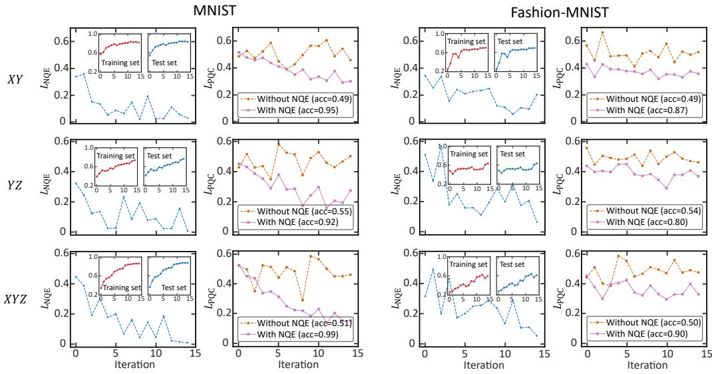  
XY  YZ   XY Z      Figure A.1: NQE-DQC1 training results for the three alternative Hamiltonian-inspired feature maps $( H _ { X Y } , H _ { Y Z } , H _ { X Y Z } )$ on MNIST (left four columns) and Fashion-MNIST (right four As explained in the main text, the ZZ-feature map used in our implementation is inspired by Hamiltoncolumns). For each ansatz row, the left panel of each dataset shows the NQE loss $L _ { \mathrm { N Q E } }$ amics. Mowith the nerally, the ansatz can be written in a compact form as:class trace distance during training in the inset; the right panel shows the downstream PQC loss $L _ { \mathrm { P Q C } }$ Mwith (solid) and without (dashed) NQE. All ansatzes use circuit depth $M = 4$ . The consistent decrease in $L _ { \mathrm { N Q E } }$ V (ω) = exp #i \$and improvement in $L _ { \mathrm { P Q C } }$ i \$ ωk,lZkZl%H→ ,confirm that the NQE benefit is not specific to the $Z Z \left( H _ { X Z } \right)$ feature map.

## XZ  \$ k k  k \$ k,l k l  A.2 Additional Details for Margin Generalization

## miltonians with different interactions: HXY, HYZ, andHXYZ. These encoding cA.2.1 Proof Structure and Mixed-State Extension

( ) \* ) \*+Theorem 3.1 is derived by combining a ramp-loss margin argument with covering-number M/2bounds for the QNN-induced function class. First, define the ramp-loss class

$$
\mathcal { F } _ { \gamma } = \left\{ ( \rho , y ) \mapsto l _ { \gamma } ( \mathcal { M } ( h ( \rho ) , y ) ) : h \in \mathcal { H } \right\} .\tag{Xk+1*+(A.15}
$$

The standard Rademacher-complexity bound gives, with probability at least $1 - \delta ,$ a uniform bound on the expected ramp loss in terms of the empirical ramp loss, the sample Rademacher complexity of $\mathcal { F } _ { \gamma }$ , and the concentration term $\sqrt { \ln ( 2 / \delta ) / ( 2 m ) }$ . Since the ramp loss upper bounds the zero-one loss and is upper bounded by the empirical margin error at threshold $\gamma .$ the remaining problem is to control $\Re ( \mathcal { F } _ { \gamma } | _ { S } )$

For pure input states, write the classifier output as

$$
g ( U x ) = \left( x ^ { \dagger } U ^ { \dagger } E _ { 1 } U x , \dots , x ^ { \dagger } U ^ { \dagger } E _ { k } U x \right) .\tag{A.16}
$$

The composed ramp-margin map is Lipschitz with constant proportional to $E / \gamma$ , where $E =$ $\begin{array} { r } { \sqrt { \sum _ { i = 1 } ^ { k } \| E _ { i } \| _ { \sigma } ^ { 2 } } } \end{array}$ . Thus, the covering number of the restricted ramp-loss class can be controlled by the covering number of the set of transformed training states $\{ U X : U \in \mathbb { U } _ { \mathrm { Q N N } } \}$ :

$$
\ln \mathcal { N } \big ( \mathcal { F } _ { \gamma } | _ { S } , \epsilon , \| \cdot \| _ { 2 } \big ) \leq \left\lceil \frac { 3 2 m b ^ { 2 } E ^ { 2 } } { \epsilon ^ { 2 } \gamma ^ { 2 } } \right\rceil \ln ( 4 N ^ { 2 } ) ,\tag{A.17}
$$

where $N = 2 ^ { n }$ is the Hilbert-space dimension and � bounds the distance of the QNN unitary from a reference unitary in the $\| \cdot \| _ { 2 , 1 }$ sense. Applying Dudley’s entropy integral to Equation (A.17) yields the Rademacher term

$$
\Re ( \mathcal { F } _ { \gamma } | _ { S } ) = \tilde { O } \left( \frac { b E } { \gamma } \sqrt { \frac { n } { m } } \right) ,\tag{A.18}
$$

which gives the theorem in Equation (3.18).

The same argument extends to mixed input states by vectorization. For

$$
\rho = \sum _ { i , j } \rho _ { i j } \left| i \right. \left. j \right| , \qquad \left| \rho \right. \rangle = \sum _ { i , j } \rho _ { i j } \left| i \right. \otimes \left| j \right. ,\tag{A.19}
$$

the unitary action satisfies

$$
| U \rho U ^ { \dagger } \rangle \rangle = ( U \otimes U ^ { * } ) | \rho \rangle \rangle .\tag{A.20}
$$

The proof then proceeds with the distance bound applied to $U \otimes U ^ { * }$ rather than �, and with the measurement-size term evaluated using the Frobenius norms of the POVM elements.

## A.2.2 Experimental Protocol Notes

Table A.2 records the experimental choices from Hur and Park [65] that are useful for interpreting the margin plots in Chapter 3.

Table A.2: Selected reproducibility details for the margin-generalization experiments.
<table><tr><td rowspan=1 colspan=1>Experiment</td><td rowspan=1 colspan=1>Protocol details</td></tr><tr><td rowspan=1 colspan=1>Quantum phaserecognition</td><td rowspan=1 colspan=1>The QPR task uses an eight-qubit generalized cluster Hamiltonian withfour phases. The training set has 20 data points evenly split across the fourclasses, and the test set has 1000 samples. Label corruption levels of 0%,50%, and 100% probe the overfitting regime.</td></tr><tr><td rowspan=1 colspan=1>QPR optimization</td><td rowspan=1 colspan=1>QCNNs are trained with Adam, learning rate 0.001, and full-batch updatesfor up to 5000 iterations. Early stopping compares consecutive500-iteration loss windows. Margin-distribution plots average over 15repetitions with different training samples.</td></tr><tr><td rowspan=1 colspan=1>Ansatz comparisons</td><td rowspan=1 colspan=1>The main comparison uses QCNNs with distinct two-qubit PQCparameters. The supplement repeats the margin-distribution test withshared-parameter QCNNs and Strongly Entangling Layers, showing thesame qualitative leftward margin shift as label corruption increases.</td></tr><tr><td rowspan=1 colspan=1>Embeddingcomparison</td><td rowspan=1 colspan=1>The classical-data experiment uses the first two classes of MNIST,Fashion-MNIST, and Kuzushiji-MNIST. PCA reduces inputs to match thequbit count. The compared embeddings are a three-layer ZZ feature map, atrainable quantum embedding with Y and YY rotations, and NQE with afully connected ReLU network of layer dimensions [8, 16, 32, 32, 16, 8]</td></tr></table>

## A.3 Additional Details for Stochastic Reconfiguration as Spectral Filtering

## A.3.1 Fixed-Checkpoint Regression Identities

Chapter 5 presents the real-valued fixed-checkpoint regression view of $\operatorname { S R }$ . The appendix of the SR paper [138] provides several identities that clarify the assumptions behind that view.

Complex convention. For complex wave functions, define

$$
O _ { c } ( { \boldsymbol { x } } ) = \nabla _ { \boldsymbol { \theta } } \log \psi _ { \boldsymbol { \theta } } ( { \boldsymbol { x } } ) - \mathbb { E } _ { \pi _ { \boldsymbol { \theta } } } [ \nabla _ { \boldsymbol { \theta } } \log \psi _ { \boldsymbol { \theta } } ] , \qquad H _ { \mathrm { l o c } , c } ( { \boldsymbol { x } } ) = H _ { \mathrm { l o c } } ( { \boldsymbol { x } } ) - \mathbb { E } _ { \pi _ { \boldsymbol { \theta } } } [ H _ { \mathrm { l o c } } ] .\tag{A.21}
$$

The Hermitian QGT and force are

$$
Q = \mathbb { E } _ { \pi _ { \theta } } [ \overline { { O _ { c } ( x ) } } O _ { c } ( x ) ^ { T } ] , \qquad f = \mathbb { E } _ { \pi _ { \theta } } [ \overline { { O _ { c } ( x ) } } H _ { \mathrm { l o c } , c } ( x ) ] .\tag{A.22}
$$

For complex parameter increments, SR solves $Q \delta = f$ in the QGT seminorm. For real parameter increments in a complex wave function, the equivalent real least-squares system is

$$
\operatorname { R e } [ Q ] \delta = \operatorname { R e } [ f ] ,\tag{A.23}
$$

with $S = \operatorname { R e } [ Q ] \operatorname { a n d } g = \operatorname { R e } [ f ]$ . The regression loss is $\mathbb { E } _ { \pi _ { \theta } } | O _ { c } ( x ) ^ { T } \delta - H _ { \mathrm { l o c } , c } ( x ) | ^ { 2 }$ . The identities below use real-valued features and targets. For the complex extension, scalar squares become modulus squares and the seminorm uses the corresponding real or Hermitian QGT.

Validation residual. Let $\delta ^ { * }$ be the population least-squares SR direction and define the expressivity gap

$$
\epsilon ( x ) = H _ { \mathrm { l o c } , c } ( x ) - O _ { c } ( x ) ^ { T } \delta ^ { * } .\tag{A.24}
$$

The normal equations give $\mathbb { E } _ { \pi _ { \theta } } [ O _ { c } ( x ) \epsilon ( x ) ] = 0$ . Therefore, for any fixed update $\delta ,$

$$
\begin{array} { r } { \mathbb { E } _ { \pi _ { \theta } } \left[ \left( O _ { c } ( x ) ^ { T } \delta - H _ { \mathrm { l o c } , c } ( x ) \right) ^ { 2 } \right] = \| \delta - \delta ^ { * } \| _ { S } ^ { 2 } + \sigma _ { \mathrm { g a p } } ^ { 2 } , } \end{array}\tag{A.25}
$$

where $\sigma _ { \mathrm { g a p } } ^ { 2 } = \mathbb { E } _ { \pi _ { \theta } } [ \epsilon ( x ) ^ { 2 } ]$ . This is the identity behind Equation (5.20): held-out tangent residuals estimate excess risk plus a constant irreducible gap.

Bias–variance decomposition. At a fixed checkpoint, let $Z = \hat { \delta } _ { \lambda }$ be the random shifted-SR update obtained by resampling the Monte Carlo batch, and let $\mu = \operatorname { \mathbb { E } } _ { D } [ Z ]$ . Then

$$
\begin{array} { r } { \mathbb { E } _ { D } \| Z - \delta ^ { * } \| _ { S } ^ { 2 } = \| \mu - \delta ^ { * } \| _ { S } ^ { 2 } + \mathbb { E } _ { D } \| Z - \mu \| _ { S } ^ { 2 } . } \end{array}\tag{A.26}
$$

The multi-batch diagnostic in Equation (5.21) estimates the second term by evaluating the prediction-space disagreement among independent updates on a validation batch.

Spectral proxy and local geometry. On the non-null QGT subspace, use the eigendecomposition

$$
S = V { \mathrm { d i a g } } ( s _ { i } ) V ^ { T } , \qquad \beta _ { i } ^ { * } = ( V ^ { T } \delta ^ { * } ) _ { i } .\tag{A.27}
$$

The population ridge direction has shrinkage bias

$$
\lVert \boldsymbol { \delta } _ { \lambda } - \boldsymbol { \delta } ^ { * } \rVert _ { S } ^ { 2 } = \sum _ { i } s _ { i } \left( \frac { \lambda } { s _ { i } + \lambda } \right) ^ { 2 } ( \boldsymbol { \beta } _ { i } ^ { * } ) ^ { 2 } .\tag{A.28}
$$

Under a scalar residual-noise approximation, the finite-sample variance scales as

$$
\frac { \sigma _ { \mathrm { g a p } } ^ { 2 } } { N _ { s } } \sum _ { i } \left( \frac { s _ { i } } { s _ { i } + \lambda } \right) ^ { 2 } ,\tag{A.29}
$$

giving the spectral-risk proxy in Equation (5.17). The same �-seminorm also controls local Fubini–Study infidelity. For nearby displacements � and $b ,$

$$
1 - \left| \langle \Psi ( \theta + a ) | \Psi ( \theta + b ) \rangle \right| ^ { 2 } = ( a - b ) ^ { T } S ( a - b ) + O ( ( \left. a \right. + \left. b \right. ) ^ { 3 } ) .\tag{A.30}
$$

With the full QGT, regression excess risk therefore measures the discrepancy from the population tangent-space imaginary-time step in the local state geometry. The small-system diagnostics in Chapter 5 instead retain only the amplitude features $\nabla _ { \theta }$ Re log $\psi _ { \theta }$ and the real local-energy target, while evaluating local energies and Born probabilities from the complex state. Their covariance omits the phase channel, so those amplitude regression risks do not measure full complex-SR error or complete local infidelity.

Sample centering. Practical SR uses sample-centered log-derivatives and sample-centered local energies. This is equivalent to ridge regression with an unpenalized intercept:

$$
\operatorname* { m i n } _ { a , \delta } \frac { 1 } { n } \sum _ { j = 1 } ^ { n } \left( a + O ( x _ { j } ) ^ { T } \delta - H _ { \mathrm { l o c } } ( x _ { j } ) \right) ^ { 2 } + \lambda \| \delta \| _ { 2 } ^ { 2 } .\tag{A.31}
$$

Optimizing over � subtracts the sample means of � and $H _ { \mathrm { l o c } }$ . This removes the constant energy/normalization component but does not remove the �-dependent expressivity gap that drives the finite-sample overfitting efect.

Large-system normalization. The large-scale implementation uses target $2 H _ { \mathrm { l o c } , c }$ and correspondingly doubled SR directions. Its raw validation residuals and multi-batch variances are therefore four times those under the $H _ { \mathrm { l o c } , c }$ convention used in the regression derivation; relative comparisons and method ordering are unchanged. The large $J _ { 1 } { - } J _ { 2 }$ experiments also use Pauli operators. Converting that Hamiltonian and its SR directions to the spin convention $\mathbf { S } = \sigma / 2$ would divide the squared diagnostics by 16, independently of the doubled-force convention. The reported figures retain the original normalization.

Table A.3 summarizes the reproducibility details from the SR paper [138] that are most relevant to the claims in Chapter 5.

Table A.3: Selected protocol details for the SR spectral-filtering experiments.
<table><tr><td rowspan=1 colspan=1>Setting</td><td rowspan=1 colspan=1>Details</td></tr><tr><td rowspan=1 colspan=1>Exact $4 \times 4 J _ { 1 } – J _ { 2 }$ </td><td rowspan=1 colspan=1>Archived graph with 32 periodic nearest-neighbor bonds and 24 diagonalbonds, omitting eight diagonal bonds across one seam. Couplings are $J _ { 1 } = 1 , J _ { 2 } = 0 . 5$ in the spin convention $\mathbf { S } = \sigma / 2 . ~ \mathrm { A l l } ~ 2 ^ { 1 6 } = 6 5 { , } 5 3 6$ statesenter the exact Born sums for the amplitude covariance, amplitude-optimalupdate, and amplitude gap variance. The RBM has 1120 real parameters at $P / N _ { s } = 0 . 2 7 3$ with $N _ { s } = 4 0 9 6$ . The ViT has 13,448 real parameters at $P / N _ { s } = 3 . 2 8 3 .$ </td></tr><tr><td rowspan=1 colspan=1>Matched-noise andmatched-statediagnostics</td><td rowspan=1 colspan=1>Matched-noise pairs independently trained RBM and ViT checkpoints withcomparable amplitude gap variance and draws 100 independent batches at $\lambda = 1 0 ^ { - 9 }$ . Matched-state first fits $\mathbf { a \ V i T }$ to a partially converged RBMwave function to fidelity $F = 0 . 9 8 3 6 2 6$ , then compares amplituderegression diagnostics from 10 resampled batches.</td></tr><tr><td rowspan=1 colspan=1>1D TFIM foundationalNQS</td><td rowspan=1 colspan=1>The large-scale TFIM diagnostic uses a periodic $L = 1 0 0$ transverse-fieldIsing family with $h \in [ 0 . 8 , 1 . 2 ]$ . The conditional ViT foundation NQS hassix layers, model dimension 72, 12 attention heads, patch size 4,translational invariance, and 198,144 parameters. Each SR step uses12,000 samples from 6000 field replicas with two spin configurations perfield.</td></tr><tr><td rowspan=1 colspan=1>Large-scalediagnostics</td><td rowspan=1 colspan=1>The shared-checkpoint run uses training shift $\lambda _ { \mathrm { t r a i n } } = 1 0 ^ { - 4 }$ . Diagnosticcheckpoints are steps 1100 through 2000 for TFIM. Solve-time shifts areswept over $\{ 1 0 ^ { - 8 } , \bar { 1 0 } ^ { - 7 } , \dots , 1 0 ^ { - 1 } \}$ . The TFIM U-curve uses 100independently resampled updates per shift; ablations use 20 repeats percheckpoint. Validation uses 120,000 held-out TFIM samples or 100,000held-out $J _ { 1 } { - } J _ { 2 }$ samples.</td></tr><tr><td rowspan=1 colspan=1>MS-SR ablations</td><td rowspan=1 colspan=1>Offline ablations use $K = 4 { \mathrm { N T K } }$ -spectrum quantiles {0.9, 0.7, 0.4, 0.1},cached per checkpoint from an independent reference batch. Comparisonsinclude standard SR, shared-batch uniform and stacked multi-shift,independent-batch uniform multi-shift, and full MS-SR withleave-one-batch-out stacking. Bagged SR uses either the training shift or acheckpoint-tuned shift selected on the reporting data by the eight-pointsweep above; the tuned variant is an oracle reference.</td></tr></table>

## APPENDIX B

## RELATED NON-FIRST-AUTHOR CONTRIBUTIONS

This appendix records two closely related collaborative papers in which the NQE methods introduced in Chapter 2 are extended and validated in application domains outside the primary thesis narrative. The goal is not to reproduce those papers in detail, but to summarize the connection to the thesis and the main empirical findings.

Table B.1 gives a compact overview. Both papers extend the Neural Quantum Embedding perspective developed in Chapter 2: one applies trainable quantum embeddings to ligand-based virtual screening, and the other generalizes NQE to multi-channel image data.

Table B.1: Summary of non-first-author contributions related to the main thesis.
<table><tr><td rowspan=1 colspan=1>Paper</td><td rowspan=1 colspan=1>Thesisconnection</td><td rowspan=1 colspan=1>Data domain</td><td rowspan=1 colspan=1>Method</td><td rowspan=1 colspan=1>Headline result</td></tr><tr><td rowspan=1 colspan=1>Optimizing QuantumData Embeddings forLigand-Based VirtualScreening [155]</td><td rowspan=1 colspan=1>NQEapplication(Chapter 2)</td><td rowspan=1 colspan=1>Moleculardescriptors fromLIT-PCBA andCOVID-19 liganddatasets</td><td rowspan=1 colspan=1>NQE with ZZ/XYZfeature maps,QCNN classifiers,quantum kernels,andquantum-pretrainedclassicalembeddings</td><td rowspan=1 colspan=1>NQE increased classtrace distances; quantumor hybrid variantsoutperformed classicalRBF/linear baselines,especially inlimited-data orimbalanced settings.</td></tr><tr><td rowspan=1 colspan=1>Multi-ChannelConvolutional NeuralQuantumEmbedding [156]</td><td rowspan=1 colspan=1>NQE extension(Chapter 2)</td><td rowspan=1 colspan=1>CIFAR-10 andTiny ImageNetbinary image tasks</td><td rowspan=1 colspan=1>Convolutional NQEinterfaces formulti-channel data,followed by QCNNclassification</td><td rowspan=1 colspan=1>Trace distance andclassification accuracywere strongly correlated.Parameter-efficientmulti-channel interfacesachieved competitiveaccuracy with fewertrainable parameters.</td></tr></table>

## B.1 Quantum Embeddings for Ligand-Based Virtual Screening

Choi et al. [155] studied whether optimized quantum data embeddings can improve ligandbased virtual screening, a setting where labeled biological data are often limited and classimbalanced. The study used molecular descriptors computed from SMILES strings and evaluated two benchmark collections: LIT-PCBA, containing multiple biological targets with severe activator/inactivator imbalance, and a smaller COVID-19 ligand dataset. This application is naturally connected to Chapter 2 because the central question is whether trainable quantum embeddings can produce more useful molecular representations than fixed or purely classical embeddings.

For the LIT-PCBA experiments, the paper compared NQE models using ZZ and XYZ quantum feature maps against a classical neural-network parameterized RBF embedding. The NQEpretrained embeddings were then evaluated with QCNN classifiers, while the classical embeddings were evaluated with comparable shallow classical classifiers. In the ZZ-feature-map setting, NQE increased the trace distance between class ensembles after training across the reported conditions. For example, the GBA target in the balanced setting increased from approximately $5 \times 1 0 ^ { - 4 }$ to about 0.55 on the test set. This mirrors the main mechanism of Chapter 2: improving the embedding geometry can lower the efective discrimination barrier faced by the downstream classifier.

Figure B.1 illustrates the most direct connection to the trace-distance argument in Chapter 2. Before training, the ZZ feature map typically produces class-ensemble trace distances near $1 0 ^ { - 4 } -$ $1 0 ^ { - 3 }$ for these molecular descriptors. After NQE training, the distances move into the $1 0 ^ { - 1 }$ range or higher for several targets, including GBA, ESR1 antagonist, MAPK1, FEN1, PKM2, and VDR. The efect is visible in both the training and test panels, indicating that the learned embedding is not merely separating the sampled training pairs but also improving the geometry

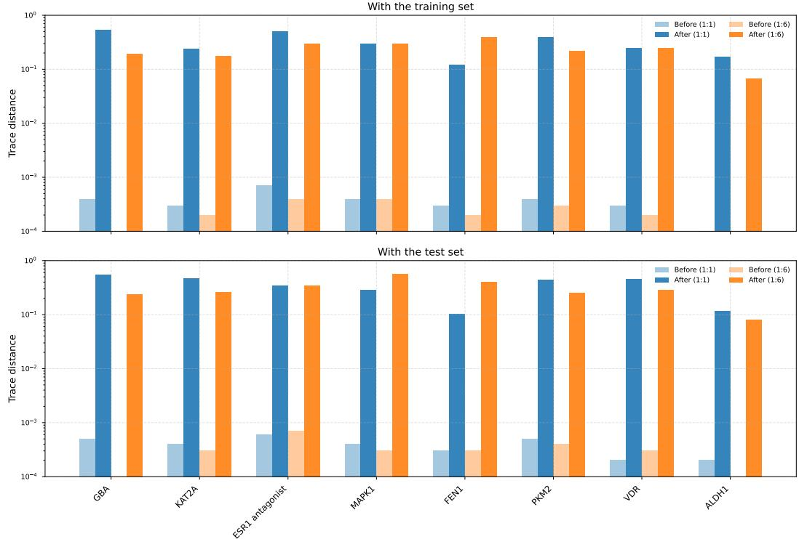  
4. Trace distance changes before and after training of NQE with the ZZ feature map. “Before” and “After” indicFigure B.1: Trace-distance increase obtained by NQE training with the ZZ feature map on LIT-PCBA targets. The plot compares trace distances before and after NQE training for balanced (1:1) and imbalanced (1:6) activator/inactivator settings, separately for training and test sets. The log scale highlights that the untrained embeddings produce nearly indistinguishable class Condition (4-qubits / 8-qubits)ensembles, while NQE raises the class separation by several orders of magnitude for many targets.

## PCA + SVof held-out ligand examples.

± The paper also explored quantum-pretrained classical embeddings, where neural networks trained through NQE were reused in classical classifiers. These transfer-style variants often imterpart, which employs RBF kernel with the classical NQE achieved higher classification performance thproved performance in limited-data or class-imbalanced cases, suggesting that the representation tecture was used in both NQE and RBF kernel, the except for the 1:1 ratio case with the XYZ featurelearned during quantum embedding optimization can be useful even outside a fully quantum classifier. On the COVID-19 dataset, projected quantum kernels with the ZZ feature map achieved ence, the classification performance of the binary intractable quantum feature maps generally outpebalanced accuracies of 0.83 and 0.80 for 4- and 8-qubit configurations, respectively, compared with classical SVM baselines in the range 0.59–0.65. The main takeaway is that NQE-style embedding optimization can be adapted to molecular screening as a data-eficient representationlearning tool, although hardware execution and biological interpretability remain directions for future work.

## B.2 Multi-Channel Convolutional Neural Quantum Embedding

Kim et al. [156] extended the NQE framework to multi-channel image data through convolutional neural quantum embedding (CNQE). Whereas the original NQE experiments in Chapter 2 focused mainly on low-dimensional or single-channel inputs after preprocessing, CNQE studies how a classical convolutional interface should map multi-channel data, such as RGB images, into quantum feature-map parameters. The work introduced three interface structures, denoted $g _ { a } , g _ { b }$ , and $g _ { c }$ , that difer in whether channels are processed jointly or separately before quantum embedding.

The main theoretical and empirical point is that the classical-to-quantum interface controls both parameter eficiency and the separability of the resulting quantum states. The paper compared fidelity-based and Hilbert–Schmidt-based NQE losses, multiple embedding circuits, and QCNN classifiers on binary tasks from CIFAR-10 and Tiny ImageNet. Across the tested configurations, trace distance and downstream classification accuracy were strongly correlated, with Pearson correlation $r = 0 . 7 9 2 6$ and Spearman correlation $\rho \ : = \ : 0 . 8 1 8 4$ reported across model configurations. This supports the trace-distance view developed in Chapter 2: embeddings that better separate class ensembles tend to give the classifier a better achievable operating point.

Figure B.2 is the key empirical diagnostic from the CNQE study. The figure does not show a single model comparison; instead, it aggregates many design choices and asks whether the NQE quantity optimized before classifier training remains predictive once a QCNN classifier

Relationship Between Trace Distance and Classification Accuracy  
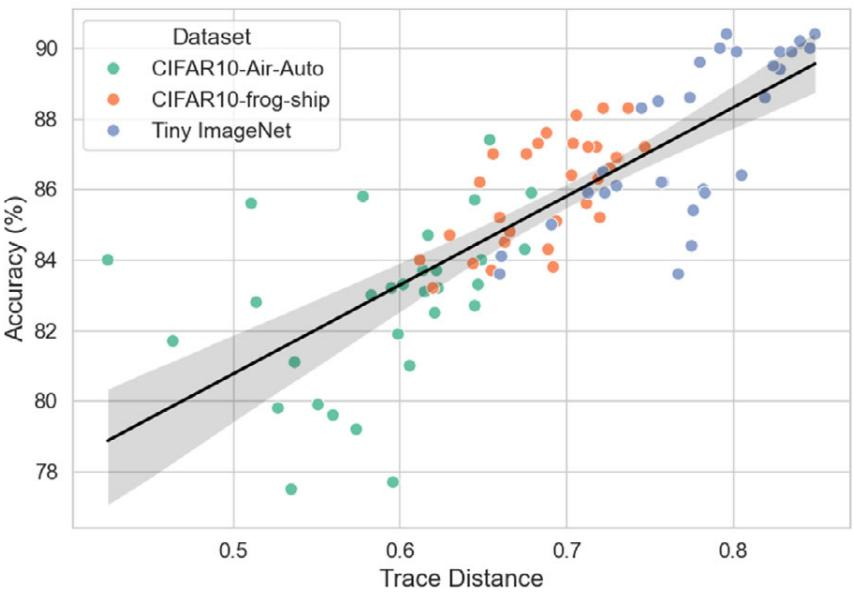  
Figure B.2: Relationship between class trace distance and QCNN classification accuracy across CNQE configurations on CIFAR-10 and Tiny ImageNet binary tasks. Each point corresponds to a choice of dataset, classical-to-quantum interface, loss function, and embedding circuit. The CIFAR-10, and School Bus–Maypole from Tiny ImageNet. Fur-positive trend supports the use of trace distance as an embedding-quality diagnostic for multichannel NQE.

The main simulation results are summarized in Table 2 andis trained afterward. The observed monotone trend is important because it links architectural engineering choices, such as channel-wise versus joint-channel interfaces, back to the same stateing the CIFAR-10 frog–ship pairdiscrimination quantity used throughout Chapter 2.

Empirically, CNQE-QCNN models achieved high accuracy on the selected multi-channel rameters increase, indicating that CNQE-QCNN maintains efec-tasks, including results near 95% on CIFAR-10 frog–ship and Tiny ImageNet school-bus– tiveness without degradation from the larger state space. Perfor-maypole binary classification tasks in favorable configurations. The channel-separated interface $g _ { c }$ was particularly interesting: although it produced smaller trace distances than $g _ { a }$ and $g _ { b }$ in tion accuracy is measured after training a QCNN ansatz on thesome statistical comparisons, it used the fewest trainable parameters and still achieved competitive classification accuracy. The paper therefore broadens NQE from a basic embedding optimizer into a practical design space for image-like, multi-channel inputs.