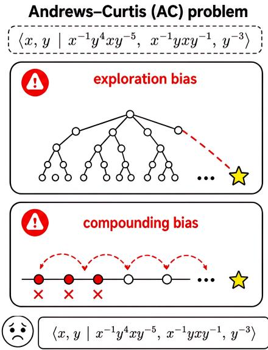
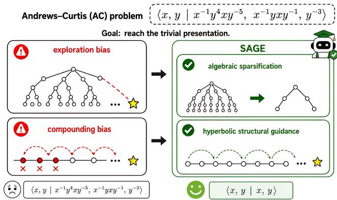
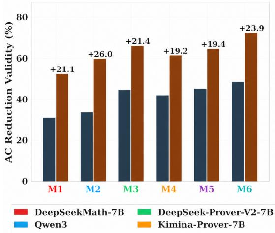
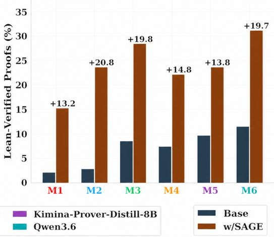
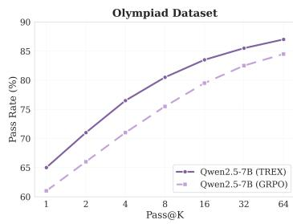
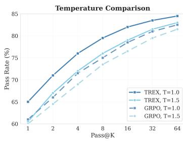
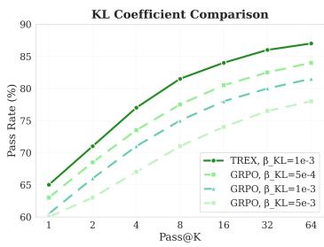

# SAGE: Mitigating Long-Horizon Reasoning Biases via Topological Guidance

Xinyue Zeng CS Department Virginia Tech

Jiawei Zhang CS Department University of Wisconsin Madison

Yujun Yan CS Department Dartmouth College

Dawei Zhou CS Department Virginia Tech

## Abstract

Long-horizon reasoning remains a central challenge for large language models (LLMs) under sparse-reward regimes. We argue that this brittleness arises from two biases induced by complex reasoning spaces: an exploration bias, where models are drawn toward locally plausible but structurally unstable branches, and a compounding bias, where small local deviations accumulate across depth and suppress rare rewards. We introduce Symbolic Closure Analysis (SCA) as a theoretical lens characterizing how branching structures and sparse rewards induce these biases in long-horizon reasoning with local admissibility, and as a design principle for structural priors in less formal reasoning tasks. Motivated by this analysis, we propose SAGE (Structural Admissibility-Guided Exploration), a unified framework that injects structural guidance to alleviate exploration bias and compounding bias in long-horizon reasoning. SAGE combines two complementary structural guidance: algebraic sparsification, which projects locally admissible candidates onto operator-indexed algebraic subspaces to suppress spurious branching and mitigate exploration bias, and hyperbolic structural guidance, which embeds reasoning states into a negatively curved space to provide dense depth-wise signals and mitigate compounding bias. Across 12 benchmarks and 7 model families, SAGE outperforms competitive baselines. In particular, SAGE achieves up to an 8-fold improvement on the Andrews-Curtis problem, an open real-world long-horizon task. Code is available at: https://github.com/Susan571/SAGE-NeurIPS2026.

## 1 Introduction

Long-horizon reasoning remains a central challenge for large language models (LLMs), where success often requires discovering deep, structured reasoning trajectories across many steps. Posttraining learning has become a dominant paradigm for improving LLM reasoning, with strong progress in mathematics and coding through outcome-based objectives (Lyu et al., 2025; Zhang et al., 2025c). However, as reasoning horizons grow, outcome-based post-training becomes brittle in sparse-reward regimes: limited intermediate rewards provide insufficient guidance for preserving long-term feasibility, leading to locally plausible but globally unstable patterns (Suo et al., 2025).

This brittleness reflects two distinct but coupled long-horizon reasoning biases, illustrated in Figure 1 with the Andrews-Curtis (AC) trivialization task as a running example, where the task is to reach a trivial presentation through a long sequence of admissible transformations. The first is exploration bias, which arises from the structural complexity of the reasoning space: as the reasoning tree expands with depth, successful trajectories occupy a narrow feasible region, while much larger regions contain locally plausible but globally unproductive branches (Dziri et al., 2023), so outcomebased post-training tends to favor trajectories that are easy to sample rather than trajectories that remain extendable to success. The second is compounding bias, which arises from sparse-reward regimes with limited intermediate rewards: small local deviations accumulate across depth and progressively move the trajectory away from long-term feasibility (Casper et al., 2023; Weaver & Tao,

2013). Together, these biases explain why LLMs may produce plausible intermediate steps while still failing at end-to-end long-horizon reasoning, and existing mitigation efforts address them along two corresponding axes. To counter exploration bias, one line of work introduces dense supervision that decomposes long-horizon reasoning into locally verifiable steps, ranging from interactive verifiers that enforce rigorous logical transitions (Yang et al., 2023; Hsiang et al., 2025) to learned verifiers or LLM-as-a-Judge that guide Monte Carlo Tree Search via step-wise critiques (Lightman et al., 2023); however, reliable process supervision remains structurally expensive to scale, ultimately shifting the bottleneck without resolving the fundamental difficulty of learning from sparse rewards. To counter compounding bias, a second line of work adapts outcome-based RL to sparse-reward regimes by augmenting the objective with auxiliary heuristics, including iterative bootstrapping methods like STaR or ReST (Zelikman et al., 2022; Gulcehre et al., 2023) and intrinsic motivation mechanisms based on entropy regularization or syntactic constraints (She et al., 2025; Zhang et al., 2025b; Yue et al., 2025; Gai et al., 2025); yet these methods do not model the structure of the long-horizon reasoning space, leaving the geometry of feasible trajectories implicit.

This gap motivates two fundamental research questions: Q1: Can we characterize the dominant factors that drive long-horizon reasoning failures under structural complexity and sparse-reward regimes? Q2: Can this characterization be instantiated as a unified framework that injects structural guidance to alleviate exploration bias and compounding bias?

To address this gap, we first introduce Symbolic Closure Analysis (SCA), a theoretical framework for characterizing the dominant factors behind long-horizon reasoning failures under structural complexity and sparse-reward regimes. SCA models reasoning as a sequence of locally admissible transformations and studies how feasible support evolves in expanding reasoning spaces. Our analysis shows that structural complexity dilutes feasible support across high-volume but unproductive branches, producing exploration bias, while sparse-reward regimes provide limited intermediate rewards, allowing local deviations to accumulate with depth and produce compounding bias.

Motivated by SCA, we propose Structural Admissibility-Guided Exploration (SAGE), a unified framework for alleviating long-horizon reasoning biases. SAGE injects structural guidance during policy optimization so that the learned policy internalizes useful properties of structured reasoning space, through two complementary structural guidance: algebraic sparsification, which reduces spurious branching and alleviates exploration bias, and hyperbolic structural guidance, which provides dense depthaware signals and alleviates compounding bias. Together, these components translate the SCA diagnosis into trainable guidance signals.

  
Figure 1: AC problem illustrates two long-horizon reasoning biases: exploration bias from many locally valid but low-promise branches, and compounding bias from early plausible deviations whose failures appear in later steps.

We evaluate SAGE across 7 model families and 12 bench-

marks spanning closed-form mathematical reasoning, free-form natural reasoning, and open longhorizon reasoning task. SAGE always outperforms competitive baselines and particularly achieves up to 8-fold improvement on AC problem, an open real-world long-horizon reasoning task.

Our contributions are threefold:

• We introduce SCA as a theoretical lens to characterize the dominant factors behind longhorizon reasoning failures under structural complexity and sparse-reward regimes.

• We propose SAGE, a unified framework for alleviating long-horizon reasoning biases.

• Evaluation across 13 benchmarks and 8 models show that SAGE consistently outperforms competitive baseline. Code is open-sourced at: https://anonymous.4open.science/ r/SAGE-Long-Horizon-Reasoning-AD70.

## 2 Preliminaries

## 2.1 Long-Horizon Reasoning

Following prior work (Yao et al., 2023; Lightman et al., 2023), we study long-horizon reasoning as a sequential decision process over discrete symbolic manipulations. Let S denote the task-specific symbolic interface with local admissibility predicate AdmS. At each step $t \in \{ 0 , \ldots , T - \bar { 1 } \}$ }, the system selects $a _ { t } \in \mathcal { A } ( s _ { t } )$ with $\mathrm { A d m } _ { \mathfrak { S } } ( s _ { t } , a _ { t } ) = 1$ and transitions via $\boldsymbol { s } _ { t + 1 } = \Phi ( \boldsymbol { s } _ { t } , \boldsymbol { a } _ { t } )$ , yielding a trajectory $\tau = ( s _ { 0 } , a _ { 0 } , \ldots , s _ { T } )$ of maximum path length T. For analytical convenience, we cast this as a finite-horizon MDP $\mathcal { M } = \langle \boldsymbol { S } , \mathcal { A } , \mathcal { P } , \mathcal { R } , \mathbf { \bar { \Phi } } \rangle$ over reasoning contexts, symbolic manipulations, transition dynamics, and task-level outcome signal. The difficulty grows rapidly with $\bar { T } .$ , shaped by two salient properties. The first is structural complexity: the reachable search space scales as $| \dot { \Omega } | = O ( \bar { A } ^ { T } )$ for average branching factor ${ \bar { A } } ,$ while successful trajectories form only a small subset $\overleftarrow { \tau } ^ { * }$ (treated as an analytical object, not as supervision), occupying a vanishing fraction of the reachable manifold as $T$ grows. The second is sparse outcome feedback: meaningful supervision is often available only at the trajectory end. Under terminal reward $r ( \tau ) = \mathbf { 1 } [ \tau \in \breve { T } ^ { * } ]$ , informative feedback is inherently rare because successful trajectories themselves are rare, making credit assignment progressively harder and often yielding ineffective optimization in sparse-reward regimes (Uesato et al., 2022; Weaver & Tao, 2013).

## 2.2 Biases in Long-Horizon Reasoning

Structural complexity and sparse outcome feedback do not merely make long-horizon reasoning more difficult; they induce recurring distortions in how trajectories are explored and preserved (Zhou et al., 2025; Brantley et al., 2025; Liu et al., 2025; Jahin et al., 2025). Figure 1 illustrates these distortions in the AC problem, where an LLM policy transforms a group presentation toward the trivial presentation through legal symbolic moves such as inverting a relator, multiplying relators, or conjugating by a generator. Although many moves are locally valid, only a small subset continues to simplify the presentation over long horizons, giving rise to two coupled biases: structural complexity mainly induces an exploration bias, while sparse outcome feedback mainly induces a compounding bias, and the two interact as depth increases.

Exploration bias. As search volume grows exponentially, locally admissible trajectories that do not extend to success can overwhelmingly dominate the reachable set (Dziri et al., 2023): many moves are locally admissible, but only a few are structurally extendable. In the AC example, many legal moves branch from the same presentation, yet only a few continue to simplify the residual algebraic structure, so a policy sampling broadly from admissible moves spends most of its budget on locally plausible but structurally unstable paths.

Compounding bias. Sparse outcome feedback yields a different but equally persistent failure mode: with supervision only at the end of a long chain, small local deviations cannot be corrected early and instead accumulate. As shown in Figure 1, an early $\mathbf { A C }$ move such as replacing one relator by its product with another may look locally plausible, yet redirect the trajectory into a region where subsequent legal moves preserve or amplify complexity, with failure surfacing only several steps later. This is especially problematic in KL-regularized post-training: when terminal rewards are weak, the update is dominated by the KL term (Lyu et al., 2025; Schulman et al., 2017), and in the limit where the expected reward contribution vanishes, it degenerates toward preserving the reference policy, $\nabla J \approx - \beta \mathrm { \dot { \nabla } } D _ { \mathrm { K L } } ( \pi _ { \theta } | | \pi _ { \mathrm { r e f } } )$ , allowing locally plausible deviations to persist rather than being corrected by task-level structure (Casper et al., 2023).

Together, we formalize the problem as follows:

Problem 2.1 (Alleviating Long-Horizon Reasoning Biases).

Given: (i) a task space Q with complex reasoning structures whose search volume scales exponentially with path length ${ \cal T } ( | \Omega | = ) \dot { \cal O } ( \bar { A } ^ { T } ) ) ;$ ; and (ii) a sparse-reward regime with a pretrained policy π0 and sparse terminal reward $\mathcal { O } ( \tau )$ , where the initial success probability is negligible $\bar { ( } \mathbb { E } _ { \tau \sim \pi _ { 0 } } [ \mathcal { O } ( \tau ) ] \stackrel { } { \approx } 0 )$

Find: a reasoning policy $\pi ^ { * }$ that increases the probability of successful trajectories by alleviating both biases, without access to dense process labels or ground-truth solution paths: $\pi ^ { * } =$ argmax $\cdot _ { \pi } \mathbb { E } _ { q \sim \mathcal { Q } } \left[ \mathbb { P } ( \tau \in \mathcal { T } ^ { * } \mid \pi , q ) \right]$

## 3 Theoretical Analysis

We introduce Symbolic Closure Analysis (SCA) as a theoretical lens for understanding the two biases identified in Section 2.2. SCA characterizes the reasoning manifold through a prefix-closed feasible region induced by local admissibility, providing a principled lens for diagnosing why standard outcome-based learning is structurally biased under sparse-reward regimes.

## 3.1 SCA: Symbolic Closure Analysis

To analyze long-horizon reasoning in sparse-reward regimes, we first revisit reference-regularized post-training (Ziegler et al., 2019; Ouyang et al., 2022), which stabilizes learning through a likelihoodbased closure $\Omega _ { \mathrm { s t a t } } = \tau : \mathbb { P } \pi \mathbf { r e f } ( \tau ) \geq \epsilon$ but preserves trajectories that are easy to sample rather than those feasible over long horizons. We propose SCA, which instead defines feasibility through local admissibility. The resulting feasible region $\mathcal { F }$ is prefix-closed by construction, providing an analytical object against which exploration and compounding biases can be characterized.

Definition 3.1 (SCA Feasible Closure). Let $\mathfrak { S }$ denote a domain-specific symbolic system specifying admissible operators and a local admissibility predicate $\mathrm { A d m } _ { \mathfrak { S } }$ For a trajectory $\tau =$ $( s _ { 0 } , a _ { 0 } , \ldots , a _ { T - 1 } , s _ { T } )$ with $a _ { t } ~ \in ~ \mathcal { A } ( s _ { t } )$ and $\boldsymbol s _ { t + 1 } = \boldsymbol \Phi ( \boldsymbol s _ { t } , \boldsymbol a _ { t } )$ , the SCA-feasible set $\mathcal { F }$ is $\tau \in$ ${ \mathcal { F } } \Longleftrightarrow \{ \forall t \in \{ 0 , \ldots , T - 1 \}$ , AdmS $( s _ { t } , a _ { t } , s _ { t + 1 } ) = 1 \}$

Remark 3.2 (Local Admissibility). AdmS checks only whether a transition is locally well-formed under ${ \mathfrak { S } } ;$ it does not certify global correctness, provide ground-truth steps, reveal successful trajectories, or use outcome labels.

Remark 3.3 (Prefix Closure). AdmS induces a prefix-closed feasible region: if any prefix of $\tau$ violates local admissibility, all its continuations are infeasible. Equivalently, for any $\tau \in \mathcal { F }$ , every prefix $\tau _ { \leq t } \in \mathcal { F }$

SCA admits three levels of instantiation. In explicit symbolic systems, $\mathrm { A d m } _ { \mathfrak { S } }$ is given by the task interface and $\mathcal { F }$ is exact. In semi-structured domains such as closed-form mathematics, unresolved variables, equations, and answer-schema constraints serve as computable proxies for residual structure. In free-form natural reasoning, residuals and target anchors are estimated from prompt-conditioned semantic structure.

## 3.2 Theoretical Analysis of Biases under SCA

We now show how SCA explains the two biases of Section 2.2. Let $\mathcal { F }$ be the prefix-closed feasible set (Definition 3.1) and $\mathcal { G } = \Omega \backslash \mathcal { F }$ its inadmissible complement, with ${ \mathcal { T } } ^ { * } \subseteq { \mathcal { F } }$ unobserved. We treat $\mathcal { F }$ as a tractable structural proxy: induced by local admissibility in symbolic domains, and approximating the long-horizon extendable subset elsewhere.

For a rollout policy $\pi ,$ let $\mu _ { \pi } : = \mathbb { P } _ { \tau \sim \pi } ( \tau \in \mathcal { G } )$ and $p _ { \pi } : = \mathbb { P } _ { \tau \sim \pi } ( \tau \in T ^ { * } )$ ). Under SCA, exploration bias appears as $\mu _ { \pi _ { 0 } }$ ≈ 1—rollouts concentrate outside $\scriptstyle { \mathcal { F } } - { \mathrm { w h i l e } }$ compounding bias appears as the persistence of early inadmissible deviations: terminal-only rewards let locally unstable prefixes survive long enough to dominate the trajectory distribution.

Characterizing Exploration Bias via Feasible-Region Geometry. Structural complexity induces exploration bias because the reachable space grows exponentially with $T ,$ , while admissible and successful trajectories occupy only a small fraction. Let $\tau _ { < t }$ denote a prefix and define the local feasibility indicator $\phi ( \tau _ { < t } ) ~ = ~ \mathbf { 1 } [ \tau _ { < t }$ is locally admissible under $\mathrm { A d m } _ { \cal S } ]$ By prefix closure, $\phi ( \tau _ { \le t } ) = 0 \Rightarrow \phi ( \tau _ { \le t ^ { \prime } } ) = 0$ for all $t ^ { \prime } \geq \bar { t } ,$ hence $\mathcal { G } \overset { \cdot } { = } \{ \tau \in \Omega : \exists t , \phi ( \tau _ { \leq t } ) = \bar { 0 } \}$

Let $B _ { t }$ and $B _ { t } ^ { \mathcal { F } }$ denote the effective and locally admissible branching factors at depth t. When $B _ { t } ^ { \mathcal { F } } \ll B _ { t }$ for many $t ,$ a crude volume comparison gives

$$
\frac { | \{ \tau _ { \le T } : \tau \in \mathcal { F } \} | } { | \{ \tau _ { \le T } : \tau \in \Omega \} | } \lesssim \prod _ { t = 1 } ^ { T } \frac { B _ { t } ^ { \mathcal { F } } } { B _ { t } } .\tag{1}
$$

Thus, unless the base policy places exponentially increasing preference on ${ \mathcal { F } } ,$ , unconstrained rollouts concentrate outside the feasible region $( \mu _ { \pi _ { 0 } } \approx 1 )$ . SCA identifies this volume mismatch as the structural origin of exploration bias and isolates feasible-support concentration as the property any successful mitigation must achieve and, as the next proposition shows, the structural quantity controlling gradient variance.

Proposition 3.4 (Variance Decomposition over Feasible and Inadmissible Regions). Let π be any rollout policy and $\hat { \rho } _ { \pi }$ its empirical rollout distribution. For any score-function gradient term $g ( \tau )$

$$
\begin{array} { r l } & { \mathrm { V a r } _ { \tau \sim \hat { \rho } _ { \pi } } \big [ g ( \tau ) \big ] = \mathbb { P } ( \tau \in \mathcal { F } ) \mathrm { V a r } \big [ g ( \tau ) ~ | ~ \tau \in \mathcal { F } \big ] } \\ & { \qquad + \mathbb { P } ( \tau \in \mathcal { G } ) \mathrm { V a r } \big [ g ( \tau ) ~ | ~ \tau \in \mathcal { G } \big ] } \\ & { \qquad + \mathbb { P } ( \tau \in \mathcal { F } ) \mathbb { P } ( \tau \in \mathcal { G } ) \Big ( \mathbb { E } \big [ g ( \tau ) ~ | ~ \tau \in \mathcal { F } \big ] - \mathbb { E } \big [ g ( \tau ) ~ | ~ \tau \in \mathcal { G } \big ] \Big ) ^ { 2 } . } \end{array}\tag{2}
$$

Consequently, any policy with $\operatorname { s u p p } ( \pi ) \subseteq { \mathcal { F } }$ removes both the G-conditioned variance and the between-region term.

Characterizing Compounding Bias under Sparse-reward Regimes. Under sparse rewards, local deviations go uncorrected until terminal evaluation, allowing trajectories to drift from feasible structure without intermediate signal. KL-regularized post-training sharpens this: when successful trajectories are rare under the reference policy, the reward signal is too weak to pull the learned policy away from reference-model behavior.

Consider the KL-regularized objective ma $\mathfrak { c } _ { \pi } \mathbb { E } _ { \tau \sim \pi } [ R ( \tau ) ] - \lambda D _ { \mathrm { K L } } ( \pi \| \pi _ { \mathrm { r e f } } )$ , with terminal-only $R ( \tau ) \ \in \ [ 0 , R _ { \mathrm { m a x } } ]$ and successful set $S = \{ \tau : R ( \bar { \tau } ) > 0 \}$ . Then $\begin{array} { r } { \mathbb { E } _ { \tau \sim \pi } [ R ( \tau ) ] \ \leq \ R _ { \operatorname* { m a x } } \pi ( S ) } \end{array}$ while the KL penalty is dense over the full rollout space. The following theorem makes this mismatch precise: when $S$ is rare under $\pi _ { \mathrm { r e f } } .$ , the full-support KL-regularized optimizer cannot move meaningfully away from $\pi _ { \mathrm { r e f } } ,$ so locally inadmissible prefixes under $\pi _ { \mathrm { r e f } }$ remain after optimization. Theorem 3.5 (Reference anchoring under rare terminal rewards). For Section 3.2 with terminal-only $R ( \tau ) \in [ 0 , R _ { \mathrm { m a x } } ]$ , let $S = \{ \tau : { \cal R } ( \tau ) > 0 \}$ and $p = \mathbb { P } _ { \tau \sim \pi _ { \mathrm { r e f } } } ( S )$ . The full-support optimizer $\pi _ { \Omega } ^ { * } ( \tau ) = \bar { \pi } _ { \mathrm { r e f } } ( \tau ) \mathrm { e x p } ( R ( \tau ) / \lambda ) / \mathbb { E } _ { \tau ^ { \prime } \sim \pi _ { \mathrm { r e f } } } [ \mathrm { e x p } ( R ( \tau ^ { \prime } ) / \lambda ) ]$ satisfies

$$
D _ { \mathrm { T V } } ( \pi _ { \Omega } ^ { * } , \pi _ { \mathrm { r e f } } ) \leq \big ( e ^ { R _ { \mathrm { m a x } } / \lambda } - 1 \big ) p .\tag{3}
$$

Hence $i f ( e ^ { R _ { \mathrm { m a x } } / \lambda } - 1 ) p \ll 1$ , the optimizer remains close to $\pi _ { \mathrm { r e f } } .$ . In the high-KL or weak-reward regime $R _ { \mathrm { m a x } } \ll \lambda ,$ this becomes $\hat { D } _ { \mathrm { T V } } ( \pi _ { \Omega } ^ { * } , \pi _ { \mathrm { r e f } } ) \le ( R _ { \operatorname* { m a x } } / \lambda ) p + O ( R _ { \operatorname* { m a x } } ^ { 2 } p / \lambda ^ { 2 } )$ . Thus, when successful trajectories are rare under the reference, terminal-only KL-regularized optimization has limited leverage to move probability mass awayfrom reference-likely prefixes.

## 4 SAGE: Structural Admissibility-Guided Exploration

## 4.1 From SCA to SAGE

SCA turns the two biases into computational requirements: exploration bias requires feasible-support concentration without observing $\bar { \tau ^ { * } }$ , and compounding bias requires prefix-level correction without dense process labels. Motivated by Theorem 3.5, we address both through Structural Admissibility-Guided Exploration (SAGE), which injects two complementary structural potentials into post-training.

Algebraic sparsification $\Psi _ { \mathcal { P } }$ targets exploration bias by biasing sampling toward operators that explain the current symbolic residual $\boldsymbol { r } _ { t } \in \mathbb { R } ^ { d }$ (Equation (1)). For a candidate operator $L _ { j }$ with associated subspace $S _ { j }$

$$
\Psi _ { \mathcal { P } } ( r _ { t } , S _ { j } ) = \frac { \| P _ { S _ { j } } r _ { t } \| _ { 2 } ^ { 2 } } { \| r _ { t } \| _ { 2 } ^ { 2 } + \varepsilon } ,\tag{4}
$$

where $P _ { S _ { \ i } }$ projects onto $S _ { j }$ . Larger $\Psi _ { \mathcal { P } }$ indicates the operator addresses more of the unresolved residual, providing a soft compatibility score (not a replacement for AdmS) that promotes feasible-support concentration without inference-time pruning.

Hyperbolic structural guidance $\Psi _ { \mathcal { H } }$ targets compounding bias by supplying prefix-level feedback before ter-

  
Figure 2: Overview of SAGE workflow. Outcome-only training induces exploration and compounding biases; SAGE injects algebraic sparsification and hyperbolic structural guidance during RL, yielding focused search, stable reasoning, and no additional inference-time cost.

minal rewards arrive (Theorem 3.5), exploiting hyperbolic geometry’s natural fit for hierarchical reasoning structure. For state $s _ { t } ,$ operator $L _ { j }$ , target structure $g ,$ , and Poincaré embedding $\mathcal { E } ( \cdot ) _ { \cdot }$ $\Psi _ { \mathbf { \mathcal { H } } } ( s _ { t } , L _ { j } , g ) = \exp \bigl ( - d _ { \mathbb { D } } \bigl ( \mathcal { E } ( s _ { t } \circ L _ { j } ) , \mathcal { E } ( g ) \bigr ) / \kappa \bigr )$ , with Poincaré distance $d _ { \mathbb { D } }$ and sharpness $\kappa > 0$ For Andrews–Curtis, $s _ { t } , r _ { t } , g$ are the current presentation, unresolved structure, and trivial presentation; for closed-form and free-form reasoning, $r _ { t }$ and $g$ are training-time structural priors (Appendix E.1). Both potentials are computable without $\tau ^ { * }$ or process labels, and the resulting struc tural preferences are absorbed into the policy during post-training, so inference incurs no additional search or filtering.

Proposition 4.1 (Non-vanishing structural advantage under sparse rewards). $I f R _ { \mathrm { t e r m } } ( \tau ) = 0$ across a rollout group and $\Psi _ { S A G E }$ has nonzero within-group variance, the SAGE advantage $A _ { i } = \big ( \eta \bar { \Psi } _ { \mathrm { S A G E } } ( \check { \tau _ { i } } ) - \eta \frac { 1 } { G } \sum _ { i } \bar { \Psi } _ { \mathrm { S A G E } } ( \tau _ { j } ) \big ) / \big ( \mathrm { s t d } _ { j } ( \eta \bar { \Psi } _ { \mathrm { S A G E } } ( \tau _ { j } ) ) + \epsilon \big )$ remains nonzero, providing an update signal even under uninformative terminal rewards.

## 4.2 SAGE

The two potentials combine into the SAGE mechanism: $\Psi _ { S A G E } ( s _ { t } , a _ { t } ) \ = \ \alpha \Psi _ { \mathcal P } ( s _ { t } , a _ { t } ) \ +$ γ $\Psi _ { \mathcal { H } } ( s _ { t } , a _ { t } )$ , with $\alpha , \gamma \geq 0$ controlling relative strength.

Structure-Guided Sampling. SAGE modulates the rollout distribution via $P _ { \mathrm { s a m p l e } } ( a _ { t } ^ { ( k ) } \mid s _ { t } , \mathcal { C } _ { t } ) \propto$ $\exp \Bigl ( \bar { \ell } _ { \theta _ { \mathrm { o l d } } } ( a _ { t } ^ { ( k ) } \ | \ s _ { t } ) + \lambda \Psi _ { S A G E } \bigl ( s _ { t } , a _ { t } ^ { ( k ) } \bigr ) \Bigr ) , \quad a _ { t } ^ { ( k ) } \in \mathcal { C } _ { t }$ , where $\lambda \geq 0$ controls guidance strength and $\dot { \mathcal { C } } _ { t }$ is, for non-symbolic tasks, a finite candidate set sampled from $\pi _ { \theta _ { \mathrm { o l d } } }$ (normalization is over $\mathcal { C } _ { t } .$ not the full vocabulary). This implements both SCA requirements as soft biases-feasible-support concentration via $\Psi _ { \mathcal { P } }$ , prefix-level signal via $\Psi _ { \mathcal { H } }$ -rather than projecting onto $\mathcal { F }$ through hard constraints.

Guidance-Augmented Advantage. For each $\tau _ { i } , { \sf S A G E }$ forms a reward combining terminal outcome with structural guidance: $\begin{array} { r } { \widetilde { R } ( \tau _ { i } ) = R _ { \mathrm { t e r m } } ( \tau _ { i } ) + \eta \cdot \frac { 1 } { T _ { i } } \sum _ { t = 1 } ^ { T _ { i } } \Psi _ { S A G E } ( s _ { t } ^ { i } , a _ { t } ^ { i } ) } \end{array}$ , with group-relative advantage $A _ { i } = ( \widetilde { R } ( \tau _ { i } ) - \mathrm { m e a n } _ { j } \widetilde { R } ( \tau _ { j } ) ) / ( \mathrm { s t d } _ { j } \widetilde { R } ( \tau _ { j } ) + \varepsilon )$ . This makes the sparse terminal signal usable in low-resource regimes by supplementing it with dense structural feedback.

Policy Update. We optimize a step-level KL-regularized group-relative objective:

$$
\mathcal { L } _ { \mathrm { S A G E } } ( \theta ) = \frac { 1 } { G } \sum _ { i = 1 } ^ { G } \frac { 1 } { T _ { i } } \sum _ { t = 1 } ^ { T _ { i } } \left[ \operatorname* { m i n } \{ \rho _ { i , t } ( \theta ) A _ { i } , \mathrm { c l i p } ( \rho _ { i , t } ( \theta ) , 1 - \epsilon , 1 + \epsilon ) A _ { i } \} - \delta \log \frac { \pi _ { \theta } ( a _ { i , t } | s _ { i , t } ) } { \pi _ { \mathrm { r e f } } ( a _ { i , t } | s _ { i , t } ) } \right] ,\tag{5}
$$

with $\rho _ { i , t } ( \theta ) = \pi _ { \theta } ( a _ { i , t } \mid s _ { i , t } ) / \pi _ { \theta _ { \mathrm { o l d } } } ( a _ { i , t } \mid s _ { i , t } )$ . For concentration analysis, we use the trajectory-level distribution $\begin{array} { r } { P _ { \mathrm { E B M } } ( \tau ) = \pi _ { \theta _ { \mathrm { o l d } } } ( \tau ) \exp ( \lambda \Psi _ { \mathrm { S A G E } } ( \tau ) ) / Z _ { \lambda } , \Psi _ { \mathrm { S A G E } } ( \tau ) = \sum _ { t = 1 } ^ { T } \Psi _ { \mathrm { S A G E } } ( s _ { t } , a _ { t } ) , } \end{array}$

Proposition 4.2 (Guidance-Induced Feasible-Support Concentration). Let PEBM be the trajectorylevel distribution, $\begin{array} { r } { \Psi _ { S A G E } ( \tau ) = \sum _ { t = 1 } ^ { T } \Psi _ { S A G E } ( s _ { t } , a _ { t } ) , } \end{array}$ , and ${ \mathcal { F } } , { \mathcal { G } } = \Omega \backslash { \mathcal { F } }$ the SCA-feasible and inadmissible regions. If there exists $\bar { \Delta } > 0$ with in $\begin{array} { r } { \dot { \mathbf { \eta } } _ { \tau \in \mathcal { F } } \Psi _ { S A G E } ( \tau ) - \operatorname* { s u p } _ { \tau \in \mathcal { G } } \Psi _ { S A G E } ( \tau ) \geq \Delta } \end{array}$ then $P _ { \mathrm { E B M } } ( \mathcal { G } ) / P _ { \mathrm { E B M } } ( \mathcal { F } ) \leq e ^ { - \lambda \Delta } \pi _ { \theta _ { \mathrm { o l d } } } ( \mathcal { G } ) / \pi _ { \theta _ { \mathrm { o l d } } } ( \mathcal { F } )$ . Thus, increasing λ exponentially suppresses locally inadmissible mass relative tofeasible mass.

## 5 Experiment

We comprehensively evaluate SAGE across 12 diverse benchmarks, 7 backbone models and 3 competitive baselines. Our experiments address the following three questions: Q1: Does SAGE improve reasoning performance across diverse benchmarks and model scales? Q2: Does SAGE alleviate exploration and compounding biases on long-horizon reasoning tasks? Q3: Do algebraic sparsification and hyperbolic structural guidance each contribute to the gains predicted by SCA?

Section 5.1 describes the experimental setup. Section 5.2 reports performance on mathematical and free-form natural reasoning benchmarks. Section 5.3 evaluates long-horizon symbolic reasoning as a stress test for exploration and compounding biases. Section 5.4 is the ablation study of the two components. We report implementation details and additional results in Appendix E.

## 5.1 Experimental Settings

Models. We evaluate SAGE across multiple model backbones, including Qwen3.5 (2B, 9B, 35B) (Team, 2026), Qwen3.6-27B (Team, 2026), Qwen3-32B (Yang et al., 2025), DeepSeekMath-

7B (Shao et al., 2024), DeepSeek-Prover-V2-7B (Ren et al., 2025), Kimina-Prover (7B, Distill-  
8B) (Wang et al., 2025) and Llama-3.3-70B-Instruct (Patterson et al., 2022).

Benchmarks. We evaluate across three families of tasks: (i) Closed-form Mathematical Reasoning: MATH (Lightman et al., 2023), Minerva Math (Lewkowycz et al., 2022), AMC23 (Math AI, 2025), AIME 2024 (Hugging Face H4, 2025), OlympiadBench (He et al., 2024), GSM8K (Cobbe et al., 2021), and Putnam (Tsoukalas et al., 2024); (ii) Free-form Natural Reasoning: MMLU-Pro (Wang et al., 2024), GPQA (Rein et al., 2023), BBH-H (Suzgun et al., 2022), and ARC-C (Clark et al., 2018); and (iii) Real-world Long-horizon Reasoning: AC problem task, for which we follow Shehper et al. (2025) to construct 1190 AC presentations with n ≤ 7 and |w| ≤ 7.

Baselines. We compare with 4 representative baselines, including supervised fine-tuning (SFT), GRPO (Shao et al., 2024), EMPO (Zhang et al., 2025a) and GRPO-PRM (Sullivan & Koller, 2025). All methods use comparable rollout budgets, generation lengths, and decoding constraints.

Table 1: Accuracy (%) on mathematical reasoning benchmarks. Best in bold, second best underlined.
<table><tr><td>Model</td><td>MATH</td><td>Minerva</td><td>Olympiad</td><td></td><td>AIME24 AMC23</td><td>GSM8K</td><td>Putnam</td><td>Avg.</td></tr><tr><td>Flagship</td><td></td><td></td><td></td><td></td><td></td><td></td><td></td><td></td></tr><tr><td>Llama-3.3-70B-Instruct</td><td>66.08</td><td>33.61</td><td>32.94</td><td>17.31</td><td>29.02</td><td>80.47</td><td>9.91</td><td>38.48</td></tr><tr><td>2B models</td><td></td><td></td><td></td><td></td><td></td><td></td><td></td><td></td></tr><tr><td>Qwen3.5</td><td>50.64</td><td>11.62</td><td>24.58</td><td>9.41</td><td>43.36</td><td>47.38</td><td>3.66</td><td>27.24</td></tr><tr><td>Qwen3.5 w/SFT</td><td>60.41</td><td>26.52</td><td>27.96</td><td>3.74</td><td>37.88</td><td>55.06</td><td>4.63</td><td>30.89</td></tr><tr><td>Qwen3.5 w/GRPO</td><td>73.39</td><td>33.27</td><td>33.86</td><td>16.05</td><td>50.94</td><td>63.12</td><td>6.79</td><td>39.63</td></tr><tr><td>Qwen3.5 w/EMPO</td><td>71.94</td><td>31.39</td><td>37.04</td><td>12.88</td><td>54.71</td><td>66.54</td><td>7.48</td><td>40.28</td></tr><tr><td>Qwen3.5 w/SAGE</td><td>74.61</td><td>34.02</td><td>38.25</td><td>15.72</td><td>55.81</td><td>67.06</td><td>9.31</td><td>42.11</td></tr><tr><td>9B models</td><td></td><td></td><td></td><td></td><td></td><td></td><td></td><td></td></tr><tr><td>Qwen3.5</td><td>65.11</td><td>14.34</td><td>27.31</td><td>6.38</td><td>39.73</td><td>45.59</td><td>4.61</td><td>29.01</td></tr><tr><td>Qwen3.5 w/SFT</td><td>77.48</td><td>29.73</td><td>40.15</td><td>24.20</td><td>62.93</td><td>70.91</td><td>9.12</td><td>44.93</td></tr><tr><td>Qwen3.5 w/GRPO</td><td>75.96</td><td>40.41</td><td>38.82</td><td>19.51</td><td>56.96</td><td>62.77</td><td>7.66</td><td>43.16</td></tr><tr><td>Qwen3.5 w/EMPO</td><td>78.24</td><td>39.27</td><td>37.03</td><td>20.88</td><td>64.88</td><td>65.55</td><td>8.01</td><td>44.84</td></tr><tr><td>Qwen3.5 w/SAGE</td><td>79.97</td><td>41.38</td><td>41.59</td><td>25.58</td><td>63.91</td><td>71.72</td><td>11.47</td><td>47.95</td></tr><tr><td>35B models</td><td></td><td></td><td></td><td></td><td></td><td></td><td></td><td></td></tr><tr><td>Qwen3.5</td><td>70.28</td><td>32.36</td><td>48.81</td><td>35.05</td><td>42.33</td><td>76.28</td><td>11.36</td><td>45.21</td></tr><tr><td>Qwen3.5 w/SFT</td><td>74.69</td><td>38.57</td><td>52.96</td><td>41.84</td><td>49.18</td><td>82.73</td><td>14.67</td><td>50.66</td></tr><tr><td>Qwen3.5 w/GRPO</td><td>82.18</td><td>48.07</td><td>65.31</td><td>57.94</td><td>68.92</td><td>91.51</td><td>19.48</td><td>61.92</td></tr><tr><td>Qwen3.5 w/EMPO</td><td>81.84</td><td>48.39</td><td>64.41</td><td>62.31</td><td>67.38</td><td>92.29</td><td>19.97</td><td>62.37</td></tr><tr><td>Qwen3.5 w/SAGE</td><td>84.72</td><td>51.34</td><td>68.26</td><td>62.04</td><td>70.87</td><td>94.16</td><td>22.62</td><td>64.86</td></tr></table>

## 5.2 Main Results

Table 1 shows SAGE consistently improves outcome-level accuracy across scales without gold reasoning traces or process labels. At the 2B, 9B, and 35B scales, average accuracy improves from 27.24% to 42.11%, 29.01% to 47.95%, and 45.21% to 64.86%, surpassing the strongest baseline by +1.83, +3.02, and +2.49 points respectively. Notably, the 35B SAGE variant (64.86%) substantially exceeds the Llama-3.3-70B-Instruct flagship (38.48%) at roughly half the parameters, with consistent gains on the hardest competition-style benchmarks (Olympiad, AIME24, Putnam).

Free-form Natural Reasoning. The benefits generalize beyond structured formal domains (Table 2). At 9B, SAGE raises MMLU-Pro average from 37.91% to 39.99%, BBH-H from 44.04% to 45.31%, and ARC-C from 39.73% to 42.04%; similar scaling holds at 27B (BBH-H 60.25%, ARC-C 58.11%) and 35B (BBH-H 69.07%, ARC-C 66.41%), all leading among question-only post-training methods. Five-seed mean-std results are in Appendix H.

## 5.3 Long-Horizon Reasoning

We evaluate the AC problem with two metrics (Yang et al., 2023; Hsiang et al., 2025): AC Validity (percentage of syntactically and logically valid steps, a proxy for local precision) and Lean-Verified Proofs (success rate of compiler-checked proofs, the gold standard for end-to-end rigor). As shown in Figure 3, SAGE consistently outperforms baselines on both: AC Validity gains of +19.2% to +26.0% across architectures, and Lean-Verified gains over +13% in every case and Qwen3 reaches a nearly 8-fold increase over base. These results are consistent with the SCA prediction that controlling exploration and compounding biases yields more stable long-horizon trajectories.

Table 2: Accuracy (%) on free-form natural reasoning benchmarks. The best is in bold with second best in underline.
<table><tr><td>Model</td><td>STEM</td><td colspan="4">MMLU-Pro</td><td></td><td>GPQA BBH-H ARC-C</td><td></td></tr><tr><td></td><td></td><td>Humanity</td><td>Social</td><td>Other</td><td>Avg.</td><td></td><td></td><td></td></tr><tr><td colspan="9">9B models</td></tr><tr><td>Qwen3.5</td><td>12.71</td><td>8.02</td><td>14.95</td><td>10.21</td><td>11.06</td><td>10.91</td><td>21.58</td><td>18.49</td></tr><tr><td>Qwen3.5 w/SFT</td><td>20.18</td><td>11.36</td><td>28.97</td><td>19.22</td><td>19.85</td><td>12.31</td><td>32.44</td><td>29.56</td></tr><tr><td>Qwen3.5 w/GRPO</td><td>33.38</td><td>28.31</td><td>50.41</td><td>39.26</td><td>39.33</td><td>18.21</td><td>41.69</td><td>37.82</td></tr><tr><td>Qwen3.5 w/EMPO</td><td>32.57</td><td>27.32</td><td>48.73</td><td>37.69</td><td>37.91</td><td>21.11</td><td>44.04</td><td>39.73</td></tr><tr><td>Qwen3.5 w/SAGE</td><td>34.11</td><td>29.08</td><td>51.17</td><td>39.71</td><td>39.99</td><td>20.86</td><td>45.31</td><td>42.04</td></tr><tr><td colspan="9">27B models</td></tr><tr><td>Qwen3.6</td><td>30.29</td><td>24.34</td><td>46.55</td><td>35.3135.40</td><td></td><td>16.09</td><td>38.70</td><td>34.78</td></tr><tr><td>Qwen3.6 w/SFT</td><td>34.18</td><td>28.51</td><td>41.52</td><td>37.28</td><td>35.77</td><td>22.67</td><td>45.27</td><td>41.12</td></tr><tr><td>Qwen3.6 w/GRPO</td><td>57.74</td><td>37.02</td><td>65.16</td><td>57.55</td><td>53.24</td><td>34.29</td><td>55.74</td><td>51.78</td></tr><tr><td>Qwen3.6 w/EMPO</td><td>53.96</td><td>35.58</td><td>60.04</td><td>52.18</td><td>49.27</td><td>29.52</td><td>57.19</td><td>53.26</td></tr><tr><td>Qwen3.6 w/SAGE</td><td>56.31</td><td>37.91</td><td>64.43</td><td>58.25</td><td>53.53</td><td>32.51</td><td>60.25</td><td>57.11</td></tr><tr><td colspan="9">35B models</td></tr><tr><td>Qwen3.5</td><td>45.08</td><td>36.31</td><td>52.29</td><td>44.28</td><td>44.29</td><td>31.05</td><td>47.52</td><td>45.37</td></tr><tr><td>Qwen3.5 w/SFT</td><td>49.84</td><td>38.26</td><td>54.47</td><td>48.62</td><td>47.12</td><td>28.97</td><td>52.96</td><td>49.18</td></tr><tr><td>Qwen3.5 w/GRPO</td><td>63.58</td><td>43.19</td><td>69.08</td><td>60.71</td><td>57.66</td><td>35.78</td><td>63.29</td><td>60.91</td></tr><tr><td>Qwen3.5 w/EMPO</td><td>61.96</td><td>42.02</td><td>68.61</td><td>59.54</td><td>56.72</td><td>35.43</td><td>65.02</td><td>62.97</td></tr><tr><td>Qwen3.5 w/SAGE</td><td>65.27</td><td>44.51</td><td>71.22</td><td>62.25</td><td>59.33</td><td>38.58</td><td>69.07</td><td>66.41</td></tr></table>

  
Figure 3: Comparative performance of models with SAGE versus base models across two primary metrics: AC Validity (Left) and Lean-Verified Proofs (Right). Numbers annotated above bars indicate the absolute percentage point improvement.

## 5.4 Component Ablation Analysis

We isolate the two guidance components: $\Psi _ { \mathcal { P } }$ (algebraic sparsification, controlling exploration bias) and $\Psi _ { \mathcal { H } }$ (hyperbolic structural guidance, mitigating compounding bias). On Qwen3.5-9B mathematical and free-form reasoning, removing either degrades performance (Table 3), showing the two signals are complementary rather than redundant. Two controls rule out a generic dense-shaping explanation: replacing $\Psi _ { \mathcal { H } }$ with Euclidean distance weakens performance and shuffling target anchors substantially reduces both accuracy and reward density.

Comparison with learned process rewards. Table 4a shows that GRPO-PRM improves over GRPO, confirming that dense process feedback helps under sparse rewards. However, SAGE remains

stronger, especially on the AC problem, which demonstrates that the gains are thus not explained by generic dense reward shaping alone, but by target-aligned structural guidance.

Direct bias ablation on AC task. To directly test whether the two components mitigate the symbolic long-horizon failure modes predicted by SCA, we repeat the ablation on $\mathbf { A C }$ task. As shown in Table 4b, removing either $\Psi _ { \mathcal { P } }$ or $\Psi _ { \mathcal { H } }$ reduces AC Validity, AC Path Solving, and Lean-Verified success, while full SAGE achieves the strongest end-to-end verified performanceconfirming that both signals are needed when structural validity and long-horizon extension are jointly required.

Table 3: Core ablations on Qwen3.5-9B. All variants share the same entropy-filtered training subset, rollout budget, decoding constraints, optimization steps, and KL coefficient.
<table><tr><td rowspan="2">Variant</td><td colspan="2">Olympiad</td><td colspan="2">BBH-H</td></tr><tr><td>Acc</td><td>Rew./1k</td><td>Acc</td><td>Rew./1k</td></tr><tr><td>GRPO</td><td>38.82</td><td>16.08</td><td>41.69</td><td>20.06</td></tr><tr><td>EMPO</td><td>37.03</td><td>15.03</td><td>44.04</td><td>19.02</td></tr><tr><td>SAGE w/o  $\Psi _ { \mathcal { H } }$ </td><td>39.84</td><td>18.47</td><td>39.06</td><td>22.36</td></tr><tr><td>SAGE w/o  $\Psi _ { \mathcal { P } }$ </td><td>39.12</td><td>17.68</td><td>38.85</td><td>21.18</td></tr><tr><td>SAGE w/ Euclidean</td><td>38.01</td><td>16.92</td><td>38.02</td><td>20.89</td></tr><tr><td>SAGE w/ Shuffled g</td><td>37.99</td><td>17.01</td><td>37.83</td><td>19.91</td></tr><tr><td>SAGE</td><td>41.59</td><td>21.38</td><td>45.31</td><td>25.76</td></tr></table>

(b) AC component ablation.

Table 4: Left: comparison with a learned process-reward baseline (Qwen3.5-35B). Right: component ablation on AC task (Qwen3.5-35B).  
(a) PRM baseline comparison.
<table><tr><td>Method</td><td>Olym.</td><td>BBH-H</td><td>Lean</td></tr><tr><td>GRPO</td><td>65.31</td><td>63.29</td><td>14.64</td></tr><tr><td>GRPO-PRM</td><td>63.27</td><td>59.12</td><td>17.36</td></tr><tr><td>SAGE</td><td>68.26</td><td>69.07</td><td>23.69</td></tr></table>

<table><tr><td>Variant</td><td>AC Valid. AC Path</td><td></td><td>Lean</td></tr><tr><td>GRPO</td><td>54.28</td><td>23.05</td><td>14.64</td></tr><tr><td>EMPO</td><td>53.18</td><td>21.52</td><td>13.78</td></tr><tr><td>SAGE w/o Ψ</td><td>57.02</td><td>27.14</td><td>18.82</td></tr><tr><td>SAGE w/o Ψp</td><td>56.31</td><td>25.98</td><td>18.07</td></tr><tr><td>SAGE</td><td>59.83</td><td>31.76</td><td>23.69</td></tr></table>

## 6 Related Work

Reinforcement Learning and Supervision for Reasoning. Outcome-based RL has become a dominant paradigm for improving LLM reasoning (Ouyang et al., 2022; Shao et al., 2024; Yu et al., 2025), yet its effectiveness degrades as reasoning horizon $\bar { T }$ grows and terminal feedback becomes sparse (Suo et al., 2025). Process-level supervision via verifiers, formal proofs, or step-wise reward models (Yang et al., 2023; Lightman et al., 2023) mitigates this issue but shifts the bottleneck to annotation cost and verifier coverage.

Exploration Strategies and Optimization Biases. A parallel line of work improves exploration under sparse rewards through entropy regularization, syntactic constraints, empirical consistency, and self-improvement objectives (Zhang et al., 2025a; She et al., 2025; Zhang et al., 2025b; Yue et al., 2025; Gai et al., 2025). While these reduce brittleness, they treat exploration as sampling or reward shaping rather than a structural property of the reasoning space—despite evidence that sparse feedback induces persistent trajectory-selection distortions (Wu et al., 2024). How the geometry of complex reasoning structures shapes the feasible region of long-horizon trajectories, and how to exploit it for principled exploration, remains largely open.

## 7 Conclusion

In this work, we study long-horizon reasoning under sparse and delayed rewards, showing that its failures arise not only from task difficulty but from two structural biases in outcome-based post-training: exploration bias and compounding bias. We introduce SCA as a theoretical lens for characterizing these biases through prefix-closed feasible regions and for identifying two mitigation requirements: feasible-support concentration and prefix-level structural correction. Building on SCA, we propose SAGE, a topology-guided post-training framework that implements these requirements through algebraic sparsification and hyperbolic structural guidance. Across 12 benchmarks and 7 model backbones, SAGE consistently improves over strong post-training baselines. On the open real-world AC task, SAGE achieves a nearly 8-fold improvement.

## References

Brantley, K., Chen, M., Gao, Z., Lee, J. D., Sun, W., Zhan, W., and Zhang, X. Accelerating rl for llm reasoning with optimal advantage regression, 2025. URL https://arxiv.org/abs/2505. 20686.

Casper, S., Davies, X., Shi, C., Gilbert, T. K., Scheurer, J., Rando, J., Freedman, R., Korbak, T., Lindner, D., Freire, P., et al. Open problems and fundamental limitations of reinforcement learning from human feedback. arXiv preprint arXiv:2307.15217, 2023.

Clark, P., Cowhey, I., Etzioni, O., Khot, T., Sabharwal, A., Schoenick, C., and Tafjord, O. Think you have solved question answering? try arc, the ai2 reasoning challenge. arXiv:1803.05457v1, 2018.

Cobbe, K., Kosaraju, V., Bavarian, M., Chen, M., Jun, H., Kaiser, L., Plappert, M., Tworek, J., Hilton, J., Nakano, R., Hesse, C., and Schulman, J. Training verifiers to solve math word problems, 2021. URL https://arxiv.org/abs/2110.14168.

Dziri, N., Lu, X., Sclar, M., Li, X. L., Jiang, L., Lin, B. Y., Welleck, S., West, P., Bhagavatula, C., Le Bras, R., et al. Faith and fate: Limits of transformers on compositionality. Advances in Neural Information Processing Systems, 36:70293–70332, 2023.

Gai, J., Zeng, G., Zhang, H., and Raghunathan, A. Differential smoothing mitigates sharpening and improves llm reasoning, 2025. URL https://arxiv.org/abs/2511.19942.

Gulcehre, C., Paine, T. L., Srinivasan, S., Konyushkova, K., Weerts, L., Sharma, A., Siddhant, A., Ahern, A., Wang, M., Gu, C., Macherey, W., Doucet, A., Firat, O., and de Freitas, N. Reinforced self-training (rest) for language modeling, 2023. URL https://arxiv.org/abs/2308.08998.

He, C., Luo, R., Bai, Y., Hu, S., Thai, Z. L., Shen, J., Hu, J., Han, X., Huang, Y., Zhang, Y., Liu, J., Qi, L., Liu, Z., and Sun, M. Olympiadbench: A challenging benchmark for promoting agi with olympiad-level bilingual multimodal scientific problems, 2024. URL https://arxiv.org/abs/ 2402.14008.

Hsiang, R., Adkisson, W., George, R. J., and Anandkumar, A. Leandojo-v2: A comprehensive library for ai-assisted theorem proving in lean. In The 5th Workshop on Mathematical Reasoning and AI at NeurIPS 2025, 2025.

Hugging Face H4. Aime 2024 dataset. https://huggingface.co/datasets/HuggingFaceH4/ aime\_2024, 2025. Accessed: 2026-05-05.

Jahin, A., Zidan, A. H., Zhang, W., Bao, Y., and Liu, T. Evaluating mathematical reasoning across large language models: A fine-grained approach, 2025. URL https://arxiv.org/abs/2503. 10573.

Lewkowycz, A., Andreassen, A., Dohan, D., Dyer, E., Michalewski, H., Ramasesh, V., Slone, A., Anil, C., Schlag, I., Gutman-Solo, T., Wu, Y., Neyshabur, B., Gur-Ari, G., and Misra, V. Solving quantitative reasoning problems with language models, 2022. URL https://arxiv.org/abs/ 2206.14858.

Lightman, H., Kosaraju, V., Burda, Y., Edwards, H., Baker, B., Lee, T., Leike, J., Schulman, J., Sutskever, I., and Cobbe, K. Let’s verify step by step, 2023. URL https://arxiv.org/abs/ 2305.20050.

Liu, H., Ding, Y., Fu, Z., Zhang, C., Liu, X., and Zhang, Y. Evaluating the logical reasoning abilities of large reasoning models, 2025. URL https://arxiv.org/abs/2505.11854.

Loshchilov, I. and Hutter, F. Decoupled weight decay regularization. arXiv preprint arXiv:1711.05101, 2017.

Lyu, C., Gao, S., Gu, Y., Zhang, W., Gao, J., Liu, K., Wang, Z., Li, S., Zhao, Q., Huang, H., Cao, W., Liu, J., Liu, H., Liu, J., Zhang, S., Lin, D., and Chen, K. Exploring the limit of outcome reward for learning mathematical reasoning, 2025. URL https://arxiv.org/abs/2502.06781.

Math AI. Amc23 dataset. https://huggingface.co/datasets/math-ai/amc23, 2025. Accessed: 2026-05-05.

Ouyang, L., Wu, J., Jiang, X., Almeida, D., Wainwright, C. L., Mishkin, P., Zhang, C., Agarwal, S., Slama, K., Ray, A., Schulman, J., Hilton, J., Kelton, F., Miller, L., Simens, M., Askell, A., Welinder, P., Christiano, P., Leike, J., and Lowe, R. Training language models to follow instructions with human feedback, 2022. URL https://arxiv.org/abs/2203.02155.

Patterson, D., Gonzalez, J., Hölzle, U., Le, Q., Liang, C., Munguia, L.-M., Rothchild, D., So, D. R., Texier, M., and Dean, J. The carbon footprint of machine learning training will plateau, then shrink. Computer, 55(7):18–28, 2022.

Rein, D., Hou, B. L., Stickland, A. C., Petty, J., Pang, R. Y., Dirani, J., Michael, J., and Bowman, S. R. Gpqa: A graduate-level google-proof q&a benchmark, 2023. URL https://arxiv.org/ abs/2311.12022.

Ren, Z. Z., Shao, Z., Song, J., Xin, H., Wang, H., Zhao, W., Zhang, L., Fu, Z., Zhu, Q., Yang, D., Wu, Z. F., Gou, Z., Ma, S., Tang, H., Liu, Y., Gao, W., Guo, D., and Ruan, C. Deepseek-prover-v2: Advancing formal mathematical reasoning via reinforcement learning for subgoal decomposition, 2025. URL https://arxiv.org/abs/2504.21801.

Schulman, J., Wolski, F., Dhariwal, P., Radford, A., and Klimov, O. Proximal policy optimization algorithms. arXiv preprint arXiv:1707.06347, 2017.

Shao, Z., Wang, P., Zhu, Q., Xu, R., Song, J., Bi, X., Zhang, H., Zhang, M., Li, Y. K., Wu, Y., and Guo, D. Deepseekmath: Pushing the limits of mathematical reasoning in open language models, 2024. URL https://arxiv.org/abs/2402.03300.

She, S., Liu, J., Liu, Y., Chen, J., Huang, X., and Huang, S. R-prm: Reasoning-driven process reward modeling, 2025. URL https://arxiv.org/abs/2503.21295.

Shehper, A., Medina-Mardones, A. M., Fagan, L., Lewandowski, B., Gruen, A., Qiu, Y., Kucharski, P., Wang, Z., and Gukov, S. What makes math problems hard for reinforcement learning: a case study, 2025. URL https://arxiv.org/abs/2408.15332.

Sullivan, M. and Koller, A. Grpo is secretly a process reward model. arXiv preprint arXiv:2509.21154, 2025.

Suo, Y., Ma, F., Shen, K., Zhu, L., and Yang, Y. Long-horizon visual instruction generation with logic and attribute self-reflection, 2025. URL https://arxiv.org/abs/2503.13500.

Suzgun, M., Scales, N., Schärli, N., Gehrmann, S., Tay, Y., Chung, H. W., Chowdhery, A., Le, Q. V., Chi, E. H., Zhou, D., , and Wei, J. Challenging big-bench tasks and whether chain-of-thought can solve them. arXiv preprint arXiv:2210.09261, 2022.

Team, Q. Qwen3. 5-omni technical report. arXiv preprint arXiv:2604.15804, 2026.

Tropp, J. A. and Gilbert, A. C. Signal recovery from random measurements via orthogonal matching pursuit. IEEE Transactions on Information Theory, 53(12):4655–4666, 2007. doi: 10.1109/TIT. 2007.909108.

Tsoukalas, G., Lee, J., Jennings, J., Xin, J., Ding, M., Jennings, M., Thakur, A., and Chaudhuri, S. Putnambench: Evaluating neural theorem-provers on the putnam mathematical competition, 2024. URL https://arxiv.org/abs/2407.11214.

Uesato, J., Kushman, N., Kumar, R., Song, F., Siegel, N., Wang, L., Creswell, A., Irving, G., and Higgins, I. Solving math word problems with process-and outcome-based feedback. arXiv preprint arXiv:2211.14275, 2022.

Wang, H., Unsal, M., Lin, X., Baksys, M., Liu, J., Santos, M. D., Sung, F., Vinyes, M., Ying, Z., Zhu, Z., Lu, J., de Saxcé, H., Bailey, B., Song, C., Xiao, C., Zhang, D., Zhang, E., Pu, F., Zhu, H., Liu, J., Bayer, J., Michel, J., Yu, L., Dreyfus-Schmidt, L., Tunstall, L., Pagani, L., Machado, M., Bourigault, P., Wang, R., Polu, S., Barroyer, T., Li, W.-D., Niu, Y., Fleureau, Y., Hu, Y., Yu, Z., Wang, Z., Yang, Z., Liu, Z., and Li, J. Kimina-prover preview: Towards large formal reasoning models with reinforcement learning, 2025. URL https://arxiv.org/abs/2504.11354.

Wang, Y., Ma, X., Zhang, G., Ni, Y., Chandra, A., Guo, S., Ren, W., Arulraj, A., He, X., Jiang, Z., Li, T., Ku, M., Wang, K., Zhuang, A., Fan, R., Yue, X., and Chen, W. Mmlu-pro: A more robust and challenging multi-task language understanding benchmark, 2024. URL https: //arxiv.org/abs/2406.01574.

Weaver, L. and Tao, N. The optimal reward baseline for gradient-based reinforcement learning. arXiv preprint arXiv:1301.2315, 2013.

Wu, F., Zhang, R., Yi, Q., Gao, Y., Guo, J., Peng, S., Lan, S., Han, H., Pan, Y., Yuan, K., et al. Ocean-mbrl: Offline conservative exploration for model-based offline reinforcement learning. In Proceedings of the AAAI Conference on Artificial Intelligence, volume 38, pp. 15897–15905, 2024.

Yang, A., Li, A., Yang, B., Zhang, B., Hui, B., Zheng, B., Yu, B., Gao, C., Huang, C., Lv, C., Zheng, C., Liu, D., Zhou, F., Huang, F., Hu, F., Ge, H., Wei, H., Lin, H., Tang, J., Yang, J., Tu, J., Zhang, J., Yang, J., Yang, J., Zhou, J., Zhou, J., Lin, J., Dang, K., Bao, K., Yang, K., Yu, L., Deng, L., Li, M., Xue, M., Li, M., Zhang, P., Wang, P., Zhu, Q., Men, R., Gao, R., Liu, S., Luo, S., Li, T., Tang, T., Yin, W., Ren, X., Wang, X., Zhang, X., Ren, X., Fan, Y., Su, Y., Zhang, Y., Zhang, Y., Wan, Y., Liu, Y., Wang, Z., Cui, Z., Zhang, Z., Zhou, Z., and Qiu, Z. Qwen3 technical report, 2025. URL https://arxiv.org/abs/2505.09388.

Yang, K., Swope, A. M., Gu, A., Chalamala, R., Song, P., Yu, S., Godil, S., Prenger, R., and Anandkumar, A. Leandojo: Theorem proving with retrieval-augmented language models, 2023. URL https://arxiv.org/abs/2306.15626.

Yao, S., Yu, D., Zhao, J., Shafran, I., Griffiths, T., Cao, Y., and Narasimhan, K. Tree of thoughts: Deliberate problem solving with large language models. Advances in neural information processing systems, 36:11809–11822, 2023.

Yu, Q., Zhang, Z., Zhu, R., Yuan, Y., Zuo, X., Yue, Y., Dai, W., Fan, T., Liu, G., Liu, L., Liu, X., Lin, H., Lin, Z., Ma, B., Sheng, G., Tong, Y., Zhang, C., Zhang, M., Zhang, W., Zhu, H., Zhu, J., Chen, J., Chen, J., Wang, C., Yu, H., Song, Y., Wei, X., Zhou, H., Liu, J., Ma, W.-Y., Zhang, Y.-Q., Yan, L., Qiao, M., Wu, Y., and Wang, M. Dapo: An open-source llm reinforcement learning system at scale, 2025. URL https://arxiv.org/abs/2503.14476.

Yue, Y., Chen, Z., Lu, R., Zhao, A., Wang, Z., Yue, Y., Song, S., and Huang, G. Does reinforcement learning really incentivize reasoning capacity in llms beyond the base model?, 2025. URL https://arxiv.org/abs/2504.13837.

Zelikman, E., Wu, Y., Mu, J., and Goodman, N. D. Star: Bootstrapping reasoning with reasoning, 2022. URL https://arxiv.org/abs/2203.14465.

Zhang, Q., Wu, H., Zhang, C., Zhao, P., and Bian, Y. Right question is already half the answer: Fully unsupervised llm reasoning incentivization, 2025a. URL https://arxiv.org/abs/2504. 05812.

Zhang, X., Li, R., Zhou, Z., Li, L., Qin, Y., Li, K., Sun, X., Tan, X., Qu, C., and Qi, Y. Count counts: Motivating exploration in llm reasoning with count-based intrinsic rewards, 2025b. URL https://arxiv.org/abs/2510.16614.

Zhang, Z., Xu, J., He, Z., Liang, T., Liu, Q., Li, Y., Song, L., Liang, Z., Zhang, Z., Wang, R., Tu, Z., Mi, H., and Yu, D. Deeptheorem: Advancing llm reasoning for theorem proving through natural language and reinforcement learning, 2025c. URL https://arxiv.org/abs/2505.23754.

Zhou, Y., Ye, J., Ling, Z., Han, Y., Huang, Y., Zhuang, H., Liang, Z., Guo, K., Guo, T., Wang, X., and Zhang, X. Dissecting logical reasoning in llms: A fine-grained evaluation and supervision study, 2025. URL https://arxiv.org/abs/2506.04810.

Ziegler, D. M., Stiennon, N., Wu, J., Brown, T. B., Radford, A., Amodei, D., Christiano, P., and Irving, G. Fine-tuning language models from human preferences. arXiv preprint arXiv:1909.08593, 2019.

## A Formal Properties of Symbolic Closure Analysis

We restate the formal object used by Symbolic Closure Analysis (SCA). SCA is an analytical lens for characterizing feasible-support concentration under local admissibility. It is not itself an inference-time search procedure.

Let $\mathfrak { S }$ be a domain-specific symbolic interface that specifies admissible operators and a local admissibility predicate. A trajectory $\mathbf { \bar { \tau } } = \{ ( v _ { t } , o p _ { t } ) \} _ { t = 1 } ^ { T }$ belongs to the SCA-feasible region $\mathcal { F }$ iff every local transition is admissible:

$$
\tau \in { \mathcal { F } } \quad \Longleftrightarrow \quad \forall t , \mathrm { A d m } _ { \odot } ( \rho ( v _ { t } ) , o p _ { t } , v _ { t } ) = 1 .\tag{6}
$$

Here $\rho ( v _ { t } )$ denotes the predecessor context of $v _ { t }$ , and $o p _ { t }$ is the operator used to obtain $v _ { t }$

Local admissibility is not process supervision. The predicate $\mathrm { A d m } _ { \mathfrak { S } }$ checks only local wellformedness or rule consistency under the task interface S. It does not provide ground-truth solution steps, does not reveal successful trajectories, and does not use terminal outcome labels. Thus, SCA separates local admissibility from global correctness.

Prefix closure. The feasible region $\mathcal { F }$ is prefix-closed by construction. If a prefix violates local admissibility, then any continuation of that prefix remains outside ${ \mathcal F } .$ . Equivalently, if $\tau \in \mathcal { F }$ , then every prefix $\tau _ { \leq t }$ also lies in ${ \mathcal F } .$

Lemma A.1 (Prefix closure under local admissibility). Let $\tau = \{ ( v _ { t } , o p _ { t } ) \} _ { t = 1 } ^ { T }$ and suppose that for some step t,

$$
\mathrm { A d m } _ { \mathfrak { S } } \big ( \rho ( v _ { t } ) , o p _ { t } , v _ { t } \big ) = 0 .
$$

Then every trajectory $\tau ^ { \prime }$ that contains the same prefix up to step t satisfies $\tau ^ { \prime } \notin { \mathcal { F } } .$

Proof. By Definition (6), membership in $\mathcal { F }$ requires every transition to satisfy local admissibility. If the step-t transition violates Adm , then the conjunction in (6) fails. Any continuation that preserves this invalid prefix also contains the same failed transition, and therefore cannot belong to $\begin{array} { r l } { \bar { \mathcal { F } } . \quad } & { { } \boxed { } } \end{array}$

Feasible but unsuccessful trajectories. Local admissibility does not imply terminal success. Let $\tau ^ { * } \subseteq \Omega$ denote the set of globally successful trajectories, such as trajectories that produce a correct final answer or a compiler-checked proof. We assume ${ \mathcal { T } } ^ { * } \subseteq { \mathcal { F } }$ , but $\mathcal { F }$ may contain many feasible-yet-unsuccessful trajectories. Define

$$
\begin{array} { r } { B : = \mathcal { F } \backslash \mathcal { T } ^ { * } . } \end{array}
$$

For a rollout distribution π supported primarily on ${ \mathcal F } ,$ define the success density inside the feasible region as

$$
\begin{array} { r } { p _ { \mathcal { F } } : = \operatorname* { P r } _ { \tau \sim \pi } ( \tau \in \mathcal { T } ^ { * } \mid \tau \in \mathcal { F } ) , } \end{array}
$$

and the feasible-but-failing mass as

$$
\beta _ { \mathcal { F } } : = \operatorname* { P r } _ { \tau \sim \pi } ( \tau \in \mathcal { B } \mid \tau \in \mathcal { F } ) = 1 - p _ { \mathcal { F } } .
$$

In intrinsically complex long-horizon tasks, $\beta _ { \mathcal { F } }$ can remain large even when local admissibility is high. This explains why improving step-level validity alone is insufficient: SAGE must also provide depth-wise structural guidance that helps feasible prefixes extend toward successful trajectories.

Relation to SAGE. SAGE implements the requirements identified by SCA through soft trainingtime guidance. Rather than imposing a hard projection onto ${ \mathcal F } ,$ , SAGE uses structural potentials to bias rollout sampling and reward shaping:

$$
\Psi _ { \mathrm { S A G E } } ( s _ { t } , a _ { t } ) = \alpha \Psi _ { P } ( s _ { t } , a _ { t } ) + \gamma \Psi _ { H } ( s _ { t } , a _ { t } ) .
$$

This produces a training-time rollout distribution that increases probability mass on structurally informative trajectories while preserving direct inference with the trained policy. In domains where an exact local checker is available, hard validity masking can be viewed as a limiting or diagnostic variant, but it is not required by the general SAGE framework and is not used at inference time.

## B Proof of Theorem 3.5

We prove the total-variation bound for the KL-regularized optimizer under sparse-reward regimes.

Theorem 3.5 (Reference anchoring under rare terminal rewards). For Section 3.2 with terminal-only $R ( \tau ) \in [ 0 , R _ { \mathrm { m a x } } ]$ , let $S = \{ \tau : R ( \tau ) > 0 \}$ and $p = \mathbb { P } _ { \tau \sim \pi _ { \mathrm { r e f } } } ( S )$ . The full-support optimizer $\pi _ { \Omega } ^ { * } ( \tau ) = \bar { \pi } _ { \mathrm { r e f } } ( \tau ) \mathrm { e x p } ( R ( \tau ) / \lambda ) / \mathbb { E } _ { \tau ^ { \prime } \sim \pi _ { \mathrm { r e f } } } [ \mathrm { e x p } ( R ( \tau ^ { \prime } ) / \lambda ) ]$ satisfies

$$
D _ { \mathrm { T V } } ( \pi _ { \Omega } ^ { * } , \pi _ { \mathrm { r e f } } ) \leq \big ( e ^ { R _ { \mathrm { m a x } } / \lambda } - 1 \big ) p .\tag{3}
$$

Hence $i f ( e ^ { R _ { \mathrm { m a x } } / \lambda } - 1 ) p \ll 1$ , the optimizer remains close to $\pi _ { \mathrm { r e f } }$ . In the $h i g h – K L$ or weak-reward regime $R _ { \mathrm { m a x } } \ll \lambda ,$ , this becomes $\hat { D } _ { \mathrm { T V } } ( \pi _ { \Omega } ^ { * } , \pi _ { \mathrm { r e f } } ) \le ( R _ { \operatorname* { m a x } } / \lambda ) p + O ( R _ { \operatorname* { m a x } } ^ { 2 } p / \lambda ^ { 2 } )$ . Thus, when successful trajectories are rare under the reference, terminal-only KL-regularized optimization has limited leverage to move probability mass awayfrom reference-likely prefixes.

Proof. The optimizer of the KL-regularized objective is the exponentially tilted distribution

$$
\pi _ { \Omega } ^ { * } ( \tau ) = \frac { \pi _ { \mathrm { r e f } } ( \tau ) \exp ( R ( \tau ) / \lambda ) } { Z } , \qquad Z = \mathbb { E } _ { \tau \sim \pi _ { \mathrm { r e f } } } \left[ \exp ( R ( \tau ) / \lambda ) \right] .
$$

Define

$$
h ( \tau ) = \exp ( R ( \tau ) / \lambda ) - 1 .
$$

Since $R ( \tau ) = 0$ for $\tau \not \in S$ and $R ( \tau ) \in [ 0 , R _ { \mathrm { m a x } } ]$ , we have

$$
0 \le h ( \tau ) \le e ^ { R _ { \mathrm { m a x } } / \lambda } - 1 , \qquad h ( \tau ) = 0 \mathrm { f o r } \tau \notin S .
$$

Let

$$
H = \mathbb { E } _ { \pi _ { \mathrm { r e f } } } [ h ( \tau ) ] .
$$

Then

$$
0 \le H \le \bigl ( e ^ { R _ { \mathrm { m a x } } / \lambda } - 1 \bigr ) p , \qquad Z = 1 + H .
$$

Therefore,

$$
\pi _ { \Omega } ^ { * } ( \tau ) - \pi _ { \mathrm { r e f } } ( \tau ) = \pi _ { \mathrm { r e f } } ( \tau ) \left( \frac { 1 + h ( \tau ) } { 1 + H } - 1 \right) = \pi _ { \mathrm { r e f } } ( \tau ) \frac { h ( \tau ) - H } { 1 + H } .
$$

Hence

$$
D _ { \operatorname { T V } } ( \pi _ { \Omega } ^ { * } , \pi _ { \operatorname { r e f } } ) = \frac { 1 } { 2 } \mathbb E _ { \pi _ { \operatorname { r e f } } } \left[ \frac { | h ( \tau ) - H | } { 1 + H } \right] \leq \frac { 1 } { 2 ( 1 + H ) } \left( \mathbb E _ { \pi _ { \operatorname { r e f } } } [ h ( \tau ) ] + H \right) = \frac { H } { 1 + H } \leq H .
$$

Using the bound on H gives

$$
D _ { \mathrm { T V } } ( \pi _ { \Omega } ^ { * } , \pi _ { \mathrm { r e f } } ) \leq \big ( e ^ { R _ { \mathrm { m a x } } / \lambda } - 1 \big ) p .
$$

Finally, when $R _ { \mathrm { m a x } } \ll \lambda$

$$
e ^ { R _ { \mathrm { m a x } } / \lambda } - 1 = \frac { R _ { \mathrm { m a x } } } { \lambda } + O \left( \frac { R _ { \mathrm { m a x } } ^ { 2 } } { \lambda ^ { 2 } } \right) ,
$$

which gives the stated asymptotic scaling.

## C Recovery Guarantee for the Greedy Sparse Locator

This appendix provides a standard recovery guarantee for the greedy sparse locator used to instantiate algebraic sparsification in tangent-space coordinates. The result supports the intuition that, when the residual admits a sparse decomposition over operator-indexed directions, greedy projection can identify structurally relevant operators under standard coherence conditions.

## C.1 Setup

Let $D = [ d _ { 1 } , \dots , d _ { N } ] \in \mathbb { R } ^ { d \times N }$ be a dictionary with normalized atoms $\| d _ { j } \| _ { 2 } = 1$ . Assume that a residual vector $r \in \mathbb { R } ^ { d }$ has a k-sparse representation

$$
r = D _ { I } \alpha _ { I } ,
$$

where $I \subseteq [ N ]$ is the support with $| I | = k$ . Define the mutual coherence

$$
\mu : = \operatorname* { m a x } _ { i \neq j } | \langle d _ { i } , d _ { j } \rangle | .
$$

The greedy sparse locator selects atoms by maximum correlation with the current residual and then orthogonally projects, matching the classical Orthogonal Matching Pursuit (OMP) procedure.

Theorem C.1 (OMP support recovery under coherence (Tropp $\&$ Gilbert, 2007)). Let $\boldsymbol { D } =$ $[ d _ { 1 } , \dots , d _ { N } ] \in \dot { \mathbb { R } } ^ { m \times N }$ be a dictionary with unit-norm columns, and let

$$
\mu ( D ) = \operatorname* { m a x } _ { p \neq q } | \langle d _ { p } , d _ { q } \rangle |
$$

denote its mutual coherence. Suppose y = Dα is noiseless and α is k-sparse with support I. If

$$
\mu ( D ) < { \frac { 1 } { 2 k - 1 } } ,
$$

then OMP runfor k iterations recovers the exact support I.

Proof. We use the standard exact recovery condition (ERC) for OMP. For a fixed support I, OMP exactly recovers every signal supported on I in the noiseless setting if

$$
\operatorname* { m a x } _ { j \notin I } \| D _ { I } ^ { \dagger } d _ { j } \| _ { 1 } < 1 ,
$$

where $D _ { I }$ is the subdictionary indexed by I and $D _ { I } ^ { \dagger } = ( D _ { I } ^ { \top } D _ { I } ) ^ { - 1 } D _ { I } ^ { \top }$

It remains to show that the mutual coherence condition implies this ERC. Let

$$
G _ { I } = D _ { I } ^ { \top } D _ { I } .
$$

Since the columns of D are normalized, $G _ { I }$ has diagonal entries equal to 1 and off-diagonal entries bounded in absolute value by $\mu ( D )$ . Hence

$$
\| I - G _ { I } \| _ { 1 } \leq ( k - 1 ) \mu ( D ) .
$$

Under $\mu ( D ) < 1 / ( 2 k - 1 )$ , we have $( k - 1 ) \mu ( D ) < 1$ , so $G _ { I }$ is invertible, and the Neumann-series bound gives

$$
\| G _ { I } ^ { - 1 } \| _ { 1 } \leq \frac { 1 } { 1 - ( k - 1 ) \mu ( D ) } .
$$

For any $j \not \in I ,$

$$
\| D _ { I } ^ { \top } d _ { j } \| _ { 1 } \leq k \mu ( D ) .
$$

Therefore,

$$
\| D _ { I } ^ { \dagger } d _ { j } \| _ { 1 } = \| ( D _ { I } ^ { \top } D _ { I } ) ^ { - 1 } D _ { I } ^ { \top } d _ { j } \| _ { 1 } \leq \frac { k \mu ( D ) } { 1 - ( k - 1 ) \mu ( D ) } .
$$

The condition $\mu ( D ) < 1 / ( 2 k - 1 )$ is equivalent to

$$
\frac { k \mu ( D ) } { 1 - ( k - 1 ) \mu ( D ) } < 1 .
$$

Thus the ERC holds. By the standard OMP exact recovery theorem (Tropp & Gilbert, 2007), OMP selects atoms from the true support at every iteration and recovers I after k iterations. □

The theorem is not a guarantee that SAGE globally solves the reasoning task. It only justifies the algebraic sparsification step under a standard sparse-residual model: when the unresolved residual is concentrated on a small number of operator-aligned directions, greedy projection can identify the relevant structural directions. This supports using $\Psi _ { P }$ as a soft compatibility score for feasible-support concentration.

## D Soft Feasible-Support Concentration

This section analyzes an idealized trajectory-level reweighting induced by SAGE. The result complements Proposition 4.2 in the main paper and formalizes how a structural potential suppresses locally inadmissible rollout mass when it separates feasible and infeasible trajectories. This is a conditional concentration result, not a universal guarantee.

Trajectory-level reweighting. Let T denote the discrete set of trajectories and let $\pi _ { 0 } ( \tau \mid q )$ be a base rollout distribution. We consider the trajectory-level reweighted distribution

$$
\pi _ { \lambda } ( \tau \mid q ) = \frac { \pi _ { 0 } ( \tau \mid q ) \exp \bigl ( \lambda \Psi ( \tau , q ) \bigr ) } { Z _ { \lambda } ( q ) } , \qquad Z _ { \lambda } ( q ) = \sum _ { \tau \in \mathcal { T } } \pi _ { 0 } ( \tau \mid q ) \exp \bigl ( \lambda \Psi ( \tau , q ) \bigr ) ,\tag{7}
$$

where $\Psi ( \tau , q )$ denotes the trajectory-level SAGE potential and $\lambda \geq 0$ controls guidance strength.

Feasible and infeasible sets. Let

$$
\mathcal { T } _ { \mathrm { b a d } } ( \boldsymbol { q } ) : = \{ \tau \in \mathcal { T } : \tau \not \in \mathcal { F } ( \boldsymbol { q } ) \} , \qquad \mathcal { T } _ { \mathrm { g o o d } } ( \boldsymbol { q } ) : = \mathcal { T } \setminus \mathcal { T } _ { \mathrm { b a d } } ( \boldsymbol { q } ) .
$$

Define the base invalid mass as

$$
p _ { 0 } ( q ) : = \operatorname* { P r } _ { \tau \sim \pi _ { 0 } } \bigl ( \tau \in \mathcal { T } _ { \mathrm { b a d } } ( q ) \bigr ) .
$$

Relative margin condition. Assume that the structural potential separates feasible and infeasible trajectories by a relative gap:

$$
\operatorname* { i n f } _ { \tau \in \mathcal { T } _ { \mathrm { g o o d } } ( q ) } \Psi ( \tau , q ) - \operatorname* { s u p } _ { \tau \in \mathcal { T } _ { \mathrm { b a d } } ( q ) } \Psi ( \tau , q ) \geq m .\tag{8}
$$

Proposition D.1 (Soft suppression under a relative structural margin). Under Equations (7) and (8),

$$
\operatorname* { P r } _ { \tau \sim \pi _ { \lambda } } \bigl ( \tau \in \mathcal { T } _ { \mathrm { b a d } } ( q ) \bigr ) \leq \frac { p _ { 0 } ( q ) e ^ { - \lambda m } } { 1 - p _ { 0 } ( q ) + p _ { 0 } ( q ) e ^ { - \lambda m } } .
$$

Proof. Let

$$
b ( q ) = \operatorname * { s u p } _ { \tau \in \mathcal { T } _ { \mathrm { b a d } } ( q ) } \Psi ( \tau , q ) , \qquad \widetilde { \Psi } ( \tau , q ) = \Psi ( \tau , q ) - b ( q ) .
$$

This additive shift does not change $\pi _ { \lambda } .$ , because the factor $\exp ( - \lambda b ( q ) )$ ) cancels between the numerator and the normalizing constant. By the relative margin assumption,

$$
\begin{array} { r } { \widetilde { \Psi } ( \tau , q ) \leq 0 \quad \mathrm { f o r } \tau \in \mathcal { T } _ { \mathrm { b a d } } ( q ) , } \end{array}
$$

and

$$
\widetilde { \Psi } ( \tau , q ) \geq m \quad \mathrm { f o r } \tau \in { \mathcal { T } } _ { \mathrm { g o o d } } ( q ) .
$$

Therefore,

$$
\sum _ { \tau \in \mathcal { T } _ { \mathrm { b a d } } ( q ) } \pi _ { 0 } ( \tau \mid q ) \exp ( \lambda \widetilde { \Psi } ( \tau , q ) ) \leq p _ { 0 } ( q ) ,
$$

while

$$
\sum _ { \tau \in \mathcal { T } _ { \mathrm { g o o d } } ( q ) } \pi _ { 0 } ( \tau \mid q ) \exp ( \lambda \widetilde { \Psi } ( \tau , q ) ) \geq ( 1 - p _ { 0 } ( q ) ) e ^ { \lambda m } .
$$

Hence

$$
\operatorname* { P r } _ { \pi _ { \lambda } } ( \mathcal { T } _ { \mathrm { b a d } } ( q ) \mid q ) \le \frac { p _ { 0 } ( q ) } { p _ { 0 } ( q ) + ( 1 - p _ { 0 } ( q ) ) e ^ { \lambda m } } .
$$

Multiplying the numerator and denominator by $e ^ { - \lambda m }$ gives

$$
\operatorname* { P r } _ { \pi _ { \lambda } } ( \mathcal { T } _ { \mathrm { b a d } } ( q ) \mid q ) \le \frac { p _ { 0 } ( q ) e ^ { - \lambda m } } { 1 - p _ { 0 } ( q ) + p _ { 0 } ( q ) e ^ { - \lambda m } } .
$$

The bound shows that the infeasible mass is suppressed exponentially in the guidance strength λ when the structural potential separates feasible and infeasible trajectories by a relative margin. The result does not require bad trajectories to receive negative potential values; it is invariant to additive shifts of Ψ.

## E Experimental Details

This appendix provides additional implementation details for SAGE. We describe the task-specific instantiation of the structural potentials, the rollout sampling and reward construction used during post-training, and the auxiliary probes used to construct structural signals in non-symbolic tasks. All structural modules described below are used only during post-training. At inference time, we use the trained policy directly without evaluating $\Psi _ { P } , \Psi _ { H }$ , residual probes, semantic clusters, or local checkers.

## E.1 Task-Specific Instantiation

SAGE instantiates the two structural requirements identified by SCA: feasible-support concentration for mitigating exploration bias and prefix-level structural correction for mitigating compounding bias. The concrete implementation depends on the task interface.

AC Task. The AC task setting provides an explicit local admissibility interface. The state $s _ { t }$ is the current group presentation after the generated prefix, and the action $a _ { t }$ is an AC move. The residual $r _ { t }$ represents unresolved algebraic structure in the current presentation, including generator counts, relator lengths, and unresolved relator components. The target anchor $g$ is the task-specified trivial presentation. In this setting, algebraic sparsification scores the compatibility between a candidate move and the unresolved algebraic residual, while hyperbolic structural guidance measures progress toward the target presentation in a geometry suited to tree-like long-horizon transformations. This is the domain where SCA gives an exact symbolic instantiation through the local admissibility interface.

Closed-form mathematical reasoning. For mathematical reasoning, we do not claim an exact SCA guarantee. Instead, SAGE uses the SCA requirements as design principles for learned training-time structural priors. The state is the current solution prefix concatenated with the original problem. The residual $r _ { t }$ is estimated from unresolved symbolic and semantic constraints extracted from the problem statement and the current prefix. These constraints include problem entities, variables, equation structure, operation category, and answer-schema status. The target anchor $g$ is promptconditioned and derived from the expected constraint structure of the task, not from gold solution traces, gold rationales, test labels, or terminal correctness labels.

Free-form natural reasoning. For free-form reasoning, the state is the partial rationale or response prefix concatenated with the original prompt. The residual $r _ { t }$ captures unresolved prompt requirements and prefix-level semantic structure. The target anchor g is a prompt-conditioned semantic anchor estimated from training-rollout representations. It is not derived from test labels, gold answers, gold rationales, or ground-truth solution traces. We instantiate SCA’s structural principles via learned proxies; their fidelity to the symbolic guarantees is empirical.

For non-symbolic reasoning tasks, SAGE does not normalize over the full token vocabulary or the full space of textual continuations. During post-training, each action is a candidate reasoning step proposed by the old policy. We sample a finite candidate set and reweight candidates using length-normalized policy log-probability and structural potentials. This finite-candidate procedure is used only for rollout generation during training. At inference time, all models decode directly from the trained policy without structural scoring or candidate reweighting.

To isolate the effect of structural guidance from prompt-selection effects, all ablations and densereward comparisons use a fixed entropy-filtered training subset constructed once from reference-policy rollouts. GRPO, EMPO, PRM-GRPO, and SAGE are trained on the same retained prompts under the same rollout budgets and optimization schedule. All test results are computed on the complete benchmark test sets.

## E.2 Training-Time Rollout Sampling and Reward Construction

For symbolic Andrews-Curtis reasoning, an action $a _ { t }$ is a discrete Andrews-Curtis move provided by the task interface. For closed-form mathematical reasoning and free-form natural reasoning, an action $a _ { t }$ denotes a coarse candidate reasoning step rather than a single token. In practice, a candidate step is generated by $\pi _ { \theta _ { \mathrm { o l d } } }$ until a step delimiter, sentence boundary, final-answer marker, end-of-sequence token, or a maximum step length $L _ { \mathrm { s t e p } }$ is reached.

At each state $s _ { t } ,$ , we first sample a finite candidate set

$$
\mathcal { C } _ { t } = \{ a _ { t } ^ { ( 1 ) } , \ldots , a _ { t } ^ { ( K ) } \}
$$

from $\pi _ { \theta _ { \mathrm { o l d } } } ( \cdot \mid s _ { t } )$ . We then evaluate the structural potentials only on this finite candidate set and sample the next step according to

$$
P _ { \mathrm { s a m p l e } } ( a _ { t } ^ { ( k ) } \mid s _ { t } , \mathcal { C } _ { t } ) = \frac { \exp \Bigl ( \bar { \ell } _ { \theta _ { \mathrm { o l d } } } ( a _ { t } ^ { ( k ) } \mid s _ { t } ) + \lambda \Psi _ { S A G E } ( s _ { t } , a _ { t } ^ { ( k ) } ) \Bigr ) } { \sum _ { k ^ { \prime } = 1 } ^ { K } \exp \Bigl ( \bar { \ell } _ { \theta _ { \mathrm { o l d } } } ( a _ { t } ^ { ( k ^ { \prime } ) } \mid s _ { t } ) + \lambda \Psi _ { S A G E } ( s _ { t } , a _ { t } ^ { ( k ^ { \prime } ) } ) \Bigr ) } ,
$$

where

$$
\bar { \ell } _ { \theta _ { \mathrm { o l d } } } ( a _ { t } ^ { ( k ) } \mid s _ { t } ) = \frac { 1 } { | a _ { t } ^ { ( k ) } | } \sum _ { u = 1 } ^ { | a _ { t } ^ { ( k ) } | } \log \pi _ { \theta _ { \mathrm { o l d } } } \big ( a _ { t , u } ^ { ( k ) } \mid s _ { t } , a _ { t , < u } ^ { ( k ) } \big )
$$

is the length-normalized log-probability of the candidate step. Length normalization prevents the finite-candidate reweighting rule from favoring shorter steps solely because of token-product probability effects.

The SAGE potential is

$$
\Psi _ { S A G E } ( s _ { t } , a _ { t } ) = \alpha \Psi _ { P } ( s _ { t } , a _ { t } ) + \gamma \Psi _ { H } ( s _ { t } , a _ { t } ) .
$$

This finite-candidate sampler is used only during post-training rollout generation. It is not an exact normalization over the full space of textual actions or the full token vocabulary. We use the AdamW optimizer (Loshchilov & Hutter, 2017) if applicable. At inference time, we use the trained policy directly without candidate-step reweighting or structural scoring.

## E.3 State Encoder and Hyperbolic Embedding

For each intermediate state $s _ { t } ,$ we first construct a canonical textual representation $x ( s _ { t } )$ . In AC task, $x ( s _ { t } )$ is the canonicalized group presentation after applying the generated prefix up to step t. In mathematical and free-form reasoning tasks, $x ( s _ { t } )$ is the generated reasoning prefix concatenated with the original prompt.

Let E denote the frozen reference-model encoder used to featurize intermediate states. Unless otherwise stated, we use the hidden state from layer $\ell _ { \mathrm { e n c } }$ at the final generated token:

$$
h _ { t } = \mathcal { E } _ { \ell _ { \mathrm { e n c } } } ( x ( s _ { t } ) ) \in \mathbb { R } ^ { d _ { h } } .
$$

The vector $h _ { t }$ is projected into a lower-dimensional structural representation by a fixed linear map $W _ { E } \in \mathbb { R } ^ { d _ { E } \times d _ { h } }$ fitted only on training-rollout states:

$$
z _ { t } = W _ { E } h _ { t } .
$$

In our implementation, $W _ { E }$ is fitted without correctness supervision using training-rollout representations only. It is fixed before guided rollout generation and is not updated during policy optimization. We then map $z _ { t }$ into the Poincaré ball using radial projection:

$$
E ( s _ { t } ) = \frac { \operatorname { t a n h } ( \sqrt { c } \| z _ { t } \| _ { 2 } ) } { \sqrt { c } \| z _ { t } \| _ { 2 } } z _ { t } ,
$$

where $c > 0$ is the curvature parameter. The same encoder and projection are used for the task anchor $g \colon$

$$
E ( g ) = \frac { \mathrm { t a n h } ( \sqrt { c } \| W _ { E } h _ { g } \| _ { 2 } ) } { \sqrt { c } \| W _ { E } h _ { g } \| _ { 2 } } W _ { E } h _ { g } .
$$

For AC task, $g$ is the canonical trivial presentation. For mathematical and free-form tasks, $g$ is a prompt-conditioned structural anchor derived from the input format and training-rollout representations, not from test labels, gold rationales, or terminal correctness labels.

The hyperbolic structural potential is

$$
\Psi _ { H } ( s _ { t } , a _ { t } , g ) = \exp \left( - \frac { d _ { \mathbb { D } _ { c } } ( E ( s _ { t } \circ a _ { t } ) , E ( g ) ) } { \kappa } \right) ,
$$

where $d _ { \mathbb { D } _ { c } }$ is the Poincaré distance with curvature $c ,$ and $\kappa > 0$ controls the sharpness of the guidance signal.

## E.4 Residual Representation and Algebraic Sparsification

For symbolic domains, the residual $r _ { t }$ is computed from the unresolved symbolic structure of the current state. In Andrews-Curtis-style tasks, $r _ { t }$ is derived from the canonicalized presentation after the generated prefix, including generator counts, relator lengths, and unresolved relator components. Each candidate move $L _ { j }$ is associated with a structural subspace $S _ { j }$ , and the algebraic sparsification potential is

$$
\Psi _ { P } ( r _ { t } , S _ { j } ) = \frac { \| P _ { S _ { j } } r _ { t } \| _ { 2 } ^ { 2 } } { \| r _ { t } \| _ { 2 } ^ { 2 } + \epsilon } .
$$

For non-symbolic task ${ \bf \delta S , }$ we use a finite operator taxonomy over coarse reasoning-step types. For mathematical reasoning, the operator taxonomy includes simplification, substitution, numerical evaluation, equation formation, formula invocation, case split, constraint checking, and final-answer extraction. For free-form natural reasoning, the taxonomy includes factual retrieval, comparison, elimination, aggregation, inference, format normalization, and final-answer commitment.

Given a rollout prefix $s _ { t }$ , we compute a frozen encoder representation

$$
h _ { t } = \mathcal { E } _ { \ell _ { \mathrm { e n c } } } ( x ( s _ { t } ) ) .
$$

The residual vector is predicted by a fixed probe

$$
r _ { t } = W _ { R } h _ { t } .
$$

The probe is trained only on training-rollout pseudo-labels. Let $y _ { t }$ denote the rollout-local structural pseudo-label vector, containing operator type, unresolved constraint coverage, answer-schema status, and format-consistency indicators. We fit $W _ { R }$ by the regularized regression objective

$$
W _ { R } = \mathop { \arg \operatorname* { m i n } } _ { W } \sum _ { ( s _ { t } , y _ { t } ) \in \mathcal { D } _ { \mathrm { p r o b e } } } \| W h _ { t } - y _ { t } \| _ { 2 } ^ { 2 } + \xi \| W \| _ { F } ^ { 2 } .
$$

No gold answers, gold rationales, ground-truth solution traces, terminal rewards, test labels, or test-set information are used to train this probe.

For each operator type $j ,$ , we construct a subspace $S _ { j }$ from training rollouts. Let

$$
\mathscr { R } _ { j } = \{ r _ { t } : \mathrm { t h e ~ t r a n s i t i o n ~ f r o m ~ } s _ { t } \mathrm { ~ i s ~ a s s i g n e d ~ o p e r a t o r ~ t y p e ~ } j \}
$$

be the residual vectors associated with operator type j. We compute the top $d _ { j }$ principal directions of $\mathcal { R } _ { j }$ and write them as

$$
U _ { j } \in \mathbb { R } ^ { d _ { R } \times d _ { j } } .
$$

The projection matrix is then

$$
P _ { S _ { j } } = U _ { j } U _ { j } ^ { \top } .
$$

For a candidate reasoning step $a _ { t } ^ { ( k ) }$ , we assign a coarse operator type

$$
j ( a _ { t } ^ { ( k ) } ) = C _ { \mathrm { o p } } ( s _ { t } , a _ { t } ^ { ( k ) } ) ,
$$

where $C _ { \mathrm { o p } }$ is the same parser or cluster-based operator classifier used to construct the pseudo-labels. The algebraic sparsification score for the candidate step is

$$
\Psi _ { P } ( s _ { t } , a _ { t } ^ { ( k ) } ) = \frac { \| P _ { S _ { j ( a _ { t } ^ { ( k ) } ) } } r _ { t } \| _ { 2 } ^ { 2 } } { \| r _ { t } \| _ { 2 } ^ { 2 } + \epsilon } .
$$

Thus, $\Psi _ { P }$ measures whether the candidate step’s coarse operator type acts on the unresolved structural residual predicted for the current prefix. For non-symbolic tasks, this score is a learned training-time structural prior, not a formal local-admissibility certificate.

## E.5 Meaning Clustering and Fixed-Subset Entropy Filtering

Entropy filtering is used only to define a fixed training subset and is not used during test-time evaluation. To avoid confounding method performance with method-dependent prompt selection, we compute the entropy filter once using rollouts from the same reference policy $\pi _ { \mathrm { r e f } }$ before training any compared method.

For each training prompt $q ,$ we sample $G$ reference rollouts and group the outputs into meaning clusters $\{ c _ { 1 } , \hdots , c _ { M } \}$ . In structured domains, clustering is implemented by extracting and canonicalizing the final answer followed by deterministic matching. In free-form domains, we use a binary semantic-equivalence function

$$
V ( q , o _ { a } , o _ { b } ) \in \{ 0 , 1 \}
$$

that returns whether two outputs express the same answer meaning. This function is applied only to training rollouts for constructing the training subset.

We compute semantic entropy as

$$
H _ { \mathrm { r e f } } ( q ) = - \sum _ { j = 1 } ^ { M } p ( c _ { j } \mid q ) \log p ( c _ { j } \mid q ) , \qquad p ( c _ { j } \mid q ) = \frac { | c _ { j } | } { G } .
$$

The fixed filtered training subset is

$$
\mathcal { D } _ { \mathrm { f l t } } = \{ q \in \mathcal { D } _ { \mathrm { t r a i n } } : \delta _ { \mathrm { l o w } } < H _ { \mathrm { r e f } } ( q ) < \delta _ { \mathrm { h i g h } } \} .
$$

All compared methods in the controlled ablation study, including GRPO, EMPO, PRM-GRPO, and SAGE, are trained on the same $\mathcal { D } _ { \mathrm { f i l t } }$ with the same number of prompts, rollout groups, optimization steps, decoding constraints, and KL coefficient. Therefore, differences in performance cannot be attributed to method-specific prompt retention.

All reported evaluation results are computed on the full benchmark test sets without filtering test examples, without semantic clustering, and without evaluating $\Psi _ { P }$ or $\Psi _ { H }$ at inference time.

## F Hyperparameter Ablation

We evaluate the robustness of SAGE on the Olympiad dataset under three sources of variation: Pass@K scaling, decoding temperature, and the KL regularization coefficient $\beta _ { \mathrm { K L } }$ . As shown in Figure 4, SAGE maintains a consistent performance lead over GRPO across sampling budgets. At Pass@64, SAGE reaches approximately 87%, compared with approximately 84% for GRPO.

Lower decoding temperatures generally favor more deterministic reasoning. However, SAGE remains competitive under higher stochasticity, indicating that structural post-training improves the quality of the sampled reasoning distribution rather than merely exploiting a narrow decoding regime. We also observe that SAGE is less sensitive to the KL coefficient than GRPO. While GRPO performance varies substantially across $\beta _ { \mathrm { K L } }$ , SAGE with $\beta _ { \mathrm { K L } } = 1 0 ^ { - 3 }$ outperforms the strongest GRPO variants in this sweep.

  
Figure 4: Hyperparameter ablation on the Olympiad dataset. Left: SAGE scales consistently across Pass@K budgets. Middle: SAGE remains robust under different decoding temperatures. Right: SAGE is less sensitive to the KL coefficient $\beta _ { \mathrm { K L } }$ than GRPO.

## G Process Reward Model Baseline

To further compare SAGE against dense process-level reward shaping, we include a process-reward model baseline, denoted PRM-GRPO. This baseline addresses whether the improvements of SAGE can be explained simply by adding a learned dense reward signal during post-training.

PRM construction. PRM-GRPO trains a step-level reward model $R _ { \phi } ( s _ { t } , a _ { t } )$ on the same training rollouts used by the RL baselines. For mathematical and free-form reasoning tasks, process labels are derived from terminal-outcome-labeled rollouts through outcome-to-prefix credit assignment: prefixes from successful rollouts are treated as positive process examples, while prefixes from failed rollouts are treated as negative process examples. For AC task, we additionally use the task interface to derive local symbolic-validity targets for generated transitions. The PRM is trained only on training rollouts and does not use test-set labels or test-time feedback.

PRM-guided post-training. During post-training, PRM-GRPO uses the same rollout budget, decoding constraints, KL coefficient, and optimization schedule as GRPO and SAGE. The only difference from GRPO is that the sparse terminal reward is augmented with the learned process reward:

$$
\widetilde { R } _ { \mathrm { P R M } } ( \tau ) = R _ { \mathrm { t e r m } } ( \tau ) + \eta _ { \mathrm { P R M } } \frac { 1 } { T } \sum _ { t = 1 } ^ { T } R _ { \phi } ( s _ { t } , a _ { t } ) .
$$

The resulting trajectory-level reward is then normalized within each rollout group and optimized with the same group-relative policy update. The PRM is used only during post-training reward shaping and is not used to filter test examples or guide inference.

## H Additional Results

Table 5: Accuracy (%) on free-form natural reasoning benchmarks over 5 random seeds, reported as mean with standard deviation. The best mean is in bold with second best in underline.
<table><tr><td rowspan="2">Model</td><td rowspan="2">STEM</td><td colspan="4">MMLU-Pro</td><td rowspan="2">GPQA</td><td rowspan="2">BBH-H</td><td rowspan="2">ARC-C</td></tr><tr><td>Humanity</td><td>Social</td><td>Other</td><td>Avg.</td></tr><tr><td>9B models</td><td></td><td></td><td></td><td></td><td></td><td></td><td></td><td></td></tr><tr><td>Qwen3.5</td><td> $1 2 . 7 1 { \scriptstyle \pm 0 . 2 1 }$ </td><td> $8 . 0 2 { \scriptstyle \pm 0 . 1 8 }$ </td><td> $1 4 . 9 5 \substack { \pm 0 . 2 5 }$ </td><td> $1 0 . 2 1 { \scriptstyle \pm 0 . 2 0 }$ </td><td> $1 1 . 0 6 { \scriptstyle \pm 0 . 1 6 }$ </td><td> $1 0 . 9 1 { \scriptstyle \pm 0 . 3 1 }$ </td><td> $2 1 . 5 8 { \scriptstyle \pm 0 . 3 8 }$ </td><td> $1 8 . 4 9 { \scriptstyle \pm 0 . 3 5 }$ </td></tr><tr><td>Qwen3.5 w/SFT</td><td></td><td>20.18±0.34 11.36±0.27 28.97±0.43 19.22±0.36 19.85±0.31</td><td></td><td></td><td></td><td> $1 2 . 3 1 { \scriptstyle \pm 0 . 4 2 }$ </td><td>32.44±0.55</td><td> $2 9 . 5 6 { \scriptstyle \pm 0 . 5 1 }$ </td></tr><tr><td>Qwen3.5 w/GRPO</td><td> $\underline { { 3 3 . 3 8 \pm 0 . 5 6 } }$ </td><td> $2 8 . 3 1 { \scriptstyle \pm 0 . 4 9 }$ </td><td> $5 0 . 4 1 { \scriptstyle \pm 0 . 6 2 } $ </td><td> $3 9 . 2 6 { \scriptstyle \pm 0 . 5 5 }$ </td><td> $\underline { { 3 9 . 3 3 \pm 0 . 4 7 } }$ </td><td> $1 8 . 2 1 { \scriptstyle \pm 0 . 7 3 }$ </td><td> $4 1 . 6 9 { \scriptstyle \pm 0 . 8 4 }$ </td><td> $3 7 . 8 2 { \scriptstyle \pm 0 . 7 9 }$ </td></tr><tr><td>Qwen3.5 w/EMPO</td><td> $3 2 . 5 7 { \scriptstyle \pm 0 . 5 3 }$ </td><td> $2 7 . 3 2 \pm 0 . 5 1$ </td><td> $4 8 . 7 3 { \scriptstyle \pm 0 . 6 6 }$ </td><td>37.69±0.58</td><td> $3 7 . 9 1 { \scriptstyle \pm 0 . 5 0 }$ </td><td> ${ \bf 2 1 . 1 1 { \scriptstyle \pm 0 . 6 9 } }$ </td><td> $\underline { { 4 4 . 0 4 \pm 0 . 8 2 } }$ </td><td> $\underline { { 3 9 . 7 3 \pm 0 . 7 6 } }$ </td></tr><tr><td>Qwen3.5 w/SAGE</td><td> $\mathbf { 3 4 . 1 1 } \pm \mathbf { 0 . 4 8 }$ </td><td> $\mathbf { 2 9 . 0 8 } \pm \mathbf { 0 . 4 4 }$ </td><td> ${ \bf 5 1 . 1 7 { \scriptstyle \pm 0 . 5 9 } }$ </td><td> $\mathbf { 3 9 . 7 1 } \pm \mathbf { 0 . 5 2 }$ </td><td> $\mathbf { 3 9 . 9 9 } \pm \mathbf { 0 . 4 3 }$ </td><td> $2 0 . 8 6 { \scriptstyle \pm 0 . 6 4 }$ </td><td> ${ \bf 4 5 . 3 1 { \scriptstyle \pm 0 . 7 1 } }$ </td><td> $\mathbf { 4 2 . 0 4 } \pm \mathbf { 0 . 6 8 }$ </td></tr><tr><td>27B models</td><td></td><td></td><td></td><td></td><td></td><td></td><td></td><td></td></tr><tr><td>Qwen3.6</td><td> $3 0 . 2 9 { \scriptstyle \pm 0 . 2 5 }$ </td><td> $2 4 . 3 4 { \scriptstyle \pm 0 . 2 2 }$ </td><td> $4 6 . 5 5 { \scriptstyle \pm 0 . 3 4 }$ </td><td>35.31±0.29 35.40±0.24</td><td></td><td> $1 6 . 0 9 { \scriptstyle \pm 0 . 3 8 }$ </td><td>38.70±0.49</td><td> $3 4 . 7 8 { \scriptstyle \pm 0 . 4 6 }$ </td></tr><tr><td>Qwen3.6 w/SFT</td><td> $3 4 . 1 8 { \scriptstyle \pm 0 . 3 1 }$ </td><td> $2 8 . 5 1 \pm 0 . 2 7$ </td><td> $4 1 . 5 2 { \scriptstyle \pm 0 . 3 9 }$ </td><td>37.28±0.33</td><td> $3 5 . 7 7 \pm 0 . 2 9$ </td><td> $2 2 . 6 7 { \scriptstyle \pm 0 . 4 7 }$ </td><td> $4 5 . 2 7 \pm 0 . 5 7$ </td><td> $4 1 . 1 2 { \scriptstyle \pm 0 . 5 3 }$ </td></tr><tr><td>Qwen3.6 w/GRPO</td><td> $\pm 7 . 7 4 \pm 0 . 4 9$ </td><td> $3 7 . 0 { \scriptstyle \pm 0 . 4 3 }$ </td><td> ${ \bf 6 5 . 1 6 { \scriptstyle \pm 0 . 5 4 } }$ </td><td> $5 7 . 5 5 { \scriptstyle \pm 0 . 4 8 }$ </td><td> $5 3 . 2 4 \pm 0 . 4 1$ </td><td> $\mathbf { 3 4 . 2 9 2 6 . 6 2 }$ </td><td> $5 5 . 7 4 \substack { \pm 0 . 7 1 }$ </td><td>51.78±0.67</td></tr><tr><td>Qwen3.6 w/EMPO</td><td> $5 3 . 9 6 { \scriptstyle \pm 0 . 5 1 }$ </td><td> $3 5 . 5 8 { \scriptstyle \pm 0 . 4 5 }$ </td><td> $6 0 . 0 4 { \scriptstyle \pm 0 . 5 8 }$ </td><td>52.18±0.50</td><td> $4 9 . 2 7 { \scriptstyle \pm 0 . 4 4 }$ </td><td> $2 9 . 5 2 { \scriptstyle \pm 0 . 6 6 }$ </td><td> $5 7 . 1 9 { \scriptstyle \pm 0 . 6 9 }$ </td><td> $5 3 . 2 6 { \scriptstyle \pm 0 . 6 3 }$ </td></tr><tr><td>Qwen3.6 w/SAGE</td><td> $5 6 . 3 1 { \scriptstyle \pm 0 . 4 4 }$ </td><td>37.91±0.39</td><td> $6 4 . 4 3 { \scriptstyle \pm 0 . 5 1 }$ </td><td>58.25±0.43</td><td> ${ \pm 3 . 5 3 \pm 0 . 3 7 }$ </td><td> $3 2 . 5 1 { \scriptstyle \pm 0 . 5 7 }$ </td><td> ${ \bf 6 0 . 2 5 { \scriptstyle \pm 0 . 6 2 } }$ </td><td> $\overline { { 5 7 . 1 1 \pm 0 . 5 8 } }$ </td></tr><tr><td>35B models</td><td></td><td></td><td></td><td></td><td></td><td></td><td></td><td></td></tr><tr><td>Qwen3.5</td><td> $4 5 . 0 8 { \scriptstyle \pm 0 . 1 8 }$ </td><td> $3 6 . 3 1 { \scriptstyle \pm 0 . 1 7 }$ </td><td> $5 2 . 2 9 { \scriptstyle \pm 0 . 2 5 }$ </td><td> $4 4 . 2 8 { \scriptstyle \pm 0 . 2 1 }$ </td><td> $4 4 . 2 9 2 0 . 1 8 $ </td><td> $3 1 . 0 5 { \scriptstyle \pm 0 . 3 4 }$ </td><td> $4 7 . 5 2 \pm 0 . 4 1$ </td><td> $4 5 . 7 { \scriptstyle \pm 0 . 3 9 }$ </td></tr><tr><td>Qwen3.5 w/SFT</td><td> $4 9 . 8 4 { \scriptstyle \pm 0 . 2 3 }$ </td><td> $3 8 . 2 6 { \scriptstyle \pm 0 . 2 0 }$ </td><td> $5 4 . 4 7 { \scriptstyle \pm 0 . 3 1 }$ </td><td> $4 8 . 6 2 \substack { \pm 0 . 2 6 }$ </td><td> $4 7 . 1 2 { \scriptstyle \pm 0 . 2 2 }$ </td><td> $2 8 . 9 7 { \scriptstyle \pm 0 . 3 9 }$ </td><td> $5 2 . 9 6 { \scriptstyle \pm 0 . 4 6 }$ </td><td>49.18±0.43</td></tr><tr><td>Qwen3.5 w/GRPO</td><td> $6 3 . 5 8 { \scriptstyle \pm 0 . 3 8 }$ </td><td> $4 3 . 1 9 2 0 . 3 4$ </td><td> $\underline { { 6 9 . 0 8 \pm 0 . 4 5 } }$ </td><td>60.71±0.39</td><td> $\underline { { 5 7 . 6 6 \pm 0 . 3 3 } }$ </td><td></td><td>35.78±0.51 63.29±0.57 60.91±0.55</td><td></td></tr><tr><td>Qwen3.5 w/EMPO</td><td> $6 1 . 9 6 { \scriptstyle \pm 0 . 4 1 }$ </td><td> $4 2 . 0 2 { \scriptstyle \pm 0 . 3 6 }$ </td><td> $6 8 . 6 1 \pm 0 . 4 7$ </td><td>59.54±0.42</td><td> $5 6 . 7 2 { \scriptstyle \pm 0 . 3 5 }$ </td><td></td><td>35.43±0.5465.02±0.55</td><td>62.97±0.51</td></tr><tr><td>Qwen3.5 w/SAGE</td><td> ${ \bf 6 5 . 2 7 { \scriptstyle \pm 0 . 3 3 } }$ </td><td> $\pm \mathbf { 4 . 5 1 } \pm \mathbf { 0 . 3 0 }$ </td><td> $7 1 . 2 2 \pm 0 . 4 0$ </td><td> ${ \bf 6 2 . 2 5 { \scriptstyle \pm 0 . 3 5 } }$ </td><td> $\pm 9 . 3 3 { \scriptstyle \pm 0 . 2 9 }$ </td><td> $\mathbf { 3 8 . 5 8 { \scriptstyle \pm 0 . 4 6 } }$ </td><td> ${ \bf 6 9 . 0 7 { \scriptstyle \pm 0 . 4 9 } }$ </td><td>66.41±0.47</td></tr></table>

## I Computation Resources

All experiments were conducted on an internal GPU cluster with 4 NVIDIA A100 GPUs and 2 NVIDIA H200 GPUs. We did not train any foundation model from scratch; compute was mainly used for post-training rollout generation, structural-potential computation, policy optimization, ablations, and benchmark evaluation. SAGE adds training-time overhead for computing algebraic sparsification and hyperbolic structural guidance, but incurs no extra inference-time cost because the guidance is absorbed into the trained policy.

## J Limitations

SAGE relies on training-time structural priors whose quality depends on the task interface. In explicit symbolic domains, local admissibility can be defined exactly, while in mathematical and free-form reasoning tasks the residuals, anchors, and operator subspaces are approximate learned proxies. The theoretical concentration results therefore apply directly to symbolic settings and conditionally to settings where the learned potentials separate productive and unproductive prefixes. SAGE also introduces additional training-time overhead from candidate-step scoring, residual probing, and hyperbolic distance computation, although inference uses the trained policy directly without structural scoring. Future work should study more automatic construction of structural priors and tighter guarantees for non-symbolic reasoning.

## K Broader Impact

This work aims to improve long-horizon reasoning under sparse-reward regimes. Its potential positive impact is to make LLM reasoning more reliable in domains requiring extended symbolic or semisymbolic reasoning, such as mathematics, formal verification, and scientific reasoning, while reducing dependence on dense human-written process supervision.

The main risk is that stronger long-horizon reasoning may also improve dual-use capabilities when integrated into external tools or autonomous systems. SAGE improves training-time reasoning stability, but it does not guarantee factual correctness, harmlessness, fairness, or robustness under distribution shift. Deployments in consequential settings should therefore include domain-specific validation, uncertainty estimation, human oversight, and task-level safety checks.

## L Safeguards

This work does not release a new pretrained foundation model, user-facing agent, scraped dataset, or deployment system. The released artifacts are limited to code, training and evaluation scripts, and reproducible reasoning resources. The experiments use public benchmarks and synthetic or symbolic reasoning tasks, without private user data or human-subject data collection.

SAGE is intended as a research framework, not a deployment-ready safety mechanism. Future extensions involving external tools, web access, code execution, or autonomous planning should add safeguards such as sandboxing, rate limits, misuse monitoring, restricted access for high-risk capabilities, and domain-specific safety evaluation before release.

## M LLM usage

Large language models were used only for language polishing and wording refinement. Specifically, LLM assistance was limited to improving grammar, clarity, conciseness, and presentation of author-written text. All scientific ideas, problem formulation, theoretical results, proofs, algorithms, experimental design, implementation, data processing, numerical results, analysis, and conclusions were produced and verified by the authors. LLMs were not used to generate experimental results, fabricate data, perform reviewer simulation for reported claims, or make autonomous scientific decisions. The authors take full responsibility for the final content of the paper.

## NeurIPS Paper Checklist

## 1. Claims

Question: Do the main claims made in the abstract and introduction accurately reflect the paper’s contributions and scope?

Answer: [Yes]

Justification: The abstract and introduction state the main theoretical, methodological, and empirical claims, including SCA as a theoretical lens, SAGE as the proposed framework, and evaluation across 13 benchmarks and 8 model backbones. The claims are scoped to long-horizon reasoning under sparse-reward regimes and are supported by the theoretical analysis and experiments.

Guidelines:

• The answer [N/A] means that the abstract and introduction do not include the claims made in the paper.

• The abstract and/or introduction should clearly state the claims made, including the contributions made in the paper and important assumptions and limitations. A [No] or [N/A] answer to this question will not be perceived well by the reviewers.

• The claims made should match theoretical and experimental results, and reflect how much the results can be expected to generalize to other settings.

• It is fine to include aspirational goals as motivation as long as it is clear that these goals are not attained by the paper.

## 2. Limitations

Question: Does the paper discuss the limitations of the work performed by the authors? Answer: [Yes]

Justification: The paper includes a dedicated Limitations paragraph discussing dependence on training-time structural priors, the distinction between exact symbolic admissibility and approximate learned proxies in less structured domains, and additional training-time overhead in Appendix J.

Guidelines:

• The answer [N/A] means that the paper has no limitation while the answer [No] means that the paper has limitations, but those are not discussed in the paper.

• The authors are encouraged to create a separate “Limitations” section in their paper.

• The paper should point out any strong assumptions and how robust the results are to violations of these assumptions (e.g., independence assumptions, noiseless settings, model well-specification, asymptotic approximations only holding locally). The authors should reflect on how these assumptions might be violated in practice and what the implications would be.

• The authors should reflect on the scope of the claims made, e.g., if the approach was only tested on a few datasets or with a few runs. In general, empirical results often depend on implicit assumptions, which should be articulated.

• The authors should reflect on the factors that influence the performance of the approach. For example, a facial recognition algorithm may perform poorly when image resolution is low or images are taken in low lighting. Or a speech-to-text system might not be used reliably to provide closed captions for online lectures because it fails to handle technical jargon.

• The authors should discuss the computational efficiency of the proposed algorithms and how they scale with dataset size.

• If applicable, the authors should discuss possible limitations of their approach to address problems of privacy and fairness.

• While the authors might fear that complete honesty about limitations might be used by reviewers as grounds for rejection, a worse outcome might be that reviewers discover limitations that aren’t acknowledged in the paper. The authors should use their best judgment and recognize that individual actions in favor of transparency play an important role in developing norms that preserve the integrity of the community. Reviewers will be specifically instructed to not penalize honesty concerning limitations.

## 3. Theory assumptions and proofs

Question: For each theoretical result, does the paper provide the full set of assumptions and a complete (and correct) proof?

Answer: [Yes]

Justification: The paper states the assumptions for the theoretical results in the relevant propositions and theorem, and provides complete proofs in the appendix. The theoretical claims are explicitly scoped to symbolic settings and conditionally to settings where learned potentials separate productive and unproductive prefixes in Appendix A-Appendix D.

Guidelines:

• The answer [N/A] means that the paper does not include theoretical results.

• All the theorems, formulas, and proofs in the paper should be numbered and crossreferenced.

• All assumptions should be clearly stated or referenced in the statement of any theorems.

• The proofs can either appear in the main paper or the supplemental material, but if they appear in the supplemental material, the authors are encouraged to provide a short proof sketch to provide intuition.

• Inversely, any informal proof provided in the core of the paper should be complemented by formal proofs provided in appendix or supplemental material.

• Theorems and Lemmas that the proof relies upon should be properly referenced.

## 4. Experimental result reproducibility

Question: Does the paper fully disclose all the information needed to reproduce the main experimental results of the paper to the extent that it affects the main claims and/or conclusions of the paper (regardless of whether the code and data are provided or not)?

Answer: [Yes]

Justification: The paper describes the evaluated models, benchmarks, baselines, metrics, rollout settings, ablations, and implementation details, and provides an anonymized code repository for reproducing the main results in Appendix E.

Guidelines:

• The answer [N/A] means that the paper does not include experiments.

• If the paper includes experiments, a [No] answer to this question will not be perceived well by the reviewers: Making the paper reproducible is important, regardless of whether the code and data are provided or not.

• If the contribution is a dataset and/or model, the authors should describe the steps taken to make their results reproducible or verifiable.

• Depending on the contribution, reproducibility can be accomplished in various ways. For example, if the contribution is a novel architecture, describing the architecture fully might suffice, or if the contribution is a specific model and empirical evaluation, it may be necessary to either make it possible for others to replicate the model with the same dataset, or provide access to the model. In general. releasing code and data is often one good way to accomplish this, but reproducibility can also be provided via detailed instructions for how to replicate the results, access to a hosted model (e.g., in the case of a large language model), releasing of a model checkpoint, or other means that are appropriate to the research performed.

• While NeurIPS does not require releasing code, the conference does require all submissions to provide some reasonable avenue for reproducibility, which may depend on the nature of the contribution. For example

(a) If the contribution is primarily a new algorithm, the paper should make it clear how to reproduce that algorithm.

(b) If the contribution is primarily a new model architecture, the paper should describe the architecture clearly and fully.

(c) If the contribution is a new model (e.g., a large language model), then there should either be a way to access this model for reproducing the results or a way to reproduce the model (e.g., with an open-source dataset or instructions for how to construct the dataset).

(d) We recognize that reproducibility may be tricky in some cases, in which case authors are welcome to describe the particular way they provide for reproducibility. In the case of closed-source models, it may be that access to the model is limited in some way (e.g., to registered users), but it should be possible for other researchers to have some path to reproducing or verifying the results.

## 5. Open access to data and code

Question: Does the paper provide open access to the data and code, with sufficient instructions to faithfully reproduce the main experimental results, as described in supplemental material?

Answer: [Yes]

Justification: The paper provides an anonymized code repository. The experiments use public benchmarks and a reproducible construction protocol for the Andrews–Curtis presentations; scripts and instructions are provided with the released code.

Guidelines:

• The answer [N/A] means that paper does not include experiments requiring code.

• Please see the NeurIPS code and data submission guidelines (https://neurips.cc/ public/guides/CodeSubmissionPolicy) for more details.

• While we encourage the release of code and data, we understand that this might not be possible, so [No] is an acceptable answer. Papers cannot be rejected simply for not including code, unless this is central to the contribution (e.g., for a new open-source benchmark).

• The instructions should contain the exact command and environment needed to run to reproduce the results. See the NeurIPS code and data submission guidelines (https: //neurips.cc/public/guides/CodeSubmissionPolicy) for more details.

• The authors should provide instructions on data access and preparation, including how to access the raw data, preprocessed data, intermediate data, and generated data, etc.

• The authors should provide scripts to reproduce all experimental results for the new proposed method and baselines. If only a subset of experiments are reproducible, they should state which ones are omitted from the script and why.

• At submission time, to preserve anonymity, the authors should release anonymized versions (if applicable).

• Providing as much information as possible in supplemental material (appended to the paper) is recommended, but including URLs to data and code is permitted.

## 6. Experimental setting/details

Question: Does the paper specify all the training and test details (e.g., data splits, hyperparameters, how they were chosen, type of optimizer) necessary to understand the results?

Answer: [Yes]

Justification: The main text describes the evaluated model families, datasets, baselines, and metrics, while the appendix E provides training-time details, filtering procedures, hyperparameter settings, and ablation protocols.

Guidelines:

• The answer [N/A] means that the paper does not include experiments.

• The experimental setting should be presented in the core of the paper to a level of detail that is necessary to appreciate the results and make sense of them.

• The full details can be provided either with the code, in appendix, or as supplemental material.

## 7. Experiment statistical significance

Question: Does the paper report error bars suitably and correctly defined or other appropriate information about the statistical significance of the experiments?

Answer: [Yes]

Justification: The paper reports five-seed mean-standard deviation results in the appendix for the main benchmark tables in Appendix H. The reported variability corresponds to independent training/evaluation runs under the same experimental conditions.

## Guidelines:

• The answer [N/A] means that the paper does not include experiments.

• The authors should answer [Yes] if the results are accompanied by error bars, confidence intervals, or statistical significance tests, at least for the experiments that support the main claims of the paper.

• The factors of variability that the error bars are capturing should be clearly stated (for example, train/test split, initialization, random drawing of some parameter, or overall run with given experimental conditions).

• The method for calculating the error bars should be explained (closed form formula, call to a library function, bootstrap, etc.)

• The assumptions made should be given (e.g., Normally distributed errors).

• It should be clear whether the error bar is the standard deviation or the standard error of the mean.

• It is OK to report 1-sigma error bars, but one should state it. The authors should preferably report a 2-sigma error bar than state that they have a 96% CI, if the hypothesis of Normality of errors is not verified.

• For asymmetric distributions, the authors should be careful not to show in tables or figures symmetric error bars that would yield results that are out of range (e.g., negative error rates).

• If error bars are reported in tables or plots, the authors should explain in the text how they were calculated and reference the corresponding figures or tables in the text.

## 8. Experiments compute resources

Question: For each experiment, does the paper provide sufficient information on the computer resources (type of compute workers, memory, time of execution) needed to reproduce the experiments?

Answer: [Yes]

Justification: The paper reports the compute resources required for the experiments in Appendix I.

Guidelines:

• The answer [N/A] means that the paper does not include experiments.

• The paper should indicate the type of compute workers CPU or GPU, internal cluster, or cloud provider, including relevant memory and storage.

• The paper should provide the amount of compute required for each of the individual experimental runs as well as estimate the total compute.

• The paper should disclose whether the full research project required more compute than the experiments reported in the paper (e.g., preliminary or failed experiments that didn’t make it into the paper).

## 9. Code of ethics

Question: Does the research conducted in the paper conform, in every respect, with the NeurIPS Code of Ethics https://neurips.cc/public/EthicsGuidelines?

Answer: [Yes]

Justification: The research conforms to the NeurIPS Code of Ethics. The work uses public benchmarks and synthetic/symbolic reasoning tasks, does not involve human-subject data collection, and preserves anonymity in the released materials.

Guidelines:

• The answer [N/A] means that the authors have not reviewed the NeurIPS Code of Ethics.

• If the authors answer [No], they should explain the special circumstances that require a deviation from the Code of Ethics.

• The authors should make sure to preserve anonymity (e.g., if there is a special consideration due to laws or regulations in their jurisdiction).

## 10. Broader impacts

Question: Does the paper discuss both potential positive societal impacts and negative societal impacts of the work performed?

Answer: [Yes]

Justification: The paper discusses potential positive impacts, including improving reliable long-horizon reasoning and reducing dependence on dense process supervision, as well as potential risks from stronger reasoning models, such as misuse in automated generation or decision-support contexts in Appendix K.

Guidelines:

• The answer [N/A] means that there is no societal impact of the work performed.

• If the authors answer [N/A] or [No], they should explain why their work has no societal impact or why the paper does not address societal impact.

• Examples of negative societal impacts include potential malicious or unintended uses (e.g., disinformation, generating fake profiles, surveillance), fairness considerations (e.g., deployment of technologies that could make decisions that unfairly impact specific groups), privacy considerations, and security considerations.

• The conference expects that many papers will be foundational research and not tied to particular applications, let alone deployments. However, if there is a direct path to any negative applications, the authors should point it out. For example, it is legitimate to point out that an improvement in the quality of generative models could be used to generate Deepfakes for disinformation. On the other hand, it is not needed to point out that a generic algorithm for optimizing neural networks could enable people to train models that generate Deepfakes faster.

• The authors should consider possible harms that could arise when the technology is being used as intended and functioning correctly, harms that could arise when the technology is being used as intended but gives incorrect results, and harms following from (intentional or unintentional) misuse of the technology.

• If there are negative societal impacts, the authors could also discuss possible mitigation strategies (e.g., gated release of models, providing defenses in addition to attacks, mechanisms for monitoring misuse, mechanisms to monitor how a system learns from feedback over time, improving the efficiency and accessibility of ML).

## 11. Safeguards

Question: Does the paper describe safeguards that have been put in place for responsible release of data or models that have a high risk for misuse (e.g., pre-trained language models, image generators, or scraped datasets)?

Answer: [Yes]

Justification: The paper provides a safeguards section in Appendix L.

Guidelines:

• The answer [N/A] means that the paper poses no such risks.

• Released models that have a high risk for misuse or dual-use should be released with necessary safeguards to allow for controlled use of the model, for example by requiring that users adhere to usage guidelines or restrictions to access the model or implementing safety filters.

• Datasets that have been scraped from the Internet could pose safety risks. The authors should describe how they avoided releasing unsafe images.

• We recognize that providing effective safeguards is challenging, and many papers do not require this, but we encourage authors to take this into account and make a best faith effort.

## 12. Licenses for existing assets

Question: Are the creators or original owners of assets (e.g., code, data, models), used in the paper, properly credited and are the license and terms of use explicitly mentioned and properly respected?

Answer: [Yes]

Justification: The paper cites the original sources for the datasets, model backbones, and baseline methods used in the experiments. The released code and documentation include the licenses or terms of use for existing assets where available.

## Guidelines:

• The answer [N/A] means that the paper does not use existing assets.

• The authors should cite the original paper that produced the code package or dataset.

• The authors should state which version of the asset is used and, if possible, include a URL.

• The name of the license (e.g., CC-BY 4.0) should be included for each asset.

• For scraped data from a particular source (e.g., website), the copyright and terms of service of that source should be provided.

• If assets are released, the license, copyright information, and terms of use in the package should be provided. For popular datasets, paperswithcode.com/datasets has curated licenses for some datasets. Their licensing guide can help determine the license of a dataset.

• For existing datasets that are re-packaged, both the original license and the license of the derived asset (if it has changed) should be provided.

• If this information is not available online, the authors are encouraged to reach out to the asset’s creators.

## 13. New assets

Question: Are new assets introduced in the paper well documented and is the documentation provided alongside the assets?

Answer: [Yes]

Justification: The paper introduces and releases code and experimental resources for SAGE, including scripts for constructing and evaluating the Andrews–Curtis reasoning instances. These assets are documented in the anonymized repository with instructions for reproducing the reported experiments.

Guidelines:

• The answer [N/A] means that the paper does not release new assets.

• Researchers should communicate the details of the dataset/code/model as part of their submissions via structured templates. This includes details about training, license, limitations, etc.

• The paper should discuss whether and how consent was obtained from people whose asset is used.

• At submission time, remember to anonymize your assets (if applicable). You can either create an anonymized URL or include an anonymized zip file.

## 14. Crowdsourcing and research with human subjects

Question: For crowdsourcing experiments and research with human subjects, does the paper include the full text of instructions given to participants and screenshots, if applicable, as well as details about compensation (if any)?

Answer: [N/A]

Justification: The paper does not involve crowdsourcing, human-subject experiments, or participant compensation.

Guidelines:

• The answer [N/A] means that the paper does not involve crowdsourcing nor research with human subjects.

• Including this information in the supplemental material is fine, but if the main contribution of the paper involves human subjects, then as much detail as possible should be included in the main paper.

• According to the NeurIPS Code of Ethics, workers involved in data collection, curation, or other labor should be paid at least the minimum wage in the country of the data collector.

## 15. Institutional review board (IRB) approvals or equivalent for research with human subjects

Question: Does the paper describe potential risks incurred by study participants, whether such risks were disclosed to the subjects, and whether Institutional Review Board (IRB) approvals (or an equivalent approval/review based on the requirements of your country or institution) were obtained?

Answer: [N/A]

Justification: The paper does not involve human-subject research, so IRB approval or equivalent review is not applicable.

Guidelines:

• The answer [N/A] means that the paper does not involve crowdsourcing nor research with human subjects.

• Depending on the country in which research is conducted, IRB approval (or equivalent) may be required for any human subjects research. If you obtained IRB approval, you should clearly state this in the paper.

• We recognize that the procedures for this may vary significantly between institutions and locations, and we expect authors to adhere to the NeurIPS Code of Ethics and the guidelines for their institution.

• For initial submissions, do not include any information that would break anonymity (if applicable), such as the institution conducting the review.

## 16. Declaration of LLM usage

Question: Does the paper describe the usage of LLMs if it is an important, original, or non-standard component of the core methods in this research? Note that if the LLM is used only for writing, editing, or formatting purposes and does not impact the core methodology, scientific rigor, or originality of the research, declaration is not required.

Answer: [Yes]

Justification: The paper discloses LLM usage in Appnedix M. LLMs were used only for wording refinement, including grammar, clarity, conciseness, and presentation.

Guidelines:

• The answer [N/A] means that the core method development in this research does not involve LLMs as any important, original, or non-standard components.

• Please refer to our LLM policy in the NeurIPS handbook for what should or should not be described.