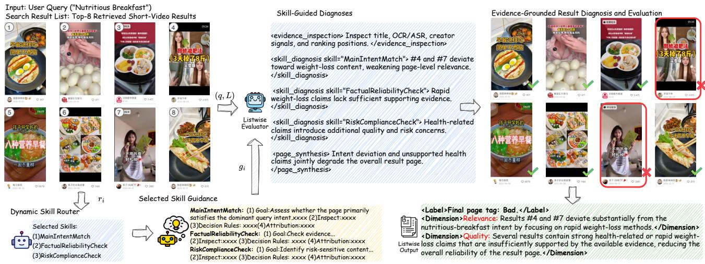
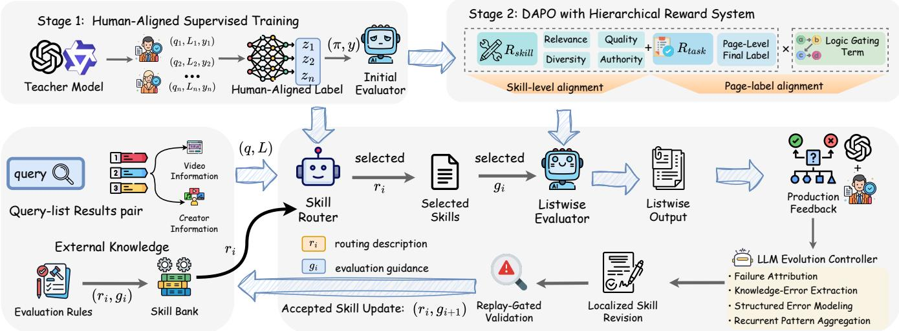
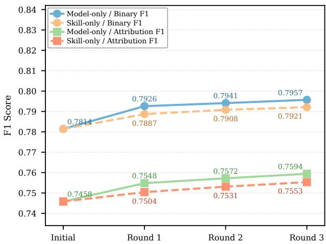

# SEEK: Skill-Routed Evaluation with Evolvable Knowledge for Industrial Search

Zhongxin Huang∗ huangzhongxin26@stu.pku.edu.cn Peking University Beijing, China

Feiran Zhu∗   
a499616042@163.com   
Unafiliated   
Hangzhou, China

Songyang Li∗ lisongyang03@kuaishou.com Kuaishou Technology Beijing, China

Chenglei Dai   
daichenglei@kuaishou.com   
Kuaishou Technology   
Hangzhou, China   
Xuanping Li   
lixuanping@kuaishou.com   
Kuaishou Technology   
Beijing, China

Renzhe Zhou∗ zhourenzhe03@kuaishou.com Kuaishou Technology Hangzhou, China

Jingwei Zhuo†   
zhuojw10@gmail.com   
Unafiliated   
Beijing, China   
Zhen Xiao†   
xiaozhen@pku.edu.cn   
Peking University   
Beijing, China

## Abstract

Search quality evaluation provides essential supervision and diagnostic signals for the development and iteration of industrial search systems. Although large language models (LLMs) ofer a scalable alternative to manual assessment, reliable automatic evaluation remains challenging: users experience search results at the page level, while the applicable evaluation criteria are multi-dimensional and continuously evolving. Packing all evaluation criteria into a unified prompt introduces irrelevant context and potential criterion interference, whereas internalizing them through post-training tightly couples rule updates with costly model retraining cycles.

To address these issues, we propose Skill-routed Evaluation with Evolvable Knowledge (SEEK). Specifically, SEEK externalizes specific search evaluation criteria into a skill bank, dynamically routes relevant skills for each query–result list pair, and employs a task adapted listwise evaluator to produce page-level judgments and failure mode attribution. A two-stage training pipeline teaches the evaluator to align evaluation criteria with human preferences, while a replay-gated skill bank allows recurring evaluation knowledge gaps to be incorporated without model retraining. Experiments on industrial short-video search show that SEEK improves listwise quality evaluation accuracy and achieves significant progress in attribution diagnosis. SEEK has been deployed at Kuaishou, a shortvideo platform with over 400 million daily active users, significantly improving the scale and quality of online search evaluation.

CCS Concepts • Information systems → Evaluation of retrieval results.

## Keywords

Search Evaluation, Listwise Modeling, LLM-as-a-Judge, Self-Evolving Skills, Large Language Models

ACM Reference Format:   
Zhongxin Huang, Songyang Li, Renzhe Zhou, Feiran Zhu, Chenglei Dai, Zhen Xiao, Xuanping Li, and Jingwei Zhuo. 2026. SEEK: Skill-Routed Evaluation with Evolvable Knowledge for Industrial Search. In Proceedings of Make sure to enter the correct conference title from your rights confirmation email (Conference acronym ’XX). ACM, New York, NY, USA, 12 pages. https://doi.org/XXXXXXX.XXXXXXX

## 1 Introduction

Search quality evaluation is a fundamental component of modern search systems. It provides the labels and diagnostic signals required for model development, ofline comparison and online experimentation [8, 18]. Traditionally, such evaluations rely on trained human assessors. Although human judgments remain the most reliable source of task-specific supervision, their high cost and long turnaround time make it dificult to cover rapidly changing trafic, long-tail queries, and frequent system iterations at industrial scale [21, 22, 32].

Large language models (LLMs) ofer a promising alternative for scaling search evaluation. Recent studies have shown that carefully calibrated LLMs can generate useful relevance judgments and achieve agreement with human assessors on both academic and industrial search tasks [34, 36, 39, 46]. These results have motivated a growing body of work on using LLMs as automatic judges for retrieval and search systems [2, 30, 47, 50]. However, directly prompting a general-purpose LLM does not fully satisfy the requirements of industrial search evaluation.

One challenge is that users experience a search result page as a whole rather than as isolated retrieved items. Page quality depends jointly on relevance, ranking, content quality, redundancy, intent coverage, and source authority [7, 11, 15, 17, 48]. Several of these properties are inherently page-level. Recent work has begun to move beyond independent query–item grading through batched relevance assessment, usefulness-oriented rubrics, and behaviorgrounded evaluation [7, 14, 37]. Nevertheless, most existing automatic search evaluation methods still focus primarily on item-level relevance or ranking [19, 41], rather than jointly predicting pagelevel quality and causes of quality degradation.

Another challenge is how to represent rich and continuously evolving evaluation knowledge. Packing all rules, boundary cases, and evidence requirements into a single prompt exposes every sample to largely irrelevant criteria, creating contextual redundancy and potential criterion interference [1, 3, 4, 9]. Task-specific supervised fine-tuning (SFT) and reinforcement learning (RL) have been increasingly adopted to specialize LLMs for industrial Web applications, including search relevance modeling and sequential decision making [21, 31, 32, 43]. However, they also internalize evaluation knowledge into model parameters. As platform content, query intents, and evaluation policies evolve, updating such knowledge may require another cycle of data construction, training, validation, and deployment [22, 49]. This creates a practical tension between keeping evaluation knowledge rapidly updatable and keeping the underlying evaluation model stable.

To address these challenges, we propose Skill-routed Evaluation with Evolvable Knowledge (SEEK), a skill-grounded framework that separates explicit evaluation knowledge from model selection and reasoning capabilities. SEEK externalizes domain-specific criteria into a modular skill bank and uses a lightweight skill router to select a compact subset of task-relevant skills for each query–list pair. The corresponding operational guidance is then provided, together with the original result page, to a task-adapted listwise evaluator, which produces a page-level judgment and structured attribution. A human-aligned training pipeline transforms human judgments into routing supervision and evidence-grounded evaluation trajectories, enabling the router and evaluator to learn how to select and faithfully execute the externalized knowledge. Finally, the self-evolving skill bank attributes reviewed production failures to routing, knowledge, or execution errors and incorporates recurrent knowledge gaps through localized, replay-validated skill revisions. This allows newly emerging evaluation knowledge to be updated.

Our main contributions are summarized as follows:

• We propose SEEK, a skill-grounded framework for listwise search evaluation that decouples task-specific evaluation knowledge from model capabilities and dynamically routes relevant skills for page-level judgment.

• We introduce a human-aligned training strategy that transforms human search judgments into routing supervision and evaluation trajectories, enabling efective specialization of a compact listwise evaluator.

• We develop a self-evolving skill bank that updates reusable evaluation knowledge through error attribution and replay gated revision, enabling lightweight adaptation without im mediate model retraining.

• Extensive ofline and online experiments demonstrate the efectiveness and practical value of SEEK. The system has been deployed in Kuaishou’s search evaluation pipeline.

## 2 Related Work

## 2.1 LLM-based Search Evaluation

Large language models have been increasingly explored as automatic evaluators for search systems, covering relevance judgment, usefulness assessment, and broader search-quality evaluation [22, 41, 43, 46]. Within this line of research, LLM-as-a-Judge has emerged as a promising paradigm for replacing or assisting costly human assessment in relevance evaluation [2, 10, 22, 27]. More recent studies further extend LLM-based evaluation toward industrial objectives, including usefulness-oriented supervision, fine-grained intent satisfaction, and web-scale relevance assessment, substantially reducing annotation cost while improving evaluation coverage and scalability [5, 8, 39].

Despite this progress, most existing approaches either rely on predefined evaluation criteria or internalize task-specific knowledge through model post-training. As search policies, content ecosystems, and evaluation standards continuously evolve, such designs provide limited flexibility for rapidly incorporating new evaluation knowledge without modifying the underlying evaluator.

## 2.2 Listwise Evaluation

Traditional IR evaluation typically aggregates item-level relevance judgments into ranking metrics such as Precision, MAP, and nDCG. Although these metrics are efective for measuring relevance and ranking quality, they do not explicitly model interactions among retrieved results, such as redundancy, intent coverage, and source composition. Recent work in RAG evaluation, listwise reranking, and whole-page assessment has therefore increasingly moved beyond independent item-level judgments toward jointly modeling the retrieved list as a whole [14, 15, 28, 35, 37].

However, industrial search evaluation requires not only an overall page-level judgment, but also fine-grained diagnosis ofthe underlying quality issues. This is particularly important in short-video search, where the final experience depends jointly on heterogeneous content signals, ranking positions, and interactions across retrieved results.

## 2.3 Externalized and Evolving Skills

Recent research has increasingly explored decoupling task-specific knowledge from model parameters and representing it through modular, reusable structures. Human judgment criteria, policies, precedents, and task instructions can be externalized as explicit knowledge interfaces or reusable skills, while agent systems further acquire and accumulate such skills from execution trajectories and interaction experience [4, 16, 23, 38, 40].

More recent studies extend static skill repositories toward continual refinement and self-evolution, including revising textual skills from execution feedback, optimizing external skills while keeping model parameters fixed, and updating skill libraries through in teraction experience [13, 20, 44]. Despite this progress, controlled evolution of task-specific evaluation knowledge under a relatively stable evaluator remains underexplored. This challenge is particularly important in industrial listwise search evaluation, where evaluation criteria evolve over time and knowledge updates must remain localized, reliable, and backward-compatible.

  
Figure 1: Illustrative example of skill-routed listwise evaluation in SEEK. The router selects task-relevant skills, and the listwise evaluator applies their guidance over the complete result page to produce a page-level judgment and attribution.

## 3 Method

Problem statement. Given a user query � and a ranked result list $L = [ d _ { 1 } , \dots , d _ { K } ]$ , we study structured listwise search quality evaluation. Each result �� contains the content and metadata avail able for assessment, including textual signals, creator information, interaction statistics, and ranking position. The task is to jointly evaluate the complete result page:

$$
f _ { \mathrm { a s s e s s } } ( q , L ) = ( l , \{ a _ { j } \} _ { j = 1 } ^ { m } ) ,\tag{1}
$$

where � ∈ {good, fair, bad} denotes the page-level quality label, and $\{ a _ { j } \} _ { j = 1 } ^ { m }$ is a set of structured attribution. Each $a _ { j }$ identifies a quality dimension and provides an evidence-grounded diagnosis of the corresponding quality issue. The quality dimensions are drawn from A = {Relevance, Quality, Diversity, Authority, Heterogeneous}.

This prediction is inherently listwise, as it depends not only on the quality of individual results, but also on their ranking positions and cross-result interactions, such as redundancy, intent coverage, and source composition. Figure 1 illustrates this setting with a shortvideo search example. For the query “Nutritious Breakfast”, most retrieved results satisfy the dominant intent, while several results shift toward rapid weight-loss content and contain insuficiently supported health-related claims. A reliable evaluator must therefore go beyond assigning an overall page-level label and further identify the specific dimensions responsible for the degradation, such as relevance and content quality.

## 3.1 SEEK Framework

As illustrated in Figure 2, SEEK follows a capability–knowledge separation principle and consists of three key components: the skill bank, skill router, and listwise evaluator. The external skill bank stores explicit and evolvable evaluation knowledge, while the skill router and listwise evaluator provide relatively stable capabilities for selecting and applying such knowledge, respectively. Given a query–list pair $x = \left( q , L \right)$ , the router identifies a compact set of applicable skills from the skill bank, and the corresponding operational guidance is provided to the evaluator together with the original query and result list. The evaluator then performs skillgrounded listwise reasoning to produce a page-level judgment and structured attribution.

Skill Bank. We maintain a skill bank ${ \cal S } ^ { ( t ) } ~ = ~ \{ S _ { 1 } ^ { ( t ) } , \ldots , S _ { N } ^ { ( t ) } \}$ where � denotes the current evolution round. In our implementation, the bank contains 12 diagnostic skills spanning five evaluation dimensions: Relevance, Quality, Diversity, Authority, and Heterogeneous. Each skill is represented by two complementary textual components:

$$
S _ { i } ^ { ( t ) } = \left( r _ { i } ^ { ( t ) } , g _ { i } ^ { ( t ) } \right) ,\tag{2}
$$

where $r _ { i } ^ { ( t ) }$ is a compact routing description specifying when the skill should be activated, and $g _ { i } ^ { ( t ) }$ is structured operational guidance specifying how the corresponding criterion should be applied. Concretely, $g _ { i } ^ { ( \bar { t } ) }$ describes the evaluation objective, evidence requirements, decision rules, boundary conditions, and attribution requirements. This separation allows routing and execution to rely on diferent representations of the same evaluation criterion.

Skill Router. For each skill $S _ { i } ^ { ( t ) }$ , the router estimates its applicability to the current query–list pair using the corresponding routing description:

$$
{ p } _ { i } = { R } _ { \phi } \left( q , L , r _ { i } ^ { ( t ) } \right) ,\tag{3}
$$

where $R _ { \phi }$ denotes the router parameterized by $\phi ,$ and $p _ { i } \in [ 0 , 1 ]$ is the activation score of the �-th skill. The active skill set is selected by thresholding these scores:

$$
S _ { x } ^ { ( t ) } = \left\{ S _ { i } ^ { ( t ) } \in S ^ { ( t ) } \mid p _ { i } > \tau \right\} ,\tag{4}
$$

where � is the activation threshold. If no skill exceeds $\tau ,$ the highestscoring skill is retained as a fallback. In this way, the router exposes only task-relevant evaluation knowledge to the downstream evaluator rather than injecting the entire skill bank for every instance.

  
Figure 2: Overview of SEEK. The external skill bank stores explicit evaluation knowledge, while the skill router and listwise evaluator learn how to select and apply relevant knowledge for each query–list pair. Human-aligned supervision trains the two model components, whereas reviewed production feedback drives replay-gated evolution of the skill bank.

Listwise Evaluator. The evaluator receives both the original query– list pair and the operational guidance associated with the selected skills:

$$
\left( \widehat { \pi } , \widehat { y } \right) = E _ { \theta } \left( q , L , \left\{ g _ { i } ^ { ( t ) } \mid S _ { i } ^ { ( t ) } \in S _ { x } ^ { ( t ) } \right\} \right) ,\tag{5}
$$

where $E _ { \theta }$ denotes the listwise evaluator parameterized by �. Rather than assessing retrieved items independently, the evaluator jointly reasons over the complete ranked list under the selected evaluation criteria. It produces a structured evaluation trajectory ${ \widehat { \pi } } ,$ which grounds the judgment in relevant evidence and skill-level diagnoses, together with the final prediction $\widehat { \boldsymbol { y } } = ( \widehat { \boldsymbol { l } } , \{ \widehat { a } _ { j } \} _ { j = 1 } ^ { \widehat { m } } )$ . Here, b� is the page-level quality label and $\{ \widehat { a } _ { j } \} _ { j = } ^ { \widehat { m } }$ 1 denotes the corresponding structured attribution.

## 3.2 Skill-Aligned Training

The skill router and listwise evaluator learn two complementary capabilities: the router determines which evaluation knowledge is relevant, while the evaluator learns how to apply the selected knowledge to the result page. We train the two components separately using supervision derived from the same human-annotated query–list pairs. Human judgments provide the final evaluation targets, while a strong teacher model transforms them into skillrouting labels and evidence-grounded evaluation trajectories.

3.2.1 Teacher-Guided Data Construction. Given a query–list pair $( q , L )$ , the current skill bank ${ \mathbf { } } S ^ { ( t ) }$ , and the human reference $y ^ { * } =$ $( l ^ { * } , \mathcal { A } ^ { * } )$ , the teacher first identifies a compact set of skills suficient to support the annotated judgment. It produces a multi-label routing target $z ^ { * } \in \{ 0 , 1 \} ^ { N }$ , which defines the reference skill set $S _ { x } ^ { * } ~ =$ $\{ S _ { i } ^ { ( t ) } \mid z _ { i } ^ { * } = 1 \}$ }. The corresponding operational guidance is denoted as $\mathcal { G } _ { x } ^ { * } = \{ g _ { i } ^ { ( t ) } \ | \ S _ { i } ^ { ( t ) } \in S _ { x } ^ { * } \}$

Conditioned on the selected guidance and the human reference, we employ a strong general-purpose LLM as the teacher model to generate a structured and evidence-grounded evaluation trajectory:

$$
\begin{array} { r } { \pi ^ { * } = T _ { \mathrm { L L M } } \left( q , L , \mathcal { G } _ { x } ^ { * } , y ^ { * } \right) , } \end{array}\tag{6}
$$

where $T _ { \mathrm { L L M } }$ denotes the teacher model. The teacher provides highquality reasoning supervision by connecting retrieved evidence to skill-level diagnoses and further synthesizing these diagnoses into the human-annotated page-level judgment and attribution.

Each distilled instance is represented as $( q , L , z ^ { * } , \pi ^ { * } , y ^ { * } )$ . Before training, we filter samples with invalid skill references, malformed trajectory structures, unsupported evidence, or explicit inconsistencies with the human annotation. The verified routing target $z ^ { * }$ supervises the router, while $( \pi ^ { * } , y ^ { * } )$ provides skill-conditioned supervision for the evaluator.

3.2.2 Router Training. Because multiple evaluation criteria may be relevant to the same query–list pair, we formulate skill routing as a multi-label classification problem. For � skills, the router is optimized using binary cross-entropy:

$$
\mathcal { L } _ { \mathrm { r o u t e r } } = - \frac { 1 } { N } \sum _ { i = 1 } ^ { N } \left[ z _ { i } ^ { * } \log p _ { i } + ( 1 - z _ { i } ^ { * } ) \log ( 1 - p _ { i } ) \right] ,\tag{7}
$$

where $\mathscr { p } _ { i }$ is the predicted activation score for skill $S _ { i } .$ This objective directly aligns the router with the teacher-derived skill-selection targets. We optimize the router independently from downstream reinforcement learning.

3.2.3 Evaluator Training. We train the listwise evaluator in two stages. First, supervised fine-tuning teaches the model to reproduce verified skill-conditioned evaluation trajectories and human judgments:

$$
\mathcal { L } _ { \mathrm { S F T } } = - \log P _ { \theta } \left( \pi ^ { * } , y ^ { * } \mid q , L , \mathcal { G } _ { x } ^ { * } \right) .\tag{8}
$$

This stage establishes the basic capability to identify supporting evidence, apply the selected evaluation criteria, generate skill-grounded diagnoses, and synthesize them into a coherent page-level decision.

We then apply DAPO [45] to further align the evaluator with human search judgments. For each query–list pair, we sample a group of candidate outputs $\boldsymbol { O } = \{ o _ { 1 } , . . . , o _ { M } \}$ and score each candidate using a hierarchical reward:

$$
R ( o ) = \left( R _ { \mathrm { t a s k } } ( o ) + \lambda _ { s } R _ { \mathrm { s k i l l } } ( o ) \right) e ^ { - \lambda _ { c } C _ { \mathrm { c o n f i c t } } ( o ) } ,\tag{9}
$$

where $R _ { \mathrm { t a s k } }$ measures the correctness of the final page-level judgment, $R _ { s \mathrm { k i l l } }$ measures the quality of skill-grounded diagnosis and structured attribution, and $C _ { \mathrm { { c o n f l i c t } } }$ penalizes unsupported evidence and inconsistencies between local diagnoses and the final decision.

Following DAPO, rewards within each sampled group are converted into group-relative advantages for policy optimization. We adopt its clip-higher strategy, which uses asymmetric clipping with a larger upper bound to preserve useful exploration, and dynamic sampling, which filters or resamples rollout groups with insuficient reward variation to maintain informative learning signals. These mechanisms improve the stability and eficiency of reinforcement learning while avoiding premature policy collapse.

## 3.3 Self-evolving Skill Bank

The above training procedure produces the initial model before deployment, corresponding to evolution round $t \ = \ 0$ . However, newly observed trafic and reviewed production feedback may reveal evaluation patterns that are not fully covered by the initial evaluation knowledge. We address this adaptation problem through the self-evolving skill bank. SEEK enables lightweight knowledge adaptation by evolving the external skill bank without immediately updating the router or evaluator. During skill bank evolution, model checkpoints and routing descriptions $r _ { i } ^ { ( t ) }$ remain fixed, while only the operational guidance $g _ { i } ^ { ( t ) }$ is eligible for revision.

3.3.1 Failure Atribution. A disagreement between the SEEK prediction $\widehat { y }$ and the human reference $y ^ { * }$ is treated as a candidate evolution signal. A strong LLM serves as the evolution controller and jointly examines the query–list pair $( q , L )$ , the selected skill set $S _ { x } ^ { ( t ) }$ , current skill guidance, model prediction, and human reference.

We categorize failures into three types. A routing error occurs when the required knowledge already exists in the skill bank but the corresponding skill is not activated. A skill knowledge error occurs when the appropriate skill is selected but its operational guidance is incomplete or outdated. An execution error occurs when both routing and guidance are adequate, but the evaluator fails to apply them correctly. Only skill knowledge errors enter the fast evolution loop; routing and execution errors are accumulated for subsequent router or evaluator updates.

3.3.2 Recurrent Knowledge Revision. To avoid overfitting to isolated failures, SEEK revises a skill only when the same underlying knowledge gap recurs across multiple reviewed samples. For each skill $S _ { i } ^ { ( t ) }$ , the evolution controller groups knowledge errors that reflect the same missing evaluation principle into a recurrent error cluster $\mathcal { B } _ { i } ^ { ( t ) }$ . It then performs a localized revision of the corresponding operational guidance:

$$
\widetilde { g } _ { i } ^ { ( t + 1 ) } = \mathrm { R e v i s e } \left( g _ { i } ^ { ( t ) } , \mathcal { B } _ { i } ^ { ( t ) } \right) , \qquad \widetilde { S } _ { i } ^ { ( t + 1 ) } = \left( \boldsymbol { r } _ { i } ^ { ( t ) } , \widetilde { g } _ { i } ^ { ( t + 1 ) } \right) .\tag{10}
$$

The revision is intentionally localized. It may refine a decision boundary, evidence requirement, exception, or previously missing evaluation pattern, while preserving the routing semantics $r _ { i } ^ { ( t ) }$ and unrelated portions of the existing guidance. This allows new knowledge to be incorporated without unnecessarily changing when the skill is activated.

3.3.3 Replay-Gated Deployment. Candidate revisions are validated before being deployed. For each revised skill, we evaluate the candidate on a held-out adaptation set $\mathcal { D } _ { i } ^ { \mathrm { n e w } }$ , which contains examples of the emerging pattern, and on a frozen historical replay set $\mathcal { D } ^ { \mathrm { r e p l a y } }$ Both sets are associated with trusted human annotations.

Let $M ( { \mathcal { D } } ; S _ { i } )$ denote the evaluation performance obtained when skill $S _ { i }$ is used while all other system components remain fixed. A candidate revision is accepted only if it improves performance on the newly observed pattern while preserving historical performance within a tolerance �:

$$
\operatorname { A c c e p t } \left( \widetilde { S } _ { i } ^ { ( t + 1 ) } \right) = \mathbb { I } \left[ \begin{array} { l } { M \left( \mathcal { D } _ { i } ^ { \mathrm { n e w } } ; \widetilde { S } _ { i } ^ { ( t + 1 ) } \right) > M \left( \mathcal { D } _ { i } ^ { \mathrm { n e w } } ; S _ { i } ^ { ( t ) } \right) , } \\ { M \left( \mathcal { D } ^ { \mathrm { r e p l a y } } ; \widetilde { S } _ { i } ^ { ( t + 1 ) } \right) \ge M \left( \mathcal { D } ^ { \mathrm { r e p l a y } } ; S _ { i } ^ { ( t ) } \right) - \epsilon } \end{array} \right] .\tag{11}
$$

Accepted candidates replace the previous skill version; otherwise, the existing skill is retained. In this way, SEEK separates adaptation across two timescales: explicit evaluation knowledge can be updated rapidly through the skill bank, while accumulated routing and execution errors are consolidated through slower periodic model updates.

## 4 Experiments

We conduct extensive experiments to evaluate SEEK from four complementary perspectives. First, we compare its listwise evaluation performance against open-source LLMs, API-based LLMs, and taskspecific post-trained LLMs. Second, we study the contribution of each major component, including dynamic skill routing, evaluator post-training, and hierarchical reward optimization. Third, we investigate the continual-adaptation capability of the external skill bank under frozen model parameters. Finally, we evaluate the practical efectiveness and eficiency of SEEK in a real online production environment.

## 4.1 Experimental Setup

4.1.1 Dataset and Annotation. We construct the dataset from query– list pairs sampled from Kuaishou search logs. Each retrieved result contains information including the title, image caption, OCR and ASR text, creator information, interaction statistics, and ranking position.

Each query–list pair is annotated with a page-level quality label from {good, fair, bad}. For fair and bad pages, annotators additionally provide attribution diagnoses over five dimensions: Relevance, Quality, Diversity, Authority, and Heterogeneous. A fair or bad page may correspond to multiple dimensions. Annotation disagreements are resolved by experienced search assessors.

After cleaning and deduplication, we obtain 169,434 training query–list pairs and an independent held-out test set of 17,000 pairs. We apply stratified, label-aware filtering when constructing the held-out set. This procedure ensures suficient representation of all three page-level quality labels and each of the five attribution dimensions. Detailed dataset statistics are reported in Appendix D.

Table 1: Overall performance on listwise search quality evaluation. We report recall over five attribution dimensions, binary page-level evaluation, and three-class quality evaluation. Best results are shown in bold, and second-best results are underlined.
<table><tr><td rowspan="2">Method</td><td colspan="4">Attribution Recall</td><td colspan="3">Binary</td><td colspan="5">Three-Class</td></tr><tr><td>Rel.</td><td>Qual.</td><td>Div.</td><td>Auth.</td><td>Het.</td><td>Macro-F1</td><td>Acc.</td><td>Good F1 Fair F1 Bad F1 Macro-F1</td><td></td><td></td><td></td><td>Acc.</td></tr><tr><td>Open-source LLMs</td><td></td><td></td><td></td><td></td><td></td><td></td><td></td><td></td><td></td><td></td><td></td><td></td></tr><tr><td>Qwen3-8B [42]</td><td>0.5566</td><td>0.5585</td><td>0.1624</td><td>0.2272</td><td>0.1046</td><td>0.4345</td><td>0.4894</td><td>0.3186</td><td>0.4217</td><td>0.4562</td><td>0.3988</td><td>0.4085</td></tr><tr><td>DeepSeek-R1-Distill-Qwen-7B [12]</td><td>0.6847</td><td>0.6416</td><td>0.3185</td><td>0.3027</td><td>0.1942</td><td>0.5888</td><td>0.5968</td><td>0.3810</td><td>0.4676</td><td>0.5268</td><td>0.4585</td><td>0.4706</td></tr><tr><td>Gemma-3-12B-IT [33]</td><td>0.7168</td><td>0.6635</td><td>0.3642</td><td>0.3298</td><td>0.2187</td><td>0.6125</td><td>0.6216</td><td>0.3955</td><td>0.4781</td><td>0.5434</td><td>0.4723</td><td>0.4859</td></tr><tr><td>API-based LLMs</td><td></td><td></td><td></td><td></td><td></td><td></td><td></td><td></td><td></td><td></td><td></td><td></td></tr><tr><td>Qwen3-235B-A22B [42]</td><td>0.8078</td><td>0.6498</td><td>0.4450</td><td>0.4076</td><td>0.2832</td><td>0.6478</td><td>0.6676</td><td>0.4247</td><td>0.5046</td><td>0.5639</td><td>0.4977</td><td>0.5114</td></tr><tr><td>MiniMax-M2.5 [24]</td><td>0.8256</td><td>0.6365</td><td>0.4413</td><td>0.3984</td><td>0.2913</td><td>0.6700</td><td>0.6866</td><td>0.4307</td><td>0.4989</td><td>0.5959</td><td>0.5085</td><td>0.5227</td></tr><tr><td>Gemini 3.1 Pro [6]</td><td>0.8396</td><td>0.8114</td><td>0.5883</td><td>0.4897</td><td>0.3985</td><td>0.7241</td><td>0.7364</td><td>0.6198</td><td>0.5721</td><td>0.6804</td><td>0.6241</td><td>0.6326</td></tr><tr><td>GPT-5.6 Sol [25]</td><td>0.8518</td><td>0.8037</td><td>0.6065</td><td>0.5078</td><td>0.4146</td><td>0.7358</td><td>0.7451</td><td>0.6427</td><td>0.5776</td><td>0.6932</td><td>0.6378</td><td>0.6469</td></tr><tr><td>Task-specific Post-trained LLMs</td><td></td><td></td><td></td><td></td><td></td><td></td><td></td><td></td><td></td><td></td><td></td><td></td></tr><tr><td>Qwen3-8B (SFT+DPO) [22, 32]</td><td>0.8015</td><td>0.7426</td><td>0.5638</td><td>0.3725</td><td>0.3261</td><td>0.6876</td><td>0.7068</td><td>0.4685</td><td>0.5281</td><td>0.6124</td><td>0.5363</td><td>0.5613</td></tr><tr><td>Qwen3-8B (SFT+GRPO) [21, 43, 46]</td><td>0.8462</td><td>0.8215</td><td>0.6189</td><td>0.4381</td><td>0.3584</td><td>0.7206</td><td>0.7386</td><td>0.6513</td><td>0.6107</td><td>0.6634</td><td>0.6418</td><td>0.6527</td></tr><tr><td>Qwen3-8B (SEEK)</td><td>0.8621</td><td>0.8102</td><td>0.6210</td><td>0.5240</td><td>0.4305</td><td>0.7374</td><td>0.7520</td><td>0.6715</td><td>0.5586</td><td>0.7364</td><td>0.6555</td><td>0.6618</td></tr></table>

4.1.2 Baselines. We compare SEEK with three complementary groups of baselines.

Open-source LLMs. We include Qwen3-8B [42], DeepSeek-R1- Distill-Qwen-7B [12], and Gemma-3-12B-IT [33]. These models represent compact general-purpose LLMs without task-specific adaptation to our listwise search evaluation task.

API-basedLLMs. We further compare with Qwen3-235B-A22B [42], MiniMax-M2.5 [24], Gemini 3.1 Pro [6], and GPT-5.6 Sol [25]. These models provide strong general-purpose judging capabilities at substantially larger scales. All models receive the same query–list input, evaluation criteria, and output specification.

Task-specific Post-trained LLMs. We additionally compare with representative parameter-level tuning using the same Qwen3-8B backbone. Direct Preference Optimization (DPO) [26] optimizes the model directly from preference supervision without training a separate reward model, whereas Group Relative Policy Optimization (GRPO) [29] performs reinforcement learning with group-relative advantages computed from multiple sampled responses.

Following prior search evaluation and relevance modeling methods, we instantiate two task-adapted baselines: SFT followed by DPO [22, 32], and SFT followed by GRPO [21, 43, 46]. These baselines internalize task-specific evaluation knowledge through supervised fine-tuning followed by preference optimization or reinforcement learning, providing controlled comparisons with SEEK’s externalized, skill-grounded knowledge design.

4.1.3 Evaluation Metrics. We evaluate page-level prediction under both binary and three-class settings. For binary evaluation, good pages are treated as the positive class, while fair and bad pages are merged into the negative class. We report Macro-F1 and Accuracy, where Macro-F1 is computed as the unweighted average of the F1.

For three-class evaluation, we retain the original {good, fair, bad} label space and report class-wise F1, Macro-F1, and overall Accuracy. To assess fine-grained attribution quality, we report Recall over the five attribution dimensions: Relevance, Quality, Diversity, Authority, and Heterogeneous.

For continual adaptation, we additionally report Binary F1 and Attribution F1 to measure adaptation efectiveness and the quality of fine-grained diagnosis under evolving evaluation criteria.

4.1.4 Implementation Details. The listwise evaluator is initialized from Qwen3-8B. All ofline training experiments are conducted on NVIDIA H800 GPUs, while production inference is deployed on NVIDIA L20 GPU clusters. Additional implementation and optimization details are provided in Appendix B.

## 4.2 Overall Performance

Table 1 summarizes the overall results on listwise search quality evaluation. SEEK consistently outperforms its Qwen3-8B backbone across page-level prediction and fine-grained attribution, with substantial gains under both binary and three-class settings. This indicates that SEEK improves not only the detection of problematic result pages, but also the discrimination of more subtle quality diferences among good, fair, and bad search experiences.

Task-specific post-training substantially narrows the gap, making SFT+GRPO a strong same-backbone baseline. Nevertheless, SEEK further improves three-class Macro-F1 from 0.6418 to 0.6555 while also achieving better binary evaluation performance. This result suggests that externalizing evaluation knowledge and dynamically selecting relevant criteria provides complementary benefits beyond parameter-level adaptation.

The advantage is particularly evident in fine-grained attribution. SEEK achieves the best results on four of the five dimensions, with the largest improvements over SFT+GRPO appearing on Authority and Heterogeneous. These dimensions depend more heavily on taskspecific evaluation criteria and cross-result interactions, which are dificult to capture through a single static judging policy. The results therefore support the benefit of dynamically selecting and providing explicit skill guidance for each query–list pair.

Table 2: Ablation of dynamic skill routing and evaluator posttraining. All Skills provides the complete skill bank to every query–list pair without routing, whereas Dynamic selects an instance-specific subset using the skill router. Base denotes the original Qwen3-8B without task-specific post-training, and Trained denotes the trained listwise evaluator.
<table><tr><td rowspan="2">Configuration</td><td colspan="5">Attribution Recall</td><td rowspan="2"> $\mathbf { A c c . }$ </td></tr><tr><td>Rel.</td><td>Qual.</td><td>Div.</td><td>Auth.</td><td>Het.</td></tr><tr><td>Routing1 Evaluator All Skills Base</td><td>0.5566</td><td>0.5585</td><td>0.1624</td><td>0.2272</td><td>0.1046</td><td>0.4894</td></tr><tr><td>Dynamic Base</td><td>0.7842</td><td>0.7146</td><td>0.4218</td><td>0.3518</td><td>0.2765</td><td>0.6485</td></tr><tr><td>All Skills Trained</td><td>0.8284</td><td>0.7626</td><td>0.4987</td><td>0.4124</td><td>0.3363</td><td>0.6913</td></tr><tr><td>Dynamic Trained</td><td>0.8621</td><td>0.8102</td><td>0.6210</td><td>0.5240</td><td>0.4305</td><td>0.7520</td></tr></table>

## 4.3 Ablation Study

We conduct ablation studies to examine four key aspects of SEEK: the complementary contributions of the skill router and listwise evaluator, the efect of evaluator post-training, the hierarchical reward design, and the efectiveness of dynamic skill routing.

4.3.1 Skill Router and Evaluator. We disentangle the efects of dynamic skill routing and evaluator post-training in Table 2. When routing is disabled, the evaluator receives the complete Skill Bank; when evaluator training is disabled, the original Qwen3-8B back bone is used.

Dynamic routing consistently improves over exposing all skills, showing that instance-specific skill selection is preferable to indiscriminate knowledge injection. Evaluator post-training provides a further substantial gain by learning task-specific listwise evaluation capabilities. Combining both components yields the best performance, confirming their complementary roles: the evaluator learns how to perform the task, while the router determines which external knowledge should be applied to each query–list pair.

4.3.2 Evaluator Optimization. We examine the efect of evaluator post-training in Table 3, comparing the original Qwen3-8B backbone, SFT alone, SFT followed by GRPO, and SFT followed by DAPO. SFT yields a substantial improvement over the base model, showing that teacher-generated structured trajectories provide efective supervision for learning listwise evaluation behavior. Subsequent reinforcement learning further improves both page-level predic tion and fine-grained attribution, with DAPO achieving the best overall performance. These results suggest that SFT establishes the task-specific evaluation capability, while reinforcement learning further aligns the skill-conditioned evaluation process with the final page-level judgment.

4.3.3 Hierarchical Reward. We examine the hierarchical reward design in Table 4 by progressively adding skill-level supervision and the conflict penalty to the task-level reward.

Using $R _ { \mathrm { t a s k } }$ alone already provides strong page-level supervision, but yields weaker fine-grained attribution. Adding $R _ { \mathrm { s k i l l } }$ consistently improves diagnostic quality, while $C _ { \mathrm { { c o n f l i c t } } }$ further encourages consistency between skill-level diagnoses and the final judgment. The full objective performs best overall, indicating that reliable listwise evaluation benefits from jointly optimizing prediction correctness, skill-grounded diagnosis, and cross-level consistency.

Table 3: Ablation of evaluator optimization. “+” indicates that the corresponding training stage is enabled.
<table><tr><td colspan="3">Evaluator</td><td colspan="4">Attribution Recall</td><td rowspan="2"> $\mathbf { A c c . }$ </td></tr><tr><td>SFT</td><td>GRPO DAPO</td><td>Rel.</td><td>Qual.</td><td>Div.</td><td>Auth.</td><td>Het.</td></tr><tr><td></td><td>1</td><td>0.5566</td><td>0.5585</td><td>0.1624</td><td>0.2272</td><td>0.1046</td><td>0.4894</td></tr><tr><td>+</td><td>一 一</td><td>0.8332</td><td>0.7886</td><td>0.5158</td><td>0.4533</td><td>0.3800</td><td>0.6251</td></tr><tr><td>+</td><td>+ 一</td><td>0.8547</td><td>0.8016</td><td>0.5865</td><td>0.4967</td><td>0.4127</td><td>0.7385</td></tr><tr><td>+</td><td>+</td><td>0.8621</td><td>0.8102</td><td>0.6210</td><td>0.5240</td><td>0.4305</td><td>0.7520</td></tr></table>

Table 4: Ablation of the hierarchical reward in SEEK. $" + "$ indicates that the corresponding reward component is enabled.
<table><tr><td colspan="2">Reward</td><td colspan="5">Attribution Recall</td><td rowspan="2"> $\mathbf { A c c . }$ </td></tr><tr><td> $R _ { \mathbf { t a s k } }$ </td><td> $R _ { \mathrm { s k i l l } }$   $C _ { \mathrm { c o n f l i c t } }$ </td><td>Rel.</td><td>Qual.</td><td>Div.</td><td>Auth.</td><td>Het.</td></tr><tr><td>+</td><td>1 一</td><td>0.8502</td><td>0.7950</td><td>0.5581</td><td>0.4746</td><td>0.3964</td><td>0.7126</td></tr><tr><td>+</td><td>+ 一</td><td>0.8575</td><td>0.8027</td><td>0.5941</td><td>0.5018</td><td>0.4160</td><td>0.7382</td></tr><tr><td>+</td><td>+ +</td><td>0.8621</td><td>0.8102</td><td>0.6210</td><td>0.5240</td><td>0.4305</td><td>0.7520</td></tr></table>

Table 5: Comparison of skill-access strategies. Oracle Routing uses reference skill annotations as an upper bound.
<table><tr><td rowspan="2">Skill Access</td><td colspan="2">Evaluation Quality</td><td rowspan="2">Avg. Skills</td></tr><tr><td>Acc.</td><td>Attr. F1</td></tr><tr><td>All Skills</td><td>0.691</td><td>0.664</td><td>12.0</td></tr><tr><td>Dynamic Routing</td><td>0.752</td><td>0.743</td><td>3.4</td></tr><tr><td>Oracle Routing</td><td>0.768</td><td>0.758</td><td>3.1</td></tr></table>

4.3.4 Dynamic Skill Routing. We compare three skill-access strategies in Table 5. Dynamic Routing substantially outperforms indiscriminate access to the entire skill bank, while requiring only a small fraction of the available skills for each instance. This indicates that instance-specific selection reduces unnecessary context and potential criterion interference. The remaining gap to Oracle Routing suggests that better skill selection could provide further gains.

## 4.4 Continual Adaptation

We evaluate whether SEEK can adapt to emerging evaluation criteria by updating the external skill bank. The experiments are conducted on a newly collected post-deployment test set whose distribution difers from the held-out benchmark used for ofline evaluation. This dataset better reflects the evolving query patterns and diagnostic dimensions encountered in real production environments. We examine both adaptation to newly observed patterns and stability on historical data.

4.4.1 Knowledge and Parameter Adaptation. Figure 3 compares two strategies under the same sequence of reviewed production feedback. Model-only Update fine-tunes the evaluator while keeping the skill bank fixed, whereas Skill-only Evolution updates only the skill bank with both model components frozen.

Both strategies improve consistently as reviewed samples are incorporated. After three rounds, Model-only Update increases Binary

  
Figure 3: Multi-round comparison of parameter-based adaptation and Skill-only Evolution. Both strategies are evaluated using Binary F1 and Attribution F1 under the same reviewed evolution data.

F1 from 0.7814 to 0.7957 and Attribution F1 from 0.7458 to 0.7594. Without modifying either model component, Skill-only Evolution reaches 0.7921 Binary F1 and 0.7553 Attribution F1. The remaining gaps to parameter-based adaptation are only 0.0036 and 0.0041, respectively, showing that a substantial fraction of the adaptation benefit can be recovered by updating explicit evaluation knowledge alone.

The largest gains occur in the first evolution round, followed by progressively smaller improvements in subsequent rounds. This trend is consistent with recurrent and reusable knowledge gaps being absorbed early, while later rounds mainly capture more specialized patterns. Overall, the capability–knowledge separation underlying SEEK provides a lightweight fast path for incorporating new evaluation knowledge without frequent model retraining.

4.4.2 Replay Stability. We further evaluate backward stability on a frozen historical replay set after the same three adaptation rounds. As shown in Table 6, Skill-only Evolution largely preserves historical performance, with only 0.0008 Binary-F1 forgetting and 0.0005 Attribution-F1 forgetting. In contrast, Model-only Update causes noticeably larger degradation, suggesting that parameter adaptation introduces greater interference with previously learned evaluation behavior.

Together with the adaptation results above, this demonstrates the advantage of SEEK’s design: Skill-only Evolution provides a fast and backward-stable path for absorbing new evaluation knowledge, while parameter updates can be less frequent.

## 4.5 Production Evaluation

Finally, we evaluate SEEK in a real-world production search evaluation workflow. Table 7 compares SEEK with outsourced human review and multi-round human assessment on 24,000 query–list pairs, using expert-calibrated judgments as the reference labels.

Table 6: Historical replay stability after three adaptation rounds. Both strategies use the same reviewed feedback sequence and frozen replay set. Forgetting is the F1 decrease relative to the initial system.
<table><tr><td>Strategy</td><td>Binary F1 Forget.</td><td></td><td>Attr. F1</td><td>Forget.</td></tr><tr><td>Initial System</td><td>0.7862</td><td>一</td><td>0.7481</td><td>一</td></tr><tr><td>Model-only Update</td><td>0.7786</td><td>0.0076</td><td>0.7397</td><td>0.0084</td></tr><tr><td>Skill-only Evolution</td><td>0.7854</td><td>0.0008</td><td>0.7476</td><td>0.0005</td></tr></table>

Table 7: Production evaluation on 24,000 online query–list pairs. Accuracy is measured against expert-calibrated reference labels, and speedup is computed relative to outsourced human review.
<table><tr><td>Evaluator</td><td></td><td>Time ↓ Speedup ↑ Accuracy ↑</td><td></td></tr><tr><td>Outsourced Review</td><td>36.5 h</td><td>1.0×</td><td>0.783</td></tr><tr><td>Multi-round Review</td><td>58.2 h</td><td>0.6×</td><td>0.830</td></tr><tr><td>SEEK</td><td>0.9 h</td><td>40.6×</td><td>0.842</td></tr></table>

SEEK achieves a favorable balance between judgment quality and eficiency. It reaches an Accuracy of 0.842, outperforming both outsourced review (0.783) and multi-round assessment (0.830), while completing the entire workload in only 0.9 hours. Compared with outsourced review, this corresponds to a 40.6× speedup. Notably, although multi-round assessment improves human review quality, it incurs substantially higher time cost, whereas SEEK attains stronger agreement with expert-calibrated labels at only a fraction of the evaluation time.

Beyond page-level predictions, SEEK also produces structured attribution that identify the quality dimensions underlying each judgment. These diagnostic signals can directly support large-scale quality monitoring, failure analysis, and downstream search-system iteration. Therefore, SEEK can serve as a scalable and practical evaluation component for continuous industrial search development.

## 5 Conclusion

In this paper, we propose SEEK, a skill-grounded framework for industrial listwise search evaluation that decouples evolving domain knowledge from relatively stable model capabilities. SEEK externalizes heterogeneous evaluation criteria into a modular skill bank, dynamically routes task-relevant skills for each query–list pair, and employs a task-adapted listwise evaluator to produce page-level judgments and structured attribution. A human-aligned training pipeline specializes the skill router and evaluator, while the selfevolving skill bank enables rapid knowledge adaptation without requiring immediate model retraining.

Extensive ofline, continual-adaptation, and production experiments show that SEEK improves listwise judgment and fine-grained diagnosis, supports efective adaptation through external knowledge updates with frozen model parameters, and substantially improves evaluation eficiency in production. Overall, the results demonstrate the value of separating evolvable evaluation knowledge from model reasoning capabilities, providing a practical path toward more scalable and adaptable industrial search evaluation.

## References

[1] Negar Arabzadeh and Charles LA Clarke. 2025. A human-ai comparative analysis of prompt sensitivity in llm-based relevance judgment. In Proceedings of the 48th International ACM SIGIR Conference on Research and Development in Information Retrieval. 2784–2788.

[2] Krisztian Balog, Don Metzler, and Zhen Qin. 2025. Rankers, judges, and assistants: Towards understanding the interplay of LLMs in information retrieval evaluation. In Proceedings ofthe 48th International ACM SIGIR Conference on Research and Development in Information Retrieval. 3865–3875.

[3] Mehmet Selman Baysan, Serkan Uysal, İrem İşlek, Çağla Çığ Karaman, and Tunga Güngör. 2025. LLM-as-a-Judge: automated evaluation of search query parsing using large language models. Frontiers in big Data 8 (2025), 1611389.

[4] Tao Chen, Gangwei Jiang, Pengyu Cheng, Siyuan Huang, Yihao Liu, Jingwei Ni, Jiaqi Guo, Mengyu Zhou, Kai Tang,Junling Liu, et al. 2026. Skill-RM: Unifying Heterogeneous Evaluation Criteria via Agent Skill. arXiv preprint arXiv:2606.03980 (2026).

[5] Yoonseo Choi, Eunhye Kim, Hyunwoo Kim, Donghyun Park, Honggu Lee, Jin Young Kim, and Juho Kim. 2025. BloomIntent: Automating Search Evaluation with LLM-Generated Fine-Grained User Intents. In Proceedings ofthe 38th Annual ACM Symposium on User Interface Software and Technology. 1–34.

[6] Google DeepMind. 2026. Gemini 3.1 Pro Model Card. https://deepmind.google/ models/model-cards/gemini-3-1-pro/. Accessed: 2026-09-20.

[7] Mouly Dewan, Jiqun Liu, Aditya Gautam, and Chirag Shah. 2026. LLM-driven usefulness judgment for web search evaluation. In Proceedings ofthe 2026 International ACM SIGIR Conference on Innovative Concepts and Theories in Information Retrieval (ICTIR). 44–55.

[8] Mouly Dewan, Jiqun Liu, and Chirag Shah. 2025. LLM-driven usefulness labeling for IR evaluation. In Proceedings ofthe 48th International ACM SIGIR Conference on Research and Development in Information Retrieval. 3055–3059.

[9] Chen Dun, Mirian Del Carmen Hipolito Garcia, Guoqing Zheng, Ahmed Hassan Awadallah, Robert Sim, and Anastasios Kyrillidis. 2025. Sweeping heterogeneity with smart mops: Mixture of prompts for LLM task adaptation. In Proceedings of the AAAI Conference on Artificial Intelligence, Vol. 39. 16426–16434.

[10] Naghmeh Farzi and Laura Dietz. 2025. Criteria-Based LLM Relevance Judgments. In Proceedings of the 2025 International ACM SIGIR Conference on Innovative Concepts and Theories in Information Retrieval (ICTIR). 254–263.

[11] Tian Guan, Sebastian Sun, and Bolin Chen. 2025. Faithfulness-aware multiobjective context ranking for retrieval-augmented generation. In Proceedings of the 2025 3rd International Conference on Artificial Intelligence, Systems and Network Security. 119–126.

[12] Daya Guo, Dejian Yang, Haowei Zhang, Junxiao Song, Peiyi Wang, Qihao Zhu, Runxin Xu, Ruoyu Zhang, Shirong Ma, Xiao Bi, et al. 2025. Deepseek-r1: Incen tivizing reasoning capability in llms via reinforcement learning. arXiv preprint arXiv:2501.12948 (2025).

[13] Siyuan Huang, Pengyu Cheng, Haotian Liu, Tao Chen, Yihao Liu, Jingwei Ni, Shijie Zhou, Ziyi Yang, Gangwei Jiang, Mengyu Zhou, et al. 2026. Skill Self-Play: Pushing the frontier of LLM capability with co-evolving skills. arXiv preprint arXiv:2607.22529 (2026).

[14] Anton Korikov, Pan Du, Scott Sanner, and Navid Rekabsaz. 2025. Batched self consistency improves llm relevance assessment and ranking. In Proceedings of the 2025 Conference on Empirical Methods in Natural Language Processing. 32675– 32691.

[15] Pratik Lahiri, Bingqing Ge, Zhou Qin, Aditya Jumde, Shuning Huo, Lucas Scottini, Yi Liu, Mahmoud Mamlouk, and Wenyang Liu. 2026. Design and Evaluation of Whole-Page Experience Optimization for E-commerce Search. In Proceedings of the Nineteenth ACM International Conference on Web Search and Data Mining. 1175–1179.

[16] Benjamin H Le, Xueying Lu, Nicholas Stern, Wenqiong Liu, Igor Lapchuk, Xiang Li, Baofen Zheng, Kevin Rosenberg, Jiewen Huang, Zhe Zhang, et al. 2026. SAGE: Scalable AI Governance & Evaluation. In Proceedings ofthe 32nd ACM SIGKDD Conference on Knowledge Discovery and Data Mining V. 2. 7555–7565.

[17] Will LeVine and Bijan Varjavand. 2025. Relevance Isn’t All You Need: Scaling RAG Systems With Inference-Time Compute Via Multi-Criteria Reranking. arXiv preprint arXiv:2504.07104 (2025).

[18] Haitao Li, Qian Dong, Junjie Chen, Huixue Su, Yujia Zhou, Qingyao Ai, Ziyi Ye, and Yiqun Liu. 2024. Llms-as-judges: a comprehensive survey on llm-based evaluation methods. arXiv preprint arXiv:2412.05579 (2024).

[19] Qingyang Liu, Jiangtong Li, Zelin Peng, Shaobo Wang, Zhaohe Liao, Shuochen Chang, Bingjie Gao, Haonan Zhao, Mu Liu, Jidong Jiang, et al. 2026. Bridging visual dynamics and narrative reasoning: Multimodal large language models for short drama quality assessment. In Proceedings ofthe ACM Web Conference 2026. 7890–7901.

[20] Yuxuan Liu, Zhaochen Su, Lingyun Xie, Yuhao Zhang, Qing Zong, Jiahe Guo, Zhongwei Xie, Yiyan Ji, Yauwai Yim, Hongyu Luo, et al. 2026. SkillRevise: Improving LLM-Authored Agent Skills via Trace-Conditioned Skill Revision. arXiv preprint arXiv:2606.01139 (2026).

[21] Chenji Lu, Zhuo Chen, Hui Zhao, Zhiyuan Zeng, Gang Zhao, Junjie Ren, Ruicong Xu, Haoran Li, Songyan Liu, Pengjie Wang, et al. 2025. LORE: A Large Generative Model for Search Relevance. arXiv preprint arXiv:2512.03025 (2025).

[22] Xingyu Lu, Tianke Zhang, Chang Meng, Xiaobei Wang, Jinpeng Wang, Yi-Fan Zhang, Shisong Tang, Changyi Liu, Haojie Ding, Kaiyu Jiang, et al. 2025. Vlm as policy: Common-law content moderation framework for short video platform. In Proceedings of the 31st ACM SIGKDD Conference on Knowledge Discovery and Data Mining V. 2. 4682–4693.

[23] Yuchen Ma, Yue Huang, Han Bao, Haomin Zhuang, Swadheen Shukla, Michel Gal ley, Xiangliang Zhang, and Stefan Feuerriegel. 2026. SkillGen: Verified Inference-Time Agent Skill Synthesis. arXiv preprint arXiv:2605.10999 (2026).

[24] MiniMax. 2026. MiniMax M2.5: Built for Real-World Productivity. https://www. minimaxi.com/blog/minimax-m25. Accessed: 2026-09-20.

[25] OpenAI. 2026. GPT-5.6: Frontier intelligence that scales with your ambition. https://openai.com/index/gpt-5-6/. Accessed: 2026-09-20.

[26] Rafael Rafailov, Archit Sharma, Eric Mitchell, Stefano Ermon, Christopher D. Manning, and Chelsea Finn. 2023. Direct Preference Optimization: Your Language Model is Secretly a Reward Model. In Advances in Neural Information Processing Systems, Vol. 36.

[27] Hossein A Rahmani, Emine Yilmaz, Nick Craswell, Bhaskar Mitra, Paul Thomas, Charles LA Clarke, Mohammad Aliannejadi, Clemencia Siro, and Guglielmo Faggioli. 2024. Llmjudge: Llms for relevance judgments. arXiv preprint arXiv:2408.08896 (2024).

[28] Revanth Gangi Reddy, JaeHyeok Doo, Yifei Xu, Md Arafat Sultan, Deevya Swain, Avirup Sil, and Heng Ji. 2024. FIRST: Faster improved listwise reranking with single token decoding. In Proceedings ofthe 2024 Conference on Empirical Methods in Natural Language Processing. 8642–8652.

[29] Zhihong Shao, Peiyi Wang, Qihao Zhu, Runxin Xu, Junxiao Song, Xiao Bi, Haowei Zhang, Mingchuan Zhang, Y. K. Li, Y. Wu, and Daya Guo. 2024. DeepSeekMath: Pushing the Limits of Mathematical Reasoning in Open Language Models. arXiv preprint arXiv:2402.03300 (2024).

[30] Sahel Sharifymoghaddam, Ronak Pradeep, Andre Slavescu, Ryan Nguyen, Andrew Xu, Zijian Chen, Yilin Zhang, Yidi Chen, Jasper Xian, and Jimmy Lin. 2025. Rankllm: A python package for reranking with llms. In Proceedings of the 48th International ACM SIGIR Conference on Research and Development in Information Retrieval. 3681–3690.

[31] Mingxuan Song, Yusen Huo, Bohan Zhou, Shenglin Yin, Zhen Xiao, Jieyi Long, Zhilin Zhang, and Chuan Yu. 2026. DARA: Few-shot Budget Allocation in Online Advertising via In-Context Decision Making with RL-Finetuned LLMs. In Proceedings of the ACM Web Conference 2026. 40–50.

[32] Tian Tang, Zhixing Tian, Zhenyu Zhu, Chenyang Wang, Haiqing Hu, Guoyu Tang, Lin Liu, and Sulong Xu. 2025. Lref: A novel llm-based relevance framework for e-commerce search. In Companion Proceedings of the ACM on Web Conference 2025. 468–475.

[33] Gemma Team, Aishwarya Kamath, Johan Ferret, Shreya Pathak, Nino Vieillard, Ramona Merhej, Sarah Perrin, Tatiana Matejovicova, Alexandre Ramé, Morgane Rivière, et al. 2025. Gemma 3 technical report. arXiv preprint arXiv:2503.19786 (2025).

[34] Paul Thomas, Seth Spielman, Nick Craswell, and Bhaskar Mitra. 2024. Large language models can accurately predict searcher preferences. In Proceedings of the 47th International ACM SIGIR Conference on Research and Development in Information Retrieval. 1930–1940.

[35] Giovanni Trappolini, Florin Cuconasu, Simone Filice, Yoelle Maarek, and Fabrizio Silvestri. 2026. Redefining Retrieval Evaluation in the Era of LLMs. In Proceedings ofthe 19th Conference ofthe European Chapter ofthe Association for Computational Linguistics (Volume 1: Long Papers). 8359–8375.

[36] Shivani Upadhyay, Ronak Pradeep, Nandan Thakur, Nick Craswell, and Jimmy Lin. 2024. Umbrela: Umbrela is the (open-source reproduction of the) bing relevance assessor. arXiv preprint arXiv:2406.06519 (2024).

[37] Ali Vardasbi, Gustavo Penha, Enrico Palumbo, Claudia Hauf, Hugues Bouchard, and Mounia Lalmas. 2026. As It Was: Aligning LLM Search Evaluation with Historical User Preferences. arXiv preprint arXiv:2607.01040 (2026).

[38] Chenxi Wang, Zhuoyun Yu, Xin Xie, Wuguannan Yao, Runnan Fang, Shuofei Qiao, Kexin Cao, Guozhou Zheng, Xiang Qi, Peng Zhang, and Shumin Deng. 2026. SkillX: Automatically Constructing Skill Knowledge Bases for Agents. arXiv preprint arXiv:2604.04804 (2026).

[39] Han Wang, Alex Whitworth, Pak Ming Cheung, Zhenjie Zhang, and Krishna Kamath. 2025. LLM-based Relevance Assessment for Web-Scale Search Evaluation at Pinterest. arXiv preprint arXiv:2509.03764 (2025).

[40] Jiongxiao Wang, Qiaojing Yan, Yawei Wang, Yijun Tian, Soumya Smruti Mishra, Zhichao Xu, Megha Gandhi, Panpan Xu, and Lin Lee Cheong. 2026. Reinforcement Learning for Self-Improving Agent with Skill Library. In Proceedings of the 64th Annual Meeting ofthe Association for Computational Linguistics. 1529–1550.

[41] Xingzhu Wang, Erhan Zhang, Yiqun Chen, Jinghan Xuan, Yucheng Hou, Yitong Xu, Ying Nie, Shuaiqiang Wang, Dawei Yin, and Jiaxin Mao. 2025. CLUE: Using Large Language Models for Judging Document Usefulness in Web Search Evalu ation. In Proceedings ofthe 34th ACM International Conference on Information and Knowledge Management. 3133–3143.

[42] An Yang, Anfeng Li, Baosong Yang, Beichen Zhang, Binyuan Hui, Bo Zheng, Bowen Yu, Chang Gao, Chengen Huang, Chenxu Lv, et al. 2025. Qwen3 technical report. arXiv preprint arXiv:2505.09388 (2025).

[43] Jianhui Yang, Yiming Jin, Pengkun Jiao, Chenhe Dong, Zerui Huang, Shaowei Yao, Xiaojiang Zhou, Dan Ou, and Haihong Tang. 2025. TaoSR-AGRL: Adaptive Guided Reinforcement Learning Framework for E-commerce Search Relevance. arXiv preprint arXiv:2510.08048 (2025).

[44] Yifan Yang, Ziyang Gong, Weiquan Huang, Qihao Yang, Ziwei Zhou, Zisu Huang, Yan Li, Xuemei Gao, Qi Dai, Bei Liu, Kai Qiu, Yuqing Yang, Dongdong Chen, Xue Yang, and Chong Luo. 2026. SkillOpt: Executive Strategy for Self-Evolving Agent Skills. arXiv preprint arXiv:2605.23904 (2026).

[45] Qiying Yu, Zheng Zhang, Ruofei Zhu, Yufeng Yuan, Xiaochen Zuo, Yu Yue, Weinan Dai, Tiantian Fan, Gaohong Liu, Lingjun Liu, et al. 2025. Dapo: An open-source llm reinforcement learning system at scale. Advances in Neural Information Processing Systems 38 (2025), 113222–113244.

[46] Ziyang Zeng, Heming Jing, Jindong Chen, Xiangli Li, Hongyu Liu, Yixuan He, Zhengyu Li, Yige Sun, Zheyong Xie, Yuqing Yang, et al. 2026. Optimizing Generative Ranking Relevance via Reinforcement Learning in Xiaohongshu Search. In Proceedings ofthe 32nd ACM SIGKDD Conference on Knowledge Discovery and Data Mining V. 1. 2551–2561.

[47] ChengXiang Zhai. 2024. Large language models and future of information retrieval: opportunities and challenges. In Proceedings ofthe 47th international ACM SIGIR conference on research and development in information retrieval. 481– 490.

[48] Zishuai Zhang, Sihao Yu, Ying Nie, Junfeng Wang, Zhiming Zheng, Dawei Yin, Hainan Zhang, et al. 2026. An Eficient Framework for Whole-Page Reranking via Single-Modal Supervision. In Proceedings ofthe 64th Annual Meeting ofthe Association for Computational Linguistics (ACL 2026). 966–978.

[49] Wayne Xin Zhao, Kun Zhou, Junyi Li, Tianyi Tang, Zican Dong, Yupeng Hou, Beichen Zhang, Yingqian Min, Junjie Zhang, Peiyu Liu, et al. 2026. A survey of large language models. Frontiers of Computer Science 20, 12 (2026), 2012627.

[50] Yutao Zhu, Huaying Yuan, Shuting Wang, Jiongnan Liu, Wenhan Liu, Chenlong Deng, Haonan Chen, Zheng Liu, Zhicheng Dou, and Ji-Rong Wen. 2025. Large language models for information retrieval: A survey. ACM Transactions on Information Systems 44, 1 (2025), 1–54.

## A Skill Bank Details

SEEK externalizes task-specific evaluation knowledge into a modular skill bank. In our implementation, the skill bank contains 12 diagnostic skills covering five major dimensions of industrial search quality: Relevance, Quality, Diversity, Authority, and Heterogeneous. Rather than treating each dimension as a single coarse criterion, we decompose it into more specific skills that capture recurring evaluation principles and decision boundaries. Table 8 summarizes the skill taxonomy used in our experiments.

Skill Representation. As introduced in Section 3.1, each skill is represented as $\boldsymbol { S } _ { i } = \left( \boldsymbol { r } _ { i } , \boldsymbol { g } _ { i } \right)$ , where $r _ { i }$ is a compact routing description and $g _ { i }$ is the corresponding operational guidance. The two components provide diferent views of the same evaluation criterion. The routing description specifies when a skill is applicable and is used by the skill router for instance-specific selection. In contrast, the operational guidance specifies how the criterion should be applied and is exposed to the listwise evaluator only after the skill is activated.

Operational guidance is structured around five types of information: the evaluation objective, required evidence, decision rules, boundary conditions, and attribution requirements. The objective defines the quality property being assessed; evidence requirements specify which signals in the query–list pair should support the judgment; decision rules describe how the evidence should be interpreted; boundary conditions prevent the criterion from being applied outside its intended scope; and attribution requirements specify how detected problems should be connected to the final page-level diagnosis. This representation keeps routing descriptions compact while allowing the evaluator to access suficiently detailed and actionable knowledge.

Example Skill: SourceAuthorityCheck. As a representative example, the routing description of SourceAuthorityCheck activates the skill when satisfying the query requires professional, authoritative, or high-confidence information. Its operational guidance asks the evaluator to determine whether the credibility of retrieved sources matches the level of expertise required by the user intent. Relevant evidence includes creator identity, professional credentials, institutional afiliation, source reputation, supporting evidence, and ranking position. For professional or high-stakes informational needs, stronger source credibility is required, and popularity or interaction statistics alone should not be treated as suficient evidence of authority. Conversely, professional authority should not be imposed on ordinary entertainment or personal-experience queries unless the query explicitly requires such expertise. When an authority issue is identified, the evaluator attributes the problem to the afected results and explains its impact on the overall quality of the result page.

This decomposition also allows multiple skills to be activated for the same query–list pair. For example, a result containing an unsupported professional claim may simultaneously require relevance checking, factual-reliability assessment, and source-authority verification. The multi-label router therefore selects a compact combination of complementary skills rather than assigning each instance to a single evaluation category.

## B Implementation Details

Model Configuration. SEEK uses Qwen3-0.6B as the skill router and Qwen3-8B as the listwise evaluator. Qwen3-235B-A22B is used as the teacher model for routing-target generation, structured trajectory construction, and skill evolution. The evaluator supports a maximum input length of 16,384 tokens and a maximum output length of 4,096 tokens. Each query–list instance includes title, image caption, OCR/ASR text, creator information, interaction statistics, and ranking position.

Skill Router. The router is trained as a 12-way multi-label classifier using teacher-derived routing targets. We optimize it for three epochs with AdamW, a learning rate of $1 \times 1 0 ^ { - 5 }$ , weight decay of 0.01, and an efective batch size of 32. The activation threshold is set to $\tau = 0 . 5 ;$ if no skill exceeds the threshold, the highest-scoring skill is retained. This setting activates approximately three to four skills per query–list pair.

Evaluator Training. The evaluator is first trained with SFT for two epochs using a learning rate of $2 \times 1 0 ^ { - 5 }$ , batch size 4, and an efective batch size of 32. We then apply DAPO with a learning rate of $1 \times 1 0 ^ { - 6 }$ and a group size of 6. Rollouts use temperature 0.8 and $\mathrm { o p } \cdot p = 0 . 9 5$ . For the hierarchical reward, we set $\lambda _ { s } = 0 . 5$ and $\lambda _ { c } = 1 . 0$ . All training uses BF16 precision, and loss is applied only to assistant-generated tokens.

Skill Evolution and Inference. During skill-only evolution, the router and evaluator remain frozen and only the operational guidance �� is revised. A knowledge gap is considered recurrent when it appears in at least three reviewed samples. Candidate revisions are validated on both emerging cases and a frozen replay set of 5,000 historical query–list pairs, with replay tolerance � = 0.002. Ofline training is conducted on NVIDIA H800 GPUs, while production inference runs on NVIDIA L20 GPU clusters. The final evaluator uses deterministic decoding.

Table 8: Taxonomy of the 12 diagnostic skills used in SEEK. Each skill captures a reusable evaluation criterion within one high-level search-quality dimension.
<table><tr><td>Dimension</td><td>Skill</td><td>Evaluation Focus</td></tr><tr><td rowspan="3">Relevance</td><td>MainIntentMatch</td><td>Whether retrieved content matches the dominant intent expressed by the query.</td></tr><tr><td>TaskNeedSatisfaction</td><td>Whether the result page satisfies the underlying user need rather than merely exhibiting lexical or topical overlap.</td></tr><tr><td>RankingFaithfulness</td><td>Whether highly relevant and useful results are placed at appropriate positions relative to weaker results.</td></tr><tr><td rowspan="3">Quality</td><td>InformationValueCheck</td><td>Whether retrieved results provide substantive and useful information rather than low- value, vague, or weakly informative content.</td></tr><tr><td>FactualReliabilityCheck</td><td>Whether factual or professional claims are sufficiently supported by reliable evidence and avoid unsupported assertions.</td></tr><tr><td>RiskComplianceCheck</td><td>Whether risky, misleading, or otherwise problematic content introduces quality or compliance concerns.</td></tr><tr><td rowspan="3">Diversity</td><td>SourceDiversityCheck</td><td>Whether the result page avoids excessive concentration on the same or highly similar content sources.</td></tr><tr><td>TemplateDuplication</td><td>Whether multiple results exhibit substantial semantic, structural, or template-level redundancy.</td></tr><tr><td>SubIntentCoverageCheck</td><td>Whether distinct and plausible sub-intents of the query receive adequate coverage across the result page.</td></tr><tr><td rowspan="2">Authority</td><td>SourceAuthorityCheck</td><td>Whether source credibility and authority match the level of expertise required by the query.</td></tr><tr><td>EvidenceProfessionalism</td><td>Whether professional or high-confidence information is supported by appropriate credentials, evidence, or domain expertise.</td></tr><tr><td>Heterogeneous</td><td>HeterogeneousFulfillment</td><td>Whether heterogeneous result types and information sources complement one another in satisfying complex user needs.</td></tr></table>

## C Qualitative Analysis

We provide a qualitative case study to illustrate how SEEK converts recurrent production failures into reusable evaluation knowledge. Rather than storing individual failure cases as additional demonstrations, the self-evolving skill bank identifies their shared evaluation principle and performs a localized revision of the corresponding operational guidance.

Representative Skill Evolution Case. We consider a recurrent pattern involving health-related search results. In several reviewed query–list pairs, the evaluator correctly activated skills related to factual reliability and source authority, but still assigned overly favorable judgments to results containing strong health claims. In spection by the evolution controller attributed these failures to a skill knowledge error: the relevant skills were correctly selected, while the existing operational guidance did not suficiently distinguish ordinary informational claims from high-stakes claims that require stronger evidence and source credibility.

Table 9 summarizes the resulting knowledge revision. The orig inal guidance was not replaced wholesale. Instead, the Evolution

Controller introduced a localized decision rule requiring stronger evidential support for medical or other high-stakes claims, while preserving the original routing semantics and unrelated evaluation rules.

Analysis. This case highlights three properties of the evolution mechanism. First, SEEK evolves evaluation knowledge rather than merely memorizing newly observed samples. Multiple local failures are abstracted into a reusable decision rule that can generalize to future query–list pairs exhibiting the same underlying pattern. Second, the update is localized to the operational guidance ��; the routing description �� remains unchanged because the original skill activation behavior is already correct. Finally, replay-gated validation constrains the revision from improving newly emerging cases at the expense of previously stable trafic.

The example therefore illustrates the intended two-timescale adaptation of SEEK. Recurrent knowledge gaps can be addressed rapidly through explicit skill bank revisions, whereas failures caused by incorrect routing or improper skill execution are accumulated for slower periodic updates of the router or evaluator.

## D Annotation Protocol and Dataset Statistics

Our annotation protocol follows the production search-quality assessment process for short-video search. Given a query � and its ranked result list $L = [ d _ { 1 } , \dots , d _ { K } ]$ , annotators evaluate the result page as a whole rather than independently judging each retrieved item. They jointly consider result-level evidence, ranking positions, and cross-result interactions, such as redundancy, intent coverage, source composition, and the overall usefulness of the result page.

Table 9: Representative localized revision during Skill-only Evolution.
<table><tr><td>Stage</td><td>Description</td></tr><tr><td>Recurrent Failure</td><td>Several reviewed results make strong health- related claims but provide insufficient sup- porting evidence or source credibility, while the evaluator judges them too favorably.</td></tr><tr><td>Failure Attribution</td><td>The appropriate factual-reliability and author- ity skills are already activated, indicating a skill knowledge error rather than a routing error.</td></tr><tr><td>Knowledge Gap</td><td>The existing guidance does not explicitly re- quire stronger evidence standards for medical or other high-stakes claims.</td></tr><tr><td>Localized Revision</td><td>For high-stakes claims, require stronger sup- porting evidence and credible sources; popu- larity or interaction signals alone should not be treated as sufficient evidence of reliability or authority.</td></tr><tr><td>Replay Validation</td><td>The candidate revision is evaluated on both newly reviewed cases and the frozen histor- ical replay set, and is deployed only if it im- proves the emerging pattern without exceed- ing the allowed replay degradation.</td></tr></table>

Page-level Quality Labels. Each query–list pair is assigned one of three quality labels: good, fair, or bad. A good page adequately satisfies the dominant user intent and contains no material defect that substantially afects the overall search experience. A fair page remains generally useful but contains noticeable quality issues, such as several weakly relevant results, moderate redundancy, insufi cient intent coverage, or localized content-quality problems. A bad page contains severe or systematic defects that substantially impair the overall search experience, such as major intent mismatch, pervasive low-quality content, serious ranking problems, or multiple interacting deficiencies.

Importantly, the final label is not determined solely by the number of problematic results. Annotators additionally consider the severity of each issue, its ranking position, the fraction of the page afected, and whether multiple problems jointly degrade the overall user experience. The distinction between fair and bad therefore reflects both the scope and the severity of the observed deficiencies.

Annotation Procedure. Annotators are provided with the query, the complete ranked result list, and the signals available to the production evaluator, including titles, image captions, OCR and ASR text, creator information, interaction statistics, and ranking positions. They first infer the dominant user intent and inspect whether the result page satisfies that intent. They then examine individual results and cross-result interactions, assign the page-level quality label, and, for fair or bad pages, identify the dimensions responsible for the degradation together with supporting evidence.

Table 10: Semantics of the page-level quality labels.
<table><tr><td>Label</td><td>Definition</td></tr><tr><td>Good</td><td>The result page adequately satisfies the search intent and contains no material issue that substantially af- fects the overall experience.</td></tr><tr><td>Fair</td><td>The page is generally useful, but contains noticeable, localized, or moderate quality problems.</td></tr><tr><td>Bad</td><td>Severe or systematic problems substantially degrade the overall search experience.</td></tr></table>

Table 11: Statistics of the training and held-out evaluation sets. Binary evaluation treats Good as the positive class and Fair∪Bad as the negative class. Attribution positives are counted at the page level over non-Good pages and are not mutually exclusive across dimensions.
<table><tr><td>Split / Category</td><td>Samples</td><td>%</td></tr><tr><td>Training set</td><td>169,434</td><td>一</td></tr><tr><td>Held-out test set</td><td>17,000</td><td>100.0</td></tr><tr><td>Page-level labels in the test set</td><td></td><td>37.3</td></tr><tr><td>Good Fair</td><td>6,342</td><td>16.5</td></tr><tr><td>Bad</td><td>2,812 7,846</td><td>46.2</td></tr><tr><td>Binary grouping used in Sec. 4.1</td><td></td><td></td></tr><tr><td>Positive (Good)</td><td>6,342</td><td>37.3</td></tr><tr><td>Negative (Fair ∪ Bad)</td><td>10,658</td><td>62.7</td></tr><tr><td>Attribution positives</td><td></td><td></td></tr><tr><td>Relevance</td><td>5,636</td><td>52.9</td></tr><tr><td>Quality</td><td></td><td>53.9</td></tr><tr><td></td><td>5,742</td><td>50.0</td></tr><tr><td>Diversity</td><td>5,332</td><td></td></tr><tr><td>Authority</td><td>5,967</td><td>56.0</td></tr><tr><td>Heterogeneous</td><td>5,784</td><td>54.3</td></tr></table>

When multiple issues coexist, annotators are instructed to record all major dimensions that materially contribute to the final judgment rather than forcing each page into a single error category. Ambiguous or conflicting cases are reviewed by experienced search assessors, whose adjudicated decisions are used as the final reference annotations for model training and evaluation.

Dataset Statistics. Table 11 reports the detailed statistics of the training and held-out evaluation sets. The test set contains 17,000 query–list pairs and is used exclusively for ofline evaluation. For binary evaluation, good pages are treated as the positive class, while fair and bad pages are merged into the negative class. Attribution is formulated as a multi-label diagnosis task; therefore, a single page may be associated with multiple attribution dimensions.