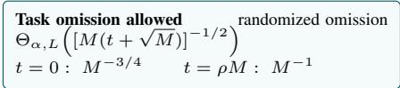
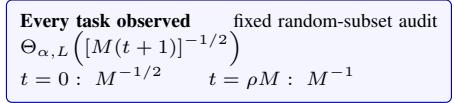
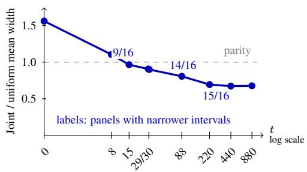
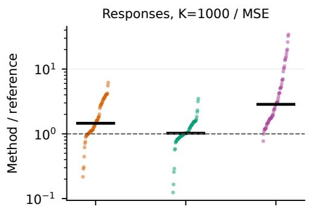
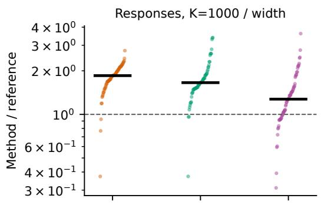
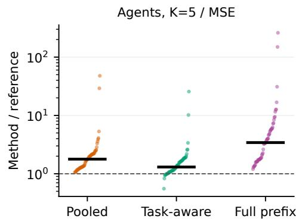
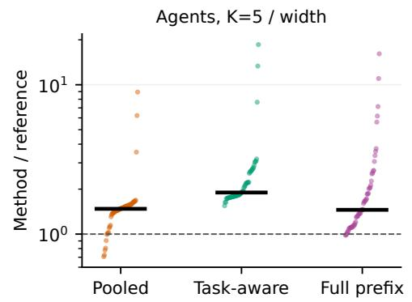
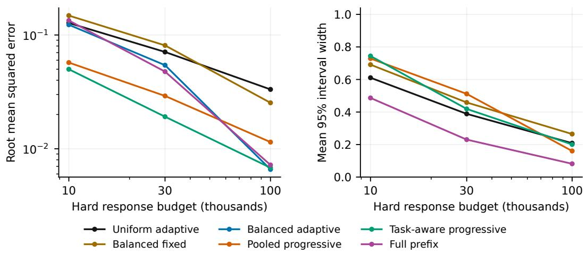
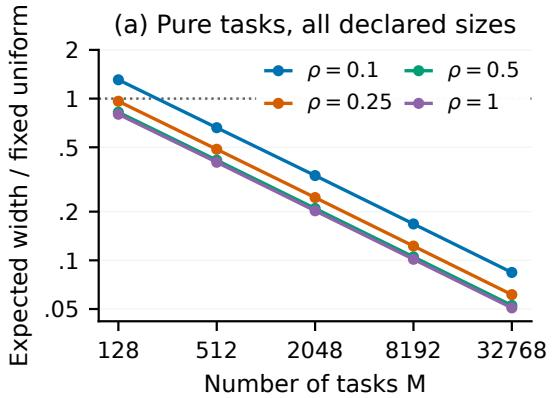
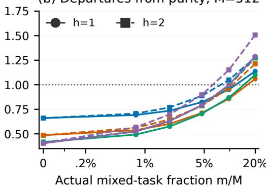

# SHARP LIMITS FOR HONEST UNCERTAINTY IN HARD-BUDGET REPEATED EVALUATION

Yezhou Cheng1 Runjia Du1 Zeming Liu1 Qibai Chen1 Hang Lyu1 Yilan Wei2 Yankai Zeng1 Bojun Lin3

1Independent 2Northwestern University 3Pinterest, Inc.

## ABSTRACT

Repeated evaluation can estimate a benchmark score accurately while still requiring replication to certify narrow uncertainty. We characterize that requirement on a fixed grid of M tasks with L binary paths per task under the hard budget $( M + t ) K$ , where each path costs at most K responses or episodes. For fixed $L \geq 3$ and 0 < α ≤ 1/12, the optimal expected width on the worst pure cohort, where planned labels agree within each task, is $\Theta _ { \alpha , L } ( [ M ( t + 1 ) ] ^ { - 1 / 2 } )$ when every task is observed and Θα,L([M(t + √M)]−1/2) when omission is allowed. The lower bounds cover adaptive hard-budget policies; fixed random-subset designs attain both rates through disagreement certificates. A joint mean/disagreement interval turns the task-covering law into practical finite-budget inference. In an equal-budget LiveCodeBench replay with 16 models, 880 tasks, and five outputs per task, Joint and exact pooled uniform inference each use 1100 evaluated outputs. Joint is narrower in 15/16 panels, with median reductions of 30.6% in mean interval width and 87.0% in MSE. Finite-regime analyses further identify how task coverage and within-task agreement govern the useful operating region. Together, the sharp laws and fixed-budget evidence make replication an explicit design variable for information-efficient language-model and agent evaluation.

## 1 INTRODUCTION

Repeated evaluation allocates a finite budget across tasks and repeated runs of each task. This allocation matters for language-model inference scaling (Brown et al., 2024; Kazdan et al., 2025) and agent benchmarks, where repeated runs can differ even under nominally deterministic decoding (Bjarnason et al., 2026). Task stratification can make a point estimate highly accurate: when every planned label within a task agrees, one observation per task recovers the grid mean exactly. Certifying that accuracy, however, requires evidence about the unobserved repetitions. This separation between estimation and certification creates a concrete budget-design problem.

For example, suppose an evaluator fixes 880 coding tasks, a model checkpoint, a decoding configuration, and five run seeds per task before evaluation. A budget permits evaluating only 1100 of the 4400 prespecified task–run slots, and the model advances to the next evaluation stage only if its score on this grid clears a qualification threshold τ. A lower endpoint above τ supports advancing the model, an upper endpoint below τ supports holding it back, and an interval crossing τ signals that more repetitions are needed. A fixed-cohort honest interval remains valid for this decision even when tasks and runs are heterogeneous or dependent; generalization to future tasks answers a different question.

We ask: how much replication is necessary and sufficientfor narrow honest intervals under a hard evaluation budget, and how does the answer change if tasks may be omitted? We study the mean of a prespecified finite grid of potential runs, conditional on its realized outcomes, and require coverage for every such grid. Each path contains at most K responses or episodes, and the budget holds for every outcome and policy randomization. The policy class is broad: it may recycle savings from early decisive events, interleave tasks, and choose observations adaptively.

Our central contribution is a pair of matching certification laws that expose how replication budget and task coverage jointly determine honest interval width. For fixed $L \geq 3 ,$ , requiring at least one completed path per task gives the optimal worst-pure-cohort rate $\Theta _ { \alpha , L } ( [ M ( t + 1 ) ] ^ { - 1 / 2 } )$ (Theorem 3); allowing omission gives $\Theta _ { \alpha , L } \big ( [ M ( t + \sqrt { M } ) ] ^ { - 1 / 2 } \big )$ (Theorem 4). At zero extra reservation, the latter changes the attainable order from $M ^ { - 1 / 2 } \ \mathrm { t o } \ M ^ { - 3 / 4 }$ . Fixed random-subset designs attain both rates through disagreement-based certificates, so the theory yields executable evaluation policies rather than lower bounds alone.

The finite-budget contribution couples the sampled mean and disagreement count in a Joint interval. At $K = 1$ , an equal-budget LiveCodeBench replay gives Joint and exact pooled uniform inference the same 1100-output budget $( M = 8 8 0 , t = 2 \bar { 2 } 0 )$ . Joint produces narrower mean intervals in 15/16 model panels, with median reductions of 30.6% in width and 87.0% in MSE. A sufficient dominance region and controlled departures from within-task agreement then connect the sharp laws to finitecohort behavior.

The paper contributes three mutually supporting results:

• matching lower and upper rates for task-covering and omission-enabled hard-budget policies, including adaptive policies in both lower bounds;

• fixed randomized designs and disagreement-aware intervals that realize the theoretical rates and sharpen finite-budget inference; and

• equal-budget evidence that identifies a useful LiveCodeBench operating regime and boundary conditions observed across benchmarks.

## 2 RELATED WORK

Repeated and adaptive evaluation. Brown et al. (2024) study inference scaling with repeated sampling, and Kazdan et al. (2025) predict pass@K scaling using a model for task-level heterogeneity. Bjarnason et al. (2026) analyze repeated coding-agent runs. Huang (2026) replay partial agent benchmarks to study pairwise decisions, task-group coverage and deferral. We complement these empirical objectives with honest fixed-cohort intervals for the repeated-evaluation mean under an exact pathwise budget. Pilditch (2026) develop Bayesian precision-based stopping and explicitly distinguish posterior precision from frequentist coverage. Our design-based guarantee supplies the corresponding conditional statement for a prespecified benchmark grid and requires no model for task or run generation.

Active inference and stratification. Active statistical inference (Zrnic & Candès, 2024), costaware evaluation (Angelopoulos et al., 2025), stratified prediction-powered inference (Fisch et al., 2024), and finite-population adaptive evaluation (Wu et al., 2026) already use evaluation information to improve statistical efficiency. Yauney et al. (2026) show why strong random micro-benchmark baselines matter. Our setting adds partially observed repetition paths and an exact total response cap, without a learned rater or externally labeled pilot set. Stratified empirical Bernstein inference (Burgess & Chapman, 2021) and sequential union-of-intersections inference (Spertus et al., 2024) already provide variance-aware alternatives. One-per-stratum variance problems and replication remedies are classical (Barabesi et al., 2012), as are variance-sensitive bounds (Maurer & Pontil, 2009) and honest expected-length adaptation (Cai & Low, 2004). Building on these tools, we derive the matching joint M, t rate first with task coverage and then over all hard-budget policies, and attain both laws with fixed random-subset designs (Appendices K and P).

Random continuation and sequential uncertainty. Randomly abandoning an expensive simulation and reweighting completed outcomes predates language-model evaluation; Lazy ABC is a direct example (Prangle, 2014). DAPRO (Feldman & Romano, 2026) is especially close: its Appendix F.6 includes unbiased population event-rate estimation under dynamic continuation, with budget guarantees stated in expectation. We instead study fixed-cohort certification under a pathwise hard cap; fixed-count reservation provides the budget guarantee while replication determines honest interval width. Our recursive weights follow classical multiphase sampling (Lumley, 2024). The uncertainty tools are likewise established: finite-population confidence sequences (Waudby-Smith & Ramdas, 2020), normal-mixture boundaries (Howard et al., 2021), and, in exploratory variants, profile e-value inversion (Wasserman et al., 2020). The contribution is the resulting sharp replication law and its constructive realization under an exact evaluation budget.

Table 1 compares levels of guarantee rather than topic alone.

Table 1: Positioning relative to the nearest guarantees.
<table><tr><td>Work</td><td>Established object</td><td>Additional object studied here</td></tr><tr><td>Burgess &amp; Chap- man (2021)</td><td>Stratified empirical-Bernstein allocation after at least two initial draws per stratum</td><td>A budget-selected subset receives a second draw; matching M, t lower and upper rates</td></tr><tr><td>Cai &amp; Low (2004)</td><td>Honest expected-length adapta- tion in nonparametric models</td><td>Fixed binary cohort under an exact label reser- vation</td></tr><tr><td>Waudby-Smith &amp; Ramdas (2020), Spertus et al.</td><td>Finite-population or sequential stratified validity</td><td>Worst-pure width law and converse uniform over adaptive evaluation policies</td></tr><tr><td>(2024) Feldman &amp; Ro- mano (2026)</td><td>Dynamic continuation and event-rate estimation</td><td>Pathwise hard cap and fixed-cohort replication certificate</td></tr><tr><td>This paper</td><td>Task-covering and omission- enabled designs</td><td>Paired sharp rates plus finite-regime and real- cohort boundary</td></tr></table>

## 3 A FIXED-COHORT MEASUREMENT PROBLEM

There are M tasks and L planned repetition paths per task, for $N = M L$ paths. A path contains at most K responses or completed agent episodes. Write $T _ { i r } \in \{ 1 , \ldots , K , K ^ { \bar { + } 1 \bar { + } }$ for its first decisiveevent index, with $K + 1$ meaning no decisive event. Its terminal label is $Y _ { i r } = \mathbf { \bar { 1 } } \{ T _ { i r } > K \}$ and the target is

$$
\theta _ { \displaystyle { \cal C } } = \frac { 1 } { M L } \sum _ { \substack { i = 1 } } ^ { M } \sum _ { r = 1 } ^ { L } Y _ { i r } .\tag{1}
$$

For a first-success event, $1 - \theta _ { C }$ is the block empirical success-at-K score. For a first-failure event, $\theta _ { \mathcal { C } }$ is the block empirical all-K success score. Blocks are prespecified and disjoint; this target retains the planned repetition paths rather than replacing them by the all-subsets binomial U-statistic.

An evaluator may advance an unresolved path from observed depth a to b, paying min $\left( T _ { i r } - a , b - a \right)$ units. It learns whether the path remains unresolved and its charged cost. Already paid prefixes are reused. The policy receives task identities and observed histories; future outcomes remain hidden. A hard budget requires $C \le B$ for every allowed outcome table and every randomization. One unit is one model response or one complete agent episode; token, dollar, tool-call, and elapsed-time costs are separate resource measures.

What coverage means. All design guarantees have the form $\mathbb { P } _ { R } \{ \theta _ { \mathcal { C } } \in I ( D ) \mid \mathcal { C } \} \ge 1 - \alpha$ , for every fixed potential cohort C. Outcomes may be heterogeneous or dependent; randomness R is the evaluator’s sampling design. A population survival mean $\theta _ { * } = M ^ { - 1 ^ { \cdot } } { \sum } _ { i } \mathbb { P } ( T _ { i } > K )$ is a different estimand. Under independent planned paths, an additional Hoeffding term can bridge the two $( \mathsf { A p } \cdot$ pendix D). Our primary target instead supports a budgeted estimate of a prespecified benchmark grid, with a coverage guarantee that does not assume a stochastic model for its outcomes. Requiring one completed path per task ensures direct representation of every benchmark item; random-subset auditing then spends the remaining reservation on certification. This is a design choice that prioritizes full task representation. The companion omission law quantifies the alternative, while population generalization to future tasks or runs remains a separate inferential objective.

## 4 SHARP CERTIFICATION LAWS

Theorem 1 (Late-event hard-budget limit). Let m = min $\{ N , \lfloor B / K \rfloor \}$ . In the access model above, the worst-case MSE ofany estimator is at least

$$
\frac { ( N - m ) ( N + 2 ) } { 6 N ^ { 2 } ( m + 2 ) } .\tag{2}
$$

If $B < K ,$ , there are two indistinguishable cohorts with targets zero and one, so the worst-case MSE is at least 1/4.

The construction places every decisive event at K or later. An incomplete path gives no terminal information, and every completed label costs K. A uniform prior on the number of positive paths gives Equation (2). Thus adaptive continuation cannot uniformly improve the $K / B$ order away from census. Useful gains must exploit a favorable distribution of decisive-event times, not just a different weighting formula.

The next result separates an estimator’s actual error from an interval’s ability to establish that error. It is a confidence-length consequence of the classical one-observation-per-stratum information problem.

Theorem 2 (One completed path per task). Suppose $L \geq 2$ and write $q = \lfloor L / 2 \rfloor / L .$ . An evaluator completes exactly one uniformly sampled path per task and observes no other terminal labels. Any additional observed prefixes have depth below K. Let $I ( D )$ be an interval with coverage at least $1 - \alpha$ for every fixed cohort. There exists a cohort in which every task’s L terminal labels are identical, and one-per-task averaging is exact, yet $\mathbb { E } _ { R } | I ( D ) | \ge b _ { M , q } \dot { ( } \alpha )$ , wherefor $Z \sim \operatorname { B i n } ( M , q )$

$$
b _ { M , q } ( \alpha ) = \operatorname* { i n f } _ { \substack { 0 \leq w \leq 1 , \mathbb { E } w ( Z ) \geq 1 - 2 \alpha } } \mathbb { E } \big [ | Z / M - q | w ( Z ) \big ] .\tag{3}
$$

For $0 < \alpha < 1 / 2 , \sqrt { M } b _ { M , q } ( \alpha )  2 \sqrt { q ( 1 - q ) } \{ 1 - \exp [ - z _ { 1 - \alpha } ^ { 2 } / 2 ] \} / \sqrt { 2 \pi } ,$ , where $z _ { u }$ is the standard-normal u-quantile. $A t \alpha = . 0 5$ , the constant is 0.2958for even L and 0.2898for $L = 5$

One prior makes each task internally constant with a Bernoulli(q) label; a second makes exactly $\lfloor L / 2 \rfloor$ ⌋ paths positive. One observed label per task has the same law under both priors, but the targets are respectively the observed mean and $q .$ Honest coverage must accommodate both. The theorem isolates the certification cost even when task-balanced point estimation is exact; the matching interpolation laws below show how replication removes it. Complete proofs appear in Appendix A.

How much replication removes the obstruction? Complete one uniform path in every task, then a second distinct uniform path in a uniform subset S of exactly t tasks. Choose S, t independently of all labels before observation. Let $A _ { i }$ average the one or two labels purchased in task i and set $\begin{array} { r } { \widehat { \theta } = M ^ { - 1 } \sum _ { i } A _ { i } } \end{array}$ . No terminal savings are recycled. This design reserves $( M + t ) K$ and is unbiased. Let $\mathcal { P }$ be all internally constant task cohorts. Let $\Pi _ { M , t }$ contain all pathwise- $( M + t ) K .$ budget policies that reveal at least one terminal label in every task on every cohort. They may adapt task/path choices, interleave audits, stop, and recycle savings. For $\pi \in \Pi _ { M , t } , \mathcal { T } _ { \alpha } ( \pi )$ contains intervals honest over all fixed cohorts.

Theorem 3 (Sharp partial-replication interpolation). Forfixed $L \geq 3$ and $0 < \alpha \leq 1 / 1 2$ , there are constants $0 < c _ { \alpha , L } \leq C _ { \alpha , L } < \infty$ , independent of $M , t ,$ such that

$$
\frac { c _ { \alpha , L } } { \sqrt { M ( t + 1 ) } } \leq \operatorname* { i n f } _ { \pi \in \Pi _ { M , t } , I \in \mathcal { Z } _ { \alpha } ( \pi ) } \operatorname* { s u p } _ { c \in \mathcal { P } } \mathbb { E } _ { R } | I | \leq \frac { C _ { \alpha , L } } { \sqrt { M ( t + 1 ) } } , \qquad 0 \leq t \leq M .\tag{4}
$$

Thefixed random-subset audit attains the upper bound on every pure cohort. The lower bound holds for every task-covering policy, but is worst-pure-cohort, not pointwise over that class.

Thus $t = \lfloor \rho M \rfloor$ , for any fixed $0 < \rho \le 1$ , attains the $M ^ { - 1 }$ order with reservation approaching $( 1 + \rho ) M \bar { K }$ . Doubling is unnecessary. If $t  \infty$ but $t = o ( M )$ , the attainable width is order $( M t ) ^ { - 1 / 2 }$ , while the reservation ratio tends to one. No task-covering adaptive policy can then attain $\dot { O } ( M ^ { - 1 } )$ worst-pure width. Task coverage is not intrinsic, however: a policy may sacrifice purecohort point exactness to learn about the tasks it leaves unobserved.

Let $\Pi _ { M . } ^ { \mathrm { a l l } }$ contain every pathwise- $( M + t ) K$ -budget policy with no external cohort information; tasks need not be observed. Define honest intervals as above and retain the same internally constant class P.

Theorem 4 (Sharp interpolation with task omission). Forfixed $L \geq 3$ and $0 < \alpha \leq 1 / 1 2 ,$ , constants $0 < c _ { \alpha , L } ^ { \prime } \leq C _ { \alpha , L } ^ { \prime } <$ ∞ exist such that, uniformlyfor $M \overset { \cdot } { \geq } 1$ and $0 \leq t \leq M$

$$
\frac { c _ { \alpha , L } ^ { \prime } } { \sqrt { M ( t + \sqrt { M } ) } } \leq \operatorname* { i n f } _ { \pi \in \Pi _ { M , t } ^ { \mathrm { a l l } } , I \in \mathcal { T } _ { \alpha } ( \pi ) } \operatorname* { s u p } _ { \mathcal { C } \in \mathcal { P } } \mathbb { E } _ { R } | I | \leq \frac { C _ { \alpha , L } ^ { \prime } } { \sqrt { M ( t + \sqrt { M } ) } } .\tag{5}
$$

For the upper bound, when $M \geq 1 6$ and $t ^ { 2 } < M$ , select $n = M - \lfloor { \sqrt { M } } \rfloor$ tasks uniformly and use the saved task labels to audit $q = t + \lfloor { \sqrt { M } } \rfloor$ of them; otherwise use the task-covering design. A finitepopulation bound transfers the selected-task certificate to the full $\mathrm { g r i d }$ $\mathbf { A } \mathbf { t } \ t = 0$ this gives $M ^ { - 3 / 4 }$ width, but its pure-cohort point MSE is no longer zero. The lower proof covers adaptive task choice, stopping, and omission via an omitted-bit branch and a posterior-coupling branch (Appendix P). The displayed branch establishes the sharp order; Section 6 evaluates its finite-budget constants.

Construction and proof mechanism. Let d count the disagreeing audited pairs. For $t \geq 1$ , define $U ( d , \delta ; t )$ as the largest $u \in [ d , t ]$ with $u - d + d \log ( d / u ) \leq \log ( 1 / \delta )$ ), interpreting 0 log $0 = 0$ . Set

$$
V _ { U } = \operatorname* { m i n } \left\{ \frac { 1 } { 4 M } , \frac { ( L - 1 ) U ( d , \alpha / 2 ; t ) } { 2 L M t } \right\} , \quad c _ { 0 } = \frac { L - 1 } { L M } , \quad r = \frac { c _ { 0 } x } { 3 } + \sqrt { 2 V _ { U } x + ( c _ { 0 } x / 3 ) ^ { 2 } } ,\tag{6}
$$

where $x = \log ( 4 / \alpha )$ . For the fixed random-subset design, the interval $\widehat { \theta } \pm r$ is honest, after clipping to feasible labels; at $t = 0$ use a Hoeffding interval. A random-subset exponential-moment comparison bounds average within-task variation from d. Conditional-on-subset Bernstein and a union bound then control mean error, without assuming independence of mean and disagreement. On pure cohorts $d = 0$ , giving width $O ( ( M t ) ^ { - 1 / 2 } + \bar { M } ^ { - 1 } )$ . For the converse, late outcomes force every revealed label to cost $K .$ . On agreement transcripts, the sparse-contamination prior’s likelihood ratio to a pure prior lies in $[ 5 / 6 , 1 ]$ , even under adaptive auditing. Independent but noncentered posterior task errors retain enough variance; a noncentral fourth-moment argument and a single-positive alternative complete the bound (Appendix K). The Audit formula applies to the fixed random-subset design; outcome-adaptive audit subsets require their own valid inference rule.

Sharper fixed-design constants. $\mathbf { A } \mathbf { t } \ t = M$ , all tasks have two draws. Their exact variance relation $\bar { \mathrm { V a r } } ( A _ { i } ) = ( L - 2 ) \mathbb { E } D _ { i } / ( 4 L )$ sharpens Equation (6) to Theorem 6 in Appendix A.3. A direct exponential envelope for the three-point mean/disagreement law avoids the separate variance/mean error split (Appendix H). Its fixed data-independent mixture is the Pair interval. For $0 < t < M$ , a joint moment bound averages over the random subset using Maclaurin’s inequality; a fixed mixture gives the Joint refinement (Appendix N). It retains Hoeffding at $t = 0$ and Pair at $t = M$ . These finite-constant refinements preserve the sampling design, while the Audit construction establishes the minimax upper rate. Appendices H and N give their derivations and finite comparisons.

Finite-regime boundary. For a cohort with $h _ { i }$ positive paths in task i, write $H = \textstyle \sum _ { i } h _ { i }$ and $\bar { q } = M ^ { - 1 } \sum _ { i } 2 h _ { i } ( L - h _ { i } ) / \{ L ( L - 1 ) \}$ . Let $x _ { t } ( d )$ be the Joint boundary and $W _ { U } ( H )$ the exact expected width of the equal-tailed hypergeometric interval after $M + t$ pooled labels.

Proposition 5 (Finite-cohort dominance region). $F o r 0 < t < M , x _ { t }$ is nondecreasing and concave, $\mathbb { E } _ { R } \vert \mathsf { \bar { I } } _ { \mathrm { J o i n t } } \vert \le 2 x _ { t } ( t \bar { q } ) / M ,$ , and the computable threshold $q _ { \star } ( H ) = \operatorname* { s u p } \{ q : 2 x _ { t } ( t q ) / M \leq W _ { U } ( H ) \}$ is sufficient: $\bar { q } \leq q _ { \star } ( H )$ implies no larger expected width thanfixed uniform.

Appendix O gives the proof, exact sums and selector corollary. The region describes sufficient cohort structure for a gain. Evaluating the condition with full-cohort $\bar { H , q }$ explains the observed regime; a future prospective selector could instead use observable disagreement proxies. Outside the sufficient region, the width ordering remains an empirical question.

## 5 BUDGET-FEASIBLE DESIGNS AND INTERVAL COMPARISONS

Complete-path baselines. Uniform fixed sampling completes min $( N , \lfloor B / K \rfloor )$ paths chosen without replacement. It is unbiased and has an exact hypergeometric interval. Uniform adaptive sampling uses saved cost to draw more complete paths, stopping when fewer than K budget units remain; we use a finite-population confidence sequence (Waudby-Smith & Ramdas, 2020). Task-balanced variants randomly permute paths within each task and tasks within each round. The fixed-count variant is unbiased; its interval combines bounded-variable and finite-complement concentration. The cost-stopped task-balanced average is retained as a strong practical MSE baseline; statistical intervals are reported only for methods with a corresponding valid construction.

Earlier continuation comparisons. Pooled and hierarchical progressive policies thin unresolved paths while inverse-probability weighting preserves the fixed-cohort mean; a pathwise reservation guarantees at least one completion. A simpler full-prefix policy spends at most a quarter of B on a common prefix and uses the remainder for fixed task-balanced terminal sampling. These methods test whether early-event cost savings help. Their schedules, weights, hard-budget proofs, and interval restrictions appear in Appendices B and C.

Use all purchased label information. If P distinct paths have known label one and Z have known label zero, the target certainly lies in $[ P / N , 1 - Z / N ]$ . We intersect every interval with this feasible range. The refinement costs no extra observations and preserves coverage; it is applied uniformly to all methods. It also gives the cost-stopped balanced heuristic a purely logical 100% certificate, distinguished from the statistical intervals.

## 6 FINITE-BUDGET EVIDENCE

The empirical question is whether the constructive certificates improve width at usable budgets. The LiveCodeBench replay compares the theory’s fixed designs at equal charged label counts. For this fixed-cohort target, replay reveals only each policy’s selected records and measures error against the fully observed grid mean. It directly evaluates the sampling and inference design without generating new model outputs. Synthetic cohorts isolate how finite size and within-task disagreement shape the transition predicted by the theory, while earlier response and agent studies test transfer across different horizons and event structures. Before inspecting LiveCodeBench correctness labels, we fixed the source revision, eligibility rule, budgets, designs, and random seeds; Appendix Q records the protocol and identifies the subsequent explanatory analyses.

Measurements. We report conditional bias, MSE, interval width and coverage, charged cost, and hard-budget violations. Each method gets an independent stable RNG stream. Replay-bootstrap intervals quantify Monte Carlo uncertainty conditional on the fixed bank; generalization to new models or tasks is a separate question. Zero-error and census cases are reported separately, without epsilon-stabilized ratios. Complete method grids and run-level results appear in the appendices.

## 6.1 JOINT CONVERTS REPLICATION INTO FINITE-BUDGET PRECISION

Equal-cost LiveCodeBench comparison. Sixteen released model panels contain all 880 tasks and at least five evaluated outputs per task; we use the first five binary labels, giving $M = 8 8 0 , L =$ 5, K = 1. Every design purchases exactly M + t labels, with 1000 evaluator randomizations per panel and budget. Replay exposes only the records selected by a policy and scores them against the fully observed grid mean, directly testing allocation and confidence construction at equal observedlabel cost.

More information from the same 1100 outputs. Joint beats exact fixed-uniform mean width in 9/16 panels at t = 15, 14/16 at t = 88, and 15/16 at t = 220; the corresponding median width ratios are 0.966, 0.807, and 0.694. At t = 220, both methods use 1100 labels, and the median MSE ratio is 0.130. Joint therefore reduces median mean interval width by 30.6% and median MSE by 87.0% without increasing the evaluation budget. Its MSE is lower in every panel at every tested replication budget. At t = 440 and 880, median width ratios remain 0.673 and 0.677, with 14/16 width wins.

The finite result directly instantiates the rate theorem: the fixed random-subset design supplies the observations, while Joint uses their mean and disagreement jointly to obtain a tighter certificate. The two width exceptions at one or more large budgets still retain MSE gains, showing that finite width depends on within-task disagreement as well as the asymptotic rate. Appendix Q provides the ful panel- and budget-level results.

## 6.2 COHORT STRUCTURE EXPLAINS THE FINITE GAINS

Information in disagreement. A same-observation explanatory comparison holds the sampled records fixed and replaces Joint by a count-only Hull interval. Joint is narrower in all 16 panels at every tested $t \geq 8 ;$ median Joint/Hull width ratios are 0.732 at t = 8 and 0.425 at t = 220. The comparison isolates the value of coupling the sampled mean with disagreement evidence. On the nine-budget grid, all panels reach mean width 0.04 with median requirements of 1100 labels for Joint and 1760 for uniform, a median saving of 660 labels. Appendix R summarizes these descriptive grid comparisons across all targets and panels.

(a) Sharp certification laws  

(b) LiveCodeBench at equal label budgets  
  
Figure 1: The theory and its same-budget finite realization. Panel (a) gives rates up to constants depending on $\alpha , L ;$ both lower bounds include adaptive hard-budget policies. Panel (b) shows the median Joint/exact fixed-uniform mean-width ratio across 16 LiveCodeBench panels $( M = 8 8 0 , L = 5 )$ , with $M + t$ labels per method; horizontal positions use $\log _ { 2 } ( t + 1 )$ and ticks show $t . \ \mathrm { A t } \ t = 2 2 0$ (1100 labels), Joint is narrower in 15/16 panels and reduces median mean width by 30.6% and MSE by 87.0%.

A finite dominance region. Proposition 5 relates expected width to full-cohort prevalence and pair disagreement. Evaluated retrospectively on the LiveCodeBench bank, its sufficient condition holds in 73 of 112 interior panel–budget cells, and every certified cell is an observed width win. Five additional wins lie outside the sufficient region. This alignment connects the finite pattern to the theorem’s mechanism and motivates future prospective selectors based on observable disagreement proxies.

Controlled departures from within-task agreement. The synthetic study fixes $\theta = 1 / 2 , L = 5$ varies $M = 1 2 8 , \dots , 3 2 7 6 8$ , audit fraction, and seven mixed-task fractions up to 20%. Numerical integration of exact finite laws yields Audit wins in 185 of 236 cells, while the dedicated Pair endpoint wins 57/59 simulated cells. The transition from a 1.307 width ratio at $M = 1 2 8$ to 0.661 at $\bar { M } = 5 1 2$ under approximately 10% auditing shows how the asymptotic advantage becomes useful at finite size. Figure 4 and the complete grid are in Appendix M.

## 6.3 BOUNDARY AND TRANSFER EVIDENCE

The same experiments locate where each theorem is operationally useful. The order-attaining omission branch has favorable asymptotic width and is wider than exact uniform in all 16 LiveCodeBench panels at its four active finite budgets; the tested constants therefore favor task-covering Joint on this cohort. The 19-cell exact tiny-design program similarly places Joint at 1.116–1.818 times the local numerical optimum, quantifying room for tighter finite constants.

The earlier public response and agent banks test different horizons and event structures. Across 868 conditions and 2,492,000 replay executions, task-aware progressive sampling has median MSE ratios 1.02 on responses and 1.30 on agents against balanced adaptive completion, and width ratios 1.66 and 1.90 against uniform adaptive completion. Later exploratory Pair and partial-Joint checks identify additional gains in narrower operating regions. Together, these comparisons locate where the sharp law and finite certificates are useful across evaluation structures. Appendices F–N provide the full tables, charged costs, coverage, zero-reference accounting, and the all-500 missing-outcome sensitivity analysis.

## 7 CONCLUSION

Replication closes a quantifiable gap between point accuracy and honest certification. Requiring task coverage yields the sharp law $[ M ( t + 1 ) ] ^ { - 1 / 2 }$ ; permitting omission changes it to $[ M ( t + \bar { \sqrt { M } } ) ] ^ { - 1 / 2 }$

Disagreement-based fixed designs attain these orders, while Joint improves finite constants. At the same 1100-output budget, Joint beats exact pooled uniform mean width in 15/16 LiveCodeBench panels, with median width and MSE reductions of 30.6% and 87.0%. The theoretical laws and this replay demonstrate how replication can improve certification within a fixed evaluation budget.

The formal scope is worst-pure-cohort expected width under honesty over all fixed cohorts, for fixed $L \geq 3$ and $0 < \alpha \le 1 / 1 2$ Finite constants, near-pure rates, and population reliability remain complementary targets. The strongest public replay uses $K = 1$ , so it isolates task allocation and inference; the tested finite omission rule and the earlier response/agent banks identify regimes where task-covering Joint is preferable. Prospective stopping and realized token or financial cost require their own validation.

Within this scope, the paper turns replication from an informal recommendation into a quantitative design choice. The two sharp laws specify what confidence width is achievable for a given hard budget, and the constructive interval shows how that information can translate into more precise model evaluation without purchasing additional outputs.

## AI USE STATEMENT

The core theoretical ideas, mathematical claims, derivations, proofs, and experimental design were developed by the author. Generative AI tools were used to support research exploration and literature review, assist with data organization, plotting, utility scripts, and general code editing, and polish the language of the manuscript. The author has completed a manual review of the manuscript, proofs, code, results, and all AI-assisted material, and takes full responsibility for the final content.

## ETHICS STATEMENT

This work uses public research outcome records and does not recruit human participants or deploy an agent into a live external environment. The replay code consumes correctness and task identifiers, not private communications. The response-bank and agent-artifact licenses and primary sources are retained in the reproducibility record. Efficiency estimates must not be interpreted as safety guarantees or as evidence that unobserved failures did not occur.

## REPRODUCIBILITY STATEMENT

The supplement records the prospective protocol, immutable source revisions, download and output hashes, code archive, fixed seed derivation, raw grading audits, and all replay outputs. Appendix proofs state the assumptions required by each confidence calculation. The code enforces prefix-only access and charges actual observed response/episode counts. No paid model calls or new model training are required to reproduce the replays.

## REFERENCES

Anastasios N. Angelopoulos, Jacob Eisenstein, Jonathan Berant, Alekh Agarwal, and Adam Fisch. Cost-optimal active AI model evaluation, 2025. URL https://arxiv.org/abs/2506. 07949.

Philippe Aubry. On the implementation of stratified two-stage simple random sampling without replacement, with possible collapsed strata. MethodsX, 13:102928, 2024. doi: 10.1016/j.mex. 2024.102928. URL https://doi.org/10.1016/j.mex.2024.102928.

Lucio Barabesi, Sara Franceschi, and Marzia Marcheselli. Properties of design-based estimation under stratified spatial sampling with application to canopy coverage estimation. The Annals of Applied Statistics, 6(1):210–228, 2012. doi: 10.1214/11-AOAS509. URL https://arxiv. org/abs/1203.4065.

Rémi Bardenet and Odalric-Ambrym Maillard. Concentration inequalities for sampling without replacement. Bernoulli, 21(3):1361–1385, 2015. doi: 10.3150/14-BEJ605. URL https:// arxiv.org/abs/1309.4029.

Bjarni Haukur Bjarnason, André Silva, and Martin Monperrus. On randomness in agentic evals. In ICLR Workshop on Agents in the Wild, 2026. URL https://arxiv.org/abs/2602. 07150.

Bradley Brown, Jordan Juravsky, Ryan Ehrlich, Ronald Clark, Quoc V. Le, Christopher Ré, and Azalia Mirhoseini. Large language monkeys: Scaling inference compute with repeated sampling, 2024. URL https://arxiv.org/abs/2407.21787.

Mark A. Burgess and Archie C. Chapman. Approximating the Shapley value using stratified empirical Bernstein sampling. In Proceedings of the Thirtieth International Joint Conference on Artificial Intelligence, pp. 73–81, 2021. URL https://www.ijcai.org/proceedings/ 2021/0011.pdf.

T. Tony Cai and Mark G. Low. An adaptation theory for nonparametric confidence intervals. The Annals ofStatistics, 32(5):1805–1840, 2004. doi: 10.1214/009053604000000049. URL https: //arxiv.org/abs/math/0503662.

Shai Feldman and Yaniv Romano. How many iterations to jailbreak? dynamic budget allocation for multi-turn LLM evaluation, 2026. URL https://arxiv.org/abs/2605.06605v5. Version 5, July 2026.

Adam Fisch, Joshua Maynez, R. Alex Hofer, Bhuwan Dhingra, Amir Globerson, and William W. Cohen. Stratified prediction-powered inference for hybrid language model evaluation, 2024. URL https://arxiv.org/abs/2406.04291.

Wassily Hoeffding. Probability inequalities for sums of bounded random variables. Journal of the American Statistical Association, 58(301):13–30, 1963. doi: 10.1080/01621459.1963.10500830. URL https://doi.org/10.1080/01621459.1963.10500830.

Steven R. Howard, Aaditya Ramdas, Jon McAuliffe, and Jasjeet Sekhon. Time-uniform, nonparametric, nonasymptotic confidence sequences. The Annals of Statistics, 49(2):1055–1080, 2021. doi: 10.1214/20-AOS1991. URL https://arxiv.org/abs/1810.08240.

Wei-Jung Huang. How many tasks are enough for agent benchmark decisions? a replay analysis of public LLM agent benchmarks, 2026. URL https://arxiv.org/abs/2607.12338v1. KDD Workshop on Evaluation and Trustworthiness of Agentic AI.

Naman Jain, King Han, Alex Gu, Wen-Ding Li, Fanjia Yan, Tianjun Zhang, Sida Wang, Armando Solar-Lezama, Koushik Sen, and Ion Stoica. LiveCodeBench: Holistic and contamination free evaluation of large language models for code. In International Conference on Learning Representations, 2025. URL https://openreview.net/forum?id=chfJJYC3iL.

Joshua Kazdan, Rylan Schaeffer, Youssef Allouah, Colin Sullivan, Kyssen Yu, Noam Levi, and Sanmi Koyejo. Efficient prediction of pass@k scaling in large language models, 2025. URL https://arxiv.org/abs/2510.05197.

Thomas Lumley. Multiphase sampling. Survey package methods vignette, 2024. URL https:// stat.ethz.ch/CRAN/web/packages/survey/vignettes/multiphase.html.

Andreas Maurer and Massimiliano Pontil. Empirical Bernstein bounds and sample variance penalization. In Proceedings of the 22nd Annual Conference on Learning Theory, 2009. URL https://arxiv.org/abs/0907.3740.

Toby D. Pilditch. Knowing when to stop: Bayesian optimal stopping for LLM evaluations, 2026. URL https://arxiv.org/abs/2608.14425.

Dennis Prangle. Lazy ABC, 2014. URL https://arxiv.org/abs/1405.7867.

Jacob V. Spertus, Mayuri Sridhar, and Philip B. Stark. Sequential stratified inference for the mean, 2024. URL https://arxiv.org/abs/2409.06680v5. arXiv:2409.06680; version 5, revised August 2026.

Larry Wasserman, Aaditya Ramdas, and Sivaraman Balakrishnan. Universal inference. Proceedings of the National Academy of Sciences, 2020. doi: 10.1073/pnas.1922664117. URL https: //arxiv.org/abs/1912.11436.

Ian Waudby-Smith and Aaditya Ramdas. Confidence sequences for sampling without replacement. In Advances in Neural Information Processing Systems, 2020. URL https://arxiv.org/ abs/2006.04347.

Skyler Wu, Yash Nair, and Emmanuel J. Candès. Efficient evaluation of LLM performance with statistical guarantees, 2026. URL https://arxiv.org/abs/2601.20251.

Gregory Yauney, Shahzaib Saqib Warraich, and Swabha Swayamdipta. How reliable is language model micro-benchmarking? In International Conference on Learning Representations, 2026. URL https://proceedings.iclr.cc/paper\_files/paper/2026/hash/ 2e2960f2fe9e981f33f51c78656e3ca2-Abstract-Conference.html.

Tijana Zrnic and Emmanuel J. Candès. Active statistical inference, 2024. URL https://arxiv. org/abs/2403.03208.

## SUPPLEMENTARY MATERIAL (APPENDIX)

The remainder of this document contains the supplementary proofs, experimental details, complete results, and reproducibility information for the paper.

## A INFORMATION-LIMIT PROOFS

## A.1 PROOF OF THEOREM 1

Restrict the cohort to $T _ { j } \in \{ K , K + 1 \}$ for every path. Every prefix shorter than K has the same observation and cost under all these cohorts. A complete path costs exactly K, whether its terminal label is zero or one. Consequently no budget-feasible policy obtains more than $m = \operatorname* { m i n } ( N , \lfloor B / K \rfloor )$ terminal labels. If it obtains fewer, supplying additional labels up to m can only decrease the minimum Bayes risk, so a lower bound for m labels is also a lower bound for that policy.

Choose H uniformly from $\{ 0 , \ldots , N \}$ and, conditional on H, choose the positive-label set uniformly among subsets of size H. No task identity or unobserved path identity breaks this symmetry. Adaptive selection of an unqueried path therefore gives the same label experiment as sampling without replacement. Equivalently, first choose $p \sim \mathrm { U n i f o r m } [ 0 , 1 ]$ and then choose the N labels independently conditional on $p .$ This induces the same uniform prior on H.

After m labels with s positives, the number of positives in the remaining $N - m$ paths has a betabinomial distribution with parameters $( N - m , s + 1 , m - s + 1 )$ . Its variance is

$$
\mathrm { V a r } ( H \mid s ) = \frac { ( N - m ) ( s + 1 ) ( m - s + 1 ) ( N + 2 ) } { ( m + 2 ) ^ { 2 } ( m + 3 ) } .\tag{7}
$$

The marginal distribution of s is uniform on $\{ 0 , \ldots , m \}$ , and

$$
{ \frac { 1 } { m + 1 } } \sum _ { s = 0 } ^ { m } ( s + 1 ) ( m - s + 1 ) = { \frac { ( m + 2 ) ( m + 3 ) } { 6 } } .\tag{8}
$$

Under squared loss the posterior mean minimizes Bayes risk. Dividing the expected posterior variance by $N ^ { 2 }$ gives Equation (2); minimax risk is at least this Bayes risk. This is an elementary finite-population lower-bound construction, not a new general minimax technique.

If $B < K$ , compare the all-zero and all-one terminal-label cohorts, again placing decisive events only at K. Every feasible transcript is identical. For any estimator A with that common observation law, max $\{ \mathbb { E } A ^ { 2 } , \mathbb { E } ( A - 1 ) ^ { 2 } \} \geq 1 / 4$

## A.2 PROOF OF THEOREM 2

Again set $T _ { i r } = K$ for label zero and $T _ { i r } = K + 1$ for label one. All observed nonterminal prefixes are now identical and every completed path costs K. Consider two priors on fixed cohorts:

• Prior A independently chooses Bernoulli(q) bits $U _ { 1 } , \dots , U _ { M }$ and makes every path in task i have label $U _ { i }$

• Prior B independently chooses a uniform subset of $h = \lfloor L / 2 \rfloor$ positive paths in each task, with the other $L - h$ paths negative.

Under A the target is $\begin{array} { r } { \bar { U } = M ^ { - 1 } \sum _ { i } U _ { i } } \end{array}$ , and one-per-task averaging recovers it without error. Under B every realized cohort has target $q = h / L$ . One uniformly selected label per task has the same joint distribution of labels and selected identities under both priors. The same remains true if task order depends on previously observed tasks, because unobserved tasks are independent under each prior. Internal interval randomization may be included in this common observation law.

Uniform design coverage over fixed cohorts implies coverage after integrating over either prior. Hence under the common observation law

$$
\mathbb { P } ( \bar { U } \in I ) \geq 1 - \alpha , \qquad \mathbb { P } ( q \in I ) \geq 1 - \alpha .\tag{9}
$$

Both points belong to I with probability at least $1 - 2 \alpha$ . On this event its length is at least $| \bar { U } - q |$ Conditioning the event probability on $\dot { Z } = \textstyle \sum _ { i } U _ { i }$ gives an admissible function w in Equation $( 3 )$ Thus the average expected interval length under prior A is at least $b _ { M , q } ;$ some fixed pure-task cohort attains at least that average.

The infimum defining $b _ { M , q }$ keeps the smallest $1 - 2 \alpha$ probability mass of $| Z / M - q |$ , allowing fractional mass at a discrete boundary. The central limit theorem gives $\sqrt { M / [ q ( 1 - q ) ] } ( \bar { U } - q ) \Rightarrow Z _ { 0 } \sim$ $N ( 0 , 1 )$ . Its uniformly bounded second moment supplies uniform integrability. The corresponding trimmed expectation therefore converges to

$$
\sqrt { q ( 1 - q ) } \mathbb { E } \big [ | Z _ { 0 } | \mathbf { 1 } \{ | Z _ { 0 } | \leq z _ { 1 - \alpha } \} \big ] = 2 \sqrt { q ( 1 - q ) } \int _ { 0 } ^ { z _ { 1 - \alpha } } z \frac { e ^ { - z ^ { 2 } / 2 } } { \sqrt { 2 \pi } } \mathop { d z }\tag{10}
$$

$$
= \frac { 2 \sqrt { q ( 1 - q ) } ( 1 - e ^ { - z _ { 1 - \alpha } ^ { 2 } / 2 } ) } { \sqrt { 2 \pi } } .\tag{11}
$$

At $M = 1 3 0 , q = 1 / 2$ , and $\alpha = . 0 5$ , exact binomial summation gives $b _ { M , q } = 0 . 0 2 5 8 9 1 7 1 8 0$ . The result concerns the existence of a difficult pure-task cohort for any honest procedure, not a lower bound at every cohort. Additional terminal labels or informative side information can invalidate the indistinguishability construction. Classical one-per-stratum variance limitations and collapsedstratum methods are discussed by Aubry (2024).

## A.3 SHARPER FULL-REPLICATION SPECIALIZATION

Theorem 6 (Two-replicate certification). Independently sample two paths without replacement in each task, with $L \geq 3 .$ . Let $A _ { i }$ be their mean, $D _ { i }$ their disagreement indicator, $d = \textstyle \sum _ { i } D _ { i }$ , and ${ \widehat { \theta } } = M ^ { - 1 } \textstyle \sum _ { i } A _ { i }$ . Define $U ( d , \delta )$ as the largest $u \in [ d , M ]$ satisfying $u - d + d \log ( d / u ) \leq \log ( 1 / \delta )$ with 0 log $0 = 0 .$ . Set

$$
V _ { U } = \frac { L - 2 } { 4 L M ^ { 2 } } U ( d , \alpha / 2 ) , \quad c = \frac { L - 2 } { L M } , \quad x = \log ( 4 / \alpha ) , \quad r = \frac { c x } { 3 } + \sqrt { 2 V _ { U } x + ( c x / 3 ) ^ { 2 } } .\tag{12}
$$

Then $[ \widehat \theta - r , \widehat \theta + r ] \cap [ 0 , 1 ]$ has coverage at least $1 - \alpha$ for every fixed cohort. On every internally constant task cohort, the estimate is exact and the width is $O _ { \alpha , L } ( \dot { M } ^ { - 1 } )$ . Conversely, for $0 < \alpha <$ $1 / 4 ,$ , every uniformly honest interval based on this two-path design has, at the all-zero cohort,

$$
\mathbb { E } _ { 0 } | I | \geq \frac { 1 - \alpha - \alpha / ( 1 - 2 / L ) } { M L } .\tag{13}
$$

Thus the optimal worst-pure-cohort expected-width order is $M ^ { - 1 }$ for fixed $L \geq 3 .$ . For $L = 2 ,$ , two paths are census.

Proof. Write $p _ { i } = L ^ { - 1 } \sum _ { r } Y _ { i r }$ . Under independent simple random sampling of two labels per task,

$$
\mathbb { E } D _ { i } = \frac { 2 L } { L - 1 } p _ { i } ( 1 - p _ { i } ) , \qquad \mathrm { V a r } ( A _ { i } ) = \frac { L - 2 } { 2 ( L - 1 ) } p _ { i } ( 1 - p _ { i } ) = \frac { L - 2 } { 4 L } \mathbb { E } D _ { i } .\tag{14}
$$

Hence $V = \operatorname { V a r } ( { \widehat { \theta } } ) = ( L - 2 ) \lambda / ( 4 L M ^ { 2 } )$ , where $\begin{array} { r } { \lambda = \sum _ { i } \mathbb { E } D _ { i } } \end{array}$ . The $D _ { i }$ are independent Bernoulli variables but need not be identically distributed. For $t \geq 0$

$$
\mathbb { E } e ^ { - t \sum _ { i } D _ { i } } = \prod _ { i } [ 1 + ( e ^ { - t } - 1 ) \mathbb { E } D _ { i } ] \leq \exp \{ ( e ^ { - t } - 1 ) \lambda \} .\tag{15}
$$

Optimizing the Chernoff inequality at a threshold $a \leq \lambda$ gives

$$
\begin{array} { r } { \mathbb { P } \{ d \leq a \} \leq \exp \{ - \lambda + a - a \log ( a / \lambda ) \} . } \end{array}\tag{16}
$$

The exponent is monotone in a below λ. Inverting this lower-tail bound yields $\mathbb { P } \{ \lambda > U ( d , \delta ) \} \le \delta$ including the discrete thresholds and the case $d = 0$ . In particular, $U ( 0 , \dot { \delta } ) = \operatorname* { m i n } \{ M , \log ( 1 / \delta ) \}$

The random variables $( A _ { i } - p _ { i } ) / M$ are independent and centered. Their absolute values are at most $c = ( L - 2 ) / ( L M )$ : if the selected two-label mean is $A _ { i }$ and the mean of the remaining labels is $B _ { i }$ , then $A _ { i } - p _ { i } = ( L - 2 ) ( A _ { i } - B _ { i } ) / L$ . The two-sided Bernstein inequality therefore gives

$$
\begin{array} { r } { \mathbb { P } \left\{ | \widehat { \theta } - \theta _ { { \cal C } } | > c x / 3 + \sqrt { 2 V x + ( c x / 3 ) ^ { 2 } } \right\} \leq 2 e ^ { - x } . } \end{array}\tag{17}
$$

Use $\delta = \alpha / 2 , x = \log ( 4 / \alpha )$ and a union bound. On the joint event, $V \leq V _ { U }$ and the radius is increasing in $V .$ . No independence between the sample mean and the estimated variance is needed. Clipping to $[ 0 , 1 ]$ , or to any deterministic feasible set containing the target, cannot reduce coverage. On a pure-task cohort $d = 0$ and $\widehat { \theta }$ is exact, giving the deterministic upper bound

$$
| I | \leq \frac { 2 } { M } \left[ \frac { ( L - 2 ) x } { 3 L } + \sqrt { \frac { ( L - 2 ) x \log ( 2 / \alpha ) } { 2 L } + \left( \frac { ( L - 2 ) x } { 3 L } \right) ^ { 2 } } \right] .\tag{18}
$$

For one path, a bounded-variable Hoeffding interval supplies a uniform $O ( M ^ { - 1 / 2 } )$ upper bound, matching Theorem $2 \mathrm { { : } } \mathrm { { s } }$ order.

For the two-path lower bound, compare the all-zero cohort to a prior that places exactly one positive path at a uniformly random location in a single fixed task. Under that alternative prior, the probability of missing the positive in two uniform observations is $q _ { 0 } = 1 - 2 / L$ . Conditional on missing $\mathbf { i t } ,$ the entire observed identity/label transcript has the all-zero law: each possible sampled pair misses a uniform positive location with the same probability $q _ { 0 }$ . Place decisive events at $\bar { K }$ so all shorter prefixes and costs are also uninformative. The alternative target is $\Delta = 1 / ( M L )$ . Uniform honesty over each alternative cohort implies honesty under the mixture, and therefore

$$
1 - \alpha \le q _ { 0 } \mathbb { P } _ { 0 } ( \Delta \in I ) + ( 1 - q _ { 0 } ) , \qquad \mathbb { P } _ { 0 } ( 0 \in I ) \ge 1 - \alpha .\tag{19}
$$

Both endpoints belong to $I$ with probability at least $1 - \alpha - \alpha / q _ { 0 }$ , proving Equation (13). Its coefficient is positive for every $L \ge 3 \mathrm { i f } \alpha < 1 / 4$

## A.4 FIXED-PREFIX EXTENSION OF THE DISAGREEMENT CERTIFICATE

Condition on a fully observed prefix. Suppose all G remaining active tasks are sampled, with activepath counts $n _ { i }$ , predetermined terminal counts $1 \leq m _ { i } \leq n _ { i }$ , and original population size $N$ . The active-task weights are $w _ { i } = n _ { i } / N ;$ ; previously resolved paths have label zero. The target is $\sum _ { i } w _ { i } p _ { i }$ and the unbiased estimate is $\sum _ { i } w _ { i } \bar { Y } _ { i }$ . The counts may depend on observed prefix risk sizes, but not on the terminal sample outcomes. Define $D _ { i }$ using the first two uniform terminal draws when $m _ { i } \geq 2$ . For noncensus replicated tasks,

$$
\mathrm { V a r } ( w _ { i } \bar { Y } _ { i } ) = \frac { w _ { i } ^ { 2 } ( n _ { i } - m _ { i } ) } { m _ { i } ( n _ { i } - 1 ) } p _ { i } ( 1 - p _ { i } ) = a _ { i } \mathbb { E } D _ { i } , \qquad a _ { i } = \frac { w _ { i } ^ { 2 } ( n _ { i } - m _ { i } ) } { 2 n _ { i } m _ { i } } .\tag{20}
$$

Let $a _ { * } =$ max $a _ { i }$ over those tasks and $\begin{array} { r } { S = \sum _ { i } a _ { i } D _ { i } / a _ { * } } \end{array}$ . For $b _ { i } = a _ { i } / a _ { * } \in [ 0 , 1 ]$ , convexity gives $e ^ { - t b _ { i } } - 1 \leq b _ { i } ( e ^ { - t } - 1 )$ , so the same negative-MGF argument bounds $\begin{array} { r } { \Lambda = \sum _ { i } a _ { i } \mathbb { E } D _ { i } / a _ { * } } \end{array}$ by the Poisson–Chernoff inversion at S. Replace the cap M in $U$ by $\textstyle \sum _ { i } a _ { i } / a _ { * } ;$ this inversion also permits noninteger $S$ . Multiply its upper bound by $^ { a _ { * } }$ and, if smaller, use the deterministic variance bound $\textstyle \sum _ { i } w _ { i } ^ { 2 } ( n _ { i } - m _ { i } ) / [ 4 { \bar { m _ { i } } } ( n _ { i } - { \bar { 1 } } ) ]$ . For tasks with $m _ { i } = 1 < n _ { i } ,$ , add their deterministic bound $w _ { i } ^ { 2 } / 4 ;$ census tasks contribute zero. If no replicated noncensus task remains, use only these deterministic bounds.

The centered mean increments satisfy $| w _ { i } ( \bar { Y } _ { i } - p _ { i } ) | \leq ( n _ { i } - m _ { i } ) / N$ . Substituting their maximum for c in Equation (12) establishes conditional coverage, and averaging over the prefix establishes unconditional design coverage. The deterministic feasible range is $\begin{array} { r } { \big [ \sum _ { i } s _ { i } / N , ( \sum _ { i } n _ { i } - \sum _ { i } ( m _ { i } - } \end{array}$ $s _ { i } ) ) / N ]$ , where $s _ { i }$ is the observed positive count. The implementation intersects with this range. If only a subset of active tasks is sampled, or counts are chosen by recycling terminal outcomedependent cost savings, this proof does not apply. We do not attach this interval to the cost-stopped task-balanced heuristic.

## B COMPLETE DESIGN AND INFERENCE SPECIFICATION

## B.1 UNIFORM COMPLETION AND FINITE-POPULATION CONFIDENCE SEQUENCES

For a binary population of size N with H positives, s positives among a fixed uniform sample of size m have law Hypergeom $( N , H , m )$ . We invert both tails at level $\alpha / 2 ,$ , respecting the integer feasible range $s \leq H \leq N - m + s .$ At census the interval is the observed point. The fixed-count

design completes $m = \operatorname* { m i n } ( N , \lfloor B / K \rfloor )$ paths; earlier decisive events cannot prevent completion of this predetermined count.

For the cost-adaptive design let $s _ { m }$ denote positives among the first m paths of an independently uniform permutation. Its ordered-label likelihood under candidate H is

$$
P _ { H } ( Y _ { 1 : m } ) = \frac { ( H ) _ { s _ { m } } ( N - H ) _ { m - s _ { m } } } { ( N ) _ { m } } , \qquad ( a ) _ { b } = a ( a - 1 ) \cdot \cdot \cdot ( a - b + 1 ) .\tag{21}
$$

The uniform prior on $H \in \{ 0 , \ldots , N \}$ gives ordered predictive mass $Q ( Y _ { 1 : m } ) = \mathrm { B e t a } ( s _ { m } + 1 , m -$ $s _ { m } + 1 )$ . For the true H, the ratio $Q / P _ { H }$ is a nonnegative test supermartingale, as in the priorposterior-ratio construction of Waudby-Smith & Ramdas (2020). Retain H when $Q / P _ { H } < 1 / \bar { \alpha } .$ At each draw, the next path is uniform among unqueried paths, so its conditional positive probability remains $( H - s _ { m } ) / ( \bar { N } - m )$ even when previous path costs are in the history. This permits stopping based on those costs. It does not make $s _ { m } / m$ at the stopping time unbiased.

The implementation batches as many next complete paths as the remaining worst-case budget permits, charges actual cost, and repeats while at least $\dot { K }$ units remain. Batching uses no unobserved outcomes and is equivalent to revealing the corresponding segment of the fixed random permutation.

## B.2 TASK-BALANCED COMPLETION

Independently permute the L paths within each task. For each repetition round, independently permute the M task identities and query their next paths in that order. At a fixed completed-path count $m < M ,$ the observed tasks form a uniform sample of m tasks, each with one uniform inner draw. $\mathrm { A t } \ m \ \geq \ M$ , every task has a count $m _ { i }$ determined independently of outcomes, and the estimate is $M ^ { - 1 } \sum _ { i } \bar { Y } _ { i }$ . Conditional on the allocation counts it is unbiased. If $m < M$ , average only the observed tasks; uniform outer sampling restores unbiasedness.

For $m < M$ use the bounded Chernoff interval from Appendix C with no prefix. For $m \geq M$ apply that interval to the M independent task averages and intersect it, using $\alpha / 2$ for each bound, with a Hoeffding interval of radius

$$
\sqrt { 2 V \log ( 4 / \alpha ) } , ~ V = \sum _ { i = 1 } ^ { M } \frac { \operatorname * { m i n } ( m _ { i } , L - m _ { i } ) } { 4 M ^ { 2 } m _ { i } ^ { 2 } } .\tag{22}
$$

The complement factor gives zero width at census. For cost-stopped task balancing the observed counts depend on outcomes, and some tasks may be unobserved. We retain the average of available per-task means as a practical baseline but attach no design-unbiasedness or statistical CI claim. Exhaustive examples with two or three tasks show absolute bias as large as 0.125; these are counterexamples to a general claim, not estimates of bias in the public banks.

## B.3 POOLED PROGRESSIVE WEIGHTS AND BUDGET RESERVATION

Before a uniform thinning there are n active paths with common weight W. Let H of them have terminal label one. Retain m paths uniformly and write S for the number of terminal positives retained, whether or not they are yet observed. The latent contribution changes from $\dot { W H } / N$ to $W n S / ( N m )$ and has conditional expectation W $H / N$ . Removing a path after a decisive event changes no latent terminal-positive total. Thus these weighted totals form a martingale over the evaluator’s random choices, conditional on the entire potential cohort. At termination the latent total equals the observable estimator. The product of conditional selection fractions is used recursively; no assertion equates it with a marginal inclusion probability (Lumley, 2024).

For an advance from a to $b ,$ cost is at most $m ( b - a )$ . Enforcing

$$
m \leq \left\lfloor { \frac { R - ( K - b ) } { b - a } } \right\rfloor\tag{23}
$$

when the remaining budget is R leaves $K - b$ units for one surviving path. At the first stage $B \geq K$ permits at least one path. Induction preserves that reservation until depth K; if the active set becomes empty the score contribution is exactly zero and the policy stops. The estimator is bounded by one because after every thinning/advance the weighted active count is nonincreasing from its initial value N.

## B.4 FROZEN WORKING-MODEL ALLOCATION

The depth schedule is the sorted unique set {min $( 2 ^ { j } , K ) : 0 \le j \le \lceil \log _ { 2 } K \rceil \} \cup \{ K \}$ . When $K > 1$ , the initial proposal retains max $( 1 , \lfloor B / 2 \rfloor )$ paths, subject to the risk set and reservation cap. Later proposals fit a working conditional-survival model $[ ( 1 \dot { + } b ) / ( 1 + a ) ] ^ { - \gamma }$ to at most the three most recent observed stages. Each survivor and decisive-event count receives a $1 / 2$ pseudocount. The negative binomial-count log-likelihood is minimized over $\gamma \in [ 0 . 0 0 5 , 5 ]$ with a bounded scalar optimizer. No calibration guarantee for this model is assumed or used in inference.

At current depth a, set $\mu ( u ) = [ ( 1 + u ) / ( 1 + a ) ] ^ { - \gamma }$ for future depths. For each remaining interval $\left( a _ { \ell } , b _ { \ell } \right]$ define

$$
c _ { \ell } = \sum _ { u = a _ { \ell } } ^ { b _ { \ell } - 1 } \mu ( u ) , \qquad v _ { \ell } = \mu ( b _ { \ell } ) ^ { - 1 } - \mu ( a _ { \ell } ) ^ { - 1 } .\tag{24}
$$

The usual working variance/cost allocation minimizes $\sum _ { \ell } v _ { \ell } / p _ { \ell }$ subject to $\textstyle \sum _ { \ell } c _ { \ell } p _ { \ell } \ \leq \ R / n$ and $1 \geq p _ { 1 } \geq p _ { 2 } \geq \cdot \cdot \cdot > 0$ . Pool adjacent intervals whenever their $v / c$ ratios increase, assigning each pooled block $p = \operatorname* { m i n } ( 1 , \lambda \sqrt { \sum v / \sum c } )$ . A fixed 50-step bisection chooses λ. Only the first proposed inclusion is applied; the model is refit after new observations. The proposed count is $\operatorname* { m a x } ( 1 , \lfloor n p _ { 1 } \rfloor )$ , clipped to the hard reservation cap and n. This standard allocation construction is a scheduling heuristic here, not a new optimality theorem. Its misspecification does not change the unbiasedness argument.

## B.5 FORWARD CONFIDENCE INVERSION: RESTRICTED POLICY CLASS

Let $G _ { a }$ and $G _ { b }$ be the numbers of paths in the original cohort with event times exceeding depths a and b. For an anonymous policy using only aggregate past event counts and costs, the active paths are a uniform subset of the original $\breve { G } _ { a }$ survivors conditional on that aggregate history. All paths that survive a have identical earlier event/cost contributions. Uniform thinning to size m preserves this symmetry, so the next observed survivor count obeys

$$
s \mid \mathrm { a g g r e g a t e \ p a s t } \sim \mathrm { H y p e r g e o m } ( G _ { a } , G _ { b } , m ) .\tag{25}
$$

This statement can fail if allocation uses features distinguishing survivors.

Let $[ L _ { a } , U _ { a } ]$ be the current confidence range for $G _ { a } .$ . For each feasible population size invert $\mathrm { H y p e r g e o m } ( G _ { a } , G _ { b } , m )$ in its success-total argument $G _ { b } ,$ using tails $\alpha / ( 2 \bar { J } )$ , where J is the predetermined maximum number of depth intervals. Hypergeometric endpoints are nondecreasing in population size, so the union over plausible $G _ { a }$ is enclosed by using max $[ L _ { a } , m )$ for the lower endpoint and $U _ { a }$ for the upper. If the feasible set is empty, return the full population interval conservatively. $\mathbf { A }$ union bound over stages gives final coverage at least $1 - \alpha$ . Extinguished stages are padded to the predetermined $J ,$ so the error allocation never depends on the observed stopping stage. The code checks endpoint monotonicity and the conditional transition law by exhaustive enumeration.

## B.6 HIERARCHICAL PROGRESSIVE DESIGN AND MIXTURE INTERVAL

Let A be the global task-selection weight and $W _ { i }$ a retained task’s within-task weight. Its latent terminal-positive count is $H _ { i }$ . The current weighted target is $A \textstyle \sum _ { i } W _ { i } H _ { i } / N$ . Initially $A = W _ { i } = 1$ and $W _ { i } n _ { i } \leq L$ remains true after all within-task thinnings and event removals.

Given a proposed total of $q$ retained paths, if $q < G$ uniformly retain q of the G active tasks and multiply A by $G / q$ . Otherwise keep all active tasks. Allocate at least one path per retained task by deterministic water filling, then uniformly retain $m _ { i }$ of its $n _ { i }$ paths and multiply $W _ { i }$ by $n _ { i } / m _ { i }$ . Both operations preserve the latent target in conditional expectation.

If $R \geq G ( K - a )$ , reserve one terminal path per active task and impose

$$
q \leq \left\lfloor { \frac { R - G ( K - b ) } { b - a } } \right\rfloor , \qquad q \geq G .\tag{26}
$$

This condition persists at subsequent stages because the active task count cannot increase. Otherwise use the one-global-path reservation. Working-model proposals and geometric depths are the same as in the pooled design.

For a uniform sample of m out of n values in $[ 0 , 1 ]$ , the centered sample sum has sub-Gaussian variance proxy min $( m , n - m ) / 4$ . Apply Hoeffding’s sampling-without-replacement comparison either to the sample or to its complement (Hoeffding, 1963). At a whole-task gate, values $X _ { i } =$ $W _ { i } H _ { i } / L$ lie in [0, 1], and the increment coefficient is $c = A G / ( M q )$ . Add $c ^ { 2 }$ min $( q , G - q ) / 4$ to the cumulative proxy V. At a within-task gate the coefficient is $c _ { i } = A W _ { i } n _ { i } / ( N m _ { i } )$ , with $A , W _ { i }$ measured before that gate, and the increment contributes $c _ { i } ^ { 2 }$ mi $1 ( m _ { i } , n _ { i } - m _ { i } ) / 4$ . Identity gates contribute zero.

These proxies are known before their respective random gates. Standard Gaussian mixing of the exponential test supermartingales (Howard et al., 2021) gives

$$
E _ { t } = \sqrt { \frac { \rho } { \rho + V _ { t } } } \exp \left\{ \frac { ( Z _ { t } - \theta _ { \cal C } ) ^ { 2 } } { 2 ( \rho + V _ { t } ) } \right\} , \qquad \rho = \frac { K } { 4 B } .\tag{27}
$$

The initial mixture scale is fixed before observing the cohort. At termination $Z _ { t }$ is the reported estimate, and inverting $E _ { t } < 1 / \alpha$ yields radius

$$
\sqrt { ( \rho + V _ { t } ) \{ 2 \log ( 1 / \alpha ) + \log ( 1 + V _ { t } / \rho ) \} } .\tag{28}
$$

Clip the interval to [0, 1]; if no random gate occurs, the cohort score is known exactly. This conservative bound uses no estimated outcome variance.

## C FULL-PREFIX SAMPLING PROOF AND UNCERTAINTY

Let d be the full-cohort prefix depth, $C _ { d }$ its actual charged cost, $n _ { i }$ the task risk-set sizes, and $G = | \{ i : n _ { i } > 0 \} |$ |. These are fixed conditional on the cohort because the prefix queries every unresolved path. The remaining budget safely finishes $\textstyle q = \operatorname* { m i n } \{ \sum _ { i } n _ { i } , \lfloor ( B - \hat { C _ { d } } ) / ( K \overset { \cdot } { - } d ) \rfloor \}$ paths. If $q < G$ , uniformly select q active tasks and one unresolved path per selected task. Otherwise, distribute fixed counts $m _ { i } \geq 1$ by deterministic water filling the observed $n _ { i } .$ , then sample uniformly within tasks. Terminal savings are not recycled. With sampled terminal averages ${ \bar { Y } } _ { i }$ , the estimator is

$$
\begin{array} { r } { \widehat { \theta } _ { \mathrm { p r e f i x } } = \left\{ \displaystyle \frac { G } { M q } \sum _ { i \in S } \frac { n _ { i } } { L } \bar { Y } _ { i } , \quad q < G , \right. } \\ { \displaystyle \frac { 1 } { M } \sum _ { i : n _ { i } > 0 } \frac { n _ { i } } { L } \bar { Y } _ { i } , \quad q \geq G . } \end{array}\tag{29}
$$

If no path remains or the prefix reaches $K$ , report its exact census score. This is an ordinary twostage sampling estimator, not a new weighting identity.

Proposition 7 (Full-prefix validity). Thefull-prefix estimator is design-unbiased and spends at most B. ${ \bar { I } } f q < G$ , write $\begin{array} { r } { \hat { Z } = q ^ { - 1 } \sum _ { i \in S } ( n _ { i } / \hat { L } ) \hat { Y } _ { i } . A \hat { 1 } - \alpha } \end{array}$ interval is $( \bar { G } / M )$ times the set of $\mu \in [ 0 , 1 ]$ satisfying

$$
q \operatorname { k l } ( { \bar { Z } } , \mu ) \leq \log ( 2 / \alpha ) .\tag{30}
$$

If all G active tasks are sampled, the same bound uses G task averages; it may be intersected, with an error-probability split, with thefinite-complement bound below.

## C.1 BUDGET AND UNBIASEDNESS

The prefix allowance is min $( \lfloor B / 4 \rfloor , B - K + 1 )$ . Starting with all N paths at depth zero, advance the whole active set by the largest integer span whose worst-case cost fits the remaining allowance, capped at $K .$ . Charge the actual cost and repeat. Before any random subsampling, this fixes d, $C _ { d } , n _ { i } , G$ conditional on the potential cohort. If no paths remain or depth K is reached, return the known score exactly.

Otherwise at least one terminal continuation is affordable: if $d = 0 , B \geq K ; { \mathrm { i f ~ } } d \geq 1 , C _ { d } \leq$ $B - K + 1$ leaves at least $K - d$ units. The fixed terminal count q therefore satisfies $q \geq 1$ and $C _ { d } + q ( K - d ) \le B$ . Let $H _ { i }$ count the original task’s paths with terminal label one. All lie in its prefix risk set, and a uniform sample from that set has mean $H _ { i } / n _ { i }$ . Thus $\mathbb { E } [ ( n _ { i } / L ) \bar { Y } _ { i } ] = H _ { i } / L$ Uniform outer task sampling when $q < G$ , or summation over all active tasks when $q \geq G$ , proves unbiasedness of Equation (29).

## C.2 CHERNOFF DOMINATION FOR PARTIAL TASK COVERAGE

For each active task independently presample one inner path, including tasks that will not be retained. This is a proof coupling, not an extra observation or uncharged evaluation. Write $Z _ { i } = ( n _ { i } / L ) Y _ { i } \in [ 0 , 1 ] , X _ { i } = \mathsf { \bar { H } } _ { i } \mathsf { \bar { / } L }$ , and $\mu = G ^ { - 1 } \textstyle \sum _ { i } X _ { i }$ . For any $\lambda \in \mathbb { R }$ let $a _ { i } = \mathbb { E } e ^ { \lambda Z _ { i } } > 0$ Independently choose the uniform outer subset S of size q. Then

$$
\mathbb { E } e ^ { \lambda \sum _ { i \in S } Z _ { i } } = { \binom { G } { q } } ^ { - 1 } \sum _ { | S | = q } \prod _ { i \in S } a _ { i }\tag{31}
$$

$$
\leq \left( \frac { 1 } { G } \sum _ { i } a _ { i } \right) ^ { q } \leq ( 1 - \mu + \mu e ^ { \lambda } ) ^ { q } .\tag{32}
$$

The first inequality is Maclaurin’s elementary-symmetric-mean inequality. For completeness, with all other coordinates fixed and $a _ { i } + a _ { j }$ fixed, the elementary symmetric polynomial is a constant plus a nonnegative multiple of $a _ { i } a _ { j } { \mathrm { ; } }$ ; averaging the pair cannot decrease it. Repeated averaging at fixed total achieves the equal-coordinate maximum. The second inequality follows from $e ^ { \lambda z } \leq 1 - z + z e ^ { \lambda }$ on [0, 1] and $\mathbb { E } Z _ { i } = X _ { i }$

Optimizing the Chernoff bound for $\bar { Z } \geq x > \mu$ or $\bar { Z } \leq x < \mu$ gives $\exp [ - q \operatorname { k l } ( x , \mu ) ]$ . A twotail union bound and inversion yield Equation (30). No identical-distribution assumption on tasks or probabilistic assumption on the fixed cohort was used. $\mathbf { A } \mathbf { t } ~ \bar { Z } ~ = ~ 0$ or one the interval has the corresponding exact analytic KL endpoint; other endpoints are solved numerically. Our bound is deliberately not asserted to be the sharpest possible bounded-variable interval.

## C.3 ALL ACTIVE TASKS AND FINITE COMPLEMENTS

When $q \geq G$ , the counts $m _ { i }$ are functions of the fixed observed prefix. The independent task-level variables $Z _ { i } = ( n _ { i } / L ) \bar { Y } _ { i }$ still lie in [0, 1] with means $H _ { i } / L$ . Arithmetic-geometric mean and the same convexity argument give Equation (32) with $q = G$ for their full sum.

Let $S _ { i }$ be the positive count in the within-task sample, and $p _ { i } = H _ { i } / n _ { i }$ . Its contribution to estimation error is

$$
\frac { n _ { i } } { N m _ { i } } ( S _ { i } - m _ { i } p _ { i } ) .\tag{33}
$$

Applying the sample/complement Hoeffding bound independently within tasks gives variance proxy

$$
V = \sum _ { i : n _ { i } > 0 } \left( \frac { n _ { i } } { N m _ { i } } \right) ^ { 2 } \frac { \operatorname* { m i n } ( m _ { i } , n _ { i } - m _ { i } ) } { 4 } .\tag{34}
$$

The two-sided radius at failure probability $\alpha / 2$ is $\sqrt { 2 V \log ( 4 / \alpha ) }$ . Intersect it with the KL interval also at failure probability $\alpha / 2$ . The union bound preserves total coverage $1 - \alpha$ despite this datadependent intersection. At census $V = 0$ and all terminal labels of unresolved paths are known.

## C.4 ORACLE VARIANCE DECOMPOSITION FOR ONE DRAW PER SAMPLED TASK

The special case $q \leq G$ offers a useful decomposition. Set $X _ { i } = H _ { i } / L$ and $v _ { i } = ( n _ { i } H _ { i } { - } H _ { i } ^ { 2 } ) / L ^ { 2 } =$ $\mathrm { V a r } ( \dot { Z } _ { i } )$ . For $G > 1$ let $S _ { X } ^ { 2 }$ be the finite population variance of $X _ { i }$ with denominator $G - 1$ . The law of total variance over the selected task set gives

$$
\mathrm { V a r } ( \widehat { \theta } ) = \left( \frac { G } { M } \right) ^ { 2 } \frac { 1 } { q } \left[ \left( 1 - \frac { q } { G } \right) S _ { X } ^ { 2 } + \frac { 1 } { G } \sum _ { i } v _ { i } \right] .\tag{35}
$$

For $G = 1$ the between-task term is zero. Task coverage removes the first component, whereas informative prefixes can reduce the second. This is a classical two-stage variance decomposition, not an additional new estimator. It uses unknown $H _ { i }$ and is an oracle explanation, not free information available to the policy.

## D A CONDITIONAL BRIDGE TO A POPULATION TARGET

Suppose the planned path outcomes are independent across $i , r$ and, within each fixed task i, have common survival probability $p _ { i } ( K )$ . No assumption of independence among the K attempts within a path is needed for this definition. Then $\mathbb { E } \theta _ { \mathcal { C } } \overset { \cdot } { = } \theta _ { * } = M ^ { - \mathrm { \bar { 1 } } } \sum _ { i } p _ { i } ( K )$ and Hoeffding’s inequality gives

$$
\mathbb { P } \left\{ \left| \theta _ { \mathcal { C } } - \theta _ { * } \right| > \sqrt { \frac { \log ( 2 / \beta ) } { 2 M L } } \right\} \le \beta .\tag{36}
$$

If $[ l ( D ) , u ( D ) ]$ has conditional design coverage $1 - \alpha$ for every cohort, expanding both endpoints by that radius gives joint coverage at least $1 - \alpha - \beta$ for $\theta _ { \ast }$ over cohort generation and design randomization. The proof is a union bound; no independence between the two error events is required. To obtain a total nominal 95% statement, the probabilities must be split in advance, not appended to a 95% conditional interval for free.

For independent identically distributed Bernoulli attempts within a task, $p _ { i } ( K )$ becomes $( 1 - p _ { i } ) ^ { K }$ for first success and $p _ { i } ^ { K }$ for first failure. Without that additional assumption, those power identities need not hold. Shared execution conditions can also violate independence across paths. Accordingly, this bridge is not used to relabel the public design-coverage results as latent-reliability guarantees.

## E MISSING AGENT OUTCOMES AND REPRODUCIBILITY CHECKS

The agent source contains 120 grading runs. The data adapter verifies source Git-blob hashes, run indices, submitted/completed/empty-patch/error ID partitions, and common task universes. In the one incomplete configuration, nine tasks lack a submitted patch in run 8. Keeping the 491 tasks with all ten observed submissions changes that configuration’s estimand. It does not establish that excluded tasks are exchangeable with retained tasks.

Let $w = M _ { c } / 5 0 0$ be the complete-task fraction. Because each omitted task’s score lies in $[ 0 , 1 ] .$ a confidence interval $[ l , u ]$ for the complete-task mean implies $\left[ w l , w u + 1 - w \right]$ for the all-task mean, with the same design coverage for every assignment of missing outcomes. For $M _ { c } = 4 9 1$ the additional identification width is 0.018. This simple extension is conservative because it ignores the observed runs of omitted tasks. We retain the full known/unknown matrix so tighter task/path specific sensitivity analyses remain reproducible.

Exact small-cohort checks cover sampling unbiasedness, finite budget, interval coverage, hypergeometric endpoint monotonicity, conditional transition laws, and e-value expectations. Additional checks enumerate the two lower-bound priors and compute finite-M trimmed interval-length bounds. Such checks are useful for implementation validation but do not establish sharpness from small conservative coverage examples. All randomized replay outputs include the fixed target, method, budget, seed index, estimate, interval when claimed, and charged cost. Policies and the prospective protocol are hash-locked; data schema corrections and the missingness deviation are recorded separately.

## F DATA INVENTORY AND ADDITIONAL EMPIRICAL ACCOUNTING

Design, budgets, and study status. The original experiment protocol, policy code, seeds, budgets, and main comparisons were archived before confirmatory outcomes were read. Earlier exploration used only the first half of four Llama-3-8B response banks. Replication studies and interval refinements are separately declared extensions. Protocol hashes document local content consistency, not independently witnessed preregistration or historical blindness.

For responses, we use the last 5000 outcomes per task in all 22 public panels of Brown et al. (2024), across mathematics, code, and formal proof. We form nonoverlapping blocks at $K \in$ {10, 100, 1000}. At $K = 1 0 0 0$ the budgets are $1 \mathring { 0 ^ { 4 } } , 3 \cdot 1 0 ^ { 4 } , 1 0 ^ { 5 }$ , with 1000 evaluator randomizations per cell/method; at shorter horizons we add $B = 2 0 0 0$ and use 200 randomizations.

For agents, we use the ten numbered SWE-bench grading runs for each of twelve model, scaffold, and temperature configurations released by Bjarnason et al. (2026). Eleven cover all 500 tasks. One

DeepSWE-preview / R2E-Gym run has nine incomplete submissions; its configuration uses the 491 tasks observed in every run. Missing submissions are not relabeled as observed failures. Submitted empty patches and grading errors count as operational non-resolutions under the resolved-ID label rule. We examine $\breve { K } \in \{ \breve { 1 } , 2 , 5 , 1 0 \}$ and budgets 500, 1500, 3000, 5000, with 1000 randomizations at $K = 5$ and 200 otherwise. Appendix E gives the assumption-free extension from the completecase target to the all-500 score.

## F.1 ACCURACY GAINS DEPEND ON THE BASELINE AND BUDGET

The completed grid contains 868 cohort/event/horizon/budget conditions, seven methods, and 2,492,000 randomized method executions, with no hard-budget violations. This count measures replay precision, not independent evidence from millions of new agent runs. Table 2 reports all primary conditions; Figure 3 examines the proof-evaluation condition specified in the prospective protocol because it motivated the study.

At $B \ = \ 1 0 { , } 0 0 0$ and 30,000, task-aware progressive sampling reduces MSE relative to taskbalanced adaptive completion by 6.05× and 8.04× (95% replay-bootstrap intervals [5.26, 6.94] and [7.00, 9.26]). At $B = \mathrm { \bar { 1 0 0 } } , 0 0 0 .$ , that advantage disappears: its MSE-gain ratio is 0.94 [0.83, 1.05]. The pooled design is then worse than task-balanced completion by 3.02× in MSE; this reverses the favorable impression obtained by comparing it only with uniform adaptive completion.

These gains are not universal, and the implemented width gaps need not be unavoidable (Appendix F.2). Across 132 primary response conditions, the median task-aware MSE ratio to taskbalanced adaptive completion is 1.02; for 96 agent conditions it is 1.30. These ratios use the 64 and 57 conditions, respectively, in which both MSEs are nonzero. Other conditions are retained explicitly in Table 2, rather than turning zero reference error into a large but arbitrary finite ratio. Pooled progressive MSE is worse in the median by factors 1.46 and 1.78. The fixed full-prefix design also loses on median point accuracy. Thus the large proof-benchmark gains do not support a recommendation to replace task-balanced completion generally.

The favorable proof case is strongly stratified: 96.2% of its tasks are internally constant at $K =$ 1000. From the complete cohort, the design variance of one uniform path per task is $5 . 2 1 \cdot 1 0 ^ { - 5 }$ versus $1 . 5 2 \cdot 1 0 ^ { - 3 }$ for the same number of uniformly pooled paths. This 29.2× ratio quantifies why task identities matter; it is an oracle-only explanation, not a free feature available to the allocation policy or a prediction of the adaptive methods’ exact MSE.

## F.2 HONEST UNCERTAINTY CAN FAVOR A DIFFERENT DESIGN

The strong small-budget MiniF2F MSE gains still come with wider intervals, but much of the original penalty was avoidable. After the feasible-set intersection, task-aware widths fall from 0.995 and 0.635 to 0.744 and 0.419, versus 0.611 and 0.389 for uniform adaptive completion. Revised width differences are 0.1336 [0.1315, 0.1358] and 0.0303 [0.0291, 0.0317] under independent replay bootstrap. The original intervals and every refined cell are retained; estimates, costs, seeds, and empirical coverage are unchanged in all 2.492 million same-seed replays.

At $B = 1 0 0 , 0 0 0$ , task-aware width becomes slightly smaller than uniform adaptive (0.2006 versus 0.2084). Full prefix is narrower still (0.0818), despite not beating balanced adaptive point accuracy; Appendix F retains the differences and replay-bootstrap intervals.

Across primary conditions, however, every nonuniform interval design has a median width ratio above one against uniform adaptive completion (Table 2). Task-aware progressive ratios are 1.66 for responses and 1.90 for agents. Figure 2 displays the condition-level spread. The intervals use different valid concentration constructions; these comparisons rank the implemented policy–interval pairs, not the smallest achievable confidence width for each observation design. In particular, Theorem 2 does not prove that the entire observed gap is unavoidable. Improving conservative adaptive inference remains open.

## F.3 COVERAGE, COST, AND INTERPRETATION

Hierarchical intervals cover in every replay, evidence of conservativeness rather than optimality. Minimum empirical coverage is 0.995 for pooled progressive on response banks, 0.920 on agents, and 0.915 for uniform fixed in some 200-replay cells. Such cell minima do not overturn analytical guarantees; all cell-wise Monte Carlo intervals and unfavorable values are retained.

Table 2: All primary conditions: responses at K = 1000 (132 conditions) and agents at $K = 5 ( 9 6 )$ MSE ratio is method / task-balanced adaptive; width ratio is method / uniform adaptive. Brackets contain the 10th and 90th percentiles across conditions, not confidence limits. Smaller is better. MSE ratios use 64 response and 57 agent conditions. “Zero” counts give both methods zero / reference only zero; no candidate-only zero cases occur. Width ratios use 65 response and 57 agent conditions. All excluded width-zero counts are in Appendix F. All widths include the uniform post-confirmation feasible-set refinement. Balanced adaptive has no statistical interval; its separate logical certificate is not included in this 95% comparison.
<table><tr><td>Method</td><td>MSE ratio</td><td>Zero</td><td>Width ratio</td></tr><tr><td>Response banks</td><td></td><td></td><td></td></tr><tr><td>Uniform fixed</td><td>3.19 [1.31, 49.31]</td><td>51 / 17</td><td>0.98 [0.75, 2.42]</td></tr><tr><td>Uniform adaptive</td><td>1.54 [1.02, 4.14]</td><td>67 / 1</td><td>1.00 [1.00, 1.00]</td></tr><tr><td>Balanced fixed</td><td>2.40 [1.16, 32.13]</td><td>51 / 17</td><td>1.22 [0.95, 3.23]</td></tr><tr><td>Balanced adaptive</td><td>1.00 [1.00, 1.00]</td><td>68 / 0</td><td></td></tr><tr><td>Pooled progressive</td><td>1.46 [0.80, 3.96]</td><td>67 / 1</td><td>1.85 [1.35, 2.21]</td></tr><tr><td>Task-aware progressive</td><td>1.02 [0.74, 1.61]</td><td>66 /2</td><td>1.66 [1.20, 2.60]</td></tr><tr><td>Full prefix</td><td>2.86 [1.21, 15.51]</td><td>65 / 3</td><td>1.27 [0.82, 2.15]</td></tr><tr><td>Coding agents</td><td></td><td></td><td></td></tr><tr><td>Uniform fixed</td><td>5.21 [1.61, 20.62]</td><td>24 / 15</td><td>0.91 [0.72, 1.67]</td></tr><tr><td>Uniform adaptive</td><td>1.58 [1.12, 2.94]</td><td>39 / 0</td><td>1.00 [1.00, 1.00]</td></tr><tr><td>Balanced fixed</td><td>3.38 [1.45, 11.91]</td><td>24 / 15</td><td>1.46 [1.08, 3.64]</td></tr><tr><td>Balanced adaptive</td><td>1.00 [1.00, 1.00]</td><td>39 / 0</td><td></td></tr><tr><td>Pooled progressive</td><td>1.78 [1.16, 3.42]</td><td>36/3</td><td>1.48 [1.00, 1.65]</td></tr><tr><td>Task-aware progressive</td><td>1.30 [0.99, 2.08]</td><td>36 /3</td><td>1.90 [1.74, 3.04]</td></tr><tr><td>Full prefix</td><td>3.42 [1.52, 11.92]</td><td>24 / 15</td><td>1.45 [1.08, 3.64]</td></tr></table>

Hard-budget compliance differs from utilization: mean cost/budget ranges from 0.39 to 0.83 for the highlighted adaptive and prefix designs because savings are not always recycled. Lower use alone does not establish better error per response. The primary $K = 5 , \dot { L } = 2$ agent grid also cannot activate quarter-budget prefixing below census; shorter active horizons remain in the artifact.

The practical implication is conditional. Include task-balanced completion when judging point accuracy. When a valid interval is required, compare a simple fixed or full-prefix design as well as a sequential confidence procedure, and disclose any resulting change in the accuracy ranking. Neither a point-only cost-stopped estimate nor a narrow population-model posterior should be silently substituted for the fixed-cohort coverage requirement used here.

## F.4 COMPLETE FIGURES AND REPRODUCIBILITY ACCOUNTING

Uniform post-confirmation inference correction. Private review identified that purchased terminal labels imply the deterministic range $[ P / N , 1 - Z / N ]$ . The refined analysis intersects this range with every original confidence interval, while preserving all sampling policies and RNGs. Every one of the 2,492,000 replay estimates and costs matched the original row. An initial 6076-cell check also recomputed and matched the original interval endpoints, before the full replay reused saved endpoints to reduce computation. Both original and revised summaries are included. Coverage is identical, because the true target always belongs to the feasible range. The balanced-adaptive heuris tic has only the logical range, with 100% coverage; its median width ratio to uniform-adaptive 95% intervals is 3.36 on primary responses and 4.57 on primary agents. It is not omitted because of poor point performance or granted a nominal-95% statistical claim.

Response panels. The CodeContests panels have 140 tasks and use Gemma-2B, Gemma-7B, Llama-3-8B, Llama-3-8B-Instruct, and Llama-3-70B-Instruct. GSM8K has 127 tasks with Llama-3-8B-Instruct and Llama-3-70B-Instruct. MATH has 128 tasks with the same five models as CodeContests plus Pythia-70M, 160M, 410M, 1B, 1.4B, 2.8B, 6.9B, and 12B. MiniF2F-MATH has 130 tasks with Llama-3-8B-Instruct and Llama-3-70B-Instruct. Each panel provides 10,000

  
Figure 2: Every primary condition with nonzero reference error or width, after the uniform logical refinement. MSE reference: task-balanced adaptive; width reference: uniform adaptive. Dots are correlated conditions, not independent datasets; black bars are medians. The dashed line marks parity. Zero-reference conditions are separately tabulated, not plotted on logarithmic axes.

  
Figure 3: Held-out MiniF2F-MATH / Llama-3-8B-Instruct, first success, $K = 1 0 0 0 .$ Lower is better on both axes. At small budgets, task-aware progressive sampling has the best point accuracy but a wider interval than uniform adaptive completion. At the largest budget, task-balanced adaptive completion has the lowest RMSE; full-prefix sampling has the narrowest interval. The adaptive balanced baseline’s purely logical certificate is not plotted. Curves show 1000-replay means after the uniform logical refinement.

correctness outcomes per task; only columns 5000–9999 are used for confirmation. The source release is ScalingIntelligence/monkey\_business, source revision a9f8f73bcd6948a57ed922cba4e48062ef95f553, converted revision 5acc07474317fe5280a2618d2b6652cdb740d101. The sample release is MIT licensed; original problem licenses remain applicable. The adapter retrieves only required correctness columns rather than generated responses.

Agent configurations. The twelve panels cross Qwen3-32B, DeepSWE-preview, and Devstral-2 with the nano-agent and R2E-Gym scaffolds, each at default and zero temperature. Ten run-indexed grading files per configuration give the observed terminal resolution labels. The source is ASSERT-KTH/agentic-evals-artifacts, revision 5db0c4b69382d160a313d7ceaded915398c63e13, licensed CC BY 4.0. These records originate from the repeated coding-agent study of Bjarnason et al. (2026); the present work does not rerun those agents or claim the source’s generation compute as its own. The complete-case convention for the single incomplete configuration is stated in the main text.

Zero-error and zero-width accounting. An empirical zero MSE means every replay estimate equals the known cohort target, up to an absolute score-roundoff tolerance of 10−12; it need not imply that the procedure has certified the score or performed a census. No positive constant is inserted into a ratio denominator. In the primary response comparison, uniform adaptive intervals have zero width in 67 of 132 conditions. Of these 67, the numbers with both widths zero / only the reference width zero are respectively: uniform fixed 0/67, balanced fixed 0/67, pooled progressive 67/0, task-aware progressive 65/2, full prefix 64/3. For agents the corresponding denominator-zero count is 39 of 96; the both/reference-only counts are uniform fixed 24/15, balanced fixed 24/15, pooled 36/3, task-aware 36/3, full prefix 24/15. There are no hidden infinite ratios favoring the proposed designs in these exclusions.

Monte Carlo uncertainty. Each primary cell uses 1000 independent evaluator randomizations; secondary cells use 200. Coverage intervals are two-sided 95% Clopper–Pearson intervals over those Bernoulli coverage indicators. Selected MSE-gain ratios and width differences use 2000 independent bootstrap resamples, separately resampling each method’s stream (seed 20260916 for original MSE comparisons; 20260925 for the uniformly refined interval widths). This is a numerical precision assessment conditional on one bank, not a test treating repeated tasks, related models, or budget settings as independent scientific replications. All displayed point estimates, run-level rows, and bootstrap endpoints are available in the anonymous supplement.

Code validation. Exact checks include 600 pooled-design/inference cases with 7250 randomization leaves; 160 hierarchical cases with 2064 leaves; 480 full-prefix cases with 3800 leaves; 40 task balanced fixed/count-stopped cases; and 378 one-per-task prior-law checks. The largest absolute unbiasedness discrepancy in these enumeration families is below 1.6 · 10−15. A separate 3310-case hypergeometric coverage enumeration has minimum coverage 0.950226. A synthetic access/budget smoke grid tests all seven methods on 756 cases, including early, late, and mixed decisive-event times. These finite checks supplement, rather than replace, the general mathematical arguments. They do not validate the sharpness of confidence bounds from their conservative coverage.

Exploration and reproducibility. The four explored panels were Llama-3-8B-Instruct on Code-Contests, GSM8K, MATH, and MiniF2F-MATH, using their first 5000 columns only. Exploration considered prediction-powered, multilevel, and profile-inference variants before the seven-method confirmation was frozen. The previously observed 11.24× pooled MSE gain over uniform adaptive sampling at MiniF2F’s largest budget was not robust to a task-balanced baseline and is not presented as a confirmatory result. Confirmatory policies were not retuned after acquisition. The protocol lock is timestamped and hashed locally; it is not an external registry entry. The missing-data handling and filename-schema adapter fixes are documented as deviations. Replay and acquisition scripts resolve paths from the artifact root; exact checks run from that root. Replays use a stable SHA-256 cell-to-seed mapping, not Python’s process-dependent hash. The computation uses CPU-only NumPy/SciPy; no model weights, accelerators, paid API calls, or model training are required.

## G REPLICATION VALIDATION AND POST-REVIEW COMPARISONS

The following tables report every two-path condition: K = 1000, L = 5, 500 randomizations. Hull is the exact-law count-only Chernoff bound; KL-2M uses all sampled labels; KL/H splits error equally between KL and finite-complement Hoeffding. D-Bern is the original disagreement certificate; Pair is the exact pair mixture. Uniform uses adaptive completion at the same allowed budget, with its own observations. All bounds use purchased-label intersection. The stronger baselines and Pair are post-validation analyses, not new held-out experiments (Appendix H).

Table 3: Two-path design, first success. Mean 95% interval widths. The first five columns share identical labels; Uniform uses the same allowed budget.
<table><tr><td>Panel</td><td>Hull</td><td>KL-2M</td><td>KL/H</td><td>D-Bern</td><td>Pair</td><td>Uniform</td></tr><tr><td>CodeContests_Gemma-2B</td><td>0.0474</td><td>0.0585</td><td>0.0628</td><td>0.0528</td><td>0.0511</td><td>0.0606</td></tr><tr><td>CodeContests_Gemma-7B</td><td>0.1012</td><td>0.1202</td><td>0.1309</td><td>0.0826</td><td>0.0773</td><td>0.1061</td></tr><tr><td>CodeContests_Llama-70B</td><td>0.1234</td><td>0.1449</td><td>0.1577</td><td>0.0786</td><td>0.0744</td><td>0.1088</td></tr><tr><td>CodeContests_Llama-8B</td><td>0.0956</td><td>0.1135</td><td>0.1237</td><td>0.0848</td><td>0.0789</td><td>0.1018</td></tr><tr><td>GSM8K_Llama-70B</td><td>0.0147</td><td>0.0184</td><td>0.0212</td><td>0.0288</td><td>0.0191</td><td>0.0000</td></tr><tr><td>MATH_Gemma-2B</td><td>0.0927</td><td>0.1111</td><td>0.1211</td><td>0.0941</td><td>0.0874</td><td>0.0000</td></tr><tr><td>MATH_Gemma-7B</td><td>0.0670</td><td>0.0830</td><td>0.0905</td><td>0.0790</td><td>0.0767</td><td>0.0000</td></tr><tr><td>MATH_Llama-70B</td><td>0.0462</td><td>0.0559</td><td>0.0602</td><td>0.0481</td><td>0.0410</td><td>0.0000</td></tr><tr><td>MATH_Llama-8B</td><td>0.0748</td><td>0.0919</td><td>0.1002</td><td>0.0823</td><td>0.0789</td><td>0.0000</td></tr><tr><td>MATH_Pythia-1.4B</td><td>0.1379</td><td>0.1623</td><td>0.1767</td><td>0.1084</td><td>0.1000</td><td>0.0607</td></tr><tr><td>MATH_Pythia-12B</td><td>0.1273</td><td>0.1493</td><td>0.1625</td><td>0.1053</td><td>0.0970</td><td>0.0000</td></tr><tr><td>MATH_Pythia-160M</td><td>0.1400</td><td>0.1651</td><td>0.1797</td><td>0.1086</td><td>0.1002</td><td>0.1141</td></tr><tr><td>MATH_Pythia-1B</td><td>0.1435</td><td>0.1679</td><td>0.1828</td><td>0.1077</td><td>0.0993</td><td>0.0896</td></tr><tr><td>MATH_Pythia-2.8B</td><td>0.1343</td><td>0.1572</td><td>0.1711</td><td>0.1058</td><td>0.0975</td><td>0.0380</td></tr><tr><td>MATH_Pythia-410M</td><td>0.1443</td><td>0.1684</td><td>0.1833</td><td>0.1143</td><td>0.1059</td><td>0.1034</td></tr><tr><td>MATH_Pythia-6.9B</td><td>0.1337</td><td>0.1566</td><td>0.1705</td><td>0.0995</td><td>0.0918</td><td>0.0217</td></tr><tr><td>MATH_Pythia-70M</td><td>0.0904</td><td>0.1087</td><td>0.1185</td><td>0.0991</td><td>0.0915</td><td>0.1015</td></tr><tr><td>MiniF2F-MATH_Llama-70B</td><td>0.1431</td><td>0.1670</td><td>0.1818</td><td>0.0711</td><td>0.0688</td><td>0.0834</td></tr></table>

Table 4: Two-path design, first failure. Mean 95% interval widths. The first five columns share identical labels; Uniform uses the same allowed budget.
<table><tr><td>Panel</td><td>Hull</td><td>KL-2M</td><td>KL/H</td><td>D-Bern</td><td>Pair</td><td>Uniform</td></tr><tr><td>CodeContests_Gemma-2B</td><td>0.0103</td><td>0.0131</td><td>0.0155</td><td>0.0232</td><td>0.0122</td><td>0.0000</td></tr><tr><td>CodeContests_Gemma-7B</td><td>0.0103</td><td>0.0131</td><td>0.0155</td><td>0.0232</td><td>0.0122</td><td>0.0000</td></tr><tr><td>CodeContests_Llama-70B</td><td>0.0312</td><td>0.0370</td><td>0.0405</td><td>0.0318</td><td>0.0208</td><td>0.0000</td></tr><tr><td>CodeContests_Llama-8B</td><td>0.0103</td><td>0.0131</td><td>0.0155</td><td>0.0232</td><td>0.0122</td><td>0.0000</td></tr><tr><td>GSM8K_Llama-70B</td><td>0.1371</td><td>0.1609</td><td>0.1752</td><td>0.1153</td><td>0.1070</td><td>0.0444</td></tr><tr><td>MATH_Gemma-2B</td><td>0.0113</td><td>0.0143</td><td>0.0170</td><td>0.0254</td><td>0.0134</td><td>0.0000</td></tr><tr><td>MATH_Gemma-7B</td><td>0.0113</td><td>0.0143</td><td>0.0170</td><td>0.0254</td><td>0.0134</td><td>0.0000</td></tr><tr><td>MATH_Llama-70B</td><td>0.0382</td><td>0.0456</td><td>0.0495</td><td>0.0512</td><td>0.0500</td><td>0.0000</td></tr><tr><td>MATH_Llama-8B</td><td>0.0113</td><td>0.0143</td><td>0.0170</td><td>0.0254</td><td>0.0134</td><td>0.0000</td></tr><tr><td>MATH_Pythia-1.4B</td><td>0.0113</td><td>0.0143</td><td>0.0170</td><td>0.0254</td><td>0.0134</td><td>0.0000</td></tr><tr><td>MATH_Pythia-12B</td><td>0.0113</td><td>0.0143</td><td>0.0170</td><td>0.0254</td><td>0.0134</td><td>0.0000</td></tr><tr><td>MATH_Pythia-160M</td><td>0.0113</td><td>0.0143</td><td>0.0170</td><td>0.0254</td><td>0.0134</td><td>0.0000</td></tr><tr><td>MATH_Pythia-1B</td><td>0.0113</td><td>0.0143</td><td>0.0170</td><td>0.0254</td><td>0.0134</td><td>0.0000</td></tr><tr><td>MATH_Pythia-2.8B</td><td>0.0113</td><td>0.0143</td><td>0.0170</td><td>0.0254</td><td>0.0134</td><td>0.0000</td></tr><tr><td>MATH_Pythia-410M</td><td>0.0113</td><td>0.0143</td><td>0.0170</td><td>0.0254</td><td>0.0134</td><td>0.0000</td></tr><tr><td>MATH_Pythia-6.9B</td><td>0.0113</td><td>0.0143</td><td>0.0170</td><td>0.0254</td><td>0.0134</td><td>0.0000</td></tr><tr><td>MATH_Pythia-70M</td><td>0.0113</td><td>0.0143</td><td>0.0170</td><td>0.0254</td><td>0.0134</td><td>0.0000</td></tr><tr><td>MiniF2F-MATH_Llama-70B</td><td>0.0333</td><td>0.0395</td><td>0.0432</td><td>0.0379</td><td>0.0304</td><td>0.0000</td></tr></table>

Minimum empirical coverage across the 36 conditions is 1.000 for D-Bern, 0.998 for Pair, and 0.998 for KL-2M. These numerical checks do not replace the design-coverage proofs. The paired 2000-resample interval comparisons use seeds 20260924 (original extension), 20260926 (stronger-KL correction), and 20260927 (pair mixture). The archive contains all endpoints and unfavorable comparisons. Same-budget Uniform reaches zero width in 23/36 conditions; Pair is narrower in only seven, all first-success conditions.

## H STRONGER FIXED-COUNT BASELINES AND A DIRECT PAIR ENVELOPE

These are post-second-review refinements, not changes to the frozen sampling designs. All counts in this section are fixed before the sampled terminal labels are read. Neither the KL count argument nor the pair mixture below is asserted for cost-stopped terminal counts.

## H.1 EQUAL-COUNT KL AND COMPLEMENT INVERSION

Let $S _ { i }$ be the number of positives in an r-draw uniform sample without replacement from task i, with fixed positive proportion $p _ { i }$ . Hoeffding’s convex-order comparison (Bardenet & Maillard, 2015), or the elementary-symmetric-mean argument in Appendix C, gives, for every real t,

$$
\mathbb { E } e ^ { t S _ { i } } \le ( 1 - p _ { i } + p _ { i } e ^ { t } ) ^ { r } ,\tag{37}
$$

$$
\mathbb { E } e ^ { t \sum _ { i } S _ { i } } \le \prod _ { i } ( 1 - p _ { i } + p _ { i } e ^ { t } ) ^ { r } \le ( 1 - \theta _ { \mathcal { C } } + \theta _ { \mathcal { C } } e ^ { t } ) ^ { M r } .\tag{38}
$$

The second line uses independent task randomizations and concavity of the logarithm; the fixed task means need not agree. Chernoff inversion therefore gives a valid $1 - \alpha$ interval

$$
I _ { \mathrm { K L } } = \{ \mu \in [ 0 , 1 ] : M r \ \mathrm { k l } ( \widehat \theta , \mu ) \leq \log ( 2 / \alpha ) \} .\tag{39}
$$

This uses all $M r$ labels, unlike the original extension’s valid but weaker bound that regards only the M task averages as bounded observations.

For $r < L$ , the unsampled complement is itself a within-task uniform sample of $L - r$ labels. At the true target its aggregate mean is $C = ( L \theta _ { \mathcal { C } } - r \widehat \theta ) / ( L - r )$ . Applying the same inequality to that random complement gives another valid confidence set:

$$
I _ { \mathrm { c K L } } = \left\{ \mu \in F : M ( L - r ) \operatorname { k l } \left( { \frac { L \mu - r { \widehat { \theta } } } { L - r } } , \mu \right) \leq \log ( 2 / \alpha ) \right\} ,\tag{40}
$$

where $F = [ r \widehat \theta / L , 1 - r ( 1 - \widehat \theta ) / L ]$ is the purchased-label feasible range. Joint convexity of KL makes this a sublevel interval containing ${ \widehat { \theta } } .$ Its endpoints are found by scalar bisection/Brent inversion, not by reading the unsampled labels. We report sample KL and complement KL sepa rately at level $\alpha ,$ and also report two valid intersections with an explicit $\alpha / 2$ allocation: sample KL with complement KL, and sample KL with finite-complement Hoeffding. Selecting the narrower nominal-95% interval without an error adjustment is not used.

The artifact also retains the original M-KL, Hoeffding, intersection, and SEBB comparisons at $r = 1 , 2 , 3$ . SEBB-WR and SEBB-WOR are two separately fixed factor choices from Burgess & Chapman (2021), Theorem 4.5, not its optimized allocation algorithm. On two-path samples the pair mixture wins 34/36 against 2M-KL and 35/36 against each error-split intersection (median ratios 0.865, 0.786, 0.786). These favorable comparisons are supplemented by the stronger, less favorable exact-law comparison below.

## H.2 A STRONGER COUNT-ONLY FINITE-HULL CHERNOFF COMPARATOR

The finite task size permits another strengthening without using disagreements. Let $g _ { t } ( h ) \ =$ $\log \mathbb { E } _ { h } e ^ { t S _ { i } }$ for the exact $\mathrm { H y p e r g e o m } ( L , h , \bar { r } )$ task law. Its least concave majorant $\bar { g } _ { t }$ on $[ 0 , L ]$ is the maximum, at each argument, of linear interpolants between bracketing integer grid points. Equivalently, maximize $\begin{array} { r } { \sum _ { h } \pi _ { h } g _ { t } ( h ) } \end{array}$ over distributions satisfying $\begin{array} { r } { \sum _ { h } \pi _ { h } h = x ; } \end{array}$ an optimum uses at most two support points. Hence

$$
\log \mathbb { E } e ^ { t \sum _ { i } S _ { i } } = \sum _ { i } g _ { t } ( h _ { i } ) \leq M \bar { g } _ { t } \bigg ( \frac { \sum _ { i } h _ { i } } { M } \bigg ) = M \bar { g } _ { t } ( L \theta _ { \mathcal { C } } ) .\tag{41}
$$

This relaxation allows fractional nuisance composition counts and is therefore conservative for the actual integer cohort. It assumes neither equal task proportions nor an unproved concavity property of the raw $g _ { t }$ values.

We invert the lower-tail Chernoff bound over a fixed 256-point tilt grid $t = - 2 ^ { z }$ , with z equally spaced from −10 to 8; binary complementation gives the upper-tail bound. The finite grid can only weaken an optimal Chernoff bound. There is no extra multiplicity penalty across these tilts: for a fixed candidate target, their lower-tail rejection regions are nested sets of the scalar total $S = \textstyle \sum _ { i } S _ { i }$ The largest region corresponds to one deterministic threshold selected using that candidate and the design, not using S. Each of the two tails receives error probability $\alpha / 2$ . All bracketing pairs are used for the majorant; log-sum-exp and scalar root inversion avoid a composition enumeration over all tasks.

This comparator uses the same sampled-positive total as KL, but more of the known finite sampling law. At $M = 1 2 8 , L = 5 , r = 2$ , its all-zero upper endpoint is 0.01128345, narrower than both $2 M \cdot$ KL (0.0143) and the pair mixture (0.01335). We retain this adverse example: the rate-adaptation theorem is over the worst pure cohort, not a promise of improvement at every boundary target. Exact checks cover 7252 cohort histograms (minimum coverage 0.95833) and 1,856,512 product-MGF inequalities. Every two-path public row is included; the paired bootstrap uses seed 20260928. This additional comparator was developed after the pair-mixture results and is explicitly post-validation.

## H.3 EXACT FINITE-PAIR EXPONENTIAL ENVELOPE

Fix $L \geq 3$ and two uniform draws per task. For a task with h positive paths, set $p = h / L , A =$ $( Y _ { 1 } + Y _ { 2 } ) / 2$ , and ${ \cal D } = { \bf 1 } \{ Y _ { 1 } \neq Y _ { 2 } \}$ . The three possible $( A , D )$ values are $( 0 , 0 ) , ( 1 / 2 , \overset { \cdot } { 1 } ) , ( 1 , 0 )$ with probabilities

$$
q _ { 0 , h } = \frac { ( L - h ) ( L - h - 1 ) } { L ( L - 1 ) } , q _ { 1 , h } = \frac { 2 h ( L - h ) } { L ( L - 1 ) } , q _ { 2 , h } = \frac { h ( h - 1 ) } { L ( L - 1 ) } .\tag{42}
$$

For $0 < h < L$ , define

$$
f _ { 0 , h } ( t ) = q _ { 0 , h } e ^ { - t p } + q _ { 2 , h } e ^ { t ( 1 - p ) } , \qquad f _ { 1 , h } ( t ) = q _ { 1 , h } e ^ { t ( 1 / 2 - p ) } ,\tag{43}
$$

$$
\psi _ { L } ( t ) = \operatorname* { m a x } _ { 0 < h < L } \log \frac { f _ { 1 , h } ( t ) } { 1 - f _ { 0 , h } ( t ) } .\tag{44}
$$

The domain is $0 < t < t _ { \mathrm { c a p } } .$ , where $t _ { \mathrm { c a p } }$ is the smallest positive solution to $f _ { 0 , h } ( t ) = 1$ over $h$ with $q _ { 2 , h } > 0$ . Every such root exists and is unique: $f _ { 0 , h } ( 0 ) = 1 - q _ { 1 , h } < 1$ , the function is convex, and its positive exponential term diverges. The $h = 1$ case decreases and imposes no finite upper limit. Thus this domain is positive and determined only by the known $L .$

Proposition 8 (Finite-pair envelope). For every fixed task proportion and every t in this domain,

$$
\mathbb { E } \exp \{ \pm t ( A - p ) - \psi _ { L } ( t ) D \} \le 1 .\tag{45}
$$

Consequently, independent two-draw randomizations across tasks yield $\mathbb { E } \exp \{ \pm t M ( \widehat { \theta } - \theta _ { \mathcal { C } } ) -$ $\psi _ { L } ( t ) \bar { d } \} \leq \mathrm { i }$

Proof. For the positive sign the left side is $f _ { 0 , h } ( t ) + e ^ { - \psi _ { L } ( t ) } f _ { 1 , h } ( t ) \leq 1$ by construction. At $h = 0 , L ,$ , both $A - p$ and D are zero and the expectation is exactly one. Replacing h by $L - h$ proves the negative-sign statement with the same maximized envelope. Independence then permits multiplication. □

## H.4 A FULLY SPECIFIED DATA-INDEPENDENT MIXTURE

Set $J = \lceil \log _ { 2 } M \rceil + 1 , t _ { 0 } = t _ { \mathrm { c a p } } M / ( M + 1 )$ , and

$$
t _ { j } = t _ { 0 } / 2 ^ { j } , \quad w _ { j } = \frac { 1 } { ( j + 1 ) ( j + 2 ) } \left( 0 \leq j < J \right) , \qquad w _ { * } = \frac { 1 } { J + 1 } .\tag{46}
$$

The weights sum to one, including the constant test value with weight $w _ { * }$ . The choice depends only on $M , L ,$ , not on the observed disagreements, cohort labels, or desired empirical win count. For each

sign the mixture

$$
E _ { \pm } ( \mu ) = w _ { * } + \sum _ { j = 0 } ^ { J - 1 } w _ { j } \exp \{ \pm t _ { j } M ( \widehat \theta - \mu ) - \psi _ { L } ( t _ { j } ) d \}\tag{47}
$$

has expectation at most one at $\mu = \theta _ { C } .$ , by Proposition 8. Markov’s inequality and a two-tail union bound give coverage at least $1 - \alpha$ for $\{ \mu : E _ { + } ( \mu ) \leq 2 / \alpha , E _ { - } ( \mu ) \leq 2 / \alpha \}$ . Equivalently, let $x \geq 0$ uniquely solve

$$
w _ { * } + \sum _ { j = 0 } ^ { J - 1 } w _ { j } \exp \{ t _ { j } x - \psi _ { L } ( t _ { j } ) d \} = 2 / \alpha .\tag{48}
$$

The interval is $[ \widehat \theta - x / M , \widehat \theta + x / M ] \cap F$ . Jensen’s inequality gives $f _ { 0 , h } + f _ { 1 , h } \ge 1$ , hence $\psi _ { L } \geq 0$ The left side is continuous and strictly increasing, at most one at zero, and diverges. The code uses log-sum-exp and scalar root inversion. No data-dependent optimization over uncorrected confidence bounds is used. Product and mixture inference are classical (Howard et al., 2021); the specialization here is the exact binary finite-pair penalty.

On every pure-task cohort $d = 0$ and $\widehat { \theta } = \theta _ { \mathcal { C } }$ . The $j = 0$ term alone yields

$$
| I | \le \frac { 2 \log ( 4 / \alpha ) } { M t _ { 0 } } = O _ { \alpha , L } ( M ^ { - 1 } ) ,\tag{49}
$$

retaining Theorem 6’s sharp order. At $L ~ = ~ 5$ the numerical domain endpoint is $\begin{array} { r l } { t _ { \mathrm { c a p } } } & { { } = } \end{array}$ 2.5541281188; at $M = 1 3 0$ , solving the full mixture gives $2 x / M = 0 . 0 2 6 2 8 6 4 3$ . No optimalconstant or uniform dominance claim is made. The rule is fixed-count and equal-task-size; it is not a confidence sequence or an implementation of the unequal-size prefix extension.

Checks and analysis chronology. The exact envelope passed 119,952 signed per-task MGF checks over $L = 3 – 5 0$ and seven task counts. Exact enumeration of 2914 small cohort histograms with 27,274 randomization leaves gives minimum coverage 0.99588. The stronger KL procedures separately pass 7252 exact cohort-histogram checks. These diagnostics supplement the proofs and do not establish sharpness. The envelope and mixture were specified before their public-row computation, but after those outcomes and the stronger-baseline comparison were known. Every two-path fixed row was then reanalyzed, with no new sampling or discarded conditions. Paired 2000-resample bootstrap intervals use seed 20260927; the stronger-baseline correction uses seed 20260926. Both are Monte Carlo uncertainty conditional on the fixed cohorts, not new scientific replications.

## I COMPLETE HORIZON, EVENT, AND BUDGET STRATIFICATION

Each entry is the median method/reference ratio across panels with positive numerator and denominator. MSE reference: task-balanced adaptive; width reference: uniform adaptive. A dash denotes no such cells, not parity. The parenthesized count is the number of ratio-eligible panels; remaining zero cases and the additional task-balanced-fixed width reference are retained in the machine readable artifact. These are descriptive, correlated panel summaries, not population estimates.

Table 5: Responses, $K = 1 0 .$ . Ratios below one favor the row method.
<table><tr><td colspan="3">Pooled progressive</td><td colspan="2">Task-aware progressive</td><td colspan="2">Full prefix</td></tr><tr><td>Event / B</td><td>MSE</td><td>Width</td><td>MSE</td><td>Width</td><td>MSE</td><td>Width</td></tr><tr><td>S / 2,000</td><td>2.64 (22)</td><td>2.06 (22)</td><td>1.36 (22)</td><td>1.83 (22)</td><td>1.23 (22)</td><td>1.12 (22)</td></tr><tr><td>S / 10,000</td><td>3.17 (22)</td><td>1.86 (22)</td><td>1.57 (22)</td><td>2.29 (22)</td><td>1.16 (22)</td><td>1.46 (22)</td></tr><tr><td>S / 30,000</td><td>3.29 (22)</td><td>1.77 (22)</td><td>1.59 (22)</td><td>2.20 (22)</td><td>1.30 (22)</td><td>1.44 (22)</td></tr><tr><td>S / 100,000</td><td>3.24 (21)</td><td>1.69 (21)</td><td>1.67 (21)</td><td>2.04 (21)</td><td>1.21 (21)</td><td>1.40 (21)</td></tr><tr><td>F / 2,000</td><td>3.62 (12)</td><td>1.87 (22)</td><td>1.59 (12)</td><td>13.63 (22)</td><td>6.92 (12)</td><td>4.76 (22)</td></tr><tr><td>F / 10,000</td><td>2.66 (12)</td><td>1.79 (22)</td><td>1.59 (12)</td><td>21.77 (22)</td><td>6.78 (12)</td><td>16.88 (22)</td></tr><tr><td>F / 30,000</td><td>3.37 (12)</td><td>1.74 (22)</td><td>1.75 (12)</td><td>34.46 (22)</td><td>7.62 (12)</td><td>37.56 (22)</td></tr><tr><td>F / 100,000</td><td>4.47 (7)</td><td>1.61 (7)</td><td>2.06 (7)</td><td>3.84 (7)</td><td>10.41 (7)</td><td>4.17 (7)</td></tr></table>

Table 6: Responses, $K = 1 0 0 .$ Ratios below one favor the row method.
<table><tr><td></td><td colspan="2">Pooled progressive</td><td colspan="2">Task-aware progressive</td><td colspan="2">Full prefix</td></tr><tr><td>Event / B</td><td>MSE</td><td>Width</td><td>MSE</td><td>Width</td><td>MSE</td><td>Width</td></tr><tr><td>S / 2,000</td><td>2.41 (22)</td><td>2.08 (22)</td><td>2.05 (22)</td><td>1.94 (22)</td><td>1.59 (22)</td><td>1.05 (22)</td></tr><tr><td>S / 10,000</td><td>5.09 (22)</td><td>2.61 (22)</td><td>3.15 (22)</td><td>1.99 (22)</td><td>2.08 (22)</td><td>1.01 (22)</td></tr><tr><td>S / 30,000</td><td>3.56 (20)</td><td>2.09 (20)</td><td>1.47 (20)</td><td>1.91 (20)</td><td>1.69 (20)</td><td>1.30 (20)</td></tr><tr><td>S / 100,000</td><td>2.92 (19)</td><td>1.78 (19)</td><td>1.14 (19)</td><td>1.65 (19)</td><td>1.55 (19)</td><td>1.37 (19)</td></tr><tr><td>F / 2,000</td><td>6.79 (8)</td><td>2.26 (22)</td><td>4.63 (8)</td><td>55.26 (22)</td><td>26.51 (8)</td><td>33.62 (22)</td></tr><tr><td>F / 10,000</td><td>11.47 (8)</td><td>2.56 (8)</td><td>5.88 (8)</td><td>6.71 (8)</td><td>39.91 (8)</td><td>3.59 (8)</td></tr><tr><td>F / 30,000</td><td>5.32 (4)</td><td>1.97 (4)</td><td>1.84 (4)</td><td>2.73 (4)</td><td>7.61 (4)</td><td>2.25 (4)</td></tr><tr><td>F / 100,000</td><td>3.01 (2)</td><td>1.72 (2)</td><td>1.32 (2)</td><td>1.77 (2)</td><td>3.29 (2)</td><td>1.38 (2)</td></tr></table>

Table 7: Responses, $K = 1 0 0 0 .$ . Ratios below one favor the row method.
<table><tr><td></td><td colspan="2">Pooled progressive</td><td colspan="2">Task-aware progressive</td><td colspan="2">Full prefix</td></tr><tr><td>Event / B</td><td>MSE</td><td>Width</td><td>MSE</td><td>Width</td><td>MSE</td><td>Width</td></tr><tr><td>S / 10,000</td><td>1.04 (20)</td><td>1.70 (20)</td><td>0.89 (20)</td><td>1.57 (20)</td><td>1.85 (20)</td><td>1.19 (20)</td></tr><tr><td>S / 30,000</td><td>1.31 (20)</td><td>1.99 (20)</td><td>0.99 (20)</td><td>1.67 (20)</td><td>2.72 (20)</td><td>1.32 (20)</td></tr><tr><td>S / 100,000</td><td>3.12 (16)</td><td>1.83 (16)</td><td>1.35 (16)</td><td>1.67 (16)</td><td>3.51 (16)</td><td>1.16 (16)</td></tr><tr><td>F / 10,000</td><td>1.80 (4)</td><td>1.55 (5)</td><td>1.36 (4)</td><td>1.50 (5)</td><td>10.69 (4)</td><td>1.50 (5)</td></tr><tr><td>F / 30,000</td><td>3.43 (3)</td><td>2.07 (3)</td><td>1.85 (3)</td><td>2.31 (3)</td><td>17.47 (3)</td><td>1.97 (3)</td></tr><tr><td>F / 100,000</td><td>2.65 (1)</td><td>1.71 (1)</td><td>1.55 (1)</td><td>1.86 (1)</td><td>3.15 (1)</td><td>1.35 (1)</td></tr></table>

Table 8: Agents, $K = 1 .$ . Ratios below one favor the row method.
<table><tr><td></td><td colspan="2">Pooled progressive</td><td colspan="2">Task-aware progressive</td><td colspan="2">Full prefix</td></tr><tr><td>Event / B</td><td>MSE</td><td>Width</td><td>MSE</td><td>Width</td><td>MSE</td><td>Width</td></tr><tr><td>S / 500</td><td>2.14 (12)</td><td>0.58 (12)</td><td>1.00 (12)</td><td>1.26 (12)</td><td>0.98 (12)</td><td>0.90 (12)</td></tr><tr><td>S / 1,500</td><td>2.25 (12)</td><td>0.54 (12)</td><td>0.92 (12)</td><td>1.35 (12)</td><td>0.97 (12)</td><td>1.09 (12)</td></tr><tr><td>S / 3,000</td><td>2.33 (12)</td><td>0.52 (12)</td><td>1.03 (12)</td><td>1.54 (12)</td><td>1.09 (12)</td><td>1.13 (12)</td></tr><tr><td>S / 5,000</td><td></td><td></td><td></td><td></td><td></td><td></td></tr><tr><td>F/500</td><td>2.51 (12)</td><td>0.58 (12)</td><td>1.04 (12)</td><td>1.26 (12)</td><td>1.07 (12)</td><td>0.90 (12)</td></tr><tr><td>F /1,500</td><td>2.49 (12)</td><td>0.54 (12)</td><td>0.99 (12)</td><td>1.35 (12)</td><td>1.10 (12)</td><td>1.09 (12)</td></tr><tr><td>F / 3,000</td><td>2.20 (12)</td><td>0.52 (12)</td><td>0.98 (12)</td><td>1.54 (12)</td><td>0.95 (12)</td><td>1.13 (12)</td></tr><tr><td>F / 5,000</td><td></td><td></td><td></td><td></td><td>一</td><td></td></tr></table>

Table 9: Agents, $K = 2 .$ Ratios below one favor the row method.
<table><tr><td></td><td colspan="2">Pooled progressive</td><td colspan="2">Task-aware progressive</td><td colspan="2">Full prefix</td></tr><tr><td>Event / B</td><td>MSE</td><td>Width</td><td>MSE</td><td>Width</td><td>MSE</td><td>Width</td></tr><tr><td>S / 500</td><td>1.80 (12)</td><td>1.04 (12)</td><td>1.37 (12)</td><td>1.71 (12)</td><td>1.24 (12)</td><td>0.93 (12)</td></tr><tr><td>S / 1,500</td><td>2.97 (12)</td><td>1.00 (12)</td><td>1.33 (12)</td><td>1.52 (12)</td><td>1.47 (12)</td><td>1.26 (12)</td></tr><tr><td>S / 3,000</td><td>3.64 (12)</td><td>1.05 (12)</td><td>1.43 (12)</td><td>1.85 (12)</td><td>1.43 (12)</td><td>1.36 (12)</td></tr><tr><td>S / 5,000</td><td></td><td></td><td></td><td></td><td></td><td></td></tr><tr><td>F/500</td><td>3.11 (12)</td><td>1.20 (12)</td><td>2.24 (12)</td><td>2.32 (12)</td><td>2.19 (12)</td><td>1.06 (12)</td></tr><tr><td>F / 1,500</td><td>3.85 (12)</td><td>1.25 (12)</td><td>2.20 (12)</td><td>2.31 (12)</td><td>2.10 (12)</td><td>1.68 (12)</td></tr><tr><td>F / 3,000</td><td>10.67 (9)</td><td>2.06 (9)</td><td>5.25 (9)</td><td>3.94 (9)</td><td>4.33 (9)</td><td>2.88 (9)</td></tr><tr><td>F / 5,000</td><td></td><td></td><td></td><td></td><td>一</td><td></td></tr></table>

Table 10: Agents, K = 5. Ratios below one favor the row method.
<table><tr><td></td><td colspan="2">Pooled progressive</td><td colspan="2">Task-aware progressive</td><td colspan="2">Full prefix</td></tr><tr><td>Event / B</td><td>MSE</td><td>Width</td><td>MSE</td><td>Width</td><td>MSE</td><td>Width</td></tr><tr><td>S / 500</td><td>1.22 (12)</td><td>1.56 (12)</td><td>1.07 (12)</td><td>1.78 (12)</td><td>1.50 (12)</td><td>1.08 (12)</td></tr><tr><td>S / 1,500</td><td>2.34 (12)</td><td>1.46 (12)</td><td>1.81 (12)</td><td>1.85 (12)</td><td>2.80 (12)</td><td>1.25 (12)</td></tr><tr><td>S / 3,000</td><td>1.96 (10)</td><td>1.01 (10)</td><td>1.18 (10)</td><td>1.82 (10)</td><td>2.44 (10)</td><td>2.19 (10)</td></tr><tr><td>S / 5,000</td><td></td><td></td><td></td><td></td><td></td><td></td></tr><tr><td>F/500</td><td>1.55 (12)</td><td>1.53 (12)</td><td>1.26 (12)</td><td>2.43 (12)</td><td>4.34 (12)</td><td>1.53 (12)</td></tr><tr><td>F / 1,500</td><td>2.16 (9)</td><td>1.50 (9)</td><td>1.73 (9)</td><td>3.08 (9)</td><td>9.23 (9)</td><td>2.65 (9)</td></tr><tr><td>F /3,000</td><td>1.35 (2)</td><td>0.74 (2)</td><td>1.20 (2)</td><td>1.99 (2)</td><td>5.40 (2)</td><td>3.47 (2)</td></tr><tr><td>F / 5,000</td><td></td><td></td><td></td><td>一</td><td>一</td><td>一</td></tr></table>

Table 11: Agents, K = 10. Ratios below one favor the row method.
<table><tr><td></td><td colspan="2">Pooled progressive</td><td colspan="2">Task-aware progressive</td><td colspan="2">Full prefix</td></tr><tr><td>Event / B</td><td>MSE</td><td>Width</td><td>MSE</td><td>Width</td><td>MSE</td><td>Width</td></tr><tr><td>S / 500</td><td>1.21 (12)</td><td>1.79 (12)</td><td>1.23 (12)</td><td>1.75 (12)</td><td>1.76 (12)</td><td>1.20 (12)</td></tr><tr><td>S / 1,500</td><td>0.90 (12)</td><td>1.45 (12)</td><td>0.92 (12)</td><td>1.81 (12)</td><td>2.41 (12)</td><td>1.49 (12)</td></tr><tr><td>S / 3,000</td><td>0.60 (6)</td><td>0.85 (6)</td><td>0.52 (6)</td><td>1.64 (6)</td><td>1.81 (6)</td><td>1.83 (6)</td></tr><tr><td>S / 5,000</td><td></td><td></td><td></td><td></td><td></td><td></td></tr><tr><td>F/500</td><td>1.29 (12)</td><td>1.70 (12)</td><td>1.23 (12)</td><td>2.95 (12)</td><td>6.83 (12)</td><td>2.26 (12)</td></tr><tr><td>F /1,500</td><td>0.82 (2)</td><td>1.39 (2)</td><td>0.90 (2)</td><td>1.74 (2)</td><td>2.63 (2)</td><td>1.56 (2)</td></tr><tr><td>F / 3,000</td><td></td><td></td><td></td><td></td><td>一</td><td>一</td></tr><tr><td>F / 5,000</td><td>一</td><td>一</td><td>一</td><td>一</td><td>一</td><td>一</td></tr></table>

## J EXPLORATORY NONCENSUS AGENT REPLICATION

This post-review analysis reuses all twelve already-seen agent configurations at $K = 2 , L = 5 ,$ two paths per task, and $B = 2 M K$ . It is not held-out validation. The declared complete grid uses 500 randomizations (seed 20260929) and records code/input hashes before computation: 36,000 executions, three policies, 24 conditions. No budget violations occurred. DeepSWE/R2E/default uses 491 complete-case tasks with the missingness limitation in Appendix F; all others have 500. Pair and Hull use identical task-balanced observations; U-adapt uses cost-adaptive uniform sampling at the same allowed episode budget. A subsequent full-grid correction adds U-fixed: 2M uniformly sampled paths with an exact hypergeometric interval, 12,000 replays (seed 20261001). This baseline was added after the other results were known. MSE ratio below is fixed task-balanced replication / balanced adaptive completion. Each interval is individually 95%; no uncorrected minimum across intervals is used.

Table 12: Agent two-path design, first success. Mean confidence width, MSE ratio, and realized budget fraction.
<table><tr><td>Configuration</td><td>Pair</td><td>Hull</td><td>U-adapt</td><td>U-fixed</td><td>MSE ratio</td><td>Cost/B</td></tr><tr><td>Nano / Qwen3-32B / default</td><td>0.0468</td><td>0.0606</td><td>0.0686</td><td>0.0403</td><td>1.01</td><td>0.92</td></tr><tr><td>Nano / Qwen3-32B / zero</td><td>0.0468</td><td>0.0603</td><td>0.0682</td><td>0.0401</td><td>1.18</td><td>0.92</td></tr><tr><td>Nano / DeepSWE / default</td><td>0.0570</td><td>0.0722</td><td>0.0748</td><td>0.0478</td><td>1.22</td><td>0.84</td></tr><tr><td>Nano / DeepSWE / zero</td><td>0.0533</td><td>0.0646</td><td>0.0719</td><td>0.0432</td><td>1.01</td><td>0.90</td></tr><tr><td>Nano / Devstral 2 / default</td><td>0.0436</td><td>0.0666</td><td>0.0571</td><td>0.0446</td><td>2.01</td><td>0.68</td></tr><tr><td>Nano / Devstral 2 / zero</td><td>0.0446</td><td>0.0662</td><td>0.0564</td><td>0.0443</td><td>2.02</td><td>0.68</td></tr><tr><td>R2E / Qwen3-32B / default</td><td>0.0584</td><td>0.0684</td><td>0.0744</td><td>0.0456</td><td>1.26</td><td>0.88</td></tr><tr><td>R2E / Qwen3-32B / zero</td><td>0.0582</td><td>0.0673</td><td>0.0740</td><td>0.0449</td><td>1.03</td><td>0.89</td></tr><tr><td>R2E / DeepSWE / default</td><td>0.0541</td><td>0.0735</td><td>0.0750</td><td>0.0486</td><td>1.32</td><td>0.83</td></tr><tr><td>R2E / DeepSWE / zero</td><td>0.0510</td><td>0.0638</td><td>0.0714</td><td>0.0426</td><td>1.33</td><td>0.90</td></tr><tr><td>R2E / Devstral 2 / default</td><td>0.0611</td><td>0.0729</td><td>0.0745</td><td>0.0484</td><td>1.47</td><td>0.83</td></tr><tr><td>R2E / Devstral 2 / zero</td><td>0.0617</td><td>0.0729</td><td>0.0744</td><td>0.0485</td><td>1.32</td><td>0.82</td></tr></table>

Table 13: Agent two-path design, first failure. Mean confidence width, MSE ratio, and realized budget fraction.
<table><tr><td>Configuration</td><td>Pair</td><td>Hull</td><td>U-adapt</td><td>U-fixed</td><td>MSE ratio</td><td>Cost/B</td></tr><tr><td>Nano / Qwen3-32B / default</td><td>0.0385</td><td>0.0438</td><td>0.0321</td><td>0.0304</td><td>3.21</td><td>0.58</td></tr><tr><td>Nano / Qwen3-32B / zero</td><td>0.0364</td><td>0.0444</td><td>0.0325</td><td>0.0307</td><td>3.43</td><td>0.58</td></tr><tr><td>Nano / DeepSWE / default</td><td>0.0550</td><td>0.0602</td><td>0.0494</td><td>0.0400</td><td>2.39</td><td>0.66</td></tr><tr><td>Nano / DeepSWE / zero</td><td>0.0455</td><td>0.0492</td><td>0.0372</td><td>0.0335</td><td>3.87</td><td>0.60</td></tr><tr><td>Nano / Devstral 2 / default</td><td>0.0506</td><td>0.0727</td><td>0.0732</td><td>0.0480</td><td>1.33</td><td>0.82</td></tr><tr><td>Nano / Devstral 2 / zero</td><td>0.0517</td><td>0.0727</td><td>0.0735</td><td>0.0481</td><td>1.40</td><td>0.82</td></tr><tr><td>R2E / Qwen3-32B / default</td><td>0.0501</td><td>0.0517</td><td>0.0402</td><td>0.0349</td><td>2.37</td><td>0.62</td></tr><tr><td>R2E / Qwen3-32B / zero</td><td>0.0481</td><td>0.0491</td><td>0.0380</td><td>0.0335</td><td>2.58</td><td>0.61</td></tr><tr><td>R2E / DeepSWE / default</td><td>0.0553</td><td>0.0639</td><td>0.0535</td><td>0.0426</td><td>2.40</td><td>0.67</td></tr><tr><td>R2E / DeepSWE / zero</td><td>0.0380</td><td>0.0468</td><td>0.0352</td><td>0.0321</td><td>2.67</td><td>0.60</td></tr><tr><td>R2E / Devstral 2 / default</td><td>0.0592</td><td>0.0619</td><td>0.0520</td><td>0.0411</td><td>2.16</td><td>0.67</td></tr><tr><td>R2E / Devstral 2 / zero</td><td>0.0595</td><td>0.0619</td><td>0.0523</td><td>0.0412</td><td>2.09</td><td>0.68</td></tr></table>

Pair beats Hull width in 24/24 conditions and U-adapt in 14/24; all 48 difference Monte Carlo intervals exclude zero (2000 bootstrap resamples, seed 20260930). However, Pair beats U-fixed in only 1/24 (median width ratio 1.248), while task-balanced replication has lower MSE in 24/24 (median ratio 0.370). Fixed uniform avoids the sequential confidence penalty, reversing most apparent practical gains. All 48,000 rows were reaggregated, all Pair/Hull endpoints recomputed, and 144 selected policy runs freshly replayed. All denominators are positive. Bootstrap intervals quantify only conditional replay error; independently randomized policies share no common-random-number advantage. Minimum coverage is 0.998 for Pair and 0.940 for U-fixed (500-replay binomial interval [0.915, 0.959]), not evidence against its exact guarantee. Balanced adaptive has lower empirica MSE throughout, but not every difference is resolved by its Monte Carlo interval.

## K SHARP INTERPOLATION OVER TASK-COVERING ADAPTIVE POLICIES

This section proves Theorem 3. The design and theorem were developed after the preceding empirical analyses. Its exhaustive checks and exploratory agent test are separate from the original locked study. The upper bound uses a fixed random-subset design. The lower bound applies uniformly to all task-covering adaptive policies with the same hard budget, and hence also to this particular design. The confidence formula below itself still requires label-independent audit selection; no task purity is assumed known. The policy-class converse was developed after the fixed-design analysis.

## K.1 DESIGN AND A CONSTRUCTIVE HONEST INTERVAL

Write $p _ { i } = L ^ { - 1 } \sum _ { r } Y _ { i r }$ . In each task couple the design to a uniform ordered pair of distinct paths, with labels $( X _ { i } , \overline { { X } } _ { i } ^ { \prime } )$ , independently across tasks. Choose a uniform subset S of exactly t tasks independently of all these draws. Purchase $X _ { i }$ in every task and $X _ { i } ^ { \prime }$ only for $i \in S$ . The other second labels are a proof coupling, not observations. Every purchased path is completed through the prefix oracle, with reservation $( M + t ) K$ ; no saved terminal cost is recycled. For $i \not \in S$ put $A _ { i } = X _ { i }$ ; otherwise put $A _ { i } = ( X _ { i } \mathrm { { + } } X _ { i } ^ { \prime } ) { \mathrm { / 2 } }$ . Conditional on every $S ,$ the $A _ { i }$ are independent and have means $p _ { i }$ , so ${ \widehat { \theta } } = M ^ { - 1 } \textstyle \sum _ { i } A _ { i }$ is unbiased.

Let $D _ { i } = \textstyle { \bf 1 } \{ X _ { i } \not = X _ { i } ^ { \prime } \} , d = \textstyle \sum _ { i \in S } D _ { i }$ , and $q _ { i } = \mathbb { E } D _ { i } = 2 L p _ { i } ( 1 - p _ { i } ) / ( L - 1 )$ , with $\bar { q } \ =$ $M ^ { - 1 } \textstyle \sum _ { i } q _ { i }$ . For $t \geq 1$ , the nonnegative elementary-symmetric-mean inequality gives, for every $\lambda \geq 0 .$

$$
\begin{array} { l } { { \mathbb { E } e ^ { - \lambda d } = \binom { M } { t } ^ { - 1 } \sum _ { | S | = t } \prod _ { i \in S } ( 1 - q _ { i } + q _ { i } e ^ { - \lambda } ) } } \\ { { \le ( 1 - \bar { q } + \bar { q } e ^ { - \lambda } ) ^ { t } \le \exp \{ t \bar { q } ( e ^ { - \lambda } - 1 ) \} . } } \end{array}\tag{50}
$$

This is an unconditional comparison over the randomized subset, not a binomial model for d or a statement conditional on an arbitrary $S .$ Define $U ( d , \delta ; t )$ to be the largest $u \in \mathsf { \Gamma } [ d , t ]$ with $u - d + d \log ( d / u ) \ \leq \ \log ( 1 / \delta )$ , interpreting $0 \log 0 = 0 .$ The endpoints are ${ \cal U } ( \bar { 0 } , \delta ; t ) = $ min $\{ t , \log ( 1 / \bar { \delta } ) \}$ and $U ( t , \delta ; t ) \dot { = } t$ . For $\mu = t \bar { q }$ and an integer $k < \mu ,$ , optimizing exponential Markov in Equation (50) gives $\mathbb { P } ( d \le k ) \le \exp \{ - \mu + k - k \log ( k / \mu ) \}$ . For $k = 0$ this is the limiting bound $e ^ { - \mu }$ . The event $\mu > U ( d , \delta ; t )$ is an initial segment of the count values; applying this bound at its last value establishes failure probability at most δ (the empty event causes no difficulty).

Sampling two distinct labels has covariance $- p _ { i } ( 1 - p _ { i } ) / ( L - 1 )$ . Thus, conditional on any $S ,$

$$
\mathrm { V a r } ( \widehat \theta \mid S ) \leq V _ { 0 } : = M ^ { - 2 } \sum _ { i } p _ { i } ( 1 - p _ { i } ) = \frac { L - 1 } { 2 L M } \bar { q } , \qquad | A _ { i } - p _ { i } | / M \leq c _ { 0 } : = \frac { L - 1 } { L M } .\tag{51}
$$

The last bound uses the finite $L { \mathrm { - g r i d } } ;$ a nonconstant task’s proportion lies between $1 / L$ and $1 - 1 / L ;$ the two-draw bound is smaller still. For $x = \log ( 4 / \alpha )$ , independent-sum Bernstein conditional on each S bounds two-sided mean error by $\alpha / 2$ at radius $c _ { 0 } x / 3 + \sqrt { 2 V _ { 0 } x + ( c _ { 0 } x / 3 ) ^ { 2 } }$ . Both $V _ { 0 }$ and c are the same for every S, so the inequality also holds unconditionally. On the audit event of probability at least $1 - \alpha / 2 , V _ { 0 }$ is at most

$$
V _ { U } = \operatorname* { m i n } \left\{ \frac { 1 } { 4 M } , \frac { ( L - 1 ) U ( d , \alpha / 2 ; t ) } { 2 L M t } \right\} .\tag{52}
$$

Monotonicity of the radius and a union bound therefore prove honesty of $I _ { \mathrm { a u d i t } } = [ \widehat { \theta } - r , \widehat { \theta } + r ] \cap [ 0 , 1 ]$ where $r = c _ { 0 } x / 3 + \sqrt { 2 V _ { U } x + ( c _ { 0 } x / 3 ) ^ { 2 } }$ . No independence between d and $\dot { \theta }$ is invoked. $\mathbf { A } \mathbf { t } \ t = 0$ use Hoeffding radius $\sqrt { \log ( 2 / \alpha ) / ( 2 M ) }$ instead. Purchased-label bounds can be intersected without error allocation.

On a pure cohort, $d = 0$ and $\widehat { \theta } = \theta _ { C }$ surely. For $t \geq 1$ , put $a = ( L - 1 ) \log ( 2 / \alpha ) x / L$ and $b = ( L - 1 ) x / ( 3 L )$ . The untruncated width is at most $2 \sqrt { a } / \sqrt { M t } + 4 b / M$ . Since $1 \leq t \leq M$ , this is at most $( 2 \sqrt { 2 a } + 4 \sqrt { 2 } b ) / \sqrt { M ( t + 1 ) }$ . The Hoeffding endpoint handles $t = 0$ . These constants are uniform in $M , t ,$ for fixed $L , \alpha$

The exact point-error identity, useful for checking the implementation, is

$$
\mathbb { E } ( \widehat { \theta } - \theta _ { \mathcal { C } } ) ^ { 2 } = \frac { \sum _ { i } p _ { i } ( 1 - p _ { i } ) } { M ^ { 2 } } \left( 1 - \frac { t } { M } \frac { L } { 2 ( L - 1 ) } \right) .\tag{53}
$$

It follows by averaging the conditional variance, because each task is audited with probability $t / M$ and the conditional mean is constant. The unknown $p _ { i }$ are available only to the offline analyst, never the policy.

## K.2 A POLICY-UNIFORM LATE-EVENT SUBEXPERIMENT

Fix any policy in $\Pi _ { M , t }$ and an interval honest on every fixed cohort. For any binary label table set exactly $T _ { i r } = K$ for $Y _ { i r } = 0$ and $T _ { i r } = K + 1$ for $Y _ { i r } = 1$ . Both event times are allowed. An advance from a to $b < K$ always survives and costs $b - a .$ , regardless of the label. An advance to K costs $K - a$ and reveals the terminal label. Thus each distinct revealed label has cumulative charge $K \colon$ ; unfinished prefixes add cost but no information. A pathwise budget $( M + t ) K$ therefore implies

$$
r _ { i } \geq 1 , \qquad n : = \sum _ { i } r _ { i } \leq M + t , \qquad \sum _ { i } ( r _ { i } - 1 ) \leq t ,\tag{54}
$$

where $r _ { i }$ counts revealed distinct labels in task i. This conclusion uses task coverage, not a predetermined order of visits. A policy may recycle savings and reveal more labels on other cohorts; the lower-bound priors below have no such savings. No padding of the prefix budget is used.

Put $\epsilon = 1 / [ 4 ( t + 1 ) ]$ . Under prior $\mathbf { A } ,$ tasks are pure with independent fair bits. Under prior B, each task is independently pure with probability $1 - \epsilon ;$ otherwise it has either one or $L - 1$ positive paths with equal probability and uniformly random placement. Both are distributions over fixed cohorts, embedded with the event times above. Let $E$ be the event that all revealed labels in each task agree. Let $T$ contain the full transcript and independent policy/interval randomness. Common unfinished-prefix observations may be retained in $T$

For a pure-compatible transcript $\tau ,$ write $b _ { i }$ for task $i \ ' s$ first revealed bit and $r _ { i } = r _ { i } ( \tau )$ . Specified distinct positions all having specified bit $b _ { i }$ have probability $1 / 2$ under A and $f _ { r _ { i } } / 2$ under B, where

$$
f _ { 1 } = 1 , \qquad f _ { r } = 1 - \epsilon r / L \quad ( 2 \le r \le L ) .\tag{55}
$$

For $r \geq 2$ , the contaminated component can agree only when its single opposite bit avoids all $r$ positions. The policy’s sequential action factors are the same for the same preceding observations and cancel in a transcript likelihood ratio, even if task identities, path identities, and stopping depend on labels. Hence, as subprobability measures,

$$
d \mathbb { P } _ { B } ( T \in d \tau , E ) = w ( \tau ) d \mathbb { P } _ { A } ( T \in d \tau ) , \qquad w ( \tau ) = \prod _ { i } f _ { r _ { i } ( \tau ) } .\tag{56}
$$

Using $r \leq 2 ( r - 1 )$ for $r \geq 2$ and $\begin{array} { r } { \prod _ { j } ( 1 - a _ { j } ) \geq 1 - \sum _ { j } a _ { j } } \end{array}$ gives

$$
1 \ge w ( \tau ) \ge 1 - \frac { 2 \epsilon } { L } ( n - M ) \ge 1 - \frac { 2 \epsilon t } { L } \ge \frac { 5 } { 6 } = : g _ { 0 } .\tag{57}
$$

Thus $\mathbb { P } _ { B } ( E ) \ge g _ { 0 }$ . In general w depends on τ : the conditional law B given E need not equal A.

Task coverage makes $\begin{array} { r } { m ( T ) \ : = \ M ^ { - 1 } \sum _ { i } b _ { i } } \end{array}$ the true target under A. The first event below is transcript-measurable, so likelihood domination and A-honesty bound it; B-honesty bounds the second:

$$
\mathbb { P } _ { B } \{ E , m ( T ) \notin I \} \leq \alpha , \qquad \mathbb { P } _ { B } \{ E , \theta _ { B } \notin I \} \leq \alpha , \qquad \mathbb { E } _ { A } | I | \geq \mathbb { E } _ { B } [ | I | \mathbf { 1 } _ { E } ] .\tag{58}
$$

These are integrated coverage statements, not posterior-coverage assumptions. On $E ,$ failure of simultaneous inclusion has unnormalized probability at most 2α.

## K.3 ADAPTIVE POSTERIOR FACTORIZATION AND SEPARATION

Conditional on a complete compatible transcript and its seeds, the policy’s action factors are constants with respect to the latent cohort. The remaining constraints factor over tasks. The product B prior consequently gives independent posterior task errors $\delta _ { i } = p _ { i } - b _ { i }$ , though their conditional means generally do not vanish. For $b _ { i } = 0$ , their laws are

<table><tr><td>Revealed count</td><td>Values of  $\delta _ { i }$ </td><td>Probability of each value</td></tr><tr><td rowspan="2"> $r _ { i } = 1$ </td><td>0</td><td> $1 - \epsilon$ </td></tr><tr><td>1/L</td><td> $\epsilon ( L - 1 ) / L$ </td></tr><tr><td rowspan="2"> $2 \leq r _ { i } < L$ </td><td> $( \dot { L } - 1 ) / L$ </td><td>€/L</td></tr><tr><td>1/L</td><td> $\acute { q _ { r _ { i } } } : = \epsilon ( L - r _ { i } ) / ( L f _ { r _ { i } } )$ </td></tr><tr><td></td><td>0</td><td>1 − qri</td></tr><tr><td>ri = L</td><td>0</td><td>1</td></tr></table>

For $b _ { i } = 1$ reflect these values. $\mathrm { A t } r _ { i } = 1$ the variance is

$$
\frac { \epsilon ( L - 1 ) } { L ^ { 2 } } \left( 1 - \frac { 4 \epsilon ( L - 1 ) } { L ^ { 2 } } \right) \geq \frac { \epsilon } { 2 L ^ { 3 } } .\tag{59}
$$

For $2 \leq r _ { i } < L , q _ { r _ { i } } \geq \epsilon / L$ and $q _ { r _ { i } } \leq 1 / 3$ , so the variance $q _ { r _ { i } } ( 1 - q _ { r _ { i } } ) / L ^ { 2 }$ has the same lower bound. At most $\lfloor t / ( L - 1 ) \rfloor$ ⌋ tasks are fully observed; at least $M / 2$ retain this positive variance. With all moments below conditional on $T , { \dot { E } } $ , write

$$
H = M ( \theta _ { B } - m ( T ) ) = \sum _ { i } \delta _ { i } , \quad \mu = \mathbb { E } _ { B } H , \quad v = \mathrm { V a r } _ { B } H \geq a _ { L } \frac { M } { t + 1 } , \qquad a _ { L } = \frac { 1 } { 1 6 L ^ { 3 } } .\tag{60}
$$

Each centered increment $Z _ { i } = \delta _ { i } - \mathbb { E } \delta _ { i }$ has $| Z _ { i } | \le 1$ . Thus $\textstyle \sum _ { i } \mathbb { E } Z _ { i } ^ { 4 } \leq v$ and $\begin{array} { r } { | \sum _ { i } \mathbb { E } Z _ { i } ^ { 3 } | \le v } \end{array}$ Independence gives, with $s = \mathbb { E } H ^ { 2 } = \mu ^ { 2 } + v$

$$
\begin{array} { c } { { \mathbb { E } H ^ { 4 } \leq \mu ^ { 4 } + 6 \mu ^ { 2 } v + 4 | \mu | v + 3 v ^ { 2 } + v } } \\ { { \leq 3 s ^ { 2 } + 4 | \mu | v + v . } } \end{array}\tag{61}
$$

The maximum of $4 | \mu | v / ( \mu ^ { 2 } + v ) ^ { 2 }$ over $\mu$ is $9 / ( 4 \sqrt { 3 v } )$ , attained at $| \mu | = { \sqrt { v / 3 } } ,$ and $v / s ^ { 2 } \leq 1 / v$ For $v \geq$ 4 their sum is at most $9 / ( 8 \sqrt { 3 } ) + 1 / 4 < 1$ , so $\mathbb { E } H ^ { 4 } \leq 4 s ^ { 2 }$ . Paley–Zygmund applied to $H ^ { 2 }$ therefore gives

$$
\mathbb { P } _ { B } \{ | H | \ge \sqrt { s / 1 0 } \ | \ T , E \} \ge \frac { 8 1 } { 4 0 0 } .\tag{62}
$$

If $a _ { L } M / ( t + 1 ) \geq 4$ , every compatible transcript satisfies this branch. Since $s \geq v ,$ , integration over E and Equation (58) give

$$
\mathbb { E } _ { A } | I | \geq \frac { c _ { 1 } } { \sqrt { M ( t + 1 ) } } , \qquad c _ { 1 } = \left( \frac 5 6 \frac { 8 1 } { 4 0 0 } - 2 \alpha \right) \sqrt { a _ { L } / 1 0 } > 0 .\tag{63}
$$

At $\alpha = 1 / 1 2$ the parenthesis is $1 / 4 8 0$ . No independence of separation and simultaneous-coverage events is required. The supremum over pure cohorts is at least this A-average.

## K.4 THE SMALL-SCALE BRANCH WITHOUT PADDING

If $a _ { L } M / ( t + 1 ) < 4 $ , compare the all-zero cohort law $\mathbb { P } _ { 0 }$ with a prior $\mathbb { P } _ { 1 }$ placing one positive path uniformly among the ML positions, using the same late-event embedding. For a zero-compatible transcript with $n ( \tau ) \leq M + t$ revealed labels,

$$
d \mathbb { P } _ { 1 } \big ( \tau , \mathrm { n o ~ h i t } \big ) = q ( \tau ) d \mathbb { P } _ { 0 } ( \tau ) , \qquad q ( \tau ) = 1 - \frac { n ( \tau ) } { M L } \geq 1 - \frac { M + t } { M L } = : q _ { \operatorname* { m i n } } \geq \frac { 1 } { 3 } .\tag{64}
$$

This is a likelihood identity: exactly the unqueried positive locations produce that same zero transcript. It is not a conditional no-hit probability given an already observed zero transcript. Variable stopping makes $q ( \tau )$ nonconstant, but honesty implies $\alpha \ge q _ { \mathrm { m i n } } \mathbb { P } _ { 0 } \{ 1 / ( M L ) \notin I \}$ . Together with $\mathbb { P } _ { 0 } ( 0 \not \in I ) \le \alpha$ , this yields

$$
\mathbb { E } _ { 0 } | I | \geq \frac { 1 - \alpha - \alpha / q _ { \operatorname* { m i n } } } { M L } \geq \frac { 1 - 4 \alpha } { M L } > \frac { c _ { 2 } } { \sqrt { M ( t + 1 ) } } , \qquad c _ { 2 } = \frac { ( 1 - 4 \alpha ) \sqrt { a _ { L } } } { 2 L } > 0 .\tag{65}
$$

The last step uses $t + 1 > a _ { L } M / 4$ . Taking $\operatorname* { m i n } ( c _ { 1 } , c _ { 2 } )$ gives a lower constant independent of the policy and interval. Infimizing over all honest task-covering policy–interval pairs proves Theorem $^ { 3 , }$ For $\dot { L } = 2 , t = M$ , full census is feasible, so that restriction cannot be removed. Task coverage is also a stated restriction; no result here optimizes over policies allowed to leave tasks unobserved.

## K.5 RELATION TO ESTABLISHED INFERENCE RESULTS

Honesty over a larger class while minimizing expected length on a smaller class is a classical adaptation problem (Cai & Low, 2004). One-per-stratum variance estimation and replication-based remedies are established in spatial sampling (Barabesi et al., 2012). That analysis uses geometric and smoothness conditions, not arbitrary binary-cohort honesty. Empirical Bernstein certificates, including independent nonidentical variables, are classical (Maurer & Pontil, 2009). Applying ordinary sample variance across task means still retains between-task variation on heterogeneous pure cohorts. Burgess & Chapman (2021) already give finite-stratum empirical Bernstein inference; their sampling algorithm initializes at least two observations in every stratum. The contribution here is the matching uniform M, t rate over task-covering hard-budget policies, attained by a random-subset audit, not replication, concentration, or the adaptation formulation themselves. It does not optimize finite constants or cover policies allowed to omit tasks, and it establishes no general finite-budget dominance over pooled inference.

## L COMPLETE PARTIAL-REPLICATION AGENT EXPLORATION

Chronology and design. After deriving the fixed-design version of Theorem 3, we declared a complete exploratory grid on all twelve previously inspected coding-agent configurations. This is not held-out evidence or a new model-generation experiment. The input manifest hashes the protocol, policies, theorem note and all twelve banks before the new computation. At $K = 2 , L = 5$ , both events and 500 evaluator randomizations, we use $t \in \{ 0 , \lceil \sqrt { M } \rceil , \lceil M / 1 0 \rceil , \lceil M / 4 \rceil , \lceil M / 2 \rceil , M \}$ and $B = 2 ( M + t )$ . All 288,000 policy runs are retained. The 491-task exception and missingness interpretation are unchanged. The six choices are not selected from the results.

Comparators and error allocation. Partial replication is compared to pooled fixed uniform sampling, uniform adaptive completion, and balanced adaptive completion. Fixed uniform purchases exactly $M + t$ paths and uses an exact hypergeometric interval. It has the same worst-case reservation and expected realized charge as partial replication, because each path has marginal inclusion $( M + t ) / ( M \bar { L } )$ under either design. Uniform adaptive uses a valid confidence sequence and recycles saved cost. Balanced adaptive is a point-estimation heuristic, with only a logical interval.

On the same partial-replication sample, we compare the Audit interval of Equation (6) to a mixedcount exact-law Hull interval defined below. We additionally retain the older bounded-KL/finitecomplement interval, with fixed counts $m _ { i } \in \{ 1 , 2 \}$ and Hoeffding variance proxy $\textstyle \sum _ { i }$ min $( m _ { i } , L -$ $m _ { i } ) / ( 4 M ^ { 2 } m _ { i } ^ { 2 } )$ , and two valid Bonferroni intersections: Audit/Hull and Audit/older-bound, each component at failure probability $\alpha / 2$ . An unadjusted minimum of nominal-95% widths is not a valid selection rule and is not used. $\mathbf { A } \mathbf { t } \ t = M$ we separately report the dedicated Pair certificate, rather than representing the generic Audit formula as the strongest two-path procedure. All intervals use purchased-label clipping.

## L.1 MIXED-COUNT EXACT-LAW HULL BASELINE

Here “exact-law” refers to the finite local sampling distributions. The composition relaxation and Chernoff inversion yield a conservative interval, not exact tail inversion for the full observation law or an optimal confidence rule for this design.

Conditional on the preselected subset, use the integer statistic $E _ { 2 } = 2 \textstyle \sum _ { i } A _ { i }$ . For a task with h positive paths, its contribution is $2 X _ { i }$ if unaudited, or $X _ { i } + X _ { i } ^ { \prime }$ if audited. For a fixed $z < 0$ , define

$$
\begin{array} { r } { g _ { 1 } ( h , z ) = \log \{ 1 - h / L + ( h / L ) e ^ { 2 z } \} , } \end{array}\tag{66}
$$

$$
g _ { 2 } ( h , z ) = \log \left\{ \frac { ( L - h ) ( L - h - 1 ) + 2 h ( L - h ) e ^ { z } + h ( h - 1 ) e ^ { 2 z } } { L ( L - 1 ) } \right\} .\tag{67}
$$

Let $\bar { g } _ { j } ( \cdot , z )$ be the least concave majorant of the grid values $g _ { j } ( 0 , z ) , \dotsc , g _ { j } ( L , z )$ , linearly interpolated between its vertices. With $n _ { 1 } = M - t , n _ { 2 } = t$ and total cohort positives $H = M L \theta$ independence and concavity bound the conditional log MGF by

$$
G _ { z } ( H ) = \operatorname* { m a x } _ { \substack { 0 \leq h _ { 1 } , h _ { 2 } \leq L } } \{ n _ { 1 } \bar { g } _ { 1 } ( h _ { 1 } , z ) + n _ { 2 } \bar { g } _ { 2 } ( h _ { 2 } , z ) \} .\tag{68}
$$

When a group is empty its term and variable are omitted. This relaxes unknown integer task compositions, so it is conservative. Because each majorant is piecewise-linear concave, multiply segment lengths by group size, merge the two groups’ segment slopes in descending order, and consume total resource H. This solves Equation (68); decreasing slopes ensure that any segment’s predecessors in its group are consumed first.

For each candidate $\theta ,$ exponential Markov gives the lower-tail bound $\mathbb { P } ( E _ { 2 } ~ \le ~ e ~ \vert ~ S ) ~ \le ~$ exp $\{ G _ { z } ( M L \theta ) - z e \}$ . We minimize over the fixed grid $z _ { j } = - 2 ^ { - 1 0 + 1 8 j / 2 5 5 } , j = 0 , \dotsc , 2 5 5 ,$ For any fixed candidate target, the corresponding rejection events are nested lower tails in the scalar observation $E _ { 2 }$ , so minimizing these bounds does not require a union penalty over tilts. Invert the $\alpha / 2$ tail bound for the upper endpoint and use complementary labels for the lower endpoint. The group bound is independent of which tasks comprise S, proving coverage conditionally on every selected subset, hence unconditionally. The numerical implementation uses 46 bisection steps. At $t = M$ it reduces to the earlier equal-two-count Hull; at $t = 0$ it gives its one-draw counterpart.

## L.2 RESULTS AND IMPLEMENTATION CHECKS

Every budget retains all 24 panel/event conditions. The full tables below report the original Audit comparisons; Table 19 instead shows the later Joint refinement from Appendix N. Original Audit never beats fixed-uniform width in the 144 cells; neither does the valid Audit/Hull intersection. The latter beats nominal-95% Hull in 0, 0, 5, 10, 12, 0 cells across the six budgets, illustrating the cost of its error split. Audit improves on same-label Hull most often at intermediate budgets, not at either endpoint. Its generic variance upper bound deliberately retains the one-draw variance envelope, whereas the dedicated Pair and full-replication bounds exploit the smaller two-draw variance. The asymptotic theorem does not optimize these constants.

Partial replication’s empirical MSE is lower than fixed uniform in all 144 cells, with every difference’s Monte Carlo interval excluding zero. It is lower than balanced adaptive in only 0, 2, 1, 2, 1, 0 cells; none of those six apparent wins excludes zero under its replay-bootstrap interval. Median realized budget utilization is approximately 0.750 at every budget. Minimum Audit and Hull empirical coverage is 1.000, versus 0.996 for uniform adaptive and 0.930 for fixed uniform over this grid. A selected minimum across 144 finite Monte Carlo cells is not a coverage guarantee or evidence against the exact hypergeometric proof; all cellwise values and Monte Carlo uncertainty are retained. The rate theorem is established by its proof, not by high coverage in these heterogeneous, previously seen panels.

The analyzer reconstructs 444,000 partial interval pairs, reaggregates all 288,000 rows, and freshly executes 1,152 selected policy randomizations. Summary discrepancies and budget violations are zero. Separate synthetic checks enumerate 6,502 Audit coverage cases and 3,251 Hull cases at small M, L, t; check the exact MSE identity; and test 2,292,736 conditional MGF inequalities for the Hull relaxation. Maximum floating-point log-MGF excess in those checks is $4 . 6 \times 1 0 ^ { - 1 3 }$ , and fullreplication endpoint agreement with the previous Hull implementation is within $2 . 8 \times 1 0 ^ { - 1 4 }$ . Finite enumerations and floating-point tolerances are numerical checks, not substitutes for the analytical guarantees.

The complete machine-readable outputs include bias, MSE, width, coverage, realized charge and every interval variant in each panel/event/budget cell. Two thousand bootstrap samples use seed 20261006, pairing metrics within a policy and independently resampling independently randomized policies. These intervals quantify replay Monte Carlo uncertainty conditional on the fixed banks, not new-task, new-model or deployment uncertainty. Tables 14–15 show every Audit width ratio against the two principal fixed-time comparators.

Table 14: Audit / same-label mixed-count Hull mean-width ratios, all configurations and both events. S: first success; F: first failure. All denominators are positive; below one favors Audit.
<table><tr><td>Configuration</td><td>Event</td><td>0</td><td> $\lceil \sqrt { M } \rceil$ </td><td>[M/10]</td><td> $\lceil M / 4 \rceil$ </td><td>[M/2]</td><td>M</td></tr><tr><td>Nano / Qwen / default</td><td>S</td><td>1.237</td><td>1.138</td><td>0.965</td><td>0.854</td><td>0.873</td><td>1.164</td></tr><tr><td>Nano / Qwen / default</td><td>F</td><td>1.697</td><td>1.410</td><td>1.172</td><td>1.000</td><td>0.957</td><td>1.395</td></tr><tr><td>Nano / Qwen / zero</td><td>S</td><td>1.245</td><td>1.121</td><td>0.966</td><td>0.859</td><td>0.873</td><td>1.168</td></tr><tr><td>Nano / Qwen / zero</td><td>F</td><td>1.675</td><td>1.368</td><td>1.142</td><td>0.967</td><td>0.915</td><td>1.324</td></tr><tr><td>Nano / DeepSWE / default</td><td>S</td><td>1.038</td><td>1.064</td><td>0.933</td><td>0.863</td><td>0.888</td><td>1.153</td></tr><tr><td>Nano / DeepSWE / default</td><td>F</td><td>1.245</td><td>1.235</td><td>1.067</td><td>0.970</td><td>0.993</td><td>1.331</td></tr><tr><td>Nano / DeepSWE / zero</td><td>S</td><td>1.147</td><td>1.125</td><td>0.975</td><td>0.890</td><td>0.905</td><td>1.210</td></tr><tr><td>Nano / DeepSWE / zero</td><td>F</td><td>1.509</td><td>1.371</td><td>1.146</td><td>1.014</td><td>0.979</td><td>1.404</td></tr><tr><td>Nano / Devstral / default</td><td>S</td><td>1.112</td><td>0.984</td><td>0.838</td><td>0.758</td><td>0.761</td><td>1.000</td></tr><tr><td>Nano / Devstral / default</td><td>F</td><td>1.030</td><td>0.977</td><td>0.844</td><td>0.783</td><td>0.801</td><td>1.031</td></tr><tr><td>Nano / Devstral / zero</td><td>S</td><td>1.121</td><td>0.978</td><td>0.859</td><td>0.771</td><td>0.782</td><td>1.026</td></tr><tr><td>Nano / Devstral / zero</td><td>F</td><td>1.030</td><td>0.982</td><td>0.855</td><td>0.796</td><td>0.816</td><td>1.046</td></tr><tr><td>R2E / Qwen / default</td><td>S</td><td>1.085</td><td>1.105</td><td>0.991</td><td>0.913</td><td>0.945</td><td>1.254</td></tr><tr><td>R2E / Qwen / default</td><td>F</td><td>1.441</td><td>1.336</td><td>1.169</td><td>1.043</td><td>1.008</td><td>1.435</td></tr><tr><td>R2E / Qwen / zero</td><td>S</td><td>1.102</td><td>1.119</td><td>1.007</td><td>0.934</td><td>0.956</td><td>1.267</td></tr><tr><td>R2E / Qwen / zero</td><td>F</td><td>1.511</td><td>1.392</td><td>1.179</td><td>1.047</td><td>1.011</td><td>1.463</td></tr><tr><td>R2E / DeepSWE / default</td><td>S</td><td>1.027</td><td>1.007</td><td>0.883</td><td>0.818</td><td>0.840</td><td>1.079</td></tr><tr><td>R2E / DeepSWE / default</td><td>F</td><td>1.172</td><td>1.151</td><td>1.010</td><td>0.923</td><td>0.947</td><td>1.265</td></tr><tr><td>R2E / DeepSWE / zero</td><td>S</td><td>1.161</td><td>1.101</td><td>0.961</td><td>0.868</td><td>0.884</td><td>1.177</td></tr><tr><td>R2E / DeepSWE / zero</td><td>F</td><td>1.587</td><td>1.295</td><td>1.101</td><td>0.942</td><td>0.897</td><td>1.294</td></tr><tr><td>R2E / Devstral / default</td><td>S</td><td>1.018</td><td>1.070</td><td>0.973</td><td>0.913</td><td>0.947</td><td>1.229</td></tr><tr><td>R2E / Devstral / default</td><td>F</td><td>1.209</td><td>1.240</td><td>1.110</td><td>1.016</td><td>1.043</td><td>1.405</td></tr><tr><td>R2E / Devstral / zero</td><td>S</td><td>1.017</td><td>1.082</td><td>0.988</td><td>0.922</td><td>0.960</td><td>1.243</td></tr><tr><td>R2E / Devstral / zero</td><td>F</td><td>1.207</td><td>1.232</td><td>1.103</td><td>1.030</td><td>1.049</td><td>1.411</td></tr></table>

Table 15: Audit / fixed uniform hypergeometric mean-width ratios, all configurations and both events. S: first success; F: first failure. All denominators are positive; below one favors Audit.
<table><tr><td>Configuration</td><td>Event</td><td>0</td><td> $\lceil \sqrt { M } \rceil$ </td><td>[M/10]</td><td>[M/4]</td><td>[M/2]</td><td>M</td></tr><tr><td>Nano / Qwen / default</td><td>S</td><td>1.830</td><td>1.721</td><td>1.503</td><td>1.402</td><td>1.488</td><td>1.751</td></tr><tr><td>Nano / Qwen / default</td><td>F</td><td>2.428</td><td>2.075</td><td>1.779</td><td>1.644</td><td>1.722</td><td>2.018</td></tr><tr><td>Nano / Qwen / zero</td><td>S</td><td>1.841</td><td>1.693</td><td>1.502</td><td>1.406</td><td>1.488</td><td>1.757</td></tr><tr><td>Nano / Qwen / zero</td><td>F</td><td>2.409</td><td>2.011</td><td>1.739</td><td>1.601</td><td>1.643</td><td>1.913</td></tr><tr><td>Nano / DeepSWE / default</td><td>S</td><td>1.546</td><td>1.612</td><td>1.441</td><td>1.382</td><td>1.459</td><td>1.742</td></tr><tr><td>Nano / DeepSWE / default</td><td>F</td><td>1.842</td><td>1.866</td><td>1.659</td><td>1.593</td><td>1.694</td><td>2.001</td></tr><tr><td>Nano / DeepSWE / zero</td><td>S</td><td>1.710</td><td>1.708</td><td>1.511</td><td>1.446</td><td>1.518</td><td>1.809</td></tr><tr><td>Nano / DeepSWE / zero</td><td>F</td><td>2.207</td><td>2.052</td><td>1.763</td><td>1.676</td><td>1.747</td><td>2.059</td></tr><tr><td>Nano / Devstral / default</td><td>S</td><td>1.656</td><td>1.497</td><td>1.299</td><td>1.228</td><td>1.268</td><td>1.495</td></tr><tr><td>Nano / Devstral / default</td><td>F</td><td>1.538</td><td>1.485</td><td>1.305</td><td>1.252</td><td>1.315</td><td>1.560</td></tr><tr><td>Nano / Devstral / zero</td><td>S</td><td>1.667</td><td>1.486</td><td>1.335</td><td>1.248</td><td>1.306</td><td>1.534</td></tr><tr><td>Nano / Devstral / zero</td><td>F</td><td>1.538</td><td>1.491</td><td>1.322</td><td>1.274</td><td>1.340</td><td>1.582</td></tr><tr><td>R2E / Qwen / default</td><td>S</td><td>1.621</td><td>1.682</td><td>1.537</td><td>1.474</td><td>1.573</td><td>1.882</td></tr><tr><td>R2E / Qwen / default</td><td>F</td><td>2.113</td><td>2.012</td><td>1.811</td><td>1.715</td><td>1.785</td><td>2.128</td></tr><tr><td>R2E / Qwen / zero</td><td>S</td><td>1.643</td><td>1.699</td><td>1.562</td><td>1.510</td><td>1.595</td><td>1.896</td></tr><tr><td>R2E / Qwen / zero</td><td>F</td><td>2.204</td><td>2.091</td><td>1.815</td><td>1.730</td><td>1.813</td><td>2.151</td></tr><tr><td>R2E / DeepSWE / default</td><td>S</td><td>1.534</td><td>1.531</td><td>1.365</td><td>1.308</td><td>1.380</td><td>1.630</td></tr><tr><td>R2E / DeepSWE / default</td><td>F</td><td>1.749</td><td>1.753</td><td>1.569</td><td>1.504</td><td>1.600</td><td>1.896</td></tr><tr><td>R2E / DeepSWE / zero</td><td>S</td><td>1.733</td><td>1.673</td><td>1.489</td><td>1.415</td><td>1.491</td><td>1.761</td></tr><tr><td>R2E / DeepSWE / zero</td><td>F</td><td>2.287</td><td>1.926</td><td>1.693</td><td>1.556</td><td>1.612</td><td>1.882</td></tr><tr><td>R2E / Devstral / default</td><td>S</td><td>1.526</td><td>1.628</td><td>1.504</td><td>1.462</td><td>1.553</td><td>1.851</td></tr><tr><td>R2E / Devstral / default</td><td>F</td><td>1.796</td><td>1.884</td><td>1.725</td><td>1.657</td><td>1.773</td><td>2.112</td></tr><tr><td>R2E / Devstral / zero</td><td>S</td><td>1.524</td><td>1.645</td><td>1.526</td><td>1.475</td><td>1.572</td><td>1.870</td></tr><tr><td>R2E / Devstral / zero</td><td>F</td><td>1.793</td><td>1.874</td><td>1.721</td><td>1.683</td><td>1.782</td><td>2.123</td></tr></table>

## M A DECLARED FINITE-SIZE AND NEAR-PURITY STUDY

(b) Departures from purity, M=512  
  
Figure 4: A finite regime for auditing, and its limits: $L = 5 , 9 5 \%$ intervals, $t = \lceil \rho M \rceil$ , equal hard cost $( M + t ) K$ . Ratios compare expected Audit width with exact fixed-uniform width; below one favors Audit. Left: all declared pure-cohort sizes. Right: $M = 5 1 2$ , with all budgets and both mixing families. Curves use numerical integration of exact finite laws, not new model outcomes.

Scope and chronology. After the complete partial-agent analysis, a private review asked where the pure-cohort rate advantage becomes useful at finite M and whether any advantage survives modest within-task variation. We declared the following synthetic grid before computing it. It is a controlled fixed-cohort analysis, not a reserved public-data test, new model generations, or a study of how often these regimes arise. A later, separately recorded deterministic integration checks all width comparisons on the unchanged grid. No constants, error splits, interval mixtures or grid points were tuned to its outcomes.

Every cohort and budget. Set $L = 5 , \alpha = . 0 5 , M \in \{ 1 2 8 , 5 1 2 , 2 0 4 8 , 8 1 9 2 , 3 2 7 6 8 \} , t = \lceil \rho M \rceil$ for $\rho \in \{ . 1 , . 2 5 , . 5 , 1 \}$ , and requested $\eta \in \{ 0 , . 0 0 2 , . 0 1 , . 0 2 , . 0 5 , . 1 , . 2 \}$ . The actual even mixed-task count is $m = 2 \lfloor \eta M / 2 \rfloor$ . For each $h \in \{ 1 , 2 \}$ , assign $( M - m ) / 2$ tasks each to positive counts zero and five, and $m / 2$ tasks each to positive counts h and $5 - h ,$ Thus $\theta = 1 / 2$ exactly. At the same mixed fraction, $h = 2$ gives more within-task variation than $h = 1$ . The late-event embedding charges exactly $M + t$ labels, or $( M + t ) K$ units, to both partial replication and fixed uniform. There is no cost recycling.

Pure duplicates share one canonical cell. Requested $\eta = . 0 0 2 , . 0 1$ both round to zero at $M = 1 2 8 .$ and $\eta = . 0 0 2$ rounds to zero at $M = 5 1 2$ . The full 280-request map therefore gives 236 partial cells and 20 distinct fixed-uniform references. We retain the map, not 280 ostensibly independent experiments. Each canonical cell has 10,000 evaluator randomizations, with SHA-256-derived streams from seed 20261007: 2.36 million partial samples and 200,000 fixed-uniform samples. The pre-run manifest hashes the protocol, runner and ten inference/sampling modules.

Exact grouped sampling, not an iid approximation. Let the four class sizes be $c _ { j }$ and their positive-path counts be $h _ { j } \in \{ 0 , 5 , h , 5 - h \}$ . The audited class counts have the multivariate hypergeometric law from choosing t of the M tasks. Conditional on them, unaudited positive counts are independent Bin $( c _ { j } - a _ { j } , h _ { j } / 5 )$ ; audited pair counts are independent multinomials of size $a _ { j }$ with probabilities

$$
\left( \frac { ( 5 - h _ { j } ) ( 4 - h _ { j } ) } { 2 0 } , \frac { 2 h _ { j } ( 5 - h _ { j } ) } { 2 0 } , \frac { h _ { j } ( h _ { j } - 1 ) } { 2 0 } \right) .\tag{69}
$$

These are the exact distributions of aggregates over fixed, independent within-task random draws. If U and S count unaudited and audited purchased positives, then $E _ { 2 } = 2 U + S , P = U + S$ , and d counts pairs with one positive. The joint sampler retains dependence among all three sufficient statistics. For fixed uniform, the purchased-positive count has law $\mathrm { H y p e r g e o m } ( 5 M , 5 M / 2 , M + t )$ the same for every $\eta , h$ at a given $M , t .$ . Sharing one reference stream at that budget is therefore appropriate and induces dependence across reported comparisons.

Intervals and uncertainty. Every cell reports the frozen generic Audit formula, the old fixedcount baseline, and Pair at $t = M$ , all with purchased-label clipping. Exact-law mixed-count Hull is not recomputed in this synthetic grid; its optional omission was recorded before outcomes and does not imply Audit is best on the same labels. No unadjusted minimum of nominal intervals is treated as valid. Two thousand empirical bootstrap resamples use seed 20261008, pairing measurements within a policy and separately resampling independent policies. Cellwise coverage intervals use binomial inversion. These quantify simulation error, not new-task uncertainty or a simultaneous guarantee over 236 cells.

Deterministic checks and expected width. With $q = 2 h ( 5 - h ) / 2 0$ and Q the number of audited mixed tasks,

$$
Q \sim \mathrm { H y p e r g e o m } ( M , m , t ) , \qquad \quad d \mid Q \sim \mathrm { B i n } ( Q , q ) ,\tag{70}
$$

$$
\mathrm { M S E } _ { \mathrm { p a r t i a l } } = \frac { m h ( 5 - h ) } { 2 5 M ^ { 2 } } \left( 1 - \frac { 5 t } { 8 M } \right) , \qquad \mathrm { M S E } _ { \mathrm { U F } } = \frac { 5 M - ( M + t ) } { 4 ( M + t ) ( 5 M - 1 ) } .\tag{71}
$$

The variance check uses $\mathrm { V a r } ( d ) = q ( 1 - q ) t m / M + q ^ { 2 } t ( m / M ) ( 1 - m / M ) ( M - t ) / ( M - 1 )$ . The marginal law for d does not assert independence from the estimate.

In this particular symmetric grid, clipping is inactive for every possible sample, not only the sim ulated ones. Each pure-one task contributes at least $3 / ( 5 M )$ to $\widehat { \theta } - P / ( 5 M )$ ; other contributions are nonnegative. The pure-zero group gives the analogous upper gap. Both gaps are at least $3 ( M - m ) / ( 1 0 M ) \geq . 2 4$ . By monotonicity in $d ,$ the maximum possible Audit radius is $r ( \operatorname* { m i n } \{ t , m \} )$ ; its largest value over the grid is below .141. Consequently width equals $2 r ( d )$ exactly. The post-run analysis evaluates its expectation by summing the binomial conditional law over the hypergeometric $Q$ law. The omitted contribution is bounded by omitted probability, at most $3 . 7 \times \mathrm { \bar { 1 0 ^ { - 1 4 } } }$ in this calculation. Fixed-uniform expected widths sum their exact count law; omitted probability is below $2 \times 1 0 ^ { - 1 3 }$ . These bounds control truncation, not floating-point roundoff: the results are numerical integrations of exact laws, not certified interval-arithmetic enclosures. The complete simulation is separately reaggregated; all 2.36 million Audit intervals are reconstructed and summary discrepancies are zero.

Results, including the limits. Tables 16–17 give every requested Audit comparison. Exact-law expectations confirm 185 wins and 51 losses, with no crossing changed from the empirical comparison. The 10% design’s pure advantage first appears between the tested sizes 128 and 512; the other three audit fractions already win at the smallest tested size. No finer or universal crossover threshold is claimed. At $M = 1 2 8 , \dot { t } = 3 2$ , only two mixed tasks remove the pure gain: ratios 1.0159 and 1.0417 for $h = 1 , 2 . \mathrm { A t } M = 5 1 2 .$ , all designs still win with $m = 2 4$ , but not all with $m = 5 0$ . The full-audit $h = 1 , m = 5 0$ ratio is only 0.9986, a negligible practical difference. $\Delta \mathfrak { t } M = 8 1 9 2$ and 32768, the 10% and 25% designs win in both families throughout the tested grid, including about 20% mixing. These are genuinely nonzero-variation examples, not a near-pure minimax theorem.

Increasing the audit fraction need not improve the ratio. At $M = 3 2 7 6 8 , h = 2$ and about 20% mixing, it is 0.8460, 0.8977, 1.0064, 1.2442 across the four budgets. Fixed uniform’s budget also grows, and generic Audit does not exploit the full-pair variance reduction. Pair is narrower than Audit in all 59 full-audit cells and beats fixed uniform in 57, losing the two largest-mixing $h =$ 2 cases at $M = 1 2 8 , 5 1 2$ (Table 18). The old fixed-count baseline loses to fixed uniform in all 236 cells. All intervals and uncertainty summaries, including these losses, remain in the machinereadable artifact.

The exact partial MSE is below fixed uniform’s throughout, with ratio zero on pure cohorts and at most 0.283 over this grid. Audit empirical coverage ranges from .9987 to one, Pair from .9976 to one, and fixed uniform from .9470 to .9665; each below-.95 fixed-uniform cell’s marginal Monte Carlo interval includes .95. These finite simulations neither prove honesty nor contradict the exact hypergeometric guarantee. The study fixes equal $L = 5$ , balanced prevalence, symmetric mixtures and late-event costs; it does not establish generalization to other prevalences, real cost distributions, or future agent outputs. It does not overturn the complete public-bank width comparisons.

Table 16: Complete synthetic expected-width ratios: Audit / fixed uniform, $h = 1$ . Values below one favor Audit. Columns give requested $\eta ;$ the actual mixed count is $m = 2 \lfloor \eta M / 2 \rfloor$ . Repeated pure cells are displayed for completeness, not counted as new evidence. Both expectations use exact finite laws, numerically summed as described in the text.
<table><tr><td>M</td><td> $\rho$ </td><td>0</td><td>.002</td><td>.01</td><td>.02</td><td>.05</td><td>.1</td><td> $. 2$ </td></tr><tr><td>128</td><td>0.1</td><td>1.3067</td><td>1.3067</td><td>1.3067</td><td>1.3383</td><td>1.3975</td><td>1.4768</td><td>1.6041</td></tr><tr><td></td><td>0.25</td><td>0.9628</td><td>0.9628</td><td>0.9628</td><td>1.0159</td><td>1.1103</td><td>1.2290</td><td>1.4143</td></tr><tr><td></td><td>0.5</td><td>0.8239</td><td>0.8239</td><td>0.8239</td><td>0.9064</td><td>1.0375</td><td>1.1844</td><td>1.3969</td></tr><tr><td></td><td>1</td><td>0.8002</td><td>0.8002</td><td>0.8002</td><td>0.9376</td><td>1.1190</td><td>1.3041</td><td>1.5698</td></tr><tr><td>512</td><td>0.1</td><td>0.6605</td><td>0.6605</td><td>0.6920</td><td>0.7355</td><td>0.8232</td><td>0.9512</td><td>1.1371</td></tr><tr><td></td><td>0.25</td><td>0.4860</td><td>0.4860</td><td>0.5375</td><td>0.6014</td><td>0.7132</td><td>0.8577</td><td>1.0602</td></tr><tr><td></td><td>0.5</td><td>0.4160</td><td>0.4160</td><td>0.4931</td><td>0.5755</td><td>0.7051</td><td>0.8689</td><td>1.0993</td></tr><tr><td></td><td>1</td><td>0.4041</td><td>0.4041</td><td>0.5243</td><td>0.6306</td><td>0.7927</td><td>0.9986</td><td>1.2882</td></tr><tr><td>2048</td><td>0.1</td><td>0.3343</td><td>0.3500</td><td>0.4039</td><td>0.4570</td><td>0.5729</td><td>0.7023</td><td>0.8863</td></tr><tr><td></td><td>0.25</td><td>0.2444</td><td>0.2703</td><td>0.3444</td><td>0.4061</td><td>0.5330</td><td>0.6746</td><td>0.8758</td></tr><tr><td></td><td>0.5</td><td>0.2092</td><td>0.2480</td><td>0.3385</td><td>0.4085</td><td>0.5528</td><td>0.7138</td><td>0.9424</td></tr><tr><td></td><td>1</td><td>0.2024</td><td>0.2627</td><td>0.3770</td><td>0.4647</td><td>0.6454</td><td>0.8468</td><td>1.1325</td></tr><tr><td>8192</td><td>0.1</td><td>0.1679</td><td>0.1966</td><td>0.2697</td><td>0.3284</td><td>0.4449</td><td>0.5767</td><td>0.7634</td></tr><tr><td></td><td>0.25</td><td>0.1225</td><td>0.1649</td><td>0.2477</td><td>0.3118</td><td>0.4391</td><td>0.5828</td><td>0.7862</td></tr><tr><td></td><td>0.5</td><td>0.1050</td><td>0.1610</td><td>0.2553</td><td>0.3283</td><td>0.4731</td><td>0.6364</td><td>0.8673</td></tr><tr><td></td><td>1</td><td>0.1015</td><td>0.1780</td><td>0.2959</td><td>0.3871</td><td>0.5680</td><td>0.7717</td><td>1.0598</td></tr><tr><td>32768</td><td>0.1</td><td>0.0842</td><td>0.1278</td><td>0.2062</td><td>0.2652</td><td>0.3825</td><td>0.5149</td><td>0.7022</td></tr><tr><td></td><td>0.25</td><td>0.0614</td><td>0.1161</td><td>0.2016</td><td>0.2659</td><td>0.3937</td><td>0.5377</td><td>0.7414</td></tr><tr><td></td><td>0.5</td><td>0.0526</td><td>0.1188</td><td>0.2161</td><td>0.2892</td><td>0.4344</td><td>0.5978</td><td>0.8290</td></tr><tr><td></td><td>1</td><td>0.0508</td><td>0.1368</td><td>0.2584</td><td>0.3497</td><td>0.5307</td><td>0.7346</td><td>1.0229</td></tr></table>

Table 17: Complete synthetic expected-width ratios: Audit / fixed uniform, $h = 2 .$ . Values below one favor Audit. Columns give requested $\eta ;$ the actual mixed count is $m = 2 \lfloor \eta M / 2 \rfloor$ . Repeated pure cells are displayed for completeness, not counted as new evidence. Both expectations use exact finite laws, numerically summed as described in the text.
<table><tr><td> $M$ </td><td> $\rho$ </td><td>0</td><td>.002</td><td>.01</td><td>.02</td><td>.05</td><td>.1</td><td> $. 2$ </td></tr><tr><td>128</td><td>0.1</td><td>1.3067</td><td>1.3067</td><td>1.3067</td><td>1.3539</td><td>1.4393</td><td>1.5466</td><td>1.6976</td></tr><tr><td></td><td>0.25</td><td>0.9628</td><td>0.9628</td><td>0.9628</td><td>1.0417</td><td>1.1741</td><td>1.3301</td><td>1.5609</td></tr><tr><td></td><td>0.5</td><td>0.8239</td><td>0.8239</td><td>0.8239</td><td>0.9450</td><td>1.1192</td><td>1.3017</td><td>1.5625</td></tr><tr><td></td><td>1</td><td>0.8002</td><td>0.8002</td><td>0.8002</td><td>0.9969</td><td>1.2230</td><td>1.4505</td><td>1.7779</td></tr><tr><td>512</td><td>0.1</td><td>0.6605</td><td>0.6605</td><td>0.7072</td><td>0.7692</td><td>0.8873</td><td>1.0490</td><td>1.2771</td></tr><tr><td></td><td>0.25</td><td>0.4860</td><td>0.4860</td><td>0.5609</td><td>0.6468</td><td>0.7870</td><td>0.9643</td><td>1.2133</td></tr><tr><td></td><td>0.5</td><td>0.4160</td><td>0.4160</td><td>0.5253</td><td>0.6296</td><td>0.7887</td><td>0.9901</td><td>1.2733</td></tr><tr><td></td><td>1</td><td>0.4041</td><td>0.4041</td><td>0.5675</td><td>0.6980</td><td>0.8977</td><td>1.1510</td><td>1.5066</td></tr><tr><td>2048</td><td>0.1</td><td>0.3343</td><td>0.3576</td><td>0.4322</td><td>0.5005</td><td>0.6432</td><td>0.8021</td><td>1.0281</td></tr><tr><td></td><td>0.25</td><td>0.2444</td><td>0.2821</td><td>0.3782</td><td>0.4540</td><td>0.6099</td><td>0.7838</td><td>1.0307</td></tr><tr><td></td><td>0.5</td><td>0.2092</td><td>0.2641</td><td>0.3768</td><td>0.4629</td><td>0.6403</td><td>0.8379</td><td>1.1181</td></tr><tr><td></td><td>1</td><td>0.2024</td><td>0.2843</td><td>0.4250</td><td>0.5329</td><td>0.7548</td><td>1.0019</td><td>1.3520</td></tr><tr><td>8192</td><td>0.1</td><td>0.1679</td><td>0.2088</td><td>0.3009</td><td>0.3730</td><td>0.5161</td><td>0.6777</td><td>0.9067</td></tr><tr><td></td><td>0.25</td><td>0.1225</td><td>0.1800</td><td>0.2818</td><td>0.3605</td><td>0.5168</td><td>0.6930</td><td>0.9422</td></tr><tr><td></td><td>0.5</td><td>0.1050</td><td>0.1783</td><td>0.2941</td><td>0.3837</td><td>0.5614</td><td>0.7614</td><td>1.0444</td></tr><tr><td></td><td>1</td><td>0.1015</td><td>0.1995</td><td>0.3444</td><td>0.4564</td><td>0.6781</td><td>0.9277</td><td>1.2807</td></tr><tr><td>32768</td><td>0.1</td><td>0.0842</td><td>0.1418</td><td>0.2380</td><td>0.3104</td><td>0.4543</td><td>0.6165</td><td>0.8460</td></tr><tr><td></td><td>0.25</td><td>0.0614</td><td>0.1313</td><td>0.2363</td><td>0.3152</td><td>0.4718</td><td>0.6482</td><td>0.8977</td></tr><tr><td></td><td>0.5</td><td>0.0526</td><td>0.1361</td><td>0.2556</td><td>0.3452</td><td>0.5230</td><td>0.7232</td><td>1.0064</td></tr><tr><td></td><td>1</td><td>0.0508</td><td>0.1585</td><td>0.3077</td><td>0.4195</td><td>0.6413</td><td>0.8910</td><td>1.2442</td></tr></table>

Table 18: Dedicated full-pair interval / fixed-uniform mean-width ratios at $t = M .$ . These are simulation means from 10,000 randomizations per canonical cell, not the deterministic Audit calculation in Tables 16–17. All conditions and both losses are retained. Monte Carlo intervals are in the artifact.
<table><tr><td>M</td><td>h</td><td>0</td><td>.002</td><td>.01</td><td>.02</td><td>.05</td><td>.1</td><td>.2</td></tr><tr><td rowspan="2">128</td><td>1</td><td>0.2763</td><td>0.2763</td><td>0.2763</td><td>0.4580</td><td>0.6762</td><td>0.7996</td><td>0.9196</td></tr><tr><td>2</td><td>0.2763</td><td>0.2763</td><td>0.2763</td><td>0.5405</td><td>0.7621</td><td>0.8625</td><td>1.0316</td></tr><tr><td rowspan="2">512</td><td>1</td><td>0.1387</td><td>0.1387</td><td>0.3154</td><td>0.3923</td><td>0.4631</td><td>0.5854</td><td>0.8210</td></tr><tr><td>2</td><td>0.1387</td><td>0.1387</td><td>0.3601</td><td>0.4201</td><td>0.5198</td><td>0.7013</td><td>1.0181</td></tr><tr><td rowspan="2">2048</td><td>1</td><td>0.0694</td><td>0.1633</td><td>0.2221</td><td>0.2700</td><td>0.4118</td><td>0.5793</td><td>0.7722</td></tr><tr><td>2</td><td>0.0694</td><td>0.1832</td><td>0.2461</td><td>0.3171</td><td>0.5110</td><td>0.6783</td><td>0.9526</td></tr><tr><td rowspan="2">8192</td><td>1</td><td>0.0348</td><td>0.1066</td><td>0.1818</td><td>0.2629</td><td>0.3872</td><td>0.5615</td><td>0.7740</td></tr><tr><td>2</td><td>0.0348</td><td>0.1161</td><td>0.2256</td><td>0.3105</td><td>0.4779</td><td>0.6845</td><td>0.9431</td></tr><tr><td rowspan="2">32768</td><td>1</td><td>0.0174</td><td>0.0819</td><td>0.1750</td><td>0.2481</td><td>0.3877</td><td>0.5532</td><td>0.7861</td></tr><tr><td>2</td><td>0.0174</td><td>0.1002</td><td>0.2122</td><td>0.3096</td><td>0.4723</td><td>0.6904</td><td>0.9503</td></tr></table>

## N A JOINT MEAN/DISAGREEMENT REFINEMENT

Equation (6) establishes the upper rate in Theorem 3, but spends separate error probabilities on variance and mean control. The following post-review refinement uses a joint exponential moment. It does not change the minimax claim, sampling design, point estimate or budget, and is not asserted for outcome-adaptive audit subsets. The construction uses classical exponential and symmetricpolynomial inequalities, rather than claiming a new general concentration principle.

## N.1 AN UNCONDITIONAL FIXED-SUBSET MOMENT BOUND

Fix $0 < t \leq M$ and $\rho = t / M$ . The random subset, distinct within-task draws, $A _ { i }$ and disagreement count d are as in Theorem 3. For a task with $h \in \{ 1 , \ldots , L - 1 \}$ } positive paths, write $p = h / L$ and

$$
q _ { 0 , h } = \frac { ( L - h ) ( L - h - 1 ) } { L ( L - 1 ) } , q _ { 1 , h } = \frac { 2 h ( L - h ) } { L ( L - 1 ) } , q _ { 2 , h } = \frac { h ( h - 1 ) } { L ( L - 1 ) } ,\tag{72}
$$

$$
b _ { h } ( u ) = ( 1 - p ) e ^ { - u p } + p e ^ { u ( 1 - p ) } ,
$$

$$
a _ { 0 , h } ( u ) = q _ { 0 , h } e ^ { - u p } + q _ { 2 , h } e ^ { u ( 1 - p ) } , \qquad a _ { 1 , h } ( u ) = q _ { 1 , h } e ^ { u ( 1 / 2 - p ) } .
$$

Here $b _ { h }$ is the centered one-draw MGF; $^ { a _ { 0 , h } }$ and $^ { a _ { 1 , h } }$ partition the centered pair-mean MGF by agreement and disagreement. Define

$$
C _ { h } ( \boldsymbol { u } ) = b _ { h } ( \boldsymbol { u } ) \{ 1 - \rho ^ { - 1 } \log b _ { h } ( \boldsymbol { u } ) \} - a _ { 0 , h } ( \boldsymbol { u } ) .\tag{73}
$$

Whenever $u > 0$ and every mixed-task $C _ { h } ( u ) > 0$ , put

$$
\psi _ { \rho , L } ( u ) = \operatorname* { m a x } \left\{ 0 , \operatorname* { m a x } _ { 1 \leq h < L } \log \frac { a _ { 1 , h } ( u ) } { C _ { h } ( u ) } \right\} .\tag{74}
$$

The admissible set contains an open neighborhood to the right of zero, since $C _ { h } ( 0 ) = q _ { 1 , h } > 0$ . We need neither a global monotonicity claim nor a unique positive root for its boundary.

Proposition 9 (Joint fixed-subset certificate). For any fixed cohort and any deterministic admissible $u ,$

$$
\mathbb { E } _ { R } \exp \{ \pm u M ( \widehat { \theta } - \theta _ { \mathcal { C } } ) - \psi _ { \rho , L } ( u ) d \} \le 1 .\tag{75}
$$

Consequently, let $u _ { j }$ be finitely many admissible, data-independent tilts, $w _ { j } > 0 ,$ , and $w _ { * } \geq 0 ,$ , with $\begin{array} { r } { w _ { * } + \sum _ { j } w _ { j } = 1 } \end{array}$ and at least one tilt. For $0 < \alpha < 1$ , the unique $x ( d ) > 0$ solving

$$
w _ { * } + \sum _ { j } w _ { j } \exp \{ u _ { j } x ( d ) - \psi _ { \rho , L } ( u _ { j } ) d \} = 2 / \alpha\tag{76}
$$

gives an honest interval ${ \widehat { \theta } } \pm x ( d ) / M$ . Purchased-label feasible-set clipping preserves this coverage.

Proof. Consider the positive sign. Set $a _ { h } = a _ { 0 , h } + e ^ { - \psi _ { \rho , L } ( u ) } a _ { 1 , h }$ . Equations (73)–(74) imply $a _ { h } / b _ { h } \le 1 - \rho ^ { - 1 } \log b _ { h }$ . For pure tasks put $a _ { h } = b _ { h } = 1$ . Conditional on the uniform subset S, task sampling is independent. Averaging the product over all t-subsets therefore gives the exact MGF

$$
\left( \prod _ { i = 1 } ^ { M } b _ { h _ { i } } \right) \frac { e _ { t } ( a _ { h _ { 1 } } / b _ { h _ { 1 } } , \dots , a _ { h _ { M } } / b _ { h _ { M } } ) } { \binom { M } { t } } ,\tag{77}
$$

where $e _ { t }$ is the elementary symmetric polynomial. Maclaurin’s inequality bounds the normalized polynomial by the tth power of the arithmetic mean of its nonnegative arguments. With $B _ { 0 } \ =$ $\dot { \sum _ { i } \log b _ { h _ { i } } } \ge \dot { 0 }$ , this is at most $( 1 - B _ { 0 } / t ) ^ { t }$ . Admissibility implies log $b _ { h } < \rho$ for every mixed task, hence $B _ { 0 } < t .$ It follows that the MGF is at most $e ^ { B _ { 0 } } ( 1 - B _ { 0 } / t ) ^ { t } \le 1$ . Complementing every binary label maps h to $L - h ,$ , leaves d unchanged, and proves the negative sign with the same penalty.

Each fixed mixture has expectation at most one. For an error exceeding $x ( d )$ in either direction its mixture exceeds $2 / \alpha ;$ two exponential Markov bounds give total noncoverage at most α. This argument does not assume that $\widehat { \theta }$ and d are independent. Since every penalty is nonnegative, the left side of Equation (76) is at most one at zero and is strictly increasing to infinity. The inversion is therefore well defined. The true target always belongs to the purchased-label feasible interval, which proves the clipping assertion. □

For fixed $\rho , L$ , expansion of each mixed-task logarithmic ratio gives

$$
\log \{ a _ { 1 , h } ( u ) / C _ { h } ( u ) \} = \left\{ \frac { L - 1 } { 4 L \rho } - \frac { 1 } { 8 } \right\} u ^ { 2 } + O ( u ^ { 3 } ) .\tag{78}
$$

The quadratic coefficient does not depend on $h .$ It reflects the exact design variance factor $1 -$ $\rho L / [ \bar { 2 } ( L - 1 ) ]$ ], unlike the generic Audit variance envelope. This local expansion is not a finitesample dominance or optimal-constants theorem.

## N.2 DECLARED IMPLEMENTATION AND COMPLETE EXPLORATORY COMPARISON

The tested rule, called Joint, uses the original Hoeffding interval at $t = 0$ and the existing Pair interval at $t = M$ . For $0 < t < M$ , test the fixed grid $u = \sqrt { \rho } 2 ^ { k / 3 2 } , k = - 2 5 6 , \dots , 1 9 2$ , retaining only values with every $C _ { h } ( u ) > 1 0 ^ { - 1 0 }$ in the implementation. Select its largest retained value $u _ { 0 }$ For $J = \left\lceil \log _ { 2 } M \right\rceil + 1$ , test $u _ { j } = u _ { 0 } / 2 ^ { j } , j = 0 , \dotsc , J - 1$ , again checking admissibility. Assign $w _ { j } = 1 / [ ( j + 1 ) ( j + 2 ) ]$ and $w _ { * } = 1 / ( J + 1 )$ ; move any discarded tilt’s weight to $w _ { * }$ . If the grid has no admissible tilt, use the original Audit certificate as a design-dependent fallback. Neither the fallback nor any tilt, weight or endpoint choice uses observed labels. No fallback occurs in the reported grid. This rule is not an unadjusted minimum of nominal intervals.

The implementation evaluates log $b _ { h }$ using the identity

$$
\log b _ { h } ( u ) = \log \{ 1 + ( 1 - p ) R ( - u p ) + p R ( u ( 1 - p ) ) \} , \qquad R ( z ) = e ^ { z } - 1 - z .\tag{79}
$$

For $| z | < . 0 1$ , a degree-12 series evaluates R without losing its quadratic term; otherwise it uses expm1. Directly rounding $b _ { h }$ to one before taking its logarithm is unsafe for very small $\rho . \mathrm { ~ A ~ } 1 0 ^ { - 1 2 }$ outward penalty guard and ordinary numerical inversion are used. These are double-precision calculations, not formal interval-arithmetic enclosures. The supplement retains the numerical correction and its pre-empirical-computation chronology separately.

After the earlier complete study and its review, the formula, full comparison grid and implementation were fixed before examining the new widths. All 72,000 existing partial-design realizations are reused: twelve already-seen agent configurations, both events, all six budgets, and 500 repeats. This adds no model observations and changes no purchase, point estimate or cost. All old comparisons remain in Appendix L.

Joint is narrower than generic Audit in all 120 positive-audit conditions, with 24 exact $t = 0$ ties. Its median Joint/Audit ratios by budget are 1.000, 0.863, 0.837, 0.796, 0.788, 0.679. Against samelabel Hull it wins 0, 14, 24, 24, 24, 24 of the 24 conditions at the respective budgets; Table 19 reports those ratios and the unchanged point-error comparisons. Against exact fixed uniform it wins only 0, 0, 0, 3, 2, 1: six wins and 138 losses overall. Only five wins have a marginal Monte Carlo 95% difference interval excluding zero; all 138 losses do. The full-audit endpoint simply recovers the previously reported Pair result, not a new method gain. These comparisons show removable conservativeness, not broad certification superiority or the best attainable inference for either design.

The minimum observed Joint coverage is 0.994. The artifact provides every cell’s binomial Wilson coverage interval and all width comparisons, including adverse and zero-reference cases. Two thousand bootstrap resamples use seed 20261009, pairing metrics within each policy and independently resampling independently randomized policies. They quantify marginal replay Monte Carlo uncertainty conditional on fixed banks, not simultaneous testing or future model/task generalization. Point MSE, budget utilization and the original uniform reference coverage observations are unchanged.

Numerical checks enumerate 13,004 coverage cases over all small cohorts with $M \leq 4 , 3 \leq L \leq 6 ,$ every audit count, and four error levels. They include 97,948 randomization leaves and 10,574 signed MGF checks; the largest MGF is one. A broader deterministic grid checks 23,182 local inequalities with no positive excess and 99 unchanged endpoint comparisons. These finite tests support implementation checking; the proposition, not the enumeration or observed high coverage, establishes mathematical honesty.

Table 19: All 24 agent panel/event conditions at every audit budget, $K = 2 , L = 5$ . Median ratios; parentheses count strict wins out of 24. Width uses the post-review Joint refinement versus samelabel Hull or fixed uniform (UF); point MSE is unchanged, versus UF or balanced adaptive (BA). Joint equals the original Hoeffding rule at $t = 0$ and Pair at $t = M$ . All denominators are positive.
<table><tr><td>Audited tasks t</td><td>Joint / Hull</td><td>Joint / UF</td><td>MSE / UF</td><td>MSE / BA</td></tr><tr><td>0</td><td>1.167 (0)</td><td>1.741 (0)</td><td>0.361 (24)</td><td>1.293 (0)</td></tr><tr><td> $\lceil \sqrt { M } \rceil$ </td><td>0.977 (14)</td><td>1.485 (0)</td><td>0.378 (24)</td><td>1.279 (2)</td></tr><tr><td> $\lceil M / 1 \dot { 0 } \rceil$ </td><td>0.817 (24)</td><td>1.270 (0)</td><td>0.392 (24)</td><td>1.370 (1)</td></tr><tr><td> $\dot { } M / 4 7$ </td><td>0.744 (24)</td><td>1.212 (3)</td><td>0.409 (24)</td><td>1.510 (2)</td></tr><tr><td> $\mathbf { \bar { \rho } } _ { M } \mathbf { \dot { / } } 2 \mathbf { \dot { 7 } }$ </td><td>0.724 (24)</td><td>1.240 (2)</td><td>0.419 (24)</td><td>1.792 (1)</td></tr><tr><td>M</td><td>0.831 (24)</td><td>1.248 (1)</td><td>0.363 (24)</td><td>1.622 (0)</td></tr></table>

## O FINITE-COHORT DOMINANCE REGION AND SELECTOR

This section turns the Joint boundary into a finite expected-width comparison. It is a comparison theorem for two fixed designs, not a new confidence interval and not a claim that the cohort descriptors are known in advance.

For a fixed cohort, let $\begin{array} { r } { h _ { i } = \sum _ { r = 1 } ^ { L } Y _ { i r } , H = \sum _ { i } h _ { i } } \end{array}$ , and

$$
\bar { q } = \frac { 1 } { M } \sum _ { i = 1 } ^ { M } \frac { 2 h _ { i } ( L - h _ { i } ) } { L ( L - 1 ) } .\tag{80}
$$

Thus $\bar { q }$ is the mean probability that two distinct uniform paths in a task disagree. Its largest feasible value is $\begin{array} { r } { q _ { \mathrm { m a x } , L } = \operatorname* { m a x } _ { 0 \leq h \leq L } 2 h ( L - h ) / \{ L ( L - 1 ) \} } \end{array}$ .

Fix $0 \textless t \textless M$ and the data-independent Joint mixture in Equation (76). Extend its boundary $x _ { t } ( d )$ to every real $d \in [ 0 , t ]$ by the same equation. For pooled uniform sampling, put $N = M L$ $n = M + t$ , and let $[ a _ { s } , b _ { s } ]$ be the integer endpoints returned by the exact equal-tailed hypergeometric inversion after s positives. Its exact expected interval width on a cohort with total H is

$$
W _ { U } ( H ) = \sum _ { s = \operatorname* { m a x } \{ 0 , n - ( N - H ) \} } ^ { \operatorname* { m i n } \{ n , H \} } \frac { { \binom { H } { s } } { \binom { N - H } { n - s } } } { { \binom { N } { n } } } \frac { b _ { s } - a _ { s } } { N } .\tag{81}
$$

Define the finite Joint region and its boundary by

$$
\mathcal { R } _ { J } = \left\{ ( H , q ) : 0 \leq H \leq N , 0 \leq q \leq q _ { \operatorname* { m a x } , L } , \frac { 2 x _ { t } ( t q ) } { M } \leq W _ { U } ( H ) \right\} ,\tag{82}
$$

$$
q _ { \star } ( H ) = \operatorname* { s u p } \{ q : ( H , q ) \in \mathcal { R } _ { J } \} ,\tag{83}
$$

with $q _ { \star } ( H ) = - \infty$ if the section is empty.

Proof of Proposition 5. Let

$$
G ( x , d ) = \log \left( w _ { * } + \sum _ { j } w _ { j } \exp \{ u _ { j } x - \psi _ { \rho , L } ( u _ { j } ) d \} \right) .
$$

This is a log-sum-exp of affine functions, hence is jointly convex in $( x , d )$ . It is strictly increasing in $x ,$ while every penalty is nonnegative. The sublevel set $G ( x , d ) \leq \log ( 2 / \alpha )$ is therefore exactly the hypograph $x \leq x _ { t } ( d )$ . A function has a convex hypograph precisely when it is concave, so $x _ { t }$ is concave; nonnegative penalties also make it nondecreasing.

Let $D _ { i }$ be the disagreement indicator when task i is selected for audit. The audited set is uniform of size t, and the two paths are distinct and uniform. Consequently

$$
\mathbb { E } _ { R } d = \sum _ { i } \mathbb { P } _ { R } ( i \in S ) \mathbb { E } _ { R } ( D _ { i } \mid i \in S ) = \frac { t } { M } \sum _ { i } \frac { 2 h _ { i } ( L - h _ { i } ) } { L ( L - 1 ) } = t \bar { q } .
$$

Feasible-label clipping can only shorten Joint. Jensen’s inequality now gives

$$
\mathbb { E } _ { R } | I _ { J } | \leq \frac { 2 } { M } \mathbb { E } _ { R } x _ { t } ( d ) \leq \frac { 2 x _ { t } ( \mathbb { E } _ { R } d ) } { M } = \frac { 2 x _ { t } ( t \bar { q } ) } { M } .
$$

Equation (81) is the expectation of the exact uniform interval under $S \sim \mathrm { H y p e r g e o m } ( N , H , n )$ The definition of $q _ { \star } ( H )$ therefore proves the dominance implication. □

What a valid selector requires. Suppose that, before accessing current-cohort labels, external information specifies a descriptor set A known to contain $( H , \bar { q } )$ . If ${ \mathcal { A } } \subseteq { \mathcal { R } } { \mathcal { { I } } }$ , selecting Joint in advance guarantees no larger expected width than pooled uniform. Otherwise this theorem recommends neither design. Because the selection precedes current-cohort outcome access and both candidate procedures are individually honest for every fixed cohort, the selected interval retains 1 − α coverage. This is the selector corollary. Plugging full-cohort H and q¯ into Equation (83) after inspection is instead an oracle diagnostic; it cannot be used to claim prospectively selected coverage or dominance.

## O.1 COMPLETE POST-HOC LIVECODEBENCH DIAGNOSTIC

The analysis follows the declaration in research/finite\_regime\_boundary\_v1.md. It uses every eligible panel and every interior declared budget, recomputes $W _ { U } ( H )$ by exact hypergeometric expectation, and numerically inverts the fixed Joint mixture. Table 20 contains all budgetlevel comparisons between the sufficient region and observed mean-width wins.

Table 20: Post-hoc oracle diagnostic on all 16 LiveCodeBench panels. C contains cells satisfying Proposition 5; W contains locked mean-width wins. The last three columns count their overlap, certified non-wins, and uncertified wins. Outside C, the proposition leaves the width comparison unresolved.
<table><tr><td>t</td><td>median  $q _ { \star }$ </td><td>|C|</td><td>|W|</td><td> $| C \cap W |$ </td><td> $| C \setminus W |$ </td><td> $| W \setminus C |$ </td></tr><tr><td>8</td><td>0.037</td><td>3</td><td>3</td><td>3</td><td>0</td><td>0</td></tr><tr><td>15</td><td>0.056</td><td>9</td><td>9</td><td>9</td><td>0</td><td>0</td></tr><tr><td>29</td><td>0.055</td><td>9</td><td>11</td><td>9</td><td>0</td><td>2</td></tr><tr><td>30</td><td>0.055</td><td>9</td><td>12</td><td>9</td><td>0</td><td>3</td></tr><tr><td>88</td><td>0.127</td><td>14</td><td>14</td><td>14</td><td>0</td><td>0</td></tr><tr><td>220</td><td>0.128</td><td>15</td><td>15</td><td>15</td><td>0</td><td>0</td></tr><tr><td>440</td><td>0.110</td><td>14</td><td>14</td><td>14</td><td>0</td><td>0</td></tr></table>

Across 112 panel–budget cells, 73 satisfy the sufficient condition and all 73 are locked mean-width wins. Five additional observed wins lie outside the sufficient region: DeepSeek-V3 and Mistral-Large at $t = 2 9$ , plus those two and GPT-4-Turbo-2024-04-09 at $t = 3 0$ . No certified cell is an observed non-win. $\mathbf { A } \mathfrak { t } : = 2 2 0$ , the condition holds for the 15 observed wins and does not hold for the sole loss, DeepSeek-R1-Lite-Preview. Non-certification leaves the comparison unresolved; the proposition does not imply a loss.

For continuity with the original diagnostic, imposing the additional convention that non-certification predicts a non-win would give 107/112 agreements, with five false negatives and no false positives. That converse is not a theorem, and this accounting is not predictive validation. All descriptors use the inspected full cohort. The diagnostic illustrates how the sufficient region relates to this grid, without supplying a selection rule from budgeted observations or a future-model accuracy estimate.

The analytical quantity bounds the true expected Joint length. Locked widths are 1000- randomization Monte Carlo means and can fluctuate around that expectation; the largest samplemean excess over the bound is $9 . 1 7 \times 1 0 ^ { - 4 }$ at the smallest audit budget. Machine-readable output retains all 112 cells, including exact uniform expectations, thresholds, the original diagnostic classifications, and the five additional wins outside the region.

## P CERTIFICATION WHEN TASKS MAY BE OMITTED

This section proves Theorem 4. It removes the task-covering restriction from Appendix $\mathrm { K } ;$ the target, hard-budget access model, and requirement of honesty over every fixed cohort are unchanged. Policies have task identities and observed histories but no external information about the latent cohort. The fixed upper construction uses simple random sampling twice. The lower bound permits arbitrary adaptive task and path choices, interleaving, stopping, and omission.

## P.1 A CONSTRUCTIVE OMISSION-ENABLED INTERVAL

Choose an integer $s \in \{ 0 , \ldots , \lfloor ( M - t ) / 2 \rfloor \}$ before observing labels, and set

$$
n = M - s , \qquad q = t + s \leq n .
$$

Select a uniform n-task subset $H .$ . In every selected task purchase one uniform path, and in a uniform q-task subset of H purchase a second distinct path. All allocations precede observation. This reserves exactly $n + q = M + t$ paths, and hence costs at most $( M + t ) K$ for every cohort. Write $p _ { i } = L ^ { - 1 } \sum _ { r } \dot { Y } _ { i \ i }$ and let $A _ { i }$ be the one- or two-label task mean. Then

$$
\widehat { \theta } _ { H } = \frac { 1 } { n } \sum _ { i \in H } A _ { i } , \qquad \mathbb { E } ( \widehat { \theta } _ { H } \mid H ) = \mu _ { H } : = \frac { 1 } { n } \sum _ { i \in H } p _ { i } ,
$$

so simple random task sampling gives $\mathbb { E } \widehat { \theta } _ { H } = \theta _ { \mathcal { C } }$

When $s > 0$ , apply the Audit construction of Appendix K inside H at error $\alpha / 2 ,$ , obtaining radius $r _ { \mathrm { i n } } ( n , L , q , d , \alpha / 2 )$ . If $O = H ^ { c }$ and $\begin{array} { r } { \mu _ { O } = s ^ { - 1 } \dot { \sum _ { i \in O } } p _ { i } . } \end{array}$ , then

$$
\mu _ { H } - \theta _ { \mathcal { C } } = \frac { s } { n } ( \theta _ { \mathcal { C } } - \mu _ { O } ) = \frac { s } { M } \big ( \mu _ { H } - \mu _ { O } \big ) .\tag{84}
$$

Sampling without replacement from the bounded task means and Equation (84) give the outer radius

$$
r _ { \mathrm { o u t } } = \operatorname* { m i n } \left\{ \frac { s } { M } , \frac { \sqrt { s \log ( 4 / \alpha ) / 2 } } { n } \right\} .\tag{85}
$$

The first term is deterministic; the second fails with probability at most $\alpha / 2$ by finite-population Hoeffding (Hoeffding, 1963; Bardenet & Maillard, 2015). Conditional inner honesty holds for every $H ,$ so a union bound proves coverage of

$$
[ \widehat \theta _ { H } - r _ { \mathrm { i n } } - r _ { \mathrm { o u t } } , \widehat \theta _ { H } + r _ { \mathrm { i n } } + r _ { \mathrm { o u t } } ] .
$$

Intersecting this interval with the compatible-label range

$$
\left[ { \frac { P _ { \mathrm { o b s } } } { M L } } , 1 - { \frac { M + t - P _ { \mathrm { o b s } } } { M L } } \right]
$$

preserves coverage. For $s = 0$ use Audit directly at error α.

On an internally constant cohort $d = 0$ surely, and the untruncated width is

$$
O _ { \alpha , L } \left\{ \frac { 1 } { \sqrt { n ( q + 1 ) } } + \frac { 1 } { n } + \frac { \sqrt { s } } { n } \right\} .\tag{86}
$$

For $M \ge 1 6$ and $t ^ { 2 } < M ,$ , take $s = \lfloor { \sqrt { M } } \rfloor$ ; this is feasible, $n \ge M / 2$ , and $q + 1 \geq { \sqrt { M } }$ Equation (86) is then $O _ { \alpha , L } ( M ^ { - 3 / 4 } )$ $\operatorname { I f } t ^ { 2 } \geq M$ , take $s = 0$ and invoke Theorem 3. The two branches are uniformly $O _ { \alpha , L } ( [ M ( t + \sqrt { M } ) ] ^ { - 1 / 2 } )$ . For $M < 1 6$ , the unit interval absorbs the finite cases.

The exact MSE identity makes the price of omission explicit. Define

$$
\sigma _ { p } ^ { 2 } = \frac { 1 } { M } \sum _ { i } ( p _ { i } - \theta _ { \mathcal { C } } ) ^ { 2 } , \qquad \overline { { V } } = \frac { 1 } { M } \sum _ { i } p _ { i } ( 1 - p _ { i } ) .
$$

For $M > 1$ , total variance and conditional unbiasedness give

$$
\mathbb { E } ( \widehat { \theta } _ { H } - \theta _ { \mathcal { C } } ) ^ { 2 } = \frac { s \sigma _ { p } ^ { 2 } } { n ( M - 1 ) } + \frac { \overline { { V } } } { n } \left( 1 - \frac { q } { n } \frac { L } { 2 ( L - 1 ) } \right) .\tag{87}
$$

The first term is simple-random-sample task variance. Averaging the partial-audit variance within H gives the second; the covariance is zero. When $M = 1$ , feasibility forces $s = 0$ and only the second term remains. Thus omission creates point error on heterogeneous pure cohorts even though the within-task term vanishes.

## P.2 LOWER BOUND OVER ADAPTIVE OMISSION-ENABLED POLICIES

Use the late-event subexperiment from Appendix K: set $T _ { i r } = K$ for label zero and $T _ { i r } = K + 1$ for label one. Prefixes below K are label-independent and every distinct terminal label costs $K$ . Let $r _ { i }$ be the number of revealed distinct labels in task i and let $z = \# \{ i : r _ { i } = 0 \}$ . Every pathwise-$( M + t ) K$ policy satisfies

$$
\sum _ { i } r _ { i } \leq M + t , \qquad \sum _ { i : r _ { i } \geq 1 } ( r _ { i } - 1 ) \leq t + z .\tag{88}
$$

Include all policy and interval random seeds in the full transcript $T$ . Adaptive action factors then cancel when the same compatible transcript is compared under two cohort priors.

Under prior $\mathbf { A } ,$ task labels are independent fair bits and every task is pure. For $M \ge 2 5 6 ,$ , put $s _ { 0 } = \lceil \sqrt { M } \rceil$ and $F = \{ z \leq s _ { 0 } \} . \operatorname { I f } \mathbb { P } _ { A } ( F ^ { c } ) \geq 1 / 4$ , then conditional on a pure-compatible transcript the z omitted bits remain independent fair bits. An interval of length below $\ell = \sqrt { s _ { 0 } } / ( 4 M )$ contains at most $\sqrt { z } / 2$ possible values of their sum divided by M. The largest $\mathrm { B i n } ( z , 1 / 2 )$ atom is at most $z ^ { - 1 / 2 }$ . Consequently its posterior coverage is at most $1 / 2$ on $F ^ { c }$ . Integrated honesty, rather than any pointwise posterior-coverage assumption, yields

$$
\mathbb { P } _ { A } \left( F ^ { c } , | I | < \ell \right) \le 2 \alpha , \qquad \mathbb { E } _ { A } | I | \ge \ell ( 1 / 4 - 2 \alpha ) \ge \frac { \sqrt { s _ { 0 } } } { 4 8 M } .
$$

For $\alpha \leq 1 / 1 2$ this lower bounds the target rate.

It remains to consider $\mathbb { P } _ { A } ( F ) > 3 / 4$ . Put $D = t + s _ { 0 } + 1 , \epsilon = 1 / ( 4 D )$ , and define prior B independently across tasks: with probability $1 - \epsilon { \textbf { a } }$ task is pure and fair; otherwise it has one or $L - 1$ positive paths, with equal probability and a uniformly located exceptional path. Let $E$ be within-task agreement of all revealed labels, vacuously true for $r _ { i } ~ = ~ 0$ . For every specified A-compatible transcript τ ,

$$
d \mathbb { P } _ { B } ( T \in d \tau , E ) = w ( \tau ) d \mathbb { P } _ { A } ( T \in d \tau ) , \qquad w ( \tau ) = \prod _ { i } f _ { r _ { i } } ,\tag{89}
$$

where $f _ { 0 } = f _ { 1 } = 1$ and $f _ { r } = 1 - \epsilon r / L$ for $r \geq 2$ . From $r \leq 2 ( r - 1 )$ and Equation (88), on $F ,$

$$
1 \geq w \geq 1 - \frac { 2 \epsilon ( t + z ) } { L } \geq \frac { 5 } { 6 } .
$$

Construct a subprobability coupling $Q$ by drawing an A transcript, restricting to $F ,$ , weighting by $w ,$ and then independently drawing latent A and B cohorts from their respective posteriors given the transcript (and $E$ for B). Its mass is greater than $5 / 8$ . Its A marginal is dominated by the original A joint law, and its B marginal is B restricted to $F , { \dot { E } }$ . Thus honesty gives

$$
Q ( \theta _ { A } \notin I ) \leq \alpha , \qquad Q ( \theta _ { B } \notin I ) \leq \alpha , \qquad \mathbb { E } _ { A } | I | \geq \mathbb { E } _ { Q } | I | .\tag{90}
$$

The independent A posterior draw is essential because omitted pure bits make $\theta _ { A }$ no longer transcript-measurable.

Given a transcript in $F _ { \mathrm { { ; } } }$ , the number of observed but noncensused tasks is at least

$$
M - z - \frac { t + z } { L - 1 } \geq \frac { M } { 2 } - \frac { 3 s _ { 0 } } { 2 } \geq \frac { M } { 4 } .
$$

Each such task has B posterior variance at least $\epsilon / ( 2 L ^ { 3 } )$ . Unobserved A and B task means add nonnegative variance. For $H = M ( \theta _ { B } - \theta _ { A } )$ , conditional mean $\mu ,$ and conditional variance $v ,$ therefore

$$
v \geq a _ { L } { \frac { M } { D } } , \qquad a _ { L } = { \frac { 1 } { 3 2 L ^ { 3 } } } .\tag{91}
$$

Decompose H into the independent B task means and the negative omitted A bits. Each centered summand is bounded by one. With $S = \mathbb { E } ( H ^ { 2 } ) = \mu ^ { 2 } + v ,$

$$
\mathbb { E } H ^ { 4 } \leq 3 S ^ { 2 } + 4 | \mu | v + v .
$$

If $v \geq 1 6 $ , the right side is below $( 7 / 2 ) S ^ { 2 }$ . Paley–Zygmund applied to $H ^ { 2 }$ gives

$$
Q \{ | H | \geq \sqrt { S / 1 0 0 } \ | \ T \} \geq \frac { 9 8 0 1 } { 3 5 0 0 0 } .
$$

Equations (90)–(91) then imply

$$
\mathbb { E } _ { A } | I | \geq \left\{ \frac { 5 } { 8 } \frac { 9 8 0 1 } { 3 5 0 0 0 } - 2 \alpha \right\} \frac { \sqrt { a _ { L } / 1 0 0 } } { \sqrt { M D } } .
$$

The bracket is positive through $\alpha = 1 / 1 2$

If $a _ { L } M / D < 1 6 .$ , compare the all-zero cohort with a prior placing one positive path uniformly among the $M L$ positions. Any all-zero-compatible transcript reveals at most M + t positions, so its no-hit likelihood ratio is at least $1 - ( M + t ) \dot { / } ( M L ) \geq 1 / 3$ . The same two-target honesty argument used in Appendix K yields

$$
\mathbb { E } _ { 0 } | I | \geq \frac { 1 - 4 \alpha } { M L } \geq \frac { ( 1 - 4 \alpha ) \sqrt { a _ { L } } } { 4 L \sqrt { M D } } .
$$

For $M < 2 5 6 ,$ , this single-positive bound is at least $( 1 - 4 \alpha ) / ( 4 L )$ times the target rate. Finally, for $M \ge 2 5 6 , t + \sqrt { M } \le D \le ( 9 / 8 ) ( t + \sqrt { M } )$ . Taking the smallest positive constant from the branches proves the lower half of Equation (5).

Scope. The theorem concerns expected interval length on the worst pure fixed cohort subject to honesty over all fixed cohorts. It does not establish pointwise adaptation, optimal finite constants, or a general benefit from task omission. The upper rule was chosen to attain the order, not after observing empirical outcomes. Its complete finite experiment in Appendix Q is adverse.

## Q PROSPECTIVE LIVECODEBENCH REPLICATION

Chronology and source. This extension was declared only after the omission theorem and its independent mathematical audit. Before downloading or inspecting model correctness, a local prospective lock fixed the source revision, file digests, eligibility rule, methods, budgets, seeds, comparisons and analysis code. This is not a public preregistration or independently witnessed timestamp. The source is the official Jain et al. (2025) code-generation sample Space at immutable revision 79837278b7c58c64a17c90936207db25f977f414. Its all\_outputs.json file has 284,487,753 bytes and SHA-256 b8fa8293294ed03c607e4c0d861b50203bd6aee395414d8f5d9d7e9a7853acc9. The adapter verifies this digest and the pinned 880-problem metadata.

A model is eligible exactly when it has one source-ordered record for every problem, and every record contains at least five binary pass1\_list entries. We retain the first five. Sixteen panels pass. Six N=1 panels—the three O1-2024-12-17 effort levels, O1-Mini, O1-Preview and QwQ-32B-Preview—fail the repetition rule and are listed as structural exclusions. No model, task or output is filtered by accuracy, purity, interval width or result. The adapter retains task identifiers and binary correctness only; it neither executes nor retains generated code.

Frozen designs and analysis. Here $M = 8 8 0 , L = 5 , K = 1$ , and

$$
t \in \{ 0 , 8 , 1 5 , 2 9 , 3 0 , 8 8 , 2 2 0 , 4 4 0 , 8 8 0 \} .
$$

Table 21: Separately protocol-locked LiveCodeBench panels $( M = 8 8 0 , L = 5 , K = 1 )$ . J/U is task-covering Joint / exact fixed uniform; J/H is Joint / same-observation count-only Hull. Ratios are medians across the 16 panels, using each panel’s mean width or MSE. Below one favors Joint; parentheses give strict panel wins. Coverage is the minimum–maximum across panels. Every method uses $M + t$ labels and 1000 randomizations per panel. Hull is a conservative local-law Chernoff comparator, computed post hoc on the locked Joint observations.
<table><tr><td>t</td><td>J/U width</td><td>J/H width</td><td>J/U MSE</td><td>Joint coverage</td></tr><tr><td>0</td><td>1.562 (0)</td><td>1.040 (0)</td><td>0.113</td><td>1.000-1.000</td></tr><tr><td>8</td><td>1.105 (3)</td><td>0.732 (16)</td><td>0.112</td><td>0.999-1.000</td></tr><tr><td>15</td><td>0.966 (9)</td><td>0.639 (16)</td><td>0.115</td><td>0.995-1.000</td></tr><tr><td>29</td><td>0.907 (11)</td><td>0.595 (16)</td><td>0.109</td><td>0.995-1.000</td></tr><tr><td>30</td><td>0.900 (12)</td><td>0.591 (16)</td><td>0.112</td><td>0.995-1.000</td></tr><tr><td>88</td><td>0.807 (14)</td><td>0.516 (16)</td><td>0.120</td><td>0.992-1.000</td></tr><tr><td>220</td><td>0.694 (15)</td><td>0.425 (16)</td><td>0.130</td><td>0.998-1.000</td></tr><tr><td>440</td><td>0.673 (14)</td><td>0.406 (16)</td><td>0.126</td><td>0.998-1.000</td></tr><tr><td>880</td><td>0.677 (14)</td><td>0.449 (16)</td><td>0.110</td><td>0.999-1.000</td></tr></table>

At every $t ,$ each method purchases exactly $M + t$ labels. Task-covering Joint uses one uniform label per task and a second distinct label in a uniform t-task subset, with Proposition 9. Exact pooled uniform samples $M + t$ of the 5M labels without replacement and inverts the hypergeometric law.

Omission-Joint uses $s = \lfloor \sqrt { M } \rfloor = 2 9$ when $t ^ { 2 } < M$ and zero otherwise. For $s > 0 ;$ , select $n = M - s$ tasks and audit $\boldsymbol { q } = \boldsymbol { t } + \boldsymbol { s }$ of them. Apply Joint inside the selected tasks at error $\alpha / 2 ,$ add Equation (85) at error $\alpha / 2 ,$ and intersect with the full compatible-label range. This replaces generic Audit only inside the same valid union-bound construction; no interval is selected after seeing outcomes.

Every panel/design/budget has 1000 independent evaluator randomizations from stable SHA-256- derived streams with base seed 20261010. The complete grid has 432,000 runs. We report conditional bias, MSE, mean width, coverage and charged labels. Binomial intervals quantify coverage Monte Carlo error. For every omission-active comparison, 2000 independently resampled bootstrap draws quantify only randomization error in mean-width differences. Models share tasks and providers; panels are not independent draws from a model population, and no across-model p-value is used.

Complete budget summary. Table 21 reports all nine task-covering comparisons. Joint point MSE is lower than exact uniform in all 144 panel–budget cells. Width crosses near the smallest declared audits: Joint wins 9/16 at t = 15 and 11/16 at t = 29. It wins 15/16 at t = 220, with median width ratio 0.694 and median MSE ratio 0.130. Table 22 shows every model at t = 220 and full audit. DeepSeek-R1-Lite-Preview is the only width loss at t = 220; DeepSeek-R1-Preview also loses at full audit. Both retain substantial MSE gains. Thus the conclusion is a cohort-conditional policy–interval result, not uniform dominance.

The post-hoc finite-region calculation in Appendix O uses the exact cohort total and mean pair disagreement to test Proposition 5. It retains all seven interior budgets and all 16 panels. Its 73 sufficient certificates are all observed wins; five additional observed wins lie outside the sufficien region and are reported by model and budget. The calculation uses the inspected full cohort and does not validate prospective design selection.

Table 22: Every eligible model at two declared budgets. Entries are task-covering Joint / exact fixed uniform; below one favors Joint.
<table><tr><td colspan="3"></td><td colspan="2">t = 880</td></tr><tr><td>Model</td><td>Width</td><td>MSE</td><td>Width</td><td>MSE</td></tr><tr><td>Claude-3-Haiku</td><td>0.704</td><td>0.122</td><td>0.649</td><td>0.102</td></tr><tr><td>Claude-3.5-Sonnet-20240620</td><td>0.559</td><td>0.060</td><td>0.493</td><td>0.059</td></tr><tr><td>Claude-3.5-Sonnet-20241022</td><td>0.662</td><td>0.119</td><td>0.669</td><td>0.101</td></tr><tr><td>Codestral-Latest</td><td>0.684</td><td>0.138</td><td>0.685</td><td>0.113</td></tr><tr><td>DeepSeek-R1-Lite-Preview</td><td>1.049</td><td>0.315</td><td>1.061</td><td>0.297</td></tr><tr><td>DeepSeek-R1-Preview</td><td>0.964</td><td>0.270</td><td>1.028</td><td>0.243</td></tr><tr><td>DeepSeek-V3</td><td>0.741</td><td>0.159</td><td>0.781</td><td>0.134</td></tr><tr><td>GPT-4-Turbo-2024-04-09</td><td>0.745</td><td>0.177</td><td>0.786</td><td>0.148</td></tr><tr><td>GPT-4O-2024-05-13</td><td>0.660</td><td>0.109</td><td>0.666</td><td>0.106</td></tr><tr><td>GPT-4O-2024-08-06</td><td>0.798</td><td>0.190</td><td>0.846</td><td>0.180</td></tr><tr><td>GPT-4O-mini-2024-07-18</td><td>0.667</td><td>0.121</td><td>0.666</td><td>0.105</td></tr><tr><td>Gemini-Flash-1.5-002</td><td>0.532</td><td>0.054</td><td>0.444</td><td>0.046</td></tr><tr><td>Gemini-Flash-2.0-Exp</td><td>0.567</td><td>0.072</td><td>0.496</td><td>0.064</td></tr><tr><td>Gemini-Flash-2.0-Thinking</td><td>0.839</td><td>0.221</td><td>0.891</td><td>0.197</td></tr><tr><td>Gemini-Pro-1.5-002</td><td>0.626</td><td>0.100</td><td>0.603</td><td>0.087</td></tr><tr><td>Mistral-Large</td><td>0.741</td><td>0.155</td><td>0.778</td><td>0.137</td></tr></table>

The adverse omission result. At the four active budgets t = 0, 8, 15, 29, Omission-Joint loses width to exact uniform in every panel. Median ratios are respectively 1.346, 1.328, 1.324, 1.287. At t = 0 it is narrower than task-covering Joint in 15/16 panels, but at each positive active audit count it loses to task-covering Joint in all 16. All bootstrap intervals place the Omission-Joint minus uniform mean-width difference above zero through t = 15; 15/16 do so at t = 29. This does not contradict Theorem 4: the branch rule proves an asymptotic order, not finite dominance or optimized constants. No post-outcome omission count is substituted.

Cohort structure, coverage, and checks. Panel accuracies range from 0.222 to 0.777. Puretask fraction has median 0.893 and range 0.718–0.959; mean random-pair disagreement has median 0.0518 and range 0.0202–0.1357. These post-lock descriptors help explain why task stratification is valuable but did not select the experiment.

Across all 144 cells per method, empirical coverage ranges from 0.992 to one for task-covering Joint, 0.994 to one for Omission-Joint, and 0.938 to 0.972 for exact uniform. The first two ranges indicate conservative certificates; the exact analytical arguments establish coverage. There are no budget violations. Before outcome access, exhaustive enumeration of the Omission-Joint wrapper covered 8,797 small finite designs, 82,354 exact probability states and 26,391 interval conditions at three error levels, with no undercoverage. After the run, every locked code digest still matches, all 16 panel summaries contain 27,000 rows, and the analyzer retains all 432 metric cells and 288 declared panel comparisons. These computational checks are not formal floating-point enclosures or human proof verification.

## R POST-HOC FINITE-OPTIMUM AND DECISION CALIBRATION

Chronology and scope. Every analysis in this section was declared after all LiveCodeBench outcomes and the primary comparisons had been inspected. The declaration fixes all cells, width targets, omission-selection criterion, randomization count and seed. These results strengthen finite interpre tation but are not held-out confirmation. Machine-readable outputs retain 288,000 analyzed or newly sampled rows, every model and budget, and the complete declaration.

## R.1 SAME-OBSERVATION COMPARATOR AND RADIUS-TUNED OMISSION

The mixed-count Hull in Appendix L uses the same preselected audited-task subset and the same one-or-two observed labels as Joint. It relaxes unknown task compositions through exact finite local laws and concave envelopes, but does not use the disagreement statistic. The local laws are exact; the resulting Chernoff interval is conservative and is not an optimal exact interval over all rules for the observation design. We recompute it on all 144,000 locked task-covering observations. Table 23 reports every budget. Joint loses at $t = 0$ , where it falls back to its one-draw rule, then wins in every panel for every $t \geq 8 .$ . Thus the favorable Joint/uniform comparison is not explained only by different observations. Hull coverage is one in all 144 panel–budget cells; its analytical construction, not this conservative replay value, establishes validity.

For the unrestricted policy class, forcing $s = \lfloor { \sqrt { M } } \rfloor$ is only an order argument. We instead choose s without outcomes by minimizing the pure-cohort radius

$$
\begin{array} { r l } & { r _ { \mathrm { J o i n t } } ( M - s , L , t + s , 0 ; \alpha _ { s } ) } \\ & { \quad + \operatorname* { m i n } \left\{ \cfrac { s } { M } , \cfrac { \sqrt { s \log ( 4 / \alpha ) / 2 } } { M - s } \right\} , \qquad \alpha _ { s } = \alpha \mathbf { 1 } \{ s = 0 \} + ( \alpha / 2 ) \mathbf { 1 } \{ s > 0 \} . } \end{array}
$$

over every feasible integer $0 \leq s \leq \lfloor ( M - t ) / 2 \rfloor$ , breaking ties toward smaller s. This selector uses only $M , L , t , \alpha$ and the fixed certificate formulas. It chooses $s = 3 9 , 2 8 \mathrm { a t } t = 0 , 8$ and zero thereafter. Fresh 1000-randomization evaluation per cell uses seed 20261020. It still loses to uniform in all panels at $t = 0 , 8$ , then matches the task-covering distribution. Minimum observed coverage is 0.993 and there are no budget violations. This is a valid fallback, not evidence that omission has favorable finite constants.

Table 23: Complete post-hoc budget summary. Opt/U is the radius-selected unrestricted rule / exact uniform; J/H is locked task-covering Joint / same-observation Hull. Parentheses are strict panel wins out of 16.
<table><tr><td>t</td><td>selected s</td><td>Opt/U width</td><td>J/H width</td></tr><tr><td>0</td><td>39</td><td>1.380 (0)</td><td>1.040 (0)</td></tr><tr><td>8</td><td>28</td><td>1.333 (0)</td><td>0.732 (16)</td></tr><tr><td>15</td><td>0</td><td>0.961 (9)</td><td>0.639 (16)</td></tr><tr><td>29</td><td>0</td><td>0.900 (11)</td><td>0.595 (16)</td></tr><tr><td>30</td><td>0</td><td>0.885 (12)</td><td>0.591 (16)</td></tr><tr><td>88</td><td>0</td><td>0.802 (14)</td><td>0.516 (16)</td></tr><tr><td>220</td><td>0</td><td>0.696 (15)</td><td>0.425 (16)</td></tr><tr><td>440</td><td>0</td><td>0.673 (14)</td><td>0.406 (16)</td></tr><tr><td>880</td><td>0</td><td>0.679 (14)</td><td>0.449 (16)</td></tr></table>

## R.2 FINITE CONFIDENCE-RULE PROGRAM ON TINY DESIGNS

The complete grid is $L = 3 , M \in \{ 2 , 3 , 4 \}$ , and $L = 5 , M \in \{ 2 , 3 \}$ , with every integer $0 \leq t \leq M ;$ 19 cells in total. No $M = 1$ cell is included. The optimization concerns this fixed sampling design and the worst pure cohort, subject to coverage over every cohort.

For a fixed task-covering design, let x record the audited subset and every observed within-task success count. A cohort is a vector $h \in \{ 0 , \dots , L \} ^ { M }$ , with target-grid index $\begin{array} { r } { \dot { H } = \sum _ { i } h _ { i } , } \end{array}$ , and $P _ { h } ( x )$ is its finite randomization law. For every observation x and target grid interval $[ a , b ]$ , the program selects probability $^ { q _ { x , a , b } }$ . It solves

$$
\operatorname* { m i n } _ { q } \quad W ,\tag{92}
$$

$$
\mathrm { s . t . } \quad \sum _ { x } P _ { h } ( x ) \sum _ { a \leq H \leq b } q _ { x , a , b } \geq 1 - \alpha
$$

for every h,

$$
\sum _ { a \leq b } q _ { x , a , b } = 1\tag{93}
$$

for every x,

$$
\sum _ { x } { P _ { p } ( x ) \sum _ { a \leq b } q _ { x , a , b } { \frac { b - a } { M L } } } \leq W\tag{94}
$$

for every pure p.

(95)

Restricting endpoints to the target grid loses nothing: an endpoint between adjacent targets can move inward without changing coverage. The program is the finite optimum among randomized interval rules for this fixed design and is a lower benchmark for deterministic rules. It does not optimize sampling policies. We solve every declared cell in double precision with HiGHS; all minimum reconstructed coverages are within $1 . 2 \times 1 0 ^ { - 1 4 }$ of 0.95 or above, and maximum state-probability residual is $1 . 4 \times 1 0 ^ { - \top 3 }$ . These residuals are numerical checks, not rational dual certificates.

Table 24 retains all 19 cells. Joint is within a factor 1.116–1.818 of the numerical randomized optimum on this grid. The displayed Joint and Hull ratios coincide in 18 cells, so these tiny designs provide little evidence separating their finite efficiency. The reported factors apply only to the checked designs. They neither establish a constant-gap guarantee at M = 880 nor a lower benchmark for the best adaptive sampling policy; the program holds sampling fixed.

Table 24: All 19 tiny-design program cells, with $M \geq 2 . \ W ^ { * }$ is the double-precision numerical randomized-rule optimum for the fixed sampling design; the last columns are worst-pure expected width divided by W∗.
<table><tr><td>L</td><td>M</td><td>t</td><td> $W ^ { * }$ </td><td>Joint/W*</td><td>Hull/W*</td></tr><tr><td>3</td><td>2</td><td>0</td><td>0.597</td><td>1.116</td><td>1.116</td></tr><tr><td>3</td><td>2</td><td>1</td><td>0.408</td><td>1.224</td><td>1.224</td></tr><tr><td>3</td><td>2</td><td>2</td><td>0.275</td><td>1.212</td><td>1.212</td></tr><tr><td>3</td><td>3</td><td>0</td><td>0.574</td><td>1.162</td><td>1.162</td></tr><tr><td>3</td><td>3</td><td>1</td><td>0.388</td><td>1.431</td><td>1.431</td></tr><tr><td>3</td><td>3</td><td>2</td><td>0.282</td><td>1.574</td><td>1.574</td></tr><tr><td>3</td><td>3</td><td>3</td><td>0.244</td><td>1.364</td><td>1.364</td></tr><tr><td>3</td><td>4</td><td>0</td><td>0.550</td><td>1.211</td><td>1.211</td></tr><tr><td>3</td><td>4</td><td>1</td><td>0.375</td><td>1.555</td><td>1.555</td></tr><tr><td>3</td><td>4</td><td>2</td><td>0.292</td><td>1.712</td><td>1.712</td></tr><tr><td>3</td><td>4</td><td>3</td><td>0.229</td><td>1.818</td><td>1.818</td></tr><tr><td>3</td><td>4</td><td>4</td><td>0.229</td><td>1.455</td><td>1.455</td></tr><tr><td>5</td><td>2</td><td>0</td><td>0.700</td><td>1.143</td><td>1.143</td></tr><tr><td>5</td><td>2</td><td>1</td><td>0.495</td><td>1.414</td><td>1.414</td></tr><tr><td>5</td><td>2</td><td>2</td><td>0.445</td><td>1.348</td><td>1.348</td></tr><tr><td>5</td><td>3</td><td>0</td><td>0.640</td><td>1.250</td><td>1.250</td></tr><tr><td>5</td><td>3</td><td>1</td><td>0.469</td><td>1.562</td><td>1.562</td></tr><tr><td>5</td><td>3</td><td>2</td><td>0.387</td><td>1.721</td><td>1.721</td></tr><tr><td>5</td><td>3</td><td>3</td><td>0.354</td><td>1.696</td><td>1.676</td></tr></table>

## R.3 WIDTH TARGETS AND COMPUTATION

For each method and panel, take the monotone envelope of mean width over the declared budget grid and report the first grid point at or below each fixed target. There is no interpolation. These are retrospective comparisons of Monte Carlo mean widths on a fixed grid, not guarantees for each realized interval or an outcome-dependent stopping procedure. Table 25 shows that the useful regime is a precision requirement, not every possible target. At width 0.04, Joint saves a median 660 labels with no panel-level loss; at 0.05 it saves 352 in the median but loses in three panels. At 0.06, the initial uniform design already suffices and is uniformly cheaper on this grid.

Table 25: Labels required on the declared LiveCodeBench grid. Medians use resolved panels only; +/=/− compare Joint savings with uniform.
<table><tr><td>Width</td><td>Joint resolved</td><td>Joint labels</td><td>Uniform resolved</td><td>Uniform labels</td><td> $\mathrm { S a v i n g } ; + / = / -$ </td></tr><tr><td>0.02</td><td>4</td><td>1760</td><td>0</td><td></td><td></td></tr><tr><td>0.03</td><td>12</td><td>1320</td><td>0</td><td></td><td></td></tr><tr><td>0.04</td><td>16</td><td>1100</td><td>16</td><td>1760</td><td>660; 13/3/0</td></tr><tr><td>0.05</td><td>16</td><td>968</td><td>16</td><td>1320</td><td>352; 13/0/3</td></tr><tr><td>0.06</td><td>16</td><td>895</td><td>16</td><td>880</td><td>-15; 0/0/16</td></tr></table>

The complete Hull recomputation plus 144,000 new optimized-policy runs takes 64 seconds on the analysis host, with peak resident memory about 106 MiB. An independent checker reaggregates every row, recomputes 1,440 Hull endpoints, freshly replays 1,056 optimized allocations, and reruns all 19 finite programs. It finds minimum coverage 1.000 for Hull and 0.993 for the optimized rule, with no budget or summary discrepancy. More evaluator randomizations would reduce Monte Carlo error but would not address model- or task-population generalization.