# SLCA-GRPO : Resolving Cross-Segment Credit Misattribution in Tool-Calling RL

Yan Zhan<sup>1,\*</sup> Shaobo Liu<sup>2,\*</sup> Qiunan Liu<sup>3</sup> Yuanjun Shi<sup>3</sup> Siqi Xu<sup>3</sup> WeiYi Hou<sup>3</sup> Xiang Xu<sup>3</sup> Zekang Li<sup>3</sup> Weizhou Pan<sup>3,+</sup> Jiahong Yan<sup>3</sup>

<sup>1</sup>Peking University <sup>2</sup>Shenzhen University <sup>3</sup>Tencent PCG QQ Team

T<sub>oo</sub>l<sub>-ca</sub>lli<sub>ng agen</sub>t<sub>s pro</sub>d<sub>uce</sub> h<sub>e</sub>t<sub>erogeneous ou</sub>t<sub>pu</sub>t<sub>s,</sub> i<sub>n</sub>t<sub>er</sub>l<sub>eav</sub>i<sub>ng s</sub>t<sub>ruc</sub>t<sub>ure</sub>d t<sub>oo</sub>l i<sub>nvoca</sub>ti<sub>ons w</sub>ith <sub>user-</sub>f<sub>ac</sub>i<sub>ng</sub> <sub>na</sub>t<sub>ura</sub>l l<sub>anguage summar</sub>i<sub>es.</sub> Thi<sub>s ou</sub>t<sub>pu</sub>t h<sub>e</sub>t<sub>erogene</sub>it<sub>y presen</sub>t<sub>s a s</sub>t<sub>ruc</sub>t<sub>ura</sub>l f<sub>a</sub>il<sub>ure mo</sub>d<sub>e</sub> i<sub>n s</sub>t<sub>an</sub>d<sub>ar</sub>d on-<sub>p</sub>olic<sub>y</sub> Reinforcement Learnin<sub>g</sub> (RL): al<sub>g</sub>orithms like GRPO indiscriminatel<sub>y</sub> broadcast a homo<sub>g</sub>eneous trajectory-level scalar advantage to all tokens. Consequently, gradient noise from summary generation l<sub>ea</sub>k<sub>s</sub> i<sub>n</sub>t<sub>o</sub> t<sub>oo</sub>l<sub>-</sub>d<sub>ec</sub>i<sub>s</sub>i<sub>on</sub> t<sub>o</sub>k<sub>ens, caus</sub>i<sub>ng cross-segmen</sub>t <sub>cre</sub>dit <sub>m</sub>i<sub>sa</sub>tt<sub>r</sub>ib<sub>u</sub>ti<sub>on an</sub>d b<sub>r</sub>ittl<sub>e op</sub>ti<sub>m</sub>i<sub>za</sub>ti<sub>on.</sub> I<sub>n</sub> thi<sub>s</sub> work, we propose SLCA-GRPO, a framework incorporating Segment-Locked Credit Assignment (SLCA). T<sub>o ena</sub>bl<sub>e sca</sub>l<sub>a</sub>bl<sub>e exp</sub>l<sub>ora</sub>ti<sub>on w</sub>ith<sub>ou</sub>t <sub>cos</sub>tl<sub>y rea</sub>l API<sub>s an</sub>d <sub>s</sub>t<sub>a</sub>bl<sub>e</sub> t<sub>ra</sub>i<sub>n</sub>i<sub>ng, we</sub> fi<sub>rs</sub>t <sub>cons</sub>t<sub>ruc</sub>t th<sub>e</sub> S<sub>c</sub>h<sub>ema-</sub> Guided LLM Simulator (SGLS) as foundational trainin<sub>g</sub> infrastructure. Buildin<sub>g</sub> on this, SLCA decou<sub>p</sub>les advantage estimation at the structural segment level within a single group of rollouts, without requiring additional rollouts from intermediate states. Su<sub>pp</sub>orted b<sub>y</sub> Hierarchical Rewards (HierR), SLCA routes <sub>execu</sub>ti<sub>on</sub> <sub>a</sub>d<sub>van</sub>t<sub>ages</sub> t<sub>o</sub> t<sub>oo</sub>l t<sub>o</sub>k<sub>ens</sub> <sub>an</sub>d <sub>pre</sub>f<sub>erence</sub> <sub>a</sub>d<sub>van</sub>t<sub>ages</sub> t<sub>o</sub> <sub>summary</sub> t<sub>o</sub>k<sub>ens,</sub> <sub>e</sub>li<sub>m</sub>i<sub>na</sub>ti<sub>ng</sub> <sub>a</sub>d<sub>van</sub>t<sub>age</sub> contamination (the dominant cross-se<sub>g</sub>ment credit misattribution channel) within each <sub>p</sub>olic<sub>y</sub> u<sub>p</sub>date. On a 7B backbone<sub>,</sub> SLCA-GRPO accelerates conver<sub>g</sub>ence and out<sub>p</sub>erforms standard GRPO<sub>,</sub> ToolPO<sub>,</sub> and RLTR b<sub>y</sub> +2.53 <sub>pp</sub> on in-domain evaluation, +1.36 <sub>pp</sub> on the Berkele<sub>y</sub> Function-Callin<sub>g</sub> Leaderboard (BFCL), and +9.15 <sub>pp</sub> on $\tau ^ { 2 } .$ <sub>-</sub>B<sub>enc</sub>h <sub>un</sub>d<sub>er</sub> th<sub>e same</sub> t<sub>ra</sub>i<sub>n</sub>i<sub>ng</sub> b<sub>u</sub>d<sub>ge</sub>t<sub>s, ac</sub>hi<sub>ev</sub>i<sub>ng</sub> hi<sub>g</sub>h<sub>er accuracy w</sub>ith <sub>re</sub>d<sub>uce</sub>d t<sub>oo</sub>l <sub>re</sub>d<sub>un</sub>d<sub>ancy an</sub>d <sub>cos</sub>t<sub>s.</sub>

\# Contact: § Code: Dataset:

josephpan@tencent.com

github.com/SLCA-GRPO/SLCA-GRPO

huggingface.co/datasets/YanZhanPKU/SLCA-GRPO-Datasets


## 1 Introduction

The evolution of Lar<sub>g</sub>e Lan<sub>g</sub>ua<sub>g</sub>e Models (LLMs) from <sub>p</sub>assive chatbots to active a<sub>g</sub>ents hin<sub>g</sub>es on their abilit<sub>y</sub> to <sub>p</sub>lan and execute actions via external tools (Qin et al., 2024; Schick et al., 2023; Yao et al., 2023; Patil et al., 2024). Althou<sub>g</sub>h Su<sub>p</sub>ervised Fine-Tunin<sub>g</sub> (SFT) establishes a stron<sub>g</sub> initialization, it de<sub>p</sub>ends on imitatin<sub>g</sub> fixed <sub>pa</sub>tt<sub>erns an</sub>d i<sub>s</sub> f<sub>rag</sub>il<sub>e aga</sub>i<sub>ns</sub>t th<sub>e</sub> l<sub>arge, c</sub>h<sub>ang</sub>i<sub>ng namespaces o</sub>f <sub>ecosys</sub>t<sub>ems suc</sub>h <sub>as</sub> th<sub>e</sub> M<sub>o</sub>d<sub>e</sub>l C<sub>on</sub>t<sub>ex</sub>t P<sub>ro</sub>t<sub>oco</sub>l (MCP) (Hou et al., 2026). To transcend mimicr<sub>y</sub>, <sub>p</sub>ost-trainin<sub>g</sub> via on-<sub>p</sub>olic<sub>y</sub> Reinforcement Learnin<sub>g</sub> (RL) is essential (Ou<sub>y</sub>an<sub>g</sub> et al., 2022; Schulman et al., 2017; Yu et al., 2025). Tool-callin<sub>g</sub> resembles reasonin<sub>g</sub> tasks in that trajectories can contain intermediate work before a final answer, but it adds externally verifiable boundaries: structured API calls, environment-injected observations, and schema constraints. These boundaries naturally d<sub>ecompose a ro</sub>ll<sub>ou</sub>t i<sub>n</sub>t<sub>o</sub> $y = \left\lceil y _ { \mathrm { t o o l } } \oplus y _ { \mathrm { s u m } } \right\rceil$ <sub>, w</sub>h<sub>ere</sub> $y _ { \mathrm { t o o l } }$ encodes the operational trajectory (reasoning traces inter<sup>l</sup>eave<sup>d</sup> wit<sup>h</sup> structure<sup>d</sup> too<sup>l</sup> ca<sup>ll</sup>s), an<sup>d</sup> y<sub>sum</sub> constitutes t<sup>h</sup>e user-<sup>f</sup>acing natura<sup>l l</sup>anguage response.

A<sub>pp</sub>l<sub>y</sub>i<sub>ng</sub> <sub>s</sub>t<sub>an</sub>d<sub>ar</sub>d RL <sub>a</sub>l<sub>gor</sub>ith<sub>ms</sub> t<sub>o</sub> thi<sub>s</sub> t<sub>wo-segmen</sub>t <sub>s</sub>t<sub>ruc</sub>t<sub>ure</sub> <sub>revea</sub>l<sub>s</sub> <sub>a</sub> f<sub>un</sub>d<sub>amen</sub>t<sub>a</sub>l <sub>m</sub>i<sub>sma</sub>t<sub>c</sub>h<sub>.</sub> D<sub>om</sub>i<sub>nan</sub>t a<sub>pp</sub>roaches such as Grou<sub>p</sub> Relative Polic<sub>y</sub> O<sub>p</sub>timization (GRPO) (Guo et al., 2025a) broadcast a unified trajector<sub>y</sub>- level advanta<sub>g</sub>e to all tokens; even Process Reward Models (PRMs) a<sub>gg</sub>re<sub>g</sub>ate si<sub>g</sub>nals $( R _ { \mathrm { t o t a l } } = R _ { \mathrm { t o o l } } + R _ { \mathrm { s u m } } )$ b<sub>e</sub>f<sub>ore</sub> advantage estimation. We argue that this Global Signal Conflation is a structural failure mode: summary-reward variation can enter the tool-token advantage, producing Cross-Segment Credit Misattribution. In sign-conflict regimes, a failed tool call can be reinforced when followed by a correct summary, while a correct tool trajectory <sub>can</sub> b<sub>e pena</sub>li<sub>ze</sub>d <sub>w</sub>h<sub>en</sub> f<sub>o</sub>ll<sub>owe</sub>d b<sub>y an</sub> i<sub>ncorrec</sub>t <sub>summary.</sub> E<sub>x</sub>i<sub>s</sub>ti<sub>ng m</sub>iti<sub>ga</sub>ti<sub>ons</sub> d<sub>o no</sub>t <sub>c</sub>l<sub>ose</sub> thi<sub>s pa</sub>th<sub>way:</sub> t<sub>empora</sub>l methods (VinePPO (Kazemnejad et al., 2025), GiGPO (Fen<sub>g</sub> et al., 2025), SPO (Guo et al., 2025b)) address <sub>s</sub>t<sub>ep-w</sub>i<sub>se cre</sub>dit <sub>w</sub>hil<sub>e re</sub>t<sub>a</sub>i<sub>n</sub>i<sub>ng</sub> $R _ { \mathrm { t o t a l } } ;$ ToolPO (Li et al., 2026b) adds local tool rewards but still lets summar<sub>y</sub>- de<sub>p</sub>endent noise reach tool tokens; and RLTR (Li et al., 2025) se<sub>p</sub>arates <sub>p</sub>lanner and summarizer, abandonin<sub>g</sub> a <sub>un</sub>ifi<sub>e</sub>d b<sub>ac</sub>kb<sub>one.</sub>

W<sub>e ver</sub>if<sub>y</sub> thi<sub>s</sub> f<sub>a</sub>il<sub>ure</sub> th<sub>roug</sub>h di<sub>agnos</sub>ti<sub>c cases: s</sub>t<sub>an</sub>d<sub>ar</sub>d GRPO <sub>ass</sub>i<sub>gns a s</sub>i<sub>ng</sub>l<sub>e aggrega</sub>t<sub>e</sub>d <sub>a</sub>d<sub>van</sub>t<sub>age</sub> t<sub>o</sub> b<sub>o</sub>th tool and summary tokens, so a correct summary can mask an ineficient or wrong tool trajectory, and an incorrect <sub>summary can suppress o</sub>th<sub>erw</sub>i<sub>se correc</sub>t t<sub>oo</sub>l <sub>use.</sub> G<sub>ra</sub>di<sub>en</sub>t di<sub>agnos</sub>ti<sub>cs s</sub>h<sub>ow</sub> i<sub>ns</sub>t<sub>a</sub>bilit<sub>y sp</sub>ik<sub>es w</sub>hil<sub>e</sub> t<sub>oo</sub>l/<sub>summary</sub> <sub>gra</sub>di<sub>en</sub>t di<sub>rec</sub>ti<sub>ons rema</sub>i<sub>n near-or</sub>th<sub>ogona</sub>l<sub>, cons</sub>i<sub>s</sub>t<sub>en</sub>t <sub>w</sub>ith <sub>a</sub>d<sub>van</sub>t<sub>age con</sub>t<sub>am</sub>i<sub>na</sub>ti<sub>on as a source o</sub>f th<sub>e o</sub>b<sub>serve</sub>d instability (App. B). Two questions therefore arise: (1) can cross-segment advantage contamination be structurally eliminated within a single unified policy, and (2) does eliminating it translate into measurable gains beyond what <sub>a</sub>dditi<sub>ve augmen</sub>t<sub>a</sub>ti<sub>on</sub> d<sub>e</sub>li<sub>vers</sub>?

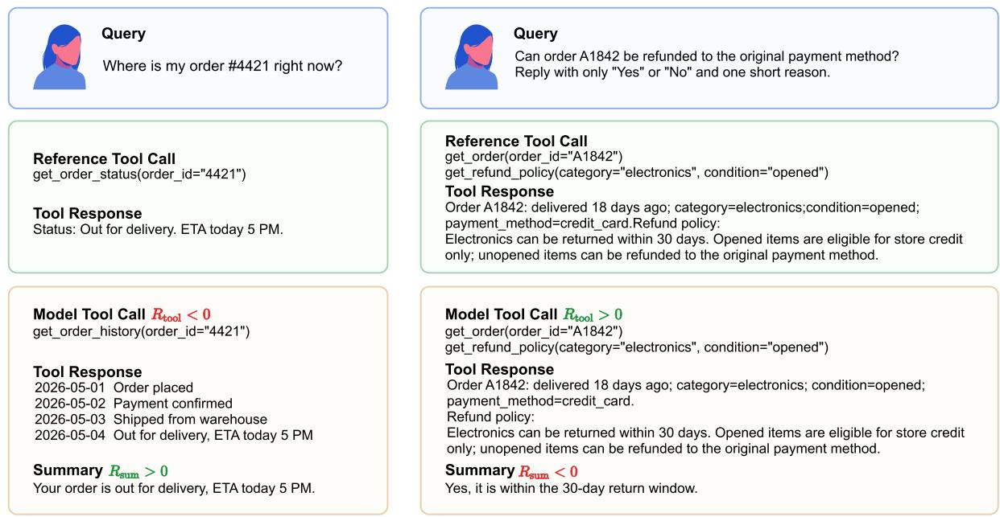  
Diagnostic cases. Unified reward aggregation can misassign credit across tool and summary segments. Left: an unnecessary tool call is <sub>pa</sub>i<sub>re</sub>d <sub>w</sub>ith <sub>a correc</sub>t d<sub>e</sub>li<sub>very summary.</sub> Ri<sub>g</sub>ht<sub>: correc</sub>t t<sub>oo</sub>l <sub>ev</sub>id<sub>ence</sub> i<sub>s pa</sub>i<sub>re</sub>d <sub>w</sub>ith <sub>an</sub> i<sub>ncorrec</sub>t <sub>re</sub>f<sub>un</sub>d <sub>summary.</sub> U<sub>n</sub>d<sub>er s</sub>t<sub>an</sub>d<sub>ar</sub>d GRPO<sub>,</sub> th<sub>e</sub> <sub>m</sub>i<sub>xe</sub>d <sub>a</sub>d<sub>van</sub>t<sub>age can rewar</sub>d b<sub>a</sub>d t<sub>oo</sub>l <sub>use or pena</sub>li<sub>ze goo</sub>d t<sub>oo</sub>l <sub>use.</sub>

To resolve this, we propose SLCA-GRPO (Figure 1). Its core, Segment-Locked Credit Assignment (SLCA), <sub>rou</sub>t<sub>es</sub> t<sub>oo</sub>l<sub>-s</sub>id<sub>e a</sub>d<sub>van</sub>t<sub>ages</sub> $( \hat { A } _ { \mathrm { t o o l } } )$ <sub>exc</sub>l<sub>us</sub>i<sub>ve</sub>l<sub>y</sub> t<sub>o</sub> $y _ { \mathrm { t o o l } }$ t<sub>o</sub>k<sub>ens an</sub>d <sub>summary-s</sub>id<sub>e a</sub>d<sub>van</sub>t<sub>ages</sub> $( \hat { A } _ { \mathrm { s u m } } )$ <sub>exc</sub>l<sub>us</sub>i<sub>ve</sub>l<sub>y</sub> t<sub>o</sub> $y _ { \mathrm { s u m } }$ tokens, blocking the defined summary-to-tool advantage path before the backward pass, at zero additional rollout cost and within a sin<sub>g</sub>le unified <sub>p</sub>olic<sub>y</sub> (§3.3). This routin<sub>g</sub> is a deliberate bias–variance trade-of: SLCA d<sub>oes no</sub>t <sub>c</sub>l<sub>a</sub>i<sub>m</sub> th<sub>a</sub>t t<sub>oo</sub>l <sub>ca</sub>ll<sub>s are causa</sub>ll<sub>y</sub> i<sub>rre</sub>l<sub>evan</sub>t t<sub>o</sub> fi<sub>na</sub>l <sub>answers; ra</sub>th<sub>er,</sub> it <sub>assumes</sub> th<sub>a</sub>t <sub>a</sub> d<sub>ense execu</sub>ti<sub>on</sub> <sub>rewar</sub>d i<sub>s</sub> th<sub>e</sub> l<sub>ower-var</sub>i<sub>ance an</sub>d <sub>su</sub>fi<sub>c</sub>i<sub>en</sub>tl<sub>y</sub> i<sub>n</sub>f<sub>orma</sub>ti<sub>ve s</sub>i<sub>gna</sub>l f<sub>or up</sub>d<sub>a</sub>ti<sub>ng</sub> t<sub>oo</sub>l<sub>-</sub>d<sub>ec</sub>i<sub>s</sub>i<sub>on</sub> t<sub>o</sub>k<sub>ens, w</sub>hil<sub>e summary</sub> rewards train the articulation segment. Crucially, SLCA operates on a structural axis (execution vs. articulation) that is orthogonal to the temporal axis addressed by VinePPO / SPO / GiGPO: it therefore composes with rather th<sub>an rep</sub>l<sub>aces</sub> th<sub>ese me</sub>th<sub>o</sub>d<sub>s, an</sub>d <sub>can</sub> b<sub>e com</sub>bi<sub>ne</sub>d <sub>w</sub>ith t<sub>empora</sub>l <sub>cre</sub>dit<sub>-ass</sub>i<sub>gnmen</sub>t <sub>w</sub>ithi<sub>n eac</sub>h <sub>segmen</sub>t<sub>.</sub> A Schema-Guided LLM Simulator (SGLS, §3.4) and Hierarchical Rewards (HierR, §3.2) su<sub>pp</sub>l<sub>y</sub> the infrastructure th<sub>a</sub>t <sub>ma</sub>k<sub>es</sub> thi<sub>s rou</sub>ti<sub>ng prac</sub>ti<sub>ca</sub>l <sub>a</sub>t <sub>sca</sub>l<sub>e.</sub>

Across three backbones (Qwen2.5-3B/7B-Instruct, Qwen3-8B-Base) and three benchmarks, SLCA-GRPO has hi<sub>g</sub>h<sub>er repor</sub>t<sub>e</sub>d <sub>means</sub> th<sub>an ma</sub>t<sub>c</sub>h<sub>e</sub>d GRPO <sub>on</sub> th<sub>e ma</sub>i<sub>n compar</sub>i<sub>sons.</sub> O<sub>n</sub> th<sub>e</sub> 7B b<sub>ac</sub>kb<sub>one,</sub> th<sub>e ma</sub>t<sub>c</sub>h<sub>e</sub>d <sub>mean</sub> <sub>g</sub>a<sub>p</sub>s are +2.53 <sub>pp</sub> on in-domain Toucan<sub>,</sub> +1.36 <sub>pp</sub> on BFCL<sub>,</sub> and +9.15 <sub>pp</sub> on $\tau ^ { 2 } .$ -Bench. The corres<sub>p</sub>ondin<sub>g</sub> Toucan <sub>g</sub>a<sub>p</sub>s are +2.35 <sub>pp</sub> (3B) and +2.05 <sub>pp</sub> (8B); com<sub>p</sub>lete multi-run results and method-s<sub>p</sub>ecific baseline <sub>p</sub>rotocols are <sub>repor</sub>t<sub>e</sub>d i<sub>n</sub> th<sub>e exper</sub>i<sub>men</sub>t<sub>s an</sub>d <sub>appen</sub>di<sub>x.</sub> O<sub>ur con</sub>t<sub>r</sub>ib<sub>u</sub>ti<sub>ons are</sub> th<sub>ree</sub>f<sub>o</sub>ld<sub>:</sub>

• We identify Cross-Segment Credit Misattribution as a structural failure mode of on-policy RL for tool-calling <sub>agen</sub>t<sub>s, ar</sub>i<sub>s</sub>i<sub>ng</sub> f<sub>rom a</sub>d<sub>van</sub>t<sub>age con</sub>t<sub>am</sub>i<sub>na</sub>ti<sub>on ra</sub>th<sub>er</sub> th<sub>an gra</sub>di<sub>en</sub>t<sub>-</sub>di<sub>rec</sub>ti<sub>on con</sub>fli<sub>c</sub>t<sub>.</sub>

• We propose SLCA-GRPO, an intra-trajectory estimator that separately normalizes and routes segment advantages <sub>w</sub>ith<sub>ou</sub>t <sub>a</sub>dditi<sub>ona</sub>l <sub>ro</sub>ll<sub>ou</sub>t<sub>s, comp</sub>l<sub>emen</sub>t<sub>e</sub>d b<sub>y</sub> th<sub>e</sub> SGLS <sub>s</sub>i<sub>mu</sub>l<sub>a</sub>t<sub>or an</sub>d Hi<sub>er</sub>R <sub>rewar</sub>d<sub>s.</sub>

• We evaluate SLCA-GRPO across three scales and three benchmarks, with ablations (w/o SLCA / SGLS / HierR) <sub>an</sub>d <sub>a rewar</sub>d<sub>-pro</sub>t<sub>oco</sub>l <sub>sens</sub>iti<sub>v</sub>it<sub>y exper</sub>i<sub>men</sub>t<sub>.</sub>

## 2 Related Work

## 2.1 Tool-Calling Post-Training

Tool-calling agents are commonly initialized with SFT on annotated tool-use trajectories (Schick et al., 2023; Qin et al., 2024), often followed b<sub>y p</sub>reference- or verification-driven o<sub>p</sub>timization (Ou<sub>y</sub>an<sub>g</sub> et al., 2022; Christiano et al., 2017; Stiennon et al., 2020; Rafailov et al., 2023). However, SFT can be brittle under rule variants and OOD shifts due to memorization and ex<sub>p</sub>osure bias (Chu et al., 2025; Ben<sub>g</sub>io et al., 2015; Ross et al., 2011; Wei et al., 2025b; Li<sub>g</sub>htman et al., 2024; Guo et al., 2025a). As tool names<sub>p</sub>aces scale, executable benchmarks such as ToolBench, API-Bank, and BFCL make <sub>p</sub>ost-trainin<sub>g</sub> robustness increasin<sub>g</sub>l<sub>y</sub> central (Qin et al., 2024; Li et al., 2023; Patil et al., 2025). We target this post-training setting, where tool trajectories and final summaries form heterogeneous segments but standard end-to-end objectives still broadcast a single advantage to all tokens. S<sub>ca</sub>l<sub>a</sub>bl<sub>e</sub> t<sub>oo</sub>l<sub>-agen</sub>t t<sub>ra</sub>i<sub>n</sub>i<sub>ng a</sub>l<sub>so re</sub>li<sub>es on s</sub>i<sub>mu</sub>l<sub>a</sub>t<sub>e</sub>d <sub>or emu</sub>l<sub>a</sub>t<sub>e</sub>d t<sub>oo</sub>l <sub>env</sub>i<sub>ronmen</sub>t<sub>s, s</sub>i<sub>nce</sub> li<sub>ve</sub> API i<sub>n</sub>t<sub>erac</sub>ti<sub>on can</sub> be costl<sub>y</sub>, unstable, or unavailable at RL scale (Guo et al., 2024; Ruan et al., 2024; Li et al., 2026b). Our SGLS f<sub>o</sub>ll<sub>ows</sub> thi<sub>s</sub> li<sub>ne</sub> b<sub>u</sub>t <sub>uses sc</sub>h<sub>emas as a con</sub>t<sub>ro</sub>l <sub>p</sub>l<sub>ane so</sub> th<sub>a</sub>t th<sub>e s</sub>i<sub>mu</sub>l<sub>a</sub>t<sub>or supp</sub>li<sub>es segmen</sub>t<sub>-spec</sub>ifi<sub>c</sub> f<sub>ee</sub>db<sub>ac</sub>k f<sub>or</sub> <sub>cre</sub>dit<sub>-ass</sub>i<sub>gnmen</sub>t <sub>ana</sub>l<sub>ys</sub>i<sub>s.</sub>

## 2.2 Credit Assignment for Agentic RL

On-policy RL for tool use inherits credit-assignment issues from sparse trajectory-level optimization (Williams, 1992; Schulman et al., 2015, 2017; Guo et al., 2025a). Process su<sub>p</sub>ervision, PRMs, and reward-centric tool RL <sub>p</sub>rovide denser feedback (Li<sub>g</sub>htman et al., 2024; Uesato et al., 2022; Qian et al., 2025; Lin et al., 2025), but d<sub>ense rewar</sub>d<sub>s</sub> d<sub>o no</sub>t b<sub>y</sub> th<sub>emse</sub>l<sub>ves preven</sub>t <sub>aggrega</sub>ti<sub>on</sub> b<sub>e</sub>f<sub>ore a</sub>d<sub>van</sub>t<sub>age es</sub>ti<sub>ma</sub>ti<sub>on.</sub> E<sub>x</sub>i<sub>s</sub>ti<sub>ng cre</sub>dit<sub>-ass</sub>i<sub>gnmen</sub>t methods mainly operate along a temporal axis (Kazemnejad et al., 2025; Feng et al., 2025; Guo et al., 2025b) or use token-level refinements, while ToolPO (Li et al., 2026b) adds local tool rewards and RLTR (Li et al., 2025) separates planner and summarizer into a pipeline. SLCA instead decouples advantage estimation along a structural <sub>ax</sub>i<sub>s w</sub>ithi<sub>n</sub> th<sub>e same samp</sub>l<sub>e</sub>d <sub>ro</sub>ll<sub>ou</sub>t <sub>group:</sub> it <sub>rou</sub>t<sub>es</sub> i<sub>n</sub>d<sub>epen</sub>d<sub>en</sub>tl<sub>y norma</sub>li<sub>ze</sub>d t<sub>oo</sub>l <sub>an</sub>d <sub>summary a</sub>d<sub>van</sub>t<sub>ages</sub> t<sub>o</sub> th<sub>e</sub>i<sub>r correspon</sub>di<sub>ng</sub> t<sub>o</sub>k<sub>en segmen</sub>t<sub>s w</sub>ith<sub>ou</sub>t i<sub>n</sub>t<sub>erme</sub>di<sub>a</sub>t<sub>e-s</sub>t<sub>a</sub>t<sub>e ro</sub>ll<sub>ou</sub>t<sub>s.</sub> Thi<sub>s s</sub>t<sub>ruc</sub>t<sub>ura</sub>l d<sub>ecompos</sub>iti<sub>on</sub> t<sub>arge</sub>t<sub>s a</sub> dif<sub>eren</sub>t <sub>ax</sub>i<sub>s</sub> f<sub>rom</sub> t<sub>empora</sub>l <sub>cre</sub>dit <sub>ass</sub>i<sub>gnmen</sub>t<sub>;</sub> <sub>we</sub> d<sub>o</sub> <sub>no</sub>t <sub>eva</sub>l<sub>ua</sub>t<sub>e</sub> <sub>a</sub> <sub>com</sub>bi<sub>ne</sub>d <sub>me</sub>th<sub>o</sub>d h<sub>ere.</sub>

## 3 Methodology

Core Design SLCA-GRPO turns the diagnosis above into three design requirements: expose structural token seg-<sub>men</sub>t<sub>s,</sub> <sub>o</sub>bt<sub>a</sub>i<sub>n</sub> <sub>segmen</sub>t<sub>-spec</sub>ifi<sub>c</sub> f<sub>ee</sub>db<sub>ac</sub>k<sub>,</sub> <sub>an</sub>d bl<sub>oc</sub>k <sub>cross-segmen</sub>t <sub>a</sub>d<sub>van</sub>t<sub>ages</sub> b<sub>e</sub>f<sub>ore</sub> <sub>op</sub>ti<sub>m</sub>i<sub>za</sub>ti<sub>on.</sub> A<sub>s</sub> <sub>summar</sub>i<sub>ze</sub>d i<sub>n</sub> Fi<sub>gure</sub> 1<sub>,</sub> th<sub>e</sub> f<sub>ramewor</sub>k i<sub>mp</sub>l<sub>emen</sub>t<sub>s</sub> th<sub>ese</sub> <sub>requ</sub>i<sub>remen</sub>t<sub>s</sub> th<sub>roug</sub>h <sub>mas</sub>k<sub>-</sub>b<sub>ase</sub>d <sub>segmen</sub>t<sub>a</sub>ti<sub>on,</sub> Hi<sub>er</sub>R <sub>segmen</sub>t returns, SLCA routing, SGLS rollouts, and a unified PPO-style objective, in contrast to post-hoc gradient-projection methods (Yu et al., 2020); a schematic com<sub>p</sub>arison is <sub>p</sub>rovided in A<sub>pp</sub>. 4.

## 3.1 Problem Formulation & Segment Decomposition

Heterogeneous Rollouts To lock credit to the right semantic target, the structural boundary must first be made <sub>exp</sub>li<sub>c</sub>it<sub>.</sub> Gi<sub>ven</sub> <sub>an</sub> i<sub>ns</sub>t<sub>ruc</sub>ti<sub>on</sub> $x \sim \mathcal { D }$ <sub>,</sub> th<sub>e</sub> <sub>po</sub>li<sub>cy</sub> $\pi _ { \theta }$ generates a trajectory $y = ( y _ { 1 } , \dotsc , y _ { T } )$ th<sub>a</sub>t d<sub>ecomposes as</sub> $y = [ y _ { \mathrm { t o o l } } \oplus y _ { \mathrm { s u m } } ]$ <sub>, w</sub>h<sub>ere</sub> $y _ { \mathrm { t o o l } }$ <sub>compr</sub>i<sub>ses reason</sub>i<sub>ng</sub> t<sub>races an</sub>d <sub>s</sub>t<sub>ruc</sub>t<sub>ure</sub>d t<sub>oo</sub>l <sub>ca</sub>ll<sub>s, an</sub>d $y _ { \mathrm { s u m } }$ i<sub>s</sub> th<sub>e</sub> fi<sub>na</sub>l <sub>user-</sub>f<sub>ac</sub>i<sub>ng</sub> <sup>r</sup>espo<sup>n</sup>se.

Gradient Masking To align optimization with this structure, a binary mask $m _ { i , t } \in \{ 0 , 1 \}$ identifies learnable policy tokens $( m _ { i , t } = 1 )$ versus frozen environment contexts $( m _ { i , t } = 0 )$ <sub>.</sub> Thi<sub>s</sub> <sub>mas</sub>k <sub>res</sub>t<sub>r</sub>i<sub>c</sub>t<sub>s</sub> <sub>gra</sub>di<sub>en</sub>t <sub>propaga</sub>ti<sub>on</sub> t<sub>o</sub> <sub>agen</sub>t <sub>ac</sub>ti<sub>ons an</sub>d <sub>prov</sub>id<sub>es</sub> th<sub>e s</sub>t<sub>ruc</sub>t<sub>ura</sub>l <sub>s</sub>i<sub>gna</sub>l f<sub>or our au</sub>t<sub>oma</sub>ti<sub>c segmen</sub>t d<sub>ecompos</sub>iti<sub>on.</sub>

Automatic Segment Decomposition This mask partitions learnable tokens into disjoint semantic sets without training auxiliary segmenters. For a rollout i, the Summary Segment $\mathcal { T } _ { i , \mathrm { s u m } }$ is thefinal contiguous run of learnable tokens. The Tool Segment $\mathcal { T } _ { i , \mathrm { t o o l } }$ is the union of all preceding learnable runs, capturing the entire reasoning-action <sub>c</sub>h<sub>a</sub>i<sub>n</sub> i<sub>nc</sub>l<sub>u</sub>di<sub>ng any</sub> i<sub>n</sub>t<sub>erme</sub>di<sub>a</sub>t<sub>e</sub> thi<sub>n</sub>ki<sub>ng</sub> bl<sub>oc</sub>k<sub>s</sub> b<sub>e</sub>t<sub>ween</sub> t<sub>oo</sub>l <sub>ca</sub>ll<sub>s.</sub> Thi<sub>s</sub> d<sub>e</sub>t<sub>erm</sub>i<sub>n</sub>i<sub>s</sub>ti<sub>c mapp</sub>i<sub>ng ensures</sub> th<sub>a</sub>t every gradient-bearing token is uniquely assigned to a semantic role, as long as the trajectory culminates in a single final-answer block (see App. A.1 for edge cases). Scope. SLCA targets the structural axis (execution vs. articulation) rather than the temporal axis within the tool segment (e.g., Action 1 vs. Action 2 in a ReAct chain). Th<sub>us,</sub> SLCA i<sub>s no</sub>t <sub>a var</sub>i<sub>an</sub>t <sub>o</sub>f Vi<sub>ne</sub>PPO/GiGPO/SPO<sub>, w</sub>hi<sub>c</sub>h <sub>a</sub>dd<sub>ress</sub> t<sub>empora</sub>l <sub>cre</sub>dit <sub>ass</sub>i<sub>gnmen</sub>t <sub>un</sub>d<sub>er</sub> dif<sub>eren</sub>t <sub>g</sub>rou<sub>p</sub>in<sub>g</sub> assum<sub>p</sub>tions (§2).

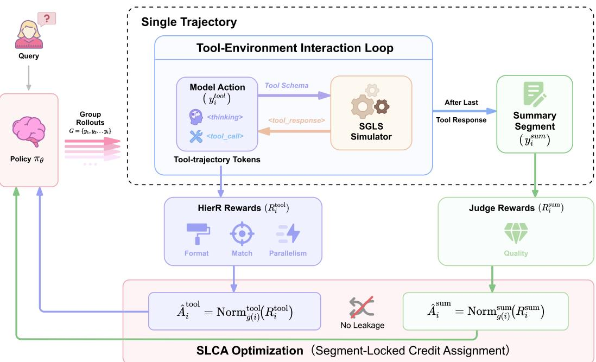  
Figure 1 Overview of the SLCA-GRPO Framework. (To<sub>p</sub>) Infrastructure: SGLS enables scalable ex<sub>p</sub>loration via schema-constrained simulation, <sub>g</sub>eneratin<sub>g</sub> interleaved trajectories. (Middle) Si<sub>g</sub>nal: HierR decou<sub>p</sub>les feedback into dense <sub>execu</sub>ti<sub>on rewar</sub>d<sub>s</sub> $( R ^ { \mathrm { t o o l } } )$ <sub>an</sub>d t<sub>erm</sub>i<sub>na</sub>l <sub>ou</sub>t<sub>come rewar</sub>d<sub>s</sub> $( R ^ { \mathrm { s u m } } )$ . (Bottom) O timization: SLCA decou les se ment-wise <sub>a</sub>d<sub>van</sub>t<sub>a es.</sub> B <sub>norma</sub>li<sub>z</sub>i<sub>n an</sub>d <sub>rou</sub>ti<sub>n a</sub>d<sub>van</sub>t<sub>a es</sub> i<sub>n</sub>d<sub>e en</sub>d<sub>en</sub>tl $( \hat { A } ^ { \mathrm { t o o l } } \ \mathbf { v } \mathbf { s } . \ \bar { A } ^ { \mathrm { s u m } } )$ <sub>,</sub> it bl<sub>oc</sub>k<sub>s</sub> th<sub>e</sub> d<sub>e</sub>fi<sub>ne</sub>d <sub>summary-</sub>t<sub>o-</sub>t<sub>oo</sub>l <sub>suppor</sub>t <sub>pa</sub>th <sub>w</sub>ithi<sub>n eac</sub>h <sub>po</sub>li<sub>cy up</sub>d<sub>a</sub>t<sub>e.</sub>

## 3.2 HierR and Segment Returns

T<sub>o ma</sub>k<sub>e segmen</sub>t<sub>-</sub>l<sub>oc</sub>k<sub>e</sub>d <sub>rou</sub>ti<sub>ng mean</sub>i<sub>ng</sub>f<sub>u</sub>l<sub>,</sub> th<sub>e rewar</sub>d <sub>mus</sub>t <sub>a</sub>l<sub>so separa</sub>t<sub>e execu</sub>ti<sub>on qua</sub>lit<sub>y</sub> f<sub>rom response ar</sub>ti<sub>c-</sub> <sub>u</sub>l<sub>a</sub>ti<sub>on.</sub> W<sub>e</sub> d<sub>ecompose</sub> th<sub>e re</sub>t<sub>urn</sub> i<sub>n</sub>t<sub>o</sub> t<sub>wo seman</sub>ti<sub>ca</sub>ll<sub>y</sub> di<sub>s</sub>ti<sub>nc</sub>t <sub>componen</sub>t<sub>s:</sub> $R ( y ) = R _ { \mathrm { t o o l } } ( y _ { \mathrm { t o o l } } ) + \bar { R } _ { \mathrm { s u m } } ( y _ { \mathrm { s u m } } \vert$ $y _ { \mathrm { t o o l } } , o )$ . HierR instantiates these signals as: (i) Process Reward: A dense, structure-aware score for tool correctness and eficienc<sub>y</sub>. (ii) Summar<sub>y</sub> Preference: A terminal score evaluatin<sub>g</sub> the final answer <sub>q</sub>ualit<sub>y</sub>.

For t<sup>h</sup>e i-t<sup>h</sup> samp<sup>l</sup>ed ro<sup>ll</sup>out $y _ { i } ,$ <sub>,</sub> th<sub>e</sub> <sub>segmen</sub>t <sub>rewar</sub>d<sub>s</sub> <sub>are</sub> <sub>compu</sub>t<sub>e</sub>d b<sub>y</sub> <sub>app</sub>l<sub>y</sub>i<sub>ng</sub> th<sub>ese</sub> f<sub>unc</sub>ti<sub>ons</sub> di<sub>rec</sub>tl<sub>y:</sub>

$$
R _ { i } ^ { \mathrm { { t o o l } } } = S _ { \mathrm { { p r o c e s s } } } ( y _ { i , \mathrm { t o o l } } ) , \quad R _ { i } ^ { \mathrm { { s u m } } } = S _ { \mathrm { { s u m m a r y } } } ( y _ { i , \mathrm { s u m } } \mid y _ { i , \mathrm { t o o l } } , o _ { i } ) .\tag{1}
$$

F<sub>u</sub>ll <sub>rewar</sub>d d<sub>e</sub>fi<sub>n</sub>iti<sub>ons</sub> <sub>an</sub>d <sub>ma</sub>t<sub>c</sub>hi<sub>ng</sub> l<sub>og</sub>i<sub>c</sub> <sub>are</sub> d<sub>e</sub>t<sub>a</sub>il<sub>e</sub>d i<sub>n</sub> A<sub>pp.</sub> A<sub>.</sub>4<sub>.</sub> T<sub>oge</sub>th<sub>er,</sub> SGLS <sub>an</sub>d Hi<sub>er</sub>R b<sub>u</sub>ild <sub>on</sub> <sub>pr</sub>i<sub>or</sub> t<sub>oo</sub>l<sub>-use s</sub>i<sub>mu</sub>l<sub>a</sub>ti<sub>on an</sub>d <sub>process-superv</sub>i<sub>s</sub>i<sub>on wor</sub>k<sub>,</sub> b<sub>u</sub>t <sub>serve a spec</sub>ifi<sub>c ro</sub>l<sub>e</sub> h<sub>ere: prov</sub>idi<sub>ng sca</sub>l<sub>a</sub>bl<sub>e, segmen</sub>t<sub>-spec</sub>ifi<sub>c</sub> f<sub>ee</sub>db<sub>ac</sub>k f<sub>or</sub> t<sub>es</sub>ti<sub>ng s</sub>t<sub>ruc</sub>t<sub>ura</sub>l <sub>cre</sub>dit <sub>rou</sub>ti<sub>ng.</sub>

## 3.3 SLCA-GRPO

Gi<sub>ven segmen</sub>t b<sub>oun</sub>d<sub>ar</sub>i<sub>es an</sub>d <sub>segmen</sub>t <sub>re</sub>t<sub>urns,</sub> SLCA di<sub>rec</sub>tl<sub>y</sub> bl<sub>oc</sub>k<sub>s</sub> th<sub>e con</sub>t<sub>am</sub>i<sub>na</sub>ti<sub>on c</sub>h<sub>anne</sub>l id<sub>en</sub>tifi<sub>e</sub>d i<sub>n</sub> th<sub>e</sub> introduction. Standard GRPO broadcasts a single trajectory-level advantage derived from $R _ { \mathrm { t o t a l } }$ t<sub>o a</sub>ll l<sub>earna</sub>bl<sub>e</sub> t<sub>o</sub>k<sub>ens, coup</sub>li<sub>ng</sub> t<sub>oo</sub>l<sub>-</sub>t<sub>o</sub>k<sub>en gra</sub>di<sub>en</sub>t<sub>s w</sub>ith <sub>summary rewar</sub>d<sub>s.</sub>

Decoupled Advantage Estimation For each rollout $i ,$ th<sub>e</sub> t<sub>wo segmen</sub>t <sub>rewar</sub>d<sub>s</sub> $\left( R _ { i } ^ { \mathrm { t o o l } } , R _ { i } ^ { \mathrm { s u m } } \right)$ from E<sub>q</sub>. 1 are normalized separately within the group:

$$
\hat { A } _ { i } ^ { \mathrm { t o o l } } = \frac { R _ { i } ^ { \mathrm { t o o l } } - \mu _ { g } ^ { \mathrm { t o o l } } } { \sigma _ { g } ^ { \mathrm { t o o l } } + \epsilon _ { \mathrm { n o r m } } } , \quad \hat { A } _ { i } ^ { \mathrm { s u m } } = \frac { R _ { i } ^ { \mathrm { s u m } } - \mu _ { g } ^ { \mathrm { s u m } } } { \sigma _ { g } ^ { \mathrm { s u m } } + \epsilon _ { \mathrm { n o r m } } } ,\tag{2}
$$

<sub>w</sub>h<sub>ere µ an</sub>d $\mu _ { g }$ $\sigma _ { g }$ d<sub>eno</sub>t<sub>e</sub> th<sub>e mean an</sub>d <sub>s</sub>t<sub>an</sub>d<sub>ar</sub>d d<sub>ev</sub>i<sub>a</sub>ti<sub>on w</sub>ithi<sub>n</sub> th<sub>e group, an</sub>d $\epsilon _ { \mathrm { n o r m } }$ i<sub>s a numer</sub>i<sub>ca</sub>l fl<sub>oor.</sub> Th<sub>e</sub> t<sub>o</sub>k<sub>en-</sub>l<sub>eve</sub>l <sub>a</sub>d<sub>van</sub>t<sub>a e</sub> $\hat { A } _ { i , t } ^ { \mathrm { S L C A } }$ i<sub>s</sub> th<sub>en</sub> <sub>cons</sub>t<sub>ruc</sub>t<sub>e</sub>d b<sub>y</sub> <sub>rou</sub>ti<sub>ng</sub> th<sub>ese</sub> <sub>s</sub>i<sub>gna</sub>l<sub>s</sub> <sub>exc</sub>l<sub>us</sub>i<sub>ve</sub>l<sub>y</sub> t<sub>o</sub> th<sub>e</sub>i<sub>r</sub> <sub>seman</sub>ti<sub>c</sub> <sub>coun</sub>t<sub>erpar</sub>t<sub>s:</sub>

$$
\begin{array} { r } { \hat { A } _ { i , t } ^ { \mathrm { S L C A } } = \left\{ \begin{array} { l l } { \lambda _ { \mathrm { t o o l } } \hat { A } _ { i } ^ { \mathrm { t o o l } } , } & { t \in \mathcal { T } _ { i , \mathrm { t o o l } } , } \\ { \lambda _ { \mathrm { s u m } } \hat { A } _ { i } ^ { \mathrm { s u m } } , } & { t \in \mathcal { T } _ { i , \mathrm { s u m } } , } \\ { 0 , } & { m _ { i , t } = 0 , } \end{array} \right. } \end{array}\tag{3}
$$

Thi<sub>s cons</sub>t<sub>ruc</sub>ti<sub>on c</sub>h<sub>anges on</sub>l<sub>y</sub> th<sub>e sca</sub>l<sub>ar a</sub>d<sub>van</sub>t<sub>age a</sub>tt<sub>ac</sub>h<sub>e</sub>d t<sub>o eac</sub>h t<sub>o</sub>k<sub>en;</sub> it d<sub>oes no</sub>t <sub>sp</sub>lit th<sub>e mo</sub>d<sub>e</sub>l <sub>or requ</sub>i<sub>re</sub> <sub>a</sub>dditi<sub>ona</sub>l <sub>ro</sub>ll<sub>ou</sub>t<sub>s.</sub> T<sub>oo</sub>l t<sub>o</sub>k<sub>ens</sub> <sub>are</sub> <sub>up</sub>d<sub>a</sub>t<sub>e</sub>d <sub>on</sub>l<sub>y</sub> b<sub>y</sub> <sub>execu</sub>ti<sub>on</sub> <sub>qua</sub>lit<sub>y,</sub> <sub>w</sub>hil<sub>e</sub> <sub>summary</sub> t<sub>o</sub>k<sub>ens</sub> <sub>are</sub> <sub>up</sub>d<sub>a</sub>t<sub>e</sub>d <sub>on</sub>l<sub>y</sub> b<sub>y</sub> <sub>response qua</sub>lit<sub>y.</sub> Th<sub>us, summary rewar</sub>d<sub>s can s</sub>till t<sub>ra</sub>i<sub>n</sub> fi<sub>na</sub>l<sub>-answer ar</sub>ti<sub>cu</sub>l<sub>a</sub>ti<sub>on,</sub> b<sub>u</sub>t <sub>no</sub> l<sub>onger supp</sub>l<sub>y gra</sub>di<sub>en</sub>t<sub>s</sub> t<sub>o</sub> t<sub>oo</sub>l<sub>-</sub>d<sub>ec</sub>i<sub>s</sub>i<sub>on</sub> t<sub>o</sub>k<sub>ens.</sub>

Robust Optimization Mechanisms For sparse-tool stability, the implementation uses presence filtering, post-<sub>norma</sub>li<sub>za</sub>ti<sub>on</sub> <sub>we</sub>i<sub>g</sub>hti<sub>ng,</sub> <sub>an</sub>d <sub>om</sub>i<sub>ss</sub>i<sub>on-pena</sub>lt<sub>y</sub> <sub>rou</sub>ti<sub>ng;</sub> d<sub>e</sub>t<sub>a</sub>il<sub>s</sub> <sub>are</sub> i<sub>n</sub> A<sub>pp.</sub> A<sub>.</sub>3<sub>.</sub>

Theoretical Properties The key per-update guarantee of SLCA is advantage isolation: the tool-token gradient <sub>componen</sub>t i<sub>s</sub> f<sub>unc</sub>ti<sub>ona</sub>ll<sub>y</sub> i<sub>n</sub>d<sub>epen</sub>d<sub>en</sub>t <sub>o</sub>f th<sub>e summary rewar</sub>d<sub>,</sub>

$$
\frac { \partial g _ { \mathrm { t o o l } } ^ { \mathrm { \tiny ~ S L C A } } } { \partial R ^ { \mathrm { s u m } } } = { \bf 0 } .\tag{4}
$$

B<sub>eyon</sub>d thi<sub>s</sub> i<sub>so</sub>l<sub>a</sub>ti<sub>on</sub> <sub>proper</sub>t<sub>y,</sub> l<sub>oca</sub>l <sub>score-</sub>f<sub>unc</sub>ti<sub>on</sub> <sub>ana</sub>l<sub>ys</sub>i<sub>s</sub> <sub>s</sub>h<sub>ows</sub> th<sub>a</sub>t SLCA <sub>removes</sub> <sub>a</sub> <sub>pos</sub>iti<sub>ve</sub> <sub>summary-no</sub>i<sub>se</sub> <sub>var</sub>i<sub>ance</sub> t<sub>erm</sub> f<sub>rom</sub> t<sub>oo</sub>l <sub>up</sub>d<sub>a</sub>t<sub>es an</sub>d <sub>preserves</sub> th<sub>e</sub> t<sub>oo</sub>l<sub>-execu</sub>ti<sub>on</sub> di<sub>rec</sub>ti<sub>on</sub> i<sub>n s</sub>i<sub>gn-con</sub>fli<sub>c</sub>t <sub>reg</sub>i<sub>mes.</sub> Th<sub>ese are</sub> <sub>con</sub>diti<sub>ona</sub>l<sub>,</sub> <sub>per-up</sub>d<sub>a</sub>t<sub>e</sub> <sub>guaran</sub>t<sub>ees</sub> <sub>ra</sub>th<sub>er</sub> th<sub>an</sub> <sub>c</sub>l<sub>a</sub>i<sub>ms</sub> <sub>o</sub>f <sub>g</sub>l<sub>o</sub>b<sub>a</sub>l bi<sub>as-</sub>f<sub>ree</sub> <sub>op</sub>ti<sub>m</sub>i<sub>za</sub>ti<sub>on;</sub> f<sub>u</sub>ll <sub>assump</sub>ti<sub>ons</sub> <sub>an</sub>d <sub>proo</sub>f<sub>s</sub> are in A<sub>pp</sub>. A.2.

## 3.4 Scalable Exploration via SGLS

T<sub>o</sub> t<sub>es</sub>t <sub>s</sub>t<sub>ruc</sub>t<sub>ura</sub>l <sub>cre</sub>dit <sub>rou</sub>ti<sub>ng a</sub>t <sub>sca</sub>l<sub>e,</sub> SGLS <sub>supp</sub>li<sub>es sc</sub>h<sub>ema-cons</sub>i<sub>s</sub>t<sub>en</sub>t <sub>o</sub>b<sub>serva</sub>ti<sub>ons w</sub>ith<sub>ou</sub>t <sub>re</sub>l<sub>y</sub>i<sub>ng on</sub> li<sub>ve</sub> API<sub>s.</sub> It <sub>com</sub>bi<sub>nes</sub> d<sub>e</sub>t<sub>erm</sub>i<sub>n</sub>i<sub>s</sub>ti<sub>c sc</sub>h<sub>ema va</sub>lid<sub>a</sub>ti<sub>on w</sub>ith f<sub>rozen cross-</sub>f<sub>am</sub>il<sub>y</sub> LLM <sub>moc</sub>ki<sub>ng, so</sub> i<sub>nva</sub>lid <sub>ca</sub>ll<sub>s rece</sub>i<sub>ve</sub> i<sub>mme</sub>di<sub>a</sub>t<sub>e s</sub>t<sub>ruc</sub>t<sub>ure</sub>d f<sub>ee</sub>db<sub>ac</sub>k <sub>an</sub>d <sub>va</sub>lid <sub>ca</sub>ll<sub>s rece</sub>i<sub>ve p</sub>l<sub>aus</sub>ibl<sub>e</sub> t<sub>oo</sub>l <sub>responses;</sub> d<sub>ep</sub>l<sub>oymen</sub>t d<sub>e</sub>t<sub>a</sub>il<sub>s an</sub>d <sub>a</sub>li<sub>gnmen</sub>t <sub>examp</sub>l<sub>es</sub> <sub>are</sub> i<sub>n</sub> A<sub>pp.</sub> C<sub>.</sub>3<sub>.</sub> Th<sub>e</sub> <sub>cross-</sub>f<sub>am</sub>il<sub>y</sub> d<sub>es</sub>i<sub>gn</sub> <sub>m</sub>iti<sub>ga</sub>t<sub>es</sub> i<sub>mp</sub>li<sub>c</sub>it l<sub>ea</sub>k<sub>age</sub> <sub>w</sub>hil<sub>e</sub> <sub>preserv</sub>i<sub>ng</sub> th<sub>e</sub> <sub>seman</sub>ti<sub>c</sub> t<sub>opo</sub>l<sub>ogy</sub> <sub>nee</sub>d<sub>e</sub>d f<sub>or</sub> t<sub>rans</sub>f<sub>er.</sub>

## 3.5 Objective and Training Algorithm

Fi<sub>na</sub>ll<sub>y, a s</sub>i<sub>ng</sub>l<sub>e un</sub>ifi<sub>e</sub>d <sub>po</sub>li<sub>cy</sub> i<sub>s</sub> t<sub>ra</sub>i<sub>ne</sub>d b<sub>y rep</sub>l<sub>ac</sub>i<sub>ng</sub> GRPO’<sub>s un</sub>ifi<sub>e</sub>d <sub>sca</sub>l<sub>ar a</sub>d<sub>van</sub>t<sub>age w</sub>ith th<sub>e rou</sub>t<sub>e</sub>d <sub>segmen</sub>t advanta<sub>g</sub>e. The objective is PPO-cli<sub>p</sub> (Schulman et al., 2017) with se<sub>g</sub>ment-locked advanta<sub>g</sub>es. Let $\rho _ { i , t } ( \theta ) =$ $\frac { \pi _ { \theta } ( y _ { i , t } | h _ { i , t } ) } { \pi _ { \mathrm { o l d } } ( y _ { i , t } | h _ { i , t } ) }$ <sub>;</sub> a <sub>p</sub>er-token KL <sub>p</sub>enalt<sub>y</sub> $\beta \mathbb { D } _ { \mathrm { K L } } ( \pi _ { \theta } \lVert \pi _ { \mathrm { r e f } } )$ i<sub>s en</sub>f<sub>orce</sub>d b<sub>u</sub>t <sub>om</sub>itt<sub>e</sub>d b<sub>e</sub>l<sub>ow</sub> f<sub>or</sub> b<sub>rev</sub>it<sub>y:</sub>

$$
\mathcal { I } ( \theta ) = \mathbb { E } _ { \boldsymbol { x } \sim \mathcal { D } , \{ y _ { i } \} _ { i = 1 } ^ { G } \sim \pi _ { \theta _ { \mathrm { o l d } } } ( \cdot | \boldsymbol { x } ) } \left[ \frac { 1 } { N } \sum _ { i , t } m _ { i , t } \cdot \mathrm { m i n } \left( \rho _ { i , t } \hat { A } _ { i , t } ^ { \mathrm { S L C A } } , \mathrm { c l i p } ( \rho _ { i , t } , 1 - \epsilon _ { \mathrm { c l i p } } , 1 + \epsilon _ { \mathrm { c l i p } } ) \hat { A } _ { i , t } ^ { \mathrm { S L C A } } \right) \right] ,\tag{5}
$$

w<sup>h</sup>ere G is t<sup>h</sup>e ro<sup>ll</sup>out group size and $\begin{array} { r } { N = \sum _ { i , t } m _ { i , t } } \end{array}$ i<sub>s</sub> th<sub>e</sub> t<sub>o</sub>t<sub>a</sub>l <sub>va</sub>lid t<sub>o</sub>k<sub>en coun</sub>t<sub>.</sub> Th<sub>e comp</sub>l<sub>e</sub>t<sub>e</sub> t<sub>ra</sub>i<sub>n</sub>i<sub>ng proce</sub>d<sub>ure</sub> i<sub>s summar</sub>i<sub>ze</sub>d i<sub>n</sub> Al<sub>gor</sub>ith<sub>m</sub> 1<sub>.</sub>

## 4 Experiments

O<sub>ur</sub> <sub>exper</sub>i<sub>men</sub>t<sub>s</sub> <sub>procee</sub>d i<sub>n</sub> th<sub>ree</sub> <sub>par</sub>t<sub>s:</sub> <sub>we</sub> <sub>exam</sub>i<sub>ne</sub> th<sub>e</sub> di<sub>agnose</sub>d f<sub>a</sub>il<sub>ure</sub> <sub>un</sub>d<sub>er</sub> <sub>un</sub>ifi<sub>e</sub>d <sub>or</sub> <sub>a</sub>dditi<sub>ve</sub> <sub>cre</sub>dit <sub>s</sub>i<sub>gna</sub>l<sub>s,</sub> t<sub>es</sub>t t<sub>rans</sub>f<sub>er across sc</sub>h<sub>emas an</sub>d l<sub>ong-</sub>h<sub>or</sub>i<sub>zon</sub> i<sub>n</sub>t<sub>erac</sub>ti<sub>on, an</sub>d <sub>a</sub>bl<sub>a</sub>t<sub>e</sub> SLCA<sub>,</sub> SGLS<sub>, an</sub>d Hi<sub>er</sub>R<sub>.</sub>

## 4.1 Experimental Setup

Datasets and Benchmarks SLCA-GRPO is evaluated across three dimensions: in-domain mastery, crossdistribution generalization, and collaborative robustness. (i) Toucan-1.5M (In-Domain): The Toucan dataset (Xu et al., 2025) is used for both SFT initialization and RL <sub>p</sub>ost-trainin<sub>g</sub>. A multi-sta<sub>g</sub>e filterin<sub>g p</sub>i<sub>p</sub>eline (A<sub>pp</sub>. C.1) <sub>y</sub>ields 42,423 SFT sam<sub>p</sub>les and 31,818 RL trainin<sub>g</sub> sam<sub>p</sub>les (s<sub>p</sub>annin<sub>g</sub> sin<sub>g</sub>le-turn and decom<sub>p</sub>osed multi-turn trajectories). Evaluation uses a held-out Toucan-Test set of 4,000 samples. (ii) BFCL V3 (Generalization): Generalization is evaluated on the Berkeley Function-Calling Leaderboard (Patil et al., 2025). <sup>1</sup> (iii) <sup>2</sup>-Bench (Robustness): Robustness is measured in dynamic dual-control environments (Airline, Retail, Telecom) where a<sub>g</sub>ents must collaborate with users to mani<sub>p</sub>ulate state, re<sub>p</sub>ortin<sub>g</sub> Pass<sup>1</sup> (Barres et al., 2025). Full <sub>p</sub>rotocols are in A<sub>pp</sub>. C.5.

Baselines and Training The methods are implemented on Qwen2.5-7B-Instruct (Qwen Team, 2025a) (default), Qwen2.5-3B-Instruct, and Qwen3-8B-Base (Qwen Team, 2025b) to verify scalability, comparing six paradigms (details in A<sub>pp</sub>. C.2): (i) Ori<sub>g</sub>inal Backbones: The ori<sub>g</sub>inal model wei<sub>g</sub>hts evaluated directl<sub>y</sub> without an<sub>y</sub> ex<sub>p</sub>osure to the Toucan trainin<sub>g</sub> set. (ii) SFT (Toucan): A behavioral clonin<sub>g</sub> baseline fine-tuned on the union of the standard SFT <sub>p</sub>artition (42k) and the raw source trajectories of the RL <sub>p</sub>artition (31k). (iii) SFT+GRPO (Baseline): The standard GRPO al<sub>g</sub>orithm usin<sub>g</sub> the same HierR rewards and SGLS environment as SLCA-GRPO<sub>,</sub> with a unified <sub>a</sub>d<sub>van</sub>t<sub>age compu</sub>t<sub>e</sub>d f<sub>rom</sub> $R _ { \mathrm { t o t a l } } = R _ { \mathrm { t o o l } } + R _ { \mathrm { s u m } }$ (iv) ToolPO (Li et al., 2026b): An additive credit-assi<sub>g</sub>nment b<sub>ase</sub>li<sub>ne eva</sub>l<sub>ua</sub>t<sub>e</sub>d <sub>w</sub>ith it<sub>s g</sub>l<sub>o</sub>b<sub>a</sub>l <sub>ou</sub>t<sub>come an</sub>d l<sub>oca</sub>l t<sub>oo</sub>l <sub>rewar</sub>d<sub>s.</sub> T<sub>oo</sub>l t<sub>o</sub>k<sub>ens rece</sub>i<sub>ve</sub> th<sub>e</sub>i<sub>r sum, w</sub>hil<sub>e summary</sub> t<sub>o</sub>k<sub>ens</sub> i<sub>n</sub>h<sub>er</sub>it th<sub>e</sub> l<sub>o</sub>b<sub>a</sub>l t<sub>erm.</sub> Th<sub>e ou</sub>t<sub>come-rewar</sub>d <sub>ro</sub>t<sub>oco</sub>l <sub>an</sub>d it<sub>s sens</sub>iti<sub>v</sub>it di<sub>a nos</sub>ti<sub>c are</sub> d<sub>ocumen</sub>t<sub>e</sub>d i<sub>n</sub> A<sub>pp</sub>. C.4. (v) RLTR (ada<sub>p</sub>ted) (Li et al., 2025): A <sub>p</sub>lanner-summarizer baseline with a dedicated <sub>p</sub>lanner-onl<sub>y</sub> SFT initialization and a frozen summarizer, followin<sub>g</sub> a two-sta<sub>g</sub>e <sub>p</sub>lannin<sub>g p</sub>i<sub>p</sub>eline. (vi) SFT+SLCA-GRPO (Ours): O<sub>ur ro ose</sub>d f<sub>ramewor</sub>k <sub>em</sub> l<sub>o</sub> i<sub>n</sub> S<sub>e men</sub>t<sub>-</sub>L<sub>oc</sub>k<sub>e</sub>d C<sub>re</sub>dit A<sub>ss</sub>i <sub>nmen</sub>t<sub>.</sub> Th<sub>e con</sub>t<sub>ro</sub>ll<sub>e</sub>d i<sub>so</sub>l<sub>a</sub>ti<sub>on com ar</sub>i<sub>son</sub> i<sub>s</sub> between SFT+GRPO and SFT+SLCA-GRPO: these two rows share the same data <sub>p</sub>artitions<sub>,</sub> SFT initialization<sub>,</sub> SGLS en<sup>d</sup>point, moc<sup>k</sup>er con<sup>fi</sup>guration, <sup>d</sup>eco<sup>d</sup>ing settings, eva<sup>l</sup>uation protoco<sup>l</sup>, ro<sup>ll</sup>out group size G = 16, one RL epoc<sup>h</sup> <sub>an</sub>d Hi<sub>er</sub>R <sub>rewar</sub>d<sub>s,</sub> dif<sub>er</sub>i<sub>ng</sub> i<sub>n un</sub>ifi<sub>e</sub>d <sub>versus segmen</sub>t<sub>-</sub>l<sub>oc</sub>k<sub>e</sub>d <sub>a</sub>d<sub>van</sub>t<sub>age compu</sub>t<sub>a</sub>ti<sub>on.</sub> Th<sub>e ma</sub>t<sub>c</sub>h<sub>e</sub>d <sub>a</sub>bl<sub>a</sub>ti<sub>ons</sub> <sub>use</sub> th<sub>e sa</sub>m<sub>e pe</sub>r-b<sub>ac</sub>kb<sub>o</sub>n<sub>e</sub> r<sub>u</sub>n <sub>se</sub>t<sub>;</sub> w/<sub>o</sub> Hi<sub>e</sub>rR r<sub>e</sub>m<sub>o</sub>v<sub>es</sub> Hi<sub>e</sub>rR<sub>, a</sub>nd w/<sub>o</sub> SGLS r<sub>e</sub>m<sub>o</sub>v<sub>es sc</sub>h<sub>e</sub>m<sub>a co</sub>nditi<sub>o</sub>nin<sub>g a</sub>nd deterministic validation. ToolPO uses the LLM-judge outcome reward in the main tables, while RLTR retains its <sub>me</sub>th<sub>o</sub>d<sub>-spec</sub>ifi<sub>c pro</sub>t<sub>oco</sub>l<sub>;</sub> th<sub>e re</sub>f<sub>erence-ru</sub>l<sub>e</sub> T<sub>oo</sub>lPO <sub>sens</sub>iti<sub>v</sub>it<sub>y</sub> di<sub>agnos</sub>ti<sub>c</sub> i<sub>s repor</sub>t<sub>e</sub>d i<sub>n</sub> A<sub>pp.</sub> C<sub>.</sub>4<sub>.</sub>

## 4.2 Main Results

Toucan-Test The in-domain evaluation first asks whether structural routing improves execution under matched d<sub>a</sub>t<sub>a, s</sub>i<sub>mu</sub>l<sub>a</sub>t<sub>or, an</sub>d <sub>rewar</sub>d <sub>con</sub>diti<sub>ons.</sub> T<sub>a</sub>bl<sub>e</sub> 1 <sub>repor</sub>t<sub>s</sub> th<sub>e ma</sub>t<sub>c</sub>h<sub>e</sub>d GRPO <sub>compar</sub>i<sub>son</sub> t<sub>oge</sub>th<sub>er w</sub>ith th<sub>e me</sub>th<sub>o</sub>d<sub>-</sub> s<sub>p</sub>ecific baseline rows (full results in A<sub>pp</sub>. D). On Qwen2.5-7B-Instruct, SLCA-GRPO has a 79.13% three-run mean for strict Success@0.9, 2.53 <sub>pp</sub> above matched GRPO. The corres<sub>p</sub>ondin<sub>g</sub> mean <sub>g</sub>a<sub>p</sub>s are +2.35 <sub>pp</sub> on Qwen2.5-3B-Instruct and +2.05 pp on Qwen3-8B-Base.

Table 1 Toucan-Test Results. Metrics: Name F1: Multiset F1 score measurin<sub>g p</sub>recision and recall of <sub>p</sub>redicted tool-name <sub>occurrences aga</sub>i<sub>ns</sub>t <sub>go</sub>ld <sub>names;</sub> A<sub>rg</sub>M<sub>a</sub>t<sub>c</sub>h<sub>:</sub> A<sub>r</sub>ith<sub>me</sub>ti<sub>c mean o</sub>f <sub>argumen</sub>t k<sub>ey an</sub>d <sub>va</sub>l<sub>ue ma</sub>t<sub>c</sub>hi<sub>ng scores;</sub> P<sub>rocess:</sub> Th<sub>e</sub> d<sub>ense</sub> t<sub>oo</sub>l<sub>-segmen</sub>t <sub>rewar</sub>d $( S _ { \mathrm { p r o c e s s } } )$ defined in E<sub>q</sub>. 22 (A<sub>pp</sub>. A.4); Success: Strict binar<sub>y</sub> indicator $( \mathbb { I } [ S _ { \mathrm { p r o c e s s } } \geq 0 . 9 ] )$ <sub>o</sub>bt<sub>a</sub>i<sub>ne</sub>d b<sub>y</sub> thresholding the process score. All trained entries report mean±std over three runs; Original rows are point evaluations. The <sub>ma</sub>t<sub>c</sub>h<sub>e</sub>d <sub>rows s</sub>h<sub>are</sub> th<sub>e per-</sub>b<sub>ac</sub>kb<sub>one</sub> SFT i<sub>n</sub>iti<sub>a</sub>li<sub>za</sub>ti<sub>on,</sub> d<sub>a</sub>t<sub>a sp</sub>lit<sub>,</sub> SGLS <sub>en</sub>d<sub>po</sub>i<sub>n</sub>t<sub>, moc</sub>k<sub>er con</sub>fi<sub>gura</sub>ti<sub>on,</sub> d<sub>eco</sub>di<sub>ng se</sub>tti<sub>ngs,</sub> <sub>eva</sub>l<sub>ua</sub>ti<sub>on pro</sub>t<sub>oco</sub>l<sub>,</sub> $G = 1 6 ,$ one RL e<sub>p</sub>och<sub>,</sub> and run set. GRPO<sub>,</sub> SLCA-GRPO<sub>,</sub> w/o SLCA<sub>,</sub> and w/o SGLS also share the HierR d<sub>e</sub>fi<sub>n</sub>iti<sub>on an</sub>d <sub>su</sub>b<sub>we</sub>i<sub>g</sub>ht<sub>s;</sub> ${ \bf w } / { \bf o }$ HierR removes HierR. ToolPO and RLTR retain their method-s<sub>p</sub>ecific <sub>p</sub>rotocols. The ToolPO rows use the LLM-judge outcome reward; App. C.4 reports how this baseline responds to a rule-based outcome reward under th<sub>e same es</sub>ti<sub>ma</sub>t<sub>or.</sub>
<table><tr><td>Method</td><td>Name F1</td><td>ArgMatch</td><td>Process</td><td>Success</td></tr><tr><td colspan="5">Qwen2.5-3B-Instruct</td></tr><tr><td>Original</td><td>0.5207</td><td>0.5073</td><td>0.5174</td><td>0.3816</td></tr><tr><td>SFT</td><td> $\pm . 7 6 8 5 { \scriptstyle \pm . 0 0 6 9 }$ </td><td> $\pm . 7 1 3 2 { \scriptstyle \pm . 0 2 3 9 }$ </td><td> $\pm . 7 4 0 1 { \scriptstyle \pm . 0 0 5 0 }$ </td><td> $\pm . 6 5 0 0 { \scriptstyle \pm . 0 0 8 9 }$ </td></tr><tr><td>SFT+GRPO</td><td> $\pm . 8 9 1 0 { \scriptstyle \pm . 0 0 8 7 }$ </td><td> $\pm . 8 0 7 2 { \scriptstyle \pm . 0 1 5 4 }$ </td><td> $\pm . 8 5 7 7 { \scriptstyle \pm . 0 0 5 7 }$ </td><td> $\pmb { 0 . 7 4 1 2 \pm . 0 1 1 5 }$ </td></tr><tr><td>RLTR</td><td> $\pmb { 0 . 7 5 9 8 \pm . 0 1 4 9 }$ </td><td> $\pm . 6 3 5 3 { \scriptstyle \pm . 0 2 2 9 }$ </td><td> $\pmb { 0 . 6 9 2 4 } \pm . 0 1 6 2$ </td><td> $\pm . 6 6 2 7 { \scriptstyle \pm . 0 1 5 1 }$ </td></tr><tr><td>TooIPO</td><td> $\pm . 8 0 5 0 { \scriptstyle \pm . 0 1 4 2 }$ </td><td> $\pm . 7 7 6 9 { \scriptstyle \pm . 0 1 6 0 }$ </td><td> $\pmb { 0 . 8 3 6 8 \pm . 0 1 4 1 }$ </td><td> $\pmb { 0 . 5 1 2 8 \pm . 0 1 4 5 }$ </td></tr><tr><td>Ours</td><td> $\pmb { 0 . 9 0 0 6 } \pm . 0 0 8 7$ </td><td> $\pm . 8 0 9 2 { \scriptstyle \pm . 0 1 1 2 }$ </td><td> $\pm . 8 6 2 5 { \scriptstyle \pm . 0 0 4 9 }$ </td><td> $\pm . 7 6 4 7 { \scriptstyle \pm . 0 0 9 3 }$ </td></tr><tr><td colspan="5">Qwen2.5-7B-Instruct</td></tr><tr><td>Original</td><td>0.8008</td><td>0.7388</td><td>0.7687</td><td>0.6224</td></tr><tr><td>SFT</td><td>0.8390±.0075</td><td> $\pm . 7 5 3 1 { \scriptstyle \pm . 0 2 2 4 }$ </td><td> $\pm . 8 0 9 4 { \scriptstyle \pm . 0 0 8 2 }$ </td><td> $\pm . 7 2 1 4 { \scriptstyle \pm . 0 0 8 7 }$ </td></tr><tr><td>SFT+GRPO</td><td> $\pm . 8 9 7 1 { \scriptstyle \pm . 0 0 9 3 }$ </td><td> $\pmb { 0 . 8 3 5 0 \pm . 0 1 4 8 }$ </td><td> $\pm . 8 6 6 7 { \scriptstyle \pm . 0 0 6 1 }$ </td><td> $\pm . 7 6 6 0 \pm . 0 1 2 7$ </td></tr><tr><td>RLTR</td><td> $\pmb { 0 . 7 6 7 3 \pm . 0 1 3 2 }$ </td><td> $\pm . 6 3 4 6 { \scriptstyle \pm . 0 2 0 5 }$ </td><td> $\pmb { 0 . 7 0 2 2 \pm . 0 1 4 3 }$ </td><td> $\pmb { 0 . 6 5 4 5 \pm . 0 1 6 8 }$ </td></tr><tr><td>ToolPO</td><td> $\pmb { 0 . 3 0 4 2 \pm . 0 1 6 8 }$ </td><td> $\pmb { 0 . 3 5 5 2 \pm . 0 1 9 2 }$ </td><td> $\pmb { 0 . 3 4 0 8 \pm . 0 1 5 7 }$ </td><td> $\pm . 2 0 0 0 \pm . 0 1 3 6$ </td></tr><tr><td>Ours</td><td> $\pm . 9 1 6 4 { \scriptstyle \pm . 0 0 7 5 }$ </td><td> $\mathbf { 0 . 8 3 5 3 } { \scriptstyle \pm . 0 1 3 2 }$ </td><td> $\pm . 8 7 6 6 { \scriptstyle \pm . 0 0 4 5 }$ </td><td> $\mathbf { 0 . 7 9 1 3 { \scriptstyle \pm . 0 1 0 5 } }$ </td></tr><tr><td colspan="5">Qwen3-8B-Base</td></tr><tr><td>Original</td><td>0.0887</td><td>0.1158</td><td>0.1089</td><td>0.0471</td></tr><tr><td>SFT</td><td> $\pmb { 0 . 8 0 5 8 \pm . 0 0 8 2 }$ </td><td> $\pm . 7 4 3 7 { \scriptstyle \pm . 0 2 6 0 }$ </td><td> $\pm . 7 7 5 4 { \scriptstyle \pm . 0 0 6 0 }$ </td><td> $\pmb { 0 . 6 9 2 5 } \pm . 0 0 9 8$ </td></tr><tr><td>SFT+GRPO</td><td> $\mathbf { 0 . 9 1 1 0 { \scriptstyle \pm . 0 0 9 2 } }$ </td><td> $\pmb { 0 . 8 3 3 4 } \pm . 0 1 \pmb { 5 5 }$ </td><td> $\pm . 8 7 6 7 { \scriptstyle \pm . 0 0 5 0 }$ </td><td> $\pm . 7 6 9 7 { \scriptstyle \pm . 0 1 4 1 }$ </td></tr><tr><td>RLTR</td><td> $\pm . 8 7 8 0 \pm . 0 1 2 5$ </td><td> $\pmb { 0 . 7 4 6 8 \pm . 0 2 1 9 }$ </td><td> $\pm { \boldsymbol { 0 . 7 9 4 1 \pm . 0 1 4 7 } }$ </td><td> $\pmb { 0 . 7 4 5 4 \pm . 0 1 6 7 }$ </td></tr><tr><td>ToolPO</td><td> $\pmb { 0 . 6 8 5 4 \pm . 0 1 6 8 }$ </td><td> $\mathbf { 0 . 8 1 8 0 \div . 0 1 7 7 }$ </td><td> $\pm . 7 5 1 0 { \scriptstyle \pm . 0 1 6 5 }$ </td><td> $\pm . 3 1 9 9 \pm . 0 1 5 6$ </td></tr><tr><td>Ours</td><td> $\mathbf { 0 . 9 1 7 7 { \scriptstyle \pm . 0 0 7 5 } }$ </td><td> $\pm . 8 3 2 0 { \scriptstyle \pm . 0 1 4 0 }$ </td><td> $\pm . 8 7 8 6 { \scriptstyle \pm . 0 0 4 6 }$ </td><td> $\pmb { 0 . 7 9 0 2 \pm . 0 1 0 5 }$ </td></tr></table>

Comparison with Prior Credit-Assignment Baselines The next comparison evaluates prior paradigms that either au<sub>g</sub>ment or se<sub>p</sub>arate the tool-<sub>p</sub>lannin<sub>g</sub> si<sub>g</sub>nal rather than route se<sub>g</sub>ment advanta<sub>g</sub>es. RLTR (<sub>p</sub>i<sub>p</sub>eline se<sub>p</sub>aration) and ToolPO (additive au<sub>g</sub>mentation) <sub>p</sub>rovide com<sub>p</sub>lementar<sub>y</sub> reference <sub>p</sub>oints for the se<sub>g</sub>ment-locked estimator. Their trainin<sub>g</sub> traces show ca<sub>p</sub>acit<sub>y</sub>-de<sub>p</sub>endent format and invocation <sub>p</sub>atterns (A<sub>pp</sub>. D.3); the main-table ToolPO rows use the LLM-judge outcome reward described in App. C.4.

Training Dynamics and Eficiency Training traces reveal whether the final gains arise from stable correction <sub>o</sub>f th<sub>e m</sub>i<sub>sa</sub>tt<sub>r</sub>ib<sub>u</sub>ti<sub>on c</sub>h<sub>anne</sub>l <sub>ra</sub>th<sub>er</sub> th<sub>an</sub> l<sub>a</sub>t<sub>e-s</sub>t<sub>age over</sub>fitti<sub>ng.</sub> Fi<sub>gure</sub> 2 <sub>con</sub>t<sub>ras</sub>t<sub>s</sub> t<sub>ra</sub>i<sub>n</sub>i<sub>ng</sub> b<sub>e</sub>h<sub>av</sub>i<sub>or</sub> f<sub>rom</sub> t<sub>wo</sub> views. In the cross-scale trainin<sub>g</sub> curves (Fi<sub>g</sub>ure 2a), the <sub>p</sub>lotted traces are re<sub>p</sub>resentative sin<sub>g</sub>le runs. SLCA-GRPO <sub>r</sub>i<sub>ses across</sub> th<sub>e</sub> th<sub>ree</sub> b<sub>ac</sub>kb<sub>ones.</sub> Th<sub>e</sub> 7B T<sub>oo</sub>lPO <sub>curve</sub> i<sub>s a separa</sub>t<sub>e</sub> di<sub>agnos</sub>ti<sub>c:</sub> it d<sub>ec</sub>li<sub>nes a</sub>ft<sub>er s</sub>t<sub>ep</sub> 40<sub>, w</sub>ith th<sub>e</sub> structural diver<sub>g</sub>ence a<sub>pp</sub>earin<sub>g</sub> after ste<sub>p</sub> 80 (A<sub>pp</sub>. D.3); RLTR chan<sub>g</sub>es more slowl<sub>y</sub> under its coarse com<sub>p</sub>leteness reward. Across the re resentative traces (3B/7B/8B; Fi ure 2b), SLCA-GRPO ends with fewer avera e tool turns and higher success rates than standard GRPO. The gap in trajectory length is narrow, and the ordering is consistent across the plotted traces. Standard GRPO stabilizes at longer trajectories without a corresponding success gain, compatible with “performative execution”: padding trajectories to exploit summary rewards rather than improving t<sub>oo</sub>l<sub>-ca</sub>ll <sub>prec</sub>i<sub>s</sub>i<sub>on.</sub> Th<sub>ese</sub> d<sub>ynam</sub>i<sub>cs prov</sub>id<sub>e ev</sub>id<sub>ence</sub> f<sub>or</sub> th<sub>e</sub> f<sub>a</sub>il<sub>ure mo</sub>d<sub>e</sub> di<sub>agnose</sub>d i<sub>n</sub> th<sub>e</sub> i<sub>n</sub>t<sub>ro</sub>d<sub>uc</sub>ti<sub>on: a</sub>dditi<sub>ve</sub> <sub>or</sub> <sub>un</sub>ifi<sub>e</sub>d <sub>s</sub>i<sub>gna</sub>l<sub>s</sub> <sub>can</sub> i<sub>mprove</sub> <sub>proxy</sub> <sub>rewar</sub>d<sub>s</sub> <sub>w</sub>hil<sub>e</sub> d<sub>egra</sub>di<sub>ng</sub> <sub>execu</sub>t<sub>a</sub>bl<sub>e</sub> t<sub>oo</sub>l b<sub>e</sub>h<sub>av</sub>i<sub>or.</sub>

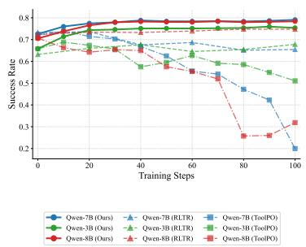  
(a) Training curves across 3B/7B/8B. Re<sub>p</sub>resentative sin<sub>g</sub>le-run traces.

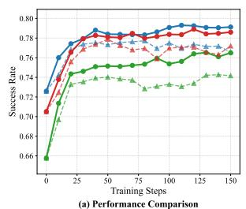

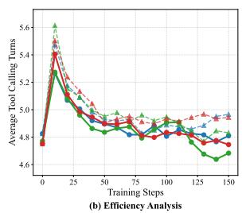  
Qwen-7B (Ours) Qwen-8B (Ours) -A- Qwen-3B (GRPO) Qwen-3B (Ours) Qwen-7B (GRPO) -A- Qwen-8B (GRPO)  
(b) Across 3B/7B/8B: success vs. tool turns. The plotted traces show SLCA-GRPO (solid) endin<sub>g</sub> with shorter trajectories than GRPO (dashed).

Figure 2 Training Dynamics. (a) Baseline comparison across 3B/7B/8B for SLCA / ToolPO / RLTR (the ToolPO diagnostic is described in App. D.3), and (b) cross-scale dynamics of success rate and average tool turns over training steps.  
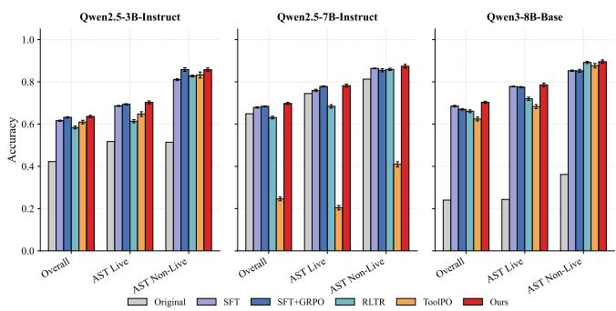  
(a) BFCL V3 (Single-Turn; mean±std). Trained bars show th<sub>ree-run means w</sub>ith <sub>one-s</sub>t<sub>an</sub>d<sub>ar</sub>d<sub>-</sub>d<sub>ev</sub>i<sub>a</sub>ti<sub>on error</sub> b<sub>ars;</sub> O<sub>r</sub>i<sub>g</sub>i<sub>na</sub>l i<sub>s a po</sub>i<sub>n</sub>t <sub>eva</sub>l<sub>ua</sub>ti<sub>on.</sub>

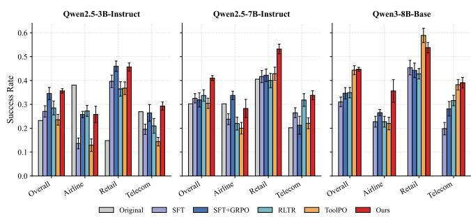  
(b) $\tau ^ { 2 } .$ -Bench (Overall Pass<sup>1</sup>; mean±std). Trained rows are th<sub>ree-run means w</sub>ith <sub>one-s</sub>t<sub>an</sub>d<sub>ar</sub>d<sub>-</sub>d<sub>ev</sub>i<sub>a</sub>ti<sub>on error</sub> b<sub>ars;</sub> O<sub>r</sub>i<sub>g</sub>i<sub>na</sub>l i<sub>s a po</sub>i<sub>n</sub>t <sub>eva</sub>l<sub>ua</sub>ti<sub>on.</sub> Th<sub>e</sub> 8B O<sub>r</sub>i<sub>g</sub>i<sub>na</sub>l <sub>po</sub>i<sub>n</sub>t i<sub>s</sub> <sub>om</sub>itt<sub>e</sub>d b<sub>ecause</sub> it<sub>s</sub> f<sub>our</sub> d<sub>oma</sub>i<sub>n scores are zero.</sub>  
Figure 3 OOD Generalization across Scales. (a) Atomic generalization on BFCL V3 and (b) Collaboration robustness on <sub>τ</sub><sup>2</sup>-Bench for the three backbones (3B, 7B, 8B), comparing SLCA-GRPO against standard GRPO, RLTR, and ToolPO. P<sub>er-</sub>d<sub>oma</sub>i<sub>n</sub> $\tau ^ { 2 } .$ -B<sub>e</sub>n<sub>c</sub>h d<sub>e</sub>t<sub>a</sub>il<sub>s a</sub>r<sub>e</sub> in A<sub>pp.</sub> D<sub>.</sub>6<sub>.</sub>

Generalization on BFCL and $\tau ^ { 2 } { \cdot } \mathbf { B e n c h }$ Th<sub>e</sub> OOD <sub>eva</sub>l<sub>ua</sub>ti<sub>on</sub> th<sub>en</sub> t<sub>es</sub>t<sub>s w</sub>h<sub>e</sub>th<sub>er correc</sub>ti<sub>ng s</sub>t<sub>ruc</sub>t<sub>ura</sub>l <sub>cre</sub>dit <sub>ass</sub>i<sub>gnmen</sub>t t<sub>rans</sub>f<sub>ers</sub> b<sub>eyon</sub>d th<sub>e</sub> i<sub>n-</sub>d<sub>oma</sub>i<sub>n s</sub>i<sub>mu</sub>l<sub>a</sub>t<sub>or se</sub>tti<sub>ng.</sub> Fi<sub>gure</sub> 3 <sub>compares</sub> SLCA<sub>-</sub>GRPO <sub>w</sub>ith <sub>ma</sub>t<sub>c</sub>h<sub>e</sub>d GRPO and the method-s<sub>p</sub>ecific baselines on two OOD benchmarks across scales (<sub>p</sub>rotocols in A<sub>pp</sub>. C.5). On BFCL (Figure 3a), SLCA reaches 70.31±0.50% Overall Accuracy on Qwen3-8B-Base, compared with 66.96±0.32% for matched GRPO and 68.50±0.35% for SFT. The 7B BFCL gap over standard GRPO is +1.36 pp; the corresponding <sub>g</sub>a<sub>p</sub>s are +0.40 <sub>pp</sub> on 3B and +3.35 <sub>pp</sub> on 8B. On $\tau ^ { 2 }$ -Bench, the matched <sub>g</sub>a<sub>p</sub>s are +1.09 <sub>pp</sub> (3B), +9.15 <sub>pp</sub> (7B), and +10.03 <sub>pp</sub> (8B), all based on three-run means. ToolPO outcome-reward details and the LLM-jud<sub>g</sub>e <sub>p</sub>rotocol <sub>use</sub>d i<sub>n</sub> th<sub>e sca</sub>l<sub>e rows are</sub> d<sub>ocumen</sub>t<sub>e</sub>d i<sub>n</sub> A<sub>pp.</sub> C<sub>.</sub>4<sub>.</sub> M<sub>u</sub>lti<sub>-</sub>T<sub>urn</sub> BFCL <sub>resu</sub>lt<sub>s an</sub>d <sub>per-</sub>d<sub>oma</sub>i<sub>n</sub> $\tau ^ { 2 } .$ <sub>-</sub>B<sub>enc</sub>h b<sub>rea</sub>kd<sub>owns</sub> are in A<sub>pp</sub>. D.5 and A<sub>pp</sub>. D.6. Robustness under lar<sub>g</sub>er candidate tool s<sub>p</sub>aces (K u<sub>p</sub> to 150) with hard-ne<sub>g</sub>ative distractors is evaluated in A<sub>pp</sub>. D.11.

## 4.3 Ablation Studies

Fi<sub>na</sub>ll<sub>y,</sub> th<sub>e a</sub>bl<sub>a</sub>ti<sub>ons</sub> t<sub>arge</sub>t th<sub>e me</sub>th<sub>o</sub>d’<sub>s</sub> th<sub>ree</sub> d<sub>es</sub>i<sub>gn requ</sub>i<sub>remen</sub>t<sub>s: rou</sub>ti<sub>ng, sca</sub>l<sub>a</sub>bl<sub>e s</sub>i<sub>mu</sub>l<sub>a</sub>ti<sub>on, an</sub>d d<sub>ense</sub> se<sub>g</sub>ment feedback. Qwen2.5-7B-Instruct is used as the <sub>p</sub>rimar<sub>y</sub> testbed (Table 2), with detailed ablation across scales in A<sub>pp</sub>. D.10.

(i) w/o SLCA (Unified Advantage): Reverting to the standard unified advantage $( R _ { \mathrm { t o o l } } + R _ { \mathrm { s u m } } )$ <sub>c</sub>h<sub>anges</sub> b<sub>o</sub>th normalization and token su<sub>pp</sub>ort<sub>;</sub> it lowers Toucan Success b<sub>y</sub> 2.53 <sub>pp</sub> on 7B under the matched settin<sub>g</sub>. The su<sub>pp</sub>ort-control ex<sub>p</sub>eriment in A<sub>pp</sub>. D.9 se<sub>p</sub>aratel<sub>y</sub> measures the contribution of removin<sub>g</sub> the summar<sub>y</sub>-to-tool support path. (ii) w/o SGLS: Removing deterministic schema validation and schema-conditioned tool-response <sub>p</sub>rom<sub>p</sub>tin<sub>g</sub> lowers the re<sub>p</sub>orted OOD transfer metrics (Table 2); its Multi-Turn efect is re<sub>p</sub>orted in A<sub>pp</sub>. D.5.

Schema-constrained simulation supplies the controlled exploration interface. (iii) w/o HierR: Relying solely <sub>on sparse summary rewar</sub>d<sub>s</sub> l<sub>ea</sub>d<sub>s</sub> t<sub>o s</sub>l<sub>ow convergence an</sub>d <sub>poor argumen</sub>t <sub>a</sub>li<sub>gnmen</sub>t <sub>on comp</sub>l<sub>ex quer</sub>i<sub>es.</sub> Th<sub>e</sub> <sub>ma</sub>t<sub>c</sub>h<sub>e</sub>d “<sub>w</sub>/<sub>o</sub> SLCA” <sub>con</sub>diti<sub>on compares</sub> th<sub>e un</sub>ifi<sub>e</sub>d <sub>an</sub>d <sub>segmen</sub>t<sub>-</sub>l<sub>oc</sub>k<sub>e</sub>d <sub>es</sub>ti<sub>ma</sub>t<sub>ors un</sub>d<sub>er</sub> fi<sub>xe</sub>d <sub>rewar</sub>d d<sub>e</sub>fi<sub>n</sub>iti<sub>ons,</sub> <sub>so</sub> it <sub>measures</sub> th<sub>e com</sub>bi<sub>ne</sub>d <sub>es</sub>ti<sub>ma</sub>t<sub>or c</sub>h<sub>ange ra</sub>th<sub>er</sub> th<sub>an e</sub>ith<sub>er opera</sub>ti<sub>on</sub> i<sub>n</sub> i<sub>so</sub>l<sub>a</sub>ti<sub>on;</sub> th<sub>e un</sub>ifi<sub>e</sub>d <sub>rewar</sub>d <sub>ra</sub>ti<sub>o</sub> <sub>sweep</sub> i<sub>n</sub> A<sub>pp.</sub> D<sub>.</sub>8 <sub>exam</sub>i<sub>nes</sub> thi<sub>s</sub> di<sub>s</sub>ti<sub>nc</sub>ti<sub>on</sub> di<sub>rec</sub>tl<sub>y.</sub> T<sub>oge</sub>th<sub>er,</sub> th<sub>ese</sub> <sub>a</sub>bl<sub>a</sub>ti<sub>ons</sub> t<sub>es</sub>t th<sub>e</sub> th<sub>ree</sub> d<sub>es</sub>i<sub>gn</sub> <sub>requ</sub>i<sub>remen</sub>t<sub>s</sub> i<sub>n</sub> S<sub>ec</sub>ti<sub>on</sub> 3<sub>:</sub> <sub>rou</sub>ti<sub>ng</sub> <sub>a</sub>dd<sub>resses</sub> th<sub>e</sub> <sub>cross-segmen</sub>t <sub>pa</sub>th<sub>,</sub> SGLS <sub>s</sub>t<sub>a</sub>bili<sub>zes</sub> <sub>sc</sub>h<sub>ema-groun</sub>d<sub>e</sub>d <sub>exp</sub>l<sub>ora</sub>ti<sub>on,</sub> <sub>an</sub>d Hi<sub>er</sub>R <sub>supp</sub>li<sub>es</sub> d<sub>ense</sub> <sub>execu</sub>ti<sub>on</sub> f<sub>ee</sub>db<sub>ac</sub>k<sub>.</sub> Th<sub>e</sub> <sub>summary</sub> <sub>a</sub>d<sub>van</sub>t<sub>age</sub> <sub>a</sub>bl<sub>a</sub>ti<sub>on</sub> <sub>an</sub>d th<sub>e</sub> 7B <sub>suppor</sub>t <sub>con</sub>t<sub>ro</sub>l <sub>are</sub> <sub>repor</sub>t<sub>e</sub>d i<sub>n</sub> A<sub>pp</sub>s. D.2 and D.9.

Table 2 Ablation Studies on Qwen2.5-7B-Instruct. Entries re<sub>p</sub>ort mean±std over three inde<sub>p</sub>endent runs. Full results are <sub>prov</sub>id<sub>e</sub>d i<sub>n</sub> A<sub>pp.</sub> D<sub>.</sub>10<sub>.</sub> P<sub>rocess</sub> i<sub>s an eva</sub>l<sub>ua</sub>ti<sub>on me</sub>t<sub>r</sub>i<sub>c compu</sub>t<sub>e</sub>d <sub>pos</sub>t h<sub>oc</sub> f<sub>or a</sub>ll <sub>se</sub>tti<sub>ngs,</sub> i<sub>nc</sub>l<sub>u</sub>di<sub>ng w</sub>/<sub>o</sub> Hi<sub>er</sub>R<sub>.</sub>
<table><tr><td colspan="3">Toucan-Test</td><td>BFCL</td><td> $\tau ^ { 2 } { \mathrm { - } } \mathsf { B e n c h }$ </td></tr><tr><td>Setting</td><td>Process</td><td>Success</td><td>Acc</td><td> $\mathsf { P a s s ^ { 1 } }$ </td></tr><tr><td></td><td></td><td></td><td>SLCA-GRPO 0.8766±.0045 0.7913±.0105 0.6977±.0047</td><td>0.4102±.0101</td></tr><tr><td>w/o SLCA</td><td></td><td>0.8667±.0061 0.7660±.0127 0.6841±.0011</td><td></td><td>10.3187±.0297</td></tr><tr><td>w/o SGLS</td><td> $\mathbf { 0 . 8 7 8 7 } \pm . 0 0 5 1$ </td><td> $\pm . 7 8 0 2 { \scriptstyle \pm . 0 1 1 2 }$ </td><td> $\pmb { 0 . 6 8 7 5 \pm . 0 0 4 8 }$ </td><td> $\pmb { 0 . 3 6 1 9 \pm . 0 1 9 5 }$ </td></tr><tr><td>w/o HierR</td><td> $\pm . 8 5 2 1 { \scriptstyle \pm . 0 0 8 3 }$ </td><td> $\pmb { 0 . 7 3 4 4 } \pm . 0 1 2 1$ </td><td> $\pm . 6 9 0 7 { \scriptstyle \pm . 0 0 4 6 }$ </td><td> $\pmb { 0 . 3 4 5 0 \pm . 0 1 4 4 }$ </td></tr></table>

Reward and response-mocker checks We also test SLCA with a binary $R _ { \mathrm { s u c c } }$ judge without per-example gold-call matchin<sub>g</sub> and with a GPT-OSS-120B res<sub>p</sub>onse mocker<sub>;</sub> the matched results are re<sub>p</sub>orted in A<sub>pp</sub>s. D.12 and C.3.

## 5 Conclusion

W<sub>e</sub> id<sub>en</sub>tifi<sub>e</sub>d Gl<sub>o</sub>b<sub>a</sub>l Si<sub>gna</sub>l C<sub>on</sub>fl<sub>a</sub>ti<sub>on</sub> <sub>as</sub> <sub>a</sub> <sub>s</sub>t<sub>ruc</sub>t<sub>ura</sub>l <sub>pa</sub>th<sub>o</sub>l<sub>ogy</sub> i<sub>n</sub> t<sub>oo</sub>l<sub>-ca</sub>lli<sub>ng</sub> RL <sub>an</sub>d <sub>propose</sub>d SLCA<sub>-</sub>GRPO<sub>,</sub> <sub>w</sub>hi<sub>c</sub>h decou<sub>p</sub>les advanta<sub>g</sub>e estimation at the se<sub>g</sub>ment level. Across three backbones<sub>,</sub> SLCA-GRPO im<sub>p</sub>roves success b<sub>y</sub> +2.53 pp on 7B in-domain Toucan, +1.36 pp on BFCL, and +9.15 pp on $\tau ^ { 2 } .$ <sub>-</sub>B<sub>enc</sub>h<sub>.</sub> Th<sub>e</sub> <sub>correspon</sub>di<sub>ng</sub> <sub>ma</sub>t<sub>c</sub>h<sub>e</sub>d gaps a<sup>r</sup>e $+ 2 . 3 5 / + 0 . 4 0 / + 1 . 0 9$ <sub>pp</sub> on 3B and +2.05/+3.35/+10.03 <sub>pp</sub> on 8B for Toucan<sub>,</sub> BFCL<sub>,</sub> and <sub>τ</sub><sup>2</sup>-Bench<sub>,</sub> res<sub>p</sub>ectivel<sub>y</sub>. The Toucan breakdown shows hi<sub>g</sub>her mean Process and Success for SLCA-GRPO across the re<sub>p</sub>orted b<sub>ac</sub>kb<sub>ones, w</sub>hil<sub>e</sub> hi<sub>g</sub>h<sub>er</sub> S<sub>ummary scores</sub> f<sub>or ma</sub>t<sub>c</sub>h<sub>e</sub>d GRPO <sub>on</sub> 3B <sub>an</sub>d 8B d<sub>o no</sub>t t<sub>rans</sub>l<sub>a</sub>t<sub>e</sub> i<sub>n</sub>t<sub>o</sub> hi<sub>g</sub>h<sub>er</sub> t<sub>as</sub>k S<sub>uccess.</sub> C<sub>on</sub>t<sub>ro</sub>ll<sub>e</sub>d <sub>compar</sub>i<sub>sons an</sub>d <sub>a</sub>bl<sub>a</sub>ti<sub>ons suppor</sub>t th<sub>e ro</sub>l<sub>e o</sub>f <sub>segmen</sub>t<sub>-</sub>l<sub>eve</sub>l <sub>rou</sub>ti<sub>ng, an</sub>d th<sub>e rewar</sub>d<sub>-swap</sub> <sub>c</sub>h<sub>ec</sub>k <sub>s</sub>h<sub>ows</sub> th<sub>a</sub>t th<sub>e</sub> i<sub>mprovemen</sub>t i<sub>s no</sub>t ti<sub>e</sub>d t<sub>o a s</sub>i<sub>ng</sub>l<sub>e rewar</sub>d f<sub>ormu</sub>l<sub>a</sub>ti<sub>on.</sub> SLCA i<sub>s comp</sub>l<sub>emen</sub>t<sub>ary</sub> t<sub>o</sub> t<sub>empora</sub>l <sub>cre</sub>dit<sub>-ass</sub>i<sub>gnmen</sub>t <sub>me</sub>th<sub>o</sub>d<sub>s.</sub>

## 6 Limitations

Segment decomposition. SLCA assumes a clear boundary between tool calls and free-form text. Settings without one, such as inline code generation, would require learned segmentation. Reward and bias. S <sub>rocess</sub> relies on matching to gold trajectories and may under-reward alternative valid tool sequences when multiple API plans solve the same request. The execution-based judge check in App. D.12 provides a complementary reward formulation. Toucan strict Success@0.9 thresholds this score instead of usin<sub>g</sub> an inde<sub>p</sub>endent task outcome label. $\hat { A } ^ { \mathrm { s u m } }$ i<sub>n</sub>h<sub>er</sub>it<sub>s</sub> a <sub>g</sub>rou<sub>p</sub>in<sub>g</sub> bias in summar<sub>y</sub> tokens (A<sub>pp</sub>. A.2); ex<sub>p</sub>licit sub<sub>g</sub>rou<sub>p</sub>in<sub>g</sub> would shrink <sub>g</sub>rou<sub>p</sub> size ex<sub>p</sub>onentiall<sub>y</sub>. Intra-tool temporal credit. SLCA routes one scalar $\hat { \hat { A } } ^ { \mathrm { t o o l } }$ t<sub>o every</sub> t<sub>oo</sub>l t<sub>o</sub>k<sub>en, so</sub> it d<sub>oes no</sub>t di<sub>s</sub>ti<sub>ngu</sub>i<sub>s</sub>h <sub>a correc</sub>t A<sub>c</sub>ti<sub>on</sub> 1 f<sub>rom a</sub> f<sub>a</sub>ili<sub>ng</sub> A<sub>c</sub>ti<sub>on</sub> 2<sub>.</sub> Thi<sub>s</sub> t<sub>empora</sub>l i<sub>ssue</sub> i<sub>s separa</sub>t<sub>e</sub> f<sub>rom cross-segmen</sub>t <sub>cre</sub>dit<sub>.</sub> A <sub>com</sub>bi<sub>na</sub>ti<sub>on w</sub>ith VinePPO/GiGPO/SPO remains untested. Scale and simulation. Experiments use models up to 8B with SGLS. L<sub>arger-sca</sub>l<sub>e</sub> t<sub>ra</sub>i<sub>n</sub>i<sub>ng an</sub>d di<sub>rec</sub>t <sub>rea</sub>l<sub>-</sub>API <sub>compar</sub>i<sub>sons rema</sub>i<sub>n</sub> f<sub>u</sub>t<sub>ure wor</sub>k<sub>.</sub>

## References

Victor Barres, Honghua Dong, Soham Ray, Xujie Si, and Karthik Narasimhan. 2025. $\tau ^ { 2 } .$ <sub>-</sub>B<sub>enc</sub>h<sub>:</sub> E<sub>va</sub>l<sub>ua</sub>ti<sub>ng</sub> <sub>conversa</sub>ti<sub>ona</sub>l <sub>agen</sub>t<sub>s</sub> in a dual-control environment. arXiv preprint arXiv:2506.07982.

Sam<sub>y</sub> Ben<sub>g</sub>io<sub>,</sub> Oriol Vin<sub>y</sub>als<sub>,</sub> Navdee<sub>p</sub> Jaitl<sub>y,</sub> and Noam Shazeer. 2015. Scheduled sam<sub>p</sub>lin<sub>g</sub> for se<sub>q</sub>uence <sub>p</sub>rediction with recurrent neural networks. In Advances in Neural Information Processing Systems, volume 28, pages 1171–1179. Curran Associates<sub>,</sub> Inc.

Paul F Christiano, Jan Leike, Tom Brown, Miljan Martic, Shane Legg, and Dario Amodei. 2017. Deep reinforcement learning from human preferences. In Advances in Neural Information Processing Systems, volume 30, pages 4299–4307. Curran Associates<sub>,</sub> Inc.

Tianzhe Chu, Yuexiang Zhai, Jihan Yang, Shengbang Tong, Saining Xie, Dale Schuurmans, Quoc V Le, Sergey Levine, and Yi Ma. 2025. SFT memorizes, RL generalizes: A comparative study of foundation model post-training. In Proceedings of the 42nd International Conference on Machine Learning, volume 267, pages 10818–10838.

Lang Feng, Zhenghai Xue, Tingcong Liu, and Bo An. 2025. Group-in-group policy optimization for LLM agent training. In The Thirty-ninth Annual Conference on Neural Information Processing Systems, volume 38, pages 51797–51830.

Daya Guo, Dejian Yang, Haowei Zhang, Junxiao Song, Peiyi Wang, Qihao Zhu, et al. 2025a. DeepSeek-R1 incentivizes reasoning in LLMs through reinforcement learning. Nature, 645:633–638.

Yiran Guo, Lijie Xu, Jie Liu, Dan Ye, and Shuang Qiu. 2025b. Segment policy optimization: Efective segment-level credit assignment in RL for large language models. In The Thirty-ninth Annual Conference on Neural Information Processing Systems, volume 38<sub>, p</sub>a<sub>g</sub>es 126866–126898.

Zhicheng Guo, Sijie Cheng, Hao Wang, Shihao Liang, Yujia Qin, Peng Li, Zhiyuan Liu, Maosong Sun, and Yang Liu. 2024. StableToolBench: Towards stable large-scale benchmarking on tool learning of large language models. In Findings of the Association for Computational Linguistics: ACL 2024, pages 11143–11156. Association for Computational Linguistics.

Xin<sub>y</sub>i Hou, Yanjie Zhao, Shenao Wan<sub>g</sub>, and Hao<sub>y</sub>u Wan<sub>g</sub>. 2026. Model Context Protocol (MCP): Landsca<sub>p</sub>e, securit<sub>y</sub> threats, and future research directions. ACM Transactions on Software Engineering and Methodology.

Amirhossein Kazemnejad, Milad Aghajohari, Eva Portelance, Alessandro Sordoni, Siva Reddy, Aaron Courville, and Nicolas Le Roux. 2025. VinePPO: Refining credit assignment in RL training of LLMs. In Proceedings of the 42nd International Conference on Machine Learning, volume 267, pages 29557–29590.

Diederik P. Kingma and Jimmy Ba. 2015. Adam: A method for stochastic optimization. In 3rd International Conference on Learning Representations, ICLR 2015, San Diego, CA, USA, May 7-9, 2015, Conference Track Proceedings.

Dawei Li<sub>,</sub> Renlian<sub>g</sub> Sun<sub>,</sub> Yue Huan<sub>g,</sub> Min<sub>g</sub> Zhon<sub>g,</sub> Bohan Jian<sub>g,</sub> Jiawei Han<sub>,</sub> Xian<sub>g</sub>lian<sub>g</sub> Zhan<sub>g,</sub> Wei Wan<sub>g,</sub> and Huan Liu. 2026a. Preference leakage: A contamination problem in LLM-as-a-judge. In International Conference on Learning Representations.

Minghao Li, Yingxiu Zhao, Bowen Yu, Feifan Song, Hangyu Li, Haiyang Yu, Zhoujun Li, Fei Huang, and Yongbin Li. 2023. API-Bank: A comprehensive benchmark for tool-augmented LLMs. In Proceedings of the 2023 Conference on Empirical Methods in Natural Language Processing, pages 3102–3116. Association for Computational Linguistics.

Xiaoxi Li, Wenxiang Jiao, Jiarui Jin, Guanting Dong, Jiajie Jin, Yinuo Wang, Hao Wang, Yutao Zhu, Ji-Rong Wen, Yuan Lu, and Zhicheng Dou. 2026b. DeepAgent: A general reasoning agent with scalable toolsets. In Proceedings of the ACM Web Conference 2026, pages 2219–2230. Association for Computing Machinery.

Zhiwei Li<sub>,</sub> Yon<sub>g</sub> Hu<sub>,</sub> and Wen<sub>q</sub>in<sub>g</sub> Wan<sub>g</sub>. 2025. Encoura<sub>g</sub>in<sub>g g</sub>ood <sub>p</sub>rocesses without the need for <sub>g</sub>ood answers: Reinforcement learning for LLM agent planning. In Proceedings of the 2025 Conference on Empirical Methods in Natural Language Processing: Industry Track, pages 1654–1666. Association for Computational Linguistics.

Hunter Lightman, Vineet Kosaraju, Yuri Burda, Harrison Edwards, Bowen Baker, Teddy Lee, Jan Leike, John Schulman, Ilya Sutskever, and Karl Cobbe. 2024. Let’s verify step by step. In The Twelfth International Conference on Learning Representations.

Zihan Lin, Xiaohan Wang, Hexiong Yang, Jiajun Chai, Jie Cao, Guojun Yin, Wei Lin, and Ran He. 2025. AWPO: Enhancing tool-use of large language models through adaptive integration of reasoning rewards. arXiv preprint arXiv:2512.19126.

Ilya Loshchilov and Frank Hutter. 2019. Decoupled weight decay regularization. In International Conference on Learning Representations.

Lon<sub>g</sub> Ou<sub>y</sub>an<sub>g,</sub> Jefre<sub>y</sub> Wu<sub>,</sub> Xu Jian<sub>g,</sub> Dio<sub>g</sub>o Almeida<sub>,</sub> Carroll Wainwri<sub>g</sub>ht<sub>,</sub> Pamela Mishkin<sub>,</sub> Chon<sub>g</sub> Zhan<sub>g,</sub> Sandhini A<sub>g</sub>arwal<sub>,</sub> K<sub>a</sub>t<sub>ar</sub>i<sub>na</sub> Sl<sub>ama,</sub> Al<sub>ex</sub> R<sub>ay,</sub> J<sub>o</sub>h<sub>n</sub> S<sub>c</sub>h<sub>u</sub>l<sub>man,</sub> J<sub>aco</sub>b Hilt<sub>on,</sub> F<sub>raser</sub> K<sub>e</sub>lt<sub>on,</sub> L<sub>u</sub>k<sub>e</sub> Mill<sub>er,</sub> M<sub>a</sub>ddi<sub>e</sub> Si<sub>mens,</sub> A<sub>man</sub>d<sub>a</sub> A<sub>s</sub>k<sub>e</sub>ll<sub>,</sub> P<sub>e</sub>t<sub>er</sub> W<sub>e</sub>li<sub>n</sub>d<sub>er,</sub> P<sub>au</sub>l F Ch<sub>r</sub>i<sub>s</sub>ti<sub>ano,</sub> J<sub>an</sub> L<sub>e</sub>ik<sub>e, an</sub>d R<sub>yan</sub> L<sub>owe.</sub> 2022<sub>.</sub> T<sub>ra</sub>i<sub>n</sub>i<sub>ng</sub> l<sub>anguage mo</sub>d<sub>e</sub>l<sub>s</sub> t<sub>o</sub> f<sub>o</sub>ll<sub>ow</sub> i<sub>ns</sub>t<sub>ruc</sub>ti<sub>ons w</sub>ith h<sub>uman</sub> feedback. In Advances in Neural Information Processing Systems, volume 35, pages 27730–27744. Curran Associates, Inc.

Shishir G Patil, Huanzhi Mao, Fanjia Yan, Charlie Cheng-Jie Ji, Vishnu Suresh, Ion Stoica, and Joseph E. Gonzalez. 2025. The Berkeley function calling leaderboard (BFCL): From tool use to agentic evaluation of large language models. In Proceedings of the 42nd International Conference on Machine Learning, volume 267, pages 48371–48392.

Shishir G. Patil, Tianjun Zhang, Xin Wang, and Joseph E. Gonzalez. 2024. Gorilla: Large language model connected with massive APIs. In Advances in Neural Information Processing Systems, volume 37, pages 126544–126565. Curran Associates, Inc.

Cheng Qian, Emre Can Acikgoz, Qi He, Hongru Wang, Xiusi Chen, Dilek Hakkani-Tür, Gokhan Tur, and Heng Ji. 2025. ToolRL: Reward is all tool learning needs. In The Thirty-ninth Annual Conference on Neural Information Processing Systems, volume 38, <sub>p</sub>a<sub>g</sub>es 116896–116926.

Yujia Qin, Shihao Liang, Yining Ye, Kunlun Zhu, Lan Yan, Yaxi Lu, Yankai Lin, Xin Cong, Xiangru Tang, Bill Qian, Sihan Zhao, Lauren Hon<sub>g,</sub> Runchu Tian<sub>,</sub> Ruobin<sub>g</sub> Xie<sub>,</sub> Jie Zhou<sub>,</sub> Mark Gerstein<sub>,</sub> Dahai Li<sub>,</sub> Zhi<sub>y</sub>uan Liu<sub>,</sub> and Maoson<sub>g</sub> Sun. 2024. ToolLLM: Facilitating large language models to master 16000+ real-world APIs. In The Twelfth International Conference on Learning Representations.

Qwen Team. 2025a. Qwen2.5 technical report. arXiv preprint arXiv:2412.15115.

Qwen Team. 2025b. Qwen3 technical report. arXiv preprint arXiv:2505.09388.

R<sub>a</sub>f<sub>ae</sub>l R<sub>a</sub>f<sub>a</sub>il<sub>ov,</sub> A<sub>rc</sub>hit Sh<sub>arma,</sub> E<sub>r</sub>i<sub>c</sub> Mit<sub>c</sub>h<sub>e</sub>ll<sub>,</sub> Ch<sub>r</sub>i<sub>s</sub>t<sub>op</sub>h<sub>er</sub> D M<sub>ann</sub>i<sub>ng,</sub> St<sub>e</sub>f<sub>ano</sub> E<sub>rmon, an</sub>d Ch<sub>e</sub>l<sub>sea</sub> Fi<sub>nn.</sub> 2023<sub>.</sub> Di<sub>rec</sub>t preference optimization: Your language model is secretly a reward model. In Advances in Neural Information Processing Systems, volume 36, pages 53728–53741. Curran Associates, Inc.

St<sub>ep</sub>h<sub>ane</sub> R<sub>oss,</sub> G<sub>eo</sub>f<sub>rey</sub> G<sub>or</sub>d<sub>on,</sub> <sub>an</sub>d D<sub>rew</sub> B<sub>agne</sub>ll<sub>.</sub> 2011<sub>.</sub> A <sub>re</sub>d<sub>uc</sub>ti<sub>on</sub> <sub>o</sub>f i<sub>m</sub>it<sub>a</sub>ti<sub>on</sub> l<sub>earn</sub>i<sub>ng</sub> <sub>an</sub>d <sub>s</sub>t<sub>ruc</sub>t<sub>ure</sub>d <sub>pre</sub>di<sub>c</sub>ti<sub>on</sub> t<sub>o</sub> no-regret online learning. In Proceedings of the Fourteenth International Conference on Artificial Intelligence and Statistics, volume 15<sub>, p</sub>a<sub>g</sub>es 627–635. PMLR.

Yan jun Ruan, Hon hua Don , Andrew Wan , Silviu Pitis, Yon chao Zhou, Jimm Ba, Yann Dubois, Chris Maddison, and Tatsunori Hashimoto. 2024. Identifying the risks of LM agents with an LM-emulated sandbox. In International Conference on Learning Representations, volume 2024, a es 27031–27098.

Ti<sub>mo</sub> S<sub>c</sub>hi<sub>c</sub>k<sub>,</sub> J<sub>ane</sub> D<sub>w</sub>i<sub>ve</sub>di<sub>-</sub>Y<sub>u,</sub> R<sub>o</sub>b<sub>er</sub>t<sub>o</sub> D<sub>ess</sub>i<sub>,</sub> R<sub>o</sub>b<sub>er</sub>t<sub>a</sub> R<sub>a</sub>il<sub>eanu,</sub> M<sub>ar</sub>i<sub>a</sub> L<sub>ome</sub>li<sub>,</sub> E<sub>r</sub>i<sub>c</sub> H<sub>am</sub>b<sub>ro,</sub> L<sub>u</sub>k<sub>e</sub> Z<sub>e</sub>ttl<sub>emoyer,</sub> Ni<sub>co</sub>l<sub>a</sub> Cancedda, and Thomas Scialom. 2023. Toolformer: Language models can teach themselves to use tools. In Advances in Neural Information Processing Systems, volume 36, pages 68539–68551. Curran Associates, Inc.

John Schulman<sub>,</sub> Ser<sub>g</sub>e<sub>y</sub> Levine<sub>,</sub> Pieter Abbeel<sub>,</sub> Michael Jordan<sub>,</sub> and Phili<sub>pp</sub> Moritz. 2015. Trust re<sub>g</sub>ion <sub>p</sub>olic<sub>y</sub> o<sub>p</sub>timization. In Proceedings of the 32nd International Conference on Machine Learning, volume 37, pages 1889–1897. PMLR.

J<sub>o</sub>h<sub>n</sub> S<sub>c</sub>h<sub>u</sub>l<sub>man,</sub> Fili<sub>p</sub> W<sub>o</sub>l<sub>s</sub>ki<sub>,</sub> P<sub>ra</sub>f<sub>u</sub>ll<sub>a</sub> Dh<sub>ar</sub>i<sub>wa</sub>l<sub>,</sub> Al<sub>ec</sub> R<sub>a</sub>df<sub>or</sub>d<sub>,</sub> <sub>an</sub>d Ol<sub>eg</sub> Kli<sub>mov.</sub> 2017<sub>.</sub> P<sub>rox</sub>i<sub>ma</sub>l <sub>po</sub>li<sub>cy</sub> <sub>op</sub>ti<sub>m</sub>i<sub>za</sub>ti<sub>on</sub> <sub>a</sub>l<sub>gor</sub>ith<sub>ms.</sub> In arXiv preprint arXiv:1707.06347.

Nisan Stiennon<sub>,</sub> Lon<sub>g</sub> Ou<sub>y</sub>an<sub>g,</sub> Jefre<sub>y</sub> Wu<sub>,</sub> Daniel Zie<sub>g</sub>ler<sub>,</sub> R<sub>y</sub>an Lowe<sub>,</sub> Chelsea Voss<sub>,</sub> Alec Radford<sub>,</sub> Dario Amodei<sub>,</sub> and Paul F Christiano. 2020. Learning to summarize with human feedback. In Advances in Neural Information Processing Systems, volume 33<sub>, p</sub>a<sub>g</sub>es 3008–3021. Curran Associates<sub>,</sub> Inc.

Jonathan Uesato<sub>,</sub> Nate Kushman<sub>,</sub> Ramana Kumar<sub>,</sub> Francis Son<sub>g,</sub> Noah Sie<sub>g</sub>el<sub>,</sub> Lisa Wan<sub>g,</sub> Antonia Creswell<sub>,</sub> Geofre<sub>y</sub> Irving, and Irina Higgins. 2022. Solving math word problems with process- and outcome-based feedback. arXiv preprint arXiv:2211.14275.

Xiaoxuan Wang, Bo Liu, Song Jiang, Jingzhou Liu, Jingyuan Qi, Xia Chen, and Baosheng He. 2025. From solving to verifying: A unified objective for robust reasoning in LLMs. arXiv preprint arXiv:2511.15137.

Koki Wataoka, Tsubasa Takahashi, and Ryokan Ri. 2025. Self-preference bias in LLM-as-a-judge. arXiv preprint arXiv:2410.21819.

Quan Wei, Siliang Zeng, Chenliang Li, Zhongruo Wang, William Brown, Oana Frunza, Wei Deng, Anderson Schneider, Yuriy Nevm<sub>y</sub>vaka<sub>,</sub> Yan<sub>g</sub> Katie Zhao<sub>,</sub> Alfredo Garcia<sub>,</sub> and Min<sub>gy</sub>i Hon<sub>g</sub>. 2025a. Reinforcin<sub>g</sub> multi-turn reasonin<sub>g</sub> in LLM a<sub>g</sub>ents via fine-grained reward structure and credit assignment. arXiv preprint arXiv:2505.11821.

Zhepei Wei, Wenlin Yao, Yao Liu, Weizhi Zhang, Qin Lu, Liang Qiu, Changlong Yu, Puyang Xu, Chao Zhang, Bing Yin, Hyokun Yun<sub>,</sub> and Lihon<sub>g</sub> Li. 2025b. WebA<sub>g</sub>ent-R1: Trainin<sub>g</sub> web a<sub>g</sub>ents via end-to-end multi-turn reinforcement learnin<sub>g</sub>. In Proceedings of the 2025 Conference on Empirical Methods in Natural Language Processing, pages 7909–7928. Association for C<sub>ompu</sub>t<sub>a</sub>ti<sub>ona</sub>l Li<sub>ngu</sub>i<sub>s</sub>ti<sub>cs.</sub>

Ronald J. Williams. 1992. Simple statistical gradient-following algorithms for connectionist reinforcement learning. Machine Learning, 8(3):229–256.

Zhan<sub>g</sub>chen Xu<sub>,</sub> Adriana Meza Soria<sub>,</sub> Shawn Tan<sub>,</sub> Anura<sub>g</sub> Ro<sub>y,</sub> Ashish Sunil A<sub>g</sub>rawal<sub>,</sub> Radha Poovendran<sub>,</sub> and Rameswar Panda. 2025. TOUCAN: Synthesizing 1.5m tool-agentic data from real-world MCP environments. arXiv preprint arXiv:2510.01179.

Shun<sub>y</sub>u Yao<sub>,</sub> Jefre<sub>y</sub> Zhao<sub>,</sub> Dian Yu<sub>,</sub> Nan Du<sub>,</sub> Izhak Shafran<sub>,</sub> Karthik R Narasimhan<sub>,</sub> and Yuan Cao. 2023. ReAct: S<sub>y</sub>ner<sub>g</sub>izin<sub>g</sub> reasoning and acting in language models. In The Eleventh International Conference on Learning Representations.

Qiying Yu, Zheng Zhang, Ruofei Zhu, Yufeng Yuan, Xiaochen Zuo, Yu Yue, Weinan Dai, Tiantian Fan, Gaohong Liu, Juncai Liu, Lin<sub>g</sub>Jun Liu<sub>,</sub> Xin Liu<sub>,</sub> Haibin Lin<sub>,</sub> Zhi<sub>q</sub>i Lin<sub>,</sub> Bole Ma<sub>,</sub> Guan<sub>g</sub>min<sub>g</sub> Shen<sub>g,</sub> Yuxuan Ton<sub>g,</sub> Chi Zhan<sub>g,</sub> Mofan Zhan<sub>g,</sub> and 17 others. 2025. DAPO: An open-source LLM reinforcement learning system at scale. In The Thirty-ninth Annual Conference on Neural Information Processing Systems, volume 38, pages 125532–125554.

Tianhe Yu<sub>,</sub> Saurabh Kumar<sub>,</sub> Abhishek Gu<sub>p</sub>ta<sub>,</sub> Ser<sub>g</sub>e<sub>y</sub> Levine<sub>,</sub> Karol Hausman<sub>,</sub> and Chelsea Finn. 2020. Gradient sur<sub>g</sub>er<sub>y</sub> for multi-task learning. In Advances in Neural Information Processing Systems, volume 33, pages 5824–5836. Curran Associates, Inc.

## A Additional Formalism and Proofs

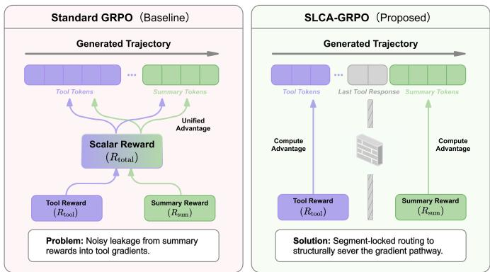  
Figure 4 Mechanism of Cross-Se<sub>g</sub>ment Credit Misattribution and se<sub>g</sub>ment-locked routin<sub>g</sub>. Unified advanta<sub>g</sub>e broadcast leak <sub>summary rewar</sub>d<sub>s</sub> i<sub>n</sub>t<sub>o</sub> t<sub>oo</sub>l t<sub>o</sub>k<sub>ens, w</sub>h<sub>ereas</sub> SLCA bl<sub>oc</sub>k<sub>s</sub> thi<sub>s pa</sub>th b<sub>y rou</sub>ti<sub>ng segmen</sub>t<sub>-w</sub>i<sub>se a</sub>d<sub>van</sub>t<sub>ages on</sub>l<sub>y</sub> t<sub>o</sub> th<sub>e</sub>i<sub>r</sub> <sub>correspon</sub>di<sub>ng</sub> t<sub>o</sub>k<sub>ens.</sub>

## A.1 Mask-Based Segment Decomposition

W<sub>e</sub> d<sub>er</sub>i<sub>ve segmen</sub>t b<sub>oun</sub>d<sub>ar</sub>i<sub>es us</sub>i<sub>ng on</sub>l<sub>y</sub> th<sub>e s</sub>t<sub>an</sub>d<sub>ar</sub>d t<sub>o</sub>k<sub>en-</sub>l<sub>eve</sub>l <sub>mas</sub>k $m _ { i , t } \in \{ 0 , 1 \}$ fr<sub>o</sub>m th<sub>e</sub> a<sub>ge</sub>nt l<sub>oop.</sub> H<sub>e</sub>r<sub>e</sub> $m _ { i , t } = 1$ denotes a <sub>p</sub>olic<sub>y</sub>-<sub>g</sub>enerated (learnable) token and $m _ { i , t } = 0$ denotes an environment-injected token. Let $T _ { i }$ <sup>b</sup>e t<sup>h</sup>e unpadded <sup>l</sup>engt<sup>h</sup> o<sup>f</sup> ro<sup>ll</sup>out i.

Runs of ones Consider the maximal contiguous runs where $m _ { i , t } = 1$ . Let $\{ ( s _ { i , k } , e _ { i , k } ) \} _ { k = 1 } ^ { K _ { i } }$ d<sub>eno</sub>t<sub>e</sub> th<sub>e s</sub>t<sub>ar</sub>t <sub>an</sub>d <sub>en</sub>d indices (left-closed, ri<sub>g</sub>ht-o<sub>p</sub>en) of these runs so that

$$
m _ { i , t } = 1 \Longleftrightarrow t \in \bigcup _ { k = 1 } ^ { K _ { i } } [ s _ { i , k } , e _ { i , k } ) ,\tag{6}
$$

with disjoint intervals ordered by time.

Segment definition We define the Summary segment as the last run of learnable tokens:

$$
{ \mathcal { T } } _ { i , \mathrm { { s u m } } } \triangleq [ s _ { i , K _ { i } } , e _ { i , K _ { i } } ) ,\tag{7}
$$

and the Tool segment as the union of all earlier learnable runs:

$$
\mathcal { T } _ { i , \mathrm { t o o l } } \triangleq \bigcup _ { k = 1 } ^ { K _ { i } - 1 } [ s _ { i , k } , e _ { i , k } ) .\tag{8}
$$

Edge cases If $K _ { i } = 1$ (no environment injection), then $\mathcal { T } _ { i , \mathrm { t o o l } } = \emptyset$ <sub>an</sub>d th<sub>e en</sub>ti<sub>re genera</sub>ti<sub>on</sub> i<sub>s</sub> t<sub>rea</sub>t<sub>e</sub>d <sub>as</sub> S<sub>ummary.</sub> If t<sub>oo</sub>l <sub>usage</sub> i<sub>s</sub> <sub>requ</sub>i<sub>re</sub>d b<sub>u</sub>t th<sub>e</sub> <sub>ro</sub>ll<sub>ou</sub>t <sub>con</sub>t<sub>a</sub>i<sub>ns</sub> <sub>no</sub> <sub>parsea</sub>bl<sub>e</sub> t<sub>oo</sub>l <sub>ca</sub>ll<sub>,</sub> <sub>we</sub> t<sub>r</sub>i<sub>gger</sub> th<sub>e</sub> <sub>om</sub>i<sub>ss</sub>i<sub>on-pena</sub>lt<sub>y</sub> <sub>guar</sub>d (A<sub>pp</sub>endix A.3).

## A.2 Theoretical Analysis: Proofs of Main Properties

This section <sub>p</sub>rovides the <sub>p</sub>roofs and modelin<sub>g</sub> assum<sub>p</sub>tions behind Pro<sub>p</sub>osition A.1 (Per-Ste<sub>p</sub> Advanta<sub>g</sub>e Isolation), Theorem A.3 (Nuisance-Variance Removal), and Corollar<sub>y</sub> A.4 (Directional Fidelit<sub>y</sub>), which are summarized in §3.3. The variance and direction results anal<sub>y</sub>ze a local score-function estimator that isolates the noise channel i<sub>n</sub>d<sub>uce</sub>d b<sub>y un</sub>ifi<sub>e</sub>d <sub>rewar</sub>d b<sub>roa</sub>d<sub>cas</sub>ti<sub>ng; exac</sub>t GRPO <sub>group norma</sub>li<sub>za</sub>ti<sub>on</sub> i<sub>n</sub>t<sub>ro</sub>d<sub>uces cross-samp</sub>l<sub>e</sub> d<sub>epen</sub>d<sub>enc</sub>i<sub>es,</sub> <sub>w</sub>hi<sub>c</sub>h <sub>we</sub> di<sub>scuss exp</sub>li<sub>c</sub>itl<sub>y</sub> b<sub>e</sub>l<sub>ow.</sub>

Setup and Definitions Let a trajectory y be partitioned into a tool segment $y _ { \mathrm { t o o l } }$ a<sup>nd</sup> a su<sup>mm</sup>a<sup>r</sup>y seg<sup>m</sup>e<sup>nt</sup> $y _ { \mathrm { s u m } }$ Th<sub>e</sub> t<sub>o</sub>t<sub>a</sub>l <sub>rewar</sub>d i<sub>s</sub> $R = R ^ { \mathrm { t o o l } } + R ^ { \mathrm { s u m } }$ . Let $\bar { u _ { t } } = \nabla _ { \theta } \log \pi _ { \theta } ( y _ { t } \mid h _ { t } )$ b<sub>e</sub> th<sub>e score</sub> f<sub>unc</sub>ti<sub>on.</sub> F<sub>or</sub> th<sub>e</sub> t<sub>oo</sub>l<sub>-</sub>t<sub>o</sub>k<sub>en</sub> component, the accumulated score for trajectory i is $\begin{array} { r } { U _ { i , \mathrm { t o o l } } = \sum _ { t \in \mathcal { T } _ { i , \mathrm { t o o l } } } u _ { i , t } } \end{array}$ . Let $w _ { i }$ b<sub>e</sub> th<sub>e</sub> i<sub>mpor</sub>t<sub>ance we</sub>i<sub>g</sub>ht $( \boldsymbol { \mathrm { e . g . } }$ len<sub>g</sub>th normalization). Let $\mathcal { F } _ { \mathrm { t o o l } }$ b<sub>e</sub> th<sub>e σ-a</sub>l<sub>ge</sub>b<sub>ra genera</sub>t<sub>e</sub>d b<sub>y</sub> $y _ { \mathrm { t o o l } }$

Proposition A.1 (Per-Step Advantage Isolation). Under SLCA routing (Eq. 3), the tool-token component of the gradient estimator has no functional dependence on $R ^ { \mathrm { s u m } }$ .

Proof. The SLCA-routed tool-token component can be written as

$$
\boldsymbol { g } _ { \mathrm { t o o l } } ^ { \mathrm { S L C A } } = \sum _ { i } w _ { i } \lambda _ { \mathrm { t o o l } } \hat { A } _ { i } ^ { \mathrm { t o o l } } \sum _ { t \in \mathcal { T } _ { i , \mathrm { t o o l } } } u _ { i , t } .\tag{9}
$$

Th<sub>e rou</sub>t<sub>e</sub>d <sub>a</sub>d<sub>van</sub>t<sub>age</sub> $\hat { A } _ { i } ^ { \mathrm { t o o l } }$ i<sub>s compu</sub>t<sub>e</sub>d <sub>on</sub>l<sub>y</sub> f<sub>rom</sub> th<sub>e</sub> t<sub>oo</sub>l <sub>rewar</sub>d<sub>s</sub> $\{ R _ { j } ^ { \mathrm { t o o l } } \}$ <sub>w</sub>ithi<sub>n</sub> th<sub>e</sub> <sub>ro</sub>ll<sub>ou</sub>t <sub>group,</sub> <sub>w</sub>hil<sub>e</sub> <sub>summary</sub> t<sub>o</sub>k<sub>ens are ou</sub>t<sub>s</sub>id<sub>e</sub> th<sub>e summa</sub>ti<sub>on.</sub> Th<sub>e</sub> t<sub>oo</sub>l<sub>-</sub>t<sub>o</sub>k<sub>en gra</sub>di<sub>en</sub>t <sub>componen</sub>t $g _ { \mathrm { t o o l } } ^ { \mathrm { \tiny ~ { S L C A } } }$ h<sub>as no</sub> f<sub>unc</sub>ti<sub>ona</sub>l d<sub>epen</sub>d<sub>ence on</sub> $R ^ { \mathrm { s u m } }$ <sub>, an</sub>d $\partial { g _ { \mathrm { t o o l } } } ^ { \mathrm { S L C A } } / \partial { R } ^ { \mathrm { s u m } } = { \bf 0 }$ <sub>.</sub> Sh<sub>are</sub>d <sub>parame</sub>t<sub>ers may s</sub>till t<sub>rans</sub>f<sub>er</sub> i<sub>n</sub>f<sub>orma</sub>ti<sub>on across</sub> f<sub>u</sub>t<sub>ure</sub> <sub>op</sub>ti<sub>m</sub>i<sub>za</sub>ti<sub>on s</sub>t<sub>eps;</sub> th<sub>e propos</sub>iti<sub>on</sub> i<sub>s a per-up</sub>d<sub>a</sub>t<sub>e s</sub>t<sub>a</sub>t<sub>emen</sub>t <sub>a</sub>b<sub>ou</sub>t th<sub>e rou</sub>t<sub>e</sub>d <sub>gra</sub>di<sub>en</sub>t <sub>es</sub>ti<sub>ma</sub>t<sub>or.</sub> □

Part I: Conditional Nuisance-Variance Removal We model the summary reward $R ^ { \mathrm { s u m } }$ <sub>as con</sub>t<sub>a</sub>i<sub>n</sub>i<sub>ng a s</sub>t<sub>oc</sub>h<sub>as</sub>ti<sub>c</sub> <sub>no</sub>i<sub>se</sub> t<sub>erm</sub> $\xi \left( \mathrm { e } . g \cdotp \right.$ ., <sub>p</sub>hrasin<sub>g</sub> randomness) that is inde<sub>p</sub>endent of the tool execution lo<sub>g</sub>ic.

Assumption A.2 (Nuisance Noise Decomposition). Conditioned on the tool trajectory $y _ { \mathrm { t o o l } }$ <sub>,</sub> th<sub>e summary rewar</sub>d d<sub>ecomposes</sub> i<sub>n</sub>t<sub>o a</sub> d<sub>e</sub>t<sub>erm</sub>i<sub>n</sub>i<sub>s</sub>ti<sub>c expec</sub>t<sub>a</sub>ti<sub>on an</sub>d <sub>a zero-mean no</sub>i<sub>se</sub> t<sub>erm:</sub>

$$
R ^ { \mathrm { s u m } } = \bar { R } ^ { \mathrm { s u m } } ( y _ { \mathrm { t o o l } } ) + \xi , \quad \mathrm { w h e r e ~ } \mathbb { E } [ \xi \mid y _ { \mathrm { t o o l } } ] = 0 , \ : \mathbb { V } [ \xi \mid y _ { \mathrm { t o o l } } ] = \sigma _ { \xi } ^ { 2 } > 0 .\tag{10}
$$

Theorem A.3 (Nuisance-Variance Removal: restated from Theorem A.3). Let $g _ { S T D }$ and $g _ { S L C A }$ be local score-function gradient estimatorsfor tool tokens under unified reward broadcasting and $S L C A ,$ respectively. In this local analysis, SLCA removes the irreducible conditional variance term induced by summary-reward noise:

$$
\mathbb { E } [ \mathbb { V } ( g _ { S T D } \ | \ \mathcal { F } _ { \mathrm { t o o l } } ) ] - \mathbb { E } [ \mathbb { V } ( g _ { S L C A } \ | \ \mathcal { F } _ { \mathrm { t o o l } } ) ] = \mathbb { E } \left[ w _ { i } ^ { 2 } \| U _ { \mathrm { t o o l } } \| ^ { 2 } \cdot \sigma _ { \xi } ^ { 2 } \right] > 0 .\tag{11}
$$

Proof. We analyze the estimators for a single trajectory i after fixing the local normalization scale of the update:

$$
g _ { \mathrm { S T D } } = w _ { i } \big ( R ^ { \mathrm { t o o l } } + \bar { R } ^ { \mathrm { s u m } } + \xi \big ) U _ { \mathrm { t o o l } } ,\tag{12}
$$

$$
g _ { \mathrm { S L C A } } = w _ { i } R ^ { \mathrm { t o o l } } U _ { \mathrm { t o o l } } .\tag{13}
$$

Thi<sub>s</sub> i<sub>s</sub> th<sub>e</sub> l<sub>oca</sub>l <sub>score-</sub>f<sub>unc</sub>ti<sub>on</sub> f<sub>orm o</sub>f th<sub>e</sub> GRPO <sub>up</sub>d<sub>a</sub>t<sub>e a</sub>ft<sub>er suppress</sub>i<sub>ng group mean an</sub>d <sub>s</sub>t<sub>an</sub>d<sub>ar</sub>d<sub>-</sub>d<sub>ev</sub>i<sub>a</sub>ti<sub>on</sub> t<sub>erms.</sub> Exact GRPO uses <sub>g</sub>rou<sub>p</sub>-normalized rewards<sub>,</sub> so $\mu _ { g }$ <sub>an</sub>d $\sigma _ { g }$ <sub>are</sub> f<sub>unc</sub>ti<sub>ons o</sub>f <sub>a</sub>ll <sub>samp</sub>l<sub>es</sub> i<sub>n</sub> th<sub>e group an</sub>d <sub>crea</sub>t<sub>e cross-</sub> <sub>samp</sub>l<sub>e</sub> d<sub>epen</sub>d<sub>enc</sub>i<sub>es.</sub> Thi<sub>s</sub> th<sub>eorem</sub> d<sub>oes no</sub>t <sub>g</sub>i<sub>ve an exac</sub>t <sub>c</sub>l<sub>ose</sub>d f<sub>orm</sub> f<sub>or</sub> th<sub>e</sub> f<sub>u</sub>ll<sub>y norma</sub>li<sub>ze</sub>d GRPO <sub>covar</sub>i<sub>ance;</sub> it i<sub>so</sub>l<sub>a</sub>t<sub>es</sub> th<sub>e summary-no</sub>i<sub>se c</sub>h<sub>anne</sub>l th<sub>a</sub>t <sub>un</sub>ifi<sub>e</sub>d b<sub>roa</sub>d<sub>cas</sub>ti<sub>ng necessar</sub>il<sub>y exposes</sub> t<sub>o</sub> t<sub>oo</sub>l<sub>-</sub>t<sub>o</sub>k<sub>en gra</sub>di<sub>en</sub>t<sub>s an</sub>d SLCA removes. Conditioned on $\mathcal { F } _ { \mathrm { t o o l } }$ <sub>,</sub> th<sub>e</sub> t<sub>erms</sub> $w _ { i } , R ^ { \mathrm { t o o l } } , \bar { R } ^ { \mathrm { s u m } } , U _ { \mathrm { t o o l } }$ <sub>are</sub> d<sub>e</sub>t<sub>erm</sub>i<sub>n</sub>i<sub>s</sub>ti<sub>c.</sub> Th<sub>e on</sub>l<sub>y ran</sub>d<sub>om var</sub>i<sub>a</sub>bl<sub>e</sub> i<sub>s</sub> $\xi .$ F<sub>or vec</sub>t<sub>or-va</sub>l<sub>ue</sub>d <sub>gra</sub>di<sub>en</sub>t<sub>s,</sub> $\mathbb { V } [ \cdot ]$ d<sub>eno</sub>t<sub>es</sub> th<sub>e</sub> t<sub>race covar</sub>i<sub>ance, equ</sub>i<sub>va</sub>l<sub>en</sub>tl<sub>y</sub> th<sub>e expec</sub>t<sub>e</sub>d <sub>square</sub>d $L _ { 2 }$ d<sub>ev</sub>i<sub>a</sub>ti<sub>on</sub> f<sub>rom</sub> th<sub>e con</sub>diti<sub>ona</sub>l <sub>mean.</sub> W<sub>e app</sub>l<sub>y</sub> th<sub>e</sub> L<sub>aw o</sub>f T<sub>o</sub>t<sub>a</sub>l V<sub>ar</sub>i<sub>ance:</sub> $\mathbb { V } [ X ] = \mathbb { E } [ \bar { \mathbb { V } } [ X | \mathcal { F } ] ] ^ { \top } + \mathbb { V } [ \mathbb { E } [ \bar { X _ { \cdot } } ] \mathcal { F } ] ]$

1. Conditional variance of the standard estimator:

• Conditional Variance: $\mathbb { V } [ g _ { S \mathrm { T D } } \mid \mathcal { F } _ { \mathrm { t o o l } } ] = \mathbb { V } [ w _ { i } \xi U _ { \mathrm { t o o l } } \mid \mathcal { F } _ { \mathrm { t o o l } } ] = w _ { i } ^ { 2 } \| U _ { \mathrm { t o o l } } \| ^ { 2 } \sigma _ { \xi } ^ { 2 } .$

• Conditional Expectation: $\mathbb { E } [ g _ { \mathrm { S T D } } \mid \mathcal { F } _ { \mathrm { t o o l } } ] = w _ { i } ( R ^ { \mathrm { t o o l } } + \bar { R } ^ { \mathrm { s u m } } ) U _ { \mathrm { t o o l } }$

Th<sub>us,</sub> b<sub>y</sub> th<sub>e</sub> l<sub>aw</sub> <sub>o</sub>f t<sub>o</sub>t<sub>a</sub>l <sub>var</sub>i<sub>ance,</sub>

$$
\mathbb { V } [ g _ { \mathrm { S T D } } ] = \mathbb { E } [ w _ { i } ^ { 2 } \| U _ { \mathrm { t o o l } } \| ^ { 2 } \sigma _ { \xi } ^ { 2 } ] + \mathbb { V } [ w _ { i } ( R ^ { \mathrm { t o o l } } + \bar { R } ^ { \mathrm { s u m } } ) U _ { \mathrm { t o o l } } ] .\tag{14}
$$

2. Conditional variance of the SLCA estimator:

• Since $g _ { S L C A }$ is $\mathcal { F } _ { \mathrm { t o o l } }$ -measurable (independent $o f \xi )$

$$
\mathbb { V } [ g _ { \mathrm { S L C A } } \mid \mathcal { F } _ { \mathrm { t o o l } } ] = 0 .\tag{15}
$$

3. Comparison: Taking expectations over $\mathcal { F } _ { \mathrm { t o o l } }$ <sub>g</sub>i<sub>ves</sub> th<sub>e s</sub>t<sub>a</sub>t<sub>e</sub>d id<sub>en</sub>tit<sub>y:</sub>

$$
\mathbb { E } [ \mathbb { V } ( g _ { S \mathrm { T D } } \mid \mathcal { F } _ { \mathrm { t o o l } } ) ] - \mathbb { E } [ \mathbb { V } ( g _ { S \mathrm { L C A } } \mid \mathcal { F } _ { \mathrm { t o o l } } ) ] = \mathbb { E } [ w _ { i } ^ { 2 } \| U _ { \mathrm { t o o l } } \| ^ { 2 } \sigma _ { \xi } ^ { 2 } ] .\tag{16}
$$

Si<sub>nce genera</sub>ti<sub>on no</sub>i<sub>se</sub> $\sigma _ { \xi } ^ { 2 } > 0$ <sub>an</sub>d <sub>gra</sub>di<sub>en</sub>t <sub>norm</sub> $\| U _ { \mathrm { t o o l } } \| ^ { 2 } > 0$ <sub>a</sub>l<sub>mos</sub>t <sub>everyw</sub>h<sub>ere,</sub> th<sub>e remove</sub>d <sub>nu</sub>i<sub>sance-var</sub>i<sub>ance</sub> t<sub>erm</sub> i<sub>s s</sub>t<sub>r</sub>i<sub>c</sub>tl<sub>y pos</sub>iti<sub>ve.</sub> Thi<sub>s</sub> th<sub>eorem</sub> i<sub>n</sub>t<sub>en</sub>ti<sub>ona</sub>ll<sub>y ma</sub>k<sub>es a con</sub>diti<sub>ona</sub>l <sub>var</sub>i<sub>ance c</sub>l<sub>a</sub>i<sub>m:</sub> th<sub>e sys</sub>t<sub>ema</sub>ti<sub>c</sub> t<sub>erm</sub> $\mathbb { V } [ w _ { i } ( R ^ { \mathrm { t o o l } } + \dot { \bar { R } } ^ { \mathrm { s u m } } ) U _ { \mathrm { t o o l } } ]$ <sub>may</sub> dif<sub>er</sub> f<sub>rom</sub> $\mathbb { V } [ w _ { i } R ^ { \mathrm { { t o o l } } } { \dot { U } } _ { \mathrm { t o o l } } ]$ d<sub>epen</sub>di<sub>ng on</sub> t<sub>as</sub>k <sub>s</sub>t<sub>ruc</sub>t<sub>ure an</sub>d <sub>covar</sub>i<sub>ance, w</sub>hi<sub>c</sub>h i<sub>s</sub> <sub>w</sub>h<sub>y we</sub> f<sub>rame</sub> SLCA <sub>as a</sub> bi<sub>as–var</sub>i<sub>ance</sub> t<sub>ra</sub>d<sub>e-o</sub>f <sub>ra</sub>th<sub>er</sub> th<sub>an an uncon</sub>diti<sub>ona</sub>l <sub>var</sub>i<sub>ance</sub> d<sub>om</sub>i<sub>nance s</sub>t<sub>a</sub>t<sub>emen</sub>t<sub>.</sub>

Optimization implication For SGD on non-convex L-smooth functions standard conver ence bounds scale <sub>w</sub>ith th<sub>e gra</sub>di<sub>en</sub>t<sub>-var</sub>i<sub>ance</sub> t<sub>erm</sub> $( \mathrm { e } . g . , O ( \sigma ^ { 2 } / \epsilon ^ { 4 } )$ to reach an <sub>ϵ</sub>-stationar<sub>y p</sub>oint). Theorem A.3 shows that SLCA <sub>removes</sub> <sub>a</sub> <sub>pos</sub>iti<sub>ve</sub> <sub>con</sub>diti<sub>ona</sub>l <sub>var</sub>i<sub>ance</sub> <sub>componen</sub>t f<sub>rom</sub> t<sub>oo</sub>l<sub>-</sub>t<sub>o</sub>k<sub>en</sub> <sub>gra</sub>di<sub>en</sub>t<sub>s;</sub> <sub>w</sub>h<sub>en</sub> thi<sub>s</sub> <sub>nu</sub>i<sub>sance</sub> <sub>componen</sub>t d<sub>om</sub>i<sub>na</sub>t<sub>es</sub> <sub>sys</sub>t<sub>ema</sub>ti<sub>c</sub> <sub>covar</sub>i<sub>ance</sub> <sub>c</sub>h<sub>anges,</sub> th<sub>e</sub> <sub>resu</sub>lti<sub>ng</sub> <sub>smoo</sub>th<sub>er</sub> <sub>gra</sub>di<sub>en</sub>t<sub>s</sub> <sub>s</sub>h<sub>ou</sub>ld t<sub>rans</sub>l<sub>a</sub>t<sub>e</sub> i<sub>n</sub>t<sub>o</sub> f<sub>as</sub>t<sub>er</sub> <sub>an</sub>d <sub>more</sub> <sub>s</sub>t<sub>a</sub>bl<sub>e op</sub>ti<sub>m</sub>i<sub>za</sub>ti<sub>on.</sub>

Part II: Resolution of Advantage Confusion (Directional Fidelity) We define a Conflict Regime where the tool <sub>segmen</sub>t <sub>rece</sub>i<sub>ves a</sub> b<sub>e</sub>l<sub>ow-group-mean norma</sub>li<sub>ze</sub>d <sub>a</sub>d<sub>van</sub>t<sub>age</sub> $( \hat { A } ^ { \mathrm { t o o l } } < 0 )$ b<sub>u</sub>t th<sub>e summary segmen</sub>t <sub>rece</sub>i<sub>ves an</sub> <sub>a</sub>b<sub>ove-group-mean</sub> <sub>norma</sub>li<sub>ze</sub>d <sub>a</sub>d<sub>van</sub>t<sub>age</sub> $( \hat { A } ^ { \mathrm { s u m } } > 0 )$ .

Theorem A.4 (Directional Fidelity: restated from Corollary $\mathrm { A } . 4 )$ . Let $\mathbf { d } ^ { * } = - \nabla$ log $\pi ( \boldsymbol { y } _ { \mathrm { t o o l } } )$ be the ideal descent direction to penalize toolfailure. Let normalized scores be $\hat { A } ^ { \mathrm { t o o l } } \dot { = } - \alpha ( \alpha > 0 ,$ , penalty) and $\hat { A } ^ { \mathrm { s u m } } = \beta ( \beta > 0 ,$ , reward). Let $\sigma _ { \mathrm { t o o l } }$ and $\sigma _ { \mathrm { s u m } }$ denote the group standard deviations of the raw segment rewards. The expectations below are taken over the stated rollout randomness, with the trajectory partition, group standard deviations, and $\alpha , \beta$ heldfixed.

• SLCA Update: $\mathbb { E } [ g _ { S L C A } ] \propto - \alpha \nabla$ log <sub>π</sub>. Inner product with d<sup>∗</sup>: $\alpha \| \nabla \| ^ { 2 } > 0 .$ . (Correct Direction)

• Standard GRPO Update: The trajectory-level raw deviation is proportional $t o \left. - \alpha \sigma _ { \mathrm { t o o l } } + \beta \sigma _ { \mathrm { s u m } } , s o \mathbb { E } [ g _ { S T D } ] \propto \right.$ $( \beta \sigma _ { \mathrm { s u m } } - \alpha \sigma _ { \mathrm { t o o l } } ) \nabla$ log <sub>π</sub>. Inner product with $\mathbf { d } ^ { * }$ is $( \alpha \sigma _ { \mathrm { t o o l } } - \beta \sigma _ { \mathrm { s u m } } ) \| \nabla \| ^ { 2 }$

$I f \beta \sigma _ { \mathrm { s u m } } > \alpha \sigma _ { \mathrm { t o o l } }$ (the raw summary deviation dominates the raw tool $p e n a l t y ) _ { \it \cdot }$ , Standard GRPO updates in the wrong direction $( < 0 )$ , reinforcing the failure. The simpler condition $\beta > \alpha$ is recovered when the two raw reward components have equal group standard deviations. SLCA maintains fidelity with respect to the tool-execution signal.

A <sub>concre</sub>t<sub>e</sub> i<sub>ns</sub>t<sub>an</sub>ti<sub>a</sub>ti<sub>on o</sub>f th<sub>e con</sub>fli<sub>c</sub>t <sub>reg</sub>i<sub>me</sub> i<sub>n</sub> Th<sub>eorem</sub> $\mathrm { A . 4 }$ i<sub>s v</sub>i<sub>sua</sub>li<sub>ze</sub>d i<sub>n</sub> A<sub>ppen</sub>di<sub>x</sub> D<sub>.</sub>4<sub>: un</sub>d<sub>er an</sub> i<sub>mper</sub>f<sub>ec</sub>t tool trajectory $( R ^ { \mathrm { t o o l } } { = } 0 . 6 5$ , below the <sub>g</sub>rou<sub>p</sub> mean) <sub>p</sub>aired with a <sub>p</sub>erfect summar<sub>y</sub> $( R ^ { \mathrm { s u m } } { = } 1 . 0$ , a<sup>b</sup>ove t<sup>h</sup>e <sub>g</sub>rou<sub>p</sub> mean), standard GRPO reinforces the ineficient <sub>p</sub>olic<sub>y</sub>, whereas SLCA routes the tool-level <sub>p</sub>enalt<sub>y</sub> into $\hat { A } ^ { \mathrm { t o o l } }$ <sub>a</sub>l<sub>one</sub> <sub>an</sub>d <sub>recovers</sub> th<sub>e correc</sub>t <sub>s</sub>i<sub>ng</sub>l<sub>e para</sub>ll<sub>e</sub>l i<sub>nvoca</sub>ti<sub>on.</sub>

Bias–Variance Trade-of of the $\hat { A } ^ { \mathrm { s u m } }$ Estimator Within a rollout group, trajectories may diverge after the tool <sub>segmen</sub>t <sub>an</sub>d <sub>pro</sub>d<sub>uce</sub> di<sub>s</sub>ti<sub>nc</sub>t <sub>pos</sub>t<sub>-</sub>t<sub>oo</sub>l <sub>s</sub>t<sub>a</sub>t<sub>es.</sub> SLCA <sub>s</sub>till <sub>norma</sub>li<sub>zes</sub> $R ^ { \mathrm { s u m } }$ <sub>across</sub> th<sub>e group ra</sub>th<sub>er</sub> th<sub>an w</sub>ithi<sub>n</sub> <sub>su</sub>b<sub>groups</sub> th<sub>a</sub>t <sub>s</sub>h<sub>are an</sub> id<sub>en</sub>ti<sub>ca</sub>l <sub>pos</sub>t<sub>-</sub>t<sub>oo</sub>l <sub>s</sub>t<sub>a</sub>t<sub>e, so</sub> $\hat { A } ^ { \mathrm { s u m } }$ i<sub>s no</sub>t <sub>a s</sub>t<sub>a</sub>t<sub>e-con</sub>diti<sub>ona</sub>l <sub>va</sub>l<sub>ue es</sub>ti<sub>ma</sub>t<sub>e an</sub>d <sub>can con</sub>fl<sub>a</sub>t<sub>e</sub> <sub>summary qua</sub>lit<sub>y w</sub>ith <sub>pos</sub>t<sub>-</sub>t<sub>oo</sub>l <sub>s</sub>t<sub>a</sub>t<sub>e var</sub>i<sub>a</sub>ti<sub>on.</sub>

Thi<sub>s cross-s</sub>t<sub>a</sub>t<sub>e norma</sub>li<sub>za</sub>ti<sub>on</sub> i<sub>s no</sub>t <sub>un</sub>i<sub>que</sub> t<sub>o</sub> SLCA<sub>: s</sub>t<sub>an</sub>d<sub>ar</sub>d GRPO <sub>norma</sub>li<sub>zes</sub> $R _ { \mathrm { t o t a l } }$ ac<sup>r</sup>oss <sup>th</sup>e sa<sup>m</sup>e g<sup>r</sup>oup, and methods such as MT-GRPO (Wei et al., 2025a) and GRPO-Verif (Wan<sub>g</sub> et al., 2025) also do not com<sub>p</sub>ute exact state-conditional advantages without a learned value function or tree-based rollouts. SLCA narrows the scope of thi<sub>s</sub> bi<sub>as:</sub>

• U<sub>n</sub>d<sub>er</sub> <sub>s</sub>t<sub>an</sub>d<sub>ar</sub>d GRPO<sub>,</sub> b<sub>o</sub>th t<sub>oo</sub>l <sub>an</sub>d <sub>summary</sub> t<sub>o</sub>k<sub>ens</sub> <sub>rece</sub>i<sub>ve</sub> $A _ { \mathrm { t o t a l . } }$ <sub>,</sub> th<sub>e</sub> <sub>z-score</sub> <sub>o</sub>f $( R ^ { \mathrm { t o o l } } + R ^ { \mathrm { s u m } } )$ <sub>, w</sub>hi<sub>c</sub>h i<sub>nc</sub>l<sub>u</sub>d<sub>es cross-s</sub>t<sub>a</sub>t<sub>e var</sub>i<sub>a</sub>ti<sub>on</sub> i<sub>n</sub> $R ^ { \mathrm { s u m } }$

• Under ${ \mathrm { S L C A } } ,$ t<sub>oo</sub>l t<sub>o</sub>k<sub>ens rece</sub>i<sub>ve</sub> $\hat { A } ^ { \mathrm { t o o l } }$ <sub>,</sub> th<sub>e z-score o</sub>f $R ^ { \mathrm { t o o l } }$ <sub>a</sub>l<sub>one, compu</sub>t<sub>e</sub>d <sub>across ro</sub>ll<sub>ou</sub>t<sub>s</sub> f<sub>rom</sub> th<sub>e same</sub> initial state (shared <sub>p</sub>rom<sub>p</sub>t x), without cross-state summar<sub>y</sub> bias. Onl<sub>y</sub> summar<sub>y</sub> tokens receive the biased $\hat { A } ^ { \mathrm { s u m } }$

W<sub>e</sub> f<sub>rame</sub> thi<sub>s as a</sub> bi<sub>as–var</sub>i<sub>ance</sub> t<sub>ra</sub>d<sub>e-o</sub>f<sub>.</sub> Th<sub>e un</sub>ifi<sub>e</sub>d <sub>es</sub>ti<sub>ma</sub>t<sub>or avo</sub>id<sub>s group</sub>i<sub>ng</sub> bi<sub>as</sub> b<sub>u</sub>t <sub>exposes</sub> t<sub>oo</sub>l<sub>-</sub>t<sub>o</sub>k<sub>en</sub> <sub>g</sub>radients to conditional nuisance variance from the summar<sub>y</sub>-reward channel (Theorem A.3). SLCA acce<sub>p</sub>ts <sub>summary-s</sub>id<sub>e group</sub>i<sub>ng</sub> bi<sub>as</sub> b<sub>u</sub>t <sub>con</sub>fi<sub>nes</sub> it t<sub>o summary</sub> t<sub>o</sub>k<sub>ens an</sub>d <sub>removes</sub> th<sub>a</sub>t di<sub>rec</sub>t <sub>var</sub>i<sub>ance c</sub>h<sub>anne</sub>l<sub>.</sub> Th<sub>e</sub> <sub>suppor</sub>t<sub>-con</sub>t<sub>ro</sub>l <sub>exper</sub>i<sub>men</sub>t i<sub>n</sub> T<sub>a</sub>bl<sub>e</sub> 21 <sub>prov</sub>id<sub>es a c</sub>l<sub>eaner</sub> d<sub>ecompos</sub>iti<sub>on: c</sub>l<sub>os</sub>i<sub>ng</sub> th<sub>e summary-</sub>t<sub>o-</sub>t<sub>oo</sub>l $S \to T$ su<sub>pp</sub>ort <sub>p</sub>ath has a 5.51 <sub>pp</sub> main efect on $\tau ^ { 2 } .$ <sub>-</sub>B<sub>enc</sub>h<sub>,</sub> <sub>w</sub>h<sub>ereas</sub> th<sub>e</sub> <sub>ma</sub>t<sub>c</sub>h<sub>e</sub>d <sub>w</sub>/<sub>o</sub> SLCA <sub>compar</sub>i<sub>son</sub> <sub>c</sub>h<sub>anges</sub> <sub>norma</sub>li<sub>za</sub>ti<sub>on an</sub>d t<sub>o</sub>k<sub>en suppor</sub>t t<sub>oge</sub>th<sub>er.</sub>

Explicit subgroup partitioning, which would normalize R<sup>sum</sup> only within trajectories sharing the same tool <sub>ou</sub>t<sub>come, re</sub>d<sub>uces</sub> th<sub>e e</sub>f<sub>ec</sub>ti<sub>ve group s</sub>i<sub>ze</sub> t<sub>o</sub> $G / C$ per su<sup>b</sup>group, w<sup>h</sup>ere C is t<sup>h</sup>e num<sup>b</sup>er o<sup>f</sup> distinct too<sup>l</sup> outcomes. For mu<sup>l</sup>ti-too<sup>l</sup>-ca<sup>ll</sup> settings wit<sup>h</sup> K ca<sup>ll</sup>s, t<sup>h</sup>e e<sup>f</sup>ective size decays as $G / C ^ { K }$ <sub>,</sub> <sub>ma</sub>ki<sub>ng</sub> <sub>exp</sub>li<sub>c</sub>it <sub>par</sub>titi<sub>on</sub>i<sub>ng</sub> i<sub>mprac</sub>ti<sub>ca</sub>l wit<sup>h</sup>out increasing G. T<sup>h</sup>is is a design trade-o<sup>f</sup>; so<sup>f</sup>t-grouping or <sup>h</sup>ierarc<sup>h</sup>ica<sup>l</sup> a<sup>l</sup>ternatives remain open.

## A.3 SLCA Practical Details

Thi<sub>s sec</sub>ti<sub>on</sub> d<sub>e</sub>t<sub>a</sub>il<sub>s</sub> th<sub>e numer</sub>i<sub>ca</sub>l <sub>s</sub>t<sub>a</sub>bilit<sub>y mec</sub>h<sub>an</sub>i<sub>sms an</sub>d <sub>e</sub>d<sub>ge-case</sub> h<sub>an</sub>dli<sub>ng s</sub>t<sub>ra</sub>t<sub>eg</sub>i<sub>es</sub> i<sub>mp</sub>l<sub>emen</sub>t<sub>e</sub>d i<sub>n</sub> SLCA<sub>-</sub> GRPO.

Presence-Based Filtering (Numerical Stability) Tool usage behavior is naturally sparse and dynamic; some <sub>ro</sub>ll<sub>ou</sub>t<sub>s may</sub> l<sub>ac</sub>k <sub>a</sub> t<sub>oo</sub>l <sub>segmen</sub>t $( \mathrm { i . e . , } | \mathcal { T } _ { i , \mathrm { t o o l } } | = 0 )$ d<sub>ue</sub> t<sub>o om</sub>i<sub>ss</sub>i<sub>on or ear</sub>l<sub>y</sub> t<sub>erm</sub>i<sub>na</sub>ti<sub>on.</sub> N<sub>a</sub>i<sub>ve</sub>l<sub>y norma</sub>li<sub>z</sub>i<sub>ng</sub> rewards within a <sub>g</sub>rou<sub>p</sub> where onl<sub>y</sub> one sam<sub>p</sub>le contains a tool se<sub>g</sub>ment leads to a variance colla<sub>p</sub>se (denominator becomes 0 or unstable), or <sub>y</sub>ields an unnormalized advanta<sub>g</sub>e e<sub>q</sub>ual to the raw score. To resolve this, we strictl<sub>y</sub> <sub>norma</sub>li<sub>ze</sub> <sub>eac</sub>h <sub>segmen</sub>t t<sub>ype</sub> <sub>us</sub>i<sub>ng</sub> <sub>on</sub>l<sub>y</sub> th<sub>e</sub> <sub>su</sub>b<sub>se</sub>t <sub>o</sub>f <sub>samp</sub>l<sub>es</sub> <sub>w</sub>h<sub>ere</sub> th<sub>a</sub>t <sub>segmen</sub>t i<sub>s</sub> <sub>presen</sub>t<sub>.</sub>

Let $L _ { i } ^ { s } \triangleq | T _ { i , s } |$ d<sub>eno</sub>t<sub>e</sub> th<sub>e</sub> l<sub>eng</sub>th <sub>o</sub>f <sub>segmen</sub>t $s \in \{ \mathrm { t o o l } , \mathrm { s u m } \}$ in ro<sup>ll</sup>out i. We de<sup>fi</sup>ne t<sup>h</sup>e va<sup>l</sup>id indices set <sup>f</sup>or group g as:

$$
\begin{array} { r } { \mathcal { T } _ { g } ^ { s } \triangleq \{ j \mid g ( j ) = g \mathrm { ~ a n d ~ } L _ { j } ^ { s } > 0 \} . } \end{array}\tag{17}
$$

We com<sub>p</sub>ute the se<sub>g</sub>ment-wise advanta<sub>g</sub>e $\hat { A } _ { i } ^ { s }$ <sub>us</sub>i<sub>ng a con</sub>diti<sub>ona</sub>l <sub>norma</sub>li<sub>za</sub>ti<sub>on sc</sub>h<sub>eme.</sub> With <sub>a sma</sub>ll <sub>s</sub>t<sub>a</sub>bilit<sub>y</sub> constant $\epsilon _ { \mathrm { n o r m } ; }$ <sub>,</sub> th<sub>e</sub> f<sub>ormu</sub>l<sub>a</sub>ti<sub>on</sub> i<sub>s:</sub>

$$
\hat { A } _ { i } ^ { s } = \left\{ \begin{array} { l l } { 0 } & { \mathrm { i f ~ } L _ { i } ^ { s } = 0 \mathrm { ~ o r ~ } | \mathcal { T } _ { g ( i ) } ^ { s } | < 2 , } \\ { \frac { R _ { i } ^ { s } - \mu _ { g ( i ) } ^ { s } } { \sigma _ { g ( i ) } ^ { s } + \epsilon _ { \mathrm { n o r m } } } } & { \mathrm { o t h e r w i s e } , } \end{array} \right.\tag{18}
$$

<sub>w</sub>h<sub>ere</sub> th<sub>e mean</sub> $\mu _ { g } ^ { s }$ <sub>an</sub>d <sub>s</sub>t<sub>an</sub>d<sub>ar</sub>d d<sub>ev</sub>i<sub>a</sub>ti<sub>on</sub> $\sigma _ { g } ^ { s }$ <sub>are compu</sub>t<sub>e</sub>d <sub>exc</sub>l<sub>us</sub>i<sub>ve</sub>l<sub>y over</sub> th<sub>e va</sub>lid <sub>se</sub>t $\mathcal { T } _ { g } ^ { s }$

$$
\mu _ { g } ^ { s } = \frac { 1 } { | \mathcal { T } _ { g } ^ { s } | } \sum _ { j \in \mathcal { I } _ { g } ^ { s } } R _ { j } ^ { s } , \quad \sigma _ { g } ^ { s } = \mathsf { S t d } \left( \{ R _ { j } ^ { s } \} _ { j \in \mathcal { I } _ { g } ^ { s } } \right) .\tag{19}
$$

Here $\epsilon _ { \mathrm { n o r m } }$ d<sub>eno</sub>t<sub>es</sub> <sub>a</sub> <sub>numer</sub>i<sub>ca</sub>l fl<sub>oor</sub> f<sub>or</sub> <sub>s</sub>t<sub>a</sub>bl<sub>e</sub> di<sub>v</sub>i<sub>s</sub>i<sub>on,</sub> <sub>no</sub>t <sub>a</sub> t<sub>une</sub>d <sub>rewar</sub>d <sub>or</sub> <sub>op</sub>ti<sub>m</sub>i<sub>za</sub>ti<sub>on</sub> h<sub>yperparame</sub>t<sub>er.</sub> Wh<sub>en</sub> th<sub>e</sub> <sub>e</sub>f<sub>ec</sub>ti<sub>ve</sub> <sub>group</sub> <sub>s</sub>i<sub>ze</sub> $| \mathcal { T } _ { g } ^ { s } | < 2$ <sub>,</sub> <sub>we</sub> <sub>exp</sub>li<sub>c</sub>itl<sub>y</sub> <sub>zero</sub> <sub>ou</sub>t th<sub>e</sub> <sub>a</sub>d<sub>van</sub>t<sub>age</sub> $( \hat { A } _ { i } ^ { s } = \bar { 0 } )$ t<sub>o</sub> di<sub>sa</sub>bl<sub>e up</sub>d<sub>a</sub>t<sub>es, ra</sub>th<sub>er</sub> th<sub>an</sub> f<sub>a</sub>lli<sub>ng</sub> b<sub>ac</sub>k t<sub>o s</sub>t<sub>an</sub>d<sub>ar</sub>d <sub>s</sub>t<sub>a</sub>ti<sub>s</sub>ti<sub>cs</sub> $( \mathrm { e } .  g . , \mu = 0 , \sigma = 1 )$ <sub>, w</sub>hi<sub>c</sub>h <sub>wou</sub>ld <sub>amp</sub>lif<sub>y raw scores as a</sub>d<sub>van</sub>t<sub>ages.</sub>

Post-Normalization Weighting The segment weights $\lambda _ { \mathrm { t o o l } }$ <sub>an</sub>d $\lambda _ { \mathrm { s u m } }$ must be applied after the normalization step. Applying linear scaling before z-score normalization cancels the scale in the idealized case without a numerical fl<sub>oor:</sub>

$$
\operatorname { N o r m } ( \lambda \cdot X ) = { \frac { \lambda X - \operatorname { M e a n } ( \lambda X ) } { \operatorname { S t d } ( \lambda X ) } } = { \frac { \lambda ( X - \mu ) } { \lambda \sigma } } = \operatorname { N o r m } ( X ) .\tag{20}
$$

With th<sub>e</sub> fi<sub>xe</sub>d $\epsilon _ { \mathrm { n o r m } }$ <sub>use</sub>d i<sub>n our</sub> i<sub>mp</sub>l<sub>emen</sub>t<sub>a</sub>ti<sub>on,</sub> thi<sub>s</sub> id<sub>en</sub>tit<sub>y</sub> h<sub>o</sub>ld<sub>s up</sub> t<sub>o</sub> th<sub>e numer</sub>i<sub>ca</sub>l fl<sub>oor.</sub> W<sub>e cons</sub>t<sub>ruc</sub>t th<sub>e</sub> fi<sub>na</sub>l <sub>rou</sub>t<sub>e</sub>d <sub>a</sub>d<sub>van</sub>t<sub>age</sub> $\hat { A } _ { i , t } ^ { \mathrm { S L C A } }$ b<sub>y</sub> <sub>mu</sub>lti<sub>p</sub>l<sub>y</sub>i<sub>ng</sub> th<sub>e</sub> <sub>norma</sub>li<sub>ze</sub>d <sub>sca</sub>l<sub>ar</sub> $\hat { A } _ { i } ^ { s }$ <sup>b</sup><sub>y</sub> $\lambda _ { s }$ d<sub>ur</sub>i<sub>ng</sub> th<sub>e</sub> t<sub>o</sub>k<sub>en-</sub>l<sub>eve</sub>l <sub>rou</sub>ti<sub>ng</sub> <sub>p</sub>h<sub>ase</sub> (as shown in E<sub>q</sub>. 3).

Anti-Hacking Omission Penalty Guard We strictly route the omission penalty $R _ { \mathrm { p e n } } < 0$ to the Summar<sub>y</sub> Segment:

$$
R _ { i } ^ { \mathrm { t o o l } } = 0 , \qquad R _ { i } ^ { \mathrm { s u m } } = R _ { \mathrm { p e n } } .\tag{21}
$$

I<sub>n our</sub> i<sub>mp</sub>l<sub>emen</sub>t<sub>a</sub>ti<sub>on,</sub> $R _ { \mathrm { p e n } } ~ = ~ - 0 . 5$ <sub>.</sub> Wh<sub>en</sub> th<sub>e groun</sub>d t<sub>ru</sub>th <sub>requ</sub>i<sub>res</sub> t<sub>oo</sub>l <sub>use</sub> b<sub>u</sub>t th<sub>e ro</sub>ll<sub>ou</sub>t <sub>con</sub>t<sub>a</sub>i<sub>ns no</sub> <tool\_call> opening tag, this value directly overrides the weighted trajectory score rather than being subtracted <sub>as</sub> <sub>an</sub> <sub>a</sub>dditi<sub>ve</sub> <sub>pena</sub>lt<sub>y;</sub> th<sub>e</sub> <sub>norma</sub>li<sub>ze</sub>d <sub>success</sub> <sub>score</sub> i<sub>s</sub> th<sub>en</sub> <sub>c</sub>li<sub>ppe</sub>d t<sub>o</sub> <sub>zero.</sub> B<sub>y</sub> thi<sub>s</sub> d<sub>es</sub>i<sub>gn,</sub> th<sub>e</sub> <sub>nega</sub>ti<sub>ve</sub> <sub>s</sub>i<sub>gna</sub>l <sub>propaga</sub>t<sub>es</sub> <sub>on</sub>l<sub>y</sub> th<sub>roug</sub>h th<sub>e</sub> <sub>summary</sub> <sub>genera</sub>ti<sub>on</sub> t<sub>o</sub>k<sub>ens.</sub> Thi<sub>s</sub> <sub>e</sub>f<sub>ec</sub>ti<sub>ve</sub>l<sub>y</sub> <sub>pena</sub>li<sub>zes</sub> th<sub>e</sub> d<sub>ec</sub>i<sub>s</sub>i<sub>on</sub> t<sub>o</sub> "<sub>answer</sub> i<sub>mme</sub>di<sub>a</sub>t<sub>e</sub>l<sub>y w</sub>ith<sub>ou</sub>t <sub>ca</sub>lli<sub>ng,</sub>" <sub>correc</sub>tl<sub>y a</sub>li<sub>gn</sub>i<sub>ng</sub> th<sub>e gra</sub>di<sub>en</sub>t di<sub>rec</sub>ti<sub>on</sub> t<sub>o suppress prema</sub>t<sub>ure summar</sub>i<sub>za</sub>ti<sub>on.</sub> I<sub>n</sub> a re<sub>p</sub>resentative SLCA trace<sub>,</sub> no-call e<sub>p</sub>isodes start at rou<sub>g</sub>hl<sub>y</sub> 10–15% and a<sub>pp</sub>roach zero b<sub>y</sub> u<sub>p</sub>date 50. In the <sub>un</sub>if<sub>orm</sub> <sub>sens</sub>iti<sub>v</sub>it<sub>y</sub> <sub>se</sub>tti<sub>ng,</sub> th<sub>e</sub> <sub>para</sub>ll<sub>e</sub>li<sub>sm</sub> <sub>we</sub>i<sub>g</sub>ht i<sub>s</sub> $S _ { \mathrm { p a r } } = 0 . 2 0 ;$ its BFCL and $\tau ^ { 2 } .$ <sub>-</sub>B<sub>enc</sub>h <sub>resu</sub>lt<sub>s rema</sub>i<sub>n a</sub>b<sub>ove</sub> matched GRPO (A<sub>pp</sub>. D.7).

## A.4 HierR: Process Reward Definitions and Edge Cases

Hi<sub>er</sub>R <sub>prov</sub>id<sub>es</sub> d<sub>ense,</sub> <sub>s</sub>t<sub>ruc</sub>t<sub>ure-preserv</sub>i<sub>ng</sub> <sub>s</sub>h<sub>ap</sub>i<sub>ng</sub> f<sub>or</sub> th<sub>e</sub> t<sub>oo</sub>l <sub>segmen</sub>t <sub>an</sub>d <sub>a</sub> t<sub>erm</sub>i<sub>na</sub>l <sub>pre</sub>f<sub>erence</sub> <sub>score</sub> f<sub>or</sub> th<sub>e</sub> <sub>summary.</sub> W<sub>e</sub> d<sub>e</sub>fi<sub>ne a process score as a we</sub>i<sub>g</sub>ht<sub>e</sub>d <sub>sum o</sub>f fi<sub>ve componen</sub>t<sub>s:</sub>

$$
S _ { \mathrm { p r o c e s s } } = 0 . 1 0 S _ { \mathrm { f m t } } + 0 . 2 5 S _ { \mathrm { n a m e } } + 0 . 1 5 S _ { \mathrm { k e y } } + 0 . 2 0 S _ { \mathrm { v a l } } + 0 . 3 0 S _ { \mathrm { p a r } } .\tag{22}
$$

Let Y be the predicted tool-call multiset and $\mathcal { G }$ b<sub>e</sub> th<sub>e groun</sub>d<sub>-</sub>t<sub>ru</sub>th <sub>mu</sub>lti<sub>se</sub>t<sub>.</sub>

(1) Format adherence $( S _ { \mathbf { f m } \mathbf { t } } )$ W<sub>e</sub> <sub>measure</sub> <sub>syn</sub>t<sub>ac</sub>ti<sub>c</sub> <sub>va</sub>lidit<sub>y</sub> <sub>an</sub>d <sub>sc</sub>h<sub>ema-parsea</sub>bilit<sub>y:</sub>

$$
S _ { \mathrm { f m t } } = \frac { N _ { \mathrm { v a l i d } } } { \mathrm { m a x } ( N _ { \mathrm { o p e n } } , N _ { \mathrm { c l o s e } } ) } \in [ 0 , 1 ] ,\tag{23}
$$

<sub>w</sub>h<sub>ere</sub> $N _ { \mathrm { v a l i d } }$ i<sub>s</sub> th<sub>e</sub> <sub>num</sub>b<sub>er</sub> <sub>o</sub>f <sub>ca</sub>ll bl<sub>oc</sub>k<sub>s</sub> th<sub>a</sub>t <sub>pass</sub> JSON <sub>pars</sub>i<sub>ng</sub> <sub>an</sub>d <sub>sc</sub>h<sub>ema</sub> <sub>va</sub>lid<sub>a</sub>ti<sub>on,</sub> <sub>an</sub>d $N _ { \mathrm { o p e n } } , N _ { \mathrm { c l o s e } }$ count <tool\_call> an<sup>d</sup> </tool\_call> tags.

(2) Tool-name match $\left( S _ { \mathbf { n a m e } } \right)$ We com<sub>p</sub>ute an F1-st<sub>y</sub>le score over tool-name multisets $\mathcal { N } _ { Y } , \mathcal { N } _ { G }$

$$
S _ { \mathrm { n a m e } } = \frac { 2 | \mathcal { N } _ { Y } \cap \mathcal { N } _ { G } | } { | \mathcal { N } _ { Y } | + | \mathcal { N } _ { G } | } \in [ 0 , 1 ] ,\tag{24}
$$

where ∩ denotes multiset intersection.

(3) Argument-key match $( S _ { \mathbf { k e y } } )$ and value match $( S _ { \mathbf { v a l } } )$ F<sub>or eac</sub>h <sub>go</sub>ld <sub>ca</sub>ll $g \in { \mathcal { G } } ,$ <sub>ma</sub>t<sub>c</sub>h it t<sub>o</sub> th<sub>e</sub> b<sub>es</sub>t <sub>pre</sub>di<sub>c</sub>t<sub>e</sub>d <sub>ca</sub>ll $y ^ { \ast } \in \mathcal { V }$ <sub>w</sub>ith th<sub>e same</sub> t<sub>oo</sub>l <sub>name.</sub> L<sub>e</sub>t $\kappa _ { y } , \kappa _ { g }$ b<sub>e argumen</sub>t<sub>-</sub>k<sub>ey se</sub>t<sub>s.</sub> W<sub>e</sub> d<sub>e</sub>fi<sub>ne</sub> k<sub>ey ma</sub>t<sub>c</sub>h <sub>as</sub> J<sub>accar</sub>d<sub>:</sub>

$$
S _ { \mathrm { k e y } } ( y , g ) = { \frac { | \mathcal { K } _ { y } \cap \mathcal { K } _ { g } | } { | \mathcal { K } _ { y } \cup \mathcal { K } _ { g } | } } .\tag{25}
$$

V<sub>a</sub>l<sub>ue ma</sub>t<sub>c</sub>h <sub>averages a</sub> l<sub>oose</sub> i<sub>n</sub>di<sub>ca</sub>t<sub>or over ma</sub>t<sub>c</sub>h<sub>e</sub>d k<sub>eys:</sub>

$$
S _ { \mathrm { v a l } } ( y , g ) = \frac { 1 } { | \mathcal { K } _ { g } | } \sum _ { k \in K _ { y } \cap \mathcal { K } _ { g } } \mathbb { I } _ { \mathrm { l o o s e } } \left( y [ k ] , g [ k ] \right) ,\tag{26}
$$

<sub>w</sub>h<sub>ere</sub> $\mathbb { I } _ { \mathrm { l o o s e } }$ <sub>a</sub>ll<sub>ows s</sub>i<sub>mp</sub>l<sub>e</sub> t<sub>ype cas</sub>ti<sub>ng an</sub>d <sub>s</sub>t<sub>r</sub>i<sub>ng norma</sub>li<sub>za</sub>ti<sub>on.</sub> W<sub>e aggrega</sub>t<sub>e over a</sub>ll $g$ b<sub>y averag</sub>i<sub>ng</sub> th<sub>e</sub> b<sub>es</sub>t<sub>-</sub> <sub>ma</sub>t<sub>c</sub>h <sub>scores.</sub> E<sub>x</sub>t<sub>ra pre</sub>di<sub>c</sub>t<sub>e</sub>d <sub>ca</sub>ll<sub>s are no</sub>t di<sub>rec</sub>tl<sub>y average</sub>d i<sub>n</sub>t<sub>o</sub> $S _ { \mathrm { k e y } } \circ \mathrm { r } S _ { \mathrm { v a l } }$ <sub>once a</sub>ll <sub>go</sub>ld <sub>ca</sub>ll<sub>s</sub> h<sub>ave</sub> b<sub>een ma</sub>t<sub>c</sub>h<sub>e</sub>d<sub>;</sub> t<sup>h</sup>ey are pena<sup>l</sup>ized t<sup>h</sup>roug<sup>h</sup> S<sub>name</sub>, $S _ { \mathrm { p a r } } { \mathrm { , } }$ <sub>,</sub> <sub>an</sub>d<sub>,</sub> <sub>w</sub>h<sub>en</sub> i<sub>nva</sub>lid<sub>,</sub> $S _ { \mathrm { f m t } }$

(4) Parallelism constraint $( S _ { \mathbf { p a r } } )$ T<sub>o preven</sub>t <sub>re</sub>d<sub>un</sub>d<sub>ancy or</sub> “<sub>para</sub>ll<sub>e</sub>li<sub>sm co</sub>ll<sub>apse</sub>” <sub>a</sub>t th<sub>e</sub> i<sub>n</sub>iti<sub>a</sub>l t<sub>oo</sub>l <sub>s</sub>t<sub>ep, we</sub> i<sub>mpose a</sub> h<sub>ar</sub>d <sub>car</sub>di<sub>na</sub>lit<sub>y c</sub>h<sub>ec</sub>k<sub>:</sub>

$$
S _ { \mathrm { p a r } } = \mathbb { I } \big ( | Y _ { \mathrm { i n i t } } | = | G _ { \mathrm { i n i t } } | \big ) \in \{ 0 , 1 \} ,\tag{27}
$$

<sub>w</sub>h<sub>ere</sub> $Y _ { \mathrm { i n i t } }$ <sub>an</sub>d $G _ { \mathrm { i n i t } }$ d<sub>eno</sub>t<sub>e</sub> th<sub>e</sub> <sub>pre</sub>di<sub>c</sub>t<sub>e</sub>d <sub>an</sub>d <sub>go</sub>ld <sub>ca</sub>ll li<sub>s</sub>t<sub>s</sub> i<sub>n</sub> th<sub>e</sub> fi<sub>rs</sub>t <sub>ca</sub>ll <sub>s</sub>t<sub>ep.</sub>

## A.5 Summary score and omission edge case

W<sub>e</sub> d<sub>er</sub>i<sub>ve</sub> th<sub>e summary pre</sub>f<sub>erence score</sub> $S _ { \mathrm { s u m m a r y } } \in [ 0 , 1 ]$ using an LLM-as-a-judge approach (Wataoka et al., 2025; Li et al., 2026a). S<sub>p</sub>ecificall<sub>y</sub>, we em<sub>p</sub>lo<sub>y</sub> a structured evaluation <sub>p</sub>rom<sub>p</sub>t to assess the utilit<sub>y</sub> and faithfulness of the final response, normalizing the raw ratings to the unit interval. We query the judge for every rollout, including <sub>cases</sub> i<sub>n w</sub>hi<sub>c</sub>h <sub>man</sub>d<sub>a</sub>t<sub>ory</sub> t<sub>oo</sub>l <sub>use</sub> i<sub>s om</sub>itt<sub>e</sub>d<sub>.</sub> F<sub>or a ro</sub>ll<sub>ou</sub>t th<sub>a</sub>t t<sub>r</sub>i<sub>ggers</sub> th<sub>e om</sub>i<sub>ss</sub>i<sub>on guar</sub>d<sub>,</sub> th<sub>e po</sub>li<sub>cy rewar</sub>d i<sub>s</sub> <sub>overr</sub>idd<sub>en</sub> b<sub>y</sub> $R _ { \mathrm { { s u m } } } = R _ { \mathrm { { p e n } } } = - 0 . 5 ;$ <sub>;</sub> th<sub>e</sub> <sub>norma</sub>li<sub>ze</sub>d <sub>guar</sub>d <sub>a</sub>d<sub>van</sub>t<sub>age</sub> i<sub>s</sub> <sub>re</sub>t<sub>a</sub>i<sub>ne</sub>d f<sub>or</sub> th<sub>e</sub> <sub>po</sub>li<sub>cy</sub> <sub>up</sub>d<sub>a</sub>t<sub>e.</sub>

Judge Model and Deployment The judge is GPT-OSS-120B (OpenAI, Apache 2.0), a 120B-parameter openwei<sub>g</sub>ht lan<sub>g</sub>ua<sub>g</sub>e model served via a vLLM O<sub>p</sub>enAI-com<sub>p</sub>atible API end<sub>p</sub>oint. It is a frozen reward <sub>p</sub>roducer: its <sub>parame</sub>t<sub>ers are no</sub>t <sub>op</sub>ti<sub>m</sub>i<sub>ze</sub>d b<sub>y po</sub>li<sub>cy</sub> t<sub>ra</sub>i<sub>n</sub>i<sub>ng, a</sub>lth<sub>oug</sub>h it<sub>s sca</sub>l<sub>ar</sub> $R _ { \mathrm { s u m } }$ <sub>en</sub>t<sub>ers</sub> th<sub>e po</sub>li<sub>cy</sub> l<sub>oss.</sub> Th<sub>e ro</sub>l<sub>e can</sub> b<sub>e serve</sub>d b<sub>y a</sub> l<sub>oca</sub>l <sub>mo</sub>d<sub>e</sub>l <sub>or an</sub> API <sub>en</sub>d<sub>po</sub>i<sub>n</sub>t <sub>an</sub>d i<sub>s separa</sub>t<sub>e</sub> f<sub>rom</sub> th<sub>e response moc</sub>k<sub>er use</sub>d b<sub>y</sub> SGLS<sub>.</sub> Th<sub>e</sub> <sup>d</sup>ep<sup>l</sup>oyment an<sup>d</sup> <sup>d</sup>eco<sup>d</sup>ing parameters are <sup>l</sup>iste<sup>d</sup> in Ta<sup>bl</sup>e 3. T<sup>h</sup>e <sup>d</sup>eterministic setting (temperature= 0.0) ma<sup>k</sup>es the judge output deterministic for a fixed input; rollout and summary sampling can still vary across runs.

Table 3 Summar<sub>y</sub> Jud<sub>g</sub>e: De<sub>p</sub>lo<sub>y</sub>ment and Decodin<sub>g</sub> Parameters.
<table><tr><td>Parameter</td><td>Value</td></tr><tr><td>Model Specification</td><td></td></tr><tr><td>Model</td><td>GPT-OSS-120B</td></tr><tr><td>Parameters</td><td>120B</td></tr><tr><td>Serving Framework</td><td>vLLM (OpenAl-compatible API)</td></tr><tr><td>Decoding</td><td></td></tr><tr><td>Temperature</td><td>0.0 (fully greedy / deterministic)</td></tr><tr><td>Max Tokens</td><td>8,192</td></tr><tr><td>top_p</td><td>1.0 (vLLM default; no nucleus filtering)</td></tr><tr><td>top_k</td><td>0 (disabled; no top-k filtering)</td></tr><tr><td>Reliability</td><td></td></tr><tr><td>Timeout</td><td>540s (including queue wait)</td></tr><tr><td>Max Retries</td><td>3 (exponential backoff)</td></tr></table>

Prompt Structure and Input Variables The full evaluation prompt is provided in the Prompts section. Three varia<sup>bl</sup>es are injecte<sup>d</sup> into t<sup>h</sup>e temp<sup>l</sup>ate: {question\_content} (t<sup>h</sup>e user’s origina<sup>l</sup> question), {tool\_responses} (too<sup>l</sup> return va<sup>l</sup>ues on<sup>l</sup>y, exc<sup>l</sup>u<sup>di</sup>ng <tool\_call> content), an<sup>d</sup> {final\_response} (t<sup>h</sup>e mo<sup>d</sup>e<sup>l’</sup>s <sup>fi</sup>na<sup>l</sup> summary). The judge evaluates along three dimensions (Result Interpretation, Information Completeness, and Expression Quality) and produces a categorical rating on a 5-point scale.

Factual vs. Stylistic Dimensions The three evaluation dimensions difer in nature: Result Interpretation and Information Completeness are factual; the latter is causally dependent on tool execution quality, since incomplete tool results necessarily limit response completeness. Expression Quality is partly stylistic (clarity, organization). SLCA’s decou<sub>p</sub>lin<sub>g g</sub>uarantee (Pro<sub>p</sub>osition A.1) holds re<sub>g</sub>ardless of what $R ^ { \mathrm { s u m } }$ <sup>m</sup>easu<sup>r</sup>es: <sup>it</sup> p<sup>r</sup>e<sup>v</sup>e<sup>nt</sup>s a<sup>n</sup>y co<sup>m</sup>po<sup>n</sup>e<sup>nt</sup> <sub>o</sub>f $S _ { \mathrm { s u m m a r y } } ,$ <sub>w</sub>h<sub>e</sub>th<sub>er</sub> f<sub>ac</sub>t<sub>ua</sub>l <sub>or s</sub>t<sub>y</sub>li<sub>s</sub>ti<sub>c,</sub> f<sub>rom con</sub>t<sub>am</sub>i<sub>na</sub>ti<sub>ng</sub> t<sub>oo</sub>l<sub>-</sub>t<sub>o</sub>k<sub>en a</sub>d<sub>van</sub>t<sub>ages.</sub> Th<sub>e</sub> l<sub>eg</sub>iti<sub>ma</sub>t<sub>e causa</sub>l li<sub>n</sub>k (correct tools → better summaries) is preserved via the systematic component $\bar { R } ^ { \mathrm { s u m } } ( y _ { \mathrm { t o o l } } )$ in Assum<sub>p</sub>tion A.2<sub>;</sub> th<sub>e</sub> di<sub>rec</sub>t <sub>summary-</sub>t<sub>o-</sub>t<sub>oo</sub>l <sub>pa</sub>th<sub>way</sub> i<sub>s</sub> bl<sub>oc</sub>k<sub>e</sub>d<sub>.</sub> BFCL <sub>an</sub>d $\dot { \tau } ^ { 2 } .$ -Bench use judge-free evaluation metrics, providing checks beyond the judge-based metric.

Score Normalization The categorical rating is mapped to [0, 1] via linear normalization (r − 1)/4, where r is the <sub>raw</sub> i<sub>n</sub>t<sub>eger</sub> <sub>score.</sub> T<sub>a</sub>bl<sub>e</sub> 4 li<sub>s</sub>t<sub>s</sub> th<sub>e</sub> <sub>comp</sub>l<sub>e</sub>t<sub>e</sub> <sub>mapp</sub>i<sub>ng.</sub>

Table 4 Summar<sub>y</sub> Jud<sub>g</sub>e: Ratin<sub>g</sub>-to-Score Ma<sub>pp</sub>in<sub>g</sub>.
<table><tr><td>Rating</td><td>Raw Score (r)</td><td>Normalized S summary</td></tr><tr><td>very poor</td><td>1</td><td>0.00</td></tr><tr><td>poor</td><td>2</td><td>0.25</td></tr><tr><td>acceptable</td><td>3</td><td>0.50</td></tr><tr><td>good</td><td>4</td><td>0.75</td></tr><tr><td>excellent</td><td>5</td><td>1.00</td></tr></table>

## Output Parsing and Failure Handling The judge output is parsed via the regex pattern:

<response\_quality>.\*?<rating>(.\*?)</rating>.\*?</response\_quality>

O<sub>n</sub>l<sub>y</sub> th<sub>e</sub> fi<sub>ve</sub> <sub>pre</sub>d<sub>e</sub>fi<sub>ne</sub>d <sub>ca</sub>t<sub>egor</sub>i<sub>ca</sub>l <sub>va</sub>l<sub>ues</sub> li<sub>s</sub>t<sub>e</sub>d i<sub>n</sub> T<sub>a</sub>bl<sub>e</sub> 4 <sub>are</sub> <sub>accep</sub>t<sub>e</sub>d<sub>.</sub> A<sub>ny</sub> <sub>o</sub>th<sub>er</sub> <sub>ou</sub>t<sub>pu</sub>t $( \mathrm { e . g . } ,$ numeric scores, <sup>f</sup>ree-text <sup>d</sup>escriptions, or ma<sup>lf</sup>orme<sup>d</sup> XML) is treate<sup>d</sup> as a parse <sup>f</sup>ai<sup>l</sup>ure an<sup>d</sup> assigne<sup>d</sup> JUDGE\_FAILURE\_SCORE = 0.0. This conservative default prevents noisy or malformed judge outputs from injecting spurious reward signals into t<sub>ra</sub>i<sub>n</sub>i<sub>ng.</sub>

Omission Guard The guard overrides the policy reward when a required tool call is absent, so a summary cannot receive a positive policy reward for answering without tool support. The judge call is still made for the rollout; its <sub>ou</sub>t<sub>pu</sub>t d<sub>oes no</sub>t <sub>rep</sub>l<sub>ace</sub> th<sub>e om</sub>i<sub>ss</sub>i<sub>on rewar</sub>d<sub>.</sub> Thi<sub>s</sub> k<sub>eeps</sub> th<sub>e rewar</sub>d <sub>pro</sub>t<sub>oco</sub>l <sub>an</sub>d <sub>group norma</sub>li<sub>za</sub>ti<sub>on s</sub>t<sub>a</sub>ti<sub>s</sub>ti<sub>cs</sub> fi<sub>xe</sub>d <sub>across</sub> th<sub>e</sub> <sub>compare</sub>d <sub>con</sub>diti<sub>ons.</sub>

Safeguards Against Judge Artifacts We em lo the followin safe uards to miti ate known failure modes of LLM-as-a-judge:

1. Verbosity/style bias: The structured rubric evaluates three factual dimensions rather than holistic preference, constraining the judge to content-level assessment. The judge receives only tool responses and the final summary (no <sup>i</sup>nterme<sup>di</sup>ate reason<sup>i</sup>ng, c<sup>h</sup>a<sup>i</sup>n-o<sup>f</sup>-t<sup>h</sup>oug<sup>h</sup>t, or <tool\_call> content), <sup>li</sup>m<sup>i</sup>t<sup>i</sup>ng sty<sup>li</sup>st<sup>i</sup>c <sup>i</sup>n<sup>fl</sup>uence. Th<sub>e</sub> di<sub>scre</sub>t<sub>e</sub> 5<sub>-po</sub>i<sub>n</sub>t <sub>ca</sub>t<sub>egor</sub>i<sub>ca</sub>l <sub>sca</sub>l<sub>e</sub> f<sub>ur</sub>th<sub>er</sub> <sub>cons</sub>t<sub>ra</sub>i<sub>ns</sub> <sub>ou</sub>t<sub>pu</sub>t <sub>granu</sub>l<sub>ar</sub>it<sub>y.</sub>

2. Reward hacking: Two safeguards are used: (a) the omission guard overrides the policy reward with $R _ { \mathrm { p e n } }$ <sub>an</sub>d routes its normalized si<sub>g</sub>nal to the available Summar<sub>y</sub> tokens when mandator<sub>y</sub> tool use is absent; (b) SLCA’s advanta<sub>g</sub>e routin<sub>g</sub> (E<sub>q</sub>. 3) isolates $S _ { \mathrm { s u m m a r y } }$ f<sub>rom</sub> t<sub>oo</sub>l<sub>-</sub>t<sub>o</sub>k<sub>en gra</sub>di<sub>en</sub>t<sub>s.</sub>

3. Preference leakage: The same judge model, prompt template, and decoding parameters are used identically across all compared methods. The judge weights are frozen throughout training. For cross-domain b<sub>enc</sub>h<sub>mar</sub>k<sub>s,</sub> $S _ { \mathrm { s u m m a r y } }$ i<sub>s no</sub>t <sub>use</sub>d<sub>:</sub> BFCL <sub>eva</sub>l<sub>ua</sub>t<sub>es</sub> t<sub>oo</sub>l <sub>accuracy</sub> di<sub>rec</sub>tl<sub>y, an</sub>d $\tau ^ { 2 } .$ <sub>-</sub>B<sub>enc</sub>h <sub>uses</sub> th<sub>e o</sub>fi<sub>c</sub>i<sub>a</sub>l $\mathrm { P a s s ^ { 1 } }$ <sub>me</sub>t<sub>r</sub>i<sub>c.</sub>

## A.6 SGLS Scope and Evaluation

SGLS i<sub>s a sc</sub>h<sub>ema-gu</sub>id<sub>e</sub>d <sub>s</sub>i<sub>mu</sub>l<sub>a</sub>t<sub>or:</sub> it <sub>preserves</sub> t<sub>oo</sub>l <sub>names, requ</sub>i<sub>re</sub>d fi<sub>e</sub>ld<sub>s, an</sub>d <sub>response s</sub>t<sub>ruc</sub>t<sub>ure w</sub>hil<sub>e a</sub>ll<sub>ow</sub>i<sub>ng</sub> <sub>concre</sub>t<sub>e o</sub>b<sub>serva</sub>ti<sub>ons</sub> t<sub>o</sub> dif<sub>er</sub> f<sub>rom</sub> th<sub>ose o</sub>f <sub>a</sub> li<sub>ve</sub> API<sub>.</sub> W<sub>e eva</sub>l<sub>ua</sub>t<sub>e</sub> thi<sub>s s</sub>t<sub>ruc</sub>t<sub>ura</sub>l <sub>a</sub>li<sub>gnmen</sub>t <sub>emp</sub>i<sub>r</sub>i<sub>ca</sub>ll<sub>y</sub> th<sub>roug</sub>h the w/o SGLS ablation, the cross-domain benchmarks, and the alignment examples in App. C.3.

Scope of the semantic argument Raw simulated and real observations can have disjoint supports: random h<sub>as</sub>h<sub>es,</sub> ti<sub>mes</sub>t<sub>amps, an</sub>d i<sub>ns</sub>t<sub>ance</sub> ID<sub>s can ma</sub>k<sub>e</sub> $D _ { \mathrm { T V } } ( P _ { \mathrm { r e a l } } , P _ { \mathrm { s i m } } ) = 1$ <sub>, so a s</sub>t<sub>an</sub>d<sub>ar</sub>d <sub>s</sub>i<sub>mu</sub>l<sub>a</sub>ti<sub>on</sub> l<sub>emma on raw</sub> <sub>o</sub>b<sub>serva</sub>ti<sub>ons</sub> i<sub>s vacuous.</sub> Th<sub>e use</sub>f<sub>u</sub>l <sub>a</sub>li<sub>gnmen</sub>t i<sub>s a</sub>t th<sub>e sc</sub>h<sub>ema an</sub>d <sub>seman</sub>ti<sub>c-</sub>i<sub>n</sub>t<sub>erac</sub>ti<sub>on</sub> l<sub>eve</sub>l<sub>:</sub> t<sub>oo</sub>l <sub>names, requ</sub>i<sub>re</sub>d fi<sub>e</sub>ld<sub>s,</sub> <sub>ca</sub>ll <sub>s</sub>t<sub>ruc</sub>t<sub>ure,</sub> <sub>an</sub>d <sub>response</sub> <sub>ro</sub>l<sub>es</sub> <sub>rema</sub>i<sub>n</sub> <sub>a</sub>li<sub>gne</sub>d <sub>even</sub> <sub>w</sub>h<sub>en</sub> <sub>concre</sub>t<sub>e</sub> <sub>va</sub>l<sub>ues</sub> dif<sub>er.</sub> A W<sub>assers</sub>t<sub>e</sub>i<sub>n-s</sub>t<sub>y</sub>l<sub>e</sub> <sub>me</sub>t<sub>r</sub>i<sub>c on a seman</sub>ti<sub>c represen</sub>t<sub>a</sub>ti<sub>on wou</sub>ld b<sub>e more mean</sub>i<sub>ng</sub>f<sub>u</sub>l th<sub>an</sub> t<sub>o</sub>t<sub>a</sub>l <sub>var</sub>i<sub>a</sub>ti<sub>on,</sub> b<sub>u</sub>t <sub>we</sub> d<sub>o no</sub>t d<sub>e</sub>fi<sub>ne suc</sub>h <sub>a</sub> <sub>represen</sub>t<sub>a</sub>ti<sub>on or c</sub>l<sub>a</sub>i<sub>m a</sub> b<sub>oun</sub>d h<sub>ere.</sub> SGLS t<sub>rea</sub>t<sub>s</sub> th<sub>e sc</sub>h<sub>ema as a con</sub>t<sub>ro</sub>l <sub>p</sub>l<sub>ane, an</sub>d it<sub>s con</sub>t<sub>r</sub>ib<sub>u</sub>ti<sub>on</sub> i<sub>s assesse</sub>d through the w/o SGLS ablation, the cross-domain benchmarks, and the alignment examples reported in the rest of thi<sub>s</sub> <sub>appen</sub>di<sub>x.</sub>

## A.7 Algorithm Details

Al<sub>g</sub>orithm 1 summarizes the com<sub>p</sub>lete SLCA-GRPO trainin<sub>g</sub> <sub>p</sub>rocedure with SGLS rollouts and HierR se<sub>g</sub>ment <sub>rewar</sub>d<sub>s.</sub>

## B Empirical Analysis of Optimization Stability

A<sub>s an op</sub>ti<sub>m</sub>i<sub>za</sub>ti<sub>on</sub> di<sub>agnos</sub>ti<sub>c, we</sub> t<sub>rac</sub>k th<sub>e</sub> $L _ { 2 }$ <sub>norm o</sub>f th<sub>e gra</sub>di<sub>en</sub>t <sub>vec</sub>t<sub>or</sub> $\| \nabla _ { \theta } \| _ { 2 }$ th<sub>roug</sub>h<sub>ou</sub>t t<sub>ra</sub>i<sub>n</sub>i<sub>ng across a</sub>ll <sub>mo</sub>d<sub>e</sub>l <sub>sca</sub>l<sub>es.</sub> A l<sub>ower an</sub>d <sub>smoo</sub>th<sub>er gra</sub>di<sub>en</sub>t <sub>norm</sub> i<sub>s one</sub> d<sub>escr</sub>i<sub>p</sub>ti<sub>ve</sub> i<sub>n</sub>di<sub>ca</sub>t<sub>or o</sub>f <sub>up</sub>d<sub>a</sub>t<sub>e var</sub>i<sub>a</sub>bilit<sub>y.</sub>

Algorithm 1 SLCA-GRPO training with SGLS and HierR   
1: Input: dataset D, schemas Σ(x), <sub>g</sub>rou<sub>p</sub> size G, PPO cli<sub>p</sub> $\epsilon _ { \mathrm { c l i p } }$   
2: for each iteration do   
3: sam<sub>p</sub><sup>l</sup>e $x \sim \mathcal { D }$   
4: for i = 1 to G do   
5: <sub>ro</sub>ll<sub>ou</sub>t $y _ { i } \sim \pi _ { \theta _ { \mathrm { o l d } } } ( \cdot \mid x )$ b<sub>y</sub> interactin<sub>g</sub> with SGLS (schema validation + tool res<sub>p</sub>onses)   
6: <sub>recor</sub>d <sub>mas</sub>k $m _ { i , t }$ an<sup>d</sup> se<sub>g</sub>ment sets ${ \dot { T _ { i , \mathrm { t o o l } } } } , { \mathcal { T } } _ { i , }$ sum   
7: com<sub>p</sub>ute HierR se<sub>g</sub>ment returns $( S _ { i } ^ { \mathrm { t o o l } } , S _ { i } ^ { \mathrm { s u m } } )$ <sub>w</sub>ith <sub>om</sub>i<sub>ss</sub>i<sub>on-pena</sub>lt<sub>y guar</sub>d if <sub>nee</sub>d<sub>e</sub>d   
8: end for   
9: co<sup>m</sup>pu<sup>t</sup>e $\hat { A } _ { i } ^ { \mathrm { t o o l } } = \mathrm { N o r m } ( S _ { i } ^ { \mathrm { t o o l } } )$ <sub>an</sub>d $\hat { A } _ { i } ^ { \mathrm { s u m } } = \operatorname { N o r m } ( S _ { i } ^ { \mathrm { s u m } } )$ <sub>w</sub>ith <sub>presence-</sub>b<sub>ase</sub>d filt<sub>er</sub>i<sub>ng</sub>   
10: <sub>rou</sub>t<sub>e a</sub>d<sub>van</sub>t<sub>ages</sub> t<sub>o</sub> t<sub>o</sub>k<sub>ens v</sub>i<sub>a</sub> E<sub>q.</sub> 3 t<sub>o o</sub>bt<sub>a</sub>i<sub>n</sub> $\hat { A } _ { i , t } ^ { \mathrm { S L } \dot { \mathrm { C A } } }$   
11: up<sup>d</sup>ate θ <sup>b</sup>y maximizing Eq. 5   
12: end for

Visual Analysis. Figure 5 illustrates the training dynamics.

• SFT+GRPO (w/o SLCA) (Orange): Exhibits frequent high-magnitude spikes and broader fluctuations. These <sub>pa</sub>tt<sub>erns are compa</sub>tibl<sub>e w</sub>ith <sub>up</sub>d<sub>a</sub>t<sub>es</sub> i<sub>n w</sub>hi<sub>c</sub>h <sub>summary an</sub>d t<sub>oo</sub>l <sub>s</sub>i<sub>gna</sub>l<sub>s po</sub>i<sub>n</sub>t t<sub>o</sub> dif<sub>eren</sub>t <sub>c</sub>h<sub>anges.</sub>

• SLCA-GRPO (Blue): Maintains a generally smoother trajectory in these runs. Its segment-specific support <sub>removes</sub> th<sub>e</sub> di<sub>rec</sub>t <sub>summary-</sub>t<sub>o-</sub>t<sub>oo</sub>l <sub>con</sub>t<sub>r</sub>ib<sub>u</sub>ti<sub>on</sub> t<sub>o</sub> t<sub>oo</sub>l<sub>-</sub>t<sub>o</sub>k<sub>en up</sub>d<sub>a</sub>t<sub>es.</sub>

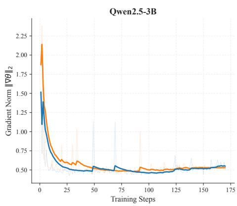

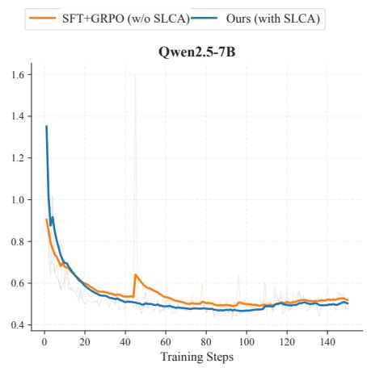

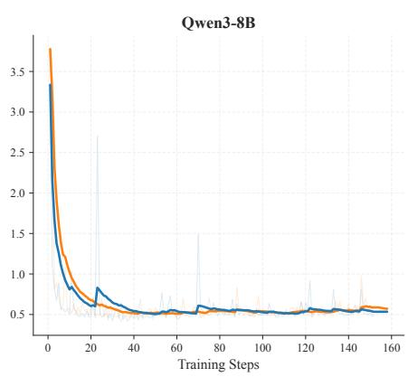  
Figure 5 Gradient Norm D<sub>y</sub>namics $( \| \nabla _ { \theta } \| _ { 2 } )$ durin<sub>g</sub> Trainin<sub>g</sub>. We com<sub>p</sub>are the <sub>g</sub>radient norms of SFT+GRPO (w/o SLCA) (Oran e) and SLCA-GRPO (Blue) across Qwen2.5-3B, 7B, and Qwen3-8B. These are re resentative sin le-run traces and <sub>prov</sub>id<sub>e</sub> <sub>a</sub> d<sub>escr</sub>i<sub>p</sub>ti<sub>ve</sub> <sub>v</sub>i<sub>ew</sub> <sub>o</sub>f <sub>up</sub>d<sub>a</sub>t<sub>e</sub> <sub>var</sub>i<sub>a</sub>bilit<sub>y</sub> <sub>un</sub>d<sub>er</sub> th<sub>e</sub> t<sub>wo</sub> <sub>es</sub>ti<sub>ma</sub>t<sub>ors.</sub>

Quantitative Gradient Stability We quantify this diagnostic by computing the standard deviation (Std) of the <sub>gra</sub>di<sub>en</sub>t <sub>norm over</sub> th<sub>e</sub> t<sub>ra</sub>i<sub>n</sub>i<sub>ng s</sub>t<sub>eps.</sub> A<sub>s repor</sub>t<sub>e</sub>d i<sub>n</sub> T<sub>a</sub>bl<sub>e</sub> 5<sub>,</sub> SLCA<sub>-</sub>GRPO h<sub>as a</sub> l<sub>ower o</sub>b<sub>serve</sub>d <sub>s</sub>t<sub>an</sub>d<sub>ar</sub>d d<sub>ev</sub>i<sub>a</sub>ti<sub>on</sub> <sub>across a</sub>ll <sub>mo</sub>d<sub>e</sub>l <sub>sca</sub>l<sub>es</sub> i<sub>n</sub> th<sub>ese runs.</sub>

On Qwen2.5-3B-Instruct, gradient-norm volatility is reduced by 25.0%. On Qwen3-8B-Base, which has the hi<sub>g</sub>h<sub>es</sub>t b<sub>ase</sub>li<sub>ne</sub> Std i<sub>n</sub> thi<sub>s</sub> t<sub>a</sub>bl<sub>e,</sub> th<sub>e re</sub>d<sub>uc</sub>ti<sub>on</sub> i<sub>s</sub> 2<sub>.</sub>5%<sub>.</sub>

Cross-Scale Analysis: Gradient Stability vs. Task Performance The relative reduction decreases across the three backbones (25.0% → 13.1% → 2.5%). Gradient-norm standard deviation captures one aggregate variability <sub>measure, so</sub> th<sub>ese va</sub>l<sub>ues</sub> d<sub>o no</sub>t id<sub>en</sub>tif<sub>y</sub> th<sub>e con</sub>t<sub>r</sub>ib<sub>u</sub>ti<sub>on o</sub>f <sub>eac</sub>h <sub>no</sub>i<sub>se source.</sub>

Th<sub>e ma</sub>t<sub>c</sub>h<sub>e</sub>d $\tau ^ { 2 } .$ -Bench <sub>g</sub>a<sub>p</sub>s are +1.09 <sub>pp</sub> (3B), +9.15 <sub>pp</sub> (7B), and +10.03 <sub>pp</sub> (8B), all based on three-run <sub>means.</sub> Th<sub>ese aggrega</sub>t<sub>e resu</sub>lt<sub>s</sub> d<sub>o no</sub>t <sub>es</sub>t<sub>a</sub>bli<sub>s</sub>h <sub>a sca</sub>l<sub>e</sub> t<sub>ren</sub>d f<sub>or gra</sub>di<sub>en</sub>t <sub>s</sub>t<sub>a</sub>bilit<sub>y.</sub> O<sub>n</sub> th<sub>e s</sub>i<sub>mp</sub>l<sub>er</sub> T<sub>oucan s</sub>i<sub>ng</sub>l<sub>e-</sub> turn evaluation<sub>,</sub> the three-run Success <sub>g</sub>a<sub>p</sub>s ran<sub>g</sub>e from +2.05 to +2.53 <sub>pp</sub>. Se<sub>p</sub>aratel<sub>y,</sub> we measured the <sub>g</sub>radient <sub>cos</sub>i<sub>ne</sub> <sub>s</sub>i<sub>m</sub>il<sub>ar</sub>it<sub>y</sub> $\cos ( \nabla _ { \mathrm { t o o l } } , \nabla _ { \mathrm { s u m } } )$ <sub>on</sub> th<sub>e</sub> 3B b<sub>ac</sub>kb<sub>one</sub> <sub>an</sub>d f<sub>oun</sub>d it <sub>near</sub> <sub>zero</sub> $( [ - 0 . 0 3 , 0 . 0 8 ] )$ ) throu<sub>g</sub>hout trainin<sub>g</sub> for both SLCA and standard GRPO. In this diagnostic, advantage magnitudes, rather than gradient direction, are the m<sub>o</sub>r<sub>e</sub> vi<sub>s</sub>ibl<sub>e sou</sub>r<sub>ce o</sub>f <sub>c</sub>r<sub>oss</sub>-<sub>seg</sub>m<sub>e</sub>nt mi<sub>s</sub>m<sub>a</sub>t<sub>c</sub>h<sub>.</sub> B<sub>ecause</sub> th<sub>e</sub> m<sub>easu</sub>r<sub>e</sub>d t<sub>oo</sub>l/<sub>su</sub>mm<sub>a</sub>r<sub>y g</sub>r<sub>a</sub>di<sub>e</sub>nt <sub>cos</sub>in<sub>e</sub> i<sub>s</sub> n<sub>ea</sub>r z<sub>e</sub>r<sub>o,</sub> <sub>we re</sub>f<sub>er</sub> t<sub>o</sub> SLCA <sub>as an</sub> “<sub>a</sub>d<sub>van</sub>t<sub>a e-</sub>l<sub>eve</sub>l fi<sub>rewa</sub>ll” <sub>ra</sub>th<sub>er</sub> th<sub>an a</sub> “ <sub>ra</sub>di<sub>en</sub>t fi<sub>rewa</sub>ll”<sub>:</sub> th<sub>e</sub> di<sub>a nos</sub>ti<sub>c concerns</sub> th<sub>e</sub> <sub>magn</sub>it<sub>u</sub>d<sub>e</sub> <sub>o</sub>f th<sub>e</sub> <sub>ass</sub>i<sub>gne</sub>d <sub>a</sub>d<sub>van</sub>t<sub>ages,</sub> <sub>no</sub>t <sub>a</sub> <sub>measure</sub>d di<sub>rec</sub>ti<sub>ona</sub>l <sub>con</sub>fli<sub>c</sub>t b<sub>e</sub>t<sub>ween</sub> th<sub>e</sub> t<sub>wo</sub> <sub>gra</sub>di<sub>en</sub>t <sub>componen</sub>t<sub>s.</sub>

Table 5 Quantification of Gradient Stability. We report the Standard Deviation (Std) of the gradient norm. SLCA-GRPO has l<sub>ower o</sub>b<sub>serve</sub>d <sub>vo</sub>l<sub>a</sub>tilit<sub>y</sub> i<sub>n</sub> th<sub>ese represen</sub>t<sub>a</sub>ti<sub>ve runs.</sub>
<table><tr><td>Model Backbone</td><td>Ours Std  $\mathtt { ( / { \sigma } _ { S L C A } ) }$ </td><td>Baseline Std  $( \sigma _ { \mathsf { B a s e } } )$ </td><td>Improvement (↓)</td></tr><tr><td>Qwen2.5-3B-Instruct</td><td>0.156</td><td>0.209</td><td>25.0%</td></tr><tr><td>Qwen2.5-7B-Instruct</td><td>0.094</td><td>0.108</td><td>13.1%</td></tr><tr><td>Qwen3-8B-Base</td><td>0.312</td><td>0.320</td><td>2.5%</td></tr></table>

## C Datasets and Training Details

## C.1 Data Processing Pipeline

A<sub>s</sub> ill<sub>us</sub>t<sub>ra</sub>t<sub>e</sub>d i<sub>n</sub> Fi<sub>gure</sub> 6<sub>,</sub> thi<sub>s p</sub>i<sub>pe</sub>li<sub>ne</sub> i<sub>s</sub> d<sub>es</sub>i<sub>gne</sub>d t<sub>o s</sub>t<sub>r</sub>i<sub>c</sub>tl<sub>y preven</sub>t t<sub>es</sub>t<sub>-se</sub>t l<sub>ea</sub>k<sub>age an</sub>d <sub>op</sub>ti<sub>m</sub>i<sub>ze</sub> d<sub>a</sub>t<sub>a compos</sub>iti<sub>on</sub> f<sub>or</sub> dif<sub>eren</sub>t l<sub>earn</sub>i<sub>ng s</sub>t<sub>ages.</sub>

Th<sub>e p</sub>i<sub>pe</sub>li<sub>ne cons</sub>i<sub>s</sub>t<sub>s o</sub>f f<sub>our</sub> di<sub>s</sub>ti<sub>nc</sub>t <sub>p</sub>h<sub>ases:</sub>

Phase 1: Noise Filtering and Schema Validation Starting with 119,279 Toucan raw trajectories, we first <sub>remove approx</sub>i<sub>ma</sub>t<sub>e</sub>l<sub>y</sub> 40<sub>,</sub>000 <sub>samp</sub>l<sub>es</sub> id<sub>en</sub>tifi<sub>e</sub>d <sub>as</sub> i<sub>rre</sub>l<sub>evan</sub>t <sub>or con</sub>t<sub>a</sub>i<sub>n</sub>i<sub>ng</sub> l<sub>ow-qua</sub>lit<sub>y</sub> f<sub>orma</sub>tti<sub>ng.</sub> Th<sub>e rema</sub>i<sub>n</sub>i<sub>ng</sub> 79<sub>,</sub>279 <sub>can</sub>did<sub>a</sub>t<sub>es un</sub>d<sub>ergo s</sub>t<sub>r</sub>i<sub>c</sub>t filt<sub>er</sub>i<sub>ng, w</sub>hi<sub>c</sub>h <sub>removes</sub> 1<sub>,</sub>038 <sub>samp</sub>l<sub>es con</sub>t<sub>a</sub>i<sub>n</sub>i<sub>ng</sub> b<sub>ro</sub>k<sub>en</sub> JSON<sub>, non-s</sub>t<sub>an</sub>d<sub>ar</sub>d tool tokens, or hallucinations to ensure simulator stability. This results in a high-quality valid pool of 78,241 trajectories.

Phase 2: Evaluation Isolation. To ensure rigorous zero-shot evaluation, we randomly sample a held-out Toucan-Test set of ${ \bf 4 , 0 0 0 }$ <sub>samp</sub>l<sub>es</sub> f<sub>rom</sub> th<sub>e va</sub>lid <sub>poo</sub>l b<sub>e</sub>f<sub>ore any</sub> t<sub>ra</sub>i<sub>n</sub>i<sub>ng sp</sub>lit<sub>s are ma</sub>d<sub>e.</sub> Thi<sub>s se</sub>t <sub>compr</sub>i<sub>ses:</sub>

• 3,000 Native Single-turn samples: Testing atomic tool-use capabilities.

• 1,000 Decomposed Multi-turn samples: Extracted from distinct multi-turn dialogues to test context <sub>re</sub>t<sub>en</sub>ti<sub>on an</sub>d <sub>s</sub>t<sub>a</sub>t<sub>e</sub> t<sub>rac</sub>ki<sub>ng.</sub>

The remainin<sub>g</sub> 74<sub>,</sub>241 sam<sub>p</sub>les constitute the Total Trainin<sub>g</sub> Pool.

Phase 3: Trajectory Decomposition Strategy For Reinforcement Learning, training on long-horizon dialogs from scratch is unstable. We decompose multi-turn dialogs into atomic Context-Action pairs. We exclude the first tool-call turn during decomposition and extract samples starting from the second tool invocation (Turn ≥ 2). Each decom<sub>p</sub>osed sam<sub>p</sub>le <sub>p</sub>rovided to the RL a<sub>g</sub>ent thus contains historical context from <sub>p</sub>revious user-a<sub>g</sub>ent interactions. The Toucan trajectories use real MCP teacher traces. The segment mask is derived deterministically from the structured trajectory trace and the environment boundary; no annotated segment or token labels and no l<sub>earne</sub>d <sub>segmen</sub>t<sub>er are use</sub>d<sub>.</sub>

## Phase 4: SFT vs. RL Partitioning We split the training pool (74,241 samples) into two partitions:

• SFT Partition (42,423 samples): Representing approximately 57% of the data, this set prioritizes diversity in format (Human/GPT st<sub>y</sub>les) and includes the majorit<sub>y</sub> of native multi-turn data to establish a robust i<sub>ns</sub>t<sub>ruc</sub>ti<sub>on-</sub>f<sub>o</sub>ll<sub>ow</sub>i<sub>ng pr</sub>i<sub>or.</sub>

• RL Partition (31,818 samples): Optimized for exploration, this set is constructed with a specific compositi<sub>ona</sub>l <sub>ra</sub>ti<sub>o:</sub>

$$
{ \mathrm { R L ~ C o m p o s i t i o n } } \approx { \frac { 2 } { 3 } } \times { \mathrm { N a t i v e ~ S i n g l e } } \cdot { \mathrm { t u r n } } + { \frac { 1 } { 3 } } \times { \mathrm { D e c o m p o s e d ~ M u l t i } } { \cdot } { \mathrm { t u r n } }
$$

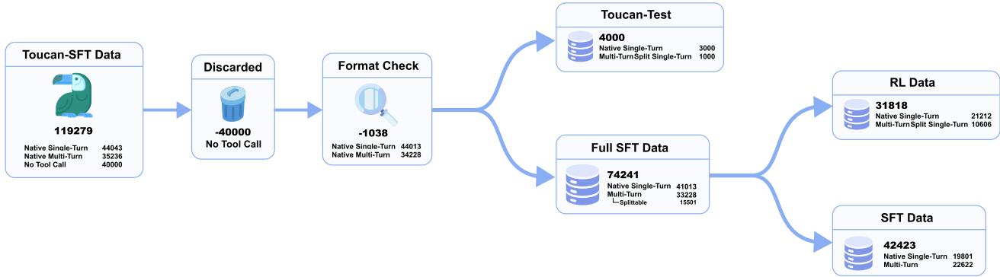  
Figure 6 Data Processing Pipeline. The workflow applies strict relevance filtering and format check before isolating the <sub>eva</sub>l<sub>ua</sub>ti<sub>on se</sub>t<sub>.</sub> Th<sub>e rema</sub>i<sub>n</sub>i<sub>ng</sub> t<sub>ra</sub>i<sub>n</sub>i<sub>ng poo</sub>l i<sub>s sp</sub>lit i<sub>n</sub>t<sub>o</sub> SFT <sub>an</sub>d RL <sub>par</sub>titi<sub>ons;</sub> th<sub>e</sub> RL <sub>se</sub>t <sub>com</sub>bi<sub>nes na</sub>ti<sub>ve s</sub>i<sub>ng</sub>l<sub>e-</sub>t<sub>urn an</sub>d decomposed multi-turn trajectories formatted for the SGLS.

Specifically, it contains 21,212 native single-turn samples and 10,606 decomposed multi-turn samples. This <sub>s</sub>t<sub>ra</sub>tifi<sub>e</sub>d <sub>m</sub>i<sub>x</sub> b<sub>a</sub>l<sub>ances</sub> th<sub>e</sub> l<sub>earn</sub>i<sub>ng o</sub>f <sub>s</sub>i<sub>mp</sub>l<sub>e</sub> f<sub>unc</sub>ti<sub>on execu</sub>ti<sub>on w</sub>ith <sub>comp</sub>l<sub>ex,</sub> hi<sub>s</sub>t<sub>ory-</sub>d<sub>epen</sub>d<sub>en</sub>t <sub>reason</sub>i<sub>ng.</sub>

Total Supervision Visibility As noted in the experimental setup, our SFT baseline is trained on the union of both <sub>p</sub>artitions (Total 74,241 sam<sub>p</sub>les), so the com<sub>p</sub>arison uses matched data ex<sub>p</sub>osure.

## C.2 Training Implementation Details

Implementation Environment and Hyperparameters We fine-tune the model on the Toucan supervision trajectories using the standard cross-entropy objective. The SFT training is conducted on 8 NVIDIA H20 GPUs with bfloat16 precision. We employ the AdamW optimizer (Kingma and Ba, 2015; Loshchilov and Hutter, 2019) with a cosine learnin<sub>g</sub> rate scheduler. For the RL sta<sub>g</sub>e, trainin<sub>g</sub> is scaled across 32 NVIDIA H20 GPUs (4 nodes). Th<sub>e</sub> m<sub>a</sub>xim<sub>u</sub>m <sub>seque</sub>n<sub>ce</sub> l<sub>e</sub>n<sub>g</sub>th<sub>s</sub> f<sub>o</sub>r <sub>p</sub>r<sub>o</sub>m<sub>p</sub>t<sub>s a</sub>nd <sub>ge</sub>n<sub>e</sub>r<sub>a</sub>ti<sub>o</sub>n<sub>s a</sub>r<sub>e e</sub>xt<sub>e</sub>nd<sub>e</sub>d t<sub>o</sub> 16k <sub>a</sub>nd 8k t<sub>o</sub>k<sub>e</sub>n<sub>s,</sub> r<sub>espec</sub>tiv<sub>e</sub>l<sub>y,</sub> t<sub>o</sub> <sub>acco</sub>mm<sub>o</sub>d<sub>a</sub>t<sub>e</sub> l<sub>o</sub>n<sub>g</sub>-<sub>co</sub>nt<sub>e</sub>xt r<sub>easo</sub>nin<sub>g.</sub> D<sub>e</sub>t<sub>a</sub>il<sub>e</sub>d h<sub>ype</sub>r<sub>pa</sub>r<sub>a</sub>m<sub>e</sub>t<sub>e</sub>r<sub>s</sub> f<sub>o</sub>r b<sub>o</sub>th <sub>s</sub>t<sub>ages a</sub>r<sub>e</sub> li<sub>s</sub>t<sub>e</sub>d in T<sub>a</sub>bl<sub>e</sub> 6<sub>.</sub>

Baseline Configurations and Controlled Variables The matched set comprises SFT+GRPO, SFT+SLCA-GRPO, <sub>w</sub>/<sub>o</sub> SLCA <sub>w</sub>/<sub>o</sub> SGLS <sub>an</sub>d <sub>w</sub>/<sub>o</sub> Hi<sub>er</sub>R<sub>.</sub> Withi<sub>n eac</sub>h b<sub>ac</sub>kb<sub>one a</sub>ll fi<sub>ve use</sub> th<sub>a</sub>t b<sub>ac</sub>kb<sub>one</sub>’<sub>s</sub> SFT <sub>c</sub>h<sub>ec</sub>k <sub>o</sub>i<sub>n</sub>t th<sub>e</sub> <sub>same</sub> d<sub>a</sub>t<sub>a sp</sub>lit<sub>,</sub> SGLS <sub>en</sub>d<sub>po</sub>i<sub>n</sub>t<sub>, moc</sub>k<sub>er con</sub>fi<sub>gura</sub>ti<sub>on,</sub> d<sub>eco</sub>di<sub>ng se</sub>tti<sub>ngs, eva</sub>l<sub>ua</sub>ti<sub>on pro</sub>t<sub>oco</sub>l<sub>, ro</sub>ll<sub>ou</sub>t <sub>group</sub> size G = 16, one RL epoc<sup>h</sup>, an<sup>d</sup> t<sup>h</sup>e same run set. GRPO, SLCA-GRPO, w/o SLCA, an<sup>d</sup> w/o SGLS use t<sup>h</sup>e same Hi<sub>er</sub>R d<sub>e</sub>fi<sub>n</sub>iti<sub>on an</sub>d <sub>su</sub>b<sub>we</sub>i<sub>g</sub>ht<sub>s; w</sub>/<sub>o</sub> Hi<sub>er</sub>R <sub>removes</sub> Hi<sub>er</sub>R<sub>, an</sub>d <sub>w</sub>/<sub>o</sub> SGLS <sub>removes sc</sub>h<sub>ema con</sub>diti<sub>on</sub>i<sub>ng an</sub>d d<sub>e</sub>t<sub>erm</sub>i<sub>n</sub>i<sub>s</sub>ti<sub>c va</sub>lid<sub>a</sub>ti<sub>on:</sub>

• SFT (Data-Equivalent Baseline): By exposing the model to the full dataset in a supervised manner, this b<sub>ase</sub>li<sub>ne serves as a</sub> d<sub>a</sub>t<sub>a-equ</sub>i<sub>va</sub>l<sub>en</sub>t b<sub>enc</sub>h<sub>mar</sub>k t<sub>o</sub> d<sub>e</sub>t<sub>erm</sub>i<sub>ne w</sub>h<sub>e</sub>th<sub>er</sub> RL <sub>op</sub>ti<sub>m</sub>i<sub>za</sub>ti<sub>on y</sub>i<sub>e</sub>ld<sub>s ga</sub>i<sub>ns</sub> b<sub>eyon</sub>d <sub>s</sub>i<sub>mp</sub>l<sub>y sca</sub>li<sub>ng up</sub> d<sub>emons</sub>t<sub>ra</sub>ti<sub>on</sub> d<sub>a</sub>t<sub>a.</sub>

• SFT+GRPO (Standard Baseline): This baseline uses the same SGLS environment and HierR reward d<sub>e</sub>fi<sub>n</sub>iti<sub>ons as our me</sub>th<sub>o</sub>d<sub>.</sub> It<sub>s es</sub>ti<sub>ma</sub>t<sub>or aggrega</sub>t<sub>es</sub> th<sub>e</sub> t<sub>wo rewar</sub>d<sub>s</sub> i<sub>n</sub>t<sub>o an unwe</sub>i<sub>g</sub>ht<sub>e</sub>d <sub>sum</sub> $\left( R _ { \mathrm { t o t a l } } = \right.$ $1 . 0 \cdot R _ { \mathrm { t o o l } } + 1 . 0 \cdot R _ { \mathrm { s u m } } )$ <sub>an</sub>d b<sub>roa</sub>d<sub>cas</sub>t<sub>s</sub> th<sub>e resu</sub>lti<sub>ng a</sub>d<sub>van</sub>t<sub>age</sub> t<sub>o a</sub>ll l<sub>earna</sub>bl<sub>e</sub> t<sub>o</sub>k<sub>ens.</sub>

• SFT+SLCA-GRPO (Ours): Following the same data split as SFT+GRPO, it computes independent advantages f<sub>or</sub> <sub>execu</sub>ti<sub>on</sub> <sub>an</sub>d <sub>summar</sub>i<sub>za</sub>ti<sub>on.</sub> Th<sub>e</sub> <sub>ma</sub>t<sub>c</sub>h<sub>e</sub>d <sub>compar</sub>i<sub>son</sub> <sub>uses</sub> th<sub>e</sub> <sub>same</sub> 1<sub>:</sub>1 <sub>we</sub>i<sub>g</sub>hti<sub>ng</sub> $( \lambda _ { \mathrm { t o o l } } = \lambda _ { \mathrm { s u m } } = 1 )$ and routes si<sub>g</sub>nals via E<sub>q</sub>. 3.

• Ablation definitions: w/o SLCA uses the unified estimator, w/o SGLS removes schema conditioning and d<sub>e</sub>t<sub>e</sub>rmini<sub>s</sub>ti<sub>c</sub> v<sub>a</sub>lid<sub>a</sub>ti<sub>o</sub>n whil<sub>e</sub> r<sub>e</sub>t<sub>a</sub>inin<sub>g</sub> th<sub>e</sub> m<sub>oc</sub>k<sub>e</sub>r <sub>e</sub>nd<sub>po</sub>int<sub>, a</sub>nd w/<sub>o</sub> Hi<sub>e</sub>rR r<sub>e</sub>m<sub>o</sub>v<sub>es</sub> th<sub>e</sub> hi<sub>e</sub>r<sub>a</sub>r<sub>c</sub>hi<sub>ca</sub>l <sub>rewar</sub>d<sub>.</sub>

Table 6 Detailed H<sub>yp</sub>er<sub>p</sub>arameters and Environment Settin<sub>g</sub>s. We list the confi<sub>g</sub>urations for both the su<sub>p</sub>ervised fine-tunin<sub>g</sub> (SFT) and the subse<sub>q</sub>uent RL trainin<sub>g</sub> sta<sub>g</sub>es.
<table><tr><td colspan="2">Fine-Tuning Hyperparameters</td><td colspan="2">RL Hyperparameters</td></tr><tr><td>Parameter</td><td>Value</td><td>Parameter</td><td>Value</td></tr><tr><td>Hardware Resources</td><td>8 × H20 GPUs</td><td>Hardware Resources</td><td>32 × H20 (4 Nodes)</td></tr><tr><td>Optimizer</td><td>AdamW</td><td>Precision</td><td>bfloat16</td></tr><tr><td>Total Batch Size</td><td>32</td><td>Total Batch Size</td><td>128</td></tr><tr><td>Per-Device Batch</td><td>1</td><td>Mini-batch Size</td><td>32</td></tr><tr><td>Grad Accumulation</td><td>4</td><td>Rollout Group Size (G)</td><td>16</td></tr><tr><td>Learning Rate</td><td> $5 \times 1 0 ^ { - 6 }$ </td><td>Learning Rate</td><td> $1 \times 1 0 ^ { - 6 }$ </td></tr><tr><td>Number of Epochs</td><td>2</td><td>Number of Epochs</td><td>1</td></tr><tr><td>LR Scheduler</td><td>Cosine</td><td>Max Response Len</td><td>8192</td></tr><tr><td>Warmup Ratio</td><td>0.1</td><td>KL Coefficient  $( \beta _ { \mathsf { K L } } )$ </td><td>0.001</td></tr><tr><td>Max Context Len</td><td>16384</td><td>Max Prompt Len</td><td>16384</td></tr><tr><td></td><td></td><td>PPO Clip (€clip)</td><td>0.2 (symmetric)</td></tr><tr><td></td><td></td><td>Dual-Clip Constant (c)</td><td>3.0</td></tr><tr><td></td><td></td><td>KL Estimator</td><td>low-var KL</td></tr><tr><td></td><td></td><td>Loss Aggregation</td><td>token-mean</td></tr><tr><td></td><td></td><td>No-Call Penalty  $( R _ { \mathsf { p e n } } )$ </td><td>—0.5 (override)</td></tr></table>

The PPO cli<sub>p</sub> is s<sub>y</sub>mmetric: $\epsilon _ { \mathrm { c l i p } } = \epsilon _ { \mathrm { l o w } } = \epsilon _ { \mathrm { h i g h } } = 0 . 2 $ <sub>, w</sub>ith<sub>ou</sub>t <sub>asymme</sub>t<sub>r</sub>i<sub>c</sub> DAPO<sub>-s</sub>t<sub>y</sub>l<sub>e c</sub>li<sub>pp</sub>i<sub>ng.</sub> Th<sub>e</sub> d<sub>ua</sub>l<sub>-c</sub>li<sub>p</sub> constant $c = 3 . 0$ <sub>app</sub>li<sub>es on</sub>l<sub>y</sub> t<sub>o nega</sub>ti<sub>ve-a</sub>d<sub>van</sub>t<sub>age samp</sub>l<sub>es w</sub>h<sub>en</sub> th<sub>e</sub> lik<sub>e</sub>lih<sub>oo</sub>d <sub>ra</sub>ti<sub>o</sub> i<sub>s</sub> l<sub>arge.</sub> Th<sub>e no-ca</sub>ll <sub>va</sub>l<sub>ue</sub> $R _ { \mathrm { p e n } } = - 0 . 5$ i<sub>s use</sub>d <sub>w</sub>h<sub>en</sub> t<sub>oo</sub>l <sub>use</sub> i<sub>s requ</sub>i<sub>re</sub>d b<sub>u</sub>t <sub>no</sub> t<sub>oo</sub>l <sub>ca</sub>ll i<sub>s em</sub>itt<sub>e</sub>d<sub>;</sub> it <sub>overr</sub>id<sub>es</sub> th<sub>e we</sub>i<sub>g</sub>ht<sub>e</sub>d <sub>score ra</sub>th<sub>er</sub> th<sub>an su</sub>bt<sub>rac</sub>ti<sub>ng</sub> f<sub>rom</sub> it<sub>.</sub>

Training-step convention All RL curves report policy-update steps, not PPO inner mini-batch passes. The main <sub>runs use ro</sub>ll<sub>ou</sub>t <sub>group s</sub>i<sub>ze</sub> $G = 1 6$ <sub>an</sub>d <sub>one</sub> RL <sub>epoc</sub>h <sub>over</sub> th<sub>e pos</sub>t<sub>-</sub>filt<sub>ere</sub>d <sub>ro</sub>ll<sub>ou</sub>t <sub>s</sub>t<sub>ream;</sub> thi<sub>s correspon</sub>d<sub>s</sub> t<sub>o</sub> <sub>approx</sub>i<sub>ma</sub>t<sub>e</sub>l<sub>y</sub> 100 l<sub>ogge</sub>d <sub>po</sub>li<sub>cy-up</sub>d<sub>a</sub>t<sub>e s</sub>t<sub>eps</sub> i<sub>n</sub> th<sub>e</sub> d<sub>e</sub>f<sub>au</sub>lt 7B <sub>se</sub>tti<sub>ng.</sub> W<sub>e use</sub> thi<sub>s conven</sub>ti<sub>on cons</sub>i<sub>s</sub>t<sub>en</sub>tl<sub>y across</sub> <sub>a</sub>ll t<sub>ra</sub>i<sub>n</sub>i<sub>ng-</sub>d<sub>ynam</sub>i<sub>cs</sub> fi<sub>gures.</sub>

## C.3 SGLS Implementation Details

Frozen LLM Specification The frozen LLM used in SGLS is Qwen3-235B-A22B-Instruct (July 2025 checkpoint), a 235B-<sub>p</sub>arameter Mixture-of-Ex<sub>p</sub>erts (MoE) model with 22B active <sub>p</sub>arameters <sub>p</sub>er forward <sub>p</sub>ass. This model belongs to a diferent architectural family from the policy backbone (Qwen2.5-7B-Instruct, dense architecture, Se<sub>p</sub>tember 2024). The cross-famil<sub>y</sub>, cross-<sub>g</sub>enerational desi<sub>g</sub>n limits im<sub>p</sub>licit leaka<sub>g</sub>e and same-backbone favoritism: (i) the re<sub>p</sub>resentation s<sub>p</sub>aces are structurall<sub>y</sub> distinct (MoE routin<sub>g</sub> vs. dense la<sub>y</sub>ers), (ii) the models use diferent tokenizers and <sub>p</sub>re-trainin<sub>g</sub> cor<sub>p</sub>ora, and (iii) the frozen LLM’s role is limited to tem<sub>p</sub>late-constrained mockin<sub>g</sub> of valid tool calls; it never provides planning guidance or reward signals. The Toucan teacher trajectories used to construct the trainin data are real MCP trajectories curated for tool covera e and ualit . The rovide the t<sub>oo</sub>l<sub>-re</sub>f<sub>erence source</sub> f<sub>or</sub> $R _ { \mathrm { t o o l } }$ and are not an in<sub>p</sub>ut to the SLCA estimator.

Deployment Configuration The frozen LLM is served via vLLM 0.11.0 with the deployment parameters listed in Tabl<sub>e</sub> 7<sub>.</sub>

Table 7 SGLS Frozen LLM: De<sub>p</sub>lo<sub>y</sub>ment and Decodin<sub>g</sub> Parameters.
<table><tr><td>Parameter</td><td>Value</td></tr><tr><td>vLLM Deployment</td><td></td></tr><tr><td>Tensor-Parallel Size (TP)</td><td>8</td></tr><tr><td>Max Model Length</td><td>32,768</td></tr><tr><td>GPU Memory Utilization</td><td>0.86</td></tr><tr><td>Max Concurrent Sequences</td><td>300</td></tr><tr><td>Precision (dtype)</td><td>bfloat16</td></tr><tr><td>Prefix Caching</td><td>Enabled</td></tr><tr><td>Expert Parallel (MoE)</td><td>Enabled</td></tr><tr><td>Decoding (API Call Side)</td><td></td></tr><tr><td>Temperature</td><td>0.6</td></tr><tr><td>Max Tokens</td><td>4,096</td></tr><tr><td>top_p</td><td>1.0 (vLLM default; no nucleus filtering)</td></tr><tr><td>top_k</td><td>0 (disabled; no top-k filtering)</td></tr><tr><td>Stop Tokens</td><td>Model EOS (vLLM built-in)</td></tr></table>

Two-Stage Pipeline SGLS operates as a two-stage pipeline to minimize unnecessary LLM invocations:

1. Stage 1: Deterministic Schema Validation (no LLM): Checks tool existence against the current instance’s <sub>ava</sub>il<sub>a</sub>bl<sub>e</sub> t<sub>oo</sub>l <sub>se</sub>t<sub>;</sub> if th<sub>e</sub> t<sub>oo</sub>l <sub>name</sub> i<sub>s no</sub>t f<sub>oun</sub>d<sub>, re</sub>t<sub>urns a</sub> h<sub>ar</sub>d<sub>-co</sub>d<sub>e</sub>d <sub>error s</sub>t<sub>r</sub>i<sub>ng.</sub> Th<sub>en ver</sub>ifi<sub>es requ</sub>i<sub>re</sub>d <sub>parame</sub>t<sub>ers</sub> <sub>aga</sub>i<sub>ns</sub>t th<sub>e</sub> <sub>sc</sub>h<sub>ema</sub> d<sub>e</sub>fi<sub>n</sub>iti<sub>on;</sub> <sub>m</sub>i<sub>ss</sub>i<sub>ng</sub> <sub>parame</sub>t<sub>ers</sub> t<sub>r</sub>i<sub>gger</sub> <sub>a</sub> d<sub>e</sub>t<sub>erm</sub>i<sub>n</sub>i<sub>s</sub>ti<sub>c</sub> <sub>error</sub> <sub>message</sub> li<sub>s</sub>ti<sub>ng</sub> th<sub>e a</sub>b<sub>sen</sub>t fi<sub>e</sub>ld<sub>s.</sub>

2. Stage 2: Template-Constrained LLM Mocking (valid calls only): For calls that pass Stage 1, the tool definition JSON and the parsed <tool\_call> payload are injected into a fixed prompt template. The frozen <sup>LLM</sup> generates a moc<sup>k</sup> <tool\_response> output. <sup>P</sup>ost-process<sup>i</sup>ng extracts t<sup>h</sup>e response content v<sup>i</sup>a tag matchin<sub>g</sub> and handles truncation ed<sub>g</sub>e cases (e.<sub>g</sub>., res<sub>p</sub>onses with o<sub>p</sub>enin<sub>g</sub> but no closin<sub>g</sub> ta<sub>g</sub>s).

Thi<sub>s</sub> h<sub>y</sub>b<sub>r</sub>id <sub>arc</sub>hit<sub>ec</sub>t<sub>ure g</sub>i<sub>ves sc</sub>h<sub>ema v</sub>i<sub>o</sub>l<sub>a</sub>ti<sub>ons</sub> i<sub>n ear</sub>l<sub>y-</sub>t<sub>ra</sub>i<sub>n</sub>i<sub>ng ro</sub>ll<sub>ou</sub>t<sub>s</sub> d<sub>e</sub>t<sub>erm</sub>i<sub>n</sub>i<sub>s</sub>ti<sub>c</sub> f<sub>ee</sub>db<sub>ac</sub>k<sub>, w</sub>hil<sub>e</sub> th<sub>e</sub> LLM i<sub>s</sub> i<sub>nvo</sub>k<sub>e</sub>d <sub>on</sub>l<sub>y</sub> f<sub>or seman</sub>ti<sub>ca</sub>ll<sub>y p</sub>l<sub>aus</sub>ibl<sub>e moc</sub>k <sub>responses</sub> t<sub>o correc</sub>tl<sub>y</sub> f<sub>orme</sub>d <sub>ca</sub>ll<sub>s.</sub>

w/o SGLS fallback environment The w/o SGLS ablation keeps the same frozen mocker and rollout interface, <sub>an</sub>d <sub>removes on</sub>l<sub>y sc</sub>h<sub>ema con</sub>diti<sub>on</sub>i<sub>ng an</sub>d d<sub>e</sub>t<sub>erm</sub>i<sub>n</sub>i<sub>s</sub>ti<sub>c va</sub>lid<sub>a</sub>ti<sub>on.</sub> B<sub>o</sub>th <sub>var</sub>i<sub>an</sub>t<sub>s ca</sub>ll th<sub>e same ex</sub>t<sub>erna</sub>l <sub>v</sub>LLM /v1/chat/completions en<sup>d</sup>point wit<sup>h</sup> t<sup>h</sup>e same Qwen3-235B-A22B mo<sup>d</sup>e<sup>l</sup>, temperature (0.6), max-to<sup>k</sup>en <sup>b</sup>u<sup>d</sup>get (4,096), and timeout (540s). Thus the ablation is prompt-unconstrained, not model-unconstrained: the API-server ro<sup>l</sup>e <sup>i</sup>nstruct<sup>i</sup>on, <tool\_response> output contract, pro<sup>hibi</sup>t<sup>i</sup>ons aga<sup>i</sup>nst exp<sup>l</sup>anat<sup>i</sup>ons or <tool\_call> em<sup>i</sup>ss<sup>i</sup>on, f<sub>ew-s</sub>h<sub>o</sub>t <sub>exam</sub> l<sub>es</sub> i<sub>ncom</sub>i<sub>n -re ues</sub>t f<sub>orma</sub>t <sub>an</sub>d <sub>ro</sub>ll<sub>ou</sub>t li<sub>m</sub>it<sub>s are unc</sub>h<sub>an e</sub>d<sub>.</sub> Th<sub>e on</sub>l <sub>rom</sub> t<sub>-s</sub>id<sub>e remova</sub>l <sup>i</sup>s t<sup>h</sup>e Tool Definition <sup>JSON</sup>-sc<sup>h</sup>ema <sup>bl</sup>oc<sup>k</sup>; t<sup>h</sup>e correspon<sup>di</sup>ng co<sup>d</sup>e pat<sup>h</sup> a<sup>l</sup>so removes per-<sup>i</sup>nstance sc<sup>h</sup>ema <sub>cac</sub>hi<sub>ng an</sub>d t<sub>oo</sub>l<sub>-</sub>d<sub>e</sub>fi<sub>n</sub>iti<sub>on pars</sub>i<sub>ng.</sub> A<sub>s a resu</sub>lt<sub>, un</sub>k<sub>nown</sub> t<sub>oo</sub>l<sub>s, m</sub>i<sub>ss</sub>i<sub>ng requ</sub>i<sub>re</sub>d <sub>parame</sub>t<sub>ers, an</sub>d t<sub>ype-</sub>i<sub>nva</sub>lid <sub>argumen</sub>t<sub>s</sub> <sub>no</sub> l<sub>onger</sub> t<sub>r</sub>i<sub>gger</sub> d<sub>e</sub>t<sub>erm</sub>i<sub>n</sub>i<sub>s</sub>ti<sub>c</sub> <sub>error</sub> <sub>s</sub>t<sub>r</sub>i<sub>ngs;</sub> <sub>every</sub> <sub>ca</sub>ll i<sub>s</sub> f<sub>orwar</sub>d<sub>e</sub>d t<sub>o</sub> th<sub>e</sub> <sub>moc</sub>k<sub>er,</sub> <sub>w</sub>hi<sub>c</sub>h <sub>genera</sub>t<sub>es</sub> <sub>a</sub> <tool\_response> s<sup>h</sup>e<sup>ll</sup> w<sup>h</sup>ose content <sup>i</sup>s <sup>d</sup>eterm<sup>i</sup>ne<sup>d</sup> <sup>b</sup>y t<sup>h</sup>e <sup>LLM</sup>. <sup>P</sup>ost-process<sup>i</sup>ng on<sup>l</sup>y str<sup>i</sup>ps/extracts too<sup>l</sup>-response t<sub>a s an</sub>d d<sub>oes no</sub>t <sub>va</sub>lid<sub>a</sub>t<sub>e</sub> JSON fi<sub>e</sub>ld<sub>s.</sub>

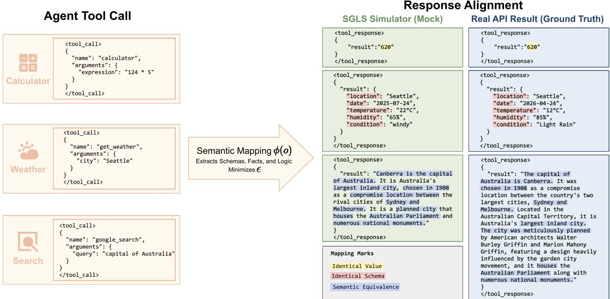  
Figure 7 SGLS mock responses align with real-API outputs across three representative tool domains. The Semantic Mapping ϕ(o) extracts schemas, facts, and logic, realizing three levels of alignment (Mapping Marks): Identical Value for deterministic tools (calculator), Identical Schema for query-style tools (weather; individual values need not match a specific real-API snapshot but remain within plausible ranges), and Semantic Equivalence for open-ended tools (search; factually consistent content diferin<sub>g</sub> onl<sub>y</sub> in <sub>p</sub>hrasin<sub>g</sub>).

Response-mocker robustness An alternate response-mocker check replaces the frozen response mocker with GPT<sub>-</sub>OSS<sub>-</sub>120B <sub>w</sub>hil<sub>e</sub> k<sub>eep</sub>i<sub>ng</sub> th<sub>e po</sub>li<sub>cy</sub> i<sub>n</sub>iti<sub>a</sub>li<sub>za</sub>ti<sub>on,</sub> d<sub>a</sub>t<sub>a, va</sub>lid<sub>a</sub>t<sub>ors, rewar</sub>d<sub>s, ro</sub>ll<sub>ou</sub>t b<sub>u</sub>d<sub>ge</sub>t<sub>, an</sub>d <sub>eva</sub>l<sub>ua</sub>ti<sub>on</sub> protocol fixed. The response mocker generates tool observations; it is separate from the summary judge that <sub>p</sub>ro<sup>d</sup>uces $R _ { \mathrm { s u m } } .$ . In this check the mocker and judge are intentionally from the same GPT-OSS-120B family; BFCL and <sub>τ</sub><sup>2</sup>-Bench do not use the judge reward, so their transfer measurements are not afected by that shared-family choice. The summary-judge prompt and decoding remain unchanged. Table 8 reports the matched results.

Table 8 Res<sub>p</sub>onse-mocker check on Qwen2.5-7B-Instruct. GPT-OSS-120B re<sub>p</sub>laces the res<sub>p</sub>onse mocker; entries are mean ± <sub>s</sub>t<sub>an</sub>d<sub>ar</sub>d d<sub>ev</sub>i<sub>a</sub>ti<sub>on un</sub>d<sub>er</sub> th<sub>e ma</sub>t<sub>c</sub>h<sub>e</sub>d <sub>po</sub>li<sub>cy se</sub>t<sub>up.</sub>
<table><tr><td>Method</td><td>Toucan Succ. (%)</td><td> $\mathsf { B F C L A c c . } ( \% )$ </td><td> $\tau ^ { 2 } { \mathrm { - B e n c h P a s s ^ { 1 } } } ( \% )$ </td></tr><tr><td>SFT+GRPO (w/o SLCA)</td><td> ${ \pm } \thinspace 1 . 7 4 \pm 1 . 4 7$ </td><td> ${ \pm \pm \infty . 0 8 \pm 0 . 3 6 }$ </td><td> ${ \pm 2 . 7 4 \pm 2 . 6 6 }$ </td></tr><tr><td>SLCA-GRPO</td><td> ${ \bf 7 8 . 5 7 \pm 1 . 1 5 }$ </td><td> ${ \pm \circ \circ . 3 2 \pm \circ . 5 6 }$ </td><td> ${ \pm } 9 . 9 0 \pm 1 . 4 6$ </td></tr><tr><td>Δ</td><td>+2.83</td><td>+1.24</td><td>+7.16</td></tr></table>

Th<sub>e</sub> SLCA <sub>a</sub>d<sub>van</sub>t<sub>age</sub> <sub>rema</sub>i<sub>ns</sub> <sub>pos</sub>iti<sub>ve</sub> <sub>on</sub> <sub>a</sub>ll th<sub>ree</sub> b<sub>enc</sub>h<sub>mar</sub>k<sub>s</sub> <sub>a</sub>ft<sub>er</sub> th<sub>e</sub> <sub>response-moc</sub>k<sub>er</sub> <sub>rep</sub>l<sub>acemen</sub>t<sub>.</sub>

## C.4 Baseline Comparison: RLTR and ToolPO Implementation

To <sub>p</sub>rovide context for the com<sub>p</sub>arisons in §4.2, we re-im<sub>p</sub>lement RLTR (Li et al., 2025) and ToolPO (Li et al., 2026b) within the same verl trainin<sub>g</sub> framework. The matched GRPO and SLCA-GRPO runs share the controls li<sub>s</sub>t<sub>e</sub>d i<sub>n</sub> T<sub>a</sub>bl<sub>e</sub> 6<sub>;</sub> RLTR <sub>an</sub>d T<sub>oo</sub>lPO <sub>re</sub>t<sub>a</sub>i<sub>n</sub> th<sub>e</sub>i<sub>r me</sub>th<sub>o</sub>d<sub>-spec</sub>ifi<sub>c</sub> i<sub>n</sub>iti<sub>a</sub>li<sub>za</sub>ti<sub>on an</sub>d <sub>rewar</sub>d/<sub>pro</sub>t<sub>oco</sub>l <sub>s</sub>t<sub>ruc</sub>t<sub>ure.</sub> Th<sub>e</sub> T<sub>oo</sub>lPO <sub>rows are our</sub> i<sub>mp</sub>l<sub>emen</sub>t<sub>a</sub>ti<sub>ons un</sub>d<sub>er</sub> th<sub>e s</sub>t<sub>a</sub>t<sub>e</sub>d <sub>ou</sub>t<sub>come-rewar</sub>d <sub>c</sub>h<sub>o</sub>i<sub>ces, no</sub>t <sub>repro</sub>d<sub>uc</sub>ti<sub>ons o</sub>f th<sub>e or</sub>i<sub>g</sub>i<sub>na</sub>l ToolPO environment.

SFT Initialization For each backbone, the matched methods start from that backbone’s SFT checkpoint $( \boldsymbol { \mathrm { e } } . \boldsymbol { \mathrm { g } } . ,$ qwen2.5-7B-sft); t<sup>h</sup>e <sup>RLTR</sup> p<sup>l</sup>anner c<sup>h</sup>ec<sup>k</sup>po<sup>i</sup>nt <sup>f</sup>o<sup>ll</sup>ows <sup>i</sup>ts met<sup>h</sup>o<sup>d</sup>-spec<sup>ifi</sup>c construct<sup>i</sup>on. <sup>RLTR</sup> requ<sup>i</sup>res a <sup>d</sup>e<sup>di</sup>cate<sup>d</sup> Planner SFT: we remove summary tokens from the SFT data and append an <answer> marker to delineate the <sub>p</sub>l<sub>anner</sub>’<sub>s</sub> <sub>ou</sub>t<sub>pu</sub>t b<sub>oun</sub>d<sub>ary,</sub> f<sub>o</sub>ll<sub>ow</sub>i<sub>ng</sub> th<sub>e</sub> <sub>or</sub>i<sub>g</sub>i<sub>na</sub>l <sub>paper</sub>’<sub>s</sub> d<sub>es</sub>i<sub>gn.</sub>

RLTR Implementation We re-implement the Planner-Summarizer pipeline:

• Reward: $R = R _ { \mathrm { c o m p } } + R _ { \mathrm { r e p e a t } } + R _ { \mathrm { e r r o r } }$ <sub>, w</sub>h<sub>ere</sub> $R _ { \mathrm { c o m p } }$ is an LLM-based Com<sub>p</sub>leteness Checker (Qwen3-30B-A3B, N=3 samp<sup>l</sup>es averaged), $R _ { \mathrm { r e p e a t } } = - 0 . 1 \times \mathrm { r e p e a t } _ { - }$ <sub>coun</sub>t<sub>, an</sub>d $R _ { \mathrm { e r r o r } } = - 0 . 2 \times \mathrm { e r r o r } _ { . }$ \_count. Format <sub>v</sub>i<sub>o</sub>l<sub>a</sub>ti<sub>ons y</sub>i<sub>e</sub>ld $R = - 1 . 0$

• Advantage: Only process (tool) tokens receive non-zero advantages; summary token advantages are set to zero.

• Evaluation: A 2-stage pipeline: the Planner generates the tool trajectory, then a frozen SFT Summarizer <sub>pro</sub>d<sub>uces</sub> th<sub>e</sub> fi<sub>na</sub>l <sub>answer.</sub> F<sub>or</sub> BFCL<sub>, on</sub>l<sub>y</sub> th<sub>e</sub> Pl<sub>anner c</sub>h<sub>ec</sub>k<sub>po</sub>i<sub>n</sub>t i<sub>s use</sub>d<sub>.</sub>

ToolPO Implementation We re ort a reference-rule ToolPO condition and an LLM-jud e condition as a rotocolsensitivity diagnostic on 7B. The 3B and 8B ToolPO rows in the scale tables use the LLM-judge Solved/Unsolved <sub>ou</sub>t<sub>come rewar</sub>d<sub>; no re</sub>f<sub>erence-ru</sub>l<sub>e runs are ava</sub>il<sub>a</sub>bl<sub>e</sub> f<sub>or</sub> th<sub>ose sca</sub>l<sub>es.</sub>

• Outcome reward protocols: The reference-rule condition uses the available old tool calls while the sensitivity condition uses an LLM judge that classifies each rollout as Solved or Unsolved, denoted $R _ { \mathrm { s u c c } } ^ { \mathrm { j u d g e } }$ B<sub>o</sub>th <sub>are eva</sub>l<sub>ua</sub>t<sub>e</sub>d <sub>on</sub> th<sub>e</sub> 7B b<sub>ac</sub>kb<sub>one</sub> b<sub>e</sub>l<sub>ow.</sub>

$C ( a _ { t } ^ { \mathbf { c a l l } } )$ adaptation: Tool-call correctness via strict matching against gold tool calls (exact name match + all <sub>g</sub>old ke<sub>y</sub>s <sub>p</sub>resent + lenient value matchin<sub>g</sub>). $R _ { \mathrm { a c t i o n } } = \sum C / | { \mathrm { g o l d } } \_ { \mathrm { f l a t } } |$ , norma<sup>l</sup>ize<sup>d</sup> to [0, 1].

• Advantage: ${ \cal A } _ { \mathrm { t o o l } } = { \cal A } _ { \mathrm { g l o b a l } } + \lambda \cdot { \cal A } _ { \mathrm { t o o l \ l o c a l } }$ f<sub>or</sub> t<sub>oo</sub>l t<sub>o</sub>k<sub>ens,</sub> $A _ { \mathrm { { s u m } } } = A _ { \mathrm { { g l o b a l } } }$ f<sub>or summary</sub> t<sub>o</sub>k<sub>ens, w</sub>ith $\lambda = 1 . 0$ <sub>an</sub>d <sub>group-w</sub>i<sub>se</sub> <sub>norma</sub>li<sub>za</sub>ti<sub>on.</sub> W<sub>e</sub> <sub>a</sub>d<sub>op</sub>t $\lambda { = } 1 . 0$ followin<sub>g</sub> the ori<sub>g</sub>inal ToolPO s<sub>p</sub>ecification (Li et al., 2026b), w<sup>h</sup>ic<sup>h</sup> gives t<sup>h</sup>e <sup>l</sup>oca<sup>l</sup> action rewar<sup>d</sup> parity wit<sup>h</sup> t<sup>h</sup>e g<sup>l</sup>o<sup>b</sup>a<sup>l</sup> outcome rewar<sup>d</sup>; we <sup>d</sup>i<sup>d</sup> not <sup>f</sup>urt<sup>h</sup>er tune λ to <sub>avo</sub>id i<sub>n</sub>t<sub>ro</sub>d<sub>uc</sub>i<sub>ng</sub> <sub>a</sub> <sub>con</sub>f<sub>oun</sub>d <sub>a</sub>b<sub>sen</sub>t f<sub>rom</sub> th<sub>e</sub> <sub>or</sub>i<sub>g</sub>i<sub>na</sub>l d<sub>es</sub>i<sub>gn.</sub>

Reference rule protocol We implement the reference rule as an explicit gold-call conjunction using the same <sub>ma</sub>t<sub>c</sub>hi<sub>ng pr</sub>i<sub>m</sub>iti<sub>ves as</sub> th<sub>e</sub> Hi<sub>er</sub>R <sub>process rewar</sub>d<sub>.</sub> L<sub>e</sub>t $\mathcal { N } _ { Y }$ <sub>an</sub>d $\mathcal { N } _ { G }$ b<sub>e</sub> th<sub>e pre</sub>di<sub>c</sub>t<sub>e</sub>d <sub>an</sub>d <sub>go</sub>ld t<sub>oo</sub>l<sub>-name mu</sub>lti<sub>se</sub>t<sub>s,</sub> <sub>an</sub>d l<sub>e</sub>t $y ^ { * } : \mathcal { G }  \mathcal { V }$ b<sub>e</sub> th<sub>e one-</sub>t<sub>o-one ma</sub>t<sub>c</sub>hi<sub>ng use</sub>d <sub>a</sub>b<sub>ove, pa</sub>i<sub>r</sub>i<sub>ng eac</sub>h <sub>go</sub>ld <sub>ca</sub>ll <sub>w</sub>ith th<sub>e</sub> b<sub>es</sub>t <sub>unuse</sub>d <sub>pre</sub>di<sub>c</sub>t<sub>e</sub>d <sub>ca</sub>ll <sub>o</sub>f th<sub>e same name.</sub> L<sub>e</sub>t $Y _ { \mathrm { i n i t } }$ <sub>an</sub>d $G _ { \mathrm { i n i t } }$ d<sub>eno</sub>t<sub>e</sub> fi<sub>rs</sub>t<sub>-roun</sub>d <sub>ca</sub>ll<sub>s:</sub>

$$
\begin{array} { r l } & { R _ { \mathrm { s u c c } } ^ { \mathrm { r u l e } } = \mathbb { I } \big [ N _ { \mathrm { v a l i d } } = N _ { \mathrm { o p e n } } = N _ { \mathrm { c l o s e } } , \ N _ { Y } = \mathcal { N } _ { G } , \ \big | Y _ { \mathrm { i n i t } } \big | = \big | G _ { \mathrm { i n i t } } \big | , } \\ & { \qquad \forall g \in \mathcal { G } : \ \left[ K _ { g } ^ { \mathrm { r e q } } \subseteq \mathcal { K } _ { y ^ { * } ( g ) } \ \wedge \ \forall k \in K _ { g } ^ { \mathrm { r e q } } , \ \mathbb { I } _ { \mathrm { l o o s e } } ( y ^ { * } ( g ) [ k ] , g [ k ] ) = 1 \right] \big ] . } \end{array}\tag{28}
$$

Here $N _ { \mathrm { v a l i d } } = N _ { \mathrm { o p e n } } = N _ { \mathrm { c l o s e } }$ <sub>requ</sub>i<sub>res every parse</sub>d <sub>ca</sub>ll t<sub>o</sub> b<sub>e va</sub>lid <sub>w</sub>ith b<sub>a</sub>l<sub>ance</sub>d <sub>open</sub>i<sub>ng an</sub>d <sub>c</sub>l<sub>os</sub>i<sub>ng</sub> t<sub>ags.</sub> Th<sub>e</sub> name multiset equality rejects missing or extra calls and incorrect multiplicities; ${ \mathcal { K } } _ { g } ^ { \mathrm { r e q } }$ i<sub>s</sub> th<sub>e se</sub>t <sub>o</sub>f <sub>requ</sub>i<sub>re</sub>d k<sub>eys</sub> i<sub>n go</sub>ld <sub>ca</sub>ll $^ { g , }$ <sub>an</sub>d th<sub>e ma</sub>t<sub>c</sub>h<sub>e</sub>d<sub>-ca</sub>ll k<sub>ey con</sub>diti<sub>on requ</sub>i<sub>res a</sub>ll <sub>o</sub>f th<sub>em.</sub> V<sub>a</sub>l<sub>ues use</sub> th<sub>e same case-</sub>i<sub>nsens</sub>iti<sub>ve,</sub> t<sub>ype-coerc</sub>i<sub>ng ma</sub>t<sub>c</sub>h<sub>er as</sub> Hi<sub>er</sub>R<sub>.</sub> Th<sub>e</sub> i<sub>n</sub>iti<sub>a</sub>l <sub>car</sub>di<sub>na</sub>lit<sub>y c</sub>h<sub>ec</sub>k <sub>en</sub>f<sub>orces</sub> th<sub>e para</sub>ll<sub>e</sub>l<sub>-ca</sub>ll <sub>coun</sub>t<sub>.</sub> C<sub>ross-roun</sub>d <sub>ca</sub>ll order is not checked. The conjunction reuses the gold-call checks already used by $R _ { \mathrm { a c t i o n : } }$ <sub>,</sub> <sub>so</sub> thi<sub>s</sub> <sub>row</sub> i<sub>s</sub> <sub>a</sub> <sub>pro</sub>t<sub>oco</sub>l <sub>compar</sub>i<sub>son ra</sub>th<sub>er</sub> th<sub>an an</sub> i<sub>n</sub>d<sub>epen</sub>d<sub>en</sub>t <sub>rewar</sub>d <sub>source.</sub>

Table 9 ToolPO outcome reward <sub>p</sub>rotocol com<sub>p</sub>arison on Qwen2.5-7B-Instruct. Entries are mean ± standard deviation over three matched runs. The reference rule row uses E<sub>q</sub>. 28<sub>;</sub> Unified GRPO and SLCA-GRPO are shown as contextual matched b<sub>ase</sub>li<sub>nes un</sub>d<sub>er</sub> th<sub>e</sub>i<sub>r s</sub>t<sub>an</sub>d<sub>ar</sub>d <sub>rewar</sub>d <sub>ro</sub>t<sub>oco</sub>l<sub>.</sub>
<table><tr><td>Condition</td><td>Toucan Succ. (%) BFCL Acc. (%)</td><td></td><td> $\tau ^ { 2 } { \bf - B e n c h } \mathsf { P a s s } ^ { 1 } ( \% )$ </td></tr><tr><td>ToolPO, LLM-judge Riudge</td><td> $\pm 0 . 0 0 \pm 1 . 3 6$ </td><td> $\pm 0 . 8 9 \pm 0 . 8 7$ </td><td> $\pm 0 . 4 4 \pm 2 . 1 5$ </td></tr><tr><td>ToolPO, reference rule  $R _ { \mathsf { s u c c } } ^ { \mathsf { r u l e } }$ </td><td> $7 7 . 3 5 \pm 1 . 1 9$ </td><td> ${ \pm } \mathbf { 8 . 8 6 } \pm \mathbf { 0 . 4 3 }$ </td><td> ${ \pm } 4 . 1 8 \pm 2 . 4 2$ </td></tr><tr><td>Unified GRPO</td><td> $7 6 . 6 0 \pm 1 . 2 7$ </td><td> ${ \pm } 8 . 4 1 \pm 0 . 1 1$ </td><td> ${ \bf 3 1 . 8 7 \pm 2 . 9 7 }$ </td></tr><tr><td>SLCA-GRPO</td><td> ${ \bf 7 9 . 1 3 \pm 1 . 0 5 }$ </td><td> ${ \pm } 9 . 7 7 \pm 0 . 4 7$ </td><td> ${ \pm } 1 . 0 2 \pm 1 . 0 1$ </td></tr></table>

Th<sub>e</sub> t<sub>wo</sub> T<sub>oo</sub>lPO <sub>rows use</sub> th<sub>e same a</sub>dditi<sub>ve es</sub>ti<sub>ma</sub>t<sub>or,</sub> i<sub>n</sub>iti<sub>a</sub>li<sub>za</sub>ti<sub>on,</sub> d<sub>a</sub>t<sub>a,</sub> t<sub>ra</sub>i<sub>n</sub>i<sub>ng</sub> b<sub>u</sub>d<sub>ge</sub>t<sub>, an</sub>d <sub>eva</sub>l<sub>ua</sub>ti<sub>on.</sub> Replacing the LLM-judge outcome reward with the reference rule removes the observed 7B collapse in this ToolPO c<sub>o</sub>m<sub>p</sub>ari<sub>so</sub>n<sub>;</sub> th<sub>e</sub> r<sub>u</sub>l<sub>e</sub>-ba<sub>se</sub>d T<sub>oo</sub>lPO r<sub>e</sub>main<sub>s</sub> cl<sub>ose</sub> t<sub>o</sub> Unifi<sub>e</sub>d GRPO and b<sub>e</sub>l<sub>o</sub>w SLCA <sub>o</sub>n <sub>τ</sub><sup>2</sup>-B<sub>e</sub>nch<sub>.</sub> Thi<sub>s</sub> c<sub>o</sub>m<sub>p</sub>ari<sub>so</sub>n i<sub>so</sub>l<sub>a</sub>t<sub>es sens</sub>iti<sub>v</sub>it<sub>y</sub> t<sub>o</sub> th<sub>e ou</sub>t<sub>come-rewar</sub>d <sub>pro</sub>t<sub>oco</sub>l<sub>.</sub>

Discussion: ToolPO-7B Format Behavior Under the LLM-judge protocol, ToolPO has low format validity on Qwen2.5-7B-Instruct (format\_passed = 38%), whereas the 3B and 8B runs retain higher format validity. The matched GRPO and SLCA-GRPO rows use the same 7B SFT initialization<sub>,</sub> SGLS environment<sub>,</sub> and RL data<sub>;</sub> ToolPO <sub>re</sub>t<sub>a</sub>i<sub>ns</sub> it<sub>s me</sub>th<sub>o</sub>d<sub>-spec</sub>ifi<sub>c</sub> i<sub>n</sub>iti<sub>a</sub>li<sub>za</sub>ti<sub>on, a</sub>dditi<sub>ve es</sub>ti<sub>ma</sub>t<sub>or, an</sub>d <sub>ou</sub>t<sub>come rewar</sub>d <sub>pro</sub>t<sub>oco</sub>l<sub>.</sub> Th<sub>e</sub> 7B <sub>resu</sub>lt i<sub>s a</sub>l<sub>so</sub> re<sup>fl</sup>ecte<sup>d</sup> in t<sup>h</sup>e t<sup>h</sup>ree-run mean (Toucan Success 0.200±0.014). T<sup>h</sup>e training trace s<sup>h</sup>ows an increase in unmatc<sup>h</sup>e<sup>d</sup> o<sub>p</sub>enin<sub>g</sub> ta<sub>g</sub>s after ste<sub>p</sub> 80 (A<sub>pp</sub>. D.3). This is a dia<sub>g</sub>nostic of the LLM-jud<sub>g</sub>e condition. The reference-rule <sub>compar</sub>i<sub>son a</sub>b<sub>ove</sub> k<sub>eeps</sub> th<sub>e</sub> T<sub>oo</sub>lPO <sub>es</sub>ti<sub>ma</sub>t<sub>or</sub> fi<sub>xe</sub>d <sub>w</sub>hil<sub>e c</sub>h<sub>ang</sub>i<sub>ng</sub> th<sub>e ou</sub>t<sub>come rewar</sub>d<sub>.</sub>

## Transparency Note We document the following necessary adaptations for reproducibility:

1. The reference-rule condition uses the available gold tool calls; the LLM-judge condition is retained as a <sub>pro</sub>t<sub>oco</sub>l<sub>-sens</sub>iti<sub>v</sub>it<sub>y</sub> di<sub>agnos</sub>ti<sub>c.</sub>

2<sub>.</sub> RLTR’<sub>s</sub> Pl<sub>anner</sub> SFT i<sub>s</sub> t<sub>ra</sub>i<sub>ne</sub>d <sub>w</sub>ith <sub>summary</sub> <sub>remova</sub>l <sub>an</sub>d <sub><answer></sub> <sub>mar</sub>k<sub>ers,</sub> <sub>ra</sub>th<sub>er</sub> th<sub>an</sub> <sub>us</sub>i<sub>ng</sub> th<sub>e</sub> <sub>genera</sub>l SFT directl<sub>y</sub>.

3. RLTR’s <sub>p</sub>enalt<sub>y</sub> coeficients $( \lambda _ { \mathrm { { r e p e a t } } } { = } 0 . 1 , \mu _ { \mathrm { { e r r o r } } } { = } 0 . 2 )$ <sub>are se</sub>t t<sub>o reasona</sub>bl<sub>e va</sub>l<sub>ues, as</sub> th<sub>e or</sub>i<sub>g</sub>i<sub>na</sub>l <sub>paper</sub> d<sub>oes</sub> <sub>no</sub>t <sub>spec</sub>if<sub>y</sub> th<sub>em.</sub>

4<sub>.</sub> W<sub>e</sub> d<sub>o no</sub>t f<sub>orce</sub> Hi<sub>er</sub>R i<sub>n</sub>t<sub>o</sub> T<sub>oo</sub>lPO’<sub>s a</sub>dditi<sub>ve up</sub>d<sub>a</sub>t<sub>e,</sub> b<sub>ecause</sub> d<sub>o</sub>i<sub>ng so wou</sub>ld <sub>c</sub>h<sub>ange</sub> T<sub>oo</sub>lPO’<sub>s or</sub>i<sub>g</sub>i<sub>na</sub>l <sub>rewar</sub>d <sub>pro</sub>t<sub>oco</sub>l <sub>ra</sub>th<sub>er</sub> th<sub>an eva</sub>l<sub>ua</sub>t<sub>e</sub> th<sub>e me</sub>th<sub>o</sub>d<sub>-</sub>f<sub>a</sub>ithf<sub>u</sub>l b<sub>ase</sub>li<sub>ne.</sub>

5<sub>.</sub> All <sub>me</sub>th<sub>o</sub>d<sub>s</sub> <sub>use</sub> <sub>van</sub>ill<sub>a</sub> <sub>po</sub>li<sub>cy</sub> l<sub>oss</sub> <sub>mo</sub>d<sub>e,</sub> <sub>so</sub> th<sub>e</sub> <sub>po</sub>li<sub>cy-</sub>l<sub>oss</sub> i<sub>mp</sub>l<sub>emen</sub>t<sub>a</sub>ti<sub>on</sub> i<sub>s</sub> h<sub>e</sub>ld fi<sub>xe</sub>d<sub>.</sub>

## C.5 Evaluation Protocols

F<sub>or</sub> f<sub>u</sub>ll <sub>repro</sub>d<sub>uc</sub>ibilit<sub>y, we</sub> d<sub>ocumen</sub>t th<sub>e comp</sub>l<sub>e</sub>t<sub>e eva</sub>l<sub>ua</sub>ti<sub>on pro</sub>t<sub>oco</sub>l f<sub>or eac</sub>h b<sub>enc</sub>h<sub>mar</sub>k<sub>,</sub> i<sub>nc</sub>l<sub>u</sub>di<sub>ng so</sub>ft<sub>ware</sub> <sub>vers</sub>i<sub>ons, mo</sub>d<sub>e</sub>l <sub>con</sub>fi<sub>gura</sub>ti<sub>ons, an</sub>d <sub>scor</sub>i<sub>ng</sub> l<sub>og</sub>i<sub>c.</sub> Th<sub>e ma</sub>t<sub>c</sub>h<sub>e</sub>d GRPO <sub>an</sub>d SLCA<sub>-</sub>GRPO <sub>rows s</sub>h<sub>are</sub> th<sub>e</sub> b<sub>enc</sub>h<sub>mar</sub>k <sub>p</sub>rotocol<sub>;</sub> the ToolPO and RLTR choices are listed in A<sub>pp</sub>. C.4.

<sub>τ</sub><sup>2</sup>-Bench Protocol We use the oficial $\tau ^ { 2 } .$ -Bench framework (Barres et al., 2025) without modifications to <sub>p</sub>rom<sub>p</sub>ts, t<sub>oo</sub>l<sub>s,</sub> t<sub>as</sub>k<sub>s, or scor</sub>i<sub>ng</sub> l<sub>og</sub>i<sub>c.</sub> T<sub>a</sub>bl<sub>e</sub> 10 <sub>summar</sub>i<sub>zes</sub> th<sub>e con</sub>fi<sub>gura</sub>ti<sub>on.</sub>

Table 10 $\tau ^ { 2 } .$ <sub>-</sub>B<sub>enc</sub>h <sub>eva</sub>l<sub>ua</sub>ti<sub>on</sub> <sub>pro</sub>t<sub>oco</sub>l<sub>.</sub>
<table><tr><td>Parameter</td><td>Value</td></tr><tr><td>tau2 package</td><td>v0.2.1.dev0 (from @v0.2.0 tag)</td></tr><tr><td>Evaluation framework evalscope 1.3.0</td><td></td></tr><tr><td>Task split</td><td>airline, retail, telecom (all 3 official domains)</td></tr><tr><td>Dataset source</td><td>evalscope/tau2-bench-data(ModelScope)</td></tr><tr><td>Task filtering</td><td>LLMGTAgent.check_valid_task()</td></tr><tr><td>Aggregation</td><td>mean_and_pass_hat_k (built-in)</td></tr><tr><td>Trials per task</td><td>1(default repeats=1; Pass1)</td></tr><tr><td>User Simulator LLM</td><td></td></tr><tr><td>Model</td><td>DeepSeek-V3.2</td></tr><tr><td>Temperature</td><td>0.7</td></tr><tr><td>Max tokens</td><td>1024</td></tr><tr><td>Timeout</td><td>200s</td></tr><tr><td>Max retries</td><td>8</td></tr></table>

BFCL V3 Protocol We evaluate on BFCL V3 (Patil et al., 2025) using the function-calling protocol. Table 11 lists th<sub>e con</sub>fi<sub>gura</sub>ti<sub>on.</sub>

Table 11 BFCL V3 evaluation <sub>p</sub>rotocol.
<table><tr><td>Parameter</td><td>Value</td></tr><tr><td>Evaluation framework</td><td>evalscope 1.3.0</td></tr><tr><td>Evaluation mode</td><td>is_fc_model=True</td></tr><tr><td>Temperature</td><td>0 (greedy)</td></tr><tr><td>Max tokens</td><td>8192</td></tr><tr><td>parallel_tool_calls</td><td>True</td></tr><tr><td>underscore_to_dot</td><td>True</td></tr><tr><td>Batch size</td><td>256</td></tr></table>

Chat template alignment. The vLLM serving endpoint uses a Toucan-specific chat template that injects a fixed system prompt and skips upstream system messages. This is a chat template alignment choice ensuring inference <sub>cons</sub>i<sub>s</sub>t<sub>ency w</sub>ith t<sub>ra</sub>i<sub>n</sub>i<sub>ng, no</sub>t <sub>a mo</sub>difi<sub>ca</sub>ti<sub>on o</sub>f th<sub>e</sub> BFCL b<sub>enc</sub>h<sub>mar</sub>k <sub>pro</sub>t<sub>oco</sub>l<sub>.</sub> Th<sub>e s</sub>ki<sub>ppe</sub>d <sub>ups</sub>t<sub>ream sys</sub>t<sub>em</sub> <sub>messages con</sub>t<sub>a</sub>i<sub>n on</sub>l<sub>y gener</sub>i<sub>c</sub> f<sub>orma</sub>tti<sub>ng</sub> i<sub>ns</sub>t<sub>ruc</sub>ti<sub>ons; s</sub>ki<sub>pp</sub>i<sub>ng</sub> th<sub>em</sub> i<sub>s a compa</sub>tibilit<sub>y s</sub>t<sub>ep an</sub>d d<sub>oes no</sub>t <sub>c</sub>h<sub>ange</sub> instance-specific content or evaluation semantics. BFCL tool definitions are injected through the standard tools parameter <sup>i</sup>n t<sup>h</sup>e <sup>f</sup>unct<sup>i</sup>on-ca<sup>lli</sup>ng <sup>i</sup>nter<sup>f</sup>ace, w<sup>hi</sup>c<sup>h</sup> t<sup>h</sup>e temp<sup>l</sup>ate processes correct<sup>l</sup>y. <sup>Th</sup>e underscore\_to\_dot=True fl<sub>ag reconc</sub>il<sub>es nam</sub>i<sub>ng-conven</sub>ti<sub>on</sub> dif<sub>erences</sub> b<sub>e</sub>t<sub>ween</sub> t<sub>ra</sub>i<sub>n</sub>i<sub>ng-</sub>ti<sub>me sc</sub>h<sub>emas an</sub>d BFCL’<sub>s sc</sub>h<sub>ema</sub> f<sub>orma</sub>t<sub>.</sub> F<sub>or</sub> th<sub>e ma</sub>i<sub>n</sub> BFCL V3 <sub>compar</sub>i<sub>son, we exc</sub>l<sub>u</sub>d<sub>e</sub> th<sub>e re</sub>l<sub>evance-</sub>d<sub>e</sub>t<sub>ec</sub>ti<sub>on su</sub>b<sub>se</sub>t <sub>an</sub>d <sub>res</sub>t<sub>r</sub>i<sub>c</sub>t <sub>eva</sub>l<sub>ua</sub>ti<sub>on</sub> t<sub>o s</sub>i<sub>ng</sub>l<sub>e-</sub>t<sub>urn</sub> <sub>samp</sub>l<sub>es.</sub> Th<sub>ese c</sub>h<sub>o</sub>i<sub>ces are</sub> h<sub>e</sub>ld fi<sub>xe</sub>d f<sub>or</sub> th<sub>e ma</sub>t<sub>c</sub>h<sub>e</sub>d GRPO <sub>an</sub>d SLCA<sub>-</sub>GRPO <sub>rows;</sub> th<sub>e</sub> M<sub>u</sub>lti<sub>-</sub>T<sub>urn ex</sub>t<sub>ens</sub>i<sub>on</sub> i<sub>s</sub> <sub>repor</sub>t<sub>e</sub>d <sub>separa</sub>t<sub>e</sub>l<sub>y</sub> b<sub>e</sub>l<sub>ow.</sub>

Toucan In-Domain Protocol The Toucan evaluation uses a custom asynchronous evaluation system (independent of evalsco<sub>p</sub>e). Table 12 lists the a<sub>g</sub>ent and environment confi<sub>g</sub>uration.

Table 12 Toucan in-domain evaluation <sub>p</sub>rotocol.
<table><tr><td>Parameter</td><td>Value</td></tr><tr><td>Dataset</td><td>tool_call_rl_40k_v1.parquet (4,000held-out)</td></tr><tr><td>Agent loop max turns</td><td>10</td></tr><tr><td>Temperature</td><td>0.0 (greedy)</td></tr><tr><td>Max tokens</td><td>12,288</td></tr><tr><td>Top-p</td><td>1.0</td></tr><tr><td>Concurrency</td><td>256</td></tr><tr><td>Retries</td><td>3</td></tr><tr><td colspan="2">Tool Simulator (same as SGLS)</td></tr><tr><td>Model</td><td>Qwen3-235B-A22B</td></tr><tr><td>Temperature</td><td>0.6</td></tr><tr><td>Max tokens</td><td>4,096</td></tr><tr><td>Timeout</td><td>540s</td></tr><tr><td colspan="2">LLM Judge</td></tr><tr><td>Model</td><td>GPT-OSS-120B</td></tr><tr><td>Temperature</td><td>0.0 (deterministic)</td></tr><tr><td>Max tokens</td><td>8,192</td></tr><tr><td>Scoring</td><td>5-point categorical → [0, 1] via (r—1) /4</td></tr><tr><td></td><td>Summary-judge threshold rating ∈ {good, excellent} (≥ 0.75)</td></tr></table>

Th<sub>e pr</sub>i<sub>mary</sub> S<sub>uccess me</sub>t<sub>r</sub>i<sub>c</sub> i<sub>n</sub> T<sub>a</sub>bl<sub>e</sub> 1 i<sub>s</sub> $\mathbb { I } [ S _ { \mathrm { p r o c e s s } } \geq 0 . 9 ]$ ; it is distinct from the summary-judge threshold above. Process Score sub-item weights. The $S _ { \mathrm { p r o c e s s } }$ metric (Eq. 22) <sup>d</sup>ecomposes into <sup>fi</sup>ve su<sup>b</sup>-items: <sup>f</sup>ormat (w=0.10), name (w=0.25), <sup>k</sup>ey (w=0.15), va<sup>l</sup>ue (w=0.20), an<sup>d</sup> para<sup>ll</sup>e<sup>l</sup> (w=0.30). Name matc<sup>h</sup>ing uses mu<sup>l</sup>tiset F1 over <sub>pre</sub>di<sub>c</sub>t<sub>e</sub>d <sub>an</sub>d <sub>go</sub>ld t<sub>oo</sub>l<sub>-name</sub> <sub>occurrences;</sub> k<sub>ey</sub> <sub>ma</sub>t<sub>c</sub>hi<sub>ng</sub> <sub>uses</sub> <sub>go</sub>ld<sub>-ca</sub>ll <sub>gree</sub>d<sub>y</sub> J<sub>accar</sub>d <sub>s</sub>i<sub>m</sub>il<sub>ar</sub>it<sub>y;</sub> <sub>va</sub>l<sub>ue</sub> <sub>ma</sub>t<sub>c</sub>hi<sub>ng</sub> uses lenient com<sub>p</sub>arison (case-insensitive, automatic numeric t<sub>yp</sub>e conversion).

## C.6 Details on Tool Space Scalability

We evaluate tool-s<sub>p</sub>ace scalabilit<sub>y</sub> via a controlled candidate-size swee<sub>p</sub> (K-swee<sub>p</sub>) under two distractor sam-<sub>p</sub>lin<sub>g</sub> strate<sub>g</sub>ies (Hard vs. Random). This a<sub>pp</sub>endix documents the dataset statistics, the K-swee<sub>p</sub> candidate-set <sub>cons</sub>t<sub>ruc</sub>ti<sub>on</sub> <sub>proce</sub>d<sub>ure,</sub> th<sub>e</sub> h<sub>ar</sub>d<sub>-nega</sub>ti<sub>ve</sub> <sub>m</sub>i<sub>n</sub>i<sub>ng</sub> <sub>mec</sub>h<sub>an</sub>i<sub>sm,</sub> <sub>an</sub>d th<sub>e</sub> <sub>con</sub>t<sub>ex</sub>t<sub>-</sub>l<sub>eng</sub>th <sub>pro</sub>fili<sub>ng.</sub>

Dataset and Global Tool Pool All K-sweep datasets are derived from the Toucan evaluation set containing 4,000 i<sub>ns</sub>t<sub>ances.</sub> Th<sub>e</sub> <sub>g</sub>l<sub>o</sub>b<sub>a</sub>l t<sub>oo</sub>l <sub>poo</sub>l <sub>compr</sub>i<sub>ses</sub> 1<sub>,</sub>568 t<sub>oo</sub>l<sub>s</sub> i<sub>n</sub> t<sub>o</sub>t<sub>a</sub>l<sub>,</sub> <sub>ex</sub>hibiti<sub>ng</sub> <sub>a</sub> l<sub>ong-</sub>t<sub>a</sub>il<sub>e</sub>d di<sub>s</sub>t<sub>r</sub>ib<sub>u</sub>ti<sub>on</sub> <sub>o</sub>f <sub>sc</sub>h<sub>ema</sub> l<sub>en</sub> th<sub>s.</sub> I<sub>n</sub> th<sub>e or</sub>i i<sub>na</sub>l d<sub>a</sub>t<sub>a,</sub> th<sub>e a</sub>ll<sub>owe</sub>d<sub>-</sub>t<sub>oo</sub>l li<sub>s</sub>t <sub>con</sub>t<sub>a</sub>i<sub>ns</sub> 5<sub>.</sub>44 t<sub>oo</sub>l<sub>s on avera e, an</sub>d th<sub>e o</sub>ld<sub>-</sub>t<sub>oo</sub>l <sub>se</sub>t <sub>s</sub>i<sub>ze</sub> i<sub>s</sub> 1<sub>.</sub>54 <sub>on average.</sub> Th<sub>ese s</sub>t<sub>a</sub>ti<sub>s</sub>ti<sub>cs mo</sub>ti<sub>va</sub>t<sub>e a con</sub>t<sub>ro</sub>ll<sub>e</sub>d <sub>augmen</sub>t<sub>a</sub>ti<sub>on pro</sub>t<sub>oco</sub>l t<sub>o pro</sub>b<sub>e ro</sub>b<sub>us</sub>t<sub>ness un</sub>d<sub>er</sub> l<sub>arger</sub> <sub>can</sub>did<sub>a</sub>t<sub>e se</sub>t<sub>s.</sub>

Controlled Candidate-Set Construction (K-sweep) For each instance $i ,$ l<sub>e</sub>t $\mathbf { } A _ { i }$ d<sub>eno</sub>t<sub>e</sub> th<sub>e or</sub>i i<sub>na</sub>l <sub>a</sub>ll<sub>owe</sub>d t<sub>oo</sub>l <sub>se</sub>t <sub>an</sub>d $\mathcal { G } _ { i } \subseteq \mathcal { A } _ { i }$ d<sub>eno</sub>t<sub>e</sub> th<sub>e go</sub>ld t<sub>oo</sub>l <sub>se</sub>t<sub>.</sub> Gi<sub>ven a</sub> t<sub>arge</sub>t <sub>can</sub>did<sub>a</sub>t<sub>e s</sub>i<sub>ze</sub> $K ,$ <sub>we cons</sub>t<sub>ruc</sub>t <sub>a con</sub>t<sub>ro</sub>ll<sub>e</sub>d <sub>can</sub>did<sub>a</sub>t<sub>e se</sub>t $\tilde { \mathcal { A } } _ { i }$ <sub>as</sub> f<sub>o</sub>ll<sub>ows:</sub>

• Gold preservation: Always retain all gold tools $\mathcal { G } _ { i }$ i<sub>n</sub> $\tilde { \mathcal { A } } _ { i }$ .

• Original baseline (K = 0): If K = 0, keep the instance unchanged, $\mathrm { i . e . , } \tilde { \mathcal { A } } _ { i } = \mathcal { A } _ { i }$

• Expansion $( | { \mathcal { A } } _ { i } | < K ) \colon { \mathrm { A d d ~ } } K - | { \mathcal { A } } _ { i } |$ di<sub>s</sub>t<sub>rac</sub>t<sub>or</sub> t<sub>oo</sub>l<sub>s</sub> <sub>samp</sub>l<sub>e</sub>d f<sub>rom</sub> th<sub>e</sub> <sub>g</sub>l<sub>o</sub>b<sub>a</sub>l t<sub>oo</sub>l <sub>poo</sub>l<sub>,</sub> <sub>exc</sub>l<sub>u</sub>di<sub>ng</sub> t<sub>oo</sub>l<sub>s</sub> <sub>a</sub>l<sub>rea</sub>d<sub>y</sub> <sub>presen</sub>t i<sub>n</sub> $\mathbf { \mathcal { A } } _ { i }$

• Contraction $( | \mathcal { A } _ { i } | > K )$ : Keep all gold tools and uniformly subsample $K - | { \mathcal { G } } _ { i } |$ t<sub>oo</sub>l<sub>s</sub> f<sub>rom</sub> $\mathcal { A } _ { i } \backslash \mathcal { G } _ { i }$

This construction enforces a <sub>p</sub>recise candidate-set size while <sub>g</sub>uaranteein<sub>g</sub> that the tar<sub>g</sub>et tool(s) remain available, th<sub>ere</sub>b<sub>y</sub> i<sub>so</sub>l<sub>a</sub>ti<sub>ng</sub> th<sub>e e</sub>f<sub>ec</sub>t <sub>o</sub>f t<sub>oo</sub>l<sub>-space s</sub>i<sub>ze on</sub> t<sub>oo</sub>l <sub>se</sub>l<sub>ec</sub>ti<sub>on.</sub>

Distractor Sampling Strategies. We implement two strategies for selecting distractors in the expansion step:

• Random Sampling (Control): Distractors are drawn uniformly at random (without replacement) from the <sub>g</sub>l<sub>o</sub>b<sub>a</sub>l t<sub>oo</sub>l <sub>poo</sub>l <sub>a</sub>ft<sub>er exc</sub>l<sub>u</sub>di<sub>ng</sub> $\mathcal { A } _ { i } .$

• Hard-Negative Sampling (Semantic Distractors): We mine semantically similar distractors based on tooldescri<sub>p</sub>tion similarit<sub>y</sub>. S<sub>p</sub>ecificall<sub>y</sub>, we encode each tool’s descri<sub>p</sub>tion text (tool name concatenated with its <sup>f</sup>unct<sup>i</sup>ona<sup>li</sup>ty <sup>d</sup>ocstr<sup>i</sup>ng) us<sup>i</sup>ng t<sup>h</sup>e sentence-trans<sup>f</sup>ormer sentence-transformers/all-MiniLM-L6-v2, an<sup>d</sup> <sub>precompu</sub>t<sub>e a cos</sub>i<sub>ne s</sub>i<sub>m</sub>il<sub>ar</sub>it<sub>y ma</sub>t<sub>r</sub>i<sub>x over</sub> th<sub>e g</sub>l<sub>o</sub>b<sub>a</sub>l <sub>poo</sub>l<sub>.</sub> F<sub>or eac</sub>h i<sub>ns</sub>t<sub>ance, we re</sub>t<sub>r</sub>i<sub>eve</sub> th<sub>e mos</sub>t <sub>s</sub>i<sub>m</sub>il<sub>ar</sub> non-<sub>g</sub>old tools to the <sub>g</sub>old tool(s) (excludin<sub>g</sub> tools alread<sub>y</sub> in $\mathbf { \mathcal { A } } _ { i } )$ <sub>an</sub>d t<sub>a</sub>k<sub>e</sub> th<sub>e</sub> t<sub>op-scor</sub>i<sub>ng</sub> t<sub>oo</sub>l<sub>s as</sub> di<sub>s</sub>t<sub>rac</sub>t<sub>ors</sub> <sub>un</sub>til th<sub>e requ</sub>i<sub>re</sub>d b<sub>u</sub>d<sub>ge</sub>t i<sub>s me</sub>t<sub>.</sub> Thi<sub>s proce</sub>d<sub>ure pro</sub>d<sub>uces</sub> f<sub>unc</sub>ti<sub>ona</sub>ll<sub>y re</sub>l<sub>a</sub>t<sub>e</sub>d di<sub>s</sub>t<sub>rac</sub>t<sub>ors, max</sub>i<sub>m</sub>i<sub>z</sub>i<sub>ng</sub> th<sub>e</sub> <sub>pro</sub>b<sub>a</sub>bilit<sub>y</sub> <sub>o</sub>f <sub>seman</sub>ti<sub>c</sub> i<sub>n</sub>t<sub>er</sub>f<sub>erence.</sub>

Context Length Profiling and Skip Policy All token statistics below are computed using the Qwen2.5-7B-Instruct t<sub>o</sub>k<sub>en</sub>i<sub>zer w</sub>ith <sub>a max</sub>i<sub>mum con</sub>t<sub>ex</sub>t l<sub>eng</sub>th <sub>o</sub>f $^ { 3 2 , 7 6 8 }$ t<sub>o</sub>k<sub>ens.</sub> D<sub>ur</sub>i<sub>ng</sub> K<sub>-sweep</sub> d<sub>a</sub>t<sub>ase</sub>t <sub>genera</sub>ti<sub>on,</sub> if <sub>an</sub> i<sub>ns</sub>t<sub>ance</sub> exceeds the context limit after tool-schema injection, it is automatically skipped. Tables 13 and 14 report empirical <sub>sys</sub>t<sub>em-promp</sub>t l<sub>eng</sub>th <sub>s</sub>t<sub>a</sub>ti<sub>s</sub>ti<sub>cs</sub> <sub>an</sub>d <sub>s</sub>ki<sub>p</sub> <sub>ra</sub>t<sub>es</sub> f<sub>or</sub> R<sub>an</sub>d<sub>om</sub> <sub>an</sub>d H<sub>ar</sub>d <sub>s</sub>t<sub>ra</sub>t<sub>eg</sub>i<sub>es,</sub> <sub>respec</sub>ti<sub>ve</sub>l<sub>y.</sub>

Table 13 S<sub>y</sub>stem <sub>p</sub>rom<sub>p</sub>t len<sub>g</sub>th statistics vs. candidate set size (K) for Random distractors (Qwen2.5 tokenizer).
<table><tr><td>Candidate Size (K)</td><td>Original</td><td>20</td><td>50</td><td>100</td><td>150</td></tr><tr><td>Valid Samples</td><td>3,991</td><td>3,980</td><td>3,882</td><td>2,607</td><td>443</td></tr><tr><td>Avg. Tokens</td><td>943</td><td>4,614</td><td>11,064</td><td>17,177</td><td>23,635</td></tr><tr><td>Std. Dev.</td><td>1,114</td><td>3,679</td><td>5,256</td><td>1,550</td><td>733</td></tr><tr><td>Skip Rate</td><td>0.2%</td><td>0.5%</td><td>2.9%</td><td>34.8%</td><td>88.9%</td></tr></table>

Table 14 S<sub>y</sub>stem <sub>p</sub>rom<sub>p</sub>t len<sub>g</sub>th statistics vs. candidate set size (K) for Hard distractors (Qwen2.5 tokenizer).
<table><tr><td>Candidate Size (K)</td><td>Original</td><td>20</td><td>50</td><td>100</td><td>150</td></tr><tr><td>Valid Samples</td><td>3,991</td><td>3,959</td><td>3,793</td><td>3,023</td><td>2,034</td></tr><tr><td>Avg. Tokens</td><td>943</td><td>3,693</td><td>8,522</td><td>14,483</td><td>20,609</td></tr><tr><td>Std. Dev.</td><td>1,114</td><td>2,735</td><td>3,806</td><td>2,595</td><td>1,719</td></tr><tr><td>Skip Rate</td><td>0.2%</td><td>1.0%</td><td>5.2%</td><td>24.4%</td><td>49.2%</td></tr></table>

Hard samp<sup>l</sup>ing tends to yie<sup>l</sup>d s<sup>h</sup>orter prompts and <sup>l</sup>ower s<sup>k</sup>ip rates at <sup>fi</sup>xed K t<sup>h</sup>an Random samp<sup>l</sup>ing, since <sub>seman</sub>ti<sub>ca</sub>ll<sub>y s</sub>i<sub>m</sub>il<sub>ar</sub> t<sub>oo</sub>l<sub>s are more</sub> lik<sub>e</sub>l<sub>y</sub> t<sub>o ma</sub>t<sub>c</sub>h th<sub>e</sub> l<sub>eng</sub>th <sub>pro</sub>fil<sub>e o</sub>f t<sub>oo</sub>l<sub>s a</sub>l<sub>rea</sub>d<sub>y presen</sub>t i<sub>n</sub> th<sub>e or</sub>i<sub>g</sub>i<sub>na</sub>l <sub>can</sub>did<sub>a</sub>t<sub>e</sub> <sub>se</sub>t<sub>.</sub> W<sub>e</sub> <sub>repor</sub>t <sub>ma</sub>i<sub>n-paper</sub> <sub>sca</sub>l<sub>a</sub>bilit<sub>y</sub> <sub>resu</sub>lt<sub>s</sub> <sub>up</sub> t<sub>o</sub> $K = 1 0 0$ <sub>an</sub>d t<sub>rea</sub>t $K = 1 5 0$ as a stress-test re<sub>g</sub><sup>i</sup>me <sub>w</sub>ith hi<sub>g</sub>h <sub>con</sub>t<sub>ex</sub>t<sub>-</sub>li<sub>m</sub>it <sub>a</sub>tt<sub>r</sub>iti<sub>on.</sub>

## D Additional Experimental Results

## D.1 Toucan-Test: full HierR decomposition

Table 15 expands Table 1 by reporting two additional components: (i) Parallel, which captures the parallelism/- cardinality constraints in HierR, and (ii) Summary, an LLM-judge score over the user-facing segment $y _ { \mathrm { s u m } }$ . We i<sub>nc</sub>l<sub>u</sub>d<sub>e</sub> RLTR <sub>an</sub>d T<sub>oo</sub>lPO <sub>as pr</sub>i<sub>or cre</sub>dit<sub>-ass</sub>i<sub>gnmen</sub>t b<sub>ase</sub>li<sub>nes.</sub> R<sub>epor</sub>ti<sub>ng</sub> th<sub>ese</sub> t<sub>erms separa</sub>t<sub>e</sub>l<sub>y</sub> i<sub>s use</sub>f<sub>u</sub>l h<sub>ere:</sub> RLTR d<sub>oes no</sub>t <sub>op</sub>ti<sub>m</sub>i<sub>ze</sub> th<sub>e summary segmen</sub>t i<sub>ns</sub>id<sub>e</sub> RL<sub>, w</sub>hil<sub>e</sub> T<sub>oo</sub>lPO <sub>can a</sub>tt<sub>a</sub>i<sub>n a non-</sub>t<sub>r</sub>i<sub>v</sub>i<sub>a</sub>l <sub>summary score</sub> <sub>even w</sub>h<sub>en</sub> t<sub>oo</sub>l <sub>execu</sub>ti<sub>on</sub> d<sub>egra</sub>d<sub>es.</sub>

Process and summary scores. Across scales, SLCA-GRPO has higher mean Process and strict Success scores than matched GRPO, and higher mean Parallel scores. These metrics capture structural constraints beyond tool-name matching. On Qwen2.5-3B and Qwen3-8B-Base, standard GRPO attains a higher Summary score but a lower Success rate than SLCA-GRPO. This pattern is compatible with Cross-Segment Credit Misattribution: a plausible <sub>summary can coex</sub>i<sub>s</sub>t <sub>w</sub>ith <sub>erroneous</sub> t<sub>oo</sub>l b<sub>e</sub>h<sub>av</sub>i<sub>or w</sub>h<sub>en a m</sub>i<sub>xe</sub>d <sub>a</sub>d<sub>van</sub>t<sub>age</sub> i<sub>s</sub> b<sub>roa</sub>d<sub>cas</sub>t t<sub>o a</sub>ll t<sub>o</sub>k<sub>ens.</sub> U<sub>n</sub>d<sub>er</sub> th<sub>e</sub> LLM-judge diagnostic, ToolPO shows the same separation on Qwen2.5-7B: it reaches Summary 0.6054 while its Process score is 0.3408. On Qwen2.5-7B, SLCA-GRPO has higher reported means for both execution and Summary; th<sub>e</sub> t<sub>wo scores move</sub> i<sub>n</sub> th<sub>e same</sub> di<sub>rec</sub>ti<sub>on</sub> i<sub>n</sub> thi<sub>s compar</sub>i<sub>son.</sub>

## D.2 Summary Advantage Ablation

We isolate the learned summary-reward branch while keeping the omission safeguard unchanged. Let O denote <sub>ro</sub>ll<sub>ou</sub>t<sub>s</sub> th<sub>a</sub>t t<sub>r</sub>i<sub>gger</sub> th<sub>e om</sub>i<sub>ss</sub>i<sub>on guar</sub>d<sub>.</sub> Aft<sub>er compu</sub>ti<sub>ng</sub> th<sub>e or</sub>di<sub>nary group-norma</sub>li<sub>ze</sub>d <sub>summary a</sub>d<sub>van</sub>t<sub>ages, we</sub> set $\hat { A } _ { i } ^ { \mathrm { s u m } } = 0$ <sup>f</sup>or iotinO and retain t<sup>h</sup>e computed guard advantage <sup>f</sup>or $i \in \mathcal { O }$ <sub>.</sub> Th<sub>e summary</sub> t<sub>o</sub>k<sub>ens rema</sub>i<sub>n</sub> i<sub>n</sub> th<sub>e</sub> loss mask and under the per-token KL constraint. We query the judge for every rollout, including omission cases; it<sub>s parame</sub>t<sub>ers rema</sub>i<sub>n</sub> f<sub>rozen.</sub> F<sub>or a guar</sub>d <sub>ro</sub>ll<sub>ou</sub>t<sub>,</sub> th<sub>e po</sub>li<sub>cy rewar</sub>d i<sub>s overr</sub>idd<sub>en</sub> b<sub>y</sub> $R _ { \mathrm { s u m } } = R _ { \mathrm { p e n } } = - 0 . 5$

Table 15 Com<sub>p</sub>rehensive Results on Toucan-Test across Scales. This table ex<sub>p</sub>ands u<sub>p</sub>on the main results b<sub>y</sub> includin<sub>g</sub> all sub-metrics. In addition to Name F1, Ar<sub>g</sub>Match, Process, and Success (defined in Table 1), we re<sub>p</sub>ort: Parallel: The <sub>para</sub>ll<sub>e</sub>li<sub>sm</sub>/<sub>car</sub>di<sub>na</sub>lit<sub>y cons</sub>t<sub>ra</sub>i<sub>n</sub>t <sub>score</sub> d<sub>e</sub>fi<sub>ne</sub>d i<sub>n</sub> E<sub>q.</sub> 27<sub>;</sub> S<sub>ummary:</sub> Th<sub>e user-</sub>f<sub>ac</sub>i<sub>ng response qua</sub>lit<sub>y score eva</sub>l<sub>ua</sub>t<sub>e</sub>d b<sub>y</sub> th<sub>e</sub> LLM-judge. SLCA-GRPO has the highest mean Success and Process values across scales. RLTR and ToolPO are included for <sub>con</sub>t<sub>ex</sub>t<sub>;</sub> th<sub>e</sub>i<sub>r me</sub>th<sub>o</sub>d<sub>-spec</sub>ifi<sub>c pro</sub>t<sub>oco</sub>l<sub>s are</sub> d<sub>escr</sub>ib<sub>e</sub>d i<sub>n</sub> A<sub>pp.</sub> C<sub>.</sub>4<sub>.</sub> RLTR’<sub>s</sub> S<sub>ummary co</sub>l<sub>umn</sub> i<sub>s mar</sub>k<sub>e</sub>d “<sub>–</sub>” <sub>as</sub> it<sub>s</sub> f<sub>rozen</sub> summarizer is not optimized during RL. Trained rows report mean±std over three runs; Original rows are point evaluations.
<table><tr><td>Method</td><td>Name F1</td><td>ArgMatch</td><td>Parallel</td><td>Process</td><td>Summary</td><td>Success</td></tr><tr><td colspan="7">Qwen2.5-3B-Instruct</td></tr><tr><td>Original</td><td>0.5207</td><td>0.5073</td><td>0.5412</td><td>0.5174</td><td>0.3477</td><td>0.3816</td></tr><tr><td>SFT</td><td> $\pm . 7 6 8 5 { \scriptstyle \pm . 0 0 6 9 }$ </td><td> $\pm . 7 1 3 2 { \scriptstyle \pm . 0 2 3 9 }$ </td><td> $\pmb { 0 . 7 7 7 2 } \pm . \pmb { 0 0 7 1 }$ </td><td> $\pm . 7 4 0 1 { \scriptstyle \pm . 0 0 5 0 }$ </td><td> $\pm . 5 5 1 2 { \scriptstyle \pm . 0 0 4 7 }$ </td><td> $\pm . 6 5 0 0 { \scriptstyle \pm . 0 0 8 9 }$ </td></tr><tr><td>SFT+GRPO</td><td> $\pm . 8 9 1 0 { \scriptstyle \pm . 0 0 8 7 }$ </td><td> $\pm . 8 0 7 2 { \scriptstyle \pm . 0 1 5 4 }$ </td><td> $\pmb { 0 . 9 1 7 6 } \pm . \pmb { 0 0 8 0 }$ </td><td> $\pm . 8 5 7 7 { \scriptstyle \pm . 0 0 5 7 }$ </td><td> $\pmb { 0 . 7 8 4 2 \pm . 0 1 2 2 }$ </td><td> $\pmb { 0 . 7 4 1 2 \pm . 0 1 1 5 }$ </td></tr><tr><td>RLTR</td><td> $\pmb { 0 . 7 5 9 8 \pm . 0 1 4 9 }$ </td><td> $\pmb { 0 . 6 3 5 3 \pm . 0 2 2 9 }$ </td><td> $\pmb { 0 . 6 7 2 9 } \pm . 0 0 9 8$ </td><td> $\pmb { 0 . 6 9 2 4 } \pm . 0 1 6 2$ </td><td>-</td><td>0.6627±.0151</td></tr><tr><td>ToolPO</td><td> $\pm . 8 0 5 0 { \scriptstyle \pm . 0 1 4 2 }$ </td><td> $\pm . 7 7 6 9 { \scriptstyle \pm . 0 1 6 0 }$ </td><td> $\pmb { 0 . 8 9 4 6 } \pm . 0 1 \pmb { 3 7 }$ </td><td> $\pmb { 0 . 8 3 6 8 \pm . 0 1 4 1 }$ </td><td> $\mathbf { 0 . 6 1 8 9 \pm . 0 1 1 7 }$ </td><td> $\pmb { 0 . 5 1 2 8 \pm . 0 1 4 5 }$ </td></tr><tr><td>Ours</td><td> $\pm . 9 0 0 6 { \scriptstyle \pm . 0 0 8 7 }$ </td><td> $\pm . 8 0 9 2 { \scriptstyle \pm . 0 1 1 2 }$ </td><td> $\pmb { 0 . 9 2 1 4 } \pm . 0 \pmb { 0 7 1 }$ </td><td> $\pm . 8 6 2 5 { \scriptstyle \pm . 0 0 4 9 }$ </td><td> $\pm . 7 6 3 5 { \scriptstyle \pm . 0 0 8 9 }$ </td><td> $\pm . 7 6 4 7 { \scriptstyle \pm . 0 0 9 3 }$ </td></tr></table>

$$
\pm . 8 3 9 0 { \scriptstyle \pm . 0 0 7 5 }
$$

$$
\pm . 7 5 3 1 { \scriptstyle \pm . 0 2 2 4 }
$$

$$
\pm . 8 3 9 7 { \scriptstyle \pm . 0 0 8 3 }
$$

$$
\pm . 8 0 9 4 { \scriptstyle \pm . 0 0 8 2 }
$$

$$
\pmb { 0 . 6 3 4 6 } \pm . \pmb { 0 0 5 4 }
$$

$$
\pm . 7 2 1 4 { \scriptstyle \pm . 0 0 8 7 }
$$

$$
\pm . 8 9 7 1 { \scriptstyle \pm . 0 0 9 3 }
$$

$$
\pmb { 0 . 8 3 5 0 \pm . 0 1 4 8 }
$$

$$
\pm . 9 0 9 1 { \scriptstyle \pm . 0 0 7 9 }
$$

$$
\pm . 8 6 6 7 { \scriptstyle \pm . 0 0 6 1 }
$$

$$
\pm . 8 2 4 1 { \scriptstyle \pm . 0 1 0 8 }
$$

$$
\pm . 7 6 6 0 \pm . 0 1 2 7
$$

$$
\pmb { 0 . 7 6 7 3 \pm . 0 1 3 2 }
$$

$$
\pm . 6 3 4 6 { \scriptstyle \pm . 0 2 0 5 }
$$

$$
\pmb { 0 . 7 0 2 2 \pm . 0 1 4 3 }
$$

$$
\pmb { 0 . 6 9 2 8 \pm . 0 1 1 9 }
$$

$$
\pmb { 0 . 3 0 4 2 \pm . 0 1 6 8 }
$$

$$
\pm . 3 5 5 2 { \scriptstyle \pm . 0 1 9 2 }
$$

$$
\pmb { 0 . 3 4 0 8 \pm . 0 1 5 7 }
$$

$$
\pmb { 0 . 3 4 3 8 \pm . 0 1 4 3 }
$$

$$
\pmb { 0 . 9 1 6 4 \pm . 0 0 7 5 }
$$

$$
\pmb { 0 . 6 0 5 4 \pm . 0 1 2 8 }
$$

$$
\pmb { 0 . 8 3 5 3 \pm . 0 1 3 2 }
$$

$$
\pm . 9 2 5 1 { \scriptstyle \pm . 0 0 6 8 }
$$

$$
\pm . 8 7 6 6 { \scriptstyle \pm . 0 0 4 5 }
$$

$$
\pm . 2 0 0 0 { \scriptstyle \pm . 0 1 3 6 }
$$

$$
\pm . 8 4 5 0 { \scriptstyle \pm . 0 0 8 7 }
$$

$$
\mathbf { 0 . 7 9 1 3 { \scriptstyle \pm . 0 1 0 5 } }
$$

$$
\pm . 7 4 3 7 { \scriptstyle \pm . 0 2 6 0 }
$$

$$
\mathbf { 0 . 9 1 1 0 { \scriptstyle \pm . 0 0 9 2 } }
$$

$$
\mathbf { 0 . 8 1 3 3 \bot . 0 0 7 1 }
$$

$$
\pmb { 0 . 8 3 3 4 } \pm . 0 1 \pmb { 5 5 }
$$

$$
\pm . 7 7 5 4 { \scriptstyle \pm . 0 0 6 0 }
$$

$$
\pm . 6 2 6 1 { \scriptstyle \pm . 0 0 5 8 }
$$

$$
\pm . 8 7 8 0 \pm . 0 1 2 5
$$

$$
\pmb { 0 . 7 4 6 8 \pm . 0 2 1 9 }
$$

$$
\mathbf { 0 . 9 2 8 7 { \scriptstyle \pm . 0 0 6 5 } }
$$

$$
\pmb { 0 . 6 8 5 4 \pm . 0 1 6 8 }
$$

$$
\pm . 8 7 6 7 { \scriptstyle \pm . 0 0 5 0 }
$$

$$
\mathbf { 0 . 8 1 8 0 \div . 0 1 7 7 }
$$

$$
\pm . 7 6 9 7 { \scriptstyle \pm . 0 1 4 1 }
$$

$$
\pmb { 0 . 7 5 2 3 \pm . 0 0 9 7 }
$$

$$
\pmb { 0 . 8 3 3 9 \pm . 0 1 1 0 }
$$

$$
\pmb { 0 . 8 3 2 0 \pm . 0 1 4 0 }
$$

$$
\mathbf { 0 . 9 1 7 7 { \scriptstyle \pm . 0 0 7 5 } }
$$

$$
\pm { \boldsymbol { 0 . 7 9 4 1 \pm . 0 1 4 7 } }
$$

$$
\pmb { 0 . 6 6 4 2 \pm . 0 1 3 5 }
$$

$$
\pmb { 0 . 9 3 0 3 \pm . 0 0 6 4 }
$$

$$
\pmb { 0 . 7 5 1 0 \pm . 0 1 6 5 }
$$

$$
\pmb { 0 . 7 4 5 4 } \pm . 0 1 \pm 7
$$

$$
\pm . 8 7 8 6 { \scriptstyle \pm . 0 0 4 6 }
$$

$$
\pmb { 0 . 6 7 8 9 \pm . 0 1 3 7 }
$$

$$
\pm . 8 2 3 9 { \scriptstyle \pm . 0 0 7 9 }
$$

$$
\pm . 3 1 9 9 \pm . 0 1 5 6
$$

$$
\pmb { 0 . 7 9 0 2 \pm . 0 1 0 5 }
$$

Table 16 Summar<sub>y</sub> advanta<sub>g</sub>e ablation on Qwen2.5-7B-Instruct. Process and Summar<sub>y</sub> are unit-interval scores; benchmark columns are percentages. The no-call column is the end-of-training rate. Entries in the score columns are mean ± standard d<sub>ev</sub>i<sub>a</sub>ti<sub>on over</sub> th<sub>ree ma</sub>t<sub>c</sub>h<sub>e</sub>d <sub>runs.</sub>
<table><tr><td>Condition</td><td>No-call (%)</td><td>Process</td><td>Toucan (%)</td><td>Summary</td><td>BFCL (%)</td><td> $\tau ^ { 2 } \left( \% \right)$ </td></tr><tr><td>SFT</td><td></td><td> $\pm 0 . 8 0 9 4 \pm 0 . 0 0 8 2$ </td><td></td><td>72.14± 0.87 0.6346 ± 0.0054</td><td> ${ \pm } \mathbf { 7 . 8 9 } \pm \mathbf { 0 . 2 8 }$ </td><td> $\pm \nobreakspace 2 . 5 4 \pm 1 . 9 2 \nobreakspace$ </td></tr><tr><td>Unified GRPO  $\hat { A } ^ { \mathrm { s u m } } = 0$ </td><td>0.6</td><td> $\pm 0 . 8 6 6 7 \pm 0 . 0 0 6 1$ </td><td></td><td>76.60 ± 1.27 0.8241± 0.0108</td><td> ${ \pm } 8 . 4 1 \pm 0 . 1 1$ </td><td> ${ \bf 3 1 . 8 7 \pm 2 . 9 7 }$ </td></tr><tr><td>(except omission penalty episodes)  $\hat { A } ^ { \mathrm { s u m } } = 0$ </td><td>0.5</td><td> $\pm 0 . 8 7 4 8 \pm 0 . 0 0 6 1$ </td><td></td><td>78.72±1.22 0.6512± 0.0208</td><td> ${ \pm \pm } \mathbf { \delta } . \mathbf { 4 } \mathbf { 4 } \pm \mathbf { 0 . 5 5 }$ </td><td> ${ \bf 3 6 . 2 4 \pm 1 . 5 8 }$ </td></tr><tr><td>(including omission penalty episodes)</td><td>14.2</td><td> $\pm 0 . 7 5 0 6 \pm 0 . 0 2 2 7$ </td><td></td><td>67.54±1.94 0.5587±0.0248</td><td> ${ \pm 1 . 5 3 \pm 1 . 7 4 }$ </td><td> ${ \pm 9 . 4 4 \pm 2 . 2 8 }$ </td></tr><tr><td>SLCA-GRPO</td><td>0.4</td><td> $\pm 0 . 8 7 6 6 \pm 0 . 0 0 4 5$ </td><td></td><td>79.13±1.05 0.8450±0.0087 69.77±0.47</td><td></td><td> ${ \pm 1 . 0 2 \pm 1 . 0 1 }$ </td></tr><tr><td>RLTR</td><td>--</td><td> $\pm 0 . 7 0 2 2 \pm 0 . 0 1 4 3$ </td><td>65.45±1.68</td><td></td><td> ${ \pm } 3 . 1 1 \pm 0 . 6 2$ </td><td> ${ \bf 3 3 . 7 2 \pm 2 . 3 8 }$ </td></tr></table>

Th<sub>e om</sub>i<sub>ss</sub>i<sub>on-excep</sub>ti<sub>on con</sub>diti<sub>on rema</sub>i<sub>ns c</sub>l<sub>ose</sub> t<sub>o</sub> SLCA <sub>on</sub> P<sub>rocess,</sub> T<sub>oucan, an</sub>d BFCL<sub>, w</sub>hil<sub>e</sub> it<sub>s</sub> $\tau ^ { 2 } .$ -B<sub>e</sub>n<sub>c</sub>h <sub>score</sub> i<sub>s</sub> l<sub>ower</sub> b<sub>y</sub> 4<sub>.</sub>78 <sub>pp an</sub>d it<sub>s</sub> S<sub>ummary score</sub> i<sub>s c</sub>l<sub>ose</sub> t<sub>o</sub> th<sub>e</sub> SFT <sub>va</sub>l<sub>ue.</sub> Th<sub>e</sub> f<sub>u</sub>ll<sub>-zero con</sub>diti<sub>on</sub> i<sub>s repor</sub>t<sub>e</sub>d <sub>as a guar</sub>d di<sub>agnos</sub>ti<sub>c: remov</sub>i<sub>ng</sub> b<sub>o</sub>th th<sub>e summary a</sub>d<sub>van</sub>t<sub>age an</sub>d th<sub>e guar</sub>d <sub>ra</sub>i<sub>ses</sub> th<sub>e no-ca</sub>ll <sub>ra</sub>t<sub>e</sub> t<sub>o</sub> 14<sub>.</sub>2% <sub>an</sub>d l<sub>owers</sub> <sub>a</sub>ll li<sub>s</sub>t<sub>e</sub>d <sub>scores.</sub> It<sub>s</sub> <sub>no-ca</sub>ll <sub>ro</sub>ll<sub>ou</sub>t<sub>s</sub> <sub>rece</sub>i<sub>ve</sub> <sub>no</sub> <sub>a</sub>d<sub>van</sub>t<sub>age-we</sub>i<sub>g</sub>ht<sub>e</sub>d <sub>po</sub>li<sub>cy</sub> <sub>gra</sub>di<sub>en</sub>t<sub>,</sub> <sub>w</sub>hil<sub>e</sub> th<sub>e</sub> KL t<sub>erm</sub> <sub>rema</sub>i<sub>ns ac</sub>ti<sub>ve.</sub> Th<sub>e</sub> t<sub>wo rows are no</sub>t i<sub>n</sub>t<sub>erpre</sub>t<sub>e</sub>d <sub>as a compar</sub>i<sub>son o</sub>f th<sub>e summary</sub> b<sub>ranc</sub>h <sub>a</sub>l<sub>one.</sub>

## D.3 Training Dynamics against RLTR and ToolPO

Static benchmark numbers can obscure how proxy objectives and execution quality move during training. We <sub>ana</sub>l<sub>yze</sub> th<sub>e</sub> f<sub>u</sub>ll t<sub>ra</sub>i<sub>n</sub>i<sub>ng</sub> t<sub>races across a</sub>ll th<sub>ree mo</sub>d<sub>e</sub>l <sub>sca</sub>l<sub>es an</sub>d <sub>o</sub>b<sub>serve</sub> dif<sub>eren</sub>t b<sub>e</sub>h<sub>av</sub>i<sub>ors</sub> f<sub>or</sub> T<sub>oo</sub>lPO’<sub>s a</sub>dditi<sub>ve</sub> <sub>a</sub>d<sub>van</sub>t<sub>age</sub> d<sub>es</sub>i<sub>gn.</sub>

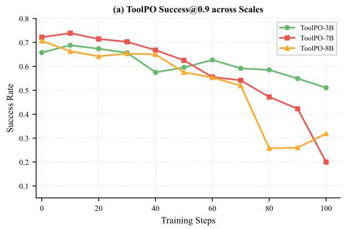

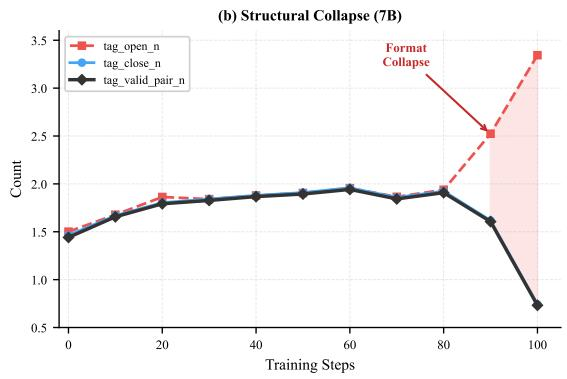

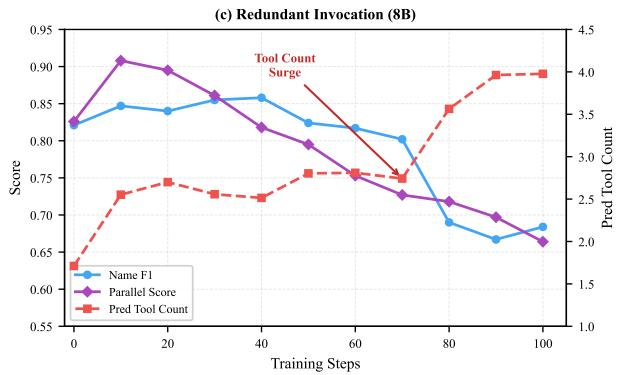

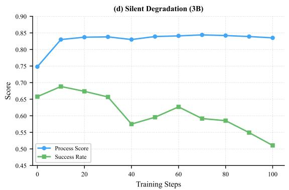  
Figure 8 ToolPO training behavior under the LLM-judge diagnostic (representative single-run traces). (a) Success@0.9 across t<sup>h</sup>ree sca<sup>l</sup>es: a <sup>d</sup>ec<sup>l</sup>ine on 3B (0.65→0.51), a s<sup>h</sup>arper <sup>d</sup>ec<sup>l</sup>ine on 7B (0.72→0.20), an<sup>d</sup> an overa<sup>ll d</sup>ec<sup>l</sup>ine wit<sup>h</sup> a <sup>b</sup>rie<sup>f</sup> mi<sup>d</sup>-training re<sup>b</sup>oun<sup>d</sup> on 8B, en<sup>d</sup>ing near 0.32. (b) 7B: tag\_open\_n <sup>d</sup>iverges <sup>f</sup>rom tag\_close\_n a<sup>f</sup>ter step 80, re<sup>d</sup>ucing t<sup>h</sup>e va<sup>l</sup>i<sup>d</sup> parse<sup>d</sup>-ca<sup>ll</sup> count <sup>f</sup>rom 1.91 to 0.73. (c) 8B: pred\_tool\_count surges 1.71→3.98 (go<sup>ld</sup> ≈2.0), <sup>d</sup>riving Name F1 an<sup>d</sup> Parallel Score down. (d) 3B: Process Score plateaus at ∼0.84, below the $S _ { \mathrm { p r o c e s s } } \geq 0 . 9$ th<sub>res</sub>h<sub>o</sub>ld<sub>,</sub> <sub>exp</sub>l<sub>a</sub>i<sub>n</sub>i<sub>ng</sub> <sub>w</sub>h<sub>y</sub> <sub>proxy</sub> <sub>me</sub>t<sub>r</sub>i<sub>cs</sub> i<sub>mprove w</sub>hil<sub>e s</sub>t<sub>r</sub>i<sub>c</sub>t S<sub>uccess</sub> d<sub>ec</sub>li<sub>nes.</sub>

ToolPO training trace Here tag\_valid\_pair\_n denotes the number of parsed, schema-valid call blocks. It is not <sub>a</sub> <sub>coun</sub>t f<sub>orme</sub>d b<sub>y</sub> <sub>pa</sub>i<sub>r</sub>i<sub>ng</sub> th<sub>e</sub> <sub>open</sub>i<sub>ng</sub> <sub>an</sub>d <sub>c</sub>l<sub>os</sub>i<sub>ng</sub> t<sub>ag</sub> t<sub>o</sub>t<sub>a</sub>l<sub>s.</sub>

The traces show diferent failure <sub>p</sub>atterns across model scales (Fi<sub>g</sub>ure 8a):

• 3B: Silent degradation (Figure 8d). The proxy metrics increase $( R _ { s \mathrm { u c c } } \colon 0 . 2 4 \substack {  } 0 . 5 0 ;$ summary: 0.56→0.62), an<sup>d</sup> process\_score rises <sup>f</sup>rom 0.75 to a p<sup>l</sup>ateau o<sup>f</sup> ∼0.84. Strict Success@0.9 <sup>d</sup>ec<sup>l</sup>ines (0.65→0.51). T<sup>h</sup>e <sub>o</sub>b<sub>serve</sub>d <sub>gap</sub> i<sub>s cons</sub>i<sub>s</sub>t<sub>en</sub>t <sub>w</sub>ith th<sub>e</sub> th<sub>res</sub>h<sub>o</sub>ld $S _ { \mathrm { p r o c e s s } } \geq 0 . 9 $ : t<sup>h</sup>e Process Score remains near ∼0.84. Format integrity is preserve<sup>d</sup> (format\_passed ≈ 0.98, tag\_valid\_pair\_n ≈ 2.0), so t<sup>h</sup>e <sup>d</sup>ec<sup>l</sup>ine is not accompanie<sup>d b</sup>y <sub>a s</sub>t<sub>ruc</sub>t<sub>ura</sub>l<sub>-</sub>f<sub>orma</sub>t <sub>c</sub>h<sub>ange</sub> i<sub>n</sub> thi<sub>s</sub> t<sub>race.</sub>

• 7B: Structural format decline (Figure 8b). The trace shows more opening than closing tool-call tags (tag\_open\_n: 1.50→3.34; tag\_close\_n: 1.46→0.74), w<sup>h</sup>i<sup>l</sup>e t<sup>h</sup>e summary score remains non-zero. T<sup>h</sup>e va<sup>l</sup>i<sup>d</sup> <sub>p</sub>arsed-call count dro<sub>p</sub>s from 1.91 to 0.73, and Success@0.9 dro<sub>p</sub>s from 0.72 to 0.20. The chan<sub>g</sub>e is concentrated <sup>b</sup>etween steps <sup>80</sup>–<sup>100</sup>, w<sup>h</sup>en t<sup>h</sup>e gap <sup>b</sup>etween tag\_open\_n an<sup>d</sup> tag\_close\_n w<sup>id</sup>ens to <sup>2</sup>.<sup>60</sup>.

• 8B: Redundant tool invocation (Figure 8c). Qwen3-8B-Base keeps tag\_open\_n and tag\_close\_n close in this trace. T<sup>h</sup>e trace instea<sup>d</sup> s<sup>h</sup>ows more re<sup>d</sup>icte<sup>d</sup> too<sup>l</sup> ca<sup>ll</sup>s (pred\_tool\_count: 1.71→3.98 o<sup>ld</sup> ≈2.0). Success@0.9 <sup>d</sup>ec<sup>l</sup>ines overa<sup>ll</sup>, wit<sup>h</sup> a <sup>b</sup>rie<sup>f</sup> mi<sup>d</sup>-training re<sup>b</sup>oun<sup>d</sup>, an<sup>d</sup> en<sup>d</sup>s near ∼0.32 as re<sup>d</sup>un<sup>d</sup>ant ca<sup>ll</sup>s accumu<sup>l</sup>ate. At steps 70–80, pred\_tool\_count excee<sup>d</sup>s 3.5 an<sup>d</sup> Name F1 <sup>f</sup>a<sup>ll</sup>s <sup>f</sup>rom 0.80 to 0.69.

These observations are specific to the LLM-judge diagnostic and do not imply that ToolPO always fails. They <sub>mo</sub>ti<sub>va</sub>t<sub>e</sub> th<sub>e separa</sub>t<sub>e ma</sub>t<sub>c</sub>h<sub>e</sub>d GRPO <sub>compar</sub>i<sub>son, w</sub>h<sub>ere</sub> th<sub>e summary-</sub>t<sub>o-</sub>t<sub>oo</sub>l <sub>suppor</sub>t <sub>pa</sub>th i<sub>s</sub> bl<sub>oc</sub>k<sub>e</sub>d b<sub>y</sub> SLCA’<sub>s</sub> rout<sup>i</sup>n<sub>g</sub>.

RLTR: Coarse-Grained Reward and Training Stagnation As visualized in Figure 2a, RLTR avoids direct <sub>summary-</sub>t<sub>o-</sub>t<sub>oo</sub>l l<sub>ea</sub>k<sub>age</sub> <sub>v</sub>i<sub>a</sub> <sub>p</sub>i<sub>pe</sub>li<sub>ne</sub> <sub>separa</sub>ti<sub>on,</sub> b<sub>u</sub>t it<sub>s</sub> <sub>p</sub>l<sub>ann</sub>i<sub>ng</sub> <sub>rewar</sub>d <sub>rema</sub>i<sub>ns</sub> <sub>sequence-</sub>l<sub>eve</sub>l <sub>an</sub>d <sub>coarse.</sub> I<sub>n</sub> <sub>our</sub> runs, rltr\_comp oscillates between 0.49 and 0.64, while Process and Parallel improve much more slowly than under SLCA-GRPO. On Qwen3-8B-Base, $R _ { \mathrm { c o m p } }$ doubles (0.22→0.43) while error\_count increases from 0.39 to 0.59, su<sub>gg</sub>estin<sub>g</sub> that the com<sub>p</sub>leteness reward does not <sub>p</sub>enalize structurall<sub>y</sub> invalid calls (cf. the frozen-summarizer limitation noted in Table 15).

## D.4 Visualizing Credit Misattribution

Fi ure 9 resents a dia nostic case on a arallel information-retrieval task (com arin the current stock rices of Apple and Microsoft), illustrating how Cross-Segment Credit Misattribution manifests as tool-use ineficiency masked by a perfect summary. The reference trajectory consists of a single parallel get\_stock\_price invocation <sub>cover</sub>i<sub>ng</sub> b<sub>o</sub>th ti<sub>c</sub>k<sub>ers, an</sub>d th<sub>e</sub> t<sub>oo</sub>l<sub>-</sub>l<sub>eve</sub>l <sub>rewar</sub>d i<sub>s</sub> d<sub>ecompose</sub>d <sub>as</sub> $R _ { \mathrm { t o o l } } = 0 . 1 0 R _ { \mathrm { f o r m a t } } + 0 . 2 5 R _ { \mathrm { n a m e } } + 0 . 1 5 R _ { \mathrm { k e y } } +$ $0 . 2 0 R _ { \mathrm { v a l u e } } + 0 . 3 0 R _ { \mathrm { p a r a l l e l } }$

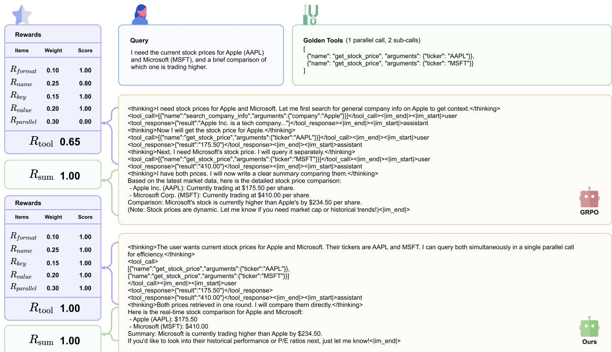  
Figure 9 Diagnostic Case Study: Resolving Cross-Segment Credit Misattribution on a parallel tool-use task. (Top) Reference trajectory and rewards. (Middle) Standard GRPO. The agent adopts a redundant, trial-and-error trajectory (first issuing an unnecessary search\_company\_info call, then retrieving the two stock prices through serial get\_stock\_price invocations in se<sub>p</sub>arate turns), <sub>y</sub>et still <sub>p</sub>roduces a fluent, factuall<sub>y</sub> correct com<sub>p</sub>arison $( R _ { \mathrm { { s u m } } } { = } 1 . 0 0 )$ <sub>.</sub> Th<sub>e</sub> t<sub>oo</sub>l<sub>-</sub>l<sub>eve</sub>l <sup>d</sup>ecom osition ex oses w<sup>h</sup>ere t<sup>h</sup>e trajector <sup>f</sup>ai<sup>l</sup>s: t<sup>h</sup>e format rewar<sup>d</sup> is una<sup>f</sup>ecte<sup>d</sup> (1.00) t<sup>h</sup>e key an<sup>d</sup> value rewar<sup>d</sup>s remain <sup>h</sup>i <sup>h</sup> on t<sup>h</sup>e in<sup>d</sup>ivi<sup>d</sup>ua<sup>l</sup> ca<sup>ll</sup>s t<sup>h</sup>at <sup>d</sup>o matc<sup>h</sup> t<sup>h</sup>e sc<sup>h</sup>ema (1.00 eac<sup>h</sup>) t<sup>h</sup>e name rewar<sup>d</sup> is <sup>d</sup>i<sup>l</sup>ute<sup>d b</sup> t<sup>h</sup>e re<sup>d</sup>un<sup>d</sup>ant search\_company\_info ca<sup>ll</sup> (0.80), an<sup>d</sup> t<sup>h</sup>e parallel rewar<sup>d</sup> is 0.00 <sup>b</sup>ecause t<sup>h</sup>e two require<sup>d</sup> stoc<sup>k</sup>-price queries are issue<sup>d</sup> as se<sub>p</sub>arate se<sub>q</sub>uential turns (further <sub>p</sub>receded b<sub>y</sub> a redundant ex<sub>p</sub>loration call), rather than batched into a sin<sub>g</sub>le <sub>p</sub>arallel i<sub>nvoca</sub>ti<sub>on.</sub> A<sub>ggrega</sub>t<sub>e</sub>d <sub>un</sub>d<sub>er</sub> th<sub>e</sub> fi<sub>xe</sub>d <sub>we</sub>i<sub>g</sub>ht<sub>s a</sub>b<sub>ove,</sub> thi<sub>s y</sub>i<sub>e</sub>ld<sub>s</sub> $R _ { \mathrm { t o o l } } { = } 0 . 6 5$ . Because standard GRPO mer<sub>g</sub>es $R _ { \mathrm { t o o l } }$ <sub>an</sub>d $R _ { \mathrm { s u m } }$ into a single trajectory-level advantage, the high summary reward can ofset the structural tool penalty in the unified advantage, allowing the ineficient pattern to be reinforced. (Bottom) SLCA-GRPO (Ours). The same model, trained under our advantage-isolation objective, produces a trajectory in which both tickers are known a priori and issues a single parallel tool call covering AAPL and MSFT simultaneously. All five tool sub-rewards saturate at 1.00, giving $R _ { \mathrm { t o o l } } { = } 1 . 0 0$ <sub>w</sub>hil<sub>e</sub> <sub>preserv</sub>i<sub>ng</sub> $R _ { \mathrm { { s u m } } } { = } 1 . 0 0$ . By rout<sup>i</sup>ng $A _ { \mathrm { t o o l } }$ <sub>an</sub>d $A _ { \mathrm { s u m } }$ th<sub>roug</sub>h <sub>separa</sub>t<sub>e op</sub>ti<sub>m</sub>i<sub>za</sub>ti<sub>on pa</sub>th<sub>ways, segmen</sub>t <sub>rou</sub>ti<sub>ng</sub> k<sub>eeps</sub> th<sub>e summary s</sub>i<sub>gna</sub>l <sup>f</sup>rom entering t<sup>h</sup>e too<sup>l</sup>-to<sup>k</sup>en up<sup>d</sup>ate in t<sup>h</sup>is examp<sup>l</sup>e. T<sup>h</sup>e too<sup>l</sup>-execution score increases <sup>b</sup>y +0.35 w<sup>h</sup>i<sup>l</sup>e t<sup>h</sup>e summary score remains 1.00. T<sup>h</sup>e trajectory is qua<sup>l</sup>itative<sup>l</sup>y simi<sup>l</sup>ar to t<sup>h</sup>e representative sing<sup>l</sup>e-run pred\_tool\_count increase o<sup>b</sup>serve<sup>d</sup> un<sup>d</sup>er ToolPO on 8B (Fi<sub>g</sub>ure 8c); the two dia<sub>g</sub>nostics use diferent <sub>p</sub>rotocols.

## D.5 BFCL: Robustness in Multi-Turn Scenarios

While the main <sub>p</sub>a<sub>p</sub>er (Fi<sub>g</sub>ure 3a) focuses on atomic schema <sub>g</sub>eneralization, Table 17 additionall<sub>y</sub> re<sub>p</sub>orts Multi-Turn accuracy, now including RLTR and ToolPO. On Qwen3-8B-Base, standard GRPO has a lower Multi-Turn mean than SFT $( 0 . 0 8 2 2 { \scriptstyle \pm 0 . 0 0 3 5 }$ vs. $0 . 1 5 4 4 { \scriptstyle \pm 0 . 0 1 0 2 } )$ <sub>,</sub> while SLCA-GRPO reaches $0 . 1 4 8 9 { \pm } 0 . 0 0 2 5$ . The SLCA mean is close to th<sub>e</sub> SFT <sub>va</sub>l<sub>ue</sub> i<sub>n</sub> thi<sub>s</sub> th<sub>ree-run com ar</sub>i<sub>son</sub> th<sub>e</sub> t<sub>a</sub>bl<sub>e</sub> d<sub>oes no</sub>t i<sub>so</sub>l<sub>a</sub>t<sub>e</sub> th<sub>e source o</sub>f th<sub>e</sub> M<sub>u</sub>lti<sub>-</sub>T<sub>urn</sub> dif<sub>erence.</sub> O<sub>n</sub> Qwen2.5-3B-Instruct SLCA-GRPO also remains below SFT on Multi-Turn $( 0 . 0 6 2 2 { \scriptstyle \pm 0 . 0 0 2 5 }$ vs. $0 . 0 8 6 7 { \scriptstyle \pm 0 . 0 1 0 0 } )$ . RLTR remains com<sub>p</sub>etitive on AST Non-Live<sub>,</sub> su<sub>gg</sub>estin<sub>g</sub> that <sub>p</sub>lanner-onl<sub>y</sub> RL can learn basic tool selection under <sub>unseen sc</sub>h<sub>emas,</sub> b<sub>u</sub>t it l<sub>ags on</sub> M<sub>u</sub>lti<sub>-</sub>T<sub>urn w</sub>h<sub>ere en</sub>d<sub>-</sub>t<sub>o-en</sub>d <sub>coor</sub>di<sub>na</sub>ti<sub>on ma</sub>tt<sub>ers.</sub> U<sub>n</sub>d<sub>er</sub> th<sub>e repor</sub>t<sub>e</sub>d T<sub>oo</sub>lPO <sub>eva</sub>l<sub>ua</sub>ti<sub>on,</sub> th<sub>e</sub> M<sub>u</sub>lti<sub>-</sub>T<sub>urn means are</sub> $0 . 0 9 6 1 { \scriptstyle \pm 0 . 0 0 6 7 }$ on 3B and 0.0083±0.0067 on 8B. This spread is reported <sub>as con</sub>t<sub>ex</sub>t <sub>ra</sub>th<sub>er</sub> th<sub>an as a c</sub>l<sub>a</sub>i<sub>m a</sub>b<sub>ou</sub>t th<sub>e or</sub>i<sub>g</sub>i<sub>na</sub>l <sub>me</sub>th<sub>o</sub>d <sub>across mo</sub>d<sub>e</sub>l <sub>sca</sub>l<sub>es.</sub>

Table 17 Com<sub>p</sub>rehensive Generalization Results on BFCL V3 across Scales. This table details BFCL <sub>g</sub>eneralization <sub>p</sub>erformance. In addition to Overall Acc, AST Live, and AST Non-Live (re<sub>p</sub>orted in Fi<sub>g</sub>ure 3a), we include Multi-Turn accurac<sub>y</sub> to assess state tracking under schema generalization. Trained rows report mean±std over three runs; Original rows are point evaluations. T<sub>oo</sub>lPO <sub>an</sub>d RLTR <sub>re</sub>t<sub>a</sub>i<sub>n</sub> th<sub>e</sub>i<sub>r me</sub>th<sub>o</sub>d<sub>-spec</sub>ifi<sub>c pro</sub>t<sub>oco</sub>l<sub>s.</sub>
<table><tr><td>Method</td><td>Overall Acc</td><td>AST Live</td><td>AST Non-Live</td><td>Multi-Turn</td></tr><tr><td colspan="5">Qwen2.5-3B-Instruct</td></tr><tr><td>Original</td><td>0.4225</td><td>0.5174</td><td>0.5139</td><td>0.0271</td></tr><tr><td>SFT</td><td>0.6163±.0026</td><td> $\pm . 6 8 6 2 { \scriptstyle \pm . 0 0 2 2 }$ </td><td> $\mathbf { 0 . 8 1 0 4 } \pm . 0 0 4 3$ </td><td>0.0867±.0100</td></tr><tr><td>SFT+GRPO</td><td> $\pm . 6 3 2 1 { \scriptstyle \pm . 0 0 3 2 }$ </td><td> $\pmb { 0 . 6 9 3 6 \pm . 0 0 3 0 }$ </td><td> $\pmb { 0 . 8 5 8 3 \pm . 0 0 8 7 }$ </td><td> $\pmb { 0 . 0 6 0 0 \pm . 0 0 3 3 }$ </td></tr><tr><td>RLTR</td><td> $\pm . 5 8 3 8 { \scriptstyle \pm . 0 0 6 5 }$ </td><td> $\mathbf { 0 . 6 1 3 6 { \scriptstyle \pm . 0 0 7 4 } }$ </td><td> $\pm . 8 2 7 5 { \scriptstyle \pm . 0 0 4 4 }$ </td><td> $\pmb { 0 . 0 4 9 4 } \pm . 0 1 0 0$ </td></tr><tr><td>ToolPO</td><td> $\pmb { 0 . 6 0 9 5 \pm . 0 0 8 6 }$ </td><td> $\pm . 6 4 7 7 { \scriptstyle \pm . 0 1 0 8 }$ </td><td> $\pmb { 0 . 8 3 2 5 \pm . 0 1 3 9 }$ </td><td> $\pm . 0 9 6 1 { \scriptstyle \pm . 0 0 6 7 }$ </td></tr><tr><td>Ours</td><td> $\pm . 6 3 6 1 { \scriptstyle \pm . 0 0 5 2 }$ </td><td> $\pm . 7 0 2 7 { \scriptstyle \pm . 0 0 7 0 }$ </td><td> $\pm . 8 5 7 4 { \scriptstyle \pm . 0 0 8 3 }$ </td><td> $\pm . 0 6 2 2 { \scriptstyle \pm . 0 0 2 5 }$ </td></tr><tr><td colspan="5">Qwen2.5-7B-Instruct</td></tr><tr><td>Original</td><td>0.6490</td><td>0.7446</td><td>0.8130</td><td>0.1172</td></tr><tr><td>SFT</td><td> $\pm . 6 7 8 9 { \scriptstyle \pm . 0 0 2 8 }$ </td><td> $\pmb { 0 . 7 5 9 5 } \pm . 0 \pmb { 5 3 }$ </td><td> $\pmb { 0 . 8 6 3 5 \pm . 0 0 1 2 }$ </td><td> $\pmb { 0 . 1 4 3 5 \pm . 0 1 2 0 }$ </td></tr><tr><td>SFT+GRPO</td><td>0.6841±.0011</td><td> $\pm . 7 7 8 3 { \scriptstyle \pm . 0 0 2 6 }$ </td><td> $\pmb { 0 . 8 5 4 8 \pm . 0 0 7 4 }$ </td><td> $\mathbf { 0 . 1 4 4 3 { \scriptstyle \pm . 0 0 3 4 } }$ </td></tr><tr><td>RLTR</td><td> $\pm . 6 3 1 1 { \scriptstyle \pm . 0 0 6 2 }$ </td><td> $\mathbf { 0 . 6 8 4 0 { \scriptstyle \pm . 0 0 7 8 } }$ </td><td> $\pm . 8 5 9 1 { \scriptstyle \pm . 0 0 5 3 }$ </td><td> $\pm . 0 7 5 0 { \scriptstyle \pm . 0 0 9 4 }$ </td></tr><tr><td>ToolPO</td><td> $\pm . 2 4 5 9 { \scriptstyle \pm . 0 0 8 7 }$ </td><td> $\pmb { 0 . 2 0 4 3 \pm . 0 1 0 3 }$ </td><td> $\pmb { 0 . 4 0 9 6 } \pm . \pmb { 0 1 1 8 }$ </td><td> $\pm . 0 2 5 1 { \scriptstyle \pm . 0 0 5 6 }$ </td></tr><tr><td>Ours</td><td> $\pm . 6 9 7 7 { \scriptstyle \pm . 0 0 4 7 }$ </td><td> $\pm . 7 8 2 0 { \scriptstyle \pm . 0 0 6 8 }$ </td><td> $\pm . 8 7 3 9 { \scriptstyle \pm . 0 0 8 6 }$ </td><td> $\pm . 1 5 5 0 { \scriptstyle \pm . 0 0 2 4 }$ </td></tr><tr><td colspan="5">Qwen3-8B-Base</td></tr><tr><td>Original</td><td>0.2403</td><td>0.2435</td><td>0.3617</td><td>0.0000</td></tr><tr><td>SFT</td><td> $\pm . 6 8 5 0 { \scriptstyle \pm . 0 0 3 5 }$ </td><td> $\pmb { 0 . 7 7 7 9 } \pm . 0 \pmb { 1 5 }$ </td><td> $\pmb { 0 . 8 5 2 8 \pm . 0 0 3 1 }$ </td><td> $\pmb { 0 . 1 5 4 4 } \pm . 0 1 \pmb { 0 2 }$ </td></tr><tr><td>SFT+GRPO</td><td> $\pmb { 0 . 6 6 9 6 } \pm . 0 0 3 2$ </td><td> $\pm . 7 7 5 0 { \scriptstyle \pm . 0 0 2 7 }$ </td><td> $\pmb { 0 . 8 5 2 2 \pm . 0 0 7 1 }$ </td><td> $\pm . 0 8 2 2 { \scriptstyle \pm . 0 0 3 5 }$ </td></tr><tr><td>RLTR</td><td> $\pm . 6 6 1 0 { \scriptstyle \pm . 0 0 6 5 }$ </td><td> $\pm . 7 1 9 7 { \scriptstyle \pm . 0 0 7 8 }$ </td><td> $\mathbf { 0 . 8 9 1 9 { \scriptstyle \pm . 0 0 5 3 } }$ </td><td> $\pm . 0 8 6 1 { \scriptstyle \pm . 0 1 0 2 }$ </td></tr><tr><td>ToolPO</td><td> $\pm . 6 2 4 1 { \scriptstyle \pm . 0 0 9 0 }$ </td><td> $\pm . 6 8 2 7 { \scriptstyle \pm . 0 0 9 6 }$ </td><td> $\pm . 8 7 6 5 { \scriptstyle \pm . 0 1 0 4 }$ </td><td> $\pmb { 0 . 0 0 8 3 \pm . 0 0 6 7 }$ </td></tr><tr><td>Ours</td><td> $\pm . 7 0 3 1 { \scriptstyle \pm . 0 0 5 0 }$ </td><td> $\pm . 7 8 5 6 { \scriptstyle \pm . 0 0 8 2 }$ </td><td> $\pm . 8 9 5 4 { \scriptstyle \pm . 0 0 8 3 }$ </td><td> $0 . 1 4 8 9 { \scriptstyle \pm . 0 0 2 5 }$ </td></tr></table>

## D.6 Additional Analysis on <sub>τ</sub><sup>2</sup>-Bench Results

Baseline Configurations and Omissions The Qwen3-8B-Base Original baseline has a $0 . 0 0 \mathrm { P a s s ^ { 1 } }$ rate <sup>i</sup>n ever<sub>y</sub> d<sub>oma</sub>i<sub>n;</sub> it i<sub>s</sub> <sub>s</sub>h<sub>own</sub> <sub>exp</sub>li<sub>c</sub>itl<sub>y</sub> i<sub>n</sub> T<sub>a</sub>bl<sub>e</sub> 18<sub>.</sub> Th<sub>e</sub> SFT b<sub>ase</sub>li<sub>ne</sub> <sub>serves</sub> <sub>as</sub> th<sub>e</sub> <sub>s</sub>t<sub>ar</sub>ti<sub>ng</sub> <sub>po</sub>i<sub>n</sub>t f<sub>or</sub> th<sub>e</sub> 8B <sub>sca</sub>l<sub>e</sub> <sub>compar</sub>i<sub>sons.</sub>

Table 18 Com<sub>p</sub>rehensive Collaboration Results on $\tau ^ { 2 } .$ -Bench across Scales. We re<sub>p</sub>ort $\mathrm { P a s s ^ { 1 } }$ <sub>ra</sub>t<sub>es</sub> f<sub>or</sub> d<sub>ua</sub>l<sub>-con</sub>t<sub>ro</sub>l <sub>scenar</sub>i<sub>os</sub> across three distinct domains: Airline (User Retention), Retail (Order Modification), and Telecom (Plan Mana<sub>g</sub>ement). Pass<sup>1</sup> is th<sub>e propor</sub>ti<sub>on o</sub>f <sub>success</sub>f<sub>u</sub>l t<sub>as</sub>k<sub>s</sub> i<sub>n</sub> th<sub>e</sub> fi<sub>n</sub>it<sub>e o</sub>fi<sub>c</sub>i<sub>a</sub>l t<sub>as</sub>k <sub>se</sub>t<sub>;</sub> b<sub>ecause eac</sub>h <sub>run eva</sub>l<sub>ua</sub>t<sub>es a</sub> fi<sub>n</sub>it<sub>e se</sub>t<sub>,</sub> th<sub>e repor</sub>t<sub>e</sub>d <sub>va</sub>l<sub>ues are</sub> discrete proportions and their standard deviations reflect variation of those proportions across runs. The Qwen3-8B-Base Original row is included and is zero in all four reported metrics. Trained rows are mean±std over three runs. ToolPO and RLTR <sub>re</sub>t<sub>a</sub>i<sub>n</sub> th<sub>e</sub>i<sub>r me</sub>th<sub>o</sub>d<sub>-spec</sub>ifi<sub>c pro</sub>t<sub>oco</sub>l<sub>s.</sub>
<table><tr><td>Method</td><td>Overall Pass1</td><td>Airline</td><td>Retail</td><td>Telecom</td></tr><tr><td colspan="5">Qwen2.5-3B-Instruct</td></tr><tr><td>Original</td><td>0.2324</td><td>0.3810</td><td>0.1481</td><td>0.2692</td></tr><tr><td>SFT</td><td> $\pmb { 0 . 2 7 0 5 \pm . 0 2 3 6 }$ </td><td> $\pm . 1 3 6 4 { \scriptstyle \pm . 0 2 2 7 }$ </td><td> $\pmb { 0 . 3 9 6 6 \pm . 0 2 5 9 }$ </td><td> $\pmb { 0 . 1 9 5 4 \pm . 0 2 1 7 }$ </td></tr><tr><td>SFT+GRPO</td><td> $\pmb { 0 . 3 4 5 4 \pm . 0 2 5 7 }$ </td><td> $\pmb { 0 . 2 5 7 6 } \pm . \pmb { 0 1 3 1 }$ </td><td> $\pmb { 0 . 4 5 9 8 \pm . 0 2 1 7 }$ </td><td> $0 . 2 6 4 4 { \scriptstyle \pm . 0 3 4 8 }$ </td></tr><tr><td>RLTR</td><td> $\pmb { 0 . 2 8 5 0 \pm . 0 2 9 1 }$ </td><td> $\pm . 2 7 2 7 { \scriptstyle \pm . 0 2 2 7 }$ </td><td> $\pmb { 0 . 3 6 4 9 \pm . 0 3 0 3 }$ </td><td> $\pmb { 0 . 2 0 9 8 \pm . 0 3 0 3 }$ </td></tr><tr><td>ToolPO</td><td> $\pmb { 0 . 2 3 5 5 \pm . 0 2 2 6 }$ </td><td> $\pm . 1 2 8 8 { \scriptstyle \pm . 0 2 6 2 }$ </td><td> $\pm . 3 6 7 8 { \scriptstyle \pm . 0 2 6 3 }$ </td><td> $\pm . 1 4 3 7 { \scriptstyle \pm . 0 1 7 9 }$ </td></tr><tr><td>Ours</td><td> $\pmb { 0 . 3 5 6 3 \pm . 0 0 9 1 }$ </td><td> $\pmb { 0 . 2 5 7 6 } \pm . \pmb { 0 3 4 7 }$ </td><td> $\pmb { 0 . 4 5 6 9 \pm . 0 1 7 2 }$ </td><td> $\pm . 2 9 3 1 { \scriptstyle \pm . 0 1 7 2 }$ </td></tr><tr><td colspan="5">Qwen2.5-7B-Instruct</td></tr><tr><td>Original</td><td>0.3023</td><td>0.3023</td><td>0.4054</td><td>0.2018</td></tr><tr><td>SFT</td><td> $\pmb { 0 . 3 2 5 4 } \pm . 0 1 \pm 2 2$ </td><td> $\pm . 2 3 8 1 { \scriptstyle \pm . 0 2 2 7 }$ </td><td> $\mathbf { 0 . 4 1 6 7 { \scriptstyle \pm . 0 2 5 3 } }$ </td><td> $\pm . 2 6 4 7 { \scriptstyle \pm . 0 2 0 8 }$ </td></tr><tr><td>SFT+GRPO</td><td> $\pm . 3 1 8 7 { \scriptstyle \pm . 0 2 9 7 }$ </td><td> $\pmb { 0 . 3 3 7 5 \pm . 0 1 7 7 }$ </td><td> $\pm . 4 2 2 1 { \scriptstyle \pm . 0 2 6 0 }$ </td><td> $\pmb { 0 . 2 1 2 4 } \pm . 0 3 7 5$ </td></tr><tr><td>RLTR</td><td> $\pm . 0 . 3 3 7 2 { \scriptstyle \pm . 0 2 3 8 }$ </td><td> $\pmb { 0 . 2 1 9 5 \pm . 0 2 7 1 }$ </td><td> $\pm { \bf 0 . 4 0 0 1 } \pm . 0 3 0 2$ </td><td> $\pm . 3 1 8 2 { \scriptstyle \pm . 0 2 6 4 }$ </td></tr><tr><td>ToolPO</td><td> $\pmb { 0 . 3 0 4 4 } . 0 2 1 5$ </td><td> $\pm 0 . 2 0 0 0 { \scriptstyle \pm . 0 2 4 3 }$ </td><td> $\pmb { 0 . 4 2 8 6 \pm . 0 2 7 8 }$ </td><td> $\pmb { 0 . 2 2 0 8 \pm . 0 2 3 1 }$ </td></tr><tr><td>Ours</td><td> $\pmb { 0 . 4 1 0 2 \pm . 0 1 0 1 }$ </td><td> $\pm . 2 8 2 7 { \scriptstyle \pm . 0 3 8 0 }$ </td><td> $\pmb { 0 . 5 3 2 3 \pm . 0 2 0 3 }$ </td><td> $\pm . 3 3 8 0 { \scriptstyle \pm . 0 1 9 0 }$ </td></tr><tr><td colspan="5">Qwen3-8B-Base</td></tr><tr><td>Original</td><td>0.0000</td><td>0.0000</td><td>0.0000</td><td>0.0000</td></tr><tr><td>SFT</td><td> $\pm . 3 1 0 4 { \scriptstyle \pm . 0 2 0 0 }$ </td><td> $\pmb { 0 . 2 2 7 3 \pm . 0 2 2 7 }$ </td><td> $\pmb { 0 . 4 5 4 0 } \pm . \pmb { 0 3 0 3 }$ </td><td> $\pm . 1 9 8 3 \pm . 0 2 5 9$ </td></tr><tr><td>SFT+GRPO</td><td> $\pmb { 0 . 3 4 6 6 } \pm . 0 2 3 6$ </td><td> $\pm . 2 6 5 2 { \scriptstyle \pm . 0 1 3 1 }$ </td><td> $\pmb { 0 . 4 4 2 5 \pm . 0 3 0 3 }$ </td><td> $\pmb { 0 . 2 8 1 6 \pm . 0 3 0 3 }$ </td></tr><tr><td>RLTR</td><td> $\pm . 3 4 9 0 { \scriptstyle \pm . 0 2 1 8 }$ </td><td> $\pmb { 0 . 2 2 7 3 \pm . 0 2 2 7 }$ </td><td> $\pmb { 0 . 4 2 8 2 \pm . 0 2 1 7 }$ </td><td> $\pm . 3 1 6 1 \pm . 0 2 1 7$ </td></tr><tr><td>ToolPO</td><td> $\pmb { 0 . 4 4 3 2 \pm . 0 1 8 6 }$ </td><td> $\mathbf { 0 . 2 1 9 7 { \scriptstyle \pm . 0 2 6 2 } }$ </td><td> $\pm . 5 8 9 1 { \scriptstyle \pm . 0 3 0 3 }$ </td><td> $\pmb { 0 . 3 8 2 2 \pm . 0 2 1 7 }$ </td></tr><tr><td>Ours</td><td> $\pmb { 0 . 4 4 6 9 } \pm . 0 0 8 4$ </td><td> $\pm . 3 5 6 1 { \scriptstyle \pm . 0 4 7 3 }$ </td><td> $\pmb { 0 . 5 3 7 4 } \pm . 0 2 1 7$ </td><td> $\pmb { 0 . 3 9 0 8 \pm . 0 2 1 7 }$ </td></tr></table>

Domain-Specific Performance Analysis The SLCA-GRPO mean is higher than the matched GRPO mean on Overall Pass<sup>1</sup> for all three backbones. Domain-level orderings vary by scale: on Qwen2.5-3B-Instruct, SLCA-GRPO ties GRPO on Airline, trails it on Retail, and leads on Telecom; RLTR has the highest Airline mean. On Qwen2.5-7B-Instruct, the Airline mean is below GRPO while Retail and Telecom are higher. On Qwen3-8B-Base, SLCA-GRPO l<sub>ea</sub>d<sub>s on</sub> Ai<sub>r</sub>li<sub>ne an</sub>d T<sub>e</sub>l<sub>ecom, w</sub>hil<sub>e</sub> T<sub>oo</sub>lPO h<sub>as</sub> th<sub>e</sub> hi<sub>g</sub>h<sub>es</sub>t R<sub>e</sub>t<sub>a</sub>il <sub>mean.</sub>

The inclusion of RLTR and ToolPO reveals additional atterns. RLTR trails SLCA on 7B (0.3372 vs. 0.4102) and 3B (0.2850 vs. 0.3563), constrained b<sub>y</sub> its frozen summarizer in tasks re<sub>q</sub>uirin<sub>g</sub> full conversational a<sub>g</sub>ent loo<sub>p</sub>s. On Qwen3-8B-Base, the reported ToolPO and SLCA-GRPO Overall means are 44.32±1.86% and 44.69±0.84%, a diference of 0.37 pp. ToolPO has the higher Retail mean (58.91±3.03% vs. 53.74±2.17%), while SLCA-GRPO is hi h<sub>er on</sub> Ai<sub>r</sub>li<sub>ne an</sub>d T<sub>e</sub>l<sub>ecom.</sub> Th<sub>ese resu</sub>lt<sub>s s</sub>h<sub>ow</sub> th<sub>a</sub>t th<sub>e re</sub>l<sub>a</sub>ti<sub>ve or</sub>d<sub>er</sub>i<sub>n</sub> d<sub>e en</sub>d<sub>s on</sub> th<sub>e</sub> d<sub>oma</sub>i<sub>n an</sub>d <sub>ro</sub>t<sub>oco</sub>l<sub>.</sub>

## D.7 HierR Weight Sensitivity Analysis

T<sub>o exam</sub>i<sub>ne sens</sub>iti<sub>v</sub>it<sub>y</sub> t<sub>o</sub> Hi<sub>er</sub>R <sub>we</sub>i<sub>g</sub>ht <sub>c</sub>h<sub>o</sub>i<sub>ces, we eva</sub>l<sub>ua</sub>t<sub>e</sub> th<sub>ree</sub> $S _ { \mathrm { p r o c e s s } }$ weight configurations on Qwen2.5-7B-Instruct (three-run mean±std), summarized in Table 19.

Table 19 HierR wei<sub>g</sub>ht sensitivit<sub>y</sub> on Qwen2.5-7B-Instruct. Entries are mean±std over three runs.
<table><tr><td colspan="7"> $S _ { \mathsf { p r o c e s s } }$  Weights</td></tr><tr><td>Config</td><td> $S _ { \mathbf { f m t } }$   $S _ { \mathsf { n a m e } }$ </td><td></td><td> $S _ { \mathsf { k e y } }$   $S _ { \mathbf { v a l } }$ </td><td> $S _ { \mathsf { p a r } }$ </td><td> ${ \mathsf { B F C L A c c } } ( \% )$ </td><td> $\tau ^ { 2 } \mathsf { P a s s } ^ { 1 } ( \% )$ </td></tr><tr><td>Default (SLCA)</td><td>0.10</td><td>0.25</td><td></td><td>0.15 0.20 0.30</td><td> $\pm \bullet \bullet . 7 7 { \pm } \bullet . 4 7$ </td><td> $\pm 1 . 0 2 \pm 1 . 0 1$ </td></tr><tr><td>Uniform (SLCA)</td><td>0.20</td><td>0.20 </td><td></td><td>0.20 0.20 0.20</td><td> ${ \pm \pm \circ . 1 \mathbf { 8 } \pm \mathbf { 0 . 5 5 } }$ </td><td> ${ \bf 3 8 . 6 2 } \pm 1 . 8 6 $ </td></tr><tr><td>Value-heavy (SLCA)</td><td>0.05</td><td>0.20</td><td>0.20</td><td>0.350.20</td><td> ${ \pm } 9 . 4 4 { \pm } 0 . 4 8$ </td><td> $\pm \pmb { 5 9 . 3 5 \pm 1 . 7 3 }$ </td></tr><tr><td>w/o HierR</td><td></td><td></td><td></td><td></td><td> ${ \pm } \pm \mathsf { \Delta } . 0 7 { \pm } \mathsf { \pm } \mathsf { \pm } \mathsf { \pm } \mathsf { \pm } \mathsf { \Delta } . 4 \mathsf { 6 }$ </td><td> $\pm 4 . 5 0 { \pm } 1 . 4 4$ </td></tr><tr><td>GRPO (unified adv.)</td><td></td><td>same as Default</td><td></td><td></td><td> ${ \pm } \pm \mathrm { \ } A . 4 1 \pm \mathrm { \ } 0 . 1 1$ </td><td> $\pm \pmb { 2 1 . 8 7 \pm 2 . 9 7 }$ </td></tr></table>

Th<sub>e</sub> U<sub>n</sub>if<sub>orm con</sub>fi<sub>gura</sub>ti<sub>on se</sub>t<sub>s</sub> $S _ { \mathrm { p a r } } = 0 . 2 0$ <sub>an</sub>d <sub>rema</sub>i<sub>ns a</sub>b<sub>ove</sub> th<sub>e ma</sub>t<sub>c</sub>h<sub>e</sub>d GRPO b<sub>ase</sub>li<sub>ne on</sub> BFCL <sub>an</sub>d $\tau ^ { 2 } .$ -B<sub>e</sub>n<sub>c</sub>h $( + 0 . 7 7 \mathrm { p p }$ <sub>an</sub>d $+ 6 . 7 5 \mathrm { p p } ,$ , res<sub>p</sub>ectivel<sub>y</sub>). The Default confi<sub>g</sub>uration has the hi<sub>g</sub>hest values amon<sub>g</sub> the t<sub>es</sub>t<sub>e</sub>d <sub>se</sub>tti<sub>ngs.</sub>

## D.8 Unified Reward Ratio Sensitivity

W<sub>e</sub> <sub>vary</sub> th<sub>e</sub> <sub>re</sub>l<sub>a</sub>ti<sub>ve</sub> <sub>we</sub>i<sub>g</sub>ht <sub>o</sub>f th<sub>e</sub> t<sub>wo</sub> <sub>raw</sub> <sub>rewar</sub>d<sub>s</sub> i<sub>n</sub> th<sub>e</sub> <sub>un</sub>ifi<sub>e</sub>d GRPO <sub>es</sub>ti<sub>ma</sub>t<sub>or,</sub>

$$
\hat { A } _ { i } ^ { \mathrm { u n i } } ( \alpha ) = \mathrm { N o r m } \Big ( \alpha R _ { i } ^ { \mathrm { t o o l } } + R _ { i } ^ { \mathrm { s u m } } \Big ) , \qquad \alpha = \frac { \lambda _ { \mathrm { t o o l } } } { \lambda _ { \mathrm { s u m } } } ,\tag{29}
$$

<sub>w</sub>hil<sub>e</sub> k<sub>eep</sub>i<sub>ng</sub> th<sub>e</sub> SFT i<sub>n</sub>iti<sub>a</sub>li<sub>za</sub>ti<sub>on,</sub> d<sub>a</sub>t<sub>a sp</sub>lit<sub>,</sub> SGLS<sub>,</sub> Hi<sub>er</sub>R <sub>componen</sub>t<sub>s, ro</sub>ll<sub>ou</sub>t b<sub>u</sub>d<sub>ge</sub>t<sub>, an</sub>d <sub>eva</sub>l<sub>ua</sub>ti<sub>on pro</sub>t<sub>oco</sub>l <sup>fi</sup>xe<sup>d</sup>. T<sup>h</sup>e <sup>d</sup>isp<sup>l</sup>aye<sup>d</sup> ratios inc<sup>l</sup>u<sup>d</sup>e t<sup>h</sup>e existing 1:1 con<sup>d</sup>ition an<sup>d</sup> t<sup>h</sup>e t<sup>h</sup>ree a<sup>dd</sup>itiona<sup>l</sup> teste<sup>d</sup> ratios.

Table 20 Unified reward ratio sensitivit<sub>y</sub> on Qwen2.5-7B-Instruct. Entries are mean ± standard deviation over three matched <sub>runs.</sub> Th<sub>e ra</sub>ti<sub>o</sub> i<sub>s app</sub>li<sub>e</sub>d b<sub>e</sub>f<sub>ore</sub> th<sub>e un</sub>ifi<sub>e</sub>d <sub>group norma</sub>li<sub>za</sub>ti<sub>on;</sub> th<sub>e sca</sub>l<sub>e-</sub>i<sub>nvar</sub>i<sub>ance</sub> id<sub>en</sub>tit<sub>y</sub> h<sub>o</sub>ld<sub>s up</sub> t<sub>o</sub> th<sub>e numer</sub>i<sub>ca</sub>l fl<sub>oor</sub> described in A<sub>pp</sub>. A.3.
<table><tr><td></td><td>Reward ratio Toucan Success@0.9 (%)</td><td> $\mathsf { B F C L A c c . } ( \% )$ </td><td> $\tau ^ { 2 } { \bf - B e n c h P a s s ^ { 1 } } ( \% )$ </td></tr><tr><td>Unified 1:1</td><td> $7 6 . 6 0 \pm 1 . 2 7$ </td><td> ${ \pm } 8 . 4 1 \pm 0 . 1 1$ </td><td> ${ \bf 3 1 . 8 7 \pm 2 . 9 7 }$ </td></tr><tr><td>Unified 2:1</td><td> $7 7 . 5 4 \pm 1 . 2 4$ </td><td> $\pm \mathbf { 0 . 8 3 } \pm \mathbf { 0 . 3 1 }$ </td><td> ${ \pm 4 . 6 2 \pm 2 . 7 1 }$ </td></tr><tr><td>Unified 3:1</td><td> $7 7 . 8 8 \pm 1 . 3 0$ </td><td> ${ \pm \pmb { 6 8 . 9 5 \pm 0 . 3 6 } }$ </td><td> ${ \pm } 5 . 2 4 \pm 2 . 5 8$ </td></tr><tr><td>Unified 5:1</td><td> $7 7 . 0 2 \pm 1 . 4 1$ </td><td> ${ \pm } \pm \infty . 6 0 \pm \infty . 4 4$ </td><td> ${ \pm 2 . 9 0 \pm 2 . 8 8 }$ </td></tr><tr><td>SLCA-GRPO</td><td> ${ \bf 7 9 . 1 3 \pm 1 . 0 5 }$ </td><td> ${ \pm \circ \mathbf { . } 7 7 \pm \mathbf { 0 . } 4 7 }$ </td><td> ${ \pm 1 . 0 2 \pm 1 . 0 1 }$ </td></tr></table>

Th<sub>e un</sub>ifi<sub>e</sub>d <sub>rewar</sub>d <sub>ra</sub>ti<sub>o sweep recovers par</sub>t <sub>o</sub>f th<sub>e</sub> SLCA <sub>gap w</sub>ithi<sub>n</sub> th<sub>e</sub> t<sub>es</sub>t<sub>e</sub>d <sub>ra</sub>ti<sub>os.</sub> Th<sub>e</sub> b<sub>es</sub>t t<sub>es</sub>t<sub>e</sub>d <sub>un</sub>ifi<sub>e</sub>d ratio remains below SLCA on BFCL and $\tau ^ { 2 } .$ -Benc<sup>h</sup>, w<sup>h</sup>i<sup>l</sup>e increasing t<sup>h</sup>e too<sup>l</sup> weig<sup>h</sup>t to 5:1 re<sup>d</sup>uces t<sup>h</sup>e $\tau ^ { 2 } .$ -B<sub>e</sub>n<sub>c</sub>h <sub>score re</sub>l<sub>a</sub>ti<sub>ve</sub> t<sub>o</sub> th<sub>e</sub> b<sub>es</sub>t t<sub>es</sub>t<sub>e</sub>d <sub>ra</sub>ti<sub>o.</sub> Th<sub>e pa</sub>tt<sub>ern</sub> i<sub>n</sub>di<sub>ca</sub>t<sub>es a</sub> t<sub>ra</sub>d<sub>e-o</sub>f b<sub>e</sub>t<sub>ween</sub> t<sub>oo</sub>l <sub>an</sub>d <sub>summary rewar</sub>d<sub>s</sub> i<sub>n</sub> th<sub>e</sub> <sub>un</sub>ifi<sub>e</sub>d <sub>es</sub>ti<sub>ma</sub>t<sub>or ra</sub>th<sub>er</sub> th<sub>an a s</sub>i<sub>ng</sub>l<sub>e un</sub>if<sub>orm</sub>l<sub>y</sub> f<sub>avora</sub>bl<sub>e we</sub>i<sub>g</sub>ht<sub>.</sub>

## D.9 Support Control on Qwen2.5-7B-Instruct

We evaluate four su<sub>pp</sub>ort conditions at the <sub>p</sub>rimar<sub>y</sub> 7B scale. Let $T = \lambda _ { \mathrm { t o o l } } \mathrm { N o r m } ( R _ { \mathrm { t o o l } } )$ <sub>an</sub>d $S = \lambda _ { \mathrm { s u m } } \mathrm { N o r m } ( R _ { \mathrm { s u m } } )$ <sub>w</sub>ith b<sub>o</sub>th <sub>we</sub>i<sub>g</sub>ht<sub>s se</sub>t t<sub>o one.</sub> Th<sub>e</sub> f<sub>our ce</sub>ll<sub>s</sub> dif<sub>er on</sub>l<sub>y</sub> i<sub>n w</sub>hi<sub>c</sub>h <sub>norma</sub>li<sub>ze</sub>d <sub>componen</sub>t<sub>s reac</sub>h <sub>eac</sub>h t<sub>o</sub>k<sub>en segmen</sub>t<sub>;</sub> <sub>a</sub>dditi<sub>ve sums are</sub> l<sub>e</sub>ft <sub>unresca</sub>l<sub>e</sub>d<sub>, as</sub> i<sub>n</sub> th<sub>e</sub> t<sub>es</sub>t<sub>e</sub>d <sub>es</sub>ti<sub>ma</sub>t<sub>or.</sub> All <sub>ce</sub>ll<sub>s use</sub> th<sub>e same</sub> i<sub>n</sub>iti<sub>a</sub>li<sub>za</sub>ti<sub>on,</sub> d<sub>a</sub>t<sub>a, ro</sub>ll<sub>ou</sub>t budget, and evaluation protocol. Unified is shown as a joint-normalization reference and is not part of the factorial <sub>e</sub>f<sub>ec</sub>t<sub>s.</sub>

Table 21 Su<sub>pp</sub>ort control on Qwen2.5-7B-Instruct. The four su<sub>pp</sub>ort cells use se<sub>p</sub>aratel<sub>y</sub> normalized com<sub>p</sub>onents. Unified is a joint-normalization reference. Entries are mean ± standard deviation over three matched runs.
<table><tr><td>Condition</td><td>Tool tokens</td><td>Summary tokens</td><td>Toucan (%)</td><td>BFCL (%)</td><td> $\tau ^ { 2 } \left( \% \right)$ </td></tr><tr><td>Both closed (SLCA)</td><td>T</td><td>S</td><td> ${ \bf 7 9 . 1 3 \pm 1 . 0 5 }$ </td><td> ${ \pm \circ \circ . 7 7 \pm \circ . 4 7 }$ </td><td> ${ \pm 1 . 0 2 \pm 1 . 0 1 }$ </td></tr><tr><td> $S \to T$  open</td><td> $T + S$ </td><td>S</td><td> $7 7 . 2 1 \pm 1 . 2 4$ </td><td> ${ \pm } \mathbf { 8 . 7 2 } \pm \mathbf { 0 . 2 9 }$ </td><td> ${ \pm } 3 . 9 5 \pm 2 . 7 1$ </td></tr><tr><td> $T \to S$  open</td><td>T</td><td> $T + S$ </td><td> ${ \bf 7 9 . 0 2 \pm 1 . 1 2 }$ </td><td> ${ \pm 9 . 8 4 \pm 0 . 4 4 }$ </td><td> ${ \pm 1 . 3 6 \pm 1 . 2 4 }$ </td></tr><tr><td>Both open</td><td> $T + S$ </td><td> $T + S$ </td><td> ${ \pm } \ : 1 . 0 9 \mathrm { \pm } 1 . 0 9$ </td><td> ${ \pm } 9 . 3 0 \pm 0 . 4 1$ </td><td> ${ \bf 3 7 . 4 2 \pm 2 . 1 0 }$ </td></tr></table>

Unified (joint normalization) joint normalized reward joint normalized reward $7 6 . 6 0 \pm 1 . 2 7$ ${ \pm } 8 . 4 1 \pm 0 . 1 1$ ${ \bf 3 1 . 8 7 \pm 2 . 9 7 }$

Th<sub>e</sub> f<sub>ac</sub>t<sub>or</sub>i<sub>a</sub>l <sub>e</sub>f<sub>ec</sub>t<sub>s</sub> <sub>are</sub> <sub>compu</sub>t<sub>e</sub>d f<sub>rom</sub> th<sub>e</sub> f<sub>our</sub> <sub>suppor</sub>t <sub>ce</sub>ll<sub>s</sub> <sub>ra</sub>th<sub>er</sub> th<sub>an</sub> f<sub>rom</sub> <sub>a</sub> di<sub>agona</sub>l <sub>con</sub>t<sub>ras</sub>t<sub>:</sub>  
Table 22 Factor efects from the 7B su<sub>pp</sub>ort control. Values are com<sub>p</sub>uted from the cell means in Table 21 and are re<sub>p</sub>orted in <sub>percen</sub>t<sub>age</sub> <sub>po</sub>i<sub>n</sub>t<sub>s.</sub> M<sub>a</sub>i<sub>n</sub> <sub>e</sub>f<sub>ec</sub>t<sub>s</sub> <sub>average</sub> th<sub>e</sub> t<sub>wo</sub> <sub>s</sub>i<sub>mp</sub>l<sub>e</sub> <sub>e</sub>f<sub>ec</sub>t<sub>s</sub> <sub>over</sub> th<sub>e</sub> <sub>o</sub>th<sub>er</sub> f<sub>ac</sub>t<sub>or;</sub> i<sub>n</sub>t<sub>erac</sub>ti<sub>on</sub> <sub>en</sub>t<sub>r</sub>i<sub>es</sub> <sub>use</sub> th<sub>e</sub> <sub>un</sub>h<sub>a</sub>l<sub>ve</sub>d dif<sub>erence-</sub>i<sub>n-</sub>dif<sub>erences</sub> <sub>con</sub>t<sub>ras</sub>t<sub>.</sub>
<table><tr><td>Effect</td><td>Toucan</td><td>BFCL</td><td> $\tau ^ { 2 } { \mathrm { - } } \mathsf { B e n c h }$ </td></tr><tr><td>Close  $S \to T$ </td><td>1.32</td><td>0.80</td><td>5.51</td></tr><tr><td>Open  $T \to S$ </td><td>0.49</td><td>0.33</td><td>1.91</td></tr><tr><td>Interaction</td><td>1.20</td><td>0.51</td><td>3.13</td></tr></table>

C<sup>l</sup>osing t<sup>h</sup>e S → T pat<sup>h</sup> gives t<sup>h</sup>e <sup>l</sup>arger estimated e<sup>f</sup>ect on a<sup>ll</sup> t<sup>h</sup>ree <sup>b</sup>enc<sup>h</sup>mar<sup>k</sup>s in t<sup>h</sup>is contro<sup>l</sup>. Opening t<sup>h</sup>e $T \to S$ <sub>pa</sub>th h<sub>as</sub> <sub>a</sub> <sub>sma</sub>ll<sub>er</sub> <sub>e</sub>f<sub>ec</sub>t<sub>,</sub> <sub>an</sub>d th<sub>e</sub> dif<sub>erence</sub> b<sub>e</sub>t<sub>ween</sub> th<sub>a</sub>t <sub>con</sub>diti<sub>on</sub> <sub>an</sub>d SLCA i<sub>s</sub> $- 0 . 1 1 / + 0 . 0 7 / + 0 . 3 4$ pp on Toucan<sub>,</sub> BFCL<sub>,</sub> and $\tau ^ { 2 } .$ <sub>-</sub>B<sub>enc</sub>h<sub>.</sub> Th<sub>ese resu</sub>lt<sub>s are suppor</sub>t <sub>con</sub>t<sub>ro</sub>l <sub>e</sub>f<sub>ec</sub>t<sub>s un</sub>d<sub>er</sub> th<sub>e</sub> t<sub>es</sub>t<sub>e</sub>d <sub>a</sub>dditi<sub>ve es</sub>ti<sub>ma</sub>t<sub>or;</sub> th<sub>ey</sub> <sub>are no</sub>t <sub>presen</sub>t<sub>e</sub>d <sub>as a rou</sub>ti<sub>ng-on</sub>l<sub>y causa</sub>l <sub>es</sub>ti<sub>ma</sub>t<sub>e.</sub>

## D.10 Full Ablation Studies Across Scales

Component contributions across scales. Table 23 reports ablation results across the three backbones. The w/o SLCA rows have lower re<sub>p</sub>orted Toucan Success means b<sub>y</sub> 2.05 to 2.53 <sub>pp</sub> across the three backbones. The matched BFCL and $\tau ^ { 2 } .$ <sub>-</sub>B<sub>enc</sub>h <sub>means are a</sub>l<sub>so</sub> l<sub>ower</sub> i<sub>n</sub> th<sub>e repor</sub>t<sub>e</sub>d bl<sub>oc</sub>k<sub>s;</sub> th<sub>e</sub> 3B BFCL <sub>gap</sub> i<sub>s</sub> 0<sub>.</sub>40 <sub>pp.</sub> Th<sub>e w</sub>/<sub>o</sub> Hi<sub>er</sub>R <sub>rows s</sub>h<sub>ow</sub> th<sub>e</sub> l<sub>arges</sub>t T<sub>oucan</sub> S<sub>uccess</sub> d<sub>rops</sub> i<sub>n eac</sub>h bl<sub>oc</sub>k <sub>an</sub>d l<sub>ower means on mos</sub>t <sub>o</sub>th<sub>er</sub> T<sub>oucan me</sub>t<sub>r</sub>i<sub>cs.</sub> R<sub>emov</sub>i<sub>ng</sub> d<sub>e</sub>t<sub>erm</sub>i<sub>n</sub>i<sub>s</sub>ti<sub>c sc</sub>h<sub>ema va</sub>lid<sub>a</sub>ti<sub>on an</sub>d <sub>sc</sub>h<sub>ema-con</sub>diti<sub>one</sub>d t<sub>oo</sub>l<sub>-response promp</sub>ti<sub>ng</sub> h<sub>as a sma</sub>ll<sub>er e</sub>f<sub>ec</sub>t <sub>on</sub> i<sub>n-</sub>d<sub>oma</sub>i<sub>n</sub> S<sub>uccess;</sub> it <sub>a</sub>l<sub>so c</sub>h<sub>anges</sub> BFCL <sub>an</sub>d $\tau ^ { 2 } .$ -Bench<sub>,</sub> with the lar<sub>g</sub>est BFCL dro<sub>p</sub> at 8B.

## D.11 Scaling to Large Tool Spaces Across Families

T<sub>a</sub>bl<sub>e</sub> 24 <sub>ex</sub>t<sub>en</sub>d<sub>s</sub> th<sub>e sca</sub>l<sub>a</sub>bilit<sub>y ana</sub>l<sub>ys</sub>i<sub>s across a</sub>ll th<sub>ree</sub> b<sub>ac</sub>kb<sub>ones,</sub> i<sub>nc</sub>l<sub>u</sub>di<sub>ng an ex</sub>t<sub>reme s</sub>t<sub>ress</sub> t<sub>es</sub>t <sub>a</sub>t $K = 1 5 0$ Th<sub>e</sub> t<sub>a</sub>bl<sub>e compares</sub> th<sub>e</sub> t<sub>wo samp</sub>li<sub>ng s</sub>t<sub>ra</sub>t<sub>eg</sub>i<sub>es a</sub>t <sub>eac</sub>h <sub>can</sub>did<sub>a</sub>t<sub>e-se</sub>t <sub>s</sub>i<sub>ze:</sub>

• Semantic interference: Across all models, performance drops under Hard-Negative sampling compared to Random sam<sub>p</sub>lin<sub>g</sub> $( \mathrm { e . g . , }$ Qwen3-8B drops <sup>f</sup>rom ∼60% to ∼36% at K = 100). T<sup>h</sup>e stress test ma<sup>k</sup>es <sub>seman</sub>ti<sub>ca</sub>ll<sub>y s</sub>i<sub>m</sub>il<sub>ar</sub> t<sub>oo</sub>l<sub>s</sub> h<sub>ar</sub>d<sub>er</sub> t<sub>o</sub> di<sub>s</sub>ti<sub>ngu</sub>i<sub>s</sub>h th<sub>an ran</sub>d<sub>om can</sub>did<sub>a</sub>t<sub>es a</sub>t th<sub>e same se</sub>t <sub>s</sub>i<sub>ze.</sub>

• Efect of context limits: At K = 150 for Qwen2.5-7B, the Random-sampling rows are near-tied, while the H<sub>ar</sub>d<sub>-samp</sub>li<sub>ng gap</sub> i<sub>s</sub> +2<sub>.</sub>50 <sub>pp.</sub> Th<sub>ese resu</sub>lt<sub>s s</sub>h<sub>ow</sub> h<sub>ow can</sub>did<sub>a</sub>t<sub>e-se</sub>t <sub>cons</sub>t<sub>ruc</sub>ti<sub>on an</sub>d <sub>con</sub>t<sub>ex</sub>t l<sub>eng</sub>th i<sub>n</sub>t<sub>erac</sub>t <sub>w</sub>ith th<sub>e es</sub>ti<sub>ma</sub>t<sub>or.</sub>

• Across tested families: SLCA-GRPO is higher than GRPO in the reported Hard-sampling rows $( \mathrm { e } . g . , + 2 . 2 5 $ pp <sup>f</sup>or 3B at K = 150).

Table 23 Com<sub>p</sub>rehensive Ablation Studies Across Model Families. Com<sub>p</sub>arison of Full SLCA-GRPO a<sub>g</sub>ainst variants removin<sub>g</sub> ke<sub>y</sub> com<sub>p</sub>onents. Metrics include Toucan-Test (Name F1, Ar<sub>g</sub>Match, Process, Success), BFCL (Accurac<sub>y</sub>), and $\tau ^ { 2 } .$ -Bench (Pass<sup>1</sup>). P<sub>rocess</sub> i<sub>s compu</sub>t<sub>e</sub>d <sub>as a pos</sub>t<sub>-</sub>h<sub>oc eva</sub>l<sub>ua</sub>ti<sub>on me</sub>t<sub>r</sub>i<sub>c</sub> f<sub>or a</sub>ll <sub>se</sub>tti<sub>ngs,</sub> i<sub>nc</sub>l<sub>u</sub>di<sub>ng w</sub>/<sub>o</sub> Hi<sub>er</sub>R<sub>.</sub> T<sub>ra</sub>i<sub>ne</sub>d <sub>rows</sub> i<sub>n a</sub>ll th<sub>ree</sub> bl<sub>oc</sub>k<sub>s</sub> report mean±std over three runs; Original evaluations are point values where shown. The w/o SLCA condition is the SFT+GRPO estimator.
<table><tr><td rowspan="2">Method</td><td colspan="3">Toucan-Test</td><td></td><td>BFCL</td><td> $\tau ^ { 2 } { \mathrm { - } } \mathsf { B e n c h }$ </td></tr><tr><td>Name F1</td><td>ArgMatch</td><td>Process</td><td>Success</td><td>Acc</td><td>Pass1</td></tr><tr><td>Qwen2.5-3B-Instruct</td><td></td><td></td><td></td><td></td><td></td><td></td></tr><tr><td>SLCA-GRPO</td><td>0.9006±.0087 0.8092±.0112 0.8625±.0049</td><td></td><td></td><td> $\pm . 7 6 4 7 { \scriptstyle \pm . 0 0 9 3 }$ </td><td> $\pm . 6 3 6 1 { \scriptstyle \pm . 0 0 5 2 }$ </td><td> $\pmb { 0 . 3 5 6 3 \pm . 0 0 9 1 }$ </td></tr><tr><td>w/o SLCA</td><td> $\pm . 8 9 1 0 { \scriptstyle \pm . 0 0 8 7 }$ </td><td> $\pm . 8 0 7 2 { \scriptstyle \pm . 0 1 5 4 }$ </td><td> $\pm . 8 5 7 7 { \scriptstyle \pm . 0 0 5 7 }$ </td><td> $\pmb { 0 . 7 4 1 2 \pm . 0 1 1 5 }$ </td><td> $\pm . 6 3 2 1 { \scriptstyle \pm . 0 0 3 2 }$ </td><td> $\pmb { 0 . 3 4 5 4 \pm . 0 2 5 7 }$ </td></tr><tr><td>w/o SGLS</td><td>0.8927±.0075 0.7982±.0109 0.8559±.0050</td><td></td><td></td><td> $\pmb { 0 . 7 5 8 4 } \pm . 0 1 \pmb { 0 1 }$ </td><td> $\pmb { 0 . 6 3 0 4 . 0 0 4 8 }$ </td><td> $\pmb { 0 . 2 9 9 5 \pm . 0 1 8 2 }$ </td></tr><tr><td>w/o HierR</td><td>0.8399±.0084</td><td>0.7850±.0161</td><td> $\pmb { 0 . 8 2 6 4 } \pm . 0 \pm 7 5$ </td><td> $\pm . 6 5 5 2 { \scriptstyle \pm . 0 1 0 7 }$ </td><td></td><td>0.5993±.0046 0.3152±.0145</td></tr><tr><td>Qwen2.5-7B-Instruct (three-run mean±std)</td><td></td><td></td><td></td><td></td><td></td><td></td></tr><tr><td>SLCA-GRPO</td><td>0.9164±.0075</td><td>0.8353±.0132</td><td> $\pm . 8 7 6 6 { \scriptstyle \pm . 0 0 4 5 }$ </td><td> $\mathbf { 0 . 7 9 1 3 { \scriptstyle \pm . 0 1 0 5 } }$ </td><td> $\pm . 6 9 7 7 { \scriptstyle \pm . 0 0 4 7 }$ </td><td>0.4102±.0101</td></tr><tr><td>w/o SLCA</td><td>0.8971±.0093</td><td>0.8350±.0148</td><td>0.8667±.0061</td><td>0.7660±.0127</td><td>0.6841±.0011</td><td>0.3187±.0297</td></tr><tr><td>w/o SGLS</td><td>0.9163±.0081</td><td>0.8298±.0126</td><td>0.8787±.0051</td><td>0.7802±.0112</td><td>0.6875±.0048</td><td>0.3619±.0195</td></tr><tr><td>w/o HierR</td><td> $\pm . 9 1 6 7 { \scriptstyle \pm . 0 0 8 9 }$ </td><td> $\pmb { 0 . 8 2 8 4 \pm . 0 1 3 8 }$ </td><td> $\pm . 8 5 2 1 { \scriptstyle \pm . 0 0 8 3 }$ </td><td> $\pmb { 0 . 7 3 4 4 } \pm . 0 1 2 1$ </td><td> $\pm . 6 9 0 7 { \scriptstyle \pm . 0 0 4 6 }$ </td><td> $\pmb { 0 . 3 4 5 0 \pm . 0 1 4 4 }$ </td></tr><tr><td>Qwen3-8B-Base</td><td></td><td></td><td></td><td></td><td></td><td></td></tr><tr><td>SLCA-GRPO</td><td>0.9177±.0075</td><td>0.8320±.0140 0.8786±.0046</td><td></td><td> $\pmb { 0 . 7 9 0 2 \pm . 0 1 0 5 }$ </td><td>0.7031±.0050 0.4469±.0084</td><td></td></tr><tr><td>w/o SLCA</td><td>0.9110±.0092</td><td>0.8334±.0135</td><td>0.8767±.0050</td><td> $\pm . 7 6 9 7 { \scriptstyle \pm . 0 1 4 1 }$ </td><td>0.6696±.0032</td><td>0.3466±.0236</td></tr><tr><td>w/o SGLS</td><td>0.9123±.0084</td><td> $\pmb { 0 . 8 2 7 6 \pm . 0 1 1 0 }$ </td><td> $\pm . 8 7 5 1 { \scriptstyle \pm . 0 0 5 8 }$ </td><td> $\pm . 7 8 3 2 { \scriptstyle \pm . 0 1 2 7 }$ </td><td> $\pmb { 0 . 6 7 0 4 \pm . 0 0 4 7 }$ </td><td>0.3853±.0146</td></tr><tr><td>w/o HierR</td><td> $\pmb { 0 . 8 9 8 5 \pm . 0 1 0 5 }$ </td><td> $\pmb { 0 . 8 2 1 5 \pm . 0 1 2 1 }$ </td><td> $\pmb { 0 . 8 6 4 8 \pm . 0 0 7 5 }$ </td><td> $\pmb { 0 . 7 4 9 6 \pm . 0 1 3 9 }$ </td><td> $\pmb { 0 . 6 6 0 3 \pm . 0 0 4 5 }$ </td><td> $\pm . 3 6 4 7 { \scriptstyle \pm . 0 1 4 6 }$ </td></tr></table>

Table 24 Comprehensive Scalability Results Across Model Families. We report Success@0.9 as the candidate set size K increases. Com<sub>p</sub>arison is made between Hard-Ne<sub>g</sub>ative (Semantic) and Random sam<sub>p</sub>lin<sub>g</sub> to isolate the im<sub>p</sub>act of semantic interference. The Original column reports the multi-run mean at K = 0, matching the main results; the K > 0 columns retain th<sub>e s</sub>t<sub>ress-</sub>t<sub>es</sub>t <sub>eva</sub>l<sub>ua</sub>ti<sub>ons.</sub> F<sub>or</sub> $K \geq 1 0 0 ;$ especia<sup>ll</sup>y K = 150, t<sup>h</sup>ese stress-test va<sup>l</sup>ues are compute<sup>d</sup> on context-va<sup>l</sup>i<sup>d</sup> survivors <sub>a</sub>ft<sub>er s</sub>ki<sub>p</sub> filt<sub>er</sub>i<sub>ng.</sub>
<table><tr><td colspan="6">Candidate Tool Set Size (K)</td></tr><tr><td>Method</td><td>Original</td><td>20</td><td>50</td><td>100</td><td>150</td></tr><tr><td colspan="6">Hard-Negative Sampling Qwen2.5-3B-Instruct</td></tr><tr><td>SFT+GRPO</td><td>0.7412</td><td></td><td>0.3400 0.2921</td><td>0.2662</td><td>0.2285</td></tr><tr><td>Ours</td><td>0.7647</td><td>0.3584</td><td>0.3209</td><td>0.2865</td><td>0.2510</td></tr><tr><td colspan="6">Random Sampling</td></tr><tr><td>SFT+GRPO 0.7412</td><td></td><td>0.6399 </td><td>0.5701 </td><td>Qwen2.5-3B-Instruct 0.4950</td><td>0.4360</td></tr><tr><td>Ours</td><td>0.7647</td><td>0.6637</td><td>0.5854</td><td>0.5050</td><td>0.4413</td></tr><tr><td colspan="6">Hard-Negative Sampling Qwen2.5-7B-Instruct</td></tr><tr><td>SFT+GRPO 0.7660</td><td></td><td>0.3650 </td><td>0.3325</td><td>0.3111</td><td>0.2570</td></tr><tr><td>Ours</td><td>0.7913</td><td>0.3862</td><td>0.3452</td><td>0.3304</td><td>0.2820</td></tr><tr><td colspan="6">Random Sampling</td></tr><tr><td>SFT+GRPO 0.7660</td><td></td><td>0.6749 0.6060</td><td></td><td>Qwen2.5-7B-Instruct 0.5477</td><td>0.5155</td></tr><tr><td>Ours</td><td>0.7913</td><td>0.7030</td><td>0.6377</td><td>0.5776</td><td>0.5129</td></tr><tr><td colspan="6">Hard-Negative Sampling Qwen3-8B-Base</td></tr><tr><td>SFT+GRPO 0.7697</td><td></td><td>0.3976</td><td>0.3615</td><td>0.3508</td><td>3 0.3080</td></tr><tr><td>Ours</td><td>0.7902</td><td>0.4143</td><td>0.3662</td><td>0.3601</td><td>0.3135</td></tr><tr><td colspan="2">Random Sampling</td><td colspan="6">Qwen3-8B-Base</td></tr><tr><td>SFT+GRPO</td><td>0.7697</td><td>0.7044</td><td></td><td>0.6468</td><td>0.5775</td><td>0.5729</td></tr><tr><td>Ours</td><td>0.7902</td><td></td><td>0.7312</td><td>0.6753</td><td>0.6029</td><td>0.5844</td></tr></table>

## D.12 Execution-Based Reward Experiment

To test whether SLCA’s gains extend beyond gold-trajectory matching rewards, we replace $R _ { \mathrm { t o o l } } = S _ { \mathrm { p r o c e s s } }$ <sub>w</sub>ith <sub>execu</sub>ti<sub>on-</sub>b<sub>ase</sub>d $R _ { \mathrm { s u c c } } . \ R _ { \mathrm { s u m } } = S _ { \mathrm { s u m m a r y } }$ remains unchanged. Both methods use Qwen2.5-7B-Instruct with identical data<sub>,</sub> SGLS<sub>,</sub> and com<sub>p</sub>ute.

F<sub>or</sub> thi<sub>s</sub> t<sub>es</sub>t<sub>,</sub> th<sub>e</sub> bi<sub>nary</sub> $R _ { \mathrm { s u c c } }$ judge labels each rollout as Solved or Unsolved without per-example gold-call <sub>ma</sub>t<sub>c</sub>hi<sub>ng.</sub> T<sub>a</sub>bl<sub>e</sub> 25 <sub>repor</sub>t<sub>s</sub> th<sub>e ma</sub>t<sub>c</sub>h<sub>e</sub>d <sub>compar</sub>i<sub>son.</sub>

Table 25 Execution-based Rsuce $R _ { \mathrm { s u c c } }$ comparison on Qwen2.5-7B-Instruct. Entries are mean ± standard deviation over three runs; d<sub>a</sub>t<sub>a,</sub> i<sub>n</sub>iti<sub>a</sub>li<sub>za</sub>ti<sub>on,</sub> SGLS<sub>, an</sub>d <sub>compu</sub>t<sub>e are ma</sub>t<sub>c</sub>h<sub>e</sub>d<sub>.</sub>
<table><tr><td>Method</td><td>Toucan Succ. (%) BFCL Acc. (%)</td><td></td><td> $\tau ^ { 2 } { \mathrm { - B e n c h P a s s ^ { 1 } } } ( \% )$ </td></tr><tr><td>SFT+GRPO (w/o SLCA)</td><td> ${ \pm } { \bf { 7 3 . 5 1 } } \pm { \bf { 1 . 4 5 } }$ </td><td> ${ \pm } 6 . 2 8 \pm 0 . 3 2$ </td><td> $2 5 . 5 4 \pm 2 . 1 3$ </td></tr><tr><td>SLCA-GRPO</td><td> $7 6 . 4 3 \pm 1 . 2 1$ </td><td> ${ \pm } 7 . 6 1 \pm 0 . 5 1$ </td><td> ${ \bf 3 0 . 1 8 \pm 1 . 7 6 }$ </td></tr><tr><td>Δ</td><td>+2.92</td><td>+1.33</td><td> $\pm 4 . 6 4$ </td></tr></table>

Th<sub>e</sub> SLCA <sub>a</sub>d<sub>van</sub>t<sub>age pers</sub>i<sub>s</sub>t<sub>s un</sub>d<sub>er</sub> th<sub>e execu</sub>ti<sub>on-</sub>b<sub>ase</sub>d <sub>rewar</sub>d<sub>.</sub> Ab<sub>so</sub>l<sub>u</sub>t<sub>e scores are</sub> l<sub>ower</sub> th<sub>an un</sub>d<sub>er</sub> d<sub>ense</sub> Hi<sub>er</sub>R <sub>rewar</sub>d<sub>s</sub> b<sub>ecause</sub> th<sub>e execu</sub>ti<sub>on s</sub>i<sub>gna</sub>l i<sub>s sparser.</sub>

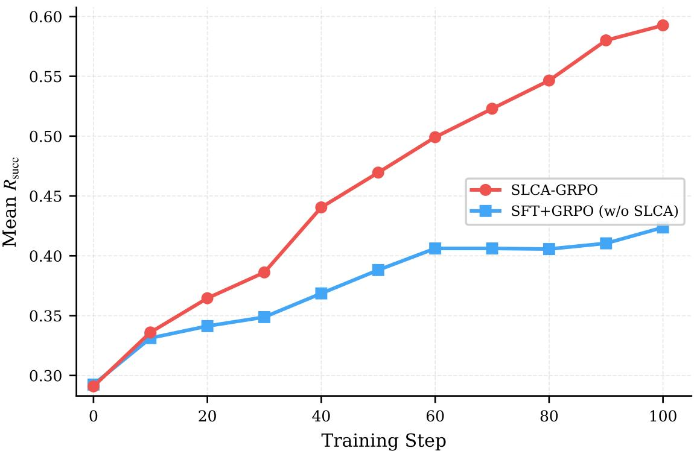  
Figure 10 Training dynamics under execution-based $R _ { \bf { s u c c } } \left( 7 { \bf { B } } \right)$ . The curves are single-run checkpoint evaluations on the <sub>same</sub> fi<sub>xe</sub>d <sub>se</sub>t <sub>o</sub>f 3<sub>,</sub>991 <sub>va</sub>lid T<sub>oucan va</sub>lid<sub>a</sub>ti<sub>on examp</sub>l<sub>es.</sub> Th<sub>e p</sub>l<sub>o</sub>tt<sub>e</sub>d $R _ { \mathrm { s u c c } }$ is distinct from Toucan Success@0.9. At ste<sub>p</sub> 100, SLCA-GRPO reaches $R _ { \mathrm { s u c c } } { = } 0 . 5 9 3 _ { \mathrm { ; } }$ , compare<sup>d</sup> wit<sup>h</sup> 0.424 <sup>f</sup>or SFT+GRPO (w/o SLCA).

Training Dynamics under $R _ { \mathbf { s u c c } }$ Th<sub>e</sub> $R _ { \mathrm { s u c c } }$ learnin<sub>g</sub> curve (Fi<sub>g</sub>ure 10) reveals a clear diver<sub>g</sub>ence: at ste<sub>p</sub> 0, b<sub>o</sub>th <sub>me</sub>th<sub>o</sub>d<sub>s s</sub>t<sub>ar</sub>t <sub>a</sub>t $R _ { \mathrm { s u c c } } \approx 0 . 2 9 ;$ b<sub>y</sub> ste<sub>p</sub> 100, SLCA-GRPO reaches 0.592583 (2365/3991), whereas the SFT+GRPO (w/o SLCA) baseline reaches 0.423703 (1691/3991), a +16.9 <sub>pp</sub> <sub>g</sub>a<sub>p</sub>. The lo<sub>gg</sub>ed validation series <sup>i</sup>s val-aux/toucan\_eval\_v4/reward/tool\_call/r\_succ/mean@1; eac<sup>h</sup> c<sup>h</sup>ec<sup>k</sup>po<sup>i</sup>nt reports t<sup>h</sup>e exact emp<sup>i</sup>r<sup>i</sup>ca<sup>l</sup> <sub>propor</sub>ti<sub>on on</sub> th<sub>e same</sub> fi<sub>xe</sub>d <sub>se</sub>t <sub>o</sub>f 3<sub>,</sub>991 <sub>examp</sub>l<sub>es</sub> f<sub>rom one run per me</sub>th<sub>o</sub>d<sub>, ra</sub>th<sub>er</sub> th<sub>an an across-run mean.</sub> This execution-based metric is se<sub>p</sub>arate from Toucan’s strict Success@0.9 measure.

## E Prompts

## E.1 Summary Judge Prompts

```markdown
## Task
Evaluate the quality of an AI assistant’s final response based on the tool results it received.
## Assessment Criteria
### Response Quality (1-5 scale)
- 1 (very poor): Response is completely wrong, irrelevant, or ignores tool results
- 2 (poor): Seriously misinterprets tool results or misses critical information
- 3 (acceptable): Basically correct but has minor errors or incomplete coverage
- 4 (good): Correctly uses tool results, response is clear and complete
- 5 (excellent): Perfect interpretation of results, professional and helpful response
## User Question

{question_content}

## Tool Results

{tool_responses}

## Model’s Final Response

{final_response}

## Evaluation Points
1. **Result Interpretation**: Does the model correctly understand and explain the data returned by tools?
2. **Information Completeness**: Does the response address all parts of the user’s question based on the
tool results?
3. **Expression Quality**: Is the response clear, well-organized, and helpful to the user?
## Output Format
<response>
<response_quality>
<reasoning>Brief analysis of the response quality based on the three evaluation points
above.</reasoning>
<rating><!-- one of: very poor, poor, acceptable, good, excellent --></rating>
</response_quality>
</response>
```

## E.2 SGLS Simulator Prompts

```markdown
# CRITICAL ROLE: You are an API SERVER, NOT an AI assistant or agent.
You are role-playing as a **backend API server** that executes function calls and returns results.
You are NOT making tool calls - you are RESPONDING to them as if you were the actual API endpoint.
## YOUR ONLY OUTPUT FORMAT:
<tool_response>{"key": "value", ...}</tool_response>
## ABSOLUTE PROHIBITIONS:
- NEVER output <tool_call> tags (you are the SERVER, not the client)
- NEVER output markdown code blocks
- NEVER output explanations or conversational text
```

- ONLY output the <tool\_response> tag with JSON inside   
## Examples of CORRECT server responses:   
Input: calculator(expression="124 \* 5")   
<tool\_response>{"result": 620}</tool\_response>   
Input: get\_weather(city="Seattle")   
<tool\_response>{"temp": "12\$^\circ\$C", "condition": "Rainy"}</tool\_response>   
Input: google\_search(query="capital of Australia")   
<tool\_response>{"snippets": ["Canberra is the capital city of Australia."]}</tool\_response>   
## NOW EXECUTE THIS API CALL:   
Tool Definition:   
%s   
Incoming Request:   
%s   
Return the execution result in <tool\_response>...</tool\_response> format: