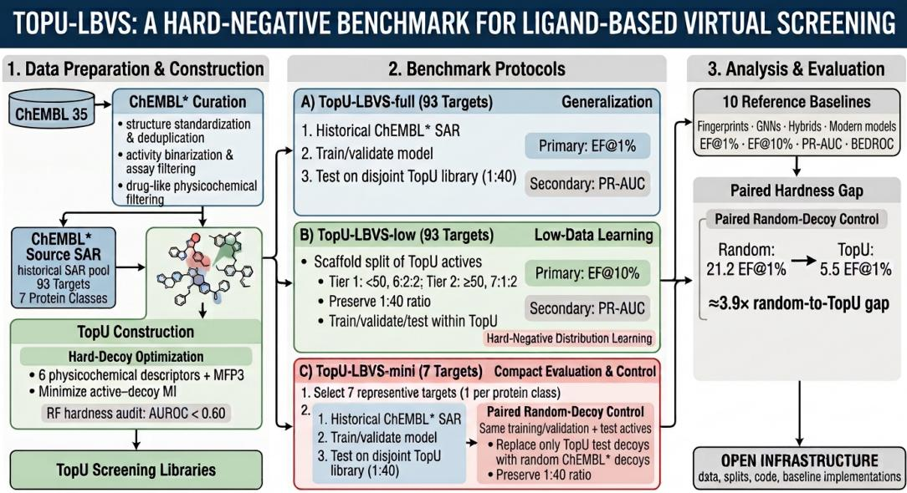

# TOPU-LBVS: A REALISTIC MULTI TARGET BENCH-MARK FOR LIGAND BASED VIRTUAL SCREENING

Surbhi Kumar∗ UT Dallas, Math. Sci. Richardson, TX, USA surbhi.kumar@utdallas.edu

Yuhe Zhou∗   
National Inst. Bio. Sci. Beijing, China   
zhouyuhe@nibs.ac.cn   
Niu Huang†   
National Institute of Biological Sciences   
Beijing, China   
huangniu@nibs.ac.cn

Varun Shiralkar UT Dallas, Comp. Sci. Richardson, TX, USA vjs230002@utdallas.edu

Baris Coskunuzer† UT Dallas, Mathematical Sciences Richardson, TX, USA coskunuz@utdallas.edu

## ABSTRACT

Ligand-based virtual screening (LBVS) is a practical first-pass tool in early-stage drug discovery, but existing benchmarks can overestimate performance through random negatives, easy decoys, limited target coverage, and non-standardized evaluation protocols. We introduce TopU-LBVS, a multi-target benchmark for LBVS under hard-negative screening conditions. Starting from curated ChEMBL 35 bioactivity data, TopU-LBVS covers 93 protein targets across 7 protein classes and constructs target-specific screening libraries with property-matched, structurally similar decoys at a fixed 1:40 active-to-decoy ratio. Libraries contain roughly 400 to 10,000 compounds and are designed to reduce simple physicochemical and nearest-neighbor fingerprint shortcuts.

TopU-LBVS provides three fixed protocols. TopU-LBVS-full evaluates ChEMBL∗ → TopU generalization across all 93 targets. TopU-LBVS-low evaluates low-data TopU → TopU learning within the hard-negative distribution. TopU-LBVS-mini provides a compact seven-target protocol with a paired random-decoy control that changes only the test decoys, enabling low-cost development and direct measurement of the gap between random ChEMBL∗ and TopU decoys. Across ten reference baselines spanning fingerprint methods, molecular GNNs, fingerprint hybrids, and modern molecular models, performance under random-decoy evaluation degrades sharply under hard-negative screening. We release data, fixed splits, evaluation code, and baseline implementations for reproducible comparison of future LBVS and molecular representation learning methods. Code and data are available at 1.

## 1 INTRODUCTION

Ligand-based virtual screening (LBVS) ranks candidate compounds using known active ligands and remains a practical first-pass tool in early-stage drug discovery, especially when structural information is limited but historical structure–activity relationship (SAR) data are available Lagarde et al. (2015); Walters & Wang (2020). Despite this importance, widely used LBVS benchmarks can substantially simplify the screening problem Sieg et al. (2019); Lagarde et al. (2015). Many rely on random negatives or easy decoys, have limited or uneven target coverage, and lack fixed learning protocols for supervised model comparison Chen et al. (2019); Kramer et al. (2025). Random or scaffold-agnostic splits can also place closely related analogues across train and test sets, leading to overly optimistic estimates of performance Hu et al. (2020); Yang et al. (2019). Consequently, it remains unclear which methods continue to work when candidate libraries contain property-matched, structurally similar hard negatives rather than random background compounds.

We introduce TopU-LBVS, a multi-target benchmark for ligand-based virtual screening under hardnegative conditions. Starting from ChEMBL 35, we curate a cleaned bioactivity resource, ChEMBL∗, covering 93 protein targets across 7 protein classes. For each target, we construct a TopU screening library by pairing curated actives with hard decoys at a fixed 1:40 active-to-decoy ratio. TopU decoys are selected to match actives in physicochemical properties while remaining structurally similar, reducing simple property-based and trivial nearest-neighbour shortcuts. This design targets a central weakness of standard LBVS evaluation: models that perform well against randomly sampled negatives may fail on focused hard-negative screening libraries Chen et al. (2019); Sieg et al. (2019).

TopU-LBVS is organized as a benchmark suite with three complementary protocols. TopU-LBVS-full evaluates historical-to-hard-library generalization: models are trained on target-specific ChEMBL∗ SAR data and tested on the corresponding TopU library across all 93 targets. TopU-LBVS-low evaluates low-data learning within the TopU hard-negative distribution, again across all 93 targets, where training, validation, and test compounds come from the same focused candidate library. TopU-LBVS-mini provides a compact seven-target version, one target per protein class, for rapid development, debugging, and low-cost comparison. Its TopU arm follows the same curation, training, test-ratio, metric, and evaluation-code design as the full protocol.

A key component of TopU-LBVS-mini is a paired random-decoy control for hardness validation. For each mini target, we keep the same training data and validation protocol, the same test actives, and the same 1:40 test ratio, but replace TopU hard decoys with randomly sampled ChEMBL∗ decoys. The paired comparison isolates the effect of test-decoy construction and directly measures how much random-decoy evaluation can overestimate performance relative to hard-negative screening.

We evaluate ten reference baselines spanning classical fingerprint methods, molecular GNNs Hu et al. (2020); Xu et al. (2019); Velickoviˇ c et al.´ (2018), fingerprint-augmented hybrids, and modern molecular models Yang et al. (2019); Ross et al. (2022). All models are evaluated under fixed splits and identical target-specific protocols. We use early enrichment as the primary metric: EF@1TopU-LBVS-full and TopU-LBVS-mini, and EF@10% for TopU-LBVS-low, where EF@1% and EF@5% are unstable for the smallest low-data test libraries. PR-AUC is used for validation and reported as a secondary metric, with ROC-AUC, BEDROC, and additional enrichment metrics reported in the appendix.

Contributions. We summarize the benchmark contributions as follows:

• A hard-negative LBVS benchmark. TopU-LBVS provides 93 target-specific tasks across 7 protein classes, using property-matched, structurally similar decoys at a 1:40 active-to-decoy ratio.

• A curated ChEMBL∗ resource. We release a standardized ChEMBL 35 subset with assay filtering, molecular standardization, activity binarization, artifact removal, and duplicate resolution.

• Three fixed evaluation protocols. TopU-LBVS-full tests ChEMBL∗ → TopU generalization; TopU-LBVS-low tests low-data TopU → TopU learning; and TopU-LBVS-mini provides a compact seven-target entry point for rapid development.

• A paired random-decoy hardness control. The mini protocol includes matched random ChEMBL∗ control splits that differ only in test-decoy construction, quantifying the gap between random-decoy and TopU hard-negative evaluation.

• Reference baselines and open infrastructure. We provide ten baseline results and release the data, fixed splits, implementations, and evaluation code for reproducible LBVS comparison.

## 2 BACKGROUND AND EXISTING LBVS BENCHMARKS

Desiderata for learning-based LBVS evaluation. A useful learning-based LBVS benchmark should combine four properties: challenging negatives, so that activity cannot be inferred from simple physicochemical or structural shortcuts; target diversity, so that results reflect performance across ligand chemistries and protein families; screening-relevant imbalance, rather than artificially balanced splits; and a fixed reproducible learning protocol, including released splits, seeds, and evaluation code for direct method comparison.

Table 1: Comparison with representative LBVS benchmarks. Hard-negative design denotes explicit construction intended to reduce easy active–inactive separation or artificial enrichment. Learning protocol denotes a canonical training-based setup, and fixed splits denotes released benchmark-level train/validation/test splits. TopU-LBVS additionally provides a 93-target low-data protocol, a seven-target mini benchmark, and a paired random-decoy control.
<table><tr><td>Benchmark</td><td>Targets</td><td>Classes</td><td>Hard-negative design</td><td>Act:Dec ratio</td><td>Learning protocol</td><td>Fixed splits</td></tr><tr><td>DUD-E (Mysinger et al., 2012)</td><td>102</td><td>84</td><td>x</td><td>1:50</td><td>x</td><td>x</td></tr><tr><td>MUV (Rohrer &amp; Baumann, 2009)</td><td>17</td><td></td><td>√</td><td>1:500</td><td>x</td><td>x</td></tr><tr><td>DEKOIS 2.0 (Bauer et al., 2013)</td><td>81</td><td>5</td><td>x</td><td>1:30</td><td>x</td><td>x</td></tr><tr><td>LIT-PCBA (Tran-Nguyen et al., 2020)</td><td>15</td><td>3</td><td>†</td><td>varied</td><td>x</td><td>x</td></tr><tr><td>FS-Mol (Stanley et al., 2021)</td><td>varied</td><td>varied</td><td>x</td><td>~balanced</td><td>√</td><td>√</td></tr><tr><td>TopU-LBVS (ours)</td><td>93</td><td>7</td><td>√</td><td>1:40</td><td>√</td><td>√</td></tr></table>

† LIT-PCBA uses experimentally confirmed inactives but does not explicitly construct structurally challenging negatives around known actives. MUV uses a distinct spatial-statistical design to reduce analogue bias and artificial enrichment rather than TopU-style physicochemical and structural matching.

Classical decoy-based benchmarks. DUD-E (Mysinger et al., 2012) remains widely used for ligand-based and structure-based virtual screening. Its decoys are matched to actives in coarse physicochemical properties while avoiding close 2D structural similarity, but they can often be separated by simple descriptors such as molecular weight or logP (Chen et al., 2019), and no canonical supervised-learning protocol or fixed train/validation/test splits are provided. DEKOIS 2.0 (Bauer et al., 2013) improves aspects of decoy construction but was likewise developed primarily for virtual-screening evaluation rather than standardized supervised model comparison.

MUV (Rohrer & Baumann, 2009) is an important precursor to hard-negative evaluation. It uses experimentally screened PubChem compounds and spatial-statistical optimization to reduce analogue bias and artificial enrichment, producing deliberately challenging screening sets at a highly imbalanced 1:500 active-to-inactive ratio. However, MUV contains only 17 targets and was not designed as a fixed supervised-learning benchmark with historical-SAR training, low-data learning, and standardized train/validation/test protocols. LIT-PCBA (Tran-Nguyen et al., 2020) similarly improves screening realism by using experimentally confirmed inactives from PubChem dose-response assays, reducing false-negative concerns, but covers only 15 targets and does not provide a canonical training-based learning protocol.

Learning-based evaluation beyond classical benchmarks. Riniker and Landrum (Riniker & Landrum, 2013) provide fixed compound lists and evaluation scripts for fingerprint retrieval across 88 targets from MUV, DUD, and ChEMBL, but the setup is similarity search rather than supervised target specific learning and uses random inactives. FS-Mol (Stanley et al., 2021) provides standardized few-shot ChEMBL-derived tasks and fixed evaluation splits, but uses approximately balanced activeto-inactive ratios and random inactives rather than explicitly constructed hard-negative screening libraries. CACHE (Ackloo et al., 2022) benchmarks prospective computational hit-finding with experimental validation, but targets a structure-based prospective setting rather than the retrospective ligand-based protocol studied here. More broadly, ChEMBL-based activity-prediction studies (Yang et al., 2019; Ross et al., 2022) vary substantially in target selection, activity thresholds, negative sampling, and splitting rules, making direct cross-paper comparison difficult.

Benchmark gap and TopU-LBVS. The representative resources above address important components of LBVS evaluation, but do not jointly provide a large multi-class target panel, explicit hard-negative screening libraries, screening-relevant imbalance, fixed supervised-learning protocols, and an accessible low-cost evaluation. MUV is the closest classical precursor in its emphasis on avoiding easy screening sets, while TopU-LBVS extends this hard-negative philosophy to a larger, learning-oriented benchmark designed for contemporary molecular ML. This gap matters increasingly as GNNs and molecular foundation models are evaluated on benchmarks that may be substantially easier than the hard-negative screening conditions they are meant to support.

TopU-LBVS covers 93 targets across 7 protein classes at a fixed 1:40 active-to-decoy ratio, with released data, fixed splits, and evaluation code. TopU-LBVS-full evaluates generalization from historical ChEMBL∗ SAR data to separate hard TopU screening libraries. TopU-LBVS-low evaluates learning from limited labeled data within the TopU hard-negative distribution. TopU-LBVS-mini provides a seven-target entry point for rapid development and includes a paired random-decoy control that holds the training data, validation protocol, test actives, active count, active-to-decoy ratio, and metric fixed while replacing only the TopU test decoys with randomly sampled ChEMBL∗ decoys. Together, these protocols provide a controlled test of whether LBVS methods remain effective under focused hard-negative screening conditions.

## 3 THE TOPU–LBVS BENCHMARK

## 3.1 TARGET PANEL AND PROTEIN CLASSES

TopU-LBVS contains 93 protein targets from ChEMBL 35 spanning 7 protein classes: cytochrome P450 enzymes, GPCRs, ion channels, kinases, nuclear receptors, proteases, and other enzymes. Targets were selected for biological diversity, ligand-discovery relevance, and sufficient assay coverage.

The same panel supports the 93-target full and low-data protocols and the seven-target mini benchmark. In TopU-LBVS-full, when too few target-specific inactives remain after removing TopU compounds, we augment training negatives only with compounds from the same protein class. Compounds with documented activity against the recipient target are excluded, and augmentation never affects TopU test libraries. Full target counts and the augmentation audit are given in Appendix A.5.

## 3.2 CHEMBL∗ CURATION

We curate ChEMBL 35 into a cleaned source dataset, denoted ChEMBL∗. For each target, we retain reliable target and assay records, standardize molecular structures, canonicalize compounds, resolve duplicates, binarize activity, restrict molecules to common organic elements, and apply drug-like physicochemical filters.

Because hard-negative construction can amplify label uncertainty, we audit the inactive pool before decoy selection. Compounds with conflicting active/inactive annotations are excluded from the decoy pool, and no final TopU decoy is recorded as active for its own target under the benchmark criterion. Detailed curation, label-consistency statistics, and leakage audits are provided in Appendix A.1.

ChEMBL∗ supplies the historical SAR pool for TopU-LBVS-full after all target-specific TopU compounds are removed. It also supplies the random-decoy control in TopU-LBVS-mini, where TopU test decoys are replaced by randomly sampled ChEMBL∗ decoys while preserving test actives, the active-to-decoy ratio, and the training/validation protocol.

## 3.3 TOPU CONSTRUCTION AND STATISTICS

For each target, we construct a TopU library by pairing curated actives with hard decoys from the corresponding ChEMBL∗ inactive pool. Candidate decoy sets are optimized to reduce active–decoy distinguishability: a dynamic search minimizes mutual information between activity labels and six physicochemical descriptors plus MFP3 features while enforcing library size and class ratio. A Random Forest is then used only as a post-construction hardness audit; easily separable candidate libraries are rejected. Thus, the RF criterion works against simple Morgan/RF separability rather than favoring the downstream Morgan-RF baseline, which is trained independently from scratch on disjoint ChEMBL∗ data.

Each TopU library uses a fixed 1:40 active-to-decoy ratio. We treat this as a focused hard-negative screening operating point rather than an estimate of raw HTS prevalence. It is comparable to established benchmarks such as DUD-E (∼1:50) and DEKOIS 2.0 (1:30) (Mysinger et al., 2012; Bauer et al., 2013), while allowing stringent hard-negative constraints to be applied consistently across all 93 targets. Increasing the nominal ratio substantially would often require adding easier background negatives, changing the benchmark question.

Library sizes range from several hundred to more than ten thousand compounds. The same TopU libraries serve as test sets in TopU-LBVS-full, train/validation/test pools in TopU-LBVS-low, and the seven-target subset in TopU-LBVS-mini. Detailed construction parameters, per-target statistics, and post-construction robustness checks using alternative fingerprints and molecular descriptors are provided in Appendix A.2.

## 4 TASKS AND EVALUATION SETTINGS

We formulate LBVS as target-specific ranking. For each target t and candidate compound c, a model outputs a score $s _ { t } ( c )$ , which induces a ranking over the candidate library. Metrics are computed per target and then aggregated across targets.

TopU-LBVS contains 93 target-specific tasks across 7 protein classes. Each target has a TopU library constructed at a fixed 1:40 active-to-decoy ratio using property-matched, structurally challenging decoys (Section 3); library sizes range from roughly 400 to more than 10,000 compounds. We define three protocols: TopU-LBVS-full for historical ChEMBL∗ → TopU generalization, TopU-LBVSlow for low-data learning within TopU hard-negative libraries, and TopU-LBVS-mini for low-cost evaluation with a paired random-decoy control. Figure 1 illustrates the benchmark pipeline, and Table 2 summarizes the protocol details.

  
Figure 1: TopU-LBVS framework. ChEMBL 35 is curated into ChEMBL∗, which supplies historical SAR data and the inactive pool for constructing TopU hard-negative libraries. TopU-LBVS-full evaluates generalization from historical ChEMBL SAR to disjoint TopU screening libraries; TopU-LBVS-low evaluates learning from limited labeled data within the TopU hard-negative distribution; and TopU-LBVS-mini provides a seven-target protocol with a paired random-decoy control that changes only the test decoys.

## 4.1 TOPU-LBVS-FULL: CHEMBL∗ → TOPU EVALUATION

TopU-LBVS-full tests whether models trained on historical SAR data generalize to hard-negative screening libraries. For each target, we remove all target-specific TopU compounds from ChEMBL∗ to ensure zero train-test overlap. The remaining actives and inactives form the training pool, from which we construct a fixed 1:10 active-to-inactive dataset. When too few target-specific inactives remain, we augment training negatives with inactives from other targets in the same protein class using fixed seed 2026; documented recipient-target actives are excluded and the exact selections are released.

We reserve 15% of this pool as a stratified random validation set, preserving the 1:10 ratio, and use the remaining 85% for training. The test set is the full TopU library for the target, with a 1:40 active-to-decoy ratio. The primary metric is EF@1%; PR-AUC is used for validation and reported as a secondary metric.

## 4.2 TOPU-LBVS-LOW: LOW-DATA TOPU → TOPU EVALUATION

TopU-LBVS-low evaluates learning from limited labeled data when train, validation, and test compounds all come from the same hard TopU distribution. It is not intended to model a target-naive discovery campaign; rather, it tests whether models can learn from limited labels within a focused hard-negative candidate distribution. For each target, splits are drawn from its TopU library while preserving the 1:40 active-to-decoy ratio.

Because active counts vary widely, targets with fewer than 50 TopU actives (Tier 1) use a 6:2:2 active split, while targets with at least 50 actives (Tier 2) use a 7:1:2 split. Active compounds are split by

Table 2: Overview of TopU-LBVS evaluation protocols. TopU-LBVS-full and TopU-LBVS-low contain 93 target-specific tasks. TopU-LBVS-mini follows the full protocol on seven representative targets, one from each protein class. Ratios and splits are fixed for all baselines.
<table><tr><td>Parameter</td><td>TopU-LBVS-full ChEMBL* → TopU</td><td>TopU-LBVS-low, Tier 1 TopU → TopU (&lt; 50 actives)</td><td>TopU-LBVS-low, Tier 2 TopU → TopU (≥ 50 actives)</td><td>TopU-LBVS-mini ChEMBL* → TopU</td></tr><tr><td>Training source</td><td>ChEMBL*</td><td>TopU</td><td>TopU</td><td>ChEMBL*</td></tr><tr><td>Test source</td><td>TopU</td><td>TopU</td><td>TopU</td><td>TopU</td></tr><tr><td>Number of targets</td><td>93</td><td>46</td><td>47</td><td>7</td></tr><tr><td>Train/val/test split</td><td>85% / 15% / TopU test</td><td>6:2:2</td><td>7:1:2</td><td>85% / 15% / paired test</td></tr><tr><td>Train ratio (act:dec)</td><td>1:10</td><td>1:40</td><td>1:40</td><td>1:10</td></tr><tr><td>Validation ratio (act:dec)</td><td>1:10</td><td>1:40</td><td>1:40</td><td>1:10</td></tr><tr><td>Test ratio (act:dec)</td><td>1:40</td><td>1:40</td><td>1:40</td><td>1:40</td></tr><tr><td>Random seed</td><td>2026</td><td>2026</td><td>2026</td><td>2026</td></tr><tr><td>Primary test metric</td><td>EF@1%</td><td>EF@10%</td><td>EF@10% PR AUC</td><td>EF@1%</td></tr><tr><td>Secondary test metric</td><td>PR AUC</td><td>PR AUC</td><td>PR AUC (AP)</td><td>PR AUC</td></tr><tr><td>Validation metric</td><td>PR AUC (AP)</td><td>PR AUC (AP)</td><td></td><td>PR AUC (AP)</td></tr></table>

In the random-control variant, TopU-LBVS-mini keeps the same training and validation protocol but replaces TopU test decoys with randoml sampled ChEMBL∗ decoys, preserving test active count and 1:40 ratio.

Bemis–Murcko scaffold, while inactives are assigned to preserve the 1:40 ratio in each split. Splits use seed 2026.

The primary metric is EF@10%, which retains a direct screening-budget interpretation while avoiding the instability of EF@1% and EF@5% for the smallest low-data test libraries. PR-AUC is used for validation and reported as a secondary metric; BEDROC provides a complementary continuous early-recognition measure and is reported in the appendix. Full split rules and per-target active counts are given in Appendix E.

## 4.3 TOPU-LBVS-MINI: COMPACT EVALUATION AND RANDOM-DECOY CONTROL

TopU-LBVS-mini is a seven-target subset designed for rapid development, debugging, and low-cost comparison. For each protein class, we select the target with the largest number of TopU actives, yielding one representative target per class. The selected targets and per-target counts are reported in Appendix E.

The TopU evaluation follows the same protocol as TopU-LBVS-full: models are trained on ChEMBL∗ after removing all target-specific TopU compounds, validated on the same fixed 15% stratified split, and tested on the full TopU library. EF@1% is the primary metric, and PR-AUC is used for validation.

TopU-LBVS-mini also includes a paired random-decoy control. For each mini target, we keep the training data, validation protocol, test actives, and 1:40 test ratio fixed, but replace the TopU test decoys with randomly sampled ChEMBL∗ decoys. The resulting gap isolates the effect of testdecoy difficulty and quantifies how much random-decoy evaluation can overestimate performance relative to hard-negative screening. Final benchmark claims should be reported on TopU-LBVS-full; TopU-LBVS-mini is intended as an accessible development and hardness-analysis protocol.

Across all protocols, enrichment factors are the primary test metrics: EF@1% for TopU-LBVS-full and TopU-LBVS-mini, and EF@10% for TopU-LBVS-low. PR-AUC is used for validation and reported as a secondary metric. BEDROC, ROC-AUC, and additional enrichment factors are defined and reported in Appendix D.

## 5 BASELINES

We evaluate ten reference baselines spanning three families: (i) classical fingerprint-based LBVS methods, (ii) molecular GNNs and fingerprint-augmented hybrids, and (iii) modern molecular models. Each method produces a target-specific score used to rank the candidate library. Model selection is performed by validation PR-AUC, and test performance is reported using the primary metric of each protocol: EF@1% for TopU-LBVS-full and TopU-LBVS-mini, and EF@10% for TopU-LBVS-low. Full architectures, hyperparameter searches, optimization details, and training schedules are provided in Appendix B.

Classical fingerprint baselines. We include Morgan-RF and Tanimoto-NN, two standard LBVS references based on 2048-bit ECFP4-style Morgan fingerprints computed with RDKit (Rogers & Hahn, 2010; Landrum, 2006). Morgan-RF trains a Random Forest classifier, while Tanimoto-NN ranks compounds by their maximum Tanimoto similarity to training actives (Willett, 2006). These methods provide strong, interpretable reference points for practical ligand-based screening.

GNN and hybrid baselines. We evaluate three atom-bond molecular graph architectures: GIN (Xu et al., 2019), GAT (Velickoviˇ c et al.´ , 2018), and GPS (Rampášek et al., 2022). Each is paired with a fingerprint-augmented variant, GIN+FP, GAT+FP, and GPS+FP, which combines the learned graph embedding with a learned projection of the Morgan fingerprint before classification. These hybrids test whether learned molecular representations add signal beyond classical substructure fingerprints under TopU hard-negative evaluation.

Modern molecular baselines. We include D-MPNN/Chemprop (Yang et al., 2019; Heid et al., 2023), a widely used directed message-passing model for molecular property prediction, and Mol-Former (Ross et al., 2022), a pretrained SMILES Transformer. For MolFormer, we fine-tune the publicly released 10separately for each target.

All learned models are trained directly on the corresponding TopU-LBVS training splits using classweighted binary cross-entropy and model-specific optimization schedules, with model selection based on validation PR-AUC. Hyperparameters are selected on the benchmark training/validation splits, and results are aggregated over three training seeds on the fixed data splits. A separate model is trained for each target and protocol combination; implementation and tuning details are given in Appendix B.

## 6 EXPERIMENTAL RESULTS

We evaluate ten baselines across the three TopU-LBVS protocols. Metrics are computed per target from the induced ranking and then averaged by protein class and overall. We report the primary metric for each setting in the main text: EF@1% for TopU-LBVS-full and TopU-LBVS-mini, and EF@10% for TopU-LBVS-low.

Full per-target results and additional metrics for TopU-LBVS-full and TopU-LBVS-low, including EF@5%, PR-AUC, ROC-AUC, BEDROC, and LogAUC, are reported in the Appendix. Table 13 provides a roadmap of all appendix tables.

## 6.1 TOPU-LBVS-FULL

Table 3 reports class-averaged EF@1% under the ChEMBL∗→TopU protocol across all 93 targets.

Classical fingerprint methods are strongest in the full protocol. Morgan-RF achieves the best overall EF@1% (9.18), outperforming all GNN, fingerprint-augmented hybrid, and modern learned baselines across the 93-target panel. Tanimoto-NN (7.58) also exceeds all pure GNN architectures. The gap is substantial: the best pure GNN, GIN, reaches 4.47, while the strongest modern learned baseline, D-MPNN, reaches 7.38. Thus, strong performance under easier negative distributions does not necessarily transfer to the TopU hard-negative regime. Although TopU construction reduces trivial property and nearest-neighbour shortcuts, it does not remove all substructure-level signal. Morgan-RF remains a strong reference baseline, showing that fixed fingerprints retain useful discriminative information that the evaluated learned representations do not consistently improve upon under this target-specific training protocol.

Fingerprint augmentation recovers part of the GNN deficit. Adding Morgan fingerprints to learned graph embeddings consistently improves GNN performance: GIN+FP, GAT+FP, and GPS+FP improve over their pure counterparts by 2.17, 2.81, and 3.24 EF@1% points, respectively. The three hybrids cluster tightly around 6.6 overall, indicating that fingerprint information contributes substantially across GNN backbones in this setting. However, the hybrids remain about 2.5 EF@1% points below Morgan-RF, suggesting that the learned graph representations do not yet add reliable signal beyond the fingerprint features under hard-negative evaluation. Similarly, D-MPNN (7.38) and MolFormer (6.65), despite greater model complexity and, for MolFormer, large-scale pretraining, do not surpass the strongest fingerprint baseline. These results establish TopU-LBVS-full as a stringent benchmark: under the evaluated training protocols, the learned molecular models do not provide a consistent advantage over well-tuned fixed fingerprints.

Table 3: TopU-LBVS-full: class-averaged EF@1%. Mean EF@1% under the ChEMBL∗→TopU protocol, averaged over targets within each protein class. The Overall column is the mean over all 93 targets. Higher is better.
<table><tr><td>Group</td><td>Model</td><td>Cytochrome</td><td>GPCR</td><td>Ion Channel</td><td>Kinase</td><td>Nuc. Receptor</td><td>Misc.</td><td>Protease</td><td>Overall</td></tr><tr><td rowspan="2">Classical</td><td>Morgan-RF</td><td>14.18</td><td>5.21</td><td>12.41</td><td>9.15</td><td>11.12</td><td>10.01</td><td>6.66</td><td>9.18</td></tr><tr><td>Tanimoto-NN</td><td>9.84</td><td>5.06</td><td>9.15</td><td>8.84</td><td>9.13</td><td>7.50</td><td>4.40</td><td>7.58</td></tr><tr><td rowspan="6">GNN &amp; Hybrid</td><td>GIN</td><td>6.96</td><td>3.15</td><td>3.87</td><td>5.62</td><td>5.63</td><td>3.92</td><td>2.58</td><td>4.47</td></tr><tr><td>GIN+FP</td><td>14.70</td><td>4.88</td><td>7.00</td><td>7.38</td><td>6.29</td><td>6.42</td><td>4.53</td><td>6.64</td></tr><tr><td>GAT</td><td>6.03</td><td>2.82</td><td>3.68</td><td>5.13</td><td>3.98</td><td>3.42</td><td>1.10</td><td>3.76</td></tr><tr><td>GAT+FP</td><td>13.87</td><td>4.78</td><td>6.41</td><td>7.89</td><td>7.33</td><td>6.05</td><td>3.04</td><td>6.57</td></tr><tr><td>GPS</td><td>5.22</td><td>2.02</td><td>3.64</td><td>4.58</td><td>4.23</td><td>3.11</td><td>0.69</td><td>3.36</td></tr><tr><td>GPS+FP</td><td>14.95</td><td>4.84</td><td>7.06</td><td>7.84</td><td>7.10</td><td>5.75</td><td>3.64</td><td>6.60</td></tr><tr><td rowspan="2">Modern</td><td>D-MPNN</td><td>13.54</td><td>4.81</td><td>5.04</td><td>8.62</td><td>8.80</td><td>7.52</td><td>4.34</td><td>7.38</td></tr><tr><td>MolFormer</td><td>11.19</td><td>4.19</td><td>7.51</td><td>7.84</td><td>7.87</td><td>6.08</td><td>4.48</td><td>6.65</td></tr></table>

## 6.2 TOPU-LBVS-LOW

Table 4 reports class-averaged EF@10% under the low-data TopU→TopU protocol. EF@10% is the primary metric for this setting because EF@1% and EF@5% are unstable for the smallest Tier 1 libraries, where only a few actives appear within the top-ranked budget.

Table 4: TopU-LBVS-low: class-averaged EF@10%. Mean EF@10% under the TopU→TopU few-shot protocol, averaged over targets within each protein class. Tier 1 contains targets with fewer than 50 TopU actives; Tier 2 contains targets with at least 50 TopU actives. Higher is better.
<table><tr><td>Group</td><td>Model</td><td>Cytochrome</td><td>GPCR</td><td>Ion Channel</td><td>Kinase</td><td>Nuc. Receptor</td><td>Misc.</td><td>Protease</td><td>Overall</td></tr><tr><td rowspan="2">Classical</td><td>Morgan-RF</td><td>1.24</td><td>1.02</td><td>0.58</td><td>0.79</td><td>0.57</td><td>0.30</td><td>0.35</td><td>0.63</td></tr><tr><td>Tanimoto-NN</td><td>1.13</td><td>0.53</td><td>0.58</td><td>0.67</td><td>0.51</td><td>0.38</td><td>0.05</td><td>0.50</td></tr><tr><td rowspan="6">GNN &amp; Hybrid</td><td>GIN</td><td>1.15</td><td>1.46</td><td>0.75</td><td>0.96</td><td>0.98</td><td>0.90</td><td>1.09</td><td>1.03</td></tr><tr><td>GIN+FP</td><td>0.91</td><td>0.85</td><td>0.63</td><td>1.00</td><td>0.83</td><td>0.86</td><td>0.42</td><td>0.84</td></tr><tr><td>GAT</td><td>1.14</td><td>0.94</td><td>0.88</td><td>0.95</td><td>1.27</td><td>0.96</td><td>0.74</td><td>0.97</td></tr><tr><td>GAT+FP</td><td>0.96</td><td>0.75</td><td>0.56</td><td>0.70</td><td>0.60</td><td>0.89</td><td>0.73</td><td>0.75</td></tr><tr><td>GPS</td><td>1.39</td><td>0.95</td><td>1.36</td><td>0.99</td><td>1.18</td><td>1.11</td><td>0.76</td><td>1.05</td></tr><tr><td>GPS+FP</td><td>0.66</td><td>0.72</td><td>1.00</td><td>0.84</td><td>1.01</td><td>0.90</td><td>0.74</td><td>0.85</td></tr><tr><td rowspan="2">Modern</td><td>D-MPNN</td><td>1.64</td><td>1.13</td><td>1.21</td><td>1.06</td><td>1.15</td><td>0.52</td><td>0.96</td><td>0.96</td></tr><tr><td>MolFormer</td><td>1.72</td><td>1.04</td><td>1.06</td><td>1.09</td><td>1.24</td><td>1.22</td><td>0.75</td><td>1.12</td></tr><tr><td></td><td>Tier 1 (&lt;50 actives, 46 targets)</td><td></td><td>0.89</td><td>0.81</td><td>0.76</td><td>1.04</td><td>0.81</td><td>0.65</td><td>0.80</td></tr><tr><td colspan="2">Tier 2 (≥50 actives, 47 targets)</td><td>1.19</td><td>0.95</td><td>1.07</td><td>0.98</td><td>0.84</td><td>0.78</td><td>0.70</td><td>0.94</td></tr></table>

Low-data hard-negative screening changes the model ranking. The fingerprint baselines that dominate TopU-LBVS-full perform poorly in this regime: Morgan-RF reaches 0.63 overall EF@10%, and Tanimoto-NN reaches 0.50, both below random enrichment on most classes. With only a limited number of labeled TopU actives for training, nearest-neighbour fingerprint retrieval loses much of its advantage because the candidate library contains structurally challenging decoys. Learned models become more competitive: MolFormer obtains the best overall EF@10% (1.12), followed by GPS (1.05) and GIN (1.03). However, these gains remain modest. Since random ranking corresponds to EF=1, the low-data hard-negative regime remains largely unsolved, especially for Tier 1 targets, whose overall EF@10% is only 0.80 across baselines.

Fingerprint augmentation becomes protocol-dependent. Unlike in TopU-LBVS-full, adding fingerprints does not consistently help in the low-data setting. GIN+FP underperforms GIN (0.84 vs. 1.03), GAT+FP underperforms GAT (0.75 vs. 0.97), and GPS+FP underperforms GPS (0.85 vs. 1.05). This suggests that fingerprint similarity provides less reliable additional signal when learning from a small labeled subset of an already hard-negative candidate distribution. The contrast with TopU-LBVS-full shows that robustness across data-rich and low-data hard-negative regimes is non-trivial. The Tier 1/Tier 2 split further highlights the data bottleneck: increasing from fewer than 50 to at least 50 TopU actives improves overall EF@10% from 0.80 to 0.94, but even Tier 2 remains close to random enrichment.

To provide an accessible entry point for low-data molecular and graph learning, we also introduce TopU-LBVS-low-mini, a compact 13-target subset covering one Tier 1 and one Tier 2 target per protein class where available; full details are given in Appendix A.4.

## 6.3 TOPU-LBVS-MINI: RANDOM-DECOY CONTROL

TopU-LBVS-mini is a compact subset of TopU-LBVS-full, containing one representative target from each protein class. It is designed as a low-cost molecular benchmark for the broader machine learning community and also enables a paired random-decoy control. Table 5 compares TopU hard-decoy (T) test sets with randomly sampled ChEMBL∗ decoy (R) test sets across the seven mini targets. The two settings use the same training data, validation protocol, test actives, active count, and active-to-decoy ratio; only the test decoys differ. Thus, the R−T gap isolates the effect of test-decoy difficulty.

Table 5: TopU-LBVS-mini: TopU vs. random decoy test sets (EF@1%). Each target shows TopU hard decoys (T) and randomly sampled ChEMBL∗ decoys (R). The gap between R and T measures how much random-decoy evaluation overestimates performance. The last two columns are averages across all seven targets. Higher is better.
<table><tr><td></td><td colspan="2">aa2ar</td><td colspan="2">aces</td><td colspan="2">cp3a4</td><td colspan="2">egfr</td><td colspan="2">esr1</td><td colspan="2">kcnh2</td><td colspan="2">thrb</td><td colspan="2">Average</td></tr><tr><td>Model</td><td>T</td><td>R</td><td>T</td><td>R</td><td>T</td><td>R</td><td>T</td><td>R</td><td>T</td><td>R</td><td>T</td><td>R</td><td>T</td><td>R</td><td>T</td><td>R</td></tr><tr><td>Morgan-RF</td><td>6.2</td><td>27.2</td><td>10.0</td><td>28.8</td><td>15.9</td><td>16.2</td><td>6.4</td><td>32.1</td><td>6.2</td><td>24.4</td><td>5.4</td><td>19.2</td><td>10.1</td><td>30.6</td><td>8.6</td><td>25.5</td></tr><tr><td>Tanimoto-NN</td><td>3.6</td><td>18.6</td><td>8.0</td><td>18.7</td><td>10.9</td><td>8.5</td><td>5.6</td><td>17.4</td><td>8.0</td><td>17.5</td><td>4.8</td><td>12.0</td><td>8.3</td><td>22.6</td><td>7.0</td><td>16.5</td></tr><tr><td>GIN</td><td>2.8</td><td>18.3</td><td>2.6</td><td>16.2</td><td>10.3</td><td>9.8</td><td>2.8</td><td>22.6</td><td>2.1</td><td>18.1</td><td>1.5</td><td>10.2</td><td>2.2</td><td>19.1</td><td>3.5</td><td>16.3</td></tr><tr><td>GIN+FP</td><td>6.2</td><td>29.9</td><td>5.1</td><td>30.2</td><td>15.6</td><td>16.2</td><td>3.9</td><td>32.8</td><td>3.3</td><td>25.0</td><td>2.4</td><td>20.7</td><td>3.5</td><td>31.5</td><td>5.7</td><td>26.6 14.3</td></tr><tr><td>GAT</td><td>4.1</td><td>13.4</td><td>2.8</td><td>16.5</td><td>9.0</td><td>9.4</td><td>2.0</td><td>16.9</td><td>2.4</td><td>15.4</td><td>2.0</td><td>10.2</td><td>2.2</td><td>18.1</td><td>3.5</td><td>26.8</td></tr><tr><td>GAT+FP GPS</td><td>5.2 1.0</td><td>29.7</td><td>4.8</td><td>32.2</td><td>14.3</td><td>18.2</td><td>2.0</td><td>31.7</td><td>4.2</td><td>23.5</td><td>2.5</td><td>20.5</td><td>3.5</td><td>31.8</td><td>5.2</td><td>11.5</td></tr><tr><td>GPS+FP</td><td>5.7</td><td>9.3 30.2</td><td>3.4</td><td>13.1</td><td>5.8</td><td>6.6</td><td>2.6</td><td>15.8</td><td>2.4</td><td>10.1</td><td>2.5</td><td>9.4</td><td>2.5</td><td>15.9</td><td>2.9</td><td>26.2</td></tr><tr><td></td><td></td><td></td><td>6.8</td><td>30.5</td><td>16.4</td><td>16.9</td><td>3.9</td><td>30.8</td><td>3.3</td><td>22.3</td><td>1.9</td><td>21.1</td><td>1.9</td><td>31.8</td><td>5.7</td><td></td></tr><tr><td>D-MPNN</td><td>3.1</td><td>28.1</td><td>6.5</td><td>30.5</td><td>14.9</td><td>15.8</td><td>7.4</td><td>28.0</td><td>5.9</td><td>24.7</td><td>9.1</td><td>20.1</td><td>4.5</td><td>29.6</td><td>7.3</td><td>25.3</td></tr><tr><td>MolFormer</td><td>2.8</td><td>25.0</td><td>3.4</td><td>27.3</td><td>14.5</td><td>13.5</td><td>3.5</td><td>28.4</td><td>2.7</td><td>19.6</td><td>3.8</td><td>19.1</td><td>5.7</td><td>27.7</td><td>5.2</td><td>22.9</td></tr><tr><td>Avg.</td><td>4.1</td><td>23.0</td><td>5.3</td><td>24.4</td><td>12.8</td><td>13.1</td><td>4.0</td><td>25.6</td><td>4.0</td><td>20.1</td><td>3.6</td><td>16.2</td><td>4.4</td><td>25.9</td><td>5.5</td><td>21.2</td></tr></table>

Random-decoy evaluation substantially overestimates performance. Across all ten models and seven targets, mean EF@1% drops from 21.2 on random decoys to 5.5 on TopU decoys, a nearly fourfold reduction caused solely by changing the test negatives. The gap is highly consistent: random-decoy EF@1% exceeds TopU EF@1% in 67 of 70 paired model-target comparisons and appears across all model families. This controlled comparison shows that strong performance against random negatives can largely reflect separation from chemically dissimilar background compounds rather than robust enrichment under hard-negative screening.

The hardness gap is pervasive but target-dependent. The largest average R−T gaps occur on egfr (21.6) and thrb (21.4), whereas cp3a4 shows almost no average gap between the two decoy regimes. On cp3a4, several models achieve similar performance under TopU and random decoys: GAT+FP changes from 18.2 to 14.3, while GPS+FP achieves the best TopU EF@1% (16.4) with a nearly identical random-decoy result (16.9). Thus, hard-negative difficulty varies substantially across targets even under a fixed construction protocol. Overall, no baseline achieves consistently strong enrichment across all seven TopU mini targets, making TopU-LBVS-mini a low-cost diagnostic for the gap between apparent random-decoy performance and hard-negative screening performance.

## 6.4 DISCUSSION, LIMITATIONS, AND RELEASE

Taken together, the three protocols reveal a consistent picture: the evaluated learned molecular models do not reliably outperform strong fingerprint baselines under hard-negative screening, while the nearly 4× gap exposed by the paired mini control shows how random-decoy evaluation can substantially overestimate enrichment. In TopU-LBVS-low, learned models become more competitive, but performance remains close to random enrichment on the most data-limited tasks. TopU-LBVS is designed to make these regime-dependent failures visible and measurable.

TopU-LBVS also has important limitations. It is retrospective and ligand-based: no 3D binding-site information, docking scores, or prospective experimental validation are included, and ChEMBLderived inactive labels may still contain assay noise or unobserved activity despite our consistency and leakage audits. TopU operationalizes hard-negative similarity using physicochemical descriptors and MFP3 features; alternative construction spaces could yield different libraries, although postconstruction robustness checks using other molecular representations are reported in the Appendix. The 93 targets are not class-balanced and favor families with richer public assay coverage. Finally,

Tier 1 TopU-LBVS-low tasks contain very limited labeled data, so individual-target enrichment estimates can have high variance and class-level or overall results are more reliable.

All data, fixed splits, evaluation code, and baseline implementations are released with the benchmark, including the ChEMBL∗ curation pipeline, TopU construction scripts, train/validation/test splits, and implementations of all ten baselines. A common evaluation script accepts ranked compound lists and returns all reported metrics. Future benchmark versions will be separately versioned so that results against the current release remain directly comparable.

## 7 CONCLUSION

We introduced TopU-LBVS, a multi-target benchmark for ligand-based virtual screening under hardnegative conditions. Built from curated ChEMBL 35 data, TopU-LBVS provides 93 target-specific tasks, fixed 1:40 active-to-decoy libraries, and three protocols: ChEMBL∗ → TopU evaluation, low-data TopU → TopU evaluation, and a compact mini benchmark with a paired random-decoy control. Across ten reference baselines, the benchmark shows that performance under random-decoy evaluation can degrade sharply when the same models are tested against TopU hard negatives; in the mini control, mean EF@1% is nearly 4× lower with TopU decoys than with random ChEMBL∗ decoys. The evaluated learned molecular models also do not consistently outperform strong fingerprint baselines under these conditions. By releasing curated data, fixed splits, evaluation code, and reference baselines, TopU-LBVS provides a reproducible testbed for assessing future LBVS and molecular representation learning methods under focused hard-negative screening conditions.

## AI USE STATEMENT

Generative AI tools were used to improve the clarity and English of the manuscript, assist in drafting and revising portions of the text, and design the pipeline figure. All AI-assisted text and visual content were reviewed, edited, and approved by the authors. Generative AI was not used to generate experimental data, conduct experiments, or produce the reported numerical results. The authors take full responsibility for the content of the paper.

## ETHICS STATEMENT

This work is entirely computational and uses publicly available molecular bioactivity data from ChEMBL; it does not involve human participants, personally identifiable information, animal experiments, or new wet-lab experiments. TopU-LBVS is intended as a research benchmark for evaluating ligand-based virtual screening methods and should not be interpreted as providing experimentally validated binding predictions or guidance for clinical or therapeutic use. As with other ChEMBLderived resources, activity and inactivity labels may contain assay noise or incomplete annotations, and we document these limitations and apply consistency and leakage checks during curation. The released data and code are intended to support reproducible methodological research and comparison under hard-negative screening conditions.

## REPRODUCIBILITY STATEMENT

To support reproducibility, we release the curated benchmark data, fixed train/validation/test splits, target metadata, TopU construction code, baseline implementations, and evaluation scripts. All reported experiments use the released benchmark splits and specified evaluation protocols, with model selection performed on validation data using PR-AUC. Results are reported over multiple training seeds on fixed data splits, and the Appendix provides implementation details, hyperparameters, per-target results, and additional evaluation metrics. The released evaluation code accepts ranked compound lists and computes the metrics reported in the paper, enabling direct comparison with future methods. Code and data are publicly available through the project repository and dataset release.

## REFERENCES

Suzanne Ackloo et al. CACHE (Critical Assessment of Computational Hit-finding Experiments): a public–private partnership benchmarking initiative to enable the development of computational methods for hit-finding. Nature Reviews Chemistry, 6(4):287–295, 2022.

Matthias R Bauer, Tamer M Ibrahim, Simon M Vogel, and Frank M Boeckler. DEKOIS 2.0 – a library of challenging data sets for structure-based virtual screening and target identification. Journal of Chemical Information and Modeling, 53(6):1447–1462, 2013.

Leo Breiman. Random forests. Machine learning, 45(1):5–32, 2001.

Li Chen, Anthony Cruz, Steven Ramsey, Callum J Dickson, David S Goodsell, Viktor Hornak, David R Koes, and Soumya Dutta. Hidden bias in the DUD-E dataset leads to misleading performance of deep learning in structure-based virtual screening. PLOS ONE, 14(12):e0220113, 2019.

Matthias Fey and Jan Eric Lenssen. Fast graph representation learning with PyTorch Geometric. In ICLR Workshop on Representation Learning on Graphs and Manifolds, 2019.

Esther Heid, Kevin P Greenman, Yunsie Chung, Shih-Cheng Li, David E Graff, Florence H Vermeire, Haoyang Wu, William H Green, and Charles J McGill. Chemprop: a machine learning package for chemical property prediction. Journal of chemical information and modeling, 64(1):9–17, 2023.

Weihua Hu, Bowen Liu, Joseph Gomes, Marinka Zitnik, Percy Liang, Vijay Pande, and Jure Leskovec. Strategies for pre-training graph neural networks. In International Conference on Learning Representations (ICLR), 2020.

Diederik P Kingma and Jimmy Ba. Adam: A method for stochastic optimization. arXiv preprint arXiv:1412.6980, 2014.

Christian Kramer, John Chodera, Kelly L. Damm-Ganamet, Michael K. Gilson, Judith Günther, Uta Lessel, Richard A. Lewis, David Mobley, Eva Nittinger, Adam Pecina, Matthieu Schapira, and W. Patrick Walters. The need for continuing blinded pose- and activity prediction benchmarks. Journal ofChemical Information and Modeling, 65(5):2180–2190, 2025. doi: 10.1021/acs.jcim. 4c02296.

Nathalie Lagarde, Jean-François Zagury, and Matthieu Montes. Benchmarking data sets for the evaluation of virtual ligand screening methods: Review and perspectives. Journal of Chemical Information and Modeling, 55(7):1297–1307, 2015. doi: 10.1021/acs.jcim.5b00090.

Greg Landrum. RDKit: Open-source cheminformatics, 2006. URL https://www.rdkit.org.

Michael M Mysinger, Michael Carchia, John J Irwin, and Brian K Shoichet. Directory of useful decoys, enhanced (dud-e): better ligands and decoys for better benchmarking. Journal of Medicinal Chemistry, 55(14):6582–6594, 2012.

Adam Paszke et al. PyTorch: An imperative style, high-performance deep learning library. In Advances in Neural Information Processing Systems, 2019.

Ladislav Rampášek, Mikhail Galkin, Vijay Prakash Dwivedi, Anh Tuan Lim, Guillaume Wolf, and Dominique Beaini. Recipe for a general, powerful, scalable graph transformer. In Advances in Neural Information Processing Systems, volume 35, 2022.

Sereina Riniker and Gregory A Landrum. Open-source platform to benchmark fingerprints for ligand-based virtual screening. Journal ofCheminformatics, 5(1):26, 2013.

David Rogers and Mathew Hahn. Extended-connectivity fingerprints. Journal ofChemical Information and Modeling, 50(5):742–754, 2010.

Sebastian G Rohrer and Knut Baumann. Maximum unbiased validation (MUV) data sets for virtual screening based on PubChem bioactivity data. Journal of Chemical Information and Modeling, 49 (2):169–184, 2009.

Jerret Ross, Brian Belgodere, Vijil Chenthamarakshan, Inkit Padhi, Youssef Mroueh, and Payel Das. Large-scale chemical language representations capture molecular structure and properties. Nature Machine Intelligence, 4(12):1256–1264, 2022.

Jochen Sieg, Florian Flachsenberg, and Matthias Rarey. In need of bias control: Evaluating chemical data for machine learning in structure-based virtual screening. Journal ofChemical Information and Modeling, 59(3):947–961, 2019. doi: 10.1021/acs.jcim.8b00712.

Megan Stanley, John F Bronskill, Krzysztof Maziarz, Hubert Misztela, Jessica Lanini, Marwin Segler, Nadine Schneider, and Marc Brockschmidt. FS-Mol: A few-shot learning dataset of molecules. In Thirty-fifth Conference on Neural Information Processing Systems Datasets and Benchmarks Track, 2021.

Jonathan M Stokes, Kevin Yang, Kyle Swanson, Wengong Jin, Andres Cubillos-Ruiz, et al. A deep learning approach to antibiotic discovery. Cell, 180(4):688–702, 2020.

Viet-Khoa Tran-Nguyen, Clémence Jacquemard, and Didier Rognan. LIT-PCBA: an unbiased data set for machine learning and virtual screening. Journal ofChemical Information and Modeling, 60 (9):4263–4273, 2020.

Petar Velickoviˇ c, Guillem Cucurull, Arantxa Casanova, Adriana Romero, Pietro Liò, and Yoshua´ Bengio. Graph attention networks. In ICLR, 2018.

W. Patrick Walters and Renxiao Wang. New trends in virtual screening. Journal of Chemical Information and Modeling, 60(9):4109–4111, 2020. doi: 10.1021/acs.jcim.0c01009.

Peter Willett. Similarity-based virtual screening using 2D fingerprints. Drug Discovery Today, 11 (23-24):1046–1053, 2006.

Keyulu Xu, Weihua Hu, Jure Leskovec, and Stefanie Jegelka. How powerful are graph neural networks? In ICLR, 2019.

Kevin Yang, Kyle Swanson, Wengong Jin, Connor Coley, Philipp Eiden, Hua Gao, et al. Analyzing learned molecular representations for property prediction. Journal ofChemical Information and Modeling, 59(8):3370–3388, 2019.

## APPENDIX

A TopU-LBVS Benchmark Details 14   
A.1 ChEMBL∗ Curation . 14   
A.2 TopU Construction and Statistics 14   
A.3 Label, Leakage, and Representation Robustness Audits 15   
A.4 TopU-LBVS-low-mini: A Compact Low-Data Benchmark 16   
A.5 Target Panel and Protein Classes 17   
B Baseline Models 17   
B.1 Category I: Classical Similarity-Based Baselines 18   
B.2 Category II: Graph Neural Networks and Hybrid Models 20   
B.3 Category III: Modern Pretrained Models 21   
C Hyperparameters and Implementation Details 22   
C.1 Classical Baselines 22   
C.2 GNN and Hybrid Models 22   
C.3 Modern Pretrained Models 23   
C.4 Computational Resources 23   
D Metric Definitions 24   
D.1 Enrichment Factor at x percent (EF@x%) 24   
D.2 Precision Recall AUC (PR AUC) 24   
D.3 Receiver Operating Characteristic AUC (ROC AUC) 25   
D.4 BEDROC 25   
D.5 Aggregation Across Targets and Seeds 25   
E Additional Details for Tasks and Evaluation Settings 25   
E.1 Per Target LBVS Task 26   
E.2 Setting 1: ChEMBL∗ to TopU (Main Benchmark) 26   
E.3 Setting 2: TopU Only (Few Shot) . 26   
E.4 Setting 3: ChEMBL∗ Only (Ablation) 27   
F Limitations and Scope 28   
G Broader impacts 28   
H Additional Results 28   
H.1 Part I: Primary-Metric Per-Target Results 29   
H.2 Part II: Full Per-Model Metrics, TopU-LBVS-full 29   
H.3 Part III: Full Per-Model Metrics, TopU-LBVS-few 32

## A TOPU-LBVS BENCHMARK DETAILS

## A.1 CHEMBL∗ CURATION

We construct ChEMBL∗ from ChEMBL 35 to serve as the foundation for the TopU-LBVS. The goal of this curation pipeline is to remove noisy or assay artifacts, standardize molecular representations, and generate a high-confidence, consistent dataset of actives and inactives for subsequent benchmark construction.

Target-specific record collection. For each target of interest, we retrieve bioactivity data from ChEMBL 35 with reliable target assignments and assay annotations. We retain only measurements corresponding to four canonical potency endpoints $( \mathrm { I } \dot { \mathrm { C } } _ { 5 0 } , K _ { \mathrm { i } } , K _ { \mathrm { d } } , \mathrm { E } \mathrm { C } _ { 5 0 } )$ and exclude records with ambiguous or inconsistent target assignments. Where multiple assay types exist for a single target, we harmonize them into a unified target-level activity table.

Molecular standardization. All compounds are standardized prior to filtering and deduplication. This includes canonicalization of SMILES, removal of salts and solvent fragments when possible, and normalization of charges according to the RDKit-based preprocessing pipeline used in our benchmark code. Molecules that fail sanitization or cannot be converted to a valid canonical representation are discarded.

Activity binarization. For each target, we convert continuous activity measurements into binary labels (active versus inactive). These thresholds are chosen to be consistent within target and to preserve a reasonable separation between active and inactive compounds. To establish a definitive supervision signal for downstream benchmark construction, the retained compounds are strictly binarized based on their bioactivity: molecules with a pChEMBL value > 4.9 are designated as actives, while all remaining entries are categorized as inactives. The threshold of 4.9 is chosen to maximize target coverage while maintaining assay reliability.

Deduplication and conflict resolution. After standardization, molecules are deduplicated by canonical SMILES. If multiple measurements map to the same standardized molecule for a given target, they are merged into a single entry. To account for inherent experimental variability, cases with conflicting activity labels are resolved by designating the molecule as active. This step ensures that the final benchmark does not contain duplicate structures with inconsistent supervision.

Removal of problematic compounds. To prevent the distortion of screening benchmarks and eliminate confounding factors, we remove problematic entries—such as those with unrealistically small or large structures, or other obvious cheminformatics anomalies—by applying rigorous physicochemical filtering rules. Specifically, compounds are retained only if they meet the following criteria: (i) atomic composition restricted to C, N, O, F, S, Cl, Br, I, P and H atoms; (ii) molecular weight between 150 and 800 Da; (iii) lipophilicity (LogP) between -3.0 and 6.0; (iv) fewer than 20 rotatable bonds; (v) fewer than 10 hydrogen bond acceptors and donors; (vi) a total formal charge constrained between -2.0 and +2.0.

Resulting curated dataset. The output of this pipeline is the cleaned target-specific dataset we denote by ChEMBL∗. Throughout the paper, “ChEMBL∗” refers exclusively to this curated subset of ChEMBL 35. ChEMBL∗ serves as the source pool for constructing TopU and for defining the historical SAR training data used in Settings 1 and 3.

Tables 7 and 8 report, for each target, the number of raw ChEMBL compounds, the number of compounds remaining after ChEMBL∗ curation, and the final TopU counts. The gap between raw and cleaned counts reflects the cumulative effect of assay filtering, removal of problematic compounds, and canonical SMILES deduplication.

## A.2 TOPU CONSTRUCTION AND STATISTICS

For each target, we construct a TopU library by pairing a selected set of actives with hard decoys drawn from the corresponding ChEMBL∗ inactive pool. The main design goal of TopU is to remove the trivial shortcuts that often make public LBVS benchmarks overly easy. In particular, we aim to ensure that decoys cannot be separated from actives by simple physicochemical filters, while also remaining structurally similar enough to known actives that nearest-neighbour fingerprint retrieval is no longer sufficient. We intentionally restrict baselines to 2D and sequence-based methods to isolate the effect of representation learning under hard-negative regimes and avoid confounding performance with target-specific structural availability.

To construct the TopU library for each target, we extract carefully curated actives and hard decoys from the corresponding ChEMBL∗ pool using a modified dynamic genetic algorithm. Unlike standard heuristic matching, this approach dynamically optimizes the size of the maximum matched subset while strictly enforcing a predefined active-to-decoy ratio. To ensure rigorous similarity in both physicochemical and topological spaces, molecules are encoded using a combination of six key physicochemical descriptors (Molecular Weight, LogP, Rotatable Bonds, Hydrogen Bond Acceptors, Hydrogen Bond Donors and Net Charge) and Morgan fingerprints 3 (MFP3). The algorithm’s fitness function is designed to minimize the mutual information between these molecular features and bioactivity labels, thereby forcing the distributions of actives and decoys to become virtually indistinguishable. Furthermore, a Random Forest classifier is integrated as an additional validator, dynamically scaling the subset to guarantee that the cross-validation AUROC remains below 0.6. The Random Forest is configured with 100 estimators and a minimum of 10 samples per leaf, and is trained on the concatenated physicochemical and MFP3 features. The AUROC threshold of 0.6 is chosen to ensure that actives and decoys remain nearly indistinguishable while still allowing feasible library construction across diverse targets. The genetic algorithm is run with target-specific parameter tuning: starting active sizes (5–10), maximum generations (100–700), patience (8–18), and step sizes for active increments (5–10). These ranges are chosen to balance search granularity against convergence speed for each target. Targets with highly overlapping active–decoy distributions require smaller starting sizes and step sizes for finer chemical space exploration, while larger values accelerate convergence for easier targets. Higher patience and generation limits are used for targets where the active pool is large, ensuring sufficient iterations to search feasible subsets. Collectively, these results demonstrate that TopU decoys are not random background molecules; rather, they are purposefully curated hard negatives.

Each TopU library is constructed at a fixed 1:40 active-to-decoy ratio. This ratio is large enough to create a realistic early-enrichment problem, while still keeping library sizes manageable for systematic benchmarking across many targets. By construction, the TopU test libraries used in Setting 1 and Setting 2 therefore represent focused hard-negative screening collections rather than arbitrary random splits of ChEMBL.

The resulting TopU libraries vary considerably in size across targets, reflecting natural variation in public assay coverage and the number of surviving actives after curation. Across the 93 targets, TopU libraries range from a few hundred compounds to well over ten thousand compounds per target. This variation is an intentional feature of the benchmark: some tasks are small and data-limited, while others support larger-scale screening, making the benchmark more representative of real discovery settings.

The statistics in Tables 7 and 8 show the relationship between the original ChEMBL counts, the cleaned ChEMBL∗ counts, and the final TopU counts for each target. In most cases, the number of TopU actives is substantially smaller than the number of cleaned actives, reflecting the stringency of the TopU selection process. Similarly, although ChEMBL∗ may contain many thousands of inactives for some targets, only a carefully chosen subset is used in TopU, again to maintain the intended hard-negative regime.

Overall, TopU should be viewed not simply as another decoy set, but as a target-specific benchmark library designed to stress-test LBVS methods under conditions that are much closer to realistic prospective screening than standard random-negative evaluation.

## A.3 LABEL, LEAKAGE, AND REPRESENTATION ROBUSTNESS AUDITS

Inactive-label consistency. Because TopU intentionally selects chemically challenging inactives, we performed an additional annotation-consistency audit before decoy selection. Approximately 24.5% of compounds in the initial inactive pool had multiple retained ChEMBL measurements. Among these compounds, only 0.56% showed conflicting active/inactive annotations across measurements; all such conflict-bearing compounds were removed from the inactive pool before TopU construction. After molecular standardization and filtering, none of the 224,440 final TopU decoys is recorded as active against its own target under the benchmark activity criterion. These checks remove known label conflicts, although, as with any retrospective ChEMBL-derived benchmark, unmeasured activity cannot be ruled out completely.

Training-negative augmentation audit. Same-class negative borrowing is used only for TopU-LBVS-full training pools when insufficient target-specific inactives remain after removing TopU compounds; it is never used in the TopU test libraries. Borrowing affects 15 of the 93 targets. After molecular standardization, only 0.039% of borrowed training-negative candidates overlapped compounds with documented activity against the recipient target. These compounds were removed from the released training splits.

Robustness to molecular representation. TopU construction uses physicochemical descriptors and MFP3 fingerprints to operationalize hard-negative similarity. To test whether the resulting difficulty is narrowly specific to this representation, we additionally evaluated active–decoy separability on the fixed TopU libraries using alternative representations, including ECFP4, ECFP6, RDKit fingerprints, MACCS keys, and physicochemical descriptors. The great majority of targets remain difficult under these alternative representations according to the same separability criterion. This is a postconstruction robustness audit, rather than independent re-mining of the 93 libraries, and therefore does not claim invariance to every possible hard-negative construction. It nevertheless shows that TopU difficulty is not confined to the MFP3 representation used during library construction.

## A.4 TOPU-LBVS-LOW-MINI: A COMPACT LOW-DATA BENCHMARK

Motivation. Evaluating new methods across all 93 targets of TopU-LBVS-low can be computationally demanding, particularly during model development, ablation, and hyperparameter analysis. TopU-LBVS-low-mini provides a compact, standardised entry point to the same low-data hardnegative regime, following the design philosophy of TopU-LBVS-mini. It preserves the fixed splits, metrics, active-to-decoy ratio, and evaluation code of the full TopU-LBVS-low protocol while substantially reducing evaluation cost.

Target selection. For each protein class, we select one Tier 1 target (fewer than 50 TopU actives) and one Tier 2 target (≥ 50 TopU actives). Tier 2 targets are chosen to match the TopU-LBVS-mini collection, creating a direct connection between the two compact benchmarks. For Tier 1, we select the target with the largest number of TopU actives below the 50-active threshold, improving the stability of enrichment estimates while retaining the low-data setting. Cytochrome P450 has no Tier 1 target because all four CYP targets contain at least 50 TopU actives; it therefore contributes only its Tier 2 representative. This yields 13 targets across the 7 protein classes. The full target list is given in Table 6.

Table 6: TopU-LBVS-low-mini target collection. One Tier 1 and one Tier 2 target per protein class. Tier 2 targets match the TopU-LBVS-mini collection. TopU active counts determine tier assignment (<50: Tier 1; ≥50: Tier 2). Cytochrome P450 contributes one target only (no Tier 1 CYP exists). Splits, metrics, and evaluation code are identical to TopU-LBVS-low.
<table><tr><td></td><td colspan="3">Tier 1 (&lt;50 actives, 6:2:2 split)</td><td colspan="3">Tier 2 (≥50 actives, 7:1:2 split)</td></tr><tr><td>Class</td><td>Target</td><td>Full name</td><td>Actives</td><td>Target</td><td>Full name</td><td>Actives</td></tr><tr><td>Cytochrome P450</td><td></td><td>(no Tier 1 target)</td><td>一</td><td>cp3a4</td><td>Cytochrome P450 3A4</td><td>154</td></tr><tr><td>GPCR</td><td>5ht6r</td><td>5-hydroxytryptamine receptor 6</td><td>47</td><td>aa2ar</td><td>Adenosine A2a receptor</td><td>127</td></tr><tr><td>Ion Channel</td><td>5ht3a</td><td>Serotonin 3a (5-HT3a) receptor</td><td>49</td><td>kcnh2</td><td>hERG</td><td>356</td></tr><tr><td>Kinase</td><td>akt2</td><td>RAC-beta serine/threonine kinase</td><td>48</td><td>egfr</td><td>Epidermal growth factor receptor</td><td>153</td></tr><tr><td>Nuclear Receptor</td><td>ppara</td><td>Peroxisome proliferator-activated receptor α</td><td>40</td><td>esr1</td><td>Estrogen receptor α</td><td>113</td></tr><tr><td>Misc. Enzymes</td><td>hivint</td><td>HIV integrase</td><td>48</td><td>aces</td><td>Acetylcholinesterase</td><td>118</td></tr><tr><td>Protease</td><td>fa10</td><td>Coagulation factor Xa</td><td>43</td><td>thrb</td><td>Thrombin</td><td>104</td></tr></table>

Protocol. TopU-LBVS-low-mini is a strict subset of TopU-LBVS-low and uses the same fixed TopU libraries and random seed 2026. Tier 1 targets use a 6:2:2 train/validation/test split and Tier 2 targets use a 7:1:2 split, with the 1:40 active-to-decoy ratio preserved throughout. The primary metric is EF@10%, with PR-AUC as the secondary metric; BEDROC and the remaining ranking metrics are reported in Appendix H. Because the low-mini targets use the corresponding fixed splits from TopU-LBVS-low, their results are directly comparable to the same targets in the full 93-target benchmark. TopU-LBVS-low-mini is intended for rapid development and ablation; broad benchmark claims should be supported by evaluation on the full TopU-LBVS-low panel.

Relationship to TopU-LBVS-mini. The Tier 2 targets of TopU-LBVS-low-mini coincide with the seven targets in TopU-LBVS-mini and use the same underlying TopU libraries, but the protocols differ in training regime. TopU-LBVS-mini trains on historical ChEMBL∗ SAR data at a 1:10 training ratio, whereas TopU-LBVS-low trains on a limited labeled subset of the TopU hard-negative distribution at 1:40. The paired target collection therefore provides a controlled way to examine whether a method remains effective when moving from a relatively data-rich historical-SAR setting to a low-data hard-negative setting.

## A.5 TARGET PANEL AND PROTEIN CLASSES

TopU-LBVS is built on a panel of 93 protein targets spanning 7 major protein classes: Cytochrome P450 enzymes, GPCRs, ion channels, kinases, nuclear receptors, proteases, and other enzymes. Targets labelled as “Miscellaneous” in ChEMBL were excluded because they did not form a sufficiently coherent class for meaningful grouped analysis.

We begin from ChEMBL 35 and retain targets with substantial public bioactivity data, reliable target annotations, and enough active and inactive compounds to support both curation and benchmark construction. From this initial pool, we keep only targets for which a challenging TopU library can be constructed after cleaning and filtering, yielding the final set of 93 benchmark tasks used throughout the paper.

The target panel is intentionally diverse rather than class balanced. Kinases, GPCRs, and other enzymes contribute the largest number of tasks, while ion channels, proteases, nuclear receptors, and cytochrome P450 enzymes add distinct activity landscapes and screening regimes. This breadth is important because benchmark difficulty, decoy quality, and model behaviour can vary substantially across target families. A benchmark concentrated in only one or two families can therefore give a misleading picture of model performance.

The class structure also supports downstream protocol design. In Setting 1, after removing TopU compounds from ChEMBL∗, some targets contain too few inactives to support the desired training ratio. In those cases, we allow limited augmentation of the negative pool using inactives drawn from other targets within the same protein class. Restricting this augmentation to the same class preserves a biologically plausible negative background while avoiding unrealistically small training sets for sparse targets.

Tables 7 and 8 report the full list of targets, their PDB identifiers, protein classes, and the numbers of raw ChEMBL, ChEMBL∗, and TopU compounds per target. These statistics highlight the wide range of task sizes represented in the benchmark, from targets with only a few dozen TopU actives to targets with several hundred, and from focused libraries of a few hundred compounds to much larger hard-negative collections.

Across all 93 targets, the cleaned ChEMBL\* data contain a median of 1 978 actives (min 121, max 8 751) and 2 737 inactives (min 463, max 61 814) per target. The TopU libraries contain a median of 53 actives (min 10, max 352) and a median total size of 2 173 compounds (min 410, max 14 432) per target. These per target statistics are provided to document the benchmark and support downstream analysis; all train, validation, and test splits are defined in the main text.

## B BASELINE MODELS

We provide full details of all baseline models, including architectures, training procedures, and hyperparameters. Table 9 summarises all baseline models, their paradigm, molecular representation, and key implementation details.

Table 7: Per target statistics for the TopU LBVS benchmark (part a). For each target we report counts of ChEMBL compounds before and after cleaning, as well as the number of actives and decoys in the TopU library.
<table><tr><td colspan="3"></td><td colspan="2">ChEMBL (raw)</td><td colspan="2">ChEMBL*(cleaned)</td><td colspan="2">TopU</td></tr><tr><td>Target</td><td>PDB</td><td>Class</td><td>active</td><td>decoy</td><td>active</td><td>decoy</td><td>active</td><td>decoy</td></tr><tr><td>cp2c9</td><td>1r9o</td><td>Cytochrome P450</td><td>1893</td><td>24225</td><td>1882</td><td>24052</td><td>119</td><td>4760</td></tr><tr><td>cp1a2</td><td>2hi4</td><td>Cytochrome P450</td><td>1029</td><td>22581</td><td>1024</td><td>22415</td><td>136</td><td>5440</td></tr><tr><td>cp3a4</td><td>3nxu</td><td>Cytochrome P450</td><td>3702</td><td>30526</td><td>3686</td><td>30235</td><td>154</td><td>6160</td></tr><tr><td>cp2d6</td><td>4wnt</td><td>Cytochrome P450</td><td>1891</td><td>25216</td><td>1884</td><td>25028</td><td>139</td><td>5560</td></tr><tr><td>cxcr4</td><td>3odu</td><td>GPCR</td><td>919</td><td>855</td><td>907</td><td>853</td><td>15</td><td>600</td></tr><tr><td>5ht6r</td><td>8jlz</td><td>GPCR</td><td>4168</td><td>2212</td><td>4131</td><td>2189</td><td>47</td><td>1880</td></tr><tr><td>cnr2</td><td>5zty</td><td>GPCR</td><td>6645</td><td>3098</td><td>6604</td><td>3085</td><td>55</td><td>2200</td></tr><tr><td>adrb1</td><td>7bu7</td><td>GPCR</td><td>1408</td><td>2964</td><td>1384</td><td>2920</td><td>62</td><td>2480</td></tr><tr><td>hrh3</td><td>7f61</td><td>GPCR</td><td>4286</td><td>3051</td><td>4240</td><td>3023</td><td>65</td><td>2600</td></tr><tr><td>oprk</td><td>9mql</td><td>GPCR</td><td>5064</td><td>3992</td><td>5010</td><td>3948</td><td>84</td><td>3360</td></tr><tr><td>drd3</td><td>3pbl</td><td>GPCR</td><td>5351</td><td>4042</td><td>5304</td><td>3960</td><td>85</td><td>3400</td></tr><tr><td>oprm</td><td>9mqi</td><td>GPCR</td><td>5546</td><td>5403</td><td>5489</td><td>5329</td><td>113</td><td>4520</td></tr><tr><td>adrb2</td><td>3ny8</td><td>GPCR</td><td>1961</td><td>4648</td><td>1923</td><td>4575</td><td>102</td><td>4080</td></tr><tr><td>oprd</td><td>6pt3</td><td>GPCR</td><td>4321</td><td>4824</td><td>4265</td><td>4771</td><td>103</td><td>4120</td></tr><tr><td>drd2</td><td>6cm4</td><td>GPCR</td><td>7860</td><td>5197</td><td>7795</td><td>5119</td><td>113</td><td>4520</td></tr><tr><td>aa3r</td><td>8x16</td><td>GPCR</td><td>4190</td><td>5798</td><td>4142</td><td>5756</td><td>120</td><td>4800</td></tr><tr><td>aa2ar</td><td>3eml</td><td>GPCR</td><td>5194</td><td>6237</td><td>5159</td><td>6212</td><td>127</td><td>5080</td></tr><tr><td>trpa1</td><td>6x2j</td><td>Ion Channel</td><td>632</td><td>463</td><td>631</td><td>463</td><td>10</td><td>400</td></tr><tr><td>cac1h</td><td>9ayh</td><td>Ion Channel</td><td>399</td><td>1421</td><td>398</td><td>1417</td><td>27</td><td>1080</td></tr><tr><td>scn5a 5ht3a</td><td>6lqa 8bla</td><td>Ion Channel Ion Channel</td><td>766</td><td>2065 2307</td><td>764 772</td><td>2061 2289</td><td>43 49</td><td>1720 1960</td></tr><tr><td>kcnh2</td><td>8zyq</td><td>Ion Channel</td><td>778 7110</td><td>16267</td><td>7067</td><td>16086</td><td>352</td><td>14080</td></tr><tr><td></td><td></td><td></td><td></td><td></td><td></td><td></td><td></td><td></td></tr><tr><td>weel</td><td>3biz 3hmm</td><td>Kinase Kinase</td><td>541</td><td>627 1030</td><td>541</td><td>624</td><td>12</td><td>480</td></tr><tr><td>tgfr1 kpcb</td><td>2i0e</td><td>Kinase</td><td>1129 620</td><td>1252</td><td>1127 616</td><td>1028 1235</td><td>22</td><td>880 1040</td></tr><tr><td>mk10</td><td>2zdt</td><td>Kinase</td><td>1262</td><td>1653</td><td>1258</td><td>1648</td><td>26 37</td><td>1480</td></tr><tr><td>fak1</td><td>3bz3</td><td>Kinase</td><td>1649</td><td>2123</td><td>1642</td><td>2099</td><td></td><td>1760</td></tr><tr><td>mp2k1</td><td></td><td>Kinase</td><td></td><td></td><td>887</td><td>2021</td><td>44</td><td>1760</td></tr><tr><td></td><td>3eqh</td><td>Kinase</td><td>889</td><td>2043</td><td></td><td></td><td>44</td><td></td></tr><tr><td>rock1</td><td>2etr</td><td>Kinase</td><td>1667</td><td>2022</td><td>1649</td><td>2010</td><td>44</td><td>1760</td></tr><tr><td>csf1r</td><td>3krj</td><td></td><td>1884</td><td>2059</td><td>1867</td><td>2048</td><td>46</td><td>1840</td></tr><tr><td>akt2</td><td>3d0e</td><td>Kinase</td><td>1021</td><td>2258</td><td>1016</td><td>2242</td><td>48</td><td>1920</td></tr><tr><td>kit</td><td>3g0e</td><td>Kinase</td><td>1536</td><td>2526</td><td>1530</td><td>2517</td><td>53</td><td>2120</td></tr><tr><td>braf</td><td>3d4q</td><td>Kinase</td><td>4066</td><td>2726</td><td>4060</td><td>2715</td><td>58</td><td>2320</td></tr><tr><td>mapk2</td><td>3m2w</td><td>Kinase</td><td>869</td><td>2718</td><td>868</td><td>2700</td><td>59</td><td>2360</td></tr><tr><td>plk1</td><td>2owb</td><td>Kinase</td><td>1253</td><td>25981 3289</td><td>1252</td><td>25947</td><td>66</td><td>2640</td></tr><tr><td>igf1r mk01</td><td>2oj9</td><td>Kinase</td><td>2428</td><td></td><td>2427</td><td>3273</td><td>66</td><td>2640</td></tr><tr><td></td><td>2ojg</td><td>Kinase</td><td>3128</td><td>18279</td><td>3127</td><td>18105</td><td>68</td><td>2720 3040</td></tr><tr><td>met</td><td>3lq8</td><td>Kinase Kinase</td><td>3784</td><td>3622</td><td>3777</td><td>3597</td><td>76</td><td></td></tr><tr><td>akt1</td><td>3cqw</td><td></td><td>3126</td><td>3744</td><td>3120</td><td>3706</td><td>77</td><td>3080</td></tr><tr><td>fgfr1</td><td>3c4f</td><td>Kinase</td><td>2829</td><td>3534</td><td>2807</td><td>3509</td><td>77</td><td>3080</td></tr><tr><td>jak2</td><td>3lpb</td><td>Kinase</td><td>6568</td><td>3777</td><td>6553</td><td>3757</td><td>84</td><td>3360</td></tr><tr><td>mk14</td><td>2qd9</td><td>Kinase</td><td>4362</td><td>4056</td><td>4356</td><td>4032</td><td>86</td><td>3440</td></tr><tr><td>lck cdk2</td><td>2of2 1h00</td><td>Kinase Kinase</td><td>1943 2133</td><td>4375 4403</td><td>1937 2125</td><td>4346 4358</td><td>93 97</td><td>3720 3880</td></table>

## B.1 CATEGORY I: CLASSICAL SIMILARITY-BASED BASELINES

These baselines match long-standing practice in LBVS and provide an interpretable reference point: any complex learned model should at least match or exceed their performance.

Table 8: Per target statistics for the TopU LBVS benchmark (part b).
<table><tr><td colspan="3"></td><td colspan="2">ChEMBL (raw)</td><td colspan="2">ChEMBL* *(cleaned)</td><td colspan="2">TopU</td></tr><tr><td>Target</td><td>PDB</td><td>Class</td><td>active</td><td>decoy</td><td>active</td><td>decoy</td><td>active</td><td>decoy</td></tr><tr><td>mcr</td><td>2aa2</td><td>Nuclear Receptor</td><td>944</td><td>490</td><td>943</td><td>489</td><td>10</td><td>400</td></tr><tr><td>rxra</td><td>1mv9</td><td>Nuclear Receptor</td><td>610</td><td>1066</td><td>609</td><td>1063</td><td>20</td><td>800</td></tr><tr><td>thb</td><td>1q4x</td><td>Nuclear Receptor</td><td>574</td><td>5734</td><td>574</td><td>5709</td><td>20</td><td>800</td></tr><tr><td>ppard</td><td>2znp</td><td>Nuclear Receptor</td><td>1698</td><td>2055</td><td>1689</td><td>2038</td><td>35</td><td>1400</td></tr><tr><td>ppara</td><td>2p54</td><td>Nuclear Receptor</td><td>2566</td><td>2365</td><td>2559</td><td>2341</td><td>40</td><td>1600</td></tr><tr><td>gcr</td><td>3bqd</td><td>Nuclear Receptor</td><td>2488</td><td>2992</td><td>2484</td><td>2952</td><td>56</td><td>2240</td></tr><tr><td>prgr</td><td>3kba</td><td>Nuclear Receptor</td><td>1877</td><td>2743</td><td>1874</td><td>2737</td><td>55</td><td>2200</td></tr><tr><td>esr2</td><td>2fsz</td><td>Nuclear Receptor</td><td>2135</td><td>2936</td><td>2108</td><td>2796</td><td>56</td><td>2240</td></tr><tr><td>andr</td><td>2am9</td><td>Nuclear Receptor</td><td>2502</td><td>3433</td><td>2492</td><td>3402</td><td>68</td><td>2720</td></tr><tr><td>pparg</td><td>2gtk</td><td>Nuclear Receptor</td><td>3990</td><td>3996</td><td>3979</td><td>3971</td><td>73</td><td>2920</td></tr><tr><td>esr1</td><td>1sj0</td><td>Nuclear Receptor</td><td>3268</td><td>5813</td><td>3226</td><td>5614</td><td>112</td><td>4480</td></tr><tr><td>hxk4</td><td>3f9m</td><td>Misc. Enzymes</td><td>1041</td><td>463</td><td>1041</td><td>463</td><td>10</td><td>400</td></tr><tr><td>pygm</td><td>1c8k</td><td>Misc. Enzymes</td><td>149</td><td>687</td><td>148</td><td>685</td><td>10</td><td>400</td></tr><tr><td>tysy</td><td>1syn</td><td>Misc. Enzymes</td><td>507</td><td>505</td><td>505</td><td>503</td><td>10</td><td>400</td></tr><tr><td>hmdh</td><td>3ccw</td><td>Misc. Enzymes</td><td>269</td><td>1064</td><td>261</td><td>1058</td><td>11</td><td>440</td></tr><tr><td>fnta</td><td>3e37</td><td>Misc. Enzymes</td><td>1745</td><td>652</td><td>1745</td><td>651</td><td>12</td><td>480</td></tr><tr><td>ampc</td><td>112s</td><td>Misc. Enzymes</td><td>170</td><td>61861</td><td>121</td><td>61814</td><td>12</td><td>480</td></tr><tr><td>dhi1</td><td>3frj</td><td>Misc. Enzymes</td><td>3295</td><td>675</td><td>3294</td><td>670</td><td>14</td><td>560</td></tr><tr><td>inha</td><td>4trj</td><td>Misc. Enzymes</td><td>267</td><td>671</td><td>261</td><td>671</td><td>14</td><td>560</td></tr><tr><td>pgh2</td><td>3ln1</td><td>Misc. Enzymes</td><td>462</td><td>746</td><td>462</td><td>743</td><td>15</td><td>600</td></tr><tr><td>dyr</td><td>3nxo</td><td>Misc. Enzymes</td><td>978</td><td>921</td><td>975</td><td>918</td><td>19</td><td>760</td></tr><tr><td>glcm</td><td>2v3f</td><td>Misc. Enzymes</td><td>415 3596</td><td>12008 952</td><td>410 3589</td><td>11966</td><td>21</td><td>840</td></tr><tr><td>parp1</td><td>313m</td><td>Misc. Enzymes</td><td></td><td></td><td></td><td>947</td><td>20</td><td>800</td></tr><tr><td>nos1</td><td>1qw6</td><td>Misc. Enzymes</td><td>567</td><td>1261</td><td>544</td><td>1246</td><td>19</td><td>760</td></tr><tr><td>pyrd</td><td>1d3g</td><td>Misc. Enzymes</td><td>1093</td><td>1084</td><td>1089</td><td>1084</td><td>25</td><td>1000</td></tr><tr><td>hdac2</td><td>3max</td><td>Misc. Enzymes</td><td>1995</td><td>1767</td><td>1978</td><td>1758</td><td>28</td><td>1120</td></tr><tr><td>hdac8</td><td>3f07</td><td>Misc. Enzymes</td><td>2129</td><td>1465</td><td>2123</td><td>1451</td><td>29</td><td>1160</td></tr><tr><td>pde5a</td><td>1udt</td><td>Misc. Enzymes</td><td>1872</td><td>1649</td><td>1866</td><td>1641</td><td>34</td><td>1360</td></tr><tr><td>hivint</td><td>3nf7</td><td>Misc. Enzymes</td><td>2275</td><td>2462</td><td>2254</td><td>2447</td><td>48</td><td>1920</td></tr><tr><td>cah2</td><td>1bcd</td><td>Misc. Enzymes</td><td>7822</td><td>3078</td><td>7540</td><td>2942</td><td>62</td><td>2480</td></tr><tr><td>pgh1</td><td>2oyu</td><td>Misc. Enzymes</td><td>900</td><td>2984</td><td>898</td><td>2974</td><td>63</td><td>2520</td></tr><tr><td>ptn1</td><td>2azr</td><td>Misc. Enzymes</td><td>2377</td><td>3377</td><td>2375</td><td>3352</td><td>64</td><td>2560</td></tr><tr><td>aofb</td><td>7p4h</td><td>Misc. Enzymes</td><td>3417</td><td>3014</td><td>3403</td><td>2996</td><td>68</td><td>2720</td></tr><tr><td>hivrt</td><td>3lan</td><td>Misc. Enzymes</td><td>4797</td><td>3676</td><td>4702</td><td>3576</td><td>75</td><td>3000</td></tr><tr><td>aces</td><td>1e66</td><td>Misc. Enzymes</td><td>4701</td><td>5907</td><td>4575</td><td>5797</td><td>117</td><td>4680</td></tr><tr><td>ace</td><td>3bkl</td><td>Protease</td><td>581</td><td>529</td><td>578</td><td>529</td><td>10</td><td>400</td></tr><tr><td>mmp13</td><td>830c</td><td>Protease</td><td>2588</td><td>762</td><td>2585</td><td>763</td><td>17</td><td>680</td></tr><tr><td>try1</td><td>2ayw</td><td>Protease</td><td>1223</td><td>817</td><td>1165</td><td>797</td><td>16</td><td>640</td></tr><tr><td>urok</td><td>1sqt</td><td>Protease</td><td>856</td><td>868</td><td>840</td><td>848</td><td>17</td><td>680</td></tr><tr><td>ada17</td><td>2oi0</td><td>Protease</td><td>1728</td><td>877</td><td>1728</td><td>876</td><td>18</td><td>720</td></tr><tr><td>hivpr</td><td>1xl2</td><td>Protease</td><td>4511</td><td>1556</td><td>4491</td><td>1550</td><td>25</td><td>1000</td></tr><tr><td>dpp4</td><td>2i78</td><td>Protease</td><td>4009</td><td>1483</td><td>3875</td><td>1437</td><td>31</td><td>1240</td></tr><tr><td>fa10</td><td>3kl6</td><td>Protease</td><td>5395</td><td>2188</td><td>5315</td><td>2126</td><td>43</td></table>

Morgan Fingerprint + Random Forest (Morgan-RF). We compute 2048-bit Morgan (ECFP4) fingerprints (Rogers & Hahn, 2010) with radius r = 2 for each compound using RDKit (Landrum, 2006), and train a Random Forest classifier (Breiman, 2001) with balanced class weights to account for the active-to-decoy imbalance. The predicted probability of the active class is used as the ranking score. Morgan-RF is included as a canonical fingerprint-based LBVS baseline, reflecting decades of established practice in the field (Willett, 2006).

Tanimoto Nearest-Neighbour Search (Tanimoto-NN). For each test compound, we compute the maximum Tanimoto coefficient against all training actives using 2048-bit Morgan fingerprints, and use this maximum similarity as the ranking score. No learning is involved; the method ranks compounds purely by structural proximity to known actives. Tanimoto-NN is one of the most widely deployed LBVS methods in practice (Willett, 2006) and serves as a crucial reference point: a learned model that cannot outperform Tanimoto-NN provides no practical benefit over off-the-shelf similarity search. This baseline is particularly informative under our three-setting design, as its performance gap relative to learned models is expected to change noticeably, and often widen, on the TopU test sets (Settings 1 and 2), where hard negatives are selected by a closely related topological similarity criterion.

Table 9: Summary of all baseline models. “Group” indicates the model family (Similarity based, GNN / Hybrid, Modern pretrained). All neural models use BCE loss with positive class weighting and Adam optimisation. Validation metric is PR-AUC for all models.
<table><tr><td>Group</td><td>Model</td><td>Paradigm</td><td>Representation</td><td>Parameters</td></tr><tr><td>Naive</td><td>Morgan-RF (Rogers &amp; Hahn, 2010) Tanimoto-NN (Willett, 2006)</td><td>Fingerprint + Ensemble Similarity search</td><td>Morgan FP (2048-bit, r = 2) Morgan FP (2048-bit, r = 2)</td><td>up to 500 trees</td></tr><tr><td>GNN &amp; Hybrid</td><td>GIN (Xu et al., 2019) GIN+FP GAT (Veličković et al., 2018) GAT+FP GPS (Rampášek et al., 2022) GPS+FP</td><td>Message passing (sum) Message passing + FP Attention weighted MP Attention weighted MP + FP Graph Transformer Graph Transformer + FP</td><td>Molecular graph Graph ∥ Morgan FP Molecular graph Graph ∥ Morgan FP Molecular graph Graph ∥ Morgan FP</td><td>5L, d = 256 5L, d = 256 5L, d = 256, 4 heads 5L, d = 256, 4 heads 5L, d = 256, 4 heads 5L, d = 256, 4 heads</td></tr><tr><td>Modern pre-trained</td><td>D-MPNN (Heid et al., 2023) MolFormer (Ross et al., 2022)</td><td>Directed message passing Pretrained SMILES Transformer</td><td>Graph + RDKit (200-dim) SMILES (1.1B pretraining)</td><td>3 steps, d = 300 Fine tuned</td></tr></table>

## B.2 CATEGORY II: GRAPH NEURAL NETWORKS AND HYBRID MODELS

Graph neural networks (GNNs) operate directly on the molecular graph, learning hierarchical representations of atoms and bonds without relying on fixed hand-crafted features. We evaluate three message-passing architectures and one Graph Transformer, together with their fingerprint-augmented hybrid variants.

Molecular Graph Representation. Each molecule is represented as an undirected graph $\mathcal { G } =$ (V, E), where nodes $v \in V$ correspond to heavy atoms and edges $e \in E$ correspond to covalent bonds. Node features (9 dimensional) encode atomic number, degree, formal charge, number of hydrogens, number of radical electrons, hybridisation state, aromaticity, ring membership, and chirality. Edge features (3 dimensional) encode bond type, conjugation, and ring membership.

Graph Isomorphism Network (GIN). GIN (Xu et al., 2019) uses sum aggregation with a learned ϵ-weighted self-loop, achieving the maximum expressive power of 1-dimensional Weisfeiler-Leman graph isomorphism tests among message-passing GNNs. We use 5 message-passing layers, hidden dimension 256, global sum pooling, and a 2-layer MLP classification head. All hyperparameters follow common practice in molecular GNN benchmarks, with exact values listed in Appendix C.

Graph Attention Network (GAT). GAT (Velickoviˇ c et al.´ , 2018) replaces uniform neighbourhood aggregation with multi-head attention, allowing the model to assign differential importance to neighbours. We use 4 attention heads, 5 layers, hidden dimension 256, and the same pooling and classification head as GIN (full details in Appendix C).

Graph Transformer (GPS). GPS (Rampášek et al., 2022) combines local message-passing with global Transformer-style self-attention, enabling the model to capture both local chemical environments and long-range atomic dependencies within a single unified architecture. We use 5 GPS layers with hidden dimension 256, 4 attention heads, and sum pooling.

Hybrid Variants (GNN + Morgan FP). For each of the three GNN architectures above, we additionally evaluate a hybrid model combining the learned graph embedding with a 2048-bit Morgan fingerprint via a late-fusion MLP. The GNN encoder produces a graph-level embedding $\mathbf { h } _ { \mathrm { g r a p h } }$ , while the Morgan fingerprint $\mathbf { f p } _ { \mathrm { M o r g a n } } \in \{ 0 , 1 \} ^ { 2 0 4 8 }$ is passed through a separate two-layer MLP with ReLU activation and dropout to obtain a fingerprint embedding $\mathbf { h } _ { \mathrm { f p } }$ of the same dimensionality as $\mathbf { h } _ { \mathrm { g r a p h } }$

The two embeddings are concatenated and fed to a two-layer classification head:

$$
\begin{array} { r } { \mathbf { h } _ { \mathrm { h y b r i d } } = \left[ \mathbf { h } _ { \mathrm { g r a p h } } \mid \mid \mathbf { h } _ { \mathrm { f p } } \right] , \qquad \hat { y } = \mathrm { M L P } _ { \mathrm { c l s } } ( \mathbf { h } _ { \mathrm { h y b r i d } } ) . } \end{array}
$$

Each hybrid variant introduces an additional fingerprint-projection MLP and a wider classification head whose input is the concatenated graph and fingerprint embeddings. This late-fusion design allows the model to leverage both the expressive learned graph representations and the well-validated substructural information encoded by Morgan fingerprints, with the list of hyperparameters reported in Appendix C. We denote the hybrid variants GIN+FP, GAT+FP, and GPS+FP.

Training Details (All GNN Models). All GNN models are trained end-to-end using binary crossentropy loss with positive class weighting: $w _ { + } = \frac { N _ { \mathrm { d e c o y } } } { N _ { \mathrm { a c t i v e } } }$ to compensate for class imbalance. We use the Adam optimiser (Kingma & Ba, 2014) with learning rate $1 0 ^ { - 3 }$ , weight decay $1 0 ^ { - 4 }$ , batch size 64, and a maximum of 100 epochs with early stopping based on validation PR-AUC (patience = 20 epochs). The learning rate is reduced by a factor of 0.5 when validation PR-AUC plateaus for 5 consecutive epochs. A complete list of hyperparameters and training schedules is given in Appendix C.

## B.3 CATEGORY III: MODERN PRETRAINED MODELS

Modern pretrained models leverage large-scale self-supervised pretraining on unlabelled molecular data, followed by task-specific fine-tuning on the target dataset. We select two models representing distinct and complementary pretraining paradigms that are among the most widely adopted in contemporary molecular property prediction.

D-MPNN (Chemprop). The Directed Message Passing Neural Network (D-MPNN), implemented in Chemprop (Yang et al., 2019; Heid et al., 2023), propagates messages along directed edges rather than nodes, mitigating oversmoothing and enabling more precise encoding of local chemical environments. The molecular embedding is obtained by aggregating learned directed bond representations, and passed to a feed-forward network (FFN) for classification. Unlike the GNN models in Category II, the D-MPNN additionally accepts an optional vector of global molecular features; we augment the molecular embedding with 200-dimensional RDKit physicochemical descriptors, following the standard recommended configuration (Yang et al., 2019). We use the Chemprop v2 default architecture: 3 message-passing steps, hidden dimension 300, depth-2 FFN, dropout $p = 0 . 0 \AA$ , and ReLU activations. Models are trained with binary cross-entropy loss and the Adam optimiser for up to 50 epochs with early stopping on validation PR-AUC (patience = 10 epochs). D-MPNN is included as a widely adopted and empirically validated modern LBVS baseline, with successful applications spanning antibiotic discovery (Stokes et al., 2020) and large-scale bioactivity prediction.

MolFormer (Fine-tuned). MolFormer (Ross et al., 2022) is a large-scale chemical language model pretrained on over 1.1 billion SMILES strings from PubChem and ZINC using a masked language modelling objective, with linear attention and rotary position embeddings for computational efficiency. We use the publicly released ibm/MoLFormer-XL-both-10pct checkpoint. For each target, the pretrained encoder produces token-level representations, which are pooled into a single molecular embedding by attention-mask-weighted mean pooling over the last hidden state. following the IBM MolFormer fine-tuning reference. Models are trained with binary cross-entropy loss using positive-class weighting (pos\_weight = $n _ { \mathrm { n { e g } } } / n _ { \mathrm { p o s } } )$ to compensate for class imbalance, and optimized end-to-end with the LAMB optimizer at a single learning rate of $3 \times 1 0 ^ { - 5 }$ (no weight decay). SMILES strings are canonicalized with isomericSmiles=False and truncated to 202 tokens (MolFormer’s maximum position embedding). We use a batch size of 32, a maximum of 30 fine-tuning epochs, and early stopping on validation PR-AUC (patience = 5 epochs); the checkpoint with the highest validation PR-AUC is retained. MolFormer serves as the representative large-scale pretrained transformer baseline, allowing us to test whether chemical foundation model pretraining improves LBVS performance in our hard-negative and data-limited regimes.

## C HYPERPARAMETERS AND IMPLEMENTATION DETAILS

This section provides complete hyperparameter configurations and implementation details for all ten baseline models. All models are implemented in PyTorch (Paszke et al., 2019), with GNN models using PyTorch Geometric (Fey & Lenssen, 2019) and fingerprint computation using RDKit (Landrum, 2006). Chemprop v2 is used for D-MPNN, and the pretrained MolFormer weights are loaded from the official HuggingFace repository.2 All split files, model configurations, training scripts, and random seeds are released alongside the benchmark to ensure full reproducibility.

## C.1 CLASSICAL BASELINES

Morgan-RF. Each compound is represented by a 2048-bit Morgan (ECFP4) fingerprint with radius $r = 2$ . We train a scikit-learn RandomForestClassifier with $\mathrm { m a x \_ f e a t u r e s =" s q r t " }$ and balanced class weights $w _ { j } = n / ( 2 \cdot n _ { j } )$ to account for the active-to-decoy imbalance. The random seed (2026, 2027, 2028) controls both bootstrap sampling and feature selection. Trees are grown incrementally with early stopping on validation PR-AUC: starting from 10 trees, we add 10 trees per step and stop after 5 consecutive steps without PR-AUC improvement, with a hard cap of 500 trees. The optimal tree count $n ^ { \star }$ is then refit from scratch to obtain the final model. The predicted probability of the active class is used as the ranking score.

Tanimoto-NN. Each compound is represented by a 2048-bit Morgan fingerprint identical to the Morgan-RF representation. The model stores fingerprints of training actives only; the validation set and decoys are not used. At inference, we compute the full $( n _ { \mathrm { t e s t } } \times n _ { \mathrm { t r a i n - a c t i v e s } } )$ Tanimoto similarity matrix and use the row-wise maximum as the ranking score. Tanimoto similarity is defined as $T ( a , b ) = ( a \cdot b ) / ( \| a \| _ { 1 } + \| b \| _ { 1 } - a \cdot b )$ . No model selection or hyperparameter tuning is performed. Tanimoto-NN has no random state, but each seed produces a different training split, so the three-seed variance reported in the main tables reflects split-induced variance only.

## C.2 GNN AND HYBRID MODELS

All GNN models share the training infrastructure described below unless otherwise noted.

Shared training setup. All GNN models are trained end-to-end as binary classifiers using BCEWithLogitsLoss with positive-class weighting

$$
w _ { + } = \frac { N _ { \mathrm { d e c o y } } } { N _ { \mathrm { a c t i v e } } } ,
$$

to compensate for class imbalance in each training split. We use the Adam optimizer with learning rate $1 0 ^ { - 3 }$ , weight decay $1 0 ^ { - 4 }$ , batch size 64, and a maximum of 100 epochs. Hyperparameter selection is performed with seed 2026 on each target. Within each run, model selection uses validation PR-AUC: after every epoch, PR-AUC is computed on the held-out validation split, the checkpoint with the best validation PR-AUC is saved, and training stops early if validation PR-AUC does not improve for 20 consecutive epochs (patience = 20). We additionally apply ReduceLROnPlateau on validation PR-AUC (mode=max), reducing the learning rate by a factor of 0.5 after 5 consecutive non-improving epochs..

Backbone-specific architectures. Under the shared training protocol above, all three graph backbones (GIN, GAT, and GPS) use five message-passing layers with hidden width 256, sum pooling, projection to a 32-dimensional graph embedding, and a two-layer prediction MLP with ReLU and dropout between the two linear layers.

These models differ only in the message-passing operator. GIN uses Graph Isomorphism Network layers with a two-layer update MLP and a learnable ϵ term initialized at zero $( \mathrm { i . e . } ,$ , sum-based neighborhood aggregation with a scaled self-contribution), comprising a total of 672,358 trainable parameters. GAT uses four-headed graph attention in each layer, with head outputs averaged rather than concatenated so the hidden dimensionality remains 256 throughout, and it has $1 { , } 3 3 6 { , } 6 7 3$ trainable parameters in total. GPS uses GPS layers that combine a local GIN-style message-passing module (matching the GIN operator above) with a global four-head self-attention module, followed by the standard feed-forward and normalization sublayers of GPS blocks, yielding 3,310,438 trainable parameters. Dropout for all backbones is tuned over $p \in \{ 0 . 3 , 0 . 5 \}$

Hybrid variants (GIN+FP, GAT+FP, GPS+FP). Each GNN encoder produces a 32-dimensional graph embedding which, for hybrid variants, is concatenated with a 32-dimensional fingerprint embedding. This embedding is obtained by passing the 2048-bit Morgan fingerprint through a two-layer projection MLP with ReLU and dropout, yielding a 64-dimensional joint representation. The classification head is widened accordingly for an input dimension of 64 instead of 32. Its hidden dimension $d _ { \mathrm { f u s e } }$ is tuned over {64, 128, 256}. The fingerprint projector hidden width $d _ { \mathrm { f p } }$ is tuned over {128, 256, 512}. All other settings are inherited unchanged from the corresponding pure-GNN variant from the shared training setup, and the tuning values for dropout, like for the backbones, remains over $p \in \{ 0 . 3 , 0 . 5 \}$

## C.3 MODERN PRETRAINED MODELS

D-MPNN (Chemprop). We use the Chemprop v2 reference architecture (Heid et al., 2023). Each molecule is represented as a directed atom-bond graph; messages are propagated along directed edges for $T = 3$ message-passing steps with hidden dimension 300 and ReLU activations. The molecular embedding is concatenated with 200-dimensional RDKit physicochemical descriptors (computed via the standard normalized\_features generator and standardized with a per-fold StandardScaler) before being passed to a 2-layer feed-forward network of hidden size 300 with dropout $p = 0 . 0$ . Models are trained with binary cross-entropy loss using positive-class weighting and optimized with Adam (Kingma & Ba, 2014) under the Chemprop v2 default Noam learning-rate schedule (initial LR $1 0 ^ { - 4 }$ , peak LR $1 0 ^ { - 3 }$ after 2 warmup epochs, final $\mathrm { L R 1 0 ^ { - 4 } } )$ . We use batch size 64, a maximum of 50 epochs, and early stopping on validation PR-AUC. Following Chemprop $\mathbf { v } 2 ,$ , edge updates use preactivation initial hidden states. The checkpoint with the highest validation PR-AUC is retained.

MolFormer. We fine-tune the publicly released ibm/MoLFormer-XL-both-10pct checkpoint, loaded via the HuggingFace transformers library (trust\_remote\_code=True required by the IBM custom modeling code). SMILES are canonicalized with ${ \mathrm { i } } { \mathrm { s o m e r i c S m i 1 e s = F a l s e } }$ and tokenized with the official MolFormer tokenizer; sequences are truncated to the maximum position embedding length of 202 tokens. The encoder produces a 768-dimensional pooled molecular embedding via attention-mask-weighted mean pooling over the last hidden state. A three-layer MLP head with two residual skip connections (hidden dimensions 768/768/768, output dimension 1) is appended, matching the IBM reference fine-tuning architecture. All parameters are optimized end-to-end with the LAMB optimizer at a single learning rate of $3 \times { \bar { 1 } } 0 ^ { - 5 }$ and weight decay 0.0, with parameters grouped into a “decay” group (Linear weights) and a “no\_decay” group (LayerNorm/Embedding weights and all biases) following the IBM reference. We use batch size 32, a maximum of 30 fine-tuning epochs, and early stopping on validation PR-AUC with patience = 5 epochs. The checkpoint with the highest validation PR-AUC is retained.

## C.4 COMPUTATIONAL RESOURCES

All experiments were run on a shared university HPC cluster using single-GPU training runs throughout. The cluster provides a heterogeneous mix of NVIDIA GPUs, including A100 (40 GB and 80 GB), A100 MIG slices, H100 NVL, H200 NVL, A30, V100 (16 GB), P100 (16 GB), RTX 3090 (24 GB), and RTX Pro 6000. MolFormer fine-tuning was preferentially scheduled on A100 (80 GB) or H100 nodes due to its higher memory footprint; smaller GNN and fingerprint baselines ran on whatever GPU was available.

Per-target wall-clock time varies substantially with model and target size. Classical fingerprint baselines (Morgan-RF, Tanimoto-NN) complete in under a minute per target. Pure GNN backbones (GIN, GAT, GPS) and their fingerprint-augmented variants typically train in 5–30 minutes per target. D-MPNN takes roughly 10–60 minutes per target depending on dataset size. MolFormer fine-tuning is the most expensive baseline, requiring approximately 15–90 minutes per target on an A100 (80 GB). The full benchmark (all 93 targets, 10 models, 3 seeds, both Settings 1 and 2) is on the order of 2,000–3,000 GPU-hours total, dominated by D-MPNN and MolFormer fine-tuning.

## IMPLEMENTATION NOTES

Neural baselines are implemented in PyTorch (Paszke et al., 2019) with GNN models using PyTorch Geometric (Fey & Lenssen, 2019). Classical baselines (Morgan-RF, Tanimoto-NN) use scikit-learn and NumPy; fingerprint computation uses RDKit (Landrum, 2006). Chemprop v2 is used for D-MPNN, and the pretrained MolFormer weights are loaded from the official HuggingFace repository.3 All split files, model configurations, training scripts, and random seeds are released alongside the benchmark to ensure full reproducibility. A complete description of all hyperparameters is provided in Appendix C.

## D METRIC DEFINITIONS

In all settings, models produce a real valued score for each test compound of a given target. Sorting compounds in descending order of this score induces a ranking. All metrics below are computed per target from this ranking, then aggregated across targets as described at the end of this section.

Let

• $N$ be the number of test compounds for a given target,

• $N ^ { + }$ be the number of actives among these N compounds,

$N ^ { - } = N - N ^ { + }$ be the number of decoys,

$\pi = N ^ { + } / N$ be the fraction of actives in the test set.

Let the ranked list be $c _ { 1 } , c _ { 2 } , \dots , c _ { N }$ , where $c _ { 1 }$ is the top ranked compound. Let $y _ { i } \in \{ 0 , 1 \}$ denote the label of $c _ { i } \left( 1 \right.$ for active, 0 for decoy).

## D.1 ENRICHMENT FACTOR AT x PERCENT (EF@X%)

For a given fraction $x \in ( 0 , 1 ]$ , define $k = \lceil x N \rceil$ as the number of top ranked compounds considered.   
Let $\textstyle H ( x ) = \sum _ { i = 1 } ^ { k } y _ { i }$ be the number of actives found among the top k compounds.

The enrichment factor at x percent, EF@x%, is defined as ${ \bf E F @ x } \% = { \frac { \frac { H ( x ) } { k } } { \frac { N ^ { + } } { N } } } = { \frac { H ( x ) N } { k N ^ { + } } } .$

Under random ranking, $\mathbb { E } [ H ( x ) ] = k N ^ { + } / N .$ , so $\mathrm { E F @ } x \% = \ 1$ . Values greater than 1 indicate enrichment of actives relative to random.

In this work we use EF@1% and EF@10%. For smaller libraries, EF@1% can be coarse because k is small, but it still reflects the very top of the ranking. EF@10% provides a more stable summary of early enrichment.

## D.2 PRECISION RECALL AUC (PR AUC)

For a threshold τ on the model score, let

$$
\begin{array} { r } { \mathrm { T P } ( \tau ) , \quad \mathrm { F P } ( \tau ) , \quad \mathrm { F N } ( \tau ) } \end{array}
$$

denote the numbers of true positives, false positives, and false negatives respectively. Precision and recall at threshold τ are

$$
\mathrm { P r e c i s i o n } ( \tau ) = \frac { \mathrm { T P } ( \tau ) } { \mathrm { T P } ( \tau ) + \mathrm { F P } ( \tau ) } , \qquad \mathrm { R e c a l l } ( \tau ) = \frac { \mathrm { T P } ( \tau ) } { \mathrm { T P } ( \tau ) + \mathrm { F N } ( \tau ) } .
$$

Sweeping τ from $+ \infty \mathrm { \ t o \ - \infty }$ traces out the precision recall curve. The precision recall area under the curve (PR AUC), also known as average precision, is defined as the area under this curve

$$
\mathrm { P R \ A U C } = \int _ { 0 } ^ { 1 } \mathrm { P r e c i s i o n } ( r ) \mathrm { d } r ,
$$

where r denotes recall. In practice we approximate this integral using the standard stepwise interpolation over the discrete set of thresholds induced by the ranking. PR AUC is more informative than ROC AUC in the strongly imbalanced regime relevant for LBVS.

## D.3 RECEIVER OPERATING CHARACTERISTIC AUC (ROC AUC)

For the same threshold τ , define the true positive rate and false positive rate as

$$
\mathrm { T P R } ( \tau ) = \frac { \mathrm { T P } ( \tau ) } { N ^ { + } } , \qquad \mathrm { F P R } ( \tau ) = \frac { \mathrm { F P } ( \tau ) } { N ^ { - } } .
$$

Sweeping τ produces the receiver operating characteristic (ROC) curve, which plots TPR versus FPR. The ROC area under the curve (ROC AUC) is

$$
\mathrm { R O C \ A U C } = \int _ { 0 } ^ { 1 } \mathrm { T P R } ( f ) \mathrm { d } f ,
$$

where $f$ denotes the false positive rate. Equivalently, ROC AUC is the probability that a randomly chosen active is scored higher than a randomly chosen decoy. ROC AUC can remain high even when early enrichment is modest, so we treat it as a secondary, legacy metric and report it in the appendix.

## D.4 BEDROC

Boltzmann enhanced discrimination of ROC (BEDROC) is a rank based metric that places an exponential weight on early retrieved actives. Let $N ^ { + }$ be the number of actives, and let $r _ { j } ~ \in$ $\{ 1 , \ldots , N \}$ denote the rank of the jth active in the sorted list (lower rank indicates higher score). For a given parameter $\alpha > 0$ , define

$$
R = \frac { 1 } { N ^ { + } } \sum _ { j = 1 } ^ { N ^ { + } } \exp \Bigl ( - \alpha \frac { r _ { j } } { N } \Bigr ) .
$$

BEDROC rescales R so that a random ranking yields a value of 0 and a perfect ranking yields 1:

$$
\mathrm { B E D R O C } ( \alpha ) = \frac { R - R _ { \mathrm { r a n d } } } { R _ { \mathrm { m a x } } - R _ { \mathrm { r a n d } } } .
$$

Here $R _ { \mathrm { r a n d } }$ and $R _ { \mathrm { m a x } }$ are constants that depend on α, $N ,$ , and $N ^ { + }$ and correspond to the expected value under random ranking and the value under a perfect ranking respectively. Larger α places more weight on the very top of the ranked list. In our experiments we fix a single α value and use BEDROC only as an additional early enrichment summary in the appendix.

## D.5 AGGREGATION ACROSS TARGETS AND SEEDS

All metrics above are computed separately for each target. For each method and setting we then aggregate as follows:

• For each target we average the metric over three independent training seeds on the fixed data split.

• Across the 93 targets we report the mean and standard deviation of the per target values in the main tables.

• In the appendix we also report medians and interquartile ranges across targets, and class wise averages grouped by protein class.

This per target then across targets aggregation avoids biasing metrics toward targets with larger test sets.

## E ADDITIONAL DETAILS FOR TASKS AND EVALUATION SETTINGS

This section expands the main protocol description in Section 4 and Table 2 with full per setting details, including split rules and per target counts.

## E.1 PER TARGET LBVS TASK

Each of the 93 protein targets defines a separate LBVS task. Given a ligand (SMILES or molecular graph) and a fixed protein target, the goal is to rank compounds by the probability of being active. For target t, the model outputs a real valued score st(c) for each test compound c, which induces a ranking. Evaluation metrics are computed per target from this ranking and then aggregated acros targets.

The targets span 7 protein classes (GPCRs, kinases, nuclear receptors, ion channels, proteases, cytochrome P450s, and miscellaneous enzymes), with per target test libraries ranging from a few hundred to over ten thousand compounds. Targets classified as “Miscellaneous” in ChEMBL were excluded due to insufficient class coherence for meaningful grouping. TopU libraries are constructed at a fixed 1 to 40 active to decoy ratio using property matched, structurally challenging decoys (Section 3).

## E.2 SETTING 1: CHEMBL∗ TO TOPU (MAIN BENCHMARK)

In Setting 1, models are trained on ChEMBL∗ and evaluated on the TopU libraries. This setting is intended to mimic a realistic prospective workflow: train on historical SAR for a target and then screen a new, challenging library.

For each target, we start from ChEMBL 35, apply our cleaning pipeline (Section A.1), and then remove all TopU compounds for that target to ensure zero overlap between training and test. The remaining ChEMBL∗ actives and decoys form the training pool. We construct per target training sets at a fixed 1 to 10 active to decoy ratio. When a target has too few decoys after removing TopU, we augment its negative pool with decoys sampled from other targets within the same protein class, using a fixed random seed and releasing the exact selections with the benchmark.

From this pool, we reserve 15 % as a stratified random validation set, preserving the 1:10 ratio, and use the remaining 85% for training. The test set for Setting 1 is the full TopU library for each target, constructed at a 1 to 40 active to decoy ratio. All models use the same fixed train, validation, and test splits.

For Setting 1, the primary test metric is EF@1%, and PR AUC is reported as a secondary ranking metric. Model selection is performed by maximizing PR AUC on the validation set. We aggregate results across the 93 targets by reporting mean and median per target EF@1%, with analogous aggregation for PR AUC.

## E.3 SETTING 2: TOPU ONLY (FEW SHOT)

Setting 2 evaluates models when both training and test compounds come from the same hard, property matched TopU distribution. This setting captures a few shot regime where only a limited number of high quality TopU actives are available for training.

For each target, all splits (train, validation, test) are drawn from its TopU library at the fixed 1 to 40 active to decoy ratio. Because the number of TopU actives varies widely across targets, we use a tiered split strategy based on the number of TopU actives. Targets with fewer than 50 TopU actives (Tier 1) use a 6:2:2 split of actives into train, validation, and test, while targets with at least 50 TopU actives (Tier 2) use a 7:1:2 split. In both tiers, decoys are assigned to splits to preserve the 1 to 40 ratio per target. All splits are scaffold based and use the same fixed seed as in Setting 1.

Because the smallest TopU libraries make EF@1% numerically unstable (only a few molecules in the top 1%), we use EF@10% as the primary test metric for Setting 2 and PR AUC as the secondary metric. We report mean and median EF@10% separately for Tier 1 and Tier 2, as well as overall. Detailed split rules and per target ranges of train, validation, and test actives are summarized in Table 10.

Table 10: Tier summary for Setting 2. Active counts are shown as min to max ranges across targets within each tier.
<table><tr><td>Tier</td><td>Cutoff</td><td>Targets</td><td>Split</td><td>Train actives</td><td>Val actives</td><td>Test actives</td></tr><tr><td>Tier 1</td><td>&lt; 50</td><td>46</td><td>6:2:2</td><td>6 to 29</td><td>2 to 10</td><td>2 to 10</td></tr><tr><td>Tier 2</td><td>≥ 50</td><td>47</td><td>7:1:2</td><td>37 to 246</td><td>5 to 35</td><td>11 to 71</td></tr></table>

## E.4 SETTING 3: CHEMBL∗ ONLY (ABLATION)

Setting 3 is an ablation that uses only ChEMBL∗ for both training and test, with randomly sampled negatives and no TopU decoy curation. The goal is to contrast performance on standard ChEMBL style splits with the harder TopU test libraries in Setting 1.

To keep the comparison focused, Setting 3 is defined on seven representative targets, one from each protein class, chosen as the targets with the largest number of TopU actives in that class. The selected targets are listed in Table 11.

Table 11: Selected targets for Setting 3, one per protein class.
<table><tr><td>Class</td><td>Target</td><td>Full Name</td><td>TopU actives</td><td>ChEMBL* actives</td></tr><tr><td>Cytochrome P450</td><td>cp3a4</td><td>Cytochrome P450 3A4</td><td>154</td><td>3,686</td></tr><tr><td>GPCR</td><td>aa2ar</td><td>Adenosine A2a receptor</td><td>127</td><td>5,159</td></tr><tr><td>Ion Channel</td><td>kcnh2</td><td>hERG</td><td>352</td><td>7,067</td></tr><tr><td>Kinase</td><td>egfr</td><td>Epidermal growth factor receptor</td><td>153</td><td>7,509</td></tr><tr><td>Nuclear Receptor</td><td>esr1</td><td>Estrogen receptor α</td><td>113</td><td>3,231</td></tr><tr><td>Misc. Enzymes</td><td>aces</td><td>Acetylcholinesterase</td><td>118</td><td>4,665</td></tr><tr><td>Protease</td><td>thrb</td><td>Thrombin</td><td>104</td><td>4,487</td></tr></table>

To enable a direct, controlled comparison with Setting 1, the training and validation sets in Setting 3 are constructed to be identical in size to those used in Setting 1 for the same targets. Specifically, for each selected target, the TopU compounds are first excluded from ChEMBL∗ to prevent any overlap between the training pool and the Setting 1 test set. The remaining ChEMBL∗ compounds are then split into training and validation sets using the same 85%/15% stratified random split (seed 2026) and 1 to 10 active to decoy ratio as Setting 1.

For each target, we pool all ChEMBL∗ inactives (including same-class augmentation when used in Setting 1) together with all TopU inactives into a single inactive pool, and shuffle this pool deterministically with the per-target seed. The shuffled pool is then sliced sequentially into train (1:10 active-to-decoy), validation (1:10), and test (1:40) inactive sets, preserving the active counts from the corresponding Setting 1 splits. This design uses identical actives across Settings 1 and 3, so the only variable across the two test sets is the construction of the test inactives: a focused TopU hard-decoy library in Setting 1, versus a shuffled mixture of ChEMBL∗ background inactives and TopU compounds in Setting 3. Across the seven mini targets, TopU compounds make up a small minority of the Setting 3 test inactives (typically under 10%), so the Setting 1 vs. Setting 3 comparison reported in Table 5 is conservative. The true gap between hard-decoy and random-decoy evaluation is therefore at least as large as Table 5 shows.

## Table 12 reports the resulting dataset sizes for each target.

As in Settings 1 and 2, the validation set uses PR AUC (Average Precision) as the model selection metric. The primary test metric for Setting 3 is EF@1%, identical to Setting 1, enabling direct comparison between the two settings. We also report PR AUC on the ChEMBL∗ test sets as a secondary metric, using the same aggregation protocol as in Setting 1. Performance is reported per target as well as mean and median EF@1% across the seven selected targets.

Table 12: Dataset sizes for Setting 3. All counts are number of active compounds. Decoys follow a 1:10 active-to-decoy ratio in the train and validation splits and a 1:40 ratio in the test split.
<table><tr><td>Target</td><td>Class</td><td>Train actives</td><td>Val actives</td><td>Test actives</td></tr><tr><td>cp3a4</td><td>Cytochrome P450</td><td>3,002</td><td>530</td><td>154</td></tr><tr><td>aa2ar</td><td>GPCR</td><td>4,277</td><td>755</td><td>127</td></tr><tr><td>kcnh2</td><td>Ion Channel</td><td>5,707</td><td>1,008</td><td>352</td></tr><tr><td>egfr</td><td>Kinase</td><td>6,252</td><td>1,104</td><td>153</td></tr><tr><td>esr1</td><td>Nuclear Receptor</td><td>2,646</td><td>468</td><td>112</td></tr><tr><td>aces</td><td>Misc. Enzymes</td><td>3,789</td><td>669</td><td>117</td></tr><tr><td>thrb</td><td>Protease</td><td>3,680</td><td>650</td><td>104</td></tr></table>

## F LIMITATIONS AND SCOPE

TopU-LBVS is designed to stress-test ligand-based virtual screening methods under hard-negative conditions, and its scope reflects this focus. First, the benchmark is restricted to 2D ligand-based representations and does not incorporate protein structural information, docking, or 3D conformational effects. As a result, it does not evaluate structure-based screening methods or hybrid ligand–protein models. Second, TopU decoys are intentionally adversarial, emphasizing worst-case scenarios in which inactive compounds are highly similar to known actives. While this design exposes failure modes that standard benchmarks obscure, it may overestimate difficulty relative to early exploratory screening tasks with more diverse libraries. Third, bioactivity labels are derived from curated public data and binarized using fixed thresholds. Although this reflects common practice and improves consistency, it does not capture experimental uncertainty, assay context, or graded potency information. Finally, the benchmark evaluates a fixed panel of targets drawn from ChEMBL 35. While diverse across major protein classes, conclusions may not directly generalize to underrepresented target families or proprietary chemical spaces. These limitations are intentional trade-offs that prioritize controlled evaluation of robustness and generalization over broad task coverage. TopU-LBVS is intended to complement, rather than replace, existing LBVS benchmarks.

## G BROADER IMPACTS

TopU-LBVS is intended to improve the reliability and reproducibility of ligand-based virtual screening research by providing fixed hard-negative protocols, standardized metrics, reference baselines, and released evaluation code. By exposing the gap between random-decoy performance and hard-negative screening performance, the benchmark may help reduce overoptimistic claims about molecular machine learning models and encourage methods that are more robust under realistic early-stage discovery conditions. The benchmark could support more efficient prioritization of candidate compounds, potentially reducing wasted computational and experimental effort. At the same time, TopU-LBVS is a retrospective evaluation resource and should not be interpreted as evidence that any model is ready for clinical or experimental deployment. As with other molecular screening tools, improved virtual screening methods could be misused to prioritize harmful bioactive compounds; however, TopU-LBVS does not provide generative design capabilities, synthesis routes, or prospective validation, and its release is focused on transparent evaluation rather than molecule generation or deployment. We therefore view the primary impact as improving scientific rigor and reproducibility in molecular machine learning benchmarks.

## H ADDITIONAL RESULTS

This appendix provides complete per-target numerical results for all three TopU-LBVS protocols. It is organised in three parts. Part I contains the primary-metric per-target tables — one table per protocol — which are the canonical reference for comparing new methods against our baselines. Part II contains full per-model, per-metric tables for TopU-LBVS-full, reporting all seven metrics (EF@1%, EF@5%, EF@10%, PR-AUC, ROC-AUC, BEDROC, LogAUC) for each of the ten baselines individually. Part III contains the analogous full per-model, per-metric tables for TopU-LBVS-low.

Table 13: Appendix table index. All per-target result tables and their locations.
<table><tr><td>Content</td><td>Table(s)</td><td>Section</td></tr><tr><td>Part I — Primary metrics, all models, all targets</td><td></td><td></td></tr><tr><td rowspan="3">TopU-LBVS-full: EF@1%, all 10 models × 93 targets TopU-LBVS-low: EF@10%, all 10 models × 93 tar- gets TopU-LBVS-mini: EF@1%, TopU hard decoys (T),</td><td>20-39 40-59</td><td>H.1</td></tr><tr><td></td><td>H.1</td></tr><tr><td>18</td><td>H.1</td></tr><tr><td>all 10 models × 7 targets TopU-LBVS-mini: EF@1%, random decoys (R), all 10 models × 7 targets</td><td>19</td><td>H.1</td></tr><tr><td>Part II — Full metrics per model, TopU-LBVS-full Morgan-RF Tanimoto-NN</td><td>20-21 22-23</td><td>H.2 H.2</td></tr><tr><td>GAT GAT+FP</td><td>24-25 26-27</td><td>H.2 H.2</td></tr><tr><td>GIN GIN+FP</td><td>28-29 30-31</td><td>H.2 H.2</td></tr><tr><td>GPS</td><td>32-33</td><td>H.2</td></tr><tr><td>GPS+FP D-MPNN</td><td>34-35</td><td>H.2</td></tr><tr><td>MolFormer</td><td>36-37</td><td>H.2</td></tr><tr><td></td><td>38-39</td><td></td></tr><tr><td></td><td></td><td>H.2</td></tr><tr><td>Part III — Full metrics per model, TopU-LBVS-low</td><td></td><td></td></tr><tr><td>Morgan-RF</td><td></td><td></td></tr><tr><td></td><td>40-41</td><td>H.3</td></tr><tr><td>Tanimoto-NN</td><td>42-43</td><td>H.3</td></tr><tr><td>GAT</td><td>44-45</td><td>H.3</td></tr><tr><td>GAT+FP</td><td>46-47</td><td>H.3</td></tr><tr><td>GIN</td><td></td><td></td></tr><tr><td></td><td>48-49</td><td>H.3</td></tr><tr><td>GIN+FP</td><td>50-51</td><td>H.3</td></tr><tr><td>GPS</td><td>52-53</td><td>H.3</td></tr><tr><td>GPS+FP</td><td>54-55</td><td>H.3</td></tr><tr><td>D-MPNN</td><td>56-57</td><td>H.3</td></tr><tr><td></td><td></td><td></td></tr><tr><td>MolFormer</td><td>58-59</td><td>H.3</td></tr></table>

## H.1 PART I: PRIMARY-METRIC PER-TARGET RESULTS

Tables 14 and 15 report per-target EF@1% for TopU-LBVS-full across all 93 targets and all 10 models. Tables 16 and 17 report per-target EF@10% for TopU-LBVS-few, grouped by protein class with tier indicated. Tables 18 and 19 report per-target EF@1% for TopU-LBVS-mini under TopU hard decoys (T) and randomly sampled ChEMBL∗ decoys (R), respectively; the gap between the two tables quantifies decoy difficulty per target and per model.

## H.2 PART II: FULL PER-MODEL METRICS, TOPU-LBVS-FULL

Each pair of tables below reports all seven evaluation metrics (EF@1%, EF@5%, EF@10%, PR-AUC, ROC-AUC, BEDROC, LogAUC) for a single baseline model across all 93 targets under the ChEMBL∗→TopU protocol. Results are split across two tables per model due to the number of targets; the split follows the same class ordering as the main paper (Cytochrome P450 through Protease).

Table 14: TopU-LBVS-Full EF1% results - part 1. Per-target EF@1% comparison across baseline models.
<table><tr><td>Target Mor-RF</td><td></td><td>Tan-NN GAT GAT+FP GIN GIN-FP GPS GPS-FP DMPNN MolF</td><td></td><td></td><td></td><td></td><td></td><td></td><td></td><td></td></tr><tr><td colspan="9">Cytochrome P450</td><td></td><td></td></tr><tr><td></td><td>12.4</td><td>12.2</td><td>5.1</td><td>12.2</td><td>4.9</td><td>13.2</td><td>3.2</td><td>13.2 15.1</td><td>11.7</td><td>7.8</td></tr><tr><td>cp2c9</td><td>12.6</td><td>6.4</td><td>1.4</td><td>13.4</td><td>5.0 14.2 15.8</td><td>3.1</td><td></td><td></td><td>11.4</td><td>11.2</td></tr><tr><td>cp2d6 cp3a4</td><td>15.8 15.9</td><td>9.8 10.9</td><td>8.6</td><td>15.6</td><td>7.7</td><td>8.9</td><td></td><td>15.1</td><td>16.1</td><td>11.3 14.5</td></tr><tr><td></td><td></td><td></td><td>9.0</td><td>14.3</td><td>10.2</td><td>15.6</td><td>5.8</td><td>16.4</td><td>14.9</td><td></td></tr><tr><td></td><td></td><td></td><td></td><td></td><td>GPCR</td><td></td><td></td><td></td><td></td><td></td></tr><tr><td colspan="9">4.1 6.2</td><td>4.8</td><td>4.1</td></tr><tr><td>aa2ar</td><td>2.8 6.2</td><td>6.2 3.6</td><td>4.1</td><td>5.2</td><td>3.4 4.9</td><td>3.4 5.2</td><td>0.7 1.0</td><td>5.5 5.7</td><td>3.1</td><td>2.8</td></tr><tr><td>aa3r</td><td>4.0</td><td>7.1</td><td>3.6</td><td>4.4</td><td>2.7</td><td>5.2</td><td>3.8</td><td>4.4</td><td>6.3</td><td>4.9</td></tr><tr><td>adrb1</td><td>2.3</td><td>2.1</td><td>1.1</td><td>3.2</td><td>0.0</td><td>2.6</td><td>1.1</td><td>3.2</td><td>2.6</td><td>0.0</td></tr><tr><td>adrb2</td><td>5.2</td><td>5.2</td><td>2.3</td><td>2.9</td><td>3.3</td><td>2.3</td><td>1.0</td><td>3.9</td><td>6.8</td><td>3.9</td></tr><tr><td>cnr2</td><td>6.9</td><td>4.3</td><td>0.6</td><td>3.0</td><td>2.4</td><td>4.2</td><td>0.0</td><td>3.6</td><td>4.8</td><td>4.8</td></tr><tr><td>cxcr4</td><td>4.2</td><td>7.8</td><td>3.9</td><td>3.9</td><td>3.9</td><td>3.9</td><td>0.0</td><td>3.9</td><td>0.0</td><td>2.0</td></tr><tr><td>drd2</td><td>5.3</td><td>4.6</td><td>1.5</td><td>4.1</td><td>1.2</td><td>4.4</td><td>0.9</td><td>4.1</td><td>3.2</td><td>1.7</td></tr><tr><td>drd3</td><td>5.3</td><td>4.6</td><td>4.7</td><td>8.2</td><td>2.3</td><td>7.0</td><td>7.0</td><td>7.8</td><td>6.6</td><td>6.6</td></tr><tr><td>hrh3</td><td>9.1</td><td>4.6</td><td>5.1</td><td>8.1</td><td>7.1</td><td>9.6</td><td>3.0</td><td>8.6</td><td>9.6</td><td>7.1</td></tr><tr><td>oprd</td><td>6.0</td><td>5.7</td><td>2.5</td><td>5.4</td><td>2.5</td><td>7.0</td><td>2.2</td><td>4.8</td><td>5.4</td><td>5.4</td></tr><tr><td>oprk</td><td>4.2</td><td>4.5</td><td>1.6</td><td>2.7</td><td>3.1</td><td>3.5</td><td>2.3</td><td>3.5</td><td>3.5</td><td></td></tr><tr><td>oprm</td><td>6.2</td><td>5.7</td><td>1.7</td><td>4.9</td><td>4.1</td><td>5.2</td><td>3.2</td><td>4.1</td><td>5.8</td><td>3.3</td></tr><tr><td></td><td></td><td></td><td></td><td></td><td></td><td></td><td></td><td></td><td></td><td></td></tr><tr><td colspan="9">Ion Channel</td><td></td><td>2.0</td></tr><tr><td>5ht3a cac1h</td><td>8.1 11.7</td><td>9.8 5.7</td><td>4.6 6.8</td><td>4.6 9.1</td><td>2.6 9.1</td><td>4.6 11.4</td><td>3.9 9.1</td><td>3.3 8.0</td><td>11.4</td><td>10.4 9.1</td></tr><tr><td>kcnh2</td><td>5.4</td><td>4.8</td><td>2.0</td><td>2.5</td><td>1.9</td><td>2.4</td><td>2.5</td><td>1.9</td><td>9.1</td><td>3.8</td></tr><tr><td>scn5a</td><td>4.1</td><td>9.1</td><td>2.3</td><td>2.3</td><td>3.0</td><td>3.0</td><td>0.0</td><td>3.0</td><td>0.0</td><td>6.1</td></tr><tr><td>trpa1</td><td>32.8</td><td>16.4</td><td>2.7</td><td>13.7</td><td>2.7</td><td>13.7</td><td>2.7</td><td>19.1</td><td>2.7</td><td>8.2</td></tr><tr><td></td><td></td><td></td><td></td><td></td><td></td><td></td><td></td><td></td><td></td><td></td></tr><tr><td colspan="9">Kinase</td><td></td><td></td></tr><tr><td>abl1 akt1</td><td>3.6 11.5</td><td>6.8</td><td>2.0 6.4</td><td>1.4</td><td>1.4</td><td>1.0</td><td>3.8</td><td>1.7</td><td>2.0</td><td>4.4</td></tr><tr><td>akt2</td><td>12.2</td><td>9.0 7.5</td><td>6.2</td><td>6.8 10.9</td><td>5.1 6.2</td><td>7.7 7.5</td><td>7.3 8.2</td><td>8.1 7.5</td><td>8.1 6.8</td><td>9.0 9.6</td></tr><tr><td>braf</td><td>8.7</td><td>8.5</td><td>0.0</td><td>9.1</td><td>2.3</td><td>6.3</td><td>2.3</td><td>6.8</td><td>5.7</td><td>3.4</td></tr><tr><td>cdk2</td><td>7.5</td><td>7.9</td><td>1.7</td><td>3.8</td><td>2.0</td><td>5.1</td><td>3.1</td><td>4.8</td><td>4.1</td><td>4.1</td></tr><tr><td>csf1r</td><td>3.0</td><td>7.2</td><td>3.6</td><td>9.4</td><td>5.0</td><td>7.9</td><td>4.3</td><td>8.6</td><td>10.1</td><td>7.9</td></tr><tr><td>egfr</td><td>6.4</td><td>5.6</td><td>2.0</td><td>2.0</td><td>2.8</td><td>3.9</td><td>2.6</td><td>3.9</td><td>7.4</td><td>3.5</td></tr><tr><td>fak1</td><td>10.4</td><td>10.4</td><td>6.5</td><td>11.5</td><td>9.4</td><td>10.8</td><td>5.8</td><td>13.7</td><td>12.9</td><td>7.2</td></tr><tr><td></td><td>10.0</td><td>8.1</td><td>5.6</td><td>8.1</td><td>6.0</td><td>9.0</td><td>5.1</td><td>9.8</td><td>9.0</td><td>7.7</td></tr><tr><td>fgfr1</td><td>13.7</td><td>12.4</td><td>5.4</td><td>7.3</td><td>5.9</td><td>7.8</td><td>2.9</td><td>8.8</td><td></td><td>8.3</td></tr><tr><td>igf1r</td><td>4.0</td><td>2.9</td><td>2.3</td><td>6.2</td><td>8.2</td><td>6.2</td><td>4.3</td><td>4.7</td><td>7.3 11.3</td><td>3.9</td></tr><tr><td>jak2</td><td></td><td>5.0</td><td>0.0</td><td></td><td></td><td>3.1</td><td></td><td>3.7</td><td></td><td>7.5</td></tr><tr><td>kit kpcb</td><td>7.0 2.8</td><td>11.2</td><td>3.7</td><td>6.2 3.7</td><td>2.5 2.5</td><td>3.7</td><td>1.9 3.7</td><td>3.7</td><td>6.2 8.7</td></table>

Table 15: TopU-LBVS-Full EF1% results - part 2. Per-target EF@1% comparison across baseline models.
<table><tr><td>Target</td><td>Mor-RF</td><td>Tan-NN</td><td></td><td></td><td></td><td></td><td>GAT GAT+FP GIN GIN-FP GPS GPS-FP DMPNN MolF</td><td></td><td></td><td></td></tr><tr><td colspan="9">Nuclear Receptor</td><td></td><td></td></tr><tr><td>andr</td><td>12.2</td><td>12.7</td><td>1.5</td><td>4.9</td><td>0.5</td><td>4.4</td><td>2.4</td><td>3.9</td><td>4.4</td><td>4.9</td></tr><tr><td>esr1</td><td>6.2</td><td>8.0</td><td>2.4</td><td>4.2</td><td>2.1</td><td>3.3</td><td>2.4</td><td>3.3</td><td>5.9</td><td>2.7</td></tr><tr><td>esr2</td><td>8.0</td><td>8.3</td><td>2.4</td><td>4.8</td><td>2.4</td><td>3.6</td><td>2.4</td><td>5.9</td><td>4.2</td><td>2.4</td></tr><tr><td>gcr</td><td>10.1</td><td>7.1</td><td>5.9</td><td>8.9</td><td>5.3</td><td>10.7</td><td>3.0</td><td>5.9</td><td>8.3</td><td>8.3</td></tr><tr><td>mcr</td><td>7.0</td><td>6.2</td><td>0.0</td><td>8.2</td><td>0.0</td><td>0.0</td><td>2.7</td><td>2.7</td><td>2.7</td><td>8.2</td></tr><tr><td>ppara</td><td>6.5</td><td>4.9</td><td>0.0</td><td>0.0</td><td>3.2</td><td>0.0</td><td>0.8</td><td>1.6</td><td>0.8</td><td>4.8</td></tr><tr><td>ppard</td><td>6.3</td><td>9.9</td><td>2.7</td><td>4.6</td><td>6.4</td><td>2.7</td><td>4.6</td><td>5.5</td><td>3.6</td><td>4.6</td></tr><tr><td>pparg</td><td>6.7</td><td>5.3</td><td>2.3</td><td>3.6</td><td>2.7</td><td>4.6</td><td>0.5</td><td>4.1</td><td>13.2</td><td>3.2</td></tr><tr><td>prgr</td><td>10.1</td><td>4.6</td><td>5.3</td><td>3.6</td><td>5.9</td><td>6.5</td><td>6.5</td><td>7.1</td><td>6.5</td><td>6.5</td></tr><tr><td>rxra</td><td>15.1</td><td>15.2</td><td>0.0</td><td>7.6</td><td>1.5</td><td>3.0</td><td>0.0</td><td>4.6</td><td>6.1</td><td>10.6</td></tr><tr><td>thb</td><td>34.2</td><td>18.2</td><td>21.3</td><td>30.4</td><td>31.9</td><td>30.4</td><td>21.3</td><td>33.4</td><td>41.0</td><td>30.4</td></tr><tr><td colspan="9">Other Enzymes</td><td></td></tr><tr><td>aces</td><td>10.0</td><td>8.0</td><td>2.8</td><td>4.8</td><td>2.6</td><td>5.1</td><td>3.4</td><td>6.8</td><td>6.5</td><td>3.4</td></tr><tr><td>ampc</td><td>35.5</td><td>38.3</td><td>19.1</td><td>24.6</td><td>27.3</td><td>27.3</td><td>24.6</td><td>24.6</td><td>27.3</td><td>27.3</td></tr><tr><td>aofb</td><td>6.8 1.8</td><td>3.3</td><td>1.5</td><td>1.5</td><td>1.0</td><td>4.9</td><td>2.0</td><td>3.4</td><td>7.8</td><td>2.9</td></tr><tr><td>cah2 dhi1</td><td>9.9</td><td>10.5 6.3</td><td>3.2 0.0</td><td>3.7</td><td>5.8</td><td>3.7</td><td>3.7 0.0</td><td>3.7</td><td>10.0</td><td>6.8</td></tr><tr><td></td><td></td><td>6.8</td><td>0.0</td><td>0.0</td><td>0.0</td><td>2.3</td><td>0.0</td><td>4.6 1.7</td><td>0.0</td><td>2.3</td></tr><tr><td>dyr</td><td>7.1 9.2</td><td>5.0</td><td></td><td>5.1</td><td>0.0</td><td>3.4</td><td></td><td>2.7</td><td>0.0</td><td>3.4</td></tr><tr><td>fnta</td><td></td><td></td><td>5.5</td><td>5.5</td><td>0.0</td><td>8.2</td><td>0.0</td><td></td><td>8.2</td><td>8.2</td></tr><tr><td>glcm</td><td>14.0</td><td>3.7 6.1</td><td>7.6</td><td>15.2</td><td>13.7</td><td>15.2</td><td>7.6</td><td>15.2</td><td>19.7</td><td>15.2</td></tr><tr><td>hdac2</td><td>9.4</td><td>2.3</td><td>3.4</td><td>4.6</td><td>3.4</td><td>2.3</td><td>3.4</td><td>4.6</td><td>6.8</td><td>5.7</td></tr><tr><td>hdac8</td><td>4.6</td><td></td><td>3.4</td><td>0.0</td><td>3.4</td><td>0.0</td><td>2.3</td><td>0.0</td><td>3.4</td><td>1.1</td></tr><tr><td>hivint</td><td>6.2</td><td>6.2</td><td>0.7</td><td>0.7</td><td>2.0</td><td>0.7</td><td>0.0</td><td>0.0</td><td>2.0</td><td>1.4</td></tr><tr><td>hivrt</td><td>5.8</td><td>2.0</td><td>2.2</td><td>4.4</td><td>4.4</td><td>4.8</td><td>2.6</td><td>3.1</td><td>7.9</td><td>3.1</td></tr><tr><td>hmdh</td><td>15.0</td><td>8.2</td><td>0.0</td><td>16.4</td><td>5.5</td><td>16.4</td><td>2.7</td><td>8.2</td><td>13.7</td><td>5.5</td></tr><tr><td>hxk4</td><td>9.0</td><td>8.2</td><td>8.2</td><td>2.7</td><td>2.7</td><td>5.5</td><td>2.7</td><td>8.2</td><td>5.5</td><td>8.2</td></tr><tr><td>inha</td><td>15.9</td><td>13.7</td><td>0.0</td><td>6.8</td><td>0.0</td><td>6.8</td><td>0.0</td><td>6.8</td><td>13.7</td><td>9.1</td></tr><tr><td>nos1</td><td>5.0</td><td>1.3</td><td>0.0</td><td>12.0</td><td>6.8</td><td>5.1</td><td>3.4</td><td>6.8</td><td>10.2</td><td>8.5</td></tr><tr><td>parp1</td><td>11.5</td><td>4.6</td><td>0.0</td><td>3.0</td><td>0.0</td><td>10.6</td><td>0.0</td><td>6.1</td><td>10.6</td><td>4.6</td></tr><tr><td>pde5a</td><td>7.1</td><td>3.4</td><td>7.8</td><td>6.8</td><td>2.9</td><td>7.8</td><td>1.0</td><td>6.8</td><td>9.8</td><td>8.8</td></tr><tr><td>pgh1</td><td>9.1</td><td>6.3</td><td>3.2</td><td>3.2</td><td>2.6</td><td>3.7</td><td>2.1</td><td>3.2</td><td>4.2</td><td>2.1</td></tr><tr><td>pgh2</td><td>7.0</td><td>5.9</td><td>7.8</td><td>2.0</td><td>5.9</td><td>3.9</td><td>3.9</td><td>3.9</td><td>2.0</td><td>9.8</td></tr><tr><td>ptn1</td><td>8.2</td><td>6.1</td><td>3.0</td><td>7.6</td><td>4.0</td><td>5.6</td><td>2.5</td><td>5.6</td><td>5.6</td><td>4.6</td></tr><tr><td>pygm</td><td>18.4</td><td>16.4</td><td>2.7</td><td>10.9</td><td>0.0</td><td>8.2</td><td>2.7</td><td>8.2</td><td>5.5</td><td>2.7</td></tr><tr><td>pyrd</td><td>11.0</td><td>7.5</td><td>0.0</td><td>3.7</td><td>0.0</td><td>2.5</td><td>1.2</td><td>3.7</td><td>0.0</td><td>1.2</td></tr><tr><td>tysy</td><td>2.7</td><td>0.0</td><td>0.0</td><td>0.0</td><td>0.0</td><td>0.0</td><td>2.7</td><td>0.0</td><td>0.0</td><td>0.0</td></tr><tr><td colspan="9">Protease</td><td></td></tr><tr><td>ace</td><td>16.4</td><td>9.3</td><td>2.7</td><td>8.2</td><td>8.2</td><td>13.7</td></table>

Table 16: TopU-LBVS-few: EF@10% results - part 1. Rows are individual targets grouped by protein class; the Tier column indicates the split strategy (1: fewer than 50 TopU actives, 6:2:2 split; 2: at least 50 TopU actives, 7:1:2 split). Higher is better.
<table><tr><td>Target</td><td>Tier</td><td>Morgan-RF</td><td>Tanimoto-NN</td><td>GIN</td><td>GIN+FP</td><td>GAT</td><td>GAT+FP</td><td>GPS</td><td>GPS+FP</td><td>DMPNN</td><td>MolFormer</td></tr><tr><td colspan="10">Cytochrome P450</td></tr><tr><td>cp1a2</td><td></td><td>1.5</td><td>1.2</td><td>0.9</td><td>1.1</td><td>0.7</td><td>1.1</td><td>1.6</td><td>0.5</td><td>1.6</td><td>2.2</td></tr><tr><td>cp2c9</td><td></td><td>0.7</td><td>0.6</td><td>1.5</td><td>0.8</td><td>1.7</td><td>0.7</td><td>1.1</td><td>0.7</td><td>1.1</td><td>1.2</td></tr><tr><td>cp2d6</td><td>2２２２</td><td>1.5</td><td>1.7</td><td>1.0</td><td>1.0</td><td>1.2</td><td>1.1</td><td>1.7</td><td>0.8</td><td>2.3</td><td>2.0</td></tr><tr><td>cp3a4</td><td></td><td>1.2</td><td>1.1</td><td>1.3</td><td>0.7</td><td>1.0</td><td>1.0</td><td>1.2</td><td>0.6</td><td>1.6</td><td>1.4</td></tr><tr><td>GPCR</td><td></td><td></td><td></td><td></td><td></td><td></td><td></td><td></td><td></td><td></td><td></td></tr><tr><td>5ht6r</td><td></td><td>0.3</td><td>1.3</td><td>2.7</td><td>1.7</td><td>1.3</td><td>0.7</td><td>1.0</td><td>1.3</td><td>2.7</td><td>0.7</td></tr><tr><td>aa2ar</td><td></td><td>1.0</td><td>0.7</td><td>0.8</td><td>0.8</td><td>0.7</td><td>0.7</td><td>1.2</td><td>0.3</td><td>1.5</td><td>1.2</td></tr><tr><td>aa3r</td><td>１２２２２２１２２２２２２</td><td>1.4</td><td>0.0</td><td>1.2</td><td>1.0</td><td>1.0</td><td>0.7</td><td>0.7</td><td>1.0</td><td>0.8</td><td>1.2</td></tr><tr><td>adrb1</td><td></td><td>1.0</td><td>0.5</td><td>2.0</td><td>0.3</td><td>0.3</td><td>0.3</td><td>1.3</td><td>0.5</td><td>1.3</td><td>0.5</td></tr><tr><td>adrb2</td><td></td><td>1.0</td><td>1.3</td><td>1.1</td><td>0.9</td><td>0.9</td><td>0.6</td><td>1.4</td><td>0.6</td><td>2.2</td><td>1.7</td></tr><tr><td>cnr2</td><td></td><td>0.8</td><td>0.6</td><td>1.5</td><td>0.9</td><td>1.2</td><td>0.0</td><td>0.9</td><td>0.3</td><td>0.6</td><td>0.6</td></tr><tr><td>cxcr4</td><td></td><td>0.0</td><td>0.0</td><td>2.1</td><td>1.1</td><td>0.0</td><td>1.1</td><td>0.0</td><td>0.0</td><td>0.0</td><td>0.0</td></tr><tr><td>drd2</td><td></td><td>1.7</td><td>0.7</td><td>1.7</td><td>0.6</td><td>0.6</td><td>0.3</td><td>0.7</td><td>0.4</td><td>1.0</td><td>1.2</td></tr><tr><td>drd3</td><td></td><td>1.6</td><td>0.7</td><td>2.0</td><td>1.3</td><td>0.9</td><td>1.1</td><td>1.1</td><td>0.7</td><td>0.6</td><td>1.7</td></tr><tr><td>hrh3</td><td></td><td>1.5</td><td>0.5</td><td>1.0</td><td>1.3</td><td>1.5</td><td>0.8</td><td>0.3</td><td>1.0</td><td>1.0</td><td>1.3</td></tr><tr><td>oprd</td><td></td><td>0.9</td><td>0.3</td><td>0.6</td><td>0.0</td><td>1.4</td><td>0.8</td><td>1.3</td><td>1.1</td><td>0.8</td><td>1.1</td></tr><tr><td>oprk</td><td></td><td>0.5</td><td>0.0</td><td>1.2</td><td>0.4</td><td>1.6</td><td>1.4</td><td>1.0</td><td>0.6</td><td>1.0</td><td>1.6</td></tr><tr><td>oprm</td><td></td><td>1.6</td><td>0.3</td><td>1.0</td><td>1.0</td><td>0.9</td><td>1.4</td><td>1.6</td><td>1.4</td><td>1.3</td><td>0.9</td></tr><tr><td colspan="10">Ion Channel</td></tr><tr><td>5ht3a</td><td>1</td><td>0.1</td><td>1.0</td><td>0.7</td><td>1.0</td><td>1.7</td><td>1.0</td><td>1.3</td><td>1.3</td><td>1.3</td><td>1.7</td></tr><tr><td>cac1h</td><td>1</td><td>1.1</td><td>0.8</td><td>1.6</td><td>0.5</td><td>0.5</td><td>0.5</td><td>0.5</td><td>0.5</td><td>2.7</td><td>1.1</td></tr><tr><td>kcnh2</td><td>2</td><td>1.1</td><td>1.1</td><td>1.0</td><td>1.2</td><td>0.9</td><td>0.8</td><td>0.9</td><td>0.7</td><td>1.6</td><td>1.3</td></tr><tr><td>scn5a</td><td>11</td><td>0.6</td><td>0.0</td><td>0.4</td><td>0.4</td><td>1.2</td><td>0.4</td><td>2.5</td><td>0.8</td><td>0.4</td><td>1.2</td></tr><tr><td>trpa1</td><td></td><td>0.0</td><td>0.0</td><td>0.0</td><td>0.0</td><td>0.0</td><td>0.0</td><td>1.5</td><td>1.5</td><td>0.0</td><td>0.0</td></tr><tr><td>Kinase</td><td></td><td></td><td></td><td></td><td></td><td></td><td></td><td></td><td></td><td></td><td></td></tr><tr><td colspan="10">abl1</td></tr><tr><td></td><td></td><td>0.8</td><td>1.1</td><td>1.4</td><td>0.7</td><td>1.1</td><td>0.5</td><td>1.2</td><td>0.7</td><td>0.5</td><td>0.9</td></tr><tr><td>akt1</td><td>221</td><td>1.0</td><td>0.9</td><td>1.1</td><td>1.3</td><td>2.0</td><td>1.3</td><td>1.1</td><td>1.5</td><td>1.1</td><td>0.9</td></tr><tr><td>akt2</td><td></td><td>0.9</td><td>1.5</td><td>1.1</td><td>0.7</td><td>1.5</td><td>0.7</td><td>1.5</td><td>0.7</td><td>1.1</td><td>1.1</td></tr><tr><td>braf</td><td></td><td>1.1</td><td>0.3</td><td>0.0</td><td>0.6</td><td>1.8</td><td>0.3</td><td>1.2</td><td>0.3</td><td>1.2</td><td>0.9</td></tr><tr><td>cdk2</td><td>221</td><td>0.3</td><td>0.2</td><td>1.0</td><td>1.1</td><td>0.9</td><td>0.2</td><td>0.7</td><td>0.2</td><td>1.1</td><td>1.9</td></tr><tr><td>csf1r</td><td></td><td>0.5</td><td>0.7</td><td>1.1</td><td>0.7</td><td>0.7</td><td>0.4</td><td>1.8</td><td>0.7</td><td>1.5</td><td>1.5</td></tr><tr><td>egfr</td><td>21</td><td>0.6</td><td>0.2</td><td>1.1</td><td>0.9</td><td>1.1</td><td>0.6</td><td>1.3</td><td>1.0</td><td>1.2</td><td>1.1</td></tr><tr><td>fak1</td><td></td><td>1.0</td><td>0.4</td><td>1.1</td><td>1.1</td><td>0.7</td><td>0.7</td><td>1.1</td><td>0.7</td><td>1.8</td><td>1.1</td></tr><tr><td>fgfr1</td><td>2222</td><td>0.8</td><td>0.4</td><td>0.7</td><td>0.7 0.8</td><td>1.1 2.3</td><td>0.4 1.3</td><td>1.5 1.5</td><td>0.7 2.8</td><td>0.7 1.5</td><td>0.9 1.0</td></tr><tr><td>igf1r jak2</td><td></td><td>0.8 0.8</td><td>1.3 0.4</td><td>1.5 1.2</td></table>

## H.3 PART III: FULL PER-MODEL METRICS, TOPU-LBVS-FEW

Each pair of tables below reports all seven evaluation metrics for a single baseline model across all 93 targets under the TopU→TopU few-shot protocol. Targets are grouped by class; the Tier column indicates the split strategy (Tier 1: 6:2:2, fewer than 50 actives; Tier 2: 7:1:2, at least 50 actives).

Table 17: TopU-LBVS-few: EF@10% results - part 2. Rows are individual targets grouped by protein class; the Tier column indicates the split strategy (1: fewer than 50 TopU actives, 6:2:2 split; 2: at least 50 TopU actives, 7:1:2 split). Higher is better.
<table><tr><td>Target</td><td>Tier</td><td>Morgan-RF</td><td>Tanimoto-NN</td><td>GIN</td><td>GIN+FP</td><td>GAT</td><td>GAT+FP</td><td>GPS</td><td>GPS+FP</td><td>DMPNN</td><td>MolFormer</td></tr><tr><td colspan="2">Nuclear Receptor</td><td></td><td></td><td></td><td></td><td></td><td></td><td></td><td></td><td></td><td></td></tr><tr><td>andr</td><td>2</td><td>0.7</td><td>0.0</td><td>0.8</td><td>0.8</td><td>0.8</td><td>0.8</td><td>0.5</td><td>0.8</td><td>0.5</td><td>1.0</td></tr><tr><td>esr1</td><td>222</td><td>0.8</td><td>0.1</td><td>1.6</td><td>1.2</td><td>1.0</td><td>0.3</td><td>0.9</td><td>0.0</td><td>1.7</td><td>1.2</td></tr><tr><td>esr2</td><td></td><td>0.7</td><td>0.3</td><td>1.2</td><td>0.6</td><td>1.5</td><td>0.0</td><td>1.2</td><td>0.0</td><td>0.6</td><td>0.3</td></tr><tr><td>gcr</td><td></td><td>0.1</td><td>0.3</td><td>2.7</td><td>0.9</td><td>0.9</td><td>0.9</td><td>1.2</td><td>0.6</td><td>3.3</td><td>1.5</td></tr><tr><td>mcr</td><td>1</td><td>0.0</td><td>0.0</td><td>0.0</td><td>0.0</td><td>1.5</td><td>0.0</td><td>0.0</td><td>3.0</td><td>0.0</td><td>1.5</td></tr><tr><td>ppara</td><td>1</td><td>0.2</td><td>0.0</td><td>0.4</td><td>0.4</td><td>2.1</td><td>0.4</td><td>1.7</td><td>1.7</td><td>0.0</td><td>2.1</td></tr><tr><td>ppard</td><td>1</td><td>0.3</td><td>0.0</td><td>0.5</td><td>0.0</td><td>1.4</td><td>1.9</td><td>1.9</td><td>1.9</td><td>0.0</td><td>1.4</td></tr><tr><td>pparg</td><td>2</td><td>0.6</td><td>0.0</td><td>0.9</td><td>0.7</td><td>1.5</td><td>0.4</td><td>1.3</td><td>0.7</td><td>1.1</td><td>1.5</td></tr><tr><td>prgr</td><td>211</td><td>0.8</td><td>0.0</td><td>1.2</td><td>0.6</td><td>0.9</td><td>0.3</td><td>1.2</td><td>0.9</td><td>0.6</td><td>1.5</td></tr><tr><td>rxra</td><td></td><td>0.1</td><td>0.0</td><td>0.8</td><td>0.8</td><td>0.8</td><td>0.0</td><td>0.8</td><td>0.8</td><td>0.0</td><td>0.8</td></tr><tr><td>thb</td><td></td><td>2.0</td><td>4.8</td><td>0.8</td><td>3.2</td><td>1.6</td><td>1.6</td><td>2.4</td><td>0.8</td><td>4.8</td><td>0.8</td></tr><tr><td colspan="2">Other Enzymes</td><td></td><td></td><td></td><td></td><td></td><td></td><td></td><td></td><td></td><td></td></tr><tr><td>aces</td><td>21</td><td>0.6</td><td>0.1</td><td>1.0</td><td>0.7</td><td>1.0</td><td>0.4</td><td>1.3</td><td>0.9</td><td>1.0</td><td>0.9</td></tr><tr><td>ampc</td><td></td><td>0.7</td><td>0.0</td><td>2.1</td><td>3.2</td><td>2.1</td><td>3.2</td><td>3.2</td><td>0.0</td><td>1.1</td><td>5.3</td></tr><tr><td>aofb</td><td></td><td>0.1</td><td>0.5</td><td>0.5</td><td>1.0</td><td>0.3</td><td>0.3</td><td>0.5</td><td>0.8</td><td>0.0</td><td>0.0</td></tr><tr><td>cah2</td><td></td><td>0.7</td><td>0.0</td><td>0.5</td><td>1.5</td><td>1.3</td><td>1.0</td><td>1.0</td><td>0.8</td><td>0.3</td><td>1.3</td></tr><tr><td>dhi1</td><td>221</td><td>0.0</td><td>0.0</td><td>1.1</td><td>2.1</td><td>0.0</td><td>1.1</td><td>1.1</td><td>0.0</td><td>0.0</td><td>0.0</td></tr><tr><td>dyr</td><td>1</td><td>0.0</td><td>0.0</td><td>1.6</td><td>0.0</td><td>0.0</td><td>0.0</td><td>1.6</td><td>1.6</td><td>0.8</td><td>0.8</td></tr><tr><td>fnta</td><td>1</td><td>0.1</td><td>0.0</td><td>0.0</td><td>0.0</td><td>0.0</td><td>0.0</td><td>1.1</td><td>1.1</td><td>0.0</td><td>2.1</td></tr><tr><td>glcm</td><td>1</td><td>0.0</td><td>0.0</td><td>1.6</td><td>0.0</td><td>0.8</td><td>0.8</td><td>0.0</td><td>0.0</td><td>0.8</td><td>1.6</td></tr><tr><td>hdac2</td><td>1</td><td>1.3</td><td>2.0</td><td>1.3</td><td>0.0</td><td>0.7</td><td>0.0</td><td>0.7</td><td>0.7</td><td>0.0</td><td>0.7</td></tr><tr><td>hdac8</td><td>1</td><td>1.0</td><td>0.0</td><td>0.5</td><td>1.6</td><td>0.5</td><td>0.5</td><td>0.5</td><td>1.1</td><td>0.5</td><td>0.5</td></tr><tr><td>hivint</td><td>1</td><td>0.4</td><td>0.4</td><td>0.0</td><td>1.1</td><td>1.1</td><td>1.1</td><td>1.1</td><td>1.1</td><td>0.0</td><td>0.4</td></tr><tr><td>hivrt</td><td>2</td><td>0.4</td><td>0.0</td><td>1.8</td><td>1.5</td><td>1.3</td><td>1.1</td><td>2.0</td><td>0.9</td><td>0.9</td><td>0.4</td></tr><tr><td>hmdh</td><td>1</td><td>0.1</td><td>1.5</td><td>1.5</td><td>1.5</td><td>0.0</td><td>1.5</td><td>0.0</td><td>0.0</td><td>1.5</td><td>1.5</td></tr><tr><td>hxk4</td><td>1</td><td>0.0</td><td>1.5</td><td>0.0</td><td>0.0</td><td>1.5</td><td>0.0</td><td>0.0</td><td>0.0</td><td>0.0</td><td>0.0</td></tr><tr><td>inha</td><td>1</td><td>0.0</td><td>2.1</td><td>1.1</td><td>0.0</td><td>0.0</td><td>1.1</td><td>1.1</td><td>0.0</td><td>0.0</td><td>3.2</td></tr><tr><td>nos1</td><td>1</td><td>0.1</td><td>0.8</td><td>0.0</td><td>0.8</td><td>0.8</td><td>1.6</td><td>2.4</td><td>3.2</td><td>2.4</td><td>0.8</td></tr><tr><td>parp1</td><td>1</td><td>0.0</td><td>0.0</td><td>0.0</td><td>0.8</td><td>1.6</td><td>0.8</td><td>1.6</td><td>1.6</td><td>0.0</td><td>0.8</td></tr><tr><td>pde5a</td><td>1</td><td>0.6</td><td>0.2</td><td>0.9</td><td>0.0</td><td>1.4</td><td>0.5</td><td>0.9</td><td>0.5</td><td>0.9</td><td>0.0</td></tr><tr><td>pgh1</td><td>2</td><td>0.6</td><td>0.0</td><td>0.5</td><td>0.8</td><td>1.0</td><td>1.8</td><td>1.5</td><td>0.8</td><td>0.5</td><td>1.3</td></tr><tr><td>pgh2</td><td>1</td><td>0.1</td><td>0.0</td><td>1.1</td><td>1.1</td><td>2.1</td><td>2.1</td><td>1.1</td><td>2.1</td><td>1.1</td><td>1.1</td></tr><tr><td>ptn1</td><td>2</td><td>0.3</td><td>0.0</td><td>1.0</td><td>0.8</td><td>1.3 1.5</td><td>1.0 0.0</td><td>1.3 0.0</td><td>1.0 1.5</td><td>0.0 0.0</td><td>0.8 0.0</td></tr><tr><td>pygm pyrd</td><td>1 1</td><td>0.0 0.0</td><td>0.0 0.0</td><td>0.0 2.0</td><td>0.0 0.7</td></table>

Table 18: TopU-LBVS-mini: full metric results on TopU hard-decoy test sets. Each block reports one metric; rows are the 7 mini targets, columns are models. PR-AUC, ROC-AUC, BEDROC, and LogAUC are on a 0–100 scale. Higher is better for all metrics.
<table><tr><td>Target EF@1%</td><td>Morgan-RF</td><td>Tanimoto-NN</td><td>GAT</td><td>GAT+FP</td><td>GIN</td><td>GIN+FP GPS</td><td>GPS+FP</td><td></td><td>DMPNN</td><td>MolFormer</td></tr><tr><td rowspan="4">aa2ar aces cp2d6 egfr</td><td rowspan="4">6.2 10.0 12.6 6.4</td><td rowspan="4">3.6 8.0 9.8 5.6</td><td rowspan="4">4.1 2.8 8.6</td><td rowspan="4">5.2 4.8 15.6</td><td rowspan="4">2.8 2.6 7.7</td><td rowspan="4">6.2 5.1 15.8</td><td rowspan="4"></td><td rowspan="4">1.0</td><td rowspan="4">5.7 6.8</td><td rowspan="4">3.1 6.5 16.1</td></tr><tr><td>3.4</td></tr><tr><td></td><td>15.1</td></tr><tr><td>2.0</td><td>3.9</td><td>8.9 2.6</td><td></td></tr><tr><td rowspan="9">esr1 kcnh2 thrb Avg.</td><td rowspan="9">6.2 5.4 10.1 8.1</td><td rowspan="9">8.0 4.8 8.3</td><td rowspan="9">2.0 2.4 2.0 2.2</td><td rowspan="9">4.2 2.5 3.5</td><td rowspan="9">2.8 2.1 1.5</td><td rowspan="9"></td><td rowspan="9"></td><td rowspan="9"></td><td rowspan="9">3.9 3.3 1.9</td><td rowspan="9">7.4 5.9 9.1 4.5</td></tr><tr><td>2.2</td></tr><tr><td></td><td>2.4</td><td></td></tr><tr><td></td><td>3.3 2.4 3.5</td><td>2.5</td></tr><tr><td></td><td>2.5</td><td>1.9 5.5</td></tr><tr><td>3.4</td><td>2.8</td><td></td></tr><tr><td rowspan="4">4.0 6.4</td><td rowspan="4"></td><td rowspan="4">5.4</td><td rowspan="4">3.1 5.7</td><td rowspan="2">3.3</td><td></td><td>7.5</td></tr><tr><td></td><td>3.4</td></tr><tr><td>3.8 4.4</td><td>1.3 4.0 2.9 4.3</td><td>3.4</td><td></td></tr><tr><td>8.9 4.5</td><td>6.3 8.7 4.0 4.4</td><td>6.5 3.9 2.3</td><td>9.2 4.0</td><td>6.0 2.7</td><td>8.4 4.1</td><td>8.6 4.8</td><td>4.2 7.5 4.5 3.6</td></tr><tr><td rowspan="9">kcnh2 thrb Avg. EF@10%</td><td rowspan="9">3.7 4.8 5.3</td><td rowspan="9">3.3 5.2 5.2</td><td rowspan="9">2.7 2.1 2.8</td><td rowspan="9">3.0 3.7</td><td rowspan="9">1.9</td><td rowspan="9">3.9 3.6</td><td rowspan="9">25</td><td rowspan="9">2.0</td><td rowspan="9">4.1 3.7</td><td rowspan="9">4.5 3.3 4.0 4.6</td></tr><tr><td>4.5</td></tr><tr><td>2.7</td><td></td></tr><tr><td>2.8 3.3</td><td>2.8</td><td></td></tr><tr><td>4.5</td><td></td><td>4.4</td></tr><tr><td rowspan="4">3.0 3.6</td><td></td><td>2.0</td><td></td></tr><tr><td>2.5 3.4</td><td>3.9 5.8</td><td>3.5 2.6</td></tr><tr><td rowspan="3">3.8 5.7 4.0</td><td>3.1 4.9</td><td>4.1 3.9</td><td>4.0 5.4 3.9</td></tr><tr><td>3.7 2.8</td><td rowspan="2">1.9</td><td rowspan="2">2.7 2.1</td><td></td></tr><tr><td>2.7 3.1</td><td>2.6 3.5</td><td>2.2</td></tr><tr><td rowspan="2">PR-AUC aa2ar aces</td><td rowspan="2">4.0 7.9 12.0</td><td rowspan="2">4.1 6.5</td><td rowspan="2">3.1</td><td rowspan="2">3.8</td><td rowspan="2">3.1</td><td>3.8</td><td rowspan="2">2.5</td><td>2.9 3.7</td><td rowspan="2"></td><td rowspan="2">3.7</td></tr><tr><td>5.4</td><td>4.2</td><td></td></tr><tr><td rowspan="2">cp2d6 egfr esr1 kcnh2</td><td rowspan="2">16.4 10.4 8.8 6.9</td><td rowspan="2">10.1 16.2 9.3</td><td rowspan="2">6.0 6.6 13.3</td><td rowspan="2">7.2 8.3 21.8</td><td rowspan="2">6.4</td><td>7.7 8.7</td><td rowspan="2">8.3 9.2 11.1</td><td>6.8</td><td rowspan="2">6.5 7.7 16.0 8.4</td></tr><tr><td>22.2 8.2 7.1</td><td>19.2 8.3 7.0</td></tr><tr><td colspan="2">thrb Avg.</td><td>10.2 6.9 9.5 9.8</td><td>5.9 4.3 5.6</td><td>7.3 5.5 7.3</td><td>5.7 4.4 5.9</td><td>5.5 7.5</td><td>5.3 4.4 5.4</td><td>5.3 5.3 6.7 7.0</td><td>5.9 7.8</td></tr><tr><td rowspan="2">ROC-AUC aa2ar</td><td rowspan="2">10.3 75.3 80.4</td><td rowspan="2">73.2</td><td rowspan="2">6.9</td><td rowspan="2">9.4</td><td rowspan="2">6.8</td><td>9.6</td><td>6.1 9.1</td><td rowspan="2">9.4</td><td rowspan="2">8.4</td></tr><tr><td>74.9</td><td>74.7</td></tr><tr><td colspan="8">aces cp2d6 egfr</td></tr><tr><td rowspan="2">esr1 kcnh2</td><td rowspan="2">84.2 79.3 72.2 74.8 77.0</td><td rowspan="2">80.9 81.9 80.6 77.3</td><td rowspan="2">72.4 76.7 81.6 73.6</td><td rowspan="2">74.9 78.7 81.6</td><td rowspan="2">71.2 76.7 81.9</td><td>78.7</td><td rowspan="2">68.3 74.6 79.6 81.8</td><td>74.4</td><td rowspan="2">74.2 78.4</td><td rowspan="2">84.4 78.1 74.9</td></tr><tr><td>82.4 80.3 72.2</td><td>78.0 73.7 70.1</td></tr><tr><td rowspan="2">thrb Avg.</td><td rowspan="2">77.1 79.4 78.6</td><td rowspan="2">73.1 67.0 74.6 74.1</td><td rowspan="2">72.7 73.0 78.4</td><td rowspan="2">72.9 69.0 75.0</td></table>

Table 19: TopU-LBVS-mini: full metric results on random-decoy test sets. Each block reports one metric; rows are the 7 mini targets, columns are models. PR-AUC, ROC-AUC, BEDROC, and LogAUC are on a 0–100 scale. Higher is better for all metrics.
<table><tr><td>Target</td><td>Morgan-RF</td><td>Tanimoto-NN</td><td>GAT</td><td>GAT+FP</td><td>GIN EF@1%</td><td>GIN+FP</td><td>GPS</td><td>GPS+FP</td><td>DMPNN</td><td>MolFormer</td></tr><tr><td colspan="9">18.6 13.4 29.7 18.3</td><td>28.1</td><td>25.0</td></tr><tr><td>aa2ar aces cp2d6</td><td>27.2 28.8 15.5</td><td>18.7 10.1</td><td>16.5 8.2</td><td>32.2 14.6</td><td>16.2 7.2</td><td>29.9 30.2</td><td>13.1 5.5</td><td>30.2 30.5 15.1</td><td>30.5 14.1</td><td>27.3 10.3</td></tr><tr><td>egfr</td><td>32.1</td><td>17.4</td><td>16.9</td><td>31.7</td><td>22.6</td><td>15.1 32.8</td><td>15.8</td><td>30.8</td><td>28.0</td><td>28.4</td></tr><tr><td>esr1</td><td>24.4</td><td>17.5</td><td>15.4</td><td>23.5</td><td>18.1</td><td>25.0</td><td>10.1</td><td>22.3</td><td>24.7</td><td>19.6</td></tr><tr><td>kcnh2</td><td>19.2</td><td>12.0</td><td>10.2</td><td>20.5</td><td>10.2</td><td>20.7</td><td>9.4</td><td>21.1</td><td>20.1</td><td>19.1</td></tr><tr><td>thrb</td><td>30.6</td><td>22.6</td><td>18.1</td><td>31.8</td><td>19.1</td><td>31.5</td><td>15.9</td><td>31.8</td><td>29.6</td><td></td></tr><tr><td>Avg.</td><td>25.4</td><td>16.7</td><td>14.1</td><td>26.3</td><td>16.0</td><td>26.4</td><td>11.3</td><td>26.0</td><td>25.0</td><td>27.7 22.5</td></tr><tr><td colspan="9"></td><td></td><td></td></tr><tr><td></td><td>14.6</td><td>12.7</td><td>10.3</td><td></td><td>EF@5%</td><td></td><td></td><td></td><td></td><td>13.8</td></tr><tr><td>aa2ar</td><td>15.8</td><td>15.2</td><td>12.1</td><td>14.9</td><td>11.9</td><td>14.7</td><td>9.2</td><td>14.8</td><td>14.0 14.5</td><td>14.4</td></tr><tr><td>aces cp2d6</td><td></td><td>9.3</td><td></td><td>15.3</td><td>12.6</td><td>15.3</td><td>10.8 4.9</td><td>15.4 8.8</td><td>8.2</td><td>7.0</td></tr><tr><td>egfr</td><td>9.6</td><td></td><td>5.6</td><td>8.9</td><td>6.1</td><td>9.1</td><td>10.8</td><td>15.4</td><td>13.7</td><td>14.1</td></tr><tr><td>esr1</td><td>15.1</td><td>14.8 12.2</td><td>11.2</td><td>15.4</td><td>13.1</td><td>15.0 12.0</td><td>8.9</td><td>12.1</td><td>11.9</td><td>10.9</td></tr><tr><td>kcnh2</td><td>11.7</td><td>10.3</td><td>9.2 7.9</td><td>11.8</td><td>10.7</td><td>11.8</td><td>7.2</td><td>11.7</td><td>11.4</td><td>10.9</td></tr><tr><td>thrb</td><td>12.2 15.5</td><td>14.2</td><td>12.9</td><td>11.6</td><td>7.9 13.3</td><td>15.8</td><td>12.3</td><td>15.8</td><td>15.1</td><td>14.2</td></tr><tr><td>Avg.</td><td></td><td></td><td></td><td>16.1</td><td></td><td></td><td></td><td></td><td></td><td>12.2</td></tr><tr><td></td><td>13.5</td><td>12.7</td><td>9.9</td><td>13.4</td><td>10.8</td><td>13.4</td><td>9.2</td><td>13.4</td><td>12.7</td><td></td></tr><tr><td>aa2ar</td><td>8.3</td><td></td><td>7.6</td><td></td><td>EF@10%</td><td></td><td></td><td></td><td></td><td></td></tr><tr><td>aces</td><td>8.8</td><td>8.3 8.9</td><td>8.0</td><td>8.4 8.7</td><td>8.3 8.5</td><td>8.3 8.7</td><td>6.9 7.9</td><td>8.2 8.7</td><td>8.3 8.6</td><td>8.1 8.1</td></tr><tr><td>cp2d6 egfr</td><td>5.8</td><td>6.4</td><td>4.0</td><td>5.9</td><td>4.6</td><td>5.8</td><td>3.9</td><td>5.8</td><td>5.6</td><td>5.1 7.7</td></tr><tr><td>esr1</td><td>8.5 6.8</td><td>8.6 7.4</td><td>6.9 6.4</td><td>8.4</td><td>7.7</td><td>8.5</td><td>7.4 6.4</td><td>8.4 6.7</td><td>7.7 6.6</td><td>6.4</td></tr><tr><td>kcnh2</td><td>7.7</td><td>7.9</td><td>6.4</td><td>6.5 7.6</td><td>6.7</td><td>6.5 7.5</td><td>5.9</td><td>7.5</td><td>7.4</td><td>7.3</td></tr><tr><td>thrb</td><td>9.0</td><td>9.0</td><td>8.6</td><td>8.9</td><td>6.4 8.6</td><td>8.7</td><td>8.0</td><td>8.9</td><td>8.9</td><td>8.3</td></tr><tr><td>Avg.</td><td>7.9</td><td>8.0</td><td>6.8</td><td>7.8</td><td>7.3</td><td>7.7</td><td>6.7</td><td>7.7</td><td>7.6</td><td>7.3</td></tr><tr><td></td><td></td><td></td><td></td><td></td><td></td><td></td><td></td><td></td><td></td><td></td></tr><tr><td>aa2ar</td><td></td><td></td><td></td><td></td><td>PR-AUC</td><td></td><td></td><td></td><td></td><td></td></tr><tr><td>aces</td><td>48.8</td><td>31.6</td><td>24.3 29.8</td><td>52.8</td><td>31.7</td><td>53.3</td><td>19.8</td><td>52.8</td><td>46.8</td><td>43.1 47.1</td></tr><tr><td>cp2d6</td><td>53.6 22.4</td><td>39.3 16.9</td><td>10.5</td><td>58.4 19.7</td><td>31.9 13.0</td><td>55.5 21.0</td><td>26.7 8.4</td><td>54.8 21.3</td><td>54.2 20.0</td><td>14.7</td></tr><tr><td>egfr esr1</td><td>56.5</td><td>38.3</td><td>28.5</td><td>58.3</td><td>37.8</td><td>59.2</td><td>26.2</td><td>58.5</td><td>48.5</td><td>49.8</td></tr><tr><td>kcnh2</td><td>37.9</td><td>30.6</td><td>25.2</td><td>35.1</td><td>29.1</td><td>36.0</td><td>18.0</td><td>36.2</td><td>37.6</td><td>33.2</td></tr><tr><td>thrb</td><td>34.2</td><td>22.9</td><td>17.1</td><td>33.9</td><td>17.1</td><td>34.1</td><td>16.1</td><td>35.2</td><td>30.8</td><td>30.0</td></tr><tr><td>Avg.</td><td>58.2</td><td>42.3</td><td>35.6</td><td>58.7</td><td>36.3</td><td>58.6</td><td>30.2</td><td>59.3</td><td>54.7</td><td>49.8</td></tr><tr><td></td><td>44.5</td><td>31.7</td><td>24.4</td><td>45.3</td><td>28.1</td><td>45.4</td><td>20.8</td><td>45.4</td><td>41.8</td><td>38.2</td></tr><tr><td></td><td></td><td></td><td></td><td></td><td>ROC-AUC</td><td></td><td></td><td></td><td></td><td></td></tr><tr><td>aa2ar</td><td></td><td></td><td></td><td></td><td></td><td></td><td></td><td></td><td></td><td></td></tr><tr><td></td><td>91.9</td><td>90.6</td><td>91.2</td><td>93.0</td><td></td><td>92.3</td><td>93.0 89.5</td><td>92.9</td><td>91.7</td><td>92.2</td></tr><tr><td>aces</td><td>94.5</td><td>93.1</td><td>94.2</td><td>94.8</td><td>95.2</td><td>94.0</td><td>93.3</td><td>94.3</td><td>95.4</td><td>93.4</td></tr><tr><td>cp2d6 egfr</td><td>83.5 93.5</td><td>82.6 93.2</td><td>79.6 90.2</td><td>82.4 93.8</td><td>82.2</td><td>82.4 93.8</td><td>77.1 89.8</td><td>82.1 93.8</td><td>83.1 91.7</td><td>81.3 91.0</td></tr><tr></table>

Table 20: TopU-LBVS-Full Morgan-RF results. All values are reported as mean ± std over three random seeds. EF = Enrichment Factor. PR-AUC, ROC-AUC, BEDROC (α = 20), and LogAUC are reported on a 0–100 scale.
<table><tr><td>Target EF@1%</td><td>EF@5%</td><td></td><td>EF@10%|PR-AUC</td><td></td><td>ROC-AUC</td><td>BEDROC LogAUC</td><td></td></tr><tr><td colspan="8">Cytochrome P450</td></tr><tr><td colspan="8"> $1 2 . 7 \pm 1 . 2$   $8 . 0 { \pm } 0 . 3$   $5 . 3 { \pm } 0 . 1$ </td></tr><tr><td>cp1a2 cp2c9</td><td>12.0±0.4</td><td>7.6±0.3</td><td> $1 7 . 5 { \pm } 0 . 3 $   $5 . 4 \pm 0 . 1$ </td><td> $1 6 . 6 { \pm } 0 . 7 $ </td><td> $8 4 . 3 { \pm } 0 . 2 $ </td><td> $3 6 . 4 \pm 0 . 9$ </td><td> $4 1 . 0 { \pm } 0 . 4 $ </td></tr><tr><td>cp2d6</td><td>16.3±0.3</td><td>9.5±0.2</td><td> $6 . 2 \pm 0 . 2$   $2 3 . 4 \pm 0 . 9$ </td><td></td><td> $8 4 . 6 { \pm } 0 . 2 $ </td><td>44.3±0.4</td><td> $4 5 . 2 { \pm } 0 . 4 $ </td></tr><tr><td>cp3a4</td><td>15.8±0.8</td><td>9.5±0.1</td><td> $6 . 3 { \pm } 0 . 2 $ </td><td></td><td> $8 5 . 6 { \pm } 0 . 4 $ </td><td>45.4±0.4</td><td> $4 6 . 1 \pm 0 . 4$ </td></tr><tr><td></td><td></td><td></td><td></td><td> $2 4 . 5 { \pm } 0 . 3 $ </td><td></td><td></td><td></td></tr><tr><td colspan="8">GPCR</td></tr><tr><td>aa2ar</td><td> $5 . 7 { \pm } 0 . 4$ </td><td> $4 . 0 { \pm } 0 . 1$ </td><td> $3 . 5 { \pm } 0 . 1$ </td><td> $8 . 0 { \pm } 0 . 1$ </td><td> $7 5 . 2 { \pm } 0 . 3 $ </td><td>19.0±0.2</td><td>30.3±0.4</td></tr><tr><td>aa3r adrb1</td><td> $5 . 2 { \pm } 0 . 4$   $2 . 1 \pm 0 . 7$ </td><td>3.8±0.2</td><td> $3 . 3 { \pm } 0 . 3$ </td><td> $7 . 7 \pm 0 . 2$ </td><td> $7 6 . 2 { \pm } 0 . 2 $   $7 2 . 1 { \pm } 0 . 9$ </td><td>16.9±0.3</td><td> $2 9 . 9 { \pm } 0 . 2 $ </td></tr><tr><td>adrb2</td><td> $6 . 2 { \pm } 0 . 5$ </td><td>2.7±0.2</td><td> $2 . 2 \pm 0 . 1$ </td><td> $5 . 3 { \pm } 0 . 0 $   $6 . 5 { \pm } 0 . 1 $ </td><td> $7 0 . 7 { \pm } 0 . 3 $ </td><td> $8 . 8 { \pm } 0 . 2 $   $1 4 . 5 { \pm } 0 . 4 $ </td><td> $2 5 . 0 { \pm } 0 . 2 $   $2 7 . 1 \pm 0 . 1$ </td></tr><tr><td>cnr2</td><td> $7 . 1 \pm 1 . 5$ </td><td> $3 . 5 { \pm } 0 . 2$   $4 . 0 { \pm } 0 . 0 $ </td><td> $2 . 4 \pm 0 . 1$   $3 . 6 { \pm } 0 . 3$ </td><td> $9 . 2 \pm 0 . 1$ </td><td> $7 9 . 1 \pm 0 . 6$ </td><td>19.6±0.8</td><td> $3 1 . 7 { \pm } 0 . 4 $ </td></tr><tr><td>cxcr4</td><td> $3 . 9 { \pm } 2 . 8$ </td><td></td><td> $2 . 0 { \pm } 0 . 0 $ </td><td> $5 . 8 { \pm } 0 . 5 $ </td><td> $6 7 . 7 \pm 1 . 2$ </td><td> $1 0 . 2 { \pm } 2 . 3 $ </td><td> $2 4 . 4 { \pm } 1 . 3$ </td></tr><tr><td>drd2</td><td> $5 . 8 { \pm } 0 . 4$ </td><td> $3 . 1 \pm 0 . 6$ </td><td> $3 . 5 { \pm } 0 . 1$ </td><td></td><td> $7 7 . 0 { \pm } 0 . 3 $ </td><td> $1 9 . 5 { \pm } 0 . 3 $ </td><td> $3 0 . 9 { \pm } 0 . 2 $ </td></tr><tr><td>drd3</td><td> $4 . 7 { \pm } 0 . 0$ </td><td> $4 . 5 { \pm } 0 . 5 $ </td><td> $3 . 9 { \pm } 0 . 2$ </td><td> $8 . 3 { \pm } 0 . 2 $ </td><td> $8 1 . 0 { \pm } 0 . 4 $ </td><td></td><td></td></tr><tr><td></td><td></td><td> $4 . 1 \pm 0 . 7$ </td><td></td><td> $1 0 . 1 { \pm } 0 . 4 $ </td><td></td><td> $2 0 . 1 \pm 1 . 6$ </td><td> $3 3 . 0 { \pm } 0 . 6 $ </td></tr><tr><td>hrh3</td><td> $8 . 6 { \pm } 0 . 7$ </td><td> $5 . 5 { \pm } 0 . 0 $ </td><td> $3 . 9 \pm 0 . 1$ </td><td> $1 3 . 3 { \pm } 0 . 6 $ </td><td> $8 2 . 0 { \pm } 0 . 2 $ </td><td> $2 7 . 8 { \pm } 0 . 4 $ </td><td> $3 6 . 7 \pm 0 . 3$ </td></tr><tr><td>oprd</td><td> $6 . 4 \pm 1 . 2$ </td><td> $5 . 5 { \pm } 0 . 2 $ </td><td> $4 . 4 \pm 0 . 0$ </td><td> $9 . 5 { \pm } 0 . 4 $ </td><td> $7 9 . 3 { \pm } 0 . 1 $ </td><td> $2 3 . 7 { \pm } 0 . 9$ </td><td> $3 3 . 1 \pm 0 . 4$ </td></tr><tr><td>oprk</td><td> $3 . 5 { \pm } 1 . 0 $  6.4±0.4</td><td> $4 . 4 { \pm } 0 . 3$ </td><td> $4 . 0 { \pm } 0 . 2 $ </td><td> $7 . 7 \pm 0 . 2$ </td><td> $7 5 . 9 2 0 . 4 $ </td><td> $1 8 . 5 { \pm } 0 . 6 $ </td><td> $3 0 . 0 { \pm } 0 . 3 $ </td></tr><tr><td>oprm 5ht6r</td><td></td><td>5.8±0.1</td><td> $4 . 9 2 0 . 1$ </td><td> $1 1 . 0 { \pm } 0 . 1 $ </td><td> $8 0 . 8 \pm 0 . 1$ </td><td> $2 6 . 9 2 0 . 4 $ </td><td> $3 5 . 4 \pm 0 . 1$ </td></tr><tr><td></td><td> $2 . 7 \pm 1 . 0$ </td><td> $6 . 5 { \pm } 0 . 2 $ </td><td> $4 . 5 { \pm } 0 . 1$ </td><td> $9 . 7 \pm 0 . 3$ </td><td> $7 7 . 4 { \pm } 0 . 5 $ </td><td>25.0±0.8</td><td> $3 2 . 5 { \pm } 0 . 5 $ </td></tr><tr><td colspan="8">Ion Channel</td></tr><tr><td>5ht3a</td><td>7.2±0.9</td><td> $6 . 9 { \pm } 0 . 3$ </td><td> $5 . 8 { \pm } 0 . 1$ </td><td> $1 4 . 5 { \pm } 0 . 7 $ </td><td> $8 2 . 2 { \pm } 0 . 8 $ </td><td>34.1±0.5</td><td> $3 9 . 1 { \pm } 0 . 7 $ </td></tr><tr><td>cac1h</td><td> $1 3 . 7 { \pm } 2 . 8 $ </td><td> $1 1 . 7 { \pm } 0 . 0 $ </td><td> $8 . 0 { \pm } 0 . 2 $ </td><td> $2 5 . 0 { \pm } 1 . 0 $ </td><td> $8 9 . 0 { \pm } 0 . 8 $ </td><td> $5 1 . 6 { \pm } 1 . 6 $ </td><td> $4 8 . 3 { \pm } 0 . 5 $ </td></tr><tr><td>kcnh2</td><td> $5 . 8 { \pm } 0 . 5 $ </td><td>3.6±0.1</td><td>3.0±0.0</td><td> $7 . 0 { \pm } 0 . 2 $ </td><td> $7 4 . 9 { \pm } 0 . 2 $ </td><td>15.6±0.5</td><td> $2 8 . 9 { \pm } 0 . 2 $ </td></tr><tr><td>scn5a trpa1</td><td> $4 . 6 { \pm } 1 . 9$ </td><td>2.8±0.4</td><td> $3 . 6 { \pm } 0 . 1$ </td><td> $9 . 1 \pm 0 . 8$ </td><td> $7 0 . 2 \pm 0 . 4$ </td><td>14.1±0.6</td><td> $2 7 . 1 { \pm } 0 . 3 $ </td></tr><tr><td></td><td>32.8±0.0</td><td>9.8±0.0</td><td> $5 . 0 { \pm } 0 . 0 $ </td><td> $3 9 . 0 { \pm } 3 . 9$ </td><td> $7 1 . 6 { \pm } 0 . 2 $ </td><td>50.6±0.3</td><td> $4 7 . 1 \pm 0 . 1$ </td></tr><tr><td colspan="8">Kinase</td></tr><tr><td>abl1</td><td>4.1±0.8</td><td>5.7±0.3</td><td> $4 . 3 { \pm } 0 . 0 $ </td><td> $8 . 6 { \pm } 0 . 1$ </td><td> $7 3 . 9 2 0 . 3 $ </td><td>23.1±0.5</td><td>30.9±0.2</td></tr><tr><td>akt1 akt2</td><td>12.0±0.6</td><td>7.3±0.2</td><td>5.2±0.1</td><td> $1 5 . 7 { \pm } 0 . 7 $ </td><td> $7 9 . 6 { \pm } 0 . 1 $ </td><td>34.2±0.1</td><td>38.6±0.2</td></tr><tr><td>braf</td><td>13.0±2.6 8.0±0.8</td><td>8.0±0.2</td><td> $6 . 1 \pm 0 . 1$ </td><td> $1 8 . 5 { \pm } 0 . 2 $ </td><td> $8 3 . 3 { \pm } 0 . 2 $   $8 4 . 0 { \pm } 0 . 4 $ </td><td>38.1±0.1 27.4±0.8</td><td>41.9±0.2</td></tr><tr><td>cdk2</td><td>7.2±0.8</td><td>6.2±0.0</td><td>4.4±0.2</td><td> $1 2 . 3 { \pm } 0 . 9 $   $1 1 . 9 { \pm } 0 . 5 $ </td><td>79.2±0.3</td><td>26.8±0.1</td><td>36.9±0.7</td></tr><tr><td></td><td></td><td>5.4±0.3</td><td>4.9±0.1</td><td></td><td> $7 9 . 1 \pm 0 . 5$ </td><td>14.2±0.5</td><td>35.4±0.2</td></tr><tr><td>csf1r</td><td>4.3±0.0 7.4±1.2</td><td>2.7±0.2</td><td>3.0±0.3</td><td> $7 . 7 { \pm } 0 . 1$ </td><td>79.5±0.3</td><td>25.0±0.2</td><td>30.3±0.2</td></tr><tr><td>egfr</td><td></td><td>5.7±0.1</td><td>4.5±0.0</td><td> $1 0 . 8 { \pm } 0 . 3 $  14.1±0.5</td><td> $7 6 . 0 { \pm } 0 . 4 $ </td><td></td><td>33.8±0.1 35.4±0.5</td></tr><tr><td>fak1</td><td>10.8±0.0</td><td>5.9±0.0</td><td>4.9±0.1</td><td></td><td> $7 7 . 8 { \pm } 0 . 3 $ </td><td>28.8±0.9 33.0±1.3</td><td>37.0±0.6</td></tr><tr><td>fgfr1</td><td>10.2±1.0</td><td>7.1±0.3</td><td>4.5±0.1</td><td> $1 4 . 4 { \pm } 0 . 7 $ </td><td>81.7±0.7</td><td></td><td></td></tr><tr><td>igf1r</td><td>14.2±0.7</td><td>6.8±0.4</td><td>5.2±0.1</td><td> $1 8 . 3 { \pm } 1 . 3 $ </td><td></td><td>34.2±0.2 25.3±0.2</td><td>40.4±0.2</td></tr><tr><td>jak2</td><td>5.1±1.1</td><td>6.0±0.1</td><td>4.8±0.3</td><td> $9 . 9 { \pm } 0 . 1$ </td><td> $7 8 . 7 { \pm } 0 . 8 $   $7 6 . 6 { \pm } 0 . 1 $ </td><td>24.2±0.9</td><td>33.5±0.3</td></tr><tr><td>kit</td><td>6.2±2.3</td><td>5.4±0.2</td><td>4.3±0.3</td><td> $1 0 . 0 { \pm } 0 . 0 $ </td><td> $7 8 . 0 { \pm } 0 . 6 $ </td><td></td><td>32.6±0.2 32.5±0.7</td></tr><tr><td>kpcb</td><td>3.7±3.0</td><td>6.1±0.0</td><td>4.3±0.2</td><td>9.7±0.4</td><td>72.8±0.3</td><td>23.4±0.5 26.6±0.7</td><td>32.7±0.5</td></tr><tr><td>lck</td><td>8.4±0.9</td><td>6.2±0.2</td><td>4.5±0.2</td><td> $1 0 . 9 { \pm } 0 . 7 $ </td><td></td><td>35.7±0.6</td><td></td></tr><tr><td>mapk2</td><td>13.7±0.8</td><td>7.3±0.4</td><td>5.3±0.1</td><td>20.2±0.7</td><td> $7 5 . 9 2 0 . 2 $ </td><td></td><td>38.7±0.1</td></tr><tr><td>met</td><td>8.5±0.6</td><td>5.7±0.3</td><td>4.7±0.2</td><td> $1 3 . 1 { \pm } 0 . 8 $ </td><td> $7 5 . 6 { \pm } 0 . 4 $ </td><td>28.2±0.3</td><td>34.5±0.1 56.5±0.9</td></tr><tr><td>mk01</td><td> $2 8 . 3 { \pm } 0 . 7 \ $ </td><td>12.6±0.6</td><td>7.0±0.1</td><td> $4 0 . 3 { \pm } 1 . 4 $ </td><td> $8 4 . 6 { \pm } 0 . 6 $ </td><td>60.1±1.2</td><td></td></tr><tr><td>mk10</td><td> $1 3 . 7 { \pm 2 . 4 }$ </td><td>5.8±0.2</td><td>4.5±0.1</td><td> $1 4 . 8 { \pm } 0 . 6 $ </td><td> $7 6 . 8 { \pm } 0 . 9$ </td><td> $2 9 . 1 { \pm } 0 . 6 $ </td><td>36.4±0.4</td></tr><tr><td>mk14</td><td> $6 . 8 { \pm } 0 . 9$ </td><td>7.1±0.3</td><td>5.3±0.2</td><td> $1 2 . 4 { \pm } 0 . 3 $ </td><td> $7 9 . 0 { \pm } 0 . 5 $ </td><td>31.3±0.6</td><td>36.4±0.4</td></tr><tr><td>mp2k1</td><td>8.6±0.0</td><td>4.2±0.2</td><td>4.0±0.3</td><td> $9 . 4 \pm 0 . 4$ </td><td> $7 0 . 8 { \pm } 1 . 2 $ </td><td> $2 2 . 0 { \pm } 1 . 1$ </td><td>30.4±0.8</td></tr><tr><td>plk1</td><td>20.5±0.0</td><td>12.1±0.5</td><td>6.8±0.1</td><td> $3 4 . 5 { \pm } 0 . 3 $ </td><td> $8 6 . 7 \pm 0 . 9$ </td><td> $5 5 . 1 \pm 0 . 2 $ </td><td> $5 1 . 5 { \pm } 0 . 5 $ </td></tr><tr><td>rock1</td><td>5.0±1.0</td><td>4.2±0.4</td><td>4.3±0.4</td><td> $8 . 6 { \pm } 0 . 2 $ </td><td> $7 2 . 4 \pm 0 . 4$ </td><td>19.1±0.9</td><td>29.5±0.4</td></tr><tr><td>src</td><td>5.7±0.5</td><td>4.5±0.2</td><td>4.0±0.1</td><td> $9 . 1 \pm 0 . 1$ </td><td> $7 8 . 7 \pm 0 . 6 $ </td><td>20.1±0.3</td><td>32.1±0.1</td></tr><tr><td>tgfr1 vgfr2</td><td> $1 7 . 8 { \pm } 1 . 9 $  9.0±1.2</td><td>6.8±0.4 6.0±0.4</td><td>5.0±0.4 4.7±0.1</td><td> $2 6 . 0 { \pm } 2 . 3 $   $1 2 . 3 { \pm } 0 . 4 $ </td><td> $8 4 . 7 { \pm } 0 . 0 $  81.2±0.3</td><td>36.6±1.3 28.1±1.1</td></table>

Table 21: TopU-LBVS-Full Morgan-RF results. All values are reported as mean ± std over three random seeds. EF = Enrichment Factor. PR-AUC, ROC-AUC, BEDROC $( \alpha = 2 0 )$ , and LogAUC are reported on a 0–100 scale.
<table><tr><td>Target</td><td>EF@1%</td><td>EF@5%</td><td></td><td></td><td>EF@10% ∥PR-AUC ROC-AUC BEDROC LogAUC</td><td></td><td></td></tr><tr><td colspan="8">Nuclear Receptor</td></tr><tr><td>andr</td><td> $1 1 . 7 { \pm } 0 . 0 $ </td><td> $5 . 6 { \pm } 0 . 4$ </td><td> $4 . 4 \pm 0 . 1$ </td><td> $1 3 . 7 \pm 1 . 0$ </td><td> $8 2 . 7 { \pm } 0 . 8 $ </td><td> $2 8 . 0 { \pm } 1 . 9$ </td><td> $3 7 . 4 \pm 1 . 1$ </td></tr><tr><td>esr1</td><td> $5 . 4 { \pm } 0 . 0$ </td><td> $5 . 4 { \pm } 0 . 2 $ </td><td> $4 . 0 { \pm } 0 . 1$ </td><td> $9 . 3 { \pm } 0 . 3 $ </td><td> $7 2 . 4 { \pm } 0 . 3 $ </td><td> $2 2 . 5 { \pm } 0 . 6 $ </td><td> $3 0 . 7 \pm 0 . 3$ </td></tr><tr><td>esr2</td><td>7.1±0.0</td><td>5.0±0.6</td><td>4.2±0.2</td><td>13.3±1.0</td><td> $7 5 . 4 \pm 0 . 5$ </td><td>23.7±2.1</td><td>32.8±1.0</td></tr><tr><td>gcr</td><td> $8 . 3 { \pm } 0 . 8 $ </td><td> $8 . 2 \pm 0 . 5$ </td><td> $6 . 1 \pm 0 . 2$ </td><td> $1 5 . 0 { \pm } 0 . 2 $ </td><td> $8 4 . 8 { \pm } 0 . 2 $ </td><td> $3 6 . 1 \pm 0 . 7$ </td><td> $4 0 . 1 \pm 0 . 1$ </td></tr><tr><td>mcr</td><td> $8 . 2 { \pm } 0 . 0 $ </td><td> $3 . 2 \pm 1 . 8$ </td><td> $3 . 0 { \pm } 0 . 8 $ </td><td> $1 2 . 6 { \pm } 4 . 2 $ </td><td> $7 6 . 7 \pm 1 . 5$ </td><td> $1 7 . 4 { \pm } 5 . 6 $ </td><td> $2 9 . 8 { \pm } 2 . 4 $ </td></tr><tr><td>ppara</td><td> $7 . 2 \pm 2 . 0$ </td><td> $5 . 8 { \pm } 0 . 2 $ </td><td> $3 . 2 \pm 0 . 2$ </td><td> $9 . 5 { \pm } 0 . 9$ </td><td> $7 8 . 4 \pm 0 . 7$ </td><td> $2 1 . 9 { \pm } 1 . 9$ </td><td> $3 2 . 1 \pm 1 . 1$ </td></tr><tr><td>ppard</td><td> $7 . 3 { \pm } 1 . 3 $ </td><td> $6 . 1 \pm 0 . 3$ </td><td> $4 . 0 { \pm } 0 . 0 $ </td><td> $1 2 . 2 { \pm } 0 . 9 $ </td><td> $7 8 . 7 { \pm } 0 . 3 $ </td><td> $2 7 . 5 { \pm } 1 . 3 $ </td><td> $3 5 . 2 { \pm } 0 . 8 $ </td></tr><tr><td>pparg</td><td> $7 . 7 \pm 0 . 6$ </td><td> $5 . 0 { \pm } 0 . 3$ </td><td> $4 . 0 { \pm } 0 . 1$ </td><td> $1 0 . 2 { \pm } 0 . 5 $ </td><td> $8 0 . 1 \pm 0 . 3$ </td><td> $2 3 . 4 \pm 0 . 9$ </td><td> $3 3 . 9 2 0 . 5 $ </td></tr><tr><td>prgr</td><td> $9 . 5 { \pm } 1 . 7 $ </td><td> $5 . 6 { \pm } 0 . 4$ </td><td> $4 . 7 { \pm } 0 . 1$ </td><td> $1 2 . 9 { \pm } 1 . 0 $ </td><td> $8 2 . 8 { \pm } 0 . 5 $ </td><td> $2 8 . 3 { \pm } 2 . 0 $ </td><td>37.0±0.9</td></tr><tr><td>rxra</td><td> $1 6 . 7 \pm 2 . 1$ </td><td> $7 . 7 \pm 0 . 5$ </td><td> $4 . 2 \pm 0 . 2$ </td><td> $2 1 . 4 \pm 2 . 5$ </td><td> $8 5 . 6 { \pm } 0 . 6 $ </td><td> $3 7 . 2 { \pm } 0 . 5 $ </td><td> $4 2 . 6 { \pm } 0 . 6 $ </td></tr><tr><td>thb</td><td> $3 4 . 9 { \pm } 2 . 1 $ </td><td> $1 7 . 0 { \pm } 0 . 0 $ </td><td> $9 . 3 { \pm } 0 . 2 $ </td><td> $7 0 . 7 { \pm } 0 . 8 $ </td><td> $9 7 . 0 { \pm } 0 . 3 $ </td><td> $8 1 . 9 2 0 . 1 $ </td><td> $7 4 . 1 \pm 1 . 0$ </td></tr><tr><td colspan="8">Other Enzymes</td></tr><tr><td>aces</td><td> $1 0 . 0 { \pm } 0 . 4 $   $0 . 0 { \pm } 0 . 0 $ </td><td> $6 . 5 { \pm } 0 . 1 $ </td><td>4.4±0.2</td><td> $1 2 . 4 { \pm } 0 . 7 $ </td><td>80.5±0.5</td><td> $2 8 . 6 { \pm } 1 . 0 $ </td><td>36.2±0.5</td></tr><tr><td>ada17</td><td> $9 . 8 \pm 0 . 7$ </td><td> $2 . 2 \pm 0 . 9$ </td><td> $4 . 2 \pm 0 . 3$ </td><td> $8 . 5 { \pm } 0 . 4 $ </td><td>84.4±0.3</td><td> $1 4 . 5 { \pm } 2 . 1 $ </td><td> $3 1 . 1 { \pm } 0 . 8 $ </td></tr><tr><td>aofb ampc</td><td> $3 8 . 3 { \pm } 3 . 9$ </td><td> $7 . 0 { \pm } 0 . 0 $   $1 2 . 0 { \pm } 2 . 8 $ </td><td> $4 . 8 { \pm } 0 . 2$ </td><td> $1 3 . 2 { \pm } 0 . 4 $   $5 5 . 5 { \pm } 1 0 . 3 $ </td><td> $8 0 . 1 \pm 0 . 3$   $9 2 . 2 { \pm } 2 . 7 $ </td><td> $2 9 . 7 { \pm } 0 . 5 $   $6 2 . 7 { \pm } 1 0 . 4 $ </td><td> $3 6 . 3 { \pm } 0 . 1 $ </td></tr><tr><td>cah2</td><td> $2 . 1 \pm 0 . 7$ </td><td> $3 . 7 \pm 0 . 6$ </td><td> $7 . 4 \pm 0 . 7$   $3 . 7 \pm 0 . 1$ </td><td> $7 . 8 \pm 0 . 4$ </td><td> $8 0 . 6 \pm 0 . 9$ </td><td> $1 7 . 0 { \pm } 1 . 0 $ </td><td> $5 8 . 3 { \pm } 6 . 4 $ </td></tr><tr><td>dhi1</td><td> $9 . 1 \pm 3 . 2$ </td><td> $4 . 2 { \pm } 0 . 0 $ </td><td> $3 . 5 { \pm } 0 . 0$ </td><td> $9 . 1 \pm 0 . 2$ </td><td> $7 3 . 3 { \pm } 0 . 9 $ </td><td> $1 9 . 7 { \pm } 0 . 5 $ </td><td> $3 0 . 7 \pm 0 . 6$ </td></tr><tr><td>dyr</td><td> $1 0 . 2 { \pm } 0 . 0 $ </td><td> $5 . 6 { \pm } 0 . 5$ </td><td> $3 . 9 { \pm } 0 . 2$ </td><td> $1 2 . 7 { \pm } 2 . 1 $ </td><td> $7 9 . 5 { \pm } 0 . 3 $ </td><td> $2 4 . 8 { \pm } 0 . 5 $ </td><td> $2 8 . 6 { \pm } 0 . 4 $   $3 4 . 2 { \pm } 0 . 9$ </td></tr><tr><td>fnta</td><td> $8 . 2 { \pm } 0 . 0 $ </td><td> $6 . 6 { \pm } 0 . 0 $ </td><td> $3 . 8 { \pm } 0 . 4$ </td><td> $1 8 . 9 { \pm } 0 . 8 $ </td><td> $7 6 . 2 { \pm } 0 . 4 $ </td><td> $2 8 . 4 \pm 2 . 1$ </td><td> $3 4 . 6 { \pm } 0 . 7 $ </td></tr><tr><td></td><td> $1 2 . 2 { \pm } 2 . 1 $ </td><td> $9 . 9 { \pm } 0 . 4 $ </td><td> $7 . 4 \pm 0 . 2$ </td><td> $2 4 . 7 \pm 1 . 1$ </td><td> $8 3 . 9 2 0 . 8 $ </td><td> $5 0 . 3 { \pm } 0 . 7 $ </td><td>46.7±0.5</td></tr><tr><td>glcm hdac2</td><td> $8 . 0 { \pm } 1 . 6 $ </td><td> $3 . 8 \pm 0 . 3$ </td><td> $3 . 0 { \pm } 0 . 3$ </td><td> $1 0 . 2 { \pm } 0 . 1 $ </td><td> $8 1 . 0 { \pm } 1 . 0 $ </td><td> $1 9 . 5 { \pm } 0 . 8 $ </td><td> $3 2 . 8 { \pm } 0 . 2 $ </td></tr><tr><td>hdac8</td><td> $6 . 8 { \pm } 2 . 8 $ </td><td> $2 . 5 { \pm } 0 . 3$ </td><td> $2 . 5 { \pm } 0 . 3$ </td><td> $7 . 2 \pm 1 . 2$ </td><td> $7 6 . 2 { \pm } 0 . 3 $ </td><td> $1 1 . 8 { \pm } 1 . 2 $ </td><td> $2 7 . 5 { \pm } 0 . 7 $ </td></tr><tr><td>hivint</td><td> $4 . 1 \pm 1 . 7$ </td><td> $4 . 4 { \pm } 0 . 5$ </td><td> $4 . 3 { \pm } 0 . 1$ </td><td> $9 . 0 { \pm } 0 . 6 $ </td><td> $7 8 . 8 { \pm } 0 . 8 $ </td><td> $2 0 . 2 { \pm } 1 . 6 $ </td><td> $3 1 . 9 { \pm } 0 . 9 $ </td></tr><tr><td>hivrt</td><td> $5 . 7 \pm 1 . 6$ </td><td> $3 . 9 \pm 0 . 1$ </td><td> $3 . 5 { \pm } 0 . 1$ </td><td> $7 . 9 { \pm } 0 . 2 $ </td><td> $7 7 . 6 { \pm } 0 . 3 $ </td><td> $1 8 . 3 { \pm } 0 . 3 $ </td><td> $3 0 . 6 { \pm } 0 . 3 $ </td></tr><tr><td>hmdh</td><td> $1 6 . 4 \pm 0 . 0$ </td><td> $5 . 9 { \pm } 0 . 8$ </td><td></td><td> $1 7 . 5 { \pm } 0 . 6 $ </td><td> $8 4 . 6 { \pm } 0 . 8 $ </td><td> $3 1 . 3 { \pm } 1 . 8 $ </td><td> $3 8 . 7 \pm 0 . 3 $ </td></tr><tr><td></td><td> $1 6 . 4 \pm 0 . 0$ </td><td> $5 . 9 { \pm } 1 . 6 $ </td><td> $4 . 2 \pm 0 . 4$ </td><td> $2 1 . 7 { \pm } 3 . 9$ </td><td> $8 9 . 7 \pm 1 . 1$ </td><td> $3 5 . 7 \pm 5 . 0$ </td><td> $4 2 . 6 { \pm } 2 . 2 $ </td></tr><tr><td>hxk4</td><td> $1 5 . 9 2 3 . 2 $ </td><td> $7 . 1 \pm 0 . 0$ </td><td> $5 . 7 \pm 0 . 5$ </td><td> $2 3 . 5 { \pm } 1 . 9$ </td><td> $8 9 . 3 { \pm } 0 . 5 $ </td><td> $3 3 . 4 \pm 1 . 3$ </td><td></td></tr><tr><td>inha</td><td> $5 . 1 { \pm } 0 . 0$ </td><td> $4 . 9 { \pm } 0 . 5$ </td><td> $4 . 5 { \pm } 0 . 3$ </td><td> $1 3 . 9 2 . 4 $ </td><td> $8 4 . 8 { \pm } 0 . 5 $ </td><td> $2 7 . 4 { \pm } 1 . 3 $ </td><td> $4 2 . 5 { \pm } 1 . 1 $ </td></tr><tr><td>nos1 parp1</td><td> $1 6 . 7 \pm 2 . 1$ </td><td> $6 . 3 { \pm } 0 . 5 $ </td><td> $5 . 6 { \pm } 0 . 2 $ </td><td> $1 6 . 0 { \pm } 1 . 5 $ </td><td> $7 7 . 6 { \pm } 0 . 2 $ </td><td> $3 0 . 1 \pm 1 . 7$ </td><td> $3 6 . 9 { \pm } 0 . 8 $   $3 6 . 5 { \pm } 0 . 9 $ </td></tr><tr><td></td><td> $7 . 8 \pm 1 . 4$ </td><td> $5 . 5 { \pm } 0 . 3 $ </td><td> $4 . 0 { \pm } 0 . 4 $ </td><td> $1 3 . 1 \pm 1 . 4$ </td><td> $8 5 . 5 { \pm } 1 . 1 $ </td><td> $2 6 . 9 { \pm } 1 . 0 $ </td><td></td></tr><tr><td>pde5a</td><td></td><td></td><td> $4 . 6 { \pm } 0 . 3$ </td><td></td><td> $7 5 . 6 { \pm } 0 . 1 $ </td><td></td><td> $3 7 . 1 \pm 0 . 4$ </td></tr><tr><td>pgh1</td><td> $9 . 5 { \pm } 1 . 3 $ </td><td> $5 . 8 { \pm } 0 . 3$ </td><td> $4 . 0 { \pm } 0 . 1$ </td><td> $1 1 . 0 { \pm } 0 . 8 $ </td><td></td><td> $2 5 . 1 { \pm } 0 . 4 $ </td><td> $3 2 . 9 2 0 . 4 $ </td></tr><tr><td>pgh2</td><td> $5 . 9 { \pm } 0 . 0$ </td><td> $5 . 7 \pm 0 . 6$ </td><td> $4 . 6 { \pm } 0 . 5$ </td><td> $1 1 . 6 { \pm } 0 . 4 $ </td><td> $7 7 . 5 { \pm } 0 . 9 $ </td><td> $2 5 . 2 { \pm } 1 . 3 $ </td><td> $3 3 . 7 \pm 0 . 4$ </td></tr><tr><td>ptn1</td><td> $8 . 6 \pm 1 . 4$ </td><td> $5 . 7 { \pm } 0 . 3$ </td><td> $4 . 1 \pm 0 . 1$ </td><td> $1 0 . 6 { \pm } 0 . 7 $ </td><td> $7 5 . 8 { \pm } 0 . 5 $ </td><td> $2 4 . 8 { \pm } 1 . 0 $ </td><td> $3 2 . 9 { \pm } 0 . 6 $ </td></tr><tr><td>pygm</td><td> $1 3 . 7 { \pm } 1 0 . 2 $ </td><td> $7 . 8 { \pm } 0 . 0 $ </td><td> $5 . 0 { \pm } 0 . 0 $ </td><td> $2 0 . 0 { \pm } 3 . 3 $ </td><td> $7 4 . 3 { \pm } 1 . 3 $ </td><td> $3 6 . 6 { \pm } 2 . 6 $ </td><td> $3 8 . 0 { \pm } 2 . 1$ </td></tr><tr><td>pyrd tysy</td><td> $1 2 . 4 { \pm } 1 . 8 $   $0 . 0 { \pm } 0 . 0 $ </td><td> $4 . 5 { \pm } 0 . 7$ </td><td> $4 . 5 { \pm } 0 . 2 $ </td><td> $1 7 . 7 { \pm 2 . 6 }$ </td><td> $8 2 . 6 { \pm } 0 . 8 $  69.0±0.2</td><td> $2 6 . 7 \pm 1 . 1$ </td><td>38.0±0.1  $2 3 . 4 \pm 0 . 4$ </td></tr><tr><td colspan="8"> $2 . 6 { \pm } 0 . 9$   $1 . 3 { \pm } 0 . 5 $ </td></tr><tr><td></td><td></td><td></td><td></td><td>Protease</td><td></td><td></td><td></td></tr><tr><td>ace</td><td> $1 6 . 4 \pm 0 . 0$ </td><td> $7 . 8 \pm 0 . 0$ </td><td> $4 . 7 \pm 0 . 5$ </td><td> $3 1 . 1 { \pm } 0 . 7 $ </td><td> $8 1 . 2 { \pm } 0 . 4 $   $7 8 . 4 \pm 0 . 0$ </td><td> $3 7 . 7 \pm 1 . 0$   $1 2 . 5 { \pm } 0 . 3 $ </td><td>41.5±0.5  $2 8 . 4 \pm 0 . 2$ </td></tr><tr><td>bacel dpp4</td><td> $3 . 0 { \pm } 0 . 8 $   $6 . 3 { \pm } 2 . 6 $ </td><td> $2 . 3 { \pm } 0 . 2 $   $7 . 9 { \pm } 0 . 3$ </td><td> $3 . 2 \pm 0 . 2$ </td><td> $6 . 8 { \pm } 0 . 1$   $1 6 . 7 \pm 1 . 1$ </td><td> $8 7 . 8 { \pm } 1 . 2 $ </td><td> $3 7 . 7 \pm 1 . 5$ </td><td> $4 1 . 6 { \pm } 1 . 2 $ </td></tr><tr><td>fa10</td><td> $1 0 . 6 { \pm } 1 . 1 $ </td><td>5.4±0.2</td><td> $5 . 7 \pm 0 . 2$ </td><td> $1 4 . 3 { \pm } 0 . 8 $ </td><td> $8 6 . 0 { \pm } 0 . 3 $ </td><td>26.6±0.8</td><td> $3 7 . 8 { \pm } 0 . 2 $ </td></tr><tr><td></td><td></td><td></td><td> $4 . 4 \pm 0 . 2$ </td><td></td><td> $7 9 . 8 { \pm } 0 . 7 $ </td><td> $1 5 . 2 { \pm } 0 . 4 $ </td><td> $2 9 . 3 { \pm } 0 . 3 $ </td></tr><tr><td>hivpr</td><td> $2 . 5 { \pm } 1 . 8 $ </td><td> $3 . 4 \pm 0 . 7$ </td><td> $4 . 4 { \pm } 0 . 3$ </td><td> $7 . 5 { \pm } 0 . 0 $ </td><td></td><td></td><td></td></tr><tr><td>mmp13 thrb</td><td> $2 . 0 { \pm } 2 . 8 $ </td><td> $2 . 7 { \pm } 0 . 5$ </td><td>3.1±0.3</td><td> $6 . 0 { \pm } 0 . 8 $ </td><td> $6 9 . 3 { \pm } 1 . 1 $ </td><td>10.7±1.3 23.3±0.5</td><td> $2 4 . 4 { \pm } 0 . 8 $ </td></tr><tr><td>try1</td><td> $8 . 9 { \pm } 0 . 9$   $2 . 0 { \pm } 2 . 8 $ </td><td>4.8±0.3  $2 . 5 { \pm } 0 . 0 $ </td><td>3.5±0.0  $4 . 4 \pm 0 . 5$ </td><td> $1 1 . 6 { \pm } 0 . 3 $   $7 . 6 { \pm } 0 . 2 $ </td><td> $7 7 . 3 { \pm } 0 . 4 $   $7 7 . 2 { \pm } 0 . 7 $ </td><td>12.7±0.8</td><td> $3 3 . 1 \pm 0 . 2 $  28.4±0.2</td></tr><tr><td>urok</td><td>9.8±2.8</td><td></td><td></td><td></td><td></td><td></td><td></td></tr><tr><td></td><td></td><td> $8 . 6 { \pm } 0 . 5$ </td><td> $5 . 9 { \pm } 0 . 0 $ </td><td> $2 2 . 0 { \pm } 1 . 9$ </td><td> $8 8 . 5 { \pm } 0 . 5 $ </td><td> $4 2 . 5 { \pm } 1 . 2 $ </td><td> $4 4 . 5 { \pm } 1 . 2 $ </td></tr></table>

Table 22: TopU-LBVS-Full Tanimoto-NN results. All values are reported as mean ± std over three random seeds. EF = Enrichment Factor. PR-AUC, ROC-AUC, BEDROC (α = 20), and LogAUC are reported on a 0–100 scale.
<table><tr><td>Target EF@1%</td><td></td><td>EF@5%</td><td>EF@10%|PR-AUC</td><td></td><td>ROC-AUC</td><td>BEDROC</td><td>LogAUC</td></tr><tr><td colspan="8">Cytochrome P450</td></tr><tr><td></td><td>12.2±1.5</td><td> $8 . 5 { \pm } 0 . 3 $ </td><td> $5 . 1 \pm 0 . 1$ </td><td> $1 5 . 6 { \pm } 1 . 1 $ </td><td> $7 5 . 4 \pm 1 . 0$ </td><td> $3 7 . 0 { \pm } 1 . 4 $ </td><td> $3 7 . 8 { \pm } 1 . 1 $ </td></tr><tr><td>cp2c9</td><td> $6 . 4 \pm 1 . 0$ </td><td> $7 . 7 \pm 0 . 3$ </td><td> $6 . 1 \pm 0 . 1$ </td><td> $1 4 . 1 { \pm } 0 . 5 $   $1 6 . 2 { \pm } 0 . 2 $ </td><td> $8 2 . 8 { \pm } 0 . 6 $ </td><td> $3 5 . 4 \pm 1 . 0$ </td><td> $3 9 . 0 { \pm } 0 . 5 $ </td></tr><tr><td>cp2d6</td><td>9.8±0.3</td><td>8.9±0.1</td><td> $6 . 4 \pm 0 . 1$ </td><td></td><td> $8 1 . 9 { \pm } 0 . 2 $ </td><td> $3 9 . 3 { \pm } 0 . 3 $ </td><td> $4 0 . 5 { \pm } 0 . 2 $ </td></tr><tr><td>cp3a4</td><td> $1 0 . 9 { \pm } 0 . 0 $ </td><td> $7 . 8 \pm 0 . 2$ </td><td> $5 . 8 { \pm } 0 . 1$ </td><td> $1 5 . 0 { \pm } 0 . 5 $ </td><td> $8 2 . 3 { \pm } 0 . 3 $ </td><td>36.4±0.9</td><td> $3 9 . 7 \pm 0 . 5$ </td></tr><tr><td colspan="8">GPCR</td></tr><tr><td>5ht6r</td><td> $6 . 2 { \pm } 0 . 0 $ </td><td> $5 . 6 { \pm } 0 . 4$ </td><td> $5 . 0 { \pm } 0 . 3$ </td><td> $1 1 . 8 { \pm } 0 . 5 $ </td><td> $7 8 . 0 { \pm } 0 . 4 $ </td><td>27.5±1.1</td><td>34.8±0.6</td></tr><tr><td>aa2ar</td><td> $3 . 6 { \pm } 0 . 4$ </td><td> $4 . 1 \pm 0 . 0$ </td><td> $3 . 0 { \pm } 0 . 1$ </td><td> $6 . 5 { \pm } 0 . 1 $ </td><td> $7 3 . 2 { \pm } 0 . 4 $ </td><td>15.5±0.3</td><td> $2 7 . 6 { \pm } 0 . 2 $ </td></tr><tr><td>aa3r</td><td> $7 . 1 \pm 0 . 4$ </td><td> $5 . 3 { \pm } 0 . 1$ </td><td> $4 . 1 \pm 0 . 1$ </td><td> $9 . 7 \pm 0 . 2$ </td><td> $7 7 . 9 { \pm } 0 . 1 $ </td><td> $2 3 . 7 { \pm } 0 . 3 $ </td><td> $3 2 . 9 { \pm } 0 . 2 $ </td></tr><tr><td>adrb1</td><td> $2 . 1 { \pm } 1 . 5$ </td><td> $2 . 1 \pm 0 . 4$ </td><td> $3 . 1 \pm 0 . 1$ </td><td> $6 . 5 { \pm } 0 . 3 $ </td><td> $7 7 . 6 { \pm } 0 . 3 $ </td><td> $1 2 . 1 { \pm } 2 . 0 $ </td><td> $2 8 . 0 { \pm } 0 . 7 \ $ </td></tr><tr><td>adrb2</td><td> $5 . 2 { \pm } 0 . 5$ </td><td> $5 . 4 \pm 0 . 2$ </td><td> $4 . 1 \pm 0 . 1$ </td><td> $9 . 0 { \pm } 0 . 2 $ </td><td> $7 6 . 5 { \pm } 0 . 4 $ </td><td> $2 3 . 3 { \pm } 0 . 5 $ </td><td> $3 1 . 5 { \pm } 0 . 3 $ </td></tr><tr><td>cnr2</td><td> $4 . 2 \pm 2 . 2$ </td><td> $3 . 4 \pm 0 . 2$ </td><td> $4 . 0 { \pm } 0 . 1$ </td><td> $7 . 0 { \pm } 0 . 1$ </td><td> $7 7 . 0 { \pm } 0 . 7 $ </td><td> $1 6 . 1 { \pm } 0 . 8 $ </td><td> $2 7 . 9 { \pm } 0 . 1 $ </td></tr><tr><td>cxcr4</td><td> $7 . 8 \pm 5 . 5$ </td><td> $6 . 2 { \pm } 0 . 6 $ </td><td>4.6±0.0</td><td> $1 1 . 1 { \pm } 0 . 5 $ </td><td> $7 1 . 8 { \pm } 0 . 6 $ </td><td> $2 6 . 4 \pm 0 . 7$ </td><td> $3 1 . 0 { \pm } 0 . 0 $ </td></tr><tr><td>drd2</td><td> $4 . 7 \pm 1 . 5$ </td><td> $3 . 2 \pm 0 . 1$ </td><td> $3 . 0 { \pm } 0 . 1$ </td><td> $7 . 1 \pm 0 . 1$ </td><td> $7 7 . 9 { \pm } 0 . 1 $ </td><td> $1 4 . 9 2 0 . 4 $ </td><td> $2 8 . 5 { \pm } 0 . 1 $ </td></tr><tr><td>drd3</td><td> $4 . 7 { \pm } 0 . 0$ </td><td> $5 . 1 \pm 0 . 1$ </td><td>4.8±0.3</td><td> $1 0 . 2 { \pm } 0 . 3 $ </td><td> $8 4 . 2 { \pm } 0 . 2 $ </td><td> $2 3 . 8 \pm 1 . 1$ </td><td> $3 4 . 6 { \pm } 0 . 4 $ </td></tr><tr><td>hrh3</td><td> $4 . 6 { \pm } 0 . 0 $ </td><td> $4 . 9 { \pm } 0 . 2 $ </td><td> $5 . 5 { \pm } 0 . 1$ </td><td> $1 0 . 4 { \pm } 0 . 2 $ </td><td> $8 2 . 3 { \pm } 0 . 4 $ </td><td> $2 4 . 7 { \pm } 0 . 4 $ </td><td> $3 4 . 5 { \pm } 0 . 3 $ </td></tr><tr><td>oprd</td><td> $2 . 5 { \pm } 0 . 9$ </td><td> $3 . 9 \pm 0 . 2$ </td><td> $3 . 9 { \pm } 0 . 2$ </td><td> $8 . 6 { \pm } 0 . 2 $ </td><td> $7 9 . 9 2 0 . 4 $ </td><td> $1 9 . 3 { \pm } 0 . 4 $ </td><td> $3 0 . 9 { \pm } 0 . 5 $ </td></tr><tr><td>oprk</td><td>7.4±1.5</td><td> $4 . 0 { \pm } 0 . 3$ </td><td> $4 . 1 \pm 0 . 2$ </td><td> $7 . 9 { \pm } 0 . 4 $ </td><td> $7 7 . 0 { \pm } 0 . 7 $ </td><td> $2 0 . 7 \pm 1 . 8$ </td><td> $2 9 . 3 { \pm } 0 . 7 \ \qquad $ </td></tr><tr><td>oprm</td><td> $7 . 3 { \pm } 1 . 1$ </td><td> $4 . 1 \pm 0 . 1$ </td><td> $4 . 6 { \pm } 0 . 1$ </td><td> $9 . 2 \pm 0 . 1$ </td><td> $7 9 . 5 { \pm } 0 . 2 $ </td><td> $2 2 . 8 { \pm } 0 . 4 $ </td><td> $3 1 . 5 { \pm } 0 . 1 $ </td></tr><tr><td colspan="8">Ion Channel</td></tr><tr><td>5ht3a</td><td>9.8±0.0</td><td> $6 . 6 { \pm } 0 . 5 $ </td><td> $6 . 3 { \pm } 0 . 0 $ </td><td> $1 6 . 4 \pm 0 . 4$ </td><td> $8 4 . 2 { \pm } 1 . 0 $ </td><td> $3 5 . 0 { \pm } 1 . 0 $ </td><td> $4 0 . 4 \pm 0 . 6$ </td></tr><tr><td>cac1h</td><td> $5 . 7 \pm 1 . 6$ </td><td> $1 0 . 0 { \pm } 0 . 3 $ </td><td> $7 . 5 { \pm } 0 . 2 $ </td><td> $1 8 . 8 { \pm } 0 . 3 $ </td><td> $9 2 . 3 { \pm } 0 . 8 $ </td><td> $4 1 . 7 { \pm } 0 . 6 $ </td><td> $4 4 . 7 { \pm } 0 . 2 $ </td></tr><tr><td>kcnh2</td><td> $4 . 8 { \pm } 0 . 6 $ </td><td> $3 . 3 { \pm } 0 . 1$ </td><td> $3 . 1 \pm 0 . 0$ </td><td> $6 . 9 { \pm } 0 . 2 $ </td><td> $7 7 . 1 \pm 0 . 2 $ </td><td>15.0±0.4</td><td> $2 8 . 7 { \pm } 0 . 2 $ </td></tr><tr><td>scn5a</td><td> $9 . 1 \pm 0 . 0$ </td><td> $4 . 3 { \pm } 0 . 2 $ </td><td> $3 . 2 \pm 0 . 2$ </td><td> $7 . 8 { \pm } 0 . 1$ </td><td> $7 2 . 3 { \pm } 0 . 9 $ </td><td> $1 8 . 0 { \pm } 0 . 2 $ </td><td> $2 8 . 5 { \pm } 0 . 3 $ </td></tr><tr><td>trpa1</td><td> $1 6 . 4 \pm 0 . 0$ </td><td>6.5±0.9</td><td> $4 . 0 { \pm } 0 . 0 $ </td><td> $1 4 . 0 { \pm } 2 . 5 $ </td><td> $6 8 . 6 { \pm } 0 . 8 $ </td><td>28.2±4.6</td><td> $3 1 . 2 { \pm } 1 . 5 $ </td></tr><tr><td colspan="8">Kinase</td></tr><tr><td>abl1</td><td>6.8±0.5</td><td>6.2±0.1</td><td>4.4±0.0</td><td> $9 . 3 { \pm } 0 . 3 $ </td><td> $7 5 . 7 \pm 0 . 4$ </td><td>24.5±0.7</td><td>32.0±0.4</td></tr><tr><td>akt1</td><td>9.0±0.0</td><td>7.2±0.2</td><td> $5 . 3 { \pm } 0 . 0$ </td><td> $1 4 . 0 { \pm } 0 . 2 $ </td><td> $7 8 . 1 \pm 0 . 3$ </td><td>32.9±0.2</td><td>37.1±0.2</td></tr><tr><td>akt2</td><td> $7 . 5 { \pm } 1 . 0 $ </td><td> $8 . 2 \pm 0 . 4$ </td><td> $6 . 0 { \pm } 0 . 0 $ </td><td> $1 5 . 1 { \pm } 0 . 5 $ </td><td> $8 2 . 7 { \pm } 0 . 4 $ </td><td> $3 6 . 5 { \pm } 1 . 2 $ </td><td>39.6±0.3</td></tr><tr><td>braf</td><td>8.5±0.0</td><td> $5 . 4 \pm 0 . 2$ </td><td> $4 . 0 { \pm } 0 . 2 $ </td><td> $1 2 . 0 { \pm } 0 . 6 $ </td><td> $8 3 . 7 \pm 0 . 8$ </td><td>23.1±1.5</td><td> $3 5 . 4 \pm 0 . 8$ </td></tr><tr><td>cdk2</td><td>7.9±0.5</td><td>5.2±0.3</td><td>4.5±0.1</td><td> $1 0 . 4 { \pm } 0 . 4 $ </td><td> $7 8 . 8 { \pm } 0 . 3 $ </td><td>25.4±1.2</td><td>33.9±0.4</td></tr><tr><td>csf1r</td><td> $7 . 2 \pm 1 . 0$ </td><td>2.4±0.2</td><td>3.4±0.1</td><td> $8 . 4 \pm 0 . 1$ </td><td> $7 9 . 0 { \pm } 0 . 4 $ </td><td>14.9±0.5</td><td>30.9±0.1</td></tr><tr><td>egfr</td><td>5.6±0.6</td><td>4.4±0.2</td><td>4.5±0.1</td><td> $9 . 3 { \pm } 0 . 2 $ </td><td> $8 0 . 6 { \pm } 0 . 5 $ </td><td>22.2±0.6</td><td>33.0±0.3</td></tr><tr><td>fak1</td><td>10.8±1.8</td><td>6.0±0.2</td><td>4.2±0.2</td><td> $1 4 . 0 { \pm } 2 . 2 $ </td><td> $7 5 . 2 { \pm } 0 . 5 $ </td><td>29.2±1.6</td><td>35.4±1.2</td></tr><tr><td>fgfr1</td><td>8.1±0.6</td><td> $6 . 1 \pm 0 . 1$ </td><td>4.6±0.2</td><td> $1 1 . 6 { \pm } 0 . 1 $ </td><td> $7 8 . 1 \pm 0 . 1 $  81.8±0.1</td><td>27.9±0.2</td><td>34.8±0.1</td></tr><tr><td>igf1r</td><td>12.2±0.7</td><td>6.9±0.0</td><td>5.4±0.0</td><td> $1 6 . 3 { \pm } 0 . 4 $ </td><td></td><td>34.6±0.2</td><td>39.7±0.3</td></tr><tr><td>jak2</td><td>1.2±0.0</td><td>5.0±0.2</td><td>5.2±0.2</td><td> $9 . 3 { \pm } 0 . 1$ </td><td> $8 0 . 1 \pm 0 . 6 $ </td><td>23.0±0.5</td><td>32.8±0.2</td></tr><tr><td>kit</td><td>5.0±0.9</td><td>5.3±0.3</td><td>4.6±0.2</td><td> $8 . 5 { \pm } 0 . 4 $ </td><td> $7 6 . 1 \pm 0 . 4$ </td><td>21.3±1.3</td><td>30.9±0.5</td></tr><tr><td>kpcb</td><td>11.2±0.0</td><td>6.3±0.4</td><td>4.6±0.0</td><td> $1 5 . 4 { \pm } 0 . 1 $ </td><td> $7 1 . 4 { \pm } 0 . 3 $ </td><td>31.6±0.4</td><td>35.4±0.1 33.4±0.6</td></tr><tr><td>lck</td><td>11.6±1.5</td><td>5.1±0.1</td><td>4.3±0.1</td><td> $1 1 . 0 { \pm } 0 . 6 $ </td><td> $7 5 . 5 { \pm } 0 . 5 $ </td><td> $2 5 . 9 { \pm } 0 . 9 $ </td><td></td></tr><tr><td>mapk2</td><td>17.0±0.8</td><td>8.0±0.2</td><td>5.7±0.1</td><td>18.6±0.2</td><td> $7 9 . 7 { \pm } 0 . 6 $ </td><td> $3 9 . 3 { \pm } 0 . 2 $ </td><td>41.2±0.3</td></tr><tr><td>met</td><td>5.5±0.6</td><td>5.7±0.2</td><td>4.3±0.1</td><td>9.6±0.1</td><td> $7 3 . 8 { \pm } 0 . 2 $ </td><td>25.4±0.3</td><td>32.1±0.1</td></tr><tr><td>mk01</td><td>21.5±0.7</td><td>12.8±0.3</td><td>7.2±0.2</td><td> $3 3 . 8 { \pm } 1 . 5 $ </td><td> $8 4 . 5 { \pm } 1 . 1 $ </td><td> $5 8 . 3 { \pm } 1 . 5 $ </td><td> $5 2 . 2 { \pm } 1 . 3 $ </td></tr><tr><td>mk10</td><td> $9 . 4 \pm 1 . 2$ </td><td> $7 . 7 \pm 0 . 2$ </td><td>5.3±0.1</td><td> $1 5 . 6 { \pm } 0 . 8 $ </td><td> $8 0 . 5 { \pm } 0 . 5 $ </td><td> $3 2 . 4 \pm 0 . 7$ </td><td> $3 8 . 1 \pm 0 . 4$ </td></tr><tr><td>mk14</td><td> $6 . 8 { \pm } 0 . 0 $ </td><td>5.3±0.2</td><td>5.7±0.1</td><td> $1 1 . 1 { \pm } 0 . 3 $ </td><td> $8 0 . 3 { \pm } 0 . 3 $ </td><td> $2 7 . 4 { \pm } 0 . 7 $ </td><td> $3 5 . 2 { \pm } 0 . 4 $ </td></tr><tr><td>mp2k1</td><td> $3 . 6 \pm 1 . 0$ </td><td>5.6±0.2</td><td>4.8±0.2</td><td> $9 . 1 \pm 0 . 5$ </td><td> $7 3 . 9 2 1 . 2 $ </td><td> $2 3 . 5 { \pm } 1 . 2 $ </td><td> $3 1 . 2 { \pm } 0 . 9 $ </td></tr><tr><td>plk1</td><td> $2 3 . 9 { \pm } 0 . 7 $ </td><td>12.3±0.1</td><td>6.6±0.1</td><td> $3 3 . 8 { \pm } 0 . 9 $ </td><td> $8 4 . 1 { \pm } 0 . 9 \ $ </td><td> $5 6 . 5 { \pm } 0 . 3 $ </td><td> $5 2 . 0 { \pm } 0 . 7 $ </td></tr><tr><td>rock1</td><td> $5 . 8 { \pm } 1 . 0 $ </td><td>4.2±0.2</td><td>3.9±0.1</td><td> $8 . 3 { \pm } 0 . 3 $ </td><td> $7 3 . 9 2 0 . 5 $ </td><td> $2 0 . 4 \pm 1 . 0$ </td><td>29.9±0.4</td></tr><tr><td>src</td><td>5.3±0.5</td><td>5.8±0.1</td><td>4.3±0.1</td><td> $1 0 . 2 { \pm } 0 . 1 $ </td><td>81.2±0.5</td><td>24.9±0.6</td><td>34.2±0.1</td></tr><tr><td>tgfr1</td><td> $8 . 2 { \pm } 0 . 0 $ </td><td>6.2±0.0</td><td>4.4±0.4 4.5±0.3</td><td> $1 8 . 8 { \pm } 0 . 5 $ </td><td> $8 6 . 9 2 0 . 1 $ </td><td> $2 9 . 5 { \pm } 1 . 1 $ </td><td> $3 9 . 8 { \pm } 0 . 5 $   $3 4 . 8 { \pm } 0 . 6 $ </td></tr><tr><td>vgfr2 weel</td><td> $9 . 0 { \pm } 0 . 6 $   $0 . 0 { \pm } 0 . 0 $ </td><td>5.1±0.3 4.9±0.0</td></table>

Table 23: TopU-LBVS-Full Tanimoto-NN results. All values are reported as mean ± std over three random seeds. EF = Enrichment Factor. PR-AUC, ROC-AUC, BEDROC $( \alpha = 2 0 )$ , and LogAUC are reported on a 0–100 scale.
<table><tr><td>Target</td><td>EF@1%</td><td>EF@5%</td><td>EF@10%</td><td>PR-AUC</td><td>ROC-AUC BEDROC LogAUC</td><td></td><td></td></tr><tr><td colspan="8">Nuclear Receptor</td></tr><tr><td>andr</td><td> $1 2 . 7 { \pm } 0 . 7 $ </td><td> $6 . 8 { \pm } 0 . 3$ </td><td> $5 . 0 { \pm } 0 . 3$ </td><td> $1 6 . 3 { \pm } 0 . 4 $ </td><td> $8 6 . 0 { \pm } 0 . 9 $ </td><td> $3 4 . 3 { \pm } 1 . 5 $ </td><td> $3 9 . 9 2 0 . 7 $ </td></tr><tr><td>esr1</td><td> $8 . 0 { \pm } 0 . 0 $ </td><td> $4 . 8 { \pm } 0 . 2 $ </td><td> $4 . 7 { \pm } 0 . 1$ </td><td> $1 0 . 2 { \pm } 0 . 1 $ </td><td> $7 7 . 3 { \pm } 0 . 5 $ </td><td> $2 5 . 1 \pm 0 . 2$ </td><td> $3 3 . 0 { \pm } 0 . 3 $ </td></tr><tr><td>esr2</td><td>8.3±1.7</td><td>4.8±0.3</td><td> $4 . 3 { \pm } 0 . 2 $ </td><td> $1 0 . 0 { \pm } 1 . 0 $ </td><td> $7 6 . 1 \pm 0 . 3$ </td><td> $2 3 . 7 \pm 2 . 3$ </td><td>31.9±0.9</td></tr><tr><td>gcr</td><td> $7 . 1 \pm 0 . 0$ </td><td> $7 . 8 \pm 0 . 3$ </td><td> $5 . 8 \pm 0 . 1$ </td><td> $1 4 . 2 { \pm } 0 . 2 $ </td><td> $8 6 . 6 { \pm } 0 . 2 $ </td><td> $3 3 . 9 2 0 . 7 $ </td><td> $3 9 . 2 { \pm } 0 . 1 $ </td></tr><tr><td>mcr</td><td> $5 . 5 { \pm } 3 . 9$ </td><td> $4 . 6 { \pm } 1 . 8$ </td><td> $2 . 3 { \pm } 0 . 9$ </td><td> $8 . 2 \pm 1 . 8$ </td><td> $7 5 . 4 \pm 0 . 8$ </td><td> $1 8 . 0 { \pm } 8 . 1 $ </td><td> $2 6 . 8 { \pm } 2 . 1$ </td></tr><tr><td>ppara</td><td> $3 . 2 \pm 3 . 0$ </td><td> $4 . 3 { \pm } 0 . 2 $ </td><td> $3 . 8 \pm 0 . 2$ </td><td> $8 . 2 \pm 0 . 5$ </td><td> $7 9 . 5 { \pm } 0 . 6 $ </td><td> $1 8 . 5 { \pm 2 . 2 }$ </td><td> $2 9 . 8 { \pm } 0 . 9 $ </td></tr><tr><td>ppard</td><td> $1 1 . 8 { \pm } 1 . 3 $ </td><td> $6 . 6 { \pm } 0 . 3$ </td><td> $4 . 8 { \pm } 0 . 0 $ </td><td> $1 4 . 5 { \pm } 0 . 5 $ </td><td> $8 1 . 8 { \pm } 0 . 4 $ </td><td> $3 4 . 0 { \pm } 1 . 2 $ </td><td> $3 7 . 2 { \pm } 0 . 7 $ </td></tr><tr><td>pparg</td><td> $4 . 6 { \pm } 0 . 6 $ </td><td> $4 . 9 { \pm } 0 . 5 $ </td><td> $3 . 8 \pm 0 . 0$ </td><td> $8 . 3 { \pm } 0 . 5 $ </td><td>78.8±0.4</td><td> $1 9 . 8 { \pm } 1 . 5 $ </td><td> $3 0 . 5 { \pm } 0 . 6 $ </td></tr><tr><td>prgr</td><td> $4 . 8 \pm 1 . 7$ </td><td> $4 . 5 { \pm } 0 . 6 $ </td><td> $4 . 8 \pm 0 . 1$ </td><td> $1 0 . 1 { \pm } 0 . 3 $ </td><td> $8 6 . 1 \pm 0 . 4$ </td><td> $2 2 . 2 { \pm } 0 . 8 $ </td><td> $3 5 . 0 { \pm } 0 . 3 $ </td></tr><tr><td>rxra</td><td> $1 5 . 2 { \pm } 2 . 1 $ </td><td> $5 . 0 { \pm } 0 . 0 $ </td><td> $5 . 8 { \pm } 0 . 2 $ </td><td> $1 6 . 2 { \pm } 0 . 2 $ </td><td> $8 7 . 9 { \pm } 1 . 8 $ </td><td> $3 1 . 8 { \pm } 0 . 1 $ </td><td> $4 0 . 0 { \pm } 0 . 5 $ </td></tr><tr><td>thb</td><td> $1 8 . 2 \pm 3 . 7$ </td><td> $1 7 . 3 { \pm } 0 . 5 $ </td><td> $9 . 2 \pm 0 . 2$ </td><td> $4 7 . 5 { \pm } 2 . 3 $ </td><td> $9 5 . 9 2 0 . 1 $ </td><td> $7 5 . 6 { \pm } 1 . 0$ </td><td> $6 3 . 4 \pm 1 . 2$ </td></tr><tr><td colspan="8">Other Enzymes</td></tr><tr><td>aces</td><td> $8 . 0 { \pm } 0 . 8 $ </td><td> $5 . 6 { \pm } 0 . 2 $ </td><td> $3 . 6 { \pm } 0 . 2$ </td><td> $1 0 . 1 { \pm } 0 . 4 $ </td><td>80.9±0.7</td><td> $2 3 . 0 { \pm } 0 . 9$ </td><td>33.2±0.5</td></tr><tr><td>ampc</td><td> $3 8 . 3 \pm 3 . 9$ </td><td> $1 0 . 4 { \pm } 1 . 6 $ </td><td> $6 . 0 { \pm } 0 . 8 $ </td><td> $5 3 . 8 { \pm } 8 . 6 $ </td><td> $8 1 . 2 { \pm } 0 . 5 $ </td><td> $5 7 . 4 \pm 7 . 8$ </td><td>54.7±5.2</td></tr><tr><td>aofb cah2</td><td> $1 . 9 { \pm } 0 . 7$   $1 0 . 5 { \pm } 0 . 7 $ </td><td> $2 . 7 { \pm } 0 . 3$   $5 . 2 \pm 0 . 7$ </td><td> $3 . 2 \pm 0 . 2$ </td><td> $7 . 2 \pm 0 . 2$   $1 1 . 7 { \pm } 1 . 1 $ </td><td> $7 8 . 0 { \pm } 0 . 4 $   $8 1 . 4 { \pm } 1 . 6 $ </td><td> $1 4 . 6 { \pm } 0 . 9$ </td><td> $2 9 . 0 { \pm } 0 . 3 $ </td></tr><tr><td>dhi1</td><td> $4 . 6 { \pm } 3 . 2$ </td><td> $6 . 1 \pm 0 . 7$ </td><td> $4 . 7 { \pm } 0 . 3$   $4 . 0 { \pm } 0 . 3$ </td><td> $1 1 . 7 { \pm } 0 . 3 $ </td><td> $8 3 . 8 { \pm } 1 . 0 $ </td><td> $2 5 . 6 { \pm } 2 . 4 $   $2 7 . 4 { \pm } 0 . 9 $ </td><td> $3 4 . 6 { \pm } 1 . 4 $ </td></tr><tr><td>dyr</td><td> $6 . 8 \pm 2 . 4$ </td><td> $3 . 5 { \pm } 0 . 5 $ </td><td> $2 . 1 \pm 0 . 0$ </td><td> $8 . 1 \pm 0 . 7$ </td><td> $7 8 . 6 { \pm } 0 . 5 $ </td><td> $1 4 . 7 { \pm } 1 . 8 $ </td><td> $3 4 . 2 { \pm } 0 . 7 $ </td></tr><tr><td>fnta</td><td> $5 . 5 { \pm } 3 . 9$ </td><td> $5 . 5 { \pm } 0 . 8$ </td><td> $5 . 5 { \pm } 0 . 4$ </td><td> $1 1 . 0 { \pm } 1 . 0 $ </td><td>79.2±1.2</td><td> $2 6 . 4 \pm 2 . 8$ </td><td> $2 9 . 2 { \pm } 0 . 9 $  32.5±1.6</td></tr><tr><td>glcm</td><td> $4 . 6 { \pm } 0 . 0 $ </td><td> $1 0 . 2 { \pm } 0 . 8 $ </td><td> $8 . 5 { \pm } 0 . 0 $ </td><td> $2 1 . 2 { \pm } 0 . 2 $ </td><td> $9 1 . 5 { \pm } 0 . 5 $ </td><td> $4 6 . 8 { \pm } 0 . 4 $ </td><td>45.8±0.2</td></tr><tr><td>hdac2</td><td> $6 . 8 { \pm } 2 . 8 $ </td><td> $4 . 0 { \pm } 0 . 9$ </td><td> $4 . 2 \pm 0 . 5$ </td><td> $8 . 5 { \pm } 0 . 4 $ </td><td> $7 6 . 7 { \pm } 0 . 8 $ </td><td> $1 9 . 5 { \pm 2 . 0 }$ </td><td>29.8±0.4</td></tr><tr><td>hdac8</td><td> $2 . 3 { \pm } 1 . 6 $ </td><td> $3 . 4 \pm 0 . 6$ </td><td> $3 . 2 \pm 0 . 3$ </td><td> $7 . 0 { \pm } 0 . 5 $ </td><td> $7 6 . 6 { \pm } 1 . 3$ </td><td> $1 4 . 4 { \pm } 1 . 7 $ </td><td> $2 8 . 2 { \pm } 1 . 1 $ </td></tr><tr><td>hivint</td><td> $6 . 2 \pm 1 . 7$ </td><td> $4 . 1 \pm 0 . 6$ </td><td> $4 . 0 { \pm } 0 . 3$ </td><td> $8 . 7 \pm 0 . 9$ </td><td> $7 7 . 2 { \pm } 0 . 8 $ </td><td> $2 0 . 1 \pm 2 . 0$ </td><td> $3 1 . 2 { \pm } 1 . 0$ </td></tr><tr><td>hivrt</td><td> $2 . 6 \pm 1 . 1$ </td><td> $4 . 0 { \pm } 0 . 2 $ </td><td> $3 . 1 \pm 0 . 1$ </td><td> $6 . 7 \pm 0 . 2 $ </td><td> $7 8 . 0 { \pm } 0 . 5 $ </td><td> $1 4 . 4 { \pm } 0 . 4 $ </td><td> $2 8 . 3 { \pm } 0 . 4 $ </td></tr><tr><td>hmdh</td><td> $8 . 2 { \pm } 0 . 0 $ </td><td> $8 . 3 { \pm } 0 . 8 $ </td><td> $4 . 5 { \pm } 0 . 0 $ </td><td> $2 0 . 6 { \pm } 0 . 9$ </td><td> $8 2 . 6 { \pm } 0 . 8 $ </td><td> $3 0 . 9 { \pm } 2 . 3 $ </td><td> $3 7 . 4 \pm 1 . 0$ </td></tr><tr><td>hxk4</td><td> $8 . 2 { \pm } 0 . 0 $ </td><td> $7 . 8 \pm 0 . 0$ </td><td> $5 . 7 \pm 0 . 5$ </td><td> $1 5 . 5 { \pm } 1 . 0 $ </td><td> $8 7 . 1 { \pm } 0 . 4 $ </td><td> $3 2 . 8 { \pm } 2 . 3 $ </td><td> $3 9 . 0 { \pm } 0 . 9 $ </td></tr><tr><td>inha</td><td> $1 3 . 7 { \pm } 0 . 0 $ </td><td> $5 . 2 \pm 0 . 7$ </td><td> $4 . 7 \pm 0 . 7$ </td><td> $1 8 . 3 { \pm } 1 . 3 $ </td><td> $9 0 . 4 \pm 0 . 8$ </td><td> $3 0 . 0 { \pm } 3 . 7 $ </td><td>41.1±1.6</td></tr><tr><td></td><td> $1 . 7 { \pm } 2 . 4 $ </td><td> $3 . 5 { \pm } 0 . 5 $ </td><td></td><td> $1 0 . 9 { \pm } 0 . 4 $ </td><td>85.8±0.3</td><td> $2 0 . 9 { \pm } 2 . 8 $ </td><td> $3 4 . 5 { \pm } 0 . 6 $ </td></tr><tr><td>nos1</td><td> $4 . 6 { \pm } 0 . 0 $ </td><td> $2 . 3 { \pm } 0 . 5 $ </td><td> $5 . 8 { \pm } 0 . 0 $   $2 . 2 \pm 0 . 2$ </td><td> $6 . 2 { \pm } 0 . 6 $ </td><td> $7 2 . 9 { \pm } 0 . 8 $ </td><td> $1 0 . 6 { \pm } 2 . 0 $ </td><td>25.4±0.8</td></tr><tr><td>parp1 pde5a</td><td> $1 . 9 { \pm } 2 . 8 $ </td><td> $4 . 9 { \pm } 0 . 3$ </td><td> $6 . 0 { \pm } 0 . 4 $ </td><td> $1 1 . 5 { \pm } 0 . 5 $ </td><td>87.4±1.6</td><td> $2 5 . 4 \pm 1 . 3$ </td><td> $3 5 . 8 { \pm } 0 . 8 $ </td></tr><tr><td>pgh1</td><td> $6 . 3 { \pm } 0 . 0 $ </td><td> $6 . 2 \pm 0 . 1$ </td><td> $4 . 3 { \pm } 0 . 0 $ </td><td> $1 0 . 0 { \pm } 0 . 3 $ </td><td> $7 8 . 3 { \pm } 0 . 7 $ </td><td> $2 5 . 6 { \pm } 0 . 8 $ </td><td> $3 2 . 8 { \pm } 0 . 4 $ </td></tr><tr><td></td><td></td><td></td><td></td><td></td><td> $7 7 . 8 { \pm } 0 . 2 $ </td><td></td><td></td></tr><tr><td>pgh2</td><td> $5 . 9 { \pm } 0 . 0 $ </td><td> $5 . 3 { \pm } 0 . 0 $ </td><td> $4 . 4 { \pm } 0 . 3$ </td><td> $1 0 . 7 { \pm } 0 . 7 $ </td><td></td><td> $2 4 . 1 \pm 1 . 2$ </td><td>32.2±0.5</td></tr><tr><td>ptn1</td><td> $6 . 1 { \pm } 0 . 0 $ </td><td> $4 . 1 \pm 0 . 4$ </td><td> $3 . 4 \pm 0 . 1$ </td><td> $7 . 2 { \pm } 0 . 4 $ </td><td> $7 2 . 4 \pm 0 . 4$ </td><td> $1 7 . 8 { \pm } 1 . 1 $ </td><td> $2 7 . 6 { \pm } 0 . 6 $ </td></tr><tr><td>pygm</td><td> $1 6 . 4 \pm 0 . 0$ </td><td> $7 . 8 \pm 0 . 0$ </td><td> $4 . 3 { \pm } 0 . 5$ </td><td> $2 5 . 1 \pm 3 . 2$ </td><td> $7 6 . 0 { \pm } 0 . 2 $ </td><td> $3 6 . 6 { \pm } 0 . 6 $ </td><td> $3 9 . 5 { \pm } 0 . 7 $ </td></tr><tr><td>pyrd</td><td> $7 . 5 { \pm } 0 . 0 $ </td><td> $2 . 9 { \pm } 0 . 4 $ </td><td> $3 . 7 \pm 0 . 2$ </td><td> $1 1 . 2 { \pm } 0 . 9 $ </td><td> $8 3 . 9 2 0 . 8 $ </td><td> $2 0 . 8 \pm 1 . 7$ </td><td> $3 4 . 6 { \pm } 1 . 0$ </td></tr><tr><td>tysy</td><td>0.0±0.0</td><td> $1 . 9 { \pm } 0 . 0 $ </td><td> $1 . 0 { \pm } 0 . 0 $ </td><td> $4 . 8 \pm 0 . 1$ </td><td> $7 1 . 8 { \pm } 0 . 3 $ </td><td> $1 . 8 \pm 0 . 7$ </td><td>21.5±0.2</td></tr><tr><td colspan="8">Protease</td></tr><tr><td>ace</td><td> $5 . 5 { \pm } 3 . 9$ </td><td> $5 . 9 { \pm } 0 . 0 $ </td><td> $4 . 0 { \pm } 0 . 0 $ </td><td> $1 4 . 2 { \pm } 1 . 0 $ </td><td> $8 3 . 9 2 1 . 5$ </td><td> $2 9 . 2 { \pm } 3 . 1 $ </td><td> $3 4 . 9 { \pm } 1 . 3 $ </td></tr><tr><td>ada17</td><td> $1 . 7 { \pm } 2 . 4 $ </td><td> $6 . 7 \pm 0 . 9$ </td><td> $5 . 0 { \pm } 0 . 5 $ </td><td> $1 1 . 4 { \pm } 0 . 9$ </td><td> $8 7 . 1 { \pm } 0 . 4 $ </td><td> $2 5 . 2 \pm 3 . 4$ </td><td> $3 5 . 7 \pm 1 . 1$ </td></tr><tr><td>bacel</td><td> $4 . 8 \pm 2 . 2$ </td><td> $3 . 1 \pm 0 . 5$ </td><td> $3 . 8 \pm 0 . 1$ </td><td> $7 . 0 { \pm } 0 . 1$ </td><td> $7 8 . 1 \pm 0 . 2$ </td><td> $1 5 . 9 { \pm } 1 . 5 $ </td><td> $2 8 . 3 { \pm } 0 . 2 $ </td></tr><tr><td>dpp4</td><td> $7 . 4 \pm 3 . 0$ </td><td> $5 . 3 { \pm } 0 . 3$ </td><td> $3 . 8 \pm 0 . 3$ </td><td> $1 0 . 6 { \pm } 0 . 8 $ </td><td> $8 8 . 2 { \pm } 1 . 0 $ </td><td> $2 2 . 2 { \pm } 2 . 5 $ </td><td> $3 4 . 0 { \pm } 1 . 0 $ </td></tr><tr><td>fa10</td><td> $6 . 1 \pm 2 . 8$ </td><td> $4 . 3 { \pm } 0 . 4 $ </td><td> $3 . 5 { \pm } 0 . 1$ </td><td> $9 . 0 { \pm } 0 . 7$ </td><td> $8 0 . 8 { \pm } 0 . 5 $ </td><td> $2 1 . 0 { \pm } 1 . 8$ </td><td>31.4±0.8</td></tr><tr><td>hivpr</td><td> $1 . 2 { \pm } 1 . 8$ </td><td> $1 . 6 { \pm } 0 . 0 $ </td><td> $1 . 5 { \pm } 0 . 2 $ </td><td> $4 . 3 { \pm } 0 . 1$ </td><td> $7 2 . 4 \pm 0 . 5$ </td><td> $4 . 9 { \pm } 1 . 0 $ </td><td> $2 1 . 0 { \pm } 0 . 3 $ </td></tr><tr><td>mmp13</td><td> $1 . 9 { \pm } 2 . 8 $ </td><td> $2 . 7 \pm 0 . 6$ </td><td> $1 . 4 { \pm } 0 . 3$ </td><td> $4 . 4 { \pm } 0 . 5$ </td><td> $6 7 . 9 { \pm } 2 . 4 $ </td><td> $4 . 8 \pm 3 . 8$ </td><td> $2 0 . 7 \pm 1 . 3$ </td></tr><tr><td>thrb</td><td> $5 . 4 \pm 0 . 9$ </td><td> $5 . 2 \pm 0 . 3$ </td><td> $3 . 7 \pm 0 . 1$ </td><td> $9 . 5 { \pm } 0 . 2 $ </td><td> $7 9 . 4 \pm 0 . 2 $ </td><td> $2 1 . 9 { \pm } 0 . 4 $ </td><td> $3 1 . 9 { \pm } 0 . 2 $ </td></tr><tr><td>try1</td><td>7.8±5.5</td><td> $5 . 4 { \pm } 0 . 6 $ </td><td> $5 . 0 { \pm } 0 . 0 $ </td><td> $1 1 . 5 { \pm } 0 . 5 $ </td><td>81.0±0.4</td><td> $2 7 . 1 { \pm } 1 . 6 $ </td><td>33.6±0.6</td></tr><tr><td>urok</td><td>0.0±0.0</td><td> $7 . 8 \pm 0 . 6$ </td><td> $5 . 7 \pm 0 . 3$ </td><td> $1 4 . 2 { \pm } 0 . 3 $ </td><td>88.0±0.1</td><td> $3 2 . 1 { \pm } 0 . 8 $ </td><td> $3 8 . 6 { \pm } 0 . 2 $ </td></tr></table>

Table 24: TopU-LBVS-Full GAT results - part 1. All values are reported as mean ± std over three random seeds. EF = Enrichment Factor. PR-AUC, ROC-AUC, BEDROC (α = 20), and LogAUC are reported on a 0–100 scale.
<table><tr><td>Target</td><td>EF@1%</td><td>EF@5%</td><td>EF@10% PR-AUC</td><td></td><td>ROC-AUC</td><td>BEDROC</td><td>LogAUC</td></tr><tr><td colspan="8">Cytochrome P450</td></tr><tr><td>cp1a2</td><td> $5 . 1 { \pm } 1 . 0 $ </td><td> $4 . 4 \pm 0 . 2$ </td><td> $3 . 5 { \pm } 0 . 2$ </td><td> $7 . 2 \pm 0 . 4$ </td><td> $7 2 . 7 { \pm } 0 . 4 $ </td><td> $1 8 . 4 \pm 1 . 1$ </td><td> $2 8 . 7 { \pm } 0 . 6 $ </td></tr><tr><td>cp2c9</td><td> $1 . 4 { \pm } 0 . 8 $ </td><td>2.9±0.1</td><td> $2 . 6 { \pm } 0 . 2 $ </td><td> $5 . 6 { \pm } 0 . 2 $   $1 3 . 3 { \pm } 1 . 1 $ </td><td> $7 5 . 2 { \pm } 1 . 4 $ </td><td> $1 0 . 7 { \pm } 0 . 4 $ </td><td> $2 6 . 3 { \pm } 0 . 7$ </td></tr><tr><td>cp2d6 cp3a4</td><td>8.6±0.6</td><td>6.3±0.4</td><td> $4 . 8 { \pm } 0 . 3$ </td><td></td><td> $8 1 . 6 { \pm } 0 . 6 $ </td><td>30.2±1.9</td><td> $3 7 . 2 { \pm } 1 . 1 $ </td></tr><tr><td></td><td> $9 . 0 { \pm } 1 . 0 $ </td><td>4.8±0.1</td><td> $4 . 2 \pm 0 . 2$ </td><td> $1 1 . 2 { \pm } 0 . 5 $ </td><td> $7 8 . 9 { \pm } 0 . 9 $ </td><td> $2 3 . 4 \pm 1 . 0$ </td><td> $3 3 . 7 \pm 0 . 7$ </td></tr><tr><td colspan="8">GPCR</td></tr><tr><td>5ht6r</td><td> $4 . 1 { \pm } 0 . 0 $ </td><td>1.4±0.5</td><td> $2 . 1 \pm 0 . 1$ </td><td> $5 . 3 { \pm } 0 . 1$ </td><td> $7 3 . 5 { \pm } 0 . 7 $ </td><td>6.1±0.9</td><td>24.6±0.4</td></tr><tr><td>aa2ar</td><td> $4 . 1 { \pm } 0 . 4 $ </td><td>2.8±0.3</td><td> $2 . 5 { \pm } 0 . 1$ </td><td> $6 . 0 { \pm } 0 . 6 $ </td><td> $7 2 . 4 \pm 0 . 9$ </td><td> $1 1 . 2 { \pm } 1 . 1 $ </td><td> $2 6 . 0 { \pm } 0 . 7 $ </td></tr><tr><td>aa3r</td><td> $3 . 6 { \pm } 0 . 4$ </td><td>2.7±0.5</td><td> $2 . 3 { \pm } 0 . 4 $ </td><td> $5 . 4 \pm 0 . 2$ </td><td> $6 9 . 0 { \pm } 0 . 8 $ </td><td> $1 0 . 5 { \pm } 1 . 9 $ </td><td> $2 4 . 5 { \pm } 0 . 8 $ </td></tr><tr><td>adrb1</td><td> $1 . 1 { \pm } 0 . 7$ </td><td> $1 . 4 \pm 0 . 4$ </td><td> $1 . 3 { \pm } 0 . 1$ </td><td> $4 . 0 { \pm } 0 . 0 $ </td><td> $6 6 . 0 { \pm } 0 . 4 $ </td><td> $2 . 9 { \pm } 0 . 2$ </td><td> $2 0 . 8 \pm 0 . 1$ </td></tr><tr><td>adrb2</td><td> $2 . 3 { \pm } 0 . 5$ </td><td>2.0±0.3</td><td>1.9±0.0</td><td> $4 . 7 { \pm } 0 . 1$ </td><td> $6 9 . 0 { \scriptstyle \pm 0 . 7 }$ </td><td> $7 . 3 { \pm } 1 . 0 $ </td><td>23.4±0.3</td></tr><tr><td>cnr2</td><td> $0 . 6 { \pm } 0 . 8$ </td><td> $2 . 7 \pm 0 . 2$ </td><td> $2 . 0 { \pm } 0 . 3$ </td><td> $4 . 8 \pm 0 . 1$ </td><td> $7 2 . 1 { \pm } 0 . 6 $ </td><td> $7 . 2 \pm 0 . 3$ </td><td> $2 3 . 6 { \pm } 0 . 3 $ </td></tr><tr><td>cxcr4</td><td> $3 . 9 { \pm } 2 . 8$ </td><td> $1 . 3 { \pm } 0 . 0 $ </td><td> $1 . 1 { \pm } 0 . 3$ </td><td> $4 . 5 { \pm } 0 . 5 $ </td><td> $5 8 . 3 { \pm } 3 . 3 $ </td><td> $3 . 8 \pm 0 . 7$ </td><td> $1 9 . 3 { \pm } 1 . 3 $ </td></tr><tr><td>drd2</td><td> $1 . 5 { \pm } 0 . 4$ </td><td> $1 . 9 { \pm } 0 . 4 $ </td><td> $1 . 9 { \pm } 0 . 2 $ </td><td> $4 . 6 { \pm } 0 . 3$ </td><td> $7 1 . 2 { \pm } 1 . 1 $ </td><td> $6 . 2 \pm 1 . 5$ </td><td> $2 3 . 2 { \pm } 0 . 9$ </td></tr><tr><td>drd3</td><td> $4 . 7 \pm 1 . 0$ </td><td> $4 . 0 { \pm } 0 . 4 $ </td><td> $3 . 6 { \pm } 0 . 2$ </td><td> $7 . 9 { \pm } 0 . 4 $ </td><td> $7 8 . 2 \pm 0 . 4$ </td><td> $1 8 . 4 \pm 1 . 5$ </td><td> $3 0 . 7 \pm 0 . 7$ </td></tr><tr><td>hrh3</td><td> $5 . 1 \pm 1 . 4$ </td><td> $4 . 5 { \pm } 0 . 3$ </td><td> $3 . 9 { \pm } 0 . 3$ </td><td> $9 . 8 { \pm } 0 . 4 $ </td><td> $8 2 . 1 { \pm } 0 . 3 $ </td><td> $2 2 . 2 { \pm } 0 . 9$ </td><td> $3 3 . 8 { \pm } 0 . 4$ </td></tr><tr><td>oprd</td><td> $2 . 5 { \pm } 0 . 9$ </td><td> $3 . 0 { \pm } 0 . 6 $ </td><td> $2 . 7 { \pm } 0 . 3$ </td><td> $6 . 4 \pm 0 . 5$ </td><td> $7 5 . 4 \pm 0 . 8$ </td><td> $1 2 . 2 { \pm } 2 . 0 $ </td><td> $2 7 . 5 { \pm } 1 . 0 $ </td></tr><tr><td>oprk</td><td>1.6±0.6</td><td> $2 . 1 \pm 0 . 3$ </td><td> $2 . 1 \pm 0 . 2$ </td><td> $4 . 7 { \pm } 0 . 3$ </td><td> $6 9 . 8 { \pm } 1 . 2 $ </td><td>7.0±1.4</td><td>23.2±0.9</td></tr><tr><td>oprm</td><td> $1 . 7 { \pm } 0 . 7$ </td><td> $2 . 9 \pm 0 . 1$ </td><td> $3 . 2 \pm 0 . 2$ </td><td> $6 . 4 \pm 0 . 2$ </td><td> $7 6 . 7 \pm 0 . 1$ </td><td> $1 3 . 1 { \pm } 0 . 7 $ </td><td> $2 8 . 2 { \pm } 0 . 4 $ </td></tr><tr><td colspan="8">Ion Channel</td></tr><tr><td>5ht3a</td><td>4.6±0.9</td><td> $5 . 7 \pm 0 . 3$ </td><td> $5 . 3 { \pm } 0 . 2 $ </td><td> $1 1 . 6 { \pm } 1 . 0 $ </td><td> $8 2 . 3 { \pm } 0 . 5 $ </td><td>26.5±1.2</td><td> $3 5 . 3 { \pm } 0 . 8 $ </td></tr><tr><td>cac1h</td><td> $6 . 8 { \pm } 2 . 8 $ </td><td> $8 . 8 { \pm } 0 . 6 $ </td><td> $5 . 9 { \pm } 0 . 8$ </td><td> $1 7 . 2 { \pm } 2 . 5 $ </td><td> $8 4 . 4 { \pm } 0 . 7 $ </td><td> $3 7 . 2 { \pm } 4 . 4 $ </td><td> $4 0 . 2 { \pm } 1 . 8 $ </td></tr><tr><td>kcnh2</td><td> $2 . 0 { \pm } 0 . 5 $ </td><td> $2 . 1 \pm 0 . 2$ </td><td> $2 . 0 { \pm } 0 . 1$ </td><td> $4 . 3 { \pm } 0 . 2 $ </td><td> $6 7 . 0 { \pm } 0 . 4 $ </td><td>6.9±0.5</td><td> $2 2 . 2 { \pm } 0 . 3 $ </td></tr><tr><td>scn5a</td><td> $2 . 3 { \pm } 1 . 9$ </td><td> $0 . 9 { \pm } 0 . 4 $ </td><td> $1 . 3 { \pm } 0 . 4 $ </td><td> $4 . 5 { \pm } 1 . 6 $ </td><td> $6 0 . 9 { \pm } 1 . 3 $ </td><td>1.6±2.7</td><td> $1 8 . 5 { \pm } 1 . 3 $ </td></tr><tr><td>trpa1</td><td>2.7±3.9</td><td> $3 . 9 \pm 0 . 0$ </td><td> $2 . 7 \pm 0 . 9$ </td><td> $6 . 9 { \pm } 0 . 5 $ </td><td> $6 8 . 3 { \pm } 3 . 3 $ </td><td> $1 2 . 2 { \pm } 1 . 0 $ </td><td> $2 4 . 9 { \pm } 1 . 6 $ </td></tr><tr><td colspan="8">Kinase</td></tr><tr><td>abl1</td><td>2.0±0.0</td><td>2.3±0.3</td><td> $2 . 2 \pm 0 . 3$ </td><td> $4 . 5 { \pm } 0 . 4 $ </td><td> $6 7 . 0 { \pm } 1 . 4 $ </td><td>8.1±1.6</td><td>22.8±1.1</td></tr><tr><td>akt1</td><td>6.4±1.0</td><td>6.0±0.4</td><td> $4 . 7 { \pm } 0 . 1$ </td><td> $9 . 9 { \pm } 0 . 4 $ </td><td> $7 5 . 7 \pm 0 . 3$ </td><td>25.5±0.1</td><td>32.7±0.4</td></tr><tr><td>akt2</td><td> $6 . 2 { \pm } 0 . 0 $ </td><td> $4 . 3 { \pm } 0 . 7$ </td><td> $3 . 7 \pm 0 . 1$ </td><td> $9 . 8 \pm 0 . 9$ </td><td> $7 2 . 9 { \pm } 2 . 0 $ </td><td>20.2±1.9</td><td> $3 0 . 1 \pm 1 . 3$ </td></tr><tr><td>braf</td><td>0.0±0.0</td><td>0.8±0.2</td><td> $1 . 1 { \pm } 0 . 2 $ </td><td> $4 . 0 { \pm } 0 . 1$ </td><td> $6 9 . 8 { \pm } 0 . 4 $ </td><td> $0 . 5 { \pm } 0 . 4$ </td><td>20.7±0.2</td></tr><tr><td>cdk2</td><td>1.7±0.5</td><td>2.5±0.0</td><td>2.7±0.1</td><td> $5 . 2 \pm 0 . 1$ </td><td> $6 9 . 3 { \pm } 1 . 4 $ </td><td>9.1±0.2</td><td>24.0±0.5</td></tr><tr><td>csf1r</td><td> $3 . 6 \pm 1 . 0$ </td><td>2.2±0.4</td><td> $2 . 2 \pm 0 . 2$ </td><td> $5 . 4 \pm 0 . 1$ </td><td> $7 2 . 2 { \pm } 0 . 7 $ </td><td> $8 . 1 \pm 0 . 5$ </td><td>24.8±0.1</td></tr><tr><td>egfr</td><td>2.0±0.5</td><td>2.8±0.3</td><td> $3 . 2 \pm 0 . 2$ </td><td> $6 . 3 { \pm } 0 . 9$ </td><td> $7 3 . 6 { \pm } 0 . 6 $ </td><td>12.0±1.2</td><td>26.6±0.7</td></tr><tr><td>fak1</td><td>6.5±0.0</td><td>3.2±0.4</td><td> $3 . 5 { \pm } 0 . 3$ </td><td> $8 . 8 { \pm } 0 . 6 $ </td><td> $7 2 . 8 { \pm } 1 . 8 $ </td><td> $1 6 . 3 { \pm } 1 . 5 $ </td><td>29.1±0.4</td></tr><tr><td>fgfr1</td><td>5.6±0.6</td><td> $4 . 5 { \pm } 0 . 1$ </td><td> $3 . 5 { \pm } 0 . 2$ </td><td> $8 . 1 \pm 0 . 1$ </td><td> $7 4 . 7 { \pm } 0 . 6 $ </td><td> $1 8 . 3 { \pm } 0 . 4 $ </td><td>29.7±0.3</td></tr><tr><td>igf1r</td><td>5.4±0.7</td><td>4.1±0.6</td><td>4.1±0.2</td><td> $8 . 3 { \pm } 0 . 3 $ </td><td> $7 6 . 3 { \pm } 1 . 2 $ </td><td> $1 9 . 8 { \pm } 0 . 8 $ </td><td>30.7±0.5</td></tr><tr><td>jak2</td><td> $2 . 3 { \pm } 0 . 0 $ </td><td>3.7±0.1</td><td>3.6±0.3</td><td> $6 . 3 { \pm } 0 . 2 $ </td><td> $7 2 . 0 { \pm } 0 . 9 $ </td><td> $1 5 . 3 { \pm } 0 . 5 $ </td><td> $2 7 . 0 { \pm } 0 . 6 $ </td></tr><tr><td>kit</td><td>0.0±0.0</td><td>1.0±0.6</td><td>1.4±0.4</td><td> $3 . 7 \pm 0 . 2$ </td><td> $6 3 . 7 { \pm } 0 . 5 $ </td><td> $2 . 1 \pm 2 . 6$ </td><td> $1 9 . 4 { \pm } 0 . 8 $ </td></tr><tr><td>kpcb</td><td>3.7±0.0</td><td>4.3±0.4</td><td>3.2±0.7</td><td> $7 . 2 \pm 0 . 2$ </td><td> $7 1 . 6 { \pm } 1 . 0 $ </td><td> $1 6 . 0 { \pm } 1 . 0 $ </td><td> $2 7 . 4 { \pm } 0 . 5 $ </td></tr><tr><td>lck</td><td>2.5±0.5</td><td>3.0±0.6</td><td>3.2±0.1</td><td> $5 . 9 { \pm } 0 . 5 $ </td><td> $7 0 . 1 \pm 0 . 8$ </td><td> $1 2 . 6 { \pm } 1 . 3$ </td><td> $2 5 . 5 { \pm } 0 . 2 $ </td></tr><tr><td>mapk2</td><td>10.4±2.0</td><td>4.4±0.3</td><td>3.2±0.1</td><td>10.5±2.1</td><td> $6 7 . 6 { \pm } 0 . 7 $ </td><td> $2 0 . 0 { \pm } 1 . 3 $ </td><td>29.0±0.9</td></tr><tr><td>met</td><td>6.4±2.8</td><td>4.6±0.1</td><td>3.8±0.2</td><td>8.3±0.8</td><td> $7 2 . 4 \pm 0 . 9$ </td><td> $2 0 . 1 \pm 1 . 4$ </td><td>29.9±0.8</td></tr><tr><td>mk01</td><td> $1 7 . 1 { \pm } 0 . 7 $ </td><td>9.7±0.4</td><td>6.3±0.1</td><td> $2 2 . 3 { \pm } 1 . 1 $ </td><td> $8 4 . 8 { \pm } 1 . 0 $ </td><td> $4 5 . 0 { \pm } 1 . 5 $ </td><td> $4 5 . 2 { \pm } 1 . 1 $ </td></tr><tr><td>mk10</td><td> $8 . 5 { \pm } 1 . 2 $ </td><td>4.0±0.3</td><td>2.9±0.3</td><td> $9 . 5 { \pm } 1 . 1$ </td><td> $7 1 . 8 { \pm } 0 . 9 $ </td><td> $1 8 . 9 { \pm } 0 . 9 \ $ </td><td> $2 9 . 5 { \pm } 0 . 8 $ </td></tr><tr><td>mk14</td><td> $5 . 3 { \pm } 0 . 5 $ </td><td>4.6±0.6</td><td>3.8±0.2</td><td> $9 . 0 { \pm } 0 . 7$ </td><td> $7 5 . 7 \pm 0 . 3$ </td><td> $2 0 . 9 { \pm } 1 . 4 $ </td><td> $3 1 . 3 { \pm } 0 . 4 $ </td></tr><tr><td>mp2k1</td><td> $6 . 5 { \pm } 0 . 0 $ </td><td>3.2±0.4</td><td>2.3±0.1</td><td> $5 . 3 { \pm } 0 . 6 $ </td><td> $5 7 . 7 { \pm } 1 . 7 $ </td><td>11.6±0.8</td><td> $2 1 . 6 { \pm } 0 . 9$ </td></tr><tr><td>plk1</td><td> $1 2 . 2 { \pm } 2 . 8 $ </td><td> $6 . 4 \pm 0 . 4$ </td><td> $4 . 3 { \pm } 0 . 4 $ </td><td> $1 5 . 3 { \pm } 2 . 5 $ </td><td> $7 9 . 6 { \pm } 0 . 4 $ </td><td> $3 1 . 0 { \pm } 2 . 9$ </td><td> $3 7 . 4 { \pm } 1 . 7 $ </td></tr><tr><td>rock1</td><td> $1 0 . 1 { \pm } 1 . 0 $ </td><td>4.1±0.4</td><td>2.9±0.3</td><td> $1 1 . 5 { \pm } 0 . 8 $ </td><td> $7 1 . 4 { \pm } 0 . 4 $ </td><td>19.0±0.8</td><td>30.3±0.2</td></tr><tr><td>src</td><td>2.3±0.5</td><td>2.1±0.1</td><td>2.2±0.2</td><td> $5 . 0 { \pm } 0 . 1$ </td><td>71.0±0.2</td><td>7.9±0.1</td><td>24.1±0.2</td></tr><tr><td>tgfr1</td><td>0.0±0.0</td><td>1.8±1.3</td><td>1.7±0.2</td><td> $4 . 9 { \pm } 0 . 3$ </td><td> $7 3 . 3 { \pm } 1 . 1 $ </td><td>3.3±1.8</td><td> $2 2 . 9 { \pm } 0 . 7 $ </td></tr><tr><td>vgfr2 weel</td><td> $4 . 0 { \pm } 0 . 4 $  2.7±3.9</td><td>3.4±0.1 3.3±0.0</td></table>

Table 25: TopU-LBVS-Full GAT results - part 2. All values are reported as mean ± std over three random seeds. EF = Enrichment Factor. PR-AUC, ROC-AUC, BEDROC $( \alpha = 2 0 )$ , and LogAUC are reported on a 0–100 scale.
<table><tr><td>Target</td><td>EF@1% EF@5%</td><td></td><td>EF@10%PR-AUC</td><td></td><td></td><td>ROC-AUC BEDROC LogAUC</td><td></td></tr><tr><td colspan="8">Nuclear Receptor</td></tr><tr><td>andr</td><td> $1 . 5 { \pm } 0 . 0 $ </td><td> $2 . 0 { \pm } 0 . 4 $ </td><td> $2 . 8 \pm 0 . 3$ </td><td> $6 . 2 \pm 0 . 1$ </td><td> $7 6 . 7 \pm 0 . 2 $ </td><td> $8 . 8 { \pm } 0 . 8 $ </td><td>26.8±0.2</td></tr><tr><td>esr1</td><td> $2 . 4 \pm 1 . 5$ </td><td> $2 . 7 { \pm } 0 . 4$ </td><td> $2 . 9 { \pm } 0 . 2$ </td><td> $5 . 9 { \pm } 0 . 4 $ </td><td> $7 3 . 1 { \pm } 1 . 2 $ </td><td> $1 1 . 5 { \pm } 1 . 7 $ </td><td> $2 6 . 3 { \pm } 1 . 1$ </td></tr><tr><td>esr2</td><td> $2 . 4 \pm 0 . 8$ </td><td>2.3±0.2</td><td> $2 . 4 \pm 0 . 1$ </td><td> $6 . 1 \pm 0 . 7$ </td><td> $7 2 . 1 { \pm } 0 . 1 $ </td><td>8.0±0.3</td><td>24.5±0.1</td></tr><tr><td>gcr</td><td> $5 . 9 { \pm } 2 . 2 $ </td><td> $5 . 0 { \pm } 0 . 5 $ </td><td> $4 . 9 { \pm } 0 . 1$ </td><td> $1 1 . 7 { \pm } 0 . 8 $ </td><td> $8 5 . 5 { \pm } 0 . 5 $ </td><td> $2 6 . 1 \pm 1 . 8$ </td><td> $3 6 . 7 \pm 0 . 9$ </td></tr><tr><td>mcr</td><td> $0 . 0 { \pm } 0 . 0 $ </td><td> $2 . 0 { \pm } 1 . 6 $ </td><td> $2 . 7 \pm 0 . 9$ </td><td> $5 . 9 { \pm } 0 . 2 $ </td><td> $7 2 . 3 { \pm } 1 . 9$   $7 1 . 9 { \pm } 0 . 4 $ </td><td> $7 . 7 \pm 1 . 4$ </td><td>23.8±0.7  $2 3 . 6 { \pm } 0 . 1 $ </td></tr><tr><td>ppara</td><td> $0 . 0 { \pm } 0 . 0 $ </td><td> $1 . 8 { \pm } 0 . 5$ </td><td> $2 . 0 { \pm } 0 . 4 $ </td><td> $4 . 9 { \pm } 0 . 0 $ </td><td> $7 5 . 9 2 1 . 2 $ </td><td> $6 . 5 { \pm } 0 . 1 $ </td><td> $2 8 . 8 { \pm } 1 . 1 $ </td></tr><tr><td>ppard</td><td> $2 . 7 { \pm } 0 . 0$ </td><td> $4 . 2 \pm 0 . 3$ </td><td> $3 . 0 { \pm } 0 . 3$ </td><td> $7 . 7 \pm 0 . 6$ </td><td></td><td> $1 5 . 0 { \pm } 1 . 2 $ </td><td></td></tr><tr><td>pparg</td><td> $2 . 3 { \pm } 0 . 6 $ </td><td> $3 . 0 { \pm } 0 . 4 $ </td><td> $2 . 6 { \pm } 0 . 2$ </td><td> $6 . 1 { \pm } 0 . 4 $ </td><td> $7 3 . 4 { \pm } 0 . 2 $ </td><td> $1 1 . 7 { \pm } 1 . 3 $ </td><td> $2 6 . 5 { \pm } 0 . 5 $ </td></tr><tr><td>prgr</td><td> $5 . 3 { \pm } 1 . 5 $ </td><td> $3 . 6 \pm 1 . 1$ </td><td> $3 . 6 { \pm } 0 . 4$ </td><td> $8 . 9 { \pm } 0 . 6 $ </td><td> $8 1 . 9 { \pm } 0 . 6 $ </td><td> $1 8 . 5 { \pm 2 . 8 }$ </td><td> $3 2 . 4 \pm 1 . 0$ </td></tr><tr><td>rxra thb</td><td> $0 . 0 { \pm } 0 . 0 $   $2 1 . 3 { \pm } 2 . 1 $ </td><td> $1 . 7 { \pm } 0 . 5 $   $1 2 . 3 { \pm } 0 . 5 $ </td><td> $2 . 5 { \pm } 1 . 1$ </td><td> $5 . 9 { \pm } 0 . 8$ </td><td> $7 6 . 0 { \pm } 2 . 8 $ </td><td> $7 . 5 { \pm } 2 . 3$ </td><td> $2 5 . 5 { \pm 2 . 0 }$ </td></tr><tr><td></td><td></td><td></td><td> $7 . 5 { \pm } 0 . 8 $ </td><td> $4 3 . 6 { \pm } 4 . 2 $ </td><td> $9 1 . 9 { \pm } 0 . 4 $ </td><td> $6 1 . 2 { \pm } 4 . 3 $ </td><td> $5 8 . 1 { \pm } 2 . 8 $ </td></tr><tr><td colspan="8">Other Enzymes</td></tr><tr><td>aces</td><td> $2 . 8 \pm 1 . 5$ </td><td> $2 . 9 { \pm } 0 . 0 $ </td><td> $3 . 4 \pm 0 . 2$ </td><td> $6 . 6 { \pm } 0 . 1$ </td><td> $7 6 . 7 \pm 0 . 4$ </td><td> $1 3 . 7 { \pm } 0 . 3 $ </td><td>28.3±0.2</td></tr><tr><td>ampc</td><td> $1 9 . 1 \pm 3 . 9$ </td><td> $1 3 . 1 { \pm } 1 . 3 $ </td><td> $7 . 9 { \pm } 0 . 4 $ </td><td> $4 2 . 0 { \pm } 2 . 4 $ </td><td> $9 5 . 5 { \pm } 1 . 3 $ </td><td> $5 9 . 8 { \pm } 4 . 7 $ </td><td> $5 6 . 4 \pm 2 . 9$ </td></tr><tr><td>aofb cah2</td><td> $1 . 5 { \pm } 0 . 0 $   $3 . 2 { \pm } 0 . 0$ </td><td> $1 . 8 \pm 0 . 7$   $2 . 2 \pm 0 . 3$ </td><td> $1 . 3 { \pm } 0 . 3$ </td><td> $4 . 1 \pm 0 . 1$ </td><td> $6 8 . 1 { \pm } 0 . 5 $   $7 2 . 1 { \pm } 1 . 8 $ </td><td> $3 . 3 { \pm } 1 . 2$ </td><td> $2 1 . 2 { \pm } 0 . 5 $ </td></tr><tr><td>dhi1</td><td> $0 . 0 { \pm } 0 . 0 $ </td><td> $2 . 4 \pm 0 . 7$ </td><td> $2 . 0 { \pm } 0 . 4 $ </td><td> $5 . 2 { \pm } 0 . 4$   $5 . 0 { \pm } 0 . 2 $ </td><td> $6 6 . 7 \pm 1 . 0$ </td><td> $7 . 6 { \pm } 1 . 6 $   $7 . 5 { \pm } 1 . 2 $ </td><td> $2 4 . 3 { \pm } 1 . 1 $ </td></tr><tr><td>dyr</td><td> $0 . 0 { \pm } 0 . 0 $ </td><td> $2 . 1 \pm 1 . 5$ </td><td> $2 . 8 \pm 0 . 0$   $2 . 1 \pm 0 . 4$ </td><td> $4 . 3 { \pm } 0 . 1$ </td><td> $6 4 . 6 { \pm } 2 . 5 $ </td><td> $5 . 2 \pm 3 . 1$ </td><td> $2 1 . 9 { \pm } 0 . 6 $   $2 0 . 3 { \pm } 0 . 2 $ </td></tr><tr><td>fnta</td><td> $5 . 5 { \pm } 3 . 9$ </td><td> $4 . 4 \pm 0 . 8$ </td><td> $3 . 8 \pm 0 . 4$ </td><td> $8 . 0 { \pm } 0 . 4 $ </td><td> $7 2 . 8 { \pm } 0 . 6 $ </td><td> $1 6 . 7 { \pm } 1 . 6 $ </td><td>27.7±0.5</td></tr><tr><td>glcm</td><td> $7 . 6 { \pm } 2 . 1 $ </td><td> $5 . 0 { \pm } 1 . 9 $ </td><td> $5 . 7 { \pm } 0 . 0$ </td><td> $1 5 . 4 { \pm } 1 . 4 $ </td><td> $8 4 . 6 { \pm } 2 . 6 $ </td><td> $2 8 . 6 { \pm } 6 . 2 $ </td><td>37.9±3.3</td></tr><tr><td>hdac2</td><td> $3 . 4 \pm 0 . 0$ </td><td> $0 . 9 { \pm } 0 . 3$ </td><td> $1 . 8 \pm 0 . 5$ </td><td> $6 . 2 \pm 1 . 5$ </td><td> $7 3 . 6 { \pm } 0 . 3 $ </td><td> $4 . 1 \pm 1 . 1$ </td><td>23.9±0.6</td></tr><tr><td>hdac8</td><td> $3 . 4 \pm 0 . 0$ </td><td> $2 . 0 { \pm } 0 . 6 $ </td><td> $1 . 4 \pm 0 . 0$ </td><td> $6 . 3 { \pm } 1 . 2 $ </td><td> $6 5 . 8 { \pm } 1 . 5 $ </td><td> $5 . 2 { \pm } 0 . 6$ </td><td> $2 1 . 2 { \pm } 0 . 4 $ </td></tr><tr><td>hivint</td><td> $0 . 7 \pm 1 . 0$ </td><td> $0 . 8 { \pm } 0 . 3$ </td><td> $2 . 1 \pm 0 . 6$ </td><td> $4 . 4 \pm 0 . 4$ </td><td> $7 0 . 0 { \pm } 0 . 8 $ </td><td> $3 . 2 \pm 2 . 4$ </td><td> $2 1 . 9 { \pm } 1 . 2 $ </td></tr><tr><td>hivrt</td><td> $2 . 2 { \pm } 0 . 6$ </td><td> $2 . 1 \pm 0 . 2$ </td><td> $2 . 0 { \pm } 0 . 3$ </td><td> $5 . 0 { \pm } 0 . 3$ </td><td> $7 0 . 4 \pm 0 . 7$ </td><td> $7 . 0 { \pm } 1 . 0 $ </td><td>23.5±0.6</td></tr><tr><td>hmdh</td><td> $0 . 0 { \pm } 0 . 0 $ </td><td> $1 . 2 { \pm } 0 . 8$ </td><td> $2 . 1 \pm 0 . 4$ </td><td> $5 . 5 { \pm } 0 . 2 $ </td><td> $7 5 . 2 { \pm } 1 . 0 $ </td><td> $4 . 5 { \pm } 1 . 2 $ </td><td>23.8±0.5</td></tr><tr><td>hxk4</td><td> $8 . 2 { \pm } 0 . 0 $ </td><td> $3 . 3 { \pm } 0 . 9$ </td><td> $2 . 3 { \pm } 0 . 9$ </td><td> $1 2 . 6 { \pm } 3 . 6 $ </td><td> $8 1 . 7 { \scriptstyle \pm 0 . 7 }$ </td><td> $1 5 . 9 2 3 . 8$ </td><td>31.6±1.6</td></tr><tr><td>inha</td><td> $0 . 0 { \pm } 0 . 0 $ </td><td> $0 . 5 { \pm } 0 . 7$ </td><td> $2 . 1 \pm 0 . 0$ </td><td> $4 . 9 { \pm } 0 . 7$ </td><td> $6 9 . 7 \pm 3 . 2 $ </td><td> $2 . 9 \pm 2 . 9$ </td><td>22.1±2.0</td></tr><tr><td>nos1</td><td> $0 . 0 { \pm } 0 . 0 $ </td><td> $3 . 5 { \pm } 1 . 3$ </td><td> $4 . 7 \pm 0 . 4$ </td><td> $9 . 5 { \pm } 0 . 9$ </td><td> $8 1 . 6 { \pm } 0 . 8 $ </td><td> $1 8 . 4 \pm 3 . 4$ </td><td> $3 2 . 1 { \pm } 1 . 4 $ </td></tr><tr><td>parp1</td><td> $0 . 0 { \pm } 0 . 0 $ </td><td> $0 . 0 { \pm } 0 . 0 $ </td><td> $1 . 0 { \pm } 0 . 0 $ </td><td> $3 . 7 \pm 0 . 2$ </td><td> $6 6 . 7 \pm 1 . 9$ </td><td> $- 2 . 1 \pm 0 . 7$ </td><td> $1 8 . 5 { \pm } 0 . 8 $ </td></tr><tr><td>pde5a</td><td> $7 . 8 \pm 1 . 4$ </td><td> $4 . 3 { \pm } 0 . 6 $ </td><td> $3 . 5 { \pm } 0 . 2$ </td><td> $1 1 . 0 { \pm } 1 . 1 $ </td><td> $7 8 . 5 { \pm } 0 . 1 $ </td><td> $2 0 . 0 { \pm } 1 . 0 $ </td><td> $3 1 . 9 { \pm } 0 . 3 $ </td></tr><tr><td></td><td> $3 . 2 { \pm } 0 . 0$ </td><td> $1 . 6 { \pm } 0 . 3$ </td><td></td><td> $5 . 0 { \pm } 0 . 0 $ </td><td> $5 8 . 8 { \pm } 0 . 4 $ </td><td> $3 . 6 { \pm } 0 . 6$ </td><td>18.7±0.2</td></tr><tr><td>pgh1</td><td></td><td></td><td> $1 . 2 \pm 0 . 1$ </td><td></td><td></td><td></td><td></td></tr><tr><td>pgh2</td><td> $7 . 8 \pm 2 . 8$ </td><td> $5 . 7 \pm 0 . 6$ </td><td> $4 . 0 { \pm } 0 . 5 $ </td><td> $1 3 . 2 { \pm } 3 . 9$ </td><td> $7 4 . 0 { \pm } 3 . 6 $ </td><td> $2 5 . 6 { \pm } 4 . 1$ </td><td>32.5±3.1</td></tr><tr><td>ptn1</td><td> $3 . 0 { \pm } 0 . 0 $ </td><td> $2 . 3 { \pm } 0 . 1$ </td><td> $2 . 6 { \pm } 0 . 1$ </td><td> $5 . 2 \pm 0 . 1$ </td><td> $6 8 . 8 { \pm } 0 . 4 $ </td><td> $1 0 . 1 { \pm } 0 . 3 $ </td><td> $2 4 . 1 { \pm } 0 . 2 $ </td></tr><tr><td>pygm</td><td> $2 . 7 \pm 3 . 9$ </td><td> $1 . 3 { \pm } 0 . 9$ </td><td> $1 . 7 { \pm } 0 . 5 $ </td><td> $4 . 7 { \pm } 0 . 9$ </td><td> $6 4 . 8 { \pm } 1 . 4 $ </td><td> $2 . 3 { \pm } 3 . 8 $ </td><td> $1 9 . 7 { \pm } 1 . 0 $ </td></tr><tr><td>pyrd tysy</td><td> $0 . 0 { \pm } 0 . 0 $ </td><td> $2 . 1 \pm 0 . 4$ </td><td> $2 . 1 \pm 0 . 2$ </td><td> $5 . 2 { \pm } 0 . 3$ </td><td> $7 3 . 0 { \pm } 1 . 1 $ </td><td> $5 . 7 \pm 1 . 4$ </td><td>23.9±0.9</td></tr><tr><td></td><td>0.0±0.0</td><td> $0 . 7 \pm 0 . 9$ </td><td> $1 . 0 { \pm } 0 . 8 $ </td><td> $3 . 2 \pm 0 . 0$ </td><td> $5 5 . 8 { \pm } 1 . 7 $ </td><td> $- 2 . 2 \pm 2 . 0$ </td><td> $1 5 . 1 { \pm } 0 . 1 $ </td></tr><tr><td colspan="8">Protease</td></tr><tr><td>ace</td><td> $2 . 7 \pm 3 . 9$ </td><td> $3 . 9 { \pm } 0 . 0$ </td><td> $3 . 3 { \pm } 0 . 5$ </td><td> $8 . 2 { \pm } 0 . 8$ </td><td> $7 4 . 6 { \pm } 0 . 1 $ </td><td> $1 4 . 9 { \pm } 2 . 2 $ </td><td>27.9±0.9</td></tr><tr><td>ada17</td><td> $0 . 0 { \pm } 0 . 0 $ </td><td> $3 . 0 { \pm } 0 . 5 $ </td><td> $2 . 0 { \pm } 0 . 3$ </td><td> $6 . 7 \pm 0 . 2 $ </td><td> $7 9 . 0 { \scriptstyle \pm 0 . 7 }$ </td><td> $1 0 . 0 { \pm } 2 . 0 $ </td><td>27.3±0.3</td></tr><tr><td>bace1</td><td> $0 . 6 { \pm } 0 . 8$ </td><td> $2 . 2 { \pm } 0 . 5$ </td><td> $2 . 5 { \pm } 0 . 1$ </td><td> $5 . 3 { \pm } 0 . 1$ </td><td> $7 4 . 4 { \pm } 0 . 1 $ </td><td> $8 . 0 { \pm } 0 . 9$ </td><td>25.0±0.2</td></tr><tr><td>dpp4</td><td> $0 . 0 { \pm } 0 . 0 $ </td><td> $1 . 5 { \pm } 0 . 3$ </td><td> $2 . 6 { \pm } 0 . 3$ </td><td> $6 . 3 { \pm } 0 . 2 $ </td><td> $7 7 . 0 { \pm } 1 . 1 $ </td><td> $7 . 5 { \pm } 0 . 9$ </td><td>26.6±0.5</td></tr><tr><td>fa10</td><td> $1 . 5 { \pm } 2 . 1 $ </td><td> $2 . 5 { \pm } 0 . 2 $ </td><td> $2 . 2 \pm 0 . 3$ </td><td> $5 . 7 { \pm } 0 . 0$ </td><td> $7 5 . 6 { \pm } 0 . 6 $ </td><td> $9 . 7 \pm 0 . 1$ </td><td>25.9±0.2</td></tr><tr><td>hivpr</td><td> $0 . 0 { \pm } 0 . 0 $ </td><td>1.6±0.6</td><td> $2 . 1 \pm 0 . 4$ </td><td> $4 . 5 { \pm } 0 . 2 $ </td><td> $6 9 . 3 { \pm } 1 . 0 $ </td><td> $3 . 7 \pm 1 . 4$ </td><td> $2 1 . 7 { \pm } 0 . 7$ </td></tr><tr><td>mmp13</td><td> $0 . 0 { \pm } 0 . 0 $ </td><td> $1 . 6 \pm 1 . 1$ </td><td> $2 . 0 { \pm } 0 . 3$ </td><td> $4 . 2 \pm 0 . 2$ </td><td>64.5±0.6</td><td> $3 . 3 { \pm } 2 . 1$ </td><td> $2 0 . 0 { \pm } 0 . 5 $ </td></tr><tr><td>thrb</td><td> $2 . 2 { \pm } 0 . 4$ </td><td> $2 . 8 \pm 0 . 2$ </td><td> $2 . 5 { \pm } 0 . 2$ </td><td> $5 . 6 { \pm } 0 . 1$ </td><td>74.6±0.3</td><td> $1 0 . 6 { \pm } 0 . 7 $ </td><td> $2 6 . 1 \pm 0 . 1$ </td></tr><tr><td>try1</td><td>2.0±2.8</td><td> $2 . 1 \pm 1 . 2$ </td><td> $1 . 9 { \pm } 0 . 5 $ </td><td> $5 . 3 { \pm } 0 . 3$ </td><td>70.5±2.3</td><td> $5 . 8 \pm 1 . 7$ </td><td> $2 2 . 9 { \pm } 1 . 2 $ </td></tr><tr><td>urok</td><td>2.0±2.8</td><td> $1 . 2 { \pm } 0 . 0 $ </td><td> $1 . 6 { \pm } 0 . 7$ </td><td> $5 . 7 \pm 0 . 5$ </td><td> $7 4 . 7 { \pm } 0 . 9$ </td><td> $5 . 5 { \pm } 2 . 4 $ </td><td> $2 4 . 7 \pm 1 . 2$ </td></tr></table>

Table 26: TopU-LBVS-Full GAT+FP hybrid model results - part 1. All values are reported as mean ± std over three random seeds. EF = Enrichment Factor. PR-AUC, ROC-AUC, BEDROC (α = 20), and LogAUC are reported on a 0–100 scale.
<table><tr><td>Target EF@1%</td><td>EF@5%</td><td>EF@10%</td><td></td><td>|PR-AUC</td><td>ROC-AUC</td><td>BEDROC LogAUC</td><td></td></tr><tr><td colspan="8">Cytochrome P450</td></tr><tr><td></td><td> $1 2 . 2 { \pm } 1 . 2 $ </td><td> $7 . 1 \pm 0 . 4$ </td><td> $4 . 9 { \pm } 0 . 2 $ </td><td> $1 6 . 0 { \pm } 1 . 0 $ </td><td> $7 7 . 3 { \pm } 1 . 1 $ </td><td> $3 3 . 1 \pm 1 . 7$ </td><td> $3 7 . 6 { \pm } 1 . 3 $ </td></tr><tr><td>cp2c9</td><td> $1 3 . 4 \pm 1 . 4$ </td><td> $7 . 5 { \pm } 0 . 2 $ </td><td> $5 . 3 { \pm } 0 . 1$ </td><td> $1 7 . 2 { \pm } 1 . 3 $ </td><td> $8 2 . 8 { \pm } 0 . 3 $ </td><td> $3 6 . 3 { \pm } 1 . 1$ </td><td> $4 0 . 5 { \pm } 0 . 6 $ </td></tr><tr><td>cp2d6</td><td>15.6±0.9</td><td>8.7±0.1</td><td>5.7±0.2</td><td> $2 1 . 8 { \pm } 0 . 8 $ </td><td> $8 1 . 6 { \pm } 1 . 0 $ </td><td> $4 1 . 1 { \pm } 0 . 9 $ </td><td> $4 2 . 8 { \pm } 0 . 5 $ </td></tr><tr><td>cp3a4</td><td>14.3±2.1</td><td> $8 . 4 \pm 0 . 6$ </td><td> $5 . 8 { \pm } 0 . 1$ </td><td> $2 1 . 7 { \pm } 2 . 3 $ </td><td> $8 1 . 9 { \pm } 0 . 5 $ </td><td> $4 0 . 8 { \pm } 2 . 0 $ </td><td> $4 2 . 8 { \pm } 1 . 2 $ </td></tr><tr><td colspan="8">GPCR</td></tr><tr><td>5ht6r</td><td> $6 . 2 { \pm } 0 . 0 $ </td><td> $3 . 8 \pm 0 . 3$ </td><td> $3 . 7 \pm 0 . 3$ </td><td> $9 . 1 \pm 0 . 6$ </td><td> $7 6 . 7 \pm 1 . 5$ </td><td>17.8±2.6</td><td>30.5±1.1</td></tr><tr><td>aa2ar</td><td> $5 . 2 \pm 1 . 0$ </td><td>3.5±0.3</td><td>3.4±0.1</td><td> $7 . 2 \pm 0 . 1$ </td><td> $7 4 . 9 { \pm } 0 . 6 $ </td><td>16.3±0.4</td><td> $2 9 . 1 { \pm } 0 . 3 $ </td></tr><tr><td>aa3r</td><td> $4 . 4 \pm 1 . 0$ </td><td> $3 . 5 { \pm } 0 . 3$ </td><td> $3 . 6 { \pm } 0 . 1$ </td><td> $7 . 5 { \pm } 0 . 3 $ </td><td> $7 6 . 2 { \pm } 1 . 0 $ </td><td> $1 6 . 1 \pm 1 . 2$ </td><td>29.6±0.7</td></tr><tr><td>adrb1</td><td> $3 . 2 { \pm } 0 . 0$ </td><td> $1 . 3 { \pm } 0 . 3$ </td><td> $1 . 8 { \pm } 0 . 3$ </td><td> $4 . 7 { \pm } 0 . 1$ </td><td> $6 8 . 9 { \pm } 1 . 2 $ </td><td> $5 . 5 { \pm } 1 . 0 $ </td><td>23.0±0.3</td></tr><tr><td>adrb2</td><td> $2 . 9 { \pm } 1 . 6 $ </td><td> $2 . 7 \pm 0 . 4$ </td><td> $3 . 2 \pm 0 . 3$ </td><td> $6 . 3 { \pm } 0 . 9$ </td><td> $6 9 . 8 { \pm } 0 . 5 $ </td><td>12.5±2.1</td><td>26.0±1.2</td></tr><tr><td>cnr2</td><td> $3 . 0 { \pm } 0 . 8 $ </td><td> $3 . 6 { \pm } 0 . 8$ </td><td> $3 . 4 \pm 0 . 2$ </td><td> $7 . 8 \pm 0 . 9$ </td><td> $8 0 . 9 { \pm } 1 . 0 $ </td><td> $1 6 . 3 { \pm } 2 . 8 $ </td><td> $3 0 . 7 \pm 1 . 5$ </td></tr><tr><td>cxcr4</td><td> $3 . 9 { \pm } 2 . 8$ </td><td> $2 . 6 \pm 1 . 1$ </td><td> $2 . 9 { \pm } 0 . 8$ </td><td> $7 . 4 \pm 1 . 6$ </td><td> $7 1 . 8 { \pm } 1 . 4 $ </td><td> $1 2 . 8 { \pm } 6 . 0 $ </td><td> $2 6 . 8 { \pm } 2 . 4 $ </td></tr><tr><td>drd2</td><td> $4 . 1 \pm 0 . 8$ </td><td> $3 . 2 \pm 0 . 3$ </td><td> $3 . 0 { \pm } 0 . 1$ </td><td> $6 . 7 { \pm } 0 . 1$ </td><td> $7 5 . 6 { \pm } 0 . 8 $ </td><td> $1 3 . 6 { \pm } 0 . 3 $ </td><td> $2 8 . 2 { \pm } 0 . 3 $ </td></tr><tr><td>drd3</td><td> $8 . 2 { \pm } 0 . 0 $ </td><td> $4 . 8 { \pm } 0 . 3$ </td><td> $4 . 2 \pm 0 . 1$ </td><td> $1 2 . 2 { \pm } 0 . 6 $ </td><td> $8 2 . 8 { \pm } 0 . 3 $ </td><td> $2 4 . 0 { \pm } 0 . 3 $ </td><td> $3 5 . 4 \pm 0 . 3$ </td></tr><tr><td>hrh3</td><td> $8 . 1 \pm 0 . 7$ </td><td> $6 . 5 { \pm } 1 . 0 $ </td><td> $5 . 1 \pm 0 . 3$ </td><td> $1 3 . 0 { \pm } 1 . 2 $ </td><td> $8 1 . 3 { \pm } 0 . 4 $ </td><td> $2 9 . 9 { \pm } 3 . 2 $ </td><td> $3 7 . 2 { \pm } 1 . 2 $ </td></tr><tr><td>oprd</td><td> $5 . 4 \pm 1 . 6$ </td><td> $4 . 2 \pm 0 . 5$ </td><td> $4 . 3 { \pm } 0 . 1$ </td><td> $9 . 1 \pm 0 . 2$ </td><td> $7 9 . 9 2 0 . 2 $ </td><td> $2 0 . 8 \pm 1 . 1$ </td><td> $3 2 . 7 { \pm } 0 . 3 $ </td></tr><tr><td>oprk</td><td> $2 . 7 { \pm } 1 . 5$ </td><td> $3 . 4 \pm 0 . 4$ </td><td> $3 . 1 \pm 0 . 1$ </td><td> $6 . 9 { \pm } 0 . 6 $ </td><td> $7 7 . 1 { \pm } 1 . 0 $ </td><td> $1 4 . 5 { \pm 2 . 6 }$ </td><td> $2 8 . 9 { \pm } 1 . 3 $ </td></tr><tr><td>oprm</td><td>4.9±2.7</td><td> $4 . 8 { \pm } 0 . 2$ </td><td> $4 . 3 { \pm } 0 . 3$ </td><td> $1 0 . 2 { \pm } 1 . 1 $ </td><td> $7 9 . 7 \pm 0 . 1 $ </td><td>23.1±1.4</td><td>33.8±1.0</td></tr><tr><td colspan="8">Ion Channel</td></tr><tr><td>5ht3a</td><td>4.6±3.7</td><td> $7 . 2 \pm 0 . 2$ </td><td></td><td> $1 2 . 1 { \pm } 0 . 8 $ </td><td> $8 2 . 6 { \pm } 0 . 8 $ </td><td>29.3±1.4</td><td>36.4±0.8</td></tr><tr><td>cac1h</td><td> $9 . 1 \pm 1 . 6$ </td><td> $1 0 . 0 { \pm } 0 . 3 $ </td><td> $5 . 6 { \pm } 0 . 1$   $7 . 6 { \pm } 0 . 5$ </td><td> $2 2 . 9 { \pm } 0 . 8 $ </td><td> $8 8 . 2 { \pm } 0 . 3 $ </td><td> $4 7 . 7 { \pm } 1 . 9$ </td><td> $4 6 . 6 { \pm } 0 . 6 $ </td></tr><tr><td>kcnh2</td><td> $2 . 5 { \pm } 0 . 4 $ </td><td> $3 . 0 { \pm } 0 . 2$ </td><td> $2 . 7 { \pm } 0 . 1$ </td><td> $5 . 5 { \pm } 0 . 1$ </td><td> $7 3 . 0 { \pm } 0 . 3 $ </td><td> $1 1 . 1 { \pm } 0 . 6 $ </td><td> $2 6 . 0 { \pm } 0 . 2 $ </td></tr><tr><td>scn5a</td><td> $2 . 3 { \pm } 1 . 9$ </td><td>3.1±0.2</td><td> $2 . 4 \pm 0 . 5$ </td><td> $5 . 6 { \pm } 0 . 4$ </td><td> $7 0 . 8 { \pm } 1 . 5 $ </td><td> $1 0 . 7 { \pm } 1 . 8 $ </td><td> $2 5 . 1 { \pm } 1 . 0 $ </td></tr><tr><td>trpa1</td><td>13.7±3.9</td><td>6.5±0.9</td><td> $4 . 7 { \pm } 0 . 5$ </td><td> $2 0 . 8 { \pm } 6 . 3$ </td><td> $7 0 . 7 \pm 0 . 6$ </td><td>32.5±4.8</td><td> $3 4 . 6 { \pm } 3 . 0 $ </td></tr><tr><td colspan="8">Kinase</td></tr><tr><td>abl1</td><td>1.4±0.5</td><td>5.3±0.1</td><td> $4 . 1 \pm 0 . 3$ </td><td> $7 . 7 \pm 0 . 2$ </td><td> $7 5 . 0 { \pm } 0 . 2 $ </td><td>19.9±1.1</td><td>29.8±0.3</td></tr><tr><td>akt1</td><td>6.8±0.6</td><td>6.9±0.6</td><td> $5 . 4 \pm 0 . 2$ </td><td> $1 2 . 5 { \pm } 0 . 7 $ </td><td>80.7±0.2</td><td>30.7±2.2</td><td>36.7±0.8</td></tr><tr><td>akt2</td><td>10.9±4.8</td><td> $7 . 2 \pm 0 . 5$ </td><td> $5 . 1 \pm 0 . 5$ </td><td> $1 6 . 6 { \pm } 2 . 6 $ </td><td> $7 9 . 6 { \pm } 0 . 8 $ </td><td>34.0±3.2</td><td>38.4±1.9</td></tr><tr><td>braf</td><td>9.1±3.5</td><td>6.0±0.2</td><td> $5 . 2 \pm 0 . 1$ </td><td> $1 4 . 6 { \pm } 2 . 7 $ </td><td>84.5±0.3 78.6±0.7</td><td>29.4±1.3</td><td>37.7±1.3</td></tr><tr><td>cdk2</td><td>3.8±0.5</td><td>4.9±0.4</td><td>4.5±0.3</td><td>9.2±0.4</td><td></td><td>22.2±0.8</td><td>32.5±0.6</td></tr><tr><td>csf1r</td><td>9.4±1.0</td><td>3.6±0.2</td><td>3.0±0.4</td><td> $1 1 . 6 { \pm } 2 . 0 $ </td><td> $7 8 . 1 \pm 0 . 5$ </td><td>18.3±0.9</td><td>32.4±0.7</td></tr><tr><td>egfr</td><td>2.0±0.5</td><td>4.0±0.2</td><td>4.0±0.2</td><td> $8 . 2 \pm 0 . 1$ </td><td>79.6±0.9</td><td>17.7±0.6</td><td>31.1±0.4</td></tr><tr><td>fak1</td><td>11.5±2.7</td><td>5.3±0.6</td><td>4.4±0.3</td><td> $1 4 . 6 { \pm } 2 . 5 $ </td><td>75.3±0.5</td><td>27.6±2.0</td><td>34.9±1.0</td></tr><tr><td>fgfr1</td><td>8.1±2.6</td><td>6.1±0.3</td><td>4.6±0.2</td><td> $1 1 . 5 { \pm } 0 . 8 $ </td><td>78.0±0.5</td><td>28.2±1.7</td><td>34.8±0.9</td></tr><tr><td>igf1r</td><td>7.3±0.0</td><td>5.8±0.4</td><td>5.7±0.3</td><td> $1 2 . 3 { \pm } 0 . 7 $ </td><td>80.8±1.0</td><td>28.8±0.4</td><td>36.1±0.5</td></tr><tr><td>jak2</td><td>6.2±0.6</td><td>5.1±0.6</td><td>4.3±0.4</td><td> $1 0 . 0 { \pm } 0 . 5 $ </td><td> $8 0 . 0 { \pm } 1 . 0 $ </td><td>23.6±1.5</td><td>33.9±0.8</td></tr><tr><td>kit</td><td> $6 . 2 { \pm } 1 . 8 $ </td><td>4.0±0.6</td><td>3.3±0.4</td><td> $8 . 1 \pm 1 . 6$ </td><td> $7 2 . 4 \pm 1 . 1$  77.0±0.7</td><td> $1 6 . 9 { \pm } 2 . 5 $ </td><td>28.6±1.3</td></tr><tr><td>kpcb</td><td>3.7±0.0</td><td>5.3±0.6</td><td>3.8±0.3</td><td> $9 . 1 \pm 0 . 6$ </td><td></td><td>21.3±1.8</td><td>31.2±0.6</td></tr><tr><td>lck</td><td>6.3±1.7</td><td>4.8±0.7</td><td>4.0±0.5</td><td> $8 . 6 { \pm } 0 . 8 $ </td><td> $7 3 . 8 { \pm } 1 . 1 $ </td><td>20.9±2.3</td><td>30.3±1.0</td></tr><tr><td>mapk2</td><td>8.7±2.8</td><td>6.4±0.5</td><td>4.6±0.2</td><td>13.0±1.2</td><td> $7 5 . 1 \pm 0 . 6$ </td><td>28.2±0.9</td><td>34.4±0.6</td></tr><tr><td>met</td><td>6.0±1.6</td><td>5.7±1.0</td><td>4.8±0.2</td><td>10.8±1.1</td><td> $7 4 . 4 \pm 1 . 1$ </td><td>25.4±2.3</td><td>32.9±1.1</td></tr><tr><td>mk01</td><td> $2 7 . 8 { \pm } 3 . 2 $ </td><td>11.4±0.4</td><td>6.8±0.1</td><td> $4 0 . 6 { \pm } 3 . 7 $ </td><td> $8 5 . 3 { \pm } 0 . 8 $ </td><td> $5 6 . 6 { \pm } 2 . 1 $ </td><td>54.7±2.3</td></tr><tr><td>mk10</td><td> $7 . 7 \pm 3 . 6$ </td><td> $5 . 2 \pm 0 . 5$ </td><td>3.7±0.5</td><td> $1 0 . 8 { \pm } 0 . 9 $ </td><td> $7 6 . 8 { \pm } 1 . 7 $ </td><td> $2 1 . 8 { \pm } 4 . 2 $ </td><td>32.3±2.2</td></tr><tr><td>mk14</td><td> $6 . 8 { \pm } 0 . 0 $ </td><td>7.0±0.4</td><td> $5 . 6 { \pm } 0 . 4$ </td><td> $1 3 . 0 { \pm } 1 . 0 $ </td><td> $7 9 . 5 { \pm } 0 . 6 $ </td><td> $3 1 . 2 { \pm } 0 . 5 $ </td><td>36.6±0.4</td></tr><tr><td>mp2k1</td><td> $6 . 5 { \pm } 0 . 0 $ </td><td>3.5±0.2</td><td> $3 . 9 { \pm } 0 . 2$ </td><td> $8 . 0 { \pm } 0 . 7$ </td><td> $7 0 . 9 { \pm } 1 . 7 $ </td><td>18.3±1.2</td><td> $2 8 . 9 { \pm } 0 . 9$ </td></tr><tr><td>plk1</td><td> $2 0 . 5 { \pm } 1 . 2 $ </td><td>11.1±0.1</td><td> $6 . 4 \pm 0 . 2$ </td><td> $3 2 . 4 { \pm } 0 . 5 $ </td><td> $8 3 . 6 { \pm } 1 . 5 $ </td><td>51.8±0.9</td><td>49.4±0.9</td></tr><tr><td>rock1</td><td> $3 . 6 \pm 1 . 0$ </td><td>3.6±0.4</td><td>3.5±0.3</td><td> $9 . 2 \pm 1 . 1$ </td><td> $7 4 . 7 { \pm } 0 . 5 $ </td><td>17.6±1.5</td><td>29.9±0.8</td></tr><tr><td>src</td><td>7.0±0.8</td><td>5.3±0.2</td><td>4.0±0.1</td><td> $9 . 9 { \pm } 0 . 2 $ </td><td> $7 8 . 5 { \pm } 0 . 8 $ </td><td>23.5±0.9</td><td>33.1±0.4</td></tr><tr><td>tgfr1</td><td> $2 . 7 \pm 1 . 9$ </td><td>3.3±0.4</td><td>3.9±0.2 4.1±0.1</td><td> $1 0 . 3 { \pm } 2 . 0 $ </td><td>83.7±0.4</td><td>16.7±0.9</td><td>32.6±0.9</td></tr><tr><td>vgfr2 weel</td><td> $6 . 7 { \pm } 0 . 6 $   $8 . 2 { \pm } 0 . 0 $ </td><td>5.2±0.7 5.5±0.8</td></table>

Table 27: TopU-LBVS-Full GAT-FP hybrid model results - part 2. All values are reported as mean ± std over three random seeds. EF = Enrichment Factor. PR-AUC, ROC-AUC, BEDROC (α = 20), and LogAUC are reported on a 0–100 scale.
<table><tr><td>Target</td><td>EF@1%</td><td>EF@5%</td><td>EF@10%</td><td>PR-AUC</td><td>ROC-AUC BEDROC LogAUC</td><td></td><td></td></tr><tr><td colspan="8">Nuclear Receptor</td></tr><tr><td>andr</td><td> $4 . 9 { \pm } 1 . 8 $ </td><td> $5 . 3 { \pm } 0 . 7$ </td><td> $4 . 2 \pm 0 . 3$ </td><td> $1 0 . 5 { \pm } 0 . 6 $ </td><td>83.1±0.8</td><td> $2 3 . 8 { \pm } 2 . 6 $ </td><td> $3 4 . 6 { \pm } 1 . 1$ </td></tr><tr><td>esr1</td><td> $4 . 2 \pm 1 . 1$ </td><td> $4 . 4 \pm 0 . 8$ </td><td> $3 . 8 \pm 0 . 1$ </td><td> $7 . 3 { \pm } 0 . 5 $ </td><td> $7 2 . 7 { \pm } 0 . 3 $ </td><td> $1 8 . 5 { \pm } 1 . 9 $ </td><td> $2 8 . 9 { \pm } 0 . 8 $ </td></tr><tr><td>esr2</td><td> $4 . 8 \pm 1 . 7$ </td><td>4.0±0.6</td><td> $3 . 6 { \pm } 0 . 5$ </td><td>8.9±0.8</td><td> $7 5 . 2 { \pm } 1 . 4 $ </td><td>18.2±3.3</td><td> $2 9 . 9 2 1 . 7$ </td></tr><tr><td>gcr</td><td> $8 . 9 { \pm } 0 . 0 $ </td><td> $6 . 3 { \pm } 0 . 4 $ </td><td> $5 . 5 { \pm } 0 . 4$ </td><td> $1 4 . 8 { \pm } 0 . 4 $ </td><td> $8 5 . 4 \pm 0 . 6 $ </td><td> $3 2 . 1 \pm 1 . 3$ </td><td> $3 9 . 3 { \pm } 0 . 6 $ </td></tr><tr><td>mcr</td><td> $8 . 2 { \pm } 0 . 0 $ </td><td> $3 . 9 { \pm } 0 . 0$ </td><td> $3 . 3 { \pm } 0 . 5$ </td><td> $1 1 . 9 { \pm } 2 . 0 $ </td><td> $7 8 . 2 { \pm } 1 . 5 $ </td><td> $1 9 . 7 { \pm } 2 . 9$ </td><td> $3 1 . 7 { \pm } 1 . 2 $ </td></tr><tr><td>ppara</td><td> $0 . 0 { \pm } 0 . 0 $ </td><td> $2 . 0 { \pm } 0 . 4 $ </td><td> $2 . 9 \pm 0 . 1$ </td><td> $6 . 4 \pm 0 . 3$ </td><td> $7 7 . 8 { \pm } 1 . 3 $ </td><td> $9 . 8 \pm 1 . 2$ </td><td> $2 7 . 4 { \pm } 0 . 9$ </td></tr><tr><td>ppard</td><td> $4 . 6 { \pm } 1 . 3$ </td><td> $4 . 7 { \pm } 0 . 5$ </td><td> $4 . 7 \pm 0 . 5$ </td><td> $1 1 . 4 { \pm } 0 . 6 $ </td><td> $8 1 . 6 { \pm } 0 . 3 $ </td><td> $2 4 . 2 { \pm } 2 . 3 $ </td><td> $3 5 . 0 { \pm } 0 . 9 $ </td></tr><tr><td>pparg</td><td> $3 . 6 { \pm } 0 . 6$ </td><td> $4 . 3 { \pm } 0 . 7$ </td><td> $4 . 0 { \pm } 0 . 4 $ </td><td> $8 . 5 { \pm } 0 . 5 $ </td><td>80.4±0.5</td><td> $1 8 . 9 { \pm } 1 . 9$ </td><td> $3 2 . 0 { \pm } 0 . 7 $ </td></tr><tr><td>prgr</td><td> $3 . 6 \pm 1 . 5$ </td><td> $6 . 0 { \pm } 0 . 3$ </td><td> $5 . 3 { \pm } 0 . 3 $ </td><td> $1 2 . 3 { \pm } 1 . 3 $ </td><td> $8 3 . 2 { \pm } 0 . 4 $ </td><td> $2 8 . 1 \pm 1 . 2$ </td><td> $3 6 . 1 \pm 0 . 6$ </td></tr><tr><td>rxra</td><td> $7 . 6 { \pm } 2 . 1 $ </td><td> $5 . 7 \pm 0 . 9$ </td><td> $5 . 2 \pm 0 . 2$ </td><td> $1 5 . 0 { \pm } 2 . 6 $ </td><td> $8 5 . 5 { \pm } 0 . 3 $ </td><td> $2 8 . 3 { \pm } 3 . 2 $ </td><td> $3 8 . 2 { \pm } 1 . 4 $ </td></tr><tr><td>thb</td><td> $3 0 . 4 \pm 2 . 1$ </td><td> $1 4 . 3 { \pm } 0 . 5 $ </td><td> $8 . 7 \pm 0 . 2$ </td><td> $6 2 . 0 { \pm } 3 . 3 $ </td><td> $9 3 . 6 { \pm } 0 . 7 \ \AA$ </td><td> $7 4 . 2 { \pm } 0 . 9 $ </td><td> $6 8 . 8 { \pm } 1 . 9$ </td></tr><tr><td colspan="8">Other Enzymes</td></tr><tr><td>aces</td><td> $4 . 8 { \pm } 0 . 4$  24.6±6.7</td><td> $4 . 4 \pm 0 . 2$ </td><td> $3 . 8 \pm 0 . 3$ </td><td> $8 . 3 { \pm } 0 . 3 $ </td><td> $7 8 . 7 { \pm } 0 . 3 $ </td><td> $1 9 . 5 { \pm } 0 . 9 $ </td><td>31.6±0.5</td></tr><tr><td>ampc</td><td></td><td> $1 3 . 7 { \pm } 1 . 5 $ </td><td> $8 . 2 \pm 0 . 7$ </td><td> $4 9 . 8 { \pm } 1 . 7 $ </td><td> $9 4 . 6 { \pm } 1 . 9$ </td><td> $6 5 . 7 \pm 5 . 1$ </td><td> $5 9 . 6 { \pm } 2 . 7 $ </td></tr><tr><td>aofb cah2</td><td> $1 . 5 { \pm } 1 . 2 $   $3 . 7 \pm 0 . 7$ </td><td> $4 . 3 { \pm } 0 . 3$   $2 . 9 { \pm } 0 . 5$ </td><td> $3 . 2 \pm 0 . 2$ </td><td> $6 . 7 { \pm } 0 . 3$   $8 . 8 { \pm } 0 . 5$ </td><td> $7 6 . 2 { \pm } 0 . 7 $   $8 2 . 0 { \pm } 0 . 7 $ </td><td> $1 5 . 0 { \pm } 1 . 7 $ </td><td>28.4±0.4</td></tr><tr><td>dhi1</td><td> $0 . 0 { \pm } 0 . 0 $ </td><td> $1 . 4 { \pm } 0 . 0 $ </td><td> $3 . 3 { \pm } 0 . 3$ </td><td> $4 . 9 { \pm } 0 . 3$ </td><td> $7 0 . 2 { \pm } 2 . 1 $ </td><td> $1 4 . 0 { \pm } 2 . 0 $   $4 . 8 \pm 0 . 8$ </td><td> $3 0 . 9 { \pm } 0 . 7 \ $ </td></tr><tr><td></td><td> $5 . 1 { \pm } 0 . 0$ </td><td> $2 . 8 \pm 1 . 0$ </td><td> $1 . 4 \pm 0 . 0$ </td><td> $7 . 5 { \pm } 1 . 1$ </td><td> $7 2 . 6 { \pm } 1 . 8 $ </td><td> $1 3 . 2 { \pm } 3 . 0 $ </td><td> $2 2 . 0 { \pm } 1 . 0 $ </td></tr><tr><td>dyr</td><td> $5 . 5 { \pm } 3 . 9$ </td><td> $2 . 2 { \pm } 0 . 8$ </td><td> $3 . 0 { \pm } 0 . 5 $ </td><td> $9 . 7 \pm 1 . 4$ </td><td> $7 7 . 0 { \pm } 1 . 1 $ </td><td> $1 6 . 4 { \pm } 2 . 3 $ </td><td> $2 7 . 1 { \pm } 1 . 9$   $3 0 . 3 { \pm } 1 . 5 $ </td></tr><tr><td>fnta</td><td> $1 5 . 2 { \pm } 2 . 1 $ </td><td> $1 1 . 5 { \pm } 0 . 9 $ </td><td> $3 . 6 { \pm } 0 . 4$ </td><td> $3 0 . 5 { \pm } 3 . 0 $ </td><td> $9 0 . 3 { \pm } 0 . 5 $ </td><td> $5 5 . 0 { \pm } 2 . 5 $ </td><td> $5 1 . 2 { \pm } 1 . 4 $ </td></tr><tr><td>glcm</td><td> $4 . 6 { \pm } 1 . 6 $ </td><td> $2 . 8 \pm 1 . 2$ </td><td> $7 . 9 { \pm } 0 . 4 $ </td><td> $7 . 7 \pm 0 . 2$ </td><td> $8 0 . 3 { \pm } 1 . 1 $ </td><td> $1 3 . 5 { \pm 2 . 0 }$ </td><td> $2 9 . 7 { \pm } 0 . 6 $ </td></tr><tr><td>hdac2 hdac8</td><td> $0 . 0 { \pm } 0 . 0 $ </td><td> $0 . 2 \pm 0 . 3$ </td><td> $3 . 1 \pm 0 . 6$   $0 . 8 { \pm } 0 . 2 $ </td><td> $4 . 1 \pm 0 . 2$ </td><td> $7 1 . 7 { \pm } 1 . 2 $ </td><td> $- 2 . 1 \pm 0 . 6$ </td><td>20.4±0.5</td></tr><tr><td>hivint</td><td> $0 . 7 \pm 1 . 0$ </td><td> $1 . 5 { \pm } 0 . 2 $ </td><td> $2 . 1 \pm 0 . 2$ </td><td> $5 . 3 { \pm } 0 . 3$ </td><td> $7 5 . 3 { \pm } 0 . 8 $ </td><td> $5 . 6 { \pm } 1 . 3$ </td><td> $2 4 . 9 { \pm } 0 . 8 $ </td></tr><tr><td>hivrt</td><td> $4 . 4 \pm 1 . 6$ </td><td>2.8±0.5</td><td> $2 . 4 \pm 0 . 2$ </td><td> $6 . 0 { \pm } 0 . 5 $ </td><td> $7 3 . 5 { \pm } 0 . 3 $ </td><td> $1 1 . 6 { \pm } 0 . 7 $ </td><td>26.5±0.6</td></tr><tr><td>hmdh</td><td> $1 6 . 4 \pm 0 . 0$ </td><td> $7 . 1 \pm 0 . 0$ </td><td> $5 . 6 { \pm } 0 . 4$ </td><td> $2 7 . 0 { \pm } 2 . 8 $ </td><td> $8 5 . 3 { \pm } 0 . 5 $ </td><td> $3 7 . 1 \pm 0 . 2 $ </td><td>42.5±0.6</td></tr><tr><td>hxk4</td><td> $2 . 7 \pm 3 . 9$ </td><td> $3 . 9 { \pm } 0 . 0$ </td><td> $3 . 3 { \pm } 0 . 5$ </td><td> $1 1 . 0 { \pm } 1 . 6 $ </td><td> $8 5 . 3 { \pm } 2 . 0 $ </td><td> $1 7 . 2 { \pm } 2 . 0 $ </td><td>33.1±1.4</td></tr><tr><td>inha</td><td> $6 . 8 \pm 5 . 6$ </td><td> $5 . 7 \pm 1 . 2$ </td><td></td><td> $1 5 . 5 { \pm 2 . 4 }$ </td><td> $9 0 . 0 { \pm } 0 . 9 $ </td><td> $2 8 . 5 { \pm } 5 . 5 $ </td><td> $3 9 . 6 { \pm } 2 . 3 $ </td></tr><tr><td></td><td> $1 2 . 0 { \pm } 4 . 8 $ </td><td> $6 . 0 { \pm } 0 . 5 $ </td><td> $4 . 2 \pm 0 . 6$ </td><td> $1 8 . 3 { \pm } 3 . 2 $ </td><td> $8 6 . 8 { \pm } 0 . 4 $ </td><td> $3 3 . 5 { \pm } 1 . 0 $ </td><td> $4 1 . 2 { \pm } 1 . 2 $ </td></tr><tr><td>nos1</td><td> $3 . 0 \pm 2 . 1$ </td><td> $3 . 3 { \pm } 0 . 5 $ </td><td> $5 . 8 { \pm } 0 . 4$ </td><td> $7 . 5 { \pm } 1 . 2 $ </td><td> $7 4 . 7 { \pm } 0 . 8 $ </td><td> $1 3 . 3 { \pm } 2 . 2$ </td><td> $2 7 . 7 { \pm } 1 . 3 $ </td></tr><tr><td>parp1</td><td> $6 . 8 \pm 1 . 4$ </td><td> $5 . 3 { \pm } 0 . 5 $ </td><td> $3 . 2 \pm 0 . 5$ </td><td> $1 5 . 3 { \pm } 1 . 0 $ </td><td> $8 4 . 9 2 1 . 0$ </td><td> $2 6 . 4 \pm 1 . 2$ </td><td> $3 7 . 2 { \pm } 0 . 6 $ </td></tr><tr><td>pde5a</td><td></td><td> $3 . 7 \pm 0 . 1$ </td><td> $4 . 7 \pm 0 . 4$ </td><td> $7 . 4 \pm 1 . 4$ </td><td> $7 5 . 7 \pm 0 . 3$ </td><td></td><td></td></tr><tr><td>pgh1</td><td> $3 . 2 \pm 2 . 2$ </td><td></td><td> $3 . 2 \pm 0 . 1$ </td><td></td><td></td><td> $1 4 . 8 { \pm } 2 . 4 $ </td><td> $2 8 . 5 { \pm } 1 . 2 $ </td></tr><tr><td>pgh2</td><td> $2 . 0 { \pm } 2 . 8 $ </td><td> $4 . 4 \pm 0 . 6$ </td><td> $4 . 4 \pm 0 . 6$ </td><td> $9 . 8 \pm 0 . 8$ </td><td> $8 1 . 4 { \pm } 1 . 5 $ </td><td> $2 0 . 0 { \pm } 1 . 9$ </td><td> $3 2 . 4 \pm 1 . 2$ </td></tr><tr><td>ptn1</td><td> $7 . 6 \pm 1 . 2$ </td><td> $3 . 5 { \pm } 0 . 5 $ </td><td> $3 . 3 { \pm } 0 . 5$ </td><td> $1 0 . 1 { \pm } 1 . 0 $ </td><td> $7 4 . 5 { \pm } 0 . 8 $ </td><td> $1 7 . 3 { \pm } 2 . 2 $ </td><td> $3 0 . 2 { \pm } 1 . 0 $ </td></tr><tr><td>pygm</td><td> $1 0 . 9 2 3 . 9 $ </td><td> $7 . 8 \pm 1 . 6$ </td><td> $5 . 7 \pm 0 . 5$ </td><td> $1 9 . 3 { \pm } 1 . 6 $ </td><td> $7 3 . 3 { \pm } 2 . 3 $ </td><td> $3 4 . 1 { \pm } 2 . 8 $ </td><td> $3 6 . 4 \pm 1 . 5$ </td></tr><tr><td>pyrd</td><td> $3 . 7 \pm 0 . 0$ </td><td> $3 . 7 \pm 1 . 0$ </td><td> $4 . 1 \pm 0 . 8$ </td><td> $8 . 8 { \pm } 0 . 3$ </td><td> $8 2 . 0 { \pm } 0 . 4 $ </td><td> $1 7 . 0 { \pm } 2 . 7 $ </td><td> $3 1 . 6 { \pm } 0 . 7 $ </td></tr><tr><td>tysy</td><td> $0 . 0 { \pm } 0 . 0 $ </td><td> $0 . 0 { \pm } 0 . 0 $ </td><td> $0 . 7 \pm 0 . 5$ </td><td> $4 . 5 { \pm } 0 . 2 $ </td><td> $6 8 . 7 \pm 0 . 4 $ </td><td>-2.0±1.3</td><td>20.0±0.6</td></tr><tr><td colspan="8">Protease</td></tr><tr><td>ace</td><td> $8 . 2 \pm 6 . 7$ </td><td> $7 . 2 \pm 0 . 9$ </td><td> $5 . 0 { \pm } 0 . 0 $ </td><td> $1 8 . 8 { \pm } 4 . 7 $ </td><td>77.9±0.3</td><td> $3 2 . 8 { \pm } 1 . 4 $ </td><td> $3 6 . 7 \pm 1 . 5$ </td></tr><tr><td>ada17</td><td> $3 . 4 \pm 2 . 4$ </td><td> $3 . 7 \pm 1 . 0$ </td><td> $3 . 1 \pm 0 . 7$ </td><td> $1 0 . 5 { \pm } 1 . 9 $ </td><td> $8 4 . 6 { \pm } 0 . 4 $ </td><td> $1 5 . 2 { \pm } 1 . 4 $ </td><td> $3 2 . 1 { \pm } 0 . 3 $ </td></tr><tr><td>bace1</td><td> $0 . 6 { \pm } 0 . 8$ </td><td> $1 . 5 { \pm } 0 . 3$ </td><td> $2 . 0 { \pm } 0 . 2 $ </td><td> $5 . 5 { \pm } 0 . 2 $ </td><td> $7 6 . 0 { \pm } 1 . 1 $ </td><td> $6 . 3 { \pm } 0 . 8 $ </td><td> $2 5 . 5 { \pm } 0 . 4 $ </td></tr><tr><td>dpp4</td><td> $3 . 2 \pm 2 . 6$ </td><td> $5 . 8 \pm 1 . 4$ </td><td> $4 . 9 { \pm } 0 . 5$ </td><td> $1 0 . 8 { \pm } 2 . 4 $ </td><td> $8 4 . 9 { \pm } 3 . 3 $ </td><td> $2 3 . 8 { \pm } 6 . 3$ </td><td> $3 4 . 9 2 3 . 7 $ </td></tr><tr><td>fa10</td><td> $0 . 8 \pm 1 . 1$ </td><td> $2 . 9 { \pm } 0 . 9$ </td><td> $2 . 9 { \pm } 0 . 6 $ </td><td> $7 . 3 { \pm } 0 . 5 $ </td><td>81.9±0.6</td><td> $1 3 . 0 { \pm } 2 . 8 $ </td><td> $2 9 . 8 { \pm } 1 . 0 $ </td></tr><tr><td>hivpr</td><td> $5 . 0 { \pm } 1 . 8 $ </td><td> $2 . 9 { \pm } 0 . 4 $ </td><td> $2 . 5 { \pm } 0 . 2$ </td><td> $7 . 3 { \pm } 0 . 3 $ </td><td> $7 6 . 6 { \pm } 0 . 6 $ </td><td> $1 3 . 3 { \pm } 0 . 6 $ </td><td> $2 8 . 0 { \pm } 0 . 1 $ </td></tr><tr><td>mmp13</td><td> $0 . 0 { \pm } 0 . 0 $ </td><td> $0 . 8 { \pm } 0 . 6 $ </td><td> $1 . 0 { \pm } 0 . 3$ </td><td> $3 . 7 \pm 0 . 3$ </td><td> $6 4 . 2 { \pm } 2 . 1 $ </td><td> $- 0 . 5 { \pm } 0 . 8 $ </td><td>18.5±1.0</td></tr><tr><td>thrb</td><td> $3 . 5 { \pm } 2 . 2$ </td><td> $3 . 7 \pm 0 . 7$ </td><td> $3 . 1 \pm 0 . 0$ </td><td> $7 . 3 { \pm } 0 . 5 $ </td><td> $7 8 . 4 \pm 0 . 3$ </td><td> $1 5 . 6 { \pm } 1 . 7 $ </td><td>29.7±0.8</td></tr><tr><td>try1</td><td>2.0±2.8</td><td> $4 . 1 \pm 0 . 6$ </td><td> $3 . 7 \pm 0 . 0$ </td><td> $8 . 2 { \pm } 0 . 6 $ </td><td>77.8±1.3</td><td> $1 6 . 3 { \pm } 1 . 7 $ </td><td>29.6±0.9</td></tr><tr><td>urok</td><td>3.9±2.8</td><td> $7 . 4 \pm 0 . 6$ </td><td> $5 . 1 \pm 0 . 3$ </td><td> $1 4 . 0 { \pm } 1 . 4 $ </td><td> $8 6 . 0 { \pm } 1 . 1 $ </td><td> $3 1 . 2 { \pm } 3 . 5 $ </td><td> $3 7 . 6 { \pm } 1 . 5 $ </td></tr></table>

Table 28: TopU-LBVS-Full GIN results - part 1. All values are reported as mean ± std over three random seeds. EF = Enrichment Factor. PR-AUC, ROC-AUC, BEDROC (α = 20), and LogAUC are reported on a 0–100 scale.
<table><tr><td>Target</td><td>EF@1%</td><td>EF@5%</td><td>EF@10%|PR-AUC</td><td></td><td>ROC-AUC</td><td>BEDROC LogAUC</td><td></td></tr><tr><td colspan="8">Cytochrome P450</td></tr><tr><td></td><td> $4 . 9 { \pm } 0 . 7$ </td><td> $4 . 7 \pm 0 . 4$ </td><td> $3 . 7 \pm 0 . 2$ </td><td> $8 . 0 { \pm } 0 . 1$ </td><td> $7 5 . 8 \pm 1 . 1$ </td><td> $2 0 . 2 { \pm } 0 . 6 $ </td><td> $3 0 . 5 { \pm } 0 . 4 $ </td></tr><tr><td>cp2c9</td><td> $5 . 0 { \pm } 0 . 0 $ </td><td> $2 . 9 { \pm } 0 . 3$ </td><td> $2 . 4 \pm 0 . 2$ </td><td> $6 . 3 { \pm } 0 . 3 $   $1 2 . 5 { \pm } 1 . 2 $ </td><td>75.5±0.7</td><td> $1 2 . 3 { \pm } 1 . 1 $ </td><td> $2 7 . 3 { \pm } 0 . 5 $ </td></tr><tr><td>cp2d6 cp3a4</td><td> $7 . 7 \pm 1 . 8$ </td><td>6.5±0.6</td><td> $4 . 9 { \pm } 0 . 2 $ </td><td></td><td> $8 1 . 9 { \pm } 0 . 9$ </td><td> $2 8 . 4 \pm 2 . 7$ </td><td> $3 6 . 4 \pm 1 . 5$ </td></tr><tr><td></td><td> $1 0 . 2 { \pm } 0 . 9 $ </td><td>6.2±1.0</td><td> $4 . 7 \pm 0 . 4$ </td><td> $1 3 . 5 { \pm } 1 . 7 $ </td><td> $8 0 . 6 { \pm } 0 . 8 $ </td><td>29.3±3.5</td><td> $3 6 . 8 { \pm } 1 . 7 $ </td></tr><tr><td colspan="8">GPCR</td></tr><tr><td>5ht6r</td><td>3.4±1.0</td><td> $2 . 1 \pm 0 . 3$ </td><td> $2 . 4 \pm 0 . 3$ </td><td> $6 . 3 { \pm } 0 . 1 $ </td><td> $7 4 . 4 { \pm } 0 . 8 $ </td><td> $8 . 7 \pm 0 . 4$ </td><td>26.1±0.4</td></tr><tr><td>aa2ar</td><td> $4 . 9 { \pm } 1 . 0 $ </td><td> $2 . 6 { \pm } 0 . 3$ </td><td> $2 . 3 { \pm } 0 . 4 $ </td><td> $5 . 4 \pm 0 . 7$ </td><td> $6 9 . 5 { \pm } 1 . 0 $ </td><td> $1 0 . 4 \pm 2 . 5$ </td><td> $2 4 . 7 { \pm } 1 . 3 $ </td></tr><tr><td>aa3r</td><td> $2 . 7 \pm 1 . 0$ </td><td> $1 . 9 { \pm } 0 . 2 $ </td><td> $2 . 2 \pm 0 . 2$ </td><td> $5 . 7 { \pm } 0 . 3 $ </td><td> $7 1 . 2 { \pm } 0 . 5 $ </td><td> $7 . 9 \pm 0 . 7$ </td><td> $2 4 . 7 { \pm } 0 . 4 $ </td></tr><tr><td>adrb1</td><td> $0 . 0 { \pm } 0 . 0 $ </td><td> $1 . 3 { \pm } 0 . 3$ </td><td> $1 . 6 { \pm } 0 . 0 $ </td><td> $4 . 0 { \pm } 0 . 1$ </td><td> $6 5 . 6 { \pm } 0 . 9$ </td><td> $3 . 4 \pm 0 . 5$ </td><td> $2 0 . 7 { \pm } 0 . 4 $ </td></tr><tr><td>adrb2</td><td> $3 . 3 { \pm } 0 . 5$ </td><td> $2 . 1 \pm 0 . 6$ </td><td> $2 . 1 \pm 0 . 1$ </td><td> $5 . 4 \pm 0 . 4$ </td><td> $7 1 . 6 { \pm } 0 . 8 $ </td><td> $8 . 3 { \pm } 2 . 3$ </td><td> $2 5 . 0 { \pm } 1 . 1 $ </td></tr><tr><td>cnr2</td><td> $2 . 4 \pm 0 . 8$ </td><td> $2 . 7 \pm 0 . 7$ </td><td> $2 . 8 \pm 0 . 1$ </td><td> $6 . 1 { \pm } 0 . 5$ </td><td> $7 5 . 9 2 1 . 4 $ </td><td> $1 0 . 9 { \pm } 2 . 2 $ </td><td> $2 6 . 8 { \pm } 1 . 3 $ </td></tr><tr><td>cxcr4</td><td> $3 . 9 { \pm } 2 . 8$ </td><td> $1 . 8 { \pm } 0 . 6 $ </td><td> $1 . 5 { \pm } 0 . 3$ </td><td> $5 . 3 { \pm } 1 . 2 $ </td><td> $6 2 . 6 { \pm } 1 . 3$ </td><td> $4 . 9 { \pm } 1 . 8 $ </td><td> $2 0 . 5 { \pm } 1 . 2 $ </td></tr><tr><td>drd2</td><td> $1 . 2 \pm 1 . 1$ </td><td> $2 . 1 \pm 0 . 1$ </td><td> $2 . 2 \pm 0 . 2$ </td><td> $5 . 1 \pm 0 . 2$ </td><td> $7 4 . 2 { \pm } 0 . 6 $ </td><td> $7 . 4 \pm 0 . 9$ </td><td> $2 4 . 9 { \pm } 0 . 5 $ </td></tr><tr><td>drd3</td><td> $2 . 3 { \pm } 0 . 0 $ </td><td> $5 . 5 { \pm } 0 . 4$ </td><td> $3 . 9 { \pm } 0 . 3$ </td><td> $9 . 0 { \pm } 0 . 3 $ </td><td> $8 0 . 3 { \pm } 0 . 6 $ </td><td> $2 1 . 9 { \pm } 0 . 8 $ </td><td> $3 2 . 4 \pm 0 . 4$ </td></tr><tr><td>hrh3</td><td> $7 . 1 \pm 3 . 6$ </td><td> $5 . 0 { \pm } 0 . 4 $ </td><td> $4 . 3 { \pm } 0 . 1$ </td><td> $1 0 . 4 \pm 1 . 1$ </td><td> $8 1 . 3 { \pm } 0 . 6 $ </td><td> $2 3 . 8 { \pm } 2 . 2 $ </td><td> $3 4 . 4 \pm 1 . 2$ </td></tr><tr><td>oprd</td><td> $2 . 5 { \pm } 1 . 2 $ </td><td> $2 . 3 { \pm } 0 . 5$ </td><td> $2 . 9 \pm 0 . 1$ </td><td> $6 . 5 { \pm } 0 . 4 $ </td><td> $7 6 . 5 { \pm } 0 . 2 $ </td><td> $1 0 . 7 \pm 1 . 0$ </td><td> $2 7 . 4 { \pm } 0 . 2 $ </td></tr><tr><td>oprk</td><td> $3 . 1 \pm 1 . 5$ </td><td> $3 . 2 \pm 0 . 3$ </td><td> $2 . 3 { \pm } 0 . 1$ </td><td> $6 . 0 { \pm } 0 . 4 $ </td><td> $7 2 . 4 \pm 0 . 7$ </td><td> $1 1 . 3 { \pm } 0 . 5 $ </td><td> $2 5 . 9 2 0 . 4$ </td></tr><tr><td>oprm</td><td> $4 . 1 \pm 1 . 1$ </td><td> $3 . 3 { \pm } 0 . 5$ </td><td> $3 . 6 { \pm } 0 . 0$ </td><td> $7 . 2 \pm 0 . 2$ </td><td> $7 7 . 7 { \pm } 0 . 7 $ </td><td> $1 5 . 6 { \pm } 0 . 2 $ </td><td> $2 9 . 7 { \pm } 0 . 5 $ </td></tr><tr><td colspan="8">Ion Channel</td></tr><tr><td>5ht3a</td><td> $2 . 6 { \pm } 0 . 9$ </td><td> $5 . 4 \pm 0 . 7$ </td><td> $5 . 3 { \pm } 0 . 2 $ </td><td> $1 0 . 7 { \pm } 0 . 6 $ </td><td> $8 4 . 1 { \pm } 0 . 8 $ </td><td> $2 5 . 0 { \pm } 2 . 2 $ </td><td> $3 5 . 1 \pm 0 . 8$ </td></tr><tr><td>cac1h</td><td> $9 . 1 \pm 1 . 6$ </td><td> $1 0 . 0 { \pm } 0 . 3 $ </td><td> $6 . 4 \pm 0 . 2$ </td><td> $2 4 . 6 { \pm } 0 . 3 $ </td><td> $8 8 . 0 { \pm } 0 . 8 $ </td><td> $4 5 . 7 \pm 1 . 1$ </td><td> $4 5 . 8 { \pm } 0 . 6 $ </td></tr><tr><td>kcnh2</td><td> $1 . 9 { \pm } 0 . 5$ </td><td> $1 . 9 { \pm } 0 . 3$ </td><td> $2 . 1 \pm 0 . 2$ </td><td> $4 . 4 \pm 0 . 2$ </td><td> $6 8 . 8 { \pm } 0 . 5 $ </td><td> $6 . 5 { \pm } 1 . 5 $ </td><td> $2 2 . 8 { \pm } 0 . 7 $ </td></tr><tr><td>scn5a</td><td> $3 . 0 \pm 2 . 8$ </td><td> $2 . 5 { \pm } 0 . 8$ </td><td> $2 . 0 { \pm } 0 . 1$ </td><td> $5 . 0 { \pm } 0 . 9$ </td><td> $6 5 . 5 { \pm } 1 . 8 $ </td><td> $8 . 6 { \pm } 1 . 5$ </td><td> $2 2 . 4 \pm 1 . 2$ </td></tr><tr><td>trpa1</td><td> $2 . 7 \pm 3 . 9$ </td><td> $4 . 6 { \pm } 1 . 8$ </td><td> $4 . 0 { \pm } 0 . 0 $ </td><td> $8 . 8 \pm 1 . 4$ </td><td> $7 0 . 6 { \pm } 1 . 0 $ </td><td> $1 8 . 4 \pm 4 . 1$ </td><td> $2 7 . 9 { \pm } 1 . 9$ </td></tr><tr><td colspan="8">Kinase</td></tr><tr><td>abl1</td><td>1.4±0.5</td><td> $2 . 7 \pm 0 . 2$ </td><td> $2 . 9 { \pm } 0 . 0 $ </td><td> $5 . 2 \pm 0 . 1$ </td><td> $7 0 . 1 \pm 0 . 3$ </td><td> $9 . 7 \pm 0 . 6$ </td><td>24.5±0.1</td></tr><tr><td>akt1</td><td> $5 . 1 \pm 1 . 8$ </td><td>5.5±0.7</td><td> $4 . 9 { \pm } 0 . 3$ </td><td> $1 0 . 5 { \pm } 1 . 5 $ </td><td> $7 6 . 6 { \pm } 0 . 3 $ </td><td> $2 6 . 0 { \pm } 2 . 7$ </td><td> $3 3 . 2 \pm 1 . 1$ </td></tr><tr><td>akt2</td><td> $6 . 2 { \pm } 0 . 0 $ </td><td>5.5±0.5</td><td>4.5±0.4</td><td> $1 0 . 5 { \pm } 1 . 0 $ </td><td> $7 6 . 7 \pm 1 . 3$ </td><td> $2 4 . 3 { \pm } 1 . 0 $ </td><td> $3 2 . 6 { \pm } 0 . 9 $ </td></tr><tr><td>braf</td><td> $2 . 3 { \pm } 0 . 8 $ </td><td>1.6±0.8</td><td> $1 . 3 { \pm } 0 . 1$ </td><td> $4 . 8 { \pm } 0 . 8$ </td><td> $7 0 . 9 { \pm } 1 . 4 $   $7 3 . 4 \pm 0 . 5$ </td><td> $4 . 2 \pm 2 . 5$ </td><td> $2 2 . 4 \pm 1 . 1$ </td></tr><tr><td>cdk2</td><td> $2 . 0 { \pm } 1 . 4 $ </td><td>2.6±0.3</td><td> $3 . 1 \pm 0 . 2$ </td><td> $5 . 8 { \pm } 0 . 3 $ </td><td></td><td> $1 1 . 2 { \pm } 0 . 6 $ </td><td> $2 6 . 2 { \pm } 0 . 6 $ </td></tr><tr><td>csf1r</td><td> $5 . 0 { \pm } 2 . 7 $ </td><td>2.7±0.5</td><td>2.7±0.5</td><td> $9 . 4 \pm 2 . 5$ </td><td> $7 5 . 5 { \pm 1 . 4 }$ </td><td>12.7±2.8</td><td> $2 8 . 5 { \pm } 1 . 9$ </td></tr><tr><td>egfr</td><td> $2 . 8 { \pm } 0 . 3$ </td><td> $3 . 9 { \pm } 0 . 3$ </td><td>3.7±0.1</td><td> $7 . 2 \pm 0 . 3$ </td><td> $7 6 . 7 \pm 0 . 0$ </td><td> $1 6 . 2 { \pm } 0 . 2 $ </td><td>29.3±0.1</td></tr><tr><td>fak1</td><td> $9 . 4 \pm 1 . 0$ </td><td> $4 . 5 { \pm } 0 . 4$ </td><td> $3 . 9 { \pm } 0 . 4$ </td><td> $1 0 . 7 \pm 2 . 1$ </td><td> $7 8 . 1 \pm 2 . 1 $ </td><td> $2 1 . 9 { \pm } 2 . 3 $ </td><td> $3 2 . 4 \pm 2 . 0$ </td></tr><tr><td>fgfr1</td><td> $6 . 0 { \pm } 0 . 6 $ </td><td>4.2±0.2</td><td>3.1±0.1</td><td> $8 . 1 \pm 0 . 6$ </td><td> $7 4 . 4 { \pm } 0 . 8 $ </td><td>17.6±0.8</td><td>29.2±0.4</td></tr><tr><td>igf1r</td><td> $5 . 9 { \pm } 1 . 2 $ </td><td> $4 . 9 { \pm } 0 . 6 $ </td><td>4.0±0.1</td><td> $9 . 3 { \pm } 0 . 4 $ </td><td> $7 7 . 6 { \pm } 1 . 3 $ </td><td> $2 1 . 8 { \pm } 1 . 4 $ </td><td> $3 2 . 1 { \pm } 0 . 6 $ </td></tr><tr><td>jak2</td><td> $8 . 2 \pm 1 . 9$ </td><td>4.8±0.6</td><td>3.8±0.3</td><td> $1 0 . 1 { \pm } 1 . 3 $ </td><td> $7 7 . 4 \pm 0 . 1 $ </td><td> $2 2 . 0 { \pm } 2 . 4 $ </td><td> $3 2 . 7 \pm 1 . 1$ </td></tr><tr><td>kit</td><td>2.5±1.8</td><td> $2 . 4 \pm 0 . 4$ </td><td> $2 . 6 { \pm } 0 . 2 $ </td><td> $5 . 7 { \pm } 0 . 4$ </td><td> $7 1 . 5 { \pm } 0 . 8 $ </td><td> $9 . 7 \pm 0 . 4$ </td><td> $2 5 . 1 { \pm } 0 . 6 $ </td></tr><tr><td>kpcb</td><td> $2 . 5 { \pm } 1 . 8 $ </td><td> $3 . 8 \pm 0 . 0$ </td><td>3.4±0.5</td><td> $8 . 0 { \pm } 0 . 4 $ </td><td> $7 4 . 4 \pm 1 . 8$ </td><td> $1 7 . 0 { \pm } 1 . 1 $ </td><td> $2 8 . 7 { \pm } 0 . 5 $ </td></tr><tr><td>lck</td><td> $2 . 1 \pm 0 . 9$ </td><td> $3 . 0 { \pm } 0 . 2$ </td><td>2.9±0.1</td><td> $5 . 3 { \pm } 0 . 2 $ </td><td> $7 0 . 1 \pm 0 . 4$ </td><td> $1 1 . 7 { \pm } 0 . 8 $ </td><td> $2 4 . 9 { \pm } 0 . 4 $ </td></tr><tr><td>mapk2</td><td> $9 . 3 { \pm } 0 . 8 $ </td><td> $3 . 8 \pm 0 . 2$ </td><td> $3 . 5 { \pm } 0 . 2$ </td><td> $9 . 7 \pm 1 . 9$ </td><td> $7 0 . 8 { \pm } 1 . 2 $ </td><td> $1 9 . 2 { \pm } 0 . 7 $ </td><td> $2 9 . 3 { \pm } 1 . 0 $ </td></tr><tr><td>met</td><td> $7 . 7 \pm 1 . 0$ </td><td> $5 . 2 { \pm } 0 . 6$ </td><td>4.5±0.0</td><td> $9 . 8 \pm 1 . 0$ </td><td> $7 3 . 4 \pm 0 . 5$ </td><td> $2 4 . 1 \pm 2 . 2$ </td><td> $3 2 . 0 { \pm } 1 . 0 $ </td></tr><tr><td>mk01</td><td> $1 6 . 1 { \pm } 2 . 1 $ </td><td> $9 . 7 \pm 0 . 5$ </td><td> $6 . 3 { \pm } 0 . 2 $ </td><td> $2 4 . 4 { \pm } 2 . 3 $ </td><td> $8 2 . 6 { \pm } 1 . 0 $ </td><td> $4 6 . 0 { \pm } 2 . 6 $ </td><td> $4 5 . 1 { \pm } 1 . 7 $ </td></tr><tr><td>mk10</td><td> $6 . 8 { \pm } 1 . 2 $ </td><td> $4 . 5 { \pm } 0 . 7$ </td><td> $3 . 5 { \pm } 0 . 2$ </td><td> $1 1 . 3 { \pm } 1 . 2 $ </td><td> $7 6 . 3 { \pm } 2 . 9$ </td><td> $1 9 . 9 2 \pm 3 . 2 $ </td><td> $3 1 . 5 { \pm 2 . 2 }$ </td></tr><tr><td>mk14</td><td> $7 . 2 \pm 1 . 4$ </td><td> $6 . 1 \pm 0 . 5$ </td><td> $4 . 8 { \pm } 0 . 2$ </td><td> $1 1 . 2 { \pm } 0 . 6 $ </td><td> $7 8 . 0 { \pm } 0 . 6 $ </td><td> $2 6 . 3 { \pm } 0 . 7$ </td><td> $3 4 . 4 { \pm } 0 . 5 $ </td></tr><tr><td>mp2k1</td><td>5.0±2.7</td><td> $3 . 5 { \pm } 0 . 2$ </td><td>2.6±0.3</td><td> $5 . 8 { \pm } 0 . 5 $ </td><td> $6 1 . 0 { \pm } 2 . 1 $ </td><td>14.0±1.7</td><td> $2 3 . 3 { \pm } 1 . 2$ </td></tr><tr><td>plk1</td><td> $9 . 8 \pm 0 . 7$ </td><td> $6 . 4 \pm 0 . 1$ </td><td> $4 . 8 { \pm } 0 . 0 $ </td><td> $1 5 . 5 { \pm } 0 . 7 $ </td><td> $8 0 . 6 { \pm } 0 . 7 $ </td><td> $3 2 . 0 { \pm } 0 . 6 $ </td><td> $3 7 . 9 { \pm } 0 . 7 $ </td></tr><tr><td>rock1</td><td> $7 . 9 \pm 1 . 0$ </td><td> $4 . 7 \pm 0 . 2$ </td><td> $3 . 9 { \pm } 0 . 4$ </td><td> $9 . 5 { \pm } 0 . 3 $ </td><td> $7 3 . 3 { \pm } 0 . 9 $ </td><td> $2 1 . 5 { \pm } 0 . 8 $ </td><td> $3 1 . 0 { \pm } 0 . 1 $ </td></tr><tr><td>src</td><td>4.0±2.2</td><td>2.9±0.2</td><td>2.7±0.2</td><td> $6 . 2 { \pm } 0 . 8 $ </td><td> $7 3 . 5 { \pm } 1 . 0 $ </td><td>11.5±2.3</td><td>26.7±1.5</td></tr><tr><td>tgfr1</td><td> $0 . 0 { \pm } 0 . 0 $ </td><td> $0 . 6 { \pm } 0 . 4$ </td><td> $1 . 8 { \pm } 0 . 4 $   $3 . 3 { \pm } 0 . 0$ </td><td> $4 . 9 { \pm } 0 . 2 $   $7 . 4 \pm 0 . 4$ </td><td> $7 4 . 2 { \pm } 0 . 8 $ </td><td> $2 . 4 \pm 1 . 3$   $1 6 . 2 { \pm } 0 . 4 $ </td><td> $2 3 . 0 { \pm } 0 . 7 $   $2 9 . 3 { \pm } 0 . 1 $ </td></tr><tr><td>vgfr2 weel</td><td> $5 . 5 { \pm } 0 . 9$  5.5±3.9</td><td>3.6±0.2 3.8±0.8</td></table>

Table 29: TopU-LBVS-Full GIN results - part 2. All values are reported as mean ± std over three random seeds. EF = Enrichment Factor. PR-AUC, ROC-AUC, BEDROC $( \alpha = 2 0 )$ , and LogAUC are reported on a 0–100 scale.
<table><tr><td>Target</td><td></td><td>EF@1% EF@5%</td><td>EF@10%|PR-AUC</td><td></td><td>ROC-AUC BEDROC LogAUC</td><td></td><td></td></tr><tr><td colspan="8">Nuclear Receptor</td></tr><tr><td>andr</td><td>0.5±0.7</td><td> $2 . 5 { \pm } 0 . 1$ </td><td> $2 . 6 { \pm } 0 . 2 $ </td><td> $6 . 1 \pm 0 . 3$ </td><td> $7 9 . 1 \pm 0 . 5$ </td><td> $9 . 2 \pm 1 . 3$ </td><td> $2 7 . 3 { \pm } 0 . 7 $ </td></tr><tr><td>esr1</td><td> $2 . 1 { \pm } 0 . 8$ </td><td> $2 . 3 { \pm } 0 . 5$ </td><td> $2 . 8 { \pm } 0 . 3$ </td><td> $5 . 7 \pm 0 . 6$ </td><td> $7 2 . 9 { \pm } 1 . 2 $ </td><td> $9 . 8 \pm 1 . 4$ </td><td>25.6±0.9</td></tr><tr><td>esr2</td><td> $2 . 4 \pm 0 . 8$ </td><td> $2 . 1 \pm 0 . 0$ </td><td> $2 . 1 \pm 0 . 1$ </td><td>5.8±0.6</td><td> $7 3 . 0 { \pm } 1 . 0 $ </td><td> $6 . 9 { \pm } 0 . 7$ </td><td>24.6±0.9</td></tr><tr><td>gcr</td><td> $5 . 3 { \pm } 1 . 5 $ </td><td> $5 . 6 { \pm } 0 . 3 $ </td><td> $5 . 2 \pm 0 . 1$ </td><td> $1 1 . 9 { \pm } 0 . 7 $ </td><td> $8 5 . 1 { \pm } 0 . 5 $ </td><td> $2 7 . 9 { \pm } 1 . 6 $ </td><td> $3 7 . 0 { \pm } 0 . 8 $ </td></tr><tr><td>mcr</td><td> $0 . 0 { \pm } 0 . 0 $ </td><td> $2 . 0 { \pm } 1 . 6 $ </td><td> $2 . 3 { \pm } 0 . 5$ </td><td> $6 . 2 \pm 0 . 7$ </td><td> $7 2 . 5 { \pm } 0 . 6 $ </td><td> $7 . 8 \pm 3 . 6$ </td><td> $2 4 . 1 { \pm } 1 . 4 $ </td></tr><tr><td>ppara</td><td> $3 . 2 \pm 1 . 1$ </td><td> $2 . 8 \pm 0 . 5$ </td><td> $2 . 7 \pm 0 . 2$ </td><td> $6 . 0 { \pm } 0 . 4 $ </td><td> $7 4 . 2 { \pm } 1 . 1 $ </td><td> $1 2 . 0 { \pm } 2 . 0 $ </td><td> $2 6 . 2 { \pm } 0 . 8 $ </td></tr><tr><td>ppard</td><td> $6 . 4 \pm 1 . 3$ </td><td> $4 . 0 { \pm } 0 . 8 $ </td><td> $3 . 4 \pm 0 . 5$ </td><td> $8 . 6 { \pm } 0 . 7$ </td><td> $7 6 . 7 { \pm } 0 . 6 $ </td><td> $1 8 . 3 { \pm } 3 . 0 $ </td><td> $3 0 . 4 \pm 1 . 1$ </td></tr><tr><td>pparg</td><td> $2 . 7 { \pm } 1 . 1$ </td><td> $3 . 0 { \pm } 0 . 4$ </td><td> $3 . 1 \pm 0 . 1$ </td><td> $6 . 5 { \pm } 0 . 0 $ </td><td> $7 4 . 7 { \pm } 0 . 6 $ </td><td> $1 3 . 2 { \pm } 0 . 8 $ </td><td> $2 7 . 6 { \pm } 0 . 2 $ </td></tr><tr><td>prgr</td><td> $5 . 9 { \pm } 2 . 2 $ </td><td> $5 . 4 \pm 1 . 1$ </td><td> $4 . 5 { \pm } 0 . 3$ </td><td> $1 0 . 4 { \pm } 0 . 7 $ </td><td> $8 2 . 9 2 0 . 8 $ </td><td> $2 4 . 5 { \pm } 1 . 8 $ </td><td> $3 4 . 7 { \pm } 0 . 9$ </td></tr><tr><td>rxra</td><td>1.5±2.1</td><td> $3 . 7 \pm 0 . 5$ </td><td> $3 . 3 { \pm } 0 . 5$ </td><td> $7 . 7 \pm 0 . 8$ </td><td> $7 9 . 1 \pm 0 . 4$ </td><td> $1 4 . 9 2 3 . 1 $ </td><td> $2 9 . 4 \pm 1 . 3$ </td></tr><tr><td>thb</td><td> $3 1 . 9 { \pm } 0 . 0 $ </td><td> $1 5 . 0 { \pm } 0 . 0 $ </td><td> $9 . 0 { \pm } 0 . 4 $ </td><td> $5 9 . 6 { \pm } 0 . 6 $ </td><td> $9 3 . 7 { \pm } 0 . 8 $ </td><td> $7 4 . 9 { \pm } 2 . 3 $ </td><td> $6 7 . 4 \pm 1 . 1$ </td></tr><tr><td colspan="8">Other Enzymes</td></tr><tr><td>aces</td><td> $2 . 6 { \pm } 1 . 2 $ </td><td> $3 . 1 \pm 0 . 1$ </td><td> $3 . 1 \pm 0 . 1$ </td><td> $6 . 4 \pm 0 . 1$ </td><td>76.7±0.6</td><td> $1 3 . 6 { \pm } 0 . 8 $ </td><td>28.1±0.2</td></tr><tr><td>ampc</td><td>27.3±3.9</td><td> $1 2 . 0 { \pm } 1 . 5 $ </td><td> $8 . 2 \pm 0 . 7$ </td><td> $4 8 . 2 \pm 1 0 . 3$ </td><td> $9 5 . 0 { \pm } 1 . 2 $ </td><td> $6 3 . 8 { \pm } 6 . 8$ </td><td> $5 9 . 4 \pm 4 . 1$ </td></tr><tr><td>aofb cah2</td><td> $1 . 0 { \pm } 0 . 7$   $5 . 8 { \pm } 0 . 7 $ </td><td> $1 . 1 { \pm } 0 . 1$   $1 . 8 { \pm } 0 . 2 $ </td><td> $2 . 1 \pm 0 . 1$ </td><td> $4 . 9 { \pm } 0 . 0 $ </td><td> $7 3 . 5 { \pm } 0 . 7 $   $7 4 . 2 { \pm } 1 . 1 $ </td><td> $4 . 8 { \pm } 0 . 4 $ </td><td> $2 3 . 9 2 0 . 2 $ </td></tr><tr><td>dhi1</td><td> $0 . 0 { \pm } 0 . 0 $ </td><td> $2 . 4 \pm 0 . 7$ </td><td> $1 . 8 { \pm } 0 . 1$ </td><td> $6 . 0 { \pm } 0 . 0 $   $4 . 9 { \pm } 0 . 3$ </td><td> $6 6 . 1 \pm 1 . 0$ </td><td> $7 . 4 \pm 0 . 5$   $7 . 4 \pm 1 . 4$ </td><td> $2 5 . 2 { \pm } 0 . 5 $ </td></tr><tr><td>dyr</td><td> $0 . 0 { \pm } 0 . 0 $ </td><td> $1 . 1 { \pm } 0 . 9$ </td><td> $2 . 6 { \pm } 0 . 3$ </td><td> $4 . 5 { \pm } 0 . 7$ </td><td> $6 7 . 4 \pm 1 . 1$ </td><td> $3 . 4 \pm 4 . 1$ </td><td> $2 1 . 6 { \pm } 0 . 8 $ </td></tr><tr><td>fnta</td><td> $0 . 0 { \pm } 0 . 0 $ </td><td> $2 . 7 \pm 0 . 8$ </td><td> $1 . 4 { \pm } 0 . 2 $ </td><td> $6 . 2 { \pm } 0 . 3$ </td><td> $7 1 . 9 { \pm } 1 . 9$ </td><td> $9 . 6 { \pm } 1 . 6 $ </td><td> $2 0 . 9 { \pm } 1 . 5 $  24.8±0.9</td></tr><tr><td>glcm</td><td> $1 3 . 7 \pm { 3 . 7 }$ </td><td> $7 . 1 \pm 0 . 4$ </td><td> $3 . 0 { \pm } 0 . 4$ </td><td> $2 2 . 5 { \pm } 4 . 3 $ </td><td> $8 6 . 1 \pm 1 . 5$ </td><td> $4 0 . 0 { \pm } 2 . 7 $ </td><td>44.2±2.6</td></tr><tr><td>hdac2</td><td> $3 . 4 { \pm } 0 . 0$ </td><td> $2 . 1 \pm 0 . 0$ </td><td> $6 . 6 { \pm } 0 . 4 $   $2 . 1 { \pm } 0 . 3$ </td><td> $8 . 2 \pm 0 . 7$ </td><td> $7 4 . 6 { \pm } 0 . 3 $ </td><td> $8 . 1 \pm 1 . 3$ </td><td>25.8±0.3</td></tr><tr><td>hdac8</td><td> $3 . 4 { \pm } 0 . 0$ </td><td> $1 . 6 { \pm } 0 . 3$ </td><td> $1 . 4 { \pm } 0 . 3$ </td><td> $7 . 3 { \pm } 0 . 2 $ </td><td> $6 6 . 4 \pm 0 . 9$ </td><td> $4 . 9 { \pm } 1 . 0 $ </td><td>21.4±0.6</td></tr><tr><td>hivint</td><td> $2 . 0 { \pm } 0 . 0 $ </td><td> $2 . 3 { \pm } 0 . 4 $ </td><td> $2 . 6 { \pm } 0 . 2 $ </td><td> $5 . 7 { \pm } 0 . 3$ </td><td> $7 3 . 1 { \pm } 0 . 7 $ </td><td> $9 . 6 \pm 1 . 0$ </td><td>25.2±0.2</td></tr><tr><td>hivrt</td><td> $4 . 4 \pm 0 . 6$ </td><td> $2 . 7 \pm 0 . 2$ </td><td> $2 . 3 { \pm } 0 . 1$ </td><td> $6 . 6 { \pm } 0 . 9$ </td><td> $7 2 . 2 { \pm } 0 . 7 $ </td><td> $1 0 . 9 { \pm } 0 . 7 $ </td><td>25.7±0.5</td></tr><tr><td>hmdh</td><td> $5 . 5 { \pm } 3 . 9$ </td><td> $3 . 0 \pm 2 . 2$ </td><td> $3 . 0 { \pm } 0 . 8 $ </td><td> $8 . 3 { \pm } 2 . 2 $ </td><td> $7 5 . 8 { \pm } 2 . 5 $ </td><td> $1 2 . 9 2 8 . 6 $ </td><td> $2 7 . 5 { \pm } 3 . 4 $ </td></tr><tr><td>hxk4</td><td> $2 . 7 \pm 3 . 9$ </td><td> $2 . 0 { \pm } 0 . 0 $ </td><td> $2 . 7 { \pm } 0 . 5$ </td><td> $8 . 4 \pm 1 . 0$ </td><td> $8 2 . 0 { \pm } 0 . 3 $ </td><td> $1 0 . 3 { \pm } 2 . 1 $ </td><td>29.1±0.9</td></tr><tr><td>inha</td><td> $0 . 0 { \pm } 0 . 0 $ </td><td> $2 . 4 \pm 0 . 7$ </td><td></td><td> $8 . 0 { \pm } 0 . 4 $ </td><td> $8 5 . 0 { \pm } 0 . 7 $ </td><td> $9 . 7 \pm 0 . 8$ </td><td>30.1±0.6</td></tr><tr><td></td><td> $6 . 8 { \pm } 2 . 4 $ </td><td> $2 . 8 \pm 0 . 5$ </td><td> $3 . 1 \pm 0 . 3$ </td><td> $1 1 . 8 { \pm } 0 . 6 $ </td><td> $8 4 . 6 { \pm } 1 . 0 $ </td><td> $2 1 . 8 { \pm } 0 . 9$ </td><td>35.4±0.8</td></tr><tr><td>nos1 parp1</td><td> $0 . 0 { \pm } 0 . 0 $ </td><td> $0 . 7 \pm 0 . 9$ </td><td> $4 . 6 { \pm } 0 . 2 $   $1 . 2 { \pm } 0 . 2 $ </td><td> $3 . 8 { \pm } 0 . 2$ </td><td> $6 7 . 2 { \pm } 0 . 9 $ </td><td> $- 1 . 0 { \pm } 1 . 4 $ </td><td> $1 9 . 1 { \pm } 0 . 7 $ </td></tr><tr><td>pde5a</td><td> $2 . 9 { \pm } 0 . 0 $ </td><td> $5 . 3 { \pm } 0 . 8 $ </td><td> $4 . 5 { \pm } 0 . 3$ </td><td> $1 0 . 9 2 1 . 1$ </td><td> $8 2 . 8 { \pm } 0 . 3 $ </td><td> $2 2 . 5 { \pm } 1 . 7$ </td><td> $3 3 . 7 \pm 0 . 7$ </td></tr><tr><td>pgh1</td><td> $2 . 6 { \pm } 0 . 7$ </td><td> $1 . 8 \pm 0 . 1$ </td><td> $1 . 7 { \pm } 0 . 3$ </td><td> $4 . 0 { \pm } 0 . 4 $ </td><td> $6 1 . 8 { \pm } 2 . 2 $ </td><td> $4 . 7 \pm 1 . 7$ </td><td> $2 0 . 2 { \pm } 1 . 4 $ </td></tr><tr><td></td><td> $5 . 9 { \pm } 0 . 0$ </td><td> $4 . 4 \pm 1 . 6$ </td><td></td><td> $1 0 . 3 { \pm } 4 . 3 $ </td><td> $6 8 . 1 \pm 2 . 3$ </td><td> $1 8 . 5 { \pm } 7 . 5 $ </td><td></td></tr><tr><td>pgh2</td><td></td><td></td><td> $3 . 5 { \pm } 0 . 8$ </td><td></td><td></td><td></td><td> $2 7 . 8 { \pm } 2 . 8 $ </td></tr><tr><td>ptn1</td><td> $4 . 0 { \pm } 1 . 9 $ </td><td> $2 . 9 \pm 0 . 1$ </td><td> $2 . 8 \pm 0 . 1$ </td><td> $5 . 9 { \pm } 0 . 2 $ </td><td> $7 0 . 5 { \pm } 0 . 9 $ </td><td> $1 2 . 9 { \pm } 0 . 2 $ </td><td> $2 5 . 8 { \pm } 0 . 4 $ </td></tr><tr><td>pygm</td><td> $0 . 0 { \pm } 0 . 0 $ </td><td> $1 . 3 { \pm } 0 . 9$ </td><td> $2 . 0 { \pm } 0 . 8 $ </td><td> $5 . 4 { \pm } 0 . 5$ </td><td> $7 1 . 6 { \pm } 1 . 2 $ </td><td> $5 . 0 { \pm } 2 . 9$ </td><td> $2 3 . 0 { \pm } 1 . 2 $ </td></tr><tr><td>pyrd</td><td> $0 . 0 { \pm } 0 . 0 $ </td><td> $2 . 4 \pm 0 . 6$ </td><td> $2 . 1 \pm 0 . 2$ </td><td> $5 . 5 { \pm } 0 . 3 $ </td><td> $7 4 . 9 { \pm } 0 . 6 $ </td><td> $7 . 7 \pm 1 . 7$ </td><td> $2 4 . 9 { \pm } 0 . 8 $ </td></tr><tr><td>tysy</td><td>0.0±0.0</td><td> $2 . 0 { \pm } 0 . 0 $ </td><td> $1 . 3 { \pm } 0 . 5 $ </td><td> $4 . 3 { \pm } 0 . 4 $ </td><td>62.0±3.7</td><td>3.4±1.5</td><td> $1 8 . 6 { \pm } 1 . 6 $ </td></tr><tr><td colspan="8">Protease</td></tr><tr><td>ace</td><td> $8 . 2 { \pm } 0 . 0 $ </td><td> $7 . 2 \pm 0 . 9$ </td><td> $4 . 0 { \pm } 0 . 0 $ </td><td> $1 3 . 5 { \pm } 3 . 7 $ </td><td> $7 3 . 2 { \pm } 1 . 2 $ </td><td> $2 4 . 8 { \pm } 2 . 3 $ </td><td>31.0±0.8</td></tr><tr><td>ada17</td><td> $5 . 1 { \pm } 0 . 0$ </td><td> $2 . 6 { \pm } 0 . 5$ </td><td> $2 . 8 \pm 0 . 5$ </td><td> $8 . 5 { \pm } 0 . 3 $ </td><td>80.6±0.5</td><td> $1 2 . 0 { \pm } 1 . 3$ </td><td> $2 9 . 6 { \pm } 0 . 3 $ </td></tr><tr><td>bace1</td><td> $0 . 6 { \pm } 0 . 8$ </td><td> $1 . 6 { \pm } 0 . 6 $ </td><td> $2 . 4 \pm 0 . 3$ </td><td> $5 . 3 { \pm } 0 . 2 $ </td><td> $7 4 . 7 { \pm } 0 . 5 $ </td><td> $6 . 8 { \pm } 0 . 9$ </td><td>24.9±0.5</td></tr><tr><td>dpp4</td><td> $1 . 1 { \pm } 1 . 5$ </td><td> $4 . 5 { \pm } 0 . 5 $ </td><td> $4 . 2 \pm 0 . 3$ </td><td> $7 . 9 \pm 0 . 7$ </td><td> $7 6 . 2 { \pm } 0 . 9$ </td><td> $1 7 . 5 { \pm } 3 . 1 $ </td><td> $2 9 . 3 { \pm } 0 . 8 $ </td></tr><tr><td>fa10</td><td> $1 . 5 { \pm } 1 . 1$ </td><td> $2 . 3 { \pm } 0 . 8 $ </td><td> $2 . 2 \pm 0 . 3$ </td><td> $5 . 3 { \pm } 0 . 2 $ </td><td> $7 4 . 7 \pm 1 . 1$ </td><td> $7 . 8 \pm 1 . 8$ </td><td>25.0±0.6</td></tr><tr><td>hivpr</td><td> $1 . 2 { \pm } 1 . 8$ </td><td> $2 . 1 \pm 0 . 4$ </td><td> $1 . 7 { \pm } 0 . 5 $ </td><td> $5 . 1 { \pm } 0 . 4$ </td><td> $7 1 . 0 { \pm } 1 . 3 $ </td><td> $7 . 0 { \pm } 1 . 3 $ </td><td> $2 3 . 5 { \pm } 0 . 9 $ </td></tr><tr><td>mmp13</td><td> $2 . 0 { \pm } 2 . 8 $ </td><td> $1 . 2 { \pm } 1 . 0 $ </td><td> $1 . 6 { \pm } 0 . 3$ </td><td> $4 . 0 { \pm } 0 . 4 $ </td><td> $5 9 . 8 { \pm } 2 . 1 $ </td><td> $3 . 6 \pm 2 . 9$ </td><td> $1 8 . 4 \pm 1 . 2$ </td></tr><tr><td>thrb</td><td> $2 . 2 \pm 0 . 9$ </td><td> $2 . 8 \pm 0 . 4$ </td><td> $2 . 9 { \pm } 0 . 2 $ </td><td> $5 . 9 { \pm } 0 . 2 $ </td><td> $7 5 . 0 { \pm } 0 . 3 $ </td><td>12.3±1.0</td><td> $2 6 . 9 2 0 . 4 $ </td></tr><tr><td>try1</td><td> $2 . 0 { \pm } 2 . 8 $ </td><td> $2 . 1 \pm 1 . 2$ </td><td> $2 . 5 { \pm } 0 . 0 $ </td><td> $7 . 5 { \pm } 2 . 7$ </td><td> $7 1 . 3 { \pm } 1 . 3 $ </td><td>8.3±2.8</td><td> $2 4 . 9 { \pm } 1 . 0 $ </td></tr><tr><td>urok</td><td>2.0±2.8</td><td> $3 . 1 \pm 1 . 5$ </td><td> $4 . 1 { \pm } 0 . 5$ </td><td> $8 . 5 { \pm } 1 . 0 $ </td><td> $8 1 . 3 { \pm } 0 . 3 $ </td><td> $1 5 . 3 { \pm } 4 . 5 $ </td><td> $3 0 . 5 { \pm } 1 . 6 $ </td></tr></table>

Table 30: TopU-LBVS-Full GIN+FP hybrid model results - part 1. All values are reported as mean ± std over three random seeds. EF = Enrichment Factor. PR-AUC, ROC-AUC, BEDROC (α = 20), and LogAUC are reported on a 0–100 scale.
<table><tr><td>Target EF@1%</td><td>EF@5%</td><td>EF@10%</td><td>PR-AUC</td><td></td><td>ROC-AUC</td><td>BEDROC LogAUC</td><td></td></tr><tr><td colspan="8">Cytochrome P450</td></tr><tr><td></td><td>13.2±0.6</td><td> $7 . 4 \pm 0 . 4$ </td><td> $4 . 9 { \pm } 0 . 4$ </td><td> $1 5 . 7 \pm 0 . 2$ </td><td> $7 7 . 6 { \pm } 1 . 0 $ </td><td> $3 3 . 8 { \pm } 0 . 9$ </td><td> $3 8 . 0 { \pm } 0 . 5 $ </td></tr><tr><td>cp2c9</td><td> $1 4 . 2 { \pm } 1 . 4 $ </td><td>7.6±0.3</td><td> $5 . 3 { \pm } 0 . 1$ </td><td> $1 7 . 1 { \pm } 0 . 6 $ </td><td> $8 3 . 1 { \pm } 0 . 4 $ </td><td> $3 5 . 8 { \pm } 0 . 5 $ </td><td> $4 0 . 6 { \pm } 0 . 5 $ </td></tr><tr><td>cp2d6</td><td>15.8±0.0</td><td>9.2±0.5</td><td> $5 . 8 { \pm } 0 . 3$ </td><td> $2 2 . 2 { \pm } 1 . 9$ </td><td> $8 2 . 4 { \pm } 0 . 4 $ </td><td>41.8±1.6</td><td> $4 3 . 5 { \pm } 0 . 8 $ </td></tr><tr><td>cp3a4</td><td>15.6±0.8</td><td>9.0±0.3</td><td> $6 . 2 \pm 0 . 2$ </td><td> $2 2 . 8 { \pm } 1 . 6 $ </td><td> $8 2 . 6 { \pm } 0 . 8 $ </td><td> $4 3 . 2 { \pm } 1 . 8 $ </td><td>44.0±0.9</td></tr><tr><td colspan="8">GPCR</td></tr><tr><td>5ht6r</td><td>3.4±1.0</td><td> $3 . 9 \pm 0 . 2$ </td><td> $3 . 5 { \pm } 0 . 4$ </td><td> $8 . 0 { \pm } 0 . 3$ </td><td> $7 7 . 6 { \pm } 0 . 1 $ </td><td>18.2±0.9</td><td>30.4±0.5</td></tr><tr><td>aa2ar</td><td> $5 . 2 { \pm } 1 . 6$ </td><td>3.7±0.5</td><td> $3 . 5 { \pm } 0 . 2$ </td><td> $7 . 4 \pm 0 . 6$ </td><td> $7 5 . 2 { \pm } 0 . 4 $ </td><td>17.1±2.1</td><td> $2 9 . 5 { \pm } 0 . 9 $ </td></tr><tr><td>aa3r</td><td> $5 . 2 { \pm } 0 . 4$ </td><td>3.4±0.4</td><td> $3 . 2 \pm 0 . 2$ </td><td> $8 . 0 { \pm } 0 . 6 $ </td><td> $7 5 . 9 2 0 . 3 $ </td><td> $1 5 . 6 { \pm } 1 . 5 $ </td><td> $2 9 . 7 { \pm } 0 . 6 $ </td></tr><tr><td>adrb1</td><td> $2 . 6 { \pm } 0 . 7$ </td><td> $1 . 8 { \pm } 0 . 4$ </td><td> $1 . 7 \pm 0 . 2$ </td><td> $4 . 8 \pm 0 . 1$ </td><td> $6 9 . 2 { \pm } 0 . 5 $ </td><td>6.0±0.5</td><td> $2 3 . 2 { \pm } 0 . 3 $ </td></tr><tr><td>adrb2</td><td> $2 . 3 { \pm } 0 . 5$ </td><td> $3 . 2 \pm 0 . 2$ </td><td> $3 . 2 \pm 0 . 0$ </td><td> $6 . 2 \pm 0 . 3$ </td><td> $7 0 . 5 { \pm } 0 . 2 $ </td><td>13.3±0.5</td><td> $2 6 . 2 { \pm } 0 . 2 $ </td></tr><tr><td>cnr2</td><td> $4 . 2 \pm 1 . 7$ </td><td> $3 . 7 \pm 0 . 9$ </td><td> $3 . 4 \pm 0 . 5$ </td><td> $8 . 5 { \pm } 1 . 7$ </td><td> $8 0 . 6 \pm 1 . 5$ </td><td> $1 7 . 8 { \pm } 5 . 2 $ </td><td> $3 1 . 3 { \pm } 2 . 6 $ </td></tr><tr><td>cxcr4</td><td> $3 . 9 { \pm } 2 . 8$ </td><td> $2 . 6 { \pm } 0 . 0 $ </td><td> $2 . 2 \pm 0 . 3$ </td><td> $6 . 4 \pm 0 . 3$ </td><td> $7 1 . 8 { \pm } 0 . 8 $ </td><td> $9 . 4 \pm 1 . 1$ </td><td> $2 5 . 6 { \pm } 0 . 6 $ </td></tr><tr><td>drd2</td><td> $4 . 4 \pm 0 . 7$ </td><td> $3 . 5 { \pm } 0 . 1$ </td><td> $2 . 9 { \pm } 0 . 3$ </td><td> $6 . 8 { \pm } 0 . 1$ </td><td> $7 6 . 0 { \pm } 0 . 6 $ </td><td> $1 5 . 1 { \pm } 0 . 4 $ </td><td> $2 8 . 7 { \pm } 0 . 2 $ </td></tr><tr><td>drd3</td><td> $7 . 0 { \pm } 0 . 0 $ </td><td>4.4±0.3</td><td> $4 . 4 \pm 0 . 2$ </td><td> $1 0 . 8 { \pm } 0 . 5 $ </td><td> $8 3 . 6 { \pm } 0 . 6 $ </td><td> $2 2 . 3 { \pm } 1 . 0 $ </td><td> $3 4 . 8 { \pm } 0 . 4 $ </td></tr><tr><td>hrh3</td><td> $9 . 6 { \pm } 0 . 7 $ </td><td> $6 . 6 { \pm } 0 . 5 $ </td><td> $5 . 1 \pm 0 . 1$ </td><td> $1 4 . 2 { \pm } 1 . 1 $ </td><td> $8 1 . 9 2 0 . 0 $ </td><td> $3 0 . 7 \pm 1 . 2$ </td><td> $3 8 . 0 { \pm } 0 . 3 $ </td></tr><tr><td>oprd</td><td> $7 . 0 { \pm } 1 . 2 $ </td><td> $4 . 4 \pm 0 . 2$ </td><td> $4 . 3 { \pm } 0 . 3$ </td><td> $9 . 1 \pm 0 . 2$ </td><td> $8 0 . 1 \pm 0 . 4$ </td><td> $2 1 . 3 { \pm } 0 . 5 $ </td><td> $3 2 . 8 { \pm } 0 . 1 $ </td></tr><tr><td>oprk</td><td> $3 . 5 { \pm } 0 . 0$ </td><td> $4 . 0 { \pm } 0 . 0 $ </td><td> $3 . 3 { \pm } 0 . 1$ </td><td> $7 . 3 { \pm } 0 . 1 $ </td><td> $7 7 . 5 { \pm } 0 . 6 $ </td><td> $1 6 . 4 \pm 0 . 6 $ </td><td> $2 9 . 7 \pm 0 . 1 $ </td></tr><tr><td>oprm</td><td> $5 . 2 \pm 1 . 2$ </td><td> $4 . 7 \pm 0 . 2$ </td><td> $4 . 2 \pm 0 . 1$ </td><td> $9 . 7 \pm 0 . 6$ </td><td> $7 9 . 3 { \pm } 0 . 8 $ </td><td>22.4±0.8</td><td>33.3±0.7</td></tr><tr><td colspan="8">Ion Channel</td></tr><tr><td>5ht3a</td><td>4.6±0.9</td><td></td><td>5.3±0.2</td><td> $1 2 . 1 { \pm } 0 . 4 $ </td><td> $8 2 . 6 { \pm } 0 . 7 $ </td><td>29.5±1.1</td><td>36.6±0.4</td></tr><tr><td>cac1lh</td><td> $1 1 . 4 { \pm } 1 . 6 $ </td><td>6.8±0.4  $9 . 3 { \pm } 0 . 9$ </td><td> $7 . 8 \pm 0 . 3$ </td><td> $2 3 . 0 { \pm } 1 . 6 $ </td><td> $8 8 . 0 { \pm } 1 . 2 $ </td><td> $4 8 . 2 { \pm } 2 . 6 $ </td><td> $4 6 . 6 { \pm } 1 . 5 $ </td></tr><tr><td>kcnh2</td><td> $2 . 4 \pm 1 . 3$ </td><td> $2 . 7 \pm 0 . 1$ </td><td> $2 . 6 { \pm } 0 . 2 $ </td><td> $5 . 5 { \pm } 0 . 3 $ </td><td> $7 2 . 3 { \pm } 0 . 4 $ </td><td> $1 0 . 7 \pm 0 . 6$ </td><td> $2 5 . 7 \pm 0 . 4$ </td></tr><tr><td>scn5a</td><td> $3 . 0 \pm 1 . 1$ </td><td>2.6±0.2</td><td> $2 . 5 { \pm } 0 . 3$ </td><td> $5 . 6 { \pm } 0 . 4$ </td><td> $7 0 . 2 { \pm } 0 . 5 $ </td><td> $1 0 . 3 { \pm } 1 . 2 $ </td><td> $2 4 . 9 { \pm } 0 . 7 \ $ </td></tr><tr><td>trpa1</td><td>13.7±7.7</td><td> $7 . 2 \pm 1 . 8$ </td><td> $4 . 7 { \pm } 0 . 5$ </td><td> $2 2 . 4 \pm 4 . 6$ </td><td> $6 9 . 5 { \pm } 1 . 4 $ </td><td> $3 3 . 9 2 5 . 9$ </td><td> $3 5 . 4 \pm 3 . 3$ </td></tr><tr><td colspan="8">Kinase</td></tr><tr><td>abl1</td><td>1.0±0.0</td><td>4.9±0.7</td><td> $4 . 2 \pm 0 . 3$ </td><td> $7 . 8 \pm 0 . 4$ </td><td> $7 5 . 1 \pm 0 . 7$ </td><td>19.6±1.5</td><td>29.8±0.5</td></tr><tr><td>akt1</td><td>7.7±0.0</td><td>6.6±0.2</td><td> $5 . 1 \pm 0 . 1$ </td><td> $1 2 . 8 { \pm } 1 . 0 $ </td><td> $7 9 . 9 2 0 . 5 $ </td><td>30.7±1.8</td><td>36.8±1.0</td></tr><tr><td>akt2</td><td> $7 . 5 { \pm } 2 . 6 $ </td><td>6.6±0.7</td><td> $5 . 1 \pm 0 . 4$ </td><td> $1 5 . 5 { \pm } 1 . 6 $ </td><td> $8 0 . 0 { \pm } 1 . 0 $ </td><td>31.8±3.4</td><td>37.6±1.5</td></tr><tr><td>braf</td><td>6.3±1.6</td><td>5.2±1.0</td><td>4.6±0.2</td><td> $1 1 . 6 { \pm } 1 . 4 $ </td><td> $8 4 . 3 { \pm } 0 . 5 $ </td><td>24.6±2.3</td><td>35.6±1.3</td></tr><tr><td>cdk2</td><td>5.1±0.0</td><td>5.2±0.4</td><td>4.7±0.1</td><td> $9 . 8 \pm 0 . 7$ </td><td> $7 8 . 9 { \pm } 0 . 3 $ </td><td>24.2±1.9</td><td>33.5±0.9</td></tr><tr><td>csf1r</td><td> $7 . 9 \pm 3 . 7$ </td><td> $4 . 0 { \pm } 0 . 2 $ </td><td>3.3±0.5</td><td> $1 0 . 0 { \pm } 0 . 6 $ </td><td> $7 8 . 6 { \pm } 0 . 4 $ </td><td>20.3±1.5</td><td>32.5±0.7</td></tr><tr><td>egfr</td><td>3.9±0.5</td><td>4.0±0.3</td><td>3.9±0.1</td><td> $8 . 2 { \pm } 0 . 3$ </td><td> $8 0 . 3 { \pm } 0 . 2 $ </td><td>18.5±1.0</td><td>31.7±0.5</td></tr><tr><td>fak1</td><td>10.8±3.1</td><td>6.6±0.2</td><td>4.8±0.2</td><td> $1 5 . 4 { \pm } 2 . 5 $ </td><td> $7 6 . 3 { \pm } 0 . 3 $  78.8±0.5</td><td>30.2±1.5</td><td>36.1±1.1</td></tr><tr><td>fgfr1</td><td>9.0±1.0</td><td> $6 . 2 \pm 0 . 4$ </td><td>4.8±0.3</td><td> $1 2 . 1 { \pm } 0 . 4 $ </td><td></td><td>28.8±1.5</td><td>35.5±0.6</td></tr><tr><td>igf1r</td><td>7.8±1.8</td><td>6.2±0.4</td><td>5.6±0.1</td><td> $1 2 . 7 { \pm } 0 . 5 $ </td><td>81.0±0.3</td><td>30.2±0.9</td><td>36.8±0.6</td></tr><tr><td>jak2</td><td> $6 . 2 \pm 1 . 5$ </td><td>5.1±0.4</td><td>4.7±0.3</td><td> $1 1 . 0 { \pm } 0 . 5 $ </td><td> $8 0 . 9 { \pm } 0 . 5 $ </td><td>25.6±0.9</td><td> $3 5 . 2 { \pm } 0 . 4 $ </td></tr><tr><td>kit</td><td>3.1±0.9</td><td>3.1±0.7</td><td>3.3±0.2</td><td> $6 . 5 { \pm } 0 . 2 $ </td><td> $7 2 . 0 { \scriptstyle \pm 0 . 7 }$ </td><td>13.2±0.6</td><td> $2 7 . 1 \pm 0 . 2$ </td></tr><tr><td>kpcb</td><td>3.7±0.0</td><td>5.1±0.4</td><td>4.1±0.2</td><td> $9 . 3 { \pm } 0 . 3 $ </td><td> $7 8 . 0 { \pm } 0 . 5 $ </td><td>21.7±0.7</td><td>31.7±0.3</td></tr><tr><td>lck</td><td>5.6±1.0</td><td>4.9±0.5</td><td>3.9±0.5</td><td> $8 . 7 \pm 1 . 1$ </td><td> $7 4 . 8 { \pm } 1 . 2 $ </td><td>21.2±2.4</td><td>30.7±1.5</td></tr><tr><td>mapk2</td><td>4.9±1.3</td><td>6.1±0.0</td><td>4.7±0.2</td><td> $1 0 . 9 { \pm } 0 . 5 $ </td><td> $7 5 . 4 \pm 0 . 5$ </td><td>27.2±1.1</td><td>33.4±0.5</td></tr><tr><td>met</td><td>5.1±1.8</td><td>5.3±0.6</td><td>5.0±0.1</td><td> $1 0 . 8 { \pm } 1 . 7 $ </td><td> $7 4 . 6 { \pm } 1 . 0 $ </td><td>26.3±2.9</td><td>33.1±1.4</td></tr><tr><td>mk01</td><td> $2 5 . 4 \pm 0 . 7$ </td><td> $1 1 . 4 { \pm } 0 . 4 $ </td><td>6.9±0.1</td><td> $3 9 . 7 \pm 1 . 2$ </td><td> $8 6 . 2 { \pm } 1 . 8 $ </td><td> $5 6 . 8 { \pm } 1 . 4 $ </td><td> $5 4 . 7 { \scriptstyle \pm 0 . 7 }$ </td></tr><tr><td>mk10</td><td> $1 2 . 0 { \pm } 1 . 2 $ </td><td> $4 . 9 { \pm } 0 . 4$ </td><td>3.9±0.3</td><td> $1 2 . 2 { \pm } 0 . 1 $ </td><td> $7 6 . 7 \pm 0 . 1 $ </td><td> $2 3 . 7 \pm 1 . 3$ </td><td> $3 3 . 9 2 0 . 4$ </td></tr><tr><td>mk14</td><td> $5 . 3 { \pm } 1 . 9$ </td><td>6.7±0.0</td><td>5.2±0.3</td><td> $1 2 . 0 { \pm } 0 . 9 $ </td><td> $7 9 . 8 \pm 0 . 1 $ </td><td> $2 9 . 1 { \pm } 0 . 6 $ </td><td> $3 5 . 7 \pm 0 . 4$ </td></tr><tr><td>mp2k1</td><td> $6 . 5 { \pm } 1 . 8 $ </td><td>4.1±0.6</td><td>3.4±0.3</td><td> $8 . 1 \pm 0 . 6$ </td><td> $7 0 . 8 { \pm } 1 . 2 $ </td><td> $1 8 . 8 { \pm } 1 . 7 $ </td><td> $2 9 . 0 { \pm } 0 . 7 $ </td></tr><tr><td>plk1</td><td> $2 0 . 0 { \pm } 0 . 7 $ </td><td> $1 1 . 1 { \pm } 0 . 1 $ </td><td> $6 . 4 \pm 0 . 1$ </td><td> $3 2 . 3 { \pm } 0 . 2 $ </td><td> $8 4 . 2 { \pm } 0 . 4 $ </td><td> $5 1 . 8 { \pm } 0 . 8 $ </td><td> $4 9 . 4 \pm 0 . 4$ </td></tr><tr><td>rock1</td><td> $2 . 9 \pm 2 . 0$ </td><td>3.6±0.4</td><td>3.9±0.3</td><td> $8 . 9 { \pm } 0 . 9$ </td><td> $7 4 . 6 { \pm } 0 . 6 $ </td><td>17.4±1.5</td><td>29.5±0.4</td></tr><tr><td>src</td><td> $6 . 7 { \pm } 0 . 5 $ </td><td>4.9±0.4</td><td>4.0±0.2</td><td> $1 0 . 0 { \pm } 1 . 0 $ </td><td>78.1±0.8</td><td>22.3±1.7</td><td>32.8±0.8</td></tr><tr><td>tgfr1</td><td> $1 . 4 \pm 1 . 9$ </td><td>4.2±0.8</td><td>3.8±0.2 4.6±0.2</td><td> $9 . 7 \pm 1 . 3$ </td><td> $8 4 . 0 { \pm } 0 . 3 $ </td><td> $1 7 . 2 { \pm } 2 . 8 $ </td><td> $3 2 . 9 { \pm } 1 . 6 $ </td></tr><tr><td>vgfr2 weel</td><td> $8 . 0 { \pm } 1 . 5 $ </td><td> $5 . 3 { \pm } 0 . 1$  4.9±1.3</td></table>

Table 31: TopU-LBVS-Full GIN+FP hybrid model results - part 2. All values are reported as mean ± std over three random seeds. EF = Enrichment Factor. PR-AUC, ROC-AUC, BEDROC $( \alpha = 2 0 ) ,$ and LogAUC are reported on a 0–100 scale.
<table><tr><td>Target</td><td>EF@1%</td><td>EF@5%</td><td>EF@10%|</td><td>∥PR-AUC</td><td>ROC-AUC BEDROC LogAUC</td><td></td><td></td></tr><tr><td colspan="8">Nuclear Receptor</td></tr><tr><td>andr</td><td> $4 . 4 \pm 0 . 0$ </td><td> $5 . 3 { \pm } 0 . 6 $ </td><td> $4 . 2 \pm 0 . 1$ </td><td> $9 . 8 \pm 0 . 7$ </td><td>82.7±1.4</td><td> $2 2 . 9 { \pm } 1 . 8 $ </td><td> $3 4 . 2 { \pm } 1 . 2$ </td></tr><tr><td>esr1</td><td> $3 . 3 { \pm } 0 . 8$ </td><td> $3 . 9 { \pm } 0 . 0$ </td><td> $3 . 6 { \pm } 0 . 2$ </td><td> $7 . 1 \pm 0 . 3$ </td><td> $7 2 . 2 { \pm } 0 . 7 $ </td><td> $1 7 . 5 { \pm } 1 . 0 $ </td><td> $2 8 . 4 \pm 0 . 5$ </td></tr><tr><td>esr2</td><td> $3 . 6 \pm 1 . 5$ </td><td> $3 . 7 \pm 0 . 7$ </td><td> $3 . 1 \pm 0 . 4$ </td><td>7.6±0.9</td><td>75.1±0.8</td><td>16.5±2.3</td><td>29.3±1.2</td></tr><tr><td>gcr</td><td> $1 0 . 7 { \pm } 0 . 0 $ </td><td> $6 . 1 \pm 0 . 0$ </td><td> $5 . 5 { \pm } 0 . 3 $ </td><td> $1 4 . 0 { \pm } 0 . 5 $ </td><td> $8 5 . 5 { \pm } 0 . 1 $ </td><td> $3 1 . 2 { \pm } 0 . 8 $ </td><td> $3 9 . 0 { \pm } 0 . 4 $ </td></tr><tr><td>mcr</td><td> $0 . 0 { \pm } 0 . 0 $ </td><td> $2 . 6 { \pm } 0 . 9$ </td><td> $2 . 7 \pm 0 . 5$ </td><td> $7 . 3 { \pm } 0 . 6 $ </td><td>76.9±1.4</td><td> $1 1 . 8 { \pm } 1 . 8$ </td><td> $2 7 . 1 \pm 1 . 2$ </td></tr><tr><td>ppara</td><td> $0 . 0 { \pm } 0 . 0 $ </td><td> $1 . 5 { \pm } 0 . 0 $ </td><td> $2 . 5 { \pm } 0 . 2$ </td><td> $5 . 8 { \pm } 0 . 2 $ </td><td> $7 6 . 7 { \pm } 0 . 3 $ </td><td> $7 . 3 { \pm } 0 . 1 $ </td><td> $2 6 . 1 \pm 0 . 3$ </td></tr><tr><td>ppard</td><td> $2 . 7 { \pm } 0 . 0$ </td><td> $4 . 6 { \pm } 0 . 5$ </td><td> $4 . 8 \pm 0 . 5$ </td><td> $1 1 . 4 { \pm } 1 . 1 $ </td><td> $8 2 . 1 { \pm } 0 . 3 $ </td><td> $2 3 . 2 { \pm } 1 . 7$ </td><td> $3 4 . 5 { \pm } 0 . 7 \ $ </td></tr><tr><td>pparg</td><td> $4 . 6 { \pm } 0 . 6 $ </td><td> $4 . 3 { \pm } 0 . 6 $ </td><td> $4 . 2 \pm 0 . 2$ </td><td> $8 . 7 { \pm } 0 . 4 $ </td><td> $7 9 . 8 { \pm } 0 . 2 $ </td><td> $1 9 . 9 { \pm } 1 . 4 $ </td><td> $3 2 . 2 { \pm } 0 . 5 $ </td></tr><tr><td>prgr</td><td> $6 . 5 \pm 3 . 0$ </td><td> $5 . 7 \pm 0 . 2$ </td><td> $5 . 2 \pm 0 . 2$ </td><td> $1 1 . 6 { \pm } 0 . 9$ </td><td> $8 2 . 6 { \pm } 0 . 8 $ </td><td> $2 7 . 1 \pm 1 . 2$ </td><td> $3 5 . 7 \pm 0 . 9$ </td></tr><tr><td>rxra</td><td> $3 . 0 \pm 2 . 1$ </td><td> $6 . 3 { \pm } 1 . 2 $ </td><td> $5 . 5 { \pm } 0 . 4$ </td><td> $1 3 . 0 { \pm } 0 . 3 $ </td><td> $8 5 . 5 { \pm } 0 . 5 $ </td><td> $2 8 . 8 { \pm } 1 . 2 $ </td><td> $3 7 . 4 { \pm } 0 . 1 $ </td></tr><tr><td>thb</td><td> $3 0 . 4 \pm 2 . 1$ </td><td> $1 4 . 3 { \pm } 0 . 5 $ </td><td> $8 . 7 \pm 0 . 5$ </td><td> $6 0 . 9 2 4 . 8 $ </td><td>94.1±0.8</td><td> $7 4 . 3 { \pm } 1 . 9$ </td><td>68.3±2.1</td></tr><tr><td colspan="8">Other Enzymes</td></tr><tr><td>aces</td><td> $5 . 1 \pm 0 . 7$ </td><td> $4 . 4 \pm 0 . 5$ </td><td> $3 . 9 \pm 0 . 2$ </td><td> $8 . 7 { \pm } 0 . 3$ </td><td> $7 8 . 7 { \pm } 0 . 8 $ </td><td> $2 0 . 5 { \pm } 1 . 2 $ </td><td>32.1±0.3</td></tr><tr><td>ampc</td><td>27.3±3.9</td><td> $1 5 . 3 { \pm } 3 . 4 $ </td><td> $8 . 5 { \pm } 1 . 4 $ </td><td> $5 4 . 8 { \pm } 6 . 6 $ </td><td> $9 6 . 5 { \pm 2 . 2 }$ </td><td> $7 0 . 7 { \pm } 8 . 3 $ </td><td> $6 2 . 8 { \pm } 4 . 6 $ </td></tr><tr><td>aofb</td><td> $4 . 9 { \pm } 2 . 5 $   $3 . 7 \pm 0 . 7$ </td><td> $3 . 6 { \pm } 0 . 6 $ </td><td> $3 . 5 { \pm } 0 . 2$ </td><td> $7 . 9 { \pm } 0 . 5 $ </td><td> $7 7 . 8 { \pm } 0 . 3 $ </td><td> $1 6 . 7 { \pm } 1 . 8 $ </td><td> $3 0 . 3 { \pm } 0 . 8 $ </td></tr><tr><td>cah2 dhi1</td><td> $2 . 3 \pm 3 . 2$ </td><td> $2 . 8 \pm 0 . 4$   $2 . 8 \pm 1 . 2$ </td><td> $3 . 1 \pm 0 . 1$ </td><td> $8 . 2 { \pm } 0 . 4 $   $5 . 8 { \pm } 0 . 5 $ </td><td> $8 1 . 3 { \pm } 0 . 9 \ $   $7 2 . 3 { \pm } 1 . 8 $ </td><td> $1 2 . 5 { \pm } 1 . 1 $   $6 . 9 { \pm } 1 . 3$ </td><td> $2 9 . 9 2 0 . 4 $ </td></tr><tr><td>dyr</td><td> $3 . 4 \pm 2 . 4$ </td><td> $3 . 5 { \pm } 0 . 5 $ </td><td> $1 . 6 { \pm } 0 . 3$ </td><td> $8 . 2 \pm 1 . 8$ </td><td> $7 3 . 5 { \pm } 1 . 0$ </td><td> $1 3 . 3 { \pm } 1 . 3$ </td><td> $2 3 . 5 { \pm } 0 . 9 $ </td></tr><tr><td>fnta</td><td> $8 . 2 { \pm } 0 . 0 $ </td><td> $2 . 7 { \pm } 1 . 5$ </td><td> $3 . 0 { \pm } 0 . 7$ </td><td> $1 2 . 1 { \pm } 1 . 7 $ </td><td> $7 7 . 6 { \pm } 0 . 6 $ </td><td> $1 4 . 9 { \pm } 1 . 9$ </td><td> $2 7 . 1 { \pm } 0 . 4 $   $3 0 . 6 { \pm } 0 . 6 $ </td></tr><tr><td></td><td> $1 5 . 2 { \pm } 4 . 3 $ </td><td> $1 1 . 8 { \pm } 1 . 2 $ </td><td> $3 . 0 { \pm } 0 . 4$   $7 . 9 { \pm } 0 . 4 $ </td><td> $3 2 . 6 { \pm } 3 . 5 $ </td><td> $9 1 . 3 { \pm } 0 . 7 \ $ </td><td> $5 6 . 5 { \pm 3 . 0 }$ </td><td> $5 2 . 3 { \pm } 1 . 9$ </td></tr><tr><td>glcm hdac2</td><td> $2 . 3 { \pm } 1 . 6 $ </td><td> $2 . 8 { \pm } 0 . 0 $ </td><td> $2 . 9 { \pm } 0 . 3$ </td><td> $7 . 4 \pm 0 . 7$ </td><td> $7 9 . 1 \pm 0 . 8$ </td><td> $1 2 . 4 { \pm } 1 . 7 $ </td><td> $2 9 . 1 { \pm } 1 . 0 $ </td></tr><tr><td>hdac8</td><td> $0 . 0 { \pm } 0 . 0 $ </td><td> $0 . 9 { \pm } 0 . 3$ </td><td> $1 . 1 { \pm } 0 . 2 $ </td><td> $4 . 2 \pm 0 . 2$ </td><td> $7 2 . 7 { \pm } 0 . 8 $ </td><td> $- 0 . 7 \pm 1 . 1$ </td><td> $2 0 . 9 { \pm } 0 . 6 $ </td></tr><tr><td>hivint</td><td> $0 . 7 \pm 1 . 0$ </td><td> $1 . 1 { \pm } 0 . 5 $ </td><td> $2 . 3 { \pm } 0 . 0 $ </td><td> $5 . 5 { \pm } 0 . 3 $ </td><td> $7 5 . 2 { \pm } 0 . 6 $ </td><td> $5 . 9 { \pm } 1 . 8 $ </td><td> $2 5 . 1 { \pm } 0 . 8 $ </td></tr><tr><td>hivrt</td><td> $4 . 8 \pm 1 . 2$ </td><td> $2 . 9 { \pm } 0 . 0 $ </td><td> $2 . 8 \pm 0 . 4$ </td><td> $6 . 3 { \pm } 0 . 5 $ </td><td> $7 3 . 4 \pm 0 . 4$ </td><td> $1 2 . 8 { \pm } 1 . 7 $ </td><td> $2 6 . 9 { \pm } 0 . 9$ </td></tr><tr><td>hmdh</td><td> $1 6 . 4 \pm 0 . 0$ </td><td> $7 . 1 \pm 0 . 0$ </td><td> $5 . 3 { \pm } 0 . 7 $ </td><td> $2 1 . 5 { \pm 2 . 8 }$ </td><td> $8 5 . 1 { \pm } 2 . 6 $ </td><td> $3 6 . 6 { \pm } 1 . 3$ </td><td> $4 1 . 8 { \pm } 1 . 3 $ </td></tr><tr><td>hxk4</td><td> $5 . 5 { \pm } 3 . 9$ </td><td> $5 . 2 { \pm } 0 . 9$ </td><td> $4 . 0 { \pm } 0 . 8 $ </td><td> $1 1 . 7 { \pm } 1 . 3 $ </td><td> $8 4 . 9 2 0 . 6 $ </td><td> $2 0 . 4 \pm 4 . 6$ </td><td> $3 3 . 9 2 1 . 4$ </td></tr><tr><td></td><td> $6 . 8 \pm 5 . 6$ </td><td> $4 . 7 \pm 1 . 3$ </td><td></td><td> $1 4 . 7 { \pm } 1 . 0 $ </td><td> $9 0 . 2 { \pm } 1 . 0 $ </td><td> $2 7 . 9 { \pm } 4 . 2 $ </td><td> $3 9 . 2 { \pm } 1 . 4 $ </td></tr><tr><td>inha</td><td> $5 . 1 \pm 4 . 2$ </td><td> $5 . 6 { \pm } 0 . 5 $ </td><td> $5 . 7 \pm 1 . 0$ </td><td> $1 4 . 7 { \pm } 2 . 2 $ </td><td> $8 6 . 4 \pm 0 . 3$ </td><td> $2 9 . 3 { \pm } 3 . 2 $ </td><td> $3 8 . 8 \pm 1 . 9$ </td></tr><tr><td>nos1</td><td> $1 0 . 6 { \pm } 2 . 1 $ </td><td> $3 . 7 \pm 0 . 5$ </td><td> $5 . 6 { \pm } 0 . 5 $ </td><td> $9 . 9 { \pm } 0 . 6 $ </td><td> $7 4 . 2 { \pm } 0 . 6 $ </td><td> $1 7 . 0 { \pm } 1 . 3 $ </td><td> $2 9 . 7 { \pm } 0 . 6 $ </td></tr><tr><td>parp1</td><td> $7 . 8 \pm 3 . 7$ </td><td> $5 . 7 \pm 1 . 2$ </td><td> $3 . 0 { \pm } 0 . 4$ </td><td> $1 6 . 2 { \pm } 3 . 1 $ </td><td> $8 4 . 5 { \pm } 1 . 0 $ </td><td> $2 6 . 6 { \pm } 0 . 8 $ </td><td> $3 7 . 0 { \pm } 0 . 9 $ </td></tr><tr><td>pde5a</td><td> $3 . 7 \pm 2 . 0$ </td><td> $3 . 8 { \pm } 0 . 4$ </td><td> $4 . 5 { \pm } 0 . 3$ </td><td> $7 . 2 \pm 0 . 8$ </td><td> $7 5 . 8 { \pm } 1 . 3 $ </td><td> $1 6 . 3 { \pm } 2 . 6 $ </td><td></td></tr><tr><td>pgh1</td><td></td><td></td><td> $3 . 4 \pm 0 . 3$ </td><td></td><td></td><td></td><td> $2 9 . 0 { \pm } 1 . 3$ </td></tr><tr><td>pgh2</td><td> $3 . 9 { \pm } 2 . 8$ </td><td> $4 . 8 { \pm } 1 . 6 $ </td><td> $4 . 2 \pm 0 . 3$ </td><td> $9 . 6 { \pm } 0 . 9$ </td><td> $7 8 . 7 \pm 1 . 1$ </td><td> $2 0 . 1 \pm 3 . 7$ </td><td> $3 1 . 4 { \pm } 1 . 1$ </td></tr><tr><td>ptn1</td><td> $5 . 6 { \pm } 0 . 7 $ </td><td> $3 . 9 \pm 0 . 7$ </td><td> $3 . 9 { \pm } 0 . 3$ </td><td> $1 0 . 6 { \pm } 1 . 0 $ </td><td>76.5±0.3</td><td> $1 8 . 8 { \pm } 1 . 8 $ </td><td> $3 1 . 2 { \pm } 0 . 8 $ </td></tr><tr><td>pygm</td><td> $8 . 2 { \pm } 0 . 0 $ </td><td> $9 . 1 \pm 2 . 4$ </td><td> $5 . 7 \pm 0 . 5$ </td><td> $1 7 . 4 { \pm } 3 . 4 $ </td><td> $7 4 . 4 { \pm } 3 . 1 $ </td><td> $3 5 . 9 2 6 . 6 $ </td><td> $3 6 . 9 2 3 . 5 $ </td></tr><tr><td>pyrd</td><td> $2 . 5 { \pm } 1 . 8 $ </td><td> $3 . 9 { \pm } 0 . 6 $ </td><td> $4 . 1 \pm 0 . 4$ </td><td> $9 . 6 { \pm } 0 . 7$ </td><td> $8 2 . 3 { \pm } 0 . 7 $ </td><td> $1 9 . 8 { \pm } 3 . 8 $ </td><td>32.8±1.1</td></tr><tr><td>tysy</td><td> $0 . 0 { \pm } 0 . 0 $ </td><td> $0 . 0 { \pm } 0 . 0 $ </td><td> $1 . 0 { \pm } 0 . 0 $ </td><td> $4 . 8 { \pm } 0 . 2 $ </td><td>70.4±1.2</td><td>-0.7±0.7</td><td>21.0±0.5</td></tr><tr><td colspan="8">Protease</td></tr><tr><td>ace</td><td> $1 3 . 7 \pm { 3 . 9 }$ </td><td> $7 . 2 \pm 0 . 9$ </td><td> $5 . 0 { \pm } 0 . 0 $ </td><td> $2 0 . 0 { \pm } 3 . 3 $ </td><td> $7 8 . 0 { \pm } 0 . 4 $ </td><td> $3 5 . 2 { \pm } 2 . 0 $ </td><td>37.7±1.0</td></tr><tr><td>ada17</td><td> $3 . 4 \pm 4 . 8$ </td><td> $3 . 0 { \pm } 0 . 5 $ </td><td> $3 . 5 { \pm } 0 . 3$ </td><td> $9 . 1 \pm 1 . 5$ </td><td> $8 5 . 0 { \pm } 0 . 6 $ </td><td> $1 4 . 3 { \pm } 4 . 0 $ </td><td>31.8±2.0</td></tr><tr><td>bace1</td><td> $1 . 8 \pm 1 . 5$ </td><td> $2 . 1 \pm 0 . 2$ </td><td> $2 . 2 \pm 0 . 2$ </td><td> $5 . 7 { \pm } 0 . 4$ </td><td> $7 6 . 1 \pm 0 . 6$ </td><td> $7 . 7 \pm 1 . 7$ </td><td>26.0±0.8</td></tr><tr><td>dpp4</td><td> $5 . 3 { \pm } 3 . 0 $ </td><td> $6 . 2 { \pm } 0 . 6 $ </td><td> $4 . 5 { \pm } 0 . 5 $ </td><td> $1 1 . 4 { \pm } 0 . 7 $ </td><td> $8 5 . 0 { \pm } 0 . 8 $ </td><td> $2 6 . 0 { \pm } 1 . 2 $ </td><td> $3 5 . 6 { \pm } 0 . 8 $ </td></tr><tr><td>fa10</td><td> $2 . 3 { \pm } 1 . 9$ </td><td> $2 . 6 { \pm } 0 . 2 $ </td><td> $3 . 3 { \pm } 0 . 1$ </td><td> $7 . 2 \pm 0 . 2$ </td><td>81.7±0.9</td><td> $1 2 . 7 { \pm } 0 . 8 $ </td><td> $2 9 . 6 { \pm } 0 . 5 $ </td></tr><tr><td>hivpr</td><td> $3 . 7 \pm 0 . 0$ </td><td> $3 . 2 \pm 0 . 6$ </td><td> $3 . 1 \pm 0 . 5$ </td><td> $6 . 7 { \pm } 0 . 0 $ </td><td> $7 7 . 0 { \pm } 0 . 5 $ </td><td> $1 2 . 4 { \pm } 0 . 2 $ </td><td> $2 7 . 5 { \pm } 0 . 1 $ </td></tr><tr><td>mmp13</td><td> $0 . 0 { \pm } 0 . 0 $ </td><td> $0 . 8 \pm 1 . 1$ </td><td> $1 . 6 { \pm } 0 . 3$ </td><td> $3 . 7 \pm 0 . 2$ </td><td> $6 3 . 5 { \pm } 0 . 4 $ </td><td> $0 . 2 { \pm } 2 . 6$ </td><td> $1 8 . 3 { \pm } 0 . 8 $ </td></tr><tr><td>thrb</td><td> $3 . 5 { \pm } 1 . 6 $ </td><td> $3 . 6 { \pm } 0 . 5$ </td><td> $3 . 5 { \pm } 0 . 3$ </td><td> $7 . 5 { \pm } 0 . 7$ </td><td> $7 8 . 4 \pm 1 . 0$ </td><td> $1 6 . 5 { \pm 2 . 0 }$ </td><td> $3 0 . 1 \pm 1 . 2$ </td></tr><tr><td>try1</td><td> $5 . 9 { \pm } 0 . 0 $ </td><td> $4 . 6 { \pm } 0 . 6 $ </td><td> $3 . 9 { \pm } 0 . 3$ </td><td> $9 . 2 \pm 0 . 8$ </td><td>79.0±1.1</td><td> $1 8 . 4 \pm 1 . 2$ </td><td> $3 1 . 0 { \pm } 1 . 0 $ </td></tr><tr><td>urok</td><td>5.9±4.8</td><td> $6 . 2 { \pm } 0 . 6 $ </td><td> $4 . 9 { \pm } 0 . 7$ </td><td> $1 3 . 6 { \pm } 2 . 0 $ </td><td> $8 6 . 1 \pm 0 . 4$ </td><td> $2 8 . 2 { \pm } 2 . 3 $ </td><td> $3 7 . 3 { \pm } 1 . 7 $ </td></tr></table>

Table 32: TopU-LBVS-Full GPS results - part 1. All values are reported as mean ± std over three random seeds. EF = Enrichment Factor. PR-AUC, ROC-AUC, BEDROC (α = 20), and LogAUC are reported on a 0–100 scale.
<table><tr><td>Target EF@1%</td><td></td><td>EF@5%</td><td>EF@10% PR-AUC</td><td></td><td>ROC-AUC</td><td>BEDROC LogAUC</td><td></td></tr><tr><td colspan="8">Cytochrome P450</td></tr><tr><td>cp1a2</td><td> $3 . 2 \pm 1 . 4$ </td><td> $2 . 9 \pm 0 . 9$ </td><td> $2 . 4 \pm 0 . 6$ </td><td> $4 . 9 { \pm } 0 . 9$ </td><td> $6 6 . 1 \pm 3 . 2$ </td><td>10.5±4.3</td><td> $2 3 . 3 { \pm } 2 . 4 $ </td></tr><tr><td>cp2c9</td><td> $3 . 1 { \pm } 0 . 4$ </td><td> $2 . 2 \pm 0 . 1$ </td><td> $1 . 9 { \pm } 0 . 1$ </td><td> $4 . 7 { \pm } 0 . 8$   $1 1 . 1 { \pm } 0 . 3 $ </td><td> $6 6 . 7 \pm 2 . 6 $ </td><td>7.7±0.9</td><td> $2 2 . 6 { \pm } 1 . 4 $ </td></tr><tr><td>cp2d6</td><td> $8 . 9 { \pm } 0 . 3$ </td><td>6.0±0.1</td><td> $4 . 1 \pm 0 . 1$ </td><td></td><td> $7 8 . 0 { \pm } 0 . 6 $ </td><td>26.6±0.3</td><td> $3 4 . 4 { \pm } 0 . 4 $ </td></tr><tr><td>cp3a4</td><td> $5 . 8 \pm 1 . 9$ </td><td>4.5±0.1</td><td> $3 . 7 \pm 0 . 2$ </td><td> $8 . 9 { \pm } 0 . 7$ </td><td> $7 7 . 8 { \pm } 1 . 0 $ </td><td>19.9±1.4</td><td> $3 1 . 5 { \pm } 1 . 1$ </td></tr><tr><td colspan="8">GPCR</td></tr><tr><td>5ht6r</td><td> $0 . 7 \pm 1 . 0$ </td><td> $0 . 8 { \pm } 0 . 3$ </td><td> $1 . 5 { \pm } 0 . 3$ </td><td> $4 . 6 { \pm } 0 . 1$ </td><td> $7 2 . 7 { \scriptstyle \pm 0 . 7 }$ </td><td> $2 . 6 { \pm } 0 . 2 $ </td><td>22.9±0.3</td></tr><tr><td>aa2ar</td><td> $1 . 0 { \pm } 0 . 4 $ </td><td>1.3±0.2</td><td>2.0±0.3</td><td> $4 . 2 \pm 0 . 1$ </td><td> $6 8 . 3 { \pm } 0 . 4 $ </td><td> $4 . 6 { \pm } 1 . 0 $ </td><td> $2 1 . 9 { \pm } 0 . 3 $ </td></tr><tr><td>aa3r</td><td> $3 . 8 \pm 1 . 0$ </td><td> $2 . 1 \pm 0 . 3$ </td><td>1.9±0.3</td><td> $5 . 1 { \pm } 0 . 4$ </td><td> $6 8 . 0 { \pm } 0 . 5 $ </td><td> $7 . 2 \pm 1 . 3$ </td><td> $2 3 . 1 { \pm } 0 . 6 $ </td></tr><tr><td>adrb1</td><td> $1 . 1 { \pm } 0 . 7$ </td><td> $2 . 0 { \pm } 0 . 4 $ </td><td> $1 . 9 { \pm } 0 . 0 $ </td><td> $4 . 3 { \pm } 0 . 5 $ </td><td> $6 2 . 9 2 1 . 4 $ </td><td> $5 . 2 \pm 1 . 3$ </td><td> $2 0 . 9 { \pm } 0 . 6 $ </td></tr><tr><td>adrb2</td><td> $1 . 0 { \pm } 0 . 8 $ </td><td> $1 . 5 { \pm } 0 . 2 $ </td><td>1.7±0.1</td><td> $4 . 0 { \pm } 0 . 2 $ </td><td> $6 4 . 6 { \pm } 2 . 2 $ </td><td> $4 . 6 { \pm } 0 . 3$ </td><td> $2 0 . 9 { \pm } 0 . 9$ </td></tr><tr><td>cnr2</td><td> $0 . 0 { \pm } 0 . 0 $ </td><td> $1 . 2 \pm 0 . 7$ </td><td>1.5±0.3</td><td> $4 . 2 \pm 0 . 2$ </td><td> $6 9 . 9 2 0 . 8 $ </td><td> $2 . 2 \pm 1 . 4$ </td><td> $2 1 . 4 { \pm } 0 . 6 $ </td></tr><tr><td>cxcr4</td><td> $0 . 0 { \pm } 0 . 0 $ </td><td> $1 . 3 { \pm } 0 . 0 $ </td><td> $1 . 3 { \pm } 0 . 0 $ </td><td> $3 . 9 { \pm } 0 . 2$ </td><td> $6 3 . 2 { \pm } 1 . 6 $ </td><td> $2 . 0 { \pm } 0 . 7$ </td><td> $1 8 . 8 { \pm } 0 . 7 $ </td></tr><tr><td>drd2</td><td> $0 . 9 { \pm } 0 . 7$ </td><td>1.6±0.4</td><td> $1 . 8 { \pm } 0 . 2 $ </td><td> $4 . 3 { \pm } 0 . 1$ </td><td> $7 0 . 0 { \pm } 0 . 1 $ </td><td> $4 . 5 { \pm } 0 . 8$ </td><td> $2 2 . 3 { \pm } 0 . 4 $ </td></tr><tr><td>drd3</td><td> $7 . 0 { \pm } 1 . 9 $ </td><td>3.4±0.4</td><td>2.7±0.2</td><td> $7 . 4 \pm 0 . 7$ </td><td> $7 5 . 1 { \pm } 0 . 9 $ </td><td> $1 5 . 5 { \pm } 1 . 7 $ </td><td> $2 8 . 9 { \pm } 1 . 0 $ </td></tr><tr><td>hrh3</td><td> $3 . 0 { \pm } 1 . 2 $ </td><td> $3 . 7 \pm 0 . 2$ </td><td> $4 . 1 \pm 0 . 3$ </td><td> $9 . 1 \pm 0 . 5$ </td><td> $8 1 . 0 { \pm } 1 . 2 $ </td><td> $2 0 . 3 { \pm } 1 . 4 $ </td><td> $3 2 . 9 { \pm } 0 . 8 $ </td></tr><tr><td>oprd</td><td> $2 . 2 { \pm } 0 . 4$ </td><td> $2 . 4 \pm 0 . 1$ </td><td> $2 . 6 { \pm } 0 . 2 $ </td><td> $5 . 9 { \pm } 0 . 6 $ </td><td> $7 3 . 6 { \pm } 0 . 4 $ </td><td> $1 0 . 0 { \pm } 0 . 8 $ </td><td> $2 6 . 1 \pm 0 . 4$ </td></tr><tr><td>oprk</td><td> $2 . 3 { \pm } 0 . 0 $ </td><td>2.5±0.3</td><td> $2 . 3 { \pm } 0 . 1$ </td><td> $5 . 2 \pm 0 . 1$ </td><td> $7 1 . 3 { \pm } 1 . 0 $ </td><td> $9 . 3 { \pm } 1 . 2 $ </td><td> $2 4 . 7 { \pm } 0 . 3 $ </td></tr><tr><td>oprm</td><td> $3 . 2 \pm 1 . 1$ </td><td> $3 . 1 \pm 0 . 3$ </td><td> $2 . 9 { \pm } 0 . 3$ </td><td> $6 . 5 { \pm } 0 . 3 $ </td><td> $7 4 . 8 { \pm } 0 . 3 $ </td><td> $1 3 . 8 { \pm } 1 . 1 $ </td><td> $2 8 . 0 { \pm } 0 . 6 $ </td></tr><tr><td colspan="8">Ion Channel</td></tr><tr><td>5ht3a</td><td> $3 . 9 { \pm } 4 . 2$ </td><td> $4 . 6 { \pm } 1 . 0 $ </td><td> $3 . 7 \pm 0 . 1$ </td><td> $9 . 4 \pm 1 . 1$ </td><td> $7 7 . 5 { \pm } 1 . 6 $ </td><td> $2 0 . 0 { \pm } 4 . 0 $ </td><td> $3 1 . 3 { \pm } 1 . 9$ </td></tr><tr><td>caclh</td><td> $9 . 1 \pm 1 . 6$ </td><td> $8 . 1 \pm 0 . 6$ </td><td> $5 . 5 { \pm } 0 . 3 $ </td><td> $1 6 . 8 { \pm } 0 . 9 $ </td><td> $8 0 . 3 { \pm } 2 . 4 $ </td><td> $3 3 . 9 2 . 2 . 7 $ </td><td> $3 8 . 1 \pm 1 . 8$ </td></tr><tr><td>kcnh2</td><td> $2 . 5 { \pm } 0 . 4 $ </td><td> $2 . 2 \pm 0 . 3$ </td><td> $1 . 9 { \pm } 0 . 1$ </td><td> $4 . 4 \pm 0 . 2$ </td><td> $6 7 . 5 { \pm } 0 . 8 $ </td><td> $7 . 1 \pm 1 . 2$ </td><td> $2 2 . 5 { \pm } 0 . 6 $ </td></tr><tr><td>scn5a</td><td> $0 . 0 { \pm } 0 . 0 $ </td><td> $0 . 8 { \pm } 0 . 2 $ </td><td> $0 . 7 \pm 0 . 3$ </td><td> $2 . 9 \pm 0 . 1$ </td><td> $5 8 . 2 { \pm } 1 . 4 $ </td><td> $- 1 . 9 { \pm } 2 . 0 $ </td><td> $1 6 . 0 { \pm } 0 . 7 $ </td></tr><tr><td>trpa1</td><td> $2 . 7 \pm 3 . 9$ </td><td> $3 . 9 \pm 0 . 0$ </td><td> $3 . 3 { \pm } 0 . 5$ </td><td> $8 . 6 { \pm } 0 . 5$ </td><td> $7 2 . 1 \pm 3 . 3$ </td><td> $1 7 . 0 { \pm } 0 . 5 $ </td><td> $2 7 . 8 { \pm } 1 . 3 $ </td></tr><tr><td colspan="8">Kinase</td></tr><tr><td>abl1</td><td>3.8±1.3</td><td>2.3±0.2</td><td> $2 . 2 \pm 0 . 1$ </td><td> $5 . 5 { \pm } 0 . 7 $ </td><td> $6 7 . 0 { \pm } 0 . 4 $ </td><td>8.7±0.5</td><td> $2 3 . 5 { \pm } 0 . 3 $ </td></tr><tr><td>akt1</td><td> $7 . 3 { \pm } 1 . 6 $ </td><td>4.8±0.5</td><td>3.6±0.1</td><td> $8 . 7 \pm 0 . 6$ </td><td> $7 4 . 0 { \pm } 1 . 1 $ </td><td> $2 1 . 5 { \pm } 0 . 7 $ </td><td> $3 0 . 5 { \pm } 0 . 8 $ </td></tr><tr><td>akt2</td><td> $8 . 2 \pm 2 . 9$ </td><td>5.2±0.5</td><td>3.8±0.3</td><td> $9 . 7 \pm 0 . 4$ </td><td> $7 1 . 4 { \pm } 2 . 3 $ </td><td> $2 2 . 4 \pm 2 . 1$ </td><td> $3 0 . 3 { \pm } 1 . 5 $ </td></tr><tr><td>braf</td><td> $2 . 3 { \pm } 0 . 8 $ </td><td>2.1±0.3</td><td> $1 . 7 \pm 0 . 2$ </td><td> $4 . 7 \pm 0 . 2$ </td><td> $6 9 . 6 { \pm } 1 . 5 $ </td><td> $6 . 1 \pm 0 . 5$ </td><td> $2 2 . 8 { \pm } 0 . 4 $ </td></tr><tr><td>cdk2</td><td> $3 . 1 \pm 1 . 4$ </td><td>1.9±0.6</td><td> $2 . 0 { \pm } 0 . 3$ </td><td> $5 . 3 { \pm } 1 . 3 $ </td><td> $6 7 . 8 { \pm } 2 . 9$ </td><td> $7 . 4 \pm 3 . 0$ </td><td> $2 3 . 1 \pm 2 . 2$ </td></tr><tr><td>csf1r</td><td> $4 . 3 { \pm } 0 . 0 $ </td><td>3.0±0.6</td><td>2.5±0.1</td><td> $6 . 9 { \pm } 0 . 9$ </td><td> $7 2 . 3 { \pm } 0 . 2 $ </td><td> $1 1 . 8 { \pm } 1 . 2 $ </td><td> $2 6 . 7 { \pm } 0 . 6 $ </td></tr><tr><td>egfr</td><td> $2 . 6 { \pm } 0 . 5$ </td><td>2.7±0.4</td><td>2.7±0.4</td><td> $6 . 1 { \pm } 0 . 4 $ </td><td> $7 3 . 7 \pm 1 . 9$ </td><td> $1 1 . 0 { \pm } 2 . 5 $ </td><td> $2 6 . 4 \pm 1 . 4$ </td></tr><tr><td>fak1</td><td> $5 . 8 { \pm } 1 . 0 $ </td><td>3.9±0.6</td><td>2.8±0.5</td><td> $7 . 4 \pm 1 . 4$ </td><td> $7 3 . 5 { \pm 2 . 0 }$ </td><td> $1 5 . 1 { \pm } 3 . 1 $ </td><td> $2 8 . 1 \pm 2 . 2$ </td></tr><tr><td>fgfr1</td><td> $5 . 1 { \pm } 0 . 0$ </td><td>3.7±0.7</td><td>2.8±0.5</td><td> $7 . 7 \pm 0 . 8$ </td><td> $7 0 . 7 \pm 1 . 1$ </td><td>15.0±3.2</td><td>27.1±1.5</td></tr><tr><td>igf1r</td><td> $2 . 9 { \pm } 2 . 1$ </td><td>3.6±0.2</td><td> $3 . 2 \pm 0 . 1$ </td><td> $6 . 3 { \pm } 0 . 8 $ </td><td> $7 0 . 0 { \pm } 2 . 6 $ </td><td> $1 4 . 8 { \pm } 2 . 2 $ </td><td> $2 6 . 6 { \pm } 1 . 6 $ </td></tr><tr><td>jak2</td><td> $4 . 3 { \pm } 1 . 5 $ </td><td>3.3±0.5</td><td>2.7±0.4</td><td> $6 . 3 { \pm } 0 . 3 $ </td><td> $7 1 . 3 { \pm } 1 . 1 $   $6 2 . 2 { \pm } 1 . 4 $ </td><td> $1 3 . 1 \pm 1 . 2$ </td><td> $2 6 . 4 \pm 0 . 6$ </td></tr><tr><td>kit</td><td> $1 . 9 { \pm } 1 . 5$ </td><td>1.6±0.5</td><td>1.8±0.1</td><td> $4 . 0 { \pm } 0 . 4 $ </td><td> $6 7 . 8 { \pm } 3 . 5 $ </td><td> $5 . 3 { \pm } 1 . 7$ </td><td>20.1±0.8  $2 5 . 8 { \pm } 1 . 4 $ </td></tr><tr><td>kpcb</td><td> $3 . 7 { \pm } 0 . 0$ </td><td>4.6±0.0 2.7±0.5</td><td>2.7±0.3</td><td> $6 . 5 { \pm } 0 . 5 $ </td><td> $6 6 . 8 { \pm } 0 . 2 $ </td><td>15.5±1.1  $1 0 . 1 \pm 2 . 3$ </td><td></td></tr><tr><td>lck</td><td> $3 . 2 \pm 1 . 5$ </td><td></td><td>2.3±0.3</td><td> $5 . 4 \pm 1 . 0$ </td><td></td><td></td><td> $2 3 . 5 { \pm } 1 . 0 $ </td></tr><tr><td>mapk2</td><td>6.0±0.8</td><td>4.5±0.3</td><td>3.0±0.4</td><td> $7 . 1 \pm 0 . 3$ </td><td> $6 7 . 1 { \pm } 0 . 7 $ </td><td> $1 7 . 5 { \pm } 0 . 4 $ </td><td> $2 6 . 6 { \pm } 0 . 5 $ </td></tr><tr><td>met</td><td> $5 . 6 { \pm } 0 . 6 $ </td><td> $4 . 2 \pm 0 . 7$ </td><td>3.4±0.7</td><td> $7 . 7 \pm 0 . 5$ </td><td> $7 1 . 1 { \pm } 2 . 3 $ </td><td> $1 7 . 4 { \pm } 3 . 1 $ </td><td> $2 8 . 4 \pm 1 . 6$ </td></tr><tr><td>mk01</td><td> $1 4 . 2 { \pm } 1 . 4 $ </td><td> $8 . 2 \pm 0 . 7$ </td><td> $5 . 1 \pm 0 . 5$ </td><td> $1 7 . 9 { \pm } 1 . 2 $ </td><td> $8 1 . 8 { \pm } 1 . 0 $ </td><td> $3 6 . 7 \pm 2 . 9$ </td><td> $4 0 . 7 \pm 1 . 3$ </td></tr><tr><td>mk10</td><td> $4 . 3 { \pm } 2 . 4 $ </td><td> $2 . 3 { \pm } 0 . 3$ </td><td> $2 . 4 \pm 0 . 2$ </td><td> $5 . 6 { \pm } 0 . 4$ </td><td> $7 1 . 5 { \pm } 1 . 6 $ </td><td> $9 . 4 \pm 0 . 9$ </td><td> $2 5 . 0 { \pm } 0 . 7 $ </td></tr><tr><td>mk14</td><td> $4 . 6 { \pm } 0 . 0 $ </td><td> $4 . 2 \pm 0 . 4$ </td><td> $4 . 0 { \pm } 0 . 1$ </td><td> $8 . 2 { \pm } 0 . 3$ </td><td> $7 6 . 6 { \pm } 0 . 0 $ </td><td> $1 9 . 6 { \pm } 0 . 9 $ </td><td> $3 0 . 9 { \pm } 0 . 3 $ </td></tr><tr><td>mp2k1</td><td> $2 . 2 \pm 1 . 8$ </td><td> $2 . 9 { \pm } 0 . 6 $ </td><td>2.3±0.2</td><td> $4 . 6 { \pm } 0 . 5$ </td><td> $5 8 . 0 { \pm } 1 . 7 $ </td><td> $9 . 3 { \pm } 1 . 2 $ </td><td> $2 0 . 6 { \pm } 0 . 5 $ </td></tr><tr><td>plk1</td><td> $6 . 8 { \pm } 1 . 8 $ </td><td> $6 . 2 \pm 0 . 1$ </td><td> $3 . 9 { \pm } 0 . 2$ </td><td> $1 1 . 9 { \pm } 1 . 3 $ </td><td> $7 8 . 8 \pm 1 . 4$ </td><td> $2 7 . 2 { \pm } 1 . 2$ </td><td> $3 4 . 8 { \pm } 1 . 1$ </td></tr><tr><td>rock1</td><td> $3 . 6 \pm 1 . 0$ </td><td> $2 . 7 \pm 0 . 4$ </td><td>2.7±0.7</td><td> $6 . 5 { \pm } 0 . 3 $ </td><td> $6 9 . 8 { \pm } 0 . 9$ </td><td> $1 2 . 1 { \pm } 1 . 8 $ </td><td> $2 6 . 0 { \pm } 0 . 5 $ </td></tr><tr><td>src</td><td>3.3±0.9</td><td>2.6±0.6</td><td>2.4±0.5</td><td> $5 . 2 \pm 0 . 3$ </td><td> $6 8 . 8 { \pm } 1 . 0 $ </td><td>9.8±2.2</td><td> $2 4 . 2 { \pm } 0 . 9$ </td></tr><tr><td>tgfr1</td><td> $0 . 0 { \pm } 0 . 0 $ </td><td> $0 . 6 { \pm } 0 . 8$ </td><td> $1 . 7 { \pm } 0 . 6 $   $2 . 3 { \pm } 0 . 3$ </td><td> $4 . 3 { \pm } 0 . 2 $   $6 . 2 { \pm } 0 . 4 $ </td><td> $6 9 . 4 \pm 0 . 9$   $6 9 . 5 { \pm } 1 . 4 $ </td><td> $1 . 3 { \pm } 2 . 5 $   $1 1 . 7 { \pm } 1 . 5 $ </td><td> $2 0 . 9 { \pm } 0 . 8 $   $2 5 . 2 { \pm } 1 . 0 $ </td></tr><tr><td>vgfr2 weel</td><td> $4 . 7 { \pm } 0 . 4$  5.5±3.9</td><td> $3 . 1 \pm 0 . 4$   $2 . 2 \pm 0 . 8$ </td></table>

Table 33: TopU-LBVS-Full GPS results - part 2. All values are reported as mean ± std over three random seeds. EF = Enrichment Factor. PR-AUC, ROC-AUC, BEDROC $( \alpha = 2 0 )$ , and LogAUC are reported on a 0–100 scale.
<table><tr><td>Target</td><td>EF@1% EF@5%</td><td></td><td>EF@10%PR-AUC</td><td></td><td></td><td>ROC-AUC BEDROC LogAUC</td><td></td></tr><tr><td colspan="8">Nuclear Receptor</td></tr><tr><td>andr</td><td> $2 . 4 \pm 2 . 5$ </td><td> $2 . 2 { \pm } 0 . 8$ </td><td> $2 . 5 { \pm } 0 . 5 $ </td><td> $6 . 0 { \pm } 0 . 9$ </td><td>74.8±1.7</td><td> $9 . 5 { \pm } 4 . 1$ </td><td>26.3±2.1</td></tr><tr><td>esr1</td><td> $2 . 4 \pm 0 . 8$ </td><td> $2 . 0 { \pm } 0 . 1$ </td><td> $2 . 1 \pm 0 . 1$ </td><td> $5 . 3 { \pm } 0 . 2 $ </td><td> $7 0 . 1 \pm 1 . 3$ </td><td> $7 . 1 \pm 0 . 8$ </td><td> $2 3 . 7 { \pm } 0 . 7 $  22.3±0.7</td></tr><tr><td>esr2</td><td> $2 . 4 \pm 0 . 8$ </td><td> $1 . 7 { \pm } 0 . 6 $ </td><td> $1 . 7 \pm 0 . 1$ </td><td>4.8±0.5</td><td> $6 9 . 1 { \pm } 1 . 6 $  84.7±1.3</td><td> $5 . 1 { \pm } 0 . 9$ </td><td></td></tr><tr><td>gcr</td><td> $3 . 0 { \pm } 0 . 8$   $2 . 7 \pm 3 . 9$ </td><td> $4 . 8 { \pm } 0 . 4 $ </td><td> $4 . 5 { \pm } 0 . 4$ </td><td> $1 0 . 6 { \pm } 0 . 1 $   $8 . 3 { \pm } 3 . 2 $ </td><td> $7 3 . 9 2 . 4 $ </td><td> $2 2 . 5 { \pm } 2 . 2 $   $1 2 . 4 \pm 7 . 0$ </td><td> $3 4 . 8 { \pm } 1 . 0 $   $2 6 . 7 \pm 4 . 0$ </td></tr><tr><td>mcr</td><td> $0 . 8 \pm 1 . 1$ </td><td> $2 . 6 \pm 2 . 4$   $2 . 3 { \pm } 0 . 6 $ </td><td> $3 . 0 { \pm } 0 . 0 $ </td><td> $4 . 0 { \pm } 0 . 3$ </td><td> $6 3 . 1 { \pm } 2 . 7 $ </td><td> $6 . 1 \pm 1 . 2$ </td><td> $2 0 . 2 { \pm } 1 . 2$ </td></tr><tr><td>ppara</td><td></td><td> $2 . 7 \pm 1 . 3$ </td><td> $1 . 9 { \pm } 0 . 2 $ </td><td> $7 . 5 { \pm } 0 . 5 $ </td><td> $7 3 . 8 { \pm } 1 . 3 $ </td><td></td><td> $2 6 . 9 { \pm } 1 . 2 $ </td></tr><tr><td>ppard</td><td> $4 . 6 { \pm } 1 . 3$ </td><td> $2 . 2 \pm 0 . 7$ </td><td> $2 . 8 \pm 0 . 2$ </td><td></td><td></td><td> $1 1 . 7 { \pm } 2 . 6 $ </td><td> $2 4 . 4 { \pm } 1 . 1$ </td></tr><tr><td>pparg</td><td> $0 . 5 { \pm } 0 . 6 $ </td><td></td><td> $2 . 2 \pm 0 . 2$ </td><td> $5 . 1 { \pm } 0 . 4$ </td><td> $7 2 . 1 \pm 1 . 1$ </td><td> $7 . 9 \pm 2 . 1$ </td><td></td></tr><tr><td>prgr rxra</td><td> $6 . 5 { \pm } 2 . 2 $ </td><td> $3 . 5 { \pm } 0 . 3$ </td><td> $3 . 7 \pm 0 . 2$ </td><td> $1 0 . 8 { \pm } 0 . 1 $ </td><td> $8 1 . 4 { \pm } 1 . 5 $ </td><td> $1 8 . 9 \pm 0 . 7$ </td><td> $3 3 . 1 { \pm } 0 . 5 $ </td></tr><tr><td>thb</td><td> $0 . 0 { \pm } 0 . 0 $   $2 1 . 3 { \pm } 4 . 3 $ </td><td> $2 . 7 \pm 0 . 9$   $1 3 . 3 { \pm } 0 . 5 $ </td><td> $3 . 2 \pm 0 . 6$ </td><td> $7 . 0 { \pm } 0 . 6 $ </td><td> $7 8 . 7 { \pm } 1 . 6 $ </td><td> $1 1 . 7 { \pm } 2 . 2 $ </td><td> $2 8 . 1 \pm 1 . 2$ </td></tr><tr><td></td><td></td><td></td><td> $7 . 7 \pm 0 . 2$ </td><td> $3 8 . 2 { \pm } 2 . 8 $ </td><td> $8 9 . 4 \pm 1 . 3$ </td><td> $6 0 . 8 \pm 3 . 1$ </td><td> $5 5 . 7 \pm 1 . 5$ </td></tr><tr><td colspan="8">Other Enzymes</td></tr><tr><td>aces</td><td> $3 . 4 \pm 1 . 8$ </td><td> $2 . 9 { \pm } 0 . 3$ </td><td> $2 . 6 { \pm } 0 . 2$ </td><td> $6 . 1 \pm 0 . 7$ </td><td> $7 4 . 6 { \pm } 0 . 7 \ \AA$ </td><td> $1 1 . 5 { \pm } 1 . 8 $ </td><td>26.8±1.1</td></tr><tr><td>ampc aofb</td><td> $2 4 . 6 { \pm } 6 . 7$ </td><td> $1 2 . 0 { \pm } 1 . 5 $ </td><td> $6 . 8 { \pm } 0 . 8 $ </td><td> $4 3 . 9 2 . 7 $ </td><td> $9 1 . 0 { \pm } 1 . 4 $ </td><td> $5 7 . 6 { \pm } 3 . 9 $ </td><td>54.5±2.2</td></tr><tr><td>cah2</td><td> $2 . 0 \pm 1 . 4$   $3 . 7 \pm 0 . 7$ </td><td> $1 . 8 { \pm } 0 . 2 $   $2 . 1 { \pm } 0 . 5$ </td><td> $1 . 8 { \pm } 0 . 0 $ </td><td> $4 . 6 { \pm } 0 . 1$   $5 . 4 { \pm } 0 . 6 $ </td><td> $7 0 . 3 { \pm } 2 . 1 $   $7 1 . 8 { \pm } 0 . 6 $ </td><td> $6 . 2 \pm 1 . 1$   $6 . 0 { \pm } 1 . 7 $ </td><td>23.0±0.4</td></tr><tr><td>dhi1</td><td> $0 . 0 { \pm } 0 . 0 $ </td><td> $2 . 4 \pm 0 . 7$ </td><td> $1 . 6 { \pm } 0 . 2 $   $1 . 9 { \pm } 0 . 3$ </td><td> $4 . 8 \pm 0 . 1$ </td><td> $6 7 . 4 \pm 1 . 1$ </td><td> $6 . 6 { \pm } 0 . 7$ </td><td>23.8±0.8 21.5±0.2</td></tr><tr><td>dyr</td><td> $0 . 0 { \pm } 0 . 0 $ </td><td> $0 . 0 { \pm } 0 . 0 $ </td><td> $1 . 1 { \pm } 0 . 4$ </td><td> $3 . 8 { \pm } 0 . 0$ </td><td> $6 6 . 0 { \pm } 1 . 3$ </td><td> $- 1 . 2 { \pm } 1 . 3$ </td><td>19.0±0.2</td></tr><tr><td>fnta</td><td> $0 . 0 { \pm } 0 . 0 $ </td><td> $1 . 6 { \pm } 0 . 0 $ </td><td> $3 . 3 { \pm } 0 . 0$ </td><td> $5 . 8 { \pm } 0 . 3$ </td><td> $7 2 . 2 { \pm } 0 . 8 $ </td><td> $7 . 6 { \pm } 0 . 6 $ </td><td>24.2±0.7</td></tr><tr><td>glcm</td><td> $7 . 6 { \pm } 2 . 1 $ </td><td> $4 . 0 { \pm } 1 . 2 $ </td><td> $4 . 4 \pm 0 . 8$ </td><td> $1 3 . 4 { \pm } 1 . 5 $ </td><td> $7 5 . 3 { \pm } 3 . 7 $ </td><td> $2 3 . 2 { \pm } 4 . 9$ </td><td>32.8±3.0</td></tr><tr><td>hdac2</td><td> $3 . 4 \pm 2 . 8$ </td><td> $1 . 9 { \pm } 0 . 7$ </td><td> $2 . 5 { \pm } 0 . 5 $ </td><td> $5 . 9 { \pm } 0 . 6 $ </td><td> $7 3 . 8 { \pm } 3 . 1 $ </td><td> $9 . 0 \pm 1 . 7$ </td><td>25.6±1.5</td></tr><tr><td>hdac8</td><td> $2 . 3 { \pm } 1 . 6 $ </td><td> $1 . 1 { \pm } 0 . 3$ </td><td> $1 . 3 { \pm } 0 . 3$ </td><td> $5 . 1 \pm 1 . 4$ </td><td> $6 4 . 8 { \pm } 0 . 2 $ </td><td> $2 . 5 { \pm } 1 . 9$ </td><td>20.0±0.9</td></tr><tr><td>hivint</td><td> $0 . 0 { \pm } 0 . 0 $ </td><td> $2 . 3 { \pm } 0 . 8$ </td><td> $2 . 2 \pm 0 . 1$ </td><td> $4 . 9 2 0 . 1$ </td><td> $7 0 . 0 { \scriptstyle \pm 0 . 7 }$ </td><td> $7 . 7 \pm 1 . 3$ </td><td>23.5±0.3</td></tr><tr><td>hivrt</td><td> $2 . 6 { \pm } 0 . 0 $ </td><td> $2 . 1 \pm 0 . 6$ </td><td> $2 . 0 { \pm } 0 . 1$ </td><td> $4 . 7 { \pm } 0 . 3$ </td><td> $7 0 . 5 { \pm } 1 . 2 $ </td><td> $6 . 7 \pm 2 . 2$ </td><td>23.3±1.1</td></tr><tr><td>hmdh</td><td> $2 . 7 \pm 3 . 9$ </td><td> $4 . 2 \pm 0 . 8$ </td><td> $2 . 7 \pm 0 . 0$ </td><td> $8 . 6 \pm 1 . 1$ </td><td> $7 5 . 5 { \pm } 1 . 3 $ </td><td> $1 6 . 4 \pm 2 . 4$ </td><td> $2 8 . 5 { \pm } 1 . 1 $ </td></tr><tr><td>hxk4</td><td> $2 . 7 \pm 3 . 9$ </td><td> $2 . 0 { \pm } 1 . 6 $ </td><td> $3 . 0 { \pm } 0 . 0 $ </td><td> $9 . 9 { \pm } 4 . 6 $ </td><td> $7 9 . 0 { \pm } 0 . 6 $ </td><td> $9 . 6 { \pm } 4 . 8 $ </td><td>27.7±2.5</td></tr><tr><td>inha</td><td> $0 . 0 { \pm } 0 . 0 $ </td><td> $3 . 8 \pm 0 . 7$ </td><td> $3 . 3 { \pm } 0 . 3$ </td><td> $7 . 4 \pm 1 . 4$ </td><td> $7 4 . 4 { \pm } 8 . 0$ </td><td> $1 4 . 4 { \pm } 2 . 4 $ </td><td> $2 7 . 7 \pm 3 . 2$ </td></tr><tr><td>nos1</td><td> $3 . 4 \pm 2 . 4$ </td><td> $2 . 1 \pm 0 . 9$ </td><td> $4 . 4 \pm 0 . 5$ </td><td> $8 . 6 { \pm } 0 . 5$ </td><td> $7 8 . 5 { \pm } 0 . 5 $ </td><td> $1 5 . 0 { \pm } 2 . 1 $ </td><td> $3 0 . 1 \pm 0 . 7$ </td></tr><tr><td>parp1</td><td> $0 . 0 { \pm } 0 . 0 $ </td><td> $0 . 3 { \pm } 0 . 5 $ </td><td> $0 . 8 { \pm } 0 . 2 $ </td><td> $3 . 4 \pm 0 . 2$ </td><td> $6 4 . 3 { \pm } 1 . 8 $ </td><td> $- 2 . 0 { \pm } 1 . 2 $ </td><td> $1 7 . 7 { \pm } 0 . 9$ </td></tr><tr><td>pde5a</td><td> $1 . 0 { \pm } 1 . 4 $ </td><td> $3 . 3 { \pm } 1 . 7$ </td><td> $2 . 9 { \pm } 0 . 4$ </td><td> $7 . 3 { \pm } 1 . 1$ </td><td> $8 0 . 4 \pm 1 . 0$ </td><td> $1 3 . 7 { \pm } 4 . 7 $ </td><td> $2 9 . 4 \pm 2 . 0$ </td></tr><tr><td>pgh1</td><td> $2 . 1 \pm 0 . 7$ </td><td> $1 . 8 { \pm } 0 . 4 $ </td><td> $1 . 3 { \pm } 0 . 1$ </td><td> $4 . 0 { \pm } 0 . 5 $ </td><td> $5 7 . 6 { \pm } 1 . 8 $ </td><td> $3 . 7 \pm 1 . 1$ </td><td> $1 8 . 1 \pm 0 . 7$ </td></tr><tr><td></td><td></td><td> $4 . 4 \pm 0 . 6$ </td><td></td><td> $6 . 4 \pm 0 . 5$ </td><td> $6 6 . 8 { \pm } 5 . 2 $ </td><td> $1 3 . 1 { \pm } 1 . 0 $ </td><td>24.1±2.1</td></tr><tr><td>pgh2</td><td> $3 . 9 { \pm } 2 . 8$ </td><td></td><td> $2 . 9 { \pm } 0 . 8$ </td><td></td><td></td><td></td><td></td></tr><tr><td>ptn1</td><td> $2 . 5 { \pm } 0 . 7$ </td><td> $2 . 8 \pm 0 . 4$ </td><td> $2 . 0 { \pm } 0 . 1$ </td><td> $4 . 9 { \pm } 0 . 2 $ </td><td> $6 7 . 4 { \pm } 0 . 5 $ </td><td> $9 . 1 \pm 0 . 5$ </td><td> $2 3 . 3 { \pm } 0 . 3 $ </td></tr><tr><td>pygm</td><td> $2 . 7 \pm 3 . 9$ </td><td> $1 . 3 { \pm } 0 . 9$ </td><td> $2 . 0 { \pm } 0 . 0 $ </td><td> $4 . 4 \pm 0 . 6$ </td><td> $6 0 . 1 { \pm } 1 . 9$ </td><td> $3 . 9 \pm 2 . 7$ </td><td> $1 8 . 5 { \pm } 0 . 8 $ </td></tr><tr><td>pyrd tysy</td><td> $1 . 2 { \pm } 1 . 8$ </td><td> $1 . 8 { \pm } 0 . 4 $ </td><td> $2 . 3 { \pm } 0 . 4 $ </td><td> $5 . 2 { \pm } 0 . 3$ </td><td> $7 2 . 1 { \pm } 2 . 6 $ </td><td> $6 . 6 { \pm } 1 . 2 $ </td><td> $2 4 . 0 { \pm } 0 . 9 $ </td></tr><tr><td></td><td>2.7±3.9</td><td> $2 . 6 { \pm } 0 . 9$ </td><td> $1 . 3 { \pm } 0 . 5 $ </td><td> $4 . 6 { \pm } 1 . 2 $ </td><td>57.4±2.8</td><td>5.0±4.5</td><td>17.9±2.8</td></tr><tr><td colspan="8">Protease</td></tr><tr><td>ace</td><td> $0 . 0 { \pm } 0 . 0 $ </td><td> $1 . 3 { \pm } 0 . 9$ </td><td> $3 . 0 { \pm } 0 . 8 $ </td><td> $5 . 9 { \pm } 0 . 5 $ </td><td> $7 0 . 7 { \pm } 0 . 4 $ </td><td> $7 . 0 \pm 3 . 6$ </td><td> $2 3 . 7 \pm 1 . 1$ </td></tr><tr><td>ada17</td><td> $0 . 0 { \pm } 0 . 0 $ </td><td> $2 . 2 \pm 0 . 9$ </td><td> $2 . 8 \pm 0 . 0$ </td><td> $6 . 7 \pm 0 . 7$ </td><td> $7 7 . 0 { \pm } 1 . 5 $ </td><td> $1 0 . 4 \pm 3 . 0$ </td><td> $2 7 . 1 { \pm } 1 . 5 $ </td></tr><tr><td>bacel</td><td> $0 . 6 { \pm } 0 . 8$ </td><td> $1 . 8 { \pm } 0 . 3$ </td><td> $2 . 2 \pm 0 . 2$ </td><td> $5 . 3 { \pm } 0 . 1$ </td><td> $7 5 . 2 { \pm } 0 . 6 $ </td><td> $6 . 2 \pm 0 . 9$ </td><td> $2 4 . 9 { \pm } 0 . 2 $ </td></tr><tr><td>dpp4</td><td> $1 . 1 { \pm } 1 . 5 $ </td><td> $3 . 0 { \pm } 1 . 6 $ </td><td> $2 . 9 \pm 0 . 9$ </td><td> $6 . 2 \pm 1 . 2$ </td><td> $7 4 . 5 { \pm 2 . 8 }$ </td><td> $1 0 . 6 { \pm } 4 . 8 $ </td><td> $2 6 . 3 { \pm } 2 . 5 $ </td></tr><tr><td>fa10</td><td> $0 . 8 \pm 1 . 1$ </td><td> $1 . 4 { \pm } 0 . 8$ </td><td> $2 . 1 \pm 0 . 2$ </td><td> $4 . 6 { \pm } 0 . 2 $ </td><td> $7 1 . 6 { \pm } 1 . 1 $ </td><td> $4 . 7 \pm 1 . 4$ </td><td> $2 2 . 7 { \pm } 0 . 9$ </td></tr><tr><td>hivpr</td><td> $0 . 0 { \pm } 0 . 0 $ </td><td> $1 . 1 { \pm } 0 . 7$ </td><td> $1 . 1 { \pm } 0 . 5 $ </td><td> $4 . 6 { \pm } 0 . 4 $ </td><td> $7 1 . 4 \pm 1 . 1$ </td><td> $1 . 7 \pm 2 . 9$ </td><td> $2 2 . 0 { \pm } 1 . 3$ </td></tr><tr><td>mmp13</td><td> $2 . 0 { \pm } 2 . 8 $ </td><td> $1 . 6 { \pm } 0 . 6 $ </td><td> $1 . 2 { \pm } 0 . 0 $ </td><td> $3 . 8 \pm 0 . 5$ </td><td> $6 2 . 5 { \pm } 2 . 1 $ </td><td> $1 . 3 { \pm } 2 . 6 $ </td><td> $1 8 . 4 \pm 1 . 3$ </td></tr><tr><td>thrb</td><td> $2 . 5 { \pm } 1 . 6 $ </td><td> $2 . 5 { \pm } 0 . 6 $ </td><td> $2 . 2 \pm 0 . 3$ </td><td> $5 . 4 { \pm } 0 . 5$ </td><td> $7 2 . 6 { \pm } 0 . 9$ </td><td> $9 . 3 { \pm } 2 . 1$ </td><td> $2 5 . 2 { \pm } 1 . 1 $ </td></tr><tr><td>try1</td><td> $0 . 0 { \pm } 0 . 0 $ </td><td> $0 . 4 \pm 0 . 6$ </td><td> $1 . 0 { \pm } 0 . 6 $ </td><td> $4 . 2 \pm 0 . 3$ </td><td>68.0±1.5</td><td> $0 . 2 \pm 2 . 3$ </td><td> $2 0 . 1 \pm 1 . 3$ </td></tr><tr><td>urok</td><td>0.0±0.0</td><td> $2 . 0 { \pm } 1 . 5 $ </td><td> $2 . 3 { \pm } 1 . 0 $ </td><td> $5 . 7 \pm 1 . 4$ </td><td>72.4±4.8</td><td> $6 . 8 \pm 5 . 2$ </td><td> $2 4 . 1 \pm 3 . 5$ </td></tr></table>

Table 34: textbfTopU-LBVS-Full GPS+FP hybrid model results - part 1. All values are reported as mean ± std over three random seeds. EF = Enrichment Factor. PR-AUC, ROC-AUC, BEDROC (α = 20), and LogAUC are reported on a 0–100 scale.
<table><tr><td>Target EF@1%</td><td>EF@5%</td><td>EF@10%</td><td>PR-AUC</td><td></td><td>ROC-AUC</td><td>BEDROC LogAUC</td><td></td></tr><tr><td colspan="8">Cytochrome P450</td></tr><tr><td></td><td> $1 3 . 2 { \pm } 1 . 8 $ </td><td> $7 . 1 \pm 0 . 6$ </td><td> $5 . 0 { \pm } 0 . 3$ </td><td> $1 5 . 3 { \pm } 1 . 2 $ </td><td> $7 7 . 8 { \pm } 0 . 4 $ </td><td> $3 3 . 4 \pm 1 . 4$ </td><td> $3 7 . 7 { \pm } 0 . 6 $ </td></tr><tr><td>cp2c9</td><td> $1 5 . 1 \pm 1 . 2$ </td><td> $7 . 8 \pm 0 . 5$ </td><td> $5 . 3 { \pm } 0 . 1$ </td><td> $1 7 . 5 { \pm } 0 . 8 $   $1 9 . 2 { \pm } 1 . 6 $ </td><td> $8 3 . 2 { \pm } 0 . 1 $ </td><td>36.9±0.9</td><td> $4 0 . 9 2 0 . 4 $ </td></tr><tr><td>cp2d6</td><td> $1 5 . 1 { \pm } 0 . 6 $ </td><td> $8 . 4 \pm 0 . 6$ </td><td> $5 . 4 { \pm } 0 . 4$ </td><td></td><td> $8 1 . 8 { \pm } 0 . 9$ </td><td>38.5±2.5</td><td> $4 1 . 4 { \pm } 1 . 4 $ </td></tr><tr><td>cp3a4</td><td> $1 6 . 4 { \pm } 0 . 3 $ </td><td> $8 . 9 { \pm } 0 . 3$ </td><td> $6 . 2 \pm 0 . 3$ </td><td> $2 4 . 0 { \pm } 0 . 4 $ </td><td> $8 2 . 5 { \pm } 0 . 6 $ </td><td>43.2±0.3</td><td> $4 4 . 3 { \pm } 0 . 3 $ </td></tr><tr><td colspan="8">GPCR</td></tr><tr><td>5ht6r</td><td> $5 . 5 { \pm } 1 . 0 $ </td><td> $4 . 6 { \pm } 0 . 9$ </td><td> $3 . 8 { \pm } 0 . 2$ </td><td> $8 . 4 \pm 0 . 6$ </td><td> $7 7 . 4 { \pm } 0 . 2 $ </td><td>19.9±2.3</td><td>30.8±0.8</td></tr><tr><td>aa2ar</td><td> $5 . 7 \pm 1 . 0$ </td><td> $4 . 0 { \pm } 0 . 2 $ </td><td> $3 . 5 { \pm } 0 . 2$ </td><td> $8 . 3 { \pm } 0 . 6 $ </td><td> $7 4 . 7 { \pm } 0 . 2 $ </td><td> $1 8 . 2 { \pm } 0 . 4 $ </td><td> $2 9 . 9 { \pm } 0 . 2 $ </td></tr><tr><td>aa3r</td><td> $4 . 4 { \pm } 0 . 8$ </td><td> $3 . 2 \pm 0 . 3$ </td><td> $3 . 4 \pm 0 . 3$ </td><td> $7 . 6 { \pm } 0 . 4 $ </td><td> $7 5 . 7 \pm 0 . 1 $ </td><td> $1 5 . 7 \pm 1 . 7$ </td><td> $2 9 . 6 { \pm } 0 . 8 $ </td></tr><tr><td>adrb1</td><td> $3 . 2 \pm 1 . 3$ </td><td> $2 . 0 { \pm } 0 . 2 $ </td><td> $1 . 6 { \pm } 0 . 1$ </td><td> $5 . 0 { \pm } 0 . 3 $ </td><td> $6 8 . 9 { \pm } 1 . 0 $ </td><td> $6 . 3 { \pm } 0 . 5 $ </td><td> $2 3 . 3 { \pm } 0 . 2 $ </td></tr><tr><td>adrb2</td><td> $3 . 9 { \pm } 1 . 4 $ </td><td> $2 . 7 \pm 0 . 4$ </td><td> $3 . 2 \pm 0 . 1$ </td><td> $6 . 6 { \pm } 0 . 8 $ </td><td> $7 0 . 4 \pm 0 . 7$ </td><td> $1 2 . 9 { \pm } 1 . 5 $ </td><td> $2 6 . 4 \pm 0 . 8$ </td></tr><tr><td>cnr2</td><td> $3 . 6 \pm 1 . 5$ </td><td> $4 . 5 { \pm } 0 . 2 $ </td><td> $3 . 7 \pm 0 . 2$ </td><td> $8 . 1 \pm 0 . 3$ </td><td> $8 1 . 4 { \pm } 1 . 0 $ </td><td> $1 8 . 1 { \pm } 0 . 9 $ </td><td> $3 1 . 2 { \pm } 0 . 7 $ </td></tr><tr><td>cxcr4</td><td> $3 . 9 { \pm } 2 . 8$ </td><td> $2 . 2 { \pm } 0 . 6$ </td><td> $2 . 9 { \pm } 0 . 6 $ </td><td> $6 . 7 { \pm } 0 . 0 $ </td><td> $7 2 . 5 { \pm } 0 . 5 $ </td><td> $1 0 . 4 { \pm } 0 . 5 $ </td><td> $2 6 . 3 { \pm } 0 . 2 $ </td></tr><tr><td>drd2</td><td> $4 . 1 { \pm } 1 . 5$ </td><td> $3 . 2 \pm 0 . 0$ </td><td> $3 . 0 { \pm } 0 . 1$ </td><td> $6 . 9 { \pm } 0 . 1$ </td><td> $7 6 . 2 { \pm } 0 . 9 $ </td><td> $1 4 . 4 { \pm } 0 . 2 $ </td><td> $2 8 . 8 { \pm } 0 . 3 $ </td></tr><tr><td>drd3</td><td> $7 . 8 { \pm } 0 . 6 $ </td><td> $5 . 4 \pm 0 . 6$ </td><td> $4 . 5 { \pm } 0 . 1$ </td><td> $1 2 . 8 { \pm } 0 . 9 $ </td><td> $8 4 . 0 { \pm } 0 . 6 $ </td><td> $2 5 . 1 \pm 1 . 4$ </td><td> $3 6 . 2 { \pm } 0 . 8 $ </td></tr><tr><td>hrh3</td><td> $8 . 6 \pm 1 . 4$ </td><td> $6 . 2 \pm 0 . 4$ </td><td> $5 . 1 \pm 0 . 1$ </td><td> $1 3 . 5 { \pm } 0 . 8 $ </td><td> $8 1 . 3 { \pm } 0 . 2 $ </td><td> $3 0 . 0 { \pm } 1 . 5 $ </td><td> $3 7 . 3 { \pm } 0 . 8 $ </td></tr><tr><td>oprd</td><td> $4 . 8 { \pm } 1 . 6 $ </td><td> $4 . 1 \pm 0 . 1$ </td><td> $3 . 8 \pm 0 . 3$ </td><td> $8 . 9 { \pm } 0 . 2 $ </td><td> $7 9 . 5 { \pm } 0 . 3 $ </td><td> $1 9 . 0 { \pm } 0 . 5 $ </td><td> $3 1 . 8 { \pm } 0 . 1 $ </td></tr><tr><td>oprk</td><td> $3 . 5 { \pm } 1 . 0 $ </td><td> $3 . 4 \pm 0 . 4$ </td><td> $3 . 1 \pm 0 . 6$ </td><td> $7 . 1 \pm 0 . 5$ </td><td> $7 8 . 3 { \pm } 1 . 3 $ </td><td>14.8±2.1</td><td> $2 9 . 4 \pm 1 . 1$ </td></tr><tr><td>oprm</td><td> $4 . 1 \pm 1 . 1$ </td><td> $5 . 1 \pm 0 . 1$ </td><td> $4 . 5 { \pm } 0 . 0 $ </td><td> $1 0 . 4 { \pm } 0 . 4 $ </td><td> $8 0 . 4 \pm 0 . 2 $ </td><td>23.0±0.4</td><td>33.8±0.2</td></tr><tr><td colspan="8">Ion Channel</td></tr><tr><td>5ht3a</td><td>3.3±2.4</td><td> $6 . 9 { \pm } 0 . 3$ </td><td>5.2±0.2</td><td> $1 1 . 6 { \pm } 0 . 2 $ </td><td> $8 2 . 3 { \pm } 0 . 4 $ </td><td>28.8±0.5</td><td>35.9±0.2</td></tr><tr><td>cac1h</td><td> $8 . 0 { \pm } 1 . 6 $ </td><td> $1 0 . 5 { \pm } 0 . 3 $ </td><td> $7 . 8 \pm 0 . 3$ </td><td> $2 3 . 5 { \pm } 0 . 8 $ </td><td> $8 7 . 7 { \pm } 0 . 7 $ </td><td> $4 8 . 7 { \pm } 0 . 3 $ </td><td> $4 6 . 8 { \pm } 0 . 5 $ </td></tr><tr><td>kcnh2</td><td> $1 . 9 { \pm } 0 . 1$ </td><td> $2 . 4 \pm 0 . 2$ </td><td> $2 . 5 { \pm } 0 . 2 $ </td><td> $5 . 3 { \pm } 0 . 2 $ </td><td> $7 3 . 0 { \pm } 0 . 4 $ </td><td> $9 . 5 { \pm } 0 . 8 $ </td><td> $2 5 . 5 { \pm } 0 . 5 $ </td></tr><tr><td>scn5a</td><td> $3 . 0 \pm 1 . 1$ </td><td> $2 . 9 { \pm } 0 . 2$ </td><td> $2 . 3 { \pm } 0 . 2 $ </td><td> $5 . 7 { \pm } 0 . 3 $ </td><td> $7 0 . 9 { \pm } 0 . 4 $ </td><td> $1 0 . 9 { \pm } 1 . 0 $ </td><td> $2 5 . 4 \pm 0 . 5$ </td></tr><tr><td>trpa1</td><td> $1 9 . 1 \pm 3 . 9$ </td><td> $7 . 8 \pm 0 . 0$ </td><td> $4 . 7 { \pm } 0 . 5$ </td><td> $2 7 . 5 { \pm } 2 . 9$ </td><td> $7 2 . 2 { \pm } 1 . 0 $ </td><td> $3 6 . 6 { \pm } 1 . 3$ </td><td> $3 7 . 5 { \pm } 1 . 7 $ </td></tr><tr><td colspan="8">Kinase</td></tr><tr><td>abl1</td><td>1.7±0.5</td><td>5.0±0.3</td><td> $3 . 9 { \pm } 0 . 0$ </td><td> $7 . 6 { \pm } 0 . 5$ </td><td> $7 4 . 7 { \pm } 0 . 3 $ </td><td>19.0±1.8</td><td>29.6±0.8</td></tr><tr><td>akt1</td><td> $8 . 1 \pm 1 . 6$ </td><td>6.5±0.4</td><td> $5 . 1 \pm 0 . 1$ </td><td> $1 3 . 8 { \pm } 0 . 8 $ </td><td> $8 0 . 5 { \pm } 1 . 0 $ </td><td>30.9±0.3</td><td>36.9±0.3</td></tr><tr><td>akt2</td><td> $7 . 5 { \pm } 1 . 9$ </td><td>6.9±0.2</td><td> $5 . 0 { \pm } 0 . 2 $ </td><td> $1 5 . 1 { \pm } 1 . 5 $ </td><td> $8 0 . 2 \pm 0 . 4$ </td><td>32.6±1.2</td><td>37.7±0.8</td></tr><tr><td>braf</td><td>6.8±2.4</td><td>6.1±0.3</td><td> $4 . 7 \pm 0 . 2$ </td><td> $1 3 . 2 { \pm } 1 . 2 $ </td><td> $8 5 . 2 { \pm } 0 . 5 $ </td><td>28.3±1.6</td><td>37.2±0.8</td></tr><tr><td>cdk2</td><td>4.8±0.5</td><td>5.4±0.3</td><td>4.3±0.3 3.5±0.3</td><td>9.8±0.2</td><td> $7 8 . 8 { \pm } 0 . 2 $ </td><td>23.4±1.2</td><td>33.2±0.3</td></tr><tr><td>csf1r</td><td>8.6±3.1</td><td>3.9±0.6</td><td></td><td> $1 1 . 4 { \pm } 1 . 6 $ </td><td> $7 9 . 0 { \pm } 0 . 4 $ </td><td>20.2±2.0</td><td>33.1±0.9</td></tr><tr><td>egfr</td><td>3.9±0.5</td><td>4.1±0.3</td><td>3.9±0.2</td><td> $8 . 3 { \pm } 0 . 1$ </td><td> $7 9 . 8 { \pm } 0 . 3 $ </td><td>19.1±0.5</td><td>31.8±0.0</td></tr><tr><td>fak1</td><td>13.7±3.7</td><td>6.6±0.4</td><td>4.9±0.2 4.5±0.2</td><td> $1 9 . 3 { \pm 2 . 0 }$ </td><td> $7 7 . 1 \pm 0 . 2 $   $7 7 . 5 { \pm } 0 . 6 $ </td><td>32.3±1.4 28.3±0.5</td><td>38.1±1.3</td></tr><tr><td>fgfr1</td><td>9.8±1.2</td><td>6.0±0.2</td><td>5.7±0.4</td><td> $1 3 . 0 { \pm } 0 . 2 $   $1 3 . 4 \pm 1 . 2$ </td><td>81.0±0.4</td><td>30.8±2.0</td><td>35.6±0.2 37.3±1.0</td></tr><tr><td>igf1r</td><td>8.8±0.0</td><td>6.2±0.6</td><td>4.8±0.3</td><td>10.8±1.0</td><td> $8 0 . 9 { \pm } 0 . 5 $ </td><td>24.3±1.6</td><td>34.4±0.7</td></tr><tr><td>jak2</td><td>4.7±1.0 3.7±0.0</td><td>5.0±0.6 3.1±0.2</td><td>3.6±0.2</td><td> $6 . 9 { \pm } 0 . 2 $ </td><td> $7 3 . 4 \pm 1 . 6$ </td><td>15.2±1.3</td><td>27.9±0.8</td></tr><tr><td>kit</td><td>3.7±0.0</td><td>5.6±0.7</td><td>4.1±0.2</td><td>9.3±0.0</td><td> $7 8 . 0 { \pm } 0 . 7 \ $ </td><td>21.4±0.5</td><td>31.6±0.3</td></tr><tr><td>kpcb</td><td>4.6±1.3</td><td>4.9±0.4</td><td>4.4±0.3</td><td>9.0±0.4</td><td> $7 5 . 7 \pm 0 . 6 $ </td><td>23.0±0.9</td><td>31.7±0.4</td></tr><tr><td>lck</td><td></td><td></td><td>4.6±0.1</td><td>10.3±0.5</td><td></td><td>26.3±1.2</td><td>33.0±0.6</td></tr><tr><td>mapk2</td><td>4.9±1.3</td><td>6.2±0.7</td><td>4.7±0.3</td><td></td><td> $7 5 . 3 { \pm } 0 . 6 $  74.2±0.3</td><td></td><td>32.7±0.8</td></tr><tr><td>met</td><td>6.0±1.6</td><td>5.8±0.4</td><td></td><td>10.9±1.4</td><td></td><td>25.5±1.8</td><td>54.6±0.7</td></tr><tr><td>mk01</td><td> $2 4 . 9 { \pm } 3 . 2 $ </td><td>12.0±0.2</td><td>7.0±0.2</td><td> $3 9 . 0 { \pm } 1 . 7 $ </td><td> $8 6 . 4 \pm 1 . 4$ </td><td>57.3±0.3</td><td>34.1±0.7</td></tr><tr><td>mk10</td><td>10.2±0.0</td><td>5.0±0.3</td><td>3.5±0.4</td><td>13.0±0.7</td><td> $7 6 . 4 \pm 0 . 4$ </td><td>24.5±1.3</td><td></td></tr><tr><td>mk14</td><td> $3 . 8 \pm 1 . 1$ </td><td>6.6±0.1</td><td>5.4±0.1</td><td> $1 1 . 7 { \pm } 0 . 5 $ </td><td> $7 9 . 6 { \pm } 0 . 4 $ </td><td>29.4±0.9</td><td>35.7±0.7</td></tr><tr><td>mp2k1</td><td>7.2±1.0</td><td>3.8±0.4</td><td>4.0±0.1</td><td> $8 . 6 { \pm } 0 . 6 $ </td><td> $7 2 . 4 \pm 1 . 0$ </td><td> $1 9 . 7 { \pm } 0 . 9$ </td><td>30.0±0.6</td></tr><tr><td>plk1</td><td> $2 2 . 0 { \pm } 1 . 2 $ </td><td>11.0±0.1</td><td>6.3±0.1</td><td> $3 3 . 8 { \pm } 1 . 0 $ </td><td> $8 3 . 7 \pm 0 . 4$ </td><td>52.6±0.6</td><td>50.3±0.5</td></tr><tr><td>rock1</td><td> $4 . 3 { \pm } 3 . 1$ </td><td>3.6±0.6</td><td> $3 . 5 { \pm } 0 . 4$ </td><td> $7 . 8 \pm 1 . 1$ </td><td> $7 4 . 4 { \pm } 0 . 8 $ </td><td>16.8±3.4</td><td>29.2±1.6</td></tr><tr><td>src</td><td>5.7±0.5</td><td>5.6±0.2</td><td>4.4±0.2</td><td> $1 0 . 1 { \pm } 0 . 1 $ </td><td> $7 9 . 3 { \pm } 0 . 3 $ </td><td>25.3±0.5</td><td>33.8±0.1</td></tr><tr><td>tgfr1</td><td>4.1±0.0</td><td>4.2±0.8</td><td>3.2±0.6 4.3±0.3</td><td> $1 0 . 5 { \pm } 0 . 5 $   $1 1 . 8 { \pm } 0 . 4 $ </td><td> $8 3 . 9 2 1 . 3 $  81.1±0.5</td><td>18.5±3.5 24.8±0.9</td><td>33.5±1.2  $3 5 . 4 \pm 0 . 2 $ </td></tr><tr><td>vgfr2 weel</td><td>9.4±1.3 10.9±3.9</td><td>4.8±0.2 5.5±1.5</td></table>

Table 35: textbfTopU-LBVS-Full GPS+FP hybrid model results - part 2. All values are reported as mean ± std over three random seeds. EF = Enrichment Factor. PR-AUC, ROC-AUC, BEDROC (α = 20), and LogAUC are reported on a 0–100 scale.
<table><tr><td>Target</td><td>EF@1%</td><td>EF@5%</td><td>EF@10%|PR-AUC</td><td></td><td>ROC-AUC BEDROC LogAUC</td><td></td><td></td></tr><tr><td colspan="8">Nuclear Receptor</td></tr><tr><td>andr</td><td> $3 . 9 \pm 0 . 7$ </td><td> $6 . 1 \pm 0 . 3$ </td><td> $4 . 5 { \pm } 0 . 2 $ </td><td> $1 0 . 7 { \pm } 0 . 4 $ </td><td> $8 2 . 7 { \scriptstyle \pm 0 . 7 }$ </td><td> $2 5 . 4 \pm 0 . 9$ </td><td> $3 5 . 0 { \pm } 0 . 5 $ </td></tr><tr><td>esr1</td><td> $3 . 3 { \pm } 1 . 5 $ </td><td> $4 . 1 \pm 0 . 4$ </td><td> $3 . 7 \pm 0 . 2$ </td><td> $7 . 0 { \pm } 0 . 5 $ </td><td> $7 1 . 0 { \pm } 0 . 9 \ $ </td><td> $1 7 . 7 \pm 1 . 2$ </td><td> $2 8 . 2 { \pm } 0 . 9$ </td></tr><tr><td>esr2</td><td> $5 . 9 { \pm } 2 . 2 $ </td><td> $4 . 0 { \pm } 0 . 2 $ </td><td> $3 . 5 { \pm } 0 . 7$ </td><td> $1 0 . 3 { \pm } 0 . 9 $ </td><td>75.7±0.7</td><td> $1 9 . 2 { \pm } 0 . 8 $ </td><td> $3 0 . 7 \pm 0 . 2 $ </td></tr><tr><td>gcr</td><td> $5 . 9 { \pm } 0 . 8$ </td><td> $7 . 0 { \pm } 0 . 7$ </td><td> $5 . 5 { \pm } 0 . 2 $ </td><td> $1 4 . 5 { \pm } 1 . 3 $ </td><td> $8 5 . 9 2 0 . 5 $ </td><td> $3 2 . 5 { \pm } 3 . 0 $ </td><td> $3 9 . 3 { \pm } 1 . 4 $ </td></tr><tr><td>mcr</td><td> $2 . 7 \pm 3 . 9$ </td><td> $3 . 9 { \pm } 0 . 0$ </td><td> $3 . 7 \pm 0 . 5$ </td><td> $7 . 8 \pm 0 . 5$ </td><td> $7 7 . 7 { \pm } 0 . 8 $ </td><td> $1 3 . 6 { \pm } 1 . 4 $ </td><td> $2 8 . 0 { \pm } 0 . 7 \ $ </td></tr><tr><td>ppara</td><td> $1 . 6 \pm 1 . 1$ </td><td> $2 . 0 { \pm } 0 . 4 $ </td><td> $2 . 9 { \pm } 0 . 2$ </td><td> $6 . 1 \pm 0 . 1$ </td><td> $7 7 . 0 { \scriptstyle \pm 0 . 7 }$ </td><td> $9 . 2 \pm 0 . 3$ </td><td> $2 6 . 9 { \pm } 0 . 3 $ </td></tr><tr><td>ppard</td><td> $5 . 5 { \pm } 2 . 2$ </td><td> $4 . 0 { \pm } 0 . 5 $ </td><td> $4 . 6 { \pm } 0 . 2$ </td><td> $1 0 . 1 { \pm } 1 . 3 $ </td><td> $8 1 . 4 { \pm } 1 . 0 $ </td><td> $2 1 . 5 { \pm 2 . 6 }$ </td><td> $3 3 . 7 \pm 1 . 7$ </td></tr><tr><td>pparg</td><td> $4 . 1 \pm 1 . 9$ </td><td> $3 . 5 { \pm } 0 . 5 $ </td><td> $4 . 1 \pm 0 . 4$ </td><td> $8 . 4 \pm 1 . 0$ </td><td> $7 9 . 4 \pm 1 . 2$ </td><td> $1 7 . 6 { \pm } 3 . 1 $ </td><td> $3 1 . 3 { \pm } 1 . 6 $ </td></tr><tr><td>prgr</td><td> $7 . 1 \pm 0 . 0$ </td><td> $6 . 0 { \pm } 0 . 7$ </td><td> $5 . 1 \pm 0 . 1$ </td><td> $1 1 . 8 { \pm } 0 . 1 $ </td><td> $8 2 . 6 { \pm } 0 . 6 $ </td><td> $2 7 . 5 { \pm } 1 . 1 $ </td><td> $3 6 . 0 { \pm } 0 . 4 $ </td></tr><tr><td>rxra</td><td> $4 . 6 \pm 3 . 7$ </td><td> $6 . 0 { \pm } 0 . 8 $ </td><td> $6 . 3 { \pm } 0 . 6 $ </td><td> $1 4 . 9 { \pm } 2 . 7 $ </td><td> $8 5 . 9 2 0 . 4 $ </td><td> $2 9 . 6 { \pm } 1 . 8$ </td><td> $3 8 . 3 { \pm } 1 . 2 $ </td></tr><tr><td>thb</td><td> $3 3 . 4 \pm 7 . 7$ </td><td> $1 4 . 7 { \pm } 0 . 5 $ </td><td> $8 . 8 { \pm } 0 . 2 $ </td><td> $6 6 . 8 { \pm } 5 . 2 $ </td><td> $9 4 . 5 { \pm } 0 . 5 $ </td><td> $7 6 . 6 { \pm } 1 . 7 $ </td><td> $7 1 . 7 { \pm } 3 . 5 $ </td></tr><tr><td colspan="8">Other Enzymes</td></tr><tr><td>aces</td><td> $6 . 8 \pm 1 . 4$ </td><td> $4 . 3 { \pm } 0 . 2 $ </td><td> $4 . 0 { \pm } 0 . 1$ </td><td> $9 . 2 \pm 0 . 2$ </td><td> $7 9 . 6 { \pm } 0 . 5 $ </td><td> $2 0 . 8 { \pm } 0 . 7$ </td><td>32.8±0.2</td></tr><tr><td>ampc</td><td> $2 4 . 6 { \pm } 0 . 0 \ \AA$ </td><td> $1 1 . 5 { \pm } 1 . 3 $ </td><td> $7 . 7 \pm 0 . 8$ </td><td> $4 8 . 0 { \pm } 1 . 6 $ </td><td> $9 2 . 1 \pm 4 . 2 $ </td><td> $6 1 . 1 \pm 3 . 9$ </td><td> $5 7 . 0 { \pm } 3 . 0 $ </td></tr><tr><td>aofb cah2</td><td> $3 . 4 \pm 1 . 4$   $3 . 7 \pm 0 . 7$ </td><td> $3 . 7 \pm 0 . 5$ </td><td> $3 . 8 \pm 0 . 1$ </td><td> $8 . 2 \pm 0 . 9$ </td><td> $7 7 . 5 { \pm } 1 . 0$ </td><td> $1 8 . 1 \pm 2 . 2$ </td><td> $3 0 . 5 { \pm } 1 . 4 $ </td></tr><tr><td>dhi1</td><td> $4 . 6 { \pm } 3 . 2$ </td><td> $2 . 5 { \pm } 0 . 5 $   $1 . 9 { \pm } 0 . 7$ </td><td> $2 . 9 { \pm } 0 . 2$ </td><td> $8 . 1 \pm 0 . 4$   $7 . 6 \pm 3 . 0$ </td><td> $8 1 . 2 { \pm } 1 . 1 $   $7 2 . 2 { \pm } 2 . 0 $ </td><td> $1 2 . 9 { \pm } 1 . 9$   $6 . 3 { \pm } 3 . 4 $ </td><td> $3 0 . 2 { \pm } 1 . 0 $ </td></tr><tr><td>dyr</td><td> $1 . 7 { \pm } 2 . 4 $ </td><td> $3 . 5 { \pm } 0 . 5 $ </td><td> $1 . 6 { \pm } 0 . 3$ </td><td> $6 . 6 { \pm } 0 . 7$ </td><td> $7 4 . 0 { \pm } 1 . 5 $ </td><td> $1 2 . 1 { \pm } 2 . 0 $ </td><td> $2 3 . 8 { \pm } 2 . 2 $ </td></tr><tr><td>fnta</td><td> $2 . 7 \pm 3 . 9$ </td><td> $2 . 2 { \pm } 0 . 8$ </td><td> $3 . 2 \pm 0 . 9$ </td><td> $8 . 6 \pm 1 . 4$ </td><td> $7 5 . 3 { \pm } 1 . 5 $ </td><td> $1 4 . 0 { \pm } 3 . 6 $ </td><td> $2 6 . 6 { \pm } 1 . 5 $ </td></tr><tr><td></td><td>15.2±4.3</td><td> $1 0 . 6 { \pm } 0 . 4 $ </td><td> $3 . 6 { \pm } 0 . 8$ </td><td> $2 8 . 8 { \pm } 3 . 3 $ </td><td> $9 0 . 1 \pm 0 . 4$ </td><td> $5 0 . 2 { \pm } 1 . 4 $ </td><td> $2 8 . 5 { \pm } 1 . 0 $   $4 9 . 2 { \pm } 1 . 3 $ </td></tr><tr><td>glcm</td><td> $4 . 6 { \pm } 1 . 6 $ </td><td> $4 . 0 { \pm } 0 . 7$ </td><td> $7 . 5 { \pm } 0 . 0 $ </td><td> $9 . 7 \pm 1 . 9$ </td><td> $8 0 . 1 \pm 1 . 2$ </td><td> $1 8 . 2 { \pm } 2 . 2 $ </td><td> $3 1 . 5 { \pm } 1 . 4 $ </td></tr><tr><td>hdac2 hdac8</td><td> $0 . 0 { \pm } 0 . 0 $ </td><td> $0 . 7 \pm 0 . 0$ </td><td> $3 . 3 { \pm } 0 . 4$ </td><td> $4 . 3 { \pm } 0 . 1$ </td><td> $7 2 . 7 { \pm } 0 . 5 $ </td><td> $- 0 . 6 { \pm } 0 . 8$ </td><td> $2 1 . 1 { \pm } 0 . 4 $ </td></tr><tr><td>hivint</td><td> $0 . 0 { \pm } 0 . 0 $ </td><td> $1 . 4 { \pm } 0 . 5 $ </td><td> $1 . 1 { \pm } 0 . 2 $   $2 . 6 { \pm } 0 . 1$ </td><td> $5 . 4 \pm 0 . 1$ </td><td> $7 5 . 4 \pm 1 . 0$ </td><td> $5 . 9 { \pm } 1 . 5 $ </td><td> $2 5 . 1 { \pm } 0 . 5 $ </td></tr><tr><td>hivrt</td><td> $3 . 1 \pm 1 . 2$ </td><td>3.3±0.5</td><td></td><td> $5 . 9 { \pm } 0 . 0 $ </td><td> $7 3 . 5 { \pm } 0 . 3 $ </td><td> $1 2 . 2 { \pm } 0 . 6 $ </td><td>26.4±0.1</td></tr><tr><td>hmdh</td><td> $8 . 2 { \pm } 0 . 0 $ </td><td> $7 . 1 \pm 0 . 0$ </td><td> $2 . 7 \pm 0 . 1$   $5 . 1 \pm 0 . 4$ </td><td> $2 1 . 2 { \pm } 3 . 0 $ </td><td> $8 4 . 3 { \pm } 2 . 3 $ </td><td> $3 4 . 0 { \pm } 2 . 5 $ </td><td> $4 0 . 0 { \pm } 1 . 9 $ </td></tr><tr><td>hxk4</td><td> $8 . 2 { \pm } 0 . 0 $ </td><td> $4 . 6 { \pm } 0 . 9$ </td><td></td><td> $1 0 . 9 { \pm } 0 . 7 $ </td><td> $8 4 . 3 { \pm } 1 . 7 $ </td><td> $2 1 . 2 { \pm } 1 . 5$ </td><td>33.4±1.3</td></tr><tr><td></td><td> $6 . 8 { \pm } 0 . 0 $ </td><td> $7 . 1 \pm 1 . 2$ </td><td> $4 . 3 { \pm } 0 . 5$ </td><td>15.9±0.7</td><td> $9 0 . 1 \pm 1 . 2 $ </td><td> $3 2 . 3 { \pm } 2 . 3 $ </td><td>40.5±1.2</td></tr><tr><td>inha</td><td> $6 . 8 { \pm } 4 . 8$ </td><td> $6 . 3 { \pm } 0 . 0 $ </td><td> $4 . 5 { \pm } 0 . 9$ </td><td> $1 4 . 5 { \pm } 1 . 6 $ </td><td> $8 6 . 7 \pm 0 . 2 $ </td><td> $2 9 . 2 { \pm } 2 . 3 $ </td><td> $3 8 . 7 \pm 1 . 5$ </td></tr><tr><td>nos1</td><td> $6 . 1 \pm 2 . 1$ </td><td> $3 . 0 { \pm } 0 . 0 $ </td><td> $5 . 8 { \pm } 0 . 4$ </td><td> $9 . 1 \pm 2 . 7$ </td><td> $7 3 . 7 { \pm } 1 . 0 $ </td><td> $1 4 . 0 { \pm } 1 . 9$ </td><td> $2 8 . 0 { \pm } 1 . 8 $ </td></tr><tr><td>parp1</td><td> $6 . 8 { \pm } 2 . 8 $ </td><td> $6 . 1 \pm 1 . 0$ </td><td> $2 . 5 { \pm } 0 . 4$ </td><td> $1 2 . 3 { \pm } 2 . 0 $ </td><td> $8 4 . 4 { \pm } 0 . 9$ </td><td> $2 6 . 2 { \pm } 3 . 5 $ </td><td> $3 6 . 5 { \pm 2 . 0 }$ </td></tr><tr><td>pde5a</td><td> $3 . 2 \pm 2 . 2$ </td><td> $4 . 0 { \pm } 0 . 5 $ </td><td> $4 . 3 { \pm } 0 . 1$ </td><td> $7 . 6 { \pm } 0 . 1$ </td><td> $7 5 . 6 { \pm } 0 . 9 $ </td><td> $1 7 . 1 { \pm } 1 . 4 $ </td><td> $2 9 . 3 { \pm } 0 . 4 $ </td></tr><tr><td>pgh1</td><td></td><td> $3 . 5 { \pm } 0 . 6 $ </td><td> $3 . 5 { \pm } 0 . 1$ </td><td></td><td> $8 0 . 9 { \pm } 1 . 8 $ </td><td></td><td></td></tr><tr><td>pgh2</td><td> $3 . 9 { \pm } 2 . 8$ </td><td></td><td> $4 . 0 { \pm } 1 . 1$ </td><td> $9 . 7 \pm 0 . 9$ </td><td></td><td> $1 9 . 0 { \pm } 2 . 9$ </td><td>32.1±1.3</td></tr><tr><td>ptn1</td><td> $5 . 6 { \pm } 0 . 7 $ </td><td> $4 . 0 { \pm } 0 . 3$ </td><td> $3 . 6 { \pm } 0 . 1$ </td><td> $1 1 . 4 { \pm } 0 . 4 $ </td><td> $7 5 . 9 2 0 . 3 $ </td><td> $1 9 . 2 { \pm } 0 . 1 $ </td><td> $3 1 . 0 { \pm } 0 . 1 $ </td></tr><tr><td>pygm</td><td> $8 . 2 { \pm } 0 . 0 $ </td><td> $7 . 8 \pm 1 . 6$ </td><td> $5 . 7 \pm 0 . 5$ </td><td> $2 0 . 7 \pm 2 . 1$ </td><td> $7 4 . 1 { \pm } 1 . 8 $ </td><td> $3 4 . 7 \pm 3 . 6 $ </td><td> $3 6 . 7 \pm 1 . 9$ </td></tr><tr><td>pyrd</td><td> $3 . 7 \pm 0 . 0$ </td><td> $3 . 4 \pm 0 . 4$ </td><td> $4 . 1 \pm 0 . 4$ </td><td> $1 1 . 3 { \pm } 1 . 1 $ </td><td> $8 2 . 1 { \pm } 0 . 9$ </td><td> $1 8 . 5 { \pm } 0 . 7 $ </td><td>32.8±0.4</td></tr><tr><td>tysy</td><td>0.0±0.0</td><td> $0 . 7 \pm 0 . 9$ </td><td> $1 . 7 { \pm } 0 . 5 $ </td><td> $4 . 8 { \pm } 0 . 3$ </td><td> $7 0 . 0 { \pm } 0 . 8 $ </td><td> $0 . 7 \pm 2 . 8$ </td><td> $2 1 . 2 { \pm } 1 . 1$ </td></tr><tr><td colspan="8">Protease</td></tr><tr><td>ace</td><td> $1 0 . 9 2 3 . 9 $ </td><td> $7 . 8 \pm 0 . 0$ </td><td> $4 . 3 { \pm } 0 . 5$ </td><td> $1 9 . 4 \pm 2 . 2$ </td><td> $7 7 . 2 { \pm } 1 . 6 $ </td><td> $3 3 . 2 \pm 1 . 3$ </td><td>36.8±0.9</td></tr><tr><td>ada17</td><td> $3 . 4 \pm 2 . 4$ </td><td> $4 . 8 { \pm } 0 . 5$ </td><td> $4 . 2 \pm 0 . 5$ </td><td> $1 0 . 5 { \pm } 0 . 8 $ </td><td>86.6±0.2</td><td> $2 0 . 6 { \pm } 3 . 1 $ </td><td>34.3±1.0</td></tr><tr><td>bace1</td><td> $0 . 6 { \pm } 0 . 8$ </td><td> $2 . 0 { \pm } 0 . 2 $ </td><td> $2 . 2 \pm 0 . 2$ </td><td> $5 . 3 { \pm } 0 . 3$ </td><td> $7 5 . 0 { \pm } 1 . 2 $ </td><td> $6 . 7 \pm 1 . 2$ </td><td> $2 5 . 0 { \pm } 1 . 0 $ </td></tr><tr><td>dpp4</td><td> $5 . 3 { \pm } 3 . 9$ </td><td> $6 . 4 \pm 0 . 9$ </td><td> $4 . 8 \pm 0 . 5$ </td><td> $1 1 . 9 { \pm } 1 . 0 $ </td><td> $8 6 . 3 { \pm } 0 . 5 $ </td><td> $2 6 . 7 \pm 2 . 7$ </td><td> $3 6 . 5 { \pm } 1 . 0 $ </td></tr><tr><td>fa10</td><td> $0 . 8 \pm 1 . 1$ </td><td> $3 . 2 \pm 0 . 8$ </td><td> $3 . 6 { \pm } 0 . 6$ </td><td> $7 . 3 { \pm } 0 . 5 $ </td><td> $8 1 . 6 { \pm } 0 . 9$ </td><td> $1 3 . 6 { \pm } 2 . 6 $ </td><td> $2 9 . 8 { \pm } 1 . 0 $ </td></tr><tr><td>hivpr</td><td> $3 . 7 \pm 0 . 0$ </td><td> $3 . 2 \pm 0 . 6$ </td><td> $2 . 8 \pm 0 . 3$ </td><td> $7 . 9 { \pm } 1 . 5 $ </td><td> $7 6 . 7 { \pm } 0 . 3 $ </td><td> $1 2 . 5 { \pm } 0 . 4 $ </td><td> $2 7 . 8 { \pm } 0 . 4 $ </td></tr><tr><td>mmp13</td><td> $0 . 0 { \pm } 0 . 0 $ </td><td> $1 . 6 \pm 1 . 1$ </td><td> $1 . 6 { \pm } 0 . 3$ </td><td> $3 . 9 \pm 0 . 1$ </td><td> $6 3 . 3 { \pm } 1 . 8 $ </td><td>2.9±0.9</td><td> $1 9 . 0 { \pm } 0 . 4 $ </td></tr><tr><td>thrb</td><td> $1 . 9 { \pm } 0 . 8 $ </td><td> $3 . 7 \pm 0 . 9$ </td><td> $2 . 9 { \pm } 0 . 3$ </td><td> $6 . 7 \pm 0 . 6$ </td><td> $7 7 . 3 { \pm } 0 . 9 $ </td><td>14.4±2.8</td><td> $2 8 . 6 { \pm } 1 . 3$ </td></tr><tr><td>try1</td><td> $2 . 0 { \pm } 2 . 8 $ </td><td>3.3±0.6</td><td> $4 . 3 { \pm } 0 . 5$ </td><td> $8 . 6 { \pm } 0 . 7$ </td><td>79.5±0.8</td><td>16.6±3.3</td><td> $3 0 . 5 { \pm } 1 . 0 $ </td></tr><tr><td>urok</td><td>7.8±2.8</td><td> $7 . 0 { \pm } 1 . 0 $ </td><td> $4 . 7 \pm 0 . 5$ </td><td> $1 2 . 9 { \pm } 0 . 9$ </td><td>85.8±0.9</td><td> $2 8 . 0 { \pm } 1 . 3$ </td><td> $3 6 . 8 { \pm } 1 . 0 $ </td></tr></table>

Table 36: TopU-LBVS-Full DMPNN results - part 1. All values are reported as mean ± std over three random seeds. EF = Enrichment Factor. PR-AUC, ROC-AUC, BEDROC (α = 20), and LogAUC are reported on a 0–100 scale.
<table><tr><td>Target EF@1%</td><td>EF@5%</td><td></td><td>EF@10% |PR-AUC</td><td></td><td>ROC-AUC</td><td>BEDROC LogAUC</td><td></td></tr><tr><td colspan="8">Cytochrome P450</td></tr><tr><td></td><td>11.7±1.8</td><td> $7 . 5 { \pm } 0 . 7 $ </td><td> $5 . 1 \pm 0 . 4$ </td><td> $1 6 . 7 \pm 1 . 5$ </td><td> $8 0 . 6 \pm 1 . 0$ </td><td> $3 4 . 3 { \pm } 2 . 6 $ </td><td> $3 9 . 0 { \pm } 1 . 6 $ </td></tr><tr><td>cp2c9</td><td> $1 1 . 4 { \pm } 2 . 4 $ </td><td>7.7±0.7</td><td> $5 . 5 { \pm } 0 . 3 $ </td><td> $1 6 . 7 \pm 3 . 1$ </td><td>83.3±1.2</td><td> $3 5 . 6 { \pm } 2 . 8 $ </td><td> $4 0 . 2 \pm 2 . 2$ </td></tr><tr><td>cp2d6</td><td>16.1±1.8</td><td>8.6±0.5</td><td> $5 . 8 { \pm } 0 . 3$ </td><td> $2 0 . 5 { \pm 2 . 4 }$ </td><td> $8 4 . 4 { \pm } 0 . 3 $ </td><td> $4 1 . 0 { \pm } 3 . 0 $ </td><td> $4 3 . 3 { \pm } 1 . 6 $ </td></tr><tr><td>cp3a4</td><td> $1 4 . 9 { \pm } 1 . 3 $ </td><td>9.5±0.5</td><td> $6 . 0 { \pm } 0 . 1$ </td><td> $2 2 . 4 \pm 1 . 8$ </td><td> $8 5 . 6 { \pm } 0 . 5 $ </td><td> $4 3 . 7 \pm 1 . 6$ </td><td> $4 4 . 9 2 1 . 0 $ </td></tr><tr><td colspan="8">GPCR</td></tr><tr><td>5ht6r</td><td> $4 . 8 \pm 1 . 0$ </td><td> $3 . 7 \pm 0 . 5$ </td><td> $3 . 6 { \pm } 0 . 3$ </td><td> $7 . 6 { \pm } 0 . 4 $ </td><td> $7 5 . 5 { \pm } 1 . 0 $ </td><td> $1 7 . 2 { \pm } 0 . 6 $ </td><td>29.1±0.9</td></tr><tr><td>aa2ar</td><td> $3 . 1 { \pm } 0 . 6$ </td><td> $3 . 4 \pm 0 . 3$ </td><td> $3 . 3 { \pm } 0 . 5$ </td><td> $6 . 8 { \pm } 0 . 4 $ </td><td> $7 4 . 4 \pm 1 . 0$ </td><td> $1 5 . 0 { \pm } 1 . 4 $ </td><td> $2 7 . 9 { \pm } 0 . 3 $ </td></tr><tr><td>aa3r</td><td> $6 . 3 { \pm } 0 . 4 $ </td><td> $4 . 3 { \pm } 0 . 2 $ </td><td> $3 . 4 \pm 0 . 0$ </td><td> $7 . 6 { \pm } 0 . 2 $ </td><td> $7 7 . 4 { \pm } 0 . 2 $ </td><td> $1 8 . 4 \pm 0 . 5$ </td><td> $2 9 . 4 \pm 0 . 8$ </td></tr><tr><td>adrb1</td><td> $2 . 6 { \pm } 0 . 7$ </td><td> $1 . 9 { \pm } 0 . 3$ </td><td> $2 . 0 { \pm } 0 . 1$ </td><td> $5 . 7 { \pm } 0 . 9$ </td><td> $7 2 . 3 { \pm } 1 . 2 $ </td><td> $7 . 0 { \pm } 0 . 9$ </td><td> $2 4 . 5 { \pm } 0 . 9 \ $ </td></tr><tr><td>adrb2</td><td> $6 . 8 { \pm } 1 . 4 $ </td><td> $3 . 7 \pm 0 . 3$ </td><td> $3 . 2 \pm 0 . 2$ </td><td> $7 . 5 { \pm } 0 . 3 $ </td><td> $7 5 . 3 { \pm } 0 . 5 $ </td><td> $1 7 . 4 { \pm } 1 . 1 $ </td><td> $2 9 . 3 { \pm } 0 . 3 $ </td></tr><tr><td>cnr2</td><td> $4 . 8 \pm 5 . 5$ </td><td> $2 . 9 { \pm } 0 . 3$ </td><td> $3 . 1 \pm 0 . 5$ </td><td> $6 . 7 { \pm } 0 . 4 $ </td><td> $7 8 . 7 \pm 1 . 6$ </td><td> $1 3 . 3 { \pm } 3 . 7 $ </td><td> $2 6 . 3 { \pm } 0 . 9$ </td></tr><tr><td>cxcr4</td><td> $0 . 0 { \pm } 0 . 0 $ </td><td> $1 . 8 { \pm } 0 . 6 $ </td><td> $2 . 2 \pm 0 . 3$ </td><td> $5 . 2 \pm 0 . 2$ </td><td> $6 7 . 8 { \pm } 2 . 2 $ </td><td> $5 . 2 \pm 2 . 8$ </td><td> $2 2 . 7 { \pm } 0 . 3 $ </td></tr><tr><td>drd2</td><td> $3 . 2 \pm 1 . 1$ </td><td> $3 . 6 { \pm } 0 . 8$ </td><td> $3 . 3 { \pm } 0 . 1$ </td><td> $7 . 3 { \pm } 0 . 4 $ </td><td> $7 7 . 4 \pm 1 . 0$ </td><td> $1 5 . 1 { \pm } 2 . 0 $ </td><td> $2 8 . 5 { \pm } 1 . 0 $ </td></tr><tr><td>drd3</td><td> $6 . 6 { \pm } 1 . 5$ </td><td> $5 . 2 \pm 0 . 4$ </td><td> $4 . 5 { \pm } 0 . 3$ </td><td> $1 1 . 1 { \pm } 0 . 6 $ </td><td> $8 2 . 6 { \pm } 0 . 7 $ </td><td> $2 5 . 5 { \pm } 1 . 4 $ </td><td> $3 5 . 5 { \pm } 0 . 5 $ </td></tr><tr><td>hrh3</td><td> $9 . 6 \pm 1 . 9$ </td><td> $6 . 4 \pm 0 . 2$ </td><td> $5 . 1 \pm 0 . 5$ </td><td> $1 3 . 6 { \pm } 0 . 6 $ </td><td> $8 2 . 5 { \pm } 0 . 5 $ </td><td> $3 0 . 5 { \pm } 2 . 3 $ </td><td> $3 7 . 5 { \pm } 0 . 5 $ </td></tr><tr><td>oprd</td><td> $5 . 4 \pm 0 . 9$ </td><td> $5 . 1 \pm 0 . 6$ </td><td> $4 . 2 \pm 0 . 1$ </td><td> $9 . 4 \pm 0 . 6$ </td><td> $7 9 . 2 \pm 0 . 4 $ </td><td> $2 2 . 6 { \pm } 1 . 7$ </td><td> $3 1 . 9 { \pm } 1 . 1$ </td></tr><tr><td>oprk</td><td>3.5±2.5</td><td> $3 . 1 \pm 0 . 2$ </td><td> $3 . 2 \pm 0 . 3$ </td><td> $6 . 6 { \pm } 0 . 3$ </td><td> $7 6 . 0 { \pm } 0 . 3 $ </td><td>14.3±0.9</td><td>28.1±0.6</td></tr><tr><td>oprm</td><td> $5 . 8 { \pm } 1 . 6 $ </td><td> $5 . 4 \pm 0 . 2$ </td><td> $4 . 7 { \pm } 0 . 1$ </td><td> $1 0 . 4 { \pm } 0 . 4 $ </td><td> $8 1 . 1 { \pm } 0 . 8 $ </td><td> $2 6 . 1 \pm 0 . 8$ </td><td> $3 3 . 9 2 0 . 3 $ </td></tr><tr><td colspan="8">Ion Channel</td></tr><tr><td>5ht3a</td><td>1.9±1.6</td><td> $6 . 0 { \pm } 0 . 4 $ </td><td> $5 . 8 { \pm } 0 . 1$ </td><td> $1 2 . 4 { \pm } 1 . 1 $ </td><td> $8 4 . 3 { \pm } 1 . 3 $ </td><td> $2 8 . 6 { \pm } 0 . 6 $ </td><td> $3 6 . 3 { \pm } 0 . 9 $ </td></tr><tr><td>cac1h</td><td> $1 1 . 4 { \pm } 1 . 6 $ </td><td> $1 0 . 5 { \pm } 1 . 5 $ </td><td> $6 . 9 { \pm } 0 . 5 $ </td><td> $2 4 . 0 { \pm } 3 . 4 $ </td><td> $8 7 . 9 { \pm } 1 . 8 $ </td><td> $4 6 . 9 { \pm } 2 . 9$ </td><td> $4 5 . 9 2 . 0 $ </td></tr><tr><td>kcnh2</td><td> $9 . 1 \pm 3 . 4$ </td><td> $3 . 3 { \pm } 0 . 9$ </td><td> $2 . 5 { \pm } 0 . 1$ </td><td> $5 . 3 { \pm } 0 . 2 $ </td><td> $7 3 . 5 { \pm } 0 . 2 $ </td><td> $1 5 . 1 { \pm } 4 . 9$ </td><td> $2 3 . 4 \pm 1 . 6$ </td></tr><tr><td>scn5a</td><td> $0 . 0 { \pm } 0 . 0 $ </td><td> $2 . 5 { \pm } 0 . 9$ </td><td> $3 . 1 \pm 0 . 2$ </td><td> $5 . 4 \pm 0 . 2$ </td><td> $7 1 . 4 { \pm } 0 . 9 $ </td><td> $1 0 . 4 \pm 1 . 2$ </td><td> $2 4 . 8 { \pm } 0 . 5 $ </td></tr><tr><td>trpa1</td><td> $2 . 7 \pm 3 . 9$ </td><td> $1 . 9 { \pm } 0 . 0 $ </td><td> $3 . 0 { \pm } 0 . 8 $ </td><td> $7 . 4 \pm 2 . 0$ </td><td> $6 4 . 2 { \pm } 2 . 1 $ </td><td> $1 1 . 9 { \pm } 3 . 0 $ </td><td> $2 4 . 4 \pm 1 . 8$ </td></tr><tr><td colspan="8">Kinase</td></tr><tr><td>abl1</td><td> $2 . 0 \pm 1 . 7$ </td><td>5.0±0.6</td><td> $3 . 7 \pm 0 . 1$ </td><td> $7 . 8 \pm 0 . 5$ </td><td> $7 3 . 7 \pm 1 . 2$ </td><td>19.3±0.5</td><td>29.0±0.3</td></tr><tr><td>akt1</td><td> $8 . 1 { \pm } 0 . 6 $ </td><td>6.8±0.7</td><td> $5 . 4 \pm 0 . 1$ </td><td> $1 2 . 7 { \pm } 1 . 4 $ </td><td> $7 9 . 1 \pm 0 . 4$ </td><td> $3 0 . 3 { \pm } 1 . 6 $ </td><td> $3 6 . 0 { \pm } 0 . 8 $ </td></tr><tr><td>akt2</td><td> $6 . 8 \pm 1 . 9$ </td><td>5.8±0.3</td><td> $5 . 3 { \pm } 0 . 6 $ </td><td> $1 1 . 0 { \pm } 1 . 4 $ </td><td> $8 0 . 4 \pm 2 . 3$ </td><td> $2 7 . 0 { \pm } 3 . 2 $ </td><td> $3 4 . 9 { \pm } 2 . 1 $ </td></tr><tr><td>braf</td><td> $5 . 7 \pm 4 . 0$ </td><td>5.6±1.1</td><td> $4 . 6 { \pm } 0 . 4$ </td><td> $1 1 . 2 { \pm } 2 . 0 $ </td><td> $8 2 . 5 { \pm } 0 . 9 $ </td><td> $2 6 . 0 { \pm } 5 . 4 $ </td><td> $3 4 . 4 { \pm } 2 . 2 $ </td></tr><tr><td>cdk2</td><td> $4 . 1 \pm 0 . 8$ </td><td>5.0±0.1</td><td> $3 . 9 { \pm } 0 . 3$ </td><td> $8 . 7 { \pm } 0 . 0 $ </td><td> $7 6 . 6 { \pm } 0 . 9$ </td><td> $2 0 . 4 \pm 0 . 8$ </td><td>31.3±0.1</td></tr><tr><td>csf1r</td><td>10.1±2.7</td><td>5.6±0.9</td><td> $4 . 3 { \pm } 0 . 2 $ </td><td> $1 3 . 4 \pm 1 . 9$ </td><td> $8 1 . 9 { \pm } 0 . 3 $ </td><td>27.5±2.6</td><td> $3 6 . 5 { \pm } 1 . 2 $ </td></tr><tr><td>egfr</td><td> $7 . 4 \pm 2 . 2$ </td><td> $4 . 8 \pm 0 . 5$ </td><td> $4 . 2 \pm 0 . 2$ </td><td> $9 . 2 \pm 1 . 0$ </td><td> $7 9 . 8 { \pm } 0 . 6 $ </td><td>22.6±2.5</td><td>32.0±1.4</td></tr><tr><td>fak1</td><td> $1 2 . 9 2 6 . 3 $ </td><td> $6 . 0 { \pm } 0 . 2 $ </td><td> $4 . 8 { \pm } 0 . 2$ </td><td> $1 4 . 7 { \pm } 4 . 7 $ </td><td> $7 8 . 0 { \pm } 1 . 6 $ </td><td> $2 9 . 0 { \pm } 4 . 1$ </td><td> $3 5 . 3 { \pm } 3 . 8 $ </td></tr><tr><td>fgfr1</td><td>9.0±1.8</td><td> $6 . 2 { \pm } 0 . 6 $ </td><td>4.4±0.1</td><td> $1 1 . 7 { \pm } 2 . 0 $ </td><td> $7 7 . 1 \pm 1 . 1$ </td><td> $2 6 . 9 2 1 . 4$ </td><td>33.9±1.4</td></tr><tr><td>igf1r</td><td> $7 . 3 { \pm } 1 . 2 $ </td><td> $5 . 3 { \pm } 0 . 4$ </td><td>4.9±0.3</td><td> $1 2 . 0 { \pm } 1 . 5 $ </td><td> $8 0 . 1 { \pm } 0 . 9$ </td><td> $2 6 . 7 \pm 1 . 3$ </td><td>34.9±0.8</td></tr><tr><td>jak2</td><td> $1 1 . 3 { \pm } 4 . 9 $ </td><td> $5 . 5 { \pm } 1 . 0 $ </td><td>4.6±0.2</td><td> $1 0 . 2 { \pm } 0 . 8 $ </td><td> $7 9 . 5 { \pm } 1 . 0 $ </td><td> $2 7 . 5 { \pm } 3 . 6 $ </td><td> $3 1 . 7 { \pm } 1 . 1$ </td></tr><tr><td>kit</td><td> $6 . 2 { \pm } 4 . 4 $ </td><td> $4 . 3 { \pm } 0 . 2 $ </td><td> $3 . 6 { \pm } 0 . 4$ </td><td> $8 . 6 \pm 1 . 2$ </td><td> $7 3 . 9 2 1 . 0$ </td><td> $1 8 . 0 { \pm } 4 . 1 $ </td><td> $2 8 . 8 { \pm } 1 . 7$ </td></tr><tr><td>kpcb</td><td> $8 . 7 \pm 1 . 8$ </td><td>4.0±0.4</td><td>3.8±0.6</td><td> $1 1 . 4 { \pm } 1 . 8 $ </td><td> $7 2 . 7 \pm 1 . 2$ </td><td> $1 9 . 9 2 1 . 4 $ </td><td> $3 0 . 3 { \pm } 0 . 5 $ </td></tr><tr><td>lck</td><td> $4 . 2 { \pm } 0 . 0$ </td><td> $5 . 2 \pm 0 . 3$ </td><td>4.0±0.1</td><td> $8 . 1 \pm 0 . 2$ </td><td> $7 4 . 1 { \pm } 0 . 1 $ </td><td> $2 1 . 0 { \pm } 0 . 8 $ </td><td> $3 0 . 1 \pm 0 . 3$ </td></tr><tr><td>mapk2</td><td> $9 . 8 \pm 1 . 3$ </td><td>6.2±0.4</td><td>4.5±0.4</td><td> $1 1 . 1 { \pm 0 . 4 }$ </td><td> $7 6 . 4 \pm 2 . 5$ </td><td> $2 6 . 9 { \pm } 2 . 0 $ </td><td> $3 2 . 5 { \pm } 1 . 1 $ </td></tr><tr><td>met</td><td> $5 . 1 \pm 3 . 6$ </td><td>7.0±0.8</td><td>5.0±0.2</td><td> $1 2 . 7 { \pm } 1 . 5 $ </td><td> $7 7 . 7 { \pm } 0 . 6 $ </td><td> $2 9 . 3 { \pm } 2 . 6 $ </td><td> $3 4 . 0 { \pm } 1 . 6 $ </td></tr><tr><td>mk01</td><td> $2 7 . 3 { \pm } 1 . 4 $ </td><td> $1 1 . 0 { \pm } 0 . 4 $ </td><td>6.2±0.2</td><td> $3 9 . 6 { \pm } 3 . 2 $ </td><td> $8 5 . 4 \pm 0 . 5$ </td><td> $5 3 . 7 \pm 1 . 7$ </td><td> $5 3 . 3 { \pm } 1 . 9$ </td></tr><tr><td>mk10</td><td> $6 . 0 { \pm } 2 . 4 $ </td><td> $4 . 9 { \pm } 0 . 0 $ </td><td> $4 . 1 \pm 0 . 1$ </td><td> $1 0 . 2 { \pm } 0 . 8 $ </td><td> $7 8 . 6 { \pm } 1 . 6 $ </td><td> $2 1 . 5 { \pm } 1 . 9$ </td><td> $3 2 . 6 { \pm } 1 . 2 $ </td></tr><tr><td>mk14</td><td> $8 . 7 \pm 3 . 8$ </td><td> $6 . 5 { \pm } 0 . 6 $ </td><td> $5 . 7 { \pm } 0 . 1$ </td><td> $1 3 . 9 2 0 . 9 $ </td><td> $7 9 . 6 { \pm } 0 . 6 $ </td><td> $3 2 . 4 \pm 0 . 9$ </td><td> $3 6 . 9 2 1 . 1$ </td></tr><tr><td>mp2k1</td><td> $5 . 0 { \pm } 2 . 0 $ </td><td> $3 . 5 { \pm } 0 . 2$ </td><td>3.1±0.2</td><td> $7 . 5 { \pm } 0 . 4 $ </td><td> $6 9 . 6 { \pm } 3 . 0 $ </td><td> $1 6 . 5 { \pm } 0 . 8 $ </td><td> $2 7 . 4 \pm 1 . 0$ </td></tr><tr><td>plk1</td><td> $2 3 . 4 \pm 2 . 1$ </td><td> $1 0 . 3 { \pm } 0 . 8 $ </td><td> $6 . 4 \pm 0 . 6$ </td><td> $3 6 . 5 { \pm 3 . 1 }$ </td><td> $8 6 . 2 { \pm } 0 . 6 $ </td><td> $5 2 . 0 { \pm } 3 . 7 $ </td><td> $5 1 . 7 { \pm } 2 . 5 $ </td></tr><tr><td>rock1</td><td> $5 . 8 { \pm } 1 . 0 $ </td><td> $4 . 4 \pm 0 . 6$ </td><td> $3 . 9 { \pm } 0 . 3$ </td><td> $8 . 7 \pm 0 . 7$ </td><td> $7 5 . 9 2 0 . 8 $ </td><td> $1 9 . 9 2 1 . 6 $ </td><td> $3 0 . 8 \pm 1 . 0$ </td></tr><tr><td>src</td><td>6.3±0.9</td><td> $4 . 3 { \pm } 0 . 2 $ </td><td> $3 . 2 \pm 0 . 3$ </td><td> $8 . 6 { \pm } 0 . 7$ </td><td>76.6±0.4</td><td>19.3±1.3</td><td>30.6±1.0</td></tr><tr><td>tgfr1</td><td> $5 . 5 { \pm } 3 . 9$ </td><td>4.8±0.4</td><td> $4 . 2 \pm 0 . 8$ </td><td> $1 2 . 7 { \pm } 2 . 3 $ </td><td> $8 5 . 1 \pm 1 . 1$ </td><td> $2 2 . 9 { \pm } 2 . 3 $ </td><td> $3 5 . 5 { \pm } 1 . 9$ </td></tr><tr><td>vgfr2 weel</td><td> $8 . 9 { \pm } 2 . 6 $ </td><td> $5 . 7 \pm 0 . 5$ </td></table>

Table 37: TopU-LBVS-Full DMPNN results - part 2. All values are reported as mean ± std over three random seeds. EF = Enrichment Factor. PR-AUC, ROC-AUC, BEDROC (α = 20), and LogAUC are reported on a 0–100 scale.
<table><tr><td>Target</td><td>EF@1%</td><td>EF@5%</td><td></td><td></td><td>EF@10% ∥PR-AUC ROC-AUC BEDROC LogAUC</td><td></td><td></td></tr><tr><td colspan="8">Nuclear Receptor</td></tr><tr><td>andr</td><td> $4 . 4 \pm 1 . 2$ </td><td> $5 . 2 { \pm } 0 . 6$ </td><td> $4 . 1 { \pm } 0 . 0 $ </td><td> $9 . 6 { \pm } 0 . 3 $ </td><td> $8 2 . 2 { \pm } 0 . 6 $ </td><td> $2 2 . 8 { \pm } 0 . 9$ </td><td> $3 3 . 6 { \pm } 0 . 4 $ </td></tr><tr><td>esr1</td><td> $5 . 9 { \pm } 1 . 5 $ </td><td> $4 . 5 { \pm } 0 . 6 $ </td><td> $3 . 3 { \pm } 0 . 2$ </td><td> $8 . 1 { \pm } 0 . 8$ </td><td> $7 6 . 3 { \pm } 0 . 2 $ </td><td> $1 9 . 3 { \pm } 1 . 7 $ </td><td> $2 9 . 9 { \pm } 1 . 3 $ </td></tr><tr><td>esr2</td><td> $4 . 2 \pm 1 . 7$ </td><td>3.2±0.8</td><td>2.7±0.4</td><td> $7 . 4 \pm 1 . 4$ </td><td> $7 5 . 9 2 0 . 6 $ </td><td>13.9±3.0</td><td>28.2±1.3</td></tr><tr><td>gcr</td><td> $8 . 3 { \pm } 2 . 2 $ </td><td> $7 . 2 \pm 0 . 9$ </td><td> $5 . 8 { \pm } 0 . 2 $ </td><td> $1 5 . 3 { \pm 2 . 0 }$ </td><td> $8 7 . 6 { \pm } 0 . 3 $ </td><td> $3 4 . 1 \pm 3 . 4$ </td><td>40.5±1.7</td></tr><tr><td>mcr</td><td> $2 . 7 \pm 3 . 9$ </td><td> $3 . 2 { \pm } 0 . 9$ </td><td> $2 . 3 { \pm } 0 . 5 $ </td><td> $6 . 4 \pm 1 . 7$ </td><td> $7 1 . 2 { \pm } 2 . 7 $ </td><td> $8 . 9 \pm 3 . 7$ </td><td>23.9±2.5</td></tr><tr><td>ppara</td><td> $0 . 8 \pm 1 . 1$ </td><td> $2 . 0 { \pm } 0 . 8 $ </td><td> $2 . 9 { \pm } 0 . 5$ </td><td> $6 . 3 { \pm } 0 . 5 $ </td><td> $7 7 . 3 { \pm } 1 . 0 $ </td><td> $9 . 9 { \pm } 2 . 5 $ </td><td>27.0±1.1</td></tr><tr><td>ppard</td><td> $3 . 6 \pm 1 . 3$ </td><td> $4 . 4 { \pm } 0 . 5$ </td><td> $4 . 7 { \pm } 0 . 3$ </td><td> $9 . 5 { \pm } 0 . 9$ </td><td> $8 0 . 0 { \pm } 0 . 3 $ </td><td> $2 0 . 9 { \pm } 1 . 3 $ </td><td>32.6±0.8</td></tr><tr><td>pparg</td><td> $1 3 . 2 { \pm } 4 . 5 $ </td><td> $4 . 7 { \pm } 0 . 2 $ </td><td> $4 . 1 { \pm } 0 . 4 $ </td><td> $1 0 . 7 \pm 2 . 1$ </td><td> $7 9 . 4 \pm 1 . 0$ </td><td> $2 4 . 3 { \pm } 2 . 6 $ </td><td>31.8±2.7</td></tr><tr><td>prgr</td><td> $6 . 5 { \pm } 2 . 2 $ </td><td> $5 . 9 { \pm } 0 . 8 $ </td><td> $4 . 8 { \pm } 0 . 2 $ </td><td> $1 2 . 2 { \pm } 1 . 1 $ </td><td> $8 4 . 2 { \pm } 0 . 2 $ </td><td> $2 8 . 2 { \pm } 2 . 3 $ </td><td>36.3±0.5</td></tr><tr><td>rxra</td><td>6.1±5.7</td><td> $5 . 0 { \pm } 0 . 8 $ </td><td> $5 . 2 { \pm } 0 . 6$ </td><td> $1 2 . 9 { \pm } 0 . 5 $ </td><td> $8 7 . 0 { \pm } 0 . 6 $ </td><td> $2 7 . 3 { \pm } 1 . 6 $ </td><td>37.4±0.5</td></tr><tr><td>thb</td><td>41.0±0.0</td><td>16.0±1.4</td><td> $9 . 2 \pm 0 . 2$ </td><td> $7 5 . 5 { \pm 2 . 8 }$ </td><td> $9 7 . 6 { \pm } 0 . 2 $ </td><td> $8 2 . 4 \pm 2 . 9$ </td><td> $7 7 . 4 \pm 1 . 6$ </td></tr><tr><td colspan="8">Other Enzymes</td></tr><tr><td>aces</td><td> $6 . 5 { \pm } 2 . 9$ </td><td> $3 . 4 \pm 1 . 3$ </td><td> $3 . 7 \pm 0 . 4$ </td><td> $9 . 1 \pm 0 . 4$ </td><td>80.9±0.3</td><td> $1 8 . 7 { \pm } 0 . 8 $ </td><td>30.6±1.2</td></tr><tr><td>ampc</td><td> $2 7 . 3 { \pm } 3 . 9$ </td><td> $1 2 . 6 { \pm } 0 . 8 $ </td><td> $8 . 2 { \pm } 0 . 0 $ </td><td> $4 7 . 1 { \pm } 5 . 5 $ </td><td> $9 4 . 7 { \pm } 2 . 7 $ </td><td> $6 3 . 1 { \pm } 2 . 7 $ </td><td>58.9±2.6</td></tr><tr><td>aofb</td><td>7.8±6.6</td><td> $3 . 5 { \pm } 0 . 2$ </td><td> $2 . 6 { \pm } 0 . 7$ </td><td> $6 . 0 { \pm } 0 . 5 $ </td><td> $7 4 . 1 \pm 1 . 0$ </td><td> $1 5 . 1 { \pm } 0 . 6 $ </td><td> $2 4 . 2 \pm 3 . 3$ </td></tr><tr><td>cah2</td><td> $1 0 . 0 { \pm } 5 . 2 $ </td><td> $3 . 8 \pm 0 . 7$ </td><td> $3 . 0 { \pm } 0 . 2 $ </td><td> $7 . 7 \pm 0 . 7$ </td><td> $8 0 . 9 { \pm } 2 . 0 $ </td><td> $1 8 . 7 \pm 2 . 5$ </td><td> $2 8 . 4 \pm 2 . 4$ </td></tr><tr><td>dhi1</td><td> $0 . 0 { \pm } 0 . 0 $ </td><td> $2 . 4 \pm 0 . 7$ </td><td> $2 . 6 { \pm } 0 . 3$ </td><td> $5 . 6 { \pm } 0 . 2 $ </td><td> $7 0 . 3 { \pm } 1 . 6 $ </td><td> $9 . 1 \pm 1 . 1$ </td><td> $2 3 . 7 \pm 0 . 3$ </td></tr><tr><td>dyr</td><td> $0 . 0 { \pm } 0 . 0 $ </td><td> $2 . 1 \pm 0 . 9$ </td><td> $1 . 4 { \pm } 0 . 5 $ </td><td> $4 . 4 { \pm } 0 . 4$ </td><td> $6 7 . 5 { \pm } 0 . 9 $   $7 2 . 8 { \pm } 0 . 4 $ </td><td> $4 . 0 { \pm } 3 . 3$ </td><td> $2 1 . 0 { \pm } 0 . 8 $ </td></tr><tr><td>fnta</td><td> $8 . 2 { \pm } 0 . 0 $ </td><td> $1 . 6 { \pm } 0 . 0 $ </td><td> $1 . 4 { \pm } 0 . 4 $ </td><td> $9 . 5 { \pm } 2 . 8 $ </td><td> $8 6 . 7 \pm 1 . 3$ </td><td> $7 . 8 \pm 1 . 5$   $5 1 . 0 { \pm } 6 . 1$ </td><td>25.7±0.8</td></tr><tr><td>glcm</td><td> $1 9 . 7 { \pm } 9 . 4 $ </td><td> $9 . 9 { \pm } 1 . 2 $ </td><td> $7 . 1 \pm 0 . 4$ </td><td> $3 4 . 3 { \pm } 8 . 5 $ </td><td></td><td></td><td> $5 0 . 5 { \pm } 5 . 2 $ </td></tr><tr><td>hdac2</td><td> $6 . 8 { \pm } 4 . 8$ </td><td> $4 . 5 { \pm } 1 . 8 $   $2 . 5 { \pm } 0 . 8 $ </td><td> $3 . 3 { \pm } 1 . 2$ </td><td> $9 . 0 { \pm } 1 . 6 $ </td><td> $7 9 . 6 { \pm } 2 . 1 $   $7 1 . 5 { \pm } 1 . 3 $ </td><td> $1 9 . 4 { \pm } 6 . 9$   $8 . 9 { \pm } 3 . 6 $ </td><td> $2 9 . 7 \pm 1 . 9$ </td></tr><tr><td>hdac8</td><td> $3 . 4 \pm 2 . 8$ </td><td> $2 . 1 { \pm } 0 . 6 $ </td><td> $2 . 2 \pm 0 . 2$ </td><td> $5 . 3 { \pm } 0 . 6 $   $5 . 2 { \pm } 0 . 4$ </td><td> $7 3 . 5 { \pm } 1 . 6 $ </td><td> $7 . 7 \pm 3 . 1$ </td><td> $2 3 . 9 { \pm } 0 . 9$ </td></tr><tr><td>hivint</td><td> $2 . 0 \pm 1 . 7$   $7 . 9 \pm 2 . 9$ </td><td> $2 . 5 { \pm } 0 . 3$ </td><td> $2 . 1 { \pm } 0 . 5$ </td><td> $4 . 7 { \pm } 0 . 2 $ </td><td> $7 2 . 2 { \pm } 0 . 6 $ </td><td> $9 . 5 { \pm } 0 . 9$ </td><td> $2 4 . 4 { \pm } 0 . 9$ </td></tr><tr><td>hivrt</td><td> $1 3 . 7 \pm { 3 . 9 }$ </td><td> $7 . 1 \pm 2 . 5$ </td><td> $1 . 6 { \pm } 0 . 6 $ </td><td> $2 1 . 0 { \pm } 3 . 7 $ </td><td> $8 7 . 0 { \pm } 4 . 2 $ </td><td> $3 5 . 3 { \pm } 1 0 . 0 $ </td><td> $2 0 . 1 \pm 2 . 4$ </td></tr><tr><td>hmdh</td><td></td><td></td><td> $4 . 8 { \pm } 1 . 5 $ </td><td></td><td></td><td></td><td> $4 1 . 9 2 4 . 8$ </td></tr><tr><td>hxk4</td><td> $5 . 5 { \pm } 3 . 9$ </td><td> $3 . 2 { \pm } 0 . 9$ </td><td> $3 . 0 { \pm } 0 . 8 $ </td><td> $1 0 . 1 { \pm } 0 . 3 $ </td><td> $8 4 . 8 { \pm } 2 . 0 $ </td><td> $1 5 . 4 { \pm } 0 . 5 $ </td><td> $3 2 . 1 { \pm } 0 . 5 $ </td></tr><tr><td>inha</td><td> $1 3 . 7 { \pm } 0 . 0 $ </td><td> $3 . 8 \pm 0 . 7$ </td><td> $3 . 3 { \pm } 0 . 3$ </td><td> $2 1 . 3 { \pm } 1 . 4 $ </td><td> $8 6 . 7 \pm 1 . 3$ </td><td> $2 2 . 8 { \pm } 0 . 2 $ </td><td> $3 7 . 8 { \pm } 0 . 6 $ </td></tr><tr><td>nos1</td><td> $1 0 . 2 { \pm } 8 . 4 $ </td><td> $7 . 0 { \pm } 0 . 5 $ </td><td> $5 . 6 { \pm } 0 . 5 $ </td><td> $1 8 . 2 { \pm } 5 . 0 $ </td><td> $8 8 . 4 \pm 2 . 7$ </td><td> $3 5 . 6 \pm 7 . 7$ </td><td> $4 2 . 0 { \pm } 4 . 7 $ </td></tr><tr><td>parp1</td><td> $1 0 . 6 { \pm } 1 2 . 0 $ </td><td> $4 . 3 { \pm } 3 . 1$ </td><td> $3 . 0 { \pm } 0 . 7$ </td><td> $7 . 4 \pm 1 . 9$ </td><td> $7 1 . 9 { \pm } 1 . 0 $ </td><td> $2 0 . 4 \pm 1 2 . 1$ </td><td> $2 4 . 2 { \pm } 4 . 6 $ </td></tr><tr><td>pde5a</td><td> $9 . 8 \pm 3 . 6$ </td><td> $6 . 8 { \pm } 0 . 3$ </td><td> $4 . 4 \pm 0 . 2$ </td><td> $1 5 . 1 { \pm } 2 . 9$ </td><td> $8 3 . 7 \pm 1 . 3$ </td><td> $3 0 . 4 \pm 3 . 0$ </td><td> $3 7 . 8 { \pm } 2 . 1 $ </td></tr><tr><td>pgh1</td><td> $4 . 2 \pm 0 . 7$ </td><td> $3 . 0 { \pm } 0 . 4$ </td><td> $2 . 7 \pm 0 . 6$ </td><td> $6 . 4 \pm 0 . 1$ </td><td> $7 4 . 7 { \pm } 0 . 7 $ </td><td> $1 2 . 5 { \pm } 0 . 8 $ </td><td> $2 7 . 2 { \pm } 0 . 4 $ </td></tr><tr><td>pgh2</td><td> $1 . 9 { \pm } 2 . 8 $ </td><td> $7 . 5 { \pm } 0 . 6 $ </td><td> $6 . 0 { \pm } 0 . 5 $ </td><td> $1 4 . 7 { \pm } 1 . 7$ </td><td> $8 5 . 6 { \pm } 2 . 7 $ </td><td> $3 2 . 6 { \pm } 3 . 1 $ </td><td> $3 8 . 4 \pm 2 . 3$ </td></tr><tr><td>ptn1</td><td> $5 . 6 { \pm } 2 . 9$ </td><td> $3 . 6 { \pm } 0 . 8$ </td><td> $2 . 9 { \pm } 0 . 3$ </td><td> $7 . 3 { \pm } 1 . 1$ </td><td> $7 5 . 0 { \pm } 2 . 0 $ </td><td>14.4±3.6</td><td>27.6±1.3</td></tr><tr><td>pygm</td><td> $5 . 5 { \pm } 3 . 9$ </td><td> $2 . 6 { \pm } 0 . 9$ </td><td> $2 . 3 { \pm } 1 . 2 $ </td><td> $7 . 0 { \pm } 1 . 4 $ </td><td> $7 2 . 2 { \pm } 2 . 3 $ </td><td> $1 0 . 7 { \pm } 4 . 9$ </td><td> $2 5 . 4 \pm 2 . 8$ </td></tr><tr><td>pyrd</td><td> $0 . 0 { \pm } 0 . 0 $ </td><td> $2 . 6 { \pm } 1 . 0 $ </td><td> $3 . 5 { \pm } 0 . 5 $ </td><td> $7 . 4 \pm 0 . 9$ </td><td> $8 0 . 2 \pm 2 . 1$ </td><td>12.5±3.1</td><td> $2 9 . 2 { \pm } 1 . 8 $ </td></tr><tr><td>tysy</td><td>0.0±0.0</td><td> $0 . 0 { \pm } 0 . 0 $ </td><td> $0 . 7 \pm 0 . 5$ </td><td> $3 . 7 \pm 0 . 3$ </td><td> $6 4 . 0 { \pm } 1 . 5 $ </td><td>−2.8±1.7</td><td>17.3±1.2</td></tr><tr><td colspan="8">Protease</td></tr><tr><td>ace</td><td> $2 . 7 \pm 3 . 9$ </td><td> $5 . 2 { \pm } 1 . 8$ </td><td> $4 . 7 \pm 1 . 2$ </td><td> $1 0 . 6 { \pm } 1 . 5 $ </td><td> $7 7 . 3 { \pm } 2 . 5 $ </td><td> $2 1 . 1 { \pm } 4 . 7$ </td><td> $3 1 . 4 { \pm } 2 . 2 $ </td></tr><tr><td>ada17</td><td> $1 . 7 { \pm } 2 . 4 $ </td><td> $4 . 4 \pm 1 . 8$ </td><td> $3 . 5 { \pm } 0 . 3$ </td><td> $9 . 7 \pm 2 . 6$ </td><td> $8 2 . 2 { \pm } 2 . 2 $ </td><td> $1 8 . 2 \pm 5 . 7$ </td><td> $3 1 . 9 { \pm } 3 . 3 $ </td></tr><tr><td>bace1</td><td> $5 . 9 { \pm } 4 . 7$ </td><td> $2 . 0 { \pm } 0 . 6 $ </td><td> $1 . 9 \pm 0 . 7$ </td><td> $5 . 9 { \pm } 0 . 6 $ </td><td> $7 7 . 0 { \pm } 1 . 1 $ </td><td> $1 0 . 6 { \pm } 3 . 6 $ </td><td> $2 4 . 8 { \pm } 1 . 4 $ </td></tr><tr><td>dpp4</td><td> $8 . 4 \pm 3 . 0$ </td><td> $5 . 1 \pm 1 . 4$ </td><td> $4 . 3 { \pm } 0 . 4 $ </td><td> $1 1 . 8 { \pm } 2 . 1 $ </td><td> $8 3 . 7 \pm 1 . 4$ </td><td> $2 5 . 5 { \pm } 4 . 4 $ </td><td> $3 5 . 5 { \pm } 1 . 9$ </td></tr><tr><td>fa10</td><td> $2 . 3 { \pm } 1 . 9$ </td><td> $3 . 1 \pm 0 . 2$ </td><td> $3 . 5 { \pm } 0 . 4$ </td><td> $7 . 2 { \pm } 0 . 6 $ </td><td> $8 0 . 7 \pm 2 . 0$ </td><td> $1 4 . 2 { \pm } 2 . 1 $ </td><td> $2 8 . 9 { \pm } 1 . 0 $ </td></tr><tr><td>hivpr</td><td> $6 . 2 \pm 1 . 8$ </td><td> $3 . 4 \pm 1 . 0$ </td><td> $2 . 9 { \pm } 0 . 2 $ </td><td> $8 . 9 { \pm } 2 . 0 $ </td><td> $7 6 . 2 \pm 1 . 1$ </td><td> $1 4 . 1 { \pm } 1 . 7 $ </td><td> $2 8 . 5 { \pm } 0 . 6 $ </td></tr><tr><td>mmp13</td><td> $3 . 9 { \pm } 2 . 8$ </td><td></td><td></td><td></td><td> $6 6 . 2 \pm 1 . 9$ </td><td> $9 . 6 \pm 2 . 2$ </td><td> $2 3 . 3 { \pm } 1 . 4 $ </td></tr><tr><td>thrb</td><td> $4 . 5 \pm 3 . 9$ </td><td> $2 . 7 { \pm } 1 . 1$   $4 . 0 { \pm } 0 . 3$ </td><td> $2 . 3 { \pm } 0 . 0 $  2.9±0.3</td><td> $6 . 0 { \pm } 0 . 9$   $7 . 0 { \pm } 0 . 5 $ </td><td> $7 6 . 8 { \pm } 0 . 7 $ </td><td> $1 3 . 4 \pm 3 . 0$ </td><td> $2 7 . 2 { \pm } 0 . 8 $ </td></tr><tr><td>try1</td><td> $5 . 9 { \pm } 4 . 8$ </td><td> $4 . 1 { \pm } 0 . 6 $ </td><td>3.5±0.3</td><td> $1 0 . 9 { \pm } 3 . 2 $ </td><td> $7 6 . 6 { \pm } 1 . 0$ </td><td> $1 8 . 3 { \pm } 4 . 2 $ </td><td> $3 1 . 2 { \pm } 2 . 9$ </td></tr><tr><td>urok</td><td>1.9±2.8</td><td> $3 . 5 { \pm } 0 . 0$ </td><td> $3 . 5 { \pm } 0 . 0$ </td><td> $1 0 . 1 { \pm } 2 . 6 $ </td><td> $8 2 . 4 \pm 1 . 4$ </td><td> $1 5 . 7 { \pm } 1 . 1 $ </td><td> $3 1 . 3 { \pm } 1 . 2 $ </td></tr></table>

Table 38: TopU-LBVS-Full Molformer results - part 1. All values are reported as mean ± std over three random seeds. EF = Enrichment Factor. PR-AUC, ROC-AUC, BEDROC (α = 20), and LogAUC are reported on a 0–100 scale.
<table><tr><td>Target</td><td>EF@1% EF@5%</td><td></td><td>EF@10%PR-AUC</td><td></td><td>ROC-AUC</td><td>BEDROC LogAUC</td><td></td></tr><tr><td colspan="8">Cytochrome P450</td></tr><tr><td></td><td>7.8±3.1</td><td> $6 . 1 \pm 0 . 4$ </td><td> $4 . 6 { \pm } 0 . 2$ </td><td> $1 1 . 4 { \pm } 1 . 9$ </td><td> $7 9 . 1 \pm 0 . 4$ </td><td>26.7±3.2</td><td> $3 4 . 7 \pm 1 . 8$ </td></tr><tr><td>cp2c9</td><td>11.2±1.4</td><td>7.8±0.9</td><td> $5 . 6 { \pm } 0 . 4$ </td><td> $1 6 . 7 \pm 1 . 4$   $1 6 . 0 { \pm } 1 . 4 $ </td><td> $8 4 . 8 { \pm } 0 . 1 $ </td><td>36.5±3.8</td><td> $4 1 . 0 { \pm } 1 . 3 $ </td></tr><tr><td>cp2d6</td><td>11.3±0.9</td><td>7.5±0.5</td><td> $5 . 4 \pm 0 . 2$ </td><td></td><td> $8 4 . 4 { \pm } 0 . 6 $ </td><td>34.8±2.2</td><td> $4 0 . 2 \pm 1 . 2$ </td></tr><tr><td>cp3a4</td><td>14.5±1.8</td><td>9.0±0.3</td><td> $6 . 1 \pm 0 . 1$ </td><td> $2 1 . 0 { \pm } 0 . 7 \ $ </td><td> $8 4 . 3 { \pm } 0 . 1 $ </td><td>42.5±0.9</td><td> $4 3 . 7 { \pm } 0 . 4 $ </td></tr><tr><td colspan="8">GPCR</td></tr><tr><td>5ht6r</td><td> $4 . 1 \pm 1 . 7$ </td><td>3.0±0.4</td><td> $2 . 8 { \pm } 0 . 2 $ </td><td> $7 . 8 \pm 1 . 0$ </td><td> $7 5 . 6 { \pm } 0 . 3 $ </td><td>13.0±1.3</td><td> $2 7 . 9 { \pm } 0 . 5 $ </td></tr><tr><td>aa2ar</td><td> $2 . 8 \pm 1 . 0$ </td><td> $3 . 5 { \pm } 1 . 0 $ </td><td> $3 . 2 \pm 0 . 3$ </td><td> $6 . 5 { \pm } 0 . 8 $ </td><td> $7 4 . 2 { \pm } 1 . 2 $ </td><td>14.1±3.3</td><td> $2 7 . 8 { \pm } 1 . 6 $ </td></tr><tr><td>aa3r</td><td> $4 . 9 { \pm } 1 . 2 $ </td><td> $3 . 1 \pm 0 . 2$ </td><td> $3 . 4 \pm 0 . 4$ </td><td> $7 . 2 \pm 0 . 4$ </td><td> $7 6 . 7 \pm 0 . 3$ </td><td>15.2±1.4</td><td> $2 9 . 3 { \pm } 0 . 7 \ \qquad $ </td></tr><tr><td>adrb1</td><td> $0 . 0 { \pm } 0 . 0 $ </td><td> $2 . 5 { \pm } 0 . 3$ </td><td> $1 . 9 { \pm } 0 . 3$ </td><td> $4 . 6 { \pm } 0 . 4$ </td><td> $6 9 . 1 \pm 1 . 4$ </td><td>6.9±1.9</td><td> $2 2 . 9 { \pm } 1 . 2 $ </td></tr><tr><td>adrb2</td><td> $3 . 9 { \pm } 1 . 4 $ </td><td> $3 . 2 \pm 0 . 3$ </td><td> $3 . 1 \pm 0 . 2$ </td><td> $6 . 5 { \pm } 0 . 2 $ </td><td> $7 1 . 7 { \pm } 0 . 8 $ </td><td>13.9±2.1</td><td> $2 6 . 7 { \pm } 0 . 8 $ </td></tr><tr><td>cnr2</td><td> $4 . 8 \pm 1 . 7$ </td><td> $3 . 2 \pm 0 . 6$ </td><td> $2 . 5 { \pm } 0 . 2 $ </td><td> $7 . 4 \pm 1 . 4$ </td><td> $7 7 . 5 { \pm } 0 . 4 $ </td><td> $1 2 . 8 { \pm } 3 . 0 $ </td><td> $2 8 . 1 \pm 1 . 4$ </td></tr><tr><td>cxcr4</td><td> $2 . 0 { \pm } 2 . 8 $ </td><td> $2 . 7 \pm 0 . 0$ </td><td>1.8±0.3</td><td> $6 . 0 { \pm } 0 . 7$ </td><td> $6 7 . 7 \pm 3 . 5$ </td><td> $9 . 9 \pm 2 . 0$ </td><td> $2 3 . 9 { \pm } 2 . 0 $ </td></tr><tr><td>drd2</td><td> $1 . 8 { \pm } 0 . 0 $ </td><td> $2 . 5 { \pm } 0 . 7$ </td><td>3.0±0.4</td><td> $6 . 0 { \pm } 0 . 5 $ </td><td> $7 6 . 4 \pm 1 . 0$ </td><td> $1 1 . 3 { \pm } 2 . 4 $ </td><td> $2 7 . 2 { \pm } 1 . 2$ </td></tr><tr><td>drd3</td><td> $6 . 6 { \pm } 1 . 5$ </td><td>5.4±0.4</td><td> $4 . 0 { \pm } 0 . 3$ </td><td> $1 0 . 6 { \pm } 1 . 0 $ </td><td> $8 2 . 5 { \pm } 0 . 6 $ </td><td> $2 4 . 5 { \pm 2 . 4 }$ </td><td> $3 4 . 9 { \pm } 1 . 2 $ </td></tr><tr><td>hrh3</td><td> $7 . 1 \pm 4 . 0$ </td><td> $5 . 5 { \pm } 0 . 9$ </td><td> $4 . 7 \pm 0 . 2$ </td><td> $1 2 . 6 { \pm } 1 . 6 $ </td><td> $8 1 . 9 { \pm } 0 . 8 $ </td><td> $2 7 . 1 { \pm } 2 . 9$ </td><td> $3 6 . 2 { \pm } 1 . 5 $ </td></tr><tr><td>oprd</td><td> $5 . 4 \pm 2 . 5$ </td><td> $4 . 6 { \pm } 0 . 6 $ </td><td> $3 . 6 { \pm } 0 . 1$ </td><td> $1 0 . 1 { \pm } 1 . 1 $ </td><td> $7 8 . 4 \pm 0 . 7$ </td><td> $1 9 . 6 { \pm } 2 . 4 $ </td><td> $3 1 . 7 { \pm } 0 . 9$ </td></tr><tr><td>oprk</td><td>3.9±1.5</td><td> $3 . 6 { \pm } 0 . 5$ </td><td> $3 . 2 \pm 0 . 2$ </td><td> $6 . 9 { \pm } 0 . 4 $ </td><td> $7 6 . 5 { \pm } 0 . 5 $ </td><td>15.0±1.4</td><td>28.7±0.7</td></tr><tr><td>oprm</td><td> $7 . 3 { \pm } 0 . 4 $ </td><td>4.8±0.7</td><td> $4 . 2 \pm 0 . 1$ </td><td> $9 . 9 { \pm } 0 . 5 $ </td><td> $7 9 . 7 { \pm } 0 . 3 $ </td><td>23.2±1.1</td><td>33.7±0.6</td></tr><tr><td colspan="8">Ion Channel</td></tr><tr><td>5ht3a</td><td>10.4±2.4</td><td> $5 . 8 { \pm } 0 . 5 $ </td><td>5.3±0.3</td><td> $1 5 . 0 { \pm } 1 . 7 $ </td><td> $7 9 . 8 { \pm } 1 . 2 $ </td><td>29.5±1.0</td><td>37.0±0.8</td></tr><tr><td>caclh</td><td> $9 . 1 \pm 3 . 2$ </td><td> $9 . 5 { \pm } 0 . 0 $ </td><td> $7 . 3 { \pm } 0 . 2 $ </td><td> $2 0 . 7 { \pm } 0 . 9$ </td><td> $8 8 . 6 \pm 1 . 0 $ </td><td>42.5±1.7</td><td> $4 4 . 3 { \pm } 1 . 2 $ </td></tr><tr><td>kcnh2</td><td> $3 . 8 { \pm } 0 . 4$ </td><td> $2 . 9 \pm 0 . 1$ </td><td> $2 . 6 { \pm } 0 . 1$ </td><td> $5 . 9 { \pm } 0 . 2 $ </td><td> $7 2 . 9 { \pm } 0 . 2 $ </td><td>11.9±0.7</td><td> $2 6 . 5 { \pm } 0 . 3 $ </td></tr><tr><td>scn5a</td><td> $6 . 1 \pm 1 . 1$ </td><td> $3 . 1 \pm 0 . 4$ </td><td> $3 . 2 \pm 0 . 2$ </td><td> $8 . 6 { \pm } 1 . 6 $ </td><td> $7 3 . 5 { \pm } 1 . 1 $ </td><td>14.7±1.7</td><td> $2 8 . 1 \pm 1 . 2$ </td></tr><tr><td>trpa1</td><td> $8 . 2 { \pm } 0 . 0 $ </td><td>5.2±0.9</td><td> $3 . 3 { \pm } 0 . 5$ </td><td> $1 3 . 0 { \pm } 4 . 0 $ </td><td> $6 7 . 2 \pm 3 . 0 $ </td><td>22.3±3.4</td><td> $2 9 . 0 { \pm 2 . 1 }$ </td></tr><tr><td colspan="8">Kinase</td></tr><tr><td>abl1</td><td>4.4±1.3</td><td>4.4±0.6</td><td>3.5±0.4</td><td> $7 . 7 \pm 0 . 5$ </td><td> $7 3 . 6 { \pm } 0 . 8 $ </td><td>18.3±1.9</td><td>29.3±0.9</td></tr><tr><td>akt1</td><td>9.0±1.8</td><td>7.2±0.7</td><td>4.9±0.3</td><td> $1 2 . 9 { \pm } 0 . 8 $ </td><td>77.5±0.4</td><td>31.9±1.7</td><td>36.1±0.8</td></tr><tr><td>akt2</td><td>9.6±1.0</td><td>6.6±0.7</td><td> $5 . 1 \pm 0 . 3$ </td><td> $1 3 . 8 { \pm } 2 . 8$ </td><td> $7 8 . 4 \pm 0 . 9$ </td><td>30.5±2.6</td><td>36.0±1.6</td></tr><tr><td>braf</td><td>3.4±2.4</td><td>4.4±0.8</td><td> $3 . 7 \pm 0 . 4$ </td><td> $8 . 7 \pm 1 . 1$ </td><td> $7 9 . 2 { \pm } 2 . 0 $   $7 7 . 1 \pm 0 . 6$ </td><td>19.1±3.3</td><td>31.1±1.6</td></tr><tr><td>cdk2</td><td>4.1±1.7</td><td>4.7±0.4</td><td>4.3±0.2</td><td>8.5±0.4</td><td></td><td>20.7±1.2</td><td>31.4±0.7</td></tr><tr><td>csf1r</td><td> $7 . 9 \pm 1 . 0$ </td><td>3.5±0.4</td><td> $3 . 0 { \pm } 0 . 2 $ </td><td> $1 1 . 3 { \pm } 0 . 2 $ </td><td> $7 7 . 7 { \pm } 0 . 5 $ </td><td>17.8±1.4</td><td>31.6±0.7</td></tr><tr><td>egfr</td><td>3.5±1.3</td><td>4.5±0.4</td><td>4.2±0.3</td><td> $8 . 4 \pm 0 . 8$ </td><td> $7 8 . 1 \pm 1 . 1$ </td><td>19.5±1.9</td><td>31.5±1.3</td></tr><tr><td>fak1</td><td>7.2±1.0</td><td>5.6±0.6</td><td>4.8±0.3</td><td> $1 1 . 8 { \pm } 1 . 6 $ </td><td> $7 7 . 8 { \pm } 0 . 7 $ </td><td>25.7±2.8</td><td>33.7±1.5</td></tr><tr><td>fgfr1</td><td>7.7±2.1</td><td>5.5±0.4</td><td>4.4±0.4</td><td> $1 1 . 1 { \pm } 1 . 2 $ </td><td> $7 8 . 2 { \pm } 0 . 2 $ </td><td>24.7±2.3 31.2±2.9</td><td>33.6±1.2</td></tr><tr><td>igf1r</td><td>8.3±0.7</td><td>7.1±0.9</td><td>5.3±0.1</td><td> $1 4 . 4 { \pm } 1 . 3 $ </td><td>81.8±0.5</td><td></td><td>38.1±1.3</td></tr><tr><td>jak2</td><td>3.9±2.4</td><td>5.5±0.7</td><td>4.4±0.3</td><td> $9 . 3 { \pm } 1 . 6 $ </td><td> $7 6 . 3 { \pm } 1 . 3 $ </td><td>23.0±3.6</td><td>32.1±2.2</td></tr><tr><td>kit</td><td>7.5±4.0</td><td>4.8±0.6</td><td>3.5±0.2</td><td> $1 1 . 1 { \pm } 4 . 2 $ </td><td> $7 1 . 5 { \pm } 1 . 9$ </td><td>20.0±3.9</td><td>29.8±2.8</td></tr><tr><td>kpcb</td><td>7.5±3.0</td><td>4.8±0.4</td><td>4.9±0.2</td><td> $1 1 . 9 { \pm } 1 . 0 $ </td><td> $8 1 . 1 { \pm } 0 . 5 $ </td><td>25.4±0.7</td><td>35.1±0.7</td></tr><tr><td>lck</td><td>4.2±1.5</td><td>4.3±1.0</td><td>3.6±0.7</td><td> $7 . 5 { \pm } 1 . 4 $ </td><td> $7 2 . 1 { \pm } 0 . 8 $ </td><td>18.8±4.5</td><td>28.8±2.1</td></tr><tr><td>mapk2</td><td>7.1±2.1</td><td>5.4±0.3</td><td>4.0±0.1</td><td> $9 . 3 { \pm } 0 . 8 $ </td><td> $7 2 . 9 { \pm } 0 . 3 $ </td><td>22.0±0.3</td><td>30.5±0.5</td></tr><tr><td>met</td><td>8.5±1.2</td><td>6.3±0.9</td><td>4.7±0.2</td><td>12.7±1.2</td><td>76.1±1.2</td><td>29.5±2.8</td><td>35.0±1.2</td></tr><tr><td>mk01</td><td> $2 2 . 0 { \pm } 2 . 1$ </td><td>11.0±0.1</td><td>6.6±0.1</td><td> $3 5 . 0 { \pm } 1 . 3 $ </td><td> $8 5 . 4 \pm 0 . 3$ </td><td>52.9±0.9</td><td>51.0±0.5</td></tr><tr><td>mk10</td><td> $6 . 0 { \pm } 2 . 4 $ </td><td> $4 . 3 { \pm } 0 . 8$ </td><td>4.1±0.3</td><td> $1 0 . 8 { \pm } 0 . 3 $ </td><td> $7 6 . 0 { \pm } 1 . 0 $ </td><td>21.0±2.9</td><td>31.7±1.1</td></tr><tr><td>mk14</td><td> $9 . 9 { \pm } 0 . 5 $ </td><td>6.2±0.3</td><td>5.3±0.0</td><td> $1 3 . 3 { \pm } 0 . 3 $ </td><td> $7 9 . 4 \pm 0 . 3 $ </td><td>30.3±0.8</td><td>36.5±0.4</td></tr><tr><td>mp2k1</td><td> $7 . 2 \pm 1 . 0$ </td><td> $3 . 2 \pm 0 . 4$ </td><td>2.7±0.3</td><td> $8 . 5 { \pm } 0 . 7$ </td><td> $6 9 . 4 \pm 1 . 0$ </td><td>15.4±1.4</td><td>27.7±0.7</td></tr><tr><td>plk1</td><td> $2 1 . 5 { \pm 2 . 8 }$ </td><td> $8 . 9 { \pm } 0 . 5$ </td><td>5.6±0.2</td><td> $3 0 . 4 \pm 4 . 6$ </td><td> $8 4 . 0 { \pm } 0 . 1 $ </td><td>45.6±3.3</td><td>47.5±2.4</td></tr><tr><td>rock1</td><td> $5 . 0 { \pm } 1 . 0 $ </td><td>4.8±0.6</td><td>4.5±0.2</td><td> $9 . 2 \pm 0 . 6$ </td><td> $7 5 . 0 { \pm } 0 . 1 $ </td><td>21.3±1.4</td><td>31.4±0.6</td></tr><tr><td>src</td><td>4.0±0.0</td><td>3.6±0.4</td><td>3.6±0.1</td><td> $7 . 5 { \pm } 0 . 6 $ </td><td>77.6±0.9</td><td>15.8±0.2</td><td>29.6±0.4</td></tr><tr><td>tgfr1</td><td>6.8±1.9</td><td>5.4±1.3</td><td>4.2±0.8 4.2±0.2</td><td> $1 2 . 2 { \pm } 2 . 2$ </td><td> $8 4 . 3 { \pm } 2 . 3 $ </td><td>24.7±4.1 21.8±0.9</td><td>35.7±2.7 32.9±0.5</td></tr><tr><td>vgfr2 weel</td><td>7.0±0.4 10.9±3.9</td><td>4.6±0.3 3.3±0.0</td></table>

Table 39: TopU-LBVS-Full Molformer results - part 2. All values are reported as mean ± std over three random seeds. EF = Enrichment Factor. PR-AUC, ROC-AUC, BEDROC (α = 20), and LogAUC are reported on a 0–100 scale.
<table><tr><td>Target</td><td>EF@1% EF@5%</td><td></td><td>EF@10%|PR-AUC</td><td></td><td></td><td>ROC-AUC BEDROC LogAUC</td><td></td></tr><tr><td colspan="8">Nuclear Receptor</td></tr><tr><td>andr</td><td> $4 . 9 { \pm } 1 . 8 $ </td><td> $3 . 2 \pm 0 . 6$ </td><td> $3 . 6 { \pm } 0 . 6$ </td><td> $8 . 3 { \pm } 1 . 1$ </td><td> $8 1 . 1 { \pm } 1 . 4 $ </td><td> $1 5 . 9 { \pm 2 . 8 }$ </td><td> $3 1 . 2 { \pm } 1 . 7 $ </td></tr><tr><td>esr1</td><td> $2 . 7 \pm 1 . 5$ </td><td> $3 . 6 { \pm } 0 . 8$ </td><td> $3 . 3 { \pm } 0 . 2$ </td><td> $6 . 6 { \pm } 0 . 8 $ </td><td> $7 4 . 9 { \pm } 0 . 9 $ </td><td> $1 4 . 9 2 \pm 3 . 2$ </td><td> $2 8 . 0 { \pm } 1 . 6 $ </td></tr><tr><td>esr2</td><td> $2 . 4 \pm 1 . 7$ </td><td>3.0±0.3</td><td> $3 . 0 { \pm } 0 . 3$ </td><td> $6 . 3 { \pm } 0 . 3 $ </td><td> $7 4 . 8 { \pm } 0 . 5 $ </td><td>12.3±1.0</td><td>27.2±0.5</td></tr><tr><td>gcr</td><td> $8 . 3 { \pm } 2 . 2 $ </td><td> $6 . 5 { \pm } 1 . 0 $ </td><td> $5 . 3 { \pm } 0 . 2 $ </td><td> $1 5 . 7 { \pm } 2 . 1 $ </td><td>86.5±0.3  $7 3 . 5 { \pm } 1 . 5 $ </td><td> $3 2 . 4 \pm 2 . 8$ </td><td> $4 0 . 4 \pm 1 . 7$ </td></tr><tr><td>mcr</td><td> $8 . 2 { \pm } 0 . 0 $   $4 . 8 \pm 2 . 0$ </td><td> $3 . 9 { \pm } 1 . 6 $   $4 . 2 \pm 0 . 2$ </td><td> $3 . 3 { \pm } 0 . 9$ </td><td> $1 2 . 1 { \pm } 2 . 1 $   $7 . 2 \pm 0 . 7$ </td><td> $7 5 . 7 \pm 0 . 5$ </td><td> $1 8 . 3 { \pm } 4 . 3 $   $1 5 . 4 { \pm } 2 . 1 $ </td><td> $2 9 . 0 { \pm } 2 . 0 $   $2 8 . 5 { \pm } 0 . 9 $ </td></tr><tr><td>ppara</td><td></td><td> $5 . 1 { \pm } 0 . 5$ </td><td> $2 . 9 { \pm } 0 . 2$ </td><td></td><td> $8 0 . 7 \pm 1 . 1$ </td><td> $2 3 . 5 { \pm } 2 . 5 $ </td><td> $3 4 . 1 { \pm } 1 . 5 $ </td></tr><tr><td>ppard</td><td> $4 . 6 { \pm } 1 . 3$ </td><td></td><td> $4 . 9 { \pm } 0 . 9$ </td><td> $1 0 . 8 { \pm } 1 . 3 $ </td><td></td><td></td><td></td></tr><tr><td>pparg</td><td> $3 . 2 \pm 1 . 7$ </td><td> $3 . 7 \pm 0 . 3$ </td><td> $3 . 5 { \pm } 0 . 2$ </td><td> $7 . 9 { \pm } 0 . 5 $ </td><td> $7 7 . 4 { \pm } 0 . 8 $ </td><td> $1 6 . 7 { \pm } 1 . 0 $ </td><td> $3 0 . 0 { \pm } 0 . 6 $ </td></tr><tr><td>prgr</td><td> $6 . 5 { \pm } 1 . 7 $ </td><td> $6 . 5 { \pm } 0 . 8 $ </td><td> $4 . 5 { \pm } 0 . 3$ </td><td> $1 2 . 3 { \pm } 0 . 9$ </td><td> $8 1 . 9 { \pm } 1 . 1 $ </td><td> $2 6 . 6 { \pm } 3 . 2 $ </td><td> $3 5 . 2 { \pm } 1 . 5 $ </td></tr><tr><td>rxra thb</td><td>10.6±4.3  $3 0 . 4 \pm 2 . 1$ </td><td> $6 . 0 { \pm } 2 . 2 $ </td><td> $4 . 2 \pm 0 . 2$ </td><td> $1 5 . 0 { \pm } 3 . 6 $ </td><td> $8 4 . 0 { \pm } 1 . 8 $  98.1±0.4</td><td> $2 8 . 0 { \pm } 7 . 5 $ </td><td> $3 7 . 6 { \pm } 3 . 5 $ </td></tr><tr><td></td><td></td><td> $1 6 . 7 { \pm } 0 . 9$ </td><td> $9 . 3 { \pm } 0 . 2 $ </td><td> $5 8 . 5 { \pm } 0 . 6 $ </td><td></td><td> $7 9 . 1 \pm 1 . 9$ </td><td>70.8±0.5</td></tr><tr><td colspan="8">Other Enzymes</td></tr><tr><td>aces</td><td> $3 . 4 \pm 1 . 2$ </td><td> $4 . 2 \pm 0 . 4$ </td><td> $3 . 7 \pm 0 . 3$ </td><td> $7 . 7 \pm 0 . 4$ </td><td>78.4±0.7</td><td> $1 7 . 4 { \pm } 1 . 2 $ </td><td>30.5±0.7</td></tr><tr><td>ampc</td><td> $2 7 . 3 { \pm } 3 . 9$ </td><td> $1 5 . 3 { \pm } 1 . 6 $ </td><td> $8 . 5 { \pm } 0 . 4 $ </td><td> $5 1 . 3 { \pm } 4 . 6 $ </td><td> $9 5 . 6 { \pm } 2 . 7 $ </td><td> $7 0 . 5 { \pm } 3 . 8 $ </td><td>63.0±2.4</td></tr><tr><td>aofb cah2</td><td> $2 . 9 { \pm } 0 . 0 $   $6 . 8 { \pm } 0 . 7$ </td><td> $3 . 0 { \pm } 0 . 6 $   $5 . 0 { \pm } 0 . 8 $ </td><td> $2 . 6 { \pm } 0 . 1$ </td><td> $6 . 5 { \pm } 0 . 2 $   $1 1 . 2 { \pm } 0 . 9 $ </td><td> $7 3 . 9 2 0 . 5 $   $8 1 . 8 { \pm } 1 . 0 $ </td><td> $1 1 . 9 { \pm } 1 . 8 $ </td><td> $2 6 . 5 { \pm } 0 . 5 $ </td></tr><tr><td>dhi1</td><td> $2 . 3 \pm 3 . 2$ </td><td> $2 . 4 \pm 0 . 7$ </td><td> $4 . 1 \pm 0 . 2$   $2 . 6 { \pm } 0 . 7$ </td><td> $6 . 0 { \pm } 0 . 5 $ </td><td> $7 0 . 3 { \pm } 0 . 4 $ </td><td> $2 3 . 7 \pm 2 . 7$   $1 0 . 4 { \pm } 1 . 5 $ </td><td> $3 4 . 8 { \pm } 1 . 3 $ </td></tr><tr><td>dyr</td><td> $3 . 4 \pm 2 . 4$ </td><td> $2 . 1 \pm 0 . 9$ </td><td> $2 . 8 \pm 1 . 0$ </td><td> $7 . 0 { \pm } 1 . 2 $ </td><td> $7 5 . 9 2 2 . 5$ </td><td> $1 0 . 1 \pm 3 . 7$ </td><td> $2 4 . 5 { \pm } 0 . 6 $   $2 6 . 6 { \pm } 2 . 3 $ </td></tr><tr><td>fnta</td><td> $8 . 2 { \pm } 0 . 0 $ </td><td> $3 . 8 \pm 0 . 8$ </td><td> $3 . 0 { \pm } 0 . 4$ </td><td> $1 0 . 3 { \pm } 0 . 2 $ </td><td> $7 5 . 4 \pm 1 . 3$ </td><td> $1 7 . 7 { \pm } 2 . 7 $ </td><td>29.9±0.6</td></tr><tr><td>glcm</td><td> $1 5 . 2 { \pm } 7 . 7 $ </td><td> $9 . 3 { \pm } 0 . 0 $ </td><td> $6 . 8 { \pm } 0 . 2 $ </td><td> $2 3 . 3 { \pm } 4 . 1$ </td><td> $8 7 . 7 { \pm } 0 . 6 $ </td><td> $4 5 . 0 { \pm } 3 . 2 $ </td><td>45.8±2.7</td></tr><tr><td>hdac2</td><td> $5 . 7 \pm 3 . 2$ </td><td> $4 . 7 { \pm } 0 . 3$ </td><td> $3 . 8 \pm 0 . 3$ </td><td> $1 0 . 6 { \pm } 1 . 8 $ </td><td> $7 9 . 1 { \pm } 1 . 9 $ </td><td> $2 1 . 1 { \pm } 1 . 7$ </td><td> $3 2 . 3 { \pm } 1 . 2 $ </td></tr><tr><td>hdac8</td><td> $1 . 1 { \pm } 1 . 6 $ </td><td> $0 . 9 { \pm } 0 . 3$ </td><td> $1 . 6 { \pm } 0 . 4$ </td><td> $4 . 4 \pm 0 . 6$ </td><td> $6 9 . 6 { \pm } 2 . 5 $ </td><td> $2 . 8 \pm 2 . 4$ </td><td> $2 1 . 4 { \pm } 1 . 8$ </td></tr><tr><td>hivint</td><td> $1 . 4 \pm 1 . 0$ </td><td> $2 . 5 { \pm } 0 . 7$ </td><td> $2 . 4 \pm 0 . 3$ </td><td> $5 . 5 { \pm } 0 . 4 $ </td><td> $7 2 . 8 { \pm } 1 . 5 $ </td><td> $8 . 1 \pm 1 . 9$ </td><td> $2 5 . 1 { \pm } 0 . 9$ </td></tr><tr><td>hivrt</td><td> $3 . 1 \pm 0 . 6$ </td><td> $1 . 7 { \pm } 0 . 2 $ </td><td> $1 . 7 { \pm } 0 . 2 $ </td><td> $4 . 8 { \pm } 0 . 5$ </td><td> $6 9 . 1 { \pm } 0 . 5 $ </td><td> $5 . 2 \pm 0 . 7$ </td><td>22.4±0.2</td></tr><tr><td>hmdh</td><td> $5 . 5 { \pm } 3 . 9$ </td><td> $7 . 7 \pm 0 . 8$ </td><td> $5 . 7 \pm 1 . 1$ </td><td> $2 0 . 1 \pm 3 . 6$ </td><td>89.1±0.6</td><td> $3 6 . 0 { \pm } 4 . 4 $ </td><td> $4 1 . 9 { \pm } 2 . 3 $ </td></tr><tr><td>hxk4</td><td> $8 . 2 { \pm } 0 . 0 $ </td><td> $3 . 2 \pm 0 . 9$ </td><td> $2 . 7 \pm 0 . 5$ </td><td> $1 3 . 1 { \pm } 2 . 6 $ </td><td>79.1±0.2</td><td> $1 5 . 5 { \pm 2 . 4 }$ </td><td> $3 0 . 7 \pm 0 . 6$ </td></tr><tr><td>inha</td><td> $9 . 1 \pm 6 . 4$ </td><td> $6 . 6 { \pm } 1 . 3$ </td><td> $5 . 0 { \pm } 1 . 5 $ </td><td> $1 7 . 2 { \pm } 4 . 0 $ </td><td> $8 9 . 9 { \pm } 1 . 3 $ </td><td> $3 0 . 9 2 7 . 1$ </td><td> $4 0 . 9 2 3 . 8 $ </td></tr><tr><td>nos1</td><td> $8 . 5 { \pm } 2 . 4 $ </td><td> $6 . 3 { \pm } 0 . 0 $ </td><td> $6 . 3 { \pm } 0 . 0 $ </td><td> $1 6 . 7 { \pm } 2 . 6 $ </td><td> $8 3 . 5 { \pm } 0 . 4 $ </td><td> $3 1 . 9 { \pm } 2 . 6 $ </td><td> $3 9 . 0 { \pm } 1 . 3 $ </td></tr><tr><td></td><td> $4 . 6 { \pm } 0 . 0 $ </td><td> $3 . 3 { \pm } 0 . 5 $ </td><td> $2 . 8 \pm 0 . 8$ </td><td> $6 . 7 { \pm } 0 . 8$ </td><td>71.4±1.4</td><td> $1 2 . 5 { \pm } 2 . 5 $ </td><td> $2 6 . 2 { \pm } 1 . 3 $ </td></tr><tr><td>parp1 pde5a</td><td> $8 . 8 \pm 2 . 4$ </td><td> $5 . 3 { \pm } 0 . 0 $ </td><td> $4 . 4 \pm 0 . 4$ </td><td> $1 2 . 5 { \pm } 2 . 8 $ </td><td> $8 2 . 7 { \pm } 0 . 6 $ </td><td> $2 4 . 8 { \pm } 1 . 4 $ </td><td> $3 4 . 9 2 0 . 7 $ </td></tr><tr><td>pgh1</td><td> $2 . 1 \pm 0 . 7$ </td><td> $3 . 7 \pm 0 . 9$ </td><td></td><td> $7 . 1 \pm 0 . 8$ </td><td> $7 3 . 9 2 0 . 8 $ </td><td> $1 5 . 4 { \pm } 2 . 7 $ </td><td> $2 8 . 0 { \pm } 1 . 2 $ </td></tr><tr><td></td><td></td><td> $5 . 7 \pm 0 . 6$ </td><td> $3 . 4 \pm 0 . 4$ </td><td></td><td> $7 7 . 0 { \pm } 2 . 5 $ </td><td></td><td></td></tr><tr><td>pgh2</td><td> $9 . 8 \pm 2 . 8$ </td><td></td><td> $4 . 6 { \pm } 0 . 5$ </td><td> $1 2 . 9 { \pm } 1 . 5 $ </td><td></td><td> $2 7 . 1 { \pm } 0 . 8 $ </td><td> $3 4 . 4 { \pm } 1 . 5 $ </td></tr><tr><td>ptn1</td><td> $4 . 6 { \pm } 1 . 2 $ </td><td> $2 . 7 \pm 1 . 1$ </td><td> $2 . 4 \pm 0 . 6$ </td><td> $6 . 3 { \pm } 1 . 5 $ </td><td> $7 2 . 0 { \pm } 2 . 3 $ </td><td> $1 0 . 6 { \pm } 4 . 2 $ </td><td> $2 5 . 6 { \pm } 2 . 6 $ </td></tr><tr><td>pygm</td><td> $2 . 7 \pm 3 . 9$ </td><td> $3 . 2 \pm 0 . 9$ </td><td> $3 . 7 \pm 0 . 5$ </td><td> $8 . 4 \pm 1 . 5$ </td><td> $7 2 . 0 { \pm } 1 . 2 $ </td><td> $1 2 . 8 { \pm } 0 . 8 $ </td><td> $2 7 . 1 { \pm } 0 . 9 $ </td></tr><tr><td>pyrd tysy</td><td> $1 . 2 { \pm } 1 . 8$ </td><td> $3 . 1 \pm 0 . 6$ </td><td> $3 . 9 \pm 0 . 7$ </td><td> $7 . 3 { \pm } 0 . 4 $ </td><td> $8 0 . 7 { \pm } 0 . 8 $ </td><td> $1 2 . 8 { \pm } 1 . 2 $ </td><td>29.2±0.7</td></tr><tr><td></td><td>0.0±0.0</td><td> $1 . 3 { \pm } 0 . 9$ </td><td> $2 . 3 { \pm } 1 . 2 $ </td><td> $4 . 7 { \pm } 0 . 5$ </td><td>63.5±0.9</td><td> $4 . 2 \pm 1 . 8$ </td><td>20.3±1.1</td></tr><tr><td colspan="8">Protease</td></tr><tr><td>ace</td><td> $5 . 5 { \pm } 3 . 9$ </td><td> $5 . 2 \pm 2 . 4$ </td><td> $4 . 0 { \pm } 0 . 8 $ </td><td> $1 0 . 2 { \pm } 1 . 8 $ </td><td> $7 5 . 8 { \pm } 2 . 6 $ </td><td> $2 0 . 5 { \pm } 5 . 6 $ </td><td> $3 0 . 4 \pm 2 . 5$ </td></tr><tr><td>ada17</td><td> $3 . 4 \pm 2 . 4$ </td><td> $3 . 3 { \pm } 0 . 0$ </td><td> $2 . 8 \pm 0 . 5$ </td><td> $7 . 8 \pm 1 . 1$ </td><td> $7 9 . 9 2 0 . 6 $ </td><td> $1 2 . 9 { \pm } 2 . 2 $ </td><td> $2 9 . 1 { \pm } 1 . 3 $ </td></tr><tr><td>bace1</td><td> $0 . 6 { \pm } 0 . 8$ </td><td> $1 . 5 { \pm } 0 . 3$ </td><td> $2 . 4 \pm 0 . 1$ </td><td> $5 . 4 \pm 0 . 1$ </td><td> $7 6 . 1 \pm 0 . 2$ </td><td> $6 . 0 { \pm } 1 . 1$ </td><td> $2 5 . 2 { \pm } 0 . 4 $ </td></tr><tr><td>dpp4</td><td> $4 . 2 \pm 1 . 5$ </td><td> $5 . 3 { \pm } 1 . 1$ </td><td> $4 . 2 \pm 0 . 7$ </td><td> $1 0 . 9 { \pm } 1 . 2 $ </td><td> $8 2 . 5 { \pm } 1 . 5 $ </td><td> $2 4 . 2 { \pm } 5 . 0 $ </td><td> $3 4 . 2 { \pm } 2 . 3 $ </td></tr><tr><td>fa10</td><td> $5 . 3 { \pm } 2 . 1$ </td><td> $4 . 2 \pm 0 . 7$ </td><td> $3 . 5 { \pm } 0 . 0$ </td><td> $8 . 1 \pm 1 . 4$ </td><td> $7 8 . 5 { \pm } 1 . 3 $ </td><td> $1 5 . 5 { \pm 2 . 9 }$ </td><td> $2 9 . 7 \pm 1 . 7$ </td></tr><tr><td>hivpr</td><td> $2 . 5 { \pm } 1 . 8 $ </td><td> $2 . 6 { \pm } 0 . 4 $ </td><td> $2 . 9 { \pm } 0 . 2$ </td><td> $7 . 0 { \pm } 0 . 9$ </td><td> $7 7 . 3 { \pm } 1 . 8 $ </td><td> $1 1 . 3 { \pm } 0 . 4 $ </td><td> $2 7 . 7 \pm 1 . 1$ </td></tr><tr><td>mmp13</td><td> $1 . 9 { \pm } 2 . 8 $ </td><td> $2 . 7 \pm 0 . 6$ </td><td> $2 . 3 { \pm } 0 . 0 $ </td><td> $5 . 7 { \pm } 0 . 4$ </td><td> $6 8 . 0 { \pm } 1 . 5 $ </td><td> $1 0 . 3 { \pm } 1 . 4 $ </td><td> $2 3 . 4 \pm 1 . 0$ </td></tr><tr><td>thrb</td><td> $5 . 7 \pm 0 . 8$ </td><td> $4 . 2 \pm 0 . 5$ </td><td> $3 . 4 \pm 0 . 4$ </td><td> $7 . 8 \pm 0 . 6$ </td><td> $7 7 . 2 { \pm } 0 . 5 $ </td><td> $1 7 . 6 { \pm } 2 . 3 $ </td><td> $3 0 . 1 \pm 1 . 0$ </td></tr><tr><td>try1</td><td> $5 . 9 { \pm } 4 . 8$ </td><td> $2 . 5 { \pm } 1 . 0 $ </td><td> $2 . 5 { \pm } 0 . 5 $ </td><td> $7 . 1 \pm 1 . 4$ </td><td>74.9±1.5</td><td> $1 1 . 1 { \pm } 5 . 0 $ </td><td>26.9±2.4</td></tr><tr><td>urok</td><td> $9 . 8 \pm 5 . 5$ </td><td> $6 . 2 \pm 1 . 1$ </td><td> $4 . 3 { \pm } 0 . 7$ </td><td> $1 6 . 2 { \pm } 3 . 4 $ </td><td> $8 6 . 7 \pm 0 . 8$ </td><td> $2 7 . 8 { \pm } 3 . 8 $ </td><td> $3 8 . 4 \pm 2 . 4$ </td></tr></table>

Table 40: TopU-LBVS-few Morgan-RF results - part 1. All values are reported as mean ± std over three random seeds. EF = Enrichment Factor. PR-AUC, ROC-AUC, BEDROC, and LogAUC are reported on a 0–100 scale.
<table><tr><td></td><td>Target Tier EF@1% EF@5% EF@10% |PR-AUC ROC-AUC BEDROC LogAUC</td><td></td><td></td><td></td><td></td><td></td><td></td><td></td></tr><tr><td colspan="9">Cytochrome P450</td></tr><tr><td>cp1a2 2</td><td></td><td> $2 . 3 { \pm } 1 . 6 $ </td><td> $1 . 6 { \pm } 0 . 6 $   $1 . 5 { \pm } 0 . 3$ </td><td></td><td> $3 . 7 \pm 0 . 2$ </td><td> $6 2 . 2 { \pm } 3 . 6 $ </td><td>3.6±1.5</td><td>25.7±1.7</td></tr><tr><td>cp2c9</td><td>2</td><td> $0 . 0 { \pm } 0 . 0 $ </td><td>0.3±0.2</td><td> $0 . 7 \pm 0 . 4$ </td><td> $2 . 5 { \pm } 0 . 3$ </td><td>48.6±5.1</td><td>-4.3±1.4</td><td>20.2±4.5</td></tr><tr><td>cp2d6</td><td>2 2</td><td> $5 . 2 { \pm } 2 . 6$ </td><td>1.9±0.9</td><td> $1 . 5 { \pm } 0 . 3$ </td><td> $3 . 7 \pm 1 . 0$ </td><td> $5 3 . 9 2 . 5 $ </td><td>5.6±4.4</td><td>23.8±3.5</td></tr><tr><td>cp3a4</td><td></td><td> $1 . 1 { \pm } 1 . 5 $ </td><td> $0 . 9 { \pm } 0 . 4 $ </td><td> $1 . 2 { \pm } 0 . 2$ </td><td> $3 . 6 \pm 1 . 6$ </td><td>49.8±3.0</td><td>-0.4±2.5</td><td>19.9±3.0</td></tr><tr><td></td><td></td><td></td><td></td><td>GPCR</td><td></td><td></td><td></td><td></td></tr><tr><td colspan="9"></td></tr><tr><td>5ht6r</td><td>1</td><td>0.0±0.0</td><td>0.1±0.2</td><td> $0 . 3 { \pm } 0 . 3$ </td><td>2.4±0.1</td><td>45.4±2.0</td><td>-5.7±1.1</td><td>23.0±2.7</td></tr><tr><td>aa2ar aa3r</td><td>22</td><td>0.2±0.3</td><td>0.8±0.7</td><td> $1 . 0 { \pm } 0 . 5 $ </td><td>2.8±0.1</td><td>54.1±3.2</td><td>-0.5±1.9</td><td>21.9±1.3</td></tr><tr><td>adrb1</td><td></td><td> $0 . 0 { \pm } 0 . 0 $ </td><td>1.6±0.2</td><td> $1 . 4 { \pm } 0 . 2 $ </td><td> $3 . 0 { \pm } 0 . 5 $ </td><td> $5 5 . 6 { \pm } 6 . 6 $ </td><td>1.8±0.9</td><td>24.0±3.7</td></tr><tr><td>adrb2</td><td>2</td><td>1.1±1.6</td><td>1.5±1.2 1.1±0.6</td><td>1.0±0.7</td><td>3.3±0.7</td><td>54.9±6.3</td><td>1.3±5.7</td><td>25.8±4.7</td></tr><tr><td>cnr2</td><td>2</td><td> $2 . 3 { \pm } 1 . 9$ </td><td></td><td>1.0±0.3</td><td>2.9±0.6</td><td>49.7±2.4</td><td>0.0±3.5</td><td>22.0±1.4 24.1±0.6</td></tr><tr><td>cxcr4</td><td>2</td><td>0.0±0.0</td><td> $0 . 6 { \pm } 0 . 7$ </td><td> $0 . 8 { \pm } 0 . 1$ </td><td> $2 . 5 { \pm } 0 . 1$ </td><td> $4 7 . 5 { \pm } 2 . 0 $ </td><td>-3.2±1.9</td><td></td></tr><tr><td></td><td>1</td><td>0.0±0.0</td><td>0.0±0.0</td><td> $0 . 0 { \pm } 0 . 0 $ </td><td>2.8±0.5</td><td>44.1±8.0</td><td>-6.7±0.1</td><td>25.6±4.4</td></tr><tr><td>drd2</td><td>2</td><td> $0 . 0 { \pm } 0 . 0 $ </td><td> $1 . 0 \pm 1 . 1$ </td><td> $1 . 7 \pm 0 . 7$ </td><td> $3 . 1 \pm 0 . 7$ </td><td> $5 3 . 5 { \pm 4 . 1 }$ </td><td>1.3±4.9</td><td>23.5±3.4</td></tr><tr><td>drd3</td><td></td><td> $1 . 7 \pm 2 . 4$ </td><td> $2 . 2 { \pm } 0 . 8$ </td><td> $1 . 6 { \pm } 0 . 5$ </td><td> $3 . 9 { \pm } 0 . 3$ </td><td> $5 8 . 0 { \pm } 6 . 6 $ </td><td> $5 . 6 { \pm } 1 . 8$ </td><td>27.1±1.8</td></tr><tr><td>hrh3</td><td></td><td> $1 . 5 { \pm } 2 . 1 $ </td><td> $1 . 8 { \pm } 0 . 9$ </td><td> $1 . 5 { \pm } 0 . 5 $ </td><td> $3 . 2 { \pm } 0 . 6$ </td><td> $5 3 . 2 { \pm } 6 . 7 $ </td><td> $2 . 3 { \pm } 4 . 9$ </td><td>27.7±7.0</td></tr><tr><td>oprd</td><td></td><td> $0 . 0 { \pm } 0 . 0 $ </td><td> $0 . 3 { \pm } 0 . 4 $ </td><td> $0 . 9 { \pm } 0 . 4$ </td><td> $2 . 6 { \pm } 0 . 3$ </td><td> $5 2 . 0 { \pm } 3 . 4 $ </td><td>-2.8±1.0</td><td>20.0±2.0</td></tr><tr><td>oprk</td><td>２２２２２</td><td> $0 . 0 { \pm } 0 . 0 $ </td><td> $0 . 1 { \pm } 0 . 1 $ </td><td> $0 . 5 { \pm } 0 . 1 $ </td><td> $2 . 4 \pm 0 . 1$ </td><td> $4 8 . 5 { \pm } 2 . 5 $ </td><td>-4.9±0.1</td><td>21.0±0.5</td></tr><tr><td>oprm</td><td></td><td> $0 . 0 { \pm } 0 . 0 $ </td><td> $1 . 7 { \pm } 0 . 4 $ </td><td> $1 . 6 { \pm } 0 . 1$ </td><td> $3 . 4 \pm 0 . 9$ </td><td> $5 5 . 8 { \pm } 5 . 8 $ </td><td> $3 . 4 \pm 3 . 1$ </td><td>25.3±3.5</td></tr><tr><td colspan="9">Ion Channel</td></tr><tr><td>5ht3a</td><td>1</td><td>0.0±0.0</td><td> $0 . 0 { \pm } 0 . 0 $ </td><td> $0 . 1 { \pm } 0 . 1$ </td><td> $2 . 4 \pm 0 . 1$ </td><td> $4 3 . 0 { \pm } 1 . 7 $ </td><td>-6.2±0.3</td><td>18.0±1.8</td></tr><tr><td>cac1h</td><td>1</td><td> $0 . 0 { \pm } 0 . 0 $ </td><td> $1 . 1 { \pm } 1 . 5 $ </td><td> $1 . 1 { \pm } 1 . 5$ </td><td> $3 . 6 \pm 1 . 5$ </td><td> $5 0 . 1 \pm 7 . 8$ </td><td>-0.7±6.9</td><td>27.8±7.3</td></tr><tr><td>kcnh2</td><td>2</td><td> $1 . 2 { \pm } 1 . 0 $ </td><td> $1 . 0 { \pm } 0 . 3$ </td><td> $1 . 1 { \pm } 0 . 3$ </td><td> $2 . 7 \pm 0 . 2$ </td><td> $5 2 . 3 { \pm } 2 . 0 $ </td><td>0.2±1.7</td><td>16.7±1.2</td></tr><tr><td>scn5a</td><td>1</td><td> $0 . 0 { \pm } 0 . 0 $ </td><td> $0 . 0 { \pm } 0 . 0 $ </td><td> $0 . 6 { \pm } 0 . 5$ </td><td> $2 . 4 \pm 0 . 2$ </td><td> $4 4 . 9 2 6 . 9 $ </td><td>-4.6±1.6</td><td>19.7±4.9</td></tr><tr><td>trpa1</td><td>1</td><td> $0 . 0 { \pm } 0 . 0 $ </td><td> $0 . 0 { \pm } 0 . 0 $ </td><td> $0 . 0 { \pm } 0 . 0 $ </td><td> $2 . 4 \pm 0 . 0$ </td><td> $3 9 . 6 { \pm } 4 . 6 $ </td><td>-6.7±0.0</td><td>30.0±7.6</td></tr><tr><td colspan="9">Kinase</td></tr><tr><td>abl1</td><td>2</td><td>1.7±2.4</td><td>1.0±0.7</td><td>0.8±0.4</td><td>2.6±0.1</td><td>46.7±3.9</td><td>-1.2±2.8</td><td>19.8±2.7</td></tr><tr><td>akt1</td><td>2</td><td>0.0±0.0</td><td>1.0±0.7</td><td>1.0±0.3</td><td>2.9±0.1</td><td>54.7±3.0</td><td>-0.4±1.9</td><td>23.0±0.6</td></tr><tr><td>akt2</td><td>1</td><td>0.4±0.6</td><td>0.8±0.9</td><td>0.9±0.6</td><td>2.8±0.3</td><td>50.1±2.2</td><td>-1.0±3.8</td><td>25.2±1.4</td></tr><tr><td>braf</td><td>2</td><td>2.7±3.9</td><td>1.2±0.8</td><td> $1 . 1 { \pm } 0 . 3$ </td><td>4.5±1.8</td><td>51.9±7.7</td><td>1.9±2.6</td><td>25.4±4.5</td></tr><tr><td>cdk2</td><td>2</td><td>0.0±0.0</td><td>0.3±0.5</td><td>0.3±0.3</td><td>2.3±0.2</td><td>44.3±4.2</td><td>-4.2±2.3</td><td>16.3±2.7</td></tr><tr><td>csf1r</td><td>1</td><td>0.0±0.0</td><td>0.3±0.4</td><td>0.5±0.6</td><td>2.5±0.1</td><td>44.6±3.6</td><td>-4.7±2.8</td><td>22.4±1.2</td></tr><tr><td>egfr</td><td>2</td><td>0.0±0.0</td><td>0.4±0.3</td><td>0.6±0.3</td><td>2.5±0.1</td><td>50.5±1.9</td><td>-3.5±0.3</td><td>19.2±2.3</td></tr><tr><td>fak1</td><td>1</td><td>0.0±0.0</td><td>0.7±1.0</td><td>1.0±0.9</td><td>3.6±0.6</td><td>58.8±3.0</td><td>-1.5±5.0</td><td>28.5±4.1</td></tr><tr><td>fgfr1</td><td>2</td><td>0.0±0.0</td><td>0.9±1.2</td><td>0.8±0.8</td><td>2.6±0.5</td><td>47.0±8.1</td><td>-2.5±4.7</td><td>20.4±5.7</td></tr><tr><td>igf1r</td><td>2</td><td>0.0±0.0</td><td>1.0±1.4</td><td>0.8±0.6</td><td>2.8±0.5</td><td>44.3±6.0</td><td>-0.9±5.2</td><td>18.7±4.7</td></tr><tr><td>jak2</td><td></td><td>0.0±0.0</td><td>0.4±0.6</td><td>0.8±0.9</td><td>2.7±0.7</td><td>50.2±7.7</td><td>-2.6±4.0</td><td>19.8±5.1</td></tr><tr><td>kit</td><td>22</td><td>0.0±0.0</td><td>0.6±0.8</td><td>0.8±0.2</td><td>2.3±0.1</td><td>42.2±3.6</td><td>-3.3±2.1</td><td>19.2±3.4</td></tr><tr><td>kpcb</td><td>1</td><td>0.0±0.0</td><td>0.1±0.2</td><td>0.5±0.4</td><td>3.1±1.0</td><td>50.3±11.9</td><td>-4.3±2.0</td><td>27.1±10.0</td></tr><tr><td>lck</td><td>2</td><td>0.0±0.0</td><td>0.6±0.7</td><td>0.9±0.7</td><td>2.8±0.6</td><td>54.5±7.1</td><td>-2.3±3.7</td><td>22.8±4.6</td></tr><tr><td>mapk2</td><td>2</td><td>0.3±0.4</td><td>1.0±0.9</td><td>1.3±1.0</td><td>2.9±0.5</td><td>49.9±7.6</td><td>0.2±4.9</td><td>23.7±5.6</td></tr><tr><td>met</td><td>2</td><td>2.0±2.8</td><td>1.1±0.3</td><td>1.1±0.3</td><td>4.9±2.9</td><td>51.7±5.6</td><td>0.0±1.6</td><td>24.2±3.0</td></tr><tr><td>mk01</td><td>2</td><td>6.1±1.1</td><td>2.6±1.4</td><td>2.0±1.0</td><td>5.5±2.2</td><td>60.4±9.1</td><td>9.4±6.7</td><td>32.2±7.5</td></tr><tr><td>mk10</td><td>1</td><td>0.0±0.0</td><td>0.0±0.0</td><td>0.2±0.3</td><td>2.4±0.1</td><td>41.6±4.6</td><td>-5.9±0.9</td><td>17.8±1.4</td></tr><tr><td>mk14</td><td>2</td><td>0.0±0.0 0.0±0.0</td><td>0.7±0.5 0.8±1.0 0.5±0.5</td><td>0.9±0.3</td><td>2.8±0.1</td><td>54.1±1.2</td><td>-2.1±1.4</td><td>24.3±2.2 19.4±7.0</td></tr><tr></table>

Table 41: TopU-LBVS-few Morgan-RF results - part 2. All values are reported as mean ± std over three random seeds. EF = Enrichment Factor. PR-AUC, ROC-AUC, BEDROC, and LogAUC are reported on a 0–100 scale.
<table><tr><td>Target</td><td></td><td>Tier EF@1% EF@5%</td><td></td><td>EF@10%</td><td></td><td></td><td>PR-AUC ROC-AUC BEDROC LogAUC</td><td></td></tr><tr><td colspan="10">Nuclear Receptor</td></tr><tr><td>andr</td><td>2</td><td>0.0±0.0</td><td>0.0±0.0</td><td>0.7±0.6</td><td>2.5±0.4</td><td>46.0±9.0</td><td>-3.8±2.0</td><td>17.8±5.3</td></tr><tr><td>esr1</td><td>2</td><td>0.0±0.0</td><td>0.6±0.2</td><td>0.8±0.2</td><td>2.6±0.1</td><td>51.1±2.2</td><td>-2.7±0.9</td><td>21.6±2.0</td></tr><tr><td>esr2</td><td>2</td><td>0.0±0.0</td><td>0.3±0.3</td><td>0.7±0.7</td><td>2.6±0.5</td><td>48.1±7.7</td><td>-3.9±2.1</td><td>23.1±7.4</td></tr><tr><td>gcr</td><td>2</td><td>0.0±0.0</td><td>0.0±0.0</td><td>0.1±0.1</td><td>2.4±0.1</td><td>45.4±2.6</td><td>-5.7±0.8</td><td>21.0±0.8</td></tr><tr><td>mcr</td><td>1</td><td>0.0±0.0</td><td>0.0±0.0</td><td>0.0±0.0</td><td>2.4±0.0</td><td>39.6±2.6</td><td>-6.7±0.0</td><td>28.9±5.0</td></tr><tr><td>ppara</td><td>1</td><td>0.0±0.0</td><td>0.0±0.0</td><td>0.2±0.2</td><td>2.4±0.0</td><td>43.6±1.9</td><td>-6.1±0.9</td><td>23.1±1.1</td></tr><tr><td>ppard</td><td>1</td><td>0.0±0.0</td><td>0.1±0.1</td><td>0.3±0.3</td><td>2.4±0.1</td><td>45.5±2.8</td><td>-5.5±1.1</td><td>24.9±2.6</td></tr><tr><td>pparg</td><td>2</td><td>0.0±0.0</td><td>0.1±0.2</td><td>0.6±0.5</td><td>2.6±0.4</td><td>49.3±6.1</td><td>-4.1±2.5</td><td>20.0±4.5</td></tr><tr><td>prgr</td><td>2</td><td>0.0±0.0</td><td>0.9±1.3</td><td>0.8±0.9</td><td>2.7±0.5</td><td>48.9±4.1</td><td>-2.0±5.8</td><td>23.6±5.6</td></tr><tr><td>rxra</td><td>1</td><td>0.0±0.0</td><td>0.0±0.0</td><td>0.1±0.1</td><td>2.7±0.3</td><td>49.7±1.4</td><td>-5.8±0.6</td><td>25.9±2.9</td></tr><tr><td>thb</td><td>1</td><td>0.0±0.0</td><td>1.9±1.9</td><td>2.0±1.5</td><td>4.7±2.0</td><td>57.8±4.5</td><td>3.2±8.1</td><td>38.5±7.6</td></tr><tr><td colspan="9">Other Enzymes</td></tr><tr><td>aces</td><td>2</td><td>0.0±0.0 0.4±0.5</td><td>0.7±0.5 0.6±0.9</td><td>0.6±0.4</td><td>2.5±0.2 2.7±0.4</td><td>50.9±3.1 48.0±7.5</td><td>-3.2±2.4</td><td>18.6±3.1</td></tr><tr><td>ampc aofb</td><td>1 2</td><td>0.0±0.0</td><td>0.0±0.0</td><td>0.7±0.9</td><td>2.4±0.0</td><td>43.7±3.8</td><td>-4.0±3.8</td><td>30.3±6.6</td></tr><tr><td>cah2</td><td>2</td><td>2.3±3.2</td><td>1.1±0.6</td><td>0.1±0.2 0.7±0.1</td><td>3.3±0.6</td><td>52.7±4.3</td><td>-6.1±0.9</td><td>20.3±2.6 24.8±1.5</td></tr><tr><td>dhi1</td><td>1</td><td>0.0±0.0</td><td>0.0±0.0</td><td>0.0±0.0</td><td>2.4±0.0</td><td>42.6±1.5</td><td>-0.1±3.3</td><td>30.5±3.4</td></tr><tr><td>dyr</td><td>1</td><td>0.0±0.0</td><td>0.0±0.0</td><td>0.0±0.0</td><td>2.4±0.0</td><td>30.1±9.6</td><td>-6.7±0.0</td><td></td></tr><tr><td>fnta</td><td>1</td><td>0.0±0.0</td><td>0.0±0.0</td><td>0.1±0.1</td><td>2.4±0.0</td><td>43.3±2.7</td><td>-6.7±0.0</td><td>15.2±7.5 32.9±6.1</td></tr><tr><td>glcm</td><td>1</td><td>0.0±0.0</td><td>0.0±0.0</td><td>0.0±0.0</td><td>2.6±0.6</td><td>45.5±11.4</td><td>-6.7±0.0 -5.9±0.9</td><td>23.0±8.0</td></tr><tr><td>hdac2</td><td>1</td><td>0.0±0.0</td><td>1.2±1.8</td><td>1.3±1.8</td><td>4.2±1.6</td><td>53.3±10.3</td><td>0.3±8.0</td><td>30.8±8.0</td></tr><tr><td>hdac8</td><td>1</td><td>0.0±0.0</td><td>1.1±1.6</td><td>1.0±0.8</td><td>3.0±0.6</td><td>52.8±3.7</td><td>-0.6±5.9</td><td>30.2±5.5</td></tr><tr><td>hivint</td><td>1</td><td>0.0±0.0</td><td>0.0±0.0</td><td>0.4±0.5</td><td>2.3±0.1</td><td>35.5±2.0</td><td>-5.6±1.6</td><td>14.0±2.2</td></tr><tr><td>hivrt</td><td>2</td><td>0.0±0.0</td><td>0.1±0.1</td><td>0.4±0.3</td><td>2.4±0.1</td><td>43.7±3.9</td><td>-5.3±1.3</td><td>19.6±3.8</td></tr><tr><td>hmdh</td><td>1</td><td>0.0±0.0</td><td>0.0±0.0</td><td>0.1±0.1</td><td>2.4±0.0</td><td>44.8±0.3</td><td></td><td></td></tr><tr><td>hxk4</td><td></td><td>0.0±0.0</td><td>0.0±0.0</td><td>0.0±0.0</td><td>2.4±0.0</td><td>39.2±5.2</td><td>-6.7±0.0</td><td>40.8±1.0</td></tr><tr><td></td><td>1</td><td>0.0±0.0</td><td>0.0±0.0</td><td></td><td>2.8±0.4</td><td>47.7±9.4</td><td>-6.7±0.0</td><td>29.4±7.9</td></tr><tr><td>inha</td><td>1</td><td></td><td>0.0±0.0</td><td>0.0±0.0</td><td></td><td>51.9±9.1</td><td>-6.4±0.5</td><td>30.7±5.6</td></tr><tr><td>nos1</td><td>1</td><td>0.0±0.0</td><td>0.0±0.0</td><td>0.1±0.1</td><td>3.1±0.9 2.4±0.0</td><td>41.0±0.5</td><td>-5.3±1.3</td><td>31.0±4.4</td></tr><tr><td>parp1 pde5a</td><td>1</td><td>0.0±0.0 0.0±0.0</td><td>0.0±0.0</td><td>0.0±0.0</td><td>2.6±0.3</td><td>48.4±8.0</td><td>-6.7±0.0</td><td>22.2±3.2</td></tr><tr><td></td><td>1</td><td>0.0±0.0</td><td>0.7±0.6</td><td>0.6±0.5 0.6±0.4</td><td>2.4±0.0</td><td>41.9±6.4</td><td>-4.5±1.8</td><td>24.0±6.1</td></tr><tr><td>pgh1</td><td>2</td><td></td><td></td><td></td><td></td><td></td><td>-4.1±1.9</td><td>19.7±5.1</td></tr><tr><td>pgh2</td><td>1</td><td>0.0±0.0</td><td>0.0±0.0</td><td>0.1±0.1</td><td>2.6±0.2</td><td>46.0±6.2</td><td>-6.1±0.9</td><td>32.3±6.3</td></tr><tr><td>ptn1</td><td>2</td><td>0.0±0.0</td><td>0.0±0.1</td><td>0.3±0.5</td><td>2.3±0.2</td><td>40.6±8.7</td><td>-5.3±1.6</td><td>16.9±7.1</td></tr><tr><td>pygm</td><td>1</td><td>0.0±0.0</td><td>0.0±0.0</td><td>0.0±0.0</td><td>2.4±0.0</td><td>42.1±2.8</td><td>-6.7±0.0</td><td>34.3±6.0</td></tr><tr><td>pyrd</td><td>1</td><td>0.0±0.0</td><td>0.0±0.0</td><td>0.0±0.0</td><td>2.3±0.1</td><td>39.6±4.4</td><td>-6.6±0.1</td><td>20.4±5.5</td></tr><tr><td>tysy</td><td>1</td><td>0.0±0.0</td><td>0.0±0.0</td><td>0.0±0.0</td><td>2.4±0.0</td><td>36.2±5.9</td><td>-6.7±0.0</td><td>25.1±8.3</td></tr><tr><td colspan="9">Protease</td></tr><tr><td>ace</td><td>1</td><td>0.0±0.0</td><td>0.0±0.0</td><td>0.0±0.0</td><td>2.4±0.0</td><td>40.4±3.1</td><td>-6.7±0.0</td><td>30.8±6.4</td></tr><tr><td>ada17</td><td>1</td><td>0.0±0.0</td><td>0.0±0.0</td><td>0.0±0.0</td><td>2.4±0.0</td><td>31.2±7.5</td><td>-6.7±0.0</td><td>17.1±7.9</td></tr><tr><td>bacel</td><td>2</td><td>0.0±0.0</td><td>0.8±0.8</td><td>0.9±0.0</td><td>3.4±0.7</td><td>57.8±9.4</td><td>-1.1±2.4</td><td>26.7±4.1</td></tr><tr><td>dpp4</td><td>1</td><td>0.0±0.0</td><td>0.0±0.0</td><td>0.0±0.0</td><td>3.0±0.4</td><td>51.5±7.3</td><td>-5.3±1.5</td><td>26.3±3.1</td></tr><tr><td>fa10</td><td>1</td><td>0.0±0.0</td><td>0.8±1.1</td><td>0.6±0.9</td><td>2.8±0.5</td><td>47.7±6.1</td><td>-2.1±4.9</td><td>23.2±6.0</td></tr><tr><td>hivpr</td><td>1</td><td>0.0±0.0</td><td>0.0±0.0</td><td>0.1±0.1</td><td>2.6±0.2</td><td>43.1±2.9</td><td>-5.9±1.2</td><td>19.5±2.7</td></tr><tr><td>mmp13</td><td>1</td><td>0.0±0.0</td><td>0.0±0.0</td><td>0.2±0.2</td><td>2.5±0.0</td><td>45.1±3.6</td><td>-6.2±0.8 -3.4±1.5</td><td>28.8±2.6 22.0±0.9</td></tr><tr><td>thrb try1</td><td>2 1</td><td>0.0±0.0 0.0±0.0</td><td>0.2±0.2 0.0±0.0</td><td>0.9±0.4 0.5±0.3</td><td>2.6±0.2 2.7±0.2</td></table>

Table 42: TopU-LBVS-few Tanimoto-NN results - part 1. All values are reported as mean ± std over three random seeds. EF = Enrichment Factor. PR-AUC, ROC-AUC, BEDROC, and LogAUC are reported on a 0–100 scale.
<table><tr><td>Target Tier EF@1% EF@5% EF@10% |PR-AUC ROC-AUC BEDROC LogAUC</td><td></td><td></td><td></td><td></td><td></td><td></td><td></td><td></td></tr><tr><td colspan="9">Cytochrome P450</td></tr><tr><td></td><td>2</td><td> $1 . 1 { \pm } 1 . 6 $ </td><td> $1 . 2 { \pm } 0 . 3$ </td><td> $1 . 2 { \pm } 0 . 5$ </td><td> $3 . 0 { \pm } 0 . 2 $ </td><td>50.4±2.2</td><td>2.1±0.4</td><td>19.3±1.0</td></tr><tr><td>cp1a2 cp2c9</td><td>2</td><td> $0 . 0 { \pm } 0 . 0 $ </td><td>0.3±0.4</td><td> $0 . 6 { \pm } 0 . 2 $ </td><td>2.6±0.1</td><td> $5 1 . 9 { \pm } 1 . 9$ </td><td>-3.5±0.2</td><td>17.7±0.5</td></tr><tr><td>cp2d6</td><td>2</td><td> $4 . 6 \pm 3 . 2$ </td><td>3.3±0.7</td><td> $1 . 7 { \pm } 0 . 3$ </td><td>4.6±0.5</td><td>54.1±3.1</td><td>8.6±2.5</td><td>23.6±2.0</td></tr><tr><td>cp3a4</td><td>2</td><td> $1 . 1 { \pm } 1 . 5$ </td><td>0.9±0.3</td><td> $1 . 1 { \pm } 0 . 2 $ </td><td> $2 . 5 { \pm } 0 . 3$ </td><td>46.6±4.1</td><td>-0.6±1.3</td><td>16.3±2.2</td></tr><tr><td colspan="9">GPCR</td></tr><tr><td>5ht6r</td><td>1</td><td>0.0±0.0</td><td>0.7±0.9</td><td> $1 . 3 { \pm } 0 . 5 $ </td><td>3.2±0.7</td><td>54.3±8.0</td><td>-0.9±1.9</td><td>23.3±5.0</td></tr><tr><td>aa2ar</td><td>2</td><td>0.0±0.0</td><td>0.5±0.4</td><td> $0 . 7 \pm 0 . 2$ </td><td>2.3±0.2</td><td> $4 5 . 9 2 4 . 1$ </td><td>-2.4±1.7</td><td>15.7±1.6</td></tr><tr><td>aa3r</td><td>2</td><td>0.0±0.0</td><td>0.0±0.0</td><td> $0 . 0 { \pm } 0 . 0 $ </td><td> $2 . 2 { \pm } 0 . 0$ </td><td> $4 6 . 9 { \pm } 1 . 0 $ </td><td>-6.1±0.2</td><td>14.5±0.4</td></tr><tr><td>adrb1</td><td>2</td><td>0.0±0.0</td><td>0.0±0.0</td><td> $0 . 5 { \pm } 0 . 4 $ </td><td> $2 . 9 { \pm } 0 . 1$ </td><td> $5 6 . 4 \pm 0 . 7$ </td><td>-4.0±1.1</td><td>21.7±0.7</td></tr><tr><td>adrb2</td><td>2</td><td> $0 . 0 { \pm } 0 . 0 $ </td><td>0.6±0.4</td><td> $1 . 3 { \pm } 0 . 4 $ </td><td> $3 . 3 { \pm } 0 . 5$ </td><td> $5 9 . 3 { \pm } 4 . 0 $ </td><td>-0.7±2.5</td><td>22.8±2.9</td></tr><tr><td>cnr2</td><td>2</td><td> $0 . 0 { \pm } 0 . 0 $ </td><td>0.0±0.0</td><td> $0 . 6 { \pm } 0 . 4$ </td><td> $2 . 1 \pm 0 . 2$ </td><td> $3 6 . 1 \pm 7 . 1$ </td><td>-4.4±0.9</td><td>13.8±2.9</td></tr><tr><td>cxcr4</td><td>1</td><td> $0 . 0 { \pm } 0 . 0 $ </td><td>0.0±0.0</td><td> $0 . 0 { \pm } 0 . 0 $ </td><td> $2 . 4 \pm 0 . 3$ </td><td> $3 3 . 6 { \pm } 6 . 8$ </td><td>-6.7±0.0</td><td>14.9±3.4</td></tr><tr><td>drd2</td><td>2</td><td> $0 . 0 { \pm } 0 . 0 $ </td><td>0.3±0.4</td><td> $0 . 7 \pm 0 . 4$ </td><td> $2 . 8 { \pm } 0 . 1$ </td><td> $5 5 . 6 { \pm } 1 . 3 $ </td><td>-3.6±0.4</td><td>19.2±0.3</td></tr><tr><td>drd3</td><td></td><td> $0 . 0 { \pm } 0 . 0 $ </td><td> $0 . 7 \pm 0 . 5$ </td><td> $0 . 7 \pm 0 . 3$ </td><td> $3 . 2 \pm 0 . 5$ </td><td> $5 6 . 6 { \pm } 4 . 2 $ </td><td> $- 0 . 6 \pm 2 . 5$ </td><td>22.8±3.0</td></tr><tr><td>hrh3</td><td></td><td> $0 . 0 { \pm } 0 . 0 $ </td><td>0.0±0.0</td><td> $0 . 5 { \pm } 0 . 7$ </td><td> $3 . 7 \pm 0 . 2$ </td><td> $6 5 . 1 \pm 1 . 2$ </td><td>-3.7±1.9</td><td>26.1±1.0</td></tr><tr><td>oprd</td><td></td><td> $0 . 0 { \pm } 0 . 0 $ </td><td>0.6±0.4</td><td> $0 . 3 { \pm } 0 . 2 $ </td><td> $2 . 8 { \pm } 0 . 2 $ </td><td> $5 6 . 3 { \pm } 3 . 1 $ </td><td>-4.0±1.4</td><td>19.5±1.8</td></tr><tr><td>oprk</td><td></td><td> $0 . 0 { \pm } 0 . 0 $ </td><td>0.0±0.0</td><td> $0 . 0 { \pm } 0 . 0 $ </td><td> $2 . 3 { \pm } 0 . 1$ </td><td> $4 7 . 3 { \pm } 2 . 0 $ </td><td>-6.1±0.3</td><td>15.4±1.2</td></tr><tr><td>oprm</td><td>２２２２２</td><td>0.0±0.0</td><td>0.3±0.4</td><td> $0 . 3 { \pm } 0 . 4 $ </td><td>2.8±0.5</td><td> $5 4 . 3 { \pm } 5 . 9$ </td><td>-3.4±3.1</td><td>19.1±3.9</td></tr><tr><td colspan="9">Ion Channel</td></tr><tr><td>5ht3a caclh</td><td>1</td><td>0.0±0.0</td><td>0.0±0.0</td><td> $1 . 0 { \pm } 1 . 4 $ </td><td> $3 . 4 { \pm } 0 . 2$ </td><td>59.0±2.4</td><td>-2.9±3.1</td><td>25.3±1.1</td></tr><tr><td>kcnh2</td><td>1 2</td><td> $0 . 0 { \pm } 0 . 0 $   $1 . 8 { \pm } 0 . 6 $ </td><td> $0 . 0 { \pm } 0 . 0 $   $0 . 9 { \pm } 0 . 5$ </td><td> $0 . 8 \pm 1 . 2$   $1 . 1 { \pm } 0 . 5 $ </td><td> $3 . 7 \pm 0 . 3$  2.8±0.4</td><td>56.5±7.5 53.0±3.6</td><td>-3.6±2.3 0.2±2.5</td><td>27.7±2.8 16.7±2.2</td></tr><tr><td>scn5a</td><td>1</td><td> $0 . 0 { \pm } 0 . 0 $ </td><td> $0 . 0 { \pm } 0 . 0 $ </td><td> $0 . 0 { \pm } 0 . 0 $ </td><td> $2 . 3 { \pm } 0 . 3$ </td><td>42.4±8.3</td><td>-6.5±0.3</td><td>15.0±4.0</td></tr><tr><td>trpa1</td><td>1</td><td> $0 . 0 { \pm } 0 . 0 $ </td><td>0.0±0.0</td><td> $0 . 0 { \pm } 0 . 0 $ </td><td> $3 . 4 { \pm } 0 . 6$ </td><td>43.6±7.0</td><td>-6.5±0.3</td><td>23.8±6.5</td></tr><tr><td></td><td></td><td></td><td></td><td></td><td></td><td></td><td></td><td></td></tr><tr><td colspan="9">Kinase</td></tr><tr><td>abl1 akt1</td><td>2</td><td>0.0±0.0</td><td>0.7±0.5</td><td>1.1±0.4</td><td>3.0±0.7</td><td>52.0±6.8</td><td>-0.5±3.5</td><td>20.4±4.5</td></tr><tr><td>akt2</td><td>2</td><td>0.0±0.0</td><td>0.9±0.6 1.4±1.0</td><td>0.9±0.3</td><td>2.6±0.2</td><td>46.2±4.0 58.0±6.3</td><td>-1.9±1.8</td><td>18.3±1.6</td></tr><tr><td>braf</td><td>1</td><td>0.0±0.0</td><td>0.0±0.0</td><td>1.5±0.5</td><td>4.1±0.8 2.5±0.3</td><td>48.3±7.0</td><td>2.2±3.0 -5.5±0.5</td><td>28.4±5.1 18.4±2.8</td></tr><tr><td>cdk2</td><td>2</td><td>0.0±0.0 0.0±0.0</td><td>0.3±0.5</td><td> $0 . 3 { \pm } 0 . 4 $ </td><td>2.5±0.3</td><td>50.6±5.3</td><td>-5.1±1.1</td><td>17.1±2.2</td></tr><tr><td>csf1r</td><td>2</td><td></td><td>0.0±0.0</td><td>0.2±0.2</td><td>3.2±0.6</td><td>53.7±3.5</td><td></td><td>23.2±4.1</td></tr><tr><td></td><td>1</td><td>0.0±0.0 0.0±0.0</td><td>0.0±0.0</td><td> $0 . 7 \pm 0 . 5$  0.2±0.3</td><td>2.4±0.2</td><td>51.9±4.1</td><td>-3.7±2.1 -5.7±0.6</td><td></td></tr><tr><td>egfr</td><td>2</td><td></td><td>0.7±1.0</td><td></td><td></td><td>54.3±12.4</td><td></td><td>15.6±1.8</td></tr><tr><td>fak1</td><td>1</td><td>0.0±0.0</td><td>0.0±0.0</td><td>0.4±0.5</td><td>4.2±1.6</td><td>39.6±2.7</td><td>-0.2±4.9</td><td>27.7±8.7 13.5±1.1</td></tr><tr><td>fgfr1</td><td></td><td>0.0±0.0</td><td>1.5±0.0</td><td>0.4±0.3</td><td>2.1±0.1</td><td></td><td>-5.4±0.9</td><td></td></tr><tr><td>igf1r</td><td></td><td>0.0±0.0</td><td>0.0±0.0</td><td>1.3±0.7</td><td>4.0±0.2</td><td>62.3±3.7</td><td>1.2±2.1</td><td>28.2±1.2</td></tr><tr><td>jak2</td><td></td><td>0.0±0.0</td><td></td><td>0.4±0.6</td><td>2.3±0.4</td><td>45.0±7.4 43.7±1.3</td><td>-5.2±1.9</td><td>15.2±3.7</td></tr><tr><td>kit</td><td>2222</td><td>0.0±0.0</td><td>0.0±0.0</td><td>0.9±0.7</td><td>2.4±0.2</td><td></td><td>-3.8±2.1</td><td>17.1±1.9</td></tr><tr><td>kpcb</td><td>1</td><td>0.0±0.0</td><td>0.0±0.0</td><td>0.0±0.0</td><td>3.0±1.3</td><td>45.3±16.1</td><td>-5.3±2.0</td><td>21.1±10.8</td></tr><tr><td>1ck</td><td>2</td><td>0.0±0.0</td><td>0.0±0.0</td><td>0.7±0.2</td><td>2.8±0.1</td><td>54.9±2.7</td><td>-3.4±0.8</td><td>20.1±0.5</td></tr><tr><td>mapk2</td><td>2</td><td>0.0±0.0</td><td>0.5±0.8</td><td>1.1±0.8</td><td>2.9±0.6</td><td>50.3±6.6</td><td>-1.9±3.2</td><td>21.1±4.8</td></tr><tr><td>met</td><td>2</td><td>0.0±0.0</td><td>0.4±0.6</td><td>0.7±0.5</td><td>3.0±0.7</td><td>53.5±11.0</td><td>-3.3±2.5</td><td>20.9±5.8</td></tr><tr><td>mk01</td><td>2</td><td>4.6±6.4</td><td>3.5±1.4</td><td>1.8±0.7</td><td>6.3±3.2</td><td>56.1±7.2</td><td>9.1±8.7</td><td>29.1±6.9</td></tr><tr><td>mk10</td><td>1</td><td>0.0±0.0</td><td>0.0±0.0</td><td>0.0±0.0</td><td>2.4±0.3</td><td>43.8±6.3</td><td>-5.9±0.6</td><td>16.8±4.1</td></tr><tr><td>mk14</td><td>2</td><td>0.0±0.0</td><td>0.4±0.6</td><td>1.1±0.8</td><td>3.5±1.0</td><td>59.4±9.3</td><td>-0.8±4.2</td><td>23.5±6.6</td></tr><tr><td>mp2k1 plk1</td><td>1 2</td><td>0.0±0.0 6.8±5.6</td><td>0.7±1.0 2.9±1.9</td><td>1.1±0.9 2.0±0.7</td><td>2.6±0.7 7.2±3.9</td><td>40.7±9.4 61.0±3.0</td><td>-2.9±3.3 10.2±9.6</td><td>17.2±6.6 31.4±5.5</td></tr><tr></table>

Table 43: TopU-LBVS-few Tanimoto-NN results - part 2. All values are reported as mean ± std over three random seeds. EF = Enrichment Factor. PR-AUC, ROC-AUC, BEDROC, and LogAUC are reported on a 0–100 scale.
<table><tr><td>Target</td><td>Tier</td><td>EF@1%</td><td>EF@5%</td><td>EF@10% |PR-AUC ROC-AUC BEDROC LogAUC</td><td></td><td></td><td></td><td></td></tr><tr><td colspan="8">Nuclear Receptor</td></tr><tr><td>andr</td><td>2</td><td> $0 . 0 { \pm } 0 . 0 $ </td><td>0.0±0.0</td><td> $0 . 0 { \pm } 0 . 0 $ </td><td> $2 . 2 \pm 0 . 2$ </td><td> $4 4 . 3 { \pm } 4 . 1 $ </td><td>-6.2±0.2</td><td> $1 5 . 1 { \pm } 1 . 8 $ </td></tr><tr><td>esr1</td><td>2</td><td> $0 . 0 { \pm } 0 . 0 $ </td><td>0.0±0.0</td><td> $0 . 1 \pm 0 . 2$ </td><td> $2 . 4 \pm 0 . 2$ </td><td> $5 0 . 4 \pm 3 . 8$ </td><td>-5.0±0.8</td><td> $1 6 . 5 { \pm } 2 . 3 $ </td></tr><tr><td>esr2</td><td>2</td><td> $0 . 0 { \pm } 0 . 0 $ </td><td>0.0±0.0</td><td> $0 . 3 { \pm } 0 . 4 $ </td><td> $2 . 4 \pm 0 . 2$ </td><td>47.2±4.2</td><td>-5.7±1.1</td><td> $1 6 . 6 { \pm } 2 . 7 $ </td></tr><tr><td>gcr</td><td>2</td><td> $0 . 0 { \pm } 0 . 0 $ </td><td>0.0±0.0</td><td> $0 . 3 { \pm } 0 . 4 $ </td><td> $3 . 3 { \pm } 0 . 3$ </td><td> $6 0 . 0 { \pm } 3 . 3 $ </td><td>-4.5±1.1</td><td>24.4±1.5</td></tr><tr><td>mcr</td><td>1</td><td> $0 . 0 { \pm } 0 . 0 $ </td><td>0.0±0.0</td><td> $0 . 0 { \pm } 0 . 0 $ </td><td> $3 . 3 { \pm } 1 . 1$ </td><td> $3 6 . 0 { \pm } 2 1 . 2$ </td><td>-6.6±0.1</td><td>20.8±13.2</td></tr><tr><td>ppara</td><td>1</td><td> $0 . 0 { \pm } 0 . 0 $ </td><td>0.0±0.0</td><td> $0 . 0 { \pm } 0 . 0 $ </td><td> $2 . 4 \pm 0 . 1$ </td><td> $4 4 . 3 { \pm } 2 . 7 $ </td><td>-6.6±0.0</td><td> $1 6 . 0 { \pm } 1 . 2 $ </td></tr><tr><td>ppard</td><td>1</td><td> $0 . 0 { \pm } 0 . 0 $ </td><td> $0 . 0 { \pm } 0 . 0 $ </td><td> $0 . 0 { \pm } 0 . 0 $ </td><td> $2 . 8 \pm 0 . 4$ </td><td> $4 9 . 9 2 8 . 3 $ </td><td>-6.2±0.1</td><td> $2 0 . 4 \pm 3 . 6$ </td></tr><tr><td>pparg</td><td>2</td><td> $0 . 0 { \pm } 0 . 0 $ </td><td> $0 . 0 { \pm } 0 . 0 $ </td><td> $0 . 0 { \pm } 0 . 0 $ </td><td> $2 . 3 { \pm } 0 . 1$ </td><td> $4 6 . 5 { \pm } 2 . 0 $ </td><td> $- 5 . 7 \pm 0 . 2$ </td><td> $1 5 . 9 2 1 . 1$ </td></tr><tr><td>prgr</td><td>2</td><td> $0 . 0 { \pm } 0 . 0 $ </td><td> $0 . 0 { \pm } 0 . 0 $ </td><td> $0 . 0 { \pm } 0 . 0 $ </td><td> $2 . 5 { \pm } 0 . 3$ </td><td> $4 7 . 4 2 6 . 4$ </td><td>-6.1±0.3</td><td> $1 7 . 1 \pm 3 . 0$ </td></tr><tr><td>rxra thb</td><td>1</td><td> $0 . 0 { \pm } 0 . 0 $ </td><td> $0 . 0 { \pm } 0 . 0 $ </td><td> $0 . 0 { \pm } 0 . 0 $ </td><td> $2 . 9 { \pm } 0 . 3$ </td><td> $4 9 . 4 \pm 5 . 8$ </td><td> $- 6 . 5 { \pm } 0 . 1$ </td><td> $2 1 . 9 { \pm } 2 . 5 $ </td></tr><tr><td></td><td>1</td><td> $0 . 0 { \pm } 0 . 0 $ </td><td> $2 . 3 { \pm } 1 . 9$ </td><td> $4 . 8 \pm 2 . 0$ </td><td> $9 . 2 \pm 2 . 7$ </td><td> $7 4 . 4 { \pm } 9 . 6 $ </td><td>11.8±5.1</td><td> $5 3 . 4 \pm 1 0 . 6 $ </td></tr><tr><td colspan="9">Other Enzymes</td></tr><tr><td>aces</td><td>2 1</td><td>0.0±0.0  $0 . 0 { \pm } 0 . 0 $ </td><td>0.0±0.0  $0 . 0 { \pm } 0 . 0 $ </td><td> $0 . 1 \pm 0 . 2$ </td><td> $2 . 3 { \pm } 0 . 2$ </td><td>47.8±3.3</td><td>-5.4±0.5</td><td>15.5±1.6</td></tr><tr><td>ampc aofb</td><td></td><td></td><td></td><td> $0 . 0 { \pm } 0 . 0 $ </td><td> $2 . 8 \pm 0 . 8$ </td><td> $3 4 . 3 { \pm } 1 1 . 2 $ </td><td>-5.4±1.8</td><td>18.0±8.7</td></tr><tr><td>cah2</td><td>2 2</td><td> $0 . 0 { \pm } 0 . 0 $ </td><td> $0 . 0 { \pm } 0 . 0 $ </td><td> $0 . 5 { \pm } 0 . 7$ </td><td> $2 . 7 { \pm } 0 . 8$ </td><td> $4 9 . 2 { \pm } 1 1 . 1$ </td><td>-4.7±1.7</td><td>18.8±6.1</td></tr><tr><td>dhi1</td><td></td><td> $0 . 0 { \pm } 0 . 0 $   $0 . 0 { \pm } 0 . 0 $ </td><td> $0 . 0 { \pm } 0 . 0 $   $0 . 0 { \pm } 0 . 0 $ </td><td> $0 . 0 { \pm } 0 . 0 $ </td><td> $2 . 2 \pm 0 . 1$   $2 . 5 { \pm } 0 . 3$ </td><td> $4 2 . 8 { \pm } 2 . 1 $ </td><td>-6.1±0.1</td><td>15.1±0.8 16.4±3.7</td></tr><tr><td>dyr</td><td>1 1</td><td> $0 . 0 { \pm } 0 . 0 $ </td><td> $0 . 0 { \pm } 0 . 0 $ </td><td> $0 . 0 { \pm } 0 . 0 $ </td><td> $2 . 6 { \pm } 0 . 4 $ </td><td> $3 6 . 9 2 7 . 0 $ </td><td>-6.7±0.0 -6.5±0.2</td><td>17.6±4.1</td></tr><tr><td>fnta</td><td>1</td><td>0.0±0.0</td><td> $0 . 0 { \pm } 0 . 0 $ </td><td> $0 . 0 { \pm } 0 . 0 $   $0 . 0 { \pm } 0 . 0 $ </td><td> $2 . 4 \pm 0 . 1$ </td><td> $3 9 . 9 2 5 . 4$   $3 1 . 9 { \pm } 2 . 9$ </td><td>-6.7±0.0</td><td>14.2±1.2</td></tr><tr><td>glcm</td><td>1</td><td> $0 . 0 { \pm } 0 . 0 $ </td><td> $0 . 0 { \pm } 0 . 0 $ </td><td> $0 . 0 { \pm } 0 . 0 $ </td><td> $3 . 1 \pm 0 . 5$ </td><td> $4 8 . 0 { \pm } 6 . 3 $ </td><td>-5.7±1.0</td><td>23.1±5.1</td></tr><tr><td>hdac2</td><td>1</td><td> $0 . 0 { \pm } 0 . 0 $ </td><td> $1 . 2 { \pm } 1 . 8$ </td><td> $2 . 0 { \pm } 1 . 6 $ </td><td> $4 . 7 { \pm } 2 . 1$ </td><td> $4 3 . 9 2 1 6 . 0$ </td><td>3.3±7.2</td><td> $2 7 . 2 \pm 1 4 . 7$ </td></tr><tr><td>hdac8</td><td>1</td><td> $0 . 0 { \pm } 0 . 0 $ </td><td> $0 . 0 { \pm } 0 . 0 $ </td><td> $0 . 0 { \pm } 0 . 0 $ </td><td> $2 . 4 \pm 0 . 1$ </td><td> $4 3 . 1 \pm 3 . 0$ </td><td>-6.5±0.1</td><td> $1 7 . 1 { \pm } 1 . 2 $ </td></tr><tr><td>hivint</td><td>1</td><td> $0 . 0 { \pm } 0 . 0 $ </td><td> $0 . 0 { \pm } 0 . 0 $ </td><td> $0 . 4 \pm 0 . 5$ </td><td> $2 . 2 \pm 0 . 3$ </td><td> $3 9 . 9 2 7 . 0$ </td><td>-5.7±1.4</td><td>14.5±3.9</td></tr><tr><td>hivrt</td><td>2</td><td> $0 . 0 { \pm } 0 . 0 $ </td><td> $0 . 0 { \pm } 0 . 0 $ </td><td> $0 . 0 { \pm } 0 . 0 $ </td><td> $1 . 9 { \pm } 0 . 1$ </td><td> $3 6 . 0 { \pm } 3 . 0 $ </td><td>-6.6±0.1</td><td> $1 0 . 9 { \pm } 0 . 9$ </td></tr><tr><td>hmdh</td><td>1</td><td> $1 3 . 7 { \pm } 1 9 . 3 $ </td><td> $2 . 7 \pm 3 . 9$ </td><td> $1 . 5 { \pm } 2 . 1 $ </td><td> $1 9 . 7 { \pm } 2 2 . 8 $ </td><td> $5 1 . 5 { \pm } 1 2 . 3 $ </td><td>13.5±28.0</td><td>35.6±16.8</td></tr><tr><td>hxk4</td><td>1</td><td> $0 . 0 { \pm } 0 . 0 $ </td><td> $0 . 0 { \pm } 0 . 0 $ </td><td> $1 . 5 { \pm } 2 . 1 $ </td><td> $4 . 5 { \pm } 2 . 3$ </td><td> $4 6 . 0 { \pm } 1 8 . 5 $ </td><td>-3.9±4.0</td><td>28.7±17.3</td></tr><tr><td>inha</td><td>1</td><td> $0 . 0 { \pm } 0 . 0 $ </td><td> $2 . 0 { \pm } 2 . 8 $ </td><td> $2 . 1 \pm 1 . 5$ </td><td> $5 . 7 \pm 1 . 8$ </td><td> $5 4 . 8 { \pm } 1 0 . 9$ </td><td></td><td>36.9±10.7</td></tr><tr><td>nos1</td><td>1</td><td> $0 . 0 { \pm } 0 . 0 $ </td><td> $0 . 0 { \pm } 0 . 0 $ </td><td></td><td> $3 . 8 \pm 1 . 2$ </td><td> $5 5 . 5 { \pm } 1 1 . 2 $ </td><td> $2 . 9 \pm 7 . 0$  -3.8±2.8</td><td>28.7±9.4</td></tr><tr><td></td><td></td><td> $0 . 0 { \pm } 0 . 0 $ </td><td> $0 . 0 { \pm } 0 . 0 $ </td><td> $0 . 8 \pm 1 . 1$ </td><td> $2 . 7 { \pm } 0 . 1$ </td><td> $4 1 . 4 { \pm } 5 . 9$ </td><td></td><td>18.8±1.7</td></tr><tr><td>parp1 pde5a</td><td>1</td><td> $0 . 0 { \pm } 0 . 0 $ </td><td> $0 . 0 { \pm } 0 . 0 $ </td><td> $0 . 0 { \pm } 0 . 0 $ </td><td></td><td></td><td>-6.2±0.4 -4.0±1.7</td><td>27.9±4.0</td></tr><tr><td></td><td>1</td><td> $0 . 0 { \pm } 0 . 0 $ </td><td></td><td> $0 . 2 { \pm } 0 . 2 $ </td><td> $3 . 8 \pm 0 . 7$ </td><td> $5 9 . 7 \pm 3 . 1 $ </td><td></td><td></td></tr><tr><td>pgh1</td><td>2</td><td></td><td> $0 . 0 { \pm } 0 . 0 $ </td><td> $0 . 0 { \pm } 0 . 0 $ </td><td> $2 . 0 { \pm } 0 . 1$ </td><td> $3 7 . 4 \pm 3 . 7$ </td><td>-6.2±0.2</td><td> $1 3 . 2 { \pm } 1 . 3 $ </td></tr><tr><td>pgh2</td><td>1</td><td> $0 . 0 { \pm } 0 . 0 $ </td><td> $0 . 0 { \pm } 0 . 0 $ </td><td> $0 . 0 { \pm } 0 . 0 $ </td><td> $2 . 3 { \pm } 0 . 2$ </td><td> $2 8 . 9 { \pm } 9 . 8 $ </td><td>-6.7±0.0</td><td>11.9±4.3</td></tr><tr><td>ptn1</td><td>2</td><td> $0 . 0 { \pm } 0 . 0 $ </td><td> $0 . 0 { \pm } 0 . 0 $ </td><td> $0 . 0 { \pm } 0 . 0 $ </td><td> $2 . 1 \pm 0 . 2$ </td><td> $3 8 . 8 \pm 5 . 8$ </td><td>-5.9±0.5</td><td>13.5±2.2</td></tr><tr><td>pygm</td><td>1</td><td> $0 . 0 { \pm } 0 . 0 $ </td><td> $0 . 0 { \pm } 0 . 0 $ </td><td> $0 . 0 { \pm } 0 . 0 $ </td><td> $2 . 9 { \pm } 0 . 4$ </td><td> $3 8 . 4 \pm 8 . 0$ </td><td>-6.7±0.0</td><td> $1 8 . 6 { \pm } 4 . 8 $ </td></tr><tr><td>pyrd tysy</td><td>1</td><td> $0 . 0 { \pm } 0 . 0 $ </td><td> $0 . 0 { \pm } 0 . 0 $ </td><td> $0 . 0 { \pm } 0 . 0 $ </td><td> $2 . 1 \pm 0 . 3$ </td><td> $3 3 . 0 { \pm } 7 . 5 $ </td><td>-6.6±0.2</td><td>12.3±4.0</td></tr><tr><td></td><td>1</td><td>0.0±0.0</td><td>0.0±0.0</td><td> $0 . 0 { \pm } 0 . 0 $ </td><td> $2 . 3 { \pm } 0 . 1$ </td><td>22.2±3.4</td><td>-6.7±0.0</td><td>10.0±2.5</td></tr><tr><td colspan="9">Protease</td></tr><tr><td>ace</td><td>1</td><td>0.0±0.0</td><td> $0 . 0 { \pm } 0 . 0 $ </td><td> $0 . 0 { \pm } 0 . 0 $ </td><td> $4 . 3 { \pm } 1 . 4 $ </td><td> $5 4 . 3 { \pm } 1 2 . 2 $ </td><td>-6.1±0.9</td><td> $3 1 . 2 { \pm } 1 2 . 0 $ </td></tr><tr><td>ada17</td><td>1</td><td> $0 . 0 { \pm } 0 . 0 $ </td><td> $0 . 0 { \pm } 0 . 0 $ </td><td> $0 . 0 { \pm } 0 . 0 $ </td><td> $3 . 8 \pm 1 . 4$ </td><td> $5 2 . 2 \pm 1 3 . 4$ </td><td>-5.3±2.1</td><td> $2 8 . 0 { \pm } 1 1 . 1$ </td></tr><tr><td>bacel</td><td>2</td><td> $0 . 0 { \pm } 0 . 0 $ </td><td> $0 . 6 { \pm } 0 . 8$ </td><td> $0 . 3 { \pm } 0 . 4 $ </td><td> $2 . 7 { \pm } 0 . 1$ </td><td> $5 2 . 1 { \pm } 2 . 9$ </td><td>-4.4±2.7</td><td>19.6±1.2</td></tr><tr><td>dpp4</td><td>1</td><td> $0 . 0 { \pm } 0 . 0 $ </td><td> $0 . 0 { \pm } 0 . 0 $ </td><td> $0 . 0 { \pm } 0 . 0 $ </td><td> $2 . 5 { \pm } 0 . 2$ </td><td> $4 5 . 5 { \pm } 4 . 7 $ </td><td>-6.7±0.0</td><td> $1 7 . 4 { \pm } 2 . 3 $ </td></tr><tr><td>fa10</td><td>1</td><td> $0 . 0 { \pm } 0 . 0 $ </td><td> $0 . 0 { \pm } 0 . 0 $ </td><td> $0 . 0 { \pm } 0 . 0 $ </td><td> $2 . 4 \pm 0 . 3$ </td><td> $4 4 . 3 { \pm } 4 . 9$ </td><td> $- 5 . 7 \pm 0 . 8$ </td><td> $1 7 . 2 { \pm } 3 . 1 $ </td></tr><tr><td>hivpr</td><td>1</td><td> $0 . 0 { \pm } 0 . 0 $ </td><td> $0 . 0 { \pm } 0 . 0 $ </td><td> $0 . 0 { \pm } 0 . 0 $ </td><td> $3 . 1 \pm 0 . 7$ </td><td> $5 1 . 4 { \pm } 1 0 . 2 $ </td><td> $- 6 . 1 \pm 0 . 6$ </td><td>22.9±6.1</td></tr><tr><td>mmp13</td><td>1</td><td> $0 . 0 { \pm } 0 . 0 $ </td><td></td><td> $0 . 0 { \pm } 0 . 0 $ </td><td> $2 . 8 \pm 1 . 0$ </td><td> $3 9 . 7 \pm 1 3 . 2 $ </td><td> $- 5 . 9 2 1 . 0$ </td><td> $1 9 . 2 { \pm } 9 . 2 $ </td></tr><tr><td>thrb</td><td>2</td><td> $0 . 0 { \pm } 0 . 0 $ </td><td> $0 . 0 { \pm } 0 . 0 $  0.3±0.4</td><td> $0 . 2 { \pm } 0 . 2 $ </td><td> $2 . 4 \pm 0 . 1$ </td></table>

Table 44: TopU-LBVS-few GAT results - part 1. All values are reported as mean ± std over three random seeds. EF = Enrichment Factor. PR-AUC, ROC-AUC, BEDROC, and LogAUC are reported on a 0–100 scale.
<table><tr><td>Target Tier EF@1%</td><td></td><td>EF@5%</td><td>EF@10%|</td><td></td><td>|PR-AUC</td><td></td><td>ROC-AUC BEDROC LogAUC</td><td></td></tr><tr><td colspan="9">Cytochrome P450</td></tr><tr><td>cp1a2</td><td></td><td> $0 . 5 { \pm } 0 . 7$ </td><td>1.0±0.9  $0 . 7 \pm 0 . 5$ </td><td></td><td>2.5±0.2</td><td>48.3±1.4</td><td>-2.1±2.8</td><td>16.4±1.7</td></tr><tr><td>cp2c9</td><td>22</td><td> $2 . 7 \pm 1 . 9$ </td><td>1.4±0.4  $1 . 7 { \pm } 0 . 6 $  1.2±0.7</td><td></td><td>4.1±0.9</td><td>60.1±2.7</td><td>3.5±2.9</td><td>24.3±3.0</td></tr><tr><td>cp2d6</td><td>22</td><td>0.0±0.0</td><td>1.2±0.3 0.9±0.8</td><td></td><td>3.0±0.4</td><td>52.5±2.2</td><td>1.4±3.1</td><td>19.9±1.8</td></tr><tr><td>cp3a4</td><td></td><td>0.0±0.0</td><td>1.0±0.7</td><td></td><td>3.0±0.5</td><td>54.6±2.7</td><td>-0.4±4.5</td><td>19.4±2.6</td></tr><tr><td colspan="9">GPCR</td></tr><tr><td>5ht6r</td><td>1</td><td>2.7±3.9</td><td>2.0±0.0</td><td>1.3±0.5</td><td>3.8±0.5</td><td>45.4±3.6</td><td>3.8±1.4</td><td>23.5±1.3</td></tr><tr><td>aa2ar</td><td>2</td><td>0.0±0.0</td><td>0.5±0.4</td><td>0.7±0.2</td><td>2.8±0.1</td><td>54.5±1.1</td><td>-2.2±1.0</td><td>19.2±0.6</td></tr><tr><td>aa3r</td><td>2</td><td>0.0±0.0</td><td>1.1±0.8</td><td>1.0±0.9</td><td>2.7±0.5</td><td>46.3±4.8</td><td>0.0±4.3</td><td>17.8±3.4</td></tr><tr><td>adrb1</td><td>2</td><td>0.0±0.0</td><td>0.5±0.7</td><td>0.3±0.4</td><td>2.5±0.5</td><td>46.9±10.2</td><td>-3.9±2.1</td><td>18.0±4.8</td></tr><tr><td>adrb2</td><td>2</td><td>1.5±2.1</td><td>0.6±0.9</td><td>0.9±0.8</td><td>4.5±2.2</td><td>53.5±6.5</td><td>-0.3±4.3</td><td>20.5±4.6</td></tr><tr><td>cnr2</td><td>2</td><td>0.0±0.0</td><td>0.6±0.8</td><td>1.2±0.4</td><td>3.1±0.4</td><td>53.0±4.8</td><td>-1.3±2.7</td><td>22.3±3.1</td></tr><tr><td>cxcr4</td><td>1</td><td>0.0±0.0</td><td>0.0±0.0</td><td>0.0±0.0</td><td>3.0±0.6</td><td>44.6±11.9</td><td>-6.6±0.2</td><td>20.3±7.4</td></tr><tr><td>drd2</td><td>2</td><td>0.0±0.0</td><td>0.3±0.4</td><td>0.6±0.5</td><td>2.5±0.2</td><td>49.9±2.7</td><td>-3.3±1.8</td><td>17.5±2.1</td></tr><tr><td>drd3</td><td>2</td><td>3.4±2.4</td><td>1.5±0.5</td><td>0.9±0.3</td><td>3.7±0.8</td><td>53.8±3.0</td><td>2.0±2.7</td><td>22.5±2.8</td></tr><tr><td>hrh3</td><td>2</td><td>0.0±0.0</td><td>0.5±0.7</td><td>1.5±0.6</td><td>4.3±0.8</td><td>62.3±4.6</td><td>2.0±2.3</td><td>28.8±3.5</td></tr><tr><td>oprd</td><td>2</td><td>1.5±2.1</td><td>0.9±0.8</td><td>1.4±0.4</td><td>3.3±0.7</td><td> $5 2 . 4 \pm 5 . 7$ </td><td>2.0±3.8</td><td>21.3±2.9</td></tr><tr><td>oprk</td><td>-22</td><td>2.0±2.8</td><td>2.3±2.5</td><td> $1 . 6 \pm 1 . 5$ </td><td>5.4±4.2</td><td> $5 4 . 5 { \pm } 1 1 . 4 $ </td><td>5.2±12.7</td><td>24.2±11.7</td></tr><tr><td>oprm</td><td></td><td>0.0±0.0</td><td>0.9±0.7</td><td> $0 . 9 { \pm } 0 . 4 $ </td><td>2.7±0.8</td><td> $4 8 . 3 { \pm } 1 1 . 4 $ </td><td>-1.4±2.8</td><td>17.8±5.6</td></tr><tr><td colspan="9">Ion Channel</td></tr><tr><td>5ht3a</td><td>1</td><td>2.7±3.9</td><td>2.6±0.9</td><td> $1 . 7 { \pm } 0 . 5 $ </td><td>5.7±3.0</td><td>54.4±5.3</td><td>7.7±6.2</td><td>28.3±5.6</td></tr><tr><td>cac1h</td><td>1</td><td>0.0±0.0</td><td>0.0±0.0</td><td> $0 . 5 { \pm } 0 . 8$ </td><td> $3 . 2 \pm 1 . 1$ </td><td> $4 7 . 7 \pm 1 3 . 7$ </td><td>-3.8±2.4</td><td>22.1±9.5</td></tr><tr><td>kcnh2</td><td>2</td><td>0.0±0.0</td><td>0.8±0.6</td><td> $0 . 9 { \pm } 0 . 2 \ $ </td><td>2.4±0.5</td><td> $4 7 . 5 { \pm } 5 . 9$ </td><td>-1.3±2.7</td><td>14.3±3.0</td></tr><tr><td>scn5a</td><td>1</td><td>3.4±4.8</td><td>1.6±1.1</td><td>1.2±0.0</td><td> $7 . 3 { \pm } 5 . 5 $ </td><td> $5 2 . 3 { \pm } 7 . 3 $ </td><td>3.5±4.8</td><td>25.8±3.7</td></tr><tr><td>trpa1</td><td>1</td><td>0.0±0.0</td><td>0.0±0.0</td><td> $0 . 0 { \pm } 0 . 0 $ </td><td>3.1±0.6</td><td> $3 9 . 6 { \pm } 1 1 . 4 $ </td><td>-6.7±0.0</td><td>20.5±6.3</td></tr><tr><td colspan="9">Kinase</td></tr><tr><td>abl1</td><td>2</td><td>1.7±2.4</td><td>0.7±0.5</td><td>1.1±0.7</td><td>3.5±0.9</td><td>47.2±6.3</td><td>-0.4±2.6</td><td>18.5±2.8</td></tr><tr><td>akt1 akt2</td><td>2</td><td>3.9±2.8</td><td>2.6±1.1</td><td>2.0±0.9</td><td>6.6±2.2</td><td>56.2±8.2</td><td>8.0±5.1</td><td>27.1±6.1</td></tr><tr><td>braf</td><td>1</td><td>0.0±0.0</td><td>1.4±2.0 1.8±1.5</td><td>1.5±0.5</td><td>4.2±1.9</td><td>56.9±9.3 56.3±0.6</td><td>2.2±7.4</td><td>27.6±9.1</td></tr><tr><td>cdk2</td><td>2</td><td>2.7±3.9 1.7±2.4</td><td>0.7±0.5</td><td>1.8±1.3</td><td>4.6±1.5</td><td>51.2±5.5</td><td>4.8±8.5</td><td>27.4±5.4</td></tr><tr><td>csf1r</td><td>2</td><td>0.0±0.0</td><td>0.7±1.0</td><td>0.9±0.5</td><td>2.9±0.7</td><td>52.7±12.5</td><td>-1.4±3.5 -1.4±5.1</td><td>19.6±3.9 24.1±9.1</td></tr><tr><td>egfr</td><td>1</td><td>0.1±0.2</td><td>1.0±0.7</td><td>0.7±1.0</td><td>3.5±1.3</td><td>51.5±11.1</td><td></td><td></td></tr><tr><td></td><td>2</td><td>0.0±0.0</td><td>1.4±2.0</td><td>1.1±0.7</td><td>2.8±0.8</td><td>41.4±10.0</td><td>-0.5±3.7 -1.6±6.4</td><td>18.0±5.9</td></tr><tr><td>fak1</td><td>1</td><td></td><td>0.9±0.6</td><td>0.7±1.0</td><td>2.8±1.1</td><td>50.4±9.3</td><td></td><td>17.8±7.5 20.4±6.6</td></tr><tr><td>fgfr1</td><td>2</td><td>0.0±0.0</td><td>2.5±0.7</td><td>1.1±1.1</td><td>3.0±1.0 5.5±1.2</td><td>56.2±3.2</td><td>-1.3±4.8 9.2±4.4</td><td></td></tr><tr><td>igf1r</td><td>2</td><td>6.8±0.0</td><td>1.2±0.0</td><td>2.3±0.6</td><td></td><td></td><td></td><td>29.0±3.5</td></tr><tr><td>jak2</td><td>2</td><td>0.0±0.0</td><td>0.6±0.8</td><td>1.0±0.6</td><td>2.9±0.8</td><td>51.4±5.8</td><td>-0.3±3.8</td><td>20.0±4.6</td></tr><tr><td>kit</td><td>2</td><td>0.0±0.0</td><td>0.0±0.0</td><td>0.3±0.4</td><td>2.6±0.3</td><td>50.0±2.1</td><td>-4.4±2.9</td><td>18.8±2.7</td></tr><tr><td>kpcb</td><td>1</td><td>0.0±0.0</td><td></td><td>0.0±0.0</td><td>2.4±0.2</td><td>38.6±4.6</td><td>-6.5±0.2 -0.6±3.5</td><td>16.0±3.2</td></tr><tr><td>lck</td><td>2</td><td>0.0±0.0</td><td>0.3±0.5</td><td>1.2±0.7</td><td>2.9±0.5</td><td>50.6±5.0</td><td></td><td>20.1±3.5</td></tr><tr><td>mapk2</td><td>2</td><td>0.0±0.0</td><td>0.5±0.8</td><td>1.4±0.4</td><td>3.3±0.1</td><td>57.1±4.3</td><td>-2.2±2.0</td><td>23.9±0.6</td></tr><tr><td>met</td><td>2</td><td>2.0±2.8</td><td>0.9±0.6</td><td>0.9±0.6</td><td>4.9±3.1</td><td>47.2±11.4</td><td>-0.5±4.7</td><td>19.2±7.3</td></tr><tr><td>mk01</td><td>2</td><td>2.3±3.2</td><td>0.5±0.7</td><td>0.8±0.0</td><td>3.6±1.8</td><td>43.1±6.3</td><td>-1.2±3.2</td><td>17.8±3.3</td></tr><tr><td>mk10</td><td>1</td><td>0.0±0.0</td><td>0.0±0.0</td><td>0.0±0.0</td><td>2.7±0.3</td><td>49.9±4.2</td><td>-6.2±0.3</td><td>19.5±2.5</td></tr><tr><td>mk14</td><td>2</td><td>0.0±0.0</td><td>0.8±1.1</td><td>0.4±0.6</td><td>2.3±0.7</td><td>37.2±6.7</td><td>-2.7±4.9</td><td>13.3±4.8</td></tr><tr><td>mp2k1 plk1</td><td>1 2</td><td>0.0±0.0 2.3±3.2</td><td>0.0±0.0 2.0±0.7</td><td>0.4±0.5 1.8±0.7</td><td>2.5±0.7 4.4±0.4</td><td>41.5±11.4 58.3±2.8</td><td>-4.4±1.5 5.2±2.5</td><td>17.3±6.3 27.4±2.2</td></tr><tr></table>

Table 45: TopU-LBVS-few GAT results - part 1. All values are reported as mean ± std over three random seeds. EF = Enrichment Factor. PR-AUC, ROC-AUC, BEDROC, and LogAUC are reported on a 0–100 scale.
<table><tr><td>Target</td><td>Tier EF@1%</td><td></td><td>EF@5%</td><td>EF@10%</td><td>|PR-AUC</td><td>ROC-AUC BEDROC LogAUC</td><td></td><td></td></tr><tr><td colspan="9">Nuclear Receptor</td></tr><tr><td>andr</td><td>2</td><td> $0 . 0 { \pm } 0 . 0 $ </td><td> $0 . 5 { \pm } 0 . 7$ </td><td> $0 . 8 { \pm } 0 . 6 $ </td><td> $2 . 7 \pm 0 . 2$ </td><td> $4 9 . 8 { \pm } 0 . 8 $ </td><td> $- 3 . 3 { \pm } 3 . 3$ </td><td> $1 8 . 8 { \pm } 1 . 7 $ </td></tr><tr><td>esr1</td><td>2</td><td> $0 . 0 { \pm } 0 . 0 $ </td><td>0.6±0.4</td><td> $1 . 0 { \pm } 0 . 7$ </td><td> $3 . 0 { \pm } 0 . 3$ </td><td> $5 7 . 4 { \pm } 2 . 3 $ </td><td> $- 2 . 0 \pm 3 . 1$ </td><td> $2 0 . 4 \pm 2 . 3$ </td></tr><tr><td>esr2</td><td>2</td><td> $0 . 0 { \pm } 0 . 0 $ </td><td> $0 . 6 { \pm } 0 . 8$ </td><td> $1 . 5 { \pm } 0 . 8$ </td><td> $3 . 6 \pm 1 . 8$ </td><td> $4 9 . 5 { \pm } 1 2 . 7 $ </td><td> $1 . 0 { \pm } 5 . 8 $ </td><td> $2 3 . 4 \pm 9 . 6$ </td></tr><tr><td>gcr</td><td>2</td><td> $2 . 7 \pm 3 . 9$ </td><td> $1 . 2 { \pm } 0 . 8$ </td><td> $0 . 9 { \pm } 0 . 7$ </td><td> $4 . 0 { \pm } 2 . 5 $ </td><td> $4 4 . 9 2 8 . 3 $ </td><td> $0 . 2 \pm 6 . 4$ </td><td> $1 9 . 4 { \pm } 6 . 3 $ </td></tr><tr><td>mcr</td><td>1</td><td> $0 . 0 { \pm } 0 . 0 $ </td><td> $2 . 7 \pm 3 . 9$ </td><td> $1 . 5 { \pm } 2 . 1 $ </td><td> $6 . 4 \pm 4 . 1$ </td><td> $3 8 . 8 \pm 2 5 . 6$ </td><td> $2 . 1 \pm 9 . 8$ </td><td> $3 2 . 2 \pm 2 3 . 2$ </td></tr><tr><td>ppara</td><td>1</td><td> $6 . 8 { \pm } 4 . 8 $ </td><td> $2 . 4 \pm 0 . 0$ </td><td> $2 . 1 \pm 0 . 6$ </td><td> $7 . 2 \pm 1 . 4$ </td><td> $5 6 . 5 { \pm } 8 . 1 $ </td><td> $9 . 4 \pm 2 . 9$ </td><td> $3 1 . 4 { \pm } 3 . 5 $ </td></tr><tr><td>ppard</td><td>1</td><td> $9 . 1 \pm 6 . 4$ </td><td> $1 . 8 \pm 1 . 3$ </td><td> $1 . 4 { \pm } 0 . 0 $ </td><td> $6 . 4 \pm 2 . 8$ </td><td> $4 0 . 6 \pm 5 . 8$ </td><td> $6 . 9 \pm 5 . 9$ </td><td> $2 3 . 4 \pm 5 . 4$ </td></tr><tr><td>pparg</td><td>2</td><td> $0 . 0 { \pm } 0 . 0 $ </td><td> $0 . 9 { \pm } 0 . 6 $ </td><td> $1 . 5 { \pm } 0 . 6 $ </td><td> $3 . 0 { \pm } 0 . 4$ </td><td> $5 0 . 4 \pm 4 . 0$ </td><td> $0 . 6 { \pm } 2 . 1$ </td><td> $2 1 . 6 { \pm } 2 . 8$ </td></tr><tr><td>prgr</td><td>2</td><td>0.0±0.0</td><td> $1 . 2 { \pm } 0 . 8$ </td><td> $0 . 9 { \pm } 0 . 7$ </td><td> $3 . 1 \pm 0 . 5$ </td><td> $5 1 . 0 { \pm } 4 . 8 $ </td><td>-1.1±4.1</td><td> $2 1 . 9 2 4 . 0$ </td></tr><tr><td>rxra</td><td>1</td><td> $0 . 0 { \pm } 0 . 0 $ </td><td> $0 . 0 { \pm } 0 . 0 $ </td><td> $0 . 8 \pm 1 . 1$ </td><td> $3 . 0 { \pm } 0 . 6 $ </td><td> $4 7 . 2 { \pm } 4 . 0 $ </td><td> $- 5 . 0 \pm 2 . 3$ </td><td> $2 2 . 1 { \pm } 4 . 8 $ </td></tr><tr><td>thb</td><td>1</td><td> $1 3 . 7 { \pm } 1 9 . 3 $ </td><td> $3 . 0 { \pm } 4 . 3$ </td><td> $1 . 6 { \pm } 2 . 3$ </td><td> $1 9 . 7 { \pm } 2 3 . 9$ </td><td> $5 6 . 9 { \pm } 2 1 . 3 $ </td><td> $1 3 . 8 { \pm } 2 7 . 9$ </td><td> $3 5 . 4 \pm 2 3 . 6$ </td></tr><tr><td colspan="9">Other Enzymes</td></tr><tr><td>aces</td><td>2</td><td> $2 . 7 \pm 3 . 9$ </td><td>0.9±0.7</td><td> $1 . 0 { \pm } 0 . 5 $ </td><td> $3 . 3 { \pm } 0 . 9$ </td><td> $4 9 . 4 \pm 3 . 5$ </td><td> $0 . 6 { \pm } 4 . 7$ </td><td>19.3±2.7</td></tr><tr><td>ampc aofb</td><td>1</td><td> $0 . 0 { \pm } 0 . 0 $ </td><td>2.0±2.8</td><td> $2 . 1 \pm 1 . 5$ </td><td> $7 . 1 \pm 4 . 5$ </td><td> $4 6 . 3 { \pm } 7 . 8 $ </td><td> $7 . 0 { \pm } 1 2 . 4 $ </td><td>31.2±11.4</td></tr><tr><td>cah2</td><td>2</td><td> $2 . 3 { \pm } 3 . 2 $ </td><td> $0 . 5 { \pm } 0 . 7$ </td><td> $0 . 3 { \pm } 0 . 4 $ </td><td> $2 . 9 \pm 1 . 0$ </td><td> $4 9 . 0 { \pm } 7 . 2 $ </td><td> $- 3 . 0 { \pm } 4 . 4 $ </td><td> $1 8 . 6 { \pm } 5 . 4 $ </td></tr><tr><td>dhi1</td><td>2 1</td><td> $2 . 3 { \pm } 3 . 2 $   $0 . 0 { \pm } 0 . 0 $ </td><td> $1 . 5 { \pm } 2 . 1 $   $0 . 0 { \pm } 0 . 0 $ </td><td> $1 . 3 { \pm } 0 . 7$ </td><td> $5 . 2 \pm 3 . 6$   $3 . 7 \pm 0 . 8$ </td><td> $5 4 . 2 { \pm } 8 . 6 $   $5 1 . 9 { \pm } 3 . 6 $ </td><td> $3 . 9 2 1 0 . 1$ </td><td> $2 5 . 2 { \pm } 8 . 6 $ </td></tr><tr><td>dyr</td><td>1</td><td> $0 . 0 { \pm } 0 . 0 $ </td><td> $0 . 0 { \pm } 0 . 0 $ </td><td> $0 . 0 { \pm } 0 . 0 $ </td><td> $3 . 2 \pm 0 . 5$ </td><td> $4 8 . 5 { \pm } 6 . 2 $ </td><td>-5.4±1.7</td><td> $2 7 . 5 { \pm } 6 . 2 $ </td></tr><tr><td>fnta</td><td></td><td> $0 . 0 { \pm } 0 . 0 $ </td><td></td><td> $0 . 0 { \pm } 0 . 0 $ </td><td> $4 . 2 \pm 1 . 5$ </td><td></td><td>-5.4±0.9</td><td> $2 3 . 8 { \pm } 4 . 9$ </td></tr><tr><td></td><td></td><td> $0 . 0 { \pm } 0 . 0 $ </td><td> $0 . 0 { \pm } 0 . 0 $ </td><td> $0 . 0 { \pm } 0 . 0 $ </td><td></td><td> $5 3 . 8 { \pm } 7 . 9$ </td><td>-4.6±3.0</td><td> $3 0 . 0 { \pm } 1 0 . 1$ </td></tr><tr><td>glcm hdac2</td><td></td><td> $0 . 0 { \pm } 0 . 0 $ </td><td> $0 . 0 { \pm } 0 . 0 $ </td><td> $0 . 8 \pm 1 . 1$ </td><td> $3 . 2 \pm 0 . 3$   $3 . 3 { \pm } 0 . 9$ </td><td> $4 8 . 8 { \pm } 6 . 5 $ </td><td>-4.9±1.9</td><td> $2 3 . 7 \pm 3 . 3$ </td></tr><tr><td>hdac8</td><td>1</td><td> $0 . 0 { \pm } 0 . 0 $ </td><td> $0 . 0 { \pm } 0 . 0 $   $0 . 0 { \pm } 0 . 0 $ </td><td> $0 . 7 \pm 0 . 9$ </td><td></td><td> $4 7 . 1 \pm 1 3 . 7$ </td><td>-3.6±3.5</td><td> $2 2 . 7 \pm 8 . 1$ </td></tr><tr><td>hivint</td><td>1</td><td> $0 . 0 { \pm } 0 . 0 $ </td><td> $2 . 2 \pm 1 . 8$ </td><td> $0 . 5 { \pm } 0 . 8$ </td><td> $3 . 2 \pm 0 . 8$ </td><td> $5 3 . 9 { \pm } 1 0 . 6 $ </td><td>-5.0±1.6</td><td> $2 4 . 2 { \pm } 6 . 8$ </td></tr><tr><td>hivrt</td><td>1</td><td></td><td></td><td> $1 . 1 { \pm } 0 . 9$ </td><td> $3 . 6 \pm 1 . 3$   $2 . 7 { \pm } 0 . 6 $ </td><td> $4 7 . 2 \pm 1 2 . 6$ </td><td>2.5±6.0</td><td> $2 3 . 8 { \pm } 8 . 8$ </td></tr><tr><td>hmdh</td><td>2</td><td> $0 . 0 { \pm } 0 . 0 $   $0 . 0 { \pm } 0 . 0 $ </td><td> $0 . 4 \pm 0 . 6$   $0 . 0 { \pm } 0 . 0 $ </td><td> $1 . 3 { \pm } 0 . 5 $ </td><td> $5 . 6 { \pm } 2 . 5 $ </td><td> $4 5 . 9 2 \substack { 7 . 9 }$ </td><td>-1.0±2.5</td><td> $1 8 . 9 2 4 . 2 $ </td></tr><tr><td>hxk4</td><td>1</td><td></td><td></td><td> $0 . 0 { \pm } 0 . 0 $ </td><td></td><td> $5 7 . 1 \pm 1 7 . 7$ </td><td> $- 5 . 0 { \pm } 1 . 6 $ </td><td>38.7±16.7</td></tr><tr><td></td><td></td><td> $0 . 0 { \pm } 0 . 0 $ </td><td> $0 . 0 { \pm } 0 . 0 $ </td><td> $1 . 5 { \pm } 2 . 1 $ </td><td> $4 . 6 \pm 3 . 7$ </td><td> $2 5 . 6 { \pm } 2 4 . 0$ </td><td> $- 0 . 9 { \pm } 8 . 3 $ </td><td> $2 0 . 8 { \pm } 2 4 . 2$ </td></tr><tr><td>inha</td><td>1</td><td> $0 . 0 { \pm } 0 . 0 $ </td><td> $0 . 0 { \pm } 0 . 0 $ </td><td> $0 . 0 { \pm } 0 . 0 $ </td><td> $2 . 8 { \pm } 0 . 6 $ </td><td> $3 3 . 2 \pm 1 1 . 7$ </td><td> $- 5 . 9 2 0 . 8$ </td><td> $1 7 . 7 { \pm } 8 . 4 $ </td></tr><tr><td>nos1</td><td>1</td><td> $0 . 0 { \pm } 0 . 0 $ </td><td> $1 . 5 { \pm } 2 . 1 $ </td><td> $0 . 8 \pm 1 . 1$ </td><td> $3 . 9 { \pm } 1 . 5 $ </td><td> $4 4 . 4 \pm 1 2 . 0$ </td><td> $- 0 . 9 2 5 . 8$ </td><td>25.5±11.1</td></tr><tr><td>parp1</td><td>1</td><td> $0 . 0 { \pm } 0 . 0 $ </td><td> $1 . 5 { \pm } 2 . 1 $   $0 . 0 { \pm } 0 . 0 $ </td><td> $1 . 6 \pm 1 . 1$ </td><td> $3 . 9 { \pm } 1 . 5 $ </td><td> $4 4 . 4 \pm 1 7 . 7$ </td><td> $0 . 0 { \pm } 5 . 0 $ </td><td>24.8±13.2 33.2±8.0</td></tr><tr><td>pde5a</td><td>1</td><td> $0 . 0 { \pm } 0 . 0 $ </td><td></td><td> $1 . 4 \pm 1 . 2$ </td><td> $4 . 7 \pm 1 . 5$ </td><td> $6 6 . 5 { \pm } 1 0 . 6 $ </td><td>-1.2±2.9</td><td></td></tr><tr><td>pgh1</td><td>2</td><td> $0 . 0 { \pm } 0 . 0 $ </td><td> $1 . 5 { \pm } 0 . 0 $ </td><td> $1 . 0 { \pm } 0 . 4 $ </td><td> $3 . 5 { \pm } 0 . 5 $ </td><td> $5 3 . 5 { \pm } 7 . 7 $ </td><td> $2 . 1 \pm 1 . 6$ </td><td> $2 4 . 4 { \pm } 3 . 5 $ </td></tr><tr><td>pgh2</td><td>1</td><td> $0 . 0 { \pm } 0 . 0 $ </td><td> $0 . 0 { \pm } 0 . 0 $ </td><td> $2 . 1 \pm 1 . 5$ </td><td> $5 . 6 { \pm } 1 . 5 $ </td><td> $5 6 . 6 { \pm } 7 . 1 $ </td><td> $1 . 8 \pm 5 . 6$ </td><td> $3 7 . 6 { \pm } 7 . 9$ </td></tr><tr><td>ptn1</td><td>2</td><td> $2 . 3 { \pm } 3 . 2 $ </td><td> $2 . 0 { \pm } 1 . 9$ </td><td> $1 . 3 { \pm } 0 . 9$ </td><td> $4 . 6 { \pm } 3 . 3$ </td><td> $4 4 . 4 \pm 1 2 . 7$ </td><td> $3 . 5 { \pm } 9 . 3$ </td><td> $2 1 . 1 { \pm } 1 0 . 5 $ </td></tr><tr><td>pygm</td><td>1</td><td> $0 . 0 { \pm } 0 . 0 $ </td><td> $2 . 7 \pm 3 . 9$ </td><td> $1 . 5 { \pm } 2 . 1 $ </td><td> $7 . 0 \pm 3 . 5$ </td><td> $5 5 . 4 \pm 1 4 . 8$ </td><td> $1 . 2 { \pm } 1 0 . 3 $ </td><td> $3 9 . 9 { \pm } 1 6 . 0$ </td></tr><tr><td>pyrd</td><td>1</td><td> $0 . 0 { \pm } 0 . 0 $ </td><td> $1 . 2 { \pm } 1 . 8$ </td><td> $1 . 3 { \pm } 0 . 9$ </td><td> $4 . 3 { \pm } 2 . 4 $ </td><td> $4 5 . 7 \pm 1 0 . 0$ </td><td> $1 . 1 \pm 8 . 4$ </td><td> $2 3 . 4 \pm 1 0 . 1$ </td></tr><tr><td>tysy</td><td>1</td><td> $0 . 0 { \pm } 0 . 0 $ </td><td> $2 . 7 \pm 3 . 9$ </td><td> $1 . 5 { \pm } 2 . 1 $ </td><td> $7 . 5 { \pm } 6 . 3$ </td><td> $5 5 . 4 \pm 2 1 . 3$ </td><td> $2 . 9 { \pm } 1 3 . 7$ </td><td>37.4±25.2</td></tr><tr><td colspan="9">Protease</td></tr><tr><td>ace</td><td>1</td><td> $0 . 0 { \pm } 0 . 0 $ </td><td> $0 . 0 { \pm } 0 . 0 $ </td><td> $0 . 0 { \pm } 0 . 0 $ </td><td> $3 . 4 \pm 0 . 5$ </td><td> $4 6 . 0 { \pm } 8 . 7 $ </td><td> $- 6 . 7 \pm 0 . 1$ </td><td> $2 4 . 2 { \pm } 6 . 3$ </td></tr><tr><td>ada17</td><td>1</td><td> $0 . 0 { \pm } 0 . 0 $ </td><td> $3 . 9 2 5 . 5$ </td><td> $3 . 2 \pm 2 . 6$ </td><td> $8 . 9 { \pm } 6 . 2$ </td><td> $6 0 . 4 \pm 1 5 . 0$ </td><td> $9 . 7 \pm 1 5 . 4$ </td><td> $4 5 . 6 { \pm } 2 0 . 3 $ </td></tr><tr><td>bace1</td><td>2</td><td> $2 . 7 \pm 3 . 9$ </td><td> $0 . 6 { \pm } 0 . 8$ </td><td> $0 . 6 { \pm } 0 . 4$ </td><td> $4 . 0 { \pm } 2 . 0 $ </td><td> $4 6 . 4 \pm 7 . 3$ </td><td> $- 0 . 5 { \pm } 5 . 1 $ </td><td> $1 9 . 8 { \pm } 5 . 0 $ </td></tr><tr><td>dpp4</td><td>1</td><td> $0 . 0 { \pm } 0 . 0 $ </td><td> $0 . 0 { \pm } 0 . 0 $ </td><td> $0 . 0 { \pm } 0 . 0 $ </td><td> $2 . 7 { \pm } 0 . 3$ </td><td> $4 7 . 1 \pm 6 . 2$ </td><td> $- 5 . 7 \pm 1 . 0$ </td><td> $2 0 . 1 \pm 3 . 6$ </td></tr><tr><td>fa10</td><td>1</td><td> $0 . 0 { \pm } 0 . 0 $ </td><td> $0 . 8 \pm 1 . 1$ </td><td> $0 . 4 \pm 0 . 6$ </td><td> $3 . 0 { \pm } 0 . 9$ </td><td> $4 9 . 3 { \pm } 1 3 . 5 $ </td><td> $- 3 . 3 { \pm } 3 . 8 $ </td><td> $2 1 . 3 { \pm } 8 . 3 $ </td></tr><tr><td>hivpr</td><td>1</td><td> $0 . 0 { \pm } 0 . 0 $ </td><td> $2 . 5 { \pm } 1 . 8 $ </td><td> $2 . 0 { \pm } 0 . 0 $ </td><td> $5 . 3 { \pm } 1 . 5 $ </td><td> $5 4 . 3 { \pm } 7 . 4 $ </td><td> $6 . 2 \pm 5 . 4$ </td><td> $3 1 . 9 2 6 . 3$ </td></tr><tr><td>mmp13</td><td>1</td><td> $0 . 0 { \pm } 0 . 0 $ </td><td> $0 . 0 { \pm } 0 . 0 $ </td><td> $0 . 0 { \pm } 0 . 0 $ </td><td> $3 . 5 { \pm } 0 . 7$ </td><td> $5 5 . 1 \pm 8 . 2$ </td><td> $- 5 . 9 2 0 . 6$ </td><td> $2 7 . 0 { \pm } 6 . 1$ </td></tr><tr><td>thrb  $\mathrm { \ t r y l { \Omega } }$ </td><td>2 1</td><td> $0 . 0 { \pm } 0 . 0 $ </td><td>0.6±0.4 0.0±0.0</td><td> $0 . 5 { \pm } 0 . 0 $ </td><td> $2 . 2 \pm 0 . 3$ </td></table>

Table 46: TopU-LBVS-few GAT results - part 1. All values are reported as mean ± std over three random seeds. EF = Enrichment Factor. PR-AUC, ROC-AUC, BEDROC, LogAUC are reported on a 0–100 scale.
<table><tr><td>Target Tier EF@1% EF@5% EF@10% |PR-AUC ROC-AUC BEDROC LogAUC</td><td></td><td></td><td></td><td></td><td></td><td></td><td></td><td></td></tr><tr><td colspan="9">Cytochrome P450</td></tr><tr><td>cp1a2</td><td>2</td><td>1.1±1.6</td><td>1.5±0.6 1.1±0.3</td><td></td><td>2.6±0.4</td><td>46.7±3.1</td><td>0.0±2.4</td><td>17.0±2.4</td></tr><tr><td>cp2c9</td><td>2</td><td>0.0±0.0</td><td>0.3±0.4  $0 . 7 \pm 0 . 2$ </td><td></td><td>2.3±0.1</td><td>45.7±2.2</td><td>-3.1±1.3</td><td>16.0±0.9</td></tr><tr><td>cp2d6</td><td>22</td><td>1.1±1.6</td><td>1.2±0.3</td><td> $1 . 1 { \pm } 0 . 3$ </td><td>2.6±0.4</td><td>42.1±1.7</td><td>0.2±1.9</td><td>15.6±1.4</td></tr><tr><td>cp3a4</td><td></td><td>2.1±1.5</td><td>1.1±0.8</td><td> $1 . 0 { \pm } 0 . 0 $ </td><td>3.0±0.3</td><td>47.2±6.6</td><td>0.2±2.2</td><td>17.4±1.7</td></tr><tr><td></td><td></td><td></td><td></td><td>GPCR</td><td></td><td></td><td></td><td></td></tr><tr><td colspan="9"></td></tr><tr><td>5ht6r</td><td>1</td><td>0.0±0.0</td><td>0.7±0.9</td><td>0.7±0.9</td><td>2.7±0.6</td><td>45.5±5.8</td><td>-2.3±4.1</td><td>19.5±3.8</td></tr><tr><td>aa2ar</td><td>2</td><td>0.0±0.0</td><td>0.0±0.0</td><td>0.7±0.2</td><td>2.1±0.2</td><td>42.0±3.9</td><td>-4.7±0.7</td><td>13.5±2.1</td></tr><tr><td>aa3r</td><td>2</td><td>0.0±0.0</td><td>0.8±0.7</td><td>0.7±0.4</td><td>2.1±0.3</td><td>39.0±3.6</td><td>-2.4±2.6</td><td>13.0±2.5</td></tr><tr><td>adrb1</td><td>2</td><td>0.0±0.0</td><td>0.5±0.7</td><td>0.3±0.4</td><td>2.2±0.2</td><td>41.9±1.9</td><td>-4.4±2.3</td><td>14.6±1.3</td></tr><tr><td>adrb2</td><td>2</td><td>0.0±0.0</td><td>0.6±0.4</td><td>0.6±0.4</td><td>2.8±0.4</td><td>52.9±6.6</td><td>-2.0±1.1</td><td>19.6±2.7</td></tr><tr><td>cnr2</td><td>2</td><td>0.0±0.0</td><td>0.0±0.0</td><td>0.0±0.0</td><td>2.1±0.1</td><td>41.2±2.7</td><td>-6.3±0.3</td><td>14.0±1.2</td></tr><tr><td>cxcr4</td><td>1</td><td>0.0±0.0</td><td>2.0±2.8</td><td> $1 . 1 { \pm } 1 . 5$ </td><td>5.3±3.0</td><td>49.5±17.9</td><td>1.3±8.1</td><td>32.7±17.8</td></tr><tr><td>drd2</td><td>2</td><td>0.0±0.0</td><td>0.6±0.4</td><td> $0 . 3 { \pm } 0 . 2 $ </td><td>2.5±0.5</td><td> $4 6 . 2 { \pm } 1 0 . 1 $ </td><td>-3.3±1.0</td><td>16.0±3.9</td></tr><tr><td>drd3</td><td></td><td>3.4±2.4</td><td>2.2±0.0</td><td>1.1±0.0</td><td>4.1±0.4</td><td>53.0±2.3</td><td>5.2±0.5</td><td>23.9±0.9</td></tr><tr><td>hrh3</td><td></td><td>0.0±0.0</td><td>1.0±0.7</td><td> $0 . 8 { \pm } 0 . 0 $ </td><td> $3 . 4 { \pm } 0 . 4$ </td><td>59.5±4.7</td><td>-1.1±2.4</td><td>24.6±2.7</td></tr><tr><td>oprd</td><td>222</td><td>0.0±0.0</td><td>0.9±1.3</td><td> $0 . 8 { \pm } 0 . 8$ </td><td>3.1±0.5</td><td>54.4±4.1</td><td>-1.2±5.6</td><td>20.4±3.2</td></tr><tr><td>oprk</td><td>2</td><td>3.9±2.8</td><td> $2 . 0 { \pm } 2 . 0 $ </td><td> $1 . 4 \pm 1 . 5$ </td><td>6.3±5.4</td><td>50.4±12.4</td><td>5.4±11.8</td><td>23.2±11.2</td></tr><tr><td>oprm</td><td>2</td><td>0.0±0.0</td><td>1.1±0.4</td><td> $1 . 4 \pm 0 . 4$ </td><td>3.4±0.5</td><td>57.3±5.3</td><td>1.2±2.8</td><td>22.8±2.9</td></tr><tr><td colspan="9">Ion Channel</td></tr><tr><td>5ht3a</td><td>1</td><td>2.7±3.9</td><td>1.3±1.8</td><td>1.0±0.8</td><td>4.0±1.6</td><td>56.3±6.9</td><td>1.1±7.6</td><td>25.9±6.8</td></tr><tr><td>cac1h</td><td>1</td><td>0.0±0.0</td><td>1.1±1.5</td><td> $0 . 5 { \pm } 0 . 8$ </td><td>3.3±0.3</td><td>46.6±6.1</td><td>-1.6±3.8</td><td>23.4±2.2</td></tr><tr><td>kcnh2</td><td>2</td><td>0.5±0.6</td><td>0.7±0.1</td><td> $0 . 8 { \pm } 0 . 2 $ </td><td>2.3±0.1</td><td>45.2±0.6</td><td>-1.1±0.9</td><td>13.6±0.5</td></tr><tr><td>scn5a</td><td>1</td><td>0.0±0.0</td><td>0.0±0.0</td><td> $0 . 4 \pm 0 . 6$ </td><td>2.6±0.3</td><td>46.2±4.5</td><td>-4.3±2.0</td><td>18.7±4.1</td></tr><tr><td>trpa1</td><td>1</td><td>0.0±0.0</td><td>0.0±0.0</td><td> $0 . 0 { \pm } 0 . 0 $ </td><td> $3 . 9 { \pm } 1 . 6 $ </td><td> $4 1 . 7 { \pm } 1 9 . 8$ </td><td>-5.8±1.1</td><td>25.9±15.2</td></tr><tr><td colspan="9">Kinase</td></tr><tr><td>abl1</td><td>2</td><td>0.0±0.0</td><td>0.3±0.5</td><td>0.5±0.4</td><td>2.3±0.3</td><td>42.4±6.9</td><td>-3.2±2.1</td><td>15.2±2.8</td></tr><tr><td>akt1</td><td>2</td><td>2.0±2.8</td><td>1.3±1.1</td><td>1.3±0.5</td><td>4.3±1.5</td><td>48.4±3.5</td><td>2.9±4.9</td><td>22.4±1.1</td></tr><tr><td>akt2</td><td>1</td><td>0.0±0.0</td><td>0.0±0.0</td><td>0.7±0.5</td><td>3.0±0.2</td><td>54.3±1.9</td><td>-4.4±1.4</td><td>22.4±1.8</td></tr><tr><td>braf</td><td>2</td><td>0.0±0.0</td><td>0.6±0.8</td><td>0.3±0.4</td><td>2.5±0.5</td><td>42.2±7.3</td><td>-4.2±3.2</td><td>16.8±4.6</td></tr><tr><td>cdk2</td><td>2</td><td>0.0±0.0</td><td>0.0±0.0</td><td>0.2±0.2</td><td>2.0±0.1</td><td>39.6±3.1</td><td>-5.9±0.4</td><td>12.4±1.1</td></tr><tr><td>csf1r</td><td>1</td><td>0.0±0.0</td><td>0.7±1.0</td><td>0.4±0.5</td><td>2.5±0.3</td><td>42.5±2.2</td><td>-3.6±2.9</td><td>17.3±2.4</td></tr><tr><td>egfr</td><td>2</td><td>0.0±0.0</td><td>0.4±0.3</td><td>0.6±0.5</td><td>2.4±0.5</td><td>47.6±7.7</td><td>-3.2±2.2</td><td>15.8±3.8</td></tr><tr><td>fak1</td><td>1</td><td>0.0±0.0</td><td>0.0±0.0</td><td>0.7±0.5</td><td>2.7±0.0</td><td>46.0±3.3</td><td>-2.9±1.6</td><td>20.0±0.1</td></tr><tr><td>fgfr1</td><td>2</td><td>0.0±0.0</td><td>0.0±0.0</td><td>0.4±0.3</td><td>2.1±0.4</td><td>35.8±7.1</td><td>-4.2±1.6</td><td>13.1±3.8</td></tr><tr><td>igf1r</td><td>2</td><td>2.3±3.2</td><td>0.5±0.7</td><td>1.3±0.4</td><td>3.1±0.7</td><td>48.3±5.2</td><td>-0.3±3.3</td><td>20.7±3.0</td></tr><tr><td>jak2</td><td>2</td><td>0.0±0.0</td><td>0.4±0.6</td><td>0.4±0.3</td><td>2.3±0.1</td><td>46.1±2.5</td><td>-4.2±1.4</td><td>15.6±1.1</td></tr><tr><td>kit</td><td>2</td><td>0.0±0.0</td><td>0.0±0.0</td><td>0.3±0.4</td><td>2.0±0.4</td><td>34.4±12.3</td><td>-5.9±0.8</td><td>12.2±5.5</td></tr><tr><td>kpcb</td><td>1</td><td>0.0±0.0</td><td>0.0±0.0</td><td>0.7±0.9</td><td>2.9±0.4</td><td>45.8±5.9</td><td>-4.9±1.8</td><td>21.7±3.9</td></tr><tr><td>lck</td><td>2</td><td>0.0±0.0</td><td>1.4±1.3</td><td>0.9±0.5</td><td>2.7±0.8</td><td>44.6±5.5</td><td>0.1±4.7</td><td>17.5±4.5</td></tr><tr><td>mapk2</td><td>2</td><td>0.0±0.0</td><td>0.0±0.0</td><td>0.8±0.0</td><td>2.5±0.4</td><td>47.7±7.0</td><td>-3.7±0.4</td><td>18.3±3.1</td></tr><tr><td>met</td><td>2</td><td>0.0±0.0</td><td>1.3±1.1</td><td>0.9±0.3</td><td>3.2±0.7</td><td>53.3±7.6</td><td>-0.2±2.6</td><td>22.5±4.6</td></tr><tr><td>mk01</td><td>2</td><td>0.0±0.0</td><td>1.5±1.2</td><td>1.3±0.4</td><td>3.6±0.7</td><td>56.6±6.1</td><td>1.4±3.5</td><td>25.3±3.8</td></tr><tr><td>mk10</td><td>1</td><td>0.0±0.0</td><td>0.8±1.1</td><td>0.8±0.6</td><td>3.3±1.1</td><td>43.0±11.6</td><td>-0.6±4.7</td><td>20.7±8.7</td></tr><tr><td>mk14</td><td>2</td><td>0.0±0.0</td><td>0.0±0.0 0.7±1.0</td><td>0.4±0.3</td><td>2.3±0.7</td><td>42.6±13.2</td><td>-5.0±0.7</td><td>15.3±5.8</td></tr><tr></table>

Table 47: TopU-LBVS-few GAT results - part 2. All values are reported as mean ± std over three random seeds. EF = Enrichment Factor. PR-AUC, ROC-AUC, BEDROC, LogAUC are reported on a 0–100 scale.
<table><tr><td>Target</td><td>Tier EF@1%</td><td></td><td>EF@5%</td><td>EF@10%</td><td></td><td></td><td>PR-AUC ROC-AUC BEDROC LogAUC</td><td></td></tr><tr><td colspan="10">Nuclear Receptor</td></tr><tr><td>andr</td><td>2</td><td>0.0±0.0</td><td>1.5±1.2</td><td> $0 . 8 { \pm } 0 . 6 $ </td><td> $2 . 8 { \pm } 0 . 2$ </td><td> $4 5 . 8 { \pm } 4 . 9 $ </td><td> $- 0 . 6 \pm 3 . 4$ </td><td> $1 9 . 2 { \pm } 1 . 7 $ </td></tr><tr><td>esr1</td><td>2</td><td>0.0±0.0</td><td>0.3±0.4</td><td> $0 . 3 { \pm } 0 . 4 $ </td><td> $2 . 2 \pm 0 . 4$ </td><td> $4 1 . 8 { \pm } 5 . 5 $ </td><td> $- 3 . 8 { \pm } 2 . 8$ </td><td> $1 4 . 2 \pm 3 . 2$ </td></tr><tr><td>esr2</td><td>2</td><td>0.0±0.0</td><td>0.0±0.0</td><td> $0 . 0 { \pm } 0 . 0 $ </td><td> $2 . 0 { \pm } 0 . 1$ </td><td> $3 5 . 3 { \pm } 3 . 7 $ </td><td> $- 5 . 6 { \pm } 0 . 2 $ </td><td> $1 2 . 7 { \pm } 1 . 7$ </td></tr><tr><td>gcr</td><td>2</td><td>0.0±0.0</td><td>0.6±0.8</td><td> $0 . 9 { \pm } 0 . 0 $ </td><td> $2 . 9 { \pm } 0 . 3$ </td><td> $5 0 . 9 2 5 . 1$ </td><td> $- 2 . 3 { \pm } 1 . 3$ </td><td> $2 1 . 2 { \pm } 2 . 1 $ </td></tr><tr><td>mcr</td><td>1</td><td>0.0±0.0</td><td> $0 . 0 { \pm } 0 . 0 $ </td><td> $0 . 0 { \pm } 0 . 0 $ </td><td> $2 . 3 { \pm } 0 . 4 $ </td><td> $2 1 . 0 { \pm } 1 3 . 5 $ </td><td> $- 6 . 7 \pm 0 . 0$ </td><td>9.3±6.5</td></tr><tr><td>ppara</td><td>1</td><td> $0 . 0 { \pm } 0 . 0 $ </td><td> $0 . 0 { \pm } 0 . 0 $ </td><td> $0 . 4 \pm 0 . 6$ </td><td> $2 . 7 { \pm } 0 . 6 $ </td><td> $4 5 . 4 \pm 7 . 0$ </td><td> $- 4 . 9 { \pm } 2 . 0 $ </td><td> $1 8 . 8 { \pm } 5 . 4 $ </td></tr><tr><td>ppard</td><td>1</td><td> $4 . 6 { \pm } 6 . 4$ </td><td> $1 . 8 { \pm } 2 . 6 $ </td><td> $1 . 9 { \pm } 1 . 8 $ </td><td> $5 . 5 { \pm } 4 . 2$ </td><td> $4 2 . 7 \pm 8 . 0$ </td><td> $6 . 0 { \pm } 1 3 . 8 $ </td><td> $2 4 . 8 { \pm } 1 2 . 0 $ </td></tr><tr><td>pparg</td><td>2</td><td> $0 . 0 { \pm } 0 . 0 $ </td><td> $0 . 0 { \pm } 0 . 0 $ </td><td> $0 . 4 \pm 0 . 6$ </td><td> $2 . 3 { \pm } 0 . 5$ </td><td> $4 3 . 6 { \pm } 9 . 1 $ </td><td> $- 5 . 0 { \pm } 1 . 5 $ </td><td> $1 5 . 2 { \pm } 4 . 6 $ </td></tr><tr><td>prgr</td><td>2</td><td>0.0±0.0</td><td> $0 . 0 { \pm } 0 . 0 $ </td><td> $0 . 3 { \pm } 0 . 4 $ </td><td> $2 . 7 { \pm } 0 . 1$ </td><td> $5 1 . 0 { \pm } 1 . 7 $ </td><td>-5.4±0.7</td><td> $1 9 . 7 { \pm } 0 . 8 $ </td></tr><tr><td>rxra thb</td><td>1</td><td> $0 . 0 { \pm } 0 . 0 $ </td><td> $0 . 0 { \pm } 0 . 0 $ </td><td> $0 . 0 { \pm } 0 . 0 $ </td><td> $2 . 3 { \pm } 0 . 3$ </td><td> $3 5 . 5 { \pm } 6 . 3 $ </td><td> $- 6 . 7 \pm 0 . 0$ </td><td> $1 4 . 4 { \pm } 3 . 8 $ </td></tr><tr><td></td><td>1</td><td> $0 . 0 { \pm } 0 . 0 $ </td><td> $1 . 5 { \pm } 2 . 1 $ </td><td> $1 . 6 \pm 2 . 3$ </td><td> $6 . 1 \pm 4 . 9$ </td><td> $5 5 . 3 { \pm } 2 0 . 2 $ </td><td> $3 . 0 { \pm } 1 3 . 4 $ </td><td> $3 2 . 4 { \pm } 2 0 . 4$ </td></tr><tr><td colspan="9">Other Enzymes</td></tr><tr><td>aces</td><td>2 1</td><td>0.0±0.0 6.8±9.7</td><td>0.6±0.8  $5 . 9 { \pm } 4 . 8$ </td><td>0.4±0.4</td><td> $2 . 3 { \pm } 0 . 3$ </td><td> $4 4 . 3 { \pm } 3 . 4 $   $7 1 . 9 { \pm } 1 5 . 8 $ </td><td>-3.2±3.3</td><td>15.0±2.2</td></tr><tr><td>ampc aofb</td><td>2</td><td>0.0±0.0</td><td></td><td> $3 . 2 \pm 2 . 6$ </td><td> $1 5 . 9 { \pm } 1 1 . 7 $ </td><td> $4 7 . 2 { \pm } 5 . 8 $ </td><td> $2 0 . 0 { \pm } 2 3 . 4 $ </td><td>54.1±22.9</td></tr><tr><td>cah2</td><td>2</td><td>0.0±0.0</td><td> $0 . 0 { \pm } 0 . 0 $   $0 . 5 { \pm } 0 . 7$ </td><td> $0 . 3 { \pm } 0 . 4 $  1.0±0.9</td><td> $2 . 5 { \pm } 0 . 4$   $3 . 1 \pm 1 . 3$ </td><td> $5 0 . 0 { \pm } 1 0 . 7 $ </td><td> $- 4 . 7 \pm 1 . 2$  -1.7±5.5</td><td>17.3±3.4 20.5±7.8</td></tr><tr><td>dhi1</td><td>1</td><td>0.0±0.0</td><td> $2 . 0 { \pm } 2 . 8 $ </td><td> $1 . 1 { \pm } 1 . 5$ </td><td> $4 . 7 \pm 2 . 5$ </td><td> $4 8 . 1 \pm 8 . 0$ </td><td></td><td>30.1±12.1</td></tr><tr><td>dyr</td><td>1</td><td>0.0±0.0</td><td> $0 . 0 { \pm } 0 . 0 $ </td><td> $0 . 0 { \pm } 0 . 0 $ </td><td> $2 . 5 { \pm } 0 . 6 $ </td><td> $3 8 . 0 { \pm } 1 1 . 8 $ </td><td> $- 0 . 3 { \pm } 8 . 6 $ </td><td>16.8±7.1</td></tr><tr><td></td><td>1</td><td>0.0±0.0</td><td> $0 . 0 { \pm } 0 . 0 $ </td><td></td><td> $2 . 4 \pm 0 . 2$ </td><td> $3 3 . 6 { \pm } 5 . 6 $ </td><td> $- 6 . 1 \pm 0 . 8$ </td><td>14.7±2.2</td></tr><tr><td>fnta</td><td>1</td><td> $0 . 0 { \pm } 0 . 0 $ </td><td> $1 . 5 { \pm } 2 . 1 $ </td><td> $0 . 0 { \pm } 0 . 0 $   $0 . 8 \pm 1 . 1$ </td><td> $6 . 2 \pm 3 . 2$ </td><td> $5 7 . 7 \pm 3 . 4$ </td><td> $- 6 . 7 \pm 0 . 0$  3.0±10.8</td><td>32.2±4.3</td></tr><tr><td>glcm hdac2</td><td>1</td><td> $0 . 0 { \pm } 0 . 0 $ </td><td> $0 . 0 { \pm } 0 . 0 $ </td><td> $0 . 0 { \pm } 0 . 0 $ </td><td> $2 . 4 \pm 0 . 3$ </td><td> $4 1 . 5 { \pm } 7 . 5 $ </td><td></td><td>16.0±3.3</td></tr><tr><td>hdac8</td><td>1</td><td> $0 . 0 { \pm } 0 . 0 $ </td><td> $0 . 0 { \pm } 0 . 0 $ </td><td> $0 . 5 { \pm } 0 . 8$ </td><td> $3 . 7 \pm 0 . 4$ </td><td> $5 9 . 4 \pm 2 . 9$ </td><td> $- 6 . 7 \pm 0 . 0$  -3.9±2.0</td><td>28.1±2.7</td></tr><tr><td>hivint</td><td>1</td><td> $0 . 0 { \pm } 0 . 0 $ </td><td> $0 . 7 \pm 1 . 0$ </td><td>1.1±0.9</td><td> $3 . 0 { \pm } 1 . 0 $ </td><td> $4 2 . 8 { \pm } 3 . 6 $ </td><td> $- 1 . 0 { \pm } 5 . 5$ </td><td>19.3±5.2</td></tr><tr><td>hivrt</td><td>2</td><td> $3 . 9 \pm 5 . 5$ </td><td> $1 . 3 { \pm } 1 . 9$ </td><td>1.1±0.8</td><td> $3 . 9 { \pm } 2 . 5 $ </td><td> $4 1 . 1 { \pm } 7 . 7 $ </td><td>1.3±8.3</td><td>17.6±6.8</td></tr><tr><td>hmdh</td><td>1</td><td> $0 . 0 { \pm } 0 . 0 $ </td><td> $2 . 7 \pm 3 . 9$ </td><td> $1 . 5 { \pm } 2 . 1 $ </td><td> $6 . 9 { \pm } 4 . 9$ </td><td> $4 4 . 6 { \pm } 4 . 6 $ </td><td>3.0±13.4</td><td>32.3±13.6</td></tr><tr><td>hxk4</td><td></td><td></td><td> $0 . 0 { \pm } 0 . 0 $ </td><td></td><td> $2 . 9 \pm 1 . 0$ </td><td> $3 0 . 8 \pm 1 7 . 7$ </td><td></td><td>16.4±12.0</td></tr><tr><td></td><td>1</td><td> $0 . 0 { \pm } 0 . 0 $ </td><td></td><td> $0 . 0 { \pm } 0 . 0 $ </td><td></td><td> $5 6 . 6 { \pm } 0 . 7 $ </td><td> $- 6 . 6 { \pm } 0 . 3$ </td><td></td></tr><tr><td>inha</td><td>1</td><td> $0 . 0 { \pm } 0 . 0 $ </td><td> $0 . 0 { \pm } 0 . 0 $ </td><td>1.1±1.5</td><td> $4 . 2 \pm 0 . 7$ </td><td></td><td> $- 4 . 2 \pm 3 . 1$ </td><td>31.3±4.0</td></tr><tr><td>nos1</td><td>1</td><td> $0 . 0 { \pm } 0 . 0 $ </td><td> $1 . 5 { \pm } 2 . 1 $ </td><td> $1 . 6 \pm 1 . 1$ </td><td> $5 . 2 \pm 1 . 4$ </td><td> $5 7 . 0 { \pm } 8 . 8 $   $3 9 . 2 \pm 1 3 . 5$ </td><td> $2 . 1 \pm 4 . 4$ </td><td>35.7±7.8</td></tr><tr><td>parp1 pde5a</td><td>1</td><td> $0 . 0 { \pm } 0 . 0 $   $0 . 0 { \pm } 0 . 0 $ </td><td> $0 . 0 { \pm } 0 . 0 $   $0 . 0 { \pm } 0 . 0 $ </td><td> $0 . 8 \pm 1 . 1$ </td><td> $2 . 8 \pm 0 . 8$ </td><td> $5 7 . 9 { \pm } 8 . 3 $ </td><td> $- 4 . 5 { \pm } 3 . 0 $ </td><td>18.6±8.7</td></tr><tr><td>pgh1</td><td>1 2</td><td>0.0±0.0</td><td></td><td> $0 . 5 { \pm } 0 . 7$ </td><td> $3 . 3 { \pm } 0 . 6$ </td><td></td><td> $- 4 . 8 { \pm } 0 . 7$ </td><td>25.1±4.0</td></tr><tr><td></td><td></td><td></td><td> $1 . 0 { \pm } 0 . 7$ </td><td> $1 . 8 { \pm } 0 . 9$ </td><td> $3 . 5 { \pm } 1 . 3$ </td><td> $4 9 . 1 { \pm } 1 1 . 0 $ </td><td> $2 . 6 \pm 5 . 2$ </td><td> $2 3 . 1 { \pm } 7 . 6 $ </td></tr><tr><td>pgh2</td><td>1</td><td> $0 . 0 { \pm } 0 . 0 $ </td><td> $0 . 0 { \pm } 0 . 0 $ </td><td> $2 . 1 \pm 1 . 5$ </td><td> $5 . 5 { \pm } 0 . 6 $ </td><td> $5 8 . 5 { \pm } 4 . 9 $ </td><td> $- 0 . 2 { \pm } 1 . 1$ </td><td> $3 8 . 9 2 3 . 8 $ </td></tr><tr><td>ptn1</td><td>2</td><td>2.3±3.2</td><td> $1 . 5 { \pm } 1 . 2 $ </td><td> $1 . 0 { \pm } 0 . 4 $ </td><td> $3 . 2 \pm 1 . 4$ </td><td> $4 4 . 0 { \pm } 6 . 9$ </td><td> $0 . 5 { \pm } 5 . 8$ </td><td>18.9±5.3</td></tr><tr><td>pygm</td><td>1</td><td> $0 . 0 { \pm } 0 . 0 $ </td><td> $0 . 0 { \pm } 0 . 0 $ </td><td> $0 . 0 { \pm } 0 . 0 $ </td><td> $3 . 7 \pm 1 . 4$ </td><td> $4 1 . 3 { \pm } 1 5 . 5 $ </td><td> $- 5 . 7 { \pm } 1 . 5 $ </td><td> $2 4 . 3 { \pm } 1 3 . 2 $ </td></tr><tr><td>pyrd</td><td>1</td><td> $0 . 0 { \pm } 0 . 0 $ </td><td> $0 . 0 { \pm } 0 . 0 $ </td><td> $0 . 0 { \pm } 0 . 0 $ </td><td> $2 . 3 { \pm } 0 . 4 $ </td><td> $3 3 . 9 2 8 . 5 $ </td><td> $- 5 . 8 { \pm } 1 . 3 $ </td><td> $1 4 . 3 { \pm } 5 . 8 $ </td></tr><tr><td>tysy</td><td>1</td><td>0.0±0.0</td><td> $2 . 7 \pm 3 . 9$ </td><td> $1 . 5 { \pm } 2 . 1 $ </td><td> $6 . 3 { \pm } 4 . 7$ </td><td> $5 0 . 6 { \pm } 2 2 . 0 $ </td><td> $0 . 8 \pm 1 0 . 6$ </td><td> $3 4 . 8 { \pm } 2 3 . 2$ </td></tr><tr><td colspan="9">Protease</td></tr><tr><td>ace</td><td>1</td><td>0.0±0.0</td><td> $0 . 0 { \pm } 0 . 0 $ </td><td> $0 . 0 { \pm } 0 . 0 $ </td><td> $2 . 7 \pm 0 . 2$ </td><td> $3 3 . 7 \pm 6 . 2$ </td><td>-6.7±0.0</td><td>15.7±3.8</td></tr><tr><td>ada17</td><td>1</td><td> $0 . 0 { \pm } 0 . 0 $ </td><td> $2 . 0 { \pm } 2 . 8 $ </td><td> $1 . 1 { \pm } 1 . 5$ </td><td> $5 . 4 \pm 2 . 6$ </td><td> $5 8 . 1 \pm 1 3 . 5$ </td><td> $- 0 . 5 { \pm } 8 . 7$ </td><td> $3 5 . 0 { \pm } 1 3 . 8 $ </td></tr><tr><td>bace1</td><td>2</td><td>0.0±0.0</td><td> $0 . 6 { \pm } 0 . 8$ </td><td> $0 . 3 { \pm } 0 . 4 $ </td><td> $2 . 5 { \pm } 0 . 4$ </td><td> $4 5 . 2 { \pm } 7 . 2 $ </td><td>-4.0±2.7</td><td> $1 7 . 4 { \pm } 4 . 3 $ </td></tr><tr><td>dpp4</td><td>1</td><td> $0 . 0 { \pm } 0 . 0 $ </td><td> $1 . 1 { \pm } 1 . 5 $ </td><td> $1 . 1 { \pm } 1 . 5$ </td><td> $3 . 8 \pm 1 . 4$ </td><td> $5 3 . 0 { \pm } 6 . 0$ </td><td> $- 1 . 0 { \pm } 6 . 7$ </td><td> $2 6 . 2 { \pm } 7 . 7 $ </td></tr><tr><td>fa10</td><td>1</td><td> $0 . 0 { \pm } 0 . 0 $ </td><td> $1 . 6 \pm 1 . 1$ </td><td> $1 . 7 { \pm } 0 . 6 $ </td><td> $3 . 9 { \pm } 0 . 3$ </td><td> $5 3 . 7 \pm 5 . 4$ </td><td> $2 . 2 \pm 3 . 7$ </td><td> $2 7 . 2 { \pm } 0 . 3 $ </td></tr><tr><td>hivpr</td><td>1</td><td> $0 . 0 { \pm } 0 . 0 $ </td><td> $2 . 5 { \pm } 1 . 8 $ </td><td> $2 . 0 { \pm } 0 . 0 $ </td><td> $4 . 8 \pm 0 . 9$ </td><td> $5 4 . 9 { \pm } 5 . 9$ </td><td> $3 . 7 \pm 4 . 0$ </td><td>32.6±4.2</td></tr><tr><td>mmp13</td><td>1</td><td> $0 . 0 { \pm } 0 . 0 $ </td><td> $0 . 0 { \pm } 0 . 0 $ </td><td> $0 . 0 { \pm } 0 . 0 $ </td><td> $2 . 7 { \pm } 0 . 4$ </td><td> $4 0 . 3 { \pm } 5 . 7 $ </td><td> $- 5 . 9 { \pm } 0 . 9$ </td><td> $1 8 . 7 { \pm } 4 . 1 $ </td></tr><tr><td>thrb</td><td>2</td><td> $0 . 0 { \pm } 0 . 0 $ </td><td> $0 . 3 { \pm } 0 . 4 $ </td><td> $0 . 2 { \pm } 0 . 2$ </td><td> $2 . 2 \pm 0 . 4$ </td></table>

Table 48: TopU-LBVS-few GIN results - part 1. All values are reported as mean ± std over three random seeds. EF = Enrichment Factor. PR-AUC, ROC-AUC, BEDROC, and LogAUC are reported on a 0–100 scale.
<table><tr><td>Target Tier EF@1% EF@5% EF@10% |PR-AUC ROC-AUC BEDROC LogAUC</td><td></td><td></td><td></td><td></td><td></td><td></td><td></td><td></td></tr><tr><td colspan="9">Cytochrome P450</td></tr><tr><td>cpla2</td><td>2</td><td>0.0±0.0</td><td>1.2±0.7 0.9±0.2</td><td></td><td>2.9±0.4</td><td>53.9±6.4</td><td>-0.6±2.3</td><td>19.4±2.5</td></tr><tr><td>cp2c9</td><td>2</td><td>1.4±1.9</td><td>1.9±1.0 1.5±0.5</td><td></td><td>3.6±0.4</td><td>55.9±2.7</td><td>3.3±3.4</td><td>23.1±1.7</td></tr><tr><td>cp2d6</td><td>22</td><td>0.0±0.0</td><td>0.5±0.3 1.0±0.4</td><td></td><td>3.0±0.2</td><td>55.2±1.4</td><td>-0.9±0.4</td><td>20.5±0.9</td></tr><tr><td>cp3a4</td><td></td><td>0.0±0.0</td><td>1.1±0.3 1.3±0.3</td><td></td><td>3.2±0.6</td><td>56.7±7.7</td><td>2.0±1.6</td><td>21.4±3.6</td></tr><tr><td colspan="9">GPCR</td></tr><tr><td>5ht6r</td><td>1</td><td>2.7±3.9</td><td>2.0±1.6</td><td>2.7±0.5</td><td>5.8±0.8</td><td>60.9±11.6</td><td>8.8±2.4</td><td>33.1±5.3</td></tr><tr><td>aa2ar</td><td>2</td><td>1.2±1.8</td><td>0.8±0.6</td><td>0.8±0.7</td><td>3.0±0.3</td><td>54.5±3.5</td><td>-1.4±3.1</td><td>19.8±2.3</td></tr><tr><td>aa3r</td><td>2</td><td>0.0±0.0</td><td>1.1±0.8</td><td>1.2±0.0</td><td>3.1±0.1</td><td>50.2±4.1</td><td>1.8±2.0</td><td>20.1±1.1</td></tr><tr><td>adrb1</td><td>2</td><td>0.0±0.0</td><td>0.0±0.0</td><td>2.0±1.3</td><td>3.5±1.1</td><td>54.8±8.1</td><td>0.5±3.7</td><td>23.9±6.0</td></tr><tr><td>adrb2</td><td>2</td><td>0.0±0.0</td><td>0.0±0.0</td><td>1.1±0.2</td><td>3.7±0.2</td><td>64.9±2.3</td><td>-0.9±0.8</td><td>25.3±1.2</td></tr><tr><td>cnr2</td><td>2</td><td>2.7±3.9</td><td>1.2±0.8</td><td>1.5±0.4</td><td>3.5±0.6</td><td>48.8±3.8</td><td>2.1±1.9</td><td>22.9±1.1</td></tr><tr><td>cxcr4</td><td>1</td><td>0.0±0.0</td><td>2.0±2.8</td><td>2.1±3.0</td><td>7.4±6.6</td><td>51.6±27.9</td><td>5.0±16.4</td><td>35.5±28.0</td></tr><tr><td>drd2</td><td>2</td><td>1.4±1.9</td><td>1.4±0.4</td><td>1.7±0.6</td><td>3.6±0.2</td><td>59.6±0.6</td><td>2.9±2.4</td><td>24.1±1.0</td></tr><tr><td>drd3</td><td></td><td>3.4±4.8</td><td>1.8±1.0</td><td>2.0±0.5</td><td>5.1±1.8</td><td>62.4±3.6</td><td>6.3±6.3</td><td>28.4±2.9</td></tr><tr><td>hrh3</td><td></td><td>2.3±3.2</td><td>1.0±1.4</td><td>1.0±1.4</td><td>6.2±4.8</td><td>57.6±5.5</td><td>1.2±9.0</td><td>25.5±8.1</td></tr><tr><td>oprd</td><td></td><td>1.5±2.1</td><td>0.6±0.9</td><td>0.6±0.6</td><td>3.4±0.9</td><td>57.6±5.7</td><td>-0.5±4.1</td><td>22.8±4.5</td></tr><tr><td>oprk</td><td></td><td>0.0±0.0</td><td>1.2±1.0</td><td>1.2±1.0</td><td>3.3±0.7</td><td>53.8±4.8</td><td>0.9±4.7</td><td>22.1±4.3</td></tr><tr><td>oprm</td><td>2222２</td><td>1.4±1.9</td><td></td><td></td><td>3.5±1.3</td><td>56.7±8.1</td><td>0.4±7.2</td><td>21.8±6.9</td></tr><tr><td colspan="9">0.9±1.2 1.0±0.9 Ion Channel</td></tr><tr><td>5ht3a</td><td>1</td><td>0.0±0.0</td><td>0.7±0.9</td><td>0.7±0.5</td><td>3.2±0.6</td><td>50.7±2.5</td><td>-1.3±3.6</td><td>22.4±2.3</td></tr><tr><td>cac1h</td><td>1</td><td>0.0±0.0</td><td>1.1±1.5</td><td>1.6±0.0</td><td>6.2±1.8</td><td>68.8±10.7</td><td>4.0±5.0</td><td>38.2±7.5</td></tr><tr><td>kcnh2</td><td>2</td><td>0.9±0.6</td><td>1.0±0.1</td><td>1.0±0.2</td><td>2.7±0.0</td><td>52.4±1.7</td><td>-1.0±1.0</td><td>20.1±5.1</td></tr><tr><td>scn5a</td><td>1</td><td>0.0±0.0</td><td>0.8±1.1</td><td>0.4±0.6</td><td>2.6±0.2</td><td>43.0±3.5</td><td>-4.2±2.7</td><td>18.6±1.9</td></tr><tr><td>trpal</td><td>1</td><td>0.0±0.0</td><td>0.0±0.0</td><td>0.0±0.0</td><td> $2 . 9 { \pm } 0 . 4$ </td><td>34.2±6.2</td><td>-6.6±0.1</td><td>18.0±5.8</td></tr><tr><td colspan="9">Kinase</td></tr><tr><td>abl1</td><td>2</td><td>3.4±2.4</td><td>1.8±1.3</td><td>1.4±1.1</td><td>4.1±1.5</td><td>54.3±9.1</td><td>3.7±7.2</td><td>23.5±7.4</td></tr><tr><td>akt1</td><td>2</td><td>0.0±0.0</td><td>1.3±1.1</td><td>1.1±0.3</td><td>2.8±0.5</td><td>48.3±5.3</td><td>-0.2±2.3</td><td>19.7±3.2</td></tr><tr><td>akt2</td><td>1</td><td>6.8±4.8</td><td>2.2±0.0</td><td>1.1±0.0</td><td>5.7±1.9</td><td>51.5±1.8</td><td>5.7±2.1</td><td>25.5±1.7</td></tr><tr><td>braf</td><td>2</td><td>0.0±0.0</td><td>0.0±0.0</td><td>0.0±0.0</td><td>2.5±0.4</td><td>48.2±5.9</td><td>-5.9±0.6</td><td>17.7±3.4</td></tr><tr><td>cdk2</td><td>2</td><td>3.4±2.4</td><td>1.1±0.9</td><td>1.0±0.4</td><td>3.4±0.7</td><td>49.5±3.5</td><td>1.0±3.2</td><td>24.1±7.1</td></tr><tr><td>csf1r</td><td>1</td><td>3.4±4.8</td><td>0.7±1.0</td><td>1.1±0.0</td><td>6.8±4.9</td><td>57.0±2.9</td><td>1.2±4.9</td><td>26.1±2.1</td></tr><tr><td>egfr</td><td>21</td><td>1.1±1.5</td><td>0.9±0.8</td><td>1.1±0.4</td><td>2.8±0.3</td><td>48.5±5.1</td><td>-0.3±2.7</td><td>17.2±2.3</td></tr><tr><td>fak1</td><td></td><td>0.0±0.0</td><td>1.4±1.0</td><td>1.1±0.0</td><td>2.9±0.4</td><td>39.1±3.7</td><td>0.5±2.7</td><td>18.8±1.9</td></tr><tr><td>fgfr1</td><td>2</td><td>2.0±2.8</td><td>0.9±0.6</td><td>0.7±0.5</td><td>3.4±1.1</td><td>49.7±2.9</td><td>-0.4±3.6</td><td>20.6±2.3</td></tr><tr><td>igf1r</td><td></td><td>2.3±3.2</td><td>1.0±0.7</td><td>1.5±1.2</td><td>3.9±0.9</td><td>54.7±4.0</td><td>2.2±5.5</td><td>24.8±4.7</td></tr><tr><td>jak2</td><td>22</td><td>0.0±0.0</td><td>1.2±1.0</td><td>1.2±0.8</td><td>2.9±0.6</td><td>49.4±4.8</td><td>-0.4±4.2</td><td>19.8±3.7</td></tr><tr><td>kit</td><td>2</td><td>0.0±0.0</td><td>0.0±0.0</td><td>0.0±0.0</td><td>2.3±0.3</td><td>44.3±4.2</td><td>-5.9±1.0</td><td>15.7±3.4</td></tr><tr><td>kpcb</td><td>1</td><td>4.6±6.4</td><td>2.5±3.5</td><td>1.3±1.8</td><td>10.8±11.5</td><td>53.9±15.4</td><td>5.8±17.1</td><td>30.7±16.8</td></tr><tr><td>lck</td><td>2</td><td>0.0±0.0</td><td>1.4±0.5</td><td>1.8±0.2</td><td>3.3±0.4</td><td>52.5±2.2</td><td>2.9±2.1</td><td>22.3±1.5</td></tr><tr><td>mapk2</td><td>2</td><td>0.0±0.0</td><td>1.1±0.8</td><td>0.8±0.7</td><td>2.7±0.6</td><td>42.6±3.0</td><td>-1.2±3.4</td><td>17.8±3.0</td></tr><tr><td>met</td><td>2</td><td>0.0±0.0</td><td>0.4±0.6</td><td>1.1±0.3</td><td>2.9±0.4</td><td>49.4±6.5</td><td>-1.3±2.1</td><td>20.8±3.1</td></tr><tr><td>mk01</td><td>2</td><td>2.3±3.2</td><td>1.0±1.4</td><td>0.5±0.7</td><td>5.4±4.2</td><td>51.9±4.3</td><td>-1.3±7.1</td><td>21.1±6.2</td></tr><tr><td>mk10</td><td>1</td><td>0.0±0.0</td><td>1.6±2.3</td><td>0.8±1.2</td><td>4.1±2.8</td><td>49.3±14.3</td><td>1.0±10.8</td><td>23.8±14.6</td></tr><tr><td>mk14</td><td>2</td><td>0.0±0.0</td><td>0.0±0.0</td><td>0.4±0.6</td><td>2.2±0.2</td><td>44.0±3.4</td><td>-4.8±1.4</td><td>15.0±2.0</td></tr><tr><td>mp2k1</td><td>1</td><td>0.0±0.0 0.0±0.0</td><td>0.0±0.0 2.0±1.9 1.5±0.6</td><td>0.4±0.5</td><td>2.5±0.2 3.5±1.4</td><td>44.2±1.3 45.8±6.1</td><td>-4.0±0.8 3.2±7.2</td><td>18.5±1.3</td></tr><tr></table>

Table 49: TopU-LBVS-few GIN results - part 2. All values are reported as mean ± std over three random seeds. EF = Enrichment Factor. PR-AUC, ROC-AUC, BEDROC, and LogAUC are reported on a 0–100 scale.
<table><tr><td>Target</td><td></td><td>Tier EF@1% EF@5%</td><td></td><td></td><td></td><td></td><td>EF@10% |PR-AUC ROC-AUC BEDROC LogAUC</td><td></td></tr><tr><td colspan="10">Nuclear Receptor</td></tr><tr><td>andr</td><td>2</td><td> $0 . 0 { \pm } 0 . 0 $ </td><td>0.5±0.7</td><td> $0 . 8 { \pm } 0 . 6 $ </td><td> $2 . 8 { \pm } 0 . 6 $ </td><td> $5 1 . 3 { \pm } 1 0 . 3 $ </td><td> $- 3 . 4 \pm 1 . 9$ </td><td> $2 0 . 2 { \pm } 4 . 9$ </td></tr><tr><td>esr1</td><td>2</td><td>1.4±1.9</td><td>1.7±0.7</td><td> $1 . 6 { \pm } 0 . 4 $ </td><td> $3 . 6 \pm 1 . 2$ </td><td> $5 5 . 4 \pm 8 . 9$ </td><td> $2 . 7 \pm 4 . 3$ </td><td> $2 3 . 3 { \pm } 5 . 7$ </td></tr><tr><td>esr2</td><td>2</td><td>0.0±0.0</td><td>1.2±0.8</td><td> $1 . 2 { \pm } 0 . 8$ </td><td> $3 . 1 \pm 0 . 2$ </td><td> $4 8 . 8 { \pm } 1 . 9$ </td><td> $0 . 1 \pm 3 . 0$ </td><td> $2 2 . 5 { \pm } 1 . 4 $ </td></tr><tr><td>gcr</td><td>2</td><td>0.0±0.0</td><td>3.0±0.8</td><td> $2 . 7 { \pm } 0 . 0$ </td><td> $4 . 9 { \pm } 0 . 4$ </td><td> $6 1 . 7 { \pm } 5 . 1 $ </td><td> $7 . 6 { \pm } 0 . 6 $ </td><td> $3 1 . 5 { \pm 2 . 6 }$ </td></tr><tr><td>mcr</td><td>1</td><td> $0 . 0 { \pm } 0 . 0 $ </td><td> $0 . 0 { \pm } 0 . 0 $ </td><td> $0 . 0 { \pm } 0 . 0 $ </td><td> $3 . 4 \pm 1 . 6$ </td><td> $3 1 . 5 { \pm } 2 0 . 4 $ </td><td> $- 5 . 7 { \pm } 1 . 5 $ </td><td> $1 8 . 7 { \pm } 1 5 . 9$ </td></tr><tr><td>ppara</td><td>1</td><td> $0 . 0 { \pm } 0 . 0 $ </td><td> $0 . 8 \pm 1 . 1$ </td><td> $0 . 4 \pm 0 . 6$ </td><td> $3 . 0 { \pm } 0 . 9$ </td><td> $4 8 . 1 \pm 6 . 7$ </td><td> $- 2 . 8 { \pm } 4 . 9$ </td><td> $2 0 . 8 \pm 5 . 7$ </td></tr><tr><td>ppard</td><td>1</td><td> $0 . 0 { \pm } 0 . 0 $ </td><td> $0 . 9 { \pm } 1 . 3$ </td><td> $0 . 5 { \pm } 0 . 7$ </td><td> $3 . 1 \pm 1 . 2$ </td><td> $4 3 . 5 { \pm } 1 0 . 9 $ </td><td> $- 1 . 9 { \pm } 5 . 7$ </td><td> $1 9 . 9 { \pm } 7 . 9$ </td></tr><tr><td>pparg</td><td>2</td><td> $0 . 0 { \pm } 0 . 0 $ </td><td> $0 . 4 \pm 0 . 6$ </td><td> $0 . 9 { \pm } 0 . 6 $ </td><td> $3 . 0 { \pm } 0 . 3$ </td><td> $5 2 . 4 { \pm } 1 . 6 $ </td><td> $- 1 . 5 { \pm 2 . 5 }$ </td><td> $2 1 . 2 { \pm } 1 . 8$ </td></tr><tr><td>prgr</td><td>2</td><td>0.0±0.0</td><td> $1 . 8 \pm 1 . 5$ </td><td> $1 . 2 { \pm } 0 . 4$ </td><td> $4 . 1 { \pm } 0 . 5$ </td><td> $6 2 . 9 2 . 2 . 6 $ </td><td>1.7±3.8</td><td>28.4±2.2</td></tr><tr><td>rxra</td><td>1</td><td> $6 . 8 \pm 9 . 7$ </td><td> $1 . 5 { \pm } 2 . 1 $ </td><td> $0 . 8 \pm 1 . 1$ </td><td> $1 1 . 7 { \pm } 1 1 . 2 $ </td><td> $5 5 . 3 { \pm } 5 . 2 $ </td><td> $4 . 5 { \pm } 1 4 . 7$ </td><td> $3 1 . 6 { \pm } 6 . 2 $ </td></tr><tr><td>thb</td><td>1</td><td> $0 . 0 { \pm } 0 . 0 $ </td><td> $0 . 0 { \pm } 0 . 0 $ </td><td> $0 . 8 \pm 1 . 1$ </td><td> $3 . 0 { \pm } 0 . 6 $ </td><td> $3 9 . 1 { \pm } 1 0 . 1 $ </td><td> $- 4 . 1 \pm 3 . 3$ </td><td> $2 0 . 3 { \pm } 6 . 2 $ </td></tr><tr><td colspan="9">Other Enzymes</td></tr><tr><td>aces</td><td>2</td><td>0.0±0.0</td><td>0.9±0.7</td><td> $1 . 0 { \pm } 0 . 5 $ </td><td> $2 . 7 { \pm } 0 . 4$ </td><td> $4 7 . 5 { \pm } 4 . 9 $ </td><td> $0 . 2 \pm 3 . 4$ </td><td> $1 8 . 7 \pm 2 . 3$ </td></tr><tr><td>ampc</td><td>1</td><td> $6 . 8 \pm 9 . 7$ </td><td>3.9±5.5</td><td> $2 . 1 \pm 3 . 0$ </td><td> $1 7 . 6 { \pm } 2 1 . 4 $ </td><td> $5 0 . 2 \pm 1 9 . 2$ </td><td> $1 4 . 3 { \pm } 2 9 . 8 $ </td><td> $3 4 . 5 { \pm } 2 5 . 7 $ </td></tr><tr><td>aofb cah2</td><td>2</td><td> $0 . 0 { \pm } 0 . 0 $ </td><td>0.5±0.7</td><td> $0 . 5 { \pm } 0 . 4$ </td><td> $2 . 6 { \pm } 0 . 3$ </td><td> $4 9 . 6 { \pm } 2 . 6 $ </td><td> $- 3 . 5 { \pm 2 . 5 }$ </td><td> $1 8 . 9 { \pm } 2 . 6 $ </td></tr><tr><td>dhi1</td><td>2</td><td>0.0±0.0</td><td> $0 . 0 { \pm } 0 . 0 $ </td><td> $0 . 5 { \pm } 0 . 4$ </td><td> $2 . 5 { \pm } 0 . 1$ </td><td> $4 9 . 8 { \pm } 2 . 2 $ </td><td> $- 5 . 0 { \pm } 0 . 8 $ </td><td>18.1±1.0</td></tr><tr><td></td><td>1</td><td>0.0±0.0</td><td> $2 . 0 { \pm } 2 . 8 $ </td><td> $1 . 1 { \pm } 1 . 5$ </td><td> $6 . 2 \pm 2 . 3$ </td><td> $5 8 . 3 { \pm } 1 . 2 $ </td><td> $2 . 0 { \pm } 9 . 4 $ </td><td> $3 8 . 2 \pm 7 . 7$ </td></tr><tr><td>dyr</td><td></td><td>6.8±9.7</td><td> $1 . 5 { \pm } 2 . 1 $ </td><td> $1 . 6 \pm 1 . 1$ </td><td> $1 3 . 1 { \pm } 1 2 . 7$ </td><td> $6 3 . 3 { \pm } 1 2 . 3$ </td><td> $8 . 3 { \pm } 1 4 . 8 $ </td><td> $3 9 . 6 { \pm } 1 3 . 8 $ </td></tr><tr><td>fnta</td><td></td><td> $0 . 0 { \pm } 0 . 0 $ </td><td> $0 . 0 { \pm } 0 . 0 $ </td><td> $0 . 0 { \pm } 0 . 0 $ </td><td> $3 . 0 { \pm } 0 . 6 $ </td><td> $4 3 . 3 { \pm } 7 . 7 $ </td><td> $- 6 . 1 \pm 0 . 9$ </td><td> $2 1 . 3 { \pm } 6 . 4$ </td></tr><tr><td>glcm</td><td></td><td> $6 . 8 \pm 9 . 7$ </td><td> $1 . 5 { \pm } 2 . 1 $ </td><td> $1 . 6 \pm 1 . 1$ </td><td> $1 4 . 2 { \pm } 1 0 . 7 $ </td><td> $6 9 . 4 \pm 2 . 6$ </td><td> $9 . 8 \pm 1 3 . 3$ </td><td> $4 5 . 7 \pm 5 . 4$ </td></tr><tr><td>hdac2</td><td>1</td><td> $0 . 0 { \pm } 0 . 0 $ </td><td> $0 . 0 { \pm } 0 . 0 $ </td><td> $1 . 3 { \pm } 0 . 9$ </td><td> $3 . 8 \pm 1 . 3$ </td><td> $5 1 . 7 { \pm } 1 0 . 6 $ </td><td> $- 2 . 1 \pm 3 . 7$ </td><td> $2 6 . 9 2 8 . 8 $ </td></tr><tr><td>hdac8 hivint</td><td>1</td><td> $0 . 0 { \pm } 0 . 0 $ </td><td> $0 . 0 { \pm } 0 . 0 $ </td><td> $0 . 5 { \pm } 0 . 8$ </td><td> $3 . 5 { \pm } 0 . 7$ </td><td> $5 3 . 7 { \pm } 1 1 . 7 $   $4 7 . 4 { \pm } 1 0 . 2 $ </td><td> $- 2 . 5 { \pm } 2 . 4 $ </td><td> $2 6 . 1 \pm 5 . 7$ </td></tr><tr><td></td><td>1</td><td> $0 . 0 { \pm } 0 . 0 $ </td><td> $0 . 0 { \pm } 0 . 0 $ </td><td> $0 . 0 { \pm } 0 . 0 $ </td><td> $2 . 7 \pm 0 . 7$ </td><td></td><td> $- 5 . 7 \pm 1 . 1$ </td><td>18.4±6.3</td></tr><tr><td>hivrt</td><td>2</td><td> $0 . 0 { \pm } 0 . 0 $ </td><td> $1 . 8 { \pm } 1 . 6 $ </td><td> $1 . 8 \pm 1 . 1$ </td><td> $3 . 3 { \pm } 1 . 1$ </td><td> $4 7 . 9 2 6 . 6 $ </td><td> $2 . 6 \pm 5 . 7$ </td><td> $2 1 . 4 { \pm } 5 . 4 $ </td></tr><tr><td>hmdh</td><td>1</td><td> $0 . 0 { \pm } 0 . 0 $ </td><td> $0 . 0 { \pm } 0 . 0 $ </td><td> $1 . 5 { \pm } 2 . 1 $ </td><td> $7 . 8 \pm 4 . 7$ </td><td> $6 1 . 5 { \pm } 1 9 . 0$ </td><td> $1 . 3 { \pm } 8 . 0 $ </td><td>47.3±24.9</td></tr><tr><td>hxk4</td><td></td><td> $0 . 0 { \pm } 0 . 0 $ </td><td> $0 . 0 { \pm } 0 . 0 $ </td><td> $0 . 0 { \pm } 0 . 0 $ </td><td> $3 . 9 \pm 1 . 0$ </td><td> $5 0 . 8 { \pm } 1 5 . 4 $ </td><td> $- 6 . 5 { \pm } 0 . 2 $ </td><td> $2 8 . 6 { \pm } 1 1 . 3$ </td></tr><tr><td>inha</td><td></td><td> $0 . 0 { \pm } 0 . 0 $ </td><td> $2 . 0 { \pm } 2 . 8 $ </td><td> $1 . 1 { \pm } 1 . 5$ </td><td> $5 . 8 \pm 3 . 1$ </td><td> $5 1 . 5 { \pm 3 . 2 }$ </td><td> $2 . 4 { \pm } 1 1 . 5$ </td><td>31.8±5.7</td></tr><tr><td>nos1</td><td>1</td><td> $0 . 0 { \pm } 0 . 0 $ </td><td> $0 . 0 { \pm } 0 . 0 $ </td><td> $0 . 0 { \pm } 0 . 0 $ </td><td> $3 . 6 { \pm } 0 . 4$ </td><td> $5 2 . 9 { \pm } 7 . 9$ </td><td> $- 5 . 2 { \pm } 0 . 8$ </td><td> $2 7 . 3 { \pm } 3 . 9 $ </td></tr><tr><td>parp1</td><td>1</td><td> $0 . 0 { \pm } 0 . 0 $ </td><td> $0 . 0 { \pm } 0 . 0 $ </td><td> $0 . 0 { \pm } 0 . 0 $ </td><td> $2 . 8 \pm 0 . 4$ </td><td> $4 4 . 8 { \pm } 6 . 2 $ </td><td> $- 6 . 3 { \pm } 0 . 3$ </td><td> $2 0 . 4 \pm 4 . 1$ </td></tr><tr><td>pde5a</td><td>1</td><td>0.0±0.0</td><td> $0 . 0 { \pm } 0 . 0 $ </td><td> $0 . 9 { \pm } 0 . 7$ </td><td> $2 . 9 { \pm } 0 . 3$ </td><td> $4 9 . 7 { \pm } 7 . 6 $ </td><td> $- 4 . 3 { \pm } 1 . 0 $ </td><td> $2 1 . 9 { \pm } 2 . 6 $ </td></tr><tr><td>pgh1</td><td>2</td><td>0.0±0.0</td><td> $0 . 0 { \pm } 0 . 0 $ </td><td> $0 . 5 { \pm } 0 . 4$ </td><td> $2 . 4 \pm 0 . 5$ </td><td> $4 3 . 8 { \pm } 7 . 5 $ </td><td> $- 4 . 0 { \pm } 1 . 5 $ </td><td> $1 7 . 1 \pm 4 . 2$ </td></tr><tr><td>pgh2</td><td>1</td><td> $0 . 0 { \pm } 0 . 0 $ </td><td> $2 . 0 { \pm } 2 . 8 $ </td><td> $1 . 1 { \pm } 1 . 5$ </td><td> $7 . 3 { \pm } 4 . 2$ </td><td> $5 7 . 1 { \pm } 1 1 . 8 $ </td><td> $3 . 7 { \pm } 1 3 . 8 $ </td><td> $3 5 . 5 { \pm 8 . 1 }$ </td></tr><tr><td>ptn1</td><td>2</td><td> $0 . 0 { \pm } 0 . 0 $ </td><td> $2 . 0 { \pm } 1 . 4 $ </td><td> $1 . 0 { \pm } 0 . 7$ </td><td> $3 . 7 \pm 0 . 9$ </td><td> $4 9 . 8 { \pm } 8 . 0 $ </td><td> $2 . 4 \pm 5 . 8$ </td><td>22.5±4.6</td></tr><tr><td>pygm</td><td>1</td><td> $0 . 0 { \pm } 0 . 0 $ </td><td> $0 . 0 { \pm } 0 . 0 $ </td><td> $0 . 0 { \pm } 0 . 0 $ </td><td> $2 . 6 { \pm } 0 . 1$ </td><td> $3 1 . 2 { \pm } 3 . 1$ </td><td> $- 6 . 7 \pm 0 . 0$ </td><td> $1 4 . 5 { \pm } 1 . 2 $ </td></tr><tr><td>pyrd</td><td>1</td><td> $0 . 0 { \pm } 0 . 0 $ </td><td> $1 . 2 { \pm } 1 . 8$ </td><td> $2 . 0 { \pm } 1 . 6 $ </td><td> $4 . 3 { \pm } 1 . 4 $ </td><td> $4 8 . 7 \pm 6 . 5$ </td><td> $2 . 0 \pm 5 . 9$ </td><td> $2 8 . 0 { \pm } 8 . 2 $ </td></tr><tr><td>tysy</td><td>1</td><td>0.0±0.0</td><td> $2 . 7 \pm 3 . 9$ </td><td>1.5±2.1</td><td> $8 . 7 \pm 7 . 2$ </td><td> $5 5 . 2 \pm 1 2 . 3$ </td><td> $5 . 6 { \pm } 1 7 . 3$ </td><td> $3 7 . 5 { \pm } 1 6 . 5 $ </td></tr><tr><td colspan="9">Protease</td></tr><tr><td>ace</td><td>1</td><td> $0 . 0 { \pm } 0 . 0 $ </td><td> $2 . 7 \pm 3 . 9$ </td><td> $1 . 5 { \pm } 2 . 1 $ </td><td> $6 . 0 { \pm } 4 . 6 $ </td><td> $4 8 . 5 { \pm } 1 8 . 7 $ </td><td> $0 . 8 \pm 1 0 . 6$ </td><td> $3 2 . 6 { \pm } 2 2 . 2$ </td></tr><tr><td>ada17</td><td>1</td><td> $0 . 0 { \pm } 0 . 0 $ </td><td> $0 . 0 { \pm } 0 . 0 $ </td><td> $1 . 1 { \pm } 1 . 5$ </td><td> $5 . 2 \pm 2 . 2$ </td><td> $5 7 . 0 { \scriptstyle \pm 1 8 . 7 }$ </td><td> $- 2 . 2 \pm 3 . 9$ </td><td> $3 5 . 3 { \pm } 1 5 . 5 $ </td></tr><tr><td>bace1</td><td>2</td><td>0.0±0.0</td><td> $1 . 2 \pm 1 . 7$ </td><td> $0 . 9 { \pm } 0 . 7$ </td><td> $3 . 2 \pm 1 . 3$ </td><td> $4 1 . 7 { \pm } 1 . 3 $ </td><td> $0 . 0 { \pm } 7 . 8 $ </td><td>18.0±4.1</td></tr><tr><td>dpp4</td><td>1</td><td> $0 . 0 { \pm } 0 . 0 $ </td><td> $0 . 0 { \pm } 0 . 0 $ </td><td> $1 . 6 { \pm } 1 . 3$ </td><td> $3 . 7 \pm 1 . 3$ </td><td> $5 3 . 3 { \pm } 1 3 . 7 $ </td><td> $- 1 . 7 \pm 3 . 8$ </td><td> $2 6 . 1 { \pm } 1 0 . 2 $ </td></tr><tr><td>fa10</td><td>1</td><td> $0 . 0 { \pm } 0 . 0 $ </td><td> $0 . 8 \pm 1 . 1$ </td><td> $1 . 7 { \pm } 0 . 6 $ </td><td> $3 . 3 { \pm } 0 . 6$ </td><td> $4 4 . 9 { \pm } 9 . 9 $ </td><td> $1 . 0 \pm 2 . 7$ </td><td> $2 2 . 7 { \pm } 5 . 0 $ </td></tr><tr><td>hivpr</td><td>1</td><td> $0 . 0 { \pm } 0 . 0 $ </td><td> $1 . 2 { \pm } 1 . 8$ </td><td> $0 . 7 \pm 0 . 9$ </td><td> $3 . 3 { \pm } 0 . 7$ </td><td> $4 7 . 2 { \pm } 5 . 6 $ </td><td> $- 2 . 9 { \pm } 4 . 8$ </td><td> $2 3 . 4 { \pm } 4 . 6 $ </td></tr><tr><td>mmp13</td><td>1</td><td> $0 . 0 { \pm } 0 . 0 $ </td><td> $1 . 5 { \pm } 2 . 1 $ </td><td> $1 . 6 \pm 2 . 3$ </td><td> $4 . 8 \pm 2 . 7$ </td><td> $5 0 . 9 { \pm } 2 0 . 1 $ </td><td> $- 0 . 4 \pm 8 . 2$ </td><td> $2 9 . 6 { \pm } 1 7 . 3$ </td></tr><tr><td>thrb</td><td>2</td><td> $0 . 0 { \pm } 0 . 0 $ </td><td> $0 . 9 { \pm } 0 . 8 $ </td><td> $0 . 8 { \pm } 0 . 6 $ </td><td> $2 . 8 { \pm } 0 . 3$ </td></table>

Table 50: TopU-LBVS-few GIN-FP results - part 1. All values are reported as mean ± std over three random seeds. EF = Enrichment Factor. PR-AUC, ROC-AUC, BEDROC, and LogAUC are reported on a 0–100 scale.
<table><tr><td>Target</td><td>Tier</td><td>EF@1%</td><td>EF@5%</td><td>EF@10%</td><td>PR-AUC</td><td>ROC-AUC</td><td>BEDROC</td><td>LogAUC</td></tr><tr><td colspan="10">Cytochrome P450</td></tr><tr><td>cp1a2</td><td></td><td> $2 . 3 { \pm } 1 . 6 $ </td><td>1.5±0.6</td><td>1.1±0.3</td><td> $3 . 0 { \pm } 0 . 3$ </td><td> $5 2 . 6 { \pm } 7 . 2 $ </td><td> $0 . 9 \pm 1 . 9$ </td><td> $1 9 . 8 { \pm } 2 . 4 $ </td></tr><tr><td>cp2c9</td><td></td><td> $2 . 7 \pm 1 . 9$ </td><td>0.5±0.4</td><td>0.8±0.6</td><td> $3 . 3 { \pm } 0 . 9$ </td><td> $4 8 . 8 { \pm } 6 . 7$ </td><td> $- 0 . 1 \pm 3 . 4$ </td><td>19.4±4.4</td></tr><tr><td>cp2d6</td><td></td><td> $0 . 0 { \pm } 0 . 0 $ </td><td> $0 . 7 \pm 0 . 6$ </td><td>1.0±0.3</td><td> $2 . 3 { \pm } 0 . 1$ </td><td> $4 5 . 6 { \pm } 0 . 6 $ </td><td>-1.9±0.9</td><td>15.6±0.3</td></tr><tr><td>cp3a4</td><td>２２２２</td><td> $2 . 1 \pm 1 . 5$ </td><td>1.1±0.3</td><td>0.7±0.4</td><td> $3 . 0 { \pm } 0 . 4$ </td><td> $4 5 . 6 { \pm } 2 . 2 $ </td><td>0.7±2.3</td><td>17.0±2.0</td></tr><tr><td colspan="10">GPCR</td></tr><tr><td>5ht6r</td><td>1</td><td> $2 . 7 \pm 3 . 9$ </td><td> $2 . 6 \pm 1 . 8$ </td><td> $1 . 7 { \pm } 1 . 2 $ </td><td> $5 . 1 \pm 2 . 2$ </td><td> $5 1 . 3 { \pm } 3 . 5 $ </td><td> $6 . 4 \pm 9 . 5$ </td><td>26.0±6.7</td></tr><tr><td>aa2ar</td><td></td><td> $1 . 2 { \pm } 1 . 8$ </td><td> $0 . 8 { \pm } 0 . 6 $ </td><td> $0 . 8 { \pm } 0 . 6 $ </td><td> $3 . 1 { \pm } 0 . 6$ </td><td> $5 2 . 0 { \pm } 3 . 8 $ </td><td>-0.9±3.4</td><td>19.1±3.2</td></tr><tr><td>aa3r</td><td>22</td><td> $0 . 0 { \pm } 0 . 0 $ </td><td> $0 . 8 { \pm } 0 . 7$ </td><td> $1 . 0 { \pm } 0 . 2 $ </td><td> $2 . 4 \pm 0 . 2$ </td><td> $4 6 . 1 \pm 3 . 5$ </td><td>-1.8±1.5</td><td>16.6±1.6</td></tr><tr><td>adrb1</td><td></td><td> $0 . 0 { \pm } 0 . 0 $ </td><td> $0 . 5 { \pm } 0 . 7$ </td><td> $0 . 3 { \pm } 0 . 4 $ </td><td> $2 . 2 \pm 0 . 3$ </td><td> $4 0 . 1 \pm 3 . 9$ </td><td>-4.6±1.8</td><td>14.6±2.7</td></tr><tr><td>adrb2</td><td>222</td><td> $0 . 0 { \pm } 0 . 0 $ </td><td> $0 . 9 { \pm } 0 . 8 $ </td><td> $0 . 9 { \pm } 0 . 4 $ </td><td> $2 . 5 { \pm } 0 . 5 $ </td><td> $4 6 . 5 { \pm } 7 . 2 $ </td><td>-1.3±3.1</td><td>17.2±4.1</td></tr><tr><td>cnr2</td><td></td><td> $0 . 0 { \pm } 0 . 0 $ </td><td> $0 . 0 { \pm } 0 . 0 $ </td><td> $0 . 9 { \pm } 1 . 3$ </td><td> $2 . 8 \pm 0 . 7$ </td><td> $4 7 . 2 { \pm } 5 . 2 $ </td><td>-2.6±4.1</td><td>19.7±4.7</td></tr><tr><td>cxcr4</td><td>1</td><td> $0 . 0 { \pm } 0 . 0 $ </td><td> $2 . 0 { \pm } 2 . 8 $ </td><td> $1 . 1 { \pm } 1 . 5$ </td><td> $5 . 1 \pm 3 . 2$ </td><td> $5 3 . 6 { \pm } 2 0 . 8 $ </td><td>-0.5±8.7</td><td>31.6±19.4</td></tr><tr><td>drd2</td><td></td><td> $0 . 0 { \pm } 0 . 0 $ </td><td> $0 . 6 { \pm } 0 . 4 $ </td><td> $0 . 6 { \pm } 0 . 2 $ </td><td> $2 . 3 { \pm } 0 . 3$ </td><td> $4 5 . 3 { \pm } 6 . 0 $ </td><td> $- 3 . 6 \pm 0 . 7$ </td><td>15.0±2.5</td></tr><tr><td>drd3</td><td></td><td> $1 . 7 { \pm } 2 . 4 $ </td><td> $1 . 1 { \pm } 0 . 9$ </td><td> $1 . 3 { \pm } 0 . 3$ </td><td> $5 . 2 \pm 2 . 2$ </td><td> $5 7 . 3 { \pm } 7 . 1 $ </td><td> $1 . 4 \pm 2 . 6$ </td><td>24.0±3.0</td></tr><tr><td>hrh3</td><td></td><td> $0 . 0 { \pm } 0 . 0 $ </td><td>1.0±0.7</td><td> $1 . 3 { \pm } 0 . 4 $ </td><td> $3 . 2 \pm 0 . 1$ </td><td> $5 7 . 2 { \pm } 1 . 6 $ </td><td>-0.8±0.6</td><td>23.3±1.0</td></tr><tr><td>oprd</td><td></td><td> $0 . 0 { \pm } 0 . 0 $ </td><td> $0 . 0 { \pm } 0 . 0 $ </td><td> $0 . 0 { \pm } 0 . 0 $ </td><td> $2 . 4 \pm 0 . 3$ </td><td> $4 9 . 4 \pm 5 . 7$ </td><td>-5.5±0.6</td><td>16.4±2.7</td></tr><tr><td>oprk</td><td>22222</td><td> $0 . 0 { \pm } 0 . 0 $ </td><td> $0 . 0 { \pm } 0 . 0 $ </td><td> $0 . 4 \pm 0 . 3$ </td><td> $2 . 4 \pm 0 . 3$ </td><td> $4 7 . 0 { \pm } 4 . 7 $ </td><td>-4.7±0.8</td><td>16.7±2.7</td></tr><tr><td>oprm</td><td>2</td><td> $1 . 4 \pm 1 . 9$ </td><td> $0 . 6 { \pm } 0 . 8$ </td><td> $1 . 0 { \pm } 0 . 7$ </td><td> $2 . 6 { \pm } 0 . 5$ </td><td> $4 6 . 5 { \pm } 3 . 4 $ </td><td>-1.7±3.6</td><td>16.9±3.2</td></tr><tr><td colspan="9">Ion Channel</td></tr><tr><td>5ht3a</td><td>1</td><td>0.0±0.0</td><td>1.3±0.9</td><td>1.0±0.8</td><td> $2 . 9 { \pm } 0 . 4 $ </td><td>44.4±4.7</td><td>-0.4±3.9</td><td>19.9±3.0</td></tr><tr><td>cac1h</td><td>1</td><td> $0 . 0 { \pm } 0 . 0 $ </td><td>0.0±0.0</td><td> $0 . 5 { \pm } 0 . 8 $ </td><td> $2 . 7 { \pm } 0 . 6 $ </td><td> $4 3 . 0 { \pm } 9 . 9 $ </td><td>-4.4±2.3</td><td>19.6±5.6</td></tr><tr><td>kcnh2 scn5a</td><td>2</td><td> $0 . 5 { \pm } 0 . 6 $ </td><td> $1 . 2 { \pm } 0 . 6 $   $0 . 0 { \pm } 0 . 0 $ </td><td> $1 . 2 { \pm } 0 . 5$ </td><td> $2 . 7 { \pm } 0 . 5$ </td><td> $5 2 . 2 { \pm } 5 . 5 $ </td><td>0.3±2.5 -4.1±2.3</td><td>16.6±2.5 17.8±1.1</td></tr><tr><td>trpa1</td><td>1</td><td> $0 . 0 { \pm } 0 . 0 $ </td><td> $0 . 0 { \pm } 0 . 0 $ </td><td> $0 . 4 \pm 0 . 6$ </td><td> $2 . 5 { \pm } 0 . 1$ </td><td> $4 2 . 3 { \pm } 5 . 2 $ </td><td></td><td></td></tr><tr><td></td><td>1</td><td> $0 . 0 { \pm } 0 . 0 $ </td><td></td><td> $0 . 0 { \pm } 0 . 0 $ </td><td> $3 . 2 { \pm } 0 . 8$ </td><td> $3 1 . 2 \pm 1 3 . 7$ </td><td>-6.4±0.4</td><td>19.2±10.5</td></tr><tr><td colspan="9">Kinase</td></tr><tr><td>abl1</td><td>2</td><td>0.0±0.0</td><td>0.3±0.5</td><td>0.7±0.2</td><td> $2 . 3 { \pm } 0 . 4 $ </td><td>44.4±9.3</td><td>-3.5±1.3</td><td>15.8±3.6</td></tr><tr><td>akt1 akt2</td><td>2</td><td>0.0±0.0</td><td>1.3±1.1</td><td>1.3±1.1</td><td>2.8±0.6</td><td>44.5±8.4</td><td>0.3±3.9</td><td>18.6±4.4</td></tr><tr><td></td><td>1</td><td>0.0±0.0</td><td>0.7±1.0</td><td>0.7±0.5</td><td>3.8±1.1</td><td>58.3±7.9</td><td>-1.2±4.5</td><td>26.2±6.9</td></tr><tr><td>braf</td><td>2</td><td>0.0±0.0</td><td>0.6±0.8 1.4±1.3</td><td>0.6±0.4</td><td>2.7±0.5</td><td>46.1±9.3</td><td>-3.2±2.3 1.5±6.6</td><td>19.1±5.1</td></tr><tr><td>cdk2</td><td>2</td><td>1.7±2.4</td><td></td><td>1.1±0.7</td><td>3.3±1.1</td><td>50.9±5.5</td><td></td><td>21.0±4.9</td></tr><tr><td>csf1r</td><td>1</td><td>0.0±0.0</td><td>0.0±0.0</td><td>0.7±0.5</td><td>3.3±0.5</td><td>55.5±6.3</td><td>-2.7±1.8</td><td>24.6±3.8</td></tr><tr><td>egfr</td><td>2</td><td>0.0±0.0</td><td>1.1±0.6</td><td>0.9±0.3</td><td>2.5±0.4</td><td>48.0±4.1</td><td>-0.0±2.1</td><td>16.6±2.1</td></tr><tr><td>fak1</td><td>1</td><td>0.0±0.0</td><td>1.4±1.0</td><td>1.1±0.9</td><td>3.3±0.5</td><td>48.7±5.8</td><td>0.6±4.3</td><td>22.9±3.4</td></tr><tr><td>fgfr1</td><td>2</td><td>0.0±0.0</td><td>0.4±0.6</td><td>0.7±0.9</td><td>2.5±0.6</td><td>42.1±5.5</td><td>-2.5±4.4</td><td>16.8±4.8</td></tr><tr><td>igf1r</td><td>2</td><td>0.0±0.0</td><td>1.0±0.7</td><td>0.8±0.6</td><td>3.0±0.4</td><td>51.5±5.2</td><td>-1.2±2.6</td><td>21.5±3.2</td></tr><tr><td>jak2</td><td>2</td><td>0.0±0.0</td><td>0.0±0.0</td><td>0.8±0.3</td><td>2.5±0.3</td><td>48.0±4.5</td><td>-3.4±0.6</td><td>17.8±2.6</td></tr><tr><td>kit</td><td>2</td><td>0.0±0.0</td><td>0.6±0.8</td><td>0.3±0.4</td><td>2.4±0.8</td><td>37.1±14.5</td><td>-3.7±3.8</td><td>14.8±7.9</td></tr><tr><td>kpcb</td><td>1</td><td>4.6±6.4</td><td>2.5±3.5</td><td>1.3±1.8</td><td>11.8±12.2</td><td>57.8±17.6</td><td>7.2±18.4</td><td>34.7±19.0</td></tr><tr><td>lck</td><td>2</td><td>0.0±0.0</td><td>0.0±0.0</td><td>0.9±0.2</td><td>2.4±0.3</td><td>47.9±4.9</td><td>-3.6±1.2</td><td>16.9±2.6</td></tr><tr><td>mapk2</td><td>2</td><td>0.0±0.0</td><td>1.6±1.3</td><td>1.4±0.4</td><td>3.8±1.1</td><td>52.2±10.1</td><td>2.9±4.4</td><td>25.0±6.1</td></tr><tr><td>met</td><td>2</td><td>2.0±2.8</td><td>0.9±1.2</td><td>1.1±0.3</td><td>3.6±0.8</td><td>47.6±9.8</td><td>2.5±4.1</td><td>22.3±4.1</td></tr><tr><td>mk01</td><td>2</td><td>0.0±0.0</td><td>2.0±0.7</td><td>1.0±0.4</td><td>3.7±1.3</td><td>55.8±9.9</td><td>1.5±4.1</td><td>25.0±7.3</td></tr><tr><td>mk10</td><td>1</td><td>3.4±4.8</td><td>0.8±1.1</td><td>1.2±1.0</td><td>5.6±2.9</td><td>54.5±12.1</td><td>2.5±6.6</td><td>27.1±10.1</td></tr><tr><td>mk14</td><td>2</td><td>2.0±2.8</td><td>1.6±0.6</td><td>1.6±0.6</td><td>4.2±1.5</td><td>54.8±9.2</td><td>4.8±5.1</td><td>24.7±5.8</td></tr><tr><td>mp2k1</td><td>1</td><td>0.0±0.0</td><td>2.2±1.8 1.0±1.4</td><td>1.8±1.0</td><td>4.5±1.3</td><td>58.7±3.6</td><td>3.7±5.9</td><td>29.9±5.3</td></tr><tr></table>

Table 51: TopU-LBVS-few GIN-FP results - part 2. All values are reported as mean ± std over three random seeds. EF = Enrichment Factor. PR-AUC, ROC-AUC, BEDROC, and LogAUC are reported on a 0–100 scale.
<table><tr><td>Target</td><td>Tier</td><td>EF@1%</td><td>EF@5%</td><td>EF@10%</td><td>PR-AUC</td><td>ROC-AUC</td><td>BEDROC</td><td>LogAUC</td></tr><tr><td colspan="10">Nuclear Receptor</td></tr><tr><td>andr</td><td>2</td><td>2.3±3.2</td><td>0.5±0.7</td><td>0.8±0.6</td><td>2.9±1.0</td><td>42.7±6.9</td><td>-0.6±4.5</td><td>17.9±4.7</td></tr><tr><td>esr1</td><td>2</td><td>1.4±1.9</td><td>1.1±0.4</td><td> $1 . 2 { \pm } 0 . 5$ </td><td>2.8±0.3</td><td>48.0±4.1</td><td>-0.1±2.1</td><td>18.2±2.2</td></tr><tr><td>esr2</td><td>2</td><td>0.0±0.0</td><td> $0 . 0 { \pm } 0 . 0 $ </td><td> $0 . 6 { \pm } 0 . 8$ </td><td>2.5±0.9</td><td>43.2±13.2</td><td>-4.0±3.4</td><td>16.8±7.9</td></tr><tr><td>gcr</td><td>2</td><td>0.0±0.0</td><td>1.2±0.8</td><td>0.9±0.0</td><td>3.1±0.6</td><td>50.2±2.8</td><td>-0.6±3.3</td><td>21.9±3.2</td></tr><tr><td>mcr</td><td>1</td><td>0.0±0.0</td><td>0.0±0.0</td><td>0.0±0.0</td><td>3.2±1.4</td><td>34.2±24.1</td><td>-6.7±0.1</td><td>18.2±15.6</td></tr><tr><td>ppara</td><td>1</td><td>0.0±0.0</td><td>0.8±1.1</td><td> $0 . 4 \pm 0 . 6$ </td><td>2.8±0.9</td><td>44.4±7.8</td><td>-3.1±3.9</td><td>19.6±6.5</td></tr><tr><td>ppard</td><td>1</td><td>0.0±0.0</td><td>0.0±0.0</td><td>0.0±0.0</td><td> $2 . 3 { \pm } 0 . 2 $ </td><td>39.3±3.3</td><td>-5.6±0.7</td><td>16.0±2.3</td></tr><tr><td>pparg</td><td>2</td><td>0.0±0.0</td><td>0.4±0.6</td><td> $0 . 7 \pm 0 . 5$ </td><td>2.5±0.2</td><td>47.8±2.0</td><td>-3.2±1.7</td><td>18.1±1.5</td></tr><tr><td>prgr</td><td>2</td><td>0.0±0.0</td><td>0.0±0.0</td><td>0.6±0.8</td><td>2.8±0.3</td><td>51.0±2.0</td><td>-3.8±3.5</td><td>19.7±2.7</td></tr><tr><td>rxra</td><td>1</td><td>0.0±0.0</td><td>1.5±2.1</td><td> $0 . 8 \pm 1 . 1$ </td><td> $6 . 8 \pm 1 . 7$ </td><td> $6 5 . 3 { \pm } 1 1 . 4 $ </td><td>2.6±9.2</td><td>40.4±5.5</td></tr><tr><td>thb</td><td>1</td><td>13.7±9.7</td><td> $4 . 6 \pm 3 . 7$ </td><td> $3 . 2 \pm 2 . 3$ </td><td> $2 2 . 7 { \pm } 1 3 . 8 $ </td><td> $7 1 . 6 { \pm } 1 3 . 4 $ </td><td>25.1±22.8</td><td>50.0±18.7</td></tr><tr><td colspan="9">Other Enzymes</td></tr><tr><td>aces</td><td>2</td><td>1.4±1.9</td><td>0.3±0.4</td><td>0.7±0.2</td><td>2.6±0.4</td><td>48.1±1.7</td><td>-2.8±2.9</td><td>16.9±2.2</td></tr><tr><td>ampc</td><td>1</td><td>6.8±9.7</td><td>3.9±5.5</td><td>3.2±2.6</td><td>20.8±24.4</td><td>55.1±33.5</td><td>18.3±31.3</td><td>43.5±34.1</td></tr><tr><td>aofb</td><td>2</td><td>0.0±0.0</td><td>1.5±1.2</td><td>1.0±0.4</td><td>3.3±0.7</td><td>54.8±6.0</td><td>0.5±3.2</td><td>23.8±4.1</td></tr><tr><td>cah2</td><td>2</td><td>0.0±0.0</td><td>0.0±0.0</td><td>1.5±1.1</td><td>3.3±0.8</td><td>53.0±7.1</td><td>0.4±4.2</td><td>23.0±5.4</td></tr><tr><td>dhi1</td><td>1</td><td>0.0±0.0</td><td>0.0±0.0</td><td>2.1±1.5</td><td>4.5±1.5</td><td>48.4±10.6</td><td>-1.5±4.0</td><td>30.9±10.9</td></tr><tr><td>dyr</td><td></td><td>0.0±0.0</td><td>0.0±0.0</td><td>0.0±0.0</td><td>3.3±0.2</td><td>52.3±1.0</td><td>-5.6±1.0</td><td>25.2±1.7</td></tr><tr><td>fnta</td><td></td><td>0.0±0.0</td><td>0.0±0.0</td><td>0.0±0.0</td><td>2.8±0.4</td><td>42.0±7.6</td><td>-6.6±0.2</td><td>19.4±5.1</td></tr><tr><td>glcm</td><td></td><td>0.0±0.0</td><td>0.0±0.0</td><td>0.0±0.0</td><td>2.6±0.9</td><td>36.2±21.1</td><td>-6.4±0.3</td><td>16.4±10.9</td></tr><tr><td>hdac2</td><td></td><td>0.0±0.0</td><td>0.0±0.0</td><td>0.0±0.0</td><td>2.4±0.2</td><td>39.0±3.5</td><td>-6.5±0.2</td><td>16.5±2.4</td></tr><tr><td>hdac8</td><td></td><td>0.0±0.0</td><td>2.1±1.5</td><td>1.6±0.0</td><td>4.9±0.8</td><td>58.1±2.9</td><td>5.1±4.4</td><td>32.1±1.7</td></tr><tr><td>hivint</td><td></td><td>0.0±0.0</td><td>0.0±0.0</td><td>1.1±0.9</td><td>2.9±0.4</td><td>47.0±6.9</td><td>-1.5±3.1</td><td>21.0±3.0</td></tr><tr><td>hivrt</td><td>2</td><td>3.9±2.8</td><td>0.9±0.6</td><td>1.5±0.8</td><td>4.2±1.5</td><td>50.2±6.3</td><td>2.1±4.9</td><td>21.8±5.1</td></tr><tr><td>hmdh</td><td></td><td>13.7±19.3</td><td>2.7±3.9</td><td>1.5±2.1</td><td>19.4±22.6</td><td>48.8±7.1</td><td>13.2±28.2</td><td>33.1±13.5</td></tr><tr><td>hxk4</td><td>1</td><td>0.0±0.0</td><td>0.0±0.0</td><td>0.0±0.0</td><td>4.7±1.5</td><td>57.1±18.3</td><td>-6.4±0.3</td><td>33.9±14.4</td></tr><tr><td>inha</td><td></td><td>0.0±0.0</td><td>0.0±0.0</td><td>0.0±0.0</td><td>3.1±0.2</td><td>47.5±3.4</td><td>-6.6±0.1</td><td>22.9±2.0</td></tr><tr><td>nos1</td><td>1</td><td>0.0±0.0</td><td>0.0±0.0</td><td>0.8±1.1</td><td>4.0±0.3</td><td>55.6±8.2</td><td>-3.5±1.9</td><td>30.5±3.3</td></tr><tr><td>parp1</td><td>1</td><td>0.0±0.0</td><td>1.5±2.1</td><td>0.8±1.1</td><td>3.7±1.6</td><td>48.7±17.6</td><td>-2.6±5.6</td><td>24.7±12.9</td></tr><tr><td>pde5a</td><td>1</td><td>0.0±0.0</td><td>0.0±0.0</td><td>0.0±0.0</td><td>2.7±0.5</td><td>45.6±6.0</td><td>-4.3±1.1</td><td>20.2±3.9</td></tr><tr><td>pgh1</td><td>2</td><td>0.0±0.0</td><td>0.5±0.7</td><td>0.8±0.6</td><td>2.9±0.5</td><td>46.9±4.1</td><td>-1.4±4.1</td><td>19.8±2.2</td></tr><tr><td>pgh2</td><td>1</td><td>0.0±0.0</td><td>2.0±2.8</td><td>1.1±1.5</td><td>5.9±5.1</td><td>39.4±12.1</td><td>3.3±14.1</td><td>23.2±13.6</td></tr><tr><td>ptn1</td><td>2</td><td>4.6±3.2</td><td>1.5±1.2</td><td>0.8±0.6</td><td>5.6±3.7</td><td>38.6±9.7</td><td>1.7±6.2</td><td>17.1±7.1</td></tr><tr><td>pygm</td><td>1</td><td>0.0±0.0</td><td>0.0±0.0</td><td>0.0±0.0</td><td>2.8±0.6</td><td>32.7±14.9</td><td>-6.7±0.0</td><td>16.4±8.2</td></tr><tr><td>pyrd</td><td>1</td><td>4.6±6.4</td><td>1.2±1.8</td><td>0.7±0.9</td><td>9.8±10.4</td><td>49.8±15.7</td><td>3.0±12.8</td><td>26.8±13.9</td></tr><tr><td>tysy</td><td>1</td><td>0.0±0.0</td><td>2.7±3.9</td><td>1.5±2.1</td><td>6.3±4.1</td><td>53.1±11.1</td><td>0.8±10.6</td><td>35.6±17.4</td></tr><tr><td colspan="9">Protease</td></tr><tr><td>ace</td><td>1</td><td>0.0±0.0</td><td>0.0±0.0</td><td>0.0±0.0</td><td>3.4±1.1</td><td>42.3±13.3</td><td>-6.3±0.6</td><td>22.9±11.0</td></tr><tr><td>ada17</td><td>1</td><td>0.0±0.0</td><td>0.0±0.0</td><td>0.0±0.0</td><td>4.0±0.8</td><td>57.6±10.2</td><td>-6.1±0.2</td><td>30.8±6.4</td></tr><tr><td>bace1</td><td>2</td><td>0.0±0.0</td><td>0.0±0.0</td><td>0.3±0.4</td><td>2.6±0.7</td><td>46.1±12.6</td><td>-5.2±1.0</td><td>18.2±5.9</td></tr><tr><td>dpp4</td><td>1</td><td>0.0±0.0</td><td>0.0±0.0</td><td>0.0±0.0</td><td>2.7±0.4</td><td>47.1±6.5</td><td>-6.2±0.4</td><td>19.5±4.2</td></tr><tr><td>fa10</td><td>1</td><td>0.0±0.0</td><td>1.6±1.1</td><td>1.7±0.6</td><td>3.2±0.7</td><td>41.9±9.5</td><td>2.0±2.3</td><td>21.4±5.4</td></tr><tr><td>hivpr</td><td>1</td><td>0.0±0.0</td><td>0.0±0.0</td><td>0.7±0.9</td><td>2.8±0.5</td><td>39.2±3.1</td><td>-2.8±2.9</td><td>19.9±3.4</td></tr><tr><td>mmp13</td><td>1</td><td>0.0±0.0</td><td>1.5±2.1</td><td>0.8±1.1</td><td>4.1±2.4</td><td>46.7±13.3</td><td>-1.1±8.0</td><td>25.3±14.9 15.7±1.8</td></tr><tr><td>thrb try1</td><td>2</td><td>0.0±0.0 0.0±0.0</td><td>0.6±0.4 0.0±0.0</td><td>0.8±0.4 0.0±0.0</td><td>2.3±0.2 2.8±0.5</td></table>

Table 52: TopU-LBVS-few GPS results - part 1. All values are reported as mean ± std over three random seeds. EF = Enrichment Factor. PR-AUC, ROC-AUC, BEDROC, and LogAUC are reported on a 0–100 scale.
<table><tr><td>Target</td><td>Tier</td><td>EF@1%</td><td>EF@5%</td><td>EF@10%</td><td>PR-AUC</td><td>ROC-AUC</td><td>BEDROC</td><td>LogAUC</td></tr><tr><td colspan="10">Cytochrome P450</td></tr><tr><td>cp1a2</td><td></td><td>2.3±1.6</td><td>2.0±0.9</td><td>1.6±0.6</td><td> $4 . 3 { \pm } 0 . 6 $ </td><td>62.6±1.7</td><td>5.5±4.0</td><td>25.5±2.2</td></tr><tr><td>cp2c9</td><td></td><td>1.4±1.9</td><td>1.1±1.0</td><td>1.1±0.9</td><td>4.4±2.7</td><td>51.3±8.3</td><td>0.7±6.3</td><td>19.7±6.7</td></tr><tr><td>cp2d6</td><td></td><td> $2 . 3 { \pm } 1 . 6 $ </td><td>2.1±0.6</td><td>1.7±0.6</td><td> $3 . 8 { \pm } 0 . 6$ </td><td> $5 2 . 6 { \pm } 7 . 6 $ </td><td>5.7±2.5</td><td>22.3±3.9</td></tr><tr><td>cp3a4</td><td>２２２２</td><td>0.0±0.0</td><td>1.5±0.3</td><td>1.2±0.5</td><td> $3 . 2 { \pm } 0 . 4$ </td><td> $5 6 . 1 \pm 2 . 3$ </td><td>1.6±2.4</td><td>21.2±2.1</td></tr><tr><td colspan="10">GPCR</td></tr><tr><td>5ht6r</td><td>1</td><td>0.0±0.0</td><td>1.3±0.9</td><td>1.0±0.8</td><td> $3 . 3 { \pm } 1 . 1$ </td><td> $4 7 . 3 { \pm } 1 4 . 2 $ </td><td>0.1±4.8</td><td>21.8±8.4</td></tr><tr><td>aa2ar</td><td></td><td> $0 . 0 { \pm } 0 . 0 $ </td><td>0.8±0.6</td><td> $1 . 2 { \pm } 0 . 3$ </td><td> $3 . 3 { \pm } 0 . 4$ </td><td> $5 7 . 8 { \pm } 2 . 3 $ </td><td>0.6±3.7</td><td>22.0±2.2</td></tr><tr><td>aa3r</td><td></td><td>1.4±1.9</td><td>0.8±0.7</td><td> $0 . 7 \pm 0 . 2$ </td><td> $2 . 6 { \pm } 0 . 4 $ </td><td> $4 4 . 0 { \pm } 4 . 8 $ </td><td>-1.2±2.2</td><td>16.2±2.0</td></tr><tr><td>adrb1</td><td></td><td> $2 . 3 \pm 3 . 2$ </td><td>1.0±0.7</td><td> $1 . 3 { \pm } 0 . 7$ </td><td> $3 . 8 \pm 1 . 0$ </td><td> $5 2 . 4 \pm 6 . 4$ </td><td>2.2±4.3</td><td>23.3±4.0</td></tr><tr><td>adrb2</td><td>2２２２</td><td>1.5±2.1</td><td> $0 . 3 { \pm } 0 . 4 $ </td><td>1.4±0.8</td><td> $3 . 1 \pm 1 . 1$ </td><td> $4 8 . 5 { \pm } 9 . 0 $ </td><td> $- 0 . 1 \pm 4 . 0$ </td><td>18.9±6.0</td></tr><tr><td>cnr2</td><td></td><td>0.0±0.0</td><td> $1 . 2 \pm 1 . 7$ </td><td> $0 . 9 { \pm } 0 . 7$ </td><td> $3 . 3 { \pm } 1 . 1$ </td><td> $4 9 . 7 { \pm } 2 . 4 $ </td><td> $- 0 . 1 \pm 6 . 6$ </td><td>22.0±5.0</td></tr><tr><td>cxcr4</td><td>1</td><td>0.0±0.0</td><td>0.0±0.0</td><td> $0 . 0 { \pm } 0 . 0 $ </td><td> $3 . 6 { \pm } 0 . 8$ </td><td> $5 3 . 8 { \pm } 7 . 0 $ </td><td>-6.1±0.9</td><td>26.4±7.3</td></tr><tr><td>drd2</td><td></td><td> $0 . 0 { \pm } 0 . 0 $ </td><td> $1 . 1 { \pm } 1 . 6 $ </td><td> $0 . 7 \pm 0 . 7$ </td><td> $2 . 8 { \pm } 0 . 6 $ </td><td> $4 9 . 8 { \pm } 2 . 4 $ </td><td>-1.6±5.5</td><td>18.0±3.8</td></tr><tr><td>drd3</td><td></td><td> $3 . 4 \pm 2 . 4$ </td><td> $1 . 5 { \pm } 0 . 5 $ </td><td> $1 . 1 { \pm } 0 . 0 $ </td><td> $3 . 6 { \pm } 0 . 4$ </td><td> $5 3 . 4 \pm 3 . 4$ </td><td> $2 . 7 \pm 1 . 1$ </td><td>22.5±1.8</td></tr><tr><td>hrh3</td><td></td><td>0.0±0.0</td><td> $0 . 0 { \pm } 0 . 0 $ </td><td> $0 . 3 { \pm } 0 . 4 $ </td><td> $3 . 4 { \pm } 0 . 5$ </td><td> $6 1 . 7 { \pm } 5 . 5 $ </td><td>-3.9±1.4</td><td>24.6±3.1</td></tr><tr><td>oprd</td><td></td><td> $0 . 0 { \pm } 0 . 0 $ </td><td> $1 . 2 { \pm } 0 . 4$ </td><td> $1 . 3 { \pm } 0 . 4 $ </td><td> $3 . 1 { \pm } 0 . 5$ </td><td> $5 3 . 6 { \pm } 7 . 1 $ </td><td>1.1±2.4</td><td>21.3±3.0</td></tr><tr><td>oprk</td><td>２２２２２２</td><td> $2 . 0 { \pm } 2 . 8 $ </td><td> $1 . 6 \pm 1 . 1$ </td><td> $1 . 0 { \pm } 0 . 7$ </td><td> $3 . 8 \pm 1 . 9$ </td><td>47.0±8.1</td><td>1.6±5.0</td><td>20.0±5.6</td></tr><tr><td>oprm</td><td></td><td> $0 . 0 { \pm } 0 . 0 $ </td><td>0.9±1.2</td><td> $1 . 6 { \pm } 0 . 5$ </td><td> $3 . 2 { \pm } 0 . 2$ </td><td> $5 4 . 5 { \pm } 5 . 1 $ </td><td>0.6±3.3</td><td>21.3±1.0</td></tr><tr><td colspan="9">Ion Channel</td></tr><tr><td>5ht3a cac1h</td><td>1</td><td>0.0±0.0</td><td>2.0±0.0</td><td>1.3±0.5</td><td>3.8±0.8</td><td>51.2±5.3</td><td>3.6±2.5</td><td>24.8±3.7</td></tr><tr><td>kcnh2</td><td>1</td><td>0.0±0.0</td><td> $0 . 0 { \pm } 0 . 0 $   $0 . 7 \pm 0 . 6$ </td><td> $0 . 5 { \pm } 0 . 8 $   $0 . 9 { \pm } 0 . 5$ </td><td> $3 . 3 { \pm } 1 . 5$ </td><td> $4 7 . 5 { \pm } 1 8 . 0 $  48.6±6.0</td><td>-3.0±3.4 -1.9±2.8</td><td>22.2±12.1 14.3±3.1</td></tr><tr><td>scn5a</td><td>2 1</td><td> $0 . 5 { \pm } 0 . 6 $ </td><td> $3 . 2 \pm 1 . 1$ </td><td> $2 . 5 { \pm } 1 . 0 $ </td><td> $2 . 4 { \pm } 0 . 5$   $9 . 4 \pm 6 . 9$ </td><td> $5 4 . 9 { \pm } 1 1 . 9$ </td><td>12.0±6.5</td><td>33.5±9.4</td></tr><tr><td>trpa1</td><td></td><td> $3 . 4 \pm 4 . 8$ </td><td> $2 . 7 \pm 3 . 9$ </td><td> $1 . 5 { \pm } 2 . 1 $ </td><td></td><td></td><td></td><td>34.2±13.5</td></tr><tr><td></td><td>1</td><td> $0 . 0 { \pm } 0 . 0 $ </td><td></td><td></td><td> $1 1 . 1 { \pm } 1 0 . 8 $ </td><td> $4 9 . 8 { \pm } 8 . 3 $ </td><td>8.9±22.1</td><td></td></tr><tr><td colspan="9">Kinase</td></tr><tr><td>abl1</td><td>2</td><td>0.0±0.0</td><td>1.1±0.9</td><td>1.2±0.2</td><td>2.8±0.5</td><td>47.2±4.1</td><td>0.2±3.4</td><td>19.0±2.9</td></tr><tr><td>akt1</td><td>2</td><td>5.9±4.8</td><td>1.8±0.6</td><td>1.1±0.6</td><td>5.2±2.5</td><td>54.3±6.3</td><td>4.9±5.0</td><td>25.1±4.9</td></tr><tr><td>akt2</td><td>1</td><td>0.0±0.0</td><td>1.4±2.0</td><td>1.5±1.4</td><td>4.6±2.3</td><td>59.1±10.6</td><td>2.8±9.6</td><td>29.1±10.4</td></tr><tr><td>braf</td><td>2</td><td>0.0±0.0</td><td>0.6±0.8</td><td>1.2±1.1</td><td>3.0±0.3</td><td>49.2±0.3</td><td>-1.3±3.5</td><td>21.5±1.7</td></tr><tr><td>cdk2</td><td>2</td><td>0.0±0.0</td><td>1.1±0.0</td><td>0.7±0.2</td><td>2.6±0.2</td><td>47.9±4.4</td><td>-1.5±0.6</td><td>18.1±2.0</td></tr><tr><td>csf1r</td><td>1</td><td>0.0±0.0</td><td>1.4±2.0</td><td>1.8±0.5</td><td>4.5±1.0</td><td>63.5±5.2</td><td>3.1±4.4</td><td>31.4±4.2</td></tr><tr><td>egfr</td><td>2</td><td>1.1±1.5</td><td>1.1±0.3</td><td>1.3±0.3</td><td>3.4±0.2</td><td>57.9±5.0</td><td>2.1±2.3</td><td>21.9±1.4</td></tr><tr><td>fak1</td><td>1</td><td>0.0±0.0</td><td>1.4±1.0</td><td>1.1±0.9</td><td>3.3±0.8</td><td>45.5±6.3</td><td>1.2±4.3</td><td>22.0±4.9</td></tr><tr><td>fgfr1</td><td>2</td><td>0.0±0.0</td><td>1.3±1.9</td><td>1.5±0.8</td><td>3.8±1.4</td><td>56.4±5.7</td><td>2.3±7.0</td><td>24.8±5.8</td></tr><tr><td>igf1r</td><td>2</td><td>4.6±3.2</td><td>2.5±0.7</td><td>1.5±0.6</td><td>5.4±1.6</td><td>54.5±6.3</td><td>6.6±2.4</td><td>26.8±3.3</td></tr><tr><td>jak2</td><td></td><td>0.0±0.0</td><td>0.8±0.6</td><td>0.6±0.5</td><td>2.7±0.5</td><td>48.9±4.8</td><td>-1.7±3.3</td><td>18.5±4.0</td></tr><tr><td>kit</td><td>22</td><td>0.0±0.0</td><td>0.0±0.0</td><td>0.3±0.4</td><td>2.3±0.4</td><td>42.0±5.7</td><td>-5.1±2.2</td><td>15.4±4.3</td></tr><tr><td>kpcb</td><td>1</td><td>0.0±0.0</td><td>1.2±1.8</td><td>1.3±0.9</td><td>4.0±1.6</td><td>45.4±19.5</td><td>0.9±5.9</td><td>25.2±13.5</td></tr><tr><td>lck</td><td>2</td><td>1.7±2.4</td><td>1.8±0.5</td><td>1.6±0.4</td><td>3.6±0.2</td><td>54.3±1.7</td><td>3.2±0.9</td><td>23.0±1.1</td></tr><tr><td>mapk2</td><td>2</td><td>0.0±0.0</td><td>0.0±0.0</td><td>0.3±0.4</td><td>2.4±0.3</td><td>46.0±3.5</td><td>-5.2±1.1</td><td>16.9±3.2</td></tr><tr><td>met</td><td>2</td><td>2.0±2.8</td><td>0.9±0.6</td><td>0.9±0.6</td><td>2.9±0.7</td><td>47.2±6.1</td><td>-0.3±4.4</td><td>19.2±4.9</td></tr><tr><td>mk01</td><td>2</td><td>4.6±6.4</td><td>1.5±1.2</td><td>1.5±1.1</td><td>7.4±6.1</td><td>52.8±9.0</td><td>4.5±9.0</td><td>25.1±8.2</td></tr><tr><td>mk10</td><td>1</td><td>3.4±4.8</td><td>1.6±1.1</td><td>1.2±1.0</td><td>5.1±2.4</td><td>59.4±13.0</td><td>4.2±7.2</td><td>30.9±9.8</td></tr><tr><td>mk14</td><td>2</td><td>0.0±0.0</td><td>0.4±0.6</td><td>0.6±0.5</td><td>2.9±0.4</td><td>55.3±5.2</td><td>-2.8±2.5</td><td>20.7±3.1</td></tr><tr><td>mp2k1</td><td>1</td><td>0.0±0.0 2.3±3.2</td><td>0.0±0.0 2.0±1.4</td><td>0.0±0.0 1.3±0.9</td><td>1.9±0.1 4.6±1.8</td><td>30.8±3.8 57.1±7.0</td><td>-6.4±0.2 3.8±7.1</td><td>11.0±1.9</td></tr><tr></table>

Table 53: TopU-LBVS-few GPS results - part 2. All values are reported as mean ± std over three random seeds. EF = Enrichment Factor. PR-AUC, ROC-AUC, BEDROC, and LogAUC are reported on a 0–100 scale.
<table><tr><td>Target</td><td>Tier</td><td>EF@1%</td><td>EF@5%</td><td>EF@10%</td><td>PR-AUC</td><td>ROC-AUC</td><td>BEDROC</td><td>LogAUC</td></tr><tr><td colspan="10">Nuclear Receptor</td></tr><tr><td>andr</td><td>2</td><td>0.0±0.0</td><td>0.5±0.7</td><td>0.5±0.4</td><td>2.5±0.3</td><td>48.9±2.8</td><td>-4.3±1.7</td><td>17.9±2.3</td></tr><tr><td>esr1</td><td>2</td><td>0.0±0.0</td><td>0.3±0.4</td><td>0.9±0.7</td><td>2.9±0.2</td><td>55.7±1.3</td><td>-1.8±2.8</td><td>20.0±1.4</td></tr><tr><td>esr2</td><td>2</td><td>2.7±3.9</td><td>1.2±0.8</td><td> $1 . 2 { \pm } 0 . 8$ </td><td>3.8±1.3</td><td>47.6±4.3</td><td>1.4±5.4</td><td>22.1±2.5</td></tr><tr><td>gcr</td><td>2</td><td>0.0±0.0</td><td>0.6±0.8</td><td>1.2±1.1</td><td>3.9±1.4</td><td>57.2±10.9</td><td>0.5±4.9</td><td>26.2±8.5</td></tr><tr><td>mcr</td><td>1</td><td>0.0±0.0</td><td>0.0±0.0</td><td>0.0±0.0</td><td>3.8±1.3</td><td>42.5±24.8</td><td>-6.3±0.4</td><td>25.5±16.0</td></tr><tr><td>ppara</td><td>1</td><td>3.4±4.8</td><td>1.6±1.1</td><td> $1 . 7 { \pm } 0 . 6 $ </td><td>5.5±2.4</td><td>54.4±6.2</td><td>3.6±3.8</td><td>27.9±3.5</td></tr><tr><td>ppard</td><td>1</td><td>9.1±6.4</td><td>2.7±2.2</td><td> $1 . 9 { \pm } 0 . 7$ </td><td>9.8±5.3</td><td>54.1±3.4</td><td>9.3±7.5</td><td>31.0±3.1</td></tr><tr><td>pparg</td><td>2</td><td>2.0±2.8</td><td>1.8±1.2</td><td>1.3±1.1</td><td>3.9±0.9</td><td>54.4±2.8</td><td>4.0±6.3</td><td>24.7±3.9</td></tr><tr><td>prgr</td><td>2</td><td>2.7±3.9</td><td>1.2±0.8</td><td>1.2±0.4</td><td>5.7±4.1</td><td>49.5±3.1</td><td>0.9±3.8</td><td>21.7±2.7</td></tr><tr><td>rxra</td><td>1</td><td>0.0±0.0</td><td>1.5±2.1</td><td> $0 . 8 \pm 1 . 1$ </td><td>5.1±4.1</td><td> $4 8 . 2 \pm 2 2 . 3$ </td><td>0.9±10.7</td><td>26.7±19.1</td></tr><tr><td>thb</td><td>1</td><td> $1 3 . 7 { \pm } 1 9 . 3 $ </td><td>3.0±4.3</td><td> $2 . 4 \pm 2 . 0$ </td><td>20.6±24.3</td><td>55.5±26.8</td><td>17.3±27.0</td><td>39.7±25.0</td></tr><tr><td colspan="9">Other Enzymes</td></tr><tr><td>aces</td><td>2</td><td>0.0±0.0</td><td>1.4±1.1</td><td>1.3±0.7</td><td>3.1±0.5</td><td>51.9±2.5</td><td>1.8±4.1</td><td>20.4±2.9</td></tr><tr><td>ampc</td><td>1</td><td>0.0±0.0</td><td>2.0±2.8</td><td>3.2±2.6</td><td>11.3±5.8</td><td>68.8±18.4</td><td>12.2±13.3</td><td>52.0±22.5</td></tr><tr><td>aofb</td><td>2</td><td>0.0±0.0</td><td>0.0±0.0</td><td>0.5±0.4</td><td>2.6±0.3</td><td>50.9±5.3</td><td>-4.3±1.2</td><td>18.9±3.0</td></tr><tr><td>cah2</td><td>2</td><td>0.0±0.0</td><td>1.0±0.7</td><td>1.0±0.9</td><td>3.3±0.3</td><td>54.4±2.2</td><td>0.1±3.2</td><td>23.6±2.1</td></tr><tr><td>dhi1</td><td>1</td><td>6.8±9.7</td><td>2.0±2.8</td><td>1.1±1.5</td><td>13.6±15.4</td><td>45.8±7.0</td><td>7.1±19.6</td><td>25.7±11.9</td></tr><tr><td>dyr</td><td>1</td><td>0.0±0.0</td><td>0.0±0.0</td><td>1.6±1.1</td><td>4.3±1.5</td><td>54.7±11.4</td><td>-1.1±4.5</td><td>30.2±10.0</td></tr><tr><td>fnta</td><td></td><td>0.0±0.0</td><td>2.0±2.8</td><td>1.1±1.5</td><td>6.2±3.4</td><td>61.1±11.9</td><td>1.0±9.7</td><td>39.1±17.0</td></tr><tr><td>glcm</td><td>1</td><td>0.0±0.0</td><td>0.0±0.0</td><td>0.0±0.0</td><td>2.7±0.1</td><td>42.8±3.1</td><td>-6.5±0.2</td><td>19.7±1.6</td></tr><tr><td>hdac2</td><td></td><td>0.0±0.0</td><td>1.2±1.8</td><td>0.7±0.9</td><td>4.6±1.6</td><td>57.8±11.5</td><td>-0.2±6.7</td><td>30.9±9.6</td></tr><tr><td>hdac8</td><td></td><td>0.0±0.0</td><td>0.0±0.0</td><td>0.5±0.8</td><td>3.2±0.5</td><td>50.8±5.0</td><td>-3.1±2.4</td><td>23.7±3.7</td></tr><tr><td>hivint</td><td>1</td><td>0.0±0.0</td><td>0.7±1.0</td><td>1.1±0.0</td><td>3.9±1.1</td><td>54.4±9.7</td><td>0.4±3.5</td><td>25.7±6.8</td></tr><tr><td>hivrt</td><td>2</td><td>5.9±0.0</td><td>2.6±1.1</td><td>2.0±0.5</td><td>6.2±1.4</td><td>57.1±2.0</td><td>10.0±3.7</td><td>28.5±2.5</td></tr><tr><td>hmdh</td><td>1</td><td>0.0±0.0</td><td>0.0±0.0</td><td>0.0±0.0</td><td>5.9±2.1</td><td>65.2±11.3</td><td>-5.2±1.3</td><td>42.8±12.9</td></tr><tr><td>hxk4</td><td>1</td><td>0.0±0.0</td><td>0.0±0.0</td><td>0.0±0.0</td><td>4.9±3.0</td><td>50.4±22.7</td><td>-5.4±1.9</td><td>31.7±21.7</td></tr><tr><td>inha</td><td>1</td><td>0.0±0.0</td><td>2.0±2.8</td><td>1.1±1.5</td><td>5.1±3.3</td><td>38.4±23.7</td><td>2.1±9.3</td><td>26.4±18.9</td></tr><tr><td>nos1</td><td>1</td><td>0.0±0.0</td><td>4.6±3.7</td><td>2.4±2.0</td><td>10.6±6.3</td><td>60.5±20.4</td><td>14.9±16.0</td><td>41.3±20.8</td></tr><tr><td>parp1</td><td>1</td><td>6.8±9.7</td><td>1.5±2.1</td><td>1.6±1.1</td><td>7.1±5.6</td><td>48.0±17.4</td><td>4.3±12.2</td><td>26.8±13.0</td></tr><tr><td>pde5a</td><td>1</td><td>0.0±0.0</td><td>0.9±1.3</td><td>0.9±0.7</td><td>3.6±1.3</td><td>52.3±11.0</td><td>-2.1±4.0</td><td>25.7±8.2</td></tr><tr><td>pgh1</td><td>2</td><td>0.0±0.0</td><td>1.0±0.7</td><td>1.5±0.0</td><td>2.8±0.4</td><td>43.8±5.9</td><td>1.0±2.1</td><td>19.4±3.2</td></tr><tr><td>pgh2</td><td>1</td><td>6.8±9.7</td><td>2.0±2.8</td><td>1.1±1.5</td><td>14.2±15.5</td><td>54.7±9.4</td><td>7.2±19.5</td><td>32.4±12.7</td></tr><tr><td>ptn1</td><td>2</td><td>2.3±3.2</td><td>1.5±1.2</td><td>1.3±0.9</td><td>3.9±2.0</td><td>48.4±9.8</td><td>2.2±7.2</td><td>21.9±7.7</td></tr><tr><td>pygm</td><td>1</td><td>0.0±0.0</td><td>0.0±0.0</td><td>0.0±0.0</td><td>4.4±1.0</td><td>54.6±11.1</td><td>-6.3±0.3</td><td>32.2±9.4</td></tr><tr><td>pyrd</td><td>1</td><td>0.0±0.0</td><td>0.0±0.0</td><td>1.3±0.9</td><td>2.5±0.5</td><td>33.1±6.3</td><td>-3.6±2.2</td><td>15.8±5.7</td></tr><tr><td>tysy</td><td>1</td><td>0.0±0.0</td><td>2.7±3.9</td><td>1.5±2.1</td><td>8.5±6.9</td><td>51.7±7.5</td><td>5.7±17.2</td><td>36.5±13.3</td></tr><tr><td colspan="9">Protease</td></tr><tr><td>ace</td><td></td><td>0.0±0.0</td><td>0.0±0.0</td><td>0.0±0.0</td><td>3.4±0.6</td><td>42.5±7.4</td><td>-6.6±0.2</td><td>23.3±6.4</td></tr><tr><td>ada17</td><td>1 1</td><td>0.0±0.0</td><td>2.0±2.8</td><td>1.1±1.5</td><td>5.4±2.5</td><td>51.6±10.4</td><td>1.9±9.4</td><td>32.1±10.6</td></tr><tr><td>bace1</td><td>2</td><td>0.0±0.0</td><td>0.6±0.8</td><td>0.6±0.4</td><td>2.7±0.5</td><td>46.3±5.7</td><td>-3.1±3.2</td><td>19.1±4.5</td></tr><tr><td>dpp4</td><td>1</td><td>0.0±0.0</td><td>0.0±0.0</td><td>0.5±0.8</td><td>3.6±0.4</td><td>58.6±2.7</td><td>-4.0±2.0</td><td>27.6±3.0</td></tr><tr><td>fa10</td><td>1</td><td>0.0±0.0</td><td>1.6±1.1</td><td>1.2±1.0</td><td>3.6±1.0</td><td>49.9±9.5</td><td>0.5±5.1</td><td>24.3±7.1</td></tr><tr><td>hivpr</td><td>1</td><td>0.0±0.0</td><td>1.2±1.8</td><td>1.3±0.9</td><td>3.8±1.4</td><td>50.0±11.7</td><td>-0.3±4.9</td><td>27.0±9.2</td></tr><tr><td>mmp13</td><td>1</td><td>0.0±0.0</td><td>0.0±0.0</td><td>0.0±0.0</td><td>2.7±0.1</td><td>38.9±2.5</td><td>-5.5±1.0</td><td>18.8±1.0</td></tr><tr><td>thrb try1</td><td>2</td><td>3.0±2.1 0.0±0.0</td><td>2.2±0.9 0.0±0.0</td><td>1.3±0.2 0.0±0.0</td><td>3.3±0.5 3.1±0.2</td></table>

Table 54: TopU-LBVS-few GPS-FP results - part 1. All values are reported as mean ± std over three random seeds. EF = Enrichment Factor. PR-AUC, ROC-AUC, BEDROC, and LogAUC are reported on a 0–100 scale.
<table><tr><td>Target</td><td>Tier</td><td>EF@1%</td><td>EF@5%</td><td>EF@10%</td><td>PR-AUC</td><td>ROC-AUC</td><td>BEDROC</td><td>LogAUC</td></tr><tr><td colspan="9">Cytochrome P450</td></tr><tr><td></td><td></td><td> $1 . 1 { \pm } 1 . 6 $ </td><td> $0 . 5 { \pm } 0 . 7$ </td><td> $0 . 5 { \pm } 0 . 5$ </td><td> $2 . 6 { \pm } 0 . 7$ </td><td> $4 6 . 2 \pm 3 . 0$ </td><td> $- 2 . 5 { \pm } 3 . 8 $ </td><td> $1 5 . 5 { \pm 2 . 8 }$ </td></tr><tr><td>cp1a2 cp2c9</td><td>22２</td><td> $0 . 0 { \pm } 0 . 0 $ </td><td> $0 . 8 { \pm } 0 . 7$ </td><td> $0 . 7 \pm 0 . 4$ </td><td> $2 . 9 \pm 0 . 7$ </td><td> $5 3 . 8 { \pm } 9 . 3 $ </td><td> $- 1 . 5 { \pm } 3 . 5$ </td><td> $1 9 . 6 { \pm } 4 . 9$ </td></tr><tr><td>cp2d6</td><td></td><td> $2 . 3 { \pm } 1 . 6 $ </td><td>0.9±0.3</td><td> $0 . 8 { \pm } 0 . 2$ </td><td> $2 . 4 \pm 0 . 4$ </td><td> $3 9 . 4 \pm 2 . 2$ </td><td> $- 0 . 4 \pm 2 . 5$ </td><td> $1 4 . 5 { \pm 2 . 1 }$ </td></tr><tr><td>cp3a4</td><td>2</td><td> $0 . 0 { \pm } 0 . 0 $ </td><td> $0 . 2 { \pm } 0 . 3$ </td><td> $0 . 6 { \pm } 0 . 3$ </td><td> $2 . 0 { \pm } 0 . 1$ </td><td> $4 0 . 0 { \pm } 3 . 5 $ </td><td>-3.7±1.4</td><td> $1 2 . 8 { \pm } 0 . 8 $ </td></tr><tr><td colspan="9">GPCR</td></tr><tr><td></td><td></td><td> $0 . 0 { \pm } 0 . 0 $ </td><td> $0 . 7 \pm 0 . 9$ </td><td> $1 . 3 { \pm } 0 . 5 $ </td><td> $3 . 0 { \pm } 0 . 5$ </td><td> $4 5 . 0 { \pm } 3 . 3 $ </td><td>0.0±2.7</td><td>21.1±3.4</td></tr><tr><td>5ht6r aa2ar</td><td>1 2</td><td> $1 . 2 { \pm } 1 . 8$ </td><td> $0 . 5 { \pm } 0 . 4$ </td><td> $0 . 3 { \pm } 0 . 2$ </td><td> $2 . 4 { \pm } 0 . 5$ </td><td> $4 5 . 8 { \pm } 4 . 8$ </td><td> $- 3 . 4 \pm 2 . 2$ </td><td> $1 5 . 5 { \pm 3 . 0 }$ </td></tr><tr><td>aa3r</td><td>2</td><td> $0 . 0 { \pm } 0 . 0 $ </td><td> $1 . 4 \pm 1 . 0$ </td><td> $1 . 0 { \pm } 0 . 2 $ </td><td> $2 . 6 { \pm } 0 . 5$ </td><td> $4 4 . 9 2 \div 7 . 5$ </td><td> $0 . 1 \pm 2 . 6$ </td><td> $1 7 . 3 { \pm } 3 . 7 $ </td></tr><tr><td>adrb1</td><td></td><td> $2 . 3 { \pm } 3 . 2$ </td><td> $0 . 5 { \pm } 0 . 7$ </td><td> $0 . 5 { \pm } 0 . 4$ </td><td> $2 . 7 { \pm } 0 . 9$ </td><td> $4 3 . 6 { \pm } 5 . 6 $ </td><td> $- 2 . 4 \pm 4 . 0$ </td><td> $1 6 . 9 2 4 . 1 $ </td></tr><tr><td>adrb2</td><td>222</td><td> $0 . 0 { \pm } 0 . 0 $ </td><td> $0 . 3 { \pm } 0 . 4$ </td><td> $0 . 6 { \pm } 0 . 2$ </td><td> $2 . 6 { \pm } 0 . 4$ </td><td> $5 0 . 1 \pm 7 . 3$ </td><td> $- 2 . 8 { \pm } 1 . 1$ </td><td>17.8±3.0</td></tr><tr><td>cnr2</td><td></td><td> $2 . 7 \pm 3 . 9$ </td><td> $0 . 6 { \pm } 0 . 8$ </td><td> $0 . 3 { \pm } 0 . 4$ </td><td> $3 . 5 { \pm } 1 . 9$ </td><td> $3 7 . 5 { \pm } 8 . 8 $ </td><td> $- 2 . 5 { \pm } 5 . 1$ </td><td> $1 5 . 1 { \pm } 3 . 4 $ </td></tr><tr><td>cxcr4</td><td>1</td><td> $0 . 0 { \pm } 0 . 0 $ </td><td> $0 . 0 { \pm } 0 . 0 $ </td><td> $0 . 0 { \pm } 0 . 0 $ </td><td> $3 . 1 \pm 0 . 6$ </td><td> $4 6 . 9 { \scriptstyle \pm 1 2 . 2 }$ </td><td> $- 6 . 7 \pm 0 . 1$ </td><td> $2 1 . 4 { \pm } 7 . 1$ </td></tr><tr><td>drd2</td><td>2</td><td> $0 . 0 { \pm } 0 . 0 $ </td><td> $0 . 3 { \pm } 0 . 4$ </td><td> $0 . 4 \pm 0 . 4$ </td><td> $2 . 5 { \pm } 0 . 4$ </td><td> $4 7 . 0 { \pm } 8 . 2 $ </td><td> $- 3 . 2 { \pm } 0 . 7 $ </td><td> $1 6 . 4 { \pm } 3 . 7$ </td></tr><tr><td>drd3</td><td></td><td> $0 . 0 { \pm } 0 . 0 $ </td><td> $0 . 4 { \pm } 0 . 5$ </td><td> $0 . 7 \pm 0 . 3$ </td><td> $2 . 3 { \pm } 0 . 1$ </td><td> $4 4 . 2 { \pm } 5 . 5$ </td><td> $- 3 . 2 { \pm } 2 . 0 $ </td><td> $1 6 . 0 { \pm } 1 . 5 $ </td></tr><tr><td>hrh3</td><td></td><td> $2 . 3 { \pm } 3 . 2$ </td><td> $1 . 0 { \pm } 0 . 7$ </td><td> $1 . 0 { \pm } 0 . 4 $ </td><td> $4 . 0 { \pm } 1 . 6 $ </td><td> $5 3 . 1 { \pm } 0 . 4 $ </td><td> $0 . 1 \pm 2 . 6$ </td><td> $2 1 . 7 { \pm } 0 . 9$ </td></tr><tr><td>oprd</td><td></td><td> $1 . 5 { \pm } 2 . 1$ </td><td> $1 . 2 { \pm } 1 . 2$ </td><td> $1 . 1 { \pm } 0 . 8$ </td><td> $3 . 5 { \pm } 0 . 7$ </td><td> $5 6 . 1 \pm 5 . 3$ </td><td> $0 . 9 { \pm } 5 . 7$ </td><td> $2 2 . 3 { \pm } 3 . 2$ </td></tr><tr><td>oprk</td><td></td><td> $2 . 0 { \pm } 2 . 8$ </td><td> $0 . 8 { \pm } 1 . 1$ </td><td> $0 . 6 { \pm } 0 . 8$ </td><td> $2 . 7 \pm 1 . 1$ </td><td> $4 2 . 4 { \pm } 1 0 . 2 $ </td><td> $- 2 . 1 \pm 5 . 7$ </td><td> $1 6 . 0 { \pm } 7 . 0 $ </td></tr><tr><td>oprm</td><td>22222</td><td> $1 . 4 \pm 1 . 9$ </td><td> $1 . 4 { \pm } 0 . 4$ </td><td> $1 . 4 { \pm } 0 . 7$ </td><td> $3 . 5 { \pm } 1 . 1$ </td><td> $5 1 . 8 { \pm } 1 0 . 2 $ </td><td> $3 . 1 \pm 4 . 9$ </td><td> $2 1 . 8 { \pm } 5 . 8$ </td></tr><tr><td colspan="9">Ion Channel</td></tr><tr><td>5ht3a</td><td>1</td><td> $0 . 0 { \pm } 0 . 0 $ </td><td> $1 . 3 { \pm } 0 . 9$ </td><td> $1 . 3 { \pm } 0 . 5 $ </td><td> $3 . 4 { \pm } 0 . 3$ </td><td> $5 2 . 4 { \pm } 5 . 7$ </td><td>1.1±1.7</td><td> $2 4 . 1 \pm 2 . 4$ </td></tr><tr><td>cac1h</td><td>1</td><td> $0 . 0 { \pm } 0 . 0 $ </td><td> $0 . 0 { \pm } 0 . 0 $ </td><td> $0 . 5 { \pm } 0 . 8$ </td><td> $2 . 9 { \pm } 0 . 4$ </td><td> $4 7 . 8 { \pm } 1 1 . 6 $ </td><td>-5.1±1.1</td><td> $2 1 . 6 { \pm } 3 . 9$ </td></tr><tr><td>kcnh2</td><td>2</td><td> $0 . 0 { \pm } 0 . 0 $ </td><td> $0 . 5 { \pm } 0 . 3 $ </td><td> $0 . 7 \pm 0 . 3$ </td><td> $2 . 5 { \pm } 0 . 5$ </td><td> $4 9 . 7 \pm 7 . 7$ </td><td> $- 2 . 2 { \pm } 2 . 0 $ </td><td> $1 4 . 9 2 \substack { 3 . 2 }$ </td></tr><tr><td>scn5a</td><td>1</td><td> $3 . 4 \pm 4 . 8$ </td><td> $0 . 8 { \pm } 1 . 1$ </td><td> $0 . 8 { \pm } 0 . 6$ </td><td> $6 . 5 { \pm } 5 . 9$ </td><td> $4 2 . 4 \pm 7 . 2$ </td><td> $0 . 8 { \pm } 6 . 7$ </td><td> $1 9 . 4 { \pm } 4 . 6 $ </td></tr><tr><td>trpa1</td><td>1</td><td> $0 . 0 { \pm } 0 . 0 $ </td><td> $0 . 0 { \pm } 0 . 0 $ </td><td> $1 . 5 { \pm } 2 . 1$ </td><td>4.0±2.1</td><td> $2 9 . 6 { \pm } 1 9 . 7$ </td><td> $- 3 . 9 2 4 . 0$ </td><td> $2 1 . 7 { \pm } 1 7 . 2$ </td></tr><tr><td colspan="9">Kinase</td></tr><tr><td>abl1</td><td>2</td><td> $1 . 7 \pm 2 . 4$ </td><td> $1 . 1 { \pm } 0 . 0 $ </td><td> $0 . 7 \pm 0 . 2$ </td><td> $2 . 6 { \pm } 0 . 3$ </td><td> $4 4 . 5 { \pm } 3 . 6 $ </td><td> $- 0 . 7 \pm 1 . 5$ </td><td> $1 7 . 3 { \pm } 1 . 5 $ </td></tr><tr><td>akt1</td><td>2</td><td>3.9±2.8</td><td>2.2±1.6</td><td> $1 . 5 { \pm } 0 . 6 $ </td><td>5.7±3.6</td><td>45.4±9.6</td><td>5.7±7.2</td><td>21.7±7.1</td></tr><tr><td>akt2</td><td>1</td><td> $0 . 0 { \pm } 0 . 0 $ </td><td> $0 . 7 \pm 1 . 0$ </td><td> $0 . 7 \pm 0 . 5$ </td><td> $3 . 5 { \pm } 1 . 1$ </td><td> $5 4 . 4 { \pm } 5 . 4 $ </td><td> $- 1 . 7 \pm 5 . 1$ </td><td> $2 4 . 0 { \pm } 6 . 0$ </td></tr><tr><td>braf</td><td>2</td><td> $0 . 0 { \pm } 0 . 0 $ </td><td> $0 . 0 { \pm } 0 . 0 $ </td><td> $0 . 3 { \pm } 0 . 4$ </td><td> $2 . 4 \pm 0 . 4$ </td><td> $4 4 . 2 { \pm } 7 . 0$ </td><td> $- 5 . 2 { \pm } 1 . 5$ </td><td> $1 6 . 9 2 \substack { 4 4 . 2 }$ </td></tr><tr><td>cdk2</td><td>2</td><td> $0 . 0 { \pm } 0 . 0 $ </td><td> $0 . 3 { \pm } 0 . 5 $ </td><td> $0 . 2 { \pm } 0 . 2$ </td><td>2.4±0.3</td><td> $4 4 . 6 { \pm } 2 . 8$ </td><td> $- 3 . 5 { \pm 2 . 4 }$ </td><td>16.0±1.9</td></tr><tr><td>csf1r</td><td>1</td><td> $0 . 0 { \pm } 0 . 0 $ </td><td> $0 . 7 \pm 1 . 0$ </td><td> $0 . 7 \pm 0 . 5$ </td><td> $4 . 2 { \pm } 1 . 4$ </td><td> $6 0 . 2 { \scriptstyle \pm 1 1 . 3 }$ </td><td> $0 . 0 { \pm } 4 . 6 $ </td><td> $2 8 . 2 { \pm } 8 . 7$ </td></tr><tr><td>egfr</td><td>2</td><td> $2 . 1 { \pm } 1 . 5$ </td><td> $1 . 1 { \pm } 0 . 3$ </td><td> $1 . 0 { \pm } 0 . 5$ </td><td>2.8±0.5</td><td> $4 7 . 0 { \pm } 7 . 3$ </td><td> $1 . 0 \pm 2 . 7$ </td><td> $1 7 . 2 { \pm } 3 . 9$ </td></tr><tr><td>fak1</td><td>1</td><td> $0 . 0 { \pm } 0 . 0 $ </td><td> $0 . 7 \pm 1 . 0$ </td><td> $0 . 7 \pm 0 . 5$ </td><td>2.8±0.3</td><td> $4 9 . 9 2 5 . 2 $ </td><td> $- 3 . 3 { \pm } 2 . 0 $ </td><td> $2 0 . 6 { \pm } 3 . 0 $ </td></tr><tr><td>fgfr1</td><td>2</td><td> $0 . 0 { \pm } 0 . 0 $ </td><td> $0 . 4 { \pm } 0 . 6 $ </td><td> $0 . 7 \pm 0 . 5$ </td><td>2.6±0.3</td><td> $4 4 . 2 { \pm } 6 . 8$ </td><td> $- 2 . 0 { \pm } 1 . 7$ </td><td>17.9±3.0</td></tr><tr><td>igf1r</td><td>2</td><td>2.3±3.2</td><td> $2 . 5 { \pm } 0 . 7$ </td><td> $2 . 8 { \pm } 0 . 9$ </td><td>5.5±2.4</td><td> $5 6 . 2 { \pm } 5 . 4$ </td><td> $9 . 5 { \pm } 7 . 9$ </td><td> $2 9 . 5 { \pm 6 . 8 }$ </td></tr><tr><td>jak2</td><td></td><td> $2 . 0 { \pm } 2 . 8$ </td><td> $0 . 8 { \pm } 0 . 6 $ </td><td> $0 . 6 { \pm } 0 . 0$ </td><td> $2 . 8 { \pm } 0 . 5$ </td><td> $4 6 . 6 { \pm } 2 . 9$ </td><td> $- 1 . 8 { \pm } 2 . 4 $ </td><td> $1 7 . 3 { \pm } 1 . 5 $ </td></tr><tr><td>kit</td><td>22</td><td> $0 . 0 { \pm } 0 . 0 $ </td><td> $0 . 0 { \pm } 0 . 0 $ </td><td> $0 . 3 { \pm } 0 . 4$ </td><td>2.3±0.6</td><td> $3 7 . 3 { \pm } 1 5 . 3 $ </td><td> $- 5 . 0 { \pm } 1 . 3 $ </td><td> $1 4 . 5 { \pm } 6 . 9$ </td></tr><tr><td>kpcb</td><td>1</td><td> $0 . 0 { \pm } 0 . 0 $ </td><td> $0 . 0 { \pm } 0 . 0 $ </td><td> $0 . 0 { \pm } 0 . 0 $ </td><td>2.7±0.6</td><td> $4 1 . 0 { \pm } 1 3 . 0 $ </td><td> $- 5 . 5 { \pm } 0 . 9$ </td><td> $1 8 . 7 \pm 8 . 1 $ </td></tr><tr><td>lck</td><td>2</td><td> $0 . 0 { \pm } 0 . 0 $ </td><td> $0 . 0 { \pm } 0 . 0 $ </td><td> $0 . 5 { \pm } 0 . 4$ </td><td>2.3±0.2</td><td> $4 4 . 6 { \pm } 3 . 6 $ </td><td> $- 4 . 6 { \pm } 1 . 4 $ </td><td> $1 5 . 4 { \pm } 2 . 6 $ </td></tr><tr><td>mapk2</td><td>2</td><td> $0 . 0 { \pm } 0 . 0 $ </td><td> $0 . 0 { \pm } 0 . 0 $ </td><td> $1 . 1 { \pm } 0 . 4$ </td><td>2.4±0.3</td><td> $4 4 . 8 { \pm } 2 . 6 $ </td><td> $- 3 . 4 \pm 1 . 3$ </td><td> $1 7 . 5 { \pm 2 . 3 }$ </td></tr><tr><td>met</td><td>2</td><td> $0 . 0 { \pm } 0 . 0 $ </td><td> $0 . 9 { \pm } 0 . 6 $ </td><td> $1 . 5 { \pm } 0 . 3$ </td><td>3.5±0.1</td><td> $5 7 . 1 { \pm } 1 . 0 $ </td><td> $1 . 0 { \pm } 0 . 8 $ </td><td>24.7±0.6</td></tr><tr><td>mk01</td><td>2</td><td>0.0±0.0</td><td>2.0±0.7</td><td>1.0±0.4</td><td>3.7±1.0</td><td> $5 4 . 0 { \pm } 9 . 0 $ </td><td> $2 . 7 \pm 3 . 4$ </td><td>24.7±5.2</td></tr><tr><td>mk10</td><td>1</td><td> $0 . 0 { \pm } 0 . 0 $ </td><td> $1 . 6 { \pm } 1 . 1$ </td><td> $1 . 7 \pm 1 . 2$ </td><td> $4 . 8 { \pm } 2 . 4 $ </td><td> $5 6 . 4 \pm 1 5 . 8$ </td><td> $3 . 9 2 8 . 0$ </td><td> $2 9 . 4 \pm 1 2 . 6$ </td></tr><tr><td>mk14</td><td>2</td><td> $0 . 0 { \pm } 0 . 0 $ </td><td> $0 . 0 { \pm } 0 . 0 $ </td><td> $0 . 2 { \pm } 0 . 3$ </td><td> $2 . 3 { \pm } 0 . 1$ </td><td> $4 5 . 9 { \pm } 1 . 3$ </td><td> $- 5 . 8 { \pm } 1 . 0$ </td><td> $1 5 . 3 { \pm } 1 . 2 $ </td></tr><tr><td>mp2k1</td><td>1</td><td> $0 . 0 { \pm } 0 . 0 $ </td><td> $0 . 0 { \pm } 0 . 0 $ </td><td> $0 . 0 { \pm } 0 . 0 $ </td><td>2.0±0.2</td><td> $3 2 . 2 { \pm } 5 . 7$ </td><td> $- 6 . 0 { \pm } 0 . 6 $ </td><td> $1 2 . 0 { \pm } 2 . 7$ </td></tr><tr><td>plk1</td><td>2</td></table>

Table 55: TopU-LBVS-few GPS-FP results - part 2. All values are reported as mean ± std over three random seeds. EF = Enrichment Factor. PR-AUC, ROC-AUC, BEDROC, and LogAUC are reported on a 0–100 scale.
<table><tr><td>Target</td><td>Tier</td><td>EF@1%</td><td>EF@5%</td><td>EF@10%</td><td>PR-AUC</td><td>ROC-AUC</td><td>BEDROC</td><td>LogAUC</td></tr><tr><td colspan="9">Nuclear Receptor</td></tr><tr><td>andr</td><td>22</td><td> $0 . 0 { \pm } 0 . 0 $ </td><td> $0 . 5 { \pm } 0 . 7$ </td><td> $0 . 8 { \pm } 0 . 6 $ </td><td> $2 . 5 { \pm } 0 . 7$ </td><td> $3 9 . 5 { \pm } 1 0 . 0$ </td><td> $- 2 . 2 { \pm } 4 . 6$ </td><td> $1 5 . 4 { \pm } 5 . 7 $ </td></tr><tr><td>esr1</td><td></td><td> $0 . 0 { \pm } 0 . 0 $ </td><td> $0 . 0 { \pm } 0 . 0 $ </td><td> $0 . 0 { \pm } 0 . 0 $ </td><td> $2 . 1 \pm 0 . 5$ </td><td> $3 9 . 5 { \pm } 9 . 8 $ </td><td>-5.5±0.9</td><td> $1 2 . 9 2 4 . 1 $ </td></tr><tr><td>esr2</td><td>2</td><td> $0 . 0 { \pm } 0 . 0 $ </td><td> $0 . 0 { \pm } 0 . 0 $ </td><td> $0 . 0 { \pm } 0 . 0 $ </td><td> $2 . 0 { \pm } 0 . 1$ </td><td> $3 6 . 2 { \pm } 5 . 1$ </td><td> $- 6 . 1 \pm 0 . 3$ </td><td> $1 2 . 3 { \pm } 1 . 7$ </td></tr><tr><td>gcr</td><td>2</td><td> $0 . 0 { \pm } 0 . 0 $ </td><td> $0 . 6 { \pm } 0 . 8$ </td><td> $0 . 6 { \pm } 0 . 4$ </td><td> $2 . 5 { \pm } 0 . 4$ </td><td> $4 5 . 0 { \pm } 8 . 9$ </td><td>-3.5±2.2</td><td> $1 7 . 7 { \pm } 3 . 5 $ </td></tr><tr><td>mcr</td><td>1</td><td> $0 . 0 { \pm } 0 . 0 $ </td><td> $0 . 0 { \pm } 0 . 0 $ </td><td> $3 . 0 { \pm } 2 . 1$ </td><td> $7 . 0 { \pm } 3 . 8 $ </td><td> $4 5 . 8 { \pm } 3 0 . 6 $ </td><td> $2 . 8 { \pm } 7 . 3$ </td><td> $3 8 . 6 { \pm } 2 7 . 2$ </td></tr><tr><td>ppara</td><td>1</td><td> $0 . 0 { \pm } 0 . 0 $ </td><td> $2 . 4 \pm 2 . 0$ </td><td> $1 . 7 \pm 1 . 2$ </td><td> $4 . 2 { \pm } 1 . 8$ </td><td> $4 0 . 4 \pm 9 . 0$ </td><td>4.8±8.4</td><td> $2 2 . 2 { \pm } 8 . 9$ </td></tr><tr><td>ppard</td><td>1</td><td> $9 . 1 \pm 6 . 4$ </td><td> $2 . 7 \pm 2 . 2$ </td><td> $1 . 9 { \pm } 1 . 3$ </td><td> $1 0 . 1 { \pm } 6 . 4 $ </td><td> $5 1 . 8 { \pm } 1 0 . 8 $ </td><td> $1 0 . 1 { \pm } 1 1 . 7 $ </td><td> $3 0 . 3 { \pm } 1 0 . 9 $ </td></tr><tr><td>pparg</td><td>2</td><td> $2 . 0 { \pm } 2 . 8$ </td><td> $1 . 3 { \pm } 0 . 0$ </td><td> $0 . 7 { \pm } 0 . 0$ </td><td> $3 . 8 { \pm } 1 . 4$ </td><td> $4 9 . 9 { \pm 2 . 0 }$ </td><td>0.7±1.7</td><td> $2 0 . 6 { \pm } 1 . 3$ </td></tr><tr><td>prgr</td><td>2</td><td> $0 . 0 { \pm } 0 . 0 $ </td><td> $0 . 6 { \pm } 0 . 8$ </td><td> $0 . 9 { \pm } 0 . 7$ </td><td> $3 . 0 { \pm } 0 . 6$ </td><td> $5 2 . 4 \pm 6 . 0$ </td><td> $- 2 . 6 { \pm } 4 . 1$ </td><td> $2 1 . 3 { \pm } 4 . 8$ </td></tr><tr><td>rxra</td><td>1</td><td> $0 . 0 { \pm } 0 . 0 $ </td><td> $0 . 0 { \pm } 0 . 0 $ </td><td> $0 . 8 { \pm } 1 . 1$ </td><td> $2 . 9 \pm 0 . 7$ </td><td> $4 2 . 3 { \pm } 4 . 7 $ </td><td> $- 5 . 2 { \pm } 2 . 1$ </td><td> $2 0 . 4 \pm 5 . 7$ </td></tr><tr><td>thb</td><td>1</td><td> $0 . 0 { \pm } 0 . 0 $ </td><td> $1 . 5 { \pm } 2 . 1$ </td><td> $0 . 8 { \pm } 1 . 1$ </td><td> $3 . 9 { \pm } 1 . 9$ </td><td> $3 9 . 9 { \pm } 1 1 . 5 $ </td><td> $- 0 . 2 \pm 7 . 7$ </td><td> $2 4 . 3 { \pm } 1 0 . 0 $ </td></tr><tr><td colspan="9">Other Enzymes</td></tr><tr><td>aces</td><td>2</td><td> $0 . 0 { \pm } 0 . 0 $ </td><td> $0 . 3 { \pm } 0 . 4$ </td><td>0.9±0.9</td><td> $2 . 4 \pm 0 . 7$ </td><td> $4 3 . 5 { \pm } 8 . 7 $ </td><td> $- 3 . 2 \pm 3 . 8$ </td><td> $1 5 . 1 { \pm } 5 . 1 $ </td></tr><tr><td>ampc</td><td>1</td><td> $0 . 0 { \pm } 0 . 0 $ </td><td> $0 . 0 { \pm } 0 . 0 $ </td><td> $0 . 0 { \pm } 0 . 0 $ </td><td> $3 . 5 { \pm } 0 . 8$ </td><td> $4 8 . 2 { \pm } 6 . 6 $ </td><td> $- 5 . 0 { \pm 2 . 3 }$ </td><td> $2 5 . 8 { \pm 6 . 1 }$ </td></tr><tr><td>aofb</td><td>2</td><td> $2 . 3 { \pm } 3 . 2$ </td><td> $0 . 5 { \pm } 0 . 7$ </td><td> $0 . 8 { \pm } 1 . 1$ </td><td> $3 . 6 { \pm } 1 . 2$ </td><td> $5 7 . 8 { \pm } 5 . 4 $ </td><td> $- 0 . 5 { \pm } 5 . 9$ </td><td> $2 4 . 3 { \pm } 5 . 6$ </td></tr><tr><td>cah2</td><td>2</td><td> $0 . 0 { \pm } 0 . 0 $ </td><td> $0 . 0 { \pm } 0 . 0 $ </td><td> $0 . 8 { \pm } 0 . 6 $ </td><td> $2 . 9 { \pm } 0 . 5$ </td><td> $5 2 . 2 { \pm } 7 . 2 $ </td><td> $- 3 . 6 { \pm } 0 . 9$ </td><td> $2 1 . 1 \pm 3 . 2$ </td></tr><tr><td>dhi1</td><td>1</td><td>0.0±0.0</td><td> $0 . 0 { \pm } 0 . 0 $ </td><td> $0 . 0 { \pm } 0 . 0 $ </td><td> $3 . 3 { \pm } 0 . 9$ </td><td> $4 5 . 6 { \pm } 1 3 . 9$ </td><td> $- 5 . 5 { \pm } 1 . 7$ </td><td>23.1±9.3</td></tr><tr><td>dyr</td><td></td><td>0.0±0.0</td><td> $1 . 5 { \pm } 2 . 1$ </td><td> $1 . 6 \pm 1 . 1$ </td><td> $4 . 3 { \pm } 1 . 6 $ </td><td> $5 0 . 9 { \scriptstyle \pm 1 3 . 0 }$ </td><td> $0 . 3 { \pm } 4 . 6 $ </td><td>30.0±10.4</td></tr><tr><td>fnta</td><td>1</td><td> $0 . 0 { \pm } 0 . 0 $ </td><td> $2 . 0 { \pm } 2 . 8$ </td><td> $1 . 1 { \pm } 1 . 5$ </td><td> $5 . 5 { \pm } 3 . 0$ </td><td> $5 1 . 8 { \pm } 2 0 . 3 $ </td><td> $0 . 0 { \pm } 8 . 2 $ </td><td>34.4±18.2</td></tr><tr><td>glcm</td><td></td><td>0.0±0.0</td><td> $0 . 0 { \pm } 0 . 0 $ </td><td> $0 . 0 { \pm } 0 . 0 $ </td><td> $3 . 0 { \pm } 0 . 7$ </td><td> $4 5 . 3 { \pm } 1 1 . 2 $ </td><td> $- 5 . 8 { \pm } 0 . 7$ </td><td>22.2±7.1</td></tr><tr><td>hdac2</td><td>1</td><td>0.0±0.0</td><td> $1 . 2 { \pm } 1 . 8$ </td><td> $0 . 7 \pm 0 . 9$ </td><td> $3 . 7 \pm 1 . 4$ </td><td> $4 7 . 8 { \pm } 9 . 7 $ </td><td> $- 0 . 7 \pm 6 . 2$ </td><td>24.6±9.2</td></tr><tr><td>hdac8</td><td>1</td><td> $0 . 0 { \pm } 0 . 0 $ </td><td> $0 . 0 { \pm } 0 . 0 $ </td><td> $1 . 1 { \pm } 0 . 8$ </td><td> $4 . 3 { \pm } 1 . 3$ </td><td> $5 9 . 9 { \scriptstyle \pm 1 2 . 4 }$ </td><td> $- 0 . 7 \pm 2 . 9$ </td><td> $3 0 . 7 \pm 8 . 1$ </td></tr><tr><td>hivint</td><td>1</td><td> $0 . 0 { \pm } 0 . 0 $ </td><td> $1 . 4 \pm 1 . 0$ </td><td> $1 . 1 { \pm } 0 . 0 $ </td><td> $3 . 1 \pm 0 . 5$ </td><td> $5 1 . 0 { \scriptstyle \pm 6 . 0 }$ </td><td> $- 0 . 9 { \pm 2 . 1 }$ </td><td> $2 2 . 7 \pm 3 . 3$ </td></tr><tr><td>hivrt</td><td>2</td><td> $2 . 0 { \pm } 2 . 8$ </td><td> $0 . 9 { \pm } 1 . 2 $ </td><td> $0 . 9 { \pm } 1 . 2 $ </td><td> $3 . 7 \pm 2 . 3$ </td><td> $4 7 . 7 { \pm } 1 2 . 1$ </td><td> $- 0 . 7 \pm 8 . 1$ </td><td> $1 9 . 6 { \pm } 1 0 . 0$ </td></tr><tr><td>hmdh</td><td>1</td><td> $0 . 0 { \pm } 0 . 0 $ </td><td> $0 . 0 { \pm } 0 . 0 $ </td><td> $0 . 0 { \pm } 0 . 0 $ </td><td> $6 . 7 \pm 2 . 4$ </td><td> $5 7 . 1 { \pm } 1 8 . 9 $ </td><td> $- 3 . 3 { \pm } 0 . 9$ </td><td> $4 4 . 6 { \pm } 1 4 . 9$ </td></tr><tr><td>hxk4</td><td>1</td><td> $0 . 0 { \pm } 0 . 0 $ </td><td> $0 . 0 { \pm } 0 . 0 $ </td><td> $0 . 0 { \pm } 0 . 0 $ </td><td> $3 . 6 { \pm } 1 . 4$ </td><td> $4 2 . 3 { \pm } 1 6 . 5 $ </td><td> $- 6 . 1 \pm 0 . 9$ </td><td> $2 4 . 2 { \pm } 1 3 . 7 $ </td></tr><tr><td>inha</td><td>1</td><td> $0 . 0 { \pm } 0 . 0 $ </td><td> $0 . 0 { \pm } 0 . 0 $ </td><td> $0 . 0 { \pm } 0 . 0 $ </td><td> $2 . 5 { \pm } 0 . 4$ </td><td> $2 9 . 5 { \pm } 5 . 7$ </td><td> $- 6 . 3 { \pm } 0 . 6 $ </td><td> $1 4 . 1 { \pm } 5 . 3$ </td></tr><tr><td>nos1</td><td>1</td><td> $0 . 0 { \pm } 0 . 0 $ </td><td> $1 . 5 { \pm } 2 . 1$ </td><td> $3 . 2 { \pm } 1 . 1$ </td><td> $6 . 4 \pm 2 . 6$ </td><td> $6 2 . 8 { \pm } 1 0 . 8 $ </td><td> $5 . 3 { \pm } 7 . 7$ </td><td> $4 0 . 6 { \pm } 1 1 . 2 $ </td></tr><tr><td>parp1</td><td>1</td><td> $6 . 8 { \pm } 9 . 7$ </td><td> $3 . 0 { \pm } 2 . 1$ </td><td> $1 . 6 \pm 1 . 1$ </td><td> $7 . 4 \pm 5 . 5$ </td><td> $4 8 . 3 { \pm } 1 6 . 5$ </td><td> $6 . 6 { \pm } 1 1 . 5$ </td><td>28.1±13.3</td></tr><tr><td>pde5a</td><td>1</td><td> $0 . 0 { \pm } 0 . 0 $ </td><td> $0 . 9 { \pm } 1 . 3$ </td><td> $0 . 5 { \pm } 0 . 7$ </td><td> $4 . 0 { \pm } 2 . 0 $ </td><td> $5 1 . 9 { \pm } 1 0 . 6 $ </td><td> $- 0 . 9 { \pm } 7 . 3 $ </td><td> $2 4 . 0 { \pm } 8 . 6 $ </td></tr><tr><td>pgh1</td><td>2</td><td> $0 . 0 { \pm } 0 . 0 $ </td><td> $0 . 5 { \pm } 0 . 7$ </td><td> $0 . 8 { \pm } 0 . 6 $ </td><td> $2 . 6 { \pm } 0 . 3$ </td><td> $4 6 . 5 { \pm 2 . 7 }$ </td><td> $- 2 . 2 \pm 2 . 7$ </td><td> $1 8 . 1 { \pm } 2 . 2 $ </td></tr><tr><td>pgh2</td><td>1</td><td> $0 . 0 { \pm } 0 . 0 $ </td><td> $2 . 0 { \pm } 2 . 8$ </td><td> $2 . 1 { \pm } 1 . 5$ </td><td> $8 . 2 \pm 3 . 8$ </td><td> $6 8 . 3 { \pm } 7 . 1 $ </td><td> $6 . 1 { \pm } 1 1 . 1$ </td><td>47.3±10.5</td></tr><tr><td>ptn1</td><td>2</td><td> $0 . 0 { \pm } 0 . 0 $ </td><td> $1 . 5 { \pm } 2 . 1$ </td><td> $1 . 0 { \pm } 0 . 9$ </td><td> $3 . 3 { \pm } 1 . 4$ </td><td> $4 7 . 9 2 6 . 7 $ </td><td> $0 . 7 \pm 7 . 3$ </td><td>21.0±7.0</td></tr><tr><td>pygm</td><td>1</td><td>0.0±0.0</td><td> $0 . 0 { \pm } 0 . 0 $ </td><td>1.5±2.1</td><td> $5 . 0 { \pm } 3 . 5 $ </td><td> $3 8 . 1 \pm 1 6 . 1$ </td><td> $- 0 . 8 \pm 8 . 3$ </td><td> $2 6 . 8 { \pm } 2 0 . 1$ </td></tr><tr><td>pyrd</td><td>1</td><td>4.6±6.4</td><td> $1 . 2 { \pm } 1 . 8$ </td><td>0.7±0.9</td><td> $5 . 5 { \pm } 4 . 4$ </td><td> $3 9 . 9 2 3 . 1 $ </td><td> $1 . 1 { \pm } 1 1 . 0 $ </td><td> $1 9 . 1 { \pm } 4 . 5 $ </td></tr><tr><td>tysy</td><td>1</td><td>0.0±0.0</td><td> $2 . 7 \pm 3 . 9$ </td><td> $1 . 5 { \pm } 2 . 1$ </td><td> $8 . 4 \pm 7 . 0$ </td><td> $4 8 . 5 { \pm } 1 0 . 3 $ </td><td>5.7±17.2</td><td> $3 4 . 1 { \pm } 1 5 . 5 $ </td></tr><tr><td colspan="9">Protease</td></tr><tr><td>ace</td><td></td><td> $0 . 0 { \pm } 0 . 0 $ </td><td> $0 . 0 { \pm } 0 . 0 $ </td><td> $0 . 0 { \pm } 0 . 0 $ </td><td> $2 . 6 { \pm } 0 . 2$ </td><td> $3 0 . 6 { \pm } 5 . 0 $ </td><td>-6.7±0.0</td><td> $1 3 . 6 { \pm } 2 . 6 $ </td></tr><tr><td>ada17</td><td>1 1</td><td> $0 . 0 { \pm } 0 . 0 $ </td><td> $0 . 0 { \pm } 0 . 0 $ </td><td> $0 . 0 { \pm } 0 . 0 $ </td><td> $4 . 6 { \pm } 0 . 3$ </td><td> $6 1 . 1 { \pm } 2 . 6 $ </td><td>-4.0±1.4</td><td> $3 5 . 3 { \pm 2 . 1 }$ </td></tr><tr><td>bacel</td><td>2</td><td> $0 . 0 { \pm } 0 . 0 $ </td><td> $0 . 6 { \pm } 0 . 8$ </td><td> $0 . 6 { \pm } 0 . 8$ </td><td> $2 . 7 \pm 0 . 7$ </td><td> $4 7 . 1 { \pm } 5 . 9$ </td><td> $- 3 . 0 { \pm } 4 . 7$ </td><td> $1 8 . 9 2 5 . 5$ </td></tr><tr><td>dpp4</td><td>1</td><td> $0 . 0 { \pm } 0 . 0 $ </td><td> $0 . 0 { \pm } 0 . 0 $ </td><td> $0 . 0 { \pm } 0 . 0 $ </td><td> $2 . 2 { \pm } 0 . 2$ </td><td> $3 7 . 6 { \pm } 5 . 3 $ </td><td> $- 6 . 7 \pm 0 . 0$ </td><td>13.7±2.4</td></tr><tr><td>fa10</td><td>1</td><td> $0 . 0 { \pm } 0 . 0 $ </td><td> $0 . 8 { \pm } 1 . 1$ </td><td> $0 . 8 { \pm } 0 . 6 $ </td><td> $3 . 0 { \pm } 0 . 3$ </td><td> $4 7 . 8 { \pm } 6 . 3 $ </td><td> $- 1 . 3 { \pm } 2 . 9$ </td><td>22.1±2.5</td></tr><tr><td>hivpr</td><td>1</td><td>4.6±6.4</td><td>2.5±1.8</td><td>1.3±0.9</td><td>6.5±4.2</td><td> $4 8 . 1 \pm 4 . 2$ </td><td>5.0±9.7</td><td>27.7±4.1</td></tr><tr><td>mmp13</td><td>1</td><td>0.0±0.0</td><td>0.0±0.0</td><td>0.8±1.1</td><td> $3 . 5 { \pm } 0 . 9$ </td><td> $4 6 . 8 { \pm } 7 . 9$ </td><td>-3.6±3.3</td><td>25.6±6.5</td></tr><tr><td>thrb try1</td><td>2 1</td><td>0.0±0.0 0.0±0.0</td><td>0.0±0.0 0.0±0.0</td><td> $0 . 2 { \pm } 0 . 2$  2.1±1.5</td><td> $2 . 1 \pm 0 . 1$ </td></table>

Table 56: TopU-LBVS-few DMPNN results - part 1. All values are reported as mean ± std over three random seeds. EF = Enrichment Factor. PR-AUC, ROC-AUC, BEDROC, and LogAUC are reported on a 0–100 scale.
<table><tr><td></td><td>Target Tier EF@1% EF@5% EF@10% |PR-AUC ROC-AUC BEDROC LogAUC</td><td></td><td></td><td></td><td></td><td></td><td></td><td></td></tr><tr><td colspan="9">Cytochrome P450</td></tr><tr><td>cp1a2 2</td><td></td><td> $1 . 1 { \pm } 1 . 6 $ </td><td> $1 . 5 { \pm } 1 . 0 $   $1 . 6 { \pm } 0 . 3$ </td><td></td><td> $3 . 8 \pm 0 . 9$ </td><td> $5 9 . 1 \pm 3 . 4$ </td><td>3.6±4.3</td><td>23.5±2.9</td></tr><tr><td>cp2c9</td><td>2</td><td> $0 . 0 { \pm } 0 . 0 $ </td><td>1.6±0.7  $1 . 1 { \pm } 0 . 5 $ </td><td></td><td> $3 . 7 \pm 0 . 5$ </td><td> $6 2 . 3 { \pm } 2 . 6 $ </td><td>1.6±3.1</td><td>24.3±2.5</td></tr><tr><td>cp2d6</td><td>2 2</td><td> $3 . 4 \pm 0 . 0$ </td><td>2.4±0.3</td><td> $2 . 3 { \pm } 0 . 7$ </td><td> $5 . 1 \pm 1 . 3$ </td><td> $6 6 . 0 { \pm } 6 . 5 $ </td><td>8.8±4.0</td><td>28.9±4.8</td></tr><tr><td>cp3a4</td><td></td><td> $2 . 1 \pm 1 . 5$ </td><td> $1 . 1 { \pm } 0 . 3$ </td><td> $1 . 6 { \pm } 0 . 7$ </td><td> $4 . 2 \pm 0 . 7$ </td><td> $6 3 . 9 2 5 . 4$ </td><td>3.7±2.9</td><td>25.4±3.4</td></tr><tr><td colspan="9">GPCR</td></tr><tr><td>5ht6r</td><td>1</td><td>5.5±7.7</td><td> $3 . 9 { \pm } 1 . 6 $ </td><td> $2 . 7 \pm 0 . 5$ </td><td> $7 . 9 2 4 4 . 2$ </td><td>59.8±4.6</td><td>12.7±7.2</td><td>33.9±5.6</td></tr><tr><td>aa2ar</td><td></td><td> $0 . 0 { \pm } 0 . 0 $ </td><td>1.1±0.7</td><td> $1 . 5 { \pm } 0 . 4$ </td><td>3.7±0.3</td><td> $6 2 . 1 { \pm } 1 . 8 $ </td><td>1.7±0.6</td><td>24.6±1.3</td></tr><tr><td>aa3r</td><td>22</td><td> $1 . 4 \pm 1 . 9$ </td><td> $1 . 1 { \pm } 0 . 8 $ </td><td> $0 . 8 { \pm } 0 . 6 $ </td><td> $3 . 6 { \pm } 0 . 2$ </td><td> $6 1 . 2 { \pm } 1 . 7$ </td><td>0.7±3.7</td><td>23.6±1.3</td></tr><tr><td>adrb1</td><td>2</td><td>0.0±0.0</td><td>1.5±0.0</td><td> $1 . 3 { \pm } 0 . 4 $ </td><td>4.0±0.8</td><td> $5 9 . 6 { \pm } 7 . 2 $ </td><td>2.3±2.5</td><td>27.7±4.4</td></tr><tr><td>adrb2</td><td>2</td><td>3.0±4.3</td><td>2.5±0.4</td><td> $2 . 2 { \pm } 0 . 8$ </td><td>5.5±2.1</td><td>67.9±4.9</td><td>8.7±6.2</td><td>30.8±6.0</td></tr><tr><td>cnr2</td><td>2</td><td> $0 . 0 { \pm } 0 . 0 $ </td><td> $0 . 6 { \pm } 0 . 8$ </td><td> $0 . 6 { \pm } 0 . 8$ </td><td> $2 . 5 { \pm } 0 . 6 $ </td><td> $4 1 . 9 { \pm } 2 . 8 $ </td><td>-3.1±5.1</td><td>16.0±3.6</td></tr><tr><td>cxcr4</td><td>1</td><td>0.0±0.0</td><td> $0 . 0 { \pm } 0 . 0 $ </td><td> $0 . 0 { \pm } 0 . 0 $ </td><td> $3 . 1 \pm 0 . 6$ </td><td> $4 0 . 3 { \pm } 8 . 7 $ </td><td>-5.6±0.8</td><td>22.1±6.3</td></tr><tr><td>drd2</td><td>2</td><td> $1 . 4 \pm 1 . 9$ </td><td> $0 . 9 { \pm } 0 . 7$ </td><td> $1 . 0 { \pm } 0 . 5 $ </td><td> $3 . 0 { \pm } 0 . 7$ </td><td> $5 3 . 9 2 6 . 5 $ </td><td>-0.9±3.6</td><td>19.8±4.4</td></tr><tr><td>drd3</td><td></td><td> $1 . 7 \pm 2 . 4$ </td><td> $1 . 1 { \pm } 0 . 0 $ </td><td> $0 . 6 { \pm } 0 . 0 $ </td><td> $3 . 4 \pm 0 . 2$ </td><td> $5 6 . 1 \pm 4 . 1$ </td><td>0.2±0.7</td><td>22.8±2.3</td></tr><tr><td>hrh3</td><td></td><td> $0 . 0 { \pm } 0 . 0 $ </td><td> $1 . 0 { \pm } 0 . 7$ </td><td> $1 . 0 { \pm } 0 . 7$ </td><td> $4 . 4 \pm 0 . 6$ </td><td> $6 6 . 9 2 . 1 $ </td><td> $0 . 9 { \pm } 4 . 4 $ </td><td>29.6±3.1</td></tr><tr><td>oprd</td><td></td><td> $1 . 5 { \pm } 2 . 1 $ </td><td> $0 . 9 { \pm } 0 . 8 $ </td><td> $0 . 8 { \pm } 0 . 2 $ </td><td> $3 . 8 \pm 1 . 3$ </td><td> $5 6 . 4 \pm 3 . 3$ </td><td>0.1±3.2</td><td>21.5±2.5</td></tr><tr><td>oprk</td><td></td><td> $0 . 0 { \pm } 0 . 0 $ </td><td> $0 . 8 \pm 1 . 1$ </td><td> $1 . 0 { \pm } 0 . 3$ </td><td> $2 . 8 { \pm } 0 . 4 $ </td><td> $5 1 . 7 { \pm } 5 . 8 $ </td><td>-1.7±2.0</td><td>19.7±3.3</td></tr><tr><td>oprm</td><td>２２２２２</td><td>0.0±0.0</td><td> $1 . 1 \pm 1 . 1$ </td><td> $1 . 3 { \pm } 0 . 4 $ </td><td>3.6±0.5</td><td>60.7±3.6</td><td>1.8±2.0</td><td>23.8±2.4</td></tr><tr><td colspan="9">Ion Channel</td></tr><tr><td>5ht3a</td><td>1</td><td>0.0±0.0</td><td> $1 . 3 { \pm } 0 . 9$ </td><td> $1 . 3 { \pm } 0 . 5 $ </td><td> $3 . 8 \pm 0 . 5$ </td><td> $5 9 . 2 { \pm } 5 . 1 $ </td><td>1.4±3.3</td><td>27.6±2.6</td></tr><tr><td>caclh</td><td>1</td><td> $0 . 0 { \pm } 0 . 0 $ </td><td> $1 . 1 { \pm } 1 . 5 $ </td><td> $2 . 7 { \pm } 0 . 8$ </td><td> $6 . 1 { \pm } 1 . 5$ </td><td> $6 4 . 7 { \pm } 1 5 . 1$ </td><td>4.8±0.8</td><td>39.3±8.2</td></tr><tr><td>kcnh2</td><td>2</td><td> $2 . 3 { \pm } 1 . 3$ </td><td> $2 . 2 { \pm } 0 . 5$ </td><td> $1 . 6 { \pm } 0 . 2 $ </td><td> $4 . 0 { \pm } 0 . 5 $ </td><td> $6 1 . 1 { \pm } 1 . 5 $ </td><td>5.6±1.4</td><td>21.6±1.0</td></tr><tr><td>scn5a</td><td>1</td><td> $0 . 0 { \pm } 0 . 0 $ </td><td> $0 . 8 \pm 1 . 1$ </td><td> $0 . 4 \pm 0 . 6$ </td><td> $3 . 0 { \pm } 0 . 9$ </td><td> $4 9 . 3 { \pm } 1 0 . 6 $ </td><td>-2.5±4.4</td><td>21.1±7.2</td></tr><tr><td>trpa1</td><td>1</td><td> $0 . 0 { \pm } 0 . 0 $ </td><td> $0 . 0 { \pm } 0 . 0 $ </td><td> $0 . 0 { \pm } 0 . 0 $ </td><td> $2 . 2 \pm 0 . 1$ </td><td> $1 9 . 4 \pm 5 . 4$ </td><td>-6.7±0.0</td><td>8.3±2.6</td></tr><tr><td colspan="9">Kinase</td></tr><tr><td>abl1</td><td>2</td><td>0.0±0.0</td><td>1.1±0.0</td><td>0.5±0.0</td><td>2.5±0.3</td><td>49.8±5.6</td><td>-2.9±0.1</td><td>17.6±2.4</td></tr><tr><td>akt1</td><td>2</td><td>0.0±0.0</td><td>1.8±0.6</td><td> $1 . 1 { \pm } 0 . 3$ </td><td>3.2±0.4</td><td>51.1±7.2</td><td>1.7±0.8</td><td>21.5±3.3</td></tr><tr><td>akt2</td><td>1</td><td>0.0±0.0</td><td>1.4±2.0</td><td>1.1±0.9</td><td>4.4±2.5</td><td>51.9±8.5</td><td>2.5±9.2</td><td>26.0±9.8</td></tr><tr><td>braf</td><td>2</td><td>2.7±3.9</td><td>1.2±1.7</td><td>1.2±1.1</td><td>6.3±5.6</td><td>46.4±10.5</td><td>2.5±10.0</td><td>21.8±9.2</td></tr><tr><td>cdk2</td><td>2</td><td>1.7±2.4</td><td>0.7±1.0</td><td>1.1±0.7</td><td>4.1±1.8</td><td>57.4±4.2</td><td>0.1±6.0</td><td>22.6±4.3</td></tr><tr><td>csf1r</td><td>1</td><td>10.2±8.4</td><td>2.2±1.8</td><td> $1 . 5 { \pm } 0 . 5 $ </td><td>10.2±7.7</td><td>55.4±6.1</td><td>9.7±9.7</td><td>30.0±8.0</td></tr><tr><td>egfr</td><td>2</td><td>0.0±0.0</td><td>1.1±0.6</td><td>1.2±0.5</td><td>2.9±0.4</td><td>53.8±3.5</td><td>0.0±2.8</td><td>19.3±2.3</td></tr><tr><td>fak1</td><td>1</td><td>0.0±0.0</td><td>0.7±1.0</td><td>1.8±0.5</td><td>3.7±0.1</td><td>52.8±1.2</td><td>0.6±2.0</td><td>26.4±0.3</td></tr><tr><td>fgfr1</td><td>2</td><td>0.0±0.0</td><td>0.9±0.6</td><td>0.7±0.0</td><td>2.7±0.5</td><td>45.3±7.3</td><td>-1.0±1.4</td><td>18.4±4.1</td></tr><tr><td>igf1r</td><td>2</td><td>2.3±3.2</td><td>1.5±1.2</td><td>1.5±0.0</td><td>4.6±0.1</td><td>59.4±5.5</td><td>4.0±2.3</td><td>28.5±2.3</td></tr><tr><td>jak2</td><td>2</td><td>0.0±0.0</td><td>0.8±0.6</td><td>0.8±0.3</td><td>2.4±0.3</td><td>46.3±8.3</td><td>-2.9±1.2</td><td>16.9±3.2</td></tr><tr><td>kit</td><td>2</td><td>2.7±3.9</td><td>0.6±0.8</td><td>1.5±0.4</td><td>3.9±1.1</td><td>56.1±2.1</td><td>1.9±4.8</td><td>25.9±3.6</td></tr><tr><td>kpcb</td><td>1</td><td>0.0±0.0</td><td>0.0±0.0</td><td>0.0±0.0</td><td>2.5±0.2</td><td>41.1±2.8</td><td>-5.9±1.1</td><td>17.5±2.5</td></tr><tr><td>lck</td><td>2</td><td>0.0±0.0</td><td>0.0±0.0</td><td>0.5±0.4</td><td>2.6±0.2</td><td>53.4±3.5</td><td>-4.6±1.2</td><td>18.5±1.8</td></tr><tr><td>mapk2</td><td>2</td><td>2.7±3.9</td><td>1.1±1.5</td><td>0.5±0.8</td><td>4.0±2.7</td><td>45.7±7.2</td><td>-0.3±8.1</td><td>19.2±7.1</td></tr><tr><td>met</td><td>2</td><td>3.9±2.8</td><td>2.2±1.2</td><td>1.3±0.5</td><td>4.5±0.7</td><td>52.8±3.9</td><td>5.1±1.9</td><td>24.6±1.9</td></tr><tr><td>mk01</td><td>2</td><td>6.8±5.6</td><td>3.0±2.1</td><td>2.0±0.4</td><td>7.5±2.6</td><td>66.4±2.9</td><td>9.5±7.8</td><td>33.3±4.0</td></tr><tr><td>mk10</td><td>1</td><td>0.0±0.0</td><td>0.0±0.0</td><td>0.4±0.6</td><td>3.5±1.0</td><td>58.3±13.0</td><td>-3.8±3.1</td><td>25.3±8.6</td></tr><tr><td>mk14</td><td>2</td><td>0.0±0.0</td><td>0.4±0.6</td><td>1.2±0.5</td><td>3.4±0.2</td><td>59.3±1.0</td><td>-1.6±2.2</td><td>23.7±1.2</td></tr><tr><td>mp2k1</td><td>1</td><td>0.0±0.0</td><td>0.0±0.0</td><td>0.4±0.5</td><td>2.3±0.5</td><td>38.9±8.9</td><td>-5.4±1.0</td><td>15.1±5.4</td></tr><tr></table>

Table 57: TopU-LBVS-few DMPNN results - part 2. All values are reported as mean ± std over three random seeds. EF = Enrichment Factor. PR-AUC, ROC-AUC, BEDROC, and LogAUC are reported on a 0–100 scale.
<table><tr><td>Target</td><td></td><td>Tier EF@1%EF@5%</td><td>EF@10%</td><td></td><td></td><td></td><td>PR-AUC ROC-AUC BEDROC LogAUC</td><td></td></tr><tr><td colspan="9">Nuclear Receptor</td></tr><tr><td>andr</td><td>2</td><td>0.0±0.0</td><td>1.0±0.7</td><td>0.5±0.4</td><td>3.2±0.6</td><td>53.8±5.6</td><td>-1.1±3.3</td><td>22.2±4.8</td></tr><tr><td>esr1</td><td>2</td><td>1.4±1.9</td><td>1.7±0.7</td><td>1.7±0.7</td><td>4.2±0.8</td><td>61.8±4.0</td><td>4.0±4.0</td><td>25.7±3.7</td></tr><tr><td>esr2</td><td>2</td><td>0.0±0.0</td><td>0.6±0.8</td><td>0.6±0.8</td><td>3.3±0.8</td><td>53.4±1.7</td><td>-1.5±6.0</td><td>22.1±3.1</td></tr><tr><td>gcr</td><td>2</td><td>0.0±0.0</td><td>3.0±2.2</td><td>3.3±0.4</td><td>6.4±1.7</td><td>70.0±6.6</td><td>10.5±5.8</td><td>37.4±6.2</td></tr><tr><td>mcr</td><td>1</td><td>0.0±0.0</td><td>0.0±0.0</td><td>0.0±0.0</td><td>3.4±0.6</td><td>43.3±9.0</td><td>-6.6±0.2</td><td>23.8±6.8</td></tr><tr><td>ppara</td><td>1</td><td>0.0±0.0</td><td>0.0±0.0</td><td> $0 . 0 { \pm } 0 . 0 $ </td><td>2.4±0.4</td><td>42.1±9.1</td><td>-5.7±0.8</td><td>16.3±5.1</td></tr><tr><td>ppard</td><td>1</td><td>0.0±0.0</td><td>0.0±0.0</td><td> $0 . 0 { \pm } 0 . 0 $ </td><td> $2 . 2 \pm 0 . 1$ </td><td>38.9±2.4</td><td>-6.4±0.1</td><td>15.3±1.7</td></tr><tr><td>pparg</td><td>2</td><td>0.0±0.0</td><td>1.3±0.0</td><td> $1 . 1 { \pm } 0 . 3$ </td><td> $3 . 0 { \pm } 0 . 2$ </td><td>50.7±2.4</td><td>0.8±0.1</td><td>21.1±0.9</td></tr><tr><td>prgr</td><td>2</td><td>0.0±0.0</td><td>0.0±0.0</td><td> $0 . 6 { \pm } 0 . 8$ </td><td> $3 . 6 { \pm } 0 . 6$ </td><td> $6 2 . 9 2 2 . 1 $ </td><td>-2.8±4.5</td><td>25.7±3.9</td></tr><tr><td>rxra</td><td>1</td><td>0.0±0.0</td><td>0.0±0.0</td><td>0.0±0.0</td><td> $4 . 1 { \pm } 1 . 6 $ </td><td> $5 3 . 8 { \pm } 1 2 . 9$ </td><td>-3.7±2.3</td><td>29.1±10.7</td></tr><tr><td>thb</td><td>1</td><td>0.0±0.0</td><td> $6 . 1 \pm 2 . 1$ </td><td> $4 . 8 \pm 2 . 0$ </td><td> $1 7 . 5 { \pm } 1 1 . 0 $ </td><td> $7 4 . 8 { \pm } 1 5 . 3 $ </td><td>28.2±19.0</td><td>62.0±19.6</td></tr><tr><td colspan="9">Other Enzymes</td></tr><tr><td>aces</td><td>2</td><td>1.4±1.9</td><td>1.4±0.4</td><td>1.0±0.2</td><td>3.0±0.1</td><td>53.1±1.4</td><td>0.8±0.3</td><td>19.9±0.7</td></tr><tr><td>ampc</td><td>1</td><td>0.0±0.0</td><td>0.0±0.0</td><td>1.1±1.5</td><td>4.3±1.1</td><td>53.2±8.1</td><td>-3.5±2.5</td><td>31.7±8.6</td></tr><tr><td>aofb</td><td>2</td><td>0.0±0.0</td><td>0.0±0.0</td><td>0.0±0.0</td><td>2.0±0.1</td><td>39.5±1.8</td><td>-6.6±0.1</td><td>12.3±1.0</td></tr><tr><td>cah2</td><td>2</td><td>0.0±0.0</td><td>0.5±0.7</td><td>0.3±0.4</td><td>2.3±0.2</td><td>41.7±0.4</td><td>-4.0±2.8</td><td>15.6±1.8</td></tr><tr><td>dhi1</td><td>1</td><td>0.0±0.0</td><td>0.0±0.0</td><td>0.0±0.0</td><td>2.8±0.5</td><td>39.8±7.5</td><td>-6.7±0.1</td><td>17.9±5.6</td></tr><tr><td>dyr</td><td>1</td><td>0.0±0.0</td><td>1.5±2.1</td><td>0.8±1.1</td><td>6.0±2.9</td><td>53.2±9.2</td><td>2.1±11.3</td><td>30.3±1.2</td></tr><tr><td>fnta</td><td>1</td><td>0.0±0.0</td><td>0.0±0.0</td><td>0.0±0.0</td><td>2.3±0.2</td><td>32.3±6.7</td><td>-6.7±0.0</td><td>13.3±3.1</td></tr><tr><td>glcm</td><td>1</td><td>0.0±0.0</td><td>0.0±0.0</td><td>0.8±1.1</td><td>4.3±0.7</td><td>58.9±2.6</td><td>-2.5±4.6</td><td>31.5±3.2</td></tr><tr><td>hdac2</td><td>1</td><td>0.0±0.0</td><td>0.0±0.0</td><td>0.0±0.0</td><td>2.5±0.5</td><td>37.6±7.4</td><td>-5.8±0.7</td><td>17.2±5.3</td></tr><tr><td>hdac8</td><td>1</td><td>0.0±0.0</td><td>0.0±0.0</td><td>0.5±0.8</td><td>3.1±0.6</td><td>48.8±5.4</td><td>-3.4±1.8</td><td>23.5±4.2</td></tr><tr><td>hivint</td><td>1</td><td>0.0±0.0</td><td>0.0±0.0</td><td>0.0±0.0</td><td>2.8±0.2</td><td>51.5±1.0</td><td>-5.6±0.5</td><td>20.4±1.5</td></tr><tr><td>hivrt</td><td>2</td><td>0.0±0.0</td><td>0.4±0.6</td><td>0.9±0.3</td><td> $2 . 5 { \pm } 0 . 1$ </td><td>47.0±1.3</td><td>-2.3±1.1</td><td>18.3±0.6</td></tr><tr><td>hmdh</td><td>1</td><td>0.0±0.0</td><td>0.0±0.0</td><td>1.5±2.1</td><td>7.4±1.4</td><td>72.7±4.6</td><td>-2.2±4.5</td><td>52.0±6.9</td></tr><tr><td>hxk4</td><td>1</td><td>0.0±0.0</td><td>0.0±0.0</td><td>0.0±0.0</td><td>3.0±0.7</td><td>35.4±10.8</td><td>-6.6±0.2</td><td>19.3±7.5</td></tr><tr><td>inha</td><td>1</td><td>0.0±0.0</td><td>0.0±0.0</td><td> $0 . 0 { \pm } 0 . 0 $ </td><td>2.7±0.6</td><td>39.4±12.8</td><td>-6.7±0.1</td><td>17.5±7.6</td></tr><tr><td>nos1</td><td>1</td><td>6.8±9.7</td><td>1.5±2.1</td><td>2.4±2.0</td><td>9.6±4.4</td><td>64.4±6.1</td><td>9.7±10.1</td><td>42.5±7.5</td></tr><tr><td>parp1</td><td>1</td><td>0.0±0.0</td><td>0.0±0.0</td><td>0.0±0.0</td><td> $2 . 8 \pm 1 . 0$ </td><td>40.0±17.6</td><td>-5.4±1.9</td><td>18.4±10.8</td></tr><tr><td>pde5a</td><td>1</td><td>0.0±0.0</td><td>0.9±1.3</td><td>0.9±0.7</td><td>4.1±1.0</td><td>61.3±5.4</td><td>-0.6±5.7</td><td>29.1±5.6</td></tr><tr><td>pgh1</td><td>2</td><td>0.0±0.0</td><td>1.0±0.7</td><td>0.5±0.4</td><td>2.3±0.1</td><td>41.3±2.5</td><td>-3.3±2.0</td><td>16.4±1.1</td></tr><tr><td>pgh2</td><td>1</td><td>0.0±0.0</td><td>0.0±0.0</td><td>1.1±1.5</td><td> $3 . 6 \pm 1 . 2$ </td><td>46.9±12.7</td><td>-4.6±2.7</td><td>25.9±9.3</td></tr><tr><td>ptn1</td><td>2</td><td>0.0±0.0</td><td>0.0±0.0</td><td>0.0±0.0</td><td>2.0±0.2</td><td>37.8±5.9</td><td>-6.5±0.2</td><td>12.5±2.0</td></tr><tr><td>pygm</td><td>1</td><td>0.0±0.0</td><td>0.0±0.0</td><td>0.0±0.0</td><td>3.7±1.9</td><td>40.0±23.0</td><td>-6.6±0.2</td><td>22.3±17.2</td></tr><tr><td>pyrd</td><td>1</td><td>0.0±0.0</td><td>1.2±1.8</td><td> $0 . 7 \pm 0 . 9$ </td><td> $2 . 9 { \pm } 0 . 9$ </td><td> $3 9 . 0 { \pm } 1 1 . 1$ </td><td>-2.9±4.9</td><td>19.0±6.6</td></tr><tr><td>tysy</td><td>1</td><td>0.0±0.0</td><td>0.0±0.0</td><td>0.0±0.0</td><td>2.8±0.4</td><td>34.4±11.0</td><td>-6.7±0.0</td><td>16.2±6.5</td></tr><tr><td colspan="9">Protease</td></tr><tr><td>ace</td><td>1</td><td>0.0±0.0</td><td>0.0±0.0</td><td>0.0±0.0</td><td>3.9±0.8</td><td>51.7±10.5</td><td>-6.6±0.1</td><td>29.0±7.8</td></tr><tr><td>ada17</td><td>1</td><td>0.0±0.0</td><td>0.0±0.0</td><td>0.0±0.0</td><td>4.4±0.9</td><td>62.1±6.2</td><td>-5.2±2.0</td><td>33.4±6.8</td></tr><tr><td>bace1</td><td>2</td><td>0.0±0.0</td><td>1.2±1.7</td><td>2.1±0.8</td><td>4.0±1.2</td><td>54.0±6.1</td><td>3.7±6.6</td><td>26.1±6.0</td></tr><tr><td>dpp4</td><td>1</td><td>0.0±0.0</td><td>0.0±0.0</td><td>1.6±0.0</td><td>3.6±0.5</td><td>54.6±6.6</td><td>-1.7±0.3</td><td>27.3±3.8</td></tr><tr><td>fa10</td><td>1</td><td>0.0±0.0</td><td>0.8±1.1</td><td>1.2±1.0</td><td>3.6±1.0</td><td>52.0±10.4</td><td>0.2±3.5</td><td>25.8±6.8</td></tr><tr><td>hivpr</td><td>1</td><td>0.0±0.0</td><td>1.2±1.8</td><td>0.7±0.9</td><td>3.4±1.3</td><td>47.1±11.1</td><td>-2.2±4.8</td><td>23.9±9.6</td></tr><tr><td>mmp13</td><td>1</td><td>0.0±0.0</td><td>0.0±0.0</td><td>0.0±0.0</td><td>2.4±0.7</td><td>34.8±16.3</td><td>-6.6±0.2</td><td>14.1±8.6 22.3±2.3</td></tr><tr><td>thrb try1</td><td>2 1</td><td>4.6±0.0 0.0±0.0</td><td>0.9±0.0 0.0±0.0</td><td>1.1±0.2</td><td>4.9±2.0</td></table>

Table 58: TopU-LBVS-few Molformer results - part 1. All values are reported as mean ± std over three random seeds. EF = Enrichment Factor. PR-AUC, ROC-AUC, BEDROC, and LogAUC are reported on a 0–100 scale.
<table><tr><td>Target</td><td>Tier</td><td>EF@1% EF@5%</td><td>EF@10%</td><td>PR-AUC</td><td></td><td>ROC-AUC</td><td>BEDROC</td><td>LogAUC</td></tr><tr><td colspan="9">Cytochrome P450</td></tr><tr><td>cp1a2</td><td>2</td><td>2.3±1.6</td><td>2.0±0.9 2.2±0.3</td><td></td><td>4.5±0.7</td><td> $5 8 . 3 \pm 3 . 9$ </td><td>6.3±2.5</td><td>24.4±1.3</td></tr><tr><td>cp2c9</td><td>2</td><td>0.0±0.0</td><td>1.4±0.4 1.2±0.3</td><td></td><td>3.7±0.4</td><td>63.5±4.4</td><td>1.2±0.9</td><td>24.7±2.3</td></tr><tr><td>cp2d6</td><td>2</td><td>3.4±0.0</td><td>2.1±0.0  $2 . 0 { \pm } 0 . 3 $ </td><td></td><td>4.1±0.7</td><td> $6 0 . 1 \pm 6 . 7$ </td><td>5.8±1.5</td><td>25.1±3.2</td></tr><tr><td>cp3a4</td><td>2</td><td>0.0±0.0</td><td>1.1±0.8</td><td> $1 . 4 \pm 0 . 4$ </td><td>3.7±0.3</td><td> $6 3 . 7 \pm 1 . 2$ </td><td>1.4±3.7</td><td>23.9±1.9</td></tr><tr><td colspan="9">GPCR</td></tr><tr><td>5ht6r</td><td>1</td><td>0.0±0.0</td><td>0.7±0.9</td><td>0.7±0.5</td><td>3.6±0.1</td><td>63.4±2.2</td><td>-3.4±2.1</td><td>26.6±0.8</td></tr><tr><td>aa2ar</td><td>2</td><td>2.5±1.8</td><td>1.6±0.0</td><td>1.2±0.0</td><td>3.6±0.5</td><td>57.9±2.2</td><td>1.6±1.3</td><td>22.5±1.5</td></tr><tr><td>aa3r</td><td>2</td><td>4.1±3.3</td><td>1.4±1.4</td><td> $1 . 2 { \pm } 0 . 6 $ </td><td>4.0±1.5</td><td>54.2±3.1</td><td>3.5±6.7</td><td>22.3±4.3</td></tr><tr><td>adrb1</td><td>2</td><td>0.0±0.0</td><td>0.5±0.7</td><td>0.5±0.7</td><td>2.9±0.1</td><td>54.8±2.6</td><td>-3.8±2.8</td><td>21.1±1.0</td></tr><tr><td>adrb2</td><td>2</td><td>1.5±2.1</td><td>1.9±0.8</td><td>1.7±0.4</td><td>5.1±0.6</td><td>70.9±2.6</td><td>6.6±3.2</td><td>31.3±2.0</td></tr><tr><td>cnr2</td><td>2</td><td>0.0±0.0</td><td> $0 . 6 { \pm } 0 . 8 $ </td><td> $0 . 6 { \pm } 0 . 8 $ </td><td>3.3±0.9</td><td> $5 2 . 3 { \pm } 3 . 6 $ </td><td>-1.3±5.9</td><td>22.4±4.1</td></tr><tr><td>cxcr4</td><td>1</td><td>0.0±0.0</td><td> $0 . 0 { \pm } 0 . 0 \ $ </td><td>0.0±0.0</td><td>2.2±0.3</td><td> $2 7 . 5 { \pm } 7 . 7 $ </td><td>-6.7±0.0</td><td>10.8±3.2</td></tr><tr><td>drd2</td><td>2</td><td>0.0±0.0</td><td> $0 . 9 { \pm } 0 . 7 \ $ </td><td>1.2±0.2</td><td>2.9±0.3</td><td> $5 4 . 0 { \pm } 3 . 5 $ </td><td>-0.3±1.1</td><td>20.4±1.8</td></tr><tr><td>drd3</td><td>2</td><td> $3 . 4 \pm 2 . 4$ </td><td> $2 . 2 { \pm } 1 . 6 $ </td><td>1.7±0.9</td><td>4.9±1.8</td><td> $5 9 . 8 \pm 1 . 6$ </td><td> $6 . 3 { \pm } 6 . 9$ </td><td>26.7±4.2</td></tr><tr><td>hrh3</td><td>2</td><td> $2 . 3 \pm 3 . 2$ </td><td> $1 . 5 { \pm } 1 . 2 $ </td><td> $1 . 3 { \pm } 1 . 3 $ </td><td>5.2±1.7</td><td> $6 3 . 6 { \pm } 4 . 2 $ </td><td> $2 . 8 \pm 6 . 5$ </td><td>28.2±5.7</td></tr><tr><td>oprd</td><td>2</td><td> $1 . 5 { \pm } 2 . 1 $ </td><td> $1 . 9 { \pm } 0 . 8 $ </td><td>1.1±0.2</td><td> $3 . 3 { \pm } 0 . 1$ </td><td> $5 4 . 8 \pm 3 . 6 $ </td><td> $2 . 4 \pm 1 . 7$ </td><td>22.4±0.7</td></tr><tr><td>oprk</td><td>2</td><td> $2 . 0 { \pm } 2 . 8 $ </td><td>1.6±0.6</td><td>1.6±0.6</td><td>4.1±1.7</td><td> $5 4 . 3 { \pm } 8 . 7 $ </td><td> $2 . 2 \pm 2 . 1$ </td><td>23.2±4.7</td></tr><tr><td>oprm</td><td>2</td><td> $2 . 7 { \pm } 1 . 9$ </td><td>1.1±0.4 0.9±0.4</td><td></td><td>3.7±0.6</td><td> $6 0 . 3 { \pm } 1 . 8 $ </td><td>1.3±3.3</td><td>23.8±2.5</td></tr><tr><td colspan="9"></td></tr><tr><td>5ht3a 1</td><td>0.0±0.0</td><td>0.7±0.9</td><td>1.7±0.5</td><td>Ion Channel</td><td>4.3±0.4</td><td> $6 1 . 5 { \pm } 1 . 6 $ </td><td>2.3±3.9</td><td>30.0±1.5</td></tr><tr><td>cac1h</td><td>1</td><td>0.0±0.0</td><td>2.1±1.5</td><td>1.1±0.8</td><td>4.4±1.4</td><td> $5 4 . 3 { \pm } 9 . 3 $ </td><td> $2 . 8 \pm 5 . 9$ </td><td>28.4±7.8</td></tr><tr><td>kcnh2</td><td>2</td><td>0.5±0.6</td><td> $1 . 5 { \pm } 0 . 3 $ </td><td>1.3±0.3</td><td>3.4±0.5</td><td> $6 0 . 4 \pm 1 . 7$ </td><td>2.4±2.5</td><td>19.8±1.6</td></tr><tr><td>scn5a</td><td>1</td><td>0.0±0.0</td><td>0.8±1.1</td><td>1.2±1.0</td><td>3.5±1.3</td><td> $5 0 . 7 \pm 9 . 2 $ </td><td>-0.4±5.1</td><td>24.1±7.7</td></tr><tr><td>trpa1</td><td>1</td><td>0.0±0.0</td><td>0.0±0.0</td><td>0.0±0.0</td><td>5.8±1.5</td><td>62.5±8.4</td><td>-3.7±2.6</td><td>42.6±9.0</td></tr><tr><td colspan="9">Kinase</td></tr><tr><td>abl1</td><td>2</td><td>3.4±4.8</td><td>1.1±0.9</td><td>0.9±0.2</td><td>3.5±1.4</td><td>48.7±3.3</td><td>0.8±5.0</td><td>20.0±3.7</td></tr><tr><td>akt1</td><td>2</td><td>0.0±0.0</td><td>0.9±0.6</td><td>0.9±0.3</td><td>3.0±0.7</td><td>51.8±9.2</td><td>-1.1±2.7</td><td>21.1±5.4</td></tr><tr><td>akt2</td><td>1</td><td>0.0±0.0</td><td>2.2±1.8</td><td>1.1±0.9</td><td>4.1±0.8</td><td>62.5±2.6</td><td>0.2±5.1</td><td>29.2±3.9</td></tr><tr><td>braf</td><td>2</td><td>0.0±0.0</td><td>0.0±0.0</td><td>0.9±0.0</td><td>2.6±0.2</td><td>48.2±5.0</td><td>-3.8±0.8</td><td>18.7±2.0</td></tr><tr><td>cdk2</td><td>2</td><td>0.0±0.0</td><td>1.8±0.5</td><td>1.9±0.2</td><td>3.6±0.3</td><td>55.5±2.9</td><td>4.5±1.6</td><td>24.1±1.5</td></tr><tr><td>csf1r</td><td>1</td><td>6.8±4.8</td><td>2.9±1.0</td><td>1.5±0.5</td><td>6.8±3.2</td><td>44.2±12.2</td><td>8.2±6.0</td><td>24.4±8.9</td></tr><tr><td>egfr</td><td>2</td><td>1.1±1.5</td><td>1.5±0.3</td><td>1.1±0.3</td><td>3.0±0.5</td><td>52.5±5.3</td><td>1.8±2.3</td><td>19.5±2.6</td></tr><tr><td>fak1</td><td>1</td><td>0.0±0.0</td><td>1.4±1.0</td><td>1.1±0.9</td><td>3.7±1.3</td><td>54.4±11.7</td><td>0.2±4.4</td><td>25.5±8.7</td></tr><tr><td>fgfr1</td><td>2</td><td>2.0±2.8</td><td>1.3±1.1</td><td>0.9±0.3</td><td>3.2±0.6</td><td>49.3±3.8</td><td>0.3±3.4</td><td>20.8±2.9</td></tr><tr><td>igflr</td><td>2</td><td>0.0±0.0</td><td>0.5±0.7</td><td>1.0±0.4</td><td>3.3±0.7</td><td>53.2±4.3</td><td>-0.1±3.7</td><td>23.3±4.0</td></tr><tr><td>jak2</td><td>2</td><td>0.0±0.0</td><td>0.8±0.6</td><td>1.0±0.3</td><td>2.4±0.2</td><td>44.4±2.2</td><td>-2.1±2.0</td><td>16.5±1.8</td></tr><tr><td>kit</td><td>2</td><td>0.0±0.0</td><td>0.0±0.0</td><td>0.3±0.4</td><td>2.4±0.1</td><td>47.2±1.8</td><td>-5.1±1.0</td><td>17.6±1.2</td></tr><tr><td>kpcb</td><td>1</td><td>0.0±0.0</td><td>1.2±1.8</td><td>1.3±0.9</td><td>4.3±1.4</td><td>52.4±8.6</td><td>0.5±5.2</td><td>29.6±7.7</td></tr><tr><td>lck</td><td>2</td><td>0.0±0.0</td><td>0.0±0.0</td><td>0.5±0.4</td><td>2.4±0.0</td><td>47.5±3.2</td><td>-4.2±0.7</td><td>16.9±0.5</td></tr><tr><td>mapk2</td><td></td><td>0.0±0.0</td><td>0.0±0.0</td><td>1.6±0.7</td><td>3.2±0.8</td><td>51.1±8.5</td><td>-0.2±2.2</td><td>22.6±5.1</td></tr><tr><td>met</td><td></td><td>2.0±2.8</td><td>2.2±1.6</td><td>1.1±0.8</td><td>4.1±1.6</td><td>50.5±0.9</td><td>3.6±7.3</td><td>23.0±3.7</td></tr><tr><td>mk01</td><td></td><td>2.3±3.2</td><td>1.0±1.4</td><td>1.3±0.7</td><td>5.9±4.0</td><td>56.1±2.4</td><td>1.5±6.8</td><td>25.1±4.1</td></tr><tr><td>mk10</td><td>2221</td><td>3.4±4.8</td><td>1.6±1.1</td><td>0.8±0.6</td><td>3.9±1.2</td><td>46.1±3.7</td><td>1.6±5.9</td><td>22.5±4.8</td></tr><tr><td>mk14</td><td>2</td><td>3.9±5.5</td><td>2.3±2.5</td><td>2.5±1.9</td><td>7.9±6.8</td><td>59.8±8.1</td><td>9.6±15.0</td><td>29.9±11.4</td></tr><tr><td>mp2k1</td><td>12</td><td>0.0±0.0</td><td>0.7±1.0</td><td>0.7±0.5</td><td>3.1±0.7</td><td>49.5±11.6</td><td>-1.6±2.9</td><td>22.0±5.6</td></tr><tr></table>

Table 59: TopU-LBVS-few Molformer results - part 2. All values are reported as mean ± std over three random seeds. EF = Enrichment Factor. PR-AUC, ROC-AUC, BEDROC, and LogAUC are reported on a 0–100 scale.
<table><tr><td>Target</td><td>Tier</td><td>EF@1%</td><td>EF@5%</td><td>EF@10%</td><td>PR-AUC</td><td>ROC-AUC</td><td>BEDROC</td><td>LogAUC</td></tr><tr><td colspan="9">Nuclear Receptor</td></tr><tr><td>andr</td><td>2</td><td>0.0±0.0</td><td>1.5±1.2</td><td>1.0±0.9</td><td>3.1±0.8</td><td>45.8±3.8</td><td>0.8±5.6</td><td>20.1±4.7</td></tr><tr><td>esr1</td><td>2</td><td>0.0±0.0</td><td>1.4±0.4</td><td>1.2±0.4</td><td>2.8±0.4</td><td>50.7±4.0</td><td>0.6±2.4</td><td>19.3±2.7</td></tr><tr><td>esr2</td><td>2</td><td>0.0±0.0</td><td>0.0±0.0</td><td>0.3±0.4</td><td>2.5±0.4</td><td>46.3±7.0</td><td>-4.9±1.8</td><td>17.6±4.1</td></tr><tr><td>gcr</td><td>2</td><td>2.7±3.9</td><td>1.2±1.7</td><td>1.5±0.8</td><td>8.0±5.5</td><td>68.8±5.4</td><td>5.0±9.1</td><td>33.9±6.5</td></tr><tr><td>mcr</td><td>1</td><td>0.0±0.0</td><td>0.0±0.0</td><td>1.5±2.1</td><td>6.4±1.5</td><td>61.5±8.2</td><td>-1.5±3.4</td><td>44.8±8.7</td></tr><tr><td>ppara</td><td>1</td><td>0.0±0.0</td><td>3.2±4.5</td><td>2.1±2.1</td><td>5.7±4.6</td><td>51.0±14.4</td><td>6.8±15.3</td><td>28.7±16.8</td></tr><tr><td>ppard</td><td>1</td><td>0.0±0.0</td><td>0.9±1.3</td><td>1.4±0.0</td><td>3.0±0.4</td><td>43.3±4.9</td><td>0.0±2.4</td><td>21.3±3.0</td></tr><tr><td>pparg</td><td>2</td><td>2.0±2.8</td><td>1.3±1.9</td><td>1.5±0.8</td><td>4.0±2.5</td><td>45.8±8.3</td><td>2.4±8.1</td><td>19.8±7.0</td></tr><tr><td>prgr</td><td>2</td><td>0.0±0.0</td><td>1.2±1.7</td><td>1.5±1.1</td><td>4.1±1.5</td><td>55.5±6.1</td><td>2.5±8.0</td><td>26.4±6.2</td></tr><tr><td>rxra</td><td>1</td><td>0.0±0.0</td><td>1.5±2.1</td><td>0.8±1.1</td><td>4.9±2.3</td><td>46.4±16.4</td><td>1.0±10.1</td><td>26.2±9.6</td></tr><tr><td>thb</td><td>1</td><td>0.0±0.0</td><td>1.5±2.1</td><td>0.8±1.1</td><td>6.4±2.0</td><td>70.7±7.9</td><td>1.9±7.0</td><td>43.1±8.6</td></tr><tr><td colspan="9">Other Enzymes</td></tr><tr><td>aces</td><td>2</td><td>0.0±0.0</td><td>0.9±0.7</td><td>0.9±0.4</td><td>2.8±0.3</td><td>52.8±2.9</td><td>-1.5±2.3</td><td>19.5±1.8</td></tr><tr><td>ampc</td><td>1</td><td>6.8±9.7</td><td>5.9±0.0</td><td>5.3±1.5</td><td>23.1±12.7</td><td>83.4±5.3</td><td>27.2±11.1</td><td>68.5±8.1</td></tr><tr><td>aofb</td><td>2</td><td>0.0±0.0</td><td>0.0±0.0</td><td>0.0±0.0</td><td>2.1±0.0</td><td>42.3±0.6</td><td>-6.2±0.4</td><td>14.5±0.6</td></tr><tr><td>cah2</td><td>2</td><td>0.0±0.0</td><td>0.5±0.7</td><td>1.3±0.9</td><td>3.1±0.6</td><td>51.8±1.0</td><td>-0.6±5.0</td><td>21.5±3.1</td></tr><tr><td>dhil</td><td>1</td><td>0.0±0.0</td><td>0.0±0.0</td><td>0.0±0.0</td><td>3.8±1.2</td><td>46.7±9.4</td><td>-5.2±1.2</td><td>26.6±9.8</td></tr><tr><td>dyr</td><td>1</td><td>0.0±0.0</td><td>0.0±0.0</td><td>0.8±1.1</td><td>3.6±1.5</td><td>44.6±13.0</td><td>-3.9±3.7</td><td>24.1±11.3</td></tr><tr><td>fnta</td><td>1</td><td>0.0±0.0</td><td>2.0±2.8</td><td>2.1±1.5</td><td>5.6±3.0</td><td>49.8±12.5</td><td>2.5±9.2</td><td>32.9±14.2</td></tr><tr><td>glcm</td><td>1</td><td>0.0±0.0</td><td>1.5±2.1</td><td>1.6±2.3</td><td>5.8±4.7</td><td>49.0±20.7</td><td>2.5±13.0</td><td>29.0±20.5</td></tr><tr><td>hdac2</td><td>1</td><td>0.0±0.0</td><td>0.0±0.0</td><td>0.7±0.9</td><td>3.6±0.5</td><td>55.9±4.5</td><td>-4.7±1.5</td><td>27.8±4.1</td></tr><tr><td>hdac8</td><td>1</td><td>0.0±0.0</td><td>0.0±0.0</td><td>0.5±0.8</td><td>4.0±2.0</td><td>54.0±19.8</td><td>-3.2±2.5</td><td>26.6±13.3</td></tr><tr><td>hivint</td><td>1</td><td>0.0±0.0</td><td>0.0±0.0</td><td>0.4±0.5</td><td>2.5±0.4</td><td>44.1±2.0</td><td>-4.5±3.0</td><td>17.5±3.6</td></tr><tr><td>hivrt</td><td>2</td><td>2.0±2.8</td><td>0.9±1.2</td><td>0.4±0.6</td><td>3.6±2.0</td><td>43.4±6.3</td><td>-1.0±6.3</td><td>17.7±5.2</td></tr><tr><td>hmdh</td><td>1</td><td>13.7±19.3</td><td>2.7±3.9</td><td>1.5±2.1</td><td>20.7±23.4</td><td>63.5±16.9</td><td>13.8±27.9</td><td>44.2±21.0</td></tr><tr><td>hxk4</td><td>1</td><td>0.0±0.0</td><td>0.0±0.0</td><td>0.0±0.0</td><td>4.2±0.3</td><td>57.7±3.0</td><td>-6.7±0.0</td><td>31.2±2.7</td></tr><tr><td>inha</td><td>1</td><td>0.0±0.0</td><td>2.0±2.8</td><td>3.2±0.0</td><td>6.5±1.2</td><td>61.0±9.1</td><td>4.9±4.8</td><td>42.1±6.0</td></tr><tr><td>nos1</td><td>1</td><td>0.0±0.0</td><td>0.0±0.0</td><td>0.8±1.1</td><td>4.8±1.2</td><td>65.3±6.7</td><td>-3.2±3.1</td><td>35.5±8.2</td></tr><tr><td>parp1</td><td>1</td><td>0.0±0.0</td><td>1.5±2.1</td><td>0.8±1.1</td><td>4.9±2.9</td><td>47.3±10.4</td><td>1.6±9.8</td><td>27.3±10.7</td></tr><tr><td>pde5a</td><td>1</td><td>0.0±0.0</td><td>0.0±0.0</td><td>0.0±0.0</td><td>2.6±0.6</td><td>45.1±11.5</td><td>-6.3±0.3</td><td>18.4±5.6</td></tr><tr><td>pgh1</td><td>2</td><td>2.3±3.2</td><td>1.0±0.7</td><td>1.3±0.4</td><td>5.0±3.9</td><td>42.8±10.3</td><td>0.2±4.3</td><td>18.3±6.1</td></tr><tr><td>pgh2</td><td>1</td><td>6.8±9.7</td><td>2.0±2.8</td><td>1.1±1.5</td><td>8.6±7.6</td><td>55.8±10.7</td><td>5.1±16.6</td><td>31.9±12.5</td></tr><tr><td>ptn1</td><td>2</td><td>0.0±0.0</td><td>0.5±0.7</td><td>0.8±0.6</td><td>3.0±0.3</td><td>53.2±5.8</td><td>-2.4±2.4</td><td>21.1±2.2</td></tr><tr><td>pygm</td><td>1</td><td>0.0±0.0</td><td>0.0±0.0</td><td>0.0±0.0</td><td>3.0±0.7</td><td>35.6±17.0</td><td>-6.7±0.0</td><td>17.8±9.3</td></tr><tr><td>pyrd</td><td>1</td><td>0.0±0.0</td><td>0.0±0.0</td><td>0.0±0.0</td><td>3.0±0.1</td><td>48.8±3.5</td><td>-5.3±0.8</td><td>23.2±1.4</td></tr><tr><td>tysy</td><td>1</td><td>0.0±0.0</td><td>5.5±3.9</td><td>6.1±2.1</td><td>14.2±5.1</td><td>76.3±13.1</td><td>15.8±7.0</td><td>70.3±17.3</td></tr><tr><td colspan="9">Protease</td></tr><tr><td>ace</td><td>1</td><td>0.0±0.0</td><td>0.0±0.0</td><td>0.0±0.0</td><td>3.0±0.5</td><td>37.1±8.9</td><td>-6.7±0.1</td><td>19.9±6.5</td></tr><tr><td>ada17</td><td>1</td><td>6.8±9.7</td><td>5.9±4.8</td><td>3.2±2.6</td><td>17.8±10.9</td><td>64.1±18.8</td><td>23.9±22.6</td><td>50.6±21.9</td></tr><tr><td>bacel</td><td>2</td><td>2.7±3.9</td><td>1.2±0.8</td><td>1.2±1.1</td><td>3.8±1.8</td><td>46.3±12.0</td><td>2.0±6.7</td><td>21.6±8.5</td></tr><tr><td>dpp4</td><td>1</td><td>0.0±0.0</td><td>0.0±0.0</td><td>0.5±0.8</td><td>3.5±0.2</td><td>55.6±3.8</td><td>-4.0±1.5</td><td>26.6±1.1</td></tr><tr><td>fa10</td><td>1</td><td>0.0±0.0</td><td>0.0±0.0</td><td>0.4±0.6</td><td>2.9±0.4</td><td>49.9±3.7</td><td>-3.9±1.1</td><td>21.8±2.8</td></tr><tr><td>hivpr</td><td>1</td><td>0.0±0.0</td><td>0.0±0.0</td><td>0.0±0.0</td><td>1.9±0.0</td><td>25.6±2.3</td><td>-6.7±0.0</td><td>9.6±0.8</td></tr><tr><td>mmp13</td><td>1</td><td>0.0±0.0</td><td>1.5±2.1</td><td>1.6±2.3</td><td>4.8±3.0</td><td>49.7±11.2</td><td>1.3±10.3</td><td>29.8±14.0</td></tr><tr><td>thrb try1</td><td>2 1</td><td>0.0±0.0</td><td>0.9±0.0 0.0±0.0</td><td>0.6±0.2</td><td>2.3±0.0 3.2±0.2</td></table>