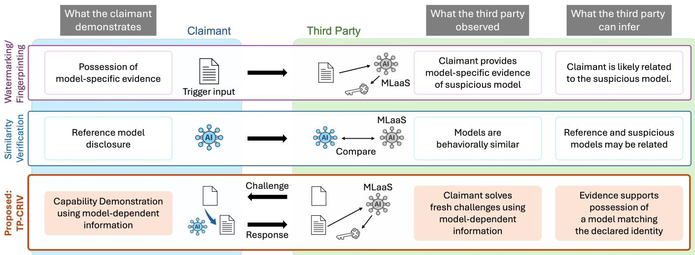
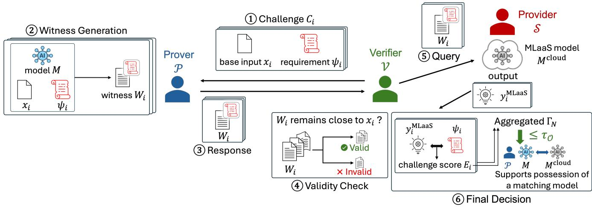
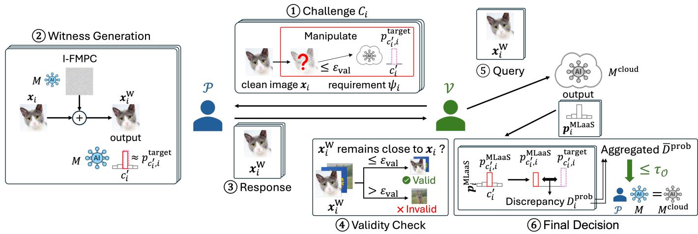
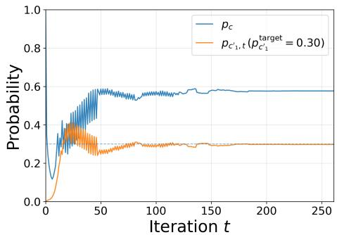
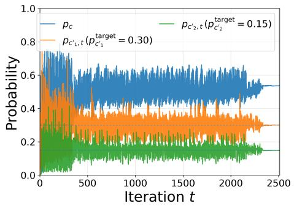
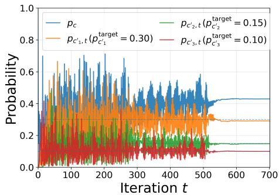
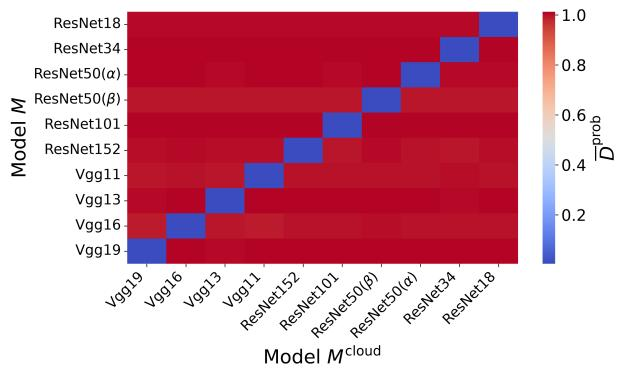

# TP-CRIV: A Framework for Third-Party Challenge-Response Identity Verification of AI Models

Teruki Sano, Minoru Kuribayashi, Masao Sakai, Shuji Isobe, Eisuke Koizumi, Zhang Zhang, and Satoru Matsumoto

Abstract—Artificial intelligence (AI) models are increasingly deployed through remote services, making model misappropriation a growing concern. Existing approaches, including watermarking, fingerprinting, and model similarity analysis, primarily rely on predefined evidence or direct behavioral comparison and do not explicitly evaluate whether the claimant currently possesses and can utilize model-dependent information relevant to the claimed model identity.

In this paper, we propose Third-Party Challenge-Response Identity Verification (TP-CRIV) for AI models. TP-CRIV targets a third-party verification setting in which the verifier has neither white-box nor API access to the claimant’s model, can interact with the suspicious deployed service only through its ordinary black-box inference interface, and does not require protocolspecific cooperation from the service provider. Under these constraints, the framework enables the verifier to obtain empirical evidence as to whether the claimant locally possesses a model satisfying a predeclared identity relative to the deployed model. Verification is conducted under fresh, previously undisclosed requirements and network isolation, so that the demonstrated capability cannot rely on online external assistance after challenge disclosure. The resulting evidence is interpreted relative to independently specified and calibrated matching and nonmatching operating situations and is statistical rather than cryptographic. We instantiate TP-CRIV for CNN image classifiers using probability-control-based witness generation. Experiments on ten ImageNet-pretrained TorchVision models demonstrate clear same/cross-model separation and finite-challenge verification using independently calibrated thresholds.

Index Terms—AI security, Challenge-response, Model identity verification, Model-dependent capability verification, Machine learning as a service (MLaaS).

## I. INTRODUCTION

Artificial intelligence (AI) models support a wide range of applications, while their development can require substantial computational resources, expert knowledge, and financial investment. Protecting the intellectual property (IP) of AI models has therefore become an important issue [1], [2], particularly as model theft and unauthorized reuse remain practical concerns [3], [4].

At the same time, many models are deployed through Machine Learning as a Service (MLaaS), where users interact with remote APIs rather than obtaining the models themselves. In such settings, the parameters, architectures, and training records of a suspicious deployed model are generally unavailable to external parties. Consequently, even if a claimant identifies a suspicious MLaaS, an independent third party cannot directly compare the claimant’s model with the deployed model to assess their relationship. Moreover, without sufficiently credible preliminary evidence supporting the claimant’s allegation, the third party may have difficulty justifying a request for protocol-specific cooperation, model disclosure, or other additional assistance from the MLaaS provider. Under such circumstances, the claimant must first provide convincing technical evidence that supports the suspicion of model misappropriation and justifies further investigation. Therefore, the fundamental research question considered in this work is how an independent third party can obtain credible preliminary evidence of possible model misappropriation without white-box access to either model and without requiring protocol-specific cooperation from the suspicious deployed service. Rather than attempting to measure global similarity between two inaccessible models, we ask whether the third party can issue fresh requirements whose solutions depend strongly on model-specific behavior of the suspicious service and evaluate whether the claimant can satisfy those requirements using a locally available model.

From the perspective of this research question, existing model-protection approaches mainly use predefined modelspecific evidence, as in watermarking and fingerprinting [1], [5]–[20], or compare model behavior with a reference model [21]–[24]. Proof-based verifiable-inference approaches address a different relation: rather than comparing two models, they verify that a reported computation was correctly performed using a specified or committed model [25]–[30]. These approaches provide valuable ownership, identity, similarity, or computation-integrity evidence, but they address a different question from whether a claimant can use a locally available model to satisfy fresh third-party requirements concerning a suspicious deployed service.

To address this problem, we propose Third-Party Challenge-Response Identity Verification (TP-CRIV) for AI models. TP-

  
Fig. 1. Comparison of model-to-model verification approaches from the perspective of the evidence available to an independent third party and the resulting inference about the relationship between a claimant’s model and a suspicious deployed model.

CRIV enables an independent third party to obtain empirical evidence as to whether a claimant possesses a model satisfying a specified identity relative to a suspicious deployed model, while requiring neither white-box nor API access to the claimant’s model and only ordinary black-box access to the suspicious MLaaS. Fig. 1 compares this verification objective with those of existing model-verification approaches. Specifically, for each intended verification problem, the verifier first specifies two disjoint operating situations representing matching and non-matching configurations. These situations define the objective-dependent model identity independently of the challenge-response score or acceptance outcome. The verifier then selects a model-dependent property, issues fresh propertydemanding challenges, and evaluates the returned witnesses through the deployed service. An operational threshold is calibrated using independent reference configurations from the declared matching and non-matching situations. Freshness and network isolation exclude online external assistance after challenge disclosure. Within the model-based responsegeneration scope, matching-consistent challenge-solving performance provides an empirical basis for inferring that the claimant possesses a model satisfying the specified identity. This inference is statistical rather than cryptographic and does not establish training provenance or legal ownership.

To clarify the role of TP-CRIV in practice, we view modelmisappropriation verification as a two-stage process.

Step 1: Preliminary Evidence Assessment. Suppose that a claimant asserts that it possesses a model identical to the model deployed by a suspicious MLaaS. At this stage, however, an independent third-party verifier may have insufficient evidence to determine whether the claim is credible. Under such circumstances, it may also be difficult to justify requiring the suspicious MLaaS provider to participate in a dedicated verification procedure. The verifier must therefore first assess the technical credibility of the claimant’s misappropriation claim using externally observable evidence and determine whether the case warrants a more rigorous subsequent investigation.

Step 2: Formal Ownership Investigation. If sufficient suspicion is established, a formal investigation may employ stronger verification conditions, including direct access to the relevant models or protocol-specific cooperation from the involved parties, together with ownership-related evidence such as development records, timestamps, and ownership documents. Based on this technical and ownership-related evidence, the verifier determines whether model misappropriation or ownership infringement has occurred.

TP-CRIV addresses the first stage by providing preliminary technical evidence about possession of a model satisfying the declared identity.

## A. Our Contributions

The main contributions of this paper are summarized as follows:

• We propose TP-CRIV for preliminary third-party verification in suspicious MLaaS settings where the verifier has neither white-box nor API access to the claimant’s model and the deployed service provides only its ordinary black-box inference interface. Under these conditions, TP-CRIV enables the verifier to obtain empirical evidence as to whether the claimant possesses a model satisfying the objective-dependent identity relative to the deployed model, without requiring protocol-specific cooperation from the service provider.

• To demonstrate the practical feasibility of TP-CRIV, we instantiate the framework for CNN-based image classification using local input–probability geometry and probability-control-based witness generation [31]. Experiments with ten ImageNet-pretrained TorchVision CNN models demonstrate clear separation between the declared matching and non-matching configurations and show that calibration on separate models enables finite-challenge decisions on held-out models.

## B. Organization

The remainder of this paper is organized as follows. Section II reviews related studies on model protection and verification, including ownership, identity, similarity, and proofbased verifiable inference. Section III presents the TP-CRIV framework and its verification principle. Section IV presents a CNN-based instantiation and feasibility evaluation. Section V concludes the paper and outlines future work.

## II. RELATED WORK

This section reviews existing approaches relevant to model protection and verification, focusing on the evidence available to an independent third party and the conclusions that can be drawn from that evidence.

## A. Model-Specific Evidence for Verification

Model watermarking and fingerprinting support ownership or identity claims using model-specific information. Although they construct such information in different ways, verification ultimately evaluates evidence associated with a particular model.

1) Model Watermarking: Model watermarking embeds proprietary information into an AI model and verifies ownership by detecting or extracting the embedded watermark [1], [5]– [12]. Representative approaches include trigger-based watermarks that induce predefined behaviors for specific inputs [7], [9], [11], [12] and methods that recover embedded messages from model outputs [10], [12]. In black-box or gray-box settings, such evidence can be verified through observable model responses without exposing the model itself. Successful verification therefore demonstrates that the presented watermarkrelated evidence is consistent with the suspicious model. Under the assumption that this evidence remains exclusive to the legitimate owner, such consistency can support an ownership claim. However, if the watermark information is disclosed or acquired by another party, the exclusivity assumption may be weakened. Moreover, because the watermark-related information is generally defined before verification, the verification primarily evaluates predefined evidence rather than whether the claimant currently possesses a model capable of producing fresh model-dependent responses.

2) Model Fingerprinting: Model fingerprinting identifies models through intrinsic model-dependent behavior without modifying the target model [13]–[20]. Representative approaches use decision-boundary characteristics [13]–[16], model-specific test examples [17], universal adversarial perturbations [18], or model-sensitive behavior of large language models [19]. Such fingerprints provide evidence for determining whether the behavior of a suspicious model is consistent with model-specific information derived from a reference model. However, fingerprint evidence can generally be constructed before the verification session and may subsequently be presented or reused without requiring the claimant to demonstrate access to the model from which it was derived. Consequently, successful fingerprint verification does not by itself establish that the claimant currently possesses a model satisfying the claimed identity.

a) Limitation ofModel-Specific Evidence: Watermarking and fingerprinting provide valuable ownership and identity evidence, but both primarily verify consistency with modelspecific evidence prepared before verification. Accordingly, a third party can evaluate the relationship between the presented evidence and the suspicious model, but cannot directly determine from that evidence alone whether the claimant currently possesses a model capable of generating corresponding modeldependent behavior. Furthermore, the evidence itself may be proprietary or valuable and may not always be desirable to disclose to an external verifier. These limitations motivate verification that evaluates fresh model-dependent capability rather than only possession or disclosure of predefined evidence.

## B. Model Similarity Verification

Several studies verify model similarity or provenance by comparing observable or internal model behavior [21]–[24]. Representative approaches include test-case-based comparison [21], [22], model lineage analysis using internal information [23], and provenance testing based on observable outputs [24]. These methods can provide strong evidence about the relationship between models, but generally assume that the models to be compared are available to the verifier at least through their observable behavior, and some methods use white-box reference-model information to construct modelsensitive test cases [22]. In practical settings, however, the claimant may also be unable to provide its model to a third party, for example because the model is proprietary or too large to make such access practical. Under such conditions, direct model-similarity verification becomes difficult.

TP-CRIV targets a different operational setting in which the claimant’s model is not made available to the verifier, even through query access, and the suspicious deployed service is accessible only through its ordinary black-box interface.

## C. Proof-based Verifiable Inference

Proof-based verifiable-inference methods address a different verification objective from model-to-model identity verification. Their primary goal is to prove that a reported output was correctly computed from a given input using a specified or committed model, without necessarily revealing the model parameters [25]–[30]. Thus, these methods primarily establish a cryptographic relation between a model and its computation, rather than directly evaluating the relationship between a claimant-held model and a separately deployed suspicious model.

In typical verifiable-inference settings, the model-holding service acts as the prover and participates in a dedicated verification procedure, for example by committing to the model and generating an inference proof. Such mechanisms can provide strong guarantees when this participation is available. However, as discussed above, they become difficult to apply when requiring the suspicious MLaaS provider to participate in a dedicated verification procedure is impractical. TP-CRIV instead evaluates the relationship between two separately held models through only ordinary black-box access to the suspicious MLaaS, enabling the verifier to infer the claimant’s condition and assess whether the claimant’s identity claim is technically supported.

TABLE I  
COMPARISON OF VERIFICATION OBJECTIVES, EVIDENCE, AND OPERATIONAL REQUIREMENTS.
<table><tr><td>Method</td><td>Model-Specific Evidence</td><td>Similarity Verification</td><td>Proof-Based Verification</td><td>Proposed: TP-CRIV</td></tr><tr><td>Primary objective</td><td>Support ownership or model-identity claims</td><td>Estimate or verify similarity between models</td><td>Verify correctness of a specified or committed computation</td><td>Third-party verification of objective-dependent identity</td></tr><tr><td>Directly evaluated evidence</td><td>Consistency with predefined watermark or fingerprint evidence</td><td>Behavioral or internal consistency between compared models</td><td>Proof that a defined computation or relation is satisfied</td><td>Responses to fresh verifier-issued requirements</td></tr><tr><td>Typical approach</td><td>Watermark reproduction, extraction, or fingerprint response evaluation</td><td>Reference-model-based comparison</td><td>Proof generation by the model-holding party</td><td>Challenge-dependent capability demonstration</td></tr><tr><td>Evidence freshness</td><td>Typically predefined before verification</td><td>Statistics obtained during evaluation</td><td>Computation-specific proof generated for verification</td><td>Fresh, previously undisclosed challenges</td></tr><tr><td>Possession-related conclusion</td><td>Not explicitly evaluated</td><td>Not explicitly evaluated</td><td>May bind the demonstrated computation to a committed model</td><td>Empirical inference of possession of a matching model under scope</td></tr><tr><td>Verifier access to claimant model</td><td>Not required</td><td>Often required through API or white-box access</td><td>Not required</td><td>Not required</td></tr><tr><td>Dedicated participation by deployed service</td><td>Not generally required beyond ordinary responses</td><td>Not generally required, but comparison access is needed</td><td>Typically required from the model-holding service</td><td>Not required beyond ordinary black-box inference</td></tr></table>

## III. PROPOSED FRAMEWORK

## A. Motivation and Positioning

TP-CRIV is designed to provide an independent third party with empirical evidence about the relationship between a claimant’s locally possessed model and a suspicious remotely deployed model when direct model comparison is unavailable. Through fresh challenge-response interactions, the framework enables the verifier to assess whether the claimant demonstrates behavior consistent with the identity specified for the intended verification objective, without requiring access to the claimant’s model or protocol-specific cooperation from the deployed service. To make this inference well defined, TP-CRIV separates four concepts that must not be conflated. First, the verification objective specifies an a priori distinction between matching and non-matching operating situations. Second, a model-dependent property supplies information for constructing discriminative requirements but does not define model identity. Third, fresh property-demanding challenges elicit observable challenge-solving capability rather than directly revealing or comparing the property. Fourth, calibration on independent reference configurations provides an operational interpretation of the resulting scores relative to the predeclared identity distinction.

These roles are formalized below. Compared with modelspecific evidence approaches, TP-CRIV evaluates not only evidence associated with the claimant and the suspicious service, but also whether the claimant can use a locally available model to satisfy fresh model-dependent requirements. In contrast to model-similarity verification, TP-CRIV does not require the verifier to access or query the claimant’s model. Unlike proof-based verifiable inference, it also does not require the suspicious MLaaS provider to participate in a dedicated verification procedure. Table I summarizes these differences from existing verification approaches.

## B. System Model

We consider three entities:

• Prover P, which locally possesses a candidate model M and claims that M corresponds to the matching situation relative to Mcloud.

• Service provider S, which operates $M ^ { \mathrm { c l o u d } }$ through an MLaaS platform.

• Verifier V, which specifies a verification objective O, prepares or obtains calibration data, conducts verification, and evaluates the resulting evidence.

Let $F ^ { \mathrm { M L a a S } }$ denote the black-box MLaaS interface exposed by S. For an input x, V observes only

$$
\begin{array} { r } { y ^ { \mathrm { M L a a S } } = F ^ { \mathrm { M L a a S } } ( x ) , } \end{array}\tag{1}
$$

where, in the baseline framework setting,

$$
F ^ { \mathrm { M L a a S } } ( x ) = M ^ { \mathrm { c l o u d } } ( x ) .\tag{2}
$$

Neither P nor V directly accesses $M ^ { \mathrm { c l o u d } }$ . Moreover, V has no direct access to M and need not observe its parameters, architecture, or other internal information. Consequently, V cannot directly compare the internal structures of M and Mcloud. TP-CRIV therefore evaluates the claimed relationship from observable interactions with the deployed MLaaS under the declared verification objective, calibration procedure, and operational assumptions.

## C. Verification Scope and Operational Assumptions

a) Non-Matching Model Configurations: A model configuration declared non-matching for O constitutes the negative identity case. Depending on the intended objective, M may be unrelated to, independently trained from, extracted from [3], distilled from [32], or otherwise derived from $M ^ { \mathrm { c l o u d } }$ . Such provenance does not determine the identity label; the label is fixed by the operating situations declared for O. Acceptance of a declared non-matching configuration constitutes a false acceptance.

  
Fig. 2. Overview of the TP-CRIV framework. The verifier specifies the objective-dependent model-identity distinction, selects a model-dependent property, issues fresh property-demanding challenges, and evaluates the prover’s returned responses through the deployed MLaaS. The prover answers the challenges using a locally available candidate model.

Model configurations outside the declared operating population are outside the characterized identity scope. Accordingly, the reported verification performance does not automatically extend to model configurations that are not represented in the corresponding calibration, evaluation, or supporting analysis.

b) Service-Side Assumption: S does not disclose $M ^ { \mathrm { { \dot { c l o u d } } } }$ its parameters, architecture, or inference pipeline. V interacts with $F ^ { \mathrm { M L a a S } }$ only through its ordinary black-box interface. S is assumed to return the ordinary output of a fixed deployed inference pipeline for each submitted input. Adaptive routing of verification queries, deliberate output manipulation, and query refusal are outside the present scope. The verification decision therefore concerns the observed behavior of the deployed service and does not establish its internal implementation.

c) Network Isolation: Before the first challenge of a verification session is disclosed, $\mathcal { P }$ is placed under network isolation. The isolation remains in effect until all responses for the session have been returned. During this interval, P may use the disclosed challenges, its locally available model $M ,$ and local computational resources, but may not obtain additional challenge-relevant information from $\dot { F ^ { \mathrm { M L a a S } } }$ , another remote model, a relay service, an external oracle, or any other external source. Thus, network isolation excludes online external assistance after challenge disclosure.

## D. TP-CRIV Protocol

A verification trial consists of N challenge-response interactions. For each interaction i, V issues a fresh challenge, P generates a corresponding response using its locally available model, and V evaluates the response through the deployed MLaaS.

Let ResGen denote the response-generation algorithm used by P. The present framework adopts a model-based responsegeneration scope: ResGen may use M, the disclosed challenge, and local computation required to operate or process M. A standalone learned or precomputed mechanism that can generate responses without using M is outside the present model-based response-generation scope.

Fig. 2 illustrates the overall TP-CRIV framework. The i-th interaction proceeds as follows.

1) V generates a fresh challenge

$$
C _ { i } = ( x _ { i } , \psi _ { i } ) ,\tag{3}
$$

where $x _ { i }$ is a base input and $\psi _ { i }$ specifies the verification requirement.

2) Given $C _ { i } , \mathcal { P }$ applies ResGen to its local model M and generates a witness

$$
W _ { i }  \mathrm { R e s G e n } ( M , C _ { i } ) .\tag{4}
$$

3) $\mathcal { P }$ then returns $W _ { i }$ to V.

4) V evaluates the challenge-specific witness validity

$$
\mathrm { V a l i d } _ { \mathrm { w i t } } ( C _ { i } , W _ { i } ) \in \{ 0 , 1 \} .\tag{5}
$$

An invalid witness is excluded from subsequent score evaluation.

5) For each valid $W _ { i }$ , V submits $W _ { i }$ to the MLaaS and obtains

$$
y _ { i } ^ { \mathrm { M L a a S } } = F ^ { \mathrm { M L a a S } } ( W _ { i } ) .\tag{6}
$$

6) After the N interactions, V defines

$$
{ \mathcal { T } } _ { \mathrm { v a l } } = \left\{ i \mid { \mathrm { V a l i d } } _ { \mathrm { w i t } } ( C _ { i } , W _ { i } ) = 1 \right\} ,\tag{7}
$$

and

$$
N _ { \mathrm { v a l } } = \left| \mathcal { I } _ { \mathrm { v a l } } \right| .\tag{8}
$$

Let $N _ { \mathrm { m i n } }$ denote the minimum number of valid witnesses required for score aggregation. If $N _ { \mathrm { v a l } } < N _ { \mathrm { m i n } } ,$ the session is rejected. Otherwise, for each $i \in \mathcal { T } _ { \mathrm { v a l } } , \mathcal { V }$ computes

$$
E _ { i } = \mathrm { E v a l } ( C _ { i } , W _ { i } , y _ { i } ^ { \mathrm { M L a a S } } ) ,\tag{9}
$$

where Eval denotes the challenge-specific scoring func tion, and $E _ { i }$ is the resulting per-challenge score.

Let $\mathrm { A g g r }$ denote the declared aggregation rule. The valid scores are aggregated as

$$
\Gamma _ { N } = \mathrm { A g g r } \left( \{ E _ { i } \} _ { i \in \mathbb { Z } _ { \mathrm { v a l } } } \right) .\tag{10}
$$

Let τO denote the operational acceptance threshold fixed for O before the suspicious configuration is evaluated. The final decision is

$$
\mathsf { A c c e p t } = \left\{ \begin{array} { l l } { 0 , } & { N _ { \mathrm { v a l } } < N _ { \mathrm { m i n } } , } \\ { \mathbb { I } [ \Gamma _ { N } \leq \tau _ { \mathcal { O } } ] , } & { N _ { \mathrm { v a l } } \geq N _ { \mathrm { m i n } } . } \end{array} \right.\tag{11}
$$

$\tau _ { \mathcal { O } }$ is calibrated using data prepared independently of the suspicious configuration. Here, I[·] denotes the indicator function, which returns 1 if the enclosed condition is true and 0 otherwise. Its reported operating characteristics apply only to the model population, challenge distribution, responsegeneration conditions, and deployment conditions represented in the supporting calibration and evaluation.

In particular, different choices of ResGen may induce different score distributions for the same $( M , M ^ { \mathrm { c l o u d } } )$ configuration. Accordingly, a reported soundness or false-acceptance characterization covers only the choices of ResGen represented in the corresponding evaluation or supported by separate analysis. Standalone non-model response mechanisms remain outside the present model-based soundness scope.

The interpretation of acceptance under freshness, network isolation, and the stated model-based scope is developed in Section III-E.

## E. Verification Principle

TP-CRIV separates four logically distinct elements: the objective-dependent identity distinction, the model-dependent property used to construct challenges, the operational characterization of challenge-solving performance, and the inference obtained by combining matching consistency with the freshness and network-isolation conditions. This separation prevents the verification outcome from defining the identity relation that it is intended to test.

1) Operating Situations and Objective-Dependent Identity: For each intended verification problem, V specifies two disjoint operating situations, $\Pi _ { 1 } ^ { \mathcal { O } }$ and $\Pi _ { 0 } ^ { \mathcal { O } }$ , representing configurations regarded as matching and non-matching, respectively. These situations are specified a priori according to the semantic distinction relevant to the intended application and independently of the challenge-response score, calibration threshold, or acceptance outcome. Together, they define the model-identity distinction tested by the verification objective O.

The corresponding operating population is

$$
\Pi ^ { \mathcal { O } } = \Pi _ { 1 } ^ { \mathcal { O } } \cup \Pi _ { 0 } ^ { \mathcal { O } } , \qquad \Pi _ { 1 } ^ { \mathcal { O } } \cap \Pi _ { 0 } ^ { \mathcal { O } } = \emptyset .\tag{12}
$$

Thus, model identity is objective dependent and population scoped. TP-CRIV does not posit a universal identity relation over all possible AI models.

For convenience, membership in these two situations is encoded by

$$
\mathrm { M a t c h } _ { \mathcal { O } } \left( M , M ^ { \mathrm { c l o u d } } \right) = \left\{ 1 , \quad \left( M , M ^ { \mathrm { c l o u d } } \right) \in \Pi _ { 1 } ^ { \mathcal { O } } , \right.\tag{13}
$$

Here, Match introduces no additional notion of identity and is not inferred from the TP-CRIV score. It only records membership in the two situations specified independently for O. For example, one verification objective may declare same-model-instance configurations as matching and selected distinct model instances as non-matching. Within the corresponding $\Pi ^ { \mathcal { O } }$ , this constitutes an exact-instance distinction. Another objective may place designated descendant models in the matching situation and selected outside-lineage models in the non-matching situation, yielding a lineage-oriented distinction. The meaning of identity therefore changes when the declared operating situations change.

A configuration outside $\Pi ^ { \mathcal { O } }$ is outside the identity distinction instantiated by O. The protocol may still produce an observable score for such a configuration, but the current objective does not assign it a matching or non-matching label, and the reported operating characteristics do not automatically apply to it. Extending the identity claim to such a configuration requires extending the declared operating situations and establishing corresponding calibration, evaluation, or analysis.

The choice of ResGen does not define model identity. The matching and non-matching labels are fixed a priori by $\Pi _ { 1 } ^ { \mathcal { O } }$ and $\Pi _ { 0 } ^ { \mathcal { O } }$ . Different choices of ResGen may affect observable challenge-solving performance and operating error rates, but they do not change those predeclared identity labels.

2) Model-Dependent Property and Challenge-Solving $C a -$ pability: For each model M, let $S _ { M }$ denote a selected model-dependent property. Examples include local decision geometry in a classifier, conditional generation behavior in a generative model, or another high-dimensional behavioral structure whose detailed form depends on the model. The selected property does not define $\Pi _ { 1 } ^ { \dot { \mathcal { O } } }$ or $\Pi _ { 0 } ^ { \mathcal { O } }$ . Instead, V uses it as a source of model-dependent information from which fresh verification requirements can be constructed.

For $\Pi ^ { \mathcal { O } }$ , a useful property is one whose challenge-relevant information enables configurations in $\Pi _ { 1 } ^ { \mathcal { O } }$ to solve requirements determined by $M ^ { \mathrm { c l o u d } }$ more consistently than configurations in $\Pi _ { 0 } ^ { \mathcal { O } }$ under the covered choices of ResGen. For a challenge $C = ( x , \psi )$ , the requirement ψ is constructed so that a valid low-error solution depends substantially on challengerelevant aspects of $S _ { M ^ { \mathrm { c l o u d } } }$ . Such a challenge is referred to as a property-demanding challenge.

For each valid witness W, V evaluates the observable score Eval $( C , W , F ^ { \mathrm { M L a a S } } ( W ) )$ , which measures how well the returned witness satisfies the issued requirement. V need not reconstruct $S _ { M } , S _ { M } \mathrm { c l o u d }$ , or the complete set of successful witnesses. It observes only whether $\mathcal { P }$ can use M through ResGen to generate successful responses to newly issued challenges. This capability relation is not deterministic. A configuration in $\Pi _ { 1 } ^ { \bar { \mathcal { O } } }$ may occasionally fail because of numerical, algorithmic, or deployment-side effects. Conversely, a configuration in $\Pi _ { 0 } ^ { \mathcal { O } }$ may reproduce sufficient challengerelevant information to solve some or all challenges. Such success does not change its predeclared class membership. If it is accepted, the event constitutes a false acceptance under the declared objective.

Accordingly, the selected property provides the mechanism through which model-dependent information is elicited as an observable challenge-solving capability. Whether this capability actually discriminates the two declared situations must be established operationally rather than assumed from a converse relation between property similarity and model identity.

3) Operational Characterization of Challenge-Solving Performance: Let $\mathcal { D } _ { C }$ denote the declared distribution from which fresh challenges are drawn, and let ResGen denote the choice covered by the operating characterization. For each $b \in \{ 0 , 1 \}$ , let $Q _ { b } ^ { \mathcal { O } }$ denote the declared distribution over model configurations in $\Pi _ { b } ^ { \mathcal { O } }$ used for operational characterization. Sampling

$$
( M , M ^ { \mathrm { c l o u d } } ) \sim Q _ { b } ^ { \mathcal { O } } ,\tag{14}
$$

drawing fresh challenges from $\mathcal { D } _ { C }$ , generating responses using ResGen, and applying Eq. (10) induce the observable aggregate-score distribution

$$
\Gamma _ { N } \sim P _ { b , \mathrm { R e s G e n } } ^ { \mathcal { O } } .\tag{15}
$$

These distributions provide an operational characterization of the challenge-solving capability demonstrated by the matching and non-matching populations under the specified conditions. The purpose of the selected property and challenge family is therefore to induce sufficiently distinguishable observable performance between $\Pi _ { 1 } ^ { \mathcal { O } }$ and ${ \bar { \Pi } } _ { 0 } ^ { \bar { \boldsymbol { \mathcal { O } } } }$

TP-CRIV does not assume a deterministic, one-to-one, or monotone mapping between a latent discrepancy between $S _ { M }$ and $S _ { M ^ { \mathrm { c l o u d } } }$ and the observed aggregate score $\Gamma _ { N }$ . Different model configurations may produce similar scores, the same configuration may produce different scores for different sets of fresh challenges, and different choices of ResGen may induce different score distributions for the same model configuration. The relevant question is instead whether the challenge-solving performance induced by the declared matching and nonmatching populations is sufficiently separated for the intended operating criterion.

Using independent calibration data, V determines $\tau _ { \mathcal { O } }$ before evaluating the suspicious configuration. Let $R G _ { 0 }$ and $R G _ { 1 }$ denote the covered choices of ResGen for the non-matching and matching situations, respectively; they may coincide. The corresponding false-acceptance rate $( \mathrm { F A R } _ { \mathcal { O } , R G _ { 0 } } )$ and falserejection rate $( \mathrm { F R R } _ { \mathcal { O } , R G _ { 1 } } )$ are given as follows:

$$
\mathrm { F A R } _ { \mathcal { O } , R G _ { 0 } } = \underset { ( M , M ^ { \mathrm { c l o u d } } ) \sim Q _ { 0 } ^ { \mathcal { O } } } { \mathrm { P r } } \left[ \Gamma _ { N } \leq \tau _ { \mathcal { O } } \mid R G _ { 0 } \right] ,\tag{16}
$$

and

$$
\mathrm { F R R } _ { \mathcal { O } , R G _ { 1 } } = \operatorname* { P r } _ { ( M , M ^ { \mathrm { c l o u d } } ) \sim Q _ { 1 } ^ { \mathcal { O } } } \left[ \Gamma _ { N } > \tau _ { \mathcal { O } } \mid R G _ { 1 } \right] .\tag{17}
$$

The probabilities include the randomness of model configuration sampling, fresh challenge generation, and, when applicable, the response-generation algorithm. τ provides an operational boundary for interpreting observed challengesolving performance relative to the declared $\Pi _ { 1 } ^ { \mathcal { O } }$ and $\bar { \Pi } _ { 0 } ^ { \mathcal { O } }$ situations.

Within the declared operating population, acceptance provides finite-sample empirical evidence that the observed challenge-solving performance is more consistent with the characterized matching population than with the characterized non-matching population. TP-CRIV evaluates evidence for membership in a predeclared identity class rather than defining identity from acceptance.

TABLE II VERIFIER’S INFERENCE PROCESS IN TP-CRIV.
<table><tr><td>Step</td><td>Verifier&#x27;s observation or inference</td></tr><tr><td>1</td><td>P repeatedly returns valid low-score witnesses for fresh property- demanding challenges.</td></tr><tr><td>↓</td><td>The transcript directly demonstrates finite challenge-solving capabil-  $i t y .$ </td></tr><tr><td>2</td><td>Freshness limits replay-based strategies, while network isolation excludes online external assistance after challenge disclosure.</td></tr><tr><td>↓</td><td>P locally possesses the challenge-solving capability required to gen- erate the demonstrated responses without online external assistance.</td></tr><tr><td>3</td><td>Under the model-based response-generation scope, the aggregate score lies in the acceptance region calibrated for the declared match- ing situation.</td></tr><tr><td>↓</td><td>The candidate model exhibits matching-consistent challenge-solving performance within the calibrated scope.</td></tr><tr><td>4</td><td>The combined evidence supports an empirical inference that the claimant possesses a model satisfying the objective-dependent iden- tity.</td></tr></table>

The reported $\tau _ { \mathcal { O } }$ , FAR, and FRR apply only to the declared operating distributions, $\mathcal { D } _ { C }$ , ResGen, and deployment conditions. Broader claims require corresponding extension of the operating characterization.

4) Inference Under Freshness and Network Isolation: The calibrated decision characterizes whether the observed challenge-solving performance is consistent with the declared matching situation; by itself, it does not establish whether the response was generated without external assistance. Fresh challenges limit replay based on a small precomputed response set, while the network-isolation condition prevents P from obtaining additional challenge-relevant information from external sources after disclosure.

Within the stated model-based response-generation scope, the session responses are generated through ResGen(M, C). If $\Gamma _ { N }$ also lies in the calibrated matching region, the observed capability is characteristic of the matching situation within the declared operating scope. These conditions jointly provide an empirical basis for inferring that P possesses a model satisfying the identity specified by O. The inference is conditional on the stated scope and does not establish cryptographic binding, training provenance, or legal ownership.

The verifier’s inference process is summarized in Table II.

## F. Protocol Requirements

A valid TP-CRIV instantiation should satisfy the following requirements under Eq. (11).

a) Objective and Population Specification: V must specify the disjoint situations $\Pi _ { 1 } ^ { \mathcal { O } }$ and $\Pi _ { 0 } ^ { \mathcal { O } }$ before evaluating the suspicious case, independently of the TP-CRIV score, τO, or the eventual decision. V must also specify the operating distributions $Q _ { 1 } ^ { \mathcal { O } }$ and $Q _ { 0 } ^ { \mathcal { O } } , D _ { C }$ , the choices of ResGen covered by calibration and evaluation, and the criterion used to select $\tau _ { \mathcal { O } } . \Pi _ { 0 } ^ { \mathcal { O } }$ should contain the model configurations that constitute relevant alternatives to the intended identity claim; omitted model classes and unrepresented algorithms remain outside the characterized soundness scope.

b) Completeness: Let $\epsilon _ { c }$ denote the allowed completeness error. For $( M , M ^ { \mathrm { c l o u d } } ) \sim Q _ { 1 } ^ { \mathcal { O } }$ and a covered ResGen, acceptance should occur with high probability:

$$
\begin{array} { r } { \underset { ( M , M ^ { \mathrm { c l o u d } } ) \sim Q _ { 1 } ^ { \mathcal { O } } } { \mathrm { P r } } [ \mathsf { A c c e p t } = 1 \mid \mathrm { R e s G e n } ] \geq 1 - \epsilon _ { c } . } \\ { C _ { 1 : N } { \sim } \mathcal { D } _ { C } ^ { N } } \end{array}\tag{18}
$$

Here, $\epsilon _ { c }$ is the objective-specific false-rejection probability under the declared operating conditions.

c) Soundness: Let $\epsilon _ { s }$ denote the allowed soundness error. For $( M , M ^ { \mathrm { c l o u d } } ) \sim Q _ { 0 } ^ { \mathcal { O } }$ and a covered ResGen, acceptance should occur with low probability:

$$
\begin{array} { r } { \underset { ( M , M ^ { \mathrm { c l o u d } } ) \sim Q _ { 0 } ^ { \mathcal { O } } } { \mathrm { P r } } [ \mathrm { A c c e p t } = 1 \ | \ \mathrm { R e s G e n } ] \leq \epsilon _ { s } . } \\ { C _ { 1 : N } \sim \mathcal { D } _ { C } ^ { N } } \end{array}\tag{19}
$$

Here, $\epsilon _ { s }$ is the objective-specific false-acceptance probability under the declared operating conditions. The identity label is independent of ResGen; therefore, acceptance of any configuration assigned to $\Pi _ { 0 } ^ { \mathcal { O } }$ is a false acceptance.

d) Property-Demanding Challenge Design: Each challenge ${ \cal C } = ( x , \psi )$ must contain a fresh requirement whose successful solution depends substantially on model-dependent information associated with $S _ { M } \mathrm { c l o u d }$ . The challenge family should separate the induced score distributions of the relevant matching and non-matching populations at the intended operating point. A fixed witness, a small precomputed response set, or challenge-independent evidence should not yield acceptance with high probability over fresh challenges.

e) Calibration and Threshold Transfer: $\tau _ { \mathcal { O } }$ must be determined from calibration data prepared independently of the suspicious configuration and fixed before that configuration is evaluated. Reported error rates are valid only under the challenge-generation process, validity conditions, aggregation rule, ResGen, and deployment pipeline represented in calibration and evaluation.

f) Freshness and Network Isolation: Each $C _ { i } ~ \sim ~ \mathcal { D } _ { C }$ must remain unpredictable before disclosure, and the challenge family should limit reuse of responses across fresh challenges. The network-isolation condition defined above must hold throughout witness generation. Both conditions are required for the inference of Section III-E.

## IV. CNN-BASED INSTANTIATION AND FEASIBILITY EVALUATION

This section instantiates the abstract TP-CRIV components for CNN-based image classification under an explicitly bounded experimental setting. The evaluation fixes ResGen = I-FMPC for all tested $( M , M ^ { \mathrm { c l o u d } } )$ configurations and examines whether the declared matching and non-matching situations induce separable scores and whether a threshold calibrated on separate models transfers to held-out configurations. The results characterize only the operating scope instantiated below.

## A. Verification Objective and Operating Scope

We consider a CNN-based feasibility demonstration of TP-CRIV under an explicitly bounded operating scope. Both M and $M ^ { \mathrm { c l o u d } }$ are CNN image classifiers. Let $\mathcal { M } _ { \mathrm { e v a l } }$ denote the finite model pool consisting of ten ImageNet-pretrained CNN model instances: ResNet-18, -34, -101, and -152; VGG-11, -13, -16, and -19; and two ResNet-50 instances using the TorchVision IMAGENET1K V1 and IMAGENET1K V2 pretrained weights, respectively [33]–[35]. The two ResNet-50 instances are hereafter denoted by ResNet-50 (α) and ResNet-50 (β). They share the same architecture but contain different pretrained parameter sets obtained using different training recipes. The evaluated pool is a heterogeneous set of publicly available pretrained model instances that differ primarily in architecture family, network depth, or pretrained weight configuration. All models perform the same ImageNet classification task and share the same output-label space.

For the present feasibility study, the operating population is declared as

$$
\Pi ^ { \mathcal { O } } = \mathcal { M } _ { \mathrm { e v a l } } \times \mathcal { M } _ { \mathrm { e v a l } } .\tag{20}
$$

Thus, $\Pi ^ { \mathcal { O } }$ contains all directed $( M , M ^ { \mathrm { c l o u d } } )$ configurations formed from the ten models in $\mathcal { M } _ { \mathrm { e v a l } }$ . Before challengeresponse evaluation, the verification objective O declares the following two situations within $\Pi ^ { \mathcal { O } }$ . These declarations are independent of the observed scores and thresholds.

a) Matching situation: The first situation is

$$
\Pi _ { 1 } ^ { \mathcal { O } } = \left\{ ( M , M ^ { \mathrm { c l o u d } } ) \in \Pi ^ { \mathcal { O } } \ \middle | \ M = M ^ { \mathrm { c l o u d } } \right\} .\tag{21}
$$

It contains the 10 same-model directed configurations, which are designated as the identity-satisfying, or matching, situation for the present objective.

b) Non-matching situation: The contrasting situation is

$$
\Pi _ { 0 } ^ { \mathcal { O } } = \left\{ ( M , M ^ { \mathrm { c l o u d } } ) \in \Pi ^ { \mathcal { O } } \ \middle \vert \ M \neq M ^ { \mathrm { c l o u d } } \right\} .\tag{22}
$$

It contains the 90 cross-model directed configurations formed from distinct model instances in $\mathcal { M } _ { \mathrm { e v a l } }$ , which are designated as the non-matching situation. For the finite operating characterization below, $Q _ { 1 } ^ { \mathcal { O } }$ and $Q _ { 0 } ^ { \mathcal { O } }$ are taken as uniform distributions over the 10 and 90 configurations, respectively.

In the present feasibility study, both matching and nonmatching provers use ResGen = I-FMPC. Thus, the reported score distributions and FAR characterize non-matching models that attempt the same fine-grained probability-control task as matching models. Other model-based choices of ResGen are outside the present operating characterization.

Together, these situations define an exact-instance distinction scoped to $\Pi ^ { \mathcal { O } }$ . Models outside $\mathcal { M } _ { \mathrm { e v a l } } .$ , including independently trained, fine-tuned [36], pruned [37], quantized [38], extracted, or distilled models, are not assigned a label by this experimental objective and are not characterized by the reported FAR. Each evaluated M is used directly with the fixed ResGen specified above.

## B. Verification Procedure

Fig. 3 illustrates the verification procedure. The selected property $S _ { M }$ is the local input–probability geometry induced by CNN model M, namely the local relationship between bounded input modifications and the resulting class probability changes. This property guides the construction of challenges whose valid low-error solutions depend on $S _ { M ^ { \mathrm { c l o u d } } }$

  
Fig. 3. Verification procedure in the image-classification instantiation of TP-CRIV. V specifies an input image, a fresh probability-control requirement, and a witness-modification constraint.

For each verification interaction, V generates a challenge

$$
C = ( \pmb { x } , \psi ) ,\tag{23}
$$

where x is a clean input image and

$$
\psi = \left( c ^ { \prime } , p _ { c ^ { \prime } } ^ { \mathrm { t a r g e t } } , \varepsilon _ { \mathrm { v a l } } \right) .\tag{24}
$$

Let $\mathcal { V }$ denote the output-label space. Here, V selects the target class $c ^ { \prime } \in \mathcal { V }$ and specifies the required output probability $p _ { c ^ { \prime } } ^ { \mathrm { t a r g e t } }$ and the maximum permitted witness modification $\varepsilon _ { \mathrm { v a l } } .$ The $\mathcal { D } _ { C }$ used in the experiments is instantiated as follows. x is randomly selected from the ImageNet dataset [39], $c ^ { \prime }$ is randomly selected from the full set of 1000 ImageNet classes, and $p _ { c ^ { \prime } } ^ { \mathrm { t a r g e t } }$ is randomly selected from $\{ 0 . 1 0 , 0 . 1 5 , \hdots , 0 . 4 0 \}$ The witness-validity tolerance is fixed at $\varepsilon _ { \mathrm { v a l } } = 4 / 2 5 5$ . Fresh base inputs are not reused within a verification session.

For each session, V draws N fresh challenges according to this distribution, with base inputs sampled without replacement within the session:

$$
\begin{array} { r } { C _ { i } \sim \mathcal { D } _ { C } , \qquad i = 1 , \dots , N , } \end{array}\tag{25}
$$

where

$$
C _ { i } = ( \boldsymbol { x } _ { i } , \psi _ { i } )\tag{26}
$$

and

$$
\psi _ { i } = \left( c _ { i } ^ { \prime } , p _ { c _ { i } ^ { \prime } , i } ^ { \mathrm { t a r g e t } } , \varepsilon _ { \mathrm { v a l } } \right) .\tag{27}
$$

$\mathbf { \Psi } _ { \mathbf { x } _ { i } , c _ { i } ^ { \prime } , }$ and $p _ { c _ { i } ^ { \prime } , i } ^ { \mathrm { t a r g e t } }$ are not disclosed before the corresponding challenge is issued.

The ResGen evaluated in the main experiments is instantiated by the Iterative Fine-grained Multi-class Probability Control (I-FMPC) procedure, detailed in Section IV-D. Given $C _ { i } , \mathcal { P }$ applies $\mathrm { R e s G e n } = \mathrm { I } \mathrm { - F M P C }$ to its local model M:

$$
\pmb { x } _ { i } ^ { \mathrm { W } } = \mathrm { R e s } \mathrm { G e n } ( M , C _ { i } ) = \mathrm { I } \mathrm { - F M P C } ( M , C _ { i } ) .\tag{28}
$$

ResGen is used for both $\Pi _ { 1 } ^ { \mathcal { O } }$ and $\Pi _ { 0 } ^ { \mathcal { O } }$ in the reported main experiments.

After receiving $\mathbf { \Delta } \mathbf { x } _ { i } ^ { \mathrm { W } }$ from P, V first checks

$$
\begin{array} { r } { \left\| \pmb { x } _ { i } ^ { \mathrm { W } } - \pmb { x } _ { i } \right\| _ { \infty } \leq \varepsilon _ { \mathrm { v a l } } . } \end{array}\tag{29}
$$

Thus,

$$
\mathrm { V a l i d } _ { \mathrm { w i t } } ( C _ { i } , \pmb { x } _ { i } ^ { \mathrm { W } } ) = \mathbb { I } \left[ \left\| \pmb { x } _ { i } ^ { \mathrm { W } } - \pmb { x } _ { i } \right\| _ { \infty } \leq \varepsilon _ { \mathrm { v a l } } \right] .\tag{30}
$$

The valid-response index set and count are

$$
\begin{array} { r l } & { \mathcal { T } _ { \mathrm { v a l } } = \left\{ i \in \{ 1 , \dots , N \} \ : \middle | \mathrm { V a l i d } _ { \mathrm { w i t } } ( C _ { i } , \pmb { x } _ { i } ^ { \mathrm { W } } ) = 1 \right\} , } \\ & { \qquad N _ { \mathrm { v a l } } = \left| \mathcal { T } _ { \mathrm { v a l } } \right| . } \end{array}\tag{31}
$$

If $N _ { \mathrm { v a l } } < N _ { \mathrm { m i n } } , \mathcal { V }$ rejects the session without computing an aggregate score. Otherwise, for each valid witness, V obtains

$$
p _ { i } ^ { \mathrm { M L a a S } } = F ^ { \mathrm { M L a a S } } ( { \pmb x } _ { i } ^ { \mathrm { W } } )
$$

and defines the output probability of class $c _ { i } ^ { \prime }$ as

(32)

$$
p _ { c _ { i } ^ { \prime } , i } ^ { \mathrm { M L a a S } } = F ^ { \mathrm { M L a a S } } ( \pmb { x } _ { i } ^ { \mathrm { W } } ) [ c _ { i } ^ { \prime } ] .\tag{33}
$$

The per-challenge score is

$$
E _ { i } = D _ { i } ^ { \mathrm { p r o b } } = \frac { \left| p _ { c _ { i } ^ { \prime } , i } ^ { \mathrm { t a r g e t } } - p _ { c _ { i } ^ { \prime } , i } ^ { \mathrm { M L a a S } } \right| } { p _ { c _ { i } ^ { \prime } , i } ^ { \mathrm { t a r g e t } } } .\tag{34}
$$

For $N _ { \mathrm { v a l } } \geq N _ { \mathrm { m i n } }$ , the aggregate score is

$$
\Gamma _ { N } = \overline { { D } } ^ { \mathrm { { p r o b } } } = \frac { 1 } { N _ { \mathrm { { v a l } } } } \sum _ { i \in \mathcal { T } _ { \mathrm { v a l } } } D _ { i } ^ { \mathrm { { p r o b } } } .\tag{35}
$$

The final decision rule is

$$
\mathsf { A c c e p t } = \left\{ \begin{array} { l l } { 0 , } & { N _ { \mathrm { v a l } } < N _ { \mathrm { m i n } } , } \\ { \mathbb { I } \left[ \overline { { D } } ^ { \mathrm { p r o b } } \leq \tau o \right] , } & { N _ { \mathrm { v a l } } \geq N _ { \mathrm { m i n } } . } \end{array} \right.\tag{36}
$$

Invalid witnesses are excluded from the aggregate, whereas $N _ { \mathrm { m i n } }$ prevents acceptance based only on a favorable subset of challenges. $\tau _ { \mathcal { O } }$ is calibrated from reference configurations drawn from the instantiated operating populations independently of the configuration under evaluation.

Table III summarizes the CNN instantiation of TP-CRIV.

TABLE III  
INSTANTIATION OF THE PROPOSED TP-CRIV.
<table><tr><td>Component  $\overline { { \mathcal { O } } }$ </td><td>Instantiation  $\overline { { \Pi ^ { \mathcal { O } } } }$ </td></tr><tr><td> ${ \mathrm { R e s } } { \mathrm { G e n } }$   $\Pi _ { 1 } ^ { \mathcal { O } }$   $\Pi _ { 0 } ^ { \dot { \mathcal { O } } }$   $\check { M }$   $M ^ { \mathrm { c l o u d } }$   $F ^ { \mathrm { M L a a S } }$   $S$   $N _ { \mathrm { m i n } }$   $\mathcal { D } _ { C }$   $\psi$   $W$   $\mathrm { V a l i d _ { w i t } }$ </td><td>Population-scoped exact-instance distinction within Response-generation algorithm I-FMPC Same-model directed configurations in  $\mathcal { M } _ { \mathrm { e v a l } }$  Cross-model directed configurations in  $\mathcal { M } _ { \mathrm { e v a l } }$  Prover&#x27;s CNN image classifier Deployed MLaaS CNN image classifier  $F ^ { \dot { \mathrm { M L a s } } } ( { \pmb x } ) = M ^ { \mathrm { c l o u d } } ( { \pmb x } )$  Local input-probability geometry N in the reported CNN evaluation</td></tr></table>

## C. Verification Principle

For the verification objective defined above, the selected model-dependent property should provide challenge-relevant information that induces distinguishable challenge-solving behavior between $\Pi _ { 1 } ^ { \mathcal { O } }$ and $\Pi _ { 0 } ^ { \mathcal { O } }$ . In particular, under the instantiated challenge distribution and response-generation algorithm, configurations in $\Pi _ { 1 } ^ { \mathcal { O } }$ should satisfy requirements determined by $\bar { M } ^ { \mathrm { c l o u d } }$ more consistently than configurations in $\Pi _ { 0 } ^ { \mathcal { O } }$

For this purpose, we select S as the local input–probability geometry, namely the relationship between bounded input modifications and the resulting class-probability changes. Behavior near decision boundaries has been used as modelsensitive information in prior fingerprinting studies [13]–[16], which motivates its use here as a property from which discriminative verification requirements can be constructed.

Based on this property, V issues fresh probability-control challenges. For a challenge $C = ( \mathbf { x } , c ^ { \prime } , p _ { c ^ { \prime } } ^ { \mathrm { t a r g e t } } , \varepsilon _ { \mathrm { v a l } } )$ , P must generate a witness satisfying

$$
\left\| \mathbfcal { x } ^ { \mathrm { { W } } } - \mathbfcal { x } \right\| _ { \infty } \leq \varepsilon _ { \mathrm { { v a l } } }\tag{37}
$$

and

$$
F ^ { \mathrm { M L a a S } } ( { \pmb x } ^ { \mathrm { W } } ) [ c ^ { \prime } ] \approx p _ { c ^ { \prime } } ^ { \mathrm { t a r g e t } } .\tag{38}
$$

The corresponding solution region depends on $S _ { M } \mathrm { { c l o u d } }$ whereas $\mathcal { P }$ searches for a solution using $S _ { M }$ through ResGen. Varying x, $c ^ { \prime } ,$ and $p _ { c ^ { \prime } } ^ { \mathrm { t a r g e t } }$ therefore probes different local regions and probability levels.

For $( M , M ^ { \mathrm { c l o u d } } ) ~ \in ~ \Pi _ { 1 } ^ { \mathcal { O } }$ , the same model determines both the search and evaluation geometry. In contrast, for $( M , M ^ { \mathrm { c l o u d } } ) \in \Pi _ { 0 } ^ { \mathcal { O } }$ , a witness satisfying the target probability on M need not lie in the corresponding solution region of $M ^ { \mathrm { c l o u d } }$ . The procedure therefore induces the observable score distributions $\mathcal { \bar { P } } _ { \mathrm { 1 , R e s G e n } } ^ { \mathcal { O } }$ and $P _ { 0 , \mathrm { R e s G e n } } ^ { \mathcal { O } }$ under the instantiated $\mathcal { D } _ { C }$ and ResGen. The experiments below evaluate whether these distributions are sufficiently separated for threshold calibration and finite-challenge decisions.

## D. Witness Generation Algorithm: I-FMPC

For the ResGen characterized in the main experiments, we use I-FMPC. In the CNN-based instantiation of TP-CRIV, the selected property S is the local input–probability geometry. I-FMPC uses white-box information from M to search for a solution to each fresh probability-control challenge. Gradient information has been widely utilized in white-box adversarialexample generation [40]–[42] as an efficient mechanism for identifying local output-change directions. I-FMPC uses this information to navigate the local probability geometry of M and locate a witness that reaches the probability level designated by V within the permitted neighborhood.

I-FMPC is designed for fine-grained probability control rather than misclassification-oriented optimization. It adjusts each target-class probability toward a specific value through adaptive balancing of the target-class gradients and the gradient of an auxiliary non-target class. Let

$$
\mathcal { T } ^ { \prime } = \{ c _ { j } ^ { \prime } \} _ { j = 1 } ^ { m } \subset \mathcal { Y }\tag{39}
$$

denote the target-class set. The auxiliary class c is then selected as

$$
c = \arg \operatorname* { m a x } _ { k \in \mathcal { V } \setminus \mathcal { T ^ { \prime } } } M ( \pmb { x } ) [ k ] .\tag{40}
$$

Thus, c is the highest-probability class of M among the classes outside $\tau ^ { \prime }$ . The controlled class set is then defined as

$$
{ \mathcal { T } } = \{ c \} \cup { \mathcal { T } } ^ { \prime } .\tag{41}
$$

For each $c _ { j } ^ { \prime } \in \mathcal { T } ^ { \prime }$ , V specifies a target probability $p _ { c _ { i } ^ { \prime } } ^ { \mathrm { t a r g e t } }$ . We denote the set of target probabilities by

$$
p _ { T ^ { \prime } } ^ { \mathrm { t a r g e t } } = \left\{ p _ { c _ { j } ^ { \prime } } ^ { \mathrm { t a r g e t } } \right\} _ { j = 1 } ^ { m } .\tag{42}
$$

The probabilities of the classes in $\mathcal { T } ^ { \prime }$ are controlled toward these specified values. When these probabilities exceed their prescribed ranges, the contribution of the auxiliary class c is increased to counterbalance further increases and help maintain a relatively high probability for c.

Given an input image x, I-FMPC generates a probabilitycontrolled input $\pmb { x } ^ { \mathrm { W } } \ = \ \mathrm { I \mathrm { - F M P C } } ( \bar { M } , C )$ with the primary objective

$$
M ( { \pmb x } ^ { \mathrm { W } } ) [ c _ { j } ^ { \prime } ] \approx p _ { c _ { j } ^ { \prime } } ^ { \mathrm { t a r g e t } } , \qquad j = 1 , \ldots , m .\tag{43}
$$

In addition, the generation algorithm encourages the probability of the auxiliary class c to remain relatively high during probability control. It should be noted that the auxiliary class c is not included in the verification requirement specified by V. Instead, c is selected and used solely by $\mathcal { P }$ as an internal aid during witness generation.

Let $p _ { k } ( { \pmb x } ) \ = \ M ( { \pmb x } ) [ k ]$ denote the softmax probability assigned to class k. For each $k \in \mathcal T$ , we define

$$
L ( { \boldsymbol { x } } , k ) = - \log p _ { k } ( { \boldsymbol { x } } ) .\tag{44}
$$

I-FMPC uses the weighted class-wise loss

$$
L _ { \mathrm { F M P C } } \left( \boldsymbol { \mathbf { \mathit { x } } } _ { t } ^ { \mathrm { W } } \right) = \sum _ { k \in \mathcal { T } } \beta ^ { k } L \left( \boldsymbol { \mathbf { \mathit { x } } } _ { t } ^ { \mathrm { W } } , k \right) ,\tag{45}
$$

where $\beta ^ { k }$ controls the contribution of class k to the combined input gradient. The target-class terms increase the probabilities

TABLE IV  
I-FMPC SETTINGS USED FOR THE REPRESENTATIVEPROBABILITY-CONTROL TRAJECTORIES IN FIG. 4.
<table><tr><td></td><td> $\overline { { T ^ { \mathrm { d i f f } } } }$ </td><td> $\varepsilon _ { \mathrm { g e n } }$ </td><td> $\overline { { \alpha ^ { \mathrm { c o m } } } }$ </td><td> $\overline { { p _ { c } ^ { \mathrm { t a r g e t } } } }$ </td></tr><tr><td> $\overline { { m = 1 } }$ </td><td> $\overline { { 1 \times 1 0 ^ { - 3 } } }$ </td><td> $\overline { { 4 / 2 5 5 } }$ </td><td> $\overline { { 1 \times 1 0 ^ { - 3 } } }$ </td><td> $\overline { { \{ 0 . 3 0 \} } }$ </td></tr><tr><td> $m = 2$ </td><td> $1 \times 1 0 ^ { - 3 }$ </td><td> $1 \dot { 2 } / 2 5 5$ </td><td> $5 \times 1 0 ^ { - 3 }$ </td><td> $\{ 0 . { \dot { 3 } } 0 , 0 . { \dot { 1 } } 5 \}$ </td></tr><tr><td> $m = 3$ </td><td> $3 \times 1 0 ^ { - 3 }$ </td><td>12/255</td><td> $5 \times 1 0 ^ { - 3 }$ </td><td> $\{ 0 . { \dot { 3 } } 0 , 0 . 1 5 , 0 . { \dot { 1 } } 0 \}$ </td></tr></table>

TABLE V  
COMMON HYPERPARAMETER SETTINGS FOR I-FMPC.
<table><tr><td>Hyperparameter</td><td>Setting</td></tr><tr><td>Maximum iterations tmax</td><td>10,000</td></tr><tr><td>Averaging interval l</td><td>5</td></tr><tr><td>Minimum step threshold  $\alpha _ { \mathrm { t h } }$ </td><td> $1 \times 1 0 ^ { - 1 0 }$ </td></tr><tr><td>Step decay factor  $\underline { \gamma }$ </td><td> $_ { 0 . 5 }$ </td></tr></table>

of $c _ { j } ^ { \prime } \in \mathcal { T } ^ { \prime } .$ , while the term for c counterbalances their excessive increases. The iterative update rule of I-FMPC is given by

$$
\begin{array} { c } { \displaystyle x _ { 0 } ^ { \mathrm { W } } = x , } \\ { \displaystyle x _ { t + 1 } ^ { \mathrm { W } } = \mathrm { C l i p } _ { x , \varepsilon _ { \mathrm { g e n } } } \left\{ \vphantom { \sum _ { t } } { \bf x } _ { t } ^ { \mathrm { W } } - \alpha ^ { \mathrm { c o m } } \mathrm { s i g n } \left( \nabla _ { \mathbf { x } } L _ { \mathrm { F M P C } } \left( x _ { t } ^ { \mathrm { W } } \right) \right) \right\} } \\ { = \mathrm { C l i p } _ { x , \varepsilon _ { \mathrm { g e n } } } \left\{ \vphantom { \sum _ { t } } { \bf x } _ { t } ^ { \mathrm { W } } - \alpha ^ { \mathrm { c o m } } \mathrm { s i g n } \left( \sum _ { k \in \mathcal { T } } \beta ^ { k } \nabla _ { \mathbf { x } } L \left( x _ { t } ^ { \mathrm { W } } , k \right) \right) \right\} . } \end{array}\tag{46}
$$

Here, $\alpha ^ { \mathrm { c o m } }$ denotes the common update step size, and $\beta ^ { i }$ controls the contribution of class i to the combined gradient. It should be noted that the class-wise loss $L ( { \pmb x } , i )$ does not directly contain the target probability $p _ { c _ { i } ^ { \prime } } ^ { \mathrm { t a r g e t } }$ . Instead, I-FMPC realizes fine-grained probability matching through the adaptive control mechanism summarized in Algorithm 1. In the algorithm, $\mathrm { F M P C } ( \cdot )$ denotes one input-update step defined in Eq. (46). For each target class $c _ { j } ^ { \prime } ,$ the corresponding weight $\beta ^ { c _ { j } ^ { \prime } }$ is increased when its recent average probability remains below the prescribed target range. Conversely, when at least one target-class probability exceeds its prescribed range while all target-class probabilities remain above their lower bounds, the weight $\beta ^ { c }$ of the auxiliary non-target class is increased to counterbalance the excessive increase in the target-class probabilities and help maintain a relatively high probability for c. Once all target-class probabilities enter the neighborhood of their specified values, the common step size $\alpha ^ { \mathrm { c o m } }$ is reduced for finer convergence. Thus, I-FMPC achieves probability matching by adaptively balancing the class-wise cross-entropy gradients and refining the update step near the target region, rather than by directly minimizing a probability-distance loss.

In the experiments presented in this paper, we employ the dual-class configuration $( m ~ = ~ 1 )$ . For each target class $c ^ { \prime }$ specified by V, P selects

$$
c = \arg \operatorname* { m a x } _ { k \in \mathcal { V } \setminus \{ c ^ { \prime } \} } M ( \pmb { x } ) [ k ]\tag{47}
$$

as the auxiliary competing class. I-FMPC then controls the probability of $c ^ { \prime }$ toward $p _ { c ^ { \prime } } ^ { \mathrm { t a r g e t } }$ while using c to counterbalance excessive changes in the target-class probability. To illustrate the behavior of I-FMPC, Fig. 4 presents representative probability trajectories for $m \ = \ 1 , 2 .$ and 3. The corresponding configuration-dependent hyperparameter settings are summarized in Table IV, while the common hyperparameter settings used throughout the evaluations are listed in Table V. As shown in Fig. 4, the target-class probabilities approach their specified values, while the auxiliary class provides a counterbalancing contribution during probability control.

Algorithm 1 I-FMPC: Iterative Fine-grained Multi-class Prob   
ability Control   
Require: Input image $^ { \mathbf { \delta x } , }$ model M with output-label space   
${ \mathcal { V } } ,$ target class set ${ \cal T } ^ { \prime } ~ = ~ \{ c _ { j } ^ { \prime } \} _ { j = 1 } ^ { m }$ , target probabilities   
$p _ { T ^ { \prime } } ^ { \mathrm { t a r g e t } } = \{ p _ { c _ { i } ^ { \prime } } ^ { \mathrm { t a r g e t } } \} _ { j = 1 } ^ { m }$ , shared step size $\alpha ^ { \mathrm { c o m } }$ , generation   
perturbation budget $\varepsilon _ { \mathrm { g e n } } ,$ averaging interval $l ,$ tolerance   
$\dot { T } ^ { \mathrm { d i f f } }$ , maximum iterations $t ^ { \mathrm { m a x } } ,$ , minimum step threshold   
$\alpha _ { \mathrm { t h } } ,$ step decay factor $\gamma \in ( 0 , 1 )$   
Ensure: Probability-controlled input $\mathbf { \boldsymbol { x } } ^ { \mathrm { W } }$   
1: $\pmb { x } _ { 0 } ^ { \mathrm { W } } = \pmb { x }$   
2: $c \gets \arg \operatorname* { m a x } _ { k \in \mathcal { V } \backslash \mathcal { T } ^ { \prime } } M ( \pmb { x } ) [ k ]$   
3: ${ \mathcal { T } } \gets \{ c \} \cup { \mathcal { T } } ^ { \prime }$   
4: $\pmb { x } ^ { \mathrm { W } } = \pmb { x } _ { 0 } ^ { \mathrm { W } }$   
5: $\beta ^ { i }  1 , \quad \forall i \in \mathcal { T }$   
6: for $t = 1$ to $t ^ { \mathrm { m a x } }$ do   
7: $\pmb { x } _ { t _ { \mathrm { r r } } } ^ { \mathrm { W } } = \mathrm { F M P C } \left( \pmb { x } _ { t - 1 } ^ { \mathrm { W } } , \pmb { x } , M , \alpha ^ { \mathrm { c o m } } , \{ \beta ^ { i } \} _ { i \in \mathcal { T } } , \varepsilon _ { \mathrm { g e n } } \right)$   
8: $\pmb { x } ^ { \mathrm { \tilde { W } } }  \pmb { x } _ { t } ^ { \mathrm { W } }$   
9: $\pmb { p } _ { t } = M ( \pmb { x } _ { t } ^ { \mathrm { W } } )$   
10: if t mod $l = \ell$ then   
11: $\begin{array} { r } { { p } ^ { \mathrm { m e a n } } = \frac { 1 } { l } \sum _ { k = t - l + 1 } ^ { t } { p _ { k } } } \end{array}$   
12: for each $j ^ { \prime } = 1$ to m do   
13: if $p _ { c _ { j } ^ { \prime } } ^ { \mathrm { m e a n } } < ( 1 - T ^ { \mathrm { d i f f } } ) p _ { c _ { j } ^ { \prime } } ^ { \mathrm { t a r g e t } }$ then   
14: $\bar { \beta } ^ { c _ { j } ^ { \prime } } \gets \beta ^ { c _ { j } ^ { \prime } } + 1$   
15: end if   
16: end for   
17: i $\cdot \left( \exists j \in \{ 1 , \dots , m \} : p _ { c _ { j } ^ { \prime } } ^ { \mathrm { m e a n } } > ( 1 + T ^ { \mathrm { d i f f } } ) p _ { c _ { j } ^ { \prime } } ^ { \mathrm { t a r g e t } } \right)$   
and $\left( \forall j \in \{ 1 , \dots , m \} : p _ { c _ { j } ^ { \prime } } ^ { \mathrm { m e a n } } > ( 1 - T ^ { \mathrm { d i f f } } ) p _ { c _ { j } ^ { \prime } } ^ { \mathrm { t a r g e t } } \right)$   
then   
18: $\beta ^ { c } \gets \beta ^ { c } + 1$   
19: end if   
20: if $ \underset { j \in \{ 1 , \ldots , m \} } { \operatorname* { m a x } } | \frac { p _ { c _ { j } ^ { \prime } } ^ { \mathrm { m e a n } } - p _ { c _ { j } ^ { \prime } } ^ { \mathrm { t a r g e t } } } { p _ { c _ { j } ^ { \prime } } ^ { \mathrm { t a r g e t } } } | \leq T ^ { \mathrm { d i f f } }$ then   
21: $\alpha ^ { \mathrm { c o m } }  \gamma \alpha ^ { \mathrm { c o m } }$   
22: end if   
23: if $\alpha ^ { \mathrm { c o m } } < \alpha _ { \mathrm { t h } }$ then   
24: break   
25: end if   
26: end if   
27: end for   
28: return $\mathbf { \boldsymbol { x } } ^ { \mathrm { W } }$

By utilizing gradient information derived from M, I-FMPC enables $\mathcal { P }$ to search for a witness satisfying the fresh requirement ψ specified by V. The algorithm therefore realizes ResGen by using $S _ { M }$ to construct a candidate solution. Whether this candidate also satisfies the requirement on $M ^ { \mathrm { c l o u d } }$ is then evaluated through $F ^ { \mathrm { M L a a S } }$ . Thus, I-FMPC operationalizes the central TP-CRIV principle: information about the selected property is not compared directly, but is used to solve a challenge whose valid solution is determined by that property.

(a) m = 1  

(b) m = 2  
  
(c) m = 3  
Fig. 4. Trajectory of output probabilities ${ \mathit { p } } _ { k , t }$ for the controlled classes $k \in$ T over iterations $t ,$ where $\mathbf { \Delta } _ { \pmb { x } _ { \pm } ^ { \mathrm { { W } } } } ^ { \mathrm { { \hat { w } } } }$ denotes the image generated by I-FMPC at iteration t and $p _ { k , t } = M ( \hat { \mathbf { x } _ { t } ^ { \mathrm { W } } } ) [ k ]$ . The probabilities of the target classes in $\tau ^ { \prime }$ converge toward their designated values, while the auxiliary class c selected by $\mathcal { P }$ maintains a relatively high probability throughout the illustrated trajectories.

## E. Feasibility Assessment

This subsection empirically characterizes the challengeinduced score behavior of the instantiated operating populations $\Pi _ { 1 } ^ { \mathcal { O } }$ and $\Pi _ { 0 } ^ { \mathcal { O } }$ under $\mathcal { D } _ { C }$ and ResGen specified above. Specifically, we examine whether I-FMPC can solve the property-demanding challenges for configurations in $\Pi _ { 1 } ^ { \mathcal { O } }$ whether the resulting scores are separated from those obtained for configurations in $\Pi _ { 0 } ^ { \mathcal { O } }$ , and whether a threshold estimated from calibration configurations transfers to held-out configu rations within the same operating world.

1) Experimental Setting: The evaluation includes all 10 configurations in $\Pi _ { 1 } ^ { \mathcal { O } }$ and all 90 configurations in $\Pi _ { 0 } ^ { \mathcal { O } }$ constructed from $\mathcal { M } _ { \mathrm { e v a l } }$ . For both $\Pi _ { 1 } ^ { \mathcal { O } }$ and $\Pi _ { 0 } ^ { \mathcal { O } }$ , ResGen $=$ I-FMPC is fixed. Importantly, the non-matching configurations use the same fine-grained probability-control algorithm and optimize the same target probability specified by $\nu$ on their respective models.

$\mathcal { P }$ uses the generation budget

$$
\varepsilon _ { \mathrm { g e n } } = \varepsilon _ { \mathrm { v a l } } = \frac { 4 } { 2 5 5 } .\tag{48}
$$

Witnesses are generated using the $m = 1$ configuration of I-FMPC. The configuration-dependent parameters are reported in Table $\mathrm { I V } ,$ , while the shared stopping and step-control parameters are listed in Table V. The target probability specified by $\nu$ is sampled per challenge as described in the verification procedure above.

All witnesses generated in the model-pair and thresholdcalibration experiments satisfied

$$
\begin{array} { r } { \left\| \pmb { x } ^ { \mathrm { W } } - \pmb { x } \right\| _ { \infty } \le \varepsilon _ { \mathrm { g e n } } \le \varepsilon _ { \mathrm { v a l } } , } \end{array}\tag{49}
$$

and I-FMPC reached its stopping condition before the maximum iteration limit. Therefore, all returned witnesses were valid and included in the subsequent score evaluation. Consequently, $N _ { \mathrm { v a l } } ~ = ~ N$ for every verification trial reported below. For this CNN instantiation, we set $N _ { \mathrm { m i n } } ~ = ~ N _ { \mathrm { \ell } }$ , so a session cannot be accepted by returning valid witnesses only for a favorable subset of the issued challenges. To further characterize the generated witnesses, we measured their perceptual similarity to the corresponding base images. Across the ten evaluated models, the mean SSIM [43] ranged from 0.9890 to 0.9933, the mean LPIPS [44] from 0.0024 to 0.0056, and the mean RMSE from 0.0049 to 0.0060. These results indicate that the probability-control requirements are satisfied using only small and perceptually subtle modifications to the base images.

2) Observable Separation Induced by Property-Demanding Challenges: To characterize the score behavior induced by $\Pi _ { 1 } ^ { \check { \mathcal { O } } }$ and $\Pi _ { 0 } ^ { \mathcal { O } }$ , we generate 100 fresh challenges sampled according to $\mathcal { D } _ { C }$ for each directed configuration in $\Pi _ { 1 } ^ { \mathcal { O } } \cup \bar { \Pi } _ { 0 } ^ { \mathcal { O } }$ . For every challenge, $\mathrm { R e s G e n } = \mathrm { I } \mathrm { - F M P C }$ is applied to $M .$ Thus, matching and non-matching configurations use the same probabilitycontrol objective and algorithm; only the relationship between the local and deployed models changes.

For each directed model configuration, the per-challenge discrepancies are aggregated as

$$
\Gamma _ { 1 0 0 } = \overline { { { D } } } ^ { \mathrm { p r o b } } = \frac { 1 } { 1 0 0 } \sum _ { i = 1 } ^ { 1 0 0 } { D } _ { i } ^ { \mathrm { p r o b } } .\tag{50}
$$

Fig. 5 shows the resulting $\overline { { D } } ^ { \mathrm { p r o b } }$ for all evaluated configurations.

For configurations in $\Pi _ { 1 } ^ { \mathcal { O } }$ , represented by the diagonal entries, $\overline { { D } } ^ { \mathrm { p r o \bar { b } } }$ remains close to zero. Because $M = M ^ { \mathrm { c l o u d } }$ I-FMPC uses the same local probability information that determines the challenge solution on $M ^ { \mathrm { { c l o u d } } }$ . These results therefore demonstrate that the selected challenge family is consistently solvable for $\Pi _ { 1 } ^ { \mathcal { O } }$ under the specified ResGen.

  
Fig. 5. Heatmap of ${ \overline { { D } } } ^ { \mathrm { p r o b } }$ for the evaluated directed model configurations. The diagonal entries correspond to same-model configurations, whereas the off-diagonal entries correspond to cross-model configurations.

By contrast, all configurations in $\Pi _ { 0 } ^ { \mathcal { O } }$ , represented by the offdiagonal entries, exhibit substantially larger values of $\overline { { D } } ^ { \mathrm { p r o b } }$ For these configurations, I-FMPC locates a solution with respect to the local input–probability geometry of $M ,$ whereas the requirement is evaluated on $M ^ { \mathrm { c l o u d } }$ . The resulting witness therefore generally fails to reach the probability designated by V on $M ^ { \mathrm { c l o u d } }$

Thus, under the instantiated $\mathcal { D } _ { C }$ and ResGen, the evaluated property-demanding challenge family induces observable separation between the score behavior of $\Pi _ { 1 } ^ { \mathcal { O } }$ and $\Pi _ { 0 } ^ { \mathcal { O } }$ . The heatmap does not represent a direct distance between complete model decision landscapes. It represents finite-challenge solving error produced by the declared challenge-response procedure.

The 100-challenge experiment characterizes separation within $\Pi ^ { \mathcal { O } }$ only. The next experiment examines whether this separation supports binary decisions with fewer fresh challenges.

3) Finite-Challenge Verification and Threshold Calibration: The preceding experiment shows observable separation between the score behavior induced by $\Pi _ { 1 } ^ { \mathcal { O } }$ and $\bar { \Pi _ { 0 } ^ { \mathcal { O } } }$ under the instantiated $\mathcal { D } _ { C }$ and ResGen. We next examine whether this separation can be converted into finite-challenge binary decisions using an operational threshold calibrated independently of the configuration under evaluation.

To emulate threshold determination by $\nu ,$ the ten models in $\mathcal { M } _ { \mathrm { e v a l } }$ are divided into calibration and held-out model sets. For each calibration setting, three models are selected as calibration models held by V, while the remaining seven models are reserved for held-out evaluation. All ${ \binom { 1 0 } { 3 } } = 1 2 0$ possible selections of the three calibration models are evaluated. For each selection, the same-model directed configurations induced by the three calibration models form the calibration subset of $\Pi _ { 1 } ^ { \mathcal { O } }$ whereas the cross-model directed configurations among those models form the calibration subset of $\bar { \Pi } _ { 0 } ^ { \mathcal { O } }$ . The corresponding configurations induced by the seven remaining models are used for held-out evaluation. Thus, calibration and held-out evaluation use disjoint model subsets while preserving the same population-scoped identity objective, ${ \mathcal { D } } _ { C } ,$ , ResGen, and decision rule.

The 100 available challenge samples are randomly divided into two disjoint sets of 50 calibration challenges and 50 test challenges. The calibration challenges are used only for threshold determination, whereas the test challenges are used only for held-out finite-challenge evaluation. For threshold calibration, we fix the calibration aggregation size to $N _ { \mathrm { c a l } } =$ 10. For each calibration-model configuration, non-overlapping groups of $N _ { \mathrm { c a l } }$ calibration challenges are formed, and the corresponding aggregate score is

$$
\Gamma _ { N _ { \mathrm { c a l } } } = \frac { 1 } { N _ { \mathrm { c a l } } } \sum _ { i = 1 } ^ { N _ { \mathrm { c a l } } } D _ { i } ^ { \mathrm { p r o b } } .\tag{51}
$$

The matching and non-matching calibration configurations therefore induce empirical distributions of $\Gamma _ { N _ { \mathrm { c a l } } }$ using only models held by V and calibration challenges.

$\tau _ { \mathcal { O } }$ is selected as

$$
\tau _ { \mathcal { O } } = \frac { \operatorname* { m a x } \Gamma _ { N _ { \mathrm { c a l } } } ^ { \mathrm { s a m e } } + \operatorname* { m i n } \Gamma _ { N _ { \mathrm { c a l } } } ^ { \mathrm { c r o s s } } } { 2 } ,\tag{52}
$$

where the maximum same-model score and minimum crossmodel score are computed using only the calibration configurations and calibration challenges. If the calibration distributions are separated such that max $\Gamma _ { N _ { \mathrm { c a l } } } ^ { \mathrm { s a m e } } <$ min $\Gamma _ { N _ { \mathrm { c a l } } } ^ { \mathrm { c r o s s } }$ , τO is selected as the midpoint between these two values. Otherwise, $\tau _ { \mathcal { O } }$ is selected as the operating point that minimizes the absolute difference between the false-acceptance and false-rejection rates on the calibration data.

Importantly, in this experiment the resulting $\tau _ { \mathcal { O } }$ is determined once for each calibration-model selection and is intentionally kept fixed as the number of verification challenges changes.

For held-out evaluation, we consider $N \in \{ 1 , 3 , 5 , 1 0 \}$ . For each evaluated value of $N$ , non-overlapping groups of N test challenges are used to construct one verification trial. With 50 held-out test challenges, this yields 50, 16, 10, and 5 complete groups per directed model configuration for $N = 1 , 3 , 5$ , and 10, respectively. For $N = 3$ , the two remaining challenges are not used in a complete group. $\nu$ computes

$$
\Gamma _ { N } = \frac { 1 } { N } \sum _ { i = 1 } ^ { N } { D _ { i } ^ { \mathrm { p r o b } } } .\tag{53}
$$

Because $N _ { \mathrm { v a l } } = N _ { \mathrm { m i n } } = N$ for every trial in this evaluation, the general acceptance rule in Eq. (36) reduces to

$$
\mathsf { A c c e p t } = 1 \quad \Longleftrightarrow \quad \Gamma _ { N } \leq \tau _ { \mathcal { O } } .\tag{54}
$$

Accordingly, the same $\tau _ { \mathcal { O } }$ is applied to $\Gamma _ { 1 } , \Gamma _ { 3 } , \Gamma _ { 5 } ,$ and $\Gamma _ { 1 0 }$ within each calibration-model selection.

For statistical reporting, one verification trial is defined as one value of $\Gamma _ { N }$ obtained from one directed model configuration and one non-overlapping group of N held-out test challenges under one fixed calibration-model selection. Acceptance of a configuration in $\Pi _ { 0 } ^ { \mathcal { O } }$ is counted as a false acceptance, whereas rejection of a configuration in $\Pi _ { 1 } ^ { \mathcal { O } }$ is counted as a false rejection. Trials constructed from the same directed model configuration are not regarded as independent model-level samples. For each of the 120 calibration-model selections, FAR, FRR, and AUC are computed separately using the corresponding seven held-out models and test challenges.

TABLE VI  
HELD-OUT FINITE-CHALLENGE VERIFICATION USING A FIXED OPERATIONAL THRESHOLD CALIBRATED WITH $N _ { \mathrm { c a l } } = 1 0$ . FOR EACH OF THE 120 CALIBRATION-MODEL SELECTIONS, THE RESULTING τO IS APPLIED UNCHANGED TO ALL EVALUATED VALUES OF N. THE REPORTED FAR AND FRR ARE THE MEDIAN AND RANGE OVER THE 120 SELECTIONS.
<table><tr><td> $N$ </td><td>Error rate across selections median [min, max]</td><td>Min. AUC</td></tr><tr><td>1</td><td>FAR: 0 [0, 0]% FRR: 0 [0, 0]%</td><td>1.000</td></tr><tr><td>3</td><td>FAR: 0 [0, 0]% FRR: 0 [0, 0]%</td><td>1.000</td></tr><tr><td>5</td><td>FAR: 0 [0, 0]% FRR: 0 [0, 0]%</td><td>1.000</td></tr><tr><td>10</td><td>FAR: 0 [0, 0]% FRR: 0 [0, 0]%</td><td>1.000</td></tr></table>

Across the 120 calibration-model selections, the fixed threshold calibrated using $N _ { \mathrm { c a l } } = 1 0$ has a mean of 0.4868, a standard deviation of 0.0114, and a range from 0.4653 to 0.5035. This variation reflects the choice of the three calibration models held by V.

Table VI reports the held-out finite-challenge results obtained using these fixed thresholds. FAR, FRR, and AUC are computed separately for each of the 120 calibrationmodel selections. Because the 120 calibration-model selections overlap, we report the distribution of FAR and FRR across selections. No false acceptance or false rejection was observed for any of the 120 calibration-model selections or for any evaluated value of $N \in \{ 1 , 3 , 5 , 1 0 \}$ . Accordingly, the median, minimum, and maximum of the split-specific FAR and FRR are all zero. The minimum split-specific AUC is also 1.000 for every evaluated value of N. Thus, even for $N = 1$ , the fixed threshold calibrated from $\Gamma _ { 1 0 }$ on the calibration models held by V separated all evaluated matching and non-matching held-out trials.

In the present experiment, the observable separation is sufficiently large that perfect held-out classification is retained for all evaluated values of N. However the 120 calibrationmodel selections should not be interpreted as 120 independent experimental replications. Because the selections overlap, each same-model directed configuration appears in the held-out set for ${ \binom { 9 } { 3 } } = 8 4$ selections, whereas each cross-model directed configuration appears in the held-out set for ${ \binom { 8 } { 3 } } \ = \ 5 6$ selections. The same challenge instances are also reused across different calibration-model selections. The split-specific results therefore constitute an exhaustive sensitivity analysis with respect to the choice of calibration models rather than independent estimates from randomly repeated experiments.

At the distinct-configuration level, the held-out evaluations collectively cover all 10 elements of $\Pi _ { 1 } ^ { \mathcal { O } }$ and all 90 elements of $\Pi _ { 0 } ^ { \mathcal { O } }$ . None of the 90 non-matching configurations was accepted under any calibration-model selection in which that configuration was held out. Similarly, none of the 10 matching configurations was rejected. Thus, the observed zero-error result is shared by all distinct configurations in the instantiated operating populations and is not produced solely by pooling repeated challenge-level observations.

These results indicate that, within the instantiated operating world, the observable separation characterized in Fig. 5 can be converted into finite-challenge decisions using a fixed operational threshold estimated from separate models held by V. Accordingly, when V observes an accepted verification result for a suspicious configuration, the demonstrated challengesolving performance is interpreted as being more consistent with $\mathbf { \bar { \Pi } } _ { 1 } ^ { \mathcal { \bar { O } } }$ than with $\Pi _ { 0 } ^ { \mathcal { O } }$ within the calibrated scope. Together with freshness, network isolation, and the model-based response-generation assumption, this provides an empirical basis for inferring that $\mathcal { P }$ locally possesses a model satisfying the declared identity relative to $M ^ { \mathrm { c l o u d } }$

The absence of false rejection provides empirical evidence of finite-challenge completeness for $\Pi _ { 1 } ^ { \mathcal { O } }$ under the evaluated response-generation setting, whereas the absence of false acceptance provides empirical evidence of soundness-related behavior for $\Pi _ { 0 } ^ { \mathcal { O } }$ under the same condition. The reported empirical FAR and FRR summarize the observed finitechallenge error behavior of the evaluated configurations under the instantiated $\mathcal { D } _ { C }$ , ResGen, and deployment pipeline. They should not be interpreted as population-level guarantees for model configurations or response-generation algorithms outside this experimental scope. The model configurations also share constituent models and should not be regarded as independent draws from a broader population of AI models. Accordingly, the results do not provide a universal threshold guarantee, a broader population-level confidence interval, or proof that every non-matching model must fail the selected challenge family.

4) Assessment of the Protocol Requirements: The evaluated CNN instantiation satisfies the abstract requirements within the declared experimental scope as follows.

a) Completeness: For $\Pi _ { 1 } ^ { \mathcal { O } } , M = M ^ { \mathrm { c l o u d } }$ and ${ \mathrm { R e s G e n } } =$ I-FMPC. Table VI reports no held-out rejection for any evaluated N. These observations provide empirical evidence of finite-challenge completeness for $\Pi _ { 1 } ^ { \mathcal { O } }$

b) Soundness: For $\Pi _ { 0 } ^ { \mathcal { O } }$ , the same ResGen searches using $S _ { M }$ while the requirement is evaluated using $M ^ { \mathrm { c l o u d } }$ . Table VI reports no false acceptance for any evaluated N. This soundness-related evidence applies only to the 90 declared non-matching configurations and the fixed ResGen used in the experiment.

c) Property-Demanding Challenge Design: Each $C _ { i }$ varies $\mathbf { { \mathit { x } } } _ { i } , \mathbf { { \mathit { c } } } _ { i } ^ { \prime } ,$ and $p _ { c _ { i } ^ { \prime } , i } ^ { \mathrm { t a r g e t } }$ , and each valid $W _ { i }$ must remain within $\varepsilon _ { \mathrm { v a l } }$ of $\mathbf { \Delta } _ { \mathbf { \mathcal { X } } _ { i } }$ . Fig. 5 shows that, for configurations in $\Pi _ { 1 } ^ { \mathcal { O } }$ , the resulting witnesses consistently satisfy the specified fine-grained probability requirements on $M ^ { \mathrm { c l o u d } }$ , whereas for configurations in $\Pi _ { 0 } ^ { \mathcal { O } }$ , the witnesses generally fail to transfer the same requirements to $M ^ { \mathrm { c l o u d } }$

d) Witness Validity: All reported witnesses satisfy $\varepsilon _ { \mathrm { g e n } } \leq$ $\varepsilon _ { \mathrm { v a l } } ,$ yielding $N _ { \mathrm { v a l } } = N$ in every reported trial. With $N _ { \mathrm { m i n } } =$ $N _ { \ast }$ , acceptance therefore cannot be obtained by returning valid witnesses only for a favorable subset of challenges.

e) Freshness and Network Isolation: Base inputs are not reused within a session and the remaining challenge components are freshly sampled from $\mathcal { D } _ { C }$ . The operational interpretation additionally assumes the network-isolation condition of Section III. Together with the calibrated matching decision, these conditions satisfy the freshness and networkisolation requirement within the evaluated model-based scope.

## V. CONCLUDING REMARKS

This paper proposed TP-CRIV, a challenge-response framework for third-party identity verification of AI models deployed through remote services. TP-CRIV considers a setting in which the verifier V has neither white-box nor API access to the claimant’s model M, interacts with the suspicious deployed model $M ^ { \mathrm { c l o u d } }$ only through its ordinary black-box service interface, and requires no protocol-specific cooperation from the service provider. Under these conditions, TP-CRIV enables V to obtain empirical evidence as to whether the prover P locally possesses a model satisfying the identity specified by the intended verification objective O.

For each O, matching and non-matching operating situations, $\Pi _ { 1 } ^ { \mathcal { O } }$ and $\Pi _ { 0 } ^ { \mathcal { O } }$ , are specified a priori. A model-dependent property S is then used to construct fresh property-demanding challenges, and the resulting challenge-solving performance is interpreted using calibration on independent reference configurations. Within the model-based response-generation scope, freshness and network isolation exclude online external assistance after challenge disclosure. Matching-consistent performance therefore provides an empirical basis for inferring that the prover P possesses a model satisfying the identity declared by O. This inference is statistical and does not establish training provenance or legal ownership.

We instantiated TP-CRIV using ten ImageNet-pretrained CNN models with $\mathrm { R e s G e n } = \mathrm { I } \mathrm { - F M P C }$ . Within the evaluated operating population $\Pi ^ { \mathcal { O } }$ , same-model configurations were assigned to $\Pi _ { 1 } ^ { \mathcal { O } }$ , whereas cross-model configurations were assigned to $\Pi _ { 0 } ^ { \mathcal { O } }$ . The two situations exhibited clear score separation, and independently calibrated thresholds produced no observed false acceptance or false rejection for $N \in$ {1, 3, 5, 10} across all 120 calibration-model selections. These results demonstrate feasibility within the explicitly evaluated operating scope rather than universal soundness over arbitrary models or response-generation mechanisms.

Several directions remain for extending the framework and its operational guarantees.

• Broader operating populations: Future implementations should extend both $\Pi _ { 1 } ^ { \mathcal { O } }$ and $\Pi _ { 0 } ^ { \mathcal { O } }$ according to the intended verification objective O. These populations may include independently trained, fine-tuned, pruned, quantized, extracted, distilled, and otherwise transformed models, with each configuration assigned to the matching or nonmatching situation according to the identity semantics of O. For example, a transformed model may belong to $\Pi _ { 0 } ^ { \mathcal { O } }$ under an exact-instance objective but to $\dot { \Pi } _ { 1 } ^ { \mathcal { O } }$ under a lineage-oriented objective. Broader populations would enable more reliable characterization of FAR, FRR, threshold transfer, and soundness within the declared operating scope.

• Broader non-matching prover strategies: Future work should consider a broader range of responsegeneration strategies ResGen available to provers whose model configurations belong to $\Pi _ { 0 } ^ { \mathcal { O } }$ . Even for the same non-matching configuration, stronger optimization, ensemble-based strategies, or other model-based procedures may change challenge-solving performance and false-acceptance behavior. A further extension is to consider non-model response mechanisms, such as learned challenge-to-witness generators, which lie outside the present model-based response-generation and soundness scope.

• Challenge design and deployment conditions: Future work should investigate challenge-selection strategies, the relationship between challenge diversity and the number of challenges N, practical enforcement or auditing of network isolation, and robustness to service-side preprocessing, model modification, and stochastic inference.

• Broader AI-model instantiations: Future work should instantiate and evaluate TP-CRIV for a wider range of AI model types, including generative, language, multimodal, and other AI systems. For each model type, suitable model-dependent properties $S _ { M }$ , propertydemanding challenge families, and response-generation algorithms ResGen should be identified and evaluated according to the intended verification objective O and operating scope.

## REFERENCES

[1] Y. Li, H. Wang, and M. Barni, “A survey of deep neural network watermarking techniques,” Neurocomputing, vol. 461, pp. 171–193, 2021.

[2] Y. Sun, T. Liu, P. Hu, Q. Liao, S. Fu, N. Yu, D. Guo, Y. Liu, and L. Liu, “Deep intellectual property protection: A survey,” arXiv preprint arXiv:2304.14613, 2023.

[3] F. Tramer, F. Zhang, A. Juels, M. K. Reiter, and T. Ristenpart, “Stealing\` machine learning models via prediction apis,” in Proc. 25th USENIX Security Symposium, pp. 601–618, 2016.

[4] T. Orekondy, B. Schiele, and M. Fritz, “Knockoff nets: Stealing functionality of black-box models,” in Proc. IEEE/CVF Conference on Computer Vision and Pattern Recognition (CVPR), pp. 4949–4958, 2019.

[5] Y. Uchida, Y. Nagai, S. Sakazawa, and S. Satoh, “Embedding watermarks into deep neural networks,” in Proc. ACM International Conference on Multimedia Retrieval, pp. 269–277, 2017.

[6] H. Chen, B. Darvish Rouhani, C. Fu, J. Zhao, and F. Koushanfar, “Deepmarks: A secure fingerprinting framework for digital rights management of deep learning models,” in Proceedings of the 2019 International Conference on Multimedia Retrieval, pp. 105–113, ACM, 2019.

[7] Y. Adi, C. Baum, M. Cisse, B. Pinkas, and J. Keshet, “Turning´ your weakness into a strength: Watermarking deep neural networks by backdooring,” in Proc. 27th USENIX Security Symposium, pp. 1615– 1631, 2018.

[8] B. D. Rouhani, H. Chen, and F. Koushanfar, “DeepSigns: An end-to-end watermarking framework for ownership protection of deep neural networks,” in Proceedings of the Twenty-Fourth International Conference on Architectural Support for Programming Languages and Operating Systems (ASPLOS), pp. 485–497, ACM, 2019.

[9] E. Le Merrer, P. Perez, and G. Tr ´ edan, “Adversarial frontier stitching´ for remote neural network watermarking,” Neural Computing and $A p \mathrm { - }$ plications, vol. 32, no. 13, pp. 9233–9244, 2020.

[10] P. Fernandez, G. Couairon, H. Jegou, M. Douze, and T. Furon, “The´ stable signature: Rooting watermarks in latent diffusion models,” in 2023 IEEE/CVF International Conference on Computer Vision (ICCV), pp. 22409–22420, 2023.

[11] H. Liu, W. Zhang, B. Li, B. Ghanem, and J. Schmidhuber, “Lazy layers to make fine-tuned diffusion models more traceable,” arXiv preprint arXiv:2405.00466, 2024.

[12] R. Zhang, S. S. Hussain, P. Neekhara, and F. Koushanfar, “REMARK-LLM: A robust and efficient watermarking framework for generative large language models,” in 33rd USENIX Security Symposium (USENIX Security 24), pp. 1813–1830, USENIX Association, 2024.

[13] X. Cao, J. Jia, and N. Z. Gong, “IPGuard: Protecting intellectual property of deep neural networks via fingerprinting the classification boundary,” in Proc. ACM Asia Conference on Computer and Communications Security (AsiaCCS), pp. 14–25, 2021.

[14] J. Zhao, Q. Hu, G. Liu, X. Ma, F. Chen, and M. M. Hassan, “Afa: Adversarial fingerprinting authentication for deep neural networks,” Comput. Commun., vol. 150, p. 488–497, Jan. 2020.

[15] N. Lukas, Y. Zhang, and F. Kerschbaum, “Deep neural network fingerprinting by conferrable adversarial examples,” in 9th International Conference on Learning Representations, ICLR 2021, OpenReview.net, 2021.

[16] S. Wang and C.-H. Chang, “Fingerprinting deep neural networks – a deepfool approach,” in Proc. IEEE International Symposium on Circuits and Systems (ISCAS), pp. 1–5, 2021.

[17] Q. Li and G. Xu, “Deep neural network fingerprinting by general examples,” Neurocomputing, vol. 665, p. 132184, 2026.

[18] Z. Peng, S. Li, G. Chen, C. Zhang, H. Zhu, and M. Xue, “Fingerprinting deep neural networks globally via universal adversarial perturbations,” in 2022 IEEE/CVF Conference on Computer Vision and Pattern Recognition (CVPR), pp. 13420–13429, 2022.

[19] M. Gubri, D. Ulmer, H. Lee, S. Yun, and S. J. Oh, “TRAP: Targeted random adversarial prompt honeypot for black-box identification,” in Findings of the Association for Computational Linguistics: ACL 2024, pp. 11496–11517, Association for Computational Linguistics, 2024.

[20] A. Godinot, E. L. Merrer, C. Penzo, F. Ta¨ıani, and G. Tredan, “Queries,´ representation & detection: The next 100 model fingerprinting schemes,” in Proceedings of the AAAI Conference on Artificial Intelligence, vol. 39, pp. 16817–16825, 2025.

[21] Y. Li, Z. Zhang, B. Liu, Z. Yang, and Y. Liu, “ModelDiff: Testing-based DNN similarity comparison for model reuse detection,” in Proceedings ofthe 30th ACM SIGSOFT International Symposium on Software Testing and Analysis (ISSTA), pp. 139–151, ACM, 2021.

[22] J. Chen, J. Wang, T. Peng, Y. Sun, P. Cheng, S. Ji, X. Ma, B. Li, and D. Song, “Copy, right? a testing framework for copyright protection of deep learning models,” in 2022 IEEE Symposium on Security and Privacy (SP), pp. 824–841, IEEE, 2022.

[23] R. Yu and X. Wang, “Neural lineage,” in 2024 IEEE/CVF Conference on Computer Vision and Pattern Recognition (CVPR), pp. 4797–4807, 2024.

[24] I. Nikolic, T. Baluta, and P. Saxena, “Model provenance testing for large language models,” in The Thirty-ninth Annual Conference on Neural Information Processing Systems, 2025.

[25] Z. Ghodsi, T. Gu, and S. Garg, “SafetyNets: Verifiable execution of deep neural networks on an untrusted cloud,” in Proceedings of the 31st International Conference on Neural Information Processing Systems, pp. 4675–4684, 2017.

[26] C. Weng, K. Yang, X. Xie, J. Katz, and X. Wang, “Mystique: Efficient conversions for Zero-Knowledge proofs with applications to machine learning,” in 30th USENIX Security Symposium (USENIX Security 21), pp. 501–518, USENIX Association, Aug. 2021.

[27] T. Liu, X. Xie, and Y. Zhang, “zkCNN: Zero knowledge proofs for convolutional neural network predictions and accuracy,” in Proceedings of the 2021 ACM SIGSAC Conference on Computer and Communications Security, pp. 2968–2985, Association for Computing Machinery, 2021.

[28] S. Lee, H. Ko, J. Kim, and H. Oh, “vCNN: Verifiable convolutional neural network based on zk-SNARKs,” IEEE Transactions on Dependable and Secure Computing, vol. 21, no. 4, pp. 4254–4270, 2024.

[29] B.-J. Chen, S. Waiwitlikhit, I. Stoica, and D. Kang, “ZKML: An optimizing system for ML inference in zero-knowledge proofs,” in Proceedings of the Nineteenth European Conference on Computer Systems, pp. 560– 574, Association for Computing Machinery, 2024.

[30] W. Qu, Y. Sun, X. Liu, T. Lu, Y. Guo, K. Chen, and J. Zhang, “zkGPT: An efficient non-interactive zero-knowledge proof framework for LLM inference,” in 34th USENIX Security Symposium (USENIX Security 25), (Seattle, WA), pp. 2045–2063, USENIX Association, 2025.

[31] T. Sano, M. Kuribayashi, M. Sakai, S. Isobe, and E. Koizumi, “Ownership verification of dnn models using white-box adversarial attacks with specified probability manipulation,” in Proc. European Signal Processing Conference (EUSIPCO), pp. 795–799, 2025.

[32] G. Hinton, O. Vinyals, and J. Dean, “Distilling the knowledge in a neural network,” arXiv preprint arXiv:1503.02531, 2015.

[33] K. He, X. Zhang, S. Ren, and J. Sun, “Deep residual learning for image recognition,” in Proc. IEEE Conference on Computer Vision and Pattern Recognition (CVPR), pp. 770–778, 2016.

[34] K. Simonyan and A. Zisserman, “Very deep convolutional networks for large-scale image recognition,” CoRR, vol. abs/1409.1556, 2014.

[35] A. Paszke, S. Gross, F. Massa, A. Lerer, J. Bradbury, G. Chanan, T. Killeen, Z. Lin, N. Gimelshein, L. Antiga, A. Desmaison, A. Kopf,¨ E. Yang, Z. DeVito, M. Raison, A. Tejani, S. Chilamkurthy, B. Steiner, L. Fang, J. Bai, and S. Chintala, PyTorch: an imperative style, highperformance deep learning library. Curran Associates Inc., 2019.

[36] J. Yosinski, J. Clune, Y. Bengio, and H. Lipson, “How transferable are features in deep neural networks?,” in Advances in Neural Information Processing Systems, vol. 2, pp. 3320–3328, 2014.

[37] S. Han, J. Pool, J. Tran, and W. J. Dally, “Learning both weights and connections for efficient neural network,” in Advances in Neural Information Processing Systems, vol. 1, pp. 1135–1143, 2015.

[38] B. Jacob, S. Kligys, B. Chen, M. Zhu, M. Tang, A. Howard, H. Adam, and D. Kalenichenko, “Quantization and training of neural networks for efficient integer-arithmetic-only inference,” in Proceedings of the IEEE Conference on Computer Vision and Pattern Recognition (CVPR), pp. 2704–2713, 2018.

[39] J. Deng, W. Dong, R. Socher, L. J. Li, K. Li, and L. Fei-Fei, “Imagenet: A large-scale hierarchical image database,” in Proc. IEEE Conference on Computer Vision and Pattern Recognition (CVPR), pp. 248–255, 2009.

[40] I. J. Goodfellow, J. Shlens, and C. Szegedy, “Explaining and harnessing adversarial examples,” arXiv preprint arXiv:1412.6572, 2015.

[41] A. Kurakin, I. Goodfellow, and S. Bengio, “Adversarial examples in the physical world,” arXiv preprint arXiv:1607.02533, 2017.

[42] A. Madry, A. Makelov, L. Schmidt, D. Tsipras, and A. Vladu, “Towards deep learning models resistant to adversarial attacks,” in Proc. International Conference on Learning Representations (ICLR), 2018.

[43] Z. Wang, A. C. Bovik, H. R. Sheikh, and E. P. Simoncelli, “Image quality assessment: From error visibility to structural similarity,” IEEE Transactions on Image Processing, vol. 13, no. 4, pp. 600–612, 2004.

[44] R. Zhang, P. Isola, A. A. Efros, E. Shechtman, and O. Wang, “The unreasonable effectiveness of deep features as a perceptual metric,” in Proceedings of the IEEE Conference on Computer Vision and Pattern Recognition (CVPR), pp. 586–595, 2018.